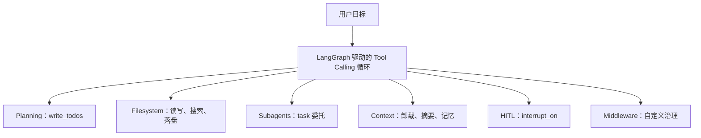
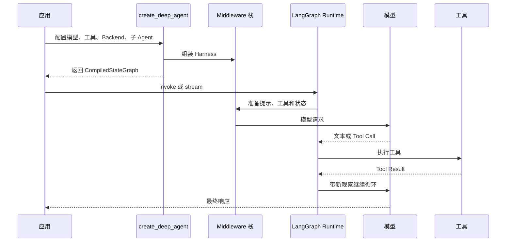
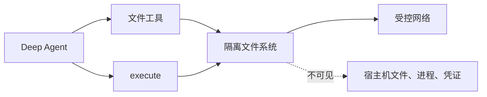
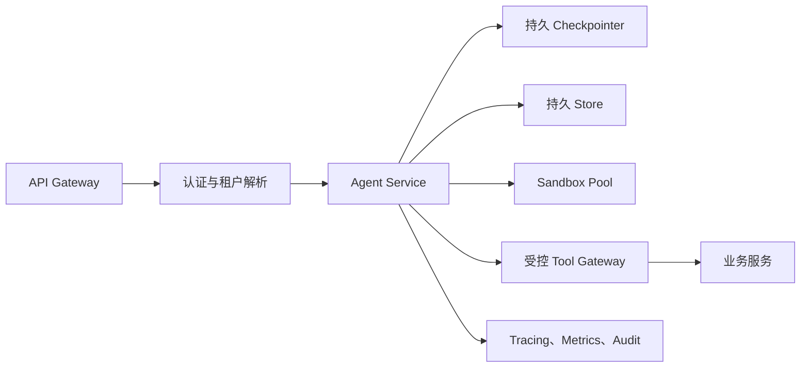

# DeepAgents 框架

DeepAgents 是 LangChain 生态中的高阶 Agent（智能体）框架。它在标准 Tool Calling（工具调用）循环之上，预装了处理复杂、长周期任务所需的 Harness（驾驭层）：使用 `write_todos` 规划和跟踪任务，使用 `task` 把工作委托给上下文隔离的子 Agent，使用虚拟文件系统保存中间结果和扩展有效上下文，使用 `interrupt_on` 在高风险工具执行前暂停并等待人工决策。

它适合深度研究、代码开发、数据分析和跨系统业务协作。简单问答、单次工具调用或路径完全固定的业务流程，通常使用 LangChain `create_agent` 或确定性的 LangGraph Workflow（工作流）更直接。

## 1 从一个长任务开始

### 1.1 普通 Tool Calling 循环遇到的困难

假设 Agent 要完成“阅读二十份资料，比较多个方案，运行验证脚本并生成报告”。基础 Agent 可以不断调用搜索、文件和代码工具，但任务一长，常出现以下问题：

1\. 没有显式计划，完成局部搜索后忘记其他要求。

2\. 原始网页、文件和命令输出持续进入消息历史，上下文越来越臃肿。

3\. 研究、计算、写作和校验共用同一组指令与工具，模型选择困难。

4\. 中途失败后缺少可恢复状态，只能从头执行。

5\. 写文件、发消息、创建订单等动作缺少确定性的人工审批点。

DeepAgents 不改变模型调用工具的基本方式，而是在循环周围加入一套可配置的运行环境。



### 1.2 学习目标与阶段

第一次阅读可以依次完成：

1\. 第 2 章：运行一个最小 Deep Agent，确认模型、工具和框架可用。

2\. 第 3 至 6 章：理解运行循环、规划、文件系统和子 Agent。

3\. 第 7 至 10 章：加入上下文管理、技能、记忆和人工审批。

4\. 第 11 至 14 章：完成权限、流式输出、生产治理和故障排查。

完成基础阶段后，读者应能解释一次调用的输入、模型决策、工具结果、状态变化和最终输出，并能从追踪记录中定位“工具没有调用”或“状态没有恢复”的原因。

## 2 最小可运行闭环

### 2.1 前置条件

DeepAgents 需要支持 Tool Calling 的聊天模型。示例使用 Python 3.11，并通过环境变量传入模型与密钥。框架 API 仍会演进，真实项目应固定并测试依赖版本。

```bash
python -m venv .venv
source .venv/bin/activate
pip install -U deepagents "langchain[openai]"

export OPENAI_API_KEY="替换为本机密钥"
export MODEL_ID="openai:替换为支持工具调用的模型名"
```

### 2.2 创建研究 Agent

```python
import os

from deepagents import create_deep_agent


def search_knowledge_base(query: str) -> str:
    """搜索内部演示知识库。

    Args:
        query: 要查询的技术问题。
    """
    documents = {
        "context engineering": (
            "上下文工程负责选择、组织和压缩模型在当前调用中可见的信息。"
        ),
        "deepagents": (
            "DeepAgents 在工具调用循环之外提供规划、文件系统、子 Agent 和中断。"
        ),
    }
    return documents.get(query.lower(), "未找到匹配资料")


agent = create_deep_agent(
    model=os.environ["MODEL_ID"],
    tools=[search_knowledge_base],
    system_prompt=(
        "你是技术研究助手。先检索再回答；"
        "如果资料不足，要明确说明缺口。"
    ),
)

result = agent.invoke(
    {
        "messages": [
            {
                "role": "user",
                "content": "说明 DeepAgents 与上下文工程的关系",
            }
        ]
    }
)

print(result["messages"][-1].content)
```

运行：

```bash
python agent.py
```

成功判据包括两项：追踪或消息状态中出现 `search_knowledge_base` 调用，最终回答能对应工具返回内容。“程序没有报错”无法单独证明 Agent 完成了任务。若模型直接生成答案，先检查模型是否支持工具调用、工具说明是否让模型知道何时使用，以及系统提示是否与工具职责冲突。

### 2.3 框架自动提供了什么

即使示例只注册一个业务工具，DeepAgents 仍会通过内置中间件加入面向复杂任务的能力：

| 能力 | 典型工具或组件 | 当前用途 |
| --- | --- | --- |
| 计划 | `write_todos` | 管理结构化任务清单 |
| 文件系统 | `ls`、`read_file`、`write_file`、`edit_file`、`glob`、`grep` | 保存和查找中间结果 |
| 委托 | `task` | 启动短生命周期子 Agent |
| 上下文压缩 | 文件卸载与摘要中间件 | 控制长会话规模 |
| 持久执行 | LangGraph Runtime | 流式、检查点、中断和恢复 |

沙箱后端才会额外提供 `execute`；它不会因为安装了 DeepAgents 就自动在宿主机执行命令。

## 3 框架定位与内部架构

### 3.1 LangChain、LangGraph 与 DeepAgents

| 层次 | 解决的问题 | 何时选择 |
| --- | --- | --- |
| LangChain Agent | 模型、工具、消息、中间件等通用抽象 | 简单到中等复杂度 Agent |
| LangGraph | 状态图、持久执行、流式和中断等运行时 | 需要完全控制节点和状态流转 |
| DeepAgents | 带默认 Harness 的高阶 Agent | 长任务、文件密集、委托和记忆 |

DeepAgents 是独立库，底层调用 LangChain 的 Agent 构造能力并使用 LangGraph 运行时。它以更有主张的默认配置组合这些基础能力，位于 LangChain 与 LangGraph 之上。官方定位见 [Deep Agents 概览](https://docs.langchain.com/oss/python/deepagents/overview) 和 [仓库架构说明](https://github.com/langchain-ai/deepagents/blob/main/libs/ARCHITECTURE.md)。

### 3.2 构造阶段与执行阶段

调用 `create_deep_agent()` 时，框架完成模型解析、Backend 解析、主 Agent 中间件组装、默认与自定义子 Agent 构造、系统提示组合，最终生成可调用的 LangGraph 图。

执行每一轮时，LangGraph 把消息、状态、工具和系统提示交给模型。模型可以回答或发出工具调用；工具结果追加到状态后再次调用模型。DeepAgents 的差异主要来自中间件对这个过程的扩展。



### 3.3 Tool 与 Middleware 的边界

Tool 只能在模型已经选择它之后执行。Middleware 可以在模型调用前修改系统提示、工具列表和状态，也可以包裹工具执行、写入审计或做权限检查。

例如 `query_order` 应实现为 Tool；“每次模型调用前根据租户注入可用订单范围”更适合 Middleware；订单写入前的最终权限校验仍必须由业务服务执行。

## 4 Planning：`write_todos`

### 4.1 任务清单是什么

`write_todos` 接收完整的 Todo 列表，每项通常包含内容和状态。状态用于表达待处理、进行中和已完成。它适合三个以上明显步骤、用户一次提出多项要求、工作会根据新信息调整的任务。

```text
用户：分析三个方案并给出验证报告

todos:
1. [in_progress] 收集三个方案的约束与资料
2. [pending] 建立统一比较维度
3. [pending] 运行验证脚本
4. [pending] 撰写并复核报告
```

`write_todos` 每次写入的是当前完整计划，不是追加一条日志。并行调用会产生“哪个完整列表最后生效”的歧义，因此同一模型轮次不应并行写多个 Todo 列表。

### 4.2 计划如何提高可靠性

计划把一个模糊目标变成可观察状态，帮助 Agent 在每次工具调用后重新定位当前工作。它还给应用提供进度展示入口，便于发现停滞和偏航。

它没有把非确定性任务自动变成确定性 Workflow。模型仍然决定如何拆解、何时更新和是否完成。业务关键步骤应由状态机、Schema（模式）校验或审批节点约束，不能只依赖 Todo 文本。

### 4.3 良好计划的准则

1\. 每项描述可执行的产物或状态，例如“验证五个接口响应”，而非“继续处理”。

2\. 粒度足以跟踪，但不把每次文件读取都建成独立 Todo。

3\. 完成一项后及时更新，发现新约束时允许重写计划。

4\. 最后一个 Todo 完成不等于已经向用户交付答案，Agent 仍需输出报告或文件。

5\. 对两三步的简单任务直接执行，避免计划本身消耗额外 Token。

## 5 虚拟文件系统与 Backend

### 5.1 文件系统是上下文外存

模型上下文适合保存当前决策所需的信息，不适合永久承载所有原始数据。DeepAgents 把文件系统作为外部工作记忆：Agent 将大工具结果、草稿、代码和报告写入文件，再通过路径、分页和搜索按需读回。

| 工具 | 职责 | 常见失败 |
| --- | --- | --- |
| `ls` | 列出目录 | 路径不存在、权限拒绝 |
| `read_file` | 分段读取文件 | 文件过大、编码或偏移错误 |
| `write_file` | 创建或写入文件 | 文件冲突、配额不足 |
| `edit_file` | 精确替换局部内容 | 原文本不唯一或不存在 |
| `glob` | 按路径模式找文件 | 模式过宽导致结果过多 |
| `grep` | 按内容模式搜索 | 正则无效、扫描范围过大 |
| `execute` | 在沙箱执行 Shell 命令 | 超时、非零退出、输出截断 |

`edit_file` 的精确匹配语义可以降低误改风险，但仍应在修改后重新读取目标区段并运行验证。

> glob = Glob Pattern Matching（通配符模式匹配）,表示通过通配符模式匹配文件路径
>
> grep = Global Regular Expression Print

### 5.2 Backend 类型

| Backend | 存储位置 | 生命周期 | 适合场景 |
| --- | --- | --- | --- |
| `StateBackend` | LangGraph State | 当前线程 | 计划、草稿、中间结果 |
| `FilesystemBackend` | 本地文件系统 | 本机文件 | 可信开发环境和本地文档 |
| `LocalShellBackend` | 本地文件与进程 | 本机进程 | 受控实验，不适合生产 |
| `StoreBackend` | LangGraph Store | 跨线程 | 长期记忆和共享资料 |
| `CompositeBackend` | 按路径路由 | 组合 | 临时与持久数据分区 |
| Sandbox Backend | 隔离执行环境 | 沙箱实例 | 代码、构建和数据分析 |

默认 `StateBackend` 的文件保存在 Agent 状态中；同一线程多轮访问需要 Checkpointer，子 Agent 写入的文件可以继续被主 Agent 或其他子 Agent读取。详见 [Backends 官方文档](https://docs.langchain.com/oss/python/deepagents/backends)。

> Backend （后端） 在 Agent 系统中，它通常指在后台支撑 Agent 运行的部分
>
> 用户界面 → Agent → Backend → 模型 / 工具 / 数据

### 5.3 CompositeBackend 示例

CompositeBackend（组合后端），路由器，根据文件路径决定使用哪个后端。

这里的 `backend` 不是 Web 开发中的“服务端”，也不是模型后端；它主要决定 `ls`、`read_file`、`write_file`、`edit_file`、`glob`、`grep` 等文件工具在哪里读写数据

```python
from deepagents import create_deep_agent
from deepagents.backends import CompositeBackend, StateBackend, StoreBackend
from langgraph.store.memory import InMemoryStore


agent = create_deep_agent(
    model=os.environ["MODEL_ID"],
    backend=CompositeBackend(
        default=StateBackend(),
        routes={
            "/memories/": StoreBackend(),
        },
    ),
    store=InMemoryStore(),
)
```

路径决定数据生命周期：

```text
/workspace/plan.md       -> StateBackend，线程内草稿
/workspace/raw-data.json -> StateBackend，大型中间数据
/memories/AGENTS.md      -> StoreBackend，跨线程记忆
```

生产 Store 需要持久化实现和明确命名空间。命名空间至少考虑租户、用户、Agent 和环境；测试与生产不能共享同一命名空间。

### 5.4 自定义 Backend 的契约

自定义 Backend 可以把对象存储、数据库或内部文档系统暴露为统一文件语义。实现要保证：

1\. 路径规范化，阻止目录穿越和作用域逃逸。

2\. `read` 支持分页并返回稳定定位信息。

3\. `write` 明确创建、覆盖或冲突语义。

4\. `edit` 在匹配不唯一时拒绝修改，避免误替换。

5\. `grep` 和 `glob` 限制结果数、扫描范围和执行时间。

6\. 错误转换为 Agent 可理解的稳定结果，同时保留服务端可观测信息。

## 6 Subagents：`task` 与上下文隔离

### 6.1 子 Agent 的执行模型

`task` 启动一个 Ephemeral Subagent（短生命周期子 Agent）处理复杂子任务。当前工具的关键模型输入是 `description` 与 `subagent_type`：前者描述完整任务和期望输出，后者选择已注册的 Agent 类型。

```text
task(
    description="研究三个数据库方案，返回对比表、证据来源和推荐边界",
    subagent_type="database-researcher"
)
```

子 Agent 获得独立消息上下文，执行完成后把最终结果封装回主 Agent 的工具消息。繁杂搜索和文件读取留在子上下文，主 Agent 处理精炼结果。当前源码定义见 [SubAgentMiddleware](https://github.com/langchain-ai/deepagents/blob/main/libs/deepagents/deepagents/middleware/subagents.py)。

### 6.2 定义专业子 Agent

```python
researcher = {
    "name": "database-researcher",
    "description": (
        "研究数据库能力、限制与公开资料；"
        "当任务需要多轮检索和证据综合时使用。"
    ),
    "system_prompt": (
        "你是数据库研究员。区分事实和推断；"
        "将详细资料写入 /research/，返回不超过 500 字的证据摘要。"
    ),
    "tools": [search_docs, fetch_document],
}

reviewer = {
    "name": "report-reviewer",
    "description": (
        "检查报告的证据、逻辑、遗漏和格式；"
        "当已有草稿需要独立复核时使用。"
    ),
    "system_prompt": (
        "你是严格的报告审阅者。读取指定文件，"
        "按严重程度返回问题和修订建议，不重做原研究。"
    ),
    "tools": [],
}

agent = create_deep_agent(
    model=os.environ["MODEL_ID"],
    subagents=[researcher, reviewer],
    system_prompt="你是协调者，负责委托、合并结果并交付最终报告。",
)
```

子 Agent 的 `description` 是路由依据，应写明使用条件和职责边界；`system_prompt` 说明执行方法与输出格式；`tools` 显式收窄权限。不同版本对默认工具继承和内置通用子 Agent 的配置可能变化，采用时以 [Subagents 官方文档](https://docs.langchain.com/oss/python/deepagents/subagents) 为准。

### 6.3 并行和异步的区别

相互独立的同步 `task` 调用可以并行执行，但主 Agent 仍等待结果，适合“同时研究三个主题，然后统一写报告”。Async Subagents（异步子 Agent）会立即返回任务标识，主 Agent 可以继续响应、查询状态、追加指令或取消，适合分钟级或小时级后台工作。

| 维度 | 同步子 Agent | 异步子 Agent |
| --- | --- | --- |
| 主 Agent | 等待结果 | 可继续交互 |
| 并发 | 可并行，但整体阻塞 | 后台并行、非阻塞 |
| 中途指导 | 通常不可 | 可追加指令 |
| 取消 | 通常不可 | 可取消 |
| 状态 | 每次任务独立 | 独立线程持续存在 |

异步能力属于快速演进区域，采用前 应核对 [Async Subagents](https://docs.langchain.com/oss/python/deepagents/async-subagents) 的版本、部署拓扑和 Worker 容量要求。

### 6.4 委托的设计边界

子 Agent 适合隔离上下文和专业能力，不是层级越多越好。每次委托都会增加模型调用、延迟和结果压缩损失。可以用下列问题判断：

1\. 子任务是否能用清晰输入和输出契约 独立完成？

2\. 主 Agent 是否仅消费结果，无需全部中间状态？

3\. 子任务是否值得独立的工具、权限、模型或评价指标？

4\. 委托收益是否大于额外成本与失败面？

## 7 Context Engineering

### 7.1 上下文的五个来源

DeepAgents 中的 Context Engineering（上下文工程）管理模型在不同阶段可见的信息。

| 类型 | 内容 | 生命周期 |
| --- | --- | --- |
| 输入上下文 | 系统提示、Memory、Skill 索引、工具说明 | 每次运行与模型调用 |
| Runtime Context | 用户、租户、连接对象和配置 | 当前调用，传播给子 Agent |
| 文件上下文 | 大工具结果、代码、报告 | Backend 决定 |
| 隔离上下文 | 子 Agent 的独立消息历史 | 单次委托或异步线程 |
| 长期记忆 | 跨线程偏好和知识 | Store 决定 |

运行时 密钥供 Tool 或 Middleware 读取即可，不应自动进入模型提示。把凭证写进系统提示会扩大日志、追踪和模型提供方侧的暴露面。

### 7.2 大型工具结果卸载

文件系统中间件可以在工具返回过大时把完整内容写入 Backend，在消息中保留预览和路径。这样模型知道结果存在，又不必每轮携带全部内容。

```text
搜索工具返回 80,000 tokens
        |
        v
/large_tool_results/search-001.txt 保存完整内容
        |
        v
消息中保留：摘要、大小、文件路径和读取建议
```

卸载不等于遗忘。Agent 可以用 `read_file` 分页读取，也可以用 `grep` 先定位相关区段。阈值属于版本和配置细节，不应在业务逻辑中写死官方某一版本的默认值。

### 7.3 对话摘要

当旧消息无法再通过卸载压缩，摘要中间件会把较早历史整理为紧凑状态。一个可恢复的摘要至少包含：

1\. 用户目标和不可违反的约束。

2\. 已完成步骤与验证结果。

3\. 关键决定及原因。

4\. 生成文件、数据和追踪标识。

5\. 未解决问题、失败尝试与下一步。

摘要是有损压缩，不能替代原始审计记录。关键交易参数、审批决定和业务响应应进入结构化存储，而不是只存在自然语言摘要中。

### 7.4 Runtime Context 示例

```python
from dataclasses import dataclass

from deepagents import create_deep_agent
from langchain.tools import ToolRuntime, tool


@dataclass
class RequestContext:
    tenant_id: str
    user_id: str


@tool
def list_projects(runtime: ToolRuntime[RequestContext]) -> str:
    """列出当前用户有权查看的项目。"""
    return query_authorized_projects(
        tenant_id=runtime.context.tenant_id,
        user_id=runtime.context.user_id,
    )


agent = create_deep_agent(
    model=os.environ["MODEL_ID"],
    tools=[list_projects],
    context_schema=RequestContext,
)

result = agent.invoke(
    {"messages": [{"role": "user", "content": "列出我的项目"}]},
    context=RequestContext(tenant_id="tenant-demo", user_id="user-demo"),
)
```

Tool 仍要在服务端按身份查询，不能把 `user_id` 交给模型自由填写。完整上下文分类见 [Context Engineering 官方文档](https://docs.langchain.com/oss/python/deepagents/context-engineering)。

## 8 Skills 与 Memory

### 8.1 Skills 的渐进式披露

Skill 是包含 `SKILL.md` 的目录，可以附带参考文档、脚本和模板。启动时框架只让 Agent 看到足以判断相关性的元数据；匹配任务后读取完整说明；体积更大的引用资源继续按需打开。

```text
skills/
└── incident-analysis/
    ├── SKILL.md
    ├── references/
    │   └── severity-policy.md
    └── scripts/
        └── parse_logs.py
```

```markdown
---
name: incident-analysis
description: 分析服务告警、日志和变更，形成故障时间线与根因候选时使用。
---

# 故障分析

1. 先确认影响范围和时间窗口。
2. 收集同一时间段的指标、日志和变更记录。
3. 区分直接证据、相关现象和推测。
4. 生成时间线、根因候选、验证动作和恢复建议。
```

Skill 适合“如何组合多个工具完成某类任务”，Tool 适合“执行一个有稳定 Schema 的动作”。Skill 中的脚本需要 `execute` 才能运行；如果 Skill 存在 StoreBackend、执行发生在沙箱，还需要应用把脚本同步到沙箱数据面。

### 8.2 Memory 始终加载

Memory 通常使用 `AGENTS.md` 等文件，创建 Agent 时通过 `memory=` 指定。它在对话启动时进入系统提示，适合项目规范、用户偏好和每轮都必须生效的规则。

| 对比项 | Skill | Memory |
| --- | --- | --- |
| 目的 | 专项能力与流程 | 持久上下文与约定 |
| 加载 | 判断相关后按需读取 | 启动时加载 |
| 典型文件 | `SKILL.md` | `AGENTS.md` |
| 体积 | 可以较大并拆引用 | 应保持精简 |
| 示例 | 发布流程、PDF 处理 | 代码风格、用户语言 |

官方用法见 [Skills](https://docs.langchain.com/oss/python/deepagents/skills) 与 [Memory](https://docs.langchain.com/oss/python/deepagents/memory)。

### 8.3 长期记忆的作用域

长期记忆需要把指定路径路由到 `StoreBackend`。常见作用域如下：

1\. Agent 级：所有用户共享经过治理的知识。

2\. 用户级：每个用户拥有独立偏好与历史摘要。

3\. 组织级：同一组织共享政策和领域词汇。

4\. Agent 与用户组合：同一用户在不同 Agent 中拥有不同记忆。

共享政策通常只读，用户偏好可写。记忆更新需要版本或乐观锁，防止并发会话互相覆盖；敏感数据应设置保留期、删除入口和访问审计。

## 9 Human in the Loop：`interrupt_on`

### 9.1 为什么需要确定性中断

模型可能误判工具参数，也可能受到不可信内容中的提示注入影响。只在系统提示里写“执行前询问用户”仍由模型自行遵守。`interrupt_on` 把暂停放到工具执行路径上：命中配置时，LangGraph 保存状态并返回中断；应用提交批准、编辑或拒绝决策后才恢复。

适合审批的工具包括发送外部消息、删除文件、执行付款、创建订单、修改生产配置和高成本 API 调用。纯查询工具通常不需要逐次审批，但仍受鉴权和审计约束。

### 9.2 配置审批

```python
from deepagents import create_deep_agent
from langgraph.checkpoint.memory import InMemorySaver


agent = create_deep_agent(
    model=os.environ["MODEL_ID"],
    tools=[read_order, create_order, cancel_order],
    interrupt_on={
        "read_order": False,
      	# 模型准备调用 create_order 时，Agent 会先暂停，等待人工选择
        "create_order": {
            "allowed_decisions": ["approve", "edit", "reject"],
        },
        "cancel_order": {
            "allowed_decisions": ["approve", "reject"],
        },
    },
    checkpointer=InMemorySaver(),
)
```

`edit` 适合允许审批人修改参数；某些操作只应批准或拒绝。Checkpointer 是恢复中断的必要条件，内存实现只适合本地测试。

### 9.3 中断与恢复

```python
from langgraph.types import Command


config = {"configurable": {"thread_id": "order-thread-001"}}

result = agent.invoke(
    {
        "messages": [
            {"role": "user", "content": "创建一张测试采购订单"}
        ]
    },
    config=config,
    version="v2",
)

if result.interrupts:
    resumed = agent.invoke(
        Command(
            resume={
                "decisions": [
                    {"type": "approve"},
                ]
            }
        ),
        config=config,
        version="v2",
    )
```

恢复必须使用相同 `thread_id`；决策列表与中断中的 action requests 数量和顺序一一对应。Web 服务应持久化 `interrupt_id`、展示参数、审批人、决定和时间，并拒绝重复或过期恢复。详见 [Human-in-the-loop](https://docs.langchain.com/oss/python/deepagents/human-in-the-loop)。

### 9.4 HITL 的边界

HITL 是 Agent 层的安全闸门，不替代后端业务控制。批准创建订单后，订单服务仍要验证用户权限、供应商状态、金额、库存、幂等键和审计字段。审批界面也必须展示真实工具和关键参数，避免用户在信息不足的情况下“盲批”。

## 10 Middleware 与自定义 Harness

### 10.1 中间件可以做什么

DeepAgents 的内置能力本身由中间件组成，应用也可注册自己的 `AgentMiddleware`。常见扩展点包括：

| 时机 | 适合逻辑 |
| --- | --- |
| Agent 开始前 | 加载租户策略、建立运行资源 |
| 模型调用前 | 动态提示、上下文裁剪、模型路由 |
| 模型调用周围 | 重试、缓存、速率限制、追踪 |
| 工具调用周围 | 鉴权、脱敏、参数策略、超时与审计 |
| Agent 结束后 | 评估、候选记忆、产物登记和资源清理 |

自定义中间件插入默认 Harness 时要理解顺序。身份和权限检查应发生在敏感调用之前；摘要发生太早可能丢失尚未持久化的关键字段；资源清理需要覆盖成功、异常和取消路径。

### 10.2 动态提示与工具上下文

模型需要知道的租户策略可以通过动态提示加入；只有工具需要的数据库连接则直接从 Runtime Context 或 Store 读取。把所有运行对象都序列化进提示 既浪费 Token，也会泄露内部细节。

```text
模型需要看到：
当前用户只能查询华东区项目；输出使用中文。

模型不需要看到：
数据库连接串、API Secret、内部连接池对象。
```

### 10.3 失败语义

中间件不应统一“捕获异常并继续”。推荐按职责区分：

1\. 身份、授权、脱敏、审批和审计失败：停止敏感操作，返回明确错误。

2\. 追踪或非关键展示增强失败：可以降级，但需要告警。

3\. 记忆写入失败：通常不回滚已经提交的业务交易，但要记录待补偿任务。

4\. Skill 同步失败：使用已验证旧版本或终止需要该 Skill 的任务，不能悄悄执行未知流程。

## 11 Sandbox 与文件权限

### 11.1 Sandbox Backend

使用实现沙箱协议的 Backend 后，Agent 在文件工具之外获得 `execute`，可运行测试、构建、Git 和数据分析命令。官方支持的提供方和集成会变化，选型时查看 [Sandboxes](https://docs.langchain.com/oss/python/deepagents/sandboxes)。



沙箱配置至少包含只读或最小挂载、非特权用户、CPU/内存/进程/时间限制、出口默认拒绝、临时凭证和执行审计。默认容器隔离强度不足时，应评估 gVisor、Kata Containers 或微型虚拟机。

### 11.2 Filesystem Permissions

DeepAgents 支持声明式文件权限，按规则顺序匹配内置文件工具的读写操作。

```python
from deepagents import FilesystemPermission, create_deep_agent


agent = create_deep_agent(
    model=os.environ["MODEL_ID"],
    backend=backend,
    permissions=[
        FilesystemPermission(
            operations=["write"],
            paths=["/policies/**"],
            mode="deny",
        ),
    ],
)
```

权限只约束 DeepAgents 内置文件工具，不能自动限制自定义 Tool、MCP（Model Context Protocol，模型上下文协议）工具，也不能阻止沙箱 `execute` 通过 Shell 访问沙箱内路径。功能存在版本要求和 CompositeBackend 限制，使用前核对 [Permissions 官方文档](https://docs.langchain.com/oss/python/deepagents/permissions)。

### 11.3 LocalShellBackend 的风险

`LocalShellBackend` 直接在宿主机执行 Shell，没有真正隔离。即使设置根目录，命令仍可能访问进程权限允许的其他资源。它只适合完全受控的本地实验，处理不可信用户输入、网页、代码或 Skill 时应使用沙箱后端。

## 12 持久执行、流式输出与恢复

### 12.1 Checkpointer、Store 与 Backend

| 组件 | 保存内容 | 主要作用域 |
| --- | --- | --- |
| Checkpointer | 图状态、消息、节点执行位置 | 同一线程 |
| Store | 命名空间下的长期数据 | 跨线程 |
| Backend | Agent 可见的文件语义 | 取决于实现 |

Checkpointer 让任务在中断或服务重启后从原状态继续；Store 保存跨线程记忆；Backend 让模型用文件工具访问这些存储。三者可能由相同数据库实现，但职责不能混淆。

### 12.2 流式模式

```python
for message, metadata in agent.stream(
    {
        "messages": [
            {"role": "user", "content": "研究并比较三个方案"}
        ]
    },
    stream_mode="messages",
):
    if getattr(message, "content", None):
        print(message.content, end="", flush=True)
```

应用若还要检测状态与中断，可以使用多个 `stream_mode`，并把内部消息转换为稳定的业务事件，例如 `token`、`tool_start`、`tool_result`、`interrupt`、`error` 和 `done`。不要把 LangGraph 原始对象直接暴露给浏览器，否则依赖升级会破坏前端协议。

### 12.3 恢复的必要条件

1\. 同一任务始终使用稳定的 `thread_id`。

2\. 生产 Checkpointer 是持久化实现，且部署实例共享访问。

3\. Tool 的外部写操作具备幂等键，恢复不会重复提交。

4\. Skill、提示、模型和工具版本被记录，恢复时能够识别环境漂移。

5\. 文件或沙箱资源的生命周期长于恢复窗口，或能够重建。

## 13 `create_deep_agent` 配置速查

API 会随版本变化，下表用于建立职责认知，具体签名以 [Customization](https://docs.langchain.com/oss/python/deepagents/customization) 与当前 API Reference 为准。

| 参数 | 用途 | 常见错误 |
| --- | --- | --- |
| `model` | 模型字符串或实例 | 模型不支持工具调用 |
| `tools` | 业务工具 | 描述含糊、权限过大 |
| `system_prompt` | 业务角色与全局约束 | 塞入大量专项知识 |
| `middleware` | 自定义生命周期逻辑 | 顺序错误、异常静默 |
| `subagents` | 专业子 Agent | 描述重叠、结果过长 |
| `skills` | 按需能力目录 | 来源不可信、脚本未同步 |
| `memory` | 始终加载的记忆文件 | 内容过大、用户串数据 |
| `backend` | 文件与执行环境 | 生命周期和权限混淆 |
| `checkpointer` | 线程状态持久化 | 中断场景漏配 |
| `store` | 跨线程存储 | 使用内存实现误当持久化 |
| `interrupt_on` | 工具审批策略 | 审批后端仍无业务鉴权 |
| `context_schema` | 运行时上下文类型 | 把密钥注入模型提示 |
| `response_format` | 结构化最终结果 | Schema 与自然语言要求冲突 |
| `permissions` | 内置文件工具权限 | 误以为覆盖 Shell 和自定义工具 |

## 14 生产设计

### 14.1 从演示到生产的差距

演示只需“模型调用工具并回答”，生产还要处理身份、权限、并发、恢复、版本、成本和审计。推荐的请求路径如下：



### 14.2 安全基线

1\. Tool 采用最小权限，读写工具分离，用户身份由运行时注入而非模型生成。

2\. 高风险动作使用 `interrupt_on`，业务服务继续执行授权、校验和幂等。

3\. 不可信代码和 Skill 脚本只在沙箱执行，出口网络默认拒绝。

4\. 系统提示、工具结果和追踪日志进行 PII（Personally Identifiable Information，个人身份信息）与密钥脱敏。

5\. Skill、依赖和镜像锁定版本、扫描来源、保留物料清单并支持回滚。

6\. 用户、租户、Agent、Backend 路径、Store 命名空间和沙箱实例多层隔离。

### 14.3 可靠性基线

1\. 为模型、工具、任务和沙箱分别设置超时与调用预算。

2\. 只有幂等读操作或带幂等键的写操作允许自动重试。

3\. 长任务配置持久 Checkpointer，恢复测试覆盖服务重启。

4\. 大结果落盘，子 Agent 返回摘要，关键数据进入结构化存储。

5\. 并发记忆更新使用版本或乐观锁。

6\. Agent 最终回答前验证产物存在、测试通过、引用有效或业务状态已确认。

### 14.4 可观测性与评价

基础指标包括请求数、成功率、延迟、Token、模型错误和工具错误；Agent 质量还要测量计划完成率、委托准确率、引用正确率、审批触发率、人工接管率和业务结果正确率。

每条 Trace（追踪）至少记录模型、提示版本、Skill 版本、Agent 名称、Tool 名称、耗时、结果状态、审批和产物引用。日志中使用脱敏用户标识，不记录密钥和完整敏感 Tool 参数。

固定 Eval（Evaluation，评估）场景应包含正常路径与对抗路径：数据缺失、工具超时、恶意网页指令、错误 Skill、审批拒绝、恢复重复提交、上下文接近上限和子 Agent 返回矛盾结论。

## 15 常见故障与排查

### 15.1 模型没有调用工具

先确认模型支持 Tool Calling，再查看工具名称、描述和参数 Schema 是否清楚。工具说明需要告诉模型何时使用和返回什么；系统提示若同时要求“只根据已有知识回答”，可能抑制工具调用。

### 15.2 `write_todos` 有计划但任务仍未完成

Todo 是模型维护的状态，不是强制状态机。检查每项是否有明确产物与验证，最后一次 `write_todos` 后是否真正输出交付物。关键步骤可以转成确定性节点或工具前置条件。

### 15.3 子 Agent 没有被选择或选择错误

检查 `description` 是否具体说明触发条件，多个子 Agent 的职责是否重叠。观察主 Agent 实际看到的工具描述与 `task` 参数，不要只检查子 Agent 自己的提示。

### 15.4 子 Agent 没有降低上下文

检查子 Agent 是否把原始结果全部返回。要求其把大结果写文件，只返回结论、证据摘要、风险和路径。主 Agent 读取必要区段，避免再次把整个文件放回上下文。

### 15.5 文件在下一轮消失

确认 Backend 类型、Checkpointer 和 `thread_id`。默认 `StateBackend` 的工作文件属于线程状态；跨线程保存需要 StoreBackend 或其他持久后端。

### 15.6 中断后无法恢复

确认创建 Agent 时传入 Checkpointer，恢复请求使用原 `thread_id`，`Command(resume=...)` 的 decisions 与 action requests 顺序一致。服务重启后还要确认 Checkpointer 不是内存实现。

### 15.7 文件权限配置后仍能被读取

确认读取路径来自内置文件工具还是自定义工具、MCP 或沙箱 Shell。`permissions` 只覆盖内置文件工具；沙箱中的 `execute` 需要依赖运行时文件、挂载和操作系统权限。

### 15.8 本地成功、生产失败

对比模型版本、依赖锁、环境变量、Checkpointer、Store、文件路径、沙箱镜像、网络出口、代理超时和 Worker 并发。把“没有抛异常”改为可观察成功判据，例如文件校验和、测试退出码、业务记录状态和审计事件。

## 16 设计评审与面试要点

### 16.1 DeepAgents 与普通 Agent 的差异

两者共享模型—工具循环。DeepAgents 预装了处理长任务的 Harness，包括规划、文件系统、上下文压缩、子 Agent、记忆、技能、审批和 LangGraph 持久执行。优势来自工程环境与默认策略，不是新的模型推理能力。

### 16.2 `write_todos` 与 Workflow 的差异

`write_todos` 是模型可修改的任务清单，适合开放任务中的自组织；Workflow 的节点和边由程序定义，更适合强合规、固定顺序和可证明的控制流。可以让 Agent 用 Todo 管理研究，再由 Workflow 控制订单落库。

### 16.3 Backend 与数据库的差异

Backend 向 Agent 暴露文件语义，底层可以是 State、本地磁盘、Store、对象存储或沙箱。它是一层访问协议，不等于某种具体数据库。选择实现时关注生命周期、权限、并发、一致性和搜索能力。

### 16.4 子 Agent 为什么能隔离上下文

`task` 为子 Agent 构造独立消息输入，子 Agent 的中间工具轨迹不会全部进入主 Agent 消息历史，结束后主要回传最终结果。隔离收益依赖精炼输出；共享 Backend 文件仍可能成为有意的数据交换通道。

### 16.5 为什么 HITL 需要 Checkpointer

中断时执行尚未完成，系统要保存消息、工具请求和图位置；人工决定可能几分钟或几天后到达。Checkpointer 让相同线程从暂停点继续。没有持久状态，恢复请求无法知道批准的是哪个动作。

### 16.6 为什么沙箱不能替代权限系统

沙箱限制代码对宿主机的影响，业务权限决定当前身份能否查询或修改业务数据。沙箱内仍可能持有网络与令牌，因此还需最小凭证、出口控制、Tool 鉴权、审批和审计。

## 17 官方资料

1\. [Deep Agents Overview](https://docs.langchain.com/oss/python/deepagents/overview)

2\. [Deep Agents Quickstart](https://docs.langchain.com/oss/python/deepagents/quickstart)

3\. [Customize Deep Agents](https://docs.langchain.com/oss/python/deepagents/customization)

4\. [Backends](https://docs.langchain.com/oss/python/deepagents/backends)

5\. [Subagents](https://docs.langchain.com/oss/python/deepagents/subagents)

6\. [Async Subagents](https://docs.langchain.com/oss/python/deepagents/async-subagents)

7\. [Context Engineering](https://docs.langchain.com/oss/python/deepagents/context-engineering)

8\. [Skills](https://docs.langchain.com/oss/python/deepagents/skills)

9\. [Memory](https://docs.langchain.com/oss/python/deepagents/memory)

10\. [Human-in-the-loop](https://docs.langchain.com/oss/python/deepagents/human-in-the-loop)

11\. [Permissions](https://docs.langchain.com/oss/python/deepagents/permissions)

12\. [DeepAgents GitHub](https://github.com/langchain-ai/deepagents)
