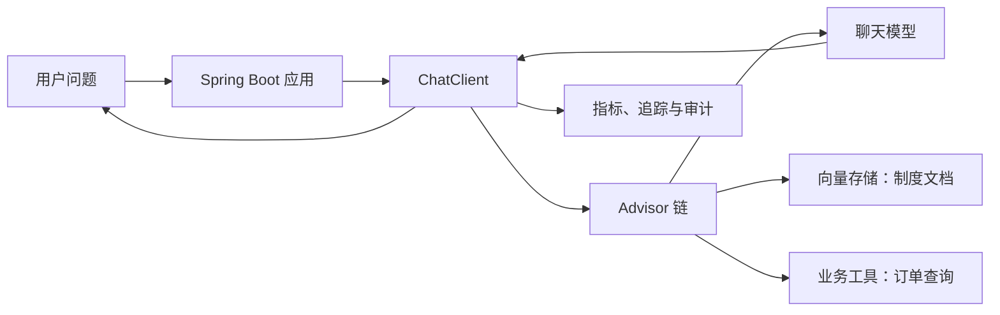
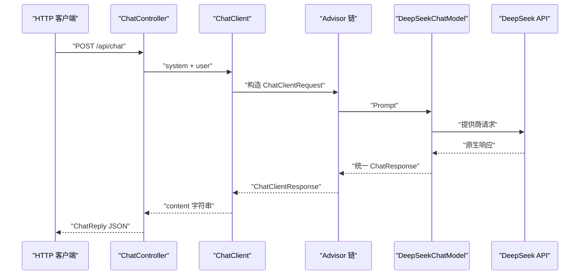
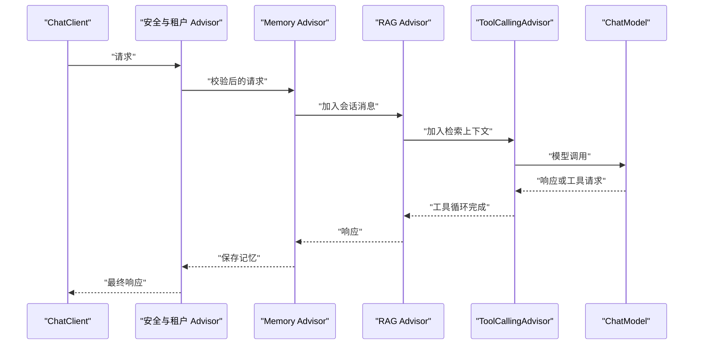
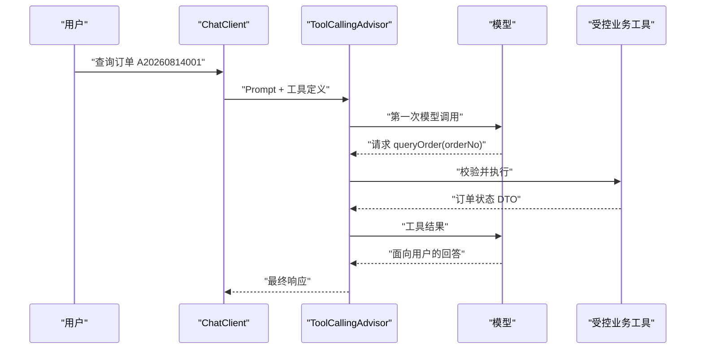
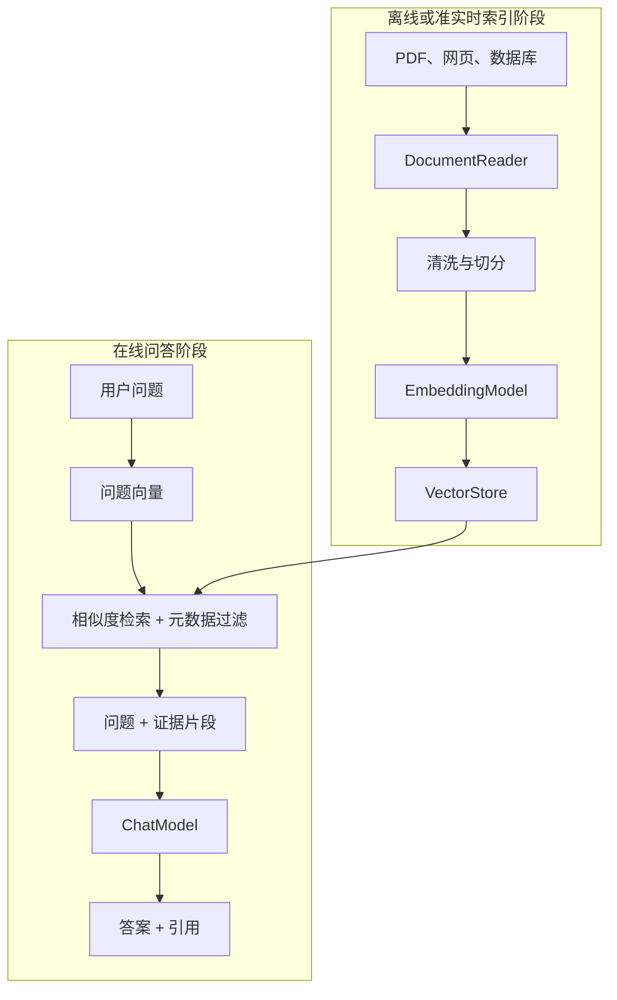
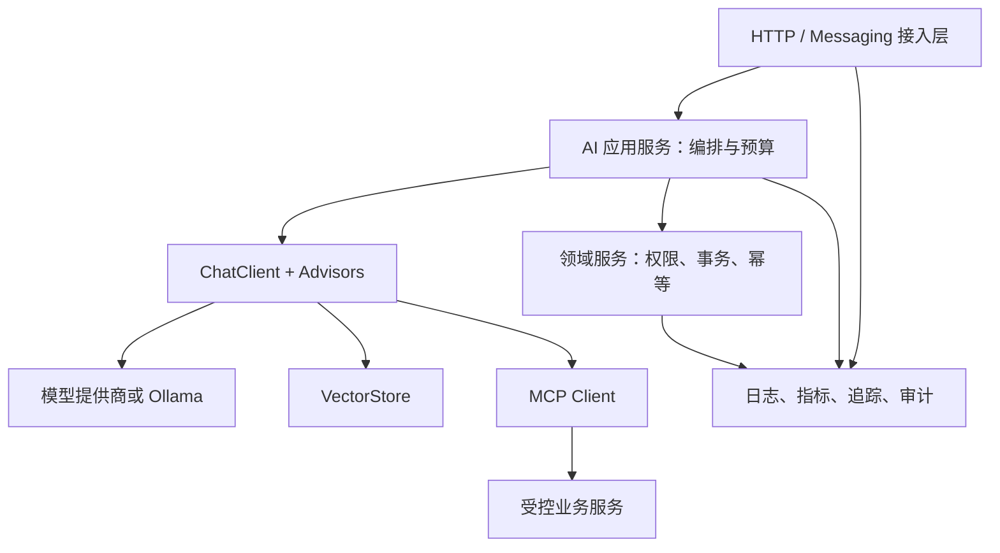
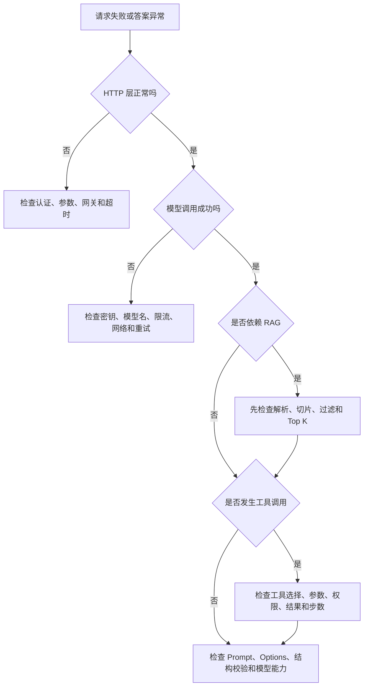

# Spring AI 学习笔记

本文面向具备 Java 与 Spring Boot 基础、第一次开发生成式人工智能应用的读者。学习主线锁定 Spring AI 2.0.0 GA（General Availability，正式可用版）；这一代支持 Spring Boot 4.0.x 和 4.1.x。若项目仍运行在 Spring Boot 3.x，应选择兼容的 Spring AI 1.x，并同时查阅对应版本文档，不能把两个大版本的依赖名、配置项和工具调用机制混用。

Spring AI 的核心目标可以概括为：用 Spring 熟悉的依赖注入、自动配置、可移植接口和可观测性，把企业数据与 API（Application Programming Interface，应用程序编程接口）连接到人工智能模型。它负责应用集成层，不负责训练基础模型，也不会自动解决回答真实性、数据权限或业务幂等问题。

## 1 从一个企业知识问答需求开始

### 1.1 要解决的具体问题

假设售后系统收到问题：“企业版订单付款 20 天后还能退款吗？”业务希望接口返回准确答案，并满足以下可观察要求。

1\. 第一次迭代能够把问题发送给大语言模型，并得到文本响应。

2\. 第二次迭代能够把响应转换为 Java 对象，而不是让业务代码解析随意文本。

3\. 第三次迭代只依据当前生效的退款制度回答，并给出引用来源；资料中没有答案时应明确表示无法确认。

4\. 当用户要求查询具体订单时，模型只能调用经过授权的订单查询工具，不能直接接触数据库凭据。

5\. 上线后能够看到延迟、Token 用量、失败率和工具调用轨迹，同时避免把用户问题与模型回答默认写入日志。

这个需求包含生成式人工智能应用的四条数据路径：用户问题进入模型，企业资料通过 RAG（Retrieval-Augmented Generation，检索增强生成）进入上下文，实时业务数据通过 Tool Calling（工具调用）按需取得，调用指标通过 Spring 可观测性体系进入监控平台。



### 1.2 分阶段学习路线与成功判据

| 阶段 | 阅读范围 | 能完成的任务 | 成功判据 |
| --- | --- | --- | --- |
| 基础闭环 | 第 2～4 章 | 调用一个模型、理解 Prompt、得到结构化输出 | `curl` 收到 HTTP（Hypertext Transfer Protocol，超文本传输协议）200，响应包含非空答案；Java 对象反序列化成功 |
| 上下文增强 | 第 5～7 章 | 加入对话记忆、工具与企业知识 | 不同会话互不串话；工具参数可审计；答案能回溯到检索文档 |
| 系统集成 | 第 8～9 章 | 接入 MCP、设计生产架构 | 权限在服务端校验；故障有超时与降级；敏感内容不进入默认遥测 |
| 质量治理 | 第 10～13 章 | 建立测试、评估、排障和上线门禁 | 固定评测集可重复运行；关键指标有阈值；回滚方案经过演练 |

第一次阅读可以先完成第 2 章，再读第 3～4 章理解刚才运行的代码。已经熟悉 `ChatClient` 的读者可以从第 5 章开始。第 8 章的 MCP 与第 9 章的生产治理建立在工具调用和 RAG 已经走通的前提上。

### 1.3 Spring AI 的职责边界

Spring AI 是人工智能工程的应用框架。它提供统一的模型接口、Spring Boot Starter、Prompt 与消息模型、结构化输出、向量存储、ETL（Extract、Transform、Load，抽取、转换、加载）、RAG、对话记忆、工具调用、MCP、评估和可观测性集成。

它与相邻组件的分工如下。

| 组件 | 主要职责 | 不负责的部分 |
| --- | --- | --- |
| 模型提供商或本地模型运行时 | 推理、Token 生成、模型托管 | 企业应用的鉴权、业务事务和审计 |
| Spring AI | 把模型能力以 Spring 风格接入应用，组织上下文、工具和数据 | 保证模型一定正确、替代领域规则引擎 |
| 向量数据库 | 保存向量与元数据，执行相似度检索 | 判断生成答案在业务上是否真实 |
| MCP Server | 以标准协议暴露工具、资源和 Prompt | 自动授予调用者业务权限 |
| 业务服务 | 权限、事务、幂等、数据一致性和领域约束 | 推断模型的内部决策过程 |

“统一接口”表示常见代码可以复用，不表示不同模型完全等价。模型对多模态、工具调用、原生结构化输出、上下文窗口、流式响应和参数语义的支持存在差异。切换提供商时应重新运行契约测试和质量评测。

### 1.4 版本基线与旧资料识别

Spring AI 当前官方文档列出的稳定线包括 2.0.0、1.1.8 和 1.0.9。本文使用 2.0.0 BOM（Bill of Materials，物料清单）统一管理组件版本，并只依赖 Maven Central，不添加快照仓库。版本基线可在[官方 Getting Started](https://docs.spring.io/spring-ai/reference/getting-started.html)核对。

阅读旧教程时可以用下表识别迁移风险。

| 旧写法或旧机制 | 2.0 主线中的处理 |
| --- | --- |
| `1.0.0-SNAPSHOT` 与 Spring Snapshot 仓库 | 使用稳定版 `spring-ai-bom:2.0.0` 与 Maven Central |
| Spring Boot 3.x 示例 | 2.0 使用 Spring Boot 4.0.x/4.1.x；Boot 3 项目保留在兼容的 1.x |
| `spring.ai.<provider>.chat.enabled` | 使用顶层选择项 `spring.ai.model.chat=<provider>`；旧 enabled 属性已移除 |
| 由各个 `ChatModel` 内部执行工具循环 | 2.0 由 `ChatClient` 自动注册的 `ToolCallingAdvisor` 驱动 |
| MCP 远程 SSE 作为首选 | SSE 在 2.0 已弃用；远程连接优先 Streamable HTTP |
| 直接 `ChatClient.builder(chatModel)` 创建多模型客户端 | 需要保留自动配置定制与可观测性时，使用 `ChatClientBuilderConfigurer` |

升级前应阅读[官方 Upgrade Notes](https://docs.spring.io/spring-ai/reference/upgrade-notes.html)，尤其检查 Starter 坐标、配置键、MCP 包名和 Tool Calling 生命周期。

## 2 完成第一个可运行的聊天接口

### 2.1 输入、动作与输出

本章使用 DeepSeek 的远程模型完成最小闭环。输入是 JSON（JavaScript Object Notation，JavaScript 对象表示法）请求 `{"question":"用三句话解释 Spring AI"}`；应用通过 `ChatClient` 调用模型；输出是 `{"answer":"..."}`。选择 DeepSeek 只是为了与业务示例一致，后续核心接口同样适用于 OpenAI、Anthropic、Google、Ollama 等实现。

实际运行需要 Java 17 或更高版本、Maven 3.6.3 或更高版本、可访问模型服务的网络以及有效的 DeepSeek API Key。密钥只能从环境变量或密钥管理系统注入，不能提交到 Git 仓库、镜像或示例响应中。

### 2.2 创建 Maven 工程

可以通过 [Spring Initializr](https://start.spring.io/) 选择 Spring Boot 4.0.x、Spring Web、Validation 和 DeepSeek AI Model。手工创建时，`pom.xml` 的核心内容如下。Spring Boot 的补丁版本应使用团队经过验证的 4.0.x 或 4.1.x 版本；示例用 4.0.0 展示兼容基线。

```xml
<?xml version="1.0" encoding="UTF-8"?>
<project xmlns="http://maven.apache.org/POM/4.0.0"
         xmlns:xsi="http://www.w3.org/2001/XMLSchema-instance"
         xsi:schemaLocation="http://maven.apache.org/POM/4.0.0 https://maven.apache.org/xsd/maven-4.0.0.xsd">
    <modelVersion>4.0.0</modelVersion>

    <parent>
        <groupId>org.springframework.boot</groupId>
        <artifactId>spring-boot-starter-parent</artifactId>
        <version>4.0.0</version>
        <relativePath/>
    </parent>

    <groupId>com.example</groupId>
    <artifactId>spring-ai-customer-service</artifactId>
    <version>0.0.1-SNAPSHOT</version>

    <properties>
        <java.version>17</java.version>
        <spring-ai.version>2.0.0</spring-ai.version>
    </properties>

    <dependencyManagement>
        <dependencies>
            <dependency>
                <groupId>org.springframework.ai</groupId>
                <artifactId>spring-ai-bom</artifactId>
                <version>${spring-ai.version}</version>
                <type>pom</type>
                <scope>import</scope>
            </dependency>
        </dependencies>
    </dependencyManagement>

    <dependencies>
        <dependency>
            <groupId>org.springframework.boot</groupId>
            <artifactId>spring-boot-starter-web</artifactId>
        </dependency>
        <dependency>
            <groupId>org.springframework.boot</groupId>
            <artifactId>spring-boot-starter-validation</artifactId>
        </dependency>
        <dependency>
            <groupId>org.springframework.ai</groupId>
            <artifactId>spring-ai-starter-model-deepseek</artifactId>
        </dependency>
        <dependency>
            <groupId>org.springframework.boot</groupId>
            <artifactId>spring-boot-starter-test</artifactId>
            <scope>test</scope>
        </dependency>
    </dependencies>

    <build>
        <plugins>
            <plugin>
                <groupId>org.springframework.boot</groupId>
                <artifactId>spring-boot-maven-plugin</artifactId>
            </plugin>
        </plugins>
    </build>
</project>
```

BOM 只管理 Spring AI 模块的相容版本，不会替代 Spring Boot Parent，也不会自动引入具体模型 Starter。稳定版已经发布到 Maven Central，只有使用 Snapshot 开发版本时才需要额外仓库。

### 2.3 用环境变量配置模型

创建 `src/main/resources/application.yml`：

```yaml
spring:
  application:
    name: spring-ai-customer-service
  ai:
    model:
      chat: deepseek
    deepseek:
      api-key: ${DEEPSEEK_API_KEY}
      chat:
        model: deepseek-chat

server:
  port: 8080
```

`spring.ai.model.chat=deepseek` 选择参与自动配置的聊天模型。`api-key` 没有业务安全的默认值；环境变量缺失时，让应用启动失败比静默使用测试密钥更容易发现部署错误。模型名是提供商能力的一部分，上线前应在目标账户和区域验证可用性。

### 2.4 编写启动类与接口

```java
package com.example.customer;

import org.springframework.boot.SpringApplication;
import org.springframework.boot.autoconfigure.SpringBootApplication;

@SpringBootApplication
public class CustomerServiceApplication {

    public static void main(String[] args) {
        SpringApplication.run(CustomerServiceApplication.class, args);
    }
}
```

```java
package com.example.customer;

import jakarta.validation.Valid;
import jakarta.validation.constraints.NotBlank;
import org.springframework.ai.chat.client.ChatClient;
import org.springframework.web.bind.annotation.PostMapping;
import org.springframework.web.bind.annotation.RequestBody;
import org.springframework.web.bind.annotation.RequestMapping;
import org.springframework.web.bind.annotation.RestController;

@RestController
@RequestMapping("/api/chat")
public class ChatController {

    private final ChatClient chatClient;

    public ChatController(ChatClient.Builder builder) {
        this.chatClient = builder
                .defaultSystem("""
                        你是企业售后知识助手。
                        回答应准确、简洁；信息不足时明确说明无法确认。
                        不猜测订单状态、价格或制度条款。
                        """)
                .build();
    }

    @PostMapping
    public ChatReply chat(@Valid @RequestBody ChatRequest request) {
        String answer = chatClient.prompt()
                .user(request.question())
                .call()
                .content();
        return new ChatReply(answer);
    }

    public record ChatRequest(@NotBlank String question) {
    }

    public record ChatReply(String answer) {
    }
}
```

Spring Boot 在模型 Starter 生效后创建 `ChatModel`，并提供原型作用域的 `ChatClient.Builder`。构造器用 Builder 建出本控制器自己的不可变客户端配置；每次请求再通过 `prompt()` 创建请求规格。系统消息规定应用行为，用户消息保存当前请求。`call()` 选择同步响应模式，真正的模型调用在随后执行 `content()`、`chatResponse()`、`entity()` 等终结方法时发生；这里的 `content()` 同时提取第一条主要文本结果。

### 2.5 启动、调用与成功判据

```bash
export DEEPSEEK_API_KEY='替换为个人开发密钥'
./mvnw spring-boot:run
```

若工程没有 Maven Wrapper，则执行：

```bash
mvn spring-boot:run
```

另开终端调用接口：

```bash
curl --fail-with-body \
  -H 'Content-Type: application/json' \
  -d '{"question":"用三句话解释 Spring AI"}' \
  http://localhost:8080/api/chat
```

成功不能只用“没有异常”判断。应同时满足 HTTP 状态码为 200、响应是合法 JSON、`answer` 非空、服务端没有认证或重试耗尽日志。模型措辞每次可能变化，因此此处不应断言完整字符串相等。

上述示例需要真实模型服务与个人密钥，本文没有替读者执行远程推理。代码是否能拿到回答还受账户余额、模型可用性、网络代理和提供商限流影响。

### 2.6 一次请求在运行时发生了什么



模型 Starter 屏蔽了请求序列化和响应反序列化，但远程调用仍然受网络延迟、连接池、限流和账单约束。`call()` 只选择同步调用模式；执行 `content()`、`chatResponse()` 或 `entity()` 等终结方法后，当前请求线程才会阻塞到模型响应完成。吞吐量评估应以高分位延迟而不是普通数据库接口经验为依据。

### 2.7 最常见的首次失败

| 现象 | 优先检查 | 机制原因 | 修复与验证 |
| --- | --- | --- | --- |
| 启动时报 API Key 缺失 | `DEEPSEEK_API_KEY` 是否进入启动进程 | IDE、终端和容器拥有不同环境变量 | 在同一启动入口注入密钥；不要打印密钥本身 |
| HTTP 401/403 | 密钥状态、账户权限、代理是否改写请求 | 提供商拒绝认证或授权 | 用提供商控制台确认密钥与模型权限，再重新调用 |
| HTTP 429 | 限流、余额和并发量 | 请求速率或 Token 配额超限 | 降低并发，按 `Retry-After` 退避；观察重试是否放大流量 |
| 启动找不到 `ChatClient.Builder` | Starter、BOM 与 `spring.ai.model.chat` | 没有可用 `ChatModel`，自动配置条件不成立 | 查看条件评估报告与依赖树 |
| 本地成功、容器失败 | DNS（Domain Name System，域名系统）、代理、证书、环境变量与出口策略 | 构建环境和运行环境的网络边界不同 | 在容器内做 DNS/TLS（Transport Layer Security，传输层安全）连通性检查，不把跳过证书校验当修复 |
| 响应很慢 | 模型、输入长度、输出上限和重试 | 首 Token 延迟与生成 Token 数都会增加耗时 | 分别记录首 Token 和总耗时，限制输入与输出预算 |

## 3 回看最小示例中的核心抽象

### 3.1 从 `Model` 到具体模型

Spring AI 用 `Model<Request, Response>` 描述统一的请求—响应关系，再按能力细分为 `ChatModel`、`EmbeddingModel`、`ImageModel`、`TranscriptionModel` 等。统一层负责可移植的主干，提供商专用 Options 和底层 API 负责差异化能力。

| 能力 | 主要输入 | 主要输出 | 常见用途 |
| --- | --- | --- | --- |
| `ChatModel` | `Prompt` | `ChatResponse` | 问答、摘要、分类、工具编排 |
| `StreamingChatModel` | `Prompt` | `Flux<ChatResponse>` | 边生成边展示、降低感知等待时间 |
| `EmbeddingModel` | 文本或 `Document` | 浮点向量 | 语义检索、聚类、RAG |
| `ImageModel` | `ImagePrompt` | `ImageResponse` | 文生图 |
| `TranscriptionModel` | 音频资源与选项 | 转写文本与元数据 | Speech-to-Text，语音转文本 |
| Speech Model | 文本与语音选项 | 音频 | Text-to-Speech，文本转语音 |
| `ModerationModel` | 待检测内容 | 分类结果 | 内容安全辅助判断 |

模型类型及支持提供商会随版本变化，应从[官方 Spring AI API 总览](https://docs.spring.io/spring-ai/reference/api/)进入相应实现文档核对。

### 3.2 `ChatModel` 与 `ChatClient` 的选择

`ChatModel` 是接近提供商调用的低层接口，输入 `Prompt`，输出 `ChatResponse`。它适合基础设施组件、自定义编排器以及确实需要查看完整模型响应的场景。

`ChatClient` 构建在 `ChatModel` 之上，提供类似 `RestClient` 的 fluent API（链式 API），并组合 Advisor、Memory、RAG、结构化输出、工具调用和可观测性。普通聊天、知识库问答和工具型助手通常以 `ChatClient` 为应用入口。Spring AI 2.0 中，直接调用 `ChatModel` 不会自动执行模型返回的工具请求；`ChatClient` 会通过自动注册的 `ToolCallingAdvisor` 驱动工具循环。

```java
// 低层调用：需要完整响应和元数据时使用。
ChatResponse response = chatModel.call(new Prompt("解释向量检索"));
String text = response.getResult().getOutput().getText();

// 应用层调用：组合 Prompt、Advisor 和结果转换更方便。
String content = chatClient.prompt()
        .user("解释向量检索")
        .call()
        .content();
```

### 3.3 `Prompt`、`Message` 与角色

`Prompt` 包含一组有顺序的 `Message` 和可选的 `ChatOptions`。消息的角色影响模型如何解释内容。

| 角色或类型 | 数据来源 | 生命周期与职责 |
| --- | --- | --- |
| System Message | 应用配置或受控模板 | 设定助手职责、边界与输出要求；不等于安全边界 |
| User Message | 当前用户或上游系统 | 表达本轮任务，可附带图片、音频等 Media |
| Assistant Message | 模型历史输出 | 让后续调用看到先前回答，也可包含工具调用请求 |
| Tool Response Message | 应用执行工具后的结果 | 把结构化工具结果送回模型，供模型继续推理 |

系统消息优先级通常高于用户消息，但模型仍可能受 Prompt Injection（提示注入）影响。权限判断、SQL（Structured Query Language，结构化查询语言）约束、租户隔离和写操作确认需要由普通 Java 代码实施，不能依赖一句“忽略恶意指令”的系统 Prompt。

### 3.4 启动选项、请求选项与覆盖语义

模型创建时的默认 Options 适合配置全局模型名、温度和输出上限；请求 Options 适合针对某一次任务调整。使用 `ChatModel.call(Prompt)` 时，Prompt 内的完整选项会覆盖模型启动选项；使用 `ChatClient` 时可以用增量方式定制当前请求。具体覆盖规则见[官方 Chat Model API](https://docs.spring.io/spring-ai/reference/api/chatmodel.html)。

```java
String answer = chatClient.prompt()
        .user("把这段投诉归类为产品、物流或支付问题：包裹三天没有更新")
        .options(ChatOptions.builder()
                .temperature(0.0)
                .maxTokens(80)
                .build())
        .call()
        .content();
```

`temperature` 越低，输出通常越稳定，适合分类、抽取和查询改写；较高温度可增加生成多样性，但不应被解释成严格概率或质量刻度。不同提供商对 `maxTokens`、`topP`、`topK` 和停止序列的支持不同，生产配置应由目标模型的集成测试证明。

“未提供参数”“显式提供 `null`”“提供零值”并不总是相同状态。例如 `temperature=0.0` 是明确请求确定性更强的采样，省略 temperature 才会走模型或 Starter 的默认值。

### 3.5 `ChatResponse` 中不只有文本

`ChatResponse` 可以包含多个 `Generation`，每个结果含 `AssistantMessage` 与生成元数据；响应本身还有模型、Token Usage、限流等元数据，实际字段取决于提供商。业务仅需文本时用 `content()`；计费、排障、工具调用或结束原因分析需要保留 `ChatResponse` 或 `ChatClientResponse`。

```java
ChatResponse response = chatClient.prompt()
        .user("给退款政策生成一个十字以内标题")
        .call()
        .chatResponse();

String content = response.getResult().getOutput().getText();
var metadata = response.getMetadata();
```

响应对象存在不代表业务成功。还应检查文本是否为空、结构化响应是否通过校验、工具是否执行成功、RAG 是否检索到合格证据，以及结束原因是否表示达到输出上限。

### 3.6 同步调用与流式调用

同步调用等待完整响应，代码与错误处理较直观；流式调用返回 `Flux`，可把模型生成片段持续推送给前端。流式响应缩短的是用户看到首段内容的时间，不一定减少模型总耗时或 Token 成本。

```java
@GetMapping(value = "/stream", produces = MediaType.TEXT_EVENT_STREAM_VALUE)
public Flux<String> stream(@RequestParam String question) {
    return chatClient.prompt()
            .user(question)
            .stream()
            .content();
}
```

若应用以 WebFlux 提供端到端非阻塞流，应使用 `spring-boot-starter-webflux` 并检查中间链路是否缓冲。Servlet、反向代理、API Gateway（应用程序编程接口网关）和浏览器客户端都可能把片段缓存后一次性显示。取消订阅时还要确认下游模型请求是否真正取消，避免用户离开页面后仍继续计费。

流式接口的验证至少包含首事件到达时间、事件顺序、中文分片拼接、客户端断开、模型中途失败和代理空闲超时。不能只用浏览器最终能看到完整文本来证明流式链路正确。

### 3.7 多模型与可移植性的现实边界

一个应用可以为通用问答、低成本分类、图像理解和高质量评估选择不同模型。相同模型类型需要多个配置时，可以从原型作用域的自动配置 Builder 创建多个 `ChatClient`。不同 `ChatModel` 类型并存时，直接 `ChatClient.builder(chatModel)` 会绕过自动配置中的可观测性和 `ChatClientBuilderCustomizer`；Spring AI 2.0 推荐用 `ChatClientBuilderConfigurer` 为指定模型构建客户端，并明确 `@Primary` 或 `@Qualifier`。

路由条件应来自业务可观测事实，例如数据等级、是否需要视觉、允许成本、目标延迟和模型健康状态。模型自行决定把请求发给哪个高权限模型会使审计与成本控制变得困难。

## 4 让模型输出可以进入业务代码

### 4.1 Prompt 是接口契约的一部分

Prompt 决定模型看到的任务、背景、约束和输出要求。稳定的业务 Prompt 通常包含角色边界、输入数据、允许依据、拒答条件、输出格式和少量代表性示例。它应像代码一样进入版本控制、评审和测试。

下面的分类 Prompt 比“判断类型”更可验证：

```text
你是售后工单分类器。
只能返回 PRODUCT、LOGISTICS、PAYMENT、OTHER 中的一个值。
无法判断时返回 OTHER。

工单内容：{ticket}
```

这里的有限标签降低了解析歧义；“无法判断”定义了缺省行为；占位符使同一模板可以复用。系统消息仍不能代替输入校验，用户内容应作为变量传入，不要通过字符串拼接把它变成新的系统规则。

### 4.2 使用模板时隔离指令与数据

`ChatClient` 可以在消息文本中替换变量：

```java
String summary = chatClient.prompt()
        .system("你是客服质检助手，只总结事实，不推测客户动机。")
        .user(user -> user.text("""
                        请将下列工单压缩为 80 字以内摘要。

                        <ticket>
                        {ticket}
                        </ticket>
                        """)
                .param("ticket", ticketText))
        .call()
        .content();
```

XML 风格边界只是帮助模型区分数据，不构成解析器级隔离。若 `ticketText` 来自不可信内容，它仍可能包含“忽略前文”等间接注入指令。应用应限制它能影响的动作，把读操作和写操作工具分开，并在工具层重新鉴权。

模板渲染器与 RAG Advisor 的 Prompt Template 属于两个阶段：前者渲染初始 system/user 消息；后者负责把检索上下文合并进查询。自定义 RAG 模板时要保留该 Advisor 要求的 `query` 与 `question_answer_context` 占位符。

### 4.3 用 Java Record 接收结构化输出

业务要创建退款审核任务时，比自由文本更合适的结果是类型明确的对象：

```java
import jakarta.validation.constraints.Max;
import jakarta.validation.constraints.Min;
import jakarta.validation.constraints.NotBlank;
import jakarta.validation.constraints.NotNull;
import java.util.List;

public record RefundAssessment(
        boolean eligible,
        @NotBlank String reason,
        @Min(0) @Max(100) int confidence,
        @NotNull List<@NotBlank String> missingFacts) {
}
```

```java
RefundAssessment assessment = chatClient.prompt()
        .system("""
                你是退款资格预审助手。
                confidence 取 0 到 100；信息不足时 eligible=false，
                并把缺失信息写入 missingFacts。
                结果只用于人工审核，不能直接触发退款。
                """)
        .user("订单已付款 20 天，商品未拆封，但没有提供商品类别。")
        .call()
        .entity(RefundAssessment.class);
```

`entity(Class<T>)` 会根据目标类型生成格式说明，把模型文本转换为 Java 对象。这样减少了手写 JSON 解析，但转换成功仍不等于字段在业务上合理。Record 上的 Bean Validation（Bean 校验）注解只有在应用显式调用 `Validator.validate(assessment)`，或结果继续经过启用了方法校验的边界时才会执行；`entity()` 本身不会自动触发这些注解。

假设业务服务已经通过构造器注入 `jakarta.validation.Validator`，可以在结果进入领域逻辑前执行：

```java
import jakarta.validation.ConstraintViolation;
import java.util.Set;

Set<ConstraintViolation<RefundAssessment>> violations =
        validator.validate(assessment);

if (!violations.isEmpty()) {
    throw new IllegalStateException("模型结果未通过字段校验");
}
```

这一步的成功判据是对象非空、`reason` 和 `missingFacts` 满足非空约束、`confidence` 位于 0～100。通过字段校验后，领域服务仍要核对订单类型、付款日期、商品状态和当前操作者权限；`eligible` 不能越过正式规则与人工审批直接触发退款。

### 4.4 Prompt 约束、原生结构化输出与校验

默认的 Structured Output Converter 会在调用前追加格式指令，在调用后解析模型文本。这是一种 best effort（尽力而为）机制，模型可能返回无效 JSON、遗漏字段或产生语义矛盾。

支持 JSON Schema 的模型可以启用提供商原生结构化输出，并同时要求 Spring AI 在返回对象前校验响应 Schema：

```java
RefundAssessment result = chatClient.prompt()
        .user("评估退款资格：订单已付款 20 天，商品未拆封。")
        .call()
        .entity(RefundAssessment.class, spec -> spec
                .useProviderStructuredOutput()
                .validateSchema());
```

`useProviderStructuredOutput()` 把 Schema 交给提供商约束解码，通常比纯 Prompt 稳定；它要求底层模型支持 `StructuredOutputChatOptions`，不能因普通聊天可用就推断该能力也可用。`validateSchema()` 在 JSON 不符合目标 Schema 时把错误反馈给模型并重试，默认最多重复 3 次，因此会增加延迟和 Token 成本，而且不能用于流式结果。只需要可移植的 Prompt 格式约束时，可以单独使用 `validateSchema()`；部分提供商不接受顶层数组 Schema，此时用包含列表字段的 Record 包装。Spring AI 默认不全局启用原生模式，原因是模型支持并不一致，详见[Structured Output Converter](https://docs.spring.io/spring-ai/reference/api/structured-output-converter.html)。

生产校验建议形成三层：第一层验证 JSON 与 Java 类型；第二层验证字段范围、枚举和交叉字段关系；第三层用领域服务确认订单、金额与权限。结构错误可以在有限次数内重试，业务规则错误应返回可解释失败，不能让模型不断改写直到“猜中”。

### 4.5 多模态输入与专用输出模型

多模态聊天模型可以在同一 `UserMessage` 中接收文本和 Media。下面让模型描述类路径中的商品图片：

```java
String description = chatClient.prompt()
        .user(user -> user
                .text("描述商品包装是否存在肉眼可见破损；无法判断时说明原因。")
                .media(MimeTypeUtils.IMAGE_JPEG,
                        new ClassPathResource("/claim/package.jpg")))
        .call()
        .content();
```

`MimeType` 必须与实际内容一致，文件大小和格式要满足目标模型限制。图片中也可能包含恶意文字指令，因此图像 OCR（Optical Character Recognition，光学字符识别）内容与普通用户文本具有相同的不可信等级。

聊天模型的多模态输入通常仍返回文本。生成图片应使用 `ImageModel`，语音转写使用 `TranscriptionModel`，文本转语音使用 Speech Model。统一抽象只覆盖共同能力；分辨率、音色、时间戳粒度和推理内容等专用功能需要提供商 Options。多模态基础接口见[官方 Multimodality API](https://docs.spring.io/spring-ai/reference/api/multimodality.html)。

## 5 用 Advisor 与 Chat Memory 组合横切能力

### 5.1 Advisor 链解决什么问题

同一个调用可能需要加入对话记忆、检索知识、执行工具、记录指标和校验输出。如果这些逻辑都写在 Controller 中，顺序、复用和测试很快失控。Advisor 提供围绕 `ChatClient` 请求和响应的拦截链：请求向内依次处理，模型响应再沿链向外返回。



2.0 的核心接口区分同步调用的 `CallAdvisor` 与流式调用的 `StreamAdvisor`。较小的 order 值先进入链，返回时顺序相反。涉及递归工具循环时，顺序还决定某个 Advisor 是每轮执行还是整次用户请求只执行一次，应通过集成测试观察真实调用次数。机制细节见[官方 Advisors API](https://docs.spring.io/spring-ai/reference/api/advisors.html)。

### 5.2 默认 Advisor 与请求级参数

适用于每次调用的 Advisor 可以在创建客户端时注册；会话编号、租户过滤条件等请求数据在当前调用传入：

```java
ChatClient chatClient = builder
        .defaultAdvisors(
                MessageChatMemoryAdvisor.builder(chatMemory).build(),
                QuestionAnswerAdvisor.builder(vectorStore).build())
        .build();

String answer = chatClient.prompt()
        .advisors(spec -> spec
                .param(ChatMemory.CONVERSATION_ID, conversationId)
                .param(QuestionAnswerAdvisor.FILTER_EXPRESSION,
                        "tenantId == '" + validatedTenantId + "'"))
        .user(question)
        .call()
        .content();
```

示例强调参数位置，不建议直接拼接未经校验的租户标识。元数据过滤表达式的值应来自认证上下文和白名单编码器，不能相信请求体自报的 `tenantId`。

### 5.3 Chat Memory 与完整聊天历史的区别

大语言模型调用本身无状态。所谓“记住上一轮”，实际过程是应用保存先前消息，在下一次请求时重新发送相关消息。`ChatMemory` 管理模型当前需要看到的上下文窗口；完整 Chat History 是审计或用户界面需要的全量记录，两者的保留策略和合规要求不同。

Spring AI 默认自动配置 `MessageWindowChatMemory` 与 `InMemoryChatMemoryRepository`。内存仓库适合单实例开发验证，进程重启会丢失，多实例之间也不共享。生产可以使用 JDBC、Cassandra、Neo4j 等 Repository，具体实现能力并不完全相同。

```java
@Bean
ChatMemory chatMemory(ChatMemoryRepository repository) {
    return MessageWindowChatMemory.builder()
            .chatMemoryRepository(repository)
            .maxMessages(20)
            .build();
}
```

会话调用要传稳定且不可猜测的 `conversationId`：

```java
String answer = chatClient.prompt()
        .advisors(a -> a.param(ChatMemory.CONVERSATION_ID, conversationId))
        .user("我刚才问的订单号是什么？")
        .call()
        .content();
```

所有 Memory Advisor 都要求 `ChatMemory.CONVERSATION_ID`；遗漏时会在运行期抛出 `IllegalArgumentException`，不存在可安全依赖的默认会话编号。服务器应验证当前身份是否有权访问该 conversationId。若直接接受客户端传来的任意编号，攻击者可能读取其他用户的上下文。删除账户或会话时，还应同步清理聊天历史、Memory、向量化长期记忆和缓存副本。

### 5.4 持久化记忆与工具消息

JDBC（Java Database Connectivity，Java 数据库连接）记忆仓库的 Starter 坐标是 `spring-ai-starter-model-chat-memory-repository-jdbc`。`spring.ai.chat.memory.repository.jdbc.initialize-schema` 默认值为 `embedded`，生产数据库通常不会自动建表；团队通常用 Flyway 或 Liquibase 管理 Schema 迁移。Spring AI 1.x 升级到 2.0 时，已有表还要增加并回填用于稳定排序的 `sequence_id`，不能只升级依赖后继续使用旧表结构。

工具调用会产生 Assistant Tool Call 与 Tool Response 消息。Spring AI 2.0 默认把 Memory Advisor 放在 `ToolCallingAdvisor` 外层：工具循环由后者维护内部历史，Memory Repository 只保存本轮最终的 User/Assistant 交换，不保存中间工具消息。这个默认值避免把持久化能力不一致的消息写入仓库；官方 2.0 文档明确列出 JDBC、Cassandra 和 MongoDB Repository 会过滤工具调用消息。

如果业务需要保存每一步工具请求与响应，应把它们写入独立审计轨迹，或使用用户控制的工具循环。只有明确需要让 Memory Advisor 参与每次工具迭代时，才调整 Advisor 顺序并关闭 `ToolCallingAdvisor` 的内部历史；此时先用集成测试证明目标 Repository 支持全部消息类型。存储能力和限制见[官方 Chat Memory 文档](https://docs.spring.io/spring-ai/reference/api/chat-memory.html)，默认顺序变化见[Upgrade Notes](https://docs.spring.io/spring-ai/reference/upgrade-notes.html)。

### 5.5 上下文窗口、摘要与长期记忆

消息越多，输入 Token、延迟和费用越高，并可能超过模型上下文窗口。Spring AI 2.0 的 `MessageWindowChatMemory` 在超出 `maxMessages` 时按完整对话轮次淘汰，避免从一次 User Message 与其后续 Assistant/Tool 消息的中间截断；因此 `maxMessages` 是上限，实际保留数可能更少。若单个工具调用轮次本身就超过窗口，非 System 消息甚至可能全部被淘汰，窗口大小至少要容纳一个有代表性的完整轮次。

窗口策略仍会丢失早期关键事实。较成熟的方案会保留近期完整轮次，将较早内容压缩为摘要，并把订单号、权限、用户偏好等长期事实写入受控的结构化存储。

摘要也是模型生成内容，可能漏掉否定词、金额和时间。订单号、用户偏好和权限等关键事实应以结构化业务数据为准，摘要只用于自然语言上下文。压缩前后可以用固定对话集验证实体、数字、约束和未完成任务是否保留。

## 6 通过 Tool Calling 连接实时业务能力

### 6.1 模型提出调用，应用执行调用

模型不知道当前订单状态，也不能真正执行 Java 方法。Tool Calling 的运行协议是：应用先把工具名称、描述和 JSON Schema 发送给模型；模型决定是否请求某个工具并生成参数；应用校验参数并执行 Java 代码；工具结果作为新消息返回模型；模型继续生成最终答案。



Spring AI 2.0 的 `ChatClient` 默认自动注册 `ToolCallingAdvisor`，它重复上述循环，直到模型返回不含工具请求的响应。直接调用 `ChatModel` 时只会收到原始工具请求，调用者需要自己执行循环。详细机制见[官方 Tool Calling 文档](https://docs.spring.io/spring-ai/reference/api/tools.html)。

默认 Builder 没有“最大工具迭代次数”配置。生产系统若要求严格的步数上限，需要使用用户控制的循环或自定义 `ToolCallingAdvisor` 计数；无论采用哪种方式，还应设置整次请求截止时间。只有超时而没有步数预算时，模型可能在截止前重复调用有成本或有副作用的工具。

### 6.2 定义只读订单查询工具

```java
package com.example.customer.tool;

import org.springframework.ai.chat.model.ToolContext;
import org.springframework.ai.tool.annotation.Tool;
import org.springframework.ai.tool.annotation.ToolParam;
import org.springframework.stereotype.Component;

@Component
public class OrderTools {

    private final OrderQueryService orderQueryService;

    public OrderTools(OrderQueryService orderQueryService) {
        this.orderQueryService = orderQueryService;
    }

    @Tool(description = "查询当前租户中的订单状态；仅用于用户明确提供订单号后的只读查询")
    public OrderView queryOrder(
            @ToolParam(description = "订单号，格式为 A 加 11 位数字") String orderNo,
            ToolContext toolContext) {

        String tenantId = (String) toolContext.getContext().get("tenantId");
        String userId = (String) toolContext.getContext().get("userId");

        return orderQueryService.queryAuthorized(tenantId, userId, orderNo);
    }

    public record OrderView(String orderNo, String status, String updatedAt) {
    }
}
```

工具描述是给模型看的选择依据；参数描述帮助模型生成合法参数。工具方法内部仍要校验订单号格式、租户、当前用户权限和查询范围。`ToolContext` 中的数据不会发送给模型，适合传入由服务器认证上下文得到的 tenantId、userId 和 traceId。

调用时只把当前请求需要的工具暴露给模型：

```java
String answer = chatClient.prompt()
        .user("查询订单 A20260814001 现在到哪一步了")
        .tools(orderTools)
        .toolContext(Map.of(
                "tenantId", authenticatedTenantId,
                "userId", authenticatedUserId))
        .call()
        .content();
```

工具返回值应是小而稳定的 DTO（Data Transfer Object，数据传输对象），避免把 JPA（Java Persistence API，Java 持久化 API）实体、内部备注、手机号或支付信息整体序列化给模型。工具名称在一次请求中必须唯一，描述要写清适用条件和副作用。

### 6.3 查询工具与写操作工具采用不同治理

| 风险维度 | 只读查询 | 写操作或外部通信 |
| --- | --- | --- |
| 权限 | 每次按用户和租户过滤 | 每次鉴权，并校验操作级权限 |
| 参数 | 格式、范围和资源归属 | 额外校验金额、目标、版本和业务状态 |
| 幂等 | 通常按查询键天然幂等 | 使用业务幂等键，防止重试或工具循环重复执行 |
| 用户确认 | 敏感数据查询可能需要提示 | 扣款、退款、发信、删除等动作通常需要显式确认 |
| 审计 | 记录调用人、资源和结果状态 | 还要记录确认依据、变更前后状态和幂等键 |
| 返回模型 | 最小必要字段 | 避免返回密钥、令牌和可继续扩大权限的数据 |

模型返回的工具参数属于不可信输入。即使参数看起来由模型根据内部数据生成，工具服务也要像处理公网请求一样验证。数据库查询使用参数绑定；文件工具使用允许根目录与规范化路径；网络工具限制协议、域名、端口、重定向和响应大小，避免 SSRF（Server-Side Request Forgery，服务器端请求伪造）。

对写操作进行自动重试可能重复产生副作用。更安全的流程是模型先生成结构化操作草案，普通业务代码完成校验，用户确认后由幂等接口提交。工具抛出异常时返回经过脱敏的失败类型，不把堆栈、SQL 或内部地址发送给模型。

### 6.4 工具参数类型和返回路径

`@Tool` 方法参数支持常见基础类型、POJO（Plain Old Java Object，普通 Java 对象）、Record、枚举、集合和 Map；当前官方文档列出的不支持类型包括 `Optional`、`Future`、`CompletableFuture`、`Mono`、`Flux` 等异步或响应式类型。工具返回值应可序列化。

默认情况下，工具结果会再次发送给模型，由模型生成自然语言回答。`returnDirect=true` 可以让工具结果直接结束循环并返回调用方，适合下载链接或已经满足前端契约的确定性结果。直接返回时要提前固定返回 Schema，避免同一个接口在普通模型文本与工具 DTO 之间出现不可预测的形态变化。

### 6.5 大量工具的按需发现

当工具数量增加时，把全部名称、描述和 JSON Schema 放进每次 Prompt 会消耗大量输入 Token，也会增加模型选错工具的概率。Spring AI 2.0 提供 `ToolSearchToolCallingAdvisor`：会话开始时先索引已注册工具，初始请求只向模型暴露一个工具搜索入口，模型提出能力需求后再把少量匹配的真实工具加入下一次调用。

使用 Spring Boot 自动配置时加入 Starter：

```xml
<dependency>
    <groupId>org.springframework.ai</groupId>
    <artifactId>spring-ai-starter-tool-search-advisor</artifactId>
</dependency>
```

```yaml
spring:
  ai:
    chat:
      client:
        tool-search-advisor:
          enabled: true
          tool-index-type: regex
          max-results: 5
```

启用后，它替换自动配置的普通 `ToolCallingAdvisor`。`regex` 是无需额外基础设施的默认索引；自然语言描述与工具名差异很大时，可以评估 Lucene 关键字索引或依赖 `VectorStore` 的向量索引。`max-results` 限制单次搜索扩展的工具数，不是工具执行步数上限。

工具搜索只缩小发送给模型的候选集合，不构成授权。工具全集应先按租户、用户和当前任务做权限过滤，再进入索引；会话结束时还要清理对应索引状态。工具较少且每次都常用时，普通 `ToolCallingAdvisor` 的路径更短，也更容易测试。配置和索引策略见[官方 Tool Calling 文档](https://docs.spring.io/spring-ai/reference/api/tools.html)。

### 6.6 从固定工作流到 Agent

工具调用是 Agentic AI（智能体式人工智能）的基础组件，但有工具的聊天并不自动成为可靠 Agent。可以按控制权区分两类系统。

| 方式 | 控制路径 | 适用场景 | 主要取舍 |
| --- | --- | --- | --- |
| Workflow（工作流） | Java 代码预先定义步骤、分支和停止条件 | 审批、工单、账务、合规流程 | 可预测、易测试；灵活性较低 |
| Agent（智能体） | 模型动态决定下一步工具和循环 | 开放式研究、探索性辅助任务 | 适应性高；成本、权限和终止更难控制 |

生产系统通常先实现 Chain（顺序链）、Routing（路由）、Parallelization（并行）、Orchestrator-Workers（编排者—工作者）或 Evaluator-Optimizer（评估—优化）等显式工作流。只有固定路径无法满足需求时，才扩大模型自主权。Agent 至少要有应用层强制执行的最大步数、总超时、Token 和金额预算、工具白名单、人工确认点以及可恢复的状态记录；把这些限制只写进 System Message 无法形成确定性边界。

## 7 建立可追溯的 RAG 知识库

### 7.1 RAG 解决的限制

模型训练知识可能过期，也不会天然知道企业内部退款制度。把全部文档塞进 Prompt 会受到上下文窗口、费用和噪声限制。RAG 先从知识库检索与问题相关的片段，再把片段与问题一起交给模型生成答案。



RAG 可以增加模型看到正确资料的机会，不能保证检索一定命中，也不能保证模型严格使用证据。系统需要分别评估检索质量和生成质量。

### 7.2 Embedding 与相似度的直观理解

Embedding（嵌入）把文本转换为固定维度的浮点向量，语义接近的文本在向量空间中通常更接近。余弦相似度比较两个向量的方向：

$$
\operatorname{cosine}(a,b)=\frac{a\cdot b}{\lVert a\rVert\lVert b\rVert}
$$

向量维度由 Embedding 模型决定，不代表业务字段数量。写入文档与查询应使用兼容的模型、版本和预处理方式；更换模型或维度后，旧向量通常需要重建。相似度高表示模型认为语义接近，不等于事实一致、权限允许或答案正确。

`EmbeddingModel` 提供 `embed(String)`、`embed(Document)` 等便捷入口。学习阶段可以直接计算两段文本的相似度理解机制；生产检索通常交给向量数据库完成近似最近邻搜索和元数据过滤。

### 7.3 `Document`、元数据与 `VectorStore`

Spring AI 的 `Document` 保存文本、元数据以及可选媒体。元数据应至少能够支持权限过滤、版本治理和引用展示。

```java
Document policy = new Document(
        "企业版未拆封标准商品，自付款之日起 30 天内可申请退款。定制商品除外。",
        Map.of(
                "tenantId", "tenant-a",
                "documentId", "refund-policy",
                "version", "2026-07",
                "status", "ACTIVE",
                "source", "policy/refund-2026-07.md",
                "section", "3.2"));
```

`VectorStore` 组合写入、删除和相似度检索；仅执行查询的组件可以依赖最小权限的 `VectorStoreRetriever`。`SearchRequest` 常用参数如下。

| 参数 | 作用 | 选择依据 |
| --- | --- | --- |
| `query` | 待检索的自然语言问题 | 可以先做指代消解和查询改写 |
| `topK` | 最多返回多少个片段，默认 4 | 太小会漏召回，太大增加噪声与 Token |
| `similarityThreshold` | 丢弃低相似度结果，范围 0～1 | 需要用业务问题集校准，不同存储分数不可盲目横比 |
| `filterExpression` | 基于元数据进行精确过滤 | 租户、权限、语言、状态、产品和生效时间 |

先直接查看检索结果，能把“模型答错”拆成“没有检索到”和“检索到了但生成错”两类问题：

```java
List<Document> hits = vectorStore.similaritySearch(
        SearchRequest.builder()
                .query("付款 20 天的企业版订单还能退款吗")
                .topK(6)
                .similarityThreshold(0.72)
                .filterExpression("tenantId == 'tenant-a' && status == 'ACTIVE'")
                .build());
```

成功判据包括结果非空、前几条确实包含退款时限、元数据只属于当前租户和生效版本。`topK=6` 与 `0.72` 是需要评测的初始值，不是通用最佳参数。

### 7.4 ETL：读取、清洗、切分与写入

ETL 框架的三个角色是 `DocumentReader`、`DocumentTransformer` 和 `DocumentWriter`。典型流水线把 PDF 或 JSON 读成 Document，经 `TokenTextSplitter` 切片，再写入实现了 DocumentWriter 的 VectorStore。官方接口与内置读取器见[ETL Pipeline](https://docs.spring.io/spring-ai/reference/api/etl-pipeline.html)。

```java
List<Document> rawDocuments = pdfReader.read();
List<Document> chunks = tokenTextSplitter.split(rawDocuments);
vectorStore.write(chunks);
```

切片不是按固定字符数随意截断。片段要小到能精确检索，又要保留足够语义。标题、条款编号和表格行应与正文一起保留；跨片段重叠能减少边界信息丢失，但会增加存储和重复召回。PDF（Portable Document Format，便携式文档格式）解析还要验证页眉页脚、双栏顺序、扫描 OCR、表格和页码。

索引任务需要可重复和可恢复。建议用 `documentId + version + chunkIndex + contentHash` 形成稳定标识；新版本写入成功后再切换 `status=ACTIVE`，最后清理旧版本。直接在应用每次启动时无条件重复写入会产生重复片段、启动变慢和额外 Embedding 费用。

从用户 URL 构造 `Resource` 存在安全风险。远程文档导入应经过域名允许列表、大小限制、内容类型校验、恶意文件扫描和隔离下载，不能让 Reader 成为任意文件读取或 SSRF 入口。

### 7.5 用 PGvector 落地向量存储

已有 PostgreSQL 团队可以使用 PGvector。核心依赖为：

```xml
<dependency>
    <groupId>org.springframework.ai</groupId>
    <artifactId>spring-ai-starter-vector-store-pgvector</artifactId>
</dependency>
```

PGvector 还需要与文档向量维度一致的 `EmbeddingModel`。示例配置：

```yaml
spring:
  datasource:
    url: ${VECTOR_DB_URL}
    username: ${VECTOR_DB_USER}
    password: ${VECTOR_DB_PASSWORD}
  ai:
    vectorstore:
      pgvector:
        index-type: HNSW
        distance-type: COSINE_DISTANCE
        initialize-schema: false
        schema-validation: true
```

2.0 中 `initialize-schema` 默认是 `false`。生产表、扩展和索引应通过数据库迁移与受控权限建立。Embedding 维度变化会影响列定义与索引；HNSW（Hierarchical Navigable Small World，分层可导航小世界图）在查询性能和召回率方面通常表现良好，但构建慢且使用更多内存。具体限制与属性以[官方 PGvector 文档](https://docs.spring.io/spring-ai/reference/api/vectordbs/pgvector.html)为准。

### 7.6 用 `QuestionAnswerAdvisor` 完成朴素 RAG

加入模块：

```xml
<dependency>
    <groupId>org.springframework.ai</groupId>
    <artifactId>spring-ai-vector-store-advisor</artifactId>
</dependency>
```

```java
QuestionAnswerAdvisor refundPolicyAdvisor = QuestionAnswerAdvisor.builder(vectorStore)
        .searchRequest(SearchRequest.builder()
                .topK(6)
                .similarityThreshold(0.72)
                .build())
        .build();

String answer = chatClient.prompt()
        .advisors(refundPolicyAdvisor)
        .advisors(a -> a.param(
                QuestionAnswerAdvisor.FILTER_EXPRESSION,
                "tenantId == 'tenant-a' && status == 'ACTIVE'"))
        .user("企业版订单付款 20 天后还能退款吗？")
        .call()
        .content();
```

Advisor 用问题查询 VectorStore，把命中的文本作为上下文追加给模型。若接口还要返回来源，应把终结方法从 `content()` 改为 `chatClientResponse()`，从 Advisor 上下文取回本次实际命中的文档：

```java
import java.util.List;
import java.util.Objects;
import org.springframework.ai.chat.client.ChatClientResponse;
import org.springframework.ai.document.Document;

ChatClientResponse response = chatClient.prompt()
        .advisors(refundPolicyAdvisor)
        .advisors(a -> a.param(
                QuestionAnswerAdvisor.FILTER_EXPRESSION,
                "tenantId == 'tenant-a' && status == 'ACTIVE'"))
        .user("企业版订单付款 20 天后还能退款吗？")
        .call()
        .chatClientResponse();

Object value = response.context()
        .get(QuestionAnswerAdvisor.RETRIEVED_DOCUMENTS);

List<Document> sources = value instanceof List<?> items
        ? items.stream()
                .filter(Document.class::isInstance)
                .map(Document.class::cast)
                .toList()
        : List.of();

String answer = Objects.requireNonNull(response.chatResponse())
        .getResult().getOutput().getText();
```

成功判据除了答案非空，还包括 `sources` 非空、每个来源都通过当前租户与生效状态过滤、响应中的引用能映射到这些文档的 `documentId/version/section/source` 元数据。应在 System 或 RAG Prompt 中规定“只依据证据回答；证据不足时说明无法确认”。让模型自行编写链接可能产生不存在的来源；应用可以为本次 `sources` 分配受控引用 ID，并拒绝任何不属于本次命中集合的引用。

### 7.7 模块化 RAG 何时有价值

`RetrievalAugmentationAdvisor` 把 RAG 拆成查询转换、检索、文档后处理和上下文生成等模块。它适合以下问题：用户追问依赖上一轮指代，需要把“那企业版呢”压缩成独立问题；用户表达与知识库术语差异大，需要查询改写或扩展；初始命中片段重复或过长，需要重排、去重和压缩。

模块化 RAG 需要加入 `spring-ai-rag`：

```xml
<dependency>
    <groupId>org.springframework.ai</groupId>
    <artifactId>spring-ai-rag</artifactId>
</dependency>
```

```java
Advisor ragAdvisor = RetrievalAugmentationAdvisor.builder()
        .documentRetriever(VectorStoreDocumentRetriever.builder()
                .vectorStore(vectorStore)
                .similarityThreshold(0.72)
                .build())
        .build();

String answer = chatClient.prompt()
        .advisors(ragAdvisor)
        .user(question)
        .call()
        .content();
```

查询改写模型建议使用低温度，以减少检索词漂移。重排可以提高前几个片段质量，但增加一次模型或排序服务调用。是否加入模块应以命中率、答案质量、延迟和成本的对照实验决定。模块说明见[官方 RAG 文档](https://docs.spring.io/spring-ai/reference/api/retrieval-augmented-generation.html)。

### 7.8 RAG 质量问题的定位顺序

| 现象 | 先看什么 | 常见原因 | 改进方向 |
| --- | --- | --- | --- |
| 正确文档完全没出现 | 原始解析文本和检索 Top K | OCR 错、切片不当、术语不一致 | 修复 Reader；保留标题；查询改写 |
| 命中很多相似旧版本 | 元数据与版本切换流程 | 旧文档未失效、重复写入 | 稳定 ID、版本状态过滤、幂等索引 |
| 命中了正确片段仍答错 | 最终 Prompt 与模型响应 | 上下文噪声、指令冲突、模型忽略证据 | 降低 Top K、重排、强化拒答、换模型 |
| A 租户看到 B 租户资料 | 实际 filterExpression 和认证上下文 | 过滤条件来自用户输入或漏传 | 服务端强制注入租户过滤并做隔离测试 |
| 回答有引用但链接错误 | 引用 ID 与 source 元数据映射 | 模型编造链接或片段缺少来源 | 应用生成引用，校验只引用本次命中 |
| 更新文档后仍答旧内容 | 索引版本、缓存和生效状态 | 写入成功不等于流量已切换 | 双版本切换、缓存失效、回归问题验证 |

## 8 用 MCP 标准化跨应用的能力连接

### 8.1 MCP 与本地 Tool Calling 的关系

MCP（Model Context Protocol，模型上下文协议）标准化 AI 应用发现和调用外部能力的方式。MCP Server 可以暴露 Tool、Resource、Prompt 等能力；MCP Client 负责连接、能力协商和调用。Spring AI 能创建两端，并能把远端 MCP Tools 适配为 `ToolCallbackProvider` 交给 `ChatClient`。

| 选择 | 更合适的条件 |
| --- | --- |
| 本地 `@Tool` | 工具只服务当前应用，与同一代码库和发布周期绑定 |
| MCP Server | 工具需要被多个 AI 客户端复用，需要语言和进程边界，或由独立团队治理 |
| 普通 REST（Representational State Transfer，表述性状态转移）/gRPC | 调用方不是 AI Host，不需要工具发现、Resource 或 Prompt 语义 |

MCP 解决互操作性，不会自动解决身份、租户、审批、事务或工具安全。远程 Server 仍然是受攻击面，应像对待外部 API 一样认证、授权、限流和审计。

### 8.2 传输方式的选择

| 传输 | 典型部署 | 特点 |
| --- | --- | --- |
| STDIO（Standard Input/Output，标准输入输出） | 桌面 Host 启动本地子进程 | 无网络端口，生命周期由 Host 管理；日志不能污染协议标准输出 |
| Streamable HTTP | 独立远程服务 | 通过 HTTP POST/GET 与可选流式消息工作，是 2.0 的远程首选 |
| Stateless Streamable HTTP | 云原生无状态服务 | 易横向扩展，但不支持需要双向会话状态的部分能力 |
| SSE | 旧远程集成 | Spring AI 2.0 已弃用，迁移到 Streamable HTTP |

WebMVC Server 使用 `spring-ai-starter-mcp-server-webmvc`，WebFlux Server 使用 `spring-ai-starter-mcp-server-webflux`。协议设置为 `spring.ai.mcp.server.protocol=STREAMABLE` 或 `STATELESS`。STDIO Server 使用 `spring-ai-starter-mcp-server` 和 `spring.ai.mcp.server.stdio=true`。详见[官方 MCP Server Starter](https://docs.spring.io/spring-ai/reference/api/mcp/mcp-server-boot-starter-docs.html)。

### 8.3 最小 MCP Server

Maven 依赖：

```xml
<dependency>
    <groupId>org.springframework.ai</groupId>
    <artifactId>spring-ai-starter-mcp-server-webmvc</artifactId>
</dependency>
```

```yaml
spring:
  ai:
    mcp:
      server:
        name: order-query-server
        version: 1.0.0
        protocol: STREAMABLE
```

```java
@Service
public class OrderMcpTools {

    private final AuthorizedOrderService authorizedOrderService;

    public OrderMcpTools(AuthorizedOrderService authorizedOrderService) {
        this.authorizedOrderService = authorizedOrderService;
    }

    @McpTool(
            name = "query-order-status",
            description = "按订单号查询已经授权的订单状态")
    public OrderStatus queryOrder(
            @McpToolParam(description = "订单号", required = true) String orderNo) {
        return authorizedOrderService.query(orderNo);
    }

    public record OrderStatus(String orderNo, String status, String updatedAt) {
    }
}
```

这个示例说明注解扫描和 Schema 生成入口。真实远程服务不能从模型参数推导用户身份；身份应来自经过验证的 OAuth 2.0（Open Authorization 2.0，开放授权 2.0）、API Key 或网关上下文，并在 `authorizedOrderService` 再次做资源级授权。

### 8.4 最小 MCP Client

```xml
<dependency>
    <groupId>org.springframework.ai</groupId>
    <artifactId>spring-ai-starter-mcp-client</artifactId>
</dependency>
```

```yaml
spring:
  ai:
    mcp:
      client:
        request-timeout: 20s
        streamable-http:
          connections:
            order-server:
              url: https://mcp.example.internal
              endpoint: /mcp
```

```java
@Bean
CommandLineRunner mcpDemo(ChatClient chatClient, ToolCallbackProvider mcpTools) {
    return args -> {
        String answer = chatClient.prompt("查询订单 A20260814001 的状态")
                .tools(mcpTools)
                .call()
                .content();
        System.out.println(answer);
    };
}
```

标准 Client 可以管理多个连接，并把发现的工具接入 Spring AI 工具框架。工具很多时应按连接、租户和任务过滤；把几十个无关工具定义全部发送给模型会消耗上下文并降低选择准确率。客户端属性与传输矩阵见[官方 MCP Client Starter](https://docs.spring.io/spring-ai/reference/api/mcp/mcp-client-boot-starter-docs.html)。

### 8.5 MCP 上线前的协议与安全验证

1\. 验证协议版本和能力协商，客户端不能假定 Server 一定支持 Tool、Resource、Prompt、Sampling 或 Elicitation。

2\. 为每个连接配置认证、TLS、超时、最大响应和允许工具集合。

3\. STDIO Server 把协议消息写到 stdout（标准输出），普通日志写到 stderr（标准错误）或文件；否则 JSON-RPC 流会被破坏。

4\. 远程工具返回内容也属于不可信输入。若内容再进入模型，要防范间接 Prompt Injection 和数据外泄。

5\. Tool、Resource 与 Prompt 发生变更时运行契约测试；工具删除、改名或 Schema 变化需要版本化和兼容期。

6\. Stateless 模式不适用于依赖 Server 主动向 Client 发起 Sampling、Elicitation 等双向交互的流程。

## 9 生产架构、可靠性与安全治理

### 9.1 把模型隔离在应用边界之后

生产系统适合把协议、编排、领域和基础设施分层。Controller 只处理认证后的输入输出；AI Application Service 选择模型、Prompt 和 Advisor；Domain Service 负责确定性规则；Infrastructure Adapter 连接模型、向量库和 MCP。



这种边界让模型替换和 Prompt 迭代不会直接改变领域事务。退款资格、价格计算、权限和库存扣减继续由确定性代码掌控；模型负责理解自然语言、生成草案和选择经过授权的能力。

### 9.2 超时、重试、限流与降级

模型调用延迟通常高于普通数据库查询，并可能受 429、5xx、连接失败和内容过滤影响。每条链路应设置连接超时、读取超时、整次请求截止时间和最大工具步数。调用方取消后应向下游传播取消信号。

重试只适用于暂时性错误，并使用指数退避、抖动和服务端 `Retry-After`。认证失败、参数错误、内容策略拒绝和配额耗尽通常不应盲目重试。一次用户请求含 RAG、查询改写、工具循环和评估时，各组件重试可能相乘；应由最外层预算统一限制总次数和总时间。

降级策略应与任务语义对应：知识问答可以返回检索到的原文链接；摘要可以排队异步处理；高风险操作可以转人工；结构化抽取失败可以返回明确的“无法解析”。切换备用模型前要确认数据区域、合规、Schema 和工具能力兼容。

### 9.3 并发、背压与成本预算

应用线程数不是唯一并发限制。模型账户有每分钟请求数和 Token 数，Embedding 服务有批量上限，向量库有连接池，MCP 工具有自己的容量。入口应按租户和功能限流，并设置全局并发舱壁，防止单个长对话占满资源。

每次请求的成本近似由输入 Token、输出 Token、额外模型调用次数、Embedding 与外部工具共同构成。Prompt、Memory、RAG 片段和工具 Schema 都计入输入。可执行的预算包括最大用户输入、最大历史轮次、Top K、最大输出 Token、最大工具步数、最大评估次数和单请求金额上限。

缓存适合确定性较强且数据不敏感的场景。精确缓存键应包含模型、版本、系统 Prompt 版本、参数、用户输入、知识库版本和权限范围；遗漏租户或知识版本会造成越权与旧答案。语义缓存存在误命中风险，不适合价格、权限和实时订单状态。

### 9.4 Prompt Injection 与数据泄露防护

攻击指令可能来自用户文本、网页、PDF、邮件、图片 OCR、RAG 片段或工具返回。防护采用分层控制：

1\. 把不可信内容标记为数据，并限制长度、格式和来源；这能降低歧义，但不是安全隔离。

2\. 根据当前用户权限动态选择工具，读写工具分组，高风险动作增加确认和幂等接口。

3\. 工具端重新鉴权和校验所有参数，不向模型发送密钥、访问令牌、完整个人数据或内部错误堆栈。

4\. RAG 在检索阶段强制租户、ACL（Access Control List，访问控制列表）、文档状态和生效时间过滤。

5\. 输出进入 HTML、SQL、Shell、邮件或下游 API 前做上下文相关的编码、Schema 校验与策略审批。

6\. 对外部 URL、文件路径和重定向实施允许列表、规范化、大小限制与网络隔离。

“模型是否遵守系统消息”属于质量问题；“未授权操作是否可能执行”属于系统安全问题。后一项需要普通安全控制给出确定性答案。

### 9.5 可观测性与隐私边界

Spring AI 基于 Micrometer Observation 为 `ChatClient`、Advisor、`ChatModel`、`EmbeddingModel`、`ImageModel` 和 `VectorStore` 提供指标与追踪。`spring.ai.chat.client` 观测可记录调用耗时、是否流式、Advisor 列表、会话编号和工具名等维度。

Prompt 与 Completion 体积大且可能包含隐私，默认不导出。ChatClient 层的 `spring.ai.chat.client.observations.log-prompt` 和 `log-completion` 默认都是 `false`；ChatModel 层另有 `spring.ai.chat.observations.log-prompt` 与 `log-completion`，不要因只检查其中一组就误判内容不会被记录。工具参数与结果由 `spring.ai.tools.observations.include-content` 控制，向量检索响应由 `spring.ai.vectorstore.observations.log-query-response` 控制，这些开关默认同样关闭。

排障时临时开启内容记录也要先完成脱敏、访问控制、保留期和告警；生产不宜把完整内容作为高基数指标标签。官方字段见[Observability 文档](https://docs.spring.io/spring-ai/reference/observability/index.html)。

建议仪表盘至少包含：请求量；成功率与错误类别；首 Token、总调用和端到端 P50/P95/P99 延迟；输入、输出及总 Token；429 与重试次数；RAG 检索耗时、命中数和空召回率；工具调用次数、失败率与循环步数；结构化输出校验失败；按模型和功能聚合的估算成本。

### 9.6 Ollama 本地模型的适用边界

Ollama 可在本机运行聊天和 Embedding 模型，Starter 为 `spring-ai-starter-model-ollama`，默认服务地址为 `http://localhost:11434`。开发前先执行 `ollama pull <model-name>`，再配置 `spring.ai.ollama.chat.model`。

本地模型有利于离线开发、数据控制和固定硬件成本，但吞吐、上下文窗口、工具调用、结构化输出和中文能力取决于具体模型与硬件。生产不建议在应用启动时自动拉取大模型；镜像或部署流程应预下载并校验模型摘要，避免启动被网络下载阻塞。云端到本地的切换仍要重跑 Prompt、RAG、工具和性能评测。

## 10 测试与评估生成式人工智能应用

### 10.1 为什么普通断言不够

相同 Prompt 可能产生不同措辞，完整字符串断言既脆弱又无法证明事实正确。测试应把确定性代码与概率性模型行为分层。

| 层次 | 验证对象 | 典型断言 |
| --- | --- | --- |
| 单元测试 | 参数校验、权限、过滤表达式、引用映射、幂等 | 精确值与异常类型 |
| 契约测试 | Provider Options、结构化 Schema、Tool Schema、MCP 能力 | Schema 兼容、必填字段、错误映射 |
| 集成测试 | 真实模型、向量库、Memory、工具循环 | 非空、字段范围、隔离、最大步数 |
| 离线评测 | 一组代表性问题的检索和回答质量 | Recall@K、引用正确率、拒答率、事实一致性 |
| 在线监控 | 真实流量中的质量、延迟、成本和安全 | SLO（Service Level Objective，服务等级目标）与告警 |

Mock 可以证明应用如何处理预定响应，不能证明真实模型会遵守 Prompt，也不能证明向量数据库的分数分布。真实模型测试会产生费用并可能波动，适合在受控环境使用固定模型版本、低温度和容差断言。

### 10.2 为 RAG 构建黄金数据集

每条评测样本应包含问题、允许检索的租户与版本、期望证据文档、答案关键事实、允许拒答与否、风险等级。还要加入答案不在知识库、跨租户同名文档、旧版本条款、拼写错误、追问指代和恶意文档指令等反例。

检索层先计算目标文档是否出现在 Top K、首条排名、空召回率和越权召回数；生成层再评估关键事实、引用、拒答、格式和有害内容。把两层混成一个“回答满意度”会掩盖真正的改进位置。

### 10.3 使用 `Evaluator` 的边界

Spring AI 的 `Evaluator` 接口接收用户问题、上下文数据和模型响应。`RelevancyEvaluator` 可以让另一个模型判断回答是否与问题和上下文相关；`FactCheckingEvaluator` 可辅助事实一致性检查。入口见[Evaluation Testing](https://docs.spring.io/spring-ai/reference/api/testing.html)。

下面展示离线集成测试中的最小调用。`retrievedDocuments` 来自本次检索，`generatedAnswer` 是待评估答案，`evaluationModel` 可以与生成模型不同：

```java
EvaluationRequest request = new EvaluationRequest(
        question,
        List.copyOf(retrievedDocuments),
        generatedAnswer);

Evaluator evaluator = new RelevancyEvaluator(
        ChatClient.builder(evaluationModel));

EvaluationResponse result = evaluator.evaluate(request);
assertThat(result.isPass()).isTrue();
```

这个断言只能证明评估模型按当前评估 Prompt 判为相关，不能证明答案事实正确。运行黄金集时还应保存样本 ID、生成模型、评估模型、两组 Prompt 版本和失败原因，才能比较不同发布候选的变化。

LLM-as-a-Judge（Large Language Model as a Judge，用大语言模型作为裁判）仍然是模型判断，可能受顺序、措辞和自身知识偏差影响。高风险规则应使用确定性校验和人工标注；模型评委适合作为批量趋势信号。评测模型、Prompt 和阈值也要版本化，避免评判标准悄然变化。

### 10.4 发布前的回归门禁

1\. 固定依赖、模型标识、Prompt 版本、Embedding 模型和知识库快照。

2\. 对黄金集记录旧版本基线，再运行候选版本。

3\. 分别比较检索命中、答案事实、拒答、引用、结构化成功率、延迟和成本。

4\. 安全用例验证跨租户、Prompt Injection、越权工具、敏感日志和 SSRF。

5\. 指标达到预设阈值后灰度发布，按租户或流量比例控制影响面。

6\. 在线指标异常时能同时回滚应用、Prompt、模型路由和知识库版本。

## 11 故障排查运行手册

### 11.1 按调用链定位而不是先改 Prompt



### 11.2 症状到定位入口

| 症状 | 第一定位入口 | 深入检查 |
| --- | --- | --- |
| Bean 缺失或冲突 | Spring Boot 条件评估报告、`mvn dependency:tree` | Starter 是否正确、多个 `ChatModel` 是否需要 `@Primary`/`@Qualifier` |
| 配置看似不生效 | 配置元数据、启动日志、实际 Bean 类型 | 2.0 顶层 `spring.ai.model.*` 选择项、环境变量优先级、旧 enabled 属性 |
| 流式接口最后一次性返回 | 浏览器 Network 时间线、代理缓冲 | MVC/WebFlux 选择、响应类型、网关缓存、压缩和空闲超时 |
| 结构化输出偶发解析失败 | 保存脱敏后的原始响应与 Schema | 模型原生支持、顶层数组限制、字段说明、重试上限 |
| Memory 串话 | conversationId 到认证主体的映射 | ID 可猜、租户未校验、单例默认 ID、缓存键遗漏租户 |
| 工具从不调用 | 模型能力、工具描述和参数 Schema | 工具未传入、描述歧义、必填参数无法获得、模型不支持 Tool Calling |
| 工具重复执行 | 工具循环轨迹与幂等记录 | 模型重试、网络重试、Advisor 顺序、写操作没有幂等键 |
| RAG 回答过时 | 命中文档的 version/status/source | 旧索引未失效、缓存未刷新、过滤遗漏生效时间 |
| Token 激增 | Prompt、Memory、RAG 和 Tool Schema 分项 | 历史未裁剪、Top K 过大、工具过多、循环未设上限 |
| 只在生产出现 401/SSL（Secure Sockets Layer，安全套接字层）错误 | 容器网络、代理和证书链 | 密钥注入、出口策略、企业 CA（Certificate Authority，证书颁发机构）、时钟偏差、区域端点 |

### 11.3 安全的诊断信息

短时间把 `org.springframework.ai` 日志设为 DEBUG 可以查看主要工具调用流程，但日志仍应经过访问控制和脱敏。诊断记录优先保存 requestId、模型、Prompt 版本、知识版本、工具名、状态码、耗时、Token 计数和错误分类；只有在获得合规批准后才采样 Prompt 或 Completion 内容。

API Key、Authorization Header、Cookie、身份证号、手机号、完整订单内容和工具返回的个人信息不能进入普通日志。向第三方提交 Issue 时要构造最小复现并替换真实密钥、域名、租户和业务数据。

## 12 面试与设计评审中的递进理解

### 12.1 如何解释 Spring AI 的价值

可以从三个层次展开。第一层是统一模型 API 与 Spring Boot 自动配置，使 Java 应用用一致方式接入 Chat、Embedding、Image 和 Audio 模型。第二层是 `ChatClient` 与 Advisor，把 Memory、RAG、Tool Calling、结构化输出和可观测性组合成应用调用链。第三层是生产治理：继续使用 Spring Security、Micrometer、配置管理和测试体系管理权限、质量、可靠性与成本。

评审时还应主动说明可移植性的边界：共同接口降低替换成本，模型能力、Options、输出质量和计费并未标准化，因此切换提供商仍需回归评测。

### 12.2 `ChatModel` 与 `ChatClient` 的判断依据

`ChatModel` 是低层、可移植的模型调用接口，适合自定义基础设施或完全控制 Prompt/Response。`ChatClient` 是常规应用入口，提供 fluent API（链式 API）、Advisor、Memory、RAG、结构化结果和 2.0 工具循环。若回答“二者只是写法不同”，会遗漏执行生命周期这一关键差异。

进一步追问通常落在三个点：2.0 中 `ChatModel` 不执行工具；多个不同模型客户端如何保留自动配置可观测性；同步与流式调用的线程和取消行为如何验证。

### 12.3 RAG 与 Fine-tuning 的选择

RAG 在推理时注入外部资料，适合频繁更新、需要引用和受权限控制的知识；Fine-tuning（微调）改变模型行为或任务能力，适合固定风格、格式和特定模式学习。把每天变化的退款制度固化进微调模型会带来更新慢、来源不可追溯和删除困难。两者可以组合：微调模型提高任务行为，RAG 提供当前事实。

设计证据应包括文档更新频率、是否要求引用、租户隔离、可接受延迟、标注数据量和维护成本，而不是简单比较“哪个更高级”。

### 12.4 Memory 与 History 为什么分开

Memory 是每次模型推理需要的有限上下文，受 Token 窗口和相关性策略约束；History 是完整会话记录，服务审计、回放和用户界面。把 History 全量塞入每次 Prompt 会增加成本并超窗；只保存 Memory 又无法满足审计。实际系统通常用不同存储和保留策略管理两者。

### 12.5 Tool Calling 与 MCP 为什么不是同一层

Tool Calling 描述模型如何请求函数以及应用如何执行循环；MCP 描述客户端和服务器如何发现、协商与传输 Tool、Resource、Prompt 等能力。本地 `@Tool` 不需要 MCP，MCP Tool 最终可以被适配进 Spring AI 的 Tool Calling 循环。协议标准化没有替代工具端的鉴权、幂等和审计。

### 12.6 如何证明一个 AI 应用达到生产质量

生产质量不能用一次 Demo 回答正确来证明。证据至少包含固定评测集上的检索与生成指标，跨租户和工具越权安全测试，结构化输出成功率，P95/P99 延迟与 Token 成本，限流和提供商故障演练，Prompt/模型/知识库版本回滚，以及敏感数据日志审计。

## 13 项目落地模板与上线检查

### 13.1 推荐的代码边界

```text
src/main/java/com/example/customer/
├── api/                 # HTTP DTO、参数校验、错误映射
├── application/         # AI 用例编排、预算、模型路由
├── domain/              # 权限、退款规则、订单等确定性业务
├── ai/
│   ├── client/          # ChatClient 配置
│   ├── prompt/          # 版本化 Prompt 模板
│   ├── advisor/         # 自定义 Advisor
│   ├── memory/          # ChatMemory 策略与 Repository
│   ├── rag/             # 索引、检索、引用映射
│   ├── tool/            # 小粒度 Tool 与 ToolContext
│   └── evaluation/      # 黄金集与评估器
└── infrastructure/      # Provider、VectorStore、MCP、数据库适配
```

Prompt 可以放在类路径资源并通过内容哈希或显式版本记录到追踪中。工具方法保持薄层，真正的事务和授权进入 Domain Service。Controller 不直接拼 RAG 文档或操作向量库，这样更容易独立测试和替换实现。

### 13.2 配置分层

| 配置类型 | 示例 | 管理方式 |
| --- | --- | --- |
| 非敏感默认配置 | 模型名、temperature、Top K、超时 | `application.yml` 与配置中心，纳入版本控制 |
| 环境差异 | Base URL、数据库地址、功能开关 | 环境配置与发布清单 |
| 密钥 | 模型 API Key、数据库密码、MCP 凭据 | Secret Manager 或编排平台 Secret，短期凭据优先 |
| 内容版本 | system Prompt、RAG Prompt、黄金集 | Git 或专用 Prompt Registry，带审批与回滚 |
| 动态预算 | 租户限流、Token 上限、工具白名单 | 受审计的策略服务，默认拒绝扩大权限 |

### 13.3 上线检查表

1\. 依赖使用稳定 BOM；Spring Boot 与 Spring AI 兼容；没有意外 Snapshot 仓库或旧 Starter。

2\. 密钥不在仓库、镜像、日志和 Actuator 环境端点中；轮换与吊销流程已经验证。

3\. 每个 API 有认证、输入长度、请求大小、速率和并发限制。

4\. 模型、Prompt、Options、工具集合、Embedding 与知识库版本可追踪并能独立回滚。

5\. RAG 强制执行租户、ACL、状态和有效期过滤；引用只来自本次检索结果。

6\. 写工具具备资源级授权、参数校验、幂等键、确认点、审计和最大循环步数。

7\. 模型、向量库和 MCP 调用具有超时、有限重试、舱壁、降级与错误分类。

8\. Memory 的 conversationId 与认证主体绑定；持久化实现支持实际消息类型；删除和保留策略满足合规要求。

9\. Prompt 与 Completion 默认不进入日志；指标控制基数；调试采样经过脱敏和访问控制。

10\. 黄金集、安全集、契约测试和性能测试达到门槛；灰度、告警和回滚演练已经完成。

11\. 对模型限流、提供商不可用、向量库不可用、MCP 超时、结构解析失败和索引版本切换都有预期用户体验。

12\. 成本仪表盘覆盖输入/输出 Token、额外模型步骤、Embedding、工具和按租户预算。

## 14 API 速查与继续学习

### 14.1 常用入口速查

| 任务 | 首选入口 | 关键结果或边界 |
| --- | --- | --- |
| 普通文本生成 | `ChatClient.prompt().user(...).call().content()` | 只取文本，适合简单响应 |
| 完整模型响应 | `.call().chatResponse()` | 可读取 Generation 与 Metadata |
| 流式文本 | `.stream().content()` | 返回 `Flux<String>`，检查端到端缓冲和取消 |
| Java 对象 | `.call().entity(Type.class)` | 转换后仍要做 Schema 与领域校验 |
| 请求级参数 | `.options(ChatOptions.builder()...)` | Provider 支持和覆盖语义需验证 |
| 加入 Advisor | `.advisors(advisor)` | 顺序决定请求、响应和递归循环范围 |
| 会话记忆 | `MessageChatMemoryAdvisor` | conversationId 要与认证主体绑定 |
| 朴素 RAG | `QuestionAnswerAdvisor` | 先验证检索，再验证生成 |
| 取得 RAG 来源 | `.call().chatClientResponse()` | 从 Advisor context 读取 `RETRIEVED_DOCUMENTS` |
| 模块化 RAG | `RetrievalAugmentationAdvisor` | 用于查询转换、重排、压缩等组合 |
| 本地工具 | `.tools(toolObject)` | 模型提议，应用鉴权并执行 |
| 大量工具按需发现 | `ToolSearchToolCallingAdvisor` | 先按权限过滤；`max-results` 不是执行步数上限 |
| 安全上下文 | `.toolContext(Map)` | 不发送给模型，工具端仍需校验 |
| MCP 工具 | `.tools(ToolCallbackProvider)` | 连接与工具集合按权限过滤 |
| 向量检索 | `VectorStore.similaritySearch(SearchRequest)` | `topK`、阈值与元数据过滤共同决定结果 |

### 14.2 官方资料入口

1\. [Spring AI 项目主页](https://spring.io/projects/spring-ai/)：定位、当前版本与功能总览。

2\. [Spring AI Reference](https://docs.spring.io/spring-ai/reference/index.html)：主参考文档，应按项目实际版本切换。

3\. [Getting Started](https://docs.spring.io/spring-ai/reference/getting-started.html)：Spring Boot 兼容范围、BOM 与仓库。

4\. [Upgrade Notes](https://docs.spring.io/spring-ai/reference/upgrade-notes.html)：2.0 的破坏性变更、工具循环、Memory 顺序和迁移要求。

5\. [ChatClient API](https://docs.spring.io/spring-ai/reference/api/chatclient.html)：客户端创建、Prompt、调用结果、多模型和工具集成。

6\. [Advisors API](https://docs.spring.io/spring-ai/reference/api/advisors.html)：拦截链、顺序与内置 Advisor。

7\. [Structured Output Converter](https://docs.spring.io/spring-ai/reference/api/structured-output-converter.html)：对象转换、原生结构化输出、Schema 校验与限制。

8\. [Chat Memory](https://docs.spring.io/spring-ai/reference/api/chat-memory.html)：窗口语义、持久化实现、工具消息和配置属性。

9\. [Vector Databases](https://docs.spring.io/spring-ai/reference/api/vectordbs.html) 与 [RAG](https://docs.spring.io/spring-ai/reference/api/retrieval-augmented-generation.html)：检索接口、过滤和模块化流程。

10\. [Tool Calling](https://docs.spring.io/spring-ai/reference/api/tools.html)：`@Tool`、Schema、ToolContext、按需工具发现与 2.0 执行循环。

11\. [MCP Overview](https://docs.spring.io/spring-ai/reference/api/mcp/mcp-overview.html)：客户端、服务器、传输与 Starter 导航。

12\. [Observability](https://docs.spring.io/spring-ai/reference/observability/index.html)：指标、追踪以及 Prompt、Completion、工具与向量查询的隐私开关。

13\. [Spring AI GitHub](https://github.com/spring-projects/spring-ai)：源码、Release Notes、Issue 与示例链接。

### 14.3 复习自测

1\. 能否画出 `HTTP -> ChatClient -> Advisor -> ChatModel -> Provider` 的调用链，并指出结构化转换发生在哪里？

2\. 能否解释 System Message 为什么不能承担权限控制，并给出工具端的替代控制？

3\. 能否用直接 `similaritySearch` 判断一次错误属于检索阶段还是生成阶段？

4\. 能否说明 Embedding 模型变更为何通常要求重建向量，并列出切换期间的版本策略？

5\. 能否区分 Chat Memory、完整 Chat History 与向量化长期记忆的目的和删除边界？

6\. 能否说明 Spring AI 2.0 的工具循环与 1.x 的主要差异，以及 Advisor 顺序为何影响工具消息？

7\. 能否判断一个能力该写成本地 `@Tool`、MCP Server 还是普通 REST API？

8\. 能否为一个写操作工具设计鉴权、确认、幂等、重试和审计流程？

9\. 能否为企业知识问答定义检索指标、生成指标、安全用例和上线阈值？

10\. 能否从观测数据区分模型慢、检索慢、工具慢、重试放大和代理缓冲？
