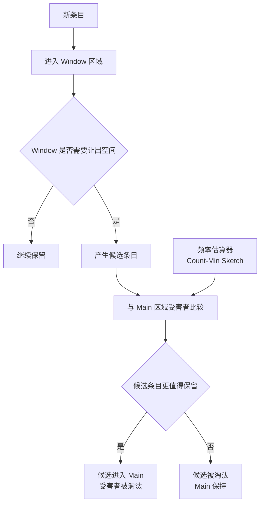
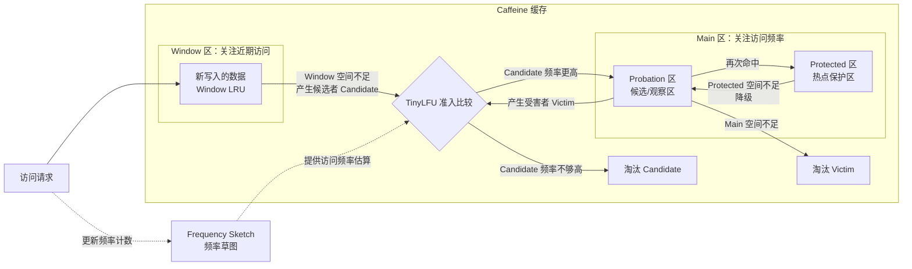
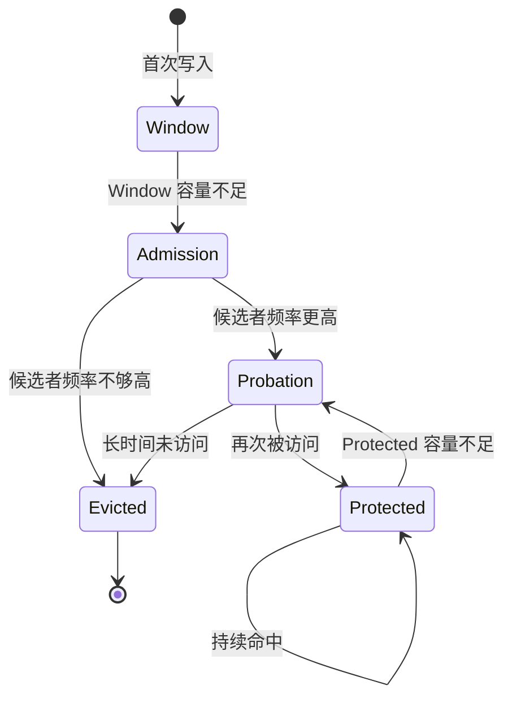
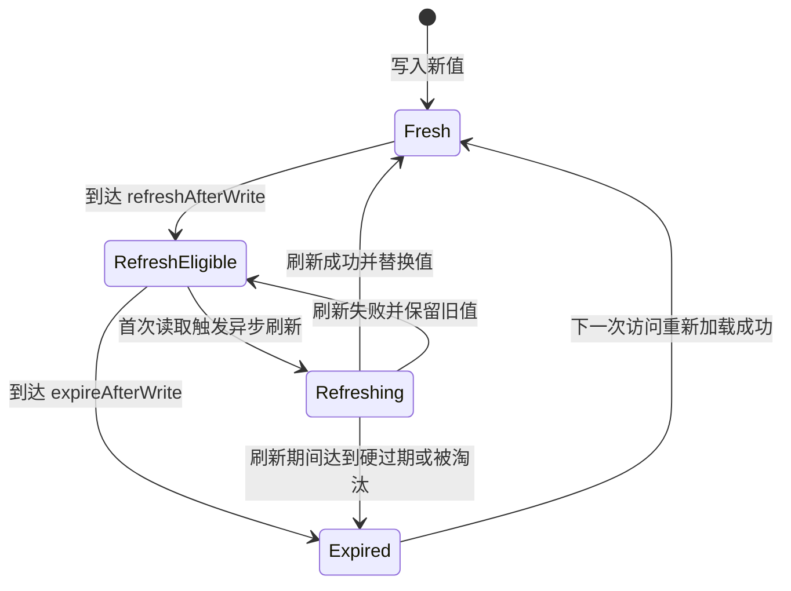
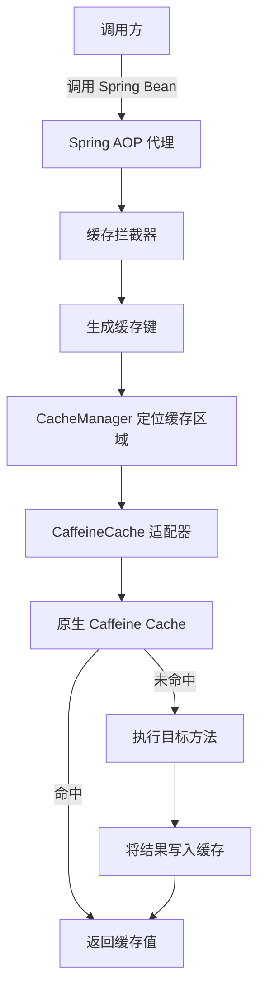
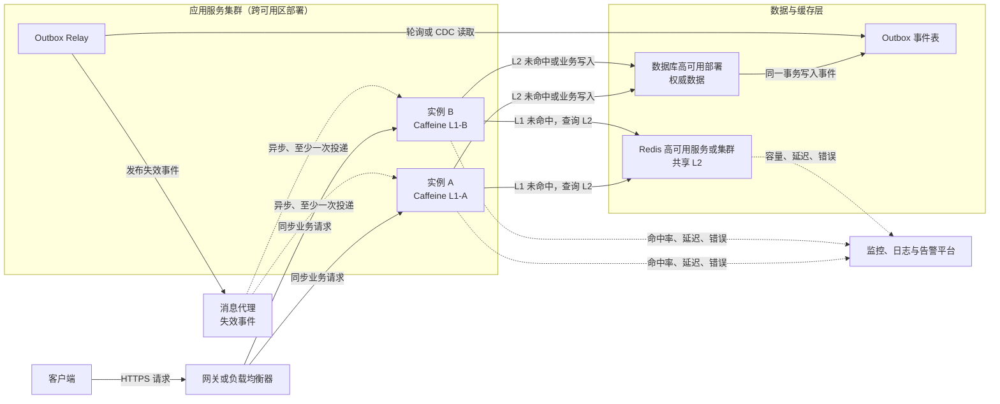
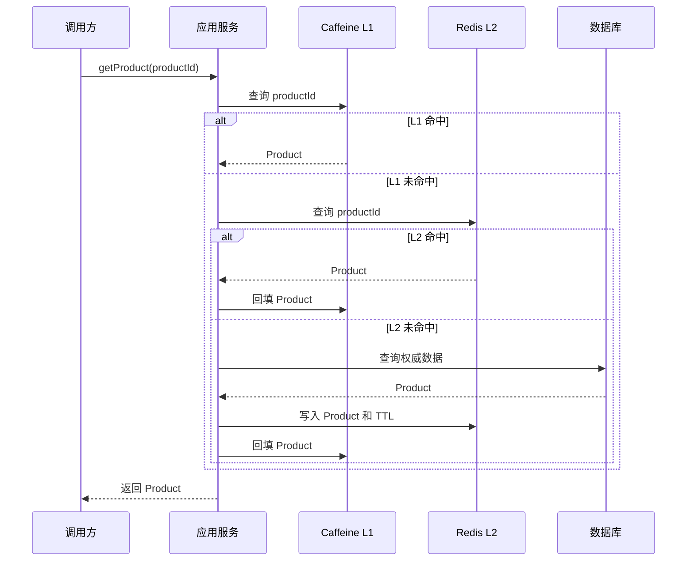
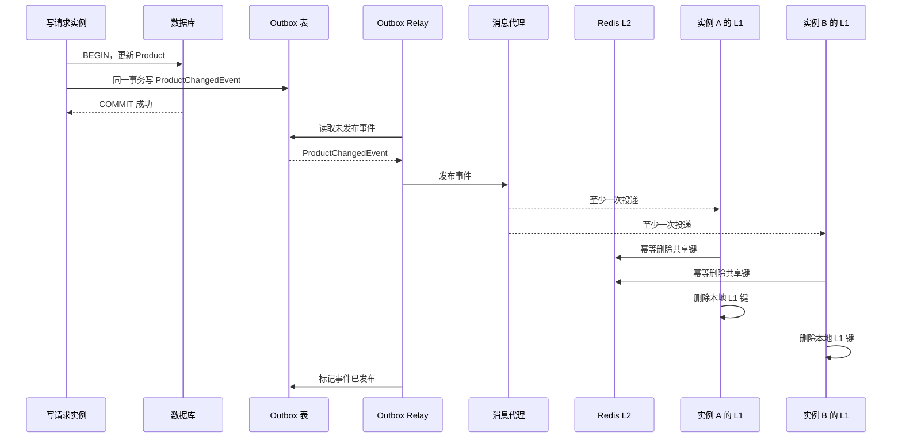

# Caffeine 学习笔记：原生接口、Spring Cache 与多级缓存

> 版本范围：Caffeine 3.x、Java 17+、Spring Boot 3.x/4.x。Caffeine 3.x 本身要求 Java 11+；Spring Boot 项目应优先采用其物料清单（BOM，Bill of Materials）管理的兼容版本。

学习路线与目录：

这份笔记面向第一次系统学习 Caffeine 的 Java 开发者。第一次阅读可以按三个阶段推进：

1\. **完成最小闭环**：阅读第 1～6 章。成功判据是能运行示例，解释为什么相同键只加载一次，并能独立选择 `Cache` 或 `LoadingCache`。
2\. **接入 Spring**：阅读第 7～13 章。成功判据是能配置 `CaffeineCacheManager`，正确设计缓存键，并验证 `@Cacheable`、`@CachePut`、`@CacheEvict` 的行为。
3\. **面向生产治理**：阅读第 14～24 章。成功判据是能说明本地缓存的一致性边界，为多级缓存设计失效链路，并建立容量、监控、测试与排障方案。

章节导航：

1\. [从一次重复查询开始](#1-从一次重复查询开始)
2\. [Caffeine 解决什么问题](#2-caffeine-解决什么问题)
3\. [适用场景与边界](#3-适用场景与边界)
4\. [核心原理](#4-核心原理)
5\. [依赖与版本选择](#5-依赖与版本选择)
6\. [原生 Caffeine 接口](#6-原生-caffeine-api)
7\. [容量、淘汰、过期与刷新](#7-容量淘汰过期与刷新)
8\. [删除通知、统计和运行时策略](#8-删除通知统计和运行时策略)
9\. [Spring Cache 抽象](#9-spring-cache-抽象)
10\. [Spring Boot 集成 Caffeine](#10-spring-boot-集成-caffeine)
11\. [Spring Cache 注解详解](#11-spring-cache-注解详解)
12\. [多缓存差异化配置](#12-多缓存差异化配置)
13\. [异步缓存与响应式类型](#13-异步缓存completablefuture-与响应式类型)
14\. [缓存一致性与多级缓存](#14-缓存一致性与多级缓存)
15\. [缓存穿透、击穿和雪崩](#15-缓存穿透击穿和雪崩的形成与治理)
16\. [监控与可观测性](#16-监控与可观测性)
17\. [测试](#17-测试)
18\. [缓存键、值与执行线程的边界](#18-缓存键值与执行线程的边界)
19\. [生产配置方法](#19-生产配置与容量规划)
20\. [技术选型对比](#20-caffeineconcurrenthashmap-与-redis-的选型)
21\. [Spring Boot 业务层集成示例](#21-spring-boot-业务层集成示例)
22\. [排障路径](#22-按现象排查缓存问题)
23\. [面试理解与上线检查](#23-面试理解与上线检查)
24\. [官方资料与复习自测](#24-官方资料与复习自测)

---

## 1 从一次重复查询开始

### 1.1 问题场景

假设商品详情接口每次都根据商品编号查询数据库。用户连续请求两次商品 `p-1001` 时，如果商品在几秒内没有变化，第二次数据库查询只是在重复消耗连接、CPU（Central Processing Unit，中央处理器）和响应时间。

本章先完成一个可观察的小目标：同一个商品编号调用两次，加载函数只执行一次；换一个商品编号时，加载函数再次执行。

### 1.2 加入最小依赖

在 Maven 项目的 `pom.xml` 中加入 Caffeine。示例使用 `3.2.4`；Spring Boot 项目应删除显式版本，让 Spring Boot 管理版本。

```xml
<dependency>
    <groupId>com.github.ben-manes.caffeine</groupId>
    <artifactId>caffeine</artifactId>
    <version>3.2.4</version>
</dependency>
```

重新加载 Maven 项目后，开发环境应能解析 `com.github.benmanes.caffeine.cache.Cache`。如果类无法导入，先检查依赖是否出现在 Maven dependency tree 中，而不是继续编写业务代码。

### 1.3 运行第一个缓存示例

```java
import com.github.benmanes.caffeine.cache.Cache;
import com.github.benmanes.caffeine.cache.Caffeine;

import java.time.Duration;
import java.util.concurrent.atomic.AtomicInteger;

public final class CaffeineQuickStart {

    private static final AtomicInteger LOAD_COUNT = new AtomicInteger();

    public static void main(String[] args) {
        Cache<String, String> productCache = Caffeine.newBuilder()
                .maximumSize(100)
                .expireAfterWrite(Duration.ofMinutes(5)) // 在写入后5分钟后失效
                .build();

        // get除了获取 还有 设置缓存的作用
        String first = productCache.get("p-1001", CaffeineQuickStart::loadProduct);
        String second = productCache.get("p-1001", CaffeineQuickStart::loadProduct);
        String third = productCache.get("p-1002", CaffeineQuickStart::loadProduct);

        System.out.println(first);
        System.out.println(second);
        System.out.println(third);
        System.out.println("loadCount=" + LOAD_COUNT.get());

        if (LOAD_COUNT.get() != 2) {
            throw new IllegalStateException("缓存行为不符合预期");
        }
    }

    private static String loadProduct(String productId) {
        LOAD_COUNT.incrementAndGet();
        return "Product{" + productId + "}";
    }
}
```

直接运行 `CaffeineQuickStart.main`，预期输出为：

```text
Product{p-1001}
Product{p-1001}
Product{p-1002}
loadCount=2
```

第一次读取 `p-1001` 时，缓存中没有值，`loadProduct` 被调用并将结果写入缓存。第二次读取相同键时直接返回缓存值，因此加载计数不变。`p-1002` 是新键，需要再次加载，所以最终计数为 2。

### 1.4 第一个成功判据与排查入口

1\. 输出包含两个相同的 `Product{p-1001}`，说明相同键得到同一个业务结果。
2\. `loadCount=2`，说明三个读取请求只触发两次加载。
3\. 程序没有抛出 `IllegalStateException`，说明自动校验通过。

如果计数为 3，通常是代码使用了“先 `getIfPresent`，未命中后再 `put`”的非原子组合（也就是put可能未成功），或者每次调用使用了不同的键。如果出现 `NoClassDefFoundError`，应检查运行时类路径是否包含 Caffeine，而不仅是开发环境是否能完成代码提示。

---

## 2 Caffeine 解决什么问题

Caffeine 是一个高性能、线程安全的 Java 本地内存缓存库。它运行在应用进程的 Java 虚拟机（JVM，Java Virtual Machine）堆内，不需要独立缓存服务器，读取路径通常只是本地内存访问，因此延迟很低。

它提供的主要能力包括：

1\. 手动缓存 `Cache<K, V>`；
2\. 自动同步加载 `LoadingCache<K, V>`；
3\. 手动异步缓存 `AsyncCache<K, V>`；
4\. 自动异步加载 `AsyncLoadingCache<K, V>`；
5\. 按数量或权重限制容量；
6\. 按访问时间、写入时间或每个条目的自定义时间过期；
7\. 异步刷新热点数据；
8\. 弱引用键、弱引用值和软引用值；
9\. 删除通知、命中率和加载耗时等统计；
10\. 通过 Spring Cache 接入 `@Cacheable`、`@CachePut`、`@CacheEvict` 等注解。

**Caffeine 保存的是当前进程内的本地副本。** 多实例部署时，每个实例都拥有彼此独立的数据，跨节点共享与同步需要额外机制。

---

## 3 适用场景与边界

### 3.1 适合的场景

1\. 字典、配置、权限规则、路由规则等高频读取数据；
2\. 商品、用户、门店等对象的短时间本地副本；
3\. 计算代价高、输入稳定、结果可复用的方法；
4\. 外部接口结果的短时缓存；
5\. 单机限流器、会话辅助状态、元数据索引；
6\. Redis 前面的一级缓存（L1，Level 1 Cache），Redis是二级缓存；
7\. 允许秒级或分钟级短暂不一致的数据。

### 3.2 不适合直接使用的场景

1\. 多实例之间必须立即看到同一份数据；
2\. 缓存内容必须在应用重启后保留；
3\. 数据量明显大于可用堆内存；
4\. 需要跨服务共享、分布式锁、发布订阅或复杂数据结构；
5\. 强一致性要求高，旧值会造成资金、库存、权限等严重错误；
6\. 希望依靠缓存代替数据库或系统事实来源（System of Record）。

### 3.3 快速判断

| 问题 | 结论 |
| --- | --- |
| 数据只在当前实例使用，追求极低延迟 | 优先考虑 Caffeine |
| 多实例需要共享缓存 | 优先考虑 Redis 等远程缓存 |
| 可接受各实例短暂不一致 | 可用 Caffeine，并设置合理过期时间 |
| 既要低延迟又要跨实例共享 | 可考虑 Caffeine L1 + Redis L2，但必须设计失效广播 |
| 数据不能丢、不能旧 | 不应把缓存作为唯一数据源 |

---

## 4 核心原理

### 4.1 与 ConcurrentHashMap 的区别

`ConcurrentHashMap` 只负责并发安全地保存键值；除非显式删除，否则条目会一直存在。Caffeine 则在并发 Map 能力之上增加容量控制、淘汰、过期、加载、刷新、统计等缓存语义。

### 4.2 W-TinyLFU 淘汰策略

Caffeine 的容量淘汰采用 Window TinyLFU（Window Tiny Least Frequently Used）思想，把“最近是否被访问”和“历史访问频率”结合起来：

1\. 新条目先进入一个偏向近期性的窗口区域；
2\. 当空间紧张时，新条目与主区域候选条目竞争；
3\. 频率估算器判断哪个条目更值得保留；
4\. 算法动态适应偏近期访问或偏热点访问的负载。



这是用于建立直觉的机制图，展示“新条目先试用，再通过历史频率竞争长期空间”。真实实现还会维护 Main 区域内的 probation（观察区）与 protected（保护区）分段、访问缓冲和自适应窗口大小，图中的一次比较不是完整源码结构。`Count-Min Sketch` 用近似计数控制内存成本，因此频率不是为每个键保存的精确全量计数。

相较于单纯的最近最少使用（LRU，Least Recently Used），它更能抵抗一次性扫描流量污染缓存；相较于纯粹的最不经常使用（LFU，Least Frequently Used），它又能更快接纳突然出现的新热点。

Caffeine 的容量淘汰采用 Window TinyLFU（Window Tiny Least Frequently Used）思想，其结构如下：



可以把 Window TinyLFU 理解为两部分的组合：

1\. `Window`：保护刚进入缓存的新数据。
2\. `Main`：保留经过验证的热点数据。
3\. `Frequency Sketch`：近似统计数据的访问频率。
4\. `TinyLFU`：根据访问频率决定数据能否进入 `Main`。

新数据首先进入较小的 `Window` 区：

```text
新数据 → Window LRU
```

`Window` 采用 LRU（Least Recently Used，最近最少使用）思想，主要考虑数据最近是否被访问过。

它会给新数据一个表现机会，避免新数据因为历史访问次数为零而立即被淘汰。

主缓存 `Main` 通常采用 SLRU（Segmented Least Recently Used，分段最近最少使用）结构：

```text
Main
├── Probation：观察区
└── Protected：保护区
```

数据的状态变化如下：



各区域的作用：

1\. `Window`：给新数据一个表现机会。
2\. `Probation`：已经进入主缓存，但仍处于观察阶段。
3\. `Protected`：被反复访问的数据，属于热点数据。
4\. `Frequency Sketch`：使用较小的空间近似记录每个键的访问频率。
5\. `Admission`：决定新候选数据是否值得替换现有数据。

最关键的准入和淘汰过程：

```text
Window 容量不足
      ↓
产生候选者 Candidate
      ↓
从 Main 中选择受害者 Victim
      ↓
比较两者的估算访问频率
      ↓
┌─────────────────────────────────┐
│ Candidate 频率 > Victim 频率    │
│ → 淘汰 Victim                   │
│ → Candidate 进入 Main           │
├─────────────────────────────────┤
│ Candidate 频率 ≤ Victim 频率    │
│ → 淘汰 Candidate                │
│ → Victim 继续保留                │
└─────────────────────────────────┘
```

例如：

```text
Candidate：刚离开 Window，估算访问 8 次
Victim：Main 中的淘汰候选，估算访问 2 次

8 > 2

结果：
Candidate 获准进入 Main
Victim 被淘汰
```

Window TinyLFU 不是单纯使用 LRU 或 LFU（Least Frequently Used，最不经常使用），而是综合考虑：

```text
Window：关注最近访问情况
Main：保护长期热点数据
TinyLFU：决定哪些数据值得进入 Main
```

这种机制既能接纳突然出现的新热点，也能防止一次性扫描的大量冷数据冲掉缓存中已有的热点数据。

需要注意：具体的分区比例和内部维护细节由 Caffeine 自适应调整，并不是开发者直接配置的固定三段容量。

### 4.3 并发模型

Caffeine 的读路径高度并发，维护工作会被分摊或异步执行。由此带来两个重要结论：

1\. `estimatedSize()` 是估算值，维护任务完成前可能暂时包含等待清理的条目；
2\. 达到容量或过期时间不代表对象会在那个纳秒立即从内部结构中物理删除，但过期条目不会被当作有效命中返回。

---

## 5 依赖与版本选择

### 5.1 原生 Caffeine：Maven

```xml
<dependency>
    <groupId>com.github.ben-manes.caffeine</groupId>
    <artifactId>caffeine</artifactId>
    <version>3.2.4</version>
</dependency>
```

本笔记把原生示例固定为 `3.2.4`，便于复现。新项目可以从[官方发布页](https://github.com/ben-manes/caffeine/releases)确认可用版本；长期项目应通过依赖管理工具统一版本，并在升级前阅读发布说明。

### 5.2 原生 Caffeine：Gradle

```groovy
implementation 'com.github.ben-manes.caffeine:caffeine:3.2.4'
```

### 5.3 Spring Boot

Spring Boot 项目一般不手写 Caffeine 版本，让 Spring Boot 的物料清单（BOM，Bill of Materials）管理兼容版本：

```xml
<dependencies>
    <dependency>
        <groupId>org.springframework.boot</groupId>
        <artifactId>spring-boot-starter-cache</artifactId>
    </dependency>

    <dependency>
        <groupId>com.github.ben-manes.caffeine</groupId>
        <artifactId>caffeine</artifactId>
    </dependency>
</dependencies>
```

如需 Actuator 指标：

```xml
<dependency>
    <groupId>org.springframework.boot</groupId>
    <artifactId>spring-boot-starter-actuator</artifactId>
</dependency>
```

---

## 6 原生 Caffeine API

API（Application Programming Interface，应用程序编程接口）层面，Caffeine 提供同步、异步、手动加载和自动加载四种主要使用方式。

| 类型 | 是否异步 | 谁提供加载逻辑 | 适用场景 |
| --- | --- | --- | --- |
| `Cache<K, V>` | 否 | 每次读取时传入，或业务先加载再 `put` | 加载路径因调用场景而异 |
| `LoadingCache<K, V>` | 否 | 构建时固定 `CacheLoader` | 同类键使用统一同步加载规则 |
| `AsyncCache<K, V>` | 是 | 每次读取时传入异步加载逻辑 | 异步加载路径因调用场景而异 |
| `AsyncLoadingCache<K, V>` | 是 | 构建时固定 `AsyncCacheLoader` | 同类键使用统一异步加载规则 |

### 6.1 手动缓存 Cache

`Cache<K, V>` 适合由业务代码决定如何加载数据的场景。

```java
import com.github.benmanes.caffeine.cache.Cache;
import com.github.benmanes.caffeine.cache.Caffeine;

import java.time.Duration;

Cache<String, User> userCache = Caffeine.newBuilder()
        .initialCapacity(100)
        .maximumSize(10_000)
        .expireAfterAccess(Duration.ofMinutes(10))
        .recordStats()
        .build();

// 只读取；未命中返回 null
User cached = userCache.getIfPresent("u-1001");

// 未命中时原子计算并放入缓存
User user = userCache.get("u-1001", userRepository::findRequiredById);

// 主动写入
userCache.put("u-1001", user);

// 删除一个键
userCache.invalidate("u-1001");

// 批量删除
userCache.invalidateAll(Set.of("u-1001", "u-1002"));

// 清空
userCache.invalidateAll();
```

优先使用：

```java
cache.get(key, mappingFunction);
```

而不是：

```java
V value = cache.getIfPresent(key);
if (value == null) {
    value = load(key);
    cache.put(key, value);
}
```

前者把“检查、加载、写入”组合为按键原子操作，可以避免同一个键在并发未命中时被重复加载。加载函数应尽量短小，不要在其中递归修改同一个缓存，否则可能死锁、活锁或抛出异常。

### 6.2 自动加载 LoadingCache

`LoadingCache<K, V>` 把加载规则固定在缓存实例上：

```java
import com.github.benmanes.caffeine.cache.LoadingCache;

LoadingCache<String, User> userCache = Caffeine.newBuilder()
        .maximumSize(10_000)
        .expireAfterWrite(Duration.ofMinutes(10))
        .build(userRepository::findRequiredById);
// 如果有缓存则取，否则查库并设置缓存
User user = userCache.get("u-1001");
Map<String, User> users = userCache.getAll(
        Set.of("u-1001", "u-1002", "u-1003")
);
```

如果数据源支持真正的批量查询，应实现 `CacheLoader.loadAll`，避免 `getAll` 退化成 N 次单条查询：

```java
LoadingCache<String, User> userCache = Caffeine.newBuilder()
        .maximumSize(10_000)
        .build(new CacheLoader<>() {
            @Override
            public User load(String key) {
                return userRepository.findRequiredById(key);
            }

            // 设置批量查询方法
            @Override
            public Map<? extends String, ? extends User> loadAll(
                    Set<? extends String> keys) {
                return userRepository.findRequiredByIds(keys);
            }
        });
```

### 6.3 异步缓存 AsyncCache

```java
import com.github.benmanes.caffeine.cache.AsyncCache;

AsyncCache<String, User> asyncCache = Caffeine.newBuilder()
        .maximumSize(10_000)
        .expireAfterWrite(Duration.ofMinutes(10))
        .buildAsync();

CompletableFuture<User> future = asyncCache.get(
        "u-1001",
        (key, executor) -> CompletableFuture.supplyAsync(
                () -> userRepository.findRequiredById(key),
                executor
        )
);

future.thenAccept(user -> System.out.println(user.name()));

// 必要时取得同步视图；调用线程可能等待异步计算完成
Cache<String, User> synchronousView = asyncCache.synchronous();
```

默认执行器是 `ForkJoinPool.commonPool()`。加载包含阻塞式数据库或网络调用时，生产环境通常应提供隔离线程池，避免阻塞公共线程池：

```java
ExecutorService cacheLoaderExecutor = Executors.newFixedThreadPool(16);

AsyncLoadingCache<String, User> asyncLoadingCache = Caffeine.newBuilder()
        .maximumSize(10_000)
        .executor(cacheLoaderExecutor)
        .buildAsync((key, executor) -> CompletableFuture.supplyAsync(
                () -> userRepository.findRequiredById(key),
                executor
        ));
```

线程池大小应结合下游延迟、目标吞吐量和连接池容量确定。线程数超过下游可承载并发时，请求只会转移到队列或连接池等待。

### 6.4 asMap 视图

`cache.asMap()` 暴露 `ConcurrentMap` 视图，可使用 `compute`、`computeIfPresent`、`merge` 等原子操作：

```java
userCache.asMap().computeIfPresent(
        "u-1001", // 仅当缓存中已存在该用户时才执行更新
        (key, oldValue) ->
                // 基于旧的 User 创建显示名称为 "new-name" 的新对象，
                // 并用这个新对象原子替换缓存中的旧值
                oldValue.withDisplayName("new-name")
);
```

通过这个视图的修改会遵守缓存的删除通知和维护机制（只是视图，没有创建一个新的Map出来）。不要把它误认为一个无界、永久保存元素的普通 Map。

还有一个容易忽略的细节：`asMap().get(key)` 通常只查看当前缓存内容，不会像 `LoadingCache.get(key)` 那样在缺失时自动调用加载器。

### 6.5 null 的语义

原生 Caffeine 不保存 `null` 键或 `null` 值。加载函数返回 `null` 时，通常表示“本次没有可缓存值”，映射不会建立。

若要负缓存（Negative Caching），可缓存明确的包装对象：

```java
Cache<String, Optional<User>> cache = Caffeine.newBuilder()
        .maximumSize(10_000)
        .expireAfterWrite(Duration.ofSeconds(30))
        .build();

Optional<User> result = cache.get(
        id,
        key -> userRepository.findById(key)
);
```

对“不存在”结果应使用较短的过期时间，否则刚创建的数据可能持续被旧的空结果遮蔽。

---

## 7 容量、淘汰、过期与刷新

### 7.1 maximumSize：按条目数限制

```java
Cache<String, User> cache = Caffeine.newBuilder()
        .maximumSize(10_000)
        .build();
```

适用于每个值内存大小大致相近的场景。达到上限后，Caffeine 根据访问近期性和频率选择淘汰对象。

### 7.2 maximumWeight：按权重限制

当不同值的体积差异很大时，可用权重近似表示其内存成本：

```java
Cache<String, byte[]> cache = Caffeine.newBuilder()
        .maximumWeight(100L * 1024 * 1024)
        .weigher((String key, byte[] value) -> value.length)
        .build();
```

注意：

1\. `maximumSize` 与 `maximumWeight` 不能同时配置；
2\. `Weigher` 返回 `int`，权重不一定必须是字节，也可以是业务成本；
3\. 权重在条目创建或更新时计算；如果缓存值内部随后发生突变，Caffeine 不会自动重新称重；
4\. 精确计算 Java 对象内存体积成本很高，通常使用字符串长度、数组长度、集合元素数等近似值。

### 7.3 expireAfterAccess：访问后过期

```java
.expireAfterAccess(Duration.ofMinutes(10))
```

条目在指定时间内没有读写访问时过期，适合“活跃数据保留、不活跃数据退出”的场景，也常称为空闲超时（TTI，Time to Idle）。

### 7.4 expireAfterWrite：写入后过期

```java
.expireAfterWrite(Duration.ofMinutes(10))
```

从创建或最近一次替换值开始计时，读取不会延长寿命，适合要求“最多允许旧十分钟”的数据，也常称为生存时间（TTL，Time to Live）。

### 7.5 每条记录动态过期

```java
Cache<String, TokenInfo> tokenCache = Caffeine.newBuilder()
        .maximumSize(10_000)
        .expireAfter(new Expiry<String, TokenInfo>() {
            @Override
            public long expireAfterCreate(
                    String key, TokenInfo value, long currentTime) {
                return value.remainingTtl().toNanos();
            }

            @Override
            public long expireAfterUpdate(
                    String key, TokenInfo value,
                    long currentTime, long currentDuration) {
                return value.remainingTtl().toNanos();
            }

            @Override
            public long expireAfterRead(
                    String key, TokenInfo value,
                    long currentTime, long currentDuration) {
                return currentDuration;
            }
        })
        .build();
```

返回值单位是纳秒。动态过期适合令牌、外部接口响应中携带有效期等场景。

### 7.6 refreshAfterWrite：刷新而非过期

```java
LoadingCache<String, Product> productCache = Caffeine.newBuilder()
        .maximumSize(20_000)
        .refreshAfterWrite(Duration.ofMinutes(1))
        // 缓存项写入或上次刷新成功满 1 分钟后，下一次读取该项时，触发异步重新加载
        .expireAfterWrite(Duration.ofMinutes(10))
        .build(productRepository::findRequiredById);
```

刷新与过期的差异非常重要：

| 行为 | `refreshAfterWrite` | `expireAfterWrite` |
| --- | --- | --- |
| 到达时间后是否立即动作 | 不会；下一次读取时才触发刷新 | 条目变为过期 |
| 触发加载时返回什么 | 通常先返回旧值，后台刷新 | 调用方等待重新加载或得到未命中 |
| 加载失败 | 保留旧值并记录异常 | 本次加载失败，没有新值 |
| 典型用途 | 隐藏热点数据刷新延迟 | 限制数据最大陈旧时间 |



这张状态图描述同时配置刷新与过期时的条目生命周期。到达刷新阈值只改变“是否具备刷新资格”，读取才触发后台刷新；刷新期间旧值仍可服务请求。到达过期阈值后，旧值不再作为有效命中返回。图中省略了主动删除、容量淘汰和引用回收，这三类事件都可能让条目提前离开当前状态。

常见做法是同时配置：

1\. `refreshAfterWrite` 作为“软 TTL”，让热点键后台更新；
2\. `expireAfterWrite` 作为“硬 TTL”，避免长期无人访问的旧数据永久存在。

刷新只适用于具有加载器的 `LoadingCache` 或 `AsyncLoadingCache`。仅在普通 `Cache` 上配置 `refreshAfterWrite` 没有完整的重新加载来源，会导致构建失败。刷新任务默认也使用 `ForkJoinPool.commonPool()`，可通过 `executor` 指定执行器。

### 7.7 过期清理不是硬实时任务

Caffeine 默认在写操作后以及部分读操作后执行少量维护。低流量缓存可能在过期后的一段时间内仍把对象保留在内部结构中。若需要更及时地触发清理，可配置调度器：

```java
Cache<String, Session> cache = Caffeine.newBuilder()
        .expireAfterAccess(Duration.ofMinutes(30))
        // 主动安排缓存的定时维护，以便更及时地清理过期条目
        .scheduler(Scheduler.systemScheduler())
        .build();
```

调度仍是尽力而为，不提供硬实时保证。通常只有在依赖及时删除通知、空闲连接释放等行为时才需要它。

### 7.8 弱引用和软引用

```java
Caffeine.newBuilder().weakKeys();
Caffeine.newBuilder().weakValues();
Caffeine.newBuilder().softValues();
```

一般业务缓存更推荐使用确定性的 `maximumSize` 或 `maximumWeight`：

1\. 弱引用对象可能在没有强引用时被垃圾收集器回收；
2\. 软引用回收受 JVM 和垃圾收集器策略影响，容量与延迟不可预测；
3\. 弱引用键使用对象身份语义时容易与业务期望的 `equals` 语义不一致；
4\. 引用回收后的清理同样需要维护周期。

---

## 8 删除通知、统计和运行时策略

### 8.1 RemovalListener 与 EvictionListener

```java
Cache<String, User> cache = Caffeine.newBuilder()
        .maximumSize(10_000)
        .removalListener((String key, User value, RemovalCause cause) ->
                log.info("cache entry removed, key={}, cause={}", key, cause)
        )
        .evictionListener((String key, User value, RemovalCause cause) ->
                log.info("cache entry evicted, key={}, cause={}", key, cause)
        )
        .build();
```

1\. `RemovalListener`：收到显式删除、替换、过期、容量淘汰、引用回收等删除事件，默认**异步执行**；
2\. `EvictionListener`：只关心由缓存策略导致的淘汰，并在淘汰流程中**同步执行**；
3\. `RemovalCause.wasEvicted()`：判断是否为策略淘汰，而不是显式删除或替换。

监听器中不要执行长时间阻塞操作。异常会被记录并吞掉，不应把监听器当作可靠消息投递机制。

### 8.2 统计

```java
Cache<String, User> cache = Caffeine.newBuilder()
        .maximumSize(10_000) // 设置缓存最多保存 10,000 个条目
        .recordStats()       // 开启缓存统计
        .build();            // 构建手动缓存

CacheStats stats = cache.stats(); // 获取当前缓存统计快照

double hitRate = stats.hitRate();                         // 缓存命中率
long hitCount = stats.hitCount();                         // 缓存命中次数
long missCount = stats.missCount();                       // 缓存未命中次数
long loadSuccessCount = stats.loadSuccessCount();         // 缓存加载成功次数
long loadFailureCount = stats.loadFailureCount();         // 缓存加载失败次数
long evictionCount = stats.evictionCount();               // 缓存条目被驱逐的次数
double averageLoadPenaltyNanos = stats.averageLoadPenalty(); // 平均加载耗时，单位为纳秒
```

重点观察：

1\. 命中率是否真的减少了下游访问；
2\. 加载失败数是否异常上升；
3\. 平均加载耗时是否掩盖了 P99（第 99 百分位）等长尾延迟；
4\. 淘汰量是否过大，暗示容量太小或访问模式不适合；
5\. JVM 堆占用和垃圾收集暂停是否因缓存增加。

命中率高不代表配置一定好。若缓存的是廉价计算结果，却占用大量堆内存，整体性能仍可能变差。

### 8.3 运行时读取和调整策略

```java
cache.policy().eviction().ifPresent(eviction -> { // 获取缓存驱逐策略（如果已配置）
    long oldMaximum = eviction.getMaximum();      // 获取当前最大缓存容量
    eviction.setMaximum(oldMaximum * 2);          // 将最大缓存容量动态调整为原来的两倍
});

cache.policy().expireAfterWrite().ifPresent(expiration -> {       // 获取写入后过期策略（如果已配置）
    expiration.setExpiresAfter(Duration.ofMinutes(20));           // 将写入后的过期时间动态调整为 20 分钟
});
```

缓存支持的策略在构建时确定；运行时可以调整已存在策略的参数，但不能把一个未配置过期的缓存直接变成支持过期的缓存。

---

## 9 Spring Cache 抽象

Spring Cache 本身不是缓存实现，而是一套方法级缓存抽象：



这是 Spring Cache 的单进程调用机制图。实线箭头表示一次同步方法调用中的控制流。`@Cacheable` 等注解由 AOP（Aspect-Oriented Programming，面向切面编程）代理拦截；`CacheManager` 负责按名称找到缓存区域；`CaffeineCache` 把 Spring 的统一接口适配到原生 Caffeine。命中时目标方法不会执行，未命中时方法结果会被写回缓存。

Spring Cache 的价值是让业务层主要表达：

1\. 哪个方法需要缓存；
2\. 使用哪个缓存区域；
3\. 缓存键是什么；
4\. 什么条件下缓存或删除。

具体容量、过期、统计和淘汰策略仍由 Caffeine 决定。

---

## 10 Spring Boot 集成 Caffeine

### 10.1 启用缓存

建议在独立配置类中添加 `@EnableCaching`，不要直接放在主启动类上，以便测试或特定环境能替换、关闭缓存：

```java
import org.springframework.cache.annotation.EnableCaching;
import org.springframework.context.annotation.Configuration;

@Configuration(proxyBeanMethods = false) // 声明该类为配置类，并关闭 Bean 方法代理
@EnableCaching                           // 开启 Spring 缓存注解功能
public class CacheConfig {
}
```

### 10.2 最简 application.yml

```yaml
spring:
  cache:
    type: caffeine
    cache-names:
      - users
      - products
    caffeine:
      spec: initialCapacity=100,maximumSize=10000,expireAfterWrite=10m,recordStats
```

这会让 Spring Boot 自动创建 `CaffeineCacheManager`。显式声明 `cache-names` 有两个好处：

1\. 应用启动时创建缓存，更容易被监控系统发现；
2\. 把缓存管理器限制为静态模式，注解中拼错缓存名时会尽早暴露，而不是静默创建新缓存。

当类路径中同时存在多个缓存实现时，显式设置 `spring.cache.type: caffeine` 可以避免 Spring Boot 按自动探测顺序选中其他提供者。例如，引入 Caffeine 的 JCache（JSR-107，Java 缓存标准）扩展后，JCache 提供者的探测优先级高于原生 Caffeine。

### 10.3 CaffeineSpec 支持项

常用配置串示例：

```text
initialCapacity=100,maximumSize=10000,expireAfterAccess=10m,recordStats
```

支持的主要配置包括：

1\. `initialCapacity`；
2\. `maximumSize`；
3\. `maximumWeight`；
4\. `expireAfterAccess`；
5\. `expireAfterWrite`；
6\. `refreshAfterWrite`；
7\. `weakKeys`；
8\. `weakValues`；
9\. `softValues`；
10\. `recordStats`。

配置串无法表达需要 Java 对象的选项，例如 `Weigher`、`Expiry`、`Executor`、`Scheduler`、`RemovalListener`。遇到这些需求应使用 Java 配置。

Spring Boot 对 Caffeine 配置的采用优先级是：

1\. `spring.cache.caffeine.spec`；
2\. `CaffeineSpec` Bean；
3\. `Caffeine` Builder Bean。

如果已经设置 `spring.cache.caffeine.spec`，再声明一个 `Caffeine` Bean 并期待它生效，会得到与预期不一致的结果。

### 10.4 Java 配置统一策略

```java
import com.github.benmanes.caffeine.cache.Caffeine;
import org.springframework.cache.CacheManager;
import org.springframework.cache.caffeine.CaffeineCacheManager;
import org.springframework.context.annotation.Bean;
import org.springframework.context.annotation.Configuration;

import java.time.Duration;

@Configuration(proxyBeanMethods = false)
@EnableCaching
public class CacheConfig {

    @Bean
    public CacheManager cacheManager() {
        CaffeineCacheManager manager =
                new CaffeineCacheManager("users", "products");

        manager.setCaffeine(Caffeine.newBuilder()
                .initialCapacity(100)
                .maximumSize(10_000)
                .expireAfterWrite(Duration.ofMinutes(10))
                .recordStats());

        // Spring 可以用内部占位对象适配 null；生产中通常建议关闭，
        // 用 Optional 或明确的结果类型表达“不存在”。
        manager.setAllowNullValues(false);
        return manager;
    }
}
```

一旦自己声明 `CacheManager` Bean，Spring Boot 的默认缓存管理器自动配置会退让。此时不要再假定 `spring.cache.caffeine.spec` 会自动应用到自定义管理器。

---

## 11 Spring Cache 注解详解

### 11.1 @Cacheable：查询并填充缓存

```java
@Service
@CacheConfig(cacheNames = "users")
public class UserService {

    @Cacheable(key = "#id", sync = true)
    public User getById(String id) {
        return userRepository.findRequiredById(id);
    }
}
```

执行过程：

1\. 根据缓存名和方法参数生成键；
2\. 查询缓存；
3\. 命中时直接返回缓存值，不执行方法；
4\. 未命中时执行方法；
5\. 把方法返回值放入缓存。

`sync = true` 提示缓存提供者对同一个键同步加载，用于减少并发击穿。它有以下限制：

1\. 不能同时使用 `unless`；
2\. 只能指定一个缓存；
3\. 不能在同一方法上组合其他缓存操作；
4\. 同一个键的其他请求会等待，加载函数过慢时会放大等待时间。

`@Cacheable(sync = true)` 用于防止缓存击穿：当多个线程同时查询同一个尚未缓存的键时，只允许一个线程执行方法并加载数据，其他线程等待；加载完成后，它们直接复用该结果。

```java
@Cacheable(cacheNames = "users", key = "#id", sync = true)
public User findUser(String id) {
    return userRepository.findById(id);
}
```

假设 100 个请求同时查询同一个未缓存的 `id`：

1\. 默认 `sync = false`：可能有 100 个请求同时查询数据库。
2\. 设置 `sync = true`：通常只有一个请求查询数据库，其他请求等待并复用加载结果。

它的限制可以这样理解：

1\. 不能同时使用 `unless`

`unless` 是在方法执行完成、拿到返回值后，才决定是否缓存：

```java
@Cacheable(
    cacheNames = "users",
    key = "#id",
    sync = true,
    unless = "#result == null" // 不允许
)
```

而同步加载需要缓存实现把“检查缓存、调用加载函数、保存结果”作为一个协调过程执行。`unless` 又要求 Spring 在加载完成后决定是否拒绝缓存，两种执行模型不兼容，因此不能同时使用。

如果需要排除某些请求，可以使用执行前判断的 `condition`：

```java
@Cacheable(
    cacheNames = "users",
    key = "#id",
    sync = true,
    condition = "#id != null"
)
```

但 `condition` 只能根据方法参数等执行前信息判断，不能像 `unless` 那样检查 `#result`。

1\. 只能指定一个缓存

普通模式可以同时写入多个缓存：

```java
@Cacheable(cacheNames = {"users", "usersBackup"}, key = "#id")
```

同步模式下，必须明确由哪一个缓存负责同键请求的加载协调。如果配置多个缓存，各缓存可能有不同的锁、命中状态和加载机制，Spring 无法保证统一的同步语义，所以 `sync = true` 只能使用一个缓存。

```java
@Cacheable(cacheNames = "users", key = "#id", sync = true)
```

1\. 不能组合其他缓存操作

不能在同一个方法上将同步的 `@Cacheable` 与 `@CachePut`、`@CacheEvict` 等操作组合：

```java
@Caching(
    cacheable = @Cacheable(cacheNames = "users", key = "#id", sync = true),
    evict = @CacheEvict(cacheNames = "userList", allEntries = true)
)
```

同步加载要求该调用围绕一个明确的缓存读取和加载操作进行协调。再组合写入或删除操作，会让执行顺序、并发协调和异常处理变得不明确，因此 Spring 对这种组合进行限制。

1\. 同一个键的请求会等待

`sync = true` 只让同一个键的并发请求合并，并不会让加载本身变快：

```txt
请求 A ── 加载数据库，耗时 5 秒 ── 返回
请求 B ── 等待 5 秒 ───────────── 返回
请求 C ── 等待 5 秒 ───────────── 返回
```

如果加载数据库或调用远程服务很慢，其他请求也会一起等待；如果加载过程卡住，大量同键请求可能持续堆积。

因此加载函数应该：

1\. 设置数据库和远程调用超时；
2\. 避免长时间阻塞；
3\. 做好异常处理和降级；
4\. 对热点键考虑提前刷新；
5\. 必要时增加并发隔离或限流。

还需注意，`sync = true` 是给缓存提供者的同步提示，最终同步行为由具体的 `CacheManager` 和缓存实现决定。它通常只协调当前应用实例内的请求，不能自动防止多个服务实例同时回源；分布式场景需要确认缓存提供者是否支持跨实例协调。

### 11.2 key 与默认键生成

Spring 默认使用 `SimpleKeyGenerator`：

1\. 无参数：`SimpleKey.EMPTY`；
2\. 一个参数：参数对象本身；
3\. 多个参数：包含全部参数的 `SimpleKey`。

业务代码应显式设计稳定键，特别是参数包含分页对象、请求上下文或可变对象时：

```java
@Cacheable(cacheNames = "products", key = "#tenantId + ':' + #productId")
public Product getProduct(String tenantId, String productId, Locale locale) {
    // locale 不参与缓存键意味着不同语言共享同一结果；
    // 只有确认业务允许时才能这样设计。
}
```

常用 Spring 表达式语言（SpEL，Spring Expression Language）变量：

| 表达式 | 含义 |
| --- | --- |
| `#id` | 名为 id 的参数；依赖参数名可用 |
| `#p0`、`#a0` | 第一个参数，不依赖参数名 |
| `#root.methodName` | 方法名 |
| `#root.targetClass` | 目标类 |
| `#result` | 方法结果，只在结果产生后的表达式可用 |

大型项目更推荐定义键对象，而不是不断拼接字符串：

```java
public record ProductCacheKey(String tenantId, String productId, String locale) {
}
```

键类型必须有稳定、正确的 `equals` 和 `hashCode`。Java `record` 很适合充当缓存键。

### 11.3 condition 与 unless

```java
@Cacheable(
        cacheNames = "users",
        key = "#id",
        condition = "#id != null && !#id.isBlank()",
        unless = "#result == null || !#result.active()"
)
public User getById(String id) {
    return userRepository.findById(id).orElse(null);
}
```

1\. `condition`：方法执行前判断；为 `false` 时完全绕过缓存；
2\. `unless`：方法执行后判断；为 `true` 时拒绝把结果写入缓存。

二者的布尔含义相反，代码审查时要特别注意。

### 11.4 @CachePut：执行方法并更新缓存

```java
@CachePut(cacheNames = "users", key = "#result.id()")
@Transactional
public User update(UpdateUserCommand command) {
    return userRepository.update(command);
}
```

`@CachePut` 总会执行方法，然后把结果写入缓存。不要在同一方法上随意同时使用 `@Cacheable` 和 `@CachePut`：一个可能跳过方法，一个要求执行方法，语义容易冲突。

### 11.5 @CacheEvict：删除缓存

```java
@CacheEvict(cacheNames = "users", key = "#id")
@Transactional
public void delete(String id) {
    userRepository.deleteById(id);
}
```

默认在方法成功返回后删除；方法抛异常时不删除。

```java
@CacheEvict(cacheNames = "users", allEntries = true)
public void rebuildUserIndex() {
    // 成功后清空整个 users 缓存
}
```

```java
@CacheEvict(
        cacheNames = "users",
        key = "#id",
        beforeInvocation = true
)
public void forceReload(String id) {
    // 无论方法是否成功，调用前都先删除
}
```

`beforeInvocation = true` 应谨慎使用：若数据库更新失败，旧缓存已被删除，后续会重新加载；这有时正是期望行为，但会增加下游压力。

### 11.6 @Caching：组合多个动作

```java
@Caching(
        put = {
                @CachePut(cacheNames = "users", key = "#result.id()")
        },
        evict = {
                @CacheEvict(cacheNames = "userLists", allEntries = true),
                @CacheEvict(cacheNames = "userPermissions", key = "#result.id()")
        }
)
public User updateUser(UpdateUserCommand command) {
    return userRepository.update(command);
}
```

### 11.7 @CacheConfig：类级公共配置

```java
@Service
@CacheConfig(cacheNames = "users", cacheManager = "cacheManager")
public class UserService {

    @Cacheable(key = "#id")
    public User getById(String id) {
        return userRepository.findRequiredById(id);
    }
}
```

`@CacheConfig` 只提供公共属性，不会自动让所有方法产生缓存行为。

### 11.8 AOP 代理限制

Spring Cache 默认使用面向切面编程（AOP，Aspect-Oriented Programming）代理。最常见的失效原因是同类内部调用：

```java
@Service
public class UserService {

    public User load(String id) {
        // this 调用没有经过 Spring 代理，@Cacheable 不生效
        return this.getById(id);
    }

    @Cacheable(cacheNames = "users", key = "#id")
    public User getById(String id) {
        return userRepository.findRequiredById(id);
    }
}
```

推荐解决方式是拆分职责，让另一个 Spring Bean 调用缓存方法。默认代理模式下还应注意：

1\. 注解优先放在具体类的 `public` 方法上；
2\. `private`、`protected` 方法通常不会被代理拦截；
3\. `new UserService()` 手工创建的对象不受 Spring 管理，注解不生效；
4\. 构造器或 `@PostConstruct` 阶段不应依赖代理已经完全可用；
5\. 缓存方法应由 Spring 容器外部调用经过代理。

---

## 12 多缓存差异化配置

`spring.cache.caffeine.spec` 是统一模板，不能直接为不同缓存设置不同 TTL 和容量。生产项目通常需要差异化策略，例如：

| 缓存名 | 最大数量 | 过期时间 | 原因 |
| --- | ---: | ---: | --- |
| `users` | 20,000 | 10 分钟 | 用户访问较分散 |
| `products` | 100,000 | 2 分钟 | 数据量大、变更频繁 |
| `permissions` | 5,000 | 30 秒 | 权限要求更快收敛 |

可使用 `SimpleCacheManager` 注册多个 `CaffeineCache`：

```java
import com.github.benmanes.caffeine.cache.Cache;
import com.github.benmanes.caffeine.cache.Caffeine;
import org.springframework.cache.CacheManager;
import org.springframework.cache.caffeine.CaffeineCache;
import org.springframework.cache.support.SimpleCacheManager;

@Bean
public CacheManager cacheManager() {
    SimpleCacheManager manager = new SimpleCacheManager();
    manager.setCaches(List.of(
            buildCache("users", 20_000, Duration.ofMinutes(10)),
            buildCache("products", 100_000, Duration.ofMinutes(2)),
            buildCache("permissions", 5_000, Duration.ofSeconds(30))
    ));
    return manager;
}

private CaffeineCache buildCache(
        String name,
        long maximumSize,
        Duration ttl) {

    Cache<Object, Object> nativeCache = Caffeine.newBuilder()
            .maximumSize(maximumSize)
            .expireAfterWrite(ttl)
            .recordStats()
            .build();

    return new CaffeineCache(name, nativeCache, false);
}
```

这种方式还可以给每个缓存设置不同的监听器、权重算法、执行器或动态过期策略。

---

## 13 异步缓存、CompletableFuture 与响应式类型

### 13.1 Spring Framework 6.1+ 异步模式

`CaffeineCacheManager` 从 Spring Framework 6.1 起可使用原生 `AsyncCache` 支持 `CompletableFuture` 以及响应式返回类型的值缓存：

```java
@Bean
public CacheManager asyncCacheManager() {
    CaffeineCacheManager manager = new CaffeineCacheManager("users");
    manager.setCaffeine(Caffeine.newBuilder()
            .maximumSize(10_000)
            .expireAfterWrite(Duration.ofMinutes(10))
            .recordStats());
    manager.setAsyncCacheMode(true);
    manager.setAllowNullValues(false);
    return manager;
}
```

```java
@Cacheable(cacheNames = "users", key = "#id", sync = true)
public CompletableFuture<User> getByIdAsync(String id) {
    return CompletableFuture.supplyAsync(
            () -> userRepository.findRequiredById(id),
            applicationExecutor
    );
}
```

对 Reactor 的 `Mono<T>`，Spring 缓存产生的 `T`；对 `Flux<T>`，Spring 会收集完整序列并以列表语义缓存。因此：

1\. 不适合无限流；
2\. 大型 `Flux` 会产生明显内存压力；
3\. 背压、分段流式处理等复杂场景不适合只靠注解缓存；
4\. 应开启 Caffeine 异步缓存模式；
5\. 异步模式下官方建议关闭 `null` 值适配，以简化 `CompletableFuture` 语义并减少包装开销。

详细解释：

核心变化是：从 Spring Framework 6.1 开始，Spring 缓存的不再是 `CompletableFuture`、`Mono`、`Flux` 这些“异步容器对象”，而是它们最终产生的数据。

可以把整个过程理解为：

```text
调用方法
   ↓
按缓存键 #id 查询
   ├─ 命中 → 将缓存值重新包装成 CompletableFuture / Mono / Flux
   └─ 未命中 → 执行方法并等待异步结果
                    ↓
               结果成功产生
                    ↓
                写入缓存
```

Spring 官方明确说明：`CompletableFuture` 缓存完成后的值，`Mono` 缓存单个元素，而 `Flux` 会先收集为 `List` 后缓存。[Spring 缓存文档](https://docs.spring.io/spring-framework/reference/integration/cache/annotations.html#cache-annotations-cacheable-synchronized)

**`CompletableFuture<User>` 实际缓存什么**

对于：

```java
@Cacheable(cacheNames = "users", key = "#id", sync = true)
public CompletableFuture<User> getByIdAsync(String id) {
    return CompletableFuture.supplyAsync(
        () -> userRepository.findRequiredById(id),
        applicationExecutor
    );
}
```

第一次调用 `getByIdAsync("42")`：

1\. Spring 查询 `users::42`。
2\. 缓存未命中，执行方法。
3\. 方法立即返回尚未完成的 `CompletableFuture<User>`。
4\. 查询在 `applicationExecutor` 中执行。
5\. Future 成功完成后，Spring 把最终的 `User` 放入缓存。

以后再次调用相同键时：

1\. 方法体不会执行。
2\. Spring 从缓存取得 `User`。
3\. 再以 `CompletableFuture<User>` 的形式返回给调用方。

因此，概念上缓存的是：

```text
"42" → User
```

不是简单地把业务方法返回的 `CompletableFuture` 当作普通对象永久缓存。

需要注意：`setAsyncCacheMode(true)` 并不会自动把阻塞式数据库查询变成异步查询。这里真正决定执行线程的是：

```java
CompletableFuture.supplyAsync(..., applicationExecutor)
```

异步缓存模式解决的是“缓存怎样非阻塞地读取和协调 Future”，不是“业务操作在哪个线程执行”。

**`sync = true` 的作用**

当很多请求同时查询同一个尚未缓存的用户时，如果没有同步加载，可能出现：

```text
请求 A ─┐
请求 B ─┼─→ 同时访问数据库查询用户 42
请求 C ─┘
```

配置：

```java
sync = true
```

后，同一个缓存键的并发未命中会合并为一次计算：

```text
请求 A ─→ 创建 Future 并执行数据库查询
请求 B ─→ 复用或等待同一个 Future
请求 C ─→ 复用或等待同一个 Future
```

这可以避免“缓存击穿”或重复加载。Spring 官方说明，异步和响应式返回类型同样支持这种单次计算语义，但底层缓存必须支持基于 `CompletableFuture` 的读取；Caffeine 需要开启异步缓存模式。

不过，它通常只协调当前应用实例中的请求。部署多个实例时，每个实例都有自己的本地 Caffeine 缓存，不能阻止多个实例同时访问数据库。

**`Mono<T>` 的缓存语义**

例如：

```java
@Cacheable("users")
public Mono<User> getUser(String id) {
    return repository.findById(id);
}
```

第一次订阅并成功产生 `User` 后，缓存的是：

```text
id → User
```

缓存命中后，Spring 会把缓存中的 `User` 重新适配成 `Mono<User>`。可以近似理解为：

```java
Mono.fromFuture(cache.retrieve(id))
```

而不是把某个特定的 `Mono` 实例放进缓存。

这点很重要，因为 `Mono` 本身通常只是一个延迟执行的流水线描述。直接缓存 `Mono` 对象和缓存它产生的业务值，语义并不相同。

**`Flux<T>` 为什么风险更大**

假设方法返回：

```java
@Cacheable("users-by-role")
public Flux<User> findByRole(String role) {
    return repository.findByRole(role);
}
```

Spring 的处理方式近似于：

```java
Flux<User>
    .collectList()
    .toFuture()
```

缓存中实际保存的是：

```text
role → List<User>
```

命中后，再把该列表逐项转换为 `Flux<User>`。

这会产生以下限制。

**1. 不适合无限流**

例如：

```java
Flux.interval(Duration.ofSeconds(1))
```

这个流永远不会正常完成。由于 Spring 必须等到整个 `Flux` 完成后才能得到完整列表，所以缓存写入永远无法完成，列表还可能持续增长。

**2. 大型 `Flux` 会产生明显的内存压力**

即使 `Flux` 最终会结束，也必须先把所有元素收集进内存。

例如，一个键对应 100 万个对象：

```text
Flux<User> → 收集 100 万个 User → List<User> → 缓存
```

此时可能同时存在：

1\. 收集过程中的列表；
2\. Caffeine 持有的缓存列表；
3\. 向下游重新发射时引用的对象；
4\. 多个不同缓存键对应的大列表。

而 `maximumSize(10_000)` 限制的是缓存条目数量，不是内存字节数。一个包含百万对象的 `List` 仍可能只算一个缓存条目。

如果对象大小差异很大，可以考虑使用 Caffeine 的 `maximumWeight` 配合 `weigher` 限制缓存权重。不过对于复杂数据流，通常更适合采用分页、分块或业务层专用缓存。

**3. 背压语义被弱化**

背压原本允许消费者逐渐请求数据：

```text
消费者请求 10 个 → 上游产生 10 个
```

但注解缓存为了生成完整的缓存值，需要先把 `Flux` 全部收集起来：

```text
上游全部产生 → 收集为 List → 缓存完成 → 再向消费者发射
```

因此，它是一种粗粒度的整体结果缓存，不适合以下场景：

1\. 需要边查询边返回的流式接口；
2\. 大文件或大量数据库记录；
3\. 分段处理；
4\. 窗口化处理；
5\. 对背压有严格要求的处理管道；
6\. 长时间运行或无限事件流。

Spring 官方也明确指出，注解缓存不适合涉及组合、背压等复杂响应式交互。

**为什么要设置 `setAsyncCacheMode(true)`**

```java
manager.setAsyncCacheMode(true);
```

默认情况下，`CaffeineCacheManager` 创建的是普通同步 Caffeine Cache。启用该选项后，创建的是原生 `AsyncCache`，底层值访问以 `CompletableFuture` 为中心。

它提供两个关键能力：

1\. Spring 可以通过异步 `Cache.retrieve(...)` 获取缓存值。
2\. 同一个键的并发请求可以围绕同一个 Future 协调，不必阻塞等待同步缓存读取。

这正是 Spring 对 `CompletableFuture`、`Mono`、`Flux` 进行异步适配所需要的基础设施。[CaffeineCacheManager API](https://docs.spring.io/spring-framework/docs/current/javadoc-api/org/springframework/cache/caffeine/CaffeineCacheManager.html#setAsyncCacheMode(boolean))

**为什么建议 `setAllowNullValues(false)`**

Caffeine 原生不允许缓存 `null`。Spring 默认允许业务层返回 `null`，所以普通模式下会使用内部占位对象包装它：

```text
业务 null → Spring NullValue 占位对象 → Caffeine
```

异步模式下如果仍允许 `null`，Spring 需要额外包装 Caffeine 返回的 `CompletableFuture`，以便区分和转换以下两种状态：

```text
没有缓存条目
缓存条目代表业务 null
```

配置：

```java
manager.setAllowNullValues(false);
```

相当于声明：

> 此缓存只保存真实业务值，不使用 `null` 表示一个有效缓存结果。

这样做的好处包括：

1\. Future 完成语义更直接；
2\. 减少 Spring 的包装和转换；
3\. 缓存未命中与业务空值不容易混淆；
4\. 异步读取路径略为高效。

Spring 的应用程序编程接口（Application Programming Interface，API）文档明确建议在异步模式下关闭 `null` 适配，因为这样可以简化 `CompletableFuture` 的访问语义，并避免包装 Caffeine 提供的 Future。

关闭后，业务方法不应该再以成功返回 `null` 表示“用户不存在”。更清晰的做法通常是：

```java
CompletableFuture<User>           // 找不到时抛出明确异常
Mono<User>                        // 找不到时返回 Mono.empty()
CompletableFuture<Optional<User>> // 使用 Optional 表达不存在
```

至于是否缓存“不存在”这一结果，应当根据业务需求单独设计，例如使用明确的负缓存对象，而不是依赖语义模糊的 `null`。

**Caffeine 配置分别意味着什么**

```java
Caffeine.newBuilder()
    .maximumSize(10_000)
    .expireAfterWrite(Duration.ofMinutes(10))
    .recordStats()
```

1\. `maximumSize(10_000)`：最多大约保留 10,000 个缓存条目，超过后按照 Caffeine 的淘汰策略移除条目。
2\. `expireAfterWrite(Duration.ofMinutes(10))`：值写入缓存后约 10 分钟过期，读取不会重新计算过期时间。
3\. `recordStats()`：记录命中率、未命中次数、加载耗时、淘汰次数等指标，方便监控缓存效果。

下面的构造方式：

```java
new CaffeineCacheManager("users")
```

表示使用静态缓存名称，只管理名为 `users` 的缓存。

一句话总结：这套能力非常适合“一个键对应一个有限、可完整物化的异步结果”，例如单个 `User`、单条异步查询或较小的有限结果集；不适合把真正的流式处理整体放入缓存。

**背压**

背压（Backpressure）是指：

> 当下游消费者处理数据的速度比上游生产数据的速度慢时，下游能够反过来限制上游的发送速度，告诉上游：“先别发这么快，我现在只能处理这些。”

“背压”对应英文 Backpressure，可以直译为“反向压力”。

这个名字来自流体系统的比喻：流体沿着管道向前流动，如果出口排出流体的速度太慢，压力就会从下游向上游反向传递。

```text
正常流动：

上游生产者 ─────────→ 下游消费者


下游处理不过来：

上游生产者 ←── 压力 ── 下游消费者
             Backpressure
```

这里的“背”不是“背负压力”，而是表示压力传递的方向与数据流动的方向相反。

在数据流中：

```text
数据方向：上游 ─────────→ 下游
需求信号：上游 ←───────── 下游
```

数据向前传递，控制信号向后传递，所以称为 Backpressure，也就是背压。

例如，上游每秒产生 10,000 条数据，但下游消费者每秒只能处理 100 条：

```text
生产者：每秒产生 10,000 条
               ↓
消费者：每秒只能处理 100 条
```

如果没有背压，来不及处理的数据只能不断堆积在内存或消息队列中，最终可能导致：

1\. 内存占用持续增加；
2\. 数据处理延迟越来越高；
3\. 请求超时；
4\. `OutOfMemoryError`，即内存溢出错误；
5\. 整个系统因为资源耗尽而出现故障。

有背压时，消费者会根据自己的处理能力主动请求数据：

```text
消费者：我先要 10 条
生产者：发送 10 条
消费者：处理完成，再要 10 条
生产者：再发送 10 条
```

在 Reactive Streams（响应式流）规范中，这通常通过 `request(n)` 表达：

```java
subscription.request(10);
```

它相当于下游告诉上游：

> 我目前还能接收 10 个元素。

上游最多发送 10 个元素。发送完以后，需要等待下游再次请求，才能继续发送。

因此，Reactive Streams 中的背压也可以理解为一种“需求控制”协议：

```text
Subscriber（订阅者）调用 request(10)
                 ↓
Publisher（发布者）最多发送 10 个元素
```

背压不是简单地让线程暂停或调用 `Thread.sleep()`，而是上下游之间的一套流量协调机制。下游通过请求数量，向上游表达自己的当前处理能力。

可以用餐厅出餐来理解：

```text
厨房（上游）────────→ 服务员（下游）
```

如果厨房每分钟做 100 份餐，但服务员每分钟只能送 10 份，餐品就会不断堆积在出餐口。

支持背压时，服务员会告诉厨房：

> 现在先做 5 份，送完以后我再通知你继续。

不支持背压时，厨房不会理会服务员的处理能力，而是持续出餐，最终出餐口会被堆满。这里堆积的餐品就相当于程序中不断增长的内存队列。

在 Reactor 中，`Flux` 支持这种请求式的数据传递。例如：

```java
Flux.range(1, 1_000_000)
    .limitRate(100)
    .subscribe(this::process);
```

`limitRate(100)` 表示下游分批向上游请求数据，而不是一次要求上游发送全部 100 万个元素。

常见的背压处理策略包括：

1\. 减慢上游：让生产速度跟随消费速度。
2\. 缓冲：暂时把来不及处理的数据放入有限队列。
3\. 丢弃：系统过载时丢弃部分数据。
4\. 只保留最新数据：旧数据不再重要时，只处理最新值。
5\. 报错终止：无法继续承载时立即失败，避免拖垮系统。

Reactor 提供了对应的操作：

```java
flux.onBackpressureBuffer();  // 缓冲
flux.onBackpressureDrop();    // 丢弃
flux.onBackpressureLatest();  // 只保留最新值
flux.onBackpressureError();   // 无法承载时报错
```

需要注意，缓冲并没有真正解决“生产速度长期大于消费速度”的问题。

如果上游一直比下游快，并且缓冲区可以无限增长，那么程序最终仍然可能耗尽内存。因此，实际使用时通常需要限制缓冲区容量，并明确容量耗尽后的处理策略。

例如：

```java
flux.onBackpressureBuffer(
    1_000,
    dropped -> log.warn("无法继续缓冲的数据：{}", dropped)
);
```

背压与 Spring 对 `Flux` 的注解缓存之间也有密切关系。

正常的流式处理可以按需拉取和处理数据：

```text
数据库 → 读取一批 → 处理一批 → 再读取一批
```

消费者只请求当前能够处理的数据量，因此不需要一次将所有数据放入内存。

但是，Spring 使用 `@Cacheable` 缓存 `Flux<T>` 时，需要先等待整个 `Flux` 完成，并将所有元素收集成一个 `List<T>`：

```java
flux.collectList()
```

整个过程近似于：

```text
数据库
   ↓
读取全部数据
   ↓
收集为 List<T>
   ↓
把完整列表写入缓存
   ↓
重新转换为 Flux<T>
   ↓
交给消费者
```

缓存中实际保存的是：

```text
缓存键 → List<T>
```

而不是一个可以继续按需读取的实时数据流。

这意味着，即使方法的返回类型仍然是 `Flux<T>`，在缓存边界内部，Spring 已经把整个数据序列完整物化为列表。

消费者虽然可以控制从缓存列表中接收元素的速度，但无法通过背压阻止 Spring 在写入缓存前收集完整列表。换句话说，背压只能影响缓存命中后列表元素的发射速度，不能避免完整列表本身占用内存。

例如：

```java
@Cacheable("users")
public Flux<User> findAllUsers() {
    return userRepository.findAll();
}
```

假设数据库中有 100 万个用户，Spring 为了缓存结果，需要先把这 100 万个 `User` 全部收集起来：

```text
Flux<User>
    ↓
List<User>，包含 100 万个对象
    ↓
写入 Caffeine 缓存
```

这会带来明显的内存压力，也会削弱原本流式处理的优势。

对于无限流，问题更加明显：

```java
Flux.interval(Duration.ofSeconds(1))
```

由于无限流永远不会正常完成，Spring 就永远无法得到完整的 `List`，缓存写入也永远无法完成。与此同时，已经收集的元素还可能持续占用更多内存。

因此，`@Cacheable` 缓存 `Flux<T>` 通常只适合以下情况：

1\. 数据量明确且较小；
2\. 数据流一定会正常结束；
3\. 可以接受先收集完整结果再返回；
4\. 不依赖真正的分段流式处理；
5\. 不要求通过背压控制上游数据源。

它通常不适合以下情况：

1\. 无限流；
2\. 百万级数据查询；
3\. 大文件传输；
4\. 实时事件流；
5\. 消息订阅流；
6\. 需要边查询边处理的数据库结果；
7\. 对背压有严格要求的数据管道。

可以用水流来总结：

1\. 没有背压：水龙头一直全开，水桶接不住也继续放水。
2\. 有背压：水桶快满时关小水龙头，处理掉一些水后再继续放水。
3\. `Flux` 整体缓存：必须先准备一个足够大的容器，把所有水全部接完并保存起来，然后才能把水交给使用者。

因此，背压的本质是：

> 下游将自己的处理能力反向反馈给上游，让数据生产速度和数据消费速度保持协调，避免未处理的数据无限堆积。

### 13.2 CacheLoader Bean 的全局影响

Spring Boot 会把类型严格为 `CacheLoader<Object, Object>` 的 Bean 关联到 `CaffeineCacheManager` 管理的所有缓存。它不是“只服务于某一个缓存”的加载器，因此多缓存业务通常很难用一个全局 Loader 正确分发。

`refreshAfterWrite` 必须有加载器才能重新生成值。若各缓存加载逻辑不同，优先选择以下方式之一：

1\. 直接使用独立的原生 `LoadingCache`；
2\. 为每个缓存构建原生 `LoadingCache`，再包装成 `CaffeineCache` 注册；
3\. 不使用自动刷新，而在业务更新时用 `@CachePut` / `@CacheEvict` 维护；
4\. 把缓存管理器拆分，并通过 `cacheManager` 属性指定。

不要只在 YAML 中加入 `refreshAfterWrite`，却没有设计加载器。

---

## 14 缓存一致性与多级缓存

### 14.1 Cache-Aside：旁路缓存

最常用流程：

```text
读：查缓存 → 命中直接返回 → 未命中查数据库 → 写缓存 → 返回
写：更新数据库 → 删除或更新缓存
```

在 Spring 中通常表现为：

```java
@Cacheable(cacheNames = "users", key = "#id", sync = true)
public User getById(String id) { ... }

@CacheEvict(cacheNames = "users", key = "#id")
@Transactional
public void update(String id, UpdateUserCommand command) { ... }
```

更新后选择删除缓存通常比直接更新缓存更稳健，因为下一次读会从事实来源重建完整对象，减少遗漏派生字段的风险。

### 14.2 数据库事务与缓存时机

`@Transactional` 与缓存注解组合时，需要明确切面执行顺序和事务提交时机。方法正常返回并不总等于数据库已经不可逆提交；若缓存先更新、随后事务提交失败，就可能出现脏缓存。

高一致性场景可考虑：

1\. 在事务提交后的事件中删除缓存；
2\. 使用 `@TransactionalEventListener(phase = AFTER_COMMIT)`；
3\. 使用事务感知的缓存管理代理；
4\. 采用 Outbox（事务消息表）可靠发布失效事件；
5\. 让 TTL 成为失效通知失败后的最终兜底。

详解：

`@Transactional` 与缓存注解组合使用时，需要关注两个问题：

1\. 数据库事务什么时候真正提交。
2\. 事务切面与缓存切面按照什么顺序执行。

业务方法正常返回，不代表数据库事务已经成功提交。Spring 的事务通常通过 AOP（Aspect-Oriented Programming，面向切面编程）代理实现，执行过程大致如下：

```text
进入事务代理
→ 开启数据库事务
→ 执行业务方法
→ 业务方法正常返回
→ 提交数据库事务
→ 退出事务代理
```

数据库提交发生在业务方法返回之后，并且提交阶段仍然可能因为死锁、连接异常、约束冲突等原因失败。

如果缓存操作发生在数据库提交之前，可能出现以下情况：

```text
开启数据库事务
→ 修改数据库
→ 更新或删除缓存
→ 数据库提交失败
→ 数据库回滚
```

此时数据库恢复为旧数据，但缓存已经发生变化，最终造成数据库与缓存不一致。

1\. 明确切面执行顺序

`@Transactional`、`@CachePut` 和 `@CacheEvict` 通常都通过 Spring AOP 代理实现。

如果事务切面位于外层、缓存切面位于内层，执行顺序可能是：

```text
事务开始
  → 缓存切面进入
    → 执行业务方法
  → 更新或删除缓存
→ 提交数据库事务
```

缓存操作发生在事务提交之前，存在一致性风险。

更安全的顺序是让缓存切面位于事务切面的外层：

```text
缓存切面进入
  → 事务开始
    → 执行业务方法
  → 数据库事务提交成功
→ 更新或删除缓存
```

Spring 中，较小的 `order` 值表示更高的切面优先级：

```text
进入方法时：高优先级切面先执行
退出方法时：高优先级切面后执行
```

因此，不应该依赖默认切面顺序。需要显式配置事务切面和缓存切面的顺序，确保缓存修改发生在数据库事务成功提交之后。

不过，即使切面顺序正确，仍然可能发生：

```text
数据库提交成功
→ 缓存删除失败
```

数据库已经提交，无法因为缓存操作失败而回滚，所以还需要重试或 TTL 兜底。

1\. 在事务提交后的事件中删除缓存

业务方法负责更新数据库并发布事件：

```java
@Transactional
public void updateUser(User user) {
    userRepository.save(user);

    // 发布的是Spring事件，默认监听器会同步执行
    //（相当于同一个线程中先后执行），此时可能事件还未提交
    applicationEventPublisher.publishEvent(
        new UserChangedEvent(user.getId())
    );
}
```

监听器在事务成功提交后删除缓存：

```java
@Component
public class UserCacheListener {

    private final CacheManager cacheManager;

    public UserCacheListener(CacheManager cacheManager) {
        this.cacheManager = cacheManager;
    }

    @TransactionalEventListener(
        // 保证事务提交后才会执行
        phase = TransactionPhase.AFTER_COMMIT
    )
    public void handle(UserChangedEvent event) {
        Cache cache = cacheManager.getCache("users");

        if (cache != null) {
            cache.evict(event.userId());
        }
    }
}
```

执行顺序如下：

```text
修改数据库
→ 发布事件
→ 数据库事务提交成功
→ 处理事件
→ 删除缓存
```

如果数据库事务回滚，`AFTER_COMMIT` 监听器不会执行，因此不会错误地修改缓存。

一般更推荐删除缓存，而不是直接更新缓存：

```text
数据库更新成功
→ 删除缓存
→ 下一次查询缓存未命中
→ 从数据库读取最新数据
→ 重新写入缓存
```

删除缓存比手工构造缓存新值更简单，也更不容易因为字段遗漏而产生错误。

1\. 使用 `@TransactionalEventListener`

`@TransactionalEventListener` 可以将事件监听器绑定到事务生命周期。

支持的阶段包括：

1\. `BEFORE_COMMIT`：事务提交之前执行。
2\. `AFTER_COMMIT`：事务成功提交之后执行。
3\. `AFTER_ROLLBACK`：事务回滚之后执行。
4\. `AFTER_COMPLETION`：事务提交或回滚完成之后执行。

`AFTER_COMMIT` 是默认值，下面两种写法基本等价：

```java
@TransactionalEventListener
public void handle(UserChangedEvent event) {
    // 删除缓存
}
```

```java
@TransactionalEventListener(
    phase = TransactionPhase.AFTER_COMMIT
)
public void handle(UserChangedEvent event) {
    // 删除缓存
}
```

如果发布事件时没有活动事务，监听器默认不会执行。

如需在没有事务时也执行，可以设置：

```java
@TransactionalEventListener(
    phase = TransactionPhase.AFTER_COMMIT,
    fallbackExecution = true
)
public void handle(UserChangedEvent event) {
    // 删除缓存
}
```

`AFTER_COMMIT` 只能保证监听器在事务成功提交后执行，不能保证缓存操作一定成功。

例如：

```text
数据库提交成功
→ 应用进程崩溃
→ 缓存还没有删除
```

普通 Spring 应用事件主要存在于内存中。应用崩溃后，尚未处理的事件可能丢失。

如果需要在 `AFTER_COMMIT` 监听器中继续写数据库，应开启一个新的独立事务：

```java
@TransactionalEventListener(
    phase = TransactionPhase.AFTER_COMMIT
)
@Transactional(
    propagation = Propagation.REQUIRES_NEW
)
public void handle(UserChangedEvent event) {
    // 在新事务中执行数据库操作
}
```

`REQUIRES_NEW` 表示创建一个新的独立事务，不能继续依赖已经提交完成的原事务。

1\. 使用事务感知的缓存管理代理

Spring 提供了 `TransactionAwareCacheManagerProxy`，用于让缓存操作感知当前数据库事务。

配置示例：

```java
@Configuration
public class CacheConfig {

    @Bean
    public CacheManager cacheManager(
        RedisCacheManager redisCacheManager
    ) {
        return new TransactionAwareCacheManagerProxy(
            redisCacheManager
        );
    }
}
```

在事务中调用以下缓存操作时：

```java
cache.put(key, value);
cache.evict(key);
cache.clear();
```

代理不会立即修改缓存，而是将缓存操作推迟到数据库事务成功提交之后：

```text
业务代码请求修改缓存
→ 暂存缓存操作
→ 数据库事务提交成功
→ 真正执行缓存操作
```

如果数据库事务回滚，缓存操作不会执行。

这种方式适合继续使用 `@CachePut`、`@CacheEvict` 等 Spring 缓存注解。

需要注意，要求立即生效的操作通常不能推迟，例如：

1\. `putIfAbsent`
2\. `evictIfPresent`

事务感知缓存代理也不能实现数据库与 Redis 之间的原子事务，仍然可能出现：

```text
数据库提交成功
→ Redis 操作失败
```

因此，高一致性业务仍然需要配合失败重试、可靠事件或 Outbox。

1\. 使用 Outbox 可靠发布失效事件

Outbox 是本地事务消息表模式。

业务数据修改和缓存失效事件写入同一个数据库事务：

```sql
BEGIN;

UPDATE user
SET name = 'new-name'
WHERE id = 100;

INSERT INTO outbox_event (
    event_type,
    aggregate_id,
    payload,
    status
) VALUES (
    'USER_CACHE_INVALIDATE',
    '100',
    '{"userId":100}',
    'PENDING'
);

COMMIT;
```

由于业务数据和 Outbox 记录位于同一个数据库事务中：

```text
事务提交成功：
业务数据和 Outbox 事件同时保存

事务提交失败：
业务数据和 Outbox 事件同时回滚
```

后台任务、消息发布器或 CDC（Change Data Capture，变更数据捕获）程序持续读取 Outbox 表：

```text
读取待处理事件
→ 删除 Redis 缓存
→ 成功后标记事件已处理
```

如果 Redis 暂时不可用：

```text
删除缓存失败
→ 保留 Outbox 事件
→ 稍后继续重试
```

如果应用在数据库提交后崩溃：

```text
数据库已经提交
→ Outbox 事件仍保存在数据库
→ 应用恢复后继续处理
```

Outbox 能够显著降低缓存失效通知丢失的风险。

由于同一个事件可能被重复投递，消费者必须实现幂等处理。缓存删除通常天然适合幂等处理：

```text
同一个缓存键删除一次或多次
→ 最终结果都是缓存键不存在
```

使用 Outbox 会增加一定的系统复杂度，包括：

1\. Outbox 消息表。
2\. 消息轮询或 CDC 机制。
3\. 失败重试。
4\. 幂等控制。
5\. 状态监控。
6\. 历史事件清理。

7\. 使用 TTL 作为最终兜底

TTL（Time To Live，生存时间）表示缓存数据的自动过期时间。

假设数据库提交成功，但缓存删除始终失败：

```text
数据库已经更新
→ 缓存仍然保存旧数据
```

如果缓存没有 TTL，旧数据可能长期存在。

设置 TTL 后，即使缓存失效通知失败，旧缓存也会在到期后自动删除：

```text
正常情况：
事务提交成功后立即删除缓存

异常情况：
缓存删除失败后持续重试

最终兜底：
缓存到达 TTL 后自动过期
```

TTL 越短：

1\. 脏数据可能存在的最长时间越短。
2\. 数据库查询压力越大。
3\. 缓存命中率可能下降。

TTL 越长：

1\. 缓存命中率通常更高。
2\. 数据库查询压力更小。
3\. 异常情况下旧数据存在的时间更长。

可以给 TTL 增加随机抖动，避免大量缓存同时过期：

```java
long ttlSeconds =
    600 + ThreadLocalRandom.current().nextLong(0, 120);
```

这样可以降低缓存雪崩风险。

1\. 方案选择建议

一般业务可以采用：

```text
事务感知缓存代理
或 AFTER_COMMIT 删除缓存
+ 合理的 TTL
```

较高一致性业务可以采用：

```text
AFTER_COMMIT 删除缓存
+ 删除失败重试
+ TTL 最终兜底
```

关键业务可以采用：

```text
Outbox 可靠事件
+ 幂等消费
+ 持续重试
+ 失败监控
+ TTL 最终兜底
```

这些方案通常实现的是最终一致性，而不是数据库与 Redis 之间的严格原子一致性。

即使采用事务提交后删除缓存，也可能存在一个很短的时间窗口：

```text
数据库已经提交
→ 缓存尚未删除
```

Outbox 可以保证缓存失效事件不会轻易丢失，但事件处理仍然可能存在延迟。

如果业务要求任何时候都不能读取旧数据，可以进一步考虑：

1\. 对关键查询绕过缓存。
2\. 在缓存值中增加数据版本号。
3\. 读取时校验缓存版本。
4\. 使用分布式锁控制并发回填。
5\. 采用延迟双删。
6\. 重新设计数据读写路径。

### 14.3 多实例一致性

假设实例 A 更新数据库并清除自己的 Caffeine，实例 B 的本地缓存仍可能保留旧值。可选策略：

1\. 较短 TTL，接受有界陈旧；
2\. 通过消息队列或 Redis Pub/Sub（Publish/Subscribe，发布/订阅）广播失效事件；
3\. 使用数据库变更数据捕获（CDC，Change Data Capture）触发失效；
4\. 直接改用集中式缓存；
5\. L1 Caffeine + L2（Level 2 Cache，二级缓存）Redis，同时维护版本号和失效广播。

本地加远程的两级缓存不是简单“叠两层”即可完成，还要处理：

1\. L1 与 L2 的失效顺序；
2\. 消息丢失与重复；
3\. 节点重连后的状态追赶；
4\. 序列化与对象版本；
5\. 热键并发回源；
6\. 发布失效和数据库事务的一致性。

详解：

核心问题是：**Caffeine 是进程内缓存，每个实例各自保存一份数据，天然不具备跨节点一致性。**

实例 A 更新数据库并清除自己的 Caffeine 缓存，并不会自动清除实例 B、C 中的缓存。因此，其他实例仍可能读取到旧值。

**可选策略**

1\. **设置较短的 TTL，接受有界陈旧**

   TTL（Time To Live，生存时间）设置得较短，例如 30 秒：

   ```text
   请求 → 本地缓存命中 → 返回
                       ↓ 最多保留 30 秒
                  过期后查询数据库
   ```

   优点：

   1\. 实现简单。
   2\. 不依赖额外的消息系统。
   3\. 故障面较小。

   缺点：

   1\. TTL 到期前仍可能读取旧数据。
   2\. TTL 太短会降低缓存命中率，增加数据库压力。

   适合允许短暂不一致的数据，例如商品描述、非关键配置等。

   TTL 最好加入随机抖动，例如将固定的 30 秒改成 30～40 秒，避免大量缓存同时过期造成缓存雪崩。

2\. **通过消息队列或 Redis Pub/Sub 广播失效事件**

   实例 A 更新数据库后，发布“某个缓存键已失效”的消息：

   ```text
   实例 A：更新数据库 → 删除本地缓存 → 发布失效事件
                                              ↓
   实例 B、C：收到事件 → 删除各自的本地缓存
   ```

   通常广播的是“删除缓存键”，而不是直接广播新值。

   删除操作更容易做到幂等，也能避免消息乱序时旧值覆盖新值。

   Redis Pub/Sub（Publish/Subscribe，发布/订阅）的特点：

   1\. 延迟低。
   2\. 实现相对简单。
   3\. 订阅者断线期间的消息通常不会保留。
   4\. 节点重新连接后无法自动补收旧消息。

   Kafka、RabbitMQ 等消息队列的特点：

   1\. 可以持久化消息。
   2\. 支持确认、重试和回放。
   3\. 更适合可靠的缓存失效通知。
   4\. 部署和维护成本更高。

3\. **使用 CDC 触发缓存失效**

   CDC（Change Data Capture，变更数据捕获）监听数据库日志，例如 MySQL Binlog。

   数据库中的记录发生变化后，CDC 系统生成变更事件：

   ```text
   数据库事务提交
         ↓
   CDC 读取数据库日志
         ↓
   发布数据变更事件
         ↓
   各实例删除相关缓存
   ```

   优点：

   1\. 缓存失效由数据库真实提交结果驱动。
   2\. 不容易发生“数据库已更新，但应用忘记发送消息”的问题。
   3\. 即使其他系统直接修改数据库，也可以触发缓存失效。

   缺点：

   1\. 系统链路更长。
   2\. 运维和排查更加复杂。
   3\. CDC 事件通常存在一定延迟。
   4\. 需要维护数据库表、数据行与缓存键之间的映射关系。

4\. **改用集中式缓存**

   使用 Redis 等集中式缓存作为唯一缓存：

   ```text
   所有应用实例 → Redis → 数据库
   ```

   某个实例删除 Redis 中的缓存后，其他实例也无法继续读取该旧值，因此不会出现多份本地缓存不一致的问题。

   这种方案也会带来新的问题：

   1\. 每次缓存访问都存在网络开销。
   2\. Redis 的可用性要求较高。
   3\. 热键可能对 Redis 造成集中压力。
   4\. 网络故障时需要设计降级策略。

   集中式缓存解决的是“多个本地缓存副本不一致”，但不会自动解决 Redis 与数据库之间的一致性。

5\. **使用 L1 Caffeine + L2 Redis**

   L1（Level 1 Cache，一级缓存）是每个实例内部的 Caffeine，L2（Level 2 Cache，二级缓存）是所有实例共享的 Redis：

   ```text
   请求
    ↓
   L1 Caffeine ──命中──→ 返回
    ↓ 未命中
   L2 Redis ─────命中──→ 写入 L1 → 返回
    ↓ 未命中
   数据库 → 写入 L2 → 写入 L1 → 返回
   ```

   这种架构兼顾了：

   1\. L1 的极低访问延迟。
   2\. L2 的跨实例共享能力。
   3\. 对数据库的保护能力。

   但是，只要存在 L1，每个节点就仍然拥有独立的数据副本。因此，两级缓存不是简单地叠加两次缓存查询，而是需要处理一套分布式缓存一致性问题。

**两级缓存需要处理的问题**

1\. **L1 与 L2 的失效顺序**

   如果采用下面的更新顺序：

   ```text
   删除 L1 → 删除 L2 → 更新数据库
   ```

   可能出现以下并发问题：

   1\. 实例 A 删除 L1。
   2\. 实例 A 删除 L2。
   3\. 在数据库更新前，实例 B 查询 L2，发现未命中。
   4\. 实例 B 从数据库读取到旧值。
   5\. 实例 B 将旧值重新写入 L2 和自己的 L1。
   6\. 实例 A 更新数据库成功。

   最终数据库中是新值，但缓存中又出现了旧值。

   常见做法是使用 Cache Aside（旁路缓存）模式：

   ```text
   更新数据库
   → 删除 L2
   → 发布失效消息
   → 所有节点删除 L1
   ```

   但这种方式仍然存在短暂的并发窗口。

   可以通过延迟双删降低发生概率：

   ```text
   更新数据库
   → 第一次删除缓存
   → 等待一段时间
   → 再删除一次缓存
   ```

   等待时间应略大于一次典型数据库查询和缓存回写所需的时间。

   延迟双删只能降低不一致发生的概率，不能提供严格一致性。对一致性要求较高的数据，应结合版本号、事务消息或直接绕过缓存读取。

2\. **消息丢失与重复**

   失效消息可能出现：

   1\. 发布失败。
   2\. 消费者没有收到。
   3\. 消费过程中发生异常。
   4\. 消息被重复投递。
   5\. 消息乱序到达。

   删除缓存天然适合幂等处理：

   ```text
   delete(key)
   delete(key)
   ```

   无论执行一次还是多次，最终结果都是缓存键不存在。

   对于消息丢失，可以采用：

   1\. 使用支持持久化的消息队列。
   2\. 消费确认机制。
   3\. 消费失败自动重试。
   4\. 死信队列。
   5\. Transactional Outbox（事务发件箱）模式。
   6\. TTL 过期机制作为最终兜底。
   7\. 定期核对或清理缓存。

   即使已经使用失效广播，L1 通常仍然应该设置 TTL，避免消息永久丢失后旧数据一直存在。

3\. **节点重连后的状态追赶**

   如果实例 B 断线 10 分钟，在此期间可能错过多条缓存失效消息。实例 B 恢复连接后，它的 L1 中仍可能保留大量旧值。

   可采用以下方案：

   1\. 节点重连后直接清空整个 L1。
   2\. 使用支持消费位点和消息回放的消息系统。
   3\. 维护全局缓存版本。
   4\. 维护租户级、业务级或数据级版本水位。
   5\. 对 L1 设置较短 TTL。

   例如，在 Redis 中保存租户级缓存版本：

   ```text
   Redis 当前版本：
   tenant:123:cache_version = 42

   L1 缓存条目：
   value = 用户数据
   version = 41
   ```

   实例发现 Redis 中的当前版本为 42，而本地缓存条目的版本为 41，就不再使用本地条目。

   在很多系统中，“节点重连后直接清空 L1”是最简单且安全的处理方式，代价只是重连后短时间内缓存命中率下降。

4\. **序列化与对象版本**

   L1 可以直接保存 Java 对象，L2 Redis 通常保存 JSON、Protobuf 等序列化数据。

   在应用滚动升级期间，不同实例可能运行不同版本的代码：

   ```text
   旧实例写入旧格式
   → 新实例按照新格式读取
   ```

   可能遇到：

   1\. 字段新增或删除。
   2\. 字段类型变化。
   3\. 枚举值变化。
   4\. Java 类结构变化。
   5\. 新旧实例相互覆盖缓存数据。

   缓存数据中最好包含：

   1\. 数据结构版本。
   2\. 业务数据版本。
   3\. 编码格式标识。
   4\. 必要的类型信息。

   也可以直接在缓存键中加入 Schema（数据结构）版本：

   ```text
   user:v2:123
   ```

   如果新版本的数据格式不兼容，就改用：

   ```text
   user:v3:123
   ```

   这样旧缓存会自然失效，不需要让新代码强行兼容旧格式。

5\. **热键并发回源**

   某个热门缓存键失效后，所有实例可能同时发现 L1 和 L2 都未命中，然后一起访问数据库：

   ```text
   100 个实例 × 每个实例 200 个并发请求
   → 同时查询数据库
   ```

   这就是缓存击穿。

   可以分为两个层面处理：

   1\. 在每个实例内部，使用 Caffeine 的原子加载能力，将同一个键的本地并发请求合并。
   2\. 在多个实例之间，使用 Redis 分布式锁、逻辑过期或跨节点请求合并，限制同时回源的实例数量。

   一个典型流程是：

   ```text
   L1 未命中
   → L2 未命中
   → 尝试获取该缓存键对应的分布式锁
      ├─ 获取成功：再次检查 L2 → 查询数据库 → 写入 L2 和 L1
      └─ 获取失败：短暂等待，然后重新查询 L2
   ```

   获得分布式锁之后必须再次检查 L2，因为等待锁期间，其他实例可能已经完成数据库查询并写入缓存。

   对于数据库中不存在的数据，还可以短时间缓存空值，防止攻击者或异常请求持续查询不存在的数据，形成缓存穿透。

6\. **数据库事务与失效事件发布的一致性**

   如果先发布失效消息，再提交数据库事务：

   ```text
   发布失效消息成功
   → 数据库事务回滚
   ```

   缓存虽然被删除，但数据库数据没有改变。通常只会导致一次额外回源，影响相对较小。

   如果先提交数据库事务，再发布失效消息：

   ```text
   数据库提交成功
   → 应用立即宕机
   → 失效消息没有发布
   ```

   其他节点可能长时间保留旧值，这种情况更加严重。

   数据库和消息系统通常是两个独立的事务资源，不能依靠业务代码中的两行连续操作保证原子性。

   可以使用 Transactional Outbox（事务发件箱）模式：

   ```text
   同一个数据库事务内：

   1. 更新业务表。
   2. 向 outbox_event 表写入失效事件。
   3. 提交数据库事务。

   事务提交后：

   4. 后台任务或 CDC 读取 outbox_event。
   5. 将失效事件发布到消息系统。
   6. 标记事件已经发布。
   ```

   这样只要数据库事务提交成功，失效事件就会保存在数据库中。

   即使应用在事务提交后立即宕机，后台任务或 CDC 仍然可以稍后继续发布事件。

   事件中可以包含：

   ```text
   eventId
   cacheKey
   entityId
   dataVersion
   occurredAt
   ```

   消费者仍然必须支持重复消息和幂等处理。

**版本号的作用**

单纯删除缓存无法完全解决消息乱序问题。

例如：

```text
版本 10 的事件发生延迟
版本 11 的事件先到达
版本 10 的事件后到达
```

如果事件只负责删除缓存，乱序的影响通常较小。

如果事件携带数据，并且消费者会直接更新缓存，那么旧事件可能覆盖新值。

可以为数据维护单调递增的版本号：

```text
只有 incomingVersion > cachedVersion 时，才允许更新缓存
```

例如：

```text
缓存中的版本为 11
收到版本为 10 的事件
→ 忽略该事件
```

版本号可以来自：

1\. 数据库中的 `version` 字段。
2\. 数据库递增序列。
3\. Binlog 位点等有序标识。
4\. 更新时间戳，但需要注意时钟漂移和时间精度。

通常，数据库维护的业务版本号比应用服务器生成的时间戳更加可靠。

**一个相对稳妥的实现组合**

如果业务允许短时间的数据陈旧，可以采用：

```text
读取流程：

L1 Caffeine
→ L2 Redis
→ 数据库

回源时进行单键请求合并。
```

```text
更新流程：

在同一个数据库事务中：
更新业务数据
→ 写入 Outbox 失效事件

事务提交后：
可靠发布失效消息
→ 删除 L2
→ 所有节点删除 L1
```

同时增加以下兜底措施：

1\. L1 使用较短 TTL，并加入随机抖动。
2\. L2 使用较长 TTL，并加入随机抖动。
3\. 节点断线重连后清空 L1。
4\. 消息消费采用幂等设计。
5\. 缓存条目携带业务数据版本。
6\. 热键回源时使用请求合并或分布式锁。
7\. 不存在的数据短时间缓存空值。
8\. 监控消息积压、消费失败和缓存回源量。

需要注意的是：**版本号、失效广播和事务发件箱只能提高缓存一致性与可靠性，通常仍无法让缓存达到数据库级别的严格线性一致性。**

对于余额、库存扣减、权限即时撤销等关键业务判断，应以数据库或具备原子操作能力的中心存储为最终依据。缓存更适合作为读取加速层，而不应作为关键业务状态的唯一事实来源。

### 14.4 Caffeine 与 Redis 多级缓存

#### 14.4.1 架构与目标

下面的生产架构图展示读路径、写路径和跨节点失效路径：



图中同步实线表示请求、Redis 查询和数据库读写；异步虚线表示失效消息与遥测数据。每个应用实例拥有独立的 Caffeine L1，共享 Redis L2。业务数据与 Outbox 事件在同一个数据库事务中提交，Relay 再把事件发布到消息代理，各实例收到事件后删除本地 L1。Redis 和数据库内部的副本复制、自动故障转移、备份恢复及凭据管理依赖实际基础设施，本图只保留影响多级缓存一致性的关系。

各层职责应明确：

| 层级 | 主要目标 | 特点 |
| --- | --- | --- |
| L1 Caffeine | 吸收最热点流量、降低网络开销 | 延迟最低、容量较小、节点间不共享 |
| L2 Redis | 跨实例复用、保护数据库 | 有网络开销、容量较大、所有节点共享 |
| 数据库 | 保存权威数据 | 一致性最强、读取成本最高 |

多级缓存适用于“读取量很高，单独访问 Redis 也形成明显成本，同时允许短暂陈旧”的系统。若业务流量不高，直接使用 Redis 往往更简单。引入 L1 会额外增加一致性、监控和故障处理成本，采用前应通过压测验证它确实减少了 Redis 请求和端到端延迟。

#### 14.4.2 标准读取链路



时序图中的 `alt` 分支表示一次请求只会沿实际命中层级继续执行。L1 命中时不会产生 Redis 或数据库请求；L2 命中时只回填当前实例的 L1；两层都未命中时，应用查询数据库并先写共享 L2，再回填本机 L1。图中展示正常路径，Redis 超时、数据库异常和负缓存分支在 14.4.10 与第 15 章讨论。

有三个关键细节：

1\. L1 的 TTL 通常应明显短于 L2，缩短节点间不一致窗口；
2\. 回源成功后一般先写 L2，再写 L1，保证其他实例尽快复用；
3\. 同一个实例内应合并相同键的并发加载，避免 L1 未命中时产生重复 Redis 请求。

原生 API 可利用 `Caffeine.get(key, loader)` 完成当前实例内的单键请求合并：

```java
public final class ProductMultiLevelCache {

    private static final String REDIS_PREFIX = "cache:product:";

    private final com.github.benmanes.caffeine.cache.Cache<String, Product> l1;
    private final RedisTemplate<String, Product> redisTemplate;
    private final ProductRepository productRepository;

    public ProductMultiLevelCache(
            RedisTemplate<String, Product> redisTemplate,
            ProductRepository productRepository) {

        this.redisTemplate = redisTemplate;
        this.productRepository = productRepository;
        this.l1 = Caffeine.newBuilder()
                .maximumSize(20_000)
                .expireAfterWrite(Duration.ofSeconds(30))
                .recordStats()
                .build();
    }

    public Product get(String productId) {
        // 对相同 productId，当前 JVM 内只有一个线程执行 loadFromL2OrDb。
        return l1.get(productId, this::loadFromL2OrDb);
    }

    private Product loadFromL2OrDb(String productId) {
        String redisKey = REDIS_PREFIX + productId;

        Product cached = redisTemplate.opsForValue().get(redisKey);
        if (cached != null) {
            return cached;
        }

        Product loaded = productRepository.findById(productId)
                .orElseThrow(() -> new ProductNotFoundException(productId));

        redisTemplate.opsForValue().set(
                redisKey,
                loaded,
                Duration.ofMinutes(10)
        );
        return loaded;
    }

    public void evict(String productId) {
        // 两个删除操作都应具备幂等性。
        redisTemplate.delete(REDIS_PREFIX + productId);
        l1.invalidate(productId);
    }
}
```

这段代码只合并**单个 JVM 内**的并发请求。如果多个实例同时发生 L2 未命中，它们仍可能一起访问数据库。是否需要分布式单飞（Singleflight）或分布式锁，应根据热点程度和数据库承载能力决定。

这段代码实现了典型的二级缓存：

```text
请求
  ↓
L1：Caffeine（每个 JVM 独立）
  ↓ 未命中
L2：Redis（多个实例共享）
  ↓ 未命中
数据库
```

JVM 是 Java Virtual Machine（Java 虚拟机）的缩写。

关键点是：Caffeine 的请求合并只在当前 JVM 内生效。

假设系统部署了 3 个应用实例：

```text
实例 A：Caffeine A ─┐
实例 B：Caffeine B ─┼─→ 共享 Redis → 数据库
实例 C：Caffeine C ─┘
```

当热门商品 `P100` 的 Redis 缓存过期，并且大量请求同时到达时，下面这行代码：

```java
return l1.get(productId, this::loadFromL2OrDb);
```

可以保证在同一个 JVM 内，对于相同的 `productId`，通常只有一个线程执行 `loadFromL2OrDb`，其他线程等待并复用加载结果。

例如，每个实例同时收到 100 个针对 `P100` 的请求：

1\. 实例 A 将 100 个请求合并为 1 次加载。
2\. 实例 B 将 100 个请求合并为 1 次加载。
3\. 实例 C 将 100 个请求合并为 1 次加载。

但是，不同实例拥有各自独立的 Caffeine，彼此之间无法协调。因此，3 个实例仍可能同时发现 Redis 未命中，并分别查询一次数据库。

最终效果是：

```text
300 个并发请求
    ↓
每个实例内部合并
    ↓
最多约 3 次数据库查询
```

当前代码已经将数据库查询次数从“并发请求数量”降低到了“应用实例数量”，但没有完全消除多个实例之间的重复回源。

如果某个热点缓存失效后，大量请求同时访问数据库，这种现象通常称为“缓存击穿”。

分布式 Singleflight（分布式请求合并）的目标是：多个应用实例针对同一个缓存键回源时，只允许一个实例查询数据库，其他实例等待并复用它的查询结果。

```text
多个实例同时发现 Redis 未命中
              ↓
只有一个实例负责查询数据库
              ↓
查询结果写入 Redis
              ↓
其他实例从 Redis 获取结果
```

一种常见实现方式是使用 Redis 分布式锁：

```java
private Product loadFromL2OrDb(String productId) {
    String redisKey = REDIS_PREFIX + productId;

    Product cached = redisTemplate.opsForValue().get(redisKey);
    if (cached != null) {
        return cached;
    }

    String lockKey = "lock:product:" + productId;

    if (tryLock(lockKey)) {
        try {
            // 获得锁后再次检查 Redis。
            cached = redisTemplate.opsForValue().get(redisKey);
            if (cached != null) {
                return cached;
            }

            Product loaded = productRepository.findById(productId)
                    .orElseThrow(() ->
                            new ProductNotFoundException(productId));

            redisTemplate.opsForValue().set(
                    redisKey,
                    loaded,
                    Duration.ofMinutes(10)
            );

            return loaded;
        } finally {
            unlockSafely(lockKey);
        }
    }

    // 未获得锁的实例短暂等待，然后重新读取 Redis。
    return waitAndReadFromRedis(redisKey, productId);
}
```

获得分布式锁后必须再次查询 Redis，也就是进行“双重检查”。

执行过程可能如下：

1\. 实例 A 和实例 B 都发现 Redis 未命中。
2\. 实例 A 获得分布式锁。
3\. 实例 B 未获得锁，开始等待。
4\. 实例 A 查询数据库，并将结果写入 Redis。
5\. 实例 A 释放分布式锁。
6\. 实例 B 再次读取 Redis。
7\. 实例 B 直接使用实例 A 写入的数据，不再查询数据库。

如果获得锁后不再次检查 Redis，等待锁的实例仍可能重复查询数据库，分布式锁也就无法真正实现请求合并。

分布式锁会增加系统复杂度，主要包括：

1\. 增加 Redis 操作和网络延迟。
2\. 需要处理获取锁失败后的等待与重试。
3\. 需要设置合理的锁过期时间。
4\. 需要处理数据库查询超过锁有效期的情况。
5\. 必须保证只有锁的持有者才能释放锁。
6\. 需要处理持锁实例宕机。
7\. 需要设计 Redis 故障时的降级策略。
8\. 等待锁的请求可能产生更高的尾延迟。

假设系统只有 5 个应用实例。即使同一个热点键在所有实例中同时失效，经过每个实例内部的 Caffeine 请求合并后，数据库通常也只会收到大约 5 次查询，而不是数千次查询。

如果数据库可以轻松承受这几次重复查询，引入分布式锁可能得不偿失。

以下情况可以考虑使用分布式单飞或分布式锁：

1\. 商品属于极高并发热点。
2\. 应用实例数量很多。
3\. 单次数据库查询成本很高。
4\. 查询包含复杂的关联操作。
5\. 回源过程需要调用昂贵的下游服务。
6\. 大量热点缓存可能同时过期。
7\. 数据库剩余容量较小。
8\. 必须严格限制同一个缓存键的并发回源次数。

以下情况通常不需要使用分布式锁：

1\. 应用实例数量较少。
2\. 数据库查询只是简单的主键查询。
3\. 数据库承载能力充足。
4\. 缓存命中率较高。
5\. 偶尔发生少量重复查询可以接受。
6\. 系统更关注低延迟和实现简单性。

在引入分布式锁之前，还可以先采用以下措施：

1\. 为缓存过期时间增加随机抖动，避免大量缓存同时失效。

```java
Duration ttl = Duration.ofMinutes(9)
        .plusSeconds(
                ThreadLocalRandom.current().nextLong(120)
        );
```

这样缓存有效期会分散在 9～11 分钟左右。

1\. 对热点商品进行缓存预热，在流量到达前提前写入 Redis。

2\. 使用逻辑过期。数据过期后暂时返回旧值，同时由一个线程异步刷新缓存。

3\. 缓存空值。对于不存在的商品，短时间缓存“不存在”的结果，避免无效商品编号持续访问数据库。

4\. 对数据库回源操作设置并发限制，避免 Redis 异常时大量请求压垮数据库。

5\. 监控 Redis 未命中率、数据库回源次数、热点键访问量和数据库负载，再根据实际情况决定是否引入分布式协调。

当前的 `evict` 方法还存在多实例之间的缓存一致性问题：

```java
public void evict(String productId) {
    redisTemplate.delete(REDIS_PREFIX + productId);
    l1.invalidate(productId);
}
```

这段代码只能清理当前实例的 Caffeine 缓存，无法清理其他实例中的本地缓存。

例如，实例 A 执行 `evict` 后：

```text
实例 A：Redis 已删除，L1 已删除
实例 B：L1 中仍可能存在旧数据
实例 C：L1 中仍可能存在旧数据
```

实例 B 和实例 C 可能继续返回旧数据，直到其本地缓存过期。按照示例配置，这个时间最长约为 30 秒。

多实例环境中，可以使用 Redis Pub/Sub（Publish/Subscribe，发布/订阅）、消息队列或数据变更事件，将缓存失效消息通知给所有实例：

```text
更新数据库
    ↓
删除 Redis 缓存
    ↓
发布 productId 缓存失效事件
    ↓
所有实例清理对应的 Caffeine 缓存
```

是否需要分布式单飞，可以通过下面的问题判断：

> 热点缓存失效时，“应用实例数量 × 单次数据库回源成本”是否足以威胁数据库稳定性？

如果答案是否定的，当前 JVM 内的请求合并通常已经足够。

如果答案是肯定的，可以进一步考虑分布式锁、逻辑过期、异步刷新或数据库回源限流。

#### 14.4.3 Spring Boot 依赖

在已有 Caffeine 依赖之外增加 Spring Data Redis：

```xml
<dependency>
    <groupId>org.springframework.boot</groupId>
    <artifactId>spring-boot-starter-data-redis</artifactId>
</dependency>
```

示例连接配置：

```yaml
spring:
  data:
    redis:
      host: 127.0.0.1
      port: 6379
      connect-timeout: 1s
      timeout: 500ms
```

生产环境还应根据部署方式配置认证、传输层安全协议（TLS，Transport Layer Security）、连接池、集群或哨兵模式。缓存访问应配置明确超时，避免 Redis 故障把本应快速失败的请求长时间挂住。

#### 14.4.4 配置两个 CacheManager

Spring Boot 通常只自动选择一个缓存提供者。多级缓存需要显式声明两个 `CacheManager`，并在注解中通过 Bean 名称指定使用哪一层：

```java
@Configuration(proxyBeanMethods = false)
@EnableCaching
public class MultiLevelCacheConfiguration {

    // 缓存的名称，比如 用户缓存、产品缓存
    public static final String PRODUCT_L1 = "products-l1";
    public static final String PRODUCT_L2 = "products-l2";

    @Bean("caffeineCacheManager")
    @Primary // @Primary 用于指定同类型多个 Bean 中的默认优先注入对象
    CacheManager caffeineCacheManager() {
        CaffeineCacheManager manager =
                new CaffeineCacheManager(PRODUCT_L1);
        manager.setCaffeine(Caffeine.newBuilder()
                .initialCapacity(100)
                .maximumSize(20_000)
                .expireAfterWrite(Duration.ofSeconds(30))
                .recordStats());
        manager.setAllowNullValues(false);
        return manager;
    }

    @Bean("redisCacheManager")
    CacheManager redisCacheManager(
            RedisConnectionFactory connectionFactory) {

        RedisCacheConfiguration defaults =
                RedisCacheConfiguration.defaultCacheConfig()
                        .disableCachingNullValues()
                        .computePrefixWith(
                                cacheName -> "myapp:" + cacheName + ":"
                        );

        RedisCacheConfiguration products = defaults
                .entryTtl(Duration.ofMinutes(10));

        return RedisCacheManager.builder(connectionFactory)
                .cacheDefaults(defaults)
                .withCacheConfiguration(PRODUCT_L2, products)
                .enableStatistics()
                .build();
    }
}
```

说明：

1\. `@Primary` 让没有显式指定管理器的缓存注解默认使用 Caffeine；
2\. L1 为 30 秒，L2 为 10 分钟，实际参数应通过数据陈旧容忍度和压测确定；
3\. Redis Key 前缀包含应用名和缓存名，避免不同系统或缓存区域键冲突；
4\. `enableStatistics()` 收集的是当前应用实例看到的 Redis 缓存统计快照；
5\. 示例沿用 Redis 默认值序列化行为。生产环境应明确配置值序列化器、类型白名单和数据格式版本，不要让默认序列化成为隐式协议。

本节后面的写入示例使用 `@TransactionalEventListener(AFTER_COMMIT)` 显式在事务提交后失效缓存，因此没有再启用 Redis 管理器的 `transactionAware()`。另一种方案是让 `RedisCacheManager` 开启 `transactionAware()`，由它把 `put`、`evict`、`clear` 延迟到成功提交后执行。两种方案都需要测试切面顺序；不要在不清楚回调时机时重复叠加事务感知管理器与提交后监听器。

Spring Data Redis 默认的 `RedisCacheWriter` 是非锁定模式，吞吐较高，但某些由多条 Redis 命令组成的操作并非整体原子。切换到锁定 Writer 会增加网络请求，而且锁是缓存区域级而不是单键级，不能把它误认为热点键的细粒度分布式锁。

详解：

这段话强调的是：

> `RedisCacheWriter` 的“锁定模式”主要用来保证 Spring Cache 某些复合操作的完整性，不等同于业务中针对某个热点键的分布式锁。

Spring Data Redis 的缓存操作最终会由 `RedisCacheWriter` 执行。默认一般使用非锁定实现：

```text
RedisCacheWriter.nonLockingRedisCacheWriter(connectionFactory)
```

非锁定模式不会在执行缓存操作前额外获取锁，因此网络请求少、吞吐量高。

对于普通的单条 Redis 命令，例如读取、写入和删除：

```text
GET key
SET key value
DEL key
```

Redis 会以单线程方式执行单条命令，因此每一条命令本身具有原子性。

问题主要出现在某些需要多条 Redis 命令共同完成的操作中。

例如，`putIfAbsent` 的目标是：

```text
当 key 不存在时写入 value；
当 key 已经存在时不写入。
```

某些实现或配置下，这项操作可能需要分成多条命令：

```text
1. 判断 key 是否存在
2. 写入 key
3. 设置过期时间
```

单条命令各自是原子的，但整个命令序列不一定是原子的。两个实例可能发生交错执行：

```text
实例 A：发现 key 不存在
实例 B：发现 key 不存在
实例 A：写入 valueA
实例 B：写入 valueB
```

最终可能出现重复写入、后写覆盖前写，或者值与过期时间未按预期组合完成的问题。

非锁定模式的特点是：

1\. 不在缓存操作前获取额外锁。
2\. Redis 网络往返次数较少。
3\. 并发能力和吞吐量较高。
4\. 多命令复合操作可能交错执行。
5\. 适合可以接受短暂竞争或最终一致性的缓存场景。

如果业务要求某些复合缓存操作不能交错执行，可以切换为锁定模式：

```java
RedisCacheWriter writer =
        RedisCacheWriter.lockingRedisCacheWriter(connectionFactory);
```

锁定模式通常会在执行复合操作前创建一个锁键：

```text
尝试创建缓存区域锁
        ↓
执行缓存操作
        ↓
删除缓存区域锁
```

因为获取锁、检查锁、释放锁都需要与 Redis 通信，所以会增加额外的网络请求。

原来一次缓存操作可能只需要：

```text
应用 → Redis：执行缓存命令
```

锁定后可能变成：

```text
应用 → Redis：尝试获取锁
应用 → Redis：执行缓存命令
应用 → Redis：释放锁
```

如果存在锁竞争，未获取锁的线程还可能继续检查或等待，产生更多网络请求和更高延迟。

更重要的是，这个锁通常是“缓存区域级”的，而不是“缓存键级”的。

假设缓存区域名称为：

```text
"product"
```

其中包含：

```text
product::1001
product::1002
product::1003
```

缓存区域级锁的效果类似：

```text
lock: product
```

而不是：

```text
lock: product::1001
lock: product::1002
lock: product::1003
```

因此，当某个操作锁住 `product` 缓存区域时，访问不同商品键的相关写操作也可能互相等待：

```text
实例 A 操作 product::1001 ─┐
                            ├─ 竞争同一个 product 区域锁
实例 B 操作 product::2002 ─┘
```

虽然两个实例操作的是不同商品，但它们属于同一个缓存区域，所以锁的粒度较粗。

热点键分布式锁通常要求按照具体业务键加锁：

```text
lock:product:1001
lock:product:2002
```

此时：

1\. 商品 `1001` 的并发请求竞争同一把锁。
2\. 商品 `2002` 使用另一把锁。
3\. 不同商品之间通常不会互相阻塞。

所以，`lockingRedisCacheWriter` 不能直接当成缓存击穿场景下的单键分布式锁。

例如，下面的热点商品读取逻辑：

```text
读取 product::1001
       ↓ 未命中
获取 lock:product:1001
       ↓
再次读取 product::1001
       ↓ 仍未命中
查询数据库
       ↓
写入 Redis
       ↓
释放 lock:product:1001
```

需要业务代码、Redisson 或基于 Redis 的单键锁机制单独实现。

两种锁解决的问题不同：

| 类型                      | 主要用途                               | 锁粒度       |
| ------------------------- | -------------------------------------- | ------------ |
| `lockingRedisCacheWriter` | 防止 Spring Cache 的多命令复合操作交错 | 缓存区域级   |
| 热点键分布式锁            | 防止多个实例同时回源数据库             | 具体业务键级 |

还需要注意：锁定 Writer 并不意味着所有缓存读取和数据库加载都被包在同一个锁中。

例如：

```java
@Cacheable(cacheNames = "product", key = "#productId")
public Product getProduct(String productId) {
    return productRepository.findById(productId).orElseThrow();
}
```

当缓存未命中时，方法体中的数据库查询属于 Spring Cache 的加载流程。不能简单认为切换成 `lockingRedisCacheWriter` 后，多实例中的数据库查询就一定只会执行一次。

它主要协调 `RedisCacheWriter` 自身执行缓存命令的过程，不是围绕完整的：

```text
读取缓存 → 查询数据库 → 写回缓存
```

建立单键分布式临界区。

一句话概括：

> 非锁定 Writer 优先考虑性能，允许复合命令在并发时发生交错；锁定 Writer 用缓存区域级锁换取部分复合操作的完整性，但锁粒度较粗，也不能代替防止热点键缓存击穿的单键分布式锁。

#### 14.4.5 用两个 Spring Bean 串联 L1 和 L2

由于 Spring Cache 依赖 AOP 代理，L1 方法和 L2 方法应放在不同 Bean 中，保证 L1 未命中后调用 L2 时确实经过第二层代理。

L2 服务：

```java
@Service
public class ProductL2Service {

    private final ProductRepository productRepository;

    public ProductL2Service(ProductRepository productRepository) {
        this.productRepository = productRepository;
    }

    @Cacheable(
            cacheNames = MultiLevelCacheConfiguration.PRODUCT_L2,
            cacheManager = "redisCacheManager",
            key = "#productId",
            unless = "#result == null"
    )
    // 这个方法应当在一个“只读数据库事务”中执行
    // 通常是优化提示，不是绝对的写入禁令
    // 缓存命中时，方法通常不会真正执行，因此数据库事务也不会创建
    @Transactional(readOnly = true)
    public Product getFromL2OrDatabase(String productId) {
        return productRepository.findById(productId)
                .orElseThrow(() ->
                        new ProductNotFoundException(productId));
    }
}
```

L1 查询服务：

```java
@Service
public class ProductQueryService {

    private final ProductL2Service productL2Service;

    public ProductQueryService(ProductL2Service productL2Service) {
        this.productL2Service = productL2Service;
    }

    @Cacheable(
            cacheNames = MultiLevelCacheConfiguration.PRODUCT_L1,
            cacheManager = "caffeineCacheManager",
            key = "#productId",
            sync = true // 只合并当前节点、当前键的 L1 加载
    )
    public Product getById(String productId) {
        // L1 未命中后，调用另一个 Spring Bean，触发 L2 的缓存代理。
        return productL2Service.getFromL2OrDatabase(productId);
    }
}
```

读取链路为：

```text
ProductQueryService 代理
    → Caffeine L1
        → ProductL2Service 代理
            → Redis L2
                → ProductRepository
```

`sync = true` 只合并当前节点、当前键的 L1 加载。它不会在所有应用实例之间建立全局锁。多个节点同时 L2 未命中，仍可能并发回源。

#### 14.4.6 两个 cacheNames 不等于多级缓存

不要把以下代码直接视为完整的多级缓存方案：

```java
@Cacheable(cacheNames = {"products-l1", "products-l2"})
public Product getById(String id) { ... }
```

多个 `cacheNames` 表达的是一次缓存操作关联多个缓存，不等于已经设计好 L1 → L2 的加载、异常降级、独立 TTL、集群失效和指标语义。尤其当缓存分属不同 `CacheManager` 时，还需要自定义 `CacheResolver`。

同样，`CompositeCacheManager` 只是依次询问哪个管理器**拥有指定名称的缓存**，找到后即返回；它不是在 L1 条目未命中时自动继续查询 L2 的数据级联器。

生产中更推荐：

1\. 像上例一样，用两个 Bean 明确串联两层；或
2\. 编写显式的 `MultiLevelCache` 基础设施组件；或
3\. 实现经过充分测试的 Spring `Cache` 适配器，把两层语义封装在一个缓存实现中。

#### 14.4.7 更新、删除与失效广播

集群写入采用事务 Outbox 时，可以按下面的时序完成最终一致失效：



数据库更新和 Outbox 写入使用同一事务，因此不会出现“数据已提交但事件从未记录”的空窗。消息可能重复投递，所以 L2 与 L1 删除都要幂等。图中两个实例都尝试删除共享 L2，这会产生重复命令但语义安全；也可以由专门消费者删除 L2，再广播仅用于 L1 的失效事件。无论采用哪种职责划分，都应通过 TTL 为消息长期丢失提供最终收敛上限。

单实例的提交后失效示例：

```java
public record ProductChangedEvent(String productId, long version) {
}

@Service
public class ProductCommandService {

    private final ProductRepository productRepository;
    private final ApplicationEventPublisher eventPublisher;

    public ProductCommandService(
            ProductRepository productRepository,
            ApplicationEventPublisher eventPublisher) {
        this.productRepository = productRepository;
        this.eventPublisher = eventPublisher;
    }

    @Transactional
    public Product update(String id, UpdateProductCommand command) {
        Product updated = productRepository.update(id, command);
        eventPublisher.publishEvent(new ProductChangedEvent(
                updated.id(),
                updated.version()
        ));
        return updated;
    }
}
```

```java
@Component
public class ProductCacheInvalidator {

    private final CacheManager caffeineCacheManager;
    private final CacheManager redisCacheManager;

    public ProductCacheInvalidator(
            @Qualifier("caffeineCacheManager")
            CacheManager caffeineCacheManager,
            @Qualifier("redisCacheManager")
            CacheManager redisCacheManager) {
        this.caffeineCacheManager = caffeineCacheManager;
        this.redisCacheManager = redisCacheManager;
    }

    @TransactionalEventListener(phase = TransactionPhase.AFTER_COMMIT)
    public void afterCommit(ProductChangedEvent event) {
        org.springframework.cache.Cache l2 = Objects.requireNonNull(
                redisCacheManager.getCache(
                        MultiLevelCacheConfiguration.PRODUCT_L2
                )
        );
        org.springframework.cache.Cache l1 = Objects.requireNonNull(
                caffeineCacheManager.getCache(
                        MultiLevelCacheConfiguration.PRODUCT_L1
                )
        );

        l2.evict(event.productId());
        l1.evict(event.productId());
    }
}
```

`ApplicationEventPublisher` 只在当前应用进程内传递事件，不能让其他实例的 L1 失效。集群环境需要 Kafka、RabbitMQ、Redis Pub/Sub 等外部事件通道。事件至少应包含：

1\. 缓存区域或聚合类型；
2\. 业务键；
3\. 数据版本或更新时间；
4\. 事件唯一标识；
5\. 发生时间和来源服务。

消费者必须幂等。同一个失效事件重复消费只应重复删除缓存，不能产生错误业务副作用。

如果“数据库提交”和“发布失效事件”之间不允许丢消息，应使用事务 Outbox：业务更新和 Outbox 事件写入同一个数据库事务，再由可靠任务或变更数据捕获发布消息。TTL 仍应保留，作为消息丢失、消费者离线或程序缺陷时的最终收敛机制。

#### 14.4.8 删除与回填的竞态

仅执行“更新数据库后删除缓存”仍可能出现竞态：

```text
线程 A：读取旧数据库值
线程 B：更新数据库并删除缓存
线程 A：把之前读到的旧值重新写回 L2/L1
```

可根据一致性要求选择：

1\. 缩短 L1 TTL，让错误回填快速收敛；
2\. 在缓存值中携带数据库版本号，只接受更高版本；
3\. 用版本化 Key，例如 `product:{id}:v{version}`，另存当前版本指针；
4\. 通过可靠事件再次失效；
5\. 对极高一致性场景绕过缓存或在返回前重新校验版本；
6\. 评估延迟双删，但不要把固定 `sleep` 当作严格一致性证明。

版本化值示例：

```java
public record VersionedValue<T>(long version, T value) {
}
```

接收失效事件时，如果事件版本小于当前已知版本，应忽略这个乱序旧事件，避免旧事件错误删除或覆盖更新的数据。

#### 14.4.9 多节点缓存击穿

L1 的 `sync = true` 只保护单节点。要防止多个节点在同一热点键上同时访问数据库，可选择：

1\. **允许有限重复回源**：最简单，数据库能够承受时优先选择；
2\. **Redis 单飞标记**：一个节点负责加载，其他节点短暂退避后重查 L2；
3\. **分布式锁**：获得锁后必须再次检查 L2；锁要有租约、唯一所有者令牌，并用原子脚本校验令牌后释放；
4\. **逻辑过期**：返回旧值，由一个节点异步刷新；适合允许短暂陈旧的热点数据；
5\. **后台预热**：在可预测热点出现前刷新 L2。

不要使用简单的 `SETNX` 加普通 `DEL` 作为分布式锁：锁超时后，旧持有者可能误删新持有者的锁。优先使用经过验证的锁实现，并评估锁服务本身故障时的降级策略。

#### 14.4.10 Redis 故障时如何降级

Spring 默认的 `SimpleCacheErrorHandler` 会把缓存操作异常抛给业务调用方。多级缓存需明确 Redis 故障策略：

1\. **失败开放（Fail Open）**：Redis 失败时直接查数据库，保证可用性，但必须限流，避免数据库被洪峰压垮；
2\. **失败关闭（Fail Closed）**：直接返回错误，保护下游，适合不能接受绕过缓存的大流量接口；
3\. **允许陈旧值**：短时间使用 L1 旧值，并标记数据陈旧；
4\. **熔断 Redis**：连续失败时暂时跳过 L2，探测恢复后再启用；
5\. **请求合并与并发舱壁**：限制同时回源数量。

注解式缓存很难表达复杂的分级超时、陈旧值回退和熔断逻辑。若这些行为是核心需求，应使用显式的 `MultiLevelCache` 组件，使每个步骤的异常路径都可测试、可监控。

#### 14.4.11 TTL 与容量建议

以下只是初始思路，不是通用固定值：

| 项目 | L1 Caffeine | L2 Redis |
| --- | --- | --- |
| TTL | 数秒到数分钟 | 数分钟到数小时 |
| 容量 | 受单 JVM 堆预算约束 | 受 Redis 实例内存预算约束 |
| 数据范围 | 当前节点最热点子集 | 所有节点共享热数据 |
| 空值缓存 | 更短 TTL、单独区域 | 更短 TTL、单独区域 |
| 淘汰 | `maximumSize` / `maximumWeight` | Redis 最大内存与淘汰策略 |
| 一致性兜底 | 短 TTL | TTL + 失效事件 |

典型配置会让 L1 TTL 短于 L2 TTL，但这只是层级关系，不是最大陈旧时间的证明。没有可靠失效通知时，考虑下面的最坏时间线：数据库刚更新后，旧 L2 值仍可存活接近一个完整的 L2 TTL；L1 又可能在 L2 即将过期前读到这个旧值，并从回填时刻重新获得一个完整的 L1 TTL。因此保守预算应满足：

```text
L2 TTL + L1 TTL + 传播与时钟误差
    <= 业务允许的最大陈旧时间
```

若可靠的版本化失效事件通常会更早删除两层缓存，TTL 就是异常情况下的最终兜底。此时仍应按最坏时间线保留上限，防止消息长期丢失、消费者离线或回填竞态让旧数据超出业务容忍范围。

#### 14.4.12 多级缓存监控

多级缓存应分层统计；单一总命中率无法说明请求在哪一层被处理：

```text
L1 命中率 = L1 命中 / 总请求
L2 条件命中率 = L2 命中 / L1 未命中
数据库回源率 = 数据库加载 / 总请求
```

建议监控：

1\. L1 命中、未命中、淘汰、加载耗时、当前大小；
2\. L2 命中、未命中、网络耗时、超时和异常；
3\. 数据库回源量、并发量、P95/P99 延迟；
4\. 失效事件发布、消费、积压、失败和端到端延迟；
5\. 同一个键短时间内的重复回源次数；
6\. L1 与 L2 数据版本不一致次数；
7\. 降级、熔断和使用陈旧值的次数。

多级缓存真正的收益应表现为：L1 明显减少 Redis 请求，L2 明显减少数据库请求，同时没有不可接受的数据陈旧、堆压力和运维复杂度。

---

## 15 缓存穿透、击穿和雪崩的形成与治理

三个术语都表现为“缓存没有保护住下游”，但触发条件不同：

| 现象 | 请求键分布 | 缓存状态 | 下游压力形态 |
| --- | --- | --- | --- |
| 穿透 | 大量不存在或非法的不同键 | 持续未命中 | 每个请求都查询事实来源 |
| 击穿 | 少量热点键 | 热点键刚好失效 | 同一键瞬间并发回源 |
| 雪崩 | 大量正常键 | 集中过期或缓存整体故障 | 大量键同时回源 |

### 15.1 缓存穿透

缓存通常只保存存在的数据。如果攻击者不断生成随机商品编号，每个键都是第一次出现，缓存命中率会下降，数据库却持续执行“查无此记录”的查询。这种压力来自大量不同键，单键请求合并无法解决。

治理手段需要与数据特征匹配：

1\. 校验参数，尽早拒绝非法键；
2\. 短时间负缓存 `Optional.empty()` 或专用 `NotFound` 对象；
3\. 高风险接口配合布隆过滤器（Bloom Filter）；
4\. 对恶意来源限流。

布隆过滤器能够快速判断“肯定不存在”，但可能把不存在的键判断为“可能存在”，并且需要处理新增、删除和重建。负缓存实现成本更低，但 TTL 过长会让刚创建的数据暂时不可见。验证时应同时观察缓存未命中率、数据库“未找到”比例和请求键基数；只观察总查询量无法区分正常冷数据与穿透。

### 15.2 缓存击穿

击穿发生在少量热点键上。热点商品过期后，成百上千个请求同时发现未命中，如果每个请求都独立加载，数据库会在一个很短的窗口内重复执行相同查询。

措施：

1\. 原生 API 使用 `cache.get(key, loader)`；
2\. Spring 使用 `@Cacheable(sync = true)`；
3\. 使用 `LoadingCache` / `AsyncLoadingCache` 复用进行中的加载；
4\. 对热点数据使用 `refreshAfterWrite`，以旧值服务并在后台刷新；
5\. 限制回源并发、设置超时和熔断。

`cache.get(key, loader)` 和 `@Cacheable(sync = true)` 的合并范围是当前 JVM。多实例系统仍可能每个节点各执行一次加载，14.4.9 节给出了允许重复回源、分布式单飞、锁和逻辑过期等选择。压测时应记录同一个键在一个过期窗口内的加载次数，而不是只验证最终返回值正确。

### 15.3 缓存雪崩

雪崩描述大量正常键在相近时间失效，或者 Redis 等缓存服务整体不可用。即使每个键的并发量不高，许多键叠加后的回源流量也可能超过数据库容量。

措施：

1\. 让 TTL 带随机抖动；
2\. 对不同数据使用不同过期策略；
3\. 热点预热；
4\. 后台刷新；
5\. 下游限流、熔断和隔离；
6\. 谨慎执行 `allEntries = true`。

动态过期可加入抖动：

```java
long baseNanos = Duration.ofMinutes(10).toNanos();
long jitterNanos = ThreadLocalRandom.current()
        .nextLong(Duration.ofMinutes(2).toNanos());
return baseNanos + jitterNanos;
```

这段代码把十分钟基础 TTL 随机扩展零到两分钟，使条目分散到不同时间点失效。随机范围需要结合业务陈旧上限设置；如果业务最多允许十分钟旧数据，向上增加两分钟就不合适，可以改为在九到十分钟之间抖动。验证雪崩治理时，应执行集中失效、缓存超时和实例重启演练，确认数据库并发、连接池等待和错误率仍在安全范围内。

---

## 16 监控与可观测性

### 16.1 开启统计

Spring Boot 配置中加入：

```yaml
spring:
  cache:
    caffeine:
      spec: maximumSize=10000,expireAfterWrite=10m,recordStats
```

Java Builder 则调用 `.recordStats()`。

### 16.2 Actuator

```yaml
management:
  endpoints:
    web:
      exposure:
        include: health,info,metrics,caches
```

可检查：

```text
GET /actuator/caches
GET /actuator/metrics
```

具体指标名受 Spring Boot 和 Micrometer 版本影响，应先从 `/actuator/metrics` 枚举。Spring Boot 会自动绑定启动时已存在且启用了统计的缓存；运行期间动态创建的缓存可能需要通过 `CacheMetricsRegistrar` 显式注册。

### 16.3 建议告警维度

1\. `cache` 名称；
2\. `CacheManager` 名称；
3\. 命中与未命中数量；
4\. 加载成功、失败及耗时；
5\. 淘汰数量与原因；
6\. 缓存当前大小；
7\. JVM 堆占用、老年代占用与 GC（Garbage Collection，垃圾回收）暂停；
8\. 数据库或外部接口的回源流量。

### 16.4 命中率需要与系统成本一起分析

应同时衡量：

```text
收益 = 减少的下游成本
     - 缓存查找与维护成本
     - 堆内存和 GC 成本
     - 数据陈旧成本
     - 一致性维护成本
```

---

## 17 测试

### 17.1 原生 Caffeine 的确定性时间测试

不要在测试里 `Thread.sleep` 等待过期。使用可控 `Ticker`：

```java
class CaffeineExpirationTest {

    private final AtomicLong nanos = new AtomicLong();

    @Test
    void shouldExpireAfterTenMinutes() {
        Cache<String, String> cache = Caffeine.newBuilder()
                .expireAfterWrite(Duration.ofMinutes(10))
                .ticker(nanos::get)
                .executor(Runnable::run)
                .build();

        cache.put("k", "v");
        assertThat(cache.getIfPresent("k")).isEqualTo("v");

        nanos.addAndGet(Duration.ofMinutes(11).toNanos());
        cache.cleanUp();

        assertThat(cache.getIfPresent("k")).isNull();
    }
}
```

1\. 自定义 `Ticker` 推进逻辑时间；
2\. `executor(Runnable::run)` 让异步维护在当前线程执行；
3\. `cleanUp()` 立即触发维护，避免依赖后台时序。

### 17.2 Spring Cache 行为测试

Spring 集成测试主要验证注解、键和失效逻辑；Caffeine 库本身的内部算法不需要由业务项目重复测试：

```java
@SpringBootTest
class UserServiceCacheTest {

    @Autowired
    private UserService userService;

    @MockBean
    private UserRepository userRepository;

    @Autowired
    private CacheManager cacheManager;

    @BeforeEach
    void clearCache() {
        Cache cache = Objects.requireNonNull(
                cacheManager.getCache("users")
        );
        cache.clear();
    }

    @Test
    void sameKeyShouldLoadOnce() {
        User user = new User("u-1", "Alice", true, 1L);
        given(userRepository.findRequiredById("u-1"))
                .willReturn(user);

        assertThat(userService.getById("u-1")).isEqualTo(user);
        assertThat(userService.getById("u-1")).isEqualTo(user);

        then(userRepository).should(times(1))
                .findRequiredById("u-1");
    }
}
```

上述示例使用 Spring Boot 较常见的 `@MockBean`。在 Spring Framework 6.2+ / Spring Boot 3.4+ 或 4.x 项目中，也可按项目版本改用 Spring Test 的 `@MockitoBean`；以当前项目依赖实际提供的注解为准。

还应覆盖：

1\. 不同键不会串数据；
2\. `condition` 与 `unless` 生效；
3\. 更新后旧缓存被删除或替换；
4\. 方法异常时缓存行为符合预期；
5\. 多租户、语言、权限等维度已进入键；
6\. 并发未命中时加载次数符合要求。

---

## 18 缓存键、值与执行线程的边界

### 18.1 无界缓存与超大对象都会突破堆预算

```java
Caffeine.newBuilder().build();
```

这会创建无界缓存，除非业务主动删除，否则条目会持续占用堆并可能触发内存溢出（OOM，Out Of Memory）。`maximumSize` 能限制条目数，却无法阻止单个值异常膨胀；一个值达到几十 MB 时，即使条目数很少，也会增加老年代占用与垃圾回收暂停。

值大小接近时可以使用 `maximumSize`。值大小差异明显时，可以用 `maximumWeight` 加 `Weigher` 近似表示字节数、集合元素数或业务成本，同时在加载入口拒绝超过单值上限的数据。最终预算需要结合堆转储或 Java Flight Recorder（JFR）验证。

### 18.2 缓存键同时决定隔离性与可寻址性

```java
@Cacheable(cacheNames = "price", key = "#productId")
public Price getPrice(String tenantId, String productId, Currency currency)
```

这里只有 `productId`，不同租户和币种会映射到同一个缓存条目。正确键需要包含所有影响返回值的输入，例如 `(tenantId, productId, currency)`。另一方面，跟踪标识、请求时间等不影响结果且高基数的字段不应进入键，否则几乎每次请求都会生成新条目。

键写入后，其 `equals` 与 `hashCode` 语义应保持不变。可变键字段发生变化后，原条目仍位于旧哈希位置，后续查询和删除可能都找不到它。字符串、数字和 Java `record` 等不可变值更适合用作键。

### 18.3 缓存值的可变性会变成跨请求共享状态

缓存命中返回的是对象引用，不会自动复制对象。一个线程原地修改缓存中的 `ArrayList` 或普通 Java Bean 时，其他线程可能同时观察到中间状态，权重也不会因内部集合变大而自动重新计算。

通常可以缓存不可变对象，在修改时创建新对象并通过 `put`、`compute` 或业务失效流程整体替换。确实需要共享可变对象时，应为对象本身建立线程安全协议，并重新评估它是否仍适合作为缓存值。

### 18.4 异步加载需要独立的并发预算

异步缓存和刷新默认使用 `ForkJoinPool.commonPool()`。阻塞式 SQL（Structured Query Language，结构化查询语言）或远程调用占满公共线程池后，应用中使用同一线程池的并行任务也会延迟。

生产配置通常为阻塞加载提供有界执行器，并让线程数、队列长度、数据库连接池和远程服务并发上限相互匹配。验证时应同时观察执行器活跃线程、队列等待、加载延迟和下游连接池等待，而不是只观察缓存命中率。

### 18.5 删除监听器只适合辅助动作

`RemovalListener` 默认异步执行，异常会被记录并吞掉；进程崩溃时尚未执行的回调也不会持久化。它适合记录日志、释放可重建资源或采集指标，不适合承担计费、审计、订单状态流转等需要可靠交付的动作。

关键业务事件应使用数据库事务、Outbox 和持久消息系统。监听器可以作为观测入口，但不构成可靠消息协议。

---

## 19 生产配置与容量规划

### 19.1 先定义语义，再填参数

对每个缓存回答：

1\. 数据事实来源是什么？
2\. 最长允许陈旧多久？
3\. 单个实例最多能给它多少堆内存？
4\. 一个值的平均和 P99 大小是多少？
5\. 未命中回源成本是多少？
6\. 多实例间是否需要失效同步？
7\. 数据不存在时是否允许负缓存？
8\. 缓存失败时应失败开放（继续查源）还是失败关闭（直接报错）？

### 19.2 估算容量

粗略方法：

```text
缓存预算 ≈ JVM 最大堆 × 可分配给缓存的比例
最大条目数 ≈ 缓存预算 ÷ 单条目平均真实占用
```

真实占用不只是业务值，还包括：

1\. 键对象；
2\. 值对象及引用树；
3\. Caffeine 节点和策略元数据；
4\. 字符串、集合、数组开销；
5\. 对齐和对象头。

初始值只能作为压测起点。上线后应结合堆转储、Java Flight Recorder（JFR）或对象布局工具校准。

### 19.3 TTL 选择

| 数据类型 | 策略建议 |
| --- | --- |
| 配置、字典 | 较长 TTL + 更新事件主动失效 |
| 商品价格、库存展示 | 较短 TTL + 主动失效；关键交易重新校验 |
| 权限 | 极短 TTL 或不用本地缓存；变更必须广播 |
| 外部接口结果 | TTL 小于对方数据有效期，并配超时/熔断 |
| 不存在结果 | 独立短 TTL |
| 热点计算结果 | `refreshAfterWrite` + 硬过期 |

### 19.4 推荐默认起点

没有历史数据时，可从保守值开始，而不是直接配置几十万条：

```java
Caffeine.newBuilder()
        .initialCapacity(100)
        .maximumSize(5_000)
        .expireAfterWrite(Duration.ofMinutes(5))
        .recordStats()
        .build();
```

随后根据命中率、淘汰率、回源量、内存和 GC 数据调整。

### 19.5 预热

仅在明确知道热点集合时预热：

```java
@EventListener(ApplicationReadyEvent.class)
public void warmUp() {
    hotProductIds().forEach(productService::getById);
}
```

注意：

1\. 启动时大规模预热会放大数据库压力；
2\. 多实例同时启动会形成惊群；
3\. 可加入随机延迟、分批加载和并发上限；
4\. 预热失败不一定要阻止应用启动，应根据业务重要性决定。

---

## 20 Caffeine、ConcurrentHashMap 与 Redis 的选型

| 维度 | Caffeine | ConcurrentHashMap | Redis |
| --- | --- | --- | --- |
| 位置 | JVM 堆内 | JVM 堆内 | 独立进程/集群 |
| 延迟 | 极低 | 极低 | 有网络开销 |
| 容量控制 | 完整 | 需自行实现 | 完整 |
| TTL | 完整 | 需自行实现 | 完整 |
| 淘汰算法 | W-TinyLFU 等 | 无 | 多种策略 |
| 自动加载/刷新 | 支持 | 需自行实现 | 通常由应用实现 |
| 多实例共享 | 不支持 | 不支持 | 支持 |
| 重启保留 | 不支持 | 不支持 | 可配置持久化 |
| 运维成本 | 低 | 低 | 中到高 |
| 典型用途 | 高性能本地缓存 | 简单并发 Map | 分布式共享缓存 |

---

## 21 Spring Boot 业务层集成示例

下面把配置、领域对象、查询、更新、提交后失效和原生统计访问组合成同一个业务层模块。示例省略持久层实现、导入语句和 Web 接口；依赖见第 5 章，缓存行为测试见 17.2 节。

### 21.1 配置

```java
@Configuration(proxyBeanMethods = false)
@EnableCaching
public class CacheConfiguration {

    public static final String USERS = "users";

    @Bean
    CacheManager cacheManager() {
        CaffeineCacheManager manager = new CaffeineCacheManager(USERS);
        manager.setCaffeine(Caffeine.newBuilder()
                .initialCapacity(100)
                .maximumSize(20_000)
                .expireAfterWrite(Duration.ofMinutes(10))
                .recordStats());
        manager.setAllowNullValues(false);
        return manager;
    }
}
```

### 21.2 领域对象

```java
public record User(
        String id,
        String displayName,
        boolean active,
        long version
) {
}
```

### 21.3 服务

```java
@Service
@CacheConfig(cacheNames = CacheConfiguration.USERS)
public class UserService {

    private final UserRepository userRepository;
    private final ApplicationEventPublisher eventPublisher;

    public UserService(
            UserRepository userRepository,
            ApplicationEventPublisher eventPublisher) {
        this.userRepository = userRepository;
        this.eventPublisher = eventPublisher;
    }

    @Cacheable(key = "#id", sync = true)
    @Transactional(readOnly = true)
    public User getById(String id) {
        return userRepository.findById(id)
                .orElseThrow(() -> new UserNotFoundException(id));
    }

    @Transactional
    public User update(String id, UpdateUserCommand command) {
        User current = userRepository.findById(id)
                .orElseThrow(() -> new UserNotFoundException(id));

        User updated = new User(
                current.id(),
                command.displayName(),
                command.active(),
                current.version() + 1
        );
        User saved = userRepository.save(updated);
        eventPublisher.publishEvent(new UserChangedEvent(saved.id()));
        return saved;
    }

    @Transactional
    public void delete(String id) {
        userRepository.deleteById(id);
        eventPublisher.publishEvent(new UserChangedEvent(id));
    }

    @CacheEvict(allEntries = true)
    public void clearLocalUserCache() {
        // 方法体可为空；调用成功后清空本实例缓存。
    }
}
```

更新和删除方法在事务内发布事件，监听器只在事务成功提交后删除缓存：

```java
public record UserChangedEvent(String userId) {
}

@Component
public class UserCacheInvalidator {

    private final CacheManager cacheManager;

    public UserCacheInvalidator(CacheManager cacheManager) {
        this.cacheManager = cacheManager;
    }

    @TransactionalEventListener(phase = TransactionPhase.AFTER_COMMIT)
    public void evictAfterCommit(UserChangedEvent event) {
        org.springframework.cache.Cache cache = Objects.requireNonNull(
                cacheManager.getCache(CacheConfiguration.USERS)
        );
        cache.evict(event.userId());
    }
}
```

事务回滚时，`AFTER_COMMIT` 监听器不会执行，原缓存值仍然对应数据库中的已提交状态。这个进程内事件只能清理当前实例；多实例项目应使用 14.4.7 节的 Outbox 与外部消息通道传播失效事件。`clearLocalUserCache` 仍然依赖 Spring 代理，调用方需要通过 Spring Bean 调用该方法。

### 21.4 主动访问原生缓存

特殊诊断或运行时策略调整时，可以解包：

```java
@Component
public class UserCacheOperations {

    private final CacheManager cacheManager;

    public UserCacheOperations(CacheManager cacheManager) {
        this.cacheManager = cacheManager;
    }

    public CacheStats stats() {
        org.springframework.cache.Cache springCache =
                Objects.requireNonNull(cacheManager.getCache("users"));

        CaffeineCache caffeineCache = (CaffeineCache) springCache;
        com.github.benmanes.caffeine.cache.Cache<Object, Object> nativeCache =
                caffeineCache.getNativeCache();

        return nativeCache.stats();
    }

    public void invalidate(String userId) {
        org.springframework.cache.Cache cache =
                Objects.requireNonNull(cacheManager.getCache("users"));
        cache.evict(userId);
    }
}
```

不应让大量业务代码依赖解包，否则会失去 Spring Cache 抽象带来的可替换性。原生访问应集中在基础设施层。

---

## 22 按现象排查缓存问题

### 22.1 @Cacheable 完全不生效

1\. 是否有 `@EnableCaching`？
2\. 类是否为 Spring Bean？
3\. 是否通过另一个 Bean 调用，而非 `this` 自调用？
4\. 方法是否为 `public`？
5\. 缓存名是否存在、是否拼错？
6\. 是否手工 `new` 了服务对象？
7\. `condition` 是否为 `false`？
8\. `unless` 是否拒绝了结果？

### 22.2 命中率很低

1\. 键是否包含随机值、时间戳或请求对象？
2\. 参数对象的 `equals` / `hashCode` 是否稳定？
3\. TTL 是否太短？
4\. 容量是否太小，淘汰是否频繁？
5\. 访问是否本来就是一次性扫描？
6\. 每个实例流量是否太少，热点被分散？

### 22.3 内存持续增长

1\. 是否忘记 `maximumSize` / `maximumWeight`？
2\. 单个值是否远大于预期？
3\. 值是否引用了庞大对象图？
4\. 过期条目是否因为缓存长期空闲而尚未完成物理维护？
5\. 业务是否还在其他集合中强引用这些对象？
6\. 是否把高基数字段组合进键导致键空间爆炸？

### 22.4 数据长时间不更新

1\. 使用的是 `expireAfterAccess`，每次访问都延长寿命吗？
2\. 更新方法是否走了带 `@CachePut` / `@CacheEvict` 的代理？
3\. 多实例是否只清了当前节点？
4\. `refreshAfterWrite` 是否缺少 Loader？
5\. Loader 刷新失败后是否一直保留旧值？
6\. 数据库事务提交后是否发送了失效通知？

### 22.5 指标里没有缓存

1\. 是否引入 Actuator 和 Micrometer？
2\. 是否开启 `.recordStats()`？
3\. 缓存是否在应用启动时已创建？
4\. 是否动态创建后未通过 `CacheMetricsRegistrar` 注册？
5\. Actuator 端点是否已暴露？

---

## 23 面试理解与上线检查

### 23.1 用职责边界解释 Caffeine

面试中介绍 Caffeine 时，先界定它管理的是当前 JVM 进程内的有限内存，然后按请求生命周期展开：调用方提供键，缓存查找条目；命中时返回值，未命中时由业务加载；容量、时间或引用策略决定条目何时失效；统计数据用于验证缓存是否减少下游成本。

这段解释应包含以下证据：

1\. Caffeine 与 `ConcurrentHashMap` 的差异在于缓存策略和加载语义，不只在并发安全；
2\. `Cache.get(key, loader)` 能按键合并当前 JVM 内的同步加载；
3\. `maximumSize` 或 `maximumWeight` 为堆内存建立上界；
4\. `expireAfterWrite` 限制最大陈旧时间，`refreshAfterWrite` 用旧值承接刷新期间的请求；
5\. 多实例各自保存副本，因此跨节点一致性需要 TTL 或外部失效事件。

### 23.2 从时间线区分过期与刷新

遇到 `expireAfterWrite` 与 `refreshAfterWrite` 的比较，可以按一次读取发生的时间解释：

1\. 条目在 `t0` 写入；
2\. 到达刷新阈值后，条目只是具备刷新资格；
3\. 第一次读取触发异步刷新，同时通常返回旧值；
4\. 刷新成功后新值替换旧值，刷新失败时旧值保留；
5\. 到达过期阈值后，旧条目不再作为有效命中返回，调用方需要等待重新加载或收到未命中。

由此可以推出生产取舍：刷新适合隐藏热点数据的加载延迟，过期用于建立数据陈旧上限，两者可以组合成软 TTL 与硬 TTL。只配置刷新而没有 `CacheLoader`，缓存无法知道如何重建值。

### 23.3 从并发范围解释缓存击穿

判断并发保护是否充分时，应先说明保护范围：

| 方案 | 合并范围 | 仍然存在的风险 |
| --- | --- | --- |
| `Cache.get(key, loader)` | 当前 JVM、相同键 | 其他应用实例仍会独立加载 |
| `@Cacheable(sync = true)` | 当前 Spring 缓存实例、相同键 | 不是分布式锁 |
| Redis 单飞标记或分布式锁 | 多个应用实例 | 锁租约、超时、所有权和故障恢复 |
| 逻辑过期与后台刷新 | 多实例可共享旧值 | 业务必须接受短暂陈旧 |

回答到这里，还应指出保护数据库需要超时、限流、连接池容量和降级策略共同参与。增加一把锁只能改变并发形态，不能自动解决下游容量不足。

### 23.4 用指标证明缓存有效

生产实践的可信证据来自对比数据。至少应说明：

1\. 上线前后的数据库或外部接口请求量；
2\. L1 命中率、L2 条件命中率和数据库回源率；
3\. 加载成功率、失败率及 P95/P99 延迟；
4\. 淘汰数量、缓存大小、堆占用和垃圾回收暂停；
5\. 更新到各节点完成失效的端到端延迟；
6\. 缓存故障时数据库是否被降级流量压垮。

命中率只是中间指标。缓存占用大量堆、引发长时间垃圾回收，或者返回超过业务容忍范围的旧数据时，即使命中率很高也不代表方案成功。

### 23.5 上线检查表

在发布前按以下顺序复核：

1\. 每个缓存区域都有明确的数据源、键结构和负责人；
2\. 键包含租户、语言、币种等所有影响结果的维度；
3\. 缓存配置了容量上限，并通过对象大小估算验证堆预算；
4\. TTL 对应业务允许的最大陈旧时间，负缓存使用更短 TTL；
5\. 同键并发未命中有请求合并或下游限流措施；
6\. 更新路径在事务成功后执行失效，多实例拥有外部失效通道；
7\. 失效消息可重复消费，消息丢失后仍能依靠 TTL 收敛；
8\. Redis、数据库或远程接口故障时有明确的失败开放或失败关闭策略；
9\. 指标、日志和告警能区分命中、未命中、加载失败与淘汰；
10\. 单元测试覆盖过期和键语义，集成测试覆盖 Spring 代理与事务时机；
11\. 压测同时观察吞吐、P99 延迟、回源量、堆内存和垃圾回收；
12\. 已准备按缓存名清理、缩容、关闭或绕过缓存的回滚手段。

---

## 24 官方资料与复习自测

### 24.1 官方资料

1\. [Caffeine GitHub 与依赖版本](https://github.com/ben-manes/caffeine)
2\. [Caffeine Wiki](https://github.com/ben-manes/caffeine/wiki)
3\. [Population：手动、同步加载与异步加载](https://github.com/ben-manes/caffeine/wiki/Population)
4\. [Eviction：容量、时间和引用淘汰](https://github.com/ben-manes/caffeine/wiki/Eviction)
5\. [Refresh：刷新语义](https://github.com/ben-manes/caffeine/wiki/Refresh)
6\. [Cleanup：维护与 Scheduler](https://github.com/ben-manes/caffeine/wiki/Cleanup)
7\. [Statistics：缓存统计](https://github.com/ben-manes/caffeine/wiki/Statistics)
8\. [Spring Framework 缓存注解](https://docs.spring.io/spring-framework/reference/integration/cache/annotations.html)
9\. [Spring Framework 缓存存储配置](https://docs.spring.io/spring-framework/reference/integration/cache/store-configuration.html)
10\. [Spring Boot 缓存支持](https://docs.spring.io/spring-boot/reference/io/caching.html)
11\. [Spring Boot 缓存指标](https://docs.spring.io/spring-boot/reference/actuator/metrics.html#actuator.metrics.supported.cache)
12\. [Spring Data Redis 缓存配置](https://docs.spring.io/spring-data/redis/reference/redis/redis-cache.html)

### 24.2 复习自测

完成全文后，应能独立回答并验证以下问题：

1\. 为什么 `cache.get(key, loader)` 比 `getIfPresent` 后再 `put` 更适合并发未命中？
2\. `maximumSize`、`maximumWeight`、`expireAfterWrite` 分别限制什么资源或时间边界？
3\. `refreshAfterWrite` 为什么需要 Loader，刷新失败时调用方通常看到什么？
4\. Spring Cache 的 `condition` 与 `unless` 分别在哪个阶段求值？
5\. 为什么同类内部调用会让 `@Cacheable` 失效，怎样从代理调用链验证？
6\. 两个 `CacheManager` 为什么不会自动组成 L1 与 L2 数据级联？
7\. 数据库事务提交、L2 删除、L1 失效广播之间如何排序？
8\. 哪些指标可以证明缓存减少了真实系统成本，而不是只提高了命中率？

如果其中任何问题只能给出结论，却无法说明运行过程、失败边界和验证方法，应回到相应章节重新运行示例或补做测试。

### 24.3 核心结论

Caffeine 用低延迟、线程安全、可观测且可配置的方式管理有限内存中的热点数据。落地时应围绕四个问题设计：

1\. **键是否完整、稳定且基数可控；**
2\. **容量是否有上限，TTL 是否符合数据陈旧容忍度；**
3\. **并发未命中和多实例一致性如何处理；**
4\. **能否通过命中率、回源量、加载耗时、淘汰和 JVM 内存证明缓存确实有效。**

在 Spring Boot 中，统一策略的缓存可以使用 `spring.cache.caffeine.spec`；不同缓存需要不同策略时，可以显式创建多个 `CaffeineCache`；需要自动刷新或细粒度异步控制时，原生 `LoadingCache` / `AsyncLoadingCache` 往往比注解更清晰。Caffeine L1 + Redis L2 方案还应覆盖失效广播、事务提交时机、跨节点并发回源和分层指标，两个缓存管理器本身并不会提供这些语义。
