# DDD 领域驱动模型设计与微服务架构

## 目录

- [0. 学习总览](#0-学习总览)
- [1. 为什么需要 DDD](#1-为什么需要-ddd)
- [2. DDD 的核心概念地图](#2-ddd-的核心概念地图)
- [3. 战略设计详解](#3-战略设计详解)
- [4. 领域模型](#4-领域模型)
- [5. 战术设计详解](#5-战术设计详解)
- [6. DDD 分层架构](#6-ddd-分层架构)
- [7. 微服务架构设计](#7-微服务架构设计)
- [8. 事件风暴 Event Storming](#8-事件风暴-event-storming)
- [9. 从项目去剖析领域驱动](#9-从项目去剖析领域驱动)
- [10. 好借好还金融项目实战](#10-好借好还金融项目实战)
- [11. 从 DDD 到代码落地](#11-从-ddd-到代码落地)
- [12. 关键结论](#12-关键结论)

## 0. 学习总览

DDD，也就是 Domain-Driven Design，领域驱动设计，本质上不是某个框架、技术栈或代码模板，而是一套用于处理复杂业务的软件设计方法论。它关注的问题是：如何把业务中的核心复杂性抽象成模型，并让模型、代码、团队语言、系统边界保持一致。

微服务不是 DDD 的必然结果，但 DDD 可以为微服务拆分提供业务依据。微服务解决的是系统独立部署、弹性伸缩、团队协作和技术边界问题；DDD 解决的是业务边界、模型一致性和复杂度控制问题。二者结合时，限界上下文通常可以作为微服务划分的重要参考。

### 0.1 这门课的四个模块

1. 领域驱动模型不得不说的秘密  
   重点是 DDD 的基本概念、战略设计、领域模型、分层架构、战术设计组件。

2. 微服务架构设计  
   重点是从单体到微服务的架构演进，以及服务通信、网关、注册中心、负载均衡、配置中心、监控等基础设施。

3. 从项目去剖析领域驱动  
   重点是事件风暴、用户故事、四色建模法、领域划分、领域事件、项目构建与设计流程。

4. 马士兵好借好还项目架构实战  
   重点是金融借贷项目中的 DDD 落地，包括用户故事、通用语言、限界上下文、上下文映射、洋葱架构、工程结构、值对象、实体、聚合、领域事件、仓储、领域服务和微服务改造。

### 0.2 建议学习路线


### 0.3 一句话记忆

- DDD 的目标：让复杂业务在模型层变得可理解、可演进、可协作。
- 战略设计：决定业务边界，回答“系统被分成哪些业务问题”。
- 战术设计：决定模型实现，回答“这些业务问题如何变成代码”。
- 微服务设计：决定部署和协作边界，回答“哪些能力应该独立运行和治理”。
- 事件风暴：让不同角色一起把业务流程、事件、命令、聚合和边界贴出来。

## 1. 为什么需要 DDD

### 1.1 业务决定技术边界

软件不是为了展示技术而存在，而是为了支撑业务发展。不同业务领域的核心问题完全不同，例如金融系统关注一致性、安全性、风控和监管，电商系统关注交易、履约、库存、营销和体验。技术选型必须服务于这些差异。

传统做法常常从数据库表开始设计系统。先建表，再根据表生成对象，再把业务逻辑写到 Service 或 Controller 中。这种方式在需求稳定、系统规模小、变化少的场景下没有明显问题，但在复杂业务和敏捷迭代中会暴露出几个问题：

- 表结构成为设计起点，业务模型被数据库牵着走。
- 业务逻辑散落在 Service、Controller、Mapper、工具类中。
- 需求变化时，表结构和代码链路一起震荡。
- 模型只剩属性和 getter/setter，无法表达业务行为。
- 团队成员对同一业务名词理解不一致，导致实现偏差。

DDD 提醒我们把业务模型放回设计中心：先理解问题空间，再设计模型和边界，最后选择技术实现。

### 1.2 DDD 是方法，不是目标

DDD 的价值不是“用了 DDD”这个标签，而是通过它获得清晰的业务边界、稳定的模型和可演进的代码结构。不是所有项目都需要完整 DDD：

- 简单 CRUD、短平快项目、小型后台，可以不使用完整 DDD。
- 业务复杂、规则多、团队多、迭代周期长、需要微服务化的系统，更适合引入 DDD。
- 核心业务域值得做精细建模，非核心功能可以选择较轻量的设计。

课程中的一个重要观点是：DDD 的本质是分而治之。把大问题拆成小问题，把大业务拆成小领域，把复杂协作拆成可管理的边界。

### 1.3 DDD 和微服务的关系

微服务火起来后，一个常见问题是：服务到底拆多细？如果只按技术层、数据表或组织习惯拆分，容易出现两种极端：

- 服务太粗，仍然像 SOA 或大单体，团队之间耦合严重。
- 服务太细，部署、调用、事务、监控、排障成本急剧上升。

DDD 可以通过领域、子域、限界上下文来帮助识别业务边界。一个合理的限界上下文往往具备独立语言、独立模型、独立规则和明确职责，因此可以作为微服务拆分的重要依据。

注意：限界上下文不等于微服务。限界上下文是模型边界，微服务是部署边界。二者可以一一对应，也可以多个上下文部署在同一个服务中，或者一个复杂上下文拆成多个服务。是否拆分，要结合团队规模、部署成本、数据一致性和业务变化频率决定。

## 2. DDD 的核心概念地图

### 2.1 领域

领域就是系统要解决的问题范围。一个领域对应一个问题域，也对应业务边界。比如电商领域关注商品、订单、库存、支付、履约；金融借贷领域关注授信、额度、借款、投标、放款、还款、资管平台对接和风控。

领域不是随便按功能菜单切出来的模块，而是从业务问题出发识别出来的边界。

### 2.2 子域

当一个领域过大时，需要继续拆分为子域。子域是领域内某一类问题及其关联问题的集合。子域可以分为三类：

| 类型 | 含义 | 设计策略 |
| --- | --- | --- |
| 核心子域 | 当前业务最核心的竞争力 | 倾斜资源，精细建模，自研优先 |
| 通用子域 | 多个业务都会使用的通用能力 | 可复用、可采购、可平台化 |
| 支撑子域 | 不构成核心竞争力，但支撑业务运行 | 简化实现，保证稳定，避免过度设计 |

核心子域不是固定的，要结合商业模式判断。例如 C2C 电商可能更关注交易撮合和交易保障，B2C 自营电商可能更关注供应链、仓储和物流质量。

#### 2.2.1 如何精炼业务域

精炼业务域的目标，是在复杂业务里找出真正值得投入资源、精细建模和长期演进的核心部分。它不是一次性动作，而是随着业务理解、市场变化、团队能力和系统演进持续修正的过程。

常见做法有五类：

1. 领域愿景说明（Domain Vision Statement）  
   先回答“这个业务为什么存在”。愿景不是口号，而是核心价值判断。例如“让天下没有难做的生意”指向的是交易、商家经营和商业基础设施能力；金融借贷平台的愿景可能指向“让合规资金更高效地匹配真实融资需求”。愿景能帮助团队判断哪些能力是主航道，哪些只是配套能力。

2. 突出核心（Highlighted Core）  
   在领域模型、文档、代码和团队分工中明确标记核心业务。核心能力要被重点讨论、重点设计、重点测试，也要由更熟悉业务的人负责。突出核心可以通过精炼文档、核心模型图、核心用例清单、核心事件流等方式完成。

3. 内聚机制（Cohesive Mechanism）  
   当多个模型或流程围绕同一业务目标频繁变化、频繁协作时，应考虑把它们收拢成更内聚的业务域。内聚机制关注的是“哪些规则必须一起理解、一起修改、一起保护”。例如额度审批、授信规则、黑名单和风控评分如果经常一起变化，就不应被随意拆散。

4. 分离的核心（Segregated Core）  
   把核心域中的非核心元素分离出去，把非核心域中真正影响竞争力的元素移动到核心域中。比如电商中的物流查询可能只是支撑能力，但如果企业的核心竞争力是极速履约和仓配体验，仓储调度、履约承诺、配送时效就可能上升为核心域。

5. 抽象核心（Abstract Core）  
   当多个子域之间有大量交互时，提取最稳定、最能表达核心业务的抽象概念，形成核心抽象模型。抽象核心通常不关心具体技术实现，而关心关键业务概念之间的关系，例如“额度”“授信”“标的”“投资”“放款”“还款”之间的约束和流转。

精炼业务域时可以用下面这组问题做判断：

- 这个能力是否直接决定商业差异化和收入来源？
- 这个能力失败后，业务是否失去核心竞争力？
- 这个能力是否需要领域专家持续参与？
- 这个能力的规则是否复杂、变化频繁、难以外包？
- 这个能力是否值得投入最强研发和架构资源？
- 这个能力是否应该拥有独立模型、独立语言和独立团队责任？

如果答案大多是“是”，它更可能是核心子域；如果能力通用、可采购、行业标准化程度高，更可能是通用子域；如果它支撑业务但不形成竞争力，更可能是支撑子域。

### 2.3 通用语言

通用语言是团队围绕模型形成的一套共同语言。它不是单纯的文档词汇表，而应该贯穿：

- 需求讨论中的业务名词。
- 用户故事和验收标准。
- 类名、方法名、接口名、事件名。
- 领域规则和约束。
- 测试用例和监控指标。

通用语言的目的，是让产品、业务、研发、测试、架构师对同一个概念有同一种理解。


### 2.4 限界上下文

自然语言有歧义，同一个词在不同场景下可能含义不同。限界上下文就是为模型和语言划定语义边界。

例如“资管平台”在运营方眼中可能是资金池和资金流转平台，在开发方眼中可能是第三方监管接口，在风控方眼中可能是风险校验和监管凭证来源。不同上下文中，它的模型、字段、行为和规则都可能不同。

限界上下文的作用：

- 控制模型复杂度。
- 避免不同语义混用。
- 支撑团队分工。
- 为微服务拆分提供依据。
- 为上下游集成和防腐层设计提供边界。

### 2.5 战略设计与战术设计

| 维度 | 战略设计 | 战术设计 |
| --- | --- | --- |
| 关注点 | 全局业务边界 | 单个上下文内模型实现 |
| 核心问题 | 分成哪些领域和上下文 | 如何编码领域模型 |
| 产物 | 领域划分、子域、通用语言、限界上下文、上下文映射 | 实体、值对象、聚合、聚合根、领域服务、领域事件、仓储、工厂 |
| 参与者 | 架构师、领域专家、产品、核心研发 | 架构师、技术专家、开发、测试 |
| 风险 | 边界划错，后续模型全错 | 模型贫血、聚合过大、领域逻辑泄漏 |

## 3. 战略设计详解

### 3.1 领域划分的目的

领域划分是分离关注点，把整体业务按问题空间拆分。它主要解决：

- 复杂问题如何拆小。
- 团队如何分工。
- 哪些业务能力属于核心。
- 哪些模型应该拥有独立语义。
- 哪些边界适合作为微服务边界。

领域划分不是简单按页面、菜单、数据库表或接口路径划分。它要从用户故事、业务流程、事件和业务规则中提炼。

### 3.2 领域划分的常用流程

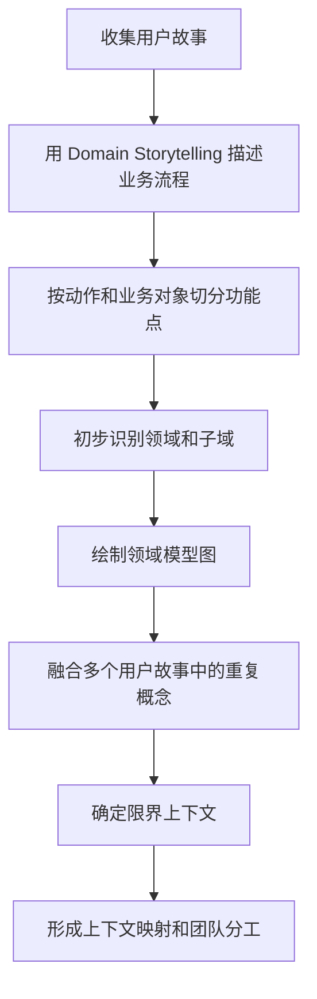

课程资料中的领域划分 PPT 给出的步骤是：

1. 先使用 Domain Storytelling 进行用户故事描述。
2. 根据用户故事内容进行功能点切分。
3. 根据功能点初步确定领域。
4. 划分领域模型图。
5. 根据多个用户故事的领域模型图合并和修正领域。
6. 得到最终领域划分。

### 3.3 领域叙事 Domain Storytelling

Domain Storytelling 是一种领域分析建模方法。通常由领域专家或产品讲述业务流程，架构师或研发用“谁做了什么”的句式把流程画出来，再通过问答澄清歧义。

它适合用来：

- 把用户故事可视化。
- 建立通用语言。
- 暴露业务流程中的缺口。
- 发现角色、动作、对象和系统交互。
- 为领域划分提供素材。

好处是业务人员容易参与，不需要先掌握 UML 或复杂建模语言。

### 3.4 用户故事

用户故事描述的是：某类用户因为什么原因，需要完成什么事情。常见格式：

> 作为某类角色，我希望完成某个活动，以便获得某种价值。

用户故事的 3W：

- Who：谁要做。
- Why：为什么做。
- What：要做什么。

好的用户故事要符合 INVEST 原则：

| 原则 | 含义 |
| --- | --- |
| Independent | 独立，便于排期、开发和测试 |
| Negotiable | 可协商，不要一开始写死全部细节 |
| Valuable | 有价值，能交付用户或业务价值 |
| Estimatable | 可评估，团队能估算复杂度 |
| Small | 足够小，最好能在一个迭代内完成 |
| Testable | 可测试，有明确验收标准 |

用户故事的三个准则：

- 一个用户：避免多个用户角色混在一个故事里。
- 完整价值：完成后能交付一个清晰目标。
- 不依赖：尽量减少重叠、顺序和包含依赖。

### 3.5 限界上下文划分方法

课程中总结了三种方式：

1. 领域用户故事陈述法  
   通过用户故事陈述、细分动作、融合概念来识别上下文。

2. 事件风暴法  
   通过事件、命令、参与者、策略、聚合等便利贴把流程铺开，再识别边界。

3. 基于子域概念提取  
   先识别核心子域、通用子域和支撑子域，再从子域中提取上下文。

边界划分时要观察：

- 是否存在单向联系。
- 是否使用不同通用语言。
- 是否由不同事件触发。
- 是否任务周期和变化频率不同。
- 是否归属不同团队和不同业务目标。

### 3.6 上下文映射

上下文映射描述限界上下文之间的模型映射、团队协作和集成关系。它决定了上下文如何集成，哪里需要防腐层，哪里可以共享模型，哪里应该保持独立。

#### 3.6.1 九大模式

| 模式 | 说明 | 适用场景 | 注意点 |
| --- | --- | --- | --- |
| 合伙人模式 | 两个上下文要么一起成功，要么一起失败 | 两个团队目标一致，强协作 | 计划和交付节奏要同步 |
| 共享内核 | 两个上下文共享部分模型或代码 | 共享部分稳定，团队协作紧密 | 谨慎使用，容易造成强耦合 |
| 客户方-供应方 | 下游向上游提需求，上游提供能力 | 核心域和非核心域协作 | 明确需求优先级和接口契约 |
| 顺从者 | 下游直接沿用上游模型 | 上游模型稳定，下游无议价能力 | 下游容易被上游污染 |
| 防腐层 | 下游通过转换层隔离上游模型 | 对接外部系统或遗留系统 | 防止外部语义进入本域 |
| 分道扬镳 | 两个系统不集成，各自独立 | 集成成本过高或无协作价值 | 避免强行统一 |
| 开放主机服务 | 上游提供公共 API | 一个服务被多个上下文消费 | API 要稳定、通用 |
| 公开语言 | 使用标准协议或标准模型 | 多方集成、行业标准 | 如 SQL、JDBC、TCP/IP |
| 大泥球 | 模型混乱、边界不清的系统 | 遗留系统或失控系统 | 一定要用防腐层保护自己 |

### 3.7 战略设计小结

战略设计不是代码实现，它是高层业务视角的设计。它的核心产物是清晰的业务边界、语言边界和协作边界。战略设计做不好，战术设计会在错误边界内精细化，最终造成更难修复的复杂度。

## 4. 领域模型

### 4.1 什么是领域模型

领域模型是对领域内概念、业务对象、业务规则和对象关系的抽象表达。它不是数据库模型，也不是普通 JavaBean。领域模型应该能够表达业务含义和业务行为。

业务对象大致包括：

- 业务角色：承担责任的人或系统角色，例如借款人、投资人、审核员。
- 业务实体：业务中可识别、可跟踪的对象，例如订单、借款申请、标的、账户。
- 业务用例：角色和实体如何协作完成业务流程。

### 4.2 贫血、失血、充血、胀血领域模型

讨论贫血、失血、充血、胀血模型，本质上是在讨论一个问题：业务规则到底放在哪里？对象是只承载数据，还是也应该承载行为？在 DDD 中，领域模型不是普通的数据容器，而应该表达业务概念、业务状态和业务行为。

传统三层架构通常是：

- Controller：接收请求、参数校验、返回响应。
- Service：组织业务流程、处理业务逻辑。
- DAO / Mapper：访问数据库。
- Entity / DO：承载数据字段，常常和数据库表对应。

在很多三层架构项目里，Entity 只负责装数据，Service 负责所有业务。这样写起来快，也符合很多框架生成代码的习惯，但当业务变复杂后，Service 会越来越厚，模型会越来越空，最终系统很难表达真实业务。

#### 4.2.1 四种模型的核心区别

| 类型 | 领域对象中有什么 | 业务逻辑主要在哪里 | 本质问题或适用场景 |
| --- | --- | --- | --- |
| 失血模型 | 只有字段，没有行为，甚至只是数据库表映射 | Service、DAO、SQL | 对象完全没有业务表达力，只是数据结构 |
| 贫血模型 | 有字段、少量简单方法，核心规则仍在 Service | Service | 三层架构中最常见，开发快，但领域语义弱 |
| 充血模型 | 有字段，也有与自身强相关的业务行为 | 领域对象、领域服务，应用服务只做编排 | DDD 推荐方向，适合复杂核心业务 |
| 胀血模型 | 什么都往对象里塞，既有业务，又有持久化、外部调用、事务、消息 | 领域对象本身 | 充血模型过度后的反模式，对象臃肿、依赖复杂、难测试 |

这四种模型不是语法差异，而是职责分配差异。判断一个项目是不是 DDD，不是看有没有 `domain` 包，而是看核心业务规则是否真的沉淀在领域模型里。

#### 4.2.2 失血模型

失血模型中的对象几乎没有任何业务能力，只有字段和 getter/setter。它甚至比贫血模型更弱：贫血模型有时还会有少量计算或校验方法，失血模型则完全把对象当作数据库记录或传输结构。

在三层架构中，失血模型常见形态是：

```text
Controller -> Service -> DAO -> Database
                 |
                 v
              Entity 只装数据
```

例如订单对象只有 `id`、`amount`、`status`，而“订单是否可以支付”“支付后状态如何变化”“取消订单是否释放库存”等规则全部写在 `OrderService` 里。这样会导致领域对象不能保护自己的合法状态，任何地方拿到对象后都可以随意 set。

失血模型的问题：

- 业务逻辑和业务数据完全分离。
- 对象无法表达业务行为。
- Service 容易变成过程脚本。
- 状态合法性只能靠外部代码维护。
- 需求变更时，很难定位规则属于哪个业务对象。

#### 4.2.3 贫血模型

贫血模型比失血模型稍好一些，对象可能包含少量简单方法，例如格式化、简单计算、状态判断。但核心业务仍然在 Service 中。

在典型三层架构中，贫血模型最常见：

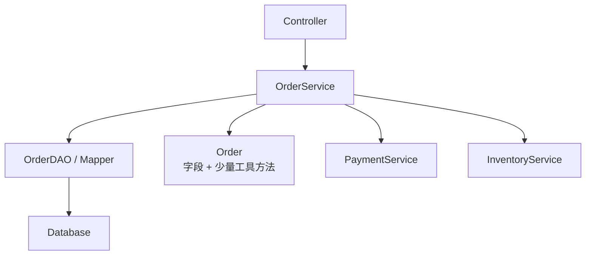

这种结构的特点是 Service 很强，对象很弱。对于简单 CRUD、后台管理、短生命周期项目，这种方式成本低、效率高。但在核心业务中，贫血模型会让业务规则分散在多个 Service 方法里。例如 `createOrder()`、`payOrder()`、`cancelOrder()`、`refundOrder()` 都在不同 Service 方法中修改订单状态，时间一长就容易出现规则冲突。

贫血模型中经常会出现“哑数据对象”。哑数据对象指的是只承载数据、不表达业务行为、不能保护自身状态合法性的对象。它看起来像领域对象，例如 `Order`、`User`、`LoanApplication`，但实际上只是字段集合，所有规则都要靠外部 Service 来解释和执行。比如订单对象暴露 `setStatus()`，但自己不知道“待支付才能支付”“已取消不能发货”这些规则，这样的对象就是典型哑数据对象。

贫血模型适用场景：

- 简单 CRUD。
- 业务规则很少。
- 项目生命周期短。
- 团队对 DDD 不熟悉，先保持简单更重要。

贫血模型的风险：

- Service 过厚。
- Entity 只是表结构映射。
- 领域对象退化成哑数据对象，只能被外部过程操作。
- 领域概念无法通过代码直接看出来。
- 很难保证状态变化的一致性。

#### 4.2.4 充血模型

充血模型让领域对象拥有与自身业务含义强相关的行为。对象不仅知道自己有哪些属性，也知道自己能做什么、不能做什么、在什么条件下改变状态。

例如订单聚合根可以拥有这些方法：

```java
order.pay(paymentNo, paidAmount);
order.cancel(reason);
order.applyRefund(refundReason);
order.confirmReceived();
```

这些方法不是简单 set 状态，而是封装业务规则：

- 待支付订单才能支付。
- 已取消订单不能支付。
- 支付金额必须等于应付金额。
- 已发货订单取消需要走退款流程。
- 已完成订单不能重复确认收货。

在 DDD 风格中，三层架构里的 Service 会被重新理解：

- Controller 仍然负责接口适配。
- Application Service 负责编排用例、事务、仓储调用。
- Domain Model 负责核心业务规则。
- Repository 负责聚合的加载和保存。
- Infrastructure 负责数据库、消息、第三方系统。

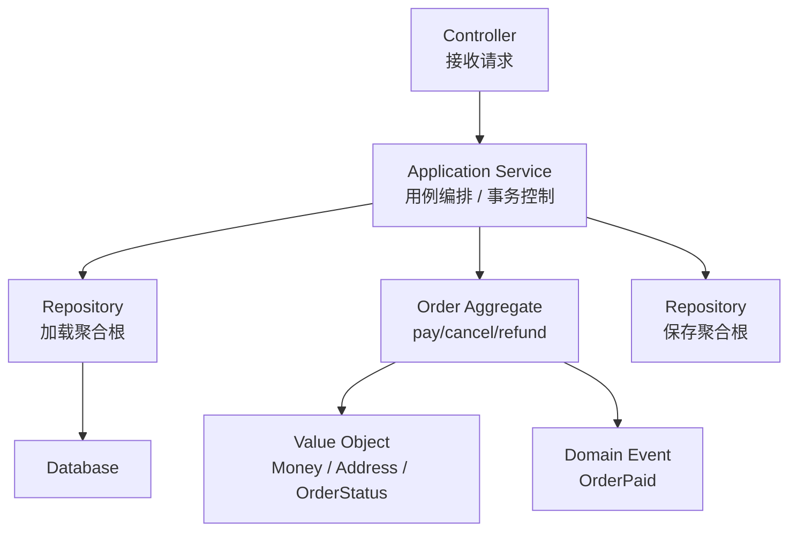

充血模型不是把所有代码都写进实体，而是把“实体天然应该负责的业务规则”放回实体。例如订单负责自己的状态流转，金额对象负责金额计算和币种校验，额度对象负责额度占用和释放。

充血模型的收益：

- 业务规则和业务数据内聚。
- 对象能保护自身合法状态。
- 代码更接近通用语言。
- 核心规则更容易复用和测试。
- Service 从“业务逻辑中心”变成“用例编排中心”。

充血模型的边界：

- 跨多个聚合的流程，不应硬塞进单个实体。
- 外部系统调用，不应放进实体。
- 事务控制，不应放进实体。
- 查询报表，不一定要走充血领域模型。
- 技术细节应留在基础设施层。

#### 4.2.5 胀血模型

胀血模型是对充血模型的误用。它看似“对象有行为”，但实际上把太多不属于领域对象自然职责的逻辑都塞进对象里。

典型表现：

- 实体直接调用 DAO 或 Repository。
- 实体直接调用第三方支付、短信、资管平台接口。
- 实体自己开启事务、提交事务、回滚事务。
- 实体发布 MQ 消息、写日志、做缓存。
- 实体编排多个聚合或多个上下文的完整流程。

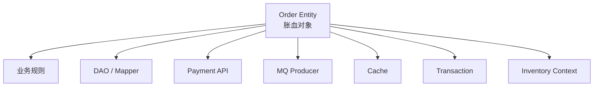

这种设计会让领域对象变得非常难维护。它既不像贫血模型那样简单，也不像充血模型那样纯粹。对象依赖大量技术组件后，单元测试困难，复用困难，边界也会变得模糊。

判断是否胀血，可以问：

- 这个行为是否属于该实体的固有业务能力？
- 这个行为是否需要访问数据库、缓存、消息或外部系统？
- 这个行为是否在编排多个聚合或多个上下文？
- 这个行为是否更多是应用流程，而不是领域规则？

如果答案偏向后面三项，就不应该放进实体。它更可能属于应用服务、领域服务、防腐层、仓储或领域事件。

#### 4.2.6 和三层架构的关系

DDD 并不是简单否定三层架构，而是重新分配三层架构中的职责。传统三层架构的问题，通常不是层次本身有错，而是 Service 承担了太多领域职责。

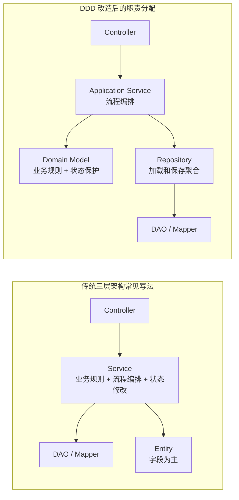

可以这样理解：

| 三层架构中的角色 | 贫血/失血模型下的常见职责 | DDD 充血模型下的推荐职责 |
| --- | --- | --- |
| Controller | 接口接入，有时也写业务判断 | 只做接口适配、参数转换、响应封装 |
| Service | 核心业务规则、流程编排、状态修改、事务 | 应用服务只做用例编排、事务和协调 |
| Entity | 数据字段、getter/setter | 实体/聚合根承载自身业务规则和状态变化 |
| DAO / Mapper | 数据访问 | 仍做数据访问，但通过 Repository 隔离 |
| Repository | 常被省略，Service 直接调 DAO | 面向聚合加载和保存，隔离持久化细节 |

所以，从三层架构迁移到 DDD，不是把 `service` 改名为 `domainService`，也不是多建几个包，而是把业务规则从过程式 Service 中逐步移动到领域对象、领域服务和聚合边界中。

#### 4.2.7 如何选择

| 场景 | 建议模型 |
| --- | --- |
| 简单后台、字典维护、低复杂度 CRUD | 贫血模型即可 |
| 复杂核心业务、状态流转多、规则多 | 优先充血模型 |
| 遗留系统、表结构驱动、短期维护 | 可能只能接受贫血或失血现状，逐步重构 |
| 对象里已经混入数据库、事务、外部接口 | 警惕胀血模型，拆出应用服务、防腐层和仓储 |

一个实用原则是：核心业务要充血，非核心业务可以贫血，任何业务都要避免胀血。DDD 的目标不是让所有对象都“胖”起来，而是让业务规则待在最合适的位置。

### 4.3 模型和数据库的关系

DDD 不是不需要数据库，而是不让数据库成为业务建模的起点。推荐思路：

1. 先理解业务规则和对象关系。
2. 设计领域模型。
3. 再考虑持久化模型。
4. 用仓储、装配器、转换器隔离领域模型和持久化模型。

一个实体可能对应一张表，也可能对应多张表；一个值对象可能嵌入实体表中，也可能序列化成 JSON 字段；一个聚合可能由多张表共同持久化。

## 5. 战术设计详解

### 5.1 实体 Entity

实体用唯一标识定义，而不是通过属性定义。即使两个对象所有属性一样，只要唯一标识不同，它们就是两个实体。

实体的特征：

- 有唯一标识。
- 有生命周期。
- 有状态变化。
- 有业务行为。
- 业务行为会影响实体状态。

实体示例：

- 用户。
- 订单。
- 借款申请。
- 支付单。
- 标的。
- 账户。

实体设计建议：

- 不要只提供空构造和 setter。
- 创建时应保证对象处于合法状态。
- 行为方法应体现业务语言，例如 `approve()`、`reject()`、`freeze()`、`submit()`。
- 基础类型应尽量被有业务含义的值对象替代，例如 `Money`、`PhoneNumber`、`CreditScore`。

### 5.2 值对象 Value Object

值对象用于描述领域中的某个方面，没有唯一标识。我们关心它是什么，不关心它是谁。

值对象的特征：

- 没有唯一标识。
- 通常不可变。
- 无独立生命周期。
- 常作为实体属性或属性集合。
- 可用于封装校验规则和业务含义。

值对象示例：

- 金额 Money。
- 地址 Address。
- 手机号 PhoneNumber。
- 时间范围 DateRange。
- 利率 InterestRate。
- 身份证号 IdentityNo。

值对象的好处：

- 减少基础类型滥用。
- 把校验逻辑内聚到对象中。
- 简化数据库设计。
- 提升模型表达力。

使用风险：

- 值对象过大，会掩盖实体边界。
- 值对象可变，会破坏模型一致性。
- 值对象被强行单独持久化，可能变成伪实体。

### 5.3 实体和值对象的区别

| 对比项 | 实体 | 值对象 |
| --- | --- | --- |
| 唯一标识 | 有 | 无 |
| 生命周期 | 有 | 通常无 |
| 可变性 | 可以变化 | 倾向不可变 |
| 关注点 | 是谁 | 是什么 |
| 持久化 | 常单独持久化 | 常嵌入实体 |
| 示例 | 用户、订单、账户 | 地址、金额、手机号 |

判断口诀：

- 需要跟踪“这个对象是谁”，通常是实体。
- 只关心“这些值是什么”，通常是值对象。
- 会被独立修改、查询、关联和追踪，倾向实体。
- 只是作为另一个对象的描述，倾向值对象。

### 5.4 聚合 Aggregate

聚合是业务和逻辑紧密关联的实体和值对象组成的整体。它是数据修改和一致性维护的基本单元。

聚合的核心价值：

- 把强一致性规则收敛在一个边界内。
- 降低对象之间随意引用。
- 明确事务边界。
- 让业务操作从聚合根进入。

### 5.5 聚合根 Aggregate Root

聚合根是聚合对外唯一入口，必须是实体。

聚合根职责：

- 管理聚合内部实体和值对象。
- 维护聚合内的不变量。
- 对外暴露业务行为。
- 控制聚合内部对象访问。
- 作为仓储保存和加载的主要对象。

聚合根规则：

- 外部只能持有聚合根引用或聚合根 ID。
- 外部不能直接修改聚合内部对象。
- 聚合之间通过 ID 关联，避免对象引用穿透。
- 一个事务内尽量只修改一个聚合。

### 5.6 聚合边界划分原则

1. 生命周期一致性  
   聚合内部对象应该和聚合根具有相同或高度一致的生命周期。聚合根消失，内部对象通常也失去存在意义。

2. 问题域一致性  
   不属于同一个问题域的对象，不应该强行放进同一个聚合。生命周期相近不代表业务问题相同。

3. 场景一致性  
   经常被同时操作的对象更适合放入同一个聚合。很少同时操作的对象，即使有关联，也不一定要放在一起。

4. 聚合尽可能小  
   大聚合会降低性能、增加并发冲突、加大重构难度。

5. 强一致性优先  
   需要同一事务保证不变量的对象适合放在同一聚合；可以最终一致的对象可通过领域事件解耦。

### 5.7 领域服务 Domain Service

领域服务用于承载不适合放入实体和值对象的重要领域行为。它不是普通 Service，也不是应用服务。

适合放入领域服务的逻辑：

- 跨多个实体的核心领域操作。
- 和实体紧密相关但不属于某个实体自然职责的行为。
- 涉及外部系统但仍属于核心领域规则的操作。

例子：

- 两个账户之间转账。
- 根据风控规则计算授信额度。
- 调用资管平台完成核心放款校验。

领域服务约束：

- 应保持薄，不要变成大杂烩。
- 不要写大量流程编排代码。
- 尽量不要直接调用 DAO。
- 跨上下文协作优先用领域事件或防腐层。

### 5.8 应用服务 Application Service

应用服务负责用例编排，协调领域对象完成任务。它不应该承载核心业务规则。

应用服务可以做：

- 事务控制。
- 权限校验。
- 参数转换。
- 调用仓储加载聚合。
- 调用聚合方法或领域服务。
- 发布领域事件。
- 返回 DTO。

应用服务不应该做：

- 判断核心业务规则。
- 直接操作聚合内部状态。
- 堆积大量 if/else 业务分支。
- 绕过领域模型直接操作数据库。

### 5.9 领域事件 Domain Event

领域事件表示领域中已经发生的、领域专家关心的事情。事件通常用过去式命名。

示例：

- `OrderCreated`
- `OrderPaid`
- `LoanApproved`
- `CreditAccountBound`
- `BidSucceeded`
- `RepaymentOverdue`

领域事件适合：

- 某个实体完成动作后，需要触发后续处理。
- 跨聚合、跨上下文协作。
- 非强一致的后续动作。
- 解耦通知、积分、日志、大数据、风控等旁路逻辑。

领域事件的价值：

- 解耦主流程和后续动作。
- 支持最终一致性。
- 降低新增需求对原有流程的侵入。
- 让业务发生的事实显性化。

领域事件的风险：

- 滥用会增加代码理解成本。
- 异步事件带来最终一致性和重试问题。
- 事件命名不准确会破坏通用语言。
- 事件太细会造成事件风暴式的系统噪音。

### 5.10 仓储 Repository

仓储封装聚合根与持久化机制之间的交互。它让领域层像操作集合一样获取和保存聚合，而不是关心数据库细节。

仓储建议：

- 原则上只有聚合根需要仓储。
- 不要给每个实体都创建仓储。
- 方法尽量少，例如 `byId()`、`save()`，必要时可有 `byBizId()`。
- 仓储不是 DAO，不应该暴露大量按字段查询和表操作方法。
- 仓储接口可放在领域层，实现放在基础设施层。

### 5.11 工厂 Factory

工厂封装复杂实体或聚合的创建逻辑，保证对象创建后处于合法状态。

适用场景：

- 聚合创建需要多个实体和值对象。
- 创建过程涉及复杂默认值和规则。
- 构造方法参数太多。
- 需要避免外部随意 setter。

简单对象可以用静态创建方法，例如 `Product.create(name, description, price)`；复杂聚合可以使用独立工厂类。

## 6. DDD 分层架构

### 6.1 三层架构

传统三层架构：

- 表现层：Controller、Servlet、页面接口。
- 业务逻辑层：Service。
- 数据访问层：DAO、Mapper。

优点是简单直观，适合常规项目。问题是业务逻辑容易堆在 Service 中，领域对象容易退化成贫血模型。

### 6.2 DDD 四层架构

经典 DDD 四层：

| 层 | 职责 |
| --- | --- |
| User Interface | 用户界面层，处理用户请求、展示信息、模型装配 |
| Application | 应用层，定义用例任务，协调领域对象 |
| Domain | 领域层，表达业务概念、规则、状态和领域行为 |
| Infrastructure | 基础设施层，提供持久化、消息、框架、第三方接口等技术能力 |

图示如下：

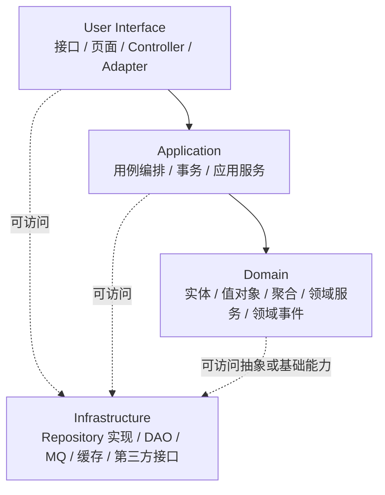

经典 DDD 四层架构通常属于限定型松散分层架构，而不是严格分层架构。严格分层要求某一层只能访问紧邻的下一层；松散分层允许上层访问任意下层。四层架构的特殊之处在于 Infrastructure 基础设施层像一个 “L 型”支撑层，可以被 User Interface、Application、Domain 等上层访问，用来提供持久化、消息、框架、工具和第三方接口等能力。

不过在实际落地中，要控制这种松散访问的边界：领域层可以定义仓储接口或依赖抽象，但不应该直接依赖 MyBatis、Redis、MQ Client、HTTP SDK 等技术细节。否则四层架构会退化成到处可调基础设施的混乱结构。

### 6.3 五层架构与 DCI

DCI 指 Data、Context、Interactions：

- Data：对象数据。
- Context：对象场景或上下文。
- Interactions：对象交互行为。

DCI 试图弥补 MVC 中控制器过重、行为外泄、对象贫血的问题。它把数据、场景、交互显式建模，更贴近 DDD 中角色、场景和行为的表达。

DCI 的核心关系可以理解为：Data 提供稳定的数据和基础能力，Context 描述某个业务场景，Interactions 描述对象在该场景中扮演的角色和交互行为。对象本身不必把所有场景行为都写死在自己身上，而是在具体 Context 中被赋予合适的 Role。

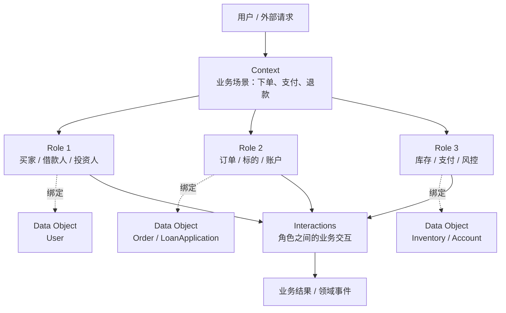

这张图表达的是：同一个 Data Object 在不同 Context 中可能扮演不同 Role。例如 `User` 在借款流程中是借款人，在投资流程中是投资人，在后台流程中又可能是被审核对象。DCI 通过 Context 把“对象数据”和“场景行为”分开，避免所有行为都挤进一个实体里，也避免所有行为都堆到 Service 里。

五层架构可理解为：

| 层 | 职责 |
| --- | --- |
| User Interface | 接口和请求适配 |
| Application | 调度和应用任务 |
| Context | 按场景组织角色交互 |
| Domain | 领域对象、角色和关系 |
| Infrastructure | 技术基础设施 |

在五层架构中，DCI 的落位可以画成这样：

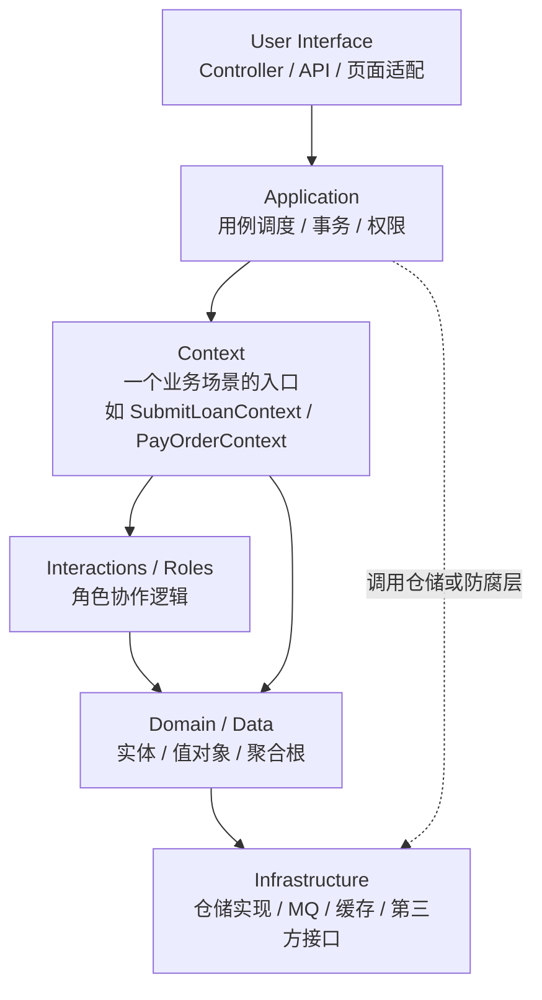

其中，Application 层不直接承载核心业务规则，而是选择并调用合适的 Context；Context 层负责把领域对象放入具体业务场景，让对象按角色进行交互；Domain 层保存领域对象、值对象、聚合和基础业务能力；Infrastructure 层提供技术实现。

### 6.4 六层架构变体

当业务链路复杂、同步异步混合、上下文流程较重时，可以将 Context 进一步拆分：

| 层 | 职责 |
| --- | --- |
| User Interface | 接收 Restful 请求、解析输入 |
| Scheduler | 调度多进程、多线程、多协程和任务 |
| Transaction | 以业务流程为单位组织多个 Action，处理事务和回滚 |
| Context | 以 Action 为单位处理同步或异步消息 |
| Domain | 定义领域模型和角色 |
| Infrastructure | 提供框架、持久化、消息、算法、第三方库 |

图示如下：

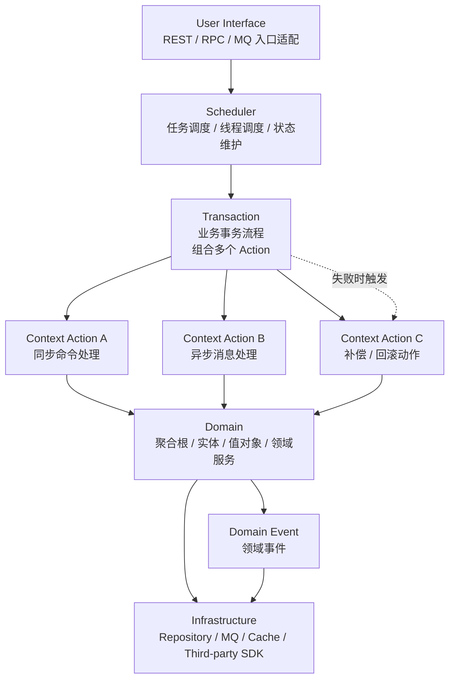

六层架构的重点不是“多一层更高级”，而是把复杂业务链路拆清楚：Scheduler 负责调度入口，Transaction 负责一组 Action 的流程和事务边界，Context 负责单个 Action 中对象角色的协作，Domain 负责真正的业务规则，Infrastructure 负责技术实现。比如放款流程可能包含资质复核、标的满额确认、资金托管平台放款、放款结果回调、失败补偿等多个 Action，用六层变体会比把所有流程堆在一个 Application Service 中更清晰。

课程强调：六层可以看作五层架构在特定领域的变体，不建议为了好看而过度分层。

### 6.5 六边形架构

六边形架构也叫端口与适配器架构。它通过端口和适配器把核心业务与外部技术隔离。

核心思想：

- 业务核心位于内部。
- 外部输入输出通过端口进入。
- 不同协议、数据库、消息、第三方系统通过适配器接入。
- 内部不依赖外部技术细节。

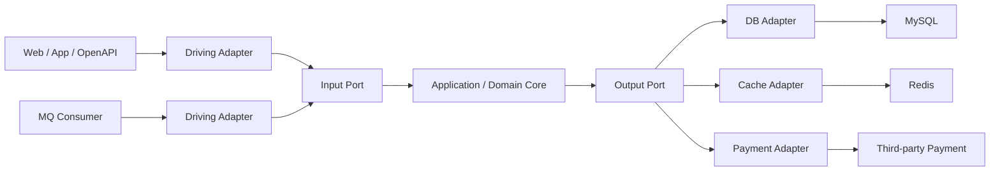

适配器类型：

- 主适配器 Driving Adapter：用户请求、前端、API、消息消费等输入。
- 次适配器 Driven Adapter：数据库、缓存、邮件、支付、OSS、外部接口等输出。

六边形架构适合希望核心业务稳定、外部技术可替换、测试更容易的系统。

### 6.6 洋葱架构

洋葱架构也是 DDD 常见落地方式。它强调依赖向内，领域模型位于核心，基础设施位于外层。

核心原则：

- 内层不依赖外层。
- 外层实现内层定义的接口。
- 领域模型不依赖框架。
- 基础设施可替换。

### 6.7 工程包结构参考

DDD 工程目录通常分两层看：第一层是工程级目录，解决多模块、启动、配置、部署和依赖管理；第二层是模块内部包结构，解决接口层、应用层、领域层和基础设施层的职责分离。

#### 6.7.1 工程级目录结构

以“好借好还”这类多业务模块项目为例，可以按业务边界拆成多个 Maven Module。每个业务模块内部再遵循 DDD 四层结构。

```text
ddd-hjhh
├── pom.xml                              # 父工程，统一依赖版本、插件、模块声明
├── README.md
├── docs                                 # 架构图、领域模型、接口文档、事件风暴产物
│   ├── domain
│   ├── api
│   └── deployment
├── ddd-hjhh-bootstrap                   # 启动模块，组装配置和启动类
│   └── src
│       ├── main
│       │   ├── java
│       │   │   └── com.msb.ddd.hjhh.BootstrapApplication.java
│       │   └── resources
│       │       ├── application.yml
│       │       ├── application-dev.yml
│       │       └── application-prod.yml
│       └── test
├── ddd-hjhh-common                      # 跨模块公共能力，放真正通用且稳定的内容
│   └── src/main/java/com/msb/ddd/hjhh/common
├── ddd-hjhh-manage                      # 管理模块
│   └── src/main/java/com/msb/ddd/hjhh/manage
├── ddd-hjhh-business                    # 交易模块
│   └── src/main/java/com/msb/ddd/hjhh/business
├── ddd-hjhh-auditing                    # 审核模块
│   └── src/main/java/com/msb/ddd/hjhh/auditing
├── ddd-hjhh-payment                     # 支付模块
│   └── src/main/java/com/msb/ddd/hjhh/payment
├── ddd-hjhh-balance                     # 结算模块
│   └── src/main/java/com/msb/ddd/hjhh/balance
├── ddd-hjhh-outside                     # 第三方对接模块，资管、短信、OSS 等防腐层
│   └── src/main/java/com/msb/ddd/hjhh/outside
└── scripts                              # 构建、部署、数据库初始化等脚本
    ├── build.sh
    ├── deploy.sh
    └── sql
```

目录设计要注意两点：

- `common` 只能放真正稳定、无业务争议的通用能力，例如基础异常、通用响应、基础工具、通用值类型。不要把跨域业务逻辑放进 `common`，否则它会变成新的“大泥球”。
- `outside` 这类外部对接模块应承担防腐层职责，把资管平台、支付平台、短信、OSS 等外部模型转换为本系统内部模型，避免外部接口字段和状态污染核心领域。

#### 6.7.2 模块内部包结构

资料中的四层架构代码结构可以整理为：

```text
com.mashibing.ddd
├── apis
│   ├── model        # VO / DTO，接口层模型
│   ├── assembler    # API 模型与领域模型转换
│   └── controller   # Restful 接口
├── application
│   ├── service      # 应用服务
│   ├── task         # 任务、调度、流程协调
│   └── ...
├── domain
│   ├── common       # 领域层公共代码
│   ├── events       # 领域事件
│   ├── model
│   │   ├── dict
│   │   │   ├── DictVo.java
│   │   │   ├── DictEntity.java
│   │   │   ├── DictAgg.java
│   │   │   └── DictService.java
│   │   └── ...
│   ├── service      # 领域服务
│   └── factory      # 工厂
├── infrastructure
│   ├── persistent
│   │   ├── po       # 持久化对象
│   │   └── repository
│   └── general
│       ├── config
│       ├── toolkit
│       └── common
└── resources
    ├── statics
    ├── template
    └── application.yml
```

### 6.8 对象命名约定

| 对象含义 | 分层位置 | 常见命名 | 本项目建议 |
| --- | --- | --- | --- |
| 视图层对象 | 接口适配层 | VO | VO |
| 数据传输对象 | 应用层 | DTO | DTO |
| 数据存储对象 | 基础设施层 | PO / DO | DO |
| 领域对象 | 领域层 | DO / BO | 按领域对象命名 |

## 7. 微服务架构设计

### 7.1 架构演进

#### 7.1.1 单体架构

所有功能在一个工程中，一个包部署。优点是简单、开发成本低、适合小项目。缺点是大型项目难扩展、难维护、技术栈受限。

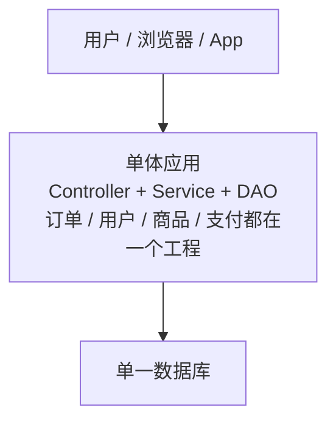

单体架构的核心特征是“一个应用包承载所有业务能力”。代码、发布、扩容和故障边界都集中在一起：一个模块出问题，可能影响整个应用；某个功能需要扩容，也只能扩整个应用。

#### 7.1.2 集群架构

在单体基础上进行水平扩容，通过多节点提高吞吐。它解决容量问题，但没有解决代码和业务边界问题。

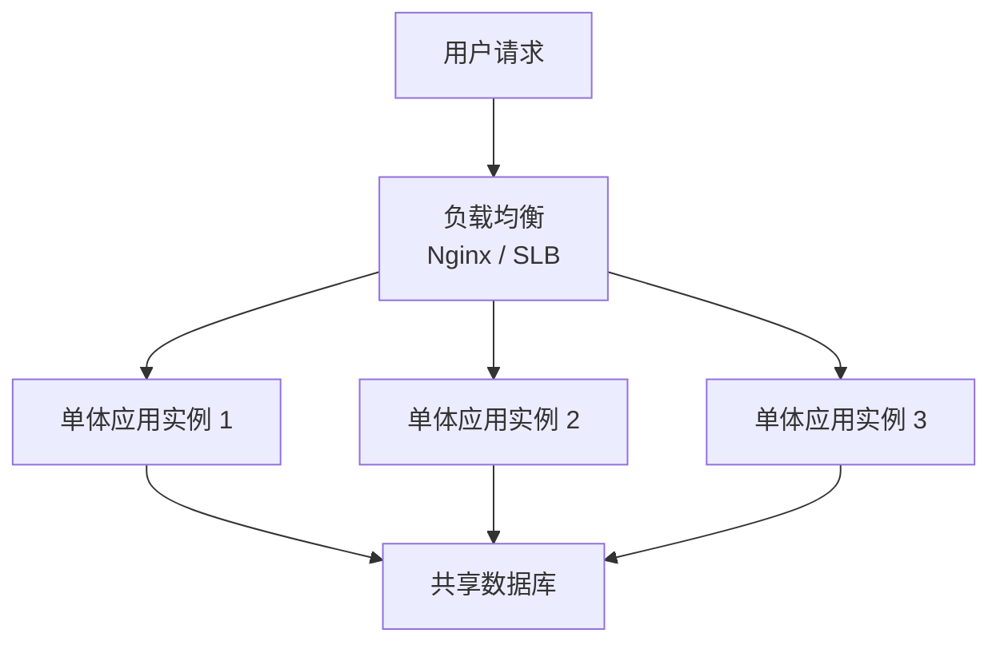

集群架构解决的是运行容量问题，而不是架构边界问题。多个实例运行的是同一份单体代码，业务耦合、代码耦合、数据库耦合仍然存在。

#### 7.1.3 垂直架构

按业务线把大系统拆成多个单体项目。优点是控制单体膨胀，不同项目可用不同技术；缺点是数据冗余、系统耦合、接口同步复杂。

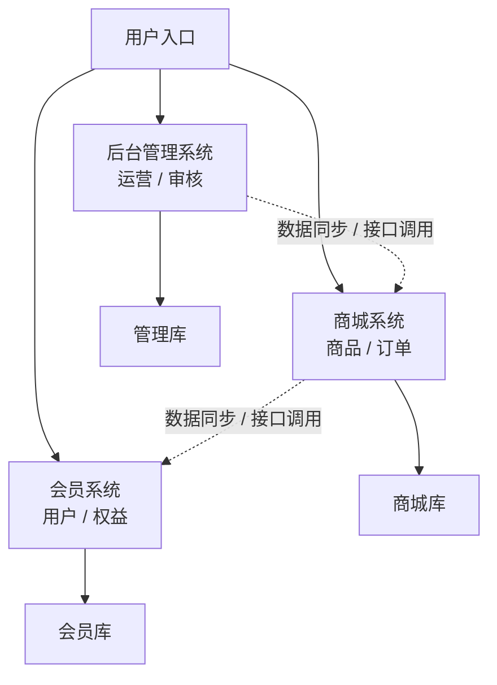

垂直架构已经开始按业务线拆分系统，但每个系统内部仍然可能是单体。它缓解了一个工程无限膨胀的问题，却容易带来重复建设和数据同步问题，例如多个系统都保存用户信息、订单摘要或权限数据。

#### 7.1.4 SOA 架构

将重复功能抽取成服务，通过 WebService、RPC、ESB 等方式集成。它解决服务复用和信息孤岛，但服务边界容易模糊，ESB(Enterprise Service Bus) 可能成为中心化瓶颈。

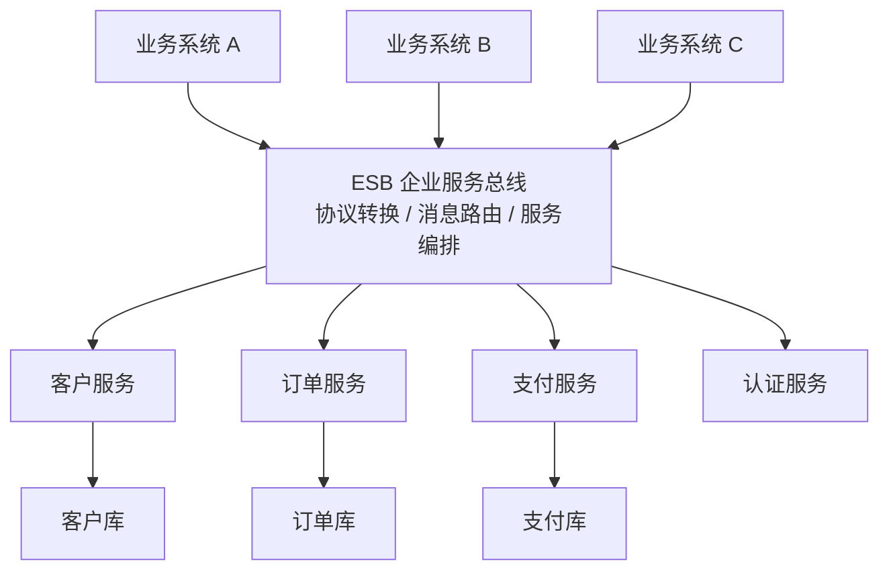

SOA 的重点是服务复用和系统集成。它会把多个系统都需要的能力抽取成共享服务，再通过 ESB 统一接入。问题在于中心化总线可能越来越重，服务粒度也常常偏粗，业务系统和共享服务的边界容易变得模糊。

#### 7.1.5 微服务架构

将服务层拆分成一个个独立微服务，遵循单一职责，服务之间通过 RESTful、RPC、消息等轻量方式通信。

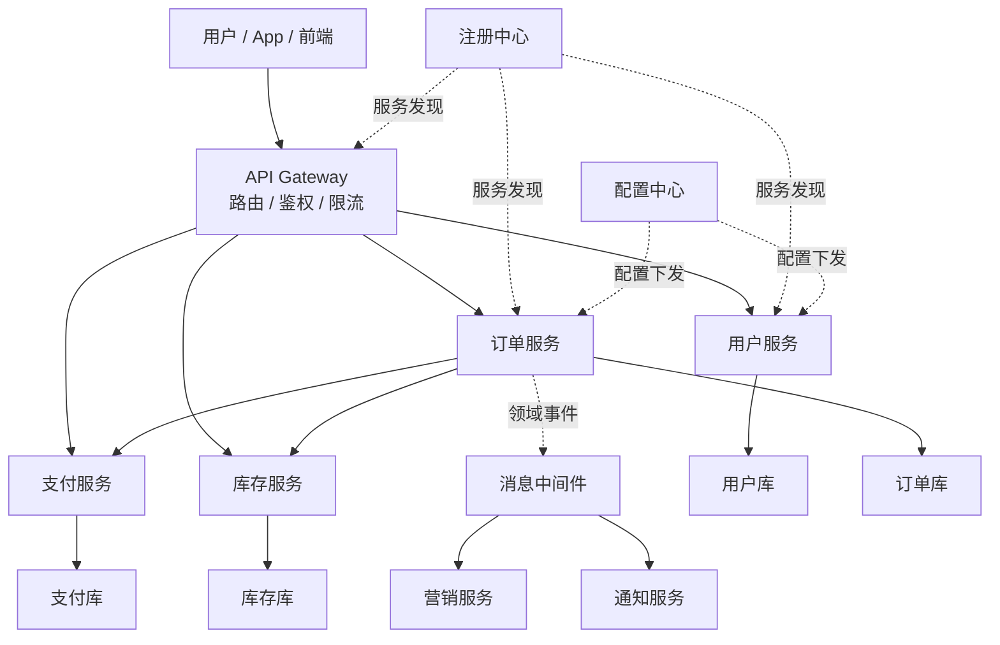

微服务架构的核心是围绕业务能力形成自治服务。每个服务尽量拥有独立数据、独立部署、独立扩容和明确团队责任。服务之间通过轻量协议同步调用，通过消息和领域事件进行异步解耦。

优点：

- 服务粒度更细。
- 独立部署和扩容。
- 技术选型更灵活。
- 更适合快速迭代。
- 团队边界更清晰。

缺点：

- 服务治理成本高。
- 分布式事务复杂。
- 调用链路变长。
- 监控、日志、排障要求更高。
- 对团队工程能力要求更高。

### 7.2 SOA 与微服务区别

| 对比 | SOA | 微服务 |
| --- | --- | --- |
| 主要目标 | 服务复用、解决信息孤岛 | 解耦、独立演进、弹性扩展 |
| 服务粒度 | 通常较粗 | 更细，围绕业务能力 |
| 集成方式 | 常依赖 ESB | 去中心化，轻量协议 |
| 治理方式 | 中心化治理较多 | 服务自治较多 |
| 团队关系 | 共享服务能力 | 团队拥有服务边界 |

### 7.3 微服务基础组件

| 组件 | 作用 | 典型技术 |
| --- | --- | --- |
| 服务通信 | 服务之间调用 | HTTP、REST、RPC、Feign |
| 应用网关 | 路由、鉴权、限流、负载均衡 | Spring Cloud Gateway |
| 注册中心 | 服务发现、续约、下线、动态感知 | Nacos、Eureka |
| 负载均衡 | 客户侧或服务侧流量分配 | Ribbon、LoadBalancer |
| 配置中心 | 配置统一管理和动态刷新 | Nacos Config |
| 链路追踪 | APM工具定位瓶颈和调用链问题 | Sleuth、Zipkin、SkyWalking |
| 日志监控 | 日志采集、分析、告警 | ELK、Prometheus、Grafana |
| 断路器 | 故障隔离、降级、熔断 | Sentinel、Hystrix |
| 消息中间件 | 异步、削峰、事件驱动 | RocketMQ、Kafka |

### 7.4 服务通信

微服务通信常见方式：

- HTTP/REST：简单、通用、可读性好，适合开放接口和跨语言。
- RPC：性能和契约更强，适合内部高频调用。
- MQ：异步解耦、削峰、最终一致性，适合事件通知和跨上下文协作。

HTTP 与 RPC 都属于常见的同步服务调用方式，调用方会等待被调用方返回结果。区别在于 HTTP/REST 更偏资源和开放协议，RPC 更偏远程方法调用和强契约。

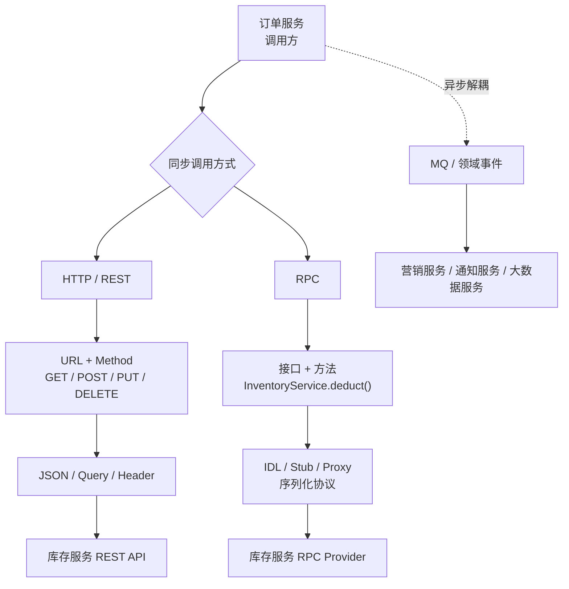

| 对比项 | HTTP / REST | RPC |
| --- | --- | --- |
| 思维方式 | 面向资源，例如 `/orders/{id}` | 面向方法，例如 `deductStock()` |
| 协议开放性 | 通用、跨语言、对外友好 | 内部服务更常见，依赖框架和契约 |
| 可读性 | URL、Header、JSON 更直观 | 对调用者像本地方法，网络细节被隐藏 |
| 性能 | 通常略低，但足够通用 | 通常更高，可使用高效序列化 |
| 契约约束 | 依赖接口文档、OpenAPI、约定 | 依赖 IDL、接口定义、代码生成 |
| 适用场景 | 开放接口、跨团队、跨语言、网关入口 | 内部高频调用、强类型契约、低延迟场景 |

选择建议：

- 查询类、同步用户操作：HTTP 或 RPC。
- 跨上下文后续动作：领域事件加 MQ。
- 核心强一致事务：尽量收敛在一个聚合或一个服务内。
- 外部系统对接：使用防腐层和适配器隔离。


### 7.5 微服务拆分与 DDD

微服务边界可以参考：

- 限界上下文。
- 子域边界。
- 聚合边界。
- 团队边界。
- 数据所有权。
- 变化频率。
- 非功能需求，例如性能、安全、合规。

拆分时不要只看代码量或表数量。一个好的微服务应该有清晰业务目标、独立数据所有权、明确接口契约和可独立部署能力。

## 8. 事件风暴 Event Storming

### 8.1 什么是事件风暴 What Is Event Storming

事件风暴是 Alberto Brandolini 提出的一种协作建模方法。它通过便利贴把业务中发生的事件、触发命令、参与角色、外部系统、策略、读模型、聚合等贴出来，让不同角色快速建立共识。

事件风暴不是数据建模，而是行为建模。它更关注业务中“发生了什么”。

### 8.2 事件风暴的目的 Goals

- 建立通用语言。
- 获得业务流程概览 Big Picture。
- 找出核心价值、风险和机会。
- 暴露盲点和争议。
- 识别聚合、限界上下文和领域事件。
- 作为导入 DDD 的起点。

### 8.3 应用场景 Use Cases

| 场景 | 目标 | 常用元素 |
| --- | --- | --- |
| 概览Big Picture | 理清复杂商业系统和整体流程 | Event、System、Question |
| 流程模型Process Modelling | 讨论特定流程并发现 Bug | Event、Actor、Command、Policy、Read Model |
| 软件设计Software Design | 进一步设计软件模型和边界 | 聚合Aggregate、限界上下文Bounded Context |

### 8.4 参与角色 Participants

- 主持人 Facilitator：控制流程、推动讨论、避免跑题。
- 领域专家 Domain Expert：提供业务知识和决策。
- 其他利益相关者Other Stackholder：研发、测试、设计、运营、市场、架构、运维等。

### 8.5 便利贴颜色和含义 Sticky Note Legend

| 颜色 | 元素 | 含义 |
| --- | --- | --- |
| 橘色 | Event | 已经发生的领域事件 |
| 蓝色 | Command | 触发事件的命令 |
| 紫色 | Policy / Process | 商业政策或流程 |
| 黄色小贴 | Actor | 角色 |
| 黄色长贴 | Aggregate | 聚合 |
| 粉色 | System | 外部系统 |
| 红色 | Hotspot / Problem | 热点问题或疑问 |
| 绿色 | Opportunity / Read Model | 机会或读取模型 |
| 白色 | User Interface | 用户界面 |

### 8.6 实施步骤 Workshop Steps

1. 从事件开始  
   用过去式描述领域专家关心的事实，例如“订单已创建”“额度已审批”“账户已绑定”。

2. 按时间线排列  
   从左到右铺开业务发生顺序，必要时标注时间点和原因。

3. 提出问题  
   对不懂、冲突、体验差、规则不明确的地方贴出问题。

4. 标记热点  
   对暂时无法解决或需要后续决策的问题标记 Hotspot。

5. 补充命令  
   找出触发事件的命令，例如“提交借款申请”“发起支付”“审核资质”。

6. 补充角色、系统、策略和读模型  
   识别谁触发、哪个系统响应、哪些规则生效、页面需要读什么数据。

7. 围绕聚合分组  
   把相关命令和事件归入聚合，识别状态变化。

8. 推导限界上下文  
   根据语言、模型、团队和事件流识别边界。

## 9. 从项目去剖析领域驱动

这一章的重点不是继续讲概念，而是把 DDD 放到一个具体项目里，看如何从业务分析走到领域划分、领域事件、工程构建和战略设计回扣。

用“一体化商城平台”作为示例：它集物流、仓储、电商于一体，服务中小商家，商家可以申请开店，平台提供第三方物流、仓储和交易保障能力。这个例子很适合说明 DDD 的价值，因为它不是单一 CRUD 系统，而是天然包含多角色、多流程、多子域、多系统协作的复杂业务。


通用微服务技术架构图


### 9.1 设计流程

- 战略设计通过限界上下文从全局的角度规划整个系统的业务模块。
- 逐步细化，对每个模块开展事件风暴会议进行领域建模。
- 逐步落实到每个模块的数据库设计与微服务设计以及需要涉及的分布式技术与云端部署。

### 9.2 设计一个 DDD 的电商项目

设计一个 DDD 项目，第一步不是选 Spring Cloud、Redis、RocketMQ，也不是先画数据库表，而是先回答业务问题：

- 这个平台到底解决什么问题？
- 核心用户是谁？
- 谁在平台上创造价值？
- 哪些流程决定平台竞争力？
- 哪些能力只是支撑或通用能力？
- 哪些业务变化最频繁、最复杂？

一体化商城平台中，典型入口包括：

- 移动用户端和 PC 电商网站。
- PC 商家后台和移动商家后台。
- PC 后台管理。
- 大数据管理后台。

这些入口不是领域划分本身。入口只是用户接触系统的方式，领域划分要进一步追问：这些入口背后有哪些业务能力？例如用户下单、商家上架商品、平台审核店铺、仓库履约、物流发货、支付结算、售后退款、营销活动、数据分析等。

可以用下面的流程理解项目级 DDD 设计：

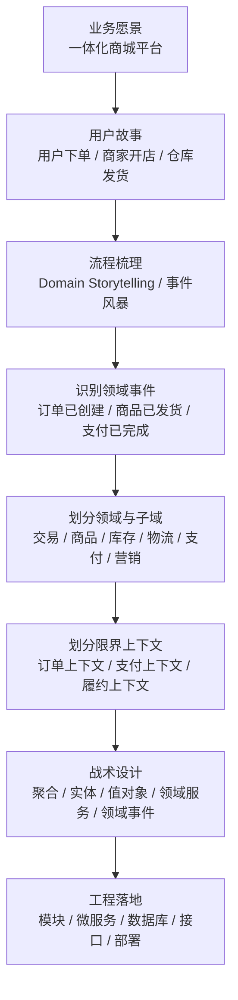

DDD 可以把业务分析和技术实现分离：先在问题空间里把业务弄清楚，再在解决方案空间里选择架构和技术。

### 9.3 六个问题：使用 DDD 前先想清楚

#### 9.3.1 为什么使用 DDD

DDD 的方法论核心是分而治之。面对一个大业务时，团队往往无从下手，于是容易退回到“多少功能、多少接口、多少表”的粗糙拆分方式。DDD 要做的是把大问题拆成小问题，把大的业务范围拆成边界清晰的小领域。

分解之后，每个领域具有更高内聚性，更容易由对应团队深入设计、开发和维护。DDD 不是为了制造更多概念，而是为了让复杂业务能被拆开、看清、设计清楚。

对于微服务项目来说，DDD 的价值尤其明显：微服务不是拆得越小越好，而是要按业务边界拆。DDD 的领域、子域和限界上下文可以为服务边界提供依据。

#### 9.3.2 方法与目标

DDD 是方法，不是目标。目标是把业务划分为边界清晰、语言一致、模型稳定、可演进的模块。

如果业务简单、规则少、生命周期短，完整 DDD 可能会拉长开发周期；如果业务复杂、规则多、跨团队协作多，DDD 可以降低长期复杂度。

判断是否需要 DDD，可以看：

- 业务规则是否复杂？
- 需求是否频繁变化？
- 是否存在多个团队协作？
- 是否存在多个角色对同一概念理解不同？
- 是否计划微服务化？
- 是否需要长期演进和持续维护？

#### 9.3.3 不必纠结于局部

复杂项目可以无限拆分：领域、子域、子子域、限界上下文、聚合、实体。如果陷入“到底还要不要再拆”的争论，很容易变成概念游戏。

课程中的建议是：不要平均用力，要看当前功能的重要性。核心模块要尽可能细，非核心模块可以粗一些。别人眼中的局部，可能是你所在团队的整体；你眼中的整体，也可能只是公司业务中的一个支撑子域。

实践中可以遵循：

- 核心领域优先细分。
- 支撑领域避免过度建模。
- 通用能力优先复用或平台化。
- 不确定的边界先保留弹性，用事件和防腐层降低耦合。

#### 9.3.4 业务粒度的粗细

微服务粒度没有统一标准。拆得太粗，服务边界模糊，迭代互相影响；拆得太细，调用链、部署、排障、事务和监控成本都会上升。

粒度要结合四类因素：

- 业务需要：哪些能力需要独立演进？
- 开发资源：团队是否能支撑多个服务？
- 技术实力：是否具备服务治理和分布式问题处理能力？
- 变化频率：变化频繁的能力是否需要独立？

一个实用建议是：核心领域单独划分模块或服务，非核心能力可以选择性聚合，不要为了“微”而微。

#### 9.3.5 领域与数据

领域对象不等于数据对象。传统开发容易把表结构映射成对象，然后围绕对象写 CRUD；DDD 更关注对象在领域中的业务含义、状态变化和行为。

例如足球运动员的指标、用户地址、订单金额、授信额度，看起来都是数据，但在领域中可能有不同表达方式：

- 有唯一标识和生命周期的是实体。
- 描述某个属性集合的是值对象。
- 需要被整体维护一致性的是聚合。
- 只为持久化服务的是数据对象。

领域模型可以影响数据库设计，例如把某些值对象嵌入实体表，减少不必要的表；也可以让领域模型和持久化模型分离，通过仓储和转换器完成映射。

#### 9.3.6 抽象与灵活

抽象不是把代码写得更虚，而是找出不同业务对象中的共同点，提取稳定概念。抽象越贴近业务本质，系统越能应对变化；抽象越脱离业务，越容易变成过度设计。

在 DDD 中，抽象可以出现在：

- 通用语言中，例如“标的”“额度”“履约”。
- 值对象中，例如 `Money`、`Address`、`DateRange`。
- 聚合边界中，例如订单聚合、借款申请聚合。
- 上下文映射中，例如公开语言、防腐层、开放主机服务。

### 9.4 六个步骤：从业务走到设计

#### 9.4.1 流程梳理

流程梳理是项目建模的入口。对于不熟悉的业务，不要先写代码，而是先让领域专家讲故事，让产品、研发、测试一起把流程画出来。

常用视角：

- 谁发起流程？
- 触发了什么命令？
- 发生了什么事件？
- 哪些外部系统参与？
- 哪些规则会改变流程方向？
- 哪些异常场景必须处理？

流程梳理的产物可以是 Domain Storytelling 图、事件风暴墙、活动图、状态流转图或用例描述。形式不是重点，重点是团队对流程达成一致。

#### 9.4.2 四色建模法

四色建模法可以辅助识别业务对象。它把对象分为四类：

| 颜色 | 类型 | 含义 | 示例 |
| --- | --- | --- | --- |
| 粉红色 | 时标对象 | 代表某个时间点或时间段发生的事实，强调事实不可变和责任可追溯 | 订单、支付单、借款申请、还款记录 |
| 绿色 | 参与方、地、物 | 参与业务的人、地点、物品或资源 | 用户、商家、仓库、商品、账户 |
| 黄色 | 角色对象 | 某个参与方在特定场景中承担的角色 | 借款人、投资人、审核员、买家、卖家 |
| 蓝色 | 描述对象 | 对业务对象的规格、规则、分类和说明 | 商品类目、利率规则、风控规则、优惠规则 |

四色建模和 DCI 有相通之处：它们都强调对象在场景中的角色和行为，而不是只把对象当数据表。

#### 9.4.3 划分领域

划分领域时，可以从用户故事和流程中提取高频概念、核心动作和业务规则。

以一体化商城为例，可以初步识别：

- 交易域：购物车、订单、支付、退款。
- 商品域：商品、类目、价格、上下架。
- 商家域：入驻、店铺、资质、经营状态。
- 库存域：仓库、库存、锁定、释放。
- 物流履约域：发货、揽收、运输、签收。
- 营销域：优惠券、活动、满减、拼团。
- 会员域：用户、会员等级、权益。
- 数据域：报表、指标、用户行为分析。

这里的划分只是初稿，后续需要通过事件风暴、上下文映射和团队分工继续修正。

#### 9.4.4 领域事件

领域事件是领域中已经发生、并且会影响后续业务动作的事实。它通常用过去式命名，例如：

- 订单已创建。
- 支付已完成。
- 库存已锁定。
- 商品已发货。
- 用户已签收。
- 退款已申请。

领域事件适合用来连接多个子域或上下文。例如“支付已完成”可能触发订单状态变更、库存扣减、商家通知、积分发放、物流履约准备等动作。这里要注意：事件模式通常意味着最终一致性，不要把需要强一致的核心规则随意拆成事件链。

#### 9.4.5 项目构建

领域划分之后，需要落到工程结构。项目构建不是简单建包，而是把领域边界、团队边界和技术边界映射到代码结构中。

一个常见落地路径：

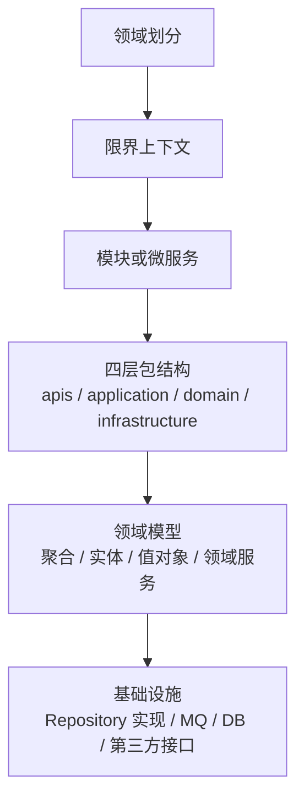

项目构建要避免两个极端：

- 只有技术包，没有业务边界，例如所有 Controller、Service、Mapper 分别堆在一起。
- 包分得很像 DDD，但业务逻辑仍然全部写在应用服务里。

#### 9.4.6 详细设计

领域确定后，才进入详细设计。详细设计包括：

- 任务拆分。
- 用例图和用例规约。
- 活动图。
- 状态图。
- 时序图。
- 聚合设计。
- 数据库设计。
- 接口设计规范。
- 事件设计。
- 异常和补偿设计。

DDD 的战略设计不能替代详细设计。战略设计只是确定方向和边界，详细设计要把每个用例、状态、规则和异常讲清楚。

### 9.5 重新理解战略设计

把项目带入后，这些概念会更具体：

- 领域 Domain：公司到底在解决什么业务问题。例如一体化商城解决交易、仓配、物流、商家经营的问题。
- 核心域 Core Subdomain：最能体现竞争力的部分。例如交易保障、履约效率、供应链能力。
- 支撑子域 Supporting Subdomain：支撑业务运行但不直接构成竞争力的能力。例如基础通知、后台配置、部分运营工具。
- 通用域 Generic Subdomain：行业通用能力。例如认证、权限、文件存储、短信。
- 通用语言 Ubiquitous Language：团队共同使用的业务词汇，例如“下单”“锁库存”“履约”“签收”“结算”。
- 防腐层 Anti-Corruption Layer：与外部系统或遗留系统对接时，隔离外部模型污染，例如支付平台、物流平台、ERP、WMS。

战略设计的价值是让团队先建立全局地图，再进入局部建模。如果没有这张地图，团队很容易把电商项目拆成“商品服务、订单服务、用户服务”这类看似合理但边界粗糙的模块，后续遇到支付、库存、履约、售后、营销交叉时又重新耦合在一起。

### 9.6 本章小结

从项目剖析 DDD，可以得到几个关键结论：

- DDD 的起点是业务愿景和用户故事，不是技术选型。
- 领域划分是对问题空间的拆分，不是对数据库表的拆分。
- 六个问题帮助判断要不要用 DDD、用到什么程度、粒度如何控制。
- 六个步骤帮助团队从流程梳理走到领域事件、项目构建和详细设计。
- 事件风暴、四色建模法、Domain Storytelling 都是建模工具，不是目的。
- 战略设计要先确定边界，战术设计再把边界内的模型落到代码。

## 10. 好借好还金融项目实战

### 10.1 项目定位

“好借好还”是网络借贷信息中介服务平台，类似金融超市，为个人投资者、个人融资用户和小微企业提供线上信贷及出借撮合服务。资金业务由第三方监管，强调合规、安全和一致性。

项目技术特点：

- 金融场景，重视数据一致性。
- 信息安全要求高，涉及加密解密。
- 流程复杂，适合用 DDD 梳理业务。
- 使用微服务架构风格。
- 采用 Spring Cloud Alibaba 技术体系。

### 10.2 信用贷款平台类型

| 类型 | 优势 | 劣势 |
| --- | --- | --- |
| 银行系 | 资金雄厚、项目源优良、风控强 | 收益率偏低，对投资人吸引有限 |
| 国资系 | 背景背书、规范、专业度较高 | 缺乏互联网基因、效率较低 |
| 民营系 | 普惠、便捷、门槛低、产品创新强 | 风险偏高、风控能力参差不齐 |

### 10.3 核心业务角色

- 投资人：有资金，希望找到投资项目并获得收益。
- 借款人：资质审核合格，希望获得借款额度并发起借款。
- 资金池：资金汇集和流转的池子，真实平台中需避免违规资金池风险。
- 资金托管平台：第三方存管或监管平台，保障资金流转合规。

业务流程中需要区分**平台账户池**和**平台资金池**：平台账户记录业务状态、借款单据和投资关系，真实资金则通过投资人银行账户、借款人账户及第三方资金监管机构完成流转。

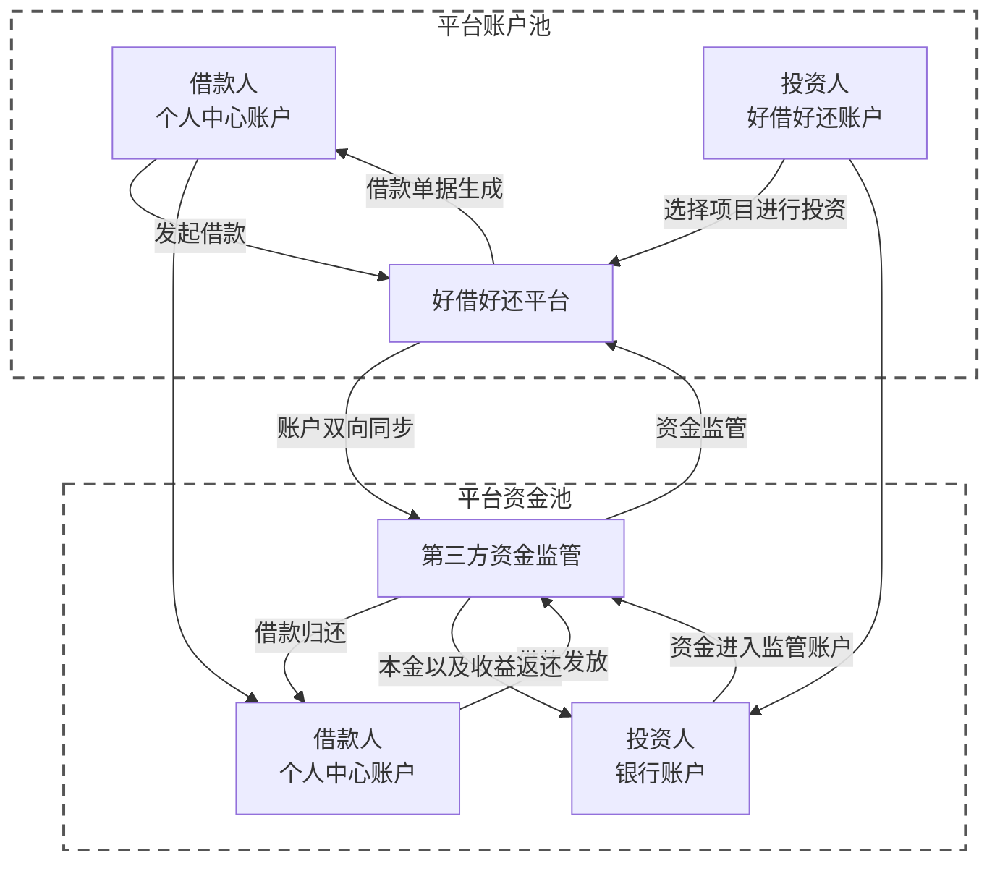

这张图体现了业务流与资金流的分离：平台负责撮合和账户信息维护，不直接沉淀或挪用用户资金；第三方资金监管机构负责真实资金流转，并与平台进行账户信息同步。

### 10.4 技术架构图

```mermaid
flowchart TB
    subgraph ACCESS["访问入口"]
        direction LR
        U["移动端 / PC 端"]
        DNS["Local DNS"]
        EDGE["云盾 / CDN / 防火墙"]
        NG["Nginx 集群"]
        U --> DNS --> EDGE --> NG
    end

    subgraph CLOUD["微服务平台"]
        direction LR
        GW["Spring Cloud Gateway<br/>认证授权 / 动态路由<br/>令牌限流 / 日志管理"]
        AUTH["OAuth2 认证中心<br/>Spring Security"]
        SERVICES["业务微服务集群<br/>Spring Boot + Feign"]
        NACOS["Nacos<br/>注册中心 / 配置中心"]
        GOVERN["服务治理<br/>Ribbon / Sentinel"]

        GW --> AUTH
        AUTH --> SERVICES
        NACOS <-->|"服务注册与发现"| GW
        NACOS <-->|"配置发布与动态刷新"| SERVICES
        GOVERN -.->|"负载均衡 / 熔断限流"| GW
        GOVERN -.-> SERVICES
    end

    NG --> GW

    subgraph MIDDLEWARE["数据与基础中间件"]
        direction LR
        REDIS["Redis 集群<br/>缓存"]
        MYSQL["MySQL 集群<br/>持久化"]
        SHARD["ShardingSphere<br/>分库分表"]
        MQ["RocketMQ 集群<br/>消息中间件"]
        OSS["阿里云 OSS<br/>对象存储"]
        JOB["XXL-JOB<br/>定时任务"]
    end

    SERVICES -->|"缓存访问"| REDIS
    SERVICES -->|"数据持久化"| SHARD --> MYSQL
    SERVICES -->|"异步消息"| MQ
    SERVICES -->|"文件存储"| OSS
    JOB -->|"任务调度"| SERVICES

    subgraph OBS["监控与日志体系"]
        direction LR
        TRACE["SkyWalking<br/>链路追踪"]
        METRIC["Prometheus + Grafana<br/>指标监控与看板"]
        LOG["Elastic Stack<br/>Logstash / Elasticsearch / Kibana"]
    end

    GW -.-> TRACE
    SERVICES -.-> TRACE
    SERVICES -.-> METRIC
    GW -.-> LOG
    SERVICES -.-> LOG

    subgraph CICD["CI/CD 持续交付"]
        direction LR
        CODE["源代码发布"]
        JENKINS["Jenkins"]
        PIPELINE["构建流水线<br/>Git / Maven / Docker / JUnit"]
        TEST["Kubernetes<br/>测试环境"]
        PRE["Kubernetes<br/>预发布环境"]
        PROD["Kubernetes<br/>生产环境"]

        CODE --> JENKINS --> PIPELINE
        PIPELINE --> TEST
        PIPELINE --> PRE
        PIPELINE --> PROD
    end

    PROD -.->|"容器化部署"| SERVICES
```

架构从左到右体现了完整请求链路：客户端请求经过 DNS、CDN、安全防护和 Nginx 集群后进入 Spring Cloud Gateway；网关完成认证、路由、限流和日志处理，再将请求分发到业务微服务。Nacos 提供服务注册、发现和动态配置，Ribbon 与 Sentinel 承担负载均衡、熔断和限流。

业务微服务通过 Redis、MySQL、ShardingSphere、RocketMQ、OSS 和 XXL-JOB 完成缓存、持久化、分库分表、异步通信、对象存储和任务调度；SkyWalking、Prometheus、Grafana 与 Elastic Stack 构成链路、指标和日志三类可观测能力。代码最终由 Jenkins 流水线完成编译、测试、镜像构建，并发布到 Kubernetes 的测试、预发布和生产环境。

### 10.5 业务架构图

业务架构从业务能力视角描述系统“要做什么”。好借好还平台面向 PC 端和 APP 端提供服务，内部由前台系统、管理平台和业务中心共同支撑，并通过标准接口接入外部第三方能力。

```mermaid
flowchart TB
    CLIENT["PC 端 / APP 端"]

    subgraph FRONT["前台系统"]
        direction TB
        F1["白名单管理"]
        F2["授信管理"]
        F3["用信管理"]
        F4["计算工具"]
        F5["还款管理"]
        F6["账户管理"]
    end

    subgraph MANAGE["管理平台"]
        direction TB
        M1["风控管理"]
        M2["活动管理"]
        M3["产品平台"]
        M4["CRM 系统"]
        M5["一站式系统"]
        M6["其他管理能力"]
    end

    subgraph CENTER["业务中心"]
        direction TB
        C1["客户管理"]
        C2["产品中心"]
        C3["统计分析"]
        C4["用户裂变"]
        C5["决策管理"]
        C6["规则引擎"]
        C7["消息统一"]
        C8["个人信用"]
        C9["邮件"]
        C10["飞书"]
        C11["埋点管理"]
        C12["其他公共能力"]
    end

    subgraph THIRD["第三方平台"]
        direction TB
        T1["三方数据"]
        T2["反薅羊毛"]
        T3["人脸对接"]
        T4["资方信息"]
        T5["电子合同"]
        T6["电子授信"]
    end

    CLIENT --> FRONT
    CLIENT --> MANAGE
    FRONT --> CENTER
    MANAGE --> CENTER
    FRONT --> THIRD
    MANAGE --> THIRD
    CENTER --> THIRD
```

前台系统承载用户可直接感知的授信、用信、还款和账户能力；管理平台承载风控、营销、产品运营和客户关系管理；业务中心沉淀可复用的客户、产品、规则、消息、信用和分析能力；第三方平台则通过防腐层接入外部数据、身份认证、资方、合同及授信服务。

### 10.6 网络拓扑图

网络拓扑关注系统“如何部署和扩展”。各入口层和服务层都采用集群化设计，通过增加实例实现水平扩展，同时对数据库、缓存以及基础支撑服务设置主备或独立部署策略。

```mermaid
flowchart TB
    SHIELD["云盾"] --> LVS1["LVS 主节点"]
    CDN["CDN"] --> LVS1
    LVS1 <-->|"主备切换"| LVS2["LVS 备节点"]

    subgraph NGINX_CLUSTER["Nginx 集群：可水平扩展"]
        direction LR
        N1["Nginx 01"]
        N2["Nginx 02"]
        N3["Nginx 03"]
        NN["Nginx ..."]
    end

    LVS1 -->|"负载均衡"| N1
    LVS1 --> N2
    LVS1 --> N3
    LVS1 --> NN

    subgraph GATEWAY_CLUSTER["微服务 Gateway 集群"]
        direction LR
        G1["Gateway 01"]
        G2["Gateway 02"]
        G3["Gateway 03"]
        GN["Gateway ..."]
    end

    N1 --> G1
    N2 --> G2
    N3 --> G3
    NN --> GN

    subgraph SERVICE_CLUSTER["业务微服务集群：按服务独立扩容"]
        direction LR
        S11["微服务 01<br/>实例 A"]
        S12["微服务 01<br/>实例 B"]
        S21["微服务 02<br/>实例 A"]
        S22["微服务 02<br/>实例 B"]
        S91["微服务 09<br/>实例 A"]
        S92["微服务 09<br/>实例 B"]
    end

    G1 --> S11
    G1 --> S12
    G2 --> S21
    G2 --> S22
    G3 --> S91
    GN --> S92

    subgraph DATA["数据层"]
        direction LR
        MYSQL1["MySQL 主节点"]
        MYSQL2["MySQL 备节点"]
        REDIS1["Redis 主节点"]
        REDIS2["Redis 备节点"]
        MYSQL1 <-->|"主备复制"| MYSQL2
        REDIS1 <-->|"主备复制"| REDIS2
    end

    S11 --> MYSQL1
    S12 --> MYSQL1
    S21 --> MYSQL1
    S22 --> REDIS1
    S91 --> REDIS1
    S92 --> REDIS1

    subgraph SUPPORT["基础支撑服务"]
        direction LR
        MON["监控服务器"]
        LOG["日志收集服务器"]
        STATIC1["静态资源主节点"]
        STATIC2["静态资源备节点"]
        STATIC1 <-->|"主备复制"| STATIC2
    end

    SERVICE_CLUSTER -.-> MON
    SERVICE_CLUSTER -.-> LOG
    NGINX_CLUSTER --> STATIC1
```

这套拓扑中不存在只能部署一个实例的核心业务节点。LVS、Nginx、Gateway 和微服务都可以按流量水平扩展；数据库与 Redis 通过主备、集群或分片提高可用性。监控、日志收集和静态资源服务与业务节点分离，避免辅助能力抢占核心交易资源。

### 10.7 业务流程梳理

平台核心业务由账户准备、贷前、贷中、投标和贷后五个阶段构成。业务流程梳理的目的，是先明确角色、状态和关键规则，再据此识别领域事件、聚合边界及上下文协作关系。

```mermaid
flowchart TB
    subgraph ACCOUNT["账户准备"]
        direction LR
        A1["用户注册"] --> A2["填写用户信息"]
        A2 --> A3{"信息是否合法"}
        A3 -->|"否"| A2
        A3 -->|"是"| A4["手机验证码绑定"]
        A4 --> A5["注册成功"]
        A5 --> A6["密码或手机号登录"]
        A6 --> A7{"登录信息是否合法"}
        A7 -->|"否"| A6
        A7 -->|"是"| A8["登录成功并记录日志"]
    end

    subgraph PRE_LOAN["贷前：准入与授信"]
        direction LR
        P1["用户登录"] --> P2{"资管平台是否已绑定"}
        P2 -->|"否"| P3["绑定资管平台账号"]
        P3 --> P4["绑定成功"]
        P2 -->|"是"| P5["提交借款信息"]
        P4 --> P5
        P5 --> P6["借款人信息审核"]
        P6 -->|"不通过"| P7["进入黑名单"]
        P6 -->|"通过"| P8["额度申请"]
        P8 --> P9["额度下放"]
        P9 --> P10{"提交借款申请"}
        P10 -->|"不通过"| P11["借款失败并结束"]
    end

    subgraph IN_LOAN["贷中：标的审核"]
        direction LR
        L1["提交借款信息"] --> L2["审核标的信息"]
        L2 -->|"未通过"| L1
        L2 -->|"通过"| L3["生成借款标的单据"]
        L3 --> L4["平台展示借款标的"]
    end

    subgraph BID["投标与放款"]
        direction LR
        B1["投资人登录"] --> B2{"资管平台是否已绑定"}
        B2 -->|"否"| B3["绑定资管平台账号"]
        B3 --> B4["充值"]
        B2 -->|"是"| B5["选择标的"]
        B4 --> B5
        B5 --> B6["投标"]
        B6 --> B7{"是否满标"}
        B7 -->|"否"| B8["流标"]
        B8 --> B9["借款失败"]
        B7 -->|"是"| B10["满标放款"]
        B10 --> B11["生成还款计划"]
        B11 --> B12["借款成功"]
    end

    subgraph POST_LOAN["贷后：还款与结标"]
        direction LR
        O1["申请提现"] --> O2["提现"]
        O2 --> O3["按月还款"]
        O3 --> O4["平台结标"]
        O4 --> O5["结束"]
    end

    A8 --> P1
    P10 -->|"通过"| L1
    L4 --> B1
    B12 --> O1
```

从领域事件角度看，主流程可提炼为：`用户已注册`、`资管账户已绑定`、`授信额度已下放`、`借款申请已提交`、`借款标的已生成`、`投标已完成`、`标的已满标`、`借款已放款`、`还款计划已生成`、`还款已完成`和`项目已结标`。这些事件是后续划分授信、借款、标的、投资、放款和还款上下文的重要依据。

### 10.8 技术栈

#### 10.8.1 前置知识

学习和落地好借好还项目之前，需要具备以下基础知识：

| 分类 | 前置知识 | 在项目中的用途 |
| --- | --- | --- |
| Java 基础 | Java 语法、面向对象、集合、异常、并发编程 | 编写领域模型、应用服务和基础设施代码 |
| Web 前端 | HTML、CSS、JavaScript、ES6 | 理解用户端和管理端页面及前后端交互 |
| Java Web | Spring、Spring MVC、MyBatis | 实现依赖注入、接口开发和数据持久化 |
| 微服务框架 | Spring Boot、Spring Cloud、Spring Cloud Alibaba | 构建微服务，完成注册发现、配置、网关、熔断和限流 |
| 数据存储 | MySQL、Redis | 保存业务数据，并处理缓存、会话和分布式状态 |
| 消息中间件 | RocketMQ | 实现领域事件传递、异步解耦和最终一致性 |
| Web 基础设施 | Nginx | 实现反向代理、静态资源访问和负载均衡 |
| 开发与构建工具 | IntelliJ IDEA、Maven | 项目开发、依赖管理、编译、测试和打包 |
| Linux 环境 | VMware、CentOS 7.x | 搭建本地服务器环境并部署中间件和微服务 |
| 架构方法 | 领域驱动设计、架构设计基础 | 完成领域建模、限界上下文划分和微服务架构设计 |

这些知识不要求在项目开始前全部达到精通，但应能理解其基本概念和职责边界。尤其需要先掌握 Spring Boot、MySQL、Redis、RocketMQ、Spring Cloud Alibaba 和 DDD 基础，否则容易只会启动项目，却无法理解服务拆分、领域边界和分布式协作背后的原因。

#### 10.8.2 技术选型

后端：

- Spring Boot 2.2.5.RELEASE：快速构建和运行独立的微服务应用。
- Spring Cloud Hoxton.SR8：提供服务注册、发现、网关、熔断和远程调用等微服务基础能力。
- Spring Cloud Alibaba 2.2.2.RELEASE：集成 Nacos、Sentinel、RocketMQ 等阿里系微服务组件。
- MyBatis Plus：简化数据库 CRUD、分页及条件查询，并提供代码生成能力。
- Lombok：通过注解生成 Getter、Setter、构造方法等样板代码。
- Swagger2 或 Apidoc：生成和维护 REST API 接口文档，便于前后端联调。
- Logback：记录应用运行日志、错误日志和业务操作日志。
- EasyExcel：处理 Excel 文件的批量导入、导出和数据解析。
- Spring Data Redis：统一封装 Redis 访问，用于缓存、分布式状态和临时数据。
- OpenFeign：基于 HTTP 的声明式客户端，用于微服务之间的远程调用。
- Spring Task/XXX-job：实现简单的定时任务和周期性业务调度。

数据库和中间件：

- MySQL 5.7：持久化用户、授信、借款、标的、投资和还款等核心业务数据。
- Redis 5.0：提供热点数据缓存、会话存储、分布式锁和访问限流支持。
- RocketMQ 4.7.0：传递领域事件和业务消息，实现异步解耦及最终一致性。
- Nginx：承担反向代理、静态资源服务和入口层负载均衡。

前端：

- Node.js：提供前端工程的运行、构建和依赖管理环境。
- ES6：使用模块、Promise、箭头函数等现代 JavaScript 语法组织代码。
- Axios：封装浏览器端 HTTP 请求，调用后端 REST API。
- Vue.js：构建用户端和管理端的组件化前端页面。
- Element UI：提供表单、表格、弹窗等后台管理界面组件。
- vue-element-admin：快速搭建权限控制、菜单和路由完善的管理后台。
- NuxtJS：基于 Vue.js 实现服务端渲染，优化用户端首屏加载和 SEO。

三方接口：

- 短信网关：发送注册、登录、身份校验和业务通知验证码。
- OSS 文件存储：保存身份证明、合同、影像资料和其他业务附件。
- 资金托管平台 API：完成账户绑定、充值、放款、还款、提现及资金流水查询。

### 10.9 团队结构

高配版：

- 产品总监。
- 多位产品经理和产品专员。
- 技术总监。
- 架构师。
- 技术经理和技术专家。
- 多个开发小组。

低配版：

- 资深产品经理。
- 产品专员。
- 架构师。
- 10 人以上研发团队。
- 一定比例高级工程师。

DDD 落地依赖团队能力。如果业务专家、架构师、技术专家和产品都不到位，前期建模容易变成文档形式主义。

### 10.10 建模与设计流程

好借好还项目的建模与设计不是直接从数据库表或微服务拆分开始，而是先把业务问题讲清楚，再逐步形成领域边界和代码模型。白皮书将这个过程划分为四个部分：

1. 挖掘用户故事，确定核心愿景。
2. 建立通用语言。
3. 战略设计。
4. 战术设计。

#### 10.10.1 为什么要调整传统 DDD 流程

传统 DDD 通常把业务愿景、用户故事和通用语言都纳入战略设计。但在真实项目中，核心愿景往往由老板、核心产品负责人或业务负责人在立项阶段确定，通用语言也应在产品、业务和技术正式协作时尽早建立。

因此，好借好还项目把前两个步骤从战略设计中显式提取出来，使建模过程更符合实际项目节奏：

```mermaid
flowchart LR
    A["市场调研"] --> B["需求分析"]
    B --> C["项目立项"]
    C --> D["竞品分析"]
    D --> E["挖掘用户故事<br/>确定核心愿景"]
    E --> F["建立通用语言"]
    F --> G["战略设计"]
    G --> H["战术设计"]
    H --> I["技术方案与工程落地"]
```

这里不是把业务和技术割裂，而是明确各阶段的主要责任：业务负责人决定项目为什么做、为谁做以及创造什么价值；产品、领域专家和研发共同统一业务语言；架构师和开发团队再把业务知识转化为领域边界与软件模型。

同时，上面的流程只表达了主要推进方向，并不代表建模是一次完成的线性过程。项目会受到市场变化、需求调整、业务认知加深和技术验证结果的影响，后续阶段经常需要返回前面的阶段修正模型，这种反复迭代就是**涡流**。

- 设计涡流：战术设计暴露出业务规则、聚合边界或技术实现问题后，返回战略设计重新调整领域边界和上下文关系。
- 建模涡流：在寻找限界上下文时发现领域划分不合理，返回领域分析重新拆分、合并或定义子域。
- 需求涡流：建模过程中发现用户故事不完整、术语含义冲突或验收标准不清楚，返回用户故事和通用语言阶段重新澄清。

```mermaid
flowchart LR
    U["用户故事与核心愿景"] --> L["通用语言"]
    L --> S["战略设计"]
    S --> T["战术设计"]
    T --> E["工程实现与验证"]

    L -.->|"术语冲突或需求不清"| U
    S -.->|"领域边界需要重构"| L
    T -.->|"聚合或上下文不合理"| S
    E -.->|"运行反馈与需求变化"| U
```

白皮书将架构设计中的持续回流称为**设计涡流**，将在领域建模过程中发生的设计涡流称为**建模涡流**。其中存在两组典型的双向校正关系：

```mermaid
flowchart LR
    subgraph V1["设计涡流"]
        direction LR
        S1["战略设计"] -->|"细化业务边界和协作关系"| T1["战术设计"]
        T1 -->|"发现规则、聚合或实现问题"| S1
    end

    subgraph V2["建模涡流"]
        direction LR
        D1["领域划分"] -->|"识别语言和模型边界"| B1["寻找限界上下文"]
        B1 -->|"边界验证与业务反馈"| D1
    end

    V1 --> V2
```

- 战略设计到战术设计：战略设计给出子域、限界上下文及上下文映射，战术设计在边界内部构建聚合和领域模型。
- 战术设计返回战略设计：如果聚合难以保持一致、跨上下文调用过多或同一术语出现语义冲突，就要重新检查边界。
- 领域划分到寻找限界上下文：从问题空间中的业务能力出发，寻找解决方案空间中的模型语义边界。
- 限界上下文返回领域划分：如果边界无法承载完整业务能力或职责高度重叠，就要重新拆分、合并或定义子域。

涡流不是流程失控，也不意味着前期设计失败，而是团队对业务认识不断加深。关键是控制每次回流的问题范围：尽量把“整个金融项目有问题”缩小为某个领域、限界上下文或业务能力的问题，例如“授信规则不清晰”“支付能力边界重叠”或“借款与标的状态职责冲突”，从而降低团队需要同时处理的复杂度。

每次回流都应带着明确问题和验证结果，例如：

- 借款与标的是否属于同一限界上下文？
- 授信额度是否允许为零，额度变化由谁负责？
- 放款失败后，借款申请和标的分别进入什么状态？
- 投标、放款和还款是否在重复实现支付规则？
- 第三方资管模型是否正在污染内部支付模型？

经过持续反馈，建模过程最终形成完整的演进闭环：

```mermaid
flowchart LR
    A1["用户故事"] --> B2["通用语言"]
    B2 --> C1["战略设计"]
    C1 --> D2["战术设计"]
    D2 --> E1["代码实现与运行验证"]
    E1 -->|"发现新规则、边界或需求问题"| A1
```

因此，建模的目标不是第一次就得到永久正确的模型，而是建立一套能够通过业务反馈、技术验证和团队协作持续修正模型的机制。

#### 10.10.2 四个阶段及其产物

| 阶段 | 核心任务 | 主要参与者 | 关键产物 |
| --- | --- | --- | --- |
| 挖掘用户故事、确定核心愿景 | 描绘问题空间，明确用户、目标、活动和业务价值 | 业务负责人、产品经理、领域专家、架构师 | 顶层用户故事、业务流程图、核心愿景、关键问题清单 |
| 建立通用语言 | 统一业务术语、含义、规则和使用边界，并落实到文档与代码 | 产品、领域专家、开发、测试 | 术语表、业务规则、状态定义、命名规范 |
| 战略设计 | 识别领域和子域，划分核心域、支撑域、通用域与限界上下文 | 架构师、领域专家、产品、技术负责人 | 子域划分、限界上下文、上下文映射、领域关系 |
| 战术设计 | 在限界上下文内部设计聚合、实体、值对象、领域服务和领域事件 | 架构师、开发、测试 | 领域模型、聚合边界、接口契约、仓储设计、代码结构 |

#### 10.10.3 挖掘用户故事

白皮书将用户故事的核心要素概括为：**问题空间的描绘、文字表达、讨论与图形表达**。

- 问题空间的描绘：明确当前要解决的业务问题。可以把它理解为：`问题空间 = 问题域 = 领域 = 业务边界`。
- 文字表达：站在用户视角描述需求，说明谁在什么情况下要完成什么事情，以及完成后获得什么价值。
- 讨论与图形表达：由产品、研发、运营和领域专家共同讨论不确定点，并通过业务流程图、Domain Storytelling 或事件风暴把结论固化下来。

只有“让用户能够方便地注册并审核信息”并不是合格的用户故事。团队还需要确认用户填写哪些信息、如何校验、是否绑定手机号、审核失败如何处理，以及未来可能增加哪些字段。讨论结果应进入需求、交互、程序逻辑和数据设计，而不能只停留在口头沟通中。

##### 10.10.3.1 由用户故事可能引发的问题

如果用户故事只是一句模糊的需求描述，没有经过充分讨论、澄清和验证，通常会引发以下问题：

| 问题 | 典型表现与影响 |
| --- | --- |
| 代码完成后频繁修改需求 | 开发已经按照原有理解完成代码，产品又补充规则或改变流程，导致模型、接口、数据库和测试用例反复返工 |
| 需求文档不细致，关键点不明确 | 正常流程有描述，但异常流程、边界条件、状态变化和业务规则缺失；出现矛盾时，产品也无法给出统一答案 |
| 产品凭主观判断确定需求 | 没有用户调研、业务数据和领域专家意见支撑，需求可能不符合实际业务，甚至与监管规则或系统能力冲突 |

这些问题的根源不是“用户故事这种形式不好”，而是团队把用户故事误当成了完整需求。用户故事只提供讨论入口，真正的业务知识需要在产品、领域专家、研发、测试和运营的协作中逐步补全。

解决问题时，应围绕用户故事完成以下闭环：

1. 使用文字明确角色、目标、活动、业务价值和约束条件。
2. 通过讨论澄清正常流程、异常流程、边界条件和待确认问题。
3. 使用业务流程图、Domain Storytelling 或事件风暴固化讨论结果。
4. 将结论落实到交互设计、领域规则、程序逻辑、接口和表结构设计。
5. 使用验收标准和测试用例确认团队对用户故事的理解一致。
6. 需求变化时记录变化原因，并评估它对领域模型、上下文和已有功能的影响。

```mermaid
flowchart LR
    A["用户故事<br/>简短需求描述"] --> B["多角色讨论<br/>产品 / 业务 / 研发 / 测试"]
    B --> C["图形化表达<br/>流程图 / Domain Storytelling / 事件风暴"]
    C --> D["明确规则<br/>正常 / 异常 / 边界 / 状态"]
    D --> E["设计落地<br/>交互 / 模型 / 接口 / 数据"]
    E --> F["验收确认<br/>验收标准 / 测试用例"]
    F -.->|"发现歧义或变化"| B
```

对于“好借好还”项目，一条“借款人申请借款”的用户故事至少还要澄清：是否已完成实名认证和资管账户绑定、是否已有授信额度、额度能否为零、审核失败是否进入黑名单、借款失败是否占用额度，以及失败后是否允许重新申请。只有这些问题得到明确回答，用户故事才能成为领域建模和开发设计的可靠输入。

##### 10.10.3.2 真正理解用户故事

用户故事（User Story）是从终端用户视角，对软件能力进行简短、非正式的自然语言描述。它主要回答：**哪类用户，因为什么原因，希望完成什么事情，并获得什么价值**。

用户故事不是完整的需求规格，也不是开发任务或接口清单。它的作用是以恰当的粒度捕捉需求核心，为产品、业务、研发和测试保留进一步讨论与优化的空间。过早写入大量实现细节，会让团队陷入局部方案，并使需求变化带来更高的返工成本。

###### 3W 要素

一个完整的用户故事包含 3W，并应进一步明确其业务价值：

| 要素 | 英文 | 要回答的问题 | 好借好还示例 |
| --- | --- | --- | --- |
| 角色 | Who | 谁需要使用这项能力 | 借款人 |
| 原因 | Why | 为什么需要完成这项活动 | 需要获得借款资金 |
| 活动 | What | 希望完成什么活动 | 提交借款申请并生成借款标的 |
| 价值 | Value | 完成后能够获得什么价值 | 更快捷地完成融资 |

常用表达模板：

> 作为一名 `<角色>`，我希望 `<完成某项活动>`，以便 `<获得某种价值>`。

好借好还示例：

> 作为一名借款人，我希望在资质审核通过后获得可用额度并提交借款申请，以便快速完成借款。

`Why` 和 `Value` 看起来相近，但关注点不同：`Why` 解释用户当前的动机和问题，`Value` 强调故事完成后带来的业务结果。只有活动而没有价值的描述，通常更像开发任务，而不是用户故事。

###### 3C 原则

用户故事的构建不是只写一张卡片，而是由三个连续环节组成：

| 原则 | 英文 | 含义 | 主要产物 |
| --- | --- | --- | --- |
| 卡片 | Card | 用简短文字记录用户需求、规则摘要和完成标准 | 用户故事卡片 |
| 交谈 | Conversation | 与客户、产品或领域专家讨论业务细节、规则和异常情况 | 讨论记录、流程图、业务规则、通用语言 |
| 确认 | Confirmation | 通过验收标准和测试确认用户故事是否被正确实现 | 验收标准、测试用例、完成定义 |

```mermaid
flowchart LR
    C1["Card<br/>简短描述需求"] --> C2["Conversation<br/>讨论规则与细节"]
    C2 --> C3["Confirmation<br/>验收并确认结果"]
    C3 -.->|"验收发现理解偏差"| C2
```

- Card 负责点明需求核心，不应塞入所有细节。
- Conversation 是发现业务知识和建立通用语言的主要过程，重要结论需要用文字或图形记录。
- Confirmation 让“完成”具备可验证标准，避免产品、研发和测试各自理解。

###### INVEST 原则

好的用户故事除了格式正确，还应满足 INVEST：

| 原则 | 英文 | 判断标准 |
| --- | --- | --- |
| 独立的 | Independent | 尽可能独立理解、排序、开发、测试和交付，减少与其他故事的耦合 |
| 可协商的 | Negotiable | 用户故事不是合同，具体方案和细节可以通过交谈继续调整 |
| 有价值的 | Valuable | 对最终用户、业务或内部角色产生明确价值，而不是单纯描述技术任务 |
| 可评估的 | Estimable | 团队能够估算复杂度和工作量；无法估算通常意味着领域知识不足或故事过大 |
| 小的 | Small | 能够在一个迭代内完成，白皮书建议尽量不超过 10 个理想人日 |
| 可测试的 | Testable | 具有明确、可执行的验收标准，能够判断是否完成 |

例如，“优化借款体验”不可直接测试，也难以估算；可以拆成“借款人在授信通过后能够查看可用额度”“借款人能够在额度范围内提交申请”等更小、可验收的故事。

###### 三个准则

白皮书进一步把优质用户故事概括为三个准则：

1. 一个用户：一个故事尽量只服务一种典型角色，避免借款人、投资人和审核员的诉求混在一起。
2. 完整价值：故事完成后，用户应能达成一个明确且有意义的目标，而不是只完成某个技术步骤。
3. 尽量不依赖：减少故事之间的重叠、顺序和包含依赖，使其更容易安排优先级和独立交付。

常见依赖及处理方式：

| 依赖类型 | 含义 | 处理方式 |
| --- | --- | --- |
| 重叠依赖 | 多个故事重复包含同一部分功能 | 把共同部分提取为独立故事，或只保留在内聚性最高的故事中 |
| 顺序依赖 | 一个故事必须等待另一个故事完成 | 迭代内减少依赖，迭代间保持单向前置关系，并提取核心依赖 |
| 包含依赖 | 一个较大的特性包含多个用户故事 | 特性用于发布计划，拆分后的用户故事用于迭代计划和独立验收 |

真正理解用户故事，意味着不能只关注一句话写得是否漂亮，而要关注它是否能够引发有效交谈、沉淀通用语言、明确业务规则，并最终通过验收。对于 DDD 而言，用户故事还是进入问题空间、识别领域事件和划分业务边界的重要输入。

##### 10.10.3.3 当前项目的用户故事

“好借好还”项目立项后，第一项建模工作是梳理顶层用户故事。用户故事通常由产品经理发起，但需要领域专家、运营、架构师、开发和测试共同讨论。所有故事的详细描述、谈话记录和验收标准都应收录到项目的通用语言文档中，便于后续建模、开发和需求回溯。

根据白皮书及项目业务流程，可以先提炼出以下顶层用户故事：

| 业务阶段 | 角色 | 顶层用户故事 |
| --- | --- | --- |
| 用户注册 | 平台用户 | 作为一名平台用户，我希望完成注册和手机号绑定，以便安全地使用平台服务 |
| 用户登录 | 平台用户 | 作为一名平台用户，我希望通过密码或手机验证登录，以便进入个人账户并办理业务 |
| 贷前授信 | 借款角色 | 作为一名借款人，我希望快速完成资质审核并获得额度，以便顺利申请借款 |
| 贷中审核 | 审核人员 | 作为一名审核人员，我希望审核借款信息并生成合规标的，以便平台向投资人展示 |
| 投标 | 投资角色 | 作为一名投资人，我希望选择合适的标的并完成投标，以便获得预期投资收益 |
| 满标放款 | 借款角色 | 作为一名借款人，我希望标的满标后及时获得放款，以便满足资金需求 |
| 还款 | 借款角色 | 作为一名借款人，我希望按照还款计划完成还款，以便履行借款合同并维护信用 |
| 收益返还 | 投资角色 | 作为一名投资人，我希望按计划收回本金和收益，以便完成本次投资 |
| 资金监管 | 运营或监管人员 | 作为一名运营或监管人员，我希望资金通过第三方监管账户流转，以便保障资金安全与合规 |

这些故事只是顶层入口，不能直接转成开发任务。每个故事都需要继续按照 3C 展开，识别业务规则、异常分支、状态变化和验收标准。

###### 贷前流程的 Card

白皮书以贷前流程作为详细示例：

> 作为一名借款人，我希望能够快速审核资质，得到额度下放，以便顺利借款。

按照 3W 分解：

| 要素 | 内容 |
| --- | --- |
| Who | 借款人，即用户在当前场景中扮演的借款角色 |
| What | 绑定资管账户、提交资料、完成资质审核并获得额度 |
| Why | 用户存在借款需求，需要获得平台准入资格 |
| Value | 在满足风控和资金监管要求的前提下顺利发起借款 |

###### 贷前流程的 Conversation

产品、开发和运营围绕这张卡片展开讨论，得到以下关键结论：

| 讨论问题 | 最终结论 | 建模启示 |
| --- | --- | --- |
| 借款人和投资人是否是两类固定用户 | 统一称为“用户”，通过业务入口和场景角色区分借款角色与投资角色 | 用户是稳定身份，借款人和投资人是上下文角色；同一用户可以同时参与借款和投资 |
| 用户未绑定或绑定资管平台账户失败怎么办 | 需要返回绑定页面重新操作；未完成绑定不能继续资金相关业务 | 资管账户绑定是借款和投资流程的前置条件 |
| 借款人资质审核不通过怎么办 | 进入黑名单 | 资质审核需要产生明确结果，并驱动风控状态变化 |
| 授信额度是否允许为零 | 允许；后续可以随着信用变化调整额度 | “审核通过”不等于“一定可借款”，额度是独立的业务概念 |
| 审核通过但因额度不足或额度为零导致借款失败，是否拉黑 | 不拉黑，提示失败原因并返回首页 | 业务失败不等于信用失败，借款结果与风控结果必须分开建模 |

这段讨论揭示了多个重要领域概念：`用户`、`借款角色`、`投资角色`、`资管账户`、`资质审核`、`黑名单`、`授信额度`和`借款申请`。它们应进入通用语言文档，并在后续战略设计中判断是否属于不同的限界上下文。

```mermaid
flowchart LR
    U["用户"] --> R1["借款角色"]
    U --> R2["投资角色"]
    R1 --> A{"是否绑定资管账户"}
    A -->|"否"| B["重新绑定"]
    B --> A
    A -->|"是"| C["提交资质审核"]
    C --> D{"审核是否通过"}
    D -->|"否"| E["进入黑名单"]
    D -->|"是"| F["下放授信额度<br/>额度可以为 0"]
    F --> G["提交借款申请"]
    G --> H{"借款是否成功"}
    H -->|"是"| I["进入标的与放款流程"]
    H -->|"否"| J["提示原因并返回<br/>不进入黑名单"]
```

###### 贷前流程的 Confirmation

白皮书给出的验收目标是：借款人绑定资管平台账户并通过资质审核后，能够看到额度信息，并顺利进入放款流程。为了让验收结果可执行，可以进一步整理为：

```gherkin
场景：审核通过且额度可用的借款人申请借款
假如 用户已注册并登录
并且 用户已成功绑定资管平台账户
并且 用户资质审核通过
并且 用户拥有足够的可用授信额度
当 用户在额度范围内提交借款申请
那么 系统应受理借款申请
并且 用户能够查看申请状态
并且 审核通过后进入标的生成和放款流程
```

还应补充以下异常验收场景：

- 资管账户未绑定或绑定失败时，不允许进入借款申请，并引导用户重新绑定。
- 资质审核不通过时，将用户纳入黑名单，并禁止继续发起借款。
- 审核通过但额度为零时，展示额度信息，但不允许提交超过可用额度的申请。
- 因额度不足、资金不足或操作问题导致借款失败时，记录失败原因，但不能直接把用户纳入黑名单。

###### 从用户故事到领域设计

当前项目的顶层用户故事可以继续转化为领域事件和候选上下文：

| 用户故事 | 关键领域事件 | 候选限界上下文 |
| --- | --- | --- |
| 注册与登录 | 用户已注册、手机号已绑定、用户已登录 | 用户上下文、认证上下文 |
| 贷前授信 | 资管账户已绑定、资质审核已通过、授信额度已下放 | 资管账户上下文、风控上下文、授信上下文 |
| 借款与标的审核 | 借款申请已提交、借款申请已通过、借款标的已生成 | 借款上下文、标的上下文 |
| 投标与满标 | 投标已提交、标的已满标、标的已流标 | 投资上下文、标的上下文 |
| 放款 | 放款指令已提交、借款已放款 | 放款上下文、资金监管上下文 |
| 贷后还款 | 还款计划已生成、还款已完成、项目已结标 | 还款上下文、结算上下文 |

这一步不是直接确定最终服务边界，而是利用用户故事建立“角色、活动、规则、事件和上下文”之间的追踪关系。后续如果领域划分发生变化，团队仍可以回到原始用户故事检查边界是否符合真实业务。

##### 10.10.3.4 使用方法论与工具分析用户故事（Domain Storytelling）

Domain Storytelling（领域叙事）是一种协作式领域分析与建模方法。产品、研发和领域专家通过类似学习自然语言的方式讲述业务故事，在“谁做了什么”的具体场景中发现业务术语、规则、角色关系和系统边界，并逐步形成通用语言与领域模型。

它不是让架构师独自画一张流程图，而是一场由业务讲述者和建模者共同完成的讨论：

- 讲述者：通常是产品经理、领域专家或实际业务人员，负责按真实发生顺序讲述业务。
- 建模者：通常是架构师或研发人员，负责倾听、追问，并将故事快速绘制出来。
- 参与者：开发、测试、运营等相关人员共同检查遗漏、歧义、异常路径和业务规则。
- 复述方式：尽量使用“谁对什么做了什么”的主谓宾句式，一次只描述一个动作。

###### 基本元素

| 元素 | 表达内容 | 好借好还示例 |
| --- | --- | --- |
| 角色 Actor | 谁发起或参与活动，可以是人、组织或外部系统 | 借款人、审核人员、资管平台、后台管理系统 |
| 工作物 Work Object | 角色在活动中创建、查看、传递或修改的信息 | 账号信息、授信资料、借款申请、日志 |
| 活动 Activity | 角色对工作物执行的动作，通常使用动词描述 | 提供、绑定、审核、展示、记录 |
| 序号 Sequence | 表示活动发生的先后顺序 | 01 提供账号、02 执行绑定、03 展示结果 |
| 注释 Annotation | 记录规则、问题、假设、异常和待确认事项 | 绑定失败是否重试、失败是否记录日志 |

Domain Storytelling 关注的是业务故事，而不是软件调用链。因此图中应优先使用业务语言，避免一开始就出现 Controller、Service、Mapper、数据库表或消息主题等技术细节。

###### 实施步骤

1. 选择一个具体场景  
   不要直接讲“整个借贷平台”，而应选择“绑定资管账户”“提交借款申请”或“满标后放款”等具有明确起点和终点的故事。

2. 确定讲述者和参与者  
   找到真正理解业务的人讲述。架构师负责引导和绘图，研发、测试及运营负责补充与质疑。

3. 按时间顺序讲故事  
   使用“借款人提供账号信息”“资管平台绑定账号”这样的句子，每次描述一个角色、一个动作和一个工作物。

4. 边听边画并编号  
   将角色、工作物和动作放入图中，对活动按发生顺序编号，使团队能够快速复述整个故事。

5. 主动追问异常与规则  
   重点询问“如果失败怎么办”“谁有权执行”“什么时候不能继续”“需要保存什么证据”等问题。

6. 让业务人员复述和确认  
   完成初稿后由讲述者沿图重新讲一遍，检查图是否真实反映业务，而不是只符合技术人员的理解。

7. 沉淀建模素材  
   把确认后的术语、业务规则、角色、工作物、领域事件和待解决问题写入通用语言及建模文档。

###### 好借好还示例：绑定资管账户

白皮书使用资管账户绑定场景演示 Domain Storytelling。其核心故事可以复述为：

1. 借款人向平台提供资管账号信息。
2. 平台使用账号信息向资管平台发起绑定。
3. 绑定成功时，平台向借款人展示成功界面。
4. 绑定失败时，系统记录失败日志，并由后台管理系统进行查询或处理。

```mermaid
flowchart LR
    USER["角色：用户<br/>借款角色"]
    ACCOUNT["工作物：账号信息"]
    PLATFORM["角色：资管平台"]
    SUCCESS["工作物：绑定成功界面"]
    LOG["工作物：绑定失败日志"]
    ADMIN["角色：后台管理系统"]

    USER -->|"01 提供"| ACCOUNT
    ACCOUNT -->|"02 请求绑定"| PLATFORM
    PLATFORM -->|"03A 绑定成功"| SUCCESS
    SUCCESS -->|"04A 展示"| USER
    PLATFORM -->|"03B 绑定失败"| LOG
    LOG -->|"04B 查询和处理"| ADMIN
```

通过这张图，团队需要继续讨论：

- 账号信息由用户直接提供，还是由第三方页面回调生成？
- 绑定操作是否需要实名认证、短信验证或电子签约？
- 绑定失败是否允许重试，重试次数和间隔如何限制？
- 失败日志由哪个系统保存，是否需要告警和人工处理？
- 平台账户状态与资管平台账户状态不一致时，以哪一方为准？
- 绑定成功对应什么领域事件，哪些后续流程会订阅该事件？

讨论后可以得到初步建模素材：

| 类型 | 识别结果 |
| --- | --- |
| 通用语言 | 用户、借款角色、资管账户、账户绑定、绑定成功、绑定失败 |
| 业务规则 | 未绑定资管账户不能进行借款或投资；绑定失败可以重新发起 |
| 领域事件 | 资管账户绑定已发起、资管账户已绑定、资管账户绑定已失败 |
| 候选上下文 | 用户上下文、资管账户上下文、认证上下文、后台运营上下文 |
| 待确认问题 | 重试策略、状态同步、失败补偿、日志归属和人工处理流程 |

###### Domain Storytelling 与其他方法的关系

| 方法 | 主要关注点 | 适合阶段 |
| --- | --- | --- |
| 用户故事 | 描述用户想完成什么以及业务价值 | 需求发现和范围确认 |
| Domain Storytelling | 还原角色如何协作完成一个具体业务场景 | 业务理解、通用语言和流程分析 |
| 事件风暴 | 以领域事件为主线发现命令、聚合、策略和上下文 | 领域建模与边界识别 |
| BPMN 或活动图 | 严谨描述流程节点、分支、并行和职责 | 流程固化、审批及系统实现 |

通常可以先用用户故事确定要解决的问题，再用 Domain Storytelling 还原真实协作过程，最后通过事件风暴提炼领域事件、聚合和限界上下文。三者是逐步深入的关系，而不是互相替代。

###### 工具

白皮书推荐使用 [`domain-story-modeler`](https://github.com/WPS/domain-story-modeler) 绘制领域故事。工具只是记录和协作载体，真正重要的是让业务人员参与讲述，并让图中的每一个角色、动作和工作物都能被团队用统一语言解释。

#### 10.10.4 建立通用语言

通用语言的目标是让业务、产品和研发在同一个语义维度上沟通。同一个概念只能有清晰、稳定的含义，例如“额度”“借款申请”“标的”“满标”“放款”和“还款计划”不能在不同团队中各自解释。

通用语言不仅存在于需求文档，也应进入：

- 用户故事和验收标准。
- 业务流程与事件风暴结果。
- 类名、方法名、接口名和领域事件名称。
- 数据字段、状态枚举和日志内容。

当团队发现同一个词存在多种含义，或者不同词实际指向同一概念时，往往意味着领域边界尚未理清，需要回到用户故事和业务场景继续讨论。


#### 10.10.5 战略设计

战略设计从全局理解业务，重点不是设计类，而是确定系统应该被拆成哪些业务边界：

1. 从用户故事和业务流程中识别业务能力。
2. 划分领域和子域，判断核心域、支撑域与通用域。
3. 根据语言、规则、模型和团队职责寻找限界上下文。
4. 通过上下文映射明确上下游关系、协作方式和防腐层。
5. 评估限界上下文与微服务、团队及数据边界的映射关系。

在好借好还项目中，用户、授信、借款、标的、投资、放款、还款和资金监管具有不同的规则和生命周期，不能简单按照页面菜单或数据库表放进同一个模型。

##### 10.10.5.1 领域划分

领域划分的本质是**分离关注点**：把原本庞大、混杂的整体业务按照问题空间拆成多个边界相对清晰的子域，使团队可以在较小范围内理解和解决问题。

- 领域代表一个问题空间或业务边界。
- 子域代表领域内某一类问题以及与它紧密相关的问题。
- 领域划分关注业务知识、规则和变化，而不是先按页面、数据库表或技术组件拆分。
- 划分结果是战略设计的初稿，后续还要通过统一语言、限界上下文和建模涡流持续校正。

白皮书中列出的业务能力包括：资管平台账号绑定、个人资质审核、额度审批、标的审核、投标、放款、单据和资管平台异常告警。它们不能简单地“一项功能对应一个领域”，而应先判断哪些能力拥有共同的业务语言、规则、生命周期和变化原因。

###### 传统功能拆分容易产生的问题

如果只按照流程步骤或开发任务分配模块，容易产生两类问题：

1. 问题与领域知识重叠  
   投标和放款都会涉及支付。如果两个功能团队各自实现一套余额校验、支付指令、流水和失败补偿，支付规则会重复并逐渐不一致。

2. 模型重叠  
   不同开发人员都在维护“支付”“账户”“用户”等模型，但每个人对状态、字段和规则的定义不同，最终形成名称相同、语义冲突的多个模型。

```mermaid
flowchart LR
    BID["投标流程"] --> P1["支付逻辑 A<br/>余额校验 / 冻结 / 流水"]
    LOAN["放款流程"] --> P2["支付逻辑 B<br/>余额校验 / 划拨 / 流水"]
    P1 -.->|"知识重复、规则分叉"| CONFLICT["支付模型冲突"]
    P2 -.-> CONFLICT

    BID2["投标场景"] --> PAY["统一支付域"]
    LOAN2["放款场景"] --> PAY
    PAY --> RULE["统一账户、支付指令、流水和补偿规则"]
```

领域划分的目的不是消除所有重复代码，而是让同一类业务知识拥有明确归属。例如投标域决定“是否接受本次投资”，放款域决定“是否具备放款条件”，支付域则负责“如何安全完成资金冻结、划拨、解冻和流水记录”。

###### 如何进行领域划分

白皮书建议以用户故事为主要入口，因为用户故事同时包含角色、活动、业务目标和价值。具体可以按以下步骤进行：

1. 选取一个边界明确的用户故事，例如“借款人绑定资管账户并完成授信”。
2. 使用 Domain Storytelling 展开角色、工作物和业务动作。
3. 将故事进一步拆成可以独立讨论的业务活动。
4. 根据业务语言、规则、数据生命周期和变化原因对活动进行归类。
5. 为每组高度内聚的业务问题命名，形成候选子域。
6. 使用其他用户故事验证候选子域，识别重复能力和缺失能力。
7. 合并语义与职责相同的领域，拆开规则和生命周期不同的领域。
8. 再根据业务价值判断核心域、支撑域和通用域，并继续寻找限界上下文。

判断两个业务活动是否适合放在同一领域时，可以询问：

- 它们是否使用同一套通用语言？
- 它们是否共同维护某些业务不变量？
- 它们是否因相同业务原因而变化？
- 它们是否由同一类领域专家负责解释？
- 它们是否需要强一致地完成？
- 分开后是否会导致规则重复或频繁跨域调用？

###### 贷前流程的领域划分

白皮书先把贷前故事拆成具体活动：

- 用户填写资管账号信息并进行规则校验。
- 后台保存用户与资管账号的绑定关系。
- 平台调用第三方资管系统完成绑定及身份校验。
- 审核资管平台返回的信息和绑定凭证。
- 绑定失败时记录日志，并在后台查询和处理。

根据问题性质，可以形成四个候选领域：

| 候选领域 | 归入的业务能力 | 关注的核心问题 |
| --- | --- | --- |
| 管理域 | 账号填写界面、用户绑定信息入库、资管后台管理 | 平台如何维护用户及其资管账户资料 |
| 审核域 | 资管信息审核、绑定凭证审核、审核结果 | 资料和凭证是否满足业务准入规则 |
| 第三方域 | 资管平台对接、人脸识别、身份证验证 | 如何隔离并适配外部机构能力 |
| 日志域 | 绑定失败日志、后台日志展示、日志错漏补偿 | 如何记录、查询和处理外部调用异常 |

```mermaid
flowchart TB
    STORY["用户故事：借款人绑定资管账户"]

    subgraph MANAGE["管理域"]
        M1["填写账号信息"]
        M2["保存用户绑定关系"]
        M3["资管后台管理"]
    end

    subgraph AUDIT["审核域"]
        A1["资管信息审核"]
        A2["绑定凭证审核"]
        A3["形成审核结果"]
    end

    subgraph THIRD["第三方域"]
        T1["调用资管平台"]
        T2["人脸识别"]
        T3["身份证验证"]
    end

    subgraph LOG["日志域"]
        L1["记录绑定失败"]
        L2["后台查询失败日志"]
        L3["日志错漏补偿"]
    end

    STORY --> MANAGE
    STORY --> AUDIT
    STORY --> THIRD
    STORY --> LOG
    MANAGE --> AUDIT
    AUDIT --> THIRD
    THIRD -.->|"调用失败"| LOG
```

这里的“管理域、审核域、第三方域、日志域”是白皮书在早期分析中的粗粒度候选领域，不应直接等同于最终微服务。进一步建模时，还可能把“管理域”细化为用户与资管账户上下文，把“审核域”细化为认证、风控或授信上下文。

###### 从单个故事走向全局领域模型

单个用户故事只能看到局部。团队还要继续分析投标、放款、还款等故事，并将其中重复出现的业务能力合并。

例如：

- 投标需要投资人充值、余额校验、资金冻结和投资流水。
- 放款需要资金划拨、借款到账和放款流水。
- 还款需要扣款、本息分配、投资人收益返还和还款流水。

这些场景都包含资金处理，但业务目的不同。可以把通用的资金能力归入支付域，由投标域、标的域、放款域和还款域按明确契约协作。

```mermaid
flowchart TB
    MODEL["好借好还金融领域"]

    MODEL --> MAN["管理域<br/>用户与账户资料"]
    MODEL --> AUD["审核域<br/>准入与凭证审核"]
    MODEL --> THIRD2["第三方域<br/>资管与身份服务"]
    MODEL --> LOG2["日志域<br/>异常记录与补偿"]
    MODEL --> PAY2["支付域<br/>充值 / 冻结 / 划拨 / 收益"]
    MODEL --> BID3["投标管理域<br/>投资与满标规则"]
    MODEL --> TARGET["标的域<br/>标的生成与状态"]

    BID3 -->|"资金冻结、支付"| PAY2
    TARGET -->|"满标后申请放款"| PAY2
    AUD -->|"调用外部认证"| THIRD2
    THIRD2 -.->|"异常记录"| LOG2
```

跨用户故事合并领域时，应遵循以下原则：

- 相同名称不一定是同一模型，必须确认语义和规则是否一致。
- 相同业务知识应尽量只有一个权威归属，其他领域通过接口或事件使用。
- 不要为了减少服务数量，把语言、规则和生命周期明显不同的能力强行合并。
- 不要因为两个步骤顺序相邻，就认定它们属于同一领域。
- 每次合并或拆分都要回到用户故事验证，确认没有破坏完整业务价值。

领域划分完成后，下一步不是立即建立微服务，而是继续寻找限界上下文，明确每个上下文内部的模型含义以及上下文之间的协作关系。

##### 10.10.5.2 限界上下文

限界上下文（Bounded Context）是一个具有明确边界的模型语义空间。在这个边界内，软件模型、业务术语、规则和行为都有特定且一致的含义；离开这个边界，同一个词可能代表另一个模型，不能直接套用原来的解释。

可以把限界上下文理解为给领域模型画出一条“语义边界”：

```mermaid
flowchart TB
    subgraph CREDIT["授信上下文"]
        C1["额度：平台允许用户借款的上限"]
        C2["申请：用户申请授信额度"]
        C3["审核：判断用户是否符合授信规则"]
    end

    subgraph INVEST["投资上下文"]
        I1["额度：投资人可以使用的投资金额"]
        I2["申请：投资人提交投标请求"]
        I3["审核：检查余额、标的状态和投资限制"]
    end

    CREDIT -.->|"同名术语不能直接共享模型"| INVEST
```

“额度”“申请”“账户”“用户”等词可以同时出现在多个上下文中，但其属性、规则和生命周期可能完全不同。限界上下文要求团队先说明“这个词在当前边界内是什么意思”，从而避免一个庞大的公共模型承载所有场景。

###### 为什么需要限界上下文

限界上下文首先要解决的是自然语言的模糊性。同一句话、同一个名词，在不同角色和业务场景中可能有不同含义。

例如“资管平台”：

- 对平台运营人员来说，它可能指不断被资金填充和消耗的账户及资金池管理能力。
- 对资金合规和技术对接人员来说，它可能指独立于本平台的第三方资金监管机构。

如果不划分上下文，这两种含义可能被塞进同一个 `AssetManagementPlatform` 模型，最终同时包含平台账户、第三方接口、监管流水、资金余额和运营配置，形成职责混乱的大对象。

```mermaid
flowchart LR
    TERM["同一术语：资管平台"]
    TERM --> OP["平台账户上下文<br/>账户、余额、充值、提现"]
    TERM --> THIRD["第三方监管上下文<br/>开户、绑卡、存管、资金划拨"]

    OP --> OMODEL["内部账户模型"]
    THIRD --> TMODEL["外部机构模型"]
    TMODEL --> ACL["防腐层转换"]
    ACL --> OMODEL
```

限界上下文带来的价值包括：

- 保证边界内通用语言和模型语义一致。
- 控制单个团队需要理解的业务复杂度。
- 让不同团队能够围绕明确边界并行开发。
- 隔离外部系统或其他上下文的模型变化。
- 为接口、数据所有权和一致性策略提供边界。
- 为后续微服务拆分提供业务依据。

###### 限界上下文与子域

子域（Subdomain）和限界上下文经常同时出现，但它们不属于同一个空间：

| 对比项 | 子域 | 限界上下文 |
| --- | --- | --- |
| 所属空间 | 问题空间 | 解决方案空间 |
| 回答的问题 | 业务中存在哪些不同类型的问题 | 软件模型在哪个边界内保持统一含义 |
| 主要目标 | 理解业务、分离业务关注点和判断业务价值 | 控制模型复杂度、明确实现边界和团队分工 |
| 主要产物 | 核心域、支撑域、通用域及业务能力划分 | 模型、接口、数据所有权、团队责任和集成关系 |
| 主要阶段 | 战略设计的业务分析 | 战略设计确定边界，战术设计在边界内建模 |
| 与团队关系 | 面向整个项目和架构层面的业务分工 | 更接近实际开发、维护和交付的工作单元 |

战略设计阶段通常先理解和划分子域，再寻找限界上下文；进入战术设计后，团队主要在限界上下文内部设计聚合、实体、值对象和领域服务。

二者不一定一一对应：

```mermaid
flowchart LR
    subgraph PROBLEM["问题空间：子域"]
        S1["授信子域"]
        S2["借款子域"]
        S3["支付子域"]
    end

    subgraph SOLUTION["解决方案空间：限界上下文"]
        B1["风控上下文"]
        B2["额度上下文"]
        B3["借款上下文"]
        B4["支付上下文"]
        B5["第三方资金上下文"]
    end

    S1 --> B1
    S1 --> B2
    S2 --> B3
    S3 --> B4
    S3 --> B5
```

- 一个复杂子域可以由多个限界上下文实现，例如授信子域拆成风控上下文和额度上下文。
- 多个简单且高度相关的子域也可能暂时由一个限界上下文实现。
- 映射关系应由模型复杂度、语言差异、团队能力和变化频率决定，不能机械套用。

###### 限界上下文的三种划分方法

领域用户故事陈述法、事件风暴法和基于子域概念提取法。实际项目中可以组合使用。

**1. 领域用户故事陈述法**

复杂度最高、信息最充分的方法，主要步骤包括：

1. 陈述并融合用户故事，消除重复故事和矛盾描述。
2. 把故事拆成连续的业务动作，明确角色、工作物和结果。
3. 提取每个动作中的业务概念、规则、状态和异常。
4. 将语义一致、变化原因相同的概念融合在一起。
5. 找出概念切换、语言变化和职责转移的位置，形成候选边界。
6. 使用其他用户故事验证边界，并调整上下文大小。

```mermaid
flowchart LR
    A["用户故事陈述"] --> B["合并重复故事"]
    B --> C["细分业务动作"]
    C --> D["提取概念与规则"]
    D --> E["融合语义一致的概念"]
    E --> F["识别语言与职责切换"]
    F --> G["候选限界上下文"]
    G -.->|"使用其他故事验证"| A
```

以“借款人完成资管账户绑定并申请授信”为例：

| 业务动作 | 主要概念 | 候选上下文 |
| --- | --- | --- |
| 用户提交身份和账户资料 | 用户、身份资料、联系方式 | 用户上下文 |
| 调用外部机构完成开户或绑定 | 外部账户、绑定请求、回执 | 第三方资金上下文 |
| 判断用户是否满足准入规则 | 黑名单、风险规则、审核结果 | 风控上下文 |
| 为审核通过的用户下放额度 | 授信额度、有效期、可用额度 | 额度上下文 |
| 用户在额度范围内申请借款 | 借款申请、借款金额、申请状态 | 借款上下文 |

上下文不是越大越好，也不是越小越好。过大会导致语言混杂、模型臃肿；过小会造成大量跨上下文调用、分布式事务和团队协作成本。合理大小应确保边界内具有一致语言和高内聚规则，同时可以独立演进。

**2. 事件风暴法**

事件风暴以已经发生的业务事实为主线，通过“由事件确定要做什么、提出问题、解决问题”逐步发现边界：

1. 按时间顺序识别领域事件，例如“资管账户已绑定”“授信额度已下放”“借款申请已提交”。
2. 为事件补充触发它的命令、执行者、业务规则和聚合。
3. 标记存在歧义、冲突、外部依赖或一致性要求的热点问题。
4. 观察事件链中语言、规则、节奏和责任主体发生变化的位置。
5. 将内聚的命令、事件和聚合分组，形成候选限界上下文。

```mermaid
flowchart LR
    CMD1["绑定资管账户"] --> EVT1["资管账户已绑定"]
    EVT1 --> CMD2["审核用户资质"]
    CMD2 --> EVT2["资质审核已通过"]
    EVT2 --> CMD3["下放授信额度"]
    CMD3 --> EVT3["授信额度已下放"]
    EVT3 --> CMD4["提交借款申请"]
    CMD4 --> EVT4["借款申请已提交"]

    subgraph BC1["第三方资金上下文"]
        CMD1
        EVT1
    end
    subgraph BC2["风控与授信边界"]
        CMD2
        EVT2
        CMD3
        EVT3
    end
    subgraph BC3["借款上下文"]
        CMD4
        EVT4
    end
```

事件风暴适合快速建立全局业务视图，但事件相邻不代表属于同一上下文。仍需检查其语言、规则、数据所有权和一致性边界。

**3. 基于子域概念提取**

这种方法从已经识别的子域出发，提取每个子域中的核心概念和模型：

1. 列出子域的关键能力、术语和业务规则。
2. 找出语义一致、共同变化并由同一团队负责的概念。
3. 区分内部模型与外部模型，避免直接复用第三方数据结构。
4. 根据模型复杂度把一个子域拆成多个上下文，或将简单子域合并实现。
5. 通过用户故事和事件风暴反向验证。

这种方法速度较快，适合业务边界已经比较清晰的项目；但如果子域划分本身粗糙，直接提取容易把错误边界带入解决方案。

###### 边界划分的特征

三个重要观察维度：

1. 单向联系  
   上下文之间应尽量形成清晰的单向依赖。循环依赖通常意味着职责不清或边界切分不合理。

2. 根据通用语言划分  
   当同一术语开始出现不同含义，或者一组概念需要另一套语言才能准确解释时，通常已经跨越语义边界。

3. 事件或任务的触发周期  
   同一上下文中的行为通常具有相近的业务节奏和事务要求。实时交易、异步审核、日终对账和周期还款拥有不同触发周期，往往适合放在不同上下文。

还可以结合以下信号判断边界：

| 边界信号 | 典型表现 |
| --- | --- |
| 语言变化 | “账户”在用户侧表示登录身份，在支付侧表示资金账户 |
| 规则变化 | 投标规则与放款规则由不同政策和业务原因驱动 |
| 生命周期变化 | 借款申请结束后，长期还款计划仍持续存在 |
| 数据所有权变化 | 用户上下文拥有用户资料，支付上下文只保存用户标识 |
| 一致性变化 | 聚合内部要求强一致，跨上下文通常接受最终一致性 |
| 团队职责变化 | 风控团队维护审核规则，资金团队维护支付和对账 |
| 外部依赖变化 | 进入第三方资管、短信或身份认证系统时需要防腐层 |

```mermaid
flowchart LR
    A["用户上下文"] -->|"用户标识"| B["授信上下文"]
    B -->|"额度已下放事件"| C["借款上下文"]
    C -->|"放款申请"| D["支付上下文"]
    D -->|"资金划拨请求"| E["第三方资金上下文"]

    E -.->|"回执经防腐层转换"| D
```

图中的依赖方向、事件和转换层都应显式表达。上下文之间传递的是契约、标识、命令或事件，而不是共享整个内部领域对象。

###### 限界上下文与微服务

合理的限界上下文可以作为微服务划分的重要依据，因为它已经明确了模型语言、业务职责、数据所有权和团队边界。但限界上下文不等于微服务，两者不能机械地一一对应：

- 一个限界上下文在早期可以作为单体中的独立模块实现。
- 一个复杂限界上下文可能因性能或部署需求拆成多个服务，但这些服务仍共同维护一套模型语义。
- 多个简单、稳定且由同一团队维护的上下文，可以暂时部署在同一个服务中。
- 技术服务不能反向破坏限界上下文，例如多个服务直接共享数据库表和内部实体。

```mermaid
flowchart TB
    BC["限界上下文<br/>模型与语义边界"]
    BC --> M1["落地方式一<br/>单体中的独立模块"]
    BC --> M2["落地方式二<br/>一个业务微服务"]
    BC --> M3["落地方式三<br/>多个协同部署单元"]

    M1 --> RULE["必须保持统一语言、模型规则和数据所有权"]
    M2 --> RULE
    M3 --> RULE
```

判断是否要把一个限界上下文独立为微服务时，还要考虑团队规模、独立发布需求、伸缩要求、故障隔离、数据一致性和运维成本。DDD 负责给出合理的业务边界，微服务架构负责选择合适的部署边界。

###### 限界上下文划分结果

限界上下文划分完成后，至少应形成以下产物：

- 上下文名称、职责和明确不负责的内容。
- 上下文内部的通用语言和核心模型。
- 数据所有权及对外暴露的接口或事件。
- 上下游依赖方向和集成方式。
- 外部系统接入位置及防腐层。
- 负责该上下文的团队。
- 需要强一致和允许最终一致的业务范围。

以好借好还项目为例，可以得到一份初步上下文清单：

| 限界上下文 | 核心职责 | 不应承担的职责 |
| --- | --- | --- |
| 用户上下文 | 注册、登录、基础资料和身份状态 | 资金余额、授信额度和借款状态 |
| 第三方资金上下文 | 资管开户、账户绑定、外部回执转换 | 平台内部授信和借款规则 |
| 风控上下文 | 黑名单、准入规则、风险评估 | 维护可用额度和借款合同 |
| 授信上下文 | 授信申请、额度下放、额度调整和有效期 | 实际资金划拨 |
| 借款上下文 | 借款申请、金额约束和申请状态 | 投资人投标和支付流水 |
| 标的上下文 | 标的生成、展示、满标和流标状态 | 用户身份和资金账户 |
| 投资上下文 | 投标申请、投资限制和投资记录 | 放款及本息结算 |
| 支付上下文 | 充值、冻结、解冻、划拨和支付流水 | 决定授信和标的业务规则 |
| 还款上下文 | 还款计划、还款确认、逾期和结清 | 用户认证和投资准入 |

这份清单仍是候选结果，需要通过更多用户故事、事件风暴和上下文映射继续验证。限界上下文确认后，还要分析上下文之间的模型映射关系，并根据合作方式选择合伙人、共享内核、客户方-供应方、顺从者、防腐层等上下文映射模式。

##### 10.10.5.3 上下文映射

上下文映射（Context Mapping）描述限界上下文之间的**模型映射关系、团队协作关系和系统集成关系**。限界上下文回答“边界在哪里”，上下文映射继续回答：

- 哪个上下文依赖哪个上下文？
- 谁是上游，谁是下游？
- 双方以什么模型和契约交互？
- 下游是否接受上游模型，还是需要进行转换？
- 两个团队需要共同发布，还是可以独立演进？
- 外部系统或遗留系统的模型应该在哪里被隔离？

上下文映射不是普通的服务调用图。服务调用图关注请求从哪里流向哪里；上下文映射关注**模型影响力和协作权力从哪里传向哪里**。

###### 上游与下游

- 上游（Upstream，U）：提供模型、数据或服务的一方，会影响下游如何集成。
- 下游（Downstream，D）：依赖上游能力的一方，需要决定接受、协商还是转换上游模型。
- 上下游关系不等同于请求方向。例如支付回调由上游系统主动调用下游，但支付模型的定义权仍可能属于上游。

```mermaid
flowchart LR
    U["上游上下文 U<br/>提供模型或能力"] -->|"接口 / 事件 / 公开语言"| D["下游上下文 D<br/>消费并解释模型"]
    D -.->|"需求、反馈与契约协商"| U
    U --> M["模型影响方向"]
    M --> D
```

绘制上下文映射时，应标注上下文名称、上下游方向、关系模式、通信方式和防腐层位置，而不只是画一条没有语义的箭头。

###### 为什么要做上下文映射

同一个业务动作可能在多个上下文中重复出现。例如投标、放款和还款都需要支付能力。如果没有明确映射关系，各上下文可能分别实现账户校验、资金划拨、流水和补偿，最终造成重复模型和规则分叉。

上下文映射通过确定模型所有权和集成方式，让支付上下文成为资金能力的权威来源，其他上下文只通过稳定契约使用它，而不复制其内部模型。

```mermaid
flowchart TB
    PAY["支付上下文 U"] -->|"提供资金冻结能力"| BID["投标上下文 D"]
    PAY -->|"提供资金划拨能力"| LOAN["放款上下文 D"]
    PAY -->|"提供扣款与分账能力"| REPAY["还款上下文 D"]
    PAY --> LEDGER["支付内部模型<br/>账户 / 指令 / 流水 / 补偿"]

    BID -.->|"不复制支付模型"| LEDGER
    LOAN -.->|"不直接修改支付数据"| LEDGER
    REPAY -.->|"只使用公开契约"| LEDGER
```

###### 上下文映射九大模式

课件给出了九种经典上下文映射模式。模式描述的不只是技术调用形式，也描述团队之间的合作强度和模型控制权。

| 模式 | 英文 | 核心关系 | 好借好还项目示例 |
| --- | --- | --- | --- |
| 合伙人 | Partnership | 两个上下文共同成功或失败，团队需要协调计划和集成 | 标的上下文与投资上下文共同完成投标、满标和流标 |
| 共享内核 | Shared Kernel | 两个上下文共同维护一小部分模型、代码或数据 | 多个资金上下文谨慎共享稳定的 `Money`、币种或业务标识类型 |
| 客户方-供应方 | Customer/Supplier Development | 下游提出需求，上游按协商优先级提供能力 | 投资和放款上下文向支付上下文提出冻结、解冻和划拨需求 |
| 顺从者 | Conformist | 下游无力影响上游，也不转换模型，直接沿用上游语义 | 非核心报表上下文直接接受稳定的上游统计模型 |
| 防腐层 | Anti-Corruption Layer | 下游通过适配和转换保护自己的领域模型 | 支付上下文把资管机构的账户、交易码和回执转换为内部支付模型 |
| 分道扬镳 | Separate Ways | 双方不集成，各自解决问题 | 与核心借贷无业务价值且集成成本过高的旧活动系统保持独立 |
| 开放主机服务 | Open Host Service | 上游为多个消费方提供稳定、公开的服务协议 | 支付上下文向投标、放款和还款提供统一资金 API |
| 公开语言 | Published Language | 双方使用标准化、协议化的交换模型 | HTTP/JSON、标准事件结构、银行或资管机构公开报文规范 |
| 大泥球 | Big Ball of Mud | 系统模型混乱且边界不清，对接时必须隔离污染 | 遗留后台系统通过防腐层接入新领域模型 |

**1. 合伙人模式（Partnership）**

合伙人模式适用于两个上下文的业务结果高度绑定，任何一方无法独立成功。双方团队需要共同协调开发计划、接口变更、集成测试和发布时间。

```mermaid
flowchart LR
    TARGET["标的上下文"] <-->|"共同计划、共同交付"| INVEST["投资上下文"]
    TARGET --> RESULT["满标 / 流标结果"]
    INVEST --> RESULT
```

例如，标的上下文负责标的状态和募集目标，投资上下文负责投标记录和投资约束。满标判断需要双方模型协作，若接口或规则变化，两个团队必须同步处理。

合伙人模式协作成本较高，不应因为两个服务经常调用就使用。只有双方目标一致、失败相互影响且团队有能力紧密配合时才适合。

**2. 共享内核模式（Shared Kernel）**

共享内核允许两个上下文共享一小部分模型及其实现。共享内容可以是代码、公共包、数据库表或其他共同维护的资产，但会产生紧密依赖。

```mermaid
flowchart LR
    A["支付上下文"] --> K["共享内核<br/>Money / Currency / BusinessId"]
    B["结算上下文"] --> K
```

共享内核必须满足：

- 共享部分很小、稳定且语义完全一致。
- 双方团队共同审核变更。
- 版本和发布机制清晰。
- 共享内容不能包含频繁变化的核心业务规则。

应谨慎共享数据库表和领域实体。`common` 包一旦塞入用户、账户、订单等跨域模型，很容易演变为新的大泥球。

**3. 客户方-供应方模式（Customer/Supplier Development）**

在客户方-供应方关系中，上游供应方（U）提供能力，下游客户方（D）依赖该能力。下游可以向上游提出需求，上游根据双方协商安排优先级和契约演进。

```mermaid
flowchart LR
    PAY["支付上下文 U<br/>供应方"] -->|"支付 API / 资金事件"| LOAN["放款上下文 D<br/>客户方"]
    LOAN -.->|"划拨、查询、补偿需求"| PAY
```

课件提到消息队列解耦与这种协作关系很相似，但消息队列只是技术手段。模式的关键是上游愿意照顾下游需求，双方具有明确的需求管理和契约协商机制。

**4. 顺从者模式（Conformist）**

当上游团队没有动力满足下游需求，而下游又必须使用其能力时，下游可能直接接受上游模型，不做模型转换，这就是顺从者模式。

```mermaid
flowchart LR
    U["上游上下文 U<br/>模型由上游决定"] -->|"直接输出上游模型"| D["下游上下文 D<br/>直接沿用"]
```

顺从者实现成本低，但会让下游被上游语言和变化牵制。它适合非核心、简单、风险可控的下游场景；核心域不应轻易顺从外部平台模型。

**5. 防腐层模式（Anti-Corruption Layer，ACL）**

防腐层位于下游一侧，是下游访问上游或外部模型的代理与转换层。它将外部概念转换为本上下文的通用语言，避免上游模型污染内部领域模型。

```mermaid
flowchart LR
    THIRD["资管平台上下文 U<br/>外部账户 / 交易码 / 回执"] --> ACL["防腐层 ACL<br/>Facade / Adapter / Translator"]
    ACL --> PAY2["支付上下文 D<br/>支付账户 / 支付指令 / 支付结果"]
```

防腐层通常包含：

- Facade：封装外部系统复杂接口。
- Adapter：适配通信协议和调用方式。
- Translator 或 Assembler：转换请求、响应和领域对象。
- Gateway：隔离外部服务客户端和错误处理。

例如资管平台返回 `SUCCESS_0000`，防腐层应把它转换为内部的 `PaymentSucceeded` 或支付成功状态，而不是让外部状态码散落到领域模型中。

**6. 分道扬镳模式（Separate Ways）**

当两个上下文没有协作价值，或集成成本远高于业务收益时，可以选择不集成，各自独立实现所需能力。

```mermaid
flowchart LR
    NEW["新借贷系统"]
    OLD["旧营销系统"]
    NOTE["无直接业务协作<br/>不建立集成关系"]
    NEW -.-> NOTE
    OLD -.-> NOTE
```

分道扬镳不是逃避集成，而是有意识地控制复杂度。使用前需要确认不会导致关键数据冲突、合规缺口或用户体验断裂。

**7. 开放主机服务模式（Open Host Service，OHS）**

当一个上游上下文被多个下游消费时，可以建立一套稳定、公开的服务协议，避免为每个消费者定制不同接口。

```mermaid
flowchart TB
    PAY3["支付上下文<br/>Open Host Service"]
    PAY3 --> API["统一资金 API<br/>冻结 / 解冻 / 划拨 / 查询"]
    API --> BID2["投标上下文"]
    API --> LOAN2["放款上下文"]
    API --> REPAY2["还款上下文"]
```

开放主机服务应提供稳定的版本、错误语义、幂等规则和兼容策略。它暴露的是对外契约，而不是内部聚合和数据库结构。

**8. 公开语言模式（Published Language）**

公开语言使用标准化、协议化的模型作为上下文间交换语言，使不同上下文可以独立把内部模型转换成公共格式。

常见示例包括 TCP/IP、SQL、JDBC，以及项目中的标准 HTTP/JSON 契约、领域事件 Schema 和第三方资管报文规范。

```mermaid
flowchart LR
    A2["支付上下文内部模型"] --> PL["公开语言<br/>PaymentResult Schema"]
    PL --> B2["还款上下文内部模型"]
    PL --> C2["对账上下文内部模型"]
```

公开语言经常与开放主机服务组合：OHS 提供稳定服务入口，Published Language 定义交换数据的标准含义。

**9. 大泥球模式（Big Ball of Mud）**

大泥球是由模型混乱、职责纠缠和不稳定规则构成的系统。它不是推荐方案，而是对遗留系统或失控系统现状的识别。

```mermaid
flowchart LR
    LEGACY["遗留大泥球<br/>用户 / 鉴权 / 限流 / 借款混杂"] --> ACL2["防腐层"]
    ACL2 --> NEW2["新借款上下文<br/>保持模型纯净"]
```

与大泥球集成时，首要原则是保护新模型：

- 不直接复用遗留实体和数据库表作为新领域模型。
- 通过防腐层转换数据和语义。
- 限制集成面，避免双向依赖。
- 逐步抽取稳定能力，而不是一次性重写全部系统。

###### 九种模式的选择

| 关系判断 | 推荐模式 |
| --- | --- |
| 双方目标一致且必须共同成功 | 合伙人 |
| 只有少量稳定模型完全一致 | 共享内核 |
| 下游能向上游提出并协商需求 | 客户方-供应方 |
| 下游无议价权且场景非核心 | 顺从者 |
| 上游或外部模型不能污染本域 | 防腐层 |
| 集成没有价值或成本过高 | 分道扬镳 |
| 一个上游服务多个下游 | 开放主机服务 |
| 多方需要标准交换模型 | 公开语言 |
| 对接模型混乱的遗留系统 | 大泥球外加防腐层 |

同一对上下文可以组合使用多种模式。例如支付上下文通过开放主机服务提供 API，使用公开语言定义支付结果；还款上下文作为客户方向支付上下文提出需求；支付上下文对第三方资管平台使用防腐层。

###### 好借好还项目上下文映射

下面是一份候选上下文映射，箭头由上游指向下游，标签表示主要协作模式：

```mermaid
flowchart TB
    USER2["用户上下文 U"]
    RISK["风控上下文 U"]
    CREDIT2["授信上下文"]
    LOAN3["借款上下文"]
    TARGET2["标的上下文"]
    INVEST2["投资上下文"]
    PAY4["支付上下文 U"]
    REPAY3["还款上下文 D"]
    THIRD3["第三方资管平台 U"]
    LEGACY2["遗留后台 / 大泥球"]

    USER2 -->|"OHS + 公开语言<br/>用户标识与基础状态"| RISK
    RISK -->|"客户方-供应方<br/>风险结果"| CREDIT2
    CREDIT2 -->|"公开事件<br/>额度已下放"| LOAN3
    LOAN3 -->|"客户方-供应方<br/>生成标的需求"| TARGET2
    TARGET2 <-->|"合伙人<br/>投标、满标、流标"| INVEST2
    PAY4 -->|"OHS + 公开语言<br/>冻结与划拨能力"| INVEST2
    PAY4 -->|"OHS + 公开语言<br/>扣款与分账能力"| REPAY3
    THIRD3 -->|"ACL<br/>外部账户与资金回执转换"| PAY4
    LEGACY2 -->|"ACL<br/>隔离混乱模型"| LOAN3
```

这张图需要结合团队和真实接口继续验证，尤其要确认：

- 用户、风控和授信之间的数据所有权。
- 标的与投资是否真的需要合伙人式共同发布。
- 支付上下文对放款、投资和还款提供哪些稳定契约。
- 第三方资管失败时由谁负责重试、补偿和对账。
- 哪些事件使用公开语言，如何进行版本兼容。
- 是否存在共享数据库、循环依赖或跨上下文直接修改数据。

上下文映射的最终产物应形成一张团队能够共同维护的地图，并同步记录每条关系的负责人、契约、通信方式、数据所有权、版本策略和故障处理原则。


#### 10.10.6 战术设计

战略设计解决“系统应该被划分成哪些业务边界”，战术设计则在每个限界上下文内部，把边界转化为可执行、可测试、可维护的软件模型和工程结构。

##### 10.10.6.1 分层架构选择：洋葱架构

使用洋葱架构（Onion Architecture）作为战术设计的总体结构。洋葱架构把最稳定、最有业务价值的领域模型放在中心，把应用编排、接口适配和技术设施依次放在外层。


核心原则是：**依赖只能由外向内，内层不能知道外层的存在。**

```mermaid
flowchart TB
    UI["接口适配层<br/>Controller / 消息消费者 / DTO / Assembler"]
    APP["应用层<br/>用例编排 / 事务 / 权限 / 任务"]
    DS["领域服务<br/>跨实体的核心领域规则"]
    DM["领域模型<br/>实体 / 值对象 / 聚合 / 领域事件"]
    INF["基础设施层<br/>Repository 实现 / ORM / MQ / Redis / 第三方 SDK"]

    UI --> APP
    APP --> DS
    APP --> DM
    DS --> DM
    INF -.->|"实现领域层定义的端口"| DM

    UI -.->|"可使用技术实现"| INF
    APP -.->|"通过抽象间接使用"| INF
```

图中的基础设施虽然画在外层，但它会实现领域层或应用层定义的接口。例如：

- 领域层定义 `LoanApplicationRepository`。
- 基础设施层实现 `MyBatisLoanApplicationRepository`。
- 应用层只依赖 `LoanApplicationRepository` 接口。
- 领域模型不知道 MyBatis、MySQL、Redis 或 RocketMQ。

这就是依赖倒置（Dependency Inversion）：源码依赖指向业务核心，运行时再由外层实现被注入。

```mermaid
flowchart LR
    APP2["Application"] --> PORT["Domain Port<br/>LoanApplicationRepository"]
    INF2["Infrastructure"] -.->|"implements"| PORT
    INF2 --> DB["MySQL / MyBatis"]
```

洋葱架构不是简单把代码放进四个目录，而是控制依赖关系：

| 层 | 可以依赖 | 不应依赖 |
| --- | --- | --- |
| 接口适配层 | 应用层、接口模型转换器 | 直接修改领域对象内部状态、直接访问数据库 |
| 应用层 | 领域层、应用层端口 | Controller、Mapper、第三方 SDK 的具体实现 |
| 领域层 | 领域层内部模型、稳定的领域抽象 | Spring MVC、MyBatis、Redis、MQ 客户端、第三方 DTO |
| 基础设施层 | 领域或应用层定义的接口、技术框架 | 反向让领域层依赖具体技术类 |

##### 10.10.6.2 开发架构约定

战术设计前需要统一技术基线、对象命名和依赖规则，否则不同团队会使用不同术语表达相同对象。

技术基线为：

| 类型 | 约定 |
| --- | --- |
| JDK | JDK 8 |
| 开发工具 | IntelliJ IDEA |
| 应用框架 | Spring Boot 2.2.5 |
| 持久化框架 | MyBatis 3.5.4 / MyBatis Plus |
| 定时任务 | Quartz 2.3.2 或项目统一任务框架 |
| 构建与依赖管理 | Maven 3.5 |
| 数据库 | MySQL 5.7 |

对象命名约定：

| 对象 | 所属层 | 推荐命名 | 说明 |
| --- | --- | --- | --- |
| 视图对象 | 接口适配层 | `VO` | 面向页面、HTTP 响应或展示需求 |
| 数据传输对象 | 应用层或接口契约 | `DTO` | 用于用例入参、出参和跨进程契约 |
| 持久化对象 | 基础设施层 | `PO` 或项目约定的 `DO` | 与数据库表及 ORM 映射相关 |
| 领域对象 | 领域层 | 使用业务名称 | 如 `LoanApplication`、`CreditLimit`，不建议统一加 `DO` 或 `BO` |


要特别避免同一个 `UserDO` 同时用于 Controller 入参、数据库映射和领域模型。一个对象跨越所有层虽然代码少，但会让接口变化、表结构变化和领域规则互相污染。

```mermaid
flowchart LR
    VO["LoanApplyRequest VO"] -->|"Assembler"| CMD["ApplyLoanCommand DTO"]
    CMD -->|"创建值对象"| DOMAIN["LoanApplication 聚合"]
    DOMAIN -->|"Repository Mapper"| PO["LoanApplicationPO"]
```

建议同时明确以下约定：

- 包名、类名和方法名使用通用语言。
- 一个限界上下文拥有自己的领域模型和数据所有权。
- 跨上下文只交换 ID、DTO、命令或事件，不共享内部实体。
- Controller 不写核心业务规则。
- 应用服务不直接修改实体字段。
- 领域层禁止依赖具体基础设施技术。
- 领域异常、应用异常和技术异常需要区分。
- 所有跨进程命令和事件都要有版本、幂等及追踪策略。

##### 10.10.6.3 全局工程结构

把“好借好还”划分为六个工程模块，每个模块可先作为模块化单体中的一个限界上下文实现，后续再根据团队和部署需求演进为微服务。

全局图:


局部图:


包图:

```text
ddd-hjhh
├── manage          # 管理：用户资料、后台管理等
├── balance         # 结算：余额、本息结算、对账等
├── business        # 交易：借款、标的、投标等核心交易
├── auditing        # 审核：准入、资料审核、风控协作
├── payment         # 支付：充值、冻结、划拨、解冻、支付流水
├── outside         # 第三方：资管、短信、OSS、身份认证适配
└── common          # 极少量真正稳定的技术公共能力
```

 `balance` 和 `payment` 都曾标注为“结算”，工程落地时必须进一步澄清：

- `balance` 更适合表达本息计算、收益分配、还款结算和对账。
- `payment` 更适合表达充值、冻结、支付指令、资金划拨和支付回执。
- 如果两个模块的语言、规则和数据高度重叠，应重新合并或调整边界，不能只靠不同包名维持表面分离。

全局结构应体现“一个上下文一套分层”，而不是整个项目只有一套巨大 `controller/service/mapper`：

```mermaid
flowchart TB
    subgraph M["管理上下文"]
        M1["适配层"] --> M2["应用层"] --> M3["领域层"]
        M4["基础设施层"] -.-> M3
    end
    subgraph B["结算上下文"]
        B1["适配层"] --> B2["应用层"] --> B3["领域层"]
        B4["基础设施层"] -.-> B3
    end
    subgraph T["交易上下文"]
        T1["适配层"] --> T2["应用层"] --> T3["领域层"]
        T4["基础设施层"] -.-> T3
    end
    subgraph A["审核上下文"]
        A1["适配层"] --> A2["应用层"] --> A3["领域层"]
        A4["基础设施层"] -.-> A3
    end
    subgraph P["支付上下文"]
        P1["适配层"] --> P2["应用层"] --> P3["领域层"]
        P4["基础设施层"] -.-> P3
    end
    subgraph O["第三方上下文"]
        O1["适配层"] --> O2["应用层"] --> O3["领域层"]
        O4["基础设施层"] -.-> O3
    end

    G["全局基础设施<br/>异常机制 / 容器配置 / 技术工具"]
    G -.-> M
    G -.-> B
    G -.-> T
    G -.-> A
    G -.-> P
    G -.-> O
```

全局 `common` 只能保存无业务争议且稳定的内容，例如基础异常、追踪 ID、通用序列化配置。`User`、`Account`、`PaymentOrder` 等业务模型不能因为多个模块会使用就放进 `common`。

##### 10.10.6.4 模块内部代码结构

《四层架构代码结构对照表》使用 `apis`、`application`、`domain` 和 `infrastructure` 四层。这里的 `apis` 对应课件中的接口适配层。

```text
com.mashibing.ddd
├── apis
│   ├── model             # HTTP VO、请求与响应模型
│   ├── assembler         # API Model <-> Application Model 转换
│   └── controller        # REST 接口或其他入口适配器
├── application
│   ├── service           # 应用服务：用例编排、事务和权限
│   ├── command           # 写用例命令
│   ├── query             # 查询用例
│   ├── task              # 定时任务、异步任务协调
│   └── assembler         # DTO <-> Domain Model 转换
├── domain
│   ├── common            # 仅领域层内部可复用的稳定类型
│   ├── events            # 领域事件及事件发布端口
│   ├── model
│   │   └── loan
│   │       ├── LoanApplication.java
│   │       ├── LoanApplicationId.java
│   │       ├── LoanAmount.java
│   │       ├── LoanStatus.java
│   │       └── LoanApplicationRepository.java
│   ├── service           # 跨实体但仍属于本域的核心规则
│   └── factory           # 复杂聚合创建
├── infrastructure
│   ├── persistence
│   │   ├── po            # 数据库持久化对象
│   │   ├── mapper        # MyBatis Mapper
│   │   ├── converter     # Domain <-> PO
│   │   └── repository    # Repository 实现
│   ├── messaging         # MQ 发布与消费实现
│   ├── client            # 第三方或其他服务客户端
│   └── general
│       ├── config
│       ├── toolkit
│       └── common
└── resources
    ├── static
    ├── templates
    └── application.yml
```

原对照表中把 CRUD、分页查询等放入实体或领域服务的描述需要谨慎理解：

- 实体可以提供与自身业务状态有关的创建、修改和状态流转行为，但不应执行数据库 CRUD。
- 分页和复杂列表查询通常属于查询应用服务或专用查询模型，不是领域服务。
- 仓储接口表达聚合的加载和保存，具体 ORM、SQL 和分页实现属于基础设施层。

依赖规则可以通过 Maven 多模块或 ArchUnit 自动校验：

```text
apis            -> application
application     -> domain
infrastructure  -> application/domain ports
domain          -> Java + 本领域稳定抽象
```

##### 10.10.6.5 值对象构建

值对象（Value Object）用业务类型替代裸基础类型，并把校验、格式和计算规则内聚起来。它没有独立身份，通过属性值判断相等，通常设计为不可变对象。

例如借款金额不能只使用 `BigDecimal`，因为裸类型无法表达币种、最小金额、精度和比较规则：

```java
public final class LoanAmount {
    private final BigDecimal value;

    private LoanAmount(BigDecimal value) {
        if (value == null || value.signum() <= 0) {
            throw new IllegalArgumentException("借款金额必须大于 0");
        }
        this.value = value.setScale(2, RoundingMode.HALF_UP);
    }

    public static LoanAmount of(BigDecimal value) {
        return new LoanAmount(value);
    }

    public boolean exceeds(CreditLimit limit) {
        return value.compareTo(limit.availableAmount()) > 0;
    }

    public BigDecimal value() {
        return value;
    }

    @Override
    public boolean equals(Object other) {
        if (this == other) {
            return true;
        }
        if (!(other instanceof LoanAmount)) {
            return false;
        }
        LoanAmount that = (LoanAmount) other;
        return value.compareTo(that.value) == 0;
    }

    @Override
    public int hashCode() {
        return value.stripTrailingZeros().hashCode();
    }
}
```

值对象设计原则：

- 构造时完成合法性校验。
- 字段使用 `final`，不提供 setter。
- 修改操作返回新对象。
- 方法名体现业务语言，如 `exceeds()`、`isExpired()`。
- `equals()` 与 `hashCode()` 必须使用相同的规范化规则。

值对象的 `hashCode()`

值对象通过值相等，因此重写 `equals()` 时必须重写 `hashCode()`。否则放入 `HashSet` 或作为 `HashMap` 键时，会出现逻辑相等但查找失败的问题。

对于 `BigDecimal`，`1.0` 与 `1.00` 的 `equals()` 返回 `false`，但业务上通常相等，因此上例同时使用：

- `compareTo()` 判断金额相等。
- `stripTrailingZeros()` 计算一致的哈希值。

不要把可变集合直接暴露给值对象调用方。集合型值对象应在构造时防御性复制，并返回不可变视图。

##### 10.10.6.6 实体与聚合构建

实体（Entity）由唯一标识定义，拥有生命周期和状态变化。领域实体不是数据库表的 Java 映射，而是能够保护自身业务规则的行为对象。

“借款申请”应维护申请状态、额度校验、金额约束和审核规则：

```java
public class LoanApplication {
    private final LoanApplicationId id;
    private final UserId borrowerId;
    private final LoanAmount amount;
    private LoanStatus status;
    private String failureReason;
    private final List<DomainEvent> domainEvents = new ArrayList<>();

    private LoanApplication(
            LoanApplicationId id,
            UserId borrowerId,
            LoanAmount amount) {
        this.id = Objects.requireNonNull(id);
        this.borrowerId = Objects.requireNonNull(borrowerId);
        this.amount = Objects.requireNonNull(amount);
        this.status = LoanStatus.DRAFT;
    }

    public void submit(CreditLimit creditLimit) {
        if (status != LoanStatus.DRAFT) {
            throw new IllegalStateException("只有草稿状态可以提交");
        }
        if (amount.exceeds(creditLimit)) {
            throw new IllegalStateException("借款金额超过可用授信额度");
        }
        status = LoanStatus.SUBMITTED;
        domainEvents.add(new LoanApplicationSubmitted(id, borrowerId, amount));
    }

    public void approve() {
        if (status != LoanStatus.SUBMITTED) {
            throw new IllegalStateException("只有已提交申请可以审核通过");
        }
        status = LoanStatus.APPROVED;
    }

    public void reject(String reason) {
        if (status != LoanStatus.SUBMITTED) {
            throw new IllegalStateException("只有已提交申请可以驳回");
        }
        failureReason = Objects.requireNonNull(reason);
        status = LoanStatus.REJECTED;
    }
}
```

建模时需要区分：

| 对象 | 判断依据 | 示例 |
| --- | --- | --- |
| 值对象 | 关心“是什么”，通过属性值相等 | `LoanAmount`、`CreditLimit`、`InterestRate` |
| 实体 | 关心“是谁”，通过唯一标识追踪 | `LoanApplication`、`BidOrder` |
| 聚合 | 一组必须共同维护业务不变量的对象 | 借款申请及其审核记录 |
| 聚合根 | 聚合对外唯一操作入口 | `LoanApplication` |

聚合根应控制内部对象访问，一个事务内尽量只修改一个聚合。跨聚合业务可以通过领域服务或领域事件协作。

##### 10.10.6.7 公共领域事件模板

领域事件表示领域内已经发生、且领域专家关心的业务事实。课程要求建立统一事件模板，避免各模块随意定义事件 ID、时间和来源。

```java
public interface DomainEvent {
    String eventId();
    String eventType();
    Instant occurredAt();
    String aggregateType();
    String aggregateId();
    String source();
    int version();
}
```

可使用抽象基类统一公共属性：

```java
public abstract class AbstractDomainEvent implements DomainEvent {
    private final String eventId;
    private final Instant occurredAt;
    private final String aggregateId;
    private final String source;
    private final int version;

    protected AbstractDomainEvent(
            String aggregateId,
            String source,
            int version) {
        this.eventId = UUID.randomUUID().toString();
        this.occurredAt = Instant.now();
        this.aggregateId = Objects.requireNonNull(aggregateId);
        this.source = Objects.requireNonNull(source);
        this.version = version;
    }

    // 公共属性只提供只读访问器
}
```

事件公共属性建议：

| 属性 | 作用 |
| --- | --- |
| `eventId` | 全局唯一标识，用于幂等消费和问题追踪 |
| `eventType` | 稳定事件类型，如 `LoanApplicationSubmitted` |
| `occurredAt` | 业务事件实际发生时间 |
| `aggregateType` | 事件来源聚合类型 |
| `aggregateId` | 事件来源聚合标识 |
| `source` | 来源上下文或服务 |
| `version` | 事件契约版本 |
| `payload` | 事件特有的最小业务数据 |
| `traceId` | 可选，串联一次业务请求和异步调用链 |

具体事件应使用过去式，且只包含消费方理解事实所需的数据：

```java
public final class LoanApplicationSubmitted extends AbstractDomainEvent {
    private final String borrowerId;
    private final BigDecimal amount;

    public LoanApplicationSubmitted(
            LoanApplicationId applicationId,
            UserId borrowerId,
            LoanAmount amount) {
        super(applicationId.value(), "loan-context", 1);
        this.borrowerId = borrowerId.value();
        this.amount = amount.value();
    }

    @Override
    public String eventType() {
        return "LoanApplicationSubmitted";
    }

    @Override
    public String aggregateType() {
        return "LoanApplication";
    }
}
```

领域事件与 MQ 消息不是同一个概念：

- 领域事件属于领域模型，表达业务事实。
- 集成事件是对外契约，可以由领域事件转换而来。
- MQ 消息是集成事件的一种传输载体。
- 事件落库、Outbox、重试和死信处理属于基础设施与应用协调职责。

```mermaid
flowchart LR
    AGG["聚合产生领域事件"] --> APP3["应用服务收集"]
    APP3 --> OUTBOX["事务内保存聚合与 Outbox"]
    OUTBOX --> PUBLISH["消息发布器"]
    PUBLISH --> EVENT["对外集成事件"]
```

##### 10.10.6.8 使用建造者保护领域对象私有性

领域对象必须保证“创建即合法”。构造器参数较少时，推荐使用静态工厂；创建复杂聚合时，可以使用工厂或 Builder，但 Builder 不能成为绕过业务规则的 setter 集合。

```java
public final class LoanApplicationBuilder {
    private LoanApplicationId id;
    private UserId borrowerId;
    private LoanAmount amount;

    public LoanApplicationBuilder id(String value) {
        this.id = LoanApplicationId.of(value);
        return this;
    }

    public LoanApplicationBuilder borrower(String value) {
        this.borrowerId = UserId.of(value);
        return this;
    }

    public LoanApplicationBuilder amount(BigDecimal value) {
        this.amount = LoanAmount.of(value);
        return this;
    }

    public LoanApplication build() {
        if (id == null || borrowerId == null || amount == null) {
            throw new IllegalStateException("借款申请缺少必要信息");
        }
        return LoanApplication.create(id, borrowerId, amount);
    }
}
```

推荐规则：

- 聚合构造器设为 `private` 或包级可见。
- Builder 接收业务值对象或在入口处转换为值对象。
- `build()` 完成跨字段完整性校验。
- 已存在聚合的状态变更必须调用行为方法，不能用 Builder 重建来绕过状态机。
- 从数据库还原聚合时，可提供受控的 `restore()` 工厂，与新建 `create()` 分开。

##### 10.10.6.9 仓储定义与实现

仓储（Repository）面向聚合根，提供类似集合的加载和保存语义。仓储接口属于领域层，实现属于基础设施层。

```java
public interface LoanApplicationRepository {
    Optional<LoanApplication> byId(LoanApplicationId id);
    Optional<LoanApplication> byBusinessNo(LoanBusinessNo businessNo);
    void save(LoanApplication application);
}
```

基础设施实现：

```java
@Repository
public class MyBatisLoanApplicationRepository
        implements LoanApplicationRepository {

    private final LoanApplicationMapper mapper;
    private final LoanApplicationConverter converter;

    @Override
    public Optional<LoanApplication> byId(LoanApplicationId id) {
        LoanApplicationPO po = mapper.selectById(id.value());
        return Optional.ofNullable(po).map(converter::toDomain);
    }

    @Override
    public void save(LoanApplication application) {
        mapper.upsert(converter.toPO(application));
    }
}
```

仓储与 DAO/Mapper 的区别：

| Repository | DAO / Mapper |
| --- | --- |
| 面向聚合和领域语言 | 面向表、字段和 SQL |
| 接口由领域需求决定 | 接口由持久化查询决定 |
| 返回聚合根 | 返回 PO、记录或投影 |
| 屏蔽持久化技术 | 直接使用 ORM 或数据库 |
| 原则上一个聚合一个仓储 | 可以按表或技术需求组织 |

列表、报表和分页查询不必强行通过聚合仓储。复杂读场景可以使用 CQRS 思路，由查询服务直接返回 DTO 或投影，但不能借此绕过写模型的业务规则。

##### 10.10.6.10 领域服务与应用服务

领域服务承载“属于领域，但不自然属于某个实体或值对象”的核心业务行为；应用服务负责完成一个用例的流程编排。

| 对比项 | 领域服务 | 应用服务 |
| --- | --- | --- |
| 所属层 | Domain | Application |
| 表达内容 | 核心领域规则 | 用户用例和工作流 |
| 输入输出 | 实体、值对象、领域结果 | Command、DTO、ID、用例结果 |
| 事务控制 | 通常不负责 | 负责事务边界 |
| 仓储调用 | 尽量由应用服务负责 | 加载和保存聚合 |
| 外部协作 | 通过领域端口表达必要能力 | 协调端口、事件发布和任务 |
| 业务规则 | 可以包含 | 不应包含核心规则 |

领域服务示例：

```java
public class CreditEligibilityService {
    public void ensureEligible(
            BorrowerProfile borrower,
            CreditLimit limit,
            LoanAmount amount) {
        if (borrower.isBlacklisted()) {
            throw new IllegalStateException("黑名单用户不能申请借款");
        }
        if (amount.exceeds(limit)) {
            throw new IllegalStateException("借款金额超过可用额度");
        }
    }
}
```

应用服务示例：

```java
@Service
public class ApplyLoanApplicationService {
    private final LoanApplicationRepository repository;
    private final CreditLimitQuery creditLimitQuery;
    private final DomainEventPublisher eventPublisher;

    @Transactional
    public LoanApplicationId handle(ApplyLoanCommand command) {
        CreditLimit limit = creditLimitQuery.byUser(command.userId());

        LoanApplication application = LoanApplication.create(
                LoanApplicationId.next(),
                UserId.of(command.userId()),
                LoanAmount.of(command.amount()));

        application.submit(limit);
        repository.save(application);
        eventPublisher.publish(application.releaseEvents());
        return application.id();
    }
}
```

一次写用例的典型调用链：

```mermaid
sequenceDiagram
    participant C as Controller
    participant A as Application Service
    participant R as Repository
    participant D as Aggregate
    participant E as Event Publisher

    C->>A: ApplyLoanCommand
    A->>R: load/query required data
    R-->>A: aggregate/value objects
    A->>D: submit(limit)
    D-->>A: state changed + domain events
    A->>R: save(aggregate)
    A->>E: publish(events)
    A-->>C: applicationId
```

如果应用服务出现大量与业务状态有关的 `if/else`，通常说明规则应该移动到实体、值对象或领域服务。反过来，如果实体负责事务、发 MQ、调用 Feign 或执行 SQL，则说明领域对象已经向胀血模型发展。

##### 10.10.6.11 微服务架构改造注意点

从模块化单体演进到微服务，不是把每个包部署成一个进程，而是进一步确认业务边界、事务边界、数据边界和团队边界。

```mermaid
flowchart LR
    MONO["模块化单体<br/>上下文分层清晰"] --> CHECK["评估独立演进需求"]
    CHECK -->|"无需独立部署"| KEEP["保持模块"]
    CHECK -->|"团队、伸缩或隔离需要"| SPLIT["拆为微服务"]
    SPLIT --> CONTRACT["建立 API / 事件契约"]
    CONTRACT --> OPS["治理、监控、发布和容错"]
```

改造时重点检查：

1. 边界  
   优先按限界上下文拆分，不能按 Controller、Service、Mapper 等技术层横向拆服务。

2. 数据  
   每个微服务拥有自己的数据，不允许其他服务直接读写其表。跨服务查询使用 API、事件副本或专用读模型。

3. 事务  
   聚合内使用本地事务；跨服务流程使用 Saga、状态机、可靠事件和补偿，不追求覆盖所有服务的大事务。

4. 事件  
   定义稳定的集成事件契约，处理幂等、顺序、重复、延迟、重试、死信和版本兼容。

5. 一致性  
   明确哪些规则必须强一致，哪些可以最终一致。不要为了“解耦”把核心不变量拆散。

6. 防腐层  
   Feign Client、第三方 SDK 和外部 DTO 放在基础设施或防腐层，不进入领域模型。

7. 服务治理  
   增加注册发现、配置管理、限流、熔断、超时、重试、链路追踪、日志和指标监控。

8. 发布与团队  
   服务拆分后应能独立构建、测试、发布和回滚，并有明确负责团队。

9. 查询与报表  
   跨上下文报表使用数据同步、事件投影或数据平台，避免通过共享数据库重新耦合。

10. 演进成本  
    业务简单、团队很小或边界尚不稳定时，模块化单体往往比过早微服务化更合适。

##### 10.10.6.12 战术设计落地检查

完成战术设计后，可以使用以下清单验收：

###### 架构和工程

- 领域层是否位于依赖中心？
- 每个限界上下文是否拥有独立的四层结构？
- 包名和模块名是否使用通用语言？
- 是否存在跨上下文共享实体或数据库表？
- `common` 是否只包含真正稳定的公共能力？

###### 领域模型

- 值对象是否不可变并正确实现相等性？
- 实体是否通过行为方法维护状态，而不是暴露 setter？
- 聚合根是否保护聚合内不变量？
- 一个事务是否尽量只修改一个聚合？
- 对象创建后是否立即处于合法状态？

###### 服务与持久化

- 核心业务规则是否位于实体、值对象或领域服务？
- 应用服务是否只负责用例编排和事务？
- 仓储是否面向聚合，而不是暴露表字段查询？
- PO、DTO、VO 和领域对象是否通过转换器隔离？
- 领域层是否依赖 MyBatis、Redis、MQ 或第三方 SDK？

###### 事件与微服务

- 事件是否使用过去式表达真实业务事实？
- 是否具备事件 ID、发生时间、来源、聚合标识和版本？
- 事件消费是否幂等，失败是否可重试和补偿？
- 跨服务是否有明确契约和数据所有权？
- 微服务拆分是否来自业务和团队需求，而不是为了技术形式？

战术设计的最终目标不是得到“看起来像 DDD”的目录，而是让代码直接表达业务设计：从包结构可以看到上下文，从对象名称可以看到通用语言，从聚合方法可以看到业务规则，从事件可以看到业务事实，从仓储接口可以看到数据边界。

##### 10.10.6.13 防腐层示例

资管平台、支付平台、短信平台、OSS 都属于外部系统。它们的接口模型不应该直接进入核心领域模型。

推荐结构：

```text
domain
└── loan
    └── model
        └── LoanApplication

application
└── LoanApplicationService

infrastructure
└── acl
    ├── AssetManagementAcl
    ├── PaymentAcl
    └── SmsAcl
```

防腐层负责：

- 外部 DTO 转领域值对象。
- 外部错误码转内部异常或业务结果。
- 隐藏外部接口协议。
- 做幂等、重试、签名、验签、加解密等技术细节。

## 11. 从 DDD 到代码落地

### 11.1 一个用例的典型代码流

以“借款人提交借款申请”为例：

```mermaid
sequenceDiagram
    participant C as Controller
    participant AS as ApplicationService
    participant R as Repository
    participant AR as AggregateRoot
    participant DS as DomainService
    participant E as EventPublisher
    participant ACL as External ACL

    C->>AS: submitLoanApplication(command)
    AS->>R: byUserId(userId)
    R-->>AS: BorrowerAggregate
    AS->>DS: evaluateEligibility(...)
    DS->>ACL: queryExternalCredit(...)
    ACL-->>DS: CreditResult
    DS-->>AS: Eligibility
    AS->>AR: submit(applicationInfo, eligibility)
    AR-->>AS: LoanApplicationSubmittedEvent
    AS->>R: save(aggregate)
    AS->>E: publish(event)
    AS-->>C: result DTO
```

### 11.2 各层职责分配

| 需求动作 | 推荐位置 |
| --- | --- |
| 参数校验、鉴权、接口协议转换 | Interface |
| 用例编排、事务、调用仓储 | Application |
| 核心业务规则、状态变化 | Domain Entity / Aggregate |
| 跨实体核心规则 | Domain Service |
| 外部系统适配 | Infrastructure ACL / Adapter |
| 数据库读写实现 | Infrastructure Repository Impl |
| 查询列表、报表、简单读模型 | Query Service / Infrastructure |

### 11.3 常见反模式

1. 所有业务都写在 Application Service  
   结果是领域模型贫血，Service 变成巨型过程脚本。

2. 每个表一个实体，每个实体一个仓储  
   结果是数据库驱动设计，聚合边界失效。

3. 聚合过大  
   结果是查询慢、锁冲突多、并发修改困难。

4. 领域事件滥用  
   本来一个实体方法能解决，却绕成事件监听，理解成本更高。

5. 直接暴露外部系统模型  
   外部平台字段、错误码、状态机污染本域模型。

6. 通用语言只写文档不进代码  
   文档和代码脱节，时间一长无人维护。

7. 微服务按表拆分  
   服务之间到处查表、调用链复杂，业务一致性很难保证。

## 12. 关键结论

1. DDD 不是框架，而是复杂业务建模方法。
2. 领域模型应从业务问题出发，而不是从数据库表出发。
3. 战略设计决定边界，战术设计决定模型实现。
4. 限界上下文是模型边界，不一定等于微服务，但能指导微服务拆分。
5. 聚合是强一致性边界，聚合根是对外入口。
6. 领域事件用于表达已经发生的业务事实，适合解耦和最终一致性。
7. 仓储和工厂不是 DAO 和简单工厂的同义词，它们服务于聚合的加载、保存和创建。
8. 六边形、洋葱、分层架构的共同目标是保护领域模型，隔离技术细节。
9. 微服务拆分要考虑业务边界、团队边界、数据边界和治理成本。
10. 好的 DDD 落地依赖业务专家、产品、架构师、研发、测试的持续协作。
