# 23 种设计模式精讲：从识别变化到生产落地

> 本文面向 Java 开发者。目标不是背诵类图，而是能从变化、约束和失败风险出发选择模式，用最小设计解决真实问题，并通过测试证明设计有效。
>
> 23 种模式的核心示例均使用 Java 8 语法，每个代码块对应一个同名 `.java` 文件，不依赖第三方库。运行方式为 `javac XxxDemo.java && java -ea XxxDemo`；`-ea` 用于开启断言。基础原则与框架源码章节中的片段用于解释局部机制，不属于独立示例，并在正文中说明验证边界。

## 1 学习路径与心智模型

### 1.1 设计模式到底是什么

设计模式（Design Pattern）是特定上下文中反复出现的设计问题及其经过验证的解决思路。它描述参与者、协作关系、适用条件和取舍，不是可以原样复制的代码模板。

设计模式主要解决“软件如何应对变化”，而不是“代码如何变得更像某张类图”。同一个类结构可能表达不同意图；同一个问题也可能只需一个函数、一张映射表或一次简单重构。模式的价值在于建立共同语言，并把已知取舍带入设计讨论。

一次完整的模式判断应回答：

1\. 什么在变化，什么应保持稳定？

2\. 变化发生在对象创建、结构组合，还是对象协作阶段？

3\. 现有简单方案已经产生了什么成本？

4\. 模式引入的新抽象、对象数量和调用层级是否值得？

5\. 如何用测试、指标或故障演练证明它解决了原问题？

### 1.2 先识别问题，再选择模式

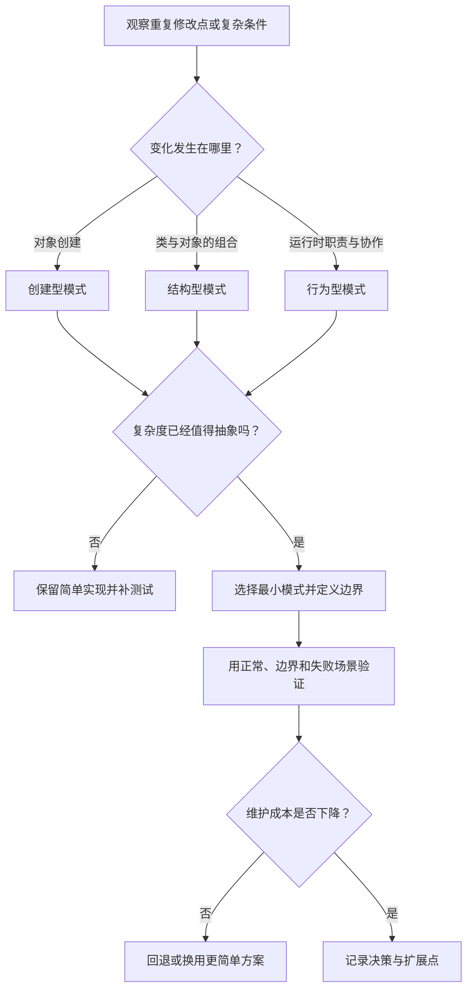
```mermaid
flowchart TD
    A["观察重复修改点或复杂条件"] --> B{"变化发生在哪里？"}
    B -->|"对象创建"| C["创建型模式"]
    B -->|"类与对象的组合"| D["结构型模式"]
    B -->|"运行时职责与协作"| E["行为型模式"]
    C --> F{"复杂度已经值得抽象吗？"}
    D --> F
    E --> F
    F -->|"否"| G["保留简单实现并补测试"]
    F -->|"是"| H["选择最小模式并定义边界"]
    H --> I["用正常、边界和失败场景验证"]
    I --> J{"维护成本是否下降？"}
    J -->|"否"| K["回退或换用更简单方案"]
    J -->|"是"| L["记录决策与扩展点"]
```

这条流程的关键是把设计模式看作重构结果，而不是开发起点。只有当变化轴、条件分支、对象创建成本或协作关系已经清晰时，抽象才有稳定依据。

### 1.3 23 种模式全景

| 类别 | 模式 | 核心意图 | 典型变化点 |
| --- | --- | --- | --- |
| 创建型 | 单例（Singleton） | 在明确作用域内提供唯一实例 | 实例数量与访问入口 |
| 创建型 | 工厂方法（Factory Method） | 把单个产品的创建延迟给具体工厂 | 产品具体类型 |
| 创建型 | 抽象工厂（Abstract Factory） | 创建相互兼容的一族产品 | 产品族 |
| 创建型 | 建造者（Builder） | 分步骤构造复杂对象并集中校验 | 构造参数与构建过程 |
| 创建型 | 原型（Prototype） | 复制已有对象来创建新对象 | 创建成本与初始状态 |
| 结构型 | 代理（Proxy） | 通过替身控制对目标的访问 | 访问策略 |
| 结构型 | 桥接（Bridge） | 拆开两个独立变化维度并用组合连接 | 两个正交维度 |
| 结构型 | 装饰器（Decorator） | 在保持接口不变时叠加能力 | 可组合的附加职责 |
| 结构型 | 适配器（Adapter） | 把已有接口转换成调用方所需接口 | 接口不兼容 |
| 结构型 | 外观（Facade） | 为复杂子系统提供简化入口 | 子系统编排 |
| 结构型 | 组合（Composite） | 统一处理树中的叶子与组合节点 | 层次结构 |
| 结构型 | 享元（Flyweight） | 共享不变状态以减少大量重复对象 | 对象数量与内存 |
| 行为型 | 观察者（Observer） | 状态变化时通知一组依赖者 | 订阅者集合 |
| 行为型 | 模板方法（Template Method） | 固定算法骨架，允许子类改写步骤 | 算法局部步骤 |
| 行为型 | 策略（Strategy） | 封装可替换算法 | 计算或决策规则 |
| 行为型 | 职责链（Chain of Responsibility） | 让请求依次经过多个处理器 | 处理器及顺序 |
| 行为型 | 状态（State） | 让行为随内部状态变化 | 状态与合法迁移 |
| 行为型 | 迭代器（Iterator） | 遍历聚合而不暴露内部表示 | 遍历方式 |
| 行为型 | 访问者（Visitor） | 在稳定对象结构上扩展操作 | 针对多类型元素的操作 |
| 行为型 | 备忘录（Memento） | 在不破坏封装时保存和恢复状态 | 历史快照 |
| 行为型 | 命令（Command） | 把请求封装成可排队、记录或撤销的对象 | 请求的执行控制 |
| 行为型 | 解释器（Interpreter） | 为简单语言定义文法和解释过程 | 语法规则 |
| 行为型 | 中介者（Mediator） | 集中协调一组对象的交互 | 多对多通信 |

“常用”取决于场景。迭代器在业务代码中很少自行实现，但每天都在使用；组合在树形领域非常自然；访问者在编译器抽象语法树中并不冷门。因此，不应脱离领域给模式贴永久的高频或低频标签。

### 1.4 学习每个模式的统一检查框架

阅读后续章节时，始终用以下顺序检查：

1\. 问题：没有这个模式时，哪类修改会扩散？

2\. 机制：参与者如何协作，稳定点和变化点分别在哪里？

3\. 示例：输入或前提是什么，执行中发生什么，结果如何观察？

4\. 边界：什么时候不该用，它与相邻模式有什么区别？

5\. 生产：并发、失败、性能、可观测性和测试需要补什么？

### 1.5 代码与 UML 的完整性约定

后续 23 个模式的示例均按同一准入标准 Review：

1\. 类型完备：接口、抽象类、具体实现、客户端和必要值对象均在同一代码块中定义。

2\. 组装完备：客户端显式创建并连接参与者，不依赖未展示的容器或配置。

3\. 执行完备：`main` 方法至少走通一个能体现模式意图的正常或失败路径。

4\. 验证完备：使用断言检查关键状态、返回值、调用顺序或异常，并给出预期输出。

5\. 编译边界明确：核心示例只依赖 Java 8 标准库，已使用 `javac` 编译并以 `java -ea` 执行。

每张 UML 类图与紧随其后的代码使用相同角色名；实现关系、继承关系、持有关系和创建依赖分别对应实际代码。图只保留理解模式所需的参与者，辅助类和字段细节以代码为准。

## 2 设计基础：质量、原则与 UML

### 2.1 代码质量必须落到可观察结果

| 质量属性 | 可观察信号 | 常见反信号 |
| --- | --- | --- |
| 可读性 | 新成员能准确复述调用链；命名表达业务意图 | 只能靠注释解释控制流；隐式约定过多 |
| 可维护性 | 修改范围可预测；回归测试能定位影响 | 牵一发而动全身；相同规则散落多处 |
| 可扩展性 | 新增实现主要增加代码，而非修改稳定代码 | 每次新增类型都要修改多处分支 |
| 可测试性 | 依赖可替换；核心逻辑可在进程内验证 | 必须启动全部基础设施才能验证一个规则 |
| 可靠性 | 失败语义明确；具备超时、重试或补偿边界 | “没有抛异常”就被当成业务成功 |
| 性能 | 有基线、预算和指标；优化针对真实瓶颈 | 凭感觉缓存、池化或提前抽象 |
| 安全性 | 权限、敏感数据和输入边界有明确策略 | 安全逻辑散落在每个业务方法 |

设计模式只是改善这些属性的手段。类数量增加、接口增多或消除了 `if`，都不自动等于质量提升。

### 2.2 SOLID 与补充原则

SOLID 是五个原则的首字母组合，迪米特法则不属于 SOLID。

| 原则 | 全称 | 核心判断 | 常见误区 |
| --- | --- | --- | --- |
| SRP | Single Responsibility Principle，单一职责原则 | 一个模块应只对一类变化原因负责 | 用代码行数机械判断职责 |
| OCP | Open-Closed Principle，开闭原则 | 对扩展开放，对修改关闭 | 预测所有未来变化并提前造框架 |
| LSP | Liskov Substitution Principle，里氏替换原则 | 子类型替换父类型后仍满足原契约 | 只要语法能继承就认为可替换 |
| ISP | Interface Segregation Principle，接口隔离原则 | 客户端不依赖自己不需要的方法 | 把每个方法都拆成一个接口 |
| DIP | Dependency Inversion Principle，依赖倒置原则 | 高层策略与底层细节共同依赖抽象 | 把依赖注入框架等同于依赖倒置 |
| LoD | Law of Demeter，迪米特法则 | 对协作者只了解完成任务所需的最少信息 | 为避免直接调用制造大量转发类 |

#### 2.2.1 单一职责关注变化原因

“用户相关”不是足够精确的职责。如果用户档案、认证凭证和收货地址由不同团队维护、具有不同生命周期或安全级别，它们就是不同变化原因，应分离模型。若一个简单展示页只读取少量静态字段，强行拆成多个服务反而增加成本。

验证方法是模拟一次变化：修改地址规则时，认证逻辑是否被迫一起部署或回归？如果是，职责边界可能不合理。

#### 2.2.2 开闭原则不是禁止修改

修复缺陷、重构错误抽象、调整稳定契约都需要修改。开闭原则要求的是：对已经识别且高频的变化轴提供扩展点。例如支付方式不断新增时，可把支付算法抽成策略；若需求只有两个稳定分支，清晰的条件判断可能更合适。

#### 2.2.3 里氏替换依赖行为契约

子类型不能加强前置条件、削弱后置条件或破坏父类型的不变量。例如父接口承诺 `withdraw` 在余额不足时返回失败结果，子类却悄悄允许负余额，那么即使签名一致，也不满足里氏替换原则。

测试应复用同一套契约测试验证所有实现：

```java
interface Account {
    boolean withdraw(long cents);
    long balance();
}

static void verifyAccountContract(Account account) {
    long before = account.balance();
    boolean success = account.withdraw(before + 1);
    assert !success;
    assert account.balance() == before;
}
```

#### 2.2.4 依赖倒置、控制反转与依赖注入

依赖倒置是设计原则；控制反转（Inversion of Control，IoC）是把流程或对象控制权交给外部机制；依赖注入（Dependency Injection，DI）是向对象提供依赖的一种具体技术。三者相关，但不是同义词。

构造器注入能让依赖显式、对象在创建后即处于有效状态，也方便测试替换：

```java
interface PaymentGateway {
    PaymentResult charge(long cents);
}

final class CheckoutService {
    private final PaymentGateway gateway;

    CheckoutService(PaymentGateway gateway) {
        this.gateway = gateway;
    }
}
```

#### 2.2.5 组合优于继承不是组合取代继承

继承适合稳定的“是一个”关系和严格行为契约；组合适合复用能力和运行时替换。若子类只是为了复用几行代码，或需要覆盖父类大量行为，通常应优先考虑组合。模板方法和访问者等模式有意使用继承或方法重载，不能机械消除。

### 2.3 KISS、DRY 与 YAGNI 的制衡

KISS（Keep It Simple, Stupid）要求设计保持简单；DRY（Don't Repeat Yourself）要求同一知识只有一个权威表示；YAGNI（You Aren't Gonna Need It）提醒不要为尚未出现的需求开发能力。

三者共同约束模式使用：看到两段相似代码时，先判断它们是否代表同一业务知识。如果只是偶然相似，过早抽象会让未来变化相互牵制；如果同一规则已在多处漂移，就应集中表达。

### 2.4 UML 类图速查

UML（Unified Modeling Language，统一建模语言）类图用于表达系统的静态结构：有哪些类型、类型公开什么成员，以及类型之间如何关联。它回答“代码由什么组成”，不回答“运行时先调用谁”；调用顺序应使用时序图。

本文采用 Mermaid 绘制 UML 类图。UML 是建模语言，Mermaid 是文本绘图工具，两者不能画等号；下面同时给出标准 UML 含义和本文使用的 Mermaid 写法。

#### 2.4.1 类的三层结构

一个完整类框通常分为三层：

| 层次 | 表达内容 | 示例 | 是否可以省略 |
| --- | --- | --- | --- |
| 第一层 | 类名及构造型 | `UserService`、`«interface»` | 类名不可省略 |
| 第二层 | 属性或字段 | `-repository: UserRepository` | 不关心内部状态时可省略 |
| 第三层 | 操作或方法 | `+findById(id: long): User` | 不关心行为时可省略 |

Mermaid 会根据成员中是否包含圆括号区分属性和方法，并自动形成成员分区。下面的类图对应一个普通 Java 类：

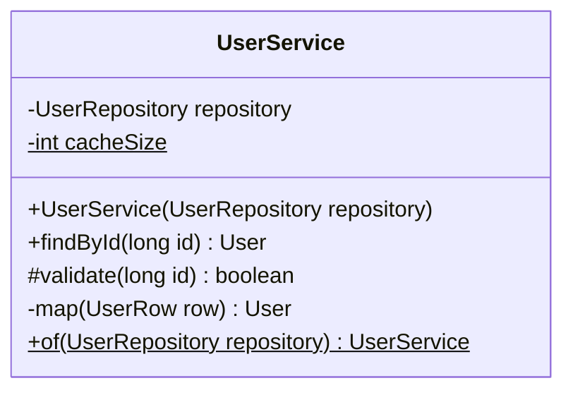
```mermaid
classDiagram
    class UserService {
        -UserRepository repository
        -int cacheSize$
        +UserService(UserRepository repository)
        +findById(long id) User
        #validate(long id) boolean
        -map(UserRow row) User
        +of(UserRepository repository) UserService$
    }
```

类图不是源代码的逐行截图。构造器只有在“对象如何获得依赖”很重要时才画；普通的取值和设值方法、日志字段、框架注解通常省略，以免掩盖设计角色。

#### 2.4.2 可见性、属性与方法签名

成员名前的符号表示可见性：

| 符号 | UML 含义 | Java 对应 |
| --- | --- | --- |
| `+` | public，公开 | `public` |
| `-` | private，私有 | `private` |
| `#` | protected，受保护 | `protected` |
| `~` | package，包可见 | 不写访问修饰符 |

标准 UML 常把属性写成 `[可见性] 名称: 类型 = 默认值`，把方法写成 `[可见性] 名称(参数名: 参数类型): 返回类型`。Mermaid 的类图语法习惯把类型写在名称前、返回类型写在右括号后，因此本文采用以下对应关系：

| Java 声明 | 标准 UML 写法 | 本文 Mermaid 写法 |
| --- | --- | --- |
| `private BigDecimal balance;` | `-balance: BigDecimal` | `-BigDecimal balance` |
| `public boolean withdraw(long cents)` | `+withdraw(cents: long): boolean` | `+withdraw(long cents) boolean` |
| `protected abstract String channel()` | 抽象方法名通常用斜体 | `#channel() String*` |
| `public static User of(...)` | 静态成员通常加下划线 | `+of(...) User$` |

Mermaid 在成员末尾用 `*` 标识抽象成员，用 `$` 标识静态成员。泛型尖括号可能与图形语法冲突，应把 `List<Order>` 写成 `List~Order~`。`final` 没有对应的 Mermaid 专用成员标记；只有在不可变性对设计很重要时，才补充 `{readOnly}` 等约束说明。

#### 2.4.3 普通类、抽象类、接口与枚举

| 类型 | 标准 UML 画法 | Mermaid 画法 | 代码关系 |
| --- | --- | --- | --- |
| 普通类 | 普通三层矩形 | 直接声明 `class A` | 可被实例化 |
| 抽象类 | 类名斜体或标注 `{abstract}` | 类框内写 `<<abstract>>` | 子类使用泛化关系继承 |
| 接口 | 标注 `«interface»` 的矩形，或棒棒糖符号 | 类框内写 `<<interface>>` | 实现类使用实现关系连接 |
| 枚举 | 标注 `«enumeration»` 的矩形 | 类框内写 `<<enumeration>>` | 中间列出枚举常量 |

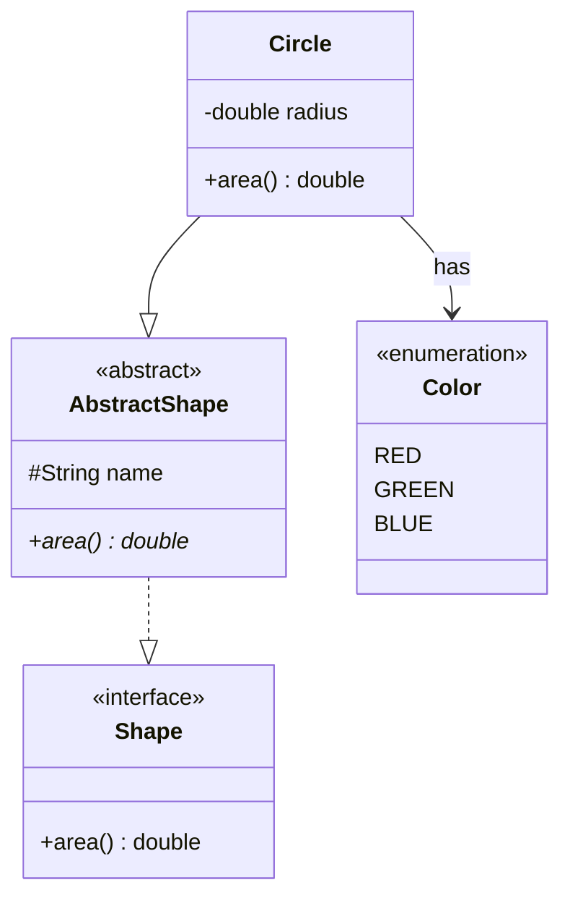
```mermaid
classDiagram
    class Shape {
        <<interface>>
        +area() double
    }
    class AbstractShape {
        <<abstract>>
        #String name
        +area() double*
    }
    class Circle {
        -double radius
        +area() double
    }
    class Color {
        <<enumeration>>
        RED
        GREEN
        BLUE
    }

    AbstractShape ..|> Shape
    Circle --|> AbstractShape
    Circle --> Color : has
```

接口的矩形画法能展示方法，也能被多个实现类复用，最适合设计模式文档。棒棒糖画法更紧凑，Mermaid 可写成 `PaymentGateway ()-- CheckoutService`，但每个棒棒糖接口只适合连接一个类，不适合展示本书常见的“一接口、多实现”结构。

#### 2.4.4 六种核心关系怎么画

关系应从代码事实推导。下表中的 `A` 是子类、实现类、使用方或整体，`B` 是父类、接口、被使用方或部分：

| 关系 | 代码含义 | Mermaid 表示 | 识别要点 |
| --- | --- | --- | --- |
| 实现（Realization） | 类实现接口 | `A ..|> B` | 虚线、空心三角指向接口 |
| 泛化（Generalization） | 子类继承父类 | `A --|> B` | 实线、空心三角指向父类 |
| 依赖（Dependency） | 参数、返回值、局部变量或临时调用 | `A ..> B` | 虚线箭头指向被使用方 |
| 关联（Association） | 对象长期持有另一个对象引用 | `A --> B` | 实线箭头指向可导航的一端 |
| 聚合（Aggregation） | 整体持有可独立存在的部分 | `A o-- B` | 空心菱形放在整体一端 |
| 组合（Composition） | 整体强拥有部分 | `A *-- B` | 实心菱形放在整体一端 |

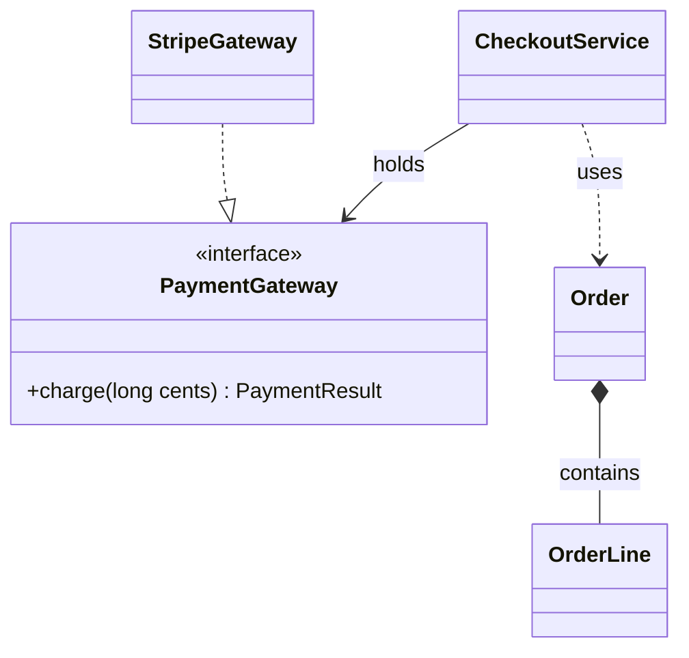
```mermaid
classDiagram
    class PaymentGateway {
        <<interface>>
        +charge(long cents) PaymentResult
    }
    class CheckoutService
    class StripeGateway
    class Order
    class OrderLine

    StripeGateway ..|> PaymentGateway
    CheckoutService --> PaymentGateway : holds
    CheckoutService ..> Order : uses
    Order *-- OrderLine : contains
```

箭头和菱形的位置不能凭视觉习惯决定：继承和实现的三角指向抽象一端，普通箭头指向被知道或可导航的一端，聚合与组合的菱形放在整体一端。

图只能表达设计意图，不能自动证明生命周期。例如 Java 垃圾回收不会因为 UML 画了组合关系就同步销毁对象，`private final B b` 也只证明持有引用，不能单独证明组合。真正的所有权约束仍来自创建责任、封装边界、引用是否外泄和业务规则。

#### 2.4.5 多重性、角色名与导航方向

多重性写在关系两端，表示“一个对端实例最多或最少关联多少个本端实例”：

| 标记 | 含义 | 常见 Java 线索 |
| --- | --- | --- |
| `1` | 恰好一个 | 非空单值字段 |
| `0..1` | 零个或一个 | 可空字段、`Optional<T>` |
| `*` 或 `0..*` | 零个或多个 | `Collection<T>` |
| `1..*` | 至少一个 | 非空集合且有业务校验 |
| `m..n` | m 到 n 个 | 有明确上下界校验 |

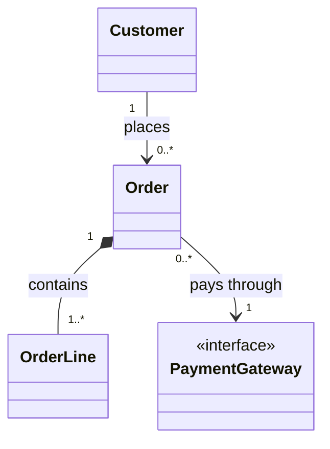
```mermaid
classDiagram
    class Customer
    class Order
    class OrderLine
    class PaymentGateway {
        <<interface>>
    }

    Customer "1" --> "0..*" Order : places
    Order "1" *-- "1..*" OrderLine : contains
    Order "0..*" --> "1" PaymentGateway : pays through
```

在 `Customer "1" --> "0..*" Order` 中，靠近 `Order` 的 `0..*` 表示一个客户可对应零到多个订单，靠近 `Customer` 的 `1` 表示每个订单只属于一个客户。冒号后的 `places`、`contains` 是关系名，用动词说明关系比只写 `association` 更有信息量。

`A --> B` 表示从 A 可以导航到 B，通常对应 A 持有 B 的引用；它不是“数据从 A 流向 B”。若双方都持有对方，可画双向关联，但双向引用会增加一致性维护成本，不应只为图形对称而添加。

#### 2.4.6 从 Java 代码反推类图

先判断类型，再判断成员，最后判断关系和数量：

1\. `class A extends B` 画成 `A --|> B`。

2\. `class A implements I` 画成 `A ..|> I`。

3\. A 的字段类型为 B，通常画关联；只有能证明整体所有权和生命周期绑定时，才升级为聚合或组合。

4\. B 只出现在 A 的参数、返回值、局部变量或临时调用中，通常画依赖。

5\. 字段是集合时，在 B 一端标 `0..*`；若构造器或领域规则保证集合非空，才标 `1..*`。

6\. 只保留能解释模式稳定点、变化点和协作方式的成员，不把整个代码库机械搬进图。

| Java 代码线索 | 首选关系 | 仍需确认的问题 |
| --- | --- | --- |
| `extends` | 泛化 | 是否遵守父类型行为契约 |
| `implements` | 实现 | 接口是否真是调用方需要的抽象 |
| `private B b` | 关联 | 是否允许为空，是否共享 |
| `private List<B> items` | 一对多关联 | 是否允许空集合，谁维护成员 |
| 方法参数或局部变量 `B` | 依赖 | 是否只是一次临时使用 |
| A 内部 `new B()` 并独占 B | 可能是组合 | B 是否能脱离 A 存在或被共享 |

#### 2.4.7 常见错误与最小检查表

| 常见错误 | 问题 | 修正方式 |
| --- | --- | --- |
| 接口画成普通类 | 看不出实现关系的抽象目标 | 标注 `<<interface>>` 并使用 `..|>` |
| 继承箭头指向子类 | 语义完全反转 | 空心三角始终指向父类或接口 |
| 看到 `new` 就画组合 | 创建不等于独占所有权 | 同时检查生命周期和引用是否外泄 |
| 集合一律标 `1..*` | 集合可能为空 | 没有非空约束时使用 `0..*` |
| 把所有字段和方法都画出 | 关键协作被噪声淹没 | 只保留与当前设计目的有关的成员 |
| 用类图表达调用先后 | 静态图无法表达时间顺序 | 改用 UML 时序图 |
| 把 Mermaid 语法当成 UML 标准 | 工具记号和标准语义混淆 | 先确认 UML 语义，再选择工具写法 |

完成一张模式类图后，至少检查：类型构造型是否明确、三角和菱形方向是否正确、字段与关系是否一致、多重性是否有代码或业务依据、图中名称是否与示例代码一致。拿不准聚合与组合时，宁可先画普通关联并补充文字约束，也不要制造虚假的生命周期语义。

### 2.5 安全重构闭环

1\. 先用特征测试固定现有外部行为。

2\. 标记变化点、调用方、数据边界和失败路径。

3\. 一次只引入一个抽象，保持每一步可运行。

4\. 对新旧实现运行相同契约测试。

5\. 比较复杂度、变更范围、性能和可观测性。

6\. 删除失去用途的旧分支与兼容代码。

成功判据不是“套用了模式”，而是目标变化被隔离、调用方更简单，并且异常与边界行为仍可验证。

## 3 创建型模式：管理对象如何产生

### 3.1 单例模式：限定作用域内的唯一实例

单例模式保证某个类型在一个明确作用域内只有一个实例，并提供访问入口。这里的“唯一”不是宇宙级唯一：类加载器、进程、容器、集群和租户都可能形成不同作用域。

#### 3.1.1 UML 结构

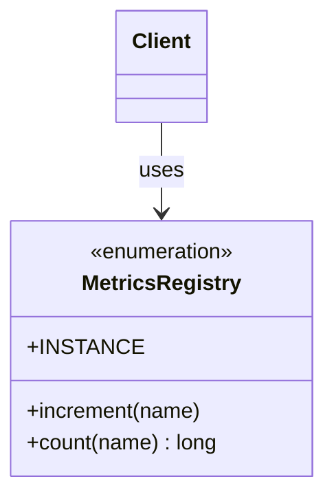
```mermaid
classDiagram
    class Client
    class MetricsRegistry {
        <<enumeration>>
        +INSTANCE
        +increment(name)
        +count(name) long
    }
    Client --> MetricsRegistry : uses
```

#### 3.1.2 可运行代码

无延迟加载要求时，Java 枚举通常是最稳妥的语言级实现；静态内部类适合延迟初始化；双重检查锁定用于必须手工控制实例字段的场景。

```java
import java.util.concurrent.ConcurrentHashMap;
import java.util.concurrent.ConcurrentMap;
import java.util.concurrent.atomic.AtomicLong;

public class SingletonDemo {
    enum MetricsRegistry {
        INSTANCE;

        private final ConcurrentMap<String, AtomicLong> counters =
                new ConcurrentHashMap<String, AtomicLong>();

        void increment(String name) {
            AtomicLong created = new AtomicLong();
            AtomicLong existing = counters.putIfAbsent(name, created);
            (existing == null ? created : existing).incrementAndGet();
        }

        long count(String name) {
            AtomicLong counter = counters.get(name);
            return counter == null ? 0L : counter.get();
        }
    }

    static final class RuleCatalog {
        private RuleCatalog() {}

        private static class Holder {
            private static final RuleCatalog INSTANCE = new RuleCatalog();
        }

        static RuleCatalog instance() {
            return Holder.INSTANCE;
        }
    }

    static final class ExpensiveService {
        private static volatile ExpensiveService instance;

        private ExpensiveService() {}

        static ExpensiveService instance() {
            ExpensiveService local = instance;
            if (local == null) {
                synchronized (ExpensiveService.class) {
                    local = instance;
                    if (local == null) {
                        local = new ExpensiveService();
                        instance = local;
                    }
                }
            }
            return local;
        }
    }

    public static void main(String[] args) {
        MetricsRegistry.INSTANCE.increment("orders");
        assert MetricsRegistry.INSTANCE.count("orders") == 1L;
        assert RuleCatalog.instance() == RuleCatalog.instance();
        assert ExpensiveService.instance() == ExpensiveService.instance();
        System.out.println("singleton verified");
    }
}
```

预期输出为 `singleton verified`。`RuleCatalog` 第一次调用 `instance()` 时才初始化内部类；DCL（Double-Checked Locking，双重检查锁定）中的 `volatile` 防止其他线程观察到未完整构造的对象。

枚举反序列化按常量名称恢复既有常量，不能用普通反序列化流程制造第二个实例。除非必须控制初始化过程，否则枚举或静态内部类通常比手写 DCL 更清晰。

#### 3.1.3 边界与生产风险

| 风险 | 后果 | 做法 |
| --- | --- | --- |
| 隐式全局状态 | 测试相互污染、调用顺序敏感 | 优先通过接口和构造器注入 |
| 可变共享数据 | 竞态、可见性问题 | 使用不可变状态或并发容器 |
| 进程内唯一被误认为集群唯一 | 重复任务、重复编号 | 使用数据库约束、租约或分布式协调 |
| 资源未关闭 | 线程、连接和文件句柄泄漏 | 明确定义生命周期与关闭钩子 |

单例适合无状态服务、进程内注册表或昂贵且可安全共享的资源管理器；不适合承载用户会话、请求状态或未经同步的可变业务数据。

### 3.2 工厂方法模式：把单个产品的创建交给具体工厂

工厂方法定义创建产品的抽象入口，由具体工厂决定返回哪种产品。它适合“产品具有统一契约，但创建步骤或依赖不同”的场景。

#### 3.2.1 UML 结构

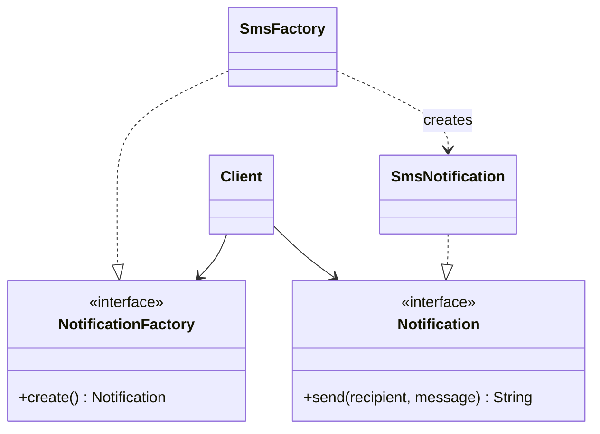
```mermaid
classDiagram
    class Notification {
        <<interface>>
        +send(recipient, message) String
    }
    class SmsNotification
    class NotificationFactory {
        <<interface>>
        +create() Notification
    }
    class SmsFactory
    class Client

    SmsNotification ..|> Notification
    SmsFactory ..|> NotificationFactory
    SmsFactory ..> SmsNotification : creates
    Client --> NotificationFactory
    Client --> Notification
```

#### 3.2.2 可运行代码

```java
public class FactoryMethodDemo {
    interface Notification {
        String send(String recipient, String message);
    }

    static final class SmsNotification implements Notification {
        public String send(String recipient, String message) {
            return "SMS:" + recipient + ":" + message;
        }
    }

    interface NotificationFactory {
        Notification create();
    }

    static final class SmsFactory implements NotificationFactory {
        public Notification create() {
            return new SmsNotification();
        }
    }

    public static void main(String[] args) {
        NotificationFactory factory = new SmsFactory();
        Notification notification = factory.create();
        String result = notification.send("alice", "hello");
        assert "SMS:alice:hello".equals(result);
        System.out.println(result);
    }
}
```

输入是 `SmsFactory`，工厂创建遵守 `Notification` 契约的产品，预期输出为 `SMS:alice:hello`。真实项目可把短信客户端通过工厂构造器注入，并用测试替身验证发送失败语义。

只有少量稳定类型时，集中使用一段 `switch` 或映射表的简单工厂更合适。简单工厂不属于 GoF（Gang of Four，四人组）23 种模式。工厂方法也不会消除选择：具体工厂仍需要由配置、依赖注入容器或注册表选出。

### 3.3 抽象工厂模式：保证一族产品相互兼容

抽象工厂提供多个创建方法，每个具体工厂创建同一产品族。变化轴是“整套产品族”，而不是单个产品。

#### 3.3.1 UML 结构

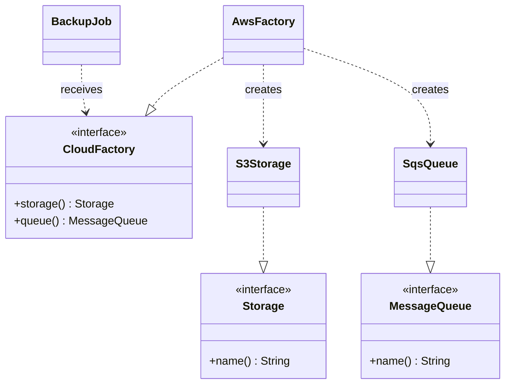
```mermaid
classDiagram
    class Storage {
        <<interface>>
        +name() String
    }
    class MessageQueue {
        <<interface>>
        +name() String
    }
    class CloudFactory {
        <<interface>>
        +storage() Storage
        +queue() MessageQueue
    }
    class AwsFactory
    class S3Storage
    class SqsQueue
    class BackupJob

    AwsFactory ..|> CloudFactory
    S3Storage ..|> Storage
    SqsQueue ..|> MessageQueue
    AwsFactory ..> S3Storage : creates
    AwsFactory ..> SqsQueue : creates
    BackupJob ..> CloudFactory : receives
```

#### 3.3.2 可运行代码

```java
public class AbstractFactoryDemo {
    interface Storage {
        String name();
    }

    interface MessageQueue {
        String name();
    }

    interface CloudFactory {
        Storage storage();
        MessageQueue queue();
    }

    static final class S3Storage implements Storage {
        public String name() {
            return "S3";
        }
    }

    static final class SqsQueue implements MessageQueue {
        public String name() {
            return "SQS";
        }
    }

    static final class AwsFactory implements CloudFactory {
        public Storage storage() {
            return new S3Storage();
        }

        public MessageQueue queue() {
            return new SqsQueue();
        }
    }

    static final class BackupJob {
        private final Storage storage;
        private final MessageQueue queue;

        BackupJob(CloudFactory factory) {
            storage = factory.storage();
            queue = factory.queue();
        }

        String describe() {
            return storage.name() + "+" + queue.name();
        }
    }

    public static void main(String[] args) {
        BackupJob job = new BackupJob(new AwsFactory());
        assert "S3+SQS".equals(job.describe());
        System.out.println(job.describe());
    }
}
```

给 `BackupJob` 传入 `AwsFactory` 后，存储与消息组件属于同一云产品族，预期输出为 `S3+SQS`。新增一个云厂商主要增加一个具体工厂；新增一种产品类型则必须修改抽象工厂及所有具体工厂，这是它对开闭原则支持较弱的方向。

适用前提是产品确实需要成套替换和兼容。若调用方只需要一个 `Storage`，直接注入该接口更简单。

### 3.4 建造者模式：构造有效的复杂对象

建造者把构建步骤、默认值和跨字段校验集中起来，避免长参数列表和 Setter 造成的无效中间状态。

#### 3.4.1 UML 结构

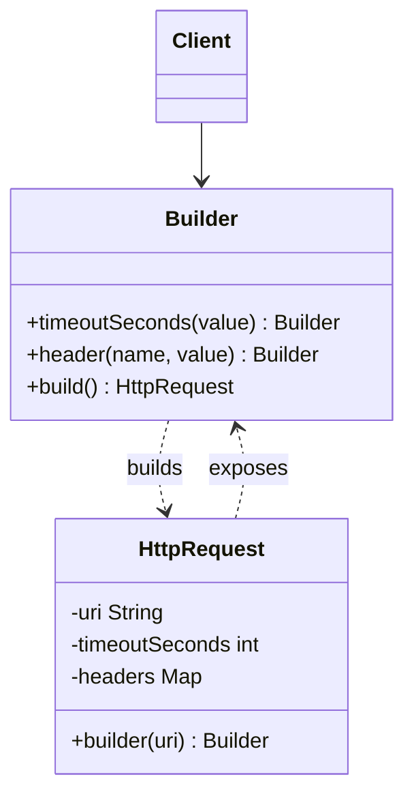
```mermaid
classDiagram
    class Client
    class HttpRequest {
        -uri String
        -timeoutSeconds int
        -headers Map
        +builder(uri) Builder
    }
    class Builder {
        +timeoutSeconds(value) Builder
        +header(name, value) Builder
        +build() HttpRequest
    }

    Client --> Builder
    Builder ..> HttpRequest : builds
    HttpRequest ..> Builder : exposes
```

#### 3.4.2 可运行代码

```java
import java.util.Collections;
import java.util.LinkedHashMap;
import java.util.Map;

public final class HttpRequest {
    private final String uri;
    private final int timeoutSeconds;
    private final Map<String, String> headers;

    private HttpRequest(Builder builder) {
        this.uri = builder.uri;
        this.timeoutSeconds = builder.timeoutSeconds;
        this.headers = Collections.unmodifiableMap(
                new LinkedHashMap<String, String>(builder.headers)
        );
    }

    public static Builder builder(String uri) {
        return new Builder(uri);
    }

    public static final class Builder {
        private final String uri;
        private int timeoutSeconds = 3;
        private final Map<String, String> headers =
                new LinkedHashMap<String, String>();

        private Builder(String uri) {
            if (uri == null || uri.trim().isEmpty()) {
                throw new IllegalArgumentException("uri is required");
            }
            this.uri = uri;
        }

        public Builder timeoutSeconds(int timeoutSeconds) {
            if (timeoutSeconds <= 0) {
                throw new IllegalArgumentException("timeout must be positive");
            }
            this.timeoutSeconds = timeoutSeconds;
            return this;
        }

        public Builder header(String name, String value) {
            headers.put(name, value);
            return this;
        }

        public HttpRequest build() {
            return new HttpRequest(this);
        }
    }

    public static void main(String[] args) {
        HttpRequest request = HttpRequest.builder("https://example.test")
                .timeoutSeconds(5)
                .header("Accept", "application/json")
                .build();
        assert request.timeoutSeconds == 5;
        assert "application/json".equals(request.headers.get("Accept"));
        System.out.println(request.uri + " timeout=" + request.timeoutSeconds);
    }
}
```

将代码保存为 `HttpRequest.java`。执行 `builder(...).timeoutSeconds(...).header(...).build()` 后，调用方得到不可变且已校验的对象，预期输出包含 `timeout=5`。测试还应覆盖默认超时、非法零超时和构建后内部集合不可被外部修改。

只有两三个必填参数且没有复杂校验时，普通构造器或静态工厂更直接。不要为每个数据传输对象机械生成 Builder。

### 3.5 原型模式：从已存在对象复制

原型模式通过复制已有实例创建新对象，适合初始化昂贵、基础状态相似且确实需要独立副本的场景。重点不在 `Cloneable`，而在复制语义。

#### 3.5.1 UML 结构

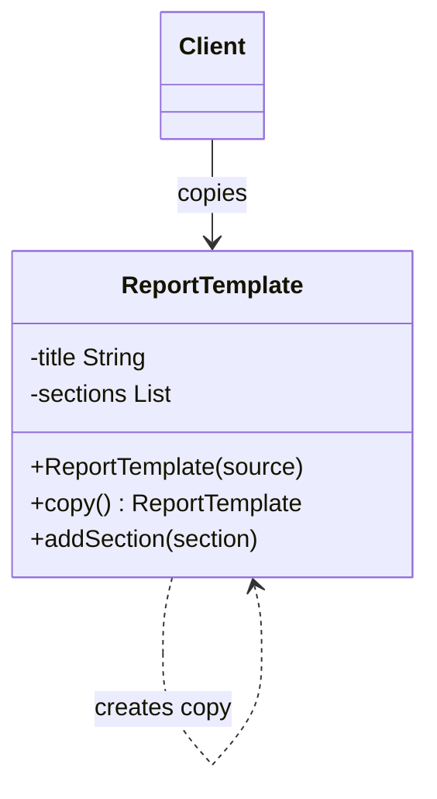
```mermaid
classDiagram
    class Client
    class ReportTemplate {
        -title String
        -sections List
        +ReportTemplate(source)
        +copy() ReportTemplate
        +addSection(section)
    }

    Client --> ReportTemplate : copies
    ReportTemplate ..> ReportTemplate : creates copy
```

#### 3.5.2 可运行代码

```java
import java.util.ArrayList;
import java.util.Arrays;
import java.util.Collections;
import java.util.List;

public class PrototypeDemo {
    static final class ReportTemplate {
        private final String title;
        private final List<String> sections;

        ReportTemplate(String title, List<String> sections) {
            this.title = title;
            this.sections = new ArrayList<String>(sections);
        }

        ReportTemplate(ReportTemplate source) {
            this(source.title, source.sections);
        }

        ReportTemplate copy() {
            return new ReportTemplate(this);
        }

        void addSection(String section) {
            sections.add(section);
        }

        List<String> sections() {
            return Collections.unmodifiableList(sections);
        }
    }

    public static void main(String[] args) {
        ReportTemplate original = new ReportTemplate(
                "Weekly", Arrays.asList("Summary")
        );
        ReportTemplate copy = original.copy();
        copy.addSection("Risks");

        assert original.sections().size() == 1;
        assert copy.sections().size() == 2;
        System.out.println("original=1, copy=2");
    }
}
```

复制构造器显式表达哪些字段共享、哪些字段复制，通常比 `Object.clone()` 更容易审查。示例修改副本后，原型仍只有一个章节，预期输出为 `original=1, copy=2`。这同时验证了嵌套可变集合没有被共享。

Java 原生序列化不是通用深复制方案。普通 `Serializable` 对象反序列化时不会简单地调用本类无参构造器；规范要求可访问第一个非序列化父类的无参构造器。序列化还带来性能、版本兼容和不可信输入安全风险。生产中优先选择复制构造器、不可变对象或领域明确的映射逻辑。

## 4 结构型模式：组织对象与能力

### 4.1 代理模式：控制访问

代理与目标暴露相同接口，在调用前后执行访问控制、远程通信、延迟加载或事务等逻辑。它的首要意图是控制访问，而不是任意增强。

#### 4.1.1 UML 结构

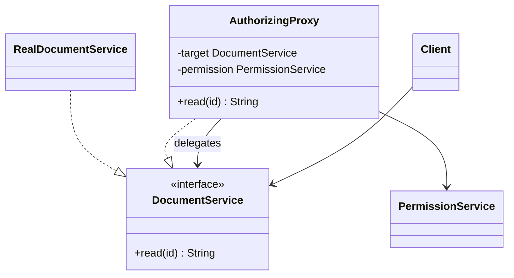
```mermaid
classDiagram
    class DocumentService {
        <<interface>>
        +read(id) String
    }
    class RealDocumentService
    class AuthorizingProxy {
        -target DocumentService
        -permission PermissionService
        +read(id) String
    }
    class PermissionService
    class Client

    RealDocumentService ..|> DocumentService
    AuthorizingProxy ..|> DocumentService
    AuthorizingProxy --> DocumentService : delegates
    AuthorizingProxy --> PermissionService
    Client --> DocumentService
```

#### 4.1.2 可运行代码

```java
public class ProxyDemo {
    interface DocumentService {
        String read(String id);
    }

    static final class RealDocumentService implements DocumentService {
        public String read(String id) {
            return "document:" + id;
        }
    }

    interface PermissionService {
        boolean canRead(String id);
    }

    static final class AuthorizingProxy implements DocumentService {
        private final DocumentService target;
        private final PermissionService permission;

        AuthorizingProxy(DocumentService target, PermissionService permission) {
            this.target = target;
            this.permission = permission;
        }

        public String read(String id) {
            if (!permission.canRead(id)) {
                throw new SecurityException("forbidden:" + id);
            }
            return target.read(id);
        }
    }

    public static void main(String[] args) {
        PermissionService onlyPublic = new PermissionService() {
            public boolean canRead(String id) {
                return id.startsWith("public-");
            }
        };
        DocumentService service = new AuthorizingProxy(
                new RealDocumentService(), onlyPublic
        );
        assert "document:public-1".equals(service.read("public-1"));

        try {
            service.read("private-1");
            throw new AssertionError("access should be denied");
        } catch (SecurityException expected) {
            System.out.println(expected.getMessage());
        }
    }
}
```

输入是文档编号；代理先检查权限，再决定是否委派给目标。允许路径返回文档，拒绝路径预期输出 `forbidden:private-1`。生产测试还应使用记录调用次数的目标替身，证明拒绝时目标从未执行。

JDK（Java Development Kit，Java 开发工具包）动态代理基于接口和 `InvocationHandler`；基于子类的代理不能覆盖 `final` 类或 `final` 方法。框架代理还常有“同类内部调用绕过代理”的边界。不要通过代理隐式改变业务返回语义。

### 4.2 桥接模式：拆开两个独立变化维度

桥接用组合连接两个可独立扩展的维度，避免继承组合爆炸。判断标准不是“有两个接口”，而是两个维度是否真的正交变化。

#### 4.2.1 UML 结构

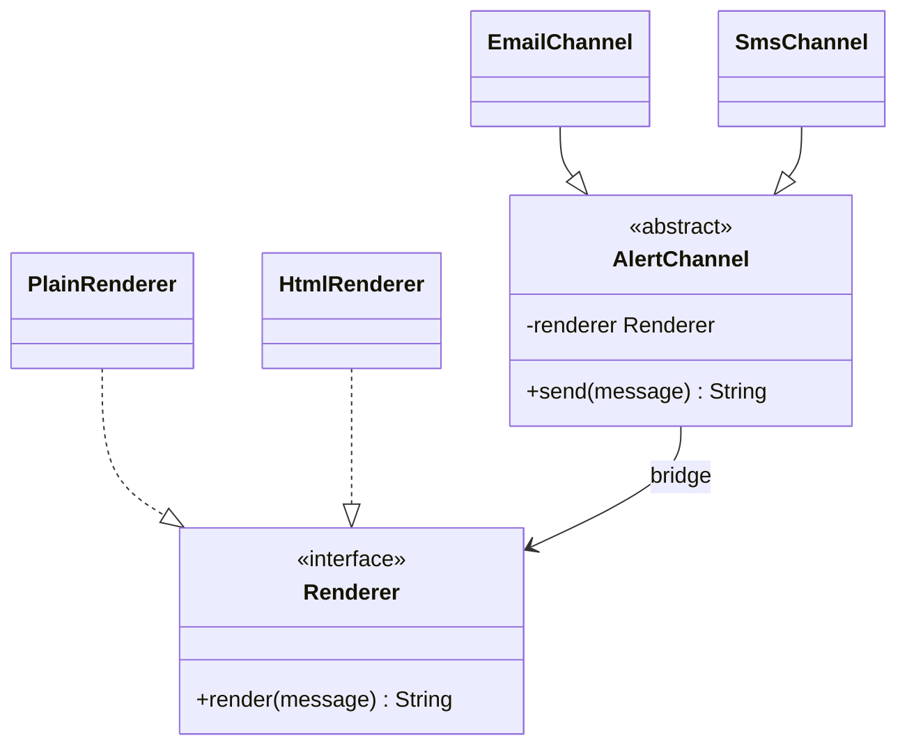
```mermaid
classDiagram
    class Renderer {
        <<interface>>
        +render(message) String
    }
    class PlainRenderer
    class HtmlRenderer
    class AlertChannel {
        <<abstract>>
        -renderer Renderer
        +send(message) String
    }
    class EmailChannel
    class SmsChannel

    PlainRenderer ..|> Renderer
    HtmlRenderer ..|> Renderer
    AlertChannel --> Renderer : bridge
    EmailChannel --|> AlertChannel
    SmsChannel --|> AlertChannel
```

#### 4.2.2 可运行代码

```java
public class BridgeDemo {
    interface Renderer {
        String render(String message);
    }

    static final class PlainRenderer implements Renderer {
        public String render(String message) {
            return message;
        }
    }

    static final class HtmlRenderer implements Renderer {
        public String render(String message) {
            return "<p>" + message + "</p>";
        }
    }

    static abstract class AlertChannel {
        protected final Renderer renderer;

        AlertChannel(Renderer renderer) {
            this.renderer = renderer;
        }

        abstract String send(String message);
    }

    static final class EmailChannel extends AlertChannel {
        EmailChannel(Renderer renderer) {
            super(renderer);
        }

        String send(String message) {
            return "EMAIL:" + renderer.render(message);
        }
    }

    static final class SmsChannel extends AlertChannel {
        SmsChannel(Renderer renderer) {
            super(renderer);
        }

        String send(String message) {
            return "SMS:" + renderer.render(message);
        }
    }

    public static void main(String[] args) {
        AlertChannel channel = new EmailChannel(new HtmlRenderer());
        String result = channel.send("disk full");
        assert "EMAIL:<p>disk full</p>".equals(result);
        System.out.println(result);
    }
}
```

渠道可以新增 Email、短信，渲染格式可以新增纯文本、HTML（HyperText Markup Language，超文本标记语言），两边独立扩展并任意组合。预期输出为 `EMAIL:<p>disk full</p>`。若两个维度总是一起变化，桥接只会增加间接层。

### 4.3 装饰器模式：按顺序叠加职责

装饰器与被装饰对象实现相同接口，并持有该接口对象。多个装饰器可嵌套，顺序通常影响语义。

#### 4.3.1 UML 结构

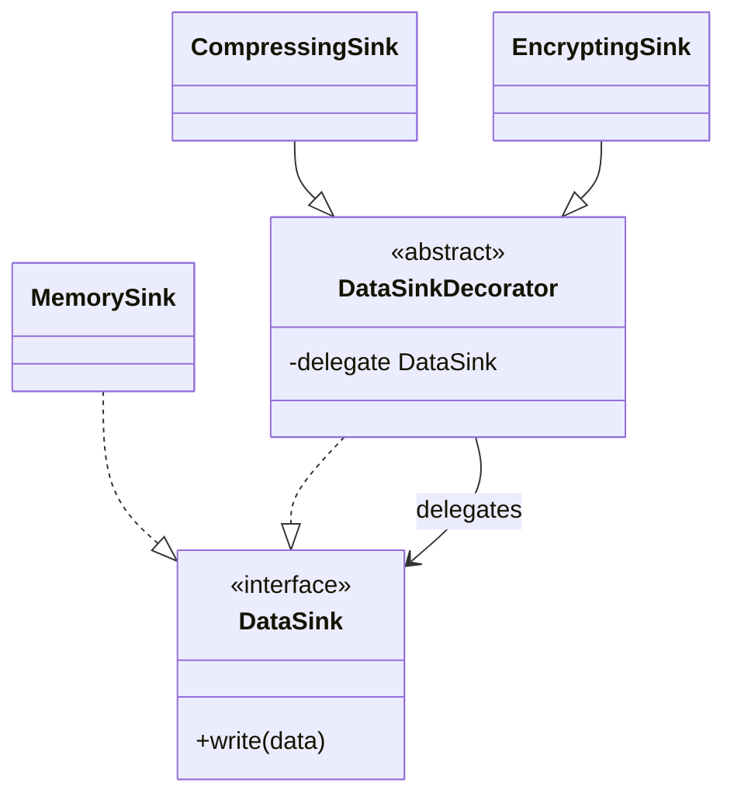
```mermaid
classDiagram
    class DataSink {
        <<interface>>
        +write(data)
    }
    class MemorySink
    class DataSinkDecorator {
        <<abstract>>
        -delegate DataSink
    }
    class CompressingSink
    class EncryptingSink

    MemorySink ..|> DataSink
    DataSinkDecorator ..|> DataSink
    DataSinkDecorator --> DataSink : delegates
    CompressingSink --|> DataSinkDecorator
    EncryptingSink --|> DataSinkDecorator
```

#### 4.3.2 可运行代码

```java
public class DecoratorDemo {
    interface DataSink {
        void write(String data);
    }

    static final class MemorySink implements DataSink {
        private String value;

        public void write(String data) {
            value = data;
        }

        String value() {
            return value;
        }
    }

    static abstract class DataSinkDecorator implements DataSink {
        protected final DataSink delegate;

        DataSinkDecorator(DataSink delegate) {
            this.delegate = delegate;
        }
    }

    static final class CompressingSink extends DataSinkDecorator {
        CompressingSink(DataSink delegate) {
            super(delegate);
        }

        public void write(String data) {
            delegate.write("COMPRESSED(" + data + ")");
        }
    }

    static final class EncryptingSink extends DataSinkDecorator {
        EncryptingSink(DataSink delegate) {
            super(delegate);
        }

        public void write(String data) {
            delegate.write("ENCRYPTED(" + data + ")");
        }
    }

    public static void main(String[] args) {
        MemorySink target = new MemorySink();
        DataSink sink = new CompressingSink(new EncryptingSink(target));
        sink.write("report");

        assert "ENCRYPTED(COMPRESSED(report))".equals(target.value());
        System.out.println(target.value());
    }
}
```

外层 `CompressingSink` 先转换数据，再委派给内层 `EncryptingSink`，预期输出为 `ENCRYPTED(COMPRESSED(report))`；交换嵌套次序会改变结果。这里的字符串前缀只用于观察顺序，不是真实压缩或加密算法。生产测试还应覆盖异常传播和关闭资源的责任归属。

装饰器适合可任意组合的横向能力。若只需固定的一次性增强，一个普通包装类或函数更清晰。

### 4.4 适配器模式：转换接口与语义

适配器让不兼容接口协作。它不仅转换方法名和参数，还必须明确单位、空值、错误码和幂等语义。

#### 4.4.1 UML 结构

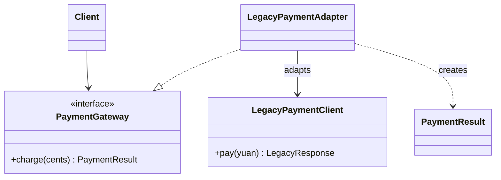
```mermaid
classDiagram
    class PaymentGateway {
        <<interface>>
        +charge(cents) PaymentResult
    }
    class LegacyPaymentAdapter
    class LegacyPaymentClient {
        +pay(yuan) LegacyResponse
    }
    class PaymentResult
    class Client

    LegacyPaymentAdapter ..|> PaymentGateway
    LegacyPaymentAdapter --> LegacyPaymentClient : adapts
    LegacyPaymentAdapter ..> PaymentResult : creates
    Client --> PaymentGateway
```

#### 4.4.2 可运行代码

```java
import java.math.BigDecimal;

public class AdapterDemo {
    interface PaymentGateway {
        PaymentResult charge(long cents);
    }

    static final class PaymentResult {
        private final boolean success;
        private final String transactionId;

        PaymentResult(boolean success, String transactionId) {
            this.success = success;
            this.transactionId = transactionId;
        }
    }

    static final class LegacyResponse {
        private final String code;
        private final String transactionId;

        LegacyResponse(String code, String transactionId) {
            this.code = code;
            this.transactionId = transactionId;
        }
    }

    static final class LegacyPaymentClient {
        LegacyResponse pay(BigDecimal yuan) {
            return new LegacyResponse("00", "T-" + yuan.toPlainString());
        }
    }

    static final class LegacyPaymentAdapter implements PaymentGateway {
        private final LegacyPaymentClient client;

        LegacyPaymentAdapter(LegacyPaymentClient client) {
            this.client = client;
        }

        public PaymentResult charge(long cents) {
            LegacyResponse response = client.pay(BigDecimal.valueOf(cents, 2));
            if ("00".equals(response.code)) {
                return new PaymentResult(true, response.transactionId);
            }
            return new PaymentResult(false, null);
        }
    }

    public static void main(String[] args) {
        PaymentGateway gateway =
                new LegacyPaymentAdapter(new LegacyPaymentClient());
        PaymentResult result = gateway.charge(1234L);

        assert result.success;
        assert "T-12.34".equals(result.transactionId);
        System.out.println(result.transactionId);
    }
}
```

这里输入单位是分，旧系统使用元；适配器把 `1234` 分转换为 `12.34` 元，并把旧响应转换为领域结果，预期输出为 `T-12.34`。契约测试还应覆盖金额精度、重复请求、超时与未知错误码。

类适配器依靠继承，对单继承语言限制较大；对象适配器依靠组合，更易测试和替换，通常优先。

### 4.5 外观模式：提供面向任务的入口

外观为复杂子系统提供粗粒度、面向用例的入口。它降低调用方对内部顺序和协作者的了解，但不应吞掉关键失败信息。

#### 4.5.1 UML 结构

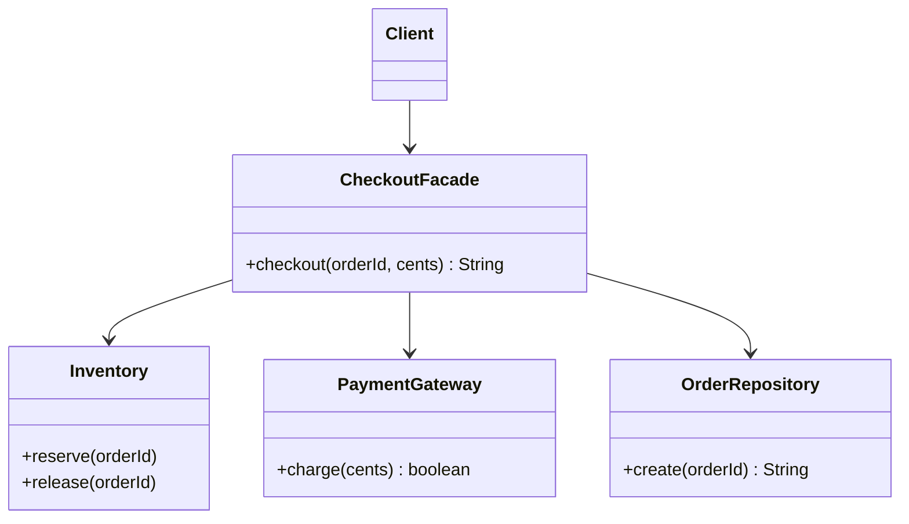
```mermaid
classDiagram
    class Client
    class CheckoutFacade {
        +checkout(orderId, cents) String
    }
    class Inventory {
        +reserve(orderId)
        +release(orderId)
    }
    class PaymentGateway {
        +charge(cents) boolean
    }
    class OrderRepository {
        +create(orderId) String
    }

    Client --> CheckoutFacade
    CheckoutFacade --> Inventory
    CheckoutFacade --> PaymentGateway
    CheckoutFacade --> OrderRepository
```

#### 4.5.2 可运行代码

```java
public class FacadeDemo {
    static final class Inventory {
        private boolean reserved;

        void reserve(String orderId) {
            reserved = true;
        }

        void release(String orderId) {
            reserved = false;
        }
    }

    static final class PaymentGateway {
        private final boolean shouldSucceed;

        PaymentGateway(boolean shouldSucceed) {
            this.shouldSucceed = shouldSucceed;
        }

        boolean charge(long cents) {
            return shouldSucceed;
        }
    }

    static final class OrderRepository {
        String create(String orderId) {
            return "CREATED:" + orderId;
        }
    }

    static final class CheckoutFacade {
        private final Inventory inventory;
        private final PaymentGateway payment;
        private final OrderRepository orders;

        CheckoutFacade(
                Inventory inventory,
                PaymentGateway payment,
                OrderRepository orders
        ) {
            this.inventory = inventory;
            this.payment = payment;
            this.orders = orders;
        }

        String checkout(String orderId, long cents) {
            inventory.reserve(orderId);
            if (!payment.charge(cents)) {
                inventory.release(orderId);
                return "PAYMENT_FAILED";
            }
            return orders.create(orderId);
        }
    }

    public static void main(String[] args) {
        Inventory inventory = new Inventory();
        CheckoutFacade facade = new CheckoutFacade(
                inventory, new PaymentGateway(false), new OrderRepository()
        );
        String result = facade.checkout("O-1", 1000L);

        assert "PAYMENT_FAILED".equals(result);
        assert !inventory.reserved;
        System.out.println(result + ", reservationReleased=true");
    }
}
```

调用方只发起结算，外观负责库存、支付和订单编排。示例让支付失败，并断言库存已经释放，预期输出包含 `reservationReleased=true`。生产实现还需定义支付成功但订单写入失败时的幂等、补偿和对账策略；一个本地 `try-catch` 不能保证跨系统原子性。

### 4.6 组合模式：统一叶子与树枝

组合把对象组织成树，并让客户端通过共同接口处理叶子和组合节点。

#### 4.6.1 UML 结构

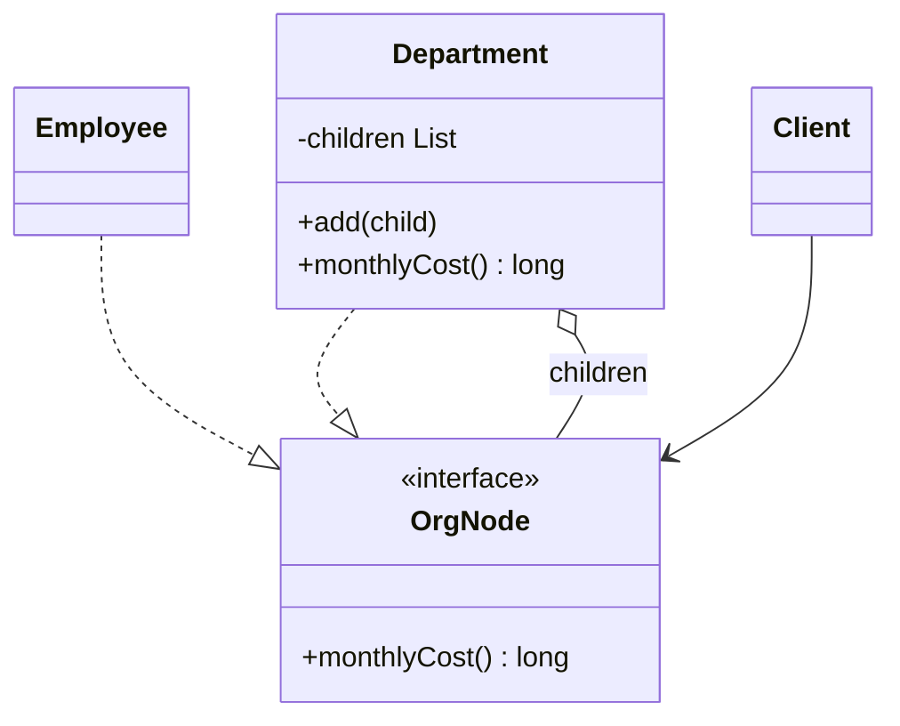
```mermaid
classDiagram
    class OrgNode {
        <<interface>>
        +monthlyCost() long
    }
    class Employee
    class Department {
        -children List
        +add(child)
        +monthlyCost() long
    }
    class Client

    Employee ..|> OrgNode
    Department ..|> OrgNode
    Department o-- OrgNode : children
    Client --> OrgNode
```

#### 4.6.2 可运行代码

```java
import java.util.ArrayList;
import java.util.List;

public class CompositeDemo {
    interface OrgNode {
        long monthlyCost();
    }

    static final class Employee implements OrgNode {
        private final long cost;

        Employee(long cost) {
            this.cost = cost;
        }

        public long monthlyCost() {
            return cost;
        }
    }

    static final class Department implements OrgNode {
        private final List<OrgNode> children = new ArrayList<OrgNode>();

        Department add(OrgNode child) {
            children.add(child);
            return this;
        }

        public long monthlyCost() {
            long total = 0L;
            for (OrgNode child : children) {
                total += child.monthlyCost();
            }
            return total;
        }
    }

    public static void main(String[] args) {
        Department engineering = new Department()
                .add(new Employee(100L))
                .add(new Department().add(new Employee(80L)));

        assert engineering.monthlyCost() == 180L;
        System.out.println(engineering.monthlyCost());
    }
}
```

部门可以包含员工或子部门，`monthlyCost()` 对两者透明，预期输出为 `180`。生产验证还要覆盖空树、深树和非法环；若外部输入可构造结构，应检测环或限制深度，避免无限递归和栈溢出。

透明组合把 `add/remove` 放在共同接口中，调用统一但叶子可能在运行时拒绝操作；安全组合只让树枝暴露管理方法，类型安全但客户端需区分。应根据调用方式选择。

### 4.7 享元模式：共享不变的内部状态

享元把大量对象共有且不变的内部状态缓存共享，把随场景变化的外部状态由调用方传入。

#### 4.7.1 UML 结构

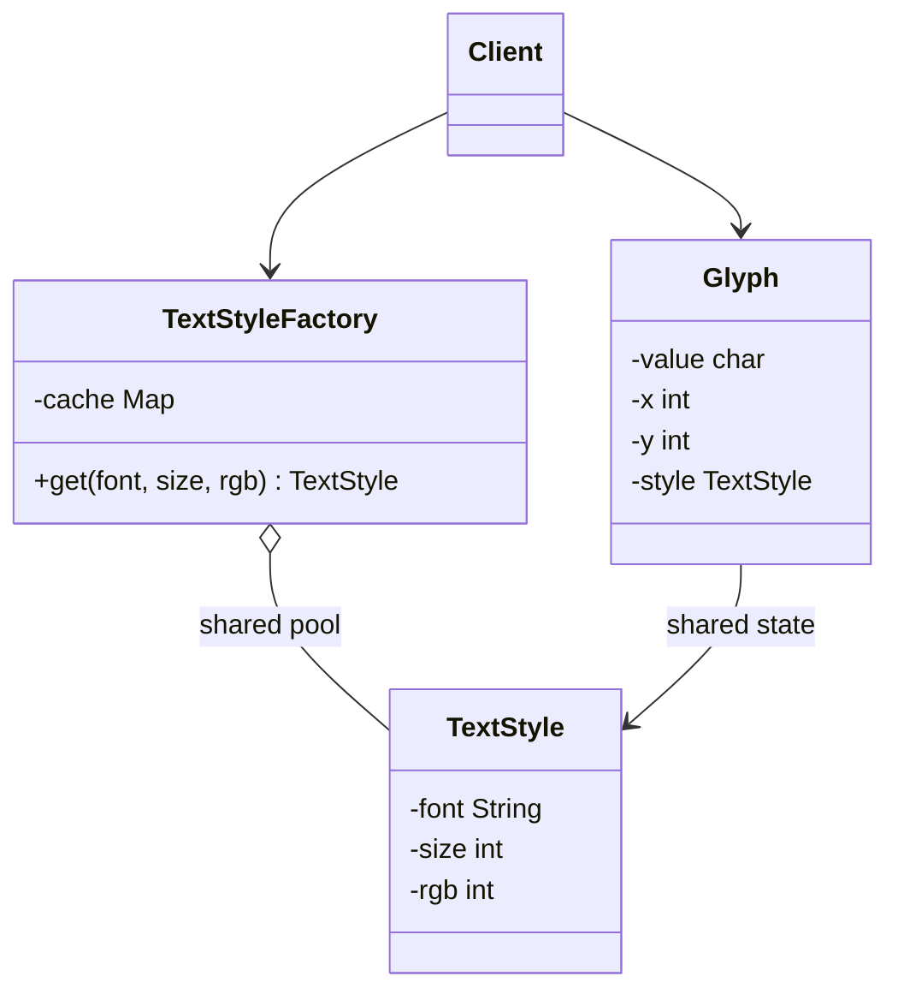
```mermaid
classDiagram
    class TextStyle {
        -font String
        -size int
        -rgb int
    }
    class TextStyleFactory {
        -cache Map
        +get(font, size, rgb) TextStyle
    }
    class Glyph {
        -value char
        -x int
        -y int
        -style TextStyle
    }
    class Client

    TextStyleFactory o-- TextStyle : shared pool
    Glyph --> TextStyle : shared state
    Client --> TextStyleFactory
    Client --> Glyph
```

#### 4.7.2 可运行代码

```java
import java.util.concurrent.ConcurrentHashMap;
import java.util.concurrent.ConcurrentMap;

public class FlyweightDemo {
    static final class TextStyle {
        private final String font;
        private final int size;
        private final int rgb;

        TextStyle(String font, int size, int rgb) {
            this.font = font;
            this.size = size;
            this.rgb = rgb;
        }
    }

    static final class TextStyleFactory {
        private final ConcurrentMap<String, TextStyle> cache =
                new ConcurrentHashMap<String, TextStyle>();

        TextStyle get(String font, int size, int rgb) {
            String key = font + ":" + size + ":" + rgb;
            TextStyle created = new TextStyle(font, size, rgb);
            TextStyle existing = cache.putIfAbsent(key, created);
            return existing == null ? created : existing;
        }

        int size() {
            return cache.size();
        }
    }

    static final class Glyph {
        private final char value;
        private final int x;
        private final int y;
        private final TextStyle style;

        Glyph(char value, int x, int y, TextStyle style) {
            this.value = value;
            this.x = x;
            this.y = y;
            this.style = style;
        }
    }

    public static void main(String[] args) {
        TextStyleFactory factory = new TextStyleFactory();
        TextStyle shared = factory.get("Mono", 12, 0);
        Glyph first = new Glyph('A', 0, 0, shared);
        Glyph second = new Glyph('B', 10, 0, factory.get("Mono", 12, 0));

        assert first.style == second.style;
        assert factory.size() == 1;
        System.out.println("styles=" + factory.size());
    }
}
```

`TextStyle` 是可共享内部状态，字符和坐标是外部状态。示例断言两个字形共享同一风格实例，预期输出为 `styles=1`。生产验证还应比较缓存命中率、对象数量和实际内存收益，而不是只用 `==` 证明正确性。

缓存本身会占内存。生产中要考虑键是否有界、淘汰策略、并发创建和租户隔离。`Integer.valueOf(int)` 保证缓存 `-128` 到 `127`（含边界），也可能缓存更大范围；不要依赖实现细节用 `==` 比较包装对象，应使用值相等。

## 5 行为型模式：分配职责与协作

### 5.1 观察者模式：一对多通知

观察者模式在主题状态变化时通知已注册观察者。主题依赖观察者抽象，不需要知道每个观察者的业务细节。

#### 5.1.1 UML 结构

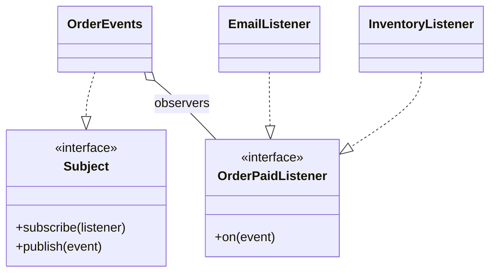
```mermaid
classDiagram
    class Subject {
        <<interface>>
        +subscribe(listener)
        +publish(event)
    }
    class OrderEvents
    class OrderPaidListener {
        <<interface>>
        +on(event)
    }
    class EmailListener
    class InventoryListener

    OrderEvents ..|> Subject
    OrderEvents o-- OrderPaidListener : observers
    EmailListener ..|> OrderPaidListener
    InventoryListener ..|> OrderPaidListener
```

#### 5.1.2 可运行代码

```java
import java.util.ArrayList;
import java.util.List;

public class ObserverDemo {
    static final class OrderPaid {
        private final String orderId;

        OrderPaid(String orderId) {
            this.orderId = orderId;
        }
    }

    interface OrderPaidListener {
        void on(OrderPaid event);
    }

    interface Subject {
        void subscribe(OrderPaidListener listener);
        void publish(OrderPaid event);
    }

    static final class OrderEvents implements Subject {
        private final List<OrderPaidListener> listeners =
                new ArrayList<OrderPaidListener>();

        public void subscribe(OrderPaidListener listener) {
            listeners.add(listener);
        }

        public void publish(OrderPaid event) {
            for (OrderPaidListener listener : listeners) {
                listener.on(event);
            }
        }
    }

    static final class EmailListener implements OrderPaidListener {
        private final List<String> calls;

        EmailListener(List<String> calls) {
            this.calls = calls;
        }

        public void on(OrderPaid event) {
            calls.add("email:" + event.orderId);
        }
    }

    static final class InventoryListener implements OrderPaidListener {
        private final List<String> calls;

        InventoryListener(List<String> calls) {
            this.calls = calls;
        }

        public void on(OrderPaid event) {
            calls.add("inventory:" + event.orderId);
        }
    }

    public static void main(String[] args) {
        final List<String> calls = new ArrayList<String>();
        Subject events = new OrderEvents();
        events.subscribe(new EmailListener(calls));
        events.subscribe(new InventoryListener(calls));

        events.publish(new OrderPaid("O-1"));
        assert calls.size() == 2;
        assert "email:O-1".equals(calls.get(0));
        assert "inventory:O-1".equals(calls.get(1));
        System.out.println(calls);
    }
}
```

输入是支付完成事件；发布器依次通知两个监听器，预期输出为 `[email:O-1, inventory:O-1]`。示例使用单线程集合以突出模式结构；若注册和发布跨线程，应使用线程安全集合或不可变快照。

Java 的 `java.util.Observable` 和 `Observer` 自 Java 9 起已经废弃：其事件模型能力有限，通知顺序未定义。业务中应使用自定义接口、框架事件机制、`java.util.concurrent.Flow` 或消息中间件，而不是继续依赖这两个旧类型。

#### 5.1.3 观察者与发布订阅

| 维度 | 进程内观察者 | 发布订阅（Publish/Subscribe） |
| --- | --- | --- |
| 通信 | 主题通常直接调用观察者 | 经纪人、事件总线或消息系统转发 |
| 时间 | 常见实现为同步 | 常见实现可异步、持久化 |
| 耦合 | 类型与进程边界内耦合 | 发布者和订阅者可彼此未知 |
| 失败 | 可直接传播给发布者 | 通常通过重试、死信或告警处理 |
| 一致性 | 常在当前调用栈 | 常为最终一致性 |

二者意图相关但不等同。把本地监听器换成消息队列会引入重复投递、乱序、积压和可观测性问题，不能只改接口名称。

### 5.2 模板方法模式：固定流程，开放步骤

模板方法在父类中定义算法骨架，把部分步骤交给子类实现。它通过继承复用流程，适合步骤顺序稳定、局部行为变化的场景。

#### 5.2.1 UML 结构

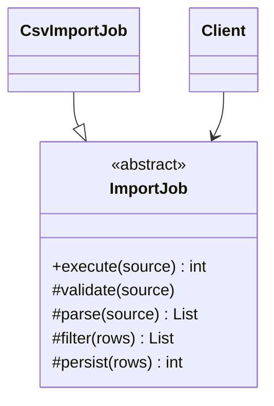
```mermaid
classDiagram
    class ImportJob {
        <<abstract>>
        +execute(source) int
        #validate(source)
        #parse(source) List
        #filter(rows) List
        #persist(rows) int
    }
    class CsvImportJob
    class Client

    CsvImportJob --|> ImportJob
    Client --> ImportJob
```

#### 5.2.2 可运行代码

```java
import java.util.ArrayList;
import java.util.Arrays;
import java.util.List;

public class TemplateMethodDemo {
    static abstract class ImportJob {
        public final int execute(String source) {
            validate(source);
            List<String> rows = parse(source);
            List<String> validRows = filter(rows);
            return persist(validRows);
        }

        protected void validate(String source) {
            if (source == null || source.trim().isEmpty()) {
                throw new IllegalArgumentException("empty source");
            }
        }

        protected abstract List<String> parse(String source);

        protected List<String> filter(List<String> rows) {
            List<String> result = new ArrayList<String>();
            for (String row : rows) {
                if (!row.trim().isEmpty()) {
                    result.add(row.trim());
                }
            }
            return result;
        }

        protected abstract int persist(List<String> rows);
    }

    static final class CsvImportJob extends ImportJob {
        protected List<String> parse(String source) {
            return Arrays.asList(source.split(",", -1));
        }

        protected int persist(List<String> rows) {
            return rows.size();
        }
    }

    public static void main(String[] args) {
        ImportJob job = new CsvImportJob();
        int imported = job.execute("A,,B");
        assert imported == 2;
        System.out.println("imported=" + imported);
    }
}
```

`execute` 使用 `final` 固定关键顺序；`validate` 是公共步骤；`filter` 是带默认实现的钩子；解析和持久化由子类完成。空行被过滤后预期输出为 `imported=2`。契约测试应对所有子类验证空输入都被拒绝、过滤发生在持久化之前。

当步骤需要运行时自由组合，策略或职责链比继承更灵活。模板方法的风险是脆弱基类：父类改变调用顺序可能破坏所有子类，因此钩子的前置条件和后置条件必须文档化。

### 5.3 策略模式：替换算法而不改变上下文

策略把一组可互换算法封装在共同接口后，由上下文在运行时选择。变化点是“如何计算或决策”，上下文负责稳定的业务流程。

#### 5.3.1 UML 结构

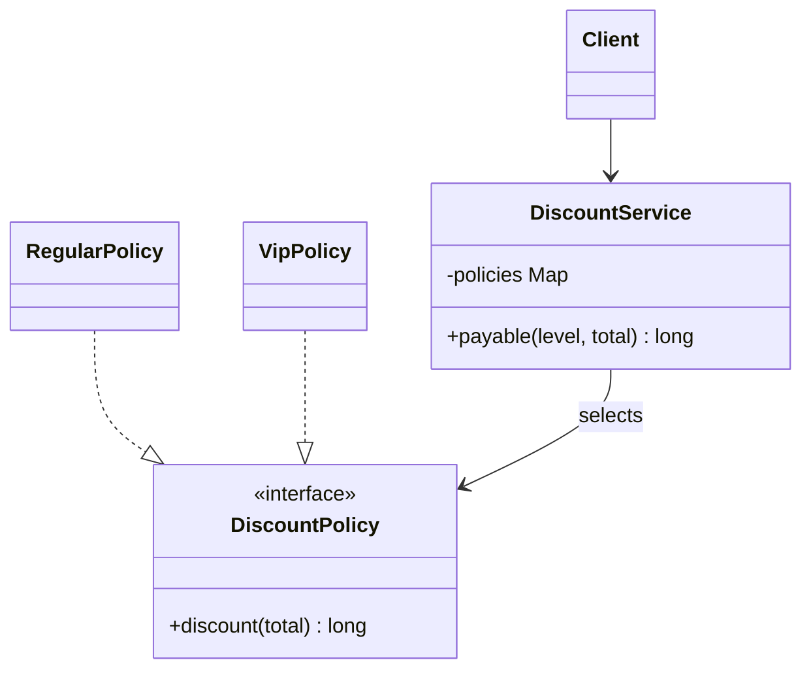
```mermaid
classDiagram
    class DiscountPolicy {
        <<interface>>
        +discount(total) long
    }
    class RegularPolicy
    class VipPolicy
    class DiscountService {
        -policies Map
        +payable(level, total) long
    }
    class Client

    RegularPolicy ..|> DiscountPolicy
    VipPolicy ..|> DiscountPolicy
    DiscountService --> DiscountPolicy : selects
    Client --> DiscountService
```

#### 5.3.2 可运行代码

```java
import java.util.EnumMap;
import java.util.Map;

public class StrategyDemo {
    enum CustomerLevel {
        REGULAR, VIP
    }

    interface DiscountPolicy {
        long discount(long totalCents);
    }

    static final class RegularPolicy implements DiscountPolicy {
        public long discount(long totalCents) {
            return 0L;
        }
    }

    static final class VipPolicy implements DiscountPolicy {
        public long discount(long totalCents) {
            return totalCents / 10L;
        }
    }

    static final class DiscountService {
        private final Map<CustomerLevel, DiscountPolicy> policies;

        DiscountService(Map<CustomerLevel, DiscountPolicy> policies) {
            this.policies = new EnumMap<CustomerLevel, DiscountPolicy>(policies);
        }

        long payable(CustomerLevel level, long totalCents) {
            DiscountPolicy policy = policies.get(level);
            if (policy == null) {
                throw new IllegalArgumentException("unknown level:" + level);
            }
            return Math.max(0L, totalCents - policy.discount(totalCents));
        }
    }

    public static void main(String[] args) {
        Map<CustomerLevel, DiscountPolicy> policies =
                new EnumMap<CustomerLevel, DiscountPolicy>(CustomerLevel.class);
        policies.put(CustomerLevel.REGULAR, new RegularPolicy());
        policies.put(CustomerLevel.VIP, new VipPolicy());

        DiscountService service = new DiscountService(policies);
        long payable = service.payable(CustomerLevel.VIP, 1000L);
        assert payable == 900L;
        System.out.println("payable=" + payable);
    }
}
```

输入是客户等级和订单金额；注册表选出策略；输出是不会小于零的应付金额。VIP 九折后预期输出为 `payable=900`。新增策略时可以在组装阶段注册，不必修改核心计算流程。

策略不等于“消灭所有 `if`”。选择策略本身仍然需要配置、映射或条件。只有分支内部算法复杂、独立变化或需要单独测试时，拆成策略才有收益。

### 5.4 职责链模式：让请求通过处理流水线

职责链把多个处理器连接起来。处理器可以终止请求，也可以处理后继续传递，因此必须先明确链的语义。

#### 5.4.1 UML 结构

```mermaid
classDiagram
    class Handler {
        <<interface>>
        +handle(request, chain) Result
    }
    class AuthenticationHandler
    class ValidationHandler
    class Chain {
        <<interface>>
        +proceed(request) Result
    }
    class DefaultChain

    AuthenticationHandler ..|> Handler
    ValidationHandler ..|> Handler
    DefaultChain ..|> Chain
    DefaultChain o-- Handler : ordered handlers
```

#### 5.4.2 可运行代码

```java
import java.util.Arrays;
import java.util.List;

public class ChainDemo {
    static final class Request {
        private final String token;
        private final String body;

        Request(String token, String body) {
            this.token = token;
            this.body = body;
        }
    }

    interface Handler {
        String handle(Request request, Chain next);
    }

    interface Chain {
        String proceed(Request request);
    }

    static final class DefaultChain implements Chain {
        private final List<Handler> handlers;
        private final int index;

        DefaultChain(List<Handler> handlers) {
            this(handlers, 0);
        }

        private DefaultChain(List<Handler> handlers, int index) {
            this.handlers = handlers;
            this.index = index;
        }

        public String proceed(Request request) {
            if (index >= handlers.size()) {
                return "OK";
            }
            return handlers.get(index).handle(
                    request, new DefaultChain(handlers, index + 1)
            );
        }
    }

    static final class AuthenticationHandler implements Handler {
        public String handle(Request request, Chain next) {
            if (request.token == null) {
                return "UNAUTHORIZED";
            }
            return next.proceed(request);
        }
    }

    static final class ValidationHandler implements Handler {
        public String handle(Request request, Chain next) {
            if (request.body == null || request.body.trim().isEmpty()) {
                return "BAD_REQUEST";
            }
            return next.proceed(request);
        }
    }

    public static void main(String[] args) {
        Chain chain = new DefaultChain(Arrays.<Handler>asList(
                new AuthenticationHandler(), new ValidationHandler()
        ));
        assert "OK".equals(chain.proceed(new Request("token", "body")));
        assert "UNAUTHORIZED".equals(chain.proceed(new Request(null, "body")));
        assert "BAD_REQUEST".equals(chain.proceed(new Request("token", "")));
        System.out.println("chain verified");
    }
}
```

正常请求走到链尾返回 `OK`，认证和参数失败分别提前终止，预期输出为 `chain verified`。不可变的链索引也避免了多个请求共享同一可变游标。

生产测试至少覆盖：

1\. 正常请求按既定顺序走完整条链。

2\. 认证失败后，后续处理器没有执行。

3\. 链尾没有业务处理器时返回明确结果，而不是 `null`。

4\. 配置错误不会形成循环或重复注册。

适合过滤器、拦截器、审批和规则流水线。若每个处理器都必须执行且顺序固定，也可直接使用清晰的过程编排，不必引入自链接节点。

### 5.5 状态模式：让行为随内部状态改变

状态模式把每种状态下的行为和迁移封装起来，使上下文不再维护巨大的状态条件分支。

#### 5.5.1 UML 结构

```mermaid
classDiagram
    class Order {
        -state OrderState
        +pay()
        +cancel()
        +stateName() String
    }
    class OrderState {
        <<interface>>
        +pay(order)
        +cancel(order)
        +name() String
    }
    class PendingPayment
    class Paid
    class Cancelled

    Order --> OrderState : current state
    PendingPayment ..|> OrderState
    Paid ..|> OrderState
    Cancelled ..|> OrderState
```

#### 5.5.2 可运行代码

```java
public class StateDemo {
    interface OrderState {
        void pay(Order order);
        void cancel(Order order);
        String name();
    }

    static final class Order {
        private OrderState state = new PendingPayment();

        void pay() {
            state.pay(this);
        }

        void cancel() {
            state.cancel(this);
        }

        void transitionTo(OrderState next) {
            state = next;
        }

        String stateName() {
            return state.name();
        }
    }

    static final class PendingPayment implements OrderState {
        public void pay(Order order) {
            order.transitionTo(new Paid());
        }

        public void cancel(Order order) {
            order.transitionTo(new Cancelled());
        }

        public String name() {
            return "PENDING_PAYMENT";
        }
    }

    static final class Paid implements OrderState {
        public void pay(Order order) {
            throw new IllegalStateException("order already paid");
        }

        public void cancel(Order order) {
            throw new IllegalStateException("paid order requires refund");
        }

        public String name() {
            return "PAID";
        }
    }

    static final class Cancelled implements OrderState {
        public void pay(Order order) {
            throw new IllegalStateException("cancelled order cannot be paid");
        }

        public void cancel(Order order) {
            throw new IllegalStateException("order already cancelled");
        }

        public String name() {
            return "CANCELLED";
        }
    }

    public static void main(String[] args) {
        Order order = new Order();
        assert "PENDING_PAYMENT".equals(order.stateName());
        order.pay();
        assert "PAID".equals(order.stateName());

        try {
            order.cancel();
            throw new AssertionError("paid order should require refund");
        } catch (IllegalStateException expected) {
            System.out.println(expected.getMessage());
        }
    }
}
```

状态模式的输入不仅是一个动作，还包括对象当前状态。支付后状态变为 `PAID`，再取消会输出 `paid order requires refund`。测试应形成状态迁移表，覆盖每个“当前状态 × 动作”组合，包括所有非法迁移。

状态对象适合行为差异明显、迁移规则复杂的领域。只有一个布尔值和两处简单判断时，状态类会比问题本身更复杂。并发更新订单时还需数据库乐观锁或条件更新；进程内状态对象不能防止两个实例同时迁移。

### 5.6 迭代器模式：封装遍历状态

迭代器提供顺序访问聚合元素的方式，而不暴露聚合内部表示。Java 集合已经通过 `Iterable` 和 `Iterator` 普遍实现该模式，业务代码通常直接使用，无需自行造轮子。

#### 5.6.1 UML 结构

```mermaid
classDiagram
    class Iterable {
        <<interface>>
        +iterator() Iterator
    }
    class Iterator {
        <<interface>>
        +hasNext() boolean
        +next() String
    }
    class NameCollection
    class NameIterator
    class Client

    NameCollection ..|> Iterable
    NameIterator ..|> Iterator
    NameCollection ..> NameIterator : creates
    Client --> Iterable
    Client --> Iterator
```

#### 5.6.2 可运行代码

```java
import java.util.Iterator;
import java.util.NoSuchElementException;

public class IteratorDemo {
    static final class NameCollection implements Iterable<String> {
        private final String[] names;

        NameCollection(String... names) {
            this.names = names.clone();
        }

        public Iterator<String> iterator() {
            return new NameIterator(names);
        }
    }

    static final class NameIterator implements Iterator<String> {
        private final String[] names;
        private int index;

        NameIterator(String[] names) {
            this.names = names;
        }

        public boolean hasNext() {
            return index < names.length;
        }

        public String next() {
            if (!hasNext()) {
                throw new NoSuchElementException();
            }
            return names[index++];
        }

        public void remove() {
            throw new UnsupportedOperationException();
        }
    }

    public static void main(String[] args) {
        StringBuilder joined = new StringBuilder();
        for (String name : new NameCollection("A", "B", "C")) {
            joined.append(name);
        }
        assert "ABC".equals(joined.toString());
        System.out.println(joined);
    }
}
```

`NameCollection` 隐藏数组表示，增强 `for` 循环只依赖 `Iterable`，预期输出为 `ABC`。`next()` 耗尽时遵守契约抛出 `NoSuchElementException`，而不是返回 `null`。

若迭代器封装分页远程 I/O（Input/Output，输入/输出），API（Application Programming Interface，应用程序编程接口）必须说明阻塞、重试和关闭资源的语义，测试还要覆盖空页、最后一页、远程失败和重复调用 `hasNext()`。

### 5.7 访问者模式：在稳定类型集合上增加操作

访问者把针对多种元素类型的操作集中到访问者中，并通过双分派选择正确重载。它适合元素类型稳定、操作经常新增的对象结构。

#### 5.7.1 UML 结构

```mermaid
classDiagram
    class DocumentNode {
        <<interface>>
        +accept(visitor) String
    }
    class Paragraph
    class ImageNode
    class DocumentVisitor {
        <<interface>>
        +visit(paragraph) String
        +visit(image) String
    }
    class HtmlVisitor

    Paragraph ..|> DocumentNode
    ImageNode ..|> DocumentNode
    HtmlVisitor ..|> DocumentVisitor
    Paragraph ..> DocumentVisitor : double dispatch
    ImageNode ..> DocumentVisitor : double dispatch
```

#### 5.7.2 可运行代码

```java
public class VisitorDemo {
    interface DocumentNode {
        String accept(DocumentVisitor visitor);
    }

    static final class Paragraph implements DocumentNode {
        private final String text;

        Paragraph(String text) {
            this.text = text;
        }

        public String accept(DocumentVisitor visitor) {
            return visitor.visit(this);
        }
    }

    static final class ImageNode implements DocumentNode {
        private final String url;

        ImageNode(String url) {
            this.url = url;
        }

        public String accept(DocumentVisitor visitor) {
            return visitor.visit(this);
        }
    }

    interface DocumentVisitor {
        String visit(Paragraph paragraph);
        String visit(ImageNode image);
    }

    static final class HtmlVisitor implements DocumentVisitor {
        public String visit(Paragraph paragraph) {
            return "<p>" + paragraph.text + "</p>";
        }

        public String visit(ImageNode image) {
            return "";
        }
    }

    public static void main(String[] args) {
        DocumentVisitor visitor = new HtmlVisitor();
        String paragraph = new Paragraph("hello").accept(visitor);
        String image = new ImageNode("/logo.png").accept(visitor);
        assert "<p>hello</p>".equals(paragraph);
        assert "".equals(image);
        System.out.println(paragraph + image);
    }
}
```

元素的 `accept` 方法把自己的具体类型交回访问者，完成双分派，预期输出为一段段落和图片 HTML。新增“统计字数”只需增加访问者实现；新增 `TableNode` 则需要修改访问者接口和所有实现。这个扩展方向正是访问者的核心取舍。

访问者常见于编译器抽象语法树、文档模型和静态分析。若元素类型频繁增加，模式会造成扩散修改；若语言支持模式匹配且对象结构简单，一个集中式匹配函数可能更清晰。

### 5.8 备忘录模式：保存可恢复快照

备忘录在不暴露发起人内部结构的情况下保存状态，以支持撤销、恢复或检查点。

#### 5.8.1 UML 结构

```mermaid
classDiagram
    class Editor {
        -text String
        -cursor int
        +snapshot() Snapshot
        +restore(snapshot)
    }
    class Snapshot {
        -text String
        -cursor int
    }
    class History {
        -snapshots Stack
        +push(snapshot)
        +pop() Snapshot
    }

    Editor ..> Snapshot : creates
    Editor ..> Snapshot : restores
    History o-- Snapshot : stores
```

#### 5.8.2 可运行代码

```java
import java.util.ArrayDeque;
import java.util.Deque;

public class MementoDemo {
    static final class Snapshot {
        private final String text;
        private final int cursor;

        private Snapshot(String text, int cursor) {
            this.text = text;
            this.cursor = cursor;
        }
    }

    static final class Editor {
        private String text = "";
        private int cursor;

        void write(String value) {
            text = value;
            cursor = value.length();
        }

        Snapshot snapshot() {
            return new Snapshot(text, cursor);
        }

        void restore(Snapshot snapshot) {
            text = snapshot.text;
            cursor = snapshot.cursor;
        }

        String state() {
            return text + "@" + cursor;
        }
    }

    static final class History {
        private final Deque<Snapshot> snapshots = new ArrayDeque<Snapshot>();

        void push(Snapshot snapshot) {
            snapshots.push(snapshot);
        }

        Snapshot pop() {
            return snapshots.pop();
        }
    }

    public static void main(String[] args) {
        Editor editor = new Editor();
        History history = new History();
        editor.write("A");
        history.push(editor.snapshot());
        editor.write("AB");
        editor.restore(history.pop());

        assert "A@1".equals(editor.state());
        System.out.println(editor.state());
    }
}
```

快照对象不可变，且只有发起人能解释其内部字段。示例建立状态 A、保存、修改到 AB，再恢复，预期输出为 `A@1`。

生产中要控制快照大小、数量和保留时间。敏感字段不应无条件进入快照；跨版本持久化快照还需要模式版本和迁移策略。数据库事务回滚与备忘录意图相似，但依赖数据库隔离和日志机制，不能简单等同为对象级备忘录实现。

### 5.9 命令模式：把请求变成可管理对象

命令封装执行请求所需的信息，使请求可以排队、记录、重试、组合或撤销。命令对象与真正完成工作的接收者分离。

#### 5.9.1 UML 结构

```mermaid
classDiagram
    class Command {
        <<interface>>
        +execute()
        +undo()
    }
    class TurnOnCommand
    class Light {
        +on()
        +off()
    }
    class RemoteControl {
        -history Stack
        +submit(command)
        +undoLast()
    }

    TurnOnCommand ..|> Command
    TurnOnCommand --> Light : receiver
    RemoteControl o-- Command : history
```

#### 5.9.2 可运行代码

```java
import java.util.ArrayDeque;
import java.util.Deque;

public class CommandDemo {
    interface Command {
        void execute();
        void undo();
    }

    static final class Light {
        private boolean on;

        void on() {
            on = true;
        }

        void off() {
            on = false;
        }
    }

    static final class TurnOnCommand implements Command {
        private final Light light;

        TurnOnCommand(Light light) {
            this.light = light;
        }

        public void execute() {
            light.on();
        }

        public void undo() {
            light.off();
        }
    }

    static final class RemoteControl {
        private final Deque<Command> history = new ArrayDeque<Command>();

        void submit(Command command) {
            command.execute();
            history.push(command);
        }

        void undoLast() {
            if (!history.isEmpty()) {
                history.pop().undo();
            }
        }
    }

    public static void main(String[] args) {
        Light light = new Light();
        RemoteControl remote = new RemoteControl();
        remote.submit(new TurnOnCommand(light));
        assert light.on;
        remote.undoLast();
        assert !light.on;
        System.out.println("lightOn=" + light.on);
    }
}
```

调用者提交命令后灯被打开，撤销最后一个命令后预期输出为 `lightOn=false`。只有操作可逆且命令保存了足够上下文时，才能安全实现 `undo`。

若命令进入远程队列，命令应只携带可持久化的请求数据和幂等键，执行器在运行时提供接收者。队列可能重复投递，接收者必须去重。真实转账通常需要反向交易和审计，而不是简单恢复内存状态。

命令适合任务队列、审计日志、宏操作和撤销系统。若只是立即调用一个无状态函数，命令类可能没有收益，函数对象或 Lambda 表达式更简洁。

### 5.10 解释器模式：解释一个受控的小语言

解释器为简单语言定义表达式对象和求值规则。通常先经过词法或语法解析生成 AST（Abstract Syntax Tree，抽象语法树），再在上下文中解释。

#### 5.10.1 UML 结构

```mermaid
classDiagram
    class Expression {
        <<interface>>
        +evaluate(context) boolean
    }
    class EqualsExpression
    class AndExpression {
        -left Expression
        -right Expression
    }
    class Client

    EqualsExpression ..|> Expression
    AndExpression ..|> Expression
    AndExpression o-- Expression : children
    Client --> Expression
```

#### 5.10.2 可运行代码

```java
import java.util.HashMap;
import java.util.Map;
import java.util.Objects;

public class InterpreterDemo {
    interface Expression {
        boolean evaluate(Map<String, Object> context);
    }

    static final class EqualsExpression implements Expression {
        private final String key;
        private final Object expected;

        EqualsExpression(String key, Object expected) {
            this.key = key;
            this.expected = expected;
        }

        public boolean evaluate(Map<String, Object> context) {
            return Objects.equals(context.get(key), expected);
        }
    }

    static final class AndExpression implements Expression {
        private final Expression left;
        private final Expression right;

        AndExpression(Expression left, Expression right) {
            this.left = left;
            this.right = right;
        }

        public boolean evaluate(Map<String, Object> context) {
            return left.evaluate(context) && right.evaluate(context);
        }
    }

    public static void main(String[] args) {
        Expression rule = new AndExpression(
                new EqualsExpression("country", "SG"),
                new EqualsExpression("vip", Boolean.TRUE)
        );
        Map<String, Object> context = new HashMap<String, Object>();
        context.put("country", "SG");
        context.put("vip", Boolean.TRUE);

        assert rule.evaluate(context);
        System.out.println("matched=" + rule.evaluate(context));
    }
}
```

表达式 `country == "SG" AND vip == true` 被表示成两个终结表达式和一个非终结表达式。输入上下文满足规则，预期输出为 `matched=true`。完整 DSL 还需要词法与语法解析器；本例只验证 AST 的解释阶段。测试应覆盖优先级、缺失变量、类型不匹配和恶意超长表达式。

解释器只适合语法简单、规模受控的 DSL（Domain-Specific Language，领域特定语言）。不要自行实现 SQL（Structured Query Language，结构化查询语言）、正则表达式或通用脚本语言；优先使用成熟解析器生成器或现有引擎，并限制表达式深度、执行时间和可调用能力。

### 5.11 中介者模式：集中协调对象交互

中介者把同事对象之间的多对多通信集中起来，使同事只依赖中介者。

#### 5.11.1 UML 结构

```mermaid
classDiagram
    class ChatMediator {
        <<interface>>
        +register(user)
        +send(sender, text)
    }
    class RoomMediator
    class User {
        -mediator ChatMediator
        +send(text)
        +receive(text)
    }

    RoomMediator ..|> ChatMediator
    RoomMediator o-- User : colleagues
    User --> ChatMediator : communicates through
```

#### 5.11.2 可运行代码

```java
import java.util.ArrayList;
import java.util.List;

public class MediatorDemo {
    interface ChatMediator {
        void register(User user);
        void send(User sender, String text);
    }

    static final class RoomMediator implements ChatMediator {
        private final List<User> users = new ArrayList<User>();

        public void register(User user) {
            users.add(user);
        }

        public void send(User sender, String text) {
            for (User user : users) {
                if (user != sender) {
                    user.receive(sender.name + ":" + text);
                }
            }
        }
    }

    static final class User {
        private final String name;
        private final ChatMediator mediator;
        private final List<String> inbox = new ArrayList<String>();

        User(String name, ChatMediator mediator) {
            this.name = name;
            this.mediator = mediator;
            mediator.register(this);
        }

        void send(String text) {
            mediator.send(this, text);
        }

        void receive(String text) {
            inbox.add(text);
        }
    }

    public static void main(String[] args) {
        ChatMediator room = new RoomMediator();
        User alice = new User("alice", room);
        User bob = new User("bob", room);
        alice.send("hello");

        assert alice.inbox.isEmpty();
        assert bob.inbox.size() == 1;
        assert "alice:hello".equals(bob.inbox.get(0));
        System.out.println(bob.inbox);
    }
}
```

用户不持有房间内其他用户，消息统一交给中介者路由；发送者不收到回声，Bob 的预期输出为 `[alice:hello]`。生产测试还应覆盖离线用户、房间隔离和重复注册。

中介者容易演变成包含所有业务规则的“上帝对象”。应把路由协调留在中介者，把领域规则拆到策略或服务中，并监控其依赖数和分支复杂度。

## 6 相似模式辨析与选择

### 6.1 三种工厂与建造者

| 模式 | 主要问题 | 客户端关心什么 | 扩展代价 |
| --- | --- | --- | --- |
| 简单工厂 | 集中少量类型选择 | 类型参数 | 新产品通常修改工厂分支 |
| 工厂方法 | 每种产品有独立创建过程 | 具体工厂或工厂注册 | 新产品增加产品与工厂 |
| 抽象工厂 | 成套创建兼容产品族 | 选择哪个产品族 | 新产品族容易；新产品种类困难 |
| 建造者 | 同类复杂对象的分步构造 | 参数、步骤和最终对象 | 新表示或可选参数较容易 |

工厂回答“创建哪一种对象”，建造者回答“怎样把一个复杂对象构建到有效状态”。两者可以组合：工厂选择 Builder，Builder 完成具体构造。

### 6.2 代理、装饰器、适配器与外观

| 模式 | 接口是否通常保持 | 核心意图 | 典型关键词 |
| --- | --- | --- | --- |
| 代理 | 是 | 控制目标访问 | 权限、远程、延迟、事务 |
| 装饰器 | 是 | 组合附加职责 | 压缩、加密、缓存、指标 |
| 适配器 | 否 | 转换不兼容接口或语义 | 旧系统、第三方 SDK（Software Development Kit，软件开发工具包）、数据转换 |
| 外观 | 提供新粗粒度接口 | 简化复杂子系统 | 用例入口、流程编排 |

结构相似不能代替意图判断。一个记录耗时的包装器若用于透明地叠加指标，可视为装饰器；若它控制远程服务访问和熔断，更接近代理。

### 6.3 桥接、策略与适配器

桥接在设计初期拆开两个长期独立变化维度；策略让某个算法在运行时替换；适配器通常在已有接口不兼容时做事后转换。三者都使用组合，但变化方向不同。

### 6.4 策略与状态

| 维度 | 策略 | 状态 |
| --- | --- | --- |
| 选择者 | 客户端或组装逻辑选择算法 | 上下文根据内部状态迁移 |
| 是否有迁移 | 通常没有 | 核心特征之一 |
| 关注点 | 用哪种方法完成任务 | 当前状态允许什么行为 |
| 示例 | 折扣算法、路由算法 | 订单、工单、连接生命周期 |

代码结构可能一样，但状态具有历史和合法迁移约束，策略通常是无历史的可替换算法。

### 6.5 策略、模板方法与职责链

策略替换整个算法；模板方法固定整体流程并覆盖少数步骤；职责链把处理拆成可排序的多个节点。若变化点是“选一个”，倾向策略；若是“保留骨架改局部”，倾向模板方法；若是“依次通过若干处理器”，倾向职责链。

### 6.6 观察者、中介者与职责链

观察者是一对多广播，发布者通常不关心谁处理；中介者协调一组对象之间的定向交互；职责链让一个请求沿有序处理器传递。广播、协调和流水线是三种不同拓扑。

### 6.7 原型、备忘录与命令

原型复制对象以创建新对象；备忘录复制状态以便恢复；命令保存请求以便稍后执行或撤销。三者都可能保存数据副本，但目的、所有权和生命周期不同。

## 7 框架源码中的模式：看意图与调用链

框架实现通常会组合、裁剪或改造多个模式。识别源码模式时，应先沿公开入口找到创建、委派和扩展链，再判断模式意图，不能仅凭类名后缀。

### 7.1 Spring 中的创建与容器

#### 7.1.1 BeanFactory 与 FactoryBean

`BeanFactory` 是 Spring IoC 容器的底层基础接口，负责按名称或类型取得 Bean，并提供作用域、类型检查等能力。`DefaultListableBeanFactory` 是高层 `ApplicationContext` 内部的重要委托实现。

`FactoryBean<T>` 则是由容器管理的特殊 Bean，用于定制某个对象的创建：

| 调用 | 通常得到 |
| --- | --- |
| `getBean("client")` | `FactoryBean#getObject()` 创建或提供的产品 |
| `getBean("&client")` | `FactoryBean` 本身 |

二者名称相似但职责不同：`BeanFactory` 是容器基础设施，`FactoryBean` 是容器中的扩展点。判断源码时可从 `getBean` 入口追踪名称转换、Bean 定义、作用域缓存和实例创建，不应简单把整个容器标记成“简单工厂”后停止分析。

#### 7.1.2 Spring singleton 与 GoF 单例

Spring 默认的 `singleton` 作用域表示“每个 Spring IoC 容器、每个 Bean 定义一个共享实例”，不是每个 JVM 或集群唯一。`prototype`、`request`、`session` 等作用域具有不同生命周期。

`ApplicationContext` 默认预实例化非懒加载的单例，但以下对象不能被概括为“启动时全部创建”：

1\. 标记为懒加载的 Bean。

2\. `prototype` 等非单例作用域 Bean。

3\. 通过作用域代理或 `ObjectProvider` 按需取得的目标对象。

验证真实行为时，应打开 Bean 创建日志、设置构造断点，或写一个记录实例化次数的集成测试。

### 7.2 Spring 事件机制

Spring 应用事件体现观察者思想。常见角色映射如下：

| 角色 | Spring 入口 |
| --- | --- |
| 事件 | 任意事件对象，也可继承 `ApplicationEvent` |
| 发布者 | `ApplicationEventPublisher` |
| 监听器 | `ApplicationListener<E>` 或 `@EventListener` |
| 广播器 | `ApplicationEventMulticaster` |

默认的 `SimpleApplicationEventMulticaster` 在发布者线程中同步调用监听器。这意味着监听器耗时会增加发布调用延迟，监听器异常也可能影响调用方。需要异步时可使用 `@Async` 或自定义广播器，但必须重新定义异常处理、上下文传播、事务边界和完成判据。

```java
record OrderCreatedEvent(String orderId) {}

final class InventoryEventListener {
    private final Inventory inventory;

    InventoryEventListener(Inventory inventory) {
        this.inventory = inventory;
    }

    @org.springframework.context.event.EventListener
    public void reserveInventory(OrderCreatedEvent event) {
        inventory.reserve(event.orderId());
    }
}
```

若事件在数据库事务提交前同步发布，后续事务回滚可能留下不一致副作用。可根据一致性要求使用事务事件监听、Outbox（事务发件箱）或消息系统，不能把“异步”当作自动可靠。

### 7.3 Spring AOP 中的代理

Spring AOP（Aspect-Oriented Programming，面向切面编程）通常通过代理拦截方法调用。阅读调用链时应确认：

1\. Bean 是否实际经过代理。

2\. 使用的是接口代理还是基于子类的代理。

3\. 被调用方法是否可被覆盖，是否满足切点。

4\. 调用是否从代理外部进入；同类内部直接调用通常不会重新经过代理。

5\. 异常是否被捕获或转换，从而改变事务回滚判断。

这套检查比背诵“Spring 使用代理模式”更能解释事务、缓存或异步注解为什么不生效。

### 7.4 MyBatis 中的模式组合

#### 7.4.1 构建与工厂

`SqlSessionFactoryBuilder` 读取配置并构建 `SqlSessionFactory`，隐藏复杂解析和组装过程，体现建造者意图。`SqlSessionFactory#openSession` 负责创建具有不同执行器、事务和自动提交配置的 `SqlSession`，体现工厂意图。

不要只根据 `Builder` 或 `Factory` 后缀下结论。应验证输入、构建步骤、最终产品和扩展方向。例如 `SqlSessionFactoryBuilder` 的价值主要是封装复杂配置解析，而非经典 Builder 中逐项设置可选参数的流式接口。

#### 7.4.2 Mapper 动态代理

调用 `SqlSession#getMapper` 后，MyBatis 通过 Mapper 注册表和代理工厂返回接口代理。Mapper 方法调用进入代理处理器，再根据方法信息定位映射语句并委托 `SqlSession` 执行。

```mermaid
sequenceDiagram
    participant C as "业务代码"
    participant P as "Mapper 代理"
    participant S as "SqlSession"
    participant E as "Executor"
    participant D as "数据库"
    C->>P: "mapper.findById(id)"
    P->>S: "selectOne(statementId, id)"
    S->>E: "query(...)"
    E->>D: "执行 SQL"
    D-->>E: "结果集"
    E-->>P: "映射结果"
    P-->>C: "领域对象"
```

验证入口是给 Mapper 接口方法打断点并查看实际运行类，再沿 `InvocationHandler` 调用链追踪，而不是寻找一个手写 Mapper 实现类。

#### 7.4.3 动态 SQL 的组合结构

动态 SQL 节点实现共同的 `SqlNode` 契约；混合节点包含子节点并递归应用，文本节点等作为叶子产生 SQL 片段。这符合组合模式对树枝和叶子的统一处理。SQL 是 Structured Query Language（结构化查询语言），MyBatis 的 Mapper XML 使用 XML（Extensible Markup Language，可扩展标记语言）描述映射与动态节点。

排查动态 SQL 时，应打印最终 `BoundSql` 及参数映射，验证“节点树能运行”之外的结果：空集合、空字符串、条件缺失和数据库方言可能产生不同 SQL。

#### 7.4.4 Executor 的模板方法

`BaseExecutor` 负责缓存、查询栈和通用流程，并把具体数据库操作步骤交给 `SimpleExecutor`、`ReuseExecutor`、`BatchExecutor` 等子类。这体现模板方法意图。不同执行器不仅是性能策略，还影响 Statement 复用、批处理刷新和返回时机。

#### 7.4.5 缓存装饰器与本地缓存

MyBatis 的 `Cache` 体系通过装饰器叠加回收、同步、日志、序列化等能力。组合次序影响行为，因此阅读源码时要看最终包装链，而不能只看底层 `PerpetualCache`。

本地缓存绑定 `SqlSession`。默认 `localCacheScope=SESSION`，相同会话内的查询可复用结果；执行更新、提交、回滚或关闭会清理本地缓存。设置为 `STATEMENT` 时，缓存只用于一次语句执行过程，仍用于解决嵌套查询中的循环引用，因此不能完全禁用。

生产验证应覆盖：

1\. 同一 `SqlSession` 的重复查询是否命中缓存。

2\. 不同 `SqlSession` 是否隔离。

3\. 更新或提交后是否重新访问数据库。

4\. 修改查询返回对象是否污染会话缓存。MyBatis 官方文档明确提醒，`SESSION` 范围可能返回缓存中的同一对象引用。

### 7.5 框架源码阅读方法

1\. 从公开 API 或失败现场进入。

2\. 记录运行时真实类型，避免只看接口或类名。

3\. 画出对象创建链、核心调用链和扩展点。

4\. 标出稳定骨架、可替换部分和状态所有者。

5\. 用断点、日志或最小测试验证推断。

6\. 最后再为结构命名，并写清它与经典模式的差异。

## 8 生产落地：模式之外必须补齐的边界

### 8.1 并发与生命周期

设计图通常省略线程和生命周期，但生产缺陷经常发生在这里。

| 检查项 | 需要回答的问题 |
| --- | --- |
| 共享状态 | 对象是否跨线程共享？读写如何同步？ |
| 发布安全 | 其他线程能否看到完整构造的对象？ |
| 作用域 | 实例属于请求、线程、会话、容器还是进程？ |
| 资源关闭 | 谁关闭连接、流、线程池和订阅？ |
| 缓存 | 键是否有界？过期、淘汰和击穿如何处理？ |
| 顺序 | 装饰器、职责链和监听器顺序是否稳定且有测试？ |

### 8.2 失败语义与可靠性

每个扩展点都应定义失败契约：

1\. 返回失败值还是抛异常，哪些异常可重试？

2\. 超时后操作是否可能已经成功？

3\. 重试是否需要幂等键？

4\. 多步骤操作如何补偿、对账或人工恢复？

5\. 异步监听失败由谁观察，消息会进入何处？

6\. 链尾无人处理或工厂找不到类型时返回什么？

模式负责组织协作，不自动提供事务、幂等、重试或一致性。

### 8.3 安全边界

代理可以集中权限校验，但领域层仍需保护关键不变量。适配器要拒绝未知状态码和非法单位转换。解释器必须限制语法、深度、执行时间和可访问对象。备忘录与命令日志可能包含个人数据、凭证或业务机密，需要脱敏、加密和保留期限。

不要把反射扫描到的所有类都无条件注册为策略或处理器；注册表应有明确包边界、允许列表和重复键检测。

### 8.4 可观测性

| 模式 | 建议观测信号 |
| --- | --- |
| 工厂与抽象工厂 | 创建失败数、创建耗时、实际产品类型 |
| 代理与装饰器 | 目标耗时、拒绝数、包装链 |
| 外观与职责链 | 分步骤耗时、终止节点、补偿状态 |
| 观察者 | 监听器耗时、失败数、积压和重试 |
| 状态 | 迁移来源、目标、拒绝原因和版本冲突 |
| 享元 | 缓存大小、命中率、淘汰数 |
| 命令 | 排队时间、执行次数、幂等命中和死信 |

日志中应记录模式语义相关的业务标识和阶段，但不得输出令牌、密码或完整敏感载荷。

### 8.5 性能判断

模式引入的动态分派和小对象通常不是首要瓶颈。应先建立基线，再衡量：

1\. 代理或装饰链增加的调用开销。

2\. 观察者同步执行造成的尾延迟。

3\. 组合树和解释器的递归深度。

4\. 原型复制与正常构造的真实成本。

5\. 享元缓存节省的对象数与缓存管理开销。

6\. 访问者、策略和状态对象对分配与分支预测的影响。

没有测量结果时，不要为“性能”牺牲清晰度。

### 8.6 分层测试策略

```mermaid
flowchart BT
    A["契约测试：所有实现遵守同一行为"] --> B["组合测试：装饰顺序、链顺序、状态迁移"]
    B --> C["集成测试：框架代理、容器作用域、数据库"]
    C --> D["端到端测试：关键业务成功与失败路径"]
    D --> E["生产验证：指标、追踪、告警与演练"]
```

契约测试是模式代码最有价值的测试形式之一。同一接口的每个工厂产品、策略、状态或适配器都应复用契约测试。集成测试则负责证明代理确实生效、事务边界正确、缓存真实命中等框架行为。

## 9 反模式与过度设计

### 9.1 为模式而模式

以下信号表明设计可能过度：

1\. 只有一个实现且没有已知变化，却创建接口、抽象类、工厂和注册表。

2\. 为消除三行条件判断引入十几个文件。

3\. 类名都是模式角色名，却看不出领域含义。

4\. 调用链需要跳转多层，仍无法解释失败发生在哪里。

5\. 每次新增功能仍需同时修改所有抽象和工厂。

6\. 测试必须 Mock（模拟）大量内部细节，重构即大面积失败。

### 9.2 错误抽象的修复顺序

1\. 恢复能描述业务行为的特征测试。

2\. 内联只剩一个实现且没有边界价值的抽象。

3\. 合并仅做透传的类。

4\. 把选择逻辑集中到一个明确位置。

5\. 按实际变化轴重新抽象。

6\. 删除失效的模式术语和类图。

“回到简单实现”是正常重构结果，不是设计失败。

## 10 面试递归追问与回答框架

### 10.1 回答一个模式的五层结构

1\. 一句话说明问题和意图。

2\. 描述稳定点、变化点与参与者协作。

3\. 给出一个真实项目例子和执行结果。

4\. 说明代价、边界及一个相邻模式区别。

5\. 补充测试、并发或失败处理。

例如回答策略模式时，不应止于“封装算法并可替换”。完整回答还应指出策略由谁选择、注册表如何处理未知键、策略是否无状态、如何做契约测试，以及简单分支何时比策略更合适。

### 10.2 高频追问地图

| 主题 | 第一层问题 | 继续追问方向 |
| --- | --- | --- |
| 单例 | 如何保证线程安全？ | `volatile`、类初始化、反射、序列化、容器与集群作用域 |
| 工厂 | 简单工厂、工厂方法、抽象工厂区别？ | 选择逻辑在哪里、新产品与新产品族的扩展成本 |
| 建造者 | 与构造器、Setter 有什么区别？ | 默认值、必填项、不变量、不可变对象 |
| 原型 | 深复制和浅复制怎么选？ | 嵌套可变对象、循环引用、序列化风险 |
| 代理 | JDK 代理与子类代理区别？ | `final`、内部调用、异常传播、事务失效 |
| 装饰器 | 与代理、适配器区别？ | 意图、接口、组合顺序和资源关闭 |
| 观察者 | 与消息发布订阅区别？ | 同步异步、事务、重复投递、失败隔离 |
| 策略 | 是否只是把 `if-else` 换成类？ | 选择逻辑、复杂度阈值、注册与契约测试 |
| 职责链 | 请求一定会被处理吗？ | 终止语义、链尾策略、顺序、环检测 |
| 状态 | 与策略结构相似，区别是什么？ | 状态历史、迁移表、并发状态更新 |
| 访问者 | 为什么新增元素困难？ | 双分派、元素稳定性、模式匹配替代 |
| 命令 | 如何支持撤销与重试？ | 快照、反向命令、幂等、审计 |

### 10.3 场景题的判断方法

面对“如何重构大量条件分支”，先判断条件代表什么：

| 条件含义 | 优先考虑 |
| --- | --- |
| 选择一种独立算法 | 策略 |
| 根据对象当前状态决定行为并迁移 | 状态 |
| 多个处理器依次检查或加工请求 | 职责链 |
| 根据类型创建对象 | 简单工厂或工厂方法 |
| 对稳定类型集合执行不同操作 | 访问者 |
| 语法节点解释规则 | 解释器 |

条件分支不是坏味道本身。分支短小、稳定且集中时，保留它往往是最佳答案。

## 11 项目落地模板

### 11.1 设计决策记录

```text
问题：
当前哪类变化导致修改扩散或故障？

上下文与约束：
吞吐、延迟、一致性、团队能力、框架版本、兼容要求是什么？

候选方案：
简单实现、模式 A、模式 B 各自如何工作？

选择：
为什么这个方案以最小复杂度覆盖当前变化？

代价：
新增了哪些对象、间接层、运行时风险和运维要求？

验证：
哪些测试、指标和故障演练证明方案有效？

回退条件：
出现哪些信号时应移除或更换该抽象？
```

### 11.2 模式实现检查表

1\. 接口名称表达领域能力，而不是只叫 `Strategy`、`Handler` 或 `Factory`。

2\. 稳定点与变化点能用一句话解释。

3\. 未知类型、空值和链尾都有明确行为。

4\. 具体实现能复用同一套契约测试。

5\. 组合顺序和状态迁移有显式测试。

6\. 共享对象的线程安全与生命周期清楚。

7\. 异步、远程或重试路径具有幂等与失败观测。

8\. 日志能定位真实实现、阶段和业务标识。

9\. 没有把凭证、敏感载荷或个人数据写入日志和快照。

10\. 团队知道何时删除这个抽象。

### 11.3 上线检查表

1\. 正常路径、边界路径和失败路径已验证。

2\. 并发下的重复创建、重复执行和状态冲突已验证。

3\. 超时、重试、补偿和幂等策略一致。

4\. 缓存大小、淘汰与隔离策略已配置。

5\. 关键指标、追踪字段和告警阈值已落地。

6\. 配置缺失、未知策略和顺序错误能够快速失败。

7\. 版本升级时已核对框架默认行为和废弃 API。

8\. 回滚不会依赖已被删除的旧类型或旧序列化格式。

## 12 官方资料与继续学习

### 12.1 Java

1\. [Java `Proxy` API](https://docs.oracle.com/en/java/javase/25/docs/api/java.base/java/lang/reflect/Proxy.html)：核对 JDK 动态代理的接口、类加载器与异常契约。

2\. [Java `Observable` API](https://docs.oracle.com/en/java/javase/25/docs/api/java.base/java/util/Observable.html)：确认 `Observable` 与 `Observer` 的废弃状态及替代方向。

3\. [Java 对象序列化规范](https://docs.oracle.com/en/java/javase/25/docs/specs/serialization/index.html)：核对普通对象、枚举、记录和 `readResolve` 的序列化语义。

4\. [Java `Integer` API](https://docs.oracle.com/en/java/javase/25/docs/api/java.base/java/lang/Integer.html)：核对 `valueOf` 的缓存保证。

### 12.2 Spring Framework

1\. [Spring BeanFactory API 指南](https://docs.spring.io/spring-framework/reference/core/beans/beanfactory.html)：理解 `BeanFactory`、`ApplicationContext` 与容器扩展点。

2\. [Spring Bean 作用域](https://docs.spring.io/spring-framework/reference/core/beans/factory-scopes.html)：核对 `singleton`、`prototype` 和 Web 作用域。

3\. [Spring ApplicationContext 事件](https://docs.spring.io/spring-framework/reference/core/beans/context-introduction.html)：核对事件发布、同步默认值与异步监听边界。

### 12.3 MyBatis

1\. [MyBatis 配置参考](https://mybatis.org/mybatis-3/configuration)：核对本地缓存范围、日志实现与代理相关配置。

2\. [MyBatis Java API](https://mybatis.org/mybatis-3/java-api.html)：核对 `SqlSession`、本地缓存和事务行为。

3\. [MyBatis Mapper XML](https://mybatis.org/mybatis-3/sqlmap-xml.html)：理解动态 SQL、缓存与语句配置。

### 12.4 UML 与 Mermaid

1\. [OMG UML 2.5.1 规范](https://www.omg.org/spec/UML/)：核对类、接口、关系、多重性和可见性的标准语义。

2\. [Mermaid 类图官方语法](https://mermaid.js.org/syntax/classDiagram)：核对类成员、构造型、关系、泛型和多重性的文本写法。

### 12.5 阅读顺序建议

第一遍只掌握第 1、3、4、5、6 章，建立“问题 → 模式 → 取舍”的主线。第二遍结合第 7 章从框架公开入口追调用链。第三遍使用第 8、9、10、11 章对真实项目做设计评审，并把结论写成可验证的决策记录。
