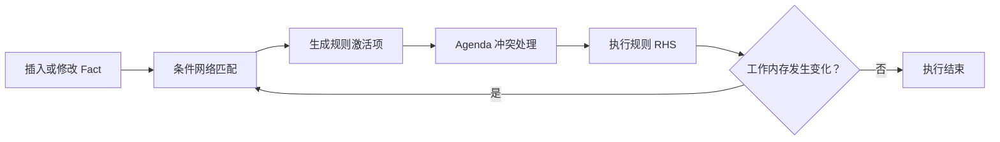
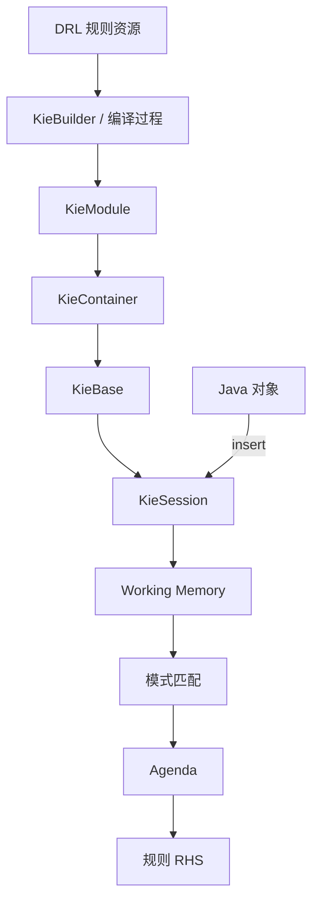

# Drools 规则引擎新手学习指南

> 本文按照 `Drools.pdf` 的目录结构重新编写，并结合现代 Drools 的使用方式进行了修订。
>
> 示例基线：**JDK 17+、Maven 3.8.6+、Drools 10.1.0**。Drools 10 仍兼容传统 KIE API 和大部分经典 DRL 语法，因此本文先用传统写法帮助新手理解核心机制，再简要介绍 Rule Unit 等新方向。

## 阅读目标

完成本文后，你应该能够：

1. 判断一个业务问题是否适合使用规则引擎。
2. 理解 Fact、Working Memory、KieBase、KieSession、Agenda 等核心概念。
3. 独立创建一个可运行的 Drools Maven 项目。
4. 编写、加载、执行和测试 DRL 规则。
5. 正确使用常见规则属性、LHS 条件和 RHS 动作。
6. 区分有状态会话和无状态会话。
7. 识别循环触发、规则冲突、会话泄漏等常见问题。

## 建议学习路线

| 阶段 | 学习内容 | 学习成果 |
| --- | --- | --- |
| 入门 | 第 1～3 章 | 跑通积分案例，理解规则引擎解决什么问题 |
| 基础 | 第 4～5 章 | 能独立编写条件、动作和常用规则属性 |
| 进阶 | 第 6 章 | 掌握查询、全局变量、Fact 生命周期和复杂条件 |
| 工程化 | 第 7～8 章及附录 | 能设计会话生命周期、测试、日志和发布流程 |

---

# 1. 场景

## 1.1 需求

假设商城需要根据订单金额赠送积分：

| 订单金额 | 赠送积分 |
| --- | ---: |
| 小于 100 元 | 0 |
| 大于等于 100 元且小于 500 元 | 100 |
| 大于等于 500 元且小于 1000 元 | 500 |
| 大于等于 1000 元 | 1000 |

上线后，业务可能继续提出以下要求：

- 会员等级不同，积分倍率不同。
- 节假日使用临时活动规则。
- 某些商品不参与积分。
- 风控命中的订单不赠送积分。
- 规则修改后，希望减少应用代码改动。
- 需要知道某个订单命中了哪条规则。

这类业务的共同特点是：**判断条件多、变化频繁、组合复杂、需要可解释性**。

## 1.2 传统做法

### 1.2.1 `if...else`

最直接的实现如下：

```java
public int calculateScore(int amount) {
    if (amount < 100) {
        return 0;
    } else if (amount < 500) {
        return 100;
    } else if (amount < 1000) {
        return 500;
    } else {
        return 1000;
    }
}
```

少量、稳定的判断用 `if...else` 完全合理。不要为了使用 Drools 而使用 Drools。

当条件扩展为金额、会员等级、地区、商品类型、活动时间、支付方式等多个维度后，代码容易出现：

- 分支数量快速膨胀。
- 条件边界散落在多个类中。
- 规则之间的优先级不清楚。
- 修改规则必须重新编译、测试和发布应用。
- 技术代码与业务决策混在一起。
- 很难回答“为什么产生了这个结果”。

### 1.2.2 策略模式

策略模式可以把不同算法封装成不同实现：

```java
public interface ScoreStrategy {
    int calculate(Order order);
}

public class NormalScoreStrategy implements ScoreStrategy {
    @Override
    public int calculate(Order order) {
        return order.getAmount() >= 1000 ? 1000 : 0;
    }
}
```

策略模式适合“算法族”切换，但当业务需要大量条件组合时，仍可能产生很多策略类，并且策略选择逻辑本身也会越来越复杂。

### 1.2.3 问题与选型

适合使用 Drools 的情况：

- 规则数量较多，并且频繁变化。
- 多条规则需要共同作用于同一批事实。
- 业务人员需要阅读、审核或维护规则。
- 需要优先级、互斥组、规则分组、推理链等能力。
- 需要把业务决策与应用流程解耦。

不建议使用 Drools 的情况：

- 只有两三个稳定判断。
- 主要逻辑是数据库 CRUD 或固定流程编排。
- 团队无法承担 DRL 学习、规则治理和测试成本。
- 规则结果依赖大量网络调用或副作用。
- 仅仅想把 `if...else` 换一种语法。

一个实用判断是：**如果复杂性来自“条件与决策”，Drools 可能合适；如果复杂性来自“步骤与流程”，应优先考虑普通代码或流程引擎。**

---

# 2. 是什么

## 2.1 概念

Drools 是 Apache KIE 生态中的规则引擎。应用把业务数据作为 Fact 插入会话，规则引擎将 Fact 与规则条件进行匹配，并执行满足条件的规则动作。

一条规则通常可以理解为：

```text
IF 条件成立
THEN 执行动作
```

规则引擎的核心价值不是消灭所有判断，而是：

- 将业务决策从流程代码中分离。
- 让规则以声明式方式表达。
- 统一执行规则匹配、冲突处理和推理。
- 为规则版本、测试、审计和动态发布创造条件。

## 2.2 起源

规则引擎源自产生式系统。产生式规则通常由条件和结论组成：

```text
如果订单金额大于等于 1000 元
那么赠送 1000 积分
```

两种常见推理方式：

- **正向推理**：由事实驱动。从已有事实出发，不断匹配规则并产生新事实或修改事实。
- **反向推理**：由目标驱动。从待证明的目标出发，反向寻找支持条件。

Drools 最常见的使用方式是正向推理。Fact 的插入、修改或删除可能激活新的规则，形成推理链。

## 2.3 原理：基于 Rete 思想的规则引擎

### 2.3.1 执行原理

经典规则执行周期可以概括为：

1. **Match**：将 Fact 与规则条件匹配。
2. **Select**：把匹配成功的规则激活放入 Agenda，并选择下一条规则。
3. **Act**：执行规则 RHS。
4. RHS 修改工作内存后，重新评估受影响的规则。
5. 直到没有可执行激活项，或程序主动停止。



### 2.3.2 Rete 算法

如果每次都让每条规则从头检查每个对象，规则和数据增加后，计算成本会很高。Rete 的核心思想是：

- 把规则条件编译为共享的匹配网络。
- 相同或相似的条件节点可以复用。
- 保存部分匹配结果，避免每轮从头计算。
- Fact 变化时，只传播和重新计算受影响的部分。

新手不需要先掌握 Rete 网络的节点细节，但应理解两个工程结论：

1. 插入会话的 Fact 越多，占用的内存通常越多。
2. `update`、`modify`、`insert` 和 `delete` 都可能引起新的规则匹配。

## 2.4 规则引擎应用场景

常见场景包括：

- 营销：优惠券、满减、会员权益、积分。
- 风控：黑名单、反欺诈、交易拦截、授信。
- 金融：贷款资格、费率、额度和合规检查。
- 保险：核保、理赔条件、产品推荐。
- 物流：配送策略、仓库选择、费用计算。
- 制造：告警判断、质量检测、设备诊断。
- 权限：条件化授权和合规校验。
- 复杂事件处理：监控事件流并识别事件模式。

## 2.5 Drools 介绍

Drools 中常见的组成部分如下：

| 名称 | 作用 |
| --- | --- |
| DRL | Drools Rule Language，文本规则语言 |
| KIE API | 构建、加载和执行规则的 Java API |
| KieBase | 已编译规则知识库，通常可复用 |
| KieSession | 规则执行会话，保存运行时事实和 Agenda |
| DMN | 标准化决策模型，适合表格化和图形化决策 |
| Rule Unit | Drools 10 推荐的新式规则组织与执行模型 |

Drools 10 的重要环境要求：

- JDK 17 或更高版本。
- 构建 Drools 或使用 `kie-ci` 时，Maven 至少为 3.8.6。
- 传统项目优先依赖 `org.drools:drools-engine`。
- `drools-engine-classic` 和独立 `drools-mvel` 已不再是推荐选择。

---

# 3. 消费赠送积分案例

本章先构建一个传统 KIE API 项目。它最适合用来理解 PDF 中的 KieBase、KieSession、Fact 和 DRL。

## 3.1 第一步：创建工程，引入依赖

项目结构：

```text
drools-score-demo/
├── pom.xml
└── src
    ├── main
    │   ├── java
    │   │   └── com/example/drools
    │   │       ├── Order.java
    │   │       └── ScoreService.java
    │   └── resources
    │       ├── META-INF
    │       │   └── kmodule.xml
    │       └── rules
    │           └── score-rules.drl
    └── test
        └── java
            └── com/example/drools
                └── ScoreServiceTest.java
```

`pom.xml`：

```xml
<?xml version="1.0" encoding="UTF-8"?>
<project xmlns="http://maven.apache.org/POM/4.0.0"
         xmlns:xsi="http://www.w3.org/2001/XMLSchema-instance"
         xsi:schemaLocation="http://maven.apache.org/POM/4.0.0
                             https://maven.apache.org/xsd/maven-4.0.0.xsd">
    <modelVersion>4.0.0</modelVersion>

    <groupId>com.example</groupId>
    <artifactId>drools-score-demo</artifactId>
    <version>1.0-SNAPSHOT</version>

    <properties>
        <maven.compiler.release>17</maven.compiler.release>
        <drools.version>10.1.0</drools.version>
        <junit.version>5.11.4</junit.version>
    </properties>

    <dependencies>
        <dependency>
            <groupId>org.drools</groupId>
            <artifactId>drools-engine</artifactId>
            <version>${drools.version}</version>
        </dependency>

        <!-- 使用 kmodule.xml 时需要显式加入 XML 支持。 -->
        <dependency>
            <groupId>org.drools</groupId>
            <artifactId>drools-xml-support</artifactId>
            <version>${drools.version}</version>
        </dependency>

        <dependency>
            <groupId>org.junit.jupiter</groupId>
            <artifactId>junit-jupiter</artifactId>
            <version>${junit.version}</version>
            <scope>test</scope>
        </dependency>
    </dependencies>

    <build>
        <plugins>
            <plugin>
                <groupId>org.apache.maven.plugins</groupId>
                <artifactId>maven-surefire-plugin</artifactId>
                <version>3.5.2</version>
            </plugin>
        </plugins>
    </build>
</project>
```

`src/main/resources/META-INF/kmodule.xml`：

```xml
<?xml version="1.0" encoding="UTF-8"?>
<kmodule xmlns="http://www.drools.org/xsd/kmodule">
    <kbase name="scoreKieBase" packages="rules">
        <ksession name="scoreKieSession"/>
        <ksession name="statelessScoreSession" type="stateless"/>
    </kbase>
</kmodule>
```

这里的 `packages="rules"` 对应 DRL 文件中的逻辑包名，而不是资源目录名本身。

## 3.2 创建 Drools 配置

先创建一个加载并复用 `KieContainer` 的服务：

```java
package com.example.drools;

import org.kie.api.KieServices;
import org.kie.api.runtime.KieContainer;
import org.kie.api.runtime.KieSession;

public class ScoreService {

    private final KieContainer kieContainer;

    public ScoreService() {
        this.kieContainer = KieServices.Factory.get().getKieClasspathContainer();
    }

    public int calculate(Order order) {
        KieSession session = kieContainer.newKieSession("scoreKieSession");
        try {
            session.insert(order);
            session.fireAllRules();
            return order.getScore();
        } finally {
            session.dispose();
        }
    }
}
```

关键点：

- `KieContainer` 的创建和规则编译成本较高，通常应复用。
- 有状态 `KieSession` 不是普通的无状态工具类，不应在多个并发请求间共享。
- 每次请求创建的短生命周期 `KieSession` 必须 `dispose()`。

在 Spring Boot 中可以把 `KieContainer` 注册为单例 Bean：

```java
@Configuration
public class DroolsConfiguration {

    @Bean
    KieContainer kieContainer() {
        return KieServices.Factory.get().getKieClasspathContainer();
    }
}
```

业务服务每次执行时再通过该容器创建新的会话。初学阶段不建议从网上复制旧版 `kie-spring` 自动配置代码，因为不同 Drools、Spring Boot 和 Jakarta 版本之间可能存在兼容性差异。

## 3.3 订单实体类

```java
package com.example.drools;

public class Order {

    private String orderId;
    private int amount;
    private int score;

    public Order() {
    }

    public Order(String orderId, int amount) {
        this.orderId = orderId;
        this.amount = amount;
    }

    public String getOrderId() {
        return orderId;
    }

    public void setOrderId(String orderId) {
        this.orderId = orderId;
    }

    public int getAmount() {
        return amount;
    }

    public void setAmount(int amount) {
        this.amount = amount;
    }

    public int getScore() {
        return score;
    }

    public void setScore(int score) {
        this.score = score;
    }
}
```

Fact 最好满足以下要求：

- 字段含义清晰。
- Getter/Setter 符合 JavaBean 规范。
- 避免在 Getter 中执行数据库或网络调用。
- `equals()` 和 `hashCode()` 的语义明确。
- 金额生产场景应使用最小货币单位的整数或 `BigDecimal`，不要使用 `double`。

## 3.4 规则引擎文件

`src/main/resources/rules/score-rules.drl`：

```drl
package rules

import com.example.drools.Order

rule "SCORE_001_AMOUNT_LT_100"
    no-loop true
when
    $order : Order(amount < 100)
then
    modify($order) {
        setScore(0)
    }
end

rule "SCORE_002_AMOUNT_100_TO_499"
    no-loop true
when
    $order : Order(amount >= 100, amount < 500)
then
    modify($order) {
        setScore(100)
    }
end

rule "SCORE_003_AMOUNT_500_TO_999"
    no-loop true
when
    $order : Order(amount >= 500, amount < 1000)
then
    modify($order) {
        setScore(500)
    }
end

rule "SCORE_004_AMOUNT_GE_1000"
    no-loop true
when
    $order : Order(amount >= 1000)
then
    modify($order) {
        setScore(1000)
    }
end
```

规则设计说明：

- 四个金额区间互斥，不依赖执行顺序。
- 规则名称带稳定编号，便于日志、审计和沟通。
- `modify` 会通知引擎 Fact 已变化。
- `no-loop true` 防止当前规则因为自己修改 `score` 而再次激活。
- 不要仅依赖 `salience` 修补本应互斥的条件。

## 3.5 客户端与单元测试

```java
package com.example.drools;

import static org.junit.jupiter.api.Assertions.assertEquals;

import org.junit.jupiter.api.BeforeAll;
import org.junit.jupiter.api.Test;

class ScoreServiceTest {

    private static ScoreService scoreService;

    @BeforeAll
    static void setUp() {
        scoreService = new ScoreService();
    }

    @Test
    void shouldCalculateBoundaryScores() {
        assertScore(80, 0);
        assertScore(99, 0);
        assertScore(100, 100);
        assertScore(499, 100);
        assertScore(500, 500);
        assertScore(999, 500);
        assertScore(1000, 1000);
        assertScore(1500, 1000);
    }

    private void assertScore(int amount, int expectedScore) {
        Order order = new Order("ORDER-" + amount, amount);
        int actualScore = scoreService.calculate(order);
        assertEquals(expectedScore, actualScore);
    }
}
```

执行：

```bash
mvn test
```

规则测试至少应覆盖：

- 每个区间中的普通值。
- 每个区间边界值。
- 空值或非法值。
- 多条规则同时满足时的行为。
- Fact 更新后产生的二次匹配。
- 规则不应命中时的负向用例。

## 3.6 Drools 开发小结

### 3.6.1 Drools 组成



### 3.6.2 相关概念说明

| 概念 | 说明 |
| --- | --- |
| Fact | 插入规则会话、参与规则匹配的业务对象 |
| Working Memory | 当前会话保存 Fact 和匹配状态的运行时内存 |
| Production Memory | 已编译的规则知识 |
| KieBase | 规则知识库，不保存某次会话的业务状态 |
| KieSession | 执行规则的运行时会话 |
| Pattern | LHS 中用于匹配 Fact 的模式 |
| Activation/Match | 某条规则与一组 Fact 匹配成功形成的待执行项 |
| Agenda | 保存并调度待执行规则激活项 |
| RHS | 规则命中后执行的动作部分 |

### 3.6.3 规则引擎执行过程

积分案例的执行过程：

1. 应用创建 `Order`。
2. 调用 `session.insert(order)`，订单成为 Fact。
3. 引擎匹配全部相关规则。
4. 满足金额区间的规则进入 Agenda。
5. `fireAllRules()` 执行规则。
6. 规则通过 `modify` 更新订单积分。
7. 引擎重新评估受影响的规则。
8. `no-loop` 阻止当前规则因自身修改再次触发。
9. 应用读取订单积分并销毁会话。

### 3.6.4 KIE 介绍

KIE 是 “Knowledge Is Everything” 的缩写。传统 KIE 项目常见对象关系：

```text
KieServices
  └── KieContainer
        └── KieBase
              ├── KieSession
              └── StatelessKieSession
```

- `KieServices`：访问 KIE 功能的入口。
- `KieContainer`：按 ReleaseId 或类路径管理 KIE 模块。
- `KieBase`：包含编译后的规则。
- `KieSession`：有状态执行环境。
- `StatelessKieSession`：对有状态会话进行封装的一次性执行接口。

---

# 4. 规则文件开发

## 4.1 规则文件构成

一个经典 DRL 文件可以包含：

```drl
package rules

import com.example.drools.Order

global java.util.List auditMessages

function boolean isLargeOrder(int amount) {
    return amount >= 1000;
}

query "large orders"
    $order : Order(amount >= 1000)
end

rule "Large order"
when
    $order : Order(amount >= 1000)
then
    auditMessages.add($order.getOrderId());
end
```

常用顶层元素：

| 元素 | 用途 |
| --- | --- |
| `package` | DRL 的逻辑命名空间 |
| `import` | 导入 Java 类型或静态方法 |
| `global` | 接收由应用注入的全局对象 |
| `function` | 定义可被规则调用的函数 |
| `query` | 查询工作内存中的 Fact |
| `declare` | 在 DRL 中声明类型或为类型增加元数据 |
| `rule...end` | 定义规则 |

## 4.2 规则体语法结构

```drl
rule "唯一规则名称"
    // 可选属性
    salience 10
    no-loop true
when
    // LHS：条件部分
    $order : Order(amount >= 1000)
then
    // RHS：动作部分
    modify($order) {
        setScore(1000)
    }
end
```

- `when` 到 `then` 之间是 LHS。
- `then` 到 `end` 之间是 RHS。
- LHS 应表达“何时成立”。
- RHS 应尽量只表达“成立后做什么”。

## 4.3 注释

```drl
// 单行注释

/*
 * 多行注释
 * 建议说明业务来源、边界和变更原因。
 */
```

推荐的规则注释内容：

- 业务含义。
- 需求或工单编号。
- 关键边界。
- 与其他规则的互斥或依赖关系。
- 不易理解的设计原因。

## 4.4 Pattern 模式匹配

基本语法：

```drl
$变量名 : 类型(字段约束)
```

示例：

```drl
$order : Order(
    amount >= 500,
    amount < 1000,
    orderId != null
)
```

含义：

1. 工作内存中存在一个 `Order`。
2. 金额大于等于 500 且小于 1000。
3. 订单号不为空。
4. 匹配对象绑定到 `$order`，RHS 可以使用它。

多个 Pattern 默认是逻辑与：

```drl
when
    $order : Order(amount >= 1000)
    $customer : Customer(id == $order.customerId, level == "VIP")
then
    // 同时满足订单与客户条件
end
```

绑定字段值：

```drl
when
    Order($amount : amount, amount >= 1000)
then
    System.out.println("amount = " + $amount);
end
```

## 4.5 比较操作符

### 4.5.1 常用语法

```drl
Order(amount >= 1000)
Customer(level == "VIP")
Customer(name != null)
Customer(age in (18, 20, 22))
Customer(city not in ("A", "B"))
Customer(name matches "张.*")
Customer(tags contains "NEW")
```

常用操作符：

| 类型 | 操作符 |
| --- | --- |
| 比较 | `==`、`!=`、`>`、`>=`、`<`、`<=` |
| 逻辑 | `and`、`or`、`not` |
| 集合 | `contains`、`not contains`、`memberOf` |
| 文本 | `matches`、`not matches`、`startsWith`、`endsWith` |
| 多值 | `in`、`not in` |

注意：

- DRL 中的 `==` 对对象通常按值语义比较，不要机械套用 Java 中引用比较的理解。
- 空值检查应写在可能解引用字段之前。
- 条件应尽量直接访问 Fact 属性，不要在条件中执行有副作用的方法。
- 最有区分度的条件应尽量靠前，减少无效匹配。

### 4.5.2 操作步骤

编写复杂条件时，建议：

1. 先写业务自然语言。
2. 明确边界是否包含。
3. 列出需要的 Fact 类型。
4. 把条件拆成多个可读的 Pattern。
5. 为每个边界编写测试。
6. 检查是否可能多规则同时命中。
7. 再决定使用互斥条件、分组或优先级。

## 4.6 执行指定规则

可通过 `AgendaFilter` 按规则名称过滤：

```java
int fired = session.fireAllRules(match ->
    match.getRule().getName().startsWith("SCORE_")
);
```

也可以使用规则元数据：

```drl
rule "VIP score"
    @category("score")
when
    // ...
then
    // ...
end
```

```java
session.fireAllRules(match ->
    "score".equals(match.getRule().getMetaData().get("category"))
);
```

`AgendaFilter` 适合一次执行时的过滤，不应代替清晰的规则模块划分。

## 4.7 关键字

常见关键字：

```text
package import global function query declare
rule when then end
and or not exists forall eval
from collect accumulate
insert modify update delete
salience no-loop enabled dialect
agenda-group activation-group auto-focus lock-on-active
timer date-effective date-expires
```

命名字段、绑定变量和规则名称时应避开关键字。

---

# 5. 规则属性 Attributes

规则属性放在规则名称与 `when` 之间，用来控制规则是否可用、执行优先级、分组和时间行为。

## 5.1 `enabled`

```drl
rule "Temporarily disabled"
    enabled false
when
    Order()
then
end
```

适合临时禁用静态规则。生产中的动态开关通常应由规则版本、配置中心或发布流程控制，而不是频繁编辑源码。

## 5.2 `dialect`

```drl
rule "Java dialect example"
    dialect "JAVA"
when
    $order : Order()
then
    $order.setScore(10);
    update($order);
end
```

Drools 10 仍可使用相关表达式语法，但新项目一般优先使用 Java 方言和可静态检查的简单表达式。

## 5.3 `salience`

`salience` 表示优先级，值越大通常越先执行：

```drl
rule "Risk rejection"
    salience 100
when
    $order : Order(risky == true)
then
    // ...
end
```

使用建议：

- 默认值通常为 0。
- 只在确实存在执行先后关系时使用。
- 不要给每条规则随意编号形成“隐式流程”。
- 如果两条规则本应互斥，优先修正条件或使用 `activation-group`。

## 5.4 `no-loop`

```drl
rule "Increase score once"
    no-loop true
when
    $order : Order(amount >= 1000)
then
    modify($order) {
        setScore(1000)
    }
end
```

`no-loop true` 只阻止规则因自己的更新再次激活。其他规则修改同一 Fact 后，当前规则仍可能重新激活。

## 5.5 `lock-on-active`

```drl
rule "Calculation A"
    agenda-group "calculation"
    lock-on-active true
when
    // ...
then
    // ...
end
```

它比 `no-loop` 更强：当对应组处于活动状态时，Fact 更新引起的重新激活会被抑制，不论更新来自哪条规则。

注意：

- 适合一组会互相修改 Fact 的计算规则。
- 容易掩盖规则设计问题，应配合测试使用。
- 与 `from` 等条件组合时要格外检查是否出现本应执行却未执行的规则。

## 5.6 `activation-group`

同组规则最多执行一条，常用于互斥决策：

```drl
rule "High discount"
    activation-group "discount-choice"
    salience 20
when
    Order(amount >= 1000)
then
end

rule "Normal discount"
    activation-group "discount-choice"
    salience 10
when
    Order(amount >= 500)
then
end
```

第一条规则执行后，同组其他激活项会被取消。`salience` 可用于确定多个候选规则中的优先选择。

## 5.7 `agenda-group`

经典 DRL 可用议程组划分规则：

```drl
rule "Score rule"
    agenda-group "score"
when
    Order()
then
end
```

Java 设置焦点：

```java
session.getAgenda().getAgendaGroup("score").setFocus();
session.fireAllRules();
```

只有获得焦点的组才会参与执行。Drools 10 官方文档把它归为传统分组能力，新项目也应了解 Rule Unit 这种更清晰的模块化方式。

## 5.8 `auto-focus`

```drl
rule "Auto focus score group"
    agenda-group "score"
    auto-focus true
when
    Order(amount >= 1000)
then
end
```

规则激活时会让所在议程组自动获得焦点。它会影响执行流，新手应避免在大量规则中滥用。

## 5.9 `timer`

间隔定时器：

```drl
rule "Periodic check"
    timer (int: 5s 10s)
when
    SystemStatus(active == true)
then
    // ...
end
```

Cron 定时器：

```drl
rule "Cron check"
    timer (cron: 0 0/5 * * * ?)
when
    SystemStatus(active == true)
then
    // ...
end
```

注意：

- 定时规则通常需要有状态会话保持存活。
- `fireUntilHalt()` 会进入持续执行模式，需要另一个线程调用 `halt()`。
- 也可通过会话配置启用被动模式下的定时规则执行。
- 长生命周期会话必须设计线程、安全关闭、故障恢复和监控机制。

## 5.10 `date-effective`

```drl
rule "Promotion starts"
    date-effective "01-Jul-2026"
when
    Order()
then
end
```

只有达到生效时间后，规则才可能激活。日期格式由 Drools 配置决定。

生产建议：

- 明确时区。
- 开发、测试和生产使用一致的日期格式。
- 对动态活动日期，更推荐将活动配置作为 Fact 或外部配置输入，便于测试和管理。

## 5.11 `date-expires`

```drl
rule "Promotion expires"
    date-expires "31-Jul-2026"
when
    Order()
then
end
```

超过失效时间后规则不再激活。务必测试临界时刻、时区和部署节点时间一致性。

---

# 6. Drools 高级语法

## 6.1 `global` 全局变量

DRL：

```drl
global java.util.List auditMessages

rule "Record audit"
when
    $order : Order(amount >= 1000)
then
    auditMessages.add("Matched order: " + $order.getOrderId());
end
```

Java：

```java
List<String> messages = new ArrayList<>();
session.setGlobal("auditMessages", messages);
```

注意：

- `global` 不会自动成为 Fact，改变它不会自动触发规则重评估。
- 全局变量更适合提供无状态服务、日志收集器或结果容器。
- 不要用可变全局变量保存跨请求业务状态。
- 每个 DRL 声明的 global 都必须在执行前正确设置。

## 6.2 `query` 查询

```drl
query "high value orders"(int minimum)
    $order : Order(amount >= minimum)
end
```

```java
QueryResults results =
    session.getQueryResults("high value orders", 1000);

for (QueryResultsRow row : results) {
    Order order = (Order) row.get("$order");
    System.out.println(order.getOrderId());
}
```

Query 用于从当前工作内存中获取满足条件的 Fact。它不是数据库查询，也不会自动读取数据库。

## 6.3 `function` 函数

```drl
function int vipBonus(int baseScore) {
    return baseScore * 2;
}

rule "VIP bonus"
when
    $order : Order(score > 0)
then
    modify($order) {
        setScore(vipBonus($order.getScore()))
    }
end
```

函数适合短小、无副作用的公共计算。复杂逻辑更适合放在经过单元测试的 Java 服务中，通过 `global` 或静态导入调用。

## 6.4 条件 LHS 加强

### 6.4.1 复合值限制 `in` / `not in`

```drl
Customer(level in ("GOLD", "PLATINUM"))
Order(channel not in ("INTERNAL", "TEST"))
```

适合少量固定值。值很多或频繁变化时，应将配置建模为 Fact 或外部数据。

### 6.4.2 条件元素 `eval`

```drl
when
    $order : Order($amount : amount)
    eval($amount % 100 == 0)
then
end
```

`eval` 可以执行返回布尔值的表达式，但通常不如字段约束容易优化：

```drl
// 优先写法
Order(amount >= 1000)

// 不必要的 eval
$order : Order()
eval($order.getAmount() >= 1000)
```

仅当条件无法自然表达为 Pattern 约束时再使用 `eval`。

### 6.4.3 条件元素 `not`

```drl
rule "No risk record"
when
    $order : Order($id : orderId)
    not RiskRecord(orderId == $id)
then
    // 没有对应风险记录
end
```

`not` 表示工作内存中不存在满足条件的 Fact。之后插入匹配的 `RiskRecord`，原有激活可能被撤销。

### 6.4.4 条件元素 `exists`

```drl
rule "At least one large order"
when
    exists Order(amount >= 1000)
then
    // 无论存在多少个大额订单，本次匹配只关心“至少一个”
end
```

区别：

- `Order(amount >= 1000)` 会针对每个匹配订单形成匹配。
- `exists Order(amount >= 1000)` 只表达是否至少存在一个。

### 6.4.5 规则继承

```drl
rule "Base valid order"
when
    $order : Order(amount > 0)
then
end

rule "Large valid order" extends "Base valid order"
when
    eval($order.getAmount() >= 1000)
then
end
```

规则继承可以复用父规则的 LHS，但会增加理解成本。工程中通常优先考虑：

- 提取清晰的公共 Fact。
- 使用规则模块或 Rule Unit。
- 使用命名一致的独立规则。

## 6.5 结果 RHS

RHS 的主要职责是改变事实状态或产生决策结果。应保持短小、确定、可测试。

### 6.5.1 `insert`

```drl
rule "Create review task"
when
    $order : Order(amount >= 10000)
    not ReviewTask(orderId == $order.orderId)
then
    insert(new ReviewTask($order.getOrderId()));
end
```

插入新 Fact 后，其他规则可能被激活。使用 `not` 或唯一标识防止重复插入。

### 6.5.2 `update`

```drl
then
    $order.setScore(1000);
    update($order);
end
```

仅调用 Setter 而不通知引擎，规则引擎可能不知道对象发生变化。`update` 会让相关规则重新匹配。

### 6.5.3 `modify`

```drl
then
    modify($order) {
        setScore(1000),
        setProcessed(true)
    }
end
```

`modify` 将修改与更新通知组合在一起，通常比手动 Setter 加 `update` 更清晰。

### 6.5.4 `delete`

```drl
rule "Remove completed task"
when
    $task : ReviewTask(completed == true)
then
    delete($task);
end
```

`retract` 仍可能在旧资料中出现，现代 DRL 通常优先使用 `delete`。

## 6.6 RHS 加强

规则 RHS 中可通过内置的 `drools` 上下文访问当前规则和运行时信息。

### 6.6.1 `halt`

```drl
then
    drools.getKieRuntime().halt();
end
```

`halt()` 主要用于停止先前通过 `fireUntilHalt()` 启动的持续执行。不要把它误解为通用的“当前规则后所有规则永不执行”业务控制手段。

### 6.6.2 获取运行时

```drl
then
    System.out.println(drools.getKieRuntime());
end
```

可以通过运行时访问 Agenda、Globals、查询等能力。规则不应过度依赖底层运行时，否则会降低可读性和可移植性。

### 6.6.3 获取当前规则

```drl
then
    String ruleName = drools.getRule().getName();
end
```

适合生成审计信息。生产日志更推荐使用 Agenda 事件监听器统一记录规则命中，而不是在每条规则中大量输出。

## 6.7 规则文件编码规范

1. 规则统一放在明确的资源目录中，例如 `src/main/resources/rules`。
2. 使用稳定、可搜索的规则编号和业务名称。
3. 一份文件聚焦一个领域或一个 Fact 主题。
4. LHS 表达条件，RHS 保持短小。
5. RHS 避免网络请求、数据库写入和复杂循环。
6. 不要默认给所有规则设置 `salience`。
7. 金额、时间、空值和边界必须有测试。
8. 修改 Fact 后根据需要使用 `modify` 或 `update`。
9. 对 `insert` 建立防重复机制。
10. 不使用 `System.out.println` 作为生产审计方案。
11. 规则编译应进入 CI，部署前阻止语法错误。
12. 规则版本应与需求、测试结果和发布时间可追溯关联。

---

# 7. WorkBench

## 7.1 WorkBench 简介

PDF 中介绍的是较早期的 KIE Workbench/Drools Workbench：通过 Tomcat 部署 WAR，创建空间和项目，再发布 KJAR。

需要特别注意：

- PDF 使用的是 Drools 7.x、旧 Tomcat 和旧集成 JAR。
- 这些具体版本和安装步骤不应直接用于现代生产环境。
- 旧账号、密码和服务器 XML 示例只能用于理解历史流程，不能作为安全配置模板。
- 当前 Apache KIE 生态和工具形态已发生变化，应按目标版本的官方文档选择工具。

对新手而言，更稳妥的起点是：

1. 在 Git 中维护 DRL。
2. 使用 IDE/VS Code 编辑。
3. 通过 Maven 编译和执行测试。
4. 使用 CI 构建带版本的 KJAR。
5. 经过评审后发布规则。

## 7.2 WorkBench 使用概念

即便不安装旧 WorkBench，也应该理解它所对应的规则治理流程。

### 7.2.1 创建空间、项目

空间对应团队或业务域，项目对应可独立构建和发布的规则模块。现代 Git 项目中可映射为：

```text
organization/
└── promotion-rules/
    ├── pom.xml
    ├── src/main/resources/rules/
    └── src/test/
```

### 7.2.2 创建数据对象和 DRL 文件

可视化工具中的数据对象本质上仍是规则可识别的模型。实践中要明确：

- 模型由规则项目维护，还是由业务服务提供。
- 模型升级是否向后兼容。
- 字段删除和改名会影响哪些规则。
- 规则是否依赖应用内部、不稳定的类。

推荐为规则设计稳定的决策输入模型，不要直接把庞大的数据库实体暴露给规则。

### 7.2.3 设置 KieBase 和 KieSession

经典配置示例：

```xml
<kmodule xmlns="http://www.drools.org/xsd/kmodule">
    <kbase name="promotionKieBase" packages="rules.promotion">
        <ksession name="promotionKieSession" type="stateful"/>
    </kbase>
</kmodule>
```

配置时需要决定：

- 包含哪些规则包。
- 使用有状态还是无状态会话。
- 是否启用流式事件处理。
- 是否使用实时或伪时钟。
- 会话由谁创建、关闭和监控。

### 7.2.4 代码使用与发布

规则项目通常以 Maven 构件发布，通过 GAV 坐标标识：

```text
groupId:artifactId:version
```

应用可根据 ReleaseId 加载 KJAR：

```java
KieServices ks = KieServices.Factory.get();
ReleaseId releaseId =
    ks.newReleaseId("com.example.rules", "promotion-rules", "1.2.0");
KieContainer container = ks.newKieContainer(releaseId);
```

生产发布应至少具备：

- 不可变版本号。
- 规则编译检查。
- 自动化测试报告。
- 审批和审计记录。
- 回滚到上一规则版本的能力。
- 灰度验证或影子执行能力。

---

# 8. 其他

## 8.1 有状态 Session 和无状态 Session

### 无状态会话 `StatelessKieSession`

无状态会话适合一次输入、一次计算、一次输出的场景：

```java
StatelessKieSession session =
    kieContainer.newStatelessKieSession("statelessScoreSession");

Order order = new Order("ORDER-1", 1200);
session.execute(order);
```

特点：

- 调用 `execute()` 完成一次执行。
- 通常不需要手动调用 `fireAllRules()`。
- 通常不需要手动 `dispose()`。
- 不在多次 `execute()` 之间保留上一次调用的事实状态。
- 内部仍可能使用规则推理，只是对调用方暴露为一次性接口。

适合：

- 单次校验。
- 定价、评分、积分计算。
- 独立请求的决策服务。

### 有状态会话 `KieSession`

```java
KieSession session = kieContainer.newKieSession("statefulSession");
try {
    FactHandle handle = session.insert(order);
    session.fireAllRules();

    order.setAmount(2000);
    session.update(handle, order);
    session.fireAllRules();
} finally {
    session.dispose();
}
```

特点：

- 多次调用之间保留 Fact 和匹配状态。
- 支持持续插入、修改、删除事实。
- 适合推理链、监控、事件处理和长生命周期场景。
- 必须明确生命周期并最终 `dispose()`。
- 默认不应被多个业务线程并发共享。

### 对比

| 对比项 | StatelessKieSession | KieSession |
| --- | --- | --- |
| 调用方式 | `execute()` | `insert/update/delete` + `fireAllRules()` |
| 跨调用保留状态 | 否 | 是 |
| 手动销毁 | 通常不需要 | 必须 |
| 适合场景 | 一次性决策 | 连续推理、事件、监控 |
| 使用难度 | 较低 | 较高 |

### 选择原则

- 请求之间完全独立：优先无状态会话。
- 一次请求中需要完整推理链：两者都可，先考虑无状态接口是否足够。
- 需要持续接收 Fact 并保留状态：使用有状态会话。
- 需要定时器、CEP、伪时钟或 `fireUntilHalt()`：通常使用有状态会话。

---

# 9. 常见问题与排错

## 9.1 规则没有触发

按顺序检查：

1. DRL 是否进入最终 Classpath。
2. `kmodule.xml` 是否位于 `META-INF/kmodule.xml`。
3. KieBase 的 `packages` 是否包含 DRL 的 `package`。
4. 插入对象的真实类型是否与 Pattern 一致。
5. Getter 名称和字段类型是否正确。
6. 边界条件是否写错。
7. Agenda Group 是否获得焦点。
8. `enabled`、日期属性或过滤器是否阻止规则。
9. 是否忘记调用 `fireAllRules()`。

## 9.2 规则无限循环

典型原因：

```drl
rule "Loop"
when
    $order : Order(amount >= 1000)
then
    $order.setScore(1000);
    update($order);
end
```

条件始终成立，更新后当前规则可能再次激活。

处理方式：

- 增加状态条件，如 `processed == false`。
- 在 RHS 设置完成状态。
- 使用 `no-loop true`。
- 重新设计规则，使状态单向变化。
- 谨慎使用 `lock-on-active`，不要用它掩盖错误模型。

更明确的写法：

```drl
rule "Calculate once"
when
    $order : Order(amount >= 1000, processed == false)
then
    modify($order) {
        setScore(1000),
        setProcessed(true)
    }
end
```

## 9.3 同一规则触发多次

一条规则会针对不同的 Fact 组合形成不同激活项。例如两个订单都满足条件，规则自然会执行两次。

如果业务只关心“是否存在”，使用：

```drl
exists Order(amount >= 1000)
```

## 9.4 多条规则同时命中

这不一定是错误。Drools 本来就允许多条规则共同作用。

根据业务选择：

- 条件设计为互斥。
- 使用 `activation-group` 只允许一条执行。
- 使用 `salience` 指定优先级。
- 使用 `agenda-group` 分阶段执行。
- 让不同规则分别产出独立结果，再由汇总规则决策。

## 9.5 会话内存持续增长

常见原因：

- 长生命周期会话不断插入 Fact，却不删除。
- 应销毁的会话没有 `dispose()`。
- 事件没有合理的过期策略。
- 应用错误地把会话作为全局单例。

排查时应记录：

- 会话数量。
- 会话存活时间。
- Fact 数量。
- 插入与删除速率。
- 每次规则执行耗时。

## 9.6 如何知道命中了哪些规则

使用 Agenda 事件监听器：

```java
session.addEventListener(new DefaultAgendaEventListener() {
    @Override
    public void afterMatchFired(AfterMatchFiredEvent event) {
        String ruleName = event.getMatch().getRule().getName();
        System.out.println("Fired rule: " + ruleName);
    }
});
```

生产环境可把规则名称、版本、业务主键和执行耗时写入结构化审计日志。

---

# 10. 工程实践清单

## 10.1 规则设计

- [ ] 每条规则只有一个清晰业务意图。
- [ ] 金额和日期边界没有重叠或空洞。
- [ ] 规则名称稳定且唯一。
- [ ] RHS 没有复杂流程和不可控副作用。
- [ ] Fact 的状态变化方向清楚。
- [ ] 已评估多规则同时命中的结果。

## 10.2 测试

- [ ] 每条规则至少有一个正向用例。
- [ ] 每条规则至少有一个负向用例。
- [ ] 所有边界值均有测试。
- [ ] 有循环触发防护测试。
- [ ] 有规则组合和优先级测试。
- [ ] 构建阶段会编译全部规则。

## 10.3 运行

- [ ] `KieContainer` 被合理复用。
- [ ] `KieSession` 没有跨线程错误共享。
- [ ] 有状态会话最终会 `dispose()`。
- [ ] 有规则命中日志和执行指标。
- [ ] 有规则版本号和回滚方案。
- [ ] 动态更新规则时有一致性策略。

## 10.4 安全与治理

- [ ] 规则变更需要评审。
- [ ] 规则发布与应用发布边界明确。
- [ ] 不允许未受信任用户直接提交任意 DRL。
- [ ] 规则中的 Java 调用范围受到控制。
- [ ] 凭证、密码和服务地址没有写入规则。
- [ ] 生产规则包可追溯且不可变。

---

# 11. 进一步学习

掌握本文后，可以按以下顺序继续：

1. `collect`、`accumulate`、`forall` 和 `from`。
2. 属性响应与 Fact 更新优化。
3. 复杂事件处理 CEP、事件角色、滑动窗口和伪时钟。
4. Rule Unit、DataSource 和 OOPath。
5. DMN 决策表与 DRL 的选型。
6. KJAR、Maven 仓库和动态版本加载。
7. 规则测试场景、性能基准和生产监控。

DRL 与 DMN 的简单选型：

| 需求 | 更适合 |
| --- | --- |
| 多 Fact 关联、推理链、事件处理 | DRL |
| 业务人员维护二维决策表 | DMN/决策表 |
| 规则需要产生新事实并继续推理 | DRL |
| 输入到输出的确定性决策 | DMN |

---

# 12. 参考资料

- [Apache KIE Drools 文档首页](https://kie.apache.org/docs/components/drools/)
- [Drools 10.1 Getting Started](https://kie.apache.org/docs/10.1.x/drools/drools/getting-started/index.html)
- [Drools 10.1 Rule Language Reference](https://kie.apache.org/docs/10.1.x/drools/drools/language-reference/index.html)
- [Drools 10.1 Traditional Rule Language Reference](https://kie.apache.org/docs/10.1.x/drools/drools/language-reference-traditional/index.html)
- [Drools 10.1 Migration Guide](https://kie.apache.org/docs/10.1.x/drools/drools/migration-guide/index.html)
- [Drools 10.1 Release Notes](https://kie.apache.org/docs/10.1.x/drools/drools/release-notes/index.html)

> 最有效的学习方式不是记忆全部语法，而是先跑通积分案例，然后依次加入会员等级、互斥优惠、风险拦截、审计日志和规则版本。每增加一种能力，都同步补上边界测试和命中日志。
