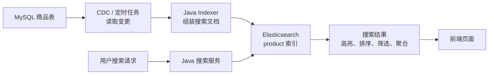
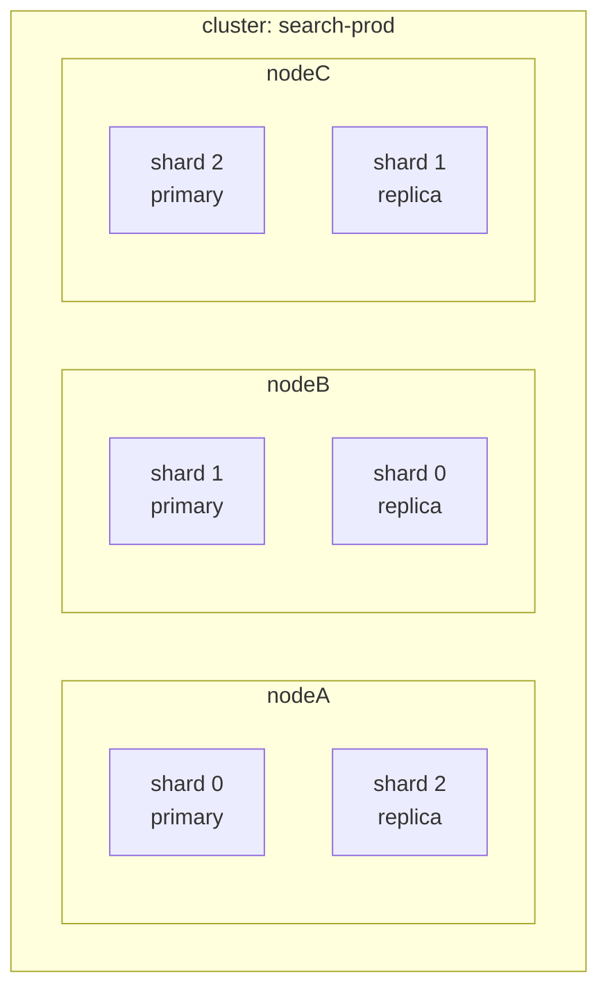
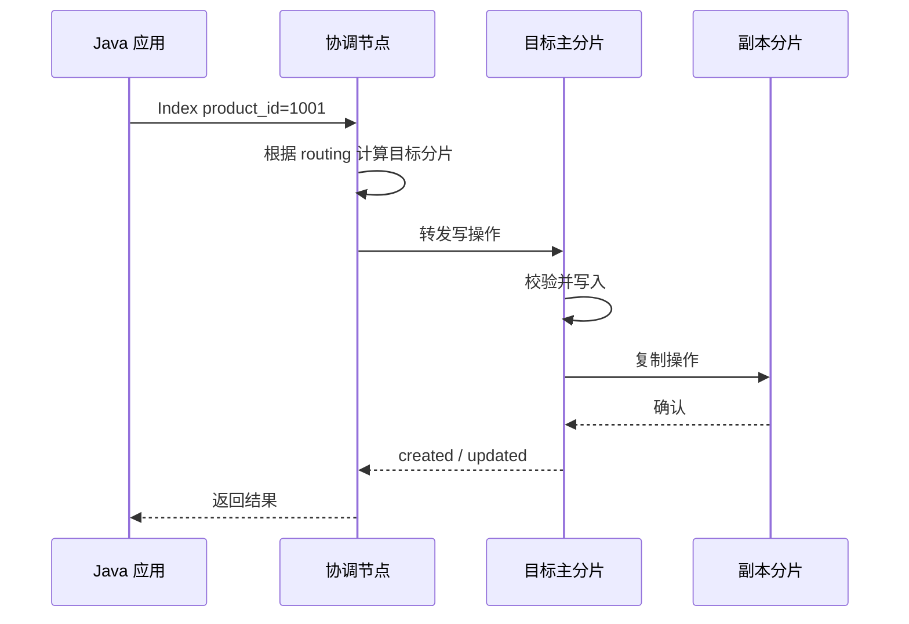
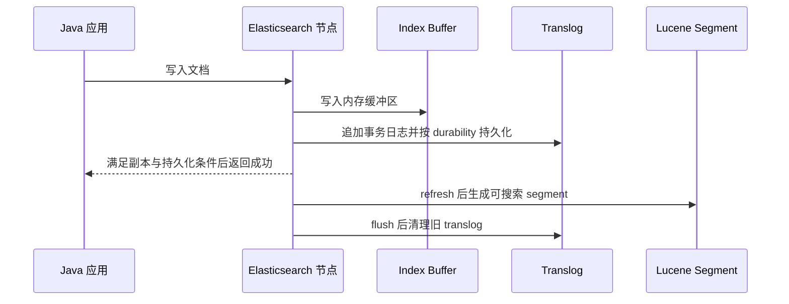
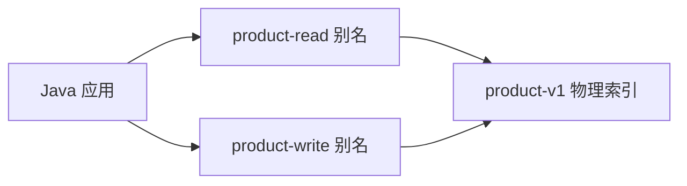
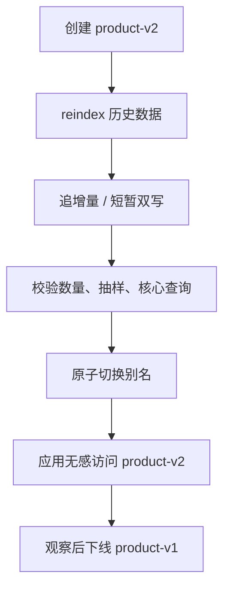
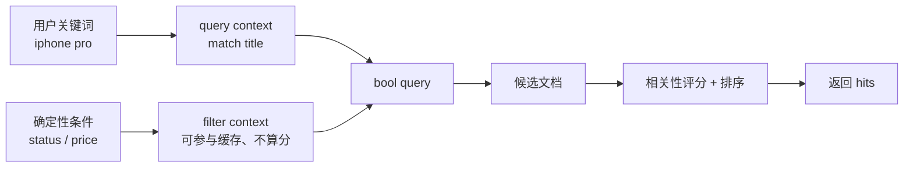
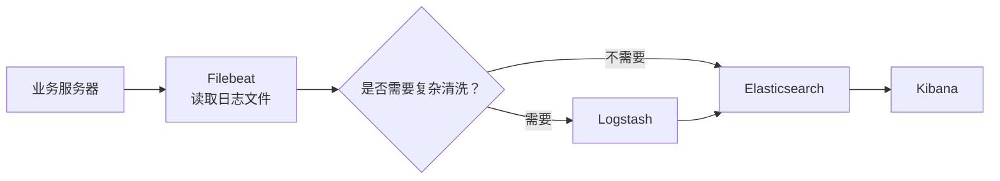
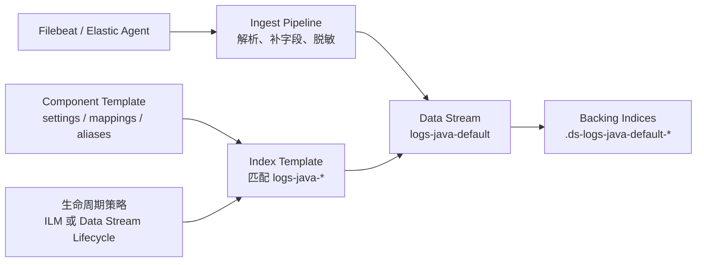
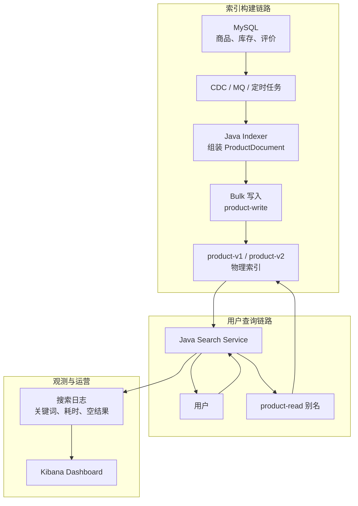

# 面向 Java 程序员的 Elasticsearch / ELK 初学者教程

> 版本语境：本文于 2026 年 8 月 12 日重新核对 [Elastic 官方发布总览](https://www.elastic.co/docs/release-notes)、[Elasticsearch 下载页](https://www.elastic.co/downloads/elasticsearch)与 [Java API Client 9.5.0 发布记录](https://www.elastic.co/docs/release-notes/elasticsearch/clients/java/9-5-0)。本文以当前正式发布的 Elastic Stack 9.5.0 和 Elasticsearch Java API Client 9.5.0 为主要参考，同时保留 7.x、8.x 项目中常见的迁移经验。服务端与 Java 客户端的主版本、次版本通常同步，补丁版本可以独立发布；Maven 示例使用 `${elastic.version}`，Docker 示例使用 `${ELASTIC_VERSION}`，请替换为实际集群和依赖仓库中已完成兼容验证的版本。不同部署形态（自建 Elastic Stack、Elastic Cloud Hosted、Elastic Cloud Serverless）的默认值和可用能力并不完全相同，生产落地应再次核对对应版本的官方文档。

## 0 目录

1\. 导读与全局认知
2\. Elasticsearch 核心原理与核心概念
3\. 索引建模与查询 DSL
4\. Java 集成与应用代码
5\. 日志采集、处理与可视化
6\. 典型业务场景设计
7\. 生产实践：稳定性、性能、安全与成本
8\. 上线检查表
9\. 故障排查手册
10\. 面试递归追问与回答边界
11\. 分阶段练习与验收
12\. 常用命令速查
13\. 官方资料入口

## 1 导读与全局认知

### 1.1 先看一个具体问题：从三件商品中搜出在售 iPhone

假设商品库里只有三条数据：一部在售 iPhone、一块在售 Apple Watch，以及一部已经下架的旧 iPhone。用户输入 `iphone` 时，我们只希望返回仍在售的那部手机。

这个最小问题已经包含真实搜索系统的三个基本动作：

1\. 输入：用户关键词 `iphone` 和确定性条件 `status=ON_SALE`。
2\. 处理：Elasticsearch 对标题做全文检索，再按商品状态过滤。
3\. 输出：只返回 `_id=1001` 的在售 iPhone；下架商品即使标题命中也不能出现。

如果只在 MySQL 中写 `LIKE '%iphone%'`，少量数据当然也能工作。但当业务继续要求分词、相关性排序、高亮、品牌和价格聚合、同义词以及千万级数据检索时，关系数据库就不再是最合适的搜索执行器。Elasticsearch（下文简称 ES）解决的正是这类“从大量文档中快速找出相关结果并分析”的问题。

先不要背 Cluster、Shard、Analyzer 等术语。下一节会先做出这个结果，看到输入、动作和输出之后，再回头解释内部机制。

### 1.2 完成第一个可验证搜索闭环

这一节只启动 Elasticsearch，不启动 Kibana、Logstash 和 Filebeat。它的目标是用最少组件证明搜索闭环；完成后再进入完整 Elastic Stack 环境。

#### 1.2.1 前置条件与阶段边界

需要提前安装 Docker，并确保本机的 `9200` 端口空闲。下面关闭了认证和传输层加密，只允许在个人本机学习环境使用，不能复制到生产或共享测试环境。

首次阅读完成本节即可，并记住两个成功判据：搜索结果只有 `_id=1001`，`product-quickstart` 索引健康状态是 `green`。分片、副本、分词和近实时机制暂时不需要背诵。

#### 1.2.2 启动单节点 Elasticsearch

```bash
export ELASTIC_VERSION=9.5.0

docker run --name es-quickstart --rm -d \
  --memory=2g \
  -p 9200:9200 \
  -e discovery.type=single-node \
  -e xpack.security.enabled=false \
  -e ES_JAVA_OPTS="-Xms1g -Xmx1g" \
  docker.elastic.co/elasticsearch/elasticsearch:${ELASTIC_VERSION}
```

等容器启动后执行：

```bash
curl -fsS http://localhost:9200
```

看到包含 `version.number` 和 `tagline` 的 JSON（JavaScript Object Notation，JavaScript 对象表示法）响应，说明 HTTP（Hypertext Transfer Protocol，超文本传输协议）入口已经可用。若连接失败，先执行：

```bash
docker ps --filter name=es-quickstart
docker logs es-quickstart
```

#### 1.2.3 创建最小商品索引

下面只定义完成首次搜索所需的四类字段。`title` 稍后用于全文检索，`brand` 和 `status` 用于精确过滤，`price` 保存两位小数金额。

```bash
curl -fsS -X PUT http://localhost:9200/product-quickstart \
  -H 'Content-Type: application/json' \
  -d '{
    "settings": {
      "number_of_shards": 1,
      "number_of_replicas": 0
    },
    "mappings": {
      "dynamic": "strict",
      "properties": {
        "title":  { "type": "text" },
        "brand":  { "type": "keyword" },
        "price":  { "type": "scaled_float", "scaling_factor": 100 },
        "status": { "type": "keyword" }
      }
    }
  }'
```

预期响应包含：

```json
{
  "acknowledged": true,
  "shards_acknowledged": true,
  "index": "product-quickstart"
}
```

这里显式使用 1 个主分片、0 个副本，只是为了让单节点学习索引保持 `green`。生产分片和副本必须按容量、高可用与恢复目标重新设计。

#### 1.2.4 写入三件商品

前两次写入只要求 Elasticsearch 接受文档；最后一次带 `refresh=wait_for`，等待下一次 refresh，使前三条数据在后续 Search API（Application Programming Interface，应用程序编程接口）中都可见。

```bash
curl -fsS -X PUT http://localhost:9200/product-quickstart/_doc/1001 \
  -H 'Content-Type: application/json' \
  -d '{"title":"Apple iPhone 15 Pro","brand":"Apple","price":8999,"status":"ON_SALE"}'

curl -fsS -X PUT http://localhost:9200/product-quickstart/_doc/1002 \
  -H 'Content-Type: application/json' \
  -d '{"title":"Apple Watch Ultra","brand":"Apple","price":6299,"status":"ON_SALE"}'

curl -fsS -X PUT 'http://localhost:9200/product-quickstart/_doc/1003?refresh=wait_for' \
  -H 'Content-Type: application/json' \
  -d '{"title":"Apple iPhone 13","brand":"Apple","price":3999,"status":"OFF_SALE"}'
```

三次响应的 `result` 都应为 `created`。这里的 `_doc/1001` 表示把 `1001` 作为文档唯一标识；相同标识再次使用 Index API 写入时会覆盖该文档，而不是新增第四条。

> `refresh=wait_for` 写入完成后，不立即强制刷新，而是等待下一次 refresh 发生、数据对搜索可见之后，再返回响应。

#### 1.2.5 搜索并验证结果

```bash
curl -fsS -X POST http://localhost:9200/product-quickstart/_search?pretty \
  -H 'Content-Type: application/json' \
  -d '{
    "query": {
      "bool": {
        "must": [
          { "match": { "title": "iphone" } }
        ],
        "filter": [
          { "term": { "status": "ON_SALE" } }
        ]
      }
    }
  }'
```

重点观察响应中的三个位置：

```json
{
  "timed_out": false,
  "hits": {
    "total": {
      "value": 1,
      "relation": "eq"
    },
    "hits": [
      {
        "_id": "1001",
        "_source": {
          "title": "Apple iPhone 15 Pro",
          "status": "ON_SALE"
        }
      }
    ]
  }
}
```

`timed_out=false` 说明查询没有在服务端超时，`hits.total.value=1` 说明只有一条命中，`_id=1001` 证明标题匹配与状态过滤同时生效。`1003` 的标题也包含 iPhone，但状态是 `OFF_SALE`，因此被 `filter` 排除；`1002` 在售，但标题不包含 iPhone，因此没有通过 `match`。

再验证这个学习索引的分片状态：

```bash
curl -fsS 'http://localhost:9200/_cluster/health/product-quickstart?pretty'
```

预期 `status` 为 `green`、`active_primary_shards` 为 `1`、`unassigned_shards` 为 `0`。这比检查整个集群更稳定，因为 Kibana 或其他组件可能创建自己的系统索引，改变集群级分片统计。

#### 1.2.6 最常见失败与清理方式

1\. 返回 `resource_already_exists_exception`：之前已经创建过同名索引。为了重新做实验，可以执行 `curl -X DELETE http://localhost:9200/product-quickstart`，再从创建索引开始；删除会清空该实验索引的全部数据。
2\. 创建文档返回 `strict_dynamic_mapping_exception`：请求里出现了 Mapping 未声明的字段，检查字段名，或先在 Mapping 中显式新增字段。
3\. 搜索总数为 0：先用 `GET /product-quickstart/_doc/1001` 验证文档是否存在，再用 `_analyze` 检查 `title` 的查询词；不要把“Get 能读到”误认为“Search 一定已经 refresh 可见”。
4\. 索引是 `yellow`：检查是否把副本数设成了 1。单节点不能把副本分片和对应主分片放在同一节点。
5\. 容器反复退出：用 `docker logs es-quickstart` 查看内存或磁盘错误；Docker 可用内存不足时，给 Docker Desktop 增加资源。

完成实验后若准备启动后文的完整 Compose 环境，先停止这个占用 `9200` 端口的容器：

```bash
docker stop es-quickstart
```

### 1.3 这份文档适合谁

这份文档面向已经会 Java 后端开发、熟悉 HTTP、JSON、MySQL、Spring Boot、日志框架的程序员。你不需要先成为搜索引擎专家，但最好已经理解这些基础：

1\. Java 基础：对象、集合、泛型、异常、并发、序列化。
2\. Spring Boot 基础：Controller、Service、配置、Bean、依赖注入。
3\. MySQL 基础：表、索引、事务、分页、慢查询、Explain。
4\. 日志基础：Logback、Log4j2、日志级别、traceId、异常栈。
5\. Linux 基础：进程、端口、磁盘、内存、CPU（Central Processing Unit，中央处理器）、网络。

本文围绕一条可运行主线逐步进入建模、Java 接入、日志链路和生产治理。完成每个阶段后，都可以用本节给出的成功判据判断自己是否已经形成可操作的理解。

建议按阶段阅读，不要求第一次读完或背完全文：

1\. 第一阶段先读 1.1～1.2：能完成一次写入、全文检索和精确过滤，成功判据是知道输入、Query DSL 和 `hits` 输出如何对应。通过后按 11.1 的范围继续读 2.6～2.8、3.1～3.2，完成 Mapping、分词、聚合和排序练习。
2\. 第二阶段读第 2～4 章：能设计商品文档并用 Java 接入，成功判据是通过真实集成测试完成写入、搜索和 Bulk 部分失败识别。
3\. 第三阶段读第 5～6 章：能让一条 Java 结构化日志进入数据流并在 Kibana 中查到，成功判据是能按 `service.name` 和 `trace.id` 定位请求。
4\. 第四阶段读第 7～10 章：能解释容量、生命周期、安全、备份、一致性和故障处理，成功判据是完成上线检查与至少一次恢复演练。
5\. 第 11～13 章用于复习、练习和按需查阅；第一次阅读可以跳过向量检索、复杂评分和冷数据优化等进阶主题。

贯穿全文的职责边界是：

> Elasticsearch 不是 MySQL 的替代品，而是面向搜索、分析、日志检索、近实时查询的分布式搜索和分析引擎。

### 1.4 ELK 是什么

ELK 是三个组件名称的缩写：

1\. E：Elasticsearch，分布式搜索和分析引擎。
2\. L：Logstash，数据采集、解析、转换和转发管道。
3\. K：Kibana，数据探索、可视化、仪表盘和运维管理界面。

在现代 Elastic Stack 中，ELK 往往还会和这些组件一起出现：

1\. Beats：轻量级数据采集器，例如 Filebeat、Metricbeat、Packetbeat、Auditbeat。
2\. Elastic Agent：统一采集代理，用一个 Agent 采集日志、指标、安全、APM 等数据。
3\. Fleet：在 Kibana 中集中管理 Elastic Agent 的能力。
4\. APM：Application Performance Monitoring，应用性能监控。
5\. ECS：Elastic Common Schema，Elastic 通用字段规范。

所以严格说，今天的 Elastic 体系不只是 ELK，而是 Elastic Stack。只是 ELK 这个名字太经典，面试和日常沟通里仍然常用。

#### 1.4.1 三个核心组件的分工

| 组件 | 核心职责 | 类比 |
|---|---|---|
| Elasticsearch | 存储、索引、搜索、聚合分析 | 搜索数据库加分析引擎 |
| Logstash | 输入、过滤、转换、输出 | 数据流水线处理器 |
| Kibana | 查询、看板、告警、管理 | 可视化控制台 |

#### 1.4.2 一个典型日志链路


#### 1.4.3 一个典型业务搜索链路



CDC 是 Change Data Capture（变更数据捕获）；它读取 MySQL 的增量变更，索引构建程序再把多表数据组装成适合搜索的文档。


### 1.5 回看第一个结果，建立整体心智模型

学习 Elasticsearch 最容易踩的坑，是直接从 API 开始背。更好的方式是先建立三层模型。

#### 1.5.1 第一层：Elasticsearch 是一个倒排索引系统

MySQL 的 B+Tree 索引更像这样：

```text
字段值 -> 行位置
```

比如：

```text
id = 1001 -> 第 1001 行
```

Elasticsearch 的全文搜索依赖倒排索引，更像这样：

```text
词项 -> 包含这个词项的文档列表
```

比如有三篇商品文档：

```text
doc1: Apple iPhone 15 Pro
doc2: Apple Watch Ultra
doc3: Huawei Mate 60 Pro
```

分词之后可能形成：

```text
apple  -> doc1, doc2
iphone -> doc1
watch  -> doc2
huawei -> doc3
pro    -> doc1, doc3
```

当用户搜索 `apple pro` 时，Elasticsearch 会从倒排索引中快速找到包含这些词项的文档，再根据相关性评分排序。

#### 1.5.2 第二层：Elasticsearch 是分布式系统

一个索引不是简单地存在一台机器上，而是被拆成多个 shard，也就是分片。

```text
index: product
  primary shard 0
  primary shard 1
  primary shard 2
```

为了高可用，每个 primary shard 可以有 replica shard，也就是副本分片。



查询时，Elasticsearch 会把请求分发到相关分片，再汇总结果。

#### 1.5.3 第三层：Elasticsearch 是近实时系统

Elasticsearch 写入文档后，默认不是立即对搜索可见，而是经过 refresh 后才可搜索。自建 Elastic Stack 的 `index.refresh_interval` 默认是 1 秒，Elastic Cloud Serverless 默认是 5 秒。未显式配置该参数时，连续 30 秒没有搜索请求的空闲分片不会继续后台周期性 refresh；之后到达的搜索会在需要时触发 refresh。

这意味着：

1\. 写入成功，不代表立刻能被搜索到。
2\. 搜索结果默认是近实时，不是强实时。
3\. 如果业务要求写后可查，优先在单次写入使用 `refresh=wait_for` 等待下一次周期性 refresh；`refresh=true` 会立即执行 refresh，开销更高，不应成为高吞吐链路的默认配置。

#### 1.5.4 Java 程序员最重要的迁移思维

| MySQL 思维 | Elasticsearch 思维 |
|---|---|
| 表设计优先考虑范式 | 文档设计优先考虑查询场景 |
| Join 很常见 | 尽量反范式，少用 join |
| 事务强一致 | 近实时，最终一致更常见 |
| SQL 统一查询语言 | Query DSL 是 JSON 查询表达式 |
| 分页 offset 很常见 | 深分页要用 search_after、PIT |
| 更新单字段成本较低 | 更新本质接近重建文档 |
| 精确匹配为主 | 全文检索、相关性排序、聚合分析 |

> DSL = Domain-Specific Language（领域特定语言）
>
> PIT = Point In Time（时间点）

### 1.6 启动完整 Elasticsearch 与 Kibana 学习环境

第一个闭环只运行了 Elasticsearch。下面加入 Kibana，供后续在 Dev Tools 中调试请求、在 Discover 中查询日志。若 `es-quickstart` 仍在运行，先按 1.2.6 停止它，避免端口和容器资源冲突。生产环境不要直接照抄，尤其不要关闭安全能力。

把下面内容保存为当前目录的 `compose.yaml`，再执行后续启动命令；`${ELASTIC_VERSION}` 会从当前 Shell 环境变量中读取。

```yaml
services:
  elasticsearch:
    # 学习环境使用官方镜像；生产环境要固定版本并配合升级策略。
    image: docker.elastic.co/elasticsearch/elasticsearch:${ELASTIC_VERSION}
    container_name: es-dev
    environment:
      # 单节点发现模式，只适合本地学习。
      - discovery.type=single-node
      # 关闭安全能力只适合本地学习，生产环境必须开启认证和 TLS。
      - xpack.security.enabled=false
      # JVM 堆内存，Xms 和 Xmx 设置一致，避免运行期动态扩缩容造成抖动。
      - ES_JAVA_OPTS=-Xms1g -Xmx1g
    ports:
      # 9200 是 Elasticsearch HTTP API 端口。
      - "9200:9200"
    volumes:
      # 持久化数据目录，容器重启后数据不会丢失。
      - es-data:/usr/share/elasticsearch/data

  kibana:
    image: docker.elastic.co/kibana/kibana:${ELASTIC_VERSION}
    container_name: kibana-dev
    environment:
      # Kibana 通过 Docker Compose 服务名访问 Elasticsearch。
      - ELASTICSEARCH_HOSTS=http://elasticsearch:9200
    ports:
      # 5601 是 Kibana Web 控制台端口。
      - "5601:5601"
    depends_on:
      - elasticsearch

volumes:
  # Docker 管理的命名卷。
  es-data:
```

启动：

```bash
export ELASTIC_VERSION=9.5.0
docker compose up -d
```

验证：

```bash
curl http://localhost:9200
curl http://localhost:9200/_cluster/health?pretty
```

预期输出：

```json
{
  "name": "es-dev",
  "cluster_name": "docker-cluster",
  "version": {
    "number": "9.x.x"
  },
  "tagline": "You Know, for Search"
}
```

刚启动且尚未创建任何业务索引时，分片数不应写死为 1；Kibana 是否已经创建系统索引也会影响集群级统计。这里只判断节点可达且状态不是 `red`：

```json
{
  "status": "green",
  "number_of_nodes": 1
}
```

Kibana 地址：

```text
http://localhost:5601
```

常见失败原因和排查：

1\. 端口占用：如果 `9200` 或 `5601` 已被占用，修改 Compose 里的端口映射，例如 `"19200:9200"`。
2\. 镜像版本不存在：如果拉取镜像失败，确认 `${ELASTIC_VERSION}` 是 Elastic 官方镜像仓库中真实存在的版本。
3\. 内存不足：如果 Elasticsearch 反复退出，降低 `ES_JAVA_OPTS` 或给 Docker Desktop 分配更多内存。
4\. Kibana 暂时打不开：Kibana 启动通常慢于 Elasticsearch，可以先看 `docker compose logs -f kibana`。
5\. 集群状态是 yellow：单节点环境如果存在副本分片，副本无法分配是正常现象；学习环境可把副本数设为 0。
6\. curl 连接失败：先执行 `docker compose ps` 确认容器状态，再看 `docker compose logs -f elasticsearch`。

生产提醒：

1\. 不要关闭 `xpack.security`。
2\. 不要所有节点都用默认密码。
3\. 不要所有组件共用一个超级用户。
4\. JVM（Java Virtual Machine，Java 虚拟机）堆大小要合理设置，常见原则是不超过物理内存一半且不超过压缩对象指针阈值附近。
5\. 数据目录要用持久化磁盘。
6\. 监控、备份、ILM（Index Lifecycle Management，索引生命周期管理）、告警要先设计。


## 2 Elasticsearch 核心原理与核心概念

第 1 章已经得到一次真实搜索结果。本章沿着这次请求向内拆解：请求进入集群和节点，索引落在分片上，文档按 Mapping 建立底层数据结构，文本经分析器生成词项，最后由查询与评分机制返回结果。

### 2.1 Cluster：集群

Cluster 是 Elasticsearch 的最高层逻辑单位，由一个或多个 node 组成。

```text
cluster
  node-1
  node-2
  node-3
```

集群有健康状态：

1\. green：主分片和副本分片都正常。
2\. yellow：主分片正常，但至少有副本分片未分配。
3\. red：至少有主分片未分配，部分数据不可用。

健康颜色只是排障入口。实际处理还要用 `_cat/shards` 和 `_cluster/allocation/explain` 找到受影响索引、未分配分片和拒绝分配的原因；颜色相同的故障可能分别来自节点离线、磁盘水位线、分配过滤或副本拓扑不满足。

### 2.2 Node：节点

Node 是一个 Elasticsearch 进程。不同节点可以承担不同角色。

常见节点角色：

1\. master-eligible node：有资格成为 master 的节点，负责集群元数据和分片调度。
2\. data node：存储数据并执行搜索、聚合。
3\. ingest node：执行 ingest pipeline，对写入数据做预处理。
4\. coordinating-only node：每个节点都具备协调请求的能力；把 `node.roles` 设为空可以得到不承担其他角色的专用协调节点，用于接收请求、分发到数据节点并合并结果。
5\. machine learning node：执行机器学习相关任务。
6\. transform node：执行数据转换任务。

生产建议：

1\. 小集群可以混合角色。
2\. 中大型集群建议拆分 master、data、coordinating、ingest 等角色。
3\. 生产集群通常部署 3 个具备 master 资格的节点，使集群在失去 1 个此类节点时仍可能形成多数派并完成选主。现代 Elasticsearch 的集群协调机制会阻止两个少数派同时成为合法集群，因此这里的目标是选主可用性和容错，不是沿用旧版本手工配置 `discovery.zen.minimum_master_nodes` 的“防脑裂”做法。

### 2.3 Index：索引

Index 是一类文档的集合，类似 MySQL 的表，但不要完全等同。

```text
index: product
  document 1
  document 2
  document 3
```

一个索引通常包含：

1\. settings：分片数、副本数、refresh 间隔、analysis 分析器配置等。
2\. mappings：字段类型、分词方式、索引方式等。
3\. aliases：索引别名，常用于平滑切换和滚动索引。

命名建议：

```text
业务搜索索引: product-v1, order-search-v3
日志索引: logs-java-app-2026.07.02
数据流: logs-java-default
别名: product-read, product-write
```

比如前面的创建索引：

```bash
curl -fsS -X PUT http://localhost:9200/product-quickstart \
  -H 'Content-Type: application/json' \
  -d '{
    "settings": {
      "number_of_shards": 1,
      "number_of_replicas": 0
    },
    "mappings": {
      "dynamic": "strict",
      "properties": {
        "title":  { "type": "text" },
        "brand":  { "type": "keyword" },
        "price":  { "type": "scaled_float", "scaling_factor": 100 },
        "status": { "type": "keyword" }
      }
    }
  }'
```

### 2.4 Document：文档

Document 是 Elasticsearch 的最小可搜索数据单位，本质是 JSON。

示例：

```json
{
  "id": 1001,
  "name": "Apple iPhone 15 Pro",
  "brand": "Apple",
  "price": 8999,
  "category": "phone",
  "tags": ["5G", "iOS", "旗舰"],
  "created_at": "2026-07-02T10:00:00+08:00"
}
```

Java 程序员要注意：

1\. 文档不是行。
2\. 文档可以嵌套对象和数组。
3\. 更新文档时，底层通常是删除旧文档再写新文档。
4\. 文档结构应该围绕查询方式设计，而不是只照搬数据库表结构。

请求路径中的 `_doc` 只是无类型 Document API 的固定端点，不是旧版 Mapping Type。从 7.x 起新代码应使用无类型 API，8.x 和 9.x 不再支持 Mapping Type；一个索引只有一套 Mapping，不应再用 `_type` 区分同一索引中的不同业务实体。数组也没有独立字段类型，同一字段可以接收零个或多个同类型值；对象数组是否要保持元素内部关系，则由 `object` 与 `nested` 的选择决定，见 3.1.6。

### 2.5 Shard：分片

Shard 是索引的物理拆分单位。每个 shard 本质上是一个 Lucene 索引。

为什么要分片：

1\. 数据量太大，单机放不下。
2\. 查询和写入要横向扩展。
3\. 需要高可用和负载均衡。

分片类型：

1\. primary shard：主分片。协调节点先根据 `_routing` 选择分片，再把写请求转发给当前主分片；主分片校验并执行后，把操作复制到副本。
2\. replica shard：副本分片，复制主分片的数据，用于故障接管，也可参与搜索以扩展读取吞吐。

关键生产原则：

1\. 主分片数量创建后通常不能直接修改，只能通过 reindex、split、shrink 等方式调整。
2\. 分片不是越多越好，过多小分片会浪费堆内存、文件句柄和调度成本。
3\. 日志类数据通常使用数据流、ILM、rollover 管理索引生命周期。
4\. 增加副本不保证查询一定更快：副本会增加可供搜索选择的分片副本，但也会消耗磁盘、文件系统缓存和写入资源，必须用真实负载压测。

>当前索引达到一定大小、文档数或使用时间后，自动创建一个新索引，并把后续写入切换过去。
>
>其中：
>
>ILM（Index Lifecycle Management，索引生命周期管理）：负责自动管理索引从创建到删除的整个生命周期。
>
>rollover（滚动切换）：ILM 在热阶段执行的一种具体动作。


#### 2.5.1 一次写入和一次搜索如何经过分片

写入先按 `_routing` 计算目标主分片。未显式传入 `_routing` 时通常使用文档 `_id`；同一个文档不会同时写入所有主分片。主分片执行成功后再把操作复制到副本，响应何时返回还受 `wait_for_active_shards` 等条件影响。



搜索默认采用 `query_then_fetch`：

1\. Query 阶段：协调节点把查询发往每个相关分片的一份副本；各分片返回排序后的候选文档 id、分数和排序值。
2\. Reduce 阶段：协调节点合并各分片候选结果，确定全局结果页需要哪些文档。
3\. Fetch 阶段：协调节点向持有这些命中文档的分片取回 `_source` 或请求字段，再组装最终响应。

这个过程解释了三个常见现象：

1\. `from + size` 越深，每个分片保留的候选结果越多，协调节点合并成本越高。
2\. 分片过多会放大单次查询的扇出、排队和合并开销。
3\. 只减少返回字段主要优化 Fetch 阶段的网络和反序列化成本，不会自动消除 Query 阶段的昂贵查询。

### 2.6 Mapping：映射

Mapping 定义字段如何被索引和搜索。

常见字段类型：

| 类型 | 用途 | 示例 |
|---|---|---|
| keyword | 精确匹配、排序、聚合 | status、brand、user_id |
| text | 全文检索 | title、description |
| long/integer/short | 整数 | id、count |
| double/float/scaled_float | 小数 | price、score |
| boolean | 布尔值 | enabled |
| date | 日期时间 | created_at |
| ip | IP 地址 | client_ip |
| geo_point | 经纬度 | location |
| object | 普通对象 | user.name |
| nested | 嵌套对象数组 | sku_list |
| flattened | 动态键值对象 | labels |
| dense_vector | 向量检索 | embedding |

最容易混淆的是 `text` 和 `keyword`：

```text
text: 会分词，适合全文搜索。
keyword: 不分词，适合精确匹配、排序、聚合。
```

常见设计：

```json
{
  "mappings": {
    "properties": {
      "name": {
        "type": "text",
        "fields": {
          "keyword": {
            "type": "keyword",
            "ignore_above": 256
          }
        }
      },
      "brand": {
        "type": "keyword"
      },
      "price": {
        "type": "scaled_float",
        "scaling_factor": 100
      },
      "created_at": {
        "type": "date"
      }
    }
  }
}
```

这里 `name` 同时支持：

1\. `name`：全文搜索。
2\. `name.keyword`：精确匹配、排序、聚合。

#### 2.6.1 倒排索引、doc values 与 `_source` 各自负责什么

同一个字段可能以不同结构保存，三者职责不能混为一谈：

| 数据结构 | 主要访问方向 | 主要用途 | 是否等于原始 JSON |
|---|---|---|---|
| 倒排索引 | 词项 -> 文档 | term、match、range 等检索 | 否 |
| doc values | 文档 -> 字段值的列式结构 | 排序、聚合、脚本 | 否 |
| `_source` | 文档 id -> 原始文档 | 返回结果、Update、Reindex、排障 | 通常是 |

`keyword`、数字、日期等字段通常默认启用 doc values；`text` 默认不支持常规 doc values，因此不能直接做排序和 terms 聚合。`_source` 本身不可搜索，只负责保留或重建文档来源。为了省空间而禁用 `_source` 会同时失去 Update、Reindex、Kibana Discover 展示和部分高亮等关键能力，生产中不要只看到磁盘收益就关闭。

Mapping 还存在一个重要边界：通常可以新增字段，也可以为现有字段新增 multi-field，但新增的 multi-field 不会自动为历史文档生成索引值，需要通过 Update By Query 或 Reindex 让历史文档重新经过索引流程。大多数已经确定的字段类型和分析方式不能原地修改。例如把 `price` 从 `keyword` 改成 `scaled_float`，需要创建新索引、Reindex 并切换别名。运行时字段可以用于试验或临时兼容，却不等同于完成了底层索引结构迁移。

### 2.7 Analyzer：分析器

Analyzer 决定文本如何被拆成词项。

分析器一般包含三步：

```text
character filter -> tokenizer -> token filter
```

含义：

1\. character filter：字符预处理，例如去 HTML 标签。
2\. tokenizer：分词器，把文本切成 token。
3\. token filter：对 token 做小写、停用词、同义词、词干化等处理。

英文例子：

```text
Input: "The Quick Brown Foxes"
lowercase 后: "the quick brown foxes"
分词后: ["the", "quick", "brown", "foxes"]
去停用词后: ["quick", "brown", "foxes"]
词干化后: ["quick", "brown", "fox"]
```

中文搜索的特殊点：

1\. 中文没有天然空格，分词质量直接影响搜索质量。
2\. 内置 standard analyzer 对中文通常按单字切分，实际业务常不够好。
3\. 可以考虑官方插件如 analysis-smartcn、analysis-icu，或公司内部统一维护的中文分词方案。
4\. 第三方中文分词插件如 IK Analyzer 在国内常见，但需要注意版本兼容、维护状态和生产升级风险。

索引时和查询时还可能使用不同分析器：

1\. `analyzer` 决定文本写入时如何建立词项。
2\. `search_analyzer` 决定 match 等全文查询如何分析用户输入。
3\. 两端产生的词项必须能对齐；否则请求没有报错，也可能始终零命中。

修改分析器后，旧文档不会自动重新分词。应先用 `_analyze` API 对比索引端和查询端 token，再对新索引执行 Reindex，而不是只更新模板就认为历史数据已生效。

### 2.8 Inverted Index：倒排索引

倒排索引是全文搜索的核心。

简化结构：

```text
term（词项） -> posting list（倒排记录列表）
```

posting list 中可能记录：

1\. 哪些文档包含这个 term。
2\. term 在文档中出现的频率。
3\. term 在字段中的位置。
4\. term 的偏移量，用于高亮。

这就是为什么 Elasticsearch 能快速回答：

```text
哪些文档包含 iPhone？
哪些文档同时包含 Apple 和 Pro？
iPhone 在 title 中出现的位置在哪里？
```

### 2.9 Refresh、Flush、Merge、Translog

这是生产和面试中很重要的一组概念。

>Lucene：单机搜索与索引库，项目名称，Apache Lucene
>Elasticsearch：基于 Lucene 构建的分布式搜索和分析系统

#### 2.9.1 Refresh

Refresh 会让新写入的数据对搜索可见。

特点：

1\. 自建 Elastic Stack 默认通常是 1 秒，Serverless 默认是 5 秒；未显式配置时，搜索空闲分片还受 `index.search.idle.after` 影响。
2\. refresh 后文档可搜索。
3\. refresh 太频繁会影响写入吞吐；写后必须可查时优先考虑 `refresh=wait_for`。

#### 2.9.2 Flush：理解机制，通常不手动触发

Refresh 已经会创建新的 Lucene segment，但 segment 最初可能主要依赖操作系统页缓存。Flush 会执行 Lucene commit，建立新的 translog generation，并在满足保留条件后回收不再需要的旧 translog。Elasticsearch 会自动触发 flush，普通业务通常不需要手动调用 Flush API。

特点：

1\. Flush 与“搜索是否可见”不同；让文档可搜索的是 refresh。
2\. Flush 更多与持久化恢复边界和 translog 生命周期有关。

#### 2.9.3 Translog

Translog 是事务日志，用于节点故障后的数据恢复。

默认 `index.translog.durability=request` 时，Elasticsearch 在主分片和每个已分配副本的 translog 完成 `fsync` 并提交后，才向客户端确认 Index、Delete、Update 或 Bulk 请求成功。改成 `async` 可以降低同步开销，却可能在进程、操作系统或硬件故障时丢失最近一次后台同步之后已经确认的写入，不能只为了吞吐盲目修改。

必须区分两个成功维度：translog 持久化回答“故障恢复后能否重放已确认写入”，refresh 回答“Search API 现在能否看到新文档”。因此“写入已经持久”与“搜索已经可见”可以在短时间内同时一个为真、一个为假。

写入大致过程：



#### 2.9.4 Merge

Lucene 会不断产生 segment。后台 merge 会把小 segment 合并成大 segment。

影响：

1\. merge 会消耗 IO（Input/Output，输入/输出）和 CPU。
2\. 大量写入、删除、更新时 merge 压力会升高。
3\. 性能抖动时要关注 merge、refresh、flush、GC（Garbage Collection，垃圾回收）、磁盘 IO。

### 2.10 Relevance Score：相关性评分

Elasticsearch 默认相关性算法基于 Okapi BM25（Best Matching 25，一种概率相关性排序函数）。

BM25 会考虑：

1\. 词项在当前文档中出现频率。
2\. 词项在所有文档中的稀有程度。
3\. 字段长度归一化。

直观理解：

1\. 搜索 `iPhone` 时，词频、文档频率和字段长度会共同影响同一字段内的评分；如果要让标题命中稳定高于描述命中，还需要在 multi_match 等查询中显式提高标题字段权重。
2\. 稀有词通常比常见词更有区分度。
3\. 字段太长时，同一个词出现一次的权重可能被稀释。

业务搜索中，相关性通常还要叠加：

1\. 销量。
2\. 库存。
3\. 价格。
4\. 是否广告。
5\. 用户画像。
6\. 地理位置。
7\. 新品权重。
8\. 点击率、转化率。

评分异常时，先固定一条应该命中的文档和完整查询，再调用 `_explain` 查看该文档的评分分解。`_explain` 适合解释单个样例，不适合直接证明整体排序质量；整体效果仍需使用标注查询集、空结果率、点击率或转化率评估，见 9.5 和 11.5。

## 3 索引建模与查询 DSL

### 3.1 索引设计：从 MySQL 思维迁移到搜索引擎思维

索引设计是 Elasticsearch 项目成败的核心。查询慢、结果不准、集群不稳，很多根因都来自索引设计不当。

#### 3.1.1 先问查询问题，再设计文档

不要先问：

```text
MySQL 有哪些表？
```

应该先问：

```text
用户会如何搜索？
需要哪些筛选条件？
需要如何排序？
需要哪些聚合统计？
数据更新频率如何？
是否需要高亮？
是否需要权限过滤？
是否需要多语言？
是否需要搜索纠错、联想、同义词？
```

#### 3.1.2 业务搜索文档设计示例

商品搜索文档：

```json
{
  "product_id": 1001,
  "title": "Apple iPhone 15 Pro 256GB",
  "brand": "Apple",
  "category_id": 200,
  "category_name": "手机",
  "price": 8999,
  "stock": 100,
  "status": "ON_SALE",
  "tags": ["5G", "旗舰", "iOS"],
  "sales_count": 12345,
  "comment_count": 999,
  "rating": 4.8,
  "version": 11,
  "created_at": "2026-07-02T10:00:00+08:00",
  "updated_at": "2026-07-02T10:00:00+08:00"
}
```

这个文档可能来自多个 MySQL 表：

```text
product
product_sku
brand
category
inventory
comment_stat
sales_stat
```

在 Elasticsearch 中，为了搜索效率，通常会反范式地组装成一个宽文档。

#### 3.1.3 创建索引示例

```json
PUT /product-v1
{
  "settings": {
    "number_of_shards": 1,
    "number_of_replicas": 1,
    "refresh_interval": "1s",
    "analysis": {
      "analyzer": {
        "product_text_analyzer": {
          "type": "custom",
          "tokenizer": "standard",
          "filter": ["lowercase"]
        }
      }
    }
  },
  "mappings": {
    "dynamic": "strict",
    "properties": {
      "product_id": { "type": "long" },
      "title": {
        "type": "text",
        "analyzer": "product_text_analyzer",
        "fields": {
          "keyword": { "type": "keyword", "ignore_above": 256 }
        }
      },
      "brand": { "type": "keyword" },
      "category_id": { "type": "long" },
      "category_name": { "type": "keyword" },
      "price": { "type": "scaled_float", "scaling_factor": 100 },
      "stock": { "type": "integer" },
      "status": { "type": "keyword" },
      "tags": { "type": "keyword" },
      "sales_count": { "type": "long" },
      "comment_count": { "type": "long" },
      "rating": { "type": "float" },
      "version": { "type": "long" },
      "created_at": { "type": "date" },
      "updated_at": { "type": "date" }
    }
  }
}
```

重点解释：

1\. `dynamic: strict`：避免未知字段随便写入导致 mapping 膨胀。
2\. `title` 使用 `text`：支持全文检索。
3\. `title.keyword`：支持精确匹配或排序，当 `title` 的长度超过 **256 个字符**时，ES不会建立索引。
4\. `brand/status/tags` 使用 `keyword`：适合过滤和聚合。
5\. `price` 使用 `scaled_float`：金额类字段避免浮点误差影响。
6\. `version`：用于处理 MQ（Message Queue，消息队列）乱序、重复消费和旧数据覆盖新数据的问题。
7\. 日期使用 `date`：支持 range 查询和时间聚合。

8\.`tags` 是多值字段，`keyword` 是数组中每个元素的数据类型

创建成功的判据不是请求“没有报错”，而是响应中的 `acknowledged` 为 `true`，并且实际 Mapping 符合预期。可以立即验证：

```json
GET /product-v1/_mapping
```

这个索引配置了 1 个副本。若仍使用前文的单节点 Compose，主分片会正常工作，但副本无法与对应主分片放在同一节点，所以集群会是 yellow；这是实验拓扑与副本配置不匹配，不代表索引创建失败。想让单节点学习环境保持 green，可以把副本数改为 0，但不要把这个设置照搬到需要高可用的生产集群。

再写入一条最小文档：

```json
PUT /product-v1/_doc/1001?refresh=wait_for
{
  "product_id": 1001,
  "title": "Apple iPhone 15 Pro 256GB",
  "brand": "Apple",
  "category_id": 200,
  "category_name": "手机",
  "price": 8999,
  "stock": 100,
  "status": "ON_SALE",
  "tags": ["5G", "旗舰", "iOS"],
  "sales_count": 12345,
  "comment_count": 999,
  "rating": 4.8,
  "version": 11,
  "created_at": "2026-07-02T10:00:00+08:00",
  "updated_at": "2026-07-02T10:00:00+08:00"
}
```

预期响应的 `result` 为 `created`；随后执行 `GET /product-v1/_search` 应能看到 `_id=1001`。这里使用 `refresh=wait_for` 是为了让教程验证具有确定性，不代表高吞吐生产写入都应同步等待 refresh。

#### 3.1.4 索引别名：生产上线必须掌握

别名可以让应用不直接绑定物理索引。



```json
POST /_aliases
{
  "actions": [
    { "add": { "index": "product-v1", "alias": "product-read" } },
    { "add": { "index": "product-v1", "alias": "product-write", "is_write_index": true } }
  ]
}
```

当要升级 mapping 时：

```text
product-v1 -> product-v2
```

迁移流程：

```text
1\. 创建 product-v2
2\. reindex 从 product-v1 同步历史数据
3\. 双写或追增量
4\. 校验数据量、抽样比对查询结果
5\. 原子切换 product-read/product-write 别名
6\. 观察稳定后下线 product-v1
```

Reindex 只复制它实际扫描到的数据，不会自动持续捕获迁移期间对旧索引的新增和更新。必须显式设计短暂停写、双写、CDC 追增量或按版本补偿中的一种方案，并在切换前确认增量水位已经追平。

迁移图示：



别名切换示例：

```json
POST /_aliases
{
  "actions": [
    { "remove": { "index": "product-v1", "alias": "product-read" } },
    { "remove": { "index": "product-v1", "alias": "product-write" } },
    { "add": { "index": "product-v2", "alias": "product-read" } },
    { "add": { "index": "product-v2", "alias": "product-write", "is_write_index": true } }
  ]
}
```

注意：

1\. `product-read` 可以在迁移过渡期指向多个索引，但业务通常会在校验完成后只保留新索引。
2\. `product-write` 必须明确 `is_write_index: true`，否则当别名关联多个索引时，写入请求可能失败。
3\. 切换读写别名要放在同一个 `_aliases` 请求里，保证原子性。
4\. “别名能切回”不等于“数据能无损回滚”。如果切换后新写入只进入 `product-v2`，直接把读写别名切回 `product-v1` 会丢失这段增量的可见性；回滚方案必须说明暂停写入、反向同步或仅回滚读流量的具体策略。

#### 3.1.5 动态映射的风险

Elasticsearch 可以自动推断字段类型，但生产中不能完全依赖。

风险：

1\. 第一次写入 `"price": "8999"`，字段可能被识别为 `text/keyword`，后续数字 range 查询出问题。
2\. 字段名无限增长，例如 `labels.user_1`、`labels.user_2`，导致 mapping explosion。
3\. 多团队写入同一个索引，字段含义冲突。

建议：

1\. 核心业务索引使用显式 mapping。
2\. 对未知标签字段考虑 `flattened`。
3\. 设置字段总数上限。
4\. 写入前做 schema 校验。

#### 3.1.6 Nested 和 Object 的区别

假设商品有多个 SKU：

```json
{
  "product_id": 1,
  "sku_list": [
    { "color": "red", "size": "L" },
    { "color": "blue", "size": "S" }
  ]
}
```

如果使用普通 object，Elasticsearch 可能把它摊平成：

```text
sku_list.color: ["red", "blue"]
sku_list.size: ["L", "S"]
```

查询 `color=red AND size=S` 时，可能错误匹配，因为 red 和 S 分别来自不同 SKU。

如果需要保持数组对象内部关系，使用 nested。

```json
{
  "mappings": {
    "properties": {
      "sku_list": {
        "type": "nested",
        "properties": {
          "color": { "type": "keyword" },
          "size": { "type": "keyword" }
        }
      }
    }
  }
}
```

Nested 查询：

```json
GET /product-v1/_search
{
  "query": {
    "nested": {
      "path": "sku_list",
      "query": {
        "bool": {
          "filter": [
            { "term": { "sku_list.color": "red" } },
            { "term": { "sku_list.size": "S" } }
          ]
        }
      }
    }
  }
}
```

生产提醒：

1\. nested 很有用，但成本比普通字段高。
2\. nested 数量过多会影响写入和查询性能。
3\. 能通过文档拆分或冗余字段解决时，不一定要用 nested。

>`object` 会把数组中的对象字段扁平化；`nested` 会保留每个数组元素内部的字段对应关系。

### 3.2 查询 DSL：从能查到到查得准、查得快

DSL 是 Domain Specific Language，领域特定语言。Elasticsearch Query DSL 是用 JSON 表达查询的语言。

#### 3.2.1 查询和过滤的区别

Elasticsearch 中要区分：

1\. query context：计算相关性评分。
2\. filter context：不计算评分，适合精确过滤。Elasticsearch 可以在有收益时缓存部分常用过滤结果，但不代表每个 filter 子句都会被缓存。

例子：

查询执行可以先按这个图理解：



```json
GET /product-read/_search
{
  "query": {
    "bool": {
      "must": [
        { "match": { "title": "iphone pro" } }
      ],
      "filter": [
        { "term": { "status": "ON_SALE" } },
        { "range": { "price": { "gte": 5000, "lte": 10000 } } }
      ]
    }
  }
}
```

解释：

1\. `match title`：全文检索，需要相关性评分。
2\. `status` 和 `price`：确定条件，放 filter 更合适。

#### 3.2.2 term 和 match 的区别

`term`：

1\. 不分析查询词。
2\. 精确匹配倒排索引中的 term。
3\. 适合 keyword、数字、布尔、日期。

`match`：

1\. 会使用字段 analyzer 分析查询文本。
2\. 适合 text 全文检索。

错误示例：

```json
{
  "query": {
    "term": {
      "title": "Apple iPhone"
    }
  }
}
```

如果 `title` 是 text，写入时已经分词，直接用 term 查完整短语通常查不到。

正确示例：

```json
{
  "query": {
    "match": {
      "title": "Apple iPhone"
    }
  }
}
```

精确匹配标题：

```json
{
  "query": {
    "term": {
      "title.keyword": "Apple iPhone 15 Pro 256GB"
    }
  }
}
```

#### 3.2.3 bool 查询

bool 是最常用的组合查询。

```json
{
  "query": {
    "bool": {
      "must": [],
      "should": [],
      "filter": [],
      "must_not": []
    }
  }
}
```

含义：

1\. must：必须匹配，并影响评分。
2\. should：可以提升评分，也可以通过 `minimum_should_match` 规定至少命中几项。当 bool 查询只有 `should`、没有 `must` 或 `filter` 时，默认至少命中一项；一旦存在 `must` 或 `filter`，默认值通常变为 0，此时不显式设置就可能让全部 `should` 都只参与加分而不负责筛选。
3\. filter：必须匹配，不影响评分。
4\. must_not：必须不匹配。

示例：

```json
GET /product-read/_search
{
  "query": {
    "bool": {
      "must": [
        { "match": { "title": "手机" } }
      ],
      "should": [
        { "term": { "brand": { "value": "Apple", "boost": 2 } } },
        { "term": { "tags": { "value": "旗舰", "boost": 1.5 } } }
      ],
      "filter": [
        { "term": { "status": "ON_SALE" } }
      ],
      "must_not": [
        { "term": { "tags": "二手" } }
      ]
    }
  }
}
```

#### 3.2.4 match_phrase：短语匹配

`match_phrase` 要求词项顺序相邻或接近。

```json
{
  "query": {
    "match_phrase": {
      "title": {
        "query": "iphone pro",
        "slop": 1
      }
    }
  }
}
```

`slop` 表示允许词项之间有多少位置移动。

适合：

1\. 商品标题短语。
2\. 文章标题。
3\. 日志中特定短语。

> slop = 词项位置允许的偏移量或宽松度
>
> slop: 0：词序和位置必须严格相邻，默认值。 
>
> slop: 1：允许词项之间存在一定的位置偏移。 
>
> 数值越大：短语匹配越宽松，但可能降低精确度。

#### 3.2.5 multi_match：多字段搜索

用户输入一个关键词，经常要同时搜索标题、品牌、类目、描述。

```json
GET /product-read/_search
{
  "query": {
    "multi_match": {
      "query": "iphone pro",
      "fields": ["title^3", "brand^2", "category_name", "tags"],
      "type": "best_fields"
    }
  }
}
```

`^3` 表示提升字段权重。

常见 type：

1\. best_fields：某个字段匹配得最好即可。
2\. most_fields：多个字段匹配越多越好。
3\. cross_fields：多个字段视为一个整体，适合姓名、地址等拆分字段。
4\. phrase：短语匹配。
5\. bool_prefix：常用于搜索补全。

#### 3.2.6 function_score：业务排序

相关性评分不等于业务最终排序。商品搜索通常要叠加销量、评分、新品、库存。

```json
GET /product-read/_search
{
  "query": {
    "function_score": {
      "query": {
        "bool": {
          "must": [
            { "match": { "title": "iphone" } }
          ],
          "filter": [
            { "term": { "status": "ON_SALE" } }
          ]
        }
      },
      "functions": [
        {
          "field_value_factor": {
            "field": "sales_count",
            "factor": 0.01,
            "modifier": "log1p",
            "missing": 0
          }
        },
        {
          "field_value_factor": {
            "field": "rating",
            "factor": 1.2,
            "missing": 0
          }
        }
      ],
      "score_mode": "sum",
      "boost_mode": "sum"
    }
  }
}
```

生产建议：

1\. 排序因子要归一化，否则销量可能完全压过文本相关性。
2\. 排序策略要可解释，方便运营和排障。
3\. 重要搜索场景要保留查询日志，用于评估相关性。

#### 3.2.7 排序

```json
GET /product-read/_search
{
  "query": {
    "match": {
      "title": "iphone"
    }
  },
  "sort": [
    { "_score": "desc" },
    { "sales_count": "desc" },
    { "price": "asc" }
  ]
}
```

注意：

1\. text 字段不能直接排序，通常用 keyword 子字段。
2\. 排序字段应启用 doc_values。
3\. 多字段排序要考虑稳定性，最好加唯一字段兜底。

#### 3.2.8 分页：from/size、search_after、PIT

普通分页：

```json
GET /product-read/_search
{
  "from": 0,
  "size": 20,
  "query": {
    "match": {
      "title": "iphone"
    }
  }
}
```

深分页问题：

```text
from = 100000, size = 20
```

Elasticsearch 需要在各分片上取大量候选结果再合并排序，成本很高。

生产方案：

1\. 普通用户翻页：限制最大页数。
2\. 无限滚动：使用 `search_after`。
3\. 需要一致快照：使用 PIT，Point In Time，时间点快照。
4\. 超过 10000 条的深翻页：优先使用 `search_after + PIT`。
5\. 批量导出：优先使用 `search_after + PIT`；`scroll` 更适合后台批处理和兼容旧系统，不建议用于用户实时深分页。

`search_after` 示例：

```json
GET /product-read/_search
{
  "size": 20,
  "query": {
    "match": {
      "title": "iphone"
    }
  },
  "sort": [
    { "sales_count": "desc" },
    { "product_id": "asc" }
  ],
  "search_after": [12345, 1001] 
}
```

使用 `search_after` 的关键规则：

1\. 每一页的 `query` 和 `sort` 必须保持不变。

2\. 下一页的 `search_after` 来自上一页最后一条命中的 `sort` 数组。

比如上一页最后一条命中的响应是：

```json
{
  "_id": "1001",
  "_source": {
    "title": "Apple iPhone 15 Pro",
    "sales_count": 12345,
    "product_id": 1001
  },
  "sort": [12345, 1001]
}
```

3\. 排序字段必须稳定，最好包含一个唯一字段兜底，例如 `product_id`。

4\. 如果翻页过程中索引持续 refresh，结果顺序可能变化；需要稳定视图时使用 PIT。

5\.  `"search_after": [12345, 1001] `从排序值为 [12345, 1001] 的那条文档之后继续查询下一页，对应sort字段的真实值


`search_after + PIT` 的完整流程不能只写成一句口号。第一步创建 PIT：

```json
POST /product-read/_pit?keep_alive=1m
```

响应中的 `id` 是后续搜索要使用的 PIT 标识。第二步查询时省略请求路径中的索引名，因为索引范围已经包含在 PIT 中：

```json
GET /_search
{
  "size": 20,
  "pit": {
    "id": "<上一步返回的 PIT id>",
    "keep_alive": "1m"
  },
  "query": {
    "match": {
      "title": "iphone"
    }
  },
  "sort": [
    { "sales_count": "desc" },
    { "product_id": "asc" }
  ]
}
```

响应中每条命中都有 `sort` 数组。取本页最后一条的完整 `sort` 值，在下一次相同查询中加入 `search_after`；同时使用响应返回的最新 PIT id，因为它可能变化。PIT 搜索还会隐式加入 `_shard_doc` 作为稳定的分片内兜底排序值，不能从 `search_after` 数组中擅自删掉它。

```json
GET /_search
{
  "size": 20,
  "pit": {
    "id": "<上一页响应中的最新 PIT id>",
    "keep_alive": "1m"
  },
  "query": {
    "match": {
      "title": "iphone"
    }
  },
  "sort": [
    { "sales_count": "desc" },
    { "product_id": "asc" }
  ],
  "search_after": [12345, 1001, 4294967298]
}
```

最后关闭 PIT，避免无意义地保留旧 segment：

```json
DELETE /_pit
{
  "id": "<最后一次响应中的 PIT id>"
}
```

`keep_alive=1m` 表示从当前请求开始还要保留多久，不是整个翻页任务的固定总时长；每次请求都可以续期。PIT 提供的是搜索视图稳定性，不会把多个业务请求变成数据库事务，也不保证业务主库中的数据不变化。

分页接口还要区分“返回当前页”与“计算精确总数”。Search API 默认只精确跟踪到 10000 条命中；超过阈值时，`hits.total.relation` 可能是 `gte`，此时 `hits.total.value` 表示下界，不是精确总数。确实需要精确总数时可以设置 `track_total_hits: true`，但它会增加大结果集查询成本；面向用户的深翻页通常更适合返回“是否还有下一页”和游标，而不是每次计算全量精确总数。

#### 3.2.9 高亮

```json
GET /product-read/_search
{
  "query": {
    "match": {
      "title": "iphone"
    }
  },
  "highlight": {
    "fields": {
      "title": {
        "pre_tags": ["<em>"],
        "post_tags": ["</em>"]
      }
    }
  }
}
```

Java 后端注意：

1\. 高亮片段是给前端展示的，不要直接信任其中的 HTML。
2\. 前端要做 XSS（Cross-Site Scripting，跨站脚本攻击）防护。
3\. 高亮字段不要无限多，否则影响性能。

#### 3.2.10 聚合 Aggregation

Aggregation 用于统计分析，类似 SQL 的 group by、count、avg、sum，但能力更丰富。

按品牌统计：

```json
GET /product-read/_search
{
  "size": 0,
  "query": {
    "term": {
      "status": "ON_SALE"
    }
  },
  "aggs": {
    "by_brand": {
      "terms": {
        "field": "brand",
        "size": 10
      }
    }
  }
}
```

按价格区间统计：

```json
GET /product-read/_search
{
  "size": 0,
  "aggs": {
    "price_ranges": {
      "range": {
        "field": "price",
        "ranges": [
          { "to": 1000 },
          { "from": 1000, "to": 5000 },
          { "from": 5000 }
        ]
      }
    }
  }
}
```

时间直方图：

```json
GET /logs-java-default/_search
{
  "size": 0,
  "aggs": {
    "errors_over_time": {
      "date_histogram": {
        "field": "@timestamp",
        "fixed_interval": "1m"
      },
      "aggs": {
        "error_count": {
          "filter": {
            "term": {
              "log.level": "ERROR"
            }
          }
        }
      }
    }
  }
}
```

聚合性能建议：

1\. terms 聚合优先用 keyword 字段。
2\. 控制 size，避免一次返回过多 bucket。
3\. 高基数字段聚合要谨慎，例如 user_id、trace_id。
4\. 大规模精确去重很贵，cardinality 是近似统计。

分布式 `terms` 聚合返回的是各分片候选 bucket 归并后的 Top N。`doc_count_error_upper_bound` 表示文档计数误差上界，`sum_other_doc_count > 0` 表示还有文档落在未返回的 bucket 中；其子聚合也可能随候选缺失而产生近似结果。提高 `shard_size` 往往能改善按文档数降序时的精度，但会增加节点间传输和协调节点内存。需要遍历全部高基数 bucket 时，应使用支持 `after_key` 分页的 `composite` 聚合，不要把 `terms.size` 无限制调大。


### 3.3 ES|QL：面向探索与分析的管道式查询

ES|QL 是 Elasticsearch Query Language（Elasticsearch 查询语言），通过 `FROM -> WHERE -> STATS -> SORT -> LIMIT` 这样的管道逐步加工数据。它适合在 Kibana 或 `_query` API 中做交互式筛选、转换和统计；Query DSL 仍是复杂全文检索、相关性、精细查询组合以及 Java 搜索接口的主要表达方式。

统计每个品牌的在售商品数：

```json
POST /_query?format=json
{
  "query": "FROM product-read | WHERE status == \"ON_SALE\" | STATS product_count = COUNT(*) BY brand | SORT product_count DESC | LIMIT 10"
}
```

执行过程是连续的：`FROM` 读取 `product-read`，`WHERE` 排除非在售商品，`STATS` 按品牌分组计数，`SORT` 把数量多的品牌放在前面，`LIMIT` 最多返回 10 行。成功判据不是看到搜索 `hits`，而是响应的列定义中含 `brand` 与 `product_count`，每一行对应一个品牌。

三种常见语言不要混淆：

| 语言 | 主要入口 | 最适合解决的问题 | 本文位置 |
|---|---|---|---|
| Query DSL | `_search` API、Java Client | 全文搜索、过滤、评分、排序、聚合 | 3.2 |
| ES|QL | `_query` API、Kibana | 管道式探索、转换、统计分析 | 3.3 |
| KQL | Kibana 查询栏 | 对当前页面数据做轻量过滤 | 5.3.2 |

第一次学习业务搜索时先掌握 Query DSL；排查日志和做临时分析时再学习 ES|QL。不要因为 ES|QL 写法像管道，就认为它能自动替代应用中所有相关性查询与分页语义。


## 4 Java 集成与应用代码

现代 Java 项目建议使用官方 Elasticsearch Java API Client。旧项目可能还会看到 RestHighLevelClient，但它在新版本中已不是推荐方向。

本章代码是按职责拆开的教学片段，不是一份可直接复制成单个 `.java` 文件的完整工程；例如 `ProductDocument` 的 getter/setter 和外围 Repository 类被省略。可运行项目至少要补齐 Java 17 编译配置、完整模型、依赖版本管理、异常映射和第 4.14 节的真实集成测试。本次 Review 依据当前官方 API 文档与 9.5.0 发布记录核对了 Java 片段；当前目录没有完整 Maven 工程，因此验证边界是静态 API 核对，不包含编译或真实集群集成测试。

### 4.1 Maven 依赖

官方 Java API Client 9.x 要求 Java 17 或更高版本。官方兼容策略的核心是同一主版本内的前向兼容：例如 9.4 客户端可与 9.4 或更高次版本的 9.x 服务端通信，但不会凭空获得 9.5 新 API 的强类型定义；反过来使用 9.5 客户端连接 9.4 服务端属于向后组合，不应自行当成有保证的兼容方案。服务端与客户端的主版本、次版本通常同步，补丁版本可以独立发布。

9.5.0 客户端发布记录还包含一批 API 类型映射修正，其中部分修正会改变生成的 Java 类型。因此“HTTP 协议兼容”不等于“应用源码无需重新编译”；即使只升级次版本或补丁版本，也应阅读客户端发布记录，并重新编译、运行集成测试。生产中优先对齐主版本和次版本，再按官方兼容策略验证具体补丁组合。

示例：

```xml
<properties>
    <elastic.version>9.5.0</elastic.version>
</properties>
```

```xml
<dependency>
    <groupId>co.elastic.clients</groupId>
    <artifactId>elasticsearch-java</artifactId>
    <version>${elastic.version}</version>
</dependency>
```

本文的 `ProductDocument` 使用 `OffsetDateTime`。除 Jackson Databind 外，还要加入 Java 8 日期时间模块；Spring Boot 的 JSON Starter 通常已经带入它，但仍应通过依赖树确认版本由同一 Jackson BOM（Bill of Materials，物料清单）管理。

```xml
<dependencies>
    <dependency>
        <groupId>com.fasterxml.jackson.core</groupId>
        <artifactId>jackson-databind</artifactId>
    </dependency>

    <dependency>
        <groupId>com.fasterxml.jackson.datatype</groupId>
        <artifactId>jackson-datatype-jsr310</artifactId>
    </dependency>
</dependencies>
```

上面的 Jackson 依赖省略版本，是因为它假设项目已经使用 Spring Boot Dependency Management 或 Jackson BOM 统一管理版本。独立 Maven 项目若没有任何依赖管理，必须在 `dependencyManagement` 中导入 BOM 或为两个 Jackson 依赖显式填写同一兼容版本，否则 Maven 会报缺少 `version`。

### 4.2 创建客户端

Java API Client 的调用关系可以先看成三层。9.x 新项目默认使用基于 Apache HttpClient 5 的 REST 5 Client；REST 是 Representational State Transfer（表述性状态转移）。旧版 RestClient 基于 Apache HttpClient 4，当前属于兼容旧项目的 legacy（遗留）实现。


```java
import co.elastic.clients.elasticsearch.ElasticsearchClient;
import co.elastic.clients.json.jackson.JacksonJsonpMapper;
import com.fasterxml.jackson.databind.ObjectMapper;
import com.fasterxml.jackson.databind.SerializationFeature;
import com.fasterxml.jackson.datatype.jsr310.JavaTimeModule;

public class ElasticsearchClientFactory {

    public static ElasticsearchClient create() {
        ObjectMapper objectMapper = new ObjectMapper()
                .registerModule(new JavaTimeModule())
                // 日期写成 ISO 8601 字符串，与前文 date Mapping 对齐。
                .disable(SerializationFeature.WRITE_DATES_AS_TIMESTAMPS);

        // 9.x 的便捷构造器默认使用 REST 5 Client；客户端应在应用关闭时一并关闭。
        return ElasticsearchClient.of(builder -> builder
                .host("http://localhost:9200")
                .jsonMapper(new JacksonJsonpMapper(objectMapper))
        );
    }
}
```

Spring Boot Bean 示例：

```java
import co.elastic.clients.elasticsearch.ElasticsearchClient;
import co.elastic.clients.json.jackson.JacksonJsonpMapper;
import com.fasterxml.jackson.databind.ObjectMapper;
import org.springframework.context.annotation.Bean;
import org.springframework.context.annotation.Configuration;

@Configuration
public class ElasticsearchConfig {

    @Bean(destroyMethod = "close")
    public ElasticsearchClient elasticsearchClient(ObjectMapper objectMapper) {
        // 本地学习环境未开启认证；生产环境必须改为 HTTPS 并配置最小权限凭据。
        return ElasticsearchClient.of(builder -> builder
                .host("http://localhost:9200")
                // copy 避免客户端配置修改 Spring 全局共享的 ObjectMapper。
                .jsonMapper(new JacksonJsonpMapper(objectMapper.copy()))
        );
    }
}
```

这里不能忽略 `jsonMapper`：Java API Client 的默认 `JacksonJsonpMapper` 只创建普通 `ObjectMapper`，不会自动注册 `JavaTimeModule`。如果直接沿用默认值，含 `OffsetDateTime` 的文档可能在写入或读取时抛出日期序列化异常。Spring Boot 注入的 `ObjectMapper` 通常已经注册日期模块，独立 Java 程序则必须像第一个示例那样显式注册。

生产建议：

1\. 客户端应作为单例 Bean 复用。
2\. 连接超时、请求超时和业务超时要按接口性质分别配置；不要用一个过短的 HTTP 响应超时粗暴终止 reindex、快照等长任务。
3\. 配置认证和 HTTPS。
4\. 对查询接口设置业务超时和降级。
5\. 不要每次请求都 new client。

生产环境更常见的连接方式是 HTTPS 加 API Key，API Key 是 Application Programming Interface Key，接口密钥。官方 Java API Client 也提供了更简洁的构造方式：

```java
import co.elastic.clients.elasticsearch.ElasticsearchClient;
import co.elastic.clients.json.jackson.JacksonJsonpMapper;
import com.fasterxml.jackson.databind.ObjectMapper;
import com.fasterxml.jackson.databind.SerializationFeature;
import com.fasterxml.jackson.datatype.jsr310.JavaTimeModule;

public class SecureElasticsearchClientFactory {

    public static ElasticsearchClient create() {
        String serverUrl = "https://es.example.com:9200";
        String apiKey = System.getenv("ELASTICSEARCH_API_KEY");
        if (apiKey == null || apiKey.isBlank()) {
            throw new IllegalStateException("ELASTICSEARCH_API_KEY is required");
        }

        ObjectMapper objectMapper = new ObjectMapper()
                .registerModule(new JavaTimeModule())
                .disable(SerializationFeature.WRITE_DATES_AS_TIMESTAMPS);

        // API Key 不要写死在代码或配置仓库中，建议从环境变量、密钥系统或配置中心读取。
        return ElasticsearchClient.of(builder -> builder
                .host(serverUrl)
                .apiKey(apiKey)
                .jsonMapper(new JacksonJsonpMapper(objectMapper))
        );
    }
}
```

生产落地提醒：

1\. API Key 按应用和用途拆分，不要多个系统共用一个超级权限密钥。
2\. 为搜索服务、索引构建服务、日志写入服务分别授予最小权限。
3\. 如果使用自签名证书，要把 CA，Certificate Authority，证书颁发机构证书导入客户端信任链。

9.5.0 开始，Java API Client 支持在传输层配置自动重试，但默认使用 `BackoffPolicy.noBackoff()`，也就是不做重试。这个默认值是合理的：传输层重试会重放整个请求，固定 `_id` 的 Index、只读 Search 通常容易做成幂等，而计数累加脚本、无幂等键的自定义写入可能被重复执行。

下面只为已确认幂等的单次调用创建带重试选项的客户端视图；它复用原客户端的连接池，不需要每次新建底层传输对象。

```java
import co.elastic.clients.transport.BackoffPolicy;

ElasticsearchClient retryingClient = client.withTransportOptions(options -> options
        .retryConfig(retry -> retry
                // 首次等待 100 ms，最多重试 3 次；实际值要结合业务超时预算压测。
                .backoffPolicy(BackoffPolicy.exponentialBackoff(100L, 3))
                // 只保留当前链路已确认可重试的 HTTP 状态码。
                .retryableStatuses(429, 502, 503, 504)
        ));

// 使用 retryingClient 发起这次已确认幂等的 Search 或固定 id 写入。
```

`100L` 是首次重试的等待时间，`3` 是最大重试次数。整个尝试链的最长时间必须小于业务总超时，并留出上游降级所需的时间。配置重试后还要监控尝试次数、最终失败、429/503 比例和总耗时；否则流量尖峰期的重试会放大集群压力。

9.5.0 的这一层自动重试会针对原请求选中的同一节点重试；失效节点惩罚、节点选择和故障转移仍由底层 HTTP 客户端负责。重试配置不能替代多节点地址、负载均衡和节点故障演练，也不能判断请求在超时前是否已经被服务端执行。对非幂等写入，应用需要先定义幂等键或业务版本，再决定是否允许重放。

### 4.3 文档模型

```java
import com.fasterxml.jackson.annotation.JsonProperty;
import java.math.BigDecimal;
import java.time.OffsetDateTime;
import java.util.List;

public class ProductDocument {
    // 建议使用业务主键作为 ES 文档 id，方便幂等写入和后续更新。
    @JsonProperty("product_id")
    private Long productId;

    // title 对应 ES 中的 text 字段，用于全文检索。
    private String title;

    // brand 通常对应 keyword 字段，用于精确过滤、排序或聚合。
    private String brand;

    @JsonProperty("category_id")
    private Long categoryId;

    @JsonProperty("category_name")
    private String categoryName;

    // 金额在 Java 中建议使用 BigDecimal，写入 ES 时可映射成 scaled_float 或 long 分。
    private BigDecimal price;
    private Integer stock;
    private String status;
    private List<String> tags;

    @JsonProperty("sales_count")
    private Long salesCount;

    @JsonProperty("comment_count")
    private Long commentCount;

    private Float rating;

    // 业务版本号，用于消费 MQ 或 CDC 事件时处理乱序覆盖问题。
    private Long version;

    @JsonProperty("created_at")
    private OffsetDateTime createdAt;

    @JsonProperty("updated_at")
    private OffsetDateTime updatedAt;

    // getter/setter 省略
}
```

注意：

1\. Java 字段名和 Elasticsearch 字段名可能不同，要统一序列化策略。
2\. 如果团队统一使用下划线字段，也可以在 Jackson 中配置 `PropertyNamingStrategies.SNAKE_CASE`，避免每个字段都写 `@JsonProperty`。
3\. 金额字段建议业务层用 BigDecimal，写入 ES 时映射到 scaled_float 或 long 分。
4\. 日期建议统一使用 ISO 8601 字符串或 epoch millis；序列化格式必须与 Mapping 接受的格式一致，并用包含时区偏移量的固定样例做往返测试。
5\. `scaled_float` 会按 `scaling_factor` 缩放并取整。金额要求严格保留分时，使用 long 保存“分”通常更容易解释；使用 `scaled_float` 时必须测试超出两位小数的舍入规则。

### 4.4 创建或更新文档

```java
import co.elastic.clients.elasticsearch.ElasticsearchClient;
import co.elastic.clients.elasticsearch.core.IndexResponse;

public class ProductIndexService {

    private final ElasticsearchClient client;

    public ProductIndexService(ElasticsearchClient client) {
        this.client = client;
    }

    public void save(ProductDocument product) throws Exception {
        IndexResponse response = client.index(i -> i
                // 使用写别名，避免应用绑定具体物理索引，方便后续重建索引。
                .index("product-write")
                // 指定文档 id，重复消费 MQ 消息时也能覆盖同一文档，实现幂等。
                .id(String.valueOf(product.getProductId()))
                .document(product)
        );

        // index 请求成功也要关注 result，便于发现异常的写入语义。
        String result = response.result().jsonValue();
        if (!"created".equals(result) && !"updated".equals(result)) {
            throw new IllegalStateException("Unexpected index result: " + result);
        }
    }
}
```

`index` 操作语义：

1\. id 不存在：创建。
2\. id 存在：覆盖。

### 4.5 局部更新

```java
import co.elastic.clients.elasticsearch.core.UpdateResponse;
import java.util.Map;

public void updateStock(Long productId, int stock) throws Exception {
    UpdateResponse<ProductDocument> response = client.update(u -> u
            .index("product-write")
            .id(String.valueOf(productId))
            // 这里只更新 stock 字段；底层仍会重新索引文档，不适合极高频小字段更新。
            .doc(Map.of("stock", stock))
            // false 表示文档不存在时不自动创建，避免库存事件先于商品主数据到达时生成脏文档。
            .docAsUpsert(false),
            ProductDocument.class
    );
}
```

注意：

1\. 局部更新底层仍然会读取旧文档、合并、重新索引。
2\. 高频库存更新不一定适合直接同步到 Elasticsearch。
3\. 搜索侧库存可以允许轻微延迟时，采用异步批量更新更好。

### 4.6 删除文档

```java
public void delete(Long productId) throws Exception {
    client.delete(d -> d
            .index("product-write")
            .id(String.valueOf(productId))
    );
}
```

业务上也常用业务状态标记：

```text
status = OFF_SALE / DELETED
```

查询时通过 filter 排除即可。它的主要价值是支持恢复、审计和业务状态流转，并不会天然减少 Lucene 的删除或 merge 成本：把正常文档更新为 `DELETED` 仍然会产生一次重新索引。数据量很大时，还要设计后续物理清理、生命周期与合规删除流程。

### 4.7 批量写入 Bulk

```java
import co.elastic.clients.elasticsearch.core.BulkResponse;
import co.elastic.clients.elasticsearch.core.bulk.BulkOperation;
import java.util.ArrayList;
import java.util.List;

public void bulkSave(List<ProductDocument> products) throws Exception {
    List<BulkOperation> operations = new ArrayList<>();

    for (ProductDocument product : products) {
        operations.add(BulkOperation.of(op -> op
                .index(idx -> idx
                        // bulk 中每个操作都要明确目标索引，通常仍然写入别名。
                        .index("product-write")
                        // 固定 id 保证批量重试时不会产生重复文档。
                        .id(String.valueOf(product.getProductId()))
                        .document(product)
                )
        ));
    }

    // bulk 请求的 HTTP 层成功不代表每条数据都成功，下面必须检查 response.errors()。
    BulkResponse response = client.bulk(b -> b.operations(operations));

    if (response.errors()) {
        response.items().stream()
                .filter(item -> item.error() != null)
                .forEach(item -> {
                    // 生产中应写入结构化日志或失败补偿表，而不是只打印到控制台。
                    System.err.println("Bulk error id=" + item.id()
                            + ", reason=" + item.error().reason());
                });
        throw new IllegalStateException("Bulk request has errors");
    }
}
```

生产建议：

1\. bulk 每批大小不要只按条数估算，也要按字节大小估算。
2\. 可以用数百条、数 MB 级请求作为首轮压测起点，再根据单文档大小、网络、节点规格、ingest pipeline 成本和目标延迟逐步调整；固定条数或固定 MB 值都不是跨场景默认答案。
3\. 处理部分失败，不能只看 HTTP 成功。
4\. 对 429、503 等可重试错误做退避重试。
5\. 写入链路要有死信队列或失败补偿表。

9.5.0 的传输层自动重试只能根据 HTTP 状态或 I/O 异常决定是否重放整个 Bulk 请求，不会替你解析“HTTP 200，但某些 item 失败”的响应。这类部分失败仍必须从 `response.items()` 筛出失败项，区分可重试错误与永久 Mapping 错误，只对保持原 `_id` 和原业务版本的失败项做有界重试。

### 4.8 查询商品

```java
import co.elastic.clients.elasticsearch.core.SearchResponse;
import co.elastic.clients.elasticsearch.core.search.Hit;
import java.util.List;
import java.util.Objects;

public List<ProductDocument> search(String keyword, String brand, int from, int size) throws Exception {
    SearchResponse<ProductDocument> response = client.search(s -> s
            // 查询使用读别名，后续重建索引时应用无需修改代码。
            .index("product-read")
            // from/size 适合浅分页；深分页应改用 search_after 或 PIT。
            .from(from)
            .size(size)
            .query(q -> q
                    .bool(b -> {
                        if (keyword != null && !keyword.isBlank()) {
                            // must 会参与相关性评分，适合关键词全文检索。
                            b.must(m -> m.match(mt -> mt
                                    .field("title")
                                    .query(keyword)
                            ));
                        }
                        // filter 不参与评分，适合状态、租户、权限、价格等确定性条件。
                        b.filter(f -> f.term(t -> t
                                .field("status")
                                .value("ON_SALE")
                        ));
                        if (brand != null && !brand.isBlank()) {
                            // brand 是 keyword 字段，用 term 精确过滤。
                            b.filter(f -> f.term(t -> t
                                    .field("brand")
                                    .value(brand)
                            ));
                        }
                        return b;
                    })
            ),
            ProductDocument.class
    );

    return response.hits().hits().stream()
            // source 可能为 null，例如只查聚合或禁用 _source 时，需要按场景防御。
            .map(Hit::source)
            .filter(Objects::nonNull)
            .toList();
}
```

进入 Repository 前还要校验 `from >= 0`、`size > 0`，并限制 `from + size` 不超过业务允许的浅分页窗口；不能把用户传入的任意分页值直接交给客户端。若接口需要深翻页，应改成返回游标并封装 3.2.8 的 `search_after + PIT` 状态，而不是悄悄提高 `index.max_result_window`。

### 4.9 高亮查询

```java
public void searchWithHighlight(String keyword) throws Exception {
    SearchResponse<ProductDocument> response = client.search(s -> s
            .index("product-read")
            .query(q -> q.match(m -> m
                    .field("title")
                    .query(keyword)
            ))
            .highlight(h -> h
                    // 只对需要展示的字段开启高亮，字段过多会增加查询开销。
                    .fields("title", hf -> hf
                            .preTags("<em>")
                            .postTags("</em>")
                    )
            ),
            ProductDocument.class
    );

    for (Hit<ProductDocument> hit : response.hits().hits()) {
        // highlight 中可能没有 title，生产代码要判空后再回退到 product.title。
        List<String> titleHighlights = hit.highlight().get("title");
        ProductDocument product = hit.source();
        // 将 product 与 titleHighlights 组装成返回 DTO
    }
}
```

### 4.10 聚合查询

```java
import co.elastic.clients.elasticsearch.core.SearchResponse;
import co.elastic.clients.elasticsearch._types.aggregations.StringTermsBucket;

public void aggregateByBrand() throws Exception {
    SearchResponse<Void> response = client.search(s -> s
            .index("product-read")
            // 只关心聚合结果时设置 size=0，避免返回无用的文档列表。
            .size(0)
            .query(q -> q.term(t -> t
                    .field("status")
                    .value("ON_SALE")
            ))
            .aggregations("by_brand", a -> a
                    .terms(t -> t
                            // terms 聚合应使用 keyword 字段；brand 本身就是 keyword。
                            .field("brand")
                            .size(10)
                    )
            ),
            Void.class
    );

    List<StringTermsBucket> buckets = response.aggregations()
            .get("by_brand")
            .sterms()
            .buckets()
            .array();

    for (StringTermsBucket bucket : buckets) {
        System.out.println(bucket.key().stringValue() + ": " + bucket.docCount());
    }
}
```

### 4.11 Java 项目中的分层建议

推荐结构：

```text
controller
  ProductSearchController
service
  ProductSearchService
  ProductIndexService
repository
  ProductSearchRepository
model
  ProductDocument
dto
  ProductSearchRequest
  ProductSearchResponse
  ProductSearchItem
config
  ElasticsearchConfig
```

职责划分：

1\. Controller：处理 HTTP 参数和返回 DTO。
2\. Service：业务逻辑、搜索策略、降级、权限过滤。
3\. Repository：封装 Elasticsearch Java API Client 细节。
4\. Document：ES 文档模型。
5\. DTO（Data Transfer Object，数据传输对象）：接口输入输出模型，不要和 Document 强绑定。

### 4.12 异常处理和降级

Elasticsearch 对业务搜索来说通常是核心依赖，但很多业务可以设计降级。

可降级方案：

1\. 搜索失败时返回热门商品。
2\. 筛选聚合失败时只返回列表。
3\. 推荐排序失败时退化为默认排序。
4\. 日志写入失败时先落本地文件或消息队列。

Java 代码层面：

1\. 设置超时。
2\. 捕获连接异常、超时异常、解析异常。
3\. 加入熔断和限流。
4\. 记录查询 DSL、耗时、结果数、异常原因。
5\. 避免把 Elasticsearch 原始异常直接暴露给前端。

### 4.13 与 Spring Data Elasticsearch 的关系

Spring Data Elasticsearch 可以简化 CRUD（Create、Read、Update、Delete，增删改查），但复杂搜索场景下往往会遇到抽象不够灵活的问题。

选择时先看团队要维护的查询复杂度。以常规文档读写和简单条件查询为主时，Spring Data Elasticsearch 可以减少样板代码；查询包含复杂聚合、脚本、精细评分、向量检索或版本中新 API 时，官方 Java API Client 通常更接近服务端能力。即使项目使用 Repository 方法名派生查询，也应能查看最终请求、解释 Mapping 和查询语义，并为无法表达的场景保留直接调用客户端的边界。

### 4.14 Java 接入的最小验证闭环

仅验证代码能编译，不足以证明它能连接真实 Elasticsearch、序列化日期、命中正确 Mapping 或识别 Bulk 部分失败。建议至少分三层验证：

1\. 单元测试：验证空关键词、品牌过滤、分页边界、异常映射和降级分支；Mock 只能证明业务分支，不证明生成的请求能被真实集群接受。
2\. 集成测试：启动与生产主版本一致的临时 Elasticsearch，创建 `product-v1` 和别名，写入固定数据，再调用 Repository 或 Service。
3\. 环境验收：对接测试集群，验证 TLS、API Key 最小权限、连接超时、索引模板和慢查询监控。

一个最小集成场景应依次断言：

1\. `save` 返回后，通过实时 Get API 能按 `_id=1001` 读到文档；Get 与 Search 的可见性机制不同，不能用它证明 refresh 已发生。
2\. 等待 refresh，或仅在测试写入中使用 `refresh=wait_for` 后，搜索 `iphone` 能命中 `_id=1001`。
3\. 传入 `brand=Huawei` 时结果为空，证明 keyword filter 已经生效。
4\. 重复调用当前 `save` 方法写入同一个业务 id 后，文档总数仍为 1，第二次 Index API 响应应为 `updated`；`noop` 是 Update API 检测到无变化或脚本显式跳过时的语义，不要混为一谈。
5\. 构造一个字段类型错误的 Bulk 项，确认 HTTP 请求即使成功，代码仍能从 item error 识别并记录失败文档。
6\. 停止测试集群后调用查询，确认业务层返回约定的错误或降级结果，而不是把客户端异常直接暴露给调用方。

测试通过的边界也要明确：单节点容器不能证明多节点选主、跨可用区延迟、真实证书链、磁盘水位线和生产数据规模下的性能。上线前仍需在接近生产的环境完成容量和故障演练。


## 5 日志采集、处理与可视化

### 5.1 采集层：Beats、Elastic Agent 与 Fleet

#### 5.1.1 Beats 是什么

Beats 是轻量级采集器家族。

常见 Beats：

1\. Filebeat：采集日志文件。
2\. Metricbeat：采集系统和服务指标。
3\. Packetbeat：采集网络数据。
4\. Auditbeat：采集审计数据。
5\. Heartbeat：可用性探测。

#### 5.1.2 Filebeat 采集日志示例

Filebeat 常见部署链路：



```yaml
filebeat.inputs:
  - type: filestream
    # 每个 input 建议有稳定 id，便于 Filebeat 管理采集状态。
    id: myapp-log
    paths:
      # 采集应用日志文件，生产中通常按服务目录或容器路径配置。
      - /var/log/myapp/*.log
    fields:
      # 给事件补充服务名，后续 Kibana 查询、告警和 Dashboard 都会用到。
      service:
        name: order-service
      deployment:
        environment: prod
    # true 表示把 fields 放到事件根字段，形成 service.name 等 ECS 路径。
    fields_under_root: true

output.logstash:
  # 将日志发给 Logstash 做解析和路由。
  hosts: ["logstash:5044"]
```

如果不需要 Logstash，可以用下面配置**替换** `output.logstash`，直接输出到 Elasticsearch；同一个 Filebeat 实例不能同时启用两个输出：

```yaml
output.elasticsearch:
  # 简单日志链路可以跳过 Logstash，直接写入 Elasticsearch。
  hosts: ["http://elasticsearch:9200"]
```

这里故意不手写每日索引名，让 Filebeat 的 setup、模板和生命周期配置保持一致。Filebeat 启用 ILM 时，自定义 `output.elasticsearch.index` 会被忽略；如果确实需要自定义数据流或索引名，必须同步设计模板、生命周期策略和 Kibana Data View，不能只改这一行。生产连接还要补充 HTTPS、最小权限 API Key 和证书校验。

还有一个常被忽略的入口差异：Filebeat 直接输出到 Elasticsearch 时可以自动加载模板；改成 `output.logstash` 后，Filebeat 无法通过 Logstash 代为安装 Elasticsearch 模板，必须临时启用 Elasticsearch 输出运行 `filebeat setup --index-management`，或像 5.1.5 那样由平台团队显式安装并验证自定义模板。使用 Filebeat Module 时还要安装它依赖的 ingest pipeline 和 Dashboard，不能只保证事件成功到达 Logstash。

#### 5.1.3 Filebeat 和 Logstash 如何选择

| 场景 | 推荐 |
|---|---|
| 只采集文件并直接写 ES | Filebeat -> Elasticsearch |
| 需要复杂解析、清洗、路由 | Filebeat -> Logstash -> Elasticsearch |
| 多种遥测数据统一采集管理 | Elastic Agent + Fleet |
| Kubernetes 大规模日志采集 | Elastic Agent 或 Filebeat DaemonSet |

#### 5.1.4 Elastic Agent 和 Fleet

Elastic Agent 是统一代理，Fleet 是集中管理界面。

优势：

1\. 一个 Agent 采集日志、指标、安全、APM 等多类数据。
2\. 在 Kibana 中集中下发策略。
3\. 更适合大规模和标准化运维。

传统 Beats 仍然常见，尤其在已有系统中。新项目可以优先评估 Elastic Agent。

#### 5.1.5 Data Stream、Index Template 与生命周期管理的关系

日志、指标、APM 这类按时间持续写入的数据，生产中优先考虑 Data Stream，也就是数据流，而不是每天手工创建普通索引。

它们的关系可以这样理解：



核心概念：

1\. Data Stream：面向追加写、很少原地更新的时间序列数据的逻辑写入入口，底层由多个 backing index 组成。直接向数据流写入时，Index API 必须使用 `op_type=create`；Update 和 Delete 要面向实际 backing index。因此，若业务频繁用同一 `_id` 做最后写入覆盖，应优先评估带写索引的普通索引别名。
2\. Backing Index：数据流背后的真实物理索引，通常由系统按 rollover 规则自动创建。
3\. Index Template：索引模板，定义哪些索引或数据流匹配哪些 settings、mappings、ILM 策略。
4\. Component Template：组件模板，把 settings、mappings、aliases 等拆成可复用片段。
5\. Ingest Pipeline：写入前的预处理管道，可做字段解析、重命名、脱敏、geoip、user_agent 等处理。
6\. ILM：Index Lifecycle Management，索引生命周期管理，用于 hot、warm、cold、delete 等阶段流转。
7\. Data Stream Lifecycle：数据流生命周期，聚焦自动 rollover、保留期和存储优化，版本化 Elastic Stack 与 Serverless 都可以使用。Serverless 不提供 ILM，应使用 Data Stream Lifecycle；版本化 Stack 若需要 hot、warm、cold 数据层、shrink 或 searchable snapshot 等完整阶段动作，通常选择 ILM。下面的 ILM 示例只适用于版本化 Elastic Stack。
8\. Template Priority：模板优先级。`logs-*-*` 会匹配 Elastic 内置模板；如果自定义模板优先级更低，创建数据流时实际生效的可能不是你刚写的 Mapping。

简化创建示例：

```json
PUT /_ilm/policy/logs-java-policy
{
  "policy": {
    "phases": {
      "hot": {
        "actions": {
          "rollover": {
            "max_age": "1d",
            "max_primary_shard_size": "50gb"
          }
        }
      },
      "delete": {
        "min_age": "30d",
        "actions": {
          "delete": {}
        }
      }
    }
  }
}
```

```json
PUT /_index_template/logs-java-template
{
  "index_patterns": ["logs-java-*"],
  "priority": 501,
  "data_stream": {},
  "template": {
    "settings": {
      "index.lifecycle.name": "logs-java-policy"
    },
    "mappings": {
      "properties": {
        "@timestamp": { "type": "date" },
        "service": {
          "properties": {
            "name": { "type": "keyword" }
          }
        },
        "deployment": {
          "properties": {
            "environment": { "type": "keyword" }
          }
        },
        "log": {
          "properties": {
            "level": { "type": "keyword" },
            "logger": { "type": "keyword", "ignore_above": 1024 }
          }
        },
        "trace": {
          "properties": {
            "id": { "type": "keyword" }
          }
        },
        "process": {
          "properties": {
            "thread": {
              "properties": {
                "name": { "type": "keyword", "ignore_above": 1024 }
              }
            }
          }
        },
        "message": { "type": "match_only_text" }
      }
    }
  }
}
```

这个 `priority: 501` 只适合“不使用 Fleet 或 Elastic Agent、由团队手工管理 `logs-java-*`”的示例。Elastic 内置模板优先级通常为 100，Fleet 管理的模板可能达到 200；501 让当前模板明确胜出。如果使用 Fleet 或集成包，应让它们管理模板，不要用这个示例覆盖其 Mapping。创建数据流前先模拟模板解析：

```json
POST /_index_template/_simulate_index/logs-java-default
```

检查响应中的最终 Mapping、Settings 和 `overlapping` 模板，确认 `logs-java-template` 的选择符合预期。模板请求返回 `acknowledged=true` 只代表模板保存成功，不代表未来创建数据流时一定由它胜出。

生产建议：

1\. 日志类数据尽量写入数据流，例如 `logs-java-default`，而不是让应用自己拼日期索引。
2\. `@timestamp` 是数据流和 Kibana 时间筛选的关键字段，必须稳定、准确。
3\. 日志正文 `message` 如果只用于检索、不用于评分排序，可以考虑 `match_only_text` 降低成本。
4\. 模板和 ILM 变更要在测试集群演练，避免新写入索引 mapping 与旧索引不兼容。
5\. 使用 Filebeat setup、Elastic Agent、Fleet 或 Logstash 数据流自动管理能力时，先确认组件会替你安装哪些模板和生命周期对象；不要同时让多套自动化争夺同一个 `logs-*-*` 模式。


### 5.2 处理层：Logstash 数据采集、清洗、转换和写入

Logstash 是数据处理管道，配置由输入、过滤和输出三部分组成。Filebeat 或 Elastic Agent 通常先在业务机器上采集日志，再把事件发送给 Logstash；本节只处理这三段数据加工主线。

```text
input -> filter -> output
```

#### 5.2.1 最小 Logstash 配置

```conf
input {
  stdin {}
}

filter {
}

output {
  stdout {
    codec => rubydebug
  }
}
```

运行后输入一行文本，Logstash 会输出结构化事件。

#### 5.2.2 读取 Java 应用日志文件

Logstash 管道可以这样理解：


```conf
input {
  file {
    # 需要采集的应用日志路径，可以使用通配符。
    path => "/var/log/myapp/app.log"

    # 首次启动时从文件开头读取；生产中要谨慎，避免重复导入大量旧日志。
    start_position => "beginning"

    # 记录读取偏移量，防止 Logstash 重启后重复消费。
    sincedb_path => "/var/lib/logstash/sincedb-myapp"
  }
}

filter {
  grok {
    match => {
      # 直接写入 ECS 对象路径，避免后续查询一会儿使用 log_level、一会儿使用 log.level。
      "message" => "%{TIMESTAMP_ISO8601:[@metadata][log_time]} %{LOGLEVEL:[log][level]} \\[%{DATA:[process][thread][name]}\\] %{DATA:[log][logger]} - %{GREEDYDATA:message}"
    }
    # 用解析后的正文替换原始整行；解析失败时原始 message 仍保留。
    overwrite => ["message"]
    tag_on_failure => ["_grokparsefailure_java"]
  }

  date {
    # 把日志中的业务时间解析为 @timestamp，Kibana 默认按 @timestamp 做时间筛选。
    match => ["[@metadata][log_time]", "yyyy-MM-dd HH:mm:ss.SSS"]
    target => "@timestamp"
    # 只有当原始日志确实使用中国标准时间且没有偏移量时才这样配置。
    timezone => "Asia/Shanghai"
    tag_on_failure => ["_dateparsefailure_java"]
  }

  mutate {
    # 直接读取文件时没有 Filebeat 帮忙补服务元数据，因此在管道中显式补齐。
    add_field => {
      "[service][name]" => "order-service"
      "[deployment][environment]" => "prod"
    }
  }
}

output {
  elasticsearch {
    # 生产中建议配置多个 Elasticsearch 地址、认证、TLS 和失败重试策略。
    hosts => ["http://localhost:9200"]

    # 与前文模板匹配，写入 logs-java-default 数据流。
    data_stream => "true"
    data_stream_type => "logs"
    data_stream_dataset => "java"
    data_stream_namespace => "default"
    ecs_compatibility => "v8"
  }
}
```

成功判据是 Logstash 事件的 `tags` 中没有 `_grokparsefailure_java` 或 `_dateparsefailure_java`，`GET /_data_stream/logs-java-default` 能看到数据流及当前 write index，并且 `GET /logs-java-default/_search` 返回的文档含正确 `@timestamp`、`log.level` 与 `message`。`[@metadata][log_time]` 只用于管道中间处理，不会写入 Elasticsearch。若沿用旧系统的每日普通索引，日期格式应使用日历年 `yyyy`，不要使用可能在跨年周产生歧义的周基年 `YYYY`；新配置还可以使用 Java Time 形式 `%{{yyyy.MM.dd}}`。数据流已经负责 rollover 时，不再由应用或 Logstash 手工拼日期。

#### 5.2.3 Grok 是什么

Grok 是一种基于模式的文本解析方式，适合把非结构化日志解析成结构化字段。

例如日志：

```text
2026-07-02 10:01:02.123 ERROR [http-nio-8080-exec-1] com.example.OrderService - create order failed, orderId=1001
```

解析后的关键业务字段如下；Logstash 还会生成 `@version` 等元数据，这里没有展开：

```json
{
  "@timestamp": "2026-07-02T02:01:02.123Z",
  "service": {
    "name": "order-service"
  },
  "log": {
    "level": "ERROR",
    "logger": "com.example.OrderService"
  },
  "process": {
    "thread": {
      "name": "http-nio-8080-exec-1"
    }
  },
  "message": "create order failed, orderId=1001"
}
```

输入中的 `10:01:02.123` 按 `Asia/Shanghai` 解释后，写入的 UTC（Coordinated Universal Time，协调世界时）值是 `02:01:02.123Z`。跨时区部署时不要硬编码错误的 `timezone`；更稳妥的方式是让应用直接输出带 `Z` 或偏移量的 ISO 8601 时间。

生产建议：

1\. 能输出 JSON 日志就尽量输出 JSON，少依赖复杂 grok。
2\. grok 写错会造成解析失败或性能问题。
3\. 对解析失败的数据打 tag，并输出到单独索引或死信队列。

#### 5.2.4 JSON 日志更适合生产

Java 应用推荐输出 JSON 日志：

```json
{
  "@timestamp": "2026-07-02T10:01:02.123+08:00",
  "log": {
    "level": "ERROR",
    "logger": "com.example.OrderService"
  },
  "service": {
    "name": "order-service"
  },
  "trace": {
    "id": "abc123"
  },
  "span": {
    "id": "def456"
  },
  "process": {
    "thread": {
      "name": "http-nio-8080-exec-1"
    }
  },
  "message": "create order failed",
  "order": {
    "id": 1001
  },
  "error": {
    "type": "java.lang.RuntimeException",
    "message": "inventory not enough",
    "stack_trace": "..."
  }
}
```

Logstash 配置可以简单很多：

```conf
input {
  beats {
    # 接收 Filebeat 或 Elastic Agent 发来的事件。
    port => 5044
  }
}

filter {
  json {
    # 如果 message 字段本身是 JSON 字符串，就把它展开成结构化字段。
    source => "message"
  }
}

output {
  elasticsearch {
    hosts => ["http://elasticsearch:9200"]
    # 所有服务写入统一数据流，再通过 service.name 查询和聚合。
    data_stream => "true"
    data_stream_type => "logs"
    data_stream_dataset => "java"
    data_stream_namespace => "default"
    ecs_compatibility => "v8"
  }
}
```

展开后的 ECS（Elastic Common Schema，Elastic 通用字段规范）对象路径是 `[service][name]`、`[log][level]` 等；不要一边输出扁平键 `"service.name"`，一边又在 Logstash 条件中按嵌套路径读取，否则路由和查询会出现字段语义不一致。

#### 5.2.5 常见 Filter 插件

| 插件 | 作用 |
|---|---|
| grok | 按模式解析文本 |
| json | 解析 JSON 字符串 |
| date | 解析时间字段并写入 @timestamp |
| mutate | 重命名、删除、转换字段 |
| dissect | 比 grok 更快的定界符解析 |
| geoip | 根据 IP 补充地理信息 |
| useragent | 解析 User-Agent |
| fingerprint | 生成指纹用于去重 |

#### 5.2.6 Logstash 生产注意事项

1\. pipeline worker 数量要根据 CPU 和 filter 成本调整。
2\. 持久化队列可以增强可靠性。
3\. 输出 Elasticsearch 失败时要有重试和死信策略。
4\. 监控 Logstash 输入速率、过滤耗时、输出失败、队列堆积。
5\. 复杂解析逻辑先在测试环境压测。
6\. 不要在 Logstash 中做过重的业务逻辑。


### 5.3 展示层：Kibana 检索、可视化、排障和运营分析

Kibana 是 Elastic Stack 的可视化入口。初学者不要把它只当成“查日志页面”，它还承担管理、分析、告警、开发调试等职责。

#### 5.3.1 Kibana 常用能力

1\. Discover：检索和探索文档。
2\. Dashboard：仪表盘。
3\. Lens：拖拽式可视化。
4\. Dev Tools：执行 Elasticsearch API。
5\. Stack Management：索引、数据视图、用户权限、Index Lifecycle Management 等管理。
6\. Alerting：告警。
7\. Observability：日志、指标、APM。
8\. Security：安全分析。

#### 5.3.2 Discover 查日志

下面示例默认使用 KQL（Kibana Query Language，Kibana 查询语言）。KQL 只负责过滤当前页面的数据，不负责聚合、转换或排序，也不是前文 `_search` 请求中的 JSON Query DSL。Discover 的时间选择器还会额外限制查询范围，因此“文档存在但页面查不到”时必须同时检查 KQL 和右上角时间范围。

常见查询：

```text
log.level: "ERROR"
```

```text
service.name: "order-service" and trace.id: "abc123"
```

```text
message: "timeout" and @timestamp >= now-15m
```

排障流程：

```text
1\. 用 trace.id 找到一次请求的全部日志。
2\. 按 @timestamp 升序查看调用链。
3\. 找到第一个 ERROR 或异常栈。
4\. 查看服务名、实例、线程、用户、订单号等上下文字段。
5\. 结合 APM 或指标判断是代码错误、下游超时、数据库慢查询还是资源瓶颈。
```

#### 5.3.3 Dashboard 常见指标

Java 应用日志看板：

1\. 每分钟日志量。
2\. 每分钟 ERROR 数。
3\. ERROR 占比。
4\. Top N 异常类型。
5\. Top N 慢接口。
6\. 各服务日志量对比。
7\. 各实例错误数对比。
8\. 按 trace.id drill down。

业务搜索看板：

1\. 搜索 QPS，Queries Per Second，每秒查询数。
2\. 平均耗时、P95、P99；P95/P99 表示 95%/99% 的请求耗时不超过对应值，比单独平均值更能暴露长尾延迟。
3\. 空结果率。
4\. Top 搜索词。
5\. Top 无结果搜索词。
6\. 搜索点击率。
7\. 搜索转化率。
8\. ES 查询错误率。

#### 5.3.4 Dev Tools

Kibana Dev Tools 适合交互式验证 Elasticsearch 请求与响应。

示例：

```json
GET /_cluster/health
```

```json
GET /_cat/indices?v
```

```json
GET /product-read/_search
{
  "query": {
    "match_all": {}
  }
}
```

建议：

1\. 先在 Dev Tools 中验证 DSL。
2\. 再翻译成 Java API Client 代码。
3\. 生产问题排查时，把 Java 生成的 DSL 打印出来，在 Dev Tools 中复现。


## 6 典型业务场景设计

### 6.1 场景一：电商商品搜索

电商搜索同时承担读链路与索引构建链路。用户侧要完成以下任务：

1\. 关键词搜索商品标题。
2\. 按品牌、类目、价格过滤。
3\. 按销量、价格、相关性排序。
4\. 高亮关键词。
5\. 统计品牌和价格区间。

数据变化与查询请求沿两条链路汇合到同一组商品索引：



这个方案能否稳定运行，取决于以下设计判断：

1\. 标题 text，品牌 keyword，价格 numeric。
2\. 使用别名隔离物理索引。
3\. 查询使用 bool：must 放关键词，filter 放状态、品牌、价格。
4\. 排序用 function_score 或 sort。
5\. 聚合用 terms、range。
6\. 热门搜索词、无结果词要记录，为运营和分词优化服务。

### 6.2 场景二：Java 应用日志平台

日志平台要支持按服务、日志级别和 `trace.id` 定位事件，沿时间线排查一次请求，统计错误趋势，并在错误量突增时告警。

最短链路是：

```text
Spring Boot JSON 日志
  -> Filebeat / Elastic Agent
  -> Logstash 可选
  -> Elasticsearch logs-* 数据流
  -> Kibana Discover / Dashboard / Alerting
```

日志字段建议遵循 ECS：

```text
@timestamp
service.name
service.version
host.name
log.level
message
trace.id
span.id
transaction.id
event.dataset
error.type
error.message
error.stack_trace
```

与请求、消息或定时任务关联的日志应携带稳定关联标识。已经接入分布式追踪时使用 `trace.id`；尚未接入时可以先使用明确命名的 correlation id，并在接入追踪后统一到 ECS 字段。

落地时还要处理以下问题：

1\. 同一次调用链中的服务应传播同一个 `trace.id`，异步跨线程或跨消息队列时要验证上下文是否继续传播。
2\. 异常栈要完整，但要控制过大字段。
3\. 版本化 Elastic Stack 根据是否需要数据层、shrink 等阶段动作选择 ILM 或 Data Stream Lifecycle；Elastic Cloud Serverless 不提供 ILM，使用 Data Stream Lifecycle。
4\. 冷热数据分层，降低成本。
5\. 敏感信息脱敏，例如身份证、手机号、token、密码。

### 6.3 场景三：订单后台检索

订单后台通常允许客服按手机号、订单号、用户昵称和商品名搜索，同时要求结果受租户与数据权限约束，并以主库状态为准。

一次安全的查询按以下顺序执行：

1\. 订单主流程仍以 MySQL 为准。
2\. Elasticsearch 用于检索入口。
3\. 能在 Elasticsearch 表达的租户与权限范围必须先进入 filter，避免搜索阶段返回越权候选和不准确总数。
4\. 搜索结果返回订单 id 列表。
5\. 后端再从 MySQL 批量查询并重新校验当前权限与订单详情，保证最终展示以主库为准。

这条链路让 Elasticsearch 负责复杂检索，让 MySQL 负责权威详情与最终权限校验。搜索索引短暂延迟时，回查可以阻止旧状态直接展示；Elasticsearch 侧的前置权限过滤则避免越权候选、总数泄漏和翻页不稳定。

只在 MySQL 回查阶段才做权限过滤会造成页内结果变少、总数泄漏或翻页不稳定。正确边界是“ES 做可索引的粗粒度权限约束，MySQL 做最终权威校验”；权限模型变化后，还要有重新构建或补偿 ES 权限字段的机制。

### 6.4 场景四：审计日志

审计日志要回答“谁在什么时间对哪个对象执行了什么操作，结果如何”，并满足长周期保留和受控修改要求。

对应的数据与权限设计如下：

1\. 采用追加写入的数据流或索引，不向普通应用授予 Update、Delete 和 Delete Index 权限。
2\. 使用严格 Mapping，固定主体、动作、对象、结果、来源和时间等字段语义。
3\. 使用 ILM 或数据流生命周期管理在线保留期，并把长期副本归档到启用对象锁或等价防篡改能力的外部存储。
4\. 分离写入、查询、平台管理和审计管理员权限，同时记录对审计数据本身的管理操作。
5\. 定期验证快照恢复、保留期和哈希/签名校验链路；只有 Elasticsearch 副本不能证明合规意义上的不可篡改。
6\. 关键字段使用 keyword 和 date，敏感字段遵循最小收集、脱敏和访问审计要求。

审计日志字段：

```json
{
  "@timestamp": "2026-07-02T10:00:00+08:00",
  "user": {
    "id": "u1001",
    "name": "alice"
  },
  "event": {
    "action": "ORDER_REFUND",
    "outcome": "success"
  },
  "source": {
    "ip": "10.1.2.3"
  },
  "order": {
    "id": "o1001"
  },
  "message": "user alice refunded order o1001"
}
```


## 7 生产实践：稳定性、性能、安全与成本

### 7.1 容量规划

估算问题：

```text
每天写入多少文档？
每条文档平均多大？
保留多少天？
副本数是多少？
压缩后比例如何？
查询 QPS 多少？
写入 QPS 多少？
聚合多不多？
高峰流量是多少？
```

粗略公式：

```text
总存储 = 每日原始数据量 * 保留天数 * 副本因子 * 索引膨胀系数
```

这里的“副本因子”是 `1 + number_of_replicas`：0 个副本时为 1，1 个副本时为 2。索引膨胀系数必须用真实 Mapping 和样本数据测量，不能长期沿用拍脑袋常数。

示例：

```text
每天日志 100GB
保留 30 天
1 副本
索引膨胀系数 1.2

总存储约 = 100GB * 30 * 2 * 1.2 = 7200GB
```

还要预留：

1\. segment merge 空间。
2\. 快照仓库容量与本地恢复临时空间；快照通常在独立对象存储或共享仓库中估算，不能和数据节点磁盘简单混成同一个数字。
3\. 磁盘水位线安全空间。
4\. 系统日志和临时文件。

分片规划不要只套固定公式。日志和通用时序场景可以把单个主分片约 10GB 到 50GB 作为初始观察区间，再用真实文档、查询、恢复时间和节点规格压测修正；强聚合、向量、高更新率或超大文档场景可能明显偏离这个区间。最终还要验证单节点分片总数、故障后重分配时间、快照恢复时间和峰值 merge 所需磁盘空间。

### 7.2 JVM 和内存

Elasticsearch 是 Java 程序。

常见原则：

1\. Elasticsearch 会按节点角色和可用内存自动计算堆大小，大多数生产环境优先使用官方自动 sizing，不要因为旧经验默认手工覆盖。
2\. 确实需要手工设置时，Xms 和 Xmx 必须相同；生产安装优先使用 `jvm.options.d`，`ES_JAVA_OPTS` 更适合本地测试。
3\. 手工设置的堆内存不要超过节点或容器可用内存的一半，还要保持在 compressed ordinary object pointers（压缩普通对象指针）阈值以内。
4\. 给操作系统 page cache 留足内存，因为 Lucene 很依赖文件系统缓存。
5\. 关注 GC 日志和 JVM memory pressure。

不要简单以为：

```text
堆越大越好
```

Lucene segment 读取大量依赖操作系统缓存，堆太大反而会挤压 page cache。

### 7.3 写入性能优化

建议：

1\. 使用 Bulk。
2\. 增大 refresh_interval 或临时设置为 `-1`，批量导入后再恢复。
3\. 新建索引的可重放批量导入阶段，可以临时将副本数设置为 0，导入完成后恢复；此时没有副本冗余，节点故障可能导致导入结果丢失，不能对唯一生产数据盲目使用。
4\. 控制文档大小。
5\. 避免频繁更新同一文档。
6\. 避免过多动态字段。
7\. 使用合适的 shard 数量。

批量导入流程：

```text
1\. 创建新索引。
2\. 记录原 `refresh_interval` 和副本数，再设置 `refresh_interval = -1`。
3\. 仅当数据可重放且接受临时无副本时，设置 `number_of_replicas = 0`。
4\. Bulk 导入。
5\. 恢复 refresh_interval。
6\. 显式执行 refresh 或等待恢复后的周期性 refresh，并用固定查询验证数据可见。
7\. 恢复 replicas，等待集群健康达到切换要求。
8\. force merge 需谨慎，只在只读索引或特殊场景考虑。
9\. 校验文档数、失败项、抽样字段和核心查询后再切换别名。
```

### 7.4 查询性能优化

建议：

1\. 精确条件放 filter。
2\. 避免深分页。
3\. 避免前导通配符，例如 wildcard 查询中的 `*abc`；这类查询很难利用词项前缀快速缩小范围。
4\. 避免对高基数字段做大 terms 聚合。
5\. 控制返回字段，使用 `_source` includes/excludes。
6\. 使用 profile API 分析慢查询。
7\. 建立慢查询日志。
8\. 用 routing 优化租户隔离类查询，但要避免热点。

返回部分字段：

```json
GET /product-read/_search
{
  "_source": ["product_id", "title", "price", "brand"],
  "query": {
    "match": {
      "title": "iphone"
    }
  }
}
```

#### 7.4.1 用资源保护机制阻止慢查询演变成集群故障

查询优化不仅是让单次请求更快，还要限制一个请求能占用多少共享资源：

1\. 在业务入口限制关键词长度、布尔条件数量、聚合 bucket、分页深度和并发数，不要把任意 Query DSL 原样透传给外部用户。
2\. 为搜索请求设置符合业务服务等级目标的 `timeout`，并在应用层设置更外层的 HTTP 超时；两者职责不同，超时发生后还要确认服务端任务是否已经取消。
3\. 观察 search/write 线程池队列和 rejected 计数。出现 429 或 rejected 时应限流、退避或降级，不能立即无间隔重试形成重试风暴。
4\. 关注 request、fielddata、in-flight 等 circuit breaker（熔断器）指标。熔断器用于在估算内存过高时拒绝请求，但不是防止所有堆外内存和操作系统缓存问题的绝对保险。
5\. 用 slow log 找到真实慢请求，再用 Profile API 定位 Query 阶段成本；Profile 本身有额外开销，不应默认打开在所有生产流量上。
6\. 对确实不允许昂贵查询的集群评估 `search.allow_expensive_queries`，但上线前要盘点 wildcard、fuzzy、script、join 等现有功能是否依赖它。

### 7.5 安全

生产必须关注：

1\. TLS，Transport Layer Security，传输层安全。
2\. 用户认证。
3\. RBAC，Role-Based Access Control，基于角色的访问控制。
4\. 最小权限原则。
5\. 审计日志。
6\. 敏感字段脱敏。
7\. 网络隔离。
8\. 数据静态加密与密钥轮换；自建环境要结合磁盘、文件系统或云平台能力设计。
9\. 不暴露 9200 端口到公网。

常见错误：

1\. 所有应用共用 elastic 超级用户。
2\. Kibana 管理员账号多人共用。
3\. 日志中打印密码、token、身份证。
4\. 测试集群和生产集群网络打通。

### 7.6 ILM：索引生命周期管理

ILM 是 Index Lifecycle Management，索引生命周期管理。

日志数据常见生命周期：

```text
hot: 最近 7 天，高频写入和查询
warm: 7 到 30 天，低频查询
cold: 30 到 90 天，偶尔查询
frozen/searchable snapshot: 更长期归档
delete: 到期删除
```

ILM 能自动：

1\. rollover：滚动创建新索引。
2\. shrink：减少分片。
3\. force merge：合并 segment。
4\. migrate/allocate：按数据层偏好自动迁移，或按更细的分配规则放置索引。
5\. delete：删除过期索引。

### 7.7 快照备份

快照是 Snapshot。不要把副本当备份。

副本解决：

```text
节点故障
```

快照解决：

```text
误删索引
集群级故障
灾难恢复
跨集群迁移
```

备份建议：

1\. 定期快照到对象存储或共享存储。
2\. 定期演练恢复。
3\. 为重要索引设置删除权限保护。
4\. 快照策略要明确是否包含 global state 和 feature states；索引模板、ILM、ingest pipeline 等集群配置以及 Kibana saved objects 还应使用基础设施即代码或显式导出留存，不能假设“有数据快照就一定能恢复全部平台配置”。

### 7.8 数据一致性

Elasticsearch 通常不是业务主库。

常见同步方式：

1\. 定时全量同步。
2\. 增量更新时间戳扫描。
3\. Binlog CDC，Change Data Capture，变更数据捕获。
4\. MQ 事件驱动。
5\. 事务 Outbox：业务事务同时写本地事件表，再由 CDC 或发布器投递到 MQ。
6\. 应用直接双写；实现简单但最容易出现一边成功、一边失败，不能把它误认为天然一致。

一致性风险：

1\. MySQL 成功，ES 写入失败。
2\. ES 写入成功，MySQL 回滚。
3\. 消息重复消费。
4\. 消息乱序。
5\. 删除事件丢失。

解决思路：

1\. 以 MySQL 为准。
2\. 事件带版本号或更新时间。
3\. ES 写入使用幂等 id。
4\. 消费失败可重试。
5\. 定期全量校验和修复。
6\. 重要场景返回详情时回查 MySQL。

### 7.9 乐观并发控制与乱序消息

OCC 是 Optimistic Concurrency Control，乐观并发控制。Elasticsearch 支持通过 `_seq_no` 和 `_primary_term` 做内部乐观并发控制，也可以通过业务版本号处理外部系统同步。

在 Java 后端同步 MySQL 到 Elasticsearch 时，最常见的问题不是“能不能写入”，而是：

```text
消息 A: product_id=1001, version=10, title=旧标题
消息 B: product_id=1001, version=11, title=新标题

如果 B 先消费成功，A 后消费成功，就会把新数据覆盖成旧数据。
```

常见解决方案：

1\. 事件中携带 `version`、`updated_at` 或 binlog 位点。
2\. Elasticsearch 文档中保存同样的 `version` 或 `updated_at`。
3\. 消费到旧事件时丢弃，不覆盖新文档。
4\. 写入失败要可重试，重复消费要幂等。
5\. 对关键索引定期做 MySQL 与 Elasticsearch 的数量、更新时间、抽样字段校验。

业务版本字段示例：

```json
{
  "product_id": 1001,
  "title": "Apple iPhone 15 Pro",
  "version": 11,
  "updated_at": "2026-07-02T10:00:00+08:00"
}
```

脚本更新示例：

```json
POST /product-write/_update/1001
{
  "scripted_upsert": true,
  "script": {
    "source": "if (ctx._source.version == null || params.doc.version > ctx._source.version) { ctx._source.putAll(params.doc); } else { ctx.op = 'noop'; }",
    "params": {
      "doc": {
        "product_id": 1001,
        "title": "Apple iPhone 15 Pro",
        "version": 11,
        "updated_at": "2026-07-02T10:00:00+08:00"
      }
    }
  },
  "upsert": {
    "product_id": 1001,
    "title": "Apple iPhone 15 Pro",
    "version": 11,
    "updated_at": "2026-07-02T10:00:00+08:00"
  }
}
```

生产提醒：

1\. 脚本更新比普通 index 写入更贵，不要盲目用于所有高吞吐写入场景。
2\. 如果 MQ 能保证同一业务 id 分区有序，可以先利用消息顺序降低乱序概率。
3\. 如果 Elasticsearch 只是检索入口，最终详情仍回查 MySQL，可以接受短暂不一致，但要有修复机制。
4\. 示例使用严格大于 `>`：更高版本才允许覆盖，相同版本重放直接 `noop`。如果业务允许同版本事件合并不同字段，必须先定义确定性的合并规则，不能简单改成 `>=`，否则同版本但内容不同的迟到事件仍可能覆盖结果。
5\. 并发 Update 是读改写流程，即使脚本逻辑正确，也可能因并发修改返回 409 version conflict。消费端要对这类可重试冲突做有界退避重试，每次重试都让 Elasticsearch 重新读取最新文档；达到上限后进入补偿队列，不要无限立即重试。
6\. 如果上游能提供单调递增的正整数版本，还可以评估 Index API 的 external versioning，减少读改写脚本成本；它与 Elasticsearch 内部 `_seq_no + _primary_term` 解决的问题不同，接入前要验证版本范围、删除事件和重建索引时的版本传递。

### 7.10 多租户

多租户设计有几种方式：

| 方案 | 优点 | 缺点 |
|---|---|---|
| 每租户一个索引 | 隔离强 | 租户多时分片爆炸 |
| 所有租户共用索引，加 tenant_id | 资源利用高 | 权限和热点要处理 |
| 大租户独立索引，小租户共享索引 | 折中 | 运维复杂度高 |

常见建议：

1\. 租户数量多且数据量差异大时，使用混合策略。
2\. 查询必须强制 filter tenant_id。
3\. 可以考虑 routing = tenant_id，但要警惕大租户热点。

### 7.11 成本控制

成本来自：

1\. 存储。
2\. 副本。
3\. 分片数量。
4\. 查询 CPU。
5\. 聚合内存。
6\. 日志保留周期。
7\. 高可用节点。

优化方向：

1\. 减少无用字段。
2\. 控制 `_source` 大小。
3\. 合理设置保留周期。
4\. 对旧数据降级存储。
5\. 避免过多副本。
6\. 避免过多小索引和小分片。
7\. 对日志做采样或级别控制。


## 8 上线检查表

这一章用于真实项目上线前做最后核对。它不是替代架构评审，而是帮助 Java 后端、搜索负责人、运维和测试在上线前把关键风险逐项扫掉。

### 8.1 索引与 Mapping 检查

1\. 核心业务索引已经显式定义 mapping，没有依赖动态映射碰运气。
2\. `text` 和 `keyword` 字段职责清晰，排序、聚合字段没有误用 `text`。
3\. 金额、时间、状态、租户、权限字段类型已经确认。
4\. `dynamic` 策略已经确认，避免未知字段导致 mapping explosion。
5\. `nested` 字段数量和单文档嵌套对象数量已经评估。
6\. 新旧索引 mapping 差异已经在测试环境验证。

### 8.2 别名、重建索引与回滚检查

1\. 应用读写的是别名，不是物理索引名。
2\. 写别名在可能指向多个索引时已经设置 `is_write_index: true`。
3\. 重建索引流程已经包含历史数据、增量数据、数据校验和别名切换。
4\. 别名切换使用同一个 `_aliases` 请求保证原子性。
5\. 回滚方案区分了“只把读流量切回旧索引”和“把写流量也切回”；后一种已经设计暂停写入、反向同步或增量补偿，不能只执行别名切换。
6\. 旧索引下线前已经保留足够观察期。

### 8.3 写入链路检查

1\. Bulk 批大小已经压测，不只按条数估算，也按请求体大小估算。
2\. 写入失败有重试、退避和死信队列或补偿表。
3\. MQ 或 CDC 消息具备幂等 id。
4\. 乱序消息有版本号、更新时间或 binlog 位点保护。
5\. 高频字段更新已经评估成本，避免把 Elasticsearch 当强一致库存库。
6\. 写入链路有结构化日志，能定位失败文档 id 和失败原因。

### 8.4 查询链路检查

1\. 查询接口设置了超时、限流和降级策略。
2\. 深分页已经限制，或改为 `search_after + PIT`。
3\. 过滤条件尽量放在 filter context。
4\. 排序字段、聚合字段使用适合的 keyword 或 numeric 类型。
5\. 高亮字段数量受控，前端有 XSS 防护。
6\. 搜索 DSL、耗时、命中数、错误原因已经进入日志或监控。

### 8.5 日志平台检查

1\. Java 应用日志已经结构化，至少包含 `@timestamp`、`service.name`、`log.level` 和 `message`；可关联请求的日志还包含 `trace.id`。
2\. Filebeat 或 Elastic Agent 采集路径、权限和状态文件已经验证。
3\. Logstash grok/json/date 解析失败有 tag 或死信索引。
4\. 日志数据流、索引模板以及适用于当前部署形态的 ILM 或 Data Stream Lifecycle 已经配置。
5\. 敏感字段已经脱敏，例如密码、token、身份证号、手机号。
6\. Kibana Data View、Dashboard 和告警已经创建并验证。

### 8.6 安全、备份与监控检查

1\. 生产环境启用认证、授权和 TLS。
2\. 应用使用最小权限账号或 API Key，不使用超级用户。
3\. Elasticsearch 9200 端口没有暴露到公网。
4\. 快照仓库已经配置，并完成至少一次恢复演练。
5\. 监控覆盖 CPU、内存、JVM、磁盘水位线、线程池、GC、查询延迟和写入失败率。
6\. slow log 和关键告警已经开启；审计日志已按部署能力、许可证与合规要求完成评估并配置。

### 8.7 上线后观察检查

1\. 上线后观察搜索 QPS、平均耗时、P95、P99 和错误率。
2\. 观察写入速率、bulk 失败率、merge 压力和 refresh 开销。
3\. 观察日志量、ERROR 占比和无结果搜索词。
4\. 抽样比对 MySQL 与 Elasticsearch 的关键字段一致性。
5\. 保留回滚窗口，确认稳定后再清理旧索引或旧配置。
6\. 复盘上线问题，把修复项沉淀到下一次检查表。


## 9 故障排查手册

### 9.1 集群变 yellow

可能原因：

1\. 单节点或节点数量不足，无法把副本与对应主分片分开部署。
2\. 承载目标数据层的节点离线或角色配置不匹配。
3\. 磁盘达到分配水位线。
4\. 分配过滤、可用区感知或其他 allocation decider 拒绝分配。

排查：

```bash
curl http://localhost:9200/_cluster/health?pretty
curl http://localhost:9200/_cat/shards?v
curl http://localhost:9200/_cluster/allocation/explain?pretty
```

处理：

1\. 单节点学习环境可以把副本设为 0。
2\. 生产环境检查节点、磁盘、水位线、分配规则。

重点查看 Allocation Explain 响应中的 `allocate_explanation` 和每个 `decider`。磁盘水位线、分配过滤、同节点禁止放置对应副本、分层节点缺失会给出不同拒绝理由；不能看到 yellow 就统一把生产副本改成 0。修复成功的判据是目标索引不再有 `UNASSIGNED` 副本，并恢复到该业务约定的健康状态。

### 9.2 集群变 red

red 表示主分片缺失。

排查重点：

1\. 是否有数据节点宕机。
2\. 是否磁盘满。
3\. 是否误删数据目录。
4\. 是否分片无法恢复。
5\. 是否快照可恢复。

处理原则：

1\. 先保护现场，不要乱删。
2\. 查看 allocation explain。
3\. 恢复节点或从快照恢复。
4\. 评估数据丢失范围。

不要在未确认数据副本和快照的情况下执行 `allocate_stale_primary`、`allocate_empty_primary` 或删除数据目录；这些动作可能接受数据丢失或直接建立空主分片。恢复后的成功判据不只是集群从 red 变色，还要抽样校验受影响索引的文档、时间范围与业务主库水位。

### 9.3 查询慢

可能原因：

1\. 深分页。
2\. wildcard 查询使用前导通配符，例如 `*abc`。
3\. 脚本查询。
4\. 高基数聚合。
5\. 分片过多。
6\. 磁盘 IO 慢。
7\. JVM GC。
8\. 查询命中数据太多。

工具：

```json
GET /product-read/_search
{
  "profile": true,
  "query": {
    "match": {
      "title": "iphone"
    }
  }
}
```

还可以看：

```bash
curl http://localhost:9200/_cat/thread_pool/search?v
curl http://localhost:9200/_nodes/stats?pretty
```

建议按顺序缩小范围：先保存原始 DSL、索引、耗时和发生时间；再确认节点 CPU、JVM、磁盘与 search rejected 是否同时异常；随后用 slow log 找到真实请求，只对可复现样例启用 Profile；最后一次只调整一个条件、聚合或 Mapping 设计。优化成功要用相同数据和并发重新比较 P95/P99、超时率与结果正确性，不能只看单次请求偶然变快。

### 9.4 写入慢

可能原因：

1\. bulk 太小或太大。
2\. refresh 太频繁。
3\. 副本过多。
4\. mapping 动态膨胀。
5\. 磁盘 IO 瓶颈。
6\. merge 压力大。
7\. ingest pipeline 太重。
8\. Logstash 输出堆积。

排查：

```bash
curl http://localhost:9200/_cat/thread_pool/write?v
curl http://localhost:9200/_cat/nodes?v
curl http://localhost:9200/_nodes/stats/indices?pretty
```

同时记录 Bulk 的请求字节数、条数、每项错误、429/503 比例、队列长度、refresh/merge 时间和磁盘延迟。先用较小并发确定单批合理范围，再逐步升压；若只提高重试次数而不做指数退避，会把短时拥塞放大成重试风暴。修复后要确认吞吐提升的同时，Bulk item error、写入延迟和集群恢复时间仍在目标范围内。

### 9.5 搜索结果不准

可能原因：

1\. 分词器不合适。
2\. text/keyword 用错。
3\. 查询用了 term 查 text。
4\. 同义词配置不合理。
5\. 多字段权重不合理。
6\. 业务排序压过文本相关性。

排查：

```json
GET /product-read/_analyze
{
  "field": "title",
  "text": "苹果手机"
}
```

```json
GET /product-read/_explain/1001
{
  "query": {
    "match": {
      "title": "苹果手机"
    }
  }
}
```

先用 `_analyze` 比较写入端与查询端产生的 token，再用 `_explain` 解释一个“应该命中”和一个“不该命中”的固定文档。只有在离线标注集或真实查询样本上同时观察相关性指标、空结果率和业务转化，才能判断分词或权重调整有效；“某一条结果排到第一”不是充分证据。

### 9.6 日志查不到

可能原因：

1\. 时间字段解析错误。
2\. Kibana 时间范围不对。
3\. index pattern 或 data view 不对。
4\. Filebeat 没采集到文件。
5\. Logstash grok 失败。
6\. 写入 ES 失败。
7\. 字段名与查询字段不一致。

排查顺序：

```text
应用是否写日志
Filebeat 是否读取
Logstash 是否收到
Elasticsearch 是否有索引和文档
Kibana 时间范围是否覆盖
字段是否正确
```

每一层都要留下可观察证据：

```bash
filebeat test config -e
filebeat test output -e
logstash --config.test_and_exit -f /etc/logstash/conf.d/java-log.conf
curl http://localhost:9200/_data_stream/logs-java-default?pretty
curl 'http://localhost:9200/logs-java-default/_search?size=1&sort=@timestamp:desc&pretty'
```

`filebeat test output` 验证的是当前配置的下一跳；当输出是 Logstash 时，它不能证明 Elasticsearch 模板和数据流正常。若 Elasticsearch 已有文档而 Discover 没有显示，重点核对 Data View、KQL、右上角时间范围，以及原始时间解析后是否发生时区偏移。最终成功判据是用一条带唯一测试标识的日志，能沿采集器、Logstash、数据流和 Kibana 逐层找到同一事件。


## 10 面试递归追问与回答边界

这一章不再重复第 2～9 章的定义，而是训练“先给结论，再解释机制，最后界定生产边界”的回答方式。每条知识链都应能继续追问到可验证证据；如果只能背出一句定义，却说不出请求如何执行、何时失败和怎样验证，就还没有真正掌握。

### 10.1 搜索与相关性：从“为什么快”追问到“为什么不准”

主问题是“Elasticsearch 为什么适合全文搜索”。回答时先指出 Lucene 倒排索引让查询从“扫描全部文档”变成“按词项定位候选文档”，再说明 analyzer 负责生成词项、BM25 负责相关性评分、分片负责并行执行。最后补上边界：昂贵查询、错误 Mapping、过多分片和磁盘瓶颈仍然会让搜索变慢，不能只回答“因为倒排索引”。

| 递归层次 | 典型追问 | 回答抓手 | 证据或边界 |
|---|---|---|---|
| 字段 | `text` 和 `keyword` 有什么区别 | 是否分词；全文搜索与精确过滤、排序、聚合的职责不同 | 用 `_mapping` 和 `_analyze` 证明实际字段与 token，见 2.6～2.7 |
| 查询 | `term` 和 `match` 为什么结果不同 | `term` 不分析查询值；`match` 使用字段的查询分析器 | 固定一条文档分别执行两种查询，见 3.2.2 |
| 评分 | 为什么命中了却没有排在前面 | BM25 只解决文本相关性，字段权重和业务因子还会改变最终分数 | 用 `_explain` 对比应命中与不应命中文档，见 2.10、3.2.6、9.5 |
| 性能 | 有倒排索引为什么仍然慢 | 查询扇出、深分页、脚本、高基数聚合、磁盘与队列都可能成为瓶颈 | 用 slow log、节点指标和 Profile API 建立证据链，见 7.4、9.3 |

### 10.2 写入语义：从“成功”追问到“可见、持久和并发”

“Index API 返回成功”不能直接替换成“Search API 已经能查到”。写入确认、搜索可见和并发覆盖是三个不同问题：translog durability 决定已确认操作的持久化边界，refresh 决定 Search 可见性，`_seq_no + _primary_term` 或业务版本决定并发与乱序保护。

| 递归层次 | 典型追问 | 回答抓手 | 常见误答 |
|---|---|---|---|
| 可见性 | 为什么写入后马上搜索不到 | Elasticsearch 是近实时系统，文档要在 refresh 后才进入可搜索 segment | 把 flush 误认为负责搜索可见 |
| 写后读 | 什么时候使用 `refresh=wait_for` | 只在确实要求当前写入等待下一次 refresh 的链路或确定性测试中使用 | 把 `refresh=true` 作为所有高吞吐写入的默认值 |
| 持久化 | refresh 后是否代表 translog 已清理 | refresh、flush 和 translog 解决的问题不同 | 把三者讲成同一个“刷盘”动作 |
| 并发 | 为什么脚本版本判断仍可能返回 409 | Update 是读改写流程，并发修改可能产生 version conflict | 只增加无限重试，不做退避、上限和补偿 |

### 10.3 分布式执行：从“分片副本”追问到“故障时还能做什么”

回答主分片与副本分片时，不要停在“主分片写、副本分片读”。写请求先按 routing 定位主分片，主分片执行后复制操作；搜索会选择每个目标分片的一份副本执行，再由协调节点归并。副本同时承担故障接管和读取能力，但也增加写入、磁盘和恢复成本。

CAP 指 Consistency（一致性）、Availability（可用性）与 Partition Tolerance（分区容错性）。网络分区时必须先限定正在讨论的是集群状态、单文档写入还是搜索可见性，才能说明系统保留了什么、拒绝了什么。

| 递归层次 | 典型追问 | 回答抓手 | 继续验证 |
|---|---|---|---|
| 路由 | 一条文档会不会写入所有主分片 | 通常按 `_id` 或显式 `_routing` 只选择一个主分片 | 结合 2.5.1 的写入时序说明 |
| 健康 | yellow 和 red 的业务含义有什么不同 | yellow 是至少一个副本未分配；red 是至少一个主分片未分配 | 用 Allocation Explain 找到具体 decider，见 9.1～9.2 |
| 选主 | 三个 master-eligible 节点解决什么问题 | 多数派协调集群状态和选主可用性 | 不再使用旧版 `discovery.zen.minimum_master_nodes` 解释现代集群 |
| CAP | Elasticsearch 是 CP 还是 AP | 必须限定集群状态、单文档写入或近实时搜索语义，再讨论网络分区下的取舍 | 拒绝给整个系统贴一个无条件标签 |

### 10.4 建模与分页：从“字段类型”追问到“变更和恢复成本”

索引设计的起点不是 MySQL 有哪些表，而是用户怎样搜索、过滤、排序、聚合和更新。回答任何 Mapping 问题时，都应同时说明底层索引结构、历史数据是否需要重建，以及变更失败后如何回滚。

| 递归层次 | 典型追问 | 回答抓手 | 生产边界 |
|---|---|---|---|
| 文档 | 为什么常用宽文档而不是 Join | 用反范式减少查询期跨实体组合，把更新复杂度转移到索引构建链路 | 主库仍保存权威关系与事务 |
| 嵌套 | `object` 与 `nested` 为什么会产生不同结果 | 对象数组是否需要保持同一数组元素内的字段关系 | nested 会增加隐藏 Lucene 文档和查询成本，见 3.1.6 |
| 变更 | 为什么字段类型不能直接修改 | Mapping 决定底层索引结构，历史文档不会自动重建 | 创建新索引、Reindex、追增量、校验并切换别名 |
| 分页 | 为什么不建议深分页 | 每个分片要保留并返回更多候选结果，协调节点归并成本增长 | 浅分页限制窗口；稳定深翻页使用 `search_after + PIT` |

### 10.5 数据一致性与迁移：从“最终一致”追问到“如何证明已追平”

MySQL 与 Elasticsearch 一致性不能靠一句“用 MQ 保证”回答。完整链路至少包含权威数据源、可靠事件入口、幂等业务 id、乱序版本保护、失败重试与补偿、周期校验，以及切换时的增量水位证明。

| 递归层次 | 典型追问 | 回答抓手 | 容易遗漏的边界 |
|---|---|---|---|
| 投递 | 为什么直接双写不天然一致 | 两个系统没有共享本地事务，一边成功一边失败必须补偿 | 可评估 Outbox 加 CDC 或可靠 MQ |
| 重复 | 消息重复消费怎么办 | 使用业务主键作为 `_id`，相同事件可幂等覆盖或 noop | Bulk HTTP 成功仍要检查每个 item |
| 乱序 | 旧事件晚到怎么办 | 比较业务版本、更新时间或 binlog 位点，只允许新版本覆盖 | 删除事件与全量重建也必须携带同一版本语义 |
| 重建 | 别名切换为什么不等于可回滚 | 切换后新写入可能只存在于新索引 | 明确暂停写入、反向同步或只回滚读流量 |
| 验收 | 如何证明增量已经追平 | 对比水位、文档数量、抽样字段、核心查询和失败补偿积压 | 不能只比较 `_count` 后立即删除旧索引 |

### 10.6 日志链路：从“组件分工”追问到“事件为什么查不到”

Filebeat 或 Elastic Agent 负责靠近数据源采集，Logstash 负责需要时的复杂解析与路由，Elasticsearch 负责索引和查询，Kibana 负责探索、可视化与管理。回答组件差异后，应继续沿一条唯一测试事件说明每层输入、状态和输出。

| 递归层次 | 典型追问 | 回答抓手 | 验证入口 |
|---|---|---|---|
| 采集 | Filebeat 与 Logstash 如何选择 | 轻量采集与有状态数据处理的职责不同 | `filebeat test config/output` 只验证配置和当前下一跳 |
| 结构 | 为什么生产日志优先 JSON | 字段语义稳定，减少 Grok 解析成本和失败率 | 检查 ECS 字段、`@timestamp` 与解析失败 tag |
| 存储 | Data Stream 适合什么数据 | 带时间戳、追加写、按生命周期滚动的日志与指标 | 频繁按同一 `_id` 覆盖时改评估普通索引加写别名 |
| 展示 | Elasticsearch 有文档，Discover 为什么没有 | Data View、KQL 和右上角时间范围都会继续过滤结果 | 用唯一标识逐层找到同一事件，见 9.6 |

### 10.7 性能与生产治理：用证据闭环回答“如何优化”

“加机器、加分片、加副本”都不是通用优化答案。面试中应先给服务等级目标和异常指标，再定位瓶颈，提出最小变更，最后说明如何用相同数据与并发验证收益，并确认正确性、可靠性和成本没有退化。

1\. 查询慢：保存原始 DSL、索引、耗时和时间范围，关联 CPU、JVM、磁盘、线程池拒绝与 slow log，再对固定样例使用 Profile API。
2\. 写入慢：记录 Bulk 条数与字节数、item error、429/503、队列、refresh、merge 和磁盘延迟，逐步调整批量与并发。
3\. 集群不稳：先区分节点、分片、磁盘水位线、GC、熔断器和线程池问题，不在证据不足时删除数据或强制分配主分片。
4\. 优化验收：比较相同负载下的 P95、P99、吞吐、错误率、拒绝数和结果正确性；单次请求偶然变快不构成结论。


## 11 分阶段练习与验收

第 1.3 节负责告诉读者“先读哪里”，本章负责定义“具体做什么、怎样算通过、失败先查什么”。每个阶段都要保留命令、固定测试数据和结果截图或结构化输出，避免只凭记忆判断自己已经掌握。

### 11.1 第一阶段：完成搜索最小闭环

阅读范围是 1.1～1.2、2.6～2.8、3.1～3.2；其他分布式和生产章节可以暂时跳过。

1\. 输入：至少 20 条包含标题、品牌、价格和状态的商品文档，其中准备标题命中但状态不符合、状态符合但标题不命中的对照数据。
2\. 动作：创建显式 Mapping，完成 `match + filter` 查询、品牌聚合、价格排序和 `_analyze` 分词检查。
3\. 成功判据：能逐条解释命中与排除原因；聚合 bucket 与原始数据一致；排序结果稳定；索引健康状态符合单节点副本配置。
4\. 失败入口：零命中先查文档是否存在、refresh 是否完成、字段 Mapping 和 token；结果过多先查 bool 条件放置和 `minimum_should_match`。

### 11.2 第二阶段：完成 Java 真实集成测试

阅读范围是第 4 章，前置条件是第一阶段已经有稳定的商品 Mapping 和读写别名。

1\. 输入：Java 17 项目、当前主版本的 Java API Client、与生产主版本一致的临时 Elasticsearch，以及固定 `ProductDocument` 数据集。
2\. 动作：实现单例客户端、Index、Search、Bulk 和异常映射；覆盖日期往返、空关键词、品牌过滤、分页边界、重复业务 id 和 Bulk 部分失败。
3\. 成功判据：真实集群接受生成的请求；搜索能返回固定 `_id`；第二次覆盖同一业务 id 后文档数不增加；构造一个错误 Bulk item 时测试能够识别失败而不是只看 HTTP 状态。
4\. 失败入口：编译失败先核对客户端版本与生成类型；日期失败检查 Jackson 模块；连接失败检查协议、证书、API Key 权限和实际目标地址。
5\. 验证边界：单节点临时集群不能证明跨可用区网络、选主、生产证书链、磁盘恢复和真实数据规模性能。

### 11.3 第三阶段：让唯一日志事件贯穿采集链路

阅读范围是第 5 章和 9.6，前置条件是应用已经能输出包含 `@timestamp`、`service.name`、`log.level`、`message` 与 `trace.id` 的 JSON 日志。

1\. 输入：带唯一标识 `elk-stage3-<时间戳>` 的一条测试日志，以及明确的采集文件路径。
2\. 动作：验证 Filebeat 或 Elastic Agent 读取状态；若使用 Logstash，验证 JSON/date 处理且无失败 tag；确认数据流、模板和生命周期对象实际生效；最后在 Discover 查询唯一标识。
3\. 成功判据：同一事件能在采集器输出、Logstash、`logs-java-default` 和 Kibana 中逐层定位；`@timestamp` 时区正确，`service.name` 与 `trace.id` 可过滤。
4\. 失败入口：按“应用文件 → 采集器下一跳 → Logstash tag → 数据流文档 → Data View/KQL/时间范围”的固定顺序排查，不跨层猜测。

### 11.4 第四阶段：完成一次可回滚的生产演练

阅读范围是第 7～9 章，前置条件是已经掌握商品搜索与日志链路的正常路径。

1\. 索引迁移演练：从 `product-v1` 创建 `product-v2`，Reindex 历史数据，模拟增量写入，校验水位与核心查询，在一个 `_aliases` 请求中切换，并演练只回滚读流量和读写同时回滚的区别。
2\. 故障演练：制造单节点副本未分配或可恢复的磁盘水位线告警，使用 Cluster Health、CAT Shards 与 Allocation Explain 定位原因；不得用破坏性强制分配冒充修复。
3\. 备份演练：创建快照、删除专用测试索引、恢复到隔离名称，并核对文档数、抽样字段与查询结果。
4\. 成功判据：每个演练都有恢复时间、数据校验、告警证据和回滚步骤；旧索引或快照只在验证完成后清理。
5\. 失败入口：迁移先查增量水位与别名指向，分片故障先查 decider，恢复失败先查仓库可达性、权限、版本兼容和目标索引冲突。

### 11.5 第五阶段：用数据评估进阶搜索

本阶段要求前四阶段全部通过。本文在这里限定为相关性评估入口，不覆盖同义词、搜索补全、向量检索和 A/B Test（A/B 测试）的完整实现；进入这些主题时，应继续核对当前版本的官方 Search 文档。

1\. 输入：脱敏后的真实查询词、候选文档，以及人工标注的相关或不相关结果；没有标注集时，先从 Top 无结果词和高频查询中抽样建立。
2\. 动作：一次只改变一个分词、字段权重、同义词或排序因子；保存版本化查询配置，在离线样本上比较，再用受控流量实验验证业务指标。
3\. 成功判据：离线相关性指标、空结果率、点击率或转化率至少有一个预先约定的改善，同时 P95、P99、错误率和资源成本没有越过预算。
4\. 失败入口：先排除样本偏差、埋点缺失、实验流量不均和查询配置未生效，再讨论算法是否无效；不能用“某个熟悉查询排第一”代替整体评估。

## 12 常用命令速查

### 12.1 集群

```bash
curl http://localhost:9200
curl http://localhost:9200/_cluster/health?pretty
curl http://localhost:9200/_cat/nodes?v
curl http://localhost:9200/_cat/master?v
```

### 12.2 索引

```bash
curl http://localhost:9200/_cat/indices?v
curl http://localhost:9200/product-read/_mapping?pretty
curl http://localhost:9200/product-read/_settings?pretty
```

### 12.3 分片

```bash
curl http://localhost:9200/_cat/shards?v
curl http://localhost:9200/_cluster/allocation/explain?pretty
```

### 12.4 文档

```bash
curl -X GET http://localhost:9200/product-read/_doc/1001?pretty
curl -X DELETE http://localhost:9200/product-write/_doc/1001
```

### 12.5 搜索

```bash
curl -X GET http://localhost:9200/product-read/_search?pretty \
  -H 'Content-Type: application/json' \
  -d '{
    "query": {
      "match": {
        "title": "iphone"
      }
    }
  }'
```

### 12.6 分词分析

```bash
curl -X GET http://localhost:9200/product-read/_analyze?pretty \
  -H 'Content-Type: application/json' \
  -d '{
    "field": "title",
    "text": "Apple iPhone 15 Pro"
  }'
```

### 12.7 任务和线程池

```bash
curl http://localhost:9200/_cat/tasks?v
curl http://localhost:9200/_cat/thread_pool/search?v
curl http://localhost:9200/_cat/thread_pool/write?v
```


## 13 官方资料入口

建议优先阅读官方资料，并且注意与你实际使用的版本匹配。

1\. Elastic 已发布版本与文档入口：[发布总览](https://www.elastic.co/docs/release-notes)、[Elasticsearch 下载页](https://www.elastic.co/downloads/elasticsearch)、[文档总入口](https://www.elastic.co/docs)
2\. [Elasticsearch 发布记录](https://www.elastic.co/docs/release-notes/elasticsearch)
3\. [Elasticsearch Java API Client 发布记录](https://www.elastic.co/docs/release-notes/elasticsearch/clients/java)
4\. [Elasticsearch 搜索文档](https://www.elastic.co/docs/solutions/search)
5\. [Elasticsearch Java API Client](https://www.elastic.co/docs/reference/elasticsearch/clients/java)
6\. [Java Client 安装与版本要求](https://www.elastic.co/docs/reference/elasticsearch/clients/java/setup/installation)
7\. Java Client 连接与传输层：[连接和 API Key](https://www.elastic.co/docs/reference/elasticsearch/clients/java/setup/connecting)、[REST 5 Client](https://www.elastic.co/docs/reference/elasticsearch/clients/java/transport/rest5-client)
8\. [Query DSL](https://www.elastic.co/docs/explore-analyze/query-filter/languages/querydsl)
9\. [Refresh 参数](https://www.elastic.co/docs/reference/elasticsearch/rest-apis/refresh-parameter)
10\. [分页与 PIT](https://www.elastic.co/docs/reference/elasticsearch/rest-apis/paginate-search-results)
11\. [Mapping 更新边界](https://www.elastic.co/docs/manage-data/data-store/mapping/update-mappings-examples)
12\. [doc values](https://www.elastic.co/docs/reference/elasticsearch/mapping-reference/doc-values)
13\. [`_source` 字段](https://www.elastic.co/docs/reference/elasticsearch/mapping-reference/mapping-source-field)
14\. [ILM 与 Data Stream Lifecycle 选择](https://www.elastic.co/docs/manage-data/lifecycle)
15\. [Data Stream 配置](https://www.elastic.co/docs/manage-data/data-store/data-streams/set-up-data-stream)
16\. [内部乐观并发控制](https://www.elastic.co/docs/reference/elasticsearch/rest-apis/optimistic-concurrency-control)
17\. [Index API 的 external version 参数](https://www.elastic.co/docs/api/doc/elasticsearch/operation/operation-index-2)
18\. [JVM 设置](https://www.elastic.co/docs/reference/elasticsearch/jvm-settings)
19\. [Logstash 文档](https://www.elastic.co/docs/reference/logstash)
20\. [Logstash Elasticsearch output](https://www.elastic.co/docs/reference/logstash/plugins/plugins-outputs-elasticsearch)
21\. [Kibana 文档](https://www.elastic.co/docs/explore-analyze)
22\. [Beats 文档](https://www.elastic.co/docs/reference/beats)
23\. [Filebeat filestream input](https://www.elastic.co/docs/reference/beats/filebeat/filebeat-input-filestream)
24\. [Filebeat Elasticsearch output](https://www.elastic.co/docs/reference/beats/filebeat/elasticsearch-output)
25\. [Elastic Agent 与 Fleet](https://www.elastic.co/docs/reference/fleet)
26\. [Java Client 已知问题](https://www.elastic.co/docs/release-notes/elasticsearch/clients/java/known-issues)
27\. [索引默认设置、refresh 与搜索空闲行为](https://www.elastic.co/docs/reference/elasticsearch/index-settings/index-modules)
28\. [Translog 持久化设置](https://www.elastic.co/docs/reference/elasticsearch/index-settings/translog)
29\. [模板优先级与内置模板冲突](https://www.elastic.co/docs/manage-data/data-store/templates)
30\. [Data Stream 适用边界](https://www.elastic.co/docs/manage-data/data-store/data-streams)
31\. [Data Stream Lifecycle](https://www.elastic.co/docs/manage-data/lifecycle/data-stream)
32\. [Elasticsearch 查询语言总览](https://www.elastic.co/docs/explore-analyze/query-filter/languages)
33\. [ES|QL 参考](https://www.elastic.co/docs/reference/query-languages/esql)
34\. [KQL 参考](https://www.elastic.co/docs/reference/query-languages/kql)
35\. [Filebeat 手动加载索引模板](https://www.elastic.co/docs/reference/beats/filebeat/filebeat-template)
36\. [Query Context 与 Filter Context](https://www.elastic.co/docs/reference/query-languages/query-dsl/query-filter-context)
37\. [Update API 与 `retry_on_conflict`](https://www.elastic.co/docs/api/doc/elasticsearch/operation/operation-update)
38\. [Data Stream 的追加写与更新边界](https://www.elastic.co/docs/manage-data/data-store/data-streams/use-data-stream)
39\. [`track_total_hits` 与命中总数语义](https://www.elastic.co/docs/solutions/search/the-search-api#track-total-hits)
40\. [`terms` 聚合的近似计数与 `composite` 聚合](https://www.elastic.co/docs/reference/aggregations/search-aggregations-bucket-terms-aggregation)
