# Flowable 规则引擎学习笔记

## 1 从订单优惠问题建立规则引擎的直觉

### 1.1 一个不断变化的业务判断

假设电商系统要根据会员等级和订单金额计算优惠。最初有三条优惠规则和一条默认规则：

1\. VIP 会员订单满 1000 元，折扣率为 15%。
2\. VIP 会员订单满 500 元，折扣率为 10%。
3\. GOLD 会员订单满 500 元，折扣率为 8%。
4\. 其他情况不打折。

直接写在 Java 中可能是下面这样：

```java
if (customerLevel == CustomerLevel.VIP && orderAmount >= 1000) {
    return 0.15;
} else if (customerLevel == CustomerLevel.VIP && orderAmount >= 500) {
    return 0.10;
} else if (customerLevel == CustomerLevel.GOLD && orderAmount >= 500) {
    return 0.08;
}
return 0.00;
```

这段代码能够工作，问题出现在规则频繁变化之后。业务人员很难直接审阅嵌套条件；开发人员每次改阈值都要修改代码、编译并发布整个应用；规则之间是否重叠、是否存在未覆盖区间，也不容易从代码中看出来。

Flowable 的 DMN（Decision Model and Notation，决策模型与标记法）引擎可以把这类“输入条件决定输出结果”的判断表示成决策表。执行时，应用把 `customerLevel` 和 `orderAmount` 交给引擎，引擎找到符合条件的规则，再返回 `discountRate`、`promotionCode` 和 `reason`。规则仍然需要经过测试、审批和部署，只是它从流程代码中分离成了可独立查看和版本化的决策模型。

### 1.2 本文所说的“Flowable 规则引擎”

Flowable Open Source 同时包含多种模型引擎，它们解决的问题不同：

| 模型 | 英文全称 | 主要问题 | 典型输出 |
| --- | --- | --- | --- |
| DMN | Decision Model and Notation | 根据输入事实做可重复的业务决策 | 风险等级、折扣率、审批策略 |
| BPMN | Business Process Model and Notation | 编排有先后顺序、等待、分支和人工任务的流程 | 流程状态与任务 |
| CMMN | Case Management Model and Notation | 管理路径不完全预先确定的案例 | 案例状态与可用任务 |

本文以 Flowable DMN 引擎为主。BPMN 排他网关中的条件表达式也能判断真假，但它服务于当前流程的路由；DMN 决策可以脱离某个流程独立执行、复用、测试和版本化。第 8 章会说明 BPMN 如何调用 DMN。

### 1.3 输入、动作和输出

先建立一个贯穿全文的执行模型：


图中的“决策键”是应用调用某个决策时使用的稳定标识。“命中策略”决定多条规则同时成立时取第一条、拒绝执行、返回全部结果，还是进行聚合。规则引擎负责计算决策，订单系统仍负责校验请求、落库、金额结算、权限和事务。

### 1.4 学习阶段与成功判据

| 阶段 | 阅读范围 | 目标 | 成功判据 |
| --- | --- | --- | --- |
| 第一次运行 | 第 1～2 章 | 完成一次独立 DMN 决策 | 调用接口得到 `discountRate=0.15` |
| 掌握建模 | 第 3～4 章 | 能读写决策表并选择命中策略 | 能解释重叠规则和无命中的处理 |
| Java 接入 | 第 5～8 章 | 能部署、查询、执行并接入 BPMN | 能区分单结果、多结果和审计结果调用方式 |
| 项目落地 | 第 8～12 章 | 能设计版本、租户、测试、监控和安全边界 | 能给出可回滚、可审计的上线方案 |
| 复盘与面试 | 第 13～16 章 | 能从故障和取舍反推机制 | 能定位常见“不生效”和结果异常问题 |

第一次阅读可以先完成第 2 章，再读第 3～6 章。第 8 章开始涉及工作流集成和生产治理，前置条件是已经理解决策键、决策表、命中策略和部署版本。

## 2 用 Spring Boot 完成最小可运行闭环

### 2.1 版本基线与兼容关系

本文的可运行示例采用以下组合：

| 组件 | 版本或要求 | 说明 |
| --- | --- | --- |
| Flowable Open Source | 8.0.0 | 2026 年 2 月发布的 8.0.0 稳定版本 |
| Java | 17 或更高 | Flowable 8 构建基线为 Java 17 |
| Spring Boot | 4.0.2 | Flowable 8.0.0 官方依赖清单使用的版本 |
| Maven | 3.9 或更高 | 用于依赖管理与构建 |
| 数据库 | H2 | 本章仅用于本地演示，生产环境见第 12 章 |

Flowable 8 基于 Spring Framework 7 和 Spring Boot 4，不再支持 Spring Boot 3。现有系统如果仍运行 Spring Boot 3，可以评估 Flowable 7.2.0；该版本的发布说明使用 Spring Boot 3.5.4。不要在同一个应用里混用 Flowable 8 与 Spring Boot 3 依赖，因为自动配置、Jakarta API 和 Jackson 版本可能产生不可预测的类冲突。

### 2.2 示例工程目录

```text
flowable-dmn-demo/
├── pom.xml
└── src/
    ├── main/
    │   ├── java/com/example/discount/
    │   │   ├── DiscountApplication.java
    │   │   ├── DiscountController.java
    │   │   └── DiscountService.java
    │   └── resources/
    │       ├── application.yml
    │       └── dmn/order-discount.dmn
    └── test/
        └── java/com/example/discount/DiscountDecisionTest.java
```

Spring Boot 自动部署默认扫描 `classpath*:/dmn/`。因此 DMN 文件放在 `src/main/resources/dmn/`，打包后才会进入可扫描的运行类路径。把文件放在项目根目录或仅放在 IDE 的临时目录，会出现“本地能看到文件，引擎却查询不到决策”的现象。

### 2.3 添加 Maven 依赖

```xml
<?xml version="1.0" encoding="UTF-8"?>
<project xmlns="http://maven.apache.org/POM/4.0.0"
         xmlns:xsi="http://www.w3.org/2001/XMLSchema-instance"
         xsi:schemaLocation="http://maven.apache.org/POM/4.0.0
                             https://maven.apache.org/xsd/maven-4.0.0.xsd">
    <modelVersion>4.0.0</modelVersion>

    <parent>
        <groupId>org.springframework.boot</groupId>
        <artifactId>spring-boot-starter-parent</artifactId>
        <version>4.0.2</version>
        <relativePath/>
    </parent>

    <groupId>com.example</groupId>
    <artifactId>flowable-dmn-demo</artifactId>
    <version>1.0.0</version>

    <properties>
        <java.version>17</java.version>
        <flowable.version>8.0.0</flowable.version>
    </properties>

    <dependencies>
        <dependency>
            <groupId>org.springframework.boot</groupId>
            <artifactId>spring-boot-starter-web</artifactId>
        </dependency>

        <dependency>
            <groupId>org.flowable</groupId>
            <artifactId>flowable-spring-boot-starter-dmn</artifactId>
            <version>${flowable.version}</version>
        </dependency>

        <dependency>
            <groupId>com.h2database</groupId>
            <artifactId>h2</artifactId>
            <scope>runtime</scope>
        </dependency>

        <dependency>
            <groupId>org.springframework.boot</groupId>
            <artifactId>spring-boot-starter-test</artifactId>
            <scope>test</scope>
        </dependency>
    </dependencies>

    <build>
        <plugins>
            <plugin>
                <groupId>org.springframework.boot</groupId>
                <artifactId>spring-boot-maven-plugin</artifactId>
            </plugin>
        </plugins>
    </build>
</project>
```

`flowable-spring-boot-starter-dmn` 会引入 DMN 引擎、Spring 集成和 JDBC（Java Database Connectivity，Java 数据库连接）支持。这里只引入独立 DMN Starter，没有为了执行规则而附带整个 BPMN 流程引擎。

### 2.4 配置数据源和自动部署

```yaml
spring:
  datasource:
    url: jdbc:h2:mem:flowable-dmn;DB_CLOSE_DELAY=-1;DB_CLOSE_ON_EXIT=FALSE
    username: sa
    password: ""
    driver-class-name: org.h2.Driver

flowable:
  database-schema-update: true
  dmn:
    enabled: true
    deploy-resources: true
    resource-location: classpath*:/dmn/
    history-enabled: true
    strict-mode: true
```

`database-schema-update: true` 便于本地演示时自动建表。生产环境通常由受控的数据库迁移流程执行 Flowable 官方脚本，并将应用启动时的结构变更能力关闭或限制，避免多个实例同时争抢变更锁。

`strict-mode: true` 是 Flowable 8.0.0 DMN Spring Boot 属性的默认值。严格模式会让违反命中策略约束的决策进入失败状态，例如 `UNIQUE` 表出现多条命中；关闭严格模式可能返回中间结果并附带验证消息，容易把模型错误伪装成业务成功，因此生产环境通常保留严格模式。

### 2.5 编写第一张 DMN 决策表

将下面的 DMN XML（Extensible Markup Language，可扩展标记语言）保存为 `src/main/resources/dmn/order-discount.dmn`：

```xml
<?xml version="1.0" encoding="UTF-8"?>
<definitions xmlns="http://www.omg.org/spec/DMN/20151101"
             id="orderDiscountDefinitions"
             name="Order Discount Definitions"
             namespace="http://example.com/dmn/discount">
    <decision id="orderDiscount" name="Order Discount">
        <decisionTable id="orderDiscountTable" hitPolicy="FIRST">
            <input label="Customer Level">
                <inputExpression id="customerLevelExpression" typeRef="string">
                    <text>customerLevel</text>
                </inputExpression>
            </input>
            <input label="Order Amount">
                <inputExpression id="orderAmountExpression" typeRef="double">
                    <text>orderAmount</text>
                </inputExpression>
            </input>

            <output id="discountRateOutput"
                    label="Discount Rate"
                    name="discountRate"
                    typeRef="double"/>
            <output id="promotionCodeOutput"
                    label="Promotion Code"
                    name="promotionCode"
                    typeRef="string"/>
            <output id="reasonOutput"
                    label="Reason"
                    name="reason"
                    typeRef="string"/>

            <rule id="vipOver1000">
                <inputEntry id="vipOver1000Level"><text>== 'VIP'</text></inputEntry>
                <inputEntry id="vipOver1000Amount"><text><![CDATA[>= 1000]]></text></inputEntry>
                <outputEntry id="vipOver1000Rate"><text>0.15</text></outputEntry>
                <outputEntry id="vipOver1000Code"><text>'VIP_15'</text></outputEntry>
                <outputEntry id="vipOver1000Reason"><text>'VIP order amount at least 1000'</text></outputEntry>
            </rule>

            <rule id="vipOver500">
                <inputEntry id="vipOver500Level"><text>== 'VIP'</text></inputEntry>
                <inputEntry id="vipOver500Amount"><text><![CDATA[>= 500]]></text></inputEntry>
                <outputEntry id="vipOver500Rate"><text>0.10</text></outputEntry>
                <outputEntry id="vipOver500Code"><text>'VIP_10'</text></outputEntry>
                <outputEntry id="vipOver500Reason"><text>'VIP order amount at least 500'</text></outputEntry>
            </rule>

            <rule id="goldOver500">
                <inputEntry id="goldOver500Level"><text>== 'GOLD'</text></inputEntry>
                <inputEntry id="goldOver500Amount"><text><![CDATA[>= 500]]></text></inputEntry>
                <outputEntry id="goldOver500Rate"><text>0.08</text></outputEntry>
                <outputEntry id="goldOver500Code"><text>'GOLD_8'</text></outputEntry>
                <outputEntry id="goldOver500Reason"><text>'GOLD order amount at least 500'</text></outputEntry>
            </rule>

            <rule id="defaultDiscount">
                <inputEntry id="defaultLevel"><text></text></inputEntry>
                <inputEntry id="defaultAmount"><text></text></inputEntry>
                <outputEntry id="defaultRate"><text>0.00</text></outputEntry>
                <outputEntry id="defaultCode"><text>'NONE'</text></outputEntry>
                <outputEntry id="defaultReason"><text>'No discount rule matched'</text></outputEntry>
            </rule>
        </decisionTable>
    </decision>
</definitions>
```

`decision` 的 `id="orderDiscount"` 是本例的决策键。Java 代码用它定位决策。`name` 用于展示，可修改为更适合阅读的名称；将 `name` 当作稳定调用标识会让模型重命名变得危险。

这张表使用 `FIRST` 命中策略。金额为 1200 的 VIP 同时满足前两条规则，引擎按表中顺序返回第一条，因此更具体、优惠更高的规则要放在前面。最后一行的两个输入条件为空，表示兜底匹配。因为它位于最后，不会抢占前面的业务规则。

### 2.6 编写启动类和规则调用服务

```java
package com.example.discount;

import org.springframework.boot.SpringApplication;
import org.springframework.boot.autoconfigure.SpringBootApplication;

@SpringBootApplication
public class DiscountApplication {

    public static void main(String[] args) {
        SpringApplication.run(DiscountApplication.class, args);
    }
}
```

```java
package com.example.discount;

import java.util.Locale;
import java.util.Map;

import org.flowable.dmn.api.DmnDecisionService;
import org.springframework.stereotype.Service;

@Service
public class DiscountService {

    private final DmnDecisionService dmnDecisionService;

    public DiscountService(DmnDecisionService dmnDecisionService) {
        this.dmnDecisionService = dmnDecisionService;
    }

    public DiscountResult calculate(String customerLevel, double orderAmount) {
        if (customerLevel == null || customerLevel.isBlank()) {
            throw new IllegalArgumentException("customerLevel must not be blank");
        }
        if (!Double.isFinite(orderAmount) || orderAmount < 0) {
            throw new IllegalArgumentException("orderAmount must be a finite non-negative number");
        }

        Map<String, Object> decisionResult = dmnDecisionService
                .createExecuteDecisionBuilder()
                .decisionKey("orderDiscount")
                .variable("customerLevel", customerLevel.trim().toUpperCase(Locale.ROOT))
                .variable("orderAmount", orderAmount)
                .executeWithSingleResult();

        if (decisionResult == null) {
            throw new IllegalStateException("orderDiscount returned no result");
        }

        return new DiscountResult(
                ((Number) decisionResult.get("discountRate")).doubleValue(),
                (String) decisionResult.get("promotionCode"),
                (String) decisionResult.get("reason")
        );
    }

    public record DiscountResult(
            double discountRate,
            String promotionCode,
            String reason
    ) {
    }
}
```

`DmnDecisionService` 是 Flowable 8 当前的决策执行服务。Spring Boot 自动配置会把它注册为 Bean，示例按类型注入。每次请求创建新的 `ExecuteDecisionBuilder`，设置决策键和变量，再选择合适的执行结果形式。

服务层先做输入合法性和标准化。规则表负责业务决策，不适合承担所有输入清洗工作。`NaN`（Not a Number，非数值）和无穷大虽然属于 Java `double`，却不是合法订单金额，所以通过 `Double.isFinite` 提前拒绝。

本章为了和官方 DMN 示例的 `typeRef="double"` 保持一致而使用 `double`。生产结算金额更适合用最小货币单位的整数或经过统一精度策略的 `BigDecimal`，并在接入前验证 Flowable 表达式中的比较和序列化行为。折扣决策结果也不应直接替代最终应付金额的精确计算。

### 2.7 暴露一个可观察的 HTTP 接口

HTTP 是 Hypertext Transfer Protocol（超文本传输协议）的缩写。

```java
package com.example.discount;

import org.springframework.web.bind.annotation.PostMapping;
import org.springframework.web.bind.annotation.RequestBody;
import org.springframework.web.bind.annotation.RequestMapping;
import org.springframework.web.bind.annotation.RestController;

@RestController
@RequestMapping("/api/discounts")
public class DiscountController {

    private final DiscountService discountService;

    public DiscountController(DiscountService discountService) {
        this.discountService = discountService;
    }

    @PostMapping("/calculate")
    public DiscountService.DiscountResult calculate(@RequestBody DiscountRequest request) {
        return discountService.calculate(request.customerLevel(), request.orderAmount());
    }

    public record DiscountRequest(String customerLevel, double orderAmount) {
    }
}
```

启动并调用：

```bash
mvn spring-boot:run

curl -X POST 'http://localhost:8080/api/discounts/calculate' \
  -H 'Content-Type: application/json' \
  -d '{"customerLevel":"VIP","orderAmount":1200}'
```

预期响应采用 JSON（JavaScript Object Notation，JavaScript 对象表示法）：

```json
{
  "discountRate": 0.15,
  "promotionCode": "VIP_15",
  "reason": "VIP order amount at least 1000"
}
```

成功判据不只是应用没有抛异常。启动日志应显示 DMN 引擎和部署完成，接口响应中的三个字段应与第一条规则一致；将金额改为 `700` 时应得到 `0.10`，将会员等级改为 `NORMAL` 时应得到兜底结果 `0.00`。

### 2.8 用集成测试固定第一个闭环

```java
package com.example.discount;

import static org.assertj.core.api.Assertions.assertThat;

import java.util.Map;

import org.flowable.dmn.api.DmnDecision;
import org.flowable.dmn.api.DmnDecisionService;
import org.flowable.dmn.api.DmnRepositoryService;
import org.junit.jupiter.api.Test;
import org.springframework.beans.factory.annotation.Autowired;
import org.springframework.boot.test.context.SpringBootTest;

@SpringBootTest
class DiscountDecisionTest {

    @Autowired
    private DmnDecisionService dmnDecisionService;

    @Autowired
    private DmnRepositoryService dmnRepositoryService;

    @Test
    void shouldDeployAndExecuteVipDiscount() {
        DmnDecision deployedDecision = dmnRepositoryService.createDecisionQuery()
                .decisionKey("orderDiscount")
                .latestVersion()
                .singleResult();

        assertThat(deployedDecision).isNotNull();

        Map<String, Object> result = dmnDecisionService
                .createExecuteDecisionBuilder()
                .decisionKey("orderDiscount")
                .variable("customerLevel", "VIP")
                .variable("orderAmount", 1200D)
                .executeWithSingleResult();

        assertThat(result)
                .containsEntry("discountRate", 0.15D)
                .containsEntry("promotionCode", "VIP_15")
                .containsEntry("reason", "VIP order amount at least 1000");
    }
}
```

这项测试同时证明两件事：资源确实被打包并部署；决策执行结果符合预期。只对 `DiscountService` 做 Mock（模拟）测试无法发现 DMN 文件缺失、决策键写错、XML 无法解析或自动部署未启用。

本章提供的是可复制的工程片段，没有随笔记生成独立 Maven 工程。实际验收时应按第 2.2 节目录落盘，以 `mvn test` 通过和第 2.7 节接口响应符合预期作为运行判据。

### 2.9 最小闭环失败时先查哪里

| 现象 | 第一检查点 | 原因解释 |
| --- | --- | --- |
| 启动时报数据库表不存在 | `flowable.database-schema-update` 与数据源权限 | 引擎元数据需要 Flowable DMN 表 |
| 查询不到 `orderDiscount` | 构建产物中是否包含 `dmn/order-discount.dmn` | 自动部署扫描的是运行类路径 |
| XML 解析失败 | 命名空间、标签闭合、`<` 是否放入 CDATA | XML 特殊字符会先被 XML 解析器处理 |
| 执行返回 `null` | 是否有规则命中、是否有兜底行 | 单结果执行在无命中时可以返回空 |
| `UNIQUE` 或 `ANY` 执行失败 | 输入是否同时命中多行、输出是否一致 | 严格模式会执行命中策略约束 |
| 输出类型转换失败 | `typeRef`、输出表达式和 Java 强转 | DMN 声明类型与实际表达式结果需一致 |

## 3 从运行结果回看 DMN 核心模型

### 3.1 定义、决策和决策表的层次

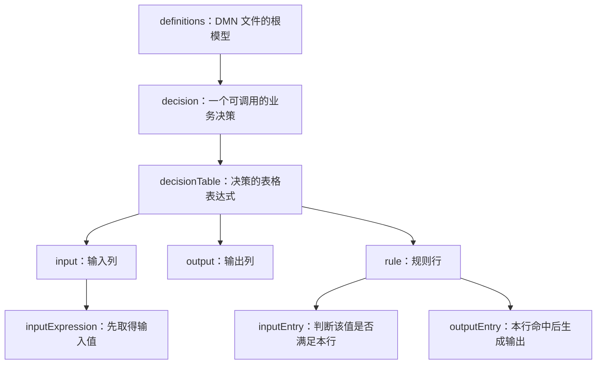

`definitions` 提供命名空间并容纳模型元素。`decision` 是部署和执行时可识别的决策单元。Flowable Open Source DMN 运行时的主要可执行表达形式是决策表；多个决策还可以通过决策依赖关系组织成决策服务，第 9 章会展开。

在订单示例中，`inputExpression` 的文本 `orderAmount` 表示从执行变量中取得订单金额。某行对应的 `inputEntry` 文本 `>= 1000` 表示对刚取得的值做比较。理解这两个阶段可以解释一个常见错误：把 `orderAmount >= 1000` 整段写进输入项，等于混淆了“取得哪个值”和“怎样判断这个值”。

### 3.2 决策键、名称、定义 ID 和部署 ID

| 标识 | 来源 | 生命周期 | 主要用途 |
| --- | --- | --- | --- |
| 决策键 | `decision.id` | 由建模者保持稳定 | Java、BPMN 和 REST 调用 |
| 决策名称 | `decision.name` | 可随展示需求修改 | 控制台和审阅展示 |
| 决策定义 ID | 引擎部署后生成 | 每个已部署版本不同 | 精确查询某个部署产物 |
| 部署 ID | 引擎部署后生成 | 每次部署不同 | 管理资源、删除部署、关联发布批次 |
| 版本号 | 引擎按键和租户递增 | 每次新部署增长 | 识别相同决策键的演进版本 |

应用配置中应保存稳定的决策键，不应保存显示名称。日志和审计事件则适合同时记录决策键、定义 ID、版本、部署 ID 和租户 ID，这样才能回答“这次订单究竟执行了哪一版规则”。

### 3.3 一行规则如何被计算

以 `customerLevel=VIP`、`orderAmount=1200` 为例，执行过程可拆成以下状态变化：

1\. 引擎按键 `orderDiscount` 找到当前执行上下文对应的已部署决策。
2\. 输入表达式从变量 Map 中得到字符串 `VIP` 和数值 `1200`。
3\. 第一行分别计算 `VIP == 'VIP'` 与 `1200 >= 1000`，两个输入项都为真，因此该行命中。
4\. `FIRST` 策略允许引擎采用最先命中的规则，后续行即使也可能为真，也不改变结果。
5\. 三个输出表达式产生 `0.15`、`VIP_15` 和原因文本。
6\. `executeWithSingleResult()` 将这一行的输出整理成 `Map<String, Object>`。

同一行的多个输入列通常是“并且”关系：每个输入项都成立，该行才命中。跨行如何组合由命中策略决定，不能把“多列与关系”和“多行命中策略”混为一件事。

### 3.4 决策表适合与不适合的业务

决策表通常适合以下特征同时较强的场景：输入和输出可以清晰定义；规则主要是条件匹配；业务希望表格化审阅；规则需要独立测试和版本治理；一次执行应在较短时间内完成。

| 场景 | 适合度 | 判断依据 |
| --- | --- | --- |
| 订单优惠、风控分级、材料清单 | 高 | 条件与结果能够组成有限决策矩阵 |
| 审批流程下一步走向 | 中 | 可由 DMN 计算路由结果，再由 BPMN 编排流程 |
| 大量事实持续推导新事实 | 低 | 更接近前向链式推理和事实工作内存 |
| 跨数小时等待人工操作 | 低 | 等待、定时器和任务生命周期属于流程引擎职责 |
| 复杂金额结算与会计分录 | 低到中 | 规则可选策略，但精确计算和账务一致性仍应由领域代码承担 |

### 3.5 DMN 与 Java 条件代码的职责划分

规则外置并不意味着所有 `if` 都要迁移到 DMN。稳定的技术分支、集合遍历、数据库事务、网络调用、权限检查和复杂算法放在 Java 中通常更清晰。跨产品、跨流程复用且变化频繁的业务决策更适合 DMN。

一个实用判断方法是询问：业务人员能否用输入列、输出列和有限规则行完整审阅这个判断？如果答案是否定的，强行表格化可能导致表达式藏入单元格，最终得到一张表面可视化、实际仍难维护的模型。

## 4 决策表语法与命中策略

### 4.1 输入表达式、输入项和输出项

Flowable 官方 8.0.0 测试模型展示了以下常用表达形式：

| 位置 | 示例 | 含义 |
| --- | --- | --- |
| 输入表达式 | `orderAmount` | 从变量上下文取得值 |
| 数值输入项 | `>= 1000` | 当前输入值至少为 1000 |
| 字符串输入项 | `== 'VIP'` | 当前输入值等于字符串 VIP |
| 否定输入项 | `!= 1` | 当前输入值不等于 1 |
| 字符串方法 | `.startsWith('VIP')` | 对当前字符串值调用方法 |
| 空输入项 | 空文本 | 该列不限制，本行视为通配 |
| 字符串输出项 | `'GOLD_8'` | 返回字符串常量 |
| 数值输出项 | `0.08` | 返回数值 |

Flowable 的表达式能力与其表达式管理器、Java 类型和扩展函数有关，不能默认等同于一个完整、可跨厂商移植的 FEEL（Friendly Enough Expression Language）实现。若组织要求 DMN 模型在不同厂商引擎之间迁移，应建立兼容性测试，并限制使用 Java 方法调用、自定义 Bean 和厂商扩展。

### 4.2 类型决定比较语义

`typeRef` 不只是模型文档。它帮助解析器和执行器理解输入输出类型。常见问题包括把字符串数字 `"1000"` 当成数值、把日期当作本地格式字符串、把缺失值和空字符串当成相同状态。

订单示例在进入引擎前把会员等级标准化为大写，避免 `vip`、`VIP ` 和 `VIP` 被当成不同值。生产接口还应明确以下状态：

1\. 字段未提供：通常表示调用方违反输入契约，适合在进入规则前拒绝。
2\. 字段显式为 `null`：只有模型确实定义了“未知”语义时才交给规则处理。
3\. 空字符串：通常需要标准化为空值或拒绝，不能默认为合法分类。
4\. 数值零：是一个真实数值，不应与未提供混同。
5\. 框架默认值：如果 DTO 使用 Java 基本类型，缺失的 JSON 数字可能被反序列化为零，容易掩盖调用方漏传字段；生产 DTO 可以使用包装类型配合校验注解。

### 4.3 七种命中策略的行为

命中策略回答的是“多条规则同时满足时，怎样形成结果”。选择错误会改变业务语义。

| 策略 | 多条规则能否命中 | 返回行为 | 适合场景 | 主要风险 |
| --- | --- | --- | --- | --- |
| `FIRST` | 可以 | 返回表中第一条命中 | 规则有明确优先顺序 | 调整行顺序会改变结果 |
| `UNIQUE` | 不允许 | 期望恰好零条或一条命中 | 区间互斥、分类唯一 | 规则重叠会在严格模式失败 |
| `ANY` | 可以 | 多条命中的输出必须相同 | 条件可以重叠但结论一致 | 输出有差异时模型无效 |
| `PRIORITY` | 可以 | 按输出值优先级取最高结果 | 风险等级、服务等级 | 需要维护输出优先级列表 |
| `OUTPUT ORDER` | 可以 | 按输出优先级返回全部命中 | 返回有业务等级顺序的候选项 | API 返回多结果，调用方需处理集合 |
| `RULE ORDER` | 可以 | 按规则行顺序返回全部命中 | 生成按表顺序排列的动作清单 | 行顺序成为业务契约 |
| `COLLECT` | 可以 | 返回全部结果或做聚合 | 累计分值、命中标签集合 | 聚合类型与输出列必须匹配 |

`COLLECT` 可带聚合符号：`+` 求和、`<` 取最小值、`>` 取最大值、`#` 计数。无聚合符号时返回命中结果列表。使用聚合前要确认 DMN 版本语义、空集合结果、重复值处理以及数值类型；这些边界要通过目标 Flowable 版本的测试固定，不能仅凭表格名称推断。

### 4.4 如何选择命中策略

优惠表示例选择 `FIRST`，因为“更高金额门槛优先”可以通过行顺序表达。若团队希望模型工具自动揭示重叠，则可以改造为互斥区间后使用 `UNIQUE`：

| 会员等级 | 金额条件 | 折扣率 |
| --- | --- | --- |
| VIP | `>= 1000` | 0.15 |
| VIP | `>= 500 and < 1000` 的等价可执行条件 | 0.10 |
| GOLD | `>= 500` | 0.08 |

在 Flowable 中，复杂区间表达式的具体语法应以当前模型编辑器生成的 XML 和版本测试为准。更稳妥的建模方式是增加边界列或在进入 DMN 前计算明确的金额区间枚举，减少单元格内的复合表达式。

选择策略时可以依次判断：

1\. 业务是否允许多个结论同时存在。若不允许，优先考虑 `UNIQUE`、`FIRST`、`ANY` 或 `PRIORITY`。
2\. 规则顺序是否具有业务含义。若有明确的覆盖优先级，`FIRST` 可以直接表达；若无，避免让表格行顺序暗中决定结果。
3\. 多个结论是否必须一致。重叠条件等价而输出相同，可以使用 `ANY`。
4\. 结论是否存在独立于规则顺序的优先等级。风险等级适合 `PRIORITY`。
5\. 是否需要全部命中或聚合。动作清单使用多结果策略，累计分值可以评估 `COLLECT`。

### 4.5 无命中的三种设计

无命中并不自动等同于错误。应根据业务语义选择：

| 设计 | 行为 | 适用情况 |
| --- | --- | --- |
| 兜底规则 | 总能返回明确默认值 | 默认结果是合法业务结论，例如不打折 |
| 返回空结果 | Java 单结果 API 得到 `null` 或多结果 API 得到空集合 | “暂无建议”本身是合法状态 |
| 视为异常 | 调用方或 BPMN 任务检测无命中并失败 | 每个输入必须被完整分类，例如合规结论 |

兜底规则应位于 `FIRST` 表的最后。对 `UNIQUE` 表增加无条件兜底行会与其他任何命中行重叠，从而违反唯一性约束；这时应把业务全集拆成互斥条件，或由调用方将空结果转换成明确错误。

### 4.6 规则顺序是一种隐式数据

在 `FIRST` 和 `RULE ORDER` 策略中，行位置参与业务语义。代码审查只比较单元格内容而忽略行移动，会漏掉实质性变更。规则发布系统应把以下变化都视为需要审批的模型差异：

1\. 新增、删除或修改输入输出列。
2\. 新增、删除、移动规则行。
3\. 修改命中策略或输出优先级。
4\. 修改决策键、类型、表达式或自定义函数。
5\. 修改兜底行为以及空值语义。

## 5 Flowable DMN Java API

### 5.1 引擎和四类服务

API 是 Application Programming Interface（应用程序编程接口）的缩写。

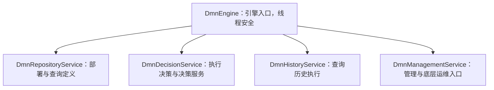

官方 API 说明 `DmnEngine` 及其服务对象可以被多个线程共享。Spring 应用通常直接注入服务 Bean，不需要在每次请求中创建引擎。`ExecuteDecisionBuilder` 保存本次执行参数，应按调用创建，不要作为单例字段在多个线程之间复用。

### 5.2 DmnDecisionService API 卡片

| 方法 | 返回值 | 适用场景 | 关键边界 |
| --- | --- | --- | --- |
| `createExecuteDecisionBuilder()` | `ExecuteDecisionBuilder` | 创建一次执行请求 | Builder 按调用使用 |
| `executeDecision()` | `List<Map<String,Object>>` | 单决策，可能多规则命中 | 调用方处理零到多条结果 |
| `executeDecisionWithSingleResult()` | `Map<String,Object>` | 单决策，期望最多一条结果 | 多条规则结果会抛 `FlowableException` |
| `executeDecisionWithAuditTrail()` | `DecisionExecutionAuditContainer` | 需要命中详情、失败信息或审计 | 不应把容器原样暴露给外部接口 |
| `executeDecisionService()` | `Map<String,List<Map<String,Object>>>` | 执行由多个决策组成的决策服务 | 外层键对应输出决策 |
| `executeWithSingleResult()` | `Map<String,Object>` | 让引擎按键识别决策或决策服务 | 多输出决策字段重名时后出现者覆盖 |

`ExecuteDecisionBuilder` 提供 `decisionKey`、`variables`、`tenantId`、`parentDeploymentId`、`fallbackToDefaultTenant`、`disableHistory` 等设置。`execute()` 在当前 API 中已经标记为废弃，应使用语义更明确的 `executeDecision()`。

### 5.3 单结果与多结果不是同一类型

假设 `RULE ORDER` 表命中两行：

```java
List<Map<String, Object>> results = dmnDecisionService
        .createExecuteDecisionBuilder()
        .decisionKey("eligibleBenefits")
        .variables(inputVariables)
        .executeDecision();
```

结果可能是：

```json
[
  {"benefitCode":"FREE_SHIPPING"},
  {"benefitCode":"PRIORITY_SUPPORT"}
]
```

如果对同一模型调用 `executeDecisionWithSingleResult()`，引擎发现多条规则结果时会抛出 `FlowableException`。这不是类型转换问题，而是调用方选择的结果契约与命中策略不一致。设计 DTO（Data Transfer Object，数据传输对象）时应先确定模型会产生一个结论还是结论集合，再选择 API。

### 5.4 审计容器适合解释“为什么”

```java
import org.flowable.dmn.api.DecisionExecutionAuditContainer;

DecisionExecutionAuditContainer audit = dmnDecisionService
        .createExecuteDecisionBuilder()
        .decisionKey("orderDiscount")
        .variables(inputVariables)
        .executeDecisionWithAuditTrail();

if (audit.isFailed()) {
    throw new IllegalStateException("Decision execution failed", audit.getException());
}
```

审计执行适合内部排障、规则测试和可解释性记录。审计对象可能含输入、输出、命中规则和异常上下文；在金融、医疗或人事场景中，这些内容可能是敏感数据。记录前应做字段白名单、脱敏和保留期设计，避免为了“可观测”把完整客户事实写入普通应用日志。

### 5.5 部署和查询定义

Spring Boot 自动部署适合应用随包发布规则。平台化场景也可以显式部署：

```java
import org.flowable.dmn.api.DmnDeployment;
import org.flowable.dmn.api.DmnRepositoryService;

DmnDeployment deployment = dmnRepositoryService.createDeployment()
        .name("discount-rules-2026-08")
        .tenantId("tenant-a")
        .addClasspathResource("dmn/order-discount.dmn")
        .deploy();
```

部署成功的判据应包括：返回部署 ID；按决策键和租户能查到新定义；版本号符合预期；一组冒烟输入得到预期结果。仅收到 HTTP 200 或没有异常，无法证明应用真正执行了新版本。

查询最新版本：

```java
var decision = dmnRepositoryService.createDecisionQuery()
        .decisionKey("orderDiscount")
        .decisionTenantId("tenant-a")
        .latestVersion()
        .singleResult();
```

显式部署属于外部状态变更。生产发布应由受认证、可审计的发布服务执行，而不是允许普通业务请求携带任意 DMN XML 直接部署。

### 5.6 使用 Flowable 内置 DMN REST API

REST 是 Representational State Transfer（表述性状态转移）的缩写。

需要让非 Java 调用方直接访问 Flowable DMN 时，可以把依赖替换或补充为 REST Starter：

```xml
<dependency>
    <groupId>org.flowable</groupId>
    <artifactId>flowable-spring-boot-starter-dmn-rest</artifactId>
    <version>${flowable.version}</version>
</dependency>
```

Flowable 8.0.0 默认把 DMN Servlet 映射到 `/dmn-api`。执行一个期望单结果的决策：

```bash
curl -X POST \
  'http://localhost:8080/dmn-api/dmn-rule/execute-decision/single-result' \
  -H 'Content-Type: application/json' \
  -d '{
    "decisionKey": "orderDiscount",
    "inputVariables": [
      {"name": "customerLevel", "type": "string", "value": "VIP"},
      {"name": "orderAmount", "type": "double", "value": 1200}
    ]
  }'
```

成功时接口返回 HTTP 201，`resultVariables` 是带 `name`、`type` 和 `value` 的变量数组。通用 REST 契约还支持 `tenantId`、`parentDeploymentId` 和 `disableHistory`。多结果决策应调用 `/dmn-rule/execute-decision`，决策服务则使用 `/dmn-rule/execute-decision-service` 或其 `/single-result` 变体。

内置 REST 适合受控集成和管理入口，业务对外接口通常仍应使用第 2.7 节的领域 Controller：它可以执行身份与业务权限校验、使用稳定 DTO、隐藏 Flowable 变量格式并验证输出值域。生产部署内置 REST 时，要显式配置认证、授权、租户解析、请求大小和速率限制，不能把模型部署与决策执行端点匿名暴露到公网。

### 5.7 独立引擎与 Spring 管理引擎

非 Spring 程序可以通过 `DmnEngines.getDefaultDmnEngine()` 读取类路径下的 `flowable.dmn.cfg.xml` 并创建默认引擎。Spring Boot 应用已经通过自动配置管理引擎、数据源和生命周期，再手工调用默认引擎工厂可能创建第二套配置，导致连接池、事务和部署状态不一致。

| 环境 | 推荐入口 | 原因 |
| --- | --- | --- |
| Spring Boot | 注入 `DmnDecisionService` 等 Bean | 复用自动配置的数据源和事务 |
| 传统 Spring | `SpringDmnEngineConfiguration` 与工厂 Bean | 纳入 Spring 生命周期 |
| 无容器 Java | `DmnEngineConfiguration` 或 `DmnEngines` | 显式管理创建与关闭 |
| 单元测试扩展 | JUnit 5 的 `@FlowableDmnTest` | 测试前部署、测试后清理 |

## 6 Spring Boot 自动配置的运行机制

### 6.1 从依赖到服务 Bean 的链路

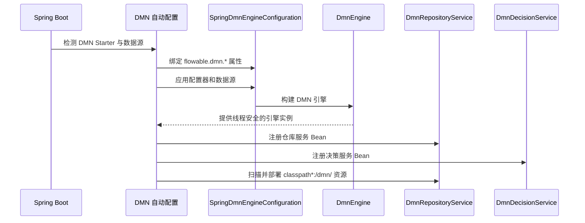

入口是 DMN Starter 和自动配置条件。`FlowableDmnProperties` 绑定前缀 `flowable.dmn`；默认资源目录为 `classpath*:/dmn/`，默认后缀包含 `.dmn`、`.dmn.xml`、`.dmn11` 和 `.dmn11.xml`，默认启用资源部署、历史和严格模式。

如果应用中已有流程引擎或 App 引擎，DMN 引擎可能作为其配置器的一部分初始化，自动配置再从已初始化引擎中暴露 DMN 服务。如果没有流程或 App 引擎，则创建独立 DMN 引擎。这解释了为什么同一套 `DmnDecisionService` 既可以单独使用，也可以被 BPMN 任务调用。

### 6.2 常用配置项的语义

| 配置键 | 8.0.0 默认值 | 作用 | 生产判断 |
| --- | --- | --- | --- |
| `flowable.dmn.enabled` | `true` | 是否启动 DMN 引擎 | 不使用时可关闭，减少表与 Bean 初始化 |
| `flowable.dmn.deploy-resources` | `true` | 是否部署扫描到的资源 | 规则由外部发布平台管理时可关闭 |
| `flowable.dmn.resource-location` | `classpath*:/dmn/` | 自动扫描根路径 | 多模块工程需验证最终产物路径 |
| `flowable.dmn.resource-suffixes` | 四类 DMN 后缀 | 资源匹配模式 | 统一组织后可缩小扫描范围 |
| `flowable.dmn.deployment-name` | `SpringBootAutoDeployment` | 自动部署名称 | 可改为可识别的应用发布名 |
| `flowable.dmn.history-enabled` | `true` | 是否持久化 DMN 历史 | 根据审计价值、隐私和容量决定 |
| `flowable.dmn.enable-safe-xml` | `true` | 启用更安全的 XML 解析检查 | 除非平台确实不兼容，不应关闭 |
| `flowable.dmn.strict-mode` | `true` | 严格验证命中策略 | 生产通常保持开启 |

配置文件中的“未提供”和“显式设置为 `false`”不同。未提供时采用框架默认值；显式关闭 `deploy-resources` 后，即使 DMN 文件位于默认目录，也不会由应用自动发布。

### 6.3 自动部署为什么会“不生效”

自动部署实际读取的是运行类路径资源。排查时按调用链逐层确认：

1\. 依赖层：`flowable-spring-boot-starter-dmn` 是否出现在依赖树，版本是否统一。
2\. 条件层：`flowable.dmn.enabled` 是否为真，数据源 Bean 是否成功创建。
3\. 资源层：执行 `jar tf target/*.jar` 后能否看到 `BOOT-INF/classes/dmn/*.dmn`。
4\. 配置层：`resource-location` 和 `resource-suffixes` 是否与实际路径匹配。
5\. 部署层：`DmnRepositoryService` 能否按键查到定义，版本和租户是否正确。
6\. 执行层：Java 与 BPMN 使用的决策键是否与 `decision.id` 完全一致。

多模块项目中，资源可能位于另一个 JAR（Java Archive，Java 归档文件）。默认路径使用 `classpath*:`，可以跨类路径位置扫描，但构建插件的资源过滤、打包排除规则和重复文件名仍可能改变最终制品，应以构建产物检查为准。

### 6.4 自定义配置的边界

Flowable 支持通过引擎配置器扩展表达式函数、历史、缓存和其他行为。生产中更推荐先在 Java 层计算稳定、可测试的派生事实，例如把客户年龄转换为 `ageBand`，再把简单值交给 DMN。这样决策表更容易审阅，也减少模型对 Spring Bean、数据库和外部服务的隐式依赖。

若确实需要自定义函数，应满足以下约束：函数是确定性的；相同输入得到相同输出；不在函数内执行远程调用或修改数据库；函数版本与 DMN 发布版本兼容；模型部署前能做编译和执行测试；函数异常有清晰的失败语义。

## 7 设计可维护的规则输入输出契约

### 7.1 先定义事实，再画规则表

DMN 执行变量是一个 Map，但 Map 不等于没有契约。建议为每个决策维护输入输出字典：

| 字段 | 方向 | 类型 | 是否必填 | 示例 | 语义 |
| --- | --- | --- | --- | --- | --- |
| `customerLevel` | 输入 | string | 是 | `VIP` | 已标准化的会员等级代码 |
| `orderAmount` | 输入 | double（教程） | 是 | `1200.0` | 本次订单参与规则判断的金额 |
| `discountRate` | 输出 | double | 是 | `0.15` | 0 到 1 之间的折扣减免比例 |
| `promotionCode` | 输出 | string | 是 | `VIP_15` | 下游识别策略的稳定代码 |
| `reason` | 输出 | string | 是 | `VIP order...` | 面向审计的说明，不作为程序分支键 |

`promotionCode` 是机器可读代码，`reason` 是可读说明。下游程序不应根据说明文本做分支，因为文案调整会意外改变程序行为。

### 7.2 使用领域枚举降低拼写风险

```java
public enum CustomerLevel {
    VIP,
    GOLD,
    NORMAL
}

public record DiscountFacts(
        CustomerLevel customerLevel,
        long orderAmountInCents
) {
}
```

领域层可以使用枚举和分为单位的整数，再在 DMN 适配器中转换成引擎已验证的变量类型。适配器集中完成命名、精度、时区、缺失值和枚举兼容处理，避免多个调用方各自构造 Map。

### 7.3 防止输出污染业务变量

DMN 输出名可能直接成为流程变量或被 Java 映射到 DTO。输出名过于通用，例如 `status`、`result`、`type`，容易与流程中已有变量冲突。可以采用领域前缀或封装结果：

```java
public record DiscountDecisionOutput(
        double rate,
        String promotionCode,
        String reason,
        String decisionDefinitionId,
        int decisionVersion
) {
}
```

对外 API 返回领域 DTO，内部审计再附加决策定义元数据。这样 Flowable 的 Map 和审计对象不会扩散到控制器、消息协议或数据库实体中，未来更换规则实现时改动集中在适配层。

### 7.4 时间、金额和时区

时间规则应先确定使用事件发生时间、请求接收时间还是规则执行时间。分布式系统中直接在表达式里读取“当前时间”，会导致重试和回放得出不同结果。更可控的做法是把 `evaluationTime` 作为显式输入并采用 UTC（Coordinated Universal Time，协调世界时）或明确业务时区。

金额规则要统一币种和精度。若表中阈值是 1000 元，而调用方传入 1000 美分，规则仍可能正常执行并返回错误业务结论。输入契约应包含币种、单位和舍入规则，并在 DMN 前完成币种换算或拒绝混合币种。

### 7.5 决策结果的成功判据

一个规则调用成功至少包含四层含义：

1\. 技术执行成功：没有解析、表达式或数据库异常。
2\. 模型执行成功：命中策略约束没有被违反。
3\. 业务覆盖成功：按业务约定命中规则或得到合法的无命中状态。
4\. 输出契约成功：必填字段存在、类型正确、值域合法。

Java 适配层应验证输出值域。例如 `discountRate` 应位于 0 到 1 之间，`promotionCode` 应属于当前支持集合。规则文件可以被独立修改，调用方不能把“引擎返回了 Map”当成结果必然可用。

## 8 BPMN 流程如何调用 DMN 决策

### 8.1 流程编排与规则决策的协作关系

审批流程经常需要根据金额和风险决定审批层级。BPMN 负责“先申请、再决策、然后进入不同审批任务”，DMN 负责“根据事实算出审批策略”。

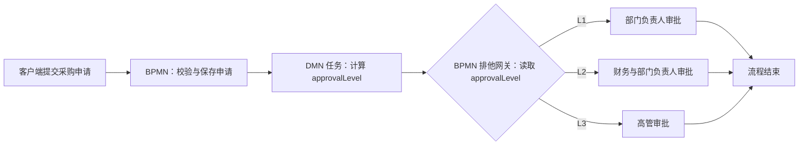

图中 DMN 输出的是稳定策略代码 `L1`、`L2` 或 `L3`。BPMN 网关根据代码选择路径。这样，审批阈值变化只修改 DMN；增加一个全新的审批阶段仍然需要修改 BPMN，因为流程结构发生了变化。

### 8.2 在 BPMN 中声明 DMN 服务任务

Flowable BPMN 可通过类型为 `dmn` 的服务任务调用决策。下面展示核心片段，完整 BPMN 还需要流程根元素、顺序流和命名空间：

```xml
<serviceTask id="calculateApprovalLevel"
             name="Calculate approval level"
             flowable:type="dmn">
    <extensionElements>
        <flowable:field name="decisionTableReferenceKey">
            <flowable:string>purchaseApproval</flowable:string>
        </flowable:field>
        <flowable:field name="decisionTaskThrowErrorOnNoHits">
            <flowable:string>true</flowable:string>
        </flowable:field>
        <flowable:field name="sameDeployment">
            <flowable:string>true</flowable:string>
        </flowable:field>
    </extensionElements>
</serviceTask>
```

`decisionTableReferenceKey` 是必填字段，值可以是字符串或解析为字符串的表达式。Flowable 在执行时把当前流程变量传给 DMN。引用键为空、表达式结果不是字符串或找不到匹配决策时，任务执行失败。

`decisionTaskThrowErrorOnNoHits=true` 表示没有任何规则命中时抛出异常。该设置适合每个申请都必须得到审批等级的模型；如果无命中代表“不需要审批”，更合适的设计是由 DMN 明确返回 `NONE`，而不是依赖空结果。

### 8.3 同部署绑定保证流程与规则配套

当 BPMN 和 DMN 资源一起部署时，`sameDeployment=true` 让流程任务通过父部署 ID 查找同一发布批次中的决策。Flowable 8 的执行实现还保留了兼容行为：没有显式设置 `sameDeployment` 时，也会应用流程定义的部署 ID。

这一机制解决了滚动升级中的版本错配。假设流程 V1 只理解 `L1` 和 `L2`，DMN V2 新增 `L3`。如果运行中的流程 V1 总是查询全局最新 DMN，旧流程可能收到无法处理的结果；把 BPMN 与 DMN 放在同一部署中，可以让每个流程定义版本执行与它一同验证的规则版本。

若组织希望所有流程立即切换到中心规则版本，可以显式关闭同部署约束，但需要为输出向后兼容、灰度和回滚承担额外治理成本。

### 8.4 单命中与多命中结果如何写入流程变量

Flowable 8 的 `DmnActivityBehavior` 对结果有两种默认映射：

| DMN 结果形态 | 默认流程变量行为 |
| --- | --- |
| 单条规则结果 | 每个输出字段按输出名写为独立流程变量 |
| 多条规则结果 | 把结果转换为 JSON 数组，写入名称等于决策键的流程变量 |

如果 `purchaseApproval` 单命中输出 `approvalLevel=L2`，流程中可以直接读取 `${approvalLevel == 'L2'}`。如果 `eligibleBenefits` 采用 `RULE ORDER` 并命中多行，则结果通常作为名为 `eligibleBenefits` 的 JSON 数组保存，而不是反复覆盖 `benefitCode`。

流程引擎配置还可以通过自定义决策表变量管理器改变映射。引入自定义映射后，应在集成测试中固定变量名称、类型和局部/全局作用域，避免流程模型依赖未文档化的实现细节。

### 8.5 同步执行、事务与失败传播

默认 DMN 任务在流程命令中同步执行。正常调用链如下：

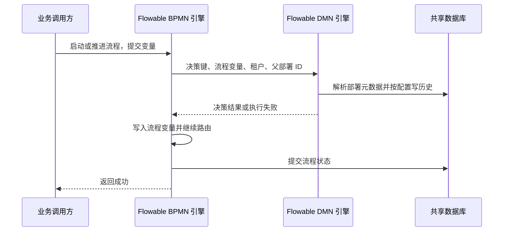

在同一事务管理配置下，DMN 表达式失败会使当前流程命令失败，流程变量和后续状态不会作为一次完整成功提交。若 BPMN 任务配置了异步边界，失败可能转为作业重试和死信处理，调用方观察到的是流程已接收而非最终决策已成功。上线前应同时测试同步异常和异步重试路径。

### 8.6 变量冲突与敏感数据边界

BPMN 调用会把流程变量传给 DMN，模型表达式理论上能够访问其中多个值。生产中可以通过显式输入适配和命名约定减少意外耦合：

1\. 为决策建立文档化输入白名单，不让模型任意依赖流程中的临时变量。
2\. 输出使用领域化名称，避免覆盖流程已有的 `status`、`result` 或 `approved`。
3\. 对密码、令牌、原始证件号等敏感变量避免进入规则上下文。
4\. 更新 DMN 后运行流程级集成测试，而不只运行独立决策测试。

## 9 决策依赖、决策服务与系统架构

### 9.1 为什么要拆分多个决策

一张几十列、数百行的决策表很难审阅。可以把复杂判断拆为若干职责单一的决策，例如先计算客户风险，再计算授信额度，最后计算审批路径。DMN 的 DRD（Decision Requirements Diagram，决策需求图）用于表达决策、输入数据和依赖关系；决策服务暴露其中一组输出决策供应用调用。

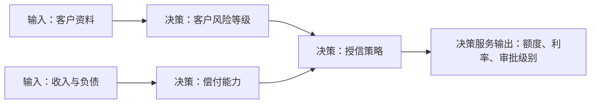

这里的箭头表示数据依赖，不表示长时间运行的流程顺序。所有决策仍然是一次同步业务判断。需要人工补件、等待征信回调或定时复核时，应由 BPMN 或业务编排层管理生命周期。

### 9.2 执行决策服务

```java
Map<String, List<Map<String, Object>>> resultByDecision = dmnDecisionService
        .createExecuteDecisionBuilder()
        .decisionKey("creditDecisionService")
        .variables(creditFacts)
        .executeDecisionService();
```

返回值的外层键对应输出决策，内层列表容纳该决策的一条或多条规则结果。若使用 `executeDecisionServiceWithSingleResult()` 把结果压平成一个 Map，不同输出决策使用同名字段时，API 契约规定后出现的值会保留。为了避免静默覆盖，决策服务的输出名应全局唯一，或由调用方保留分层结果结构。

### 9.3 决策拆分的粒度

拆分能提高复用和可测试性，也会增加依赖图和版本兼容成本。可以用以下信号判断边界：

| 信号 | 更适合独立决策 | 更适合同表规则 |
| --- | --- | --- |
| 输入来源 | 来源和生命周期不同 | 使用同一组事实 |
| 变化频率 | 由不同团队独立演进 | 总是同步修改 |
| 复用范围 | 多个流程或产品复用 | 仅当前决策内部使用 |
| 输出语义 | 可形成稳定领域概念 | 只是当前行的中间值 |
| 测试方式 | 可以独立给出输入输出样例 | 拆开后难以解释业务 |

决策依赖应保持无环。若 A 依赖 B、B 又依赖 A，说明领域概念没有形成可计算的方向，通常需要引入明确输入事实或重新定义中间结果。

### 9.4 嵌入式部署架构

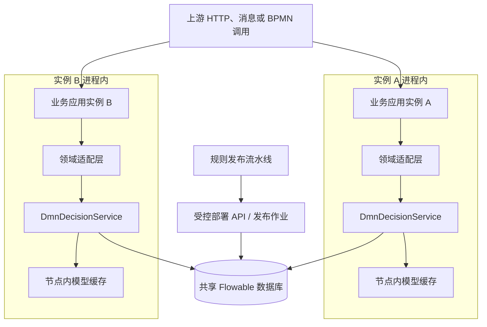

嵌入式模式中，DMN 引擎与业务应用处于同一 Java 进程，调用没有网络跳转，事务集成自然。各节点共享部署和历史数据库，模型缓存通常位于各自进程内，因此发布后要验证所有节点如何感知新版本。数据库或发布流程故障是共享故障边界，单个应用节点故障只影响路由到该节点的请求。

这张图省略了数据库副本、连接池、服务发现和负载均衡，只展示规则执行相关组件。生产环境的数据库高可用方式由所选数据库决定，Flowable DMN 本身不提供数据库复制协议。

### 9.5 独立规则服务架构

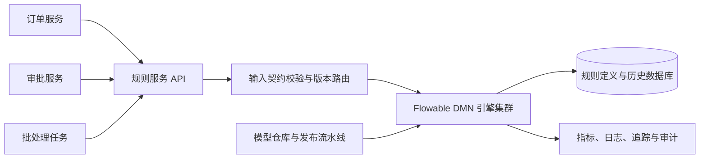

独立服务便于集中治理、多语言调用和统一审计，但会引入网络延迟、超时、重试、鉴权、容量和服务可用性问题。规则服务返回成功前是否写入历史、调用方超时后是否可能已经执行、重试是否会重复产生审计记录，都要明确。

纯决策计算通常没有业务副作用，所以重复计算可保持相同结果；历史记录、计量和发布状态仍可能产生额外写入。应用协议可以携带请求 ID 用于追踪和去重统计，但不应把规则执行包装成会修改业务事实的远程命令。

### 9.6 选择嵌入式还是独立服务

| 维度 | 嵌入式 DMN | 独立规则服务 |
| --- | --- | --- |
| 调用延迟 | 低，无网络跳转 | 包含序列化与网络延迟 |
| 事务 | 易与流程或业务事务集成 | 跨服务事务需要重新设计 |
| 版本控制 | 可随应用发布并同部署绑定 | 可独立发布和集中路由 |
| 多语言复用 | 需每个 Java 应用接入 | 通过 API 复用 |
| 故障域 | 与业务应用相同 | 独立扩缩容，也新增依赖故障 |
| 治理 | 分散在各应用 | 易统一权限、审计和指标 |

同一组织可以同时使用两种模式。与 BPMN 强绑定、延迟敏感的决策适合嵌入；跨多个系统复用、需要统一审批的规则适合服务化。选择依据应是调用和治理需求，而不是“规则引擎是否高级”。

## 10 部署、版本、多租户与回滚

### 10.1 从模型文件到可执行版本


规则文件是可执行业务资产，应像代码一样进入版本库。模型编辑器负责可视化并不等于模型已经正确；每次发布仍要经过格式校验、边界测试、审批、制品签名或校验和、部署验证和可回滚准备。

### 10.2 部署如何形成新版本

相同决策键和租户的模型再次部署时，引擎保存新的定义版本，而不是原地覆盖旧行。直接按决策键执行通常选择适用上下文中的最新版本；BPMN 同部署绑定可以限定到流程部署所关联的决策。

删除旧部署会影响历史追溯和仍在运行的流程，不适合作为日常“清理版本”手段。版本保留策略应同时考虑：运行中的流程引用；历史审计查询；法规保留期；数据库容量；模型资源是否在外部制品库中有不可变备份。

### 10.3 回滚不是修改版本号

一种安全的回滚方式是把已经验证的旧模型内容重新发布为一个更高的新版本。例如 V5 有缺陷，则以 V4 内容发布 V6，并记录 V6 是对 V5 的回滚。这样引擎的版本序列保持单调，审计记录也能解释生产时间线。

回滚前要判断影响范围：

1\. 新版本是否只影响未来调用，还是已经改变了持久化业务状态。
2\. 运行中的 BPMN 是否与同部署 DMN 绑定，因而根本没有使用全局新版本。
3\. 输出契约是否在新旧版本间变化，调用方能否处理回滚输出。
4\. 是否需要对 V5 已执行记录进行补偿、重算或人工复核。

规则计算通常可以重放，但已经根据结果完成的付款、拒绝、通知等副作用不能靠重新执行 DMN 自动撤销。

### 10.4 多租户决策解析

`ExecuteDecisionBuilder.tenantId()` 指定租户上下文。`fallbackToDefaultTenant()` 允许租户专属决策不存在时回退到默认租户决策。典型策略是：默认租户维护公共基线，少数租户部署覆盖版本。

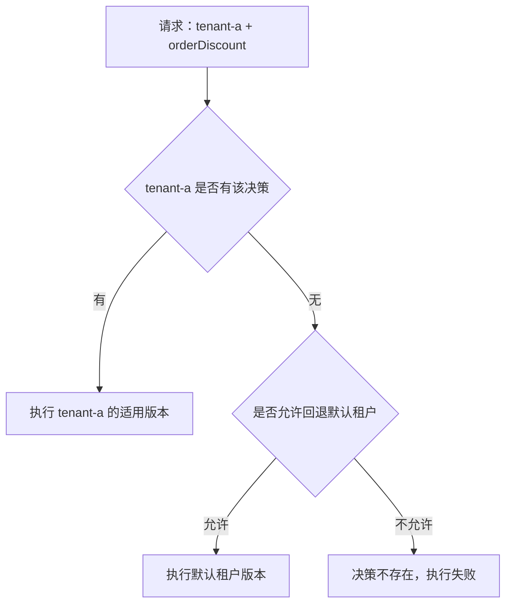

租户 ID 属于安全边界。不能直接信任外部请求头并传入 Builder；应由认证身份、网关或服务端租户上下文解析。启用默认租户回退前还要评估公共规则是否对所有租户合法，避免“缺少租户配置”被静默解释为“使用公共规则”。

### 10.5 发布并发与数据库结构升级

多个应用实例同时启动自动部署时，可能并发检查资源和数据库结构。生产部署可以考虑由单独发布作业管理 DMN，业务实例设置 `deploy-resources=false`；或者保证所有实例携带完全相同的不可变资源，并验证 Flowable 的重复部署行为满足预期。

数据库升级前应备份并在预生产环境执行官方迁移脚本。应用账号和迁移账号分离后，业务实例所需权限可以限制为读写运行表，无需修改表结构。遇到 `ACT_DMN_DATABASECHANGELOGLOCK` 相关启动问题时，先确认是否确有迁移进程运行以及它的状态，不能在未知情况下直接删除锁记录。

## 11 用测试证明规则正确，而不只是可执行

### 11.1 测试金字塔

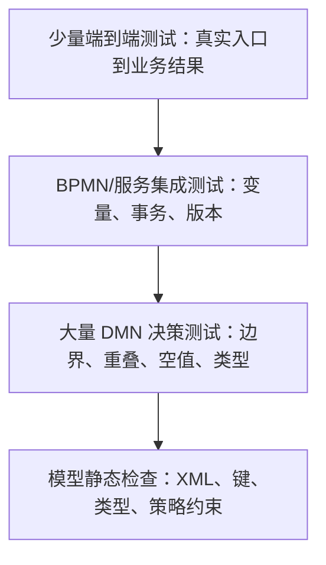

决策测试运行快，适合覆盖大量输入组合；集成测试证明资源部署、Spring 配置和变量映射；端到端测试证明真正的业务入口、权限、持久化和下游行为。只做端到端测试会定位困难，只做决策测试又无法发现装配问题。

### 11.2 用边界值构造测试矩阵

订单优惠的关键边界不是随机金额，而是阈值前后：

| 会员等级 | 金额 | 预期折扣 | 验证目的 |
| --- | ---: | ---: | --- |
| VIP | 499.99 | 0.00 | 低于第一有效阈值 |
| VIP | 500.00 | 0.10 | 下边界包含 500 |
| VIP | 999.99 | 0.10 | 高阈值之前仍用 10% |
| VIP | 1000.00 | 0.15 | 高阈值边界 |
| VIP | 1200.00 | 0.15 | 两条规则重叠时 FIRST 取前行 |
| GOLD | 500.00 | 0.08 | 另一等级的边界 |
| NORMAL | 5000.00 | 0.00 | 高金额不会越过等级条件 |

若金额使用 `double`，还应测试从 JSON 到 Java 再到 DMN 的类型和精度。生产改为分或 `BigDecimal` 后，重新定义边界样例，不能沿用模糊的浮点相等假设。

### 11.3 测试无命中和命中策略违规

正常样例无法发现所有模型问题。每张表还应覆盖：

1\. 无规则命中时，返回空、默认结果还是失败。
2\. `UNIQUE` 表构造一个可能同时命中两行的输入，确认严格模式拒绝模型错误。
3\. `ANY` 表让两条命中输出不同，确认不会静默选取任一结果。
4\. `FIRST` 表构造重叠输入，证明行顺序与预期一致。
5\. 多结果表分别测试零条、一条和多条返回，确认 API 与 DTO 映射。
6\. 缺失变量、显式空值、空字符串、零值和错误类型各自得到明确结果。

### 11.4 JUnit 5 的独立 DMN 测试扩展

Flowable 8 已移除 JUnit 3 和 JUnit 4 测试支持，使用 JUnit 5（Jupiter）。独立引擎测试可以使用 `@FlowableDmnTest` 与 `@DmnDeployment`：

```java
import static org.assertj.core.api.Assertions.assertThat;

import java.util.Map;

import org.flowable.dmn.api.DmnDecisionService;
import org.flowable.dmn.engine.test.DmnDeployment;
import org.flowable.dmn.engine.test.FlowableDmnTest;
import org.junit.jupiter.api.Test;

@FlowableDmnTest
class OrderDiscountDmnTest {

    @Test
    @DmnDeployment(resources = "dmn/order-discount.dmn")
    void shouldChooseFirstVipRule(DmnDecisionService decisionService) {
        Map<String, Object> result = decisionService
                .createExecuteDecisionBuilder()
                .decisionKey("orderDiscount")
                .variable("customerLevel", "VIP")
                .variable("orderAmount", 1200D)
                .executeDecisionWithSingleResult();

        assertThat(result).containsEntry("discountRate", 0.15D);
    }
}
```

该扩展默认读取测试类路径中的 `flowable.dmn.cfg.xml`。将下面配置保存到 `src/test/resources/flowable.dmn.cfg.xml`：

```xml
<?xml version="1.0" encoding="UTF-8"?>
<beans xmlns="http://www.springframework.org/schema/beans"
       xmlns:xsi="http://www.w3.org/2001/XMLSchema-instance"
       xsi:schemaLocation="http://www.springframework.org/schema/beans
                           https://www.springframework.org/schema/beans/spring-beans.xsd">
    <bean id="dmnEngineConfiguration"
          class="org.flowable.dmn.engine.impl.cfg.StandaloneInMemDmnEngineConfiguration">
        <property name="databaseSchemaUpdate" value="true"/>
    </bean>
</beans>
```

`StandaloneInMemDmnEngineConfiguration` 使用内存数据库完成独立引擎测试，`@DmnDeployment` 在测试前部署模型并在测试后级联清理部署。Spring Boot Starter 已传递引入 `flowable-dmn-engine`；若测试模块没有使用 Starter，应显式添加与生产版本一致的 DMN 引擎和 H2 测试依赖。团队也可以统一采用第 2.8 节的 `@SpringBootTest`，用更高启动成本换取完整自动配置验证。

### 11.5 规则覆盖率怎样定义

代码行覆盖率不适合直接衡量决策表。更有意义的规则覆盖指标包括：

| 指标 | 含义 | 发现的问题 |
| --- | --- | --- |
| 规则行覆盖 | 每条规则至少被一个测试命中 | 永远无法命中的死规则 |
| 边界覆盖 | 每个阈值的前、等于、后都有样例 | `<` 与 `<=` 错误 |
| 冲突覆盖 | 对可能重叠的规则构造样例 | 命中策略或行顺序错误 |
| 空值覆盖 | 每个可空输入的语义有样例 | 缺失值被意外默认为零或空串 |
| 输出值域覆盖 | 每种输出代码至少出现一次 | 下游未处理新枚举 |

审计执行能够帮助收集命中规则信息，但测试报告应以稳定规则 ID 聚合，而不是依赖易变的行号。规则移动后行号会变化，规则 ID 可以继续追踪同一业务规则。

### 11.6 影子执行与差异比较

高风险规则可以在正式切换前进行影子执行：线上请求仍采用旧版本结果，同时把相同的、已脱敏的事实交给候选版本计算；候选结果不驱动业务副作用，只记录差异。

差异分析至少区分：预期规则变化；模型缺陷；输入契约变化；数值或时间精度差异；旧版本本身的历史问题。只有差异率低并不代表新模型正确，关键业务区间即使只有极少流量也应由固定样例覆盖。

## 12 生产治理：性能、可靠性、安全与可观测性

### 12.1 一次生产执行的端到端边界

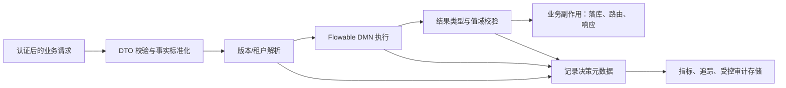

规则引擎位于业务输入与副作用之间。它的输出在触发付款、拒绝、审批或通知前还要经过领域校验。可观测数据应覆盖版本解析、执行耗时、结果校验和失败阶段，才能区分规则错误、平台错误与上游数据错误。

### 12.2 性能影响来自哪里

DMN 决策表是同步计算，性能通常受以下因素影响：规则行和列数量；表达式复杂度；对象图访问；自定义函数；模型解析与缓存；历史持久化；数据库连接；日志和审计序列化。

优化顺序可以遵循证据：

1\. 先在接近生产的模型规模、数据类型和并发量下测量端到端延迟分位数。
2\. 分离输入标准化、模型查找、表达式计算、历史写入和下游处理的耗时。
3\. 删除单元格中的远程调用和数据库查询，使决策保持内存内、确定性计算。
4\. 对超大表分析是否能按领域拆分或预计算分类事实，而不是立即增加缓存。
5\. 调整历史级别或采样前先确认审计法规和排障需求。

不要根据“规则只有几十行”直接断言延迟可忽略。复杂 Bean 方法、JSON 对象遍历和同步历史写入可能比规则行数更影响性能。

### 12.3 并发与线程安全

`DmnEngine` 和服务对象设计为可共享，Spring 单例注入是正常用法。每次执行的变量 Map、Builder、DTO 和审计容器属于请求上下文，不应跨线程复用或在调用后继续修改。

自定义表达式 Bean 若是 Spring 单例，需要自身线程安全。以下状态会产生并发风险：可变成员变量保存当前客户；非线程安全日期格式化器；复用并修改共享集合；用静态字段记录上一次结果。更稳妥的自定义函数是无状态纯函数，所有输入通过参数传入。

### 12.4 数据库与历史容量

Flowable DMN 使用 `ACT_DMN_` 前缀的表保存数据库变更记录、部署、模型资源、决策定义和历史执行。具体表名和字段可能随版本演进，运维脚本应采用目标版本官方建表与迁移文件，不应根据旧博客手写表结构。

启用历史后，每次决策可能产生历史执行数据。容量评估需要请求量、单条历史大小、保留天数、索引、备份和清理峰值。清理任务应先按业务和法规确定保留策略，再用 Flowable API 或版本匹配的维护方式删除；直接跨表删除可能破坏关联与审计完整性。

### 12.5 可观测字段与指标

一次规则调用建议记录以下低基数字段：

| 类别 | 字段或指标 | 作用 |
| --- | --- | --- |
| 定位 | 决策键、定义 ID、版本、部署 ID、租户 ID | 精确还原执行模型 |
| 请求 | 业务请求 ID、流程实例 ID、活动 ID | 关联上下游链路 |
| 结果 | 成功、无命中、命中策略失败、输出校验失败 | 区分业务与技术状态 |
| 性能 | 总耗时、引擎执行耗时、历史写入耗时 | 定位瓶颈 |
| 质量 | 各规则命中计数、兜底率、结果分布 | 发现死规则和输入漂移 |

不要把完整输入 Map 作为指标标签。客户 ID、订单 ID 和自由文本会造成高基数，拖垮时序数据库。敏感输入应在受控审计存储中按字段策略处理，普通日志只保留哈希、分桶值或经过批准的非敏感代码。

### 12.6 规则安全边界

DMN XML 和表达式具有可执行性质。允许不受信任的用户上传模型，可能造成敏感 Bean 访问、资源消耗、数据暴露或恶意表达式执行。生产平台应建立以下控制：

1\. 发布接口进行身份认证、角色授权和租户隔离。
2\. 模型进入运行环境前完成 XML 安全解析、大小限制、元素与表达式白名单校验。
3\. 保持 `flowable.dmn.enable-safe-xml=true`，除非已确认特定平台兼容问题并有替代防护。
4\. 自定义 Bean 和函数只暴露最小能力，不提供任意文件、网络、反射或数据库访问入口。
5\. 规则制品使用不可变版本、校验和与审批记录，运行节点只接收已签名或可信流水线产物。
6\. 对执行设置服务级超时、并发限制和模型复杂度阈值，防止异常模型耗尽线程与内存。

### 12.7 外部依赖和失败策略

规则表达式中调用远程服务会破坏确定性：相同输入可能因网络、远端数据或时间得到不同结果；重试可能重复调用；延迟和失败难以从规则表中看出。更合适的路径是由业务层先获取外部事实，再把事实快照作为 DMN 输入，并在审计中记录事实版本或时间。

当规则服务不可用时，系统需要按业务风险选择失败策略：

| 策略 | 行为 | 适用条件 | 风险 |
| --- | --- | --- | --- |
| 失败关闭 | 拒绝继续业务 | 合规、授信、支付等高风险决策 | 降低可用性 |
| 使用最近已验证版本 | 本地或缓存执行旧模型 | 模型与数据均可安全缓存 | 可能执行过时政策 |
| 人工复核 | 创建待处理任务 | 请求量可控且允许延迟 | 增加运营成本 |
| 安全默认值 | 返回最保守结论 | 默认结论经过业务批准 | 可能造成大量误拒绝 |

失败开放，即在规则不可用时直接允许业务通过，通常只适合低风险推荐类功能。选择必须由业务风险和法规决定，并通过故障演练验证。

### 12.8 灰度、回滚与审计闭环

生产发布可以按租户、用户稳定哈希或业务渠道灰度到候选规则。灰度路由本身也是业务配置，应记录“为什么这个请求选择了某版本”。灰度期间比较结果分布、兜底率、异常率和关键业务指标，发现异常后停止扩大流量并回滚为已验证模型。

每次上线应能从业务结果追溯到规则版本，也能从规则版本查询受影响的业务请求。前者支持解释单次决策，后者支持缺陷版本的影响面评估与补偿。

## 13 故障排查：从现象回到执行链路

### 13.1 排查总路径

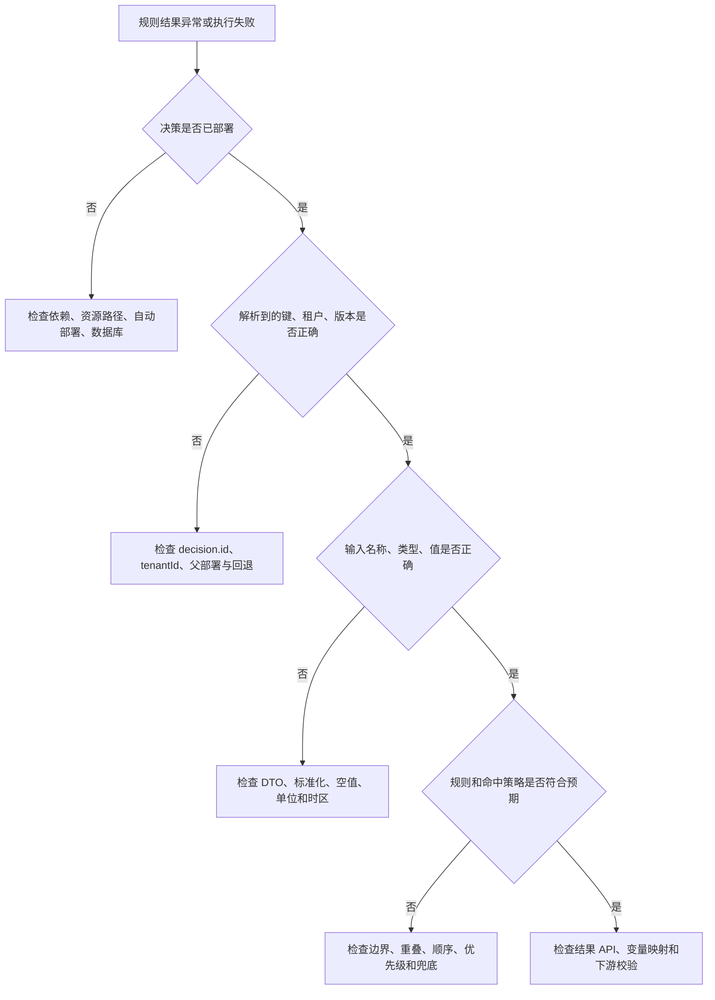

排查时先确认实际部署和输入事实，再阅读规则。很多“不生效”来自调用了错误租户、旧流程同部署版本或拼错决策键，直接修改规则会扩大问题。

### 13.2 启动成功但查不到决策

现象通常是仓库查询返回 `null`，或执行时报找不到定义。按以下证据定位：

1\. 用 `mvn dependency:tree` 确认 Starter 存在且 Flowable 组件版本统一。
2\. 用 `jar tf` 检查最终 JAR 中是否有 `BOOT-INF/classes/dmn/order-discount.dmn`。
3\. 检查 `flowable.dmn.enabled`、`deploy-resources`、资源目录和后缀。
4\. 查看启动日志中 DMN 引擎初始化和自动部署消息。
5\. 使用 `DmnRepositoryService` 查询全部相同键定义，并打印租户、版本和部署 ID。
6\. 若发布由独立服务完成，确认业务应用连接的是同一数据库和环境。

### 13.3 新规则部署后仍执行旧结果

常见缺口不是缓存刷新本身，而是版本解析上下文：

| 可能原因 | 验证方式 | 修正方向 |
| --- | --- | --- |
| BPMN 使用同部署绑定 | 查询流程定义部署 ID 与 DMN 父部署 | 随流程发布配套 DMN，或评审后关闭绑定 |
| 请求携带了另一租户 | 记录已认证租户与决策定义租户 | 修正租户解析，审查默认租户回退 |
| 新资源部署失败 | 查询版本列表与部署资源 | 检查 XML 验证和发布日志 |
| 应用节点连接不同数据库 | 比对数据源标识和定义 ID | 修正环境配置 |
| 输出其实来自业务缓存 | 绕过业务缓存直接调用决策 API | 明确缓存键包含规则版本 |

不要先重启所有节点掩盖证据。应记录每个节点实际解析到的定义 ID；如果重启确实改变结果，再进一步检查模型缓存失效和发布通知机制。

### 13.4 无命中与空结果

`executeDecisionWithSingleResult()` 在无命中时可以返回 `null`。排查要同时检查输入和模型：变量名是否大小写一致；类型是否匹配；金额单位和时区是否正确；边界是 `<` 还是 `<=`；是否漏掉一个业务分类；兜底行是否适合当前命中策略。

BPMN 中若希望无命中直接失败，可以设置 `decisionTaskThrowErrorOnNoHits`。Java 调用方则应显式检查 `null` 或空列表，将它转换为领域定义的错误、默认结论或人工复核状态。

### 13.5 多结果导致单结果 API 异常

症状是 `FlowableException` 提示决策有多个结果。先查看模型命中策略，再用 `executeDecision()` 或审计执行获取全部命中，确认多结果是模型设计还是规则冲突。

如果业务只允许一个结果：对互斥分类使用 `UNIQUE` 并消除重叠；对有优先顺序的规则使用 `FIRST` 或 `PRIORITY`；不要在 Java 中随意取列表第一项，因为这会绕过模型定义的命中语义。

### 13.6 表达式或类型异常

典型现象包括字符串无法比较为数字、方法找不到、空值访问属性失败、输出无法转换。第一步打印经过脱敏的变量名称和运行时类型，而不是只打印 `toString()`。例如 `1000` 可能分别是 `Integer`、`Long`、`Double`、`BigDecimal` 或 `String`，表达式行为并不等价。

修复方向是让 DTO 和 DMN 类型契约一致；在适配层统一转换；为缺失值建立明确策略；避免在模型中调用不稳定的对象方法；为自定义函数增加独立测试和版本兼容测试。

### 13.7 本地通过、部署环境失败

这类问题优先比较制品和环境：

1\. 开发环境是否从源码目录读取资源，而生产只读取打包 JAR。
2\. 本地 H2 与生产数据库在表结构、权限、事务隔离和字符集上是否不同。
3\. JDK（Java Development Kit，Java 开发工具包）、Flowable、Spring Boot 和数据库驱动版本是否一致。
4\. 生产是否关闭自动建表或自动部署，而本地默认开启。
5\. 容器镜像是否真正包含本次构建制品，镜像摘要是否符合发布记录。
6\. 生产租户和数据源路由是否使请求查询了另一套规则库。

H2 集成测试能证明模型和基本 API 可执行，不能证明目标数据库迁移、连接池容量和集群发布行为。上线前还需要使用与生产同类型的数据库完成集成验证。

### 13.8 历史查询为空

检查全局 `flowable.dmn.history-enabled` 是否关闭，本次 Builder 是否调用 `disableHistory()`，事务是否最终提交，以及查询条件中的决策键、实例 ID、租户和时间范围是否正确。异步流程中，规则任务可能尚未执行；业务请求成功接收不等于历史已经生成。

### 13.9 数据库变更锁阻塞启动

先确认数据库中是否有正在执行的 Liquibase 迁移以及对应应用实例是否存活。若迁移仍运行，应等待或处理真实故障；若进程异常退出留下锁，要按 Flowable 和 Liquibase 的目标版本运维流程，在备份和变更审批下解除。直接删除锁表或整张表可能让并发实例同时迁移，造成部分结构升级。

## 14 Flowable DMN 与其他规则实现的选择

### 14.1 与 BPMN 网关条件比较

| 维度 | DMN 决策表 | BPMN 网关表达式 |
| --- | --- | --- |
| 主要职责 | 计算业务决策 | 选择当前流程路径 |
| 独立执行 | 可以 | 通常依赖流程实例 |
| 规则可视化 | 表格化输入、输出和命中策略 | 条件分散在顺序流上 |
| 复用 | 可被多个流程和服务调用 | 通常绑定当前流程模型 |
| 多结果 | 有多种命中策略 | 网关主要选择流向 |
| 版本治理 | 独立 DMN 定义或与流程同部署 | 随 BPMN 定义版本 |

网关条件适合少量、稳定、只影响当前流程的判断。条件数量增加、需要复用或希望业务审阅时，可以让 DMN 先输出路由代码，再由网关使用这个代码。

### 14.2 与 Java 配置和策略模式比较

Java 策略类具有完整语言能力、IDE（Integrated Development Environment，集成开发环境）重构支持和类型安全，适合复杂算法、外部交互和稳定技术逻辑。DMN 适合有限条件矩阵、频繁政策变化和表格审阅。

一种常见组合是：Java 负责收集事实、调用领域服务和精确计算；DMN 选择策略代码或参数；Java 根据经过白名单校验的代码执行策略。这样既保留决策透明度，也避免把有副作用的操作塞进表达式。

### 14.3 与 Drools 比较

Drools 是功能更广的业务规则管理与推理技术，支持事实工作内存、规则激活、前向链式推理等模式。Flowable DMN 更强调标准化决策模型和决策表执行。

| 场景特征 | Flowable DMN 更合适 | Drools 类推理引擎更合适 |
| --- | --- | --- |
| 输入输出是一次函数式决策 | 是 | 可以但能力可能过剩 |
| 业务希望审阅二维决策表 | 是 | 取决于规则表示 |
| 多条规则反复推导新事实 | 能力有限 | 更符合其推理模型 |
| 规则激活顺序与议程复杂 | 不作为主要设计目标 | 提供更丰富机制 |
| 已使用 Flowable BPMN/CMMN | 集成自然 | 需要额外集成与治理 |
| 团队需要标准 DMN 资产 | 是 | 需看具体 DMN 支持方案 |

选择规则技术时要用代表性模型做原型和性能测试。不能因为规则数量多就直接选择 Drools，也不能因为已使用 Flowable 流程就把所有业务知识都放进 DMN。

### 14.4 与数据库配置表比较

简单的键值参数、黑白名单或单列阈值可以放在经过治理的配置表中。决策表的价值在于多输入、多输出、规则重叠处理和模型审阅。若一张 DMN 表只有“键—值”两列且没有决策语义，配置中心可能更轻量。

数据库配置表也需要版本、审批、缓存失效和审计。它看似简单，并不自动获得规则治理能力；选择时应比较整体生命周期成本，而不只是存储形式。

## 15 设计评审与面试中的机制推导

### 15.1 如何解释 Flowable 规则引擎

完整解释应包含边界和执行证据：Flowable 通过 DMN 决策模型表达可重复的业务判断，应用以决策键和变量调用 `DmnDecisionService`；决策表逐行计算输入条件，命中策略决定零条、一条或多条匹配怎样形成输出；模型部署后具有定义 ID、版本、租户和部署信息，可独立执行，也可由 BPMN 的 DMN 服务任务调用。

若只说“把 if/else 配到表里”，会遗漏版本、命中策略、输入输出契约和流程集成，这些恰好决定真实项目是否可靠。

### 15.2 为什么命中策略是核心语义

同一组规则行在 `FIRST`、`UNIQUE` 和 `COLLECT` 下可能得到完全不同的结果。可以用 VIP 1200 元的例子推导：它同时满足“满 1000”和“满 500”；`FIRST` 采用第一行，`UNIQUE` 认为模型冲突，`COLLECT` 可能返回两项。由此可见，命中策略不是展示属性，而是决策契约的一部分。

进一步的设计问题是行顺序能否成为业务规则。若业务明确规定“最具体的规则优先”，`FIRST` 合理；若业务认为区间必须互斥，`UNIQUE` 更能主动发现模型缺陷。

### 15.3 怎样保证规则变更安全

安全变更由多层证据组成：稳定的输入输出契约；规则行和边界覆盖测试；严格命中策略检查；模型代码审查与业务审批；不可变制品和版本记录；测试环境部署验证；高风险场景的影子对比或灰度；可定位到定义 ID 的监控；经过演练的回滚和补偿方案。

测试通过只证明已覆盖样例。生产安全还取决于输入分布、版本路由、租户隔离、可观测性和已执行副作用如何处理。

### 15.4 集群环境为什么能执行同一套规则

Flowable 服务对象是无状态、线程安全的调用入口，多个应用节点可以连接同一规则数据库，各自执行请求。部署定义与版本保存在数据库，节点内部可维护解析后的模型缓存。集群设计仍要解决发布并发、缓存感知、数据库高可用、连接池容量和节点实际版本观测。

“服务无状态”不表示整个系统没有状态。部署、版本、历史、租户和流程关联都持久化在数据库中。

### 15.5 Flowable DMN 与 Drools 的取舍证据

回答取舍时应先描述问题形态。有限输入输出矩阵、标准化决策表、与 Flowable 流程集成和业务审阅需求强，倾向 DMN；事实持续变化、多轮推导、复杂规则激活和议程控制需求强，倾向 Drools 类引擎。然后补充团队技能、工具链、版本治理、性能样例和运维成本，不能仅用功能列表判断。

### 15.6 事务一致性如何分析

嵌入 BPMN 的同步 DMN 任务通常在流程命令事务中执行，失败会阻止当前命令正常提交。独立规则服务通过网络调用时，调用方业务事务与规则服务历史事务分离；超时后调用方无法仅凭响应判断远端是否完成。分析应从事务边界、重复调用、副作用、请求 ID 和补偿策略展开。

DMN 决策本身最好保持无副作用，这能让重试和重放更安全。真正的业务副作用由决策之后的领域服务或流程任务执行，并记录它采用的决策版本和结果。

## 16 项目落地模板、上线检查与复习入口

### 16.1 推荐的模块边界

```text
discount-domain/
├── DiscountFacts.java
├── DiscountDecisionOutput.java
└── DiscountPolicyCode.java

discount-rule-adapter/
├── FlowableDiscountDecisionAdapter.java
├── DecisionOutputValidator.java
└── DecisionMetadataRecorder.java

discount-rule-models/
├── dmn/order-discount.dmn
└── test-cases/order-discount-cases.json

discount-application/
├── DiscountController.java
├── DiscountApplicationService.java
└── application.yml
```

领域模块不依赖 Flowable Map 或审计容器；适配器把领域事实转换为 DMN 变量，并把输出转换回领域对象；模型模块保存 DMN 和测试样例；应用模块负责编排接口、事务和副作用。这个边界使规则模型、引擎接入和业务协议能够分别演进。

### 16.2 新决策的设计模板

设计一项新决策时至少填写以下内容：

1\. 决策名称与稳定决策键。
2\. 业务所有者、技术所有者和审批角色。
3\. 输入字段的来源、类型、单位、可空语义、值域和标准化规则。
4\. 输出字段的类型、值域、稳定代码和下游使用方。
5\. 命中策略及其业务理由。
6\. 无命中、多命中、表达式异常和引擎不可用时的行为。
7\. 规则边界样例、冲突样例、空值样例和回归数据集。
8\. 版本路由、租户覆盖、同部署绑定和回滚策略。
9\. 历史、日志、指标、敏感字段和保留期。
10\. 性能目标、容量估算、超时和降级策略。

### 16.3 上线前检查表

1\. Flowable、Spring Boot、Java 和数据库驱动版本经过依赖收敛检查。
2\. 生产制品内包含预期 DMN 文件，校验和与审批制品一致。
3\. 每个 `decision.id` 稳定且在目标租户内唯一，调用方使用键而非显示名称。
4\. 输入输出字典已评审，空值、零值、金额单位和时区语义明确。
5\. 命中策略符合业务，多结果 API 与 DTO 设计一致。
6\. 边界、重叠、无命中、错误类型和兜底规则已有自动化测试。
7\. 在目标数据库完成建表或升级演练，业务账号权限最小化。
8\. 发布后能查询新定义 ID、版本、部署 ID 和租户，并完成冒烟执行。
9\. BPMN 调用已验证同部署绑定、变量映射、异常传播和异步重试。
10\. 指标包含耗时、错误率、无命中率、兜底率和结果分布，标签没有敏感高基数字段。
11\. 历史数据的启用、脱敏、访问权限、清理和保留期符合要求。
12\. 回滚模型、触发条件、负责人和已执行业务的补偿方案已经确认。

### 16.4 生产故障 Runbook 入口

| 告警 | 立即收集的证据 | 初步处置 |
| --- | --- | --- |
| 决策错误率升高 | 定义 ID、版本、租户、异常类型、最近部署 | 暂停规则扩量，判断回滚或输入故障 |
| 兜底率突然升高 | 输入分布、缺失字段、租户、规则命中详情 | 检查上游契约和规则覆盖 |
| P99（第 99 百分位）延迟升高 | 引擎耗时、数据库连接池、历史写入、节点差异 | 限制流量并定位计算或存储瓶颈 |
| 仅部分节点结果不同 | 节点制品摘要、数据库、定义 ID、缓存状态 | 从负载均衡摘除异常节点并保留证据 |
| 数据库变更锁告警 | 当前迁移进程、锁持有时间、应用发布事件 | 停止额外启动，按迁移流程处理 |
| 敏感数据进入日志 | 日志样本、字段来源、访问范围 | 限制访问、停止泄露路径并按安全流程响应 |

### 16.5 官方资料入口

1\. [Flowable Open Source 文档入口](https://www.flowable.com/open-source/docs/index.html)：BPMN、CMMN、DMN 与 REST API 的用户指南导航。
2\. [Flowable DMN 配置](https://www.flowable.com/open-source/docs/dmn/ch02-configuration)：独立引擎、数据源、数据库和表达式扩展配置。
3\. [Flowable DMN Java API](https://www.flowable.com/open-source/docs/dmn/ch03-API)：引擎服务、部署与执行的概念说明。部分页面仍包含旧接口名称，实际编码要以目标版本 Javadoc 和源码为准。
4\. [Flowable DMN 介绍与命中策略](https://www.flowable.com/open-source/docs/dmn/ch06-DMN-Introduction/)：决策表结构和七类命中策略。
5\. [Flowable DMN REST API](https://www.flowable.com/open-source/docs/dmn/ch07-REST)：部署、定义查询和决策执行接口。
6\. [Flowable Engine GitHub 仓库](https://github.com/flowable/flowable-engine)：版本发布说明、当前 Java API、自动配置和官方测试模型。
7\. [Flowable 8.0.0 发布说明](https://github.com/flowable/flowable-engine/releases/tag/flowable-8.0.0)：Spring Boot 4、Spring Framework 7、Jackson 3 和 JUnit 5 等版本变化。
8\. [Flowable Open Source Javadoc](https://www.flowable.com/open-source/docs/all-javadocs/)：按目标版本核对类、方法、参数和废弃状态。
9\. [OMG DMN 规范页面](https://www.omg.org/dmn/)：OMG 是 Object Management Group（对象管理组织）的缩写；该页面提供 DMN 标准、规范版本与厂商可移植性依据。

### 16.6 复习自测

1\. 给定 `VIP + 1200`，为什么订单表示例选择 15% 而不是 10%，换成 `UNIQUE` 会发生什么？
2\. `inputExpression` 与 `inputEntry` 各在执行链路的哪个阶段生效？
3\. `executeDecision()`、`executeDecisionWithSingleResult()` 和审计执行的返回契约有什么区别？
4\. Spring Boot 启动成功但仓库查不到决策时，怎样从构建产物逐层定位？
5\. BPMN 中的 `sameDeployment` 解决了什么版本一致性问题？
6\. 单命中和多命中结果默认怎样映射为流程变量？
7\. 为什么历史启用既提高审计能力，又带来隐私与容量成本？
8\. 多租户回退默认规则可能产生什么安全和业务风险？
9\. 哪些业务特征说明应选择 DMN，哪些特征更接近 Drools 的推理模型？
10\. 一次规则发布怎样做到可验证、可观察、可回滚，并能处理已经发生的业务副作用？

能独立回答这些问题，并能运行第 2 章示例、为新规则补充第 11 章测试矩阵，就已经具备把 Flowable DMN 从演示推进到项目设计的基础能力。
