# 1. Vue3简介

1\. 2020年9月18日，`Vue.js`发布`3.0`版本，代号为`One Piece`（海贼王）。
2\. 经历了：[4800+次提交](https://github.com/vuejs/core/commits/main)、[40+个RFC](https://github.com/vuejs/rfcs/tree/master/active-rfcs)、[600+次PR](https://github.com/vuejs/vue-next/pulls?q=is%3Apr+is%3Amerged+-author%3Aapp%2Fdependabot-preview+)、[300+贡献者](https://github.com/vuejs/core/graphs/contributors)
3\. 官方发版地址：[Release v3.0.0 One Piece · vuejs/core](https://github.com/vuejs/core/releases/tag/v3.0.0)
4\. Vue 3 仍在持续更新。学习时应以项目中`package.json`记录的版本和[Vue官方文档](https://cn.vuejs.org/)为准，不要把某个历史版本号当作长期不变的最新版本。

   

## 1.1. 性能的提升

1\. 打包大小减少`41%`。

2\. 初次渲染快`55%`, 更新渲染快`133%`。

3\. 内存减少`54%`。


## 1.2. 源码的升级

1\. 使用`Proxy`代替`defineProperty`实现响应式。

2\. 重写虚拟`DOM`的实现和`Tree-Shaking`。


## 1.3. 拥抱TypeScript

1\. `Vue3`可以更好的支持`TypeScript`。


## 1.4. 新的特性

1\. `Composition API`（组合`API`）：
   1\. `setup`
   2\. `ref`与`reactive`
   3\. `computed`与`watch`

     ......

2\. 新的内置组件：
   1\. `Fragment`
   2\. `Teleport`
   3\. `Suspense`

     ......

3\. 其他改变：
   1\. 新的生命周期钩子
   2\. `data` 选项应始终被声明为一个函数
   3\. 移除`keyCode`支持作为` v-on` 的修饰符

     ......


## 1.5. 初学者学习路线

第一次学习时，不需要立刻记住所有API（Application Programming Interface，应用程序编程接口）。建议按下面的顺序建立主线：

1\. 会创建并启动项目，知道浏览器页面由哪个组件渲染。
2\. 理解`.vue`文件中的`template`、`script`和`style`分别负责什么。
3\. 掌握`ref`、`reactive`和模板事件，理解“数据变化会驱动页面更新”。
4\. 掌握`computed`和`watch`，能处理派生数据与副作用。
5\. 学习组件、`props`、自定义事件和插槽，完成组件拆分与通信。
6\. 最后学习路由和Pinia，把多个页面、多个组件组织成完整应用。

> 初学阶段最重要的不是背API，而是每学一个知识点都亲手运行示例，并观察“修改了哪份数据，哪个页面区域发生了变化”。


# 2. 创建Vue3工程

## 2.1. 基于 `vue-cli` 创建
点击查看[官方文档](https://cli.vuejs.org/zh/guide/creating-a-project.html#vue-create)

> 备注：目前`vue-cli`已处于维护模式，官方推荐基于 `Vite` 创建项目。

```powershell
## 查看@vue/cli版本，确保@vue/cli版本在4.5.0以上
vue --version

## 安装或者升级你的@vue/cli 
npm install -g @vue/cli

## 执行创建命令
vue create vue_test

##  随后选择3.x
##  Choose a version of Vue.js that you want to start the project with (Use arrow keys)
##  > 3.x
##    2.x

## 启动
cd vue_test
npm run serve
```

---

## 2.2. 基于 `vite` 创建（推荐）
`Vite`是新一代前端构建工具。创建项目前需要先安装Node.js（JavaScript运行环境），安装后可以在终端执行下面的命令检查环境：

```powershell
node --version
npm --version
```

两条命令都能输出版本号，说明Node.js和npm（Node Package Manager，Node包管理器）已经可用。`Vite`的优势如下：

1\. 支持HMR（Hot Module Replacement，热模块替换），修改组件后通常只更新变化的模块，不必刷新整个页面。
2\. 对 `TypeScript`、`JSX`、`CSS` 等支持开箱即用。
3\. 真正的按需编译，不再等待整个应用编译完成。
4\. `webpack`构建 与 `vite`构建对比图如下：

| 图示                                                         |                                                              |
| ------------------------------------------------------------ | ------------------------------------------------------------ |
|  |  |

1\. 具体操作如下（点击查看[官方文档](https://cn.vuejs.org/guide/quick-start.html#creating-a-vue-application)）

```powershell
## 1.创建命令
npm create vue@latest

## 2.具体配置
## 配置项目名称
√ Project name: vue3_test
## 是否添加TypeScript支持
√ Add TypeScript?  Yes
## 是否添加JSX支持
√ Add JSX Support?  No
## 是否添加路由环境
√ Add Vue Router for Single Page Application development?  No
## 是否添加pinia环境
√ Add Pinia for state management?  No
## 是否添加单元测试
√ Add Vitest for Unit Testing?  No
## 是否添加端到端测试方案
√ Add an End-to-End Testing Solution? » No
## 是否添加ESLint语法检查
√ Add ESLint for code quality?  Yes
## 是否添加Prettier代码格式化
√ Add Prettier for code formatting?  No
```

创建完成后进入项目目录、安装依赖并启动开发服务器：

```powershell
cd vue3_test
npm install
npm run dev
```

终端通常会显示一个类似`http://localhost:5173/`的本地地址。按住`Ctrl`或`Command`点击该地址，能看到Vue欢迎页面就说明项目已经正常运行。若端口被占用，Vite会自动尝试其他端口，应以终端实际显示的地址为准。

### 2.2.1 创建后的核心目录

下面以启用TypeScript、暂不启用Vue Router和Pinia的项目为例。不同版本的`create-vue`可能生成略有差异的示例文件，但核心加载链路相同：

```text
vue3_test/
├── index.html               # 浏览器入口页面
├── package.json             # 依赖和npm脚本
├── vite.config.ts           # Vite配置
├── tsconfig.json            # TypeScript配置入口
├── public/                  # 不经过构建处理的静态资源
└── src/
    ├── main.ts              # JavaScript/TypeScript入口
    ├── App.vue              # 根组件
    ├── assets/
    │   └── main.css         # 全局样式
    └── components/
        └── HelloWorld.vue   # 子组件
```

`node_modules`目录会在执行`npm install`后生成，里面存放项目依赖，一般不要手动修改，也不要提交到Git仓库。

### 2.2.2 核心文件代码

#### 2.2.2.1 `index.html`

`index.html`是浏览器最先加载的文件。`<div id="app"></div>`是Vue应用的挂载容器，`main.ts`负责把Vue组件渲染到这个容器中。

```html
<!doctype html>
<html lang="zh-CN">
  <head>
    <meta charset="UTF-8">
    <meta name="viewport" content="width=device-width, initial-scale=1.0">
    <title>Vue3练习</title>
  </head>
  <body>
    <div id="app"></div>
    <script type="module" src="/src/main.ts"></script>
  </body>
</html>
```

`index.html`使用`<script type="module">`加载`main.ts`，表示入口文件按照ES Module（ECMAScript Module，ECMAScript模块）方式运行，因此`main.ts`及其导入的模块可以使用`import`和`export`语法。

#### 2.2.2.2 `src/main.ts`

`main.ts`是应用入口。它创建Vue应用实例，导入根组件和全局样式，最后挂载到`index.html`中的`#app`元素。

```ts
import { createApp } from 'vue'
import App from './App.vue'
import './assets/main.css'

createApp(App).mount('#app')
```

这里的`#app`必须和`index.html`中的`id="app"`保持一致，否则Vue找不到挂载位置，页面不会正常显示。

#### 2.2.2.3 `src/App.vue`

`App.vue`是根组件。`.vue`文件称为SFC（Single-File Component，单文件组件），通常由三部分组成：

1\. `<template>`：描述页面结构。
2\. `<script>`：保存数据、方法和组件导入。
3\. `<style>`：描述组件样式。

```vue
<template>
  <main class="app">
    <h1>你好，Vue 3！</h1>
    <HelloWorld message="这是第一个子组件" />
  </main>
</template>

<script setup lang="ts">
	import HelloWorld from './components/HelloWorld.vue'
</script>

<style scoped>
.app {
  max-width: 720px;
  margin: 40px auto;
  padding: 20px;
}
</style>
```

`scoped`表示这段样式主要作用于当前组件，减少样式意外影响其他组件的情况。`<script setup>`是组合式API（Composition API）的推荐写法，导入的组件可以直接在模板中使用。

#### 2.2.2.4 `src/components/HelloWorld.vue`

子组件通过`props`接收父组件传入的数据。这里的`message`由`App.vue`传入：

```vue
<template>
  <section class="welcome">
    <h2>{{ message }}</h2>
    <p>修改这个文件并保存，可以观察HMR效果。</p>
  </section>
</template>

<script setup lang="ts">
defineProps<{
  message: string
}>()
</script>

<style scoped>
.welcome {
  color: #2563eb;
}
</style>
```

`defineProps`是`<script setup>`中的编译宏，不需要从`vue`中导入。现在暂时只需知道它用来声明“子组件允许接收哪些数据”，组件通信章节会进一步讲解。

#### 2.2.2.5 `src/assets/main.css`

全局样式由`main.ts`导入，会影响整个应用：

```css
* {
  box-sizing: border-box;
}

body {
  margin: 0;
  font-family: Arial, sans-serif;
  color: #1f2937;
  background: #f8fafc;
}
```

组件的局部样式通常写在组件自己的`<style scoped>`中；页面重置、字体和主题变量等全局规则适合放在`main.css`中。

#### 2.2.2.6 `vite.config.ts`

这个文件用于配置Vite插件、路径别名、开发服务器和构建选项。新项目默认配置通常包含Vue插件和`@`路径别名：

```ts
import { fileURLToPath, URL } from 'node:url'
import { defineConfig } from 'vite'
import vue from '@vitejs/plugin-vue'

export default defineConfig({
  plugins: [vue()],
  resolve: {
    alias: {
      '@': fileURLToPath(new URL('./src', import.meta.url))
    }
  }
})
```

配置别名后，较深层组件中的导入可以从`../../../components/Xxx.vue`简化为`@/components/Xxx.vue`。修改Vite配置后通常需要重新启动开发服务器。

#### 2.2.2.7 `package.json`中的脚本

`package.json`记录依赖和项目命令。下面只展示初学阶段最常用的脚本，真实文件还会包含依赖及所选工具生成的其他命令：

```json
{
  "scripts": {
    "dev": "vite",
    "build": "vite build",
    "preview": "vite preview"
  }
}
```

1\. `npm run dev`：启动开发服务器，支持HMR。
2\. `npm run build`：生成用于部署的生产文件，通常输出到`dist`目录。
3\. `npm run preview`：在本地预览已经构建出的`dist`内容，不能代替正式生产服务器。

### 2.2.3 文件加载过程

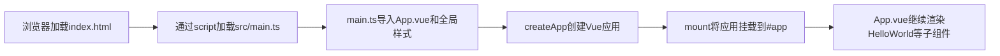

如果页面空白，可以沿着这条链路检查：`index.html`是否存在`#app`、`main.ts`挂载选择器是否一致、`App.vue`路径是否正确，以及终端是否存在编译错误。

安装官方推荐的`vscode`插件：

| 图示                                                         |                                                              |
| ------------------------------------------------------------ | ------------------------------------------------------------ |
|  |  |

总结：

1\. `Vite` 项目中，`index.html` 是项目的入口文件，在项目最外层。
2\. 加载`index.html`后，`Vite` 解析 `<script type="module" src="xxx">` 指向的`JavaScript`。
3\. `Vue3`中通过`createApp`函数创建应用实例，再使用`mount`把应用挂载到页面中的指定元素。

## 2.3. 一个简单的效果

`Vue3`兼容大部分`Vue2`写法，而且组件模板可以包含多个根节点。下面先用Options API（选项式API）完成一个最小交互示例。

阅读代码时可以按这条链路理解：模板显示`data`返回的数据，按钮通过`@click`调用`methods`中的方法，方法修改数据后，Vue自动更新页面。

```vue
<template>
  <div class="person">
    <h2>姓名：{{name}}</h2>
    <h2>年龄：{{age}}</h2>
    <button @click="changeName">修改名字</button>
    <button @click="changeAge">年龄+1</button>
    <button @click="showTel">点我查看联系方式</button>
  </div>
</template>

<script lang="ts">
  export default {
    name:'App',
    data() {
      return {
        name:'张三',
        age:18,
        tel:'13888888888'
      }
    },
    methods:{
      changeName(){
        this.name = 'zhang-san'
      },
      changeAge(){
        this.age += 1
      },
      showTel(){
        alert(this.tel)
      }
    },
  }
</script>
```

运行后应看到姓名、年龄和三个按钮。点击“年龄+1”时，`age`发生变化，对应的页面文本会自动更新；这就是Vue最核心的“数据驱动视图”。

## 2.4. 模板语法与常用指令

模板不是普通的HTML字符串。Vue会把模板编译成渲染函数，并根据响应式数据的变化更新必要的DOM节点。初学者应先掌握下面几种最常见的绑定方式：

| 写法 | 完整写法或含义 | 作用 |
| --- | --- | --- |
| `{{ message }}` | 文本插值 | 把数据渲染为文本 |
| `:title="message"` | `v-bind:title="message"` | 把JavaScript表达式绑定给HTML属性 |
| `@click="handleClick"` | `v-on:click="handleClick"` | 监听DOM事件 |
| `v-model="keyword"` | 值绑定加更新事件 | 让表单值与状态保持同步 |
| `v-if="visible"` | 条件渲染 | 条件为假时移除DOM |
| `v-show="visible"` | 条件显示 | 始终保留DOM，只切换`display`样式 |
| `v-for="item in list"` | 列表渲染 | 根据数组重复生成结构 |

下面的示例把这些语法放在一起：

```vue
<template>
  <section>
    <input v-model="keyword" placeholder="输入筛选关键词">
    <button @click="visible = !visible">切换列表</button>

    <ul v-if="visible" :title="`当前关键词：${keyword}`">
      <li
        v-for="user in filteredUsers"
        :key="user.id"
      >
        {{ user.name }}（{{ user.age }}岁）
      </li>
    </ul>
  </section>
</template>

<script setup lang="ts">
import { computed, ref } from 'vue'

const keyword = ref('')
const visible = ref(true)
const users = ref([
  { id: 1, name: '张三', age: 18 },
  { id: 2, name: '李四', age: 20 }
])

const filteredUsers = computed(() => {
  return users.value.filter(user => user.name.includes(keyword.value))
})
</script>
```

### 2.4.1 `v-if`与`v-show`如何选择

`v-if`会真正创建和销毁DOM，适合条件很少变化的内容。`v-show`只切换CSS（Cascading Style Sheets，层叠样式表）的`display`，初次渲染成本更高，但频繁切换更合适。

### 2.4.2 为什么`v-for`需要`:key`

`key`是每一项的稳定身份标识。列表顺序变化时，Vue会根据`key`判断哪个旧节点对应哪个新数据，从而正确复用DOM和组件状态。

1\. 优先使用数据库ID等稳定且唯一的值，例如`:key="user.id"`。
2\. 不要使用随机数，因为每次渲染都会生成新身份，导致节点全部重建。
3\. 列表会插入、删除或排序时，尽量不要使用数组下标`index`，否则输入框状态和组件状态可能对应错数据。

### 2.4.3 模板中的常见误区

1\. HTML属性内部不能直接使用插值，例如`title="{{ message }}"`是错误写法，应写成`:title="message"`。
2\. 模板绑定位置只能放单个JavaScript表达式，复杂业务逻辑应放进函数或`computed`。
3\. `v-html`会把字符串当作HTML解析，只能用于可信内容。不要渲染用户输入，否则可能产生XSS（Cross-Site Scripting，跨站脚本）安全问题。

# 3. Vue3核心语法

## 3.1. OptionsAPI 与 CompositionAPI

Vue 3同时支持Options API（选项式API）和Composition API（组合式API）。它们不是“旧语法”和“新语法”的关系，也不是必须二选一；同一个团队通常会根据项目复杂度统一一种主要风格。

| 对比项 | Options API | Composition API |
| --- | --- | --- |
| 组织方式 | 按`data`、`methods`、`computed`等选项分类 | 按业务功能组织相关状态和方法 |
| 上手难度 | 结构固定，初学更直观 | 需要理解`setup`和响应式API |
| 逻辑复用 | 常借助`mixin`，来源可能不直观 | 常借助组合式函数，类型和来源更清楚 |
| 适用场景 | 简单组件、维护旧项目 | 中大型组件、TypeScript项目、逻辑复用较多的项目 |

### 3.1.1 Options API 的弊端

`Options`类型的 `API`，数据、方法、计算属性等，是分散在：`data`、`methods`、`computed`中的，若想新增或者修改一个需求，就需要分别修改：`data`、`methods`、`computed`，不便于维护和复用。

| 图示                                                         |                                                              |
| ------------------------------------------------------------ | ------------------------------------------------------------ |
|  |  |

### 3.1.2 Composition API 的优势

可以用函数的方式，更加优雅的组织代码，让相关功能的代码更加有序的组织在一起。

| 图示                                                         |                                                              |
| ------------------------------------------------------------ | ------------------------------------------------------------ |
|  |  |

> 说明：以上四张动图原创作者：大帅老猿

## 3.2. 拉开序幕的 `setup`

### 3.2.1 `setup`概述

`setup`是`Vue3`中一个新的配置项，值是一个函数，它是 `Composition API` **“表演的舞台**_**”**_，组件中所用到的：数据、方法、计算属性、监视......等等，均配置在`setup`中。

特点如下：

1\. `setup`函数返回的对象中的内容，可直接在模板中使用。
2\. `setup`中访问`this`是`undefined`。
3\. `setup`函数会在`beforeCreate`之前调用，它是“领先”所有钩子执行的。
```vue
<template>
  <div class="person">
    <h2>姓名：{{name}}</h2>
    <h2>年龄：{{age}}</h2>
    <button @click="changeName">修改名字</button>
    <button @click="changeAge">年龄+1</button>
    <button @click="showTel">点我查看联系方式</button>
  </div>
</template>

<script lang="ts">
  export default {
    name:'Person',
    setup(){
      // 数据，原来写在data中（注意：此时的name、age、tel数据都不是响应式数据）
      let name = '张三'
      let age = 18
      let tel = '13888888888'

      // 方法，原来写在methods中
      function changeName(){
        name = 'zhang-san' //注意：此时这么修改name页面是不变化的
        console.log(name)
      }
      function changeAge(){
        age += 1 //注意：此时这么修改age页面是不变化的
        console.log(age)
      }
      function showTel(){
        alert(tel)
      }

      // 返回一个对象，对象中的内容，模板中可以直接使用
      return {name,age,tel,changeName,changeAge,showTel}
    }
  }
</script>
```
### 3.2.2 `setup`的返回值

1\. 若返回一个**对象**：则对象中的：属性、方法等，在模板中均可以直接使用**（重点关注）。**
2\. 若返回一个**函数**：则可以自定义渲染内容，代码如下：

```jsx
setup(){
  return ()=> '你好啊！'
}
```
### 3.2.3 `setup`与Options API的关系

1\. Options API的配置（`data`、`methods`等）中**可以访问到**`setup`暴露的属性和方法。
2\. 但在`setup`中**不能访问到**Options API的配置（`data`、`methods`等）。
3\. 如果与`Vue2`冲突，则`setup`优先。
### 3.2.4 `<script setup>`语法糖
`setup`函数有一个语法糖，这个语法糖，可以让我们把`setup`独立出去，代码如下：

```vue
<template>
  <div class="person">
    <h2>姓名：{{name}}</h2>
    <h2>年龄：{{age}}</h2>
    <button @click="changName">修改名字</button>
    <button @click="changAge">年龄+1</button>
    <button @click="showTel">点我查看联系方式</button>
  </div>
</template>

<script lang="ts">
  export default {
    name:'Person',
  }
</script>

<!-- 下面的写法是setup语法糖 -->
<script setup lang="ts">
  console.log(this) //undefined
  
  // 数据（注意：此时的name、age、tel都不是响应式数据）
  let name = '张三'
  let age = 18
  let tel = '13888888888'

  // 方法
  function changName(){
    name = '李四'//注意：此时这么修改name页面是不变化的
  }
  function changAge(){
    console.log(age)
    age += 1 //注意：此时这么修改age页面是不变化的
  }
  function showTel(){
    alert(tel)
  }
</script>
```
一般情况下，组件会根据文件名自动推断名称，例如`Person.vue`会被识别为`Person`组件，不需要额外插件。如果确实要显式配置组件名称，Vue 3.3及以上版本可以使用`defineOptions`：

```vue
<script setup lang="ts">
defineOptions({
  name: 'Person'
})
</script>
```

> 本文后续示例中的`<script setup name="Person">`依赖额外构建插件，并不是Vue原生语法。新项目更推荐使用文件名推断或`defineOptions`。
## 3.3. `ref` 创建：基本类型的响应式数据

### 3.3.1 `ref`速查

1\. **作用：**定义响应式变量。
2\. **语法：**`let xxx = ref(初始值)`。
3\. **返回值：**一个`RefImpl`的实例对象，简称`ref对象`或`ref`，`ref`对象的`value`**属性是响应式的**。
4\. **注意点：**
   1\. `JS`中操作数据需要：`xxx.value`，但模板中不需要`.value`，直接使用即可。
   2\. 对于`let name = ref('张三')`来说，更准确地讲，`name`是保存`ref`对象的普通变量，Vue追踪的是`name.value`的读取和修改，而不是`name`变量自身的重新赋值。

下面这张图展示了`name`、`ref`对象、`value`和页面之间的绑定关系：

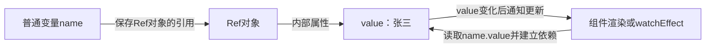

1\. 执行`let name = ref('张三')`后，普通变量`name`指向一个`ref`对象。
2\. 读取`name.value`时，Vue可以记录当前页面或副作用依赖了这个`value`。
3\. 执行`name.value = '李四'`时，Vue能够通知已经建立的依赖重新执行。
4\. 如果执行`name = ref('李四')`，改变的只是普通变量`name`的指向，这次重新赋值本身不会触发原来的依赖。

### 3.3.2 为什么需要`.value`

JavaScript无法直接拦截一个普通数字或字符串变量的读取和赋值。`ref`把值放进一个对象的`.value`属性中，Vue就可以在读取属性时记录“谁依赖了它”，在修改属性时通知这些依赖重新执行。

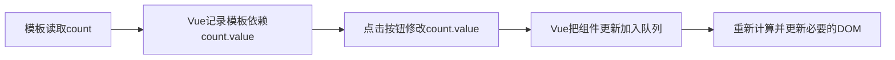

模板里可以直接写`{{ count }}`，是因为Vue会自动解包顶层`ref`；JavaScript代码没有这种模板编译处理，所以必须写`count.value`。

### 3.3.3 完整示例

```vue
<template>
  <div class="person">
    <h2>姓名：{{name}}</h2>
    <h2>年龄：{{age}}</h2>
    <button @click="changeName">修改名字</button>
    <button @click="changeAge">年龄+1</button>
    <button @click="showTel">点我查看联系方式</button>
  </div>
</template>

<script setup lang="ts" name="Person">
  import {ref} from 'vue'
  // name和age是一个RefImpl的实例对象，简称ref对象，它们的value属性是响应式的。
  let name = ref('张三')
  let age = ref(18)
  // tel就是一个普通的字符串，不是响应式的
  let tel = '13888888888'

  function changeName(){
    // JS中操作ref对象时候需要.value
    name.value = '李四'
    console.log(name.value)

    // 注意：name不是响应式的，name.value是响应式的，所以如下代码并不会引起页面的更新。
    // name = ref('zhang-san')
  }
  function changeAge(){
    // JS中操作ref对象时候需要.value
    age.value += 1 
    console.log(age.value)
  }
  function showTel(){
    alert(tel)
  }
</script>
```

### 3.3.4 使用插件自动补全`.value`

如果使用VS Code，可以安装官方的`Vue - Official`插件。它提供Vue单文件组件的语法高亮、类型检查、代码补全等功能，还可以在JavaScript或TypeScript代码中自动为`ref`补全`.value`。

这个功能默认关闭，启用步骤如下：

1\. 打开VS Code的扩展面板，搜索并安装`Vue - Official`，扩展标识为`Vue.volar`。
2\. 打开VS Code设置，搜索`vue.autoInsert.dotValue`。
3\. 勾选`Vue › Auto Insert: Dot Value`。

也可以打开VS Code的`settings.json`，加入下面的配置：

```json
{
  "vue.autoInsert.dotValue": true
}
```

启用后，当编辑器能够判断某个变量是`ref`时，会在合适的代码补全位置自动插入`.value`。例如需要写：

```ts
import { ref } from 'vue'

const count = ref(0)

function increment() {
  count.value++
}
```

需要特别注意：

1\. 这只是编辑器帮你补全代码，最终保存的源码中仍然存在`.value`，并不是Vue运行时允许省略它。
2\. `<script>`中的JavaScript或TypeScript代码访问`ref`通常需要`.value`。
3\. `<template>`中Vue会自动解包顶层`ref`，应写`{{ count }}`，不要写`{{ count.value }}`。
4\. 如果没有自动补全，先确认插件已经启用，并尝试重新加载VS Code窗口；你仍然可以手动输入`.value`，不会影响程序运行。

## 3.4. `reactive` 创建：对象类型的响应式数据

1\. **作用：**定义一个**响应式对象**（基本类型不要用它，要用`ref`，否则报错）
2\. **语法：**`let 响应式对象= reactive(源对象)`。
3\. **返回值：**一个`Proxy`的实例对象，简称：响应式对象。
4\. **注意点：**`reactive`定义的响应式数据是“深层次”的。
```vue
<template>
  <div class="person">
    <h2>汽车信息：一台{{ car.brand }}汽车，价值{{ car.price }}万</h2>
    <h2>游戏列表：</h2>
    <ul>
      <li v-for="g in games" :key="g.id">{{ g.name }}</li>
    </ul>
    <h2>测试：{{obj.a.b.c.d}}</h2>
    <button @click="changeCarPrice">修改汽车价格</button>
    <button @click="changeFirstGame">修改第一游戏</button>
    <button @click="test">测试</button>
  </div>
</template>

<script lang="ts" setup name="Person">
import { reactive } from 'vue'

// 数据
let car = reactive({ brand: '奔驰', price: 100 })
let games = reactive([
  { id: 'ahsgdyfa01', name: '英雄联盟' },
  { id: 'ahsgdyfa02', name: '王者荣耀' },
  { id: 'ahsgdyfa03', name: '原神' }
])
let obj = reactive({
  a:{
    b:{
      c:{
        d:666
      }
    }
  }
})

function changeCarPrice() {
  car.price += 10
}
function changeFirstGame() {
  games[0].name = '流星蝴蝶剑'
}
function test(){
  obj.a.b.c.d = 999
}
</script>
```

### 3.4.1 `reactive`最容易踩的坑

`reactive`返回的是原对象的Proxy（代理）对象，响应式能力属于这个代理。直接把变量改成另一个对象，不会触发原代理的更新：

```ts
let person = reactive({ name: '张三', age: 18 })

// 不推荐：变量指向了新对象，原来的响应式连接丢失
person = reactive({ name: '李四', age: 20 })

// 方案一：保留原代理，只更新它的属性
Object.assign(person, { name: '李四', age: 20 })
```

`person`被重新赋值前后的绑定关系如下：

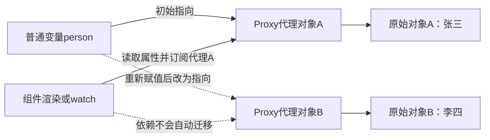

新的代理对象B本身仍然具有响应式，问题在于`person = reactive(...)`只是普通变量赋值，不能通知原来订阅代理对象A的组件或侦听器。因此，页面与旧代理建立的绑定关系不会自动转移到新代理。

使用`Object.assign`时不会替换代理对象，页面仍然订阅同一个代理A，只是代理A的`name`和`age`属性发生变化，所以能够正常触发更新。

如果业务上经常需要整体替换对象，使用`ref`通常更自然：

```ts
const person = ref({ name: '张三', age: 18 })
person.value = { name: '李四', age: 20 }
```

## 3.5. `ref` 创建：对象类型的响应式数据

1\. 其实`ref`接收的数据可以是：**基本类型**、**对象类型**。
2\. 若`ref`接收的是对象类型，内部会使用`reactive`把对象转换成深层响应式代理。

### 3.5.1 `ref`默认是深层响应式

对象型`ref`默认会递归处理嵌套对象和数组。因此，不仅替换整个`.value`能够触发更新，修改深层属性、向嵌套数组添加元素也能触发更新：

```ts
import { ref } from 'vue'

const state = ref({
  user: {
    name: '张三',
    address: { city: '北京' }
  },
  tags: ['Vue']
})

state.value.user.address.city = '上海' // 可以触发更新
state.value.tags.push('TypeScript')   // 可以触发更新
state.value = {                       // 整体替换也可以触发更新
  user: {
    name: '李四',
    address: { city: '广州' }
  },
  tags: ['Vue', 'Vite']
}
```

可以把对象型`ref`理解成“外层`ref`容器加内层深层响应式对象”：

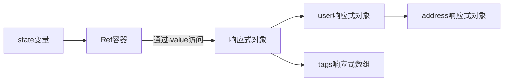

下面原有示例中的`car.value.price`、`games.value[0].name`和`obj.value.a.b.c.d`都属于深层属性修改，因此能够更新页面：

```vue
<template>
  <div class="person">
    <h2>汽车信息：一台{{ car.brand }}汽车，价值{{ car.price }}万</h2>
    <h2>游戏列表：</h2>
    <ul>
      <li v-for="g in games" :key="g.id">{{ g.name }}</li>
    </ul>
    <h2>测试：{{obj.a.b.c.d}}</h2>
    <button @click="changeCarPrice">修改汽车价格</button>
    <button @click="changeFirstGame">修改第一游戏</button>
    <button @click="test">测试</button>
  </div>
</template>

<script lang="ts" setup name="Person">
import { ref } from 'vue'

// 数据
let car = ref({ brand: '奔驰', price: 100 })
let games = ref([
  { id: 'ahsgdyfa01', name: '英雄联盟' },
  { id: 'ahsgdyfa02', name: '王者荣耀' },
  { id: 'ahsgdyfa03', name: '原神' }
])
let obj = ref({
  a:{
    b:{
      c:{
        d:666
      }
    }
  }
})

console.log(car)

function changeCarPrice() {
  car.value.price += 10
}
function changeFirstGame() {
  games.value[0].name = '流星蝴蝶剑'
}
function test(){
  obj.value.a.b.c.d = 999
}
</script>
```

### 3.5.2 使用`shallowRef`关闭深层转换

`ref()`没有类似`deep: false`的配置项。如果只希望`.value`整体替换时触发更新，而不希望Vue递归转换内部对象，应使用`shallowRef()`：

```ts
import { shallowRef } from 'vue'

const person = shallowRef({
  name: '张三',
  address: {
    city: '北京'
  }
})

// 内部对象是普通对象：数据会改变，但不会因此触发页面更新
person.value.address.city = '上海'

// 替换.value：会触发页面更新
person.value = {
  ...person.value,
  address: {
    ...person.value.address,
    city: '广州'
  }
}
```

两者的响应式范围如下：

| API | `.value`整体替换 | 深层属性修改 | 常见用途 |
| --- | --- | --- | --- |
| `ref` | 触发更新 | 触发更新 | 普通业务状态，初学者默认选择 |
| `shallowRef` | 触发更新 | 不会因此触发更新 | 大型不可变数据、第三方状态对象 |

> `shallowRef`中的深层属性并非不能修改，而是修改后Vue不会收到通知。数据虽然已经变化，但依赖它的模板、计算属性或副作用不会因为这次深层修改而重新执行。

### 3.5.3 `triggerRef`手动触发更新

如果确实修改了`shallowRef`的深层属性，可以通过`triggerRef()`强制通知相关依赖重新执行：

```ts
import { shallowRef, triggerRef } from 'vue'

const person = shallowRef({
  name: '张三',
  age: 18
})

person.value.age++
triggerRef(person)
```

不过在普通业务中，更推荐为`shallowRef.value`赋一个新对象，使“状态发生了整体变化”更加明确。`triggerRef`更适合与外部状态系统集成或处理特殊性能场景，不应成为初学阶段的默认写法。

需要注意，`watch`中的`deep: true`是侦听器的遍历配置，用于控制侦听范围；它和`ref`、`shallowRef`如何创建响应式数据不是同一个概念。

## 3.6. `ref` 对比 `reactive`
宏观角度看：

> 1\. `ref`用来定义：**基本类型数据**、**对象类型数据**；
>
> 2\. `reactive`用来定义：**对象类型数据**。

1\. 区别：

> 1\. `ref`创建的变量必须使用`.value`（可以使用`volar`插件自动添加`.value`）。
>
>     
>
> 2\. `reactive`重新分配一个新对象，会**失去**响应式（可以使用`Object.assign`去整体替换）。

2\. 使用原则：
> 1\. 若需要一个基本类型的响应式数据，必须使用`ref`。
> 2\. 若需要一个响应式对象，层级不深，`ref`、`reactive`都可以。
> 3\. 若需要一个响应式对象，且层级较深，推荐使用`reactive`。

对初学者而言，更简单稳定的团队约定是：默认使用`ref`，只有明确希望长期保留同一个对象代理、并频繁修改其内部属性时再使用`reactive`。对象层级深浅不是唯一判断标准，是否需要“整体替换”通常更关键。

| 需求 | 推荐方式 | 原因 |
| --- | --- | --- |
| 数字、字符串、布尔值 | `ref` | `reactive`不支持基本类型 |
| 对象会被整体替换 | `ref` | 可以给`.value`重新赋值 |
| 对象长期不替换，只修改属性 | `reactive`或`ref` | 两者都能深层响应 |
| 需要解构对象属性 | `reactive`配合`toRefs` | 普通解构会丢失响应式连接 |

## 3.7. `toRefs` 与 `toRef`

1\. 作用：将一个响应式对象中的每一个属性，转换为`ref`对象。
2\. 备注：`toRefs`与`toRef`功能一致，但`toRefs`可以批量转换。
3\. 为什么需要：直接执行`const { name } = person`只会取出当前值，后续修改`name`与`person.name`不会继续同步；`toRefs(person)`返回的属性`ref`仍指向原响应式对象。

下面用图对比直接解构和`toRefs`的绑定关系：

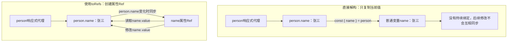

直接解构基本类型属性时，得到的是当时的普通值；`toRefs`和`toRef`并不是复制一份独立数据，而是创建一个仍然连接原属性的`ref`。因此，两边修改会保持同步：

```ts
import { reactive, toRefs } from 'vue'

const person = reactive({ name: '张三', age: 18 })
const { name } = toRefs(person)

name.value = '李四'
console.log(person.name) // 李四

person.name = '王五'
console.log(name.value) // 王五
```

可以把`name`理解为`person.name`的“响应式入口”：

```text
脚本读取或修改name.value
          ↕
      name属性Ref
          ↕
      person.name
          ↕
       页面更新
```

完整语法如下：
```vue
<template>
  <div class="person">
    <h2>姓名：{{person.name}}</h2>
    <h2>年龄：{{person.age}}</h2>
    <h2>性别：{{person.gender}}</h2>
    <button @click="changeName">修改名字</button>
    <button @click="changeAge">修改年龄</button>
    <button @click="changeGender">修改性别</button>
  </div>
</template>

<script lang="ts" setup name="Person">
  import {reactive,toRefs,toRef} from 'vue'

  // 数据
  let person = reactive({name:'张三', age:18, gender:'男'})
	
  // 通过toRefs将person对象中的n个属性批量取出，且依然保持响应式的能力
  let {name,gender} =  toRefs(person)
	
  // 通过toRef将person对象中的age属性取出，且依然保持响应式的能力
  let age = toRef(person,'age')

  // 方法
  function changeName(){
    name.value += '~'
  }
  function changeAge(){
    age.value += 1
  }
  function changeGender(){
    gender.value = '女'
  }
</script>
```

## 3.8. `ref`、`reactive`与属性`Ref`的绑定关系

这一节专门回答两个问题：当前数据是不是响应式数据，以及数据变化后，原来使用它的组件渲染、计算属性或侦听逻辑是否会重新执行。

第一次阅读建议按下面的顺序学习：

1\. 先阅读3.8.1至3.8.7，掌握`ref`、`reactive`、`toRef`和`toRefs`的基本绑定规则。
2\. 再阅读3.8.11和3.8.12，通过结果总表和选择流程巩固结论。
3\. 3.8.8至3.8.10涉及getter形式`toRef`、可写`computed`和自动解包，可以在掌握基础规则后阅读。

先记住最小结论：

| 操作 | 是否能触发已建立的响应式依赖 |
| --- | --- |
| 修改`ref.value` | 能 |
| 修改同一个`reactive`代理的属性 | 能 |
| 把普通变量重新赋值为新的`Ref` | 不能自动迁移旧依赖 |
| 把普通变量重新赋值为新的`reactive`代理 | 不能自动迁移旧依赖 |
| 使用`toRef`或`toRefs`连接稳定代理的属性 | 能保持属性绑定 |

### 3.8.1 用三个步骤判断是否会更新

遇到响应式问题时，不要只问“这个对象是不是响应式”，而要依次检查下面三步：

1\. **读取了什么：**组件渲染、`computed`或`watchEffect`读取的是哪个`.value`或代理属性。
2\. **修改了什么：**后续代码是否修改了同一个`.value`或同一个代理的属性。
3\. **对象身份是否变化：**是否只是把普通变量改为指向一个新`Ref`或新代理。

这里的“响应式入口”是指Vue可以拦截读取和修改的位置，例如`count.value`或`state.count`。只有在组件渲染、`computed`、`watch`、`watchEffect`等响应式执行环境中读取入口时，Vue才会记录依赖。

下面是一个最小验证示例：

```ts
import { reactive, watchEffect } from 'vue'

const state = reactive({ count: 0 })

watchEffect(() => {
  console.log('响应式执行：', state.count)
})
// 首次立即输出：响应式执行：0

state.count++
// 随后输出：响应式执行：1

let localCount = state.count
localCount++
// 不会再次输出，因为修改的是普通变量localCount
```

执行`watchEffect`时读取了`state.count`，Vue因此记录了“这个`watchEffect`依赖`state.count`”。修改同一个`state.count`会触发重新执行，修改解构或赋值得到的普通变量则不会。

完整通知过程如下：

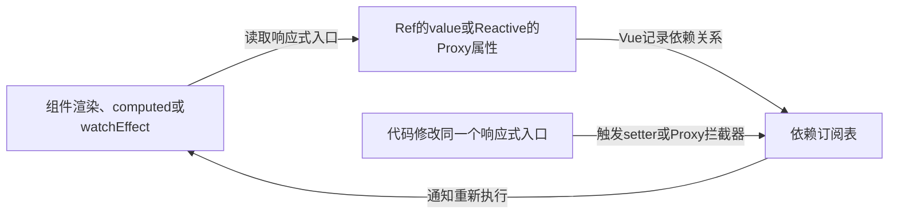

如果只是让普通变量指向另一个响应式对象，赋值过程不会修改旧的`.value`或旧代理属性，因此不会触发旧依赖，Vue也不会自动把依赖迁移到新对象。

| 概念 | 含义 | Vue能否直接追踪 |
| --- | --- | --- |
| 普通变量绑定 | 变量当前保存哪个值或对象引用 | 不能直接追踪变量重新赋值 |
| `Ref`容器 | 通过`.value`保存值 | 能追踪`.value`的读取和修改 |
| `reactive`代理 | 代理对象的属性访问 | 能追踪代理属性的读取和修改 |
| 属性`Ref` | `toRef`创建的原对象属性入口 | 能通过`.value`读写所连接的源属性 |

### 3.8.2 基本类型`ref`的绑定关系

```ts
import { ref, watchEffect } from 'vue'

const name = ref('张三')

watchEffect(() => {
  console.log(name.value)
})

name.value = '李四' // 会触发watchEffect重新执行
```

这里的`name`是保存`Ref`对象的普通变量，`name.value`才是被追踪的响应式入口：

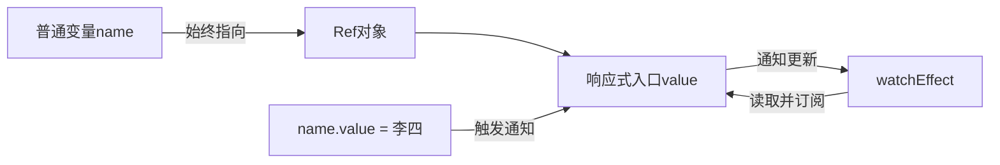

因此推荐用`const`保存`Ref`，只修改`.value`：

```ts
const name = ref('张三')
name.value = '李四'
```

不要依赖下面这种重新赋值：

```ts
let name = ref('张三')

watchEffect(() => {
  console.log(name.value) // 初次执行时订阅旧Ref
})

name = ref('李四') // 普通变量赋值，不会通知旧Ref的订阅者
```

新的`Ref`本身有响应式，但`watchEffect`最初订阅的是旧`Ref`。仅执行这次普通变量赋值，不会让依赖自动迁移到新`Ref`。

### 3.8.3 对象类型`ref`的绑定关系

对象型`ref`包含两层响应式入口：外层`.value`和内层响应式代理属性。

```ts
import { ref } from 'vue'

const person = ref({
  name: '张三',
  age: 18
})

person.value.name = '李四' // 内层代理属性变化，会触发更新

person.value = {           // 外层.value变化，也会触发更新
  name: '王五',
  age: 20
}
```

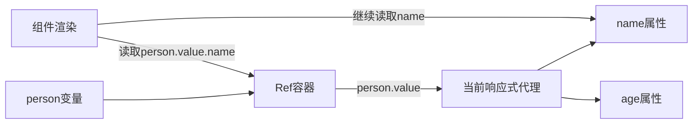

这两种修改都能通知页面：

1\. `person.value.name = '李四'`修改当前代理的属性。
2\. `person.value = newPerson`修改`Ref`容器的`.value`，页面重新执行时会读取新的代理。

直接解构`person.value`中的基本类型属性仍会断开绑定：

```ts
import { ref } from 'vue'

const person = ref({ name: '张三', age: 18 })
const { name } = person.value

person.value.name = '李四'
console.log(name) // 仍然是“张三”
```

原因是`name`只接收了解构时的字符串，并没有保存到源属性的响应式通道。

### 3.8.4 `reactive`的绑定关系

`reactive`返回一个`Proxy`代理，Vue追踪的是通过这个代理发生的属性读取和修改：

```ts
import { reactive } from 'vue'

const person = reactive({
  name: '张三',
  age: 18
})

person.name = '李四' // 会触发更新
person.age++         // 会触发更新
```

使用`const`可以避免代理变量被意外替换。需要同时更新多个属性时，可以保留同一个代理并使用`Object.assign`：

```ts
const person = reactive({ name: '张三', age: 18 })

Object.assign(person, {
  name: '李四',
  age: 20
})
```

下面的两个代理本身都有响应式，但原来的依赖不会自动迁移：

```ts
import { isReactive, reactive } from 'vue'

let person = reactive({ name: '张三', age: 18 })
const oldPerson = person

person = reactive({ name: '李四', age: 20 })

console.log(isReactive(oldPerson)) // true
console.log(isReactive(person))    // true
```

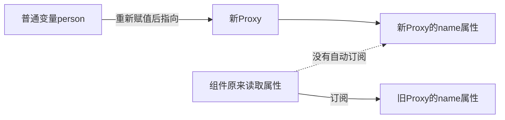

`isReactive(person)`只能说明当前值是响应式代理，不能证明现有组件已经订阅了这个新代理。

### 3.8.5 `toRef`如何连接一个源属性

对象属性形式`toRef(source, key)`不会复制属性值，而是创建一个连接源属性的`Ref`：

```ts
import { reactive, toRef } from 'vue'

const person = reactive({
  name: '张三',
  age: 18
})

const name = toRef(person, 'name')

name.value = '李四'
console.log(person.name) // 李四

person.name = '王五'
console.log(name.value) // 王五
```

不要把`toRef(person, 'name')`写成`ref(person.name)`。后者只把当前字符串复制进一个新的、独立的`Ref`：

```ts
import { reactive, ref, toRef } from 'vue'

const person = reactive({ name: '张三' })
const linkedName = toRef(person, 'name')
const copiedName = ref(person.name)

person.name = '赵六'

console.log(linkedName.value) // 赵六，与person.name保持连接
console.log(copiedName.value) // 张三，保存的是创建时的值
```

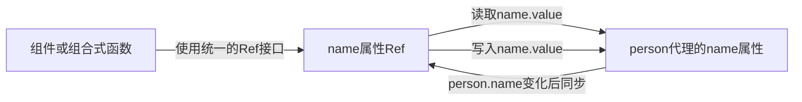

使用对象属性形式时需要注意：

1\. `source`应当是需要保持使用的响应式对象，例如`reactive`代理或响应式`props`。
2\. `toRef`连接的是传入调用时的那个对象及其属性；如果外层变量后来指向其他对象，属性`Ref`不会自动换目标。
3\. `toRef`可以为当前不存在的可选属性创建入口，这一点与`toRefs`不同。
4\. 如果源对象是只读的`props`，通过属性`Ref`写入仍然等同于修改`props`，因此仍然不允许。

可选属性示例：

```ts
import { reactive, toRef } from 'vue'

interface Person {
  name: string
  nickname?: string
}

const person = reactive<Person>({ name: '张三' })
const nickname = toRef(person, 'nickname', '')

nickname.value = '小张'
console.log(person.nickname) // 小张
```

### 3.8.6 `toRefs`如何批量创建属性`Ref`

`toRefs(source)`会返回一个普通对象，并为源对象调用时已有的可枚举属性分别创建属性`Ref`：

```ts
import { reactive, toRefs } from 'vue'

const person = reactive({
  name: '张三',
  age: 18
})

const personRefs = toRefs(person)
const { name, age } = personRefs

name.value = '李四'
age.value++

console.log(person.name) // 李四
console.log(person.age)  // 19
```

绑定关系可以理解为：

```text
toRefs(person)
├── name属性Ref ── person.name
└── age属性Ref  ── person.age
```

`toRefs`有三个重要边界：

1\. 它适合接收`reactive`对象，不应该直接接收对象型`Ref`容器。
2\. 它只处理调用时已经存在且可枚举的属性，后来新增的属性不会自动出现在返回对象中。
3\. 每个属性`Ref`仍然连接原来的源对象，因此源代理应保持不变。

下面的写法不正确：

```ts
import { ref, toRefs } from 'vue'

const person = ref({ name: '张三', age: 18 })

// 错误理解：name不在person这个Ref容器上，而在person.value上
const { name } = toRefs(person)
```

在TypeScript项目中，这段代码通常会直接出现类型错误，因为`person`公开的是`.value`，并没有`name`属性。正确判断路径是先看属性实际位于哪一层：

```text
person            -> Ref容器
person.value      -> 响应式对象
person.value.name -> 真正的name属性
```

### 3.8.7 `toRefs(person.value)`为什么只在整体替换前有效

下面的写法能够保持当前对象属性的响应式：

```ts
import { ref, toRefs } from 'vue'

const person = ref({ name: '张三', age: 18 })
const { name } = toRefs(person.value)

name.value = '李四'
console.log(person.value.name) // 李四

person.value.name = '王五'
console.log(name.value) // 王五
```

但是，`toRefs(person.value)`执行时收到的是当时的代理对象A。整体替换`.value`后，`person`指向代理对象B，而`name`属性`Ref`仍连接代理对象A：

```ts
person.value = {
  name: '赵六',
  age: 20
}

console.log(person.value.name) // 赵六，来自新代理B
console.log(name.value)        // 王五，仍然来自旧代理A
```

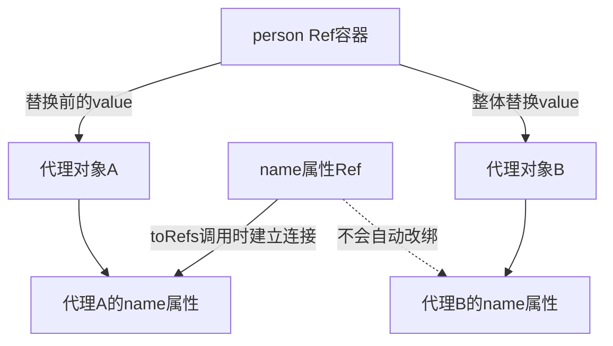

`toRef(person.value, 'name')`也具有相同边界，因为它同样连接调用时传入的代理对象。

可以用下面的表快速判断：

| 操作 | `person.value.name` | `name.value` |
| --- | --- | --- |
| 创建属性`Ref`后修改`name.value` | 同步变化 | 同步变化 |
| 创建属性`Ref`后修改`person.value.name` | 同步变化 | 同步变化 |
| 整体执行`person.value = 新对象` | 指向新对象的属性 | 仍指向旧对象的属性 |

### 3.8.8 整体替换后仍保持读取绑定

这一节属于进阶用法。getter是一个只负责返回值的函数，例如`() => person.value.name`。如果只需要读取，并且使用Vue 3.3及以上版本，可以把getter传给`toRef`：

```ts
import { ref, toRef } from 'vue'

const person = ref({ name: '张三', age: 18 })

const name = toRef(() => person.value.name)

console.log(name.value) // 张三

person.value = { name: '李四', age: 20 }
console.log(name.value) // 李四
```

这种写法每次读取`name.value`都会执行getter，重新访问当前的`person.value.name`，因此不会固定连接旧代理。不过它创建的是只读`Ref`，不能通过`name.value = '王五'`反向修改源数据。

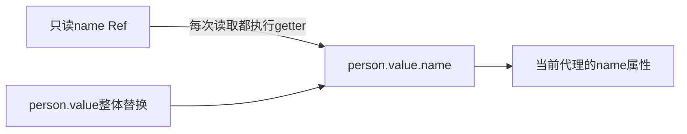

### 3.8.9 整体替换后仍保持双向绑定

这一节需要先理解3.9中的`computed`，第一次阅读时可以暂时跳过。如果既要支持`person.value`整体替换，又要通过`name.value`修改姓名，可以使用可写`computed`：

```ts
import { computed, ref } from 'vue'

const person = ref({
  name: '张三',
  age: 18
})

const name = computed({
  get: () => person.value.name,
  set: value => {
    person.value.name = value
  }
})

person.value = { name: '李四', age: 20 }
console.log(name.value) // 李四

name.value = '王五'
console.log(person.value.name) // 王五
```

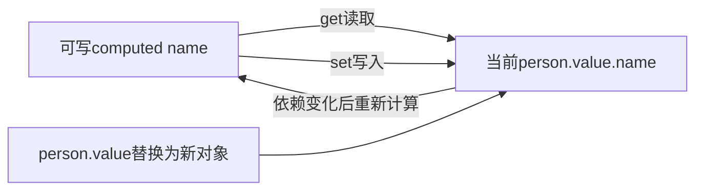

这里没有把`name`固定连接到某一个代理对象，而是通过`get`和`set`每次访问当前的`person.value`。

### 3.8.10 `reactive`对象中嵌套`ref`的自动解包

这一节介绍组合使用`reactive`和`ref`时的进阶规则。深层`reactive`对象把`Ref`作为对象属性保存时，读取该属性会自动解包，不需要写`.value`：

```js
import { reactive, ref } from 'vue'

const count = ref(0)
const state = reactive({ count })

console.log(state.count) // 0，不是Ref对象

state.count = 1
console.log(count.value) // 1
```

此时`state.count`与`count.value`仍然连接。若给该属性赋一个新的`Ref`，新`Ref`会替换旧`Ref`，原来的`count`将断开：

```js
const otherCount = ref(2)

state.count = otherCount

console.log(state.count) // 2
console.log(count.value) // 1，旧Ref不再与state.count连接
```

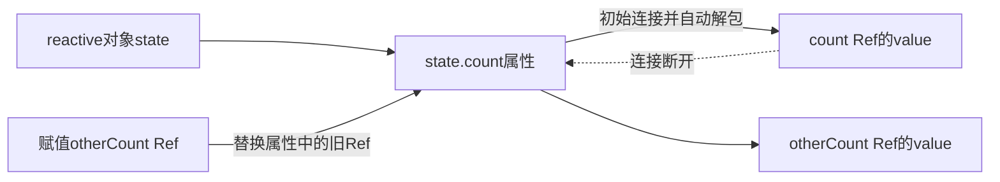

自动解包主要发生在深层响应式对象的属性中。`Ref`位于响应式数组、`Map`等集合中时通常不会自动解包，仍需要`.value`：

```ts
const books = reactive([ref('Vue 3指南')])
console.log(books[0].value)
```

### 3.8.11 常见写法结果总表

| 写法或操作 | 数据本身是否响应式 | 是否通知原有依赖 | 结论 |
| --- | --- | --- | --- |
| `refValue.value = 新值` | 是 | 是 | `ref`的标准修改方式 |
| 对象型`ref.value.name = 新值` | 是 | 是 | 深层属性默认响应式 |
| 对象型`ref.value = 新对象` | 是 | 是 | `.value`替换会被追踪 |
| `let x = ref(...); x = ref(...)` | 新`Ref`是响应式 | 否 | 普通变量重新赋值不会迁移依赖 |
| `reactiveObj.name = 新值` | 是 | 是 | 通过同一个代理修改属性 |
| `Object.assign(reactiveObj, data)` | 是 | 是 | 保留代理身份，适合批量更新 |
| `let x = reactive(...); x = reactive(...)` | 新代理是响应式 | 否 | 旧代理上的依赖不会迁移 |
| `const { name } = reactiveObj` | `name`是普通基本类型值 | 否 | 直接解构断开属性绑定 |
| `toRef(reactiveObj, 'name')` | 是 | 是 | 与同一个源属性双向同步 |
| `toRefs(reactiveObj)`后解构 | 是 | 是 | 各属性`Ref`连接原代理 |
| `toRefs(objectRef)` | 用法不正确 | 否 | 属性位于`objectRef.value`中 |
| `toRefs(objectRef.value)` | 当前属性`Ref`是响应式 | 替换`.value`后不再同步 | 属性`Ref`固定连接旧代理 |
| `toRef(() => objectRef.value.name)` | 是，只读 | 是 | 每次读取当前对象，支持整体替换 |
| 可写`computed`桥接 | 是，可读写 | 是 | 支持整体替换和双向修改 |

### 3.8.12 选择方式

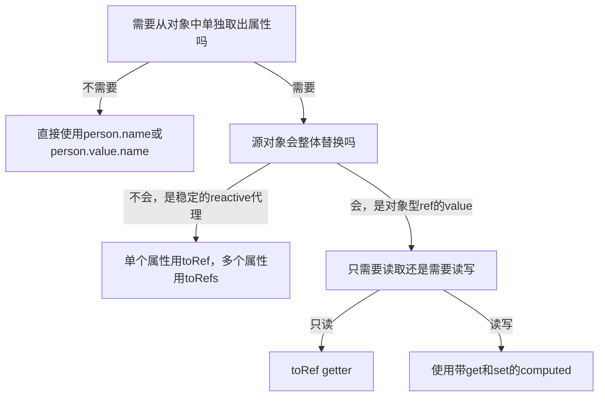

初学阶段可以先记住下面五条：

1\. `ref`修改`.value`，`reactive`修改同一个代理的属性。
2\. 普通变量重新赋值不会被Vue追踪，不要用它替换已经建立依赖的`Ref`或`reactive`代理。
3\. `toRef`和`toRefs`连接的是源对象属性，不是复制一份独立数据。
4\. `toRefs(person.value)`只连接当前代理，整体替换`person.value`后不会自动改绑。
5\. 对象需要频繁整体替换时，优先保留对象型`ref`，按需使用getter形式`toRef`或可写`computed`暴露属性。

## 3.9. `computed`

### 3.9.1 计算属性的核心作用

作用：根据已有数据计算出新数据（和`Vue2`中的`computed`作用一致）。

`computed`适合“根据现有状态算出另一个值”，例如根据单价和数量计算总价。它会缓存结果，只有依赖的数据变化时才重新计算。不要在`computed`中发送请求、修改其他状态或操作DOM（Document Object Model，文档对象模型）；这些带有外部影响的操作更适合放在事件方法或`watch`中。

  

```vue
<template>
  <div class="person">
    姓：<input type="text" v-model="firstName"> <br>
    名：<input type="text" v-model="lastName"> <br>
    全名：<span>{{fullName}}</span> <br>
    <button @click="changeFullName">全名改为：li-si</button>
  </div>
</template>

<script setup lang="ts" name="App">
  import {ref,computed} from 'vue'

  let firstName = ref('zhang')
  let lastName = ref('san')

  // 计算属性——只读取，不修改
  /* let fullName = computed(()=>{
    return firstName.value + '-' + lastName.value
  }) */


  // 计算属性——既读取又修改
  let fullName = computed({
    // 读取
    get(){
      return firstName.value + '-' + lastName.value
    },
    // 修改
    set(val){
      console.log('有人修改了fullName',val)
      firstName.value = val.split('-')[0]
      lastName.value = val.split('-')[1]
    }
  })

  function changeFullName(){
    // fullName是响应式ref对象
    fullName.value = 'li-si'
  } 
</script>
```

### 3.9.2 `computed`、普通函数和`watch`怎么选

| 需求 | 推荐方式 | 原因 |
| --- | --- | --- |
| 根据现有状态得到一个新值 | `computed` | 声明式、有缓存、可以直接用于模板 |
| 用户点击后执行一次业务动作 | 普通函数 | 触发时机明确，不需要响应式追踪 |
| 数据变化后发请求、写存储或操作DOM | `watch` | 这类操作属于副作用，不是派生值 |

一个实用判断方法是：如果能写成“结果等于某些状态经过计算”，优先使用`computed`；如果描述是“当某个状态变化时做一件事”，再考虑`watch`。

## 3.10. `watch`

1\. 作用：监视数据的变化（和`Vue2`中的`watch`作用一致）
2\. 特点：`Vue3`中的`watch`只能监视以下**四种数据**：
> 1\. `ref`定义的数据。
> 2\. `reactive`定义的数据。
> 3\. 函数返回一个值（`getter`函数）。
> 4\. 一个包含上述内容的数组。

我们在`Vue3`中使用`watch`的时候，通常会遇到以下几种情况：
### 3.10.1 监视`ref`定义的基本类型数据
监视`ref`定义的【基本类型】数据：直接写数据名即可，监视的是其`value`值的改变。

```vue
<template>
  <div class="person">
    <h1>情况一：监视【ref】定义的【基本类型】数据</h1>
    <h2>当前求和为：{{sum}}</h2>
    <button @click="changeSum">点我sum+1</button>
  </div>
</template>

<script lang="ts" setup name="Person">
  import {ref,watch} from 'vue'
  // 数据
  let sum = ref(0)
  // 方法
  function changeSum(){
    sum.value += 1
  }
  // 监视，情况一：监视【ref】定义的【基本类型】数据
  const stopWatch = watch(sum,(newValue,oldValue)=>{
    console.log('sum变化了',newValue,oldValue)
    if(newValue >= 10){
      stopWatch()
    }
  })
</script>
```
### 3.10.2 监视`ref`定义的对象类型数据
监视`ref`定义的【对象类型】数据：直接写数据名，监视的是对象的【地址值】，若想监视对象内部的数据，要手动开启深度监视。

> 注意：
>
> 1\. 若修改的是`ref`定义的对象中的属性，`newValue` 和 `oldValue` 都是新值，因为它们是同一个对象。
>
> 2\. 若修改整个`ref`定义的对象，`newValue` 是新值， `oldValue` 是旧值，因为不是同一个对象了。

```vue
<template>
  <div class="person">
    <h1>情况二：监视【ref】定义的【对象类型】数据</h1>
    <h2>姓名：{{ person.name }}</h2>
    <h2>年龄：{{ person.age }}</h2>
    <button @click="changeName">修改名字</button>
    <button @click="changeAge">修改年龄</button>
    <button @click="changePerson">修改整个人</button>
  </div>
</template>

<script lang="ts" setup name="Person">
  import {ref,watch} from 'vue'
  // 数据
  let person = ref({
    name:'张三',
    age:18
  })
  // 方法
  function changeName(){
    person.value.name += '~'
  }
  function changeAge(){
    person.value.age += 1
  }
  function changePerson(){
    person.value = {name:'李四',age:90}
  }
  /* 
    监视，情况一：监视【ref】定义的【对象类型】数据，监视的是对象的地址值，若想监视对象内部属性的变化，需要手动开启深度监视
    watch的第一个参数是：被监视的数据
    watch的第二个参数是：监视的回调
    watch的第三个参数是：配置对象（deep、immediate等等.....） 
  */
  watch(person,(newValue,oldValue)=>{
    console.log('person变化了',newValue,oldValue)
  },{deep:true})
  
</script>
```
### 3.10.3 监视`reactive`定义的对象类型数据

直接把`reactive`对象传给`watch`时，会隐式创建深层侦听器。顶层属性和深层属性发生变化时都能触发回调，但Vue不会为对象自动保存深拷贝快照。

```vue
<template>
  <div class="person">
    <h1>监视reactive定义的对象类型数据</h1>
    <h2>姓名：{{ person.name }}</h2>
    <h2>年龄：{{ person.age }}</h2>
    <button @click="changeName">修改名字</button>
    <button @click="changeAge">修改年龄</button>
    <button @click="changePerson">修改整个人</button>
    <hr>
    <h2>测试：{{obj.a.b.c}}</h2>
    <button @click="test">修改obj.a.b.c</button>
  </div>
</template>

<script lang="ts" setup name="Person">
  import { reactive, watch } from 'vue'

  // 数据
  const person = reactive({
    name: '张三',
    age: 18
  })

  const obj = reactive({
    a: {
      b: {
        c: 666
      }
    }
  })

  // 方法
  function changeName() {
    // 场景一：修改reactive对象的顶层属性
    person.name += '~'
  }

  function changeAge() {
    // 场景二：修改reactive对象的另一个顶层属性
    person.age += 1
  }

  function changePerson() {
    // 场景三：批量修改同一个代理的多个属性
    // Object.assign没有替换person代理，所以直接侦听仍然有效。
    // 同一轮同步代码中的多次修改通常会被批量处理，回调看到的是最终结果。
    Object.assign(person, { name: '李四', age: 80 })
  }

  function test() {
    // 场景四：修改多层嵌套属性
    // watch(obj, callback)是隐式深度侦听，因此可以触发回调。
    obj.a.b.c = 888
  }

  watch(
    person,
    (newValue, oldValue) => {
      // 场景A：因为配置了immediate: true，注册侦听器后会立即执行一次。
      // 首次执行时：
      // newValue是person当前的响应式代理。
      // oldValue是undefined，因为还没有上一次执行结果。
      if (oldValue === undefined) {
        console.log('首次执行', newValue, oldValue)
        return
      }

      // 场景B：点击“修改名字”或“修改年龄”。
      // 修改的是同一个person代理中的属性，没有替换person对象。
      // newValue和oldValue指向同一个响应式代理，所以二者严格相等。
      // 两者读取到的name、age也都是修改后的最新值。

      // 场景C：点击“修改整个人”，通过Object.assign批量修改属性。
      // Object.assign仍然修改同一个person代理，并没有创建新代理。
      // 因此newValue === oldValue仍然是true。

      console.log('person变化了', newValue, oldValue)
      console.log('是否为同一个代理：', newValue === oldValue) // true
      console.log('newValue.name：', newValue.name) // 修改后的值
      console.log('oldValue.name：', oldValue.name) // 同样是修改后的值

      // oldValue不是修改前对象的深拷贝，不能用它恢复完整旧状态。
    },
    {
      // 默认是false；设为true后会在注册侦听器时立即执行一次。
      immediate: true

      // 直接侦听reactive对象时已经隐式开启深度侦听，通常不必再写deep: true。
    }
  )

  watch(obj, (newValue, oldValue) => {
    // 场景D：点击“修改obj.a.b.c”，深层属性变化会触发回调。
    // obj本身没有被替换，所以newValue和oldValue仍指向同一个代理。
    // 回调执行时，两者的a.b.c都已经是888，而不是一个666、一个888。
    console.log('obj变化了', newValue, oldValue)
    console.log(newValue === oldValue) // true
    console.log(newValue.a.b.c) // 888
    console.log(oldValue.a.b.c) // 888
  })

  // 如果需要比较person顶层基本类型属性修改前后的值，
  // 可以让getter每次返回一个新的普通对象快照。
  watch(
    () => ({
      name: person.name,
      age: person.age
    }),
    (newValue, oldValue) => {
      // 这里每次都会创建新的普通对象，因此newValue !== oldValue。
      // oldValue保留上一次执行时的name和age基本类型值。
      // 例如name从“张三”改为“张三~”时：
      // newValue.name是“张三~”，oldValue.name是“张三”。
      console.log('顶层属性快照变化', newValue, oldValue)
      console.log(newValue === oldValue) // false
    }
  )

  // 注意：如果使用let声明person后执行下面这种普通变量重新赋值，
  // 原watch不会因为这次赋值而触发，也不会自动改为侦听新代理：
  // person = reactive({ name: '王五', age: 20 })
</script>
```

> 直接侦听响应式对象时，`oldValue`表示“上一次回调对应的对象引用”，不是“修改前的深拷贝”。需要比较历史数据时，应只选择业务需要的基本类型字段创建快照，避免对大型对象频繁深拷贝。

### 3.10.4 监视响应式对象的某个属性
监视`ref`或`reactive`定义的【对象类型】数据中的**某个属性**，注意点如下：

1\. 若该属性值**不是**【对象类型】，需要写成函数形式。
2\. 若该属性值是**依然**是【对象类型】，可直接编，也可写成函数，建议写成函数。

结论：监视的要是对象里的属性，那么最好写函数式，注意点：若是对象监视的是地址值，需要关注对象内部，需要手动开启深度监视。

```vue
<template>
  <div class="person">
    <h1>情况四：监视【ref】或【reactive】定义的【对象类型】数据中的某个属性</h1>
    <h2>姓名：{{ person.name }}</h2>
    <h2>年龄：{{ person.age }}</h2>
    <h2>汽车：{{ person.car.c1 }}、{{ person.car.c2 }}</h2>
    <button @click="changeName">修改名字</button>
    <button @click="changeAge">修改年龄</button>
    <button @click="changeC1">修改第一台车</button>
    <button @click="changeC2">修改第二台车</button>
    <button @click="changeCar">修改整个车</button>
  </div>
</template>

<script lang="ts" setup name="Person">
  import {reactive,watch} from 'vue'

  // 数据
  let person = reactive({
    name:'张三',
    age:18,
    car:{
      c1:'奔驰',
      c2:'宝马'
    }
  })
  // 方法
  function changeName(){
    person.name += '~'
  }
  function changeAge(){
    person.age += 1
  }
  function changeC1(){
    person.car.c1 = '奥迪'
  }
  function changeC2(){
    person.car.c2 = '大众'
  }
  function changeCar(){
    person.car = {c1:'雅迪',c2:'爱玛'}
  }

  // 监视，情况四：监视响应式对象中的某个属性，且该属性是基本类型的，要写成函数式
  /* watch(()=> person.name,(newValue,oldValue)=>{
    console.log('person.name变化了',newValue,oldValue)
  }) */

  // 监视，情况四：监视响应式对象中的某个属性，且该属性是对象类型的，可以直接写，也能写函数，更推荐写函数
  watch(()=>person.car,(newValue,oldValue)=>{
    console.log('person.car变化了',newValue,oldValue)
  },{deep:true})
</script>
```
### 3.10.5 同时监视多个数据
监视上述的多个数据
```vue
<template>
  <div class="person">
    <h1>情况五：监视上述的多个数据</h1>
    <h2>姓名：{{ person.name }}</h2>
    <h2>年龄：{{ person.age }}</h2>
    <h2>汽车：{{ person.car.c1 }}、{{ person.car.c2 }}</h2>
    <button @click="changeName">修改名字</button>
    <button @click="changeAge">修改年龄</button>
    <button @click="changeC1">修改第一台车</button>
    <button @click="changeC2">修改第二台车</button>
    <button @click="changeCar">修改整个车</button>
  </div>
</template>

<script lang="ts" setup name="Person">
  import {reactive,watch} from 'vue'

  // 数据
  let person = reactive({
    name:'张三',
    age:18,
    car:{
      c1:'奔驰',
      c2:'宝马'
    }
  })
  // 方法
  function changeName(){
    person.name += '~'
  }
  function changeAge(){
    person.age += 1
  }
  function changeC1(){
    person.car.c1 = '奥迪'
  }
  function changeC2(){
    person.car.c2 = '大众'
  }
  function changeCar(){
    person.car = {c1:'雅迪',c2:'爱玛'}
  }

  // 监视，情况五：监视上述的多个数据
  watch([()=>person.name,person.car],(newValue,oldValue)=>{
    console.log('person.car变化了',newValue,oldValue)
  },{deep:true})

</script>
```

### 3.10.6 常用配置与异步清理

`watch`的第三个参数是配置对象，下面三个选项最常用：

| 配置 | 作用 | 使用提醒 |
| --- | --- | --- |
| `immediate: true` | 创建侦听器后立即执行一次 | 适合进入页面就加载一次数据 |
| `deep: true` | 递归观察对象内部属性 | 大对象可能带来额外遍历成本，优先监听具体属性 |
| `flush: 'post'` | 等当前组件DOM更新后再执行回调 | 回调中需要读取更新后的DOM时使用 |

侦听器中发送异步请求时，旧请求可能比新请求更晚返回，造成页面显示过期数据。可以使用回调的`onCleanup`取消上一次任务：

```ts
import { ref, watch } from 'vue'

const keyword = ref('')
const result = ref<unknown>(null)

watch(keyword, async (newKeyword, _oldKeyword, onCleanup) => {
  const controller = new AbortController()

  // keyword再次变化前，Vue会先执行这里的清理函数
  onCleanup(() => controller.abort())

  try {
    const response = await fetch(
      `/api/search?q=${encodeURIComponent(newKeyword)}`,
      { signal: controller.signal }
    )
    result.value = await response.json()
  } catch (error) {
    if ((error as Error).name !== 'AbortError') {
      console.error('搜索失败', error)
    }
  }
}, { immediate: true })
```

> `newValue`和`oldValue`在深度侦听对象时可能指向同一个对象，因为Vue没有自动保存一份深拷贝。若业务必须比较修改前后的完整快照，需要自行复制数据，但要注意大对象的性能成本。

## 3.11. `watchEffect`

`watchEffect`会立即执行回调，并自动追踪回调同步执行期间读取的响应式数据。它适合依赖较多、回调逻辑较短的副作用。

| 对比项 | `watch` | `watchEffect` |
| --- | --- | --- |
| 依赖来源 | 手动声明 | 自动收集同步执行时读取的响应式数据 |
| 初次执行 | 默认不执行，可配置`immediate` | 立即执行 |
| 旧值 | 可以获得 | 不直接提供 |
| 控制精度 | 高，适合明确业务条件 | 写法简洁，适合多个依赖共同作用 |

> 异步`watchEffect`只会追踪第一次`await`之前读取的响应式数据。若依赖关系需要非常明确，或者要比较新旧值，优先使用`watch`。

示例代码：

  ```vue
  <template>
    <div class="person">
      <h1>需求：水温达到50℃，或水位达到20cm，则联系服务器</h1>
      <h2 id="demo">水温：{{temp}}</h2>
      <h2>水位：{{height}}</h2>
      <button @click="changePrice">水温+1</button>
      <button @click="changeSum">水位+10</button>
    </div>
  </template>
  
  <script lang="ts" setup name="Person">
    import {ref,watch,watchEffect} from 'vue'
    // 数据
    let temp = ref(0)
    let height = ref(0)
  
    // 方法
    function changePrice(){
      temp.value += 10
    }
    function changeSum(){
      height.value += 1
    }
  
    // 用watch实现，需要明确的指出要监视：temp、height
    watch([temp,height],(value)=>{
      // 从value中获取最新的temp值、height值
      const [newTemp,newHeight] = value
      // 室温达到50℃，或水位达到20cm，立刻联系服务器
      if(newTemp >= 50 || newHeight >= 20){
        console.log('联系服务器')
      }
    })
  
    // 用watchEffect实现，不用
    const stopWatch = watchEffect(()=>{
      // 室温达到50℃，或水位达到20cm，立刻联系服务器
      if(temp.value >= 50 || height.value >= 20){
        console.log(document.getElementById('demo')?.innerText)
        console.log('联系服务器')
      }
      // 水温达到100，或水位达到50，取消监视
      if(temp.value === 100 || height.value === 50){
        console.log('清理了')
        stopWatch()
      }
    })
  </script>
  ```

  

## 3.12. 标签的 `ref` 属性

作用：用于注册模板引用。

> 1\. 用在普通`DOM`标签上，获取的是`DOM`节点。
>
> 2\. 用在组件标签上，获取的是组件实例对象。

用在普通`DOM`标签上：

```vue
<template>
  <div class="person">
    <h1 ref="title1">尚硅谷</h1>
    <h2 ref="title2">前端</h2>
    <h3 ref="title3">Vue</h3>
    <input type="text" ref="inpt"> <br><br>
    <button @click="showLog">点我打印内容</button>
  </div>
</template>

<script lang="ts" setup name="Person">
  import {ref} from 'vue'
	
  let title1 = ref()
  let title2 = ref()
  let title3 = ref()

  function showLog(){
    // 通过id获取元素
    const t1 = document.getElementById('title1')
    // 打印内容
    console.log((t1 as HTMLElement).innerText)
    console.log((<HTMLElement>t1).innerText)
    console.log(t1?.innerText)
    
		/************************************/
		
    // 通过ref获取元素
    console.log(title1.value)
    console.log(title2.value)
    console.log(title3.value)
  }
</script>
```

用在组件标签上：

```vue
<!-- 父组件App.vue -->
<template>
  <Person ref="ren"/>
  <button @click="test">测试</button>
</template>

<script lang="ts" setup name="App">
  import Person from './components/Person.vue'
  import {ref} from 'vue'

  let ren = ref()

  function test(){
    console.log(ren.value.name)
    console.log(ren.value.age)
  }
</script>


<!-- 子组件Person.vue中要使用defineExpose暴露内容 -->
<script lang="ts" setup name="Person">
	import {ref} from 'vue'
	// 数据
  let name = ref('张三')
  let age = ref(18)
  /****************************/
  /****************************/
  // 使用defineExpose将组件中的数据交给外部
  defineExpose({name,age})
</script>
```


## 3.13. `props`

> ```js
>// 定义一个接口，限制每个Person对象的格式
> export interface PersonInter {
>  	id:string,
>  	name:string,
>      age:number
>    }
>    
> // 定义一个自定义类型Persons
> export type Persons = Array<PersonInter>
> ```
> 
> `App.vue`中代码：
>
> ```vue
><template>
> 	<Person :list="persons"/>
> </template>
>   
> <script lang="ts" setup name="App">
>   import Person from './components/Person.vue'
>   import {reactive} from 'vue'
>     import {type Persons} from './types'
>   
>     let persons = reactive<Persons>([
>      {id:'e98219e12',name:'张三',age:18},
>       {id:'e98219e13',name:'李四',age:19},
>        {id:'e98219e14',name:'王五',age:20}
>      ])
>    </script>
>   
> ```
> 
> `Person.vue`中代码：
>
> ```Vue
><template>
> <div class="person">
>  <ul>
>      <li v-for="item in list" :key="item.id">
>         {{item.name}}--{{item.age}}
>       </li>
>     </ul>
>    </div>
>    </template>
>   
> <script lang="ts" setup name="Person">
> import {type Persons} from '@/types'
>   
>   // 第一种写法：仅接收
> // const props = defineProps(['list'])
>   
>   // 第二种写法：接收+限制类型
> // defineProps<{list:Persons}>()
>   
>   // 第三种写法：接收+限制类型+指定默认值+限制必要性
> let props = withDefaults(defineProps<{list?:Persons}>(),{
>      list:()=>[{id:'asdasg01',name:'小猪佩奇',age:18}]
>   })
>    console.log(props)
>   </script>
>   ```
> 

## 3.14. 生命周期

生命周期是组件从**创建、挂载、更新到卸载**所经历的过程。生命周期钩子就是Vue在特定阶段调用的函数，让我们有机会接入自己的逻辑。

### 3.14.1 执行顺序与心智模型

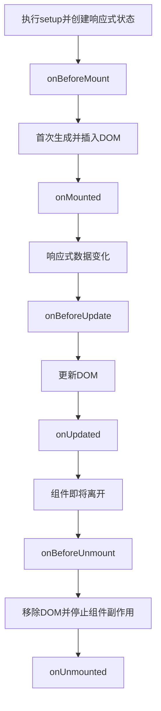

| Composition API钩子 | 适合做什么 | 此时DOM状态 |
| --- | --- | --- |
| `onMounted` | 读取模板DOM、初始化依赖DOM的第三方库、首次请求 | 已完成首次渲染 |
| `onUpdated` | 观察任意更新后的DOM | 已更新，但不要在这里无条件改状态 |
| `onBeforeUnmount` | 在DOM移除前做最后处理 | DOM仍存在 |
| `onUnmounted` | 清除定时器、事件监听和外部订阅 | 组件DOM已移除 |

Options API中的`mounted`、`updated`和`unmounted`，分别对应Composition API中的`onMounted`、`onUpdated`和`onUnmounted`。`setup`属于组件初始化阶段，不要把它理解成`onBeforeMount`的别名。

### 3.14.2 完整示例

  ```vue
  <template>
    <div class="person">
      <h2>当前求和为：{{ sum }}</h2>
      <button @click="changeSum">点我sum+1</button>
    </div>
  </template>
  
  <!-- vue3写法 -->
  <script lang="ts" setup name="Person">
    import { 
      ref, 
      onBeforeMount, 
      onMounted, 
      onBeforeUpdate, 
      onUpdated, 
      onBeforeUnmount, 
      onUnmounted 
    } from 'vue'
  
    // 数据
    let sum = ref(0)
    // 方法
    function changeSum() {
      sum.value += 1
    }
    console.log('setup')
    // 生命周期钩子
    onBeforeMount(()=>{
      console.log('挂载之前')
    })
    onMounted(()=>{
      console.log('挂载完毕')
    })
    onBeforeUpdate(()=>{
      console.log('更新之前')
    })
    onUpdated(()=>{
      console.log('更新完毕')
    })
    onBeforeUnmount(()=>{
      console.log('卸载之前')
    })
    onUnmounted(()=>{
      console.log('卸载完毕')
    })
  </script>
  ```

### 3.14.3 为什么必须清理副作用

组件离开页面后，如果定时器、全局事件监听或第三方订阅仍在运行，就可能造成重复执行和内存泄漏。应保存资源引用，并在卸载时清理：

```ts
import { onMounted, onUnmounted } from 'vue'

let timer: ReturnType<typeof setInterval>

function handleResize() {
  console.log(window.innerWidth)
}

onMounted(() => {
  timer = setInterval(() => console.log('定时执行'), 1000)
  window.addEventListener('resize', handleResize)
})

onUnmounted(() => {
  clearInterval(timer)
  window.removeEventListener('resize', handleResize)
})
```

## 3.15. 自定义hook

1\. Vue官方更常使用Composable（组合式函数）这个名称，社区中也常称为自定义`hook`。它本质上是一个以`use`开头的函数，用于封装和复用有状态的Composition API逻辑。

2\. 自定义`hook`的优势：复用代码, 让`setup`中的逻辑更清楚易懂。

示例代码：

1\. `useSum.ts`中内容如下：

  ```ts
  import {ref,onMounted} from 'vue'
  
  export default function(){
    let sum = ref(0)
  
    const increment = ()=>{
      sum.value += 1
    }
    const decrement = ()=>{
      sum.value -= 1
    }
    onMounted(()=>{
      increment()
    })
  
    //向外部暴露数据
    return {sum,increment,decrement}
  }		
  ```

2\. `useDog.ts`中内容如下：

  ```ts
  import {reactive,onMounted} from 'vue'
  import axios,{AxiosError} from 'axios'
  
  export default function(){
    let dogList = reactive<string[]>([])
  
    // 方法
    async function getDog(){
      try {
        // 发请求
        let {data} = await axios.get('https://dog.ceo/api/breed/pembroke/images/random')
        // 维护数据
        dogList.push(data.message)
      } catch (error) {
        // 处理错误
        const err = <AxiosError>error
        console.log(err.message)
      }
    }
  
    // 挂载钩子
    onMounted(()=>{
      getDog()
    })
  	
    //向外部暴露数据
    return {dogList,getDog}
  }
  ```

3\. 组件中具体使用：

  ```vue
  <template>
    <h2>当前求和为：{{sum}}</h2>
    <button @click="increment">点我+1</button>
    <button @click="decrement">点我-1</button>
    <hr>
     
    <button @click="getDog">再来一只狗</button>
  </template>
  
  <script setup lang="ts">
    import useSum from './hooks/useSum'
    import useDog from './hooks/useDog'
  	
    let {sum,increment,decrement} = useSum()
    let {dogList,getDog} = useDog()
  </script>
  ```

## 3.16. `nextTick`与DOM更新时间

修改响应式状态后，Vue不会立刻同步修改DOM，而是把多次状态变化合并到一次更新中。这样可以避免同一个组件在一段同步代码中重复渲染。

如果修改状态后马上读取DOM，读到的可能还是旧内容。`nextTick()`返回一个`Promise`，等待这轮DOM更新完成：

```vue
<template>
  <button id="counter" @click="increment">{{ count }}</button>
</template>

<script setup lang="ts">
import { nextTick, ref } from 'vue'

const count = ref(0)

async function increment() {
  count.value++

  // 此时状态已经是1，但DOM可能仍显示0
  console.log(document.querySelector('#counter')?.textContent)

  await nextTick()

  // 此时DOM已经完成更新，显示1
  console.log(document.querySelector('#counter')?.textContent)
}
</script>
```

`nextTick`不是用来等待网络请求，也不应该在每次修改状态后都调用。只有后续逻辑确实依赖“更新后的DOM”时才需要它，例如更新列表后滚动到底部、显示输入框后立刻聚焦。


---

# 4. 路由

## 4.1. 对路由的理解

路由解决的是“URL变化时，页面应该显示哪个组件”的问题。Vue应用通常是SPA（Single-Page Application，单页应用）：浏览器主要加载一次页面，之后由前端路由切换组件，不需要每次都向服务器请求一整张新页面。

先区分三个容易混淆的概念：

| 概念 | 含义 | 示例 |
| --- | --- | --- |
| 路由规则 | URL与组件之间的一条映射 | `/home`对应`Home.vue` |
| 路由器 | 管理全部路由规则和页面跳转的对象 | `createRouter(...)`返回的对象 |
| 当前路由 | 用户此刻访问的路由信息 | `route.path`、`route.query`、`route.params` |

一次导航的基本流程如下：

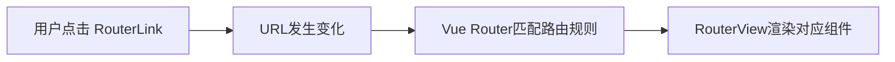


## 4.2. 基本切换效果

1\. Vue 3项目使用Vue Router 4。若创建项目时没有选择安装路由，需要先执行：

  ```shell
  npm install vue-router@4
  ```

2\. 路由配置文件代码如下：

  ```js
  import {createRouter,createWebHistory} from 'vue-router'
  import Home from '@/pages/Home.vue'
  import News from '@/pages/News.vue'
  import About from '@/pages/About.vue'
  
  const router = createRouter({
  	history:createWebHistory(),
  	routes:[
		{
			path:'/home',
			component:Home
		},
		{
			path:'/news',
			component:News
		},
		{
  			path:'/about',
  			component:About
  		}
  	]
  })
  export default router
  ```
3\. `main.ts`代码如下：

  ```js
  import router from './router/index'
  app.use(router)
  
  app.mount('#app')
  ```

4\. `App.vue`代码如下

  ```vue
  <template>
    <div class="app">
      <h2 class="title">Vue路由测试</h2>
      <!-- 导航区 -->
      <div class="navigate">
        <RouterLink to="/home" active-class="active">首页</RouterLink>
        <RouterLink to="/news" active-class="active">新闻</RouterLink>
        <RouterLink to="/about" active-class="active">关于</RouterLink>
      </div>
      <!-- 展示区 -->
      <div class="main-content">
        <RouterView></RouterView>
      </div>
    </div>
  </template>
  
  <script lang="ts" setup name="App">
    import {RouterLink,RouterView} from 'vue-router'  
  </script>
  ```

## 4.3. 两个注意点

> 1\. 路由组件通常存放在`pages` 或 `views`文件夹，一般组件通常存放在`components`文件夹。
>
> 2\. 通过点击导航，视觉效果上“消失” 了的路由组件，默认是被**卸载**掉的，需要的时候再去**挂载**。

## 4.4. 路由器工作模式

1\. `history`模式

   > 优点：`URL`更加美观，不带有`#`，更接近传统的网站`URL`。
   >
   > 缺点：后期项目上线，需要服务端配合处理路径问题，否则刷新会有`404`错误。
   >
   > ```js
   > const router = createRouter({
   >   	history:createWebHistory(), //history模式
   >   	/******/
   > })
   > ```

2\. `hash`模式

   > 优点：兼容性更好，因为不需要服务器端处理路径。
   >
   > 缺点：`URL`带有`#`不太美观，且在`SEO`（Search Engine Optimization，搜索引擎优化）优化方面相对较差。
   >
   > ```js
   > const router = createRouter({
   >   	history:createWebHashHistory(), //hash模式
   >   	/******/
   > })
   > ```

## 4.5. `to` 的两种写法

`to`表示要跳转的目标。固定路径可以直接传字符串；需要传对象、变量或表达式时，要使用`:`绑定。`:`是`v-bind:`的缩写，它会让Vue把右侧内容当作JavaScript表达式解析。

```vue
<!-- 第一种：to的字符串写法 -->
<router-link active-class="active" to="/home">主页</router-link>

<!-- 第二种：to的对象写法 -->
<router-link active-class="active" :to="{path:'/home'}">Home</router-link>
```

## 4.6. 命名路由

作用：可以简化路由跳转及传参（后面就讲）。

给路由规则命名：

```js
routes:[
  {
    name:'zhuye',
    path:'/home',
    component:Home
  },
  {
    name:'xinwen',
    path:'/news',
    component:News,
  },
  {
    name:'guanyu',
    path:'/about',
    component:About
  }
]
```

跳转路由：

```vue
<!--简化前：需要写完整的路径（to的字符串写法） -->
<router-link to="/news/detail">跳转</router-link>

<!--简化后：直接通过名字跳转（to的对象写法配合name属性） -->
<router-link :to="{name:'guanyu'}">跳转</router-link>
```


## 4.7. 嵌套路由

1\. 编写`News`的子路由：`Detail.vue`

2\. 配置路由规则，使用`children`配置项：

   ```ts
   const router = createRouter({
     history:createWebHistory(),
   	routes:[
   		{
   			name:'zhuye',
   			path:'/home',
   			component:Home
   		},
   		{
   			name:'xinwen',
   			path:'/news',
   			component:News,
   			children:[
   				{
   					name:'xiang',
   					path:'detail',
   					component:Detail
   				}
   			]
   		},
   		{
   			name:'guanyu',
   			path:'/about',
   			component:About
   		}
   	]
   })
   export default router
   ```

3\. 跳转路由（记得要加完整路径）：

   ```vue
   <router-link to="/news/detail">xxxx</router-link>
   <!-- 或 -->
   <router-link :to="{path:'/news/detail'}">xxxx</router-link>
   ```

4\. 记得去`News`组件中预留一个`<router-view>`

   ```vue
   <template>
     <div class="news">
       <nav class="news-list">
         <RouterLink v-for="news in newsList" :key="news.id" :to="{path:'/news/detail'}">
           {{news.name}}
         </RouterLink>
       </nav>
       <div class="news-detail">
         <RouterView/>
       </div>
     </div>
   </template>
   ```

   

## 4.8. 路由传参

`query`和`params`都会出现在URL中，它们不是隐藏数据，不能用来传密码、Token（令牌）等敏感信息。两者的主要区别如下：

| 对比项 | `query` | `params` |
| --- | --- | --- |
| URL形式 | `/news/detail?id=001` | `/news/detail/001` |
| 路由规则是否需要占位 | 不需要 | 需要`:id`等动态参数 |
| 对象写法 | 可配合`path`或`name` | 应配合`name`，不能和`path`同时使用 |
| 读取位置 | `route.query` | `route.params` |
| 常见用途 | 搜索条件、分页、排序 | 用户ID、文章ID等资源标识 |

### 4.8.1 `query`参数

`query`位于URL的`?`后面，多个参数之间使用`&`连接。它不需要在路由规则中提前声明。

```vue
<!-- 固定query参数：整个to是普通字符串，不需要加冒号 -->
<RouterLink to="/news/detail?id=001&title=新闻001">
  查看固定新闻
</RouterLink>

<!-- 动态query参数：推荐使用对象写法，Vue Router会负责URL编码 -->
<RouterLink
  :to="{
    path: '/news/detail',
    query: {
      id: news.id,
      title: news.title,
      content: news.content
    }
  }"
>
  {{ news.title }}
</RouterLink>
```

在目标组件中读取参数：

```ts
import { useRoute } from 'vue-router'

const route = useRoute()
console.log(route.query.id)
console.log(route.query.title)
```

### 4.8.2 `params`参数

`params`是路径的一部分，因此必须先在路由规则中使用`:`声明动态参数。参数名必须和传递对象中的键保持一致：

```ts
{
  path: '/news/detail/:id/:title/:content?',
  name: 'xiang',
  component: Detail
}
```

上面的`:content?`末尾带`?`，表示`content`是可选参数。传递参数时推荐使用命名路由，让Vue Router自动完成URL编码：

```vue
<!-- 固定路径：to是普通字符串 -->
<RouterLink to="/news/detail/001/新闻001/内容001">
  查看固定新闻
</RouterLink>

<!-- 动态路径：to绑定JavaScript模板字符串 -->
<RouterLink :to="`/news/detail/${news.id}/${news.title}/${news.content}`">
  {{ news.title }}
</RouterLink>

<!-- 动态路径：推荐使用name配合params -->
<RouterLink
  :to="{
    name: 'xiang',
    params: {
      id: news.id,
      title: news.title,
      content: news.content
    }
  }"
>
  {{ news.title }}
</RouterLink>
```

在目标组件中读取参数：

```ts
import { useRoute } from 'vue-router'

const route = useRoute()
console.log(route.params.id)
console.log(route.params.title)
```

> 使用对象传递`params`时，如果同时写了`path`，Vue Router会忽略`params`。应改用`name`，或者自己拼出完整路径。通常优先使用`name`加`params`，这样编码更可靠。

## 4.9. 路由规则的 `props` 配置

作用：让路由组件更方便的收到参数（可以将路由参数作为`props`传给组件）

```js
{
	name:'xiang',
	path:'detail/:id/:title/:content',
	component:Detail,

  // 第一种：
  // props的对象写法，作用：把对象中的每一组key-value作为props传给Detail组件
  // props:{a:1,b:2,c:3}, 

  // 第二种（推荐）：
  // props的布尔值写法，作用：把收到了每一组params参数，作为props传给Detail组件
  // props:true
  
  // 第三种（推荐）：
  // props的函数写法，作用：把返回的对象中每一组key-value作为props传给Detail组件
  props(route){
    return route.query
  }
}
```

## 4.10. `replace` 属性

  1\. 作用：控制路由跳转时操作浏览器历史记录的模式。

  2\. 浏览器的历史记录有两种写入方式：分别为`push`和`replace`：

```txt
1. `push`是向历史记录栈追加一条记录（默认值），用户可以点击浏览器“后退”回到原页面。
2. `replace`是替换当前记录。
```

  3\. 开启`replace`模式：

```vue
 <RouterLink replace .......>News</RouterLink>
```

## 4.11. 编程式导航

`<RouterLink>`最终会渲染为可导航的链接。如果要在提交表单、请求成功或定时任务结束后跳转，就需要使用编程式导航。

先区分两个对象：`route`表示“当前路由的信息”，用于读取参数；`router`表示“路由器”，用于执行跳转。Composition API中分别通过`useRoute()`和`useRouter()`获得它们。

```js
import {useRoute,useRouter} from 'vue-router'

const route = useRoute()
const router = useRouter()

console.log(route.query)
console.log(route.params)

setTimeout(() => {
  router.push({ name: 'guanyu' })
}, 3000)
```

`router.push()`接收的参数与`RouterLink`的`to`属性一致，可以传路径字符串，也可以传包含`name`、`params`或`query`的对象。它返回一个`Promise`，有需要时可以使用`await`等待导航结束。


## 4.12. 重定向

1\. 作用：将特定的路径，重新定向到已有路由。

2\. 具体编码：

   ```js
   {
       path:'/',
       redirect:'/about'
   }
   ```

## 4.13. 路由常见难点与项目必备配置

### 4.13.1 动态参数变化时组件可能不会重新挂载

从`/users/1`跳到`/users/2`时，如果两条URL匹配同一个路由组件，Vue Router会复用现有组件实例。这意味着`onMounted`不会再次执行。

若页面数据依赖参数，应直接侦听对应参数，不要侦听整个`route`对象：

```ts
import { watch } from 'vue'
import { useRoute } from 'vue-router'

const route = useRoute()

watch(
  () => route.params.id,
  async newId => {
    await loadUser(newId as string)
  },
  { immediate: true }
)
```

### 4.13.2 配置404兜底路由

用户访问不存在的地址时，应显示明确的Not Found（未找到）页面。兜底规则通常放在路由数组最后：

```ts
import NotFound from '@/pages/NotFound.vue'

const routes = [
  // 其他具体路由写在前面
  {
    path: '/:pathMatch(.*)*',
    name: 'NotFound',
    component: NotFound
  }
]
```

这里的`(.*)*`表示匹配任意剩余路径。它解决的是前端没有匹配路由时的页面展示；使用`history`模式时，服务器仍要把未知前端路径回退到`index.html`，否则浏览器直接刷新仍可能得到服务器404。

### 4.13.3 导航守卫与登录校验

导航守卫会在跳转过程中执行，可以放行、取消或重定向导航。常见用途是保护需要登录的页面：

```ts
const routes = [
  {
    path: '/orders',
    name: 'orders',
    component: Orders,
    meta: { requiresAuth: true }
  },
  {
    path: '/login',
    name: 'login',
    component: Login
  }
]

router.beforeEach(to => {
  const isLoggedIn = Boolean(localStorage.getItem('accessToken'))

  if (to.meta.requiresAuth && !isLoggedIn) {
    return {
      name: 'login',
      query: { redirect: to.fullPath }
    }
  }
})
```

1\. 返回路由地址表示重定向，返回`false`表示取消导航，不返回内容表示放行。
2\. 登录页本身不要标记`requiresAuth`，否则会不断重定向到自己。
3\. 前端守卫只能改善用户体验，不能代替服务端鉴权；用户可以绕过前端代码直接请求接口。


# 5. pinia

Pinia是Vue官方推荐的状态管理库，用于集中管理需要被多个组件共享的数据。可以把组件自己的状态理解为“个人物品”，把Store中的状态理解为“公共储物柜”：任何需要它的组件都可以读取，但修改规则最好集中管理。

| 概念 | 作用 | 类似于组件中的 |
| --- | --- | --- |
| `state` | 保存原始状态 | `data`或`ref` |
| `getters` | 根据状态计算派生值 | `computed` |
| `actions` | 封装修改状态的业务逻辑 | `methods`或普通函数 |

只有一个组件使用的临时数据通常放在组件内部；登录用户、购物车、主题配置等跨组件共享的数据更适合放入Pinia。

## 5.1. 准备一个效果

 

## 5.2. 搭建 pinia 环境

第一步：`npm install pinia`

第二步：操作`src/main.ts`

```ts
import { createApp } from 'vue'
import App from './App.vue'

/* 第一步：引入createPinia，用于创建pinia */
import { createPinia } from 'pinia'

const app = createApp(App)
/* 第二步：创建pinia */
const pinia = createPinia()


/* 第三步：把Pinia安装到Vue应用 */
app.use(pinia)
app.mount('#app')
```

此时开发者工具中已经有了`pinia`选项


## 5.3. 存储+读取数据

1\. `Store`是一个保存：**状态**、**业务逻辑** 的实体，每个组件都可以**读取**、**写入**它。

2\. 它有三个概念：`state`、`getter`、`action`，相当于组件中的： `data`、 `computed` 和 `methods`。

3\. 具体编码：`src/store/count.ts`

   ```ts
   // 引入defineStore用于创建store
   import {defineStore} from 'pinia'
   
   // 定义并暴露一个store
   export const useCountStore = defineStore('count',{
     // 动作
     actions:{},
     // 状态
     state(){
       return {
         sum:6
       }
     },
     // 计算
     getters:{}
   })
   ```

4\. 具体编码：`src/store/talk.ts`

   ```js
   // 引入defineStore用于创建store
   import {defineStore} from 'pinia'
   
   // 定义并暴露一个store
   export const useTalkStore = defineStore('talk',{
     // 动作
     actions:{},
     // 状态
     state(){
       return {
         talkList:[
           {id:'yuysada01',content:'你今天有点怪，哪里怪？怪好看的！'},
        		{id:'yuysada02',content:'草莓、蓝莓、蔓越莓，你想我了没？'},
           {id:'yuysada03',content:'心里给你留了一块地，我的死心塌地'}
         ]
       }
     },
     // 计算
     getters:{}
   })
   ```

5\. 组件中使用`state`中的数据

   ```vue
   <template>
     <h2>当前求和为：{{ sumStore.sum }}</h2>
   </template>
   
   <script setup lang="ts" name="Count">
     // 引入对应的useXxxxxStore	
     import {useCountStore} from '@/store/count'
     
     // 调用useXxxxxStore得到对应的store
     const sumStore = useCountStore()
   </script>
   ```

   ```vue
   <template>
   	<ul>
       <li v-for="talk in talkStore.talkList" :key="talk.id">
         {{ talk.content }}
       </li>
     </ul>
   </template>
   
   <script setup lang="ts" name="Count">
     import {useTalkStore} from '@/store/talk'
   
     const talkStore = useTalkStore()
   </script>
   ```

   

## 5.4. 修改数据（三种方式）

1\. 第一种修改方式，直接修改

   ```ts
   countStore.sum = 666
   ```

2\. 第二种修改方式：批量修改

   ```ts
   countStore.$patch({
     sum:999,
     school:'atguigu'
   })
   ```

3\. 第三种修改方式：借助`action`修改（`action`中可以编写一些业务逻辑）

   ```js
   import { defineStore } from 'pinia'
   
   export const useCountStore = defineStore('count', {
     /*************/
     actions: {
       //加
       increment(value:number) {
         if (this.sum < 10) {
           //操作countStore中的sum
           this.sum += value
         }
       },
       //减
       decrement(value:number){
         if(this.sum > 1){
           this.sum -= value
         }
       }
     },
     /*************/
   })
   ```

4\. 组件中调用`action`即可

   ```js
   // 使用countStore
   const countStore = useCountStore()
   
   // 调用对应action
   countStore.increment(n.value)
   ```


## 5.5. `storeToRefs`

1\. 借助`storeToRefs`把Store中的`state`和`getters`转换为`ref`对象，解构后仍能保持响应式。
2\. `storeToRefs`会忽略`actions`和非响应式属性。方法可以直接从Store中解构，例如`const { increment } = countStore`。

```vue
<template>
	<div class="count">
		<h2>当前求和为：{{sum}}</h2>
	</div>
</template>

<script setup lang="ts" name="Count">
  import { useCountStore } from '@/store/count'
  /* 引入storeToRefs */
  import { storeToRefs } from 'pinia'

	/* 得到countStore */
  const countStore = useCountStore()
  /* 使用storeToRefs转换countStore，随后解构 */
  const {sum} = storeToRefs(countStore)
</script>

```

## 5.6. `getters`

  1\. 概念：当`state`中的数据，需要经过处理后再使用时，可以使用`getters`配置。

  2\. 追加`getters`配置。

```typescript
 // 引入defineStore用于创建store
 import {defineStore} from 'pinia'
 
 // 定义并暴露一个store
 export const useCountStore = defineStore('count',{
   // 动作
   actions:{
     /************/
   },
   // 状态
   state(){
     return {
       sum:1,
       school:'atguigu'
     }
   },
   // 计算
   getters:{
     bigSum:(state):number => state.sum *10,
     upperSchool():string{
       return this.school.toUpperCase()
     }
   }
 })
```

  3\. 组件中读取数据：

```typescript
const {increment,decrement} = countStore
let {sum,school,bigSum,upperSchool} = storeToRefs(countStore)
```


​     

## 5.7. `$subscribe`

通过 store 的 `$subscribe()` 方法侦听 `state` 及其变化

```ts
talkStore.$subscribe((mutate,state)=>{
  console.log('LoveTalk',mutate,state)
  localStorage.setItem('talkList',JSON.stringify(state.talkList))
})
```

这里把数据写入`localStorage`（浏览器本地存储），刷新页面后仍可恢复。读取时要注意`JSON.parse`可能因为存储内容损坏而报错，生产项目应增加异常处理。


## 5.8. `store` 组合式写法

```ts
import {defineStore} from 'pinia'
import axios from 'axios'
import {nanoid} from 'nanoid'
import {reactive} from 'vue'

export const useTalkStore = defineStore('talk',()=>{
  // talkList就是state
  const talkList = reactive(
    JSON.parse(localStorage.getItem('talkList') as string) || []
  )

  // getATalk函数相当于action
  async function getATalk(){
    // 发请求，下面这行的写法是：连续解构赋值+重命名
    let {data:{content:title}} = await axios.get('https://api.uomg.com/api/rand.qinghua?format=json')
    // 把请求回来的字符串，包装成一个对象
    let obj = {id:nanoid(),title}
    // 放到数组中
    talkList.unshift(obj)
  }
  return {talkList,getATalk}
})
```

## 5.9. Pinia最容易踩的两个坑

### 5.9.1 直接解构Store会丢失响应式

Store本身是一个响应式对象。像普通`reactive`对象一样，直接解构其状态只会得到当时的值：

```ts
const countStore = useCountStore()

// 错误：sum后续不会跟随Store更新
const { sum } = countStore

// 正确：状态和getter使用storeToRefs
const { sum, bigSum } = storeToRefs(countStore)

// action是绑定过Store的方法，可以直接解构
const { increment } = countStore
```

不需要解构时，直接使用`countStore.sum`最简单；需要在模板中频繁使用多个状态时，再使用`storeToRefs`。

### 5.9.2 异步Action要管理加载与错误状态

Action可以是异步函数。真实项目中不要只保存请求结果，还应明确保存加载状态和错误信息，这样页面才能正确显示“加载中”“加载失败”和“成功”三种状态：

```ts
import { defineStore } from 'pinia'

interface User {
  id: number
  name: string
}

export const useUserStore = defineStore('user', {
  state: () => ({
    users: [] as User[],
    loading: false,
    errorMessage: ''
  }),
  actions: {
    async fetchUsers() {
      this.loading = true
      this.errorMessage = ''

      try {
        const response = await fetch('/api/users')
        if (!response.ok) {
          throw new Error(`请求失败：${response.status}`)
        }
        this.users = await response.json()
      } catch (error) {
        this.errorMessage = (error as Error).message
      } finally {
        this.loading = false
      }
    }
  }
})
```

> 多个页面同时依赖同一份远程数据时，还要考虑是否重复请求、数据何时失效以及退出登录时如何清空Store。Pinia负责状态组织，但不会自动提供缓存失效策略。


# 6. 组件通信

**`Vue3`组件通信和`Vue2`的区别：**

1\. 移出事件总线，使用`mitt`代替。

2\. `vuex`换成了`pinia`。

3\. 把`.sync`优化到了`v-model`里面了。

4\. 把`$listeners`所有的东西，合并到`$attrs`中了。

5\. `$children`被砍掉了。

**常见搭配形式：**

 

初学者可以先按下面的关系选方案：

| 组件关系 | 推荐方式 | 方向 |
| --- | --- | --- |
| 父组件传给子组件 | `props` | 父→子 |
| 子组件通知父组件 | 自定义事件 | 子→父 |
| 父子双向绑定表单值 | `v-model` | 父↔子 |
| 祖先传给多层后代 | `provide`、`inject` | 祖先→后代 |
| 无直接关系的多个组件共享状态 | Pinia | 多组件共享 |
| 父组件提供结构、子组件决定插入位置 | `slot` | 内容分发 |

> 优先选择能清楚表达组件关系的方式。`mitt`、`$parent`和跨层级`$refs`虽然能解决问题，但依赖关系较隐蔽，不适合作为默认方案。

## 6.1. `props`

`props`是使用频率最高的组件通信方式，主要用于父组件向子组件传递数据。子组件必须先声明自己允许接收哪些`props`，父组件再通过组件属性传入对应数据。

### 6.1.1 单向数据流

`props`遵循单向数据流：父组件更新数据，新的值向下传给子组件。子组件不应该直接修改收到的`props`，而应通过自定义事件通知父组件修改源数据。

父组件：

```vue
<!-- Parent.vue -->
<script setup lang="ts">
import { ref } from 'vue'
import Child from './Child.vue'

// count是父组件拥有的源数据，修改权保留在父组件中。
const count = ref(0)

// 子组件只负责发出increment事件，真正的数据修改由父组件完成。
function handleIncrement() {
  count.value++
}
</script>

<template>
  <section>
    <p>父组件中的数量：{{ count }}</p>

    <!--
      :count是v-bind:count的缩写，传入的是JavaScript表达式count。
      模板会自动解包ref，因此子组件收到的是number，而不是Ref对象。
      @increment用于监听子组件发出的increment自定义事件。
    -->
    <Child
      :count="count"
      @increment="handleIncrement"
    />
  </section>
</template>
```

子组件：

```vue
<!-- Child.vue -->
<script setup lang="ts">
// defineProps是<script setup>中的编译宏，不需要从vue导入。
// count没有问号，表示父组件必须传入number类型的count。
const props = defineProps<{
  count: number
}>()

// defineEmits也是编译宏，不需要导入。
// increment: []表示increment事件没有参数。
const emit = defineEmits<{
  increment: []
}>()

// 错误写法：props的顶层绑定是只读的，不能由子组件直接修改。
// props.count++

function requestIncrement() {
  // 子组件发出事件，请求父组件修改count。
  emit('increment')
}
</script>

<template>
  <div>
    <!-- script中通过props.count访问；模板中也可以直接写count。 -->
    <p>子组件收到的数量：{{ props.count }}</p>
    <button @click="requestIncrement">数量加1</button>
  </div>
</template>
```

点击子组件按钮后的数据流为：

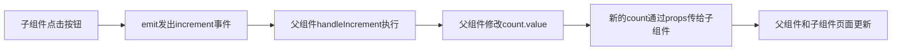

### 6.1.2 通过函数类型的`props`回传数据

父组件也可以把函数作为`props`传给子组件，让子组件调用父组件函数。下面使用项目列表展示这种写法。

> 函数类型`props`可以正常工作，但子组件向父组件报告操作时通常更推荐使用6.2节的自定义事件，因为事件名称能更明确地表达“子组件发生了什么”。

父组件：

```vue
<!-- ProjectPage.vue -->
<template>
  <section>
    <p>当前选中的项目ID：{{ selectedProjectId ?? '未选择' }}</p>

    <!--
      projects是数据prop。
      on-select-project是函数prop，对应子组件中的onSelectProject。
    -->
    <ProjectList
      :projects="projects"
      :on-select-project="handleSelectProject"
    />
  </section>
</template>

<script setup lang="ts">
import { ref } from 'vue'
import ProjectList from './ProjectList.vue'

interface Project {
  id: number
  name: string
}

// 实际项目中，父子组件共用的Project类型可以提取到单独的types.ts。
const projects = ref<Project[]>([
  { id: 1, name: '管理后台' },
  { id: 2, name: '数据平台' }
])

const selectedProjectId = ref<number | null>(null)

// 该函数由父组件定义，但会被子组件调用。
function handleSelectProject(projectId: number) {
  selectedProjectId.value = projectId
}
</script>
```

子组件：

```vue
<!-- ProjectList.vue -->
<template>
  <ul>
    <li
      v-for="project in props.projects"
      :key="project.id"
    >
      <span>{{ project.name }}</span>
      <button @click="selectProject(project.id)">选择</button>
    </li>
  </ul>
</template>

<script setup lang="ts">
interface Project {
  id: number
  name: string
}

const props = defineProps<{
  // 数组由父组件传入，子组件只读取，不直接增删或修改数组内容。
  projects: Project[]

  // 声明函数的参数和返回值，调用错误时TypeScript会提示。
  onSelectProject: (projectId: number) => void
}>()

function selectProject(projectId: number) {
  // 调用通过props传入的父组件函数，并把项目ID传回父组件。
  props.onSelectProject(projectId)
}
</script>
```

### 6.1.3 必传、可选与默认值

使用TypeScript声明`props`时，没有`?`的属性是必传属性，带有`?`的属性是可选属性。可选属性可以使用`withDefaults`提供默认值：

```vue
<!-- DataTable.vue -->
<script setup lang="ts">
interface Props {
  // 必传：父组件不传title时，TypeScript会提示错误。
  title: string

  // 可选：父组件不传时，值原本是undefined。
  pageSize?: number

  // 可选数组：默认值必须通过函数返回，避免组件实例共享同一数组。
  columns?: string[]
}

// defineProps和withDefaults都是编译宏，不需要从vue导入。
// withDefaults规定没有传值时，怎样创建默认数据，函数是返回最终值的默认值工厂函数，会调用的
const props = withDefaults(defineProps<Props>(), {
  pageSize: 20,
  columns: () => ['name', 'status']
})

console.log(props.title)    // string
console.log(props.pageSize) // number，未传时为20
console.log(props.columns)  // string[]，未传时使用默认数组
</script>

<template>
  <section>
    <h2>{{ props.title }}</h2>
    <p>每页数量：{{ props.pageSize }}</p>
    <p>显示字段：{{ props.columns.join(', ') }}</p>
  </section>
</template>
```

父组件传值：

```vue
<template>
  <!-- title没有冒号，因此传入固定字符串。 -->
  <!-- page-size和columns使用冒号，因此右侧按照JavaScript表达式求值。 -->
  <DataTable
    title="项目列表"
    :page-size="50"
    :columns="['name', 'owner']"
  />

  <!-- 错误示例：page-size="50"传入的是字符串"50"，不是数字50。 -->
</template>
```

### 6.1.4 对象类型`props`的修改边界

`props`的顶层绑定是只读的，但对象和数组内部的属性在运行时仍可能被子组件修改。这样会直接改变父组件的数据来源，使修改路径难以追踪，因此通常不推荐。

```vue
<script setup lang="ts">
interface Config {
  theme: 'light' | 'dark'
  pageSize: number
}

const props = defineProps<{
  config: Config
}>()

// 错误：不能替换只读的prop绑定。
// props.config = { theme: 'dark', pageSize: 50 }

// 技术上可能成功，但不推荐：这会直接修改父组件传入对象的内部属性。
// props.config.theme = 'dark'

const emit = defineEmits<{
  updateConfig: [config: Config]
}>()

function useDarkTheme() {
  // 推荐：创建新对象并通过事件交给父组件，由父组件决定如何更新源数据。
  emit('updateConfig', {
    ...props.config,
    theme: 'dark'
  })
}
</script>
```

可以用下面的规则判断修改位置：

1\. 数据由父组件创建，默认由父组件负责修改。
2\. 子组件只读取`props`，需要修改时发送事件或调用明确约定的函数`props`。
3\. 如果子组件需要一份独立的可编辑数据，应根据`props`创建本地`ref`，但要先确定是否需要继续同步父组件后续更新。

## 6.2. 自定义事件

1\. 概述：自定义事件常用于：**子 => 父。**
2\. 注意区分好：原生事件、自定义事件。

3\. 原生事件的名称由浏览器定义，例如`click`、`mouseenter`和`input`；`$event`是浏览器事件对象，常用属性包括`target`、`clientX`和`clientY`。
4\. 自定义事件的名称和载荷由组件自己声明；父组件中的`$event`就是子组件调用`emit`时传入的数据。

5\. 示例：

   ```html
   <!--在父组件中，给子组件绑定自定义事件：-->
   <Child @send-toy="toy = $event"/>
   
   <!--注意区分原生事件与自定义事件中的$event-->
   <button @click="toy = $event">测试</button>
   ```

   ```ts
   // 子组件中声明并触发事件
   const emit = defineEmits<{
     'send-toy': [toy: string]
   }>()

   emit('send-toy', toy.value)
   ```

## 6.3. `mitt`

概述：与消息订阅与发布（`pubsub`）功能类似，可以实现任意组件间通信。

安装`mitt`

```shell
npm i mitt
```

新建文件：`src\utils\emitter.ts`

```javascript
// 引入mitt 
import mitt from "mitt";

// 创建emitter
const emitter = mitt()

/*
  // 绑定事件
  emitter.on('abc',(value)=>{
    console.log('abc事件被触发',value)
  })
  emitter.on('xyz',(value)=>{
    console.log('xyz事件被触发',value)
  })

  setInterval(() => {
    // 触发事件
    emitter.emit('abc',666)
    emitter.emit('xyz',777)
  }, 1000);

  setTimeout(() => {
    // 清理事件
    emitter.all.clear()
  }, 3000); 
*/

// 创建并暴露mitt
export default emitter
```

接收数据的组件中：绑定事件、同时在销毁前解绑事件：

```typescript
import emitter from "@/utils/emitter";
import { onUnmounted } from "vue";

// 绑定事件
emitter.on('send-toy',(value)=>{
  console.log('send-toy事件被触发',value)
})

onUnmounted(()=>{
  // 解绑事件
  emitter.off('send-toy')
})
```

第三步：提供数据的组件在合适的时候触发事件。

```javascript
import emitter from "@/utils/emitter";

function sendToy(){
  // 触发事件
  emitter.emit('send-toy',toy.value)
}
```

> 使用`mitt`时，接收方要在组件卸载前取消订阅，否则重复进入页面可能产生重复回调。事件名称也应集中管理，避免字符串拼写不一致。

## 6.4. `v-model`

1\. 概述：实现 **父↔子** 之间相互通信。

2\. 前序知识 —— `v-model`的本质

   ```vue
   <!-- 使用v-model指令 -->
   <input type="text" v-model="userName">
   
   <!-- v-model的本质是下面这行代码 -->
   <input 
     type="text" 
     :value="userName" 
     @input="userName = ($event.target as HTMLInputElement).value"
   >
   ```

3\. 组件标签上的`v-model`本质是`:modelValue`属性加`update:modelValue`事件：父组件把值传下去，子组件通过事件通知父组件更新。

   ```vue
   <!-- 组件标签上使用v-model指令 -->
   <AtguiguInput v-model="userName"/>
   
   <!-- 组件标签上v-model的本质 -->
   <AtguiguInput :modelValue="userName" @update:model-value="userName = $event"/>
   ```

   `AtguiguInput`组件中：

   ```vue
   <template>
     <div class="box">
       <!--将接收的value值赋给input元素的value属性，目的是：为了呈现数据 -->
   		<!--给input元素绑定原生input事件，触发input事件时，进而触发update:model-value事件-->
       <input 
          type="text" 
          :value="modelValue" 
          @input="emit('update:model-value',$event.target.value)"
       >
     </div>
   </template>
   
   <script setup lang="ts" name="AtguiguInput">
     // 接收props
     defineProps(['modelValue'])
     // 声明事件
     const emit = defineEmits(['update:model-value'])
   </script>
   ```

4\. 也可以更换`value`，例如改成`abc`

   ```vue
   <!-- 也可以更换value，例如改成abc-->
   <AtguiguInput v-model:abc="userName"/>
   
   <!-- 上面代码的本质如下 -->
   <AtguiguInput :abc="userName" @update:abc="userName = $event"/>
   ```

   `AtguiguInput`组件中：

   ```vue
   <template>
     <div class="box">
       <input 
          type="text" 
          :value="abc" 
          @input="emit('update:abc',$event.target.value)"
       >
     </div>
   </template>
   
   <script setup lang="ts" name="AtguiguInput">
     // 接收props
     defineProps(['abc'])
     // 声明事件
     const emit = defineEmits(['update:abc'])
   </script>
   ```

5\. 如果`value`可以更换，那么就可以在组件标签上多次使用`v-model`

   ```vue
   <AtguiguInput v-model:abc="userName" v-model:xyz="password"/>
   ```

   


## 6.5. `$attrs`

1\. 概述：`$attrs`用于实现**当前组件的父组件**，向**当前组件的子组件**通信（**祖→孙**）。

2\. 具体说明：`$attrs`是一个对象，包含所有父组件传入的标签属性。

   >  注意：`$attrs`会自动排除`props`中声明的属性(可以认为声明过的 `props` 被子组件自己“消费”了)

父组件：

```vue
<template>
  <div class="father">
    <h3>父组件</h3>
		<Child :a="a" :b="b" :c="c" :d="d" v-bind="{x:100,y:200}" :updateA="updateA"/>
  </div>
</template>

<script setup lang="ts" name="Father">
	import Child from './Child.vue'
	import { ref } from "vue";
	let a = ref(1)
	let b = ref(2)
	let c = ref(3)
	let d = ref(4)

	function updateA(value){
		a.value = value
	}
</script>
```

子组件：

```vue
<template>
	<div class="child">
		<h3>子组件</h3>
		<GrandChild v-bind="$attrs"/>
	</div>
</template>

<script setup lang="ts" name="Child">
	import GrandChild from './GrandChild.vue'
</script>
```

孙组件：

```vue
<template>
	<div class="grand-child">
		<h3>孙组件</h3>
		<h4>a：{{ a }}</h4>
		<h4>b：{{ b }}</h4>
		<h4>c：{{ c }}</h4>
		<h4>d：{{ d }}</h4>
		<h4>x：{{ x }}</h4>
		<h4>y：{{ y }}</h4>
		<button @click="updateA(666)">点我更新A</button>
	</div>
</template>

<script setup lang="ts" name="GrandChild">
	defineProps(['a','b','c','d','x','y','updateA'])
</script>
```

一句话记忆：

```txt
defineProps声明的内容 → props
defineEmits声明的事件 → emits
剩余未声明的内容      → $attrs
```

## 6.6. `$refs`、`$parent`

1\. 概述：

   1\. `$refs`用于 ：**父→子。**
   2\. `$parent`用于：**子→父。**

2\. 原理如下：

   | 属性      | 说明                                                     |
   | --------- | -------------------------------------------------------- |
   | `$refs`   | 值为对象，包含所有被`ref`属性标识的`DOM`元素或组件实例。 |
   | `$parent` | 值为对象，当前组件的父组件实例对象。                     |

## 6.7. `provide`、`inject`

1\. 概述：实现**祖孙组件**直接通信

2\. 具体使用：

   1\. 在祖先组件中通过`provide`配置向后代组件提供数据
   2\. 在后代组件中通过`inject`配置来声明接收数据

3\. 具体编码：

   【第一步】父组件中，使用`provide`提供数据

   ```vue
   <template>
     <div class="father">
       <h3>父组件</h3>
       <h4>资产：{{ money }}</h4>
       <h4>汽车：{{ car }}</h4>
       <button @click="money += 1">资产+1</button>
       <button @click="car.price += 1">汽车价格+1</button>
       <Child/>
     </div>
   </template>
   
   <script setup lang="ts" name="Father">
     import Child from './Child.vue'
     import { ref,reactive,provide } from "vue";
     // 数据
     let money = ref(100)
     let car = reactive({
       brand:'奔驰',
       price:100
     })
     // 用于更新money的方法
     function updateMoney(value:number){
       money.value += value
     }
     // 提供数据
     provide('moneyContext',{money,updateMoney})
     provide('car',car)
   </script>
   ```

   > 注意：子组件中不用编写任何东西，是不受到任何打扰的

   【第二步】孙组件中使用`inject`配置项接受数据。

   ```vue
   <template>
     <div class="grand-child">
       <h3>我是孙组件</h3>
       <h4>资产：{{ money }}</h4>
       <h4>汽车：{{ car }}</h4>
       <button @click="updateMoney(6)">点我</button>
     </div>
   </template>
   
   <script setup lang="ts" name="GrandChild">
     import { inject } from 'vue';
     // 注入数据
    let {money,updateMoney} = inject('moneyContext',{money:0,updateMoney:(x:number)=>{}})
     let car = inject('car')
   </script>
   ```


## 6.8. pinia

当多个没有直接父子关系的组件需要共享状态时，可以使用Pinia。例如导航栏、个人中心和订单页都需要登录用户信息，就不必逐层传递`props`。具体创建和使用方式参考第5章。

> Pinia适合共享的业务状态，不要把弹窗是否展开、输入框临时文本等只属于单个组件的状态全部放进Store。

## 6.9. `slot`

插槽用于把一段模板内容从父组件传给子组件。父组件决定插槽内容写什么，子组件通过`<slot>`决定这段内容渲染在哪里。

| 对比项 | `props` | `slot` |
| --- | --- | --- |
| 主要传递内容 | 字符串、数字、对象、函数等数据 | HTML结构、Vue组件和模板片段 |
| 内容由谁定义 | 父组件提供数据 | 父组件编写模板 |
| 内容渲染位置 | 子组件读取后自行决定 | 子组件通过`<slot>`指定出口 |
| 能否访问子组件内部数据 | 不能直接访问 | 需要子组件通过作用域插槽显式提供 |

插槽内容遵循Vue模板的作用域规则：

1\. 父组件中编写的插槽模板默认只能访问父组件数据。
2\. 子组件模板只能访问子组件数据。
3\. 父组件若要在插槽模板中使用子组件数据，需要使用作用域插槽。

### 6.9.1 默认插槽

默认插槽只有一个主要内容出口，不需要指定插槽名称。


父组件：

```vue
<!-- Dashboard.vue -->
<script setup lang="ts">
import ContentPanel from './ContentPanel.vue'

// logs属于父组件，因此父组件编写的插槽内容可以直接访问logs。
const logs = [
  { id: 1, message: '应用启动完成' },
  { id: 2, message: '配置文件加载成功' }
]
</script>

<template>
  <!-- title通过props传递，ul结构通过默认插槽传递。 -->
  <ContentPanel title="运行日志">
    <ul>
      <li
        v-for="log in logs"
        :key="log.id"
      >
        {{ log.message }}
      </li>
    </ul>
  </ContentPanel>

  <!-- 没有提供插槽内容，因此子组件会显示slot中的默认内容。 -->
  <ContentPanel title="部署记录" />
</template>
```

子组件：

```vue
<!-- ContentPanel.vue -->
<script setup lang="ts">
const props = defineProps<{
  title: string
}>()
</script>

<template>
  <section class="content-panel">
    <h2>{{ props.title }}</h2>

    <!--
      <slot>是默认插槽出口。
      父组件传入的模板会替换slot标签本身，并渲染在当前位置。
    -->
    <slot>
      <!-- 父组件没有提供插槽内容时，才会显示这里的默认内容。 -->
      <p>暂无数据</p>
    </slot>
  </section>
</template>
```

### 6.9.2 具名插槽

一个组件需要接收多个不同位置的模板片段时，可以为每个`<slot>`设置`name`。没有`name`的插槽名称默认为`default`。

父组件：

```vue
<!-- ProjectPage.vue -->
<script setup lang="ts">
import PageLayout from './PageLayout.vue'

const projectCount = 12
</script>

<template>
  <PageLayout>
    <!-- #header是v-slot:header的缩写，对应子组件的header插槽。 -->
    <template #header>
      <h1>项目管理</h1>
    </template>

    <!--
      没有名称的插槽叫default。
      同时使用多个插槽时，显式写#default更容易看清内容归属。
    -->
    <template #default>
      <p>当前项目数量：{{ projectCount }}</p>
    </template>

    <!-- #footer对应子组件中name="footer"的插槽出口。 -->
    <template #footer>
      <button type="button">刷新项目</button>
    </template>
  </PageLayout>
</template>
```

子组件：

```vue
<!-- PageLayout.vue -->
<template>
  <div class="page-layout">
    <!--
      $slots.header表示父组件是否提供了header插槽。
      只有提供内容时才渲染header标签，避免生成空结构。
    -->
    <header v-if="$slots.header">
      <slot name="header" />
    </header>

    <main>
      <!-- 未写name，表示default插槽。 -->
      <slot />
    </main>

    <footer v-if="$slots.footer">
      <slot name="footer" />
    </footer>
  </div>
</template>
```

### 6.9.3 作用域插槽

作用域插槽解决的问题是：数据由子组件管理，但数据最终渲染成什么结构由父组件决定。子组件通过`<slot>`上的属性把数据提供给父组件的插槽模板，这些属性称为插槽`props`。

子组件：

```vue
<!-- EndpointList.vue -->
<script setup lang="ts">
import { computed, ref } from 'vue'

interface Endpoint {
  id: number
  method: 'GET' | 'POST'
  path: string
  enabled: boolean
}

// endpoints属于子组件，父组件不能直接访问这个变量。
const endpoints = ref<Endpoint[]>([
  { id: 1, method: 'GET', path: '/api/users', enabled: true },
  { id: 2, method: 'POST', path: '/api/orders', enabled: false }
])

// 派生数据使用computed，避免在模板中放置较长的计算表达式。
const enabledCount = computed(() => {
  return endpoints.value.filter(endpoint => endpoint.enabled).length
})

// defineSlots只提供类型检查和编辑器提示，不接收运行时参数。
// default函数参数描述子组件会向默认插槽提供哪些插槽props。
defineSlots<{
  default(props: {
    endpoints: readonly Endpoint[]
    enabledCount: number
  }): any
}>()
</script>

<template>
  <section>
    <h2>API端点</h2>

    <!--
      :endpoints和:enabledCount是传给插槽的props。
      插槽props的名称在传出与接收两端保持一致。
      模板会自动解包endpoints这个ref。
      子组件只提供数据，具体使用table还是其他结构由父组件决定。
    -->
    <slot
      :endpoints="endpoints"
      :enabledCount="enabledCount"
    >
      <!-- 父组件没有提供插槽模板时显示默认内容。 -->
      <p>端点总数：{{ endpoints.length }}</p>
    </slot>
  </section>
</template>
```

父组件：

```vue
<!-- ApiPage.vue -->
<script setup lang="ts">
import EndpointList from './EndpointList.vue'
</script>

<template>
  <!--
    子组件通过slot提供endpoints和enabledCount。
    这里使用解构语法直接取得两个插槽props。
  -->
  <EndpointList v-slot="{ endpoints, enabledCount }">
    <p>已启用端点：{{ enabledCount }}</p>

    <!-- 数据来自子组件，但表格结构由父组件决定。 -->
    <table>
      <thead>
        <tr>
          <th>请求方法</th>
          <th>路径</th>
          <th>状态</th>
        </tr>
      </thead>
      <tbody>
        <tr
          v-for="endpoint in endpoints"
          :key="endpoint.id"
        >
          <td>{{ endpoint.method }}</td>
          <td>{{ endpoint.path }}</td>
          <td>{{ endpoint.enabled ? '启用' : '停用' }}</td>
        </tr>
      </tbody>
    </table>
  </EndpointList>
</template>
```

默认作用域插槽有三种等价写法：

```vue
<!-- 接收整个插槽props对象。 -->
<EndpointList v-slot="slotProps">
  {{ slotProps.enabledCount }}
</EndpointList>

<!-- 直接解构插槽props。 -->
<EndpointList v-slot="{ endpoints, enabledCount }">
  {{ endpoints.length }} / {{ enabledCount }}
</EndpointList>

<!-- 显式写出default插槽，适合同时存在多个具名插槽的场景。 -->
<EndpointList>
  <template #default="{ endpoints, enabledCount }">
    {{ endpoints.length }} / {{ enabledCount }}
  </template>
</EndpointList>
```

### 6.9.4 三种插槽的选择

| 需求 | 推荐方式 |
| --- | --- |
| 子组件只需要一个模板内容区域 | 默认插槽 |
| 子组件需要页头、主体、页脚等多个区域 | 具名插槽 |
| 数据属于子组件，但渲染结构交给父组件 | 作用域插槽 |

需要注意：

1\. 插槽模板写在父组件中，因此默认只能访问父组件作用域。
2\. `<slot>`写在子组件中，用来确定父组件模板的渲染位置。
3\. `<slot :data="value">`中的属性是插槽`props`，只能在对应插槽模板内使用。
4\. `#header`是`v-slot:header`的缩写，`#default`是默认插槽的显式写法。
5\. 同时使用具名插槽和带插槽`props`的默认插槽时，推荐使用显式的`<template #default>`，避免作用域混淆。


# 7. 其它 API

## 7.1. `shallowRef` 与 `shallowReactive`

### 7.1.1 `shallowRef`

1\. 作用：创建一个浅层`ref`。只有读取或替换`.value`会被追踪，`.value`内部的对象不会被递归转换为响应式对象。

2\. 用法：

   ```js
   let myVar = shallowRef(initialValue);
   ```

3\. 特点：`myVar.value = newValue`会触发更新，但直接修改`myVar.value.xxx`通常不会触发更新。

### 7.1.2 `shallowReactive`

1\. 作用：创建一个浅层响应式对象，只会使对象的最顶层属性变成响应式的，对象内部的嵌套属性则不会变成响应式的

2\. 用法：

   ```js
   const myObj = shallowReactive({ ... });
   ```

3\. 特点：对象的顶层属性是响应式的，但嵌套对象的属性不是。

### 7.1.3 使用建议

> 通过使用 [`shallowRef()`](https://cn.vuejs.org/api/reactivity-advanced.html#shallowref) 和 [`shallowReactive()`](https://cn.vuejs.org/api/reactivity-advanced.html#shallowreactive) 来绕开深度响应。浅层式 `API` 创建的状态只在其顶层是响应式的，对所有深层的对象不会做任何处理，避免了对每一个内部属性做响应式所带来的性能成本，这使得属性的访问变得更快，可提升性能。


## 7.2. `readonly` 与 `shallowReadonly`

### 7.2.1 `readonly`

1\. 作用：为对象创建深层只读代理。它不是深拷贝，底层仍然关联原始对象。

2\. 用法：

   ```js
   const original = reactive({ ... });
   const readOnlyCopy = readonly(original);
   ```

3\. 特点：

   1\. 对象的所有嵌套属性都将变为只读。
   2\. 任何尝试修改这个对象的操作都会被阻止（在开发模式下，还会在控制台中发出警告）。

4\. 应用场景：
   1\. 创建不可变的状态快照。
   2\. 保护全局状态或配置不被修改。

### 7.2.2 `shallowReadonly`

1\. 作用：与 `readonly` 类似，但只作用于对象的顶层属性。

2\. 用法：

   ```js
   const original = reactive({ ... });
   const shallowReadOnlyCopy = shallowReadonly(original);
   ```

3\. 特点：

   1\. 只将对象的顶层属性设置为只读，对象内部的嵌套属性仍然是可变的。

   2\. 适用于只需保护对象顶层属性的场景。

​     

## 7.3. `toRaw` 与 `markRaw`

### 7.3.1 `toRaw`

1\. 作用：用于获取一个响应式对象的原始对象， `toRaw` 返回的对象不再是响应式的，不会触发视图更新。

   > 官网描述：这是一个可以用于临时读取而不引起代理访问/跟踪开销，或是写入而不触发更改的特殊方法。不建议保存对原始对象的持久引用，请谨慎使用。

   > 何时使用？ —— 在需要将响应式对象传递给非 `Vue` 的库或外部系统时，使用 `toRaw` 可以确保它们收到的是普通对象

2\. 具体编码：

   ```js
   import { reactive,toRaw,markRaw,isReactive } from "vue";
   
   /* toRaw */
   // 响应式对象
   let person = reactive({name:'tony',age:18})
   // 原始对象
   let rawPerson = toRaw(person)
   
   
   /* markRaw */
   let citys = markRaw([
     {id:'asdda01',name:'北京'},
     {id:'asdda02',name:'上海'},
     {id:'asdda03',name:'天津'},
     {id:'asdda04',name:'重庆'}
   ])
   // citys已被markRaw标记，reactive会直接返回它，不会再创建响应式代理
   let citys2 = reactive(citys)
   console.log(isReactive(person))
   console.log(isReactive(rawPerson))
   console.log(isReactive(citys))
   console.log(isReactive(citys2))
   ```

### 7.3.2 `markRaw`

1\. 作用：标记一个对象，使其**永远不会**变成响应式的。

   > 例如使用`mockjs`时，为了防止误把`mockjs`变为响应式对象，可以使用 `markRaw` 去标记`mockjs`

2\. 编码：

   ```js
   /* markRaw */
   let citys = markRaw([
     {id:'asdda01',name:'北京'},
     {id:'asdda02',name:'上海'},
     {id:'asdda03',name:'天津'},
     {id:'asdda04',name:'重庆'}
   ])
   // citys被markRaw标记，reactive会直接返回原对象，citys2不是响应式对象
   let citys2 = reactive(citys)
   ```

## 7.4. `customRef`

作用：创建一个自定义的`ref`，并对其依赖项跟踪和更新触发进行逻辑控制。

实现防抖效果（`useMsgRef.ts`）：

```typescript
import {customRef } from "vue";

export default function(initValue:string,delay:number){
  const msg = customRef<string>((track,trigger)=>{
    let timer:ReturnType<typeof setTimeout>
    return {
      get(){
        track() // 告诉Vue数据msg很重要，要对msg持续关注，一旦变化就更新
        return initValue
      },
      set(value){
        clearTimeout(timer)
        timer = setTimeout(() => {
          initValue = value
          trigger() //通知Vue数据msg变化了
        }, delay);
      }
    }
  }) 
  return {msg}
}
```

组件中使用：

```vue
<template>
  <input v-model="msg" placeholder="连续输入内容">
  <p>停止输入500毫秒后更新：{{ msg }}</p>
</template>

<script setup lang="ts">
import useMsgRef from './hooks/useMsgRef'

const { msg } = useMsgRef('', 500)
</script>
```

验证方式：快速连续输入时，页面中的文本不会立即跟随每次按键更新；停止输入约500毫秒后才显示最新内容，这就是防抖。


# 8. Vue3新组件

## 8.1. `Teleport`

`Teleport`可以把一段模板渲染到当前组件DOM层级之外的目标节点。最常见的场景是全屏弹窗：弹窗逻辑仍写在当前组件里，但DOM渲染到`body`下，减少父元素的`overflow`、定位和层叠上下文对弹窗的影响。

`to`接收CSS选择器，目标元素在挂载时必须已经存在。`Teleport`只改变最终DOM位置，不改变组件的逻辑父子关系，因此`props`、自定义事件和`provide`/`inject`仍按原组件树工作。

```vue
<Teleport to="body">
    <div class="modal" v-show="isShow">
      <h2>我是一个弹窗</h2>
      <p>我是弹窗中的一些内容</p>
      <button @click="isShow = false">关闭弹窗</button>
    </div>
</Teleport>
```

## 8.2. `Suspense`

`Suspense`用于协调组件树中的异步依赖。异步组件尚未准备好时显示`fallback`插槽，完成后再显示`default`插槽，从而提供统一的加载状态。

> `Suspense`目前仍属于实验性功能，API可能变化；而且它本身不负责显示错误状态。生产项目还应使用`onErrorCaptured`等方式处理异步错误。

使用步骤：

1\. 使用`defineAsyncComponent`异步引入组件，或者在子组件的`<script setup>`中使用顶层`await`。
2\. 使用`Suspense`包裹异步组件，并配置`default`与`fallback`插槽。

```tsx
import { defineAsyncComponent,Suspense } from "vue";
const Child = defineAsyncComponent(()=>import('./Child.vue'))
```

```vue
<template>
    <div class="app">
        <h3>我是App组件</h3>
        <Suspense>
          <template v-slot:default>
            <Child/>
          </template>
          <template v-slot:fallback>
            <h3>加载中.......</h3>
          </template>
        </Suspense>
    </div>
</template>
```


## 8.3. 全局API转移到应用对象

Vue 3使用`createApp()`创建应用实例，并把原来容易影响所有Vue应用的全局API移动到应用实例上。这样同一页面中的多个Vue应用可以拥有各自独立的插件、组件和配置，减少全局污染。

| API | 作用 |
| --- | --- |
| `app.component` | 注册应用级组件 |
| `app.directive` | 注册应用级自定义指令 |
| `app.use` | 安装插件，例如路由器或Pinia |
| `app.config` | 设置应用级配置和错误处理器 |
| `app.mount` | 把应用挂载到DOM容器 |
| `app.unmount` | 卸载应用 |

## 8.4. 其他

1\. 过渡类名 `v-enter` 修改为 `v-enter-from`、过渡类名 `v-leave` 修改为 `v-leave-from`。


2\. 移除了把`keyCode`作为`v-on`修饰符的支持，应改用按键名称，例如`@keyup.enter`。

3\. 重新设计了组件上的`v-model`，用于替代Vue 2中的`.sync`修饰符。

4\. `v-if` 和 `v-for` 在同一个元素身上使用时的优先级发生了变化。

5\. 移除了`$on`、`$off` 和 `$once` 实例方法。

6\. 移除了过滤器 `filter`。

7\. 移除了`$children`实例属性。

  ......

# 9. 初学者排错与巩固清单

## 9.1. 数据改变但页面没有更新

按下面顺序检查：

1\. 数据是否由`ref`、`reactive`、`computed`或Pinia管理。普通变量变化不会通知Vue更新页面。
2\. JavaScript代码中修改`ref`时是否写了`.value`，例如`count.value++`。
3\. 是否直接替换了`reactive`对象；需要整体替换时改用`ref`，或者使用`Object.assign`更新原代理。
4\. 是否直接解构了`reactive`对象或Pinia Store；需要保留响应式时使用`toRefs`或`storeToRefs`。
5\. 是否错误地修改了`props`；应通知父组件修改源数据。

## 9.2. 页面空白或组件没有显示

1\. 先查看启动终端是否存在编译错误，再查看浏览器开发者工具的Console（控制台）。通常第一条红色错误最接近根因。
2\. 检查组件导入路径、文件名大小写以及组件标签名称是否一致。
3\. 使用路由时，确认已经执行`app.use(router)`，并且页面中存在`<RouterView />`。
4\. 使用Pinia时，确认已经执行`app.use(pinia)`，并且在组件`setup`执行期间调用`useXxxStore()`。
5\. 使用`v-if`时，检查条件是否始终为假；使用异步数据时，检查初始值是否允许模板安全读取。

## 9.3. 请求数据时页面状态混乱

1\. 至少准备`loading`、`data`和`error`三类状态，不要只保存成功结果。
2\. 检查`response.ok`或接口业务状态码；网络请求成功不代表业务一定成功。
3\. 在`finally`中恢复`loading`，保证成功和失败都能退出加载状态。
4\. 搜索框等高频请求要处理竞态问题，取消旧请求或忽略过期响应。
5\. 浏览器提示CORS（Cross-Origin Resource Sharing，跨源资源共享）错误时，需要服务端允许来源或通过开发服务器代理解决，不能靠前端关闭安全策略。

## 9.4. 学完后的最小验收目标

1\. 能独立创建并启动Vite项目，知道`main.ts`、`App.vue`和`components`目录的作用。
2\. 能使用`ref`、`computed`、事件和常用指令完成一个可交互页面。
3\. 能把页面拆成父子组件，并使用`props`与自定义事件通信。
4\. 能配置三页以上的路由、动态参数、404页面和简单登录守卫。
5\. 能用Pinia管理一份跨组件状态，并正确使用`storeToRefs`。
6\. 能解释`watch`与`watchEffect`、`ref`与`reactive`、`query`与`params`的主要区别。
7\. 遇到问题时能先读终端和浏览器错误，再根据数据流和组件关系定位问题。

## 9.5. 官方资料入口

1\. [Vue官方指南](https://cn.vuejs.org/guide/introduction.html)
2\. [Vue Router官方指南](https://router.vuejs.org/zh/)
3\. [Pinia官方文档](https://pinia.vuejs.org/zh/)
4\. [Vite官方指南](https://cn.vite.dev/guide/)
