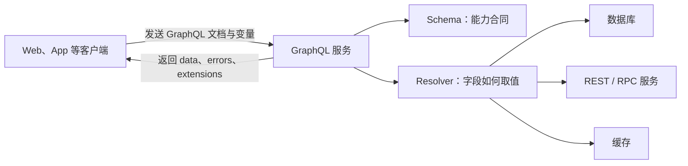
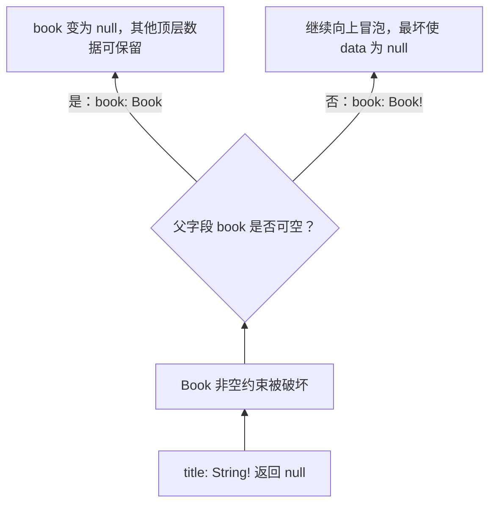
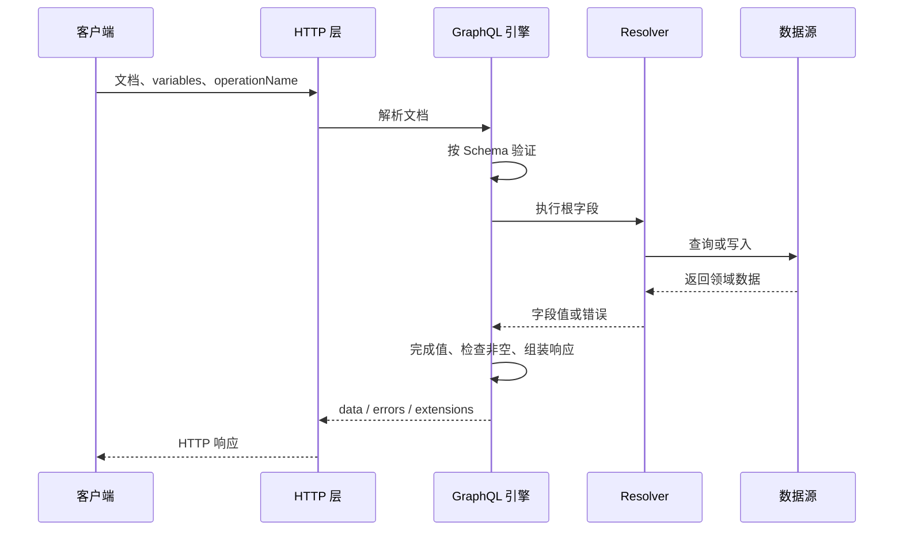
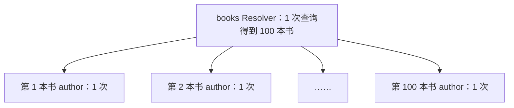
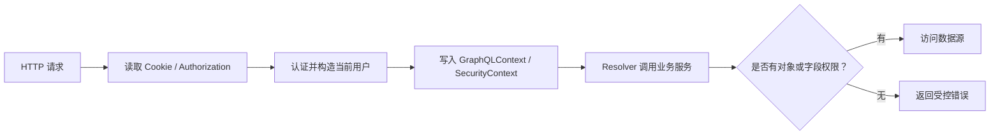
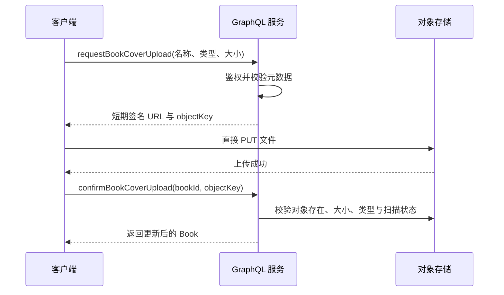
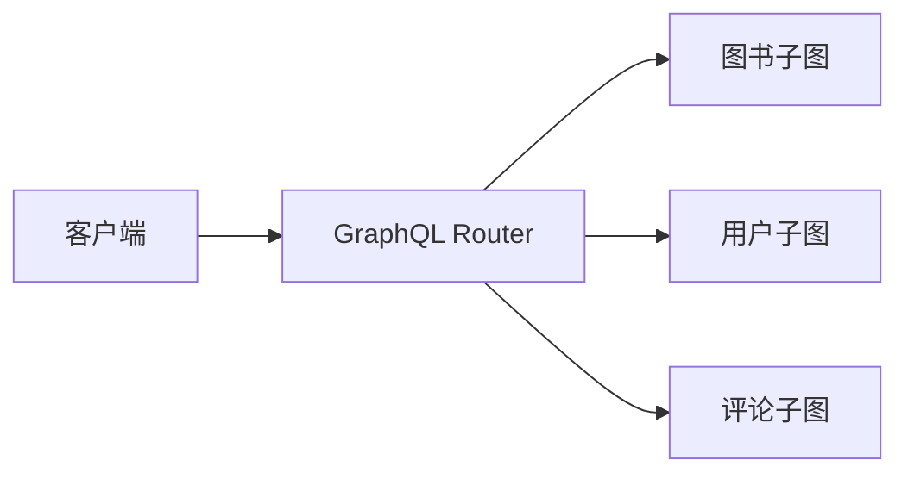

# Java 程序员的 GraphQL 从入门到生产实践

> 面向具有 Java 基础、刚接触 GraphQL 的学习者。全文使用同一个“在线图书馆”示例，以 Java、Spring Boot、Spring for GraphQL 和 GraphQL Java 为技术主线，从第一条查询逐步走到可运行服务、性能优化、安全治理和面试追问。

## 1 学习路线与心智模型

### 1.1 GraphQL 是什么

GraphQL 是一种用于 API（Application Programming Interface，应用程序编程接口）的查询语言，也是一套在服务端执行这些查询的规范。

最值得先记住的一句话是：

> 客户端按照服务端公开的类型系统，声明自己需要哪些字段；服务端验证请求，再逐字段计算并返回与请求形状相似的 JSON。

GraphQL 不是数据库，也不要求图数据库。它可以把关系数据库、NoSQL、REST（Representational State Transfer，表述性状态转移）服务、微服务和内存数据统一包装成一张面向业务的“图”。

对于 Java 开发者，可以先建立如下对应关系：

| GraphQL 概念 | Spring for GraphQL 中的常见入口 | 类似的 Java / Spring 经验 |
| --- | --- | --- |
| Schema 字段 | `.graphqls` 文件中的字段 | 接口合同，但不是 Java 接口 |
| Query 根字段 | `@QueryMapping` 方法 | 类似只读 Controller 方法 |
| Mutation 根字段 | `@MutationMapping` 方法 | 类似执行写操作的 Controller 方法 |
| 普通对象字段 | `@SchemaMapping` 方法 | 类似按需组装 DTO 的字段 |
| Resolver | 最终注册成 GraphQL Java `DataFetcher` | 类似 MVC Handler，但粒度可细到字段 |
| 请求 Context | `GraphQLContext`、Principal | 类似请求作用域上下文 |

Spring for GraphQL 建立在 GraphQL Java 之上：GraphQL Java 负责解析、验证和执行；Spring for GraphQL 提供注解控制器、批量加载、异常处理、传输和测试集成；Spring Boot 再提供自动配置。



### 1.2 为什么需要 GraphQL

假设商品详情页需要图书、作者和最近三条评论。

传统 REST 风格可能需要请求：

```text
GET /books/1
GET /authors/8
GET /books/1/reviews?limit=3
```

GraphQL 客户端可以一次声明需要的字段：

```graphql
query GetBookPage {
  book(id: "1") {
    title
    author {
      name
    }
    reviews(limit: 3) {
      rating
      content
    }
  }
}
```

响应形状与查询形状基本一致：

```json
{
  "data": {
    "book": {
      "title": "深入理解 GraphQL",
      "author": {
        "name": "林舟"
      },
      "reviews": [
        {
          "rating": 5,
          "content": "讲解很清楚"
        }
      ]
    }
  }
}
```

它主要缓解两个问题：

1\. 过度获取（over-fetching）：接口返回了页面根本不用的字段。

2\. 获取不足（under-fetching）：一个页面需要连续调用多个接口才能拼齐数据。

GraphQL 并不会自动减少服务端访问数据库的次数。客户端只发一次 HTTP（Hypertext Transfer Protocol，超文本传输协议）请求，服务端内部仍可能产生许多查询，N+1 问题正来源于此。

### 1.3 GraphQL、REST 与 RPC 的边界

| 维度 | GraphQL | REST | RPC |
| --- | --- | --- | --- |
| 核心抽象 | 类型化数据图与字段选择 | 资源与 HTTP 语义 | 远程方法调用 |
| 常见入口 | 单个 GraphQL 端点 | 多个资源 URL | 多个方法 |
| 返回内容 | 客户端选择字段 | 服务端预先定义 | 方法预先定义 |
| 类型合同 | Schema 是核心 | 常借助 OpenAPI | 常借助 Protobuf 等 IDL |
| 缓存 | 多为客户端规范化缓存或应用缓存 | HTTP 缓存天然直观 | 通常自行设计 |
| 适合场景 | 多端、组合型页面、数据关系丰富 | 简单资源接口、公开下载、HTTP 缓存 | 内部高性能服务调用 |

IDL 是 Interface Definition Language，即接口定义语言。

选择 GraphQL 不意味着必须替换所有 REST 或 RPC（Remote Procedure Call，远程过程调用）。常见做法是在前端与多个后端之间增加 GraphQL 聚合层。

可以用需求的主要矛盾来做选择：

1\. 一个商品详情页要组合商品、库存、促销和评价，而且 Web、App、运营后台需要的字段不同：优先评估 GraphQL，因为它擅长跨数据源组合和按需选择字段。

2\. 下载一本电子书文件，希望浏览器、CDN 和断点续传直接利用标准 HTTP 语义：REST 风格的文件资源通常更自然。

3\. 两个内部 Java 服务之间进行高频、稳定、强约束的方法调用，并且双方共同发布：RPC 可能更直接。

4\. 只有少量固定页面、资源关系简单、团队没有 GraphQL 治理经验：继续使用现有 REST 往往比引入新执行层更划算。

落地前不要只比较接口数量。至少验证客户端请求次数与响应体积、服务端数据库查询数、P95/P99 延迟、缓存命中、鉴权复杂度和团队维护成本。GraphQL 的采用价值来自解决真实组合问题，而不是把多个 REST URL 机械改成一个 `/graphql`。

### 1.4 推荐学习顺序

1\. 先理解 Schema、类型、字段、参数和可空性。

2\. 再掌握 Query、Mutation、变量、别名、Fragment（片段）。

3\. 跟随第 4 章运行一个最小服务。

4\. 理解 Resolver（解析器）的四个参数和执行过程。

5\. 学习错误、分页、N+1、缓存、认证与授权。

6\. 最后学习 Spring Security、订阅、Schema 演进、可观测性和 Federation（联邦）。

## 2 Schema：服务端公开的类型合同

### 2.1 Schema、SDL 与 Resolver 不要混淆

Schema 是服务端能力的完整类型合同。SDL（Schema Definition Language，模式定义语言）是书写这份合同的一种文本语法。Resolver 是实现合同中字段取值逻辑的函数。

可以把它们类比为：

1\. Schema：餐厅菜单所承诺的菜品。

2\. SDL：菜单采用的书写格式。

3\. Resolver：后厨具体如何制作每道菜。

SDL 写了字段但 Resolver 或默认取值拿不到符合类型的数据，请求仍会失败；只写 Resolver 而 Schema 没公开字段，客户端也无法查询。

### 2.2 一个完整但易懂的图书 Schema

```graphql
"""图书馆中可借阅的图书"""
type Book {
  id: ID!
  title: String!
  summary: String
  price: Float!
  status: BookStatus!
  author: Author!
  reviews(limit: Int = 10): [Review!]!
}

type Author {
  id: ID!
  name: String!
  books: [Book!]!
}

type Review {
  id: ID!
  rating: Int!
  content: String
  book: Book!
}

enum BookStatus {
  AVAILABLE
  BORROWED
  OFF_SHELF
}

input CreateBookInput {
  title: String!
  summary: String
  price: Float!
  authorId: ID!
}

type Query {
  book(id: ID!): Book
  books(limit: Int = 20, offset: Int = 0): [Book!]!
}

type Mutation {
  createBook(input: CreateBookInput!): Book!
}
```

把这段 Schema 与一次真实请求对应起来，会更容易理解：

```graphql
query ReadOneBook {
  book(id: "1") {
    title
    author {
      name
    }
  }
}
```

执行过程：

1\. 请求从 `Query.book` 进入，参数 `id` 必须满足 `ID!`，因此不能缺失或传 `null`。

2\. `Query.book` 返回 `Book`，客户端才能继续选择 `Book.title` 和 `Book.author`。

3\. `Book.author` 又返回 `Author`，所以客户端继续选择 `Author.name`。

4\. 客户端没有选择 `summary`、`price` 和 `reviews`，响应中就不会出现这些字段。

预期响应形状：

```json
{
  "data": {
    "book": {
      "title": "GraphQL 入门",
      "author": {
        "name": "林舟"
      }
    }
  }
}
```

这里的 Schema 只回答“允许查什么、输入输出是什么类型”，不回答数据来自哪张表。实际取值逻辑仍由 Resolver 或默认 Property DataFetcher 完成。

### 2.3 六种命名类型

GraphQL Schema 中常见的六种命名类型如下：

| 类型 | 用途 | 例子 |
| --- | --- | --- |
| Scalar | 不再拥有子字段的叶子值 | `String`、`Int`、`DateTime` |
| Object | 一组可查询字段 | `Book` |
| Enum | 有限的合法值集合 | `BookStatus` |
| Input Object | 组织复杂输入 | `CreateBookInput` |
| Interface | 多种对象共同遵守的字段合同 | `Node` |
| Union | 返回多种对象之一，不定义共同字段 | `Book \| Author` |

内置 Scalar（标量）有：

1\. `Int`：32 位有符号整数，不能安全表示任意大的数据库主键。

2\. `Float`：双精度浮点数；金额通常不应直接依赖二进制浮点运算，可使用分为单位的整数或自定义 `BigDecimal`。

3\. `String`：UTF-8 字符序列。

4\. `Boolean`：`true` 或 `false`。

5\. `ID`：唯一标识符，序列化外观类似字符串，但表达“用于标识而非给人阅读”的语义。

日期、长整数、Decimal 和 JSON 不是内置标量，需要选用经过维护的自定义标量实现，并明确序列化格式。

### 2.4 在 Java 中注册金额标量

自定义 Scalar 的作用，是在 GraphQL 文本值与 Java 值之间建立明确的解析、校验和序列化规则。它不是给现有 Java 类型换一个名字；服务端必须注册对应的 `GraphQLScalarType`，否则 SDL 中写了 `scalar BigDecimal` 仍无法完成运行时绑定。

为什么金额值得单独建模：

1\. GraphQL 内置 `Float` 表达双精度浮点语义，Java 金额计算通常使用 `BigDecimal` 保持十进制精度。

2\. 若不同服务各自决定保留位数、舍入模式或字符串格式，同一个 Schema 名称可能产生不同含义。

3\. 自定义标量能统一语法层面的合法值，但“价格必须大于等于零”仍是业务校验，不应全部塞进 Scalar。

一种常见做法是使用 GraphQL Java Extended Scalars。加入与项目 GraphQL Java 版本兼容的依赖：

```xml
<dependency>
    <groupId>com.graphql-java</groupId>
    <artifactId>graphql-java-extended-scalars</artifactId>
    <version>${graphql-java-extended-scalars.version}</version>
</dependency>
```

该扩展库通常不由 Spring Boot 的核心依赖管理保证版本，`${graphql-java-extended-scalars.version}` 应根据当前官方发布说明和项目中的 GraphQL Java 版本选择，不要直接复制未知项目的版本号。

把 SDL 改为：

```graphql
scalar BigDecimal

type Book {
  id: ID!
  title: String!
  price: BigDecimal!
}

input CreateBookInput {
  title: String!
  price: BigDecimal!
  authorId: ID!
}
```

再注册运行时实现：

```java
package com.example.library.config;

import graphql.scalars.ExtendedScalars;
import org.springframework.context.annotation.Bean;
import org.springframework.context.annotation.Configuration;
import org.springframework.graphql.execution.RuntimeWiringConfigurer;

@Configuration
public class GraphQlScalarConfiguration {

    @Bean
    RuntimeWiringConfigurer bigDecimalScalar() {
        return builder ->
                builder.scalar(ExtendedScalars.GraphQLBigDecimal);
    }
}
```

Spring Boot 会发现 `RuntimeWiringConfigurer` Bean，并在构建 `GraphQlSource` 时注册标量。验证时至少覆盖合法小数、负数业务校验、无法解析的字符串、极大值以及客户端实际收到的 JSON 表示。若客户端语言不能安全表示高精度数字，应进一步约定字符串或定点整数格式，而不是假设所有客户端都等同于 Java `BigDecimal`。

### 2.5 可空性是业务合同

GraphQL 类型默认可空，`!` 表示非空：

| 声明 | 列表可为 null | 元素可为 null | 空数组是否合法 |
| --- | --- | --- | --- |
| `[Book]` | 是 | 是 | 是 |
| `[Book!]` | 是 | 否 | 是 |
| `[Book]!` | 否 | 是 | 是 |
| `[Book!]!` | 否 | 否 | 是 |

`[Book!]!` 仍允许 `[]`。GraphQL 类型系统不能直接表示“至少一个元素”。

非空不是“数据库这一列现在恰好非空”，而是 API 对所有正常执行路径作出的承诺。若 `Book.title: String!` 的 Resolver 返回 `null`，GraphQL 会产生字段错误，并把 `null` 向上冒泡到最近的可空父字段：



例如请求同时查询两项数据：

```graphql
query {
  book(id: "1") {
    title
  }
  books {
    id
  }
}
```

若 `book(id: "1")` 的 `title: String!` 意外返回 `null`，而根字段声明是 `book(id: ID!): Book`，响应可能是：

```json
{
  "data": {
    "book": null,
    "books": [
      {
        "id": "1"
      }
    ]
  },
  "errors": [
    {
      "message": "Cannot return null for non-nullable field Book.title.",
      "path": ["book", "title"]
    }
  ]
}
```

过程是 `title` 先失败，因为 `title` 非空而不能停在自身，于是错误向上到可空的 `book` 并停止；兄弟根字段 `books` 仍可保留。错误文案会因实现而不同，客户端更应关注 `path`、错误分类和业务错误码。

设计建议是：只有当服务端真的能长期保证存在时才加 `!`。把字段从可空改为非空对响应更严格，但可能使旧数据暴露执行错误；把输入参数从可选改为必填则会直接破坏旧客户端。

### 2.6 Object 与 Input Object 为什么不能混用

`type Book` 是输出类型，可以有需要计算的字段和带参数的字段。`input CreateBookInput` 是输入类型，只描述客户端可提交的数据。

不要让客户端提交整个 `Book`，因为 `id`、状态、审计字段等通常应由服务端决定。输入模型应表达一个动作真正允许用户控制的内容。

对比两个设计：

```graphql
# 不推荐：客户端可以提交本应由服务端控制的 id 和 status
type Mutation {
  createBook(book: BookInput!): Book!
}

input BookInput {
  id: ID
  title: String!
  status: BookStatus
  authorId: ID!
}

# 推荐：输入名称表达具体用例，只开放允许创建者填写的内容
type Mutation {
  createBook(input: CreateBookInput!): Book!
}
```

推荐方案中，服务端生成 `id`，并把新书状态初始化为 `AVAILABLE`。这样输入合同与业务权限一致，而不是照抄输出对象。

### 2.7 Interface、Union 与 `__typename`

```graphql
interface Node {
  id: ID!
}

type Book implements Node {
  id: ID!
  title: String!
}

type Author implements Node {
  id: ID!
  name: String!
}

union SearchResult = Book | Author

type Query {
  search(keyword: String!): [SearchResult!]!
}
```

查询抽象类型时，通过内联片段选择具体字段：

```graphql
query Search($keyword: String!) {
  search(keyword: $keyword) {
    __typename
    ... on Book {
      id
      title
    }
    ... on Author {
      id
      name
    }
  }
}
```

`__typename` 是对象上的元字段。客户端常用“类型名 + ID”作为规范化缓存键。

Interface 与 Union 都能返回多种对象，但设计意图不同：

| 对比项 | Interface | Union |
| --- | --- | --- |
| 是否声明共同字段 | 是，例如 `Node.id` | 否 |
| 具体类型要求 | 必须实现共同字段合同 | 只需被列为 Union 成员 |
| 客户端可直接选择什么 | Interface 的共同字段 | 只有 `__typename`，其他字段放在 Fragment 中 |
| 适用场景 | 多种对象确实共享稳定能力 | 搜索结果、业务结果等“可能是 A 或 B” |

为什么不能只写 SDL 就结束？`search` 的声明返回 `SearchResult`，但 Resolver 实际返回的是某个 Java 对象。运行时还必须判断这个对象究竟对应 GraphQL 的 `Book` 还是 `Author`，这个职责由 TypeResolver（类型解析器）承担。

Spring for GraphQL 默认使用 `ClassNameTypeResolver`。若 Java 类的简单名称与 GraphQL Object 名称一致，第 4 章已有的 `Book` 和 `Author` 可以直接工作：

```java
@QueryMapping
public List<Object> search(@Argument String keyword) {
    // 为了突出类型解析，示例固定返回两种 Java 对象。
    return List.of(
            bookRepository.findById("1").orElseThrow(),
            authorRepository.findById("a1").orElseThrow());
}
```

提交：

```graphql
query Search($keyword: String!) {
  search(keyword: $keyword) {
    __typename
    ... on Book {
      id
      title
    }
    ... on Author {
      id
      name
    }
  }
}
```

变量为 `{"keyword": "GraphQL"}` 时，预期结果同时体现运行时类型与各自字段：

```json
{
  "data": {
    "search": [
      {
        "__typename": "Book",
        "id": "1",
        "title": "GraphQL 入门"
      },
      {
        "__typename": "Author",
        "id": "a1",
        "name": "林舟"
      }
    ]
  }
}
```

若实际返回类叫 `BookView`，而 Schema 类型叫 `Book`，默认名称匹配可能失败。此时不要随意修改 Schema 迁就内部类名，应通过 `ClassNameTypeResolver` 的类名提取或显式映射配置对应关系。验证时同时断言 `__typename` 和类型专属字段；只断言列表长度，无法证明类型解析正确。

## 3 查询语言：客户端如何准确表达需求

### 3.1 Query 的最小结构

推荐给生产查询命名：

```graphql
query GetBookDetail {
  book(id: "1") {
    id
    title
  }
}
```

`query` 是操作类型，`GetBookDetail` 是操作名，`book` 是根字段。匿名简写 `{ book(...) { ... } }` 适合临时探索，不利于日志、指标、持久化查询和排障。

### 3.2 参数与变量

不要把用户输入通过字符串拼接塞进查询。应声明变量：

```graphql
query GetBookDetail($bookId: ID!) {
  book(id: $bookId) {
    id
    title
  }
}
```

变量通过独立 JSON 传入：

```json
{
  "bookId": "1"
}
```

变量的优势包括类型验证、查询文档复用、减少注入风险，并让客户端缓存与工具更容易识别操作。

“未提供变量”和“显式传 `null`”不是总等价：

1\. 未提供可触发参数默认值。

2\. 显式传 `null` 表示确实传入空值，通常不会采用默认值。

3\. 对 `ID!` 这类非空变量，两者都会在执行前失败。

### 3.3 用 ArgumentValue 实现局部更新

局部更新必须区分三种状态：

| 客户端输入 | 业务含义 |
| --- | --- |
| 不提供 `summary` | 保留原简介 |
| `"summary": null` | 主动清空简介 |
| `"summary": "新简介"` | 更新为新值 |

普通 `String`、`Optional<String>` 或简单 `@Argument` 绑定通常会把“省略”和“显式 null”都表现为空，导致服务端无法知道客户端的真实意图。Spring for GraphQL 提供 `ArgumentValue<T>` 保存这个差异。

Schema：

```graphql
input UpdateBookInput {
  title: String
  summary: String
}

type Mutation {
  updateBook(id: ID!, input: UpdateBookInput!): Book!
}
```

Java 输入对象：

```java
package com.example.library.book;

import org.springframework.graphql.data.ArgumentValue;

public record UpdateBookInput(
        ArgumentValue<String> title,
        ArgumentValue<String> summary) {
}
```

应用更新：

```java
@MutationMapping
public Book updateBook(
        @Argument String id,
        @Argument UpdateBookInput input) {
    var current = bookRepository.findById(id)
            .orElseThrow(() -> new BookNotFoundException(id));

    String nextTitle = input.title().isOmitted()
            ? current.title()
            : input.title().value();
    String nextSummary = input.summary().isOmitted()
            ? current.summary()
            : input.summary().value();

    return bookRepository.update(
            current, nextTitle, nextSummary);
}
```

`isOmitted()` 为真表示客户端没有提交该字段；`value()` 为 `null` 且没有省略，表示客户端显式传了 `null`。由于 `title` 在输出合同中是 `String!`，实际项目还要拒绝把标题清空；简介可空，显式 `null` 可以作为清空操作。

验证时分别提交 `{}`、`{"summary": null}` 和 `{"summary": "新简介"}`，然后重新查询图书，确认三种数据库结果不同。这个例子也说明：GraphQL 可空性负责协议输入是否合法，具体字段能否清空仍由业务规则和数据库约束共同决定。

### 3.4 别名解决字段冲突

同一个字段使用不同参数时需要别名：

```graphql
query CompareBooks {
  beginnerBook: book(id: "1") {
    title
  }
  advancedBook: book(id: "2") {
    title
  }
}
```

响应字段名是 `beginnerBook` 和 `advancedBook`。别名也可把服务端字段名映射为页面更易读的局部名称，但滥用会增加日志与缓存分析难度。

### 3.5 Fragment 复用字段集合

```graphql
fragment BookCardFields on Book {
  id
  title
  price
  status
}

query HomePage {
  newBooks: books(limit: 5) {
    ...BookCardFields
  }
}
```

Fragment 是客户端查询文档的复用机制，不会让服务端自动只执行一次 Resolver，也不是服务端 Schema 继承。

执行前可以把 `...BookCardFields` 心智上展开为 `id`、`title`、`price`、`status` 四个字段；服务端验证和执行的是展开后等价的选择集。Fragment 解决的是查询文档重复，不是数据库查询重复。

### 3.6 指令控制字段

规范内置常用指令：

```graphql
query GetBook($id: ID!, $withSummary: Boolean! = false) {
  book(id: $id) {
    id
    title
    summary @include(if: $withSummary)
    reviews @skip(if: true) {
      rating
    }
  }
}
```

`@include(if:)` 条件为真时包含字段；`@skip(if:)` 条件为真时跳过字段。不要把授权逻辑交给客户端指令，服务端仍必须独立授权。

当变量是 `{"withSummary": false}` 时，响应中不出现 `summary`；改成 `true` 后才出现。字段“不出现”和 `"summary": null` 不同：前者表示本次选择集跳过了字段，后者表示请求了字段但结果为空。

### 3.7 Mutation 表达写操作

```graphql
mutation CreateBook($input: CreateBookInput!) {
  createBook(input: $input) {
    id
    title
    status
  }
}
```

变量：

```json
{
  "input": {
    "title": "GraphQL 入门",
    "summary": "从查询到生产实践",
    "price": 59.9,
    "authorId": "a1"
  }
}
```

顶层 Mutation 字段按顺序串行执行，这是为了让有副作用的操作顺序可预测；每个顶层字段内部的子字段仍按普通字段规则执行。Query 应保持只读语义，不能因为“技术上能写数据库”就偷偷产生副作用。

### 3.8 批量修改要定义清楚原子性

批量 Mutation 必须回答：

1\. 一条失败时全部回滚，还是允许部分成功？

2\. 返回整体结果，还是逐项结果？

3\. 重试是否会重复创建数据？

4\. 客户端如何提供幂等键？

对于部分成功场景，可设计逐项结果：

```graphql
type CreateBookItemResult {
  clientRequestId: ID!
  book: Book
  errorCode: String
  message: String
}
```

业务失败是预期结果时，建模为数据往往比把所有情况都塞进顶层 `errors` 更便于客户端处理。

## 4 Java 教程：用 Spring Boot 运行第一个 GraphQL 服务

### 4.1 目标与前置条件

本章运行一个内存版图书 API，支持查询列表、按 ID 查询、关联作者、创建图书和局部更新图书。

前置条件：

1\. Java 17 或更高版本。

2\. Maven 3.6.3 或更高版本，或直接使用项目自带的 Maven Wrapper。

3\. 熟悉 Java `record`、Spring Boot 启动类和依赖注入的基础用法。

4\. 推荐使用 IntelliJ IDEA，也可以使用任意编辑器。

本文框架特定示例按当前稳定的 Spring Boot 4.1.x 与 Spring for GraphQL 2.0.x 编写。若维护 Spring Boot 3.x 项目，GraphQL 核心概念和大部分业务代码仍相同，但测试 Starter、自动配置注解包名和少数扩展 API 可能不同，应切换到对应版本的官方文档，不能混用两个大版本的 import。

### 4.2 用 Spring Initializr 创建项目

访问 [Spring Initializr](https://start.spring.io/)，选择：

1\. Project：Maven。

2\. Language：Java。

3\. Packaging：Jar。

4\. Dependencies：Spring for GraphQL、Spring Web、Validation。

下载后解压。Spring Boot 会管理 Spring for GraphQL 与 GraphQL Java 的兼容版本，不要为了“追新”分别覆盖它们。

核心 Maven 依赖结构应类似：

```xml
<dependencies>
    <dependency>
        <groupId>org.springframework.boot</groupId>
        <artifactId>spring-boot-starter-graphql</artifactId>
    </dependency>
    <dependency>
        <groupId>org.springframework.boot</groupId>
        <artifactId>spring-boot-starter-web</artifactId>
    </dependency>
    <dependency>
        <groupId>org.springframework.boot</groupId>
        <artifactId>spring-boot-starter-validation</artifactId>
    </dependency>
    <dependency>
        <groupId>org.springframework.boot</groupId>
        <artifactId>spring-boot-starter-test</artifactId>
        <scope>test</scope>
    </dependency>
    <dependency>
        <groupId>org.springframework.boot</groupId>
        <artifactId>spring-boot-starter-graphql-test</artifactId>
        <scope>test</scope>
    </dependency>
</dependencies>
```

`spring-boot-starter-graphql` 提供 GraphQL 能力，但 GraphQL 与传输协议无关，因此还需要 `spring-boot-starter-web` 才能通过 Spring MVC 暴露 HTTP 端点。

### 4.3 创建 Schema 文件

创建 `src/main/resources/graphql/schema.graphqls`：

```graphql
enum BookStatus {
  AVAILABLE
  BORROWED
  OFF_SHELF
}

type Author {
  id: ID!
  name: String!
}

type Book {
  id: ID!
  title: String!
  summary: String
  price: Float!
  status: BookStatus!
  author: Author!
}

input CreateBookInput {
  title: String!
  summary: String
  price: Float!
  authorId: ID!
}

input UpdateBookInput {
  title: String
  summary: String
}

type Query {
  book(id: ID!): Book
  books: [Book!]!
}

type Mutation {
  createBook(input: CreateBookInput!): Book!
  updateBook(id: ID!, input: UpdateBookInput!): Book!
}
```

Spring Boot 默认扫描 `src/main/resources/graphql/**` 下的 `.graphqls` 和 `.gqls` 文件，并在启动时构建 Schema。Schema 语法或类型引用错误会让应用启动失败，这比请求到来后才发现更安全。

第 2 章展示的是包含评论和作者反向关联的完整业务 Schema；本章为了先跑通 Java 最小闭环，暂时只保留图书与作者。学习时不要把两段 Schema 同时复制进同一个文件，否则重复定义 `Book`、`Author` 和根类型会导致启动失败。

### 4.4 创建 Java 领域对象

包名统一使用 `com.example.library`。

```java
package com.example.library.book;

import java.math.BigDecimal;

public record Book(
        String id,
        String title,
        String summary,
        BigDecimal price,
        BookStatus status,
        String authorId) {
}
```

```java
package com.example.library.book;

public enum BookStatus {
    AVAILABLE,
    BORROWED,
    OFF_SHELF
}
```

```java
package com.example.library.author;

public record Author(String id, String name) {
}
```

输入对象也可使用 `record`：

```java
package com.example.library.book;

import jakarta.validation.constraints.DecimalMin;
import jakarta.validation.constraints.NotBlank;
import jakarta.validation.constraints.NotNull;
import jakarta.validation.constraints.Size;
import java.math.BigDecimal;

public record CreateBookInput(
        @NotBlank @Size(max = 200) String title,
        @Size(max = 2000) String summary,
        @NotNull @DecimalMin("0.0") BigDecimal price,
        @NotBlank String authorId) {
}
```

`UpdateBookInput` 直接使用第 3.3 节定义的 `ArgumentValue<String>` 版本；不要改成两个普通 `String`，否则局部更新会丢失“字段省略”和“显式 null”的区别。

GraphQL `Float` 最终可以绑定为多种 Java 数字类型，但金额的业务计算应使用 `BigDecimal`。本教程为了减少第一次运行的依赖，Schema 暂时保留 `Float`；生产项目可按第 2.4 节注册 `BigDecimal` 自定义标量，避免把金额合同含糊地表示为浮点数。

### 4.5 创建内存 Repository

```java
package com.example.library.book;

import org.springframework.stereotype.Repository;

import java.math.BigDecimal;
import java.util.List;
import java.util.Optional;
import java.util.concurrent.CopyOnWriteArrayList;
import java.util.concurrent.atomic.AtomicLong;

@Repository
public class BookRepository {

    private final AtomicLong sequence = new AtomicLong(1);
    private final List<Book> books = new CopyOnWriteArrayList<>(List.of(
            new Book(
                    "1",
                    "GraphQL 入门",
                    "用一条主线掌握 GraphQL",
                    new BigDecimal("59.90"),
                    BookStatus.AVAILABLE,
                    "a1")
    ));

    public List<Book> findAll() {
        return List.copyOf(books);
    }

    public Optional<Book> findById(String id) {
        return books.stream().filter(book -> book.id().equals(id)).findFirst();
    }

    public Book save(CreateBookInput input) {
        var book = new Book(
                String.valueOf(sequence.incrementAndGet()),
                input.title(),
                input.summary(),
                input.price(),
                BookStatus.AVAILABLE,
                input.authorId());
        books.add(book);
        return book;
    }

    public Book update(
            Book current,
            String title,
            String summary) {
        var updated = new Book(
                current.id(),
                title,
                summary,
                current.price(),
                current.status(),
                current.authorId());
        int index = books.indexOf(current);
        if (index < 0) {
            throw new BookNotFoundException(current.id());
        }
        books.set(index, updated);
        return updated;
    }
}
```

```java
package com.example.library.author;

import org.springframework.stereotype.Repository;

import java.util.Collection;
import java.util.List;
import java.util.Map;
import java.util.Optional;

@Repository
public class AuthorRepository {

    private final Map<String, Author> authors =
            Map.of("a1", new Author("a1", "林舟"));

    public Optional<Author> findById(String id) {
        return Optional.ofNullable(authors.get(id));
    }

    public List<Author> findAllById(Collection<String> ids) {
        return ids.stream()
                .map(authors::get)
                .filter(java.util.Objects::nonNull)
                .toList();
    }
}
```

`CopyOnWriteArrayList` 只是让演示中的并发读写不直接破坏集合，并不等于数据库事务或生产持久化方案。

### 4.6 用注解映射 GraphQL 字段

```java
package com.example.library.book;

import com.example.library.author.Author;
import com.example.library.author.AuthorRepository;
import jakarta.validation.Valid;
import org.springframework.graphql.data.method.annotation.Argument;
import org.springframework.graphql.data.method.annotation.MutationMapping;
import org.springframework.graphql.data.method.annotation.QueryMapping;
import org.springframework.graphql.data.method.annotation.SchemaMapping;
import org.springframework.stereotype.Controller;

import java.util.List;

@Controller
public class BookController {

    private final BookRepository bookRepository;
    private final AuthorRepository authorRepository;

    public BookController(
            BookRepository bookRepository,
            AuthorRepository authorRepository) {
        this.bookRepository = bookRepository;
        this.authorRepository = authorRepository;
    }

    @QueryMapping
    public Book book(@Argument String id) {
        return bookRepository.findById(id).orElse(null);
    }

    @QueryMapping
    public List<Book> books() {
        return bookRepository.findAll();
    }

    @MutationMapping
    public Book createBook(@Argument @Valid CreateBookInput input) {
        authorRepository.findById(input.authorId())
                .orElseThrow(() -> new AuthorNotFoundException(input.authorId()));
        return bookRepository.save(input);
    }

    @MutationMapping
    public Book updateBook(
            @Argument String id,
            @Argument UpdateBookInput input) {
        var current = bookRepository.findById(id)
                .orElseThrow(() -> new BookNotFoundException(id));

        String nextTitle = input.title().isOmitted()
                ? current.title()
                : input.title().value();
        if (nextTitle == null || nextTitle.isBlank()) {
            throw new IllegalArgumentException("标题不能为空");
        }
        String nextSummary = input.summary().isOmitted()
                ? current.summary()
                : input.summary().value();

        return bookRepository.update(
                current, nextTitle, nextSummary);
    }

    @SchemaMapping(typeName = "Book", field = "author")
    public Author author(Book book) {
        return authorRepository.findById(book.authorId())
                .orElseThrow(() -> new AuthorNotFoundException(book.authorId()));
    }
}
```

```java
package com.example.library.book;

public class AuthorNotFoundException extends RuntimeException {

    public AuthorNotFoundException(String authorId) {
        super("Author not found: " + authorId);
    }
}
```

后文还会使用同样结构的 `BookNotFoundException`：

```java
package com.example.library.book;

public class BookNotFoundException extends RuntimeException {

    public BookNotFoundException(String bookId) {
        super("Book not found: " + bookId);
    }
}
```

注解与 Schema 的对应关系：

1\. `@QueryMapping` 默认把方法名映射到 `Query` 的同名字段。

2\. `@MutationMapping` 默认把方法名映射到 `Mutation` 的同名字段。

3\. `@Argument` 从 GraphQL 字段参数绑定 Java 参数。

4\. `@SchemaMapping(typeName = "Book", field = "author")` 实现 `Book.author`。

5\. `@Valid` 触发 Jakarta Bean Validation，但它不能替代作者是否存在等业务规则。

这些方法最终会被注册为 GraphQL Java 的 `DataFetcher`。它们不是 REST Controller，因此不要添加 `@GetMapping` 或 `@PostMapping`。

### 4.7 配置开发工具

在 `src/main/resources/application.yml` 中添加：

```yaml
spring:
  graphql:
    graphiql:
      enabled: true
```

GraphiQL 默认页面位于 `http://localhost:8080/graphiql`，GraphQL HTTP 端点默认是 `POST /graphql`。GraphiQL 只建议在开发环境启用，生产是否开放要结合安全策略。

### 4.8 启动与验证

```bash
./mvnw spring-boot:run
```

Windows 可使用：

```powershell
mvnw.cmd spring-boot:run
```

另开终端发送请求：

```bash
curl --request POST \
  --header 'content-type: application/json' \
  --data '{"query":"query Books { books { id title author { name } } }"}' \
  http://localhost:8080/graphql
```

预期响应：

```json
{
  "data": {
    "books": [
      {
        "id": "1",
        "title": "GraphQL 入门",
        "author": {
          "name": "林舟"
        }
      }
    ]
  }
}
```

成功判据不是“Spring Boot 没报错”，而是响应中没有 `errors`，且 `data.books[0].author.name` 符合预期。

### 4.9 验证 Mutation 与输入校验

先创建一本书：

```bash
curl --request POST \
  --header 'content-type: application/json' \
  --data '{
    "operationName": "CreateBook",
    "query": "mutation CreateBook($input: CreateBookInput!) { createBook(input: $input) { id title status author { name } } }",
    "variables": {
      "input": {
        "title": "Java GraphQL 实战",
        "summary": "Spring for GraphQL 示例",
        "price": 68.0,
        "authorId": "a1"
      }
    }
  }' \
  http://localhost:8080/graphql
```

预期结果包含服务端生成的 `id` 和默认状态：

```json
{
  "data": {
    "createBook": {
      "id": "2",
      "title": "Java GraphQL 实战",
      "status": "AVAILABLE",
      "author": {
        "name": "林舟"
      }
    }
  }
}
```

这次请求的输入—过程—输出是：

1\. GraphQL 先确认 `input` 存在，并能绑定到 `CreateBookInput`。

2\. Jakarta Validation 检查标题、价格和作者 ID 的格式约束。

3\. Controller 检查作者是否真实存在，再调用 Repository 保存。

4\. 返回的 `Book` 继续解析 `author` 子字段，所以创建成功不等于字段解析一定成功。

再把标题改成空字符串。GraphQL 的 `String!` 只会拒绝 `null`，不会拒绝 `""`；真正拒绝空字符串的是 Java 输入对象上的 `@NotBlank`。预期响应包含 `errors`，并且创建逻辑不应执行。

验证写操作时至少检查三件事：响应没有非预期错误、返回字段符合业务约定、再次查询能读到新数据。仅看到 HTTP 200 或拿到一个 `id` 都不足以证明完整业务成功。

再验证局部更新。下面显式把简介清空：

```bash
curl --request POST \
  --header 'content-type: application/json' \
  --data '{
    "operationName": "UpdateBook",
    "query": "mutation UpdateBook($id: ID!, $input: UpdateBookInput!) { updateBook(id: $id, input: $input) { id title summary } }",
    "variables": {
      "id": "1",
      "input": {
        "summary": null
      }
    }
  }' \
  http://localhost:8080/graphql
```

预期 `title` 保持原值，`summary` 变为 `null`。随后把 `input` 分别改成 `{}` 和 `{"summary": "新的简介"}`：前者应同时保留标题与简介，后者只修改简介。每次都重新查询 `book(id: "1")`，才能确认 `ArgumentValue` 的三态语义真正落到了数据上。

### 4.10 本示例能证明什么

该示例能验证 SDL、Java 类型绑定、注解映射、参数、关联字段、Validation、Mutation，以及用 `ArgumentValue` 区分“省略字段”和“显式 null”的最小闭环。它不能证明生产可用性，因为：

1\. 内存数据重启后丢失。

2\. `AtomicLong` 只解决单进程演示中的编号竞争，不适合分布式 ID。

3\. 没有 Spring Security、租户授权、限流和审计。

4\. 没有真实数据库事务、连接池、超时和可观测性。

5\. `Book.author` 逐条查询会产生 N+1，第 7 章将用 `@BatchMapping` 改造。

## 5 Resolver 与执行机制

### 5.1 从 Resolver 四参数理解 Spring 方法参数

GraphQL Java 底层的 `DataFetcher` 可从 `DataFetchingEnvironment` 获取 source、arguments、GraphQLContext、字段选择集等执行信息。Spring for GraphQL 把这些内容转换为更符合 Spring 编程习惯的方法参数：

```java
@SchemaMapping(typeName = "Book", field = "author")
public Author author(
        Book book,
        GraphQLContext graphQLContext,
        DataFetchingEnvironment environment) {
    // book 是父对象；通常只声明真正需要的参数。
    return authorService.findRequired(book.authorId());
}
```

| GraphQL 执行概念 | Spring 方法参数 | 常见用途 |
| --- | --- | --- |
| Parent / Source | 未加注解的 `Book book` | `Book.author` 读取 `book.authorId()` |
| Arguments | `@Argument String id` | 绑定 `book(id:)` |
| Context | `GraphQLContext`、`@ContextValue` | 当前用户、请求属性、追踪信息 |
| Execution Info | `DataFetchingEnvironment` | 选择集、字段路径等高级信息 |
| Security Principal | `Principal`、`@AuthenticationPrincipal` | 获取 Spring Security 身份 |
| DataLoader | `DataLoader<K,V>` | 请求内批量加载关联数据 |

不要把某个用户身份写入单例 Controller 字段，否则并发请求会串号。Spring Bean 可以是单例，数据库连接池也可复用；当前用户、事务和请求级上下文必须保留正确作用域。

请求上下文解决的是“同一次 GraphQL 操作中的多个字段，如何安全共享身份、请求 ID、Locale 等横切信息”。它的生命周期是一次请求，不是应用全局，也不是父子字段之间传业务数据的万能 Map。

例如把 HTTP 请求头复制到 `GraphQLContext`：

```java
package com.example.library.config;

import org.springframework.context.annotation.Bean;
import org.springframework.context.annotation.Configuration;
import org.springframework.graphql.server.support.HttpRequestHeaderInterceptor;

@Configuration
public class GraphQlContextConfiguration {

    @Bean
    HttpRequestHeaderInterceptor requestHeaderInterceptor() {
        return HttpRequestHeaderInterceptor.builder()
                .mapHeader("X-Request-Id")
                .build();
    }
}
```

Controller 按需读取：

```java
import org.slf4j.Logger;
import org.slf4j.LoggerFactory;

private static final Logger log =
        LoggerFactory.getLogger(BookController.class);

@QueryMapping
public Book book(
        @Argument String id,
        @ContextValue(name = "X-Request-Id", required = false)
        String requestId) {
    log.info("query book, requestId={}, bookId={}",
            requestId, id);
    return bookRepository.findById(id).orElse(null);
}
```

执行路径是“HTTP Header → `HttpRequestHeaderInterceptor` → `GraphQLContext` → `@ContextValue` 参数”。这样 Resolver 不依赖 Servlet API，也能在 HTTP 与 WebSocket 等不同传输之间保持较清晰的边界。

验证时分别带上和省略 `X-Request-Id`，确认日志中的请求 ID 与调用一致且不会跨并发请求串号。认证信息优先通过 Spring Security 的 `Principal` 或 `@AuthenticationPrincipal` 获取；不要信任客户端随意提交的用户 ID Header 充当已认证身份。

### 5.2 默认 Resolver

如果 Java Bean 属性或 `record` 访问器与 Schema 字段同名，GraphQL Java 的默认 Property DataFetcher 通常可直接取值：

```java
public record Book(String id, String title, String authorId) {
}
```

`Book.id` 和 `Book.title` 不需要显式 `@SchemaMapping`。`Book.author` 的 Java 对象只有 `authorId`，输出却要求 `Author`，因此需要显式关联逻辑。

### 5.3 从解析到响应的完整路径



主要阶段：

1\. Parse：把查询字符串解析为 AST（Abstract Syntax Tree，抽象语法树）。语法错误在这里失败。

2\. Validate：对照 Schema 检查字段、参数、变量类型和 Fragment。验证失败时不执行 Resolver。

3\. Execute：从根类型开始调用 Resolver，递归完成字段。

4\. Complete：序列化标量、展开列表、检查非空并组装响应。

用一个错误查询观察阶段边界：

```graphql
query WrongField {
  book(id: "1") {
    title
    publisherName
  }
}
```

如果 `Book` 没有 `publisherName`，请求会在 Validate 阶段失败。`BookController.book(...)` 和 Repository 都不应被调用。典型响应只有 `errors`，没有通过执行得到的 `data`：

```json
{
  "errors": [
    {
      "message": "Validation error: Field 'publisherName' in type 'Book' is undefined"
    }
  ]
}
```

这解释了为什么“数据库中确实有 publisher_name 列”也不能让查询成功：客户端实际入口是 GraphQL Schema，不是数据库 Schema。应先在 GraphQL 类型中公开字段，再为其提供默认取值或 `@SchemaMapping`。

### 5.4 并行与串行

同一层级普通 Query 字段通常可以并行完成；顶层 Mutation 字段按文档顺序串行执行。不要依赖子字段的执行顺序实现业务事务。

```graphql
query TwoIndependentReads {
  first: book(id: "1") {
    title
  }
  second: book(id: "2") {
    title
  }
}
```

`first` 与 `second` 没有数据依赖，执行策略可以并发推进它们。这里的“可以并发”不等于保证各占一个线程，具体调度取决于 GraphQL Java 的执行策略、返回值是同步还是异步，以及 Spring 的 Executor 配置。

```graphql
mutation TwoWrites($first: CreateBookInput!, $second: CreateBookInput!) {
  firstResult: createBook(input: $first) {
    id
  }
  secondResult: createBook(input: $second) {
    id
  }
}
```

顶层 `firstResult` 完成后才开始 `secondResult`，但这仍不是数据库事务。若第二次创建失败，第一次不会因为 GraphQL 的串行语义自动回滚；要实现共同回滚，应把业务动作设计为一个 Mutation，并在应用服务中建立明确事务边界。

### 5.5 Resolver 不是业务逻辑垃圾桶

推荐分层：

```text
Resolver：协议适配、读取参数、调用应用服务、映射错误
Application Service：用例编排、权限规则、事务边界
Repository / Data Source：数据库或远程服务访问
Domain：核心业务规则
```

Controller 过胖会导致业务逻辑难以复用和单测。Controller 过薄但把授权只写在某个入口，也可能让其他入口绕过授权。事务通常放在应用服务的 `@Transactional` 方法，而不是跨多个字段 Resolver 隐式拼接；授权应放在不会被不同入口绕过的合适业务层。

## 6 HTTP、响应与错误处理

### 6.1 GraphQL 与 HTTP 的关系

GraphQL 规范主要描述类型、验证和执行；GraphQL over HTTP 描述如何通过 HTTP 传输。常见 POST 请求体为：

```json
{
  "query": "query GetBook($id: ID!) { book(id: $id) { id title } }",
  "operationName": "GetBook",
  "variables": {
    "id": "1"
  }
}
```

生产客户端发送 JSON 请求时，通常使用 `Content-Type: application/json`，并优先声明 `Accept: application/graphql-response+json`。媒体类型不仅影响序列化，还可能影响 HTTP 状态码：在支持新媒体类型的实现中，无法解析或无法通过验证的请求可返回 4xx；操作进入执行阶段后，即使响应含字段错误，通常仍返回 200，并通过 `errors` 表达执行结果。

GraphQL over HTTP 规范允许实现用 GET 承载只读 Query，以便利用 HTTP 缓存，但并非每个框架默认开启。Spring for GraphQL 当前默认 HTTP 端点文档以 `POST /graphql` 为标准请求方式，因此本教程不要假设把 Query 改成 GET 就一定可用。Mutation 有副作用，不应使用 GET。验证传输边界时，应分别测试错误 JSON、验证失败、Resolver 执行失败和成功请求，同时检查 HTTP 状态与 GraphQL 响应体，不能只检查其中一个。

### 6.2 响应的三个顶层成员

```json
{
  "data": {
    "book": null
  },
  "errors": [
    {
      "message": "无权查看该图书",
      "path": ["book"],
      "extensions": {
        "code": "FORBIDDEN"
      }
    }
  ],
  "extensions": {
    "requestId": "req_example"
  }
}
```

1\. `data`：执行结果；发生字段错误时仍可能有部分数据。

2\. `errors`：错误数组，常含 `message`、`locations`、`path` 与 `extensions`。

3\. `extensions`：实现自定义元数据的扩展位置。

### 6.3 请求错误与字段错误

请求错误发生在执行前，例如语法错误、未知字段、变量类型错误。Resolver 不会运行，响应通常没有 `data`。

字段错误发生在执行中，例如数据库超时或 Resolver 抛错。服务端可能返回部分 `data`，并在 `errors.path` 指出失败字段。

对比两个最小例子：

| 输入 | 失败阶段 | Resolver 是否执行 | 响应特点 |
| --- | --- | --- | --- |
| 查询不存在的 `Book.publisherName` | 验证 | 否 | 通常只有 `errors` |
| `Book.author` 查询数据库时超时 | 执行 | 已执行 | 可能同时有部分 `data` 和 `errors` |

字段错误响应示例：

```json
{
  "data": {
    "book": null,
    "serverTime": "2026-07-26T10:00:00Z"
  },
  "errors": [
    {
      "message": "作者服务暂时不可用",
      "path": ["book", "author"],
      "extensions": {
        "code": "AUTHOR_SERVICE_UNAVAILABLE"
      }
    }
  ]
}
```

如果 `Book.author` 与 `Book` 在 Schema 中都是非空，错误会沿非空链冒泡，使顶层 `book` 变成 `null`；不相关的可成功根字段 `serverTime` 仍可能保留。

客户端不能只看 HTTP 200 就认定业务成功，也不能只要存在 `errors` 就丢掉全部 `data`。正确判据应结合 HTTP 状态、`errors`、目标字段、业务结果和本地缓存更新。

### 6.4 预期业务失败与异常失败

“用户名已存在”“库存不足”是用户可修复的预期业务结果，可以作为联合类型或 Payload 数据建模：

```graphql
type CreateBookSuccess {
  book: Book!
}

type ValidationProblem {
  field: String
  message: String!
}

union CreateBookResult = CreateBookSuccess | ValidationProblem

type Mutation {
  createBook(input: CreateBookInput!): CreateBookResult!
}
```

在 Java 中，可以让两个结果实现同一个密封接口。以下三个类型分别放入同名 `.java` 文件：

```java
package com.example.library.book;

public sealed interface CreateBookResult
        permits CreateBookSuccess, ValidationProblem {
}
```

```java
package com.example.library.book;

public record CreateBookSuccess(Book book)
        implements CreateBookResult {
}
```

```java
package com.example.library.book;

public record ValidationProblem(String field, String message)
        implements CreateBookResult {
}
```

下面是第 4 章 `createBook` 的另一种设计，不能与原来返回 `Book` 的方法同时保留：

```java
@MutationMapping
public CreateBookResult createBook(
        @Argument @Valid CreateBookInput input) {
    if (authorRepository.findById(input.authorId()).isEmpty()) {
        return new ValidationProblem(
                "authorId", "指定的作者不存在");
    }
    return new CreateBookSuccess(
            bookRepository.save(input));
}
```

Java 结果类名与 GraphQL Object 类型名一致，因此 Spring 默认 TypeResolver 可以把 `CreateBookSuccess` 和 `ValidationProblem` 分辨出来。客户端必须用 `__typename` 和 Fragment 处理两种返回值：

```graphql
mutation CreateBook($input: CreateBookInput!) {
  createBook(input: $input) {
    __typename
    ... on CreateBookSuccess {
      book {
        id
        title
      }
    }
    ... on ValidationProblem {
      field
      message
    }
  }
}
```

当 `authorId` 不存在时，预期业务失败出现在 `data` 中，而不是顶层 `errors`：

```json
{
  "data": {
    "createBook": {
      "__typename": "ValidationProblem",
      "field": "authorId",
      "message": "指定的作者不存在"
    }
  }
}
```

这种设计适合客户端能够修正、且属于正常业务分支的失败。数据库宕机、代码缺陷和依赖超时不应伪装成 `ValidationProblem`，它们更适合顶层 `errors`，同时服务端记录完整内部日志。不要把堆栈、SQL、文件路径或敏感参数暴露给客户端。测试时应分别断言成功分支、业务失败分支和异常分支，防止所有错误都被错误地包装成 HTTP 200 下的“成功数据”。

### 6.5 用 Spring 统一映射异常

Controller 抛出的异常可用 `@GraphQlExceptionHandler` 统一映射：

```java
@ControllerAdvice
public class GlobalGraphQlExceptionHandler {

    @GraphQlExceptionHandler
    public GraphQLError handleAuthorNotFound(
            AuthorNotFoundException exception,
            GraphqlErrorBuilder<?> errorBuilder) {
        return errorBuilder
                .errorType(ErrorType.NOT_FOUND)
                .message("作者不存在")
                .extensions(Map.of("code", "AUTHOR_NOT_FOUND"))
                .build();
    }

    @GraphQlExceptionHandler
    public GraphQLError handleBookNotFound(
            BookNotFoundException exception,
            GraphqlErrorBuilder<?> errorBuilder) {
        return errorBuilder
                .errorType(ErrorType.NOT_FOUND)
                .message("图书不存在")
                .extensions(Map.of("code", "BOOK_NOT_FOUND"))
                .build();
    }
}
```

需要导入：

```java
import graphql.GraphQLError;
import graphql.GraphqlErrorBuilder;
import org.springframework.graphql.data.method.annotation.GraphQlExceptionHandler;
import org.springframework.graphql.execution.ErrorType;
import org.springframework.web.bind.annotation.ControllerAdvice;

import java.util.Map;
```

使用框架准备好的 `GraphqlErrorBuilder`，可以保留当前字段的 path 和 location。对非注解 Controller 的自定义 `DataFetcher`，可实现 `DataFetcherExceptionResolver`。无论哪种方式，都应在服务端按请求 ID 记录原始异常，并只向客户端返回稳定、脱敏的信息。

## 7 数据访问、N+1 与分页

### 7.1 N+1 如何产生

查询 100 本书及其作者：

```graphql
query {
  books {
    title
    author {
      name
    }
  }
}
```

朴素实现可能先查一次图书，再为每本书各查一次作者，总计 101 次查询。



### 7.2 DataLoader 的批处理与请求级缓存

DataLoader 的核心不是“永久缓存”，而是在一个短批处理窗口内收集 key，一次批量读取，再按输入 key 的顺序返回结果。

Spring for GraphQL 最简洁的做法是 `@BatchMapping`：

```java
import org.springframework.graphql.data.method.annotation.BatchMapping;

import java.util.LinkedHashMap;
import java.util.List;
import java.util.Map;
import java.util.function.Function;
import java.util.stream.Collectors;

// 把这个方法加入第 4 章已有的 BookController，
// 并删除原来的 @SchemaMapping Book.author 方法。
@BatchMapping(typeName = "Book", field = "author")
public Map<Book, Author> authors(List<Book> books) {
    var authorIds = books.stream()
            .map(Book::authorId)
            .collect(Collectors.toSet());

    var authorsById = authorRepository.findAllById(authorIds).stream()
            .collect(Collectors.toMap(Author::id, Function.identity()));

    var result = new LinkedHashMap<Book, Author>();
    for (var book : books) {
        var author = authorsById.get(book.authorId());
        if (author != null) {
            result.put(book, author);
        }
    }
    return result;
}
```

不要用这个片段覆盖整个 `BookController`，它只是对关联字段方法的改造。若同时保留原先同一字段的 `@SchemaMapping Book.author`，应用会出现重复映射。

以 100 本书都属于作者 `a1` 为例：

1\. 输入：GraphQL 执行先得到 100 个 `Book` 父对象，并收集 100 次 `author` 字段加载请求。

2\. 批处理：`@BatchMapping` 一次收到 100 本书，先把作者 ID 去重为集合 `{"a1"}`。

3\. 数据访问：`findAllById` 只进行一次批量查询，而不是执行 100 次 `findById`。

4\. 输出：返回 `Map<Book, Author>`，Spring 再把每个 Book 与对应 Author 分发回原字段。

`Book` 被用作 Map 的 key，因此必须正确实现 `equals` 和 `hashCode`；本笔记使用 Java `record`，编译器已经生成二者。若某本书找不到作者，结果 Map 中不会有该 key，字段会得到 `null`；由于 Schema 声明 `author: Author!`，随后会产生非空错误。生产系统应通过外键、数据治理或明确异常保证该合同。

`@BatchMapping` 是 Spring 对 `BatchLoaderRegistry` 和 DataLoader 常见用法的封装。

如果需要直接使用 DataLoader，可注册批量加载函数，再把 DataLoader 注入映射方法。下面的方案与 `@BatchMapping` 二选一，不能同时映射 `Book.author`：

```java
import org.dataloader.DataLoader;
import org.springframework.graphql.data.method.annotation.SchemaMapping;
import org.springframework.graphql.execution.BatchLoaderRegistry;
import org.springframework.stereotype.Controller;
import reactor.core.publisher.Mono;

import java.util.concurrent.CompletableFuture;
import java.util.function.Function;
import java.util.stream.Collectors;

@Controller
public class BookAuthorController {

    public BookAuthorController(
            BatchLoaderRegistry registry,
            AuthorRepository authorRepository) {
        registry.forTypePair(String.class, Author.class)
                .registerMappedBatchLoader((ids, environment) ->
                        Mono.fromSupplier(() ->
                                authorRepository.findAllById(ids).stream()
                                        .collect(Collectors.toMap(
                                                Author::id,
                                                Function.identity()))));
    }

    @SchemaMapping(typeName = "Book", field = "author")
    public CompletableFuture<Author> author(
            Book book,
            DataLoader<String, Author> loader) {
        return loader.load(book.authorId());
    }
}
```

关键约束：

1\. 列表式 BatchLoader 的返回数组长度和顺序必须与输入 key 一致；Mapped BatchLoader 则按 key 返回 Map。

2\. 关联字段声明为非空时，缺失作者不能悄悄返回 null，应保证数据约束或转成受控错误。

3\. DataLoader Registry 通常按请求创建，Spring for GraphQL 会协助处理请求级注册。

4\. 批量查询也必须携带租户与权限条件，不能因为合并 SQL 就绕过行级授权。

5\. 同一请求内 Mutation 更新数据后，应 `clear` 或 `prime` 相关 key，避免读到旧值。

### 7.3 接入 Spring Data JPA 时的边界

真实项目通常由应用服务在事务内查询 Repository，再返回稳定的领域对象或 DTO（Data Transfer Object，数据传输对象）：

```java
@Service
public class BookApplicationService {

    private final BookJpaRepository bookRepository;

    public BookApplicationService(BookJpaRepository bookRepository) {
        this.bookRepository = bookRepository;
    }

    @Transactional(readOnly = true)
    public BookDetail findRequired(String id) {
        return bookRepository.findDetailById(id)
                .map(BookDetail::from)
                .orElseThrow(() -> new BookNotFoundException(id));
    }
}
```

不要简单地把 JPA Entity 直接作为长期 GraphQL 合同，原因包括：

1\. Entity 结构服务于持久化，GraphQL 类型服务于 API 消费者，两者演进节奏不同。

2\. 直接遍历懒加载关联可能在每个字段触发 SQL，形成隐蔽 N+1。

3\. Resolver 执行时事务可能已经结束，访问 LAZY 关联会出现 `LazyInitializationException`。

4\. 双向关联可能形成深层图，增加序列化、查询成本和权限泄漏风险。

5\. Entity 上的内部字段不应因为默认属性读取而意外公开。

解决思路不是一律改成 EAGER（立即加载）。EAGER 可能让所有场景都付出 JOIN 或额外查询成本。应根据用例选择 DTO Projection、`@EntityGraph`、明确 JOIN 查询、`@BatchMapping` 或 DataLoader，并通过 SQL 日志和指标验证。

不要依赖 Open Session in View（OSIV，视图层保持持久化会话）掩盖边界问题。即使 OSIV 让字段暂时能加载，也可能把数据库访问拖到事务边界之外，造成连接占用和不可预测查询。

### 7.4 DataLoader 不是唯一答案

如果 Repository 能根据选择集和场景稳定地使用 JOIN、预加载或批量 SQL，可能更高效。不要盲目把每个字段都变成 Loader。应通过查询次数、数据库耗时、批大小和整体延迟验证优化效果。

常见方案的职责不同：

| 场景 | 优先评估 | 原因与边界 |
| --- | --- | --- |
| 列表中的每本书都要加载作者 | `@BatchMapping` / DataLoader | 保留字段按需执行，同时把多个 key 合并 |
| 一个固定详情用例总是需要图书和作者 | JOIN、DTO Projection、`@EntityGraph` | 一次查询更直接，不必先制造 N 个延迟加载请求 |
| 同一请求重复读取同一个下游对象 | DataLoader 请求级缓存 | 可去重，但不能替代跨请求业务缓存 |
| 跨请求反复读取低频变更的公共数据 | 服务端缓存 | 需要失效、权限隔离和一致性设计 |
| 查询只请求 `Book.title`，不请求作者 | 不加载作者 | GraphQL 的按需字段本身就是最有效的优化 |

选择步骤：

1\. 先用 SQL 日志、Trace 或 DataFetcher 指标证明问题确实存在。

2\. 判断关联是否每次都需要；固定需要时考虑在 Repository 层一次取齐，按需需要时考虑 DataLoader。

3\. 用相同数据量对比数据库往返次数、扫描行数、P95 延迟和连接占用。

4\. 验证未请求关联字段时不会产生多余查询，并覆盖租户过滤与缓存失效。

优化成功的判据不是“使用了 DataLoader”，而是在不改变权限和结果语义的前提下，把可观察的资源消耗降到目标范围。

### 7.5 Offset 分页

```graphql
type Query {
  books(limit: Int = 20, offset: Int = 0): [Book!]!
}
```

优点是简单并支持跳页。缺点是大 offset 可能越来越慢；数据插入或删除时，翻页可能重复或遗漏。

必须限制 `limit` 最大值，不能只提供默认值。默认 `20` 不意味着客户端不能传 `1000000`。

Java 入口应同时提供默认值和硬上限：

```java
@QueryMapping
public List<Book> books(
        @Argument Optional<Integer> limit,
        @Argument Optional<Integer> offset) {
    int safeLimit = Math.min(Math.max(limit.orElse(20), 1), 100);
    int safeOffset = Math.max(offset.orElse(0), 0);
    return bookRepository.findPage(safeLimit, safeOffset);
}
```

若客户端不提供参数，实际使用 `limit = 20`、`offset = 0`；传 `limit = 1000000` 时，服务端仍只取 100 条。成功判据不只是返回数组，还要从 SQL 日志确认查询包含边界，并测试负数、零、最大值和超过最大值的输入。

### 7.6 Cursor 分页与 Connection

```graphql
type BookEdge {
  cursor: String!
  node: Book!
}

type PageInfo {
  hasNextPage: Boolean!
  endCursor: String
}

type BookConnection {
  edges: [BookEdge!]!
  pageInfo: PageInfo!
  totalCount: Int
}

type Query {
  books(first: Int = 20, after: String): BookConnection!
}
```

Cursor（游标）应是不透明字符串，客户端只保存和回传，不解析内部结构。服务端可将稳定排序键编码进去，例如 `(createdAt, id)`。仅用可能重复的时间戳会导致边界不稳定。

常见实现是请求 `first + 1` 条：若多出一条，`hasNextPage` 为真；真正返回的 `edges` 仍只有 `first` 条。`totalCount` 可能触发昂贵计数，应按业务价值决定是否提供或延迟计算。

第一次请求：

```graphql
query FirstPage {
  books(first: 2) {
    edges {
      cursor
      node {
        id
        title
      }
    }
    pageInfo {
      hasNextPage
      endCursor
    }
  }
}
```

示例响应：

```json
{
  "data": {
    "books": {
      "edges": [
        {
          "cursor": "opaque-cursor-1",
          "node": {
            "id": "1",
            "title": "GraphQL 入门"
          }
        },
        {
          "cursor": "opaque-cursor-2",
          "node": {
            "id": "2",
            "title": "Java GraphQL 实战"
          }
        }
      ],
      "pageInfo": {
        "hasNextPage": true,
        "endCursor": "opaque-cursor-2"
      }
    }
  }
}
```

第二页把原样收到的 `endCursor` 作为变量传回：

```graphql
query NextPage($after: String!) {
  books(first: 2, after: $after) {
    edges {
      cursor
      node {
        id
        title
      }
    }
    pageInfo {
      hasNextPage
      endCursor
    }
  }
}
```

```json
{
  "after": "opaque-cursor-2"
}
```

客户端不应把示例游标当作可解析 ID。服务端以后可改变游标编码，只要旧游标在约定生命周期内仍可用。

## 8 缓存、客户端接入与 Schema 演进

### 8.1 三层缓存不要混为一谈

1\. HTTP/CDN（Content Delivery Network，内容分发网络）缓存：按完整请求或持久化查询标识缓存响应。

2\. 客户端规范化缓存：按 `__typename + id` 存对象，多个页面共享同一实体。

3\. 服务端数据缓存：缓存数据库或下游服务结果。

DataLoader 的请求级记忆化主要用于去重与批处理，不等同于跨请求业务缓存。

客户端规范化缓存可以用两个响应理解。页面 A 查询：

```graphql
query {
  book(id: "1") {
    __typename
    id
    title
  }
}
```

页面 B 随后查询：

```graphql
query {
  books {
    __typename
    id
    status
  }
}
```

两个响应都包含 `{"__typename":"Book","id":"1"}` 时，规范化客户端可以把它们合并为同一个缓存实体：

```json
{
  "Book:1": {
    "id": "1",
    "title": "GraphQL 入门",
    "status": "AVAILABLE"
  }
}
```

这不是 GraphQL 服务端自动完成的，也不代表客户端永远不发第二个请求。具体缓存键、合并与失效行为由客户端库配置决定；若对象没有稳定 ID，缓存只能退化为嵌套结果或使用自定义键。

### 8.2 Java 客户端最小请求

Java 服务调用另一个 GraphQL 服务时，可以使用 Spring `HttpGraphQlClient`。它负责 GraphQL 请求和错误结构，比手工拼 JSON 更清晰：

`HttpGraphQlClient` 基于 `WebClient`，若当前应用只有 Spring MVC Starter，需要额外加入 WebFlux Starter 才有该非阻塞客户端：

```xml
<dependency>
    <groupId>org.springframework.boot</groupId>
    <artifactId>spring-boot-starter-webflux</artifactId>
</dependency>
```

```java
WebClient webClient = WebClient.builder()
        .baseUrl("https://api.example.test/graphql")
        .defaultHeader(
                "Authorization", "Bearer example-token")
        .build();

HttpGraphQlClient client =
        HttpGraphQlClient.create(webClient);

Mono<BookView> result = client.document("""
        query GetBook($id: ID!) {
          book(id: $id) {
            id
            title
          }
        }
        """)
        .variable("id", "1")
        .retrieve("book")
        .toEntity(BookView.class);
```

```java
public record BookView(String id, String title) {
}
```

需要的主要 import：

```java
import org.springframework.graphql.client.FieldAccessException;
import org.springframework.graphql.client.HttpGraphQlClient;
import org.springframework.web.reactive.function.client.WebClient;
import reactor.core.publisher.Mono;
```

`Mono<BookView>` 是惰性的：创建 `result` 时请求还没有发送，只有订阅后才执行。测试中可用 `StepVerifier` 触发请求并验证输出：

```java
import reactor.test.StepVerifier;

import static org.assertj.core.api.Assertions.assertThat;

StepVerifier.create(result)
        .assertNext(book -> {
            assertThat(book.id()).isEqualTo("1");
            assertThat(book.title())
                    .isEqualTo("GraphQL 入门");
        })
        .verifyComplete();
```

测试还需要 `reactor-test`：

```xml
<dependency>
    <groupId>io.projectreactor</groupId>
    <artifactId>reactor-test</artifactId>
    <scope>test</scope>
</dependency>
```

`retrieve("book")` 是读取单个 `data` 路径的快捷方式。目标字段为空且带有错误时会产生 `FieldAccessException`；字段无法反序列化成 `BookView` 时会产生 `GraphQlClientException`。需要同时分析部分数据和多个错误时，改用 `execute()` 获取完整 `ClientGraphQlResponse`，不要只在最外层捕获一个通用异常。

验证失败路径时，可故意查询不存在的 ID 或让服务端返回字段错误，断言 `FieldAccessException.getResponse().getErrors()` 中存在预期错误码。还要单独测试连接拒绝、响应超时和无效 Token，因为它们属于传输或认证失败，不等同于 GraphQL 字段错误。

示例中的 Token 只是占位符。生产代码应从安全配置或当前调用上下文取得凭证，并配置连接、响应超时和重试边界。若应用不采用响应式编程，可评估基于 `RestClient` 的 `HttpSyncGraphQlClient`；不要为了拿到一个值就在响应式业务链中随意调用 `block()`。

前端专用 GraphQL 客户端通常额外提供规范化缓存、请求去重、分页合并、乐观更新、错误策略和类型生成。

### 8.3 Schema 为什么通常不靠 URL 版本升级

GraphQL 倾向于持续演进同一 Schema：

1\. 新增可选字段通常兼容旧客户端。

2\. 旧字段先加 `@deprecated`，说明替代字段。

3\. 观察旧字段真实使用量。

4\. 通知并迁移客户端。

5\. 使用 Schema 检查确认删除不会影响仍在运行的操作。

```graphql
type Book {
  title: String!
  displayTitle: String!
  name: String @deprecated(reason: "请改用 displayTitle")
}
```

`@deprecated` 只是沟通和工具提示，不会阻止客户端继续调用。没有使用量证据就删除字段仍会破坏客户端。

### 8.4 常见破坏性变更

1\. 删除类型、字段、参数或 Enum 值。

2\. 重命名字段。

3\. 改变字段返回类型。

4\. 给现有字段新增必填且无默认值的参数。

5\. 把输入字段从可选改为必填。

6\. 把输出字段从非空改为可空，可能破坏客户端类型假设。

新增 Enum 值在 Schema 视角常被视为扩展，但旧客户端若使用穷举分支且没有兜底，运行时仍可能失败。

## 9 认证、授权与安全治理

### 9.1 认证与授权的区别

Authentication（认证）回答“你是谁”；Authorization（授权）回答“你能做什么”。

典型流程：



认证应尽量在进入字段执行前完成。授权不能只判断“已登录”，还要考虑角色、租户、对象所有权和字段敏感级别。

在 Spring Boot 中通常加入 `spring-boot-starter-security`，由 Spring Security 在 HTTP 或 WebSocket 层完成认证。Controller 可接收 `Principal` 或 `@AuthenticationPrincipal`，也可在应用服务上使用方法安全：

```java
@Service
public class BookApplicationService {

    @PreAuthorize("hasAuthority('BOOK_WRITE')")
    @Transactional
    public Book create(CreateBookInput input) {
        // 在同一个事务中检查业务规则并持久化。
        return bookRepository.save(input);
    }
}
```

启用方法安全需要配置 `@EnableMethodSecurity`。`@PreAuthorize` 适合入口规则，但“用户能否访问这一本书”仍应结合对象所有权、租户条件和 Repository 查询条件处理。

最小方法安全配置：

```java
@Configuration
@EnableMethodSecurity
public class SecurityConfiguration {
}
```

调用链可以这样理解：

1\. 输入：已认证用户只有 `BOOK_READ` 权限，却执行 `createBook`。

2\. 过程：GraphQL 找到 Mutation 方法，调用应用服务时经过 Spring Security 方法拦截器。

3\. 结果：`@PreAuthorize` 拒绝调用，事务与 `bookRepository.save(...)` 都不应开始。

4\. 响应：异常映射层返回稳定的 `FORBIDDEN` 分类；客户端不能只依赖展示文案判断。

如果在同一个 Bean 内用 `this.create(...)` 自调用，调用可能不经过 Spring 代理，从而绕过方法级拦截和事务增强。安全关键规则还应在应用服务或领域规则中形成不可绕过的边界，并用“允许”和“拒绝”两类集成测试验证。

### 9.2 字段级授权示例

```java
@SchemaMapping(typeName = "Book", field = "internalCost")
@PreAuthorize("hasAuthority('BOOK_ADMIN')")
public BigDecimal internalCost(Book book) {
    return bookService.getInternalCost(book.id());
}
```

实际项目应统一错误码并避免复制权限判断。更重要的是，`book(id:)` 读取对象时就应用租户和行级过滤，不能先取出其他租户数据，再只隐藏几个字段。

### 9.3 输入校验有三层

1\. GraphQL 类型校验：字段是否存在、类型和非空约束是否匹配。

2\. 业务格式校验：标题长度、价格范围、字符串格式。

3\. 业务规则校验：作者是否存在、用户是否有创建权限、状态能否迁移。

`String!` 只保证不是 `null`，不保证非空字符串、长度安全或内容可信。所有下游 SQL 仍应参数化；所有输出到 HTML 的内容仍需按上下文转义。

三层校验的职责和失败时机不同：

| 输入案例 | 应由谁拒绝 | Resolver 是否进入业务逻辑 | Java 示例 |
| --- | --- | --- | --- |
| 漏传 `input`，而参数是 `CreateBookInput!` | GraphQL 类型系统 | 否 | SDL 非空约束 |
| `title` 是空字符串或超过 200 字 | Jakarta Bean Validation | 方法绑定后、保存前失败 | `@NotBlank`、`@Size(max = 200)` |
| `authorId` 格式正确但作者不存在 | 应用服务业务规则 | 是 | `authorRepository.findById(...)` |
| 当前用户没有创建权限 | Spring Security 或应用服务授权 | 不应执行保存 | `@PreAuthorize` |

以第 4 章的 `CreateBookInput` 为例，合法输入必须依次穿过“GraphQL 合同 → Java 格式约束 → 业务规则”：

```java
public record CreateBookInput(
        @NotBlank @Size(max = 200) String title,
        @Size(max = 2000) String summary,
        @NotNull @DecimalMin("0.0") BigDecimal price,
        @NotBlank String authorId) {
}
```

验证时不要只写一个成功用例。至少提交下面四组变量，并断言失败层次和副作用：

1\. 不传 `input`：应在执行 Resolver 前失败。

2\. `title: ""`：应得到输入校验错误，Repository 不新增数据。

3\. `authorId: "missing"`：应得到稳定业务错误码，例如 `AUTHOR_NOT_FOUND`。

4\. 合法输入：响应成功，并能再次查询到新记录。

若 Controller 使用 `@Valid` 仍没有触发约束，检查是否加入 Validation Starter、是否在参数上声明 `@Valid`、是否使用 Jakarta 包的约束注解，以及测试切片是否加载了验证基础设施。把所有规则都塞进一个正则或 Scalar 会让错误定位和业务演进变得困难。

### 9.4 查询滥用防护

GraphQL 的灵活性也会扩大资源消耗面。生产服务通常组合使用：

1\. 深度限制：防止无限嵌套关系。

2\. 别名和根字段数量限制：防止一次请求复制大量昂贵字段。

3\. 复杂度或成本分析：给列表与昂贵字段配置更高成本，并考虑分页参数。

4\. 分页上限：限制 `first`、`last`、`limit`。

5\. 超时与取消：客户端断开或超时时尽可能取消下游操作。

6\. 按用户、令牌、IP 与操作限流。

7\. 请求体大小、变量大小与批量操作限制。

8\. 受信任文档或持久化查询：生产只允许预先登记的操作。

单纯限制深度不够：一个深度为 2、包含 500 个别名的查询仍可能很贵。成本模型也必须通过真实指标校准。

例如下面的查询深度很浅，但通过别名把同一个昂贵根字段放大了三次：

```graphql
query AliasAmplification {
  first: book(id: "1") {
    title
  }
  second: book(id: "2") {
    title
  }
  third: book(id: "3") {
    title
  }
}
```

把它扩展到数百个别名，深度限制仍可能判定合法。因此验证至少要覆盖深度、宽度或别名数、列表分页参数和字段成本。正确的上线判据是恶意或超预算操作在进入昂贵数据源前被拒绝，并且监控能看到拒绝原因和调用方。

在 Spring Boot 中，可以把 GraphQL Java 的深度与复杂度 Instrumentation（执行插桩）注册为 Bean。下面的数字只是演示起点，不能直接当作所有系统的生产阈值：

```java
package com.example.library.config;

import graphql.analysis.MaxQueryComplexityInstrumentation;
import graphql.analysis.MaxQueryDepthInstrumentation;
import graphql.execution.instrumentation.ChainedInstrumentation;
import graphql.execution.instrumentation.Instrumentation;
import org.springframework.context.annotation.Bean;
import org.springframework.context.annotation.Configuration;

import java.util.List;

@Configuration
public class GraphQlLimitConfiguration {

    @Bean
    Instrumentation queryLimitInstrumentation() {
        return new ChainedInstrumentation(List.of(
                new MaxQueryDepthInstrumentation(8),
                new MaxQueryComplexityInstrumentation(200)));
    }
}
```

启动时，Spring Boot 收集 `Instrumentation` Bean，并与框架已有的观测插桩一起配置到 GraphQL Java。执行请求前，`MaxQueryDepthInstrumentation` 计算嵌套深度，`MaxQueryComplexityInstrumentation` 计算字段复杂度；超过阈值时中止执行，昂贵 Resolver 不应被调用。

可以用集成测试验证拒绝行为：

```java
@Test
void shouldRejectQueryOverConfiguredBudget() {
    String fields = IntStream.range(0, 201)
            .mapToObj(index ->
                    "book" + index
                            + ": book(id: \"1\") { id }")
            .collect(Collectors.joining("\n"));

    graphQlTester.document(
                    "query TooWide {\n"
                            + fields
                            + "\n}")
            .execute()
            .errors()
            .expect(error ->
                    error.getMessage()
                            .contains("maximum query"))
            .verify();
}
```

测试需要导入 `java.util.stream.Collectors` 和 `java.util.stream.IntStream`。它动态生成 201 个合法别名，避免为了演示而粘贴大量重复查询。测试还应配合 Repository 调用计数或 Mock 验证，确认被拒绝请求没有进入数据源。

默认复杂度主要按字段计算，未必能准确体现 `first: 1000`、外部 API 价格或数据库扫描行数；生产系统还应限制分页参数，并根据真实 Trace、数据库耗时和资源预算定制字段成本。深度与复杂度限制是第一道资源预算，不替代超时、限流和授权。

### 9.5 Introspection 是否关闭

Introspection（内省）让工具查询 Schema，是文档、自动补全与类型生成的基础。关闭它不是完整安全方案，攻击者仍可能通过错误或其他渠道推测能力。

最小内省查询：

```graphql
query InspectBookType {
  __type(name: "Book") {
    name
    fields {
      name
      type {
        kind
        name
      }
    }
  }
}
```

输入是类型名 `Book`，服务端从已构建的 Schema 中读取元数据，输出字段名称和类型信息；它不会读取图书表中的任何业务数据。GraphiQL 和 IDE（Integrated Development Environment，集成开发环境）的自动补全正是依赖这类能力。

更稳妥的思路是：

1\. 先保证每个字段都有正确授权。

2\. 配置查询成本、限流和受信任文档。

3\. 根据 API 是否公开、工具链需求和威胁模型决定生产内省策略。

4\. 无论是否开放内省，都不在 Schema 描述和错误中泄漏秘密。

Spring Boot 默认允许字段内省。若威胁模型要求生产关闭，可在 `application-prod.yml` 中设置：

```yaml
spring:
  graphql:
    schema:
      introspection:
        enabled: false
```

开发环境可以在 `application-dev.yml` 中保持 `true`，让 GraphiQL 和 IDE 获得自动补全。这个开关在应用构建 GraphQL Schema 时生效，修改配置后需要重启对应实例。

关闭后提交前面的 `InspectBookType`，预期响应包含内省被禁用的错误；再提交普通 `book(id:)` 查询，仍应正常返回数据。这样才能证明关闭的是内省能力，而不是整个 GraphQL 端点。还要检查所有生产实例和灰度实例，避免只有部分节点使用了生产 Profile。

是否关闭内省属于防御纵深选择，不是授权替代品。即使关闭成功，也必须继续保留字段授权、查询成本、分页上限和错误脱敏。

### 9.6 文件上传

GraphQL 官方最佳实践倾向于让 Mutation 获取签名上传 URL，再让客户端直接上传到对象存储，最后提交文件元数据。这样大文件流量不必经过 GraphQL 执行层。

若采用 multipart 上传扩展，必须额外处理大小限制、CSRF（Cross-Site Request Forgery，跨站请求伪造）、流清理、重复变量引用、恶意文件和存储配额。

Spring for GraphQL 不直接提供 GraphQL multipart 请求规范的内置支持，因此 Java 项目更适合优先采用签名 URL 流程：

```graphql
type UploadTicket {
  objectKey: String!
  uploadUrl: String!
  expiresAt: String!
}

type Mutation {
  requestBookCoverUpload(
    fileName: String!
    contentType: String!
    size: Int!
  ): UploadTicket!

  confirmBookCoverUpload(
    bookId: ID!
    objectKey: String!
  ): Book!
}
```



这里的 Why 是避免 GraphQL 应用线程、内存和网络带宽承载大文件；How 是把 GraphQL 限定为“申请上传资格”和“确认业务关联”。服务端应生成不可猜测且带租户前缀的 `objectKey`，签名 URL 使用短有效期，并限制上传方法、大小和内容类型。确认阶段还要校验对象归属、真实元数据、病毒扫描结果和图书修改权限，不能因为客户端拿到了 `objectKey` 就直接建立关联。

成功判据不是 Mutation 返回了 URL，而是：越权用户拿不到签名、过大或错误类型文件上传失败、过期 URL 失效、未完成上传不能确认、合法上传只能绑定到有权限的图书，并且孤立对象有定期清理机制。

## 10 Subscription、实时能力与分布式架构

### 10.1 Subscription 是什么

Subscription 允许服务端在事件发生时持续向客户端推送结果：

```graphql
type Subscription {
  bookStatusChanged(bookId: ID!): Book!
}
```

```graphql
subscription WatchBook($bookId: ID!) {
  bookStatusChanged(bookId: $bookId) {
    id
    status
  }
}
```

它通常基于 WebSocket 或 Server-Sent Events（SSE，服务器发送事件）等长连接传输，但 GraphQL 核心规范不把某一种网络协议定为唯一选择。

Spring for GraphQL 使用返回 `Flux<T>` 的 `@SubscriptionMapping` 表达连续结果。下面是只用于理解数据流的演示：

```java
@SubscriptionMapping
public Flux<Book> bookStatusChanged(@Argument String bookId) {
    var book = bookRepository.findById(bookId)
            .orElseThrow(() -> new BookNotFoundException(bookId));

    return Flux.just(BookStatus.BORROWED, BookStatus.AVAILABLE)
            .delayElements(Duration.ofSeconds(1))
            .map(status -> new Book(
                    book.id(),
                    book.title(),
                    book.summary(),
                    book.price(),
                    status,
                    book.authorId()));
}
```

需要导入：

```java
import org.springframework.graphql.data.method.annotation.Argument;
import org.springframework.graphql.data.method.annotation.SubscriptionMapping;
import reactor.core.publisher.Flux;

import java.time.Duration;
```

执行过程：

1\. 客户端建立支持流式结果的连接，并提交 `WatchBook`。

2\. 方法先校验图书存在，再返回 Publisher；返回 `Flux` 不代表事件已经全部生成。

3\. 示例在两秒内依次推送 `BORROWED` 和 `AVAILABLE`，每次事件都按照客户端选择集生成一次 GraphQL 响应。

4\. Flux 完成后订阅结束；真实业务通常连接领域事件流或消息系统，而不是用 `delayElements` 伪造状态。

Spring Boot 默认 HTTP 端点可通过 `text/event-stream` 为 Subscription 返回 SSE。WebSocket 端点默认关闭；若选择 WebSocket，需要加入匹配的传输依赖并显式设置 `spring.graphql.websocket.path`。测试时可用 `GraphQlTester.executeSubscription()` 得到响应流，再用 Reactor `StepVerifier` 断言事件顺序、数量和完成信号。

### 10.2 订阅不是消息队列

订阅面向客户端实时体验；Kafka、RabbitMQ 等消息基础设施负责可靠事件传递、持久化、回放和服务解耦。生产架构常由消息系统承接服务间事件，再由 GraphQL Subscription 网关筛选并推送给已授权客户端。

必须考虑：

1\. 建连时和每次事件推送时的授权。

2\. Token 过期、撤权与租户隔离。

3\. 断线重连、心跳、背压和慢消费者。

4\. 多实例之间如何共享事件。

5\. 是否要求补发；普通订阅不天然保证不丢不重。

### 10.3 Federation 的定位

Federation（联邦）把多个团队维护的子图组合为统一的 Supergraph（超级图），由路由层规划跨子图查询。



它解决大型组织的 Schema 所有权和组合问题，但会引入跨服务查询计划、延迟、部分失败、实体键、Schema 治理和发布协调成本。单体团队刚入门时，不应只因为“以后可能微服务化”就提前引入。

只有同时满足下列条件时，才值得进入实现阶段：

1\. 已经存在多个能够独立部署和负责 Schema 的团队或领域服务。

2\. 跨服务对象具有稳定、全局一致的实体键。

3\. 组织愿意维护 Router（路由器）、Schema 组合检查、发布流程和跨子图可观测性。

4\. 已经证明单体 Schema 或普通聚合层成为团队自治瓶颈，而不是仅仅“服务数量变多”。

下面只演示一个独立图书子图，不要把代码直接混入第 4 章的单体教程。Spring for GraphQL 的 Federation 集成依赖 federation-jvm，需要选择与项目 GraphQL Java 版本兼容的版本：

```xml
<dependency>
    <groupId>com.apollographql.federation</groupId>
    <artifactId>federation-graphql-java-support</artifactId>
    <version>${federation-jvm.version}</version>
</dependency>
```

Spring Boot 不替这个可选库保证版本兼容，`${federation-jvm.version}` 必须结合项目实际的 GraphQL Java 版本选择，并通过子图启动和 Schema 组合测试确认。

把 `Book` 声明为能被其他子图引用的实体：

```graphql
type Book @key(fields: "id") {
  id: ID!
  title: String!
}

type Query {
  book(id: ID!): Book
}
```

注册 Federation Schema 工厂：

```java
package com.example.library.config;

import org.springframework.boot.graphql.autoconfigure.GraphQlSourceBuilderCustomizer;
import org.springframework.context.annotation.Bean;
import org.springframework.context.annotation.Configuration;
import org.springframework.graphql.data.federation.FederationSchemaFactory;

@Configuration
public class FederationConfiguration {

    @Bean
    GraphQlSourceBuilderCustomizer federationCustomizer(
            FederationSchemaFactory factory) {
        return builder ->
                builder.schemaFactory(
                        factory::createGraphQLSchema);
    }

    @Bean
    FederationSchemaFactory federationSchemaFactory() {
        return new FederationSchemaFactory();
    }
}
```

再提供按实体键恢复对象的入口：

```java
import org.springframework.graphql.data.federation.EntityMapping;

@EntityMapping
public Book book(@Argument String id) {
    return bookRepository.findById(id)
            .orElseThrow(() ->
                    new BookNotFoundException(id));
}
```

执行路径是：Router 从其他子图获得 `{"__typename":"Book","id":"1"}` 表示，向图书子图发起 `_entities` 查询，Spring 调用 `@EntityMapping`，再继续解析 `Book` 的选择字段。`@key` 不是数据库主键注解，而是跨子图重新定位同一实体的合同。

最小验证顺序：

1\. 查询子图的 `_service { sdl }`，确认输出包含 `Book @key`。

2\. 用 `_entities` 查询传入存在和不存在的图书 ID，验证实体恢复与错误映射。

3\. 在 Router 中完成 Schema 组合，确认没有键类型冲突或字段所有权冲突。

4\. 通过 Router 执行一次跨子图查询，并观察查询计划、子图耗时和部分失败。

只验证子图能启动，不能证明 Federation 成功；真正的成功判据是 Schema 能组合、Router 能跨子图取回正确数据、授权上下文没有丢失，并且单个子图失败时客户端能得到符合合同的部分结果。若目前没有独立团队边界和稳定实体键，应停留在本节的决策认知，不继续引入 Router。

## 11 可观测性、测试与故障排查

### 11.1 应观测什么

不要只按 `/graphql` 这个单一路径聚合指标，否则所有业务都混在一起。至少按操作名、操作类型和稳定签名观察：

1\. 请求数、成功率、端到端延迟分位数。

2\. 解析、验证、执行各阶段耗时。

3\. 字段错误率和错误码。

4\. Resolver 及下游数据库、HTTP 调用耗时。

5\. DataLoader 批大小、命中与实际查询次数。

6\. 查询深度、复杂度和被拒绝次数。

7\. Subscription 活跃连接、重连与消息积压。

这些指标的目的不是“监控平台上多几张图”，而是把用户看到的慢请求定位到具体操作、字段、DataLoader 或下游依赖。只观察 `/graphql` 的 HTTP 延迟，只能知道统一端点变慢，无法判断是哪一个业务操作造成。

Spring for GraphQL 基于 Micrometer Observation 提供请求、非平凡 DataFetcher 和 DataLoader 观测。Spring Boot 项目可先加入 Actuator：

```xml
<dependency>
    <groupId>org.springframework.boot</groupId>
    <artifactId>spring-boot-starter-actuator</artifactId>
</dependency>
```

仅在受保护的管理网络中暴露必要端点：

```yaml
management:
  endpoints:
    web:
      exposure:
        include: health,metrics
```

启动应用并执行一次具名查询后验证：

```bash
curl http://localhost:8080/actuator/metrics
curl http://localhost:8080/actuator/metrics/graphql.request
```

预期能看到 `graphql.request`，并可按操作类型、操作名和结果等低基数维度分析。`graphql.datafetcher` 用于观察非平凡字段取值，`graphql.dataloader` 可观察批加载及批大小。若指标不存在，依次检查 Actuator 是否生效、管理端点是否暴露、应用是否存在 `ObservationRegistry`、是否绕过了 Spring Boot 的 GraphQL 自动配置，以及是否真的执行过对应操作。

操作名会成为重要诊断维度，这也是生产查询不应长期匿名的原因。用户 ID、完整变量和任意错误文案属于高基数或敏感信息，不应直接作为指标标签，否则会造成时序爆炸和数据泄露。

不要把完整变量、Token、个人信息或超长查询原文直接写入日志。可以记录操作名、规范化签名、请求 ID 和脱敏后的必要维度。

### 11.2 测试分层

1\. Schema 检查：SDL 能构建，类型和 Resolver 映射有效。

2\. Resolver 单元测试：适合纯映射逻辑，但不能证明验证、可空冒泡和插件行为。

3\. 应用服务测试：覆盖权限、事务和业务规则。

4\. GraphQL 集成测试：提交真实查询文档，断言 `data`、`errors` 与副作用。

5\. 数据库集成测试：使用接近生产的数据库，验证 SQL、约束、事务和批量加载。

6\. 契约与 Schema diff：检测破坏性变更及仍在使用的字段。

### 11.3 一条关键集成测试

使用 `@GraphQlTest` 可以只加载 GraphQL 基础设施和目标 Controller：

```java
@GraphQlTest(BookController.class)
@Import({BookRepository.class, AuthorRepository.class})
class BookControllerTest {

    @Autowired
    private GraphQlTester graphQlTester;

    @Test
    void shouldQueryBook() {
        graphQlTester.document("""
                        query GetBook($id: ID!) {
                          book(id: $id) {
                            id
                            title
                            author {
                              name
                            }
                          }
                        }
                        """)
                .variable("id", "1")
                .execute()
                .errors()
                .verify()
                .path("book.title")
                .entity(String.class)
                .isEqualTo("GraphQL 入门")
                .path("book.author.name")
                .entity(String.class)
                .isEqualTo("林舟");
    }
}
```

测试需要导入：

```java
import org.junit.jupiter.api.Test;
import org.springframework.beans.factory.annotation.Autowired;
import org.springframework.boot.graphql.test.autoconfigure.GraphQlTest;
import org.springframework.context.annotation.Import;
import org.springframework.graphql.test.tester.GraphQlTester;
```

`@GraphQlTest` 不启动真实 HTTP 服务器，能证明 Schema、Controller 映射和 GraphQL 执行，但不能证明 Filter、CORS、实际认证链和网络配置。完整链路可使用 `@SpringBootTest(webEnvironment = RANDOM_PORT)`，再添加 `@AutoConfigureHttpGraphQlTester` 并注入 `HttpGraphQlTester`。无论哪种方式，都不能只断言 HTTP 200，还应断言目标数据、错误分类、数据库状态和授权边界。

错误路径也要测试。例如创建图书时传入不存在的作者：

```java
@Test
void shouldRejectUnknownAuthor() {
    graphQlTester.document("""
                    mutation CreateBook($input: CreateBookInput!) {
                      createBook(input: $input) {
                        id
                      }
                    }
                    """)
            .variable("input", Map.of(
                    "title", "测试图书",
                    "price", 10.0,
                    "authorId", "missing"))
            .execute()
            .errors()
            .expect(error ->
                    error.getMessage().equals("作者不存在")
                            && error.getPath().equals("createBook"))
            .verify();
}
```

还需导入 `java.util.Map`。这项测试的成功判据是预期错误确实存在且没有其他错误；若只调用 `filter(...)`，即使服务端没有返回该错误，测试也可能继续通过，因此验证“必须出现的错误”应使用 `expect(...)`。

### 11.4 常见故障速查

| 现象 | 首要理解 | 排查方向 |
| --- | --- | --- |
| `Cannot query field` | 验证阶段找不到字段 | 客户端 Schema 是否过期、字段名、部署版本 |
| 变量报类型错误 | 变量声明必须兼容参数类型 | `ID` 与 `ID!`、是否漏传、是否显式 null |
| 整个父对象突然为 null | 非空错误向上冒泡 | `errors.path`、哪个非空 Resolver 返回 null |
| 请求快但数据库压力大 | 一次 HTTP 不等于一次 SQL | N+1、批大小、查询日志 |
| DataLoader 结果串位 | 批量结果必须与 key 对齐 | 长度、顺序、缺失占位 |
| 本地正常、生产 403 | HTTP 中间件或凭证差异 | CORS、Cookie、代理头、认证上下文 |
| 新字段上线后客户端仍报错 | 客户端连到旧实例或旧 Schema | 灰度实例、网关缓存、Schema 发布 |
| Mutation 没报错但数据没变 | 无异常不等于业务成功 | Payload、受影响行数、事务提交、读后验证 |
| 线上查询拖垮服务 | 灵活查询缺少资源预算 | 深度、别名、复杂度、分页上限、限流 |

### 11.5 排查顺序

1\. 获取请求 ID、操作名、变量是否缺失及客户端版本。

2\. 判断失败在 HTTP、解析、验证、认证、授权还是执行阶段。

3\. 查看 `errors.path` 和稳定错误码，不依赖展示文案做程序判断。

4\. 检查是否只有某个字段、某个租户或某类参数触发。

5\. 追踪 Resolver 到数据库或下游服务的耗时与返回值。

6\. 对照当前运行实例的 Schema，而不是只看源码中的 Schema。

7\. 修复后用同一操作和边界输入验证，并观察错误率与延迟是否恢复。

## 12 面试递归追问

### 12.1 GraphQL 解决了什么问题

回答主线：它通过强类型 Schema 和客户端字段选择缓解多端场景中的过度获取、获取不足与接口组合问题，并提供验证、内省和工具生态。

继续追问：是否一定提升性能？

回答角度：不一定。它可能减少网络往返和无用字段，但也可能带来 N+1、复杂查询、缓存困难和聚合层额外开销。必须用批处理、分页、成本控制和指标验证。

### 12.2 Schema 与数据库 Schema 一样吗

不一样。GraphQL Schema 是面向 API 消费者的业务能力合同；数据库 Schema 是持久化结构。GraphQL 类型不应机械映射数据库表，否则会暴露内部结构、耦合存储设计并难以表达聚合业务。

继续追问：Resolver 是否每个字段都必须写？

不一定。同名属性常由默认 Resolver 获取；需要计算、关联、授权或转换的字段才显式实现。

### 12.3 为什么会出现 N+1

父列表先返回 N 个对象，子字段 Resolver 再为每个对象独立访问数据源，于是形成 1 + N 次查询。

继续追问：DataLoader 为什么通常请求级创建？

它的缓存语义常与当前用户、租户、事务和本次请求的数据一致性绑定。全局复用可能产生陈旧数据、无限增长和跨用户泄漏。

### 12.4 GraphQL 如何做缓存

回答不能只说“不能缓存”。应区分 HTTP 响应缓存、持久化查询、客户端规范化缓存、Resolver/数据源缓存和 DataLoader 请求级去重，并说明失效策略与权限维度。

继续追问：为什么 `__typename` 和 `id` 重要？

客户端可用它们构造稳定实体键，让不同查询返回的同一对象共享缓存。

### 12.5 HTTP 200 是否表示成功

不一定。GraphQL 可能返回 HTTP 200，同时 `data` 中有部分结果、`errors` 中有字段执行错误。客户端要结合传输状态、错误数组、目标字段和业务 Payload 判断。

### 12.6 Mutation 是否天然事务

不是。规范只保证单个操作内顶层 Mutation 字段串行执行，不会自动为数据库操作开启事务，也不保证跨服务原子性。事务边界要在应用服务和数据层显式设计。

### 12.7 GraphQL 如何防止恶意查询

组合回答：身份认证、对象与字段授权、输入校验、分页上限、深度/别名/复杂度限制、超时取消、限流、受信任文档、错误脱敏和监控。只关闭内省不够。

### 12.8 非空字段越多越好吗

不是。非空能简化客户端，但也是强承诺。底层数据缺失时会触发错误冒泡，扩大失败范围。应根据业务不变量、历史脏数据和依赖可靠性谨慎设计。

### 12.9 GraphQL 是否取代 REST

不是必然。GraphQL 适合多端组合和关系丰富的数据；REST 适合简单资源、文件下载与 HTTP 缓存；RPC 适合内部方法式、高性能通信。实际系统可以组合使用。

### 12.10 如何安全演进 Schema

先添加替代字段，再弃用旧字段，收集字段使用量，迁移消费者，通过 Schema diff 与真实操作检查风险，最后删除。需要同时关注 Enum 新值、可空性变化和输入必填变化。

## 13 项目落地模板与上线检查

### 13.1 推荐目录

```text
src/main/java/com/example/library/
  LibraryApplication.java
  config/
    GraphQlContextConfiguration.java
    GraphQlLimitConfiguration.java
    GraphQlScalarConfiguration.java
  book/
    Book.java
    BookStatus.java
    BookController.java
    CreateBookInput.java
    UpdateBookInput.java
    BookApplicationService.java
    BookRepository.java
    AuthorNotFoundException.java
    BookNotFoundException.java
  author/
    Author.java
    AuthorRepository.java
  security/
    SecurityConfiguration.java
  error/
    GlobalGraphQlExceptionHandler.java
src/main/resources/
  graphql/
    schema.graphqls
  application.yml
src/test/java/com/example/library/
  book/
    BookControllerTest.java
```

目录不是强制标准。可以按业务模块组织，也可以在小项目中按技术层组织；关键是 Schema 合同、Controller 协议适配、应用服务、事务和数据访问职责清晰。

### 13.2 从需求到上线

1\. 用消费者场景描述要查询或修改的业务图，而不是先照抄数据表。

2\. 设计字段名、参数、输入输出、可空性与错误语义。

3\. 明确认证、对象级授权和字段级授权。

4\. 实现应用服务、事务与 Repository，再连接 Resolver。

5\. 为列表设置分页和硬上限，评估 N+1。

6\. 编写成功、未找到、无权限、非法输入、依赖失败和非空冒泡测试。

7\. 配置深度、复杂度、限流、超时和错误脱敏。

8\. 建立按操作与字段观测的指标、日志和 Trace（追踪）。

9\. 运行 Schema 兼容性检查，并用接近生产的数据源做集成测试。

10\. 灰度发布，观察错误率、P95/P99 延迟、数据库查询数和下游压力。

### 13.3 上线检查表

1\. 所有操作是否有稳定操作名？

2\. 所有列表是否分页，并存在服务端最大值？

3\. 是否测过深层嵌套、别名放大和大变量？

4\. 每个敏感对象与字段是否在服务端授权？

5\. DataLoader 是否请求级创建、结果顺序正确？

6\. 错误是否有稳定代码且不泄露堆栈、SQL 和个人信息？

7\. 日志是否避免记录 Token 和未脱敏变量？

8\. 是否能按操作名、签名和字段定位慢请求？

9\. 是否为下游调用配置超时、取消与连接池边界？

10\. Mutation 是否定义事务、幂等与部分成功语义？

11\. Schema 变更是否通过兼容性和真实使用量检查？

12\. 是否验证部署环境实际运行的 Schema 与构建产物？

13\. 是否准备回滚方案并确认回滚不会造成 Schema 双向不兼容？

## 14 语法速查与官方资料

### 14.1 操作语法速查

```graphql
# 查询、变量、别名、Fragment、指令
query GetBookPage($id: ID!, $withReviews: Boolean! = false) {
  selectedBook: book(id: $id) {
    ...BookCard
    reviews @include(if: $withReviews) {
      rating
    }
  }
}

fragment BookCard on Book {
  id
  title
}

# 修改
mutation CreateBook($input: CreateBookInput!) {
  createBook(input: $input) {
    id
  }
}

# 订阅
subscription WatchBook($id: ID!) {
  bookStatusChanged(bookId: $id) {
    id
    status
  }
}
```

### 14.2 初学者易混概念速查

| 概念 A | 概念 B | 核心区别 |
| --- | --- | --- |
| Schema | SDL | 前者是类型合同，后者是定义合同的一种语言 |
| Schema | 数据库 Schema | 前者面向 API 消费者，后者面向持久化 |
| Query | REST GET | Query 是 GraphQL 操作语义，通常经 POST 或 GET 传输 |
| Field | Resolver | 前者是合同中的能力，后者是服务端取值实现 |
| Input Object | Object | 前者只能输入，后者用于输出且可有字段参数 |
| null | 字段缺失 | null 是已返回空值；被指令跳过的字段可能不出现 |
| DataLoader 缓存 | 业务缓存 | 前者通常只在请求内去重，后者可跨请求 |
| Authentication | Authorization | 前者确认身份，后者判断权限 |
| Subscription | 消息队列 | 前者面向实时 API，后者面向可靠事件基础设施 |
| Federation | Schema Stitching | 都可组合 Schema，但机制、治理与工具模型不同 |

### 14.3 官方资料入口

1\. [GraphQL 官方学习文档](https://graphql.org/learn/)：概念、查询、Schema、执行与最佳实践主入口。

2\. [GraphQL Schema 与类型](https://graphql.org/learn/schema/)：六类命名类型、可空性、列表、接口与联合。

3\. [GraphQL 执行机制](https://graphql.org/learn/execution/)：Resolver 与字段执行。

4\. [GraphQL 响应](https://graphql.org/learn/response/)：`data`、`errors` 与 `extensions`。

5\. [GraphQL 安全最佳实践](https://graphql.org/learn/security/)：查询限制、分页、受信任文档与输入校验。

6\. [GraphQL over HTTP](https://graphql.org/learn/serving-over-http/)：HTTP 方法、请求与响应约定。

7\. [GraphQL 当前规范入口](https://spec.graphql.org/)：遇到实现差异时以规范和具体库文档为准。

8\. [Spring 官方 Java GraphQL 入门](https://spring.io/guides/gs/graphql-server)：从 Spring Initializr 到 `@QueryMapping`、`@SchemaMapping` 和测试。

9\. [Spring Boot 的 GraphQL 参考文档](https://docs.spring.io/spring-boot/reference/web/spring-graphql.html)：Starter、Schema 扫描、传输端点、GraphiQL 和自动配置。

10\. [Spring for GraphQL 注解控制器](https://docs.spring.io/spring-graphql/reference/controllers.html)：`@QueryMapping`、`@MutationMapping`、`@SchemaMapping`、DataLoader、Validation 和异常处理。

11\. [Spring for GraphQL 测试](https://docs.spring.io/spring-graphql/reference/testing.html)：`GraphQlTester` 及不同传输方式的测试。

12\. [GraphQL Java 官方文档](https://www.graphql-java.com/documentation/)：Spring for GraphQL 底层执行引擎。

13\. [Spring for GraphQL 客户端](https://docs.spring.io/spring-graphql/reference/client.html)：同步与响应式 HTTP 客户端、WebSocket 客户端和文档加载。

14\. [Spring for GraphQL 传输层](https://docs.spring.io/spring-graphql/reference/transports.html)：HTTP、SSE、WebSocket 与请求拦截。

15\. [Spring for GraphQL 请求执行](https://docs.spring.io/spring-graphql/reference/request-execution.html)：`RuntimeWiringConfigurer`、Scalar 注册和执行配置。

16\. [Spring for GraphQL 可观测性](https://docs.spring.io/spring-graphql/reference/observability.html)：请求、DataFetcher 和 DataLoader 的 Micrometer Observation。

17\. [GraphQL Java Extended Scalars](https://graphql-java.com/documentation/master/scalars/)：扩展 Scalar 依赖、注册方式与支持类型。

18\. [Spring Boot Actuator 指标](https://docs.spring.io/spring-boot/reference/actuator/metrics.html)：指标端点、Meter 与 Observation 基础设施。

19\. [Spring Boot 系统要求](https://docs.spring.io/spring-boot/system-requirements.html)：当前稳定版本支持的 Java、Maven、Gradle 和 Servlet 容器版本。

20\. [Spring Boot 应用测试](https://docs.spring.io/spring-boot/reference/testing/spring-boot-applications.html)：Boot 4 的 `@GraphQlTest`、`@AutoConfigureHttpGraphQlTester` 和测试模块说明。

21\. [GraphQL Java 查询限制](https://graphql-java.com/documentation/limits/)：解析器默认限制、深度限制和复杂度限制。

22\. [Spring for GraphQL Federation](https://docs.spring.io/spring-graphql/reference/federation.html)：`FederationSchemaFactory`、`@EntityMapping` 和实体批量加载。

### 14.4 学完后的自测任务

1\. 不看笔记写出包含 `Book`、`Author`、`Query` 和 `Mutation` 的 SDL。

2\. 解释 `[Book!]!` 四个符号分别约束什么，并说明为何允许空数组。

3\. 用 Spring Initializr 创建项目，把 Schema 放入正确资源目录，并解释为什么只添加 GraphQL Starter 还不能通过 HTTP 访问。

4\. 分别用 `@QueryMapping`、`@MutationMapping` 和 `@SchemaMapping` 完成查询、创建与关联字段，并解释它们最终如何变成 DataFetcher。

5\. 制造一个非空字段返回 null 的错误，用 `GraphQlTester` 观察 `errors.path` 与冒泡结果。

6\. 用 JPA SQL 日志复现 1 + N，再用 `@BatchMapping`、DTO Projection 或 JOIN 中的一种方案降为固定少量查询。

7\. 实现 Cursor 分页，并用并发插入数据验证是否重复或遗漏。

8\. 用 Spring Security 分别测试未登录、无权限、其他租户对象和敏感字段授权。

9\. 构造深层、宽别名和大分页查询，验证成本限制是否真正拒绝请求。

10\. 为创建图书 Mutation 编写 `@SpringBootTest` 集成测试，断言返回值、异常映射、事务提交和数据库状态。

11\. 弃用一个字段，模拟旧客户端仍调用它，再通过操作指标完成可观测迁移。

12\. 使用 `HttpGraphQlClient` 调用本服务，正确处理顶层 `errors`、超时和认证头。

13\. 实现局部更新，分别验证字段省略、显式 `null` 和普通值，并解释为什么普通 Java `String` 无法完整表达这三种状态。

14\. 把教程中的金额从 `Float` 改成 `BigDecimal` 自定义标量，测试合法小数、非法字符串、负数业务规则和 JSON 精度边界。

15\. 加入 Actuator，执行具名 Query 和带 `@BatchMapping` 的查询，确认能观察 `graphql.request`、`graphql.datafetcher` 与 `graphql.dataloader`。

16\. 设计签名 URL 上传流程，验证过期、越权、超限、错误内容类型、未完成上传和孤立文件清理。

17\. 为 `SearchResult` 同时返回 `Book` 和 `Author`，断言 `__typename`，再故意返回名称不匹配的 Java 类观察 TypeResolver 错误。

18\. 用 `HttpGraphQlClient` 分别验证正常字段、字段错误、无效 Token 和连接超时，并说明 `retrieve()` 与 `execute()` 的选择。

19\. 配置深度与复杂度限制，证明超预算查询在进入 Repository 前被拒绝。

20\. 用不同 Profile 切换内省，确认关闭内省后普通业务查询仍可执行。

21\. 仅在独立练习项目中创建两个最小子图，验证 `_service`、`_entities`、Schema 组合和一条跨子图查询。
