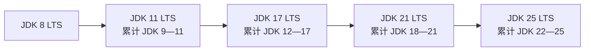
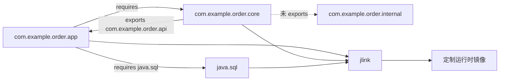
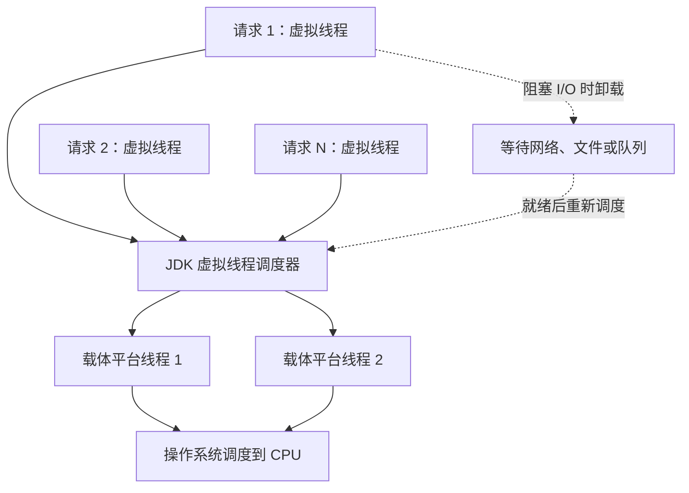
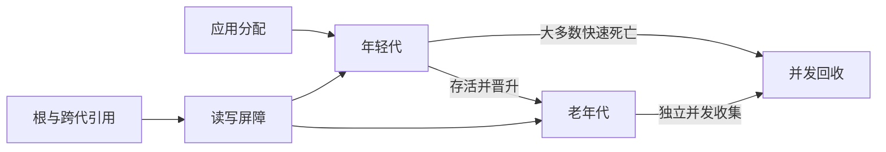

# JDK 8—25 LTS 新特性

> 本文只以长期支持版本为主章节，顺序为 JDK 8、JDK 11、JDK 17、JDK 21、JDK 25。中间功能版本不再单独成章；某项能力如果先在中间版本预览、后在 LTS 定稿，会放入最终落地或主要使用的 LTS 章节，并标明演进路径。JDK 是 Java Development Kit（Java 开发工具包），LTS 是 Long-Term Support（长期支持），JVM 是 Java Virtual Machine（Java 虚拟机），API 是 Application Programming Interface（应用程序编程接口），JEP 是 JDK Enhancement Proposal（JDK 增强提案），GC 是 Garbage Collection（垃圾收集）。

## 1 从一个 JDK 25 程序开始

### 1.1 一个真实的版本选择问题

假设团队维护一套 JDK 8 订单服务。升级时常出现两个不同问题：应该选择哪个版本作为生产基线，以及应该采用哪些新特性。前者取决于发行方支持周期、框架兼容和安全更新；后者取决于语言与运行时能力是否已经正式发布。

截至 2026 年 8 月，Oracle 路线图中的 LTS 顺序是 JDK 8、11、17、21、25。JDK 25 于 2025 年 9 月发布，是当前最新 LTS。JDK 26 已于 2026 年 3 月发布，但属于非 LTS；Oracle 计划的下一版 LTS 是 JDK 29，而不是 JDK 27。LTS 属于发行方支持策略，不是 Java SE（Java Platform, Standard Edition，Java 标准版平台）语言规范给版本附加的永久属性。

### 1.2 最小可运行闭环

JDK 25 正式支持 Compact Source Files（紧凑源文件）和实例 `main` 方法。创建 `FeatureTour.java`文件：

```java
void main() throws InterruptedException {
    var stages = List.of("created", "paid", "shipped");

    System.out.println("首个阶段：" + stages.getFirst());
    System.out.println("最后阶段：" + stages.getLast());

    Thread notification = Thread.startVirtualThread(
            () -> System.out.println("虚拟线程发送通知")
    );
    notification.join();
}
```

直接运行源文件：

```shell
java FeatureTour.java
```

预期输出：

```text
首个阶段：created
最后阶段：shipped
虚拟线程发送通知
```

这段程序没有显式类声明、没有 `public static void main(String[] args)`，也没有手写 `java.util.List` 导入。JDK 25 编译器会把紧凑源文件中的成员放入隐式声明的顶层类；紧凑源文件还会按需导入 `java.base` 模块导出的公共类型，因此 `List` 可以直接使用。

`List.getFirst/getLast` 来自 JDK 21 的 Sequenced Collections（顺序集合），虚拟线程也在 JDK 21 正式发布。这个小程序体现了 LTS 累积关系：采用 JDK 25 时，程序同时获得此前 LTS 的正式能力。

### 1.3 编译运行与成功判据

也可以先编译再运行：

```shell
javac --release 25 FeatureTour.java
java FeatureTour
```

成功判据如下：

1\. `java -version` 与 `javac -version` 都显示 25，并且来自计划使用的发行方。

2\. 程序不需要 `--enable-preview`。若出现预览特性提示，说明示例或构建配置额外使用了 JDK 25 预览能力。

3\. 若出现 `invalid source release: 25`，实际调用的 `javac` 版本低于 25，应检查 `PATH`、集成开发环境的 Project SDK（项目软件开发工具包）和构建工具 Toolchain（工具链）。

4\. 若出现 `UnsupportedClassVersionError`，通常是用 JDK 25 编译后交给更低版本 JVM（Java Virtual Machine，Java 虚拟机）运行。JDK 25 class 文件主版本号是 69。

### 1.4 分阶段阅读路线

| 阶段 | 阅读范围 | 目标 | 成功判据 |
| --- | --- | --- | --- |
| 第一阶段 | 第 1—2 章 | 分清最新版本、最新 LTS 和特性状态 | 能解释为什么 JDK 26 比 JDK 25 新，却不是更新的 LTS |
| 第二阶段 | 第 3—7 章的语言与常用 API | 建立 JDK 8→25 的代码能力主线 | 能使用 Lambda、Stream、记录类、模式匹配、虚拟线程和 JDK 25 新语法 |
| 第三阶段 | 第 3—7 章的 JVM、GC 和诊断内容 | 理解版本升级的运行时影响 | 能根据负载选择 GC，并说明虚拟线程在 JDK 21 与 25 的差别 |
| 第四阶段 | 第 8—11 章 | 完成迁移、生产评审和复习 | 能给出 JDK 8→25 的构建、测试、灰度与回滚方案 |

## 2 LTS 主线与特性生命周期

### 2.1 JDK、JRE、JVM 与 Java SE

| 名称 | 全称 | 职责 | 初学者应记住的边界 |
| --- | --- | --- | --- |
| Java SE | Java Platform, Standard Edition | 定义 Java 语言、JVM 和标准 API 规范 | 它是一套平台规范，不是某个厂商安装包 |
| JVM | Java Virtual Machine | 加载字节码，管理线程、内存、即时编译和垃圾收集 | HotSpot 是常见 JVM 实现，不等于 Java 语言 |
| JRE | Java Runtime Environment（Java 运行环境） | 传统上指 JVM 加运行所需类库 | JDK 9 后不再沿用 JDK 8 的独立 `jre/` 目录布局，可用 `jlink` 构建定制运行时 |
| JDK | Java Development Kit | 提供编译、运行、调试、诊断、打包工具和完整运行时 | 生产记录应包含发行方、功能版本、更新版本、操作系统和 CPU 架构 |

OpenJDK 是 Java SE 的开源参考实现和开发社区。Oracle JDK、Eclipse Temurin、Azul Zulu、Amazon Corretto 等发行版通常基于 OpenJDK，但许可证、平台支持、更新周期和补丁策略由发行方决定。

### 2.2 最新功能版本不等于最新 LTS

Oracle 2026 年 4 月更新的 Java SE 支持路线图给出以下主线：

| 版本 | 类型 | 发布时间 | 本文处理方式 |
| --- | --- | --- | --- |
| JDK 8 | LTS | 2014 年 3 月 | 独立章节 |
| JDK 9—10 | 非 LTS | 2017 年 9 月—2018 年 3 月 | 累计到 JDK 11 章 |
| JDK 11 | LTS | 2018 年 9 月 | 独立章节 |
| JDK 12—16 | 非 LTS | 2019 年 3 月—2021 年 3 月 | 累计到 JDK 17 章 |
| JDK 17 | LTS | 2021 年 9 月 | 独立章节 |
| JDK 18—20 | 非 LTS | 2022 年 3 月—2023 年 3 月 | 累计到 JDK 21 章 |
| JDK 21 | LTS | 2023 年 9 月 | 独立章节 |
| JDK 22—24 | 非 LTS | 2024 年 3 月—2025 年 3 月 | 累计到 JDK 25 章 |
| JDK 25 | LTS | 2025 年 9 月 | 当前最新 LTS，独立章节 |
| JDK 26 | 非 LTS | 2026 年 3 月 | 不作为本文主章节 |
| JDK 29 | 计划中的 LTS | 2027 年 9 月 | 尚未发布，不纳入特性讲解 |

“升级到最新 Java”可能指最新功能版本 JDK 26，也可能指最新 LTS JDK 25。生产选型应先明确组织采用哪家发行版、需要多长支持、框架是否认证，再决定版本，不能只比较版本号大小。

### 2.3 为什么保留中间版本的演进注记

半年发布机制让大型语言特性经过多轮反馈。例如记录类在 JDK 14、15 预览，JDK 16 正式；它最终属于 JDK 17 LTS 可稳定使用的能力。虚拟线程在 JDK 19、20 预览，JDK 21 正式。把每个中间版本都拆成一章适合研究发布历史，却会打断 LTS 用户的学习路径。

本文采用“LTS 累计窗口”：



箭头表示升级后可以使用前一 LTS 的正式能力，同时还要处理后续窗口内的兼容变化。预览或孵化特性只有在目标 LTS 仍处于该状态时，才作为实验内容说明。

### 2.4 正式、预览、孵化、实验、废弃与移除

| 状态 | 含义 | 启用方式 | 兼容性预期 | 生产判断 |
| --- | --- | --- | --- | --- |
| 正式 | 已成为永久语言特性、Java SE API 或稳定 JDK 功能 | 默认可用 | 按平台兼容规则演进 | 可作为稳定基线，仍需测试 |
| Preview（预览） | 设计完整但仍可能调整或撤回 | 编译和运行都需要 `--enable-preview` | 只绑定当前功能版本 | 适合评估；采用者承担重编译和改写成本 |
| Incubator（孵化器） | 非最终 API 或工具，位于 `jdk.incubator.*` 模块 | 常需 `--add-modules` | 包名和方法可能变化 | 适合隔离实验，不宜成为难替换的业务核心依赖 |
| Experimental（实验） | 常见于 HotSpot 功能或 GC | 常需解锁实验参数 | 参数和实现可能明显变化 | 先做代表性压测和故障验证 |
| Deprecated（废弃） | 仍存在，但官方建议迁移 | 通常默认可用并产生警告 | 将来可能移除 | 建立替代计划，关注 `forRemoval=true` |
| Removed（移除） | 已从 JDK 删除或永久禁用 | 无法恢复为正常正式能力 | 旧代码可能编译或启动失败 | 升级依赖、替换工具或重写 |

预览代码的编译和运行参数缺一不可：

```shell
javac --release 25 --enable-preview PreviewDemo.java
java --enable-preview PreviewDemo
```

预览 class 文件带特殊次版本标记，只能由同一功能版本且启用预览的运行时加载。升级到 JDK 26 时，JDK 25 预览源码需要重新编译，并按新一轮设计修改。

### 2.5 关键特性的 LTS 落点

| 特性 | 早期演进 | 在 LTS 中的稳定落点 |
| --- | --- | --- |
| Lambda、Stream、`java.time` | JDK 8 直接正式 | JDK 8 |
| 模块系统、集合工厂 | JDK 9 正式 | JDK 11 用户累计获得 |
| `var` | JDK 10 正式 | JDK 11 用户累计获得 |
| HTTP Client | JDK 9—10 孵化 | JDK 11 正式 |
| `switch` 表达式 | JDK 12—13 预览 | JDK 14 正式，JDK 17 LTS 可稳定使用 |
| 文本块 | JDK 13—14 预览 | JDK 15 正式，JDK 17 LTS 可稳定使用 |
| 记录类、`instanceof` 模式 | JDK 14—15 预览 | JDK 16 正式，JDK 17 LTS 可稳定使用 |
| 密封类 | JDK 15—16 预览 | JDK 17 正式 |
| 记录模式、`switch` 模式匹配、虚拟线程 | JDK 17—20 多轮预览 | JDK 21 正式 |
| 外部函数与内存 API | JDK 14 起孵化，JDK 19—21 预览 | JDK 22 正式，JDK 25 用户累计获得 |
| 未命名变量与模式 | JDK 21 预览 | JDK 22 正式，JDK 25 用户累计获得 |
| Stream Gatherers、Class-File API | JDK 22—23 预览 | JDK 24 正式，JDK 25 用户累计获得 |
| Scoped Values | JDK 20 孵化，JDK 21—24 预览 | JDK 25 正式 |
| 模块导入、紧凑源文件、灵活构造器体 | 分别从 JDK 23、21、22 起预览 | JDK 25 正式 |

## 3 JDK 8 LTS：现代 Java 编程的起点

### 3.1 累计能力地图

JDK 8 于 2014 年 3 月发布。它把传递行为、声明式集合处理、现代日期时间和可组合异步任务带入标准平台。

| 方向 | 代表变化 | 解决的问题 |
| --- | --- | --- |
| 语言 | Lambda、方法引用、默认方法、重复注解、类型注解 | 传递行为并兼容演进接口 |
| 集合计算 | Stream、`java.util.function`、`Spliterator`、Map 增强 | 以流水线表达过滤、转换和聚合 |
| 空值 | `Optional` | 在返回类型中表达“可能无结果” |
| 时间 | `java.time` | 取代可变且模型混乱的旧日期 API |
| 异步 | `CompletableFuture` | 组合依赖、合并结果和异常恢复 |
| JVM | 移除永久代，使用 Metaspace（元空间） | 改变类元数据的内存管理模型 |

### 3.2 Lambda 表达式传递行为

匿名内部类排序写法：

```java
orders.sort(new Comparator<Order>() {
    @Override
    public int compare(Order left, Order right) {
        return Long.compare(left.getAmount(), right.getAmount());
    }
});
```

Lambda 把比较规则作为参数值传入：

```java
orders.sort((left, right) ->
        Long.compare(left.getAmount(), right.getAmount()));
```

Lambda 必须有目标类型。目标类型是函数式接口，即只有一个抽象方法的接口：

```java
@FunctionalInterface
interface PriceRule {
    long discount(long originalPrice);
}

PriceRule vipRule = price -> Math.round(price * 0.8);
System.out.println(vipRule.discount(100)); // 80
```

编译器根据 `PriceRule` 推断参数和返回值。Lambda 自身没有独立类型，所以后续版本也不能写 `var rule = price -> price * 0.8`。

Lambda 可以捕获局部变量，但变量必须是 `final` 或 effectively final（事实最终，即初始化后不再重新赋值）：

```java
long threshold = 100;
Predicate<Order> expensive = order -> order.getAmount() >= threshold;
```

Lambda 中的 `this` 指向外围实例；匿名内部类中的 `this` 指向匿名对象。二者能完成相似任务，但作用域和运行时实现并不相同。

### 3.3 函数式接口、方法引用与默认方法

| 接口 | 抽象方法 | 数据方向 | 常见场景 |
| --- | --- | --- | --- |
| `Supplier<T>` | `T get()` | 无输入，产生 T | 延迟创建和默认值 |
| `Consumer<T>` | `void accept(T)` | 输入 T，无返回值 | 日志、发送和逐项处理 |
| `Function<T,R>` | `R apply(T)` | T 转 R | 映射领域对象到 DTO（Data Transfer Object，数据传输对象） |
| `Predicate<T>` | `boolean test(T)` | T 转布尔值 | 过滤和校验 |

方法引用是“只调用已有方法”的紧凑 Lambda：

| 形式 | 示例 | 等价思路 |
| --- | --- | --- |
| 静态方法 | `Long::compare` | `(a, b) -> Long.compare(a, b)` |
| 特定对象实例方法 | `printer::print` | `value -> printer.print(value)` |
| 任意对象实例方法 | `String::length` | `text -> text.length()` |
| 构造器 | `ArrayList::new` | `() -> new ArrayList<>()` |

默认方法让已发布接口增加行为时仍能兼容旧实现：

```java
interface Auditable {
    default String auditText() {
        return "unknown";
    }

    static boolean enabled() {
        return true;
    }
}
```

冲突处理遵循三个规则：

1\. 类或父类实例方法优先于接口默认方法。

2\. 多个接口都提供实现时，更具体的子接口优先。

3\. 两个无继承关系的接口提供同签名默认方法，实现类必须显式覆盖，可通过 `Left.super.method()` 选择实现。

### 3.4 Stream 是惰性的一次性流水线

```java
List<String> paidOrderIds = orders.stream()
        .filter(order -> order.getStatus() == Status.PAID)
        .sorted(Comparator.comparingLong(Order::getAmount).reversed())
        .map(order -> String.valueOf(order.getId()))
        .collect(Collectors.toList());
```

Stream 不存储元素，而是从数据源读取并执行计算规则。执行过程如下：

1\. `stream()` 建立数据源。

2\. `filter`、`sorted`、`map` 记录中间操作；此时通常尚未遍历数据。

3\. `collect` 是终止操作，触发流水线执行。

4\. 每个元素尽可能沿流水线向后流动；`findFirst`、`anyMatch` 等短路操作可提前停止。

一个 Stream 终止后不能重复消费。含共享可变状态的 `peek`、`forEach` 会让结果依赖执行顺序，业务转换通常使用 `map`，聚合使用 `reduce` 或 `collect`。

#### 3.4.1 `map`、`flatMap` 与数值流

`map` 进行一对一转换，`flatMap` 把每个元素产生的子流摊平：

```java
List<String> itemNames = orders.stream()
        .flatMap(order -> order.getItems().stream())
        .map(Item::getName)
        .distinct()
        .collect(Collectors.toList());
```

数值聚合优先使用原始类型流，减少装箱：

```java
long total = orders.stream()
        .mapToLong(Order::getAmount)
        .sum();
```

#### 3.4.2 并行流不是通用加速器

`parallelStream()` 默认使用 `ForkJoinPool.commonPool()`。它更适合数据量足够大、任务可拆分、单项计算较重且无共享可变状态的 CPU（Central Processing Unit，中央处理器）密集计算。

```java
List<Integer> unsafe = new ArrayList<>();
IntStream.range(0, 10_000).parallel().forEach(unsafe::add); // 数据竞争
```

安全方向是无副作用收集：

```java
List<Integer> safe = IntStream.range(0, 10_000)
        .parallel()
        .boxed()
        .collect(Collectors.toList());
```

数据库调用、远程请求、小集合和顺序敏感处理通常不适合直接改为并行流。是否并行应由 JMH（Java Microbenchmark Harness，Java 微基准测试工具）和代表性生产指标决定。

### 3.5 Optional 表达返回结果可能不存在

```java
Optional<User> user = repository.findById(42L);

String displayName = user
        .map(User::getDisplayName)
        .filter(name -> !name.trim().isEmpty())
        .orElse("匿名用户");
```

| API | 行为 |
| --- | --- |
| `Optional.of(value)` | `value` 为 `null` 时立即抛 `NullPointerException` |
| `Optional.ofNullable(value)` | 把 `null` 转成空 Optional |
| `orElse(value)` | 默认值参数总会提前求值 |
| `orElseGet(supplier)` | 只在为空时调用 Supplier |
| `orElseThrow(supplier)` | 为空时抛调用方定义的异常 |

Optional 适合作为查询方法的返回值，通常不适合作为实体字段、方法参数或集合元素。无条件调用 `get()` 会把缺值问题推迟成 `NoSuchElementException`，削弱返回类型的表达价值。

### 3.6 `java.time` 拆开时间概念

| 类型 | 表达对象 | 典型用途 |
| --- | --- | --- |
| `Instant` | UTC 时间线上的瞬间 | 日志、事件和跨系统时间戳 |
| `LocalDate` | 无时区日期 | 生日、账期 |
| `LocalDateTime` | 无时区日期时间 | 已明确约定时区的业务输入 |
| `OffsetDateTime` | 日期时间加固定偏移 | API 传输和审计记录 |
| `ZonedDateTime` | 日期时间加地区时区规则 | 夏令时排班、航班时间 |
| `Duration` | 秒和纳秒组成的时间量 | 耗时 |
| `Period` | 年、月、日组成的日期量 | 年龄和账期 |

```java
Instant paidAt = Instant.parse("2024-03-01T02:30:00Z");
ZonedDateTime singapore = paidAt.atZone(ZoneId.of("Asia/Singapore"));
ZonedDateTime paris = paidAt.atZone(ZoneId.of("Europe/Paris"));
```

两个本地显示时间不同，但指向同一个 `Instant`。不要用两次 `Instant.getNano()` 相减计算耗时，因为它只返回当前秒内的纳秒部分；应使用 `Duration.between`。预约类业务还要测试夏令时造成的“本地时间不存在”或“同一本地时间出现两次”。

### 3.7 CompletableFuture 组合异步任务

```java
CompletableFuture<User> userFuture =
        CompletableFuture.supplyAsync(
                () -> userService.load(42L),
                ioExecutor
        );

CompletableFuture<List<Order>> ordersFuture = userFuture
        .thenCompose(user -> orderService.loadByUserAsync(user.id()));

CompletableFuture<String> summaryFuture = ordersFuture
        .thenApply(values -> "订单数=" + values.size())
        .exceptionally(error -> "查询失败：" + error.getMessage());
```

`thenApply` 把普通结果转换成另一结果；回调返回 `CompletionStage` 时使用 `thenCompose` 摊平嵌套。未显式传 Executor（执行器）的 `*Async` 方法通常使用公共 Fork/Join 池。阻塞 I/O（Input/Output，输入输出）和需要资源隔离的任务宜使用容量、队列和拒绝策略明确的专用执行器。

### 3.8 其他 JDK 8 变化与迁移边界

1\. `Map.computeIfAbsent`、`computeIfPresent`、`merge` 和 `replaceAll` 减少“先查再改”的样板代码，但原子性仍取决于具体 Map 实现。

2\. `java.util.Base64` 提供基础、URL（Uniform Resource Locator，统一资源定位符）安全和 MIME（Multipurpose Internet Mail Extensions，多用途互联网邮件扩展）编码器。Base64 是编码，不提供机密性。

3\. `Arrays.parallelSort` 可以并行排序大型数组；小数组不一定更快。

4\. `javac -parameters` 会把源码参数名写入 class 文件，反射 API 才能稳定读取参数名。

5\. HotSpot 永久代被移除，类元数据主要进入本地内存的 Metaspace。`-XX:MaxPermSize` 失效，可用 `-XX:MaxMetaspaceSize` 设置上限；类加载器泄漏仍会让元空间耗尽。

6\. Nashorn JavaScript 引擎在 JDK 8 引入，JDK 11 废弃，JDK 15 移除。升级到后续 LTS 时需要改用独立脚本引擎。

## 4 JDK 11 LTS：模块化平台与现代标准库

### 4.1 JDK 9—11 累计变化

JDK 11 于 2018 年 9 月发布。对 JDK 8 用户而言，迁移到 JDK 11 会一次跨过三个功能版本：

| 来源版本 | 累计到 JDK 11 的代表能力 | 在 JDK 11 的状态 |
| --- | --- | --- |
| JDK 9 | 模块系统、JShell、集合工厂、Stream 增强、ProcessHandle、StackWalker、Flow、VarHandle、G1 默认、统一日志 | 正式 |
| JDK 10 | `var`、不可修改集合副本、G1 并行 Full GC、Application CDS | 正式 |
| JDK 11 | HTTP Client、单文件源代码启动、Lambda 参数 `var`、JFR、TLS 1.3、实验 ZGC、Epsilon GC | 正式或按表述标明实验状态 |

JDK 9、10 在本文不单独成章，但它们的正式成果不会消失；JDK 11 包含这些能力。

### 4.2 JPMS 模块系统重塑边界

JPMS（Java Platform Module System，Java 平台模块系统）让代码显式声明依赖和公开包。传统 JAR 只能依赖类路径顺序，public 类也难以区分“对外 API”和“内部实现”。



图中 `requires` 表示模块可读关系，`exports` 表示正常编译和调用的公开包。`internal` 包即使包含 public 类，也不会自动对其他模块公开。`jlink` 根据模块图生成只含所需模块的运行时镜像。

核心模块的 `module-info.java`（看这个文件）：

```java
module com.example.order.core { # 模块名，不是包名前缀，只是通常采用类似包名的反向域名命名方式
    exports com.example.order.api; # 对外导出的具体包名
}
```

应用模块：

```java
module com.example.order.app {
    requires com.example.order.core;
    requires java.sql;
}
```

常用模块指令如下：

| 指令 | 含义 |
| --- | --- |
| `requires m` | 当前模块读取模块 `m` |
| `requires transitive m` | 下游模块也隐式读取 `m`，适合当前模块的公开 API 暴露了 `m` 的类型 |
| `requires static m` | 编译期需要，运行期可选 |
| `exports p` | 允许其他模块正常访问包 `p` 的 public/protected 类型 |
| `opens p` | 允许运行时对包 `p` 深反射，不等于编译期导出 |
| `uses S` | 声明消费服务接口 `S` |
| `provides S with P` | 声明实现 `P` 提供服务 `S` |

编译和运行模块化应用：

```shell
javac -d out --module-source-path src \
      -m com.example.order.core,com.example.order.app

java --module-path out \
     -m com.example.order.app/com.example.order.app.Main
```

构建定制运行时：

```shell
jlink --module-path "$JAVA_HOME/jmods:out" \
      --add-modules com.example.order.app \
      --launcher order=com.example.order.app/com.example.order.app.Main \
      --output order-runtime

./order-runtime/bin/order
```

`jlink` 输出与操作系统和 CPU 架构相关，应在目标平台构建和测试。升级 JDK 不要求立即把全部业务模块化；非模块化 JAR（Java Archive，Java 归档文件）仍可放在 classpath（类路径）上运行，属于 unnamed module（未命名模块）。

### 4.3 集合工厂、Stream 增强与 `var`

JDK 9 集合工厂创建不可修改集合：

```java
List<String> roles = List.of("USER", "AUDITOR");
Set<String> regions = Set.of("SG", "CN");
Map<String, Integer> limits = Map.of("USER", 10, "AUDITOR", 50);
```

这些集合拒绝结构修改和 `null`；`Set.of` 拒绝重复元素，`Map.of` 拒绝重复键。Set 和 Map 的遍历顺序没有声明为业务契约。

JDK 9 Stream 与 Optional 增强：

| API | 行为 | 边界 |
| --- | --- | --- |
| `takeWhile` | 从有序流开头连续获取满足条件的元素 | 遇到首个不满足项后停止，不等于全流过滤 |
| `dropWhile` | 丢弃开头连续满足条件的元素 | 不删除后续再次匹配的元素 |
| `Stream.ofNullable` | `null` 得空流，否则得单元素流 | 适合把可空值接入 `flatMap` |
| `Optional.stream` | 有值得单元素流，无值得空流 | 便于摊平 `Stream<Optional<T>>` |
| `ifPresentOrElse` | 分别处理有值和无值 | 两个分支的副作用应清楚 |

表达单个可空元素应使用 `Stream.ofNullable(value)`。`Stream.of(null)` 会落入可变参数重载陷阱，可能把 `null` 解释成整个数组引用。

JDK 10 的 `var` 是局部变量静态类型推断：

```java
var userName = "Alice";               // String
var orderIds = new ArrayList<Long>(); // ArrayList<Long>
var entry = Map.entry("PAID", 12);    // Map.Entry<String, Integer>
```

类型在编译期确定，后续不能给 `userName` 赋整数。`var` 可用于有初始化器的局部变量和循环变量，不能用于字段、方法返回类型和普通参数：

```java
void demo() {
    // var missing;            // 无初始化器
    // var nothing = null;     // 无法推断类型
    // var action = () -> {};  // Lambda 缺少目标类型
    var numbers = new int[]{1, 2, 3};
}
```

`List.copyOf`、`Set.copyOf`、`Map.copyOf` 创建不可修改快照：

```java
List<String> snapshot = List.copyOf(mutableRoles);
mutableRoles.add("ADMIN");
System.out.println(snapshot); // 不随原集合变化
```

集合结构不可修改不代表元素深度不可变；元素对象仍可能变化。

### 4.4 标准 HTTP Client

JDK 9、10 的 HTTP（Hypertext Transfer Protocol，超文本传输协议）Client 处于孵化阶段，JDK 11 以 `java.net.http` 模块正式交付，支持 HTTP/1.1、HTTP/2、WebSocket、同步和异步请求。

```java
HttpClient client = HttpClient.newBuilder()
        .connectTimeout(Duration.ofSeconds(3))
        .followRedirects(HttpClient.Redirect.NORMAL)
        .build();

HttpRequest request = HttpRequest.newBuilder()
        .uri(URI.create("https://api.example.com/orders/1001"))
        .timeout(Duration.ofSeconds(5))
        .header("Accept", "application/json")
        .GET()
        .build();

HttpResponse<String> response = client.send(
        request,
        HttpResponse.BodyHandlers.ofString(StandardCharsets.UTF_8)
);

if (response.statusCode() / 100 != 2) {
    throw new IllegalStateException(
            "HTTP status=" + response.statusCode()
    );
}
```

`connectTimeout` 限制建立连接，`HttpRequest.timeout` 限制请求等待。获得响应不等于业务成功，还要检查状态码、响应头和载荷。

异步请求返回 `CompletableFuture`：

```java
CompletableFuture<OrderDto> future = client
        .sendAsync(request, HttpResponse.BodyHandlers.ofString())
        .thenApply(response -> {
            if (response.statusCode() != 200) {
                throw new CompletionException(
                        new IOException("status=" + response.statusCode())
                );
            }
            return parseOrder(response.body());
        });
```

生产客户端还要设计 TLS（Transport Layer Security，传输层安全）证书、代理、认证、重试、幂等性、响应体上限和可观测性。对 POST 请求盲目重试可能造成重复下单。

### 4.5 String、Files、Optional 与 Predicate 增强

| API | 用途 | 边界 |
| --- | --- | --- |
| `String.isBlank()` | 判断空串或只含空白字符 | 比 `isEmpty()` 语义更广 |
| `strip/stripLeading/stripTrailing` | 按 Unicode 空白定义去除首尾空白 | `trim()` 只处理较早的字符范围 |
| `lines()` | 惰性遍历文本行 | 不保留行终止符 |
| `repeat(n)` | 重复字符串 | `n < 0` 抛 `IllegalArgumentException` |
| `Files.readString/writeString` | 读写小型文本文件 | 大文件宜流式处理，避免整体载入内存 |
| `Path.of` | 创建路径 | 是 `Paths.get` 的现代入口 |
| `Optional.isEmpty()` | 判断无值 | 与 `isPresent()` 对称 |
| `Predicate.not` | 对谓词取反 | 便于组合方法引用 |

```java
List<String> names = rawNames.stream()
        .map(String::strip)
        .filter(Predicate.not(String::isBlank))
        .collect(Collectors.toList());
```

JDK 11 还允许在 Lambda 参数上统一使用 `var`，主要用途是携带注解：

```java
BiFunction<String, String, String> join =
        (@NonNull var left, @NonNull var right) -> left + right;
```

同一 Lambda 参数列表不能混用 `var`、显式类型和省略类型。

### 4.6 JShell 与单文件源代码启动

JShell 是 REPL（Read-Eval-Print Loop，读取—求值—打印循环），适合快速验证 API 和表达式：

```text
jshell> var prices = List.of(10, 20, 30)
jshell> prices.stream().mapToInt(Integer::intValue).sum()
$2 ==> 60
```

JDK 11 可直接运行普通单文件源码：

```java
public class Hello {
    public static void main(String[] args) {
        System.out.println("Hello, " + args[0]);
    }
}
```

```shell
java Hello.java Alice
```

源代码启动适合教学、脚本和单文件工具。它不替代 Maven/Gradle 的依赖解析、测试、打包和可重复构建。

### 4.7 JFR、GC 与统一日志

JFR（Java Flight Recorder，Java 飞行记录器）在 JDK 11 成为 OpenJDK 功能，可以低开销记录 CPU、分配、锁、I/O、类加载和垃圾收集事件：

```shell
java -XX:StartFlightRecording=filename=app.jfr,duration=60s,settings=profile \
     -jar app.jar

jfr summary app.jfr
```

JDK 9 起，G1（Garbage-First Garbage Collector，垃圾优先收集器）成为常见服务器配置下的默认 GC。默认值变化不表示它对所有负载最优，升级应比较暂停分位数、吞吐、CPU 和堆占用。

JDK 11 的 ZGC（Z Garbage Collector）仍是实验功能：

```shell
java -XX:+UnlockExperimentalVMOptions -XX:+UseZGC -jar app.jar
```

Epsilon 是不做内存回收的 GC，适合隔离 GC 成本或测试分配上限。堆耗尽后会以 `OutOfMemoryError` 失败，不适合普通常驻服务。

JDK 9 统一 JVM 日志入口为 `-Xlog`：

```shell
java -Xlog:gc*,safepoint:file=gc.log:time,uptime,level,tags \
     -jar app.jar
```

从 JDK 8 迁移时应同步更新 GC 日志采集规则，避免应用已启动而监控悄然失效。

### 4.8 JDK 8→11 的主要兼容变化

1\. 模块化运行时不再依赖 JDK 8 的 `rt.jar`、`tools.jar` 和独立 `jre/` 目录结构。

2\. JDK 11 移除 `java.xml.bind`（JAXB）、`java.xml.ws`（JAX-WS）、`java.activation` 和 `java.corba` 等 Java EE/CORBA 模块。仍需使用时应在构建文件中显式声明规范 API 和实现。

3\. JavaFX 不再随主 JDK 交付，桌面项目应使用独立 OpenJFX 依赖和构建方式。

4\. `_` 从 JDK 9 起不能再作为单字符标识符，旧源码可能编译失败。

5\. 多版本 JAR、模块封装和 PKCS12 默认密钥库会影响打包、安全配置及运行行为，应通过迁移测试确认。

## 5 JDK 17 LTS：数据建模、模式匹配与强封装

### 5.1 JDK 12—17 累计变化

JDK 17 于 2021 年 9 月发布。它累计六个功能版本的成果：

| 能力线 | 演进过程 | JDK 17 中的状态 |
| --- | --- | --- |
| `switch` 表达式 | JDK 12、13 预览，JDK 14 定稿 | 正式 |
| 文本块 | JDK 13、14 预览，JDK 15 定稿 | 正式 |
| `instanceof` 模式匹配 | JDK 14、15 预览，JDK 16 定稿 | 正式 |
| 记录类 | JDK 14、15 预览，JDK 16 定稿 | 正式 |
| 密封类 | JDK 15、16 预览 | JDK 17 正式 |
| `switch` 模式匹配 | JDK 17 首次预览 | 尚未正式，JDK 21 才定稿 |
| 打包与平台 | `jpackage`、Unix 域套接字、Alpine/Windows AArch64（ARM 64 位）Port | 正式 |
| JVM 与 GC | ZGC、Shenandoah 转产品功能，强封装完成 | 正式 |
| 孵化能力 | FFM、Vector API | 仍在孵化，不是 JDK 17 稳定 API |

### 5.2 `switch` 表达式与文本块

传统 `switch` 语句容易因漏写 `break` 发生贯穿。正式表达式写法使用箭头标签并产生值：

```java
int days = switch (month) {
    case APRIL, JUNE, SEPTEMBER, NOVEMBER -> 30;
    case FEBRUARY -> leapYear ? 29 : 28;
    default -> 31;
};
```

需要多条语句时使用 `yield` 返回分支结果：

```java
int shippingFee = switch (region) {
    case "SG" -> 5;
    case "CN" -> 8;
    default -> {
        auditUnknownRegion(region);
        yield 20;
    }
};
```

`yield` 只结束当前 `switch` 表达式分支，`return` 结束整个方法。箭头标签不会贯穿，传统冒号标签仍保留旧语义。

文本块是多行 `String` 字面量：

```java
String query = """
        select id, status
        from orders
        where status = 'PAID'
        order by id
        """;
```

文本块解决转义和排版噪声，不会自动验证 SQL、JSON 或 HTML，也不会防止 SQL 注入。动态参数仍应使用 `PreparedStatement` 占位符。这里的“结束分隔符”是文本块末尾的三个双引号 `"""`。它单独放在内容的下一行时，前一行的换行会进入结果；紧跟在最后一个内容字符后面时，结果不含末尾换行：

```java
String withNewline = """
    hello
    """;
String withoutNewline = """
    hello""";

assertEquals("hello\n", withNewline);
assertEquals("hello", withoutNewline);
```

结束分隔符单独占行时，它的缩进位置还会参与公共缩进计算。例如内容缩进 8 个空格、结束分隔符缩进 4 个空格时，结果中的 `hello` 前会保留 4 个空格。因此，对签名、快照测试或协议内容，应像上面那样加入包含空格和 `\n` 的精确字符串断言。

### 5.3 记录类与 `instanceof` 模式

记录类适合“状态描述就是主要 API”的数据载体：

```java
record Money(String currency, BigDecimal amount) {
    Money {
      	# Objects.requireNonNull(要检查的对象, 对象为空时的错误信息);
        Objects.requireNonNull(currency, "currency");
        Objects.requireNonNull(amount, "amount");
        currency = currency.toUpperCase(Locale.ROOT);
        amount = amount.stripTrailingZeros();
    }
}
```

编译器根据组件列表生成 private final 字段、同名访问器、规范构造器、`equals`、`hashCode` 和 `toString`。紧凑构造器中可以先校验和规范化参数，隐式字段赋值使用规范化后的值。

记录类是浅不可变数据载体。组件引用不能重新赋值，不表示其指向的集合不可变：

```java
record UnsafeOrder(List<String> items) {}

List<String> source = new ArrayList<>(List.of("book"));
UnsafeOrder order = new UnsafeOrder(source);
source.add("phone");
System.out.println(order.items()); // [book, phone]
```

需要不可变边界时做防御性副本：

```java
record SafeOrder(List<String> items) {
    SafeOrder {
        items = List.copyOf(items);
    }
}
```

`instanceof` 模式把类型判断、转换和变量声明合并：

```java
static int normalizedLength(Object value) {
    if (!(value instanceof String text)) {
        return 0;
    }
    return text.strip().length();
}
```

编译器通过流作用域判断模式变量在哪些位置一定已经“绑定”。绑定表示类型匹配成功，并且模式变量已经得到转换后的对象。上面的 `if` 匹配失败就会 `return`，因此程序只有在匹配成功时才能到达最后一行，那里可以安全使用 `text`。

```java
if (value instanceof String text && !text.isBlank()) {
    System.out.println(text.length()); // 合法
}
```

`&&` 会先计算左侧，并且只有左侧匹配成功才会执行右侧，所以右侧的 `text` 必然已经绑定。下面的代码则无法编译：

```java
if (value instanceof String text || !text.isBlank()) {
    System.out.println(text);
}
```

`||` 会在左侧为 `false` 时执行右侧，这时恰好可能是 `value` 不是 `String`、`text` 没有绑定的情况。所以，模式变量的可用范围不只由花括号决定，还由实际控制流是否能证明匹配已经成功决定。

### 5.4 密封类型限制继承集合

```java
sealed interface PaymentResult permits Paid, Rejected, Pending {}

record Paid(String transactionId) implements PaymentResult {}
record Rejected(String reason) implements PaymentResult {}
non-sealed class Pending implements PaymentResult {}
```

直接子类型必须选择一种状态：`final` 表示不再继承，`sealed` 表示继续限制子类型，`non-sealed` 表示恢复开放继承。允许的直接子类型必须在同一模块；未命名模块中要求同一包。

密封类型表达“类型种类是一个受控集合”，枚举表达“该类型的实例值是固定常量”。它适合支付结果、协议消息、编译器语法树等有限分支；第三方需要自由扩展的插件接口通常不适合完全密封。

JDK 17 的 `switch` 类型模式仍是预览，保护条件语法后来发生改变。生产基线应使用 JDK 21 正式语法，不能把 JDK 17 预览源码当作长期接口。

### 5.5 Helpful NPE、jpackage 与 Unix 域套接字

Helpful NPE（更详细的空指针异常信息）可以指出链式调用中哪个值为 `null`。JDK 14 首次交付时默认关闭，JDK 15 起默认开启。它改善排障，但异常详情可能暴露内部字段和调用结构，API 层不宜原样返回给外部客户端。

`jpackage` 在 JDK 16 正式，可生成平台原生安装包：

```shell
jpackage \
  --name OrderDesktop \
  --input build/libs \
  --main-jar order-desktop.jar \
  --main-class com.example.order.Main \
  --type dmg
```

Windows、macOS、Linux 包格式及签名机制不同，应在目标平台分别验证安装、升级、卸载、用户数据保留和代码签名。

Unix-Domain Socket（Unix 域套接字）适合同一主机进程间通信：

```java
UnixDomainSocketAddress address =
        UnixDomainSocketAddress.of("/tmp/order-service.sock");

try (SocketChannel channel =
             SocketChannel.open(StandardProtocolFamily.UNIX)) {
    channel.connect(address);
    channel.write(StandardCharsets.UTF_8.encode("ping"));
}
```

部署时要处理套接字文件权限、残留文件、容器挂载和路径长度。它不是跨主机网络通信的替代品。

### 5.6 强封装与典型反射失败

JDK 16 默认收紧内部元素访问，JDK 17 的 JEP 403 取消 `--illegal-access` 全局宽松后门。除 `sun.misc.Unsafe` 等少数关键内部 API 外，JDK 内部非公开元素默认不能被深反射访问。

典型异常：

```text
java.lang.reflect.InaccessibleObjectException:
Unable to make field ... accessible:
module java.base does not "opens java.lang" ...
```

排查顺序如下：

1\. 从堆栈找到发起反射的第三方库及版本，不要只看被访问的 JDK 类。

2\. 升级到明确支持 JDK 17/21/25 的库版本。

3\. 使用 `jdeps --jdk-internals` 扫描自有代码和依赖中的内部 API。

4\. 暂时无法升级时才添加最小范围的 `--add-opens java.base/java.lang=your.module`，并记录移除期限。

### 5.7 反序列化过滤与随机数 API

Java 原生反序列化可能根据输入构造任意对象图并触发回调。JDK 17 支持上下文相关过滤器工厂，单个输入流也可设置允许列表：

```java
ObjectInputFilter filter = ObjectInputFilter.Config.createFilter(
        "com.example.order.dto.*;java.base/*;" +
        "maxdepth=20;maxrefs=10000;!*"
);

try (ObjectInputStream input = new ObjectInputStream(source)) {
    input.setObjectInputFilter(filter);
    Object value = input.readObject();
}
```

规则末尾 `!*` 拒绝未匹配类。还应限制输入字节、深度、引用和数组大小。外部协议通常更适合使用有明确 schema（模式）的 JSON 或 Protobuf，而不是接收不可信原生序列化流。

JDK 17 统一伪随机算法访问：

```java
RandomGenerator generator = RandomGenerator.of("L64X128MixRandom");
int shard = generator.nextInt(16);
```

普通模拟、采样和负载分配可使用 `RandomGenerator`。密码、令牌和密钥必须使用 `SecureRandom`。

### 5.8 GC、FFM 与 Vector 的版本边界

ZGC 和 Shenandoah 在 JDK 15 从实验功能转为产品功能，不再要求 `-XX:+UnlockExperimentalVMOptions`，但都不是 JDK 17 默认 GC：

```shell
java -XX:+UseZGC -jar app.jar
java -XX:+UseShenandoahGC -jar app.jar
```

选择低暂停 GC 时应比较暂停分位数、吞吐、CPU、堆余量、并发回收是否追上分配速度，以及目标发行版和平台是否提供该收集器。

FFM（Foreign Function & Memory，外部函数与内存）API 在 JDK 17 仍位于孵化模块，Vector API 也处于第二次孵化。它们的包名和方法在后续版本继续变化，不属于 JDK 17 稳定应用 API。FFM 到 JDK 22 才正式，Vector API 到 JDK 25 仍是孵化器。

## 6 JDK 21 LTS：虚拟线程与模式匹配正式落地

### 6.1 JDK 18—21 累计变化

JDK 21 于 2023 年 9 月发布。JDK 17 用户升级后会累计获得：

| 来源版本 | 代表变化 | 在 JDK 21 中的状态 |
| --- | --- | --- |
| JDK 18 | 默认 UTF-8、简单 Web 服务器、JavaDoc `@snippet`、核心反射重写、Finalization 废弃待移除 | 正式或废弃状态 |
| JDK 19—20 | 记录模式、虚拟线程、结构化并发、Scoped Values、FFM 的多轮预览或孵化 | 部分在 21 正式，部分继续预览 |
| JDK 21 | 顺序集合、记录模式、`switch` 模式匹配、虚拟线程、分代 ZGC、KEM API | 正式 |
| JDK 21 | 字符串模板、未命名模式与变量、紧凑程序入口、Scoped Values、结构化并发、FFM | 预览 |
| JDK 21 | Vector API | 第六次孵化 |

JDK 21 的十五项 JEP 中，初学者和服务端开发最应优先掌握 JEP 431、440、441、444 与 439，即顺序集合、记录模式、`switch` 模式匹配、虚拟线程和分代 ZGC。

### 6.2 默认 UTF-8 与轻量开发工具

JDK 18 起，依赖默认字符集的标准 API 在不同操作系统上默认使用 UTF-8。它减少“Linux 正常、旧 Windows 乱码”的环境差异，也可能改变旧本地编码文件的读取结果。

```java
String content = Files.readString(path, StandardCharsets.UTF_8);
Files.writeString(path, content, StandardCharsets.UTF_8);
```

协议、文件和数据库边界仍应显式指定字符集。短期兼容旧默认编码可评估：

```shell
java -Dfile.encoding=COMPAT -jar legacy-app.jar
```

Simple Web Server（简单 Web 服务器）适合本地静态文件预览：

```shell
jwebserver -p 9000 -d ./site
```

它不提供 Servlet、认证、HTTPS、反向代理和生产防护，不应作为业务服务器。`@snippet` 则让 JavaDoc 示例能够高亮和引用外部代码片段，文档示例最好来自可编译测试源码，避免示例漂移。

### 6.3 顺序集合统一首尾操作

JDK 21 之前，`List`、`Deque`、`SortedSet` 和 `LinkedHashMap` 都有顺序语义，但首尾 API 不统一。JEP 431 引入三层接口：

| 接口 | 核心能力 | 典型实现 |
| --- | --- | --- |
| `SequencedCollection<E>` | 首尾获取、插入、删除和 `reversed` | `List`、`Deque` |
| `SequencedSet<E>` | 有顺序且元素唯一 | `LinkedHashSet`、`SortedSet` |
| `SequencedMap<K,V>` | 首尾 Entry、反向 Map、顺序键/值/Entry 视图 | `LinkedHashMap`、`SortedMap` |

```java
List<String> stages = new ArrayList<>(
        List.of("created", "paid", "shipped")
);

System.out.println(stages.getFirst()); // created
System.out.println(stages.getLast());  // shipped
System.out.println(stages.reversed()); // [shipped, paid, created]

stages.reversed().set(0, "delivered");
System.out.println(stages); // [created, paid, delivered]
```

`reversed()` 通常返回视图，不是独立副本，所以修改可变反向视图会反映到原集合。某些集合不支持位置插入，对 `addFirst` 或 `putFirst` 可以抛 `UnsupportedOperationException`。

### 6.4 记录模式与 `switch` 模式匹配

记录模式负责解构数据，`switch` 模式负责按类型分派：

```java
sealed interface PaymentResult permits Paid, Rejected {}

record Paid(long orderId, String transactionId)
        implements PaymentResult {}

record Rejected(long orderId, String reason)
        implements PaymentResult {}

static String message(PaymentResult result) {
    return switch (result) {
        case Paid(long orderId, String tx) ->
                "订单 " + orderId + " 支付成功，流水=" + tx;
        case Rejected(long orderId, String reason)
                when reason.isBlank() ->
                "订单 " + orderId + " 支付失败，原因未知";
        case Rejected(long orderId, String reason) ->
                "订单 " + orderId + " 支付失败：" + reason;
        case null -> "没有支付结果";
    };
}
```

这段代码包含四条规则：

1\. 类型模式先判断具体子类型并绑定变量。

2\. 记录模式调用组件访问器并解构，记录模式还可以嵌套。

3\. `when` 是守卫条件，只在模式先匹配后求值。

4\. 密封父类型的允许子类都已覆盖，因此无需 `default`；新增允许子类后，重新编译会暴露遗漏分支。

模式有 dominance（支配）规则。宽泛类型在前会让窄类型永远不可达：

```java
// case CharSequence value -> ...
// case String value -> ... // 编译错误：被前一分支支配
```

没有 `case null` 时，增强 `switch` 对空选择器通常抛 `NullPointerException`，不会自动进入 `default`。

### 6.5 虚拟线程的执行模型

平台线程通常映射到操作系统线程，创建和调度成本较高。虚拟线程仍是 `java.lang.Thread`，但由 JDK 调度器把大量虚拟线程映射到少量载体平台线程。



图中的“卸载”表示虚拟线程在受支持的阻塞操作处保存执行状态并释放载体；I/O 就绪后重新挂载，恢复时可能使用另一条载体线程。虚拟线程和载体之间没有永久绑定。

#### 6.5.1 每任务一条虚拟线程

```java
try (var executor = Executors.newVirtualThreadPerTaskExecutor()) {
    Future<User> userFuture =
            executor.submit(() -> userClient.load(42L));
    Future<List<Order>> orderFuture =
            executor.submit(() -> orderClient.load(42L));

    User user = userFuture.get();
    List<Order> orders = orderFuture.get();
    render(user, orders);
}
```

这个执行器不维护固定大小线程池，而是每个任务创建一条虚拟线程。虚拟线程便宜，不应再池化。若下游只允许 50 个并发请求，应限制稀缺资源：

```java
Semaphore permits = new Semaphore(50);

try {
    permits.acquire();
    return remoteService.call();
} finally {
    permits.release();
}
```

线程数量与数据库连接、远程服务配额、文件句柄不是同一资源。虚拟线程增大并发承载能力后，更需要明确下游背压。

#### 6.5.2 适用场景与性能边界

| 场景 | 判断 |
| --- | --- |
| 数千以上独立任务，大部分时间等待网络、数据库或队列 | 很适合，可保留同步代码结构并提高吞吐 |
| 少量长期后台线程 | 可用但收益有限 |
| 大量纯 CPU 计算 | 不会加速，超出核心数会增加调度开销 |
| ThreadLocal 保存昂贵大对象 | 需要重构，海量虚拟线程会放大内存 |
| 下游容量固定 | 仍需连接池、Semaphore 或限流器 |

虚拟线程提供 scale（并发规模），不保证 speed（单任务速度）。CPU 密集计算应按核心数控制并行度，可评估并行 Stream 或 Vector API。

#### 6.5.3 JDK 21 的载体固定

JDK 21 中，虚拟线程在以下情况下阻塞时不能卸载：

1\. 位于 `synchronized` 方法或块内。

2\. 正在执行 `native` 方法或外部函数调用。

Pinning（固定）不会导致结果错误，但频繁长时间固定会占住载体线程并降低吞吐。JDK 21 可使用：

```shell
java -Djdk.tracePinnedThreads=full -jar app.jar
```

JFR 的 `jdk.VirtualThreadPinned` 事件也能发现超过阈值的固定。只需处理“高频、长时间、持有监视器执行阻塞操作”的热点，不必机械替换所有短小 `synchronized`。JDK 24 已消除 `synchronized` 导致的绝大多数固定，JDK 25 章会说明新的边界。

#### 6.5.4 可观测性和上线判据

1\. 使用 JFR、线程转储和业务指标确认虚拟线程数量、固定事件和任务耗时。

2\. 压测数据库连接池、远程服务配额和超时，防止压力被转移到下游。

3\. 检查 ThreadLocal 与 MDC（Mapped Diagnostic Context，映射诊断上下文）；JDK 21 虚拟线程支持 ThreadLocal，但每线程大对象会扩大内存。

4\. 模拟取消、中断、客户端断开和服务关闭，确认阻塞调用能在超时内结束。

5\. 比较吞吐、p95/p99 延迟、CPU、内存、连接等待和错误率，而不是只展示能创建大量线程。

### 6.6 分代 ZGC

多数对象创建后很快死亡。JDK 21 的 Generational ZGC（分代 ZGC）把堆逻辑分为年轻代和老年代，分别并发收集，减少处理年轻垃圾时扫描长期存活对象的额外工作。



JDK 21 中分代模式不是 `-XX:+UseZGC` 的默认值，需要显式启用：

```shell
java -XX:+UseZGC -XX:+ZGenerational \
     -Xlog:gc*,safepoint:file=gc.log:time,uptime,level,tags \
     -jar app.jar
```

成功判据是启动日志确认分代 ZGC，并且代表性负载下暂停、吞吐、CPU、堆占用和分配停顿满足目标。JDK 23 改为分代模式默认，JDK 24 移除非分代模式；不能把后续默认值倒推到 JDK 21。

### 6.7 KEM、FFM 与并发预览 API

KEM（Key Encapsulation Mechanism，密钥封装机制）API 在 JDK 21 正式，为公钥封装和私钥解封共享秘密提供统一接口。协议通常先用 KEM 协商秘密，再用经过认证的对称加密保护数据；算法、提供者、密钥格式和协议组合应遵循具体标准，不能自行拼接密码协议。

FFM API 在 JDK 21 是第三次预览，提供 `MemorySegment`、`Arena`、`Linker` 和 `MemoryLayout`，用于访问堆外内存和本地函数。它到 JDK 22 才正式，因此稳定项目不能把 JDK 21 预览签名视作永久接口。

Scoped Values 和结构化并发在 JDK 21 都是预览。作用域值在 JDK 25 正式；结构化并发到 JDK 25 仍是第五次预览，两者状态不能混为一谈。

### 6.8 JDK 21 预览特性的后续结果

| JDK 21 能力 | JDK 21 状态 | 后续结果 |
| --- | --- | --- |
| 字符串模板 | 预览 | JDK 22 二次预览，JDK 23 撤回；不能作为稳定语法 |
| 未命名模式与变量 | 预览 | JDK 22 正式 |
| 未命名类和实例 `main` | 预览 | 多轮预览后以“紧凑源文件和实例 main”在 JDK 25 正式 |
| Scoped Values | 预览 | JDK 25 正式 |
| 结构化并发 | 预览 | JDK 25 仍是第五次预览 |
| FFM API | 第三次预览 | JDK 22 正式 |
| Vector API | 第六次孵化 | JDK 25 仍为第十次孵化 |

这张表说明预览可能定稿、继续调整，也可能撤回。JDK 21 的字符串模板源码不应进入长期稳定模块；安全 SQL 仍应使用参数化 API。

### 6.9 JDK 17→21 的主要兼容变化

1\. 默认字符集从 JDK 18 起统一为 UTF-8，旧本地编码文件可能读取异常。

2\. Finalization 在 JDK 18 废弃待移除，资源类应实现 `AutoCloseable` 并使用 try-with-resources；`Cleaner` 只适合作为兜底。

3\. Security Manager 在 JDK 17 废弃待移除，不能作为未来长期应用沙箱方案。

4\. JDK 21 对动态加载 Java Agent 发出警告。监控、Mock、诊断和热更新工具应优先通过启动参数 `-javaagent` 声明，或明确评估动态加载策略。

5\. Windows 32 位 x86 Port 在 JDK 21 废弃待移除，仍依赖 32 位 JNI 库的系统应迁移到 64 位构建。

## 7 JDK 25 LTS：最新 LTS 的语言简化、运行时与安全边界

### 7.1 版本定位与完整 JEP 地图

JDK 25 于 2025 年 9 月 16 日发布，是 JDK 21 之后的下一版 LTS，也是截至 2026 年 8 月的最新 LTS。JDK 26 是更新的功能版本但不是 LTS。Oracle 当前计划下一版 LTS 为 JDK 29。

JDK 25 本版交付十八项 JEP：

| JEP | 内容 | JDK 25 状态 |
| --- | --- | --- |
| 470 | PEM（Privacy-Enhanced Mail，隐私增强邮件）编码密码对象 | 预览 |
| 502 | Stable Values（稳定值） | 预览 |
| 503 | 移除 32 位 x86 Port | 移除 |
| 505 | 结构化并发 | 第五次预览 |
| 506 | Scoped Values（作用域值） | 正式 |
| 507 | 模式、`instanceof`、`switch` 支持原始类型 | 第三次预览 |
| 508 | Vector API | 第十次孵化 |
| 509 | JFR CPU-Time Profiling | 实验 |
| 510 | KDF（Key Derivation Function，密钥派生函数）API | 正式 |
| 511 | Module Import Declarations（模块导入声明） | 正式 |
| 512 | Compact Source Files and Instance Main Methods | 正式 |
| 513 | Flexible Constructor Bodies（灵活构造器体） | 正式 |
| 514 | AOT（Ahead-of-Time，提前）命令行简化 | 正式 |
| 515 | AOT 方法分析数据 | 正式 |
| 518 | JFR 协作式采样 | 正式 |
| 519 | Compact Object Headers（紧凑对象头） | 产品功能，默认关闭 |
| 520 | JFR 方法计时与追踪 | 正式 |
| 521 | 分代 Shenandoah | 产品功能，非默认模式 |

从 JDK 21 升到 25，还会累计得到 JDK 22—24 已定稿的能力：

| 方向 | JDK 21→25 累计正式能力 | 主要落地版本 |
| --- | --- | --- |
| 语言 | 未命名变量与模式 | JDK 22 |
| 外部互操作 | FFM API | JDK 22 |
| 字节码 | Class-File API | JDK 24 |
| Stream | Stream Gatherers | JDK 24 |
| 虚拟线程 | `synchronized` 阻塞时可卸载载体 | JDK 24 |
| GC | ZGC 分代模式成为默认并移除非分代模式 | JDK 23、24 |
| 安全 | Security Manager 永久禁用、原生访问完整性警告 | JDK 24 |
| 密码学 | ML-KEM 与 ML-DSA 后量子算法 | JDK 24 |
| 工具 | 多文件源代码启动、Markdown JavaDoc、无需 JMOD 的运行时链接 | JDK 22—24 |

### 7.2 模块导入声明减少导入样板

JDK 25 的正式语法：

```java
import module java.base;

public class ReportDemo {
    public static void main(String[] args) {
        List<Path> reports = List.of(
                Path.of("daily.csv"),
                Path.of("monthly.csv")
        );

        reports.stream()
                .map(Path::getFileName)
                .forEach(System.out::println);
    }
}
```

`import module java.base;` 按需导入该模块导出的所有公共顶层类型，因而 `List`、`Path`、`Stream` 等类型无需逐包导入。源文件本身不必属于显式模块。

模块导入只影响源码中的简单类型名解析，不等于 `module-info.java` 的 `requires`，也不会绕过 `exports`。如果不同导出包存在同名类型，仍会发生编译期歧义：

```java
import module java.base;    // java.util.List
import module java.desktop; // java.awt.List

// List value; // 编译错误：List 有歧义
```

可以通过单类型导入消除歧义：

```java
import java.util.List;
```

模块导入适合教学、原型、JShell 和需要模块内大量 API 的文件。成熟大型项目若强调每个依赖来源清晰，继续使用单类型导入同样合理。

### 7.3 紧凑源文件和实例 main 正式发布

传统程序入口：

```java
public class Hello {
    public static void main(String[] args) {
        System.out.println("Hello");
    }
}
```

JDK 25 紧凑写法：

```java
void main() {
    System.out.println("Hello");
}
```

紧凑源文件不是另一门脚本语言。编译器隐式声明顶层类，文件可以逐渐加入字段、方法和嵌套类型；需要包声明、继承、公共 API 或大型工程结构时，再显式声明类。

```java
String normalize(String value) {
    return value.strip().toUpperCase(Locale.ROOT);
}

void main() {
    System.out.println(normalize(" paid ")); // PAID
}
```

紧凑源文件自动按需导入 `java.base` 模块的公共类型，但不会自动导入其他模块。需要桌面 API 时仍可写 `import module java.desktop;`。

### 7.4 灵活构造器体让校验发生在 `super` 之前

JDK 25 之前，显式 `super(...)` 或 `this(...)` 必须是构造器第一条语句，参数校验常被迫塞进静态辅助方法。JDK 25 允许构造器前导区在调用父构造器前执行安全计算、校验参数和初始化当前类字段：

```java
class Person {
    Person(int age) {
        System.out.println("age=" + age);
    }
}

class Employee extends Person {
    private final String officeId;

    Employee(int age, String officeId) {
        if (age < 18 || age > 67) {
            throw new IllegalArgumentException("invalid age");
        }

        this.officeId = Objects.requireNonNull(officeId);
        super(age);
    }
}
```

构造器现在可理解为两个阶段：

| 阶段 | 位置 | 能做什么 | 关键限制 |
| --- | --- | --- | --- |
| prologue（前导区） | `super/this` 之前 | 参数校验、安全计算、给当前对象未初始化字段赋值 | 不能读取当前实例、调用实例方法或让 `this` 逃逸 |
| epilogue（后续区） | `super/this` 之后 | 正常访问和操作已完成父类初始化的对象 | 仍应维护对象不变量 |

这个变化既支持 fail fast（尽早失败），也能在父构造器可能调用可覆盖方法之前建立子类字段完整性。静态分析、字节码工具和集成开发环境需要升级到支持 JDK 25 语法的版本。

### 7.5 Scoped Values 正式发布

ThreadLocal 把值绑定到线程，任意调用位置都可能修改，在线程池中忘记清理会造成请求数据串扰。Scoped Value（作用域值）把不可变值绑定到明确的动态调用范围：

```java
static final ScopedValue<String> REQUEST_ID =
        ScopedValue.newInstance();

static void handleRequest(String requestId) {
    ScopedValue.where(REQUEST_ID, requestId).run(() -> {
        audit(REQUEST_ID.get());
        orderService.process();
    });
}
```

调用关系如下：


绑定值本身不可变，范围退出后自动失效。它适合请求标识、安全主体和追踪上下文，不适合在线程之间共享可变业务状态。

Scoped Values 与虚拟线程配合时，通常比每条虚拟线程维护可变 ThreadLocal 状态更容易推理。结构化并发能够让子任务继承绑定，但 JDK 25 的结构化并发仍是预览 API；Scoped Values 已正式，二者可以分别判断是否采用。

### 7.6 JDK 22—24 累计的标准 API

#### 7.6.1 FFM API 正式

FFM API 在 JDK 22 正式，用受支持的 Java API 管理堆外内存并调用本地函数，减少 JNI（Java Native Interface，Java 本地接口）胶水和 `Unsafe` 风险。

```java
try (Arena arena = Arena.ofConfined()) {
    MemorySegment segment = arena.allocate(ValueLayout.JAVA_INT);
    segment.set(ValueLayout.JAVA_INT, 0, 42);

    int value = segment.get(ValueLayout.JAVA_INT, 0);
    System.out.println(value); // 42
}
```

`Arena` 定义内存段生命周期，关闭后访问该段会失败；`MemorySegment` 检查空间边界。调用本地函数仍可能因为本地库缺陷崩溃或破坏进程，FFM 不会把不安全的本地实现变成安全代码。

#### 7.6.2 Stream Gatherers

`collect` 扩展终止操作，Gatherer 扩展中间操作。JDK 24 正式的 `Stream.gather` 可以表达固定窗口、滑动窗口、扫描和受控并发映射：

```java
List<List<Integer>> windows = Stream
        .of(1, 2, 3, 4, 5, 6, 7, 8)
        .gather(Gatherers.windowFixed(3))
        .toList();

System.out.println(windows);
// [[1, 2, 3], [4, 5, 6], [7, 8]]
```

内置 Gatherer 包括 `fold`、`scan`、`windowFixed`、`windowSliding` 和 `mapConcurrent`。自定义 Gatherer 需要正确处理状态、短路和并行组合；普通 `map/filter` 足够时，不必引入更复杂的中间操作。

#### 7.6.3 Class-File API

JDK 24 的 `java.lang.classfile` 为解析、生成和转换 class 文件提供标准 API。框架、Agent、语言实现和构建工具可以减少对第三方字节码库或 JDK 内部 ASM 副本的依赖。

```java
byte[] bytes = Files.readAllBytes(Path.of("Order.class"));
ClassModel model = ClassFile.of().parse(bytes);

model.methods().forEach(method ->
        System.out.println(method.methodName().stringValue()));
```

API 使用不可变元素、构建器和 Transform（转换）描述 class 文件树，并随 JVM class 文件格式共同演进。业务应用通常不会直接操作它，但框架兼容新 class 版本时会受益。

#### 7.6.4 未命名变量与模式

JDK 22 正式允许 `_` 表示接收但不使用的值：

```java
try {
    Integer.parseInt(text);
} catch (NumberFormatException _) {
    return 0;
}
```

```java
if (point instanceof Point(int x, _)) {
    System.out.println(x);
}
```

`_` 不能读取，也不能当普通变量使用。它明确表达“该位置参与语法或匹配，但其值无业务意义”。

### 7.7 虚拟线程不再因 `synchronized` 固定

JDK 24 的 JEP 491 改写监视器实现，使虚拟线程可以在以下位置阻塞时卸载载体：

1\. 在 `synchronized` 方法或语句内部执行阻塞操作。

2\. 等待获取对象监视器。

3\. 在 `Object.wait()` 中等待以及重新竞争监视器。

因此，JDK 21 为避免固定而把大量 `synchronized` 改成 `ReentrantLock` 的建议，在 JDK 25 已不再是通用要求。应根据锁功能、可读性、公平性、可中断获取和性能选择锁实现。

剩余固定主要涉及本地调用：虚拟线程进入 `native` 方法或 FFM 本地函数，本地代码再回调 Java 并阻塞时，仍可能固定载体。JFR 保留 `jdk.VirtualThreadPinned` 事件并记录原因与载体身份。

JDK 21 的 `-Djdk.tracePinnedThreads` 在 JDK 24 起被移除语义，设置后没有效果。迁移监控脚本时应改用 JFR 和线程转储。

### 7.8 ZGC、G1 与分代 Shenandoah

JDK 23 让分代 ZGC 成为 ZGC 默认模式，JDK 24 移除非分代实现。JDK 25 只需：

```shell
java -XX:+UseZGC -jar app.jar
```

`-XX:+ZGenerational` 已成为过时选项，可能产生警告并在未来不再识别。JDK 21 与 JDK 25 的启动参数不能机械共用。

JDK 24 的 G1 Region Pinning（Region 固定）允许 JNI Critical Region 场景中只固定相关 Region，减少过去可能触发的全局 GC 退化。JDK 25 还继续改进 G1 屏障和 Remembered Set（记忆集）开销，但 GC 选择仍应基于真实负载。

JDK 25 把分代 Shenandoah 从实验模式提升为产品功能：

```shell
java -XX:+UseShenandoahGC \
     -XX:ShenandoahGCMode=generational \
     -jar app.jar
```

它仍不是 Shenandoah 默认模式，默认继续使用单代模式。发行版与平台是否提供 Shenandoah 也需要单独核实。

### 7.9 AOT 缓存与紧凑对象头

AOT（Ahead-of-Time，提前）缓存把训练运行中发现、加载和链接的类保存起来，降低后续启动工作。JDK 25 简化为一步训练并创建缓存：

```shell
java -XX:AOTCacheOutput=app.aot \
     -cp app.jar com.example.App
```

生产运行使用缓存：

```shell
java -XX:AOTCache=app.aot \
     -cp app.jar com.example.App
```

训练流量应覆盖真实启动路径。应用 JAR、依赖、JDK 构建或关键配置改变后要重新生成并验证。一步模式内部还会启动缓存创建子进程，资源受限环境要关注额外峰值内存。

JDK 25 的 Compact Object Headers 把 64 位 HotSpot 常见对象头从 96/128 位压缩到 64 位，目标是减少堆占用并改善数据局部性。它是产品功能但默认关闭：

```shell
java -XX:+UseCompactObjectHeaders -jar app.jar
```

收益与对象数量、字段布局、GC 和工作负载相关。上线前应比较堆占用、吞吐、CPU、GC 次数和第三方工具兼容性，不能直接套用某个基准百分比。

### 7.10 密码学与运行时完整性

JDK 25 的 KDF（Key Derivation Function，密钥派生函数）API 提供 `javax.crypto.KDF`：

```java
KDF hkdf = KDF.getInstance("HKDF-SHA256");

AlgorithmParameterSpec params = HKDFParameterSpec.ofExtract()
        .addIKM(initialKeyMaterial)
        .addSalt(salt)
        .thenExpand(info, 32);

SecretKey key = hkdf.deriveKey("AES", params);
```

KDF 从输入密钥材料、盐和上下文派生新密钥。盐、信息字段、输出长度和算法必须遵循协议定义；它不是普通密码哈希替代品。

JDK 24 已加入 ML-KEM（Module-Lattice-Based Key Encapsulation Mechanism，基于模格的密钥封装机制）和 ML-DSA（Module-Lattice-Based Digital Signature Algorithm，基于模格的数字签名算法），为后量子密码迁移提供标准实现入口。协议能否互操作仍取决于密钥格式、参数集和对端支持。

JDK 24 永久禁用 Security Manager：

1\. 使用 `-Djava.security.manager` 启动会报错并退出。

2\. 运行时调用 `System.setSecurityManager` 会抛 `UnsupportedOperationException`。

3\. `java.policy` 文件和多项相关属性被移除或忽略。

应用隔离应转向进程、容器、操作系统权限、最小云权限、协议校验和依赖治理，不能指望 JDK 25 恢复 Security Manager 沙箱。

JDK 24 还开始对 JNI 和受限本地访问发出完整性警告。已审核的命名模块可显式启用：

```shell
java --enable-native-access=com.example.nativebridge \
     -p app.jar -m com.example.app/com.example.Main
```

classpath 应用通常使用 `ALL-UNNAMED`。这个参数表达对本地访问风险的显式授权，不会验证本地库本身安全。

### 7.11 JFR 诊断增强

JDK 25 的 JFR 变化包括：

1\. Cooperative Sampling（协作式采样）把异步栈采样限制在更安全的协作点，降低崩溃风险并控制 safepoint bias（安全点偏差）。

2\. Method Timing & Tracing（方法计时与追踪）通过字节码插桩测量选定方法，适合定位具体调用耗时；选取范围过大会增加开销。

3\. CPU-Time Profiling 在 Linux 上采集更准确的线程 CPU 时间，但 JDK 25 中仍是实验功能。

4\. 自定义 JFR 事件可以用上下文注解关联请求、追踪标识和低层锁/I/O 事件，改善端到端排障。

诊断配置应在预生产负载下验证事件是否存在、采样开销、文件滚动和敏感数据暴露。实验事件不应成为唯一生产告警来源。

### 7.12 JDK 25 仍未定稿的能力

| 能力 | 状态 | 使用边界 |
| --- | --- | --- |
| 原始类型模式匹配 | 第三次预览 | 需要 `--enable-preview`，JDK 26 继续第四次预览 |
| 结构化并发 | 第五次预览 | API 仍在变化，不等于 Scoped Values 已正式 |
| Stable Values | 预览 | 为延迟初始化的稳定值提供 JVM 优化语义，签名可能调整 |
| PEM 密码对象编码 | 预览 | 适合评估证书、密钥和撤销列表的 PEM 编解码 |
| Vector API | 第十次孵化 | 仍需 `--add-modules jdk.incubator.vector` |
| JFR CPU 时间分析 | 实验 | 先验证平台、事件和开销 |

稳定生产模块可以使用 JDK 25 运行时而不采用这些非正式能力。是否启用应按源码重写成本、构建约束和升级节奏单独评审。

### 7.13 JDK 21→25 的移除与行为变化

1\. 32 位 x86 HotSpot Port 在 JDK 25 移除；Windows 32 位 Port 已在 JDK 24 移除。JNI 动态库、安装包和运行平台都要迁移为 64 位。

2\. 非分代 ZGC 在 JDK 24 移除，`ZGenerational` 选项过时。

3\. Security Manager 在 JDK 24 永久禁用。

4\. 实验 Graal JIT 接入在 JDK 25 移除；这不等同于独立 GraalVM 产品整体消失。

5\. `sun.misc.Unsafe` 内存访问方法已废弃待移除并产生警告，框架应迁移到 VarHandle、FFM、Class-File API 等受支持能力。

6\. Windows 上 `File.delete` 对带只读属性的普通文件在 JDK 25 返回失败，不再先清除只读属性后删除。依赖旧行为的代码应显式处理文件属性并检查返回值。

## 8 LTS 版本对比与迁移路线

### 8.1 五个 LTS 的核心定位

| LTS | 对开发者最重要的增量 | 运行时与迁移关键词 | 新项目判断 |
| --- | --- | --- | --- |
| JDK 8 | Lambda、Stream、Optional、`java.time`、CompletableFuture | Metaspace、旧 classpath 时代 | 主要用于维护遗留系统，不宜作为全新长期基线 |
| JDK 11 | 模块系统、`var`、集合工厂、HTTP Client、JFR | G1 默认、统一日志、Java EE/CORBA 模块移除 | 仍有大量存量系统，但语言能力已明显落后 |
| JDK 17 | 记录类、文本块、`switch` 表达式、密封类、`instanceof` 模式 | 强封装、低暂停 GC 产品化 | 稳定成熟，适合受框架认证约束的系统 |
| JDK 21 | 记录/`switch` 模式、顺序集合、虚拟线程、分代 ZGC | 高并发 I/O、动态 Agent 警告 | 仍是成熟的现代生产基线 |
| JDK 25 | 模块导入、紧凑源文件、灵活构造器、Scoped Values，以及 22—24 累计 API | 虚拟线程解除常见固定、ZGC 只保留分代、Security Manager 禁用、AOT | 当前最新 LTS，新项目应优先评估 |

“优先评估 JDK 25”不等于所有项目都必须立即采用。框架认证、本地库、监控 Agent、云平台镜像和组织支持合同可能决定暂时留在 JDK 21 或 17。真正的生产基线是一个已持续更新的具体发行版构建，而不只是功能版本号。

### 8.2 class 文件版本速查

| LTS | class major version |
| --- | ---: |
| JDK 8 | 52 |
| JDK 11 | 55 |
| JDK 17 | 61 |
| JDK 21 | 65 |
| JDK 25 | 69 |

异常示例：

```text
class file version 69.0,
this runtime only recognizes class file versions up to 65.0
```

这表示制品由 JDK 25 编译，却在最高只支持 JDK 21 字节码的运行时执行。解决方案是升级运行时，或用目标 `--release` 重新编译，并确保源码与依赖没有使用目标版本之后的 API。

### 8.3 直接升级还是逐级升级

JVM 通常可以直接运行使用受支持公开 API 编译的旧 class，因此“先升级到 11，再到 17，再到 21，最后到 25”不是运行时硬要求。工程上仍适合把问题按 LTS 窗口拆分：


图中的版本窗口是问题分类，不要求把制品在每个中间 LTS 部署一次。对于依赖复杂、测试薄弱的旧系统，可以用中间 LTS 暂时定位兼容问题；测试完备的项目通常可直接把运行时切到 JDK 25，再逐类处理变化。

### 8.4 五阶段迁移法

#### 8.4.1 阶段一：建立 JDK 8 基线

1\. 固定 JDK 8 发行方和完整更新版本、JVM 参数、容器限制、依赖锁定、启动命令和流量模型。

2\. 让单元测试、集成测试、契约测试和代表性压测可重复运行。

3\. 记录 p50/p95/p99 延迟、吞吐、CPU、堆与非堆、GC 暂停、分配速率、线程数、连接等待、启动时间和 RSS（Resident Set Size，常驻内存集）。

4\. 成功判据是同一提交在同类环境和负载下得到稳定区间，而不是某次运行没有报错。

#### 8.4.2 阶段二：先升级工具链和依赖

1\. 升级 Maven/Gradle、编译插件、测试框架、覆盖率工具、Mock、序列化、ORM（Object-Relational Mapping，对象关系映射）、字节码增强和应用框架到明确支持 JDK 25 的版本。

2\. 扫描内部 API：

```shell
jdeps --jdk-internals --multi-release 25 app.jar
```

3\. 扫描废弃 API：

```shell
jdeprscan --release 25 app.jar
```

4\. 检查 JAXB、JAX-WS、CORBA、JavaFX、Nashorn、Pack200、CMS、Java Web Start、Security Manager 和 32 位 JNI 等移除或拆分能力。

5\. 盘点本地库、Agent、监控探针、加密提供者和动态代理，它们比普通 Java 代码更容易依赖 class 格式或 JDK 内部实现。

#### 8.4.3 阶段三：先运行新 JVM，暂不重写业务语法

可以使用 JDK 25 编译器继续生成 Java 8 目标：

```shell
javac --release 8 -d out @sources.txt
```

`--release 8` 同时限制源语法、class 版本和可见标准 API，比只写 `-source 8 -target 8` 更可靠。随后在测试环境用 JDK 25 运行制品，先处理启动、依赖、反射、编码、证书、GC 参数和监控问题。

遇到 `Unrecognized VM option` 时应逐项查询参数的移除版本和替代方式，不能为启动成功而忽略全部参数。CMS 已移除，JDK 21 的 `ZGenerational` 已过时，JDK 21 的固定线程诊断属性在 25 无效。

#### 8.4.4 阶段四：提高源码版本并按收益采用正式特性

建议按风险分批：

1\. 先采用低风险 API 和语法：`var`、String/Files 新方法、集合工厂、文本块、HTTP Client。

2\. 再改造数据模型和分支：记录类、`instanceof` 模式、密封类型、记录模式和 `switch` 模式。

3\. 再评估并发：虚拟线程、Scoped Values、下游限流和取消模型。

4\. 最后评估基础设施能力：FFM、Class-File API、Stream Gatherers、AOT 缓存、紧凑对象头和新 GC 模式。

5\. 预览、孵化和实验能力放在独立实验模块，不与稳定业务基线混用。

每批重构保持行为测试不变，并说明新特性解决的具体问题。为了统一风格大面积机械替换为 `var` 或记录类，会制造缺少业务收益的变更。

#### 8.4.5 阶段五：灰度和回滚

1\. 少量真实流量灰度，逐步扩大实例比例，并比较相同时间窗口的新旧实例。

2\. 预先定义错误率、p99 延迟、GC 暂停、CPU 和内存的回滚阈值。

3\. 回滚包应包含旧 JDK 镜像、旧启动参数和兼容数据库变更。JDK 25 class 不能直接放回 JDK 21 或 8 运行。

4\. 灰度期间保留 JFR、GC 日志和业务追踪，并保证时间与请求标识可关联。

### 8.5 Maven 与 Gradle 工具链

Maven 发布为 JDK 25：

```xml
<properties>
    <maven.compiler.release>25</maven.compiler.release>
    <project.build.sourceEncoding>UTF-8</project.build.sourceEncoding>
</properties>
```

这个配置只约束编译发布目标。CI（Continuous Integration，持续集成）仍要通过 Maven Toolchains、容器镜像或环境管理固定实际 JDK，测试进程和插件也必须使用预期版本。

Gradle 应使用 Java Toolchain，而不是依赖启动守护进程时偶然存在的 `JAVA_HOME`：

```groovy
java {
    toolchain {
        languageVersion = JavaLanguageVersion.of(25)
    }
}
```

验证构建日志中的 Java home、编译器版本、测试 JVM 和 class major version：

```shell
javap -verbose com.example.Main | grep "major version"
```

### 8.6 是否立即模块化

JDK 25 仍可在 classpath 上运行非模块化应用。升级运行时与业务模块化是两个可拆分项目。

适合立即模块化的条件包括需要 `jlink` 裁剪运行时、库需要稳定导出边界、服务加载关系清楚，以及团队愿意维护模块图。大型旧应用如果依赖大量深反射和自动模块，通常先完成运行时升级，再逐边界模块化。

JDK 25 的 `import module` 只简化源码导入，不会把 classpath 应用自动改成模块，也不会消除 `module-info.java` 的设计工作。

### 8.7 GC 选择基于服务目标

| GC | 核心目标 | 常见适用判断 | 主要观察项 |
| --- | --- | --- | --- |
| Serial | 小堆、实现简单 | 小工具和受限环境 | 总暂停、堆是否足够 |
| Parallel | 吞吐优先 | 批处理、可接受较长暂停 | 总吞吐、最长暂停 |
| G1 | 吞吐与暂停平衡，通用默认 | 大多数服务端起点 | Young/Mixed 周期、晋升、Humongous 对象 |
| ZGC | 极低暂停、大堆 | 延迟敏感服务 | 并发 GC CPU、分配停顿、堆余量 |
| Shenandoah | 低暂停、并发压缩 | 取决于发行版与平台 | 并发阶段、退化/Full GC、CPU |

先定义可测目标，例如“p99 GC 暂停低于 10 ms，吞吐下降不超过 5%”，再在同一硬件、堆约束和流量下比较。GC 只能回收不可达对象，无法修复无上限缓存、类加载器泄漏或堆外内存泄漏。

### 8.8 虚拟线程迁移清单

1\. 找到线程大部分时间在等待的入口，如 HTTP、JDBC（Java Database Connectivity，Java 数据库连接）、消息、文件和队列 I/O。

2\. 先把每请求任务放入虚拟线程，保留同步调用结构，不必把所有 CompletableFuture 机械重写。

3\. 为数据库连接、外部服务并发、文件句柄和速率限制设置独立上限。

4\. 检查 ThreadLocal 中的大对象、连接和缓存；不可变请求上下文可迁移到 JDK 25 正式的 Scoped Values。

5\. 在 JDK 21 上检查 `synchronized` 固定；在 JDK 25 上重点检查本地代码回调等剩余固定，并使用 JFR。

6\. 验证中断、取消、超时和关闭。底层库忽略中断时，上层结构化模型也无法让操作立即停止。

7\. 用真实等待比例压测吞吐、延迟和资源，不用纯 `Thread.sleep` 演示代替生产结论。

### 8.9 JDK 21→25 的专项检查

1\. 删除或解释 `-XX:+ZGenerational`，确认 `-XX:+UseZGC` 已使用分代 ZGC。

2\. 把 `jdk.tracePinnedThreads` 诊断迁移到 JFR，并重新判断过去为固定而引入的复杂锁代码是否仍有必要。

3\. 确认系统不依赖 Security Manager、`java.policy` 或 `System.setSecurityManager`。

4\. 为 JNI、FFM 和加载本地库的模块配置可审计的 `--enable-native-access`。

5\. 升级字节码工具，使其支持 class major 69；优先评估标准 Class-File API。

6\. 检查 32 位本地库、实验 Graal JIT 参数和 `Unsafe` 内存访问警告。

7\. 在 Windows 回归只读文件删除和非法尾随空格路径行为。

8\. 若启用 AOT 缓存或紧凑对象头，单独建立启动、内存和性能基线，避免与业务重构同时上线。

## 9 生产采用、测试与故障排查

### 9.1 升级包含四类兼容问题

| 维度 | 判断问题 | 典型现象 | 处理入口 |
| --- | --- | --- | --- |
| 源码兼容 | 旧源码能否被新编译器接受 | `_` 标识符报错、内部 API 不可见 | 修改源码并设置正确 `--release` |
| 二进制兼容 | 旧 class/JAR 能否被新 JVM 加载和链接 | `UnsupportedClassVersionError`、`NoSuchMethodError` | 对齐运行版本和依赖，必要时重新编译 |
| 行为兼容 | 相同 API 的默认行为是否变化 | UTF-8、文件删除、GC/日志、反射访问变化 | 做回归、性能和配置验证 |
| 运维兼容 | 构建、镜像、监控和诊断是否仍工作 | 插件过旧、Agent 警告、GC 日志采集为空 | 升级工具链并验证完整交付链路 |

只修改镜像标签通常只能解决一部分问题。依赖、构建插件、本地库和运行参数与 JDK 一起构成交付系统。

### 9.2 测试层次与可观察判据

1\. 单元测试覆盖纯业务规则、记录类相等性、模式匹配分支、空值和异常。

2\. 集成测试覆盖数据库驱动、序列化、HTTP Client、TLS、DNS、文件编码、本地库和框架反射。

3\. 契约测试验证消息、JSON、数据库字段、时间格式和跨版本序列化兼容。

4\. 性能测试使用真实数据规模、对象年龄分布、I/O 等待比例和容器限制，记录吞吐与尾延迟。

5\. 长稳测试观察堆、元空间、直接内存、线程、文件句柄、连接池、AOT 缓存和 GC 周期。

6\. 故障测试注入超时、连接断开、DNS 失败、证书错误、磁盘不足、下游限流、中断和服务关闭。

7\. 成功不仅是测试进程退出码为零，还包括日志、JFR、指标、追踪和告警都能反映预期行为。

### 9.3 安全与运行时完整性

JDK 升级不能替代依赖漏洞治理。生产评审至少覆盖：

1\. JDK 发行版是否持续获得 Critical Patch Update（关键补丁更新），完整版本是否满足当前安全基线。

2\. TLS 协议、密码套件、证书链、信任库和主机名校验是否经过真实环境验证。

3\. 原生库是否来自可信构建，加载模块是否显式获得 native access（本地访问）。

4\. 原生反序列化是否设置允许列表和资源限制，外部边界是否可以改用更明确的协议。

5\. `--add-opens`、`--add-exports` 和 `--enable-native-access` 是否最小化，并有责任人和移除计划。

6\. Security Manager 的旧权限模型是否已经替换为进程隔离、容器限制、操作系统权限和最小云权限。

7\. AOT 训练数据、JFR 事件、堆转储和错误文件是否可能包含令牌、路径、用户标识或业务敏感信息。

### 9.4 可观测性最小闭环

统一日志示例：

```shell
java -Xlog:gc*,safepoint,class+load=info:file=runtime.log:\
time,uptime,level,tags \
     -XX:StartFlightRecording=filename=app.jfr,settings=profile \
     -jar app.jar
```

运行后应确认：

1\. 日志文件持续写入，标签、时间和轮转符合采集器预期。

2\. `jfr summary app.jfr` 能读取文件，并包含 CPU、GC、分配、锁和目标虚拟线程事件。

3\. 业务请求标识能关联日志、追踪和自定义 JFR 事件。

4\. 容器内存限制、堆、Metaspace、Code Cache（代码缓存）、直接内存和 RSS 能区分观察。

5\. 告警依据分位数和持续窗口，不因单次短暂尖峰频繁误报。

### 9.5 上线检查表

1\. JDK 发行方、完整更新版本、架构和镜像摘要已固定，开发、CI、测试和生产一致。

2\. 直接与传递依赖已锁定，框架、插件、Agent 和字节码工具明确支持目标 LTS。

3\. `jdeps --jdk-internals` 没有未解释结果，每个开放参数都有原因。

4\. 编码、时区、区域设置、证书、TLS、DNS 和代理已跨环境验证。

5\. 被移除模块和工具有显式替代，没有从旧 JDK 手工复制类库。

6\. JVM 参数逐项核验，GC、日志、堆转储、错误文件、JFR 和容器限制已确认生效。

7\. 单元、集成、契约、性能、长稳、故障和关闭测试通过。

8\. 虚拟线程场景已检查 ThreadLocal/Scoped Values、下游容量、中断、取消和剩余固定。

9\. JNI/FFM 的 native access 已显式授权，32 位库和 Security Manager 依赖已消除。

10\. 预览、孵化和实验能力没有误入稳定模块；明确采用时已有版本绑定和重写预算。

11\. 灰度指标、告警阈值、旧镜像和回滚步骤已经演练。

12\. AOT、紧凑对象头或新 GC 等性能变化有独立对照实验，能够归因。

### 9.6 常见失败快速定位

| 现象 | 常见原因 | 第一检查点 |
| --- | --- | --- |
| `invalid source release: 25` | 编译器不是 JDK 25 | `javac -version`、构建 Toolchain |
| class version 69 无法加载 | 运行时低于 JDK 25 | `java -version`、容器基础镜像 |
| `InaccessibleObjectException` | 框架深反射被强封装阻止 | 异常发起库版本、最小 `--add-opens` |
| `package javax.xml.bind does not exist` | JDK 11 已移除 JAXB 模块 | 构建依赖、`javax`/`jakarta` 代际 |
| 中文文件乱码 | 旧文件编码与默认 UTF-8 不一致 | 文件真实编码和显式 Charset |
| 虚拟线程吞吐未提升 | CPU 密集、下游已满、库阻塞不可卸载 | CPU、连接池、JFR 和剩余固定 |
| JDK 25 出现 `ZGenerational` 警告 | 使用了 JDK 21 参数 | 删除过时参数并确认 GC 日志 |
| Security Manager 启动失败 | JDK 24 起永久禁用 | 移除参数并采用外部隔离 |
| JNI 警告 | 模块未授权本地访问 | `--enable-native-access` 和本地库来源 |
| AOT 缓存无收益或失效 | 训练路径不足、制品/JDK 已变化 | 训练覆盖、缓存与制品版本绑定 |

## 10 核心概念辨析与面试递进

### 10.1 LTS、最新版本与最新安全更新

LTS 描述某个发行方计划长期维护的功能版本；最新功能版本描述 Java 半年发布线上的最高 GA（General Availability，正式可用）版本；最新安全更新是某条版本线当前应使用的更新构建。

截至 2026 年 8 月，JDK 26 是最新 GA 功能版本，JDK 25 是最新 LTS。生产即使选择 JDK 21 LTS，也应使用仍受所选发行方支持的最新 21.0.x 安全更新，而不是停留在 21.0.0。

### 10.2 `var`、泛型推断与动态类型

`var` 只省略局部变量声明处的显式类型，编译器仍推断确定静态类型。泛型钻石 `new ArrayList<>()` 推断类型参数，Lambda 目标类型推断决定函数式接口，三者都发生在编译期。

```java
var text = "paid";
// text = 42; // 编译错误
```

变量名和右侧表达式不能清晰表达类型与角色时，显式类型更有利于维护。

### 10.3 不可修改、浅不可变与深不可变

| 概念 | 含义 | 示例 |
| --- | --- | --- |
| 不可修改集合 | 不能通过该集合引用改变结构 | `List.of`、`List.copyOf` |
| 只读视图 | 视图不能改，但底层集合可能被别处修改 | `Collections.unmodifiableList(backing)` |
| 浅不可变对象 | 顶层字段不能重新赋值，引用对象仍可变化 | 含可变 List 的 record |
| 深不可变对象 | 从对象可达的状态也不能被外部改变 | 构造时复制集合，元素自身不可变 |

记录类自动提供的是数据载体和浅不可变状态承诺，缓存键、事件和并发共享对象仍要检查组件可变性。

### 10.4 记录类、普通类与密封类型

记录类适合稳定值、DTO、事件和查询结果；普通类适合可变生命周期、隐藏表示、框架代理继承和复杂身份语义。密封类型限制“允许哪些直接子类型”，与记录类解决的数据表示问题不同。

`final class` 不允许任何子类；`sealed` 允许已知集合；`enum` 限制该类型的实例为固定常量。密封层次中的不同子类型可以携带不同状态和行为。

### 10.5 `exports`、`opens` 与 `import module`

| 机制 | 解决的问题 | 生效阶段 |
| --- | --- | --- |
| `exports p` | 其他模块能否正常编译和调用公开类型 | 编译与运行 |
| `opens p` | 其他模块能否深反射非公开成员 | 运行时 |
| `import module m` | 当前源文件如何按简单名引用模块导出的类型 | 编译期源码解析 |

`import module` 不会自动添加模块依赖，也不会打开反射权限。遇到 `InaccessibleObjectException` 时添加模块导入没有帮助，因为失败发生在运行时深反射访问检查。

### 10.6 并行 Stream、Gatherer 与虚拟线程

并行 Stream 面向数据并行：把集合拆分后在有限工作线程上并行计算。Gatherer 扩展 Stream 中间操作，可维护状态、窗口化、短路或受控并发映射。虚拟线程面向任务并发：让大量独立且经常等待的任务保持顺序调用栈。

CPU 密集数组计算优先评估并行 Stream 或 Vector API；高并发阻塞请求优先评估虚拟线程；需要自定义流窗口或扫描时再使用 Gatherer。三者解决的问题不同。

### 10.7 ThreadLocal 与 Scoped Values

| 维度 | ThreadLocal | Scoped Values |
| --- | --- | --- |
| 数据 | 可变，可在多处 set/remove | 绑定值不可变 |
| 生命周期 | 跟随线程，线程池中需严格清理 | 跟随词法可见的动态作用域，退出自动失效 |
| 子任务传递 | 需 InheritableThreadLocal 或框架复制 | 结构化子任务可继承 |
| 适用 | 真正每线程可变状态、兼容旧框架 | 请求标识、安全主体、追踪上下文 |

Scoped Values 不替代所有 ThreadLocal。依赖可变累积状态或非结构化后台线程时，需要重新设计数据所有权，而不是机械替换 API。

### 10.8 JDK 21 与 25 的虚拟线程差异

| 行为 | JDK 21 | JDK 25 |
| --- | --- | --- |
| 虚拟线程状态 | 正式 | 正式 |
| `synchronized` 内阻塞 | 会固定载体 | 绝大多数场景可卸载 |
| 等待监视器、`Object.wait` | 可能固定或阻塞载体 | 支持卸载和重新调度 |
| `jdk.tracePinnedThreads` | 可用 | 设置无效果 |
| 剩余固定重点 | 监视器和本地调用 | 本地调用回调等少数场景 |

因此，回答虚拟线程固定问题时必须先说明 JDK 版本。把 JDK 21 的限制直接用于 JDK 25，会得出过时的锁改造结论。

### 10.9 G1、ZGC 与 Shenandoah

G1 通过 Region、分代和暂停预测在吞吐与暂停之间平衡。ZGC 把大部分回收工作与应用并发执行，目标是极低暂停；JDK 25 只保留分代模式。Shenandoah 同样使用并发转移控制暂停，JDK 25 提供可选分代产品模式。

低暂停通常会使用更多并发 CPU、屏障和堆余量。GC 选择需要服务级目标和同条件压测，不能同时假设暂停最低、吞吐最高、内存最省。

### 10.10 AOT、JIT 与 CDS

JIT（Just-In-Time，即时编译）根据当前运行中的热点和分析数据生成机器码；CDS（Class Data Sharing，类数据共享）复用预处理类元数据；JDK 25 AOT 缓存进一步保存训练运行发现、加载、链接的类和方法分析数据。

AOT 缓存主要改善启动和预热，不把 Java 变成完全静态编译模型，也不取消 JIT。训练路径不足时，生产仍会在未覆盖路径执行正常加载和编译。

### 10.11 预览次数多是否表示质量差

多轮预览表示设计团队持续收集真实反馈，不能直接推断质量高低。生产判断依据是当前目标版本的状态、启用参数、跨版本兼容承诺和替换成本。

Vector API 在 JDK 25 第十次孵化，结构化并发第五次预览；Scoped Values 经多轮演进后已经正式。字符串模板则在两次预览后撤回，说明预览机制允许定稿、继续改进或停止设计。

### 10.12 自测任务

1\. 用 JDK 8 Stream 按订单状态分组并汇总金额，说明并行归约为什么需要结合律。

2\. 在 JDK 11 编写模块化订单应用，分别演示 `exports` 与 `opens` 的作用。

3\. 在 JDK 17 用 record 和 sealed interface 建立支付结果模型，说明为什么此时还不能稳定使用 `switch` 类型模式。

4\. 在 JDK 21 用记录模式和模式 `switch` 穷尽处理支付结果，并为虚拟线程采集固定事件。

5\. 把同一 JDK 21 虚拟线程程序放到 JDK 25，验证 `synchronized` 阻塞不再产生原有固定，并检查剩余 native 固定。

6\. 在 JDK 25 用 `Gatherers.windowFixed` 把事件按每三条分组，并验证最后不足三条的窗口仍会输出。

7\. 对同一服务比较 G1、ZGC 和分代 Shenandoah，记录 p99 暂停、吞吐、CPU 和堆占用。

8\. 为应用生成 AOT 缓存，比较无缓存与有缓存的冷启动时间，并在更换 JAR 后重新验证缓存。

## 11 官方资料与继续学习

### 11.1 LTS 与当前版本依据

1\. [Oracle Java SE Support Roadmap](https://www.oracle.com/java/technologies/java-se-support-roadmap.html)：确认 JDK 8、11、17、21、25 的 LTS 列表、支持周期和下一版计划 LTS。

2\. [Oracle JDK 26 Release Notes](https://www.oracle.com/java/technologies/javase/26-relnote-issues.html)：确认 JDK 26 已于 2026 年 3 月正式发布；它是当前功能版本，但 Oracle 路线图标为非 LTS。

3\. [OpenJDK JDK 25](https://openjdk.org/projects/jdk/25/)：查看 JDK 25 发布时间、完整 JEP 清单和发布状态。

4\. [JEPs integrated from JDK 21 to JDK 25](https://openjdk.org/projects/jdk/25/jeps-since-jdk-21)：查看前一 LTS 到当前 LTS 的累计正式、预览、废弃和移除变化。

### 11.2 各 LTS 官方入口

| LTS | 官方入口 |
| --- | --- |
| JDK 8 | [OpenJDK JDK 8 Features](https://openjdk.org/projects/jdk8/features) |
| JDK 11 | [OpenJDK JDK 11](https://openjdk.org/projects/jdk/11/) |
| JDK 17 | [OpenJDK JDK 17](https://openjdk.org/projects/jdk/17/) |
| JDK 21 | [OpenJDK JDK 21](https://openjdk.org/projects/jdk/21/) |
| JDK 25 | [Oracle JDK 25 Documentation](https://docs.oracle.com/en/java/javase/25/) |

### 11.3 JDK 25 规范、迁移与关键 JEP

1\. [Java SE 25 Language Changes Summary](https://docs.oracle.com/en/java/javase/25/language/java-language-changes-summary.html)：区分 JDK 25 正式与预览语言特性。

2\. [Significant Changes in JDK 25](https://docs.oracle.com/en/java/javase/25/migrate/significant-changes-jdk-25.html)：查看语言、库、运行时、JFR 和移除变化。

3\. [Migrating from JDK 8 to Later JDK Releases](https://docs.oracle.com/en/java/javase/25/migrate/migrating-jdk-8-later-jdk-releases.html)：处理模块化、强封装、默认字符集、GC、安全和本地访问迁移。

4\. [JEP 511: Module Import Declarations](https://openjdk.org/jeps/511)：模块导入语法、歧义和模块边界。

5\. [JEP 512: Compact Source Files and Instance Main Methods](https://openjdk.org/jeps/512)：紧凑源文件与程序入口。

6\. [JEP 513: Flexible Constructor Bodies](https://openjdk.org/jeps/513)：构造器前导区、初始化规则和安全边界。

7\. [JEP 506: Scoped Values](https://openjdk.org/jeps/506)：作用域绑定、继承与 API。

8\. [JEP 491: Synchronize Virtual Threads without Pinning](https://openjdk.org/jeps/491)：JDK 24/25 的虚拟线程监视器行为。

9\. [JEP 490: Remove Non-Generational ZGC](https://openjdk.org/jeps/490)：JDK 25 ZGC 模式和参数变化。

10\. [JEP 514: AOT Command-Line Ergonomics](https://openjdk.org/jeps/514)：AOT 缓存训练与使用命令。

11\. [JEP 519: Compact Object Headers](https://openjdk.org/jeps/519)：对象头布局、启用参数和非默认边界。

12\. [JEP 521: Generational Shenandoah](https://openjdk.org/jeps/521)：分代模式启用方式和默认值。

13\. [JEP 485: Stream Gatherers](https://openjdk.org/jeps/485)：Gatherer 模型、内置操作和并行语义。

14\. [JEP 484: Class-File API](https://openjdk.org/jeps/484)：标准 class 文件解析、生成和转换 API。

15\. [JEP 510: Key Derivation Function API](https://openjdk.org/jeps/510)：KDF 对象、HKDF 参数和密钥派生。

### 11.4 建议的实践顺序

1\. 使用 JDK 25 完成第 1 章紧凑源文件程序，确认工具链正确。

2\. 用 JDK 8 小项目练习 Lambda、Stream、Optional 和 `java.time`，建立现代 Java 基础。

3\. 把项目运行时直接切到 JDK 25，但暂时保留 `--release 8`，按第 8 章处理兼容问题。

4\. 提高到 `--release 25`，依次采用记录类、模式匹配、HTTP Client、顺序集合、虚拟线程、Scoped Values 和 Gatherers。

5\. 最后独立评估 AOT、紧凑对象头、FFM、新 GC 模式，以及预览或孵化 API。

6\. 每次升级更新版本时都阅读发行说明和安全基线；LTS 只能提供更长维护窗口，不能替代持续更新。
