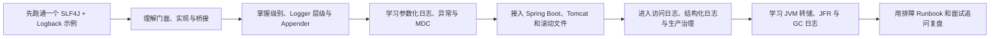
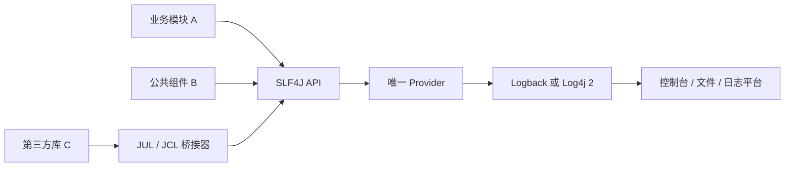
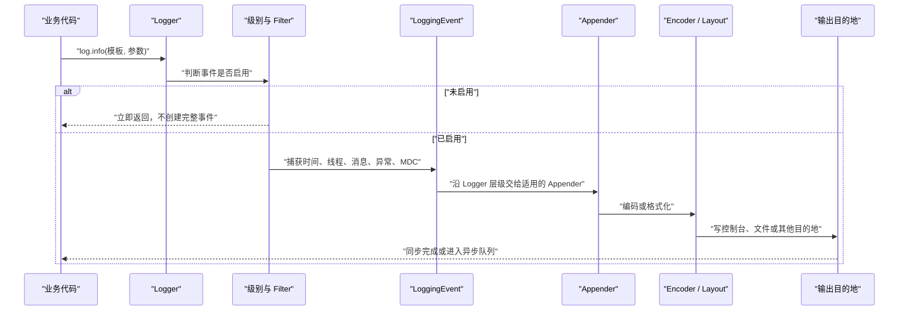
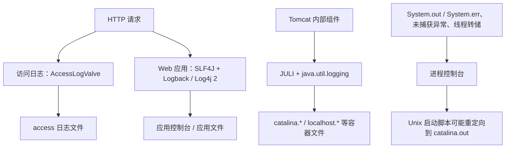
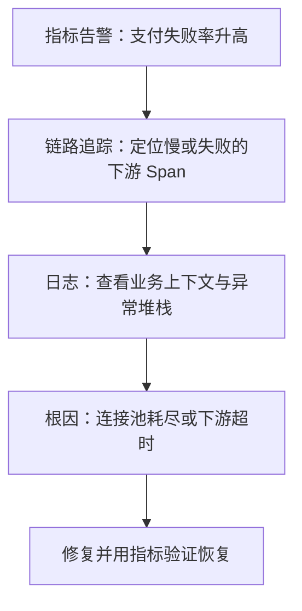
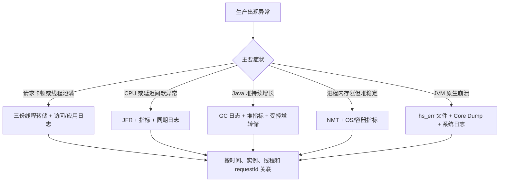
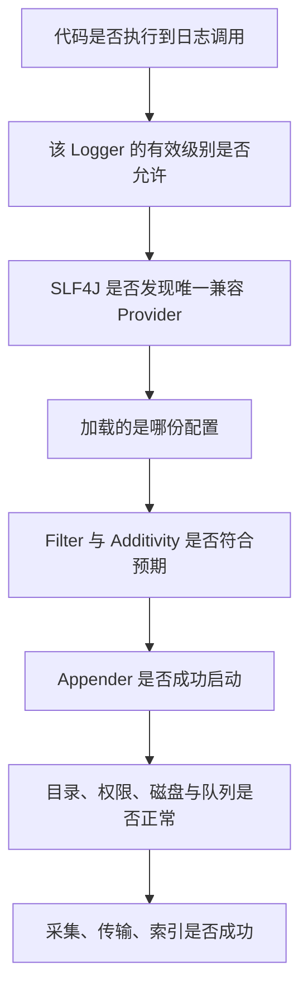

# Java 日志体系学习笔记

> 适用读者：第一次系统学习 Java 日志的开发者，也适合作为面试复习、项目接入和生产故障排查手册。
>
> 示例基线：Java 17、SLF4J 2.0.x、Logback 1.5.x。文中的版本号用于让示例可复现，不代表必须追逐最新版；真实项目应优先使用 Spring Boot 或公司统一的依赖管理，并在升级前阅读发布说明。

## 1 学习目标与路线

### 1.1 学完后应该能做什么

日志不是“把一句话打印到控制台”这么简单。完整的日志体系要回答四类问题：业务代码调用什么接口、日志由谁实现、日志输出到哪里、出了问题如何定位。

完成本笔记后，应当能够：

1\. 解释日志 API（Application Programming Interface，应用程序编程接口）、日志门面、日志实现、桥接器和 Appender（输出目的地组件）的区别。

2\. 在普通 Java 项目和 Spring Boot 项目中正确接入 SLF4J 与 Logback。

3\. 正确选择 `TRACE`、`DEBUG`、`INFO`、`WARN`、`ERROR` 级别，并写出可检索、可关联、不会泄露敏感数据的日志。

4\. 配置控制台输出、滚动文件、保留周期、总容量和环境差异。

5\. 区分 Tomcat 容器日志、应用日志、访问日志和 `catalina.out`，并能配置外置或嵌入式 Tomcat。

6\. 使用 MDC（Mapped Diagnostic Context，映射诊断上下文）把一次请求的日志串起来，并理解线程池和异步调用中的上下文丢失问题。

7\. 看懂“没有 Provider”“多个 Provider”“日志重复”“配置不生效”“磁盘写满”等常见故障。

8\. 从吞吐、延迟、可靠性、安全和成本角度设计生产日志。

9\. 区分日志归档、线程转储、堆转储、JFR（Java Flight Recorder，Java 飞行记录器）、GC 日志和 JVM 崩溃文件，并能按风险安全采集诊断证据。

### 1.2 推荐学习顺序



第一次阅读时，先走完第 3 章的最小闭环，再回到第 2 章理解全景。这样可以先看到结果，再建立完整心智模型。

### 1.3 一句话心智模型

可以把 Java 日志链路想成一条流水线：

```text
业务代码
  -> 日志 API / 门面（例如 SLF4J）
  -> Provider / 实现（例如 Logback 或 Log4j 2）
  -> Logger 级别与过滤规则
  -> Appender
  -> Encoder / Layout
  -> 控制台、文件或日志采集系统
```

这个类比只用于理解职责分工。真实实现还会涉及类加载、队列、滚动策略、上下文复制、采集 Agent 和后端存储，并不是一条永远同步、永不丢失的直线。

## 2 Java 日志体系全景

### 2.1 为什么不直接使用 System.out.println

`System.out.println` 适合临时学习和极小型程序，但它没有为生产诊断提供足够能力。

| 能力 | `System.out.println` | 日志框架 |
| --- | --- | --- |
| 按严重程度开关 | 需要自己写判断 | 支持级别与继承 |
| 按包或类控制 | 不支持 | 支持 Logger 层级 |
| 输出到多个位置 | 需要自己实现 | 通过 Appender 配置 |
| 文件滚动与清理 | 需要自己实现 | 有成熟策略 |
| 请求上下文 | 需要手工拼接 | 可使用 MDC 或结构化字段 |
| 性能控制 | 缺少统一机制 | 支持参数化、缓冲和异步 |
| 运行期调整 | 困难 | 框架或管理端点可支持 |
| 统一格式 | 容易各写各的 | 可集中配置 |

不用日志框架的后果通常不是“少了一些漂亮格式”，而是故障发生后无法回答“哪个请求、哪个用户、哪台实例、在哪一步、因为什么失败”。

### 2.2 五类角色不能混为一谈

| 角色 | 解决的问题 | 常见代表 | 业务代码是否直接依赖 |
| --- | --- | --- | --- |
| 日志 API / 门面 | 业务代码用什么方法记录日志 | SLF4J、Log4j API、JUL API | 通常依赖门面 |
| 日志实现 / Provider | 谁真正创建事件、过滤、格式化和输出 | Logback、Log4j Core、JUL | 应用装配，库不应强绑 |
| 桥接器 Bridge | 把旧 API 的调用导向统一入口 | `jul-to-slf4j`、`jcl-over-slf4j` | 通常只在依赖配置出现 |
| 适配器 / 绑定 | 把门面调用交给某个实现 | Logback 原生 Provider、`log4j-slf4j2-impl` | 运行时装配 |
| 日志平台 | 采集、传输、存储、检索、告警 | Fluent Bit、Logstash、Loki、Elasticsearch | 通常通过标准输出或文件对接 |

SLF4J 只定义记录日志的统一接口，并不负责决定日志最终写到哪个文件。Logback 才是常见的具体实现。把二者混淆后，最容易出现的错误就是“只加了 `slf4j-api`，为什么没有日志”。

### 2.3 常见组件的定位

| 组件 | 全称或定位 | 特点 | 新项目建议 |
| --- | --- | --- | --- |
| JUL | Java Util Logging，即 `java.util.logging` | JDK（Java Development Kit，Java 开发工具包）自带，依赖少 | 简单工具可用；复杂 Spring Boot 应用通常沿用默认的方案 |
| JCL | Apache Commons Logging，历史名称为 Jakarta Commons Logging | 通过发现机制选择实现，许多老框架使用 | 业务代码通常不主动选择 |
| SLF4J | Simple Logging Facade for Java | 主流日志门面，API 稳定，便于切换实现 | 业务代码优先面向它编程 |
| Logback | SLF4J 的原生实现之一 | 配置成熟，Spring Boot 默认常用 | Spring Boot 默认选择通常足够 |
| Log4j 2 | Apache Log4j 2 | API 与 Core 分离，异步与结构化能力丰富 | 有明确性能或功能需求时评估 |
| Log4j 1.x | 旧版 Log4j | 已停止维护，不等于 Log4j 2 | 不用于新项目，遗留系统应迁移 |

“Log4j”这个词容易产生歧义。面试或排障时必须先确认说的是已经停止维护的 Log4j 1.x，还是仍在维护的 Log4j 2。

### 2.4 门面为什么有价值

假设公共组件直接依赖 Logback 的具体类，那么所有使用该组件的应用都被迫接受 Logback。若公共组件只依赖 SLF4J API，最终应用可以在部署时选择 Logback、Log4j 2 或其他 Provider。



边界原则如下：

1\. 可复用类库只依赖日志 API，不替最终应用决定实现，也不携带自己的生产配置。

2\. 最终可执行应用负责选择唯一 Provider、统一版本和统一配置。

3\. 桥接器只解决调用入口不统一的问题，不会自动解决级别、格式、容量和安全治理。

### 2.5 SLF4J 2.x 如何找到实现

SLF4J 2.x 使用 Java `ServiceLoader` 发现 Provider。运行时会出现三种关键状态：

| 类路径状态 | 结果 | 成功判据 |
| --- | --- | --- |
| 恰好一个兼容 Provider | 正常输出 | 启动无 Provider 警告，日志符合配置 |
| 没有 Provider | 回退为 NOP（No Operation，空操作） | 会看到警告，业务日志通常不输出 |
| 多个 Provider | 选择可能不符合预期 | 启动会列出多个 Provider，应清理依赖 |

这里“程序没有抛异常”不能视为日志接入成功。真正的成功判据是启动告警消失、预期级别能输出、关闭的级别不输出、异常堆栈和上下文字段完整。

### 2.6 桥接方向与死循环

桥接器有方向。例如 `jul-to-slf4j` 表示“JUL 调用进入 SLF4J”，不是相反方向。若同时把 A 导向 B、又把 B 导回 A，可能形成循环或初始化冲突。

```text
推荐的单向汇聚：
JUL ----\
JCL -----+--> SLF4J --> 一个 Provider --> 一个日志实现
旧 Log4j /

危险的双向回路：
Log4j 2 API --> SLF4J --> Log4j 2 API --> ...
```

排依赖时不要凭 Artifact（构件）名称猜方向，要查看官方说明和依赖树。

## 3 从零跑通最小日志闭环

### 3.1 教程目标与前置条件

本节创建一个普通 Maven 项目，验证以下结果：

1\. `INFO` 和 `ERROR` 能输出。

2\. 默认未开启的 `DEBUG` 不输出。

3\. `{}` 参数占位符被正确替换。

4\. 异常对象作为最后一个参数时能输出完整堆栈。

前置条件是已安装 Java 17 和 Maven 3.9 或兼容版本，可用下面的命令检查：

```bash
java -version
mvn -version
```

### 3.2 创建 Maven 依赖

`pom.xml` 的核心配置如下。示例固定版本是为了复现；若项目已有 Spring Boot、企业 BOM（Bill of Materials，物料清单）或依赖平台，应由它统一版本。

```xml
<project xmlns="http://maven.apache.org/POM/4.0.0"
         xmlns:xsi="http://www.w3.org/2001/XMLSchema-instance"
         xsi:schemaLocation="http://maven.apache.org/POM/4.0.0
                             https://maven.apache.org/xsd/maven-4.0.0.xsd">
    <modelVersion>4.0.0</modelVersion>

    <groupId>com.example</groupId>
    <artifactId>logging-demo</artifactId>
    <version>1.0-SNAPSHOT</version>

    <properties>
        <maven.compiler.release>17</maven.compiler.release>
        <project.build.sourceEncoding>UTF-8</project.build.sourceEncoding>
        <slf4j.version>2.0.18</slf4j.version>
        <logback.version>1.5.31</logback.version>
    </properties>

    <dependencies>
        <dependency>
            <groupId>org.slf4j</groupId>
            <artifactId>slf4j-api</artifactId>
            <version>${slf4j.version}</version>
        </dependency>
        <dependency>
            <groupId>ch.qos.logback</groupId>
            <artifactId>logback-classic</artifactId>
            <version>${logback.version}</version>
            <scope>runtime</scope>
        </dependency>
    </dependencies>
</project>
```

`slf4j-api` 是编译期接口，`logback-classic` 是运行时 Provider。`logback-classic` 还会传递依赖 `logback-core`，通常不需要再手工重复声明。

### 3.3 编写第一段日志代码

文件路径为 `src/main/java/com/example/LoggingDemo.java`：

```java
package com.example;

import org.slf4j.Logger;
import org.slf4j.LoggerFactory;

public class LoggingDemo {
    private static final Logger log =
            LoggerFactory.getLogger(LoggingDemo.class);

    public static void main(String[] args) {
        String orderId = "ORD-1001";
        int itemCount = 3;

        log.debug("准备计算订单，orderId={}", orderId);
        log.info("订单创建成功，orderId={}，itemCount={}", orderId, itemCount);

        try {
            Integer.parseInt("not-a-number");
        } catch (NumberFormatException ex) {
            log.error("订单金额格式错误，orderId={}", orderId, ex);
        }
    }
}
```

关键点不是“会调用 `info` 方法”，而是理解每个输入的职责：

1\. `LoggingDemo.class` 生成 Logger 名称，通常就是类的全限定名，便于按包或类控制级别。

2\. 消息模板中的 `{}` 与后续参数按顺序绑定，只有事件真正需要输出时才做主要格式化工作。

3\. 最后一个参数 `ex` 是异常对象，不要写成 `ex.getMessage()`，否则会丢失异常类型、调用栈和根因链。

### 3.4 添加最小 Logback 配置

文件路径为 `src/main/resources/logback.xml`：

```xml
<?xml version="1.0" encoding="UTF-8"?>
<configuration>
    <appender name="CONSOLE" class="ch.qos.logback.core.ConsoleAppender">
        <encoder>
            <charset>UTF-8</charset>
            <pattern>%d{yyyy-MM-dd HH:mm:ss.SSS} %-5level [%thread] %logger{36} - %msg%n</pattern>
        </encoder>
    </appender>

    <root level="INFO">
        <appender-ref ref="CONSOLE"/>
    </root>
</configuration>
```

### 3.5 运行、预期结果与验证

可以使用 IDE（Integrated Development Environment，集成开发环境）运行，也可以在项目根目录执行：

```bash
mvn -q compile exec:java -Dexec.mainClass=com.example.LoggingDemo
```

该命令会通过 Maven Exec Plugin 启动 `main` 方法；第一次执行需要从 Maven 仓库下载依赖和插件。预期输出的时间戳与堆栈行号会因运行环境不同而变化，但语义应类似：

```text
2026-07-27 10:20:30.123 INFO  [main] com.example.LoggingDemo - 订单创建成功，orderId=ORD-1001，itemCount=3
2026-07-27 10:20:30.125 ERROR [main] com.example.LoggingDemo - 订单金额格式错误，orderId=ORD-1001
java.lang.NumberFormatException: For input string: "not-a-number"
    at ...
```

验证时依次确认：

1\. 控制台有 `INFO` 和 `ERROR`。

2\. `DEBUG` 没有出现，因为根 Logger 的有效级别是 `INFO`。

3\. `orderId` 和 `itemCount` 已替换 `{}`。

4\. `ERROR` 后存在多行异常堆栈，而不只是一句错误消息。

5\. 启动时没有 `No SLF4J providers were found` 或多个 Provider 的警告。

### 3.6 最小示例失败时怎么查

| 现象 | 最可能的知识缺口 | 检查方法 | 修复方向 |
| --- | --- | --- | --- |
| 完全没有日志 | 缺少 Provider 或级别关闭 | 查看启动警告与依赖树 | 加入一个兼容 Provider，检查根级别 |
| 出现多 Provider 警告 | 依赖冲突 | `mvn dependency:tree` | 排除多余实现，只保留一个 |
| 配置像是没读取 | 文件位置或名称错误 | 检查 `target/classes/logback.xml` | 放到 `src/main/resources` |
| 中文乱码 | 编码链路不一致 | 检查源码、Encoder、终端编码 | 全链路统一 UTF-8 |
| 只有异常文字没有堆栈 | 错误地记录了 `getMessage()` | 检查日志调用参数 | 把异常对象作为最后一个参数 |

## 4 日志事件如何被决定、加工和输出

### 4.1 一条日志的生命周期



理解这条链路可以解释很多现象：级别未开启时为什么没有文件写入；异步队列满时为什么可能阻塞或丢日志；开启调用位置为什么有额外开销。

### 4.2 日志级别不是“消息看起来有多重要”

常见级别从细到重通常是 `TRACE < DEBUG < INFO < WARN < ERROR`。配置为 `INFO` 时，会接收 `INFO`、`WARN`、`ERROR`，忽略 `DEBUG` 和 `TRACE`。

| 级别 | 应表达的语义 | 示例 | 常见误用 |
| --- | --- | --- | --- |
| `TRACE` | 极细粒度执行路径，通常只在短时深度排查开启 | 状态机每一步、协议帧细节 | 长期记录大量循环细节 |
| `DEBUG` | 开发或故障分析所需的内部状态 | 规则命中、缓存键、下游耗时 | 把每个请求正文全部打印 |
| `INFO` | 正常运行中的重要业务或生命周期事件 | 应用启动完成、订单状态变更 | 每一行代码都记一条 |
| `WARN` | 当前仍可继续，但已出现异常征兆或降级 | 重试后成功、接近容量阈值 | 把所有业务校验失败都当告警 |
| `ERROR` | 操作失败，需要处理或调查 | 数据库写入最终失败 | `catch` 后已经完整恢复仍记 ERROR |

日志级别应该服务响应动作。若团队看到某条 `ERROR` 不需要任何处理，它很可能不该是 `ERROR`；若某个失败会造成数据丢失却只记 `DEBUG`，值班人员就无法及时发现。

Logback 没有独立的 `FATAL` 事件级别，Spring Boot 在需要兼容时会将其映射到 `ERROR`。`OFF` 和 `ALL` 主要用于配置“全部关闭”或“全部允许”，也不是业务代码日常调用的日志方法。

### 4.3 Logger：命名、层级与有效级别

#### 4.3.1 Logger 是日志事件的命名入口

Logger 是业务代码提交日志请求的入口。调用 `log.info(...)` 时，Logger 主要完成三件事：

1\. 用名称标识日志来自哪个组件。

2\. 根据有效级别判断这次请求是否启用。

3\. 请求启用后创建日志事件，并把事件交给适用的 Appender。

Logger 本身不是日志文件，也不等同于控制台。一个 Logger 可以没有直接绑定的 Appender，仍然通过祖先 Logger 上的 Appender 输出；同一个 Logger 也可以把一条事件交给多个 Appender。

推荐用当前类创建 Logger：

```java
private static final Logger log =
        LoggerFactory.getLogger(PaymentService.class);
```

它的名称通常是类的全限定名 `com.example.payment.PaymentService`。在同一个 LoggerContext（Logger 上下文）中，以相同名称获取 Logger，会得到同一个 Logger 对象的引用。因此配置按 Logger 名称生效，不需要把配置对象逐层传给每个业务类。

#### 4.3.2 Logger 层级来自名称，不来自 Java 继承

Logger 名称按英文句点 `.` 形成树状层级：

```text
root
└── com
    └── example
        ├── order
        │   └── OrderService
        └── payment
            └── PaymentService
```

`com.example.payment` 是 `com.example.payment.PaymentService` 的父 Logger，因为前者加上 `.` 后是后者名称的前缀，且两者之间没有更近的 Logger 名称层级。`root` 是所有 Logger 的最终祖先。

这里的“父子”和 Java 的 `extends`、接口实现、对象包含关系都无关。即使 `PaymentService` 没有继承任何业务父类，只要 Logger 名称是 `com.example.payment.PaymentService`，它就位于上述 Logger 层级中。中间名称也不要求对应真实存在的 Java 类或包对象。

#### 4.3.3 显式级别与有效级别

每个非根 Logger 的显式级别都可以为空。为空不是“允许所有级别”，而是从当前 Logger 开始向上查找，采用最近一个配置了级别的祖先级别。这个最终用于判断日志请求的值称为有效级别。根 Logger 一定有级别，因此查找最终总能结束。

```xml
<logger name="com.example.payment" level="DEBUG"/>
<root level="INFO"/>
```

以上配置对应的结果如下：

| Logger 名称 | 显式级别 | 有效级别 | 原因 |
| --- | --- | --- | --- |
| `root` | `INFO` | `INFO` | 根 Logger 使用自己的级别 |
| `com.example` | 未配置 | `INFO` | 最近的已配置祖先是 `root` |
| `com.example.order.OrderService` | 未配置 | `INFO` | 向上直到 `root` 才找到级别 |
| `com.example.payment` | `DEBUG` | `DEBUG` | 当前 Logger 已显式配置 |
| `com.example.payment.PaymentService` | 未配置 | `DEBUG` | 最近的已配置祖先是 `com.example.payment` |

日志请求只有在“请求级别大于或等于有效级别”时才会启用。级别顺序为：

```text
TRACE < DEBUG < INFO < WARN < ERROR
```

因此，`PaymentService` 的 `DEBUG`、`INFO`、`WARN`、`ERROR` 请求会启用，`TRACE` 会被丢弃；`OrderService` 只启用 `INFO` 及以上请求。被级别拒绝的请求不会继续寻找 Appender，也不会因为祖先 Logger 的级别更宽松而“重新复活”。

可以把级别继承记成一句话：只为当前日志请求计算一次有效级别，采用离它最近的显式配置。

### 4.4 Appender：决定事件输出到哪里

Logger 回答“这条日志是否值得创建”，Appender 回答“已经创建的日志事件要送到哪里”。常见 Appender 包括：

| Appender | 目的地 | 典型用途 |
| --- | --- | --- |
| `ConsoleAppender` | 标准输出或标准错误 | 本地开发、容器日志采集 |
| `FileAppender` | 单个文件 | 简单文件输出，不负责自动滚动 |
| `RollingFileAppender` | 当前文件与归档文件 | 按时间或大小滚动、限制保留周期和总容量 |
| `AsyncAppender` | 内存队列，再转交其他 Appender | 降低业务线程直接执行日志输入输出的等待时间 |

一个 Logger 可以绑定零个、一个或多个 Appender。同一事件也可以同时写入控制台和文件；这是一次日志调用经过两个输出组件，不是创建了两条不同的业务事件。

Appender 周围的组件各自负责不同阶段：

| 组件 | 输入 | 职责 | 典型例子 |
| --- | --- | --- | --- |
| Logger | 日志调用 | 命名、计算有效级别、创建事件 | `com.example.payment` |
| Appender Filter | 已创建的日志事件 | 决定该 Appender 接受、拒绝还是继续判断事件 | `ThresholdFilter` |
| Appender | 日志事件 | 把事件送到一个目的地 | `ConsoleAppender`、`RollingFileAppender` |
| Encoder | 日志事件 | 把事件编码为可写出的字节 | `PatternLayoutEncoder` |
| Layout | 日志事件 | 生成文本或其他表现形式；部分 Appender 不需要它 | `PatternLayout` |
| RollingPolicy | 文件状态和时间 | 决定何时归档、归档名称及保留策略 | `SizeAndTimeBasedRollingPolicy` |

以控制台 Appender 为例：

```xml
<appender name="CONSOLE" class="ch.qos.logback.core.ConsoleAppender">
    <filter class="ch.qos.logback.classic.filter.ThresholdFilter">
        <level>INFO</level>
    </filter>
    <encoder>
        <charset>UTF-8</charset>
        <pattern>%d{HH:mm:ss.SSS} %-5level %logger - %msg%n</pattern>
    </encoder>
</appender>
```

`ThresholdFilter` 让这个 Appender 只接受 `INFO` 及以上事件；Encoder 再把接受的事件编码成字节，Appender 最后写到控制台。Logger 级别适合在事件创建前做包级或类级的粗粒度控制，Appender Filter 适合在事件创建后决定“哪些级别或类型可以进入这个目的地”。

### 4.5 级别继承与 Appender 追加是两套规则

#### 4.5.1 Additivity 控制 Appender 向祖先累加

Additivity（追加性）默认是 `true`。一条日志请求通过来源 Logger 的有效级别判断后，会先交给来源 Logger 直接绑定的 Appender，再沿 Logger 层级向上交给祖先绑定的 Appender，直到根 Logger。

这里最容易混淆的两个规则是：

| 阶段 | 回答的问题 | 是否逐层重新判断 |
| --- | --- | --- |
| 有效级别判断 | 是否创建这条日志事件 | 否，只按来源 Logger 的有效级别判断一次 |
| Appender 追加 | 已创建的事件去哪些目的地 | 是，按层级收集 Appender，直到根或 `additivity="false"` 边界 |

因此，事件向上传递到根 Logger 时，不会再用根 Logger 的级别过滤一次。若希望根 Logger 的控制台只接收 `INFO` 及以上事件，应该给控制台 Appender 配置 `ThresholdFilter`，不能只依赖 `<root level="INFO">`。

#### 4.5.2 用一组配置推演最终输出

假设配置了两个 Appender：

```xml
<appender name="CONSOLE" class="ch.qos.logback.core.ConsoleAppender">
    <encoder>
        <pattern>%level %logger - %msg%n</pattern>
    </encoder>
</appender>

<appender name="PAYMENT_FILE" class="ch.qos.logback.core.FileAppender">
    <file>logs/payment.log</file>
    <append>true</append>
    <encoder>
        <charset>UTF-8</charset>
        <pattern>%d{yyyy-MM-dd HH:mm:ss.SSS} %-5level %logger - %msg%n</pattern>
    </encoder>
</appender>

<logger name="com.example.payment" level="DEBUG">
    <appender-ref ref="PAYMENT_FILE"/>
</logger>

<root level="INFO">
    <appender-ref ref="CONSOLE"/>
</root>
```

逐条推演结果如下：

| 日志调用 | 来源 Logger 的有效级别 | 是否创建事件 | 最终 Appender | 原因 |
| --- | --- | --- | --- | --- |
| `PaymentService` 记录 `DEBUG` | `DEBUG` | 是 | `PAYMENT_FILE`、`CONSOLE` | 子 Logger 允许；Appender 默认向根累加 |
| `PaymentService` 记录 `INFO` | `DEBUG` | 是 | `PAYMENT_FILE`、`CONSOLE` | `INFO` 高于有效级别，继续向根累加 |
| `OrderService` 记录 `DEBUG` | `INFO` | 否 | 无 | 在来源 Logger 处被级别拒绝 |
| `OrderService` 记录 `ERROR` | `INFO` | 是 | `CONSOLE` | 自身没有 Appender，使用根 Logger 的 Appender |

第一行尤其重要：虽然根 Logger 配置为 `INFO`，`PaymentService` 创建的 `DEBUG` 事件仍会到达根 Logger 的 `CONSOLE`，因为根级别不会在传播阶段再次判断。

如果支付日志只应进入支付文件，不应继续输出到根 Logger 的控制台，可以关闭这一分支的追加性：

```xml
<logger name="com.example.payment" level="DEBUG" additivity="false">
    <appender-ref ref="PAYMENT_FILE"/>
</logger>
```

`additivity="false"` 的含义不是“关闭级别继承”，也不是“禁止子 Logger 输出”，而是事件到达这个 Logger 并执行它绑定的 Appender 后，不再继续传给更高层祖先的 Appender。它只改变输出路径，不改变有效级别计算。

#### 4.5.3 重复日志应该如何判断

当一条业务日志出现两遍时，先在输出格式中保留 Logger 名称、线程和消息，再检查：

1\. 子 Logger 和祖先 Logger 是否都绑定了 Appender。

2\. `additivity` 是否保持默认值 `true`。

3\. 同一个 Appender 是否同时绑定在子 Logger 和祖先 Logger 上。

4\. 日志采集系统是否同时采集控制台与文件，把同一事件再次汇聚到同一索引。

若两行的时间、线程、Logger 名称和消息都相同，通常更像同一事件经过多个 Appender；若业务标识、堆栈或时间不同，则还要检查业务方法是否真的执行了两次。不要为了消除表面重复就全局关闭 Additivity，应先确认每个 Logger 分支期望到达哪些目的地。

## 5 在 Java 代码中写出高质量日志

### 5.1 Logger 的推荐声明方式

```java
private static final Logger log =
        LoggerFactory.getLogger(OrderService.class);
```

`static final` 避免每个实例重复保存 Logger 引用；传入当前类可以让 Logger 名称与代码位置保持一致。若复制代码后忘记修改类名，会导致级别配置和检索维度错误。

Lombok 的 `@Slf4j` 可以生成同等字段，但要让初学者知道它只是编译期代码生成，不是新的日志框架。

### 5.2 参数化日志比字符串拼接更合适

错误写法：

```java
log.debug("查询订单：" + orderId + "，明细：" + expensiveToJson(order));
```

推荐写法：

```java
log.debug("查询订单，orderId={}，status={}", orderId, order.getStatus());
```

当 `DEBUG` 未开启时，参数化写法避免了主要字符串拼接。但要注意，方法参数在调用前已经求值：

```java
// 即使 DEBUG 关闭，expensiveToJson(order) 仍然会先执行。
log.debug("订单详情={}", expensiveToJson(order));
```

昂贵计算应显式保护：

```java
if (log.isDebugEnabled()) {
    log.debug("订单详情={}", expensiveToJson(order));
}
```

或者使用 SLF4J 2.x 的 Fluent API（流式 API）与 Supplier（延迟求值提供者）：

```java
log.atDebug()
        .addKeyValue("orderId", orderId)
        .addArgument(() -> expensiveToJson(order))
        .log("订单详情={}");
```

流式调用只有执行末尾的 `log(...)` 才会真正提交事件；忘记终止调用时，程序通常不会报错，但也不会产生日志。

### 5.3 记录异常时保留完整证据

错误写法一只记录消息：

```java
log.error("支付失败：{}", ex.getMessage());
```

错误写法二把异常当普通占位参数：

```java
log.error("支付失败，exception={}", ex);
```

推荐写法：

```java
log.error("支付失败，orderId={}，channel={}", orderId, channel, ex);
```

异常对象作为最后一个、且没有对应 `{}` 的参数时，SLF4J Provider 会把它识别为 `Throwable` 并输出堆栈。日志消息补充业务上下文，异常对象保留技术根因，二者缺一不可。

还要避免同一异常在每一层都记录：

```text
DAO（Data Access Object，数据访问对象）记录 ERROR 并抛出
  -> Service 再记录 ERROR 并抛出
      -> ControllerAdvice 第三次记录 ERROR
```

通常由“真正处理异常或把异常转化为最终响应”的边界记录一次完整日志。中间层若没有新增有价值的上下文，应直接抛出；否则一个故障会制造多条重复告警。

### 5.4 日志消息应该包含什么

一条可操作的日志通常回答：

| 字段 | 回答的问题 | 示例 |
| --- | --- | --- |
| `event` | 发生了什么稳定事件 | `order_create_failed` |
| `requestId` / `traceId` | 属于哪次请求或链路 | `9f3a...` |
| 业务标识 | 影响哪个业务对象 | `orderId=ORD-1001` |
| 结果 | 成功、失败、降级还是重试 | `result=failed` |
| 原因分类 | 为什么失败 | `reason=stock_insufficient` |
| 耗时 | 是否可能是性能问题 | `durationMs=238` |
| 异常 | 技术根因是什么 | 完整 `Throwable` |

不要把“下单失败”写成唯一内容。它无法关联请求、定位订单，也无法区分库存不足、超时和数据库错误。

### 5.5 区分业务事件、诊断日志和审计日志

| 类型 | 主要目标 | 典型内容 | 可靠性要求 |
| --- | --- | --- | --- |
| 业务事件 | 表达领域状态变化 | 订单已支付、退款已完成 | 更适合事件总线或业务表，日志只是观察副本 |
| 诊断日志 | 开发与运维排障 | 调用失败、耗时、重试 | 可按级别和采样治理 |
| 审计日志 | 回答谁在何时做了什么 | 管理员修改权限 | 通常要求防篡改、访问控制和明确留存 |

日志框架成功写出一行，不等于业务事件已经可靠交付。若“支付成功事件”关系到后续记账，必须使用事务消息、Outbox 等可靠业务机制，不能把普通日志文件当消息队列。

### 5.6 MDC 串联一次请求

MDC 是与当前线程关联的键值映射。先把 `requestId` 放入 MDC，之后当前线程中的每条日志都可以通过日志格式自动带上它。

>MDC 全称是 **Mapped Diagnostic Context**，中文通常译为**映射诊断上下文**。
>
>它用于保存与当前线程关联的键值信息，例如 `requestId`、`traceId`、`userId`，让这些字段自动出现在当前请求的所有日志中。

```java
import org.slf4j.MDC;

public void handleRequest(String requestId) {
    try (MDC.MDCCloseable ignored = MDC.putCloseable("requestId", requestId)) {
        log.info("开始处理订单");
        createOrder();
        log.info("订单处理完成");
    }
}
```

Logback Pattern 中加入：

```xml
<pattern>%d %-5level [%thread] [requestId=%X{requestId:-unknown}] %logger - %msg%n</pattern>
```

预期结果：

```text
2026-07-27 11:00:00.001 INFO [http-nio-8080-exec-1] [requestId=req-42] com.example.OrderService - 开始处理订单
2026-07-27 11:00:00.032 INFO [http-nio-8080-exec-1] [requestId=req-42] com.example.OrderService - 订单处理完成
```

使用 `try-with-resources` 的目的不是代码风格，而是确保请求结束后清理键值。Web 容器会复用线程，如果忘记清理，下一个请求可能错误地继承上一个请求标识。

### 5.7 线程池中的 MDC 为什么会丢或串

MDC 的默认心智模型接近 `ThreadLocal`。任务从请求线程提交到线程池后，工作线程不是请求线程；工作线程又会被后续任务复用，因此既不能假设自动继承，也不能只设置不清理。

```java
// 必须在提交任务的请求线程中捕获；进入线程池后再读取，拿到的是工作线程的上下文。
Map<String, String> parentContext = MDC.getCopyOfContextMap();

executor.submit(() -> {
    // 线程池会复用工作线程，先保存它原来的上下文，避免覆盖框架或外层任务设置的值。
    Map<String, String> previous = MDC.getCopyOfContextMap();
    try {
        if (parentContext == null) {
            // 提交线程没有 MDC 时也要主动清空，不能沿用工作线程上一个任务遗留的数据。
            MDC.clear();
        } else {
            // 把提交线程的上下文安装到当前工作线程，使任务日志带上正确的 requestId 等字段。
            MDC.setContextMap(parentContext);
        }
        log.info("在线程池中处理订单");
    } finally {
        // 无论业务逻辑或日志调用是否抛出异常，都恢复工作线程执行本任务前的状态。
        if (previous == null) {
            MDC.clear();
        } else {
            MDC.setContextMap(previous);
        }
    }
});
```

这段代码有两个关键状态不能混淆：

1\. `parentContext == null` 表示提交任务时没有上下文，不应该把工作线程原有的旧值继续留下。

2\. `previous` 表示工作线程执行任务前的状态，任务结束时恢复或清空，避免污染线程池。

真实 Spring 项目可以通过 `TaskDecorator` 统一封装复制和清理，不要让每个业务方法手写。

### 5.8 Marker 与键值对：两种不同的事件元数据

Marker（标记）与键值对都能给日志事件补充信息，但职责不同：

| 机制 | 回答的问题 | 典型内容 | 是否适合承载大量不同取值 |
| --- | --- | --- | --- |
| Marker | 这条事件属于哪一类 | `AUDIT`、`SECURITY`、`PERFORMANCE` | 否，适合少量稳定分类 |
| 键值对 | 这条事件包含哪些可检索字段 | `orderId`、`operatorId`、`amount` | 是，但仍要控制字段数量和敏感数据 |

Marker 主要用于分类、过滤和路由。传统 SLF4J API 可以这样给事件添加 Marker：

```java
import org.slf4j.Marker;
import org.slf4j.MarkerFactory;

private static final Marker AUDIT = MarkerFactory.getMarker("AUDIT");

log.info(AUDIT, "管理员修改用户角色，operatorId={}，targetUserId={}",
        operatorId, targetUserId);
```

键值对不是一种 Marker。SLF4J 2.x 的 Fluent API（流式 API）可以在同一事件中同时添加 Marker 和独立键值：

```java
log.atInfo()
        .addMarker(AUDIT)
        .addKeyValue("event", "user_role_changed")
        .addKeyValue("operatorId", operatorId)
        .addKeyValue("targetUserId", targetUserId)
        .log("管理员修改用户角色");
```

Marker 即使没有显示在最终文本中，仍然可以参与 Logback 的 MarkerFilter（Marker 过滤器）判断。若希望 Marker 和键值对在文本日志中都可见，需要在 Pattern 中分别加入 `%marker` 和 `%kvp`（Key-Value Pair）：

```xml
<pattern>%d{yyyy-MM-dd HH:mm:ss.SSS} %-5level [%marker] %logger - %kvp %msg%n</pattern>
```

预期输出类似：

```text
2026-07-29 10:30:00.123 INFO [AUDIT] com.example.UserService - event="user_role_changed" operatorId="admin-7" targetUserId="user-42" 管理员修改用户角色
```

若使用 JSON（JavaScript Object Notation，JavaScript 对象表示法）Encoder，应验证 Marker 和键值对是否被编码成独立字段，而不是被忽略或压入一段不可查询的消息文本。具体表现由所选 Encoder 决定，不能只看到应用成功启动就认定字段已经正确输出。

`AUDIT` Marker 只表示事件分类，不会自动提供可靠写入、防篡改、访问控制或合规留存。真正的审计日志仍需满足第 5.5 节所述的独立可靠性与安全要求。

## 6 使用 Logback 完成项目级配置

### 6.1 配置文件发现与初始化

普通 Java 应用常用 `logback.xml`。Spring Boot 更推荐 `logback-spring.xml`，因为日志系统初始化早于 Spring `ApplicationContext`，`-spring` 变体允许 Spring Boot 更完整地参与初始化并提供扩展。

典型入口如下：

| 场景 | 推荐入口 | 验证方式 |
| --- | --- | --- |
| 普通 Java 应用 | `src/main/resources/logback.xml` | 构建后检查 `target/classes/logback.xml` |
| Spring Boot | `src/main/resources/logback-spring.xml` | 启动时检查配置和预期 Pattern |
| 外部配置 | JVM 参数或 `logging.config` | 检查实际启动命令与路径权限 |

“源码目录里存在文件”不等于“运行产物中存在文件”。本地正常、部署失败时，应解压 JAR（Java Archive，Java 归档）或检查类路径中的最终制品。

### 6.2 控制台与按时间、大小滚动文件

下面是一份可作为起点的 `logback-spring.xml`：

```xml
<?xml version="1.0" encoding="UTF-8"?>
<configuration>
    <springProperty scope="context"
                    name="APP_NAME"
                    source="spring.application.name"
                    defaultValue="demo-app"/>
    <springProperty scope="context"
                    name="LOG_PATH"
                    source="app.logging.path"
                    defaultValue="./logs"/>
    <property name="LOG_PATTERN"
              value="%d{yyyy-MM-dd'T'HH:mm:ss.SSSXXX} %-5level [%thread] [requestId=%X{requestId:-}] %logger{40} - %kvp %msg%n"/>

    <appender name="CONSOLE" class="ch.qos.logback.core.ConsoleAppender">
        <encoder>
            <charset>UTF-8</charset>
            <pattern>${LOG_PATTERN}</pattern>
        </encoder>
    </appender>

    <appender name="FILE" class="ch.qos.logback.core.rolling.RollingFileAppender">
        <file>${LOG_PATH}/${APP_NAME}.log</file>
        <encoder>
            <charset>UTF-8</charset>
            <pattern>${LOG_PATTERN}</pattern>
        </encoder>
        <rollingPolicy class="ch.qos.logback.core.rolling.SizeAndTimeBasedRollingPolicy">
            <fileNamePattern>${LOG_PATH}/archive/${APP_NAME}.%d{yyyy-MM-dd}.%i.log.gz</fileNamePattern>
            <maxFileSize>100MB</maxFileSize>
            <maxHistory>14</maxHistory>
            <totalSizeCap>10GB</totalSizeCap>
        </rollingPolicy>
    </appender>

    <logger name="org.springframework" level="INFO"/>
    <logger name="com.example" level="DEBUG"/>

    <root level="INFO">
        <appender-ref ref="CONSOLE"/>
        <appender-ref ref="FILE"/>
    </root>
</configuration>
```

这里使用 `springProperty` 从 Spring Environment 读取应用名和自定义的 `app.logging.path`。例如可在 `application.yml` 中设置 `app.logging.path: /var/log/order-service`；未提供时使用 `./logs`。`springProperty` 是 Spring Boot 的 Logback 扩展，因此这份配置必须使用 `logback-spring.xml`，不能原样复制到普通 Java 应用的 `logback.xml`。

关键配置的含义如下：

| 配置 | 解决的问题 | 边界 |
| --- | --- | --- |
| `<file>` | 当前活跃日志写到哪里 | 进程必须有目录写权限 |
| `%d{yyyy-MM-dd}.%i` | 按天分组，同一天超大小后递增序号 | 大小加时间策略必须包含 `%i` |
| `maxFileSize` | 防止单文件过大 | 不限制所有历史文件总量 |
| `maxHistory` | 限制保留周期 | 仍要配合总容量 |
| `totalSizeCap` | 限制归档总容量 | 应结合磁盘预算设置 |
| `.gz` | 滚动后压缩 | 压缩本身消耗 CPU（Central Processing Unit，中央处理器） |

配置成功的判据不是“应用启动了”，而是：

1\. 活跃文件在预期目录创建。

2\. 达到时间或大小条件后生成带日期和序号的压缩归档。

3\. 超过历史周期或总容量后旧文件被清理。

4\. 应用用户对目录有写权限，磁盘和 inode（索引节点）监控正常。

### 6.3 按环境区分输出

容器化应用通常优先写标准输出，由平台采集；传统虚拟机部署可能同时写本地滚动文件。Spring Boot 的 `springProfile` 可以表达环境差异：

下面的片段应替换上一节未加条件的 `<root>`，不要把三份根 Logger 配置同时保留：

```xml
<springProfile name="local">
    <root level="DEBUG">
        <appender-ref ref="CONSOLE"/>
    </root>
</springProfile>

<springProfile name="prod">
    <root level="INFO">
        <appender-ref ref="CONSOLE"/>
    </root>
</springProfile>
```

不要把生产日志级别硬编码在业务代码中。环境配置应受版本控制，临时调级要有时间限制、审计记录和恢复动作。

### 6.4 拆分错误日志与审计日志

可以用 Filter 将不同事件送到不同 Appender，但拆分不等于复制。若专用 Logger 不希望继续传给根 Logger，需要明确设置 `additivity="false"`。

```xml
<appender name="ERROR_FILE" class="ch.qos.logback.core.rolling.RollingFileAppender">
    <file>${LOG_PATH}/error.log</file>
    <filter class="ch.qos.logback.classic.filter.ThresholdFilter">
        <level>ERROR</level>
    </filter>
    <encoder>
        <pattern>${LOG_PATTERN}</pattern>
    </encoder>
    <rollingPolicy class="ch.qos.logback.core.rolling.TimeBasedRollingPolicy">
        <fileNamePattern>${LOG_PATH}/archive/error.%d{yyyy-MM-dd}.log.gz</fileNamePattern>
        <maxHistory>30</maxHistory>
        <totalSizeCap>5GB</totalSizeCap>
    </rollingPolicy>
</appender>
```

`ThresholdFilter` 的语义是接收阈值及以上级别。如果只想接收“恰好 ERROR”或某个 Marker，需要选择更精确的 Filter。

### 6.5 AsyncAppender 的收益与代价

同步文件 Appender 会让业务线程参与日志 I/O（Input/Output，输入输出）。`AsyncAppender` 通过队列让业务线程先提交事件，由后台线程写出：

```xml
<appender name="ASYNC_FILE" class="ch.qos.logback.classic.AsyncAppender">
    <queueSize>8192</queueSize>
    <discardingThreshold>0</discardingThreshold>
    <neverBlock>false</neverBlock>
    <appender-ref ref="FILE"/>
</appender>
```

| 参数 | 含义 | 取舍 |
| --- | --- | --- |
| `queueSize` | 队列容量 | 太小容易满，太大增加内存与退出时排空时间 |
| `discardingThreshold` | 队列紧张时的丢弃阈值策略 | `0` 表示不按默认阈值丢低级别事件，但不代表绝对不丢 |
| `neverBlock` | 队列满时是否避免阻塞业务线程 | `true` 更偏延迟，代价可能是丢日志 |

异步不是无条件优化。它把“业务线程等待磁盘”变成了“队列容量、后台吞吐、停机排空和丢失策略”的问题。审计、安全和影响资金的数据通常不应只依赖异步普通日志。

## 7 Spring Boot 日志接入

### 7.1 默认行为先于自定义

使用常见 Spring Boot Starter 时，默认日志实现通常是 Logback，并已为 JUL、JCL、Log4j API 和 SLF4J 调用提供适当路由。对初学者而言，第一选择是沿用默认依赖，不要一开始就手工堆叠多个绑定。

最小业务代码仍然面向 SLF4J：

```java
package com.example.order;

import org.slf4j.Logger;
import org.slf4j.LoggerFactory;
import org.springframework.stereotype.Service;

@Service
public class OrderService {
    private static final Logger log =
            LoggerFactory.getLogger(OrderService.class);

    public void create(String orderId) {
        log.info("开始创建订单，orderId={}", orderId);
    }
}
```

### 7.2 用 application.yml 做简单配置

不需要复杂 Appender 时，先使用 Spring Boot 的统一属性：

```yaml
spring:
  application:
    name: order-service

logging:
  level:
    root: INFO
    com.example.order: DEBUG
    org.hibernate.SQL: WARN
  file:
    name: ./logs/order-service.log
  logback:
    rollingpolicy:
      max-file-size: 100MB
      max-history: 14
      total-size-cap: 10GB
```

`logging.file.name` 与 `logging.file.path` 同时设置时，以 `name` 为准。Spring Boot 默认只输出到控制台；只有配置文件名或目录后才启用文件输出。

### 7.3 debug=true 不等于全局 DEBUG

`--debug` 或 `debug=true` 只为一组选定的核心 Logger 开启更多诊断信息，不会把应用内所有 Logger 都改成 `DEBUG`。

若要控制业务包，应显式配置：

```yaml
logging:
  level:
    com.example.order: DEBUG
```

验证时在目标包写一条临时 `DEBUG`，同时观察框架其他包是否仍保持预期级别。不要用“控制台变长了”作为配置正确的唯一判据。

### 7.4 为什么优先使用 logback-spring.xml

Spring Boot 的日志初始化发生在 `ApplicationContext` 创建之前。因此，普通 `@Configuration` 配合 `@PropertySource` 不能作为改变日志系统的可靠入口。

`logback-spring.xml` 的优势是可以使用 Spring Profile 和 Spring Environment 扩展。若使用标准 `logback.xml`，Spring Boot 无法完整控制早期初始化。

### 7.5 使用 Actuator 动态调级

引入 Spring Boot Actuator（生产监控与管理组件）后，可通过 Loggers Endpoint（日志级别管理端点）查看和修改级别。生产使用时必须加认证、授权和网络边界，不能公开暴露管理端点。

典型排查流程是：

1\. 只对故障相关的包临时开启 `DEBUG`。

2\. 记录变更人、变更原因、开始时间和自动恢复时间。

3\. 观察日志量、CPU、磁盘和采集延迟。

4\. 收集足够证据后恢复原级别。

5\. 把根因和长期修复写入故障记录，而不是长期保留全局 `DEBUG`。

### 7.6 切换到 Log4j 2 时的依赖原则

如果有明确原因要从默认 Logback 切换到 Log4j 2，应排除默认日志 Starter，再引入 Log4j 2 Starter。核心目标是最终依赖树中只有一条明确的 SLF4J Provider 路径。

```xml
<dependency>
    <groupId>org.springframework.boot</groupId>
    <artifactId>spring-boot-starter-web</artifactId>
    <exclusions>
        <exclusion>
            <groupId>org.springframework.boot</groupId>
            <artifactId>spring-boot-starter-logging</artifactId>
        </exclusion>
    </exclusions>
</dependency>

<dependency>
    <groupId>org.springframework.boot</groupId>
    <artifactId>spring-boot-starter-log4j2</artifactId>
</dependency>
```

版本交给 Spring Boot BOM 管理，不要随意为 `log4j-core` 单独指定一个与平台不兼容的版本。若因为安全公告必须覆盖版本，要运行完整测试，并检查 Spring Boot 支持矩阵和 Log4j 发布说明。

## 8 配置 Tomcat 容器日志与访问日志

### 8.1 先区分四条互相独立的日志链路

Tomcat 是 Servlet 容器，不是 Logback 的另一个名称。排查 Tomcat 日志前，必须先确定事件来自哪条链路：

本章配置以 2026-07-27 可用的 Tomcat 11.0.24 官方文档为核对基线。Tomcat 10/11 使用 `jakarta.servlet` 包名，Tomcat 9 仍使用 `javax.servlet`；JULI、`logging.properties`、`catalina.out` 和 AccessLogValve 的总体职责相近，但属性与默认值必须以项目实际 Tomcat 版本文档为准。



| 日志类型 | 典型内容 | 默认或常见入口 | 应由谁配置 |
| --- | --- | --- | --- |
| Tomcat 内部日志 | Connector 启停、部署、Session、协议错误 | JULI（Tomcat 对 JUL 的扩展） | `${catalina.base}/conf/logging.properties` |
| Web 应用日志 | 业务事件、Spring、数据库调用 | SLF4J + Logback 或其他实现 | 应用的 `logback-spring.xml` 等 |
| HTTP 访问日志 | 方法、路径、状态码、字节数、耗时 | `AccessLogValve` | 外置 Tomcat 的 `server.xml` 或 Spring Boot `server.tomcat.accesslog.*` |
| 控制台捕获 | `System.out/err`、未捕获异常、线程转储 | 进程 stdout/stderr | 启动脚本、systemd、容器运行时 |

Tomcat 内部日志默认使用 JULI。JULI 的核心是一个理解 Web 应用类加载器的自定义 `LogManager`，能够让不同 WAR（Web Application Archive，Web 应用归档）的 JUL 配置相互隔离，并在应用卸载时清理类引用。

外置 Tomcat 中，一个 WAR 使用 Logback 并不会自动改写 Tomcat 自身的 JULI 配置。反过来，修改 `${catalina.base}/conf/logging.properties` 也不会自动改变应用里的 SLF4J Logger。`jakarta.servlet.ServletContext.log(...)` 是例外：它由 Tomcat 内部日志处理，不受 Web 应用 Logback 配置控制。

### 8.2 理解 CATALINA_HOME 与 CATALINA_BASE

`CATALINA_HOME` 指 Tomcat 程序安装目录，`CATALINA_BASE` 指某个运行实例的配置、日志、应用和临时文件目录。单实例默认可能二者相同，多实例部署则应共享 `CATALINA_HOME`、分别设置各自的 `CATALINA_BASE`。

```text
CATALINA_HOME/
└── bin、lib 等程序文件

CATALINA_BASE/
├── conf/
│   ├── logging.properties
│   └── server.xml
├── logs/
├── temp/
├── webapps/
└── work/
```

生产修改应优先落在实例自己的 `CATALINA_BASE`。否则升级 Tomcat 程序目录时可能覆盖配置，多个实例也会意外共用日志路径。

### 8.3 配置外置 Tomcat 的 JULI 内部日志

全局 JULI 配置通常位于 `${catalina.base}/conf/logging.properties`。Tomcat 启动脚本通过 `java.util.logging.config.file` 系统属性指定它；若绕过官方脚本从 IDE、`jsvc` 或自定义服务脚本启动，就要确认这些系统属性仍被正确设置。

下面给出一个只保留容器文件输出的精简示例：

```properties
handlers = 1catalina.org.apache.juli.AsyncFileHandler
.handlers = 1catalina.org.apache.juli.AsyncFileHandler
.level = INFO

1catalina.org.apache.juli.AsyncFileHandler.level = ALL
1catalina.org.apache.juli.AsyncFileHandler.directory = ${catalina.base}/logs
1catalina.org.apache.juli.AsyncFileHandler.prefix = catalina.
1catalina.org.apache.juli.AsyncFileHandler.maxDays = 30
1catalina.org.apache.juli.AsyncFileHandler.encoding = UTF-8

org.apache.catalina.level = INFO
org.apache.coyote.level = INFO
org.apache.tomcat.level = INFO

# 临时排查 Session 生命周期时，只放开最小范围。
# org.apache.catalina.session.level = FINE
```

这份配置的执行关系是：

1\. `.handlers` 把根 Logger 事件交给 `AsyncFileHandler`。

2\. 根 Logger 和包级 Logger 决定哪些事件可以创建。

3\. Handler 的 `ALL` 允许所有已创建事件通过，因此以后临时把某个包调到 `FINE` 时不会再被 Handler 的 `INFO` 阈值挡住。

4\. `maxDays=30` 让 JULI 清理超过 30 天的文件。Tomcat 11 当前默认保留 90 天；小于等于 0 表示永久保留，生产环境不应无意中使用无限保留。

JULI 级别与 SLF4J 级别不是同一套枚举，可按下面的近似关系理解：

| JUL / JULI | 常见 SLF4J 语义 | 使用场景 |
| --- | --- | --- |
| `SEVERE` | `ERROR` | 严重失败 |
| `WARNING` | `WARN` | 异常征兆或降级 |
| `INFO` | `INFO` | 生命周期与重要状态 |
| `CONFIG` | `DEBUG` 附近 | 配置诊断 |
| `FINE` | `DEBUG` | 一般调试 |
| `FINER`、`FINEST` | `TRACE` | 深度内部路径 |

这只是语义近似，桥接器的实际映射要以所用实现为准。开启 Tomcat 内部调试时，Logger 和 Handler 两道阈值都要允许该级别，并且只对最小包范围短时开启。

JULI 还支持 Web 应用私有配置：如果 WAR 直接使用 JUL，可以把 `logging.properties` 放在 `WEB-INF/classes`。已经使用 SLF4J + Logback 的应用应继续维护自己的 `logback.xml` 或 `logback-spring.xml`，不要为了“统一”再叠加一份无必要的 JUL 配置。

Tomcat 内部日志可以改接其他框架，但会涉及系统类加载器、不同 Web 应用同名 Logger 和卸载清理等问题。除非有明确需求和完整回归测试，生产上通常优先保留官方默认 JULI，而不是仅为了让配置文件看起来统一就替换容器内部实现。

### 8.4 正确认识 catalina.out

在 Unix 类系统中，Tomcat 官方启动脚本通常把控制台 stdout 和 stderr 重定向到 `catalina.out`。因此它可能包含 `System.out/err`、未捕获异常、线程转储，以及 JULI `ConsoleHandler` 写到控制台的副本。

若线程转储由 `kill -3` 触发，它可能进入 `catalina.out`；若希望得到文件名明确、便于关联的独立证据，优先按第 11.3 节使用 `jcmd` 采集。两种入口不要在不知输出位置时重复触发。

| 文件或流 | 本质 | 是否由 JULI 自动按天管理 |
| --- | --- | --- |
| `catalina.YYYY-MM-DD.log` | JULI `FileHandler` / `AsyncFileHandler` 输出 | 是，可用 `maxDays` 控制历史 |
| `localhost.YYYY-MM-DD.log` | Host 或 Web 应用容器类别日志 | 是，取决于 Handler 配置 |
| `localhost_access_log.YYYY-MM-DD.txt` | `AccessLogValve` 访问日志 | 由 Valve 自己滚动 |
| `catalina.out` | 进程控制台重定向文件 | 通常不是，需由启动或操作系统层治理 |

Tomcat 默认配置可能同时把同一内部事件写入异步文件 Handler 和 `ConsoleHandler`；后者又被捕获到 `catalina.out`，于是产生两份内容。生产可根据采集方案移除多余的 `ConsoleHandler`，但必须保留至少一条可靠可观察通道。

`catalina.out` 的轮转应由 systemd/journald、容器运行时或操作系统 `logrotate` 等外部机制负责。不要同时让多个轮转工具操作同一文件，也不要把“清理 JULI 的 `maxDays`”误认为会清理 `catalina.out`。

Windows Service 和容器平台可能使用不同的控制台文件名或根本不创建 `catalina.out`，应查看真实启动方式。Tomcat 的 `swallowOutput="true"` 只能在部分请求处理期间拦截直接的 `System.out/err`，无法可靠接管应用日志框架或后台线程，因此不应把它当成生产日志整合方案。

### 8.5 为外置 Tomcat 配置 AccessLogValve

访问日志记录每个 HTTP 请求的入口信息和最终响应结果，适合分析状态码、流量和延迟。它由 Valve（插入 Tomcat 请求处理流水线的组件）使用独立逻辑写出，不经过应用 Logback，也不受 JULI Handler 级别控制。

在 `${catalina.base}/conf/server.xml` 的目标 `<Host>` 内加入：

```xml
<Valve className="org.apache.catalina.valves.AccessLogValve"
       directory="logs"
       prefix="access"
       suffix=".log"
       encoding="UTF-8"
       pattern="%a %t &quot;%r&quot; %s %b %{ms}T %I %{requestId}r"
       buffered="true"
       rotatable="true"
       renameOnRotate="true"
       fileDateFormat=".yyyy-MM-dd"
       maxDays="14"
       requestAttributesEnabled="true"/>
```

关键 Pattern 的含义如下：

| Pattern | 含义 | 示例 |
| --- | --- | --- |
| `%a` | 客户端远程 IP 地址 | `203.0.113.8` |
| `%t` | Common Log Format（通用日志格式）时间 | `[27/Jul/2026:14:00:00 +0800]` |
| `%r` | 请求首行 | `GET /orders/42 HTTP/1.1` |
| `%s` | 响应 HTTP 状态码 | `200` |
| `%b` | 响应体字节数，零时显示 `-` | `512` |
| `%{ms}T` | 请求处理耗时，单位毫秒 | `37` |
| `%I` | 当前请求线程名 | `http-nio-8080-exec-4` |
| `%{requestId}r` | ServletRequest 中名为 `requestId` 的属性 | `req-42` |

`directory="logs"` 相对于 `CATALINA_BASE`。`renameOnRotate="true"` 让活跃文件保持稳定名称，滚动时再加入日期。`maxDays` 若未设置，当前 Tomcat Access Log Valve 默认值为 `-1`，即永不自动删除历史访问日志。

`buffered="true"` 降低每请求刷盘开销，但进程异常退出时可能丢失尾部少量事件。生产应结合可靠性要求、磁盘性能和采集器行为做取舍。

不建议把 `%q` 查询字符串、Cookie、Session ID、Authorization 或全部请求头直接加入访问日志。URL 查询参数和请求头经常携带 Token 或个人信息；`%r` 是否包含敏感请求目标也要用真实请求验证；`combined` 模式还会记录 Referer 与 User-Agent，启用前同样要做数据审查。

### 8.6 为 Spring Boot 嵌入式 Tomcat 开启访问日志

Spring Boot 内嵌 Tomcat 不读取外置服务器的 `${catalina.base}/conf/server.xml`。优先使用 `application.yml` 的 `server.tomcat.*` 属性：

```yaml
server:
  tomcat:
    # 未固定 basedir 时，访问日志默认可能落入临时 Tomcat 目录。
    basedir: ./tomcat
    accesslog:
      enabled: true
      directory: logs
      prefix: access
      suffix: .log
      encoding: UTF-8
      pattern: '%a %t "%r" %s %b %{ms}T %I %{requestId}r'
      buffered: true
      rotate: true
      rename-on-rotate: true
      file-date-format: .yyyy-MM-dd
      max-days: 14
      request-attributes-enabled: true
```

预期文件位于当前工作目录下的 `./tomcat/logs`。`directory` 若使用相对路径，是相对于 `server.tomcat.basedir`，不是相对于 `logging.file.path`。

必须区分两个配置空间：

| 配置 | 控制对象 |
| --- | --- |
| `logging.file.*`、`logback-spring.xml` | Spring Boot 与业务应用日志 |
| `server.tomcat.accesslog.*` | 嵌入式 Tomcat HTTP 访问日志 |

配置后的验证闭环：

1\. 启动应用并确认 `./tomcat/logs/access.log` 创建。

2\. 分别请求一个成功接口和不存在的路径，确认出现 `2xx` 与 `404` 记录。

3\. 发送慢请求或使用测试端点，确认 `%{ms}T` 为合理毫秒值。

4\. 重启应用并确认历史文件没有被意外覆盖。

5\. 在可控测试环境缩短滚动周期或模拟旧文件，验证 `max-days` 清理策略；不要只凭配置存在就认定容量受控。

### 8.7 用 requestId 关联访问日志与应用日志

AccessLogValve 不会自动读取 SLF4J MDC。要让两条链路使用同一个请求标识，可以在 Servlet Filter 中同时设置 MDC 和 ServletRequest 属性：

```java
package com.example.logging;

import java.io.IOException;
import java.util.UUID;
import java.util.regex.Pattern;

import jakarta.servlet.FilterChain;
import jakarta.servlet.ServletException;
import jakarta.servlet.http.HttpServletRequest;
import jakarta.servlet.http.HttpServletResponse;
import org.slf4j.MDC;
import org.springframework.stereotype.Component;
import org.springframework.web.filter.OncePerRequestFilter;

@Component
public class RequestIdFilter extends OncePerRequestFilter {
    private static final String HEADER = "X-Request-Id";
    private static final String ATTRIBUTE = "requestId";
    private static final Pattern SAFE_ID =
            Pattern.compile("[A-Za-z0-9._-]{1,64}");

    @Override
    protected void doFilterInternal(
            HttpServletRequest request,
            HttpServletResponse response,
            FilterChain filterChain) throws ServletException, IOException {

        String incoming = request.getHeader(HEADER);
        String requestId = incoming != null
                && SAFE_ID.matcher(incoming).matches()
                ? incoming
                : UUID.randomUUID().toString();

        request.setAttribute(ATTRIBUTE, requestId);
        response.setHeader(HEADER, requestId);

        try (MDC.MDCCloseable ignored =
                     MDC.putCloseable(ATTRIBUTE, requestId)) {
            filterChain.doFilter(request, response);
        }
    }
}
```

这段代码形成三方关联：

1\. `%X{requestId}` 让应用 Logback 日志带上请求 ID。

2\. `%{requestId}r` 让 Tomcat 访问日志读取同一个请求属性。

3\. 响应头 `X-Request-Id` 让调用方可以把报障请求准确提供给服务端。

不能无条件信任客户端传入的请求 ID。示例限制了长度和字符集，非法或缺失时生成新值，避免日志注入和超大字段。若网关已经签发 Trace ID，应优先使用组织统一的链路传播规范，不要再制造互不关联的另一套 ID。

该 Filter 演示的是同步 Servlet 请求闭环。Servlet 异步派发、`CompletableFuture`、线程池和响应式调用仍需要对应框架的上下文传播机制，不能因为入口已经设置 MDC 就假设所有后台线程都会继承。

### 8.8 反向代理后的真实客户端 IP

Tomcat 位于 Nginx、负载均衡器或网关之后时，TCP 对端通常是代理，直接记录 `%a` 可能得到代理 IP。正确做法是配置 `RemoteIpValve`，或在 Spring Boot 中使用受信任的 Forwarded Header（转发头）策略，再让 AccessLogValve 使用处理后的请求属性。

Spring Boot 示例：

```yaml
server:
  forward-headers-strategy: native
  tomcat:
    remoteip:
      remote-ip-header: X-Forwarded-For
      protocol-header: X-Forwarded-Proto
      # 仅信任真实基础设施代理网段，下面的值需替换为本环境配置。
      internal-proxies: 10.0.0.0/8,192.168.0.0/16
    accesslog:
      request-attributes-enabled: true
```

安全边界是“只信任由受控代理写入的转发头”。若应用可被客户端绕过代理直接访问，攻击者可以伪造 `X-Forwarded-For`。不要在生产中把内部代理集合设置为空来信任所有来源；还要通过网络策略阻止绕过入口。

### 8.9 Tomcat 日志配置成功的判据

| 检查项 | 成功判据 | 常见失败原因 |
| --- | --- | --- |
| 内部日志 | `catalina.*.log` 有启动、停止和部署事件 | `logging.properties` 路径错误、Handler 未绑定 |
| 包级调试 | 目标包出现 `FINE`，其他包未爆量 | 只改 Logger 或只改 Handler |
| 应用日志 | WAR 内业务日志按应用 Logback 输出 | 把容器 JULI 当成应用 Provider |
| 访问日志 | 每个测试请求恰好一条，状态码与耗时正确 | Valve 放错层级、未启用、路径不可写 |
| 请求关联 | 应用日志与访问日志有相同 `requestId` | 只设置 MDC，未设置 Request 属性 |
| 真实 IP | 经受信代理后记录客户端地址 | RemoteIpValve 与信任网段配置错误 |
| 文件治理 | 活跃文件、滚动文件和历史清理符合预算 | `maxDays=-1`、`catalina.out` 未单独轮转 |
| 无重复采集 | 同一内部事件只有一份可检索记录 | AsyncFileHandler 与 ConsoleHandler 同时采集 |

## 9 结构化日志与分布式链路

### 9.1 文本日志为什么难以规模化检索

下面两条日志对人都能看懂，但机器很难稳定解析：

```text
订单 ORD-1001 创建成功，金额 99.00
成功创建金额为99元的订单：ORD-1001
```

结构化日志把稳定字段和自然语言消息分开，常用 JSON（JavaScript Object Notation，JavaScript 对象表示法）承载：

```json
{
  "timestamp": "2026-07-27T12:00:00.123+08:00",
  "level": "INFO",
  "service": "order-service",
  "event": "order_created",
  "traceId": "4fd0d1...",
  "orderId": "ORD-1001",
  "amount": 99.00,
  "message": "订单创建成功"
}
```

这样日志平台可以按 `event` 聚合、按 `orderId` 精确查找、按 `amount` 做数值查询，而不必依赖脆弱的正则表达式。

### 9.2 在当前 Spring Boot 中启用结构化输出

当前 Spring Boot 官方版本可直接输出 ECS（Elastic Common Schema，Elastic 通用模式）、GELF（Graylog Extended Log Format，Graylog 扩展日志格式）或 Logstash JSON。若项目所用版本支持，可先用统一属性完成最小闭环：

```yaml
logging:
  structured:
    format:
      console: ecs
```

启用后应检查每一行都是独立 JSON 对象，时间、级别、Logger、消息、异常和 MDC 字段可被采集器正确解析。Spring Boot 旧版本可能没有这些属性，应使用与版本匹配的结构化 Encoder；不能因为应用正常启动就假设未知配置键已生效。

### 9.3 字段设计原则

| 原则 | 正确方向 | 失败结果 |
| --- | --- | --- |
| 字段名稳定 | 长期使用 `orderId` | 同一含义出现 `order_id`、`oid`、`orderNo` |
| 类型稳定 | `durationMs` 始终为数字 | 有时是 `120`，有时是 `"120ms"` |
| 控制基数 | 用 `endpoint`、`status` 等有限维度聚合 | 把完整异常堆栈当索引字段 |
| 时间明确 | ISO（International Organization for Standardization，国际标准化组织）8601 格式且带时区 | 不带时区导致跨地域误判 |
| 语义分离 | `event` 稳定，`message` 便于阅读 | 只靠自然语言解析业务事件 |
| 敏感信息最小化 | 只记录必要标识或脱敏值 | 记录密码、Token、身份证全文 |

### 9.4 Trace、Span、Request 与业务 ID

| 标识 | 生命周期 | 用途 |
| --- | --- | --- |
| `requestId` | 一次入口请求 | 客户端与服务端对单次请求 |
| `traceId` | 一条分布式调用链 | 跨服务聚合同一链路 |
| `spanId` | 调用链中的一次操作 | 定位具体远程调用或内部步骤 |
| 业务 ID | 业务对象生命周期 | 跨多次请求追踪同一订单或用户 |

一次订单可能经历创建、支付、发货三次独立请求，因此不能用 `traceId` 代替 `orderId`。同一次分布式调用又可能操作多个业务对象，因此业务 ID 也不能代替 Trace。

### 9.5 日志、指标和链路追踪如何配合



Metrics（指标）擅长发现“整体是否异常”，Tracing（链路追踪）擅长定位“时间花在哪里”，Logging（日志）擅长解释“具体发生了什么”。三者互补，不应把所有高频数值都塞进日志后再昂贵聚合。

## 10 性能、异步与容量规划

### 10.1 日志成本从哪里来

一次日志调用可能包含：

1\. 级别判断。

2\. 参数计算和消息格式化。

3\. 时间、线程、调用位置和 MDC 捕获。

4\. JSON 编码或 Pattern 格式化。

5\. 锁竞争、队列操作和内存分配。

6\. 控制台、磁盘或网络 I/O。

7\. 采集、传输、索引、存储和查询成本。

关闭级别的日志通常成本低，但不代表参数构造免费；开启调用者类名、文件名和行号等位置信息可能需要遍历调用栈；异常堆栈和大对象序列化也会显著增加成本。

### 10.2 不要在高频路径打印大对象

高风险示例：

```java
log.info("收到请求：{}", objectMapper.writeValueAsString(request));
```

问题不只在序列化耗时，还包括日志体积、敏感信息、循环引用、懒加载触发和采集费用。更合理的方式是记录稳定摘要：

```java
log.info("收到批量下单请求，requestId={}，itemCount={}，channel={}",
        requestId, request.items().size(), request.channel());
```

如确需完整载荷排障，应使用短时开关、采样、脱敏、大小上限和访问控制。

### 10.3 同步与异步的取舍

| 维度 | 同步日志 | 异步日志 |
| --- | --- | --- |
| 调用线程延迟 | 直接承受输出开销 | 通常更低 |
| 峰值缓冲 | 较弱 | 队列可吸收短峰 |
| 队列满 | 不适用或下游直接阻塞 | 必须选择阻塞、丢弃或降级 |
| 崩溃前日志 | 更可能已写出 | 队列中事件可能丢失 |
| 顺序 | 相对直观 | 跨线程、混合同步异步时更复杂 |
| 错误反馈 | 更容易暴露给调用方 | 后台线程错误不易反馈 |
| 配置复杂度 | 较低 | 较高 |

Apache Log4j 2 官方明确建议：只有基准测试和性能分析证明异步有显著收益时才引入；审计日志等业务关键记录优先同步处理。

### 10.4 用数据估算日志容量

假设服务峰值为每秒 1,000 个请求，平均每个请求 5 条日志，每条编码后平均 600 字节：

```text
每秒日志量 = 1,000 × 5 × 600 B = 3,000,000 B，约 3 MB/s
每天原始量 = 3 MB/s × 86,400 s，约 259 GB/天
```

这还没有计入异常堆栈、索引副本和多环境。容量治理应优先减少无价值日志、合理设置级别和采样，再考虑压缩；不能只靠增加磁盘。

### 10.5 压测与成功判据

日志优化需要在接近生产的磁盘、容器限制和采集链路下验证。内存 Appender 或禁用真实输出的单元测试只能证明代码路径正确，不能证明生产吞吐。

压测至少观察：

| 指标 | 说明 |
| --- | --- |
| 接口 P50、P95、P99 百分位延迟 | 日志是否拖慢尾延迟 |
| 每秒日志事件数与字节数 | 真实负载 |
| 异步队列使用率与丢弃数 | 是否接近饱和 |
| CPU 与 GC（Garbage Collection，垃圾回收） | 编码和对象分配成本 |
| 磁盘延迟与使用率 | 本地写入是否成为瓶颈 |
| 采集积压与端到端延迟 | 日志何时真正可检索 |

### 10.6 用采样、聚合和限流控制日志风暴

同一个错误在循环、重试或下游故障时可能每秒打印数万次。单纯提高磁盘容量会延迟崩溃，却不能解决 CPU、网络、索引费用和有效信息被淹没的问题。

| 手段 | 适合场景 | 必须保留的信息 |
| --- | --- | --- |
| 固定比例采样 | 高频成功请求或重复 DEBUG | 总请求数、采样率和聚合指标 |
| 按键限流 | 同一异常原因、同一下游持续失败 | 首次事件、抑制数量、最近一次时间 |
| 周期聚合 | 一分钟内大量同类失败 | 时间窗、次数、代表性样本 |
| 动态调级 | 短时故障深挖 | 变更审计和自动恢复时间 |

不要随机采样低频但高影响的资金失败、安全审计或首次未知异常。更稳妥的策略是保留首次和状态变化事件，对中间重复事件限流，并用指标完整统计发生次数。

验证日志限流时，不能只确认“日志变少了”。还要确认告警指标没有丢失、抑制数量可见、恢复事件能输出，并且不同错误键不会相互吞掉。

## 11 JVM 诊断转储与日志协同

### 11.1 先回答：什么是“日志转储”

“日志转储”不是一个足够精确的 JVM 术语。日常沟通中，它可能指滚动归档的日志文件，也可能指线程、堆或崩溃现场的 Dump（转储）。这些产物回答的问题、生成方式和生产风险完全不同：

| 诊断产物 | 本质 | 主要回答什么 | 常见格式 | 典型影响 |
| --- | --- | --- | --- | --- |
| 应用与访问日志 | 按时间连续记录的事件 | 某个请求或业务步骤发生了什么 | 文本、JSON | 持续 I/O 与存储成本 |
| 滚动日志归档 | 旧日志文件轮转、压缩和保留 | 历史日志放在哪里 | `.log`、`.gz` | 通常低，压缩会消耗 CPU |
| 线程转储 | 某一时刻所有 Java 线程的栈与锁 | 卡顿、死锁、线程池耗尽时线程在做什么 | 文本 | 中等，随线程数变化 |
| 堆转储 | 某一时刻 Java 堆对象与引用关系 | 哪些对象占内存、谁阻止它们被回收 | HPROF（Heap Profiler，堆分析器）`.hprof` | 高，可能 Full GC、停顿和大量磁盘写入 |
| JFR 录制 | 一段时间内的 JVM 与应用事件 | CPU、分配、锁、I/O 和 GC 随时间怎样变化 | `.jfr` | 通常低；配置越详细开销越高 |
| GC 日志 | JVM 垃圾回收的连续事件流 | 回收频率、停顿、堆变化是否异常 | 文本 | 通常可控，详细级别越高数据越多 |
| 致命错误日志 | JVM 原生崩溃瞬间的现场摘要 | 哪个信号、线程或本地库导致 JVM 崩溃 | `hs_err_pid*.log` | 崩溃后生成 |
| Core Dump（核心转储） | 操作系统级进程内存快照 | 原生代码、JNI 或 JVM 崩溃的深层现场 | 平台相关二进制 | 文件极大，生成和分析成本高 |

因此，看到“有没有日志转储”时要继续确认目标：

1\. 只是防止日志文件无限增长：看第 6.2、8.4 和 8.5 节的滚动、压缩与保留。

2\. 接口卡死或线程池不动：采集线程转储。

3\. Java 堆持续增长或出现 `OutOfMemoryError`：评估堆转储和 GC 日志。

4\. CPU、锁竞争或分配问题需要时间线：使用 JFR。

5\. JVM 直接崩溃：保留 `hs_err_pid*.log`，必要时再分析 Core Dump。

### 11.2 采集前先确认目标进程和安全边界

本章命令以 HotSpot JDK 17 为示例。`jcmd` 是 JDK 自带的诊断命令工具，具体命令由目标 JVM 提供；执行前应先查看目标 JVM 真正支持的列表：

```bash
# 列出当前环境可见的 Java 进程。
jcmd -l

# 先确认 PID（Process Identifier，进程标识符）、主类和 JVM 版本，
# 避免把转储打到错误实例。
jcmd <pid> VM.version
jcmd <pid> VM.command_line

# 查看该 JVM 支持的全部诊断命令和单条命令参数。
jcmd <pid> help
jcmd <pid> help Thread.print
```

尖括号中的 `<pid>` 是占位符，执行时要替换为真实进程号，不要原样复制。生产采集前至少确认：

1\. `jcmd` 与目标 JVM 在同一台机器，并以和目标进程相同的有效用户、用户组执行。

2\. 容器中的 JVM 应从同一容器或具备相同进程命名空间和权限的诊断容器操作；宿主机的 `jcmd -l` 不保证能列出独立容器里的 JVM。

3\. 输出目录已提前创建、权限正确、磁盘空间和 inode 足够，不能临时把大文件写入容量很小的容器可写层。

4\. 文件名包含实例、PID 和时间信息，避免覆盖已有证据；命令中的目录只是示例，必须替换为组织批准的受控路径。

5\. 转储可能包含类名、线程名、SQL、Token、用户数据、环境变量和启动参数，应限制读取、传输、留存与删除权限。

6\. 先记录故障时间、时区、实例、发布版本、PID、告警和 `traceId`，否则离线文件难以与同一时段的日志、指标关联。

还应优先使用目标进程同一 JDK 版本自带的诊断工具；官方不支持拿一个 JDK 版本附带的 `jcmd`、`jstack` 等工具诊断另一个 JDK 版本。`jcmd` 连接失败时，不要立刻使用更强制的工具反复附加。先检查用户、PID 命名空间、目标是否仍存活、JDK 工具与版本是否匹配，以及是否使用了限制 Attach（附加）机制的安全配置。

### 11.3 线程转储：定位卡顿、死锁与线程池耗尽

线程转储记录的是一个时间点，不是线程执行录像。优先使用：

```bash
jcmd <pid> Thread.print -l \
  > /secure/diagnostics/order-service-thread-20260727T143000+0800.txt
```

`-l` 会附加 `java.util.concurrent` 锁信息。`jstack -l <pid>` 是常见的同类入口；在 Unix 类 HotSpot 环境中，`kill -3 <pid>` 或 `kill -QUIT <pid>` 通常会让 JVM 把线程转储写到标准错误而不终止进程，但输出位置取决于启动方式，可能进入 `catalina.out`、journald 或容器日志。为了文件归属明确，Runbook 通常优先选择 `jcmd`。

一次快照只能证明“这一瞬间在哪里”。排查持续卡顿时，常见做法是在故障仍存在的前提下采集三份快照，每份间隔约 5 到 10 秒，再比较相同线程是否持续停在同一栈帧。不要写成无上限循环，也不要在故障恢复后继续采集。

分析时重点看：

| 线索 | 含义 | 下一步 |
| --- | --- | --- |
| `BLOCKED` | 等待进入某个监视器锁 | 找持锁线程和竞争对象 |
| `WAITING`、`TIMED_WAITING` | 可能是正常等待，也可能是资源池枯竭 | 结合线程名、栈帧和队列指标判断 |
| 多个 `RUNNABLE` 长期停在同一 I/O 调用 | 下游、网络或磁盘可能慢 | 对照下游延迟、Socket 和访问日志 |
| 三份快照中同一线程栈完全不动 | 可能挂起、死锁或调用不返回 | 检查锁拥有者、超时与下游 |
| JVM 报告 Java 级死锁 | 锁形成闭环等待 | 保存完整转储，定位持锁顺序 |

Tomcat 请求线程可用 AccessLogValve 的 `%I` 记录线程名。若访问日志中的 `http-nio-8080-exec-4` 长时间未完成，可在同一时段线程转储中搜索该线程名，再结合 `requestId`、URI、下游日志和超时配置定位。线程名是关联线索，不等同于稳定业务 ID。

采集成功的判据是文件非空、包含完整线程清单和时间上下文、三份文件能够区分，且故障实例与 PID 已记录；不是“命令返回码为 0”就结束。

### 11.4 堆转储：定位 Java 堆对象与引用链

当堆使用量在 Full GC 后仍持续上升、同类对象数量不断增长，或已经出现 `java.lang.OutOfMemoryError: Java heap space` 时，可以评估堆转储：

```bash
jcmd <pid> GC.heap_dump \
  /secure/diagnostics/order-service-20260727T143000+0800.hprof
```

这是高影响操作。HotSpot JDK 17 的 `GC.heap_dump` 默认只写可达对象，并会请求一次 Full GC；`-all` 会把不可达对象也写入且不先请求该 Full GC，但文件通常更大、语义也不同，不能把它当成通用的“无停顿开关”。

执行前必须做容量和业务影响评估：

1\. HPROF 文件可能接近当前堆规模，生成期间还会产生额外磁盘 I/O；分析机器也需要足够内存和磁盘。

2\. 大堆 Full GC 和转储写盘可能造成明显停顿，低延迟核心实例应先走变更或应急授权，并尽量在摘流实例、只读副本或故障副本上操作。

3\. 不要在磁盘即将写满时强行生成堆转储。磁盘满可能同时破坏应用日志、数据库临时文件和节点稳定性。

4\. 堆里可能保留密码、Token、用户内容、证书和完整请求对象。`.hprof` 应按高敏感生产数据管理，不要直接上传到公共工单或聊天工具。

5\. 转储完成后检查文件存在、大小合理、所有者和权限正确；传输时使用受控通道与校验和，分析结束后按保留策略删除副本。

Eclipse MAT（Memory Analyzer Tool，内存分析工具）可以查看 Histogram（对象数量和浅堆大小统计）、Dominator Tree（支配树）、Retained Size（保留大小）和 GC Root（垃圾回收根）引用链。分析的重点不是“哪个类实例最多”，而是“哪些对象保留了大量内存、为什么仍可达、数量是否随时间异常增长”。单份堆转储只能给出快照，内存泄漏判断最好结合两份不同时刻的同负载转储、GC 日志、指标和发布变更。

`OutOfMemoryError` 不一定表示 Java 堆泄漏。`Metaspace`、`Direct buffer memory`、`unable to create native thread` 和操作系统直接杀死容器的成因不同；先读异常详细消息和容器事件，再决定是否需要 HPROF。

### 11.5 在 OOM（Out Of Memory，内存不足）发生时自动保留堆转储

不希望等到进程已经失去响应才手工附加时，可在启动参数中预设：

```text
-XX:+HeapDumpOnOutOfMemoryError
-XX:HeapDumpPath=/secure/diagnostics/java_pid%p.hprof
```

`-XX:+HeapDumpOnOutOfMemoryError` 默认关闭；开启后，JVM 在抛出 `OutOfMemoryError` 时尝试生成 HPROF。`-XX:HeapDumpPath` 应写到提前创建、容量足够、应用用户可写且可持久化的目录。`%p` 会展开为 PID，但容器重启后 PID 可能复用，因此还要用实例目录、启动时清理策略或外部归档避免文件名冲突。

自动转储也不是“配置后一定有文件”。常见失败包括目录不存在、权限不足、空间不足、已有同名文件、进程被操作系统 OOM Killer（内存不足终止器）直接终止，以及发生的并非可生成 Java 堆转储的错误。上线前要在隔离测试环境触发受控 OOM，验证文件生成、告警、持久卷、采集和清理闭环。

是否同时配置 `-XX:+ExitOnOutOfMemoryError` 或 `-XX:+CrashOnOutOfMemoryError` 属于进程恢复策略，不是日志通用默认值。它们会改变进程退出方式，应与编排重启、流量摘除、数据一致性和转储完成时间一起设计，不能为了“方便拿 Dump”随意开启。

### 11.6 JFR：保留一段时间的性能时间线

线程和堆转储都是瞬时快照。故障表现为间歇性 CPU 飙高、锁竞争、对象分配激增、GC 抖动或慢 I/O 时，JFR 更适合回答“这 60 秒发生了什么”：

```bash
jcmd <pid> JFR.start \
  name=incident \
  settings=profile \
  duration=60s \
  filename=/secure/diagnostics/order-service-20260727T143000+0800.jfr

jcmd <pid> JFR.check

# 等待 60 秒录制结束并完成文件写出后再检查。
jfr summary /secure/diagnostics/order-service-20260727T143000+0800.jfr
```

JFR 的 `default` 配置偏向低开销、可持续记录；`profile` 收集更多信息，开销更高，适合短时诊断。示例限定了 `duration=60s`，结束后自动写文件。若启动了无期限录制，应显式设置 `maxage` 或 `maxsize`，并有 `JFR.dump`、`JFR.stop` 和文件清理步骤，避免“临时录制”永久运行。

JFR 文件可使用 JDK Mission Control（JMC）分析 CPU 热点、线程、锁、对象分配和 GC 等事件，也可用 Java 17 已提供的 `jfr summary` 或 `jfr print` 做命令行初查；较新 JDK 还可能提供更多子命令，应以 `jfr help` 为准。JFR 是事件采样与记录，不等于完整堆对象快照；需要精确引用链时仍要使用堆转储。

虽然官方把常见 JFR 诊断命令标记为低影响，实际开销仍取决于事件配置、采样频率、栈深、持续时间和负载。生产上应先用组织批准的录制模板压测，避免临时开启所有高频事件。

### 11.7 GC 日志不是堆转储

Java 17 使用 JVM Unified Logging（JVM 统一日志）配置 GC 日志。下面的启动参数记录 GC 与安全点事件，按约 100 MB 轮转并保留 10 个文件：

```text
-Xlog:gc*,safepoint:file=/secure/diagnostics/gc-%p.log:time,uptime,level,tags:filecount=10,filesize=100M
```

该日志适合观察 GC 原因、回收前后堆变化、停顿和安全点，不包含每个 Java 对象及其完整引用关系。`filecount` 与 `filesize` 控制 JVM 日志文件轮转；它与 Logback 的 `maxHistory`、Tomcat JULI 的 `maxDays` 是三套独立配置。

上线前运行 `java -Xlog:help` 核对目标 JDK 支持的标签、级别和输出参数。若运行时临时调整 JVM Unified Logging，可先用 `jcmd <pid> VM.log list` 查看当前配置，再按目标 JVM 的 `jcmd <pid> help VM.log` 操作。不要无记录地覆盖已有 GC 日志策略。

### 11.8 Java 堆外内存异常不能只看 HPROF

进程常驻内存持续增长而 Java 堆指标稳定时，问题可能来自 Metaspace、线程栈、代码缓存、Direct Buffer（直接缓冲区）、JVM 内部原生分配或 JNI（Java Native Interface，Java 本地接口）库。HPROF 只描述 Java 堆，不能解释全部进程内存。

HotSpot 的 NMT（Native Memory Tracking，本地内存跟踪）需要在进程启动时启用：

```text
-XX:NativeMemoryTracking=summary
```

启用后可建立基线并比较 JVM 内部原生内存分类：

```bash
jcmd <pid> VM.native_memory baseline

# 间隔一段有代表性的业务负载后再执行。
jcmd <pid> VM.native_memory summary.diff scale=MB
```

NMT 默认关闭，不能在已运行进程中再启动，并会带来额外开销。它主要跟踪 HotSpot/JVM 内部原生内存，不能覆盖所有第三方 JNI 原生分配。因此 NMT、操作系统进程指标、容器限制、线程数和 Core Dump 各有边界。

### 11.9 按症状选择证据，而不是见故障就打堆



| 症状 | 首批证据 | 何时升级 |
| --- | --- | --- |
| 接口超时、线程池活跃数满 | 指标、访问日志、三份线程转储 | 栈指向下游或锁后，再查下游与锁拥有者 |
| CPU 间歇飙升 | CPU 指标、JFR、线程快照 | 确认热点方法后再做代码级 Profiling（性能剖析） |
| GC 频繁、堆回收后仍上涨 | GC 日志、堆曲线、类直方图 | 获得授权和容量后生成 HPROF |
| 容器内存上涨而堆稳定 | RSS（Resident Set Size，常驻内存集）、线程数、NMT | 涉及第三方原生库时评估 Core Dump |
| JVM 无 Java 异常直接退出 | `hs_err_pid*.log`、系统日志、容器事件 | 原生栈不足时再分析 Core Dump |

最稳妥的采集顺序通常是先保存低影响且容易丢失的时间信息，再进行高影响操作：记录时间和实例 → 保存指标与日志 → 线程转储或短时 JFR → 类直方图 → 经授权的堆转储。故障严重程度、剩余磁盘和服务冗余不足时，应调整顺序或先摘流。

### 11.10 致命错误日志与 Core Dump

HotSpot 因 `SIGSEGV`（Segmentation Violation Signal，段错误信号）、原生库、JNI 或 JVM 内部错误崩溃时，通常尝试生成 `hs_err_pid<pid>.log`。可提前指定受控路径：

```text
-XX:ErrorFile=/secure/diagnostics/hs_err_pid%p.log
```

未配置 `ErrorFile` 时，JVM 先尝试写到进程工作目录；失败后可能写入操作系统临时目录。致命错误日志可能包含崩溃信号、问题线程与栈、运行线程、堆摘要、本地库、启动参数、环境变量、操作系统和 CPU 信息，因此既重要又敏感。

发现 JVM 突然退出时，应同时检查：

1\. 指定诊断目录、进程工作目录和系统临时目录是否出现 `hs_err_pid*.log`。

2\. 容器状态中是否为 `OOMKilled`，宿主机内核日志是否记录内存不足或信号。

3\. systemd、容器运行时和编排平台保存的 stdout/stderr 尾部。

4\. 最近 JVM、JDK、JNI、本地 Agent、驱动和基础镜像是否变更。

Core Dump 的开启方式、路径和限制由操作系统、容器运行时与服务管理器共同决定，文件可能包含整个进程内存和密钥。应由平台团队预配置容量、访问控制、加密、上传和删除规则；不要在故障现场未经评估临时全局开启。

### 11.11 生产转储 Runbook 与成功判据

一次合格的诊断采集应形成以下闭环：

1\. 定位：记录时区、实例、容器、PID、JDK 版本、发布版本、症状和告警。

2\. 选择：根据问题选择线程、JFR、GC、NMT、堆或崩溃证据，不默认全采。

3\. 评估：确认命令影响、服务冗余、目录权限、可用磁盘、敏感级别和授权人。

4\. 采集：使用唯一文件名，记录精确命令、开始结束时间、返回结果和文件大小。

5\. 关联：用时间、实例、线程名、`traceId`、`requestId` 和发布变更关联日志、指标与转储。

6\. 保护：限制访问，使用受控传输和校验和，不将 HPROF、JFR 或 Core Dump 发到公开渠道。

7\. 验证：确认文件可打开、内容与目标实例一致；不要等到删除线上原件后才发现文件损坏。

8\. 清理：故障关闭后按保留策略删除线上及分析机副本，记录证据去向和删除结果。

“生成了一个大文件”不是成功。真正的成功判据是：文件完整可分析、与故障时间和实例匹配、采集没有扩大事故、敏感数据受控，并最终支持或排除一个明确根因假设。

## 12 可靠性、安全与合规

### 12.1 日志不能包含哪些数据

默认禁止直接记录：

1\. 密码、短信验证码、访问 Token、刷新 Token、Session ID 和 API Key。

2\. 银行卡完整卡号、CVV（Card Verification Value，卡片验证码）和私钥。

3\. 身份证、手机号、邮箱、住址等不必要的完整个人信息。

4\. 完整请求头、Cookie、Authorization Header。

5\. 数据库连接密码、云凭证和内部密钥材料。

脱敏不是简单地把字符串中间替换为星号。还要明确数据是否真的需要记录、谁能访问、保存多久、备份是否同步清理。

线程转储、堆转储、JFR、致命错误日志与 Core Dump 同样适用这一原则，而且通常比普通应用日志包含更多运行现场。转储文件不能因为扩展名不是 `.log` 就绕过数据分级和访问审计。

### 12.2 防止日志注入

攻击者可以在用户名、User-Agent 等输入中放入换行符，伪造下一条日志：

```text
username=alice
ERROR 管理员登录成功
```

防护思路包括：

1\. 使用结构化编码器，让换行、引号等字符按 JSON 规则转义。

2\. 不让不可信输入成为日志格式模板；模板由代码固定，输入只作为参数。

3\. 对需要单行输出的字段限制长度并处理控制字符。

4\. 在日志平台保留原始事件边界，不依赖肉眼按行判断。

### 12.3 依赖与配置安全

Log4Shell 通常指 CVE（Common Vulnerabilities and Exposures，通用漏洞披露）编号 CVE-2021-44228。它影响的是特定旧版本 Log4j 2 Core，不等于“所有 Java 日志框架都有同一个漏洞”，也不等于“只要代码使用 SLF4J 就一定受影响”。

正确的安全响应流程是：

1\. 用依赖树和软件物料清单确认运行产物中实际包含的组件与版本。

2\. 对照 Apache Logging Services 官方安全公告和所用框架公告。

3\. 升级到受维护且已修复的版本，不把删除某个类当作长期替代。

4\. 检查镜像、胖 JAR、插件目录和应用服务器共享库，避免只看源码 `pom.xml`。

5\. 对升级后的启动、配置加载、滚动、桥接和关键业务路径做回归测试。

6\. 把日志配置设为只读并限制修改权限，避免运行期加载被篡改的配置。

### 12.4 日志失败时业务应该怎么办

普通诊断日志通常不应让核心业务因为写日志失败而整体失败，但必须有可观察的降级信号。审计或合规记录则可能要求“记录失败即拒绝操作”。

| 场景 | 建议倾向 | 原因 |
| --- | --- | --- |
| 普通 DEBUG 日志 | 可丢弃或采样 | 不应拖垮业务 |
| ERROR 诊断日志 | 尽量保留并监控丢失 | 故障证据重要 |
| 安全审计 | 同步或独立可靠通道 | 合规和追责要求 |
| 资金业务事件 | 使用业务级可靠消息或数据表 | 普通日志没有事务语义 |

策略必须在设计阶段确定，不能等队列满、磁盘满时才临时猜测。

### 12.5 容器环境的输出策略

在 Kubernetes 等容器平台中，常见模式是应用写标准输出和标准错误，由节点 Agent 采集。这样可以避免应用容器自行维护复杂文件生命周期。

仍需明确：

1\. 多行异常堆栈如何聚合为一个事件。

2\. 容器重启前缓冲区是否排空。

3\. 节点磁盘满时采集器和应用的行为。

4\. 日志后端不可用时本地缓冲、丢弃和告警策略。

5\. 标准输出阻塞是否会影响业务线程。

“写到 stdout”只是交接点，不等于日志已进入后端并可查询。

## 13 故障排查 Runbook

### 13.1 总体排查路径



按链路从前向后排查，比不断修改 XML 更容易缩小范围。

### 13.2 没有任何日志

依次检查：

1\. 代码路径是否真的执行，可用断点或测试验证，不要仅凭请求返回成功推断。

2\. Logger 的有效级别是否允许该事件。

3\. 启动时是否出现 `No SLF4J providers were found`。

4\. `mvn dependency:tree` 或 `gradle dependencies` 中是否有兼容 Provider。

5\. Appender 是否绑定到目标 Logger 或祖先 Logger。

6\. 日志配置是否进入构建产物并被实际类加载器看到。

常用命令：

```bash
mvn dependency:tree
jar tf target/app.jar | rg 'logback|log4j|slf4j'
```

### 13.3 多个 Provider 或绑定冲突

典型警告会列出多个 SLF4J Provider。处理时：

1\. 查看完整依赖树，定位每个 Provider 的引入路径。

2\. 决定唯一目标实现，例如 Logback。

3\. 在引入多余实现的上游依赖上做精确 exclusion（排除）。

4\. 重新构建并检查最终 JAR，而不只检查 IDE 依赖面板。

5\. 启动后确认警告消失，输出格式与目标实现一致。

不要排除 `slf4j-api` 本身，也不要通过随机删除 JAR 让警告“碰巧消失”。

### 13.4 日志重复

定位顺序如下：

1\. 给业务操作加唯一 `requestId`，确认是同一事件重复，还是业务真的执行两次。

2\. 检查子 Logger 与根 Logger 是否绑定了相同或不同 Appender。

3\. 检查 `additivity` 是否应该为 `false`。

4\. 检查采集 Agent 是否重复采集 stdout 和同一文件。

5\. 检查应用是否启动了两个实例、两个 Spring Context 或发生重试。

只有第一步确认“同一日志事件被输出两次”后，才能把问题归因于日志配置。

### 13.5 配置修改不生效

常见根因及验证：

| 根因 | 为什么发生 | 验证 |
| --- | --- | --- |
| 修改了错误文件 | 类路径存在多份配置 | 检查 JAR 内容和启动日志 |
| 文件没进制品 | 资源目录或构建配置错误 | 查看 `target/classes` 或解包 JAR |
| 日志初始化太早 | Spring 上下文尚未创建 | 使用 `logback-spring.xml` 和受支持属性 |
| 外部参数覆盖 | 启动参数指向另一配置 | 检查进程实际命令行 |
| 环境变量没生效 | 名称映射或大小写限制 | 打印非敏感有效配置，按官方绑定规则核对 |
| 动态刷新范围有限 | 框架不支持刷新所有结构 | 区分“改级别”与“重建 Appender” |

### 13.6 磁盘被日志写满

先止损，再修根因：

1\. 确认是活跃文件、归档文件还是采集器缓冲占用空间。

2\. 临时降低高噪声 Logger 的级别，但保留错误与审计证据。

3\. 检查滚动是否触发、归档目录是否可写、`maxHistory` 和 `totalSizeCap` 是否同时配置。

4\. 检查是否有进程仍持有已删除文件；在 Linux 可用 `lsof` 定位。

5\. 评估日志量突然增长是流量、循环异常、重试风暴还是配置误开 `DEBUG`。

6\. 修复后验证磁盘使用率下降、滚动恢复、采集无积压、核心日志仍可检索。

直接删除当前日志文件可能造成进程仍持有文件描述符，空间不会立即释放，而且会破坏证据链。操作前要遵循团队应急流程。

### 13.7 异步日志丢失或乱序

重点检查：

1\. 队列容量、使用率和丢弃策略。

2\. 是否使用强制结束，导致后台线程未完成排空。

3\. 同一目标是否混合了同步与异步 Appender。

4\. 是否在记录后修改了可变消息对象。

5\. 异步线程内部错误是否只写到了框架 Status Logger。

6\. 业务是否错误地把“调用日志方法返回”当成“日志已持久化”。

### 13.8 MDC 丢失或串号

| 现象 | 根因 | 正确做法 |
| --- | --- | --- |
| 异步任务没有 `requestId` | 上下文没有跨线程复制 | 提交任务时捕获，执行时设置 |
| 后续请求出现旧 ID | 没有在 `finally` 清理 | 使用 `MDCCloseable` 或统一 Filter |
| 子线程偶尔有、偶尔没有 | 错误假设线程创建与继承行为 | 不依赖偶然继承，显式传播 |
| 响应式链路丢失 | 执行线程频繁切换 | 使用框架的 Context 传播机制 |

### 13.9 Tomcat 日志缺失、重复或 IP 错误

| 现象 | 优先检查 | 机制原因 |
| --- | --- | --- |
| `catalina.out` 有内容但 `catalina.*.log` 没有 | JULI Handler、目录权限、启动系统属性 | 两者不是同一个输出机制 |
| 内部日志出现两份 | `ConsoleHandler` 与文件 Handler 是否都被采集 | 控制台副本可能进入 `catalina.out` |
| 访问日志完全没有 | Valve 是否启用、配置层级、目录权限 | AccessLogValve 独立于应用日志 |
| Spring Boot 访问日志落在未知目录 | `server.tomcat.basedir` | 未设置时可能使用临时目录 |
| 访问日志没有 `requestId` | Filter 是否设置 Request 属性 | MDC 不会自动进入 AccessLogValve |
| 客户端 IP 总是代理地址 | RemoteIpValve、转发头与信任网段 | TCP 对端本来就是代理 |
| 历史访问日志持续增长 | `maxDays` 是否仍为 `-1` | 默认可能永久保留 |

排查时分别检查容器 JULI、应用 Logback、AccessLogValve 和控制台捕获，不要通过修改一份 `logback-spring.xml` 同时“试修”四条链路。

### 13.10 转储命令失败或文件不可用

| 现象 | 优先检查 | 不应立刻做什么 |
| --- | --- | --- |
| `jcmd -l` 看不到进程 | 容器 PID 命名空间、执行用户、进程是否存活 | 对所有 PID 批量尝试 |
| Attach 报权限错误 | 是否与目标进程为相同有效用户、目录和安全策略 | 用 root 长期绕过权限设计 |
| HPROF 没生成 | 目录、权限、空间、同名文件、目标错误类型 | 在满盘节点反复打堆 |
| 转储文件异常小或工具打不开 | 命令是否完成、文件是否仍在写、校验和与传输完整性 | 先删除线上原件 |
| `hs_err_pid` 找不到 | `ErrorFile`、工作目录、临时目录、容器事件 | 认定 JVM 没有崩溃 |
| JFR 没有目标时间段 | 录制开始时间、时区、`duration`、文件名和目标 PID | 用无期限高开销配置重录 |

若诊断文件采集本身使延迟或磁盘进一步恶化，应先停止高影响操作并恢复服务，再从低影响证据缩小范围。排障目标是减少不确定性，不是把所有工具都执行一遍。

## 14 测试日志行为

### 14.1 为什么日志也值得测试

不是每条文案都要做脆弱断言。以下日志行为具有业务或运维契约价值，值得测试：

1\. 失败路径保留异常堆栈。

2\. 敏感字段没有输出。

3\. 关键事件包含稳定字段。

4\. MDC 在请求结束后被清理。

5\. 专用审计事件进入正确 Appender 且不重复。

### 14.2 使用 ListAppender 做单元测试

下面以 Logback 的 `ListAppender` 捕获内存中的日志事件。前提是测试类与第 7.1 节的 `OrderService` 位于同一包，测试类路径中已有 JUnit 5、AssertJ 和 `logback-classic`；Spring Boot Test Starter 通常会提供前两者：

```java
package com.example.order;

import static org.assertj.core.api.Assertions.assertThat;

import ch.qos.logback.classic.Logger;
import ch.qos.logback.classic.spi.ILoggingEvent;
import ch.qos.logback.core.read.ListAppender;
import org.junit.jupiter.api.Test;
import org.slf4j.LoggerFactory;

class OrderServiceTest {

    @Test
    void shouldLogOrderIdWithoutPassword() {
        Logger logger = (Logger) LoggerFactory.getLogger(OrderService.class);
        ListAppender<ILoggingEvent> appender = new ListAppender<>();
        appender.start();
        logger.addAppender(appender);

        try {
            new OrderService().create("ORD-1001");

            assertThat(appender.list)
                    .extracting(ILoggingEvent::getFormattedMessage)
                    .anySatisfy(message -> {
                        assertThat(message).contains("ORD-1001");
                        assertThat(message).doesNotContain("password");
                    });
        } finally {
            logger.detachAppender(appender);
            appender.stop();
        }
    }
}
```

这个测试能证明业务方法产生了符合要求的 Logback 事件，但不能证明生产文件滚动、容器 stdout、采集 Agent 或日志平台索引正常。后者需要集成测试和部署环境验证。

### 14.3 集成验证矩阵

| 测试层 | 能证明什么 | 不能证明什么 |
| --- | --- | --- |
| 单元测试 + ListAppender | 级别、消息、字段、异常对象 | 文件权限和真实 I/O |
| 启动测试 | Provider 唯一、配置可加载 | 高负载下是否丢失 |
| 文件集成测试 | 文件创建、格式、滚动 | 容器采集与后端检索 |
| Tomcat 访问测试 | 状态码、耗时、真实 IP、请求关联 | 日志平台最终索引 |
| 预生产压测 | 吞吐、延迟、队列和容量 | 所有生产流量形态 |
| 诊断演练 | `jcmd` 权限、目录容量、转储可打开、敏感数据流程 | 真实故障根因 |
| 生产探针 | 端到端可检索和告警 | 不能替代故障演练 |

## 15 选型、迁移与依赖治理

### 15.1 新项目如何选择

| 场景 | 建议 |
| --- | --- |
| Spring Boot 常规服务 | 沿用默认 SLF4J + Logback |
| 普通可复用 Java 库 | 只依赖 `slf4j-api` |
| 极小型 JDK 工具 | 可评估 JUL，避免额外依赖 |
| 有明确的 Log4j 2 特性或性能需求 | 用基准和运维能力证明后切换 |
| 遗留 Log4j 1.x | 制定迁移计划，不在旧实现上继续扩展 |

“哪个框架绝对最快”不是有效选型问题。日志格式、同步或异步、磁盘、队列、调用位置、异常比例和硬件都会改变结果。正确问题是：在本应用的可靠性约束下，哪种方案满足延迟、吞吐、维护和安全目标。

### 15.2 公共库的依赖边界

公共库的 Maven 依赖通常只需要：

```xml
<dependency>
    <groupId>org.slf4j</groupId>
    <artifactId>slf4j-api</artifactId>
    <version>${slf4j.version}</version>
</dependency>
```

不应在公共库中加入 `logback-classic` 并向最终应用强制配置。库的测试作用域可以使用测试 Provider，但发布制品要检查运行依赖。

### 15.3 从混合日志体系迁移到统一入口

建议按以下顺序渐进迁移：

1\. 盘点各模块使用的 API、实现、桥接器和配置文件。

2\. 确定最终统一入口和唯一 Provider。

3\. 先用单向 Bridge 汇聚第三方库的旧 API 调用。

4\. 清理形成回路或重复绑定的依赖。

5\. 新代码统一面向 SLF4J，旧代码分模块迁移。

6\. 对照迁移前后验证日志数量、级别、异常堆栈、MDC、滚动和采集。

7\. 在最终制品而不是源码声明层面做依赖和安全扫描。

### 15.4 Maven 依赖排查命令

```bash
# 查看完整依赖树。
mvn dependency:tree

# 只关注常见日志组件。
mvn dependency:tree \
  -Dincludes=org.slf4j:*,ch.qos.logback:*,org.apache.logging.log4j:*

# 查看有效 POM，确认版本究竟由谁管理。
mvn help:effective-pom

# 查看最终 Spring Boot 胖 JAR 中的日志构件。
jar tf target/app.jar | rg 'BOOT-INF/lib/.*(slf4j|logback|log4j)'
```

成功判据是依赖树能解释每个日志构件的用途、Provider 唯一、桥接方向单一、API 与 Provider 版本兼容、启动无相关告警。

## 16 面试递归追问

### 16.1 SLF4J 和 Logback 是什么关系

回答主线：SLF4J 是门面/API，Logback 是具体实现并原生提供 SLF4J Provider。业务代码面向 SLF4J，应用运行时选择一个实现。

进一步追问通常包括：

1\. 只有 `slf4j-api` 会怎样？SLF4J 找不到 Provider，会告警并回退到 NOP，业务日志不按预期输出。

2\. 有两个 Provider 会怎样？启动时会报告多个 Provider，实际选中的实现可能不符合预期，应清理为一个。

3\. SLF4J 2.x 与 1.7 的发现机制有什么变化？2.x 使用 `ServiceLoader` Provider 机制，旧的静态 Binder 不再是现行机制。

4\. 为什么类库不应依赖 Logback？否则把实现选择强加给最终应用，增加冲突。

### 16.2 参数化日志为什么更好

回答主线：参数化日志将模板与参数分离，在级别关闭时避免主要字符串格式化，同时更清晰。

递归边界：参数表达式仍会在进入日志方法前求值，所以昂贵序列化要用 `isDebugEnabled()` 或 Supplier 延迟计算；参数化也不会自动脱敏。

### 16.3 Logger 的级别继承如何工作

回答主线：Logger 按点分隔名称形成层级，未显式配置级别时从最近祖先继承有效级别。配置 `INFO` 会接受 `INFO` 及更高级别事件。

递归追问：这个层级与 Java 类继承有关系吗？没有，它只由 Logger 名称决定。事件向根 Logger 传播时会再次用根级别过滤吗？不会，来源 Logger 的有效级别只判断一次；之后由 Additivity 决定累加哪些 Appender，Appender Filter 再决定事件能否进入某个目的地。

### 16.4 为什么日志会重复

回答主线：先区分业务执行重复和同一事件多次输出。日志配置层的常见原因是子 Logger 与祖先 Logger 都有 Appender，且 Additivity 为 `true`；采集层也可能同时采集 stdout 和文件。

### 16.5 MDC 的原理和风险是什么

回答主线：MDC 保存与当前线程关联的键值，Pattern 或结构化 Encoder 可自动写入事件。线程池和响应式链路会切线程，因此必须显式传播并在 `finally` 清理。

递归追问：子线程是否必然继承？不能依赖。为什么会串号？工作线程复用且旧值未清理。如何验证？并发发送不同请求 ID，检查每条日志只属于正确请求，并在任务后确认上下文为空。

### 16.6 异步日志一定更快吗

回答主线：它通常降低调用线程的直接 I/O 延迟，但增加队列、后台线程、满队列策略、停机排空和错误反馈复杂度。CPU 紧张或输出本就很快时，收益可能不明显。

递归追问：队列满怎么办？必须在阻塞、丢弃、降级之间做显式取舍。审计日志能否异步？若必须可靠记录，通常优先同步或使用专门可靠通道。

### 16.7 Log4Shell 与 SLF4J 是什么关系

回答主线：Log4Shell 是影响特定旧版 Log4j 2 Core 的漏洞。SLF4J 是门面；是否受影响取决于运行产物中实际 Provider/Core 版本与配置，不能仅凭源码使用了 `LoggerFactory` 判断。

递归追问：如何确认？检查 Maven/Gradle 依赖树、最终 JAR 或镜像、共享类库和官方安全公告；修复应升级到受维护版本并回归验证。

### 16.8 Tomcat 的 catalina.out、内部日志和访问日志有什么区别

回答主线：`catalina.out` 通常是 Unix 启动脚本捕获的 stdout/stderr；Tomcat 内部日志默认由 JULI 按 `logging.properties` 输出；访问日志由 AccessLogValve 独立记录 HTTP 请求。Web 应用自己的 SLF4J + Logback 又是另一条链路。

递归追问：为什么会重复？JULI 同时写文件 Handler 与 ConsoleHandler，控制台又被捕获。为什么改 Logback 后访问日志不变？AccessLogValve 不经过 Logback。为什么客户端 IP 是网关？反向代理改变了 TCP 对端，需要正确配置并限制受信任的转发头。

### 16.9 线程转储、堆转储、JFR 和 GC 日志怎么选

回答主线：线程转储是线程栈和锁的瞬时快照，适合卡顿与死锁；堆转储是对象和引用关系快照，适合 Java 堆占用与泄漏分析；JFR 是一段时间的低开销事件记录，适合 CPU、分配、锁和延迟时间线；GC 日志是回收事件流，适合分析停顿和堆变化。

递归追问：为什么不能见到内存问题就打堆？进程内存不等于 Java 堆，问题可能来自线程栈、Metaspace、Direct Buffer、JNI 或容器限制，而且堆转储是高影响操作。如何关联日志？记录同一时区、实例、PID、线程名、`traceId`、`requestId` 和发布版本。为什么一份线程转储不够？它只能表示一个瞬间，持续卡顿通常要比较多份快照。

## 17 项目落地模板与上线检查

### 17.1 推荐的最小项目约定

| 项目项 | 推荐约定 |
| --- | --- |
| 编程 API | 业务代码统一使用 SLF4J |
| Provider | 应用只保留一个，由平台依赖管理 |
| Logger 命名 | 默认使用当前类 |
| 消息格式 | 固定模板 + `{}` 参数，不做字符串拼接 |
| 关键字段 | `event`、`traceId`、业务 ID、结果、耗时 |
| 异常 | 在最终处理边界记录一次完整 `Throwable` |
| 配置 | Spring Boot 优先 `logback-spring.xml` |
| Tomcat 内部日志 | 外置 Tomcat 通过 JULI `logging.properties` 管理 |
| Tomcat 访问日志 | 用 AccessLogValve 单独配置并显式设置保留天数 |
| `catalina.out` | 由服务管理器或操作系统轮转，不依赖 JULI `maxDays` |
| JVM 诊断 | 预设受控持久目录、容量、权限、OOM 与崩溃文件策略 |
| 容器输出 | 优先 stdout，由平台采集 |
| 本地文件 | 同时设置按时间/大小滚动、周期和总容量 |
| 上下文 | 请求入口设置，跨线程传播，结束时清理 |
| 敏感数据 | 默认不记录，必要字段脱敏并限制访问 |
| 动态调级 | 最小范围、限时、审计、自动恢复 |

### 17.2 上线前检查表

1\. 最终制品中只有一个兼容的 SLF4J Provider。

2\. 启动无 Provider、配置解析和 Appender 启动警告。

3\. `INFO`、`WARN`、`ERROR` 语义与响应动作一致，没有长期全局 `DEBUG`。

4\. 异常日志包含业务上下文和完整堆栈，没有多层重复记录。

5\. `traceId`、请求 ID 与业务 ID 能正确关联，线程池场景不会丢失或串号。

6\. 密码、Token、Cookie、完整个人信息等不会进入日志。

7\. 文本或 JSON 字段命名和类型稳定，时间包含时区。

8\. 文件策略同时覆盖单文件大小、保留周期和总容量。

9\. 容器、宿主机、采集器和日志后端都有容量及积压监控。

10\. 异步队列满、后端不可用、应用崩溃和优雅停机行为已经明确。

11\. 从应用产生探针日志到平台可检索的端到端链路已验证。

12\. 依赖安全扫描检查的是最终 JAR 或镜像，而不只是 `pom.xml`。

13\. 日志访问、留存、删除、备份和审计符合组织与法规要求。

14\. 临时动态调级有恢复机制，不会因遗忘造成日志洪峰。

15\. Tomcat 内部日志、应用日志、访问日志和 `catalina.out` 的采集路径没有重叠或遗漏。

16\. 访问日志保留周期、真实客户端 IP 和 `requestId` 关联已通过真实请求验证。

17\. 高频重复错误有采样、聚合或限流策略，同时保留完整计数和首次证据。

18\. `HeapDumpOnOutOfMemoryError`、`HeapDumpPath`、`ErrorFile` 和 GC 日志策略已按服务风险评估；未启用的能力也有明确理由。

19\. 线程转储、短时 JFR 和受控堆转储已在非生产环境演练，确认用户权限、PID 命名空间、持久目录、磁盘预算和分析工具可用。

20\. HPROF、JFR、`hs_err_pid` 与 Core Dump 已纳入敏感数据分级、受控传输、保留和删除流程。

### 17.3 生产故障记录模板

```text
故障现象：
影响范围：
开始时间与时区：
首次发现来源：

相关服务 / 实例：
PID / JDK 版本 / 发布版本：
Tomcat 日志来源（JULI / AccessLog / 应用 / 控制台）：
CATALINA_BASE 或 server.tomcat.basedir：
traceId / requestId：
业务 ID：
关键日志事件：
异常根因链：

日志链路检查：
1. 业务代码是否产生事件：
2. Provider 与配置是否正常：
3. Appender / 队列是否正常：
4. 采集与传输是否积压：
5. 后端索引是否可查：

诊断产物：
1. 线程转储（文件 / 时间 / 大小 / 校验和）：
2. JFR（文件 / 录制区间 / 配置）：
3. GC 日志（文件 / 时间范围）：
4. HPROF（文件 / 时间 / 大小 / 校验和 / 授权人）：
5. hs_err / Core Dump / 系统事件：

临时止损：
长期修复：
验证指标：
负责人：
复盘链接：
```

### 17.4 官方资料入口

以下链接用于继续学习和核对版本敏感信息：

1\. [SLF4J 官方手册](https://www.slf4j.org/manual.html)：Provider、参数化日志、Fluent API、MDC 与桥接总览。

2\. [SLF4J 官方错误码说明](https://www.slf4j.org/codes.html)：没有 Provider、多个 Provider、版本不匹配等启动告警。

3\. [Logback 架构](https://logback.qos.ch/manual/architecture.html)：Logger、Appender、Layout、层级继承和 Additivity。

4\. [Logback Appender 手册](https://logback.qos.ch/manual/appenders.html)：文件输出、滚动、异步和关键参数。

5\. [Logback MDC 手册](https://logback.qos.ch/manual/mdc.html)：线程关联、线程池传播和清理。

6\. [Spring Boot Logging 官方参考](https://docs.spring.io/spring-boot/reference/features/logging.html)：默认实现、级别、文件滚动、结构化日志与自定义配置。

7\. [Apache Log4j 2 异步日志](https://logging.apache.org/log4j/2.x/manual/async.html)：Async Logger、队列、可靠性与性能取舍。

8\. [Apache Logging Services 安全页面](https://logging.apache.org/security.html)：当前安全公告、威胁模型和修复入口。

9\. [Apache Tomcat Logging 官方文档](https://tomcat.apache.org/tomcat-11.0-doc/logging.html)：JULI、`logging.properties`、`catalina.out` 与生产重复日志说明。

10\. [Apache Tomcat Access Log Valve 官方参考](https://tomcat.apache.org/tomcat-11.0-doc/config/valve.html#Access_Log_Valve)：访问日志 Pattern、滚动、保留、反向代理和 JSON Valve。

11\. [Spring Boot Embedded Web Servers 官方指南](https://docs.spring.io/spring-boot/how-to/webserver.html#howto.webserver.configure-access-logs)：嵌入式 Tomcat 访问日志与 `server.tomcat.basedir`。

12\. [JDK 17 jcmd 官方手册](https://docs.oracle.com/en/java/javase/17/docs/specs/man/jcmd.html)：目标进程发现、线程转储、堆转储、JFR、NMT 与命令影响等级。

13\. [JDK 21 java 命令官方手册](https://docs.oracle.com/en/java/javase/21/docs/specs/man/java.html)：`HeapDumpOnOutOfMemoryError`、`HeapDumpPath`、`ErrorFile` 与 JVM Unified Logging 参数。

14\. [JDK 21 致命错误日志说明](https://docs.oracle.com/en/java/javase/21/troubleshoot/location-fatal-error-log.html)：`hs_err_pid` 的默认位置、内容结构和崩溃信息。

15\. [JDK 21 jfr 官方手册](https://docs.oracle.com/en/java/javase/21/docs/specs/man/jfr.html)：JFR 文件的摘要、查看、过滤和脱敏命令。

16\. [JDK Mission Control 官方入口](https://docs.oracle.com/en/java/java-components/jdk-mission-control/index.html)：JFR 的图形化分析、性能和延迟诊断。

17\. [Eclipse Memory Analyzer 官方网站](https://eclipse.dev/mat/)：HPROF 对象、保留大小、GC Root 与疑似泄漏分析。

18\. [HotSpot Native Memory Tracking 官方说明](https://docs.oracle.com/en/java/javase/11/vm/native-memory-tracking.html)：NMT 的启用方式、能力边界、基线和差异比较。

### 17.5 最终复习口诀

```text
代码面向门面，应用选择实现；
Provider 只留一个，桥接保持单向；
Tomcat 四条链路，容器应用分清；
级别表达动作，参数避免拼接；
异常保留堆栈，上下文记得清理；
滚动限制总量，异步明确取舍；
线程看栈和锁，堆看对象引用；
JFR 看时间线，GC 日志看回收；
转储先估影响，文件按敏感保护；
敏感数据不记，最终制品要检查；
能输出不算成功，端到端可检索才算闭环。
```
