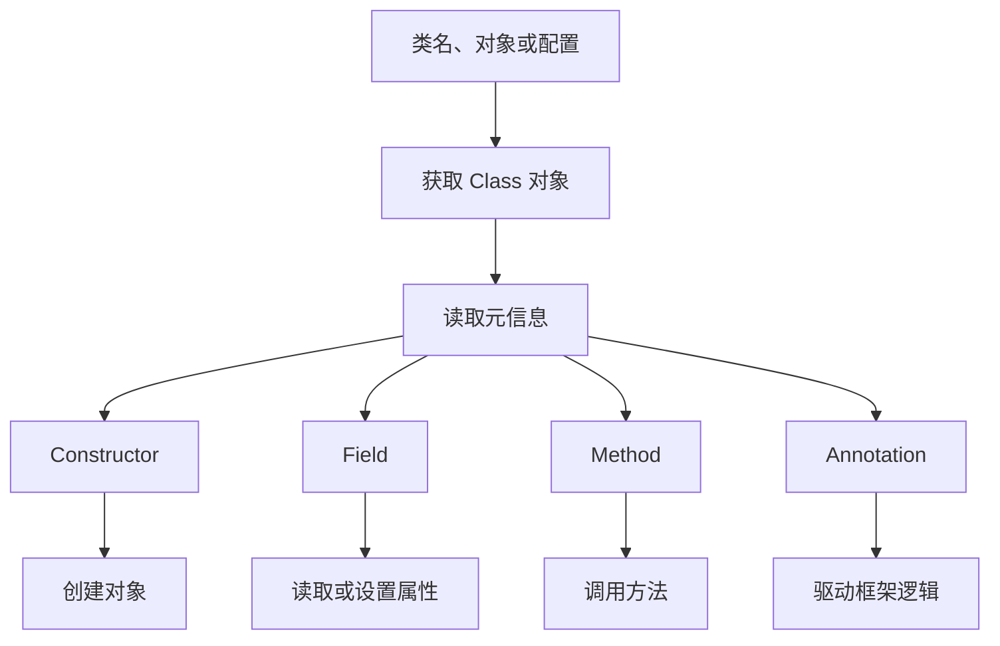

# Java 反射从 0 到精通

> 适合对象：已经学过 Java 基础语法、类与对象、继承、多态、接口、异常的学习者。  
> 建议 JDK：JDK 17 或 JDK 21。大多数 API 在 JDK 8 也可使用，但模块化、强封装、`trySetAccessible` 等内容以现代 JDK 为准。

## 目录

1. [反射是什么](#1-反射是什么)
2. [反射能做什么](#2-反射能做什么)
3. [Class 对象详解](#3-class-对象详解)
4. [获取类信息](#4-获取类信息)
5. [操作构造方法](#5-操作构造方法)
6. [操作字段](#6-操作字段)
7. [操作方法](#7-操作方法)
8. [访问控制与 setAccessible](#8-访问控制与-setaccessible)
9. [注解与反射](#9-注解与反射)
10. [泛型与反射](#10-泛型与反射)
11. [数组、枚举、内部类与代理](#11-数组枚举内部类与代理)
12. [动态代理](#12-动态代理)
13. [反射与框架原理](#13-反射与框架原理)
14. [性能、缓存与 MethodHandle](#14-性能缓存与-methodhandle)
15. [模块化时代的反射限制](#15-模块化时代的反射限制)
16. [常见异常与排查](#16-常见异常与排查)
17. [最佳实践](#17-最佳实践)
18. [综合实战：迷你 IoC 容器](#18-综合实战迷你-ioc-容器)
19. [学习路线与练习题](#19-学习路线与练习题)

---

## 1. 反射是什么

Java 反射是 Java 在运行期获取类信息、创建对象、访问字段、调用方法的一套机制。

平时我们这样写代码：

```java
User user = new User();
user.setName("Alice");
System.out.println(user.getName());
```

这是编译期就确定了类名、方法名、字段名的写法。

反射允许你在运行期这样做：

```java
Class<?> clazz = Class.forName("com.example.User");
Object user = clazz.getDeclaredConstructor().newInstance();

Method setName = clazz.getDeclaredMethod("setName", String.class);
setName.invoke(user, "Alice");

Method getName = clazz.getDeclaredMethod("getName");
System.out.println(getName.invoke(user));
```

也就是说，反射让程序具备了“观察和操作自身结构”的能力。

### 1.1 反射的核心对象

Java 反射主要围绕这些类展开，它们都在 `java.lang.reflect` 包中：

| 类型 | 作用 |
|---|---|
| `Class<?>` | 表示一个类、接口、数组、基本类型或 `void` |
| `Constructor<?>` | 表示构造方法 |
| `Field` | 表示字段 |
| `Method` | 表示方法 |
| `Parameter` | 表示方法或构造方法参数 |
| `Modifier` | 解析访问修饰符 |
| `Array` | 反射方式操作数组 |
| `Proxy` | 创建 JDK 动态代理类 |
| `InvocationHandler` | 处理动态代理的方法调用 |
| `AnnotatedElement` | 表示可读取注解的程序元素 |
| `Type` | 泛型类型体系的顶层接口 |

---

## 2. 反射能做什么

反射最常见的用途：

1. 运行期加载类。
2. 根据配置创建对象。
3. 访问对象属性。
4. 调用对象方法。
5. 读取注解。
6. 实现依赖注入。
7. 实现对象映射。
8. 实现 RPC、ORM、JSON 序列化、测试框架。
9. 创建动态代理。
10. 编写通用工具类。

典型框架中的反射：

| 框架 | 反射用途 |
|---|---|
| Spring | 扫描类、创建 Bean、注入字段、调用生命周期方法 |
| MyBatis | 根据结果集给对象字段赋值 |
| Jackson / Gson | Java 对象与 JSON 互转 |
| JUnit | 查找并执行 `@Test` 方法 |
| Hibernate | 对象与数据库表映射 |
| Dubbo / gRPC 周边框架 | 根据接口、方法名、参数类型进行远程调用 |

---

## 3. Class 对象详解

### 3.1 什么是 Class 对象

每一个被 JVM 加载的类型，都会有一个对应的 `Class` 对象。这个对象保存了类的元信息，比如类名、父类、接口、字段、方法、构造方法、注解等。

注意：`Class` 对象不是业务对象。

```java
User user = new User();      // 业务对象
Class<?> clazz = User.class; // 类型元信息对象
```

### 3.2 获取 Class 对象的 4 种方式

#### 方式一：类名.class

```java
Class<User> clazz = User.class;
```

特点：最安全、最快，编译期已知类型时优先使用。

#### 方式二：对象.getClass()

```java
User user = new User();
Class<?> clazz = user.getClass();
```

特点：已经有对象时使用。

#### 方式三：Class.forName()

```java
Class<?> clazz = Class.forName("com.example.User");
```

特点：适合配置化加载类，例如从配置文件读取类名。默认会触发类初始化。

#### 方式四：类加载器加载

```java
ClassLoader classLoader = Thread.currentThread().getContextClassLoader();
Class<?> clazz = classLoader.loadClass("com.example.User");
```

特点：通常只加载类，不主动初始化类。

### 3.3 Class.forName 与 ClassLoader.loadClass 的区别

| 对比项 | `Class.forName` | `ClassLoader.loadClass` |
|---|---|---|
| 是否初始化类 | 默认初始化 | 默认不初始化 |
| 常见场景 | JDBC 驱动加载、希望触发静态代码块 | 框架扫描、延迟初始化 |
| 可控性 | 有重载方法可指定是否初始化 | 更偏底层加载 |

示例：

```java
public class Demo {
    static {
        System.out.println("Demo initialized");
    }
}
```

```java
Class.forName("com.example.Demo"); // 会打印
```

```java
ClassLoader loader = Thread.currentThread().getContextClassLoader();
loader.loadClass("com.example.Demo"); // 通常不会打印
```

### 3.4 常见类型的 Class 对象

```java
System.out.println(String.class);
System.out.println(int.class);
System.out.println(void.class);
System.out.println(String[].class);
System.out.println(Runnable.class);
```

输出类似：

```text
class java.lang.String
int
void
class [Ljava.lang.String;
interface java.lang.Runnable
```

---

## 4. 获取类信息

准备一个测试类：

```java
package com.example.reflect;

import java.io.Serializable;

public class User extends Person implements Serializable {
    public static final String TYPE = "USER";

    private Long id;
    private String name;
    private int age;

    public User() {
    }

    private User(Long id) {
        this.id = id;
    }

    public User(Long id, String name, int age) {
        this.id = id;
        this.name = name;
        this.age = age;
    }

    public Long getId() {
        return id;
    }

    public void setId(Long id) {
        this.id = id;
    }

    public String getName() {
        return name;
    }

    public void setName(String name) {
        this.name = name;
    }

    private String secret() {
        return "secret:" + name;
    }
}
```

```java
package com.example.reflect;

public class Person {
    protected String identity;
}
```

### 4.1 获取类名

```java
Class<User> clazz = User.class;

System.out.println(clazz.getName());          // com.example.reflect.User
System.out.println(clazz.getSimpleName());    // User
System.out.println(clazz.getCanonicalName()); // com.example.reflect.User
System.out.println(clazz.getPackageName());   // com.example.reflect
```

### 4.2 获取父类和接口

```java
Class<?> superclass = clazz.getSuperclass();
System.out.println(superclass.getName());

Class<?>[] interfaces = clazz.getInterfaces();
for (Class<?> item : interfaces) {
    System.out.println(item.getName());
}
```

### 4.3 判断类型特征

```java
System.out.println(clazz.isInterface());
System.out.println(clazz.isEnum());
System.out.println(clazz.isAnnotation());
System.out.println(clazz.isArray());
System.out.println(clazz.isPrimitive());
System.out.println(clazz.isRecord());
```

### 4.4 获取修饰符

```java
int modifiers = clazz.getModifiers();

System.out.println(Modifier.isPublic(modifiers));
System.out.println(Modifier.isFinal(modifiers));
System.out.println(Modifier.isAbstract(modifiers));
System.out.println(Modifier.toString(modifiers));
```

### 4.5 getXxx 与 getDeclaredXxx 的区别

这是反射学习中最重要的区别之一。

| API | 含义 |
|---|---|
| `getFields()` | 获取 public 字段，包括父类继承来的 public 字段 |
| `getDeclaredFields()` | 获取当前类声明的所有字段，不包含父类字段 |
| `getMethods()` | 获取 public 方法，包括父类、接口继承来的 public 方法 |
| `getDeclaredMethods()` | 获取当前类声明的所有方法，不包含父类方法 |
| `getConstructors()` | 获取 public 构造方法 |
| `getDeclaredConstructors()` | 获取当前类声明的所有构造方法 |

示例：

```java
for (Field field : clazz.getFields()) {
    System.out.println(field.getName());
}

for (Field field : clazz.getDeclaredFields()) {
    System.out.println(field.getName());
}
```

结论：

- 想看“外部能访问什么”，用 `getFields()` / `getMethods()`。
- 想看“这个类自己定义了什么”，用 `getDeclaredFields()` / `getDeclaredMethods()`。
- 框架通常大量使用 `getDeclaredXxx()`。

---

## 5. 操作构造方法

### 5.1 获取无参构造方法并创建对象

```java
Class<User> clazz = User.class;

Constructor<User> constructor = clazz.getDeclaredConstructor();
User user = constructor.newInstance();
```

JDK 9 以后，不推荐使用：

```java
User user = clazz.newInstance();
```

原因是 `Class#newInstance()` 只能调用 public 无参构造，并且异常表达不够清晰。推荐使用 `getDeclaredConstructor().newInstance()`。

### 5.2 调用有参构造方法

```java
Constructor<User> constructor =
        User.class.getDeclaredConstructor(Long.class, String.class, int.class);

User user = constructor.newInstance(1L, "Alice", 18);
```

### 5.3 调用 private 构造方法

```java
Constructor<User> constructor = User.class.getDeclaredConstructor(Long.class);
constructor.setAccessible(true);

User user = constructor.newInstance(1L);
```

### 5.4 构造方法常用 API

```java
Constructor<?> constructor = User.class.getDeclaredConstructor(Long.class);

System.out.println(constructor.getName());
System.out.println(constructor.getParameterCount());
System.out.println(Arrays.toString(constructor.getParameterTypes()));
System.out.println(Modifier.toString(constructor.getModifiers()));
```

---

## 6. 操作字段

### 6.1 获取字段

```java
Field nameField = User.class.getDeclaredField("name");
System.out.println(nameField.getName());
System.out.println(nameField.getType());
System.out.println(Modifier.toString(nameField.getModifiers()));
```

### 6.2 给字段赋值

```java
User user = new User();

Field nameField = User.class.getDeclaredField("name");
nameField.setAccessible(true);
nameField.set(user, "Alice");

System.out.println(user.getName());
```

### 6.3 读取字段值

```java
Field nameField = User.class.getDeclaredField("name");
nameField.setAccessible(true);

Object value = nameField.get(user);
System.out.println(value);
```

### 6.4 操作基本类型字段

```java
Field ageField = User.class.getDeclaredField("age");
ageField.setAccessible(true);

ageField.setInt(user, 18);
int age = ageField.getInt(user);
```

常用基本类型方法：

```text
setInt / getInt
setLong / getLong
setBoolean / getBoolean
setDouble / getDouble
setFloat / getFloat
setShort / getShort
setByte / getByte
setChar / getChar
```

### 6.5 操作 static 字段

```java
Field typeField = User.class.getDeclaredField("TYPE");
Object value = typeField.get(null);
System.out.println(value);
```

读取或设置 static 字段时，对象参数可以传 `null`。

### 6.6 修改 final 字段要谨慎

反射修改 `final` 字段在现代 JDK 中有很多限制，并且可能因为编译器优化、JIT 优化导致行为不可靠。

结论：业务代码中不要依赖反射修改 `final` 字段。

---

## 7. 操作方法

### 7.1 获取方法

```java
Method method = User.class.getDeclaredMethod("setName", String.class);

System.out.println(method.getName());
System.out.println(method.getReturnType());
System.out.println(Arrays.toString(method.getParameterTypes()));
System.out.println(Modifier.toString(method.getModifiers()));
```

### 7.2 调用 public 方法

```java
User user = new User();

Method setName = User.class.getDeclaredMethod("setName", String.class);
setName.invoke(user, "Alice");

Method getName = User.class.getDeclaredMethod("getName");
Object result = getName.invoke(user);

System.out.println(result);
```

### 7.3 调用 private 方法

```java
User user = new User(1L, "Alice", 18);

Method secret = User.class.getDeclaredMethod("secret");
secret.setAccessible(true);

Object result = secret.invoke(user);
System.out.println(result);
```

### 7.4 调用 static 方法

```java
public class StringUtils {
    public static boolean isBlank(String value) {
        return value == null || value.trim().isEmpty();
    }
}
```

```java
Method method = StringUtils.class.getDeclaredMethod("isBlank", String.class);
Object result = method.invoke(null, "  ");
System.out.println(result);
```

调用 static 方法时，对象参数可以传 `null`。

### 7.5 可变参数方法

```java
public class Printer {
    public void print(String prefix, String... values) {
        System.out.println(prefix + Arrays.toString(values));
    }
}
```

```java
Printer printer = new Printer();
Method method = Printer.class.getDeclaredMethod("print", String.class, String[].class);

method.invoke(printer, "values=", new String[]{"A", "B"});
```

注意：反射调用可变参数方法时，最后一个参数本质上仍然是数组。

### 7.6 Method.invoke 的异常包装

被调用方法内部抛出的异常，会被包装成 `InvocationTargetException`。

```java
try {
    method.invoke(target);
} catch (InvocationTargetException e) {
    Throwable realException = e.getTargetException();
    realException.printStackTrace();
}
```

---

## 8. 访问控制与 setAccessible

### 8.1 为什么需要 setAccessible

Java 语言有访问控制：

- `public`
- `protected`
- package-private
- `private`

反射默认也遵守访问控制。要访问非 public 成员，通常需要：

```java
field.setAccessible(true);
method.setAccessible(true);
constructor.setAccessible(true);
```

### 8.2 AccessibleObject

`Field`、`Method`、`Constructor` 都继承自 `AccessibleObject`。

常用 API：

```java
member.setAccessible(true);
boolean ok = member.trySetAccessible();
boolean canAccess = member.canAccess(target);
```

### 8.3 setAccessible 不是万能的

在 JDK 9 模块化之后，强封装让某些包、某些模块中的私有成员不能随便反射访问。即使调用 `setAccessible(true)`，也可能抛出：

```text
java.lang.reflect.InaccessibleObjectException
```

例如尝试深度反射 JDK 内部类时很容易遇到。

### 8.4 什么时候不该用 setAccessible

不要为了绕开正常设计而滥用反射。例如：

- 业务代码强行改 private 字段。
- 跳过领域对象校验逻辑直接写字段。
- 修改 JDK 内部对象状态。
- 修改第三方库内部状态。

框架可以使用反射，但业务代码应尽量依赖清晰的公开 API。

---

## 9. 注解与反射

注解本身只是元数据。要让注解在运行期生效，通常需要反射读取注解并执行相应逻辑。

### 9.1 定义运行期注解

```java
import java.lang.annotation.ElementType;
import java.lang.annotation.Retention;
import java.lang.annotation.RetentionPolicy;
import java.lang.annotation.Target;

@Retention(RetentionPolicy.RUNTIME)
@Target(ElementType.TYPE)
public @interface Table {
    String value();
}
```

```java
@Retention(RetentionPolicy.RUNTIME)
@Target(ElementType.FIELD)
public @interface Column {
    String value();
}
```

### 9.2 使用注解

```java
@Table("t_user")
public class UserEntity {
    @Column("id")
    private Long id;

    @Column("user_name")
    private String name;
}
```

### 9.3 读取类注解

```java
Class<UserEntity> clazz = UserEntity.class;

Table table = clazz.getAnnotation(Table.class);
if (table != null) {
    System.out.println(table.value());
}
```

### 9.4 读取字段注解

```java
for (Field field : UserEntity.class.getDeclaredFields()) {
    Column column = field.getAnnotation(Column.class);
    if (column != null) {
        System.out.println(field.getName() + " -> " + column.value());
    }
}
```

### 9.5 注解保留策略

| 策略 | 含义 | 反射可读 |
|---|---|---|
| `SOURCE` | 只存在于源码中，编译后消失 | 否 |
| `CLASS` | 存在于 class 文件中，运行期默认不可读 | 否 |
| `RUNTIME` | 运行期可读 | 是 |

如果希望通过反射读取注解，必须使用：

```java
@Retention(RetentionPolicy.RUNTIME)
```

### 9.6 AnnotatedElement

这些元素都可以读取注解：

- `Class`
- `Field`
- `Method`
- `Constructor`
- `Parameter`
- `Package`

因为它们都实现了 `AnnotatedElement`。

---

## 10. 泛型与反射

### 10.1 泛型擦除

Java 泛型主要在编译期生效，运行期会发生类型擦除。

```java
List<String> names = new ArrayList<>();
List<Integer> ages = new ArrayList<>();

System.out.println(names.getClass() == ages.getClass()); // true
```

运行期它们的实际类型都是 `ArrayList`。

### 10.2 获取字段泛型

```java
public class Order {
    private List<String> tags;
    private Map<String, Integer> scores;
}
```

```java
Field field = Order.class.getDeclaredField("tags");
Type genericType = field.getGenericType();

if (genericType instanceof ParameterizedType parameterizedType) {
    Type[] arguments = parameterizedType.getActualTypeArguments();
    System.out.println(Arrays.toString(arguments)); // [class java.lang.String]
}
```

### 10.3 Type 体系

| 类型 | 含义 | 示例 |
|---|---|---|
| `Class` | 普通类或接口 | `String` |
| `ParameterizedType` | 参数化类型 | `List<String>` |
| `TypeVariable` | 类型变量 | `T` |
| `WildcardType` | 通配符类型 | `? extends Number` |
| `GenericArrayType` | 泛型数组 | `T[]` |

### 10.4 获取父类泛型

```java
public class BaseDao<T> {
}

public class UserDao extends BaseDao<User> {
}
```

```java
Type type = UserDao.class.getGenericSuperclass();

if (type instanceof ParameterizedType parameterizedType) {
    Type actualType = parameterizedType.getActualTypeArguments()[0];
    System.out.println(actualType); // class com.example.User
}
```

很多框架会通过这种方式推断实体类型。

### 10.5 获取方法泛型返回值

```java
public class UserService {
    public List<User> listUsers() {
        return List.of();
    }
}
```

```java
Method method = UserService.class.getDeclaredMethod("listUsers");
Type returnType = method.getGenericReturnType();

if (returnType instanceof ParameterizedType parameterizedType) {
    System.out.println(parameterizedType.getRawType());
    System.out.println(Arrays.toString(parameterizedType.getActualTypeArguments()));
}
```

---

## 11. 数组、枚举、内部类与代理

### 11.1 反射创建数组

```java
Object array = Array.newInstance(String.class, 3);

Array.set(array, 0, "A");
Array.set(array, 1, "B");
Array.set(array, 2, "C");

System.out.println(Array.get(array, 0));
System.out.println(Array.getLength(array));
```

转换为真实数组：

```java
String[] values = (String[]) array;
```

### 11.2 获取数组类型

```java
Class<?> arrayClass = String[].class;

System.out.println(arrayClass.isArray());
System.out.println(arrayClass.getComponentType()); // class java.lang.String
```

### 11.3 枚举反射

```java
public enum Status {
    ENABLED,
    DISABLED
}
```

```java
Class<Status> clazz = Status.class;

System.out.println(clazz.isEnum());

Status[] values = clazz.getEnumConstants();
System.out.println(Arrays.toString(values));
```

通过名称获取枚举：

```java
Status status = Enum.valueOf(Status.class, "ENABLED");
```

### 11.4 内部类反射

```java
public class Outer {
    public static class StaticInner {
    }

    public class Inner {
    }
}
```

```java
Class<?>[] classes = Outer.class.getDeclaredClasses();
for (Class<?> item : classes) {
    System.out.println(item.getName());
}
```

创建静态内部类：

```java
Class<?> clazz = Class.forName("com.example.Outer$StaticInner");
Object instance = clazz.getDeclaredConstructor().newInstance();
```

创建非静态内部类需要先有外部类实例：

```java
Outer outer = new Outer();
Class<?> clazz = Class.forName("com.example.Outer$Inner");
Object inner = clazz.getDeclaredConstructor(Outer.class).newInstance(outer);
```

---

## 12. 动态代理

动态代理是反射非常重要的高级应用。它可以在运行期创建一个实现了指定接口的代理对象，并把方法调用交给统一的处理器。

### 12.1 静态代理的问题

接口：

```java
public interface UserService {
    void createUser(String name);
}
```

实现类：

```java
public class UserServiceImpl implements UserService {
    @Override
    public void createUser(String name) {
        System.out.println("create user: " + name);
    }
}
```

静态代理：

```java
public class UserServiceProxy implements UserService {
    private final UserService target;

    public UserServiceProxy(UserService target) {
        this.target = target;
    }

    @Override
    public void createUser(String name) {
        System.out.println("before");
        target.createUser(name);
        System.out.println("after");
    }
}
```

问题：每个接口都要写一个代理类，重复代码太多。

### 12.2 JDK 动态代理

```java
import java.lang.reflect.InvocationHandler;
import java.lang.reflect.Method;
import java.lang.reflect.Proxy;

public class LoggingInvocationHandler implements InvocationHandler {
    private final Object target;

    public LoggingInvocationHandler(Object target) {
        this.target = target;
    }

    @Override
    public Object invoke(Object proxy, Method method, Object[] args) throws Throwable {
        System.out.println("before: " + method.getName());
        Object result = method.invoke(target, args);
        System.out.println("after: " + method.getName());
        return result;
    }
}
```

使用：

```java
UserService target = new UserServiceImpl();

UserService proxy = (UserService) Proxy.newProxyInstance(
        target.getClass().getClassLoader(),
        target.getClass().getInterfaces(),
        new LoggingInvocationHandler(target)
);

proxy.createUser("Alice");
```

### 12.3 JDK 动态代理的限制

JDK 动态代理基于接口。

如果目标类没有接口，不能直接用 JDK 动态代理代理该类。这时可以使用 CGLIB、Byte Buddy 等基于字节码生成的方案。

### 12.4 动态代理与 AOP

Spring AOP 的核心思想就是代理：

- 调用方法前执行增强逻辑。
- 调用方法后执行增强逻辑。
- 方法异常时执行增强逻辑。
- 控制是否继续调用目标方法。

事务管理就是典型例子：

```java
beginTransaction();
try {
    method.invoke(target, args);
    commit();
} catch (Exception e) {
    rollback();
    throw e;
}
```

---

## 13. 反射与框架原理

### 13.1 Spring Bean 创建的简化过程

真实 Spring 很复杂，但核心思路可以简化为：

```java
Class<?> clazz = Class.forName("com.example.UserService");
Object bean = clazz.getDeclaredConstructor().newInstance();
```

如果字段上有 `@Autowired`：

```java
for (Field field : clazz.getDeclaredFields()) {
    if (field.isAnnotationPresent(Autowired.class)) {
        Object dependency = getBean(field.getType());
        field.setAccessible(true);
        field.set(bean, dependency);
    }
}
```

### 13.2 JUnit 如何执行测试方法

```java
for (Method method : testClass.getDeclaredMethods()) {
    if (method.isAnnotationPresent(Test.class)) {
        Object instance = testClass.getDeclaredConstructor().newInstance();
        method.invoke(instance);
    }
}
```

### 13.3 JSON 框架如何序列化对象

```java
StringBuilder json = new StringBuilder("{");

for (Field field : object.getClass().getDeclaredFields()) {
    field.setAccessible(true);
    Object value = field.get(object);
    json.append("\"")
        .append(field.getName())
        .append("\":\"")
        .append(value)
        .append("\",");
}

json.deleteCharAt(json.length() - 1);
json.append("}");
```

真实框架还要处理：

- 空值。
- 数字、布尔、字符串转义。
- 嵌套对象。
- 集合数组。
- 日期时间。
- 循环引用。
- 字段命名策略。
- 注解配置。

### 13.4 ORM 如何做对象映射

假设查询结果是：

```text
id=1, user_name=Alice
```

实体类：

```java
public class UserEntity {
    private Long id;
    private String userName;
}
```

简化赋值：

```java
UserEntity user = UserEntity.class.getDeclaredConstructor().newInstance();

Field idField = UserEntity.class.getDeclaredField("id");
idField.setAccessible(true);
idField.set(user, 1L);

Field nameField = UserEntity.class.getDeclaredField("userName");
nameField.setAccessible(true);
nameField.set(user, "Alice");
```

---

## 14. 性能、缓存与 MethodHandle

### 14.1 反射性能为什么慢

反射通常比直接调用慢，原因包括：

- 运行期查找方法或字段。
- 访问权限检查。
- 参数装箱拆箱。
- `Method.invoke` 是通用调用入口。
- JIT 优化空间较小。

但要注意：绝大多数业务系统中，反射不是性能瓶颈。数据库、网络、IO 往往更慢。

### 14.2 缓存反射对象

错误示例：

```java
public Object getFieldValue(Object target, String fieldName) throws Exception {
    Field field = target.getClass().getDeclaredField(fieldName);
    field.setAccessible(true);
    return field.get(target);
}
```

如果频繁调用，每次都查找字段会浪费性能。

优化：

```java
private static final Map<String, Field> FIELD_CACHE = new ConcurrentHashMap<>();

public Object getFieldValue(Object target, String fieldName) throws Exception {
    Class<?> clazz = target.getClass();
    String key = clazz.getName() + "#" + fieldName;

    Field field = FIELD_CACHE.computeIfAbsent(key, ignored -> {
        try {
            Field item = clazz.getDeclaredField(fieldName);
            item.setAccessible(true);
            return item;
        } catch (NoSuchFieldException e) {
            throw new IllegalArgumentException(e);
        }
    });

    return field.get(target);
}
```

### 14.3 MethodHandle 简介

`MethodHandle` 是 `java.lang.invoke` 包提供的更底层、更灵活的方法调用机制，常用于高性能框架、动态语言支持、Lambda 实现等场景。

示例：

```java
import java.lang.invoke.MethodHandle;
import java.lang.invoke.MethodHandles;
import java.lang.invoke.MethodType;

public class MethodHandleDemo {
    public static void main(String[] args) throws Throwable {
        MethodHandles.Lookup lookup = MethodHandles.lookup();

        MethodHandle handle = lookup.findVirtual(
                String.class,
                "substring",
                MethodType.methodType(String.class, int.class, int.class)
        );

        String result = (String) handle.invoke("Hello", 1, 4);
        System.out.println(result); // ell
    }
}
```

### 14.4 反射、MethodHandle、直接调用的选择

| 方式 | 适合场景 |
|---|---|
| 直接调用 | 业务代码首选 |
| 反射 | 框架、工具、配置化场景 |
| `MethodHandle` | 高性能动态调用、底层框架 |
| 字节码生成 | AOP、ORM、RPC、序列化框架高性能路径 |

---

## 15. 模块化时代的反射限制

JDK 9 引入模块系统后，Java 对反射访问进行了更严格的限制。

### 15.1 常见报错

```text
java.lang.reflect.InaccessibleObjectException:
Unable to make field private final byte[] java.lang.String.value accessible
```

原因：你试图反射访问未开放模块中的非 public 成员。

### 15.2 exports 与 opens

模块描述文件：

```java
module com.example.app {
    exports com.example.api;
    opens com.example.domain;
}
```

区别：

| 关键字 | 含义 |
|---|---|
| `exports` | 允许其他模块在编译期和运行期访问 public 类型 |
| `opens` | 允许其他模块进行深反射访问 |

如果希望 Spring、Jackson 等框架反射访问某个包，可能需要 `opens`。

### 15.3 命令行开放模块

有时可以用 JVM 参数临时开放：

```bash
--add-opens java.base/java.lang=ALL-UNNAMED
```

这适合迁移期或调试，不建议长期作为业务系统设计依赖。

---

## 16. 常见异常与排查

### 16.1 ClassNotFoundException

```text
java.lang.ClassNotFoundException
```

原因：

- 类全限定名写错。
- 依赖没有加入 classpath。
- 类加载器不对。

排查：

```java
Class.forName("com.example.User");
```

确认包名和类名完整正确。

### 16.2 NoSuchMethodException

```text
java.lang.NoSuchMethodException
```

原因：

- 方法名写错。
- 参数类型不匹配。
- 基本类型和包装类型混淆。
- 查 public 方法却用了 private 方法。

示例：

```java
clazz.getDeclaredMethod("setAge", int.class);     // 正确
clazz.getDeclaredMethod("setAge", Integer.class); // 如果方法参数是 int，这里错误
```

### 16.3 NoSuchFieldException

```text
java.lang.NoSuchFieldException
```

原因：

- 字段名写错。
- 字段在父类中，但你调用了当前类的 `getDeclaredField`。

如果要查找包括父类在内的字段，可以自己递归：

```java
public static Field findField(Class<?> clazz, String fieldName) {
    Class<?> current = clazz;
    while (current != null) {
        try {
            return current.getDeclaredField(fieldName);
        } catch (NoSuchFieldException ignored) {
            current = current.getSuperclass();
        }
    }
    throw new IllegalArgumentException("No field: " + fieldName);
}
```

### 16.4 IllegalAccessException

```text
java.lang.IllegalAccessException
```

原因：没有访问权限。

解决：

```java
field.setAccessible(true);
method.setAccessible(true);
```

但在模块化限制下不一定成功。

### 16.5 InvocationTargetException

```text
java.lang.reflect.InvocationTargetException
```

原因：被调用的方法内部抛了异常。

正确处理：

```java
try {
    method.invoke(target);
} catch (InvocationTargetException e) {
    throw e.getTargetException();
}
```

### 16.6 InstantiationException

原因：

- 类是抽象类。
- 类是接口。
- 数组、基本类型、`void` 等不能正常实例化。
- 没有合适构造方法。

---

## 17. 最佳实践

### 17.1 能不用反射就不用反射

普通业务代码优先使用：

- 接口。
- 多态。
- 泛型。
- 设计模式。
- 明确的公开方法。

反射适合框架、工具、基础设施代码。

### 17.2 反射代码集中封装

不要在业务逻辑中到处写：

```java
field.setAccessible(true);
field.set(obj, value);
```

应该封装成工具类：

```java
public final class Reflects {
    private Reflects() {
    }

    public static Object getFieldValue(Object target, String fieldName) {
        try {
            Field field = findField(target.getClass(), fieldName);
            field.setAccessible(true);
            return field.get(target);
        } catch (ReflectiveOperationException e) {
            throw new IllegalStateException(e);
        }
    }

    private static Field findField(Class<?> clazz, String fieldName) throws NoSuchFieldException {
        Class<?> current = clazz;
        while (current != null) {
            try {
                return current.getDeclaredField(fieldName);
            } catch (NoSuchFieldException ignored) {
                current = current.getSuperclass();
            }
        }
        throw new NoSuchFieldException(fieldName);
    }
}
```

### 17.3 做好缓存

适合缓存：

- `Class`
- `Field`
- `Method`
- `Constructor`
- 注解解析结果
- 泛型解析结果

不建议缓存：

- 业务对象实例，除非你明确需要单例或对象池。

### 17.4 明确异常语义

不要简单吞掉异常：

```java
catch (Exception ignored) {
}
```

推荐转换成业务上能理解的异常：

```java
throw new IllegalStateException("Failed to set field: " + fieldName, e);
```

### 17.5 注意安全边界

反射能绕过封装，因此要注意：

- 不要反射执行用户任意输入的方法名。
- 不要从不可信配置中加载任意类。
- 不要把反射工具暴露给外部请求直接调用。
- 对类名、包名、方法名做白名单限制。

### 17.6 注意与 GraalVM Native Image 的兼容

GraalVM Native Image 会在构建期进行静态分析，反射目标可能需要配置。很多框架会通过 AOT 或配置文件声明反射元数据。

如果你写的框架大量使用反射，要考虑 Native Image 场景。

---

## 18. 综合实战：迷你 IoC 容器

目标：实现一个极简版容器，支持：

- `@Component` 标记组件。
- `@Autowired` 字段注入。
- 根据类型获取对象。

### 18.1 定义注解

```java
import java.lang.annotation.ElementType;
import java.lang.annotation.Retention;
import java.lang.annotation.RetentionPolicy;
import java.lang.annotation.Target;

@Retention(RetentionPolicy.RUNTIME)
@Target(ElementType.TYPE)
public @interface Component {
}
```

```java
import java.lang.annotation.ElementType;
import java.lang.annotation.Retention;
import java.lang.annotation.RetentionPolicy;
import java.lang.annotation.Target;

@Retention(RetentionPolicy.RUNTIME)
@Target(ElementType.FIELD)
public @interface Autowired {
}
```

### 18.2 创建业务类

```java
@Component
public class UserRepository {
    public String findNameById(Long id) {
        return "Alice";
    }
}
```

```java
@Component
public class UserService {
    @Autowired
    private UserRepository userRepository;

    public void printUser(Long id) {
        System.out.println(userRepository.findNameById(id));
    }
}
```

### 18.3 实现容器

为了聚焦反射，这里不做 classpath 扫描，手动传入类列表。

```java
import java.lang.reflect.Field;
import java.util.HashMap;
import java.util.List;
import java.util.Map;

public class MiniApplicationContext {
    private final Map<Class<?>, Object> beans = new HashMap<>();

    public MiniApplicationContext(List<Class<?>> classes) {
        createBeans(classes);
        injectFields();
    }

    private void createBeans(List<Class<?>> classes) {
        for (Class<?> clazz : classes) {
            if (!clazz.isAnnotationPresent(Component.class)) {
                continue;
            }

            try {
                Object bean = clazz.getDeclaredConstructor().newInstance();
                beans.put(clazz, bean);
            } catch (ReflectiveOperationException e) {
                throw new IllegalStateException("Failed to create bean: " + clazz.getName(), e);
            }
        }
    }

    private void injectFields() {
        for (Object bean : beans.values()) {
            Class<?> clazz = bean.getClass();

            for (Field field : clazz.getDeclaredFields()) {
                if (!field.isAnnotationPresent(Autowired.class)) {
                    continue;
                }

                Object dependency = beans.get(field.getType());
                if (dependency == null) {
                    throw new IllegalStateException("No bean found for field: " + field);
                }

                try {
                    field.setAccessible(true);
                    field.set(bean, dependency);
                } catch (IllegalAccessException e) {
                    throw new IllegalStateException("Failed to inject field: " + field, e);
                }
            }
        }
    }

    public <T> T getBean(Class<T> type) {
        Object bean = beans.get(type);
        if (bean == null) {
            throw new IllegalArgumentException("No bean found: " + type.getName());
        }
        return type.cast(bean);
    }
}
```

### 18.4 测试容器

```java
import java.util.List;

public class Main {
    public static void main(String[] args) {
        MiniApplicationContext context = new MiniApplicationContext(List.of(
                UserRepository.class,
                UserService.class
        ));

        UserService userService = context.getBean(UserService.class);
        userService.printUser(1L);
    }
}
```

输出：

```text
Alice
```

### 18.5 这个容器还缺什么

真实框架还会处理：

- 包扫描。
- 接口与实现类匹配。
- 构造器注入。
- Setter 注入。
- Bean 名称。
- 单例与原型作用域。
- 循环依赖。
- 生命周期回调。
- 条件装配。
- AOP 代理。
- 配置属性绑定。

但你已经掌握了最核心的反射思路：扫描元数据、创建对象、写入依赖、调用方法。

---

## 19. 学习路线与练习题

### 19.1 入门阶段

目标：知道反射是什么，会获取类、字段、方法、构造方法。

练习：

1. 写一个 `Student` 类，用反射创建对象。
2. 用反射给 `private String name` 赋值。
3. 用反射调用 `private void study()`。
4. 打印一个类的所有字段和方法。

### 19.2 进阶阶段

目标：能读取注解、解析泛型、封装工具类。

练习：

1. 自定义 `@Column` 注解，打印字段和数据库列名映射。
2. 写一个对象转 `Map<String, Object>` 的工具。
3. 写一个 `Map<String, Object>` 转对象的工具。
4. 解析 `List<String>` 字段中的泛型类型。
5. 查找父类中的私有字段。

### 19.3 高级阶段

目标：理解框架原理，能写小型框架功能。

练习：

1. 实现本文中的迷你 IoC 容器。
2. 给迷你 IoC 容器增加接口注入能力。
3. 给迷你 IoC 容器增加 `@BeanName`。
4. 用 JDK 动态代理实现日志增强。
5. 用注解实现一个简单的测试框架，自动执行 `@Test` 方法。

### 19.4 精通阶段

目标：理解反射边界、性能和现代 Java 限制。

练习：

1. 对比直接调用、反射调用、缓存 Method 后调用的性能。
2. 学习 `MethodHandle` 并替换一处反射调用。
3. 在 JDK 17 或 JDK 21 中尝试反射访问 `String.value`，观察异常。
4. 理解 `opens` 与 `exports` 的区别。
5. 阅读 Spring 或 Jackson 中一段反射相关源码。

---

## 附录 A：常用 API 速查

### Class

```java
Class.forName(String className)
clazz.getName()
clazz.getSimpleName()
clazz.getPackageName()
clazz.getSuperclass()
clazz.getInterfaces()
clazz.getModifiers()
clazz.isInterface()
clazz.isEnum()
clazz.isArray()
clazz.isPrimitive()
clazz.isAnnotation()
clazz.getDeclaredFields()
clazz.getDeclaredMethods()
clazz.getDeclaredConstructors()
clazz.getAnnotation(Class<A> annotationClass)
clazz.isAnnotationPresent(Class<? extends Annotation> annotationClass)
```

### Constructor

```java
clazz.getDeclaredConstructor(Class<?>... parameterTypes)
constructor.newInstance(Object... initargs)
constructor.getParameterTypes()
constructor.getParameterCount()
constructor.setAccessible(true)
```

### Field

```java
clazz.getDeclaredField(String name)
field.getName()
field.getType()
field.getGenericType()
field.getModifiers()
field.get(Object target)
field.set(Object target, Object value)
field.setAccessible(true)
field.getAnnotation(Class<A> annotationClass)
```

### Method

```java
clazz.getDeclaredMethod(String name, Class<?>... parameterTypes)
method.getName()
method.getReturnType()
method.getGenericReturnType()
method.getParameterTypes()
method.getGenericParameterTypes()
method.getExceptionTypes()
method.invoke(Object target, Object... args)
method.setAccessible(true)
method.getAnnotation(Class<A> annotationClass)
```

### Modifier

```java
Modifier.isPublic(modifiers)
Modifier.isPrivate(modifiers)
Modifier.isProtected(modifiers)
Modifier.isStatic(modifiers)
Modifier.isFinal(modifiers)
Modifier.isAbstract(modifiers)
Modifier.toString(modifiers)
```

---

## 附录 B：一张图理解反射



---

## 附录 C：一句话总结

反射不是为了替代正常面向对象编程，而是为了在运行期处理“编译期不知道的类、字段、方法和注解”。当你理解了 `Class`、`Constructor`、`Field`、`Method`、`Annotation`、`Proxy` 这几个核心点，就已经掌握了 Java 反射的主干。
