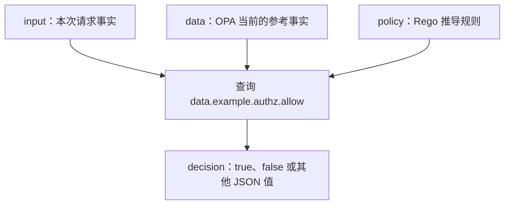
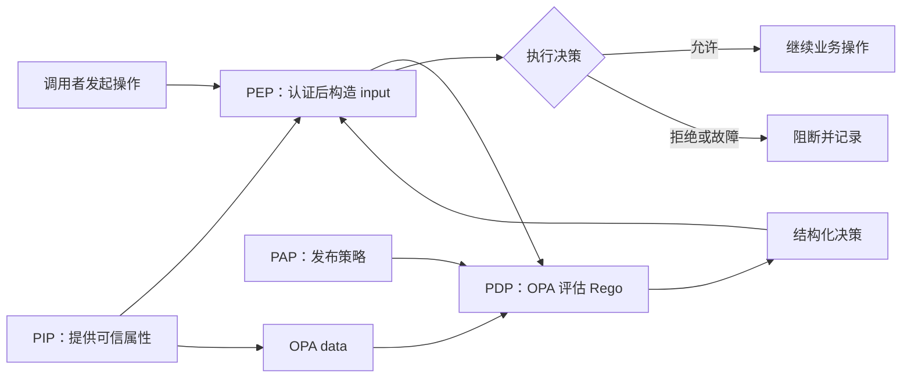
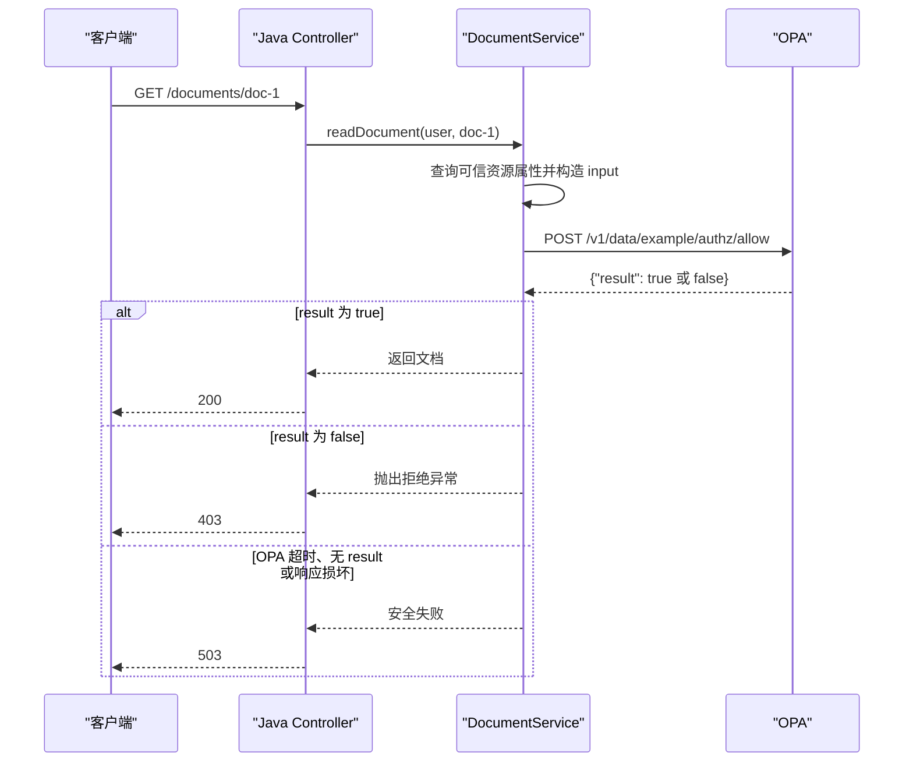
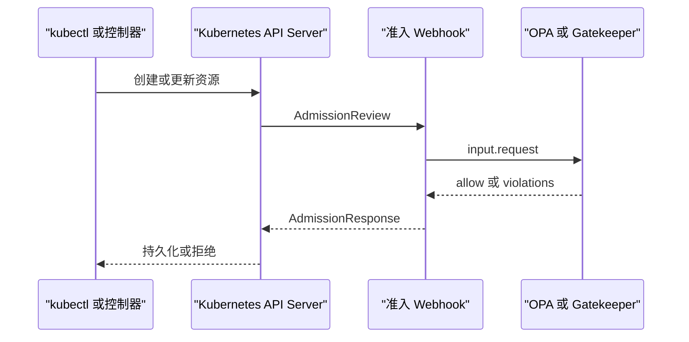
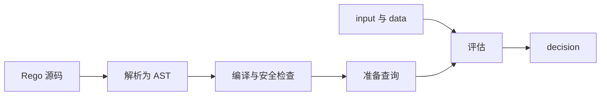

# Open Policy Agent（OPA）知识体系

> 本文面向掌握 Java 基础语法、刚开始接触 Spring Boot 和权限设计的读者，同时兼顾面试理解与生产落地。前五章只要求读者能阅读 Java 类、方法、JSON 和基本 HTTP 请求，不要求 Go 或 Kubernetes 经验。Rego 示例采用 v1 语法，Java 主线以 Java 17 和 Spring Boot 4.x 为基线，并单独标明 Spring Boot 3.2–3.5 的差异。版本敏感内容已按 2026-08-12 的 OPA 与 Spring 官方文档核验；实际项目仍应锁定工具与依赖版本，并以对应版本的文档和 `opa <command> --help` 为准。

## 1 从一次文档读取理解策略决策

### 1.1 先看要解决的业务问题

假设 Java 服务要读取文档 `doc-1`。当前用户 Alice 具有 `reader` 角色，属于 `tenant-a`；目标文档也属于 `tenant-a`。系统需要对下面的请求给出可观察结果：

```text
主体：alice / reader / tenant-a
动作：read
资源：doc-1 / document / tenant-a
期望决策：允许
```

若把资源租户改成 `tenant-b`，期望决策应变为拒绝。第 2 章会把这组事实交给 OPA（Open Policy Agent，开放策略代理），用 Rego 规则得到 `true` 和 `false`。先看见这两个结果，再学习策略角色、文档模型和语言语义。

Java 业务系统经常使用 `if (user.isAdmin())`、`@PreAuthorize(...)` 或 Service 中的租户比较完成这类判断。少量且稳定的规则直接写在应用中更易维护。当多个服务或语言需要共享规则、策略需独立审计发布、或资源属性组合快速增长时，OPA 可以把“如何决定”从“如何执行业务”中分离出来。

### 1.2 按可验证结果分阶段学习

| 阶段 | 阅读范围 | 学习目标 | 成功判据 |
| --- | --- | --- | --- |
| 最小闭环 | 第 1–2 章 | 建立“事实、规则、查询、决策”的联系 | 能通过改变租户得到 `true` 与 `false` |
| Rego 与工程基础 | 第 3–4 章 | 理解文档、规则、未定义与测试 | 格式、编译、Schema 类型检查和策略测试全部通过 |
| Java 接入 | 第 5 章 | 让 Spring Boot 调用 OPA 并执行决策 | 允许请求返回 200，跨租户请求返回 403，OPA 故障时不放行 |
| 生产治理 | 第 6–9 章 | 管理发布、安全、性能与故障 | 能通过 revision、Status、Decision Logs 和指标证明生效版本及故障影响 |
| 复盘与落地 | 第 10–12 章 | 用决策链说明设计取舍并完成上线验收 | 能解释决策边界，并独立检查一份策略发布方案 |

第一次阅读可以在完成第 5 章后暂停；当项目开始使用 Bundle 发布、多副本 OPA 或参考数据同步时，再进入第 6–9 章。

### 1.3 判断 OPA 是否适合当前系统

OPA 适合策略需跨服务或跨语言复用、规则发布周期与应用不同、审计与回滚要求高，或判断同时依赖主体、资源与环境属性的场景。这些收益会带来新的策略语言、发布链路、输入契约、可观测性和运行时依赖。

对只有少数固定角色的单体应用，Spring Security 或应用内部权限库通常路径更短。如果决策必须在每次请求中同步查询多个业务系统，应先重新设计输入与参考数据的获取方式；OPA 评估阶段适合基于已提供的结构化事实计算决策。

## 2 从零完成第一个策略闭环

### 2.1 前置条件与安装验证

从 OPA 官方发布页或操作系统可信包管理器安装 `opa`。不要在生产脚本中无校验地执行来自网络的二进制文件。

```bash
opa version
```

成功判据是命令退出码为 `0`，并输出版本、构建提交和平台信息。若提示 `command not found`，应检查二进制是否可执行以及所在目录是否进入 `PATH`（Path，命令搜索路径）。

### 2.2 定义输入和授权策略

假设目标规则是：管理员可以执行任意操作；普通用户只能读取自己所属租户中的文档。

创建 `input.json`：

```json
{
  "subject": {
    "id": "alice",
    "roles": ["reader"],
    "tenant": "tenant-a"
  },
  "action": "read",
  "resource": {
    "type": "document",
    "tenant": "tenant-a",
    "owner": "bob"
  }
}
```

创建 `authz.rego`：

```rego
package example.authz

import rego.v1

default allow := false

allow if {
    "admin" in input.subject.roles
}

allow if {
    "reader" in input.subject.roles
    input.action == "read"
    input.resource.type == "document"
    input.subject.tenant == input.resource.tenant
}
```

这里的查询路径是 `data.example.authz.allow`。`package example.authz` 决定虚拟文档在 `data` 下的位置；两个同名 `allow` 规则表达逻辑“或”；同一个规则体内的表达式表达逻辑“且”。`default allow := false` 使没有规则匹配时得到明确的 `false`，形成默认拒绝。

### 2.3 执行查询并验证结果

```bash
opa eval \
  --data authz.rego \
  --input input.json \
  --format pretty \
  'data.example.authz.allow'
```

预期结果为：

```text
true
```

然后把 `input.json` 中资源租户改为 `tenant-b`，再次执行应得到 `false`。这两个用例共同验证正常路径和拒绝路径；“命令没有报错”只能证明评估完成，不能证明业务策略正确。

### 2.4 观察未定义与 false 的区别

执行一个不存在的查询：

```bash
opa eval --data authz.rego --input input.json --format pretty \
  'data.example.authz.missing'
```

查询可能得到 `undefined`，它与 JSON 的 `false`、`null` 和空集合都不同。若调用方把未定义误当成允许，便会造成绕过。因此入口决策通常需要确定的默认值，调用方作为策略执行点（Policy Enforcement Point，PEP）也应校验返回值的类型和完整性。

## 3 Rego 核心语义与数据建模

### 3.1 从第一次评估回看四类数据

第 2 章的命令包含四个必要对象，它们的来源、生命周期和输出不同：

1\. `input`：单次请求提供的临时事实，例如当前用户、动作和目标资源。每次评估都可以有不同的 `input`。

2\. `data`：OPA 已加载的基础文档与虚拟文档。基础文档通常来自 JSON、YAML 或 Bundle；虚拟文档由 Rego 规则推导。

3\. `policy`：Rego 模块，定义如何从 `input` 和 `data` 推导结果。`authz.rego` 就是第一份策略模块。

4\. `decision`：查询某个文档路径后得到的 JSON 可序列化值。它可以是布尔值、对象、集合、数组或字符串。



`input` 属于一次评估，`data` 属于 OPA 当前内存状态。请求专属且高频变化的事实适合放入 `input`；由权威来源管理、可接受一定同步延迟的共享参考信息适合放入 `data`。时效性超出业务容忍范围的数据不应仅依赖异步 Bundle 同步。

### 3.2 决策链中的角色与职责边界

OPA 是通用策略引擎。应用把待判断的结构化事实交给 OPA，OPA 使用 Rego 与参考数据计算决策；调用方负责执行放行、拒绝、告警或修改。这条链路中常用四个角色定位责任：

| 角色 | 全称 | 职责 | OPA 场景中的例子 |
| --- | --- | --- | --- |
| 策略执行点（PEP） | Policy Enforcement Point | 拦截操作、调用决策、执行结果 | API 网关、Java 业务服务、Kubernetes API Server |
| 策略决策点（PDP） | Policy Decision Point | 根据事实和策略计算结果 | OPA 进程或嵌入式 OPA |
| 策略管理点（PAP） | Policy Administration Point | 编写、审核与发布策略 | Git 仓库、CI/CD（Continuous Integration/Continuous Delivery，持续集成/持续交付）流水线、Bundle 服务 |
| 策略信息点（PIP） | Policy Information Point | 提供主体、资源和组织属性 | 身份服务、资产目录、同步到 OPA 的参考数据 |



OPA 不替应用完成鉴权拦截，也不自动提供用户认证、策略审批、策略存储或业务属性的实时查询。例如 OPA 返回 `false` 后，Java Service 仍然继续返回文档，问题出在 PEP 没有执行决策，而不是 Rego 没有给出结果。

### 3.3 Rego 是声明式查询语言

Rego 受 Datalog 启发，面向 JSON 等层级数据。策略作者描述“哪些条件成立时能推导出什么”，而不是编写逐行修改状态的命令。规则求值没有依赖源码书写顺序的业务控制流，不应把规则体当作普通命令式程序理解。

### 3.4 包、模块、规则与文档

一个 `.rego` 文件是模块；模块通过 `package` 放入逻辑命名空间；规则产生虚拟文档。多个文件可以属于同一个包，但团队应避免同名规则的无意组合。

```rego
package catalog.visibility

import rego.v1

default decision := {
    "allow": false,
    "reason_codes": ["DEFAULT_DENY"],
    "scope": null,
    "contract_version": "v1"
}

decision := {
    "allow": true,
    "reason_codes": [],
    "scope": input.subject.tenant,
    "contract_version": "v1"
} if {
    input.action == "list"
    input.subject.tenant != ""
}
```

比起只返回布尔值，结构化决策可以携带原因、过滤范围和契约版本。允许与拒绝分支都返回相同字段，PEP 才能做确定的类型校验；调用双方还要固定字段含义，避免 PEP 猜测策略结果。

本文显式保留 `import rego.v1`，便于读者识别这些模块采用 v1 语义，也方便策略被较新的 OPA v0 版本读取。对 OPA 1.x 来说，`if`、`in`、`contains` 和 `every` 已是默认语法，`import rego.v1` 不再是必需条件；它仍是合法写法。不要把 `import rego.v1` 误解为下载依赖。

### 3.5 完整规则、集合规则与对象规则

完整规则为路径计算一个值：

```rego
default max_results := 20

max_results := 100 if {
    "premium" in input.subject.plans
}
```

集合规则收集所有满足条件的值：

```rego
deny contains message if {
    input.resource.public
    input.resource.classification == "secret"
    message := "secret resource cannot be public"
}
```

对象规则可按键生成值：

```rego
headers["x-tenant-id"] := input.subject.tenant if {
    input.subject.tenant != ""
}
```

集合适合表达多个违规项；布尔 `allow` 适合快速授权；对象决策适合需要原因、约束和上下文的生产接口。

### 3.6 增量定义、完整规则冲突与求值顺序

同名规则可以分成多个增量定义。第 2 章的两个布尔 `allow` 规则都只能产生 `true`，因此可以按“管理员路径或读者路径成立”理解。集合规则则会合并每个定义产生的元素。

完整规则的同一文档在一次评估中只能有一个值。如果多个定义同时匹配并产生不同值，OPA 会返回冲突错误，不会根据源码顺序随意选一个：

```rego
max_results := 100 if {
    "premium" in input.subject.plans
}

max_results := 20 if {
    input.resource.classification == "internal"
}
```

如果某个 premium 用户同时请求 internal 资源，两个规则分别产生 `100` 和 `20`，评估将失败。正确建模方式取决于业务语义：可以使各分支生成同一布尔值，可以收集到集合后再明确选择，也可以在确实需要优先级时使用 `else`。

`else` 链按书写顺序评估，首个匹配分支产生结果后停止后续分支。它适合从顺序敏感系统迁移的少数场景，大量使用会让规则形成紧耦合控制流。`default` 只在所有同名完整规则都未产生值时作为回退，不会解决已经发生的多值冲突。

### 3.7 变量、统一与迭代

`:=` 用于赋值，`==` 用于比较，`=` 表示统一。统一会寻找使两边相等的变量绑定，能力强但也更容易令初学者误读。业务策略中可以优先使用意图清晰的 `:=` 与 `==`。

```rego
trusted_image if {
    some image in input.images
    startswith(image, "registry.example.com/")
}
```

执行过程为：`some image in input.images` 逐一绑定候选镜像；内置函数 `startswith` 检查前缀；至少一个候选满足时，`trusted_image` 成立。

### 3.8 否定、未定义与安全变量

`not expression` 表示无法证明表达式成立，而不是传统意义上对某个布尔值直接取反。表达式中使用的变量必须先在肯定表达式中得到安全绑定。

```rego
deny contains "MFA is required" if {
    input.action == "delete"
    not input.subject.mfa_verified
}
```

这个例子存在数据语义风险：字段缺失和字段为 `false` 都会触发拒绝，也许符合默认拒绝目标，但必须由输入契约明确规定。若业务必须区分“缺失”和“显式 false”，应先检查键是否存在或在 PEP 完成输入校验。

### 3.9 数组、集合与对象的选择

| 类型 | 特点 | 适用场景 | 常见代价 |
| --- | --- | --- | --- |
| 数组 | 有序、允许重复、按下标访问 | 展示顺序、请求原始列表 | 按值搜索通常需要遍历 |
| 集合 | 无序、去重、成员判断自然 | 权限、违规项、标签集合 | JSON 输出顺序不应作为契约 |
| 对象 | 键到值的映射 | 按唯一标识索引实体 | 必须设计稳定且唯一的键 |

如果每个实体都有唯一 ID（Identifier，标识符）且策略经常按 ID 查找，优先把参考数据建模为对象，避免每次扫描大数组。

### 3.10 推导式与 every

推导式用于从已有数据构造新数组、集合或对象：

```rego
violating_ports := [port |
    some port in input.ports
    port < 1024
]
```

`every` 用于表达“所有元素都满足”：

```rego
all_images_trusted if {
    every image in input.images {
        startswith(image, "registry.example.com/")
    }
}
```

需要注意空集合上的“全称条件”通常成立。如果业务要求至少有一个镜像，应额外检查 `count(input.images) > 0`。

### 3.11 函数与内置函数

```rego
is_owner(subject, resource) if {
    subject.id == resource.owner
    subject.tenant == resource.tenant
}
```

自定义函数适合封装稳定、可复用的判断，但不要把策略拆成过度细碎的调用链。字符串、时间、JWT（JSON Web Token）、正则表达式、集合和对象操作可使用内置函数；具体签名与可用于 WebAssembly 的范围应查询当前内置函数参考。

### 3.12 with：局部替换评估上下文

`with` 常用于测试时临时替换 `input`、`data` 或函数：

```rego
test_admin_allowed if {
    allow with input as {
        "subject": {"roles": ["admin"]}
    }
}
```

替换只在相关表达式的评估范围内生效，不会永久修改 OPA 存储。生产策略中过度使用 `with` 会增加理解和优化难度，应优先让数据依赖显式。

### 3.13 默认拒绝与决策契约

授权策略推荐 fail closed，即异常或信息不足时拒绝。一个更完整的契约可以是：

```json
{
  "allow": false,
  "reason_codes": ["TENANT_MISMATCH"],
  "contract_version": "v1",
  "obligations": []
}
```

PEP 应验证 HTTP 状态、响应体是否存在、字段类型和版本是否符合预期；不得把超时、空响应、`undefined` 或解析失败转换成允许。若可用性要求必须 fail open，应由风险所有者明确批准，限制资源和操作范围，并建立告警。

## 4 策略工程：格式化、测试、调试与质量门禁

### 4.1 格式化与语法检查

```bash
opa fmt --fail --diff .
opa check --strict .
```

`opa fmt --fail --diff` 不改文件：发现格式变化时输出差异并返回非零退出码。`opa check --strict` 执行解析、编译和严格模式检查。流水线应以两个命令的退出码为成功判据。`opa fmt` 的 `--check-result` 只检查格式化结果能否解析，不等于“检查文件是否已经格式化”。

若要自动格式化：

```bash
opa fmt -w .
```

此命令会改写文件，适合本地或明确允许自动修改的流水线阶段。升级 OPA 后应单独审查格式和语义变化。

### 4.2 用 JSON Schema 增强策略静态类型检查

Rego 可以查询形状灵活的 JSON，但字段拼错也可能只表现为规则未匹配。例如策略误写为 `input.subject.role`，而 Java 实际发送 `roles`，默认拒绝会阻止越权，却可能把发布错误带到生产。

可以用 JSON Schema 向 Rego 类型检查器提供 `input` 的预期形状。当 `--schema` 指向单个 Schema 文件时，OPA 会把它作为所有包的全局 `input` Schema：

```bash
opa check --strict \
  --schema contracts/input.schema.json \
  policy/

opa test \
  --schema contracts/input.schema.json \
  policy/
```

如果不同包使用不同输入，可以向 `--schema` 传入 Schema 目录，并通过 `# METADATA` 注解把包、文档或规则关联到对应 Schema。注解引用的 Schema 只有在命令实际传入 `--schema` 时才会参与类型检查。

这项能力用于提高策略的静态类型精度，不会自动验证每次运行时 `input` 是否完全符合 Schema。Java PEP 仍应在调用 OPA 前完成必要的非空、枚举、长度与结构校验，Rego 则继续检查影响授权的安全不变量。

### 4.3 编写单元测试

`authz_test.rego`：

```rego
package example.authz_test

import rego.v1

import data.example.authz.allow

test_reader_in_same_tenant_allowed if {
    allow with input as {
        "subject": {"roles": ["reader"], "tenant": "tenant-a"},
        "action": "read",
        "resource": {"type": "document", "tenant": "tenant-a"}
    }
}

test_cross_tenant_reader_denied if {
    not allow with input as {
        "subject": {"roles": ["reader"], "tenant": "tenant-a"},
        "action": "read",
        "resource": {"type": "document", "tenant": "tenant-b"}
    }
}
```

运行：

```bash
opa test . -v
```

成功判据是退出码为 `0` 且测试全部通过。测试至少覆盖允许、拒绝、字段缺失、空值、未知动作、租户边界和数据类型错误。拒绝测试不能只证明“某个表达式没匹配”，还要证明入口决策确实返回预期的拒绝值。

### 4.4 覆盖率与测试边界

```bash
opa test . --coverage --threshold 85
```

`--coverage` 计算规则覆盖率，`--threshold 85` 在覆盖率低于 85% 时直接返回非零退出码，因此 CI 可以直接以命令退出码作为门禁。团队若还需要趋势报表或按包分析，可以保存 JSON 输出，但不需要重复实现阈值判定。

覆盖率能发现从未执行的规则，但高覆盖率不代表策略正确。同一行规则可以被错误样例执行，却仍然遗漏关键业务组合。还需要契约测试验证 PEP 构造的真实 `input`，集成测试验证网络和故障行为，端到端测试验证拒绝是否真的阻断了业务副作用。

### 4.5 使用 explain 与 trace 排查

```bash
opa eval \
  --data authz.rego \
  --input input.json \
  --explain notes \
  'data.example.authz.allow'
```

当需要更详细信息时可使用其他 `--explain` 模式，并结合 `trace()` 临时输出诊断。生产策略不应长期保留包含身份、令牌或敏感资源信息的调试输出。

排查顺序建议为：

1\. 确认查询的完整路径是否正确。

2\. 打印或保存脱敏后的真实 `input`，核对字段名、类型和嵌套层级。

3\. 确认加载了正确的策略与数据 revision。

4\. 通过 `opa eval` 复现，再观察解释信息。

5\. 为故障添加回归测试，而不是只修当前样例。

### 4.6 静态分析与团队规则

除 OPA 自带检查外，可采用 Regal 等 Rego 静态分析工具发现惯用法、可维护性和潜在错误。工具版本与规则集应锁定在仓库中；升级时审查新增诊断，避免开发机与流水线行为漂移。

### 4.7 CI/CD 质量门禁


策略变更应像应用代码一样经过代码审查。高风险策略可要求安全团队或资源所有者共同审批，并用测试数据说明变更前后的决策差异。

## 5 Java 与 Spring Boot 完整接入教程

### 5.1 本章目标与前置知识

本章完成一个最小但完整的授权链路：Java Controller 接收“读取文档”请求，Service 根据可信用户信息和资源信息构造 OPA 输入，HTTP 客户端调用 OPA；只有决策为 `true` 时才执行读取。

你需要具备以下基础：

1\. 能阅读 Java `record`、构造器、方法调用和异常。

2\. 知道 JSON 对象会映射为 Java 对象。

3\. 能运行 Maven 和 Spring Boot 项目。

4\. 已完成第 2 章，手边有同一份 `authz.rego`。

本章的可运行主线使用 Java 17、Spring Boot 4.x 和同步 `RestClient`。`RestClient` 从 Spring Framework 6.1 开始提供，Spring Boot 从 3.2 开始自动配置 prototype 作用域的 `RestClient.Builder`，因此 3.2–3.5 项目也能使用本章的 Java 调用代码，但第 5.4 节的全局 HTTP 属性不能直接照搬。新项目可通过 [Spring Initializr](https://start.spring.io/) 生成，选择组织已验证的 Spring Boot 版本、Maven、Java 17 或更高长期支持版本，并加入 Spring Web 依赖。复制配置前先核对项目锁定版本的官方参考。

### 5.2 先理解 Java 与 OPA 的职责边界



Java 是 PEP（Policy Enforcement Point，策略执行点）：它决定何时询问 OPA，并真正阻止业务方法继续执行。OPA 是 PDP（Policy Decision Point，策略决策点）：它只回答策略结果。调用 OPA 后不检查结果，或者拒绝后仍然查询数据库返回数据，都等于没有完成授权。

### 5.3 创建项目与目录

生成项目时使用如下元数据即可：

| 项目项 | 示例值 |
| --- | --- |
| Group | `com.example` |
| Artifact | `opa-java-demo` |
| Packaging | Jar |
| Java | 17 或更高 |
| Dependency | Spring Web |

生成的 `pom.xml` 至少应包含 Web 与测试 starter。Spring Initializr 会在 parent 或插件管理中写入所选 Spring Boot 版本，因此下面不重复硬编码版本：

```xml
<dependencies>
    <dependency>
        <groupId>org.springframework.boot</groupId>
        <artifactId>spring-boot-starter-web</artifactId>
    </dependency>

    <dependency>
        <groupId>org.springframework.boot</groupId>
        <artifactId>spring-boot-starter-test</artifactId>
        <scope>test</scope>
    </dependency>
</dependencies>
```

生成项目后先运行：

```bash
./mvnw test
```

成功判据是 Maven 退出码为 `0`。若错误信息显示 Java release 不匹配，先执行 `java -version` 和 `./mvnw -version`：后者显示的 Java 才是 Maven 实际使用的运行时。仅在集成开发环境中切换项目 SDK（Software Development Kit，软件开发工具包），不一定会改变终端 Maven 的 Java。

核心目录如下：

```text
opa-java-demo/
├── pom.xml
├── policy/
│   └── authz.rego
└── src/
    ├── main/
    │   ├── java/com/example/opademo/
    │   │   ├── OpaJavaDemoApplication.java
    │   │   ├── authz/
    │   │   │   ├── AuthorizationInput.java
    │   │   │   ├── OpaClient.java
    │   │   │   ├── OpaDecisionException.java
    │   │   │   ├── OpaRequest.java
    │   │   │   └── OpaResponse.java
    │   │   └── document/
    │   │       ├── DocumentController.java
    │   │       └── DocumentService.java
    │   └── resources/
    │       └── application.yml
    └── test/
        └── java/com/example/opademo/authz/
            └── OpaClientTest.java
```

策略放在独立的 `policy` 目录，是因为本教程让 OPA 作为单独进程加载策略，而不是让 Spring Boot 从 classpath 读取它。

### 5.4 按 Spring Boot 版本配置 OPA 地址与超时

`application.yml`：

```yaml
opa:
  base-url: ${OPA_BASE_URL:http://127.0.0.1:8181}

# Spring Boot 4.x 的全局命令式 HTTP 客户端配置。
spring:
  http:
    clients:
      connect-timeout: 500ms
      read-timeout: 1s
      redirects: dont-follow
```

Spring Boot 3.5 已提供对应的全局属性，但键名是单数 `spring.http.client`，与 4.x 的复数 `spring.http.clients` 不同：

```yaml
# Spring Boot 3.5
spring:
  http:
    client:
      connect-timeout: 500ms
      read-timeout: 1s
      redirects: dont-follow
```

`${OPA_BASE_URL:...}` 的含义是：环境变量存在时使用环境变量，否则使用冒号后的本地默认值。生产环境应显式配置 Sidecar 或受控 OPA 服务地址，避免因环境变量缺失而误连本机的其他进程。

超时需要大于健康实例在高分位负载下的正常响应时间，同时小于业务请求的剩余时间预算。上述值只用于教学。Spring Boot 3.2–3.4 项目可以在构建 `RestClient` 时显式提供 `ClientHttpRequestFactory`，或使用该版本支持的客户端定制扩展。无论使用哪种方式，都应通过连接拒绝、延迟响应和 3xx 重定向测试确认连接超时、读取超时和禁止跟随重定向都在实际底层 HTTP 实现中生效。

### 5.5 用 Java record 表示 input

创建 `AuthorizationInput.java`：

```java
package com.example.opademo.authz;

import java.util.List;

public record AuthorizationInput(
        Subject subject,
        String action,
        Resource resource
) {
    public record Subject(
            String id,
            List<String> roles,
            String tenant
    ) {
    }

    public record Resource(
            String type,
            String id,
            String tenant,
            String owner
    ) {
    }
}
```

这里的字段必须与第 2 章 Rego 使用的路径一致：

| Java 访问 | JSON 路径 | Rego 访问 |
| --- | --- | --- |
| `input.subject().roles()` | `input.subject.roles` | `input.subject.roles` |
| `input.action()` | `input.action` | `input.action` |
| `input.resource().type()` | `input.resource.type` | `input.resource.type` |
| `input.resource().tenant()` | `input.resource.tenant` | `input.resource.tenant` |

Java 字段改名后，序列化出的 JSON 也会变化，Rego 不会自动知道 Java 重构。跨语言边界应使用契约测试保护。

### 5.6 定义 OPA 请求与响应 DTO

DTO（Data Transfer Object，数据传输对象）用于承载跨边界数据。OPA Data API 要求请求体最外层包含 `input`，因此不能直接发送 `AuthorizationInput`。

创建 `OpaRequest.java`：

```java
package com.example.opademo.authz;

public record OpaRequest<T>(T input) {
}
```

创建 `OpaResponse.java`：

```java
package com.example.opademo.authz;

public record OpaResponse<T>(T result) {
}
```

`new OpaRequest<>(authorizationInput)` 会被 Spring 的 Jackson 序列化为：

```json
{
  "input": {
    "subject": {
      "id": "alice",
      "roles": ["reader"],
      "tenant": "tenant-a"
    },
    "action": "read",
    "resource": {
      "type": "document",
      "id": "doc-1",
      "tenant": "tenant-a",
      "owner": "bob"
    }
  }
}
```

OPA 正常允许时返回 `{"result":true}`；明确拒绝时返回 `{"result":false}`；查询路径未定义时仍可能返回 HTTP 200，但响应中没有 `result`。因此 Java 中的 `Boolean` 必须允许表示 `null`，并显式拒绝 `null`，不能用基本类型 `boolean` 把缺失状态悄悄变成 `false`。

### 5.7 实现同步 OPA 客户端

本教程使用 Spring `RestClient`。它是同步 HTTP 客户端，适合传统 Spring MVC（Model-View-Controller）入门项目。若项目使用响应式 WebFlux，再考虑 `WebClient`；不要为了“更高级”在初学阶段混用阻塞与非阻塞模型。

创建 `OpaDecisionException.java`：

```java
package com.example.opademo.authz;

public class OpaDecisionException extends RuntimeException {

    public OpaDecisionException(String message) {
        super(message);
    }

    public OpaDecisionException(String message, Throwable cause) {
        super(message, cause);
    }
}
```

创建 `OpaClient.java`：

```java
package com.example.opademo.authz;

import org.springframework.beans.factory.annotation.Value;
import org.springframework.core.ParameterizedTypeReference;
import org.springframework.http.MediaType;
import org.springframework.stereotype.Component;
import org.springframework.web.client.RestClient;
import org.springframework.web.client.RestClientException;

@Component
public class OpaClient {

    private static final String ALLOW_PATH =
            "/v1/data/example/authz/allow";

    private final RestClient restClient;

    public OpaClient(
            RestClient.Builder builder,
            @Value("${opa.base-url}") String baseUrl
    ) {
        this.restClient = builder
                .baseUrl(baseUrl)
                .build();
    }

    public boolean isAllowed(AuthorizationInput input) {
        try {
            OpaResponse<Boolean> response = restClient.post()
                    .uri(ALLOW_PATH)
                    .contentType(MediaType.APPLICATION_JSON)
                    .body(new OpaRequest<>(input))
                    .retrieve()
                    .body(new ParameterizedTypeReference<>() {
                    });

            if (response == null || response.result() == null) {
                throw new OpaDecisionException(
                        "OPA response has no boolean result"
                );
            }

            return response.result();
        } catch (OpaDecisionException exception) {
            throw exception;
        } catch (RestClientException exception) {
            throw new OpaDecisionException(
                    "OPA request failed",
                    exception
            );
        }
    }
}
```

这段代码的执行过程如下：

1\. 构造器接收 Spring 管理的 `RestClient.Builder`，只创建一次客户端并复用。

2\. `post()` 调用与 Data API 一致的决策路径。

3\. `OpaRequest` 给业务输入增加最外层 `input`。

4\. `ParameterizedTypeReference` 保留泛型信息，使 Jackson 能把 `result` 转成 `Boolean`。

5\. 网络错误、非成功状态或响应解析失败被包装为 `OpaDecisionException`。

6\. `response` 或 `result` 为 `null` 时安全失败，不把未定义决策当成允许。

Spring Boot 注入的是预配置的 prototype `RestClient.Builder`，每个注入点获得独立副本；构造完成的 `RestClient` 可以跨线程复用。生产客户端还要验证连接池、指标和认证；具体行为取决于实际选中的底层 HTTP request factory，不能只在业务方法外套一个超时注解。

### 5.8 在 Service 中执行授权

创建 `DocumentService.java`：

```java
package com.example.opademo.document;

import com.example.opademo.authz.AuthorizationInput;
import com.example.opademo.authz.OpaClient;
import org.springframework.http.HttpStatus;
import org.springframework.stereotype.Service;
import org.springframework.web.server.ResponseStatusException;

import java.util.List;

@Service
public class DocumentService {

    private final OpaClient opaClient;

    public DocumentService(OpaClient opaClient) {
        this.opaClient = opaClient;
    }

    public String readDocument(
            String documentId,
            String authenticatedUserId,
            List<String> trustedRoles,
            String trustedTenant
    ) {
        Document document = findDocument(documentId);

        AuthorizationInput input = new AuthorizationInput(
                new AuthorizationInput.Subject(
                        authenticatedUserId,
                        List.copyOf(trustedRoles),
                        trustedTenant
                ),
                "read",
                new AuthorizationInput.Resource(
                        "document",
                        document.id(),
                        document.tenant(),
                        document.owner()
                )
        );

        if (!opaClient.isAllowed(input)) {
            throw new ResponseStatusException(
                    HttpStatus.FORBIDDEN,
                    "access denied"
            );
        }

        // 只有明确允许后才返回受保护内容。
        return document.content();
    }

    private Document findDocument(String documentId) {
        return new Document(
                documentId,
                "tenant-a",
                "bob",
                "example document content"
        );
    }

    private record Document(
            String id,
            String tenant,
            String owner,
            String content
    ) {
    }
}
```

示例中的 `findDocument` 是内存假数据，只能证明授权调用顺序，不能证明数据库查询和租户隔离正确。真实项目应从数据库读取资源的权威租户与 owner；如果“查资源详情”本身会泄露敏感信息，可先读取授权所需的最小元数据，再在允许后读取完整内容。

### 5.9 在 Controller 获取可信身份

为了避免让初学者误以为客户端可以自报角色，Controller 不接收 `roles` 和 `tenant` 请求参数。示例假定上游认证组件已经建立 Java 安全上下文；这里用一个方法模拟从上下文读取。

创建 `DocumentController.java`：

```java
package com.example.opademo.document;

import org.springframework.web.bind.annotation.GetMapping;
import org.springframework.web.bind.annotation.PathVariable;
import org.springframework.web.bind.annotation.RequestMapping;
import org.springframework.web.bind.annotation.RestController;

import java.util.List;

@RestController
@RequestMapping("/documents")
public class DocumentController {

    private final DocumentService documentService;

    public DocumentController(DocumentService documentService) {
        this.documentService = documentService;
    }

    @GetMapping("/{documentId}")
    public String read(@PathVariable String documentId) {
        AuthenticatedUser user = currentUser();

        return documentService.readDocument(
                documentId,
                user.id(),
                user.roles(),
                user.tenant()
        );
    }

    private AuthenticatedUser currentUser() {
        // 教学替身：生产环境应从已验证的 Spring Security
        // Authentication 或可信网关上下文中读取。
        return new AuthenticatedUser(
                "alice",
                List.of("reader"),
                "tenant-a"
        );
    }

    private record AuthenticatedUser(
            String id,
            List<String> roles,
            String tenant
    ) {
    }
}
```

`currentUser()` 是明确的教学替身。它不能验证 JWT（JSON Web Token）签名、令牌有效期或调用者身份，所以不能原样用于生产。接入 Spring Security 后，应从已认证 `Authentication` 映射出最少必要属性；不要直接相信客户端传入的 `X-Roles`、`X-Tenant` 等请求头。

### 5.10 启动 OPA 和 Java 应用

先在项目根目录启动 OPA：

```bash
opa run --server policy/authz.rego
```

另开终端验证 OPA 已就绪：

```bash
curl --fail http://127.0.0.1:8181/health
```

成功判据是 HTTP 200。然后启动 Spring Boot：

```bash
./mvnw spring-boot:run
```

若生成项目没有 Maven Wrapper，可使用本机 Maven：

```bash
mvn spring-boot:run
```

调用业务接口：

```bash
curl --fail-with-body http://127.0.0.1:8080/documents/doc-1
```

当前教学身份和文档都属于 `tenant-a`，预期 HTTP 200，响应为：

```text
example document content
```

把 `DocumentService.findDocument` 中的租户临时改为 `tenant-b` 并重启 Java 应用，预期 HTTP 403。这证明 Java PEP 真正执行了 OPA 的拒绝结果。

### 5.11 用 MockRestServiceServer 测试客户端

客户端单元测试不应依赖开发机恰好运行 OPA。Spring 的 mock server 可以验证 Java 是否发送正确 JSON、能否读取布尔结果以及是否安全处理缺失结果。

测试需要 `spring-boot-starter-test`，Spring Initializr 通常已生成此测试依赖。创建 `OpaClientTest.java`：

```java
package com.example.opademo.authz;

import org.junit.jupiter.api.Test;
import org.springframework.http.HttpMethod;
import org.springframework.http.MediaType;
import org.springframework.test.web.client.MockRestServiceServer;
import org.springframework.web.client.RestClient;

import java.util.List;

import static org.junit.jupiter.api.Assertions.assertFalse;
import static org.junit.jupiter.api.Assertions.assertThrows;
import static org.junit.jupiter.api.Assertions.assertTrue;
import static org.springframework.test.web.client.ExpectedCount.once;
import static org.springframework.test.web.client.match.MockRestRequestMatchers.content;
import static org.springframework.test.web.client.match.MockRestRequestMatchers.method;
import static org.springframework.test.web.client.match.MockRestRequestMatchers.requestTo;
import static org.springframework.test.web.client.response.MockRestResponseCreators.withSuccess;

class OpaClientTest {

    @Test
    void returnsTrueWhenOpaAllows() {
        RestClient.Builder builder = RestClient.builder();
        MockRestServiceServer server =
                MockRestServiceServer.bindTo(builder).build();
        OpaClient client =
                new OpaClient(builder, "http://opa.test");

        server.expect(once(), requestTo(
                        "http://opa.test/v1/data/example/authz/allow"
                ))
                .andExpect(method(HttpMethod.POST))
                .andExpect(content().contentType(
                        MediaType.APPLICATION_JSON
                ))
                .andExpect(content().json("""
                        {
                          "input": {
                            "subject": {
                              "id": "alice",
                              "roles": ["reader"],
                              "tenant": "tenant-a"
                            },
                            "action": "read",
                            "resource": {
                              "type": "document",
                              "id": "doc-1",
                              "tenant": "tenant-a",
                              "owner": "bob"
                            }
                          }
                        }
                        """))
                .andRespond(withSuccess(
                        "{\"result\":true}",
                        MediaType.APPLICATION_JSON
                ));

        boolean allowed = client.isAllowed(sampleInput());

        assertTrue(allowed);
        server.verify();
    }

    @Test
    void returnsFalseWhenOpaDenies() {
        RestClient.Builder builder = RestClient.builder();
        MockRestServiceServer server =
                MockRestServiceServer.bindTo(builder).build();
        OpaClient client =
                new OpaClient(builder, "http://opa.test");

        server.expect(once(), requestTo(
                        "http://opa.test/v1/data/example/authz/allow"
                ))
                .andRespond(withSuccess(
                        "{\"result\":false}",
                        MediaType.APPLICATION_JSON
                ));

        boolean allowed = client.isAllowed(sampleInput());

        assertFalse(allowed);
        server.verify();
    }

    @Test
    void failsSafelyWhenResultIsMissing() {
        RestClient.Builder builder = RestClient.builder();
        MockRestServiceServer server =
                MockRestServiceServer.bindTo(builder).build();
        OpaClient client =
                new OpaClient(builder, "http://opa.test");

        server.expect(once(), requestTo(
                        "http://opa.test/v1/data/example/authz/allow"
                ))
                .andRespond(withSuccess(
                        "{}",
                        MediaType.APPLICATION_JSON
                ));

        assertThrows(
                OpaDecisionException.class,
                () -> client.isAllowed(sampleInput())
        );
        server.verify();
    }

    private AuthorizationInput sampleInput() {
        return new AuthorizationInput(
                new AuthorizationInput.Subject(
                        "alice",
                        List.of("reader"),
                        "tenant-a"
                ),
                "read",
                new AuthorizationInput.Resource(
                        "document",
                        "doc-1",
                        "tenant-a",
                        "bob"
                )
        );
    }
}
```

执行：

```bash
./mvnw test
```

成功判据是 Maven 退出码为 `0`，并显示三个测试均无 failure 和 error。第一个测试同时验证 URL、HTTP 方法、媒体类型和完整请求 JSON，第二个验证明确拒绝，第三个验证缺失结果时安全失败。

Mock 测试只能证明 Java HTTP 契约处理正确，不能证明 Rego 策略正确，也不能模拟真实连接超时、连接池和 DNS（Domain Name System，域名系统）故障；第 4 章的 `opa test` 仍然必须运行。更接近生产的集成测试应使用与生产相同的 HTTP 客户端实现，启动真实 OPA 容器，加载最终 Bundle 后调用 Spring Boot 接口。

### 5.12 区分明确拒绝与 OPA 故障

当前 `DocumentService` 会把明确拒绝映射为 HTTP 403，但 `OpaDecisionException` 若未处理，默认可能成为 HTTP 500。生产项目应通过 `@RestControllerAdvice` 统一映射为不泄漏内部细节的 503，并记录内部错误原因。

```java
package com.example.opademo.authz;

import org.springframework.http.HttpStatus;
import org.springframework.web.bind.annotation.ExceptionHandler;
import org.springframework.web.bind.annotation.ResponseStatus;
import org.springframework.web.bind.annotation.RestControllerAdvice;

@RestControllerAdvice
public class ApiExceptionHandler {

    @ExceptionHandler(OpaDecisionException.class)
    @ResponseStatus(HttpStatus.SERVICE_UNAVAILABLE)
    public ErrorResponse handleOpaFailure() {
        return new ErrorResponse(
                "AUTHORIZATION_UNAVAILABLE",
                "authorization service is unavailable"
        );
    }

    public record ErrorResponse(String code, String message) {
    }
}
```

业务含义如下：

| 情况 | Java 观察 | 对外状态 | 是否执行业务 |
| --- | --- | --- | --- |
| OPA 返回 `true` | 明确允许 | 200 或业务状态 | 是 |
| OPA 返回 `false` | 明确拒绝 | 403 | 否 |
| OPA 返回 `{}` | 决策未定义 | 503 | 否 |
| OPA 超时或不可达 | 基础设施故障 | 503 | 否 |
| 用户未认证 | 无可信身份 | 401 | 否 |

这是 fail closed，即安全失败。某些低风险只读场景可能选择降级，但必须由业务和安全负责人定义允许范围、缓存时长、告警和审计，不能在 `catch` 中随手 `return true`。

### 5.13 Java 初学者常见错误

#### 5.13.1 直接发送 AuthorizationInput

错误请求会是 `{"subject":...}`，但 OPA Data API 需要 `{"input":{"subject":...}}`。现象通常是规则读取不到字段并返回 `false` 或未定义。使用 `OpaRequest` 包装，并通过 mock server 断言请求 JSON。

#### 5.13.2 把 result 声明成 boolean

基本类型 `boolean` 无法表示字段缺失。若 JSON 映射工具提供默认 `false`，故障和明确拒绝会混在一起，排查困难。用 `Boolean` 接收并显式检查 `null`。

#### 5.13.3 每个请求 new 一个 HTTP 客户端

这会失去连接复用并增加资源消耗。把 `OpaClient` 注册为 Spring 单例组件，在构造器中创建一次线程安全的 `RestClient`。

#### 5.13.4 从请求参数读取角色和租户

客户端可以修改请求参数或普通请求头，因此这相当于允许用户自己选择权限。角色和租户必须来自验证后的认证上下文或可信服务；资源属性来自数据库或可信资产服务。

#### 5.13.5 只写 OPA 单元测试

`opa test` 不会验证 Java 是否发错 URL、漏掉 `input` 包装或把异常当成允许。完整测试分为 Rego 单元测试、Java HTTP 契约测试、Java Service 授权测试和真实 OPA 集成测试。

### 5.14 选择 Java 集成模式

下表中的 REST 指 Representational State Transfer（表述性状态转移）风格的 HTTP API；Wasm 和 IR 则把评估放入 Java 进程或自定义运行时。

| 模式 | Java 调用路径 | 优点 | 代价 | 初学建议 |
| --- | --- | --- | --- | --- |
| Sidecar REST | Java 调用同 Pod 或同主机 OPA | 常见、低延迟、策略独立更新 | 需要运行两个进程 | 首选学习路径 |
| 共享 OPA REST | 多个 Java 服务调用集中 OPA | 运维集中 | 网络与共享故障域更大 | 小规模验证可用 |
| Wasm 嵌入 | Java Wasm 运行时执行编译策略 | 无网络调用 | SDK、内置函数和更新机制更复杂 | 完成 REST 主线后再学 |
| 第三方 Java SDK | 封装 REST、Wasm 或 IR（Intermediate Representation，中间表示） | 代码可能更少 | 兼容性和维护状态需评估 | 查明实现机制后使用 |

OPA 官方最成熟的进程内 API 和高层 SDK 面向 Go。Java 初学者应优先使用语言无关且官方明确支持的 REST API；不要为了“进程内调用”直接选择来源不明或长期无人维护的库。

### 5.15 Query API 与管理 API 的权限边界

Java 业务服务通常调用特定 Data API 决策路径，其权限也应限定在这些路径。Query API 能执行临时查询，Policy API 和 Data API 的写操作能修改 OPA 当前状态，不能与普通决策权限混为一谈。若使用 Bundle 管理策略，应关闭或限制其他写入路径，避免 Java 服务意外覆盖策略数据。

## 6 策略与数据的分发管理

### 6.1 为什么使用 Bundle

Bundle 是包含 Rego、JSON 数据和清单的压缩归档。OPA 可以定期从服务下载 Bundle，并在校验、编译和激活全部成功后切换；激活失败时继续使用已有 Bundle。它比逐条写入 REST API 更适合版本化、原子发布和大规模实例分发。

典型目录：

```text
bundle/
├── .manifest
├── authz/
│   └── policy.rego
└── data.json
```

构建：

```bash
opa build -b bundle
```

成功判据不只是生成归档，还要在隔离环境中加载归档、运行测试查询，并确认 manifest、roots 和 revision 符合预期。

### 6.2 Snapshot 与 Delta Bundle

Snapshot Bundle 表示其 `roots` 范围内策略和数据的完整状态。新快照激活时，OPA 用新内容替换该范围，因此制品可独立重放、回滚和审计，最适合作为第一种生产发布模型。

Delta Bundle 只携带对 `data` 的增量补丁，根目录必须包含 `patch.json`，不能同时包含 Rego、普通数据文件或 Wasm（WebAssembly）制品。补丁按顺序应用到已经存在的基线，适合参考数据很大、单次变化很小且发布频繁的场景。

```json
{
  "data": [
    {
      "op": "upsert",
      "path": "/directory/users/alice/department",
      "value": "finance"
    },
    {
      "op": "remove",
      "path": "/directory/users/bob"
    }
  ]
}
```

Delta Bundle 的一个高风险边界是：`patch.json` 中的 `"data": []` 不表示“没有变更”，它会移除 OPA 内存中的全部基础 `data`。没有操作可发布时，Bundle 服务应通过相同 ETag（Entity Tag，实体标签）让 OPA 得到“内容未变”的响应，而不是发布空操作列表。必须用专门的回归测试覆盖这个语义，因为一个看似无变更的制品可以使依赖参考数据的决策全部转为未定义或默认拒绝。

| 判断维度 | Snapshot | Delta |
| --- | --- | --- |
| 制品能否独立还原状态 | 能 | 依赖正确基线和变更顺序 |
| 传输体积 | 通常较大 | 数据局部变化时较小 |
| 策略文件更新 | 支持 | 不支持 |
| Bundle 签名 | 支持 | 当前不支持 |
| `persist: true` 持久化 | 支持已激活 Bundle 的恢复 | 当前不会将已激活 Delta 持久化到磁盘 |
| 故障恢复 | 重新激活已知快照较直接 | 需要确认基线、顺序和已应用位置 |
| 初学与中小规模系统 | 首选 | 容量数据证明有必要后再采用 |

引入 Delta 前应先用生产规模数据测量快照的大小、下载时间、编译激活时间和内存峰值。需要强制签名验证或依赖本地持久化恢复时，Snapshot 是当前可验证的发布模式。Delta 验收不能只看补丁下载成功，还要查询受影响数据、核对 active revision，并验证空补丁、断线重连、补丁应用失败和错误基线不会产生静默错误。

### 6.3 roots 与所有权冲突

Bundle manifest 的 `roots` 声明 Bundle 管理的策略与 `data` 命名空间。未声明时默认值是 `[""]`，表示该 Bundle 管理整个命名空间；这对单一 Bundle 简单，但会阻止其他来源安全地管理局部策略或数据。

```json
{
  "revision": "authz-2026-07-26.1",
  "rego_version": 1,
  "roots": [
    "example/authz",
    "directory"
  ]
}
```

这个清单允许 Bundle 包含 `package example.authz` 下的策略，以及加载到 `data.directory` 下的数据。若其中出现 `package billing.authz`，或者数据落到 `data.inventory`，OPA 应拒绝该 Bundle。

同一 manifest 内不能出现 `directory` 与 `directory/users` 这样的重叠根。多个 Bundle 之间也应由发布平台提前检查全局所有权；OPA 不保证多个 Bundle 的加载顺序，跨 Bundle 冲突可能在不同加载时刻才暴露。设计时按领域划分稳定命名空间，把根的所有者写进仓库规则，并在隔离实例中实际加载所有目标 Bundle。成功判据是所有 Bundle 激活、Status 中无冲突错误，而且旧 Bundle 管理范围外的数据没有被误删。

### 6.4 Bundle 签名与供应链

策略决定生产权限，属于高价值软件供应链制品。TLS（Transport Layer Security，传输层安全）保护传输连接，数字签名则让 OPA 验证 Snapshot Bundle 是否由受信任密钥签发、文件集合是否一致、内容摘要是否匹配；两者解决的问题不同，应组合使用。当前 Delta Bundle 不支持 Bundle 签名，因此下面的签名流程只适用于 Snapshot Bundle。

开发环境可以用下面的流程理解签名与验证。私钥只属于受控构建环境，公钥才分发给 OPA：

```bash
opa build \
  --bundle bundle \
  --signing-key private_key.pem \
  --output signed-bundle.tar.gz

opa run \
  --verification-key public_key.pem \
  --bundle signed-bundle.tar.gz
```

`opa build` 把 `.signatures.json` 写入生成的归档；`opa run` 用公钥验证后再加载归档。生产 OPA 也必须在启动参数或配置中启用相应公钥验证。只有“Bundle 内含签名”和“OPA 配置为验证签名”同时成立，才能形成预期的信任链。启用验证后，签名缺失、密钥不匹配或文件被修改应使新 Bundle 激活失败，OPA 继续使用原有已激活版本，并通过错误日志和 Status 报告失败。“完全未配置验证”是部署配置缺陷，不会自动等价为一次验签失败；应通过配置门禁与篡改 Bundle 的集成测试发现它。

生产流程还应记录源码提交、构建器身份、不可变 revision、制品摘要和签名密钥 ID。密钥轮换要先让验证端信任新公钥，再由构建端切换签名密钥，最后移除旧公钥；顺序相反会让所有新制品无法激活。

### 6.5 Discovery、Status 与 Decision Logs

Discovery Bundle 可以集中生成 OPA 的后续配置，适合实例数量大、需要按环境动态选择 Bundle 的场景。Bootstrap 配置与发现配置存在优先级，变更前要验证实际生效来源。

OPA 本身不自带完整控制平面。Bundle 服务、Discovery 服务、Status 接收端和日志接收端需要由团队的平台或外部产品提供。初学阶段可先启用本地决策日志，再逐步接入远端管理服务：

```yaml
decision_logs:
  console: true
```

Status 上报或 `/v1/status` 拉取接口用于观察 Bundle revision、最后成功下载与激活时间、错误码、插件状态和指标。`/v1/config` 可用于确认当前生效配置，同时会隐藏凭据与私钥等敏感字段。Decision Logs 记录输入、结果、路径、时间与决策标识，适合审计和分析，但可能包含密码、令牌、个人信息或商业数据。

决策日志应在 OPA 侧执行脱敏：

```rego
package system.log

import rego.v1

mask contains {
    "op": "upsert",
    "path": "/input/subject/email",
    "value": "***"
} if {
    input.input.subject.email
}
```

脱敏策略本身也会在每次记录决策时执行，应做性能测试。日志接收端还需设置访问控制、保留期限、加密和删除流程。

管理链路的最小验收闭环是：发布新 revision 后，Status 显示目标 Bundle 已成功激活；执行一次带可追踪业务请求标识的决策；在日志中找到相同决策路径、revision 和 `decision_id`；确认敏感字段已被删除或替换。只看到 Bundle 服务返回 HTTP 200，不能证明每个 OPA 实例已经使用新策略。

### 6.6 安全发布与回滚

1\. 以不可变 revision 构建 Bundle，运行格式、编译、单元、契约和性能检查。

2\. 部署到测试 OPA，使用脱敏后的代表性输入回放并比较决策差异。

3\. 先让少量实例获取新 revision，观察激活状态、拒绝率和延迟。

4\. 扩大发布范围，同时保留最后一个已知良好 Bundle。

5\. 异常时让 Bundle 服务重新指向已验证 revision，确认所有实例完成回退，而不是只观察发布服务返回成功。

## 7 常见生产应用模式

### 7.1 API 授权：RBAC 与 ABAC

#### 7.1.1 授权判断的对象

API 授权要回答的不是“这个用户是不是管理员”，而是“这个主体能否对这个资源执行这个动作”。一次完整判断至少包含主体（subject）、动作（action）和资源（resource）；时间、网络、设备等环境信息可按需加入。认证只证明调用者是谁，授权才决定他能做什么，不能因为 JWT（JSON Web Token）验签成功就直接放行业务请求。

#### 7.1.2 先用 RBAC 表达职责

RBAC（Role-Based Access Control，基于角色的访问控制）先把权限分配给角色，再把角色分配给用户。以 Java 项目为例，`reader` 可以读取文档，`editor` 可以更新文档，`document_admin` 可以管理文档。Java PEP 从已经验证的认证上下文取得角色并放入 `input.subject.roles`，OPA 再判断请求所需角色是否存在。

RBAC 的核心关系可以写成：

```text
用户 -> 角色 -> 权限（资源类型 + 动作）
alice -> reader -> document:read
```

RBAC 容易理解、分配和审计，适合权限主要由岗位或职责决定的系统。如果规则只有“管理员能删除、读者能查看”，直接用角色即可。但角色通常无法自然表达“只能访问本租户”“只能读取本部门的内部文档”“只能修改自己创建的资源”。为每个条件继续创造 `tenant_a_finance_internal_reader` 之类的角色，会造成角色爆炸：角色数量随租户、部门、区域和资源级别的组合快速增长。

#### 7.1.3 再用 ABAC 收紧资源范围

ABAC（Attribute-Based Access Control，基于属性的访问控制）不只看角色，而是比较参与决策的属性。常见属性如下：

| 属性类别 | 示例 | 可信来源 | 生命周期 |
| --- | --- | --- | --- |
| 主体属性 | 用户 ID、角色、租户、部门 | 已验证令牌、身份服务、组织目录 | 登录会话或身份资料变更时更新 |
| 动作属性 | `read`、`update`、`delete` | Java Controller 或 Service 根据业务入口生成 | 单次请求 |
| 资源属性 | 资源类型、租户、owner、密级 | 数据库或可信资产服务 | 随资源变化 |
| 环境属性 | 当前时间、来源网络、设备状态 | 受控网关、服务端时钟、设备系统 | 单次请求或短期状态 |

ABAC 的价值在于把“谁、对什么、做什么、在什么条件下”写成直接规则。例如，同为 `reader` 的用户只能读取本租户、本部门且密级为 `public` 或 `internal` 的文档。它避免了为属性组合创建大量角色，但代价是输入契约、属性可信来源和规则测试更复杂。属性缺失、类型错误或数据过期时，策略通常应该默认拒绝。

#### 7.1.4 组合规则并同步 Java 契约

RBAC 与 ABAC 不是互斥方案。真实系统通常先用角色表达粗粒度职责，再用属性收紧资源范围。可以把组合逻辑理解为：

```text
最终允许 = 具备业务角色
        AND 动作在角色权限内
        AND 主体与资源属于同一租户
        AND 部门、密级、owner 等资源条件满足
```

下面的策略沿用第 2 章和第 5 章的 `example.authz` 包，但它是第 2 章入门策略的进阶替代版本，不是另一个同时加载的模块。两份策略都声明了 `default allow`，同时加载会产生重复默认规则的编译错误。`document_admin` 不是无条件超级管理员，它仍受同租户限制；`reader` 除角色和动作外，还要满足部门与密级条件；资源 owner 可以在同租户内读取或更新自己的文档。

```rego
package example.authz

import rego.v1

default allow := false

allow if {
    "document_admin" in input.subject.roles
    input.action in {"read", "update", "delete"}
    input.resource.type == "document"
    same_tenant
}

allow if {
    "reader" in input.subject.roles
    input.action == "read"
    input.resource.type == "document"
    same_tenant
    input.subject.department != ""
    input.subject.department == input.resource.department
    input.resource.classification in {"public", "internal"}
}

allow if {
    input.action in {"read", "update"}
    input.resource.type == "document"
    input.subject.id != ""
    input.subject.id == input.resource.owner
    same_tenant
}

same_tenant if {
    input.subject.tenant != ""
    input.subject.tenant == input.resource.tenant
}
```

这三个 `allow` 规则是逻辑“或”：任意一个成立，入口决策就是 `true`。单个规则体内是逻辑“且”：例如 reader 路径中的角色、动作、资源类型、租户、部门和密级必须全部满足。管理员路径也只接受已知动作，不会因角色存在就放行拼写错误或尚未建模的动作。`same_tenant` 把重复的租户比较提取成辅助规则，并额外拒绝空租户；reader 路径要求部门非空；owner 路径要求主体 ID 非空。这些约束防止两个空字符串错误匹配。

使用下面的输入验证 reader 路径：

```json
{
  "subject": {
    "id": "alice",
    "roles": ["reader"],
    "tenant": "tenant-a",
    "department": "finance"
  },
  "action": "read",
  "resource": {
    "type": "document",
    "id": "doc-1",
    "tenant": "tenant-a",
    "department": "finance",
    "classification": "internal",
    "owner": "bob"
  }
}
```

这个输入比第 5 章的最小 Java DTO 多出 `subject.department`、`resource.department` 和 `resource.classification`。Java 项目采用本节策略时，应把第 5.5 节 `AuthorizationInput` 中的两个嵌套 record 替换为：

```java
public record Subject(
        String id,
        List<String> roles,
        String tenant,
        String department
) {
}

public record Resource(
        String type,
        String id,
        String tenant,
        String department,
        String classification,
        String owner
) {
}
```

还要同步修改 `DocumentService` 的资源映射和 `OpaClientTest.sampleInput()`。只改 Rego 而不改 Java DTO 时，这些属性不会出现在 JSON 中，reader 路径会因字段未定义而失败；这属于正确的默认拒绝，但会表现为“策略看起来正确，接口却一直返回 403”。

#### 7.1.5 验证决策与生产边界

输入到结果的变化过程如下：

1\. OPA 先尝试 `document_admin` 路径。`roles` 中没有该角色，所以这个规则失败。

2\. OPA 尝试 reader 路径。`reader` 角色、`read` 动作和 `document` 类型匹配。

3\. `same_tenant` 比较主体与资源租户，两者均为 `tenant-a`，而且主体租户非空。

4\. 主体部门与资源部门均为 `finance`，资源密级 `internal` 在允许集合中。

5\. reader 路径全部表达式成立，因此 `allow` 得到 `true`。OPA 不需要 owner 路径也成立。

把输入保存为 `rbac_abac_input.json`，把策略保存为 `authz.rego`，执行：

```bash
opa eval \
  --data authz.rego \
  --input rbac_abac_input.json \
  --format pretty \
  'data.example.authz.allow'
```

预期输出为：

```text
true
```

验证授权规则不能只测这个成功样例。依次修改一个字段并保持其他字段不变，可以观察每个条件的实际作用：

| 修改 | 预期结果 | 原因 |
| --- | --- | --- |
| `action` 改为 `delete` | `false` | reader 不能删除，alice 也不是资源 owner |
| 主体 `tenant` 改为 `tenant-b` | `false` | 所有允许路径都要求同租户 |
| 主体 `department` 改为 `hr` | `false` | reader 路径要求部门一致 |
| 资源 `classification` 改为 `secret` | `false` | reader 只允许 `public` 和 `internal` |
| 主体角色改为 `document_admin` | `true` | 管理员路径成立，但仍要求同租户 |
| 资源 `owner` 改为 `alice`，动作改为 `update` | `true` | 同租户 owner 路径成立 |

生产系统还要明确每个属性由谁提供。用户 ID、角色、租户和部门应来自验证后的认证上下文或可信身份服务；资源租户、部门、owner 和密级应来自数据库或可信资产服务；动作应由 Java 服务根据实际业务方法生成。不能把客户端请求体或普通请求头中的 `roles`、`tenant`、`owner` 直接复制到 OPA 输入，否则攻击者可以修改属性为自己授权。

角色和属性的更新时效也是授权语义的一部分。用户被撤销角色后，旧 JWT、Java 缓存或 OPA 中过期的参考数据可能继续允许请求。设计时要确定令牌有效期、缓存键和失效机制，并在决策日志中记录策略 revision 与关键原因码。成功判据不是“OPA 返回过一次 true”，而是允许请求能继续、拒绝请求确实无法产生业务副作用，并且属性变更能在约定时间内影响后续决策。

简单单体应用只有少数稳定角色时，Spring Security 的 `@PreAuthorize` 或 Java 内部权限判断可能更直接，不必为了使用 OPA 引入额外进程、网络调用和策略发布体系。当多个服务需要共享复杂规则、策略需要独立审计或发布，或者资源属性组合不断增加时，使用 OPA 承载 RBAC 与 ABAC 的组合规则才更有价值。

### 7.2 多租户隔离

多租户隔离的目标是让租户 A 的身份无法读取、修改、枚举或推断租户 B 的数据。只校验 URL 中的 `tenantId` 不够，因为该参数由客户端控制；只在详情接口调用 OPA 也不够，因为列表、搜索、导出、统计和异步任务仍可能泄漏跨租户数据。

PEP 应从已验证身份中得到主体租户，从数据库或可信资源元数据中得到资源租户，再交给 OPA 比较。Java Service 的安全顺序通常是先取得可信主体租户，再用“资源 ID + 主体租户”查询数据库，最后把查到的资源属性交给 OPA；不要先按全局资源 ID 读取完整敏感对象，再把对象返回给尚未授权的上层。

```text
认证上下文 tenant-a
        |
        v
SELECT ... WHERE id = ? AND tenant_id = 'tenant-a'
        |
        v
OPA 校验 action、资源类型、owner 等附加条件
        |
        v
允许后才返回或修改资源
```

列表接口应让数据库查询本身包含租户和策略范围，而不是先查全表再逐条调用 OPA。测试至少覆盖相同资源 ID 在不同租户、分页边界、搜索、批量操作、导出、消息消费者和管理员跨租户场景。成功判据不仅是跨租户请求返回 403 或 404，还包括响应体、数量、排序、错误耗时和日志都不会泄漏另一个租户的存在。

### 7.3 Kubernetes 准入控制

Kubernetes API Server 可把 AdmissionReview 发送给准入 Webhook；OPA 根据请求对象、操作、用户等输入返回允许或拒绝。Gatekeeper 是 OPA 在 Kubernetes 准入控制领域的专门项目，提供 ConstraintTemplate、Constraint 和审计等能力。



生产策略应覆盖 CREATE、UPDATE、DELETE 等操作差异，处理 Pod 与控制器模板路径差异，避免仅检查 `spec.containers` 而漏掉 initContainers、ephemeralContainers 或工作负载模板。Webhook 的 failurePolicy、timeoutSeconds、可用性和升级顺序属于集群风险决策。

### 7.4 IaC 与 CI 门禁

IaC（Infrastructure as Code，基础设施即代码）门禁把 Terraform plan、Kubernetes YAML 和其他配置转为 JSON，在合并或部署前查询违规集合。它适合阻止公网存储桶、无限制网络入口或缺少强制标签等机器可判断的问题，但不能替代云平台权限、人工架构评审和部署后的持续检测。

策略宜返回包含资源位置和稳定原因码的对象，而不是只有一句自由文本：

```rego
package terraform.guardrails

import rego.v1

deny contains {
    "code": "PUBLIC_STORAGE_FORBIDDEN",
    "address": change.address
} if {
    some change in input.resource_changes
    change.type == "example_storage_bucket"
    change.change.after.public == true
}
```

```bash
opa eval \
  --data terraform.rego \
  --input plan.json \
  --format pretty \
  --fail-defined \
  'data.terraform.guardrails.deny[_]'
```

这里查询的是 `deny` 集合中的元素：集合为空时查询未定义，退出码为 `0`；存在任意违规元素时 `--fail-defined` 让命令返回非零退出码。不能直接对始终存在的完整 `deny` 集合使用该参数，否则空集合也属于“已定义”，会错误地阻断流水线。流水线仍要保留完整 JSON 结果供人查看。此模式应固定 OPA、Terraform 和 provider 版本，固定 plan 到 JSON 的生成方式，并用真实 plan 样例覆盖 create、update、delete、unknown value 和敏感值隐藏。Mock 计划只能证明策略对样例有效，不能替代真实 provider 和生产环境差异验证。

### 7.5 Envoy 外部授权

`opa-envoy-plugin` 可接入 Envoy External Authorization API，在请求到达应用前执行 L7（Layer 7，应用层）策略。它适合在多个服务前统一处理路径、方法、调用身份和粗粒度访问规则，减少每个 Java 服务重复编写网关授权代码。

外部授权不能自动理解业务数据库中的资源 owner、订单状态或租户归属。若规则依赖这些应用内部事实，可以由受信任上游提供最小属性、在应用内执行第二次细粒度授权，或重新设计参考数据同步；不要让 OPA 在每个请求中任意回调多个业务服务。

策略必须明确请求头信任边界，避免客户端伪造身份头。认证代理应先删除外部请求中的同名身份头，再写入经过验证的主体信息。上线时还要测试 Envoy 到授权服务的超时、授权服务不可用时的失败模式、重试是否放大流量，以及拒绝响应是否泄漏策略内部细节。

### 7.6 数据过滤与行级授权

详情授权回答“能否操作这一条记录”，列表授权还要回答“数据库应该返回哪些记录”。如果先读取全部记录再逐条调用 OPA，不仅延迟和调用量随数据规模增长，还可能让未授权数据进入应用内存、缓存、日志或统计链路。

常见实现是让策略返回受限范围，例如租户、允许部门和是否只看本人，然后由 Java Repository 生成参数化查询：

```json
{
  "allow": true,
  "filter": {
    "tenant": "tenant-a",
    "departments": ["finance"],
    "owner_only": false
  }
}
```

Java 端必须把 `filter` 当作受约束的决策契约，只允许映射到预先定义的查询构造器，不应把策略中的自由文本直接拼接成 SQL（Structured Query Language，结构化查询语言）。更复杂的策略可使用部分求值留下依赖资源行的条件，再由经过验证的翻译层转成数据库过滤表达式。

当前 REST Compile API 还可以通过 `POST /v1/compile/{path}` 和 `Accept` 请求头，将符合支持子集的过滤规则生成特定数据库方言的 SQL `WHERE` 子句，或 UCAST（Universal Conditions Abstract Syntax Tree，通用条件抽象语法树）。这一能力仍需要固定目标方言、表列映射和可用内置函数，并在真实数据库上做等价性与性能测试。

Compile API 的结果契约需要特别测试两个边界：`result` 中没有 `query` 表示无条件拒绝；`query` 是空字符串表示无条件包含。后者会产生最广的数据范围，消费端不能把“空过滤器”统一解释为拒绝或忽略；它必须按契约分支处理，并为无条件包含建立显式测试。

正确性测试要比较两条路径：对一组固定记录逐条执行原始授权策略得到允许集合，同时执行生成的数据库过滤得到结果集合；两者必须完全相等。还要覆盖分页、排序、聚合、关联查询和策略升级。任何无法翻译、字段缺失或契约版本不匹配都应拒绝查询，而不是退化为无过滤全表查询。

## 8 原理、优化与设计取舍

### 8.1 解析、编译、准备与评估



AST（Abstract Syntax Tree，抽象语法树）解析和编译不应在每个请求的热路径重复发生。服务模式、SDK 或 Bundle 激活都应复用已编译策略，并以原子方式切换策略版本。

### 8.2 索引与数据形状

OPA 能对合适的规则表达式建立索引，减少候选规则。精确等值条件通常比对大数组做复杂扫描更利于优化。性能优化的第一步常常不是改写语法，而是把数据从数组重塑为按稳定键索引的对象。

例如，按用户 ID 反复扫描数组的成本会随用户数增长：

```json
{
  "users": [
    {"id": "alice", "department": "finance"},
    {"id": "bob", "department": "hr"}
  ]
}
```

若 ID 唯一并且主要访问方式是按 ID 查找，更合适的数据形状是：

```json
{
  "users_by_id": {
    "alice": {"department": "finance"},
    "bob": {"department": "hr"}
  }
}
```

策略即可直接读取 `data.users_by_id[input.subject.id]`。重塑前要确认键确实唯一、数据构建过程会拒绝重复键，并用相同输入集比较决策结果；性能变化则用第 8.5 节的基准验证，不能仅凭对象“看起来更快”就宣布优化成功。

### 8.3 部分求值

部分求值把已知的策略和 `data` 预先计算，留下依赖未知输入的剩余查询。普通评估给定完整 input 并返回最终值；部分求值则明确哪些路径未知，返回仍需在运行时判断的条件。

先创建只包含已知主体和动作的 `partial_input.json`：

```json
{
  "subject": {
    "id": "alice",
    "roles": ["reader"],
    "tenant": "tenant-a"
  },
  "action": "read"
}
```

```bash
opa eval \
  --data authz.rego \
  --input partial_input.json \
  --partial \
  --unknowns input.resource \
  'data.example.authz.allow'
```

这个示例把 `input.resource` 视为未知，适合观察在主体等其他信息已知时，剩余条件如何约束资源。真实数据过滤可以通过 Compile API（编译接口）取得 JSON AST（Abstract Syntax Tree，抽象语法树）形式的剩余查询，再由受控翻译层消费；对官方已支持的目标，也可以使用第 7.6 节介绍的 SQL/UCAST 过滤编译结果。命令行 `--partial` 输出更适合学习和调试。

部分求值可用于生成数据过滤条件或减少运行时工作量，但并不自动保证更快。策略包含目标翻译层不支持的内置函数、剩余规则数量膨胀或已知数据频繁变化时，收益可能消失。验收必须同时比较原策略与剩余查询的决策等价性、生成制品大小、生成耗时和端到端查询延迟。

### 8.4 Wasm 编译边界

```bash
opa build -t wasm -e example/authz/allow authz.rego
```

`-e` 指定入口点。生成制品还需要宿主运行时提供 ABI（Application Binary Interface，应用二进制接口）适配、内存管理和输入输出转换。并非所有内置函数在所有 Wasm 宿主中都可用，应在构建和目标运行时分别验证。

Wasm 的优势是把决策带到 Java 进程或边缘运行时，避免远程 HTTP 跳转；代价是宿主集成、内置函数兼容、策略热更新、制品签名、指标和故障诊断都要自行设计。它也不会消除 JSON 输入契约和 PEP 安全失败要求。

选择前应先确认真正瓶颈来自网络，而不是策略本身或数据形状。迁移验收要用同一组允许、拒绝、未定义和错误输入，同时查询 REST 模式与 Wasm 模式，比较结果和错误语义；随后再比较包含序列化成本的端到端延迟，而不是只比较引擎内部纳秒数。

### 8.5 性能测量

```bash
opa bench \
  --data authz.rego \
  --input input.json \
  'data.example.authz.allow'

opa test . --bench
```

`opa bench` 适合观察查询评估成本；`opa test --bench` 适合跟踪测试场景的相对变化。生产容量还包含网络、JSON 编解码、日志、Bundle 更新和并发竞争，不能用单条本地基准代替端到端压测。

### 8.6 常见性能问题

| 现象 | 可能机制 | 正确方向 | 验证方式 |
| --- | --- | --- | --- |
| P99（第 99 百分位）延迟突增 | 大数组全扫描、复杂推导式 | 重塑为对象索引，减少候选集 | profiler 与代表性基准 |
| 内存持续升高 | data 或 Bundle 过大 | 拆分数据域、评估同步需求 | Bundle 大小、堆与 RSS（Resident Set Size，常驻内存集）指标 |
| 更新期间抖动 | 大 Bundle 编译和激活 | 错峰、拆分、容量预留 | 激活耗时与请求延迟关联 |
| 单测快而线上慢 | 网络、序列化、日志开销 | 端到端压测 | PEP 与 OPA 分段计时 |

## 9 安全、可靠性与可观测性

### 9.1 威胁模型

需要保护的对象包括策略源码、Bundle、签名密钥、管理 API、决策输入、决策日志和参考数据。攻击者可能伪造身份属性、投毒 Bundle、读取敏感日志、利用 fail-open 绕过或通过昂贵输入造成资源耗尽。

威胁建模应沿完整决策链进行，而不是只审查 Rego：

| 边界 | 主要威胁 | 典型控制 | 验证 |
| --- | --- | --- | --- |
| 调用者到 PEP | 伪造身份、租户或资源属性 | 强认证、服务端取属性、输入规范化 | 篡改请求测试 |
| PEP 到 OPA | 窃听、冒充、重放或超时绕过 | 本地 Sidecar 或 TLS、鉴权、严格超时、fail closed | 网络故障演练 |
| 构建到 Bundle 服务 | 未审查策略或制品被替换 | 审批、不可变 revision、签名、最小权限 | 篡改制品激活失败 |
| OPA 到日志接收端 | 敏感输入泄漏、日志丢失 | 遮蔽、加密、访问控制、保留策略 | 脱敏回归测试 |
| 参考数据到 OPA | 数据投毒或过期 | 权威来源、版本、新鲜度与范围校验 | 过期和错误数据测试 |

输出物应至少包含资产、攻击者能力、信任边界、失败影响、控制措施和验证用例。只有“启用了 OPA”不是安全结论。

### 9.2 输入信任边界

PEP 应先认证，再构造最小化、规范化的 `input`。不要直接转发全部请求头、JWT 或业务对象。时间、来源网络、用户角色和租户等安全属性应注明权威来源；JWT 验签与 claim 校验不能只依赖“能解码”，还要验证签名算法、issuer、audience、有效期和业务所需 claim。

Java 侧可以为授权 DTO 设置非空约束和枚举白名单，在进入 OPA 前拒绝未知动作、超长数组和不符合格式的资源 ID。Rego 再校验真正影响安全的关键类型和不变量。这是两层不同目的的校验：Java 提供清晰接口错误并限制资源消耗，Rego 保证策略即使被其他调用方复用也不会信任错误形状。

规范化规则必须唯一，例如租户是否区分大小写、缺失角色是空数组还是错误、时间统一为何种时区。若 Java 与 Rego 各自偷偷规范化，测试样例相同却可能在生产边界值上产生不同决策。输入契约应包含版本，并在决策日志中记录契约版本和策略 revision。

### 9.3 OPA 接口保护

OPA 服务默认不执行客户端认证或 API 授权。如果直接把默认端口暴露到不受信网络，调用者可能访问临时查询、策略读写和数据读写等管理接口。服务端加固应同时处理网络可达性、传输身份与路径权限：

1\. Sidecar 或同主机模式优先绑定本地接口或 Unix Domain Socket（Unix 域套接字），并限制能够连接的进程。

2\. 跨主机访问使用 TLS 验证 OPA 服务身份；需要服务端验证客户端时，可以使用双向 TLS（Mutual TLS，mTLS）与 `--authentication=tls`，或使用 `--authentication=token` 将 Bearer Token 交给授权策略校验。

3\. 启动 `--authorization=basic` 后，OPA 会查询 `data.system.authz.allow` 来授权每个 API 请求。这里的 `basic` 是 OPA 的 Rego API 授权模式，不是 HTTP Basic Authentication（HTTP 基本认证）。授权策略应默认拒绝，并只开放业务需要的 Data API 决策路径。

4\. 将只读决策查询与 Query、Policy 以及 Data 写入能力隔离。使用 Bundle 时，普通 Java 业务服务不应获得策略与参考数据写入权限。

5\. 使用 `--diagnostic-addr` 可以在独立监听地址暴露只读 `/health` 与 `/metrics`，便于在不开放主 REST API 的情况下进行监控。诊断端口仍应受网络访问控制。

6\. 配置 CPU（Central Processing Unit，中央处理器）、内存、并发、请求体和数组长度限制，并对代价过高的输入进行故障演练。

7\. 调试、profiling（性能剖析）与管理能力只向必要的管理主体开放，不在公网提供默认可达路径。

### 9.4 健康检查与就绪检查

基础 `/health` 只证明 OPA 进程能处理健康请求。`/health?bundles` 会检查配置的 Bundle 是否至少成功激活过，`/health?plugins` 会检查插件状态；这些条件适合初始就绪判断，但 Bundle 后续下载失败不会自动让 bundle activation 检查失败，持续状态仍要看 Status 和告警。

```bash
curl --fail http://127.0.0.1:8181/health
curl --fail 'http://127.0.0.1:8181/health?bundles'
curl --fail 'http://127.0.0.1:8181/health?plugins'
```

团队也可以在 `package system.health` 中定义 `live` 和 `ready` 规则，对应 `/health/live` 与 `/health/ready`。存活检查不宜因为暂时无法下载新 Bundle 就不断重启仍能使用旧策略的 OPA；就绪检查则应回答“此实例现在能否安全处理业务决策”，并结合至少一次成功激活、关键插件状态和本地策略要求。

验收时应分别模拟进程正常、首次 Bundle 未激活、已有旧 Bundle 但新下载失败、日志插件故障和签名失败。每种故障对存活、就绪、流量摘除和告警的影响都要预先定义，避免 Kubernetes 或负载均衡器反复重启仍可安全服务的实例。

### 9.5 应监控的信号

1\. 决策总量、允许率、拒绝率和未定义结果数，并按决策路径与 revision 分组。

2\. 延迟分位数、错误率、超时率、并发和资源使用量。

3\. Bundle 最后成功下载与激活时间、active revision、激活错误。

4\. 决策日志上传积压、丢弃、脱敏失败和接收端错误。

5\. PEP 侧的 OPA 调用失败、契约解析失败与 fallback 次数。

拒绝率突变既可能是攻击，也可能是策略发布错误或输入契约变化。告警必须关联 revision、调用服务和稳定原因码。

### 9.6 可用性策略

| 故障 | 默认安全选择 | 可选缓解 |
| --- | --- | --- |
| OPA 超时 | 拒绝高风险操作 | Sidecar、本地缓存、容量冗余 |
| 新 Bundle 激活失败 | 保留最后已知良好版本 | 告警、停止扩大发布 |
| 决策日志不可用 | 决策与日志解耦但记录丢失风险 | 缓冲、采样、背压策略 |
| 参考数据过期 | 依数据敏感度拒绝或降级 | 数据新鲜度字段、TTL（Time To Live，生存时间）检查 |

缓存决策时，缓存键必须包含所有影响决策的输入属性、策略 revision 和参考数据版本；否则权限变更后会继续错误放行。高风险拒绝或允许的缓存时长应由安全语义决定。

### 9.7 故障排查 Runbook

#### 9.7.1 策略明明允许，接口却返回 403

1\. 从 PEP 日志取得 `decision_id`、查询路径和策略 revision。

2\. 核对 PEP 实际发送的脱敏 `input`，特别是字段类型、租户来源和数组空值。

3\. 确认 OPA 返回的原始结果及 HTTP 状态，检查是否为未定义或契约解析失败。

4\. 用同 revision 的 Bundle 和同输入离线复现。

5\. 检查 PEP 是否在 OPA 允许后还有其他本地授权层。

#### 9.7.2 新策略发布后没有生效

1\. 确认 Bundle 服务提供的 revision 与预期提交一致。

2\. 查看 OPA status 中最后成功下载、激活时间和错误信息。

3\. 检查 roots 冲突、编译错误、签名验证和凭据。

4\. 确认请求实际到达目标 OPA 实例，而非旧实例或另一环境。

5\. 用决策日志中的 revision 作为生效判据，不能只看 CI 发布成功。

#### 9.7.3 本地测试通过，生产出现 undefined

常见根因是生产输入字段缺失或类型不同、查询路径拼错、Bundle 未包含模块、package 被修改、入口点未导出或参考数据根不同。应增加从真实 PEP 契约生成的测试样本，并在发布制品上而非源码目录上执行烟雾查询。

## 10 面试复盘：用决策链解释设计取舍

面试中的可验证证据来自一条完整决策链：PEP 从可信来源构造 `input`，OPA 用已发布的 Rego 和 `data` 计算决策，PEP 校验契约并执行结果，运维链路再用 revision、Status、Decision Logs 和指标证明当时实际运行的版本与结果。下面各节用这条链区分概念边界、选型条件和生产后果。

### 10.1 OPA 与应用内权限库的边界

OPA 是与领域无关的策略决策引擎，通过结构化输入、Rego 和 API 分离决策与执行。它的价值通常出现在多语言、多服务、独立策略发布和强审计场景；代价是新增策略分发、输入契约、网络或嵌入式运行时、故障模式与管理成本。少数稳定角色的单体系统可以先使用 Spring Security 或应用内权限库；引入 OPA 应由跨服务一致性、发布独立性或属性规则复杂度等具体证据支持。

运行形态体现了不同故障域：Sidecar 把评估放在本地网络，共享 OPA 服务集中运维但扩大网络与共享故障域，Wasm 嵌入避免网络调用却将制品更新、ABI 兼容、指标和调试责任交给宿主。选型应同时评估延迟、故障半径、策略更新时效与团队维护能力。

### 10.2 `input`、基础 `data` 与虚拟文档的生命周期

`input` 是单次查询事实；基础 `data` 是 OPA 当前已加载的共享参考文档；虚拟文档是 Rego 规则推导的结果。这三者需要同时说明数据来源、新鲜度和信任边界。当前 HTTP 请求和资源属性通常进入 `input`；可接受分发延迟的组织目录适合进入基础 `data`；如何从两者得到 `allow` 或 `decision` 由虚拟文档表达。如果撤权要求在数秒内生效，还必须证明 JWT、应用缓存和 Bundle 同步的最大过期时间符合这一目标。

### 10.3 `undefined`、`false` 与 `null` 的契约差异

`undefined` 表示查询无法产生值；`false` 是已定义的布尔值，在授权入口中通常表示明确拒绝；`null` 是已存在的 JSON 空值。Data API 在路径未定义时仍可返回 HTTP 200，但响应中没有 `result`。因此入口规则要有确定默认值，PEP 还要校验 HTTP 状态、`result` 存在性、字段类型和契约版本。Java 中使用 `Boolean` 而不是 `boolean`，就是为了在契约边界保留“缺失”这个状态。

### 10.4 默认拒绝覆盖策略与执行点

Rego 入口可以使用 `default allow := false`，使所有允许规则都未匹配时得到明确拒绝。这只覆盖正常评估语义：OPA 超时、网络不可达、响应损坏、评估冲突或契约版本错误都由 PEP 处理。完整的 fail closed（安全失败）要求 Rego 和 PEP 同时安全失败，并用故障测试证明拒绝后不会产生业务副作用。

### 10.5 同名规则的增量组合与多值冲突

多个只产生 `true` 的同名布尔 `allow` 规则可以按逻辑“或”理解，单个规则体的表达式形成逻辑“且”，`deny contains message` 则收集每个匹配的违规原因。对于能产生任意值的完整规则，多个分支同时产生不同值会导致评估冲突；源码顺序不会默认提供优先级。业务需要拒绝优先、最高级别或其他合并规则时，应在 Rego 中建模并测试，而不是让 PEP 对冲突结果做推测。

### 10.6 Bundle 的生产价值与边界

Snapshot Bundle 提供策略与数据的版本化分发、范围化 roots 和原子激活，新制品校验或编译失败时保留已激活版本。签名、不可变 revision、Status、决策日志和灰度回滚把“制品已构建”连接到“每个实例已安全使用”。Delta Bundle 节省局部数据更新的传输量，却依赖正确基线和顺序，当前不支持 Bundle 签名或已激活 Delta 的本地持久化。这些差异使 Snapshot 成为更适合首次生产落地的基线。

### 10.7 慢策略的定位证据与优化顺序

性能优化从 profiler（性能剖析器）、benchmark（基准测试）和端到端分段计时开始。证据指向大数组扫描时，可以把有唯一键的参考数据改为对象索引；指向重复编译时，应复用已编译或已准备查询；数据过滤成本过高时，再评估部分求值或 Compile API。本地单次评估不能代表生产延迟，因为真实链路还包含网络、JSON 编解码、日志、连接池和 Bundle 激活竞争。

### 10.8 OPA 在 Kubernetes 准入链中的位置

Kubernetes API Server 负责编排请求并最终持久化资源，准入 Webhook 是拦截和执行结果的 PEP，OPA 是评估准入策略的 PDP。Gatekeeper 在这条链上提供 Kubernetes 原生的 ConstraintTemplate、Constraint 和审计能力。生产分析还需要追到 `failurePolicy`、`timeoutSeconds`、Webhook 副本可用性、CREATE/UPDATE/DELETE 输入差异，以及后台审计发现违规并不会回溯阻止已完成的准入请求。

## 11 Java 项目落地模板

### 11.1 让 Java、策略和契约可追溯

策略可以与 Java 应用放在同一仓库，也可以由平台团队放在独立仓库。初学项目采用同仓库更容易同时修改 Java DTO、Rego 和测试；组织扩大后是否拆分，应由所有权和发布节奏决定，而不是为了形式上的“解耦”。

```text
opa-java-demo/
├── pom.xml
├── src/
│   ├── main/
│   │   ├── java/com/example/opademo/
│   │   └── resources/application.yml
│   └── test/java/com/example/opademo/
├── policy/
│   ├── bundle/
│   │   ├── .manifest
│   │   ├── data.json
│   │   └── example/authz/authz.rego
│   └── test/
│       └── authz_test.rego
├── contracts/
│   ├── input.schema.json
│   └── decision.schema.json
├── testdata/
│   ├── allow/
│   └── deny/
└── scripts/
    └── smoke-test.sh
```

`contracts` 固化 Java PEP 与 Rego 的字段、类型和版本；`testdata` 保存去敏样例；Bundle 目录只包含需要发布的策略和参考数据，不混入测试文件、Java 源码和开发密钥。构建产物应记录源码提交与不可变 revision。

### 11.2 结构化决策模板

```rego
package app.authz

import rego.v1

default decision := {
    "allow": false,
    "reason_codes": ["DEFAULT_DENY"],
    "obligations": [],
    "contract_version": "v1"
}

decision := {
    "allow": true,
    "reason_codes": [],
    "obligations": [],
    "contract_version": "v1"
} if {
    valid_input
    permitted
}

valid_input if {
    is_string(input.subject.id)
    is_array(input.subject.roles)
    is_string(input.action)
    is_object(input.resource)
}

permitted if {
    "admin" in input.subject.roles
}
```

这是最小骨架，不是完整输入验证器。复杂输入最好在 PEP 使用 JSON Schema 或类型系统先校验，Rego 再校验影响授权的关键不变量。

这个生产模板把入口从第 5 章的布尔 `allow` 扩展为对象 `decision`，Java 端必须同步修改，不能仍然请求旧路径：

```java
import com.fasterxml.jackson.annotation.JsonProperty;

import java.util.List;

public record AuthorizationDecision(
        Boolean allow,
        @JsonProperty("reason_codes")
        List<String> reasonCodes,
        List<String> obligations,
        @JsonProperty("contract_version")
        String contractVersion
) {
}
```

对应 URL 变为 `/v1/data/app/authz/decision`，响应类型变为 `OpaResponse<AuthorizationDecision>`。Java 在读取 `allow` 前还应验证决策对象、`allow`、`contractVersion` 和关键集合均非 `null`。这里继续使用包装类型 `Boolean`，是为了把“字段缺失”识别为契约故障，而不是悄悄变成明确拒绝。`@JsonProperty` 显式建立 snake_case JSON 字段与 camelCase Java 字段的映射，避免依赖项目可能并未启用的全局命名策略。

### 11.3 发布验收模板

1\. 构建环境使用锁定版本的 OPA 与静态分析工具。

2\. 格式、严格编译、Schema 静态类型检查、单元测试、契约测试和敏感信息扫描全部通过。

3\. Bundle 能在空白 OPA 实例激活，目标入口能用允许与拒绝样例查询。

4\. revision、来源提交、签名和制品摘要可追溯。

5\. 灰度实例的 status 显示成功激活目标 revision。

6\. PEP 决策日志确认请求使用新 revision，允许率、拒绝率和延迟无异常。

7\. 回滚制品和操作路径已验证，而非只写在文档中。

## 12 上线检查表与资料入口

### 12.1 上线前检查表

#### 12.1.1 策略正确性

1\. 入口决策具有确定的默认拒绝值。

2\. 允许、拒绝、字段缺失、空集合、错误类型和租户边界都有测试。

3\. 结构化决策的字段、类型和版本已由 PEP 契约测试验证。

4\. CREATE、UPDATE、DELETE 或不同业务动作的语义均已覆盖。

5\. JSON Schema 已参与 Rego 静态类型检查，运行时输入校验另有明确的 PEP 责任和失败测试。

#### 12.1.2 安全与隐私

1\. 身份、角色、租户和资源属性均来自可信来源。

2\. OPA 管理接口没有暴露给普通调用者或公网。

3\. Bundle 传输、认证与回滚链路已验证；使用 Snapshot 时已强制签名验证，使用 Delta 时已评审当前无法签名的风险。

4\. Decision Logs 已脱敏并设置访问控制与保留期限。

5\. 超时、未定义、解析失败和数据过期的 fail-open/fail-closed 行为已获确认。

6\. OPA 主 REST API 不依赖默认无认证状态；网络绑定、TLS、客户端身份与 `system.authz` 路径授权已按部署模式验证。

#### 12.1.3 可靠性与性能

1\. 目标并发和代表性大输入已完成端到端压测。

2\. CPU、内存、请求大小、超时和副本容量有明确限制。

3\. 健康检查区分存活与安全就绪。

4\. Bundle 激活失败时会保留最后已知良好版本并告警。

5\. 缓存键包含所有决策属性及策略、数据版本，且撤权传播时间可接受。

6\. 使用 Delta Bundle 时已测试空补丁、错误基线和断线恢复，并接受它当前不支持签名与已激活 Delta 持久化的边界。

#### 12.1.4 可观测与运维

1\. 能从业务请求关联到 `decision_id`、决策路径和 revision。

2\. 已监控延迟分位数、错误、拒绝率、未定义和 fallback。

3\. 已监控 Bundle 下载、激活、插件状态和日志上传。

4\. 新策略有灰度、停止发布、回滚和回归测试流程。

### 12.2 官方资料入口

1\. [OPA 官方文档首页](https://www.openpolicyagent.org/docs)：概念、下载、基础 Rego 与完整示例。

2\. [Rego Policy Language](https://www.openpolicyagent.org/docs/policy-language)：语言语义、规则、推导式、内置函数与元数据。

3\. [REST API Reference](https://www.openpolicyagent.org/docs/rest-api)：Data、Query、Policy、Health 等 API 的权威说明。

4\. [Integrating OPA](https://www.openpolicyagent.org/docs/integration)：REST、Go、Wasm 等评估接入方式及其取舍。

5\. [Spring Framework REST Clients](https://docs.spring.io/spring-framework/reference/integration/rest-clients.html)：`RestClient`、`WebClient` 和 HTTP Service Client 的当前官方说明。

6\. [Spring Boot 4.x REST Clients](https://docs.spring.io/spring-boot/reference/io/rest-client.html) 与 [Spring Boot 3.5 REST Clients](https://docs.spring.io/spring-boot/3.5/reference/io/rest-client.html)：用于对照 `spring.http.clients` 与 `spring.http.client` 属性差异。

7\. [Spring Boot System Requirements](https://docs.spring.io/spring-boot/system-requirements.html)：当前 Spring Boot 对 Java、Maven、Gradle 和 Servlet 容器的版本要求。

8\. [OPA CLI Reference](https://www.openpolicyagent.org/docs/cli)：`opa eval`、`fmt`、`check`、`test`、`build` 等命令及当前参数。

9\. [Bundles](https://www.openpolicyagent.org/docs/management-bundles)：Bundle 格式、roots、签名、下载与激活。

10\. [Decision Logs](https://www.openpolicyagent.org/docs/management-decision-logs)：决策日志、上传、遮蔽与敏感数据处理。

11\. [Status](https://www.openpolicyagent.org/docs/management-status)：Bundle、Discovery、插件与指标状态字段。

12\. [Discovery](https://www.openpolicyagent.org/docs/management-discovery)：集中生成 OPA 配置的机制。

13\. [Policy Performance](https://www.openpolicyagent.org/docs/policy-performance)：索引、部分求值、profiling 与 benchmark。

14\. [OPA for Kubernetes Admission Control](https://www.openpolicyagent.org/docs/kubernetes)：Kubernetes 准入模式与 Gatekeeper 入口。

15\. [Upgrading to OPA 1.0](https://www.openpolicyagent.org/docs/v0-upgrade)：Rego v1 的 `if`、`contains`、保留关键字与版本化 Bundle 迁移语义。

16\. [OPA Security](https://www.openpolicyagent.org/docs/security)：服务端 TLS、认证、`system.authz` API 授权、诊断端口与加固配置。

### 12.3 复习自测与完整决策链

完成下面的操作与解释，才能证明已经走通从入门到生产的主线：

1\. 使用同一份 Rego，通过修改资源租户得到 `true` 和 `false`，再查询不存在的路径得到 `undefined`，并说明三者对 PEP 的不同含义。

2\. 指出 Java Service、OPA、Git/CI 流水线与身份目录分别承担 PEP、PDP、PAP 和 PIP 中的哪些职责，并说明责任可以由多个组件共同承担。

3\. 构造一个同名完整规则产生两个不同值的输入，观察冲突错误，再把规则重构为无冲突的布尔、集合或明确优先级模型。

4\. 让 JSON Schema 参与 `opa check --strict`，用字段拼错证明静态类型检查生效；再说明为什么这不能取代 Java PEP 的运行时输入校验。

5\. 在 Java 契约测试中分别模拟 `{"result":true}`、`{"result":false}`、`{}`、非 2xx 状态与超时，确认只有明确 `true` 会继续业务。

6\. 解释 Snapshot 与 Delta Bundle 的基线、顺序、签名和持久化差异，并说明为什么 Delta 中的 `"data": []` 是破坏性语义。

7\. 从一次“本地允许、生产返回 403”的故障出发，沿真实 `input`、查询路径、决策契约、revision、Bundle 激活状态与 PEP 后续授权层完成定位。

完整决策链可表述为：PEP 从可信来源构造单次 `input`，OPA 使用已验证、已版本化的 Rego 与 `data` 计算具有确定契约的决策，PEP 对结果和故障执行既定安全策略，团队再用 Bundle、Status、Decision Logs、测试、指标与回滚保证从策略提交到生产决策持续可验证。
