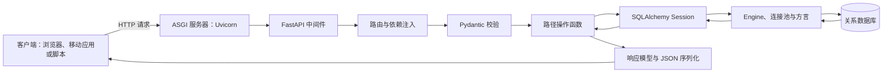
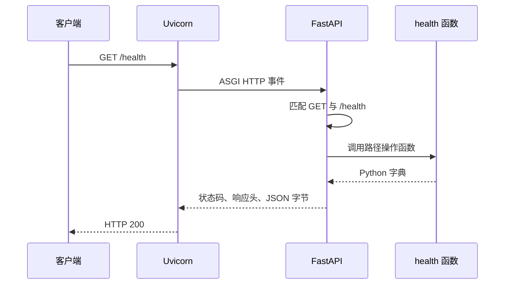
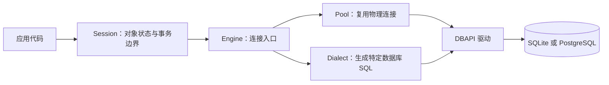
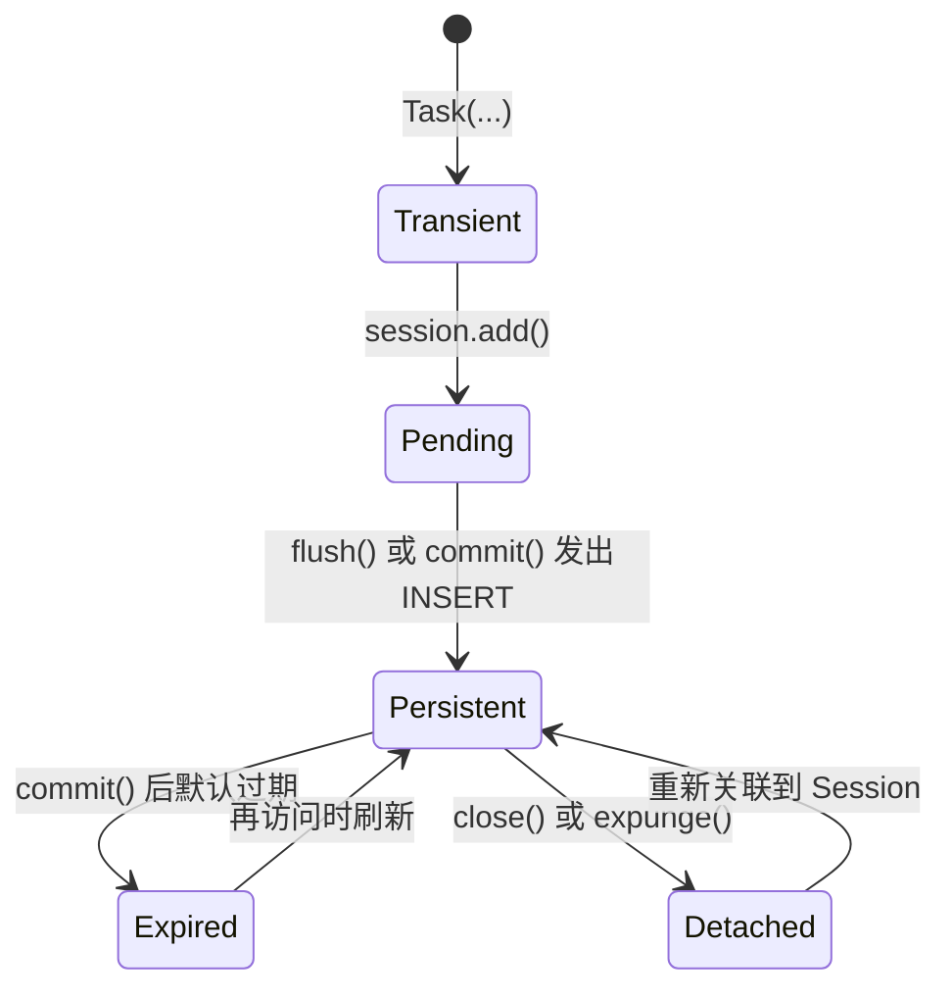
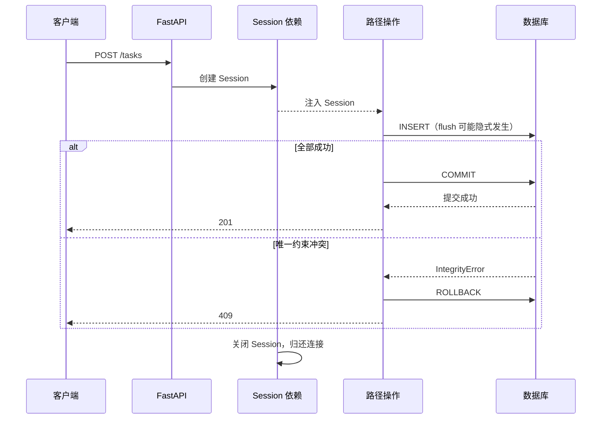
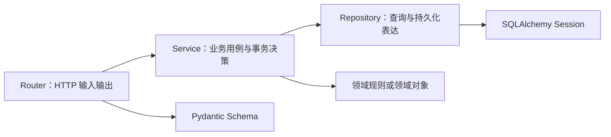
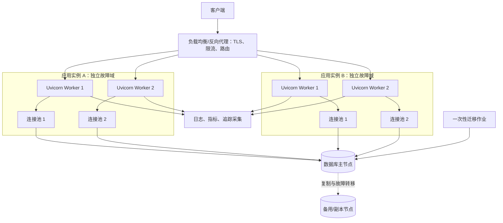

# 0 FastAPI 与 SQLAlchemy 学习笔记

> 本文面向第一次接触 FastAPI 与 SQLAlchemy 的读者。示例使用 Python 3.11+、FastAPI 的现代写法、Pydantic 2 和 SQLAlchemy 2.x。贯穿全文的业务是“任务管理 API（Application Programming Interface，应用程序编程接口）”：客户端可以新建、查询、修改和删除任务。SQLite 用于本地学习；生产章节再说明 PostgreSQL、连接池、迁移、并发和部署边界。

## 1 从一个可观察的问题开始

### 1.1 我们要解决什么问题

假设前端需要保存下面这条任务：

```json
{
  "title": "学习 FastAPI",
  "description": "完成第一个数据库接口"
}
```

后端至少要完成四件事：接收并校验数据、执行业务规则、持久化到数据库、返回稳定的 JSON（JavaScript Object Notation，JavaScript 对象表示法）结构。如果标题缺失，客户端应收到可定位到字段的错误；如果任务不存在，应返回 `404 Not Found`，而不是返回空对象或把数据库异常直接暴露出去。

这组问题对应两类工具：

1\. FastAPI 负责 HTTP（Hypertext Transfer Protocol，超文本传输协议）请求匹配、参数提取、数据校验、依赖调度、响应序列化和 OpenAPI 文档生成。

2\. SQLAlchemy 负责数据库方言适配、连接管理、SQL（Structured Query Language，结构化查询语言）表达式、对象关系映射和事务会话。

两者不会自动替你决定业务边界。例如“任务标题能否重复”“一次操作修改几张表”“何时提交事务”仍由应用代码明确表达。

### 1.2 分阶段学习路线

| 阶段 | 阅读范围 | 能力目标 | 成功判据 |
| --- | --- | --- | --- |
| 第一阶段 | 第 2～4 章 | 看懂一次请求如何进入函数并变成响应 | 浏览器能打开 `/docs`，非法参数能得到结构化错误 |
| 第二阶段 | 第 5～8 章 | 用 SQLAlchemy 2.x 完成持久化 CRUD（Create、Read、Update、Delete，增删改查） | 重启服务后任务仍存在，失败事务会回滚 |
| 第三阶段 | 第 9～12 章 | 处理关系、迁移、异步、测试和工程结构 | 能解释 Session 生命周期、N+1 查询和迁移审查 |
| 第四阶段 | 第 13～16 章 | 面向生产治理安全、容量、部署与故障 | 能计算连接上限，能从日志、指标和数据库逐层定位问题 |

第一次学习可先完成第 2、3、6 章。第 10 章异步方案和第 14 章多进程部署建立在事务、连接池和测试已经理解的前提上。

### 1.3 最小系统中的数据流



Uvicorn 是 ASGI（Asynchronous Server Gateway Interface，异步服务器网关接口）服务器，负责网络连接和协议层事件；FastAPI 在其上匹配路由并组织依赖；Pydantic 把外部数据转成满足类型约束的 Python 对象；SQLAlchemy Session 在一个事务上下文里与数据库交互。数据库连接失败会阻断持久化阶段，响应模型校验失败通常说明服务端返回结构违反了接口契约。

这张图省略了反向代理、多个进程、缓存和消息队列，适用于本地单进程学习环境。第 14 章给出生产拓扑及故障边界。

## 2 第一个可运行的 FastAPI 程序

### 2.1 创建环境并安装依赖

在空目录中执行：

```bash
python3 -m venv .venv
source .venv/bin/activate
python -m pip install "fastapi[standard]" "sqlalchemy>=2,<3" alembic pydantic-settings pytest httpx
```

Windows PowerShell 可使用 Python Launcher 创建并激活虚拟环境：

```powershell
py -m venv .venv
.venv\Scripts\Activate.ps1
python -m pip install "fastapi[standard]" "sqlalchemy>=2,<3" alembic pydantic-settings pytest httpx
```

`fastapi[standard]` 包含常用运行依赖和 FastAPI CLI（Command-Line Interface，命令行界面）。团队项目应把解析后的版本写入锁文件，并让开发、测试和生产使用同一组依赖；本文不固定补丁版本，以免示例在安全更新后误导读者。

### 2.2 写出第一个端点

创建 `main.py`：

```python
from fastapi import FastAPI

app = FastAPI(title="任务管理 API")


@app.get("/health")
def health() -> dict[str, str]:
    return {"status": "ok"}
```

启动开发服务器：

```bash
fastapi dev main.py
```

`app = FastAPI(...)` 创建应用对象；`@app.get("/health")` 把 `GET /health` 与下面的函数绑定；函数返回的字典会被序列化成 JSON。`def` 在这里足够，因为函数没有异步等待操作。

### 2.3 验证成功与失败

新开终端执行：

```bash
curl -i http://127.0.0.1:8000/health
```

成功时应看到 `HTTP/1.1 200 OK`，响应体为：

```json
{"status":"ok"}
```

再访问以下地址：

1\. Swagger UI：`http://127.0.0.1:8000/docs`

2\. ReDoc：`http://127.0.0.1:8000/redoc`

3\. OpenAPI JSON：`http://127.0.0.1:8000/openapi.json`

交互文档不是额外手写的页面。FastAPI 读取路由、类型标注和 Pydantic 模型，生成 OpenAPI 描述；Swagger UI 与 ReDoc 再消费这份描述。

启动失败时先检查终端的第一条异常。`Address already in use` 表示 8000 端口被占用，可临时执行 `fastapi dev main.py --port 8001`；`ModuleNotFoundError` 通常表示虚拟环境未激活或依赖安装在另一个 Python 解释器中；请求得到 `404` 时核对 HTTP 方法与路径是否同时匹配。

### 2.4 一次请求在运行时发生了什么



ASGI 定义服务器与 Python Web 应用之间的调用约定。与传统 WSGI（Web Server Gateway Interface，Web 服务器网关接口）相比，ASGI 能表达异步 HTTP、WebSocket 和应用生命周期事件。FastAPI 是应用框架，Uvicorn 是服务器；二者职责不同，部署时都存在。

## 3 用类型声明接口契约

### 3.1 路径参数与查询参数

把下面代码追加到 `main.py`：

```python
from typing import Annotated

from fastapi import FastAPI, Query

app = FastAPI(title="任务管理 API")


@app.get("/health")
def health() -> dict[str, str]:
    return {"status": "ok"}


@app.get("/tasks/{task_id}")
def read_task(
    task_id: int,
    detail: Annotated[bool, Query(description="是否返回详细信息")] = False,
) -> dict[str, int | bool]:
    return {"task_id": task_id, "detail": detail}
```

`task_id` 的名字出现在路径模板中，因此来自路径；`detail` 没出现在路径中，且是普通标量，因此来自查询字符串。请求 `/tasks/12?detail=true` 会得到 `{"task_id":12,"detail":true}`。

请求 `/tasks/abc` 时，FastAPI 在调用函数前发现 `abc` 无法转换成整数，默认返回 `422 Unprocessable Content` 以及错误位置。业务函数没有被执行。这个行为让边界校验集中在接口声明处。

`Annotated` 把 Python 类型和 FastAPI 元数据放在一起。它保留静态类型信息，也能承载 `Query`、`Path`、`Header` 或 `Depends` 等框架声明，是当前官方文档优先采用的写法。

### 3.2 请求体与 Pydantic 模型

Pydantic 模型描述输入数据的字段、类型和约束。添加：

```python
from typing import Annotated

from fastapi import FastAPI, Query, status
from pydantic import BaseModel, ConfigDict, Field

app = FastAPI(title="任务管理 API")


class TaskCreate(BaseModel):
    model_config = ConfigDict(extra="forbid")

    title: str = Field(min_length=1, max_length=100)
    description: str | None = Field(default=None, max_length=500)


class TaskRead(BaseModel):
    id: int
    title: str
    description: str | None
    completed: bool


@app.get("/health")
def health() -> dict[str, str]:
    return {"status": "ok"}


@app.get("/tasks/{task_id}")
def read_task(
    task_id: int,
    detail: Annotated[bool, Query(description="是否返回详细信息")] = False,
) -> dict[str, int | bool]:
    return {"task_id": task_id, "detail": detail}


@app.post("/tasks", response_model=TaskRead, status_code=status.HTTP_201_CREATED)
def create_task(payload: TaskCreate) -> TaskRead:
    return TaskRead(
        id=1,
        title=payload.title,
        description=payload.description,
        completed=False,
    )
```

发送：

```bash
curl -i -X POST http://127.0.0.1:8000/tasks \
  -H 'Content-Type: application/json' \
  -d '{"title":"学习 FastAPI","description":"完成第一个接口"}'
```

成功判据是状态码 `201 Created`，且响应含有服务端生成的 ID（Identifier，标识符）和 `completed`。如果额外发送 `{"priority":99}`，`extra="forbid"` 会把拼错或未约定字段当作错误；如果标题是空字符串，`min_length=1` 会阻止业务函数执行。

Pydantic 所称的“校验”包含解析和类型转换，保证的是处理后的模型满足声明的类型。比如非严格模式可能把字符串数字转换为整数。金额、权限标记等不允许宽松转换的字段可考虑严格类型或严格模式，并为客户端兼容性编写测试。

### 3.3 输入模型、数据库模型与输出模型各自负责什么

| 模型 | 数据来源 | 主要职责 | 生命周期 |
| --- | --- | --- | --- |
| 请求模型 | 不可信的客户端输入 | 校验允许字段、类型、格式和边界 | 一次请求 |
| SQLAlchemy 模型 | 数据库行与关系 | 表映射、持久化状态、关系加载 | 一个 Session 中被跟踪 |
| 响应模型 | 应用准备返回的数据 | 过滤字段、序列化、校验输出契约 | 一次响应 |

把三者全部合成一个类容易泄露 `password_hash`、内部状态或审计字段，也会让数据库结构变更直接破坏外部 API。小项目可以少写几类模型，但输入和输出边界仍应明确。

`response_model` 会限制实际输出字段。即使内部对象含有额外属性，未出现在响应模型中的字段也不会进入 JSON；这既是接口稳定性措施，也是避免敏感字段泄漏的重要防线。官方说明见 [FastAPI 响应模型](https://fastapi.tiangolo.com/tutorial/response-model/) 与 [Pydantic 模型](https://docs.pydantic.dev/latest/concepts/models/)。

### 3.4 参数来源速查

| 声明方式 | 默认来源 | 典型用途 | 常见错误 |
| --- | --- | --- | --- |
| 路径模板中的标量参数 | Path | 资源标识，如 `/tasks/{task_id}` | 把可选筛选条件放进路径 |
| 路径外的标量参数 | Query | 分页、排序、筛选 | `limit` 没设上限导致大查询 |
| Pydantic 模型参数 | Body | JSON 请求体 | 用 `GET` 请求体承载常规查询 |
| `Header()` | Header | 追踪 ID、条件请求 | 自制认证头而忽略标准方案 |
| `Cookie()` | Cookie | 浏览器会话 | 缺少 `Secure`、`HttpOnly`、`SameSite` 策略 |
| `Form()` 与 `File()` | 表单或上传 | OAuth2 表单、文件上传 | 把大文件一次性读入内存 |

HTTP `GET` 请求体在规范和中间代理中的兼容性不稳定，常规查询应使用路径与查询参数。创建通常用 `POST`，完整替换常用 `PUT`，局部更新常用 `PATCH`，删除用 `DELETE`。

## 4 路由、依赖与错误边界

### 4.1 APIRouter 拆分业务模块

当所有端点都写在 `main.py` 中，导入关系、测试和权限配置会逐渐混乱。`APIRouter` 可以把同一资源的路由组合起来：

```python
from fastapi import APIRouter, FastAPI

tasks_router = APIRouter(prefix="/tasks", tags=["tasks"])


@tasks_router.get("")
def list_tasks() -> list[dict[str, object]]:
    return []


app = FastAPI(title="任务管理 API")
app.include_router(tasks_router)
```

`prefix` 统一添加路径前缀，`tags` 用于文档分组。大型项目通常按业务能力拆分路由，如任务、用户、认证；按 HTTP 方法把所有 `GET` 放一个文件会把同一资源的规则拆散。

### 4.2 依赖注入如何工作

依赖注入让路径操作函数声明“需要什么”，FastAPI 负责解析依赖树、调用提供者并把结果传入。数据库 Session、当前用户、权限校验和配置读取都是常见依赖。

```python
from typing import Annotated

from fastapi import Depends, Header, HTTPException, status


def require_request_id(
    x_request_id: Annotated[str | None, Header()] = None,
) -> str:
    if x_request_id is None:
        raise HTTPException(
            status_code=status.HTTP_400_BAD_REQUEST,
            detail="X-Request-Id header is required",
        )
    return x_request_id


RequestId = Annotated[str, Depends(require_request_id)]
```

路径函数使用 `request_id: RequestId` 时，FastAPI 会先调用 `require_request_id`。依赖自身也可以依赖其他依赖，由此形成有向树。同一个请求中，默认会缓存同一个依赖的结果，避免重复创建 Session 或重复解析用户；确实需要每次重新执行时才考虑 `use_cache=False`。

### 4.3 带 yield 的资源生命周期

数据库 Session 需要“请求前创建、请求后关闭”。带 `yield` 的依赖能表达这个边界：

```python
from collections.abc import Generator


def get_resource() -> Generator[str, None, None]:
    resource = "opened"
    try:
        yield resource
    finally:
        print("closed")
```

`yield` 前的代码在路径操作执行前运行，产出的值被注入；`finally` 中的清理即使遇到异常也会执行。当前 FastAPI 支持依赖作用域：默认请求作用域的退出逻辑在响应发送后执行；`Depends(..., scope="function")` 可让清理发生在路径操作返回后、响应发送前。流式响应需要资源在迭代期间仍然可用，不能过早关闭。详细时间线见 [FastAPI 带 yield 的依赖](https://fastapi.tiangolo.com/tutorial/dependencies/dependencies-with-yield/)。

如果依赖捕获异常却不重新抛出，框架可能无法按预期观察到失败。除非明确转换成另一个异常，清理代码中的 `except` 通常应使用裸 `raise` 继续传播原异常。

### 4.4 把错误映射成稳定的 HTTP 语义

| 场景 | 建议状态码 | 由谁发现 | 响应原则 |
| --- | --- | --- | --- |
| 请求字段不满足约束 | 422 | FastAPI/Pydantic | 给出字段位置和原因 |
| 身份凭证缺失或无效 | 401 | 认证依赖 | 搭配合适的 `WWW-Authenticate` |
| 已认证但权限不足 | 403 | 授权逻辑 | 不泄露不必要的资源信息 |
| 任务不存在 | 404 | 查询结果判断 | 返回稳定的业务错误结构 |
| 唯一键冲突 | 409 | 数据库约束与异常映射 | 回滚事务，不暴露 SQL |
| 未处理的程序错误 | 500 | 全局异常处理 | 对外隐藏内部细节，对内记录堆栈和请求 ID |

`HTTPException` 适合在接口或依赖边界表达可预期的 HTTP 错误。领域层也可以抛出不依赖 Web 框架的业务异常，再由全局异常处理器映射成 HTTP 响应。数据库连接串、SQL 参数、文件路径和堆栈不应直接返回给客户端。

### 4.5 中间件、依赖和路径函数的边界

中间件包围整个请求响应过程，适合请求 ID、访问日志、耗时、CORS（Cross-Origin Resource Sharing，跨源资源共享）和统一安全头。依赖能读取已解析的路径参数并参与 OpenAPI，适合认证、授权和 Session。路径函数负责具体用例。把所有业务都放在中间件会失去路由上下文，把每个访问日志都写成依赖则会重复配置。

## 5 SQLAlchemy 2.x 的最小持久化闭环

### 5.1 ORM 解决了什么问题

ORM（Object-Relational Mapping，对象关系映射）把表、列和关系映射成 Python 类与属性，让应用以对象方式组织持久化逻辑。SQLAlchemy 同时提供 Core 层：用 Python 表达 SQL 结构、参数绑定和结果处理。SQLAlchemy 2.x 的 ORM 查询也统一使用 `select()` 等 Core 风格构造。

ORM 不会消除 SQL。索引是否命中、连接数是否合理、事务锁了哪些行，最终仍由数据库执行计划和隔离级别决定。学习 ORM 时应能查看它生成的 SQL，并理解关键查询对应的关系模型。

### 5.2 Engine、连接池、方言与 Session



Engine 是应用级、通常长期复用的数据库入口，内部协调连接池与数据库方言。DBAPI（Database API，数据库应用程序编程接口）驱动负责真正的网络或文件通信。Session 是有状态的工作单元，跟踪 ORM 对象并代表一个逻辑事务；它不是连接池，也不适合做全局单例。

一个 Session 或 AsyncSession 不能被多个线程或异步任务并发共享。常见边界是“每个请求一个 Session，每个并发任务一个 Session”。官方对这一约束的解释见 [SQLAlchemy Session 基础](https://docs.sqlalchemy.org/en/20/orm/session_basics.html)。

### 5.3 声明模型并创建表

下面先在一个独立脚本中完成数据库闭环。创建 `sqlalchemy_demo.py`：

```python
from datetime import datetime, timezone

from sqlalchemy import DateTime, String, create_engine, select
from sqlalchemy.orm import DeclarativeBase, Mapped, Session, mapped_column


class Base(DeclarativeBase):
    pass


class Task(Base):
    __tablename__ = "tasks"

    id: Mapped[int] = mapped_column(primary_key=True)
    title: Mapped[str] = mapped_column(String(100), unique=True, index=True)
    description: Mapped[str | None] = mapped_column(String(500), nullable=True)
    completed: Mapped[bool] = mapped_column(default=False)
    created_at: Mapped[datetime] = mapped_column(
        DateTime(timezone=True),
        default=lambda: datetime.now(timezone.utc),
    )


engine = create_engine("sqlite:///./demo.db", echo=True)
Base.metadata.create_all(engine)

with Session(engine) as session:
    task = Task(title="学习 SQLAlchemy", description="观察生成的 SQL")
    session.add(task)
    session.commit()
    session.refresh(task)
    print(f"created id={task.id}")

with Session(engine) as session:
    statement = select(Task).where(Task.completed.is_(False))
    tasks = session.scalars(statement).all()
    print([(task.id, task.title) for task in tasks])
```

运行：

```bash
python sqlalchemy_demo.py
```

成功判据有三个：当前目录出现 `demo.db`；日志包含 `CREATE TABLE`、`INSERT` 和 `SELECT`；终端输出数据库生成的任务 ID。第二次运行会因为标题唯一约束触发 `IntegrityError`，这恰好说明唯一性应由数据库最终保证，应用还要捕获、回滚并映射成 `409`。

`Base.metadata.create_all()` 会创建尚不存在的表，不会把已经存在的表安全演进到新结构，因此只适合教学、临时脚本和部分测试。正式演进使用第 9 章的 Alembic。

### 5.4 对象状态与事务时间线



新建但未加入 Session 的对象是 transient（临时）状态；`add()` 后进入 pending（待持久化）；`flush()` 把待处理变化发送给数据库，对象获得主键后进入 persistent（持久）状态，但事务尚未提交；`commit()` 提交数据库事务；`refresh()` 重新读取当前行；Session 关闭后对象可能变成 detached（游离）状态。

`flush` 与 `commit` 的区别决定了跨表写入方式。可以先 `flush()` 获得父记录主键，再写子记录，全部成功后只 `commit()` 一次；任一步失败则 `rollback()` 整个事务。每写一行就提交会破坏用例的原子性。

### 5.5 CRUD 的 SQLAlchemy 2.x 写法

```python
from sqlalchemy import select
from sqlalchemy.orm import Session


def create_task(session: Session, title: str) -> Task:
    task = Task(title=title)
    session.add(task)
    session.flush()
    return task


def get_task(session: Session, task_id: int) -> Task | None:
    return session.get(Task, task_id)


def list_tasks(session: Session, offset: int, limit: int) -> list[Task]:
    statement = select(Task).order_by(Task.id).offset(offset).limit(limit)
    return list(session.scalars(statement))


def complete_task(session: Session, task: Task) -> None:
    task.completed = True


def delete_task(session: Session, task: Task) -> None:
    session.delete(task)
```

`session.get()` 针对主键查询，并可利用 Session 的 identity map（身份映射）；`select()` 表达一般查询；`session.scalars()` 直接取得 ORM 实体序列。修改已跟踪对象的属性后，工作单元会在 flush 时生成 `UPDATE`。删除操作同理，真正的 `DELETE` 通常在 flush 或 commit 时发出。

函数故意不在内部提交，使调用者能把多次写入组合成一个业务事务。应用服务或路径操作在整个用例成功后提交；捕获数据库异常时先回滚，再继续使用同一个 Session。

## 6 组装可运行的任务管理 API

### 6.1 工程目录与依赖方向

把教学代码整理成下面的结构：

```text
.
├── app
│   ├── __init__.py
│   ├── bootstrap.py
│   ├── database.py
│   ├── dependencies.py
│   ├── main.py
│   ├── models.py
│   ├── routers
│   │   ├── __init__.py
│   │   └── tasks.py
│   └── schemas.py
└── tests
    └── test_tasks.py
```

`routers` 处理 HTTP 适配，`schemas` 定义输入输出契约，`models` 定义持久化映射，`database` 创建 Engine 与 Session 工厂，`dependencies` 管理请求级资源。规模变大后可以增加 service 层承载业务用例、repository 层封装复杂持久化查询；若当前只有简单 CRUD，过早增加转发层只会提高导航成本。

### 6.2 集中管理配置和数据库入口

`app/database.py`：

```python
from functools import lru_cache

from pydantic_settings import BaseSettings, SettingsConfigDict
from sqlalchemy import create_engine
from sqlalchemy.orm import DeclarativeBase, sessionmaker


class Settings(BaseSettings):
    model_config = SettingsConfigDict(
        env_file=".env",
        env_prefix="APP_",
        extra="ignore",
    )

    database_url: str = "sqlite:///./tasks.db"


@lru_cache
def get_settings() -> Settings:
    return Settings()


class Base(DeclarativeBase):
    pass


settings = get_settings()
sqlite_connect_args = (
    {"check_same_thread": False}
    if settings.database_url.startswith("sqlite")
    else {}
)
engine = create_engine(
    settings.database_url,
    connect_args=sqlite_connect_args,
    pool_pre_ping=True,
)
SessionLocal = sessionmaker(
    bind=engine,
    autoflush=False,
    expire_on_commit=False,
)
```

环境变量 `APP_DATABASE_URL` 可以覆盖默认值，例如生产使用 PostgreSQL 时不必修改代码。URL（Uniform Resource Locator，统一资源定位符）在这里描述数据库方言、驱动和连接位置。`.env` 适合本地开发，生产密钥通常由部署平台的 Secret 机制注入；`.env` 不应提交真实口令。

SQLite 驱动默认存在同线程检查。FastAPI 的同步依赖和同步路径函数可能由线程池调度，因此示例显式设置 `check_same_thread=False`；这只放宽驱动检查，不会让同一个 Session 变得线程安全。每个请求仍使用独立 Session。

`pool_pre_ping=True` 在从池中取出连接时检查可用性，有助于识别服务端已经断开的陈旧连接，但会增加一次探测成本，且无法挽救执行中断开的事务。连接池参数需要结合数据库连接上限与实例数计算，第 14.3 节会展开。

### 6.3 定义 SQLAlchemy 模型

`app/models.py`：

```python
from datetime import datetime, timezone

from sqlalchemy import DateTime, String
from sqlalchemy.orm import Mapped, mapped_column

from app.database import Base


class Task(Base):
    __tablename__ = "tasks"

    id: Mapped[int] = mapped_column(primary_key=True)
    title: Mapped[str] = mapped_column(
        String(100),
        unique=True,
        index=True,
    )
    description: Mapped[str | None] = mapped_column(
        String(500),
        nullable=True,
    )
    completed: Mapped[bool] = mapped_column(default=False)
    created_at: Mapped[datetime] = mapped_column(
        DateTime(timezone=True),
        default=lambda: datetime.now(timezone.utc),
    )
```

Python 类型标注表达应用期望，数据库列约束承担最终的数据完整性。`unique=True` 防止并发请求绕过“先查再写”的应用检查；`nullable=True` 明确描述可空语义；时间使用带时区的 UTC（Coordinated Universal Time，协调世界时），展示时再转换到用户时区。

### 6.4 分离创建、局部更新和读取模型

`app/schemas.py`：

```python
from datetime import datetime
from typing import Self

from pydantic import BaseModel, ConfigDict, Field, model_validator


class TaskCreate(BaseModel):
    model_config = ConfigDict(extra="forbid")

    title: str = Field(min_length=1, max_length=100)
    description: str | None = Field(default=None, max_length=500)


class TaskUpdate(BaseModel):
    model_config = ConfigDict(extra="forbid")

    title: str | None = Field(default=None, min_length=1, max_length=100)
    description: str | None = Field(default=None, max_length=500)
    completed: bool | None = None

    @model_validator(mode="after")
    def reject_null_for_required_columns(self) -> Self:
        for field_name in ("title", "completed"):
            if (
                field_name in self.model_fields_set
                and getattr(self, field_name) is None
            ):
                raise ValueError(f"{field_name} cannot be null")
        return self


class TaskRead(BaseModel):
    model_config = ConfigDict(from_attributes=True)

    id: int
    title: str
    description: str | None
    completed: bool
    created_at: datetime
```

局部更新必须区分三个状态：“字段未提供”表示保持原值；`description: null` 表示清空描述；`title: null` 与数据库非空约束冲突，应在请求边界拒绝。`model_fields_set` 记录客户端实际提供的字段，后面的 `exclude_unset=True` 据此生成变更集。

`from_attributes=True` 允许 Pydantic 从 SQLAlchemy 对象属性读取值，这是 Pydantic 2 替代旧式 `orm_mode` 的配置。它只负责取值和序列化，不会自动解决已关闭 Session 上的延迟加载关系。

### 6.5 创建请求级 Session 依赖

`app/dependencies.py`：

```python
from collections.abc import Generator
from typing import Annotated

from fastapi import Depends
from sqlalchemy.orm import Session

from app.database import SessionLocal


def get_session() -> Generator[Session, None, None]:
    with SessionLocal() as session:
        yield session


SessionDep = Annotated[Session, Depends(get_session)]
```

Session 工厂是应用级对象，Session 实例是请求级对象。上下文退出会关闭 Session，并把连接归还池中；关闭不等于提交。提交和回滚留在业务操作可见的位置，便于判断一个用例的原子边界。

### 6.6 实现完整 CRUD 路由

`app/routers/tasks.py`：

```python
from fastapi import APIRouter, HTTPException, Query, Response, status
from sqlalchemy import select
from sqlalchemy.exc import IntegrityError

from app.dependencies import SessionDep
from app.models import Task
from app.schemas import TaskCreate, TaskRead, TaskUpdate

router = APIRouter(prefix="/tasks", tags=["tasks"])


def get_task_or_404(task_id: int, session: SessionDep) -> Task:
    task = session.get(Task, task_id)
    if task is None:
        raise HTTPException(
            status_code=status.HTTP_404_NOT_FOUND,
            detail="Task not found",
        )
    return task


@router.post(
    "",
    response_model=TaskRead,
    status_code=status.HTTP_201_CREATED,
)
def create_task(payload: TaskCreate, session: SessionDep) -> Task:
    task = Task(**payload.model_dump())
    session.add(task)
    try:
        session.commit()
    except IntegrityError as exc:
        session.rollback()
        raise HTTPException(
            status_code=status.HTTP_409_CONFLICT,
            detail="Task title already exists",
        ) from exc
    session.refresh(task)
    return task


@router.get("", response_model=list[TaskRead])
def list_tasks(
    session: SessionDep,
    offset: int = Query(default=0, ge=0),
    limit: int = Query(default=20, ge=1, le=100),
) -> list[Task]:
    statement = select(Task).order_by(Task.id).offset(offset).limit(limit)
    return list(session.scalars(statement))


@router.get("/{task_id}", response_model=TaskRead)
def read_task(task_id: int, session: SessionDep) -> Task:
    return get_task_or_404(task_id, session)


@router.patch("/{task_id}", response_model=TaskRead)
def update_task(
    task_id: int,
    payload: TaskUpdate,
    session: SessionDep,
) -> Task:
    task = get_task_or_404(task_id, session)
    changes = payload.model_dump(exclude_unset=True)
    for field_name, value in changes.items():
        setattr(task, field_name, value)

    try:
        session.commit()
    except IntegrityError as exc:
        session.rollback()
        raise HTTPException(
            status_code=status.HTTP_409_CONFLICT,
            detail="Task title already exists",
        ) from exc
    session.refresh(task)
    return task


@router.delete(
    "/{task_id}",
    status_code=status.HTTP_204_NO_CONTENT,
)
def delete_task(task_id: int, session: SessionDep) -> Response:
    task = get_task_or_404(task_id, session)
    session.delete(task)
    session.commit()
    return Response(status_code=status.HTTP_204_NO_CONTENT)
```

路由使用同步 `def`，因为示例采用同步 SQLite 驱动和同步 Session。FastAPI 会在线程池中执行它调用的同步路径函数。`limit` 上限防止一次请求无界加载数据；唯一约束异常先回滚再转换为 `409`；删除成功返回 `204 No Content`，响应体应为空。

在更复杂的系统中，不应把所有 `IntegrityError` 都解释成标题冲突。可以检查约束名或在数据访问层转换成更精确的领域异常，否则外键失败、非空失败也会被错误地报告为重复标题。

### 6.7 注册路由并初始化学习数据库

`app/main.py`：

```python
from fastapi import FastAPI

from app.routers.tasks import router as tasks_router

app = FastAPI(title="任务管理 API", version="1.0.0")
app.include_router(tasks_router)


@app.get("/health", tags=["system"])
def health() -> dict[str, str]:
    return {"status": "ok"}
```

`app/bootstrap.py`：

```python
from app import models
from app.database import Base, engine


def main() -> None:
    # 导入 models 后，Task 才会登记到 Base.metadata。
    _ = models.Task
    Base.metadata.create_all(bind=engine)


if __name__ == "__main__":
    main()
```

创建空的 `app/__init__.py`、`app/routers/__init__.py` 后执行：

```bash
python -m app.bootstrap
fastapi dev --entrypoint app.main:app
```

`bootstrap` 是学习阶段的一次性建表入口。第 9 章接入 Alembic 后，部署流程应在应用启动前执行受审查的迁移，而不是让每个 Web 进程并发调用 `create_all()`。

### 6.8 用接口完成闭环验证

按顺序执行：

```bash
curl -i -X POST http://127.0.0.1:8000/tasks \
  -H 'Content-Type: application/json' \
  -d '{"title":"完成 FastAPI 笔记","description":"验证数据库闭环"}'

curl -i 'http://127.0.0.1:8000/tasks?offset=0&limit=20'

curl -i -X PATCH http://127.0.0.1:8000/tasks/1 \
  -H 'Content-Type: application/json' \
  -d '{"completed":true}'

curl -i -X DELETE http://127.0.0.1:8000/tasks/1
```

验证时观察四类结果：创建返回 `201` 和 ID；列表能读到同一条记录；局部更新只改变 `completed`；删除返回 `204` 且随后查询得到 `404`。重启服务后未删除的数据仍存在，证明数据来自 `tasks.db` 而非进程内列表。

## 7 事务、Session 与失败恢复

### 7.1 一个请求中的事务时间线



事务保证一组数据库变化要么全部提交，要么全部回滚。Session 在需要执行 SQL 时从 Engine 取得连接并开启事务；`commit()` 或 `rollback()` 结束事务；`close()` 释放 Session 占有的资源。没有异常不等于业务成功，调用者还应检查受影响行、约束结果和提交结果。

### 7.2 flush、commit、refresh 和 rollback

| 操作 | 发生什么 | 数据是否对其他事务可见 | 典型用途 |
| --- | --- | --- | --- |
| `flush()` | 把待处理 SQL 发给数据库 | 通常尚不可见，取决于隔离级别 | 获取主键、提前触发约束 |
| `commit()` | flush 后提交当前事务 | 提交后可按隔离规则观察 | 完成业务用例 |
| `refresh(obj)` | 从数据库重新读取对象 | 不改变提交状态 | 取得数据库默认值或最新行 |
| `rollback()` | 撤销当前未提交事务 | 未提交变化不再生效 | 从 SQL/约束错误恢复 |

flush 失败后，数据库事务和 Session 都处在失败状态；即使数据库已经回滚了底层操作，应用仍应显式调用 `session.rollback()` 重置 Session，再决定继续还是结束请求。

### 7.3 事务边界应贴近业务用例

“创建订单并扣减库存”应处在一个事务中；如果库存不足，订单也不应留下。把 commit 隐藏在每个 repository 方法里会导致前半段已经提交、后半段失败。更合适的结构是 repository 只查询和修改 Session 中的对象，service 在一个用例末尾统一提交。

跨数据库、消息队列和第三方 API 的操作无法依靠单个本地事务自动获得原子性。常见做法是事务内写业务数据和 outbox（事务消息表），提交后由独立发布器投递事件；消费端设计幂等。不要在持有数据库锁时等待慢速第三方网络调用。

### 7.4 隔离、并发与数据库约束

“先查询标题不存在，再插入”在两个并发请求下会竞态：两边都可能查到不存在。数据库唯一约束才是最终仲裁者，应用捕获其中一个事务的冲突。类似地，余额扣减、库存扣减需要原子 `UPDATE`、悲观锁或乐观版本列等并发控制，不能只依赖 Python 条件判断。

事务隔离级别越强，通常越容易获得一致快照，也可能增加锁等待或重试。选择应基于实际异常：脏读、不可重复读、幻读或写冲突。修改默认隔离级别前，先用并发测试复现业务问题并观察数据库锁。

## 8 关系映射、加载策略与分页

### 8.1 一对多关系的两个层次

假设一个用户拥有多个任务。数据库层由 `tasks.owner_id` 外键保证引用关系，ORM 层由 `relationship()` 提供对象导航：

```python
from sqlalchemy import ForeignKey, String
from sqlalchemy.orm import Mapped, mapped_column, relationship

from app.database import Base


class User(Base):
    __tablename__ = "users"

    id: Mapped[int] = mapped_column(primary_key=True)
    username: Mapped[str] = mapped_column(String(50), unique=True)
    tasks: Mapped[list["Task"]] = relationship(back_populates="owner")


class Task(Base):
    __tablename__ = "tasks"

    id: Mapped[int] = mapped_column(primary_key=True)
    title: Mapped[str] = mapped_column(String(100))
    owner_id: Mapped[int] = mapped_column(ForeignKey("users.id"), index=True)
    owner: Mapped[User] = relationship(back_populates="tasks")
```

`ForeignKey` 决定表之间如何引用；`relationship` 不新增数据库列，它描述 ORM 如何加载并同步对象关系。`back_populates` 显式连接两侧属性，比动态生成的旧式 `backref` 更利于类型检查和阅读。官方关系模式见 [SQLAlchemy Relationship Configuration](https://docs.sqlalchemy.org/en/20/orm/relationships.html)。

### 8.2 一对一、多对多与自关联的判断

| 业务关系 | 数据库表达 | ORM 重点 | 代表场景 |
| --- | --- | --- | --- |
| 一对一 | 外键加唯一约束 | 标量关系、数据库唯一性 | 用户与个人资料 |
| 一对多 | 多的一侧保存外键 | 父集合与子标量双向关系 | 用户与任务 |
| 多对多 | 中间关联表保存两侧外键 | `secondary` 或关联对象 | 任务与标签 |
| 自关联树 | 表内 `parent_id` 指向同表主键 | `remote_side` 与递归边界 | 分类目录 |

#### 8.2.1 一对一同时需要 ORM 标量语义与数据库唯一性

```python
from __future__ import annotations

from sqlalchemy import ForeignKey, String
from sqlalchemy.orm import Mapped, mapped_column, relationship

from app.database import Base


class User(Base):
    __tablename__ = "users"

    id: Mapped[int] = mapped_column(primary_key=True)
    profile: Mapped[Profile | None] = relationship(
        back_populates="user",
        cascade="all, delete-orphan",
    )


class Profile(Base):
    __tablename__ = "profiles"

    id: Mapped[int] = mapped_column(primary_key=True)
    nickname: Mapped[str] = mapped_column(String(50))
    user_id: Mapped[int] = mapped_column(
        ForeignKey("users.id", ondelete="CASCADE"),
        unique=True,
    )
    user: Mapped[User] = relationship(back_populates="profile")
```

类型标注让 `User.profile` 是单个对象；`profiles.user_id` 的唯一约束才从数据库层阻止一个用户对应多条资料。`cascade="all, delete-orphan"` 表示资料离开唯一父对象时由 ORM 删除，是否符合业务要逐项判断。数据库 `ON DELETE CASCADE` 与 ORM cascade 是两个层次，批量 SQL 和数据库外部写入尤其需要数据库约束兜底。

#### 8.2.2 多对多使用关联表，带业务字段时使用关联对象

```python
from __future__ import annotations

from sqlalchemy import Column, ForeignKey, Table
from sqlalchemy.orm import Mapped, mapped_column, relationship

from app.database import Base

task_tags = Table(
    "task_tags",
    Base.metadata,
    Column("task_id", ForeignKey("tasks.id"), primary_key=True),
    Column("tag_id", ForeignKey("tags.id"), primary_key=True),
)


class Task(Base):
    __tablename__ = "tasks"

    id: Mapped[int] = mapped_column(primary_key=True)
    tags: Mapped[list[Tag]] = relationship(
        secondary=task_tags,
        back_populates="tasks",
    )


class Tag(Base):
    __tablename__ = "tags"

    id: Mapped[int] = mapped_column(primary_key=True)
    tasks: Mapped[list[Task]] = relationship(
        secondary=task_tags,
        back_populates="tags",
    )
```

复合主键防止同一任务重复关联同一标签。若关联还包含 `assigned_at`、`role`、`sort_order` 等字段，中间记录已经具有业务含义，应映射成独立关联对象，让这些字段参与校验、查询和生命周期管理。

#### 8.2.3 自关联用 remote_side 指明远端主键

```python
from __future__ import annotations

from sqlalchemy import ForeignKey, String
from sqlalchemy.orm import Mapped, mapped_column, relationship

from app.database import Base


class Category(Base):
    __tablename__ = "categories"

    id: Mapped[int] = mapped_column(primary_key=True)
    name: Mapped[str] = mapped_column(String(100))
    parent_id: Mapped[int | None] = mapped_column(
        ForeignKey("categories.id"),
        nullable=True,
    )
    parent: Mapped[Category | None] = relationship(
        back_populates="children",
        remote_side=lambda: [Category.id],
    )
    children: Mapped[list[Category]] = relationship(back_populates="parent")
```

`parent_id` 为空表示根节点；`remote_side` 告诉 SQLAlchemy 在同一张表的连接中，`Category.id` 是父侧。这个邻接表模型适合普通层级。需要高频查询整棵子树时，还要评估递归 CTE（Common Table Expression，公共表表达式）、物化路径或闭包表，并限制递归深度以防循环数据拖垮请求。

### 8.3 N+1 查询是如何产生的

查询 100 个用户得到 1 条 SQL，循环访问每个 `user.tasks` 又各发 1 条 SQL，总计 101 条，这就是典型 N+1。它在本地小数据上不明显，在生产会放大数据库往返延迟。

```python
from sqlalchemy import select
from sqlalchemy.orm import selectinload

statement = (
    select(User)
    .options(selectinload(User.tasks))
    .order_by(User.id)
)
users = session.scalars(statement).all()
```

`selectinload` 通常先查父对象，再用父主键集合查询所有子对象，适合集合关系；`joinedload` 使用联接一次取回，适合多对一或结果不会严重膨胀的场景。选择依据是关系基数、分页方式、网络往返和结果集大小，不能把所有关系都改成 eager（急加载）。

排查 N+1 时打开开发环境 SQL 日志或使用查询计数测试，确认同形 SQL 是否重复出现。响应序列化会访问关系属性，因此问题也可能在路径函数返回后才暴露；Session 已关闭时则可能出现 detached 或异步隐式 I/O 错误。

### 8.4 offset 分页与游标分页

`offset/limit` 易于实现，也允许跳到指定页；偏移很大时数据库仍需扫描或跳过大量记录，并发插入还会造成重复或遗漏。稳定的大数据列表通常使用 keyset/cursor（键集/游标）分页：

```python
from sqlalchemy import select

statement = (
    select(Task)
    .where(Task.id > last_id)
    .order_by(Task.id)
    .limit(page_size)
)
```

游标字段要有稳定、唯一的排序。按 `created_at` 排序时可组合 `(created_at, id)` 处理同一时间戳。API 不应直接相信客户端传入任意列名作为排序表达式，应从允许列表映射到 SQLAlchemy 列，避免注入和不可控的慢查询。

### 8.5 联接与聚合查询要选对结果读取方式

统计每个用户的任务数时，查询返回的是“用户名加计数”，不再是单个 ORM 实体：

```python
from sqlalchemy import func, select

statement = (
    select(User.username, func.count(Task.id).label("task_count"))
    .outerjoin(User.tasks)
    .group_by(User.id, User.username)
    .order_by(User.id)
)
rows = session.execute(statement).all()
for username, task_count in rows:
    print(username, task_count)
```

`session.scalars()` 只提取每行第一列，适合 `select(Task)` 这类单实体结果；多列、聚合或实体与标量混合时使用 `session.execute()` 读取 Row。`outerjoin` 保留没有任务的用户，`count(Task.id)` 对这些用户返回 0。生产查询还要用目标数据库的执行计划验证联接顺序、索引和聚合成本。

## 9 用 Alembic 演进数据库结构

### 9.1 迁移与 create_all 的边界

代码从 `Task(title)` 演进到 `Task(title, priority)` 时，已有数据库需要可重复、可审查的变更历史。Alembic 保存每次 schema（模式）变化的 revision（修订），按依赖顺序升级或降级。`create_all()` 只创建缺失对象，不会可靠地重命名列、回填数据或删除旧约束。

初始化：

```bash
alembic init migrations
```

在 `migrations/env.py` 中让 Alembic 看到模型元数据：

```python
from app import models
from app.database import Base

_ = models.Task
target_metadata = Base.metadata
```

数据库 URL 可以从应用配置或部署环境读取，真实密码不应写进版本库中的 `alembic.ini`。

### 9.2 生成、审查和执行迁移

模型变更后执行：

```bash
alembic revision --autogenerate -m "add task priority"
alembic upgrade head
alembic current
alembic history
```

`--autogenerate` 比较目标元数据和当前数据库，生成候选脚本；候选脚本必须人工审查。官方文档明确说明自动生成并不能识别所有变更，重命名常被误判为“删除旧列并新增新列”，直接执行会丢数据。参考 [Alembic 自动生成迁移](https://alembic.sqlalchemy.org/en/latest/autogenerate.html)。

审查至少覆盖：列类型与长度、可空性、默认值是在 Python 端还是数据库端、索引和唯一约束名称、外键删除策略、数据回填、升级与降级是否可执行、预计锁表时间。

### 9.3 非空列的安全上线顺序

给大表添加非空 `priority` 列时，直接执行“新增非空列且无默认值”会因历史行不满足约束而失败。兼容新旧应用的 expand/contract（扩展/收缩）过程通常是：

1\. 先新增可空列，旧代码仍可运行。

2\. 部署能同时读取旧状态、写入新字段的新代码。

3\. 分批回填历史数据，限制批量和锁持续时间。

4\. 验证不存在空值，再添加非空约束。

5\. 所有实例不再依赖旧列后，另一个发布周期再删除旧结构。

迁移通常作为发布阶段的独立作业执行一次。多个 Web worker 同时启动迁移会竞争锁，也会把数据库变更与健康检查混在一起。

### 9.4 降级不一定等于恢复

删除列后再 downgrade 无法凭空找回列中的原数据。高风险迁移的恢复方案可能是前滚修复、备份恢复或双写切换，而非机械执行 `alembic downgrade -1`。上线前应在接近生产的数据量上演练耗时、锁行为和回滚路径。

## 10 正确选择同步与异步

### 10.1 async def 并不会自动让代码变快

异步适合大量时间花在可等待 I/O（Input/Output，输入/输出）上的请求，例如等待数据库、HTTP 服务或消息系统。事件循环在一个协程等待时运行其他协程，提高同一进程处理并发等待的能力。CPU（Central Processing Unit，中央处理器）密集计算仍会占住执行线程，需要进程池、任务队列或独立计算服务。

选择规则可以落到代码调用链：

1\. 库提供可 `await` 的异步 API 时，路径函数使用 `async def` 并逐层 `await`。

2\. 使用同步阻塞库时，路径函数可写普通 `def`，FastAPI 会把它调度到线程池。

3\. 在 `async def` 中直接调用同步数据库驱动会阻塞事件循环。FastAPI 只会自动调度它直接调用的同步路径函数和依赖，不会自动搬移你在异步函数中直接调用的普通辅助函数。

官方说明见 [FastAPI 并发与 async/await](https://fastapi.tiangolo.com/async/)。

### 10.2 SQLAlchemy AsyncSession 的最小结构

生产使用 PostgreSQL 与异步驱动时，可采用：

```python
from collections.abc import AsyncIterator

from sqlalchemy import select
from sqlalchemy.ext.asyncio import (
    AsyncSession,
    async_sessionmaker,
    create_async_engine,
)

database_url = "postgresql+asyncpg://app:password@db/app"
async_engine = create_async_engine(database_url, pool_pre_ping=True)
AsyncSessionLocal = async_sessionmaker(
    async_engine,
    expire_on_commit=False,
)


async def get_async_session() -> AsyncIterator[AsyncSession]:
    async with AsyncSessionLocal() as session:
        yield session


async def load_tasks(session: AsyncSession) -> list[Task]:
    result = await session.scalars(select(Task).order_by(Task.id))
    return list(result)
```

连接 URL 中的 `asyncpg` 是异步 PostgreSQL 驱动；`create_async_engine`、`async_sessionmaker` 与 `AsyncSession` 必须成套使用。数据库操作通过 `await` 让出控制权。密码示例仅表示 URL 结构，真实值由 Secret 注入。

### 10.3 AsyncSession 仍然是有状态事务对象

AsyncSession 不是并发安全容器。一次请求中的一个顺序调用链可以共享它；`asyncio.gather()` 启动的多个并发任务不能同时操作同一个 AsyncSession。需要真正并行的数据库任务时，每个任务创建自己的 Session，并重新考虑这些事务是否还属于同一个原子业务用例。

异步模式还应避免未显式 `await` 的隐式 I/O。访问延迟加载关系可能尝试发起查询，导致 `MissingGreenlet` 等错误。查询时使用 `selectinload` 等加载策略，让所需关系在 Session 有效期间显式加载。官方完整边界见 [SQLAlchemy asyncio 扩展](https://docs.sqlalchemy.org/en/20/orm/extensions/asyncio.html)。

### 10.4 同步还是异步的验证方法

不要根据框架名称决定异步化。先确认驱动是否异步、调用链是否真正 `await`、慢点是数据库等待还是 CPU 计算，再进行有并发度和延迟分位数的压测。观察事件循环阻塞、线程池排队、连接池等待、数据库 CPU 与慢 SQL，才能知道瓶颈是否被移动而非解决。

## 11 用测试固定接口和数据库行为

### 11.1 测试要证明什么

只断言路径函数返回值，无法证明路由注册、参数校验、依赖注入、事务提交和响应序列化能协同工作。FastAPI 的 `TestClient` 基于 HTTPX，可以在 pytest 中像调用 HTTP 服务一样测试应用，而无需监听真实端口。

一个可靠的基础测试至少覆盖：

1\. 正常创建、查询、更新和删除的状态码与响应体。

2\. 缺字段、非法类型、越界分页和显式空值的校验结果。

3\. 不存在资源的 `404` 与唯一约束冲突的 `409`。

4\. 失败写入已经回滚，后续请求仍能使用数据库。

5\. 响应中没有内部字段，关系加载不会在序列化阶段意外查询。

### 11.2 用依赖覆盖隔离测试数据库

`tests/test_tasks.py`：

```python
from collections.abc import Generator

import pytest
from fastapi.testclient import TestClient
from sqlalchemy import create_engine
from sqlalchemy.orm import Session, sessionmaker
from sqlalchemy.pool import StaticPool

from app.database import Base
from app.dependencies import get_session
from app.main import app

test_engine = create_engine(
    "sqlite://",
    connect_args={"check_same_thread": False},
    poolclass=StaticPool,
)
TestingSessionLocal = sessionmaker(
    bind=test_engine,
    expire_on_commit=False,
)


@pytest.fixture()
def client() -> Generator[TestClient, None, None]:
    Base.metadata.create_all(bind=test_engine)

    def override_get_session() -> Generator[Session, None, None]:
        with TestingSessionLocal() as session:
            yield session

    app.dependency_overrides[get_session] = override_get_session
    with TestClient(app) as test_client:
        yield test_client
    app.dependency_overrides.clear()
    Base.metadata.drop_all(bind=test_engine)


def test_task_lifecycle(client: TestClient) -> None:
    created = client.post(
        "/tasks",
        json={"title": "写集成测试", "description": "验证完整请求链"},
    )
    assert created.status_code == 201
    task_id = created.json()["id"]

    listed = client.get("/tasks", params={"offset": 0, "limit": 20})
    assert listed.status_code == 200
    assert [item["id"] for item in listed.json()] == [task_id]

    updated = client.patch(
        f"/tasks/{task_id}",
        json={"completed": True},
    )
    assert updated.status_code == 200
    assert updated.json()["completed"] is True

    deleted = client.delete(f"/tasks/{task_id}")
    assert deleted.status_code == 204
    assert client.get(f"/tasks/{task_id}").status_code == 404


def test_duplicate_title_returns_conflict(client: TestClient) -> None:
    payload = {"title": "唯一标题"}
    assert client.post("/tasks", json=payload).status_code == 201
    assert client.post("/tasks", json=payload).status_code == 409
```

内存 SQLite 数据库通常按连接存在，`StaticPool` 让测试重用同一连接，否则建表连接和请求连接可能看见不同数据库。依赖覆盖把应用的 Session 来源替换成测试工厂，不需要在路由中写测试分支。运行：

```bash
pytest -q
```

成功判据是测试全绿，并且项目目录不生成测试用的持久化数据库文件。官方入口见 [FastAPI 测试](https://fastapi.tiangolo.com/tutorial/testing/)。

### 11.3 SQLite 测试能证明什么，不能证明什么

SQLite 测试可以证明路由、模型校验、依赖覆盖和大部分 ORM 用法能连通；它不能充分证明 PostgreSQL 的列类型、约束、事务隔离、锁、JSON 操作、时区、并发和迁移行为。关键持久化逻辑应再用与生产同类、同主版本的临时数据库做集成测试，可由容器或 CI（Continuous Integration，持续集成）服务提供。

测试数据库的建表方式也有层次：快速单元/接口测试可使用 `metadata.create_all()`；迁移测试应从空库执行 `alembic upgrade head`；升级兼容测试还应从上一生产 revision 和代表性数据开始迁移。

### 11.4 异步测试与生命周期

测试需要直接调用异步数据库函数时，可以使用 pytest 的异步支持和 HTTPX `AsyncClient`。如果应用通过 lifespan 初始化资源，使用支持 ASGI lifespan 的测试上下文，确保启动和关闭逻辑真的执行。仅实例化客户端却不进入上下文，可能漏测资源初始化。

每个测试应拥有可解释的隔离方式：重建 schema、事务回滚或独立数据库。把测试顺序当作前提会造成单独运行成功、全量运行失败。

## 12 让项目可维护：生命周期、分层与核心 API

### 12.1 用 lifespan 管理应用级资源

数据库 Session 属于请求级资源；HTTP 客户端、模型文件、连接 Engine 等昂贵且可复用的对象属于应用级资源。FastAPI 推荐用 lifespan 管理启动前创建和关闭时释放：

```python
from contextlib import asynccontextmanager
from collections.abc import AsyncIterator

import httpx
from fastapi import FastAPI


@asynccontextmanager
async def lifespan(app: FastAPI) -> AsyncIterator[None]:
    app.state.http_client = httpx.AsyncClient(timeout=5.0)
    yield
    await app.state.http_client.aclose()


app = FastAPI(lifespan=lifespan)
```

`yield` 之前在应用接受请求前执行，之后在应用关闭时执行。若传入 `lifespan`，旧式 `startup`、`shutdown` 事件处理器不再与它混用。参考 [FastAPI Lifespan Events](https://fastapi.tiangolo.com/advanced/events/)。

应用启动不适合执行耗时、可能争锁且需要全局只运行一次的数据库迁移。迁移是部署阶段作业；每个应用实例的 lifespan 则都会执行。

### 12.2 路由、服务与数据访问的依赖方向



Router 把 HTTP 状态与业务输入互相转换；Service 协调一个完整用例和事务；Repository 集中复杂查询；领域规则描述与传输协议无关的约束。箭头表示上层依赖下层接口。小型 CRUD 可以让 Router 直接使用 Session；当同一用例被定时任务、消息消费者和 HTTP 共同调用，Service 层会明显降低重复。

避免让 SQLAlchemy 对象在 Session 关闭后穿过多个异步边界。服务返回已加载实体或专门的数据对象，Router 再转换为响应模型；需要关系时在查询阶段显式加载。

### 12.3 BackgroundTasks 的可靠性边界

FastAPI `BackgroundTasks` 在响应之后、同一应用进程中执行，适合短小且即使进程退出可重试或可丢失的工作，例如非关键审计补充。它没有持久队列、跨进程调度和可靠重试保证。

发送付款、生成大型报表、可靠邮件、长时间机器学习推理等任务更适合外部任务队列。生产者在数据库事务内记录 outbox，发布器投递，消费者以业务幂等键处理重复消息。接口返回 `202 Accepted` 时还应提供任务 ID 和状态查询入口。

### 12.4 FastAPI 核心 API 卡片

| API | 用途与返回 | 适用边界 | 失败入口 |
| --- | --- | --- | --- |
| `FastAPI()` | 创建 ASGI 应用 | 应用级单例或工厂产物 | 生命周期初始化错误 |
| `APIRouter()` | 组合路由、前缀、标签和依赖 | 按业务能力拆分 | 前缀重复、注册遗漏 |
| `Depends(provider)` | 解析并注入依赖结果 | Session、用户、配置、权限 | 依赖异常会中断下游调用 |
| `HTTPException` | 提前生成预期 HTTP 错误 | 接口适配层与权限边界 | 不应用于隐藏未知程序错误 |
| `response_model` | 校验、过滤和序列化输出 | 稳定接口契约与防泄漏 | 返回结构错误可能变成 500 |
| `status` | 使用具名 HTTP 状态常量 | 提高语义可读性 | 状态码与响应体语义不一致 |

### 12.5 SQLAlchemy 核心 API 卡片

| API | 用途与返回 | 生命周期/并发 | 关键边界 |
| --- | --- | --- | --- |
| `create_engine()` | 创建同步 Engine | 应用级复用，内部有连接池 | 不要每请求创建 Engine |
| `sessionmaker()` | 创建 Session 工厂 | 应用级复用 | 工厂不是事务本身 |
| `Session` | 跟踪对象并管理逻辑事务 | 每请求/每任务一个，不并发共享 | 异常后回滚，结束时关闭 |
| `select()` | 构造参数化 SELECT | 可组合、尚未执行 | 动态排序需允许列表 |
| `session.scalars()` | 执行语句并提取首列实体 | 返回 ScalarResult | `.all()` 会把结果装入内存 |
| `Mapped`/`mapped_column` | 声明 2.x 类型化映射 | 类定义阶段 | Python 默认与数据库默认不同 |
| `relationship()` | 描述 ORM 对象关系 | 加载发生在 Session 中 | N+1、级联和延迟加载 |

官方的系统学习顺序可从 [SQLAlchemy Unified Tutorial](https://docs.sqlalchemy.org/en/20/tutorial/) 开始，再进入 ORM 查询、Session 和关系章节。

## 13 安全、配置与可观测性

### 13.1 认证与授权是两步判断

认证回答“请求者是谁”，授权回答“这个身份能否操作该资源”。OAuth 2.0（Open Authorization 2.0，开放授权 2.0）定义授权流程；JWT（JSON Web Token，JSON Web 令牌）是一种可承载声明的令牌格式，二者不是同一个概念。

一个访问令牌处理链通常包括：从标准 `Authorization: Bearer ...` 头取令牌，验证签名、算法、过期时间、签发者和受众，解析用户身份，再检查该用户是否拥有当前任务。JWT 内容通常只是编码并签名，不等于加密，不能放密码或不希望客户端看见的秘密。

密码应使用专用密码哈希算法及库，例如 Argon2 或 bcrypt，并保存哈希而非明文。登录错误信息不宜区分“用户不存在”和“密码错误”，以减少账号枚举。完整实现应从 [FastAPI Security 教程](https://fastapi.tiangolo.com/tutorial/security/) 的当前示例开始，并根据组织身份系统选择 OAuth2/OIDC（OpenID Connect，开放身份连接）方案。

### 13.2 常见 Web 安全边界

1\. CORS 不是服务端鉴权。它约束浏览器脚本的跨源访问；服务端、脚本和恶意客户端不受浏览器同源策略保护。允许携带凭证时应列出精确来源，不使用通配符。

2\. SQLAlchemy 的表达式 API 会绑定参数，能降低 SQL 注入风险；把用户输入拼进 `text()`、列名、排序方向或表名仍然危险。动态结构通过允许列表映射。

3\. 响应模型过滤敏感字段，但日志、异常和追踪也可能泄漏令牌、Cookie、数据库 URL 和个人数据。记录前做字段级脱敏。

4\. 上传接口限制内容类型、单文件与总大小，把内容流式写入受控存储；客户端文件名不能直接决定服务端路径。

5\. 反向代理层通常承担 HTTPS（Hypertext Transfer Protocol Secure，安全超文本传输协议）、请求体上限和基础限流，应用仍需执行细粒度资源授权与业务配额。

### 13.3 配置与 Secret

Pydantic Settings 可以从环境变量、dotenv 和 Secret 文件等来源构建类型化配置。启动时校验配置，让缺失数据库 URL、非法超时或错误环境名尽早失败。参考 [Pydantic Settings Management](https://docs.pydantic.dev/latest/concepts/pydantic_settings/)。

配置可分为非敏感行为参数和 Secret。前者包括日志级别、超时、分页上限；后者包括数据库密码、签名密钥和第三方令牌。Secret 由部署平台注入并制定轮换策略，代码库只保存变量名和示例占位符。调试输出 `settings` 时应确认敏感字段不会被打印。

### 13.4 日志、指标和追踪分别回答什么

| 信号 | 回答的问题 | FastAPI/数据库重点 |
| --- | --- | --- |
| 结构化日志 | 这次失败具体发生了什么 | 请求 ID、路由模板、状态码、异常类型，不记录 Secret |
| 指标 | 系统整体是否变慢或出错 | 请求速率、错误率、P50/P95/P99 延迟、连接池等待、慢查询 |
| 分布式追踪 | 时间消耗在哪个跨服务步骤 | 入口 Span、数据库 Span、外部 HTTP Span、任务关联 |

访问日志使用路由模板 `/tasks/{task_id}` 作为标签，而不是把每个具体 ID 作为指标标签，否则会产生高基数。错误日志保留堆栈并关联请求 ID；返回客户端的错误只含稳定错误码和安全描述。

### 13.5 存活、就绪与启动检查

Liveness（存活）表示进程是否还能工作，通常不依赖数据库，避免数据库短暂故障导致所有实例被反复重启。Readiness（就绪）表示实例是否适合接收流量，可以检查关键依赖，但必须设置短超时并防止健康检查本身压垮数据库。Startup（启动）检查用于告诉编排系统初始化是否完成。

`/health` 返回 200 只能证明路径函数可运行；要证明业务可用，还需用合成请求、数据库指标和错误率观测。健康接口不应泄漏依赖地址、版本漏洞信息或异常堆栈。

## 14 生产部署、进程模型与容量

### 14.1 生产请求拓扑



负载均衡器终止 TLS（Transport Layer Security，传输层安全）并把流量分发到实例。每个 worker 是独立进程，拥有独立内存、事件循环和连接池；实例 A 故障时，负载均衡应停止向它发流量。数据库主节点是共享依赖，其故障会同时影响所有写请求；副本是否能接管取决于数据库系统和应用连接策略，图中的虚线不代表自动完成。

迁移作业与 Web worker 分开，只执行一次并在兼容窗口内完成。遥测采集不应阻塞主请求；采集后端故障时要有缓冲、丢弃或降级策略。

### 14.2 开发服务器与生产服务器

`fastapi dev` 提供自动重载，适合开发；生产运行要考虑进程退出重启、优雅关闭、监听地址、代理头、HTTPS、资源限制和监控。可以使用 FastAPI CLI 或 Uvicorn 的生产启动方式，并由 systemd、容器平台或进程管理器负责生命周期。

多 worker 能利用多核并隔离单进程故障，但内存和连接池也按进程复制。在容器编排环境中，经常采用每容器一个 worker、横向扩容容器；在单机部署中也可能每实例多个 worker。选择取决于平台健康管理、CPU 配额、内存和连接预算，而非固定口号。参考 [FastAPI Server Workers](https://fastapi.tiangolo.com/deployment/server-workers/) 与 [FastAPI 容器部署](https://fastapi.tiangolo.com/deployment/docker/)。

### 14.3 连接池容量计算

假设每个 worker 的 `pool_size=5`、`max_overflow=10`，单个 worker 峰值最多可能占用 15 个连接。2 个实例、每实例 4 个 worker 时，理论峰值是：

```text
2 × 4 × (5 + 10) = 120 个连接
```

还要给迁移、管理、监控和其他服务预留连接，结果不能超过数据库 `max_connections` 及数据库实际可承受并发。扩大连接池不一定提高吞吐；过多并发 SQL 会增加 CPU 争用、缓存抖动和锁等待。

`pool_timeout` 到期出现的错误表示请求等待不到连接。排查顺序是确认 Session 是否关闭、事务是否过长、SQL 是否变慢、流量是否突增，再判断池是否太小。连接泄漏或慢查询未解决前盲目扩池只会推迟故障。

### 14.4 超时、重试与幂等

入口、应用到数据库、应用到外部 HTTP 都要有超时，且下游超时应短于上游总预算，给错误处理留出时间。只对明确的瞬态错误重试，并使用指数退避和随机抖动；数据库约束错误、参数错误不会因重试变好。

创建类请求被代理重试时可能重复写入。支付、下单等接口可接收 Idempotency-Key（幂等键），在数据库中用唯一约束记录请求与结果。幂等不能只存进程内字典，因为多 worker 不共享内存，重启也会丢失。

### 14.5 优雅关闭与后台任务

发布时先停止接收新流量，再等待进行中的请求到达截止时间，最后关闭 HTTP 客户端、数据库 Engine 和其他资源。超过宽限期的请求会被终止，因此长请求和后台任务需要可重试设计。进程内 `BackgroundTasks` 可能在实例终止时丢失，关键任务使用持久队列。

### 14.6 上线检查表

1\. API 契约：OpenAPI 变更已审查，状态码、空值和分页兼容旧客户端。

2\. 数据库：迁移脚本已人工审查，在代表性数据量上验证耗时、锁与恢复方案。

3\. 事务：多表用例只有一个明确提交点，失败路径执行回滚，外部调用不长期占锁。

4\. 容量：实例数、worker 数和连接池参数的乘积在数据库预算内。

5\. 安全：Secret 来自受控注入，认证与资源授权都有测试，CORS 与代理信任范围精确。

6\. 性能：列表有上限和稳定排序，热点查询有执行计划证据，关系加载不存在 N+1。

7\. 可观测性：日志可关联请求，延迟与错误率有告警，健康检查不会泄漏内部信息。

8\. 发布：迁移与应用启动分离，支持优雅关闭，回滚或前滚步骤已演练。

## 15 从现象开始排查常见故障

### 15.1 请求与校验问题

| 现象 | 第一检查点 | 常见机制原因 | 修复与验证 |
| --- | --- | --- | --- |
| 返回 404 | 方法、完整路径、路由前缀 | Router 未注册或路径不匹配 | 查看 `/openapi.json` 是否存在该操作 |
| 返回 405 | HTTP 方法 | 路径存在但操作不同 | 对照 OpenAPI 使用正确方法 |
| 返回 422 | 响应 `detail.loc` | 字段来源、类型或约束错误 | 用最小 JSON 重放，核对 Content-Type |
| 返回 500 且提示响应校验 | 返回值与响应模型 | 缺字段、错误类型、关系未加载 | 单测断言响应结构，检查服务端日志 |
| `/docs` 资源加载慢 | 浏览器网络请求 | CDN（Content Delivery Network，内容分发网络）不可达或代理限制 | 按官方方式自托管文档静态资源，不关闭 OpenAPI 来掩盖问题 |

### 15.2 Session、连接和异步问题

| 现象 | 第一检查点 | 常见机制原因 | 修复与验证 |
| --- | --- | --- | --- |
| `PendingRollbackError` | 前一条数据库异常 | 失败后未 `rollback()` | 异常路径回滚，再执行后续查询测试 |
| `DetachedInstanceError` | Session 何时关闭 | 响应序列化访问未加载关系 | 查询阶段 eager load，或在关闭前转响应模型 |
| `MissingGreenlet` | 异步代码中的属性访问 | AsyncSession 触发隐式延迟加载 | 使用 `selectinload` 并显式 await 查询 |
| `QueuePool timeout` | 池占用与事务时长 | Session 泄漏、慢 SQL、流量过载 | 记录池等待，修复关闭与慢查询后压测 |
| SQLite `database is locked` | 并发写和事务时长 | SQLite 写并发能力有限 | 缩短事务；生产并发写使用合适的服务型数据库 |
| 连接偶发断开 | 数据库和网络日志 | 池中陈旧连接或中途网络故障 | `pool_pre_ping`、合理重试只覆盖安全的瞬态操作 |

### 15.3 查询与迁移问题

| 现象 | 第一检查点 | 常见机制原因 | 修复与验证 |
| --- | --- | --- | --- |
| 列表越来越慢 | SQL 与执行计划 | 无索引、大 offset、返回无上限 | 加合适索引或游标分页，对比 P95 |
| SQL 数量随结果数增长 | 同形 SQL 日志 | N+1 延迟加载 | `selectinload`/`joinedload`，加入查询数测试 |
| Alembic 生成空迁移 | `target_metadata` | 模型未导入或 Base 不一致 | 打印/检查 metadata 表集合后重新生成 |
| 自动迁移显示删列加列 | 实际意图是否重命名 | autogenerate 无法推断重命名 | 手工改成 rename，并在数据副本演练 |
| 本地成功、部署失败 | 驱动、URL、迁移 revision | SQLite 与生产数据库差异或环境变量缺失 | 启动时打印非敏感配置摘要，CI 使用生产同类数据库 |

故障排查先建立时间线：请求何时进入、在哪个依赖取得资源、第一条异常在哪里、事务是否回滚、连接是否归还。后续连锁异常往往只是第一个错误的结果，优先处理最早出现且最接近根因的证据。

## 16 面试复盘、项目落地与资料入口

### 16.1 核心概念的递进式复盘

| 主题 | 回答应包含的机制证据 | 可继续推导的问题 |
| --- | --- | --- |
| FastAPI 为什么性能好 | ASGI、事件循环、Starlette/Pydantic、I/O 并发；性能仍受业务与数据库限制 | 同步驱动放进 `async def` 会怎样 |
| `def` 与 `async def` | FastAPI 调度边界、线程池、可等待 I/O、CPU 密集任务 | 线程池耗尽如何观察 |
| 依赖注入 | 依赖树、请求内缓存、`yield` 清理与作用域 | 流式响应何时关闭 Session |
| Pydantic 与 ORM 模型 | 外部契约、数据库映射、生命周期和敏感字段边界 | `from_attributes` 为何不解决延迟加载 |
| Session 是什么 | 工作单元、identity map、逻辑事务、每请求一个 | 为什么不能跨线程/任务共享 |
| flush 与 commit | 发 SQL 与提交事务的差异、主键获取、回滚 | 两张表写入如何保持原子性 |
| 唯一性检查 | 应用预检查改善体验，数据库约束最终仲裁 | 并发冲突如何映射成 409 |
| N+1 查询 | 延迟加载触发、SQL 数量证据、eager load 取舍 | joinedload 为何会放大结果集 |
| Alembic 自动生成 | metadata 对比、候选脚本、人工审查和数据迁移 | 非空列如何零停机添加 |
| 多 worker 部署 | 进程隔离、内存与连接池复制、总连接公式 | 内存状态和 BackgroundTasks 有何风险 |

面试回答的质量来自边界和证据：能描述一条请求时间线、给出失败场景、说明如何验证，比罗列框架特性更能体现实际理解。

### 16.2 从笔记落地为个人项目

可以按下面顺序演进任务 API，每一步都保留可观察判据：

1\. 完成第 6 章同步 SQLite 版本，确保 CRUD、404、409 和 422 有测试。

2\. 增加 User 与 Task 一对多关系，用 `selectinload` 返回用户任务，并用 SQL 计数证明没有 N+1。

3\. 接入 Alembic，从空库和旧 revision 两条路径执行 `upgrade head`。

4\. 把数据库切换为 PostgreSQL，在测试中验证唯一约束、时区、并发写和连接超时。

5\. 加入认证和资源级授权，证明用户不能读取或修改他人的任务。

6\. 增加结构化访问日志、请求 ID、延迟指标和就绪检查，通过一次故障注入验证告警。

7\. 容器化部署，按第 14.3 节计算连接预算，执行并发压测并记录 P95/P99。

完成第 4 步，已经具备常规数据库 API 的基础闭环；完成第 7 步，才能开始以生产约束评估它。

### 16.3 官方资料与课程参考

1\. [FastAPI 官方学习入口](https://fastapi.tiangolo.com/learn/)：教程、高级指南、部署与 How-to 总目录。

2\. [FastAPI First Steps](https://fastapi.tiangolo.com/tutorial/first-steps/)：应用对象、路径操作、开发命令与自动文档。

3\. [FastAPI Dependencies](https://fastapi.tiangolo.com/tutorial/dependencies/)：依赖树、子依赖和 OpenAPI 集成。

4\. [FastAPI Bigger Applications](https://fastapi.tiangolo.com/tutorial/bigger-applications/)：多文件与 APIRouter 组织。

5\. [FastAPI Testing](https://fastapi.tiangolo.com/tutorial/testing/)：TestClient 与 pytest。

6\. [SQLAlchemy 2.0 官方文档](https://docs.sqlalchemy.org/en/20/)：当前 2.x 教程、ORM、Core、Session、关系与 asyncio。

7\. [SQLAlchemy ORM Quick Start](https://docs.sqlalchemy.org/en/20/orm/quickstart.html)：类型化声明、Engine、Session 和查询的最短入口。

8\. [SQLAlchemy Session Basics](https://docs.sqlalchemy.org/en/20/orm/session_basics.html)：事务、对象状态与并发安全边界。

9\. [SQLAlchemy Engine Configuration](https://docs.sqlalchemy.org/en/20/core/engines.html)：URL、方言和连接池参数。

10\. [Alembic 官方教程](https://alembic.sqlalchemy.org/en/latest/tutorial.html)：迁移环境、revision 与执行流程。

11\. [Pydantic Models](https://docs.pydantic.dev/latest/concepts/models/)：校验、序列化、`from_attributes` 与模型配置。

12\. [课程参考：速度最快的异步框架 FastAPI](https://www.mashibing.com/study?courseNo=2553&sectionNo=103706&courseVersionId=3432)：可用作路由、SQLAlchemy 2.0、关系与 CRUD 的视频练习顺序；版本敏感结论以官方文档为准。

### 16.4 复习自测与成功判据

1\. 不看代码画出客户端、Uvicorn、FastAPI、依赖、Session、Engine 和数据库的数据流，并指出每层失败会出现在哪里。

2\. 构造缺少 `title`、标题为空、额外字段、`title: null` 四个请求，解释为何结果不同并用测试固定。

3\. 在一次事务中创建用户和两个任务，先 `flush()` 获取用户 ID，制造第二条任务失败，验证三条记录均未提交。

4\. 制造一个 N+1 查询，记录 SQL 数量，再用 `selectinload` 修复并比较。

5\. 给任务表增加非空优先级，写出兼容新旧版本的迁移步骤，并在旧数据库副本上执行。

6\. 把同步 Session 错误地放进 `async def` 后进行并发压测，再改成同步路径或完整异步栈，对比事件循环阻塞和延迟。

7\. 给定实例数、worker 数、`pool_size` 与 `max_overflow`，算出理论最大连接数，并验证数据库仍有运维预留。

8\. 模拟数据库不可用，确认 readiness 停止接流量、liveness 不引发重启风暴、日志和指标能关联同一故障。

如果这些任务都能用代码、SQL 日志、测试结果或指标证明，而不是只口头复述，就已经建立了从学习示例到生产排查的完整主线。

### 16.5 继续学习的边界

本文没有展开 WebSocket、Server-Sent Events（服务器发送事件）、GraphQL、分布式事务协议和 SQLAlchemy 内部事件系统。需要双向长连接时从 FastAPI WebSocket 文档进入；需要跨服务可靠消息时先掌握 outbox、幂等和消息队列；需要数据库级深度优化时学习目标数据库的执行计划、索引、锁与隔离级别。它们建立在本文的请求生命周期、事务边界和可观测性基础上，不影响先完成常规 HTTP 数据 API。
