# 给 Java 程序员的 Redis 初学者教程

> 目标读者：已经会写 Java Web 后端，理解 HTTP、数据库、线程池、Spring Boot，但刚开始系统学习 Redis 的程序员。
>
> 学习目标：不只是会 `SET` 和 `GET`，而是能在真实项目里正确使用 Redis，能解释常见故障，能回答面试追问，能逐步建立自己的 Redis 知识体系。
>
> 学习网站：
>
> 1\. [redis.cn](https://www.redis.net.cn/tutorial/3501.html 这是redis中文学习网站)
>
> 2\. [redis.io](https://redis.io/)
>
> 3\. [db-engines.com](https://db-engines.com/)
>
> 4\. [spring.data.redis](https://spring.io/projects/spring-data-redis)

## 1 入门认知与学习路径

这一部分先解决“Redis 是什么、为什么 Java 程序员要学、应该怎样学、如何快速跑起来”。先有全局地图，再进入细节，后面的知识才不会碎。

### 1.1 如何使用这份文档

这份文档按“层层递归”的方式组织：

1\. 先回答 Redis 是什么、为什么快、适合解决什么问题。
2\. 再拆开 Redis 的数据模型、命令、过期、内存、持久化、高可用和集群。
3\. 然后回到 Java 程序员最关心的接入方式、序列化、连接池、Spring Boot 配置和业务模式。
4\. 最后给出生产排查清单、面试题、学习路线和实战练习。

阅读建议：

1\. 第一遍：按顺序读，建立全局地图。
2\. 第二遍：重点看数据结构、缓存模式、分布式锁、生产问题。
3\. 面试前：直接看“面试递归追问”“常用命令复杂度速查”和“高频命令速查”。
4\. 做项目时：回到“生产实践清单”和“Java 实战模板”。

大章节阅读地图：

| 部分   | 主题              | 解决的问题                            |
| ---- | --------------- | -------------------------------- |
| 第一部分 | 入门认知与学习路径       | Redis 是什么，为什么学，怎么启动              |
| 第二部分 | 数据建模与核心数据结构     | 业务数据应该用哪种 Redis 结构表达             |
| 第三部分 | 运行机制、复杂度与原子性    | Redis 为什么快，哪些操作有风险               |
| 第四部分 | Java 接入与客户端工程配置 | Spring Boot 如何连接，客户端如何生产化        |
| 第五部分 | 业务场景与架构模式       | 缓存、锁、限流、库存、幂等怎么落地                |
| 第六部分 | 可靠性、高可用与安全      | 持久化、复制、哨兵、集群、安全怎么理解              |
| 第七部分 | 生产治理、框架集成与系统边界  | 上线、监控、排查、Spring Cache 和 MySQL 边界 |
| 第八部分 | 面试复习、项目模板与继续学习  | 面试、模板、路线、实战、速查和检查表               |

#### 1.1.1 文档质量模型：教程、How-to、Reference、Explanation

这份笔记同时按四类技术文档需求组织内容：

| 类型 | 在本文中的体现 | 读者收益 |
| --- | --- | --- |
| 教程 | 本地启动、Java 接入、实战项目建议 | 初学者能跟着做出结果 |
| How-to | 缓存、锁、限流、库存、排查路径 | 遇到真实业务问题时能落地 |
| Reference | 命令速查、复杂度速查、配置表、检查表 | 工作和面试前能快速查证 |
| Explanation | 运行机制、原子性、持久化、集群、一致性取舍 | 能解释为什么这样设计 |

阅读时不要只背命令。每个核心知识点都尽量追问四件事：

1\. 我能不能用一个最小例子跑通它？
2\. 它解决哪类真实业务问题？
3\. 它有哪些命令、参数、复杂度和边界？
4\. 它背后的原理、取舍和常见误区是什么？

#### 1.1.2 实操闭环阅读法

凡是涉及命令、配置或 Java 代码，都建议按下面闭环检查：

1\. 前置条件：Redis 版本、部署方式、Java 依赖、配置项是否满足。
2\. 操作步骤：要执行哪些命令、改哪些配置、写哪些代码。
3\. 预期输出：应该看到什么返回值、日志、指标或数据变化。
4\. 验证方式：如何确认真的生效，而不是“看起来没报错”。
5\. 失败排查：如果结果不符合预期，先检查端口、网络、权限、版本、配置和序列化。

### 1.2 Redis 是什么

Redis 全称常解释为 Remote Dictionary Server，即远程字典服务器。它是一个以内存为主的数据结构服务器，常被用于缓存、分布式锁、计数器、排行榜、会话存储、消息流、限流、地理位置查询等场景。

Redis 最重要的不是“快”，而是：

1\. 它把常用数据结构做成了服务器端原生命令。
2\. 它让多个应用实例能共享一份高速状态。
3\. 它用简单命令组合出大量工程模式。
4\. 它在性能、可用性、数据一致性之间提供了灵活但需要谨慎选择的方案。

一句话心智模型：

> Redis 是一个基于内存的、支持多种数据结构的、可持久化的、可作为分布式基础设施组件的键值数据库。

### 1.3 Java 程序员为什么必须学 Redis

Java 后端常见瓶颈通常不是 Java 语言本身，而是数据库、网络、锁、远程调用和热点数据。Redis 正好处在这些问题的交界处。

典型价值：

1\. 减少数据库读压力：热点商品、用户信息、配置、字典表。
2\. 提高接口响应速度：将毫秒级数据库访问降到亚毫秒或少量毫秒级缓存访问。
3\. 实现分布式协调：分布式锁、幂等令牌、限流计数、唯一序列号。
4\. 承载实时业务：点赞数、在线人数、排行榜、直播间热度。
5\. 消息和事件处理：轻量级发布订阅、Streams 消息流。
6\. 降低系统耦合：应用共享状态不再依赖某个 JVM（Java Virtual Machine，Java 虚拟机）进程内存。

不该用 Redis 的场景：

1\. 需要复杂 SQL 查询、事务关联、多表 Join 的主存储。
2\. 数据远大于内存且访问不够热点。
3\. 不能容忍任何数据丢失，但又没有设计持久化、备份和事务补偿。
4\. 团队无法监控、备份、扩容和演练故障。
5\. 只是因为“大家都用 Redis”而盲目引入。

### 1.4 Redis 的核心认知地图

先给出一张总图：

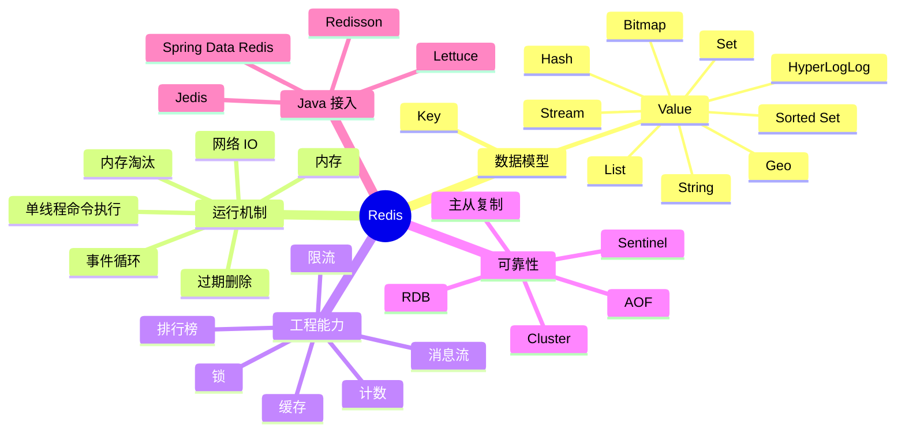
```mermaid
mindmap
  root((Redis))
    数据模型
      Key
      Value
        String
        Hash
        List
        Set
        Sorted Set
        Stream
        Bitmap
        HyperLogLog
        Geo
    运行机制
      内存
      单线程命令执行
      事件循环
      网络 IO
      过期删除
      内存淘汰
    工程能力
      缓存
      锁
      限流
      计数
      排行榜
      消息流
    可靠性
      RDB
      AOF
      主从复制
      Sentinel
      Cluster
    Java 接入
      Jedis
      Lettuce
      Redisson
      Spring Data Redis
```

把 Redis 学透，可以沿着这条递归链：

```text
Redis 是什么
  -> Redis 怎么存数据
    -> 每种数据结构适合什么业务
      -> 命令复杂度和内存成本是什么
        -> Java 如何调用
          -> 高并发下会出什么问题
            -> 生产如何监控、限流、降级、恢复
              -> 面试如何解释取舍
```

### 1.5 本地快速启动

#### 1.5.1 Docker 启动

```bash
# 启动一个本地 Redis 容器，并把容器 6379 端口映射到宿主机 6379。
docker run --name redis-dev -p 6379:6379 -d redis:latest

# 进入容器内的 redis-cli，后续可以直接输入 PING、SET、GET 等 Redis 命令。
docker exec -it redis-dev redis-cli
```

进入命令行后：

```bash
# 检查 Redis 是否可用，正常返回 PONG。
PING

# 写入一个最小 String 示例，用来确认读写链路正常。
SET name redis

# 读取刚才写入的值，正常返回 redis。
GET name

# 清理测试 Key，避免示例数据留在本地实例里。
DEL name
```

返回 `PONG` 表示 Redis 服务正常。

最小闭环验证：

1\. 前置条件：本机已安装 Docker，并且 `6379` 端口没有被其他 Redis 实例占用。
2\. 操作步骤：先执行 `docker run` 启动容器，再用 `redis-cli` 进入命令行。
3\. 预期输出：执行 `PING` 返回 `PONG`，执行 `GET name` 返回 `redis`。
4\. 验证方式：执行 `docker ps` 能看到 `redis-dev` 容器处于运行状态。
5\. 常见失败原因：端口冲突、Docker 未启动、镜像拉取失败、公司网络代理限制、容器已存在同名实例。

#### 1.5.2 常用命令行工具

```bash
# 连接本机 6379 端口的 Redis 实例。
redis-cli -h 127.0.0.1 -p 6379

# 查看 Redis 运行信息，适合快速确认实例状态。
redis-cli INFO

# 查看当前逻辑库中的 Key 数量。
redis-cli DBSIZE

# 实时打印 Redis 收到的命令；生产环境谨慎使用，可能带来性能和敏感信息风险。
redis-cli MONITOR
```

注意：`MONITOR` 会打印 Redis 收到的所有命令，生产环境谨慎使用，可能带来明显性能影响和敏感信息泄露风险。

#### 1.5.3 非 Docker 安装与多实例规划（不常用）

实际学习或生产环境里，也会遇到直接在 Linux 机器上安装 Redis 的情况。源码安装大致流程是下载源码、安装 C 编译环境、执行 `make` 和 `make install`，再用独立配置文件启动服务。

```bash
# 解压 Redis 源码包，x.y.z 需要替换为实际版本号。
tar xf redis-x.y.z.tar.gz

# 进入源码目录。
cd redis-x.y.z

# 编译 Redis，可执行文件会生成在 src 目录下。
make

# 安装到指定目录，便于和系统自带文件隔离。
make install PREFIX=/opt/redis

# 使用独立配置文件启动 Redis 服务。
redis-server /opt/redis/conf/6379.conf

# 连接 6379 端口并发送 PING，返回 PONG 表示启动成功。
redis-cli -p 6379 PING
```

源码安装常见注意点：

1\. Redis 用 C 语言实现，源码编译需要 `gcc`、`make` 等工具。
2\. 操作系统版本、编译器版本和 Redis 版本要匹配，编译失败时先看 `README` 和报错。
3\. 可执行程序可以只有一份，但多个 Redis 实例应有各自独立的配置文件、端口、日志和持久化目录。
4\. 一台机器上跑多个 Redis 实例时，通常通过端口区分，例如 `6379`、`6380`、`6381`。
5\. 生产上更推荐系统服务、容器编排或云托管方式管理 Redis 生命周期，不建议手工散落启动命令。

一个多实例目录规划示例：

```text
/opt/redis/bin/redis-server
/data/redis/6379/redis.conf
/data/redis/6379/dump.rdb
/data/redis/6379/appendonlydir/
/data/redis/6380/redis.conf
/data/redis/6380/dump.rdb
```

核心原则：

> 多实例共享可执行文件没问题，但不要共享端口、配置文件、日志文件和持久化目录。

## 2 数据建模与核心数据结构

这一部分解决“Redis 到底怎么组织数据”。学习重点不是背命令，而是根据业务语义选择合适的数据结构，并知道每种结构的边界。

### 2.1 Redis 基础模型

#### 2.1.1 Key-Value 模型

Redis 是键值数据库：

```text
key -> value
```

但它和普通 Map 的区别在于，value 不是单一字符串，而可以是 Redis 原生数据结构：

```text
user:1:name       -> String
user:1:profile    -> Hash
article:1:likes   -> Set
rank:daily        -> Sorted Set
mq:order          -> Stream
```

#### 2.1.2 逻辑库

Redis 有逻辑库的概念。可以把它理解成：同一个 Redis 实例里划分出多个逻辑 Key 空间，不同逻辑库里的 Key 彼此隔离。

默认单机 Redis 通常有 16 个逻辑库：

```text
0 号库
1 号库
2 号库
...
15 号库
```

默认连接进去是 `0` 号库。可以用 `SELECT` 切换逻辑库：

```redis
SELECT 0
SET name Alice

SELECT 1
GET name
```

在 `1` 号库里通常查不到 `0` 号库写入的 `name`。

小白心智模型：

```text
一个 Redis 实例像一栋楼。
逻辑库像这栋楼里的多个房间。
不同房间里的东西互相看不到。
但整栋楼的水、电、门禁、地基都是共用的。
```

逻辑库的作用：

1\. 在同一个 Redis 实例里做简单 Key 空间隔离。
2\. 学习和本地测试时，可以临时把不同用途的数据放到不同逻辑库。
3\. 小型内部工具里，可以用不同逻辑库粗略区分不同数据。

逻辑库的局限：

1\. 所有逻辑库共用同一个 Redis 进程。
2\. 所有逻辑库共用同一份内存、CPU（Central Processing Unit，中央处理器）、网络和磁盘 IO（Input/Output，输入/输出）。
3\. 某个逻辑库里的大 Key、慢命令、内存占用过高，会影响其他逻辑库。
4\. 持久化、备份、监控和淘汰策略通常也是实例级别的，不是逻辑库级别的强隔离。
5\. Redis Cluster 通常只使用 `0` 号库，不支持多逻辑库切换。

生产建议：

1\. 不要把逻辑库当成 MySQL 那种真正的数据库隔离。
2\. 生产环境更推荐使用 Key 前缀隔离，例如 `prod:user:1001`、`test:user:1001`。
3\. 不同环境、不同业务、不同安全级别的数据，更推荐使用不同 Redis 实例或不同 Redis 集群。
4\. 使用 `FLUSHDB` 时要非常谨慎，它会清空当前逻辑库。
5\. 使用 `FLUSHALL` 更危险，它会清空整个 Redis 实例的所有逻辑库。

面试回答：

> Redis 单机默认有多个逻辑数据库，可以通过 `SELECT` 切换，默认是 `0` 号库。逻辑库用于简单 Key 空间隔离，但它们共享同一个 Redis 实例的 CPU、内存、网络、持久化和淘汰策略，所以不是强隔离。生产中更推荐 Key 前缀或独立实例隔离。Redis Cluster 通常只使用 `0` 号库，不支持多库切换。

#### 2.1.3 Key 的设计

推荐命名：

```text
业务:模块:实体:标识:字段
```

示例：

```text
user:profile:10001
user:token:10001
product:detail:sku_886
order:lock:202607020001
rank:daily:2026-07-02
cache:article:detail:9527
```

好 Key 的标准：

1\. 能从名字看出业务含义。
2\. 层级固定，便于排查。
3\. 不要太长，避免浪费内存和网络带宽。
4\. 不要包含随机不可读片段，除非有明确原因。
5\. 集群多 Key 操作需要考虑 hash tag，例如 `cart:{user100}:items` 和 `cart:{user100}:meta`。

#### 2.1.4 Value 的选择原则

选择数据结构时，不要先问“我会哪个命令”，要先问：

```text
我要表达什么业务关系？
  -> 单个值？
  -> 对象字段？
  -> 有序列表？
  -> 去重集合？
  -> 带分数排序？
  -> 事件日志？
  -> 位状态？
  -> 近似统计？
```

映射表：

| 业务语义 | 推荐结构 | 典型场景 |
| --- | --- | --- |
| 单值 | String | 缓存 JSON、计数器、锁值 |
| 对象字段 | Hash | 用户资料、商品库存字段 |
| 插入顺序列表 | List | 简单队列、最近浏览 |
| 去重集合 | Set | 点赞用户、标签、好友关系 |
| 分数排序 | Sorted Set | 排行榜、延迟任务、热度榜 |
| 事件日志 | Stream | 订单事件、异步消费 |
| 二值状态 | Bitmap | 签到、在线状态 |
| 基数估算 | HyperLogLog | UV（Unique Visitor，独立访客）统计 |
| 地理位置 | Geo | 附近的人、门店搜索 |

#### 2.1.5 二进制安全与内部编码（不常用）

Redis 的 String 是二进制安全的。二进制安全的意思是：Redis 并不关心 value 是普通文本、JSON、图片字节、序列化对象还是压缩后的二进制数据，它按字节保存和返回。

这会带来两个工程结论：

1\. 编码和反序列化规则由客户端负责，例如 Java 里用 UTF-8、JSON、Protobuf 还是 JDK 序列化。
2\. `redis-cli` 直接查看二进制或中文内容时可能显示不友好，可以尝试 `redis-cli --raw`。

Redis 会根据 value 大小和数据结构特征选择内部编码，以节省内存和提升效率。可以用下面的命令观察：

```bash
# 查看 Key 对外暴露的数据类型，例如 string、hash、list。
TYPE key

# 查看 Redis 为该 Key 选择的内部编码，结果会受版本、配置和数据规模影响。
OBJECT ENCODING key

# 估算该 Key 占用的内存字节数，排查大 Key 时常用。
MEMORY USAGE key
```

注意：

1\. `TYPE` 看的是 Redis 对外暴露的数据类型，如 string、hash、list。
2\. `OBJECT ENCODING` 看的是内部编码，具体结果会随 Redis 版本、配置和数据规模变化。
3\. 学习时知道“Redis 会自动选择内部编码”即可，生产调优时再深入具体编码细节。

### 2.2 String：最基础但最常用

String 是 Redis 最基本的数据类型，可以存文本、数字、二进制、JSON 字符串。

#### 2.2.1 常用命令

```bash
# 写入一个普通字符串，Key 通常用“业务:对象:字段”的层次化命名方式。
SET user:1:name Alice

# 读取 String 值；Key 不存在时返回 nil。
GET user:1:name

# 删除指定 Key，返回实际删除的 Key 数量。
DEL user:1:name

# 判断 Key 是否存在，存在返回 1，不存在返回 0。
EXISTS user:1:name

# 写入登录验证码，并设置 300 秒过期时间；适合短生命周期数据。
SETEX code:login:13800000000 300 952713

# SET 也可以直接携带 EX 参数设置秒级过期时间，这里表示 token 2 小时后过期。
SET token:abc user100 EX 7200

# NX 表示只有 Key 不存在时才设置，常用于分布式锁的最小形态；EX 避免锁永久残留。
SET lock:order:1 uuid-123 NX EX 10

# 原子自增 1，适合计数器、访问量、序列号等场景。
INCR page:view:1

# 原子增加指定整数步长。
INCRBY page:view:1 10

# 原子增加浮点数；涉及金额时要注意精度和业务口径，强一致账本不要只放 Redis。
INCRBYFLOAT account:balance:1 3.14

# 原子自减 1。
DECR counter

# 批量写入多个 String，减少网络往返次数；不是“部分成功部分失败”的逐条语义。
MSET k1 v1 k2 v2

# 批量读取多个 String，返回顺序与传入 Key 顺序一致，不存在的 Key 返回 nil。
MGET k1 k2

# 只有所有 Key 都不存在时才批量写入；任意一个已存在则整体不写入。
MSETNX k3 v3 k4 v4

# 在已有 value 末尾追加字节内容；不适合对巨大 value 频繁追加。
APPEND log:1 tail

# 返回 value 的字节长度，不等同于中文字符数。
STRLEN log:1

# 按字节范围截取 value，适合理解 String 的字节序列能力，业务中要避免大范围操作。
GETRANGE log:1 0 10
```

关键词：

1\. `EX`：秒级过期时间。
2\. `PX`：毫秒级过期时间。
3\. `NX`：Key 不存在才设置。
4\. `XX`：Key 存在才设置。
5\. `SETEX`：设置值并设置过期时间。
6\. `INCR`：原子自增。
7\. `MSETNX`：多个 Key 都不存在时才批量设置，只要有一个存在就整体失败。
8\. `APPEND`、`GETRANGE`、`STRLEN`：适合理解 String 的字节序列能力，但业务里不要对巨大 value 频繁做范围操作。

#### 2.2.2 Java 场景

##### 2.2.2.1 缓存对象 JSON

```java
String key = "product:detail:" + skuId;
// 先查缓存：命中时直接返回，避免访问数据库。
String json = redisTemplate.opsForValue().get(key);
if (json != null) {
    if (json.isBlank()) {
        // 命中空值占位符，说明短时间内数据库也没有这条数据。
        return null;
    }
    return objectMapper.readValue(json, ProductDTO.class);
}

// 缓存未命中再查数据库，这是典型 Cache Aside 读路径。
ProductDTO product = productRepository.findBySkuId(skuId);
if (product == null) {
    // 数据库也不存在时，缓存短 TTL 空值，防止同一个不存在的 skuId 反复打到数据库。
    redisTemplate.opsForValue().set(key, "", Duration.ofMinutes(3));
    return null;
}
redisTemplate.opsForValue().set(
    key,
    objectMapper.writeValueAsString(product),
    // 给缓存设置过期时间，避免脏数据长期存在。
    Duration.ofMinutes(30)
);
return product;
```

##### 2.2.2.2 短信验证码

```java
String key = "sms:code:" + phone;
// 验证码必须设置较短 TTL，避免验证码长期有效。
redisTemplate.opsForValue().set(key, code, Duration.ofMinutes(5));
```

验证后删除：

```java
String key = "sms:code:" + phone;
String cachedCode = redisTemplate.opsForValue().get(key);
if (!Objects.equals(cachedCode, inputCode)) {
    throw new IllegalArgumentException("验证码错误或已过期");
}
// 验证成功后立即删除，防止同一验证码被重复使用。
redisTemplate.delete(key);
```

#### 2.2.3 面试递归追问

问题：Redis 的 `INCR` 为什么能做计数器？

回答要点：

1\. Redis 对单条命令的执行是原子的。
2\. `INCR` 在服务器端完成读、加一、写回，不会被其他命令插入。
3\. 多个 Java 实例同时调用也不会出现 JVM 进程内 `i++` 的并发问题。

继续追问：`INCR` 后服务宕机会不会丢？

1\. 如果没有持久化，可能丢。
2\. RDB（Redis Database，Redis 数据库快照）可能丢最近一次快照后的数据。
3\. AOF（Append Only File，追加日志文件）取决于 `appendfsync` 策略，默认 `everysec` 通常最多丢约 1 秒写入。

### 2.3 Hash：对象字段模型

Hash 类似 Java 里的 `Map<String, String>`，适合存对象的多个字段。

```text
user:10001
  name -> Alice
  age  -> 18
  city -> Shanghai
```

#### 2.3.1 常用命令

```bash
# 写入或覆盖 Hash 字段，适合存对象的局部属性。
HSET user:10001 name Alice age 18 city Shanghai

# 读取单个字段，字段不存在时返回 nil。
HGET user:10001 name

# 一次读取多个字段，减少网络往返次数。
HMGET user:10001 name city

# 读取整个 Hash；字段很多时不要在生产高频路径里滥用。
HGETALL user:10001

# 对整数字段原子自增，适合登录次数、累计次数这类字段。
HINCRBY user:10001 loginCount 1

# 对浮点字段原子累加；金额等强一致数据仍应以数据库账本为准。
HINCRBYFLOAT user:10001 score 1.5

# 删除指定字段，不会删除整个 user:10001 Key，除非字段删空后 Redis 自行移除。
HDEL user:10001 city

# 判断字段是否存在，适合区分“字段不存在”和“字段值为空字符串”的情况。
HEXISTS user:10001 name

# 返回 Hash 中字段数量，可用于粗略判断对象是否膨胀。
HLEN user:10001
```

#### 2.3.2 String JSON 和 Hash 的选择

| 方案 | 优点 | 缺点 | 适合 |
| --- | --- | --- | --- |
| String 存 JSON | 序列化简单，和数据库对象一致 | 更新单字段要读改写整个 JSON | 读多写少，整对象缓存 |
| Hash 存字段 | 可更新单字段，可自增字段 | 对嵌套对象不友好，字段类型都要处理 | 用户资料、计数、状态字段 |

经验：

1\. 商品详情、文章详情：优先 String + JSON。
2\. 用户在线状态、对象少数字段频繁变更：优先 Hash。
3\. 字段特别多、对象特别大：拆 Key，避免大 Key。

#### 2.3.3 Java 示例

```java
String key = "user:profile:" + userId;
Map<String, String> profile = new HashMap<>();
profile.put("nickname", "Alice");
profile.put("level", "7");
profile.put("city", "Shanghai");

redisTemplate.opsForHash().putAll(key, profile);
redisTemplate.expire(key, Duration.ofHours(2));
```

读取：

```java
Object nickname = redisTemplate.opsForHash().get(key, "nickname");
```

#### 2.3.4 面试递归追问

问题：为什么不用一个大 Hash 存所有用户？

回答要点：

1\. 大 Key 会导致单次操作阻塞时间变长。
2\. 迁移、删除、过期和备份成本更高。
3\. 集群下一个 Key 只能落在一个槽位，无法水平分散。
4\. 不利于按用户设置过期时间。

### 2.4 List：有序列表与简单队列

List 是按插入顺序排列的字符串列表，可从两端 push/pop。学习时可以把它理解成“双端队列”，但不要简单等同于 Java 的 `LinkedList`；现代 Redis 的 List 底层实现更接近 quicklist，用来在内存占用和两端操作效率之间折中。

#### 2.4.1 常用命令

```bash
# 从左侧压入消息，常见于把 List 当作简单队列或栈使用。
LPUSH queue:email msg1

# 从右侧压入消息，和 LPOP 搭配可形成先进先出队列。
RPUSH queue:email msg2

# 从左侧弹出元素；队列为空时立即返回 nil。
LPOP queue:email

# 从右侧弹出元素；与 LPUSH 搭配也可形成先进先出队列。
RPOP queue:email

# 阻塞式从右侧弹出元素，最多等待 5 秒；消费者线程会被挂起。
BRPOP queue:email 5

# 读取指定范围元素，stop 是闭区间；大范围读取会放大网络和主线程压力。
LRANGE queue:email 0 9

# 查看 List 长度，适合监控队列堆积。
LLEN queue:email

# 只保留最近 100 个元素，常用于“最近浏览”等有上限列表。
LPUSH recent:user:1 product:100
LTRIM recent:user:1 0 99

# 读取第一个元素。
LINDEX recent:user:1 0

# 读取最后一个元素。
LINDEX recent:user:1 -1

# 在指定元素前插入新元素；需要扫描定位，列表很大时要谨慎。
LINSERT recent:user:1 BEFORE product:100 product:99
```

#### 2.4.2 典型场景

1\. 最近浏览列表。
2\. 简单异步队列。
3\. 固定长度动态列表。

最近浏览：

```bash
# 先把最新商品放到列表头部。
LPUSH user:1:recent product:100

# 删除列表中已有的同一商品，count 为 0 表示删除所有匹配项，用来去重。
# LREM key count element，count = 0：删除所有匹配项。
# count > 0：从左到右删除最多 1 个匹配项。
# count < 0：从右到左删除最多 1 个匹配项。
LREM user:1:recent 0 product:100

# 去重后再放回头部，保证最新访问排在最前。
LPUSH user:1:recent product:100

# 只保留前 50 条，避免用户行为列表无限增长。
LTRIM user:1:recent 0 49
```

注意顺序：为了避免重复，可以先 `LREM` 再 `LPUSH`，也可以用 Lua 脚本保证原子性。

List 支持正负索引：

1\. `0` 表示第一个元素。
2\. `1` 表示第二个元素。
3\. `-1` 表示最后一个元素。
4\. `-2` 表示倒数第二个元素。

这对最近浏览、消息列表、时间线截断很方便，但大偏移访问仍要注意复杂度。

#### 2.4.3 List 做队列的局限

List 可以做简单队列，但生产上要谨慎：

1\. 消费者 `RPOP` 后宕机，消息可能丢失。
2\. 缺少消费者组、确认、重试、死信等完整消息队列能力。
3\. 更可靠的 Redis 原生选择是 Stream。
4\. 更重型业务应考虑 RocketMQ、Kafka、RabbitMQ 等专用消息队列。

### 2.5 Set：去重集合

Set 是无序且元素唯一的集合。

#### 2.5.1 常用命令

```bash
# 给文章点赞集合加入多个用户，重复 member 会自动去重。
SADD article:1:likes user1 user2 user3

# 取消某个用户的点赞。
SREM article:1:likes user2

# 判断用户是否点过赞，适合做按钮状态或幂等判断。
SISMEMBER article:1:likes user1

# 统计点赞人数；这是集合基数，不返回具体用户列表。
SCARD article:1:likes

# 返回全部点赞用户；集合很大时不要在接口里直接使用。
SMEMBERS article:1:likes

# 求两个用户标签交集，适合共同兴趣、共同关注这类场景。
SINTER user:1:tags user:2:tags

# 求两个集合并集。
SUNION user:1:tags user:2:tags

# 求 user:1 有而 user:2 没有的差集。
SDIFF user:1:tags user:2:tags
```

#### 2.5.2 典型场景

1\. 点赞用户集合。
2\. 用户标签。
3\. 共同好友。
4\. 抽奖去重。
5\. 黑名单、白名单。

#### 2.5.3 Java 示例：点赞

```java
String key = "article:like:users:" + articleId;
String user = String.valueOf(userId);

Boolean liked = redisTemplate.opsForSet().isMember(key, user);
if (Boolean.TRUE.equals(liked)) {
    redisTemplate.opsForSet().remove(key, user);
} else {
    redisTemplate.opsForSet().add(key, user);
}
Long count = redisTemplate.opsForSet().size(key);
```

生产提醒：

1\. 点赞数可以用 `SCARD`，但超大集合需要评估成本。
2\. 是否点赞用 `SISMEMBER` 很适合。
3\. 如果只需要数量，不需要用户列表，可考虑计数器或 HyperLogLog。

### 2.6 Sorted Set：排行榜核心

Sorted Set，也叫 ZSet，是“唯一元素 + 分数 score”的有序集合。

#### 2.6.1 常用命令

```bash
# 写入排行榜分数，score 决定排序位置。
ZADD rank:daily 100 user1 200 user2 150 user3

# 原子增加 user1 的分数，适合积分、热度、播放量等累计指标。
ZINCRBY rank:daily 10 user1

# 按分数从高到低取前 10 名，并返回分数。
ZREVRANGE rank:daily 0 9 WITHSCORES

# 按分数从低到高取前 10 名，并返回分数。
ZRANGE rank:daily 0 9 WITHSCORES

# 查看 user1 的倒序排名，排名从 0 开始。
ZREVRANK rank:daily user1

# 查询 user1 当前分数。
ZSCORE rank:daily user1

# 从排行榜移除 user2。
ZREM rank:daily user2

# 统计分数在 100 到 200 之间的成员数量。
ZCOUNT rank:daily 100 200
```

#### 2.6.2 典型场景

1\. 积分排行榜。
2\. 热搜榜。
3\. 延迟队列。
4\. 按时间排序的动态。
5\. 优先级队列。

#### 2.6.3 排行榜 Java 示例

```java
String key = "rank:daily:" + LocalDate.now();
redisTemplate.opsForZSet().incrementScore(key, String.valueOf(userId), scoreDelta);
redisTemplate.expire(key, Duration.ofDays(3));
```

查询前 10：

```java
Set<ZSetOperations.TypedTuple<String>> top =
    redisTemplate.opsForZSet().reverseRangeWithScores(key, 0, 9);
```

#### 2.6.4 延迟队列思路

用时间戳作为 score：

```bash
# 把订单放入延迟队列，score 使用未来触发时间戳。
ZADD delay:order 1783000000000 order:10001
```

消费者轮询：

```bash
# 拉取到期订单；now 在真实代码里应替换为当前时间戳。score 从负无穷到 now 的成员
ZRANGEBYSCORE delay:order -inf now LIMIT 0 10

# 处理成功后删除成员，避免重复消费；生产中通常要配合 Lua 保证取出和删除的原子性。
ZREM delay:order order:10001
```

生产注意：

1\. `ZRANGEBYSCORE` 和 `ZREM` 分开执行会有并发竞争。
2\. 可以用 Lua 脚本做“取出并删除”的原子操作。
3\. 延迟任务量大、可靠性要求高时，应评估专用 MQ（Message Queue，消息队列）或调度系统。

### 2.7 Bitmap：海量二值状态（不常用）

Bitmap 本质上是 String 的位操作能力。每一位表示一个布尔状态。

#### 2.7.1 常用命令

```bash
# 将指定偏移位设置为 1，适合签到、布尔状态、海量标记。
SETBIT sign:2026-07 userIdOffset 1

# 读取指定偏移位，返回 0 或 1。
GETBIT sign:2026-07 userIdOffset

# 统计 bitmap 中为 1 的位数。
BITCOUNT sign:2026-07

# 对多个 bitmap 做位运算，适合交集、并集这类统计。
BITOP AND result key1 key2
```

#### 2.7.2 场景

1\. 用户签到。
2\. 活跃状态。
3\. 是否在线。
4\. 某天是否访问。

示例：用户 10001 在 2026-07-02 签到：

```bash
# 第 1 天已签到，offset 可按“日期减 1”映射。
SETBIT sign:2026-07:10001 1 1

# 查询第 1 天是否签到。
GETBIT sign:2026-07:10001 1

# 统计当月已签到天数。
BITCOUNT sign:2026-07:10001
```

如果按“用户维度”存，每个用户每月一个 Key，offset 是日期。
如果按“日期维度”存，每天一个 Key，offset 是 userId 映射值。

选择取决于查询模式：

1\. 查某用户一个月签到：用户维度。
2\. 查某天所有活跃用户数：日期维度。

### 2.8 HyperLogLog：近似 UV 统计（不常用）

HyperLogLog 用于估算不重复元素数量，占用内存很小，但结果是近似值。

#### 2.8.1 常用命令

```bash
# 记录用户访问，HyperLogLog 用少量内存估算 UV（Unique Visitor，独立访客数）。
PFADD uv:article:1 user1 user2 user3

# 估算该文章 UV，结果不是精确值。
PFCOUNT uv:article:1

# 合并多个 HyperLogLog，适合统计全站或多篇文章的近似 UV。
PFMERGE uv:article:all uv:article:1 uv:article:2
```

适合：

1\. UV（Unique Visitor，独立访客）统计。
2\. 大规模去重计数。
3\. 对精确度要求不是 100% 的统计。

不适合：

1\. 必须精确计数。
2\. 需要取回成员列表。

### 2.9 Geo：地理位置（不常用）

Geo 用于经纬度位置索引，底层可理解为 Sorted Set 的特殊编码。

#### 2.9.1 常用命令

```bash
# 写入门店经纬度，参数顺序是经度、纬度、成员名。
GEOADD shop:geo 121.4737 31.2304 shop1

# 再写入一个门店位置。
GEOADD shop:geo 116.4074 39.9042 shop2

# 计算两个门店之间的距离，单位为千米。
GEODIST shop:geo shop1 shop2 km

# 按给定经纬度搜索 5 千米半径内的门店，并返回距离。
GEOSEARCH shop:geo FROMLONLAT 121.47 31.23 BYRADIUS 5 km WITHDIST
```

场景：

1\. 附近门店。
2\. 附近司机。
3\. 附近的人。

生产注意：

1\. Geo 适合粗筛，复杂地图路径、交通距离、行政区划应交给专业地图服务。
2\. 经纬度数据要注意坐标系转换。

### 2.10 Stream：Redis 原生消息流

Stream 是 Redis 提供的追加日志结构，适合事件流和轻量消息队列。

#### 2.10.1 核心概念

```text
Stream
  -> entry：消息条目
  -> id：消息 ID
  -> consumer group：消费者组
  -> consumer：消费者
  -> pending：已投递但未确认的消息
```

#### 2.10.2 常用命令

```bash
# 追加一条事件，* 表示由 Redis 自动生成递增消息 ID。
XADD order:events * orderId 10001 status CREATED

# 查看 Stream 当前消息数量。
XLEN order:events

# 读取全量消息范围；生产中要限制范围和条数，避免一次拉取过多。-是最小ID，+最大ID
XRANGE order:events - +

# 创建消费者组，$ 表示从当前最新消息之后开始消费；MKSTREAM 表示 Stream 不存在时自动创建（Make）。
XGROUP CREATE order:events group-order $ MKSTREAM

# 以消费者组方式读取新消息（consumer-1是消费者，用到时才创建），最多 10 条，最多阻塞 5000 毫秒。
# > 表示只读取“还没有分发给任何消费者的新消息”，STREAMS是Stream的复数
XREADGROUP GROUP group-order consumer-1 COUNT 10 BLOCK 5000 STREAMS order:events >

# 确认消息已处理，消息 ID 要替换成实际读取到的 ID。
# 确认这条消息在 group-order 这个组里处理完成了。它会从该组的 PEL 里移除。
# PEL 全称是 Pending Entries List，待确认消息列表。
XACK order:events group-order 1783000000000-0

# 查看消费者组中待确认消息，排查消息堆积或消费者异常时常用。
XPENDING order:events group-order
```

#### 2.10.3 适合场景

1\. 订单状态事件。
2\. 操作日志。
3\. 轻量异步消费。
4\. 需要消费者组和确认机制的 Redis 内部队列。

#### 2.10.4 与 List、Pub/Sub 的区别

| 能力 | List | Pub/Sub | Stream |
| --- | --- | --- | --- |
| 消息保存 | 有 | 无，订阅者不在线就收不到 | 有 |
| 消费者组 | 无 | 无 | 有 |
| 确认机制 | 无 | 无 | 有 |
| 消息回溯 | 弱 | 无 | 强 |
| 适合 | 简单队列 | 在线广播 | 可靠事件流 |

#### 2.10.5 Pub/Sub：在线广播

Pub/Sub 是 Publish/Subscribe，即发布/订阅。它适合“在线广播”，不适合“可靠消息队列”。

常用命令：

```bash
# 订阅频道；连接会进入阻塞接收状态，通常需要单独连接执行。
SUBSCRIBE notice:system

# 向频道发布消息，只有当前在线订阅者能收到。
PUBLISH notice:system "hello"

# 取消订阅频道。
UNSUBSCRIBE notice:system
```

心智模型：

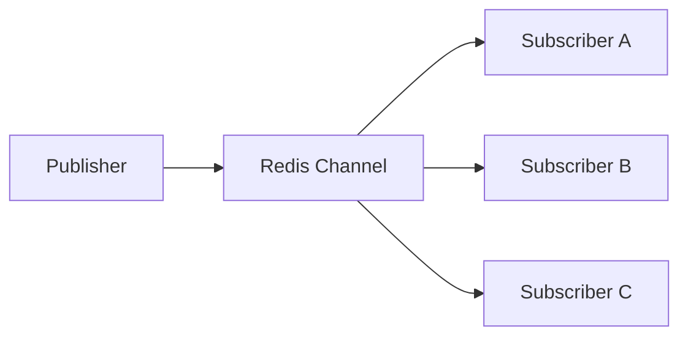
```mermaid
flowchart LR
    P["Publisher"] --> R["Redis Channel"]
    R --> S1["Subscriber A"]
    R --> S2["Subscriber B"]
    R --> S3["Subscriber C"]
```

适合：

1\. 后台管理系统广播刷新通知。
2\. 简单在线通知。
3\. 多实例之间发送轻量事件。

不适合：

1\. 订单创建、支付成功、库存扣减等必须可靠处理的消息。
2\. 消费者不在线还要补收的消息。
3\. 需要确认、重试、死信、回溯的业务。

面试回答：

> Pub/Sub 没有消息持久化和确认机制，订阅者不在线就收不到消息。可靠事件流优先考虑 Stream 或专用 MQ。

## 3 运行机制、复杂度与原子性

这一部分解释 Redis 为什么快、什么时候不快、哪些操作是原子的、什么时候需要事务、Pipeline 或 Lua。它是从“会用命令”走向“能解释生产问题”的关键。

### 3.1 过期时间 TTL

TTL 是 Time To Live，即存活时间。

#### 3.1.1 常用命令

```bash
# 给 Key 设置秒级过期时间。
EXPIRE user:token:1 7200

# 给 Key 设置毫秒级过期时间。p = precise 比秒更精确
PEXPIRE user:token:1 7200000

# 查看剩余秒级生存时间，-1 表示无过期时间，-2 表示 Key 不存在。
TTL user:token:1

# 查看剩余毫秒级生存时间。
PTTL user:token:1

# 移除过期时间，使 Key 变成永久 Key。
PERSIST user:token:1
```

返回值含义：

1\. `TTL > 0`：剩余秒数。
2\. `TTL = -1`：Key 存在但没有过期时间。
3\. `TTL = -2`：Key 不存在。

#### 3.1.2 过期删除策略

Redis 主要结合：

1\. 惰性删除：访问 Key 时发现过期再删除。
2\. 定期删除：后台周期性抽样检查过期 Key。

这意味着：

1\. Key 到期不代表立刻物理删除。
2\. 大量 Key 同一时间过期可能造成 CPU 抖动。
3\. 生产中要给 TTL 加随机抖动，避免雪崩。

示例：

```java
long baseSeconds = 1800;
long randomSeconds = ThreadLocalRandom.current().nextLong(0, 300);
redisTemplate.opsForValue().set(key, value, Duration.ofSeconds(baseSeconds + randomSeconds));
```

### 3.2 内存淘汰策略

Redis 内存满了怎么办，取决于 `maxmemory-policy`。

常见策略：

| 策略 | 含义 |
| --- | --- |
| `noeviction` | 不淘汰，写入报错 |
| `allkeys-lru` | 所有 Key 里淘汰最近最少使用 |
| `volatile-lru` | 有过期时间的 Key 里淘汰最近最少使用 |
| `allkeys-random` | 所有 Key 随机淘汰 |
| `volatile-random` | 有过期时间的 Key 随机淘汰 |
| `volatile-ttl` | 有过期时间的 Key 中优先淘汰快过期的 |
| `allkeys-lfu` | 所有 Key 里淘汰最少频率使用 |
| `volatile-lfu` | 有过期时间的 Key 里淘汰最少频率使用 |

LRU 是 Least Recently Used，最近最少使用。
LFU 是 Least Frequently Used，最不经常使用。

经验：

1\. 纯缓存：常用 `allkeys-lru` 或 `allkeys-lfu`。
2\. 缓存和重要状态混用：强烈建议拆实例，不要只靠策略保护。
3\. 不允许自动丢 Key：使用 `noeviction`，但要监控写入失败。

### 3.3 常用命令复杂度速查

Redis 很快，但不是所有命令都一样快。生产事故里，很多问题不是“Redis 不够快”，而是应用把 O(N) 命令用在了大 Key 上。

复杂度里的 N 通常表示集合元素数量，M 表示本次返回或处理的元素数量，S 表示起始偏移量。

| 类型 | 命令 | 常见复杂度 | 生产提醒 |
| --- | --- | --- | --- |
| Key | `EXISTS key` | O(1) | 单 Key 判断很轻 |
| Key | `DEL key` | O(N) | 删除大 Key 可能阻塞，优先考虑 `UNLINK` |
| Key | `SCAN` | 单次 O(1)，完整迭代 O(N) | 可替代 `KEYS`，但仍要控制频率 |
| String | `GET` / `SET` | O(1) | 大 value 仍会消耗网络和序列化时间 |
| String | `INCR` / `DECR` | O(1) | 适合计数器 |
| Hash | `HGET` / `HSET` | 平均 O(1) | 单字段读写适合对象局部更新 |
| Hash | `HGETALL` | O(N) | 大 Hash 禁止随意全量拉取 |
| List | `LPUSH` / `RPUSH` / `LPOP` / `RPOP` | O(1) | 两端操作很适合队列和最近列表 |
| List | `LRANGE start stop` | O(S + M) | 大偏移分页会越来越慢 |
| Set | `SADD` / `SREM` / `SISMEMBER` | 平均 O(1) | 适合去重和成员判断 |
| Set | `SMEMBERS` | O(N) | 大 Set 风险很高，优先 `SSCAN` |
| Sorted Set | `ZADD` / `ZREM` | O(logN) | 排行榜核心操作 |
| Sorted Set | `ZRANGE` / `ZREVRANGE` | O(logN + M) | 控制返回数量 |
| Sorted Set | `ZRANK` / `ZREVRANK` | O(logN) | 查个人排名很合适 |
| Stream | `XADD` | 近似 O(1) | 消息体不能太大 |
| Stream | `XRANGE` / `XREADGROUP` | O(M) | 控制批量大小和 pending 积压 |

面试回答技巧：

> Redis 的快不是无限快。单 Key、单字段、小范围操作通常很快；全量遍历、大 Key 删除、大集合返回、大 Lua 脚本都可能阻塞主线程或打满网络。
>
> 大 key = 一个 Redis key 占用的总内存太大
>        = key name + value + 元数据
>        但主要问题通常来自 value

### 3.4 Redis 为什么快

面试常问：“Redis 为什么快？”

不要只答“因为基于内存”，完整答案应包括：

1\. 数据主要在内存中，避免磁盘随机 IO。
2\. 核心命令执行模型简单，单线程处理命令避免大量锁竞争。
3\. 使用 IO 多路复用处理大量连接。
4\. 数据结构针对常见操作做了优化。
5\. Redis 协议简单，客户端和服务器交互成本低。
6\. 命令通常是短小操作，避免复杂 SQL 优化和执行计划。

注意：现代 Redis 在网络 IO、持久化、异步释放等方面可能使用额外线程，但“命令执行的核心路径”通常仍可按单线程原子模型理解。

#### 3.4.1 IO 多路复用与 epoll 心智模型（不常用）

IO 是 Input/Output，即输入/输出。Redis 能用较少线程处理大量客户端连接，核心原因之一是 IO 多路复用。初学者可以先按下面这条演进线理解：

```text
BIO：一个连接阻塞一个线程
  -> NIO：连接本身不阻塞，但应用要主动检查是否可读可写
    -> IO 多路复用：一个线程把大量连接交给内核监听
      -> epoll：Linux 下常见且高效的 IO 多路复用实现
```

几个概念先分清：

| 概念 | 全称 | 初学者心智模型 | 优点 | 问题 |
| --- | --- | --- | --- | --- |
| BIO | Blocking IO，阻塞式输入输出 | 一个连接通常占住一个线程，线程在 `read` 或 `write` 上等待 | 模型简单，代码直观 | 连接多时线程数量暴涨，线程切换和内存成本高 |
| NIO | Non-blocking IO，非阻塞式输入输出 | 读写操作立即返回，没数据就稍后再试 | 不必让线程一直卡住 | 如果应用自己反复轮询，会浪费 CPU |
| IO 多路复用 | Multiplexing IO，多路复用输入输出 | 一个线程同时等待多个 socket 的就绪事件 | 大量连接可以由少量线程管理 | 单个事件处理太慢仍会拖慢后续事件 |
| epoll | Linux event poll，Linux 事件轮询机制 | 把大量文件描述符交给内核，内核通知哪些连接已就绪 | 适合大量连接，避免无意义轮询 | 是 Linux 机制，其他系统有不同实现 |

文件描述符是 File Descriptor，简称 FD，可以先理解为操作系统里代表一个 socket、文件或管道的编号。

BIO 的问题：

1\. 假设有 10000 个客户端连接，如果每个连接都用一个线程阻塞等待，线程数量会非常夸张。
2\. 大量连接其实大部分时间是空闲的，让线程一直等在空闲连接上很浪费。
3\. Java Web 早期常见的“一个请求一个线程”模型容易让初学者误以为网络服务必须靠很多线程撑连接数，但 Redis 不是这样。

NIO 的问题：

1\. NIO 让 socket 变成非阻塞，`read` 没有数据时可以立即返回。
2\. 这避免了线程被一个连接卡住，但如果程序自己不断循环检查所有连接，就会形成忙轮询。
3\. 忙轮询会浪费 CPU（Central Processing Unit，中央处理器），所以还需要一种机制告诉应用“哪些连接真的准备好了”。

IO 多路复用解决的问题：

1\. 应用把多个 socket 注册给操作系统内核。
2\. 应用线程阻塞等待的是“一批连接里有没有就绪事件”，而不是阻塞等待某一个连接。
3\. 内核发现某些连接可读、可写或异常后，通知应用线程。
4\. 应用线程拿到就绪连接列表，再逐个处理对应事件。

epoll 的直观理解：

1\. Redis 把大量客户端 socket 对应的 FD 注册到 epoll。
2\. 客户端发来命令时，对应 socket 变成可读。
3\. epoll 通知 Redis：“这些连接有事件了”。
4\. Redis 事件循环取出就绪事件，读取命令、解析命令、执行命令、写回响应。

Redis 实际用的是什么：

1\. Redis 使用事件循环加 IO 多路复用处理网络连接。
2\. 在 Linux 上，Redis 通常使用 epoll。
3\. 在 macOS、BSD 等系统上，Redis 可以使用 kqueue。
4\. 在不支持高效事件机制的平台上，Redis 也有 select 等兜底实现。
5\. 所以更准确的说法是：Redis 抽象了一套事件模型，在不同操作系统上选择合适的 IO 多路复用实现；Linux 生产环境里通常就是 epoll。

Redis 6 之后还要补一句：

1\. Redis 6 引入了可选的 IO 线程能力，主要用于网络读写阶段。
2\. 这不等于 Redis 变成了“多线程并发执行命令”的数据库。
3\. Redis 常说的单线程，重点仍然是核心命令执行路径通常在主线程事件循环中顺序执行。
4\. 因此，**慢 Lua、大 Key 删除、全量遍历、大集合返回**仍然可能阻塞后续请求。

为什么这很重要：

1\. Redis 不需要为每个连接创建一个业务线程。
2\. 大量空闲连接不会像 BIO 那样消耗大量线程。
3\. IO 多路复用解决的是“怎么高效等网络事件”，不是“命令执行永远不会慢”。
4\. 单个慢命令仍可能阻塞后续命令，所以**大 Key、慢 Lua、全量遍历**要特别谨慎。

### 3.5 单线程与原子性

Redis 的单条命令天然具备原子性，因为命令执行过程中不会穿插执行其他客户端命令。

但要注意：

1\. 多条命令组合不天然原子。
2\. Java 里先 `GET` 再 `SET` 会有并发问题。
3\. 需要用 Redis 原生命令（ 如`SET NX EX`）、Lua、事务解决。

错误示例：

```java
String value = redisTemplate.opsForValue().get("stock:sku1");
int stock = Integer.parseInt(value);
if (stock > 0) {
    redisTemplate.opsForValue().set("stock:sku1", String.valueOf(stock - 1));
}
```

问题：多个线程可同时读到同一个库存。

更好：

```bash
# 原子扣减库存；单条命令不会被其他客户端命令插入。
DECR stock:sku1
```

或用 Lua 判断库存大于 0 再扣减。

### 3.6 事务、Pipeline 和 Lua

#### 3.6.1 Redis 事务

命令：

```bash
# 开启事务队列，后续命令先排队不立即执行。
MULTI

# 写入命令进入事务队列。
SET k1 v1

# 自增命令进入事务队列。如果这步错了，上步SET不会回滚
INCR counter

# 执行队列中的所有命令；Redis 事务不支持自动回滚已执行命令。
EXEC
```

Redis 事务特点：

1\. `MULTI` 到 `EXEC` 之间命令会入队。
2\. `EXEC` 时按顺序执行。
3\. 不等同于 MySQL 的 ACID 事务。
4\. 命令执行错误不会自动回滚已执行命令。

ACID 是 Atomicity、Consistency、Isolation、Durability，即原子性、一致性、隔离性、持久性。


Redis 事务在生产中有场景，但通常用于缓存状态、计数、辅助索引等弱一致场景。它保证 EXEC 后命令连续执行，不保证像 MySQL 那样失败自动回滚。所以核心交易、余额、订单、强一致库存一般不会依赖 Redis 事务，而是使用数据库事务、Lua 原子脚本、幂等和补偿机制。


#### 3.6.2 WATCH 乐观锁（不常用）

```bash
# 监视库存 Key，如果 EXEC 前它被其他客户端修改，事务会失败。
WATCH stock:sku1

# 读取当前库存，用于客户端做条件判断。
GET stock:sku1

# 开启事务队列。
MULTI

# 库存扣减命令入队。
DECR stock:sku1

# 提交事务；如果 WATCH 的 Key 被改过，这里会返回空结果，上面的DECR命令只是入队就没有执行
EXEC
```

如果 `WATCH` 的 Key 被其他客户端修改，`EXEC` 会失败。

#### 3.6.3 Pipeline

Pipeline 是客户端批量发送命令，减少网络往返。

适合：

1\. 批量写缓存。
2\. 批量读取多个独立 Key。
3\. 初始化数据。

不适合：

1\. 需要前一个命令结果决定后一个命令。
2\. 一次塞入巨大批量导致 Redis 或网络缓冲区压力过大。

#### 3.6.4 Lua 脚本

Lua 脚本在 Redis 服务器端原子执行，适合把多条命令组合成一个不可插队的操作。

库存扣减脚本：

```lua
-- KEYS[1] 是库存 Key，例如 stock:sku1。
local stock = tonumber(redis.call('GET', KEYS[1]))
if stock == nil then
    -- -1 表示库存 Key 不存在，通常说明未预热或参数错误。
    return -1
end
if stock <= 0 then
    -- 0 表示库存不足。
    return 0
end
-- Redis 脚本整体原子执行，这里不会被其他扣减命令插入。
redis.call('DECR', KEYS[1])
return 1
```

Java 执行：

```java
DefaultRedisScript<Long> script = new DefaultRedisScript<>();
// 告诉 Spring Data Redis 脚本返回值类型，便于反序列化。
script.setResultType(Long.class);
script.setScriptText("""
    local stock = tonumber(redis.call('GET', KEYS[1]))
    if stock == nil then
        return -1
    end
    if stock <= 0 then
        return 0
    end
    redis.call('DECR', KEYS[1])
    return 1
    """);

// List.of("stock:sku1") 会作为 KEYS 传入 Lua 脚本。
Long result = redisTemplate.execute(script, List.of("stock:sku1"));
```

## 4 Java 接入与客户端工程配置

这一部分回到 Java 程序员的日常工作：选择客户端、配置 Spring Boot、处理序列化、连接池、超时、重试和降级。

### 4.1 Java 客户端选择

Java 常见 Redis 客户端：

| 客户端 | 特点 | 适合 |
| --- | --- | --- |
| Jedis | 同步 API，使用直观 | 简单项目、传统阻塞模型 |
| Lettuce | 基于 Netty，支持同步、异步、响应式 | Spring Boot 默认常用选择 |
| Redisson | 提供分布式锁、集合、信号量等高级对象 | 分布式协调场景 |
| Spring Data Redis | Spring 抽象层，封装 RedisTemplate、Repository、Cache | Spring 生态项目 |

API 是 Application Programming Interface，即应用程序编程接口。

#### 4.1.1 Spring Boot 依赖

Maven：

```xml
<dependency>
    <groupId>org.springframework.boot</groupId>
    <artifactId>spring-boot-starter-data-redis</artifactId>
</dependency>
```

常见配置：

```yaml
spring:
  data:
    redis:
      host: 127.0.0.1
      port: 6379
      database: 0
      timeout: 2s
      lettuce:
        pool:
          max-active: 16
          max-idle: 8
          min-idle: 2
          max-wait: 1s
```

#### 4.1.2 RedisTemplate 序列化

默认 JDK 序列化可读性差、跨语言差，不推荐作为业务缓存默认方案。

推荐显式配置：

```java
@Bean
public RedisTemplate<String, Object> redisTemplate(RedisConnectionFactory factory) {
    RedisTemplate<String, Object> template = new RedisTemplate<>();
    template.setConnectionFactory(factory);

    // Key 使用字符串序列化，方便排查和跨语言访问。
    StringRedisSerializer stringSerializer = new StringRedisSerializer();
    // Value 使用 JSON 序列化，避免默认 JDK 序列化不可读、难演进。
    GenericJackson2JsonRedisSerializer jsonSerializer =
        new GenericJackson2JsonRedisSerializer();

    template.setKeySerializer(stringSerializer);
    template.setHashKeySerializer(stringSerializer);
    template.setValueSerializer(jsonSerializer);
    template.setHashValueSerializer(jsonSerializer);
    template.afterPropertiesSet();
    return template;
}
```

更简单的字符串场景可用：

```java
private final StringRedisTemplate stringRedisTemplate;
```

#### 4.1.3 序列化设计原则

1\. Key 一律用可读字符串。
2\. Value 如果跨语言，优先 JSON。
3\. 高性能内部场景可考虑 Kryo、Protobuf，但要处理版本兼容。
4\. 不要把复杂 Java 类直接 JDK 序列化后长期存 Redis。
5\. 缓存对象要考虑字段新增、删除、类型变更。

#### 4.1.4 Java 客户端生产配置

Java 程序员接入 Redis 时，最容易忽略的不是 API，而是超时、连接池、重试和降级。

##### 4.1.4.1 超时

建议至少区分：

1\. 连接超时：建立 TCP（Transmission Control Protocol，传输控制协议）连接最多等多久。
2\. 命令超时：一条 Redis 命令最多等多久返回。
3\. 读取超时：连接已建立后，读取响应最多等多久。

经验：

1\. 内网 Redis 命令超时通常不应设置得太长，否则线程会堆积。
2\. 超时不是越短越好，太短会在抖动时制造大量误判失败。
3\. 对核心链路要有降级策略，例如返回默认值、本地缓存兜底或快速失败。

##### 4.1.4.2 连接池

连接池不是越大越好。

```yaml
spring:
  data:
    redis:
      timeout: 2s
      lettuce:
        pool:
          max-active: 32
          max-idle: 16
          min-idle: 4
          max-wait: 1s
```

配置思路：

1\. `max-active` 控制最大连接数，避免应用把 Redis 打爆。
2\. `max-wait` 控制拿不到连接时最多等待多久，避免业务线程无限阻塞。
3\. 连接池过小会排队，过大会增加 Redis 连接管理和上下文压力。
4\. 需要结合应用实例数一起算总连接数，例如 20 个实例、每个 32 个连接，总上限就是 640。

##### 4.1.4.3 重试

Redis 操作失败后是否重试，要看命令是否幂等：

| 操作 | 是否适合简单重试 | 原因 |
| --- | --- | --- |
| `GET` | 适合 | 读操作通常幂等 |
| `SET key value` | 通常适合 | 同值覆盖风险较低 |
| `INCR` | 不适合简单重试 | 可能重复自增 |
| `DECR` | 不适合简单重试 | 可能重复扣减 |
| Lua 扣库存 | 不适合盲目重试 | 可能业务语义重复 |
| 分布式锁释放 | 谨慎 | 要校验 value，失败要记录 |

重点：

> 客户端超时不代表 Redis 没执行。命令可能已经在 Redis 执行成功，只是响应在网络或客户端侧超时了。

因此支付、库存、下单、发券等场景，不能靠简单重试解决，要用业务幂等号、状态机、唯一索引、消息去重和对账补偿。

##### 4.1.4.4 连接泄漏和阻塞

常见风险：

1\. 使用低层客户端后连接没有归还。
2\. 执行阻塞命令占住连接，例如 `BLPOP`、`XREAD BLOCK`。
3\. Pipeline 一次写入过多命令，导致客户端和 Redis 缓冲区膨胀。
4\. 慢 Lua 脚本长时间占用 Redis 主线程。

治理建议：

1\. 业务 Redis 和队列/阻塞消费 Redis 分开连接池。
2\. Pipeline 分批，例如每批 500 或 1000 条，结合实际压测调整。
3\. 给 Redis 调用加指标：耗时、异常、超时、连接池等待时间、命中率。
4\. 所有缓存读取都要考虑 Redis 不可用时的降级。

## 5 业务场景与架构模式

这一部分把 Redis 放回真实业务：缓存、分布式锁、限流、登录态、库存扣减和幂等。重点是理解每种模式的失败方式和补救手段。

### 5.1 缓存模式

#### 5.1.1 Cache Aside：旁路缓存

最常见模式：

```text
读请求
  -> 查 Redis
    -> 命中：返回
    -> 未命中：查 DB
      -> 写 Redis
      -> 返回
```

写请求：

```text
更新 DB
  -> 删除 Redis
```

DB 是 Database，即数据库。

读路径图示：

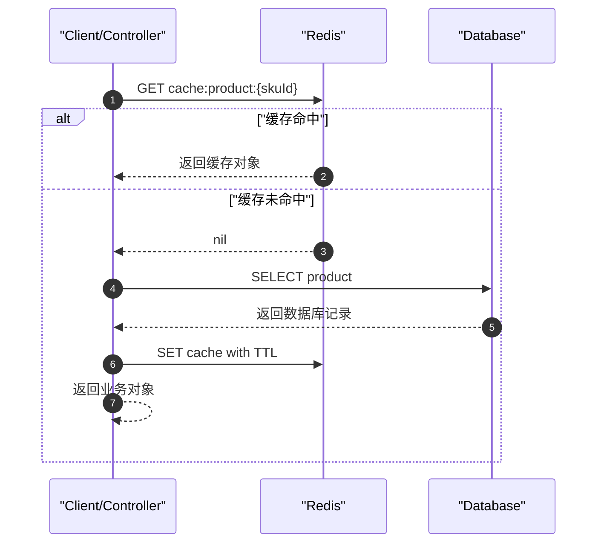
```mermaid
sequenceDiagram
    autonumber
    participant C as "Client/Controller"
    participant R as "Redis"
    participant D as "Database"
    C->>R: GET cache:product:{skuId}
    alt "缓存命中"
        R-->>C: 返回缓存对象
    else "缓存未命中"
        R-->>C: nil
        C->>D: SELECT product
        D-->>C: 返回数据库记录
        C->>R: SET cache with TTL
        C-->>C: 返回业务对象
    end
```

写路径图示：

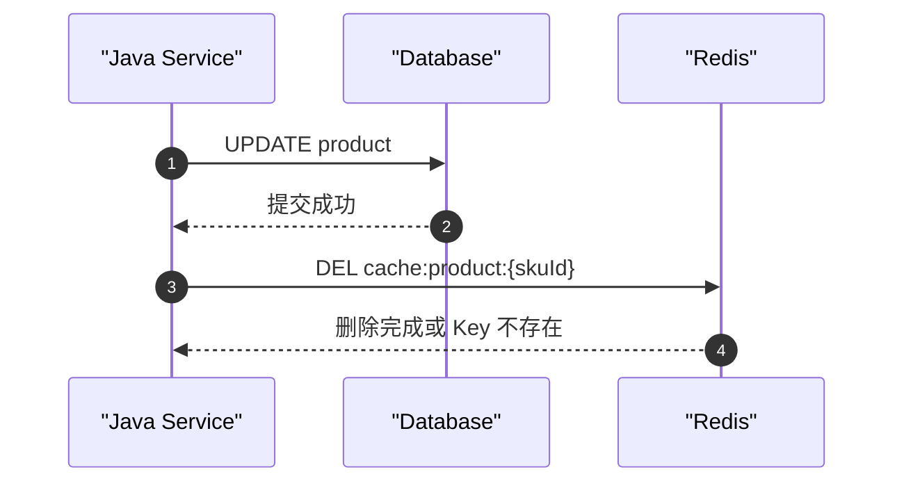
```mermaid
sequenceDiagram
    autonumber
    participant App as "Java Service"
    participant D as "Database"
    participant R as "Redis"
    App->>D: UPDATE product
    D-->>App: 提交成功
    App->>R: DEL cache:product:{skuId}
    R-->>App: 删除完成或 Key 不存在
```

Java 示例：

```java
public ProductDTO getProduct(String skuId) {
    String key = "cache:product:" + skuId;
    // 1. 先查 Redis，命中时直接返回。
    String json = stringRedisTemplate.opsForValue().get(key);
    if (json != null) {
        if (json.isBlank()) {
            return null;
        }
        return parse(json);
    }

    // 2. 未命中才回源数据库，数据库压力主要来自这一步。
    ProductDTO product = productRepository.findBySkuId(skuId);
    if (product == null) {
        // 3. 缓存空值可缓解缓存穿透，但 TTL 要短，避免新数据创建后长期不可见。
        stringRedisTemplate.opsForValue().set(key, "", Duration.ofMinutes(5));
        return null;
    }

    stringRedisTemplate.opsForValue().set(
        key,
        toJson(product),
        // 4. 基础 TTL + 随机抖动，降低大量 Key 同时过期的概率。
        Duration.ofMinutes(30).plusSeconds(randomSeconds(300))
    );
    return product;
}
```

#### 5.1.2 为什么更新 DB 后删除缓存，而不是更新缓存

常见推荐：先更新数据库，再删除缓存。

原因：

1\. 删除比更新简单，不容易把复杂查询结果更新错。
2\. 下次读取会回源数据库生成最新缓存。
3\. 对多个缓存 Key 关联同一条数据的场景更容易处理。

但它不是绝对正确，仍需考虑并发读写问题。

#### 5.1.3 缓存一致性问题

典型并发：

```text
线程 A 读缓存未命中
线程 A 查 DB 得到旧值
线程 B 更新 DB
线程 B 删除缓存
线程 A 把旧值写入缓存
```

并发时序图：

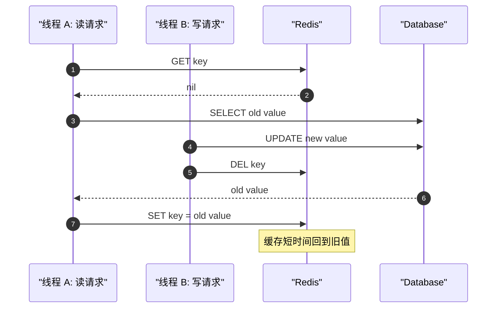
```mermaid
sequenceDiagram
    autonumber
    participant A as "线程 A: 读请求"
    participant B as "线程 B: 写请求"
    participant R as "Redis"
    participant D as "Database"
    A->>R: GET key
    R-->>A: nil
    A->>D: SELECT old value
    B->>D: UPDATE new value
    B->>R: DEL key
    D-->>A: old value
    A->>R: SET key = old value
    Note over R: 缓存短时间回到旧值
```

可能解决：

1\. 设置较短 TTL，让脏数据自动过期。
2\. 延迟双删：更新 DB 后删一次，延迟一小段时间再删一次。
3\. 使用消息队列订阅数据库变更异步删缓存。
4\. 强一致要求高的场景，不要依赖普通缓存模式承诺强一致。

延迟双删示意：

```java
// 第一次删除：清理更新前可能存在的旧缓存。
updateDatabase(product);
redisTemplate.delete(key);
// 第二次删除：尽量覆盖并发读线程把旧值重新写回缓存的窗口。
scheduledExecutor.schedule(() -> redisTemplate.delete(key), 500, TimeUnit.MILLISECONDS);
```

注意：延迟时间不是拍脑袋，要基于读 DB 和写缓存的耗时分布评估。

#### 5.1.4 多级缓存

高并发读场景常见结构：

```text
本地缓存 -> Redis -> Database
```

本地缓存通常使用 Caffeine、Guava Cache 或应用内 Map 封装；Redis 作为多实例共享缓存；Database 是最终权威数据。

图示：

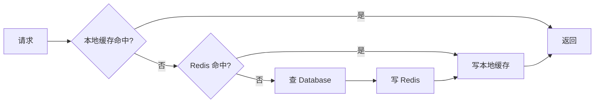
```mermaid
flowchart LR
    Req["请求"] --> L{"本地缓存命中?"}
    L -- "是" --> Ret["返回"]
    L -- "否" --> R{"Redis 命中?"}
    R -- "是" --> FillL["写本地缓存"] --> Ret
    R -- "否" --> D["查 Database"] --> FillR["写 Redis"] --> FillL
```

优点：

1\. 本地缓存减少 Redis 热 Key 压力。
2\. Redis 缓存减少数据库压力。
3\. 多级兜底能提升高峰期稳定性。

风险：

1\. 本地缓存会放大一致性问题。
2\. 多实例本地缓存失效需要广播或短 TTL。
3\. 本地缓存容量过大可能挤压 JVM 堆内存。
4\. 缓存穿透、击穿、雪崩仍然要处理。

经验：

1\. 热点配置、字典、低频变更数据适合多级缓存。
2\. 商品价格、库存、权限这类敏感数据要谨慎，TTL 要短或主动失效。
3\. 本地缓存 TTL 通常短于 Redis TTL。
4\. 更新数据时至少删除 Redis，本地缓存可通过短 TTL、消息广播或版本号失效。

### 5.2 缓存三大经典问题

三类问题的直观差异：

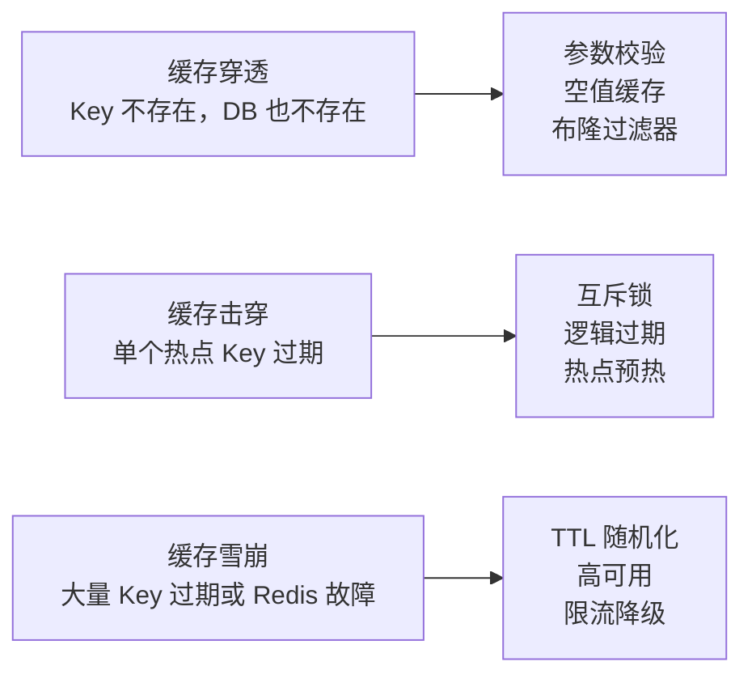
```mermaid
flowchart LR
    A["缓存穿透<br/>Key 不存在，DB 也不存在"] --> A1["参数校验<br/>空值缓存<br/>布隆过滤器"]
    B["缓存击穿<br/>单个热点 Key 过期"] --> B1["互斥锁<br/>逻辑过期<br/>热点预热"]
    C["缓存雪崩<br/>大量 Key 过期或 Redis 故障"] --> C1["TTL 随机化<br/>高可用<br/>限流降级"]
```

#### 5.2.1 缓存穿透

定义：请求查询一个数据库里也不存在的数据，导致每次都打到数据库。

例子：

```text
/product?id=-1
/user?id=not_exists
```

解决：

1\. 参数校验。
2\. 缓存空值，TTL 短一些。
3\. Bloom Filter（布隆过滤器）提前判断可能存在。
4\. 接口限流和风控。

缓存空值：

```java
if (product == null) {
    // 空字符串作为“查无此数据”的占位符，避免同一个不存在 ID 反复打到 DB。
    stringRedisTemplate.opsForValue().set(key, "", Duration.ofMinutes(3));
    return null;
}
```

##### 5.2.1.1 布隆过滤器

Bloom Filter（布隆过滤器）用于判断“某个值是否可能存在”。它的特点是：

1\. 如果判断为“不存在”，那就一定不存在。
2\. 如果判断为“存在”，只是可能存在，仍要查缓存或数据库确认。
3\. 内存占用小，适合海量 ID 是否存在的前置判断。
4\. 有误判率，误判率越低，通常需要越多内存。

缓存穿透中的典型流程：

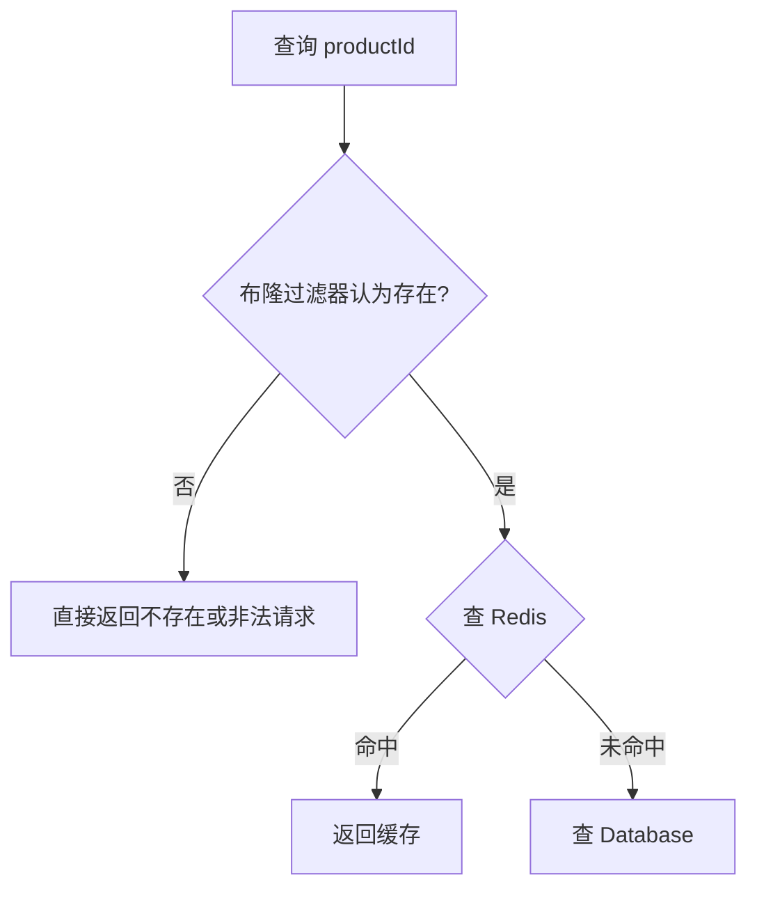
```mermaid
flowchart TD
    Req["查询 productId"] --> B{"布隆过滤器认为存在?"}
    B -- "否" --> Reject["直接返回不存在或非法请求"]
    B -- "是" --> R{"查 Redis"}
    R -- "命中" --> Ret["返回缓存"]
    R -- "未命中" --> D["查 Database"]
```

适合：

1\. 商品 ID、用户 ID、文章 ID 这种可以提前加载全集或增量维护的场景。
2\. 恶意请求大量不存在 ID 的防护。

不适合：

1\. 删除非常频繁且要求过滤器立即准确的场景。
2\. 数据全集无法加载、增量同步无法保障的场景。

为什么普通布隆过滤器不能直接删除：

普通布隆过滤器底层通常是一段 bitmap。一个元素会经过多个 hash 函数计算，命中多个位置，并把这些位置从 `0` 改成 `1`。

```text
元素 A
  -> hash1(A) = 3
  -> hash2(A) = 7
  -> hash3(A) = 10

设置 bitmap[3]、bitmap[7]、bitmap[10] 为 1
```

另一个元素 B 也可能命中其中某些相同位置：

```text
元素 B
  -> hash1(B) = 7
  -> hash2(B) = 12
  -> hash3(B) = 20

设置 bitmap[7]、bitmap[12]、bitmap[20] 为 1
```

这里 `bitmap[7]` 同时被 A 和 B 依赖。如果删除 A 时直接把 A 对应的位置清零：

```text
bitmap[3] = 0
bitmap[7] = 0
bitmap[10] = 0
```

那么 B 再来判断时，会因为 `bitmap[7]` 变成 `0` 而被误判为“不存在”。这会破坏布隆过滤器最重要的性质：

> 普通布隆过滤器允许把不存在的数据误判为可能存在，但不应该把真实存在的数据误判为不存在。

Counting Bloom Filter 的思路是把 bit 改成计数器：

```text
普通布隆过滤器：bitmap[7] = 1
Counting Bloom Filter：counter[7] = 2
```

删除 A 时，不是直接清零，而是把 A 对应位置的计数减一。如果某个位置从 `2` 变成 `1`，说明还有其他元素依赖它，不能当成不存在。

定期重建的思路是绕开实时删除问题：

1\. 线上旧布隆过滤器继续拦截大部分不存在请求。
2\. 后台定时从数据库扫描当前有效数据。
3\. 用有效数据构建新的布隆过滤器。
4\. 构建完成后整体替换旧过滤器。

这适合商品下架、用户注销、文章删除等“允许短时间不精确，但最终要收敛”的场景。

生产提醒：

1\. 布隆过滤器只能减少“不存在请求”打到数据库，不能替代权限校验和参数校验。
2\. 新增数据时要同步写入过滤器，否则新数据可能被误判为不存在。
3\. 如果业务有删除，普通布隆过滤器不能直接删除元素，可考虑 Counting Bloom Filter 或定期重建。

#### 5.2.2 缓存击穿

定义：某个热点 Key 过期瞬间，大量请求同时回源数据库。

解决：

1\. 热点 Key 不设置过期，后台异步刷新。
2\. 使用互斥锁，只允许一个线程回源。
3\. 逻辑过期：缓存里存过期时间，过期后先返回旧值，再异步刷新。

互斥锁示意：

```java
String lockKey = "lock:cache:product:" + skuId;
Boolean locked = stringRedisTemplate.opsForValue()
    // setIfAbsent 对应 SET NX；短 TTL 防止持锁线程异常退出后死锁。
    .setIfAbsent(lockKey, "1", Duration.ofSeconds(10));
if (Boolean.TRUE.equals(locked)) {
    try {
        // 只有抢到锁的线程回源 DB 并重建缓存。
        ProductDTO product = productRepository.findBySkuId(skuId);
        refreshCache(product);
        return product;
    } finally {
        // 教学示例：生产分布式锁释放应校验唯一 value，并用 Lua 原子删除。
        stringRedisTemplate.delete(lockKey);
    }
}

// 没抢到锁的线程短暂等待后重试，避免全部同时打 DB。
Thread.sleep(50);
return getProduct(skuId);
```

生产提醒：这个示例用于理解，真正实现要考虑锁值校验、重试上限、降级和异常。

#### 5.2.3 缓存雪崩

定义：大量 Key 同时失效，或 Redis 整体不可用，流量压垮数据库。

解决：

1\. TTL 加随机抖动。
2\. 热点数据预热。
3\. Redis 高可用。
4\. 本地缓存兜底。
5\. 限流、熔断、降级。
6\. 数据库保护阈值。

### 5.3 分布式锁

#### 5.3.1 为什么需要分布式锁

单机 Java 可以用：

```java
synchronized
ReentrantLock
```

但多实例部署时，每个 JVM 有自己的锁，无法互斥。分布式锁用于多个进程之间协调。

#### 5.3.2 基础命令

```bash
# 只有锁 Key 不存在时才写入唯一请求标识，并设置 30 秒过期时间。
SET lock:order:10001 request-id-uuid NX EX 30
```

生命周期图示：

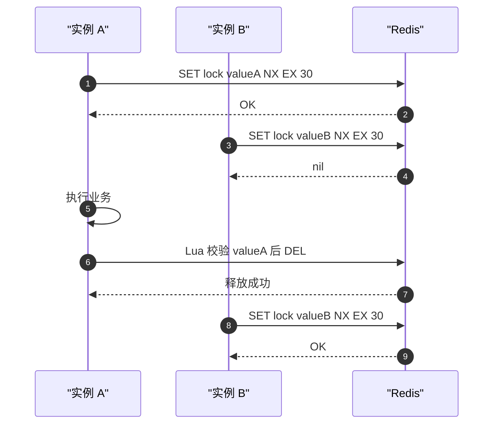
```mermaid
sequenceDiagram
    autonumber
    participant A as "实例 A"
    participant B as "实例 B"
    participant R as "Redis"
    A->>R: SET lock valueA NX EX 30
    R-->>A: OK
    B->>R: SET lock valueB NX EX 30
    R-->>B: nil
    A->>A: 执行业务
    A->>R: Lua 校验 valueA 后 DEL
    R-->>A: 释放成功
    B->>R: SET lock valueB NX EX 30
    R-->>B: OK
```

含义：

1\. `NX`：不存在才设置，保证抢锁。
2\. `EX 30`：30 秒后自动释放，避免死锁。
3\. value 用唯一请求标识，释放锁时校验身份。

#### 5.3.3 错误释放锁

错误：

```java
redisTemplate.delete(lockKey);
```

问题：线程 A 锁过期，线程 B 获得锁，线程 A 执行完成后删除了线程 B 的锁。

正确思路：删除前校验 value，且校验和删除要原子执行。

Lua：

```lua
-- 只有锁的持有者才能释放锁。
if redis.call('GET', KEYS[1]) == ARGV[1] then
    -- GET 和 DEL 在同一个 Lua 脚本中执行，避免校验后锁被别人抢走。
    return redis.call('DEL', KEYS[1])
else
    return 0
end
```

#### 5.3.4 Redisson

Redisson 提供了更完整的分布式锁封装：

```java
// lockName 要能表达业务互斥范围：同一个订单共用同一把锁，不同订单互不影响。
RLock lock = redissonClient.getLock("lock:order:" + orderId);
// 最多等待 3 秒，拿到锁后租约 30 秒；指定 leaseTime 后，业务必须尽量在租约内完成。
boolean locked = lock.tryLock(3, 30, TimeUnit.SECONDS);
if (!locked) {
    throw new IllegalStateException("系统繁忙，请稍后重试");
}
try {
    // 临界区：只能让一个实例同时执行的业务逻辑。
    createOrder(orderId);
} finally {
    // Redisson 会校验锁归属，避免误释放其他线程的锁。
    lock.unlock();
}
```

Redisson 还提供看门狗机制，但要注意：通常只有不显式指定 `leaseTime` 时，Redisson 才会为持锁线程自动续期。指定 `leaseTime` 的写法更可控，但必须评估业务最长执行时间；不指定租约时间的写法更依赖看门狗和客户端存活状态。

依赖看门狗的写法示意：

```java
RLock lock = redissonClient.getLock("lock:order:" + orderId);
boolean locked = lock.tryLock(3, TimeUnit.SECONDS);
if (!locked) {
    throw new IllegalStateException("系统繁忙，请稍后重试");
}
try {
    createOrder(orderId);
} finally {
    lock.unlock();
}
```

#### 5.3.5 分布式锁面试重点

必须回答：

1\. 为什么要 `NX`。
2\. 为什么要过期时间。
3\. 为什么 value 要唯一。
4\. 为什么释放锁要 Lua。
5\. 业务执行时间超过锁 TTL 怎么办。
6\. Redis 主从切换时锁是否可能失效。
7\. 什么情况下应该用数据库唯一约束、乐观锁或 MQ 替代分布式锁。

### 5.4 限流

#### 5.4.1 固定窗口计数器

固定窗口图示：

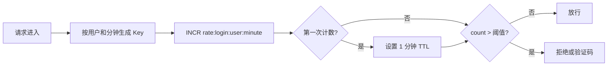
```mermaid
flowchart LR
    R1["请求进入"] --> K["按用户和分钟生成 Key"]
    K --> I["INCR rate:login:user:minute"]
    I --> F{"第一次计数?"}
    F -- "是" --> E["设置 1 分钟 TTL"]
    F -- "否" --> C{"count > 阈值?"}
    E --> C
    C -- "否" --> P["放行"]
    C -- "是" --> D["拒绝或验证码"]
```

```java
String key = "rate:login:" + userId + ":" + currentMinute();
// INCR 是 Redis 原子自增，适合做简单计数器。
Long count = stringRedisTemplate.opsForValue().increment(key);
if (count != null && count == 1L) {
    // 只有第一次创建窗口 Key 时设置 TTL，避免每次请求都把窗口往后续。
    stringRedisTemplate.expire(key, Duration.ofMinutes(1));
}
if (count != null && count > 10) {
    throw new IllegalStateException("请求过于频繁");
}
```

缺点：

1\. 窗口边界可能突刺。

​	（窗口边界突刺 = 上一个窗口末尾放过一批请求 + 下一个窗口开头又放过一批请求，导致极短时间内流量接	近限流阈值的两倍。）

2\. `INCR` 和 `EXPIRE` 是两条命令，如果应用在两者之间宕机，可能留下没有 TTL 的计数 Key。

生产中可用 Lua 把首次自增和设置过期时间合并成原子操作：

```lua
local count = redis.call('INCR', KEYS[1])
if count == 1 then
    redis.call('EXPIRE', KEYS[1], ARGV[1])
end
return count
```

#### 5.4.2 滑动窗口

固定窗口的问题是“按整分钟切块”，边界处可能突刺。滑动窗口的思路是：不再看自然分钟，而是永远只看“当前时间往前推一段时间”的请求数量。

举例：限制规则是 10 秒内最多 5 次请求。

```text
当前时间 = 10:00:10
滑动窗口 = 10:00:00 ~ 10:00:10

当前时间 = 10:00:11
滑动窗口 = 10:00:01 ~ 10:00:11
```

这个窗口会随着每次请求不断向前移动，所以比固定窗口更平滑。

小白心智模型：

```text
固定窗口：按墙上的时钟切整段，比如每分钟清零一次。
滑动窗口：每次请求都回头看最近 N 秒内已经来了多少次。
```

Redis 常用 Sorted Set 实现滑动窗口。Sorted Set 是有序集合，适合用时间戳当 score，把每次请求当成一个 member 存进去。

用 Sorted Set 的原因：

1\. score 可以存请求时间戳。
2\. 可以按时间范围删除窗口外的旧请求。
3\. 可以快速统计当前窗口内还剩多少请求记录。

执行流程：

```text
1. 删除窗口外请求
2. 统计窗口内请求数
3. 如果没超限，加入当前请求
4. 设置过期时间
```

如果规则是“10 秒内最多 5 次”，一次请求进来时大概这样做：

```bash
# 0 是删除范围的起点，因为请求时间戳作为 score 一般从 0 往后增长；更通用、更严谨可以写 -inf。
ZREMRANGEBYSCORE rate:api:user1001 0 当前时间戳-10000
ZCARD rate:api:user1001
ZADD rate:api:user1001 当前时间戳 请求唯一ID
EXPIRE rate:api:user1001 10
```

注意：上面是为了理解，生产中不建议拆成多条命令裸跑，因为并发下可能出现多个请求同时判断都没超限，然后一起写入，导致放行过多。

Lua 脚本更适合保证原子性：

```lua
-- KEYS[1]：限流 Key，例如 rate:api:user1001。
-- ARGV[1]：当前毫秒时间戳。
-- ARGV[2]：窗口大小，单位毫秒。
-- ARGV[3]：允许的最大请求数。
-- ARGV[4]：本次请求唯一 ID，避免同毫秒请求 member 冲突。
local key = KEYS[1]
local now = tonumber(ARGV[1])
local window = tonumber(ARGV[2])
local limit = tonumber(ARGV[3])
local requestId = ARGV[4]

-- 删除窗口外的旧请求，只保留最近 window 毫秒的数据。
redis.call('ZREMRANGEBYSCORE', key, 0, now - window)

-- 统计当前窗口内已有请求数量。
local count = redis.call('ZCARD', key)
if count >= limit then
    -- 返回 0 表示拒绝。
    return 0
end

-- 记录本次请求。
redis.call('ZADD', key, now, requestId)

-- 设置过期时间，避免用户不再访问后限流 Key 永久占内存。
redis.call('PEXPIRE', key, window)

-- 返回 1 表示放行。
return 1
```

Java 调用时，`requestId` 可以用用户 ID、当前时间戳和随机数拼出来，保证同一毫秒内多个请求也不会互相覆盖。

滑动窗口的优点：

1\. 比固定窗口更精确。
2\. 能缓解窗口边界突刺。
3\. 适合登录、短信验证码、接口防刷等需要按最近一段时间统计的场景。

滑动窗口的缺点：

1\. 每个请求都要写入一条记录，比固定窗口更占内存。
2\. 热点用户或热点接口请求量很大时，Sorted Set 会增长较快。
3\. 需要清理窗口外数据，否则内存会持续上涨。
4\. 高并发下要用 Lua 保证删除、统计、写入这几个动作的原子性。

#### 5.4.3 令牌桶和漏桶

令牌桶和漏桶是两个更偏“流量整形”的限流模型。它们不只是数请求次数，还会控制请求进入系统的节奏。

##### 5.4.3.1 令牌桶

令牌桶可以理解成一个桶，系统按固定速度往桶里放令牌。每个请求来时，必须先拿到一个令牌，拿到就放行，拿不到就拒绝或排队。

```text
系统每秒放入 10 个令牌
桶最多存 100 个令牌
请求来了先拿令牌
  -> 拿到：放行
  -> 没拿到：拒绝、排队或降级
```

为什么令牌桶允许突发流量：

1\. 如果一段时间请求很少，桶里的令牌会慢慢攒起来。
2\. 突然来一小波请求时，可以一次性消耗之前攒下的令牌。
3\. 所以令牌桶既限制长期平均速率，也允许短时间突发。

生活类比：

```text
游乐场每秒发 10 张快速通行票，票箱最多存 100 张。
游客少的时候票会攒起来。
突然来 50 个游客，只要票箱里有 50 张票，就可以快速通过。
```

适合场景：

1\. 接口允许短时间小突发，但长期不能超过平均速率。
2\. 网关限流。
3\. 秒杀入口削峰。
4\. 调用第三方接口时控制平均调用速率。

令牌桶的关键参数：

| 参数 | 含义 |
| --- | --- |
| 令牌生成速率 | 每秒生成多少令牌，决定长期平均放行速度 |
| 桶容量 | 最多能攒多少令牌，决定能承受多大的短时突发 |
| 每次消耗令牌数 | 一个请求要消耗几个令牌，复杂请求可以消耗更多 |

##### 5.4.3.2 漏桶

漏桶可以理解成一个桶，请求先进入桶里排队，然后系统以固定速度从桶底“漏出”请求去处理。

```text
请求进入桶
桶按固定速度流出请求
桶满了，新请求就被拒绝
```

漏桶的核心特点是：输出速率稳定。

生活类比：

```text
水龙头突然倒进来很多水。
漏桶底部的小孔大小固定。
无论上面水来得多急，下面流出的速度都比较稳定。
如果水太多，桶满了就溢出。
```

适合场景：

1\. 下游系统特别怕突发流量，希望请求匀速进入。
2\. 消息消费削峰。
3\. 写数据库、调用慢服务、调用老系统时保护下游。
4\. 需要稳定处理节奏，而不是追求瞬时吞吐。

漏桶的关键参数：

| 参数 | 含义 |
| --- | --- |
| 桶容量 | 最多能缓存多少等待处理的请求 |
| 流出速率 | 每秒固定处理多少请求 |
| 溢出策略 | 桶满后是拒绝、降级、排队等待还是返回错误 |

##### 5.4.3.3 令牌桶和漏桶怎么选

面试理解：

1\. 固定窗口：简单，但边界不平滑。
2\. 滑动窗口：更精确，成本更高。
3\. 令牌桶：允许一定突发流量。
4\. 漏桶：以固定速率流出，更平滑。

选择建议：

| 模型 | 重点 | 是否允许突发 | 适合 |
| --- | --- | --- | --- |
| 固定窗口 | 简单计数 | 边界处可能突刺 | 粗粒度限流 |
| 滑动窗口 | 最近一段时间精确计数 | 比固定窗口平滑 | 登录、验证码、接口防刷 |
| 令牌桶 | 平均速率 + 突发容量 | 允许 | 网关、秒杀入口、第三方 API 调用 |
| 漏桶 | 稳定流出 | 不太允许 | 保护慢服务、数据库、老系统 |

API 是 Application Programming Interface，即应用程序编程接口。

Redis 可以实现这些模型，但在高并发网关层，通常优先使用成熟组件。原因是限流不只是计数，还要考虑集群同步、热点 Key、监控、动态配置、降级策略和灰度发布。

高并发网关限流常用专门组件，如 Sentinel、Resilience4j、Nginx、Envoy 或云厂商 API Gateway。

### 5.5 会话、Token 与登录态

#### 5.5.1 Session 共享

多台 Java 服务部署时，登录态不能只存在单机内存。Redis 可作为共享 Session 存储。

共享登录态图示：

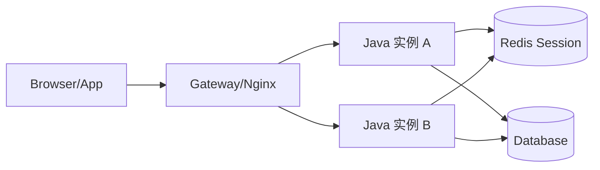
```mermaid
flowchart LR
    U["Browser/App"] --> G["Gateway/Nginx"]
    G --> A["Java 实例 A"]
    G --> B["Java 实例 B"]
    A --> R[("Redis Session")]
    B --> R
    A --> D[("Database")]
    B --> D
```

Key：

```text
session:{token}
```

Value：

```json
{
  "userId": 10001,
  "roles": ["USER"],
  "loginTime": "2026-07-02T10:00:00"
}
```

TTL：根据业务设置 30 分钟、2 小时、7 天等。

#### 5.5.2 滑动过期

滑动过期的意思是：用户一直活跃，就不断延长登录态；用户长时间不操作，登录态自然过期。

小白心智模型：

```text
固定过期：登录后 2 小时一定过期，不管用户中间有没有操作。
滑动过期：只要用户一直活跃，就把过期时间往后顺延。
```

典型流程：

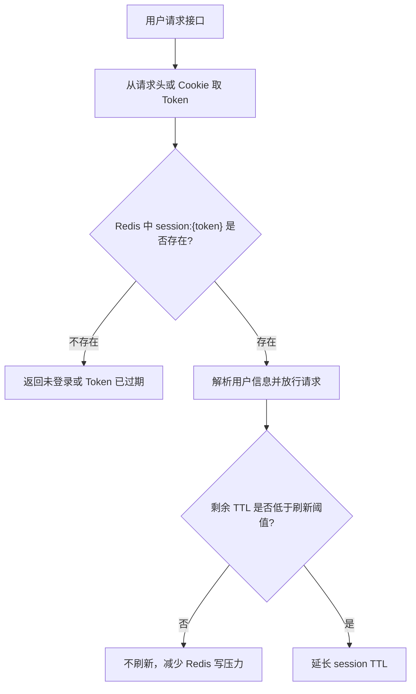
```mermaid
flowchart TD
    Req["用户请求接口"] --> T["从请求头或 Cookie 取 Token"]
    T --> R{"Redis 中 session:{token} 是否存在?"}
    R -- "不存在" --> Reject["返回未登录或 Token 已过期"]
    R -- "存在" --> P["解析用户信息并放行请求"]
    P --> TTL{"剩余 TTL 是否低于刷新阈值?"}
    TTL -- "否" --> End["不刷新，减少 Redis 写压力"]
    TTL -- "是" --> Refresh["延长 session TTL"]
```

最简单的写法是：用户每次请求都延长 TTL。

```java
String key = "session:" + token;
String session = stringRedisTemplate.opsForValue().get(key);
if (session != null) {
    // 用户活跃时延长登录态，但生产中可加阈值，避免每次请求都写 Redis。
    stringRedisTemplate.expire(key, Duration.ofHours(2));
}
```

但生产中不建议每次请求都刷新 TTL，因为每个读请求都会变成一次 Redis 写操作。更常见的方式是：剩余时间低于阈值时才刷新。

```java
String key = "session:" + token;
String session = stringRedisTemplate.opsForValue().get(key);
if (session == null) {
    throw new IllegalStateException("登录已过期");
}

// TTL 是 Time To Live，即存活时间。
Long ttlSeconds = stringRedisTemplate.getExpire(key, TimeUnit.SECONDS);
if (ttlSeconds != null && ttlSeconds > 0 && ttlSeconds < Duration.ofMinutes(30).toSeconds()) {
    // 只有剩余登录时间小于 30 分钟时才续到 2 小时，降低 Redis 写压力。
    stringRedisTemplate.expire(key, Duration.ofHours(2));
}
```

为什么要加刷新阈值：

1\. 每次请求都刷新 TTL 会增加 Redis 写压力。
2\. 高频接口可能把 Redis 从“读多写少”变成“读写都多”。
3\. 只有 TTL 快到期时再续期，用户体验接近，但写压力小很多。

只做滑动过期还不够，生产中通常还要加绝对过期时间。

```text
滑动过期：用户活跃时自动续期，例如每次续到 2 小时。
绝对过期：从登录开始最多允许保持登录 7 天，超过后必须重新登录。
```

为什么需要绝对过期：

1\. 如果只做滑动过期，一个长期活跃或被盗的 Token 可能一直有效。
2\. 绝对过期可以强制用户周期性重新认证。
3\. 金融、后台管理、敏感系统通常更需要绝对过期。

一种常见 Value 设计：

```json
{
  "userId": 10001,
  "roles": ["USER"],
  "loginTime": "2026-07-02T10:00:00",
  "absoluteExpireAt": "2026-07-09T10:00:00"
}
```

请求时不仅要看 Redis Key 是否存在，也要检查 `absoluteExpireAt` 是否已经超过当前时间。如果超过，即使 Redis 里还有 session，也要删除并要求重新登录。

滑动过期和踢下线的关系：

1\. 用户退出登录时，直接删除 `session:{token}`。
2\. 管理员踢用户下线时，可以删除该用户所有 token 对应的 session。
3\. 用户改密码、权限变更、账号冻结时，要让旧 session 失效。
4\. 如果支持多端登录，要区分“只踢当前设备”还是“踢所有设备”。

多端登录可以增加一个用户维度索引：

```text
session:{token} -> 用户会话详情
user:sessions:{userId} -> 该用户当前有效 token 集合
```

退出或踢下线时：

1\. 删除 `session:{token}`。
2\. 从 `user:sessions:{userId}` 中移除对应 token。
3\. 如果是踢所有设备，就遍历 token 集合并批量删除 session。

生产注意：

1\. Token 不要直接使用可猜测值，应该使用足够随机的字符串。
2\. Token 不要写入日志、URL 查询参数或异常信息。
3\. Redis 中的 session Value 不要存敏感明文，例如密码、身份证号、银行卡号。
4\. 滑动过期只解决“活跃用户保持登录”，不能替代权限校验。
5\. 关键权限变更后，要考虑主动让旧 session 失效，而不是等 TTL 自然过期。
6\. 对高频接口，可以把续期逻辑放在网关、拦截器或过滤器中统一处理，并做采样或阈值刷新。

### 5.6 库存扣减

库存是 Redis 面试和生产中非常容易踩坑的场景。

#### 5.6.1 简单扣减

```bash
# 用 Redis 原子自减做预扣库存，后续仍需数据库落账和补偿流程兜底。
DECR stock:sku1
```

问题：可能扣成负数。

#### 5.6.2 Lua 防止负库存

```lua
-- KEYS[1]：库存 Key；ARGV[1]：本次要扣减的数量。
local stock = tonumber(redis.call('GET', KEYS[1]))
local quantity = tonumber(ARGV[1])
if stock == nil then
    -- -1 表示库存未初始化。
    return -1
end
if stock < quantity then
    -- 0 表示库存不足，本次不能扣减。
    return 0
end
-- 校验和扣减在脚本中一次完成，避免并发超卖。
redis.call('DECRBY', KEYS[1], quantity)
return 1
```

返回：

1\. `1`：成功。
2\. `0`：库存不足。
3\. `-1`：库存不存在。

#### 5.6.3 Redis 扣库存后的最终一致

常见链路：

```text
Redis 预扣库存成功
  -> 创建订单
  -> 发送消息
  -> 数据库扣库存
  -> 支付超时或失败则补偿库存
```

秒杀库存链路图：

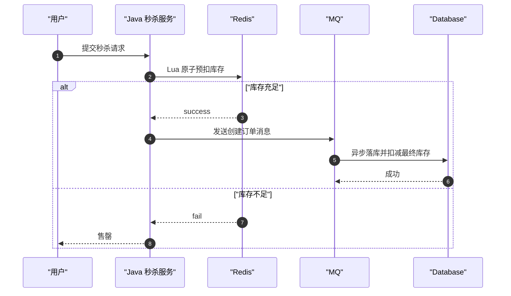
```mermaid
sequenceDiagram
    autonumber
    participant U as "用户"
    participant A as "Java 秒杀服务"
    participant R as "Redis"
    participant M as "MQ"
    participant D as "Database"
    U->>A: 提交秒杀请求
    A->>R: Lua 原子预扣库存
    alt "库存充足"
        R-->>A: success
        A->>M: 发送创建订单消息
        M->>D: 异步落库并扣减最终库存
        D-->>M: 成功
    else "库存不足"
        R-->>A: fail
        A-->>U: 售罄
    end
```

注意：

1\. Redis 不能替代数据库最终库存账本。
2\. 要设计补偿、对账和幂等。
3\. 秒杀场景常用 Redis 作为前置削峰，数据库作为最终一致落点。

### 5.7 幂等控制

幂等：**同一个请求**执行一次和执行多次的结果一致。

小白心智模型：

```text
用户点一次“提交订单”，系统创建一个订单。
用户手抖点了两次，或者网络超时后前端自动重试。
如果系统创建了两个订单，就不是幂等。
如果系统仍然只有一个订单，就是幂等。
```

为什么需要幂等：

1\. 用户可能重复点击按钮。
2\. 浏览器、App、网关或客户端可能超时重试。
3\. MQ（Message Queue，消息队列）可能重复投递消息。
4\. 分布式系统里，调用方可能不知道服务端到底执行成功没有。
5\. 支付、下单、发券、积分、扣库存这类业务一旦重复执行，后果很严重。

哪些操作天然幂等：

| 操作 | 是否天然幂等 | 原因 |
| --- | --- | --- |
| 查询订单详情 | 是 | 查一次和查多次不会改变结果 |
| 设置用户昵称为 Alice | 通常是 | 多次设置为同一个值，最终结果一样 |
| 用户余额加 100 | 否 | 执行两次会多加 100 |
| 库存扣 1 | 否 | 执行两次会多扣 1 |
| 创建订单 | 否 | 没有限制时可能创建多条 |

Redis 在幂等里的角色通常是“前置拦截”或“短期去重”，不能替代数据库最终约束。

#### 5.7.1 请求令牌

请求令牌适合防止用户在页面上重复提交，比如表单提交、创建订单、发券领取。

整体流程：

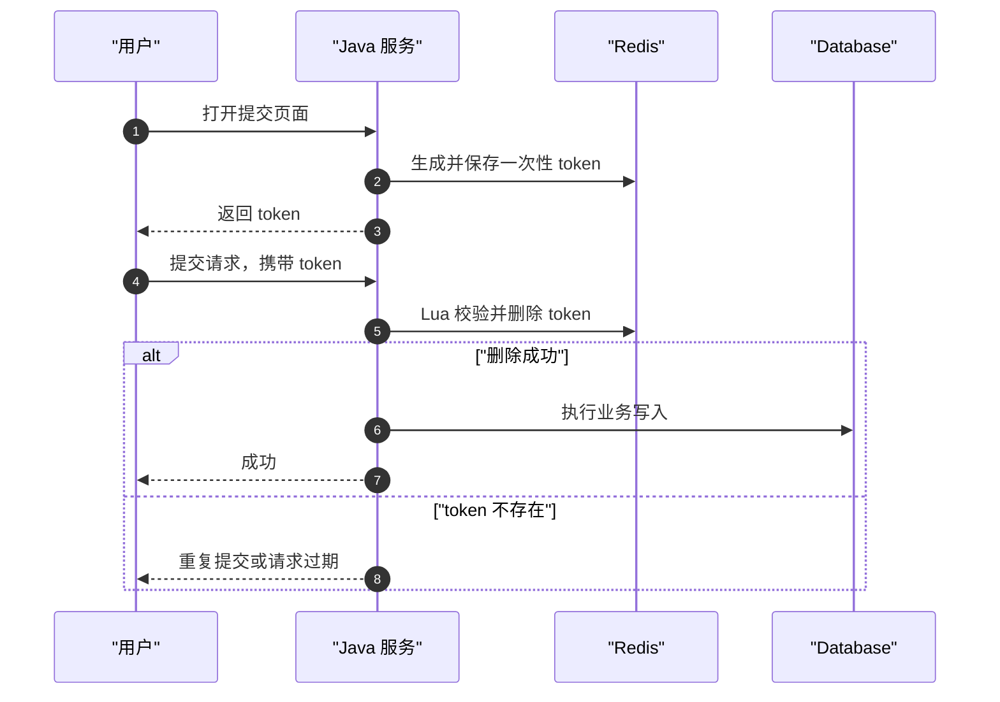
```mermaid
sequenceDiagram
    autonumber
    participant U as "用户"
    participant A as "Java 服务"
    participant R as "Redis"
    participant D as "Database"
    U->>A: 打开提交页面
    A->>R: 生成并保存一次性 token
    A-->>U: 返回 token
    U->>A: 提交请求，携带 token
    A->>R: Lua 校验并删除 token
    alt "删除成功"
        A->>D: 执行业务写入
        A-->>U: 成功
    else "token 不存在"
        A-->>U: 重复提交或请求过期
    end
```

生成令牌：

```java
String token = UUID.randomUUID().toString();
stringRedisTemplate.opsForValue().set(
    "idempotent:token:" + token,
    "1",
    Duration.ofMinutes(10)
);
```

前端或 App 提交时，要把这个 token 一起带回来。

```text
POST /orders
Header: Idempotency-Token: 8f4f0d5d-xxxx
```

提交时删除：

```lua
if redis.call('GET', KEYS[1]) then
    return redis.call('DEL', KEYS[1])
else
    return 0
end
```

删除成功才允许执行业务。

为什么要用 Lua：

1\. 如果 Java 里先 `GET` 再 `DEL`，两个并发请求可能都先读到 token 存在。
2\. Lua 可以把“检查 token 是否存在”和“删除 token”放在 Redis 服务端一次完成。
3\. 这样同一个 token 只能有一个请求删除成功。

返回值含义：

1\. 返回 `1`：token 存在且删除成功，本次请求可以继续执行业务。
2\. 返回 `0`：token 不存在，说明重复提交、过期或非法请求。

请求令牌的优点：

1\. 实现直观，适合防重复提交。
2\. token 设置 TTL 后，即使用户不提交也会自动清理。
3\. 能拦住大部分按钮连点、页面重复提交、短时间重试。

请求令牌的局限：

1\. 如果业务执行成功但响应丢失，用户再次提交可能因为 token 已删除而被拒绝，但用户不知道之前是否成功。
2\. token 只能控制“这一次提交”，不能替代订单号、支付流水号等业务唯一键。
3\. 如果生成 token 后长期不提交，需要依赖 TTL 清理。
4\. 多端、多页面、刷新页面时，要设计 token 生成和更新策略。

生产建议：

1\. token 要足够随机，不能用自增数字。
2\. token 不要放在 URL 查询参数里，避免日志泄露。
3\. token 的 TTL 要和页面停留时间匹配，例如 5 到 30 分钟。
4\. 对创建订单、支付、退款等关键业务，请求令牌只能作为第一道防线。
5\. 真正的最终幂等仍要依赖业务唯一键、数据库唯一索引和状态机。

#### 5.7.2 业务唯一键

业务唯一键是更可靠的幂等方案。它的核心思想是：同一个业务动作必须有一个全局唯一的编号，系统看到同一个编号时，只能处理一次。

常见业务唯一键：

| 场景 | 唯一键示例 | 说明 |
| --- | --- | --- |
| 下单 | `orderNo` | 同一个订单号只能创建一笔订单 |
| 支付 | `payRequestNo` | 同一次支付请求只能扣款一次 |
| 退款 | `refundNo` | 同一个退款单只能退款一次 |
| 发券 | `userId + couponId + activityId` | 同一活动同一用户只能领一次 |
| 消息消费 | `messageId` | 同一条消息只能被业务处理一次 |

订单、支付、退款等场景更推荐组合使用：

1\. 数据库唯一索引。
2\. 业务流水号。
3\. 状态机约束。
4\. Redis 只做前置拦截。

为什么数据库唯一索引很重要：

1\. Redis 可能过期、被淘汰、故障切换或数据丢失。
2\. Java 服务可能绕过 Redis 直接写数据库。
3\. 数据库唯一索引是最终兜底，能保证同一个业务唯一键不会落多条记录。

Redis 前置拦截示例：

```redis
SET idempotent:order:202607080001 processing NX EX 300
```

含义：

1\. `NX` 表示 Key 不存在才写入。
2\. 第一次请求写入成功，可以继续执行业务。
3\. 重复请求写入失败，说明同一个业务动作正在处理或已经处理过。
4\. `EX 300` 设置 300 秒过期，避免服务异常时 Key 永久占用。

但要注意：这个 Redis Key 只是前置拦截，不是最终结果。真正落库时仍要有唯一索引。

更完整的状态设计：

```text
idempotent:order:202607080001 = PROCESSING
idempotent:order:202607080001 = SUCCESS
idempotent:order:202607080001 = FAIL
```

处理思路：

1\. 第一次请求把状态从不存在写成 `PROCESSING`。
2\. 业务成功后，把状态改成 `SUCCESS`，并保存订单号或结果摘要。
3\. 重复请求如果看到 `SUCCESS`，可以直接返回上次成功结果。
4\. 重复请求如果看到 `PROCESSING`，可以提示“处理中”，或者稍后查询。
5\. 如果业务失败，要根据失败类型决定删除幂等 Key、改成 `FAIL`，还是允许重试。

小白容易混淆的点：

1\. 幂等不是“不让用户点第二次”，而是“点第二次也不会造成第二次业务效果”。
2\. Redis 幂等 Key 不是锁，它更像“这个业务动作是否已经被接收或处理”的标记。
3\. 分布式锁解决的是并发互斥，幂等解决的是重复执行。
4\. 限流解决的是请求太多，幂等解决的是同一个业务动作重复。

生产落地口诀：

```text
前端防重复点击
Redis 做短期拦截
数据库唯一索引兜底
状态机控制流转
消息和回调用 messageId 去重
失败后靠补偿和对账收敛
```

## 6 可靠性、高可用与安全

这一部分处理 Redis 从单机工具走向基础设施后的问题：数据如何恢复、节点如何切换、容量如何扩展、安全边界如何建立。

### 6.1 持久化：RDB 和 AOF

Redis 是内存数据库，但可以把数据写入磁盘。

持久化整体图示：

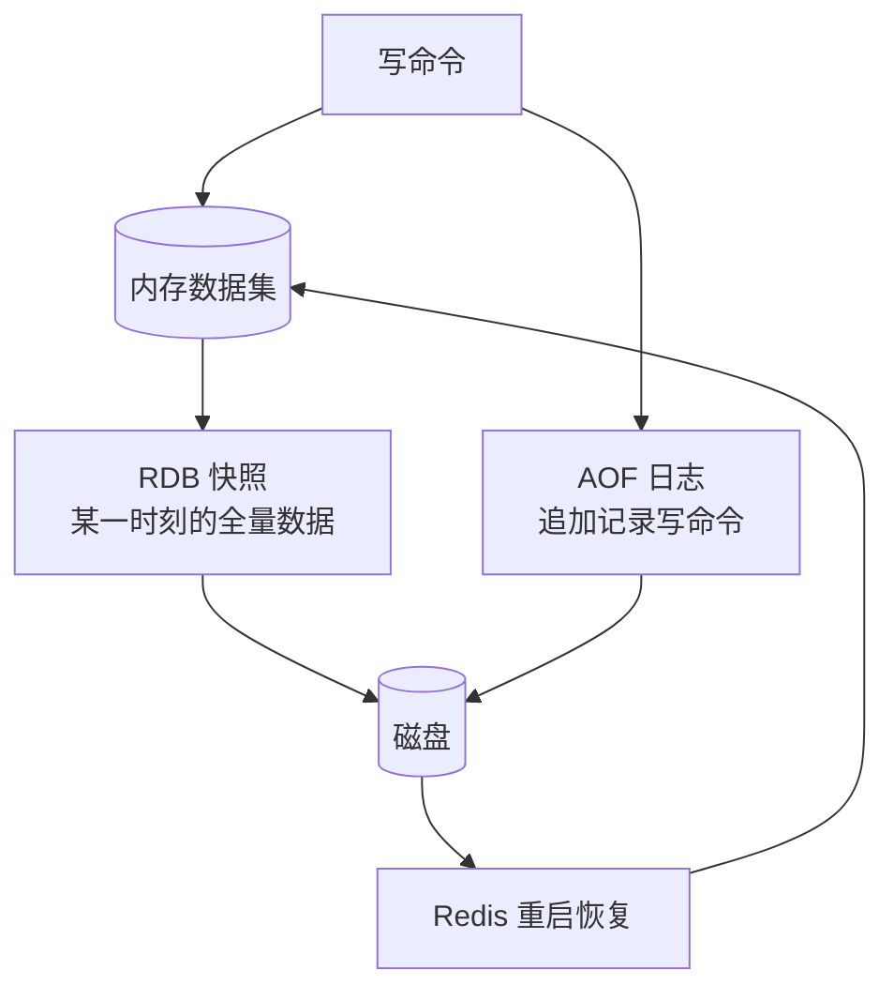
```mermaid
flowchart TB
    W["写命令"] --> M[("内存数据集")]
    M --> R["RDB 快照<br/>某一时刻的全量数据"]
    W --> A["AOF 日志<br/>追加记录写命令"]
    R --> S[("磁盘")]
    A --> S
    S --> Restart["Redis 重启恢复"]
    Restart --> M
```

#### 6.1.1 RDB

RDB 是 Redis Database，即某一时刻的数据快照。

优点：

1\. 文件紧凑。
2\. 适合备份和灾难恢复。
3\. 加载速度通常较快。
4\. 对主线程影响相对小，子进程负责写快照。

缺点：

1\. 两次快照之间的数据可能丢失。
2\. 大数据集 fork 子进程可能带来延迟抖动。

配置示例：

```conf
# 900 秒内至少 1 次写入则触发快照。
save 900 1
# 300 秒内至少 10 次写入则触发快照。
save 300 10
# 60 秒内至少 10000 次写入则触发快照。
save 60 10000
dbfilename dump.rdb
```

#### 6.1.2 AOF

AOF 是 Append Only File，即追加日志文件。

它记录写命令，重启时重放日志恢复数据。

配置：

```conf
# 开启 AOF 持久化。
appendonly yes
# 每秒 fsync 一次，是性能和安全之间的常见折中。
appendfsync everysec
```

`appendfsync`：

| 策略 | 含义 | 取舍 |
| --- | --- | --- |
| `always` | 每次写都刷盘 | 最安全，最慢 |
| `everysec` | 每秒刷盘 | 常用折中 |
| `no` | 交给操作系统 | 最快，风险更高 |

#### 6.1.3 RDB + AOF 如何选

建议：

1\. 纯缓存：可不持久化，但要能承受全量缓存丢失。
2\. 重要数据：RDB + AOF。
3\. 可容忍分钟级丢失：RDB。
4\. 更低丢失窗口：AOF `everysec`。
5\. 金融账本类强一致数据：不要只依赖 Redis。

AOF 重写补充：

1\. 旧式 AOF 重写可以把多条重复或互相抵消的写命令压缩成更短的重建命令。
2\. Redis 4.0 之后支持 RDB-AOF 混合持久化，AOF 文件前半部分可包含 RDB 格式的全量数据，后半部分追加增量写命令。
3\. 混合持久化常见配置是 `aof-use-rdb-preamble yes`，它保留 RDB 恢复快和 AOF 丢失窗口小的优势。

示例：

```conf
appendonly yes
appendfilename "appendonly.aof"
# 当 AOF 文件相比上一次重写后的大小增长达到一定比例时，触发自动 AOF 重写
auto-aof-rewrite-percentage 100
# AOF 文件至少达到 64MB，才考虑自动重写
auto-aof-rewrite-min-size 64mb
# AOF 重写出来的新文件，开头使用 RDB 格式作为“基础快照”，后面再追加 AOF 命令
aof-use-rdb-preamble yes
```

#### 6.1.4 手动备份与恢复

除了自动 RDB/AOF，Redis 也提供手动备份命令。

```bash
# 前台同步生成 RDB 快照，会阻塞 Redis 主线程，生产高峰慎用。
SAVE

# 后台异步生成 RDB 快照，常用于手动备份。
BGSAVE

# 查看最近一次成功持久化的时间戳。
LASTSAVE

# 查看持久化文件所在目录。
CONFIG GET dir

# 查看 RDB 文件名。
CONFIG GET dbfilename
```

区别：

1\. `SAVE`：在前台同步保存，会阻塞 Redis，不建议生产高峰使用。
2\. `BGSAVE`：后台 fork 子进程生成 RDB，生产中更常用。
3\. `LASTSAVE`：查看最近一次成功保存时间。
4\. `CONFIG GET dir` 和 `CONFIG GET dbfilename`：确认 RDB 文件目录和文件名。

恢复 RDB 的基本思路：

```text
停止 Redis
  -> 找到目标实例的 dir 目录
  -> 放入 dump.rdb
  -> 确认权限和文件名
  -> 启动 Redis
  -> 检查日志、DBSIZE、抽样 Key
```

生产提醒：

1\. 恢复前先备份当前数据目录，避免覆盖造成二次事故。
2\. Cluster、主从、Sentinel 环境恢复时要先确认角色和拓扑，不要随意把旧 RDB 放到正在提供写入的主节点。
3\. 备份是否可用，必须靠定期恢复演练验证，不是“文件存在”就算安全。

### 6.2 部署架构一：单机与主从复制

学习 Redis 部署架构时，可以先抓住一条演进主线：

```text
单机
  -> 主从复制
    -> Sentinel 哨兵高可用
      -> Cluster 分片集群
```

架构演进总览：


```mermaid
flowchart LR
    A["单机 Redis<br/>最简单，单点风险"] --> B["主从复制<br/>读扩展，数据副本"]
    B --> C["Sentinel<br/>自动故障转移"]
    C --> D["Cluster<br/>分片扩容，高可用"]
```

不同架构解决的问题不同：

| 架构 | 主要解决什么 | 不解决什么 | 适合阶段 |
| --- | --- | --- | --- |
| 单机 | 最简单部署和学习 | 单点故障、容量瓶颈 | 本地学习、开发测试、小型缓存 |
| 主从复制 | 数据副本、读扩展 | 自动故障转移 | 读多写少、为哨兵做基础 |
| Sentinel | 主节点故障自动切换 | 数据分片和容量水平扩展 | 中小规模高可用 |
| Cluster | 分片、容量扩展、集群高可用 | 跨 slot 多 Key 操作复杂 | 大容量、高吞吐生产集群 |

#### 6.2.1 单机架构

单机架构只有一个 Redis 实例，所有读写都访问同一个节点。

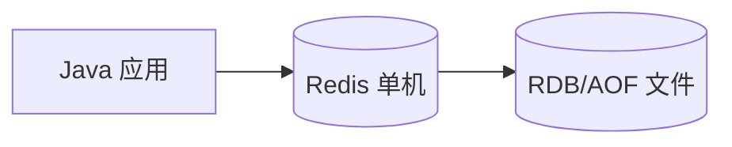
```mermaid
flowchart LR
    A["Java 应用"] --> R[("Redis 单机")]
    R --> D[("RDB/AOF 文件")]
```

小白心智模型：

```text
单机 Redis 就像一个高速小仓库。
所有应用都来这个仓库拿东西、放东西。
仓库一旦宕机，大家都访问不了。
```

优点：

1\. 部署最简单。
2\. 学习成本最低。
3\. 适合本地开发、测试环境和可丢失缓存。

缺点：

1\. 单点故障，节点宕机后 Redis 不可用。
2\. 容量受单机内存限制。
3\. CPU（Central Processing Unit，中央处理器）、网络和磁盘 IO（Input/Output，输入/输出）都受单机限制。
4\. 即使开启 RDB/AOF，也只能帮助恢复数据，不能让服务自动切到新节点。

#### 6.2.2 主从复制架构

主从复制用于读扩展和数据冗余。一个主节点负责写入，多个副本节点从主节点同步数据。

Replica 是副本，也常被称为从节点。

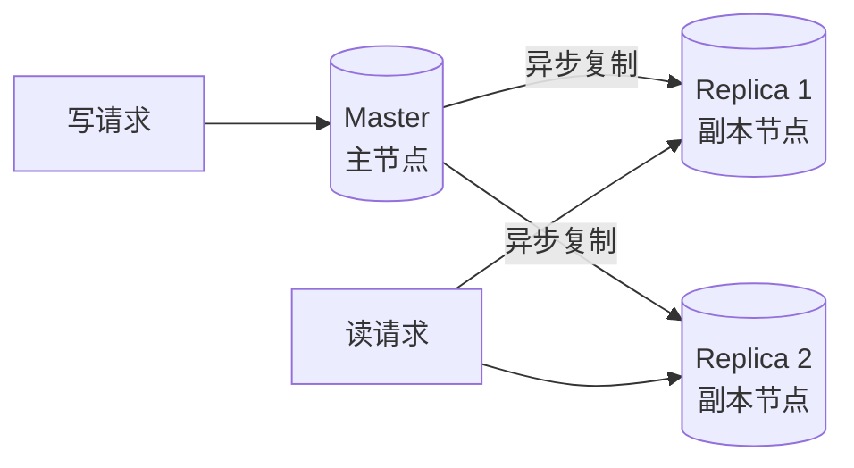
```mermaid
flowchart LR
    W["写请求"] --> M[("Master<br/>主节点")]
    M -- "异步复制" --> R1[("Replica 1<br/>副本节点")]
    M -- "异步复制" --> R2[("Replica 2<br/>副本节点")]
    Q["读请求"] --> R1
    Q --> R2
```

小白心智模型：

```text
Master 是原件。
Replica 是复印件。
写入先改原件，再把变化同步给复印件。
读请求可以去看复印件，但复印件可能稍微慢一点更新。
```

常见配置思路：

```conf
# 在副本节点上配置，表示复制 10.0.0.10:6379 这个主节点。
replicaof 10.0.0.10 6379

# 如果主节点配置了密码，副本也需要配置主节点认证密码。
masterauth your-master-password
```

#### 6.2.3 主从复制解决的问题

1\. 数据冗余：主节点数据会同步到副本节点。
2\. 读写分离：写主节点，读副本节点，减轻主节点读压力。
3\. 故障恢复基础：主节点故障后，可以把副本提升为新的主节点。
4\. 支撑 Sentinel 和 Cluster：哨兵和集群高可用都依赖主从复制关系。

#### 6.2.4 主从复制的注意事项

1\. Redis 主从复制通常是异步复制，主节点写入成功后，副本可能还没同步完成。
2\. 读副本可能读到旧数据，所以强一致读不要随便走副本。
3\. 主节点宕机时，可能丢失尚未复制到副本的最新写入。
4\. 只做主从复制不等于自动高可用，主节点宕机后还需要人工或 Sentinel/Cluster 完成切换。
5\. 副本节点也会占用内存，不是“免费扩容”。

面试回答：

> Redis 主从复制用于数据冗余和读扩展，但不等于强一致，也不等于自动故障转移。它通常是异步复制，所以故障切换时可能丢少量数据；如果要自动切换主节点，需要 Sentinel 或 Cluster。

### 6.3 部署架构二：Sentinel 哨兵高可用

Sentinel 是 Redis 的高可用组件，用于监控主从节点并自动故障转移。它解决的是：主节点宕机后，谁来判断故障、谁来选新主、客户端怎么知道新主地址。

Sentinel 是哨兵的意思，可以理解成“Redis 集群旁边的值班系统”。

#### 6.3.1 Sentinel 架构图

典型 Sentinel 架构由一组 Redis 主从节点和一组 Sentinel 节点组成。

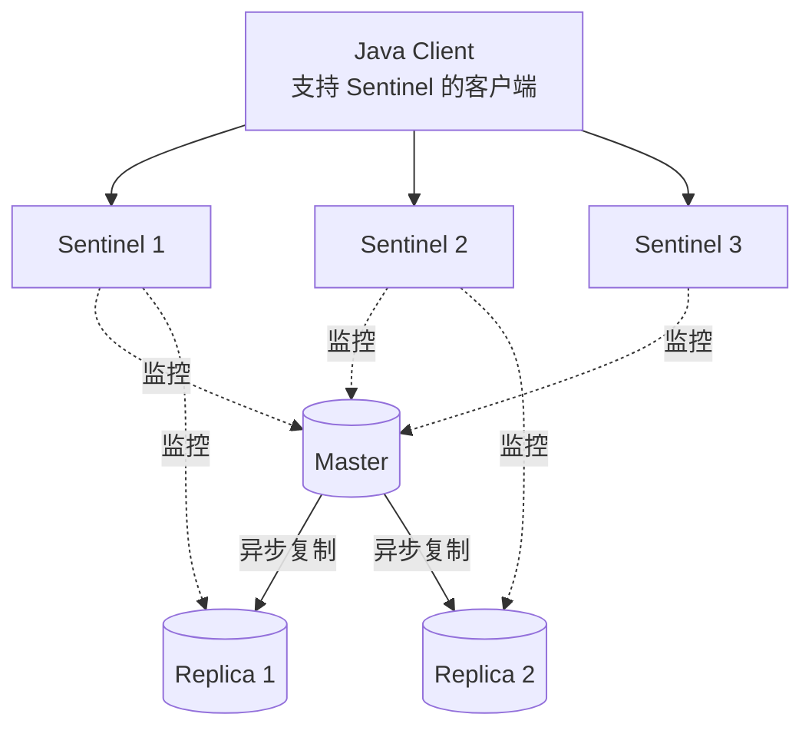
```mermaid
flowchart TB
    C["Java Client<br/>支持 Sentinel 的客户端"] --> S1["Sentinel 1"]
    C --> S2["Sentinel 2"]
    C --> S3["Sentinel 3"]

    S1 -. "监控" .-> M[("Master")]
    S2 -. "监控" .-> M
    S3 -. "监控" .-> M

    M -- "异步复制" --> R1[("Replica 1")]
    M -- "异步复制" --> R2[("Replica 2")]

    S1 -. "监控" .-> R1
    S2 -. "监控" .-> R2
```

小白心智模型：

```text
主从复制只是准备了副本。
Sentinel 负责盯着主节点。
主节点挂了，Sentinel 投票确认故障，再挑一个副本升为新主。
```

#### 6.3.2 Sentinel 做什么

1\. 监控 Redis 主节点和副本节点是否存活。
2\. 判断主节点是否主观下线和客观下线。
3\. 从副本中选举一个新的主节点。
4\. 让其他副本改为复制新主节点。
5\. 通知支持 Sentinel 的客户端新的主节点地址。

#### 6.3.3 主观下线与客观下线

1\. 主观下线：一个 Sentinel 认为某个节点不可用。
2\. 客观下线：多个 Sentinel 达到约定数量后，共同认为主节点不可用。

为什么要有客观下线：

1\. 单个 Sentinel 可能因为网络抖动误判。
2\. 多个 Sentinel 达成共识后再切换，可以降低误切主的风险。
3\. Sentinel 节点通常至少部署 3 个，方便形成多数判断。

#### 6.3.4 故障转移流程

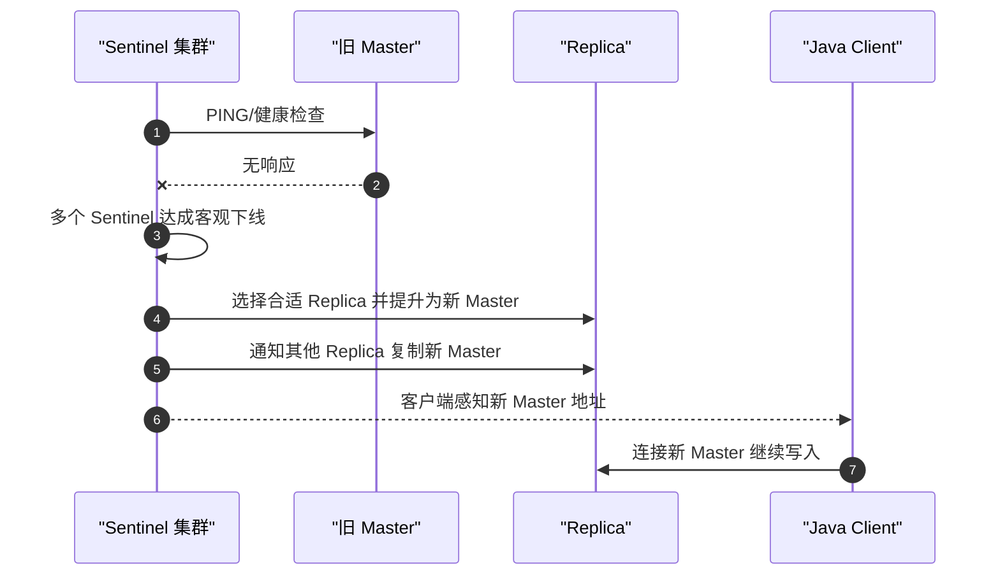
```mermaid
sequenceDiagram
    autonumber
    participant S as "Sentinel 集群"
    participant M as "旧 Master"
    participant R as "Replica"
    participant C as "Java Client"
    S->>M: PING/健康检查
    M--xS: 无响应
    S->>S: 多个 Sentinel 达成客观下线
    S->>R: 选择合适 Replica 并提升为新 Master
    S->>R: 通知其他 Replica 复制新 Master
    S-->>C: 客户端感知新 Master 地址
    C->>R: 连接新 Master 继续写入
```

切换过程不是零成本：

1\. 故障发现需要时间。
2\. 选主和重新配置复制需要时间。
3\. 客户端重连需要时间。
4\. 主从异步复制导致故障前最后一小段写入可能丢失。

#### 6.3.5 Java 连接 Sentinel

Spring Boot 配置示意：

```yaml
spring:
  data:
    redis:
      sentinel:
        master: mymaster
        nodes:
          - 127.0.0.1:26379
          - 127.0.0.1:26380
          - 127.0.0.1:26381
```

客户端连接 Sentinel 时，不应该把某个 Redis 主节点地址写死。客户端会通过 Sentinel 查询当前主节点，并在故障切换后刷新连接。

生产建议：

1\. Sentinel 至少 3 个。
2\. Sentinel 部署在不同机器或故障域。
3\. Redis 主从节点也要分布在不同机器或故障域。
4\. Java 客户端必须使用支持 Sentinel 的连接方式。
5\. 定期演练主从切换，确认客户端能自动重连到新主。
6\. 监控 `master_link_status`、复制延迟、故障切换次数和客户端连接异常。

面试回答：

> Sentinel 解决的是 Redis 主从架构里的自动故障转移。它监控主从节点，多个 Sentinel 达成客观下线后，会把某个副本提升为新主，并通知客户端。但 Sentinel 不负责数据分片，也不能保证强一致，故障切换期间仍可能有短暂不可用和少量数据丢失。

### 6.4 部署架构三：Cluster 分片集群

Redis Cluster 用于水平扩展数据容量和吞吐。它把数据分散到多个主节点，每个主节点负责一部分 hash slot。

Cluster 既解决容量扩展，也提供一定高可用能力：每个主节点通常配一个或多个副本，主节点故障时由它的副本接管。

#### 6.4.1 Cluster 整体架构图

```mermaid
flowchart TB
    C["Java Client<br/>Cluster-aware"] --> N1[("Master A<br/>slots 0-5460")]
    C --> N2[("Master B<br/>slots 5461-10922")]
    C --> N3[("Master C<br/>slots 10923-16383")]

    N1 -- "复制" --> R1[("Replica A")]
    N2 -- "复制" --> R2[("Replica B")]
    N3 -- "复制" --> R3[("Replica C")]

    N1 <-. "Gossip 通信" .-> N2
    N2 <-. "Gossip 通信" .-> N3
    N1 <-. "Gossip 通信" .-> N3
```

小白心智模型：

```text
Sentinel 架构像一个大仓库配几个备用仓库。
Cluster 架构像把仓库拆成多个区域。
不同 Key 放到不同区域，每个区域还有自己的备用副本。
```

#### 6.4.2 Hash Slot

Redis Cluster 有 16384 个哈希槽。

```text
key -> CRC16(key) % 16384 -> slot -> node
```

Hash Slot 是哈希槽。Redis 不直接把 Key 分给节点，而是先把 Key 映射到槽，再把槽分配给节点。

分片路由图示：

```mermaid
flowchart LR
    K["Key: product:1001"] --> H["CRC16(key) % 16384"]
    H --> S["slot = 3200"]
    S --> N["Master A<br/>负责 slot 0-5460"]
```

为什么要用 slot：

1\. 节点和 Key 之间多了一层槽位映射，迁移时可以按槽迁移。
2\. 扩容时，可以把一部分 slot 从旧节点迁到新节点。
3\. 缩容时，可以先把节点上的 slot 迁走，再下线节点。
4\. 客户端只要知道 slot 到节点的映射，就能找到 Key 应该访问哪个节点。

扩缩容时迁移的原理：

Redis Cluster 扩缩容不是把所有 Key 重新 hash 一遍，而是迁移一部分 slot。slot 是迁移单位，slot 里的 Key 会从一个节点搬到另一个节点。

扩容示意：

```mermaid
flowchart LR
    A[("Master A<br/>slots 0-5460")]
    B[("Master B<br/>slots 5461-10922")]
    C[("Master C<br/>slots 10923-16383")]
    D[("New Master D<br/>新节点")]

    A -- "迁出部分 slots" --> D
    B -- "迁出部分 slots" --> D
    C -- "迁出部分 slots" --> D
```

扩容过程可以理解为：

1\. 新节点加入集群，但一开始不负责任何 slot。
2\. 运维或集群管理工具选择一些 slot，从旧节点迁到新节点。
3\. 迁移某个 slot 时，会把这个 slot 下的 Key 一批批移动过去。
4\. 迁移过程中，客户端可能收到 ASK 临时重定向。
5\. 迁移完成后，slot 的正式归属变成新节点，客户端后续会按新映射访问。

缩容过程反过来：

1\. 先把要下线节点负责的 slot 迁移到其他节点。
2\. 确认该节点不再负责任何 slot。
3\. 再从集群中移除这个节点。

为什么这比 `hash(key) % 节点数` 更适合扩缩容：

```text
取模分区：节点数一变，大量 Key 的归属都会变化。
Hash Slot：只迁移被选中的 slot，其他 slot 的 Key 不动。
```

这就是 Redis Cluster 使用 16384 个 slot 的核心价值：把“节点变化”变成“槽位迁移”，降低扩缩容时的数据搬迁范围。

#### 6.4.3 Hash Tag

如果 Key 包含 `{}`，Redis Cluster 只对 `{}` 中内容计算槽位。

```text
cart:{user100}:items
cart:{user100}:meta
```

这两个 Key 会落到同一个 slot，便于多 Key 操作。

什么时候需要 Hash Tag：

1\. 一个用户购物车多个 Key 需要一起操作。
2\. 同一订单相关多个 Key 需要落同槽。
3\. 需要使用 Lua 或事务同时访问多个 Key。

注意：Hash Tag 不能滥用。如果大量 Key 都写成 `{global}`，它们会集中到同一个 slot，反而造成热点。

> “节点热点”就是：**Redis 集群里某一个节点的访问压力明显高于其他节点，变成瓶颈**

#### 6.4.4 Cluster 高可用和重定向

Redis Cluster 的节点之间会互相通信，感知节点状态和槽位分布。客户端一般会缓存一份 `slot -> node` 映射，但这个映射可能因为扩容、缩容、slot 迁移、故障切换而过期。

小白心智模型：

```text
客户端以为 slot 3200 在 Node A。
但集群变化后，slot 3200 可能已经去 Node B，或者正在从 Node A 搬到 Node B。
这时 Redis 就会用 MOVED 或 ASK 告诉客户端该去哪里。
```

重定向整体流程：

```mermaid
flowchart TD
    C["Java Client<br/>携带 Key 请求某节点"] --> N{"请求节点是否负责该 slot?"}
    N -- "负责" --> OK["直接执行命令"]
    N -- "不负责，slot 已稳定迁走" --> M["返回 MOVED<br/>告诉客户端新节点"]
    N -- "slot 正在迁移" --> A["返回 ASK<br/>让客户端临时访问迁移目标节点"]
    M --> Refresh["客户端刷新 slot 映射并重试"]
    A --> Temp["客户端发送 ASKING 后临时重试"]
```

MOVED 重定向：

```text
MOVED 3200 10.0.0.12:6379
```

含义是：你访问的 Key 属于 slot 3200，但这个 slot 已经正式归属 `10.0.0.12:6379`。

客户端收到 MOVED 后通常要做两件事：

1\. 更新本地 `slot -> node` 映射。
2\. 把本次命令重新发给新节点。

所以 MOVED 更像“永久改地址”：

```text
这个 slot 已经不归我了，以后都去新节点。
```

ASK 重定向：

```text
ASK 3200 10.0.0.13:6379
```

含义是：你访问的 Key 属于 slot 3200，这个 slot 正在迁移中，本次请求先去 `10.0.0.13:6379`。

客户端收到 ASK 后通常要做两件事：

1\. 先向目标节点发送 `ASKING`。ASKING = 客户端告诉迁移目标节点：“我是被 ASK 临时重定向来的，请临时处理我接下来的这条命令。”
2\. 再把本次命令发给目标节点。

ASK 更像“临时问路”：

```text
这个 slot 还在迁移中，slot 映射先别永久改。
这一次请求你先去目标节点试一下。
```

MOVED 与 ASK 的联系：

1\. 它们都是 Redis Cluster 的重定向机制。
2\. 它们都说明客户端当前访问的节点不适合处理这个 slot。
3\. 它们都要求客户端具备 Cluster 感知能力。
4\. 它们都可能出现在扩缩容、迁移、故障切换或客户端路由缓存过期时。

MOVED 与 ASK 的区别：

| 对比项 | MOVED | ASK |
| --- | --- | --- |
| 语义 | slot 已经正式迁到新节点 | slot 正在迁移，本次临时去目标节点 |
| 是否更新 slot 缓存 | 要更新 | 通常不永久更新 |
| 是否需要 ASKING | 不需要 | 需要先发送 `ASKING` |
| 常见场景 | 迁移完成、拓扑已变化、客户端缓存过期 | slot 迁移过程中 |
| 心智模型 | 永久改地址 | 临时问路 |

为什么 ASK 需要 `ASKING`：

迁移过程中，目标节点可能还没有正式拥有这个 slot。正常情况下，它不会随便接受不属于自己的 slot 请求。客户端先发 `ASKING`，表示“我是根据 ASK 临时重定向来的”，目标节点才会接受这一次请求。

生产客户端必须支持：

1\. slot 缓存。
2\. MOVED 重定向。
3\. ASK 重定向。
4\. 节点故障后的连接刷新。
5\. 拓扑变化后的重试策略。

对 Java 程序员来说，Lettuce、Jedis、Redisson 这类成熟 Cluster 客户端通常已经处理了 MOVED 和 ASK。业务代码一般不需要手写重定向逻辑，但要知道它们的含义，排查 `MOVED`、`ASK`、`CROSSSLOT` 报错时才不会慌。

#### 6.4.5 Cluster 注意事项

1\. 不是所有多 Key 命令都能跨 slot 执行。
2\. 客户端要支持 MOVED、ASK 重定向。
3\. 大 Key 会导致某个节点热点。
4\. 热 Key 即使在 Cluster 中，也可能打爆单个分片。
5\. 分片提高容量，但也增加运维复杂度。
6\. Cluster 不是强一致系统，主从复制仍可能有延迟。
7\. 扩缩容、迁移 slot 时要关注延迟、命中率和客户端重试。

面试回答：

> Redis Cluster 通过 16384 个 hash slot 做数据分片，每个主节点负责一部分槽。客户端根据 key 找到槽位，再访问对应节点。多 Key 操作要求 Key 在同一个槽，否则会报跨槽错误。Cluster 能水平扩展容量和吞吐，也能通过副本做故障接管，但仍要注意异步复制、热点 Key、跨槽限制和运维复杂度。
>
> 
>
> Redis Cluster 要求多 Key 在同一个 slot，而不是同一个 node，
> 因为 slot 是数据分片、路由和迁移的最小单位；
> 同一个 slot 能保证这些 Key 现在和未来都会一起迁移、一起路由。

#### 6.4.6 分区方案演进（不常用）

在 Redis Cluster 成为主流方案之前，业界也用过多种分区方式。了解它们有助于理解 Cluster 为什么要用 hash slot。

| 分区方式 | 思路 | 优点 | 问题 |
| --- | --- | --- | --- |
| 范围分区 | ID 0-10000 放节点 A，10001-20000 放节点 B | 直观 | 需要维护范围映射，容易数据倾斜 |
| 取模分区 | `hash(key) % 节点数` | 简单 | 扩缩容会导致大量 Key 重新映射 |
| 一致性哈希 | Key 和节点映射到哈希环，顺时针找节点 | 扩缩容影响范围较小 | 实现复杂，仍要处理倾斜和迁移 |
| 代理分区 | Twemproxy、Codis、Predixy 等代理负责路由 | 客户端简单 | 代理本身成为复杂组件，命令能力可能受限 |
| Redis Cluster | 官方 hash slot、重定向、迁移机制 | 官方支持，生态成熟 | 跨 slot 操作受限，运维复杂度更高 |

一致性哈希的原理：

一致性哈希不是简单做 `hash(key) % 节点数`，而是把节点和 Key 都映射到一个逻辑哈希环上。

```mermaid
flowchart LR
    K["Key: user:1001"] --> H["hash(key)"]
    H --> R["落到哈希环上的某个位置"]
    R --> N["顺时针找到第一个节点"]
    N --> S["把 Key 存到这个节点"]
```

小白心智模型：

```text
把 0 到 2^32-1 想象成一个圆环。
节点 A、B、C 分别站在圆环的不同位置。
Key 也会被 hash 到圆环上的某个点。
从 Key 的位置顺时针走，遇到的第一个节点就是它归属的节点。
```

一致性哈希环示意图：

```mermaid
flowchart LR
    Z(("0<br/>环起点"))
    A["Node A<br/>位置 100"]
    K["Key: user:1<br/>位置 350"]
    B["Node B<br/>位置 400"]
    C["Node C<br/>位置 800"]
    E(("2^32-1<br/>再回到 0"))

    Z -- "顺时针" --> A
    A -- "顺时针" --> K
    K -- "继续顺时针找节点" --> B
    B -- "顺时针" --> C
    C -- "顺时针" --> E
    E -- "回到起点" --> Z
```

图里的 `user:1` 先落在位置 350，从 350 顺时针走，遇到的第一个节点是 Node B，所以它归 Node B 管。

举例：

```text
hash(Node A) -> 环上位置 100
hash(Node B) -> 环上位置 400
hash(Node C) -> 环上位置 800

hash(user:1) -> 环上位置 350
从 350 顺时针走，先遇到 Node B
所以 user:1 归 Node B
```

一致性哈希扩容时为什么迁移更少：

```text
新增 Node D 后，只有 Node D 和它逆时针前一个节点之间的一段 Key 需要迁移。
其他区间的 Key 归属不变。
```

扩容迁移示意图：

```mermaid
flowchart LR
    Z(("0<br/>环起点"))
    A["Node A<br/>位置 100"]
    K1["迁移区间<br/>101-250<br/>原来归 Node B"]
    D["New Node D<br/>位置 250"]
    K2["保留区间<br/>251-400<br/>仍归 Node B"]
    B["Node B<br/>位置 400"]
    C["Node C<br/>位置 800"]
    E(("2^32-1<br/>再回到 0"))

    Z -- "顺时针" --> A
    A -- "新增 D 后<br/>这段迁给 D" --> K1
    K1 --> D
    D -- "顺时针" --> K2
    K2 --> B
    B -- "顺时针" --> C
    C -- "顺时针" --> E
    E -- "回到起点" --> Z
```

图里的关键点是：新增 Node D 后，只影响 Node A 到 Node D 之间这一小段区间。其他区间不用整体重算。

一致性哈希缩容时也类似：

```text
下线 Node B 后，原来归 Node B 的 Key 顺时针交给下一个节点。
其他节点上的大部分 Key 不需要移动。
```

缩容迁移示意图：

```mermaid
flowchart LR
    Z(("0<br/>环起点"))
    A["Node A<br/>位置 100"]
    K1["迁移区间<br/>101-400<br/>原来归 Node B"]
    B["Node B<br/>位置 400<br/>下线"]
    K2["保留区间<br/>401-800<br/>原来就归 Node C"]
    C["Node C<br/>位置 800"]
    E(("2^32-1<br/>再回到 0"))

    Z -- "顺时针" --> A
    A -- "Node B 下线后<br/>这段迁给 C" --> K1
    K1 -. "原来归 B" .-> B
    K1 -- "现在顺时针交给 C" --> C
    B -. "移除" .-> C
    C -- "继续负责" --> K2
    K2 --> E
    E -- "回到起点" --> Z
```

图里的关键点是：下线 Node B 后，主要迁移原来归 Node B 的那段 Key。Node A、Node C 原来负责的大部分区间不需要移动。

这比普通取模分区好：

```text
普通取模：hash(key) % 节点数，节点数一变，大量 Key 重新分布。
一致性哈希：只影响哈希环上相邻的一小段区间。
```

一致性哈希里的虚拟节点：

1\. 一个物理节点映射成多个虚拟节点。
2\. 虚拟节点越均匀，数据倾斜越小。
3\. 新增或删除节点时，只迁移相邻区间的一部分数据。

虚拟节点示意图：

```mermaid
flowchart LR
    Z(("0<br/>环起点"))
    A1["A#1<br/>虚拟节点"]
    B1["B#1<br/>虚拟节点"]
    C1["C#1<br/>虚拟节点"]
    A2["A#2<br/>虚拟节点"]
    B2["B#2<br/>虚拟节点"]
    C2["C#2<br/>虚拟节点"]
    E(("2^32-1<br/>再回到 0"))

    PA[("物理节点 A")]
    PB[("物理节点 B")]
    PC[("物理节点 C")]

    Z -- "顺时针" --> A1
    A1 --> B1
    B1 --> C1
    C1 --> A2
    A2 --> B2
    B2 --> C2
    C2 --> E
    E -- "回到起点" --> Z

    A1 -. "归属" .-> PA
    A2 -. "归属" .-> PA
    B1 -. "归属" .-> PB
    B2 -. "归属" .-> PB
    C1 -. "归属" .-> PC
    C2 -. "归属" .-> PC
```

图里的 `A#1`、`A#2` 都是物理节点 A 的虚拟节点。Key 顺时针命中某个虚拟节点后，最终会路由到它背后的真实物理节点。

为什么需要虚拟节点：

1\. 如果物理节点很少，节点在环上可能分布不均匀。
2\. 分布不均匀会导致某些节点负责很大一段区间，数据和流量倾斜。
3\. 把一个物理节点映射成多个虚拟节点，可以让分布更均匀。
4\. 最终虚拟节点仍然指向真实物理节点。

分区和缓存击穿的关系：

> 扩容、迁移或哈希规则变化会让一部分 Key 突然无法命中原缓存节点，如果没有回源保护，可能形成局部缓存击穿。

因此分区变更前要准备：

1\. 热点 Key 预热。
2\. 分批迁移。
3\. 限流和回源保护。
4\. 监控命中率、数据库 QPS（Queries Per Second，每秒查询数）和 Redis 延迟。

### 6.5 安全

Redis 生产环境必须关注安全。

#### 6.5.1 基础配置

```conf
bind 127.0.0.1
protected-mode yes
requirepass strong-password
```

生产中还应考虑：

1\. 使用 ACL（Access Control List，访问控制列表）限制账号权限。
2\. 使用 TLS（Transport Layer Security，传输层安全协议）加密传输。
3\. 不暴露 Redis 到公网。
4\. 禁用或重命名危险命令，如 `FLUSHALL`、`CONFIG`，视环境而定。
5\. 密码不要写死在代码仓库。

#### 6.5.2 Java 配置密码

```yaml
spring:
  data:
    redis:
      host: redis.internal
      port: 6379
      password: ${REDIS_PASSWORD}
```

## 7 生产治理、框架集成与系统边界

这一部分面向上线和长期运维：Key 治理、监控排查、Spring Cache 集成，以及 Redis 与 MySQL 等系统的职责边界。

### 7.1 生产实践清单

#### 7.1.1 Key 设计

1\. 统一前缀和层级。
2\. 避免超长 Key。
3\. 避免大 Key。
4\. 热点 Key 需要监控和拆分方案。
5\. 需要批量删除时，用 `SCAN`，不要用 `KEYS`。

#### 7.1.2 TTL 设计

1\. 缓存必须有 TTL，除非有明确刷新机制。
2\. TTL 加随机抖动。
3\. 空值缓存 TTL 要短。
4\. 热点 Key 可逻辑过期。

#### 7.1.3 大 Key

大 Key 指 value 很大或集合元素很多的 Key。

危害：

1\. 网络传输慢。
2\. 删除阻塞。
3\. 迁移慢。
4\. 单节点内存倾斜。
5\. 造成延迟毛刺。

排查：

```bash
# 扫描可能的大 Key，并按类型输出统计结果；对线上实例执行前要评估影响。
redis-cli --bigkeys

# 估算单个 Key 的内存占用，适合验证 --bigkeys 发现的问题 Key。
redis-cli MEMORY USAGE key
```

治理：

1\. 拆分 Key。
2\. 分页读取。
3\. 用 `UNLINK` 异步删除代替 `DEL`。
4\. 限制集合长度。
5\. 避免一次 `HGETALL`、`SMEMBERS`、`LRANGE 0 -1` 拉爆。

#### 7.1.4 热 Key

热 Key 指被大量请求集中访问的 Key。

危害：

1\. 单节点 CPU 或网络打满。
2\. Cluster 下无法靠分片自动解决单 Key 热点。

治理：

1\. 本地缓存。
2\. Key 拆分，例如 `hot:article:1:0` 到 `hot:article:1:9`。
3\. 读副本分担。
4\. 请求合并。
5\. 限流和降级。

#### 7.1.5 禁止生产使用 KEYS

```bash
# 全库扫描匹配 Key，可能阻塞 Redis；生产环境不要直接使用。
KEYS user:*
```

`KEYS` 会遍历整个数据库，可能阻塞 Redis。

替代：

```bash
# 游标式扫描 Key，单次最多尝试返回约 100 个匹配结果；需要循环直到游标回到 0。
SCAN 0 MATCH user:* COUNT 100
```

注意：`SCAN` 也不是免费午餐，只是增量迭代，仍要控制频率。

### 7.2 监控与排查

#### 7.2.1 常用命令

```bash
# 查看 Redis 全量运行信息，排查时通常先从这里建立整体判断。
INFO

# 查看内存使用、碎片率、淘汰等信息。
INFO memory

# 查看命令处理、连接、Keyspace 命中率等统计。
INFO stats

# 查看主从复制角色、偏移量和复制状态。
INFO replication

# 查看持久化相关状态，例如 RDB/AOF 是否在执行、是否失败。
INFO persistence

# 查看最近 10 条慢命令，定位阻塞或高耗时操作。
SLOWLOG GET 10

# 让 Redis 根据延迟采样给出诊断建议。
LATENCY DOCTOR

# 查看客户端连接列表，排查连接泄漏或异常客户端。
CLIENT LIST

# 查看当前数据库 Key 数量，结果是当前 SELECT 的逻辑库。
DBSIZE

# 估算指定 Key 的内存占用。
MEMORY USAGE key

# 查看服务端最大客户端连接数限制。
CONFIG GET maxclients

# 查看 Redis 工作目录，常用于定位持久化文件。
CONFIG GET dir

# 查看最近一次成功持久化时间戳。
LASTSAVE

# 查看当前节点角色，单机、主从、哨兵或集群排查时常用。
ROLE

# 查看 Redis 服务器时间，排查客户端与服务端时间差时有用。
TIME
```

#### 7.2.2 关键指标

| 指标 | 含义 |
| :-- | --- |
| `used_memory` | 已使用内存 |
| `maxmemory` | 最大内存 |
| `connected_clients` | 客户端连接数 |
| `instantaneous_ops_per_sec` | 每秒操作数 |
| `keyspace_hits` / `keyspace_misses` | 缓存命中与未命中 |
| `evicted_keys` | 被淘汰 Key 数 |
| `expired_keys` | 过期 Key 数 |
| `rejected_connections` | 被拒绝连接数 |
| `sync_full` | 全量同步次数 |
| `latest_fork_usec` | 最近 fork 耗时 |

#### 7.2.3 常见故障排查路径

##### 7.2.3.1 接口突然变慢

```text
看应用日志
  -> 看 Redis 慢日志
    -> 看网络延迟
      -> 看是否有大 Key
        -> 看是否发生 RDB/AOF rewrite
          -> 看 CPU、内存、连接数
```

排查流程图：

```mermaid
flowchart TD
    A["接口变慢"] --> B["应用日志和 Trace"]
    B --> C{"Redis 耗时升高?"}
    C -- "否" --> D["继续查 DB、RPC、线程池"]
    C -- "是" --> E["SLOWLOG / LATENCY DOCTOR"]
    E --> F{"有慢命令?"}
    F -- "是" --> G["定位大 Key、复杂命令、Lua"]
    F -- "否" --> H["查网络、连接池、CPU、内存"]
    G --> I["拆 Key、分页、异步删除、限流"]
    H --> I
```

##### 7.2.3.2 Redis CPU 高

可能原因：

1\. 大量复杂命令。
2\. 热 Key。
3\. 连接数异常。
4\. Lua 脚本耗时。
5\. `KEYS`、`SMEMBERS`、`HGETALL` 大集合操作。

##### 7.2.3.3 内存持续上涨

可能原因：

1\. Key 没有 TTL。
2\. 缓存粒度过细。
3\. 大 Key 增长。
4\. AOF rewrite 或复制缓冲区占用。
5\. 业务写入泄漏。

### 7.3 配置文件与在线配置管理

Redis 的核心配置通常在 `redis.conf` 中。学习阶段常见配置包括端口、绑定地址、密码、持久化目录、最大内存、慢日志、最大连接数等。

常用查看命令：

```bash
# 查看监听端口。
CONFIG GET port

# 查看绑定地址，确认是否只监听内网或本机。
CONFIG GET bind

# 查看是否配置旧式密码；Redis 6 之后还应关注 ACL。
CONFIG GET requirepass

# 查看最大内存限制。
CONFIG GET maxmemory

# 查看内存淘汰策略，决定内存满时如何处理写入。
CONFIG GET maxmemory-policy

# 查看最大客户端连接数。
CONFIG GET maxclients

# 查看工作目录。
CONFIG GET dir

# 查看 RDB 文件名。
CONFIG GET dbfilename

# 查看是否开启 AOF（Append Only File，追加日志文件）。
CONFIG GET appendonly

# 查看 AOF 刷盘策略。
CONFIG GET appendfsync

# 查看慢日志阈值，单位是微秒。
CONFIG GET slowlog-log-slower-than

# 查看所有配置；输出很多，生产排查时注意敏感信息和可读性。
CONFIG GET *
```

在线修改示例：

```bash
# 临时调整日志级别，重启后可能失效。
CONFIG SET loglevel notice

# 临时设置最大内存为 2GB，是否允许取决于实例权限和云厂商限制。
CONFIG SET maxmemory 2gb

# 将部分运行时配置写回配置文件；云 Redis 通常可能禁用。
CONFIG REWRITE
```

常见配置项：

| 配置 | 含义 | 生产提醒 |
| --- | --- | --- |
| `port` | 监听端口 | 多实例必须不同 |
| `bind` | 绑定网卡地址 | 不要随意绑定公网地址 |
| `protected-mode` | 保护模式 | 生产不要关闭保护后裸奔 |
| `requirepass` | 密码 | 新版本更推荐 ACL 管理用户权限 |
| `dir` | 持久化文件目录 | 多实例不能共用同一目录 |
| `dbfilename` | RDB 文件名 | 备份恢复时要确认 |
| `appendonly` | 是否开启 AOF | 重要数据建议开启 |
| `appendfsync` | AOF 刷盘策略 | 常用 `everysec` |
| `maxmemory` | 最大内存 | 必须结合淘汰策略配置 |
| `maxclients` | 最大客户端连接数 | 要和应用实例数、连接池上限一起算 |
| `slowlog-log-slower-than` | 慢日志阈值，单位微秒 | 太高抓不到问题，太低噪声大 |

生产提醒：

1\. 不是所有配置都适合在线改，改前要确认版本、部署方式和是否托管服务。
2\. `CONFIG REWRITE` 会把当前配置写回配置文件，使用前要确认配置文件路径和权限。
3\. 云 Redis 可能禁用部分 `CONFIG` 命令，要以云厂商控制台和文档为准。

### 7.4 连接管理与客户端诊断

Redis 客户端连接问题经常表现为：应用线程等待 Redis、连接池耗尽、Redis `connected_clients` 飙升、`rejected_connections` 增长。

连接相关命令：

```bash
# 检查连接是否可用。
PING

# 使用密码认证；生产中不要把真实密码写进笔记或脚本。
AUTH password

# 选择逻辑数据库，Redis Cluster 通常只支持 0 号库。
SELECT 0

# 查看当前客户端连接，排查连接堆积、来源 IP 和客户端名称。
CLIENT LIST

# 给当前连接设置名称，方便在 CLIENT LIST 中定位来源服务。
CLIENT SETNAME order-service-1

# 查看当前连接名称。
CLIENT GETNAME

# 断开指定客户端连接；使用前要确认不会误杀关键业务连接。
CLIENT KILL ip:port

# 查看服务端最大连接数上限。
CONFIG GET maxclients

# 查看客户端连接统计，例如 connected_clients、blocked_clients。
INFO clients
```

命令含义：

1\. `PING`：检查连接是否可用。
2\. `AUTH`：密码认证。
3\. `SELECT`：切换逻辑库，单机模式默认常见 0-15；Cluster 模式通常只使用 0 号库。
4\. `CLIENT LIST`：查看客户端来源、连接空闲时间、执行状态等。
5\. `CLIENT SETNAME`：给连接命名，便于排查是哪类应用连接。
6\. `CLIENT KILL`：关闭指定客户端连接，生产慎用。

最大连接数排查：

```bash
# 查看 Redis 服务端允许的最大客户端连接数。
CONFIG GET maxclients

# 查看当前连接数量、阻塞连接数量和拒绝连接统计。
INFO clients
```

经验：

1\. Redis 的 `maxclients` 是服务端上限，Java 连接池是应用侧上限，两者要一起规划。
2\. 如果有 20 个 Java 实例，每个实例 Redis 连接池最大 50，总连接数理论上可到 1000。
3\. 阻塞消费、普通缓存、管理脚本最好使用不同连接池，避免互相拖垮。

### 7.5 性能测试：redis-benchmark（不常用）

`redis-benchmark` 是 Redis 自带的基准测试工具，可以用来粗略了解当前机器、网络和 Redis 配置下的吞吐水平。

基础用法：

```bash
# 使用默认配置执行 100000 次基准测试，结果只能代表当前机器和网络环境。
redis-benchmark -n 100000

# 指定主机、端口、并发连接数和请求数，并用 -q 输出简洁结果。
redis-benchmark -h 127.0.0.1 -p 6379 -c 50 -n 100000 -q

# 只测试 get、set、incr、lpush 这些命令。
redis-benchmark -t get,set,incr,lpush -n 100000 -q

# 设置 value 大小为 1024 字节，观察数据包变大后的吞吐变化。
redis-benchmark -d 1024 -t set,get -n 100000 -q
```

常用参数：

| 参数 | 含义 |
| --- | --- |
| `-h` | Redis 主机 |
| `-p` | Redis 端口 |
| `-c` | 并发连接数 |
| `-n` | 请求总数 |
| `-d` | value 大小，单位字节 |
| `-t` | 只测试指定命令 |
| `-P` | Pipeline 批量深度 |
| `-q` | 简洁输出 |
| `--csv` | CSV（Comma-Separated Values，逗号分隔值）格式输出 |

正确理解测试结果：

1\. 基准测试结果不等于真实业务 QPS。
2\. 真实业务还会受序列化、网络、连接池、Lua、Key 大小、数据库回源、日志和应用线程池影响。
3\. 用 `-d` 调整 value 大小，比只看默认小 value 更接近真实缓存对象。
4\. 用 `-t` 指定业务常用命令，比全量默认测试更有参考意义。
5\. 压测生产环境要非常谨慎，最好在隔离环境或低峰期进行，并设置限流。

### 7.6 Spring Cache 集成

Spring Cache 是 Spring 提供的一套缓存抽象。它本身不是 Redis，也不是 Caffeine，而是统一了“在方法上怎么使用缓存”的编程模型。

小白心智模型：

```text
Spring Cache：规定怎么用缓存，例如 @Cacheable、@CacheEvict。
Redis：缓存数据实际存到 Redis 服务里。
Caffeine：缓存数据实际存到当前 Java 进程内存里。
RedisCacheManager / CaffeineCacheManager：把 Spring Cache 和具体缓存实现连接起来。
```

调用链路：

```mermaid
flowchart LR
    A["@Cacheable 方法"] --> B["Spring Cache 拦截方法调用"]
    B --> C{"CacheManager 类型"}
    C -- "RedisCacheManager" --> R[("Redis")]
    C -- "CaffeineCacheManager" --> L[("本地 JVM 内存")]
```

Spring Cache 负责的是“缓存使用方式”，Redis 或 Caffeine 负责的是“缓存存储位置”。

它不会自动解决所有缓存一致性问题，也不会替你设计缓存 Key、TTL（Time To Live，生存时间）、序列化方式和更新策略。真实项目中，Spring Cache 更像是“方法级缓存的标准入口”，底层到底使用 Redis、本地缓存还是其他缓存实现，由 `CacheManager` 决定。

#### 7.6.1 开启缓存

```java
@EnableCaching
@SpringBootApplication
public class Application {
    public static void main(String[] args) {
        SpringApplication.run(Application.class, args);
    }
}
```

#### 7.6.2 使用 Redis 作为 Spring Cache 实现

如果希望缓存数据放到 Redis，需要引入 Spring Data Redis，并配置 Redis 连接。

Maven 依赖：

```xml
<dependency>
    <groupId>org.springframework.boot</groupId>
    <artifactId>spring-boot-starter-cache</artifactId>
</dependency>
<dependency>
    <groupId>org.springframework.boot</groupId>
    <artifactId>spring-boot-starter-data-redis</artifactId>
</dependency>
```

配置示例：

```yaml
spring:
  cache:
    type: redis
    # 声明 Spring Cache 里有哪些缓存空间名称
    cache-names:
      - product
      - user
  data:
    redis:
      host: 127.0.0.1
      port: 6379
      timeout: 2s
```

常见自定义配置：

```java
@Bean
public RedisCacheManager redisCacheManager(RedisConnectionFactory connectionFactory) {
    RedisCacheConfiguration config = RedisCacheConfiguration.defaultCacheConfig()
        // 设置缓存默认 TTL，避免缓存永久不失效。
        .entryTtl(Duration.ofMinutes(30))
        // 不缓存 null，避免误把临时查询失败当成永久空值。
        .disableCachingNullValues()
        // Key 使用字符串序列化，方便排查 Redis 中的缓存 Key。
        .serializeKeysWith(
            RedisSerializationContext.SerializationPair.fromSerializer(new StringRedisSerializer())
        )
        // Value 使用 JSON 序列化，避免默认 JDK 序列化不可读。
        .serializeValuesWith(
            RedisSerializationContext.SerializationPair.fromSerializer(
                new GenericJackson2JsonRedisSerializer()
            )
        );

    return RedisCacheManager.builder(connectionFactory)
        .cacheDefaults(config)
        .build();
}
```

此时链路是：

```text
@Cacheable
  -> Spring Cache
    -> RedisCacheManager
      -> Redis
```

#### 7.6.3 使用本地缓存作为 Spring Cache 实现

如果不用 Redis 做缓存实现，可以使用本地缓存。Spring Boot 项目里常见选择是 Caffeine。

Caffeine 是一个高性能 Java 本地缓存库，缓存数据放在当前 JVM（Java Virtual Machine，Java 虚拟机）进程内存里。

Maven 依赖：

```xml
<dependency>
    <groupId>org.springframework.boot</groupId>
    <artifactId>spring-boot-starter-cache</artifactId>
</dependency>
<dependency>
    <groupId>com.github.ben-manes.caffeine</groupId>
    <artifactId>caffeine</artifactId>
</dependency>
```

配置示例：

```yaml
spring:
  cache:
    type: caffeine
    cache-names:
      - product
      - user
    caffeine:
      spec: maximumSize=10000,expireAfterWrite=10m
```

手动配置示例：

```java
@Bean
public CacheManager cacheManager() {
    CaffeineCacheManager manager = new CaffeineCacheManager("product", "user");
    manager.setCaffeine(
        Caffeine.newBuilder()
            // 最多缓存 10000 个对象，避免 JVM 内存被无限占用。
            .maximumSize(10_000)
            // 写入 10 分钟后过期。
            .expireAfterWrite(Duration.ofMinutes(10))
    );
    return manager;
}
```

此时链路是：

```text
@Cacheable
  -> Spring Cache
    -> CaffeineCacheManager
      -> 当前 Java 进程内存
```

本地缓存适合：

1\. 配置项。
2\. 字典表。
3\. 热点但允许短暂不一致的数据。
4\. 单机应用。
5\. 每个实例都能独立缓存的数据。

本地缓存不适合：

1\. 需要多实例共享的数据。
2\. 登录态共享。
3\. 分布式锁。
4\. 排行榜、计数器、库存扣减。
5\. 大规模缓存数据。
6\. 要求所有应用实例立即一致的缓存。

#### 7.6.4 使用注解

```java
@Cacheable(cacheNames = "product", key = "#skuId")
public ProductDTO getProduct(String skuId) {
    return productRepository.findBySkuId(skuId);
}

@CacheEvict(cacheNames = "product", key = "#skuId")
public void updateProduct(String skuId, ProductUpdateRequest request) {
    productRepository.update(skuId, request);
}
```

常用注解：

| 注解 | 含义 | 典型场景 |
| --- | --- | --- |
| `@Cacheable` | 先查缓存，未命中才执行方法并写缓存 | 查询商品详情 |
| `@CachePut` | 一定执行方法，并把结果写入缓存 | 更新后刷新缓存 |
| `@CacheEvict` | 删除缓存 | 更新数据库后删除缓存 |

常用参数：

| 参数 | 含义 | 例子 |
| --- | --- | --- |
| `cacheNames` / `value` | 缓存空间名称 | `product` |
| `key` | 缓存 Key 表达式 | `#skuId` |
| `condition` | 满足条件才使用缓存 | `#skuId != null` |
| `unless` | 方法执行后满足条件则不写缓存 | `#result == null` |
| `sync` | 同一个 Key 并发加载时尽量同步执行 | `sync = true` |

带条件的示例：

```java
@Cacheable(
    cacheNames = "product",
    key = "#skuId",
    // 入参为空时不走缓存，避免生成无意义 Key。
    condition = "#skuId != null",
    // 查询结果为空时不写缓存，是否缓存空值要根据业务决定。
    unless = "#result == null"
)
public ProductDTO getProduct(String skuId) {
    return productRepository.findBySkuId(skuId);
}
```

更新时的常见写法：

```java
@CacheEvict(cacheNames = "product", key = "#skuId")
public void updateProduct(String skuId, ProductUpdateRequest request) {
    // 先更新数据库，方法成功返回后再删除缓存。
    productRepository.update(skuId, request);
}
```

如果更新方法可能抛异常，默认情况下 `@CacheEvict` 不会执行缓存删除。这样可以避免数据库更新失败但缓存被删掉，导致后续请求提前回源。

#### 7.6.5 Key、TTL 与序列化设计

Spring Cache 上手很简单，但生产问题通常出在 Key、TTL 和序列化上。

Key 设计建议：

1\. Key 要稳定，不能依赖对象默认 `toString()`。
2\. Key 要能区分业务维度，例如 `product::sku123`、`user::1001`。
3\. Key 不要包含密码、手机号、身份证号等敏感信息。
4\. 多参数方法建议显式写 `key`，不要完全依赖默认生成规则。
5\. 集群模式下，如果需要多 Key 操作同槽，可以结合 Hash Tag，例如 `product:{sku123}:detail`。

TTL 设计建议：

1\. 读多写少的数据 TTL 可以长一些，例如商品类目、配置字典。
2\. 变化频繁的数据 TTL 要短一些，或者更新数据库后主动删除缓存。
3\. 热点缓存建议加随机抖动，避免大量 Key 同时过期引发缓存雪崩。
4\. 强一致要求高的数据，不要只靠长 TTL 兜底。

不同缓存设置不同 TTL 的示例：

```java
@Bean
public RedisCacheManager redisCacheManager(RedisConnectionFactory connectionFactory) {
    RedisCacheConfiguration defaultConfig = RedisCacheConfiguration.defaultCacheConfig()
        .entryTtl(Duration.ofMinutes(10))
        .disableCachingNullValues()
        .serializeKeysWith(
            RedisSerializationContext.SerializationPair.fromSerializer(new StringRedisSerializer())
        )
        .serializeValuesWith(
            RedisSerializationContext.SerializationPair.fromSerializer(
                new GenericJackson2JsonRedisSerializer()
            )
        );

    Map<String, RedisCacheConfiguration> cacheConfigs = new HashMap<>();
    // 商品详情变化相对较慢，可以缓存 30 分钟。
    cacheConfigs.put("product", defaultConfig.entryTtl(Duration.ofMinutes(30)));
    // 用户信息变化更频繁，缓存时间短一些。
    cacheConfigs.put("user", defaultConfig.entryTtl(Duration.ofMinutes(5)));

    return RedisCacheManager.builder(connectionFactory)
        .cacheDefaults(defaultConfig)
        .withInitialCacheConfigurations(cacheConfigs)
        .build();
}
```

序列化选择建议：

| 方案 | 特点 | 建议 |
| --- | --- | --- |
| JDK 序列化 | 体积较大、不可读、跨语言不友好 | 不建议作为通用缓存格式 |
| JSON（JavaScript Object Notation，JavaScript 对象表示法） | 可读性好、排查方便 | Spring Cache + Redis 常见选择 |
| String | 最简单，适合简单值 | 适合验证码、Token、状态值 |

#### 7.6.6 Redis、Caffeine、RedisTemplate 怎么选

| 方式 | 特点 | 适合 |
| --- | --- | --- |
| Spring Cache + Redis | 声明式缓存，多实例共享 | 简单方法级缓存、读多写少 |
| Spring Cache + Caffeine | 声明式缓存，进程内访问最快 | 本地热点数据、配置、字典 |
| RedisTemplate / StringRedisTemplate | 手写 Redis 操作，控制力强 | 复杂缓存逻辑、锁、限流、Lua、排行榜 |
| Redisson | 封装分布式对象和锁 | 分布式锁、信号量、延迟队列等 |

简单查询可以用 Spring Cache：

```java
@Cacheable(cacheNames = "product", key = "#skuId")
public ProductDTO getProduct(String skuId) {
    return productRepository.findBySkuId(skuId);
}
```

复杂场景更适合 RedisTemplate 或 Redisson：

1\. 缓存穿透、击穿、雪崩需要定制策略。
2\. 空值缓存和随机 TTL 需要精细控制。
3\. 分布式锁需要唯一 value、Lua 释放锁或 Redisson。
4\. 库存扣减需要 Lua 原子脚本和最终一致补偿。
5\. 排行榜、Stream、Bitmap、HyperLogLog 不是普通方法级缓存。

#### 7.6.7 注解缓存注意

1\. 简单查询很好用。
2\. 复杂一致性场景不要过度依赖注解。
3\. Key 生成规则要统一。
4\. TTL 需要配置。
5\. 空值缓存要谨慎。
6\. 更新数据库后通常删除缓存，而不是盲目更新复杂缓存。
7\. 多实例本地缓存可能不一致，需要短 TTL、消息广播或版本号控制。
8\. Redis 作为底层实现时，要配置序列化方式，避免默认 JDK 序列化导致不可读。
9\. 不要把 Spring Cache 当成万能缓存框架，它适合方法级缓存，不适合所有 Redis 使用场景。
10\. 同一个类内部方法互相调用时，Spring AOP（Aspect-Oriented Programming，面向切面编程）代理可能不生效，缓存注解可能不会触发。
11\. `@Cacheable` 默认是方法成功执行后才写缓存，方法抛异常不会写缓存。
12\. `@CacheEvict` 默认是方法成功执行后才删除缓存，如果要方法执行前删除，可以设置 `beforeInvocation = true`，但要理解失败时的数据风险。
13\. `sync = true` 只能缓解同一个应用实例内同一个 Key 的并发加载问题，不能当成 Redis 分布式锁使用。

#### 7.6.8 生产排查与面试追问

生产排查顺序：

1\. 先确认方法是否真的经过 Spring 代理，重点排查同类内部调用、`private` 方法、未被 Spring 管理的对象。
2\. 再确认 `cacheNames` 和 `key` 是否与 Redis 里的真实 Key 一致。
3\. 再确认 TTL 是否生效，避免 Key 永久存在或过早过期。
4\. 再确认序列化格式是否正确，避免线上出现乱码、反序列化失败或类版本不兼容。
5\. 最后确认更新链路是否删除缓存，避免数据库已经变更但缓存仍返回旧值。

面试常见追问：

| 问题 | 回答方向 |
| --- | --- |
| Spring Cache 和 Redis 是什么关系 | Spring Cache 是抽象，Redis 是一种具体缓存实现 |
| `@Cacheable` 的执行流程是什么 | 先根据 `CacheManager` 查缓存，命中直接返回，未命中执行方法并写缓存 |
| 为什么生产中不能只靠注解缓存 | 复杂一致性、分布式锁、限流、排行榜、Lua 原子操作等需要更细控制 |
| 本地缓存和 Redis 缓存怎么选 | 本地缓存快但不共享，Redis 可共享但有网络开销 |
| 为什么要配置序列化 | 默认 JDK 序列化不可读、体积大、排查困难，JSON 更适合通用缓存 |
| 为什么要配置 TTL | 避免缓存永久脏数据，控制内存占用，降低数据不一致持续时间 |

### 7.7 Redis 与 MySQL 的关系

MySQL 是主存储，Redis 多数情况下是加速层或协调层。

常见分工：

| 能力 | MySQL | Redis |
| --- | --- | --- |
| 数据权威性 | 强 | 通常弱 |
| 复杂查询 | 强 | 弱 |
| 事务 | 强 | 有限 |
| 低延迟读写 | 一般 | 强 |
| 海量关系建模 | 强 | 弱 |
| 热点数据 | 一般 | 强 |

核心原则：

> 能丢、能重建、能补偿的数据更适合 Redis；必须强一致、可审计、可追溯的数据必须落数据库或专用存储。

## 8 面试复习、项目模板与继续学习

这一部分用于沉淀和复习：把前面的知识压缩成面试回答、项目模板、学习路线、实战项目、命令速查和上线检查表。

### 8.1 面试递归追问

#### 8.1.1 Redis 基础

问题：Redis 是单线程吗？

回答：

Redis 常说的单线程主要指命令执行的核心路径。它使用事件循环和 IO 多路复用处理连接，避免多线程锁竞争。现代 Redis 在网络 IO、持久化、异步删除等方面可以使用额外线程，但单条命令原子执行的理解仍然很重要。

追问：单线程为什么还能高并发？

1\. 内存操作快。
2\. IO 多路复用。
3\. 避免线程切换和锁竞争。
4\. 命令设计短小。

#### 8.1.2 缓存

问题：如何解决缓存穿透、击穿、雪崩？

回答：

1\. 穿透：参数校验、缓存空值、布隆过滤器、限流。
2\. 击穿：互斥锁、逻辑过期、热点预热。
3\. 雪崩：TTL 随机化、高可用、本地缓存、限流熔断、降级。

追问：缓存和数据库如何保持一致？

1\. 常用 Cache Aside。
2\. 更新数据库后删除缓存。
3\. 可结合延迟双删或消息队列。
4\. 普通缓存无法保证严格强一致，只能根据业务选择最终一致策略。

#### 8.1.3 分布式锁

问题：Redis 分布式锁怎么实现？

回答：

```bash
# 用唯一 value 作为锁归属标识，避免误删别人的锁；NX 和 EX 必须一起使用。
SET lock:key unique-value NX EX 30
```

释放锁用 Lua 校验 value 后删除。

追问：为什么不直接 `DEL`？

因为锁可能过期后被其他线程获取，直接删除会误删别人的锁。

追问：锁过期但业务没执行完怎么办？

1\. 合理设置 TTL。
2\. 使用 Redisson 不指定 `leaseTime` 的看门狗机制自动续期，或明确评估并设置足够的租约时间。
3\. 业务做幂等。
4\. 长事务考虑拆分或换协调方案。

#### 8.1.4 持久化

问题：RDB 和 AOF 区别？

回答：

1\. RDB 是快照，文件小、恢复快，但可能丢快照后的数据。
2\. AOF 是追加写命令，数据丢失窗口更小，但文件更大，恢复可能更慢。
3\. 生产可组合使用。

#### 8.1.5 集群

问题：Redis Cluster 如何分片？

回答：

Redis Cluster 使用 16384 个 hash slot。Key 通过 CRC16 算出槽位，每个主节点负责一部分槽。客户端根据槽位访问对应节点。

追问：多 Key 操作跨槽怎么办？

1\. 避免跨槽。
2\. 使用 hash tag 让相关 Key 落同一槽。
3\. 在应用层拆分多次执行。

#### 8.1.6 大 Key 和热 Key

问题：什么是大 Key？怎么处理？

回答：

大 Key 是 value 很大或集合元素很多的 Key。它会导致网络传输慢、删除阻塞、迁移困难、内存倾斜。处理方式包括拆分、分页、限制长度、`UNLINK` 异步删除、避免全量读取。

问题：什么是热 Key？怎么处理？

回答：

热 Key 是被大量请求集中访问的 Key。处理方式包括本地缓存、读副本、Key 拆分、请求合并、限流降级。

### 8.2 Java 项目落地模板

#### 8.2.1 Redis Key 常量类

```java
public final class RedisKeys {
    private RedisKeys() {
    }

    public static String productDetail(String skuId) {
        return "cache:product:detail:" + skuId;
    }

    public static String userToken(String token) {
        return "session:token:" + token;
    }

    public static String orderLock(String orderId) {
        return "lock:order:" + orderId;
    }

    public static String dailyRank(LocalDate date) {
        return "rank:daily:" + date;
    }
}
```

#### 8.2.2 缓存工具方法

```java
public <T> T getOrLoad(
    String key,
    Class<T> type,
    Duration ttl,
    Supplier<T> loader
) {
    String cached = stringRedisTemplate.opsForValue().get(key);
    if (cached != null && !cached.isBlank()) {
        return objectMapper.readValue(cached, type);
    }
    if ("".equals(cached)) {
        return null;
    }

    T value = loader.get();
    if (value == null) {
        stringRedisTemplate.opsForValue().set(key, "", Duration.ofMinutes(3));
        return null;
    }

    stringRedisTemplate.opsForValue().set(key, objectMapper.writeValueAsString(value), ttl);
    return value;
}
```

提示：上面代码展示的是思路，真实项目需要处理异常、泛型类型、日志和指标。

#### 8.2.3 删除缓存的代码规范

```java
@Transactional(rollbackFor = Exception.class)
public void updateProduct(ProductUpdateRequest request) {
    productRepository.update(request);
    redisTemplate.delete(RedisKeys.productDetail(request.skuId()));
}
```

更复杂场景：

1\. 事务提交后再删缓存。
2\. 使用领域事件。
3\. 使用 MQ 异步删多个缓存。
4\. 失败重试和补偿。

#### 8.2.4 示例代码安全与可运行性约定

本文里的代码示例优先表达工程思路，但真实项目落地时要补齐安全、异常和可观测性：

1\. 不要把 Redis 密码、Token、密钥、真实手机号、真实邮箱和真实内网地址写死到代码或笔记里。
2\. 所有缓存工具方法都要补充异常处理、日志、指标和必要的降级策略。
3\. 涉及库存、支付、发券、积分这类业务时，代码示例必须额外说明幂等键、状态机或补偿机制。
4\. 涉及 JSON 序列化时，要验证字段新增、字段删除、类型变化是否兼容旧缓存。
5\. 涉及 Redis 命令超时时，要记住“客户端超时不代表服务端没有执行”，不要盲目重试非幂等命令。
6\. 可以本地运行的示例，建议至少验证一次正常路径和一次失败路径。

### 8.3 学习路线

#### 8.3.1 第 1 阶段：会用

目标：

1\. 会启动 Redis。
2\. 会使用 String、Hash、List、Set、Sorted Set。
3\. 会设置 TTL。
4\. 会用 Spring Boot 连接 Redis。

练习：

1\. 用户登录 Token 存储。
2\. 商品详情缓存。
3\. 文章点赞。
4\. 排行榜 Top 10。

#### 8.3.2 第 2 阶段：用对

目标：

1\. 理解缓存穿透、击穿、雪崩。
2\. 理解分布式锁。
3\. 理解序列化和 Key 设计。
4\. 避免 `KEYS`、大 Key、热 Key。
5\. 理解常见命令复杂度，知道哪些命令不能对大 Key 随便用。

练习：

1\. 写一个带空值缓存和随机 TTL 的查询服务。
2\. 写一个 Lua 防超卖库存扣减。
3\. 写一个 Redisson 分布式锁示例。
4\. 写一个 Caffeine + Redis 的两级缓存示例。

#### 8.3.3 第 3 阶段：生产化

目标：

1\. 理解 RDB、AOF、复制、Sentinel、Cluster。
2\. 会看 `INFO`、`SLOWLOG`、`LATENCY DOCTOR`。
3\. 会设计监控指标和告警。
4\. 会做故障演练。
5\. 会配置 Java 客户端超时、连接池、降级和重试策略。

练习：

1\. 搭建一主两从三 Sentinel。
2\. 模拟主节点宕机。
3\. 构造大 Key 并观察慢查询。
4\. 配置 maxmemory 和淘汰策略。

#### 8.3.4 第 4 阶段：体系化

目标：

1\. 能解释 Redis 和 MySQL、MQ、本地缓存之间的边界。
2\. 能设计秒杀、排行榜、Feed 流、限流、幂等等方案。
3\. 能从一致性、可用性、性能、成本角度取舍。

### 8.4 实战项目建议

#### 8.4.1 商品缓存系统

要求：

1\. 商品详情缓存。
2\. 空值缓存防穿透。
3\. TTL 随机抖动防雪崩。
4\. 更新商品后删除缓存。
5\. 统计缓存命中率。

#### 8.4.2 秒杀库存系统

要求：

1\. Redis 预热库存。
2\. Lua 原子扣减。
3\. 用户重复下单拦截。
4\. 下单消息异步入库。
5\. 超时未支付补偿库存。

#### 8.4.3 排行榜系统

要求：

1\. Sorted Set 记录分数。
2\. 查询 Top N。
3\. 查询个人排名。
4\. 日榜、周榜、总榜。
5\. 定时归档历史榜单。

#### 8.4.4 登录态系统

要求：

1\. Token 存 Redis。
2\. TTL 滑动续期。
3\. 支持踢下线。
4\. 支持多端登录策略。
5\. 支持权限变更后 Session 失效。

### 8.5 高频命令速查

#### 8.5.1 Key

```bash
# 判断 Key 是否存在。
EXISTS key

# 同步删除 Key，删除大 Key 时可能阻塞主线程。
DEL key

# 异步释放 Key 内存，适合删除大 Key。
UNLINK key

# 给 Key 设置秒级过期时间。
EXPIRE key seconds

# 查看 Key 剩余秒级生存时间。
TTL key

# 查看 Key 对外暴露的数据类型。
TYPE key

# 游标式扫描 Key，替代生产环境中的 KEYS。
SCAN cursor MATCH pattern COUNT count
```

#### 8.5.2 String

```bash
# 写入 String，并可同时设置过期时间和不存在才写入。
SET key value EX seconds NX

# 读取单个 String。
GET key

# 批量读取多个 String。
MGET k1 k2

# 原子自增 1。
INCR key

# 原子增加指定整数步长。
INCRBY key increment

# 原子自减 1。
DECR key
```

#### 8.5.3 Hash

```bash
# 写入 Hash 字段。
HSET key field value

# 读取 Hash 单个字段。
HGET key field

# 读取整个 Hash；字段很多时慎用。
HGETALL key

# 批量读取多个 Hash 字段。
HMGET key f1 f2

# 对 Hash 整数字段原子累加。
HINCRBY key field increment

# 删除 Hash 字段。
HDEL key field
```

#### 8.5.4 List

```bash
# 从左侧压入元素。
LPUSH key value

# 从右侧压入元素。
RPUSH key value

# 从左侧弹出元素。
LPOP key

# 从右侧弹出元素。
RPOP key

# 阻塞式从右侧弹出元素。
BRPOP key timeout

# 读取指定范围元素。
LRANGE key start stop

# 裁剪列表，只保留指定范围。
LTRIM key start stop
```

#### 8.5.5 Set

```bash
# 向 Set 添加成员，天然去重。
SADD key member

# 从 Set 删除成员。
SREM key member

# 判断成员是否存在。
SISMEMBER key member

# 统计 Set 成员数量。
SCARD key

# 求两个 Set 的交集。
SINTER key1 key2

# 求两个 Set 的并集。
SUNION key1 key2
```

#### 8.5.6 Sorted Set

```bash
# 向 Sorted Set 添加成员和分数。
ZADD key score member

# 增加成员分数。
ZINCRBY key increment member

# 按分数从低到高读取范围。
ZRANGE key start stop WITHSCORES

# 按分数从高到低读取范围。
ZREVRANGE key start stop WITHSCORES

# 查询成员正序排名。
ZRANK key member

# 查询成员倒序排名。
ZREVRANK key member

# 查询成员分数。
ZSCORE key member
```

#### 8.5.7 Stream

```bash
# 追加 Stream 消息，* 表示自动生成消息 ID。
XADD key * field value

# 按 ID 范围读取消息。
XRANGE key - +

# 创建消费者组，$ 表示从当前最新位置开始。
XGROUP CREATE key group $

# 以消费者组方式读取消息，> 表示只读尚未投递的新消息。
XREADGROUP GROUP group consumer STREAMS key >

# 确认消息已成功处理。
XACK key group id

# 查看待确认消息。
XPENDING key group
```

#### 8.5.8 Pub/Sub

```bash
# 订阅频道，连接会进入监听状态。
SUBSCRIBE channel

# 发布消息到频道。
PUBLISH channel message

# 取消订阅频道。
UNSUBSCRIBE channel
```

#### 8.5.9 连接与配置

```bash
# 检查服务是否可用。
PING

# 使用密码认证。
AUTH password

# 选择逻辑数据库。
SELECT index

# 查看客户端连接列表。
CLIENT LIST

# 设置当前客户端连接名称。
CLIENT SETNAME name

# 断开指定客户端连接。
CLIENT KILL ip:port

# 查看配置项。
CONFIG GET parameter

# 临时修改配置项。
CONFIG SET parameter value

# 将支持写回的配置持久化到配置文件。
CONFIG REWRITE
```

#### 8.5.10 服务器与备份

```bash
# 查看 Redis 全量运行信息。
INFO

# 查看内存相关运行信息。
INFO memory

# 查看慢日志。
SLOWLOG GET 10

# 查看延迟诊断建议。
LATENCY DOCTOR

# 查看当前逻辑库 Key 数量。
DBSIZE

# 查看最近一次成功持久化时间。
LASTSAVE

# 前台生成 RDB 快照，会阻塞 Redis。
SAVE

# 后台生成 RDB 快照。
BGSAVE

# 后台重写 AOF 文件。
BGREWRITEAOF

# 查看节点角色。
ROLE

# 查看服务器时间。
TIME
```

#### 8.5.11 命令与 API 卡片模板

学习不熟悉的 Redis 命令、Java 方法或 Spring Data Redis API（Application Programming Interface，应用程序编程接口）时，可以按下面模板整理：

| 项目 | 要回答的问题 | 示例 |
| --- | --- | --- |
| 用途 | 它解决什么问题 | `SET key value EX seconds NX` 用于带过期时间的条件写入 |
| 适用场景 | 什么时候该用 | 分布式锁初始加锁、验证码写入、短期状态写入 |
| 不适用场景 | 什么时候不该用 | 需要复杂事务、强一致关系数据、长事务流程 |
| 关键参数 | 参数分别代表什么 | `EX` 是秒级过期，`NX` 是 Key 不存在才写 |
| 返回值 | 成功和失败分别返回什么 | 条件不满足时可能返回空结果 |
| 原子性 | 是否由 Redis 单条命令保证 | `SET ... NX EX` 是单条命令，设置值和过期时间一起完成 |
| 性能风险 | 是否存在 O(N)、阻塞或大 Key 风险 | 大集合全量读取要谨慎 |
| 生产注意 | 需要监控或兜底什么 | 超时、失败日志、幂等、降级和告警 |

### 8.6 生产上线前检查表

1\. Redis 是否有密码、ACL 或内网隔离。
2\. 是否禁止公网访问。
3\. 是否配置最大内存和淘汰策略。
4\. `redis.conf`、启动参数和在线配置是否纳入变更管理。
5\. 缓存 Key 是否都有合理 TTL。
6\. TTL 是否加随机抖动。
7\. 是否存在大 Key 和热 Key 风险。
8\. 是否避免生产使用 `KEYS`。
9\. 是否配置慢日志阈值。
10\. 是否有 Redis 指标监控和告警。
11\. 是否有 RDB/AOF 策略和备份恢复演练。
12\. 是否有 Sentinel 或 Cluster 高可用方案。
13\. 服务端 `maxclients` 和 Java 连接池总连接数是否匹配。
14\. Java 客户端连接池是否有上限。
15\. 超时、重试、降级是否配置。
16\. 客户端超时后的幂等风险是否评估。
17\. `redis-benchmark` 或压测结论是否只作为容量参考，而不是替代真实业务压测。
18\. 序列化格式是否可读、可演进。
19\. 是否评估过 O(N) 命令、大 Key、全量读取的风险。
20\. 多级缓存是否有失效策略和容量限制。
21\. 分布式锁是否校验 value 后释放。
22\. 缓存与数据库一致性是否有明确容忍范围。
23\. 核心 Redis 操作是否有预期输出、验证方式和失败排查路径。
24\. 示例配置和代码是否避免真实密码、Token、手机号、邮箱、内网地址。
25\. Java 示例是否说明依赖、运行方式、关键配置和异常处理边界。
26\. 非幂等 Redis 命令是否禁止盲目重试，并有业务幂等或补偿方案。
27\. 面向初学者的操作步骤是否能从前置条件走到验证结果，避免只给结论。

### 8.7 常见错误总结

1\. 把 Redis 当 MySQL 用，存复杂关系和强一致主数据。
2\. 所有缓存永不过期，最终内存爆炸。
3\. 所有 Key 同一时间过期，引发缓存雪崩。
4\. 用 `KEYS *` 排查生产问题。
5\. 对大集合使用 `SMEMBERS`、`HGETALL`、`LRANGE 0 -1`。
6\. 分布式锁没有唯一 value。
7\. 分布式锁释放不用 Lua。
8\. 没有设置 Redis 连接池上限。
9\. 缓存 null 没有短 TTL。
10\. 以为主从复制等于强一致。
11\. 以为 Redis 快就不用考虑网络、序列化和大 Key。
12\. 不做监控、不做备份、不做故障演练。

### 8.8 Redis 版本差异与现代特性（不常用）

学习 Redis 时经常会遇到不同文章说法不一致，很多时候是版本差异造成的。

需要知道的几个方向：

1\. Redis 6 引入 ACL（Access Control List，访问控制列表）和多线程 IO 能力，但核心命令执行模型仍可按单线程原子性理解。
2\. Redis 6 支持 RESP3（Redis Serialization Protocol 3，Redis 序列化协议第 3 版），客户端能力和返回类型表达更丰富。
3\. Redis 7 对 AOF 做了多部分 AOF 设计，AOF 文件管理方式比旧版本更细。
4\. Redis 7 增强了 Functions，可把服务端逻辑以函数形式加载和管理，但初学阶段先掌握 Lua 即可。
5\. Redis 8 及之后的具体能力要以官方文档和所用发行版为准，云厂商托管 Redis 也可能有命令限制。

学习建议：

1\. 面试回答时先说稳定心智模型，再补一句“具体实现和能力会随版本演进”。
2\. 生产排查时先确认 Redis 版本、部署形态、是否为云厂商托管版。
3\. 读旧文章时重点识别是否仍适用于当前版本，例如 List 底层结构、AOF 文件组织、ACL、I/O threads 等。

### 8.9 官方资料入口

建议优先阅读官方文档：

1\. Redis 数据类型官方文档：https://redis.io/docs/latest/develop/data-types/
2\. Redis 持久化官方文档：https://redis.io/docs/latest/operate/oss_and_stack/management/persistence/
3\. Redis 复制官方文档：https://redis.io/docs/latest/operate/oss_and_stack/management/replication/
4\. Redis Sentinel 官方文档：https://redis.io/docs/latest/operate/oss_and_stack/management/sentinel/
5\. Redis Cluster 规范：https://redis.io/docs/latest/operate/oss_and_stack/reference/cluster-spec/
6\. Jedis Java 客户端文档：https://redis.io/docs/latest/develop/clients/jedis/
7\. Lettuce Java 客户端文档：https://redis.io/docs/latest/develop/clients/lettuce/
8\. Spring Data Redis 文档：https://docs.spring.io/spring-data/redis/reference/

### 8.10 最后的学习建议

学 Redis 不要停留在命令层。真正能拉开差距的是：

1\. 能根据业务语义选择数据结构。
2\. 能知道每个方案的失败模式。
3\. 能在 Java 代码里写出可维护、可观测、可降级的 Redis 使用方式。
4\. 能在面试中从“是什么”递归到“为什么、怎么选、出问题怎么办”。

把 Redis 当成基础设施，而不是工具类。工具类只需要会调 API，基础设施需要理解边界、风险和取舍。
