# Shiro 学习笔记

> 本文面向第一次接触 Apache Shiro 的 Java 后端开发者，也可用于面试复习和存量项目维护。示例版本基线是 Apache Shiro 3.0.0、Java 17+、Spring 6/7 与 Spring Boot 3/4；旧项目应先确认实际主版本，再阅读迁移说明。

> 本文使用 WWH（What-Why-How，即“是什么—为什么需要—怎样应用与验证”）检查每个核心知识点。第一次阅读先完成第 1 章的可运行结果，再读第 2、3、5、6、7 和 12 章；JWT（JSON Web Token，JSON 网络令牌）、SSO（Single Sign-On，单点登录）与源码扩展点可以在项目确有需求时再读。

## 1 先跑通认证与授权

### 1.1 从订单接口的访问规则开始

假设订单系统有两个账号：`alice` 是管理员，可以读取和删除订单；`bob` 是只读用户，只能读取订单。程序需要先校验密码，再依据角色和权限决定是否允许操作。

本章完成后应观察到下面四个结果：

| 输入或动作 | 预期结果 | 证明了什么 |
| --- | --- | --- |
| `alice` 使用正确密码登录 | `authenticated=true` | 身份认证成功 |
| 检查 `alice` 的 `order:delete` | `true` | 已授予权限可以通过 |
| 检查 `bob` 的 `order:delete` | `false` | 登录成功不等于拥有全部权限 |
| 使用错误密码登录 | 抛出认证异常 | 凭证错误时不会建立登录态 |

这里先记住两个词：Authentication（认证）回答“你是谁”，Authorization（授权）回答“你能做什么”。角色和权限的完整数据模型放在第 2 章解释。

### 1.2 准备运行环境

Shiro 3.0.0 的最低运行基线是 Java 17，并使用 `jakarta.*` 命名空间。先执行下面的命令，确认 Maven 实际使用的 Java 版本；仅在集成开发环境中切换 JDK（Java Development Kit，Java 开发工具包）并不能改变命令行构建环境。

```bash
java -version
./mvnw -version
```

两条输出都应显示 Java 17 或更高版本。若项目没有 Maven Wrapper，可把 `./mvnw` 换成 `mvn`。Shiro 3 的版本与运行要求以 [Apache Shiro 3.0.0 发布说明](https://shiro.apache.org/blog/2026/06/apache-shiro-300-released.html)为准。

### 1.3 添加最小依赖与运行插件

下面的依赖用于普通 Java + INI（Initialization File，初始化配置文件）示例，不是 Spring Boot 项目的依赖模板。

```xml
<properties>
    <maven.compiler.release>17</maven.compiler.release>
    <project.build.sourceEncoding>UTF-8</project.build.sourceEncoding>
    <shiro.version>3.0.0</shiro.version>
    <slf4j.version>2.0.18</slf4j.version>
    <commons-beanutils.version>1.11.0</commons-beanutils.version>
</properties>

<dependencies>
    <dependency>
        <groupId>org.apache.shiro</groupId>
        <artifactId>shiro-core</artifactId>
        <version>${shiro.version}</version>
    </dependency>
    <dependency>
        <groupId>org.slf4j</groupId>
        <artifactId>slf4j-simple</artifactId>
        <version>${slf4j.version}</version>
        <scope>runtime</scope>
    </dependency>
    <dependency>
        <groupId>commons-beanutils</groupId>
        <artifactId>commons-beanutils</artifactId>
        <version>${commons-beanutils.version}</version>
    </dependency>
</dependencies>

<build>
    <plugins>
        <plugin>
            <groupId>org.apache.maven.plugins</groupId>
            <artifactId>maven-compiler-plugin</artifactId>
            <version>3.15.0</version>
        </plugin>
        <plugin>
            <groupId>org.codehaus.mojo</groupId>
            <artifactId>exec-maven-plugin</artifactId>
            <version>3.6.3</version>
            <configuration>
                <mainClass>ShiroQuickStart</mainClass>
            </configuration>
        </plugin>
    </plugins>
</build>
```

`shiro-core` 提供 Subject、SecurityManager 和 Realm 等核心类型；`slf4j-simple` 是示例使用的日志实现；BeanUtils 支持 INI 对象属性装配；Maven Compiler Plugin 显式按 Java 17 编译，Exec Maven Plugin 用于直接运行示例主类。已有项目应通过 BOM（Bill of Materials，物料清单）或统一依赖管理控制版本，并用 `dependency:tree` 检查是否混入多个 Shiro 主版本。

### 1.4 生成密码摘要并配置两个测试账号

本地练习也应使用 Shiro 当前的密码格式，避免把明文配置复制到真实项目。先下载与 Shiro 主版本一致的命令行 Hasher：

```bash
./mvnw dependency:get \
  -DgroupId=org.apache.shiro.tools \
  -DartifactId=shiro-tools-hasher \
  -Dclassifier=cli \
  -Dversion=3.0.0
```

再通过交互输入测试密码 `change-me`：

```bash
java -jar \
  ~/.m2/repository/org/apache/shiro/tools/shiro-tools-hasher/3.0.0/\
shiro-tools-hasher-3.0.0-cli.jar -p
```

分别为 `alice` 和 `bob` 执行一次。默认密码模式会输出以 `$shiro2$` 开头的格式化摘要，其中已经携带算法、成本参数、随机盐和摘要。两次输入相同密码时，随机盐仍应让输出不同。

在 `src/main/resources/shiro.ini` 写入下面的配置，并替换两个占位符：

```ini
[main]
passwordMatcher = org.apache.shiro.authc.credential.PasswordMatcher
iniRealm.credentialsMatcher = $passwordMatcher

[users]
alice = "<粘贴 alice 的完整 $shiro2$ 摘要>", admin
bob = "<粘贴 bob 的完整 $shiro2$ 摘要>", reader

[roles]
admin = order:*
reader = order:read
```

`[main]` 把 `PasswordMatcher` 绑定到隐式创建的 `iniRealm`；`[users]` 把账号分配给角色；`[roles]` 把角色映射为权限。摘要必须使用双引号包裹，因为 Argon2 参数中包含逗号，不加引号会被 INI 解析器误认为角色分隔符。`order:*` 表示订单资源上的任意动作，`order:read` 只允许读取。

这个文件只适合本地学习，不能承载真实账号。第 4 章会拆解格式化摘要、`PasswordMatcher` 和版本迁移，第 6 章再把密码生成、验证与渐进升级收敛到正式项目的密码服务。

### 1.5 编写最小 Java 程序

```java
import org.apache.shiro.SecurityUtils;
import org.apache.shiro.authc.AuthenticationException;
import org.apache.shiro.authc.UsernamePasswordToken;
import org.apache.shiro.env.BasicIniEnvironment;
import org.apache.shiro.mgt.SecurityManager;
import org.apache.shiro.subject.Subject;

public final class ShiroQuickStart {
    public static void main(String[] args) {
        SecurityManager securityManager = new BasicIniEnvironment(
            "classpath:shiro.ini"
        ).getSecurityManager();
        SecurityUtils.setSecurityManager(securityManager);

        Subject subject = SecurityUtils.getSubject();
        String username = args.length == 0 ? "alice" : args[0];
        char[] password = "change-me".toCharArray();
        UsernamePasswordToken token =
            new UsernamePasswordToken(username, password);

        try {
            subject.login(token);
            System.out.println(
                "authenticated=" + subject.isAuthenticated()
            );
            System.out.println("admin=" + subject.hasRole("admin"));
            System.out.println(
                "canDelete=" + subject.isPermitted("order:delete")
            );
        } catch (AuthenticationException e) {
            System.out.println("authenticationFailed=true");
        } finally {
            token.clear();
            subject.logout();
        }
    }
}
```

`BasicIniEnvironment` 会读取整个 INI：既创建 `SecurityManager` 和隐式 `IniRealm`，也执行 `[main]` 中的 Matcher 装配。若直接 `new IniRealm("classpath:shiro.ini")`，只能载入用户与角色定义，`[main]` 的对象装配不会自动生效。

程序的输入是用户名和密码，`IniRealm` 从配置中取得可信账号资料。`subject.login(token)` 先完成凭证匹配；认证成功后，`hasRole` 与 `isPermitted` 才分别检查角色和权限。`UsernamePasswordToken` 直接持有传入的字符数组，`token.clear()` 会覆盖其中的密码字符并清空 Token；`logout()` 清理本次练习建立的主体状态。

### 1.6 运行、验证与首次排错

```bash
./mvnw dependency:tree
./mvnw -q compile exec:java
```

如果把上面的类配置为可执行主类，运行 `alice` 时应输出：

```text
authenticated=true
admin=true
canDelete=true
```

按顺序完成四个实验：

1\. 不传参数运行默认账号 `alice`，确认三个结果都是 `true`。

2\. 执行 `./mvnw -q compile exec:java -Dexec.args=bob`，确认认证成功但 `admin=false`、`canDelete=false`。

3\. 使用 `bob` 检查 `order:read`，确认结果为 `true`。

4\. 临时把代码中的密码改错，确认输出 `authenticationFailed=true`，并且没有继续执行权限判断。

配置文件找不到时，先检查 `target/classes/shiro.ini` 是否存在；始终认证失败时，确认两个摘要占位符已经替换、摘要外有双引号、`iniRealm.credentialsMatcher` 名称拼写正确；出现 `UnsupportedClassVersionError` 时，比较 `java -version` 与 `./mvnw -version`；权限结果不符时，逐字符检查资源、动作和冒号。测试之间出现身份串用时，检查是否遗漏 `logout()`，以及是否在同一进程中重复设置了静态 SecurityManager。

### 1.7 从运行结果回看 Shiro 的协作对象

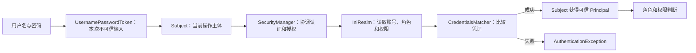

业务代码主要面对 `Subject`；SecurityManager 负责调度；Realm 把 Shiro 与真实身份数据连接起来。Principal（主体标识）、Credentials（凭证）和各组件的准确边界会在第 2、3 章结合这条执行链展开。

### 1.8 按阶段继续学习

| 阶段 | 阅读范围 | 要完成的结果 | 可暂时跳过 |
| --- | --- | --- | --- |
| 基础闭环 | 第 1～3 章 | 解释认证、授权、Subject、SecurityManager 与 Realm | 第 3.9～3.19 节的扩展点 |
| 项目接入 | 第 4～7 章、第 12 章 | 完成密码摘要、数据库 Realm、Spring Boot、Session 和测试 | JWT、SSO、CAS 与源码细节 |
| 生产治理 | 第 9～14 章 | 处理线程传播、缓存失效、集群、监控和上线检查 | 当前项目未使用的协议实现 |
| 跨应用身份 | 第 8 章 | 区分 Session、Bearer Token、JWT、OAuth 2.0、OIDC 与 SSO | 自建授权服务器或密码算法 |

第一轮学习的完成标准是：能用自己的话复述第 1.7 节的链路，能在 Spring Boot 中让匿名请求得到 HTTP 401、无权限请求得到 HTTP 403，并能写出错误密码、越权访问和退出失效的负向测试。第 15 章提供复习路径，第 16 章只用于查词，不需要顺序阅读。

## 2 安全基础：认证、授权与 RBAC

### 2.1 认证与授权的区别

| 概念 | 英文 | 核心问题 | 例子 | 常见失败 |
| --- | --- | --- | --- | --- |
| 认证 | Authentication | 你是谁 | 用户名密码登录 | 凭证错误、账号锁定 |
| 授权 | Authorization | 你能做什么 | 是否可删除订单 | 缺少角色或权限 |
| 审计 | Auditing | 你做了什么 | 谁在何时修改权限 | 日志缺失、无法追责 |

认证成功只说明身份可信，不代表拥有所有权限。生产系统必须默认拒绝，并为每项敏感操作显式授予最小权限。

### 2.2 RBAC 数据模型

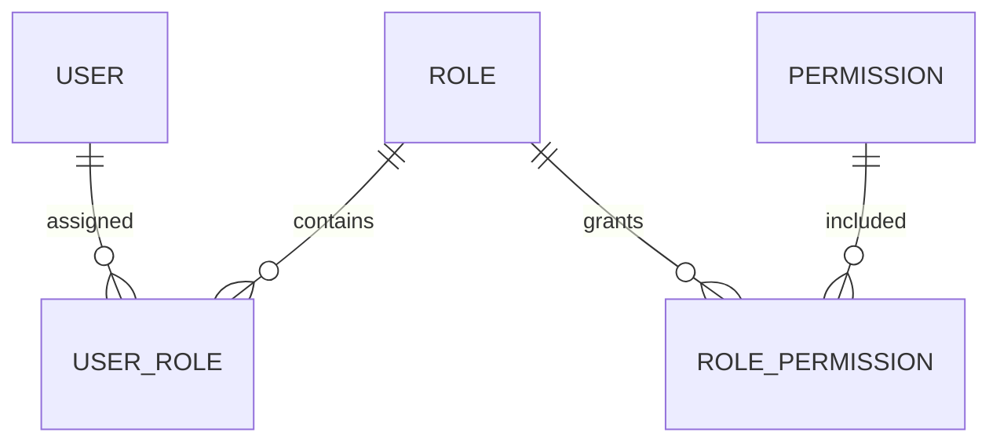

典型关系是用户与角色多对多、角色与权限多对多。角色代表职责集合，权限代表具体动作。不要把大量用户 ID 硬编码进业务判断。

RBAC 的价值是把“给每个用户逐项授权”改为“把稳定职责授给角色，再把角色分配给用户”，从而降低授权和审计成本。落地时先定义权限，再组合角色，最后分配用户；查询某个用户的权限时依次连接 `USER → USER_ROLE → ROLE → ROLE_PERMISSION → PERMISSION`。成功判据不是“数据库里有五张表”，而是新增用户只需分配既有角色、撤销角色后对应权限立即失效，并且没有角色的用户默认无法执行受保护操作。

### 2.3 权限字符串设计

Shiro 常用通配符权限格式：`资源:动作:实例`。

| 权限 | 含义 |
| --- | --- |
| `order:read` | 查看订单 |
| `order:create` | 创建订单 |
| `order:update:1001` | 修改编号为 1001 的订单 |
| `order:*` | 对订单资源执行任意动作 |
| `*:*` | 全局任意权限，必须极度谨慎 |

设计原则：资源名稳定、动作集合统一、实例级权限按需引入、超级权限严格审计。若还要限制“只能操作本部门数据”，应在业务查询层增加数据权限条件，不能只靠 URL 鉴权。

### 2.4 常见越权类型

1\. 水平越权：普通用户 A 能读取普通用户 B 的订单。

2\. 垂直越权：普通用户能访问管理员功能。

3\. 未授权访问：接口没有进入 Shiro 过滤链。

4\. 前端伪安全：只隐藏按钮，后端接口没有鉴权。

### 2.5 RBAC、ACL 与 ABAC 的区别（初学阶段了解即可）

| 模型 | 全称 | 判断依据 | 适用场景 |
| --- | --- | --- | --- |
| RBAC | Role-Based Access Control，基于角色的访问控制 | 用户拥有哪些角色 | 企业后台、岗位权限 |
| ACL | Access Control List，访问控制列表 | 某个资源允许哪些主体访问 | 文件、文档、单个对象共享 |
| ABAC | Attribute-Based Access Control，基于属性的访问控制 | 用户、资源、环境属性与策略 | 多条件、动态合规策略 |

Shiro 最自然地支持角色和权限判断，因此常以 RBAC 为主。涉及“本部门、工作时间、数据密级、订单归属”等动态规则时，要在业务层或策略引擎中补充 ABAC 思路。

### 2.6 最小权限与默认拒绝

最小权限表示主体只获得完成任务所必需的能力；默认拒绝表示没有明确允许就不能访问。二者共同防止“新增接口忘记配置后自动公开”。

权限检查必须发生在可信后端。菜单、按钮和路由守卫只改善用户体验，不能作为安全边界。

实现时应把确需公开的路径列为 `anon` 白名单，把其余路径交给 `authc` 或自定义认证过滤器兜底，并在业务方法继续检查角色、权限和数据归属。验证时新增一个没有单独配置的测试接口：匿名请求必须仍被拒绝，这才证明“默认拒绝”真正成立。

### 2.7 初学者必读：Subject、Principal 与 Credentials

学习 Shiro 前，必须先分清三个最基础的词：Subject、Principal 和 Credentials。它们分别回答“谁来访问”“用什么名字识别”“用什么证明身份”。

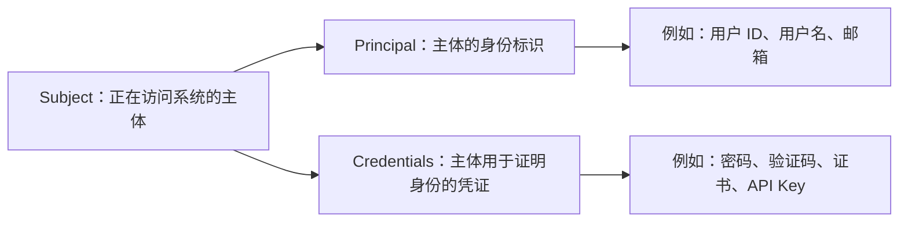

#### 2.7.1 Subject 是谁

`Subject` 表示当前正在与系统交互的主体。最常见的 Subject 是登录用户，但它不只表示自然人，也可以表示服务账号、后台任务或其他系统。

可以把 Subject 理解成安全世界里的“当前操作方”。业务代码通过 Subject 发起登录、退出、角色判断和权限判断。

```java
Subject subject = SecurityUtils.getSubject();

subject.login(token);
boolean authenticated = subject.isAuthenticated();
boolean allowed = subject.isPermitted("order:read");
subject.logout();
```

`Subject` 不是数据库中的 User 实体。User 是业务数据对象，Subject 是 Shiro 在当前安全上下文中使用的主体抽象。

#### 2.7.2 Principal 是什么

正确拼写是 `Principal`，含义是“主体标识”。它告诉系统这个 Subject 声称自己是谁。

常见 Principal 包括用户 ID、用户名、邮箱、员工编号或外部身份系统中的唯一标识。

假设用户张三的数据如下：

| 属性 | 示例 | 是否适合作为 Principal |
| --- | --- | --- |
| 用户 ID | `10001` | 适合，通常稳定且唯一 |
| 用户名 | `zhangsan` | 可以，但可能允许修改 |
| 邮箱 | `zhangsan@example.test` | 可以作为登录标识，但可能变更 |
| 昵称 | `小张` | 不适合，通常不唯一 |
| 密码摘要 | `...` | 绝对不适合，属于敏感认证数据 |

生产项目优先使用稳定、唯一且不可变的用户 ID 作为主要 Principal。用户名可以作为登录输入，但不一定适合作为系统内部长期关联键。

#### 2.7.3 Credentials 是什么

`Credentials` 表示主体用来证明身份的凭证。Principal 只是“我声称我是张三”，Credentials 才是“我如何证明自己真的是张三”。

常见 Credentials 包括密码、短信验证码、一次性密码、客户端证书、硬件密钥和 API Key。

在用户名密码场景中：

| 内容 | 对应概念 |
| --- | --- |
| 用户名 `zhangsan` | Principal |
| 用户输入的密码 | 提交的 Credentials |
| 数据库中的密码摘要 | 存储的 Credentials |
| 当前尝试登录的人 | Subject |

密码属于 Credentials，但 Credentials 不等于密码。不同认证方式可以使用不同形式的凭证。

#### 2.7.4 Principal 与 Credentials 的关系

可以用现实中的门禁理解：

1\. Subject：站在门口准备进入的人。

2\. Principal：这个人声称的身份，例如员工编号 `10001`。

3\. Credentials：用于证明身份的门禁卡、密码或指纹。

4\. Authentication：门禁系统验证身份标识和凭证是否匹配的过程。

5\. Authorization：验证成功后，判断这个人能进入哪些区域的过程。

Principal 不能证明身份。例如知道管理员用户名并不代表已经成为管理员；还必须提供有效 Credentials，并通过认证。

#### 2.7.5 一个 Subject 为什么能有多个 Principal

同一个用户可能同时拥有用户 ID、用户名、邮箱和外部身份编号，所以 Shiro 使用 `PrincipalCollection` 保存多个 Principal。

```java
PrincipalCollection principals = subject.getPrincipals();
Object primary = principals.getPrimaryPrincipal();
```

`getPrimaryPrincipal()` 返回主要标识。其他标识可按类型或 Realm 来源查询。

Shiro 3 的默认 `PrincipalCollection` 实现不可变。认证策略需要组合多个 Realm 结果时，由框架构造新的集合；业务代码不应取得集合后原地添加、删除或替换 Principal。存量扩展若依赖可变实现，迁移测试应覆盖多 Realm 合并、Run As 和 Session 恢复。

例如同一个 Subject 可能包含：

1\. 数据库 Realm 提供的内部用户 ID `10001`。

2\. LDAP（Lightweight Directory Access Protocol，轻量级目录访问协议）Realm 提供的员工编号 `E0088`。

3\. 外部身份系统提供的唯一标识 `external-abc`。

#### 2.7.6 AuthenticationToken 是什么

`AuthenticationToken` 表示一次登录请求中由调用方提交的 Principal 和 Credentials。它属于不可信输入，需要经过 Realm 与 CredentialsMatcher 验证。

```java
UsernamePasswordToken token = new UsernamePasswordToken(
    "zhangsan",
    passwordChars
);
```

在这个 Token 中，`zhangsan` 是提交的 Principal，`passwordChars` 是提交的 Credentials。

Token 不是登录成功后的用户对象，也不应该长期保存。使用完毕后应调用 `clear()` 清理其中的敏感凭证。

在 Web 请求中，表单登录和 HTTP Basic 通常会产生 `UsernamePasswordToken`，Bearer 认证会产生 `BearerToken`。它们只是把本次不可信输入送入统一认证流程的不同载体；Session Cookie 恢复已有会话时，通常不会再次创建登录 Token。三条链路的完整比较见第 5.10 节。

#### 2.7.7 AuthenticationInfo 是什么

`AuthenticationInfo` 是 Realm 从可信数据源返回的认证资料。它通常包含可信 Principal、存储的 Credentials、凭证参数和 Realm 名称。

```java
UserPrincipal principal =
    new UserPrincipal(account.id(), account.username());
PasswordRecord stored = new PasswordRecord(
    account.passwordAlgorithm(),
    account.passwordHash(),
    account.passwordSalt(),
    account.passwordParameters()
);

return new SimpleAuthenticationInfo(
    principal,
    stored,
    getName()
);
```

本笔记采用自定义 `CredentialsMatcher`（凭证匹配器），所以将算法、散列值、盐值和成本参数封装为 `PasswordRecord`。如果项目改用 Shiro 内置的散列匹配器，应按对应 API 提供盐值，不要同时混用两套凭证表示。

Token 和 AuthenticationInfo 的区别如下：

| 对象 | 来自哪里 | 是否可信 | 主要内容 |
| --- | --- | --- | --- |
| `AuthenticationToken` | 客户端或调用方 | 不可信 | 提交的 Principal 与 Credentials |
| `AuthenticationInfo` | Realm 背后的数据源 | 相对可信 | 已存储的 Principal、Credentials 与盐 |

CredentialsMatcher 会比较两边的 Credentials。匹配成功后才算认证成功。

#### 2.7.8 AuthorizationInfo 是什么

`AuthorizationInfo` 是 Realm 返回的授权资料，包含角色和权限。它与 AuthenticationInfo 不解决同一个问题。

| 对象 | 解决的问题 | 包含内容 |
| --- | --- | --- |
| `AuthenticationInfo` | 这个主体是谁，凭证是否正确 | Principal、存储凭证、盐 |
| `AuthorizationInfo` | 这个主体能做什么 | Role、Permission |

认证信息通常在登录时使用；授权信息通常在角色或权限判断时读取，并可能进入授权缓存。

#### 2.7.9 从登录输入到 Subject 的完整过程

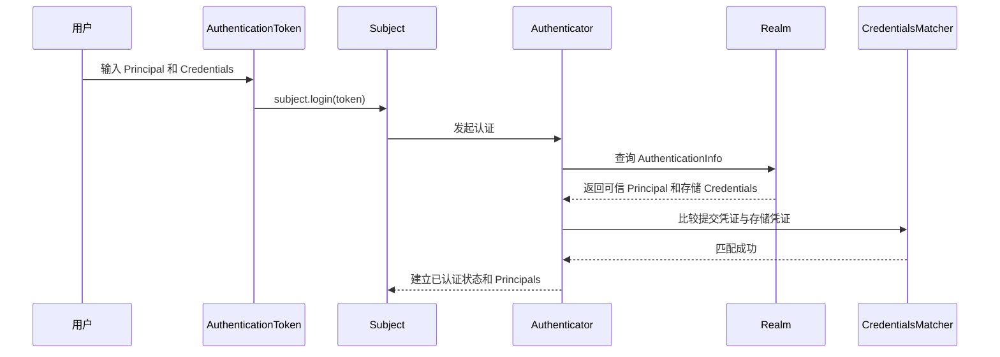

#### 2.7.10 最小记忆公式

1\. Subject：谁正在操作。

2\. Principal：他声称自己是谁。

3\. Credentials：他拿什么证明。

4\. AuthenticationToken：他这次提交了什么。

5\. AuthenticationInfo：可信数据源保存了什么。

6\. CredentialsMatcher：两边凭证是否匹配。

7\. Authentication：确认他是谁。

8\. AuthorizationInfo：记录他拥有哪些角色和权限。

9\. Authorization：判断他能做什么。

#### 2.7.11 初学者自测

1\. 用户名属于 Principal 还是 Credentials？答案：Principal。

2\. 密码属于 Principal 还是 Credentials？答案：Credentials。

3\. Subject 是否等同于数据库 User 对象？答案：不等同。

4\. AuthenticationToken 是否可信？答案：不可信，需要认证。

5\. AuthenticationInfo 由谁提供？答案：Realm。

6\. 登录成功后权限从哪里获得？答案：Realm 返回的 AuthorizationInfo，可能配合授权缓存。

7\. 知道管理员用户名是否等于通过认证？答案：不等于，还需要有效凭证。

## 3 Shiro 核心架构与执行流程

### 3.1 核心组件速查

| 组件 | 用途 | 生产关注点 |
| --- | --- | --- |
| `Subject` | 表示当前用户、服务或任务 | 与当前执行作用域关联，异步传播需谨慎 |
| `SecurityManager` | 统一协调认证、授权、Session 和缓存 | 通常是应用级单例 |
| `Realm` | 获取账号、凭证、角色和权限 | 查询性能、缓存、异常边界 |
| `Authenticator` | 组织登录认证 | 多 Realm 策略、失败异常 |
| `Authorizer` | 判断角色和权限 | 权限字符串、缓存失效 |
| `SessionManager` | 创建、读取、校验和销毁会话 | 超时、持久化、集群一致性 |
| `CacheManager` | 缓存认证或授权信息 | 更新权限后主动失效 |
| `CredentialsMatcher` | 比对提交凭证与存储凭证 | 算法、盐、迭代次数 |

### 3.2 登录认证时序

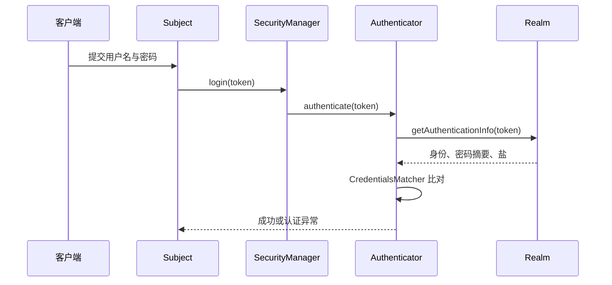

Realm 不应自行比较明文密码。它返回可信数据，凭证匹配器负责使用一致算法进行比对。

### 3.3 授权判断时序

1\. 业务代码调用 `subject.isPermitted(...)`，或请求进入过滤器、注解拦截器。

2\. `Authorizer` 先尝试读取授权缓存。

3\. 缓存未命中时，Realm 查询角色与权限。

4\. Shiro 使用权限解析器比较所需权限和已有权限。

5\. 允许请求继续，或抛出未授权异常。

### 3.4 Realm API 卡片

用途：把 Shiro 的认证授权流程与数据库、LDAP（Lightweight Directory Access Protocol，轻量级目录访问协议）或外部身份系统连接。

适用场景：业务拥有自定义用户、角色和权限数据时使用。若身份完全由外部身份提供商管理，应考虑标准协议集成，避免重复保存密码。

关键方法：`doGetAuthenticationInfo` 返回认证信息；`doGetAuthorizationInfo` 返回角色与权限。

异常：未知账号、密码错误、账号锁定、账号禁用和凭证过期应保持语义清晰，但对外响应不要泄露“账号是否存在”。

性能与线程安全：Realm 通常被多线程共享，不要把本次请求的用户信息存入实例字段；数据库访问需要索引、超时和连接池保护。

### 3.5 Subject 的四种常见状态

| 判断方法 | 含义 | 典型用途 |
| --- | --- | --- |
| `getPrincipal() != null` | 当前能识别出主体 | 展示用户标识 |
| `isAuthenticated()` | 本次会话完成了主动认证 | 支付、改密等敏感操作 |
| `isRemembered()` | 通过 Remember Me 恢复了身份 | 个性化页面、低风险访问 |
| `isRunAs()` | 正以另一个身份运行 | 受控运维代理场景 |

`isAuthenticated()` 与 `isRemembered()` 通常互斥。`@RequiresUser` 接受已认证或被记住的用户，`@RequiresAuthentication` 只接受本次真正登录的用户。

### 3.6 多 Realm 如何协作（进阶再学）

系统可能同时连接员工目录、客户数据库和服务账号库。`ModularRealmAuthenticator` 会把 Token 交给支持它的 Realm，再由认证策略决定怎样才算成功。

| 策略 | 语义 | 注意事项 |
| --- | --- | --- |
| `AtLeastOneSuccessfulStrategy` | 至少一个 Realm 成功 | 常见默认思路，注意同名账号冲突 |
| `FirstSuccessfulStrategy` | 第一个成功即采用 | Realm 顺序会影响结果 |
| `AllSuccessfulStrategy` | 所有参与 Realm 都必须成功 | 适合多重校验，耦合和可用性成本高 |

自定义 Token 时，Realm 应通过 `supports(token)` 明确自己是否处理该类型。不能让密码 Realm 误处理短信码或 API Key（Application Programming Interface Key，应用程序编程接口密钥）。

### 3.7 认证异常体系

| 异常 | 含义 | 对外响应原则 |
| --- | --- | --- |
| `UnknownAccountException` | 账号不存在 | 与密码错误使用统一提示 |
| `IncorrectCredentialsException` | 凭证不匹配 | 不返回具体比对细节 |
| `LockedAccountException` | 账号锁定 | 可提示联系管理员，但避免泄露敏感状态 |
| `DisabledAccountException` | 账号禁用 | 记录审计事件 |
| `ExcessiveAttemptsException` | 尝试次数过多 | 返回通用限流提示 |
| `AuthenticationException` | 认证失败父类 | 最后的安全兜底 |

异常分类用于内部处理、监控与审计；客户端通常只需要稳定错误码和模糊提示，避免账号枚举。

### 3.8 Shiro 的线程模型

`SecurityUtils.getSubject()` 取得的是与当前执行上下文关联的 Subject，而不是一个全局用户。Shiro 3 在 JDK 25 及以上使用 Java `ScopedValue` 保存这类作用域状态；在 JDK 17～24 等较早运行时，仍通过基于线程局部变量的机制完成关联。两种实现的共同语义都是“只在受控执行范围内可见，并在结束时清理”，业务代码不应依赖具体存储方式。

同步 Web 请求中，Shiro 过滤器会建立和清理关联；线程池任务、消息消费、响应式切换线程或手动创建线程时，不能假定提交线程的 Subject 会自动出现。跨线程的推荐做法与验证方式见第 9 章。官方说明见 [Apache Shiro Subject](https://shiro.apache.org/subject.html)。

应用级 `SecurityManager` 通常为单例，Realm 也通常被并发调用。Realm、Matcher 和 CacheManager 中不得用实例字段保存某个请求的临时状态。

完成第 3.1～3.8 节后，用第 4 章理解第 1 章的密码格式与装配链，再进入第 5 章接入 Spring Boot。第 3.9～3.19 节属于组件地图、源码阅读和扩展点参考，第一遍只需知道它们存在，不要求记忆。

### 3.9 Shiro 完整组件地图（初学阶段先看关系）

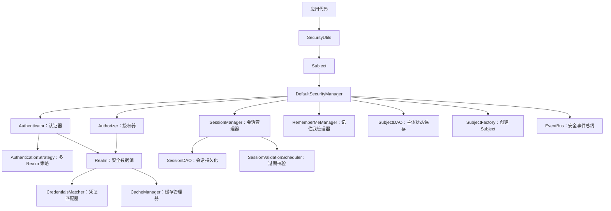

这张图中的组件不是每个项目都要手动配置。初学阶段先掌握 Subject、SecurityManager、Realm；遇到相应需求时再深入 SessionDAO、RememberMeManager 和 SubjectDAO。

### 3.10 SecurityUtils、Subject.Builder 与 SubjectFactory（进阶再学）

`SecurityUtils` 是静态入口，最常用方法是 `getSubject()` 和 `setSecurityManager()`。在 Spring 应用中通常由容器组装 SecurityManager，不建议在业务代码中反复设置全局对象。

`Subject.Builder` 用于以编程方式构造 Subject，可指定 principals、Session、是否已认证以及主机信息。适用于非 Web 环境、测试或受控后台任务，但不能通过手动设置 `authenticated=true` 绕过真实认证流程。

`SubjectFactory` 由 SecurityManager 调用，负责根据上下文真正创建 Subject。Web 环境通常创建能感知 Servlet 请求和响应的 WebSubject。

### 3.11 PrincipalCollection 为什么是集合

同一个主体可能经过多个 Realm，拥有多个标识，例如内部用户 ID、用户名和外部目录标识。因此 Shiro 使用 `PrincipalCollection`，而不是只保存一个字符串。

| API | 含义 |
| --- | --- |
| `getPrimaryPrincipal()` | 获取主要标识 |
| `fromRealm(realmName)` | 获取某个 Realm 提供的标识 |
| `asList()` | 以列表查看全部标识 |
| `isEmpty()` | 是否没有任何标识 |

主要标识应稳定、唯一且不敏感。不要把密码摘要、访问令牌或整个数据库实体作为 Principal。

### 3.12 AuthorizationInfo、Role 与 Permission

Realm 的 `doGetAuthorizationInfo` 返回 `AuthorizationInfo`。常见实现 `SimpleAuthorizationInfo` 可承载角色字符串、权限字符串以及权限对象。

角色是权限的业务集合，例如 `finance_manager`；权限是对资源动作的表达，例如 `invoice:approve`。业务代码优先面向权限，角色到权限的映射放在授权数据层。

Shiro 的 `Permission` 是行为判断接口，核心方法是 `implies(Permission)`：当前权限是否包含目标权限。`WildcardPermission` 是常用实现，用冒号划分部分，用逗号表达同一部分的多个值，用星号表达通配。

### 3.13 WildcardPermission 的包含语义

| 已拥有权限 | 目标权限 | 结果 | 原因 |
| --- | --- | --- | --- |
| `order:read` | `order:read` | 允许 | 完全匹配 |
| `order:*` | `order:delete` | 允许 | 动作通配 |
| `order:read,update` | `order:update` | 允许 | 动作集合包含目标 |
| `order:read:1001` | `order:read:1002` | 拒绝 | 实例不同 |
| `order:*:1001` | `order:delete:1001` | 允许 | 同一实例上的动作通配 |

通配权限不是正则表达式。权限各部分的数量、缺省部分和通配包含规则容易产生误解，必须为组织采用的权限格式编写单元测试。

### 3.14 Authorizer 与 PermissionResolver（进阶再学）

`Authorizer` 负责角色和权限判断。`ModularRealmAuthorizer` 可从多个 Realm 汇总授权信息。

`PermissionResolver` 把权限字符串转换为 `Permission` 对象，默认常见实现会产生 `WildcardPermission`。如果业务使用自定义语法，可以实现自己的解析器，但必须保持可读、可测试和向后兼容。

`RolePermissionResolver` 可把角色进一步解析为权限。多数数据库 RBAC 项目直接由 Realm 查询角色对应权限，更容易与管理后台和缓存失效保持一致。

### 3.15 Authenticator 与 AuthenticationStrategy（进阶再学）

`Authenticator` 只负责组织认证过程，不负责查询业务数据库；查询由 Realm 完成，凭证比较由 CredentialsMatcher 完成。

多 Realm 认证包含三个阶段：认证开始前、每个 Realm 完成后、全部 Realm 完成后。`AuthenticationStrategy` 决定如何合并结果以及何时失败。

如果不同 Realm 中可能出现相同用户名，应使用带来源的稳定主体标识，或让不同 Token 只被指定 Realm 支持，避免登录到错误账号。

### 3.16 SubjectDAO 与 SessionStorageEvaluator（进阶再学）

认证成功后，Subject 的 principals 和认证状态需要在后续请求中恢复。`SubjectDAO` 负责保存 Subject 状态，常见实现会通过 Session 保存。

`SessionStorageEvaluator` 决定是否允许把 Subject 状态存入 Session。无状态接口可能关闭这种存储，但关闭后应用必须在每次请求中重新建立可信主体，不能只是停止创建 Session 就宣称“无状态”。

### 3.17 Run As 身份切换（不常用）

`runAs` 允许一个已认证主体暂时以另一个身份运行，`releaseRunAs` 恢复原身份。它适合严格受控的运维代理或委托场景，不是普通的“切换用户”功能。

使用时必须检查发起人是否有代理权限，同时审计真实主体、代理主体、开始时间、结束时间和执行动作。日志只记录当前 Principal 会丢失真实责任人。

### 3.18 Lifecycle、Initializable 与 Destroyable（初学阶段了解即可）

部分 Shiro 组件具有初始化和销毁生命周期。容器应在依赖配置完成后初始化组件，并在应用关闭时释放资源。

自定义 Realm 或缓存组件若持有线程池、连接或调度器，要明确关闭方式。不要假定 Java 垃圾回收会自动停止后台线程或释放外部连接。

### 3.19 EventBus 与安全事件（不常用）

Shiro 组件可发布认证成功、认证失败或退出等事件，具体可用事件取决于版本和集成方式。事件适合解耦审计、指标和风控旁路处理，但不能让异步监听器决定主认证事务是否成功。

事件负载同样要脱敏。监听器失败应被监控，且不能把密码、Token 或完整 Session 发送到日志和消息系统。

## 4 理解格式化密码摘要与版本迁移

### 4.1 先识别 Shiro 3 的迁移边界

Apache Shiro 3.0.0 是本文使用的稳定版本，1.x 与 2.x 已结束生命周期。维护旧项目时应先识别 Shiro、Java、Spring、Servlet 容器和扩展模块的版本组合，再根据官方迁移指南逐项回归。

| Shiro 3 变化 | 对项目的影响 | 验证入口 |
| --- | --- | --- |
| 最低 Java 版本为 17 | 构建机、运行镜像和开发环境都要升级 | 比较 `java -version` 与 Maven 输出 |
| 使用 Jakarta EE 9+ 命名空间 | `javax.servlet.*` 等旧导入通常要迁移到 `jakarta.servlet.*` | 编译全部 Web 过滤器和第三方扩展 |
| 默认 PrincipalCollection 不可变 | 旧代码不能原地修改认证结果中的 Principal 集合 | 回归多 Realm 与身份切换代码 |
| 路径匹配默认忽略大小写 | 静态资源、路由和过滤规则的大小写策略要一致 | 对保护路径发送大小写变体请求 |
| 未命中过滤链时默认拒绝访问 | 依赖旧版“未配置即放行”的接口会改变行为 | 为新增且未单独配置的路径编写匿名测试 |
| HTTP 认证过滤器默认允许 CORS 预检请求 | `OPTIONS` 可以进入后续链路，但实际业务请求仍需认证授权 | 分别测试预检请求与实际请求 |

CORS（Cross-Origin Resource Sharing，跨源资源共享）预检放行只允许浏览器询问跨源策略，不代表对应的 `GET`、`POST` 或 `DELETE` 已获业务权限。版本变化依据见 [Shiro 3.0.0 发布说明](https://shiro.apache.org/blog/2026/06/apache-shiro-300-released.html)、[Spring Boot 集成指南](https://shiro.apache.org/spring-boot.html)与 [Web 支持文档](https://shiro.apache.org/web.html)。

### 4.2 第 1 章为什么直接使用密码摘要

Shiro 3 的实现仍保留可直接比较凭证的 `SimpleCredentialsMatcher`，官方示例源码中也能看到明文教学账号；当前配置指南则要求 INI 账号使用 bcrypt、Argon2 等密码派生格式。第 1 章直接采用格式化摘要，是为了让第一个可运行示例与当前安全用法保持一致，避免读者把明文模板复制进仓库、构建产物或部署配置。

摘要配置仍然只适合本地学习。真实系统的用户、角色和权限通常来自数据库或外部身份系统，第 5、6 章会把同一职责迁移到数据库 Realm 和统一密码服务。

### 4.3 读懂 Hasher 的输出边界

第 1.4 节的 `-p` 参数表示密码模式：终端关闭输入回显、要求再次确认、生成随机盐，并默认使用 Argon2id 和 `shiro2` 输出格式。典型结构如下：

```text
$shiro2$argon2id$<算法参数>$<随机盐>$<摘要>
```

`shiro2` 是 Shiro 2 起使用的模块化密码格式标识，后面的内容由具体算法解释。默认算法和参数可能在兼容版本升级中调整，应用应把完整字符串交给 `PasswordService` 解析，不能按固定下标拆字段后自行重新计算。只有显式选择旧兼容格式时才会出现 `$shiro1$`；新密码不应主动降级到旧格式。

格式化摘要不等于明文密码，但仍属于敏感认证数据：拿到它的攻击者可以离线猜测密码。复制时应保留完整内容，日志与错误响应中不应输出。官方参数与示例见 [Apache Shiro Command Line Hasher](https://shiro.apache.org/command-line-hasher.html)。

### 4.4 PasswordMatcher 如何进入认证链

第 1 章通过下面两行配置创建 `PasswordMatcher`，再把它绑定到隐式 `iniRealm`：

```ini
[main]
passwordMatcher = org.apache.shiro.authc.credential.PasswordMatcher
iniRealm.credentialsMatcher = $passwordMatcher
```

`PasswordMatcher` 实现 Shiro 通用的 `CredentialsMatcher` 接口，并把实际密码比较委托给 `org.apache.shiro.authc.credential.PasswordService`。`iniRealm` 是 INI 环境隐式创建的 Realm 名称；名称写错时，新 Matcher 不会绑定到真正参与认证的 Realm。

Java 入口也属于装配链的一部分。`BasicIniEnvironment` 会处理 `[main]`、`[users]` 和 `[roles]`；`new IniRealm(resourcePath)` 只让 Realm 读取账号和角色定义，不会替应用执行 `[main]` 的对象装配。因此“INI 写对了但一直登录失败”时，要同时检查配置内容和创建 SecurityManager 的入口。

### 4.5 复用程序并观察中间状态

Java 代码使用 `UsernamePasswordToken("alice", password)` 提交本次原始密码。执行路径如下：

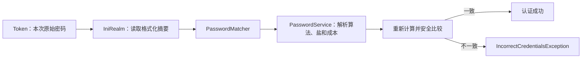

密码摘要不可解密。登录时的动作是根据存储字符串中的参数重新计算，再比较结果；每用户随机盐让相同原始密码产生不同存储值。

### 4.6 用结果证明摘要与装配生效

1\. 使用生成摘要时输入的原密码登录，预期第 1 章的三个成功结果保持不变。

2\. 修改一个摘要字符，使用原密码登录，预期认证失败。

3\. 把 Matcher 绑定暂时删除，预期格式化摘要不再按相同规则验证；恢复配置后重新测试。

4\. 为相同密码重新生成摘要，确认输出不同，但两条摘要都能分别验证该原密码。

5\. 运行 `./mvnw dependency:tree`，确认命令行 Hasher 没有被加入应用运行时依赖。

“INI 中看不到明文”只证明存储形式已经变化。生产合格还要求密码算法与成本满足组织基线、登录路径具有限流、未知账号与错误密码的外部响应一致、日志不含凭证，并且支持未来的渐进升级。

### 4.7 从学习配置迁移到项目配置

Spring Boot 数据库项目不应在 INI 中维护真实用户。通常有两条实现路线：一条使用 Shiro 自带 `PasswordMatcher` 与 `org.apache.shiro.authc.credential.PasswordService` 保存格式化摘要；另一条把组织统一的 Argon2id、bcrypt 或其他密码库封装为应用密码服务，再通过自定义 CredentialsMatcher 接入 Shiro。

两条路线的共同约束是注册、改密和登录必须使用同一实现与参数语义。Shiro 3 支持密码服务和可插拔的 Argon2、bcrypt 能力，但算法选择、成本基准、密钥管理、限流和多因素认证仍由应用与组织安全基线负责。第 6.4、6.7 节会给出不与 Shiro 同名 API 混淆的应用接口。

## 5 Spring Boot 与数据库接入

### 5.1 引入 Shiro 3 Web Starter

目标：让 Spring Boot Web 应用获得 Shiro 主过滤器、注解支持和自动配置基础。

```xml
<dependency>
    <groupId>org.apache.shiro</groupId>
    <artifactId>shiro-spring-boot-web-starter</artifactId>
    <version>3.0.0</version>
</dependency>
```

Web 应用使用 `shiro-spring-boot-web-starter`；非 Web 的 Spring Boot 应用使用 `shiro-spring-boot-starter`。不要同时随意引入多个 Starter，也不要再单独固定一组不一致的 Shiro 模块版本。

Spring Boot Starter 会自动启用 Shiro 注解，但 Web 应用仍需提供 Realm 和至少一条 `ShiroFilterChainDefinition`。只有 Bean 被创建不代表请求已经受保护，必须通过未登录请求和无权限请求验证过滤器链。

版本边界：本文示例以 Shiro 3.0.0、Java 17+ 和 Jakarta 命名空间为基线。第 1 章的最小项目已经过 Java 17 实际编译与三条路径验证；本章的 Spring Boot 代码是分层片段，不构成可独立启动的完整项目，接入实际项目后仍需执行 `./mvnw clean test` 和 HTTP 集成测试。

### 5.2 推荐分层

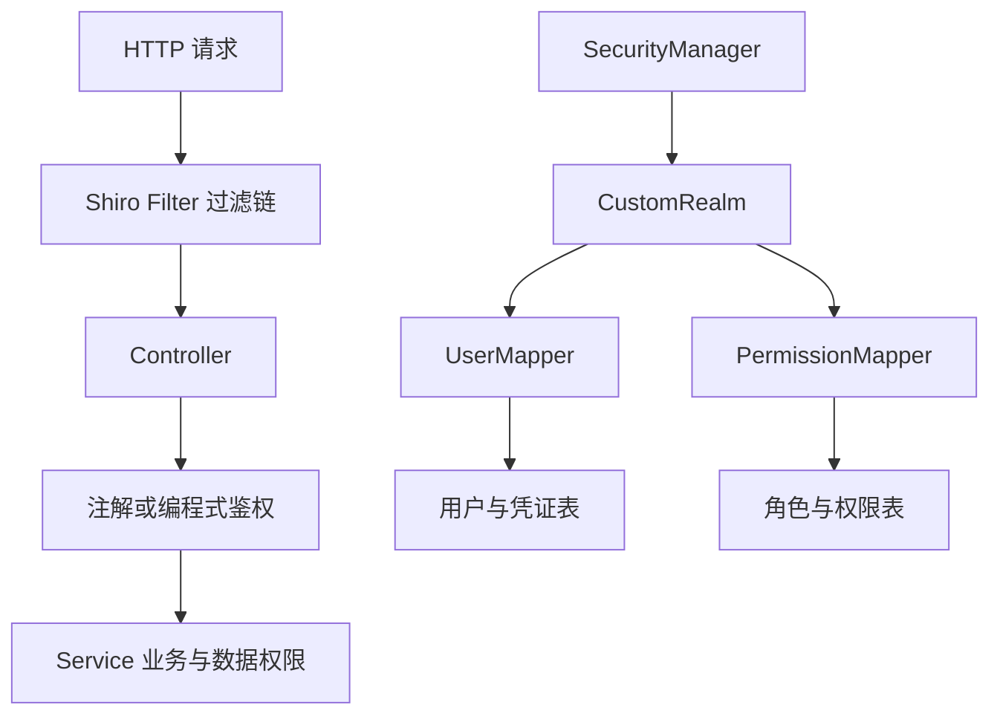

入口过滤负责“是否能进入”，方法注解负责“是否能调用”，Service 层负责“能操作哪些数据”。三层不能互相替代。

### 5.3 自定义 Realm 示例

```java
public final class DatabaseRealm extends AuthorizingRealm {
    private final UserService userService;
    private final PermissionService permissionService;

    public DatabaseRealm(UserService userService,
                         PermissionService permissionService,
                         CredentialsMatcher credentialsMatcher) {
        this.userService = userService;
        this.permissionService = permissionService;
        setCredentialsMatcher(credentialsMatcher);
    }

    @Override
    public boolean supports(AuthenticationToken token) {
        return token instanceof UsernamePasswordToken;
    }

    @Override
    protected AuthenticationInfo doGetAuthenticationInfo(AuthenticationToken token) {
        String username = (String) token.getPrincipal();
        UserAccount account = userService.findByUsername(username)
            .orElse(null);
        if (account == null) {
            // 返回 null 后，Shiro 3 会让 Matcher 执行一次模拟凭证计算，
            // 再由认证器转换为 UnknownAccountException。
            return null;
        }
        if (!account.enabled()) {
            throw new DisabledAccountException();
        }
        if (account.locked()) {
            throw new LockedAccountException();
        }

        UserPrincipal principal =
            new UserPrincipal(account.id(), account.username());
        PasswordRecord stored = new PasswordRecord(
            account.passwordAlgorithm(),
            account.passwordHash(),
            account.passwordSalt(),
            account.passwordParameters()
        );

        return new SimpleAuthenticationInfo(
            principal,
            stored,
            getName()
        );
    }

    @Override
    protected AuthorizationInfo doGetAuthorizationInfo(PrincipalCollection principals) {
        UserPrincipal principal =
            (UserPrincipal) principals.getPrimaryPrincipal();
        SimpleAuthorizationInfo info = new SimpleAuthorizationInfo();
        info.setRoles(permissionService.findRoleCodes(principal.userId()));
        info.setStringPermissions(
            permissionService.findPermissionCodes(principal.userId())
        );
        return info;
    }
}

public record UserPrincipal(long userId, String username) {}
```

这个示例只接受 `UsernamePasswordToken`，避免它在同时配置 Bearer Realm 时误处理访问令牌。账号不存在时返回 `null`，让 Shiro 3 通过第 6.7 节 Matcher 提供的模拟凭证执行近似成本计算；禁用和锁定则保留内部异常，便于审计和指标分类。第 5.6 节会把这些失败映射为一致的外部响应，降低账号枚举风险。

稳定用户 ID 和展示用用户名被封装为不可变 `UserPrincipal`。登录输入仍是用户名，但授权查询使用用户 ID，避免用户名修改后缓存键、权限关联和审计关联失效。Principal 不应包含密码摘要、Token 或可变数据库实体。

Shiro 的认证缓存默认关闭。若项目显式开启它，这个示例还需要让 `getAuthenticationCacheKey(token)` 与 `getAuthenticationCacheKey(principals)` 产生同一种稳定键；否则登录时可能按用户名写入，退出时却按 `UserPrincipal` 删除，旧认证资料只能等待缓存自然过期。授权缓存可以继续以稳定用户 ID 和租户作为业务键，两类缓存不要混用失效逻辑。

### 5.4 注册 URL 过滤链

入口：Spring Boot Web Starter 会寻找 `ShiroFilterChainDefinition` Bean，并据此构建主 Shiro Filter 使用的路径规则。过滤链解决“请求能否进入应用”，方法注解解决“已经进入应用后能否执行某项业务”；二者可以同时使用。

```java
@Bean
ShiroFilterChainDefinition shiroFilterChainDefinition() {
    DefaultShiroFilterChainDefinition chain =
        new DefaultShiroFilterChainDefinition();

    // 静态资源无需登录，否则登录页面自身可能因无法加载样式或脚本而不可用。
    // anon 是 AnonymousFilter 的简称，表示无需登录即可继续访问。
    chain.addPathDefinition("/assets/**", "anon");

    // 登录入口必须允许匿名访问，否则未登录用户无法发起认证。
    chain.addPathDefinition("/api/auth/login", "anon");

    // 允许各种主体调用退出，以便统一清除当前浏览器中的登录痕迹。
    // Cookie 会话下必须另外启用 CSRF 防护，避免第三方页面强制用户退出。
    chain.addPathDefinition("/api/auth/logout", "anon");

    // 只公开不包含敏感信息的存活检查，供容器或负载均衡器探测。
    chain.addPathDefinition("/health/liveness", "anon");

    // REST 接口使用自定义 restAuthc：未认证时直接返回 JSON + 401。
    // /api/admin/** 的 admin 角色在 Controller 方法上用 @RequiresRoles 检查。
    chain.addPathDefinition("/api/admin/**", "restAuthc");
    chain.addPathDefinition("/api/**", "restAuthc");

    // 页面流仍可使用内置 authc；未登录时按表单登录语义跳转 loginUrl。
    // 兜底规则必须最后注册：所有未明确公开的路径默认要求认证。
    chain.addPathDefinition("/**", "authc");
    return chain;
}
```

发现与执行：请求先进入 Shiro 主过滤器，再由 FilterChainResolver 按注册顺序选择路径规则。宽泛规则过早匹配会遮蔽后续精确规则。

`anon` 和 `authc` 是过滤器名称，不是随意书写的英文标记。`anon` 允许请求继续；内置 `authc` 指向 `FormAuthenticationFilter`，匿名访问时默认按页面登录流程重定向到 `loginUrl`。因此 REST（Representational State Transfer，表述性状态转移）接口不能只写 `authc` 却期待稳定的 JSON + HTTP 401；本例使用第 5.20 节注册的 `restAuthc` 解决响应形态问题。

默认与退让：Shiro 3 的 Spring Boot 集成把 `shiro.allowAccessByDefault` 默认设为 `false`，而 2.x 默认是 `true`；迁移时不能假定未匹配路径的行为相同。即使采用默认拒绝，仍建议保留显式 `/**` 兜底，让安全意图可读、可测试。

路径大小写：Shiro 3 的 `shiro.caseInsensitive` 默认是 `true`，Shiro 2 默认是 `false`。应用路由、文件系统和 Shiro 路径匹配必须采用一致策略，尤其要测试大小写不同的静态资源和保护路径，避免大小写敏感差异造成绕过。

关闭与排除：不要为了让接口暂时可访问而把整个 `/**` 改成 `anon`。应只为确需公开的登录、静态资源和存活检查添加精确白名单。

验证：未登录访问 `/api/admin/config` 应得到 JSON + HTTP 401；登录但没有 `admin` 角色时，方法注解应使它得到 HTTP 403；新增 `/api/**` 接口应命中 `restAuthc`，新增页面路径应命中最后的 `/**`，都不能意外公开。

### 5.5 注解鉴权

```java
@RestController
@RequestMapping("/api/admin")
public class AdminController {
    @RequiresRoles("admin")
    @GetMapping("/config")
    public AdminConfig config() {
        return loadAdminConfig();
    }
}

@RequiresPermissions("order:refund")
public void refund(long orderId, BigDecimal amount) {
    // 仍要校验订单归属、状态、金额上限和幂等性。
}
```

常见注解包括 `@RequiresAuthentication`、`@RequiresUser`、`@RequiresGuest`、`@RequiresRoles` 和 `@RequiresPermissions`。使用注解是为了让安全规则贴近真正的业务入口，避免只保护某个 URL，却遗漏定时任务、内部调用或另一条路由。

必须确认 Spring AOP（Aspect-Oriented Programming，面向切面编程）代理已启用；类内部自调用通常绕过代理拦截。验证时用真实 Spring Bean 和 HTTP 请求分别覆盖“未登录、已登录但无角色、具有角色”三条路径，不能只写直接调用普通对象的单元测试。

### 5.6 统一异常响应

```java
@RestControllerAdvice
public class SecurityExceptionHandler {
    @ExceptionHandler(AuthenticationException.class)
    ResponseEntity<ApiError> authenticationFailed() {
        return ResponseEntity.status(401)
            .body(new ApiError("AUTHENTICATION_FAILED", "用户名或凭证错误"));
    }

    @ExceptionHandler(UnauthenticatedException.class)
    ResponseEntity<ApiError> unauthenticated() {
        return ResponseEntity.status(401)
            .body(new ApiError("UNAUTHENTICATED", "请先登录"));
    }

    @ExceptionHandler(UnauthorizedException.class)
    ResponseEntity<ApiError> forbidden() {
        return ResponseEntity.status(403)
            .body(new ApiError("FORBIDDEN", "无权执行此操作"));
    }
}
```

HTTP 401 表示尚未通过认证，HTTP 403 表示身份已知但权限不足。对外不要返回堆栈、数据库信息或完整权限集合。

这段 `@RestControllerAdvice` 只能处理请求进入 Spring MVC（Model-View-Controller，模型—视图—控制器）后抛出的异常，例如方法注解产生的 `UnauthenticatedException` 或 `UnauthorizedException`。Shiro Filter 在 `DispatcherServlet` 之前拒绝的请求通常不会进入这里，所以 REST 过滤器必须像第 5.20 节那样自己写出 401 响应；不要误以为一个全局异常处理器能统一接住整个 Servlet 过滤链。

### 5.7 设计数据库表

最小 RBAC 需要五张表：用户表、角色表、权限表、用户角色关联表、角色权限关联表。

```sql
CREATE TABLE sys_user (
    id BIGINT PRIMARY KEY,
    username VARCHAR(64) NOT NULL UNIQUE,
    password_hash VARCHAR(255) NOT NULL,
    password_salt VARCHAR(128) NOT NULL,
    enabled BOOLEAN NOT NULL DEFAULT TRUE,
    locked BOOLEAN NOT NULL DEFAULT FALSE,
    password_algorithm VARCHAR(32) NOT NULL,
    password_parameters VARCHAR(128) NOT NULL,
    created_at TIMESTAMP NOT NULL,
    updated_at TIMESTAMP NOT NULL
);

CREATE TABLE sys_role (
    id BIGINT PRIMARY KEY,
    code VARCHAR(64) NOT NULL UNIQUE,
    name VARCHAR(128) NOT NULL
);

CREATE TABLE sys_permission (
    id BIGINT PRIMARY KEY,
    code VARCHAR(128) NOT NULL UNIQUE,
    description VARCHAR(255)
);

CREATE TABLE sys_user_role (
    user_id BIGINT NOT NULL,
    role_id BIGINT NOT NULL,
    PRIMARY KEY (user_id, role_id)
);

CREATE TABLE sys_role_permission (
    role_id BIGINT NOT NULL,
    permission_id BIGINT NOT NULL,
    PRIMARY KEY (role_id, permission_id)
);
```

生产中还应增加外键或等价一致性保障、审计字段、软删除策略和租户字段。高频查询至少需要用户名唯一索引、关联表联合主键以及权限代码唯一索引。

### 5.8 推荐的登录与退出接口

```java
@RestController
@RequestMapping("/api/auth")
public class AuthController {
    @PostMapping("/login")
    public LoginResponse login(@Valid @RequestBody LoginRequest request) {
        Subject subject = SecurityUtils.getSubject();
        UsernamePasswordToken token = new UsernamePasswordToken(
            request.username(), request.password()
        );
        // 只有用户明确选择时，才在认证成功后创建 Remember Me 状态。
        token.setRememberMe(request.rememberMe());
        try {
            subject.login(token);
            UserPrincipal principal =
                (UserPrincipal) subject.getPrincipal();
            return new LoginResponse(
                principal.userId(), principal.username()
            );
        } finally {
            token.clear();
        }
    }

    @PostMapping("/logout")
    public void logout() {
        SecurityUtils.getSubject().logout();
    }
}

public record LoginRequest(
    @NotBlank String username,
    @NotNull @Size(min = 8, max = 128) char[] password,
    boolean rememberMe
) {}

public record LoginResponse(long userId, String username) {}
```

登录接口还应有请求频率限制、统一失败响应、审计事件与 HTTPS。退出必须销毁服务端会话，而不只是让前端删除 Cookie。请求 DTO（Data Transfer Object，数据传输对象）使用 `char[]` 是为了让应用有机会尽早清理内存；反序列化框架和原始请求缓冲区仍可能产生其他副本，因此它不是完整的内存保密方案。

### 5.9 Spring 配置的职责拆分

```java
@Configuration
public class ShiroConfig {
    @Bean
    CredentialsMatcher credentialsMatcher(
            ApplicationPasswordService passwordService) {
        return new ApplicationCredentialsMatcher(passwordService);
    }

    @Bean
    DatabaseRealm databaseRealm(UserService users,
                                PermissionService permissions,
                                CredentialsMatcher matcher) {
        return new DatabaseRealm(users, permissions, matcher);
    }
}
```

在 Shiro 3 Spring Boot Web Starter 中，提供 Realm 和 `ShiroFilterChainDefinition` 后，由自动配置组装 Web SecurityManager、主过滤器和注解支持。手动声明 SecurityManager 只适合确有自定义需求且理解自动配置退让条件的项目，否则容易遗漏 Starter 已设置的 Web 组件。

验证自动配置是否生效不能只看“应用启动成功”。至少要确认：

1\. Spring 容器中存在预期 Realm。

2\. Shiro 主过滤器处理了受保护请求。

3\. `@RequiresPermissions` 经过代理执行。

4\. 未登录请求被拒绝，而不是直接到达 Controller。

5\. 用户自定义 Bean 覆盖默认 Bean 后，Session、缓存和过滤链行为仍符合预期。

### 5.10 Web 认证入口：过滤器与三种凭证传递方案

#### 5.10.1 默认 Web 过滤器速查

| 过滤器 | 语义 | 常见用途 |
| --- | --- | --- |
| `anon` | 无需身份 | 登录页、静态资源、公开健康检查 |
| `authc` | 必须通过表单式认证 | 传统服务端页面；REST 需自定义拒绝响应 |
| `authcBasic` | HTTP Basic 认证 | 受控内部接口，不适合随意暴露公网 |
| `authcBearer` | 从 Authorization 头读取 Bearer Token 并发起认证 | OAuth 2.0 Access Token、JWT 或不透明 Token API |
| `invalidRequest` | 拒绝部分危险或非规范请求路径 | 分号、反斜杠、非 ASCII 路径的兼容与安全检查 |
| `noSessionCreation` | 禁止当前请求创建新 Session | 无状态 API，通常放在认证过滤器之前 |
| `user` | 已认证或 Remember Me | 低风险个性化页面 |
| `roles[x]` | 需要指定角色 | 粗粒度后台入口 |
| `perms[x]` | 需要指定权限 | 细粒度操作入口 |
| `logout` | 执行退出 | 传统 Web 退出路径 |
| `ssl` | 要求安全传输 | HTTPS 约束，通常还由网关统一保障 |

过滤链匹配通常遵循“先匹配先生效”，因此必须由精确规则到宽泛规则，最后使用 `/**` 兜底。Shiro 3 在没有路径规则命中时默认拒绝，并用 `NoAccessFilter` 承担兜底拒绝；显式 `/**` 仍能让页面跳转、REST 401 或 Bearer 挑战等具体契约保持可读、可测。

Shiro 3 的 `authcBasic` 与 `authcBearer` 默认允许 CORS 预检 `OPTIONS` 请求通过认证过滤器。预检通过不会授权实际业务请求；自定义 `restAuthc` 也不是 `HttpAuthenticationFilter`，跨源项目还需明确 CORS 过滤器顺序和预检响应，避免浏览器在真正发送业务请求前就失败。修改过滤链后应分别验证预检、凭证缺失、凭证有效和权限不足四条路径。

#### 5.10.2 先分清认证方式、凭证传递方式与登录态

HTTP Basic、Session-Cookie 和 Bearer Token 常被并列为“认证方式”，但它们实际位于不同层次。若不先区分层次，很容易把 Cookie 当成 Session、把 Token 当成 JWT，或者误以为每次带 Session Cookie 都在重新校验密码。

| 层次 | 回答的问题 | 例子 |
| --- | --- | --- |
| 原始认证因素 | 主体最初拿什么证明身份 | 密码、一次性验证码、客户端证书、硬件密钥 |
| HTTP 传递方案 | 本次请求怎样携带认证材料 | `Authorization: Basic ...`、`Authorization: Bearer ...`、请求体登录 |
| 登录态或凭证状态 | 后续请求凭什么继续被识别 | 服务端 Session、自包含 JWT、不透明 Token |
| 传输容器 | 浏览器或客户端把值放在哪里 | Cookie、`Authorization` 请求头 |
| Shiro 认证请求 | HTTP 材料进入框架后变成什么 | `UsernamePasswordToken`、`BearerToken` |
| 最终授权依据 | 认证成功后用什么判断能否操作 | 稳定 Principal、角色、权限、租户和数据归属 |

Cookie 只是 HTTP 的键值传输与保存机制，Cookie 中既可以放 Session ID，也可能放其他令牌；Session 是服务端维护的会话状态，二者不是同一个对象。Token（令牌）是凭证或信息载体的统称，Bearer Token 可以是不透明随机串，也可以采用 JWT 格式；JWT 只是 Token 的一种格式。

从 Shiro 视角看，三条主线最终都会汇合到 `Subject → SecurityManager → Authenticator → Realm`。区别主要发生在请求入口、Token 类型、凭证验证方式和后续状态保存位置。

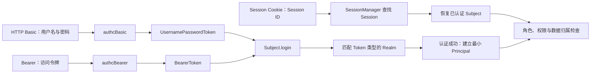

Session-Cookie 这条路径通常不会在每次请求上重新执行 `Subject.login`：用户名密码只在登录请求中验证一次，后续请求使用 Session ID 找回服务端会话，再恢复此前的 Subject 状态。权限判断发生授权缓存未命中时，授权 Realm 仍可能再次查询角色和权限，这不等于重新验证密码。HTTP Basic 和无状态 Bearer Token 则通常让每个请求都携带可用于认证的材料。

#### 5.10.3 HTTP Basic：每次请求携带用户名与密码

HTTP Basic Authentication（HTTP 基本认证）把 `用户名:密码` 进行 Base64 编码后放入 `Authorization` 请求头。Base64 只是编码，不是加密；任何拿到该值的人都可以还原用户名和密码，所以 Basic 必须在 HTTPS 上使用，并像保护明文密码一样保护请求头、代理日志和调试记录。

```http
GET /internal/reports/daily HTTP/1.1
Host: api.example.invalid
Authorization: Basic <Base64(service-reader:password)>
```

客户端未提供凭证时，Shiro 的 `authcBasic` 会返回认证挑战。默认响应语义类似：

```http
HTTP/1.1 401 Unauthorized
WWW-Authenticate: Basic realm="application"
```

`realm="application"` 中的 realm 是 HTTP 挑战保护空间，不是 Shiro 的 `Realm` 组件。Shiro 过滤器把它称为 `applicationName`，可以改成便于客户端识别的名称。收到挑战后，浏览器可能弹出内置登录框；命令行和服务调用方也可以不等挑战，直接预先发送 `Authorization` 请求头。

在 Shiro 3 中，请求依次经过以下步骤：

1\. `BasicHttpAuthenticationFilter` 从 `Authorization` 头识别 `Basic` 方案。

2\. 过滤器 Base64 解码凭证，并按第一个冒号拆成用户名和密码。

3\. Shiro 创建 `UsernamePasswordToken`，再调用 `Subject.login(token)`。

4\. 支持 `UsernamePasswordToken` 的 Realm 查询账号，`CredentialsMatcher` 校验密码。

5\. 成功后请求继续执行；缺少头、格式错误或凭证失败时返回 HTTP 401，并带 `WWW-Authenticate` 挑战头。

Basic 的价值是协议简单、客户端支持广、无需额外登录接口，适合受控内部工具、短期运维入口或具备完善凭证轮换的服务调用。它不适合普通公网用户登录：长期密码会在每次请求中重复出现，浏览器可能缓存凭证，服务端也没有类似“删除 Session”那样可靠的单请求登出状态。无状态 Basic 的“退出”本质上是客户端停止发送请求头，或服务端禁用、轮换相应凭证。

下面的过滤链让 `/internal/**` 使用 Basic，并阻止请求创建新 Session：

```java
chain.addPathDefinition(
    "/internal/**",
    "noSessionCreation, authcBasic"
);
```

`noSessionCreation` 只禁止当前请求新建 Session，并不会忽略请求到来前已经存在的 Session。如果同一主机同时承载浏览器 Session 和严格的无状态接口，必须额外验证旧 Session Cookie 不会让 Basic 路径直接通过；高隔离场景更适合使用独立主机、独立过滤链策略，或明确关闭 Subject 的 Session 状态保存。

使用测试账号验证时可以执行：

```bash
# 正确凭证：预期 200。
curl -i --user 'service-reader:test-password' \
  https://api.example.invalid/internal/reports/daily

# 缺少凭证：预期 401，并包含 WWW-Authenticate: Basic。
curl -i \
  https://api.example.invalid/internal/reports/daily

# 错误凭证：预期仍为 401，不向客户端暴露账号是否存在。
curl -i --user 'service-reader:wrong-password' \
  https://api.example.invalid/internal/reports/daily
```

命令行参数可能被 Shell 历史或进程信息记录。生产排查应使用受控凭证注入方式，不要把真实密码直接写入脚本、聊天记录或构建日志。HTTP Basic 的当前协议定义见 [RFC 7617：The Basic HTTP Authentication Scheme](https://www.rfc-editor.org/rfc/rfc7617)。

#### 5.10.4 Session-Cookie：认证一次，后续按会话恢复 Subject

Session-Cookie 方案通常先由登录接口接收用户名和密码，认证成功后在服务端创建 Session，再通过响应 Cookie 把不可预测的 Session ID 交给浏览器。浏览器后续自动携带 Cookie，服务端根据 Session ID 找到会话并恢复 Subject。

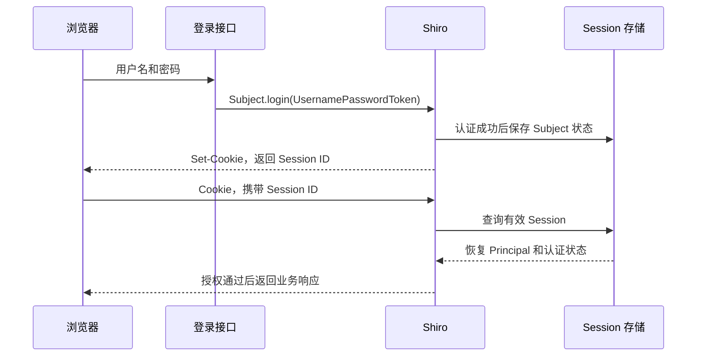

这里真正证明密码正确的是第一次登录；后续 Cookie 中的 Session ID 相当于会话通行证，谁持有它，谁就可能冒用该会话。它虽然通常不是用户的原始密码，却仍是高敏感凭证，不能写入日志、URL、前端可读存储或错误响应。

Session-Cookie 的优势是服务端可立即删除会话；在具备“账号到会话”的索引、失效事件和多节点一致性后，账号禁用、主动退出和踢下线可以及时生效。主要代价是服务端需要维护状态，集群需要共享或复制 Session。浏览器会自动携带 Cookie，因此修改数据的请求必须防护 CSRF（Cross-Site Request Forgery，跨站请求伪造）；同时配置 `HttpOnly`、`Secure`、合适的 `SameSite`、域和路径。完整生命周期、两种 SessionManager 配置与 Cookie 属性见第 7.1 节。

可用 Cookie 文件模拟浏览器完成闭环：

```bash
# 登录：-c 把响应中的 Session Cookie 保存到临时文件。
curl -i -c /tmp/shiro-session.cookies \
  -H 'Content-Type: application/json' \
  -d '{"username":"reader","password":"test-password","rememberMe":false}' \
  https://app.example.invalid/api/auth/login

# 后续访问：-b 自动发送刚才保存的 Cookie，预期 200。
curl -i -b /tmp/shiro-session.cookies \
  https://app.example.invalid/api/orders

# 退出：服务端应销毁 Session，并返回删除 Cookie 的响应。
curl -i -b /tmp/shiro-session.cookies \
  -X POST https://app.example.invalid/api/auth/logout

# 再次使用旧 Cookie：预期 401。
curl -i -b /tmp/shiro-session.cookies \
  https://app.example.invalid/api/orders
```

Cookie 文件包含可复用的会话秘密，只能放在受控临时位置，测试完成后应安全清理且绝不能提交到仓库。成功判据不是“浏览器里出现 Cookie”，而是正确 Cookie 能恢复同一主体，随机或篡改的 Session ID 被拒绝，退出和超时后旧 Session ID 都不能再恢复登录态。

#### 5.10.5 Bearer Token：每次请求携带访问令牌

Bearer Token（持有者令牌）通过 `Authorization: Bearer <token>` 发送。“持有者”表示服务端主要根据谁拿到了令牌来接受调用，因此令牌泄露通常就等于访问能力泄露。它可以是服务端保存映射关系的不透明随机 Token，也可以是采用 JWT 格式的自包含 Token。

```http
GET /api/orders HTTP/1.1
Host: api.example.invalid
Authorization: Bearer <access-token>
```

Shiro 3 的 `authcBearer` 使用 `BearerHttpAuthenticationFilter` 读取请求头并创建 `BearerToken`。在这个尚未验证的 `BearerToken` 中，原始令牌值同时作为临时 Principal 和 Credentials；这不代表原始令牌已经是可信业务 Principal。Realm 必须先验证令牌，再返回稳定用户 ID、租户等最小 Principal。

第 5.3 节的 `DatabaseRealm` 面向 `UsernamePasswordToken`，不能直接承担 Bearer 校验。项目同时支持两种 Token 时，应为 Bearer 单独实现 Realm，并让两个 Realm 的 `supports(token)` 只接受各自类型；不要让所有 Realm 都无条件返回 `true`，否则多 Realm 策略可能重复验证、选错身份源或产生难以解释的失败结果。

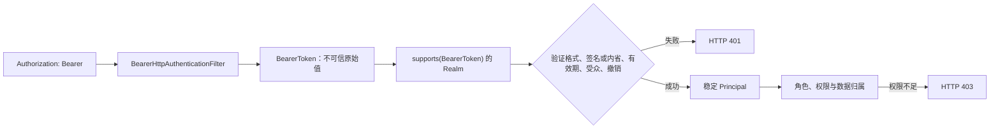

Bearer 的价值是适合移动端、服务调用和多个资源服务，且不会在每次请求中重复发送用户长期密码。代价取决于令牌类型：不透明 Token 通常需要查询服务端状态或执行令牌内省；自包含 JWT 可以本地验证，但撤销、权限变化、时钟、签名算法和密钥轮换更复杂。详细的 JWT 校验闭环见第 8.3 至 8.5 节。

无状态 API 的典型链路是：

```java
chain.addPathDefinition(
    "/api/**",
    "noSessionCreation, authcBearer"
);
```

测试时不能只证明“JWT 能解码”，而要证明签名、签发者、受众、有效期、账号状态和撤销策略都生效：

```bash
# 有效访问令牌：有权限时预期 200。
curl -i \
  -H 'Authorization: Bearer <valid-access-token>' \
  https://api.example.invalid/api/orders

# 缺少或篡改令牌：预期 401。
curl -i \
  https://api.example.invalid/api/orders

curl -i \
  -H 'Authorization: Bearer <tampered-token>' \
  https://api.example.invalid/api/orders

# 令牌有效但没有 order:delete 权限：预期 403。
curl -i -X DELETE \
  -H 'Authorization: Bearer <reader-access-token>' \
  https://api.example.invalid/api/orders/1001
```

访问令牌不得放在查询参数中，否则容易进入浏览器历史、访问日志和 Referer；也不得记录完整请求头。Bearer 的标准传递与错误语义见 [RFC 6750：OAuth 2.0 Bearer Token Usage](https://www.rfc-editor.org/rfc/rfc6750)。

#### 5.10.6 三种方案如何选择

| 对比项 | HTTP Basic | Session-Cookie | Bearer Token |
| --- | --- | --- | --- |
| 每次请求携带什么 | 用户名和密码的 Base64 编码 | Session ID Cookie | Access Token |
| Shiro 入口 | `authcBasic` | 登录时 `UsernamePasswordToken`，后续由 SessionManager 恢复 | `authcBearer` |
| Shiro 请求 Token | `UsernamePasswordToken` | 登录请求是 `UsernamePasswordToken`；恢复阶段通常不重新创建登录 Token | `BearerToken` |
| 服务端状态 | 可无状态 | 有状态，需要 Session | 不透明 Token 常有状态；JWT 可自包含 |
| 主动撤销 | 禁用或轮换长期凭证 | 删除服务端 Session | 不透明 Token 删除记录；JWT 需短有效期或撤销机制 |
| 浏览器自动携带 | 通常由客户端或浏览器认证缓存决定 | 是 | 放在 `Authorization` 头时通常由客户端代码添加 |
| 主要风险 | 长期密码重复暴露、Base64 被误当加密 | 会话劫持、固定、CSRF、集群一致性 | 令牌泄露、撤销、JWT 校验和密钥轮换 |
| 典型场景 | 受控内部接口、简单工具 | 同源或受控跨源 Web 应用 | 移动端、服务 API、统一身份平台签发的访问令牌 |

选择时不要先问“哪种最先进”，而要先确定客户端类型、是否需要立即撤销、集群状态成本、跨服务验证需求、凭证保护能力和团队是否具备密钥轮换与安全监控能力。普通浏览器业务系统若没有明确的跨服务令牌需求，服务端 Session 往往更容易形成可靠撤销闭环；服务间调用也不应因为 Basic 简单就长期共享人工账号密码。

三种方案共同遵守四条底线：

1\. 全程使用 HTTPS，任何认证头和 Session Cookie 都按秘密处理。

2\. 认证成功只建立可信身份，访问业务资源仍要继续检查权限、租户和数据归属。

3\. 认证失败返回 HTTP 401；身份有效但权限不足返回 HTTP 403。

4\. 测试必须覆盖缺失、格式错误、篡改、过期、撤销和越权，日志不得出现密码、完整 Token、Cookie 或 Session ID。

### 5.11 注解语义速查

| 注解 | 语义 |
| --- | --- |
| `@RequiresGuest` | 必须是访客 |
| `@RequiresUser` | 已认证或被 Remember Me 识别 |
| `@RequiresAuthentication` | 必须完成主动认证 |
| `@RequiresRoles` | 必须拥有角色，可配置 AND 或 OR 逻辑 |
| `@RequiresPermissions` | 必须拥有权限，可配置 AND 或 OR 逻辑 |

角色适合表达岗位，权限适合表达动作。业务代码优先检查权限，避免角色名称变化导致大量代码修改。

### 5.12 完成一次端到端验证

1\. 创建测试用户、角色和权限数据。

2\. 未登录访问保护接口，预期 HTTP 401。

3\. 登录后访问有权接口，预期 HTTP 200。

4\. 访问无权接口，预期 HTTP 403。

5\. 在数据库撤销权限并清理缓存，再访问应立即 403。

6\. 退出后再次访问保护接口，预期 HTTP 401。

7\. 检查日志不含密码、Cookie、Session ID 或完整 Token。

### 5.13 推荐项目目录

```text
src/main/java/com/example/security
├── config
│   └── ShiroConfig.java
├── realm
│   └── DatabaseRealm.java
├── auth
│   ├── AuthController.java
│   ├── LoginRequest.java
│   └── ApplicationPasswordService.java
├── permission
│   ├── PermissionService.java
│   └── AuthorizationCacheService.java
├── user
│   ├── UserAccount.java
│   ├── UserRepository.java
│   └── UserService.java
└── web
    ├── JsonAuthenticationFilter.java
    ├── RestFilterConfig.java
    └── SecurityExceptionHandler.java
```

目录按职责组织，避免把 Realm、Controller、密码算法和数据库查询全部塞进一个 `ShiroConfig`。

### 5.14 编译、测试与启动

```bash
./mvnw clean test
./mvnw spring-boot:run
```

预期结果：测试全部通过，应用启动后公开接口可匿名访问，保护接口未登录返回 401。若启动失败，依次检查 JDK 版本、依赖冲突、Bean 循环依赖、数据库连接和端口占用。

### 5.15 WebSecurityManager 与 WebSubject

`WebSecurityManager` 在普通 SecurityManager 能力之上增加 Web 环境契约。`DefaultWebSecurityManager` 是常见实现，协调 Web Session、Cookie 和请求响应上下文。

`WebSubject` 是带有 ServletRequest 和 ServletResponse 感知能力的 Subject。业务 Service 仍应尽量依赖普通 Subject 语义，不把 Servlet 对象传播到领域层。

### 5.16 ShiroFilter 与 FilterChainResolver

Shiro 的 Web 入口通常是一个总过滤器。它先通过 `FilterChainResolver` 根据请求路径解析需要执行的 Shiro 过滤器链，再执行认证、授权或其他访问控制。

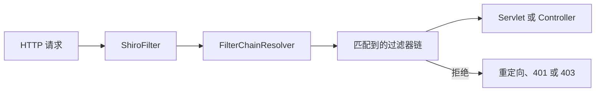

路径匹配与方法注解是两层防线：过滤器保护 URL 入口，注解保护方法调用。二者都不能替代 Service 层的数据归属校验。

### 5.17 过滤器抽象层次（进阶再学）

| 抽象 | 作用 |
| --- | --- |
| `OncePerRequestFilter` | 控制同一请求只执行一次 |
| `AdviceFilter` | 提供执行前、执行后和异常清理钩子 |
| `PathMatchingFilter` | 支持基于路径和链参数处理 |
| `AccessControlFilter` | 抽象“是否允许访问”和“拒绝后怎么办” |
| `AuthenticationFilter` | 面向认证状态的过滤器基类 |
| `AuthorizationFilter` | 面向角色或权限的过滤器基类 |

自定义访问控制通常继承 `AccessControlFilter`，实现 `isAccessAllowed` 和 `onAccessDenied`。前者只判断，后者负责登录尝试、返回错误或重定向。

### 5.18 表单登录过滤器的基本语义

传统页面应用中，表单认证过滤器会区分登录提交与普通受保护请求。未登录访问页面时可保存原请求并跳转登录页；登录成功后再跳回原地址。

REST（Representational State Transfer，表述性状态转移）接口通常不应返回 HTML 登录页或 302 重定向，而应使用自定义过滤器稳定返回 JSON 和 HTTP 401。前后端必须约定响应格式。

### 5.19 SavedRequest 与重定向安全

SavedRequest 用于记住登录前的目标请求。恢复时必须防止开放重定向：只能跳转到应用允许的相对路径或白名单地址，不能直接信任客户端提供的任意 URL。

非幂等请求不应在登录后自动重放，否则可能造成重复下单或重复修改。通常只恢复安全的 GET 页面导航。

### 5.20 自定义 REST 认证过滤器（项目需要时再学）

```java
public final class JsonAuthenticationFilter extends AccessControlFilter {
    @Override
    protected boolean isAccessAllowed(ServletRequest request,
                                      ServletResponse response,
                                      Object mappedValue) {
        return getSubject(request, response).isAuthenticated();
    }

    @Override
    protected boolean onAccessDenied(ServletRequest request,
                                     ServletResponse response) throws IOException {
        HttpServletResponse http = (HttpServletResponse) response;
        http.setStatus(HttpServletResponse.SC_UNAUTHORIZED);
        http.setContentType("application/json;charset=UTF-8");
        http.getWriter().write("{\"code\":\"UNAUTHENTICATED\"}");
        return false; // false 表示终止后续过滤器链
    }
}

@Configuration
public class RestFilterConfig {
    @Bean(name = "restAuthc")
    JsonAuthenticationFilter restAuthenticationFilter() {
        return new JsonAuthenticationFilter();
    }

    @Bean
    FilterRegistrationBean<JsonAuthenticationFilter>
            restAuthcServletRegistration(
                @Qualifier("restAuthc")
                JsonAuthenticationFilter filter) {
        FilterRegistrationBean<JsonAuthenticationFilter> registration =
            new FilterRegistrationBean<>(filter);
        // 只让它作为 Shiro 内部过滤器运行，避免被 Servlet 容器全局执行一次。
        registration.setEnabled(false);
        return registration;
    }
}
```

`restAuthc` 这个 Bean 名就是第 5.4 节过滤链中引用的名称。`ShiroFilterFactoryBean` 会发现 Spring 容器中实现 `jakarta.servlet.Filter` 的 Bean，并按 Bean 名加入可用过滤器集合；如果名称不一致，应用启动或构建过滤链时就会失败。

Spring Boot 还会尝试把普通 `Filter` Bean 注册到 Servlet 容器。上面的禁用型 `FilterRegistrationBean` 只关闭这次容器级自动注册，不会删除 `restAuthc` Bean；这样它只在 Shiro 选中 `/api/**` 链时执行，避免所有请求先被它全局拦截或同一请求执行两次。

这只是认证响应形态示例。生产中应使用统一 JSON 序列化器、关联 ID、安全响应头和错误模型，不能拼接包含用户输入的 JSON。角色或权限若也放在 URL 过滤链中检查，还要为其实现一致的 JSON 403 响应；本例把这部分放到方法注解，使第 5.6 节的异常处理器负责 403。

## 6 密码、凭证与登录防护

### 6.1 密码不能使用可解密的加密存储

系统只需要判断“用户本次输入的密码是否正确”，通常不需要取回原始密码。因此，密码应该使用带随机盐的慢速单向散列，而不是可以还原明文的加密。

#### 6.1.1 明文、编码、加密与密码散列的区别

| 处理方式 | 能否恢复原文 | 是否适合存储密码 | 原因 |
| --- | --- | --- | --- |
| 明文 | 直接读取 | 不适合 | 数据库泄露后密码立即暴露 |
| Base64 编码 | 可以直接解码 | 不适合 | 编码只改变表示形式，没有保密能力 |
| AES 加密 | 持有密钥即可解密 | 通常不适合 | 数据库和密钥同时泄露时可批量恢复密码 |
| 普通快速散列 | 通常不能直接逆向 | 不适合 | 攻击者可以高速猜测大量候选密码 |
| 专用密码散列 | 不提供解密过程 | 适合 | 盐和成本参数能提高批量破解成本 |

AES（Advanced Encryption Standard，高级加密标准）适合保护确实需要恢复原文的数据，例如某些受控业务秘密；密码验证没有恢复原文的需求。Base64 只是二进制与文本之间的编码方式，也不是加密。

#### 6.1.2 注册和登录时分别发生什么

注册或修改密码时，系统执行以下过程：

```text
用户输入的密码
    + 每个账号独立生成的随机盐
    + 算法及成本参数
    ↓
专用密码散列算法
    ↓
密码散列结果
```

数据库保存散列结果、盐、算法标识和成本参数，不保存明文密码，也不保存能够直接解密密码的密钥。

登录时，系统不会解密数据库中的内容，而是读取该账号的盐和参数，对本次输入执行相同计算：

```text
本次输入的密码 + 数据库中的盐和参数
                    ↓
              重新计算散列
                    ↓
        与数据库散列结果安全比较
                    ↓
            一致则认证成功
```

这里的“单向”不是数学意义上的绝对不可破解。攻击者仍然可以不断猜测候选密码并计算散列，所以密码强度、限流和算法成本仍然重要。

#### 6.1.3 盐为什么必须随机且每个账号不同

假设张三和李四使用了相同密码。如果没有盐，两人的散列结果通常相同，攻击者既能发现密码复用，也能用同一份预计算表批量攻击账号。

每个账号使用不同随机盐后，即使原始密码相同，得到的散列结果也不同。盐用于抵抗彩虹表和批量预计算，不用于保密，因此可以和散列结果一起存储。

用户名不适合作为唯一盐，因为用户名可预测、可能修改，也无法提供高质量随机性。盐应由密码学安全随机数生成器产生。

#### 6.1.4 为什么普通 MD5、SHA-1 或一次 SHA-256 仍然不够

MD5（Message Digest Algorithm 5，消息摘要算法 5）、SHA-1（Secure Hash Algorithm 1，安全散列算法 1）以及一次普通 SHA-256 都是快速散列。快速适合文件完整性等场景，却会让攻击者每秒尝试大量候选密码。

密码散列算法会主动消耗一定时间、内存或两者，以降低批量猜测速度。常见选择包括 Argon2id、bcrypt、scrypt 和 PBKDF2（Password-Based Key Derivation Function 2，基于密码的密钥派生函数 2）。具体算法和参数应服从组织当前安全基线，不能因为框架提供某个类就认为默认配置一定安全。

#### 6.1.5 成本参数不是越高越好

成本太低无法有效拖慢攻击者；成本过高则可能使正常登录变慢，并放大拒绝服务攻击对 CPU（Central Processing Unit，中央处理器）和内存的消耗。

应在接近生产的硬件上进行基准测试，结合登录并发量确定参数。成功标准不是“算法能够运行”，而是正常登录延迟、峰值资源占用和抗破解成本同时满足组织要求。算法选择可以从 [OWASP Password Storage Cheat Sheet](https://cheatsheetseries.owasp.org/cheatsheets/Password_Storage_Cheat_Sheet.html) 的当前建议开始评估，但参数必须结合组织风险与实际硬件重新测量，不能把示例数值机械写入所有环境。

#### 6.1.6 Shiro 在密码验证中的职责

在本笔记的数据库示例中，Realm 根据 Principal 查询账号，并通过 `AuthenticationInfo` 返回存储的 `PasswordRecord`；`CredentialsMatcher`（凭证匹配器）把 `AuthenticationToken` 中用户提交的密码交给应用级 `ApplicationPasswordService` 验证。

```text
AuthenticationToken：本次提交的密码，不可信
AuthenticationInfo：数据库中的 PasswordRecord，相对可信
CredentialsMatcher：调用 ApplicationPasswordService 比较两边
```

Shiro 负责组织认证流程，但不会自动替项目决定密码算法、成本参数、密码策略、登录限流和密钥管理方案。这些仍然属于应用及组织安全基线的职责。

密码摘要存储的目标是验证本次输入是否与原密码一致，不提供取回原密码的能力。

### 6.2 凭证匹配配置要点

1\. 注册时与登录时必须使用同一算法、盐编码、迭代次数和输出格式。

2\. 每个账号使用独立随机盐；不要使用用户名充当唯一盐。

3\. 数据库只存摘要、盐、算法标识与参数，不存明文。

4\. 支持登录成功后渐进升级旧摘要，而不是永久保留低强度参数。

5\. 日志、异常和链路追踪中不得记录密码、Token 或 Cookie。

### 6.3 登录防护闭环

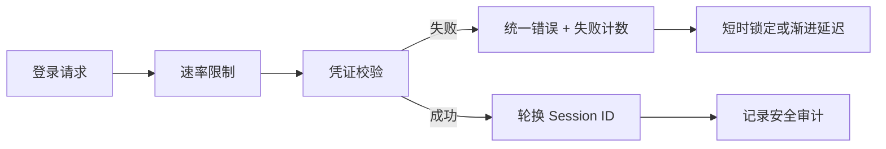

还应结合多因素认证、异常地点或设备检测、验证码策略和凭证泄露监测。验证码只用于增加自动化攻击成本，不能替代密码安全与速率限制。

### 6.4 注册、改密与验证共用同一密码服务

Shiro 已定义 `org.apache.shiro.authc.credential.PasswordService`，并可通过 `PasswordMatcher` 接入 Realm。项目可以直接采用这套格式化摘要方案，也可以接入组织统一的密码库。为了避免示例接口与 Shiro API 同名造成错误导入，本文把应用级抽象命名为 `ApplicationPasswordService`。

Shiro 3.0.0 的 `DefaultPasswordService` 默认使用 Argon2id 和 `shiro2` 格式。这个默认值提供可用起点，不代表已经满足具体组织的性能与安全基线；依赖升级后仍要重新检查算法、成本和兼容迁移。当前 API 说明见 [DefaultPasswordService 3.0.0 Javadoc](https://javadoc.io/doc/org.apache.shiro/shiro-core/3.0.0/org/apache/shiro/authc/credential/DefaultPasswordService.html)。

密码生成和密码验证应封装在同一个实现中，避免注册流程使用一套参数、登录流程使用另一套参数。

```java
public interface ApplicationPasswordService {
    PasswordRecord hash(char[] rawPassword);
    boolean matches(char[] rawPassword, PasswordRecord stored);
    boolean needsUpgrade(PasswordRecord stored);
    PasswordRecord newSimulatedRecord();
}

public record PasswordRecord(
    String algorithm,
    String hash,
    String salt,
    String parameters
) {}
```

`hash` 每次生成随机盐并保存算法与成本参数；`matches` 根据记录中的版本化参数完成验证；`needsUpgrade` 用于登录成功后把旧摘要渐进迁移到当前安全基线；`newSimulatedRecord` 使用高熵随机秘密生成一条合法记录并立即丢弃原秘密，使未知账号也能走一遍接近真实密码的计算。若直接使用 Shiro 的 PasswordService，则让数据库保存其完整格式化结果，不要同时拆分并修改内部字段。

### 6.5 改密与找回密码流程

1\. 已登录改密前重新验证旧密码或多因素认证。

2\. 找回密码使用短时、一次性、不可预测的服务端令牌。

3\. 成功改密后撤销其他会话、刷新令牌和 Remember Me 状态。

4\. 发送安全通知，但通知中不包含新密码或重置令牌。

5\. 记录审计事件，并对频繁请求进行限流。

### 6.6 为什么不在 Realm 中实现注册

Realm 的职责是为认证和授权提供数据，不是用户生命周期管理服务。注册、改密、锁定、解锁和权限审批应放在独立业务 Service 中，再由 Realm 读取最终状态。

### 6.7 CredentialsMatcher 的职责

`CredentialsMatcher` 比较 Token 中的提交凭证与 AuthenticationInfo 中的存储凭证。最简单的直接相等比较不适合密码，密码应使用 Shiro 的 `PasswordMatcher`，或接入组织统一的 `ApplicationPasswordService`。

匹配器只负责验证，不负责查询用户、不负责账号锁定策略，也不应记录原始凭证。

与第 5 章示例一致的最小适配器如下：

```java
public final class ApplicationCredentialsMatcher
        implements CredentialsMatcher {
    private final ApplicationPasswordService passwordService;

    public ApplicationCredentialsMatcher(
            ApplicationPasswordService passwordService) {
        this.passwordService = passwordService;
    }

    @Override
    public boolean doCredentialsMatch(AuthenticationToken token,
                                      AuthenticationInfo info) {
        char[] submitted = (char[]) token.getCredentials();
        PasswordRecord stored =
            (PasswordRecord) info.getCredentials();
        return passwordService.matches(submitted, stored);
    }

    @Override
    public Optional<AuthenticationInfo> createSimulatedCredentials() {
        return Optional.of(new SimpleAuthenticationInfo(
            "__simulated_principal__",
            passwordService.newSimulatedRecord(),
            "application-password"
        ));
    }
}
```

输入边界：这个实现只适用于凭证为 `char[]` 的 Token 和凭证为 `PasswordRecord` 的 AuthenticationInfo。若项目还支持短信码、证书或 API Key，应使用不同 Token、Realm 和 Matcher，并通过 `Realm.supports(token)` 分流。

成功判据：正确密码返回 `true`，错误密码返回 `false`；未知用户、锁定用户等状态应在 Realm 或账号策略层处理。测试必须覆盖错误类型、空凭证、算法升级参数和并发调用，不能只验证一次正确登录。

`createSimulatedCredentials` 是 Shiro 3 为账号枚举防护提供的扩展点。第 5.3 节在账号不存在时返回 `null`，Realm 会取得并缓存第一条模拟记录，再让同一个 Matcher 执行验证；若 Realm 直接抛出 `UnknownAccountException`，这条模拟路径不会运行。模拟记录的算法和成本应与真实账号接近，原始随机秘密不得保存或返回。

外部响应统一后，还要用分位延迟而非单次耗时比较“不存在账号”和“错误密码”两类失败。模拟计算只能缩小可观察差异，登录限流、监控和锁定策略仍然需要保留。

### 6.8 HashedCredentialsMatcher 的关键参数

| 参数 | 含义 | 风险 |
| --- | --- | --- |
| 算法名称 | 使用哪种摘要算法 | 普通快速摘要不等于现代密码散列 |
| 迭代次数 | 重复计算次数 | 注册和登录不一致会永远失败 |
| 盐 | 每个账号的随机值 | 重复盐削弱抗预计算能力 |
| 存储编码 | Hex 或 Base64 等表示 | 编码不同会导致比对失败 |

`HashedCredentialsMatcher` 常见于存量 Shiro 系统。新系统应按当前密码安全基线评估专用密码散列算法，不要仅因为框架提供某个类就认为参数天然安全。

### 6.9 ByteSource、Hex 与 Base64（理解区别，不必背 API）

`ByteSource` 是 Shiro 对字节数据的包装，可用于盐和二进制内容。Hex 是十六进制文本表示，Base64 是二进制到文本编码；二者都不是加密，也不能保护秘密。

数据库中的散列和盐必须明确编码方式。把相同字节一边用 Hex 存储、一边按 Base64 解码，会造成凭证永远不匹配。

### 6.10 Hash、CipherService 与随机数的边界（理解区别，不必背 API）

| 能力 | 解决的问题 | 是否可逆 |
| --- | --- | --- |
| Hash | 完整性摘要或密码验证的一部分 | 不可逆 |
| Encoding | 二进制与文本转换 | 可逆但无保密性 |
| Encryption | 用密钥保护数据机密性 | 持有密钥可逆 |
| Secure Random | 生成盐、令牌和 Session ID | 不适用 |

Shiro 提供散列、编码和密码服务相关抽象，但密码存储、Cookie 保护和业务数据加密是三种不同需求，不能用同一套参数随意替代。

### 6.11 盐、Pepper 与密钥（初学阶段了解即可）

盐是每条密码记录独立保存的随机值，不需要保密。Pepper 是应用级秘密，可作为额外防线，必须放在密钥管理系统并设计轮换。加密密钥需要保密、授权访问、版本化和轮换。

三者用途不同：不能把固定密钥当作每用户盐，也不能把公开盐当作加密密钥。

## 7 Session、Remember Me 与缓存

### 7.1 Session 生命周期

Session（会话）解决的是“HTTP 请求彼此独立，但服务器需要在多个请求之间识别同一个主体”的问题。用户登录成功后，服务器保存主体标识和认证状态等会话数据，客户端通常只保存一个 Session ID（会话标识）。后续请求携带该标识，服务器据此找到 Session，再恢复当前 `Subject`。客户端保存的 Session ID 不是用户资料本身，但它相当于会话通行证，泄露后可能被他人冒用。

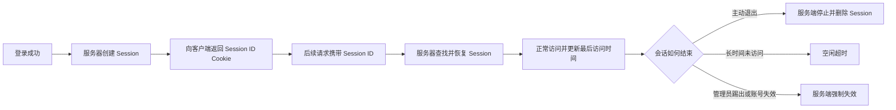

Session 生命周期可以按以下过程理解：

1\. 创建：调用 `subject.getSession()` 会在没有会话时创建一个；`subject.getSession(false)` 只查询已有会话，不会为了读取状态而意外创建新会话。Web 登录流程也可能按实际配置创建或使用 Session。

2\. 使用：后续请求携带 Session ID。Shiro 的 SessionManager 根据它读取会话，并将其中的主体状态恢复为当前请求可使用的 `Subject`。Session ID 错误、不存在或已失效时，不能恢复原登录状态。

3\. 续期：有效请求访问 Session 时，通常会更新最后访问时间。空闲超时从最近一次有效访问开始重新计算；这不等于会话可以无限存在，敏感系统还应增加由应用控制的绝对有效期和重新认证要求。

4\. 过期：超过空闲超时后，Session 失效。即使客户端仍保存旧 Cookie，服务器也不能继续接受它，应把请求视为未登录。分布式存储中的过期时间必须与 Shiro 的超时语义一致。

5\. 主动结束：用户调用 `logout()`、管理员踢下线、账号禁用或安全策略触发时，应让服务端 Session 立即失效。只删除浏览器 Cookie 不够，因为服务端会话可能仍然存在。

| 概念 | 解决的问题 | 容易混淆的地方 |
| --- | --- | --- |
| Session ID | 定位服务端 Session | 它不是用户 ID，也不能包含密码等敏感数据 |
| 空闲超时 | 长时间没有访问后失效 | 每次有效访问通常会重新计算空闲时间 |
| 绝对有效期 | 限制会话从创建起最多存在多久 | 通常需要应用或基础设施额外控制 |
| `touch()` | 更新最后访问时间 | 不是重新登录，也不会延长绝对有效期 |
| `stop()` | 主动停止当前 Session | 与自然超时的触发原因不同 |
| `logout()` | 清除 Subject 身份并结束相关登录态 | 不只是让前端删除 Cookie |

生产环境还必须防止会话固定攻击：认证成功后应确认 Session ID 已轮换，避免攻击者预先设置的 Session ID 在登录后继续有效。验证时应记录登录前后的 Session ID 是否变化，但日志中只能记录脱敏摘要，不能输出完整值。

Session Cookie 应同时理解和配置 `HttpOnly`、`Secure` 与 `SameSite`。它们控制的是不同风险，不能互相替代。

| 属性 | 主要作用 | 不能解决的问题 | 生产建议 |
| --- | --- | --- | --- |
| `HttpOnly` | 禁止前端 JavaScript 通过 `document.cookie` 读取 Cookie，降低 Session ID 被脚本直接窃取的风险 | 不能阻止浏览器自动携带 Cookie；发生 XSS 后，恶意脚本仍可能以用户身份发送请求 | Session Cookie 通常设置为 `true` |
| `Secure` | 浏览器只通过 HTTPS（Hypertext Transfer Protocol Secure，超文本传输安全协议）发送 Cookie，防止它经普通 HTTP 明文传输 | 不能自动启用 HTTPS，也不能代替证书校验和 HSTS | 生产环境设置为 `true` |
| `SameSite` | 控制跨站请求是否自动携带 Cookie，降低部分 CSRF 风险 | 不能替代 CSRF Token、请求来源校验和安全的 HTTP 方法设计 | 普通站点优先从 `Lax` 开始评估 |

`HttpOnly=true` 以后，浏览器仍会在符合规则的请求中自动携带 Session Cookie，只是不允许 JavaScript 直接读取它。因此前端通常不需要、也不应该把 Session ID 读出来再手动放进请求头。`HttpOnly` 能降低会话标识被窃取的概率，但不能消除 XSS（Cross-Site Scripting，跨站脚本）风险，因为恶意脚本仍可能直接调用站内接口。

`Secure=true` 以后，浏览器不会通过普通 HTTP 发送该 Cookie。如果生产环境在反向代理处终止 HTTPS，应显式启用 `Secure`，并正确配置代理转发协议；否则应用可能误判原始请求协议。本地纯 HTTP 调试可以在仅限本机的开发配置中临时关闭，但生产配置必须重新开启。HSTS（HTTP Strict Transport Security，HTTP 严格传输安全）用于要求浏览器持续使用 HTTPS，和 Cookie 的 `Secure` 属性属于互补控制。

`SameSite` 有三种常用取值：

| 取值 | 浏览器何时携带 Cookie | 适用场景与代价 |
| --- | --- | --- |
| `Strict` | 只在同站上下文中携带 | 限制最严格，但用户从外部链接、邮件或身份中心返回时可能丢失预期登录态 |
| `Lax` | 同站请求携带；部分顶级导航的安全方法也可携带 | 安全性与兼容性较均衡，适合多数普通 Web 应用 |
| `None` | 允许跨站上下文携带 | 适合确实需要跨站 Cookie 的场景；现代浏览器要求同时设置 `Secure` |

“同站”和“同源”不是同一个概念。协议、可注册域名等因素决定是否同站，而同源还比较主机和端口。因此，前后端端口不同不一定就是跨站，两个子域之间也不能仅凭名称相似就假定 Cookie 策略正确，必须用实际部署域名验证。

使用 Cookie 维持登录态时，即使设置了 `SameSite`，修改数据的接口仍应实施 CSRF（Cross-Site Request Forgery，跨站请求伪造）防护。`SameSite` 是浏览器侧的纵深防御，不是完整的 CSRF 解决方案。若设置 `SameSite=None`，还要正确配置 CORS（Cross-Origin Resource Sharing，跨源资源共享）、允许凭证的具体来源，并避免使用通配来源；`SameSite=None` 本身不会自动允许跨源请求。

配置前必须先确认实际由谁管理 Session。Shiro Spring Boot Web Starter 默认使用 Servlet 容器的 SessionManager，此时应在 `application.yml` 中配置 Spring Boot 的 Session Cookie：

```yaml
shiro:
  # false 表示由 Servlet 容器管理 HTTP Session，也是默认集成方式。
  userNativeSessionManager: false

server:
  servlet:
    session:
      cookie:
        # 防止前端脚本直接读取 Session ID。
        http-only: true
        # 生产环境必须使用 HTTPS，并显式开启 Secure。
        secure: true
        # 多数普通 Web 应用先使用 Lax，再按登录跳转场景测试。
        same-site: lax
```

如果项目明确启用 Shiro Native Session（Shiro 原生会话），则配置 Shiro 自己的 Cookie 模板：

```yaml
shiro:
  userNativeSessionManager: true
  sessionManager:
    # 使用 Cookie 传递 Session ID。
    sessionIdCookieEnabled: true
    # 禁止把 Session ID 写进 URL，避免被日志、历史记录和 Referer 泄露。
    sessionIdUrlRewritingEnabled: false
    cookie:
      secure: true
      sameSite: LAX
```

Shiro 3 自动配置创建的 Session Cookie 模板默认把 `HttpOnly` 设为 `true`、`SameSite` 设为 `LAX`；仍建议显式配置影响部署行为的 `Secure` 和 `SameSite`，并检查最终响应。不要同时修改两套配置却不确认实际 SessionManager，否则可能出现“配置文件有值，但响应 Cookie 没变化”的假象。配置依据可查看 [Apache Shiro Web 支持](https://shiro.apache.org/web.html)、[Shiro Spring Boot 配置属性](https://shiro.apache.org/spring-boot.html)与 [Spring Boot Session Cookie 属性](https://docs.spring.io/spring-boot/appendix/application-properties/)。

可以用四个结果验证生命周期配置是否真正生效：登录后能恢复同一主体；超过空闲超时后旧 Session ID 被拒绝；退出后旧 Session ID 立即失效；登录前后的 Session ID 不相同。仅看到 Cookie 被创建，不能证明整个 Session 安全闭环正确。

Cookie 属性还应单独验证。登录后在浏览器开发者工具的 Network（网络）面板查看 `Set-Cookie` 响应头，预期至少包含类似结果：

```http
Set-Cookie: JSESSIONID=<随机会话标识>; Path=/; Secure; HttpOnly; SameSite=Lax
```

然后确认 JavaScript 无法通过 `document.cookie` 读取这个 Session Cookie，HTTP 请求不会携带设置了 `Secure` 的 Cookie，并分别从同站页面和真实跨站入口验证 `SameSite` 行为。测试必须使用接近生产的域名和 HTTPS 拓扑；只在 `localhost` 上验证不能证明反向代理、子域和跨站跳转配置正确。

### 7.2 Remember Me 不等于已认证

Remember Me（记住我）解决“原 Session 不在以后，系统仍能识别这位曾成功登录的用户”的便利性问题。`subject.isRemembered()` 只说明 Shiro 恢复了可识别的 Principal，`subject.isAuthenticated()` 才说明本次会话完成了主动认证；修改密码、支付、修改安全设置等敏感操作必须要求后者。

初学阶段先记住这个安全边界即可：`user` 与 `@RequiresUser` 可以接受“已认证或被记住”的主体，`authc` 与 `@RequiresAuthentication` 只接受当前会话已认证的主体。完整登录入口、Cookie 恢复流程、密钥配置和验证闭环见第 7.18 节。

### 7.3 授权缓存一致性

角色或权限发生变化后，旧授权缓存若不失效，用户可能继续拥有已撤销权限。更新路径应采用“数据库事务成功后发送权限变更事件，再清理对应用户缓存”的模式，并为事件失败准备重试和补偿。

缓存键应基于稳定用户 ID、租户和 Realm；不得把密码摘要、Token 等秘密放进可观察缓存键。

一次可验证的撤权流程是：管理员提交变更，数据库事务成功，事务提交后发布包含用户 ID、租户和权限版本的事件，各应用节点收到事件后删除该用户的授权缓存，下一次请求从权威数据源重新加载。若事件发送或消费失败，Outbox（事务发件箱）或重试任务负责补偿；不能在数据库提交前先删缓存，也不能只依赖短过期时间“最终碰运气”。

成功判据应写进集成测试：用户先能访问受保护接口，撤销权限并等待规定传播上限后，同一个 Session 再次请求必须得到 403；同时监控事件积压、消费失败和“权限变更到拒绝生效”的延迟。

### 7.4 分布式 Session

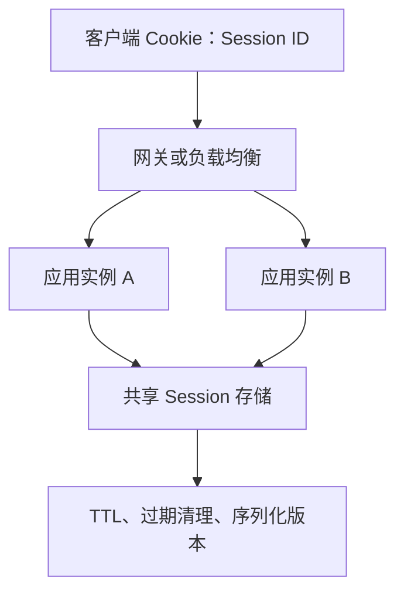

共享存储需要考虑 TTL（Time To Live，生存时间）、网络超时、序列化兼容、热点键、存储不可用时的失败策略和主动踢下线。不要依赖负载均衡粘性会话掩盖状态不共享问题。

### 7.5 Session 常用 API

```java
Subject subject = SecurityUtils.getSubject();
Session session = subject.getSession();

Serializable id = session.getId();
session.setAttribute("cartId", "cart-1001");
Object cartId = session.getAttribute("cartId");
session.removeAttribute("cartId");

long timeoutMillis = session.getTimeout();
session.setTimeout(30 * 60 * 1000L);
session.stop();
```

不要把大对象、数据库连接、线程对象或敏感凭证放入 Session。Session 中的数据可能被序列化、复制和长时间保留。

### 7.6 SessionDAO API 卡片（项目需要持久化时再学）

用途：`SessionDAO` 抽象 Session 的创建、读取、更新、删除与活跃会话枚举。

关键方法：`create`、`readSession`、`update`、`delete`、`getActiveSessions`。

异常：读取不存在或已过期 Session 时可能出现相应会话异常；存储超时应转换为可监控的基础设施错误。

性能：几乎每个受保护请求都可能读写 Session，远程存储延迟会直接增加接口延迟。更新频率、序列化大小和网络往返必须被监控。

生产限制：`getActiveSessions` 在大规模系统中可能非常昂贵，不能无分页遍历全部会话。

### 7.7 Session 校验与过期清理

Shiro 可周期性校验 Session 是否过期。单机内存方案适合学习；分布式存储通常还依赖 TTL 自动过期。两者的超时语义必须一致，避免 Shiro 认为有效但存储已删除，或存储长期保留垃圾数据。

### 7.8 缓存的两类数据

| 缓存 | 内容 | 是否建议长期缓存 |
| --- | --- | --- |
| 认证缓存 | 认证相关信息 | 谨慎，避免扩大敏感数据暴露面 |
| 授权缓存 | 角色与权限集合 | 常用，但必须解决变更失效 |

缓存是性能优化，不是权威数据源。数据库事务失败时不能先更新缓存；权限撤销时不能只等自然过期。

### 7.9 清理某个用户的授权缓存

```java
public void clearAuthorizationCache(Object principal) {
    PrincipalCollection principals = new SimplePrincipalCollection(
        principal, getName()
    );
    clearCachedAuthorizationInfo(principals);
}
```

这段逻辑通常封装在自定义 Realm 的公开方法中，并由权限变更事件调用。集群中每个节点的本地缓存都必须收到失效信号，或统一使用共享缓存。

### 7.10 Remember Me 的撤销与失效

Remember Me Cookie 的寿命往往比 Session 长，因此“能恢复”必须与“能撤销”一起设计。只删除当前浏览器 Cookie，只能让这台浏览器退出；已经被复制到其他设备的 Cookie 仍可能继续使用。

1\. 普通退出：调用 `subject.logout()`，在响应提交前删除当前浏览器的 Remember Me Cookie。

2\. 改密、禁用、锁定、风险事件和“退出全部设备”：除删除当前 Cookie 外，还应递增账号认证版本或写入服务端撤销状态，使旧 Cookie 即使能解密也不能继续建立可信主体。

3\. 密钥轮换：新密钥用于写入，新旧密钥可在受控过渡期用于读取；过渡结束后旧 Cookie 统一失效。高风险事件可跳过过渡期。

4\. 验证：在两个浏览器保存同一账号状态，执行改密或“退出全部设备”后，两端都必须在规定时间内失效；只测当前浏览器的 Cookie 是否消失不能证明撤销闭环成立。

如果现有架构无法提供账号状态复核、密钥保护和可靠撤销，就不应为便利性贸然启用 Remember Me。

### 7.11 SessionManager、SessionFactory 与 SessionDAO 的边界（初学阶段了解即可）

| 组件 | 职责 |
| --- | --- |
| `SessionManager` | 组织创建、读取、触碰、停止和校验会话 |
| `SessionFactory` | 根据创建上下文生成 Session 对象 |
| `SessionDAO` | 持久化 Session 数据 |
| `SessionIdGenerator` | 生成不可预测且唯一的 Session ID |
| `SessionValidationScheduler` | 定期触发过期会话校验 |
| `SessionListener` | 监听开始、停止与过期事件 |

SessionManager 是业务流程协调层，SessionDAO 是数据访问层。把 Redis 操作直接写进 Controller 会破坏这一边界，也难以统一过期和审计行为。

### 7.12 Native Session 与 Servlet Session（项目选型时掌握）

Shiro 可以使用自身原生 Session 抽象，也可以在 Web 环境与 Servlet Session 协作。原生 Session 让非 Web 程序也能使用会话语义；Servlet Session 则更贴近容器生态。

项目必须明确实际使用哪种方案，避免一部分代码写 Shiro Session，另一部分写 `HttpSession`，却假定它们永远是同一个状态容器。

### 7.13 SessionKey 与 SessionContext（不常用）

`SessionContext` 描述创建会话时的上下文，可能包含 host、请求和响应；`SessionKey` 描述如何定位已有会话，核心通常是 Session ID。

WebSessionKey 还可能携带请求响应，让 Web SessionManager 能从 Cookie 或请求中解析会话。它们属于框架内部协作对象，业务层一般不需要直接操作。

### 7.14 Touch、Stop 与 Expire 的区别

| 操作 | 含义 |
| --- | --- |
| `touch()` | 更新最后访问时间，延长空闲超时窗口 |
| `stop()` | 主体或应用主动停止会话 |
| `expire()` | 框架判定会话因超时而过期 |
| `logout()` | 清理 Subject 身份，并通常停止相关会话 |

主动退出与自然过期应产生不同审计原因。仅让浏览器 Cookie 过期，不代表服务端 Session 已经停止。

### 7.15 SessionListener 的使用边界（不常用）

监听器适合记录会话创建、停止和过期指标，或触发轻量清理。监听器中不要执行长事务、远程批量调用或可能阻塞 Session 主流程的逻辑。

如果需要异步处理，发送最小化、脱敏、幂等的事件，并为发送失败设计补偿。

### 7.16 Cache、CacheManager 与 CacheManagerAware（配置缓存时掌握）

`Cache<K,V>` 抽象 `get`、`put`、`remove`、`clear` 等缓存操作；`CacheManager` 按名称提供 Cache；实现 `CacheManagerAware` 的组件可由容器注入缓存管理器。

缓存名称和键空间要包含环境、应用、Realm、租户与版本等必要维度。否则测试与生产、不同 Realm 或不同租户可能互相污染。

### 7.17 缓存穿透、雪崩与权限残留

1\. 缓存穿透：不存在用户或空权限被反复查询数据库，可短时缓存受控空结果，但不能掩盖刚创建的数据。

2\. 缓存雪崩：大量权限缓存同时过期，数据库瞬时过载；可使用过期抖动和限流。

3\. 热点键：超级管理员或共享服务账号被高频访问；应监控单键流量。

4\. 权限残留：撤销权限后旧缓存仍允许访问；安全影响通常高于普通数据缓存不一致。

### 7.18 RememberMeManager 的工作流程

Remember Me（记住我）解决的是“用户的 Session 已过期或浏览器重新打开后，系统仍希望识别这是哪位曾经成功登录的用户”的便利性问题。它适合恢复用户名展示、个性化推荐、非敏感偏好等低风险体验，避免用户每次访问都先登录；它不用于延长原 Session，也不能替代当前会话中的身份认证。

例如，用户昨天登录购物网站并勾选“记住我”，今天 Session 已失效，但网站仍可以显示用户名和个性化内容。当用户准备查看支付信息、修改密码或提交订单时，系统必须要求重新登录，因为现在使用电脑的人未必还是昨天完成认证的人。

| Subject 状态 | `isRemembered()` | `isAuthenticated()` | 可以做什么 |
| --- | --- | --- | --- |
| 匿名 | `false` | `false` | 只访问公开内容 |
| 被记住 | `true` | `false` | 展示低风险个性化内容 |
| 当前会话已认证 | `false` | `true` | 在授权通过后执行相应业务操作 |

在 Shiro 中，“被记住”和“当前会话已认证”是互斥状态。`isRemembered()` 为 `true` 只说明 Shiro 从以前的成功认证中恢复了已知身份；`isAuthenticated()` 为 `true` 才说明本次会话已经提交凭证并成功完成认证。

启用 Remember Me 的入口是一次成功登录。常用的 `UsernamePasswordToken` 已支持该能力，应用应根据用户明确选择的“记住我”选项设置它：

```java
UsernamePasswordToken token =
    new UsernamePasswordToken(username, passwordChars);

// 只有用户主动勾选时才启用，不能替用户默认作出长期记住身份的决定。
token.setRememberMe(rememberMeRequested);

try {
    SecurityUtils.getSubject().login(token);
} finally {
    token.clear();
}
```

`setRememberMe(true)` 不会让错误密码通过，也不会在认证前保存身份。只有 `login(token)` 成功后，`RememberMeManager` 才会保存认证结果中的 principals；密码、验证码等 Credentials 不应写入 Remember Me Cookie。

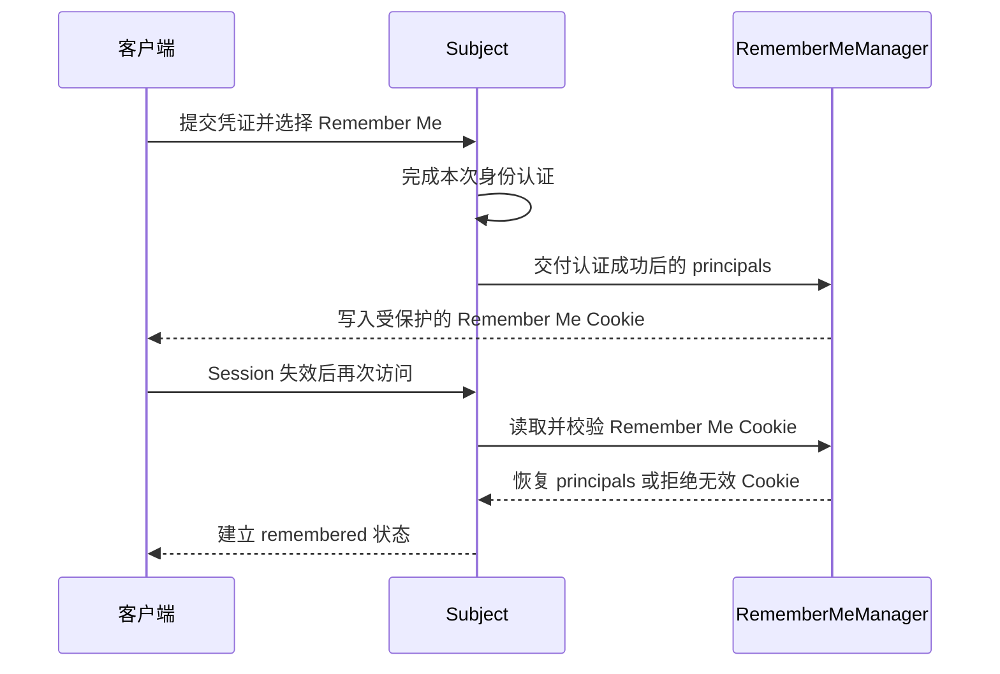

恢复成功后的 Subject 具有已知 Principal，但没有当前会话的认证证明。过滤器 `user` 允许当前已认证或被 Remember Me 识别的 Subject 访问；过滤器 `authc` 只允许当前会话已认证的 Subject 访问。方法注解中，`@RequiresUser` 接受这两类已知用户，`@RequiresAuthentication` 则要求主动认证。管理后台、支付、改密、绑定设备、查看完整隐私数据等敏感操作应使用 `authc` 或 `@RequiresAuthentication`，必要时再执行密码或多因素认证。

| 控制方式 | 被记住的 Subject | 当前会话已认证的 Subject | 典型用途 |
| --- | --- | --- | --- |
| `user` | 允许 | 允许 | 低风险个性化页面 |
| `authc` | 拒绝并要求登录 | 允许 | 一般受保护操作 |
| `@RequiresUser` | 允许 | 允许 | 只要求身份已知的方法 |
| `@RequiresAuthentication` | 拒绝 | 允许 | 敏感方法 |

Spring Boot 中可以显式配置 Remember Me Cookie。以下值只是结构示例，有效期必须依据业务风险确定：

```yaml
shiro:
  rememberMeManager:
    cookie:
      name: rememberMe
      # 单位为秒；示例表示 30 天，不应机械照搬到高风险系统。
      maxAge: 2592000
      path: /
      secure: true
      sameSite: LAX
```

Shiro 创建的 Cookie 模板默认启用 `HttpOnly`。`Secure=true` 要求通过 HTTPS 发送，`SameSite` 用于限制跨站携带方式；三者的详细作用和两种 Session 管理模式的配置边界见第 7.1 节。Remember Me Cookie 的有效期通常比 Session 长，因此一旦被窃取，风险窗口也更长。

默认 Cookie 方案还需要稳定且保密的加密密钥。多节点部署时，各节点必须从密钥管理系统读取同一有效密钥，否则 A 节点写出的 Cookie 可能在 B 节点无法恢复。密钥不能使用示例默认值、不能硬编码进源码或普通配置仓库，并且要设计版本化、轮换与旧 Cookie 失效策略。

退出时调用 `subject.logout()`，Shiro 会清除主体状态，并在 Web 环境中删除 Remember Me Cookie。Cookie 删除必须发生在响应提交之前，因此退出后应立即返回或重定向，不要先写响应正文再尝试删除。用户改密、账号禁用、风险事件或“退出所有设备”也应让旧 Remember Me 身份失效；仅删除当前浏览器 Cookie 无法撤销已经复制到其他设备的 Cookie，生产系统需要结合账号状态校验、凭证版本或服务端撤销机制设计。

验证 Remember Me 不能只检查 Cookie 是否存在，应完成以下闭环：

1\. 不勾选“记住我”登录，结束 Session 后再次访问应成为匿名状态。

2\. 勾选后成功登录，结束原 Session 并再次访问，`isRemembered()` 应为 `true`，`isAuthenticated()` 应为 `false`。

3\. 被记住的用户可以访问 `user` 路径，但访问 `authc` 路径必须重新登录。

4\. 篡改、过期或使用错误密钥保护的 Cookie 必须被拒绝，不能恢复 Principal。

5\. 调用 `logout()` 后，浏览器中的 Remember Me Cookie 被删除，再次访问应成为匿名状态。

6\. 在多节点环境中轮流访问不同节点，恢复结果和撤销行为必须一致。

Session 维持当前会话的登录状态；Remember Me 只在以后恢复“可能是这位用户”的弱身份，执行敏感操作时仍要重新证明身份。官方机制说明可参考 [Apache Shiro Authentication](https://shiro.apache.org/authentication.html) 和 [Apache Shiro Web Remember Me](https://shiro.apache.org/web.html)。

## 8 前后端分离与跨应用身份方案（进阶再学）

### 8.1 先认识缩写，再区分问题域

第 8 章涉及令牌、单点登录和委托授权，英文缩写较多。先记住它们的全称和要解决的问题，不要一开始就把所有方案混成“登录功能”。

| 缩写 | 英文全称 | 中文含义 | 直观含义 |
| --- | --- | --- | --- |
| JWT | JSON Web Token | JSON 网络令牌 | 一种紧凑的令牌格式，用于传递经过签名保护的声明 |
| JWS | JSON Web Signature | JSON Web 签名 | 对内容做数字签名或消息认证，常用于保护 JWT 完整性 |
| JWE | JSON Web Encryption | JSON Web 加密 | 对内容加密，主要解决令牌内容的机密性 |
| SSO | Single Sign-On | 单点登录 | 用户登录一次后，可以进入多个互相信任的应用 |
| CAS | Central Authentication Service | 中央认证服务 | 一种实现单点登录的协议和服务端方案 |
| TGC | Ticket-Granting Cookie | 票据授予 Cookie | CAS 浏览器保存的 SSO Cookie，用于关联中心登录状态 |
| TGT | Ticket-Granting Ticket | 票据授予票据 | CAS Server 保存和管理的中心登录凭据 |
| ST | Service Ticket | 服务票据 | CAS 为某个具体应用签发的一次性短时票据 |
| OAuth 2.0 | OAuth 2.0 Authorization Framework | OAuth 2.0 授权框架 | 允许用户授权第三方应用访问受限资源 |
| OIDC | OpenID Connect | 开放身份连接 | 在 OAuth 2.0 之上增加标准化的用户身份认证能力 |
| PKCE | Proof Key for Code Exchange | 授权码交换证明密钥 | 让授权服务器确认兑换授权码的仍是最初发起请求的客户端 |
| API | Application Programming Interface | 应用程序编程接口 | 应用之间约定的调用入口和数据契约 |
| HTTP | Hypertext Transfer Protocol | 超文本传输协议 | 浏览器、客户端与服务端交换请求和响应的应用层协议 |
| HTTPS | Hypertext Transfer Protocol Secure | 安全超文本传输协议 | 使用 TLS（Transport Layer Security，传输层安全协议）保护 HTTP 传输 |
| XSS | Cross-Site Scripting | 跨站脚本 | 攻击者让恶意脚本在用户浏览器中执行 |
| CSRF | Cross-Site Request Forgery | 跨站请求伪造 | 攻击者诱导已登录浏览器发出非用户本意的请求 |

`OAuth` 常被解释为 Open Authorization（开放授权），但当前标准的正式名称是 `OAuth 2.0 Authorization Framework`。它重点解决“某个客户端能否代表用户访问资源”，不是直接证明“当前用户是谁”。

下面这些不是缩写，却是理解本章流程所必需的关联术语：

| 术语 | 中文含义 | 在本章中的作用 |
| --- | --- | --- |
| Token | 令牌 | 调用方携带的访问凭据或信息载体，是一类概念，不专指 JWT |
| Claim | 声明 | 令牌中关于主体、签发者、受众或有效期的一项信息 |
| Access Token | 访问令牌 | 客户端调用受保护资源时提交的令牌 |
| Refresh Token | 刷新令牌 | 访问令牌过期后，用于申请新访问令牌的长期凭据 |
| ID Token | 身份令牌；OIDC 规范的正式术语仍写作 ID Token | OIDC 向客户端表达用户身份认证结果的令牌 |
| nonce | 一次性随机值，名称常解释为 Number Used Once | 把认证响应与本次请求关联起来，降低重放和响应替换风险 |
| issuer | 签发者 | 表示令牌由哪个可信身份系统签发 |
| audience | 受众 | 表示令牌预期由哪个客户端或资源服务接收 |
| CAS Server | CAS 服务端 | 统一完成登录并签发、校验票据 |
| Ticket | 票据 | CAS 流程中的短时凭据，应用必须向可信 CAS Server 校验 |

缩写之间的关系可以这样理解：JWT 是“数据格式”，SSO 是“用户体验与系统目标”，CAS 是“一条 SSO 实现路线”，OAuth 2.0 是“委托授权框架”，OIDC 则是在 OAuth 2.0 上补充“用户身份认证”。它们不在同一个比较维度，不能简单地问“JWT 和 SSO 应该二选一”。

| 方案 | 主要解决的问题 | 状态位置 | 典型风险 |
| --- | --- | --- | --- |
| 服务端 Session | 应用登录态 | 服务端 | 集群共享、Cookie 安全 |
| JWT | 令牌化声明传递 | 常见为客户端持有 | 撤销困难、泄露、算法校验 |
| SSO | 多个应用一次登录 | 统一身份中心与各应用 | 单点故障、登出一致性 |
| CAS | 一种 SSO 协议与实现路线 | CAS Server 与 Ticket | Ticket 校验、回调地址 |
| OAuth 2.0 | 委托第三方访问资源 | 授权服务器与令牌 | 重定向、客户端密钥、作用域 |
| OIDC | 在 OAuth 2.0 之上提供身份层 | ID Token 与用户信息 | nonce、issuer、audience 校验 |

OIDC 用于确认登录身份，OAuth 2.0 本身是授权框架。不要把“拿到 OAuth 访问令牌”直接等价为完成用户登录，也不要把能解析 JWT 等价为已经验证其签名和全部安全声明。

新项目也不应把已经废弃的 `shiro-cas` 模块作为 CAS 集成起点；[Apache Shiro 下载页](https://shiro.apache.org/download.html)说明其支持已迁移到 buji-pac4j。选型时应核对目标协议、维护状态、Spring 版本兼容和登出能力，再通过一次完整的浏览器重定向、服务端票据校验和错误回调测试证明集成有效。

### 8.2 前后端分离不等于必须使用 JWT

前后端分离描述的是界面和服务端通过 API（Application Programming Interface，应用程序编程接口）通信，不直接规定登录态必须放在哪里。服务端 Session、服务端保存的随机 Token 和自包含 JWT 都可以用于前后端分离项目。

| 方案 | 服务端如何确认身份 | 主动撤销 | 主要优点 | 主要代价 |
| --- | --- | --- | --- | --- |
| Session + Cookie | 根据 Session ID 查询服务端 Session | 删除 Session 即可 | 逻辑直观、撤销及时、令牌体积小 | 集群需要共享或复制 Session |
| 不透明 Bearer Token | 根据随机 Token 查询服务端记录或身份服务 | 删除或标记 Token 即可 | 客户端看不到内部声明，权限变化易控制 | 每次请求可能需要远程查询 |
| 自包含 JWT | 本地验证签名和声明 | 通常依赖短有效期、拒绝列表或版本号 | 验证时可减少中心化查询 | 撤销、密钥轮换和权限变化更复杂 |

Bearer Token（持有者令牌）的语义是“谁持有，谁就能使用”，因此它必须像密码一样防止泄露。客户端通常通过 HTTP `Authorization` 请求头发送访问令牌：

```http
GET /api/orders HTTP/1.1
Host: api.example.invalid
Authorization: Bearer <access-token>
```

这里的 `Bearer` 是认证方案名称，后面的值可以是 JWT，也可以是服务端生成的随机不透明字符串，所以“Bearer Token”和“JWT”不是同义词。

选择方案时先回答四个问题：

1\. 是否要求用户被封禁、改密或撤权后立即失效？要求越高，越需要服务端状态、令牌内省或可靠的拒绝机制。

2\. 是否存在多个资源服务，需要它们独立验证身份服务签发的令牌？如果存在，自包含且签名的访问令牌可能降低中心查询压力。

3\. 客户端是普通浏览器、移动端还是可信服务？不同客户端保护长期凭据的能力不同。

4\. 团队是否具备密钥轮换、令牌撤销、时钟同步和安全监控能力？如果不具备，简单的服务端 Session 往往更稳妥。

浏览器使用 `HttpOnly` Cookie 时，前端脚本难以直接读取令牌，但浏览器会自动携带 Cookie，因此必须处理 CSRF；把 Bearer Token 暴露给 JavaScript 后，通常减少了 Cookie 自动携带造成的 CSRF 面，却扩大了 XSS 窃取令牌的风险。两种方式都必须使用 HTTPS，并根据实际部署验证，不能把 `localStorage`、Cookie 或 JWT 中的任何一种说成通用最优解。Bearer Token 的标准传递方式见 [RFC 6750](https://www.rfc-editor.org/rfc/rfc6750.html)。

### 8.3 JWT 的结构、声明与签名

JWT 是一种紧凑、URL 安全的声明载体。常见的签名型 JWT 使用 JWS（JSON Web Signature，JSON Web 签名）紧凑格式，由三个使用句点分隔的部分组成：

```text
Base64Url(Header).Base64Url(Payload).Signature
```

Header（头部）描述令牌类型和签名算法；Payload（载荷）保存 Claims（声明）；Signature（签名）用于检查前两部分是否被篡改，并证明它由持有相应密钥的一方签发。下面只展示解码后的结构，不是可使用的真实令牌：

```json
{
  "header": {
    "typ": "JWT",
    "alg": "RS256",
    "kid": "key-2026-07"
  },
  "payload": {
    "iss": "https://identity.example.invalid",
    "sub": "user-1001",
    "aud": "orders-api",
    "exp": 1785088800,
    "iat": 1785087900,
    "jti": "token-example-001"
  }
}
```

示例中的 `RS256`、`kid` 和时间戳只用于说明字段结构，不是可以直接照搬的生产配置。实际允许的算法、密钥标识和令牌有效期必须由令牌签发方与资源服务共同约定，并按照组织的安全基线配置。

`Base64Url` 只是适合 URL 的编码，不提供机密性。任何拿到常见签名型 JWT 的人通常都能解码 Header 和 Payload，所以不能在其中放密码、私钥、完整身份证号或其他秘密。JWT 标准也允许使用 JWE（JSON Web Encryption，JSON Web 加密）保护内容，但不能因为字符串长得像 JWT 就假定它已经加密。

签名算法还决定密钥如何共享。`HS256` 表示使用 SHA-256（Secure Hash Algorithm 256-bit，256 位安全散列算法）的 HMAC（Hash-based Message Authentication Code，基于散列的消息认证码），签发方和验证方共享同一个秘密，验证方一旦泄露秘密也具备签发能力；`RS256` 和 `ES256` 是常见的非对称签名算法，签发方保管私钥，资源服务只持有公钥，通常更适合多个资源服务独立验证。初学阶段不必背算法名称，但必须分清“共享秘密”和“私钥签名、公钥验证”。身份系统常通过 JWKS（JSON Web Key Set，JSON Web 密钥集）发布公钥，资源服务只应从预先信任的签发者地址获取并缓存密钥。密钥轮换时，新旧公钥需要保留一段重叠时间，`kid` 只能在这个受控密钥集合中选钥，不能被当成任意文件路径或任意网络地址。

| 名称 | 英文全称 | 作用 |
| --- | --- | --- |
| `typ` | Type | 声明对象类型，常见值为 `JWT` |
| `alg` | Algorithm | 声明所用密码算法，验证方必须使用自己的允许列表约束 |
| `kid` | Key ID | 指示验证方从受信任密钥集合选择哪把密钥 |
| `iss` | Issuer | 标识签发者，必须与预期身份系统匹配 |
| `sub` | Subject | 标识令牌代表的主体 |
| `aud` | Audience | 标识令牌预期交给哪个客户端或资源服务 |
| `exp` | Expiration Time | 到达此时间后令牌不可接受 |
| `nbf` | Not Before | 在此时间之前令牌不可接受 |
| `iat` | Issued At | 令牌签发时间 |
| `jti` | JWT ID | 令牌唯一标识，可用于审计、重放检测或拒绝列表 |

签名只证明“内容未被修改，并由某把密钥产生”，不会自动证明这把密钥属于可信签发者，也不会自动检查令牌是否已过期、是否发给当前服务或是否已被撤销。只有完成全部上下文校验，声明才可以参与信任决策。标准定义见 [RFC 7519：JSON Web Token](https://www.rfc-editor.org/rfc/rfc7519.html)，安全实践见 [RFC 8725：JWT Best Current Practices](https://www.rfc-editor.org/info/rfc8725/)。

### 8.4 JWT 与 Bearer Token 的校验闭环

收到 `Authorization: Bearer ...` 后，资源服务应按以下顺序处理：

1\. 限制请求头和令牌长度，拒绝空值、重复认证头、非法字符和结构错误，避免把异常大输入直接交给密码算法。

2\. 根据可信配置确定允许的令牌类型、签发者和签名算法。不能直接信任令牌 Header 中的 `alg`，也不能允许攻击者通过任意 `kid` 读取本地文件或不受信任远程密钥。

3\. 从可信签发者配置或受控密钥集合选择验证密钥，再验证签名。能 Base64Url 解码不等于签名验证成功。

4\. 验证 `iss`、`aud`、`exp`、`nbf` 等声明，并为服务器时钟误差设置很小且明确的容差。缺少业务要求的必填声明时应拒绝。

5\. 区分令牌用途。ID Token 给客户端确认登录结果，Access Token 给资源服务访问 API；资源服务不能因为二者都是 JWT 就接受 ID Token 代替 Access Token。

6\. 检查账号状态、权限版本、拒绝列表或令牌内省结果。JWT 签名有效也可能代表一个已经禁用或撤权的账号。

7\. 认证成功后建立最小 Principal，再执行角色、权限、租户和数据归属检查。不要把整个 JWT 或原始 Access Token 作为长期业务实体保存。

8\. 任何结构、签名、声明或账号状态校验失败都应返回稳定的 HTTP 401；令牌有效但主体没有业务权限时返回 HTTP 403。日志只记录关联 ID、失败类别和必要的 `jti` 摘要，不记录完整令牌。

验证不能只覆盖正常令牌。至少测试篡改签名、错误算法、错误签发者、错误受众、已过期、尚未生效、缺少必填声明、超大令牌、账号禁用和权限撤销；每一种都必须安全失败。

### 8.5 Shiro 如何接入 Bearer Token

Shiro 3 已提供 `authcBearer` 过滤器，其实现是 `BearerHttpAuthenticationFilter`；它从 `Authorization` 头提取 Bearer 值，创建 Shiro 的 `BearerToken`，再调用 Subject 登录。它解决的是“令牌从 HTTP 请求怎样进入 Shiro 认证流程”，不会替应用自动完成 JWT 签名、签发者、受众、有效期和撤销校验。

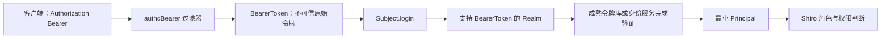

如果 API 选择无状态 Bearer Token，可以使用下面的过滤链思路。它是第 5.4 节 Session 方案的替代架构，不能在同一条 `/api/**` 路径上同时照搬两套链：

```java
@Bean
ShiroFilterChainDefinition tokenFilterChainDefinition() {
    DefaultShiroFilterChainDefinition chain =
        new DefaultShiroFilterChainDefinition();

    chain.addPathDefinition("/api/public/**", "anon");

    // 禁止本次请求创建 Session，再要求 Bearer Token 认证。
    chain.addPathDefinition(
        "/api/**",
        "noSessionCreation, authcBearer"
    );

    // 非 API 页面仍按传统登录流程保护。
    chain.addPathDefinition("/**", "authc");
    return chain;
}
```

接入过程是：Realm 的 `supports(token)` 只接受 `BearerToken`；认证实现把原始 Token 交给成熟、配置严格的验证组件；验证成功后返回稳定用户 ID 等最小 Principal；授权阶段仍从可信数据源或受控声明获得角色、权限和租户。不要自己手写 JWT 密码算法，也不要仅调用“解析 Claims”的方法就返回认证成功。

`noSessionCreation` 表示当前链不允许创建新 Session，但“配置里出现这个名字”不是无状态成功判据。测试时还要确认 API 响应没有创建 Session Cookie、业务代码没有调用 `subject.getSession()`、每次请求都会重新验证令牌，并且两个请求不会通过线程或缓存共享错误主体。Shiro 默认过滤器和 Realm 选择机制见 [Apache Shiro Web Support](https://shiro.apache.org/web.html) 与 [Apache Shiro Realms](https://shiro.apache.org/realm.html)。

### 8.6 OAuth 2.0 与 OIDC 的角色和授权码流程

OAuth 2.0 与 OIDC 不是某个 Java 类库，而是多个参与方按协议交换授权码和令牌。先分清角色，流程才不会混乱。

| 角色 | 英文 | 职责 |
| --- | --- | --- |
| 用户 | Resource Owner / End-User | 拥有资源，并在身份系统完成认证与授权确认 |
| 客户端 | Client | 代表用户请求访问资源，例如 Web 应用或移动应用 |
| 授权服务器 | Authorization Server | 认证用户、获得授权并签发令牌 |
| 资源服务器 | Resource Server | 承载受保护 API，并验证 Access Token |
| OIDC 客户端 | Relying Party | 依赖身份提供方的认证结果建立本地登录态 |
| OIDC 身份提供方 | OpenID Provider | 提供 OIDC 认证并签发 ID Token |

浏览器和移动端当前优先使用 Authorization Code Flow with PKCE（带 PKCE 的授权码流程）。PKCE 全称是 Proof Key for Code Exchange，中文可理解为“授权码交换证明密钥”，用于证明拿授权码换令牌的客户端仍是最初发起请求的一方。

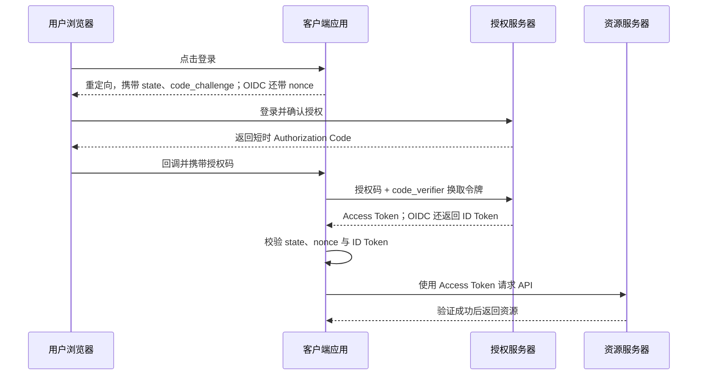

`state` 用于把回调与最初请求关联，并防护授权回调中的 CSRF；`nonce` 用于把 OIDC 的 ID Token 与本次认证请求关联；`code_verifier` 是客户端本地保存的高熵随机值，授权服务器会把它与之前的 `code_challenge` 对比。三者的主要职责不同。特定安全配置可以让 PKCE 承担部分 CSRF 防护，但初学项目不应在没有协议库和身份平台明确指导时擅自删除 `state` 或 `nonce` 校验。

`redirect_uri`（重定向 URI，Uniform Resource Identifier，统一资源标识符）决定授权完成后回到哪里，必须预先注册并按身份平台要求精确匹配，不能接受攻击者临时传入的任意地址。`scope`（授权范围）描述客户端获准执行的能力，例如读取个人资料或读取订单；它应遵循最小权限原则，但不等同于 Shiro 的角色或权限字符串。资源服务仍需把有效 Access Token 中可信的范围映射为本系统允许的操作，并继续检查租户、资源归属等业务条件。OIDC 请求必须包含 `openid` scope，才表示客户端请求的是 OpenID Connect 身份认证。

必须同时记住三个边界：

1\. ID Token 的受众是客户端，用于确认用户登录；Access Token 的受众是资源服务器，用于访问 API；Refresh Token 只用于向授权服务器申请新令牌。

2\. 浏览器代码中不能嵌入所谓“客户端密钥”，因为任何用户都能读取它。公共客户端依靠 PKCE 等机制，而不是假装能保守静态秘密。

3\. 当前安全实践禁止 Resource Owner Password Credentials Grant（资源所有者密码凭据授权模式），因为它要求用户把密码直接交给客户端；Implicit Grant（隐式授权模式）也不应作为新浏览器应用的默认选择。

相关规范可查看 [RFC 7636：PKCE](https://www.rfc-editor.org/info/rfc7636/)、[RFC 9700：OAuth 2.0 Security Best Current Practice](https://datatracker.ietf.org/doc/html/rfc9700)与 [OpenID Connect Core 1.0](https://openid.net/specs/openid-connect-core-1_0-18.html)。

### 8.7 SSO（Single Sign-On）与 CAS 基本流程

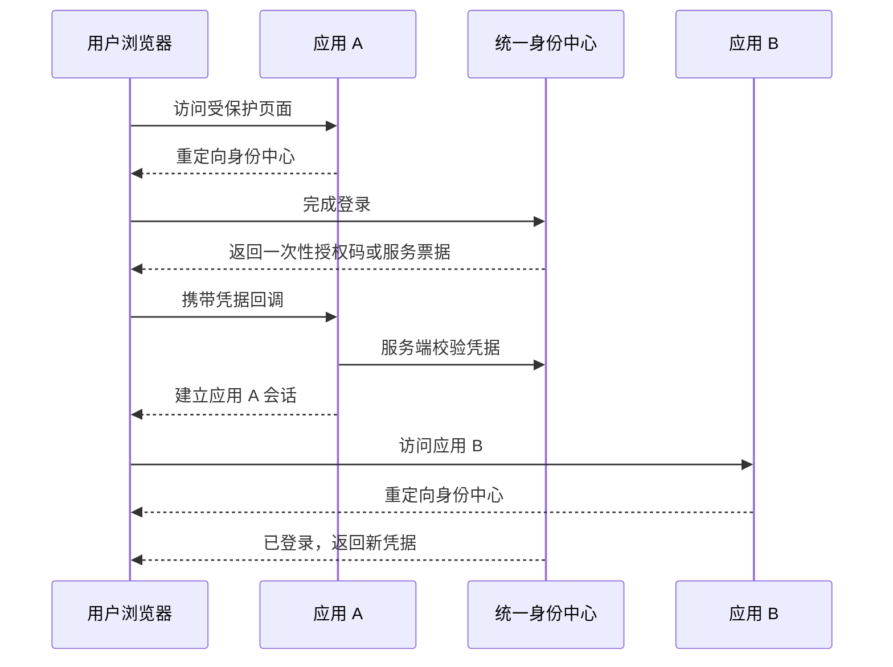

凭据应短时、一次性、绑定回调目标。应用不能只相信浏览器带回的字符串，必须按协议向可信身份中心校验。

在 CAS 中，身份中心是 CAS Server，应用是 CAS Client，回调凭据通常是 Service Ticket（服务票据）。Service Ticket 必须绑定目标 Service（服务标识）、短时有效且只能验证一次；应用向 CAS Server 验证成功后，再建立自己的本地 Session。OIDC 的对应凭据通常是 Authorization Code（授权码），客户端用它换取并校验 ID Token，再建立本地登录态。

CAS 的中心登录状态可用三个票据概念串起来：用户首次登录后，CAS Server 创建 TGT（Ticket-Granting Ticket，票据授予票据）；浏览器保存 TGC（Ticket-Granting Cookie，票据授予 Cookie）来关联该 TGT；用户访问某个业务应用时，CAS 再依据中心登录状态为该 Service 签发 ST（Service Ticket，服务票据）。TGC/TGT 解决“身份中心记住用户已经登录”，ST 解决“某个具体应用怎样一次性确认这次登录结果”。因此不能把 TGC 直接交给业务应用，也不能让一个应用的 ST 被另一个 Service 接受。

SSO 成功判据不是“浏览器跳转回来了”，而是一次性凭据经可信服务端校验、目标地址匹配、本地会话建立，并且同一凭据再次使用会失败。CAS 票据语义见 [Apereo CAS Protocol Specification](https://apereo.github.io/cas/development/protocol/CAS-Protocol-Specification.html)。

### 8.8 统一登出的现实边界

单点登录容易，单点登出更难，因为一次登录可能产生多层状态：

| 状态 | 存放位置 | 退出时要做什么 |
| --- | --- | --- |
| 应用本地 Session | 各业务应用 | 分别停止 Session 并删除本地 Cookie |
| 身份中心 SSO Session | CAS Server 或 OpenID Provider | 结束中心登录态，阻止继续无感签发新凭据 |
| Access Token | 客户端或调用链 | 撤销、加入拒绝列表或等待短有效期结束 |
| Refresh Token | 客户端与授权服务器 | 服务端撤销并停止后续刷新，必要时执行令牌轮换检测 |
| Remember Me | 浏览器与应用 | 删除 Cookie，并结合账号状态或认证版本使旧状态失效 |

“退出当前应用”通常只清理本应用状态；“退出全部应用”还需要通知或回调其他应用，并处理应用离线、浏览器阻止第三方上下文、回调失败和消息延迟。系统必须明确每一种退出按钮承诺的范围，并接受短暂不一致，再通过短令牌、回调重试和风险操作重认证降低影响。

验证时至少登录两个应用，再分别测试退出当前应用、退出身份中心和退出全部设备：检查两个应用的本地 Session、Access Token、Refresh Token 与 Remember Me 状态是否按约定失效。不能只看到身份中心页面显示“已退出”就认为所有下游状态都已撤销。

### 8.9 初学者学习边界与验证清单

第一轮学习第 8 章，应掌握以下内容：

1\. 能解释 Session、Bearer Token、JWT、SSO、CAS、OAuth 2.0 与 OIDC 各自解决什么问题。

2\. 知道前后端分离不等于必须使用 JWT，Access Token 也不一定采用 JWT 格式。

3\. 能解释 JWT 的 Header、Payload、Signature，以及“解码成功不等于验证成功”。

4\. 能区分 ID Token、Access Token 和 Refresh Token 的接收方与用途。

5\. 能画出 `Authorization` 请求头进入 Shiro `authcBearer`、`BearerToken`、Realm 和授权判断的路径。

6\. 能说明授权码流程中 `state`、`nonce`、PKCE 分别防护什么问题。

7\. 能为错误签名、过期、错误签发者、错误受众、撤权、重复 CAS Ticket 和退出失败编写负向测试。

第一轮不需要自己实现密码算法、授权服务器、OpenID Provider 或 CAS Server，也不需要背诵全部协议字段。真实项目应优先采用成熟身份平台和经过维护的协议库；学习重点是正确配置、验证安全边界，以及知道失败时从哪一段链路排查。

## 9 线程传播、代理与异步任务（进阶再学）

### 9.1 为什么异步线程容易丢失 Subject

异步任务会离开发起请求的执行作用域，因此 `SecurityUtils.getSubject()` 不能天然得到原 Subject。Shiro 3 在 JDK 25+ 使用 `ScopedValue`，在较早 JDK 使用线程局部机制，但二者都不会把身份无条件传播到任意线程池任务；如果错误地长期绑定，反而可能让上一个任务的身份泄漏给下一个任务。

这不是“偶尔取不到用户”的普通空值问题，而是安全边界：任务究竟代表哪个主体、其权限是否仍然有效，必须由应用明确决定。消息延迟期间账号可能已被禁用或撤权，所以长期后台任务通常更适合传递稳定用户 ID 并在消费端重新授权。

### 9.2 安全做法

1\. 优先显式传递稳定用户 ID 与必要授权上下文，并在任务端重新校验权限。

2\. 必须在短任务中传播同一个 Subject 时，使用 `subject.execute(...)` 或 `subject.associateWith(...)` 建立有边界的执行范围，让 Shiro 负责关联和清理；不要手工长期绑定 `ThreadContext`。

3\. 不要把完整密码、访问令牌或可变 Session 对象塞进异步消息。

4\. 消费者不应无条件信任消息中的角色字符串，应验证消息来源并按业务需要重新授权。

```java
Subject subject = SecurityUtils.getSubject();

Callable<Report> securedTask = subject.associateWith(
    () -> reportService.generateFor(userId)
);
Future<Report> future = executorService.submit(securedTask);
```

这段代码适合与当前请求紧密相关的短任务，不适合跨服务消息或数小时后执行的作业。验证时在线程池复用同一工作线程，先以用户 A 执行，再以用户 B 或匿名身份执行；每次只能看见本次明确关联的主体，任务结束后不得残留上一次身份。官方推荐方式见 [Apache Shiro Subject](https://shiro.apache.org/subject.html)。

### 9.3 Spring AOP 代理陷阱

注解鉴权依赖 Spring AOP 代理，代理只有在调用经过代理对象时才有机会执行安全拦截。同一对象内部 `this.method()` 调用直接进入目标对象，可能绕过代理；`final` 方法、错误代理模式或未注册 Advisor 也可能导致注解不生效。

修复时优先把受保护方法移动到另一个 Spring Bean，再从调用方注入该 Bean；也可以重新设计公共安全入口，避免依赖内部自调用。不要为了“让注解生效”随意从容器中反查自己，这会隐藏结构问题。验证不能只看代码上存在注解，要启动真实 Spring 上下文，分别以无权限和有权限身份经过代理调用，预期前者被拒绝、后者成功。

## 10 生产安全与架构治理

### 10.1 最小权限原则

1\. 默认拒绝，公开路径使用白名单。

2\. 后台管理、批量导出、退款、密钥管理等高风险能力使用细粒度权限。

3\. 服务账号与人工账号分离，权限和有效期分开管理。

4\. 定期审计僵尸账号、长期未使用角色、全局通配符权限和越权组合。

5\. 权限审批、变更、撤销与紧急授权必须留痕。

### 10.2 多租户系统

权限判断必须包含租户边界。缓存键、数据库查询、Session、审计日志与消息事件都要携带可信租户 ID。租户 ID 不能直接信任客户端参数，而应从已认证身份和服务端绑定关系得出。

例如用户拥有 `order:read`，并不表示能读取所有租户的订单。请求中的路径参数 `tenantId` 只能用于定位候选资源，服务端必须先从 Principal 得到当前账号允许的租户集合，再在同一数据库查询中追加租户条件；不能先按订单 ID 查出数据，再只靠前端隐藏结果。

验证时至少覆盖三个场景：本租户且有权限时允许，其他租户即使资源 ID 存在也拒绝，伪造 Header、查询参数或消息体中的租户 ID 仍不能越界。缓存测试还要证明同一个用户在两个租户下不会复用错误的授权结果。

### 10.3 依赖、序列化与安全公告回归

本文示例固定使用 Shiro 3.0.0。存量系统不能只比较主版本号，还要检查依赖树中各 Shiro 模块的实际版本，并把启用的功能与官方公告逐项对照。下面列出的 2026 年问题均已在 3.0.0 正式版修复，但对应失败场景仍应转化为升级回归测试。

| 公告 | 受影响功能与风险 | 升级后的定向回归 |
| --- | --- | --- |
| CVE-2026-56091 | `shiro-guice` 在 Web Servlet 场景中的认证绕过 | 向 Guice Web 入口发送畸形路径和转发请求，确认保护链无法绕过 |
| CVE-2026-56130 | Remember Me Cookie 的服务端年龄校验不足 | 过期、篡改、退出和密钥轮换后，旧 Cookie 均无法恢复主体 |
| CVE-2026-49268 | `DefaultLdapRealm` 构造 DN（Distinguished Name，可分辨名称）时的 LDAP 特殊字符注入 | 对逗号、加号、反斜杠等特殊字符做负向认证测试 |
| CVE-2026-48589、CVE-2026-44598 | `shiro-jakarta-ee` 登录后重定向与 SavedRequest 处理可能受客户端输入影响 | 伪造 Referer、SavedRequest Cookie 和绝对地址，只允许应用内相对路径 |
| CVE-2026-43827 | 登录成功后未轮换已有 Session，形成会话固定风险 | 比较登录前后 Session ID，并确认旧 ID 立即失效 |
| CVE-2026-43828 | Shiro Native Session 与 Remember Me 的敏感 Cookie 默认缺少 `Secure` | 在最终 HTTPS 响应中检查 `Set-Cookie`，不能只看配置文件 |
| CVE-2026-23903 | 大小写不敏感文件系统上的静态资源规则可能被大小写变体绕过 | 对静态资源和保护 URL 发送大小写变体请求 |
| CVE-2026-23901 | 不存在账号与错误密码的执行时间差可能辅助账号枚举 | 比较两类失败的延迟分布，并同时验证统一响应、限流和锁定策略 |

上表用于说明怎样把公告转成测试，不替代实时漏洞扫描。上线前还应完成以下工作：

1\. 持续扫描 CVE（Common Vulnerabilities and Exposures，常见漏洞与披露），并在每次发布前重新查看官方安全报告。

2\. 即使新版本改进了默认值，也显式设置 Cookie 的 `Secure`、`HttpOnly`、`SameSite`、域和路径，并通过浏览器或自动化测试检查最终响应。

3\. 避免反序列化不可信 Java 对象；跨版本 Session 数据采用受控格式并包含版本字段。

4\. 密钥放入密钥管理系统，不写入源码、镜像或普通配置仓库。

5\. 升级前回归登录、登出、Session ID 轮换、权限、Remember Me、路径匹配、Session 兼容与节点滚动发布。

官方入口：[Apache Shiro 安全报告](https://shiro.apache.org/security-reports.html)、[Apache Shiro 安全模型](https://shiro.apache.org/security-model.html)。

### 10.4 审计日志

建议记录时间、请求 ID、主体 ID、租户、资源、动作、结果、拒绝原因类别、来源 IP 的合规表示和客户端信息。不要记录密码、完整 Token、Session ID、Cookie 或敏感业务数据。

审计日志解决的是“事后能否还原谁在什么上下文做了什么”，不是普通调试日志。登录失败、权限拒绝、角色变更、改密、密钥轮换、管理员代理和退出全部设备等事件应有稳定事件类型，并写入权限受控、可防篡改或可检测篡改的集中存储；保留时间依据组织合规要求确定。

验证时用请求 ID 串联一次认证、授权与业务操作，确认既能定位主体和结果，又不会泄露秘密；再模拟审计存储不可用，检查系统是阻断高风险操作、进入缓冲队列还是告警降级。策略必须事先定义，不能静默丢失。

## 11 监控、排查与故障 Runbook

### 11.1 建议监控指标

| 指标 | 价值 |
| --- | --- |
| 登录成功率与失败率 | 发现攻击、依赖故障和发布回归 |
| 按 Basic、Session、Bearer 分组的认证结果 | 识别某一种入口、客户端或身份源的局部故障 |
| 各认证异常数量 | 区分密码错误、锁定、后端不可用 |
| 401 与 403 比例 | 发现登录态丢失或权限配置错误 |
| Realm 查询耗时 | 发现数据库或目录服务瓶颈 |
| 授权缓存命中率 | 评估缓存效果与抖动 |
| 活跃 Session 和过期速率 | 评估容量与泄漏 |
| 共享 Session 存储延迟 | 判断集群登录态风险 |
| 权限变更事件积压 | 判断缓存失效延迟 |

### 11.2 用户无法登录

1\. 确认请求是否进入正确过滤链，登录路径是否被错误地要求认证。

2\. 根据关联 ID 查找认证异常类型，禁止直接查看密码。

3\. 检查账号状态、Realm 选择、凭证算法、盐与迭代参数。

4\. 检查用户数据源、时钟、缓存和共享 Session 存储。

5\. 用测试账号在隔离环境复现，不在生产反复试真实用户密码。

### 11.3 登录成功却返回 403

1\. 确认主体 ID 与租户是否正确。

2\. 检查要求的权限字符串是否与数据库权限完全一致。

3\. 检查角色权限关联、授权缓存和变更事件。

4\. 检查注解代理是否生效，以及方法是否发生内部自调用。

5\. 检查业务数据权限，不要为了临时恢复而授予 `*:*`。

### 11.4 集群中偶发掉线

1\. 检查各节点 Cookie 名、域、路径、密钥和超时配置是否一致。

2\. 检查共享 Session 存储连接、TTL 和淘汰策略。

3\. 检查 Session 对象序列化兼容与滚动升级期间的类版本差异。

4\. 检查负载均衡、反向代理 HTTPS 终止与客户端时钟。

5\. 通过同一 Session ID 的匿名摘要串联日志，不输出原值。

### 11.5 请求持续返回 401

先确定请求实际使用哪一种认证入口，再沿对应链路排查，不能看到 401 就一律要求用户“重新登录”。

| 入口 | 首先检查 | 常见根因 |
| --- | --- | --- |
| HTTP Basic | `Authorization` 是否为 Basic、是否全程 HTTPS、Realm 是否支持 `UsernamePasswordToken` | 代理删除请求头、Base64 内容或冒号格式错误、密码轮换后客户端仍用旧值 |
| Session-Cookie | 登录响应是否真正创建 Session、后续请求是否带回正确 Cookie、服务端 Session 是否仍存在 | Cookie 域或路径不匹配、`Secure` 与部署协议不一致、共享 Session 丢失、会话超时 |
| Bearer Token | 方案是否为 Bearer、Realm 是否支持 `BearerToken`、签名或内省与声明校验是否通过 | 令牌过期、错误签发者或受众、密钥轮换未同步、账号或令牌已撤销 |

HTTP Basic 和 Bearer 缺少凭证时应检查响应是否包含正确的 `WWW-Authenticate` 挑战头；Session-Cookie 方案通常由 REST 过滤器返回约定的 JSON 401，或由页面过滤器重定向登录页。若网关把后端 401 改成 200 或统一 HTML 页面，客户端和监控都会误判，应同时抓取网关前后状态码与响应头。

排查日志只能记录认证方案、Realm 名称、失败类别、请求 ID 和脱敏主体标识。禁止输出完整 `Authorization`、Cookie、Session ID、密码或访问令牌。

## 12 测试策略

### 12.1 测试金字塔

1\. 单元测试：权限字符串、凭证匹配、Realm 数据映射和异常分支。

2\. 集成测试：真实过滤链、注解代理、数据库与缓存失效。

3\. 端到端测试：登录、访问、权限变更、登出、过期和多节点切换。

4\. 安全测试：水平越权、垂直越权、会话固定、CSRF、暴力破解和令牌篡改。

### 12.2 最小权限矩阵

| 场景 | 未登录 | reader | admin |
| --- | --- | --- | --- |
| 查看公开页 | 允许 | 允许 | 允许 |
| 查看订单 | 401 | 允许 | 允许 |
| 删除订单 | 401 | 403 | 允许 |
| 操作其他租户订单 | 401 | 403 | 403 |

矩阵应成为自动化测试数据，而不是只存在于设计文档中。

同一项业务权限若允许通过多种认证入口访问，还要增加认证方案维度：

| 场景 | HTTP Basic | Session-Cookie | Bearer Token |
| --- | --- | --- | --- |
| 凭证缺失 | 401 + Basic 挑战 | 401 或跳转登录页，取决于接口契约 | 401 + Bearer 挑战 |
| 凭证有效且有权限 | 200 | 200 | 200 |
| 身份有效但无权限 | 403 | 403 | 403 |
| 凭证失效或已撤销 | 401 | 旧 Session ID 返回 401 | 401 |

这张表验证的是统一对外语义，不表示一个 URL 应同时接受三种认证。生产系统应为每组路径明确唯一或可控的认证入口，避免客户端意外降级到更弱方案。

### 12.3 使用 MockMvc 验证安全边界

```java
import org.junit.jupiter.api.Test;
import org.springframework.beans.factory.annotation.Autowired;
import org.springframework.boot.test.autoconfigure.web.servlet.AutoConfigureMockMvc;
import org.springframework.boot.test.context.SpringBootTest;
import org.springframework.http.MediaType;
import org.springframework.mock.web.MockHttpSession;
import org.springframework.test.web.servlet.MockMvc;
import org.springframework.test.web.servlet.MvcResult;

import static org.junit.jupiter.api.Assertions.assertNotNull;
import static org.springframework.test.web.servlet.request.MockMvcRequestBuilders.*;
import static org.springframework.test.web.servlet.result.MockMvcResultMatchers.*;

@SpringBootTest
@AutoConfigureMockMvc
class OrderSecurityTest {
    @Autowired
    MockMvc mvc;

    @Test
    void anonymousCannotReadOrders() throws Exception {
        mvc.perform(get("/api/orders"))
            .andExpect(status().isUnauthorized());
    }

    @Test
    void readerCannotDeleteOrder() throws Exception {
        MockHttpSession session = loginAs("reader");
        mvc.perform(delete("/api/orders/1001").session(session))
            .andExpect(status().isForbidden());
    }

    @Test
    void adminCanDeleteOrder() throws Exception {
        MockHttpSession session = loginAs("admin");
        mvc.perform(delete("/api/orders/1001").session(session))
            .andExpect(status().isNoContent());
    }

    private MockHttpSession loginAs(String username) throws Exception {
        String json = """
            {"username":"%s","password":"test-password","rememberMe":false}
            """.formatted(username);

        MvcResult result = mvc.perform(post("/api/auth/login")
                .contentType(MediaType.APPLICATION_JSON)
                .content(json))
            .andExpect(status().isOk())
            .andReturn();

        MockHttpSession session =
            (MockHttpSession) result.getRequest().getSession(false);
        assertNotNull(session);
        return session;
    }
}
```

`loginAs` 通过真实 HTTP 登录入口获得 Session，没有绕过 Shiro 过滤链。测试数据夹具必须预先创建 `reader` 和 `admin`，二者的测试密码摘要应由与生产相同的 `ApplicationPasswordService` 生成。

匿名请求之所以预期得到 401，是因为第 5.4 和 5.20 节把 `/api/**` 交给了返回 JSON 的 `restAuthc`，而不是会重定向登录页的默认 `authc`。`reader` 删除订单之所以预期得到 403，则要求删除方法确实带有相应的角色或权限注解，并经过 Spring AOP 代理。

这个测试能证明 Servlet 过滤链、登录接口、Session 恢复和状态码协同工作，但不能证明真实数据库、共享 Session、反向代理 Cookie 属性或多节点缓存一致性。接近生产的环境还需要容器化数据库、真实缓存和至少两个应用实例的集成测试。

### 12.4 必须编写的负向测试

1\. 错误密码不能创建 Session。

2\. 被锁定或禁用账号不能登录。

3\. 普通用户不能调用管理员接口。

4\. 同权限用户不能访问其他用户或租户的数据。

5\. 撤销权限并清缓存后，旧会话也不能继续访问。

6\. 退出、过期或服务端踢出后，旧 Session ID 不能恢复登录。

7\. 注解所在方法通过真实代理调用时确实被拦截。

8\. 过滤链新增接口未显式公开时仍被兜底保护。

9\. Basic 凭证缺失、格式错误和密码错误都安全失败，并返回正确挑战头。

10\. Session Cookie 被篡改、过期、退出或服务端撤销后都不能恢复 Subject。

11\. Bearer Token 的签名或内省失败、过期、签发者或受众错误、账号撤销时都返回 401。

12\. 有效 Basic、Session 或 Bearer 身份没有业务权限时统一返回 403，而不是误报 401。

### 12.5 测试隔离注意事项

Shiro 的 Subject 具有执行作用域。使用 JDK 17～24 等基于线程局部状态的运行环境，或测试代码曾手工绑定 `ThreadContext` 时，测试结束必须在 `finally` 或测试框架的清理钩子中解绑 Subject 与 SecurityManager；JDK 25+ 的 `ScopedValue` 也应通过 Shiro 提供的受控作用域执行，不能把测试状态泄漏到下一用例。

并行测试还要避免共享可变 SecurityManager、固定 Session ID、同一缓存键或相同数据库账号夹具。最小隔离验证是把“管理员测试”和“匿名测试”连续、随机顺序并重复运行；匿名测试始终被拒绝，才说明没有残留身份。

## 13 核心 API 与配置参考（按需查阅，不要求背诵）

### 13.1 Subject API 速查

| API | 返回或行为 | 失败方式 |
| --- | --- | --- |
| `login(token)` | 尝试建立认证状态 | 抛出 `AuthenticationException` 子类 |
| `logout()` | 清理主体状态并终止相关会话 | 基础设施异常需记录 |
| `getPrincipal()` | 返回主要主体标识 | 未识别时通常为 `null` |
| `isAuthenticated()` | 是否主动认证 | 返回布尔值 |
| `isRemembered()` | 是否由 Remember Me 识别 | 返回布尔值 |
| `hasRole(role)` | 是否具有角色 | 返回布尔值 |
| `checkRole(role)` | 强制检查角色 | 无角色时抛异常 |
| `isPermitted(permission)` | 是否具有权限 | 返回布尔值 |
| `checkPermission(permission)` | 强制检查权限 | 无权限时抛异常 |
| `getSession()` | 获取或创建 Session | 可能创建新会话 |
| `getSession(false)` | 只获取已有 Session | 不存在时返回 `null` |

查询式 API 适合条件分支，`check*` API 适合“无权就立即中止”的入口。不要用大量分散的 `if` 代替统一方法鉴权。

### 13.2 Realm 生命周期与缓存 API

| API | 用途 |
| --- | --- |
| `supports(token)` | 判断 Realm 是否支持 Token |
| `getAuthenticationInfo(token)` | 认证入口，内部可能处理缓存 |
| `doGetAuthenticationInfo(token)` | 子类实现真实认证数据查询 |
| `getAuthorizationInfo(principals)` | 授权入口，内部可能处理缓存 |
| `doGetAuthorizationInfo(principals)` | 子类实现角色权限查询 |
| `clearCachedAuthenticationInfo(principals)` | 清理认证缓存 |
| `clearCachedAuthorizationInfo(principals)` | 清理授权缓存 |
| `clearCache(principals)` | 清理两类缓存 |

不要直接调用 `doGet*` 方法绕过 Realm 模板流程。自定义代码通常实现 `doGet*`，业务调用由 Shiro 入口触发。

### 13.3 权限 API 的 AND 与 OR

`@RequiresPermissions` 和 `@RequiresRoles` 可通过逻辑参数表达全部满足或任一满足。默认语义必须在代码审查时确认，复杂业务建议拆成清晰的权限，避免一个注解承载难以理解的组合策略。

```java
@RequiresPermissions(
    value = {"order:read", "order:export"},
    logical = Logical.AND
)
public byte[] exportOrders() {
    return new byte[0];
}
```

### 13.4 常见配置项的思考方式

| 配置类别 | 关键问题 |
| --- | --- |
| Session 超时 | 空闲超时多长，是否还有绝对有效期 |
| Cookie | 名称、域、路径、Secure、HttpOnly、SameSite |
| Remember Me | 是否必要，密钥在哪里，如何轮换和撤销 |
| 缓存 | 缓存什么，多久过期，权限变更如何失效 |
| Realm | 支持什么 Token，查询什么数据，失败如何分类 |
| 过滤链 | 哪些公开，哪些认证，是否有 `/**` 兜底 |
| HTTP 认证入口 | 哪些路径使用 Basic、Session-Cookie 或 Bearer，能否被已有 Session 意外放行 |
| 密码 | 算法、成本、盐、升级与泄露响应 |

具体属性名会随集成方式和版本变化，但这些问题不会变化。配置前先回答安全语义，再查当前版本的属性名称。

### 13.5 常见误区速查

1\. 登录成功不等于拥有所有权限。

2\. 拥有接口权限不等于能操作任意一条业务数据。

3\. Remember Me 不等于完成了本次认证。

4\. JWT 不等于加密，也不天然支持注销。

5\. 前端路由守卫不等于后端授权。

6\. 缓存命中不等于权限数据永远正确。

7\. 使用 Shiro 不等于自动解决 CSRF、XSS、SQL 注入和业务越权。

8\. 加了注解不等于代理一定生效，必须通过请求测试验证。

9\. Base64 不是加密，HTTP Basic 必须依赖 HTTPS 保护传输。

10\. Cookie 不是 Session；它只是常用于携带 Session ID。

11\. Token 不等于 JWT；Bearer Token 可以是不透明随机串。

12\. `noSessionCreation` 只禁止新建 Session，不代表忽略已经存在的 Session。

## 14 项目落地模板

### 14.1 需求阶段

1\. 列出主体类型：用户、管理员、服务账号、定时任务。

2\. 建立资源、动作、角色和数据范围矩阵。

3\. 明确登录方式、会话时长、多因素认证和风险操作重认证。

4\. 为浏览器、移动端、内部工具和服务调用分别确定 Basic、Session-Cookie 或 Bearer 入口，明确是否允许多种方案共存。

5\. 明确单点登录、第三方授权与服务间调用边界。

### 14.2 设计阶段

1\. 画认证、授权、登出、权限变更和会话过期时序图。

2\. 设计用户、角色、权限、租户、审计与授权变更表。

3\. 设计缓存键、失效事件、共享 Session、密钥轮换和降级策略。

4\. 定义 401、403、账号锁定与外部身份源不可用的对外契约。

### 14.3 开发阶段

1\. 完成 Realm、凭证匹配器、过滤链、注解和异常处理。

2\. 为权限矩阵建立正向与负向自动化测试。

3\. 加入登录失败、越权拒绝、权限变更和会话操作审计。

4\. 扫描依赖、秘密、危险反序列化与错误日志输出。

### 14.4 上线检查表

1\. 所有非公开路径默认需要认证。

2\. 后端对每项敏感操作实施授权，前端隐藏按钮不是安全控制。

3\. 密码采用合格的带盐慢速散列，参数经过基准测试。

4\. Cookie 设置 `HttpOnly`、`Secure` 与合适的 `SameSite`。

5\. 登录成功后轮换 Session ID，登出后服务端立即失效。

6\. Remember Me 使用受控密钥并完成安全评估，非必要则关闭。

7\. 授权缓存具备变更失效、重试、监控与补偿机制。

8\. 分布式 Session 验证过期、故障、序列化与滚动升级。

9\. JWT 或 SSO 校验全部协议字段，支持密钥轮换和撤销。

10\. 401、403、登录失败和权限变更具备指标、告警与审计。

11\. 完成水平越权、垂直越权、暴力破解、CSRF 和会话固定测试。

12\. 依赖漏洞扫描无不可接受风险，并准备回滚方案。

13\. Basic、Session-Cookie 与 Bearer 路径不存在意外降级或互相借用登录态，并完成缺失、篡改、过期和撤销测试。

## 15 复习路线与官方资料入口

### 15.1 七天入门路线

1\. 第一天：完成第 1 章四个实验，能说清输入、认证结果和授权结果。

2\. 第二天：阅读第 2、3 章并手画认证时序图，再用第 4 章解释第 1 章的格式化密码摘要与装配链。

3\. 第三天：设计五张 RBAC 表，理解数据库 Realm。

4\. 第四天：完成 Spring Boot 登录、退出、过滤链和注解鉴权。

5\. 第五天：学习密码、Session、Remember Me 与缓存失效。

6\. 第六天：完成权限矩阵集成测试和三类故障排查演练。

7\. 第七天：按 WWH 复述核心机制，再补充失败场景、生产边界和验证标准，并用上线检查表复核自己的示例项目。

### 15.2 三轮复习法

第一轮只抓主线：Subject、SecurityManager、Realm、认证、授权。

第二轮做项目：数据库、过滤链、注解、异常、Session 和缓存。

第三轮做生产：安全、集群、监控、测试、故障和协议边界。

### 15.3 用 WWH 复习每个知识点

WWH 不是给每段机械添加三个标题，而是一条完整理解链。复习 Subject、Realm、Session、Remember Me、过滤器或缓存时，都依次回答：

1\. What：它是什么，输入、输出、职责和不负责的边界分别是什么？

2\. Why：没有它会出现什么具体问题，它与相邻方案相比为什么适合当前场景？

3\. How：它从入口到结果如何工作，默认行为、关键配置、数据流和异常流是什么？

4\. Boundary：输入无效、依赖故障、并发、跨节点和攻击场景下会怎样失败，如何安全退让？

5\. Verify：用什么测试、日志或指标证明它真的生效，成功判据和失败信号分别是什么？

### 15.4 官方资料入口

1\. [Apache Shiro 官方文档总入口](https://shiro.apache.org/documentation)：教程、认证、授权、Realm、迁移指南、API 与源码入口。

2\. [Apache Shiro 3.0.0 下载与模块说明](https://shiro.apache.org/download.html)：当前稳定版、Java 要求和 Maven 坐标。

3\. [Spring Boot 官方集成指南](https://shiro.apache.org/spring-boot.html)：Web Starter、Realm、过滤链、注解和配置属性。

4\. [Apache Shiro Web 支持](https://shiro.apache.org/web.html)：默认过滤器、HTTP Basic、Bearer、Session 与 Cookie 的 Web 集成入口。

5\. [RFC 7617：HTTP Basic](https://www.rfc-editor.org/rfc/rfc7617) 与 [RFC 6750：Bearer Token](https://www.rfc-editor.org/rfc/rfc6750)：核对两种 `Authorization` 方案的标准请求和响应语义。

6\. [Apache Shiro 安全报告](https://shiro.apache.org/security-reports.html)：上线和升级前检查受影响版本与修复建议。

7\. [Apache Shiro 安全模型](https://shiro.apache.org/security-model.html)：确认 Shiro 负责与不负责的安全边界。

不要仅凭博客文章决定依赖版本或安全配置。版本号、已知漏洞和集成方式可能变化，应以当前官方文档和组织安全基线为准。

### 15.5 面试与复习自测

回答下面的问题时，先界定概念，再按执行链说明组件和状态如何变化，最后用错误场景、测试或生产指标证明结论。只背 API 名称无法解释权限为何不生效、会话为何丢失或撤权为何延迟。

1\. 不看文档画出认证和授权流程。

2\. 解释 `isAuthenticated()`、`isRemembered()` 和 `@RequiresUser` 的差异。

3\. 解释 Realm 为什么不能保存请求级状态。

4\. 写出 `资源:动作:实例` 权限并说明数据权限仍放在哪里校验。

5\. 解释权限修改后如何让所有节点立即生效。

6\. 解释为什么退出不能只删除前端 Cookie。

7\. 解释 Session 与 JWT 的取舍，而不是只说“是否有状态”。

8\. 画出 HTTP Basic、Session-Cookie 与 Bearer Token 进入 Shiro 的三条链路，并说明何时会调用 Realm。

9\. 解释 Cookie 与 Session、Bearer Token 与 JWT、AuthenticationToken 与 Access Token 的区别。

10\. 用测试证明未登录是 401、无权限是 403、跨租户始终被拒绝。

## 16 Shiro 概念词典（按需查阅）

### 16.1 主体与身份类概念

| 概念 | 初学者解释 |
| --- | --- |
| Subject | 当前正在与系统交互的主体，不一定只指自然人 |
| Principal | 主体的一个身份标识，例如用户 ID |
| PrincipalCollection | 主体由一个或多个 Realm 提供的全部身份标识 |
| Credentials | 用于证明身份的凭证，例如密码 |
| AuthenticationToken | 调用方提交的一次认证请求载体 |
| AuthenticationInfo | Realm 从可信数据源返回的认证资料 |
| AuthorizationInfo | Realm 返回的角色与权限资料 |
| Run As | 已认证主体临时以另一个身份运行 |

### 16.2 认证类概念

| 概念 | 初学者解释 |
| --- | --- |
| Authenticator | 组织认证流程的组件 |
| ModularRealmAuthenticator | 支持多个 Realm 的认证器 |
| AuthenticationStrategy | 决定多个 Realm 怎样组合才算认证成功 |
| Realm | Shiro 与用户、角色、权限数据源之间的适配层 |
| CredentialsMatcher | 比较提交凭证与存储凭证 |
| AuthenticationException | 认证失败异常体系的父类 |

### 16.3 授权类概念

| 概念 | 初学者解释 |
| --- | --- |
| Authorizer | 组织角色与权限判断的组件 |
| Role | 一组职责或权限的业务名称 |
| Permission | 对资源执行动作的能力描述 |
| WildcardPermission | Shiro 常用的通配符权限实现 |
| PermissionResolver | 把权限字符串解析成 Permission 对象 |
| RolePermissionResolver | 把角色解析或映射成权限 |

### 16.4 会话与状态类概念

| 概念 | 初学者解释 |
| --- | --- |
| Session | 跨多个请求保存主体状态的会话对象 |
| SessionManager | 组织会话生命周期 |
| SessionDAO | 会话的持久化访问层 |
| SessionFactory | 创建 Session 对象 |
| SessionIdGenerator | 创建不可预测的会话标识 |
| SessionValidationScheduler | 调度会话过期检查 |
| SessionListener | 监听会话开始、停止和过期 |
| RememberMeManager | 保存并恢复被记住的 principals |
| SubjectDAO | 保存和恢复 Subject 状态 |
| SessionStorageEvaluator | 决定 Subject 状态是否写入 Session |

### 16.5 Web 类概念

| 概念 | 初学者解释 |
| --- | --- |
| WebSecurityManager | 适配 Web 请求、响应和 Web Session 的安全管理器 |
| WebSubject | 能感知 Web 请求响应的 Subject |
| ShiroFilter | Web 请求进入 Shiro 的总入口 |
| FilterChainResolver | 根据请求路径选择过滤器链 |
| AccessControlFilter | 自定义访问控制过滤器的常用基类 |
| SavedRequest | 登录前暂存的原请求信息 |
| HTTP Basic | 每次请求通过 Authorization 头携带 Base64 编码用户名与密码的认证方案 |
| Session Cookie | 浏览器用于携带 Session ID、让服务端恢复已有会话的 Cookie |
| Bearer Token | 谁持有谁即可使用的访问令牌，常放在 Authorization 请求头 |
| `authcBasic` | Shiro 的 HTTP Basic 过滤器名称，创建 `UsernamePasswordToken` 发起认证 |
| `authcBearer` | Shiro 的 Bearer 过滤器名称，创建 `BearerToken` 发起认证 |

### 16.6 基础设施类概念

| 概念 | 初学者解释 |
| --- | --- |
| SecurityManager | Shiro 的核心协调器，不是 `java.lang.SecurityManager` |
| SecurityUtils | 获取当前 Subject 等能力的静态入口 |
| SubjectFactory | 根据上下文创建 Subject |
| Cache | Shiro 的键值缓存抽象 |
| CacheManager | 按名称提供和管理 Cache |
| EventBus | 发布和订阅安全事件的组件 |
| Lifecycle | 组件初始化与销毁约定 |
| ThreadContext | Shiro 的线程上下文工具；主要用于较早 JDK 的作用域关联，业务代码不应手工长期绑定 Subject |

### 16.7 最容易混淆的概念

1\. Subject 与 User：Subject 是安全视角下的当前主体，User 通常是业务实体。

2\. Principal 与 username：用户名可以是 Principal，但 Principal 不只限于用户名。

3\. Token 与 JWT：AuthenticationToken 是 Shiro 认证请求抽象，JWT 只是可能采用的一种令牌格式。

4\. AuthenticationInfo 与 AuthorizationInfo：前者用于认证身份，后者用于角色权限。

5\. Role 与 Permission：角色是职责集合，权限是具体能力。

6\. isAuthenticated 与 isRemembered：前者是主动认证，后者只是恢复识别信息。

7\. Session stop 与 logout：stop 停止会话，logout 还清理主体身份状态。

8\. CacheManager 与 SessionDAO：前者管理缓存，后者持久化会话。

9\. Shiro SecurityManager 与 Java SecurityManager：名称相同但不是同一个体系。

10\. Shiro Filter 与 Spring AOP 注解：前者拦截 Web URL，后者拦截受代理的方法调用。

11\. Cookie 与 Session：Cookie 是客户端传输容器，Session 是服务端会话状态；Cookie 常携带 Session ID，但二者不是同一对象。

12\. HTTP Basic 与 Session 登录：前者通常每次请求重复携带用户名密码，后者只在登录时校验原始凭证，后续按 Session ID 恢复主体。

13\. Bearer Token 与 JWT：Bearer 是令牌的 HTTP 使用方案，JWT 是可能采用的一种令牌格式。

14\. `AuthenticationToken` 与 Access Token：前者是 Shiro 统一认证请求接口，后者是调用受保护资源的访问凭据；Shiro 可以用 `BearerToken` 包装 Access Token。
