# Spring Boot 初学者学习笔记

> 目标：从“能启动一个接口”走到“能理解、测试、配置、排查并上线一个小型 Spring Boot 服务”。
>
> 版本说明：截至 2026 年 7 月 26 日，Spring Boot 当前稳定版为 4.1.0，最低要求 Java 17。考虑到本文完整实战依赖 MyBatis，动手项目采用生态兼容性更明确的 Spring Boot 4.0.x 与 MyBatis Spring Boot Starter 4.0.1；Spring Boot 4.1 的核心机制相同，但应等 MyBatis 发布明确支持 4.1 的稳定版本后再整体升级。不要把“Boot 最新版”和“第三方 Starter 最新版”直接拼在一起，具体组合应同时核对 [Spring Boot 系统要求](https://docs.spring.io/spring-boot/system-requirements.html)、[MyBatis Spring Boot 兼容说明](https://github.com/mybatis/spring-boot-starter#requirements)和 [Spring Initializr](https://start.spring.io/) 当前生成结果。

## 1 学习路径与心智模型

### 1.1 Spring Boot 解决了什么问题

Spring Framework（Spring 框架）擅长管理对象、组织业务代码和整合各种技术，但传统 Spring 项目需要开发者手动挑选依赖、配置 Web 容器、注册大量基础组件。Spring Boot 在 Spring Framework 之上提供了一套“约定优于配置”的启动方式。

Spring Boot 主要解决四类问题：

1\. 通过 Starter（启动器）一次引入一组相互兼容的依赖。

2\. 根据类路径、配置项和已有 Bean（由 Spring 容器管理的对象）进行自动配置。

3\. 内置 Tomcat 等 Web 服务器，可以直接运行可执行 JAR（Java Archive，Java 归档）文件。

4\. 提供健康检查、指标、配置外部化等生产能力。

Spring Boot 不是新的编程语言，也不会替你编写业务逻辑。它仍然以 Spring Framework 的 IoC（Inversion of Control，控制反转）、DI（Dependency Injection，依赖注入）和 AOP（Aspect-Oriented Programming，面向切面编程）为基础。

### 1.2 一个请求经过了什么

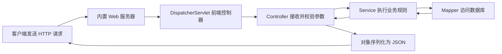

初学时应先牢牢记住分层职责：

1\. Controller：处理 HTTP（Hypertext Transfer Protocol，超文本传输协议）协议细节，不堆积核心业务逻辑。

2\. Service：表达业务规则、事务边界和业务编排。

3\. Mapper：使用 MyBatis 映射 SQL 并访问数据库。

4\. Configuration：定义基础设施对象和配置绑定。

### 1.3 推荐学习顺序

1\. 补齐 Java 基础：类、接口、异常、集合、泛型、注解、Lambda、Maven 基础。

2\. 完成一个 REST（Representational State Transfer，表述性状态转移）接口。

3\. 理解 IoC 容器、Bean、依赖注入和自动配置。

4\. 学会参数校验、统一异常处理、配置管理和日志。

5\. 接入关系型数据库并理解事务。

6\. 学会单元测试、切片测试和集成测试。

7\. 加入 Actuator（生产监控端点）、安全配置和容器化部署。

8\. 再学习缓存、消息队列、分布式系统、微服务等进阶主题。

### 1.4 如何使用本文

本文不是要求从头背到尾，可以按目标选择路径：

1\. 第一次学习：依次阅读第 1 至 8 章，并亲手完成任务管理 API。

2\. 理解框架原理：重点阅读第 4 章 Spring 容器、第 5 章自动配置和第 6 章请求处理链。

3\. 准备真实项目：重点阅读第 7 至 12 章，完成配置、数据、测试、安全、监控和部署闭环。

4\. 排查问题：先查看第 13 章速查表，再回到对应原理章节定位根因。

5\. 上线前复核：使用第 15 章检查表，而不是凭“本地能启动”判断是否可发布。

## 2 开发环境与项目结构

### 2.1 前置条件

建议准备：

1\. JDK（Java Development Kit，Java 开发工具包）17 或更高版本。

2\. IntelliJ IDEA、Visual Studio Code 或 Spring Tools 等 IDE（Integrated Development Environment，集成开发环境）。

3\. Maven Wrapper 或 Gradle Wrapper。Wrapper 能让项目固定构建工具版本，团队成员不必各自安装不同版本。

4\. curl、Apifox 或 Postman，用于调用 HTTP 接口。

验证 Java：

```bash
java -version
javac -version
```

预期结果：两条命令都能输出版本，且主版本不低于 17。

`java` 用于运行已经编译的程序，`javac` 用于把 `.java` 源文件编译成字节码。两者版本不一致时，IDE 可能用一个 JDK 编译，终端却用另一个 JDK 运行，于是出现“IDE 能运行、命令行失败”或 `UnsupportedClassVersionError`。遇到这类问题，应同时检查：

```bash
java -version
javac -version
./mvnw -version
```

`./mvnw -version` 输出中的 Java home 才是 Maven 实际使用的 JDK。`JAVA_HOME` 只是告诉许多工具去哪里找 JDK，修改后要重新打开终端或确认当前进程已经读取新值。Maven Wrapper 固定的是 Maven 版本，不会替项目自动安装正确的 JDK。

#### 2.1.1 Maven Wrapper：为什么项目使用 `mvnw`

`mvnw` 是 Maven Wrapper（Maven 包装器）在 macOS、Linux 等类 Unix 系统上的启动脚本，Windows 对应 `mvnw.cmd`。它不是另一套构建工具，最后执行的仍是 Apache Maven；它解决的是“由项目声明并自动准备 Maven 版本”这个问题。

直接执行：

```bash
mvn test
```

使用的是当前操作系统 `PATH` 中找到的 Maven。不同开发者和持续集成环境可能安装了不同版本。执行：

```bash
./mvnw test
```

则先读取项目中的 Wrapper 配置，找到项目指定的 Maven 发行版；本机没有该版本时先下载、解压并缓存，然后用它执行 `test`。后续运行通常直接复用缓存，不会每次重新下载。

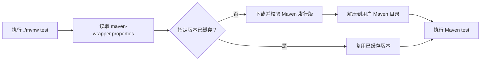

一个 Wrapper 至少包含以下项目文件：

```text
demo/
├── mvnw
├── mvnw.cmd
└── .mvn/
    └── wrapper/
        └── maven-wrapper.properties
```

现代 Wrapper 默认可以采用 `only-script` 方式，不一定包含 `maven-wrapper.jar`。因此看到项目中没有该 JAR，不代表 Wrapper 不完整；应以 `maven-wrapper.properties` 和脚本的实际配置为准。

`maven-wrapper.properties` 中最关键的是 `distributionUrl`：

```properties
distributionUrl=https://repo.maven.apache.org/maven2/org/apache/maven/apache-maven/3.9.11/apache-maven-3.9.11-bin.zip
```

URL 中的版本就是该项目准备使用的 Maven 版本。团队升级 Maven 时，应统一更新并提交 Wrapper 文件，通过构建验证后再合并，不要让每位开发者各自修改本机 Maven。

Wrapper 固定 Maven，不固定 JDK，也不固定项目依赖：

1\. JDK 版本仍由本机、IDE、`JAVA_HOME`、工具链或持续集成环境提供。

2\. Maven 版本由 Wrapper 的 `distributionUrl` 决定。

3\. Spring Boot、MyBatis 等项目依赖由 `pom.xml` 和依赖管理决定。

4\. 依赖仓库镜像、代理、认证和本地仓库通常仍受 Maven `settings.xml` 影响。

因此，`./mvnw` 能运行不代表 Java 版本一定正确，也不代表依赖下载网络一定可用。定位问题时分别检查：

```bash
# 当前终端直接执行的 Java。
java -version

# Wrapper 最终使用的 Maven 和 Java。
./mvnw -version

# 项目实际解析出的依赖关系。
./mvnw dependency:tree
```

常用命令与作用：

| 命令 | 作用 |
|---|---|
| `./mvnw test` | 编译并执行测试 |
| `./mvnw clean verify` | 清理旧产物，执行完整验证生命周期 |
| `./mvnw spring-boot:run` | 使用 Spring Boot Maven 插件启动应用 |
| `./mvnw dependency:tree` | 查看最终依赖树和版本冲突 |
| `./mvnw help:effective-pom` | 查看继承、属性和依赖管理合并后的有效 POM |
| `./mvnw -U clean verify` | 强制检查快照和缺失更新；`-U` 是 `--update-snapshots` 的缩写，不应把它当作日常修复手段 |

首次执行 Wrapper 往往需要访问网络。如果此时失败，应区分两类下载：

1\. Maven 发行版下载失败：通常发生在 Wrapper 启动阶段，应检查 `distributionUrl`、代理、证书、DNS（Domain Name System，域名系统）和公司仓库策略。

2\. 项目依赖下载失败：Maven 已经启动，但解析 `pom.xml` 依赖时失败，应检查仓库镜像、`settings.xml`、凭据和具体构件坐标。

macOS 或 Linux 出现 `Permission denied`，表示 `mvnw` 没有可执行权限：

```bash
chmod +x mvnw
git update-index --chmod=+x mvnw
```

第一条修改本地文件权限，第二条让 Git 记录可执行位，避免其他开发者检出后再次失败。不要用 `sudo ./mvnw` 解决权限或下载问题，否则可能在用户 Maven 缓存中留下属于 root 用户的文件，随后普通用户反而无法更新。

Wrapper 文件应与项目源码一起提交，包括 `mvnw`、`mvnw.cmd` 和 `.mvn/wrapper/`。不要只提交脚本而遗漏配置，也不要随意手工修改生成的脚本。对供应链要求较高的项目可在 `maven-wrapper.properties` 中配置 `distributionSha256Sum`，校验下载的 Maven 发行版是否与预期一致。

官方参考：[Apache Maven Wrapper](https://maven.apache.org/tools/wrapper/)。

### 2.2 使用 Spring Initializr 创建项目

打开 `https://start.spring.io/`，建议初学项目选择：

1\. Project：Maven。

2\. Language：Java。

3\. Spring Boot：本文实战选择与 MyBatis 4.0.1 明确兼容的 4.0.x，不直接使用页面默认的 4.1.x。

4\. Packaging：Jar。

5\. Java：17 或当前团队统一的长期支持版本。

6\. Dependencies：Spring Web MVC、Validation、Spring Boot Actuator、MyBatis Framework、H2 Database。

生成并解压后，在项目根目录执行：

```bash
./mvnw spring-boot:run
```

Windows PowerShell 可执行：

```powershell
.\mvnw.cmd spring-boot:run
```

预期日志包含 `Started ...Application`。默认访问地址为 `http://localhost:8080`。

常见失败原因：

1\. `Permission denied`：在 macOS 或 Linux 执行 `chmod +x mvnw`。

2\. `Address already in use`：8080 端口已被占用，关闭对应进程或临时使用 `--server.port=8081`。

3\. 下载依赖失败：检查代理、Maven 镜像和网络，不要随意删除依赖版本。

4\. `Unsupported class file major version`：编译和运行使用了不兼容的 JDK。

### 2.3 认识目录结构

```text
demo/
├── pom.xml                         # Maven 项目与依赖定义
├── mvnw                            # Unix Maven Wrapper
├── mvnw.cmd                        # Windows Maven Wrapper
└── src/
    ├── main/
    │   ├── java/com/example/demo/
    │   │   └── DemoApplication.java
    │   └── resources/
    │       ├── application.yml     # 应用配置
    │       ├── static/             # 静态资源
    │       └── templates/          # 服务端页面模板
    └── test/
        └── java/com/example/demo/  # 测试代码
```

主启动类应放在业务包的最外层，因为 `@SpringBootApplication` 默认从它所在的包向下扫描组件。

## 3 教程：完成第一个可测试接口

### 3.1 定义目标

实现 `GET /api/greetings?name=小明`，返回 JSON：

```json
{
  "message": "你好，小明"
}
```

### 3.2 编写启动类

```java
package com.example.demo;

import org.springframework.boot.SpringApplication;
import org.springframework.boot.autoconfigure.SpringBootApplication;

@SpringBootApplication
public class DemoApplication {

    public static void main(String[] args) {
        SpringApplication.run(DemoApplication.class, args);
    }
}
```

`@SpringBootApplication` 是组合注解，核心包含：

1\. `@Configuration`：当前类可以提供 Bean 定义。

2\. `@EnableAutoConfiguration`：允许 Spring Boot 根据条件自动配置。

3\. `@ComponentScan`：扫描当前包及子包中的组件。

### 3.3 编写 Controller

```java
package com.example.demo.greeting;

import org.springframework.web.bind.annotation.GetMapping;
import org.springframework.web.bind.annotation.RequestMapping;
import org.springframework.web.bind.annotation.RequestParam;
import org.springframework.web.bind.annotation.RestController;

@RestController
@RequestMapping("/api/greetings")
public class GreetingController {

    @GetMapping
    public GreetingResponse greet(
            @RequestParam(defaultValue = "世界") String name) {
        return new GreetingResponse("你好，" + name);
    }
}
```

定义响应 DTO（Data Transfer Object，数据传输对象）：

```java
package com.example.demo.greeting;

public record GreetingResponse(String message) {
}
```

`record` 是 Java 用来声明“以数据为主要职责的类”的关键字，Java 16 起成为正式语言特性。圆括号中的 `String message` 称为 Record Component（记录组件），它同时描述了字段名称和类型。

上面的代码大致替代了下面这类普通 Java 类：

```java
public final class GreetingResponse {

    private final String message;

    public GreetingResponse(String message) {
        this.message = message;
    }

    public String message() {
        return message;
    }
}
```

除此之外，record 还会生成基于全部组件值的 `equals()`、`hashCode()` 和 `toString()`；普通类若需要同样的值语义，必须自行正确实现这些方法。

编译器会为 `GreetingResponse` 自动提供：

1\. `private final String message` 对应的状态。

2\. 接收全部组件的 Canonical Constructor（规范构造器），因此可以执行 `new GreetingResponse("你好")`。

3\. 名为 `message()` 的访问方法。它不是 JavaBean 风格的 `getMessage()`，调用方式为 `response.message()`。

4\. 基于所有组件值生成的 `equals()`、`hashCode()` 和 `toString()`。

这使 record 很适合 DTO、配置快照、查询结果和其他只负责传递数据的值对象。Spring MVC 与 Jackson 可以把公开的 record 组件序列化为 JSON，所以：

```java
new GreetingResponse("你好，小明")
```

可以转换成：

```json
{
  "message": "你好，小明"
}
```

record 不是“所有对象都完全不可变”的保证。它只保证组件引用不能在构造完成后重新赋值，也不会自动生成 Setter（设置方法）。如果组件本身是可变对象，内部内容仍可能被修改：

```java
import java.util.List;

public record TeamResponse(List<String> members) {
}
```

调用者如果持有同一个可变 `List`，仍可能修改其中的元素。需要真正稳定的值对象时，应在构造阶段创建防御性副本：

```java
import java.util.List;

public record TeamResponse(List<String> members) {

    public TeamResponse {
        members = List.copyOf(members);
    }
}
```

这里省略参数列表的写法叫 Compact Constructor（紧凑构造器）。它适合校验、规范化或复制组件值，编译器会在构造结束时完成字段赋值：

```java
public record GreetingResponse(String message) {

    public GreetingResponse {
        if (message == null || message.isBlank()) {
            throw new IllegalArgumentException("message 不能为空");
        }
        message = message.trim();
    }
}
```

还要理解 record 的类型边界：

1\. record 类隐式为 `final`，不能再被其他类继承。

2\. record 不能继承普通业务父类，但可以实现接口。

3\. record 可以定义普通方法、静态字段和静态方法，但不能额外声明保存实例状态的字段。

4\. 组件是 API 契约的一部分；增加、删除或改名都会改变构造方式、访问方法以及 JSON 字段，应按接口兼容性变更处理。

如果对象需要频繁改变内部状态、依赖复杂继承或拥有与数据组件无关的生命周期，普通 class 通常更合适。选择 record 的理由应是“这个类型表达一组数据值”，而不只是为了少写 Getter 和 Setter。

启动并验证：

```bash
./mvnw spring-boot:run
curl "http://localhost:8080/api/greetings?name=小明"
```

### 3.4 关键 API 卡片

#### 3.4.1 `@RestController`

1\. 用途：把类注册为 Web 控制器，并让方法返回值默认写入 HTTP 响应体。

2\. 本质：组合了 `@Controller` 和 `@ResponseBody`。

3\. 适用场景：返回 JSON、文本等数据接口。

4\. 不适用场景：需要返回服务端模板页面时，通常使用 `@Controller`。

#### 3.4.2 `@GetMapping`

1\. 用途：把 HTTP GET 请求映射到 Java 方法。

2\. 适用场景：读取资源且不改变服务端状态。

3\. 常见错误：用 GET 执行新增、删除等副作用操作，会破坏 HTTP 语义并带来缓存、安全风险。

#### 3.4.3 `@RequestParam`

1\. 用途：读取查询字符串，如 `?name=小明`。

2\. 关键参数：`required` 表示是否必填，`defaultValue` 提供默认值。

3\. 常见异常：必填参数缺失会得到 400 Bad Request（错误请求）。

### 3.5 编写第一条测试

```java
package com.example.demo.greeting;

import org.junit.jupiter.api.Test;
import org.springframework.beans.factory.annotation.Autowired;
import org.springframework.boot.webmvc.test.autoconfigure.WebMvcTest;
import org.springframework.test.web.servlet.MockMvc;

import static org.springframework.test.web.servlet.request.MockMvcRequestBuilders.get;
import static org.springframework.test.web.servlet.result.MockMvcResultMatchers.jsonPath;
import static org.springframework.test.web.servlet.result.MockMvcResultMatchers.status;

@WebMvcTest(GreetingController.class)
class GreetingControllerTest {

    @Autowired
    private MockMvc mockMvc;

    @Test
    void shouldReturnGreeting() throws Exception {
        mockMvc.perform(get("/api/greetings").param("name", "小明"))
                .andExpect(status().isOk())
                .andExpect(jsonPath("$.message").value("你好，小明"));
    }
}
```

执行：

```bash
./mvnw test
```

预期结果：测试通过，构建输出包含 `BUILD SUCCESS`。

### 3.6 深入原理：一次请求为什么能找到这个方法

浏览器访问 `/api/greetings` 时，不是 Tomcat 直接调用 `GreetingController`。完整过程可以拆成九步：

1\. Tomcat 在 8080 端口接收 TCP（Transmission Control Protocol，传输控制协议）连接，解析出 HTTP 请求。

2\. 请求进入过滤器链。字符编码、安全认证、跨域处理和链路标识通常在这里完成。

3\. 请求到达 `DispatcherServlet`。它是 Spring MVC（Model-View-Controller，模型-视图-控制器）的统一入口。

4\. `HandlerMapping` 根据请求路径、HTTP 方法和请求头查找匹配的 Controller 方法。

5\. `HandlerAdapter` 准备调用方法，并让参数解析器处理 `@RequestParam`、`@PathVariable` 和 `@RequestBody`。

6\. 参数校验器执行 `@Valid` 约束。校验失败时，Controller 方法不会执行。

7\. Controller 根据 `name` 创建 `GreetingResponse` 对象。本章先跑通最小 Web 主线，第 4 章再把消息拼装职责提取到 Service。

8\. `HttpMessageConverter` 选择 JSON 转换器，由 Jackson 把 Java 对象序列化为 JSON。

9\. Spring 写入状态码、响应头和响应体，Tomcat 将响应发送给客户端。

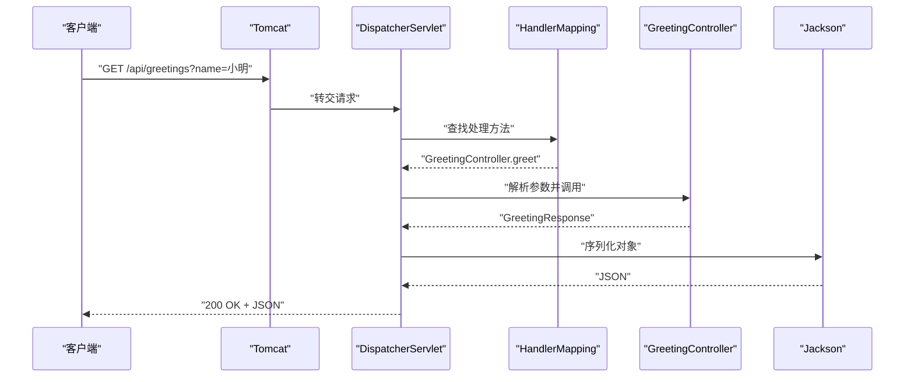

这解释了几个常见现象：

1\. 路径没有匹配方法时返回 404，而不是进入 Controller 后报错。

2\. JSON 格式错误通常在参数解析阶段返回 400，Controller 方法可能根本没有执行。

3\. 返回普通对象也能得到 JSON，是因为类路径中有 Jackson，Spring Boot 又自动配置了消息转换器。

4\. 全局异常处理器能够统一响应，是因为异常会沿调用链返回到 `DispatcherServlet`，再交给异常解析器处理。

### 3.7 实战调试：确认请求停在哪一层

本章代码还没有 Service 和全局异常处理器。先在 `GreetingController.greet()` 的返回语句设置断点；若希望观察框架入口，可再给 `DispatcherServlet.doDispatch()` 设置方法断点，但框架断点调用频繁，只适合短时学习。

然后分别发起三次请求：

```bash
# 正常请求：Controller 断点会命中，name 为“小明”。
curl -i "http://localhost:8080/api/greetings?name=小明"

# 未提供 name：defaultValue 生效，返回“你好，世界”。
curl -i "http://localhost:8080/api/greetings"

# 不存在的路径：不会命中 GreetingController。
curl -i "http://localhost:8080/api/not-exists"
```

调试时重点观察调用栈，不要只看当前一行。调用栈能展示请求如何从容器进入 Spring MVC，再到你的代码。还要注意：给 `@RequestParam` 设置 `defaultValue` 后，参数缺失或值为空时都会采用默认值；如果业务要求“显式空字符串必须报错”，应移除默认值并加入校验，而不是期待当前写法自动失败。

## 4 Spring 核心：容器、Bean 与依赖注入

### 4.1 IoC 和 DI 的直白解释

如果一个类在内部直接 `new` 出所有依赖，它就同时负责“业务”和“组装对象”，不容易替换实现，也不容易测试。

依赖注入把对象创建和组装交给 Spring 容器：

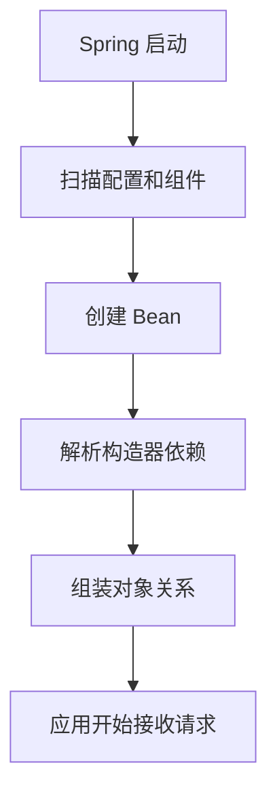

### 4.2 使用构造器注入

```java
package com.example.demo.greeting;

import org.springframework.stereotype.Service;

@Service
public class GreetingService {

    public String createMessage(String name) {
        return "你好，" + name;
    }
}
```

```java
@RestController
@RequestMapping("/api/greetings")
public class GreetingController {

    private final GreetingService greetingService;

    public GreetingController(GreetingService greetingService) {
        this.greetingService = greetingService;
    }

    @GetMapping
    public GreetingResponse greet(
            @RequestParam(defaultValue = "世界") String name) {
        return new GreetingResponse(greetingService.createMessage(name));
    }
}
```

优先选择构造器注入，因为：

1\. 依赖在对象创建时必须完整。

2\. 字段可以声明为 `final`。

3\. 单元测试可直接传入替身对象。

4\. 循环依赖更容易在启动阶段暴露。

不建议初学项目普遍使用字段注入。字段注入隐藏了依赖，也让不启动 Spring 的普通单元测试更难编写。

### 4.3 常用组件注解

| 注解 | 典型职责 | 说明 |
|---|---|---|
| `@Component` | 通用组件 | 其他组件注解的基础 |
| `@Service` | 业务逻辑 | 表达业务层语义 |
| `@Repository` | 数据访问 | 表达持久化层语义，可参与异常转换 |
| `@Mapper` | MyBatis Mapper 接口 | 由 MyBatis 创建代理并执行映射 SQL |
| `@Controller` | 页面控制器 | 通常返回视图 |
| `@RestController` | 数据接口控制器 | 通常返回 JSON |
| `@Configuration` | Java 配置类 | 集中定义基础设施 Bean |
| `@Bean` | 方法返回对象 | 用于无法直接修改源码的第三方对象 |

### 4.4 Bean 生命周期的初学者模型

1\. Spring 读取配置和组件定义。

2\. 创建 Bean 实例。

3\. 注入依赖和配置属性。

4\. 执行初始化回调。

5\. Bean 对外提供服务。

6\. 应用关闭时执行销毁回调。

不要在构造器中发网络请求、访问数据库或启动线程。构造器应尽量只保存依赖；需要初始化时应显式设计，并考虑失败、重试和关闭过程。

### 4.5 常见启动错误

1\. `NoSuchBeanDefinitionException`：类型未注册、包未被扫描或条件配置未生效。

2\. `NoUniqueBeanDefinitionException`：同一接口有多个实现，可使用 `@Qualifier` 明确选择，或重新审视设计。

3\. 循环依赖：A 依赖 B，B 又依赖 A。优先拆分职责，不要用延迟注入掩盖设计问题。

### 4.6 深入原理：Spring 容器保存的是什么

Spring 容器通常指 `ApplicationContext`。它不只是一个保存对象的 `Map`，还负责：

1\. 保存 Bean 定义，即“怎样创建对象”的元数据。

2\. 创建、缓存和查找 Bean。

3\. 解析 Bean 之间的依赖。

4\. 处理配置属性、事件、资源和国际化。

5\. 执行 Bean 后置处理器，为事务、异步等能力创建代理。

默认情况下，大多数 Bean 是单例作用域：一个 `ApplicationContext` 中同一个 Bean 名称通常对应一个实例。这不是 JVM 全局单例，也不意味着它自动线程安全。

Controller、Service 和 Mapper/Repository 通常会被多个请求线程并发调用。因此不要把每次请求的可变数据保存在它们的实例字段中。

错误示例：

```java
@RestController
public class CounterController {

    private int count = 0;

    @GetMapping("/count")
    public int count() {
        return ++count; // 多线程下会丢失更新，也把请求状态放进了单例 Bean。
    }
}
```

正确思路是把业务状态保存在数据库、缓存或专门的并发数据结构中，而不是依赖单例 Bean 的普通字段。

### 4.7 `@Bean` 与组件扫描怎样选择

自己编写且职责明确的业务类，通常使用 `@Service` 等组件注解；MyBatis 接口使用 `@Mapper`，自行实现的数据访问对象可使用 `@Repository`。第三方类无法修改源码，或创建过程需要参数和定制时，使用 `@Bean`：

```java
@Configuration
public class ClockConfiguration {

    @Bean
    public Clock clock() {
        return Clock.systemUTC();
    }
}
```

业务代码依赖 `Clock`，测试时便可传入固定时间：

```java
Clock fixedClock = Clock.fixed(
        Instant.parse("2026-01-01T00:00:00Z"),
        ZoneOffset.UTC);
```

这比在业务代码中到处调用 `Instant.now()` 更容易测试时间边界。

### 4.8 Bean 的完整创建与初始化过程

Bean 的生命周期，就是一个对象从“Spring 知道应该怎样创建它”，到“可以被其他对象使用”，最后到“应用关闭时释放资源”的全过程。

初学时不要先背 `BeanPostProcessor` 等接口名称。先理解简要流程和四个重点；等需要排查代理、循环依赖或初始化顺序时，再看完整流程。

#### 4.8.1 先看简要流程


把它想成 Spring 在组装并管理一个对象：

1\. 读取说明：Spring 先知道要创建哪个类、需要哪些依赖，以及这个对象采用什么作用域。保存这些信息的“对象创建说明”叫 `BeanDefinition`。

2\. 创建对象：Spring 调用构造器、`@Bean` 方法或其他工厂方法，得到一个原始 Java 对象。这个动作叫实例化。

3\. 补齐依赖：把构造器参数、`@Autowired` 依赖和 `@Value` 配置值交给对象。构造器依赖会在创建对象时解析，字段或 Setter 依赖通常在对象创建后填充。

4\. 完成初始化：依赖就绪后，执行 `@PostConstruct` 等初始化回调，让对象完成轻量的启动准备。

5\. 对外提供：Spring 可能给原始对象包一层代理，用来实现事务、异步、缓存或方法安全。其他 Bean 最终拿到的是 Spring 决定暴露的对象。

6\. 关闭清理：应用正常关闭时，Spring 调用 `@PreDestroy` 等销毁回调，让对象释放自己持有的线程、文件或网络资源。

#### 4.8.2 小白必须掌握的四个重点

1\. Bean 定义不等于 Bean 对象。`BeanDefinition` 类似一份对象创建说明；根据说明真正创建出来的 Java 对象才是 Bean 实例。

2\. 实例化不等于初始化完成。构造器执行结束，只能说明对象已经出现；它可能还没有完成字段注入、`@PostConstruct` 和代理包装。

3\. `new` 出来的对象不等于 Spring 管理的 Bean。自己执行 `new OrderService()` 会绕过依赖注入、生命周期回调和代理增强，因此该对象上的 `@Transactional`、`@Async` 等能力通常不会按预期工作。

4\. 注入到业务代码中的对象可能是代理。调用者应该使用容器注入的 Bean，不要在初始化过程中把原始 `this` 保存到全局变量，否则可能绕过事务等代理逻辑。

下面这个例子展示了初学阶段最常用的生命周期写法：

```java
import jakarta.annotation.PostConstruct;
import jakarta.annotation.PreDestroy;
import org.springframework.stereotype.Component;

import java.time.Clock;

@Component
public class LocalCache {

    private final Clock clock;

    public LocalCache(Clock clock) {
        // Spring 创建 LocalCache 时，通过构造器传入依赖。
        this.clock = clock;
    }

    @PostConstruct
    void initialize() {
        // 构造器依赖已经就绪，适合执行有界、轻量的初始化检查。
    }

    @PreDestroy
    void close() {
        // 只释放 LocalCache 自己拥有并负责管理的资源。
    }
}
```

第一次学习读到这里即可。需要理解框架源码、回答生命周期顺序问题或排查“注解为什么没有生效”时，再继续阅读完整流程。

#### 4.8.3 进阶：再看完整流程

完整过程要区分三个范围：

1\. 容器级准备：处理的是 Bean 定义和容器扩展点，发生在大多数普通 Bean 实例化之前。

2\. 单个 Bean 的创建与初始化：从获取合并后的定义开始，最终得到可能经过代理包装的对外对象。

3\. 容器关闭时的销毁：只对由容器负责销毁的 Bean 执行；原型 Bean 通常不在完整销毁管理范围内。

以下流程以 `ApplicationContext` 中的普通单例 Bean 为主，同时画出实例化前短路和循环依赖提前暴露等特殊分支：

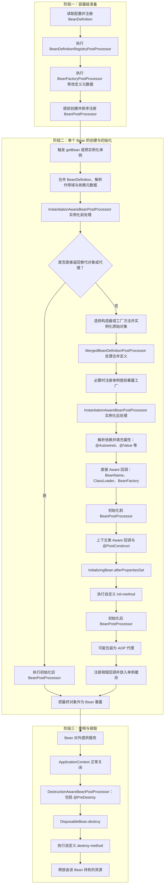

阅读这张图时要注意以下边界。

#### 4.8.4 容器级后处理与 Bean 实例后处理不是一回事

`BeanDefinitionRegistryPostProcessor` 可以继续注册 Bean 定义；`BeanFactoryPostProcessor` 读取或修改已经注册的定义元数据。它们处理的是“怎样创建对象的说明书”，不是普通业务对象本身，并且必须在大多数 Bean 实例化之前执行。

`BeanPostProcessor` 处理的是已经进入创建流程的 Bean 实例。Spring 会先创建并注册这些处理器，再让它们参与后续普通 Bean 的实例化、依赖注入、初始化和代理包装。过早创建的 Bean 可能来不及经过全部处理器，因此日志中的“not eligible for getting processed by all BeanPostProcessors”意味着该对象可能没有得到自动代理等完整增强。

#### 4.8.5 实例化、属性填充和初始化是三个不同阶段

1\. 实例化：通过构造器、静态工厂方法或 `@Bean` 工厂方法得到一个原始 Java 对象。

2\. 属性填充：解析并注入字段、Setter 或其他依赖，包括 `@Autowired`、`@Value` 以及 BeanDefinition 中声明的属性值。构造器依赖在实例化时已经解析，不要把所有依赖注入都误认为发生在构造器之后。

3\. 初始化：对象已经实例化且主要依赖已经注入，随后执行 Aware 回调、初始化前后处理器和初始化方法。初始化完成后对外暴露的对象可能已经不是原始对象，而是代理。

`InstantiationAwareBeanPostProcessor` 的实例化前回调可以直接返回替代对象或代理。一旦返回非空对象，常规构造器实例化、属性填充和普通初始化主线会被跳过，只继续执行相应的初始化后处理。因此，“每个 Bean 都一定完整经过图中的每个节点”并不成立。

#### 4.8.6 初始化回调的顺序

对一条没有被短路的常规创建路径，可以使用以下顺序记忆：

1\. 完成依赖解析和属性填充。

2\. 执行 `BeanNameAware`、`BeanClassLoaderAware`、`BeanFactoryAware` 等直接 Aware 回调。

3\. 执行初始化前 `BeanPostProcessor`。`ApplicationContextAware` 等上下文类回调以及 `@PostConstruct` 通常由相应的处理器在这一阶段完成。

4\. 如果实现 `InitializingBean`，执行 `afterPropertiesSet()`。

5\. 执行 BeanDefinition 指定的自定义 `init-method`。

6\. 执行初始化后 `BeanPostProcessor`，AOP（Aspect-Oriented Programming，面向切面编程）自动代理通常在这一阶段包装对象。

`BeanPostProcessor` 可以返回包装对象，因此调用者最终注入和调用的应是容器暴露的 Bean，而不是开发者自行保存或创建的原始实例。

多个处理器之间的精确先后还受 `PriorityOrdered`、`Ordered` 和注册顺序影响。图中表达的是稳定的生命周期阶段，而不是承诺每个自定义处理器都有一个固定的全局序号。

#### 4.8.7 单例提前暴露不等于已经初始化完成

为处理允许范围内的单例循环依赖，Spring 可能在原始对象实例化后、属性填充完成前注册一个用于提前获取引用的工厂。这只是让另一个 Bean 有机会取得早期引用，不表示当前 Bean 已经执行 `@PostConstruct`、初始化方法或全部代理处理。

构造器循环依赖无法依靠这种方式解决，因为构造器执行前连原始对象都还不存在。即使属性注入循环在某些配置下能够启动，另一个对象也可能观察到尚未完整初始化的早期引用，所以正确做法仍是拆分循环职责。

#### 4.8.8 销毁回调的完整边界

`ApplicationContext` 正常关闭时，常见销毁顺序为：

1\. `DestructionAwareBeanPostProcessor` 的销毁前处理，其中可触发 `@PreDestroy`。

2\. 如果实现 `DisposableBean`，执行 `destroy()`。

3\. 执行 BeanDefinition 指定的自定义 `destroy-method`。

销毁不是进程被强制终止时的可靠保证。`kill -9`、机器断电或运行时崩溃都可能让回调来不及执行。Bean 应释放自己拥有的线程池、文件句柄和客户端连接，但数据正确性不能只依赖关闭回调。

关键对象和扩展点：

1\. `BeanDefinition`：描述 Bean 的类型、作用域、依赖、初始化方法等元数据，不是 Bean 实例本身。

2\. `BeanFactory`：提供 Bean 创建、依赖解析和查找等基础能力。

3\. `ApplicationContext`：在 `BeanFactory` 之上增加事件、资源、国际化和自动注册后置处理器等应用级能力。

4\. `BeanPostProcessor`：允许在 Bean 初始化前后加工对象。AOP 代理、配置属性绑定等框架能力会使用类似扩展机制。

5\. `BeanFactoryPostProcessor`：处理的是 Bean 定义元数据，时机早于普通 Bean 创建。不要与 `BeanPostProcessor` 混淆。

6\. `InstantiationAwareBeanPostProcessor`：在普通初始化前后处理之外，增加实例化前、实例化后和属性填充阶段的扩展能力，主要供框架内部基础设施使用。

7\. `DestructionAwareBeanPostProcessor`：在 Bean 销毁前执行处理，`@PreDestroy` 等生命周期注解由相应处理器接入。

生产注意事项：

1\. `@PostConstruct` 中不要执行无界重试或长时间阻塞，否则应用会卡在启动阶段。

2\. 销毁回调只有在容器正常关闭时才有机会执行，不能把数据安全完全寄托于它。

3\. 后置处理器属于容器级扩展点，初学业务代码通常不需要自行实现。

官方参考：

1\. [Spring Bean 生命周期回调](https://docs.spring.io/spring-framework/reference/core/beans/factory-nature.html)。

2\. [Spring 容器扩展点](https://docs.spring.io/spring-framework/reference/core/beans/factory-extension.html)。

3\. [InstantiationAwareBeanPostProcessor API](https://docs.spring.io/spring-framework/docs/current/javadoc-api/org/springframework/beans/factory/config/InstantiationAwareBeanPostProcessor.html)。

### 4.9 Bean 的常见作用域与线程安全

| 作用域 | 生命周期含义 | 常见场景 |
|---|---|---|
| singleton | 每个 Spring 容器通常一个实例，默认值 | 无状态 Service、Mapper、Repository |
| prototype | 每次从容器获取时创建新实例 | 少量有状态、短生命周期对象 |
| request | 每个 HTTP 请求一个实例 | 请求级上下文 |
| session | 每个 HTTP Session 一个实例 | 传统服务端会话状态 |
| application | 每个 ServletContext 一个实例 | Web 应用级共享对象 |
| websocket | 每个 WebSocket 会话一个实例 | WebSocket 会话级状态 |

“作用域”回答的是：Spring 创建的目标对象会在多大范围内被重复使用，以及何时需要创建另一个目标对象。它不是 Java 的 `public`、`private` 等访问范围。

可以先用下面这张图建立直觉：

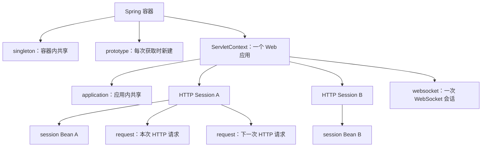

需要先区分四个概念：

1\. 单例作用域不等于 Java 语言中的全局单例。

2\. 单例作用域不等于线程安全。

3\. 无状态对象通常更容易安全地被多线程共享。

4\. `request`、`session`、`application` 和 `websocket` 是 Web 作用域，只能在支持相应作用域的 Web `ApplicationContext` 中使用。

#### 4.9.1 `singleton`：每个 Spring 容器一个实例

`singleton` 是 Spring 的默认作用域。对于同一个 Bean 定义，同一个 Spring `ApplicationContext` 通常只创建并缓存一个实例，之后的依赖注入和 `getBean()` 都复用它。

```java
import org.springframework.stereotype.Service;

@Service
public class GreetingFormatter {

    public String format(String name) {
        return "你好，" + name;
    }
}
```

这里没有写 `@Scope`，因此 `GreetingFormatter` 默认就是单例。它没有保存某一次请求或某一个用户的数据，是适合共享的无状态对象。

初学者要特别注意：

1\. “每个容器一个”不是“整个 JVM（Java Virtual Machine，Java 虚拟机）永远只有一个”。同一进程创建两个 `ApplicationContext`，每个上下文都可能拥有自己的实例。

2\. 部署多个应用实例时，每个进程或容器都有自己的单例。需要跨实例共享的数据应放进数据库、Redis 等外部存储。

3\. 一个单例会被多个请求线程并发调用。不要把当前用户、请求参数、临时计算结果放进普通成员变量；否则用户之间可能串数据，还可能发生数据竞争。

4\. Spring Boot 默认会在容器启动阶段创建大部分非延迟单例，所以单例构造或初始化失败，往往会导致应用启动失败。

默认选择原则很简单：无状态的 Service、Mapper、Repository 和配置类通常使用 `singleton`，不用显式声明。

#### 4.9.2 `prototype`：每次向容器获取时创建新实例

`prototype` 表示 Spring 每次处理“获取这个 Bean”的请求时，都创建并初始化一个新对象：

```java
import org.springframework.beans.factory.config.ConfigurableBeanFactory;
import org.springframework.context.annotation.Scope;
import org.springframework.stereotype.Component;

@Component
@Scope(ConfigurableBeanFactory.SCOPE_PROTOTYPE)
public class ReportDraft {
}
```

直接调用两次 `applicationContext.getBean(ReportDraft.class)`，会得到两个不同实例。但“每次调用该对象的方法都新建”是错误理解，Spring 控制的是 Bean 的获取过程，不会拦截普通 Java 方法来自动换对象。

还有一个非常容易踩的坑：把原型 Bean 直接注入单例时，依赖只在创建单例的那一刻解析一次，所以这个单例以后通常一直持有同一个原型实例。若业务要求每次操作都取一个新对象，可以注入 `ObjectProvider`：

```java
import org.springframework.beans.factory.ObjectProvider;
import org.springframework.stereotype.Service;

@Service
public class ReportService {

    private final ObjectProvider<ReportDraft> draftProvider;

    public ReportService(ObjectProvider<ReportDraft> draftProvider) {
        this.draftProvider = draftProvider;
    }

    public ReportDraft createDraft() {
        return draftProvider.getObject();
    }
}
```

每次执行 `getObject()` 才会向容器申请一个新的 `ReportDraft`。

`prototype` 也不是自动资源管理方案。Spring 负责创建、依赖注入和初始化原型对象，但交付后通常不会继续跟踪它，也不会在容器关闭时自动执行完整销毁回调。因此，持有文件、线程或连接的原型对象应由使用者明确关闭。普通业务中不要只为追求“线程安全”就大量改成原型；无状态单例通常更简单。

#### 4.9.3 `request`：每个 HTTP 请求一个实例

`request` 作用域表示：一次 HTTP（Hypertext Transfer Protocol，超文本传输协议）请求处理期间共享同一个目标实例；下一次请求会得到另一个实例。

```java
import org.springframework.stereotype.Component;
import org.springframework.web.context.annotation.RequestScope;

import java.util.UUID;

@Component
@RequestScope
public class RequestTrace {

    private final String traceId = UUID.randomUUID().toString();

    public String getTraceId() {
        return traceId;
    }
}
```

在同一次请求中，不同组件注入 `RequestTrace` 后访问的是同一个请求级目标对象，因此适合保存请求编号、租户标识等只属于本次请求的上下文。请求结束后，该目标对象随作用域结束。

注意以下边界：

1\. 它不是长期存储。请求结束后对象就不应再被依赖，业务数据仍应写入数据库等持久化存储。

2\. 它只能在有效的 Web 请求上下文中解析。在普通单元测试、应用启动线程或自行创建的新线程中直接访问，可能出现“request scope is not active”一类错误。

3\. 异步任务不会天然继承原请求的全部上下文。真正需要的值应作为明确的方法参数传给任务，而不是让后台线程继续依赖请求 Bean。

4\. `@RequestScope` 会使用作用域代理，因此可以注入默认的单例 Service；真正的请求对象会在代理被调用时按当前请求查找。

#### 4.9.4 `session`：每个 HTTP Session 一个实例

`session` 作用域表示：同一个 HTTP Session 中的多次请求共享一个目标实例；另一个 Session 会得到另一个实例。Session 可以先理解为服务器识别同一位访问者的一段会话，通常由浏览器携带会话 Cookie 与服务器关联。

```java
import org.springframework.stereotype.Component;
import org.springframework.web.context.annotation.SessionScope;

import java.util.ArrayList;
import java.util.List;

@Component
@SessionScope
public class ShoppingCart {

    private final List<Long> productIds = new ArrayList<>();

    public synchronized void add(Long productId) {
        productIds.add(productId);
    }

    public synchronized List<Long> items() {
        return List.copyOf(productIds);
    }
}
```

同一会话的多个请求可以看到同一个购物车；会话过期或被主动失效后，对应的会话 Bean 才随之结束。示例使用同步方法，是因为同一用户也可能同时发起多个请求，`session` 并不自动保证线程安全。

使用时还要理解：

1\. Session 通常由 Cookie 关联，不等于“一个浏览器标签页”。同一浏览器的多个标签页往往共享同一 Session。

2\. 不要把大对象、无限增长集合或敏感明文长期塞进 Session，否则会增加服务器内存和泄漏风险。

3\. 应用部署多个实例后，本机内存中的 Session 不会自动跨实例同步。需要结合负载均衡粘性会话，或使用 Spring Session、Redis 等共享会话方案。

4\. REST（Representational State Transfer，表述性状态转移）接口和令牌认证系统通常倾向无状态设计，不应为了方便随意引入服务器 Session。

#### 4.9.5 `application`：每个 Web 应用一个实例

`application` 作用域只用于 Web 应用。它表示：同一个 Bean 定义在一个 `ServletContext` 生命周期内只创建一个目标实例。

`ServletContext` 可以先理解为 Servlet 容器为“当前 Web 应用”提供的共享上下文。应用启动时创建，应用停止或重新部署时销毁。Spring 会把 `application` 作用域的对象作为 `ServletContext` 属性保存，因此同一个 Web 应用中的多个请求和组件可以访问同一个目标对象。

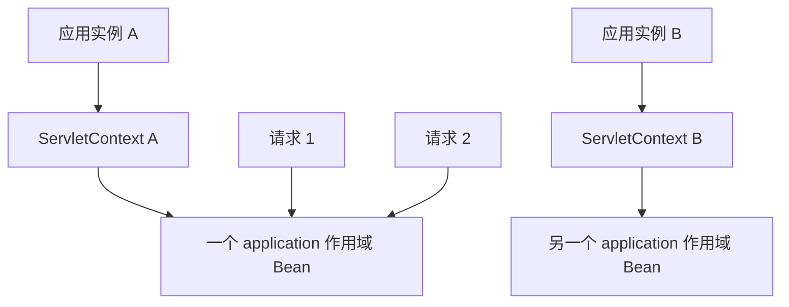

这张图说明：

1\. 同一应用实例中的不同请求共享同一个 `application` 作用域目标对象。

2\. 部署两个应用实例时，会有两个 `ServletContext`，也就有两个独立对象。

3\. 它不是跨进程、跨服务器或跨集群的全局单例。需要多实例共享的数据，应放在数据库、Redis 等外部存储中。

使用注解声明：

```java
package com.example.demo.config;

import org.springframework.stereotype.Component;
import org.springframework.web.context.annotation.ApplicationScope;

import java.time.Instant;

@Component
@ApplicationScope
public class ApplicationMetadata {

    private final Instant startedAt = Instant.now();

    public Instant getStartedAt() {
        return startedAt;
    }
}
```

无论多少个请求注入 `ApplicationMetadata`，在同一个 `ServletContext` 中最终访问的都是同一个目标实例。`@ApplicationScope` 是 `@Scope("application")` 的便捷写法，并且默认使用基于目标类的作用域代理。注入点拿到的可能是代理对象，代理负责定位当前 Web 应用中的真实目标对象。

`application` 与默认 `singleton` 看起来很像，但边界不同：

| 对比项 | singleton | application |
|---|---|---|
| 实例边界 | 每个 Spring `ApplicationContext` 一个实例 | 每个 `ServletContext` 一个目标实例 |
| 可用环境 | 普通 Spring 容器和 Web 容器 | 仅 Web 感知的 Spring 容器 |
| 存储位置 | Spring 单例缓存 | `ServletContext` 属性 |
| 多个 Spring 上下文 | 每个上下文可能各有一个实例 | 共享同一 `ServletContext` 时可以定位到同一实例 |
| 常见选择 | 无状态 Service、Mapper 和基础设施 Bean | 明确绑定 Web 应用生命周期的共享对象 |

在常见的单体 Spring Boot Web 应用中，通常只有一个主要 `ApplicationContext` 和一个 `ServletContext`，所以两者在“看起来只有一个对象”这一点上几乎相同。大多数业务 Service 使用默认 `singleton` 即可，不应为了表达“全应用共享”就机械改成 `application`。

共享对象仍然要考虑线程安全。多个请求会并发访问同一个 `application` 作用域对象，如果在普通字段中保存可变计数、用户信息或请求状态，就可能产生数据竞争：

```java
@Component
@ApplicationScope
public class UnsafeCounter {

    private long count;

    public long increment() {
        return ++count; // 多线程下不是安全的原子操作。
    }
}
```

请求状态应放在 request 作用域，用户会话状态可根据架构放在 session 或外部会话存储，全局业务数据应放在数据库或缓存。`application` 作用域更适合只读应用元数据、Web 应用级注册表，或者确实需要通过 `ServletContext` 共享并且已经完成并发设计的对象。

非 Web 的 `ApplicationContext` 没有这个标准 Web 作用域，强行使用通常会出现作用域未注册的错误。测试 `application` 作用域组件时，也要加载 Web 类型的测试上下文，不能只创建普通 `ApplicationContext`。

官方参考：

1\. [Spring Bean Scopes：Application Scope](https://docs.spring.io/spring-framework/reference/core/beans/factory-scopes.html)。

2\. [`@ApplicationScope` API](https://docs.spring.io/spring-framework/docs/current/javadoc-api/org/springframework/web/context/annotation/ApplicationScope.html)。

#### 4.9.6 `websocket`：每个 WebSocket 会话一个实例

WebSocket 建立连接后，可以在同一条连接上持续双向收发消息。`websocket` 作用域表示：同一个 WebSocket 会话中的多条消息共享一个目标实例；另一条 WebSocket 连接使用另一个实例。

```java
import org.springframework.context.annotation.Scope;
import org.springframework.stereotype.Component;

@Component
@Scope("websocket")
public class WebSocketConversationState {
}
```

它适合保存只属于当前连接的轻量会话状态，例如连接级订阅信息。需要注意：

1\. WebSocket 会话不等于 HTTP Session。二者可能有关联，但生命周期和作用域边界不同。

2\. 它不是“每条消息一个实例”。同一 WebSocket 会话中的多条消息会复用目标对象。

3\. 连接断开后对象随会话结束，不适合保存必须可靠留存的数据。

4\. 它只在支持该作用域的 WebSocket 处理环境中可用。普通 MVC（Model-View-Controller，模型-视图-控制器）请求不应依赖它。

#### 4.9.7 跨作用域注入：为什么有时需要代理

长生命周期 Bean 直接持有短生命周期 Bean，会产生一个问题：单例只创建一次，但 request、session 等目标对象需要不断变化。Spring 常用“作用域代理”解决：

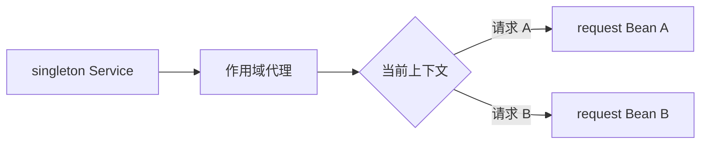

单例真正持有的是代理。每次调用代理时，代理根据当前请求或会话找到正确的目标对象。`@RequestScope`、`@SessionScope` 和 `@ApplicationScope` 这些便捷注解已经配置了作用域代理。

若当前线程没有对应的有效作用域，代理也找不到目标对象，调用时仍会报“scope is not active”之类的错误。代理只是延迟查找，不会凭空创建 HTTP 请求或 Session。

选择作用域时可以按下面的顺序判断：

1\. 对象能否设计成无状态并安全共享？可以就优先使用默认 `singleton`。

2\. 对象是否只属于一次 HTTP 请求？使用 `request`。

3\. 对象是否确实要在同一 HTTP Session 的多次请求间共享？谨慎使用 `session`。

4\. 对象是否绑定整个 `ServletContext` 生命周期？才考虑 `application`。

5\. 对象是否绑定一条 WebSocket 会话？使用 `websocket`。

6\. 是否每次从容器取出都必须是新对象？才考虑 `prototype`，并明确负责其销毁。

官方参考：

1\. [Spring Bean Scopes](https://docs.spring.io/spring-framework/reference/core/beans/factory-scopes.html)。

2\. [`@RequestScope` API](https://docs.spring.io/spring-framework/docs/current/javadoc-api/org/springframework/web/context/annotation/RequestScope.html)。

3\. [`@SessionScope` API](https://docs.spring.io/spring-framework/docs/current/javadoc-api/org/springframework/web/context/annotation/SessionScope.html)。

### 4.10 循环依赖为什么是设计警报

循环依赖示例：

```java
@Service
class OrderService {
    OrderService(PaymentService paymentService) {
    }
}

@Service
class PaymentService {
    PaymentService(OrderService orderService) {
    }
}
```

它通常意味着职责边界混乱：订单负责支付，支付又反向控制订单。优先修复方式包括：

1\. 抽取双方都依赖的第三个服务。

2\. 把流程编排提取到上层 Application Service（应用服务）。

3\. 对非即时协作使用领域事件，降低直接双向依赖。

4\. 重新划分读模型与写模型，避免为了查询方便形成反向依赖。

部分 Spring 场景可能借助提前暴露引用处理属性注入式循环依赖，但这有明显边界：

1\. 构造器循环依赖无法通过“先创建空对象再填属性”解决。

2\. 代理对象、初始化时机和线程可见性会让问题更复杂。

3\. 现代 Spring Boot **默认倾向于禁止循环引用**，应用不应依赖这一容器技巧维持设计。

不要把 `@Lazy` 当作通用修复。它只是把依赖解析延迟，业务结构上的环仍然存在。

### 4.11 AOP 与 Spring 代理机制

AOP 适合处理横跨多个业务方法的通用逻辑，例如事务、权限、指标和审计。核心概念如下：

1\. Join Point（连接点）：可以被增强的位置，在 Spring AOP 中主要是方法执行。

2\. Pointcut（切点）：选择哪些连接点。

3\. Advice（通知）：在方法前、后或异常时执行的逻辑。

4\. Aspect（切面）：切点与通知的组合。

Spring 通常不修改原对象源码，而是在 Bean 外包一层代理：


常见代理方式：

1\. JDK 动态代理：基于接口生成代理。

2\. CGLIB（Code Generation Library，代码生成库）风格的子类代理：通过生成目标类子类实现拦截。

代理机制带来重要边界：

1\. 调用必须经过代理才会触发增强。

2\. 同类内部通过 `this.someMethod()` 调用，不会重新经过外层代理。

3\. `final` 类或 `final` 方法不能被子类代理覆盖。

4\. 私有方法不是外部代理调用入口。

5\. 构造器阶段还没有得到最终代理，不应依赖事务或异步增强。

查看一个 Bean 是否为代理：

```java
import org.springframework.aop.support.AopUtils;

boolean proxied = AopUtils.isAopProxy(applicationContext.getBean(OrderService.class));
```

### 4.12 `FactoryBean` 与普通 Bean 的区别

`FactoryBean<T>` 是一种让“工厂对象负责创建复杂 Bean”的扩展接口。容器中名称为 `example` 的 `FactoryBean`，正常执行 `getBean("example")` 得到的是它生产的对象；执行 `getBean("&example")` 才得到工厂本身。

它适合框架集成和复杂对象创建，普通业务对象通常使用构造器、`@Component` 或 `@Bean` 即可。不要因为名字相似而把它与 `BeanFactory` 混淆：

1\. `BeanFactory` 是 Spring 容器 `ApplicationContext` 的基础接口。

2\. `FactoryBean` 是由容器管理、负责生产另一个对象的特殊 Bean。

### 4.13 Spring Boot 应用启动过程

`SpringApplication.run()` 的主线如下：

1\. 创建并配置 `SpringApplication`。

2\. 推断应用类型：Servlet Web、Reactive Web 或非 Web。

3\. 准备 `Environment`，加载配置文件、环境变量和命令行参数。

4\. 创建对应类型的 `ApplicationContext`。

5\. 执行上下文初始化器。

6\. 加载主配置类，解析组件扫描、用户配置和自动配置候选项。

7\. 刷新上下文，注册后置处理器并创建非延迟单例 Bean。

8\. Servlet Web 应用创建并启动内嵌 Web 服务器。

9\. 发布生命周期事件。

10\. 执行 `ApplicationRunner` 和 `CommandLineRunner`。

11\. 发布应用就绪事件，实例进入可服务状态。

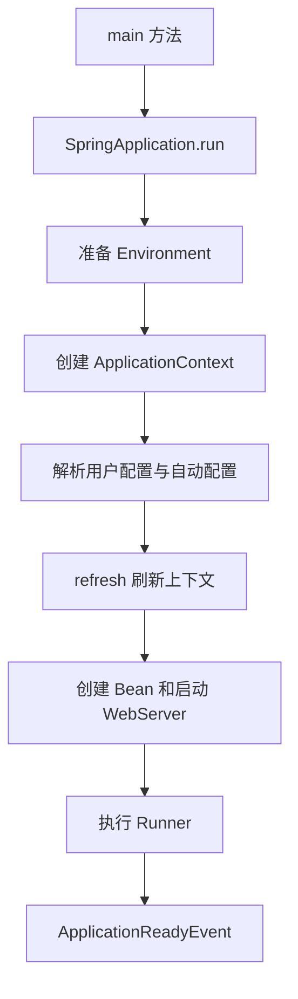

`CommandLineRunner` 接收原始字符串参数，`ApplicationRunner` 接收已解析的 `ApplicationArguments`：

```java
@Component
@Order(10)
public class DataWarmupRunner implements ApplicationRunner {

    @Override
    public void run(ApplicationArguments args) {
        // 只执行有明确失败策略、幂等性和耗时上限的启动任务。
    }
}
```

不要把不可控的大批量数据迁移放进 Runner。每个实例启动时都可能执行它，失败还可能导致反复重启。数据库结构迁移应使用 Flyway 等专用工具。

## 5 自动配置：从依赖到 Bean 的完整机制

### 5.1 先区分四个容易混淆的概念

自动配置、Starter、组件扫描和配置属性经常一起出现，但职责不同：

| 机制 | 解决的问题 | 是否直接创建 Bean |
|---|---|---|
| Starter | 一次引入一组推荐依赖 | 否 |
| 组件扫描 | 发现应用源码中的组件类 | 间接注册组件 Bean |
| 自动配置 | 根据运行条件提供基础设施 Bean | 是 |
| 配置属性 | 把外部配置绑定到 Java 对象 | 本身负责数据绑定 |

以 Web 应用为例：

1\. 引入 Web Starter，使 Spring MVC、Jackson 和服务器相关类进入类路径。

2\. `@SpringBootApplication` 扫描到开发者编写的 Controller、Service。

3\. 自动配置看到 Web 类存在且当前为 Servlet 应用，注册 `DispatcherServlet`、消息转换器和内嵌服务器等 Bean。

4\. `server.port` 等配置属性改变这些 Bean 的行为。

Starter 本身不是自动配置，自动配置也不是组件扫描。把四者混为一谈，是理解 Spring Boot 时最常见的障碍。

### 5.2 自动配置的总流程

自动配置可以概括为：

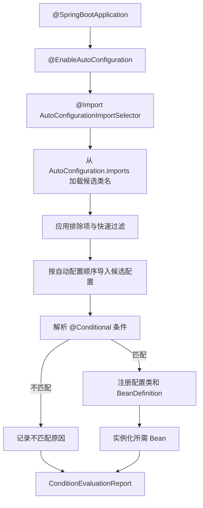

需要建立三个认识：

1\. 自动配置类首先是候选项，不代表一定生效。

2\. 条件判断的直接结果通常是是否注册某个配置类或 Bean 定义。

3\. Bean 定义注册与 Bean 实例创建不是同一时刻，创建顺序最终由依赖关系决定。

### 5.3 `@SpringBootApplication` 如何开启自动配置

`@SpringBootApplication` 组合了三个核心能力：

```java
@SpringBootConfiguration
@EnableAutoConfiguration
@ComponentScan
public @interface SpringBootApplication {
}
```

其中 `@EnableAutoConfiguration` 的关键结构是：

```java
@AutoConfigurationPackage
@Import(AutoConfigurationImportSelector.class)
public @interface EnableAutoConfiguration {
}
```

含义如下：

1\. `@AutoConfigurationPackage` 注册默认自动配置包。部分数据访问自动配置会把启动类所在包作为默认扫描根包；MyBatis 也可以通过 `@Mapper` 或 `@MapperScan` 明确 Mapper 范围。

2\. `@Import` 把 `AutoConfigurationImportSelector` 接入配置类解析过程。

3\. `AutoConfigurationImportSelector` 实现 `DeferredImportSelector`，延后选择自动配置，使用户配置有机会先被解析。

4\. 一般项目只在主配置类上使用一次 `@SpringBootApplication`，不应在多个业务配置类上重复开启自动配置。

启动类放在根包不仅影响组件扫描，也影响自动配置包。两者作用相关但不是同一个机制。

### 5.4 自动配置候选类从哪里来

Spring Boot 4.x 使用类路径中以下资源发现自动配置候选类：

```text
META-INF/spring/
org.springframework.boot.autoconfigure.AutoConfiguration.imports
```

文件每行是一个自动配置类的全限定名：

```text
com.acme.greeting.autoconfigure.GreetingAutoConfiguration
com.acme.greeting.autoconfigure.GreetingWebAutoConfiguration
```

底层由 `ImportCandidates` 从所有依赖 JAR 中合并候选项。自动配置类不依赖应用的组件扫描，因此第三方 JAR 即使位于完全不同的包，也能被发现。

注意边界：

1\. Spring Boot 3 及以后不再使用旧教程中 `spring.factories` 的 `EnableAutoConfiguration` 键注册自动配置。

2\. 自动配置类应放在独立包中，只通过 imports 文件加载。

3\. 自动配置类不应依赖广泛的组件扫描发现内部对象，应通过 `@Bean` 或明确的 `@Import` 注册。

4\. imports 文件只负责列出候选类，是否生效仍由条件判断决定。

### 5.5 `@AutoConfiguration` 是什么

自定义自动配置应使用 `@AutoConfiguration`：

```java
@AutoConfiguration
public class GreetingAutoConfiguration {
}
```

它本质上属于配置类，但额外表达“这是由 Spring Boot 自动导入的配置”。它还支持声明自动配置顺序：

```java
@AutoConfiguration(after = JacksonAutoConfiguration.class)
public class GreetingAutoConfiguration {
}
```

顺序只影响 Bean 定义的注册顺序，不直接决定 Bean 实例创建顺序。实例创建依赖构造器依赖、`@DependsOn` 等真实依赖关系。

不要把自动配置类同时标成普通组件让组件扫描发现，否则它可能绕过自动配置导入、排除和排序机制。

### 5.6 条件注解的完整分类

自动配置通常由多个条件共同控制：

| 条件注解 | 检查内容 | 典型用途 |
|---|---|---|
| `@ConditionalOnClass` | 类路径存在指定类 | 只有引入某库才配置 |
| `@ConditionalOnMissingClass` | 类路径不存在指定类 | 兼容替代实现 |
| `@ConditionalOnBean` | 容器已有指定 Bean | 在基础组件之上增强 |
| `@ConditionalOnMissingBean` | 容器没有指定 Bean | 提供可被用户替换的默认值 |
| `@ConditionalOnSingleCandidate` | 某类型存在唯一候选 Bean | 避免多数据源等歧义 |
| `@ConditionalOnProperty` | 配置属性满足规则 | 功能开关或模式选择 |
| `@ConditionalOnBooleanProperty` | 布尔属性满足规则 | 明确的开关配置 |
| `@ConditionalOnResource` | 指定资源存在 | 依赖证书或模板文件 |
| `@ConditionalOnWebApplication` | 当前是指定类型 Web 应用 | Servlet 或 Reactive 配置 |
| `@ConditionalOnNotWebApplication` | 当前不是 Web 应用 | 命令行或批处理配置 |
| `@ConditionalOnExpression` | SpEL 表达式为真 | 少量复杂条件，不宜滥用 |

多个条件通常是“同时满足”才生效：

```java
@AutoConfiguration
@ConditionalOnClass(GreetingClient.class)
@ConditionalOnBooleanProperty(
        prefix = "acme.greeting",
        name = "enabled",
        matchIfMissing = true)
public class GreetingAutoConfiguration {
}
```

这表示类路径必须存在 `GreetingClient`，并且 `acme.greeting.enabled` 没有显式关闭。

#### 5.6.1 类条件为什么能安全引用不存在的类

Spring 可以读取注解元数据而不立即加载整个配置类，因此类级 `@ConditionalOnClass(SomeLibrary.class)` 能在目标类缺失时安全地判定不匹配。

如果条件写在 `@Bean` 方法上，而方法签名直接引用可能缺失的类型，JVM 在解析配置类时仍可能提前遇到该类型。可选技术的配置最好拆成嵌套配置：

```java
@AutoConfiguration
public class GreetingAutoConfiguration {

    @Configuration(proxyBeanMethods = false)
    @ConditionalOnClass(OptionalJsonCodec.class)
    static class JsonCodecConfiguration {

        @Bean
        OptionalJsonCodec optionalJsonCodec() {
            return new OptionalJsonCodec();
        }
    }
}
```

#### 5.6.2 Bean 条件为什么对顺序敏感

`@ConditionalOnMissingBean` 只能依据条件评估时已经处理到的 Bean 定义。自动配置会在用户配置之后应用，正是为了让“用户 Bean 优先”更可靠。

编写自动配置时：

1\. 尽量只在自动配置类中使用 Bean 条件。

2\. `@Bean` 方法返回值应写具体类型，不要只写过于宽泛的接口，否则条件系统可能缺少类型信息。

3\. 不要假设另一个无依赖关系的 Bean 已经实例化。

4\. 多个自动配置确有先后要求时，使用 `before`、`after` 或对应排序注解。

#### 5.6.3 属性条件的默认语义

`@ConditionalOnProperty` 默认匹配“属性存在且值不等于 `false`”。关键参数：

1\. `prefix`：公共前缀。

2\. `name`：属性名称；指定多个名称时通常需要全部匹配。

3\. `havingValue`：要求的字符串值。

4\. `matchIfMissing`：属性不存在时是否算匹配。

布尔开关优先使用语义更明确的 `@ConditionalOnBooleanProperty`。集合、复杂层级或需要业务计算的条件，不要硬塞进字符串属性条件。

### 5.7 用户配置为什么能让自动配置“退让”

自动配置不是覆盖应用配置，而是提供默认值：

```java
@Bean
@ConditionalOnMissingBean(GreetingClient.class)
GreetingClient greetingClient(GreetingProperties properties) {
    return new GreetingClient(
            properties.endpoint(),
            properties.timeout());
}
```

如果用户提供：

```java
@Configuration
public class UserGreetingConfiguration {

    @Bean
    GreetingClient customGreetingClient() {
        return new GreetingClient(
                URI.create("https://custom.example"),
                Duration.ofSeconds(1));
    }
}
```

`@ConditionalOnMissingBean` 不再匹配，默认 Bean 退让。

退让是局部的。一个自动配置类可能注册五个 Bean，用户只替换其中一个，其余四个仍可能生效。判断时要看条件到底标在类上还是具体 `@Bean` 方法上。

### 5.8 从 DataSource 理解自动配置链

数据库自动配置可以用一条因果链理解：

1\. Starter 或项目依赖使 JDBC（Java Database Connectivity，Java 数据库连接）API、连接池和驱动进入类路径。

2\. 自动配置候选文件列出数据源相关自动配置。

3\. 类条件确认 JDBC 和数据源类型存在。

4\. 应用类型与其他条件确认当前场景适用。

5\. `spring.datasource.*` 绑定为数据源配置属性。

6\. 如果用户没有定义自己的 `DataSource`，自动配置创建默认数据源。

7\. 其他自动配置看到唯一 `DataSource` 后，继续配置事务管理器、JDBC 客户端或健康检查。

8\. 用户定义多个数据源后，依赖“唯一候选”的后续自动配置可能停止生效，需要显式标记主数据源或手工配置。

这说明自动配置不是一次性动作，而是多组配置基于类、属性和已有 Bean 逐层建立基础设施。

### 5.9 自动配置与配置属性如何配合

自动配置负责创建对象，`@ConfigurationProperties` 负责把外部值绑定为类型安全的配置：

```java
@ConfigurationProperties("acme.greeting")
public record GreetingProperties(
        boolean enabled,
        URI endpoint,
        Duration timeout) {

    public GreetingProperties {
        if (endpoint == null) {
            endpoint = URI.create("https://example.invalid");
        }
        if (timeout == null) {
            timeout = Duration.ofSeconds(2);
        }
    }
}
```

自动配置启用属性对象：

```java
@AutoConfiguration
@EnableConfigurationProperties(GreetingProperties.class)
public class GreetingAutoConfiguration {
}
```

职责边界：

1\. 属性对象保存外部配置，不负责访问网络或创建复杂资源。

2\. 自动配置读取属性对象并组装基础设施 Bean。

3\. 条件注解决定这套组装是否适用。

4\. Starter 只负责把需要的模块放进类路径。

### 5.10 排除不需要的自动配置

优先通过官方功能开关关闭某项能力。如果确实不希望加载整个自动配置类，可以使用三种方式。

注解按类型排除：

```java
@SpringBootApplication(
        exclude = DataSourceAutoConfiguration.class)
public class DemoApplication {
}
```

类不在编译类路径时按名称排除：

```java
@SpringBootApplication(
        excludeName = "com.example.LegacyAutoConfiguration")
public class DemoApplication {
}
```

配置属性排除：

```yaml
spring:
  autoconfigure:
    exclude:
      - "com.example.LegacyAutoConfiguration"
```

排除不是修复依赖冲突的首选手段。应先确认为什么该自动配置成为候选、哪个条件匹配，以及依赖是否本来就不该存在。

### 5.11 条件评估报告如何阅读

启用调试：

```bash
./mvnw spring-boot:run \
  -Dspring-boot.run.arguments=--debug
```

或运行 JAR：

```bash
java -jar app.jar --debug
```

报告常见分区：

1\. Positive matches：条件匹配并生效的自动配置。

2\. Negative matches：至少一个条件不匹配的自动配置。

3\. Exclusions：被显式排除的自动配置。

4\. Unconditional classes：不带条件、直接导入的自动配置。

排查步骤：

1\. 先搜索期望的自动配置类名，而不是从头阅读整份报告。

2\. 如果完全找不到，检查对应模块和 imports 文件是否在类路径。

3\. 如果在 Negative matches，阅读第一个关键不匹配条件。

4\. 如果显示某 Bean 已存在，继续定位它由用户配置、测试配置还是另一自动配置提供。

5\. 如果类条件不匹配，使用依赖树确认运行时类路径。

6\. 如果属性条件不匹配，追踪属性最终来源和覆盖优先级。

Actuator 启用并受保护后，也可使用 `conditions` 端点查看条件报告。生产环境不要为了排障临时向公网开放该端点。

### 5.12 实战排查：引入 Starter 后仍没有目标 Bean

假设引入客户端 Starter 后，`GreetingClient` 仍无法注入：

```text
NoSuchBeanDefinitionException:
No qualifying bean of type 'GreetingClient'
```

按证据链排查：

1\. `./mvnw dependency:tree`：Starter、自动配置模块和客户端库是否都在运行时依赖中。

2\. `jar tf dependency.jar`：是否包含正确的 `AutoConfiguration.imports`。

3\. `--debug`：目标自动配置是缺失、被排除还是条件不匹配。

4\. 类条件：目标客户端类是否真的存在，是否因依赖 Scope 错误只在测试类路径。

5\. 属性条件：是否配置了 `acme.greeting.enabled=false`，或被环境变量覆盖。

6\. Bean 条件：是否已有同类型 Bean，或存在多个候选导致后续配置不匹配。

7\. 应用类型：配置是否只支持 Servlet，而当前项目是 Reactive 或非 Web。

8\. 版本兼容：Starter 与 Spring Boot 主版本是否匹配。

这个顺序比“手工加一个 `@Bean` 先跑起来”更重要，因为后者可能掩盖错误依赖和错误配置。

### 5.13 实战：编写一个最小自动配置

#### 5.13.1 目标与模块边界

目标：只要应用引入 `acme-greeting-spring-boot-starter`，就能注入 `GreetingClient`；允许用户通过配置修改参数，也允许提供自定义 Bean 替换默认实现。

小型项目可使用单模块：

```text
acme-greeting-spring-boot-starter/
├── pom.xml
└── src/
    ├── main/
    │   ├── java/com/acme/greeting/
    │   │   ├── GreetingClient.java
    │   │   └── autoconfigure/
    │   │       ├── GreetingProperties.java
    │   │       └── GreetingAutoConfiguration.java
    │   └── resources/META-INF/spring/
    │       └── org.springframework.boot.autoconfigure.AutoConfiguration.imports
    └── test/java/com/acme/greeting/autoconfigure/
        └── GreetingAutoConfigurationTest.java
```

大型共享库通常拆成：

1\. `acme-greeting-spring-boot`：API、配置属性和自动配置。

2\. `acme-greeting-spring-boot-starter`：聚合典型依赖，通常几乎没有业务代码。

#### 5.13.2 准备构建依赖

示例假设项目已经通过 Spring Boot Parent 或 BOM（Bill of Materials，物料清单）统一管理版本。自动配置模块至少需要：

```xml
<dependencies>
    <dependency>
        <groupId>org.springframework.boot</groupId>
        <artifactId>spring-boot-autoconfigure</artifactId>
    </dependency>

    <dependency>
        <groupId>org.springframework.boot</groupId>
        <artifactId>spring-boot-test</artifactId>
        <scope>test</scope>
    </dependency>

    <dependency>
        <groupId>org.assertj</groupId>
        <artifactId>assertj-core</artifactId>
        <scope>test</scope>
    </dependency>

    <dependency>
        <groupId>org.junit.jupiter</groupId>
        <artifactId>junit-jupiter</artifactId>
        <scope>test</scope>
    </dependency>
</dependencies>
```

使用项目插件管理提供的 Maven Compiler Plugin 显式配置注解处理器；插件版本应与项目的 Spring Boot 构建基线一起升级：

```xml
<build>
    <plugins>
        <plugin>
            <groupId>org.apache.maven.plugins</groupId>
            <artifactId>maven-compiler-plugin</artifactId>
            <configuration>
                <annotationProcessorPaths>
                    <path>
                        <groupId>org.springframework.boot</groupId>
                        <artifactId>spring-boot-configuration-processor</artifactId>
                    </path>
                    <path>
                        <groupId>org.springframework.boot</groupId>
                        <artifactId>spring-boot-autoconfigure-processor</artifactId>
                    </path>
                </annotationProcessorPaths>
            </configuration>
        </plugin>
    </plugins>
</build>
```

共享库中的可选技术依赖通常声明为 optional，避免仅仅引入自动配置模块就强制带入所有第三方实现。Starter 模块再聚合典型场景真正需要的运行依赖。实际版本继续由当前 Spring Boot 依赖管理和项目插件管理统一控制。

执行：

```bash
./mvnw test
```

预期结果：测试框架可用，注解处理器在构建输出中生成配置元数据。

#### 5.13.3 编写要被配置的客户端

```java
package com.acme.greeting;

import java.net.URI;
import java.time.Duration;

public final class GreetingClient {

    private final URI endpoint;
    private final Duration timeout;

    public GreetingClient(URI endpoint, Duration timeout) {
        this.endpoint = endpoint;
        this.timeout = timeout;
    }

    public String greet(String name) {
        return "你好，" + name;
    }

    public URI endpoint() {
        return endpoint;
    }

    public Duration timeout() {
        return timeout;
    }
}
```

#### 5.13.4 定义配置属性

```java
package com.acme.greeting.autoconfigure;

import org.springframework.boot.context.properties.ConfigurationProperties;

import java.net.URI;
import java.time.Duration;

@ConfigurationProperties("acme.greeting")
public class GreetingProperties {

    /**
     * 是否启用问候客户端。
     */
    private boolean enabled = true;

    /**
     * 远程服务地址。
     */
    private URI endpoint = URI.create("https://example.invalid");

    /**
     * 请求超时时间。
     */
    private Duration timeout = Duration.ofSeconds(2);

    public boolean isEnabled() {
        return enabled;
    }

    public void setEnabled(boolean enabled) {
        this.enabled = enabled;
    }

    public URI getEndpoint() {
        return endpoint;
    }

    public void setEndpoint(URI endpoint) {
        this.endpoint = endpoint;
    }

    public Duration getTimeout() {
        return timeout;
    }

    public void setTimeout(Duration timeout) {
        this.timeout = timeout;
    }
}
```

#### 5.13.5 编写自动配置类

```java
package com.acme.greeting.autoconfigure;

import com.acme.greeting.GreetingClient;
import org.springframework.boot.autoconfigure.AutoConfiguration;
import org.springframework.boot.autoconfigure.condition.ConditionalOnClass;
import org.springframework.boot.autoconfigure.condition.ConditionalOnMissingBean;
import org.springframework.boot.autoconfigure.condition.ConditionalOnBooleanProperty;
import org.springframework.boot.context.properties.EnableConfigurationProperties;
import org.springframework.context.annotation.Bean;

@AutoConfiguration
@ConditionalOnClass(GreetingClient.class)
@EnableConfigurationProperties(GreetingProperties.class)
@ConditionalOnBooleanProperty(
        prefix = "acme.greeting",
        name = "enabled",
        matchIfMissing = true)
public class GreetingAutoConfiguration {

    @Bean
    @ConditionalOnMissingBean(GreetingClient.class)
    GreetingClient greetingClient(GreetingProperties properties) {
        return new GreetingClient(
                properties.getEndpoint(),
                properties.getTimeout());
    }
}
```

逐层含义：

1\. 客户端类不存在时，整套自动配置不适用。

2\. 配置属性对象由 Spring Boot 注册并绑定。

3\. 功能默认开启，用户可以通过属性关闭。

4\. 用户没有自定义客户端时才提供默认 Bean。

#### 5.13.6 注册自动配置候选项

创建：

```text
src/main/resources/META-INF/spring/
org.springframework.boot.autoconfigure.AutoConfiguration.imports
```

内容：

```text
com.acme.greeting.autoconfigure.GreetingAutoConfiguration
```

这是最容易遗漏的一步。只有 `@AutoConfiguration` 注解而没有 imports 文件，第三方应用不会自动发现它。

#### 5.13.7 生成配置元数据

在构建中加入 `spring-boot-configuration-processor` 注解处理器，可以生成：

```text
META-INF/spring-configuration-metadata.json
```

兼容 IDE 会使用它提供属性补全、类型和文档提示。应给每个公开配置字段写清用途和单位，不要只写“timeout value”之类无信息注释。

自动配置还可以使用 `spring-boot-autoconfigure-processor` 生成条件元数据，帮助 Spring Boot 在加载配置类前快速过滤明显不匹配的候选项，改善启动效率。

#### 5.13.8 编写自动配置测试

`ApplicationContextRunner` 能为每个条件组合创建小型上下文：

```java
package com.acme.greeting.autoconfigure;

import com.acme.greeting.GreetingClient;
import org.junit.jupiter.api.Test;
import org.springframework.boot.autoconfigure.AutoConfigurations;
import org.springframework.boot.test.context.FilteredClassLoader;
import org.springframework.boot.test.context.runner.ApplicationContextRunner;
import org.springframework.context.annotation.Bean;
import org.springframework.context.annotation.Configuration;

import java.net.URI;
import java.time.Duration;

import static org.assertj.core.api.Assertions.assertThat;

class GreetingAutoConfigurationTest {

    private final ApplicationContextRunner contextRunner =
            new ApplicationContextRunner()
                    .withConfiguration(AutoConfigurations.of(
                            GreetingAutoConfiguration.class));

    @Test
    void shouldCreateDefaultClient() {
        contextRunner.run(context -> {
            assertThat(context).hasSingleBean(GreetingClient.class);
            assertThat(context.getBean(GreetingClient.class).timeout())
                    .isEqualTo(Duration.ofSeconds(2));
        });
    }

    @Test
    void shouldBindProperties() {
        contextRunner
                .withPropertyValues(
                        "acme.greeting.endpoint=https://api.example",
                        "acme.greeting.timeout=750ms")
                .run(context -> {
                    GreetingClient client =
                            context.getBean(GreetingClient.class);
                    assertThat(client.endpoint())
                            .isEqualTo(URI.create("https://api.example"));
                    assertThat(client.timeout())
                            .isEqualTo(Duration.ofMillis(750));
                });
    }

    @Test
    void shouldBackOffForUserBean() {
        contextRunner
                .withUserConfiguration(UserConfiguration.class)
                .run(context -> {
                    assertThat(context).hasSingleBean(GreetingClient.class);
                    assertThat(context.getBean(GreetingClient.class))
                            .isSameAs(context.getBean("customClient"));
                });
    }

    @Test
    void shouldDisableWithProperty() {
        contextRunner
                .withPropertyValues("acme.greeting.enabled=false")
                .run(context ->
                        assertThat(context)
                                .doesNotHaveBean(GreetingClient.class));
    }

    @Test
    void shouldIgnoreWhenClientClassIsMissing() {
        contextRunner
                .withClassLoader(new FilteredClassLoader(
                        GreetingClient.class))
                .run(context ->
                        assertThat(context)
                                .doesNotHaveBean(GreetingClient.class));
    }

    @Configuration(proxyBeanMethods = false)
    static class UserConfiguration {

        @Bean
        GreetingClient customClient() {
            return new GreetingClient(
                    URI.create("https://custom.example"),
                    Duration.ofSeconds(1));
        }
    }
}
```

最低测试矩阵应覆盖：

1\. 默认条件满足时创建 Bean。

2\. 配置属性能够绑定。

3\. 用户 Bean 存在时默认配置退让。

4\. 功能关闭时不创建 Bean。

5\. 可选依赖缺失时不创建 Bean，可使用 `FilteredClassLoader` 模拟。

6\. Web 专用配置使用 `WebApplicationContextRunner` 测试。

#### 5.13.9 在业务应用中验证

引入 Starter 后配置：

```yaml
acme:
  greeting:
    enabled: true
    endpoint: "https://api.example"
    timeout: 750ms
```

注入：

```java
@Service
public class WelcomeService {

    private final GreetingClient greetingClient;

    public WelcomeService(GreetingClient greetingClient) {
        this.greetingClient = greetingClient;
    }
}
```

验证闭环：

1\. IDE 能补全 `acme.greeting.*` 属性。

2\. 正常启动时存在一个 `GreetingClient`。

3\. `--debug` 报告显示 `GreetingAutoConfiguration` 正向匹配。

4\. 关闭属性后上下文中不再存在该 Bean。

5\. 定义自有 Bean 后，默认 Bean 退让且不发生重复定义。

### 5.14 Starter 与依赖管理

Starter 通常是一个聚合依赖的空 JAR，表达“使用某项技术时推荐引入哪些模块”。它的价值包括：

1\. 降低使用者挑选依赖的成本。

2\. 与 Spring Boot 的依赖管理配合，减少版本冲突。

3\. 把自动配置模块和典型运行库一起带入。

Starter 不负责：

1\. 扫描业务代码。

2\. 直接生成 Bean。

3\. 保证所有条件都匹配。

4\. 替代配置属性和业务配置。

查看实际依赖：

```bash
./mvnw dependency:tree
```

遇到 `NoSuchMethodError` 时，通常说明编译期与运行期依赖版本不一致。不要随意覆盖 Spring Boot 管理的第三方版本；确需覆盖时应阅读目标 Boot 版本的依赖清单并完成兼容性测试。

### 5.15 Maven 依赖作用域

| Scope | 含义 | 常见用途 |
|---|---|---|
| `compile` | 编译、测试、运行都需要，默认值 | 主业务依赖 |
| `runtime` | 编译主代码不需要，运行需要 | 数据库驱动 |
| `test` | 仅测试编译和执行需要 | 测试框架 |
| `provided` | 编译需要，运行环境提供 | 特定外部容器场景 |

自动配置的类路径条件看的是实际运行类路径。依赖若只处于 `test` Scope，测试可能通过，生产运行却不会匹配相同条件。

### 5.16 自动配置官方验证入口

学习自动配置时应优先使用以下官方资料和本地证据：

1\. [使用自动配置](https://docs.spring.io/spring-boot/reference/using/auto-configuration.html)：退让、排除和条件报告。

2\. [开发自定义自动配置](https://docs.spring.io/spring-boot/reference/features/developing-auto-configuration.html)：imports 文件、条件、排序、测试和 Starter。

3\. [自动配置类索引](https://docs.spring.io/spring-boot/appendix/auto-configuration-classes/)：从具体自动配置进入 API 和源码。

4\. `--debug` 条件评估报告：验证当前应用实际发生了什么。

5\. `./mvnw dependency:tree`：验证运行类路径，而不是只看 `pom.xml` 表面声明。

## 6 Web API 设计与参数校验

### 6.1 常用请求映射

| HTTP 方法 | 常见语义 | 示例 |
|---|---|---|
| GET | 查询资源 | `GET /api/users/42` |
| POST | 创建资源 | `POST /api/users` |
| PUT | 整体替换资源 | `PUT /api/users/42` |
| PATCH | 局部更新资源 | `PATCH /api/users/42` |
| DELETE | 删除资源 | `DELETE /api/users/42` |

### 6.2 区分三种常见参数

```java
@GetMapping("/{id}")
public UserResponse get(
        @PathVariable long id,
        @RequestParam(defaultValue = "false") boolean detail) {
    // id 来自路径，detail 来自查询字符串。
    return userService.get(id, detail);
}
```

```java
@PostMapping
@ResponseStatus(HttpStatus.CREATED)
public UserResponse create(@Valid @RequestBody CreateUserRequest request) {
    return userService.create(request);
}
```

1\. `@PathVariable`：资源标识，如 `/users/42`。

2\. `@RequestParam`：过滤、分页、排序或可选开关。

3\. `@RequestBody`：JSON 请求体，常用于创建和复杂更新。

参数来源必须与请求实际结构一致。`POST /users/42?notify=true` 中的 `42` 是路径变量，`true` 是查询参数；只有 HTTP 消息体中的 JSON 才由 `@RequestBody` 读取。初学者常把整个请求都理解成“参数”，于是出现注解选错、字段始终为 `null` 的问题。

GET 请求不应依赖请求体。HTTP 客户端、代理和缓存对 GET 请求体的处理并不一致，而且 Spring MVC 的常规接口设计也不会把它当作查询条件的首选载体。简单查询条件放查询字符串，复杂检索若确实需要结构化条件，可设计明确的 POST 搜索接口。

还要区分 Java 基本类型与包装类型：

```java
@RequestParam(required = false) Integer page
```

可选参数使用 `Integer`、`Long` 等包装类型才能表达“未提供”。`int`、`long` 不能表示 `null`，若参数缺失又没有默认值，绑定行为会与“可选”语义冲突。对外部输入不要依赖 Java 默认值掩盖缺失状态。

### 6.3 使用 Bean Validation 校验输入

```java
package com.example.demo.user;

import jakarta.validation.constraints.Email;
import jakarta.validation.constraints.NotBlank;
import jakarta.validation.constraints.Size;

public record CreateUserRequest(
        @NotBlank(message = "姓名不能为空")
        @Size(max = 50, message = "姓名最多 50 个字符")
        String name,

        @NotBlank(message = "邮箱不能为空")
        @Email(message = "邮箱格式不正确")
        String email) {
}
```

Controller 参数必须加 `@Valid` 才会触发嵌套对象校验。Spring Boot 3 及更高主线使用 `jakarta.validation.*`，旧教程中的 `javax.validation.*` 不应直接照搬。

“嵌套校验”指一个请求对象内部还包含另一个对象或对象集合。外层字段加了 `@NotNull`，只保证对象存在；要继续检查内层字段，还要在嵌套字段上加 `@Valid`：

```java
public record CreateOrderRequest(
        @NotNull
        @Valid
        AddressRequest address,

        @NotEmpty
        List<@Valid OrderItemRequest> items) {
}
```

如果遗漏字段上的 `@Valid`，内层对象即使违反 `@NotBlank`、`@Min` 等约束也可能通过校验。集合本身的 `@NotEmpty` 与集合元素的 `@Valid` 解决的是两个不同问题。

字段校验失败通常产生 `MethodArgumentNotValidException`；把 `@Min`、`@NotBlank` 等约束直接写在 Controller 方法参数上时，可能进入方法级校验并产生 `HandlerMethodValidationException`。统一错误响应需要覆盖实际使用的两类入口，不能只处理一种异常后就认为所有 400 响应都已统一。

校验是系统边界的第一道防线，但不是完整业务规则。格式校验放 DTO；“用户名是否重复”“账户是否允许转账”等需要依赖数据或状态的规则放 Service。

### 6.4 统一异常响应

```java
package com.example.demo.common;

import java.time.Instant;

public record ApiError(
        String code,
        String message,
        String path,
        Instant timestamp) {
}
```

```java
package com.example.demo.common;

import jakarta.servlet.http.HttpServletRequest;
import org.springframework.http.HttpStatus;
import org.springframework.http.ResponseEntity;
import org.springframework.http.converter.HttpMessageNotReadableException;
import org.springframework.web.bind.MethodArgumentNotValidException;
import org.springframework.web.bind.annotation.ExceptionHandler;
import org.springframework.web.bind.annotation.RestControllerAdvice;
import org.springframework.web.method.annotation.HandlerMethodValidationException;

import java.time.Instant;

@RestControllerAdvice
public class GlobalExceptionHandler {

    @ExceptionHandler(MethodArgumentNotValidException.class)
    public ResponseEntity<ApiError> handleValidation(
            MethodArgumentNotValidException ex,
            HttpServletRequest request) {
        String message = ex.getBindingResult().getFieldErrors().stream()
                .findFirst()
                .map(error -> error.getDefaultMessage())
                .orElse("请求参数不合法");

        ApiError body = new ApiError(
                "INVALID_ARGUMENT",
                message,
                request.getRequestURI(),
                Instant.now());
        return ResponseEntity.badRequest().body(body);
    }

    @ExceptionHandler(HandlerMethodValidationException.class)
    public ResponseEntity<ApiError> handleMethodValidation(
            HandlerMethodValidationException ex,
            HttpServletRequest request) {
        boolean inputError = ex.getStatusCode().is4xxClientError();
        ApiError body = new ApiError(
                inputError ? "INVALID_ARGUMENT" : "INTERNAL_ERROR",
                inputError ? "请求参数不合法" : "服务端返回值校验失败",
                request.getRequestURI(),
                Instant.now());
        return ResponseEntity.status(ex.getStatusCode()).body(body);
    }

    @ExceptionHandler(HttpMessageNotReadableException.class)
    public ResponseEntity<ApiError> handleUnreadableBody(
            HttpMessageNotReadableException ex,
            HttpServletRequest request) {
        ApiError body = new ApiError(
                "MALFORMED_JSON",
                "请求体不是合法的 JSON",
                request.getRequestURI(),
                Instant.now());
        return ResponseEntity.badRequest().body(body);
    }

    @ExceptionHandler(UserNotFoundException.class)
    public ResponseEntity<ApiError> handleNotFound(
            UserNotFoundException ex,
            HttpServletRequest request) {
        ApiError body = new ApiError(
                "USER_NOT_FOUND",
                ex.getMessage(),
                request.getRequestURI(),
                Instant.now());
        return ResponseEntity.status(HttpStatus.NOT_FOUND).body(body);
    }
}
```

以上处理器覆盖 DTO 字段校验、Controller 方法校验和 JSON 解析失败。它们的触发阶段不同：前两者发生在参数已经能够解析但不满足约束时，最后一个发生在请求体根本无法转换成 Java 对象时。`HandlerMethodValidationException` 也可能表示服务端返回值违反约束，此时框架状态码是 500，不能错误地包装成客户端 400。生产中不要把底层异常消息原样返回给客户端，因为其中可能包含类名、字段路径或反序列化细节；完整堆栈只写入受保护的服务端日志。

### 6.5 HTTP 状态码的实战选择

| 状态码 | 含义 | 典型场景 |
|---|---|---|
| 200 | 请求成功 | 查询、更新成功 |
| 201 | 资源创建成功 | POST 创建任务 |
| 204 | 成功但没有响应体 | 删除成功 |
| 400 | 请求格式或参数错误 | JSON 错误、字段校验失败 |
| 401 | 未认证 | 没有登录或凭证无效 |
| 403 | 已认证但无权限 | 普通用户访问管理员资源 |
| 404 | 资源不存在 | 任务 ID 不存在 |
| 409 | 当前状态冲突 | 邮箱重复、版本冲突 |
| 500 | 未预期的服务端错误 | 未处理的程序异常 |

不要所有错误都返回 200，再在 JSON 里放一个失败码。HTTP 状态码能让网关、监控、缓存和客户端正确理解结果；业务错误码则补充更细的机器可读语义。

### 6.6 分页 API 设计

查询集合时必须考虑数据增长。一个简单接口可以使用：

```http
GET /api/tasks?page=0&size=20&sort=createdAt,desc
```

需要限制 `size` 最大值，避免调用者一次拉取数十万条数据。响应中至少包含当前页、页大小、总数和数据列表。

分页方式有两类：

1\. Offset（偏移量）分页：使用页码，简单直观；深分页可能越来越慢，数据变化时可能重复或遗漏。

2\. Cursor（游标）分页：使用上一页最后一条记录的稳定排序键；更适合大数据量和连续滚动，但实现与客户端使用更复杂。

### 6.7 Filter、Interceptor 与 AOP 的职责边界

三者都能“在业务方法前后做事”，但所处层次不同：

| 机制 | 所在层次 | 能看到什么 | 典型用途 |
|---|---|---|---|
| Filter | Servlet 容器过滤器链 | 原始请求与响应 | 编码、CORS、请求包装、安全过滤 |
| HandlerInterceptor | Spring MVC 调用链 | 请求、响应、目标 Controller 方法 | 登录检查、接口耗时、公共模型 |
| AOP | Spring Bean 方法调用 | 方法、参数、返回值、异常 | 事务、方法权限、业务指标、审计 |

调用顺序可以简化为：

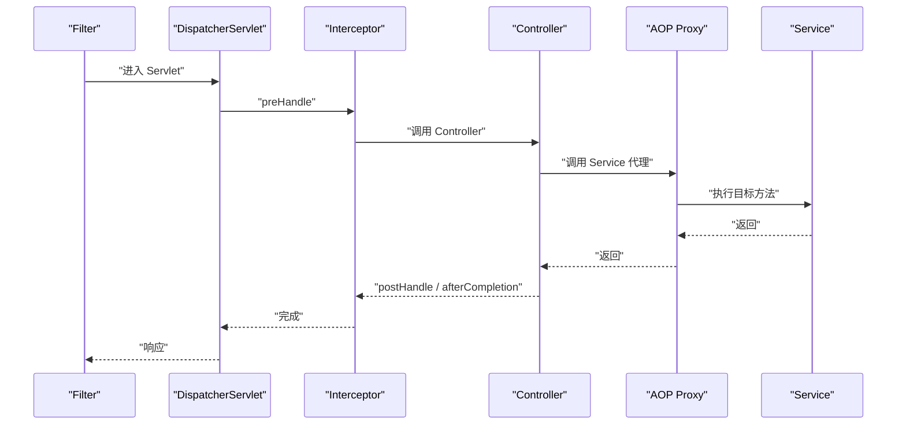

选择原则：

1\. 需要处理所有 Servlet 请求，包括静态资源或非 MVC 请求时，选择 Filter。

2\. 需要知道最终命中的 Controller 方法时，选择 Interceptor。

3\. 关注业务 Bean 方法而非 HTTP 时，选择 AOP。

4\. Spring Security 已提供成熟的安全过滤器链，认证授权不要自行拼装一个简化 Filter 替代。

#### 6.7.1 编写简单 Interceptor

```java
@Component
public class RequestTimingInterceptor implements HandlerInterceptor {

    private static final String START_NANOS =
            RequestTimingInterceptor.class.getName() + ".start";

    @Override
    public boolean preHandle(
            HttpServletRequest request,
            HttpServletResponse response,
            Object handler) {
        request.setAttribute(START_NANOS, System.nanoTime());
        return true;
    }

    @Override
    public void afterCompletion(
            HttpServletRequest request,
            HttpServletResponse response,
            Object handler,
            Exception ex) {
        Object value = request.getAttribute(START_NANOS);
        if (value instanceof Long start) {
            long elapsed = System.nanoTime() - start;
            // 生产中应交给指标系统聚合，避免每个请求都打印高频日志。
        }
    }
}
```

注册：

```java
@Configuration
public class WebConfiguration implements WebMvcConfigurer {

    private final RequestTimingInterceptor timingInterceptor;

    public WebConfiguration(RequestTimingInterceptor timingInterceptor) {
        this.timingInterceptor = timingInterceptor;
    }

    @Override
    public void addInterceptors(InterceptorRegistry registry) {
        registry.addInterceptor(timingInterceptor)
                .addPathPatterns("/api/**");
    }
}
```

### 6.8 参数解析、消息转换与内容协商

Spring MVC 调用 Controller 前后依赖多个扩展组件：

1\. `HandlerMethodArgumentResolver`：把请求信息转换成方法参数。`@PathVariable`、`@RequestParam` 和分页参数都由相应解析器处理。

2\. `HttpMessageConverter`：在 HTTP 消息体与 Java 对象之间转换。JSON 通常由 Jackson 转换器处理。

3\. `HandlerMethodReturnValueHandler`：处理方法返回值，如 `ResponseEntity`、视图名和响应体对象。

4\. Content Negotiation（内容协商）：根据 `Accept` 请求头和服务端能力选择 JSON 等响应格式。

请求 JSON 时应发送：

```http
Content-Type: application/json
Accept: application/json
```

两者含义不同：

1\. `Content-Type` 描述客户端发送的请求体是什么格式。

2\. `Accept` 描述客户端希望服务端返回什么格式。

错误的 `Content-Type` 可能得到 415，服务端无法提供 `Accept` 要求的格式时可能得到 406。

### 6.9 Jackson 序列化的常见边界

Jackson 负责 Java 对象与 JSON 的转换。常见风险包括：

1\. 直接序列化数据库模型会让表结构与 API 强耦合；在 JPA 场景还可能触发懒加载、N+1 查询或循环引用。

2\. 时间格式和时区没有统一，导致不同环境输出不一致。

3\. 枚举改名会改变外部 API 值，属于兼容性变更。

4\. 未知字段策略过严或过松，可能影响客户端平滑升级。

5\. 把密码、内部状态等字段意外序列化。

优先使用明确的响应 DTO，并在 API 边界定义稳定字段。不要把数据库实体当成天然的接口契约。

### 6.10 REST 接口的幂等性

幂等表示同一个操作执行一次或多次，对资源最终状态的影响相同。

1\. GET、PUT、DELETE 按 HTTP 语义应当幂等。

2\. POST 通常不天然幂等，重复提交可能创建多条数据。

3\. 幂等不等于每次响应完全相同，例如第一次 DELETE 返回 204，第二次可能返回 404，但资源最终都处于不存在状态。

支付、下单等关键 POST 操作常使用幂等键：

```http
Idempotency-Key: 7fb38e46-6f53-4fa4-a6b8-example
```

服务端需要在数据库或可靠存储中记录“业务主体 + 幂等键 + 请求摘要 + 处理结果”，并用唯一约束处理并发重复请求。仅在内存中判断无法覆盖多实例和重启。

## 7 配置管理与多环境

### 7.1 配置外部化

Spring Boot 可以从 `application.yml`、环境变量、Java 系统属性和命令行参数等位置读取配置。高优先级来源可以覆盖低优先级来源，因此同一个 JAR 可以部署到不同环境。

```yaml
server:
  port: 8080

app:
  greeting:
    prefix: "你好"
    max-name-length: 50
```

不要在仓库中保存真实密码、Token 或私钥。敏感值应来自环境变量、密钥管理服务或平台 Secret。

YAML（YAML Ain't Markup Language，一种层级化配置格式）依赖缩进表达父子关系，只能使用空格，不要使用 Tab。看似相同的文本可能因为缩进错误变成完全不同的属性键。布尔值、数字和包含特殊字符的字符串也可能被解析成不同类型；端口、持续时间等应绑定到明确的 Java 类型，账号、版本号等“看起来像数字但实际是标识符”的值建议加引号。

同一目录同时存在 `application.properties` 和 `application.yml` 会增加判断成本，而且同位置的 `.properties` 具有更高优先级。项目应统一一种格式，避免开发者修改了 YAML，却被另一个 properties 文件悄悄覆盖。

### 7.2 使用 `@ConfigurationProperties`

```java
package com.example.demo.config;

import jakarta.validation.constraints.Max;
import jakarta.validation.constraints.Min;
import jakarta.validation.constraints.NotBlank;
import org.springframework.boot.context.properties.ConfigurationProperties;
import org.springframework.validation.annotation.Validated;

@Validated
@ConfigurationProperties(prefix = "app.greeting")
public record GreetingProperties(
        @NotBlank String prefix,
        @Min(1) @Max(100) int maxNameLength) {
}
```

在配置类上注册：

```java
@Configuration
@EnableConfigurationProperties(GreetingProperties.class)
public class AppConfiguration {
}
```

相较于在多个类中散落 `@Value`，结构化配置具有类型安全、可校验、易搜索和易测试等优点。

### 7.3 Profile 的使用边界

可以创建：

```text
application.yml
application-dev.yml
application-test.yml
application-prod.yml
```

激活开发环境：

```bash
java -jar app.jar --spring.profiles.active=dev
```

Profile（配置环境）适合表达环境差异，但不要让核心业务逻辑大量依赖 Profile 分支。生产密码仍不应写在 `application-prod.yml` 中。

### 7.4 排查配置未生效

1\. 确认属性名称和层级缩进。

2\. 确认当前激活的 Profile。

3\. 检查环境变量或命令行是否覆盖了文件值。

4\. 检查配置类是否注册、前缀是否一致。

5\. 使用 Actuator 的 `env` 或 `configprops` 端点辅助定位，但生产暴露前必须做好权限和脱敏。

### 7.5 配置覆盖与宽松绑定

Spring Boot 配置的核心原则是：同一个键可能来自多个属性源，优先级更高的值覆盖优先级更低的值。常见来源包括包内配置文件、包外配置文件、环境变量、Java 系统属性、命令行参数和测试属性。

例如：

```yaml
app:
  remote-service:
    connect-timeout: 2s
```

环境变量可以写成：

```bash
export APP_REMOTE_SERVICE_CONNECT_TIMEOUT=5s
```

`@ConfigurationProperties` 支持 Relaxed Binding（宽松绑定），能把 `connect-timeout`、`connectTimeout` 和环境变量形式映射到 Java 属性。配置文件中仍应保持统一命名风格，通常使用小写 kebab-case（短横线命名）。

配置排障不要只问“文件里写了什么”，而应问“最终 Environment 中这个键来自哪个 PropertySource”。

### 7.6 Profile 合并与激活规则

Profile 可以选择一组环境配置，但需要注意：

1\. 基础 `application.yml` 与 Profile 文件通常会合并，而不是二选一。

2\. 相同键由更具体或优先级更高的配置覆盖。

3\. 可以同时激活多个 Profile，冲突结果受顺序与配置加载规则影响。

4\. 不要在 Profile 名称中编码所有组合，例如 `prod-singapore-blue-debug`，组合数量会失控。

5\. Profile 适合选择环境差异，不适合实现用户级业务功能开关。

业务功能灰度应使用有审计、动态更新和明确默认值的 Feature Flag（功能开关）方案。

### 7.7 `@Value` 与 `@ConfigurationProperties` 的选择

| 需求 | 推荐方式 |
|---|---|
| 偶尔读取一个简单值 | `@Value` |
| 一组有层级的配置 | `@ConfigurationProperties` |
| 需要类型转换和校验 | `@ConfigurationProperties` |
| 多处共享同一组配置 | `@ConfigurationProperties` |
| 需要 SpEL 表达式 | 谨慎使用 `@Value` |

SpEL（Spring Expression Language，Spring 表达式语言）功能强，但复杂表达式会把逻辑藏进字符串，难以重构和测试。业务逻辑应写在普通 Java 代码中。

## 8 数据库访问与事务

本章以国内 Java 后端常见的 MyBatis 为主线，采用“最小概念 -> 完整实战 -> 深入原理”的顺序。初学者可先完成任务管理 API，再回到后半章理解 SQL 映射、会话、缓存、事务传播和一致性边界。

### 8.1 从 Mapper 到数据库

MyBatis 不替开发者隐藏 SQL，而是把 Mapper 方法与 SQL 语句建立映射。先定义普通 Java 数据对象：

```java
package com.example.demo.user;

public class User {

    private Long id;
    private String name;
    private String email;

    public Long getId() {
        return id;
    }

    public void setId(Long id) {
        this.id = id;
    }

    public String getName() {
        return name;
    }

    public void setName(String name) {
        this.name = name;
    }

    public String getEmail() {
        return email;
    }

    public void setEmail(String email) {
        this.email = email;
    }
}
```

定义 Mapper：

```java
package com.example.demo.user;

import org.apache.ibatis.annotations.Mapper;

@Mapper
public interface UserMapper {

    User findById(long id);

    int countByEmail(String email);

    int insert(User user);
}
```

Mapper XML 文件的 `namespace` 必须与接口全限定名一致，语句 `id` 必须与方法名一致：

```xml
<?xml version="1.0" encoding="UTF-8"?>
<!DOCTYPE mapper
        PUBLIC "-//mybatis.org//DTD Mapper 3.0//EN"
        "https://mybatis.org/dtd/mybatis-3-mapper.dtd">
<mapper namespace="com.example.demo.user.UserMapper">

    <select id="findById" resultType="com.example.demo.user.User">
        SELECT id, name, email
        FROM app_user
        WHERE id = #{id}
    </select>

    <select id="countByEmail" resultType="int">
        SELECT COUNT(*)
        FROM app_user
        WHERE email = #{email}
    </select>

    <insert id="insert"
            useGeneratedKeys="true"
            keyProperty="id">
        INSERT INTO app_user(name, email)
        VALUES (#{name}, #{email})
    </insert>
</mapper>
```

`#{...}` 使用预编译参数绑定，应作为业务值的默认写法。`${...}` 是字符串替换，不能直接接收未经白名单校验的用户输入，否则会产生 SQL 注入风险。

Mapper 方法只有一个简单参数时，XML 中通常可以直接写 `#{id}`；一旦有多个参数，应显式使用 `@Param` 固定名称：

```java
Task findByOwnerAndId(
        @Param("ownerId") long ownerId,
        @Param("id") long id);
```

```xml
WHERE owner_id = #{ownerId}
  AND id = #{id}
```

否则参数名可能受编译器是否保留方法参数名、MyBatis 配置和构建方式影响，XML 中写了 `#{ownerId}`，运行时却只看到 `arg0`、`param1` 等名称。`@Param` 让 Mapper 接口与 XML 的契约显式可读，特别适合多参数、分页和动态查询。

INSERT、UPDATE、DELETE 方法通常返回受影响行数，而不是“是否成功”的抽象布尔值。返回 0 可能表示记录不存在、条件不满足或乐观锁冲突；返回值必须由 Service 根据业务语义解释，不能无条件忽略。

### 8.2 Service 与事务边界

```java
package com.example.demo.user;

import org.springframework.stereotype.Service;
import org.springframework.transaction.annotation.Transactional;

@Service
public class UserService {

    private final UserMapper userMapper;

    public UserService(UserMapper userMapper) {
        this.userMapper = userMapper;
    }

    @Transactional
    public UserResponse create(CreateUserRequest request) {
        if (userMapper.countByEmail(request.email()) > 0) {
            throw new DuplicateEmailException(request.email());
        }

        User user = new User();
        user.setName(request.name());
        user.setEmail(request.email());
        userMapper.insert(user);
        return UserResponse.from(user);
    }

    @Transactional(readOnly = true)
    public UserResponse get(long id) {
        User user = userMapper.findById(id);
        if (user == null) {
            throw new UserNotFoundException(id);
        }
        return UserResponse.from(user);
    }
}
```

事务是“一组操作要么整体成功，要么整体失败”的边界。通常把事务放在 Service 层，因为 Service 知道完整业务操作包含哪些数据访问。

### 8.3 `@Transactional` 常见陷阱

1\. 默认遇到 `RuntimeException` 或 `Error` 才自动回滚；受检异常默认不回滚。业务若确实用受检异常表达失败，应显式配置 `rollbackFor`，或者统一异常设计：

```java
@Transactional(rollbackFor = IOException.class)
public void importTasks(Path file) throws IOException {
    taskImporter.importFrom(file);
}
```

2\. 把异常捕获后只记录日志，相当于方法正常返回，事务管理器看不到失败，通常会提交：

```java
@Transactional
public void createTask(CreateTaskRequest request) {
    try {
        taskMapper.insert(toTask(request));
    } catch (RuntimeException ex) {
        log.error("创建任务失败", ex);
        throw ex; // 继续抛出，事务拦截器才能按规则回滚。
    }
}
```

3\. 同一个对象内部方法自调用，可能绕过基于代理的事务拦截。关键不是“注解写在哪里”，而是外部调用是否经过 Spring 创建的代理对象；`this.save()` 只是普通 Java 方法调用。

4\. 私有方法上的事务注解通常不会按初学者期望生效。事务入口优先放在可由其他 Bean 调用的 Service 公共方法上。

5\. 在事务中执行耗时远程调用会长期占用数据库连接和锁。即使此时没有继续执行 SQL，连接也可能仍绑定在当前事务上。

6\. `readOnly = true` 是传递给事务管理器和驱动的只读意图，不是可靠的业务权限控制，也不保证所有数据库都拒绝写入。

7\. 数据库唯一约束仍然必要，仅在代码中先查询再插入不能消除并发竞态。两个请求可能同时查到“不存在”，然后同时插入；最终裁决必须依靠唯一约束，并把约束异常转换成稳定的 409 业务冲突。

8\. `@Async` 新线程、手工创建的线程和消息消费者不会自动加入调用方事务。Spring 的常规事务上下文绑定在线程上，跨线程之后必须重新定义事务边界。

### 8.4 生产数据库注意事项

1\. 使用 Flyway 或 Liquibase 管理数据库结构迁移，不依赖应用启动时临时执行建表语句。

2\. 为查询条件、排序字段和关联字段设计合理索引。

3\. 关注循环查询造成的 N+1、全表扫描、过大分页和连接池耗尽。

4\. DTO 与数据库模型分离，避免表结构变化直接破坏 API。

5\. 数据库连接、用户名和密码必须外部化。

连接池保存的是可重复使用的数据库连接。请求线程拿不到连接时会等待，因此必须同时设置连接获取超时、SQL 执行超时和慢查询观测。只把最大连接数调大，可能把压力直接转移给数据库；连接数应结合应用实例数、数据库承载能力和平均事务时长计算。

索引不是“字段加得越多越快”。组合索引的列顺序要匹配实际过滤与排序方式，写入时还要付出维护成本。对关键 SQL 使用目标数据库的 `EXPLAIN` 或执行计划验证是否走索引、预估扫描行数是否合理。开发库数据量很小时“查询很快”，不能证明生产数据量下仍然安全。

数据库迁移脚本一旦在共享环境执行，就应视为不可变历史。需要修正结构时新增下一条迁移，而不是修改已执行脚本，否则不同环境的迁移校验值和真实结构会分叉。删除列、改类型、增加非空约束等变更要设计兼容发布顺序，避免新旧应用版本同时运行时互相破坏。

### 8.5 实战：实现任务管理 API

#### 8.5.1 明确业务规则

本实战实现最小但完整的任务管理功能：

1\. 创建任务时标题不能为空，最长 100 个字符。

2\. 新任务默认状态为 `TODO`。

3\. 任务可以更新标题和截止日期。

4\. 只有存在的任务才能完成或删除。

5\. 完成任务的操作具有幂等性：重复执行仍保持 `DONE`，不会产生额外副作用。

6\. 列表接口分页返回，单页最多 100 条。

先写业务规则再写代码，能避免 Controller、Service 和数据库结构各自做出冲突假设。

#### 8.5.2 添加依赖

在 Spring Initializr 中选择 Spring Web MVC、Validation、MyBatis Framework、H2 Database、Flyway Migration 和 Actuator。本文可运行基线是 Spring Boot 4.0.x 与 MyBatis Spring Boot Starter 4.0.1；若 Initializr 对所选 Boot 版本不再提供这一组合，应重新核对兼容矩阵并整体升级，不要只改一个版本号。

核心依赖：

```xml
<dependency>
    <groupId>org.mybatis.spring.boot</groupId>
    <artifactId>mybatis-spring-boot-starter</artifactId>
    <version>4.0.1</version>
</dependency>

<dependency>
    <groupId>com.h2database</groupId>
    <artifactId>h2</artifactId>
    <scope>runtime</scope>
</dependency>
```

生成项目后用以下命令确认：

```bash
./mvnw dependency:tree
./mvnw test
```

#### 8.5.3 配置本地数据库

`src/main/resources/application.yml`：

```yaml
spring:
  application:
    name: task-api
  datasource:
    url: jdbc:h2:mem:taskdb;MODE=PostgreSQL;DB_CLOSE_DELAY=-1
    username: sa
    password: ""
  flyway:
    enabled: true

mybatis:
  mapper-locations: "classpath:/mapper/**/*.xml"
  type-aliases-package: "com.example.demo.task"
  configuration:
    map-underscore-to-camel-case: true
    default-statement-timeout: 5
    local-cache-scope: statement

server:
  port: 8080

management:
  endpoints:
    web:
      exposure:
        include: health,info
```

H2 仅用于本地入门和快速测试。`MODE=PostgreSQL` 只能模拟少量语法，不能证明应用与真实 PostgreSQL 完全兼容。

#### 8.5.4 创建数据库迁移

创建 `src/main/resources/db/migration/V1__create_task_table.sql`：

```sql
CREATE TABLE task (
    id BIGINT GENERATED BY DEFAULT AS IDENTITY PRIMARY KEY,
    title VARCHAR(100) NOT NULL,
    status VARCHAR(20) NOT NULL,
    due_date DATE,
    created_at TIMESTAMP WITH TIME ZONE NOT NULL,
    updated_at TIMESTAMP WITH TIME ZONE NOT NULL,
    version BIGINT NOT NULL DEFAULT 0
);

CREATE INDEX idx_task_status_created_at
    ON task (status, created_at DESC);
```

Flyway 会维护迁移历史。已经在共享环境执行的迁移不要直接修改，应新增 `V2__...sql` 向前演进，否则校验和会不一致。

#### 8.5.5 定义状态枚举和数据库模型

```java
package com.example.demo.task;

public enum TaskStatus {
    TODO,
    DONE
}
```

```java
package com.example.demo.task;

import java.time.Instant;
import java.time.LocalDate;

public class Task {

    private Long id;
    private String title;
    private TaskStatus status;
    private LocalDate dueDate;
    private Instant createdAt;
    private Instant updatedAt;
    private long version;

    public Task() {
    }

    public Task(String title, LocalDate dueDate, Instant now) {
        this.title = title;
        this.dueDate = dueDate;
        this.status = TaskStatus.TODO;
        this.createdAt = now;
        this.updatedAt = now;
    }

    public void update(String title, LocalDate dueDate, Instant now) {
        this.title = title;
        this.dueDate = dueDate;
        this.updatedAt = now;
    }

    public boolean complete(Instant now) {
        if (status == TaskStatus.DONE) {
            return false;
        }
        this.status = TaskStatus.DONE;
        this.updatedAt = now;
        return true;
    }

    public Long getId() {
        return id;
    }

    public void setId(Long id) {
        this.id = id;
    }

    public String getTitle() {
        return title;
    }

    public void setTitle(String title) {
        this.title = title;
    }

    public TaskStatus getStatus() {
        return status;
    }

    public void setStatus(TaskStatus status) {
        this.status = status;
    }

    public LocalDate getDueDate() {
        return dueDate;
    }

    public void setDueDate(LocalDate dueDate) {
        this.dueDate = dueDate;
    }

    public Instant getCreatedAt() {
        return createdAt;
    }

    public void setCreatedAt(Instant createdAt) {
        this.createdAt = createdAt;
    }

    public Instant getUpdatedAt() {
        return updatedAt;
    }

    public void setUpdatedAt(Instant updatedAt) {
        this.updatedAt = updatedAt;
    }

    public long getVersion() {
        return version;
    }

    public void setVersion(long version) {
        this.version = version;
    }
}
```

这里有三个重要设计：

1\. SQL 把 `TODO`、`DONE` 作为字符串写入数据库，不使用枚举序号，避免调整枚举顺序后产生错误映射。

2\. 修改通过模型方法完成，状态规则集中在领域对象中，而不是让 Controller 任意改字段。

3\. `version` 字段配合 Mapper 的条件更新实现乐观锁。MyBatis 不会自动添加版本条件，SQL 必须显式编写。

#### 8.5.6 定义请求和响应 DTO

```java
package com.example.demo.task;

import jakarta.validation.constraints.NotBlank;
import jakarta.validation.constraints.Size;

import java.time.LocalDate;

public record CreateTaskRequest(
        @NotBlank(message = "任务标题不能为空")
        @Size(max = 100, message = "任务标题最多 100 个字符")
        String title,
        LocalDate dueDate) {
}
```

```java
package com.example.demo.task;

import jakarta.validation.constraints.NotBlank;
import jakarta.validation.constraints.Size;

import java.time.LocalDate;

public record UpdateTaskRequest(
        @NotBlank(message = "任务标题不能为空")
        @Size(max = 100, message = "任务标题最多 100 个字符")
        String title,
        LocalDate dueDate) {
}
```

```java
package com.example.demo.task;

import java.time.Instant;
import java.time.LocalDate;

public record TaskResponse(
        Long id,
        String title,
        TaskStatus status,
        LocalDate dueDate,
        Instant createdAt,
        Instant updatedAt) {

    public static TaskResponse from(Task task) {
        return new TaskResponse(
                task.getId(),
                task.getTitle(),
                task.getStatus(),
                task.getDueDate(),
                task.getCreatedAt(),
                task.getUpdatedAt());
    }
}
```

定义稳定的分页响应，不直接暴露具体持久化框架的分页类型：

```java
package com.example.demo.common;

import java.util.List;

public record PageResponse<T>(
        List<T> items,
        int page,
        int size,
        long total) {
}
```

请求 DTO 与响应 DTO 分开，避免客户端提交服务端生成的 `id`、状态和创建时间。

`TaskResponse.id` 使用包装类型 `Long`，因为新建但尚未执行 INSERT 的对象暂时没有主键；`useGeneratedKeys` 会在插入后把数据库生成的主键回填到 `Task.id`。

#### 8.5.7 定义 Mapper、SQL 和领域异常

```java
package com.example.demo.task;

import org.apache.ibatis.annotations.Mapper;
import org.apache.ibatis.annotations.Param;

import java.util.List;

@Mapper
public interface TaskMapper {

    int insert(Task task);

    Task findById(long id);

    List<Task> findPage(
            @Param("offset") long offset,
            @Param("limit") int limit);

    long count();

    int updateWithVersion(Task task);

    int deleteById(long id);
}
```

创建 `src/main/resources/mapper/TaskMapper.xml`：

```xml
<?xml version="1.0" encoding="UTF-8"?>
<!DOCTYPE mapper
        PUBLIC "-//mybatis.org//DTD Mapper 3.0//EN"
        "https://mybatis.org/dtd/mybatis-3-mapper.dtd">
<mapper namespace="com.example.demo.task.TaskMapper">

    <resultMap id="taskResultMap"
               type="com.example.demo.task.Task">
        <id property="id" column="id"/>
        <result property="title" column="title"/>
        <result property="status"
                column="status"
                javaType="com.example.demo.task.TaskStatus"/>
        <result property="dueDate" column="due_date"/>
        <result property="createdAt" column="created_at"/>
        <result property="updatedAt" column="updated_at"/>
        <result property="version" column="version"/>
    </resultMap>

    <sql id="taskColumns">
        id, title, status, due_date,
        created_at, updated_at, version
    </sql>

    <insert id="insert"
            useGeneratedKeys="true"
            keyProperty="id">
        INSERT INTO task (
            title, status, due_date,
            created_at, updated_at, version
        )
        VALUES (
            #{title}, #{status}, #{dueDate},
            #{createdAt}, #{updatedAt}, 0
        )
    </insert>

    <select id="findById" resultMap="taskResultMap">
        SELECT <include refid="taskColumns"/>
        FROM task
        WHERE id = #{id}
    </select>

    <select id="findPage" resultMap="taskResultMap">
        SELECT <include refid="taskColumns"/>
        FROM task
        ORDER BY created_at DESC, id DESC
        LIMIT #{limit} OFFSET #{offset}
    </select>

    <select id="count" resultType="long">
        SELECT COUNT(*) FROM task
    </select>

    <update id="updateWithVersion">
        UPDATE task
        SET title = #{title},
            status = #{status},
            due_date = #{dueDate},
            updated_at = #{updatedAt},
            version = version + 1
        WHERE id = #{id}
          AND version = #{version}
    </update>

    <delete id="deleteById">
        DELETE FROM task
        WHERE id = #{id}
    </delete>
</mapper>
```

```java
package com.example.demo.task;

public class TaskNotFoundException extends RuntimeException {

    public TaskNotFoundException(long id) {
        super("任务不存在，id=" + id);
    }
}
```

```java
package com.example.demo.task;

public class TaskConflictException extends RuntimeException {

    public TaskConflictException(long id) {
        super("任务已被其他请求修改，id=" + id);
    }
}
```

Mapper 方法、XML 的 `namespace` 和语句 `id` 必须一一对应。XML 的优势是复杂 SQL、动态条件和映射关系集中可见；简单 SQL 也可使用 `@Select`、`@Insert` 等注解，但同一模块应形成一致约定。

#### 8.5.8 实现 Service

```java
package com.example.demo.task;

import com.example.demo.common.PageResponse;
import org.springframework.stereotype.Service;
import org.springframework.transaction.annotation.Transactional;

import java.time.Clock;
import java.time.Instant;
import java.util.List;

@Service
public class TaskService {

    private final TaskMapper taskMapper;
    private final Clock clock;

    public TaskService(TaskMapper taskMapper, Clock clock) {
        this.taskMapper = taskMapper;
        this.clock = clock;
    }

    @Transactional
    public TaskResponse create(CreateTaskRequest request) {
        Instant now = clock.instant();
        Task task = new Task(request.title(), request.dueDate(), now);
        if (taskMapper.insert(task) != 1) {
            throw new IllegalStateException("创建任务失败");
        }
        return TaskResponse.from(task);
    }

    @Transactional(readOnly = true)
    public TaskResponse get(long id) {
        return TaskResponse.from(findTask(id));
    }

    @Transactional(readOnly = true)
    public PageResponse<TaskResponse> list(int page, int size) {
        long offset = (long) page * size;
        List<TaskResponse> items = taskMapper.findPage(offset, size)
                .stream()
                .map(TaskResponse::from)
                .toList();
        return new PageResponse<>(items, page, size, taskMapper.count());
    }

    @Transactional
    public TaskResponse update(long id, UpdateTaskRequest request) {
        Task task = findTask(id);
        task.update(request.title(), request.dueDate(), clock.instant());
        updateOrThrow(task);
        return get(id);
    }

    @Transactional
    public TaskResponse complete(long id) {
        Task task = findTask(id);
        if (!task.complete(clock.instant())) {
            return TaskResponse.from(task);
        }

        if (taskMapper.updateWithVersion(task) == 0) {
            Task latest = findTask(id);
            if (latest.getStatus() == TaskStatus.DONE) {
                return TaskResponse.from(latest);
            }
            throw new TaskConflictException(id);
        }
        return TaskResponse.from(task);
    }

    @Transactional
    public void delete(long id) {
        if (taskMapper.deleteById(id) == 0) {
            throw new TaskNotFoundException(id);
        }
    }

    private Task findTask(long id) {
        Task task = taskMapper.findById(id);
        if (task == null) {
            throw new TaskNotFoundException(id);
        }
        return task;
    }

    private void updateOrThrow(Task task) {
        if (taskMapper.updateWithVersion(task) == 0) {
            throw new TaskConflictException(task.getId());
        }
    }
}
```

MyBatis 不进行脏检查。修改普通 Java 对象不会自动生成 SQL，Service 必须显式调用 `updateWithVersion()`。INSERT 预期写入一行却返回其他数量时立即失败；普通更新的版本条件不匹配时转换为 409 冲突。

“完成任务”多了一次状态判断：两个并发请求都读取到 `TODO` 时，先提交者完成更新，后提交者的乐观锁更新返回 0；后者重新读取，如果最新状态已经是 `DONE`，就把它视为同一幂等目标已经达成，而不是误报冲突。若最新状态不是 `DONE`，仍然返回真实的并发冲突。这里的成功判据不是“方法没有抛异常”，而是数据库中的最终状态确实为 `DONE`。

#### 8.5.9 注册可测试的时钟

```java
package com.example.demo.config;

import org.springframework.context.annotation.Bean;
import org.springframework.context.annotation.Configuration;

import java.time.Clock;

@Configuration
public class TimeConfiguration {

    @Bean
    public Clock clock() {
        return Clock.systemUTC();
    }
}
```

注入 `Clock` 而不是直接调用系统时间，使测试可以固定“现在”，避免测试偶发失败。

#### 8.5.10 实现 Controller

```java
package com.example.demo.task;

import com.example.demo.common.PageResponse;
import jakarta.validation.Valid;
import jakarta.validation.constraints.Max;
import jakarta.validation.constraints.Min;
import jakarta.validation.constraints.Positive;
import org.springframework.http.HttpStatus;
import org.springframework.web.bind.annotation.DeleteMapping;
import org.springframework.web.bind.annotation.GetMapping;
import org.springframework.web.bind.annotation.PatchMapping;
import org.springframework.web.bind.annotation.PathVariable;
import org.springframework.web.bind.annotation.PostMapping;
import org.springframework.web.bind.annotation.PutMapping;
import org.springframework.web.bind.annotation.RequestBody;
import org.springframework.web.bind.annotation.RequestMapping;
import org.springframework.web.bind.annotation.RequestParam;
import org.springframework.web.bind.annotation.ResponseStatus;
import org.springframework.web.bind.annotation.RestController;

@RestController
@RequestMapping("/api/tasks")
public class TaskController {

    private final TaskService taskService;

    public TaskController(TaskService taskService) {
        this.taskService = taskService;
    }

    @PostMapping
    @ResponseStatus(HttpStatus.CREATED)
    public TaskResponse create(
            @Valid @RequestBody CreateTaskRequest request) {
        return taskService.create(request);
    }

    @GetMapping("/{id}")
    public TaskResponse get(@PathVariable @Positive long id) {
        return taskService.get(id);
    }

    @GetMapping
    public PageResponse<TaskResponse> list(
            @RequestParam(defaultValue = "0") @Min(0) int page,
            @RequestParam(defaultValue = "20")
            @Min(1) @Max(100) int size) {
        return taskService.list(page, size);
    }

    @PutMapping("/{id}")
    public TaskResponse update(
            @PathVariable @Positive long id,
            @Valid @RequestBody UpdateTaskRequest request) {
        return taskService.update(id, request);
    }

    @PatchMapping("/{id}/completion")
    public TaskResponse complete(@PathVariable @Positive long id) {
        return taskService.complete(id);
    }

    @DeleteMapping("/{id}")
    @ResponseStatus(HttpStatus.NO_CONTENT)
    public void delete(@PathVariable @Positive long id) {
        taskService.delete(id);
    }
}
```

Controller 只做协议转换、输入校验和分页边界保护。这里选择“非法页码返回 400”，而不是悄悄把 `page=-1` 改成 0；显式失败能让调用者尽早修正错误。参数上的 `@Min`、`@Max` 和 `@Positive` 会触发 Spring MVC 内置的方法校验，前文的 `HandlerMethodValidationException` 处理器负责将失败转换成稳定响应。

Spring Framework 6.1 及更高版本不需要在 Controller 类上再加 `@Validated`；类级 `@Validated` 会把方法校验交给 AOP（Aspect-Oriented Programming，面向切面编程）代理，异常类型和处理链会发生变化。本文移除它，是为了使用 Spring MVC 原生的方法参数校验路径。核心状态变更交给 Service，SQL 访问交给 Mapper。

#### 8.5.11 增加任务不存在的异常响应

```java
@ExceptionHandler(TaskNotFoundException.class)
public ResponseEntity<ApiError> handleTaskNotFound(
        TaskNotFoundException ex,
        HttpServletRequest request) {
    ApiError body = new ApiError(
            "TASK_NOT_FOUND",
            ex.getMessage(),
            request.getRequestURI(),
            Instant.now());
    return ResponseEntity.status(HttpStatus.NOT_FOUND).body(body);
}
```

并发版本冲突映射为 409 Conflict（冲突）：

```java
@ExceptionHandler(TaskConflictException.class)
public ResponseEntity<ApiError> handleTaskConflict(
        TaskConflictException ex,
        HttpServletRequest request) {
    ApiError body = new ApiError(
            "TASK_CONFLICT",
            ex.getMessage(),
            request.getRequestURI(),
            Instant.now());
    return ResponseEntity.status(HttpStatus.CONFLICT).body(body);
}
```

对外不要暴露 MyBatis、JDBC 或数据库驱动的内部异常类名。

#### 8.5.12 从零验证完整流程

启动应用：

```bash
./mvnw spring-boot:run
```

创建任务：

```bash
curl -i -X POST "http://localhost:8080/api/tasks" \
  -H "Content-Type: application/json" \
  -d '{"title":"学习 Spring Boot","dueDate":"2026-08-01"}'
```

预期状态码为 201，记录响应中的 `id`。以下示例假设 `id` 为 1：

```bash
curl -i "http://localhost:8080/api/tasks/1"
curl -i "http://localhost:8080/api/tasks?page=0&size=10"

curl -i -X PUT "http://localhost:8080/api/tasks/1" \
  -H "Content-Type: application/json" \
  -d '{"title":"完成 Spring Boot 实战","dueDate":"2026-08-02"}'

curl -i -X PATCH \
  "http://localhost:8080/api/tasks/1/completion"

curl -i -X DELETE "http://localhost:8080/api/tasks/1"
curl -i "http://localhost:8080/api/tasks/1"
```

最后一次查询应返回 404 和稳定的 `TASK_NOT_FOUND` 错误码。

主动测试失败路径：

```bash
# 标题为空，应返回 400。
curl -i -X POST "http://localhost:8080/api/tasks" \
  -H "Content-Type: application/json" \
  -d '{"title":""}'

# JSON 语法错误，应返回 400。
curl -i -X POST "http://localhost:8080/api/tasks" \
  -H "Content-Type: application/json" \
  -d '{"title":'

# 媒体类型错误，应返回 415。
curl -i -X POST "http://localhost:8080/api/tasks" \
  -H "Content-Type: text/plain" \
  -d '学习 Spring Boot'
```

一个实战闭环必须同时验证成功路径和失败路径。只验证“能创建”无法证明校验、异常处理和状态码设计正确。

### 8.6 事务的 ACID 属性

ACID 是理解本地数据库事务的基础：

1\. Atomicity（原子性）：事务内操作整体成功或整体失败。

2\. Consistency（一致性）：事务把数据从一个满足约束的状态带到另一个满足约束的状态。一致性也依赖正确的业务规则和数据库约束。

3\. Isolation（隔离性）：并发事务的中间状态按隔离级别受到控制。

4\. Durability（持久性）：事务提交后，结果在数据库故障恢复能力范围内可以保留。

`@Transactional` 主要声明事务边界，不会自动让跨数据库、消息队列和 HTTP 服务的操作具备全局原子性。

### 8.7 事务传播行为

Propagation（传播行为）决定“一个带事务的方法调用另一个带事务的方法时，如何处理已有事务”。

| 传播行为 | 行为 | 常见用途 |
|---|---|---|
| REQUIRED | 有事务就加入，没有就新建，默认值 | 大多数业务操作 |
| REQUIRES_NEW | 挂起已有事务，创建独立事务 | 确实需要独立提交的记录 |
| SUPPORTS | 有事务就加入，没有就非事务执行 | 可参与事务的只读操作 |
| MANDATORY | 必须在已有事务中执行，否则报错 | 强制由上层定义边界 |
| NOT_SUPPORTED | 挂起已有事务，以非事务方式执行 | 明确不应持有事务的操作 |
| NEVER | 存在事务就报错 | 强制非事务环境 |
| NESTED | 使用保存点形成嵌套回滚边界 | 依赖事务管理器能力 |

`REQUIRES_NEW` 不是“保证日志永远写成功”的魔法。外层事务持有一个数据库连接时，内层新事务还要申请连接；并发量高而连接池过小时可能耗尽连接。

同类自调用同样会使传播配置失效，因为调用没有经过代理：

```java
@Service
class ImportService {

    public void importAll() {
        saveOne(); // this.saveOne()，没有经过 Spring 代理。
    }

    @Transactional(propagation = Propagation.REQUIRES_NEW)
    public void saveOne() {
    }
}
```

更清晰的做法是把独立事务方法移到另一个职责明确的 Bean，由外部调用经过代理。

### 8.8 数据库隔离级别与并发现象

常见并发现象：

1\. Dirty Read（脏读）：读到另一个尚未提交事务的数据。

2\. Non-repeatable Read（不可重复读）：同一事务两次读取同一行，值发生变化。

3\. Phantom Read（幻读）：同一事务两次执行范围查询，行集合发生变化。

4\. Lost Update（丢失更新）：两个事务基于旧值更新，后者覆盖前者结果。

常见隔离级别：

| 隔离级别 | 基本含义 |
|---|---|
| READ_UNCOMMITTED | 允许读取未提交数据，隔离最弱 |
| READ_COMMITTED | 只能读取已提交数据 |
| REPEATABLE_READ | 同一事务重复读取保持一致性更强 |
| SERIALIZABLE | 近似串行执行，隔离最强但并发成本高 |

不同数据库对隔离级别的具体实现不同，可能使用锁、MVCC（Multi-Version Concurrency Control，多版本并发控制）或两者组合。不要只背表格，应使用目标数据库验证锁等待、快照和写冲突行为。

`@Transactional(isolation = Isolation.DEFAULT)` 使用数据库默认级别。提升隔离级别会增加锁竞争或事务失败概率，不应作为所有并发问题的通用解法。

### 8.9 乐观锁与悲观锁

乐观锁假设冲突较少，读取时不长期持锁，更新时通过版本号检测冲突：

```sql
UPDATE task
SET title = ?, version = version + 1
WHERE id = ? AND version = ?;
```

更新行数为 0 表示版本已变化，需要返回冲突、重试或重新让用户确认。MyBatis 中由开发者把版本条件明确写入 UPDATE，并检查返回的受影响行数。

悲观锁在读取时请求数据库锁，假设冲突较多：

```xml
<select id="findForUpdate" resultMap="taskResultMap">
    SELECT <include refid="taskColumns"/>
    FROM task
    WHERE id = #{id}
    FOR UPDATE
</select>
```

选择依据：

1\. 冲突低、读多写少时优先考虑乐观锁。

2\. 必须串行修改且冲突频繁时才考虑悲观锁。

3\. 悲观锁事务要短，所有调用路径按一致顺序加锁，降低死锁风险。

4\. 无论哪种锁，都需要超时、错误映射和重试边界。

### 8.10 MyBatis 执行链与核心对象

调用 Mapper 接口时，实际经过以下链路：

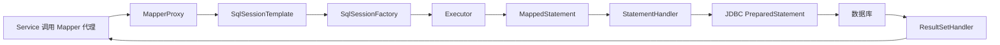

核心对象：

1\. `SqlSessionFactory`：根据 MyBatis 配置创建 `SqlSession`。

2\. `SqlSessionTemplate`：MyBatis-Spring 提供的线程安全入口，负责把会话绑定到当前 Spring 事务。

3\. Mapper 代理：根据接口方法定位 `namespace + statement id`，不需要开发者手写实现类。

4\. `MappedStatement`：保存一条映射语句的 SQL、参数映射、结果映射和缓存配置。

5\. `Executor`：执行查询或更新，常见类型为 `SIMPLE`、`REUSE`、`BATCH`。

6\. `TypeHandler`：负责 Java 类型与 JDBC 类型之间的转换。

不要把原生 `SqlSession` 保存到单例字段并跨线程使用。业务项目通常注入 Mapper 或 `SqlSessionTemplate`，由 Spring 管理会话和事务边界。

### 8.11 SQL 映射、动态 SQL 与缓存边界

#### 8.11.1 `resultType` 与 `resultMap`

字段简单且列名能直接映射时可用 `resultType`。复杂映射、列名不一致、构造器映射或一对多结构应使用 `resultMap`。

`map-underscore-to-camel-case=true` 可以把 `created_at` 映射到 `createdAt`，但重要查询仍应明确选择列，不要依赖 `SELECT *` 和隐式映射维持 API。

Java 基本类型不能表示数据库 `NULL`。如果数据库列允许为空，模型字段应使用 `Integer`、`Long`、`Boolean` 等包装类型，而不是 `int`、`long`、`boolean`，否则“数据库确实为空”和“Java 默认值 0/false”会混在一起。时间、枚举、JSON 列等非简单类型要确认 JDBC 驱动与 `TypeHandler` 的转换规则，并用 Mapper 集成测试验证。

查询返回多行但 Mapper 方法声明为单个对象时，MyBatis 不会替你任选一行，而会抛出结果数量异常。业务上“应该唯一”的查询仍需数据库唯一约束；SQL 中随意加 `LIMIT 1` 只会隐藏脏数据。

#### 8.11.2 `#{}` 与 `${}` 的安全边界

```xml
WHERE id = #{id}
```

`#{}` 生成 JDBC 占位符并绑定参数，适合所有业务值。

```xml
ORDER BY ${column}
```

`${}` 直接拼接字符串，只能用于无法参数化的 SQL 结构，并且输入必须来自服务端白名单：

```java
String orderColumn = switch (sortField) {
    case "createdAt" -> "created_at";
    case "dueDate" -> "due_date";
    default -> throw new IllegalArgumentException("不支持的排序字段");
};
```

绝不能把客户端传入的表名、列名或排序表达式未经转换直接交给 `${}`。

#### 8.11.3 动态 SQL

```xml
<select id="search" resultMap="taskResultMap">
    SELECT <include refid="taskColumns"/>
    FROM task
    <where>
        <if test="status != null">
            status = #{status}
        </if>
        <if test="keyword != null and keyword != ''">
            AND title LIKE CONCAT('%', #{keyword}, '%')
        </if>
    </where>
    ORDER BY created_at DESC, id DESC
</select>
```

常用标签：

1\. `<if>`：按条件拼接片段。

2\. `<where>`：有条件时添加 `WHERE`，并处理开头多余的 `AND`、`OR`。

3\. `<set>`：生成 UPDATE 的 `SET` 并处理多余逗号。

4\. `<foreach>`：处理集合，例如安全生成 `IN` 参数列表。

5\. `<choose>`、`<when>`、`<otherwise>`：表达互斥分支。

动态 SQL 过度复杂时，应拆分查询或使用专门查询对象，避免 XML 变成难以测试的业务程序。

`<foreach>` 生成 `IN (...)` 时要先处理空集合。不同数据库对 `IN ()` 的接受程度不同，很多数据库会直接报语法错误。更重要的是，空集合究竟表示“不返回任何数据”还是“不添加过滤条件”属于业务语义，不能交给 SQL 偶然决定。

动态 UPDATE 应避免生成空的 `SET`。如果所有可更新字段都为 `null`，Service 应拒绝“没有任何变更”的请求，或者定义清楚 `null` 是“不修改”还是“把数据库列清空”。PATCH（局部更新）最容易把这两个含义混为一谈；需要清空字段时，可使用显式操作类型或额外的字段存在性表示。

#### 8.11.4 一级缓存与二级缓存

MyBatis 一级缓存属于 `SqlSession`，默认作用于同一会话。Spring 事务内多次执行完全相同查询时，可能命中本地缓存；不同请求通常不是同一个会话。

一级缓存保存的是查询结果对象引用。若同一会话中先查询后直接修改返回对象，即使尚未执行 UPDATE，后续相同查询也可能看到这个被 Java 代码改过的对象，从而误以为数据库已经更新。MyBatis 没有脏检查；数据库是否改变只能以实际 UPDATE、事务提交和重新查询为准。

本文配置：

```yaml
mybatis:
  configuration:
    local-cache-scope: statement
```

把本地缓存范围收缩到 Statement，减少同一事务内读取旧对象的困惑。是否采用应根据业务验证，而不是机械复制。

MyBatis 二级缓存按 Mapper namespace 共享，需要显式启用。它的失效粒度、对象序列化和多实例一致性容易被低估。生产项目通常优先使用具备指标、容量、过期和一致性治理的专用缓存，而不是默认开启二级缓存。

#### 8.11.5 N+1 查询在 MyBatis 中同样存在

N+1 不属于 JPA 专属问题。如果先查 N 个订单，再在 Java 循环中逐个调用 Mapper 查询明细，同样会产生 `1 + N` 条 SQL。

常见治理方式：

1\. 使用 JOIN 一次查询并通过 `resultMap` 聚合。

2\. 先批量查询主记录，再用 `<foreach>` 构造 `IN` 查询明细，在内存中组装。

3\. 为当前接口直接设计 DTO 查询，避免加载不需要的完整对象。

4\. 记录 SQL 数量和数据库耗时，避免只看单条 SQL。

### 8.12 本地事务与消息发送的一致性边界

以下代码存在一致性窗口：

```java
@Transactional
public void createOrder(CreateOrderCommand command) {
    orderMapper.insert(new Order(command));
    messageClient.publish(new OrderCreatedMessage(command.id()));
}
```

可能出现：

1\. 数据库提交成功，但消息发送失败。

2\. 消息发送成功，但数据库随后回滚。

本地数据库事务无法天然覆盖远程消息系统。常见解决方案是 Transactional Outbox（事务发件箱）：

1\. 在同一个数据库事务中写业务表和 outbox 事件表。

2\. 独立发布器读取未发送事件并投递消息。

3\. 投递成功后标记事件状态。

4\. 消费者使用业务唯一键实现幂等。

这提供的是可恢复的最终一致性，不是瞬时全局原子性。

### 8.13 MyBatis Spring Boot 自动配置

MyBatis Spring Boot Starter 的自动配置主线：

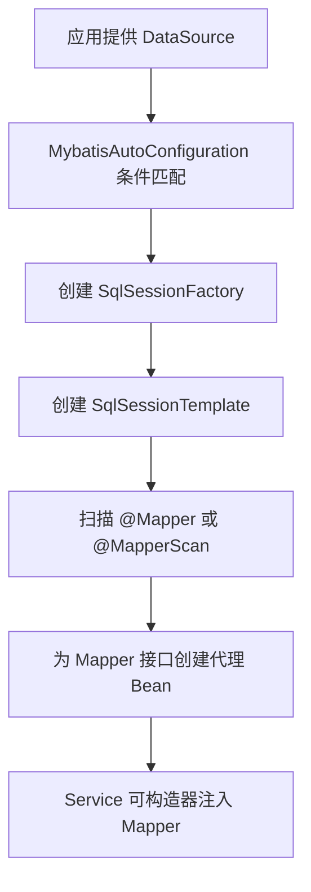

Starter 会：

1\. 检测已有 `DataSource`。

2\. 使用 `SqlSessionFactoryBean` 创建 `SqlSessionFactory`。

3\. 创建线程安全的 `SqlSessionTemplate`。

4\. 扫描带 `@Mapper` 的接口并注册代理 Bean。

5\. 自动收集 `Interceptor`、`TypeHandler`、`LanguageDriver` 等扩展 Bean。

常见配置：

| 配置 | 用途 |
|---|---|
| `mybatis.mapper-locations` | Mapper XML 路径 |
| `mybatis.type-aliases-package` | 类型别名扫描包 |
| `mybatis.type-handlers-package` | TypeHandler 扫描包 |
| `mybatis.executor-type` | SIMPLE、REUSE 或 BATCH |
| `mybatis.configuration.*` | MyBatis Core 配置 |
| `mybatis.check-config-location` | 检查配置文件是否存在 |

注意：

1\. `mybatis.config-location` 与 `mybatis.configuration.*` 不应同时使用。

2\. 单数据源场景优先使用 Starter 自动配置，不要无理由手工创建 `SqlSessionFactory`。

3\. 多数据源手工配置时，需要明确每个 Mapper 使用哪个 `SqlSessionFactory`，并注意可执行 JAR 下的 `SpringBootVFS`。

4\. Mapper 扫描不到时，先检查包路径、`@Mapper`、`@MapperScan`、XML 路径和条件评估报告。

5\. XML 应放在 `src/main/resources` 下，并确认构建后的 JAR 中确实包含对应资源。若把 XML 放进 `src/main/java`，IDE 运行可能因为本地设置碰巧找到，Maven 默认却不一定把它当资源打包，最终出现“本地正常、部署后 `Invalid bound statement`”。

6\. `@MapperScan` 的范围应尽量精确。扫描到普通接口时，框架可能尝试把它们也注册为 Mapper；多数据源项目更应为每组 Mapper 指定独立包和对应的 `SqlSessionFactory`。

官方资料：

1\. [MyBatis Spring Boot Starter](https://mybatis.org/spring-boot-starter/mybatis-spring-boot-autoconfigure/)。

2\. [MyBatis Mapper XML](https://mybatis.org/mybatis-3/sqlmap-xml.html)。

3\. [MyBatis 动态 SQL](https://mybatis.org/mybatis-3/dynamic-sql.html)。

### 8.14 MyBatis 与 JPA 的选型边界

JPA 仍然是重要的国际化 Java 持久化标准，只是不作为本文面向国内后端岗位的主要实战路线。

| 维度 | MyBatis | JPA/Hibernate |
|---|---|---|
| SQL 控制 | 开发者显式编写，控制直接 | 框架根据对象关系生成，复杂场景仍需查询语言或原生 SQL |
| 学习重点 | SQL、映射、动态 SQL、执行链 | 实体状态、关系映射、持久化上下文、抓取策略 |
| 复杂查询 | SQL 表达直接 | 需要 JPQL、Criteria、Specification 或原生 SQL |
| 状态管理 | 普通对象，不自动脏检查 | 受管实体支持脏检查 |
| 团队适配 | 适合强调 SQL 可控的团队 | 适合领域模型和标准化 ORM 团队 |
| 常见风险 | SQL 分散、动态 SQL 复杂、`${}` 注入 | 隐式 SQL、N+1、懒加载、状态边界复杂 |

选择时不要只看“代码量更少”：

1\. 团队是否具备扎实 SQL 能力。

2\. 查询复杂度和数据库特性使用程度。

3\. 是否需要跨数据库移植。

4\. 是否偏向领域对象状态管理。

5\. 团队现有规范、监控和测试工具。

MyBatis-Plus 可以减少单表 CRUD 样板代码，但初学者仍应先理解 MyBatis 的 Mapper、SQL 参数绑定、结果映射和事务链路。插件不能替代 SQL、索引和并发基础。

## 9 生产能力：可观测性、异步、调度与缓存

### 9.1 正确记录日志

```java
import org.slf4j.Logger;
import org.slf4j.LoggerFactory;

public class PaymentService {

    private static final Logger log =
            LoggerFactory.getLogger(PaymentService.class);

    public void process(String orderId) {
        log.info("开始处理订单，orderId={}", orderId);
    }
}
```

SLF4J（Simple Logging Facade for Java，Java 简单日志门面）提供统一日志 API。使用参数化日志，不要为了拼接日志字符串产生无意义开销。

日志中避免记录：

1\. 密码、Token、私钥。

2\. 完整身份证号、银行卡号等敏感个人数据。

3\. 无限制的大请求体或响应体。

4\. 同一异常在多层重复打印完整堆栈。

### 9.2 Actuator 最小配置

Spring Boot Actuator 是 Spring Boot 提供的一套“应用监控与管理工具”。它可以在应用运行期间暴露一些管理端点，帮助我们查看应用是否健康、加载了哪些 Bean、当前配置是什么、请求处理情况如何，以及 JVM（Java Virtual Machine，Java 虚拟机）的运行指标等。

加入 Actuator 依赖后：

```yaml
management:
  endpoints:
    web:
      exposure:
        include: health,info,metrics
  endpoint:
    health:
      probes:
        enabled: true
      show-details: never
```

验证：

```bash
curl http://localhost:8080/actuator/health
```

预期响应：

```json
{"status":"UP"}
```

不要直接向公网暴露全部 Actuator 端点。尤其需要保护配置、环境变量、日志级别和关闭类端点。

### 9.3 四类可观测信号

1\. 日志：发生了什么，适合查看离散事件和上下文。

2\. 指标：系统整体趋势，如请求率、错误率、延迟和资源饱和度。

3\. 链路追踪：一次请求跨服务经过了哪些节点、耗时在哪里。

4\. 健康检查：实例是否存活、是否准备好接收流量。

### 9.4 通用排障路径

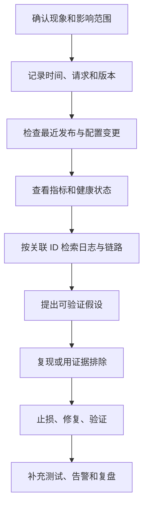

不要一看到异常就重启。重启可能临时恢复服务，也可能销毁关键现场。先保存日志、线程栈、堆使用和指标证据，再根据影响决定是否重启止损。

### 9.5 `@Async`、线程池与上下文传播

`@Async` 让 Spring 通过代理把方法提交到线程池执行：

```java
@Configuration
@EnableAsync
public class AsyncConfiguration {

    @Bean("notificationExecutor")
    public Executor notificationExecutor() {
        ThreadPoolTaskExecutor executor = new ThreadPoolTaskExecutor();
        executor.setCorePoolSize(4);
        executor.setMaxPoolSize(8);
        executor.setQueueCapacity(200);
        executor.setThreadNamePrefix("notification-");
        executor.setRejectedExecutionHandler(
                new ThreadPoolExecutor.CallerRunsPolicy());
        executor.initialize();
        return executor;
    }
}
```

```java
@Service
public class NotificationService {

    @Async("notificationExecutor")
    public CompletableFuture<Void> sendAsync(String userId) {
        // 调用有明确连接超时和读取超时的下游服务。
        return CompletableFuture.completedFuture(null);
    }
}
```

线程池关键参数：

1\. Core Pool Size（核心线程数）：稳定保留或优先使用的工作线程数量。

2\. Max Pool Size（最大线程数）：队列满后允许扩展的上限。

3\. Queue Capacity（队列容量）：尚未执行任务的缓冲区。

4\. Rejection Policy（拒绝策略）：线程和队列都满时如何处理。

线程池不是越大越快：

1\. CPU 密集任务线程过多会增加上下文切换。

2\. I/O（Input/Output，输入输出）密集任务可以适当增加并发，但受下游容量、连接池和超时限制。

3\. 无界队列会把过载转化为内存增长和超长延迟。

4\. `CallerRunsPolicy` 能形成一定反压，但会让提交线程变慢，必须理解对入口请求的影响。

`@Async` 与事务一样依赖代理，因此同类自调用可能不生效。新线程也不会自动继承事务、日志 MDC（Mapped Diagnostic Context，映射诊断上下文）和安全上下文。需要显式设计上下文传播，且不要把线程池线程长期绑定请求对象。

异常处理边界：

1\. 返回 `CompletableFuture` 时，调用方应观察并处理失败。

2\. 返回 `void` 时，异常无法通过返回值传递，需要配置异步异常处理器并监控失败。

3\. 关键业务不能只“提交成功就算成功”，需要持久化任务状态、重试和死信治理。

### 9.6 定时任务的执行模型

开启调度：

```java
@Configuration
@EnableScheduling
public class SchedulingConfiguration {
}
```

```java
@Component
public class ExpiredTaskJob {

    @Scheduled(fixedDelayString = "${jobs.expired-task.delay:PT1M}")
    public void run() {
        // 每次执行结束后等待指定时间，再开始下一次。
    }
}
```

常见调度方式：

1\. `fixedRate`：按开始时间间隔触发，适合希望保持频率的任务。

2\. `fixedDelay`：上次完成后再等待一段时间，适合不希望重叠的任务。

3\. `cron`：按日历规则触发，必须明确时区。

多实例部署时，每个实例都可能执行同一个 `@Scheduled` 方法。若业务只允许执行一次，需要数据库锁、分布式调度平台或任务分片设计。即使有锁，任务本身也应幂等，因为超时、故障切换和锁租约到期仍可能造成重复执行。

### 9.7 缓存抽象与一致性风险

Spring Cache 提供注解式缓存抽象：

```java
@Service
public class ProductService {

    @Cacheable(cacheNames = "products", key = "#id")
    public ProductResponse get(long id) {
        return loadFromDatabase(id);
    }

    @CacheEvict(cacheNames = "products", key = "#id")
    public void update(long id, UpdateProductRequest request) {
        updateDatabase(id, request);
    }
}
```

重要语义：

1\. `@Cacheable`：命中缓存时跳过方法，未命中时执行并写入结果。

2\. `@CachePut`：总是执行方法，并更新缓存。

3\. `@CacheEvict`：删除缓存项。

缓存带来的典型问题：

1\. Cache Penetration（缓存穿透）：持续查询不存在的数据，可用空值短缓存、参数校验或布隆过滤器缓解。

2\. Cache Breakdown（热点 Key 击穿）：热点缓存同时过期，大量请求打到数据库，可用互斥重建、逻辑过期或提前刷新。

3\. Cache Avalanche（缓存雪崩）：大量 Key 同时过期或缓存集群故障，可为过期时间加入抖动并保护数据库。

4\. 数据库与缓存不一致：更新顺序、失败重试和并发读写都可能产生旧值。

常见 Cache-Aside（旁路缓存）策略是先更新数据库，再删除缓存。它仍存在短暂并发窗口，需要结合业务可接受的不一致时间、重试、消息通知和版本控制设计。

缓存注解同样依赖 Spring 代理，同类自调用可能绕过缓存拦截。缓存 Key 必须稳定、区分租户并控制基数；敏感数据还要考虑缓存访问权限和加密。

### 9.8 线程池、数据库连接池与 HTTP 连接池的联动

一个请求可能依次占用：

1\. Web 请求线程。

2\. 数据库连接。

3\. 下游 HTTP 连接。

4\. 异步任务线程。

任一池耗尽都会向上游传播等待。只扩大 Web 线程池，可能让更多请求同时争抢较小的数据库连接池，反而增加超时。

容量设计应从完整链路考虑：

```text
入口并发
  -> Web 工作线程
  -> 数据库连接池
  -> 下游连接池
  -> 下游服务容量
```

监控至少包括池的活跃数、空闲数、等待数、队列长度、拒绝次数和等待耗时。超时应由外向内逐层递减或按调用预算合理分配，避免外层先超时而内层仍继续占用资源。

## 10 测试策略

### 10.1 测试金字塔

1\. 单元测试：不启动 Spring，验证单个类，速度最快。

2\. 切片测试：只加载 Web、MyBatis 等一部分上下文。

3\. 集成测试：加载完整上下文，并与真实或接近真实的基础设施交互。

4\. 端到端测试：从外部调用已部署系统，数量应少而关键。

### 10.2 普通单元测试

```java
class GreetingServiceTest {

    private final GreetingService service = new GreetingService();

    @Test
    void shouldCreateMessage() {
        assertEquals("你好，小明", service.createMessage("小明"));
    }
}
```

如果简单业务类的测试必须启动整个 Spring 上下文，通常说明代码耦合过强或测试范围选择不当。

### 10.3 常见测试注解

| 注解 | 加载范围 | 适用场景 |
|---|---|---|
| `@WebMvcTest` | MVC 相关组件 | Controller、参数绑定、异常响应 |
| `@MybatisTest` | MyBatis、Mapper 和数据库相关组件 | Mapper XML、SQL 和结果映射 |
| `@SpringBootTest` | 完整应用上下文 | 跨层集成测试 |
| `@Transactional` | 测试事务 | 测试后回滚数据库改动 |

本文 Spring Boot 4.0.x 基线对应的 MyBatis 测试依赖：

```xml
<dependency>
    <groupId>org.mybatis.spring.boot</groupId>
    <artifactId>mybatis-spring-boot-starter-test</artifactId>
    <version>4.0.1</version>
    <scope>test</scope>
</dependency>
```

### 10.4 测试数据库的选择

H2 适合快速入门，但它与 MySQL、PostgreSQL 等生产数据库的 SQL 方言、锁和索引行为不完全一致。重要的持久化逻辑应使用 Testcontainers 在测试中启动与生产同类型的数据库容器。

H2 的兼容模式只能减少部分语法差异，不能完整模拟生产数据库。以下能力尤其需要在真实数据库类型上验证：

1\. JSON、数组、全文检索等数据库专有类型和函数。

2\. 自增主键、序列、大小写、保留字和时间类型的具体行为。

3\. 唯一约束中的 `NULL`、字符排序规则和大小写敏感性。

4\. 事务隔离、行锁、死锁、`SELECT ... FOR UPDATE` 和执行计划。

因此应形成两层反馈：H2 切片测试快速发现 Mapper XML 和基础映射错误；Testcontainers 集成测试验证生产方言、迁移脚本和并发语义。不要因为 H2 测试通过就宣称生产数据库兼容。

### 10.5 实战：测试 TaskService 的业务规则

Service 单元测试不需要启动 Spring。使用 Mockito 创建 Mapper 替身，并使用固定时钟保证时间断言稳定：

```java
package com.example.demo.task;

import org.junit.jupiter.api.BeforeEach;
import org.junit.jupiter.api.Test;
import org.junit.jupiter.api.extension.ExtendWith;
import org.mockito.Mock;
import org.mockito.junit.jupiter.MockitoExtension;

import java.time.Clock;
import java.time.Instant;
import java.time.LocalDate;
import java.time.ZoneOffset;

import static org.junit.jupiter.api.Assertions.assertEquals;
import static org.junit.jupiter.api.Assertions.assertThrows;
import static org.mockito.ArgumentMatchers.any;
import static org.mockito.Mockito.verify;
import static org.mockito.Mockito.when;

@ExtendWith(MockitoExtension.class)
class TaskServiceTest {

    @Mock
    private TaskMapper taskMapper;

    private TaskService taskService;
    private Clock clock;

    @BeforeEach
    void setUp() {
        clock = Clock.fixed(
                Instant.parse("2026-07-24T01:00:00Z"),
                ZoneOffset.UTC);
        taskService = new TaskService(taskMapper, clock);
    }

    @Test
    void shouldCreateTodoTask() {
        when(taskMapper.insert(any(Task.class)))
                .thenReturn(1);

        CreateTaskRequest request = new CreateTaskRequest(
                "学习事务",
                LocalDate.of(2026, 8, 1));

        /*
         * 纯单元测试不会执行数据库生成主键，因此这里只断言业务默认值；
         * 主键回填和 SQL 映射由 Mapper 集成测试覆盖。
         */
        TaskResponse response = taskService.create(request);

        assertEquals("学习事务", response.title());
        assertEquals(TaskStatus.TODO, response.status());
        assertEquals(
                Instant.parse("2026-07-24T01:00:00Z"),
                response.createdAt());
        verify(taskMapper).insert(any(Task.class));
    }

    @Test
    void shouldThrowWhenTaskDoesNotExist() {
        when(taskMapper.findById(99L)).thenReturn(null);

        assertThrows(
                TaskNotFoundException.class,
                () -> taskService.get(99L));
    }

    @Test
    void shouldTreatConcurrentCompletionAsIdempotent() {
        Task firstRead = new Task(
                "学习事务",
                null,
                Instant.parse("2026-07-24T00:00:00Z"));
        firstRead.setId(1L);

        Task latest = new Task(
                "学习事务",
                null,
                Instant.parse("2026-07-24T00:00:00Z"));
        latest.setId(1L);
        latest.complete(clock.instant());

        when(taskMapper.findById(1L))
                .thenReturn(firstRead, latest);
        when(taskMapper.updateWithVersion(firstRead))
                .thenReturn(0);

        TaskResponse response = taskService.complete(1L);

        assertEquals(TaskStatus.DONE, response.status());
    }
}
```

最后一条测试模拟另一个请求先完成更新：当前请求的乐观锁更新返回 0，但重新读取后目标状态已经达成，因此仍返回成功。它验证的是 Service 的分支选择，不证明数据库真的会产生相同并发时序。真实的锁等待、隔离级别和提交行为仍要用目标数据库做集成测试。不要把 Mockito 测试误认为数据库集成测试。

### 10.6 实战：用 `@MybatisTest` 验证 Mapper

MyBatis Spring Boot Starter Test 提供 `@MybatisTest` 切片测试：

```java
package com.example.demo.task;

import org.junit.jupiter.api.Test;
import org.springframework.beans.factory.annotation.Autowired;
import org.mybatis.spring.boot.test.autoconfigure.MybatisTest;
import org.springframework.test.context.jdbc.Sql;

import java.time.Instant;

import static org.junit.jupiter.api.Assertions.assertEquals;
import static org.junit.jupiter.api.Assertions.assertNotNull;

@MybatisTest(properties = "spring.flyway.enabled=false")
@Sql("/db/migration/V1__create_task_table.sql")
class TaskMapperTest {

    @Autowired
    private TaskMapper taskMapper;

    @Test
    void shouldInsertAndReadTask() {
        Instant now = Instant.parse("2026-07-24T01:00:00Z");
        Task task = new Task("学习 MyBatis", null, now);

        int affected = taskMapper.insert(task);
        Task loaded = taskMapper.findById(task.getId());

        assertEquals(1, affected);
        assertNotNull(task.getId());
        assertEquals("学习 MyBatis", loaded.getTitle());
        assertEquals(TaskStatus.TODO, loaded.getStatus());
    }
}
```

该测试验证：

1\. Mapper 接口能找到对应 XML 语句。

2\. INSERT 能执行并回填数据库生成的主键。

3\. 查询结果能正确映射到 `Task`。

4\. SQL 真正发送到测试数据库。

示例关闭 Flyway 后直接复用生产迁移脚本作为 `@Sql` 测试脚本。大型项目可让完整集成测试验证 Flyway，并给 Mapper 切片测试提供稳定的最小 schema；两者必须通过审查保持一致。

许多数据库切片测试默认在测试结束后回滚，这能保持测试隔离，但也可能隐藏只在提交阶段出现的问题，例如延迟约束、事务提交监听器或提交后事件。需要验证提交语义时，应编写明确的完整集成测试，不要为了观察数据库结果而随意给全部测试关闭回滚。

测试不能依赖执行顺序，也不能共享某个测试留下的数据。每条测试都应准备自己的最小数据，并使用唯一且可读的业务值；否则单独运行成功、整套运行失败的问题会非常难排查。

### 10.7 实战：用 MockMvc 验证 HTTP 契约

Controller 测试应关注路径、JSON、校验和状态码。Spring Boot 4.x 可使用：

```java
package com.example.demo.task;

import org.junit.jupiter.api.Test;
import org.springframework.beans.factory.annotation.Autowired;
import org.springframework.boot.webmvc.test.autoconfigure.WebMvcTest;
import org.springframework.http.MediaType;
import org.springframework.test.context.bean.override.mockito.MockitoBean;
import org.springframework.test.web.servlet.MockMvc;

import static org.mockito.ArgumentMatchers.any;
import static org.mockito.Mockito.when;
import static org.springframework.test.web.servlet.request.MockMvcRequestBuilders.get;
import static org.springframework.test.web.servlet.request.MockMvcRequestBuilders.post;
import static org.springframework.test.web.servlet.result.MockMvcResultMatchers.jsonPath;
import static org.springframework.test.web.servlet.result.MockMvcResultMatchers.status;

@WebMvcTest(TaskController.class)
class TaskControllerTest {

    @Autowired
    private MockMvc mockMvc;

    @MockitoBean
    private TaskService taskService;

    @Test
    void shouldRejectBlankTitle() throws Exception {
        mockMvc.perform(post("/api/tasks")
                        .contentType(MediaType.APPLICATION_JSON)
                        .content("""
                                {"title": ""}
                                """))
                .andExpect(status().isBadRequest());
    }

    @Test
    void shouldReturnCreatedTask() throws Exception {
        when(taskService.create(any(CreateTaskRequest.class)))
                .thenReturn(TestFixtures.taskResponse());

        mockMvc.perform(post("/api/tasks")
                        .contentType(MediaType.APPLICATION_JSON)
                        .content("""
                                {
                                  "title": "学习 Spring Boot",
                                  "dueDate": "2026-08-01"
                                }
                                """))
                .andExpect(status().isCreated())
                .andExpect(jsonPath("$.id").value(1))
                .andExpect(jsonPath("$.status").value("TODO"));
    }

    @Test
    void shouldRejectInvalidPageSize() throws Exception {
        mockMvc.perform(get("/api/tasks")
                        .param("page", "0")
                        .param("size", "0"))
                .andExpect(status().isBadRequest());
    }
}
```

`TestFixtures.taskResponse()` 代表测试数据工厂，实际项目中可以返回固定的 `TaskResponse`。测试数据工厂用于减少重复构造代码，但不要隐藏测试真正关心的字段。

```java
package com.example.demo.task;

import java.time.Instant;
import java.time.LocalDate;

final class TestFixtures {

    private TestFixtures() {
    }

    static TaskResponse taskResponse() {
        return new TaskResponse(
                1L,
                "学习 Spring Boot",
                TaskStatus.TODO,
                LocalDate.of(2026, 8, 1),
                Instant.parse("2026-07-24T01:00:00Z"),
                Instant.parse("2026-07-24T01:00:00Z"));
    }
}
```

`@WebMvcTest` 只加载 MVC（Model-View-Controller，模型-视图-控制器）相关切片，不会加载真实 Service 和 Mapper。因此它能证明 HTTP 契约正确，却不能证明 SQL 能执行。反过来，`@MybatisTest` 也不会证明路由、JSON 和安全过滤器正确。切片测试的价值正是缩小范围，代价是必须清楚哪些组件没有参与。

如果项目已经引入 Spring Security，`@WebMvcTest` 默认也会加载相关安全配置。受保护接口应使用 Spring Security 测试支持建立测试身份并验证 401、403 与成功路径，不要为了让 Controller 测试通过就统一关闭过滤器。若本测试只关注校验契约，也应在说明中明确安全链是否参与。

### 10.8 如何判断应该写哪种测试

| 想验证的问题 | 推荐测试 |
|---|---|
| 标题为空是否被拒绝 | `@WebMvcTest` |
| 创建任务默认是否为 TODO | 普通 Service 单元测试 |
| Mapper SQL、主键回填和结果映射是否正确 | `@MybatisTest` |
| Flyway 能否在真实 PostgreSQL 执行 | Testcontainers 集成测试 |
| 完整请求能否写入并读回数据库 | `@SpringBootTest` 集成测试 |
| 已部署服务是否可用 | 少量端到端测试 |

每条测试只承担清晰职责，失败时才容易定位原因。

### 10.9 测试上下文缓存与测试速度

Spring Test 会缓存已经启动的 `ApplicationContext`。后续测试如果使用相同上下文配置，可以复用它，避免重复启动。

以下变化可能生成不同缓存键，导致重新启动上下文：

1\. 使用不同的测试属性。

2\. 激活不同 Profile。

3\. 导入不同配置类。

4\. 使用不同的 Mock Bean 组合。

5\. 使用 `@DirtiesContext` 标记上下文已污染。

大量随意组合的 `@SpringBootTest` 会让测试越来越慢。优化顺序：

1\. 能用普通单元测试就不启动 Spring。

2\. 按层使用稳定的切片测试配置。

3\. 避免每个测试类声明不同的临时属性和 Mock。

4\. 只有真正修改了共享上下文状态时才用 `@DirtiesContext`。

5\. 通过构建报告确认时间花在哪里，不要凭感觉并行化全部测试。

### 10.10 Mock、Stub 与集成测试替身

常见测试替身：

1\. Stub（桩）：返回预设数据，重点是给测试提供输入。

2\. Mock（模拟对象）：除了返回数据，还验证交互是否发生。

3\. Fake（仿实现）：具有简化但可工作的实现，例如内存仓库。

4\. Spy（间谍对象）：包装真实对象，并允许观察或局部替换行为。

不要过度验证内部调用次数。测试若紧贴私有实现，重构时会大面积失败，即使外部行为没有改变。优先断言可观察结果；只有“必须调用一次支付接口”之类的交互本身就是业务要求时，才验证交互。

## 11 安全基础

### 11.1 最小安全意识

1\. 所有外部输入都不可信，必须校验长度、格式和业务权限。

2\. 身份认证回答“你是谁”，授权回答“你能做什么”。

3\. 密码只保存强哈希结果，不可明文保存，也不可用可逆加密代替密码哈希。

4\. MyBatis 使用 `#{}` 绑定业务值，避免拼接 SQL；`${}` 只用于经过白名单校验的表名、列名等 SQL 结构。

5\. Web 系统必须理解 CORS（Cross-Origin Resource Sharing，跨源资源共享）、CSRF（Cross-Site Request Forgery，跨站请求伪造）和 XSS（Cross-Site Scripting，跨站脚本）。

6\. 不要因为“前后端分离”就直接关闭全部安全防护；应依据认证方式和威胁模型配置。

### 11.2 机密信息管理

错误示例：

```yaml
spring:
  datasource:
    password: "真实生产密码"
```

推荐占位方式：

```yaml
spring:
  datasource:
    password: "${DB_PASSWORD}"
```

部署环境提供 `DB_PASSWORD`。同时应防止环境变量通过调试端点、异常页和构建日志泄露。

### 11.3 Spring Security 过滤器链

Spring Security 的 Web 安全主要建立在 Servlet Filter 之上。请求进入 Controller 前，会经过 `SecurityFilterChain` 中的多个安全过滤器：

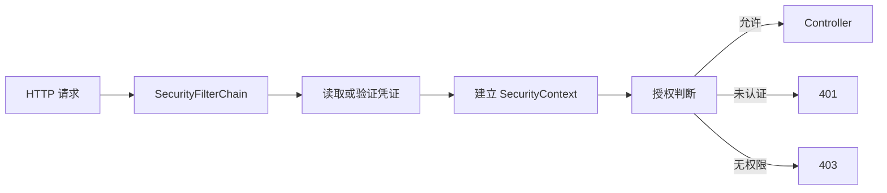

核心对象：

1\. `Authentication`：保存当前主体、凭证状态和权限。

2\. `SecurityContext`：保存当前执行上下文的 `Authentication`。

3\. `AuthenticationManager`：协调认证过程。

4\. `AuthenticationProvider`：实现具体认证方式，例如用户名密码。

5\. `PasswordEncoder`：对密码进行不可逆哈希验证。

6\. `AuthorizationManager`：判断当前主体是否可以访问资源。

现代配置使用 `SecurityFilterChain` Bean：

```java
@Configuration
@EnableWebSecurity
public class SecurityConfiguration {

    @Bean
    SecurityFilterChain apiSecurity(HttpSecurity http) throws Exception {
        return http
                .authorizeHttpRequests(authorize -> authorize
                        .requestMatchers("/actuator/health").permitAll()
                        .requestMatchers(HttpMethod.GET, "/api/tasks/**")
                        .hasAnyRole("USER", "ADMIN")
                        .requestMatchers("/api/tasks/**")
                        .hasRole("ADMIN")
                        .anyRequest().authenticated())
                .httpBasic(Customizer.withDefaults())
                .build();
    }
}
```

此示例只用于理解授权规则，不是完整生产认证方案。生产通常需要 TLS（Transport Layer Security，传输层安全）、统一身份服务、凭证轮换、审计和防暴力破解。

还要注意，以上配置没有处理 CSRF。Spring Security 默认会对 POST、PUT、PATCH、DELETE 等非安全方法执行 CSRF 校验，所以仅携带 HTTP Basic 凭证调用写接口时仍可能得到 403。若应用使用浏览器自动携带的 Session Cookie，应保留 CSRF 防护并正确传递 Token；只有在确认接口完全无状态、凭证不会由浏览器自动携带并完成威胁评估后，才对明确的 API 范围调整 CSRF 策略。不要为了让一个 curl 命令通过就全局关闭防护。

### 11.4 401、403 与异常处理边界

1\. 401 Unauthorized 实际表示尚未通过认证或凭证无效。

2\. 403 Forbidden 表示身份已确认，但没有所需权限。

3\. 安全过滤器中的认证异常发生在 Controller 之前，通常不会进入 `@RestControllerAdvice`。

统一安全错误响应应配置认证入口和访问拒绝处理器，而不是只在 Controller 异常处理器中补逻辑。

### 11.5 CSRF 与 CORS 不是一回事

CSRF 利用浏览器自动携带 Cookie 的行为，诱导已登录用户向可信站点发起非预期操作。CORS 是浏览器对跨源脚本读取响应的限制（Cross-Origin Resource Sharing，跨源资源共享）。

判断是否需要 CSRF 防护时，应看认证凭证是否由浏览器自动携带，而不是只看“是不是 REST API”：

1\. 使用 Session Cookie 登录的浏览器应用通常需要 CSRF 防护。

2\. 放在 `Authorization` 请求头、由客户端代码显式添加的 Token，风险模型不同。

3\. 错误配置 CORS 不能替代 CSRF 防护。

4\. `Access-Control-Allow-Origin: *` 与携带凭证不能随意组合。

### 11.6 密码存储与认证凭证

密码应使用专门的自适应单向算法，例如 BCrypt、scrypt 或 Argon2。它们通过成本参数提高暴力破解代价。

```java
@Bean
PasswordEncoder passwordEncoder() {
    return PasswordEncoderFactories.createDelegatingPasswordEncoder();
}
```

不要使用 MD5（Message Digest Algorithm 5，消息摘要算法 5）、SHA-1（Secure Hash Algorithm 1，安全散列算法 1）或单次通用哈希直接保存密码。密码哈希仍属于敏感数据，泄露后攻击者可以离线猜测。

## 12 构建、运行与容器化

### 12.1 构建可执行 JAR

```bash
./mvnw clean verify
java -jar target/*.jar
```

`verify` 会执行测试并完成 Maven 生命周期中的验证。构建成功不等于可以上线，还需要配置、数据库迁移、健康检查和回滚演练。

### 12.2 常用运行参数

```bash
java -jar target/app.jar \
  --server.port=8081 \
  --spring.profiles.active=prod
```

生产中优先由部署平台注入参数，并记录最终生效配置的非敏感摘要。

### 12.3 使用 Buildpacks 构建镜像

Spring Boot Maven 插件可以使用 Cloud Native Buildpacks（云原生构建包）生成 OCI（Open Container Initiative，开放容器倡议）镜像：

```bash
./mvnw spring-boot:build-image \
  -Dspring-boot.build-image.imageName=example/demo:local
docker run --rm -p 8080:8080 example/demo:local
```

验证：

```bash
curl http://localhost:8080/actuator/health
```

生产镜像应使用非 root 用户、固定基础镜像来源、扫描漏洞，并设置 CPU（Central Processing Unit，中央处理器）与内存限制。

### 12.4 优雅停机

应用收到终止信号后，需要停止接收新流量并给在途请求一定时间完成。容器平台的终止宽限期、负载均衡摘流和 Spring Boot 优雅停机设置必须相互协调，不能只改某一个参数。

### 12.5 可执行 JAR 的结构与启动原理

普通 JAR 通常只包含当前模块的类，第三方依赖由外部类路径提供。Spring Boot 构建插件会重新组织制品，把应用类、依赖 JAR 和启动加载器放进一个可执行 JAR。

执行：

```bash
java -jar target/app.jar
```

Java 先读取 JAR 清单中的启动入口，Spring Boot Loader 再建立能够读取嵌套依赖的类加载环境，最后调用业务应用的 `main()`。

检查制品：

```bash
jar tf target/*.jar | head -n 40
```

应重点区分：

1\. 应用自己的编译类和资源。

2\. 第三方依赖 JAR。

3\. Spring Boot Loader 相关类。

4\. 清单中的启动类和实际业务主类。

这一结构也支持镜像分层：变化较少的依赖层可以复用缓存，变化频繁的应用代码放在后续层。遇到“IDE 能运行但 JAR 缺类”时，应检查打包插件、依赖 Scope 和最终 JAR 内容，而不是只检查源码导入。

## 13 面试复盘与常见故障速查

### 13.1 用“机制链 + 证据链”回答框架问题

面试回答 Spring Boot 问题时，只有名词定义通常不够。一个完整回答应形成四段闭环：

1\. 先界定对象：说明问题讨论的是依赖、Bean 定义、Bean 实例、代理、HTTP 请求、数据库事务还是部署制品，避免把不同阶段混在一起。

2\. 再说明入口和机制：指出由哪个依赖、注解、配置或方法开启，框架如何发现候选项，什么条件下注册和执行。

3\. 接着给出边界和失败场景：说明默认值、退让规则、线程边界、代理边界、事务边界以及什么情况下不会生效。

4\. 最后给验证证据：给出日志、测试、条件评估报告、依赖树、受影响行数、SQL、线程名或制品内容，证明实际运行行为。

例如回答“`@Transactional` 为什么失效”，不能只说“因为自调用”。更完整的主线是：事务能力由 Spring 代理拦截外部方法调用；`this.save()` 是目标对象内部的普通 Java 调用，没有重新经过代理；可以用调用栈、`AopUtils.isAopProxy()`、事务日志和回滚测试验证；修复时把事务入口移动到职责明确的另一个 Bean，而不是机械改成 `public`。

### 13.2 核心知识的递归追问链

下表不重复正文答案，而是把高频追问映射到相应章节。复习时应先沿“第一问 -> 继续追问”口述机制，再回到“验证证据”检查回答是否落地。

| 第一问 | 继续追问 | 回答必须出现的证据 | 回看章节 |
|---|---|---|---|
| Spring Boot 与 Spring Framework 有什么关系 | Starter、自动配置、组件扫描分别做什么；Boot 如何退让 | 依赖树、条件评估报告、Bean 列表 | 1.1、5.1 至 5.12 |
| Bean 是怎样创建出来的 | 实例化和初始化有什么区别；何时生成代理；原型 Bean 谁负责销毁 | 生命周期回调、Bean 类型、代理检测 | 4.4、4.8、4.9 |
| 为什么推荐构造器注入 | 多实现怎样选择；循环依赖说明什么；字段注入为什么难测 | 启动失败信息、普通单元测试 | 4.2、4.5、4.10 |
| 自动配置为什么能“开箱即用” | 候选类从哪里来；类缺失为什么不报错；用户 Bean 如何覆盖 | `AutoConfiguration.imports`、Positive/Negative matches | 5.2 至 5.13 |
| 一个 HTTP 请求怎样找到 Controller | 404、400、415 分别在哪个阶段产生；Filter、Interceptor、AOP 如何选择 | Handler 映射、请求头、断点调用栈 | 3.6、6.4、6.7、6.8 |
| `@Transactional` 的原理是什么 | 自调用、异常吞掉、受检异常、异步线程分别怎样影响回滚 | 代理调用路径、事务日志、数据库最终状态 | 4.11、8.2、8.3、8.7 |
| MyBatis Mapper 为什么不需要实现类 | XML 怎样定位方法；`#{}` 与 `${}` 有什么区别；事务如何绑定会话 | `namespace + statement id`、预编译参数、Mapper 测试 | 8.1、8.10、8.11、8.13 |
| 乐观锁怎样判断冲突 | 更新行数为 0 有哪些含义；重复请求怎样保持幂等 | 带版本条件的 UPDATE、受影响行数、最终状态 | 8.5、8.9 |
| `@Async` 为什么可能不生效 | 自调用、事务和日志上下文为何不自动传播；队列满后发生什么 | 代理、线程名、队列与拒绝指标 | 9.5、9.8 |
| 缓存为什么会不一致 | 穿透、击穿、雪崩有什么不同；数据库提交与缓存删除如何协调 | 命中率、回源量、Key 版本和失败重试 | 9.7 |
| `@WebMvcTest` 与 `@SpringBootTest` 怎样选择 | MockMvc 能证明什么；为什么 H2 通过仍不能证明生产兼容 | 测试加载范围、真实数据库集成测试 | 10.3 至 10.10 |
| 401 与 403 有什么区别 | 为什么安全异常不一定进入 Controller Advice；CSRF 与 CORS 有何不同 | Security Filter Chain、认证主体、响应状态 | 11.3 至 11.5 |
| IDE 能运行但 JAR 失败怎样排查 | 运行类路径、资源打包、依赖 Scope 和 JDK 分别怎样验证 | `dependency:tree`、`jar tf`、Wrapper 使用的 Java | 2.1、8.13、12.5 |

### 13.3 从故障现象反推知识缺口

面对场景题时，不要从配置项开始猜。先判断失败发生在哪一阶段，再建立最短证据链。

1\. 应用启动失败：先找第一条根异常，判断是类路径、Bean 定义、依赖注入、配置绑定还是外部资源连接；再使用依赖树、条件报告和配置来源验证。最后一条异常通常只是启动失败的汇总，不一定是根因。

2\. 请求没有进入 Controller：依次确认端口和进程、请求路径与 HTTP 方法、Filter 或安全链、Handler 映射、参数解析。404、401、403、400 和 415 指向的阶段不同，不能统一归因于“接口代码有问题”。

3\. 方法执行了但数据没变：检查 Mapper 是否真的执行 UPDATE、受影响行数是否为预期值、事务是否提交、是否读到了缓存对象、查询是否连接到同一数据库。没有抛异常不是数据成功的判据。

4\. 测试通过但部署失败：确认测试替身证明了什么，再检查生产数据库方言、构建产物、资源路径、运行 JDK、依赖 Scope、环境变量和容器文件系统。Mock 或 H2 只能证明被它覆盖的那部分行为。

5\. 接口逐渐变慢：先看请求率、错误率和延迟分位数，再沿 Web 线程池、数据库连接池、HTTP 连接池和下游容量定位等待点。只扩大入口线程数可能放大下游拥塞。

6\. 注解“有时生效、有时不生效”：优先检查对象是不是 Spring Bean、调用是否经过代理、方法可见性、同类自调用、线程是否切换，以及条件配置是否匹配。注解只是入口声明，不是脱离运行路径的魔法。

### 13.4 常见故障速查

| 现象 | 常见原因 | 首要检查 |
|---|---|---|
| 应用启动后立即退出 | 非 Web 项目、启动异常 | 完整启动日志与退出码 |
| 8080 端口占用 | 本机已有服务 | 端口监听进程 |
| 接口返回 404 | 路径错误、组件未扫描 | Controller 映射和包结构 |
| 接口返回 400 | 参数绑定或校验失败 | 请求体、Content-Type、错误响应 |
| 接口返回 415 | 媒体类型不支持 | `Content-Type: application/json` |
| Bean 找不到 | 未注册或扫描范围错误 | 注解、包路径、条件配置 |
| Bean 数量不唯一 | 接口存在多个实现 | 注入点、`@Qualifier`、设计 |
| 数据库连接失败 | 地址、凭据、网络错误 | 根异常和连接池日志 |
| `Invalid bound statement` | Mapper 方法没有匹配的 XML 语句 | `namespace`、语句 `id`、XML 扫描路径 |
| Mapper XML 解析失败 | XML 语法、特殊字符或标签嵌套错误 | 异常中的资源名和行号；比较符优先使用 `&lt;`、`&gt;` |
| SQL 参数绑定失败 | 参数名不一致、缺少 `@Param`、Java 类型不匹配 | Mapper 方法签名、`#{}` 名称和 TypeHandler |
| 查询结果字段为空 | 列名与属性名不匹配、`resultMap` 配置错误 | SQL 别名、`resultMap`、驼峰映射配置 |
| 事务没有回滚 | 异常被吞、自调用、边界错误 | 调用路径和事务代理 |
| 内存持续增长 | 缓存无界、对象泄漏、流量上涨 | 堆、GC、请求与缓存指标 |
| 请求越来越慢 | 下游慢、连接池满、锁竞争 | 延迟分位数、线程池、连接池 |

GC（Garbage Collection，垃圾回收）日志和线程转储是性能排查证据，不应只凭“CPU 高”就调整 JVM（Java Virtual Machine，Java 虚拟机）参数。

## 14 初学者项目落地模板

### 14.1 推荐包结构

按业务功能组织比把整个项目机械分成 controller、service、mapper 三个大包更容易维护：

```text
com.example.demo
├── DemoApplication.java
├── common/
│   ├── ApiError.java
│   └── GlobalExceptionHandler.java
├── config/
│   └── AppConfiguration.java
└── task/
    ├── Task.java
    ├── TaskController.java
    ├── TaskService.java
    ├── TaskMapper.java
    ├── CreateTaskRequest.java
    └── TaskResponse.java

src/main/resources/
├── mapper/
│   └── TaskMapper.xml
└── db/migration/
    └── V1__create_task_table.sql
```

### 14.2 第一个完整练手项目

建议实现“任务管理 API”，功能范围控制为：

1\. 创建任务。

2\. 按 ID 查询任务。

3\. 分页查询任务。

4\. 修改标题和截止时间。

5\. 完成任务。

6\. 删除任务。

7\. 参数校验与统一错误响应。

8\. 数据库迁移。

9\. Controller、Service、Mapper 测试。

10\. Actuator 健康检查。

11\. Docker 镜像。

12\. README 中写明启动、验证和故障排查步骤。

完成标准不是“代码能运行”，而是另一位开发者仅阅读 README 就能启动项目、执行测试并调用接口。

### 14.3 四周学习安排

#### 14.3.1 第一周：跑通 Web 主线

1\. Java、Maven 和 HTTP 基础复习。

2\. 创建项目并理解目录。

3\. 编写 CRUD（Create、Read、Update、Delete，增删改查）接口。

4\. 掌握 Controller、DTO、参数绑定和状态码。

#### 14.3.2 第二周：理解 Spring 核心

1\. IoC、DI、Bean、组件扫描。

2\. 自动配置与 Starter。

3\. 结构化配置、多环境和日志。

4\. 参数校验与统一异常处理。

#### 14.3.3 第三周：数据与测试

1\. MyBatis Mapper、XML 映射、动态 SQL 和结果映射。

2\. 事务、唯一约束和数据库迁移。

3\. 单元测试、Web 切片测试和 MyBatis 切片测试。

4\. 使用真实数据库类型完成一次集成测试。

#### 14.3.4 第四周：生产化

1\. Actuator、指标和健康检查。

2\. 基础安全与敏感配置。

3\. 构建 JAR 和容器镜像。

4\. 模拟端口占用、数据库不可用、配置覆盖错误并完成排查记录。

## 15 上线检查表

### 15.1 构建与制品

1\. 使用 Wrapper 在干净环境执行完整构建。

2\. 单元测试和集成测试全部通过。

3\. 依赖版本受 Spring Boot 依赖管理约束。

4\. 制品版本、Git 提交和镜像标签可追溯。

5\. 已完成依赖和镜像漏洞扫描。

### 15.2 配置与数据

1\. 生产配置由部署环境注入。

2\. 仓库、镜像和日志中没有真实密钥。

3\. 数据库迁移脚本经过审核并有回滚或前滚方案。

4\. 连接池大小与数据库承载能力匹配。

5\. 超时设置覆盖入口、数据库和所有下游调用。

### 15.3 可靠性与观测

1\. 存活与就绪探针含义正确。

2\. 关键接口有请求率、错误率和延迟指标。

3\. 日志包含时间、级别、服务、环境和关联 ID。

4\. 告警能指向可执行的排障步骤。

5\. 已验证优雅停机、滚动发布和回滚。

6\. Actuator 端点已限制暴露范围并进行访问控制。

### 15.4 安全

1\. 输入校验、身份认证和资源级授权均已覆盖。

2\. 错误响应不泄露堆栈和内部实现。

3\. CORS、CSRF 和 Cookie 策略符合实际认证方案。

4\. 日志完成敏感字段脱敏。

5\. 应用以非 root 用户运行并遵循最小权限原则。

## 16 官方资料与继续学习

优先阅读官方资料，尤其注意搜索结果中旧版本文档可能不适用于当前项目：

1\. [Spring Boot 系统要求](https://docs.spring.io/spring-boot/system-requirements.html)：核对当前稳定版、Java、Maven、Gradle 与 Servlet 容器要求。

2\. [Spring Boot Reference Documentation](https://docs.spring.io/spring-boot/reference/)：完整参考文档。

3\. [Spring Boot Tutorials](https://docs.spring.io/spring-boot/tutorial/)：官方教程。

4\. [Spring Getting Started Guides](https://spring.io/guides/gs/)：按任务学习的短教程。

5\. [Spring Initializr](https://start.spring.io/)：生成与当前版本兼容的项目骨架。

6\. [MyBatis Spring Boot Starter](https://github.com/mybatis/spring-boot-starter#requirements)：核对 MyBatis Starter 与 Spring Boot、Java 的兼容线。

7\. [MyBatis Spring Boot 参考文档](https://mybatis.org/spring-boot-starter/mybatis-spring-boot-autoconfigure/)：查看自动配置、配置属性和扩展点。

8\. [MyBatis 3 Reference](https://mybatis.org/mybatis-3/)：Mapper XML、动态 SQL、TypeHandler 和缓存。

后续学习建议：

1\. 先把本文的任务管理 API 独立完成。

2\. 再学习 Spring Security、缓存、异步任务和消息队列。

3\. 然后学习 JVM、数据库、Linux、网络和可观测性，因为生产问题往往跨越框架边界。

4\. 最后再进入 Spring Cloud 和微服务治理，不要在单体应用基本功不稳时过早增加分布式复杂度。
