# Spring Security 学习笔记

> 版本与范围：示例基于 Java 17、Spring Boot 4.1.0、Spring Security 7.1.0、Servlet、Spring MVC（Model-View-Controller，模型-视图-控制器）和 Maven。依赖版本交给 Spring Boot 管理；Spring Boot 3.x、Spring Security 6.x 和 WebFlux 的差异在相关章节说明。

## 1 安全心智模型与基础概念

### 1.1 从三个请求看 Spring Security 解决的问题

假设订单系统同时提供公开健康检查、登录后才能查看的订单和仅管理员可用的报表接口。应用必须在业务方法执行前回答三个问题：请求有没有可信身份、该身份是否有权执行当前动作、请求是否带有跨站伪造等攻击特征。Spring Security 把这些检查放进统一的请求链和方法调用边界，并提供跨站请求伪造、安全响应头、会话固定攻击等常见 Web 防护；它不替代订单状态校验、数据库权限、网络隔离、密钥管理或安全开发流程。

初学时可以把一次安全请求想成经过三道门，但这个类比只帮助理解职责，不代表真实代码里恰好只有三个过滤器：

1\. 凭证提取：从登录表单、HTTP Basic（Hypertext Transfer Protocol Basic Authentication，超文本传输协议基本认证）、Cookie 或 Bearer Token（持有即可作为访问凭证的令牌）中找到身份凭证。

2\. 认证：验证凭证，得到包含用户身份和权限的 `Authentication`。

3\. 授权：根据请求路径、请求方法、方法参数或返回值判断能否继续执行。

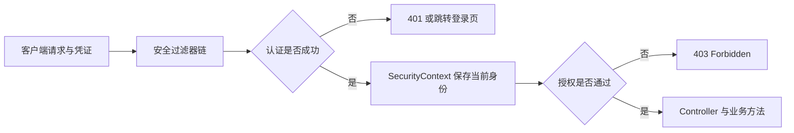

### 1.2 Web 安全基础词汇

| 词汇 | 含义 | 在 Spring Security 中的作用 |
| --- | --- | --- |
| HTTP（Hypertext Transfer Protocol，超文本传输协议） | 客户端与服务端交换请求和响应的协议 | 方法、路径、Header 和状态码都是安全决策输入 |
| URL（Uniform Resource Locator，统一资源定位符） | 资源地址，例如 `/api/orders/42` | 请求匹配器用它选择过滤器链和授权规则 |
| Endpoint（端点） | 应用对外提供的一个访问入口 | Controller 路由、登录和退出处理地址都是端点 |
| Cookie | 服务器让浏览器保存并在后续请求自动附带的小段数据 | 常用来携带 `JSESSIONID`，也可携带请求防伪 Token |
| Session（会话） | 服务端为一段连续交互保存的状态 | 页面登录成功后可用它跨请求恢复身份 |
| Token（令牌） | 表示某种身份、授权或随机挑战值的字符串 | 不同 Token 的签发方、接收方、验证规则和生命周期可能完全不同 |
| CSRF（Cross-Site Request Forgery，跨站请求伪造） | 攻击者诱导浏览器借自动携带的登录凭证执行非预期操作 | Cookie 认证的状态变更请求通常需要额外 Token 防护 |
| CORS（Cross-Origin Resource Sharing，跨源资源共享） | 浏览器决定一个源的脚本能否读取另一个源的响应 | 负责跨源浏览器规则，不负责认证或授权 |
| JWT（JSON Web Token，JSON Web 令牌） | 可携带声明并通过签名验证完整性的 Token 格式 | 常被资源服务器用作 Access Token，仍须验证签名和关键声明 |
| Filter（过滤器） | Controller 之前可以检查、修改或拒绝请求的组件 | Spring Security 的 Servlet 主线由一组有顺序的 Filter 完成 |

Cookie 与 Session 不是同一个东西：浏览器通常只在 Cookie 中携带一个随机 Session ID，真正的登录状态保存在服务器端 Session 中。Token 也不一定是 JWT，JWT 只是 Token 的一种结构化表示。

## 2 教程：完成第一个可验证的安全闭环

### 2.1 前置条件与目录

目标是先创建一个只有两个接口的应用，再亲眼观察“公开接口成功、受保护接口拒绝匿名请求、正确凭证放行”。这三个可观察结果构成第一个安全闭环。

使用 [Spring Initializr](https://start.spring.io/) 时可按以下条件创建项目：

1\. Project 选择 Maven，Language 选择 Java。

2\. Spring Boot 选择 4.1.x，Java 选择 17 或更高版本。Spring Boot 4.1.0 至少要求 Java 17；若使用其他版本，应先查看该版本的 System Requirements（系统要求）。

3\. Dependencies 选择 Spring Web（Spring Boot 4.1 生成 Spring Web MVC Starter）和 Spring Security。测试依赖由生成的工程提供，仍要按下方依赖块确认没有缺失。

4\. Group 可设为 `com.example`，Artifact 可设为 `security-demo`，下载后解压。

进入项目目录后，先确认 Maven Wrapper 实际使用的 Java，而不是只看 `pom.xml`：

```bash
./mvnw --version
```

输出中的 `Java version` 必须是 17 或更高版本，`Java home` 应指向预期 JDK。`<java.version>17</java.version>` 只告诉编译器目标版本，不会安装 JDK，也不会让正在使用 Java 8 的 Maven 自动切换到 Java 17。若出现 `class file has wrong version 61.0, should be 52.0`，含义是依赖由 Java 17 编译，而当前 Maven 正在使用 Java 8；应修正 `JAVA_HOME` 或 IDE（Integrated Development Environment，集成开发环境）的 Maven JDK，再重新运行，不要降级单个 Spring 依赖绕过错误。

项目包名统一为 `com.example.securitydemo`，版本由 Spring Boot 父工程或 BOM（Bill of Materials，物料清单）管理。对应的核心依赖如下：

```xml
<dependencies>
    <dependency>
        <groupId>org.springframework.boot</groupId>
        <artifactId>spring-boot-starter-webmvc</artifactId>
    </dependency>
    <dependency>
        <groupId>org.springframework.boot</groupId>
        <artifactId>spring-boot-starter-security</artifactId>
    </dependency>
    <dependency>
        <groupId>org.springframework.boot</groupId>
        <artifactId>spring-boot-starter-security-test</artifactId>
        <scope>test</scope>
    </dependency>
    <dependency>
        <groupId>org.springframework.boot</groupId>
        <artifactId>spring-boot-starter-webmvc-test</artifactId>
        <scope>test</scope>
    </dependency>
</dependencies>
```

Spring Boot 4.1 中，`spring-boot-starter-web` 已弃用，推荐 `spring-boot-starter-webmvc`。测试支持也已按技术域拆分：`spring-boot-starter-webmvc-test` 提供 Spring MVC、JUnit 和 MockMvc 测试能力，`spring-boot-starter-security-test` 提供 `httpBasic()`、`csrf()`、`jwt()` 与 `@WithMockUser` 等安全测试支持；这也是 Spring Initializr 为 Boot 4.1 的 Web MVC + Security 工程生成的组合。

Boot 4.1 仍保留通用的 `spring-boot-starter-test`，它提供 JUnit、Spring Test、AssertJ 和 Mockito 等基础测试库，但不能代替 Web MVC 领域测试模块。若只加入 `spring-boot-starter-test` 与底层的 `spring-security-test`，依赖树中不会出现 `spring-boot-webmvc-test`，2.5 所用的 Boot 4 `AutoConfigureMockMvc` 因而不在测试类路径。判断缺少的是通用测试库还是领域测试支持，可以对照 [Spring Boot Test Modules](https://docs.spring.io/spring-boot/reference/testing/test-modules.html) 和 Maven 依赖树，不要只根据 Artifact 名称猜测。

Spring Boot 3.x 项目仍使用 `spring-boot-starter-web`、`spring-boot-starter-test` 与 `spring-security-test`，且通常由 Boot 管理 Spring Security 6.x；不能只替换一个 Starter 名称，就假设 7.x API 和 Boot 4 测试包名在 3.x 工程中可用。最稳妥的入口是让目标版本的 Spring Initializr 生成依赖，再将业务代码迁入。

入口类负责启动 Spring Boot：

```java
package com.example.securitydemo;

import org.springframework.boot.SpringApplication;
import org.springframework.boot.autoconfigure.SpringBootApplication;

@SpringBootApplication
public class SecurityDemoApplication {

    public static void main(String[] args) {
        SpringApplication.run(SecurityDemoApplication.class, args);
    }
}
```

`@SpringBootApplication` 使 Spring Boot 扫描当前包及子包里的 Controller、配置类和服务。因此后文类都放在 `com.example.securitydemo` 或子包中；如果放到其他无关包，代码可能编译成功但根本没有被 Spring 发现。

只加入 Starter，Spring Boot 就会保护 Web 应用、创建名为 `user` 的内存用户，并在 WARN 日志打印开发用随机密码。该密码只用于理解默认行为，不能用于生产。

可用以下命令确认真正由 Spring Boot 管理的 Spring Security 版本：

```bash
./mvnw dependency:tree -Dincludes=org.springframework.security
```

成功判据是命令输出多个 `org.springframework.security` 模块且它们版本一致。如果同时出现不同主版本，应先删除手工指定的版本并恢复 Spring Boot 依赖管理。

### 2.2 创建两个接口

```java
package com.example.securitydemo;

import java.util.Map;
import org.springframework.web.bind.annotation.GetMapping;
import org.springframework.web.bind.annotation.RequestMapping;
import org.springframework.web.bind.annotation.RestController;

@RestController
@RequestMapping
public class DemoController {

    @GetMapping("/public/ping")
    Map<String, String> ping() {
        return Map.of("message", "pong");
    }

    @GetMapping("/api/profile")
    Map<String, String> profile() {
        return Map.of("message", "authenticated");
    }
}
```

### 2.3 声明安全配置

```java
package com.example.securitydemo;

import org.springframework.context.annotation.Bean;
import org.springframework.context.annotation.Configuration;
import org.springframework.security.config.Customizer;
import org.springframework.security.config.annotation.web.builders.HttpSecurity;
import org.springframework.security.core.userdetails.User;
import org.springframework.security.core.userdetails.UserDetailsService;
import org.springframework.security.crypto.factory.PasswordEncoderFactories;
import org.springframework.security.crypto.password.PasswordEncoder;
import org.springframework.security.provisioning.InMemoryUserDetailsManager;
import org.springframework.security.web.SecurityFilterChain;

@Configuration
public class SecurityConfig {

    @Bean
    SecurityFilterChain webSecurity(HttpSecurity http) throws Exception {
        http
            .authorizeHttpRequests(authorize -> authorize
                .requestMatchers("/public/**").permitAll()
                .anyRequest().authenticated()
            )
            .httpBasic(Customizer.withDefaults());
        return http.build();
    }

    @Bean
    PasswordEncoder passwordEncoder() {
        return PasswordEncoderFactories.createDelegatingPasswordEncoder();
    }

    @Bean
    UserDetailsService users(PasswordEncoder encoder) {
        var alice = User.withUsername("alice")
            .password(encoder.encode("change-me-in-real-project"))
            .roles("USER")
            .build();
        return new InMemoryUserDetailsManager(alice);
    }
}
```

这个配置只演示主线：`/public/**` 匿名可访问，其他请求必须认证；HTTP Basic 从请求头提取用户名密码；`UserDetailsService` 提供用户；`PasswordEncoder` 校验密码。示例密码仅存在于教学源码，真实项目必须从注册流程或受控迁移过程写入哈希值，不能把生产密码写入代码或配置仓库。

`HttpSecurity` 是一个构建器，上面的调用可拆成以下状态变化：

1\. Spring 把当前要组装的 `HttpSecurity` 传入 `webSecurity` 方法。

2\. `authorizeHttpRequests` 注册按顺序评估的请求授权规则。`permitAll()` 允许匿名访问，`authenticated()` 只要求认证成功，尚未要求某个角色。

3\. `httpBasic` 加入读取 `Authorization: Basic ...` 请求头的认证过滤器和默认失败响应。

4\. `build()` 把上述配置固化为 `SecurityFilterChain` Bean。请求到来时执行的是这条链，不是重新运行配置方法。

Spring Boot 的“退让”边界容易混淆：只声明 `SecurityFilterChain` 会取代默认 Web 安全规则，但通常不会单独关闭默认 `UserDetailsService`；再声明 `UserDetailsService`、`AuthenticationProvider` 或 `AuthenticationManager` 之一，才会让默认用户配置退让。OAuth2 Client、Resource Server 或 SAML2 Service Provider 模块在类路径上时也会影响默认用户退让条件。本示例同时声明了过滤器链和 `UserDetailsService`，因此不再使用启动时生成的 `user` 账号。官方边界见 [Spring Boot Security](https://docs.spring.io/spring-boot/reference/web/spring-security.html)。

### 2.4 启动、调用与观察结果

```bash
./mvnw spring-boot:run

curl -i http://localhost:8080/public/ping
curl -i http://localhost:8080/api/profile
curl -i -u alice:change-me-in-real-project http://localhost:8080/api/profile
```

预期结果：

1\. 第一个请求返回 `200 OK` 和 `{"message":"pong"}`。

2\. 第二个请求没有凭证，返回 `401 Unauthorized`，通常还包含 `WWW-Authenticate: Basic`。

3\. 第三个请求认证成功，返回 `200 OK` 和 `{"message":"authenticated"}`。

如果第三个请求仍为 401，应先检查用户名是否一致、传入的 `PasswordEncoder` 是否与存量密码格式一致，以及请求是否被另一条优先级更高的过滤器链匹配。

如果 `./mvnw` 提示没有执行权限，可先确认项目是否完整解压且 Maven Wrapper 文件是否存在；Windows 使用 `mvnw.cmd spring-boot:run`。如果 8080 端口被占用，应先停止占用进程或通过 `server.port` 改端口，并同步修改 curl URL。

### 2.5 最小测试闭环

```java
package com.example.securitydemo;

import static org.springframework.security.test.web.servlet.request
        .SecurityMockMvcRequestPostProcessors.httpBasic;
import static org.springframework.test.web.servlet.request.MockMvcRequestBuilders.get;
import static org.springframework.test.web.servlet.result.MockMvcResultMatchers.status;

import org.junit.jupiter.api.Test;
import org.springframework.beans.factory.annotation.Autowired;
import org.springframework.boot.webmvc.test.autoconfigure.AutoConfigureMockMvc;
import org.springframework.boot.test.context.SpringBootTest;
import org.springframework.test.web.servlet.MockMvc;

@SpringBootTest
@AutoConfigureMockMvc
class SecurityIntegrationTest {

    @Autowired
    MockMvc mvc;

    @Test
    void publicEndpointAllowsAnonymous() throws Exception {
        mvc.perform(get("/public/ping"))
            .andExpect(status().isOk());
    }

    @Test
    void protectedEndpointRejectsAnonymous() throws Exception {
        mvc.perform(get("/api/profile"))
            .andExpect(status().isUnauthorized());
    }

    @Test
    void protectedEndpointAcceptsValidCredentials() throws Exception {
        mvc.perform(get("/api/profile")
                .with(httpBasic("alice", "change-me-in-real-project")))
            .andExpect(status().isOk());
    }
}
```

这个测试证明过滤器链和认证组件能协作，但内存用户不能证明数据库查询、事务、索引、密码迁移或生产身份源正确，因此后续仍要补数据库集成测试。

运行：

```bash
./mvnw test
```

成功判据是 Maven 以 `BUILD SUCCESS` 结束，上面三个具名测试均通过且失败数、错误数为 0。测试在内存中的 Mock Servlet 环境执行，不会监听 8080 端口；它能证明请求经过 Spring MVC 和 Spring Security 过滤器链，但不能证明反向代理、HTTPS、真实 Cookie 或生产网络正确。

上面的 `AutoConfigureMockMvc` import 和 `spring-boot-starter-webmvc-test` 使用 Spring Boot 4 体系；Spring Boot 3 项目对应依赖是 `spring-boot-starter-test`，注解包名是 `org.springframework.boot.test.autoconfigure.web.servlet.AutoConfigureMockMvc`，并另外加入 `spring-security-test`。注解职责相同，但依赖和包名不能交叉混用。

## 3 回看结果：认证、授权与权限模型

### 3.1 Principal、Credentials 与 Authorities

刚才第二个请求返回 401，是因为它没有形成可接受的身份；第三个请求成功，是因为 HTTP Basic 提取凭证并完成认证。框架用 `Authentication` 表示这两个阶段：认证前，它是提交给 `AuthenticationManager` 的凭证请求；认证后，它代表当前安全身份。

| 字段或方法 | 含义 | 常见值 | 安全注意点 |
| --- | --- | --- | --- |
| `getPrincipal()` | 身份主体 | `UserDetails`、`Jwt`、用户名 | 不要直接序列化完整对象到响应 |
| `getCredentials()` | 凭证 | 密码、Token | 认证成功后通常会被擦除 |
| `getAuthorities()` | 已授予权限 | `ROLE_ADMIN`、`order:read`、`SCOPE_orders.read` | 不适合装载海量对象级权限 |
| `isAuthenticated()` | 当前 Token 是否被认证体系视为可信 | `true` 或 `false` | 不等同于“真人用户已经登录” |
| `getName()` | 当前身份的稳定名称 | 用户名或 JWT 的 `sub` | 具体来源取决于认证机制 |

例如用户 `alice` 提交密码时，认证前的对象可包含用户名和原始密码，但没有可信权限；认证成功后，`principal` 变成加载出的 `UserDetails`，`authorities` 包含业务权限，原始密码则应被清除。Spring Security 7 的密码认证还会加入 `FACTOR_PASSWORD`，Bearer Token 认证会加入 `FACTOR_BEARER`；这些 Factor Authority 表示已经完成的认证因素，不替代 `ROLE_USER` 或 `order:read` 等业务权限。

不要用 `authentication != null && authentication.isAuthenticated()` 自己判断“用户已经登录”。启用匿名认证时，框架可能放入 `AnonymousAuthenticationToken`，它的 `isAuthenticated()` 也可以是 `true`。请求规则应优先使用 `authenticated()`、`anonymous()` 等框架语义；业务代码确需区分时，使用 `AuthenticationTrustResolver`，不要只看一个布尔值。

### 3.2 Role 与 Authority

Authority 是精确权限字符串，例如 `order:read`；Role 是带语义约定的 Authority。`hasRole("ADMIN")` 默认检查的是 `ROLE_ADMIN`，而 `hasAuthority("ADMIN")` 检查的就是字面值 `ADMIN`。

```java
requestMatchers("/admin/**").hasRole("ADMIN");             // 查找 ROLE_ADMIN
requestMatchers(HttpMethod.GET, "/api/orders/**")
        .hasAuthority("order:read");                        // 查找 order:read
```

生产系统通常让 Role 表达岗位或权限集合，让 Authority 表达可执行动作。不要为每个订单生成一个 `GrantedAuthority`，例如 `ORDER_123_READ`；对象归属应在方法授权或领域服务中动态判断，否则权限数量会膨胀且难以撤销。

### 3.3 401 与 403

`401 Unauthorized` 在 HTTP 语义上表示“尚未提供有效认证”，名字容易让人误以为“没有授权”。`403 Forbidden` 表示服务器已经理解身份或请求，但拒绝执行。

| 场景 | 推荐状态 | 处理组件 |
| --- | --- | --- |
| 未携带或携带无效 Bearer Token | 401 | `AuthenticationEntryPoint` |
| 已登录普通用户访问管理员接口 | 403 | `AccessDeniedHandler` |
| 匿名用户访问页面 | 通常 302 跳转登录页 | 登录页 `AuthenticationEntryPoint` |
| 业务上无权查看别人的订单 | 403 或为防枚举返回 404 | 方法授权或领域服务 |

判断顺序非常重要：先认证，再授权。若匿名身份触发授权失败，框架可能启动认证入口而返回 401 或重定向；已认证身份才由拒绝处理器返回 403。状态码只是外部结果，排查时仍要区分凭证提取、凭证校验、请求授权、CSRF 和领域授权分别在哪个阶段失败。

### 3.4 Servlet 与 Reactive 不可混用

本文主线使用 Servlet：

| Servlet 栈 | Reactive 栈 |
| --- | --- |
| Spring MVC | Spring WebFlux |
| `SecurityFilterChain` | `SecurityWebFilterChain` |
| `HttpSecurity` | `ServerHttpSecurity` |
| `SecurityContextHolder` 的线程上下文 | Reactor Context |
| `MockMvc` | `WebTestClient` |

Reactive 流程可能跨线程，不能依赖普通 `ThreadLocal` 传播身份。判断项目类型应从 Web 技术栈、依赖和运行模型出发，而不是仅看 Controller 写法。

### 3.5 四个安全边界不能混为一谈

“请求为什么被拒绝”应先归入以下四类，避免看到任意 403 就修改权限规则，或用关闭防护掩盖业务错误。

| 概念 | 要回答的问题 | 典型数据来源 | 失败结果 |
| --- | --- | --- | --- |
| 身份认证 Authentication | 你是谁 | 密码、Session、JWT、证书 | 401、登录失败或跳转登录页 |
| 访问授权 Authorization | 你能做什么 | 角色、权限、Scope、业务归属关系 | 403 |
| 攻击防护 Exploit Protection | 请求是否具有攻击特征 | CSRF Token、Origin、Header、URL 规范 | 403 或请求被防火墙拒绝 |
| 业务校验 Domain Validation | 这个业务动作是否成立 | 订单状态、租户、余额、库存 | 业务错误码 |

认证成功不代表一定有权限；有 `ROLE_ADMIN` 也不代表可以跳过订单状态检查；关闭 CSRF 更不等于解决跨域问题。遇到失败时，先判断它属于哪条边界，再进入后文对应的认证、授权、攻击防护或领域服务章节。

## 4 Servlet 安全架构与过滤器链

### 4.1 从容器 Filter 到 Spring Security

Servlet 容器先执行注册的 `FilterChain`，Spring Security 通过 `DelegatingFilterProxy` 把名为 `springSecurityFilterChain` 的过滤工作代理给 Spring 容器里的 `FilterChainProxy`。`FilterChainProxy` 再选择一条 `SecurityFilterChain`。

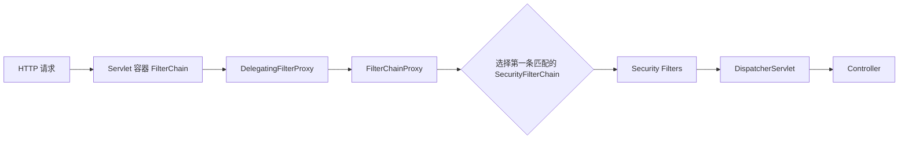

`FilterChainProxy` 是排查 Servlet 安全问题的关键入口，因为它负责链匹配、使用 `HttpFirewall`、执行安全过滤器并清理安全上下文。不要把同一个安全过滤器既注册到 Servlet 容器，又手动加入 Spring Security 链，否则可能执行两次。

网上的旧教程可能继承 `WebSecurityConfigurerAdapter` 并重写 `configure(HttpSecurity)`。现代 Spring Security 采用本文所示的组件式配置：声明 `SecurityFilterChain`、`UserDetailsService`、`PasswordEncoder` 等 Bean。迁移时应把旧 `configure` 方法里的规则移入 `SecurityFilterChain` Bean，不要在新项目继续复制旧适配器结构。

### 4.2 SecurityFilterChain 的第一匹配原则

存在多条链时，`FilterChainProxy` 按顺序选择第一条匹配当前请求的链，后续链不再执行。因此范围更窄的 `/api/**` 通常放在范围更广的默认链之前。

```java
@Bean
@Order(1)
SecurityFilterChain apiSecurity(HttpSecurity http) throws Exception {
    http
        .securityMatcher("/api/**")
        .authorizeHttpRequests(authorize -> authorize
            .anyRequest().authenticated()
        )
        .httpBasic(Customizer.withDefaults());
    return http.build();
}

@Bean
SecurityFilterChain pageSecurity(HttpSecurity http) throws Exception {
    http
        .authorizeHttpRequests(authorize -> authorize
            .requestMatchers("/public/**").permitAll()
            .anyRequest().authenticated()
        )
        .formLogin(Customizer.withDefaults());
    return http.build();
}

/**
请求
 ├─ /api/**       → apiSecurity  → HTTP Basic 认证
 └─ 其他请求       → pageSecurity
      ├─ /public/** → 直接放行
      └─ 其他请求   → Form Login 表单登录
**
```

`securityMatcher` 决定“整条链是否参与”，`requestMatchers` 决定“链内如何授权”。把两者混淆会出现配置看似存在却不执行的情况。若没有任何链匹配某请求，该请求不会得到该链中的安全保护；通常应保留一条覆盖剩余请求的兜底链。

还要检查“过滤器自己提供的端点”。例如 `formLogin()` 中的过滤器提供 `POST /login`；如果所在链只用 `securityMatcher("/secured/**")` 匹配 `/secured/**`，默认 `/login` 根本不在该链中，可能返回 404，而不是 401。正确做法是把登录处理地址改到链的匹配范围，或调整整体链边界。验证时应同时请求登录页、登录处理 URL、退出 URL 和普通业务 URL。

### 4.3 关键过滤器的相对阶段

实际过滤器集合由启用的功能决定，不应背诵一个固定完整列表，但要理解相对顺序：

1\. 安全上下文加载与恢复。

2\. CORS、CSRF 和安全头等攻击防护。

3\. Logout、用户名密码、Basic、Bearer Token 等认证过滤器。

4\. 请求缓存、匿名身份、异常翻译。

5\. `AuthorizationFilter` 执行最终请求授权。

认证必须先于授权，因为授权需要读取 `Authentication`。异常翻译位于合适位置，才能把认证异常或拒绝访问转换为 401、403 或重定向。

### 4.4 添加自定义 Filter 的正确方式

自定义过滤器要先明确它依赖谁、产出谁，再选择相对位置：

```java
http.addFilterBefore(tenantContextFilter, AuthorizationFilter.class);
```

例如租户上下文过滤器需要在授权前准备租户信息，但如果它读取已认证用户，又必须放在对应认证过滤器之后。生产实现还要在 `finally` 中清理 `ThreadLocal`，否则线程池复用可能把租户或身份泄漏到下一个请求。

如果自定义过滤器声明为 Spring Bean，Spring Boot 可能把它自动注册到 Servlet 容器；同时用 `addFilterBefore` 加入安全链会导致双重执行。可通过 `FilterRegistrationBean#setEnabled(false)` 关闭容器自动注册，只保留安全链内执行。

### 4.5 打印与观察过滤器链

开发或故障环境可以开启安全日志：

```yaml
logging:
  level:
    org.springframework.security: TRACE
```

TRACE 日志可能包含 URL、匹配器与认证流程细节，不应在生产长期全量开启。验证时重点观察：

1\. 请求命中了哪条 `SecurityFilterChain`。

2\. 哪个过滤器提取了凭证。

3\. 使用了哪个 `AuthenticationProvider`。

4\. 最终由认证入口还是拒绝处理器生成响应。

5\. 请求结束后上下文是否清理或持久化。

官方架构参考：[Servlet Architecture](https://docs.spring.io/spring-security/reference/servlet/architecture.html)。

## 5 认证架构与用户名密码认证

### 5.1 核心组件如何协作

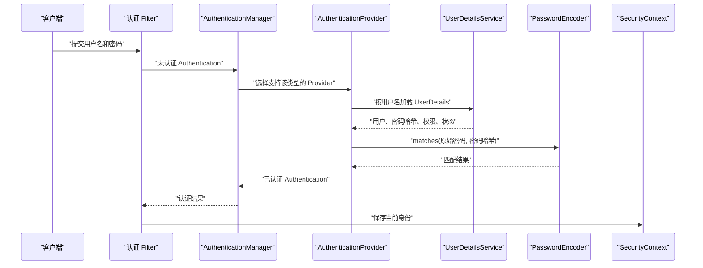

`AuthenticationManager` 是认证入口接口，最常见实现 `ProviderManager` 按顺序询问多个 `AuthenticationProvider`。Provider 可以认证、明确失败，或表示不支持当前 `Authentication` 类型并让下一个 Provider 尝试。所有 Provider 都不支持时会出现 `ProviderNotFoundException`。

### 5.2 DaoAuthenticationProvider

`DaoAuthenticationProvider` 负责经典用户名密码认证：

1\. 用 `UserDetailsService#loadUserByUsername` 加载用户。

2\. 检查账号是否锁定、过期或禁用。

3\. 使用 `PasswordEncoder#matches` 比较原始密码与存储哈希。

4\. 构造可信的已认证 `Authentication`，带回业务权限；Spring Security 7.x 还会至少加入 `FACTOR_PASSWORD`，表示本次身份通过了密码因素。

`UserDetailsService` 只负责“按用户名加载用户”，不负责校验密码。把密码比较写进 `loadUserByUsername` 会混淆职责、破坏框架的异常处理和密码升级能力。

### 5.3 用数据库实现 UserDetailsService

```java
package com.example.securitydemo;

import org.springframework.security.core.userdetails.User;
import org.springframework.security.core.userdetails.UserDetailsService;
import org.springframework.security.core.userdetails.UsernameNotFoundException;
import org.springframework.stereotype.Service;

@Service
public class DatabaseUserDetailsService implements UserDetailsService {

    private final AccountRepository accountRepository;

    public DatabaseUserDetailsService(AccountRepository accountRepository) {
        this.accountRepository = accountRepository;
    }

    @Override
    public User loadUserByUsername(String username) {
        var account = accountRepository.findByUsername(username)
            .orElseThrow(() -> new UsernameNotFoundException("account not found"));

        String[] authorities = account.permissions().toArray(String[]::new);
        return User.withUsername(account.username())
            .password(account.passwordHash())
            .authorities(authorities)
            .disabled(!account.enabled())
            .accountLocked(account.locked())
            .build();
    }
}
```

`AccountRepository` 是示意接口，生产查询应保证规范化用户名唯一、存在索引，并明确大小写规则。错误响应不要区分“用户名不存在”和“密码错误”，否则攻击者可枚举账号；内部审计日志可以保留不同原因，但要脱敏并限制访问。

### 5.4 自定义 AuthenticationProvider

只有当现有 Provider 无法表达认证协议时才自定义，例如对接遗留签名设备。普通数据库密码认证优先使用 `DaoAuthenticationProvider`。

```java
public final class DeviceSignatureAuthenticationProvider
        implements AuthenticationProvider {

    private final DeviceSignatureVerifier verifier;

    public DeviceSignatureAuthenticationProvider(DeviceSignatureVerifier verifier) {
        this.verifier = verifier;
    }

    @Override
    public Authentication authenticate(Authentication authentication) {
        var request = (DeviceSignatureAuthenticationToken) authentication;
        var device = verifier.verify(request.deviceId(), request.signature());
        return DeviceSignatureAuthenticationToken.authenticated(
            device.id(), device.authorities());
    }

    @Override
    public boolean supports(Class<?> authenticationType) {
        return DeviceSignatureAuthenticationToken.class
            .isAssignableFrom(authenticationType);
    }
}
```

`supports` 写错是常见故障：返回 `false` 会让 Provider 永远不执行，全部 Provider 都不支持时最终报 `ProviderNotFoundException`。自定义 Token 还应防止调用方直接构造“已认证”状态，常见做法是分别提供未认证与已认证工厂方法。

### 5.5 认证成功与失败后的动作

认证成功不只是“密码对了”，通常还包括：

1\. 执行 `SessionAuthenticationStrategy`，例如更换 Session ID 以防会话固定攻击。

2\. 把结果放入 `SecurityContextHolder`。

3\. 按所用机制决定是否持久化上下文。

4\. 发布认证成功事件并调用成功处理器。

5\. 清除不再需要的敏感凭证。

认证失败时要清理上下文、记录受控审计事件、执行失败处理器，并考虑限速或锁定策略。锁定策略还要防止攻击者通过大量失败尝试恶意锁死其他用户，可结合 IP（Internet Protocol，网际协议）地址、设备、账号和渐进式延迟。

官方认证架构参考：[Servlet Authentication Architecture](https://docs.spring.io/spring-security/reference/servlet/authentication/architecture.html)。

## 6 密码存储、升级与账号安全

### 6.1 密码不是加密后保存

密码应经过带盐的自适应单向函数处理，而不是可逆加密，也不是快速哈希。可逆加密意味着密钥泄漏后全部密码可恢复；MD5（Message-Digest Algorithm 5）或 SHA-256（Secure Hash Algorithm 256-bit）等快速哈希太适合攻击者并行穷举。

`PasswordEncoder` 的核心操作是：

```java
String encoded = passwordEncoder.encode(rawPassword);
boolean matches = passwordEncoder.matches(rawPassword, encoded);
```

应用注册或改密时调用 `encode`，登录时调用 `matches`。由于随机盐的存在，同一个原始密码多次编码通常得到不同结果，不能通过“重新编码后比较字符串相等”验证密码。

>passwordEncoder.matches()的正确流程：
>
>用户输入的原始密码
>        ↓
>从数据库编码结果中读取算法参数和原盐值
>        ↓
>使用相同盐值重新计算
>        ↓
>比较重新计算的结果与数据库中的哈希结果

### 6.2 DelegatingPasswordEncoder 的格式

盐不需要保密，通常直接包含在最终编码字符串中。以 BCrypt 为例，编码结果中保存了算法版本、工作因子、盐和哈希结果。

Spring Security 默认使用 `DelegatingPasswordEncoder`，存储格式形如：

```text
{bcrypt}$2a$10$...
```

前缀 `{bcrypt}` 是算法标识，后半部分是该算法的编码结果。这种设计允许新密码使用当前推荐算法，同时继续验证旧算法密码，并在用户成功登录后逐步升级。

```java
@Bean
PasswordEncoder passwordEncoder() {
    return PasswordEncoderFactories.createDelegatingPasswordEncoder();
}
```

如果数据库存量值没有 `{id}` 前缀，而配置使用 `DelegatingPasswordEncoder`，常见结果是提示没有映射对应 id。迁移时应先识别存量算法并制定映射或离线迁移方案，不要用 `{noop}` 伪装明文长期运行。

> noop = No Operation（不执行任何处理）

### 6.3 工作因子与性能

BCrypt、PBKDF2（Password-Based Key Derivation Function 2）、scrypt 和 Argon2 都是自适应算法，可以调整计算成本。官方建议把验证成本调到当前系统大约一秒量级；项目应在自己的硬件、并发和延迟目标下压测，再确定真实参数。

工作因子太低会降低攻击成本；太高会让登录接口成为拒绝服务放大器。因此需要同时具备：

1\. 性能基准：测量 P50（中位数）、P95、P99 等时延分位数和 CPU（Central Processing Unit，中央处理器）使用率。P99 表示 99% 的样本不超过该值，用来观察少量慢请求造成的尾延迟。

2\. 流量保护：账号、IP、设备维度的限速与异常检测。

3\. 容量规划：登录高峰、批量迁移和故障重试不能耗尽线程池。

4\. 升级策略：算法或参数变化时渐进升级，避免一次性重算所有密码。

### 6.4 成功登录时升级密码哈希

`PasswordEncoder#upgradeEncoding` 可以判断存量编码是否需要升级。不要在 Controller 中再手写一次密码校验；`DaoAuthenticationProvider` 在旧哈希认证成功后，可以借助 `UserDetailsPasswordService` 自动用当前编码器重算并写回：

```java
@Bean
AuthenticationProvider databaseAuthenticationProvider(
        UserDetailsService users,
        PasswordEncoder encoder,
        UserDetailsPasswordService passwordUpdates) {
    var provider = new DaoAuthenticationProvider(users);
    provider.setPasswordEncoder(encoder);
    provider.setUserDetailsPasswordService(passwordUpdates);
    return provider;
}
```

`UserDetailsPasswordService#updatePassword` 收到的 `newPassword` 已经是新编码结果，不是原始密码。数据库实现仍应使用旧哈希做乐观条件，防止并发改密被较早开始的登录请求覆盖：

```java
@Service
public class DatabasePasswordUpgradeService
        implements UserDetailsPasswordService {

    private final AccountRepository accounts;

    public DatabasePasswordUpgradeService(AccountRepository accounts) {
        this.accounts = accounts;
    }

    @Override
    @Transactional
    public UserDetails updatePassword(UserDetails user, String newPassword) {
        int affected = accounts.updatePasswordHashIfCurrent(
            user.getUsername(), user.getPassword(), newPassword);
        if (affected != 1) {
            throw new IllegalStateException("password changed concurrently");
        }
        return User.withUserDetails(user)
            .password(newPassword)
            .build();
    }
}
```

这里的 `AccountRepository` 仍是项目自定义接口，`updatePasswordHashIfCurrent` 应生成类似 `UPDATE ... WHERE username = ? AND password_hash = ?` 的条件更新。成功判据不是“没有异常”，而是受影响行数为 1；若为 0，说明账号被并发改密、删除或更新，不能无条件覆盖。集成测试应准备一个确实需要升级的旧哈希，完成一次真实登录，再从数据库读取并确认算法前缀或工作因子已变化；只断言登录返回 200 不能证明升级写回成功。

### 6.5 密码与账号生产策略

1\. 传输层必须使用 HTTPS（Hypertext Transfer Protocol Secure），服务端日志、链路追踪和异常信息不得记录原始密码。

2\. 密码重置 Token 要随机、短期、一次性，并以哈希形式保存；使用后原子失效。

3\. 管理员重置密码后应要求用户下次登录改密，并按风险使已有 Session 或 Refresh Token 失效。

4\. MFA（Multi-Factor Authentication，多因素认证）是独立于密码的额外保障，不能用“更复杂密码”替代。

5\. 可按风险为 `DaoAuthenticationProvider` 配置 `CompromisedPasswordChecker`，在认证成功前检查已泄露密码；外部检查服务的隐私、超时、限流和故障策略必须明确，不能因下游异常静默放行高风险密码。

6\. 不要自创密码哈希算法，也不要在前端先哈希后把哈希当作长期固定密码；截获的固定哈希仍可被重放。

官方密码存储参考：[Password Storage](https://docs.spring.io/spring-security/reference/features/authentication/password-storage.html)。

> 密码重置流程：
>
> 生成原始 Token
>       ↓
> 把原始 Token 发给用户
>       ↓
> 数据库只保存 Token 的哈希
>       ↓
> 用户提交原始 Token
>       ↓
> 计算哈希并查询数据库
>       ↓
> 检查是否存在、未过期、未使用
>       ↓
> 更新密码并使 Token 失效

## 7 常见登录机制：表单、Basic、Remember-Me 与 Logout

### 7.1 表单登录适合浏览器页面

```java
http.formLogin(form -> form
    .loginPage("/login")
    .loginProcessingUrl("/login")
    .defaultSuccessUrl("/dashboard", true)
    .failureUrl("/login?error")
    .permitAll()
);
```

`GET /login` 一般负责渲染页面，`POST /login` 由 `UsernamePasswordAuthenticationFilter` 处理凭证。自定义登录页后，应用必须自己实现页面，并把用户名、密码和 CSRF Token 提交到正确的处理 URL。

`defaultSuccessUrl("/dashboard", true)` 中的 `true` 表示总是跳转到固定页面；若为 `false`，框架可优先返回登录前保存的请求。固定重定向目标必须使用受控站内路径，避免开放重定向漏洞。

### 7.2 HTTP Basic 适合受控的简单客户端

HTTP Basic 把 `username:password` 做 Base64（不是加密）后放入 `Authorization` 头，每次请求都会携带凭证，因此必须使用 HTTPS。它适合内部工具、原型或受控机器客户端，不适合希望安全退出、联合登录、细粒度 Token 生命周期的复杂系统。

```java
http.httpBasic(Customizer.withDefaults());
```

服务端通常通过 `WWW-Authenticate: Basic` 发起认证挑战。浏览器可能缓存 Basic 凭证，使“退出”体验不可控，这也是面向用户页面更常选表单 Session 或 OpenID Connect 的原因。

### 7.3 Remember-Me 不是永久 Session

Remember-Me 用长期 Cookie 在 Session 失效后重新建立认证。它扩大了凭证被窃取后的有效窗口，只应在风险可接受的页面应用中启用，并配合 HTTPS、`HttpOnly`、`Secure`、`SameSite`、设备管理和撤销能力。

```java
http.rememberMe(remember -> remember
    .tokenValiditySeconds(14 * 24 * 60 * 60)
    .userDetailsService(userDetailsService)
);
```

涉及支付、改密、查看密钥等敏感动作时应要求近期重新认证，不能只相信 Remember-Me 身份。持久化 Token 方案也要考虑数据库泄漏、Token 轮换和并发设备管理。

### 7.4 Logout 的真实含义

默认表单体系中，Logout 通常清除认证、使 Session 失效、清理安全上下文，并删除相关 Cookie：

```java
http.logout(logout -> logout
    .logoutUrl("/logout")
    .logoutSuccessUrl("/login?logout")
    .invalidateHttpSession(true)
    .clearAuthentication(true)
    .deleteCookies("JSESSIONID")
);
```

对于 Session 登录，服务端使 Session 失效才是真正退出；只删除浏览器 Cookie 不能保证服务端状态立即撤销。对于自包含 JWT，删除客户端 Token 不会让已泄漏 Token 立刻失效，需要短有效期、撤销列表、版本号或授权服务器能力配合。

Logout 是改变状态的请求，浏览器页面应用应保留 CSRF 防护。不要为了方便把 GET 请求配置成退出入口，否则第三方页面可诱导用户退出（Logout 属于“改变状态”的操作，语义上应使用 `POST`，而不应由 `GET` 直接执行）。

### 7.5 Spring Security 7.x 的多因素认证入口

只验证密码时，攻击者窃取密码就可以冒充用户。MFA 要求用户同时满足两种或多种独立因素，例如“知道密码”和“能访问指定邮箱或设备”。Spring Security 7.0 引入了基于 `FactorGrantedAuthority` 的 MFA 支持；当前 7.1 API 可用 `@EnableMultiFactorAuthentication` 把所需因素组合进授权规则，并进一步支持条件化 MFA。密码、Bearer Token、OTT（One-Time Token，一次性令牌）或 WebAuthn（Web Authentication，Web 认证）等认证机制会加入对应 Factor Authority，业务 Role 与 Authority 仍需另外满足。

以“密码 + OTT”为例，全局要求两个因素的最小配置入口是：

```java
@Configuration
@EnableMultiFactorAuthentication(authorities = {
    FactorGrantedAuthority.PASSWORD_AUTHORITY,
    FactorGrantedAuthority.OTT_AUTHORITY
})
class MfaSecurityConfig {

    @Bean
    SecurityFilterChain mfaSecurity(HttpSecurity http) throws Exception {
        http
            .authorizeHttpRequests(authorize -> authorize
                .anyRequest().authenticated()
            )
            .formLogin(Customizer.withDefaults())
            .oneTimeTokenLogin(Customizer.withDefaults());
        return http.build();
    }
}
```

OTT 与 OTP（One-Time Password，一次性密码）不是同一概念。Spring Security 的 OTT 通常由服务器生成，用户先申请 Token，应用通过 Magic Link、邮件或短信交付，用户再提交该 Token。TOTP（Time-Based One-Time Password，基于时间的一次性密码）则通常由预先共享密钥的认证器生成。

上述代码只建立因素要求和认证入口，不是完整生产方案。项目还必须实现 `OneTimeTokenGenerationSuccessHandler` 把 Token 交付给用户，生产环境应考虑 `JdbcOneTimeTokenService` 等可共享持久化实现，并验证 Token 过期、一次性消费、重放拒绝、交付通道失败和多实例一致性。默认内存实现不能证明集群环境正确。

Spring Security 7.1 还可以用 `when = MultiFactorCondition.WEBAUTHN_REGISTERED` 只对已注册 Passkey 的用户附加密码与 WebAuthn 因素要求。该条件依赖 `PublicKeyCredentialUserEntityRepository` 和 `UserCredentialRepository` Bean 来判断注册状态；它解决的是“是否已注册 WebAuthn 凭证”这一条件，不等同于按金额、设备或地理位置计算风险的通用风控引擎。

Passkey 基于 WebAuthn，可作为另一种认证因素。它涉及 Relying Party ID、允许 Origin、凭证注册与持久化，必须在真实 HTTPS 域名下验证，不应只凭一个本地登录成功页判定生产可用。官方入口：[MFA](https://docs.spring.io/spring-security/reference/servlet/authentication/mfa.html)、[One-Time Token Login](https://docs.spring.io/spring-security/reference/servlet/authentication/onetimetoken.html)、[Passkeys](https://docs.spring.io/spring-security/reference/servlet/authentication/passkeys.html)。

当前 MFA 支持只适用于 Servlet 应用，Reactive（响应式）应用不会应用这套机制。WebFlux 项目不能把 `@EnableMultiFactorAuthentication` 和 Servlet 登录配置直接复制过去，应按实际 Spring Security 版本核对 Reactive 支持状态并自行组合认证流程与授权规则。

## 8 请求级授权与方法级授权

### 8.1 请求规则按声明顺序匹配

```java
http.authorizeHttpRequests(authorize -> authorize
    .requestMatchers("/public/**", "/login").permitAll()
    .requestMatchers(HttpMethod.GET, "/orders/**")
        .hasAuthority("order:read")
    .requestMatchers(HttpMethod.POST, "/orders/**")
        .hasAuthority("order:write")
    .requestMatchers("/admin/**").hasRole("ADMIN")
    .anyRequest().denyAll()
);
```

每个请求使用第一条匹配规则，因此具体规则应放在宽泛规则之前。最后使用 `denyAll()` 是严格白名单策略，新增端点默认不可访问；使用 `authenticated()` 则允许任意已登录用户访问未显式分类的端点。二者是安全与维护成本的取舍，应由项目约定决定。

不要通过字符串前缀想当然地推断匹配行为。Spring Security 7 的 Java DSL（Domain-Specific Language，领域特定语言）默认使用 `PathPatternRequestMatcher`，规则路径必须是去掉 Context Path（应用上下文路径）后的绝对路径，例如 `/orders/**`。如果应用挂载多个 Servlet，或 Spring MVC 自定义了 `PathPatternParser`，还要让安全匹配器与 MVC 使用相同的解析器和 Servlet Base Path；否则 Controller 与安全规则可能对同一 URL 得出不同匹配结果。Spring Security 6 升级到 7 时，应重点回归尾斜杠、路径参数、编码字符、Context Path 和错误分派，不要假设旧的 Ant 风格边界完全不变。

### 8.2 permitAll 与忽略安全链

`permitAll()` 表示请求仍经过 Spring Security，只是在授权阶段允许访问，因此安全响应头、CSRF 上下文和其他防护仍可工作。在当前授权实现中，`permitAll()` 和 `denyAll()` 还可以避免为授权决策读取 Session 中的 `Authentication`。完全忽略请求则会绕开整个安全链。

静态资源通常也优先 `permitAll()`。只有明确知道丢失哪些防护且确有性能或兼容需求时才忽略；不能为了“接口能访问”就把业务路径排除出安全链。

### 8.3 开启方法级安全

Spring Boot Starter Security 不会默认开启方法授权，需要显式启用：

```java
@Configuration
@EnableMethodSecurity
class MethodSecurityConfig {
}
```

在 Spring 管理的 Bean 上使用：

```java
@Service
public class OrderService {

    @PreAuthorize("hasAuthority('order:read') "
        + "and @orderAuthorization.canRead(#orderId, authentication)")
    public OrderView findOrder(long orderId) {
        return loadOrder(orderId);
    }

    @PreAuthorize("hasRole('ADMIN')")
    public void rebuildDailyReport() {
        // 真实项目中触发受控的报表重建任务。
    }
}
```

URL 授权适合保护入口，方法授权适合表达与参数、返回值、对象归属有关的规则。两层并存是纵深防御：即使未来增加消息消费、定时任务或另一个 Controller，核心服务仍有权限边界。

### 8.4 SpEL 与对象级授权

SpEL（Spring Expression Language，Spring 表达式语言）能读取 `authentication`、方法参数和受控 Bean：

```java
@Component
public class OrderAuthorization {

    private final OrderRepository orders;

    public OrderAuthorization(OrderRepository orders) {
        this.orders = orders;
    }

    public boolean canRead(long orderId, Authentication authentication) {
        return orders.existsByIdAndOwnerUsername(orderId, authentication.getName());
    }
}
```

表达式应保持短小，把数据库访问和领域规则委托给普通 Bean，便于测试和复用。参数名解析依赖编译元数据时，应确保构建配置保留方法参数名，或使用显式参数约定。

这个最小示例会先执行一次归属检查，再由 `loadOrder` 查询订单，适合解释方法授权但不是高并发生产查询模板。若订单归属可变化，或读取结果本身敏感，应优先让数据访问使用 `id + owner + tenant` 联合条件一次取回，避免两次查询之间状态改变造成 TOCTOU（Time of Check to Time of Use，检查时与使用时不一致）问题；方法授权保留为入口防线，数据查询作为最终数据边界。

### 8.5 代理边界与自调用陷阱

方法安全通常由 Spring AOP（Aspect-Oriented Programming，面向切面编程）代理拦截。一个 Bean 内部用 `this.securedMethod()` 自调用时，请求没有经过代理，注解可能不生效。

正确设计通常是把安全边界放到由另一个 Bean 调用的公开业务方法，而不是从容器中反查自己或开启暴露代理。还要检查：

1\. 被保护对象是否由 Spring 管理。

2\. 调用是否经过代理。

3\. 注解是否在实际被调用的方法上。

4\. 方法安全是否已用 `@EnableMethodSecurity` 开启。

5\. 测试是否真正调用代理对象而不是手工 `new`。

### 8.6 AuthorizationManager

现代 Spring Security 使用 `AuthorizationManager` 统一请求、方法和消息等授权决策。Spring Security 7 已把旧的 `AccessDecisionManager`、`AccessDecisionVoter` 等 Access API 移入兼容迁移用的 `spring-security-access` 模块；新项目不应为复制旧教程而主动加入该模块。自定义复杂策略时优先实现或组合 `AuthorizationManager`，但普通项目先使用 `hasAuthority`、`hasRole` 与方法授权 Bean 即可。

授权结果应默认拒绝未明确满足的情况。外部权限服务超时如何处理必须显式决定；对高风险写操作通常 fail closed，即无法确认时拒绝，而不是静默放行。

官方参考：[请求级授权](https://docs.spring.io/spring-security/reference/servlet/authorization/authorize-http-requests.html)、[方法级授权](https://docs.spring.io/spring-security/reference/servlet/authorization/method-security.html)。

## 9 SecurityContext、Session 与无状态 API

### 9.1 SecurityContextHolder 的作用与边界

`SecurityContextHolder` 保存当前 `SecurityContext`，后者包含 `Authentication`。Servlet 应用默认用 `ThreadLocal` 让同一请求线程中的代码读取当前身份。

```java
Authentication authentication =
    SecurityContextHolder.getContext().getAuthentication();
String username = authentication.getName();
```

Controller 中更推荐显式注入身份，降低静态上下文耦合：

```java
@GetMapping("/api/me")
Map<String, Object> me(Authentication authentication) {
    return Map.of(
        "name", authentication.getName(),
        "authorities", authentication.getAuthorities()
    );
}
```

`ThreadLocal` 只对当前线程可见。请求线程 `http-1` 以用户 `alice` 的身份提交 `@Async` 任务后，任务通常由另一个线程池工作线程执行；该线程没有 `http-1` 的 `ThreadLocal`，直接读取 `SecurityContextHolder` 可能得到空上下文。

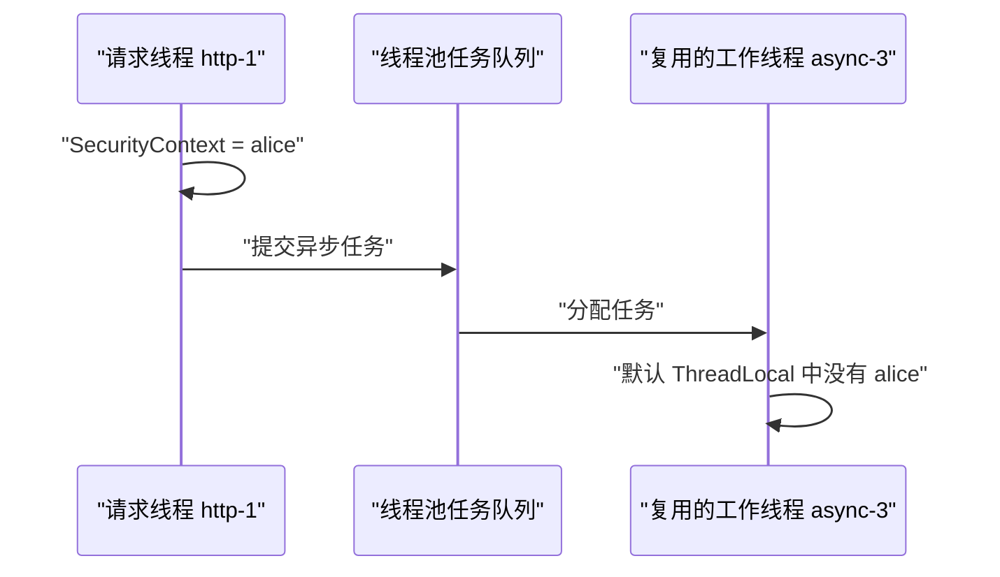

`MODE_INHERITABLETHREADLOCAL` 只能在线程创建时，把父线程当时持有的值复制给子线程；它不会在每次任务提交时重新复制。线程池的工作线程通常提前创建并长期复用，所以工作线程可能没有当前请求的身份，也可能保留创建线程时继承的旧身份。例如工作线程创建时继承了 `alice`，之后被复用于 `bob` 的任务，就可能把 `bob` 的操作错误地当成 `alice` 执行。因此它不适合作为线程池的通用安全上下文传播方案。

请求内提交且很快执行的异步任务，可以使用 Spring Security 的委托执行器。`DelegatingSecurityContextAsyncTaskExecutor` 在每次提交任务时取得当前 `SecurityContext`，用 `DelegatingSecurityContextRunnable` 或 `DelegatingSecurityContextCallable` 包装任务，在工作线程执行前设置上下文，并在执行完成后清理或恢复工作线程原有上下文：

```java
@Configuration
@EnableAsync
class AsyncSecurityConfig {

    @Bean("businessExecutor")
    ThreadPoolTaskExecutor businessExecutor() {
        var delegate = new ThreadPoolTaskExecutor();
        delegate.setCorePoolSize(4);
        delegate.setMaxPoolSize(8);
        delegate.setQueueCapacity(100);
        delegate.setThreadNamePrefix("business-");
        return delegate;
    }

    @Bean("securityTaskExecutor")
    AsyncTaskExecutor securityTaskExecutor(
            @Qualifier("businessExecutor")
            ThreadPoolTaskExecutor delegate) {
        return new DelegatingSecurityContextAsyncTaskExecutor(delegate);
    }
}
```

```java
@Async("securityTaskExecutor")
public void generateReport() {
    Authentication authentication =
        SecurityContextHolder.getContext().getAuthentication();
    String operator = authentication.getName();
    // 当前任务可以读取提交任务时的身份。
}
```

该方案传播的是任务提交时的身份快照，不能证明任务实际执行时权限仍然有效。排队时间较长、会持久化或允许重试的任务，例如消息队列、延迟任务和定时任务，不应传递完整 `SecurityContext`、原始密码或完整 Token；通常只传递操作者 ID、租户 ID、目标资源 ID 和 `traceId` 等最小数据：

```java
public record DeleteReportCommand(
    long operatorId,
    long tenantId,
    long reportId,
    String traceId
) {
}
```

消费者执行删除、转账、修改权限或读取密钥等高风险操作前，应重新加载账号状态、当前权限、租户关系和资源状态。这样即使用户在任务排队期间被锁定、撤权或移出租户，任务也会根据执行时的最新状态拒绝操作。

| 任务类型 | 身份处理方式 |
| --- | --- |
| 请求期间提交并立即执行的短任务 | 使用委托执行器传播提交时的 `SecurityContext` |
| 只需要记录操作者的任务 | 显式传递用户 ID 和 `traceId`，避免依赖线程上下文 |
| 消息队列、延迟任务和可重试任务 | 传递最小身份数据，执行时重新加载账号和权限 |
| 转账、删除、授权等高风险任务 | 执行前重新授权，并在数据访问层再次约束租户和资源归属 |

委托执行器解决“身份如何到达另一个线程”，执行前重新授权解决“这份身份现在是否仍有权操作”，两者对应不同的安全问题。官方 API 参考：[DelegatingSecurityContextExecutor](https://docs.spring.io/spring-security/reference/api/java/org/springframework/security/concurrent/DelegatingSecurityContextExecutor.html)、[DelegatingSecurityContextAsyncTaskExecutor](https://docs.spring.io/spring-security/reference/api/java/org/springframework/security/task/DelegatingSecurityContextAsyncTaskExecutor.html)。

### 9.2 Session 如何让登录跨请求持续

表单登录成功后，安全上下文通常保存到 HTTP Session。后续浏览器携带 `JSESSIONID`，服务器加载 Session 并恢复身份：

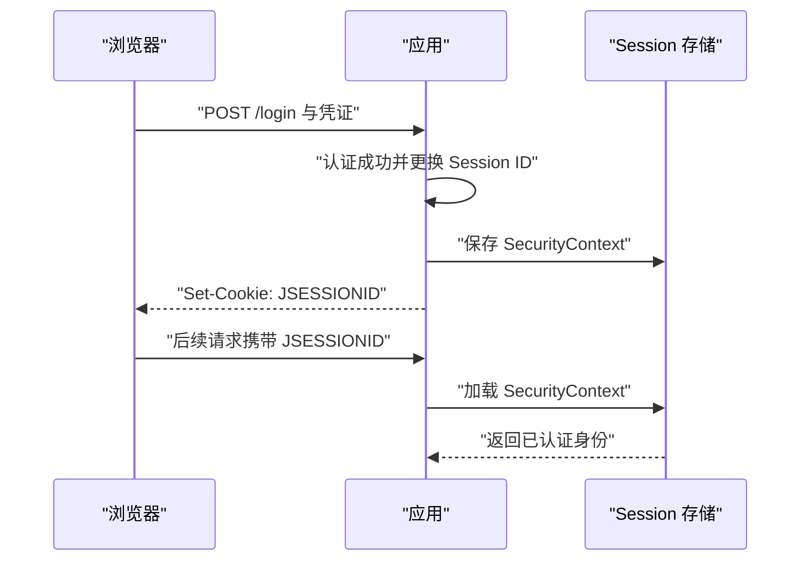

Session Cookie 只是随机会话标识，不应包含密码，真正的登录状态保存在服务器端 Session 中。如果 Session 保存在应用节点本地，负载均衡器需要启用粘性会话（Session Affinity，会话亲和性），根据专用 Cookie 等标识持续把同一用户的请求转发到同一节点，避免请求落到其他节点后找不到 Session。粘性会话没有共享 Session 数据：节点重启、故障、扩缩容或滚动发布时，用户仍可能丢失登录状态，流量也可能集中在少数节点。


粘性会话：

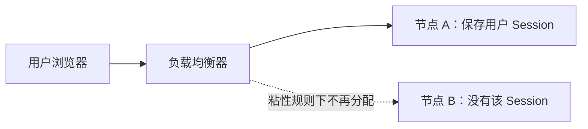


高可用部署通常使用 Spring Session 将 Session 保存到 Redis 或数据库等共享存储，任意应用节点都能恢复同一登录状态。共享存储会成为登录链路的关键依赖，需要监控可用性、容量、访问延迟、过期策略和序列化兼容性。

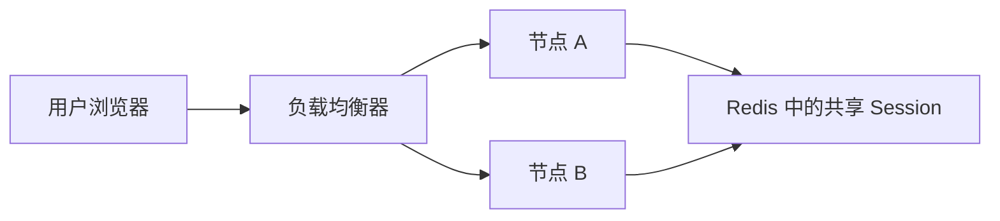


### 9.3 Session 固定攻击与并发控制

登录成功后更换 Session ID 能防止攻击者预先固定受害者会话。Spring Security 默认提供相关保护，不要因为兼容旧系统随意关闭。

并发会话限制用于控制同一账号同时在线数量，但它不是强身份保证。集群环境需要可共享的 Session 与会话注册信息；只在单机内存统计会导致各实例看到的在线数不同。

```java
@Bean
HttpSessionEventPublisher httpSessionEventPublisher() {
    // 把 Session 创建和销毁事件同步给 Spring Security。
    return new HttpSessionEventPublisher();
}

@Bean
SecurityFilterChain pageSecurity(HttpSecurity http) throws Exception {
    http.sessionManagement(session -> session
        .maximumSessions(1)
        .maxSessionsPreventsLogin(false)
    );
    return http.build();
}
```

`HttpSessionEventPublisher` 让会话注册表知道 Session 已销毁，否则计数可能不及时更新。`maxSessionsPreventsLogin(false)` 表示新登录挤掉旧会话；设为 `true` 表示旧会话存在时拒绝新登录。项目需要根据账号共享风险和用户体验选择策略，并覆盖并发登录、节点重启和会话过期测试。

如果使用自定义 `UserDetails`，还要正确实现 `equals` 与 `hashCode`；默认 `SessionRegistry` 依赖它们识别“是否是同一个用户”。成功判据不只是第二次登录返回成功，还要保留第一次登录的 Session Cookie，再用它请求受保护端点，确认旧会话已失效。

### 9.4 无状态 API

Bearer Token API 通常不希望服务端用 Session 保存认证：

```java
http.sessionManagement(session -> session
    .sessionCreationPolicy(SessionCreationPolicy.STATELESS)
);
```

`STATELESS` 表示 Spring Security 不使用 Session 获取或保存安全上下文，但应用其他代码仍可能创建 Session。要验证响应中没有意外 `JSESSIONID`，并检查异常处理、请求缓存和第三方库。

无状态不等于“没有状态”：授权服务器仍保存客户端、密钥、同意、撤销或 Refresh Token 状态，资源服务器仍可能缓存 JWK（JSON Web Key）和权限数据。它只是把每次请求认证所需的主要声明放进可验证 Token，不由本服务 Session 维持。

### 9.5 显式保存安全上下文

现代配置更强调只在需要时加载和显式保存安全上下文。若业务代码绕过标准认证过滤器，自行调用 `AuthenticationManager`，仅执行 `SecurityContextHolder.setContext` 可能只对当前请求有效；要跨请求持久化，还需通过合适的 `SecurityContextRepository` 保存。

自定义 JSON 登录过滤器应复用框架认证成功流程，而不是在 Controller 里只设置静态上下文。验证标准是下一次独立请求能恢复身份，而不只是当前方法能读取到身份。

官方会话参考：[Authentication Persistence and Session Management](https://docs.spring.io/spring-security/reference/servlet/authentication/session-management.html)。

## 10 CSRF、CORS、安全头与请求防火墙

### 10.1 CSRF 攻击为什么成立

CSRF 利用浏览器会自动携带目标站点 Cookie 的行为。受害者已登录银行站点后访问恶意页面，恶意页面可让浏览器向银行发起转账请求；浏览器会自动附带银行 Session Cookie，但恶意站点通常读不到银行生成的随机 CSRF Token。

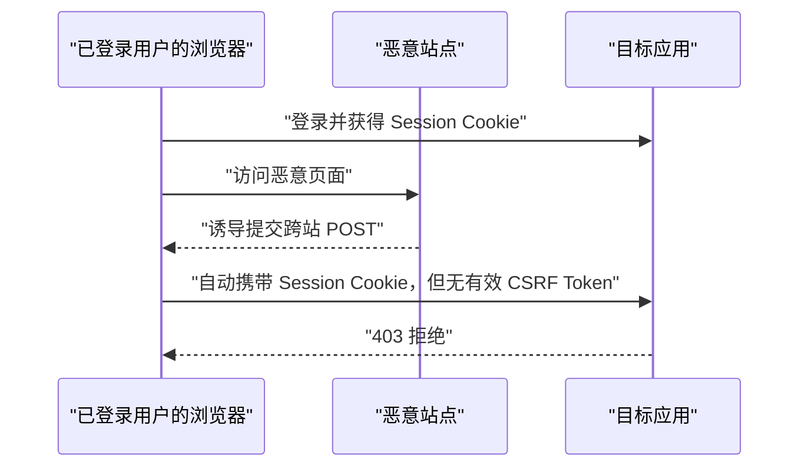

Spring Security 对 POST 等不安全 HTTP 方法默认启用 CSRF 防护。默认 Token 存在 Session，并延迟到需要时加载；默认处理还加入随机性以防 BREACH（Browser Reconnaissance and Exfiltration via Adaptive Compression of Hypertext，基于压缩侧信道的泄露攻击）。

Session-Cookie的csrf token获取流程：

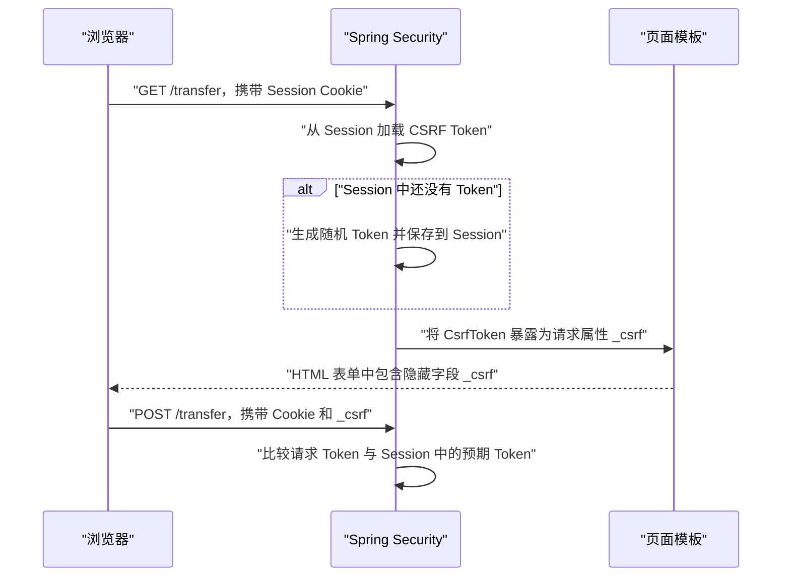

### 10.2 什么时候能关闭 CSRF

不能因为“这是 REST（Representational State Transfer，表述性状态转移）风格 API”就关闭。关键问题是浏览器会不会自动附带认证凭证：

| 认证方式 | CSRF 风险判断 |
| --- | --- |
| Session Cookie | 需要防护 |
| 浏览器自动携带的认证 Cookie | 需要防护 |
| HTTP Basic | 浏览器可能自动携带或缓存，仍需认真评估 |
| 客户端代码从内存读取 Bearer Token 并放入 Header | 通常不依赖自动 Cookie，可针对该无状态链关闭 |
| 同时支持 Cookie 与 Bearer | Cookie 路径仍需要防护，不能全局关闭 |

纯无状态 Bearer Token API 可在限定的 `/api/**` 链中关闭：

```java
http
    .securityMatcher("/api/**")
    .csrf(csrf -> csrf.disable())
    .sessionManagement(session -> session
        .sessionCreationPolicy(SessionCreationPolicy.STATELESS)
    );
```

关闭后的验证应包含：请求不会读取 Session 认证、Token 不放在自动发送的 Cookie、浏览器跨站表单无法构造合法 Authorization Header。

### 10.3 单页应用的 CSRF 集成

SPA（Single-Page Application，单页应用）若使用 Session Cookie 维持登录状态，浏览器会自动携带身份 Cookie，因此写请求仍需 CSRF 防护。SPA 通常不提交带隐藏字段的 HTML 表单，而是由 JavaScript 发送 JSON；前端需要取得 CSRF Token，再把它主动写入请求头。浏览器自动携带 Session Cookie，合法前端主动提供 CSRF 请求头，服务器同时验证二者。

Spring Security 7.0 起可以直接启用 SPA 集成：

```java
http.csrf(csrf -> csrf.spa());
```

默认交互约定是服务器写入 `XSRF-TOKEN` Cookie，JavaScript 读取其中的 Token，再通过 `X-XSRF-TOKEN` Header 提交。身份 Cookie 与 Token Cookie 的职责不同：

| Cookie | 用途 | JavaScript 是否需要读取 |
| --- | --- | --- |
| `JSESSIONID` | 标识服务端 Session，使服务器恢复登录身份 | 不需要，通常保持 `HttpOnly` |
| `XSRF-TOKEN` | 向合法前端提供 CSRF Token | 需要，因此 SPA 配置会允许 JavaScript 读取 |

一次正常写请求按以下顺序发生：

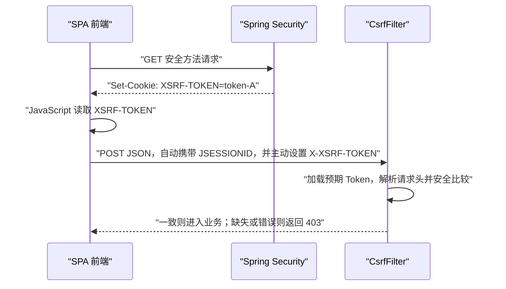

前端请求可以写成：

```javascript
function readCookie(name) {
    const prefix = `${name}=`;
    const item = document.cookie
        .split("; ")
        .find(cookie => cookie.startsWith(prefix));
    return item ? decodeURIComponent(item.substring(prefix.length)) : null;
}

const csrfToken = readCookie("XSRF-TOKEN");
if (!csrfToken) {
    throw new Error("CSRF token is unavailable");
}

await fetch("/api/orders", {
    method: "POST",
    credentials: "include",
    headers: {
        "Content-Type": "application/json",
        "X-XSRF-TOKEN": csrfToken
    },
    body: JSON.stringify({ productId: 7, quantity: 1 })
});
```

请求中的 `credentials: "include"` 用于需要跨源但被 CORS 明确信任的前后端部署；同源请求通常使用默认的 `same-origin` 即可。服务端仍应把允许的 Origin 限制为可信前端，不能用宽泛 CORS 配置暴露带凭证的响应。

恶意站点可能诱导浏览器自动发送 Cookie，却通常无法读取目标站点的 `XSRF-TOKEN`，也无法通过普通 HTML 表单设置 `X-XSRF-TOKEN` 自定义请求头。因此服务器不能只检查 Token Cookie 是否存在，还要校验由前端主动提交的请求头或 `_csrf` 参数。

除了 Token 的存储和提交位置，还要区分原始 Token 与用于 BREACH 防护的掩码 Token。Spring Security 默认使用 `XorCsrfTokenRequestAttributeHandler` 缓解 BREACH。可以把底层持久化的原始 Token 记为 `R`，把每次响应新生成的随机掩码记为 `M`：

```text
底层原始 Token：R
HTML 暴露值：encode(M, M XOR R)
SPA Cookie 值：R
```

服务端渲染 HTML 表单时，`_csrf` 请求属性暴露的是带随机掩码的值。即使底层原始 Token 没有变化，不同响应中的隐藏字段也可以不同；提交表单后，处理器先解除掩码得到 `R`，再与持久化 Token 比较。这种每次响应加入随机性的做法降低了攻击者利用压缩后响应长度推测 Token 的风险。

SPA 从 `XSRF-TOKEN` Cookie 读到的则是原始值 `R`，并把它放入请求头。完整的 SPA 处理需要区分两条输入路径：

| 客户端提交方式 | 位置 | 提交值 | 服务器解析方式 |
| --- | --- | --- | --- |
| 服务端渲染的 HTML 表单 | `_csrf` 参数 | 带随机掩码的值 | 解除掩码后比较 |
| SPA JSON 请求 | `X-XSRF-TOKEN` Header | 原始值 | 直接按原始 Token 比较 |

只把仓库替换成 `CookieCsrfTokenRepository`，仅解决了“Token 保存在哪里、JavaScript 如何读取”，没有单独解决原始请求头和掩码表单参数的不同解析方式。Spring Security 7 的 `csrf.spa()` 负责组合 Cookie 存储、SPA 请求解析和默认 BREACH 防护。官方机制参考：[CSRF Token 的存储与处理](https://docs.spring.io/spring-security/reference/servlet/exploits/csrf.html)。

认证状态变化还会影响 Token 生命周期。登录成功时，`CsrfAuthenticationStrategy` 会清理认证前的 Token；退出成功时，`CsrfLogoutHandler` 会清理当前 Token。旧 Token 因而不能跨越认证状态变化继续使用。Spring Security 又默认延迟加载 Token：清理旧值后，只有后续流程真正访问 Token 时，框架才会生成并返回新值。

若刷新流程不完整，会出现以下故障：

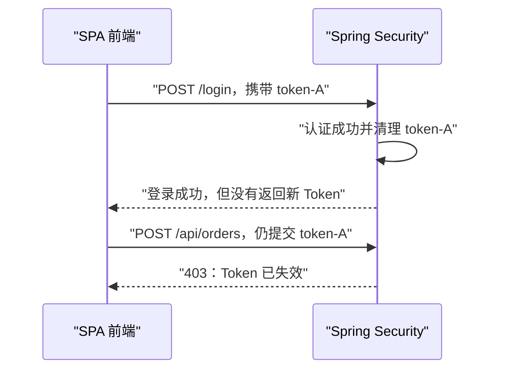

正确配置应在登录和退出后让前端获得新 Cookie，并要求前端重新读取 `XSRF-TOKEN`，不能长期缓存旧值。若项目没有使用 `csrf.spa()`，也可以提供按需获取接口：

```java
@RestController
public class CsrfController {

    @GetMapping("/csrf")
    public CsrfToken csrf(CsrfToken csrfToken) {
        return csrfToken;
    }
}
```

前端应在应用初始化、登录成功和退出成功后调用 `/csrf`，再把响应中的 `headerName` 与 `token` 用于后续写请求。如果登录前需要访问该端点，可为 `/csrf` 单独配置 `permitAll()`；CORS 仍须禁止不可信 Origin 携带凭证读取响应。该方案允许继续使用 Session 存储 Token，不要求 JavaScript 读取 Cookie。官方参考：[JavaScript 应用与按需获取 CSRF Token](https://docs.spring.io/spring-security/reference/servlet/exploits/csrf.html)。

Spring Security 6.x 没有 `csrf.spa()` 便捷入口，需要按对应版本的官方 SPA 示例组合 `CookieCsrfTokenRepository`、能区分原始值与掩码值的 `CsrfTokenRequestHandler`，以及在认证状态变化后触发新 Token 返回的过滤器；不能通过关闭 CSRF 绕过集成问题。

验证这套集成时，至少覆盖以下用例：

1\. 首次安全方法请求返回可供前端取得的 Token。

2\. Session Cookie 有效但写请求缺少 CSRF Header 时返回 403。

3\. 当前 Token 同时出现在预期存储位置和请求头时，写请求进入 Controller。

4\. 登录成功后旧 Token 被拒绝，前端能取得并使用新 Token。

5\. 退出成功后旧 Token 被拒绝，匿名状态下可以重新取得 Token。

6\. 不可信 Origin 无法通过 CORS 读取 Token 响应或携带凭证调用业务接口。

由于 JavaScript 可以读取 `XSRF-TOKEN`，XSS（Cross-Site Scripting，跨站脚本）可能同时读取 Token 并以用户身份发送请求。CSRF Token 不能防御 XSS；应用还需要输出编码、CSP（Content Security Policy，内容安全策略）、依赖治理和禁止危险 DOM 注入等防护。

### 10.4 CORS 不是访问控制替代品

CORS（Cross-Origin Resource Sharing，跨源资源共享）是浏览器执行的跨源访问规则。一个 Origin（源）由协议、主机和端口组成，其中任意一项不同就是跨源。例如，页面运行在 `https://app.example.com`，接口位于 `https://api.example.com`，浏览器会把前端 JavaScript 对接口的调用视为跨源请求。后端只有返回与请求来源匹配的 CORS 响应头，浏览器才允许 JavaScript 读取响应。

CORS 的约束对象是浏览器中的前端代码。curl、Postman、移动端应用和其他服务端程序不执行浏览器同源策略，仍可直接请求接口；某些简单跨源请求也可能已经到达服务器，只是浏览器不允许调用方读取响应。因此 CORS 不能保护业务资源，也不能代替身份认证、访问授权和 CSRF（Cross-Site Request Forgery，跨站请求伪造）防护。

当前端准备发送带 `Authorization`、JSON `Content-Type` 或 `X-XSRF-TOKEN` 等请求头的跨源写请求时，浏览器通常先发送预检 `OPTIONS` 请求：

```http
OPTIONS /api/orders HTTP/1.1
Origin: https://app.example.com
Access-Control-Request-Method: POST
Access-Control-Request-Headers: authorization, content-type, x-xsrf-token
```

这个请求询问服务器：指定 Origin 能否使用 `POST` 方法并携带这些请求头访问目标接口。预检请求通常不携带实际业务请求中的 Bearer Token 或 `JSESSIONID`；如果它先进入“所有请求都必须认证”的规则，Spring Security 可能返回 401，浏览器便不会发送真正的 `POST`。CORS 因而需要在认证和授权之前处理：

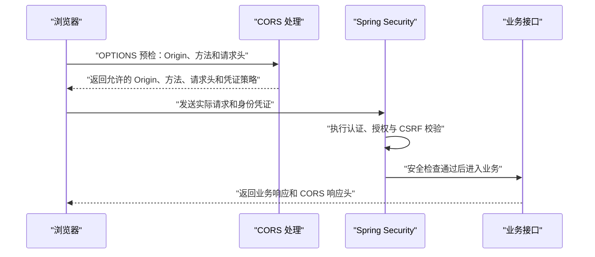

Spring Security 可以使用下面的 CORS 配置源完成这一步：

```java
@Bean
UrlBasedCorsConfigurationSource corsConfigurationSource() {
    CorsConfiguration configuration = new CorsConfiguration();
    configuration.setAllowedOrigins(
        List.of("https://app.example.com"));
    configuration.setAllowedMethods(
        List.of("GET", "POST", "PUT", "DELETE"));
    configuration.setAllowedHeaders(
        List.of("Authorization", "Content-Type", "X-XSRF-TOKEN"));
    configuration.setAllowCredentials(true);

    var source = new UrlBasedCorsConfigurationSource();
    source.registerCorsConfiguration("/api/**", configuration);
    return source;
}

@Bean
SecurityFilterChain security(HttpSecurity http) throws Exception {
    http.cors(Customizer.withDefaults());
    return http.build();
}
```

配置项分别约束不同的跨源输入：

| 配置 | 当前示例的含义 | 配置不匹配时的结果 |
| --- | --- | --- |
| `setAllowedOrigins` | 只信任 `https://app.example.com` | 其他 Origin 无法通过浏览器 CORS 检查 |
| `setAllowedMethods` | 允许跨源使用 GET、POST、PUT、DELETE | 例如 PATCH 的预检失败 |
| `setAllowedHeaders` | 允许前端提交认证、JSON 和 CSRF 请求头 | 携带未允许请求头的预检失败 |
| `setAllowCredentials(true)` | 允许跨源请求携带 Cookie 等凭证 | 前端仍需使用 `credentials: "include"` 才会跨源发送 Cookie |
| `registerCorsConfiguration("/api/**", ...)` | 规则只作用于 `/api/**` | 其他路径不会继承这套规则 |
| `http.cors(...)` | 把 CORS 处理接入 Spring Security 过滤器链 | 预检可能被后续认证规则提前拒绝 |

允许携带凭证时，`Access-Control-Allow-Origin` 不能使用任意来源 `*`，应维护明确的可信 Origin。浏览器收到许可后才发送实际请求，实际请求仍要正常经过认证、授权和 CSRF 校验。预检成功后出现 401，说明认证失败；出现 403，通常应继续区分权限不足与 CSRF 拒绝；返回 2xx 才表示跨源规则与业务安全检查都已通过。

### 10.5 默认安全响应头

Spring Security 提供一组安全响应头默认值，并允许定制。常见关注点包括：

1\. `Cache-Control`：降低敏感响应被缓存风险。

2\. `X-Content-Type-Options: nosniff`：阻止内容类型嗅探。

3\. `X-Frame-Options`：降低点击劫持风险。

4\. HSTS（HTTP Strict Transport Security，HTTP 严格传输安全）：要求浏览器后续使用 HTTPS，但只有在 HTTPS 响应和正确代理配置下才生效。

5\. CSP（Content Security Policy，内容安全策略）：限制脚本等资源来源，通常需要应用自行制定，不能盲目复制模板。

如果应用确需同源 iframe，可保留其他默认头并只调整相应项：

```java
http.headers(headers -> headers
    .frameOptions(frame -> frame.sameOrigin())
);
```

在反向代理后要正确处理转发头并保证外部真实协议是 HTTPS，否则重定向、Secure Cookie 和 HSTS 判断可能与用户看到的协议不一致。

### 10.6 HttpFirewall

`FilterChainProxy` 使用 `HttpFirewall` 规范化并拒绝可疑请求，避免容器之间对路径分号、重复斜杠、编码字符的解释差异造成匹配绕过。遇到请求在到达 Controller 前被拒绝时，应检查防火墙日志与原始 URL，而不是立刻放宽规则。

若遗留系统确需特殊字符，应精确评估容器、代理、路由和授权匹配器是否对路径有一致解释，再做最小放宽。关闭防火墙或允许所有编码变体会把路径歧义交给后续组件，增加绕过风险。

官方参考：[CSRF](https://docs.spring.io/spring-security/reference/servlet/exploits/csrf.html)、[CORS](https://docs.spring.io/spring-security/reference/servlet/integrations/cors.html)、[安全响应头](https://docs.spring.io/spring-security/reference/servlet/exploits/headers.html)。

## 11 REST API 的异常响应与一致错误模型

### 11.1 为什么 ControllerAdvice 捕获不到所有安全异常

许多认证和请求授权异常发生在 `DispatcherServlet` 之前的过滤器链，尚未进入 Controller，因此普通 `@ControllerAdvice` 不一定能处理。Spring Security 使用：

1\. `AuthenticationEntryPoint` 处理需要开始认证的场景，REST API 通常返回 401。

2\. `AccessDeniedHandler` 处理已认证用户被拒绝的场景，REST API 通常返回 403。

3\. 认证过滤器自己的失败处理器处理登录失败。

若错误发生在方法授权中，它可能已经进入 Spring MVC 调用链，处理路径与过滤器阶段不同。项目需要对两条路径做一致的 JSON 错误映射。

### 11.2 定义最小错误响应

```java
public record ApiError(
    String code,
    String message,
    String path,
    String traceId
) {
}
```

对外响应应稳定、可机器识别且不泄漏内部堆栈、Provider 类型、账号是否存在、Token 验证细节。`traceId` 用于关联服务端日志，但它不是认证凭证。

### 11.3 配置 401 与 403

以下异常处理片段必须合并到实际 API 过滤器链中；授权规则、认证机制和 Session 策略仍按前文配置：

```java
@Bean
SecurityFilterChain apiSecurity(
        HttpSecurity http,
        ObjectMapper objectMapper) throws Exception {
    http
        .exceptionHandling(exceptions -> exceptions
            .authenticationEntryPoint((request, response, exception) -> {
                response.setStatus(HttpServletResponse.SC_UNAUTHORIZED);
                response.setContentType(MediaType.APPLICATION_JSON_VALUE);
                objectMapper.writeValue(response.getOutputStream(),
                    new ApiError(
                        "AUTHENTICATION_REQUIRED",
                        "Authentication is required",
                        request.getRequestURI(),
                        currentTraceId()));
            })
            .accessDeniedHandler((request, response, exception) -> {
                boolean csrfFailure = exception instanceof CsrfException;
                response.setStatus(HttpServletResponse.SC_FORBIDDEN);
                response.setContentType(MediaType.APPLICATION_JSON_VALUE);
                objectMapper.writeValue(response.getOutputStream(),
                    new ApiError(
                        csrfFailure ? "INVALID_CSRF_TOKEN" : "ACCESS_DENIED",
                        csrfFailure
                            ? "CSRF token is missing or invalid"
                            : "Access is denied",
                        request.getRequestURI(),
                        currentTraceId()));
            })
        );
    return http.build();
}
```

示例中的 `CsrfException` 来自 `org.springframework.security.web.csrf`，它能同时覆盖缺少与无效 Token 等 CSRF 拒绝。`currentTraceId()` 是项目自己的链路追踪适配方法。响应尚未提交时才能安全写 JSON；自定义 Filter 不应先写一半响应再抛异常。

示例参数 `ObjectMapper` 在 Boot 4 对应 Jackson 3 的 `tools.jackson.databind.ObjectMapper`；Boot 3 默认对应 Jackson 2 的 `com.fasterxml.jackson.databind.ObjectMapper`。两者类名相同但包名不同，迁移时应让 Spring Boot 注入其自动配置的 Mapper，不要为了让 import 编译而同时混入两代 `jackson-databind`。

### 11.4 不要把所有失败都变成 200

HTTP 状态码应保留协议语义，业务错误码提供细分：

| 结果 | HTTP 状态 | 示例业务码 |
| --- | --- | --- |
| 未认证 | 401 | `AUTHENTICATION_REQUIRED` |
| Token 过期或无效 | 401 | `INVALID_TOKEN` |
| 已认证但权限不足 | 403 | `ACCESS_DENIED` |
| CSRF 校验失败 | 403 | `INVALID_CSRF_TOKEN` |
| 触发登录限速 | 429 | `TOO_MANY_ATTEMPTS` |

全部返回 200 会破坏代理、客户端、监控和告警对失败的识别。也不要把任意内部异常都映射成 401，否则数据库故障会被伪装成用户凭证错误，增加排查难度。

## 12 OAuth 2.0、OpenID Connect 与 JWT

### 12.1 三种角色先分清

OAuth 2.0 是授权框架，OpenID Connect（OIDC）在 OAuth 2.0 之上增加身份层。Spring Security 对 Servlet 应用提供三类相关能力：

| 角色 | 职责 | Spring 能力 |
| --- | --- | --- |
| Authorization Server | 认证用户、征得授权、签发 Token | Spring Security 的授权服务器能力 |
| OAuth 2.0 Client | 发起授权流程、代表用户调用第三方资源 | OAuth2 Client、OAuth2 Login |
| Resource Server | 验证 Access Token 并保护 API | OAuth2 Resource Server |

Resource Server 不负责通过用户名密码签发 Token。把“登录接口自己生成 JWT”与 OAuth 2.0 授权服务器混为一谈，会遗漏客户端认证、授权码、PKCE（Proof Key for Code Exchange，代码交换证明密钥）、Consent、撤销、密钥发布等协议能力。

### 12.2 Access Token、ID Token 与 Refresh Token

| Token | 给谁使用 | 用途 | 不应做什么 |
| --- | --- | --- | --- |
| Access Token | Resource Server | 访问受保护 API | 不应由前端当用户资料数据库 |
| ID Token | OIDC Client | 证明本次登录身份 | 不应用作通用 API Access Token |
| Refresh Token | Client 与 Authorization Server | 换取新 Access Token | 不应发送给 Resource Server |

JWT 只是一种 Token 表示格式，不等于 OAuth 2.0，也不天然安全。安全性来自签名验证、算法限制、密钥管理、声明校验、传输和生命周期策略。

### 12.3 Resource Server 的最小 JWT 配置

加入依赖：

```xml
<dependency>
    <groupId>org.springframework.boot</groupId>
    <artifactId>spring-boot-starter-security-oauth2-resource-server</artifactId>
</dependency>
```

这是 Spring Boot 4.1 推荐的 Starter 名称。Boot 4.1 仍保留但已弃用旧名称 `spring-boot-starter-oauth2-resource-server`；Spring Boot 3.x 项目使用旧名称。Starter 会同时带入 Resource Server 与 JWT 验签所需模块，不要再给 `spring-security-oauth2-jose` 手工指定不同版本。

配置可信发行者：

```yaml
spring:
  security:
    oauth2:
      resourceserver:
        jwt:
          issuer-uri: https://id.example.com/realms/order
          audiences: https://api.example.com/order-service
```

声明安全链：

```java
@Bean
SecurityFilterChain resourceServer(HttpSecurity http) throws Exception {
    http
        .securityMatcher("/api/**")
        .authorizeHttpRequests(authorize -> authorize
            .requestMatchers(HttpMethod.GET, "/api/orders/**")
                .hasAuthority("SCOPE_orders.read")
            .requestMatchers(HttpMethod.POST, "/api/orders/**")
                .hasAuthority("SCOPE_orders.write")
            .anyRequest().authenticated()
        )
        .oauth2ResourceServer(oauth2 -> oauth2
            .jwt(Customizer.withDefaults())
        )
        .sessionManagement(session -> session
            .sessionCreationPolicy(SessionCreationPolicy.STATELESS)
        )
        .csrf(csrf -> csrf.disable());
    return http.build();
}
```

在当前 7.1 默认配置中，`issuer-uri` 用于发现 JWK（JSON Web Key，JSON Web 密钥）Set 并校验 `iss`，`audiences` 用于校验 `aud`。默认解码器还会校验签名、`exp` 与 `nbf`，把 Scope 映射为带 `SCOPE_` 前缀的 Authority，并加入 `FACTOR_BEARER` 表示本次身份来自 Bearer Token。发现过程延迟到第一条携带 JWT 的请求，因此应用启动不必依赖授权服务器当时可用；第一条请求仍可能因发现端点或 JWK 端点不可达而失败。若要跳过元数据发现，可同时显式配置 `jwk-set-uri`，但仍应保留 `issuer-uri` 以校验发行者。

这段配置的成功判据是：预期发行者、受众和有效期内的合法 Token 能访问对应端点；错误签名、`iss`、`aud`、`exp` 或 `nbf` 的 Token 都返回 401；`orders.read` Scope 最终映射为 `SCOPE_orders.read`。不要只用在线 JWT 解码器查看 Payload 作为验收。

### 12.4 JWT 的验证项

资源服务器至少应评估：

1\. 签名：只允许预期算法，按 `kid` 选择可信公钥。

2\. `iss`：发行者必须精确匹配可信配置。

3\. `exp` 与 `nbf`：Token 在当前时间有效，时钟偏差应有限且受控。

4\. `aud`：接收方是当前 API，避免一个服务的 Token 被另一个服务接受。仅配置 `issuer-uri` 不会自动验证你的业务受众；应像 12.3 一样配置 `audiences`，或为 `JwtDecoder` 增加等价 Validator。

5\. 权限声明：Scope 或自定义权限映射符合约定。

6\. 租户与业务声明：如参与授权，必须验证来源和语义，不能只解码读取。

“能 Base64 解码 JWT”不等于“JWT 有效”。客户端也不能通过修改 Payload 获得权限，因为合法资源服务器会验证签名；若服务端只解码不验签，就是严重漏洞。

### 12.5 自定义 Authority 映射

授权服务器可能把权限放在 `authorities` 声明，而不是标准 `scope`：

```java
@Bean
JwtAuthenticationConverter jwtAuthenticationConverter() {
    var authorities = new JwtGrantedAuthoritiesConverter();
    authorities.setAuthoritiesClaimName("authorities");
    authorities.setAuthorityPrefix("");

    var converter = new JwtAuthenticationConverter();
    converter.setJwtGrantedAuthoritiesConverter(authorities);
    converter.setPrincipalClaimName("preferred_username");
    return converter;
}
```

```java
http.oauth2ResourceServer(oauth2 -> oauth2
    .jwt(jwt -> jwt
        .jwtAuthenticationConverter(jwtAuthenticationConverter()))
);
```

去掉前缀后，Token 中的字符串会直接成为 Authority，必须防止发行者和应用对 `ROLE_`、Scope、权限命名理解不一致。只应信任受控授权服务器签发的权限声明。

### 12.6 JWT 与 Opaque Token 的取舍

| 维度 | JWT | Opaque Token |
| --- | --- | --- |
| 验证位置 | 资源服务器本地验签 | 调用授权服务器 Introspection |
| 网络依赖 | 公钥缓存后可本地验证 | 通常每次或缓存后远程验证 |
| 即时撤销 | 较难，常依赖短时效或额外状态 | 授权服务器可实时反映撤销 |
| Token 内容 | 客户端可解码看到声明，不能放秘密 | 对客户端不透明 |
| 密钥与缓存 | 需处理轮换、`kid`、JWK 缓存 | 需保护 Introspection 客户端凭证 |
| 故障模式 | 发行者短暂不可用时可继续验签已缓存密钥 | Introspection 不可用会影响认证 |

Opaque Token 配置示例：

```yaml
spring:
  security:
    oauth2:
      resourceserver:
        opaquetoken:
          introspection-uri: https://id.example.com/oauth2/introspect
          client-id: order-api
          client-secret: ${OAUTH2_INTROSPECTION_SECRET}
```

密钥必须来自环境密钥注入或 Secret Manager，不得提交仓库。对 Introspection 做缓存会改善性能和可用性，但也延长撤销生效时间，这是一项明确的安全取舍。

### 12.7 OAuth2 Login 与 OIDC

页面应用使用第三方或企业身份提供商登录时，可配置 OAuth2 Client：

```xml
<dependency>
    <groupId>org.springframework.boot</groupId>
    <artifactId>spring-boot-starter-security-oauth2-client</artifactId>
</dependency>
```

该名称同样对应 Spring Boot 4.1；Boot 4.1 的旧名称 `spring-boot-starter-oauth2-client` 已弃用，Spring Boot 3.x 仍使用旧名称。选择名称时以项目的 Spring Boot 版本为准，不要为了复制配置而单独升级一个 Starter。

```yaml
spring:
  security:
    oauth2:
      client:
        registration:
          company:
            provider: company-idp
            client-id: ${OIDC_CLIENT_ID}
            client-secret: ${OIDC_CLIENT_SECRET}
            authorization-grant-type: authorization_code
            scope: openid,profile,email
        provider:
          company-idp:
            issuer-uri: https://id.example.com
```

包含 `openid` Scope 时走 OIDC 身份登录语义。重定向 URI（Uniform Resource Identifier，统一资源标识符）必须与身份提供商登记一致，并使用 HTTPS。登录成功后，应用还要把外部身份稳定映射到本地账号、租户和权限；不能直接把任意邮箱域名或显示名称当作管理员授权依据。

### 12.8 Token 生命周期与前端存储

Access Token 应短期有效，Refresh Token 更长寿且必须轮换、撤销和防重放。浏览器存储没有“万能安全位置”：

1\. `localStorage` 易受 XSS 读取。

2\. `HttpOnly` Cookie 可降低脚本读取，但浏览器自动发送会引入 CSRF 设计要求。

3\. 仅内存存储刷新后丢失，需要配合后端会话或安全刷新机制。

BFF（Backend for Frontend，面向前端的后端）模式可让浏览器只持有受保护 Session Cookie，由后端代管 OAuth Token，减少 Token 暴露给 JavaScript，但增加服务端状态和 CSRF 防护要求。

官方参考：[OAuth 2.0](https://docs.spring.io/spring-security/reference/servlet/oauth2/)、[OAuth 2.0 Resource Server](https://docs.spring.io/spring-security/reference/servlet/oauth2/resource-server/index.html)。

## 13 多过滤器链与自定义扩展

### 13.1 页面与 API 分链

同一应用同时提供页面和 API 时，可以隔离认证方式与状态策略：

```java
@Bean
@Order(1)
SecurityFilterChain apiChain(HttpSecurity http) throws Exception {
    http
        .securityMatcher("/api/**")
        .authorizeHttpRequests(authorize -> authorize
            .anyRequest().authenticated()
        )
        .oauth2ResourceServer(oauth2 -> oauth2
            .jwt(Customizer.withDefaults())
        )
        .sessionManagement(session -> session
            .sessionCreationPolicy(SessionCreationPolicy.STATELESS)
        )
        .csrf(csrf -> csrf.disable());
    return http.build();
}

@Bean
@Order(2)
SecurityFilterChain pageChain(HttpSecurity http) throws Exception {
    http
        .authorizeHttpRequests(authorize -> authorize
            .requestMatchers("/", "/public/**").permitAll()
            .anyRequest().authenticated()
        )
        .formLogin(Customizer.withDefaults())
        .logout(Customizer.withDefaults());
    return http.build();
}
```

这里 API 链使用 Bearer Token 且无状态，页面链使用 Session 并保留默认 CSRF。`@Order` 数字越小优先级越高。测试必须证明 `/api/**` 没有误入页面链，也要证明非 API 请求有兜底保护。

### 13.2 自定义 JSON 登录的入口

前后端分离但仍使用 Session 时，可实现读取 JSON 的认证过滤器，并复用 `AuthenticationManager`、成功处理器、失败处理器与 `SecurityContextRepository`。完整流程必须覆盖：

1\. 只匹配明确的登录路径和 HTTP 方法。

2\. 限制 Content-Type、请求体大小和字段长度。

3\. 构造未认证 Token 并交给 `AuthenticationManager`。

4\. 成功后执行会话策略、保存安全上下文和返回响应。

5\. 失败后统一错误、审计和限速。

只在 Controller 内调用 `authenticate` 再返回“登录成功”，却未保存上下文，会导致下一次请求仍未登录。实现前应优先考虑标准 Form Login 是否已足够。

### 13.3 在 Filter、Interceptor 与 AOP 之间选择

| 扩展位置 | 适合任务 | 不适合任务 |
| --- | --- | --- |
| Security Filter | 提取协议凭证、请求级安全上下文、早期拒绝 | 复杂领域授权 |
| MVC Interceptor | Controller 前后的 MVC 横切逻辑 | 替代核心认证链 |
| Method Security AOP | 参数、返回值、领域服务授权 | 解析底层 HTTP 协议 |
| ControllerAdvice | MVC 异常响应 | 捕获所有过滤器异常 |

选择原则是把规则放在拥有足够信息且职责最自然的位置。不要在三个层次重复实现同一权限判断，否则规则很快漂移。

### 13.4 多租户安全

多租户系统至少要同时验证身份、租户和资源归属：

```java
@PreAuthorize("@tenantAuthorization.canReadOrder("
    + "#tenantId, #orderId, authentication)")
public OrderView findOrder(String tenantId, long orderId) {
    return orderRepository
        .findByTenantIdAndId(tenantId, orderId)
        .orElseThrow(OrderNotFoundException::new);
}
```

仅信任 URL 中的 `tenantId` 是不安全的；它必须与已认证身份可访问的租户集合关联。数据库查询也应带租户条件，形成授权与数据访问双重边界。缓存键必须包含租户，防止跨租户缓存污染。

### 13.5 扩展的安全准入标准

每个自定义 Provider、Filter、Converter 或 Handler 都应回答：

1\. 输入是否可信，谁负责解析与大小限制。

2\. 成功和失败分别产出什么，是否泄漏敏感原因。

3\. 在线程、请求或 Session 生命周期结束时如何清理。

4\. 多条过滤器链下是否只执行一次。

5\. 是否有未认证、伪造、过期、重复、并发和下游超时测试。

6\. 是否能通过日志、指标和 traceId 定位，但不会记录秘密。

## 14 安全测试策略

### 14.1 测试金字塔

安全测试不能只验证 Controller 返回 200：

1\. 单元测试：权限映射、领域授权 Bean、Token 声明转换。

2\. MVC 集成测试：过滤器链、401、403、CSRF、CORS、请求匹配。

3\. 数据库集成测试：真实用户加载、唯一约束、账号状态、密码迁移。

4\. 协议集成测试：真实授权服务器或兼容测试容器、JWK 轮换、Audience。

5\. 端到端测试：代理、HTTPS、Cookie、跨域、登录与退出完整链路。

Mock 身份只能证明授权规则对“给定身份”如何响应，不能证明真实凭证可以产生该身份。

### 14.2 使用 WithMockUser 测授权

14.2 与 14.3 共享以下页面应用测试契约：

| 请求 | 规则 | Controller 约定 |
| --- | --- | --- |
| `GET /orders/{id}` | 需要 `order:read` | 订单存在时返回 200 |
| `POST /orders` | 需要 `order:write`，并保留 CSRF | 创建成功返回 201 |

测试工程应提供对应 Controller，并在页面链中按 HTTP 方法配置这两条规则。若实际项目使用 `/api/orders/**` 的 Bearer Token 链，就应改用 14.4 的 JWT 测试方式，不能照搬这里的 Session 身份与 CSRF 假设。

```java
@Test
@WithMockUser(username = "alice", authorities = "order:read")
void readerCanReadOrder() throws Exception {
    mvc.perform(get("/orders/42"))
        .andExpect(status().isOk());
}

@Test
@WithMockUser(username = "alice", authorities = "order:read")
void readerCannotCreateOrder() throws Exception {
    mvc.perform(post("/orders")
            .with(csrf())
            .contentType(MediaType.APPLICATION_JSON)
            .content("""
                {"productId": 7, "quantity": 1}
                """))
        .andExpect(status().isForbidden());
}
```

`@WithMockUser(roles = "ADMIN")` 会生成 `ROLE_ADMIN`；`authorities` 则使用精确字符串。两者混淆会造成测试身份与生产身份映射不同。

### 14.3 测试 CSRF

以下用例针对使用 Session/Cookie 认证并保留 CSRF 的 `/orders`，不适用于关闭 CSRF 的 `/api/**` Bearer Token 链：

```java
@Test
@WithMockUser(authorities = "order:write")
void postWithoutCsrfIsRejected() throws Exception {
    mvc.perform(post("/orders")
            .contentType(MediaType.APPLICATION_JSON)
            .content("""
                {"productId": 7, "quantity": 1}
                """))
        .andExpect(status().isForbidden());
}

@Test
@WithMockUser(authorities = "order:write")
void postWithCsrfCanReachController() throws Exception {
    mvc.perform(post("/orders")
            .with(csrf())
            .contentType(MediaType.APPLICATION_JSON)
            .content("""
                {"productId": 7, "quantity": 1}
                """))
        .andExpect(status().isCreated());
}
```

如果目标是无状态 Bearer API 且该链已明确关闭 CSRF，测试就不应机械添加 `csrf()`，而应证明无 Token 为 401、合法 Token 成功，并证明不会创建 Session。

### 14.4 测试 JWT Resource Server

```java
import static org.springframework.security.test.web.servlet.request
    .SecurityMockMvcRequestPostProcessors.jwt;

@Test
void jwtWithReadScopeCanRead() throws Exception {
    mvc.perform(get("/api/orders/42")
            .with(jwt().authorities(
                new SimpleGrantedAuthority("SCOPE_orders.read"))))
        .andExpect(status().isOk());
}
```

这个测试绕过真实签名验证，只证明给定 Authority 下的授权规则。`.authorities(...)` 直接提供了权限，因此也没有验证 `JwtAuthenticationConverter` 的声明映射；转换器应使用包含真实声明结构的 `Jwt` 做单元测试。签名、`iss`、`aud`、过期、尚未生效和密钥轮换则要使用真实 `JwtDecoder` 或协议环境验证。

### 14.5 测试方法安全

```java
@SpringBootTest
class OrderServiceSecurityTest {

    @Autowired
    OrderService orderService;

    @Test
    @WithMockUser(username = "alice", authorities = "order:read")
    void ownerCanReadOwnOrder() {
        assertThatCode(() -> orderService.findOrder(42L))
            .doesNotThrowAnyException();
    }

    @Test
    @WithMockUser(username = "mallory", authorities = "order:read")
    void nonOwnerIsDenied() {
        assertThatThrownBy(() -> orderService.findOrder(42L))
            .isInstanceOf(AccessDeniedException.class);
    }
}
```

必须注入 Spring 代理后的 `OrderService`。手工 `new OrderService(...)` 不经过方法安全代理，测试即使通过也不能证明注解生效。

### 14.6 负向用例覆盖范围

1\. 匿名访问受保护资源。

2\. 已认证但缺少权限。

3\. 路径相似、尾斜杠、不同 HTTP 方法和编码字符。

4\. 禁用、锁定、过期账号。

5\. 缺失、过期、伪造、错误发行者与错误 Audience Token。

6\. 缺失或无效 CSRF Token。

7\. 不可信 Origin 与 CORS 预检。

8\. 多过滤器链优先级与兜底链。

9\. 自调用、异步线程和定时任务中的上下文边界。

10\. 下游身份源、Session 存储或 Introspection 超时。

官方测试参考：[Servlet Test Support](https://docs.spring.io/spring-security/reference/servlet/test/index.html)。

## 15 生产架构与设计取舍

### 15.1 单体页面应用

推荐主线通常是表单或 OIDC 登录、服务端 Session、默认 CSRF、安全 Cookie 和方法授权。它的优点是撤销直接、Token 不暴露给 JavaScript；代价是集群 Session 存储、CSRF 和容量管理。

下图中的 TLS（Transport Layer Security，传输层安全协议）通常由反向代理终止；应用仍必须获得可信的外部协议与主机信息，才能正确生成重定向并设置安全 Cookie。

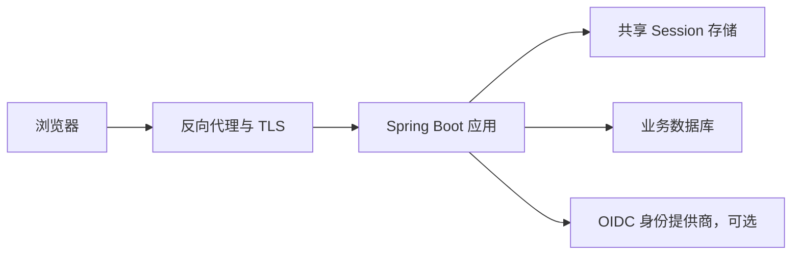

### 15.2 微服务 Resource Server

推荐由成熟授权服务器签发短期 Access Token，各资源服务本地验 JWT 或远程 Introspection。网关可以先认证和粗粒度授权，但下游服务仍应验证面向自己的 Token 与关键权限，不能只信任来自内网的任意请求。

Token Relay 会扩大 Token 可见范围。服务间调用应明确使用用户委托 Token 还是机器身份 `client_credentials`，二者的审计主体和权限边界不同。

### 15.3 网关不是唯一安全边界

只在网关做认证存在以下风险：

1\. 内网绕过网关直接访问服务。

2\. 误配置的新路由未继承网关策略。

3\. 网关传入的用户 Header 被外部伪造或在链路中篡改。

4\. 服务无法独立验证 Token 的 Audience 和权限。

若使用可信身份 Header，网关必须删除外部同名 Header，并通过 mTLS（Mutual Transport Layer Security，双向传输层安全）、签名或受控网络确保服务只接受可信网关流量。高风险场景更推荐下游独立验 Token。

### 15.4 权限数据的实时性

把权限放进 JWT 会形成快照，管理员撤权后旧 Token 在过期前可能仍有效。可选策略包括：

1\. 缩短 Access Token 有效期。

2\. 高风险动作实时查询权限或账号状态。

3\. 使用 Token 版本、撤销列表或事件驱动缓存失效。

4\. 改用 Opaque Token Introspection。

任何缓存都会在性能、可用性和撤权实时性之间取舍。设计文档应明确“最迟多久生效”，而不是声称实时。

### 15.5 Secret 与密钥管理

1\. 客户端 Secret、数据库凭证和私钥不得进入 Git 仓库、镜像层或普通日志。

2\. 验签方通常持有公钥，不应分发签名私钥。

3\. 轮换时应允许新旧公钥短暂并存，并通过 `kid` 选择。

4\. JWK 获取要设置连接超时、读取超时、缓存与失败策略。

5\. Secret 读取权限遵循最小权限，访问和轮换要有审计。

### 15.6 安全与可用性

身份系统故障时是否放行不是纯技术问题。认证与高风险授权一般应 fail closed；已有短期 JWT 本地验签可在授权服务器短暂故障时继续工作，这是 JWT 的可用性优势之一。但密钥缓存过期、新 `kid` 无法获取或撤权要求都会改变结果。

上线前应明确：

1\. 授权服务器、JWK、Session Redis 和权限服务的超时。

2\. 重试次数、退避和熔断，避免认证风暴。

3\. 降级是否只允许只读、是否限制已有 Session。

4\. 告警、人工处置与恢复后的缓存刷新。

5\. 哪些安全失败绝不能降级放行。

### 15.7 数据层纵深防御

应用授权通过后，数据库查询仍应带对象归属或租户条件，例如：

```sql
SELECT id, status, total_amount
FROM orders
WHERE id = :orderId
  AND tenant_id = :tenantId
  AND owner_user_id = :currentUserId;
```

查询无结果可能是对象不存在，也可能是不属于当前用户。对外可统一返回 404 以降低资源枚举，内部审计保留精确原因。批量接口尤其要防止只校验第一个对象或只校验请求中的租户字段。

### 15.8 性能关注点

1\. 密码哈希是有意昂贵的，要隔离登录流量并限速。

2\. 每请求数据库加载用户会增加延迟；Session 或 Token 可减少查询，但带来状态或实时性取舍。

3\. 远程 Introspection 和权限服务需要连接池、超时、缓存和熔断。

4\. 方法授权表达式中的逐对象查询可能产生 N+1，应改成带权限条件的批量查询。

5\. TRACE 日志和全量认证事件可能产生高基数与敏感数据，需采样、脱敏和保留策略。

## 16 可观测性、审计与故障排查

### 16.1 需要观察什么

安全系统的可观察信号至少包括：

| 信号 | 示例维度 | 注意点 |
| --- | --- | --- |
| 登录成功与失败计数 | 认证方式、客户端、失败类别 | 用户名与 IP 应脱敏或受控 |
| 401 与 403 比率 | 路径模板、过滤器链、客户端 | 不使用原始 URL 造成高基数 |
| 认证时延 | Provider、身份源 | 区分密码计算与远程调用 |
| Session | 活跃数、创建、过期、存储延迟 | 不记录 Session ID |
| JWT | 发行者、算法、失败类型 | 不记录完整 Token |
| 权限拒绝 | 权限名、资源类型 | 资源标识按合规要求处理 |

审计日志回答“谁在何时对什么执行了什么动作，结果如何”，业务日志回答运行细节，指标回答整体趋势。三者不能互相替代。

### 16.2 敏感信息的日志禁区

1\. 原始密码、完整 Authorization Header、完整 Access Token 或 Refresh Token。

2\. Session ID、CSRF Token、客户端 Secret、私钥。

3\. 未经控制的个人敏感信息。

4\. 可用于账号枚举的详细外部错误。

必要时只记录不可逆摘要、Token 的 `jti` 受控片段、内部用户 ID 或脱敏 IP，并制定访问权限与保留周期。

### 16.3 通用排查顺序

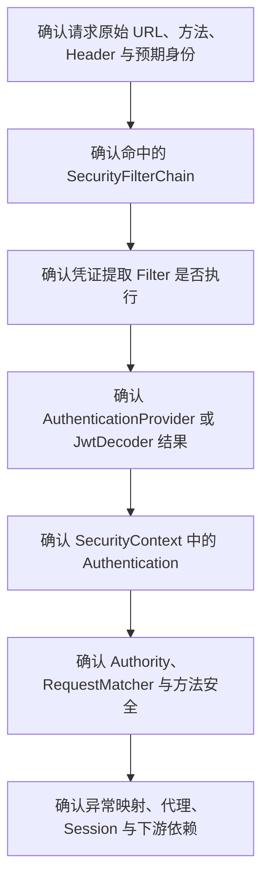

排查必须先复现并保存安全脱敏后的证据，再改配置。直接添加 `permitAll()` 或关闭 CSRF 只会掩盖阶段，不会解释根因。

### 16.4 401 排查

1\. 请求是否真的携带预期凭证，代理是否剥离 `Authorization`。

2\. 当前路径是否进入正确链，认证机制是否在该链启用。

3\. Basic 用户是否能加载，密码编码前缀与 `PasswordEncoder` 是否匹配。

4\. JWT 的签名、`kid`、`iss`、`aud`、`exp`、`nbf` 与服务器时钟是否正确。

5\. Opaque Token Introspection 凭证、超时和响应 `active` 是否正确。

6\. 是否把认证异常错误地转换成其他状态。

### 16.5 403 排查

1\. 当前 `Authentication` 是匿名还是已认证。

2\. 实际 Authority 字符串是否带 `ROLE_` 或 `SCOPE_` 前缀。

3\. 第一条匹配的授权规则是哪一条。

4\. HTTP 方法、路径模板、尾斜杠是否与预期一致。

5\. 是否被 CSRF 拒绝，而不是权限拒绝。

6\. 方法安全是否检查了对象归属、租户或返回值。

7\. CORS 预检是否在认证前正确处理。

### 16.6 本地成功、部署失败

出现环境差异时检查：

1\. 反向代理是否终止 TLS，是否正确转发外部协议和主机。

2\. Cookie 的 `Secure`、`SameSite`、Domain 和 Path 是否与部署域名匹配。

3\. 容器时钟是否同步，JWT 时间声明是否因偏差失败。

4\. 生产 DNS（Domain Name System，域名系统）、证书链、代理和防火墙是否能访问 JWK 或 Introspection。

5\. 配置文件、环境变量和 Secret 是否真正进入最终运行制品。

6\. AOT（Ahead-of-Time，预先编译）或原生镜像是否缺少反射或代理提示。

7\. 多实例是否共享 Session，序列化版本是否兼容。

成功判据要在真实入口验证：经过同一域名、代理、HTTPS、负载均衡和身份提供商，而不仅是容器内 curl。

### 16.7 Runbook 示例

当 401 比率突增时：

1\. 查看是否集中于某发行者、某 `kid`、某客户端或某路径。

2\. 对比 JWK 获取错误、身份服务健康、系统时间和最近密钥轮换。

3\. 抽取一条脱敏 trace，确认链匹配与失败阶段。

4\. 若是新 `kid` 获取失败，检查缓存与网络，不要关闭签名验证。

5\. 若是客户端 Token 全部过期，检查授权服务器签发和客户端刷新流程。

6\. 修复后验证成功率恢复，并确认没有通过放宽校验造成“假恢复”。

## 17 故障速查：从现象回到机制章节

先定位命中的过滤器链和失败阶段，再按表中入口回查；临时 `permitAll()` 或关闭防护只能缩小范围，不能作为修复。

| 现象 | 第一检查点 | 正确动作 | 回查 |
| --- | --- | --- | --- |
| `permitAll()` 后 POST 仍为 403 | 是否由 `CsrfFilter` 拒绝 | Cookie 认证携带有效 CSRF Token；只有纯无状态 Bearer 链才评估关闭 CSRF | 10.1 至 10.3、11.1 至 11.4、16.5 |
| `hasRole("ADMIN")` 始终拒绝 | 实际权限是 `ROLE_ADMIN` 还是 `ADMIN` | 统一 Role、Authority 与 Token 映射命名 | 8.1、8.2、12.5、16.5 |
| 登录成功后下一请求仍匿名 | Session 策略、上下文保存和 Cookie 往返 | 用 `SecurityContextRepository` 持久化，并核对 Cookie 的 Domain、Path 与 Secure | 4.5、9.2、9.4、9.5、13.2 |
| 方法安全注解不生效 | 开关、Bean、代理调用和同类自调用 | 让调用经过 Spring 代理，并用注入的代理对象测试 | 8.3 至 8.5、14.5 |
| CORS 预检返回 401 | CORS 是否先于认证处理 | 提供 `UrlBasedCorsConfigurationSource`，明确 Origin、方法和 Header | 10.4、14.6、16.5 |
| JWT 可解码但权限为空 | 权限声明位置和前缀 | 配置 `JwtAuthenticationConverter`，同时保留签名与关键声明验证 | 12.3 至 12.5、14.4、16.4 |
| 自定义 Filter 执行两次 | 是否同时被容器和安全链注册 | 关闭容器自动注册，并核对异步与错误分派 | 4.1、4.4、13.2、13.5 |
| 关闭安全后功能“恢复” | 链匹配、认证、上下文、授权或攻击防护中的具体失败点 | 最小化修复并新增对应负向回归测试 | 14.1、14.6、16.3 至 16.7 |

## 18 项目落地模板

### 18.1 推荐模块边界

```text
com.example.securitydemo
├── config
│   ├── SecurityConfig.java
│   └── CorsConfig.java
├── security
│   ├── ApiAuthenticationEntryPoint.java
│   ├── ApiAccessDeniedHandler.java
│   ├── OrderAuthorization.java
│   └── SecurityAuditListener.java
├── account
│   ├── Account.java
│   ├── AccountRepository.java
│   └── DatabaseUserDetailsService.java
├── order
│   ├── OrderController.java
│   ├── OrderService.java
│   └── OrderRepository.java
└── common
    └── ApiError.java
```

配置负责组装，`security` 包负责框架适配和授权组件，领域包负责业务规则与数据访问。不要让 Controller 自己查询角色表、解析 JWT 或比较密码。

### 18.2 一套可演进的配置骨架

```java
@Configuration
@EnableMethodSecurity
public class SecurityConfig {

    @Bean
    @Order(1)
    SecurityFilterChain apiSecurity(HttpSecurity http) throws Exception {
        http
            .securityMatcher("/api/**")
            .authorizeHttpRequests(authorize -> authorize
                .requestMatchers(HttpMethod.GET, "/api/catalog/**")
                    .permitAll()
                .requestMatchers(HttpMethod.GET, "/api/orders/**")
                    .hasAuthority("SCOPE_orders.read")
                .requestMatchers(HttpMethod.POST, "/api/orders/**")
                    .hasAuthority("SCOPE_orders.write")
                .anyRequest().denyAll()
            )
            .oauth2ResourceServer(oauth2 -> oauth2
                .jwt(Customizer.withDefaults())
            )
            .sessionManagement(session -> session
                .sessionCreationPolicy(SessionCreationPolicy.STATELESS)
            )
            .csrf(csrf -> csrf.disable())
            .cors(Customizer.withDefaults());
        return http.build();
    }

    @Bean
    @Order(2)
    SecurityFilterChain pageSecurity(HttpSecurity http) throws Exception {
        http
            .authorizeHttpRequests(authorize -> authorize
                .requestMatchers("/", "/public/**", "/login").permitAll()
                .anyRequest().authenticated()
            )
            .formLogin(Customizer.withDefaults())
            .logout(Customizer.withDefaults());
        return http.build();
    }
}
```

这只是使用默认 Scope 映射的骨架，不可直接当作生产完成态。项目还需提供 `JwtDecoder` 或 issuer 配置、异常响应、CORS 来源、审计、限速、测试和 Secret 管理。若授权服务器不使用 `scope` 或 `scp` 声明，再按 12.5 增加 JWT Converter，并同步调整 `SCOPE_` 权限命名。

### 18.3 权限表的基础模型

```text
user(id, username, password_hash, enabled, locked, token_version)
role(id, code, name)
permission(id, code, name)
user_role(user_id, role_id)
role_permission(role_id, permission_id)
```

表约束：

1\. 规范化后的 `username` 唯一并建索引。

2\. `role.code` 与 `permission.code` 唯一且不可随意复用。

3\. 关联表使用联合唯一约束，删除和审计策略明确。

4\. 管理员授权变更记录操作者、目标、前后值和时间。

5\. 多租户系统把租户纳入关联或数据范围模型，唯一约束与缓存键同时纳入租户。

## 19 上线检查表与官方资料入口

### 19.1 身份认证检查

1\. 生产没有默认用户、随机开发密码或硬编码凭证。

2\. 密码使用受支持的自适应单向算法，成本已在生产相近硬件压测。

3\. 登录、改密、重置、锁定、解锁和 MFA 流程有测试与审计。

4\. 错误响应不区分账号不存在与密码错误。

5\. 登录接口具备限速、异常检测和防自动化策略。

6\. 认证成功后的凭证被清理，日志不包含秘密。

### 19.2 授权检查

1\. 所有端点都被某条预期 `SecurityFilterChain` 覆盖。

2\. 请求授权最后有明确兜底规则。

3\. Role、Authority 与 Scope 前缀全局一致。

4\. 核心服务有方法授权或领域授权，避免只依赖 URL。

5\. 租户和对象归属在授权与查询两层校验。

6\. 新增端点、消息入口和定时任务有安全评审。

### 19.3 Web 防护检查

1\. 全链路 HTTPS，Cookie 的 Secure、HttpOnly、SameSite、Domain 与 Path 正确。

2\. Cookie 认证路径保留 CSRF，前端已覆盖 Token 获取与轮换。

3\. CORS 只允许明确可信 Origin、方法和 Header。

4\. 安全响应头经浏览器和业务功能验证，CSP 符合实际资源来源。

5\. 代理转发头可信边界明确，不接受外部伪造的身份 Header。

6\. 未为兼容路径随意关闭 `HttpFirewall`。

### 19.4 Session 与 Token 检查

1\. Session 固定攻击防护开启，集群 Session 存储容量和过期已压测。

2\. 无状态 API 不意外创建 `JSESSIONID`。

3\. JWT 验证签名、算法、`iss`、`aud`、`exp` 与 `nbf`。

4\. JWK 轮换、缓存、超时和新 `kid` 故障已演练。

5\. Access Token、Refresh Token 和 Remember-Me Token 有撤销与轮换策略。

6\. 明确撤权最迟生效时间，高风险动作有更强校验。

### 19.5 测试与运维检查

1\. 401、403、CSRF、CORS、账号状态和路径边界均有负向测试。

2\. Mock 测试之外还有真实数据库和身份协议验证。

3\. 多链优先级、异步上下文、代理自调用和集群行为已覆盖。

4\. 指标能区分认证失败、授权拒绝和依赖故障。

5\. 日志、Trace 和审计不记录密码、完整 Token 或 Session ID。

6\. 身份源、JWK、Session 存储故障有超时、告警和 Runbook。

7\. 修复安全故障后有回归用例，不能以放宽校验作为成功标准。

### 19.6 官方资料入口

1\. [Spring Security Reference 7.1.0](https://docs.spring.io/spring-security/reference/index.html)

2\. [Spring Security 7.1 Prerequisites](https://docs.spring.io/spring-security/reference/prerequisites.html)

3\. [What’s New in Spring Security 7.1](https://docs.spring.io/spring-security/reference/whats-new.html)

4\. [Spring Boot 4.1 Reference](https://docs.spring.io/spring-boot/reference/)

5\. [Spring Boot System Requirements](https://docs.spring.io/spring-boot/system-requirements.html)

6\. [Spring Boot Security](https://docs.spring.io/spring-boot/reference/web/spring-security.html)

7\. [Servlet Getting Started](https://docs.spring.io/spring-security/reference/servlet/getting-started.html)

8\. [Servlet Test Support](https://docs.spring.io/spring-security/reference/servlet/test/index.html)

版本敏感配置应以项目实际 Spring Boot 管理的 Spring Security 版本文档为准。升级时先阅读目标版本 Migration 与 What’s New，再在测试环境验证默认值、废弃 API、过滤器行为和安全响应差异。
