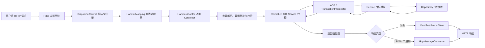
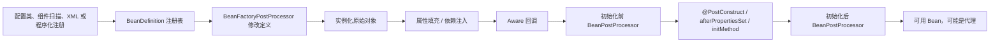
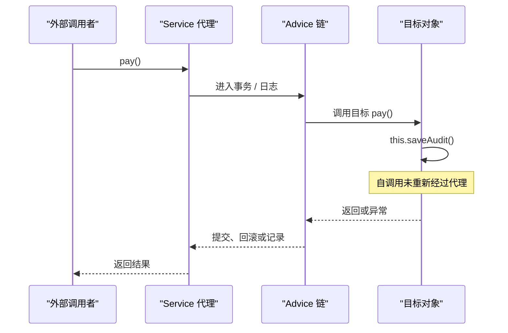
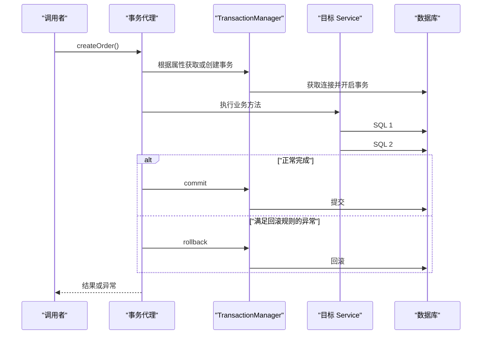
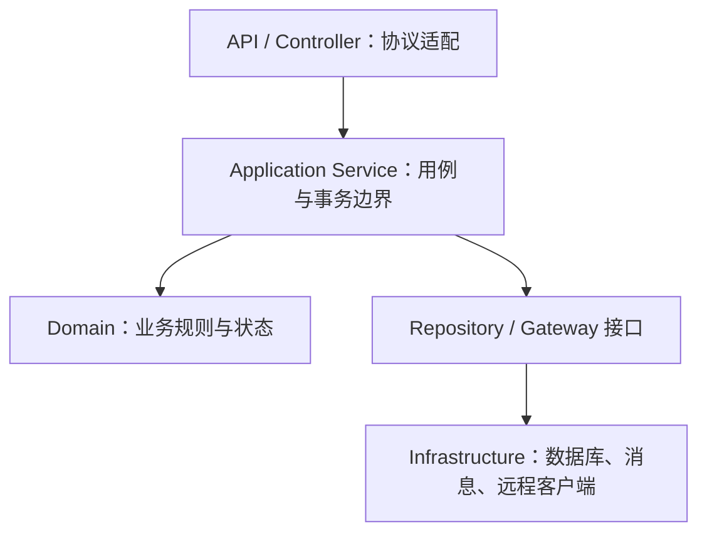

# Spring 与 Spring MVC 完全总结

> 面向 Java 后端初学者、面试准备与生产实践。本文以 2026-07-27 可用的 Spring Framework 7.0.x 为主要语义基线，同时说明 Spring Framework 6.2.x 和历史项目的关键差异。Spring Framework 7.0 仍以 Java 17 为最低基线，面向 Jakarta EE 11；新项目使用 `jakarta.*` 包，不再使用旧 `javax.*` EE 包。

## 1 学习路径、范围与核心心智模型

### 1.1 Spring、Spring Framework、Spring MVC 与 Spring Boot 的边界

“Spring”在不同语境下可能指整个 Spring 技术生态，也可能只指 Spring Framework。学习时必须先划清职责，否则容易把自动配置、Web 框架和容器原理混在一起。

| 名称 | 本质与职责 | 典型能力 | 不负责什么 |
| --- | --- | --- | --- |
| Spring Framework | Java 应用基础框架 | IoC、DI、AOP、事务、资源、事件、校验、Web | 不直接提供完整业务系统 |
| Spring Core Container | Spring Framework 的核心容器 | Bean 定义、创建、装配、生命周期、扩展点 | 不处理 HTTP 请求 |
| Spring MVC | 基于 Servlet 的同步 Web MVC 框架 | 路由、参数绑定、校验、控制器、视图、JSON、异常映射 | 不等于整个 Spring |
| Spring Boot | 在 Spring Framework 之上的约定与自动配置体系 | Starter、自动配置、嵌入式服务器、外部化配置、Actuator | 不替代 IoC、AOP、MVC 等底层机制 |
| Spring WebFlux | 响应式 Web 框架 | 非阻塞事件循环、Reactive Streams | 不是 Spring MVC 的“新版名称” |

IoC（Inversion of Control，控制反转）回答“对象由谁创建和组织”；DI（Dependency Injection，依赖注入）回答“依赖如何交给对象”；AOP（Aspect-Oriented Programming，面向切面编程）回答“如何在不侵入业务代码的前提下统一附加事务、监控等横切逻辑”；Spring MVC 回答“一个 Servlet HTTP 请求如何找到业务方法并形成响应”。

### 1.2 一张图串起完整请求



这张图揭示了两个不同层次的“入口”：Web 层入口是 `DispatcherServlet`，容器增强入口通常是代理对象。`@RequestMapping` 能否匹配由 MVC 请求链决定；`@Transactional`、`@Async`、缓存等注解能否生效，通常取决于调用是否经过相应代理。排查“注解为什么不生效”时，应先确认实际调用路径，而不是只看注解是否存在。

### 1.3 推荐学习顺序与成功判据

1\. 先理解普通 Java 对象、接口、反射、注解、Servlet、HTTP、Maven 或 Gradle。

2\. 再掌握容器：能解释 `BeanDefinition -> Bean 实例 -> 初始化后对象或代理` 的变化。

3\. 再掌握代理：能判断某次调用是否经过代理，并能解释自调用失效。

4\. 再掌握事务：能用数据库最终状态证明提交或回滚，而不是以“没抛异常”为成功。

5\. 再掌握 MVC：能从 URL、HTTP 方法和媒体类型定位到具体控制器方法，并区分绑定错误、校验错误和业务错误。

6\. 最后学习测试与生产治理：能通过分层测试、日志、指标、线程转储和最小复现定位故障。

### 1.4 版本基线与迁移意识

截至本文编写时，Spring 官方参考文档列出的稳定线包括 7.0.8 与 6.2.19。本文不把补丁版本写死到业务代码中；实际项目应由 Spring Boot 的依赖管理或经过验证的 BOM（Bill of Materials，物料清单）统一管理组件版本。

| 代际 | Java 基线 | EE 命名空间与平台重点 | 迁移关注点 |
| --- | --- | --- | --- |
| Spring 5.3 | Java 8 | 主要为 `javax.*` | 已属于旧技术栈，不应作为新项目基线 |
| Spring 6.x | Java 17 | Jakarta EE 9/10，使用 `jakarta.*` | `javax.servlet`、`javax.validation` 等需迁移 |
| Spring 7.0 | Java 17，面向新 JDK（Java Development Kit，Java 开发工具包）能力 | Jakarta EE 11、Servlet 6.1、JPA（Jakarta Persistence API，Jakarta 持久化 API）3.2 等 | 关注移除项、JSpecify 空安全、Jackson 3 生态兼容 |

这里的 `javax.* -> jakarta.*` 不是简单改一个 import 就必然完成迁移。Servlet 容器、验证实现、持久化实现、第三方库和测试工具也必须属于兼容代际。构建成功只证明编译类路径大体一致，仍要在目标运行时执行启动和端到端测试。

## 2 Spring Framework 的设计与模块

### 2.1 Spring 解决的真实问题

没有容器时，业务对象经常在内部直接 `new` 数据访问对象、读取全局配置并控制事务。结果是对象创建、业务规则和基础设施耦合：实现难替换、单元测试难隔离、连接和事务边界分散。Spring 将对象装配与业务行为分开，通过容器管理依赖，并以一致抽象整合事务、Web、数据访问和测试。

Spring 不是为了消灭 `new`。领域实体、值对象和短生命周期的纯数据对象通常仍由业务代码创建。容器更适合管理具有共享依赖、配置、生命周期或基础设施职责的协作对象。

### 2.2 常见模块速查

| 模块 | 核心职责 | 常见类或注解 |
| --- | --- | --- |
| `spring-core` | 基础工具、资源、类型转换 | `Resource`、`ResolvableType` |
| `spring-beans` | BeanFactory 与 Bean 装配 | `BeanFactory`、`BeanDefinition` |
| `spring-context` | 应用上下文、事件、国际化、注解配置 | `ApplicationContext`、`@Configuration` |
| `spring-aop` | 基于代理的 AOP | `ProxyFactory`、Advice |
| `spring-expression` | SpEL 表达式 | `ExpressionParser` |
| `spring-jdbc` | JDBC 模板与异常转换 | `JdbcTemplate` |
| `spring-tx` | 统一事务抽象 | `PlatformTransactionManager`、`@Transactional` |
| `spring-web` | Web 基础、HTTP 编解码、客户端基础 | `HttpMessageConverter` |
| `spring-webmvc` | Servlet 栈 MVC | `DispatcherServlet`、`@RequestMapping` |
| `spring-test` | 容器与 Web 测试支持 | TestContext、`MockMvc` |

### 2.3 Spring 的核心设计取舍

1\. 面向接口和组合：用小型契约隔离实现，允许替换持久化、事务和视图技术。

2\. 非侵入优先：普通 POJO（Plain Old Java Object，普通 Java 对象）也能成为 Bean；业务类不必继承框架基类。

3\. 提供抽象但不掩盖底层：Spring 统一异常和模板流程，却仍允许访问原生 JDBC、Servlet 等能力。

4\. 约定与扩展并存：普通项目使用默认实现；框架和中间件可通过后处理器、策略接口等扩展。

5\. Spring Framework 与 Spring Boot 分层：Framework 提供机制，Boot 根据类路径、配置和用户 Bean 提供有条件的默认装配。

## 3 IoC 容器与依赖注入

### 3.1 IoC、DI、Bean 与容器

Bean 是由 Spring IoC 容器实例化、装配并管理的对象。`BeanDefinition` 是创建 Bean 的配方，包含类、工厂方法、作用域、依赖、初始化方法等元数据；它不是最终业务实例。容器读取配置元数据，先注册定义，再根据定义创建对象。



`BeanFactory` 是核心工厂契约，强调 Bean 创建与获取；`ApplicationContext` 在其上增加事件、国际化、资源加载、自动注册常用后处理器和 Web 上下文等能力。业务应用通常直接使用 `ApplicationContext`，而不是手工操作底层 `BeanFactory`。

### 3.2 三种主流配置方式

#### 3.2.1 组件扫描

```java
package com.example.order;

import org.springframework.stereotype.Repository;
import org.springframework.stereotype.Service;

@Repository
class JdbcOrderRepository implements OrderRepository {
    // 省略 JDBC 实现
}

@Service
class OrderService {
    private final OrderRepository orderRepository;

    OrderService(OrderRepository orderRepository) {
        this.orderRepository = orderRepository;
    }
}
```

`@Component` 是通用构造型注解；`@Service`、`@Repository`、`@Controller` 是带语义的特化。`@Repository` 还可参与持久化异常转换。组件扫描发现候选类并注册 Bean 定义，随后容器才会实例化它们。类“位于源码目录”不等于“被扫描”；排查时要检查启动配置所在包、扫描基包、条件配置和构建产物内是否真的存在该类。

#### 3.2.2 Java 配置

```java
package com.example.order;

import org.springframework.context.annotation.Bean;
import org.springframework.context.annotation.Configuration;

@Configuration
class OrderConfiguration {

    @Bean
    OrderRepository orderRepository(DataSource dataSource) {
        return new JdbcOrderRepository(dataSource);
    }

    @Bean
    OrderService orderService(OrderRepository repository) {
        return new OrderService(repository);
    }
}
```

`@Bean` 适合第三方类、需要显式构造逻辑的对象以及基础设施配置。把依赖声明为方法参数能让依赖图更清楚，也避免依赖对 `@Configuration` 方法互调增强语义的误解。XML 配置在存量项目仍常见，其本质同样是注册 Bean 定义，不代表另一套容器。

`@Configuration` 默认采用 full 模式：同一配置类内调用另一个 `@Bean` 方法时，增强后的配置类会把调用重定向到容器，因而遵守 singleton、作用域和生命周期。`@Bean` 位于普通 `@Component` 中，或配置类声明 `@Configuration(proxyBeanMethods = false)` 时，属于 lite 模式，方法互调只是普通 Java 调用，可能直接创建一个容器之外的新对象。

```java
@Configuration(proxyBeanMethods = false)
class LiteConfiguration {

    @Bean
    Client client(Codec codec) {
        // 用参数注入可同时适用于 full 与 lite 模式
        return new Client(codec);
    }

    @Bean
    Codec codec() {
        return new JsonCodec();
    }
}
```

因此，无论采用哪种模式，都优先通过 `@Bean` 方法参数表达依赖。只有确实需要方法互调语义时才依赖 full 模式。验证差异时可分别直接调用配置对象的方法和从 `ApplicationContext` 获取 Bean，并比较引用与销毁回调；不能只看源码中方法被调用了几次。

#### 3.2.3 程序化注册

Spring 7 通过 `BeanRegistrar`、`BeanRegistry` 和 `Environment` 提供一等程序化注册能力，适合框架、动态模块或需要按环境批量生成 Bean 定义的场景。

```java
class ClientBeanRegistrar implements BeanRegistrar {

    @Override
    public void register(BeanRegistry registry, Environment environment) {
        registry.registerBean(JsonCodec.class);
        if (environment.matchesProfiles("prod")) {
            registry.registerBean(RemoteClient.class, spec -> spec
                    .supplier(context ->
                            new RemoteClient(context.bean(JsonCodec.class))));
        }
    }
}

@Configuration
@Import(ClientBeanRegistrar.class)
class ClientConfiguration {
}
```

入口是 `@Import`；配置类解析阶段发现 Registrar；Registrar 根据环境向注册表写入定义；容器随后按普通生命周期创建实例。它支持 AOT（Ahead-of-Time，提前编译）分析，但并不意味着可以在应用已运行后任意改变稳定依赖图。普通业务 Bean 仍优先使用组件扫描或 `@Bean`，以换取可读性和工具支持。

### 3.3 为什么优先构造器注入

构造器注入使必需依赖在对象创建时就完整，字段可声明为 `final`，普通单元测试可直接 `new`，且循环依赖会尽早暴露。字段注入隐藏依赖并增加测试与重构成本；Setter 注入适合真正可选或可重配置的依赖。

```java
@Service
class PaymentService {
    private final PaymentGateway gateway;
    private final Clock clock;

    PaymentService(PaymentGateway gateway, Clock clock) {
        this.gateway = gateway;
        this.clock = clock;
    }
}
```

单个构造器无需再写 `@Autowired`。如果构造器参数没有合适候选 Bean，应用上下文通常在启动时失败，这是一种有价值的快速失败。不要用 `Optional`、`@Autowired(required = false)` 随意掩盖架构上本应必需的依赖。

### 3.4 自动装配的候选解析

按类型注入时，容器先找类型兼容的候选者。只有一个候选者时直接注入；多个候选者时，可借助 `@Primary`、`@Fallback`、`@Qualifier`、Bean 名称或自定义限定符消歧。

```java
interface SmsGateway {
    void send(String message);
}

@Component("aliyunSmsGateway")
class AliyunSmsGateway implements SmsGateway {
    public void send(String message) {}
}

@Component("mockSmsGateway")
class MockSmsGateway implements SmsGateway {
    public void send(String message) {}
}

@Service
class NotificationService {
    private final SmsGateway gateway;

    NotificationService(@Qualifier("aliyunSmsGateway") SmsGateway gateway) {
        this.gateway = gateway;
    }
}
```

`@Qualifier` 表达的是候选筛选语义，不应被理解成单纯“按字符串查 Bean”。当实现代表区域、渠道或租户时，可以定义元注解作为类型安全的业务限定符。集合注入如 `List<Handler>` 会注入所有兼容 Bean，可配合 `@Order` 排序，适合策略链。

#### 3.4.1 `@Autowired`、`@Inject` 与 `@Resource` 的边界

| 注解 | 来源 | 默认解析主线 | 适用建议 |
| --- | --- | --- | --- |
| `@Autowired` | Spring | 以类型为主，配合 Qualifier | Spring 项目最完整的容器语义 |
| `@Inject` | `jakarta.inject` | 与 `@Autowired` 接近 | 希望使用标准 DI 注解 |
| `@Resource` | `jakarta.annotation` | 显式 name 时按名称；未显式 name 时先考虑默认名称并可回退到主类型匹配 | 与 Jakarta EE 代码集成或确需名称语义 |

三者都由 Bean 后处理器解释，只对 Spring 管理对象生效。构造器注入仍是首选；不要因为 `@Resource` 能按字段名找到 Bean 就依赖字段名称的偶然一致。`@Order` 影响集合注入的顺序，不等于 Bean 的创建顺序；创建依赖应由构造器关系或确有必要的 `@DependsOn` 表达。

### 3.5 延迟、可选与按需获取

| 方式 | 语义 | 典型场景 | 风险 |
| --- | --- | --- | --- |
| `@Lazy` | 延迟创建 Bean 或注入代理 | 启动成本高、打破非必要提前初始化 | 把配置错误推迟到运行期 |
| `Optional<T>` | 依赖可以不存在 | 可选集成 | 容易掩盖必需依赖 |
| `ObjectProvider<T>` | 延迟、可选、多实例获取 | 原型 Bean、插件候选 | 业务代码开始感知容器 |
| `Provider<T>` | 标准依赖提供者 | 解耦于 Spring API | 仍属于服务定位式获取 |

按需获取是边界工具，不应替代清晰依赖图。若一个类需要十几个提供者或大量可选依赖，通常说明职责过重或模块边界不清。

### 3.6 循环依赖的本质

构造器循环 `A -> B -> A` 没有可行的完整实例化顺序，容器会失败。Setter 或字段循环在某些容器设置与代理组合下可能通过“提前引用”勉强解决，但对象可能以未完成状态暴露，且 Spring Boot 的默认策略与历史版本不同，不能依赖这种行为。

正确做法通常是重新划分职责、抽取第三个协作者、使用领域事件解除同步依赖，或让调用方向单向化。`@Lazy` 只能延迟其中一边，解决的是创建时序，不一定解决设计耦合。

## 4 Bean 定义、作用域、生命周期与容器扩展

### 4.1 Bean 作用域

| 作用域 | 实例边界 | 适用场景 | 关键注意点 |
| --- | --- | --- | --- |
| `singleton` | 每个容器、每个 Bean 定义一个共享实例 | 无会话状态的 Service、Repository | 不等于 JVM 全局单例；需关注线程安全 |
| `prototype` | 每次容器请求创建新实例 | 有短期可变状态的任务对象 | 容器不负责完整销毁阶段 |
| `request` | 每个 HTTP 请求一个实例 | 请求上下文数据 | 仅 Web `ApplicationContext` |
| `session` | 每个 HTTP Session 一个实例 | 少量会话状态 | 集群复制、内存和并发风险 |
| `application` | 每个 `ServletContext` 一个实例 | Web 应用级对象 | 与 Spring singleton 边界不同 |
| `websocket` | 每个 WebSocket 会话一个实例 | WebSocket 会话状态 | 只适用于对应 Web 环境 |

默认 singleton Bean 会被多个请求线程并发调用，因此通常应保持无状态。将用户 ID、临时集合或请求参数写入 Service 实例字段会产生串号和数据竞争。线程安全不是容器自动提供的，取决于 Bean 内部状态和依赖。

### 4.2 长生命周期 Bean 注入短生命周期 Bean

把 prototype 直接注入 singleton，只在 singleton 创建时解析一次，后续调用仍得到同一个 prototype 实例。需要每次新建时可使用 `ObjectProvider<T>.getObject()`、方法注入或作用域代理。

```java
@Component
class ReportJobFactory {
    private final ObjectProvider<ReportJob> jobs;

    ReportJobFactory(ObjectProvider<ReportJob> jobs) {
        this.jobs = jobs;
    }

    ReportJob newJob() {
        return jobs.getObject();
    }
}

@Component
@Scope(ConfigurableBeanFactory.SCOPE_PROTOTYPE)
class ReportJob {
}
```

验证方式不是比较类名，而是连续调用 `newJob()` 并断言对象引用不同。prototype Bean 的初始化回调会执行，但容器交付实例后不跟踪其完整生命周期，资源清理应由使用方或专门管理器负责。

### 4.3 完整生命周期与关键扩展点

创建一个普通单例时，可以用以下顺序建立心智模型：

1\. 解析并合并 `BeanDefinition`。

2\. 选择构造器并实例化原始对象。

3\. 填充属性与解析依赖。

4\. 容器直接执行 `BeanNameAware`、`BeanClassLoaderAware`、`BeanFactoryAware` 等回调。

5\. 执行 `BeanPostProcessor#postProcessBeforeInitialization`；`ApplicationContextAware`、资源加载器、事件发布器等上下文回调通常由其中的 `ApplicationContextAwareProcessor` 完成。

6\. 依次执行 `@PostConstruct`、`InitializingBean#afterPropertiesSet()`、自定义 `initMethod`。

7\. 执行 `BeanPostProcessor#postProcessAfterInitialization`；自动代理创建器常在此返回代理。循环引用等特殊路径可能提前暴露代理引用，不能把“代理只会在第 7 步出现”当作绝对源码规则。

8\. Bean 对外可用。

9\. 容器正常关闭时，依次执行 `@PreDestroy`、`DisposableBean#destroy()`、自定义 `destroyMethod`。

`@PostConstruct` 适合校验已注入配置和构建轻量内存结构，不适合持有 singleton 创建锁执行长时间远程调用或启动复杂后台流程。需要所有常规 singleton 都完成后再工作时，可考虑 `SmartInitializingSingleton`、上下文刷新事件或 `SmartLifecycle`。

### 4.4 BeanFactoryPostProcessor 与 BeanPostProcessor

| 扩展点 | 操作对象 | 时机 | 常见用途 |
| --- | --- | --- | --- |
| `BeanFactoryPostProcessor` | Bean 定义和工厂元数据 | Bean 大规模实例化之前 | 修改属性占位符、定义元数据 |
| `BeanDefinitionRegistryPostProcessor` | BeanDefinition 注册表 | 普通工厂后处理之前 | 动态新增 Bean 定义 |
| `BeanPostProcessor` | Bean 实例 | 每个 Bean 初始化前后 | 注解处理、依赖注入、创建代理 |
| `FactoryBean<T>` | 复杂产品对象 | 调用工厂创建产品时 | 代理、客户端、复杂第三方对象 |

`FactoryBean` 本身是容器中的工厂 Bean，`getBean("name")` 通常得到其产品，`getBean("&name")` 才得到工厂本身。它与 `BeanFactory` 不是同一概念：前者用于生产某个复杂 Bean，后者是管理所有 Bean 的容器核心接口。

后处理器属于框架级扩展，顺序和提前实例化影响很大。业务项目不应为了“高级”而滥用；错误地在后处理器中调用 `getBean()` 可能造成目标过早创建，跳过其他后处理器或形成循环。

### 4.5 配置、环境与资源抽象

`Environment` 统一访问激活的 Profile 和属性源；`@Value` 可注入少量值，结构化配置在 Spring Boot 项目中通常优先绑定为配置对象。Spring `Resource` 抽象统一 `classpath:`、文件和 URL 等资源来源。

```java
@Configuration
@Profile("prod")
class ProductionConfiguration {
}
```

Profile 适合选择成组 Bean，不宜承担所有业务开关。业务灰度、动态开关通常需要专门的特性开关系统。外部配置排查要确认属性源优先级、环境变量映射、激活 Profile、实际绑定对象和启动日志；“配置文件里写了”不代表运行进程读取了那一份。

## 5 AOP 与代理机制

### 5.1 AOP 解决什么问题

日志、事务、鉴权、指标、重试等逻辑会跨越许多业务方法。若每个方法手写，会重复且难以保证边界一致。AOP 将这些横切关注点定义为 Advice，并通过 Pointcut 选择 Join Point，在方法调用前后附加行为。

| 术语 | 含义 |
| --- | --- |
| Aspect | 切面，横切规则的模块化封装 |
| Join Point | 可被增强的连接点；Spring AOP 主要是方法执行 |
| Pointcut | 切点，筛选哪些连接点 |
| Advice | 通知，在连接点前后执行的行为 |
| Target | 目标对象 |
| Proxy | 对外暴露的代理对象 |
| Weaving | 将切面织入目标的过程 |

Spring AOP 默认采用运行时代理，不修改普通目标类字节码；AspectJ 可以使用编译期或加载期织入，能力更广但运维复杂度更高。

### 5.2 JDK 动态代理与类代理

| 维度 | JDK 动态代理 | 类代理 |
| --- | --- | --- |
| 基础 | Java `Proxy` 与接口 | 生成目标类子类 |
| 是否要求接口 | 是 | 否 |
| 可代理方法 | 接口暴露的方法 | 可覆盖的实例方法 |
| 主要限制 | 通过具体实现类型获取可能失败 | `final` 类或方法、不可见方法不能被覆盖增强 |

不要背诵“Spring 有接口就永远 JDK、没接口就永远 CGLIB（Code Generation Library，代码生成库）”作为所有环境的结论。Spring Framework 的默认、Spring Boot 的配置、Spring 7 的 `@Proxyable` 和不同基础设施可能影响选择。稳妥的设计是面向业务接口调用，并通过 `AopUtils.isAopProxy(bean)`、运行时类和实际行为验证。

### 5.3 代理调用与自调用



外部通过代理调用 `pay()` 时能触发增强；目标内部的 `this.saveAudit()` 只是普通 Java 调用，不会再次进入代理，因此 `saveAudit()` 上单独声明的事务传播、异步或缓存规则可能不生效。

优先解决方式是重构边界，把需要独立增强的方法放到另一个 Bean，并让调用经过它的代理。自注入代理或 `AopContext.currentProxy()` 会增加耦合，只适合明确理解代价的特殊场景。AspectJ 织入能覆盖自调用，但引入构建或加载期复杂度。

### 5.4 通知类型与异常语义

```java
@Aspect
@Component
class TimingAspect {

    @Around("execution(public * com.example.order.application..*(..))")
    Object record(ProceedingJoinPoint point) throws Throwable {
        long start = System.nanoTime();
        try {
            return point.proceed();
        } finally {
            long elapsed = System.nanoTime() - start;
            // 实际项目应写入指标系统，并控制标签基数
        }
    }
}
```

`@Before` 适合前置检查；`@AfterReturning` 只在正常返回时执行；`@AfterThrowing` 观察异常；`@After` 类似 `finally`；`@Around` 能控制是否继续、参数、结果与异常，能力最大也最容易破坏语义。环绕通知必须正确调用并返回 `proceed()` 的结果，除非切面的业务意图就是短路调用。

多个切面的顺序可用 `@Order` 或 `Ordered` 控制。必须先定义“谁包住谁”：外层通知先进入、后退出。事务与重试组合时顺序会改变“每次重试一个事务”还是“所有重试共用一个事务”，应以失败注入测试验证，而不是仅凭注解顺序猜测。

### 5.5 AOP 的适用边界

AOP 适合具有稳定边界、可统一描述的方法级横切逻辑。核心业务规则、复杂流程编排和需要显式审计语义的行为不应被切面隐藏。私有方法、构造过程、自调用、非 Spring 管理对象、手工 `new` 出来的对象通常不在 Spring 代理拦截范围内。

## 6 Spring 事务管理

### 6.1 事务抽象与执行链

数据库事务提供原子性、一致性、隔离性和持久性，即 ACID（Atomicity、Consistency、Isolation、Durability）。Spring 不创造数据库事务，而是通过 `PlatformTransactionManager` 等抽象统一不同事务技术，并用 AOP 将事务边界附加到业务方法。



事务成功的判据是预期数据全部提交，失败时预期数据全部回滚，并满足并发一致性约束。“方法返回了”或“日志写完了”都不能代替数据库状态验证。

### 6.2 声明式事务的最小用法

```java
@Service
class OrderApplicationService {
    private final OrderRepository orders;
    private final InventoryRepository inventory;

    OrderApplicationService(
            OrderRepository orders,
            InventoryRepository inventory) {
        this.orders = orders;
        this.inventory = inventory;
    }

    @Transactional
    public OrderId place(CreateOrderCommand command) {
        inventory.deduct(command.productId(), command.quantity());
        return orders.save(Order.create(command));
    }
}
```

Spring Boot 在存在适当基础设施时通常完成事务管理器配置；纯 Spring 应显式注册事务管理器并启用注解事务管理。事务一般放在应用服务的业务用例边界，既覆盖一个完整一致性单元，又避免跨越不受控的长时间外部调用。

`@Transactional` 可声明在类或方法上，具体方法的配置优先。为减少代理、可见性和不同模式的歧义，生产代码通常把它放在具体类的 `public` 业务方法上，并从另一个 Bean 调用。

#### 6.2.1 `@Transactional` 属性卡片

| 属性 | 默认值或含义 | 生产边界 |
| --- | --- | --- |
| `propagation` | `REQUIRED` | 决定如何参与现有事务 |
| `isolation` | `DEFAULT` | 只对新建事务有意义，受数据库能力约束 |
| `timeout` / `timeoutString` | 底层默认或不设限 | 通常只对新建事务有效；超时不等于所有外部 I/O 都自动取消 |
| `readOnly` | `false` | 是给事务协调器、驱动或 ORM 的优化提示，不是强制写保护 |
| `rollbackFor` / `noRollbackFor` | 具体事务的异常规则 | 类型规则优先于容易误匹配的类名字符串规则 |
| `transactionManager` | 按名称或限定符选择 | 多数据源必须明确资源归属 |
| `label` | 空标签数组 | 供事务管理器关联实现特定行为或观测信息 |

类级 `@Transactional(readOnly = true)` 配合写方法显式覆盖，能表达“默认查询、少数写入”的意图，但不能以此替代数据库只读账号和权限控制。验证 timeout 或 readOnly 时必须查看实际事务管理器、驱动和数据库行为，不能仅断言注解元数据存在。

### 6.3 传播行为

传播行为回答“当前线程已经有事务时，新方法如何参与”。

| 传播 | 当前有事务 | 当前无事务 | 典型用途与风险 |
| --- | --- | --- | --- |
| `REQUIRED` | 加入当前事务 | 新建事务 | 默认选择；外层回滚会影响整体 |
| `REQUIRES_NEW` | 挂起外层并新建独立事务 | 新建事务 | 独立审计等；额外占用连接，可能耗尽连接池 |
| `SUPPORTS` | 加入 | 非事务执行 | 查询辅助；语义可能随调用方变化 |
| `NOT_SUPPORTED` | 挂起 | 非事务执行 | 明确不应处于事务的操作 |
| `MANDATORY` | 加入 | 抛异常 | 强制调用方提供事务边界 |
| `NEVER` | 抛异常 | 非事务执行 | 强制禁止事务上下文 |
| `NESTED` | 建立保存点 | 通常新建事务 | 依赖事务管理器和资源的保存点支持 |

`REQUIRES_NEW` 的“独立”意味着内层提交后，外层随后回滚也不会撤销内层结果。它还要求同时持有外层资源并为内层获取新资源，高并发下连接池至少要考虑嵌套深度和并发量。`NESTED` 与 `REQUIRES_NEW` 不等价，前者常依赖同一物理事务中的保存点。

### 6.4 隔离级别与并发现象

隔离级别由数据库和驱动真正执行。Spring 的 `Isolation` 是声明入口，不能超越数据库能力。

| 级别 | 主要目标 | 仍需关注 |
| --- | --- | --- |
| `DEFAULT` | 使用数据库默认值 | 不同环境默认值可能不同 |
| `READ_UNCOMMITTED` | 最低隔离 | 脏读、不可重复读、幻读 |
| `READ_COMMITTED` | 避免脏读 | 不可重复读、幻读或写冲突 |
| `REPEATABLE_READ` | 同一事务重复读更稳定 | 数据库实现差异、范围写冲突 |
| `SERIALIZABLE` | 最强逻辑隔离 | 并发度下降、等待和死锁增加 |

隔离级别不是防止超卖的唯一答案。真实库存扣减更常使用带条件的原子更新、乐观锁版本号、悲观锁或队列化，并检查受影响行数：

```sql
UPDATE inventory
SET available = available - :quantity
WHERE product_id = :productId
  AND available >= :quantity;
```

若受影响行数为 `0`，业务应返回库存不足或并发冲突；没有 SQL 异常不代表扣减成功。

### 6.5 回滚规则与异常处理

默认情况下，Spring 声明式事务对 `RuntimeException` 和 `Error` 回滚，对普通受检异常默认不回滚。可用 `rollbackFor` 等属性改变规则，但更重要的是保持异常语义一致。

```java
@Transactional(rollbackFor = PaymentException.class)
public void pay(OrderId id) throws PaymentException {
    // ...
}
```

从 Spring Framework 6.2 起，纯 Spring 配置可以统一切换为所有 `Exception` 回滚：

```java
@Configuration
@EnableTransactionManagement(rollbackOn = RollbackOn.ALL_EXCEPTIONS)
class TransactionConfiguration {
}
```

具体事务方法上的规则仍可覆盖全局默认。若系统依赖某些受检业务异常触发提交，就不能未经回归测试直接切换；否则统一为 `ALL_EXCEPTIONS` 能减少偶然引入受检异常时的提交差异。Spring Boot 项目应同时核对其自动配置方式，避免额外的 `@EnableTransactionManagement` 改变代理或配置边界。

若事务方法内部捕获异常后只记录日志并正常返回，事务拦截器看不到异常，通常会提交。可选择重新抛出有业务含义的异常、显式标记仅回滚，或把可恢复错误建模为正常分支。不要把所有 `Exception` 一律吞掉。

还有一种常见结果是内层参与同一事务的方法将事务标记为 rollback-only，外层捕获异常后仍尝试提交，最终得到 `UnexpectedRollbackException`。这不是“Spring 莫名其妙回滚”，而是事务已无法安全提交。日志要保留第一次导致回滚标记的异常。

### 6.6 事务注解不生效的系统排查

1\. 确认对象是容器管理的 Bean，而不是业务代码手工 `new`。

2\. 确认调用从代理外部进入，而不是 `this.method()` 自调用。

3\. 确认事务基础设施存在，实际 Bean 是代理，且选中了预期事务管理器。

4\. 确认方法可被当前代理机制增强，避免 `final` 等限制。

5\. 确认异常没有被吞掉，且符合回滚规则。

6\. 确认访问使用同一事务资源；多数据源时要检查路由和事务管理器。

7\. 确认没有切换线程。基于命令式 JDBC 的事务上下文通常绑定在线程上，`@Async`、新线程和某些并行流不会自动继承。

8\. 通过数据库状态、事务调试日志和失败注入验证，而不是只看代理类名。

### 6.7 编程式事务与边界取舍

`TransactionTemplate` 适合需要显式控制事务范围、返回值或异常转换的流程：

```java
@Service
class ImportService {
    private final TransactionTemplate transactionTemplate;

    ImportService(PlatformTransactionManager transactionManager) {
        this.transactionTemplate = new TransactionTemplate(transactionManager);
    }

    ImportResult importOne(Row row) {
        return transactionTemplate.execute(status -> {
            // 只把数据库一致性操作放进事务
            return persist(row);
        });
    }
}
```

声明式事务更简洁，适合稳定的方法边界；编程式事务更显式，适合循环分批、局部回滚或动态边界。远程 HTTP 调用无法被本地数据库事务原子回滚。涉及数据库与消息、第三方支付等跨资源一致性时，应考虑本地事务加 Outbox、幂等、状态机、补偿或分布式事务方案，不要用一个超长 `@Transactional` 假装获得全局原子性。

## 7 Spring 核心通用能力

### 7.1 事件机制

`ApplicationEventPublisher` 提供进程内发布订阅。发布者只依赖事件，不直接依赖多个处理器，可用于模块解耦。

```java
public record OrderPlacedEvent(long orderId) {}

@Service
class OrderService {
    private final ApplicationEventPublisher events;

    OrderService(ApplicationEventPublisher events) {
        this.events = events;
    }

    @Transactional
    public void place(long orderId) {
        // 保存订单
        events.publishEvent(new OrderPlacedEvent(orderId));
    }
}

@Component
class OrderNotificationListener {

    @TransactionalEventListener(phase = TransactionPhase.AFTER_COMMIT)
    public void on(OrderPlacedEvent event) {
        // 事务真正提交后再触发后续动作
    }
}
```

普通 `@EventListener` 默认同步执行：监听器异常会影响发布者，耗时会增加主链路延迟。`@TransactionalEventListener(AFTER_COMMIT)` 可避免事务回滚后仍发送通知，但进程在提交后、处理前崩溃时事件仍会丢失。需要可靠跨进程交付时，应使用事务 Outbox 和消息系统，而不是把内存事件当消息队列。

### 7.2 类型转换、格式化、数据绑定与校验

这四个概念相邻但职责不同：

| 能力 | 输入与输出 | 典型用途 |
| --- | --- | --- |
| `Converter<S,T>` | 一种类型转换为另一种类型 | 字符串转领域 ID |
| `Formatter<T>` | 文本与对象双向转换，支持 Locale | 日期、金额的展示与解析 |
| `DataBinder` | 将属性值绑定到对象并收集绑定错误 | 表单、查询参数绑定 |
| `Validator` / Bean Validation | 判断对象是否满足约束 | `@NotBlank`、跨字段规则 |

“无法把 `abc` 转成整数”是绑定或转换错误；“年龄转换成功但小于 18”是校验错误；“用户已经存在”是业务规则冲突。三者应使用不同错误码和测试覆盖。

```java
public record CreateUserRequest(
        @NotBlank String name,
        @Email String email,
        @Min(18) int age) {
}
```

`@Valid` 触发级联校验，本身不是约束；`@Validated` 还支持分组等 Spring 能力。分组能表达同一对象在不同操作下的约束，但过多分组往往说明请求模型复用过度，应拆分创建、更新等 DTO（Data Transfer Object，数据传输对象）。

### 7.3 SpEL、资源与国际化

SpEL（Spring Expression Language，Spring 表达式语言）可访问属性、调用方法、做条件判断，常见于注解配置与安全表达式。表达式输入若来自不可信用户，可能扩大可访问能力，应限制求值上下文，避免直接执行任意表达式。

`ResourceLoader` 让代码以统一接口加载类路径、文件或 URL 资源。类路径资源在开发目录可见，不代表打包后仍能当普通文件访问；JAR 内资源应通过流读取。部署前要检查制品内容，而不只是 IDE 文件树。

`MessageSource` 根据 Locale 解析消息，可用于界面文本和校验错误国际化。对外 API 应返回稳定机器错误码，语言文本只是展示信息，客户端不应依赖中文文案判断业务分支。

### 7.4 异步、调度与缓存注解

`@Async` 通常通过代理把方法提交给任务执行器。调用应经过代理，返回类型可为 `void` 或 `Future`/`CompletableFuture` 等支持形式。线程切换意味着事务上下文、MDC（Mapped Diagnostic Context，映射诊断上下文）、安全上下文和请求上下文不一定自动传播。

生产项目应显式配置线程池的核心线程数、最大线程数、队列容量、线程名、拒绝策略和关闭等待，并监控活跃线程与队列长度。无界队列可能把过载转化为内存和长延迟问题。

`@Scheduled` 用于进程内调度，单实例容易使用；多副本部署时每个副本都可能执行，需要分布式协调、幂等或外部调度器。任务“开始执行”不等于成功，应记录业务批次、处理数、失败数和最终状态。

缓存抽象通过 `@Cacheable`、`@CachePut`、`@CacheEvict` 统一常见操作。缓存同样依赖代理语义。键必须稳定且包含所有影响结果的参数；更新数据库与删除缓存之间存在一致性窗口，需结合业务容忍度选择失效、延迟双删、事件驱动或其他策略。切勿缓存权限结果却遗漏租户或用户维度。

### 7.5 JDBC 模板、资源管理与异常转换

原生 JDBC（Java Database Connectivity，Java 数据库连接）的固定流程包括获取连接、创建语句、绑定参数、执行、遍历结果和释放资源。`JdbcTemplate` 把资源获取、释放和异常转换固定下来，业务代码只提供 SQL、参数与行映射。它减少样板代码，但不替代 SQL 设计、索引和事务。

```java
@Repository
class JdbcOrderRepository {
    private final JdbcClient jdbc;

    JdbcOrderRepository(JdbcClient jdbc) {
        this.jdbc = jdbc;
    }

    Optional<Order> findById(long id) {
        return jdbc.sql("""
                        SELECT id, product_id, quantity, request_id
                        FROM orders
                        WHERE id = :id
                        """)
                .param("id", id)
                .query(Order.class)
                .optional();
    }

    boolean markPaid(long id) {
        int affected = jdbc.sql("""
                        UPDATE orders
                        SET status = 'PAID'
                        WHERE id = :id
                          AND status = 'PENDING'
                        """)
                .param("id", id)
                .update();
        return affected == 1;
    }
}
```

`JdbcClient` 是对 `JdbcTemplate` 与 `NamedParameterJdbcTemplate` 常见操作的流式门面，底层仍参与 Spring 管理的 JDBC 事务。更新方法必须检查受影响行数：返回 `0` 可能是资源不存在或状态竞争，返回大于 `1` 可能违反业务唯一性，都不能因为 SQL 未抛异常就判定成功。

Spring 通过 `SQLExceptionTranslator` 把厂商相关 `SQLException` 转成与数据访问技术相对无关的 `DataAccessException` 层次，例如重复键、无法获取锁和数据完整性异常。异常转换便于上层使用稳定语义，但业务仍应结合数据库约束名、SQLState 和根因日志精确判断。查询行为、SQL 方言和并发约束应在生产同类数据库上验证。

### 7.6 Spring 7 核心韧性能力

Spring Framework 7 将常用方法级韧性能力纳入核心框架，主要入口包括 `@Retryable`、`@ConcurrencyLimit` 和程序化重试。它们同样依赖启用基础设施与代理调用：

```java
class TransientDeliveryException extends RuntimeException {
    TransientDeliveryException(String message, Throwable cause) {
        super(message, cause);
    }
}

@Configuration
@EnableResilientMethods
class ResilienceConfiguration {
}

@Service
class NotificationGateway {

    @Retryable(
            includes = TransientDeliveryException.class,
            maxRetries = 3,
            delay = 100,
            multiplier = 2,
            maxDelay = 1_000,
            jitter = 25)
    public void send(Notification notification) {
        // 调用可安全重试且具备幂等语义的下游
    }
}
```

`maxRetries` 表示初次调用失败后的最多重试次数，因此总尝试次数等于 `1 + maxRetries`。默认重试任何异常可能把永久失败和业务拒绝放大为重复负载，生产中应限定瞬态异常、设置退避与抖动，并保证操作幂等。重试与事务的切面顺序会决定“一次总事务包含多次尝试”还是“每次尝试独立事务”，必须通过失败注入和最终数据状态验证。

## 8 Spring MVC 架构与请求生命周期

### 8.1 MVC 与前端控制器

MVC（Model-View-Controller，模型-视图-控制器）将输入协调、业务数据和视图渲染分离。Spring MVC 使用 `DispatcherServlet` 实现 Front Controller（前端控制器）模式：请求先进入统一入口，再由策略组件完成映射、调用、异常处理和响应生成。

`DispatcherServlet` 本身也是 Servlet，运行在 Servlet 容器中。Spring Boot 通常自动注册它；传统 WAR（Web Application Archive，Web 应用归档）项目可通过初始化器或 `web.xml` 注册。

### 8.2 一次请求的详细步骤

1\. Servlet 容器执行匹配的 `Filter` 链。

2\. `DispatcherServlet` 接收请求，准备 Locale、请求属性和异步能力。

3\. 遍历 `HandlerMapping`，找到 `HandlerExecutionChain`，其中包含处理器与拦截器。

4\. 选择支持该处理器的 `HandlerAdapter`。注解控制器通常由 `RequestMappingHandlerAdapter` 调用。

5\. 拦截器执行 `preHandle`。

6\. 参数解析器从路径、查询、Header、Cookie、请求体、Session 等来源构造方法参数，并进行转换、绑定与校验。

7\. 反射调用控制器方法。

8\. 返回值处理器解释返回值：写响应体、构建 `ModelAndView`、启动异步处理等。

9\. 正常流程执行拦截器 `postHandle`，视图场景经 `ViewResolver` 找到并渲染 `View`。

10\. 出现异常时由 `HandlerExceptionResolver` 链尝试转换为错误响应或视图。

11\. 请求完成后执行拦截器 `afterCompletion`，再返回 Filter 链。

`HandlerMapping` 回答“谁处理”，`HandlerAdapter` 回答“怎么调用这种处理器”。这种分离让 Spring MVC 不只支持注解方法，也可扩展其他处理器模型。

### 8.3 父子容器与扫描边界

传统 Spring MVC 应用可能有根 `WebApplicationContext` 管理 Service、Repository、事务等共享 Bean，每个 `DispatcherServlet` 再有子上下文管理 Controller、ViewResolver 等 Web Bean。子容器能访问父容器，父容器不能反向访问子容器。

这解释了某些存量项目中“Service 能注入 Controller 依赖吗”“`@EnableTransactionManagement` 为什么只影响一部分 Bean”等问题。现代 Spring Boot 单 `DispatcherServlet` 应用通常简化为一个主要应用上下文，但理解父子层次有助于排查传统 WAR、多 Servlet 和测试配置。

### 8.4 MVC 的策略组件

| 组件 | 职责 | 常见实现或入口 |
| --- | --- | --- |
| `HandlerMapping` | 根据请求找到处理器 | `RequestMappingHandlerMapping` |
| `HandlerAdapter` | 适配并调用处理器 | `RequestMappingHandlerAdapter` |
| `HandlerMethodArgumentResolver` | 解析控制器参数 | 自定义当前用户、租户参数 |
| `HandlerMethodReturnValueHandler` | 处理返回值 | 响应体、模型视图 |
| `HttpMessageConverter` | HTTP body 与 Java 对象互转 | JSON、字符串、字节数组 |
| `ViewResolver` | 视图名解析为 View | 模板引擎视图解析器 |
| `HandlerExceptionResolver` | 将异常映射为响应 | `@ExceptionHandler` 支持 |
| `LocaleResolver` | 解析区域与语言 | Header、Cookie、Session 方案 |

### 8.5 用 `WebMvcConfigurer` 扩展而不接管整个 MVC

纯 Spring 应通过 `@EnableWebMvc` 注册 MVC 基础设施；Spring Boot 已提供 MVC 自动配置时，通常只声明 `WebMvcConfigurer`，不要额外加 `@EnableWebMvc`，否则会接管 Boot 的 MVC 默认定制。Spring Framework 7.0 已弃用 MVC XML 配置命名空间；存量 XML 尚可运行，但新能力不会继续与 Java 配置模型同步。

```java
@Configuration
class WebConfiguration implements WebMvcConfigurer {

    @Override
    public void addFormatters(FormatterRegistry registry) {
        registry.addConverter(new StringToOrderIdConverter());
    }

    @Override
    public void addArgumentResolvers(
            List<HandlerMethodArgumentResolver> resolvers) {
        resolvers.add(new CurrentUserArgumentResolver());
    }

    @Override
    public void addInterceptors(InterceptorRegistry registry) {
        registry.addInterceptor(new RequestTimingInterceptor())
                .addPathPatterns("/api/**");
    }
}
```

`addArgumentResolvers` 添加的是自定义解析器，不会替换默认解析器；而某些“configure”或直接替换消息转换器的方法可能改变默认集合，使用前应核对 API 契约。修改配置后至少测试一个默认参数解析、一个自定义参数解析、一个错误路径和一个静态资源路径，证明没有意外接管原有能力。

自定义参数解析器适合把已经由可信安全链建立的当前用户、租户或协议上下文转换成类型化参数。它不应直接把客户端任意 Header 当作已认证身份：

```java
@Target(ElementType.PARAMETER)
@Retention(RetentionPolicy.RUNTIME)
@interface CurrentUser {
}

record AuthenticatedUser(String username) {
}

final class CurrentUserArgumentResolver
        implements HandlerMethodArgumentResolver {

    @Override
    public boolean supportsParameter(MethodParameter parameter) {
        return parameter.hasParameterAnnotation(CurrentUser.class)
                && parameter.getParameterType() == AuthenticatedUser.class;
    }

    @Override
    public Object resolveArgument(
            MethodParameter parameter,
            ModelAndViewContainer container,
            NativeWebRequest request,
            WebDataBinderFactory binderFactory) {
        Principal principal = request.getUserPrincipal();
        if (principal == null) {
            throw new ResponseStatusException(
                    HttpStatus.UNAUTHORIZED, "Authentication required");
        }
        return new AuthenticatedUser(principal.getName());
    }
}
```

### 8.6 Spring MVC 与 WebFlux 如何选择

Spring MVC 基于 Servlet 栈，处理传统阻塞式 JDBC、JPA 和大量现有库非常自然。WebFlux 基于响应式编程模型，适合端到端非阻塞、连接数高且 I/O 等待占比大的场景。把阻塞数据库调用放入 WebFlux 事件循环不会自动变快，反而可能阻塞少量关键线程。

选择标准应包括依赖是否非阻塞、团队调试能力、链路上下文、背压需求和性能测量，而不是“响应式一定更先进”。同一应用可以使用响应式客户端，但这不等于控制器已经成为完整响应式链路。

## 9 注解控制器、路由、参数绑定与返回值

### 9.1 `@Controller` 与 `@RestController`

`@Controller` 通常配合视图：方法返回的字符串可能被解释为逻辑视图名。`@RestController` 等价于 `@Controller` 加类级 `@ResponseBody`，返回值通常由消息转换器写入响应体。

```java
@RestController
@RequestMapping("/api/orders")
class OrderController {
    private final OrderApplicationService service;

    OrderController(OrderApplicationService service) {
        this.service = service;
    }
}
```

控制器负责协议适配：解析 HTTP 输入、调用应用服务、把结果映射为 HTTP 输出。它不应承载复杂事务流程和领域规则，否则复用、事务与测试边界都会混乱。

### 9.2 请求映射与匹配条件

```java
@PostMapping(
        consumes = MediaType.APPLICATION_JSON_VALUE,
        produces = MediaType.APPLICATION_JSON_VALUE)
ResponseEntity<OrderResponse> create(
        @Valid @RequestBody CreateOrderRequest request) {
    OrderResponse result = service.create(request);
    URI location = URI.create("/api/orders/" + result.id());
    return ResponseEntity.created(location).body(result);
}
```

映射条件可以包括路径、HTTP 方法、请求参数、Header、`consumes` 和 `produces`。路由不是只看 URL：相同路径的 GET 与 POST 是不同操作，媒体类型不匹配可能得到 415 Unsupported Media Type 或 406 Not Acceptable。

推荐使用明确的 HTTP 方法注解，如 `@GetMapping`、`@PostMapping`。类级映射定义资源前缀，方法级映射定义具体动作。避免用路径动词替代 HTTP 语义，例如优先 `DELETE /orders/{id}`，而不是无必要的 `GET /deleteOrder?id=...`。

#### 9.2.1 Spring 7 API 版本映射

Spring Framework 7 可先通过 `WebMvcConfigurer` 配置版本从 Header、查询参数、路径片段或媒体类型参数解析，再用映射注解的 `version` 属性选择处理方法：

```java
@Configuration
class ApiVersionConfiguration implements WebMvcConfigurer {

    @Override
    public void configureApiVersioning(ApiVersionConfigurer configurer) {
        configurer.useRequestHeader("API-Version");
    }
}

@RestController
@RequestMapping("/api/customers")
class CustomerController {

    @GetMapping(path = "/{id}", version = "1.0")
    CustomerV1 findV1(@PathVariable long id) {
        return new CustomerV1(id, "Alice");
    }

    @GetMapping(path = "/{id}", version = "2.0+")
    CustomerV2 findV2(@PathVariable long id) {
        return new CustomerV2(id, "Alice", "STANDARD");
    }
}

record CustomerV1(long id, String name) {
}

record CustomerV2(long id, String name, String tier) {
}
```

固定版本如 `1.0` 只匹配该版本，基线版本如 `2.0+` 可匹配兼容的后续版本，直到更高版本映射取代它。启用版本策略后，缺失或不支持的版本默认会形成 400 类错误；发布前应测试每个受支持版本、缺失版本、非法版本、弃用 Header 和缓存键是否包含版本维度。

#### 9.2.2 PathPattern 与尾斜杠边界

Spring MVC 从 6.0 起默认使用为 HTTP 路径设计的 `PathPatternParser`，Spring 7 进一步弃用 Web 运行时对 `AntPathMatcher` 与 `UrlPathHelper` 的旧式依赖。解析后的模式按路径片段处理编码内容，匹配性能和安全边界比“先把整个字符串解码再匹配”更清晰。

当前默认路径匹配区分大小写，也不把尾斜杠视为可选。因此 `/orders` 与 `/orders/` 不是同一个映射。历史上的透明尾斜杠匹配在 Spring 6 被弃用，并在 Spring 7 移除，原因之一是避免 MVC 路由与基于 URL 的授权规则产生歧义。

如果产品需要兼容尾斜杠，应在网关或 Spring 7 `UrlHandlerFilter` 中选择一个规范化策略：优先用 308 Permanent Redirect 把 `/orders/` 重定向到 `/orders`；只有无法重定向的内部场景才考虑包装请求。不要同时声明大量双份 Controller 映射。验证时至少覆盖标准路径、尾斜杠、重复斜杠、大小写、编码保留字符以及安全规则是否使用相同的规范化结果。

### 9.3 参数来源必须清楚

| 参数形式 | 数据来源 | 常见用途 | 关键边界 |
| --- | --- | --- | --- |
| `@PathVariable` | URI 路径模板 | 资源 ID | 路径存在不代表资源存在 |
| `@RequestParam` | 查询参数或表单参数 | 筛选、分页 | 区分未提供、空字符串和默认值 |
| `@RequestHeader` | HTTP Header | 版本、条件请求、追踪信息 | 不要盲目信任客户端身份 Header |
| `@CookieValue` | Cookie | 偏好或会话辅助 | 安全属性由响应端设置 |
| `@RequestBody` | 请求体 | JSON/XML DTO | 一个请求体通常只能被消费一次 |
| `@ModelAttribute` | 多来源属性绑定到模型对象 | HTML 表单 | 有过度绑定风险 |
| `@RequestPart` | multipart 的某个部分 | 文件加 JSON 元数据 | 需校验大小和内容 |
| `Principal` | 已认证主体 | 当前用户 | 身份由安全链建立，不是请求参数 |

简单类型未显式标注时可能被推断为 `@RequestParam`，复杂类型可能被推断为 `@ModelAttribute`。生产接口建议显式标注来源，减少方法签名变化导致的隐式行为。

### 9.4 未提供、空值与默认值

以下状态常被错误地混为一谈：

1\. 参数未出现：`?name` 也没有。

2\. 参数出现但为空：`?name=`。

3\. JSON 字段缺失。

4\. JSON 字段显式为 `null`。

5\. Java 基本类型的零值或 `false`。

6\. 框架通过 `defaultValue` 或业务代码提供默认值。

`@RequestParam` 默认 `required = true`。设置 `required = false` 或使用 `Optional<T>` 表示参数可以缺失；设置 `defaultValue` 会隐式把 required 变为 false，并且参数“未提供”和“提供为空字符串”都会使用默认值。若业务必须区分缺失与显式空，就不能用 `defaultValue` 抹平这两个状态。

字符串转换为 `Long`、`UUID` 等目标类型时，空字符串可能经转换成为 `null`，随后仍按必填参数处理并抛出缺失参数类异常。可空签名应显式使用 `required = false`、`Optional<T>` 或相应空值标注，并为 `?id=` 单独写测试。

更新接口尤其要区分“未提供所以不修改”和“显式 null 所以清空”。普通 Java 字段在反序列化后可能无法区分这两种状态，可使用专门 Patch DTO、显式字段包装或 JSON Patch 等建模方式。不要直接把持久化实体作为请求 DTO，否则会产生过度绑定、权限字段篡改和接口与数据库耦合。

### 9.5 `@RequestBody` 与消息转换器

`@RequestBody` 不是“自动读 JSON”的同义词。MVC 根据 `Content-Type`、目标 Java 类型和已注册的 `HttpMessageConverter` 选择转换器。JSON 场景常由 Jackson 转换器完成。

请求 JSON 语法错误、字段类型不匹配通常在控制器执行前抛出不可读消息异常；校验失败发生在对象已成功构造之后。响应也根据返回值、`Accept` 和 `produces` 选择转换器。排查序列化问题时要检查媒体类型、Jackson 模块、可见属性、日期格式、泛型类型和循环引用，而不是只检查控制器。

### 9.6 数据绑定与过度绑定防护

表单绑定会按属性路径写入对象。若直接绑定包含 `role`、`balance`、`status` 等敏感字段的领域对象，攻击者可能提交额外参数改变不应开放的属性，这类风险常称 Mass Assignment（批量赋值）或过度绑定。

防护主线是使用最小请求 DTO，只暴露允许客户端写入的字段；必要时再用 `WebDataBinder` 配置允许字段。输出 DTO 同样避免泄露内部字段、延迟加载结构和敏感信息。

### 9.7 校验与 `BindingResult`

```java
public record CreateOrderRequest(
        @NotNull Long productId,
        @Min(1) int quantity,
        @NotBlank String requestId) {
}

@PostMapping
ResponseEntity<OrderResponse> create(
        @Valid @RequestBody CreateOrderRequest request) {
    return ResponseEntity.status(HttpStatus.CREATED)
            .body(service.create(request));
}
```

Spring MVC 对对象参数校验与方法级约束校验可能抛出不同异常。当前版本应同时考虑 `MethodArgumentNotValidException` 和 `HandlerMethodValidationException`。`@Valid` 本身只触发嵌套约束，不是一个约束；当 `@Min`、`@NotBlank` 等约束直接声明在控制器方法参数或返回值上时，会进入方法级校验并覆盖单对象校验路径。

Spring Framework 6.1 起 MVC 自带控制器方法校验。若 Controller 类上仍有 `@Validated`，方法校验会改由 AOP 代理执行；要使用 MVC 内建方法校验，应移除 Controller 类级 `@Validated`。Service 层的方法校验是另一条调用路径，仍可按其代理配置使用 `@Validated`，不能把 Controller 的迁移规则机械套用到所有 Bean。

在使用 `BindingResult` 时，它必须紧跟对应的被校验参数：

```java
@PostMapping("/form")
String submit(
        @Valid @ModelAttribute OrderForm form,
        BindingResult bindingResult) {
    if (bindingResult.hasErrors()) {
        return "order/form";
    }
    return "redirect:/orders";
}
```

有 `BindingResult` 时，控制器可自行处理该对象的错误；没有时，异常解析链负责统一响应。绑定和格式错误不应返回 500。业务唯一性等依赖数据库状态的规则不要只写成 Bean Validation 注解，还必须由事务内业务逻辑和数据库约束共同保证。

### 9.8 返回值、状态码与资源语义

| 返回形式 | 行为 | 适用场景 |
| --- | --- | --- |
| 对象 + `@ResponseBody` | 序列化到响应体 | REST API |
| `ResponseEntity<T>` | 控制状态、Header 和 Body | 创建、条件请求、下载 |
| 字符串视图名 | 交给视图解析 | 服务端页面 |
| `ModelAndView` | 同时提供模型与视图 | 显式页面控制 |
| `void` | 由响应对象、注解或约定完成 | 特殊底层场景 |
| `StreamingResponseBody` | 异步写流 | 大文件或流式输出 |

常见 HTTP 成功语义：

1\. 查询成功返回 `200 OK`；资源不存在通常返回 `404 Not Found`。

2\. 创建成功返回 `201 Created`，并尽量设置 `Location`。

3\. 无响应体的成功删除可返回 `204 No Content`。

4\. 语法或绑定错误可返回 `400 Bad Request`。

5\. 未认证与无权限分别是 `401 Unauthorized` 和 `403 Forbidden`。

6\. 资源版本冲突、重复状态转换可使用 `409 Conflict`。

统一包装体不是必须。若包装所有响应，也不要把 HTTP 永远写成 200 再在 body 中藏失败，否则网关、缓存、监控与客户端通用逻辑难以正确工作。

### 9.9 视图解析与 PRG

页面控制器把数据放入 `Model`，返回逻辑视图名，`ViewResolver` 解析模板并渲染。表单成功提交后常使用 PRG（Post/Redirect/Get，提交后重定向）避免刷新重复提交：

```java
@PostMapping("/orders")
String create(
        @Valid @ModelAttribute OrderForm form,
        BindingResult errors,
        RedirectAttributes redirectAttributes) {
    if (errors.hasErrors()) {
        return "orders/form";
    }
    long id = service.create(form);
    redirectAttributes.addFlashAttribute("message", "创建成功");
    return "redirect:/orders/" + id;
}
```

重定向会产生新请求，普通 Model 不会自动保留；Flash Attribute 通常暂存到下一次请求。关键业务防重仍要依赖幂等键、唯一约束或状态机，PRG 只能改善浏览器交互。

### 9.10 Model、Session 与跨请求状态

`Model` 只服务当前请求的视图渲染；`RedirectAttributes` 的普通属性进入重定向 URL，Flash Attribute 临时保存到下一次请求；`@SessionAttribute` 读取由其他机制放入 Session 的既有属性；类级 `@SessionAttributes` 则把指定 Model 属性提升到 Session，适合多步骤表单。

```java
@Controller
@RequestMapping("/checkout")
@SessionAttributes("checkoutForm")
class CheckoutController {

    @ModelAttribute("checkoutForm")
    CheckoutForm form() {
        return new CheckoutForm();
    }

    @PostMapping("/complete")
    String complete(
            @Valid @ModelAttribute("checkoutForm") CheckoutForm form,
            BindingResult errors,
            SessionStatus status) {
        if (errors.hasErrors()) {
            return "checkout/form";
        }
        // 应用服务成功完成业务提交后再清除会话中的流程状态
        status.setComplete();
        return "redirect:/checkout/success";
    }
}
```

`SessionStatus#setComplete()` 清理的是该控制器通过 `@SessionAttributes` 管理的流程属性，不等于使整个 `HttpSession` 失效。Session 中的数据会占用内存并引入并发、序列化和集群复制问题，长期业务状态应持久化到业务存储。验证多步骤流程时要覆盖首次进入、校验失败保留、成功清理、超时和多标签页并发。

## 10 Spring MVC 横切机制与进阶能力

### 10.1 Filter、Interceptor、AOP 与 ControllerAdvice

| 机制 | 所在层次 | 能看到什么 | 典型用途 |
| --- | --- | --- | --- |
| Servlet `Filter` | Servlet 容器层 | 原始请求、响应、包装器 | CORS、安全链、压缩、请求体包装 |
| `HandlerInterceptor` | Spring MVC 层 | 已匹配的 Handler | MVC 鉴权辅助、耗时、区域设置 |
| AOP | Spring Bean 方法层 | 方法、参数、返回值、异常 | 事务、方法级监控、审计 |
| `@ControllerAdvice` | MVC 控制器增强层 | 绑定、模型与控制器异常 | 全局异常、全局 Binder、模型属性 |

Filter 在 `DispatcherServlet` 之前，适用于包括静态资源、错误分派在内的更底层请求；Interceptor 只有进入 MVC 映射后才有 Handler 信息；AOP 不知道 HTTP 的完整 Servlet 生命周期；`ControllerAdvice` 只服务控制器相关逻辑。选择错误层次会造成覆盖不全或重复执行。

### 10.2 拦截器执行顺序

正常流程可概括为：多个拦截器按注册顺序执行 `preHandle`，按逆序执行 `postHandle` 和 `afterCompletion`。若某个 `preHandle` 返回 `false`，后续处理器不执行，已经成功进入的拦截器仍需要按框架规则完成清理。

对于 `@ResponseBody` 和 `ResponseEntity` 方法，`HandlerAdapter` 在调用 `postHandle` 前通常已经通过消息转换器写出并可能提交响应，因此 `postHandle` 不适合再修改响应体或补关键 Header。需要统一修改响应体时使用 `ResponseBodyAdvice`；需要覆盖更底层响应时选择 Filter 或响应包装器。

异步请求的分派过程更复杂：初始请求开始并发处理时，不会按普通同步路径立即调用 `postHandle` 与 `afterCompletion`，实现 `AsyncHandlerInterceptor` 后可在 `afterConcurrentHandlingStarted` 清理初始线程绑定状态；异步结果就绪后还会发生新的 ASYNC 分派。依赖 ThreadLocal 的代码必须覆盖初始退出、异步分派、超时与错误路径，否则线程池复用会把一个请求的上下文泄露给另一个请求。

### 10.3 全局异常处理与错误契约

```java
public record ApiError(
        String code,
        String message,
        String traceId,
        Map<String, String> fields) {
}

@RestControllerAdvice
class GlobalExceptionHandler {

    @ExceptionHandler(OrderNotFoundException.class)
    ResponseEntity<ApiError> handleNotFound(
            OrderNotFoundException ex,
            HttpServletRequest request) {
        ApiError error = new ApiError(
                "ORDER_NOT_FOUND",
                "订单不存在",
                request.getHeader("X-Trace-Id"),
                Map.of());
        return ResponseEntity.status(HttpStatus.NOT_FOUND).body(error);
    }

    @ExceptionHandler(MethodArgumentNotValidException.class)
    ResponseEntity<ApiError> handleValidation(
            MethodArgumentNotValidException ex) {
        Map<String, String> fields = ex.getBindingResult()
                .getFieldErrors()
                .stream()
                .collect(Collectors.toMap(
                        FieldError::getField,
                        error -> Objects.requireNonNullElse(
                                error.getDefaultMessage(), "参数不合法"),
                        (first, ignored) -> first,
                        LinkedHashMap::new));
        return ResponseEntity.badRequest().body(
                new ApiError("VALIDATION_FAILED", "请求校验失败", null, fields));
    }
}
```

错误契约至少要有稳定错误码、合适 HTTP 状态、面向用户的安全消息和可用于关联日志的追踪 ID。不要向客户端泄露堆栈、SQL、表名、服务器路径或密钥。服务端日志应保存完整异常和上下文，但要脱敏。

异常处理器的匹配会考虑异常类型与 Advice 范围。不要用一个 `@ExceptionHandler(Exception.class)` 把所有错误都伪装成 400；未知异常通常是服务端错误，应返回 500 并告警。

#### 10.3.1 `ProblemDetail` 与 `ErrorResponse`

Spring MVC 当前原生支持 RFC（Request for Comments，请求评议）9457 的 HTTP API Problem Details。`ProblemDetail` 表示标准错误体，`ErrorResponse` 同时表达状态码、Header 和错误体，Spring MVC 内置异常均实现 `ErrorResponse`；`ResponseEntityExceptionHandler` 可作为全局 Advice 的基类统一处理这些异常。

```java
@RestControllerAdvice
class ProblemDetailsHandler extends ResponseEntityExceptionHandler {

    @ExceptionHandler(OrderNotFoundException.class)
    ProblemDetail handleOrderNotFound(
            OrderNotFoundException exception,
            HttpServletRequest request) {
        ProblemDetail detail = ProblemDetail.forStatusAndDetail(
                HttpStatus.NOT_FOUND, "订单不存在");
        detail.setTitle("Order not found");
        detail.setType(URI.create(
                "https://api.example.com/problems/order-not-found"));
        detail.setInstance(URI.create(request.getRequestURI()));
        detail.setProperty("code", "ORDER_NOT_FOUND");
        return detail;
    }
}
```

`ProblemDetail.status` 决定 HTTP 状态，JSON 通常使用 `application/problem+json`。`type` 应是稳定且可文档化的 URI（Uniform Resource Identifier，统一资源标识符），`instance` 标识本次问题实例，扩展字段可放稳定业务码与追踪 ID。团队可以继续使用自定义 `ApiError`，但应二选一并形成统一契约，不要让同一 API 同时出现多套字段语义。

Spring Boot 可通过 `spring.mvc.problemdetails.enabled` 为内置 MVC 异常自动配置 Problem Details。若又自定义 `ResponseEntityExceptionHandler`，必须验证 Advice 顺序和实际响应，避免两个处理器竞争。无论采用哪种格式，都要覆盖 400、404、405、406、415、校验失败、业务冲突和未知 500。

### 10.4 CORS、CSRF 与认证不是一回事

CORS（Cross-Origin Resource Sharing，跨源资源共享）是浏览器执行的跨源读取策略。服务器通过允许来源、方法、Header 和凭据等响应 Header 告诉浏览器是否放行。它不是认证或服务端访问控制，非浏览器客户端不会因此被阻止。

CSRF（Cross-Site Request Forgery，跨站请求伪造）利用浏览器自动携带 Cookie 让用户在不知情时发起状态修改。使用 Cookie 会话认证的应用通常需要 CSRF 防护；使用不自动携带且正确管理的 Bearer Token 时威胁模型不同。实际项目应由 Spring Security 统一设计，不要在 Interceptor 中临时拼凑认证。

若 CORS 使用凭据，允许来源不能粗暴配置为任意来源。预检 OPTIONS 请求还必须能通过安全链并返回正确 Header。排查应同时查看浏览器控制台、Network 请求、服务端响应和代理层是否改写 Header。

### 10.5 文件上传与下载

`MultipartFile` 提供上传部分的文件名、媒体类型、大小和输入流。客户端文件名与 `Content-Type` 都不可信。应限制请求与单文件大小，校验实际内容，生成服务端文件名，将文件放在不可执行且非 Web 根目录的位置，并防止路径穿越。

下载接口应正确设置 `Content-Type`、`Content-Length`（可知时）和 `Content-Disposition`，对大文件使用流式传输，避免整文件读入堆内存。文件名进入 Header 前需要安全编码和清理。

### 10.6 异步请求、流式响应与超时

Spring MVC 支持 `Callable`、`DeferredResult`、`WebAsyncTask` 和流式返回等异步机制。它们可释放 Servlet 请求线程等待其他结果，但不意味着内部阻塞调用变成非阻塞，也不自动提升数据库吞吐。

需要同时配置并协调入口网关、Servlet 容器、MVC 异步、下游客户端和数据库超时。最外层超时若小于内部超时，客户端早已离开而服务端仍消耗资源。取消、客户端断连、执行器拒绝和超时回调都应测试。

### 10.7 静态资源、内容协商与缓存

静态资源可由资源处理器或外部 CDN（Content Delivery Network，内容分发网络）提供。生产中应使用指纹文件名和长期缓存，HTML 入口使用较短缓存或协商策略。用户上传文件不应与可信静态资源混放。

内容协商主要依据 `Accept`、路径映射与配置选择表示形式。接口应明确支持的媒体类型，并通过 `Vary`、ETag（Entity Tag，实体标签）或 `Last-Modified` 支持正确缓存。版本化 API 可使用路径、Header 或媒体类型，但团队应统一一种可治理方案。

## 11 教程：从零走通 Spring MVC REST 最小闭环

### 11.1 目标、前置条件与验证边界

本教程实现内存版订单创建和查询，重点验证 `依赖 -> Controller -> 绑定与校验 -> Service -> Repository -> 异常映射 -> MockMvc 测试`。它需要 Java 17+、Maven 3.6.3+，示例使用 Spring Boot 4.1.0 统一管理 Spring Framework 7.0.x 依赖。

内存 Repository 能证明 MVC 路由、JSON 转换、校验、分层调用和错误契约，但不能证明数据库事务、隔离级别、SQL 方言和连接池配置。生产落地还必须增加真实数据库集成测试。

### 11.2 项目结构

```text
spring-mvc-demo/
├── pom.xml
└── src/
    ├── main/
    │   └── java/com/example/order/
    │       ├── OrderApplication.java
    │       ├── api/OrderController.java
    │       ├── api/GlobalExceptionHandler.java
    │       ├── application/OrderService.java
    │       └── domain/Order.java
    └── test/
        └── java/com/example/order/api/OrderControllerTest.java
```

所有类都放在 `com.example.order` 启动包之下，这样默认组件扫描可以发现它们。若把控制器移到完全无关的包，编译仍可能成功，但启动后映射不存在。

### 11.3 Maven 依赖

```xml
<?xml version="1.0" encoding="UTF-8"?>
<project xmlns="http://maven.apache.org/POM/4.0.0"
         xmlns:xsi="http://www.w3.org/2001/XMLSchema-instance"
         xsi:schemaLocation="http://maven.apache.org/POM/4.0.0
         https://maven.apache.org/xsd/maven-4.0.0.xsd">
    <modelVersion>4.0.0</modelVersion>

    <parent>
        <groupId>org.springframework.boot</groupId>
        <artifactId>spring-boot-starter-parent</artifactId>
        <version>4.1.0</version>
        <relativePath/>
    </parent>

    <groupId>com.example</groupId>
    <artifactId>spring-mvc-demo</artifactId>
    <version>1.0.0</version>

    <properties>
        <java.version>17</java.version>
    </properties>

    <dependencies>
        <dependency>
            <groupId>org.springframework.boot</groupId>
            <artifactId>spring-boot-starter-webmvc</artifactId>
        </dependency>
        <dependency>
            <groupId>org.springframework.boot</groupId>
            <artifactId>spring-boot-starter-validation</artifactId>
        </dependency>
        <dependency>
            <groupId>org.springframework.boot</groupId>
            <artifactId>spring-boot-starter-webmvc-test</artifactId>
            <scope>test</scope>
        </dependency>
    </dependencies>

    <build>
        <plugins>
            <plugin>
                <groupId>org.springframework.boot</groupId>
                <artifactId>spring-boot-maven-plugin</artifactId>
            </plugin>
        </plugins>
    </build>
</project>
```

Spring Boot 4 的 Starter 命名和依赖拆分与旧教程可能不同。若项目实际使用 Spring Boot 3.x，应以对应版本官方文档和依赖管理为准，不要把不同代际 Starter 机械混用。

### 11.4 启动类与领域对象

```java
package com.example.order;

import org.springframework.boot.SpringApplication;
import org.springframework.boot.autoconfigure.SpringBootApplication;

@SpringBootApplication
public class OrderApplication {
    public static void main(String[] args) {
        SpringApplication.run(OrderApplication.class, args);
    }
}
```

```java
package com.example.order.domain;

public record Order(
        long id,
        long productId,
        int quantity,
        String requestId) {
}
```

`@SpringBootApplication` 组合了配置、自动配置和组件扫描等入口。真正执行 Bean 创建的仍是 Spring 容器，真正执行路由的仍是 Spring MVC；Boot 只是提供约定和默认装配。

### 11.5 Service 与内存存储

```java
package com.example.order.application;

import com.example.order.domain.Order;
import org.springframework.stereotype.Service;

import java.util.Map;
import java.util.Optional;
import java.util.concurrent.ConcurrentHashMap;
import java.util.concurrent.atomic.AtomicLong;

@Service
public class OrderService {
    private final AtomicLong sequence = new AtomicLong();
    private final Map<Long, Order> orders = new ConcurrentHashMap<>();
    private final Map<String, Long> requestIndex = new ConcurrentHashMap<>();

    public Order create(long productId, int quantity, String requestId) {
        Long existingId = requestIndex.get(requestId);
        if (existingId != null) {
            return orders.get(existingId);
        }

        long id = sequence.incrementAndGet();
        Order order = new Order(id, productId, quantity, requestId);
        orders.put(id, order);
        requestIndex.put(requestId, id);
        return order;
    }

    public Optional<Order> find(long id) {
        return Optional.ofNullable(orders.get(id));
    }
}
```

这里的并发 Map 只避免明显数据结构损坏，`get -> put` 不是跨两个 Map 的原子事务，极端并发下同一 `requestId` 仍可能创建重复 ID。这个刻意保留的边界说明：内存演示的“幂等”不能代替数据库唯一约束和事务。生产实现应在数据库为 `request_id` 建唯一约束，并把冲突映射为查询既有结果或业务冲突。

### 11.6 Controller 与 DTO

```java
package com.example.order.api;

import com.example.order.application.OrderService;
import com.example.order.domain.Order;
import jakarta.validation.Valid;
import jakarta.validation.constraints.Min;
import jakarta.validation.constraints.NotBlank;
import jakarta.validation.constraints.NotNull;
import org.springframework.http.ResponseEntity;
import org.springframework.web.bind.annotation.GetMapping;
import org.springframework.web.bind.annotation.PathVariable;
import org.springframework.web.bind.annotation.PostMapping;
import org.springframework.web.bind.annotation.RequestBody;
import org.springframework.web.bind.annotation.RequestMapping;
import org.springframework.web.bind.annotation.RestController;

import java.net.URI;

@RestController
@RequestMapping("/api/orders")
public class OrderController {
    private final OrderService service;

    public OrderController(OrderService service) {
        this.service = service;
    }

    @PostMapping
    ResponseEntity<OrderResponse> create(
            @Valid @RequestBody CreateOrderRequest request) {
        Order order = service.create(
                request.productId(),
                request.quantity(),
                request.requestId());
        OrderResponse body = OrderResponse.from(order);
        return ResponseEntity
                .created(URI.create("/api/orders/" + order.id()))
                .body(body);
    }

    @GetMapping("/{id}")
    OrderResponse find(@PathVariable long id) {
        return service.find(id)
                .map(OrderResponse::from)
                .orElseThrow(() -> new OrderNotFoundException(id));
    }
}

record CreateOrderRequest(
        @NotNull Long productId,
        @Min(1) int quantity,
        @NotBlank String requestId) {
}

record OrderResponse(long id, long productId, int quantity, String requestId) {
    static OrderResponse from(Order order) {
        return new OrderResponse(
                order.id(),
                order.productId(),
                order.quantity(),
                order.requestId());
    }
}

class OrderNotFoundException extends RuntimeException {
    OrderNotFoundException(long id) {
        super("Order " + id + " not found");
    }
}
```

请求 DTO 使用 `Long productId`，因此能区分字段缺失或 `null`，并由 `@NotNull` 给出明确校验错误。`quantity` 使用基本类型时，缺失会成为 `0` 并被 `@Min(1)` 拒绝；如果业务必须区分缺失和显式 0，应改用 `Integer` 加 `@NotNull`。

### 11.7 统一异常响应

```java
package com.example.order.api;

import org.springframework.http.HttpStatus;
import org.springframework.http.ResponseEntity;
import org.springframework.web.bind.MethodArgumentNotValidException;
import org.springframework.web.bind.annotation.ExceptionHandler;
import org.springframework.web.bind.annotation.RestControllerAdvice;

import java.util.LinkedHashMap;
import java.util.Map;
import java.util.Objects;

@RestControllerAdvice
public class GlobalExceptionHandler {

    @ExceptionHandler(OrderNotFoundException.class)
    ResponseEntity<ApiError> notFound(OrderNotFoundException ex) {
        return ResponseEntity.status(HttpStatus.NOT_FOUND)
                .body(new ApiError("ORDER_NOT_FOUND", "订单不存在", Map.of()));
    }

    @ExceptionHandler(MethodArgumentNotValidException.class)
    ResponseEntity<ApiError> invalid(MethodArgumentNotValidException ex) {
        Map<String, String> fields = new LinkedHashMap<>();
        ex.getBindingResult().getFieldErrors().forEach(error ->
                fields.putIfAbsent(
                        error.getField(),
                        Objects.requireNonNullElse(
                                error.getDefaultMessage(), "参数不合法")));
        return ResponseEntity.badRequest()
                .body(new ApiError(
                        "VALIDATION_FAILED",
                        "请求校验失败",
                        fields));
    }
}

record ApiError(String code, String message, Map<String, String> fields) {
}
```

示例只处理当前闭环会出现的两类错误。生产项目还要覆盖 JSON 不可读、方法级校验、媒体类型不支持、业务冲突和未知异常，并保证未知异常被完整记录而对外脱敏。

### 11.8 运行与手工验证

1\. 在项目根目录执行：

```bash
mvn spring-boot:run
```

如果项目后来加入 Maven Wrapper（包装器），也可以使用 `./mvnw spring-boot:run`，以固定团队的 Maven 版本。

2\. 创建订单：

```bash
curl -i \
  -H 'Content-Type: application/json' \
  -d '{"productId":101,"quantity":2,"requestId":"req-001"}' \
  http://localhost:8080/api/orders
```

预期状态为 `201 Created`，Header 包含 `Location: /api/orders/1`，响应体包含订单字段。

3\. 查询订单：

```bash
curl -i http://localhost:8080/api/orders/1
```

预期状态为 `200 OK`。

4\. 验证校验失败：

```bash
curl -i \
  -H 'Content-Type: application/json' \
  -d '{"productId":101,"quantity":0,"requestId":""}' \
  http://localhost:8080/api/orders
```

预期状态为 `400 Bad Request`，错误码为 `VALIDATION_FAILED`，字段错误至少包含 `quantity` 与 `requestId`。如果得到 404，应先检查 Controller 是否被扫描与路径是否一致；如果得到 415，应检查 `Content-Type`；如果启动失败，应从第一段 `Caused by` 追查依赖或 Bean 创建根因。

## 12 测试策略：证明行为而不只是启动成功

### 12.1 测试金字塔与选择

| 测试层次 | 是否启动 Spring | 证明什么 | 不足 |
| --- | --- | --- | --- |
| 纯单元测试 | 否 | 业务分支、参数、异常、协作者交互 | 不证明装配与 MVC 配置 |
| MVC 切片测试 | 部分 | 路由、绑定、校验、序列化、异常映射 | 默认不证明数据库与完整容器 |
| 容器集成测试 | 是 | Bean 装配、事务、配置、跨层集成 | 较慢，失败定位范围更大 |
| 端到端测试 | 完整应用及依赖 | 从网络入口到真实依赖的关键链路 | 成本高，不适合穷举 |

测试范围应与风险匹配。大量业务组合由纯单元测试覆盖；MVC 契约由 `MockMvc` 覆盖；事务和 SQL 用真实数据库或与生产接近的容器化数据库覆盖；少量核心链路做端到端验证。

### 12.2 纯单元测试

构造器注入让 Service 无需 Spring 即可测试：

```java
class PricingServiceTest {

    @Test
    void rejectsNonPositiveQuantity() {
        ProductRepository products = new FakeProductRepository();
        PricingService service = new PricingService(products);

        assertThrows(
                IllegalArgumentException.class,
                () -> service.quote(100L, 0));
    }
}
```

这类测试启动快，失败直接指向业务逻辑。不要为了测试一个纯函数加载完整上下文。

### 12.3 MockMvc 的价值与示例

`MockMvc` 在不启动真实网络服务器的情况下执行 Spring MVC 的大部分分派流程，适合验证路由、参数解析、校验、消息转换和异常处理。

```java
package com.example.order.api;

import com.example.order.application.OrderService;
import com.example.order.domain.Order;
import org.junit.jupiter.api.Test;
import org.springframework.beans.factory.annotation.Autowired;
import org.springframework.boot.webmvc.test.autoconfigure.WebMvcTest;
import org.springframework.test.context.bean.override.mockito.MockitoBean;
import org.springframework.test.web.servlet.MockMvc;

import java.util.Optional;

import static org.mockito.ArgumentMatchers.anyInt;
import static org.mockito.ArgumentMatchers.anyLong;
import static org.mockito.ArgumentMatchers.anyString;
import static org.mockito.Mockito.when;
import static org.springframework.test.web.servlet.request.MockMvcRequestBuilders.get;
import static org.springframework.test.web.servlet.request.MockMvcRequestBuilders.post;
import static org.springframework.test.web.servlet.result.MockMvcResultMatchers.header;
import static org.springframework.test.web.servlet.result.MockMvcResultMatchers.jsonPath;
import static org.springframework.test.web.servlet.result.MockMvcResultMatchers.status;

@WebMvcTest(OrderController.class)
class OrderControllerTest {
    @Autowired
    MockMvc mvc;

    @MockitoBean
    OrderService service;

    @Test
    void createsOrder() throws Exception {
        when(service.create(anyLong(), anyInt(), anyString()))
                .thenReturn(new Order(1L, 101L, 2, "req-001"));

        mvc.perform(post("/api/orders")
                        .contentType("application/json")
                        .content("""
                                {
                                  "productId": 101,
                                  "quantity": 2,
                                  "requestId": "req-001"
                                }
                                """))
                .andExpect(status().isCreated())
                .andExpect(header().string("Location", "/api/orders/1"))
                .andExpect(jsonPath("$.id").value(1));
    }

    @Test
    void rejectsInvalidBody() throws Exception {
        mvc.perform(post("/api/orders")
                        .contentType("application/json")
                        .content("""
                                {
                                  "productId": 101,
                                  "quantity": 0,
                                  "requestId": ""
                                }
                                """))
                .andExpect(status().isBadRequest())
                .andExpect(jsonPath("$.code").value("VALIDATION_FAILED"))
                .andExpect(jsonPath("$.fields.quantity").exists());
    }

    @Test
    void returnsNotFound() throws Exception {
        when(service.find(99L)).thenReturn(Optional.empty());

        mvc.perform(get("/api/orders/99"))
                .andExpect(status().isNotFound())
                .andExpect(jsonPath("$.code").value("ORDER_NOT_FOUND"));
    }
}
```

示例使用 Spring Boot 4 的 Bean override 测试注解。旧项目常见 `@MockBean`，迁移时应查对应 Boot 版本文档。该测试证明 MVC 契约，不证明 `OrderService` 的真实内存逻辑，更不证明数据库事务。

### 12.4 上下文缓存、测试事务与常见误判

Spring TestContext 会缓存配置相同的应用上下文，提高测试速度。过度使用会改变上下文的注解或 `@DirtiesContext` 会降低缓存命中率。共享单例中的可变静态状态还可能污染后续测试。

测试方法上的事务经常在测试结束时回滚，适合隔离数据，但可能掩盖提交后事件、约束延迟到提交时才失败以及独立线程看不到未提交数据等问题。涉及 `AFTER_COMMIT`、真实提交或多线程读取时，应显式设计测试并验证最终数据库状态。

### 12.5 事务集成测试清单

1\. 正常路径断言所有相关表的最终状态。

2\. 在中间步骤注入异常，断言所有应回滚数据都未提交。

3\. 验证受检异常与运行时异常的回滚规则。

4\. 验证 `REQUIRES_NEW` 或 `NESTED` 的独立结果。

5\. 验证唯一约束、乐观锁、死锁或超时的异常映射。

6\. 使用与生产数据库相同类型进行关键 SQL 测试；内存数据库只能证明有限兼容性。

7\. 检查连接归还、事务时长和并发场景，而不仅是单线程功能。

## 13 生产实践、性能、安全与可观测性

### 13.1 分层与事务边界模板



Controller 不直接拼复杂 SQL，Repository 不决定 HTTP 状态，领域对象不读取 Servlet 请求。应用服务协调一个业务用例并定义事务边界。小项目可以减少物理模块，但职责边界仍应清晰。

### 13.2 线程池、连接池与背压

Web 请求最终受多个有限资源约束：入口连接、Servlet 工作线程、业务异步线程、数据库连接、下游连接。只增大 Web 线程数可能让更多线程争夺更小的数据库连接池，增加等待和超时。

容量分析至少观察：

1\. 请求并发量、吞吐与延迟分位数。

2\. Servlet 忙线程、队列与拒绝。

3\. 数据库连接池活跃数、空闲数、等待数与获取耗时。

4\. SQL 延迟、锁等待和事务时长。

5\. 下游连接池、超时和错误率。

6\. JVM（Java Virtual Machine，Java 虚拟机）堆、垃圾回收、线程与 CPU。

过载时应尽早限流、排队或拒绝，避免无限队列把瞬时峰值变成持续雪崩。超时、重试、熔断和并发隔离必须成套设计；无上限重试会放大故障流量。

### 13.3 超时与重试

数据库、HTTP 客户端、连接获取、异步请求和网关都需要明确超时。建议遵循外层总预算大于内层单次超时，并为重试保留时间。超时后还要确认底层工作是否真正取消。

只有幂等操作或具备幂等键的操作才可安全自动重试。对创建订单、扣款等操作，客户端超时不代表服务端失败；重试前要用业务请求 ID 查询既有结果。重试应限制次数，使用指数退避与抖动，并对不可重试的校验、权限和业务冲突立即失败。

### 13.4 日志、指标与追踪

日志回答单次事件细节，指标回答总体趋势和告警，分布式追踪回答跨服务调用路径。三者通过 trace ID、业务 ID 等关联。

关键实践：

1\. 使用结构化日志字段，不依赖难解析的自由文本。

2\. 记录稳定错误码、耗时、结果状态和必要业务键，但脱敏密码、Token、证件号、支付数据和完整请求体。

3\. 指标标签必须低基数；不要把用户 ID、订单 ID 或原始 URL 当标签。

4\. 为错误率、延迟分位、饱和度、线程池和连接池设置面向 SLO（Service Level Objective，服务等级目标）的告警。

5\. 代理和网关传入的追踪 Header 必须经过可信边界处理，防止日志注入和伪造。

### 13.5 安全基线

1\. 使用 Spring Security 等成熟安全框架完成认证、授权、会话和 CSRF 防护。

2\. 对所有外部输入做语法、长度、范围和业务校验，但数据库仍使用参数化查询防止 SQL 注入。

3\. DTO 白名单化可写字段，避免直接绑定实体。

4\. 对上传限制类型、大小、路径和执行权限。

5\. 错误响应不泄露内部实现；日志和监控同样需要脱敏。

6\. 依赖版本由受支持的 BOM 管理，持续修复安全公告，不长期锁定停止维护的 Spring 线。

7\. 管理端点与调试端点使用独立网络和强认证，不应直接暴露公网。

### 13.6 优雅停机与生命周期

部署摘流后，应用应停止接受新请求，等待在途请求和关键后台任务完成，再关闭连接池等资源。`@PreDestroy` 不保证在强制杀进程、机器断电时执行，因此关键一致性不能只依赖退出回调。

`SmartLifecycle` 可表达启动、停止和阶段顺序；容器、编排平台、网关和任务执行器的超时要协调。验证时主动发送慢请求并触发正常终止，观察是否完成、是否出现新请求、资源是否释放，而不是只看进程退出码。

### 13.7 原生镜像与 AOT 边界

AOT（Ahead-of-Time，提前编译）和 GraalVM Native Image 可改善启动和内存，但反射、动态代理、资源扫描和动态类生成需要可分析元数据或运行时提示。普通 JVM 测试通过不代表原生制品可运行。

若目标包含原生部署，应把原生构建、启动、JSON 序列化、代理注解、资源读取和关键接口纳入持续集成。避免只在最后上线前才发现动态行为不兼容。

## 14 故障排查 Runbook

### 14.1 启动失败：Bean 创建异常

1\. 从最外层异常定位最深处有业务意义的 `Caused by`，不要只搜索第一行 `BeanCreationException`。

2\. 判断失败阶段：定义注册、候选解析、构造、属性绑定、初始化还是代理创建。

3\. 检查是否缺 Bean、候选过多、循环依赖、配置绑定失败或类路径版本冲突。

4\. 检查最终制品依赖树和类文件，不只看 IDE。

5\. 用最小上下文测试复现，并开启相关包调试日志。

典型错误映射：

| 现象 | 优先检查 |
| --- | --- |
| `NoSuchBeanDefinitionException` | 扫描范围、条件、Profile、类型、父子容器 |
| `NoUniqueBeanDefinitionException` | 候选实现、Qualifier、Primary |
| `BeanCurrentlyInCreationException` | 循环依赖与过早获取 |
| `NoSuchMethodError` | 编译期与运行期依赖版本不一致 |
| `ClassNotFoundException` | 制品缺依赖、scope 错误、容器代际不兼容 |

### 14.2 404、405、406 与 415

1\. 404：确认应用上下文路径、Servlet 映射、Controller 是否注册、类级与方法级路径、反向代理改写。

2\. 405 Method Not Allowed：路径存在但 HTTP 方法不匹配。

3\. 406 Not Acceptable：服务端没有能满足客户端 `Accept` 的表示。

4\. 415 Unsupported Media Type：请求 `Content-Type` 与 `consumes` 或转换器不匹配。

5\. 打开 MVC 映射调试信息，查看启动时实际注册的路由与请求匹配日志。

不要把所有问题都当 404。状态码本身已给出请求在哪个阶段失败的线索。

### 14.3 400 与参数“丢失”

1\. 确认数据在路径、查询、表单、Header 还是 body，注解来源是否一致。

2\. 确认 `Content-Type` 与实际编码一致，JSON 是否语法正确。

3\. 区分类型转换错误、字段绑定错误和 Bean Validation 错误。

4\. 检查参数名元数据、日期格式、枚举大小写和空值语义。

5\. 若 Filter 预读请求体，确认使用可重复读取包装器，否则 Controller 看到的 body 可能为空。

### 14.4 `@Transactional`、`@Async`、缓存与重试不生效

共同排查模型是“入口、发现、代理、调用路径、线程、异常或键”：

1\. 注解处理是否启用，Bean 是否被扫描。

2\. 对象是否由容器管理，最终引用是否为代理。

3\. 调用是否从外部经过代理，还是同类自调用。

4\. 方法是否能被当前代理机制增强。

5\. 是否发生线程切换导致上下文丢失。

6\. 事务是否吞异常，缓存键是否变化，异步方法是否被立即阻塞等待，重试异常是否落在 includes/excludes 规则内。

7\. 用可观察结果验证：数据库回滚、线程名变化、缓存命中指标、重试事件和实际尝试次数，而不是只看注解。

### 14.5 请求变慢与线程耗尽

1\. 先看延迟分布、错误率和发生时间，确认是全局还是特定路由。

2\. 检查 Servlet 线程、异步线程、数据库连接池和下游连接池的饱和度。

3\. 获取多份间隔线程转储，寻找重复阻塞栈、锁竞争和长 I/O。

4\. 结合追踪定位耗时段，结合 SQL 监控确认慢查询与锁等待。

5\. 检查最近发布、流量变化、重试放大、超时设置和缓存命中率。

6\. 先止损：限流、降级、隔离故障下游；再修根因并做回归压测。

### 14.6 内存增长与上下文泄漏

常见来源包括无界缓存、无界队列、静态集合、未关闭资源、Session 膨胀、ThreadLocal 未清理和重复创建应用上下文。应先用指标确认是堆、元空间还是本地内存，再保留堆转储进行对象保留链分析。不要看到内存高就随意增大堆，高堆可能只是延迟最终故障。

## 15 面试自检与递归追问路径

本章不重复正文答案，而是用追问链检查是否真正建立因果模型。回答时先给结论，再解释入口与执行路径，最后给失败场景和验证方式；若只能列注解名称，说明掌握仍停留在表面。

### 15.1 容器与依赖注入追问链

| 起点 | 第一层机制 | 第二层边界 | 工程验证 |
| --- | --- | --- | --- |
| IoC 与 DI 的关系 | BeanDefinition 如何变成实例 | BeanFactory 与 ApplicationContext 的职责 | 从容器获取对象并验证依赖完整 |
| 构造器注入 | 候选如何按类型解析 | Primary、Fallback、Qualifier 如何消歧 | 多候选启动测试 |
| singleton | 每容器每定义一个实例 | 为何不自动线程安全 | 并发写可变字段的失败测试 |
| 循环依赖 | 构造器为何无创建顺序 | 提前引用与代理有什么风险 | 将环拆为第三个协作者后验证启动 |
| Java 配置 | full 与 lite 模式 | `@Bean` 方法互调为何不同 | 比较容器 Bean 与直接方法调用引用 |

递归到源码层时，应能区分“注册定义”“实例化原始对象”“依赖填充”“初始化回调”“后处理器返回代理”五种状态，而不是把它们统称为“Spring 创建 Bean”。

### 15.2 AOP、事务与韧性追问链

| 起点 | 第一层机制 | 第二层边界 | 工程验证 |
| --- | --- | --- | --- |
| JDK 与类代理 | 接口代理与子类代理 | final、可见性和类型转换限制 | 检查运行时代理并调用目标方法 |
| 自调用失效 | `this` 调用绕过代理 | 拆分 Bean、自注入与 AspectJ 的取舍 | 用事务回滚或线程名证明增强是否执行 |
| `REQUIRED` | 加入或创建事务 | rollback-only 如何形成 | 注入内层失败并断言最终数据 |
| `REQUIRES_NEW` | 挂起外层并新建事务 | 连接池和独立提交风险 | 外层回滚后检查内层数据 |
| 回滚规则 | 默认运行时异常回滚 | `ALL_EXCEPTIONS` 与方法级覆盖 | 分别抛受检和运行时异常 |
| 重试 | 代理重复调用目标方法 | 幂等、退避、切面顺序 | 记录尝试次数与最终副作用 |

讨论远程调用和数据库一致性时，必须指出本地事务不能回滚已经完成的 HTTP 操作，并继续说明幂等、Outbox、状态机或补偿如何建立可恢复性。

### 15.3 Spring MVC 追问链

| 起点 | 第一层机制 | 第二层边界 | 工程验证 |
| --- | --- | --- | --- |
| DispatcherServlet | Mapping 找谁、Adapter 怎么调用 | 拦截器、异常解析器和返回值处理器顺序 | 开启映射日志并执行 MockMvc |
| 请求映射 | 路径、方法、媒体类型共同匹配 | 404、405、406、415 的阶段差异 | 为每个状态码构造请求 |
| 参数解析 | Path、Query、Header、Body 来源 | 缺失、空、null、零值和默认值 | JSON 与查询参数边界测试 |
| 数据绑定 | Conversion、Binding、Validation | 过度绑定与业务规则 | 提交额外敏感字段并确认不生效 |
| 错误响应 | ExceptionResolver 与 Advice | 自定义 ApiError 与 RFC 9457 选择 | 覆盖内置异常和未知 500 |
| Filter、Interceptor、AOP | Servlet、MVC、Bean 三个层次 | 异步分派与 ThreadLocal 清理 | 同步、异步和错误路径集成测试 |

能够画出“请求进入 Filter，经过 DispatcherServlet，解析参数，调用 Controller 与 Service 代理，最后由返回值或异常处理器生成响应”的完整图，才算把 MVC 与 Spring 容器连接起来。

### 15.4 Spring Framework 与 Spring Boot 追问链

组件扫描发现应用组件，自动配置根据类路径、属性和已有 Bean 提供有条件的基础设施默认值；二者都注册到 Spring 容器，但发现来源、条件和退让机制不同。

追问应继续深入到：条件在什么阶段评估，用户 Bean 如何使默认配置退让，为什么在 Boot 项目中添加 `@EnableWebMvc` 会接管 MVC 配置，怎样用条件评估报告、Bean 列表、映射日志和最终行为确认真实状态。排除自动配置只能用于明确不需要该功能的场景，不能代替根因分析。

## 16 项目落地模板与上线检查表

### 16.1 推荐包结构

```text
com.example.order
├── api
│   ├── OrderController
│   ├── request
│   ├── response
│   └── GlobalExceptionHandler
├── application
│   ├── OrderApplicationService
│   ├── command
│   └── query
├── domain
│   ├── Order
│   ├── OrderRepository
│   └── event
├── infrastructure
│   ├── persistence
│   ├── messaging
│   └── client
└── config
```

这不是必须照抄的层数。小系统可合并包，但依赖方向应尽量从外部适配层指向应用与领域契约，基础设施实现领域或应用定义的接口。按业务能力分模块通常比整个系统只有全局 `controller/service/dao` 三个巨型包更利于演进。

### 16.2 API 设计检查

1\. 路径表达资源，HTTP 方法和状态码符合语义。

2\. 请求与响应使用专用 DTO，不直接暴露数据库实体。

3\. 区分字段缺失、空值、零值和默认值，更新接口定义清楚。

4\. 定义稳定错误码、字段错误结构和追踪 ID。

5\. 创建、支付等接口具有幂等策略和数据库约束。

6\. 分页有上限，排序字段白名单化，避免任意字段和超大结果集。

7\. 内容类型、字符集、时间格式、时区和小数精度有统一规范。

### 16.3 容器与代理检查

1\. 核心依赖使用构造器注入，必需依赖不伪装为可选。

2\. 没有无法解释的循环依赖和大量字段注入。

3\. singleton Bean 不保存请求级可变状态。

4\. 事务、异步、缓存与重试方法从代理外部调用，并有行为测试。

5\. 切面顺序经过失败场景验证，Pointcut 不误伤基础设施或高频方法。

6\. 生命周期回调不执行长时间阻塞工作，资源可关闭。

### 16.4 事务与数据检查

1\. 一个业务用例的事务边界清晰，避免长事务包围远程调用。

2\. 回滚规则与异常模型一致，异常不被无意吞掉。

3\. 多数据源明确使用哪个事务管理器。

4\. 唯一性、非空、外键或业务关键约束由数据库兜底。

5\. 所有更新检查受影响行数，乐观锁冲突有明确处理。

6\. 慢 SQL、锁等待、死锁、连接获取超时有监控和演练。

7\. 跨系统一致性有 Outbox、幂等、状态机或补偿方案。

### 16.5 性能与可靠性检查

1\. Web、异步、数据库和 HTTP 客户端线程池或连接池有容量依据。

2\. 队列有界，拒绝策略明确，过载时能限流或降级。

3\. 所有外部 I/O 设置连接、读取和总预算超时。

4\. 重试只用于可重试且幂等的操作，次数、退避和抖动明确。

5\. 缓存键完整，失效和一致性策略清晰，有命中率与容量监控。

6\. 优雅停机、客户端断连、依赖超时和节点故障经过验证。

### 16.6 安全与可观测性检查

1\. 认证、授权、CORS 和 CSRF 策略经过安全评审。

2\. 输入长度、文件、分页和批量大小均有限制。

3\. 日志、错误响应和指标不泄露敏感信息。

4\. 关键链路具备日志、指标和追踪，错误可关联到具体请求。

5\. 管理端点隔离并鉴权，依赖漏洞持续扫描和升级。

6\. 告警以用户影响和资源饱和为核心，并有可执行 Runbook。

### 16.7 测试与发布检查

1\. 纯业务规则有快速单元测试。

2\. 路由、绑定、校验、序列化和异常契约有 MVC 测试。

3\. SQL、事务回滚、约束和迁移脚本在生产同类数据库验证。

4\. 核心 API 有端到端冒烟与兼容性测试。

5\. 最终 JAR 或镜像在目标 Java、容器、时区和配置下启动验证。

6\. 数据库变更前后兼容，支持滚动发布与安全回滚。

7\. 灰度期间观察错误率、延迟、饱和度和业务成功率，而不是只看 Pod 存活。

## 17 速查表

### 17.1 常用核心注解

| 注解 | 所属层次 | 用途 | 常见误区 |
| --- | --- | --- | --- |
| `@Component` | 容器 | 注册通用组件候选 | 类不在扫描范围 |
| `@Service` | 容器/语义 | 标识业务服务 | 以为自动提供事务 |
| `@Repository` | 容器/数据访问 | 标识仓储并参与异常转换 | 把所有 SQL 逻辑塞入同一类 |
| `@Configuration` | 容器配置 | 声明配置类 | 混淆 full 与 lite 配置语义 |
| `@Bean` | 容器配置 | 显式注册 Bean | 方法调用在不同配置模式下语义不同 |
| `@Primary` | 依赖解析 | 多候选时优先 | 不能表达所有业务限定维度 |
| `@Fallback` | 依赖解析 | 标记退让候选 | 多个常规候选仍需继续消歧 |
| `@Qualifier` | 依赖解析 | 筛选候选 | 过度使用魔法字符串 |
| `@Resource` | 依赖解析 | Jakarta 名称或类型注入 | 字段名意外成为 Bean 名契约 |
| `@Scope` | 生命周期 | 定义 Bean 作用域 | prototype 注入 singleton 只解析一次 |
| `@Transactional` | AOP/事务 | 声明事务属性 | 自调用、吞异常、跨线程 |
| `@Async` | AOP/执行器 | 异步提交方法 | 默认执行器、上下文丢失 |
| `@Retryable` | AOP/韧性 | 对匹配失败执行有限重试 | 非幂等副作用、永久错误、重试放大 |
| `@EventListener` | 事件 | 监听进程内事件 | 默认同步且不可靠持久化 |

### 17.2 常用 MVC 注解

| 注解 | 用途 | 关键点 |
| --- | --- | --- |
| `@Controller` | 页面或通用控制器 | 字符串可能是视图名 |
| `@RestController` | REST 控制器 | 默认响应体语义 |
| `@RequestMapping` | 通用映射 | 可限制路径、方法、媒体类型等 |
| `@GetMapping` 等 | 具体 HTTP 方法 | 优先显式表达方法语义 |
| `@PathVariable` | 读取路径变量 | 转换失败与资源不存在不同 |
| `@RequestParam` | 读取查询或表单参数 | 处理 required、空值和 defaultValue |
| `@RequestBody` | 读取并转换 body | 依赖 Content-Type 与转换器 |
| `@ModelAttribute` | 模型属性与表单绑定 | 防止过度绑定 |
| `@SessionAttribute` | 读取已有 Session 属性 | 不负责声明流程属性生命周期 |
| `@SessionAttributes` | 跨请求暂存指定 Model 属性 | 完成时用 SessionStatus 清理 |
| `@Valid` | 触发级联校验 | 本身不是约束 |
| `@ControllerAdvice` | 控制器全局增强 | 可限定包、注解或类型范围 |
| `@ExceptionHandler` | 异常映射 | 保持状态码和错误契约一致 |
| `@InitBinder` | 定制绑定与校验 | 只做协议层绑定规则 |

## 18 官方资料与后续学习路线

### 18.1 官方资料入口

1\. [Spring Framework Overview](https://docs.spring.io/spring-framework/reference/overview.html)：版本基线、模块与设计背景。

2\. [The IoC Container](https://docs.spring.io/spring-framework/reference/core/beans.html)：Bean 定义、依赖、作用域、生命周期与扩展点。

3\. [Spring AOP Proxying Mechanisms](https://docs.spring.io/spring-framework/reference/core/aop/proxying.html)：JDK 代理、类代理、自调用和代理边界。

4\. [Declarative Transaction Management](https://docs.spring.io/spring-framework/reference/data-access/transaction/declarative.html)：事务代理、传播、回滚与配置。

5\. [Spring Web MVC](https://docs.spring.io/spring-framework/reference/web/webmvc.html)：DispatcherServlet、注解控制器、MVC 配置与异步请求。

6\. [Spring MVC Validation](https://docs.spring.io/spring-framework/reference/web/webmvc/mvc-controller/ann-validation.html)：对象参数校验与方法校验的当前行为。

7\. [Spring Testing](https://docs.spring.io/spring-framework/reference/testing.html)：TestContext、MockMvc 与集成测试。

8\. [Spring Boot System Requirements](https://docs.spring.io/spring-boot/system-requirements.html)：当前 Java、构建工具和 Servlet 容器基线。

9\. [Spring JDBC Core](https://docs.spring.io/spring-framework/reference/data-access/jdbc/core.html)：JdbcTemplate、JdbcClient、结果映射和异常转换。

10\. [Spring Resilience Features](https://docs.spring.io/spring-framework/reference/core/resilience.html)：Spring 7 的重试、并发限制和程序化韧性能力。

11\. [Spring MVC Error Responses](https://docs.spring.io/spring-framework/reference/web/webmvc/mvc-ann-rest-exceptions.html)：RFC 9457、ProblemDetail 与 ErrorResponse。

12\. [Spring MVC API Versioning](https://docs.spring.io/spring-framework/reference/web/webmvc-versioning.html)：版本解析、校验、弃用提示和请求映射。

13\. [Programmatic Bean Registration](https://docs.spring.io/spring-framework/reference/core/beans/java/programmatic-bean-registration.html)：Spring 7 BeanRegistrar 与 BeanRegistry。

14\. [Spring MVC Path Matching](https://docs.spring.io/spring-framework/reference/web/webmvc/mvc-servlet/handlermapping-path.html)：PathPatternParser、Servlet 映射与编码路径边界。

15\. [Spring MVC Filters](https://docs.spring.io/spring-framework/reference/web/webmvc/filters.html)：Spring 7 UrlHandlerFilter 与尾斜杠规范化。

### 18.2 后续学习路线

1\. 第一阶段：独立写出构造器注入、Java 配置和最小 MVC Controller，使用 MockMvc 验证。

2\. 第二阶段：为真实数据库实现 Repository，完成提交、回滚、并发冲突和迁移脚本测试。

3\. 第三阶段：加入 Spring Security，理解 Filter 链、认证主体、方法授权、CORS 与 CSRF。

4\. 第四阶段：学习 Spring Boot 自动配置条件、配置绑定、Actuator 和可观测性。

5\. 第五阶段：按项目需要进入 Spring Data、消息、批处理、WebFlux、原生镜像或 Spring Cloud；不要在基础调用链尚不清楚时同时堆叠多个抽象。

### 18.3 最终掌握标准

真正掌握 Spring 与 Spring MVC，不是记住注解数量，而是面对一个行为能回答四件事：入口是什么、框架如何发现并创建对象、调用经过了哪些容器或代理边界、如何用可观察结果证明它生效。能沿这条因果链解释正常流程、失败边界和生产验证，就建立了可迁移的 Spring 心智模型。
