# Java 初学者学习 Tomcat

> 本笔记面向掌握 Java 基础语法、准备学习 Java Web 的初学者。主线采用 Apache Tomcat 11。技术事实复核基线为 2026-08-13，对应当时最新稳定补丁版 Tomcat 11.0.24；补丁版本会持续更新，安装和升级时仍应以官方版本选择页、安全公告与迁移指南为准。Tomcat 11 要求 Java 17 或更高版本。若维护使用 `javax.servlet.*` 的旧项目，应先阅读 2.4 节的版本兼容说明。

## 1 学习目标与路线

### 1.1 从一个可观察的请求开始

假设已经写好一个 Java 类，希望浏览器访问下面的 URL 时收到文本响应：

```text
输入：GET http://localhost:8080/hello/hello?name=Tomcat
输出：HTTP 200，响应体为 Hello, Tomcat!
```

Java 类自身不会监听 8080 端口，也不知道如何把 HTTP（Hypertext Transfer Protocol，超文本传输协议）请求变成方法调用。Tomcat 填补了这个运行时缺口：它监听端口、解析请求、找到应用和 Servlet，再把结果写回网络。第 3 章先验证 Tomcat 本身可访问，第 4 章完成上述请求的第一个完整闭环。

### 1.2 学完后应该具备的能力

1\. 能解释 Tomcat、Servlet、JSP（JavaServer Pages，Java 服务器页面）、Web 服务器和 Servlet 容器之间的关系。

2\. 能独立安装、启动、停止 Tomcat，并判断启动是否真正成功。

3\. 能编写一个最小 Servlet 应用，打包为 WAR（Web Application Archive，Web 应用归档）并部署。

4\. 能读懂 `server.xml`、`web.xml`、`context.xml` 的职责边界。

5\. 能沿着“端口 → Connector → Engine → Host → Context → Filter → Servlet”排查请求。

6\. 能处理端口占用、404、405、500、类找不到、乱码、部署失败等常见问题。

7\. 能理解线程池、连接器、类加载、会话、日志、安全和反向代理的生产基础。

### 1.3 推荐学习顺序

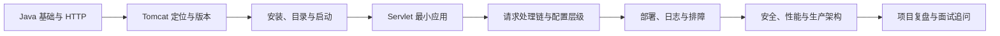

1\. 第一阶段：完成第 2～4 章，先让第一个 Servlet 跑起来。

2\. 第二阶段：学习第 5～7 章，建立配置和请求处理的心智模型。

3\. 第三阶段：学习第 8～10 章，掌握生产运行、排障和安全基础。

4\. 第四阶段：用第 11～12 章做项目复盘和面试准备。

### 1.4 学习前置知识

1\. Java：类、接口、异常、集合、线程、注解、Maven 基础。

2\. 网络：IP（Internet Protocol，互联网协议）、端口、TCP（Transmission Control Protocol，传输控制协议）、HTTP（Hypertext Transfer Protocol，超文本传输协议）。

3\. Web：URL（Uniform Resource Locator，统一资源定位符）、请求方法、状态码、请求头、Cookie。

4\. 命令行：切换目录、查看进程、设置环境变量、执行脚本。

## 2 认识 Tomcat：它负责什么

### 2.1 一句话定义

Apache Tomcat 是一个开源的 Servlet 容器和 Web 服务器。它监听网络端口，把 HTTP 请求转换为 Java 对象，调用应用中的 Servlet，并把 Servlet 产生的响应转换为 HTTP 响应。

Tomcat 实现 Jakarta Servlet、Jakarta Pages（JSP）、Jakarta Expression Language（EL，表达式语言）、Jakarta WebSocket、Jakarta Authentication 等 Web 相关规范，但它只覆盖 Jakarta EE 平台的一部分，不是完整的 Jakarta EE 应用服务器。需要 Jakarta Persistence、Jakarta Messaging 等完整企业级规范能力时，通常要引入其他实现、框架或应用服务器。

### 2.2 Tomcat、JDK、Servlet 与业务应用

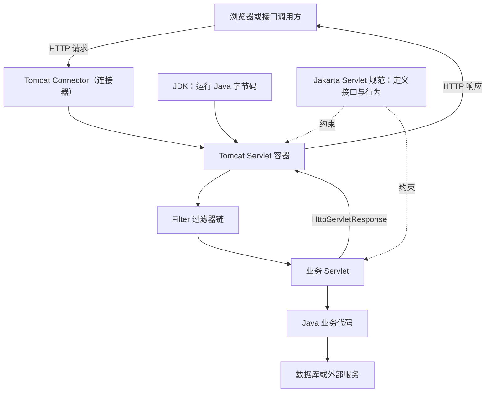

1\. JDK（Java Development Kit，Java 开发工具包）提供 Java 运行时和开发工具。

2\. Servlet 规范定义 `HttpServletRequest`、`HttpServletResponse`、`HttpServlet` 等 API（Application Programming Interface，应用程序编程接口）及容器行为。

3\. Tomcat 实现规范，负责网络监听、对象创建、生命周期、线程调度和请求分派。

4\. 业务应用依赖规范编程，不应依赖 Tomcat 内部实现类完成普通业务。意思是：编写普通业务代码时，应该使用 Servlet 规范提供的标准接口，而不要直接使用 Tomcat 自己实现这些接口的内部类，因为除了 Tomcat 还有其他实现。

### 2.3 Web 服务器与 Servlet 容器的区别

| 角色 | 主要职责 | 常见产品 |
|---|---|---|
| Web 服务器 | HTTP、静态资源、TLS（Transport Layer Security，传输层安全协议）、反向代理、负载均衡 | Nginx、Apache HTTP Server |
| Servlet 容器 | 管理 Servlet、Filter、Listener，执行 Java Web 应用 | Tomcat、Jetty |
| 完整应用服务器 | 实现更广泛的 Jakarta EE 能力 | WildFly、Payara |

Tomcat 同时具备基础 Web 服务器和 Servlet 容器能力。小型应用可以让客户端直接访问 Tomcat；生产中常在前面放置 Nginx、云负载均衡器或 API 网关。

### 2.4 版本选择与 `javax`、`jakarta` 分界

| Tomcat 系列 | 最低 Java 版本 | Servlet 规范 | 主要包名 | 适用情形 |
|---|---:|---:|---|---|
| 11.0.x | 17 | Jakarta Servlet 6.1 | `jakarta.servlet.*` | 采用 Jakarta EE 11 Web 规范的新项目 |
| 10.1.x | 11 | Jakarta Servlet 6.0 | `jakarta.servlet.*` | 采用 Jakarta EE 10 Web 规范的项目 |
| 9.0.x | 8 | Servlet 4.0 | `javax.servlet.*` | 尚未迁移到 Jakarta 命名空间的旧项目 |

在本次复核基线下，官方仍支持 11.0.x、10.1.x 和 9.0.x，最新发布分别为 11.0.24、10.1.57 和 9.0.120。这里的补丁号只记录复核时状态，不应复制成长期固定版本；选型时先确认系列，再从官方站点取得该系列的最新安全补丁。

关键边界：Tomcat 10 起，规范 API 从 `javax.*` 改为 `jakarta.*`。这不是只改服务器版本就能兼容的变化。一个编译时引用 `javax.servlet.http.HttpServlet` 的应用，不能直接作为 Jakarta Servlet 应用部署到 Tomcat 11。

选择版本时同时检查：

1\. 运行服务器的 Java 版本。

2\. 源代码导入的是 `javax.servlet.*` 还是 `jakarta.servlet.*`。

3\. Spring、第三方 Filter、认证组件等依赖支持哪个命名空间。

4\. 构建产物实际包含哪些依赖，而不是只看集成开发环境是否无报错。

5\. 跨大版本升级时检查迁移指南和默认配置差异。即使仍在 11.0.x 内升级，补丁版也可能修正默认值或产生少量兼容性变化，不能只替换 `lib/` 后沿用旧配置。

Tomcat 11 还移除了 Java `SecurityManager` 运行支持以及 HTTP/2 Server Push（服务器推送）实现。若旧系统依赖这些机制，升级前必须先替换设计，而不是等待部署时报错。

## 3 安装、目录与生命周期

### 3.1 安装前检查

```bash
java -version
javac -version
```

使用 Tomcat 11 时，输出应显示 Java 17 或更高版本。若 `java` 与 `javac` 指向不同 JDK，应先修正 `PATH` 或 `JAVA_HOME`。

从 Apache Tomcat 官方站点下载对应操作系统的二进制压缩包并校验摘要。不要从不明镜像获取生产安装包。

### 3.2 下载、校验并解压

下面以 macOS 或 Linux 上的 `tar.gz` 发行包为例。示例版本与本文复核基线一致；实际操作时，应先从官方下载页确认当前补丁版。

```bash
TOMCAT_VERSION="11.0.24"
TOMCAT_ARCHIVE="apache-tomcat-${TOMCAT_VERSION}.tar.gz"

# 进入已下载官方压缩包和 .sha512 文件的目录
cd /path/to/downloads

# macOS；Linux 可使用 sha512sum --check "${TOMCAT_ARCHIVE}.sha512"
shasum -a 512 -c "${TOMCAT_ARCHIVE}.sha512"

tar -xzf "$TOMCAT_ARCHIVE"
export CATALINA_HOME="$PWD/apache-tomcat-${TOMCAT_VERSION}"
export CATALINA_BASE="$CATALINA_HOME"

"$CATALINA_HOME/bin/catalina.sh" version
```

校验命令应输出 `OK`，它表示本地 SHA-512（Secure Hash Algorithm 512-bit，512 位安全散列算法）结果与官方 `.sha512` 文件一致。摘要不一致时停止解压和运行，重新从官方镜像下载。生产制品还可验证 OpenPGP（开放式 PGP 加密标准，PGP 为 Pretty Good Privacy 的缩写）签名，用发布管理员的官方公钥确认文件来源。

`catalina.sh version` 应输出 Tomcat 版本、安装目录和 Java 运行时信息。若提示权限不足，先检查压缩包解压后的脚本权限；若显示了错误的 Java 版本，检查当前终端的 `JAVA_HOME` 与 `PATH`。

### 3.3 `CATALINA_HOME` 与 `CATALINA_BASE`

1\. `CATALINA_HOME`：Tomcat 程序安装目录，放置共享二进制文件和脚本。

2\. `CATALINA_BASE`：某个实例的运行目录，放置该实例的配置、日志、应用和临时文件。

初学阶段两者可以指向同一目录。生产中建议分离：一份程序安装可以服务多个配置彼此隔离的实例，升级与回滚也更清晰。

不要误以为 `CATALINA_BASE/conf` 缺少文件时一定会回退到 `CATALINA_HOME/conf`。官方文档明确提示，缺少关键配置可能导致启动失败；至少应确保实例目录包含 `conf/server.xml` 与 `conf/web.xml`。

### 3.4 关键目录速查

| 目录 | 作用 | 排查时关注 |
|---|---|---|
| `bin/` | 启停、版本查询等脚本 | `startup.sh`、`shutdown.sh`、`catalina.sh` |
| `conf/` | 服务器和应用默认配置 | `server.xml`、`web.xml`、`context.xml` |
| `lib/` | Tomcat 与所有 Web 应用共享库 | 驱动冲突、公共依赖 |
| `logs/` | 容器、应用、访问日志 | 第一故障现场 |
| `webapps/` | 默认应用部署目录 | WAR、解压目录、上下文路径 |
| `work/` | JSP 编译结果等运行产物 | JSP 缓存、生成源码 |
| `temp/` | 临时文件 | 上传、磁盘空间、权限 |

### 3.5 启动、前台运行与停止

macOS 或 Linux：

```bash
cd "$CATALINA_HOME"
bin/catalina.sh run
```

`run` 在前台运行，日志直接显示在终端，最适合学习和排错。确认无误后可用：

```bash
bin/startup.sh
bin/shutdown.sh
```

Windows：

```bat
bin\catalina.bat run
```

启动成功不能只以“命令没有报错”为判据。至少验证：

```bash
curl -i http://localhost:8080/
```

预期结果是能够建立连接并收到 HTTP 状态行。若保留默认 ROOT 应用，通常会返回页面；若生产环境已移除 ROOT 应用，404 也能证明端口上存在 HTTP 服务，但仍需结合日志确认它是目标 Tomcat 实例。

### 3.6 Tomcat 生命周期

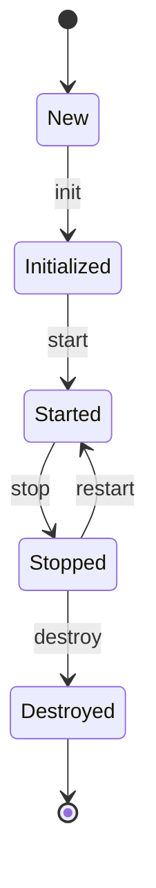

Tomcat 内部主要组件实现统一的 `Lifecycle` 模型。启动不是一个单动作，而是 Server、Service、Engine、Host、Context、Connector 等组件按层级初始化和启动。某个子组件失败时，进程可能仍存在，因此要检查部署日志和具体应用状态。

## 4 教程：完成第一个 Servlet 应用

### 4.1 目标与项目结构

目标：访问 `http://localhost:8080/hello/hello?name=Tomcat`，获得文本响应。

```text
hello-tomcat/
├── pom.xml
└── src/
    └── main/
        ├── java/
        │   └── com/example/tomcat/HelloServlet.java
        └── webapp/
            └── WEB-INF/
                └── web.xml
```

`WEB-INF` 不能被浏览器直接当作静态资源访问，适合放部署描述符、类和依赖。Maven 构建后，类进入 `WEB-INF/classes`，依赖进入 `WEB-INF/lib`。

### 4.2 Maven 配置

```xml
<?xml version="1.0" encoding="UTF-8"?>
<project xmlns="http://maven.apache.org/POM/4.0.0"
         xmlns:xsi="http://www.w3.org/2001/XMLSchema-instance"
         xsi:schemaLocation="http://maven.apache.org/POM/4.0.0 https://maven.apache.org/xsd/maven-4.0.0.xsd">
    <modelVersion>4.0.0</modelVersion>

    <groupId>com.example</groupId>
    <artifactId>hello-tomcat</artifactId>
    <version>1.0.0</version>
    <packaging>war</packaging>

    <properties>
        <maven.compiler.release>17</maven.compiler.release>
        <project.build.sourceEncoding>UTF-8</project.build.sourceEncoding>
    </properties>

    <dependencies>
        <dependency>
            <groupId>jakarta.servlet</groupId>
            <artifactId>jakarta.servlet-api</artifactId>
            <version>6.1.0</version>
            <scope>provided</scope>
        </dependency>
    </dependencies>

    <build>
        <finalName>hello</finalName>
    </build>
</project>
```

`provided` 表示编译需要该 API，但运行时由 Tomcat 提供，因此不把 Servlet API 重复打进 WAR。若误用默认编译作用域，可能产生规范类重复、类型不一致或升级困难。最小闭环只使用 Servlet API；后续某个功能引入新 API 时，再在对应章节增加依赖。

### 4.3 编写 Servlet

```java
package com.example.tomcat;

import jakarta.servlet.ServletException;
import jakarta.servlet.annotation.WebServlet;
import jakarta.servlet.http.HttpServlet;
import jakarta.servlet.http.HttpServletRequest;
import jakarta.servlet.http.HttpServletResponse;

import java.io.IOException;

@WebServlet("/hello")
public class HelloServlet extends HttpServlet {

    @Override
    protected void doGet(HttpServletRequest request, HttpServletResponse response)
            throws ServletException, IOException {
        response.setContentType("text/plain;charset=UTF-8");

        String name = request.getParameter("name");
        if (name == null || name.isBlank()) {
            name = "Java 初学者";
        }

        response.getWriter().write("Hello, " + name + "!");
    }
}
```

Servlet 实例通常由容器创建和复用。多个请求可能由多个线程同时调用同一实例，因此不要把某次请求的 `name`、请求对象或响应对象保存到 Servlet 实例字段。

`Content-Type` 中的 `charset=UTF-8` 告诉客户端如何解码响应字节。本例的 `name` 来自 URL 查询字符串，由 Connector 的 URI（Uniform Resource Identifier，统一资源标识符）解码规则处理；Tomcat 11 默认使用 UTF-8。`request.setCharacterEncoding("UTF-8")` 主要影响尚未解析的请求体参数，例如 `application/x-www-form-urlencoded` 的 POST 请求，放在这个 GET 示例中会让读者误以为它控制查询字符串。乱码排查时应区分 URI、请求体、响应和数据库四个边界。

### 4.4 配置 `web.xml`

```xml
<?xml version="1.0" encoding="UTF-8"?>
<web-app xmlns="https://jakarta.ee/xml/ns/jakartaee"
         xmlns:xsi="http://www.w3.org/2001/XMLSchema-instance"
         xsi:schemaLocation="https://jakarta.ee/xml/ns/jakartaee
                             https://jakarta.ee/xml/ns/jakartaee/web-app_6_1.xsd"
         version="6.1">

    <display-name>Hello Tomcat</display-name>

</web-app>
```

本例使用 `@WebServlet` 完成映射，`web.xml` 可以不重复声明 Servlet。真实项目仍常用它配置欢迎页、错误页、安全约束、会话和部分过滤器。

这里能发现 `@WebServlet` 的前提是 Tomcat 在部署阶段扫描应用元数据。以下设置会改变结果：

1\. `web.xml` 默认没有声明 `metadata-complete="true"`，因此容器会把部署描述符、`web-fragment.xml` 和扫描到的注解合并成应用的有效配置。

2\. 如果把 `metadata-complete` 显式设为 `true`，容器会把 `web.xml` 视为完整元数据，不能再依赖 `@WebServlet`、`@WebFilter`、`@WebListener` 自动注册组件。

3\. Tomcat Context 的 `ignoreAnnotations="true"` 也会关闭应用注解处理。它是 Tomcat 专属配置，不要只检查源码里“注解明明存在”。

4\. 排查注解和 XML 合并结果时，可以临时在对应 Context 上启用 `logEffectiveWebXml="true"`，让 Tomcat 在应用启动时以 INFO 级别记录合并后的有效 `web.xml`。故障结束后关闭，避免长期产生冗长日志。

### 4.5 构建、检查和部署

```bash
# 清理并打包
mvn clean package
# 用 JDK 的 jar 工具列出归档内容：t 表示列表，f 表示指定文件
jar tf target/hello.war
cp target/hello.war "$CATALINA_BASE/webapps/"
```

构建成功判据：

1\. Maven 显示 `BUILD SUCCESS`。

2\. `target/hello.war` 存在。

3\. `jar tf` 能看到 `WEB-INF/classes/com/example/tomcat/HelloServlet.class`。

4\. WAR 中不应出现 `WEB-INF/lib/jakarta.servlet-api-*.jar`，它由 Tomcat 提供。

若 Tomcat 开启自动部署，复制后会部署为 `/hello` 上下文。验证：

```bash
curl -i "http://localhost:8080/hello/hello?name=Tomcat"
```

预期响应：

```http
HTTP/1.1 200
Content-Type: text/plain;charset=UTF-8

Hello, Tomcat!
```

这个复制动作只用于本地教程：它能证明 WAR 结构、Context 映射和 Servlet 调用链能够走通，不能证明生产发布具备原子性、回滚和多实例一致性。生产发布还要执行 7.2 节与 10.7 节的制品校验、摘流、健康检查和回滚流程。

### 4.6 最小闭环失败排查

| 现象 | 优先检查 | 原因 |
|---|---|---|
| 连接被拒绝 | 进程、8080 监听、启动日志 | Tomcat 未启动或端口不同 |
| `/hello` 返回 404 | WAR 名、Context 部署日志 | 上下文未部署 |
| `/hello/hello` 返回 404 | 注解扫描、Servlet 映射 | 请求没有匹配目标 Servlet |
| 返回 405 | 请求方法与 `doGet`、`doPost` | Servlet 不支持当前方法 |
| 返回 500 | 异常栈最底层 `Caused by` | 应用执行失败 |
| `ClassNotFoundException: javax.servlet...` | Tomcat 和依赖代际 | `javax` 应用部署到 `jakarta` 容器 |

## 5 请求处理链与容器层级

### 5.1 `server.xml` 的核心层级

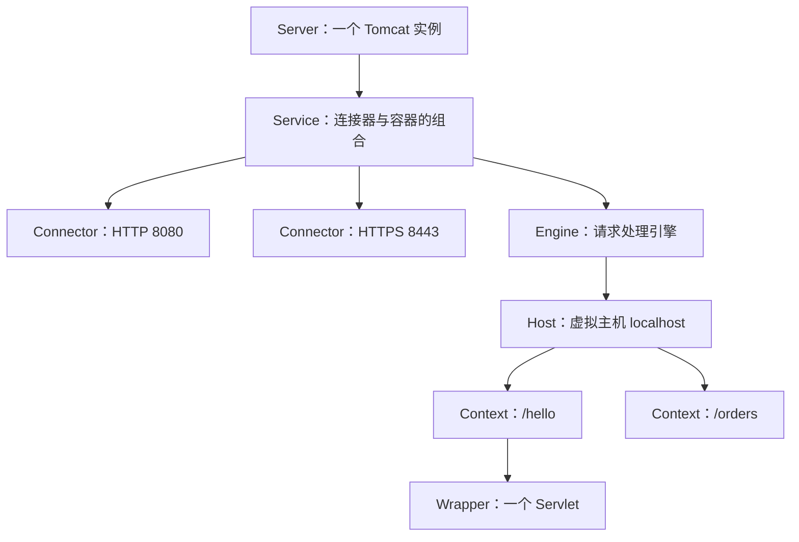

1\. `Server`：最外层组件，代表整个 Tomcat 实例。

2\. `Service`：把一个或多个 Connector 与一个 Engine 关联起来。

3\. `Connector`：监听端口，解析协议并生成请求、响应对象。

4\. `Engine`：根据主机名把请求交给 Host。

5\. `Host`：一个虚拟主机，通常对应域名及应用目录。

6\. `Context`：一个 Web 应用，对应上下文路径。

7\. `Wrapper`：一个 Servlet 的容器包装。

### 5.2 URL 如何映射到 Servlet

以 `http://localhost:8080/hello/hello?id=1` 为例：

1\. `localhost:8080` 选中监听 8080 的 Connector。

2\. 主机名 `localhost` 匹配 Host。

3\. `/hello` 匹配 Context，即 Web 应用。

4\. Context 内剩余路径 `/hello` 匹配 `@WebServlet("/hello")`。

5\. `id=1` 是查询参数，不参与 Context 路径选择。

404 不只是“页面不存在”。它可能发生在 Host、Context、Servlet 映射或业务资源任一层。排查时先定位是哪一层没有匹配。

### 5.3 Filter、Servlet 与 Listener

| 组件 | 数据来源与职责 | 生命周期 | 常见用途 |
|---|---|---|---|
| Servlet | 接收容器分派的请求并生成响应 | 容器创建，通常长期复用 | 控制器、接口入口 |
| Filter | 包围目标资源，可放行、修改或拒绝请求 | 随 Web 应用启停 | 认证、日志、编码、链路标识 |
| Listener | 监听应用、会话、请求等事件 | 随监听对象变化触发 | 初始化资源、统计在线会话 |

请求链可理解为：

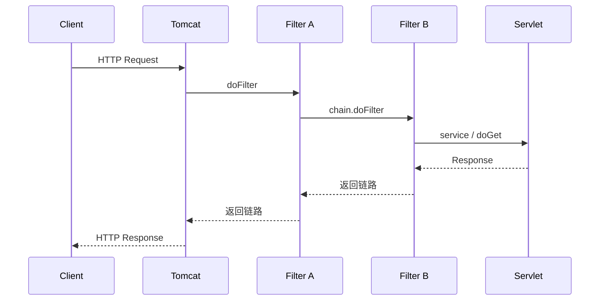

如果 Filter 没有调用 `chain.doFilter(request, response)`，请求不会继续到达后续 Filter 或 Servlet。这可能是有意拒绝，也可能是遗漏。

### 5.4 Servlet 生命周期与线程安全

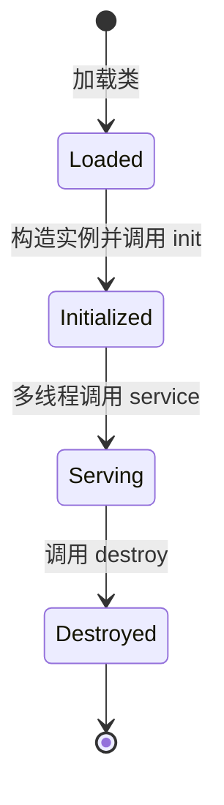

`HttpServlet.service()` 根据 HTTP 方法分派到 `doGet()`、`doPost()` 等方法。容器通常不会为每个请求创建一个 Servlet 实例。

错误示例：

```java
public class UnsafeServlet extends HttpServlet {
    private String currentUser; // 多个请求共享，会发生数据竞争与串号

    @Override
    protected void doGet(HttpServletRequest request, HttpServletResponse response)
            throws IOException {
        currentUser = request.getParameter("user");
        response.getWriter().write(currentUser);
    }
}
```

正确思路是把请求级数据放在局部变量、请求属性或明确的请求作用域对象中。共享状态必须使用线程安全设计，但最简单可靠的做法通常是不在 Servlet 中保存可变请求状态。

### 5.5 Servlet URL 映射的匹配顺序

Servlet 映射不是按配置文件中的书写顺序“从上到下命中”。容器会依据规范选择最具体的匹配：

1\. 精确匹配，例如 `/orders/detail`。

2\. 最长路径前缀匹配，例如 `/api/*`。

3\. 扩展名匹配，例如 `*.do`。

4\. 默认映射 `/`，通常由 Tomcat 的 DefaultServlet 处理静态资源。

例如请求 `/api/orders.do` 同时看似符合 `/api/*` 和 `*.do`，最终使用路径前缀映射 `/api/*`。若没有业务 Servlet 匹配，则可能交给默认 Servlet 查找静态资源。

常见映射不要混淆：

| 映射 | 含义 |
|---|---|
| `/` | 应用的默认 Servlet 映射，不等于只匹配首页 |
| `/*` | 匹配所有路径，可能截获 JSP 等其他资源 |
| `/api/*` | 匹配 `/api` 下的路径 |
| `*.jsp` | 按扩展名匹配 |
| 空字符串映射 | 映射到应用上下文根路径 |

排查映射冲突时，应列出请求在 Context 内的路径、所有候选映射和规范优先级，而不是只检查注解是否存在。

### 5.6 Pipeline 与 Valve 的容器级处理链

Filter 属于单个 Web 应用的 Servlet 规范能力；Valve 是 Tomcat 特有的容器扩展点，可以挂到 Engine、Host 或 Context 的 Pipeline（管道）中，对更大范围的请求生效。

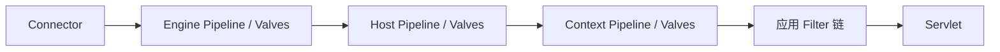

| 对比项 | Filter | Valve |
|---|---|---|
| 标准归属 | Jakarta Servlet 规范 | Tomcat 专有 |
| 常见配置位置 | `WEB-INF/web.xml` 或注解 | `server.xml`、Context 配置 |
| 典型范围 | 单个 Web 应用 | Engine、Host 或 Context |
| 可移植性 | 可迁移到其他 Servlet 容器 | 与 Tomcat 耦合 |
| 常见用途 | 业务认证、编码、应用审计 | 访问日志、远程地址处理、容器级限制 |

Tomcat 的 AccessLogValve、RemoteIpValve 和 StuckThreadDetectionValve 都建立在这一机制上。普通业务逻辑优先使用标准 Filter；只有确实需要容器级作用域时才使用 Valve。

## 6 配置文件与生效边界

### 6.1 三类配置文件的职责

| 文件 | 作用范围 | 典型内容 | 修改后通常需要 |
|---|---|---|---|
| `conf/server.xml` | Tomcat 实例 | Connector、Engine、Host、Realm | 重启 Tomcat |
| `conf/web.xml` | 所有 Web 应用的默认值 | DefaultServlet、JSP Servlet、MIME 映射 | 重启或重新部署 |
| 应用的 `WEB-INF/web.xml` | 单个 Web 应用 | Servlet、Filter、Listener、会话、安全约束 | 重新部署应用 |
| `conf/context.xml` | 所有 Context 的默认值 | 资源、会话管理等 | 重启或重新部署 |
| `conf/Catalina/localhost/*.xml` | 单个应用 Context | `docBase`、JNDI 资源 | 重新部署对应应用 |

配置“没有报错”不等于“配置已生效”。确认配置实际绑定在哪个 Server、Host 或 Context 上，并通过启动日志、监听端口、响应头或 JMX（Java Management Extensions，Java 管理扩展）观察结果。

### 6.2 Connector 最小配置解读

```xml
<Connector port="8080"
           protocol="HTTP/1.1"
           connectionTimeout="20000"
           redirectPort="8443"
           maxParameterCount="1000" />
```

1\. `port`：监听端口。修改后用端口监听工具和 `curl` 验证。

2\. `protocol`：协议处理器选择。文本 `HTTP/1.1` 会由 Tomcat 选择对应实现。

3\. `connectionTimeout`：连接建立后等待请求 URI 行的时间，单位毫秒。Connector 属性自身默认是 60 秒，但 Tomcat 11.0.24 随附的标准 `server.xml` 显式设置为 20 秒；在默认上传设置下，它还会影响读取请求体。它不是 Servlet 业务执行超时。

4\. `redirectPort`：安全约束要求机密传输时的重定向目标端口；仅配置它不会自动启用 HTTPS。

5\. `maxParameterCount`：限制查询字符串和特定表单请求体可解析出的参数总数。Tomcat 11 默认值是 1000，超限请求会被拒绝，而不是静默忽略多余参数。Servlet 6.1 参数 API 在触发解析且解析失败时可抛出运行时异常；Tomcat 11 已移除旧的 `FailedRequestFilter`。

还应把 Connector 看成一组连续的容量闸门，而不是只看 `maxThreads`：

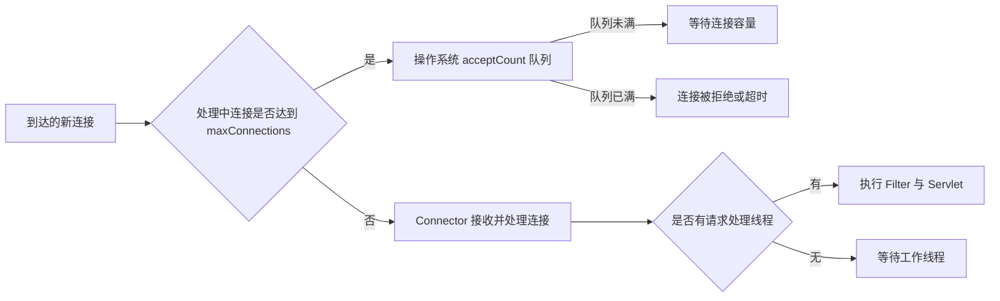

Tomcat 11.0.24 标准 NIO（Non-blocking I/O，非阻塞输入输出）Connector 的常用容量属性如下。默认值是理解初始行为的参考，不是生产推荐值。表中 B 表示字节，KiB 表示 1024 B，MiB 表示 1024 KiB：

| 属性 | Tomcat 11.0.24 默认值 | 控制对象 | 关键边界 |
|---|---:|---|---|
| `maxThreads` | 200 | 同时执行请求的最大工作线程数 | 配置共享 Executor 后，此属性被忽略 |
| `maxConnections` | 8192 | Connector 同时接受并处理的连接数 | 连接数不等于正在执行的请求数 |
| `acceptCount` | 100 | 达到 `maxConnections` 后的操作系统连接队列 | 操作系统可能使用不同的实际队列长度 |
| `keepAliveTimeout` | 继承 `connectionTimeout` | 等待同一持久连接上下一个请求的时间 | 过大可能长期占用连接容量 |
| `maxParameterCount` | 1000 | 可解析的请求参数总数 | 超限请求被拒绝 |
| `maxPartCount` | 50 | `multipart/form-data` 请求的分段数 | 与 `maxParameterCount` 同时生效 |
| `maxPartHeaderSize` | 512 B | 每个 multipart 分段的请求头字节数 | 与分段数、连接数共同决定内存风险 |
| `maxPostSize` | 2 MiB | Tomcat 转换成参数的请求体数据 | 不是所有 POST 请求体的通用大小限制 |
| `maxHttpRequestHeaderSize` | 8 KiB | 请求行与请求头总字节数 | 调大后会增加每个并发请求的内存成本 |
| `URIEncoding` | UTF-8 | URI 百分号解码后的字符解码 | 与请求体字符编码是不同入口 |

对 multipart 请求，官方给出的容量估算是 `maxPartHeaderSize × maxPartCount × maxConnections × 2`。使用上表默认值时约为 400 MiB，它描述大量连接同时提交最大分段头时的内存风险，不表示普通请求会固定占用这些内存。文件上传还要结合 `@MultipartConfig` 的文件大小、整个请求大小和写盘阈值一起设计，单独修改 Connector 属性无法形成完整上传限制。

验证容量配置不能只看 `server.xml`。应在压测或受控流量下同时观察当前线程数、忙线程数、连接数、排队、拒绝或超时、应用延迟以及下游连接池。若配置了共享 Executor（执行器），Connector 上的线程属性即使仍可看到，也不再决定实际线程池容量。

### 6.3 Context 路径从哪里来

默认自动部署下：

1\. `webapps/ROOT.war` 对应 `/`。

2\. `webapps/hello.war` 对应 `/hello`。

3\. `webapps/shop#admin.war` 对应 `/shop/admin`。

不要习惯性在 `server.xml` 中为每个应用直接添加 Context。更适合使用 WAR 文件名、独立 Context XML 或外部部署系统，降低主配置与应用发布的耦合。

### 6.4 环境变量与启动参数

自定义 JVM（Java Virtual Machine，Java 虚拟机）参数建议放入 `bin/setenv.sh` 或 Windows 的 `bin/setenv.bat`，不要直接修改 `catalina.sh`，否则升级时容易丢失。

```bash
export CATALINA_OPTS="-Xms512m -Xmx512m -Dfile.encoding=UTF-8"
```

`JAVA_OPTS` 可能影响启动、停止等所有 Java 命令；`CATALINA_OPTS` 主要用于 Tomcat 启动过程。生产参数应先经压测和内存预算验证，不要机械复制网络模板。

### 6.5 配置合并、覆盖与“为什么没有生效”

Tomcat 配置不是一个文件完全覆盖另一个文件，而是在不同阶段按作用域组合。初学者可用下面的顺序定位实际入口：

1\. `server.xml` 先建立 Server、Service、Connector、Engine 和 Host 等容器结构。

2\. Host 根据 `appBase`、Context 描述文件和自动部署配置发现 Web 应用。

3\. `conf/context.xml` 提供所有应用的 Context 默认配置，Host 专属的 `context.xml.default` 可以继续提供默认值，单应用 Context XML 再定义该应用配置。

4\. `conf/web.xml` 提供所有应用的默认 Web 配置，应用的 `WEB-INF/web.xml` 与注解元数据共同形成该应用的 Servlet、Filter、Listener 等配置。

5\. 部分 Tomcat 专属 Web 配置可以放在 `WEB-INF/tomcat-web.xml`，但这会降低应用对其他容器的可移植性。

配置不生效时按以下闭环验证：

1\. 确认改的是实际 `CATALINA_BASE`，而不是另一套安装目录。

2\. 确认配置所在层级与目标对象一致，例如 Host Valve 不会自动变成另一个 Host 的配置。

3\. 确认 XML 能被解析，并在启动或重新部署日志中找到加载记录。

4\. 确认变更需要重启整个 Tomcat，还是只需重新部署 Context。

5\. 用监听端口、JMX、访问日志或请求行为验证运行时状态，不能只凭文件内容判断。

## 7 部署、类加载与应用隔离

### 7.1 WAR、展开目录与上下文

WAR 是符合标准目录结构的 ZIP 格式归档。Tomcat 可以直接运行 WAR，也可以根据 Host 配置将其展开。

一次发布至少观察：

1\. 新制品的版本或摘要是否正确。

2\. Tomcat 是否记录部署完成及耗时。

3\. Context 是否为期望路径。

4\. 健康检查和关键业务接口是否成功。

5\. 日志、错误率和延迟是否异常。

### 7.2 自动部署的行为边界

`deployOnStartup` 控制 Tomcat 启动时是否部署 Host 下发现的应用；`autoDeploy` 控制运行期间是否周期性检查应用变化。

自动部署便于开发，但生产环境频繁扫描、直接覆盖 WAR 可能导致短暂不可用、旧文件残留或发布状态不确定。生产应采用可审计的制品、原子切换、健康检查和回滚流程；高安全环境还会关闭自动部署。

Tomcat 原生的并行部署也能降低版本切换对现有 Session 的影响，但它属于生产发布方案。先理解 8.2 节的 Session，再阅读 10.7 节的版本选择规则。

### 7.3 Tomcat 类加载心智模型

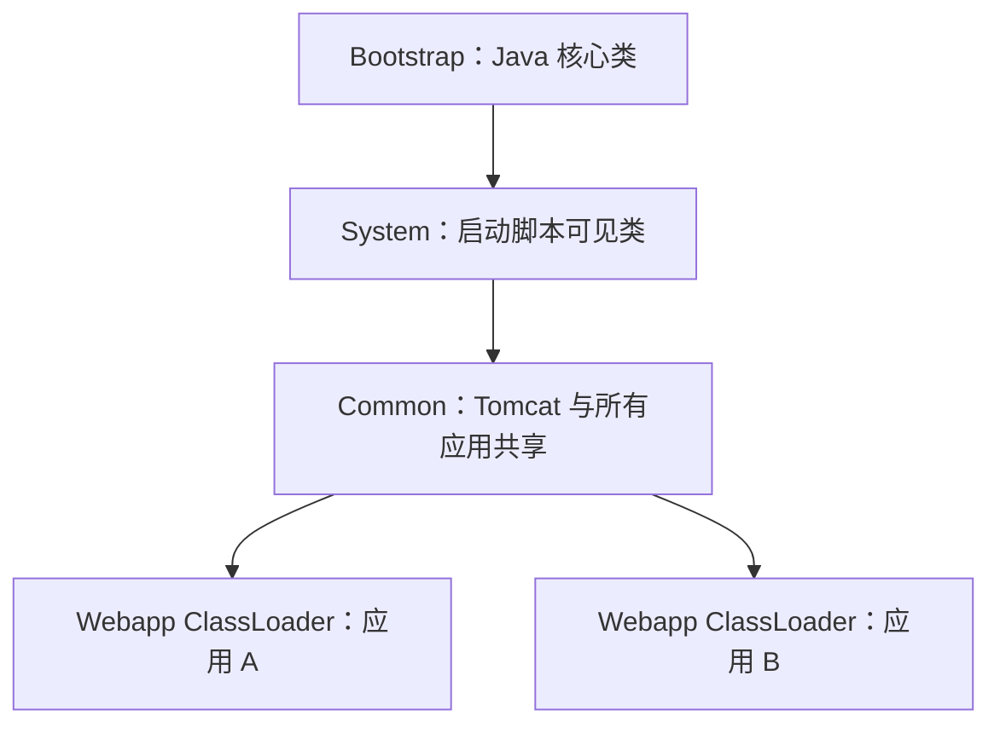

类加载器的父子关系不等于每次都严格“父优先”。默认情况下，从 Web 应用视角查找普通类或资源的顺序是：

1\. JVM（Java Virtual Machine，Java 虚拟机）的 Bootstrap 类。

2\. 当前应用的 `WEB-INF/classes`。

3\. 当前应用的 `WEB-INF/lib/*.jar`。

4\. System 类加载器可见内容。

5\. Common 类加载器可见内容。

Java 核心类不能被应用覆盖；Tomcat 实现的 Servlet、JSP、EL、WebSocket 等 Jakarta EE API 类也始终优先委派。若 Context 显式设置 `<Loader delegate="true"/>`，普通类的顺序会改为 Bootstrap → System → Common → 应用本地，接近传统父优先模型。

这种默认策略既允许不同应用隔离自己的普通依赖版本，又防止应用替换容器必须统一实现的规范 API。排查时不能只问“父优先还是子优先”，而要同时说清目标类属于哪一类、当前 Context 是否修改了 `delegate`，以及同名类分别由哪个类加载器定义。

常见故障：

1\. 同一个库同时放在 `$CATALINA_BASE/lib` 和 `WEB-INF/lib`，产生版本冲突。

2\. JDBC（Java Database Connectivity，Java 数据库连接）驱动放置位置与数据源作用域不匹配。

3\. 应用停止后线程、ThreadLocal、驱动或定时器未清理，导致 Webapp ClassLoader 无法回收。

4\. 把 Servlet API 打进 WAR，造成容器接口冲突。

`ClassCastException: X cannot be cast to X` 看似左右类名相同，也可能是两个不同类加载器分别定义了同名类。可在受控诊断代码或调试器中检查 `object.getClass().getClassLoader()`，再对照 WAR 和 `lib/` 中的重复 JAR；删除重复依赖后必须重新部署或重启，并再次确认实际类加载来源。

### 7.4 热部署为什么可能泄漏

重新部署时，Tomcat 会停止旧 Context 并创建新的类加载器。若旧应用创建的非守护线程仍在运行，或全局对象仍引用旧应用类，旧类加载器及其所有类和静态数据就可能无法被垃圾回收。

生产中不要把频繁热部署当作无成本操作。应用应在 `ServletContextListener.contextDestroyed()` 或框架关闭钩子中停止线程池、调度器、数据库连接池和其他资源，并结合日志与堆分析确认没有泄漏。

### 7.5 外部 Tomcat 与内嵌 Tomcat 的运行边界

前面的教程使用外部 Tomcat：先独立启动容器，再把 WAR 放入容器。Spring Boot 等框架还常把 Tomcat 作为应用依赖，由 Java 主程序在进程内创建和启动容器。两种方式的 Servlet 请求模型相同，但配置入口、制品和运维责任不同。

| 对比项 | 外部 Tomcat | 内嵌 Tomcat |
|---|---|---|
| 常见制品 | WAR | 可执行 JAR（Java Archive，Java 归档） |
| 启动入口 | `catalina.sh`、Windows 服务或容器进程 | 应用的 `main` 方法 |
| 容器配置 | `server.xml`、Context XML、启动参数 | 框架配置、定制代码和启动参数 |
| 发布单元 | Tomcat 实例与应用可分开升级 | 应用与容器依赖一起发布 |
| 常见隔离 | 一个实例可承载多个 Context | 通常一个进程承载一个应用 |

排查配置时先确认容器由谁创建。内嵌模式通常不读取一套完整的外部 `server.xml`，修改某个未被应用加载的 Tomcat 安装目录不会改变内嵌 Connector。反过来，外部部署时只改框架的内嵌服务器属性，也不会覆盖运维管理的 Connector。可通过进程命令行、启动日志、制品结构和实际监听端口确认当前模式。

## 8 HTTP、会话、JSP 与资源

### 8.1 请求参数、请求体与属性

| 数据 | 来源 | 生命周期 | 常见 API |
|---|---|---|---|
| 查询参数 | URL `?name=value` | 单次请求 | `getParameter` |
| 表单参数 | 请求体，按表单编码解析 | 单次请求 | `getParameter` |
| JSON 请求体 | 原始请求体 | 单次请求，通常只能消费一次 | `getReader`、框架反序列化 |
| 请求属性 | 服务器内部代码写入 | 单次请求及转发 | `setAttribute`、`getAttribute` |
| Session 属性 | 服务端会话 | 多次请求 | `getSession` |
| Cookie | 客户端随请求发送 | 由过期策略决定 | `getCookies` |

`getParameter("x") == null` 表示未提供；空字符串表示提供了但内容为空。它们与数字零、布尔 `false` 都是不同状态，业务校验不能混为一谈。

### 8.2 Session 的本质

HTTP 本身无状态。Tomcat 通常创建服务端 Session 对象，并通过名为 `JSESSIONID` 的 Cookie 让后续请求关联同一会话。

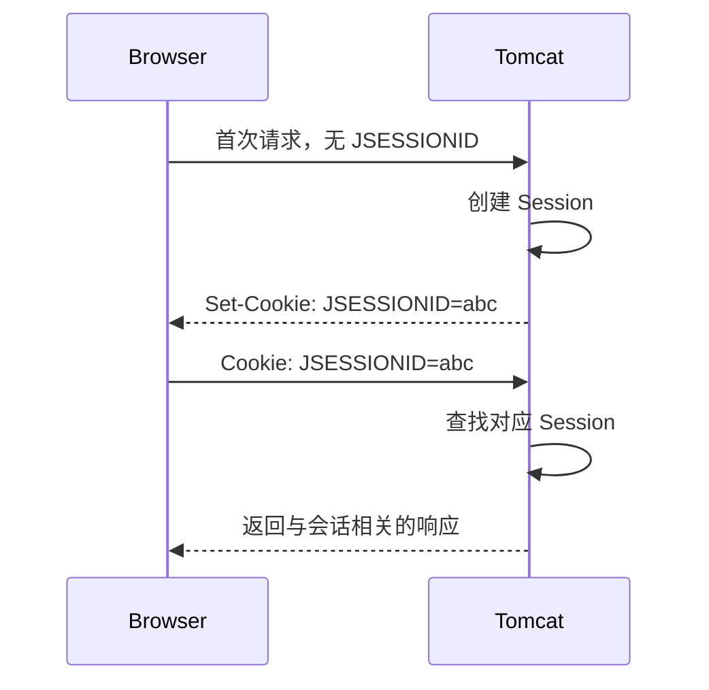

注意边界：

1\. `JSESSIONID` 泄漏通常等价于登录会话被窃取，应使用 HTTPS、`HttpOnly`、合适的 `Secure` 与 `SameSite` 策略。

2\. 单机内存 Session 在重启后可能丢失。

3\. 多实例部署需要粘性会话、Session 复制或外部会话存储，并明确一致性与故障切换代价。

4\. 不要把超大对象或无界集合放入 Session。

Session 的“存在”“新建”和“失效”也要区分：

1\. `request.getSession()` 在没有会话时会创建一个；只想查询现有会话时使用 `request.getSession(false)`，返回 `null` 表示当前请求没有可用会话。

2\. 超时通常按一段时间内未被访问计算，不是从登录时刻开始的固定寿命。安全要求更高的系统还要实现绝对登录时长和重新认证策略。

3\. 注销时调用 `session.invalidate()`。认证成功后应更换 Session ID 防止会话固定攻击，可调用 `request.changeSessionId()`，成熟安全框架通常会代为完成。

4\. Session 已经失效、Cookie 未提供、Cookie 值为空和 Cookie 指向不存在的 Session 是不同状态，不能仅根据“请求带了 `JSESSIONID`”判断用户已登录。

单个应用可在 `WEB-INF/web.xml` 中设置会话超时和标准 Cookie 属性：

```xml
<session-config>
    <session-timeout>30</session-timeout>
    <cookie-config>
        <http-only>true</http-only>
        <secure>true</secure>
    </cookie-config>
</session-config>
```

`session-timeout` 单位为分钟。`secure=true` 只适用于全程 HTTPS 的生产环境；本地纯 HTTP 教程若照搬，浏览器不会回传该 Cookie。Tomcat 的 Context 默认会为 Session Cookie 启用 `HttpOnly`，但在应用配置中显式声明能让安全意图更清楚。

`SameSite` 由 Tomcat 的 CookieProcessor（Cookie 处理器）配置，而不是上述标准 `cookie-config`：

```xml
<Context>
    <CookieProcessor sameSiteCookies="lax" />
</Context>
```

Tomcat 11 默认 `sameSiteCookies="unset"`，即不主动写入 SameSite 属性。选择 `lax`、`strict` 或 `none` 必须结合跨站登录、嵌入页面和前后端域名设计验证；使用 `none` 时还要满足现代浏览器对 `Secure` 的要求。

### 8.3 JSP 的执行过程

JSP（历史上指 JavaServer Pages，当前规范名为 Jakarta Pages）最终会被 Tomcat 转换为 Servlet 源码、编译成类并执行。生成文件通常可以在 `work/` 下找到。

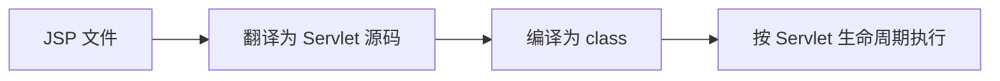

首次访问 JSP 较慢，可能包含翻译和编译成本。现代前后端分离项目较少直接使用 JSP，但理解这一过程有助于认识 Tomcat 的工作目录和编译错误。

### 8.4 JNDI 数据源

#### 8.4.1 先理解要解决什么问题

Java 程序访问数据库需要数据库连接。每次请求都重新创建物理连接，会反复进行网络连接、认证等操作，开销很大；如果连接使用完后没有正确关闭，还可能耗尽数据库允许的连接数。

数据源 `DataSource` 通常在内部维护一个连接池：

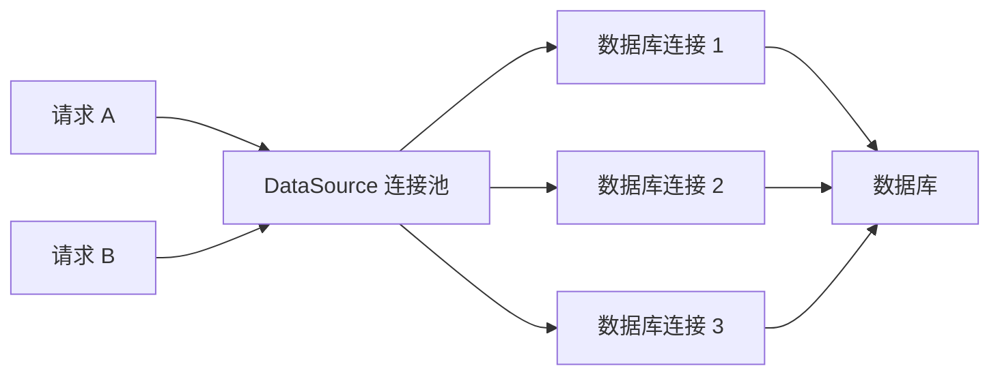

应用调用 `dataSource.getConnection()` 时，从池中借出一个连接；调用 `connection.close()` 时，连接通常不是被物理销毁，而是归还连接池供后续请求复用。

如果每个应用都在代码里写数据库地址、密码和连接池参数，会出现几个问题：

1\. 开发、测试、生产环境的配置不同，修改环境容易连错数据库。

2\. 密码容易散落在源代码和构建产物中。

3\. 每个应用都要自行创建、启动和关闭连接池。

4\. 运维人员难以在不改业务代码的情况下调整连接数和超时。

Tomcat 可以代替应用创建并管理 `DataSource`，再通过 JNDI（Java Naming and Directory Interface，Java 命名与目录接口）把它提供给应用。

#### 8.4.2 把 JNDI 想成容器内部的电话簿

初学阶段可以把 JNDI 理解成 Tomcat 内部的一本“资源电话簿”：

```text
名字：java:comp/env/jdbc/OrderDB
对象：Tomcat 创建的 DataSource 连接池
```

Tomcat 启动或部署应用时，先创建数据源并把它绑定到名字；应用只记住名字，不直接负责创建连接池。

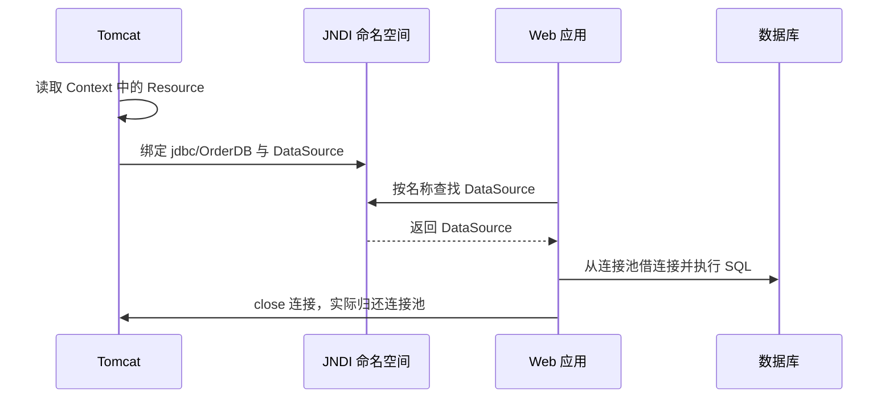

这里的 `jdbc` 只是常用命名分类，`OrderDB` 是项目自己定义的资源名。Web 应用的标准组件环境命名空间以 `java:comp/env/` 开头，因此完整名字通常是 `java:comp/env/jdbc/OrderDB`。

#### 8.4.3 在 Tomcat 中注册数据源

下面以 MySQL 为例。在单个应用的 Context XML 中配置资源，例如：

```xml
<Context>
    <Resource name="jdbc/OrderDB"
              auth="Container"
              type="javax.sql.DataSource"
              factory="org.apache.tomcat.jdbc.pool.DataSourceFactory"
              driverClassName="com.mysql.cj.jdbc.Driver"
              url="jdbc:mysql://127.0.0.1:3306/order_db?useUnicode=true&amp;characterEncoding=UTF-8"
              username="order_app"
              password="LOCAL_DEMO_ONLY"
              initialSize="2"
              maxActive="20"
              maxIdle="10"
              minIdle="2"
              maxWait="5000"
              testOnBorrow="true"
              validationQuery="SELECT 1" />
</Context>
```

可以把单应用 Context 文件放在：

```text
$CATALINA_BASE/conf/Catalina/localhost/hello.xml
```

`hello.xml` 对应 `/hello` 应用。不要在同一个应用同时使用多种 Context 定义方式，否则容易出现重复部署或不清楚哪份配置生效。

示例通过 `factory="org.apache.tomcat.jdbc.pool.DataSourceFactory"` 明确选择 Tomcat JDBC Pool，而 Tomcat 默认数据源工厂使用的是内置的 Apache Commons DBCP 2（Database Connection Pool 2，数据库连接池 2）变体。前者对应可选的 `tomcat-jdbc.jar`；使用前应确认当前发行包的 `lib/` 中包含它。若改用默认 DBCP 2 工厂，属性名和默认值并非全部相同，例如常见最大连接数属性是 `maxTotal`，不能保留本例的 `maxActive` 后假定语义不变。

关键属性：

| 属性 | 作用 | 初学者需要注意 |
|---|---|---|
| `name` | JNDI 资源名 | 应与应用查找的 `jdbc/OrderDB` 一致 |
| `type` | 资源接口类型 | 数据源通常是 `javax.sql.DataSource` |
| `factory` | 创建连接池的工厂 | 示例使用 Tomcat JDBC Pool |
| `driverClassName` | JDBC 驱动类 | MySQL 8 常用 `com.mysql.cj.jdbc.Driver` |
| `url` | 数据库连接地址 | XML 中 `&` 必须写成 `&amp;` |
| `maxActive` | 最多同时借出的连接数 | 不能超过数据库和整体容量预算 |
| `maxWait` | 借不到连接时最多等待多久 | 单位毫秒，超时后获取连接失败 |
| `validationQuery` | 检查连接是否可用的 SQL | 应选择开销很小的语句 |

本例设置 `testOnBorrow="true"`，每次借连接前都要求验证连接。Tomcat JDBC Pool 可以用 `validationInterval` 避免在很短时间内重复验证；是否开启以及间隔多长应根据数据库驱动、网络空闲断连策略和实际故障模式压测，不能把“每次验证”当作免费的可靠性。

数据库 JDBC 驱动必须在运行类路径中。由 Tomcat 创建的共享资源通常把驱动 JAR 放入 `$CATALINA_BASE/lib` 或 `$CATALINA_HOME/lib`，然后重启 Tomcat。只把驱动放进某个应用的 `WEB-INF/lib`，Tomcat 的公共类加载器不一定能看到它。

示例密码只用于说明配置结构。生产中不要把真实密码提交到 Git，应接入组织的密钥管理或受保护的配置注入机制，并限制配置文件的读取权限。

#### 8.4.4 在 Servlet 中获取和使用数据源

Tomcat 可以向由容器创建和管理的 Servlet 注入资源。本节使用 `jakarta.annotation.Resource`，因此先在 `pom.xml` 的 `<dependencies>` 中增加 Jakarta Annotations API：

```xml
<dependency>
    <groupId>jakarta.annotation</groupId>
    <artifactId>jakarta.annotation-api</artifactId>
    <version>3.0.0</version>
    <scope>provided</scope>
</dependency>
```

Tomcat 11 实现 Jakarta Annotations 3.0，运行时由容器提供该 API，所以依赖仍使用 `provided`。重新构建后，`jar tf target/hello.war` 不应出现 `WEB-INF/lib/jakarta.annotation-api-*.jar`。

接着编写数据库健康检查 Servlet：

```java
package com.example.tomcat;

import jakarta.annotation.Resource;
import jakarta.servlet.ServletException;
import jakarta.servlet.annotation.WebServlet;
import jakarta.servlet.http.HttpServlet;
import jakarta.servlet.http.HttpServletRequest;
import jakarta.servlet.http.HttpServletResponse;

import javax.sql.DataSource;
import java.io.IOException;
import java.sql.Connection;
import java.sql.ResultSet;
import java.sql.SQLException;
import java.sql.Statement;

@WebServlet("/db-health")
public class DatabaseHealthServlet extends HttpServlet {

    @Resource(lookup = "java:comp/env/jdbc/OrderDB")
    private DataSource dataSource;

    @Override
    protected void doGet(HttpServletRequest request, HttpServletResponse response)
            throws ServletException, IOException {
        response.setContentType("text/plain;charset=UTF-8");

        try (Connection connection = dataSource.getConnection();
             Statement statement = connection.createStatement();
             ResultSet resultSet = statement.executeQuery("SELECT 1")) {

            if (resultSet.next() && resultSet.getInt(1) == 1) {
                response.getWriter().write("database connection is healthy");
                return;
            }

            response.sendError(HttpServletResponse.SC_SERVICE_UNAVAILABLE,
                    "database validation returned unexpected result");
        } catch (SQLException exception) {
            throw new ServletException("database connection check failed", exception);
        }
    }
}
```

这里有三个重要边界：

1\. `@Resource` 只会由容器处理。自己执行 `new DatabaseHealthServlet()` 或 `new OrderRepository()` 创建的普通对象，不会因为写了注解就自动获得数据源。

2\. 应关闭 `ResultSet`、`Statement` 和 `Connection`。`try-with-resources` 会按相反顺序自动关闭；对于池化连接，`Connection.close()` 通常表示归还连接，而不是关闭整个连接池。

3\. 不要在每次请求中关闭 `DataSource`，也不要把某个 `Connection` 长期保存为 Servlet 实例字段。连接是有借有还的短期资源，而数据源通常与应用生命周期一致。

也可以手动查找，以便理解 `@Resource` 背后发生了什么：

```java
import javax.naming.InitialContext;
import javax.sql.DataSource;

DataSource dataSource = (DataSource) new InitialContext()
        .lookup("java:comp/env/jdbc/OrderDB");
```

注入与手动查找最终都依赖同一个 JNDI 名字。注入更简洁；手动查找更直观，但需要处理命名异常。

#### 8.4.5 如何验证与排查

启动 Tomcat 后访问：

```bash
curl -i http://localhost:8080/hello/db-health
```

成功判据不能只是“Tomcat 没有报错”，而应同时满足：

1\. 应用部署日志中没有资源创建异常。

2\. 接口返回 HTTP 200 和 `database connection is healthy`。

3\. 数据库能看到来自该应用账号的连接。

4\. 连续调用接口后，连接数在连接池范围内稳定，而不是每次都无限增加。

这个接口只能证明“当前实例在当前时刻能够借到连接并执行最小 SQL”，不能证明所有业务表、事务、读写路由或数据库容量都正常。它还会真实消耗数据库资源，不应作为无认证的公网诊断接口；用于就绪检查时，要评估数据库短暂波动是否会导致所有实例同时被摘流。

常见失败：

| 现象 | 缺失知识或原因 | 检查位置 |
|---|---|---|
| `NameNotFoundException` | JNDI 名称没有绑定或名称不一致 | Resource 的 `name`、应用 Context、完整查找名 |
| `ClassNotFoundException: com.mysql.cj.jdbc.Driver` | Tomcat 看不到 JDBC 驱动 | `$CATALINA_BASE/lib`、驱动版本、重启日志 |
| `Access denied for user` | 数据库账号、密码或来源授权错误 | 数据库用户权限与连接地址 |
| `Cannot get a connection, pool error` | 连接池耗尽或数据库不可达 | `maxActive`、`maxWait`、慢 SQL、连接泄漏 |
| `dataSource` 是 `null` | 对象不是由容器创建、注解处理被关闭，或注入失败 | 对象创建入口、`metadata-complete`、`ignoreAnnotations`、部署日志 |

连接池大小不是越大越好。它受数据库最大连接能力、Tomcat 并发数、应用实例数量和每个请求占用连接的时间共同约束。例如 5 个实例各配置 50 个连接，理论上可能向数据库建立 250 个连接，而不是 50 个。

### 8.5 转发、包含与重定向的区别

| 操作 | 执行位置 | 浏览器地址栏 | 请求次数 | 请求属性是否保留 |
|---|---|---|---:|---|
| `RequestDispatcher.forward` | 服务器内部 | 不变 | 1 | 保留 |
| `RequestDispatcher.include` | 服务器内部 | 不变 | 1 | 保留 |
| `sendRedirect` | 通知客户端重新请求 | 改变 | 2 | 不保留 |

```java
// 服务器内部转发到同一应用中的结果页面
request.setAttribute("orderId", "A1001");
request.getRequestDispatcher("/result").forward(request, response);

// 通知浏览器发起新请求，路径应包含应用上下文
response.sendRedirect(request.getContextPath() + "/orders");
```

`include` 表示“当前 Servlet 暂停一下，请另一个服务器资源把输出追加到当前响应，然后我再继续输出”。它适合拼装页头、页脚、菜单或一小段可复用内容。主 Servlet 可以先写入尚在缓冲区中的内容，但在调用 `include` 前不能把响应真正提交给客户端：

```java
response.setContentType("text/html;charset=UTF-8");
response.getWriter().write("<main>");

// /fragments/menu 的输出会插入当前响应，但控制权之后会回到当前 Servlet
request.getRequestDispatcher("/fragments/menu").include(request, response);

response.getWriter().write("<h1>订单列表</h1></main>");
```

执行顺序可以理解为：

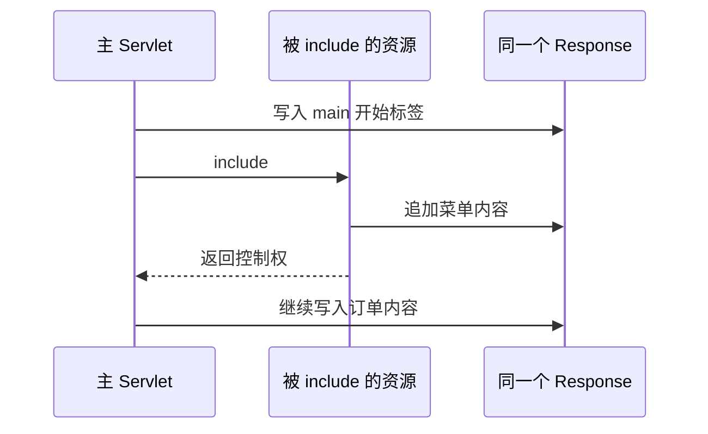

`include` 与 `forward` 的关键区别是：`forward` 把后续响应生成工作交给目标资源，原 Servlet 通常不再继续写正文；`include` 只是插入目标资源的输出，完成后会回到原 Servlet。被包含资源可以读取同一个请求中的参数和属性，但不能可靠地改变最终状态码和响应头，容器会忽略这类修改，避免一个局部片段覆盖主响应的整体信息。

调用 `forward` 前，响应不能已经提交。缓冲区一旦刷新、正文写出过多或显式调用 `flushBuffer()`，状态码和响应头可能已经发送给客户端，此时再转发或修改状态码会失败。

`sendRedirect` 默认产生临时重定向语义，客户端会发起新请求。若业务要求严格保持原请求方法，应根据接口语义选择合适的 307 或 308 状态，而不能笼统依赖默认重定向。

### 8.6 异步 Servlet 的能力与边界

异步 Servlet 允许容器工作线程暂时退出当前请求调用栈，在异步任务完成后再提交响应。它适合等待较慢外部事件、流式响应等场景，但不会自动让阻塞代码变成非阻塞，也不会消除下游容量限制。

```java
import jakarta.servlet.AsyncContext;
import jakarta.servlet.annotation.WebServlet;
import jakarta.servlet.http.HttpServlet;
import jakarta.servlet.http.HttpServletRequest;
import jakarta.servlet.http.HttpServletResponse;

import java.io.IOException;

@WebServlet(value = "/async-report", asyncSupported = true)
public class AsyncReportServlet extends HttpServlet {

    @Override
    protected void doGet(HttpServletRequest request, HttpServletResponse response)
            throws IOException {
        AsyncContext async = request.startAsync();
        async.setTimeout(5_000);

        async.start(() -> {
            try {
                HttpServletResponse asyncResponse =
                        (HttpServletResponse) async.getResponse();
                asyncResponse.setContentType("text/plain;charset=UTF-8");
                asyncResponse.getWriter().write("report ready");
            } catch (IOException exception) {
                request.getServletContext().log("write async response failed", exception);
            } finally {
                async.complete(); // 所有完成和异常路径都结束异步周期
            }
        });
    }
}
```

使用异步能力时注意：

1\. Servlet 以及经过的每个 Filter 都必须支持异步，否则 `startAsync()` 会失败。

2\. 必须设计超时、异常和客户端断开处理，并确保最终调用 `complete()` 或再次分派。

3\. `async.start()` 使用容器管理的线程执行任务，但大量慢任务仍会耗尽执行资源。

4\. 请求和响应对象只应在异步生命周期允许的边界内使用，不应保存到无界后台任务。

5\. 成功判据不仅是入口线程返回，还包括客户端收到完整响应、超时计数正常且线程池没有持续积压。

### 8.7 容器认证与应用认证的边界

Tomcat Realm 表示用户、凭据和角色的数据来源；`web.xml` 的安全约束定义哪些 URL 需要哪些角色；Authenticator Valve 执行 BASIC、FORM 等认证流程。这套机制称为容器管理安全。

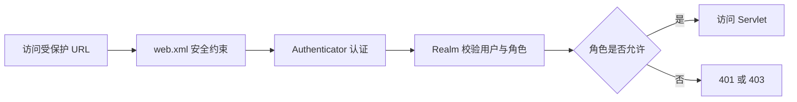

现代项目也常使用 Spring Security 等应用级安全框架。两种方案的认证入口、会话管理和异常处理不同，不应在没有设计的情况下叠加。Tomcat 标准配置中的 UserDatabaseRealm 通常通过 MemoryUserDatabase 读取 `tomcat-users.xml`；这种文件型用户库适合管理示例或小规模静态账号，不适合作为大型业务用户库。

## 9 日志、监控与故障排查

### 9.1 日志分类

1\. 容器日志：Tomcat 启停、组件和应用部署信息。

2\. 应用日志：业务代码及所用日志框架输出。

3\. 访问日志：请求方法、路径、状态码、耗时、来源地址等。

4\. 垃圾回收日志：JVM 内存回收和暂停信息。

不同安装方式和日志配置可能不会生成一个固定的 `catalina.out`。排查时先确认实际启动方式、日志处理器和标准输出被谁接管，不要只寻找某个文件名。

#### 9.1.1 默认日志文件分别记录什么

Tomcat 二进制发行版的默认 JULI（Tomcat 对 `java.util.logging` 的容器化实现）配置通常会在 `$CATALINA_BASE/logs` 下产生以下文件。实际文件名取决于 `conf/logging.properties`，因此下表是定位入口，不是永远不变的规则。

| 常见文件 | 主要内容 | 适合排查 |
|---|---|---|
| `catalina.YYYY-MM-DD.log` | Tomcat 容器、生命周期和未被其他 Handler 单独处理的日志 | 启停失败、Connector、Server 级异常 |
| `localhost.YYYY-MM-DD.log` | 默认 Host 及其 Web 应用的容器日志 | 应用部署失败、Servlet 初始化失败、应用未捕获异常 |
| `manager.YYYY-MM-DD.log` | Manager 应用日志 | Manager 操作和访问问题 |
| `host-manager.YYYY-MM-DD.log` | Host Manager 应用日志 | 虚拟主机管理问题 |
| `localhost_access_log.YYYY-MM-DD.txt` | AccessLogValve 记录的请求结果 | 请求是否到达、状态码、耗时、客户端地址 |
| `catalina.out` | 启动脚本重定向的标准输出和标准错误，主要见于 Unix 后台启动方式 | `System.out`、`System.err`、未被日志框架接管的输出 |

`catalina.out` 不是 JULI 自动创建的标准日志类别。使用 `catalina.sh run` 前台运行、systemd、Docker 或 Kubernetes 时，标准输出可能直接进入终端、`journalctl` 或容器日志系统，根本不存在这个文件。

先确认运行方式：

1\. 手工前台启动：查看启动终端。

2\. `startup.sh` 后台启动：检查脚本重定向目标及 `$CATALINA_OUT`。

3\. systemd 服务：检查 `journalctl` 和单元文件中的标准输出配置。

4\. 容器运行：检查容器标准输出和日志采集平台。

5\. 集成开发环境启动：检查集成开发环境的 Run/Console 窗口和它使用的 `CATALINA_BASE`。

#### 9.1.2 日志级别与 Handler

日志记录能否最终写入文件，至少要经过两道门槛：

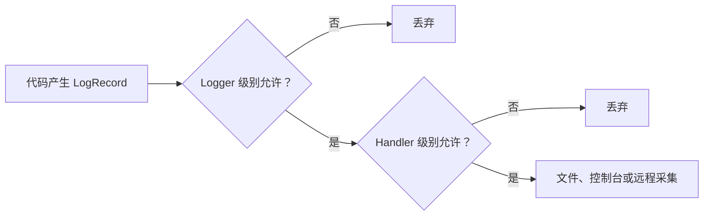

Tomcat JULI 常见级别从严重到详细包括 `SEVERE`、`WARNING`、`INFO`、`CONFIG`、`FINE`、`FINER`、`FINEST`。如果 Logger 是 `FINE`，但 FileHandler 只允许 `INFO`，`FINE` 日志仍不会出现。

需要临时增加 Tomcat 某个包的日志时，应在 `$CATALINA_BASE/conf/logging.properties` 中只调整最相关的 Logger，并设置明确的观察时间。详细日志可能包含请求数据、快速消耗磁盘并降低性能，故障结束后应恢复原级别。

Tomcat 默认使用 JULI（Tomcat 对 `java.util.logging` 的容器化实现）处理容器日志；访问日志则由 Valve 独立记录。可在 Host 下配置：

```xml
<Valve className="org.apache.catalina.valves.AccessLogValve"
       directory="logs"
       prefix="localhost_access_log"
       suffix=".txt"
       pattern='%{begin:yyyy-MM-dd HH:mm:ss.SSS}t %{requestId}r %I %a "%r" %s %b %{ms}T %X' />
```

其中关键字段如下：

| 字段 | 含义 | 定位价值 |
|---|---|---|
| `%{begin:...}t` | 请求开始时间 | 与调用方、代理和应用日志对齐 |
| `%{requestId}r` | 名为 `requestId` 的请求属性 | 串联同一次请求的多类日志 |
| `%I` | Tomcat 工作线程名 | 与线程栈对应 |
| `%a` | Tomcat 识别的远端地址 | 定位调用来源，代理场景需额外配置 |
| `%r` | 请求方法、URI 和协议 | 确认实际访问入口 |
| `%s` | 最终 HTTP 状态码 | 区分成功、客户端错误和服务端错误 |
| `%b` | 响应正文大小 | 识别空响应或异常大响应 |
| `%{ms}T` | 请求处理耗时，单位毫秒 | 查找慢请求 |
| `%X` | 请求结束时的连接状态 | `X` 表示响应完成前连接中断 |

访问日志通常在请求结束后写入，因此长时间未完成的请求不会立刻出现完整访问记录；Tomcat 默认还可能缓冲写入。排查正在卡住的请求时，不能只等待访问日志，应同时查看当前忙线程和线程栈。

不要无条件记录密码、Authorization 请求头、完整 Cookie、Token 或敏感查询参数。Tomcat 位于可信反向代理后时，还需正确配置 RemoteIpValve 和可信代理范围，否则日志中的客户端地址可能只是代理地址；配置过宽又会允许调用者伪造来源地址。

### 9.2 通用排查路径

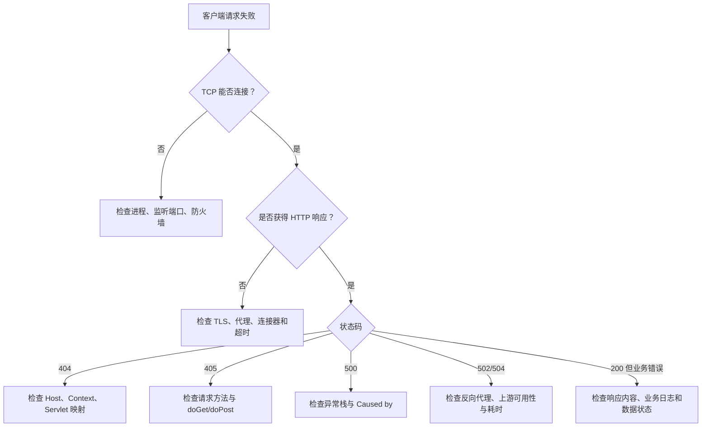

#### 9.2.1 先固定故障现场

收到“接口报错”时，不要立即在全部日志中搜索“error”。先向故障报告者或监控系统取得以下定位锚点：

1\. 发生时间，精确到秒，并注明时区。

2\. 环境和实例，例如生产、`tomcat-order-02`。

3\. 请求方法、Host、路径和关键但不敏感的参数。

4\. HTTP 状态码、客户端看到的错误信息和请求标识。

5\. 用户或业务对象标识，例如脱敏后的订单号。

6\. 是否稳定复现、影响一个用户还是所有用户。

时间范围应考虑时钟误差和请求耗时。例如客户端在 `10:00:05` 收到超时，不代表服务端异常一定发生在这一秒；请求可能在 `09:59:35` 已经开始。

推荐的定位顺序：

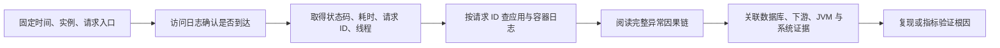

#### 9.2.2 用请求 ID 串联日志

仅靠时间和 URL，在高并发环境中很容易把不同请求的日志拼到一起。可以在 Filter 中为每次请求生成 Request ID（请求标识）：

```java
package com.example.tomcat;

import jakarta.servlet.Filter;
import jakarta.servlet.FilterChain;
import jakarta.servlet.ServletException;
import jakarta.servlet.ServletRequest;
import jakarta.servlet.ServletResponse;
import jakarta.servlet.annotation.WebFilter;
import jakarta.servlet.http.HttpServletResponse;

import java.io.IOException;
import java.util.UUID;

@WebFilter("/*")
public class RequestIdFilter implements Filter {

    @Override
    public void doFilter(ServletRequest request, ServletResponse response,
                         FilterChain chain)
            throws IOException, ServletException {
        String requestId = UUID.randomUUID().toString();

        // AccessLogValve 可通过 %{requestId}r 读取这个请求属性。
        request.setAttribute("requestId", requestId);
        if (response instanceof HttpServletResponse httpResponse) {
            // 客户端报障时可以提供该响应头。
            httpResponse.setHeader("X-Request-ID", requestId);
        }

        long startNanos = System.nanoTime();
        try {
            chain.doFilter(request, response);
        } catch (IOException | ServletException | RuntimeException exception) {
            // 在请求边界记录完整异常，使堆栈带上 Request ID；项目中应避免下层重复记录同一异常。
            request.getServletContext().log(
                    "requestId=" + requestId + " request failed", exception);
            throw exception;
        } finally {
            long elapsedMillis =
                    (System.nanoTime() - startNanos) / 1_000_000;
            request.getServletContext().log(
                    "requestId=" + requestId
                            + " elapsedMs=" + elapsedMillis);
        }
    }
}
```

这段代码只展示关联机制。真实项目通常使用 MDC（Mapped Diagnostic Context，映射诊断上下文）让同一线程上的每条应用日志自动携带 Request ID，并在 `finally` 中清理 MDC，防止 Tomcat 线程被下一个请求复用时串号。

如果 Request ID 来自外部请求头，应限制长度和字符集，或者在不可信边界重新生成，避免伪造、日志换行注入和超长字段。跨服务调用时，要把可信的请求标识继续传给下游，并让下游也写入日志。

#### 9.2.3 正确阅读 Java 异常日志

一条异常通常包含多层包装：

```text
ServletException: order query failed
    at com.example.OrderServlet.doGet(OrderServlet.java:42)
Caused by: SQLException: connection timed out
    at com.mysql.cj.jdbc.ConnectionImpl.connect(ConnectionImpl.java:...)
Caused by: SocketTimeoutException: Connect timed out
    at java.base/sun.nio.ch.Net.pollConnect(Native Method)
```

阅读顺序：

1\. 先看异常发生时间、请求标识和线程名，确认它属于目标请求。

2\. 找最外层异常，理解业务操作为什么被判定失败。

3\. 沿每个 `Caused by` 向下，找到最底层可操作原因。

4\. 找到第一条属于自己项目包名的栈帧，定位业务入口和代码行。

5\. 继续结合上下文日志判断参数、依赖状态和执行阶段。

6\. 注意 `Suppressed` 异常，它常来自 `try-with-resources` 关闭资源时的第二个失败。

不要只复制异常第一行。`NullPointerException`、`ServletException` 或 `CompletionException` 可能只是外层表现，真正根因在几十行后的 `Caused by`。也不要把最底层异常机械等同于最终根因，例如连接超时还需要继续判断是地址错误、网络不通、连接池耗尽还是数据库过载。

#### 9.2.4 为什么请求失败却没有应用异常日志

没有应用异常日志不代表应用一定正常，常见情况包括：

1\. 请求未到 Tomcat，被 DNS（Domain Name System，域名系统）、防火墙、负载均衡器或反向代理拒绝。

2\. Tomcat 在 URI 解析、TLS 握手或 Connector 层拒绝请求，尚未进入应用。

3\. Host、Context 或 Servlet 映射失败，业务代码根本没有执行。

4\. 异常被业务代码捕获后只返回错误状态，没有记录或继续抛出。

5\. Logger 或 Handler 级别过滤了日志。

6\. 日志写到了另一个 `CATALINA_BASE`、实例、标准输出或采集索引。

7\. 磁盘已满、目录不可写、日志采集器故障或异步日志队列丢弃。

8\. JVM 被操作系统强制终止，来不及刷新缓冲区和写异常。

此时应回到请求链上游，从客户端、代理访问日志、Tomcat 访问日志、容器日志、应用日志逐层确认“最后一个有证据的边界”。

### 9.3 常用诊断命令

```bash
# 确认当前实例与日志目录
echo "$CATALINA_BASE"
ls -lah "$CATALINA_BASE/logs"

# 持续观察容器和应用日志；轮转后仍跟踪同名文件
tail -F "$CATALINA_BASE/logs/catalina."*.log

# 按 Request ID 搜索所有日志并显示前后文
rg -n -C 5 'requestId=550e8400-e29b-41d4-a716-446655440000' \
  "$CATALINA_BASE/logs"

# 搜索异常因果链；不要只搜索 ERROR
rg -n -C 8 'Caused by:|Suppressed:|SEVERE|Exception|Error' \
  "$CATALINA_BASE/logs"

# 按接口路径筛选访问日志
rg -n '"(GET|POST) /hello/' "$CATALINA_BASE/logs"/localhost_access_log*

# 查看 Java 进程
jps -lv

# 查看 8080 端口监听者（macOS/Linux）
lsof -nP -iTCP:8080 -sTCP:LISTEN

# 验证 HTTP 状态、响应头和正文
curl -v http://127.0.0.1:8080/hello/hello

# 查看线程栈
jcmd <pid> Thread.print

# 查看 JVM 基本信息
jcmd <pid> VM.version
jcmd <pid> VM.flags

# 查看堆概况
jcmd <pid> GC.heap_info

# 检查日志目录容量和文件系统容量
du -sh "$CATALINA_BASE/logs"
df -h "$CATALINA_BASE/logs"

# systemd 方式运行时查看最近 30 分钟日志
journalctl -u tomcat --since "30 minutes ago"

# 容器方式运行时查看日志，名称应替换为实际容器
docker logs --since 10m tomcat-order
```

命令中的日期、服务名、容器名、请求标识和路径都是占位示例。不要在共享终端历史中直接输入密码、Token 或完整敏感请求。

`tail -F` 适合实时观察，但终端输出过快时容易错过完整异常；定位已发生故障时优先按 Request ID 和时间范围检索并保存证据。日志已经汇聚到平台时，应在平台中同时限定环境、服务、实例和时间范围，避免从其他实例得到相似但无关的异常。

线程栈只代表采样瞬间。判断死锁、线程池耗尽或慢调用时，应在合理间隔采集多次，并结合请求耗时、CPU、垃圾回收和下游状态。

### 9.4 高频故障闭环

#### 9.4.1 端口占用

现象：启动日志出现 `Address already in use` 或绑定失败。

原因：其他进程或另一个 Tomcat 实例已经监听同一地址与端口。

处理：用 `lsof` 确认进程身份；若它是合法服务，应修改目标 Connector 端口，而不是盲目终止进程。修改后重启，并用端口监听与 `curl` 双重验证。

#### 9.4.2 404

按层检查：

1\. URL 中端口是否对应目标实例。

2\. Host 是否接收该域名。

3\. Context 是否部署成功，路径是否等于预期。

4\. Servlet 映射是否匹配剩余路径。

5\. 业务内部是否主动返回资源不存在。

日志定位方法：

1\. 访问日志没有记录：优先检查客户端、域名、代理、端口和请求是否被 Connector 提前拒绝。

2\. 访问日志有 404，但应用没有日志：通常请求没有进入目标 Servlet，检查 Host、Context 和映射。

3\. 应用日志已打印 Request ID，最后由业务返回 404：检查资源查询条件和数据。

4\. 同一路径部分实例 200、部分实例 404：检查各实例制品版本、Context 状态和代理路由。

#### 9.4.3 500

先找到与请求时间和线程对应的完整异常栈，再从最底层 `Caused by` 向上分析。500 只是结果，不是根因。常见根因包括依赖缺失、配置为空、数据库连接失败、权限不足和业务异常未映射。

如果访问日志是 500 而应用日志没有异常，检查应用是否捕获异常后调用 `sendError(500)`、错误页处理是否吞掉原异常，以及异常是否写入 `localhost` 或容器标准输出。

#### 9.4.4 中文乱码

编码涉及不同阶段：

1\. 源文件编码。

2\. 编译编码。

3\. 请求 URI 或请求体解码。

4\. 响应字符编码与 `Content-Type`。

5\. 数据库连接、字段和客户端编码。

只设置 `-Dfile.encoding=UTF-8` 不能自动修复整个链路。应定位字符在哪一步首次变坏，并对该边界显式配置和测试。

#### 9.4.5 CPU 高或请求变慢

1\. 先确认 CPU 是 Tomcat 进程消耗，还是系统整体压力。

2\. 观察请求量、延迟、错误率、活跃线程、队列和下游耗时。

3\. 多次抓取线程栈，寻找持续运行、锁等待或集中阻塞的线程。

4\. 检查垃圾回收是否频繁、堆是否接近上限。

5\. 通过压测或可控复现验证结论，不要仅凭单个线程栈直接调大线程池。

#### 9.4.6 应用部署失败

部署失败和请求运行期失败的入口不同。应用可能根本没有成功创建 Context，此时反复访问 URL 只能得到 404。

定位顺序：

1\. 找到 Tomcat 启动或 WAR 变更时的第一条部署日志，而不是只看最后的“启动完成”。

2\. 搜索 Context 路径、WAR 文件名、`SEVERE`、`LifecycleException` 和完整 `Caused by`。

3\. 检查 XML 解析、类版本、依赖缺失、重复 Servlet 映射、JNDI 资源和数据库驱动。

4\. 确认日志中明确出现目标应用部署完成信息。

5\. 再用访问日志和健康接口验证应用确实可用。

进程存在、8080 能访问或 ROOT 首页正常，都不能证明某个业务 Context 部署成功。

#### 9.4.7 502 与 504

502 和 504 通常由反向代理或负载均衡器返回，不一定是 Tomcat 自己生成：

| 状态 | 常见含义 | 优先证据 |
|---|---|---|
| 502 Bad Gateway | 代理无法得到有效的上游响应 | 代理错误日志、Tomcat 进程和监听端口 |
| 504 Gateway Timeout | 代理等待上游响应超时 | 代理超时日志、Tomcat 访问耗时、线程栈、下游耗时 |

判断请求到达哪一层：

1\. 代理访问日志有记录，Tomcat 访问日志没有：检查代理到 Tomcat 的地址、端口、TLS 和网络。

2\. Tomcat 有同一 Request ID 且最终成功，但代理返回 504：Tomcat 完成得晚于代理超时，检查超时预算和慢调用。

3\. Tomcat 应用日志只有请求开始、没有结束：采集线程栈，检查线程阻塞、下游超时和锁等待。

4\. 只有部分实例出现 502：检查该实例进程、监听、健康状态和发布版本。

#### 9.4.8 进程突然退出或被杀死

JVM 被 `kill -9`、操作系统 OOM Killer（Out-Of-Memory Killer，内存不足终止器）或容器内存限制终止时，Tomcat 可能没有机会留下 Java 异常。

应联合检查：

1\. Tomcat 最后一段日志是否突然中断，是否有正常停止信息。

2\. systemd、容器编排平台和操作系统事件中是否有退出码、`OOMKilled` 或信号。

3\. 操作系统内核日志是否记录内存不足终止。

4\. JVM 是否生成 `hs_err_pid*.log`，它通常用于本地崩溃而非普通 Java 异常。

5\. 重启次数、进程启动时间和流量切换记录是否对应。

若看到 `OutOfMemoryError`，还要区分 Java 堆、元空间、直接内存和无法创建本地线程等类型；如果完全没有 `OutOfMemoryError`，也不能排除容器总内存超限。

### 9.5 应关注的生产指标

| 层次 | 指标 |
|---|---|
| 系统 | CPU、内存、磁盘空间、文件描述符、网络 |
| JVM | 堆使用、垃圾回收次数与暂停、线程数、类加载 |
| Tomcat | 当前线程、忙线程、最大线程、连接数、请求数、错误数、处理时间 |
| 应用 | 吞吐量、P50/P95/P99 延迟、错误率、业务成功率 |
| 下游 | 数据库连接池、慢查询、外部接口延迟与失败率 |

健康检查返回 200 只能说明检查逻辑成功。就绪检查还应反映实例是否适合接收流量，但不能因一个非关键下游短暂波动而制造大规模重启。

日志、指标和线程栈分别回答不同问题：

1\. 日志回答“某个离散事件发生了什么”，适合异常因果链和请求上下文。

2\. 指标回答“问题影响多大、何时开始、趋势如何”，适合错误率、延迟和资源饱和。

3\. 线程栈回答“采样瞬间各线程正在做什么”，适合阻塞、死锁和热点调用。

4\. 分布式追踪回答“请求跨服务经过了哪些阶段、各阶段耗时多久”。

可靠结论通常需要至少两类证据相互印证。例如单条慢请求日志不能证明系统整体变慢，而 CPU 高也不能说明某个接口就是根因。

日志治理还应设置：

1\. 日志文件或采集端的轮转、保留期和容量上限。

2\. 采集延迟、丢弃量和解析失败监控。

3\. 时钟同步和统一时区。

4\. Request ID、服务名、实例名、环境和版本等统一字段。

5\. 敏感字段脱敏、访问控制和审计。

6\. 基于错误率和指标趋势告警，而不是每出现一条 `ERROR` 就通知。

## 10 性能、安全与生产部署

### 10.1 Tomcat 线程模型

简化模型：

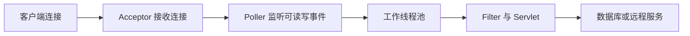

业务代码通常在线程池工作线程中执行。若大量请求阻塞在数据库或外部服务，忙线程会增加，最终新请求排队或被拒绝。

不要孤立调大 `maxThreads`。容量近似受以下因素共同决定：

```text
可持续吞吐量 ≈ 可用并发数 ÷ 平均请求占用线程时间
```

线程越多，内存、上下文切换和下游压力也越大。应结合压测、响应时间目标、数据库连接池和实例资源确定。

在 Java 21 或更高版本上，Tomcat 11 也可让内部执行器使用虚拟线程，例如在 Connector 上设置 `useVirtualThreads="true"`，或配置 `StandardVirtualThreadExecutor`。标准虚拟线程执行器会为每个任务创建新的虚拟线程，不提供平台线程池的 `maxThreads` 上限，因此切换后不能再把 `maxThreads` 当作业务并发闸门。

虚拟线程能降低大量阻塞任务占用平台线程的成本，但不会提高数据库连接数、外部服务配额、CPU 或 `maxConnections`。应用仍需要通过连接池、限流、隔离舱和超时给下游设置有界并发，并以端到端延迟、下游饱和度、连接数和内存压测验证。若 Connector 绑定了显式 Executor，Connector 自身的 `useVirtualThreads` 会被忽略，实际线程模型由该 Executor 决定。

### 10.2 超时应形成链路预算

一次请求可能经过客户端、负载均衡、Nginx、Tomcat、数据库和远程 API。各层连接超时、读取超时、业务超时必须协同。

通常外层超时应略大于内层可控超时，使内层有机会返回明确错误；若外层先断开而后端仍执行，会浪费线程和数据库资源。具体数值应来自服务等级目标和压测，而不是使用统一模板。

### 10.3 反向代理架构

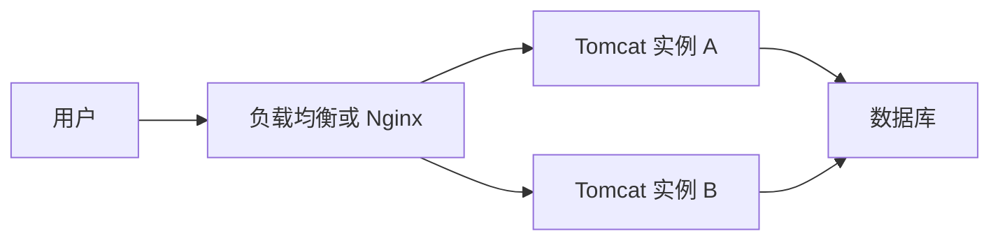

反向代理常负责 TLS 终止、域名路由、静态资源、限流和负载均衡。Tomcat 仍应按纵深防御原则配置，不能假设来自代理的所有输入都可信。

代理后需正确处理客户端 IP、协议和端口。只信任来自已知代理的转发头，避免攻击者伪造 `X-Forwarded-For` 或协议头影响审计与安全判断。

#### 10.3.1 直接在 Tomcat 启用 HTTPS

生产中常由负载均衡器或 Nginx 终止 TLS，但 Tomcat 也可以直接提供 HTTPS。下面是使用 PKCS#12（Public-Key Cryptography Standards #12，公钥密码学标准 12）密钥库的结构示例：

```xml
<Connector protocol="org.apache.coyote.http11.Http11NioProtocol"
           port="8443"
           maxThreads="150"
           SSLEnabled="true">
    <SSLHostConfig>
        <Certificate
                certificateKeystoreFile="conf/localhost.p12"
                certificateKeystorePassword="${tomcat.keystore.password}"
                certificateKeystoreType="PKCS12"
                type="RSA" />
    </SSLHostConfig>
</Connector>
```

关键边界：

1\. `${tomcat.keystore.password}` 是 Java 系统属性占位符，不是环境变量语法；启动前必须通过受保护的运行配置提供该属性。若组织需要直接读取环境变量，应显式配置 Tomcat 的属性来源机制，不能假设 `${env.NAME}` 默认可用。

2\. 密钥库文件路径相对 `CATALINA_BASE` 解析时，应确认实际运行用户可读；不要把私钥或真实密码提交到代码仓库、命令历史或公开的进程参数。

3\. 自签名证书只适合本地学习。生产证书应由受信任的证书颁发机构签发，并建立续期和到期告警。

4\. 非 TLS Connector 的 `redirectPort="8443"` 只为声明了机密传输约束的资源提供重定向目标，它本身不会创建 HTTPS 监听。

5\. TLS 在代理层终止时，客户端到代理、代理到 Tomcat 是两段连接。应决定第二段是否也加密，并正确传递原始协议。

6\. 不能仅以 8443 端口已监听为成功判据，还要验证证书链、主机名、有效期、协议和应用响应。

本地验证：

```bash
# -k 仅用于接受本地自签名证书，生产验证不应忽略证书错误
curl -kiv https://localhost:8443/hello/hello

# 查看服务端提供的证书链和握手信息
openssl s_client -connect localhost:8443 -servername localhost
```

若握手失败，优先检查密钥库路径、密码、私钥条目、证书别名、证书链以及 Tomcat 运行用户权限，再按需开启 TLS 握手调试日志。

### 10.4 多实例部署中的 Session 选择

反向代理把请求分发给多个 Tomcat 实例后，单机内存中的 Session 不会自动出现在其他实例。例如用户在实例 A 登录，下一个请求到达实例 B 时，B 找不到对应 `JSESSIONID` 就无法还原原会话。

| 方案 | 请求与状态如何匹配 | 主要代价 | 通常适用于 |
|---|---|---|---|
| 应用无状态 | 认证和业务状态不依赖本机 Session | 需要重新设计凭据、状态和撤销机制 | REST（Representational State Transfer，表现层状态转换）接口和水平扩展服务 |
| 粘性会话 | 负载均衡器尽量把同一会话送回原实例 | 实例失效时可能丢会话，流量也可能不均 | 希望低成本改造、可接受会话失效的系统 |
| Tomcat Session 复制 | 实例之间复制会话数据 | 产生网络、序列化和一致性成本 | 实例数和 Session 规模受控的容器集群 |
| 外部会话存储 | 各实例访问同一独立状态存储 | 增加网络延迟、序列化和新的可用性依赖 | 需要弹性扩容且愿意由应用或框架管理 Session 的系统 |

选择时先确认业务是否真的需要服务端 Session。对已使用 Session 的系统，还要评估单个会话大小、更新频率、序列化兼容性、失效策略和隔离要求。

Tomcat 原生 Session 复制不会因为启动了多个实例就自动生效。容器需要配置 Cluster，应用的 `web.xml` 需要包含 `<distributable/>`，所有要复制的 Session 属性必须实现 `java.io.Serializable`，新旧应用版本也要能读取对方写入的对象。集群通信按可信网络设计，不应直接暴露到不可信网络。`DeltaManager` 会向所有节点复制，通常只适合较小集群；`BackupManager` 只复制到一个备份节点，可降低较大集群的复制放大。异步复制可减少请求等待，但故障时可能来不及传播最新会话变更；同步复制会把网络确认时间加入请求延迟。

故障演练应先建立一个可观察的会话状态，记录当前实例，然后停止该实例并继续请求。验收结果由设计目标决定：粘性会话可能明确要求用户重新登录；复制或外部存储则应证明会话能在新实例恢复，并同时观察切换延迟、错误率和状态存储负载。

### 10.5 安全基线

1\. 使用受支持的 Tomcat 与 JDK 版本，持续关注安全公告并及时升级。

2\. 使用专用低权限系统用户运行 Tomcat，禁止使用 `root`。

3\. 移除不需要的 `docs`、`examples`、Manager、Host Manager 等默认应用。

4\. 若启用 Manager，使用强认证、最小角色、来源 IP 限制，避免暴露公网。

5\. 不部署来源不可信的 WAR。

6\. 生产流量使用 TLS；认证会话 Cookie 应受到与密码相近的保护。

7\. 限制配置、应用、日志和临时目录权限。

8\. 按业务限制请求头、参数、请求体和上传大小，防止资源耗尽。

9\. 不对外显示详细异常栈、JSP 源码和精确版本信息。

10\. 谨慎暴露 JMX；应绑定内部网络、限制来源并使用强认证。

11\. AJP（Apache JServ Protocol）不使用时不要开启；使用时限制网络访问并配置共享密钥。

12\. 高安全生产环境评估关闭 `autoDeploy` 与 `deployOnStartup`，使用受控发布流程。

13\. 不需要脚本关闭端口时，可将 `<Server port="-1">` 禁用它；若保留关闭端口，应配置难以猜测的关闭命令并限制本机访问，不能把默认命令当作认证机制。

14\. Tomcat 11 已移除 Java `SecurityManager` 支持。需要隔离不可信应用时，应采用独立低权限进程、容器或虚拟机等边界；同一 Tomcat 实例内的 Web 应用应被视为可信代码。

### 10.6 JVM 与内存预算

Tomcat 进程内存不只包含 Java 堆：

```text
进程内存 ≈ Java 堆 + 元空间 + 线程栈 + 直接内存 + 代码缓存 + 本地库
```

容器内存限制若只略高于 `-Xmx`，仍可能因堆外内存触发操作系统终止。线程数增加也会增加线程栈内存。应通过监控和压力测试预留空间。

### 10.7 优雅停止与发布

可靠发布流程：

1\. 从负载均衡器摘除实例，停止接收新流量。

2\. 等待在途请求在有界时间内完成。

3\. 停止 Tomcat，确认进程真正退出。

4\. 部署具有唯一版本的制品和配置。

5\. 启动并检查部署日志、就绪状态和关键接口。

6\. 小流量观察错误率与延迟后逐步恢复流量。

7\. 指标异常时按明确条件回滚。

Tomcat 还支持并行部署。同一 Context 路径可以同时部署多个版本，制品基础名格式为 `应用名##版本`，例如：

```text
orders##20260726-001.war
orders##20260726-002.war
```

两者的 Context 路径都为 `/orders`，但 Context 名分别带有版本。请求选择规则是：

1\. 没有 Session 信息时，使用字符串顺序上最新的版本。

2\. 携带 Session 信息且某个旧版本仍持有该 Session 时，继续进入对应旧版本。

3\. 携带 Session 信息但所有版本都找不到对应 Session 时，进入最新版本。

版本比较是字符串比较，因此纯数字版本应补齐位数，例如 `##002`、`##011`，否则 `##11` 会被认为早于 `##2`。并行部署可以让旧会话逐步排空，但它不是完整的无损发布方案：数据库结构、外部消息、缓存键和跨版本 Session 对象仍须向前与向后兼容，旧版本也要有明确的下线判据。

只看到进程启动不代表发布成功；真正判据是正确版本已加载、实例就绪、关键业务探测成功且观察窗口内指标正常。

## 11 面试中的概念边界与判断证据

面试中的 Tomcat 问题往往从一个名词继续深入到请求链、并发或故障现象。稳定的分析方法是先界定对象和版本，再说明执行过程，最后给出可观察证据。这样才能区分规范定义、Tomcat 实现和项目自身设计。

### 11.1 从实现规范判断 Tomcat 的定位

Tomcat 能直接处理 HTTP 和静态资源，因此具有 Web 服务器能力；它的核心职责是实现 Jakarta Servlet、Pages、WebSocket 等 Web 规范并管理应用生命周期。它没有完整实现 Jakarta EE 平台的所有企业规范，因此产品定位通常表述为“Web 服务器与 Servlet 容器”，而非完整 Jakarta EE 应用服务器。

这个判断可用官方版本映射表验证：Tomcat 11 明确列出 Servlet 6.1、Pages 4.0、EL 6.0 等它实现的规范。与 Nginx 比较时，判断维度应放在请求发生的位置：Nginx 通常在前端处理 TLS、路由、静态资源和负载均衡，Tomcat 在后端执行 Filter 与 Servlet。两者是请求链上职责不同的组件。

### 11.2 用 URL 拆解请求处理链

对 `http://localhost:8080/hello/hello?id=1` 的分析应同时包含容器映射和应用执行：8080 选中 Connector，`localhost` 选中 Host，第一个 `/hello` 选中 Context，Context 内的 `/hello` 选中 Servlet，然后请求才进入 Filter 链和 Servlet。`id=1` 是应用参数，不参与 Context 选择。

| 现象 | 请求可能停留的边界 | 用于继续判断的证据 |
|---|---|---|
| 连接被拒绝 | 进程、监听端口或网络 | 端口监听、启动日志、代理错误日志 |
| 访问日志中出现 404 | Host、Context、Servlet 映射或业务资源 | Context 部署日志、有效 `web.xml`、Request ID |
| Filter 有入口日志但 Servlet 没有 | Filter 链 | 分支是否调用 `chain.doFilter` |
| 响应头修改失效 | 响应已提交 | `isCommitted()`、缓冲区刷新点、已写出字节数 |

404 只表示当前路径没有找到结果，无法单独证明 Servlet 映射错误。将访问日志、部署日志和应用 Request ID 放在同一时间线上，才能确定最后一个已经通过的边界。

### 11.3 从对象生命周期推导 Servlet 并发风险

容器通常创建一个 Servlet 实例并让多个工作线程并发调用它。局部变量存在于各次方法调用的栈上；Servlet 实例字段、静态字段和共享对象则可被多线程同时访问。因此，“Servlet 是否线程安全”要看代码是否保存可变共享状态，不能只根据它继承了 `HttpServlet` 就下结论。

验证时可让并发请求携带不同用户标识，检查响应是否串号，并用代码审查确认请求对象没有被保存到实例字段。`ThreadLocal` 的值属于工作线程，Tomcat 会复用这些线程；代码应在 `finally` 中清理请求级上下文，否则下一个请求可能读到旧值，旧应用类加载器也可能被引用。

### 11.4 从实例隔离理解 `CATALINA_HOME` 与 `CATALINA_BASE`

`CATALINA_HOME` 指向 Tomcat 程序安装，`CATALINA_BASE` 指向某个运行实例。分离二者后，多个实例可以共享程序文件，同时拥有独立的 `conf`、`logs`、`webapps`、`work` 和 `temp`。各实例的 Connector 端口、关闭端口和其他监听地址也需要避免冲突。

运行时证据比 Shell 配置文件更可靠。`catalina.sh version` 和启动日志会记录实际的 Home、Base 与 Java 环境；结合进程命令行和监听端口，可以识别“修改了 A 实例配置，流量实际到达 B 实例”这类问题。自定义参数放入 `setenv.sh` 或服务管理配置，可以避免升级 Tomcat 脚本时丢失变更。

### 11.5 从类的定义者分析类加载故障

Tomcat Webapp ClassLoader 默认优先查找应用的 `WEB-INF/classes` 和 `WEB-INF/lib`，Java 核心类以及 Servlet、JSP、EL 等容器规范 API 则优先委派。这个例外模型同时满足应用依赖隔离和容器规范类型一致性。

Java 中类型身份由“全限定类名 + 定义它的类加载器”共同决定，所以 `X cannot be cast to X` 可能表示两个类加载器分别加载了同名类。排查证据包括 WAR 与 Tomcat `lib/` 中的重复 JAR、`getClass().getClassLoader()` 的输出、Context 的 `delegate` 设置和必要时的类加载诊断日志。热部署后若旧线程、ThreadLocal 或驱动仍引用旧应用类，旧 Webapp ClassLoader 便无法回收。

### 11.6 根据饱和点而非单一参数分析吞吐量

平台线程模式下，`maxThreads` 限制同时执行的请求数，但可持续吞吐量还受请求占用线程时间、CPU、内存、数据库连接池和下游配额约束。增加线程只是增加容器内的并发候选者；当数据库连接池更小时，多出的线程可能只是排队等待连接。

| 观察组合 | 更可能的饱和点 | 调整前应补充的证据 |
|---|---|---|
| 忙线程接近上限，CPU 不高，数据库等待增加 | 数据库或下游阻塞 | 连接池等待、慢 SQL、多次线程栈 |
| CPU 持续接近上限，延迟随并发上升 | 计算或垃圾回收 | CPU 剖析、GC（Garbage Collection，垃圾回收）日志、堆与分配速率 |
| 线程有空闲，连接数达到 `maxConnections` | 长连接或连接容量 | Keep-Alive 分布、连接状态、代理复用策略 |
| 切换虚拟线程后吞吐量不变 | CPU、连接数或下游限制 | 端到端压测、下游饱和度、并发隔离设置 |

虚拟线程优化的是阻塞任务对平台线程的占用成本，不会创造新的数据库连接、CPU 或外部配额。容量结论应由压测曲线与多层指标支持，单看 `maxThreads` 的数字无法判断系统吞吐量。

### 11.7 根据启动主体区分内嵌与外部 Tomcat

外部模式由独立 Tomcat 进程加载 WAR，内嵌模式由应用 `main` 方法创建 Tomcat，常见制品是可执行 JAR。前者的 Connector 主要来自独立实例的 `server.xml`，后者主要由框架配置和定制代码创建，因此内嵌 Tomcat 通常没有一份与外部安装完全对等的 `server.xml`。

判断证据包括制品是 WAR 还是可执行 JAR、启动命令的主类、启动日志中的容器初始化方式以及实际配置源。外部 WAR 中的 Servlet API 通常使用 `provided`，由容器统一提供；内嵌模式需要把容器实现作为可运行制品的依赖。排查时先确定这条运行边界，然后才能判断某个端口、线程或超时配置是否真正参与了容器创建。

## 12 项目落地与复习检查

### 12.1 初学者练习项目

实现一个“不依赖 Spring 的图书接口”，逐步加入：

1\. `BookServlet`：支持 GET 查询与 POST 新增。

2\. `EncodingFilter`：统一请求和响应编码。

3\. `RequestIdFilter`：生成请求标识并写入响应头。

4\. `ServletContextListener`：启动时初始化内存仓库，停止时清理资源。

5\. 自定义 404 与 500 页面。

6\. Maven 构建 WAR 并部署到 `/books`。

7\. 使用 `curl` 验证成功、参数缺失、方法错误和内部异常。

8\. 开启访问日志并记录状态码与处理耗时。

9\. 用并发请求验证 Servlet 没有共享可变请求状态。

10\. 编写一份发布、回滚和故障定位记录。

### 12.2 上线检查表

1\. Tomcat、JDK、应用依赖代际兼容，特别是 `javax` 与 `jakarta`。

2\. 使用受支持版本并完成安全公告检查。

3\. 制品来源、版本、摘要和构建记录可追溯。

4\. 运行用户、目录权限、端口和网络访问符合最小权限。

5\. 默认示例与不需要的管理应用已移除。

6\. TLS、Cookie、代理转发头和错误页配置已验证。

7\. JVM 堆、堆外内存、线程数、连接池和容器限制有预算。

8\. 客户端到下游的超时链路经过验证。

9\. 日志、访问日志、指标、告警和时间同步可用。

10\. 健康检查、就绪检查、摘流和优雅停止可用。

11\. 正常、异常、超时、并发、重启和回滚场景已测试。

12\. 发布成功由业务探测和观察窗口判定，而非只看进程存在。

### 12.3 学习完成自测

1\. 不看资料画出 Server、Service、Connector、Engine、Host、Context 层级。

2\. 从一个 URL 解释 Context 路径和 Servlet 路径如何确定。

3\. 手写最小 Servlet，并说明其生命周期和线程安全边界。

4\. 解释 Servlet API 为什么使用 `provided`。

5\. 制造端口占用、404 和 500，再按日志与命令完成定位。

6\. 解释 `CATALINA_HOME`、`CATALINA_BASE` 和 Web 应用目录的差异。

7\. 解释 Tomcat 9 应用为何不一定能部署到 Tomcat 11。

8\. 说明调大工作线程前必须观察哪些指标。

9\. 设计一个双实例 Tomcat 的反向代理、会话和发布方案。

10\. 写出生产安全基线并说明每一项防范的风险。

11\. 解释 `metadata-complete`、`ignoreAnnotations` 如何导致 `@WebServlet` 不生效，并说明怎样查看有效配置。

12\. 解释并行部署怎样为有 Session 和无 Session 的请求选择版本，以及为什么版本号需要补齐位数。

13\. 画出 `maxThreads`、`maxConnections`、`acceptCount` 与下游连接池的关系，并指出每层饱和时的可观察现象。

### 12.4 官方资料入口

1\. [Apache Tomcat 版本选择](https://tomcat.apache.org/whichversion.html)：确认稳定系列、Java 要求和规范版本。

2\. [Tomcat 11 文档首页](https://tomcat.apache.org/tomcat-11.0-doc/)：教程、配置、部署、监控和参考文档入口。

3\. [Tomcat 11 Introduction](https://tomcat.apache.org/tomcat-11.0-doc/introduction.html)：术语、目录、`CATALINA_HOME` 与 `CATALINA_BASE`。

4\. [Tomcat 11 配置参考](https://tomcat.apache.org/tomcat-11.0-doc/config/)：`server.xml` 各组件和属性的权威说明。

5\. [Tomcat 11 Security Considerations](https://tomcat.apache.org/tomcat-11.0-doc/security-howto.html)：生产安全配置入口。

6\. [Tomcat 11 Migration Guide](https://tomcat.apache.org/migration-11.0.html)：Java 版本、规范升级和行为变化。

7\. [Jakarta Servlet 6.1 Specification](https://jakarta.ee/specifications/servlet/6.1/)：Servlet 容器与应用的规范边界。

8\. [Tomcat 11 SSL/TLS Configuration How-To](https://tomcat.apache.org/tomcat-11.0-doc/ssl-howto.html)：证书、密钥库、Connector 与握手排障。

9\. [Tomcat 11 Valve Configuration Reference](https://tomcat.apache.org/tomcat-11.0-doc/config/valve.html)：访问日志、代理地址和容器级 Valve 配置。

10\. [Tomcat 11 JNDI Resources How-To](https://tomcat.apache.org/tomcat-11.0-doc/jndi-resources-howto.html)：资源命名、数据源注册、驱动位置与手动查找。

11\. [Servlet 6.1 RequestDispatcher API](https://tomcat.apache.org/tomcat-11.0-doc/servletapi/jakarta/servlet/RequestDispatcher.html)：`forward` 与 `include` 的规范行为。

12\. [Tomcat 11 Logging](https://tomcat.apache.org/tomcat-11.0-doc/logging.html)：JULI、Logger、Handler、Web 应用日志与访问日志。

13\. [Tomcat 11 Manager App How-To](https://tomcat.apache.org/tomcat-11.0-doc/manager-howto.html)：线程、Connector、JVM 状态和诊断入口；生产使用时必须严格限制访问权限。

14\. [Tomcat 11 HTTP Connector](https://tomcat.apache.org/tomcat-11.0-doc/config/http.html)：连接、线程、请求大小、编码、超时和过载边界。

15\. [Tomcat 11 Class Loader How-To](https://tomcat.apache.org/tomcat-11.0-doc/class-loader-howto.html)：类加载器层级、默认查找顺序和委派例外。

16\. [Tomcat 11 Context 与并行部署](https://tomcat.apache.org/tomcat-11.0-doc/config/context.html)：Context 命名、版本选择、配置入口和运行属性。

17\. [Tomcat 11 Cookie Processor](https://tomcat.apache.org/tomcat-11.0-doc/config/cookie-processor.html)：SameSite 等 Cookie 解析与生成配置。

18\. [Tomcat JDBC Pool](https://tomcat.apache.org/tomcat-11.0-doc/jdbc-pool.html)：Tomcat JDBC Pool 工厂、属性、验证和 JMX 监控。

19\. [Tomcat 11 Executor](https://tomcat.apache.org/tomcat-11.0-doc/config/executor.html)：共享平台线程池和虚拟线程执行器。

20\. [Tomcat 11 Cluster How-To](https://tomcat.apache.org/tomcat-11.0-doc/cluster-howto.html)：Session 复制、集群组件和故障转移边界。

阅读网络文章时必须核对其 Tomcat 大版本。若示例使用 `javax.servlet.*`、旧版属性或已移除机制，应回到对应版本官方文档确认，不能直接套用到 Tomcat 11。
