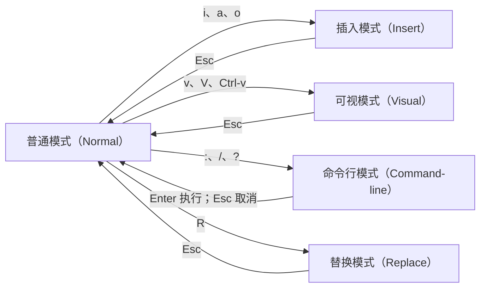
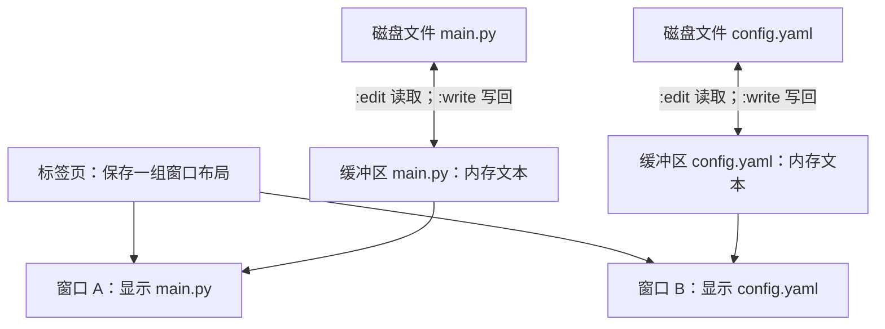

# Vim 快速学习

> 本文面向第一次接触 Vim 的读者。目标不是一次记住所有命令，而是先完成“打开文件、修改、保存、退出”的闭环，再理解 Vim 的操作语法，最后把它用于配置文件、代码和远程服务器上的真实编辑任务。

## 1 从一次配置修改开始

### 1.1 你要解决的问题

假设你登录了一台服务器，需要把配置文件中的端口从 `8080` 改成 `9090`。图形界面不可用，终端里却能运行 Vim。你需要完成四件事：打开文件、找到端口、修改文本、保存退出。

Vim 是 Vi Improved 的缩写，通常译为“改进版 Vi”。它是一个以键盘操作为核心的文本编辑器，常见于 Linux、macOS 和远程服务器。Vim 最有辨识度的设计是“模式”：同一个按键在不同模式下承担不同职责。例如，普通模式中的 `x` 表示删除字符，插入模式中的 `x` 才会输入字母 `x`。

### 1.2 分阶段学习路线

| 阶段 | 阅读范围 | 要解决的问题 | 成功判据 |
| --- | --- | --- | --- |
| 第一次上手 | 第 1～3 章 | 能进入、编辑和安全退出 Vim | 可以创建一份文件，写入两行内容，保存后重新打开仍能看见 |
| 日常编辑 | 第 4～6 章 | 能移动、修改、复制、搜索和替换 | 可以不依赖方向键修正一段配置，并撤销误操作 |
| 项目使用 | 第 7～10 章 | 能处理多文件、代码、配置和故障 | 能解释缓冲区、窗口、标签页的差异，并处理未保存、只读和交换文件提示 |
| 提升效率 | 第 11～14 章 | 建立可组合命令和练习方法 | 能根据编辑意图组合命令，而不是逐字符反复移动 |

第一次练习时完成第 1～3 章即可。需要马上查命令时可直接看第 12 章；已经能完成基本编辑后，再学习文本对象、寄存器和多文件操作。

### 1.3 先确认环境

在终端执行：

```shell
vim --version
```

看到以 `VIM - Vi IMproved` 开头的版本信息，说明 Vim 已安装。若终端提示找不到命令，需要使用当前操作系统的软件包管理器安装 Vim。不同发行版的安装命令不同，安装前应先确认系统类型；远程生产服务器还可能限制软件安装权限。

Vim 自带交互教程，可在终端运行：

```shell
vimtutor
```

`vimtutor` 会打开一份可修改的练习副本，适合在读完本文第 3 章后用 20～30 分钟巩固。本文参考文件 `Vim.md` 收录的主体正是这套教程；本文在其基础上补充了中文解释、命令组合、多文件工作流和故障恢复。

## 2 十分钟完成第一次编辑

### 2.1 创建练习文件

在终端进入一个允许写入的练习目录，然后执行：

```shell
vim server.conf
```

如果 `server.conf` 不存在，Vim 会打开一个尚未写入磁盘的新缓冲区。屏幕底部可能显示 `[New]` 或类似提示。此时虽然已经看见编辑界面，但 Vim 默认处于普通模式，直接输入单词会触发命令。

### 2.2 输入两行配置

按下面的顺序操作。尖括号表示一个特殊按键，例如 `<Esc>` 表示键盘左上角附近的 Esc 键，不需要输入尖括号。

1\. 按 `i` 进入插入模式。屏幕底部通常出现 `-- INSERT --`。

2\. 输入以下内容：

```text
server.port=8080
server.host=127.0.0.1
```

3\. 按 `<Esc>` 返回普通模式。底部的 `-- INSERT --` 消失。

4\. 输入 `:w`，再按 `<Enter>`。冒号会进入命令行模式，`w` 是 write（写入）的缩写。

底部出现类似 `"server.conf" 2L, 39B written` 的消息时，文件已经写入磁盘。其中 `2L` 表示两行；示例使用 Unix 换行，实际字节数会因文件编码和换行格式而不同。

### 2.3 修改端口并退出

现在把 `8080` 改为 `9090`：

1\. 按 `/`，输入 `8080`，再按 `<Enter>`。光标会跳到第一个匹配位置。

2\. 按 `cw`。`c` 表示 change（修改），`w` 表示移动到下一个单词边界；该命令会删除当前位置开始的数字并进入插入模式。

3\. 输入 `9090`，按 `<Esc>` 返回普通模式。

4\. 输入 `:wq` 并按 `<Enter>`。`wq` 表示写入文件后退出。

回到终端后验证结果：

```shell
sed -n '1,2p' server.conf
```

预期输出：

```text
server.port=9090
server.host=127.0.0.1
```

如果系统没有 `sed`，也可以重新执行 `vim server.conf`，确认内容后输入 `:q` 退出。文件内容存在且端口为 `9090`，才算完成了第一个闭环。

### 2.4 失控时的安全返回路径

初学时最常见的现象是“按键产生了意外效果”。先连续按一到两次 `<Esc>` 回到普通模式，再决定下一步：

| 意图 | 命令 | 结果 |
| --- | --- | --- |
| 保存但继续编辑 | `:w` | 把当前缓冲区写入文件 |
| 保存并退出当前窗口 | `:wq` | 写入后退出 |
| 未修改时退出 | `:q` | 退出；有未保存修改时会拒绝 |
| 放弃当前修改并退出 | `:q!` | 丢弃当前缓冲区尚未保存的修改 |
| 放弃当前修改但继续留在 Vim | `:e!` | 从磁盘重新载入当前文件 |
| 保存所有文件并退出 | `:wqa` | 写入所有已修改缓冲区并退出全部窗口 |
| 放弃全部修改并退出 | `:qa!` | 丢弃所有缓冲区的未保存修改并退出 |

`!` 在这些命令中表示强制执行。使用 `:q!`、`:e!` 或 `:qa!` 前应确认未保存内容确实可以丢弃；撤销历史通常无法跨越这种重新载入或退出操作恢复未保存内容。

## 3 用“模式和语法”理解 Vim

### 3.1 五种常用模式

Vim 把“输入文字”和“操作文字”分开。普通模式负责移动、删除、复制和组合命令；插入模式负责输入；可视模式负责选择范围；命令行模式负责保存、退出、替换和设置选项；替换模式会用新输入覆盖已有字符。



| 模式 | 进入方式 | 典型用途 | 返回普通模式 |
| --- | --- | --- | --- |
| 普通模式（Normal） | 启动 Vim 后默认进入 | 移动、组合编辑命令、撤销 | 已在该模式 |
| 插入模式（Insert） | `i`、`a`、`o` 等 | 输入普通文本 | `<Esc>` |
| 可视模式（Visual） | `v`、`V`、`Ctrl-v` | 按字符、行或矩形选择 | `<Esc>` |
| 命令行模式（Command-line） | `:`、`/`、`?` | 文件命令、搜索、替换、设置 | 执行后自动返回，或按 `<Esc>` 取消 |
| 替换模式（Replace） | `R` | 连续覆盖已有字符 | `<Esc>` |

如果不确定当前模式，按 `<Esc>` 是可靠的第一步。`<Esc>` 还会取消尚未完成的普通模式命令或命令行输入，但不会撤销已经执行的修改；撤销使用 `u`。

### 3.2 普通模式命令是一门可组合的语法

Vim 的大量编辑命令遵循下面的结构：

```text
[次数] 操作符 [次数] 移动范围
```

操作符说明“做什么”，移动范围说明“作用到哪里”，次数说明重复多少次。

| 组成部分 | 常用按键 | 含义 |
| --- | --- | --- |
| 操作符 | `d` | delete，删除 |
| 操作符 | `c` | change，删除后进入插入模式 |
| 操作符 | `y` | yank，复制到寄存器 |
| 移动范围 | `w` | 到下一个单词开头 |
| 移动范围 | `e` | 到当前或下一个单词末尾 |
| 移动范围 | `$` | 到行尾 |
| 移动范围 | `0` | 到行首第 1 列 |

组合后会得到一组能推导的命令：

| 命令 | 拆解 | 效果 |
| --- | --- | --- |
| `dw` | 删除 + 到下一个单词开头 | 删除从光标到下一个单词前的内容，通常连同词后空白 |
| `de` | 删除 + 到单词末尾 | 删除到当前单词末尾，通常保留词后空白 |
| `d$` | 删除 + 到行尾 | 删除光标到行尾 |
| `cw` | 修改 + 单词 | 删除当前单词的剩余部分并进入插入模式 |
| `y$` | 复制 + 到行尾 | 复制光标到行尾 |
| `2dw` | 两次 + 删除单词 | 删除两个单词范围 |

操作符按两次通常表示作用于整行：`dd` 删除一行，`cc` 修改一行，`yy` 复制一行。`3dd` 删除三行。次数既可以放在操作符前，也可以放在移动前，例如 `2d3w` 的总效果是执行两次“删除三个单词范围”，通常覆盖六个单词范围；实际编辑中选择更易读的 `d6w` 即可。

### 3.3 文本对象让命令贴近编辑意图

移动范围依赖当前光标位置；文本对象直接描述“一个单词”“引号内部”“一对括号内部”这样的结构。文本对象通常跟在 `d`、`c`、`y` 等操作符之后。

`i` 表示 inside（内部，不包含边界），`a` 表示 around（周围，通常包含边界或相邻空白）。这里的 `i` 和 `a` 位于操作符后，不会进入插入模式。

| 命令 | 含义 | 示例用途 |
| --- | --- | --- |
| `ciw` | 修改当前单词内部 | 光标在 `8080` 任意位置时替换整个数字 |
| `diw` | 删除当前单词内部 | 删除变量名但保留周围空白 |
| `daw` | 删除当前单词及相邻空白 | 删除一个单词后让句子自然合拢 |
| `ci"` | 修改双引号内部 | 把 `name="old"` 中的 `old` 改掉，保留引号 |
| `da"` | 删除双引号及内部内容 | 删除整个带引号字符串 |
| `ci(` 或 `ci)` | 修改圆括号内部 | 替换函数实参，保留括号 |
| `ci{` 或 `ci}` | 修改花括号内部 | 替换代码块内部内容，保留花括号 |

例如光标位于 `server.port=8080` 的任意数字上时，输入 `ciw9090<Esc>` 就能替换整个端口。这个命令比先移动到数字开头再执行 `cw` 更不依赖光标的精确位置。

## 4 在文件中快速定位

### 4.1 字符、单词和行内移动

普通模式中的 `h`、`j`、`k`、`l` 分别向左、下、上、右移动一个位置。方向键通常也能工作，但 `hjkl` 能与其他普通模式命令保持在同一键盘区域。

| 命令 | 移动目标 | 容易混淆的边界 |
| --- | --- | --- |
| `h`、`j`、`k`、`l` | 左、下、上、右 | `j` 和 `k` 按文件的逻辑行移动；长行折行时用 `gj`、`gk` 按屏幕显示行移动 |
| `w` | 下一个单词开头 | 标点会影响小写 `w` 对单词的划分 |
| `b` | 当前或上一个单词开头 | backward，向后回退 |
| `e` | 当前或下一个单词末尾 | end，停在词末字符上 |
| `W`、`B`、`E` | 以空白分隔的“大单词”移动 | `user.name` 会被小写命令拆分，大写命令通常视为一块 |
| `0` | 行首第 1 列 | 可能停在缩进空白上 |
| `^` | 本行第一个非空白字符 | 适合跳到代码正文开头 |
| `$` | 行尾 | 可与 `d`、`c`、`y` 组合 |
| `g_` | 本行最后一个非空白字符 | 会避开行尾空白 |
| `f字符` | 本行下一处指定字符 | `fa` 跳到下一处 `a` 上 |
| `t字符` | 本行下一处指定字符之前 | `t,` 停在下一个逗号前 |
| `;`、`,` | 重复、反向重复最近的 `f`、`t` | 适合一行内多次定位 |

次数可以加在移动前。例如 `5j` 向下移动五行，`3w` 向前移动三个单词范围。次数不是行号；跳转到指定行使用 `行号G` 或 `:行号`。

### 4.2 跨屏幕移动和指定行跳转

| 命令 | 作用 |
| --- | --- |
| `gg` | 跳到文件第一行 |
| `G` | 跳到文件最后一行 |
| `42G` 或 `:42` | 跳到第 42 行 |
| `Ctrl-f`、`Ctrl-b` | 向前、向后翻一屏，字母来自 forward、backward |
| `Ctrl-d`、`Ctrl-u` | 向下、向上翻半屏，字母来自 down、up |
| `zz` | 将当前行滚动到屏幕中央 |
| `zt`、`zb` | 将当前行滚动到屏幕顶部、底部 |
| `%` | 在配对的 `()`、`[]`、`{}` 之间跳转 |
| `Ctrl-g` | 显示当前文件名、行号和文件状态 |

终端可能把 `Ctrl-s` 解释为暂停屏幕输出。如果误按后界面像“卡住”，可以按 `Ctrl-q` 恢复。这属于终端的软件流控行为，不是 Vim 正在计算或文件损坏。

### 4.3 搜索、跳转历史和标记

按 `/` 输入关键词并回车，会从光标位置朝文件末尾搜索；`?` 朝文件开头搜索。找到一个结果后，`n` 沿本次搜索方向找下一个，`N` 沿相反方向查找。搜索到文件边界后是否从另一端继续由 `wrapscan` 选项决定，通常默认开启。

| 命令 | 作用 |
| --- | --- |
| `/port<Enter>` | 朝文件末尾搜索 `port` |
| `?port<Enter>` | 朝文件开头搜索 `port` |
| `n`、`N` | 同方向、反方向重复搜索 |
| `*`、`#` | 朝文件末尾、文件开头搜索光标下的完整单词 |
| `Ctrl-o` | 回到跳转列表中的较旧位置 |
| `Ctrl-i` | 前往跳转列表中的较新位置 |
| `ma` | 在当前位置设置名为 `a` 的局部标记 |
| `` `a `` | 精确回到标记 `a` 的行和列 |
| `'a` | 回到标记 `a` 所在行的第一个非空白字符 |
| `:marks` | 查看标记 |

`Ctrl-o` 和 `Ctrl-i` 适合在搜索结果、定义位置和原编辑点之间往返。终端中 `Ctrl-i` 通常与 Tab 发送同一个控制字符，因此按 Tab 也可能触发相同跳转。

## 5 修改、复制和撤销

### 5.1 从合适位置进入插入模式

所有下列命令最终都会进入插入模式，差别在于插入起点：

| 命令 | 插入起点 | 常见场景 |
| --- | --- | --- |
| `i` | 光标前 | 在当前位置前补文字 |
| `a` | 光标后 | 在当前位置后补文字 |
| `I` | 本行第一个非空白字符前 | 在代码行开头补内容 |
| `A` | 行尾 | 在行末追加分号或注释 |
| `o` | 当前行下方新建一行 | 追加下一条配置 |
| `O` | 当前行上方新建一行 | 在当前代码前插入逻辑 |
| `s` | 删除当前字符后进入插入模式 | 替换单个位置的一段内容 |
| `S` 或 `cc` | 清空当前行正文后进入插入模式 | 重写整行 |

插入完成后按 `<Esc>` 回到普通模式。普通模式中的 `r字符` 只替换光标下一个字符，不进入持续输入；`R` 进入替换模式，会持续覆盖字符直到按 `<Esc>`。

### 5.2 删除、修改和大小写转换

| 命令 | 效果 |
| --- | --- |
| `x`、`X` | 删除光标下、光标前的字符 |
| `dd`、`D` | 删除整行、删除到行尾；`D` 等价于 `d$` |
| `cc`、`C` | 修改整行、修改到行尾；`C` 等价于 `c$` |
| `J` | 将下一行连接到当前行，通常会调整连接处空格 |
| `gJ` | 连接下一行，不自动插入或删除空格 |
| `~` | 切换光标下字符的大小写并向后移动 |
| `guw`、`gUw` | 将单词范围转为小写、大写 |
| `>>`、`<<` | 当前行向右、向左缩进一次 |
| `==` | 按当前缩进规则重新缩进当前行 |
| `gg=G` | 重新缩进整个文件；结果依赖文件类型和缩进配置 |

Vim 原生没有适用于所有语言的统一“注释当前行”命令，因为不同文件使用 `#`、`//`、`<!-- -->` 等不同语法。可以用行首插入、替换命令、文件类型插件或自定义映射实现，不能把某个插件的快捷键当作 Vim 内置命令。

### 5.3 撤销、重做和重复

| 命令 | 作用 |
| --- | --- |
| `u` | 撤销最近一次修改 |
| `Ctrl-r` | 重做刚撤销的修改，r 来自 redo |
| `U` | 撤销当前行上最近进行的修改；它本身也会形成一次可撤销的修改 |
| `.` | 重复最近一次可重复的修改 |
| `:undolist` | 查看撤销分支概况 |
| `:earlier 5m` | 尝试回到约五分钟前的编辑状态 |
| `:later 5m` | 沿撤销历史尝试前进约五分钟 |

`.` 是从“会使用 Vim”走向“高效使用 Vim”的重要命令。例如要把多行中的 `8080` 改为 `9090`，可以先用 `ciw9090<Esc>` 修改第一处，再搜索下一处并按 `.` 重复修改。重复的是修改动作，移动和搜索通常单独完成。

撤销历史主要存在于当前 Vim 会话。若要在关闭并重新打开文件后保留撤销历史，需要启用持久化撤销并配置可写的撤销文件目录；第 9.4 节给出做法。

### 5.4 复制、删除与寄存器

Vim 把复制或删除的文本放入寄存器。寄存器可以理解为多个带名字的剪贴槽，但这只是操作层面的类比；Vim 会根据复制、整行删除、小范围删除等动作自动选择和更新不同寄存器。

| 命令 | 作用 |
| --- | --- |
| `yy` 或 `Y` | 复制当前行 |
| `yw` | 复制一个单词范围 |
| `y$` | 复制到行尾 |
| `p` | 在光标后粘贴；整行文本会放到下一行 |
| `P` | 在光标前粘贴；整行文本会放到上一行 |
| `:registers` 或 `:reg` | 查看寄存器内容 |
| `"0p` | 粘贴最近一次复制的内容，避免被后续删除覆盖 |
| `"ap` | 粘贴命名寄存器 `a` 的内容 |
| `"_d动作` | 删除到黑洞寄存器，不污染常用粘贴内容 |
| `"+y动作`、`"+p` | 与系统剪贴板之间复制、粘贴，要求 Vim 含剪贴板功能 |

`dd`、`x` 和 `d动作` 在删除文本的同时通常也会更新寄存器，因此“刚复制一行，随后删除另一行，再按 `p`”可能粘贴出被删除的内容。需要保留最近复制内容时，可以用 `"0p`；明确不希望删除影响寄存器时，可以使用 `"_dd`。

系统剪贴板能力取决于 Vim 的编译特性。在 Vim 内执行下面的命令检查：

```vim
:echo has('clipboard')
```

输出 `1` 表示当前 Vim 支持剪贴板，输出 `0` 表示不支持。也可以在终端的 `vim --version` 输出中查找 `+clipboard` 或 `-clipboard`。不支持时，`"+y` 无法实现预期效果，需要换用带剪贴板特性的 Vim 构建、图形版 Vim，或使用终端自身的复制功能。

### 5.5 可视模式适合临时选区

| 命令 | 选择方式 |
| --- | --- |
| `v` | 按字符选择 |
| `V` | 按整行选择 |
| `Ctrl-v` | 按矩形块选择 |
| `o` | 在可视选择两端之间切换活动端 |
| `gv` | 重新选择上一次可视区域 |

进入可视模式后可以移动光标扩大选择，再按 `d` 删除、`y` 复制、`c` 修改、`>` 缩进或 `=` 重新排版。可视模式适合边看边选；范围能用文本对象准确描述时，`ci"`、`dap` 一类普通模式命令通常更快，也更容易用 `.` 重复。

矩形选择常用于给多行同一列插入内容。例如按 `Ctrl-v` 选择多行行首后，按大写 `I` 输入前缀，再按 `<Esc>`，Vim 会把前缀应用到所选各行。屏幕更新有时在按 `<Esc>` 后才完整显示。

## 6 搜索和批量替换

### 6.1 控制搜索的大小写与高亮

| 命令 | 作用 |
| --- | --- |
| `:set ignorecase` | 搜索默认忽略大小写 |
| `:set smartcase` | 搜索词含大写字母时改为区分大小写，通常与 `ignorecase` 配合 |
| `:set incsearch` | 输入搜索词时增量显示匹配 |
| `:set hlsearch` | 高亮所有匹配 |
| `:nohlsearch` | 暂时清除当前搜索高亮，不关闭 `hlsearch` 选项 |
| `/port\c` | 本次搜索忽略大小写 |
| `/port\C` | 本次搜索强制区分大小写 |
| `/\<port\>` | 搜索完整单词 `port`，避开 `viewport` |

`smartcase` 只有在 `ignorecase` 开启时才体现价值。配置两者后，搜索 `/server` 会忽略大小写，搜索 `/Server` 会区分大小写。

### 6.2 理解替换命令的结构

替换命令的基本格式是：

```text
:[范围]s/旧内容/新内容/[标志]
```

`s` 是 substitute（替换）的缩写。缺省范围是当前行，缺省行为是只替换范围内每一行的第一个匹配。

| 命令 | 作用 |
| --- | --- |
| `:s/8080/9090/` | 当前行只替换第一个匹配 |
| `:s/8080/9090/g` | 当前行替换全部匹配，`g` 表示 global |
| `:%s/8080/9090/g` | 整个文件替换全部匹配，`%` 表示所有行 |
| `:%s/8080/9090/gc` | 整个文件逐个确认，`c` 表示 confirm |
| `:10,20s/8080/9090/g` | 只处理第 10～20 行 |
| `:'<,'>s/8080/9090/g` | 只处理可视选区；从可视模式按 `:` 会自动产生范围 |
| `:%s/port/PORT/gi` | 全文替换且忽略大小写，`i` 表示 ignore case |

逐个确认时常见回答如下：

| 按键 | 含义 |
| --- | --- |
| `y` | 替换当前匹配 |
| `n` | 跳过当前匹配 |
| `a` | 替换当前及剩余全部匹配 |
| `q` | 结束替换 |
| `l` | 替换当前匹配后结束 |
| `Ctrl-e`、`Ctrl-y` | 向下、向上滚动以查看上下文 |

对重要文件进行大范围替换时，先使用 `c` 逐个确认，或者先通过版本控制查看差异。`:w` 之前可以用 `u` 撤销整次替换；写入后仍可在当前会话中撤销，但应再次 `:w` 才会把撤销结果写回磁盘。

### 6.3 处理斜杠、分组和引用

替换分隔符不一定要用 `/`。路径中含有大量斜杠时，换成 `#` 更易读：

```vim
:%s#/api/v1#/api/v2#g
```

Vim 的正则表达式（Regular Expression，正则表达式）语法与许多编程语言不完全相同。先掌握以下最小集合：

| 模式 | 含义 |
| --- | --- |
| `.` | 任意单个字符 |
| `*` | 前一个原子的零次或多次重复 |
| `^`、`$` | 行首、行尾 |
| `\<`、`\>` | 单词开头、结尾 |
| `\(`、`\)` | 默认魔法级别下的捕获分组 |
| `\1` | 在替换内容中引用第一个捕获组 |
| `&` | 在替换内容中引用整个匹配 |

例如把 `key=value` 改为 `key = value`：

```vim
:%s/^\([^=]*\)=\(.*\)$/\1 = \2/
```

这条命令涉及捕获分组，适合在已经理解普通替换后使用。对复杂正则替换，先复制一小段到练习文件验证，或增加 `c` 标志逐项确认，能显著降低误改范围。

## 7 文件、缓冲区、窗口和标签页

### 7.1 四个对象各自负责什么

初学者常把“文件”“缓冲区”“窗口”“标签页”混为一体。它们的职责不同：

| 对象 | 含义 | 生命周期与关系 |
| --- | --- | --- |
| 文件（File） | 磁盘上的持久化数据 | `:w` 才会把缓冲区内容写回文件 |
| 缓冲区（Buffer） | Vim 内存中的一份文本 | 可以已修改但未写入；一个缓冲区可显示在多个窗口 |
| 窗口（Window） | 查看某个缓冲区的视图 | 记录光标、滚动位置和局部选项；关闭窗口不一定删除缓冲区 |
| 标签页（Tab page） | 一组窗口的布局容器 | 更接近“工作区布局”，并不等同于浏览器中“一标签一文件” |



理解这一区别能解释两个常见现象：关闭一个分屏后，缓冲区可能仍在 `:ls` 中；切换到另一个缓冲区时，当前文件的未保存修改也可能仍保留在内存中。

### 7.2 打开、保存和切换文件

| 命令 | 作用 |
| --- | --- |
| `:e 路径` | 在当前窗口编辑指定文件 |
| `:e .` 或 `:Explore` | 打开 Vim 自带的目录浏览器；具体能力取决于运行时插件 |
| `:w` | 写入当前文件 |
| `:w 新路径` | 把当前内容写到新路径，但当前缓冲区名称通常不随之改变 |
| `:saveas 新路径` | 另存为新文件，并让当前缓冲区改为编辑新路径 |
| `:r 路径` | 把另一个文件内容读到当前行下方 |
| `:ls` | 列出缓冲区 |
| `:buffer 编号或名称` | 切换到指定缓冲区 |
| `:bnext`、`:bprevious` | 切换到下一个、上一个缓冲区 |
| `:bdelete` | 从缓冲区列表卸载当前缓冲区；未保存时会拒绝 |
| `gf` | 打开光标下看起来像文件路径的文本 |

使用 `vim a.txt b.txt` 启动时，两个文件会进入参数列表。`:next` 和 `:previous` 在参数列表间移动，`:args` 查看列表。参数列表与缓冲区列表有关联但不是同一个对象：打开过的帮助、目录或临时文件也可能成为缓冲区，却不在最初参数列表中。

### 7.3 使用分屏对照内容

| 命令 | 作用 |
| --- | --- |
| `:split 文件` 或 `:sp 文件` | 水平分屏 |
| `:vsplit 文件` 或 `:vsp 文件` | 垂直分屏 |
| `Ctrl-w w` | 在窗口间循环移动 |
| `Ctrl-w h/j/k/l` | 向左、下、上、右窗口移动 |
| `Ctrl-w =` | 让窗口尽量等宽等高 |
| `Ctrl-w _`、`Ctrl-w \|` | 最大化当前窗口高度、宽度 |
| `Ctrl-w c` 或 `:close` | 关闭当前窗口 |
| `:only` | 关闭当前标签页内其他窗口；有未保存风险时会拒绝 |

`Ctrl-w` 表示按住 Ctrl 再按 `w`，松开后再按后续键。例如 `Ctrl-w h` 不是三个键同时按。帮助窗口也是普通窗口，可以用 `Ctrl-w w` 切换，用 `:q` 关闭。

### 7.4 标签页保存窗口布局

| 命令 | 作用 |
| --- | --- |
| `:tabnew 文件` | 新建标签页并编辑文件 |
| `:tabedit 文件` | 在新标签页编辑文件 |
| `gt`、`gT` | 前往下一个、上一个标签页 |
| `{次数}gt` | 前往指定编号的标签页 |
| `:tabs` | 查看所有标签页及其中窗口 |
| `:tabclose` | 关闭当前标签页 |

如果目的只是快速在文件间切换，缓冲区命令更直接；如果需要保存“左边代码、右边测试”这样的窗口布局，再使用标签页更合适。

## 8 面向代码和配置文件的常用任务

### 8.1 显示行号、语法和不可见字符

这些选项可先在命令行临时执行，确认效果后再放入 `~/.vimrc`：

| 命令 | 作用 |
| --- | --- |
| `:set number`、`:set nonumber` | 开启、关闭绝对行号 |
| `:set relativenumber` | 显示相对行号，便于估算 `5j`、`7dd` 等次数 |
| `:syntax enable` | 在支持的文件类型上启用语法高亮 |
| `:set list`、`:set nolist` | 显示、隐藏制表符和行尾等不可见字符 |
| `:set filetype?` | 查看 Vim 识别出的文件类型 |
| `:set fileencoding?` | 查看当前缓冲区文件编码 |
| `:set fileformat?` | 查看换行格式，常见值为 `unix`、`dos`、`mac` |
| `:setlocal` | 查看当前缓冲区或窗口的局部选项 |

当缩进看似相同、程序却报格式错误时，`:set list` 可以帮助发现 Tab、空格和行尾字符差异。修改编码或换行格式会影响写出的文件，生产配置中应在写入前确认项目约定并通过版本控制差异检查结果。

### 8.2 缩进与格式化

Vim 中的 Tab 键显示宽度、缩进步长和是否把 Tab 转为空格由不同选项控制：

| 选项 | 职责 |
| --- | --- |
| `tabstop` | 文件中真实 Tab 字符显示为多少列 |
| `shiftwidth` | `>>`、`<<`、自动缩进等每级移动多少列 |
| `softtabstop` | 插入模式按 Tab 或退格时感受到的编辑宽度 |
| `expandtab` | 开启时，插入缩进优先使用空格而非真实 Tab 字符 |

例如多数以四空格缩进的项目可临时设置：

```vim
:setlocal expandtab tabstop=4 shiftwidth=4 softtabstop=4
```

Makefile 通常要求配方行使用真实 Tab，不能照搬上述设置。合适的做法是通过文件类型插件或项目配置为不同文件设置局部选项，并用 `:setlocal expandtab? tabstop? shiftwidth? softtabstop?` 验证当前实际值。

### 8.3 插入补全、外部命令和终端

| 命令 | 模式 | 作用 |
| --- | --- | --- |
| `Ctrl-n`、`Ctrl-p` | 插入模式 | 根据当前补全来源选择下一个、上一个候选词 |
| `:!命令` | 命令行模式 | 暂时执行外部 Shell 命令并显示输出 |
| `:r !命令` | 命令行模式 | 把外部命令输出插入当前行下方 |
| `:范围!命令` | 命令行模式 | 把选中行作为命令输入，并用命令输出替换原内容 |
| `:terminal` | 命令行模式 | 在 Vim 窗口中启动终端，要求当前构建包含终端特性 |
| `Ctrl-\ Ctrl-n` | 终端作业模式 | 从终端输入状态进入终端普通模式，再切换窗口或执行 Vim 操作 |

例如 JSON（JavaScript Object Notation，JavaScript 对象表示法）文件可以在已安装 `jq` 时执行 `:%!jq .` 进行格式化。该命令会用外部程序输出替换整个缓冲区；`jq` 不存在、输入无效或命令输出异常时可能得到错误或意外内容。执行前确认文件已由版本控制管理，执行后检查差异，必要时立即按 `u` 撤销。

`:!` 会把命令交给 Shell，文件内容、选区或光标下文本不会自动成为安全参数。对包含空格、通配符或不可信输入的路径，应避免直接拼接到 Shell 命令中，以免参数解析错误或执行意外命令。

### 8.4 在项目中跳转和检查修改

Vim 的基础能力可以承担轻量代码编辑：

| 命令 | 作用与前提 |
| --- | --- |
| `gf` | 打开光标下文件名；路径需能从当前目录或 `path` 选项解析 |
| `K` | 查询光标下关键词；行为由 `keywordprg` 和文件类型决定 |
| `:make` | 执行 `makeprg` 指定的构建命令，并把可解析错误放入 quickfix 列表 |
| `:copen` | 打开 quickfix（快速修复）列表 |
| `:cnext`、`:cprevious` | 跳到下一个、上一个 quickfix 项目 |
| `:grep 模式 文件范围` | 使用 `grepprg` 搜索，并把结果放入 quickfix 列表 |
| `:diffsplit 文件` | 分屏比较当前缓冲区与另一个文件 |
| `]c`、`[c` | 在差异模式中跳到下一处、上一处差异 |
| `:diffupdate` | 重新计算差异 |

这些命令是否能直接工作取决于操作系统工具、项目构建方式和 Vim 配置。语言服务器协议 LSP（Language Server Protocol，语言服务器协议）、跨文件重构和语义补全通常需要插件或外部工具；Vim 原生命令本身不承诺提供完整的集成开发环境语义。

### 8.5 录制宏处理重复结构

宏会把一段普通模式按键记录到寄存器，适合重复结构明确、每行变换一致的任务。

1\. 把光标放到第一条待处理记录上。

2\. 输入 `qa`，开始把按键记录到寄存器 `a`。

3\. 完成一条记录的修改，并把光标移动到下一条记录的起点。

4\. 按 `q` 停止录制。

5\. 输入 `@a` 播放一次，确认结果正确。

6\. 输入 `10@a` 再播放十次，或用 `@@` 重复最近播放的宏。

宏忠实重放按键，不理解代码语义。记录时应让每次迭代从稳定位置开始、在下一条记录的稳定位置结束；批量播放前先运行一次，并确保可以用 `u` 或版本控制恢复。

## 9 建立一份可解释的 vimrc

### 9.1 配置文件的入口

Vim 启动时会读取配置文件，Unix 和 macOS 上通常使用 `~/.vimrc`，Windows 上常见 `~/vimfiles/vimrc` 或 `~/_vimrc`。在 Vim 中执行下面的命令，可以查看当前实例实际使用的配置路径：

```vim
:echo $MYVIMRC
```

若输出为空，表示当前启动过程没有找到用户 vimrc。`:version` 输出中的配置文件路径也可用于排查。编辑配置可执行 `:edit $MYVIMRC`；如果变量为空，应先根据 `:version` 所示路径创建配置文件。

### 9.2 初学者可用的最小配置

以下配置强调可读性和稳定的基础行为。先理解每项作用，再按项目习惯调整缩进宽度：

```vim
" 使用 Vim 行为而不是旧 Vi 兼容行为
set nocompatible

" 文件类型、语法和按文件类型缩进
filetype plugin indent on
syntax enable

" 界面反馈
set number
set ruler
set showcmd

" 搜索：小写查询忽略大小写，查询含大写时精确匹配
set ignorecase
set smartcase
set incsearch
set hlsearch

" 默认四空格缩进；遇到项目规范不同的文件应使用局部配置覆盖
set expandtab
set tabstop=4
set shiftwidth=4
set softtabstop=4
set autoindent
```

保存 `~/.vimrc` 后，新启动的 Vim 会读取它。当前会话可执行：

```vim
:source $MYVIMRC
```

若出现错误，Vim 会报告配置文件行号。跳到对应行检查拼写或暂时在行首加双引号 `"` 注释，再次执行 `:source $MYVIMRC` 验证。`:scriptnames` 可以查看当前会话加载过的脚本，帮助判断配置是否真的被读取。

### 9.3 映射应保留退出通道

映射可以把一串命令绑定到按键。`map` 会影响多个模式且可能递归展开，初学配置通常使用模式明确、非递归的 `nnoremap`、`inoremap`、`vnoremap`。

下面把 `<Leader>h` 映射为清除搜索高亮：

```vim
let mapleader = " "
nnoremap <silent> <Leader>h :nohlsearch<CR>
```

`<Leader>` 是用户自定义前缀，这里设为空格；`<silent>` 避免在底部回显展开后的命令；`<CR>` 表示回车。映射冲突可用 `:verbose nmap <Leader>h` 查询最后由哪个脚本设置。

不建议在刚上手时大范围改写 `Esc`、`:`、`u`、`d` 等基础按键。保留文档和教程中的默认操作路径，遇到陌生环境时仍能工作。

### 9.4 持久化撤销需要可写目录

希望关闭 Vim 后仍能撤销时，可以创建专用目录：

```shell
mkdir -p ~/.vim/undo
```

再加入配置：

```vim
if has('persistent_undo')
  set undofile
  set undodir=~/.vim/undo//
endif
```

末尾的双斜杠让 Vim 在撤销文件名中编码完整路径，降低不同目录下同名文件冲突的概率。撤销文件可能保留已从正文删除的敏感文本；在共享设备、临时机或处理密钥的目录中，应评估目录权限和留存策略。执行 `:set undofile? undodir?` 可验证配置是否生效。

## 10 安全保存、恢复与故障排查

### 10.1 “有修改，无法退出”

执行 `:q` 时出现 `E37: No write since last change`，表示当前缓冲区有未保存修改。根据意图选择 `:wq` 保存退出，或确认可丢弃后使用 `:q!`。先执行 `:diffthis` 并不能直接显示磁盘差异；更直接的检查方式包括查看 `:set modified?`、另存临时文件后用版本控制或外部 diff 比较。

状态栏文件名附近的 `[+]` 常表示缓冲区已修改。`:ls` 列表中的 `+` 也表示缓冲区有未写入修改。退出多个文件前执行 `:wall` 可以写入所有可写的已修改缓冲区，出现错误时应逐项处理，而不是直接 `:qa!`。

### 10.2 “只读”与“权限不足”是两类问题

| 现象 | 常见原因 | 第一检查入口 |
| --- | --- | --- |
| 状态显示 `[readonly]` | Vim 的 `readonly` 选项开启 | `:set readonly?` |
| `E212: Can't open file for writing` | 目录或文件权限不足、路径不存在、文件系统只读 | 在 Shell 中检查路径和权限 |
| 文件已被外部程序修改 | 当前缓冲区与磁盘版本不一致 | `:checktime`，再比较并决定载入或保留 |

`:w!` 能覆盖某些 Vim 层面的只读保护，但不能绕过操作系统权限。编辑系统文件时，通常从终端使用 `sudoedit 文件路径` 更合适：它通过临时副本编辑并由权限工具负责回写，减少以高权限运行整个编辑器及其配置、插件和 Shell 命令的风险。

如果已经在无权限的 Vim 中完成修改，可以先 `:w` 到自己有权限的临时路径，退出后检查内容，再通过受控的管理员流程部署。这样比在编辑器内临时拼接高权限 Shell 命令更容易审计和回滚。

### 10.3 交换文件警告与崩溃恢复

Vim 编辑文件时通常创建交换文件。进程崩溃后，交换文件可帮助恢复未写入内容；同一文件被另一个 Vim 实例打开时，它也会发出并发编辑警告。

看到 `E325: ATTENTION` 时，先阅读消息中的原文件路径、交换文件路径、进程号、主机名和时间。处理顺序如下：

1\. 确认是否还有另一个 Vim 实例正在编辑同一文件。如果有，优先回到原实例，避免两个会话相互覆盖。

2\. 确认原进程已经异常结束后，使用提示中的恢复选项，或从终端执行 `vim -r 文件路径`。

3\. 检查恢复内容，使用 `:w 新文件名` 先保存为另一份文件，再与原文件比较。

4\. 确认恢复结果已保存且没有活跃编辑进程后，再按提示删除陈旧交换文件。

直接删除交换文件会失去恢复入口。交换文件也可能包含未保存的敏感文本，应让其目录权限符合文件敏感级别。

### 10.4 粘贴后缩进错乱

终端粘贴多行文本时，自动缩进或映射可能改变内容。现代终端与 Vim 可能通过 bracketed paste（括号粘贴模式）自动识别粘贴，但支持情况取决于终端和 Vim 构建。

发生错乱时可立即按 `u` 撤销，然后临时执行：

```vim
:set paste
```

进入插入模式粘贴，完成后恢复：

```vim
:set nopaste
```

`paste` 会关闭或改变多项适合手工输入的功能，不应长期写入 vimrc。大段代码更适合通过文件传输、版本控制或 `:read` 读入，能保留原始字节并留下更清晰的变更路径。

### 10.5 配置导致 Vim 启动异常

先用不加载用户配置的方式启动：

```shell
vim -Nu NONE 文件路径
```

如果问题消失，故障多半来自 vimrc 或插件。再执行 `:scriptnames` 查看实际脚本，或用 `vim --clean` 在接近默认配置的环境中复现。`--clean` 的可用性取决于 Vim 版本；可先用 `vim --help` 确认。

排查时每次缩小一半可疑配置并重启验证，比逐行猜测更快。确认具体设置后，可用 `:verbose set 选项名?` 查看它最后由哪个脚本、哪一行修改；映射使用 `:verbose map 按键` 查询。

### 10.6 写入前后的项目安全检查

真实项目中的文本修改通常需要以下闭环：

1\. 编辑前用版本控制确认工作区状态，分清自己的改动与已有改动。

2\. 修改后检查差异，重点查看批量替换范围、缩进、行尾和文件编码。

3\. 运行与文件类型对应的格式检查、语法检查、测试或配置校验。

4\. 确认生成文件、压缩文件、二进制文件和密钥文件是否真的应该由文本编辑器修改。

5\. 保存成功后再次检查磁盘文件或版本控制差异；“Vim 没有报错”只证明写入命令未报告失败，不能证明配置语义正确或服务已经加载新配置。

## 11 从记按键转向描述编辑意图

### 11.1 用“动作、对象、重复”减少按键

面对 `user_name = "guest"`，如果要修改引号内的值，可以把光标放在 `guest` 任意位置，执行：

```text
ci"admin<Esc>
```

这个过程表达的是“修改双引号内部内容”，并不依赖字符串长度。随后用 `n` 找到下一个相同结构，按 `.` 可以重复最近一次修改。高效编辑通常来自稳定的意图表达：搜索负责定位，文本对象负责范围，操作符负责动作，`.` 负责重复。

### 11.2 先掌握高频组合，再扩展命令

适合优先形成肌肉记忆的组合如下：

| 意图 | 命令 |
| --- | --- |
| 修改当前单词 | `ciw` |
| 修改引号内部 | `ci"` 或 `ci'` |
| 修改括号内部 | `ci(`、`ci[`、`ci{` |
| 删除一行并粘贴到别处 | `dd`，移动后 `p` |
| 复制一行并粘贴 | `yy`，移动后 `p` |
| 改到行尾 | `C` |
| 删除到行尾 | `D` |
| 搜索并跳到下一项 | `/内容<Enter>`，然后 `n` |
| 重复上次修改 | `.` |
| 回到上个跳转点 | `Ctrl-o` |
| 撤销并重做 | `u`、`Ctrl-r` |

每次遇到重复移动时，可以先问两个问题：目标是否能用搜索或 `f`、`t` 定位；范围是否能用单词、引号、括号或段落文本对象描述。答案明确后，组合命令通常会自然出现。

### 11.3 插件应解决已经识别的问题

Vim 可以通过插件增加文件搜索、Git 集成、语言服务器、自动补全和状态栏等能力。初学阶段先掌握普通模式、文本对象、寄存器、缓冲区和帮助系统，可以避免插件快捷键失效后完全无法工作。

引入插件前记录其解决的问题、维护状态、外部依赖、快捷键和卸载方式。团队服务器或生产主机上还应考虑网络限制、供应链风险和配置可移植性。插件更新后用最小配置启动并逐项验证，能区分 Vim 自身问题与插件问题。

## 12 日常命令速查

### 12.1 记号说明

| 记号 | 含义 |
| --- | --- |
| `<Esc>` | 按 Esc 键 |
| `<Enter>` 或 `<CR>` | 按回车键；CR 是 Carriage Return（回车）的缩写 |
| `Ctrl-r` | 按住 Ctrl，再按 `r` |
| `ciw` | 依次按 `c`、`i`、`w`，不是同时按 |
| `:w<Enter>` | 输入冒号和 `w`，再按回车 |
| `[次数]` | 可选次数，例如 `3dd` |

### 12.2 最小生存命令

| 任务 | 命令 |
| --- | --- |
| 返回普通模式 | `<Esc>` |
| 输入文本 | `i` |
| 保存 | `:w` |
| 保存退出 | `:wq` |
| 放弃修改退出 | `:q!` |
| 撤销、重做 | `u`、`Ctrl-r` |
| 搜索 | `/内容<Enter>` |
| 下一个、上一个匹配 | `n`、`N` |

### 12.3 移动与编辑

| 任务 | 命令 |
| --- | --- |
| 左、下、上、右 | `h`、`j`、`k`、`l` |
| 下个词、上个词、词尾 | `w`、`b`、`e` |
| 行首、正文开头、行尾 | `0`、`^`、`$` |
| 文件首、文件尾、指定行 | `gg`、`G`、`42G` |
| 删除字符、行、单词 | `x`、`dd`、`dw` |
| 修改单词、行、行尾 | `ciw`、`cc`、`C` |
| 复制行、粘贴 | `yy`、`p` 或 `P` |
| 重复最近修改 | `.` |
| 配对括号跳转 | `%` |
| 自动缩进全文 | `gg=G` |

### 12.4 文件与窗口

| 任务 | 命令 |
| --- | --- |
| 打开文件 | `:e 文件` |
| 查看缓冲区 | `:ls` |
| 切换缓冲区 | `:bnext`、`:bprevious`、`:buffer 名称` |
| 水平、垂直分屏 | `:split`、`:vsplit` |
| 切换窗口 | `Ctrl-w w` |
| 关闭当前窗口 | `:q` 或 `Ctrl-w c` |
| 新建标签页 | `:tabnew` |
| 切换标签页 | `gt`、`gT` |

### 12.5 替换模板

| 范围 | 命令模板 |
| --- | --- |
| 当前行第一个 | `:s/旧/新/` |
| 当前行全部 | `:s/旧/新/g` |
| 全文全部 | `:%s/旧/新/g` |
| 全文逐个确认 | `:%s/旧/新/gc` |
| 指定行范围 | `:10,20s/旧/新/g` |
| 可视选区 | 选中后执行 `:s/旧/新/g`，Vim 自动补范围 |

## 13 练习、理解检查与常见追问

### 13.1 三十分钟练习路线

准备一份可随时删除的文本文件，每完成一组都用肉眼和重新打开文件验证结果。

1\. 用 `vim practice.txt` 创建文件，输入五行购物清单，执行 `:w` 保存。

2\. 只用 `hjkl`、`w`、`b`、`0`、`$` 移动，确认普通模式不会输入字符。

3\. 用 `ciw` 修改一个商品名，用 `dd` 删除一行，用 `yy` 和 `p` 复制一行。

4\. 连续执行三次修改，用 `u` 逐步撤销，再用 `Ctrl-r` 重做。

5\. 写入三个相同单词，用 `/`、`n`、`N` 在匹配间跳转，再用 `:%s/旧/新/gc` 逐项确认替换。

6\. 用 `:vsplit` 打开第二个文件，使用 `Ctrl-w w` 往返，执行 `:ls` 观察缓冲区。

7\. 故意修改但不保存，执行 `:q` 观察保护提示；根据内容价值选择 `:wq` 或 `:q!`。

8\. 退出后重新打开 `practice.txt`，内容与预期一致才算完成练习。

完成后运行 `vimtutor`。此时教程中的 `hjkl`、操作符与移动范围、搜索、替换、帮助和 vimrc 会与已经建立的操作经验对应起来。

### 13.2 用机制回答常见疑问

#### 13.2.1 为什么 Vim 要区分普通模式和插入模式

模式让普通字母键可以直接表达编辑动作，无需为每个动作都组合 Ctrl、Alt 等修饰键。代价是按键含义依赖当前状态，初学者需要养成“输入完成就按 `<Esc>` 回普通模式”的习惯。判断模式时可看状态栏，并用 `<Esc>` 建立稳定起点。

#### 13.2.2 `d`、`c` 和 `y` 为什么能与同一批移动命令组合

这三个键是操作符，`w`、`$`、`}` 等命令提供作用范围。Vim 先等待一个完整范围，再执行删除、修改或复制。这种语法把动作数量与范围数量从乘法式记忆变成可组合规则：学会一个新文本对象后，通常能立即与多个操作符配合。

#### 13.2.3 `dd` 删除的内容为什么还能粘贴

删除操作会把文本写入寄存器，`p` 从寄存器读取并放回缓冲区。因此 `dd` 同时承担“剪切一行”的效果。后续删除可能更新未命名寄存器，最近复制的内容则可尝试从寄存器 `0` 取回，即 `"0p`。

#### 13.2.4 缓冲区、窗口和标签页如何区分

缓冲区保存内存中的文本，窗口负责显示缓冲区，标签页保存一组窗口布局。同一缓冲区能出现在多个窗口，一个标签页也能包含多个文件窗口。判断该用哪个对象时，先明确意图：切换文本用缓冲区，对照查看用分屏，需要保存多组布局时用标签页。

#### 13.2.5 `:wq`、`:x` 和 `ZZ` 有什么差异

`:wq` 执行写入后退出。`:x` 仅在缓冲区已修改时写入，然后退出；普通模式中的 `ZZ` 通常等价于 `:x`。未修改文件时，`:x` 和 `ZZ` 可避免不必要的写入。`ZQ` 等价于强制退出当前窗口且不保存，风险与 `:q!` 相同。

#### 13.2.6 为什么系统剪贴板命令有时无效

`"+y` 和 `"+p` 依赖 Vim 编译时包含剪贴板特性，并依赖运行环境提供相应剪贴板服务。终端远程会话还隔着本地与远端两个系统。先用 `:echo has('clipboard')` 验证能力，再区分要访问的是远端剪贴板、终端选择还是本地桌面剪贴板。

### 13.3 自测任务

不查正文，尝试完成以下任务；卡住后先用 `:help` 定位，再回看对应章节。

1\. 在一行任意位置跳到行首正文、行尾和第三个单词。

2\. 保留引号，把引号内部字符串替换为新值。

3\. 复制一行，删除另一行后，仍粘贴刚才复制的行。

4\. 只替换第 20～30 行中的全部 `DEBUG`，每次替换前确认。

5\. 同时查看源文件和测试文件，并在两个窗口间移动。

6\. 解释为什么关闭窗口后，`:ls` 仍可能列出刚才的文件。

7\. 遇到交换文件警告时，说明如何确认是否存在活跃编辑进程，以及如何保留恢复结果。

8\. 修改 vimrc 后，验证当前会话是否加载了新设置，并定位某个选项最后由哪个脚本修改。

## 14 帮助系统与继续学习

### 14.1 让本机帮助成为主要参考

Vim 内置帮助与当前安装版本匹配，查询命令时比随机网页更可靠：

| 命令 | 查询目标 |
| --- | --- |
| `:help` | 打开帮助首页 |
| `:help user-manual` | 打开用户手册目录 |
| `:help quickref` | 打开快速参考 |
| `:help i_CTRL-N` | 查询插入模式的 `Ctrl-n` |
| `:help CTRL-W` | 查询普通模式窗口命令前缀 |
| `:help :substitute` | 查询冒号替换命令 |
| `:help text-objects` | 查询文本对象 |
| `:help registers` | 查询寄存器 |
| `:help buffers` | 查询缓冲区 |
| `:help options` | 查询选项系统 |

帮助标签之间用 `Ctrl-]` 跳转，`Ctrl-o` 返回；帮助窗口用 `:q` 关闭。命令行输入到一半时按 `Ctrl-d` 可以查看补全候选，按 Tab 尝试补全，这对不确定帮助标签全名时很有用。

### 14.2 资料入口

1\. Vim 官方文档入口：[Vim Documentation](https://www.vim.org/docs.php)。

2\. Vim 官方仓库的运行时文档：[runtime/doc](https://github.com/vim/vim/tree/master/runtime/doc)。在线仓库可能对应开发分支，具体命令行为仍以本机 `:help` 和 `:version` 为准。

3\. 本机交互教程：在终端执行 `vimtutor`。它覆盖移动、退出、删除、插入、操作符、撤销、搜索、替换、外部命令、可视选择、复制粘贴、选项、帮助和 vimrc。

### 14.3 下一阶段的进入条件

当你能在不查看速查表的情况下完成保存退出、`ciw` 修改、`yy`/`p` 复制、`u`/`Ctrl-r` 撤销重做、`/`/`n` 搜索，并能解释缓冲区与窗口的差异时，可以继续学习以下主题：按文件类型配置、自动命令、命令和函数、自定义文本对象、quickfix 与 location list、标签与代码索引、插件管理、语言服务器和调试集成。

这些主题都建立在本文的模式、操作符、范围、缓冲区和帮助系统之上。学习新功能时，先构造一个可观察的小任务，执行后检查缓冲区、文件或列表发生了什么变化，再决定是否写入长期配置。
