# Kafka 学习笔记

本文以 Apache Kafka 4.3.1 为版本基线，面向第一次接触 Kafka 的 Java 后端开发者。命令和机制以 Kafka 4.x 的 KRaft（Kafka Raft）模式为主；涉及旧版本时会明确标注，避免把 ZooKeeper 时代的配置带入新集群。

## 1 从订单事件开始理解 Kafka 解决的问题

### 1.1 一个会拖慢下单接口的业务问题

用户完成支付后，订单服务通常还要触发库存扣减、积分发放、物流建单、短信通知和实时统计。如果订单服务同步调用所有下游，任一服务变慢都会拉长下单响应时间；某个下游暂时不可用时，订单服务还要决定重试、回滚或降级，依赖关系会迅速变复杂。

可以把“订单已支付”记录成一条事实：

```json
{
  "eventId": "evt-20260816-0001",
  "eventType": "OrderPaid",
  "orderId": "order-10001",
  "userId": "user-9527",
  "amount": 19900,
  "occurredAt": "2026-08-16T10:15:30Z"
}
```

订单服务把这条事件写入 Kafka 后即可响应用户。库存、积分和物流服务各自读取同一事件，按照自己的速度处理。某个消费者短暂下线时，事件仍保留在 Kafka 中，恢复后可以从上次进度继续读取。

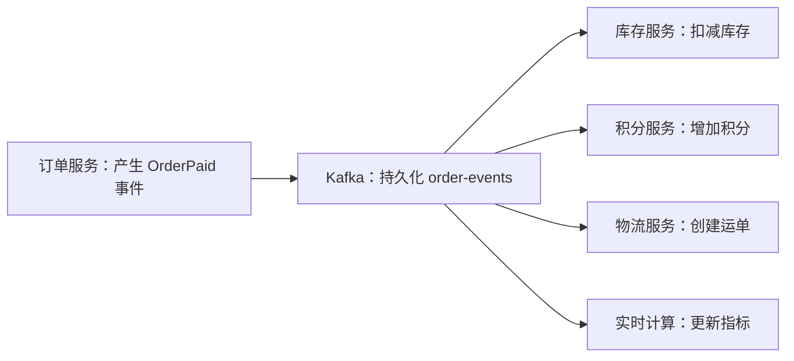

这里的输入是订单事件，动作是发布、持久化和订阅，输出是多个下游各自完成业务处理。Kafka 负责可靠保存和传递事件，不理解“扣库存”或“加积分”的业务含义。

### 1.2 Kafka 的职责边界

Apache Kafka 是分布式事件流平台。它能够跨多台机器写入、读取、存储和处理事件；官方文档把事件也称为 record（记录）或 message（消息）。Kafka 常被用作消息中间件，但它还提供持久事件日志、Kafka Connect 数据集成框架和 Kafka Streams 流处理库，因此能力范围比传统队列更宽。官方定义见 [Apache Kafka Introduction](https://kafka.apache.org/documentation/)。

Kafka 擅长以下问题：

1\. 在服务之间异步传递事件，削弱时间和部署上的耦合。
2\. 将持续产生的数据按顺序写入可重放日志。
3\. 让多个独立消费者按各自进度读取同一份数据。
4\. 通过分区扩展吞吐，通过副本承受节点故障。
5\. 支撑变更数据捕获、日志汇聚、指标管道和流式计算。

Kafka 不替业务完成跨系统一致性。订单数据库已经提交而事件尚未写入、消费者写数据库后尚未提交消费进度等问题，仍需要事务性发件箱、幂等写入或 Kafka 事务等设计来解决。Kafka 也不适合代替低延迟随机查询数据库：按主键查询任意历史记录、复杂关联查询和频繁原地更新并非分区日志的优势。

### 1.3 分阶段学习路线与成功判据

| 阶段 | 阅读范围 | 学习目标 | 成功判据 |
| --- | --- | --- | --- |
| 基础闭环 | 第 2～4 章 | 能启动 Kafka、创建主题、生产和消费事件 | 终端能读到刚写入的订单事件，并能解释主题、分区和偏移量 |
| Java 接入 | 第 5～7 章 | 能编写可靠的生产者与手动提交消费者 | 能确认发送结果，处理成功后提交偏移量，能观察消费积压 |
| 原理进阶 | 第 8～10 章 | 理解存储、副本、一致性与 KRaft 控制面 | 能根据可靠性目标解释 `acks`、ISR（In-Sync Replicas，同步副本集合）和 `min.insync.replicas` 的组合 |
| 生产治理 | 第 11～15 章 | 能做容量、安全、监控、排障与上线评审 | 能从指标定位生产慢、消费慢、分区不可用和频繁重平衡 |
| 扩展能力 | 第 13 章 | 识别 Connect、Streams、Share Group 的适用边界 | 能为数据集成、流计算和工作队列选择合适组件 |

第一次阅读建议先走完第 2～7 章。第 8 章以后解释生产环境为什么会出现重复、积压、选主和磁盘问题，不影响完成第一个可运行闭环。

## 2 完成第一个可运行闭环

### 2.1 版本、端口与环境前提

本文命令使用 Kafka 4.3.1。官方快速入门要求本地脚本方式安装 Java 17 或更高版本；Kafka 4.0 起已移除 ZooKeeper 模式和 Java 8 支持。版本兼容信息见 [Kafka 4.3 Compatibility](https://kafka.apache.org/43/getting-started/compatibility/)。

本章使用以下约定：

| 项目 | 值 | 含义 |
| --- | --- | --- |
| Broker 地址 | `localhost:9092` | 客户端连接 Kafka 的入口 |
| 主题 | `order-events` | 保存订单事件的逻辑名称 |
| 分区数 | `3` | 可并行写入和消费的日志数 |
| 副本系数 | `1` | 单节点练习值，不能承受节点故障 |
| 消费者组 | `inventory-service-v1` | 库存服务的独立消费进度标识 |

### 2.2 使用官方 Docker 镜像启动

已安装 Docker 时，下面是最短路径。官方镜像会提供适合本地体验的单节点配置：

```bash
docker pull apache/kafka:4.3.1
docker run --name kafka-learning -p 9092:9092 apache/kafka:4.3.1
```

容器日志持续运行且 9092 端口已映射，表示 Broker 已启动。另开终端确认容器状态：

```bash
docker ps --filter name=kafka-learning
docker logs kafka-learning --tail 30
```

后续命令可以进入容器执行：

```bash
docker exec -it kafka-learning bash
```

若出现 `port is already allocated`，说明 9092 已被占用；先用 `lsof -nP -iTCP:9092 -sTCP:LISTEN` 找到占用者，或调整宿主机端口和 Kafka 对外监听配置。仅把映射改成 `19092:9092` 不一定足够，因为客户端最终会使用 Broker 返回的 `advertised.listeners` 地址。

### 2.3 使用二进制发行包启动

没有 Docker 时，可从 [Apache Kafka Downloads](https://kafka.apache.org/downloads) 下载二进制包。`2.13` 是发行包使用的 Scala 二进制版本，`4.3.1` 才是 Kafka 版本。

```bash
tar -xzf kafka_2.13-4.3.1.tgz
cd kafka_2.13-4.3.1

KAFKA_CLUSTER_ID="$(bin/kafka-storage.sh random-uuid)"
bin/kafka-storage.sh format --standalone \
  -t "$KAFKA_CLUSTER_ID" \
  -c config/server.properties

bin/kafka-server-start.sh config/server.properties
```

`random-uuid` 生成 Cluster UUID（Universally Unique Identifier，通用唯一标识符）。`format` 会初始化数据目录及 KRaft 元数据；重复格式化已有生产数据目录会造成严重后果，因此只应对确认为空的新目录执行。官方对应步骤见 [Kafka Quickstart](https://kafka.apache.org/quickstart/)。

### 2.4 创建并检查主题

在 Kafka 安装目录中执行：

```bash
bin/kafka-topics.sh --create \
  --bootstrap-server localhost:9092 \
  --topic order-events \
  --partitions 3 \
  --replication-factor 1

bin/kafka-topics.sh --describe \
  --bootstrap-server localhost:9092 \
  --topic order-events
```

预期能看到 `PartitionCount: 3` 和 `ReplicationFactor: 1`，并且每个分区都有非负的 `Leader`。单节点练习只能使用副本系数 1；若设为 3，会因可用 Broker 少于副本数而创建失败。

生产环境通常关闭 `auto.create.topics.enable` 并显式创建主题。显式创建可以在上线前评审分区数、副本数、保留策略和消息大小，避免拼错主题名后悄悄生成错误主题。

### 2.5 写入带键的订单事件

启动控制台生产者：

```bash
bin/kafka-console-producer.sh \
  --bootstrap-server localhost:9092 \
  --topic order-events \
  --property parse.key=true \
  --property key.separator='|'
```

逐行输入：

```text
order-10001|{"eventId":"evt-1","eventType":"OrderPaid","orderId":"order-10001","amount":19900}
order-10002|{"eventId":"evt-2","eventType":"OrderPaid","orderId":"order-10002","amount":29900}
order-10001|{"eventId":"evt-3","eventType":"OrderShipped","orderId":"order-10001"}
```

竖线左侧是消息键，右侧是消息值。同一个 `orderId` 作为键时，默认分区逻辑会把相同键路由到同一分区，从而为单个订单建立分区内顺序。它不能提供整个主题的全局顺序。

### 2.6 读取事件并验证结果

另开终端启动消费者：

```bash
bin/kafka-console-consumer.sh \
  --bootstrap-server localhost:9092 \
  --topic order-events \
  --group inventory-service-v1 \
  --from-beginning \
  --property print.key=true \
  --property print.partition=true \
  --property print.offset=true
```

成功判据是三条事件都能显示，且两条 `order-10001` 事件的分区号相同、偏移量递增。输出顺序可能穿插其他分区的记录，因为跨分区没有统一的先后关系。

查看消费者组进度：

```bash
bin/kafka-consumer-groups.sh \
  --bootstrap-server localhost:9092 \
  --describe \
  --group inventory-service-v1
```

`CURRENT-OFFSET` 是组已提交的下一条读取位置，`LOG-END-OFFSET` 是分区日志末端位置，`LAG` 约等于两者之差。三个分区的 `LAG` 都回到 0，说明已提交进度追上日志末端。

### 2.7 最小闭环常见失败

| 现象 | 首个检查点 | 机制与处理 |
| --- | --- | --- |
| `Connection to node -1 could not be established` | `docker ps`、Broker 日志和 9092 监听 | Broker 未启动、地址不可达或 `advertised.listeners` 返回了客户端无法访问的地址 |
| `Topic ... not present in metadata` | `kafka-topics.sh --list` | 主题不存在、名称拼错，或元数据尚未刷新 |
| 创建主题提示复制系数过大 | 查看在线 Broker 数 | 副本数不能超过可承载该分区副本的 Broker 数 |
| 消费者没有历史数据 | 检查组是否已有已提交偏移量 | `--from-beginning` 只在组没有有效偏移量时影响起点；换新组名可验证从头读取 |
| 同一键落入不同分区 | 检查键序列化、分区数是否变化 | 键字节变化或增加分区会改变哈希映射；增加分区后不能再假设旧键仍在原分区 |

## 3 用最小闭环建立核心心智模型

### 3.1 Event、Record 与 Message

事件表示已经发生的事实，记录是 Kafka 中承载这份事实的数据单元，“消息”是工程中常用的同义表达。Kafka 记录包含以下字段：

| 字段 | 作用 | 订单示例 |
| --- | --- | --- |
| Topic | 逻辑分类 | `order-events` |
| Key | 分区、压缩和业务关联依据，可为空 | `order-10001` |
| Value | 序列化后的业务载荷，可为空 | `OrderPaid` JSON（JavaScript Object Notation，JavaScript 对象表示法） |
| Headers | 追踪、版本等轻量元数据 | `traceId`、`schemaVersion` |
| Timestamp | 创建时间或 Broker 追加时间 | `2026-08-16T10:15:30Z` |
| Partition | 所属物理日志 | `1` |
| Offset | 分区内的位置 | `42` |

JSON 在本例中只是消息值的编码格式。Broker 只处理字节、时间戳和协议元数据，不理解 JSON 字段。生产者负责序列化，消费者负责使用匹配的反序列化规则。格式演进需要 Schema（模式）治理，不能依赖 Broker 自动检查业务兼容性。

### 3.2 Topic、Partition 与 Offset

Topic（主题）是事件的逻辑类别。Partition（分区）是主题内部只能追加的有序日志，也是 Kafka 存储、复制和并行处理的基本单位。Offset（偏移量）是 Kafka 为每条记录分配的分区内递增位置。

```text
order-events
├── partition-0: offset 0 → 1 → 2 → 3
├── partition-1: offset 0 → 1 → 2
└── partition-2: offset 0 → 1 → 2 → 3 → 4
```

偏移量只在“主题 + 分区”范围内有意义。`partition-0, offset=8` 与 `partition-1, offset=8` 是两条不同记录。删除或日志压缩可能在物理上移除旧记录，但现存记录的偏移量不会重新编号，因此偏移量之间允许出现空洞。

### 3.3 Producer、Broker 与 Consumer

Producer（生产者）把记录发送到主题的某个分区。Broker 是 Kafka 服务节点，持久化分区日志并处理客户端请求。Consumer（消费者）主动从 Broker 拉取记录。

`bootstrap.servers` 只是客户端发现集群的初始入口，不要求列出所有 Broker。客户端取得集群元数据后，会直接连接目标分区的 Leader。建议配置多个可用入口，以免唯一的引导节点恰好不可达。

### 3.4 Consumer Group 与独立进度

Consumer Group（消费者组）把一组消费者视为同一个逻辑订阅者。普通消费者组中，同一分区在同一时刻只分配给组内一个消费者；不同组可以独立读取同一主题。

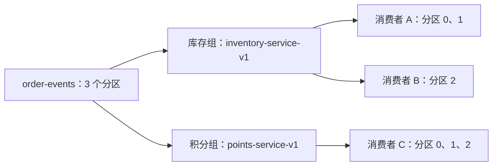

库存组提交进度不会推进积分组的进度。组内消费者数超过分区数时，多出的普通消费者没有分区可处理；因此普通消费者组的有效并行度上限通常是分区数。

### 3.5 Broker 数据面与 KRaft 控制面

Kafka 4.x 只支持 KRaft 模式。Broker 组成数据面，处理生产、消费、分区副本同步。Controller（控制器）组成元数据仲裁组，通过 Kafka 自身的 Raft 风格元数据日志管理 Broker 注册、主题、分区、副本分配、ACL（Access Control List，访问控制列表）和配置等集群元数据。

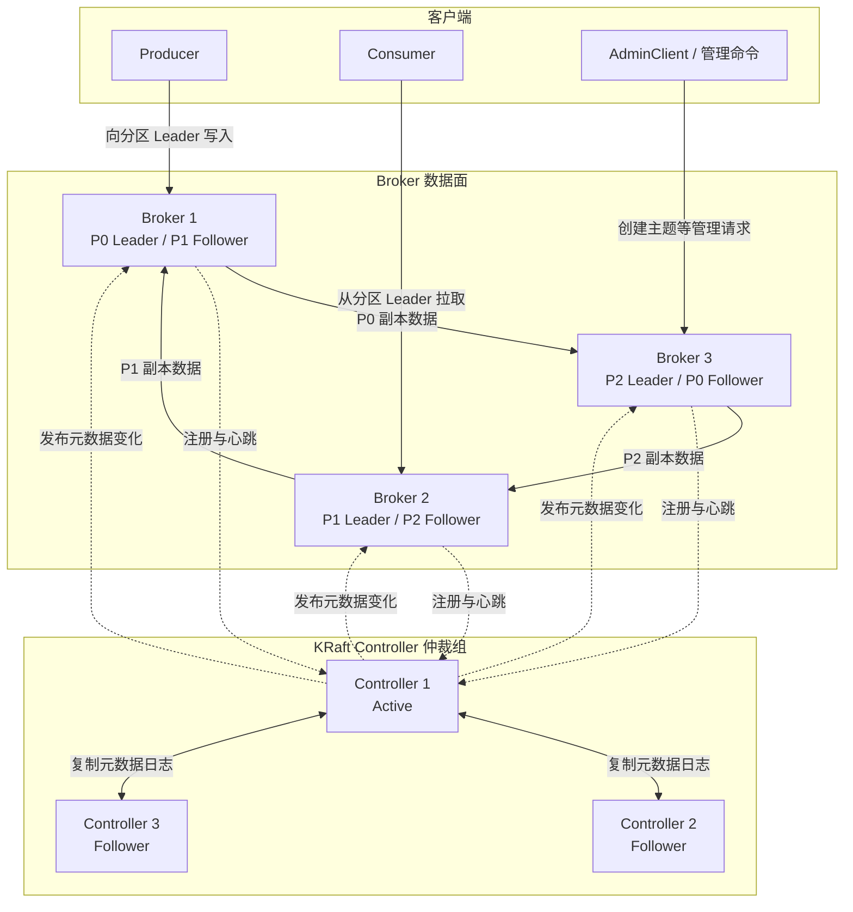

读图时先区分控制面和数据面。客户端通过 `bootstrap.servers` 找到任一可达 Broker，取得主题分区元数据后，直接访问目标分区的 Leader；引导节点不转发所有业务流量。图中三个分区的 Leader 分散在不同 Broker，Follower 跨 Broker 保存副本并主动从 Leader 拉取数据。为避免线条遮挡，示例只画出每个分区的两个副本，生产主题常按故障目标配置三个副本。

Controller 仲裁组保存和复制集群元数据，active controller 把分区 Leader、节点注册和配置等变化发布给 Broker。Broker 故障首先影响其承载的 Leader 和副本，Controller 会根据仍然可用的同步副本更新元数据；Controller 少数节点故障可由多数派继续工作。业务分区副本与 Controller 多数派是两套不同的容错条件，第 9.6 节会进一步分析。

KRaft 与 KIP-848 不是同一概念。KIP 是 Kafka Improvement Proposal（Kafka 改进提案）；KRaft 解决集群元数据共识和控制面问题，KIP-848 定义下一代消费者组重平衡协议。生产集群通常把 Controller 与 Broker 角色分离，本地单节点才常用 `broker,controller` 混合角色。

## 4 掌握常用命令与主题设计

### 4.1 命令行入口的共同规则

Kafka 4.x 管理命令通过 `--bootstrap-server` 连接 Broker，或在控制器专用操作中通过 `--bootstrap-controller` 连接 Controller。Kafka 4.0 已移除 AdminClient 命令的 `--zookeeper` 选项。旧笔记中的 `kafka-topics.sh --zookeeper ...` 不适用于 Kafka 4.x。

常用脚本如下：

| 脚本 | 主要用途 |
| --- | --- |
| `kafka-topics.sh` | 创建、查看、扩展和删除主题 |
| `kafka-configs.sh` | 动态查看或修改主题、Broker、用户和客户端配置 |
| `kafka-console-producer.sh` | 手工写入测试记录 |
| `kafka-console-consumer.sh` | 手工读取和检查记录 |
| `kafka-consumer-groups.sh` | 查看组成员、偏移量和积压，重置偏移量 |
| `kafka-reassign-partitions.sh` | 迁移分区副本、调整副本系数 |
| `kafka-metadata-quorum.sh` | 查看 KRaft 元数据仲裁状态 |
| `kafka-storage.sh` | 生成集群 ID 和格式化节点存储 |

命令细节会随版本变化，执行不带参数的脚本可查看当前发行版的准确用法。官方操作参考见 [Basic Kafka Operations](https://kafka.apache.org/43/operations/basic-kafka-operations/)。

### 4.2 主题命名与职责

主题宜表达稳定的业务事实，如 `order-events`、`payment-results`，不要绑定临时消费者名称。一个主题可以被多个组订阅；若按消费者拆主题，会丢失复用事件流的价值。

建议把以下内容纳入主题契约：

1\. 事件含义、键选择和所有者。
2\. 分区数、副本系数和预期吞吐。
3\. 保留或压缩策略。
4\. Schema 版本与兼容策略。
5\. 单条记录大小上限与敏感数据规则。
6\. 允许读取和写入的主体。

### 4.3 创建、查看、扩展和删除主题

```bash
bin/kafka-topics.sh --list --bootstrap-server localhost:9092

bin/kafka-topics.sh --create \
  --bootstrap-server localhost:9092 \
  --topic payment-results \
  --partitions 6 \
  --replication-factor 3 \
  --config min.insync.replicas=2 \
  --config retention.ms=604800000

bin/kafka-topics.sh --describe \
  --bootstrap-server localhost:9092 \
  --topic payment-results

bin/kafka-topics.sh --alter \
  --bootstrap-server localhost:9092 \
  --topic payment-results \
  --partitions 12
```

分区数可以增加，不能通过普通主题修改命令减少。增加分区会改变键到分区的映射，对依赖“同一键始终进入原分区”的系统有行为影响。扩容前应评估顺序、状态存储和下游并行度，而不只是确认命令能成功。

删除主题会删除其数据，是不可逆业务操作。执行前应确认主题名、数据保留要求、消费者依赖和备份策略：

```bash
bin/kafka-topics.sh --delete \
  --bootstrap-server localhost:9092 \
  --topic payment-results
```

### 4.4 动态修改主题配置

```bash
bin/kafka-configs.sh \
  --bootstrap-server localhost:9092 \
  --entity-type topics \
  --entity-name order-events \
  --describe

bin/kafka-configs.sh \
  --bootstrap-server localhost:9092 \
  --entity-type topics \
  --entity-name order-events \
  --alter \
  --add-config retention.ms=259200000
```

上例把保留时间改为 3 天。删除主题级覆盖后会退回 Broker 默认值：

```bash
bin/kafka-configs.sh \
  --bootstrap-server localhost:9092 \
  --entity-type topics \
  --entity-name order-events \
  --alter \
  --delete-config retention.ms
```

动态修改配置后，应再次 `--describe` 确认实际值。配置命令成功只证明元数据变更被接受，不证明磁盘会立即释放；日志删除按段执行且由后台周期任务完成。

### 4.5 查看记录的键、分区、偏移量和时间戳

```bash
bin/kafka-console-consumer.sh \
  --bootstrap-server localhost:9092 \
  --topic order-events \
  --from-beginning \
  --max-messages 10 \
  --property print.key=true \
  --property print.partition=true \
  --property print.offset=true \
  --property print.timestamp=true
```

排查顺序问题时要同时打印键、分区和偏移量。只看业务时间戳无法证明 Kafka 写入顺序，因为生产者时钟可能不准，重试也可能使事件到达时间晚于业务发生时间。

### 4.6 查看和重置消费者组偏移量

```bash
bin/kafka-consumer-groups.sh \
  --bootstrap-server localhost:9092 \
  --group inventory-service-v1 \
  --describe
```

重置偏移量会改变后续读取位置，可能造成重放或跳过。通常先停止组内活跃消费者，再用 `--dry-run` 预览：

```bash
bin/kafka-consumer-groups.sh \
  --bootstrap-server localhost:9092 \
  --group inventory-service-v1 \
  --topic order-events \
  --reset-offsets \
  --to-earliest \
  --dry-run
```

确认范围后，把 `--dry-run` 改为 `--execute`。执行前应记录原偏移量、原因、目标分区和回滚方案；“从头重放”只有在消费者具备幂等性或下游允许重复时才安全。

## 5 使用 Java 完成生产与消费

### 5.1 添加客户端依赖

Kafka Java 客户端与 Broker 通过版本化协议协商能力，客户端版本不要求和 Broker 每个小版本完全相同。新项目仍建议统一管理经过兼容测试的客户端版本，避免不同服务各自漂移。

Maven 依赖：

```xml
<dependency>
    <groupId>org.apache.kafka</groupId>
    <artifactId>kafka-clients</artifactId>
    <version>4.3.1</version>
</dependency>
```

示例包名统一为 `com.example.kafka`，主题统一为 `order-events`，键和值都先使用字符串，以便把注意力放在 Kafka 调用链上。

### 5.2 编写可确认结果的生产者

```java
package com.example.kafka;

import org.apache.kafka.clients.producer.KafkaProducer;
import org.apache.kafka.clients.producer.ProducerConfig;
import org.apache.kafka.clients.producer.ProducerRecord;
import org.apache.kafka.clients.producer.RecordMetadata;
import org.apache.kafka.common.serialization.StringSerializer;

import java.util.Properties;
import java.util.concurrent.TimeUnit;

public final class OrderEventProducer {
    public static void main(String[] args) throws Exception {
        Properties config = new Properties();
        config.put(ProducerConfig.BOOTSTRAP_SERVERS_CONFIG, "localhost:9092");
        config.put(ProducerConfig.KEY_SERIALIZER_CLASS_CONFIG, StringSerializer.class.getName());
        config.put(ProducerConfig.VALUE_SERIALIZER_CLASS_CONFIG, StringSerializer.class.getName());
        config.put(ProducerConfig.CLIENT_ID_CONFIG, "order-service-producer");

        // 明确可靠性意图；幂等生产者还要求 retries > 0 且 in-flight <= 5。
        config.put(ProducerConfig.ACKS_CONFIG, "all");
        config.put(ProducerConfig.ENABLE_IDEMPOTENCE_CONFIG, true);
        config.put(ProducerConfig.COMPRESSION_TYPE_CONFIG, "zstd");

        String key = "order-10001";
        String value = """
                {"eventId":"evt-java-1","eventType":"OrderPaid",\
                "orderId":"order-10001","amount":19900}
                """;

        try (KafkaProducer<String, String> producer = new KafkaProducer<>(config)) {
            ProducerRecord<String, String> record =
                    new ProducerRecord<>("order-events", key, value);

            RecordMetadata metadata = producer.send(record)
                    .get(10, TimeUnit.SECONDS);

            System.out.printf("sent topic=%s partition=%d offset=%d%n",
                    metadata.topic(), metadata.partition(), metadata.offset());
        }
    }
}
```

`send()` 先把记录交给客户端缓冲区并立即返回 `Future`，后台 I/O（Input/Output，输入/输出）线程再批量发送。示例调用 `get()` 是为了让首次运行得到明确的成功或异常；高吞吐服务通常使用回调异步处理结果，避免业务线程逐条等待网络响应。

输出中的分区与偏移量是可观察成功判据。只看到方法没有抛异常还不够：若应用在异步请求完成前退出，或忽略回调异常，就可能误判发送成功。`close()` 会尝试刷新尚未完成的发送并释放网络资源。

### 5.3 编写处理成功后提交的消费者

```java
package com.example.kafka;

import org.apache.kafka.clients.consumer.ConsumerConfig;
import org.apache.kafka.clients.consumer.ConsumerRecord;
import org.apache.kafka.clients.consumer.ConsumerRecords;
import org.apache.kafka.clients.consumer.KafkaConsumer;
import org.apache.kafka.common.errors.WakeupException;
import org.apache.kafka.common.serialization.StringDeserializer;

import java.time.Duration;
import java.util.List;
import java.util.Properties;
import java.util.concurrent.atomic.AtomicBoolean;

public final class InventoryEventConsumer {
    public static void main(String[] args) {
        Properties config = new Properties();
        config.put(ConsumerConfig.BOOTSTRAP_SERVERS_CONFIG, "localhost:9092");
        config.put(ConsumerConfig.KEY_DESERIALIZER_CLASS_CONFIG,
                StringDeserializer.class.getName());
        config.put(ConsumerConfig.VALUE_DESERIALIZER_CLASS_CONFIG,
                StringDeserializer.class.getName());
        config.put(ConsumerConfig.GROUP_ID_CONFIG, "inventory-service-v1");
        config.put(ConsumerConfig.CLIENT_ID_CONFIG, "inventory-consumer-1");
        config.put(ConsumerConfig.ENABLE_AUTO_COMMIT_CONFIG, false);
        config.put(ConsumerConfig.AUTO_OFFSET_RESET_CONFIG, "earliest");
        config.put(ConsumerConfig.MAX_POLL_RECORDS_CONFIG, 100);

        AtomicBoolean running = new AtomicBoolean(true);
        KafkaConsumer<String, String> consumer = new KafkaConsumer<>(config);
        Runtime.getRuntime().addShutdownHook(new Thread(() -> {
            running.set(false);
            consumer.wakeup();
        }));

        try (consumer) {
            consumer.subscribe(List.of("order-events"));

            while (running.get()) {
                ConsumerRecords<String, String> records =
                        consumer.poll(Duration.ofSeconds(1));

                for (ConsumerRecord<String, String> record : records) {
                    updateInventoryIdempotently(record.key(), record.value());
                    System.out.printf("processed partition=%d offset=%d key=%s%n",
                            record.partition(), record.offset(), record.key());
                }

                if (!records.isEmpty()) {
                    // 业务批次全部成功后提交下一条待读位置，形成至少一次处理语义。
                    consumer.commitSync();
                }
            }
        } catch (WakeupException e) {
            if (running.get()) {
                throw e;
            }
        }
    }

    private static void updateInventoryIdempotently(String orderId, String eventJson) {
        // 生产实现可用 eventId 唯一键或业务状态机拒绝重复处理。
        System.out.printf("update inventory orderId=%s payload=%s%n", orderId, eventJson);
    }
}
```

消费者提交的是“下一条要读取的偏移量”。处理完 offset 42 后，通常提交 43。上述顺序是“先处理、后提交”：进程若在业务成功后、提交前崩溃，记录会再次投递，因此业务写入需要幂等。若改成“先提交、后处理”，崩溃可能让尚未完成的业务记录被跳过。

`KafkaConsumer` 不是线程安全对象，创建、`poll()`、提交和关闭通常放在同一消费线程。其他线程若要终止轮询，可调用线程安全的 `wakeup()`。`KafkaProducer` 可以被多线程共享，复用单个实例通常更利于批处理和连接管理。

### 5.4 验证 Java 闭环

先保持 Kafka 和 `InventoryEventConsumer` 运行，再启动 `OrderEventProducer`。成功时应观察到：

1\. 生产者打印实际主题、分区和偏移量。
2\. 消费者打印同一键和对应位置。
3\. `kafka-consumer-groups.sh --describe` 中积压回到 0。
4\. 再次运行生产者时会产生新偏移量，而不是覆盖旧记录。

该示例只验证客户端能连通、序列化匹配、消息可持久化并被手动提交。`updateInventoryIdempotently` 仍是占位实现，没有验证数据库事务、幂等唯一键、失败重试和死信处理；这些生产边界在第 7、12 和 15 章完善。

### 5.5 序列化与 Schema 演进

字符串 JSON 易于观察，但字段类型、必填规则和兼容性主要依靠团队约定。Avro、Protocol Buffers（Protobuf）等 Schema 驱动格式能把结构契约显式化，并配合 Schema Registry 做兼容性校验。Kafka 自身不附带通用 Schema Registry，实际部署需选择相应实现。

格式演进至少应区分以下变化：

| 变化 | 兼容风险 | 常见做法 |
| --- | --- | --- |
| 新增可选字段并提供默认值 | 旧消费者通常可忽略 | 优先选择 |
| 删除旧消费者仍读取的字段 | 旧消费者可能失败或语义错误 | 先升级消费者，再移除 |
| 改变字段类型 | 序列化兼容和业务含义都可能破坏 | 新增字段或新事件版本 |
| 改变键格式 | 分区映射和压缩语义改变 | 作为数据迁移评审 |
| 将空值作为删除标记 | 压缩主题会把它解释为 tombstone | 仅在契约明确时使用 |

自定义 `Serializer` 虽然可行，但需要自行负责长度边界、字符编码、向前向后兼容和跨语言实现。多数业务更适合采用成熟格式与集中契约治理。

## 6 理解生产者的发送、批处理与可靠性

### 6.1 一条记录如何到达 Broker

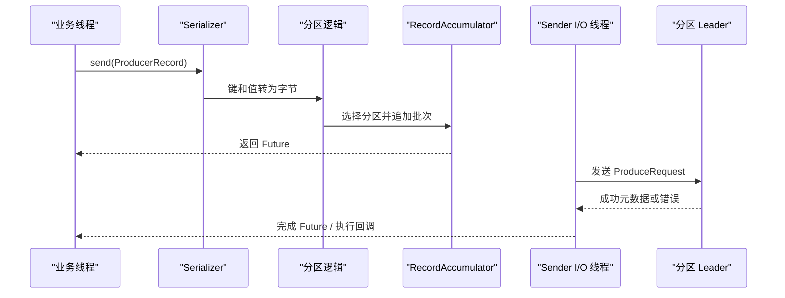

应用线程主要负责序列化、分区选择和写入内存累加器。Sender 后台线程按目标 Broker 聚合请求。相同主题分区的记录进入 RecordBatch，批量压缩和网络发送，从而降低每条记录的系统调用、协议头和磁盘开销。

### 6.2 三种发送观察方式

| 方式 | 写法 | 适用范围 | 主要风险 |
| --- | --- | --- | --- |
| 忽略返回结果 | `producer.send(record)` | 可容忍少量丢失且有独立对账的遥测 | 最终失败难以被业务发现 |
| 同步等待 | `send(record).get()` | 管理工具、低频关键动作、教学验证 | 逐条阻塞会显著降低吞吐 |
| 异步回调 | `send(record, callback)` | 大多数在线生产服务 | 回调中仍需记录、告警和处理最终失败 |

回调按同一分区记录的发送顺序执行，但回调逻辑不宜阻塞 I/O 线程。耗时补偿可以投递到受控执行器；补偿队列也要有容量上限，防止 Broker 故障时内存不断增长。

### 6.3 分区选择与顺序边界

未显式指定分区时，当前默认逻辑大致遵循：

1\. 有键时，根据序列化后的键字节选择分区。
2\. 无键时，使用粘性分区，尽量填充一个批次后再切换。
3\. 显式指定分区时，跳过默认选择，但应用同时承担分区有效性和热点风险。

相同键通常进入相同分区，前提是主题分区数、键字节和分区算法不变。分区数增加后，哈希取模结果可能变化。若业务需要“同一订单的状态变更按顺序处理”，键应稳定地使用订单标识，并让消费者对单分区记录串行或按键有序处理。

Kafka 4.3.1 默认启用 `partitioner.adaptive.partitioning.enable=true`，无键记录会倾向由响应更快的 Broker 承载的分区。需要严格均匀分布时要理解该行为再调整，不能把“无键轮询”当成当前默认事实。生产者完整配置见 [Kafka 4.3 Producer Configs](https://kafka.apache.org/43/configuration/producer-configs/)。

### 6.4 批处理、延迟与压缩

| 配置 | Kafka 4.3.1 默认值 | 控制对象 | 调整影响 |
| --- | ---: | --- | --- |
| `batch.size` | 16384 字节 | 单个分区批次的目标上限 | 较大批次可提高吞吐和压缩率，也会占用更多缓冲内存 |
| `linger.ms` | 5 毫秒 | 批次等待更多记录的最长时间 | 增大后请求数可能下降，低负载尾延迟可能上升 |
| `buffer.memory` | 33554432 字节 | 等待发送记录的总缓冲近似上限 | 耗尽后 `send()` 最多阻塞 `max.block.ms` |
| `compression.type` | `none` | 批次压缩算法 | `lz4`、`zstd` 常用于平衡 CPU（Central Processing Unit，中央处理器）、网络和磁盘 |
| `delivery.timeout.ms` | 120000 毫秒 | 一条记录从 `send()` 返回后到最终成功或失败的总上限 | 应覆盖排队、请求超时和可重试错误 |

Kafka 4.0 把 `linger.ms` 默认值从 0 改为 5 毫秒，因为更好的批处理在许多负载下能降低请求开销，实际延迟未必变差。调优应看 `batch-size-avg`、`record-queue-time-avg`、请求延迟和吞吐，而不是机械套用旧版本默认值。

处理器成本也是压缩取舍的一部分。压缩发生在批次级别，消息越相似、批次越充足，压缩收益通常越高。Broker 可保留生产者压缩格式，消费者解压；这能同时减少网络和磁盘占用，但会增加客户端 CPU 成本。对真实消息分布做压测比只比较算法宣传值更可靠。

### 6.5 `acks`、幂等与重试的组合

Kafka 4.3.1 的生产者默认 `acks=all`、`enable.idempotence=true`、`retries=2147483647`、`max.in.flight.requests.per.connection=5`。它们共同影响可靠性和顺序：

| 配置 | 语义 |
| --- | --- |
| `acks=0` | 不等待 Broker 确认，客户端无法据此重试写入失败，返回偏移量为 -1 |
| `acks=1` | Leader 本地追加后确认；确认后、Follower 复制前若 Leader 丢失，记录可能丢失 |
| `acks=all` | 当前 ISR（In-Sync Replicas，同步副本集合）全部确认后成功，并受 `min.insync.replicas` 约束 |
| `enable.idempotence=true` | Broker 使用 Producer ID 和序列号消除同一生产会话重试造成的重复批次 |

启用幂等要求 `acks=all`、`retries>0` 且 `max.in.flight.requests.per.connection<=5`。显式设置冲突值可能抛出 `ConfigException`，或在未显式开启幂等时使幂等被关闭。幂等生产者解决的是 Kafka 写入重试重复，不会让数据库更新、HTTP（Hypertext Transfer Protocol，超文本传输协议）调用或跨会话业务事件天然幂等。

不建议用一个很小的 `retries` 作为总体失败窗口。当前客户端更适合保留重试默认值，用 `delivery.timeout.ms` 约束可接受的总投递时间，并在最终失败回调中记录事件标识、目标主题、异常类别和补偿状态。

### 6.6 事务生产者与 Kafka 内部原子性

当应用要“从输入主题读取一批记录，处理后写入多个 Kafka 主题，同时提交输入偏移量”，事务可以让输出记录和偏移量共同提交或共同中止。

```java
config.put(ProducerConfig.TRANSACTIONAL_ID_CONFIG, "order-enricher-instance-1");

try (KafkaProducer<String, String> producer = new KafkaProducer<>(config)) {
    producer.initTransactions();
    producer.beginTransaction();
    try {
        producer.send(new ProducerRecord<>("enriched-orders", key, value));
        producer.sendOffsetsToTransaction(offsets, consumer.groupMetadata());
        producer.commitTransaction();
    } catch (RuntimeException e) {
        producer.abortTransaction();
        throw e;
    }
}
```

消费事务数据的下游应配置 `isolation.level=read_committed`，否则默认 `read_uncommitted` 可以看到已中止事务的记录。事务性 ID 必须在并发生产者实例间唯一；新实例使用同一 ID 时会 fencing（隔离）旧实例，防止两个会话同时提交。

Kafka 事务的原子范围是 Kafka 记录与 Kafka 消费偏移量。把业务数据库更新放进这段 Java `try` 并不会让数据库参与 Kafka 事务。数据库与 Kafka 的一致发布更常用 Transactional Outbox（事务性发件箱）：业务数据和 outbox 行在同一数据库事务中提交，再由 CDC（Change Data Capture，变更数据捕获）组件发布到 Kafka。

## 7 理解消费者、偏移量与重平衡

### 7.1 `poll()` 循环承担的工作

Kafka Consumer 使用 pull（拉取）模型。消费者根据自身处理能力向 Broker 请求数据，Broker 可以等待积累一定字节后批量返回。拉取模型便于做批处理和流量控制，也意味着应用必须持续调用 `poll()` 维持组成员身份和推进处理。

客户端内部会预取并缓存记录。`max.poll.records` 只限制一次 `poll()` 交给应用的最大记录数，不直接限制底层 FetchRequest 拉取量；底层总量由 `fetch.max.bytes`、`max.partition.fetch.bytes` 等参数控制。因此，降低 `max.poll.records` 可以缩短单批业务处理时间，却不一定等比例降低消费者内存。

一次循环可以按以下时间线理解：

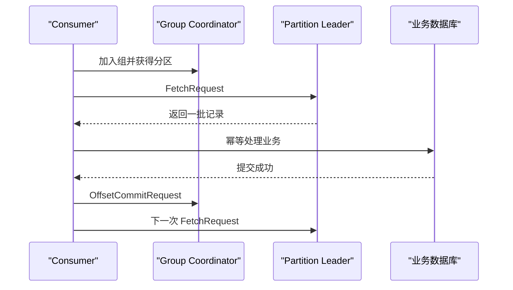

### 7.2 组协调器、成员与分区分配

每个普通消费者组由某个 Broker 上的 Group Coordinator（组协调器）管理。消费者可向任一 Broker 发起 `FindCoordinator` 查找协调器，随后由协调器管理成员身份、分区分配和偏移量提交。提交的进度作为记录写入压缩内部主题 `__consumer_offsets`；协调器还会缓存这些进度以便快速查询。官方实现说明见 [Consumer Offset Tracking](https://kafka.apache.org/43/implementation/distribution/)。

消费者组发生以下变化时可能重平衡：

1\. 新消费者加入或已有消费者正常离开。
2\. 消费者崩溃、网络隔离或超过会话超时。
3\. 两次 `poll()` 间隔超过 `max.poll.interval.ms`。
4\. 订阅主题的分区数变化。
5\. 正则订阅匹配到新的主题。

重平衡会转移分区所有权。应用应在分区被撤销前完成必要的偏移量提交和本地状态清理，并在获得新分区后恢复状态。回调应短小，避免延长组不可用时间。

### 7.3 Classic 与 Consumer 两种组协议

Kafka 4.0 已将 KIP-848 下一代消费者重平衡协议设为正式可用。Kafka 4.3.1 客户端通过 `group.protocol` 选择：

| `group.protocol` | 分配位置 | 超时控制 | 特点 |
| --- | --- | --- | --- |
| `classic`，默认 | 经典流程主要由客户端群组成员参与制定分配 | 客户端配置 `heartbeat.interval.ms`、`session.timeout.ms` | 与存量客户端和策略兼容，默认仍使用它 |
| `consumer` | Broker 端协调器执行分配 | Broker 配置控制心跳与会话超时 | 协议更轻量，成员变更可采用增量式协调 |

使用 `consumer` 协议时，客户端的 `heartbeat.interval.ms` 和 `session.timeout.ms` 不生效，分别由 Broker 的 `group.consumer.heartbeat.interval.ms` 和 `group.consumer.session.timeout.ms` 控制；服务端分配器可通过 `group.remote.assignor` 选择。配置项见 [Kafka 4.3 Consumer Configs](https://kafka.apache.org/43/configuration/consumer-configs/)。

协议迁移属于组级行为变更，应先确认 Broker、客户端、框架封装和可观测工具兼容，再分组灰度。不能把 `partition.assignment.strategy` 的客户端策略直接套到 `consumer` 协议而假设行为完全相同。

### 7.4 Classic 协议的分配策略

| 策略 | 分配特点 | 适合与风险 |
| --- | --- | --- |
| `RangeAssignor` | 按主题分别把连续分区范围分配给消费者 | 默认首选策略；多主题且分区数相似时，前面的消费者可能在每个主题都多拿一个分区 |
| `RoundRobinAssignor` | 把所有可订阅分区轮询分配 | 订阅集合相同较均衡；订阅集合不同仍可能失衡 |
| `StickyAssignor` | 尽量均衡并保留旧分配 | 减少分区迁移，但仍使用 eager 重平衡语义 |
| `CooperativeStickyAssignor` | 粘性分配配合 cooperative（协作式）增量撤销 | 可减少全组暂停；迁移时所有成员需使用兼容策略列表 |

Kafka 4.3.1 的 `partition.assignment.strategy` 默认列表是 `RangeAssignor,CooperativeStickyAssignor`，实际优先使用 Range。滚动迁移到 CooperativeSticky 时，可先让所有成员都支持它，再在下一轮滚动中移除 Range，避免同组成员策略不一致。

### 7.5 三种位置与 Lag

排查消费问题时要区分：

| 位置 | 含义 |
| --- | --- |
| Consumer Position | 当前消费者下一次准备返回给应用的位置，会随 `poll()` 推进 |
| Committed Offset | 消费者组持久化的恢复位置，重启或重平衡后从这里继续 |
| Log End Offset | 分区日志末端的下一位置 |

常见消息积压近似为：

```text
Lag = Log End Offset - Committed Offset
```

这个数值不等同于业务处理延迟。分区每秒进入 1 条大任务和每秒进入 1 万条轻量事件时，相同 Lag 的时间含义不同。生产监控宜同时观察记录 Lag、时间 Lag、消费速率和业务完成时间。

### 7.6 `auto.offset.reset` 只处理无有效进度的情况

当组没有初始偏移量，或已提交位置对应的数据已被保留策略删除时，`auto.offset.reset` 决定起点：

| 值 | 行为 | 风险边界 |
| --- | --- | --- |
| `earliest` | 从当前仍保留的最早位置开始 | 可能大量重放，需要幂等与容量准备 |
| `latest`，默认 | 从当前日志末端开始 | 首次启动可能跳过已有历史记录 |
| `none` | 没有有效偏移量时抛异常 | 适合要求人工决定恢复点的关键系统 |
| `by_duration:PnDTnHnMn.nS` | 从当前时间向前指定 ISO-8601 时长 | Kafka 4.x 的时间窗口恢复方式，仍受数据实际保留范围限制 |

例如 `by_duration:PT6H` 表示尝试从最近 6 小时的时间点开始。该配置不会覆盖一个已经有效提交的偏移量；要主动重放已有组，应使用偏移量重置或 `seek()`，并显式控制范围。

### 7.7 自动提交、同步提交与异步提交

| 方式 | 提交时机 | 优点 | 主要失败方式 |
| --- | --- | --- | --- |
| 自动提交 | `poll()` 过程中按间隔提交客户端认为已返回的进度 | 代码少 | 业务尚未完成就提交可能跳过；提交前崩溃也会重读 |
| `commitSync()` | 应用明确同步等待协调器确认 | 失败直接反馈，控制清晰 | 阻塞消费线程，频繁调用降低吞吐 |
| `commitAsync()` | 异步发送并在回调得知结果 | 减少阻塞 | 多次提交回调可能乱序，盲目重试旧偏移量会覆盖更新进度 |

批量消费时，直接 `commitSync()` 会提交各已分配分区由 `poll()` 推进后的位置。若批次中途失败，前面已经成功的记录也会重读。可以接受重复时，这是最清晰的至少一次方案；若要按分区提交已成功的精确位置，应构造 `Map<TopicPartition, OffsetAndMetadata>`，值仍是最后成功 offset 加 1。

### 7.8 处理慢任务而不触发重平衡

处理时间必须小于 `max.poll.interval.ms` 所允许的两次轮询间隔。可按以下顺序治理：

1\. 先测量单条与单批 P95、P99（第 95、99 百分位）处理耗时。
2\. 调低 `max.poll.records`，让最坏批次在间隔内完成。
3\. 把可并行任务交给有界工作池，同时用 `pause()` 暂停已拥塞分区并继续及时 `poll()`。
4\. 仅在业务确实需要时增大 `max.poll.interval.ms`；过大的值会延迟发现真正卡死的消费者。
5\. 为每个分区跟踪任务完成水位，只有连续完成的位置才可提交。

多线程处理不能在任意任务结束时提交最大 offset。假设 offset 10 尚未完成、11 已完成，提交 12 后进程崩溃会永久跳过 10。正确水位是从已提交位置开始连续完成的末端。

### 7.9 重试、死信与毒消息

反序列化失败、违反业务约束或持续触发下游异常的记录称为 poison pill（毒消息）时，它会阻塞当前分区的进度。可靠处理通常分三类：

1\. 瞬时错误，如数据库短暂不可用：有限次数指数退避并加入抖动，避免所有实例同时重试。
2\. 永久数据错误，如必填字段缺失：记录原主题、分区、偏移量、键、异常和 Schema 版本后进入 DLT（Dead Letter Topic，死信主题）。
3\. 未知错误：暂停受影响分区、告警并保留人工恢复入口，避免无上限重试占满线程。

把失败记录写入 DLT 后再提交原偏移量，会改变“原主题中每条都成功执行业务”的语义；系统应有 DLT 修复、重放、去重和审计流程。DLT 不是删除问题记录的垃圾桶。

### 7.10 交付语义来自处理与提交顺序

| 语义 | 典型顺序 | 故障结果 |
| --- | --- | --- |
| At-most-once（至多一次） | 先提交偏移量，再处理业务 | 不重复，但崩溃可能丢业务处理 |
| At-least-once（至少一次） | 先处理业务，再提交偏移量 | 不轻易丢，但崩溃窗口会重复 |
| Exactly-once（精确一次效果） | Kafka 事务，或幂等业务写入与原子进度设计 | 只在明确定义的系统边界内成立 |

真实业务通常以至少一次投递配合幂等消费者。幂等键优先使用全局唯一 `eventId`；数据库可建立唯一约束，在同一事务中记录已处理事件与业务变更。只在缓存中记忆事件 ID 无法承受进程重启，也难以与数据库写入原子提交。

## 8 理解分区日志、保留与压缩

### 8.1 追加日志为什么有高吞吐

Kafka 分区采用 append-only（只追加）日志。新记录写到活跃日志段末尾，避免频繁随机修改历史位置。写入通常先进入操作系统 Page Cache（页缓存），由操作系统组织落盘；副本机制提供节点级持久性保证，官方不建议为了每条记录都 `fsync` 而牺牲吞吐。

读取历史数据时，Broker 可以利用页缓存；向网络发送文件数据时，Java NIO（New Input/Output，新输入/输出）的 `FileChannel.transferTo` 可利用操作系统的 `sendfile` 类能力，减少在内核缓冲区与用户空间之间的拷贝。所谓 zero-copy（零拷贝）指减少不必要的 CPU 内存拷贝，并不表示磁盘、内存和网卡之间完全没有数据传输。

### 8.2 日志段与稀疏索引

一个分区目录由多个 Log Segment（日志段）构成。每个段通常包含：

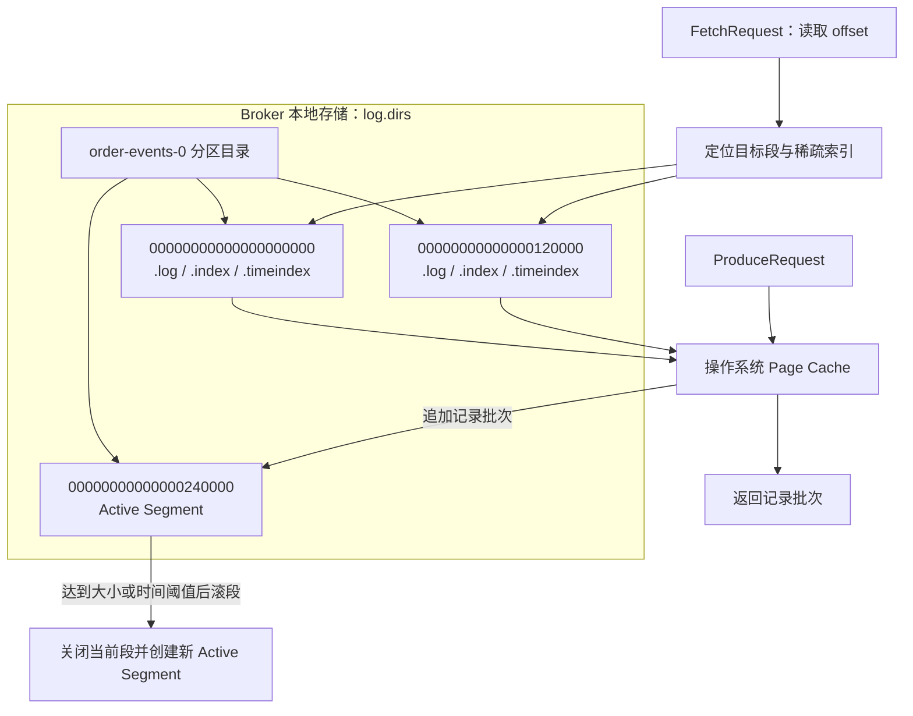

图中的目录名是“主题名-分区号”，文件名前缀是该段的 base offset（起始偏移量）。写入只追加到 Active Segment；滚段后，旧段成为清理、压缩或迁移的基本单位。读取先根据目标 offset 选择日志段，再借助 `.index` 找到接近的文件位置；数据已在页缓存中时，可以减少真实磁盘读取。

| 文件 | 作用 |
| --- | --- |
| `.log` | 保存记录批次 |
| `.index` | 把相对偏移量映射到日志文件物理位置 |
| `.timeindex` | 把时间戳映射到近似偏移量 |

只有 active segment（活跃段）继续写入。查找 offset 时，Kafka 先定位可能包含该 offset 的段，再通过稀疏索引找到接近位置，最后顺序扫描到目标记录。索引不为每条记录建立一项，因此在空间和定位速度之间取得平衡。

`segment.bytes` 和 `segment.ms` 控制日志滚段。清理以完整段为单位，当前活跃段不会被直接按单条记录删除。一个低流量主题即使 `retention.ms` 较短，也可能因段迟迟不滚动而比预期更晚释放磁盘；适当的 `segment.ms` 能限定这种粒度，但过小会制造大量文件和索引。

### 8.3 Delete 保留策略

`cleanup.policy=delete` 是默认策略。Kafka 在达到时间或大小条件后删除旧段：

| 配置 | Kafka 4.3.1 主题默认值 | 含义 |
| --- | ---: | --- |
| `retention.ms` | 604800000，即 7 天 | 数据最多保留的时间目标，`-1` 表示无时间限制 |
| `retention.bytes` | `-1` | 单分区大小上限，`-1` 表示无大小限制 |
| `segment.bytes` | 1073741824，即 1 GiB（Gibibyte，吉比字节） | 单个日志段目标大小 |
| `segment.ms` | 604800000，即 7 天 | 即使未写满也强制滚段的最长时间 |

时间和大小条件独立生效，任一清理条件满足都可能删除旧段。`retention.bytes` 是每分区值，主题理论保留量约为它乘以分区数，再乘副本系数估算物理存储。保留时间更像消费者必须在多久内追上数据的服务目标，不是精确到毫秒的删除定时器。

### 8.4 Compaction 日志压缩

`cleanup.policy=compact` 会为每个键最终保留最新值，适合保存账户当前状态、设备配置、数据库变更日志等可按键重建状态的数据。它不保证任意时刻只有一条同键记录；压缩是后台异步过程，较新的段和未达到清理条件的段仍可能包含多个版本。

```text
压缩前：
user-1=A  user-2=X  user-1=B  user-1=null

压缩收敛后：
user-2=X
```

键为 `user-1` 且值为 `null` 的记录是 tombstone（墓碑），表达删除这个键。墓碑会在 `delete.retention.ms` 窗口后被清理，因此从头重建完整状态的消费者要在窗口内读到它。没有键的记录无法获得“保留每个键最新值”的语义。

`cleanup.policy=delete,compact` 可以同时限制历史时长并保留窗口内每个键的最新状态。策略选择取决于业务读取方式，不宜把 compaction 当作通用磁盘压缩算法。

主题配置完整语义见 [Kafka 4.3 Topic Configs](https://kafka.apache.org/43/configuration/topic-configs/)。

### 8.5 设计分区键

好的键同时考虑顺序、负载和状态关联：

| 目标 | 键选择 | 结果 |
| --- | --- | --- |
| 单订单有序 | `orderId` | 同一订单状态进入同一分区 |
| 单用户行为聚合 | `userId` | 同一用户可在本地状态中连续处理 |
| 无业务顺序要求 | `null` | 生产者可优化批次和分布 |
| 热门商户交易 | 仅 `merchantId` 可能形成热点 | 可按 `merchantId + shard` 拆散，但会失去商户全局分区顺序 |

键分布严重倾斜时，增加分区也不能解决单个超热键，因为该键仍落到一个分区。应从业务维度拆分键、单独隔离热点流量或在下游做可合并的分片聚合。

### 8.6 大消息的配置链

大消息需要同时通过多层限制：

```text
生产者 max.request.size
        ↓
主题 max.message.bytes / Broker message.max.bytes
        ↓
消费者 max.partition.fetch.bytes 与 fetch.max.bytes
        ↓
复制 Fetch 限制及实际网络、内存预算
```

只放大其中一个参数会导致生产成功但消费失败，或 Broker 拒绝记录批次。Kafka 更适合较小事件；图片、视频和大文档通常放对象存储，在 Kafka 中发送不可变对象地址、校验值和业务元数据。这样可以控制 Broker 内存、网络抖动、复制时间和消费者 GC（Garbage Collection，垃圾回收）暂停。

## 9 理解副本、一致性与故障取舍

### 9.1 Leader、Follower、AR 与 ISR

每个分区有一个 Leader 副本处理客户端读写，其他 Follower 副本从 Leader 拉取日志。AR（Assigned Replicas，已分配副本集合）表示该分区配置的全部副本；ISR 表示当前与 Leader 保持在允许同步范围内的副本集合。

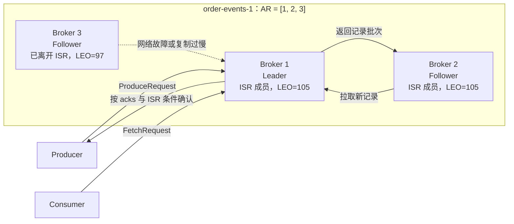

读图时要区分 AR 与 ISR。三个 Broker 都属于 AR，说明它们是该分区配置的副本；Broker 3 因宕机或复制延迟离开 ISR，但不会立即从 AR 中删除。Follower 主动向 Leader 发出 Fetch 请求并追加返回的记录，追上后才可能重新进入 ISR。

Leader 故障时，通常从合格同步副本中选择新 Leader。副本数为 3 只表示配置了 3 份副本，不自动等于“任意两个 Broker 故障后仍可写”；能否写入还取决于存活 ISR、`min.insync.replicas`、Controller 多数派和故障分布。

### 9.2 LEO、High Watermark 与 LSO

| 位置 | 全称 | 作用 |
| --- | --- | --- |
| LEO | Log End Offset，日志末端偏移量 | 每个副本下一条写入位置，副本之间可能暂时不同 |
| HW | High Watermark，高水位 | 普通消费者可见的已提交日志边界 |
| LSO | Last Stable Offset，最后稳定偏移量 | `read_committed` 消费者在存在开放事务时的可见边界 |

Follower 尚未复制的 Leader 尾部记录不能立即作为稳定数据对消费者可见，否则 Leader 故障并截断未复制尾部后，消费者可能已经读到随后消失的记录。HW 随副本确认推进。存在未完成事务时，LSO 可能落后于 HW，`read_committed` 消费者会等事务提交或中止后再越过该位置。

### 9.3 `acks=all` 与 `min.insync.replicas`

常见生产组合是副本系数 3、`min.insync.replicas=2`、生产者 `acks=all`：

| 当前 ISR | 写入结果 | 原因 |
| --- | --- | --- |
| `[1,2,3]` | 成功需当前 ISR 都确认 | `acks=all` 等待完整 ISR |
| `[1,2]` | 两个副本确认后可成功 | ISR 数量仍满足最少同步副本数 2 |
| `[1]` | 生产者收到 `NotEnoughReplicas` 类错误 | 接受单副本写入会低于持久性下限 |

`min.insync.replicas` 只有与 `acks=all` 组合时才能约束生产者成功确认。它提高持久性，但在副本不足时选择拒绝写入，因此牺牲部分可用性。订单支付等难以补偿的数据通常愿意在此时失败并重试；可丢弃的遥测数据可能采用不同取舍。

### 9.4 不完全 Leader 选举

`unclean.leader.election.enable` 允许不在 ISR 中的落后副本作为最后手段成为 Leader。Kafka 4.3.1 默认 `false`。开启后可缩短分区不可用时间，但新 Leader 缺少的尾部记录会丢失；关闭后分区可能等待原同步副本恢复。

这项配置体现网络分区故障下的一致性与可用性取舍：系统无法同时无条件维持最新数据一致性与持续写可用。是否开启应按主题数据价值决定，并通过故障演练确认上层重试和告警行为。

### 9.5 机架感知与故障域

把三个副本放在同一物理主机、机架或可用区，无法抵抗该故障域整体失效。Broker 配置 `broker.rack` 后，副本分配会利用机架信息尽量跨故障域分布；客户端也可利用机架信息选择就近副本读取等能力。

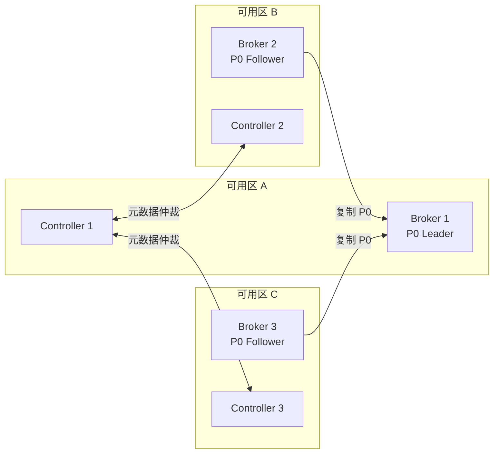

这张部署图把一个分区的三个副本和三个 Controller 分散到三个可用区。任一可用区整体失效后，分区仍有两个副本，Controller 也仍有两个节点形成多数派；能否继续写入还要结合 ISR 和 `min.insync.replicas` 判断。若三个 `broker.rack` 标签都指向同一真实机架，图面上的三副本不会形成这种故障隔离。

```properties
broker.rack=az-a
```

机架感知依赖基础设施提供真实、稳定的标签。把所有节点都误标成同一值，或标签与实际电源/交换机/可用区边界不一致，会让控制面看似有副本分散，实际仍有共同故障点。

### 9.6 Controller 多数派与数据副本是两套可用性条件

数据分区副本保护业务事件；KRaft Controller 仲裁组保护集群元数据。三 Controller 仲裁组需要至少两个 Controller 可通信才能提交元数据变更并稳定选举 active controller。即使某个主题有三个完整数据副本，Controller 多数派长期丢失仍会影响集群控制面和故障恢复。

反过来，Controller 全部健康也不能补回已丢失的数据副本。容量和容灾设计要分别评估数据副本故障域与 Controller 仲裁故障域。

### 9.7 精确一次语义的边界

Kafka 的 exactly-once semantics（精确一次语义）分层成立：

| 范围 | 能力 | 仍需业务处理的部分 |
| --- | --- | --- |
| 单生产者会话写 Kafka | 幂等生产者消除协议重试重复 | 应用重复调用 `send()` 仍是两条业务事件 |
| Kafka 读 → 处理 → Kafka 写 | 事务生产者原子提交输出和输入偏移量 | 下游要用 `read_committed` |
| Kafka Streams 拓扑 | `processing.guarantee=exactly_once_v2` | 外部副作用不自动加入 Kafka 事务 |
| Kafka → 数据库 | 无通用跨系统原子提交 | 幂等键、数据库事务、发件箱/收件箱或连接器能力 |

“消息只传一次”并非适合所有故障模型的描述。更准确的问题是：在哪个边界、以哪个业务标识、哪些状态变更对观察者只产生一次效果。官方交付语义说明见 [Kafka Design: Message Delivery Semantics](https://kafka.apache.org/43/design/design/)。

## 10 理解 KRaft 元数据控制面

### 10.1 KRaft 管理什么

KRaft 把集群元数据保存在 Kafka 自身的复制元数据日志中，Controller 仲裁组复制并提交元数据记录。元数据包括节点注册、主题、分区、副本分配、Leader 变化、配置和安全规则，不包含普通业务主题的消息正文。

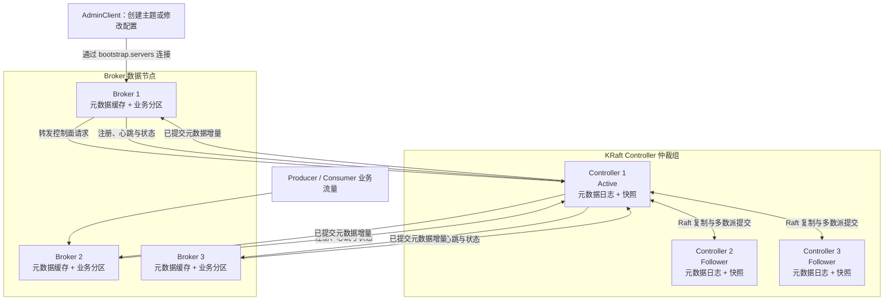

管理请求导致的元数据变化先由 active controller 写入本地元数据日志，再复制到多数 Controller；达到多数派后才成为已提交状态，并传播给 Broker 的元数据缓存。Controller Voter 通过仲裁选出 active controller。元数据日志达到一定规模后生成快照，节点可通过快照加后续日志恢复，而不必从第一条元数据记录重放。

业务事件始终写入 Broker 上的普通主题分区，不进入 Controller 元数据日志。Controller 多数派短暂不可用时，已有数据副本不会凭空消失，但主题创建、Leader 变更和故障恢复等控制面动作会受到影响；这也是生产环境把 Controller 与高负载 Broker 分离的原因之一。

### 10.2 节点角色与生产部署

`process.roles` 决定进程角色：

| 配置 | 职责 | 使用建议 |
| --- | --- | --- |
| `broker` | 保存业务分区、处理生产消费和副本复制 | 生产数据节点 |
| `controller` | 参加元数据仲裁、管理集群控制面 | 生产控制节点 |
| `broker,controller` | 一个进程同时承担两种角色 | 本地开发和小型验证；大规模生产通常分离 |

生产环境常部署 3 个独立 Controller；更高故障容忍可用 5 个，但会增加元数据提交通信开销。偶数个 Controller 不会比少一个的奇数配置多容忍故障，例如 4 节点仍需 3 个多数派，只能容忍 1 个失效。

### 10.3 Kafka 4.3 的动态 Controller 仲裁配置

Kafka 4.1 起支持 KIP-853 动态 Controller 仲裁。动态模式使用 `controller.quorum.bootstrap.servers` 帮助节点发现仲裁组，不应再设置静态的 `controller.quorum.voters`；后者属于旧的静态成员方式，官方已标记为将来移除。

独立 Controller 的关键配置示意：

```properties
process.roles=controller
node.id=100
controller.listener.names=CONTROLLER
listeners=CONTROLLER://controller-1:9093
listener.security.protocol.map=CONTROLLER:SSL
controller.quorum.bootstrap.servers=controller-1:9093,controller-2:9093,controller-3:9093
metadata.log.dir=/var/lib/kafka/metadata
```

独立 Broker 的关键配置示意：

```properties
process.roles=broker
node.id=1
listeners=INTERNAL://:9092
advertised.listeners=INTERNAL://broker-1:9092
listener.security.protocol.map=INTERNAL:SSL,CONTROLLER:SSL
inter.broker.listener.name=INTERNAL
controller.listener.names=CONTROLLER
controller.quorum.bootstrap.servers=controller-1:9093,controller-2:9093,controller-3:9093
log.dirs=/var/lib/kafka/data
```

地址、证书和网络策略需按环境调整。Controller listener 只服务控制面，不应作为普通客户端生产消费入口。

### 10.4 初始化动态仲裁组

官方推荐先用一个 voter 引导，再动态加入其他 Controller：

```bash
CLUSTER_ID="$(bin/kafka-storage.sh random-uuid)"

bin/kafka-storage.sh format \
  --cluster-id "$CLUSTER_ID" \
  --standalone \
  --config config/controller.properties
```

也可一次引导多个 Controller，但每个节点必须使用相同的集群 ID、相同的 `--initial-controllers` 列表，并为各 Controller 准备唯一目录 ID：

```bash
bin/kafka-storage.sh format \
  --cluster-id "$CLUSTER_ID" \
  --initial-controllers \
  "100@controller-1:9093:<DIR_UUID_1>,101@controller-2:9093:<DIR_UUID_2>,102@controller-3:9093:<DIR_UUID_3>" \
  --config config/controller.properties
```

加入已有集群的新 Broker 或 Controller 使用 `--no-initial-controllers` 格式化空目录。格式化只初始化本节点存储，不是日常启动命令。动态和静态仲裁的完整步骤见 [Kafka KRaft Operations](https://kafka.apache.org/43/operations/kraft/)。

### 10.5 观察元数据仲裁健康

```bash
bin/kafka-metadata-quorum.sh \
  --bootstrap-controller controller-1:9093 \
  describe --status

bin/kafka-metadata-quorum.sh \
  --bootstrap-controller controller-1:9093 \
  describe --replication
```

排查重点包括 active controller 是否存在、Leader epoch 是否推进、Follower lag 和最后拉取时间。Controller 磁盘延迟、长时间 GC、网络丢包都可能让 voter 落后或触发选举。

### 10.6 从 ZooKeeper 资料迁移认知

Kafka 4.x 已完全移除 ZooKeeper 模式，因此以下内容属于旧版本历史：

1\. `zookeeper.connect` Broker 配置。
2\. 通过 `/controller` 临时节点选 Controller。
3\. 使用 `--zookeeper` 管理主题和配置。
4\. 把消费者偏移量普遍描述为保存在 ZooKeeper。

很早期消费者曾使用 ZooKeeper 保存进度，现代消费者组把偏移量写入 `__consumer_offsets`。存量 ZooKeeper 集群不能原地直接启动为 Kafka 4.x；应在兼容的 Kafka 3.x 阶段完成 KRaft 迁移和验证，再按官方升级路径进入 4.x。升级前应逐版本阅读 [Kafka 4.3 Upgrade Guide](https://kafka.apache.org/43/getting-started/upgrade/)，特别关注客户端协议、Java、Log4j2 和废弃 API 变化。

## 11 容量规划与性能调优

### 11.1 先定义服务目标

调优前应量化以下目标：

| 维度 | 示例目标 |
| --- | --- |
| 写入吞吐 | 峰值 100 MB/s，20 万条/s |
| 端到端延迟 | P99 小于 500 ms |
| 消费恢复 | 故障后 30 分钟内追平 2 小时积压 |
| 数据保留 | 7 天，可重放 |
| 容错 | 任一 Broker 或单可用区故障不丢已确认订单事件 |
| 消息分布 | 平均 1 KiB，P99 8 KiB，最大 64 KiB |

没有目标时，“增加分区”“增大批次”和“扩 JVM（Java Virtual Machine，Java 虚拟机）堆”无法判断是否改善。Kafka 性能由客户端、网络、Broker、磁盘、副本和消费者共同决定，应先用指标找瓶颈层。

### 11.2 估算存储

粗略物理存储需求：

```text
每日逻辑数据量 = 峰谷修正后的平均写入字节/秒 × 86400
保留逻辑数据量 = 每日逻辑数据量 × 保留天数
物理数据量 ≈ 保留逻辑数据量 × 副本系数 ÷ 压缩比
规划磁盘 = 物理数据量 × 索引与波动系数 × 安全余量
```

例如平均 20 MB/s、保留 7 天、副本系数 3、压缩后为原始 50%，仅消息数据约为：

```text
20 MB/s × 86400 × 7 × 3 × 0.5 ≈ 18.1 TB
```

还要预留日志段、索引、重分配临时副本、流量峰值和磁盘故障恢复空间。磁盘长期接近满载会放大清理、复制和重分配风险，不能把理论容量当安全运行上限。

### 11.3 估算分区数

可从生产和消费两侧估算最低并行度：

```text
生产侧分区需求 = 目标主题写入吞吐 ÷ 单分区实测写入吞吐
消费侧分区需求 = 目标主题处理吞吐 ÷ 单消费者单分区实测处理吞吐
初始分区数 ≥ 两者较大值，并留合理增长余量
```

单分区能力取决于消息大小、`acks`、副本数、压缩、网络和硬件，必须用接近生产的负载测试。分区过少限制并行度；过多会增加文件句柄、内存索引、Leader 选举、元数据、重平衡和副本恢复成本。

增加分区容易，减少分区通常需要新建主题并迁移数据，因此初始值要有增长余量。但一次创建远超需求的分区也会形成长期控制面成本。

### 11.4 生产者调优顺序

1\. 先确认错误率、节流时间、请求延迟和网络是否健康。
2\. 观察平均批次大小和缓冲等待；批次很小可小幅增大 `linger.ms` 或流量聚合。
3\. 选择 `lz4` 或 `zstd` 并用真实数据比较吞吐、CPU 与压缩率。
4\. 保留幂等与 `acks=all` 的可靠性基线，除非业务明确接受更弱保证。
5\. 缓冲区耗尽时先查 Broker 背压和网络，不能只无限增大 `buffer.memory`。
6\. 使用稳定键时检查分区倾斜；热点分区会让其他分区空闲也无济于事。

吞吐提升常来自更充分的批处理和压缩，而非增加业务线程。共享 `KafkaProducer` 能汇聚更多记录；为每个请求创建一个 Producer 会反复建连、丢失批次并增加资源开销。

### 11.5 消费者调优顺序

1\. 比较生产速率、消费速率和每个分区 Lag，区分整体能力不足与单分区热点。
2\. 测量业务处理、反序列化、数据库和外部接口耗时。
3\. 在分区允许的范围内增加消费者实例；消费者数超过分区数不会继续提升普通组并行度。
4\. 调整 `max.poll.records`，让最坏批次处理时间小于 `max.poll.interval.ms`。
5\. 高吞吐批处理可适当增大 `fetch.min.bytes` 和等待时间，低延迟业务保持较小值。
6\. 数据库成为瓶颈时优化批写、索引和连接池；Kafka 参数无法修复下游慢 SQL（Structured Query Language，结构化查询语言）。

### 11.6 Broker、磁盘与操作系统

Broker 更依赖顺序 I/O、页缓存和网络，堆越大并不一定越快。给操作系统保留充足内存供 Page Cache 使用，通常比把全部内存给 JVM 更有价值。数据盘应评估持续写吞吐、尾延迟、故障率和替换速度。

多个 `log.dirs` 会把不同分区放到不同目录，但 Kafka 不会把单个分区条带化跨盘。裸盘、RAID（Redundant Array of Independent Disks，独立磁盘冗余阵列）和云盘各有故障与性能模型，应结合 Kafka 副本、云平台持久性和恢复时间评审。

### 11.7 使用基准工具验证假设

```bash
bin/kafka-producer-perf-test.sh \
  --topic perf-orders \
  --num-records 1000000 \
  --record-size 1024 \
  --throughput -1 \
  --producer-props \
  bootstrap.servers=localhost:9092 \
  acks=all \
  compression.type=zstd

bin/kafka-consumer-perf-test.sh \
  --bootstrap-server localhost:9092 \
  --topic perf-orders \
  --messages 1000000
```

本地单节点结果只能验证参数相对变化，不能代表多 Broker、跨可用区和真实下游处理能力。正式压测应包含副本系数、TLS（Transport Layer Security，传输层安全）、消息分布、键倾斜、故障注入和消费业务逻辑，并监控 P99 而非只看平均吞吐。

## 12 建立安全、监控与故障排查体系

### 12.1 Kafka 安全的四层问题


图以启用 TLS 和认证的生产链路为例，请求按“加密连接、认证身份、授权动作、留下审计证据”的顺序通过 Broker。TLS 解决传输保密和服务端身份验证，SASL 或双向 TLS 形成 Principal，Authorizer 再根据 Principal、资源和操作检查 ACL。某个环节成功不能替代后续环节，例如 TLS 握手成功只说明安全通道建立，不代表该身份有权写入主题。

| 层次 | 要回答的问题 | Kafka 能力 |
| --- | --- | --- |
| 加密 | 数据在网络中是否可被窃听 | SSL（Secure Sockets Layer，安全套接层）/TLS |
| 认证 | 对端是谁 | mTLS（Mutual TLS，双向 TLS）、SASL（Simple Authentication and Security Layer，简单认证与安全层） |
| 授权 | 该身份能对哪些资源做什么 | ACL 或可插拔 Authorizer |
| 审计与秘密管理 | 谁在何时执行了操作，凭据如何轮换 | 审计日志、外部秘密系统、配置提供器 |

SASL 支持 GSSAPI（Generic Security Service Application Program Interface，通用安全服务应用程序接口）/Kerberos、PLAIN、SCRAM（Salted Challenge Response Authentication Mechanism，盐化质询响应认证机制）-SHA-256、SCRAM-SHA-512 和 OAUTHBEARER 等机制。生产环境常用 `SASL_SSL`，让 SASL 完成认证、TLS 完成链路加密。官方能力清单见 [Kafka Security Overview](https://kafka.apache.org/43/security/security-overview/)。

### 12.2 客户端安全配置示意

以下示例展示配置结构，密码应由秘密管理系统注入，不能提交到源码仓库：

```properties
security.protocol=SASL_SSL
sasl.mechanism=SCRAM-SHA-512
sasl.jaas.config=org.apache.kafka.common.security.scram.ScramLoginModule required \
  username="${KAFKA_USERNAME}" \
  password="${KAFKA_PASSWORD}";
ssl.truststore.location=/etc/kafka/client.truststore.p12
ssl.truststore.password=${TRUSTSTORE_PASSWORD}
ssl.truststore.type=PKCS12
ssl.endpoint.identification.algorithm=https
```

关闭主机名校验会削弱对中间人攻击的防护。证书应包含客户端实际连接的 DNS（Domain Name System，域名系统）名称；因证书配置错误而关闭校验，等于把部署问题转化为安全风险。

### 12.3 最小权限 ACL 示例

订单服务生产者通常需要对目标主题 `WRITE`、`DESCRIBE`，库存消费者还需要对主题 `READ`、`DESCRIBE` 和消费者组 `READ`。示例命令的主体名称需替换成实际认证 Principal：

```bash
bin/kafka-acls.sh \
  --bootstrap-server localhost:9092 \
  --add \
  --allow-principal User:order-service \
  --operation WRITE \
  --operation DESCRIBE \
  --topic order-events

bin/kafka-acls.sh \
  --bootstrap-server localhost:9092 \
  --add \
  --allow-principal User:inventory-service \
  --operation READ \
  --operation DESCRIBE \
  --topic order-events \
  --group inventory-service-v1
```

授权失败应从 Broker 审计日志、客户端 Principal、资源名和操作类型四处对照。使用通配符临时放开全部权限虽然能让测试通过，却会掩盖最小权限设计缺口。

### 12.4 监控从结果到原因分层

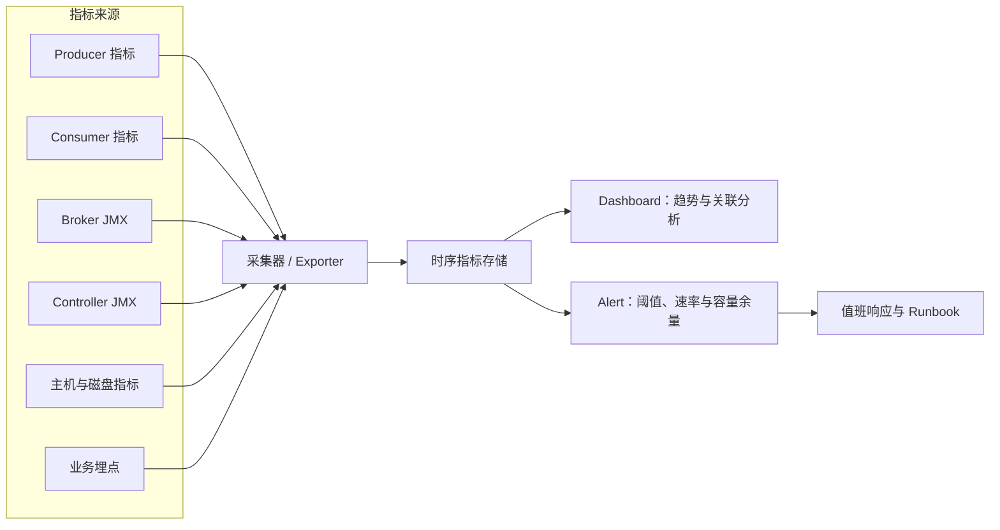

这条链路把业务结果与系统原因放到同一时间轴。先从事件完成延迟、失败率和积压确认用户影响，再沿消费者、生产者、Broker、Controller 和主机指标向下定位。采集器与时序存储也是架构组件，若它们故障，仪表盘中的空白或归零不能当作 Kafka 流量归零。

| 层次 | 关键指标或现象 | 解释 |
| --- | --- | --- |
| 业务 | 事件完成延迟、失败率、DLT 增长 | 用户实际感知结果 |
| 消费者 | 每分区 Lag、消费速率、重平衡次数、提交失败 | 是否追得上以及进度是否稳定 |
| 生产者 | error rate、retry rate、request latency、buffer available、throttle time | 写入失败、背压和限流 |
| Broker | BytesIn/Out、RequestsPerSec、RequestQueueTime、UnderReplicatedPartitions | 请求和副本健康 |
| Controller | active controller、元数据仲裁 lag、选举次数 | 控制面是否稳定 |
| 主机 | CPU、磁盘使用率、I/O 延迟、网络丢包、GC 时间 | 资源根因 |

官方建议监控客户端消息/字节速率、请求速率/大小/时间、消费者最大 Lag 和最小 Fetch 速率，同时观察 CPU、I/O 和 GC，见 [Kafka 4.3 Monitoring](https://kafka.apache.org/43/operations/monitoring/)。

Kafka Broker 和 Java 客户端原生指标通常通过 JMX（Java Management Extensions，Java 管理扩展）暴露，再由监控采集器转换到统一时序系统。采集链路本身也应监控；采集器中断造成的“指标归零”不能被解释为流量真的消失。

单看 `UnderReplicatedPartitions=0` 不能证明集群健康；磁盘已到 90%、生产请求 P99 快速上升但副本尚未掉出 ISR 时，风险已经形成。告警要覆盖趋势和容量余量。

### 12.5 消费积压排查时间线

1\. 用 `kafka-consumer-groups.sh --describe` 定位是所有分区还是少数分区积压。
2\. 比较生产速率与消费速率，确认积压是在增长还是恢复。
3\. 检查组成员数、分区分配和最近重平衡，识别实例掉线或空闲实例。
4\. 检查消费者日志中的反序列化、超时、提交和业务异常。
5\. 测量数据库、缓存、HTTP 下游和线程池队列，找出处理瓶颈。
6\. 若单分区热点，检查键分布；若所有分区均慢，再扩消费者或优化处理。
7\. 评估保留时间是否足够，避免恢复前偏移量对应数据已被删除。

临时增加消费者只在分区有空余并行度且下游能承受额外负载时有效。数据库已经饱和时扩消费者会增加超时和重试，反而扩大积压。

### 12.6 生产请求超时排查时间线

1\. 从发送回调区分可重试错误、鉴权错误、消息过大和最终 `TimeoutException`。
2\. 检查 Producer `record-error-rate`、`record-retry-rate`、请求延迟和缓冲等待。
3\. 查看目标分区 Leader、ISR 与 Broker 请求队列，确认是否为单 Broker 热点。
4\. 检查网络 DNS、连接建立、TLS 握手和丢包。
5\. 检查 Broker 磁盘尾延迟、GC、CPU 与配额节流。
6\. 核对 `delivery.timeout.ms`、`request.timeout.ms` 和 `linger.ms` 的关系。

直接把超时增大只能让应用更久后才报告失败。若根因是 Broker 过载、磁盘抖动或错误的 `advertised.listeners`，延长等待不会恢复吞吐。

### 12.7 频繁重平衡排查时间线

| 现象 | 常见原因 | 验证与修复 |
| --- | --- | --- |
| `max.poll.interval.ms` 超时 | 单批处理过慢、线程阻塞 | 降低 `max.poll.records`、优化下游、设计有界并发 |
| Session timeout | 长 GC、网络中断、容器被暂停 | 查 GC 与网络，合理设置会话参数 |
| 成员反复加入退出 | 实例崩溃、健康检查过激、自动扩缩容抖动 | 查重启次数和编排事件，设置稳定窗口 |
| 主题分区频繁变化 | 管理操作或自动化反复扩分区 | 审计变更，冻结不必要操作 |
| 分配撤销耗时 | 回调中做慢 I/O 或同步提交卡住 | 缩短回调并提前管理状态 |

稳定实例可设置唯一 `group.instance.id` 成为静态成员，减少短暂重启引发的重平衡。但实例 ID 重复会造成 fencing，自动扩缩容环境需要确保每个实例身份稳定且唯一。

### 12.8 分区不可用与副本不足

先执行：

```bash
bin/kafka-topics.sh \
  --bootstrap-server localhost:9092 \
  --describe \
  --topic order-events
```

`Leader: -1` 表示当前无 Leader；`ISR` 少于副本集合说明副本落后或失联。继续检查：

1\. 对应 Broker 是否存活、磁盘是否只读或已满。
2\. Broker 间复制网络是否可达。
3\. Follower Fetch 延迟、磁盘 I/O 和 GC 是否异常。
4\. Controller 仲裁是否有 active leader 和多数派。
5\. `min.insync.replicas` 是否使写入按设计拒绝。

恢复节点优先于开启不完全 Leader 选举。若业务决定接受数据丢失换可用性，变更应有明确主题范围、审批、数据缺口评估和事后对账。

### 12.9 磁盘逼近满载

1\. 找出增长最快的主题和分区，而不是立即全局缩短保留时间。
2\. 检查日志清理器是否运行、活跃段是否因 `segment.ms` 过大迟迟不滚动。
3\. 检查副本重分配、离线副本恢复和临时文件是否额外占空间。
4\. 按数据契约评估临时降低特定主题 `retention.ms`，并确认消费者能在新窗口内追上。
5\. 扩盘或迁移副本时设置节流，避免恢复流量压垮正常生产消费。
6\. 事后修正容量预测和磁盘余量告警。

删除操作系统目录绕过了 Kafka 元数据和副本管理，可能破坏分区。生产数据应通过主题保留、删除、分区重分配和节点下线流程治理。

## 13 认识 Kafka 生态能力与选型边界

### 13.1 Kafka Connect：标准化数据搬运

Kafka Connect 是在 Kafka 与外部系统之间持续导入、导出数据的框架。Source Connector（源连接器）把数据库、文件或 SaaS（Software as a Service，软件即服务）数据写入 Kafka；Sink Connector（汇连接器）把 Kafka 数据写到搜索、对象存储、数仓等系统。

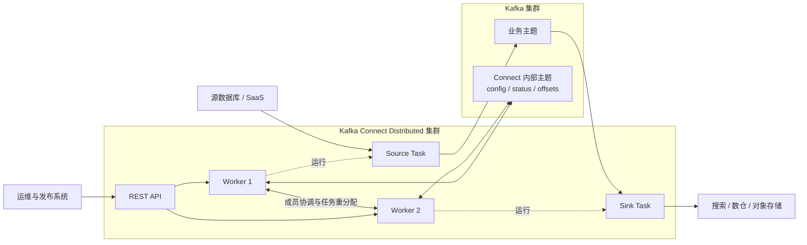

图中 Worker 是可水平扩展的运行进程，Connector 配置描述要连接的系统和任务参数，Task 才是实际执行读取或写入的最小并行单元。Worker 故障后，存活 Worker 通过组协调重新分配 Task；内部主题保存配置、运行状态和源端进度，使新 Worker 能接管，而不是依赖故障节点的本地内存。

Connect 提供 standalone（独立）和 distributed（分布式）运行方式、REST（Representational State Transfer，表述性状态转移）管理接口、任务伸缩和偏移量管理。生产环境通常选择 distributed，使多个 Worker 协调分配 Connector Task，并把配置、状态和偏移量保存到内部主题。

适合 Connect 的判断条件：

1\. 数据移动逻辑主要是系统连接、字段映射和格式转换。
2\. 已有成熟连接器且支持所需的交付语义、Schema、安全和错误处理。
3\. 希望集中管理吞吐、任务状态、重启和偏移量。

复杂业务校验、跨多个服务的领域决策通常更适合业务应用，而非塞入自定义 Single Message Transform（SMT，单消息转换）。采用第三方连接器前应验证版本兼容、许可证、错误容忍、DLT、Schema 演进、再均衡和 exactly-once 支持，不应只验证“能传一条数据”。官方概览见 [Kafka Connect Overview](https://kafka.apache.org/43/kafka-connect/overview/)。

### 13.2 Kafka Streams：把主题变成连续计算拓扑

Kafka Streams 是 Java/Scala 客户端库，不是独立计算集群。应用从 Kafka 主题读取记录，执行过滤、映射、聚合、连接和窗口计算，再写回 Kafka。多个使用相同 `application.id` 的实例会协调为一个分布式流应用。

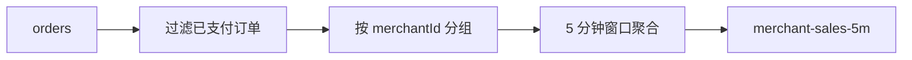

上图是业务处理拓扑；部署后的运行架构还包含实例、任务、本地状态和内部主题：

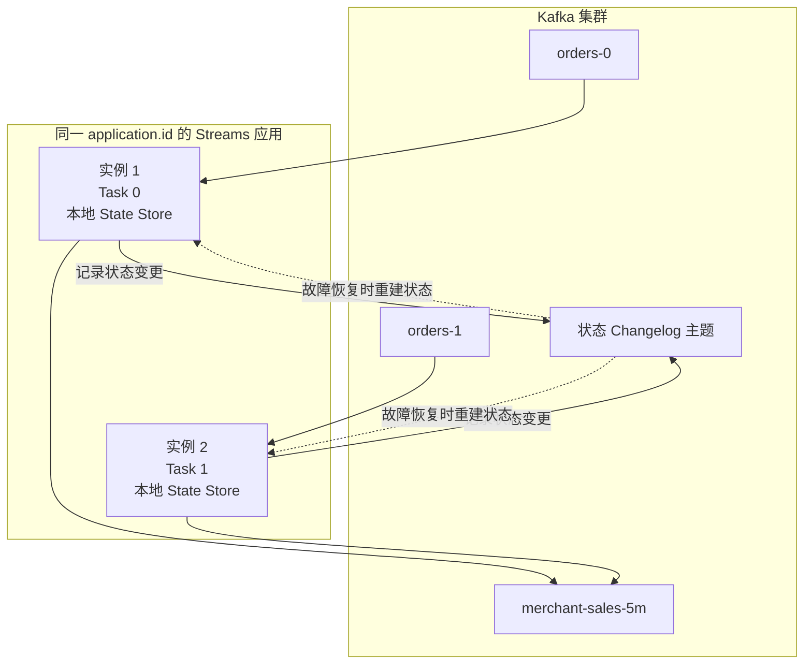

输入分区决定可并行的 Stream Task 数，多个相同 `application.id` 的实例共同承担这些 Task。聚合或连接产生的状态保存在实例本地 State Store，同时写入 Kafka Changelog（变更日志）主题；实例故障后，Task 可迁移到其他实例，并从 Changelog 恢复状态。增加实例超过可分配 Task 数时，同样会出现空闲实例。

加入 Streams 依赖：

```xml
<dependency>
    <groupId>org.apache.kafka</groupId>
    <artifactId>kafka-streams</artifactId>
    <version>4.3.1</version>
</dependency>
```

创建输入输出主题：

```bash
bin/kafka-topics.sh --create \
  --bootstrap-server localhost:9092 \
  --topic text-lines \
  --partitions 3 \
  --replication-factor 1

bin/kafka-topics.sh --create \
  --bootstrap-server localhost:9092 \
  --topic word-counts \
  --partitions 3 \
  --replication-factor 1 \
  --config cleanup.policy=compact
```

最小 WordCount 拓扑：

```java
package com.example.kafka;

import org.apache.kafka.common.serialization.Serdes;
import org.apache.kafka.streams.KafkaStreams;
import org.apache.kafka.streams.StreamsBuilder;
import org.apache.kafka.streams.StreamsConfig;
import org.apache.kafka.streams.kstream.KStream;
import org.apache.kafka.streams.kstream.Materialized;
import org.apache.kafka.streams.kstream.Produced;

import java.util.Arrays;
import java.util.Properties;

public final class WordCountApp {
    public static void main(String[] args) throws InterruptedException {
        Properties props = new Properties();
        props.put(StreamsConfig.APPLICATION_ID_CONFIG, "word-count-v1");
        props.put(StreamsConfig.BOOTSTRAP_SERVERS_CONFIG, "localhost:9092");
        props.put(StreamsConfig.DEFAULT_KEY_SERDE_CLASS_CONFIG,
                Serdes.String().getClass());
        props.put(StreamsConfig.DEFAULT_VALUE_SERDE_CLASS_CONFIG,
                Serdes.String().getClass());

        StreamsBuilder builder = new StreamsBuilder();
        KStream<String, String> lines = builder.stream("text-lines");

        lines.flatMapValues(line ->
                    Arrays.asList(line.toLowerCase().split("\\W+")))
             .filter((ignoredKey, word) -> !word.isBlank())
             .groupBy((ignoredKey, word) -> word)
             .count(Materialized.as("word-count-store"))
             .toStream()
             .to("word-counts", Produced.with(Serdes.String(), Serdes.Long()));

        try (KafkaStreams streams = new KafkaStreams(builder.build(), props)) {
            streams.start();
            Thread.currentThread().join();
        }
    }
}
```

应用启动后，用控制台生产者向 `text-lines` 写入 `hello kafka hello`，再用 `LongDeserializer` 消费 `word-counts`。预期能观察到 `hello` 的计数推进到 2、`kafka` 推进到 1；输出主题采用压缩策略，便于最终按单词保留最新计数。

```bash
bin/kafka-console-producer.sh \
  --bootstrap-server localhost:9092 \
  --topic text-lines
# 输入：hello kafka hello

bin/kafka-console-consumer.sh \
  --bootstrap-server localhost:9092 \
  --topic word-counts \
  --from-beginning \
  --property print.key=true \
  --property key.deserializer=org.apache.kafka.common.serialization.StringDeserializer \
  --property value.deserializer=org.apache.kafka.common.serialization.LongDeserializer
```

KStream 表示每条记录都是独立事件的无界流；KTable 表示按键更新的当前状态视图。聚合和连接需要 state store（状态存储），默认可用本地持久状态并通过 changelog topic（变更日志主题）恢复。涉及重新按键分组时会产生 repartition topic（重分区主题）。

Streams 可靠性重点包括：

| 配置 | 作用 |
| --- | --- |
| `application.id` | 消费组、内部主题和状态目录的命名边界，同一应用实例必须一致 |
| `processing.guarantee=at_least_once` | 默认至少一次处理 |
| `processing.guarantee=exactly_once_v2` | 使用 Kafka 事务提供 Kafka 内部精确一次处理 |
| `num.stream.threads` | 单实例处理线程数，最终并行度仍受输入分区和任务数限制 |
| `num.standby.replicas` | 为状态任务维护备用副本，缩短故障恢复 |
| `state.dir` | 本地状态目录，同一物理目录不能被多个进程共享 |

exactly-once v2 默认需要生产级至少三 Broker 的事务内部主题配置。外部 HTTP 或数据库副作用仍不在 Kafka Streams 事务边界内。完整开发路径见 [Kafka Streams Developer Guide](https://kafka.apache.org/43/streams/developer-guide/)。

### 13.3 KStream、KTable 与窗口的直观区别

输入如下：

```text
T1  user-1  {"status":"NORMAL"}
T2  user-1  {"status":"VIP"}
T3  user-2  {"status":"NORMAL"}
```

作为 KStream 时，三条都是需要处理的独立事件。作为 KTable 更新流时，最终状态是 `user-1=VIP`、`user-2=NORMAL`。这与日志压缩主题的“按键保留最新状态”心智模型相配合，但 KTable 还包含运行时状态、缓存和变更传播语义。

Window（窗口）把无界流切成有限时间范围：

| 窗口 | 特点 | 示例 |
| --- | --- | --- |
| Tumbling Window（滚动窗口） | 固定大小且不重叠 | 每 5 分钟统计订单数 |
| Hopping Window（跳跃窗口） | 固定大小、按步长前进，可重叠 | 每分钟计算最近 5 分钟销售额 |
| Sliding Window（滑动窗口） | 围绕相邻记录时间差形成 | 检测 10 分钟内两次异常登录 |
| Session Window（会话窗口） | 按活动间隔动态合并 | 用户连续操作会话 |

事件时间窗口必须定义 grace period（宽限期）处理迟到数据。宽限期太小会丢弃合理迟到事件，太大会延迟最终结果并增加状态保留；选择应依据真实乱序分布和业务修正能力。

### 13.4 MirrorMaker 2 与跨集群复制

MirrorMaker 2 基于 Kafka Connect，在 Kafka 集群间复制主题、配置和消费者组偏移量，用于跨区域容灾、数据汇聚或迁移。它是异步复制，不等同于跨区域同步共识；目标集群通常存在复制延迟，灾难切换可能有 RPO（Recovery Point Objective，恢复点目标）缺口。

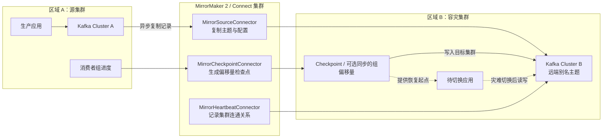

主路径中的记录复制和消费者位置同步是两条不同链路。目标主题已有最新记录，不代表消费者一定能从无重复、无缺口的位置继续；切换时还要把源组位置转换到目标集群可用的位置。图中是 Active-Passive（主备）示例，若两地同时写入，还需额外设计主题来源、冲突处理和循环复制保护。

跨集群方案要明确：

1\. Active-Passive 还是 Active-Active 写入模式。
2\. 主题命名和来源别名，如何避免循环复制。
3\. 消费者组偏移量同步频率和切换时的准确起点。
4\. ACL、Schema、配额和连接器配置是否一并治理。
5\. 故障切换后的回切、数据冲突和重复处理策略。

仅看到目标集群有主题和消息，不代表容灾可用。应定期演练应用改连、偏移量验证、缺口对账和回切。

### 13.5 Share Group：面向逐条任务的共享消费

Kafka 4.2 起，Queues for Kafka（KIP-932）已达到生产可用状态，引入 Share Group（共享组）。普通消费者组把整个分区独占分给一个成员，适合按分区顺序处理事件流；Share Group 允许多个 Share Consumer 协作获取同一分区中的不同记录，提供逐记录确认和投递尝试计数，更接近工作队列。

| 对比 | 普通 Consumer Group | Share Group |
| --- | --- | --- |
| 所有权单位 | 分区 | 可获取的记录 |
| 并行度上限 | 通常受分区数限制 | 可在记录级共享处理 |
| 进度模型 | 提交分区偏移量 | 逐记录接受、释放或拒绝 |
| 顺序 | 适合维持分区内处理顺序 | 并行任务不以分区严格顺序为首要目标 |
| 场景 | CDC、状态流、按键有序业务 | 图片转码、独立任务、可重试工作项 |

Share Group 不应替换所有消费者组。订单状态机依赖同一订单顺序时，普通组加稳定键更合适；每条任务互相独立且需要超过分区数的工作并行度时，Share Group 才体现价值。管理命令示例：

使用前先查看集群 `share.version`。未启用的兼容集群可在完成客户端与回滚评审后升级到版本 1；这是集群 feature version（特性版本）变更，不是单个消费者本地开关：

```bash
bin/kafka-features.sh \
  --bootstrap-server localhost:9092 \
  describe

bin/kafka-features.sh \
  --bootstrap-server localhost:9092 \
  upgrade --feature share.version=1
```

```bash
bin/kafka-share-groups.sh \
  --bootstrap-server localhost:9092 \
  --describe \
  --group image-processing-workers
```

升级说明和功能成熟度见 [Kafka 4.3 Upgrade Guide](https://kafka.apache.org/43/getting-started/upgrade/)。

### 13.6 分层存储

Tiered Storage（分层存储）把已完成日志段从 Broker 本地盘复制到远端存储，本地层服务热数据，远端层保存较冷历史数据。它能降低本地盘压力并让 Broker 替换时少搬运历史段，但会引入远端读延迟、对象存储成本和额外组件运维。

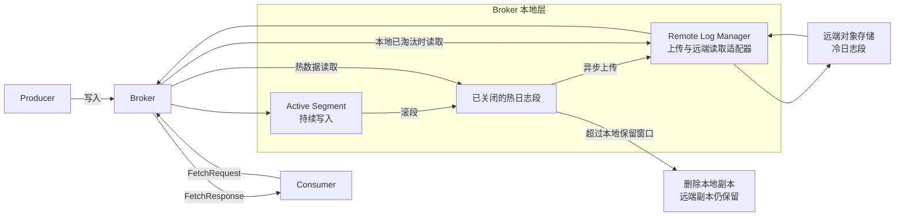

生产写入仍先到分区 Leader 的本地 Active Segment，只有已关闭的段才适合异步上传。消费者始终向 Broker 发 Fetch 请求：热段从本地返回，已被本地淘汰的冷段由 Broker 从远端取回；客户端不直接访问对象存储。远端上传延迟、读取错误和远端存储可用性因此都应纳入监控与容量设计。

Kafka 4.3 中 Broker 默认不启用分层存储，主题也需显式设置 `remote.storage.enable=true`。当前官方限制包括不支持压缩主题等，选型前应核对 [Kafka 4.3 Tiered Storage](https://kafka.apache.org/43/operations/tiered-storage/) 的最新限制，而不是把远端存储当成本地磁盘的透明替代。

## 14 用递归问题检验理解深度

### 14.1 为什么 Kafka 能同时提供高吞吐与可重放

可从四层证据展开：

1\. 存储层使用分区追加日志、日志段和稀疏索引，减少随机更新。
2\. 客户端按分区批处理并压缩，降低请求与协议开销。
3\. 操作系统页缓存和文件到网络传输路径减少不必要拷贝。
4\. 消费位置由消费者组独立保存，读取不会删除消息，因此可重置偏移量重放。

进一步追问通常落到边界：顺序只在分区内；重放受保留策略限制；更高吞吐要付出分区、文件、重平衡和运维成本。

### 14.2 为什么分区既是扩展手段也是成本来源

分区让多个 Leader 分布到不同 Broker，让生产者和消费者并行。另一方面，每个分区有日志段、索引、副本、网络 Fetch 状态和元数据；分区变多会增加故障选主、重分配和重平衡工作量。合理答案应先根据吞吐和消费者并行度估算，再用真实压测和增长余量确定，而不是给出固定“每个主题多少分区”。

### 14.3 为什么 `acks=all` 仍不能单独保证不丢

`acks=all` 等待当前 ISR 确认。如果主题只有一个副本，ISR 也只有 Leader，一份确认后磁盘故障仍可丢失。若 `min.insync.replicas=1`，副本大量掉出 ISR 后仍可能继续单副本写。更完整的持久性组合包括足够副本、跨故障域分布、`min.insync.replicas`、关闭不完全 Leader 选举、生产者处理最终失败以及备份或跨集群策略。

### 14.4 为什么至少一次消费会重复

业务处理和偏移量提交是两个动作。消费者写数据库成功后、提交偏移量前崩溃，重启会从旧位置再次处理。若先提交再处理，则在提交后崩溃会漏处理。这一不可分割窗口推动了幂等键、收件箱表、Kafka 事务和 Connect exactly-once 等方案。

### 14.5 重平衡为什么会影响延迟

分区所有权转移期间，旧成员要撤销、新成员要获得并恢复位置或本地状态。经典 eager 重平衡可能让全组暂停，协作式或新 Consumer 协议可以减少无关分区停顿，但成员不稳定、慢回调和大型状态恢复仍会造成延迟。排查时要把“为何触发”“停了多久”“迁移多少分区”“状态恢复多大”分别量化。

### 14.6 KRaft 替代 ZooKeeper 后改变了什么

Kafka 把元数据存储、复制和 Controller 选举整合进自身控制面，部署不再需要维护独立 ZooKeeper 集群。Controller 仲裁组持续维护内存元数据视图和快照，故障接管不再从 ZooKeeper重新加载全部状态。运维同时新增了元数据仲裁监控、Controller 角色规划、存储格式化和动态仲裁成员管理等职责。

### 14.7 Kafka 的“精确一次”为什么要先说范围

幂等生产者保证单生产会话协议重试不重复；Kafka 事务保证 Kafka 内多个写入和偏移量原子性；Kafka Streams 把这套机制封装进拓扑。外部数据库、邮件和支付接口不自动参与这些事务。面向业务时应描述“eventId 唯一约束下，订单状态只推进一次”之类可验证效果，而非泛化成全链路绝不重复。

### 14.8 为什么消费者多于分区可能空闲

普通消费者组要求一个分区同一时刻只归组内一个消费者，防止多个成员同时推进同一分区位置并破坏顺序。因此 6 个分区最多同时让 6 个普通消费者拥有分区。需要更高并行度时可以增加分区、在消费者内部按安全水位并行，或对独立任务评估 Share Group；每种方案的顺序和进度语义不同。

## 15 项目落地模板与上线检查

### 15.1 主题设计卡片

新主题在创建前填写：

| 项目 | 示例 |
| --- | --- |
| 主题名 | `order-events` |
| 所有者 | Order Domain Team |
| 事件语义 | 订单状态已经发生的事实 |
| Key | `orderId`，保证单订单分区顺序 |
| Value Schema | `OrderEvent` v2，向后兼容 |
| 峰值 | 5 万条/s，平均 1 KiB，P99 8 KiB |
| 分区 | 12，依据消费处理压测并预留增长 |
| 副本与 ISR | RF（Replication Factor，副本系数）=3，`min.insync.replicas=2` |
| 清理 | `delete`，保留 7 天 |
| 最大消息 | 64 KiB，超过则拒绝并告警 |
| 生产主体 | `User:order-service` |
| 消费组 | `inventory-service-v1`、`points-service-v1` |
| 数据等级 | 含用户标识，不含支付凭证 |
| RPO/RTO | RPO 0（已确认事件），RTO（Recovery Time Objective，恢复时间目标）15 分钟 |

卡片中的数字需要由流量、硬件和故障演练支撑。没有消费组清单时容易误删主题或缩短保留窗口；没有键契约时，后续生产者可能使用不同键破坏顺序和压缩语义。

### 15.2 生产者上线检查

1\. 客户端版本与目标 Broker 经过兼容测试。
2\. `bootstrap.servers` 至少包含多个可用入口，且 `advertised.listeners` 对应用网络可达。
3\. 键选择符合顺序和负载分布，已用生产分布检查热点。
4\. Schema 兼容策略已在流水线校验。
5\. 可靠主题使用 `acks=all` 和幂等生产者，未设置冲突参数。
6\. 异步发送回调记录最终失败，包含事件 ID、主题和异常类别。
7\. 关闭流程会 `close()` 或在有界时间内刷新缓冲。
8\. `delivery.timeout.ms` 与业务超时、重试和补偿策略一致。
9\. 压缩算法和批处理参数通过真实消息压测。
10\. 消息大小在生产者、Broker、主题和消费者限制内。
11\. 凭据不在源码和普通日志中，证书轮换经过演练。
12\. 指标、日志、追踪和告警能关联 `client.id` 与业务服务。

### 15.3 消费者上线检查

1\. `group.id` 稳定且表达应用版本边界，不与无关服务共用。
2\. 首次启动的 `auto.offset.reset` 与历史数据策略一致。
3\. 业务处理具有可持久化幂等键，已验证崩溃重放。
4\. 自动提交是否关闭、提交点为何安全已经写入设计说明。
5\. 最坏批次耗时小于 `max.poll.interval.ms`，已做慢下游测试。
6\. 反序列化错误、业务永久错误和瞬时错误走不同路径。
7\. DLT 有所有者、告警、修复和受控重放工具。
8\. 并发处理按分区维护连续完成水位，不会跨越未完成记录提交。
9\. 重平衡监听器不会执行无界耗时操作。
10\. Lag 同时有数量、时间和增长速率告警。
11\. 关闭时使用 `wakeup()` 终止轮询，并在时限内完成必要提交。
12\. 已演练扩缩容、进程崩溃、网络中断和数据库超时。

### 15.4 集群上线检查

1\. 生产 Broker 与 Controller 角色按规模分离，Controller 使用奇数仲裁组。
2\. Broker、Controller 和客户端链路启用合适的 TLS、认证与最小权限。
3\. 副本跨真实机架或可用区分布，`broker.rack` 标签已核对。
4\. 可靠主题 RF、`min.insync.replicas` 和生产者 `acks` 形成一致组合。
5\. 自动创建主题关闭，主题由声明式流程管理。
6\. 数据盘容量、保留、压缩、重分配临时空间和增长预测已评审。
7\. 内部主题副本数满足生产容错，事务和 Connect 内部主题单独检查。
8\. Controller 仲裁、ISR、请求延迟、磁盘、GC 和消费者 Lag 均有监控。
9\. 配额防止单个客户端耗尽集群，但阈值与峰值容量匹配。
10\. Broker 下线、分区重分配和 Controller 成员变更有 Runbook（运行手册）。
11\. 跨集群容灾已做真实切换与回切演练，而非只检查复制流量。
12\. 升级流程包括协议兼容、滚动顺序、feature version 和回滚边界。

### 15.5 事务性发件箱落地路径

订单数据库与 Kafka 事件的一致发布可采用。图中的 API 是 Application Programming Interface（应用程序编程接口）：

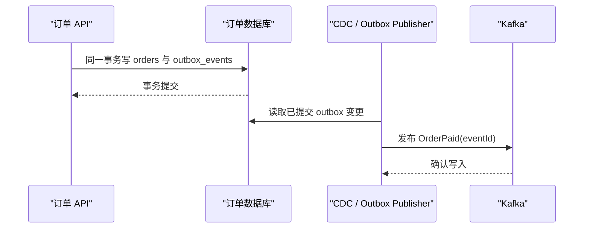

落地要点：

1\. `orders` 与 `outbox_events` 在同一数据库本地事务提交。
2\. outbox 包含稳定 `eventId`、聚合键、类型、Schema 版本和发生时间。
3\. 发布器可能重复发布，消费者仍以 `eventId` 幂等。
4\. 监控最老未发布 outbox 年龄，而不只监控表行数。
5\. 清理 outbox 前确认事件已发布并保留足够审计窗口。

该模式消除“数据库已提交、Kafka 未发送”与“Kafka 已发送、数据库回滚”的双写裂缝。它不消除重复，因为 CDC 或发布器在确认边界仍可能重试。

### 15.6 故障演练矩阵

| 注入故障 | 预期系统行为 | 验证证据 |
| --- | --- | --- |
| 关闭一个 Broker | Leader 转移，可靠主题继续读写或短暂重试 | 生产错误率、ISR 恢复、无业务缺口 |
| 关闭一个 Controller | 仲裁仍有多数派，重新选 active controller | 元数据仲裁状态和选举时间 |
| 生产者到 Broker 网络中断 | 进入有界重试，最终成功或明确失败 | callback、retry rate、`delivery.timeout.ms` |
| 消费者处理后提交前崩溃 | 记录重放但业务状态不重复推进 | eventId 唯一约束和处理审计 |
| 数据库延迟升高 | 消费速率下降、Lag 告警，不触发无限线程增长 | 工作池队列、Lag、数据库 P99 |
| 单条非法消息 | 进入 DLT 或暂停分区，不拖垮全组 | DLT 元数据和告警 |
| 磁盘超过告警线 | 提前扩容或降低特定主题保留，不到满盘 | 容量趋势和清理速率 |
| 扩消费者实例 | 分区再分配后吞吐提升，重平衡在目标时限内完成 | 组成员、分配、消费速率 |

## 16 官方资料入口与复习自测

### 16.1 官方资料导航

| 目的 | 官方入口 |
| --- | --- |
| 了解平台定义和 API | [Apache Kafka Introduction](https://kafka.apache.org/documentation/) |
| 完成安装、生产和消费 | [Kafka Quickstart](https://kafka.apache.org/quickstart/) |
| 核对 Kafka 4.3 文档总览 | [Kafka 4.3 Documentation](https://kafka.apache.org/43/) |
| 核对 Java 与协议兼容性 | [Kafka 4.3 Compatibility](https://kafka.apache.org/43/getting-started/compatibility/) |
| 查询 Broker 配置 | [Kafka 4.3 Broker Configs](https://kafka.apache.org/43/configuration/broker-configs/) |
| 查询主题配置 | [Kafka 4.3 Topic Configs](https://kafka.apache.org/43/configuration/topic-configs/) |
| 查询生产者配置 | [Kafka 4.3 Producer Configs](https://kafka.apache.org/43/configuration/producer-configs/) |
| 查询消费者配置 | [Kafka 4.3 Consumer Configs](https://kafka.apache.org/43/configuration/consumer-configs/) |
| 理解存储、复制和交付语义 | [Kafka Design](https://kafka.apache.org/43/design/design/) |
| 管理 KRaft 仲裁 | [Kafka KRaft Operations](https://kafka.apache.org/43/operations/kraft/) |
| 执行主题、组和副本操作 | [Basic Kafka Operations](https://kafka.apache.org/43/operations/basic-kafka-operations/) |
| 建立监控指标 | [Kafka Monitoring](https://kafka.apache.org/43/operations/monitoring/) |
| 配置认证、加密与授权 | [Kafka Security Overview](https://kafka.apache.org/43/security/security-overview/) |
| 使用数据连接器 | [Kafka Connect Overview](https://kafka.apache.org/43/kafka-connect/overview/) |
| 开发流处理应用 | [Kafka Streams Developer Guide](https://kafka.apache.org/43/streams/developer-guide/) |
| 规划版本升级 | [Kafka 4.3 Upgrade Guide](https://kafka.apache.org/43/getting-started/upgrade/) |

查默认值时优先打开与实际部署版本完全对应的 versioned documentation（版本化文档）。搜索引擎可能返回 Kafka 0.8、2.x 或 3.x 页面；页面中的 `--zookeeper`、旧类名和旧默认值不能直接用于 4.x。

### 16.2 基础闭环自测

1\. 能否在空环境中启动 Kafka 4.3.1，并说明为什么需要先格式化 KRaft 存储？
2\. 能否创建 3 分区主题，写入三条带订单键的事件，并打印键、分区和偏移量？
3\. 能否解释为什么同一订单通常有序，而不同订单之间没有全局顺序？
4\. 能否用消费者组命令判断积压，并说明 `CURRENT-OFFSET` 代表下一条位置？
5\. 消费者使用已有组且已有有效偏移量时，为什么 `--from-beginning` 不会强制重放？

### 16.3 Java 接入自测

1\. `KafkaProducer.send()` 返回时，记录是否已经由 Broker 持久化？如何获得可观察确认？
2\. 为什么在线服务更适合异步回调，而教学示例可以用 `Future.get()`？
3\. `KafkaProducer` 与 `KafkaConsumer` 的线程安全边界分别是什么？
4\. 为什么手动提交要提交最后成功 offset 加 1？
5\. 业务成功后、提交前崩溃会发生什么？数据库如何用 `eventId` 防止重复效果？
6\. 序列化格式新增、删除和改类型时，如何验证旧消费者兼容？

### 16.4 原理与生产自测

1\. 解释 Topic、Partition、Replica、Segment、Offset、Consumer Group 的职责和生命周期。
2\. 对 RF=3、`min.insync.replicas=2`、`acks=all`，分别推演 3、2、1 个 ISR 时的写入结果。
3\. 日志保留设置为 1 天后，为什么磁盘不一定在第 24 小时整立即下降？
4\. Compaction 为什么仍可能暂时保留同键的多个版本？Tombstone 为什么需要保留窗口？
5\. Consumer Position、Committed Offset、Log End Offset、HW 和 LSO 有什么区别？
6\. 为什么扩大消费者数量可能不提升吞吐？如何判断是分区上限还是下游瓶颈？
7\. KRaft Controller 仲裁与业务分区副本分别保护什么？
8\. Kafka 事务可以原子覆盖哪些资源，为什么不能自动覆盖普通关系数据库？
9\. 如何从指标区分生产者背压、Broker 磁盘慢、热点分区和消费者业务处理慢？
10\. 给一个主题缩短保留时间、重置偏移量或开启不完全 Leader 选举前，需要哪些验证与回滚证据？

### 16.5 建议的实践项目

实现一个“订单事件驱动库存”练习，以以下结果作为完成标准：

1\. 订单服务使用事务性发件箱保存 `OrderPaid`，由发布器写入 `order-events`。
2\. 事件键为 `orderId`，值包含全局唯一 `eventId` 和 Schema 版本。
3\. 库存消费者关闭自动提交，数据库用 `eventId` 唯一约束实现幂等。
4\. 瞬时数据库错误有限重试，永久格式错误写入带原位置元数据的 DLT。
5\. 暴露生产失败率、消费速率、每分区 Lag、DLT 数量和最老 outbox 年龄。
6\. 自动化测试覆盖重复事件、消费者崩溃、Broker 短暂不可用、非法消息和重放。
7\. 故障演练后能用命令、指标和数据库记录证明没有未解释的数据缺口。

完成这个项目后，读者已经走通 Kafka 的核心闭环：可靠发布、分区存储、并行消费、幂等处理、进度提交、故障恢复和可观测验证。后续学习可以根据工作方向选择 Kafka Connect 插件开发、Kafka Streams 状态与窗口、跨集群复制、分层存储或 Broker 源码。
