# Apache ZooKeeper 学习笔记

> 面向 Java 学习者。示例以 Apache ZooKeeper 3.9.5、Apache Curator 5.9.0 和 Java 17 为基线。Apache 官方发布页目前将 3.9.5 标为 current release（当前发布版），将 3.8.6 标为 latest stable release（最新稳定版）。生产选型应结合依赖兼容性、组织升级策略和压测结果，不应仅依据版本号新旧。

## 1 从一个重复执行的定时任务开始

### 1.1 业务问题

假设订单系统部署了三个 Java 实例，每个实例都包含一个每分钟执行的“关闭超时订单”任务。三个实例同时启动后，同一批订单可能被重复扫描、重复发送消息，甚至发生重复退款。单机里的 `synchronized` 或 `ReentrantLock` 只能协调同一个 Java 虚拟机（Java Virtual Machine，JVM）中的线程，无法让三台机器共享锁状态。

此时需要一块所有实例都能访问、具备一致顺序和故障感知能力的协调空间。每个实例可以在这块空间中登记“我还活着”、争抢“谁来执行任务”，并在状态变化时收到通知。Apache ZooKeeper 就是为这类分布式协调问题设计的服务。

ZooKeeper 适合保存体积小、读多写少、需要严格控制顺序的协调元数据，例如服务实例、主节点身份、配置版本、锁排队节点。它不适合作为订单库、文件系统、消息队列或大对象存储；官方文档说明单个 znode（ZooKeeper 数据节点）的数据默认受到约 1 MiB 的安全限制，生产中的节点数据通常应远小于这个上限。

### 1.2 输入、动作与输出

最小场景可以概括为三步：

1\. 输入：三个 Java 实例都连接到同一个 ZooKeeper 集群，并在 `/jobs/close-timeout-orders` 下创建临时顺序节点。
2\. 动作：ZooKeeper 为每个节点附加递增序号；序号最小的实例获得执行资格，其余实例只监听各自前一个节点。
3\. 输出：获得资格的实例宕机或会话过期后，它创建的临时节点自动删除，下一个实例收到事件并接替任务。

这套机制同时利用了顺序节点、临时节点、会话和 Watcher（监听器）。第 2 章先通过命令行看到节点创建与变化，第 3 章再回看这些术语的准确含义。

### 1.3 分阶段学习路线

| 阶段 | 阅读范围 | 学习目标 | 成功判据 |
| --- | --- | --- | --- |
| 基础闭环 | 第 1～3 章 | 启动单节点服务，操作 znode，理解会话和监听 | 能创建、读取、修改、监听、删除一个节点，并解释结果 |
| Java 接入 | 第 4～6 章 | 使用原生客户端和 Curator 完成可靠连接与读写 | 能运行示例，能区分连接断开与会话过期 |
| 原理与模式 | 第 7～8 章 | 理解集群写入、法定人数、一致性和分布式锁 | 能画出写请求链路，能说明锁失效后的业务风险 |
| 生产治理 | 第 9～10 章 | 部署、鉴权、监控、容量规划和故障排查 | 能完成三节点配置评审并按现象找到排查入口 |
| 复习与落地 | 第 11～12 章 | 形成设计判断、面试表达和项目检查表 | 能根据业务约束判断是否应该使用 ZooKeeper |

第一次阅读可先完成第 1～6 章。第 7 章开始涉及分布式一致性、持久化和故障恢复，前置条件是已经理解 znode、版本号、会话和 Watcher。

## 2 完成第一个可观察的 ZooKeeper 闭环

### 2.1 准备版本与运行环境

ZooKeeper 服务端使用 Java 编写。下面以 Java 17 和 ZooKeeper 3.9.5 二进制包演示。学习环境可以在 macOS 或 Linux 上运行单节点；Apache 官方将 macOS 定位为开发环境，生产部署通常使用经过验证的 GNU/Linux 环境和多节点 ensemble（集群）。

> ensemble = 整体，集体，集群

先确认 Java：

```bash
java -version
```

再从 [Apache ZooKeeper Releases](https://zookeeper.apache.org/releases/) 下载 `apache-zookeeper-3.9.5-bin.tar.gz`。下载页同时提供 PGP（Pretty Good Privacy）签名和 SHA-512（Secure Hash Algorithm 512-bit，安全散列算法）校验值。正式环境获取安装包时应校验文件完整性与签名。

```bash
tar -xzf apache-zookeeper-3.9.5-bin.tar.gz
cd apache-zookeeper-3.9.5-bin
cp conf/zoo_sample.cfg conf/zoo.cfg
```

示例配置的关键内容类似：

```properties
tickTime=2000
dataDir=/tmp/zookeeper
clientPort=2181
```

`clientPort=2181` 是客户端连接端口。`dataDir` 保存内存数据树的快照和事务日志；学习环境使用临时目录便于清理，生产环境应使用独立、持久、容量受监控的目录。

### 2.2 启动单节点并确认服务状态

前台启动便于直接观察日志：

```bash
bin/zkServer.sh start-foreground
```

另开一个终端连接：

```bash
bin/zkCli.sh -server 127.0.0.1:2181
```

出现 `WATCHER::`、`SyncConnected` 和命令提示符，说明客户端会话已经建立。再执行一次实际读取：

```text
ls /
```

能够读到根节点的子节点列表是更可靠的成功判据；新服务通常能看到系统节点 `zookeeper`。仅看到 Java 进程存在，无法证明客户端端口和请求处理链路正常。

如果连接失败，第一步依次检查：

1\. 服务端终端是否有端口占用、目录无权限或 Java 版本错误。
2\. `lsof -nP -iTCP:2181 -sTCP:LISTEN` 是否能看到监听进程。
3\. 客户端连接地址是否写成了实际监听地址和端口。
4\. `conf/zoo.cfg` 是否是启动脚本实际加载的配置文件。

### 2.3 创建、读取、修改和删除节点

在 `zkCli.sh` 中执行：

```text
# 创建/training节点，值为hello-zookeeper
create /training "hello-zookeeper"

# -s同时显示节点的状态元数据
get -s /training

set /training "hello-java"

get -s /training

delete /training
```

预期先看到 `Created /training`，随后读取到字符串及一组 `Stat` 元数据。第一次创建时 `version` 通常为 `0`；成功执行一次 `set` 后，`version` 变为 `1`。`delete` 成功后执行 `get /training` 会得到 `Node does not exist`。

这里的输入是绝对路径 `/training` 和一段字节数据，动作由 ZooKeeper 原子执行，输出包括数据本身、版本号和操作结果。原子执行表示一次写入要么整体生效，要么失败，不会留下半段新数据。

### 2.4 观察一次性监听事件

打开两个客户端终端。客户端 A 执行：

```text
create /app-config "timeout=3000"
get -w /app-config
```

客户端 B 执行：

```text
set /app-config "timeout=5000"
```

客户端 A 会收到 `NodeDataChanged` 事件。客户端 B 再修改一次时，A 不会再次收到同一个标准 Watcher 的通知，因为标准 Watcher 是一次性触发器。A 需要重新执行 `get -w /app-config` 才能监听下一次变化。

继续观察子节点变化：

```text
ls -w /services
```

如果 `/services` 还不存在，先执行 `create /services`。另一个客户端执行 `create /services/order-1 "10.0.0.8:8080"` 后，监听方收到 `NodeChildrenChanged`。子节点监听告诉客户端“子节点集合可能变化”，事件本身不携带完整的新列表；收到事件后应重新读取并重新注册监听。

### 2.5 单节点拓扑的边界

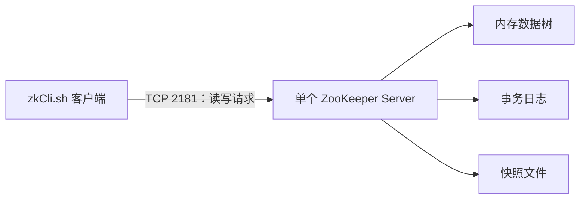

图中的客户端通过 2181 端口访问单个服务进程。服务端主要从内存数据树响应读取，把写操作记录到事务日志，并周期性生成快照。这个拓扑能验证 API（Application Programming Interface，应用程序编程接口）和数据模型，但没有 Leader（领导者）、Follower（跟随者）、法定人数或节点故障接管，因此不能证明生产高可用能力。

### 2.6 基础闭环验收

完成本章后，应能独立回答并验证以下内容：

1\. ZooKeeper 解决的是分布式协调元数据问题，订单等大规模业务数据应存放在专用数据库。
2\. znode 同时可以有数据和子节点；路径使用以 `/` 开头的绝对路径。
3\. `set` 会推进数据版本，标准 Watcher 触发一次后需要重新注册。
4\. 服务成功的判据包含连接成功和实际读写成功，单节点成功不代表高可用。

## 3 从命令结果理解核心数据模型

### 3.1 层次命名空间与 znode

ZooKeeper 的数据组织方式类似目录树，但 znode 既能保存数据，也能拥有子节点。以下结构可以同时表达应用、环境和资源类型：

```text
/
└── order-system
    ├── config
    │   └── payment-timeout
    ├── services
    │   ├── instance-0000000001
    │   └── instance-0000000002
    └── locks
        └── reconcile-job
```

服务器主机、ZooKeeper 服务进程和 znode 都可能被口头称为“节点”。讨论设计时应明确使用“服务器成员”“客户端实例”或“znode”，避免把机器故障和数据节点删除混为一谈。

路径设计承担隔离职责。常见结构为 `/{应用}/{环境}/{资源类型}/{资源标识}`，例如 `/order-system/prod/services/instance-0000000001`。连接串还支持 chroot（change root，改变根目录）后缀，例如 `zk1:2181,zk2:2181/order-system/prod`；此客户端访问 `/services` 时，服务端实际访问 `/order-system/prod/services`。chroot 能减少代码中的路径前缀，但目标根路径需要预先存在。

> zk1:2181,zk2:2181/order-system/prod 的意思是
>
> 集群地址：zk1:2181,zk2:2181
> chroot： /order-system/prod
>
> 客户端建立连接后，会把 `/order-system/prod` 当成自己看到的根节点 `/`

### 3.2 节点数据与 Stat 元数据

`get -s` 返回的 `Stat` 描述节点状态。Java 程序进行并发控制和排错时最常使用以下字段：

| 字段 | 含义 | 常见用途 | 助记 |
| --- | --- | --- | --- |
| `czxid` | 创建该节点的事务标识 | 追踪创建顺序 | `c = create`：创建节点时的 zxid |
| `mzxid` | 最后修改数据的事务标识 | 判断最近一次数据变化 | `m = modify`：最后修改数据的 zxid |
| `pzxid` | 最后修改子节点集合的事务标识 | 判断目录成员变化 | `p = parent`：把当前节点看作父节点，记它的子节点变化 |
| `ctime` / `mtime` | 创建与最后修改时间 | 审计和排错 | `c = create`，`m = modify`，`time = 时间` |
| `version` | 数据版本，每次 `setData` 成功后递增 | 乐观锁、条件更新 | 无前缀的 `version`：当前节点自身数据的版本 |
| `cversion` | 子节点集合版本 | 判断成员列表是否变化 | `c = children`：子节点列表的版本 |
| `aversion` | ACL 版本 | 判断权限是否变化 | `a = ACL`：访问控制列表的版本 |
| `ephemeralOwner` | 临时节点所属会话标识；持久节点为 0 | 识别临时节点及其所有者 | `ephemeral = 临时`，`owner = 所有者` |
| `dataLength` | 数据字节数 | 发现异常大节点 | `data + length`：节点数据长度 |
| `numChildren` | 直接子节点数量 | 容量和结构检查 | `num = number`，`children = 子节点` |

`version` 使 ZooKeeper 能完成 CAS（Compare-And-Set，比较并设置）。客户端先读到版本 7，提交更新时要求“仅当当前版本仍是 7 才写入”。若另一客户端已经把版本推进到 8，本次更新以 `BadVersion` 失败，调用方需要重新读取并依据最新状态决定是否重试。

传入 `-1` 可以忽略版本检查，但会放弃并发冲突检测。配置发布、配额扣减等依赖状态前提的场景应携带明确版本；清理明确可覆盖的测试数据时才可考虑 `-1`。

### 3.3 节点类型与生命周期

| 类型 | Java `CreateMode` | 生命周期 | 典型用途 |
| --- | --- | --- | --- |
| 持久节点 | `PERSISTENT` | 显式删除前一直存在 | 配置目录、资源根路径 |
| 持久顺序节点 | `PERSISTENT_SEQUENTIAL` | 显式删除前一直存在，名称附加序号 | 持久任务排队、顺序记录 |
| 临时节点 | `EPHEMERAL` | 创建它的会话结束后自动删除 | 服务实例、在线成员 |
| 临时顺序节点 | `EPHEMERAL_SEQUENTIAL` | 会话结束后删除，名称附加序号 | 分布式锁、选主 |
| 容器节点 | `CONTAINER` | 最后一个子节点删除后，服务端可择机删除容器 | 锁、选主等动态父路径 |
| TTL 节点 | 对应带 TTL 的创建模式 | 超过 TTL、未修改且没有子节点时成为删除候选 | 有明确过期语义的协调数据 |

临时节点不能拥有子节点，因为其生命周期绑定客户端会话；允许它拥有后代会使父节点自动删除时产生含糊的级联语义。顺序号由父节点维护，格式通常为十位、前导零补齐的数字，便于按节点名排序。计数器基于有符号 32 位整数，极端长期高频创建会发生溢出，因此解析顺序号时不应永久假定它总为非负十进制数。

容器节点和 TTL（Time To Live，生存时间）节点都使用“成为删除候选”的表述，删除不保证在到期瞬间同步发生。TTL 节点服务端默认关闭，需要显式启用；不能把它当作毫秒级精确定时器。

### 3.4 会话连接了客户端身份与临时状态

会话是 ZooKeeper 为客户端维护的逻辑身份，由会话标识、会话密码、协商后的超时时间、临时节点和 Watcher 等状态共同组成。TCP（Transmission Control Protocol，传输控制协议）连接只是承载会话的一条网络连接。连接断开后，客户端库会尝试连接连接串中的其他服务器，并在超时前继续使用原会话。

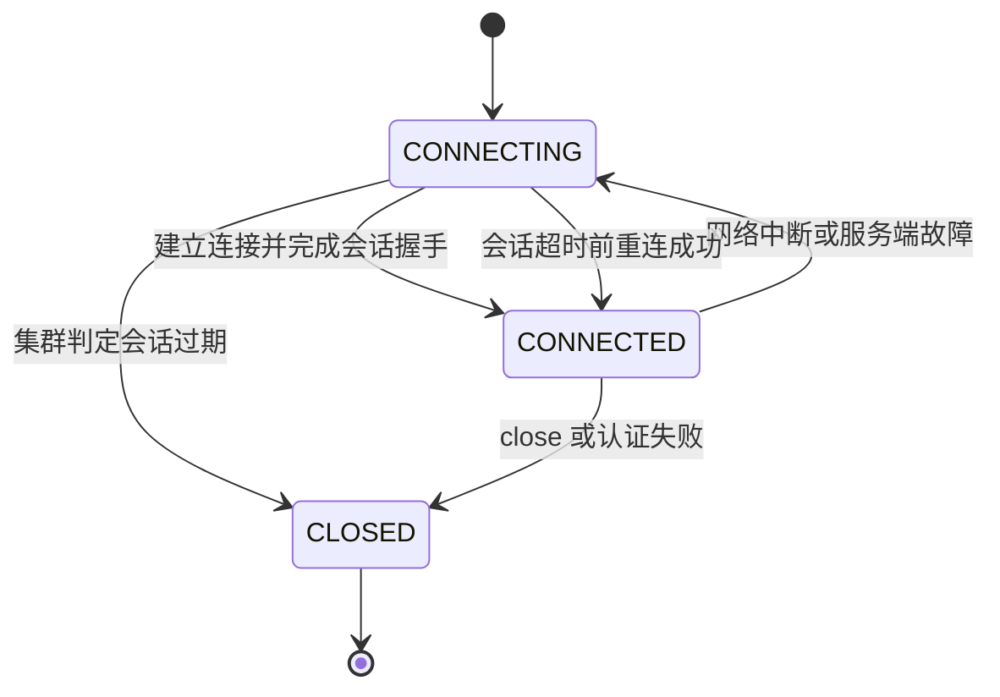

图中 `CONNECTING` 既可能出现在首次连接，也可能出现在故障切换期间。短暂 `Disconnected` 不会立即删除临时节点；集群在协商后的会话超时时间内没有收到心跳，才判定会话过期并删除该会话的临时节点。客户端随后重连时会收到 `Expired`，旧会话不能复活，应用需要创建新客户端并重建临时注册、锁或选主参与节点。

服务端会把客户端请求的超时时间限制在配置允许范围内。默认规则下，最小值约为 `2 × tickTime`，最大值约为 `20 × tickTime`，客户端应通过 `getSessionTimeout()` 读取最终协商值。超时过小会把网络抖动、Full GC（Full Garbage Collection，完整垃圾回收）或宿主机暂停误判成会话失效；超时过大会延长真实宕机后的接管时间。

### 3.5 Watcher 是状态失效通知

标准 Watcher 的语义可以拆成三部分：

1\. 一次触发：事件送达后注册即被消费，继续关注需要重新读取并注册。
2\. 异步通知：事件告诉客户端“你关注的状态可能已变化”，业务数据仍要通过读取获得。
3\. 有序分发：同一客户端看到的 Watcher、异步响应和更新保持 ZooKeeper 规定的顺序。

| 读取入口 | 关注对象 | 可能触发的典型事件 |
| --- | --- | --- |
| `exists(path, watcher)` | 节点是否存在及数据状态 | 创建、删除、数据变化 |
| `getData(path, watcher, stat)` | 当前节点数据 | 数据变化、删除 |
| `getChildren(path, watcher)` | 直接子节点集合 | 子节点创建或删除、当前节点删除 |

标准监听存在一个重新注册窗口：收到事件后到再次完成读取注册之间，节点可能连续变化多次。正确消费模型是“事件触发重新读取，再用当前完整状态收敛”，而不是把每个事件当成不可丢失的业务消息。客户端断开期间也收不到 Watcher；对一个尚不存在节点的 `exists` 监听，如果该节点在断线期间创建后又删除，事件可能被错过。

ZooKeeper 3.6.0 起支持 persistent watch（持久监听）和 persistent recursive watch（持久递归监听），它们触发后不会自动移除。持久监听减少重复注册窗口，但仍应把业务状态建立在读取结果上，并评估大范围递归监听给服务端内存、网络和客户端处理线程带来的负载。

### 3.6 ACL 同时定义身份范围与权限

ACL（Access Control List，访问控制列表）附着在单个 znode 上，由身份方案、身份表达式和权限组成。ZooKeeper 常见权限缩写为 CRWDA：

| 权限 | 含义 |
| --- | --- |
| `CREATE` | 在该节点下创建直接子节点 |
| `READ` | 读取节点数据和子节点列表 |
| `WRITE` | 修改该节点数据 |
| `DELETE` | 删除该节点的直接子节点 |
| `ADMIN` | 读取或修改该节点 ACL |

`DELETE` 检查的是父节点权限，这一点容易误判。删除 `/apps/order/instance-1` 时，调用方需要 `/apps/order` 上的 `DELETE` 权限。ACL 也不会自动继承到子节点；父节点受限并不代表已经存在的子节点自动受同样限制，建树时需要逐个设置预期 ACL。

常见身份方案包括 `world`、`auth`、`digest`、`ip`（Internet Protocol，互联网协议地址）、SASL（Simple Authentication and Security Layer，简单认证与安全层）和 `x509`。`ZooDefs.Ids.OPEN_ACL_UNSAFE` 允许任何客户端执行全部操作，名称中的 `UNSAFE` 已指出其风险，适合隔离的学习环境，不适合暴露在共享网络中的生产数据。

### 3.7 ZooKeeper 适用与不适用的边界

ZooKeeper 通常适合：

1\. 服务注册与存活成员管理，需要临时节点表达会话生命周期。
2\. 主节点选举、分布式锁、屏障和队列等协调原语。
3\. 小体积配置元数据和版本通知，读取方在本地缓存完整配置。
4\. 需要全局写顺序、条件更新和故障感知的控制面状态。

以下场景通常应选择专门系统：

1\. 大对象、海量业务记录、复杂查询和二级索引应使用数据库或对象存储。
2\. 高吞吐事件流、消费位点和消息重放应使用消息系统。
3\. 需要每个变化都可靠投递给每个消费者时，应使用持久事件日志；Watcher 是状态通知机制。
4\. 只有单体应用内部互斥时，JVM 锁更低成本。
5\. 业务临界区无法处理锁持有者失联后仍继续写入的情况时，仅有分布式锁不够，还需要 fencing token（栅栏令牌）或下游条件写入。

## 4 常用命令与安全更新方式

### 4.1 命令速查

| 任务 | 命令 | 验证重点 |
| --- | --- | --- |
| 查看子节点 | `ls /path` | 返回直接子节点名，不含后代 |
| 查看数据 | `get /path` | 返回完整字节数据的文本表现 |
| 查看数据与元信息 | `get -s /path` | 关注 `version`、`mzxid`、长度 |
| 判断存在 | `stat /path` | 存在时返回 Stat，不返回数据 |
| 创建节点 | `create /path data` | 默认持久节点 |
| 创建临时节点 | `create -e /path data` | 当前会话结束后删除 |
| 创建顺序节点 | `create -s /queue/task- data` | 实际路径会附加序号 |
| 条件修改 | `set -v version /path data` | 版本不匹配时失败 |
| 条件删除 | `delete -v version /path` | 节点须无子节点且版本匹配 |
| 递归删除 | `deleteall /path` | 影响整棵子树，执行前确认路径 |
| 查看 ACL | `getAcl /path` | 核对身份方案与 CRWDA 权限 |
| 设置 ACL | `setAcl /path scheme:id:perms` | ACL 不递归传播 |
| 四字母命令 | 通过 AdminServer 或白名单端口执行 | 生产中限制暴露范围 |

CLI（Command-Line Interface，命令行界面）的具体参数可以在交互环境执行 `help` 核对。版本升级后应以目标版本自带 CLI 帮助和 [ZooKeeper CLI 官方文档](https://zookeeper.apache.org/doc/current/zookeeperCLI.html) 为准。

### 4.2 使用版本号完成乐观并发控制

假设两个配置发布者都读到 `/order-system/config/payment-timeout` 的值为 `3000`、版本为 `5`。发布者 A 将它更新为 `5000`，版本变为 `6`；发布者 B 仍携带版本 `5` 更新为 `8000`，ZooKeeper 返回 `BadVersion`。B 此时应重新读取版本 6，确认业务意图是否仍成立，而不是直接用 `-1` 覆盖 A。

```text
get -s /order-system/config/payment-timeout
set -v 5 /order-system/config/payment-timeout "5000"
```

版本控制解决“基于旧状态写入”的冲突，不自动合并两份配置。合并策略属于业务层，应在 JSON（JavaScript Object Notation，JavaScript 对象表示法）字段级合并、配置审批或重新发布流程中定义。

### 4.3 使用 multi 提交原子操作组

ZooKeeper 的 `multi` 可以把多个检查、创建、修改和删除作为一个事务提交。全部操作成功才整体生效，任一操作失败则全部不生效。例如“确认库存版本为 12、扣减库存、创建操作记录”需要共同成功，避免只扣库存却没有记录。

原子性不等于客户端一定知道结果。提交期间出现 `ConnectionLoss` 时，服务器可能已经提交，但成功响应没有到达客户端；也可能根本没有提交。调用方需要以业务操作标识设计幂等结果节点，重连后查询该标识，再决定是否重试。

### 4.4 递归删除和开放 ACL 的风险边界

`deleteall`、忽略版本的删除和 `OPEN_ACL_UNSAFE` 都能降低学习操作成本，也会绕过重要保护。共享环境执行递归删除前应检查实际 chroot、完整路径、子节点数量和备份；生产权限遵循最小授权，将配置发布者、普通读取者和运维管理员区分为不同身份。

## 5 使用原生 Java 客户端完成读写

### 5.1 建立最小 Maven 工程

原生客户端能直接暴露 ZooKeeper 的会话、Watcher、版本和异常语义，适合学习底层模型。Maven 依赖如下：

```xml
<properties>
    <maven.compiler.release>17</maven.compiler.release>
    <maven.compiler.plugin.version>3.13.0</maven.compiler.plugin.version>
    <zookeeper.version>3.9.5</zookeeper.version>
</properties>

<dependencies>
    <dependency>
        <groupId>org.apache.zookeeper</groupId>
        <artifactId>zookeeper</artifactId>
        <version>${zookeeper.version}</version>
    </dependency>
    <dependency>
        <groupId>org.slf4j</groupId>
        <artifactId>slf4j-simple</artifactId>
        <version>2.0.13</version>
        <scope>runtime</scope>
    </dependency>
</dependencies>

<build>
    <plugins>
        <plugin>
            <groupId>org.apache.maven.plugins</groupId>
            <artifactId>maven-compiler-plugin</artifactId>
            <version>${maven.compiler.plugin.version}</version>
            <configuration>
                <release>${maven.compiler.release}</release>
            </configuration>
        </plugin>
    </plugins>
</build>
```

示例固定版本用于保证学习结果可复现。ZooKeeper 3.9.5 的发布 POM 管理 SLF4J（Simple Logging Facade for Java，Java 简单日志门面）2.0.13，故独立示例使用同版本系列的简单日志实现；接入已有 Spring Boot 项目时应使用项目统一的日志实现，并先检查依赖管理结果，避免同时引入多个 ZooKeeper、Netty 或 SLF4J 版本。

```bash
mvn dependency:tree | rg 'zookeeper|curator|netty|slf4j'
```

### 5.2 构造函数返回不代表已经连接

`new ZooKeeper(connectString, sessionTimeout, watcher)` 会启动后台连接流程，然后较早返回客户端对象。此时状态通常还是 `CONNECTING`，立即读写可能遇到连接相关异常。最小示例使用 `CountDownLatch` 等待第一次 `SyncConnected`：

```java
package com.example.zookeeper;

import java.nio.charset.StandardCharsets;
import java.time.Duration;
import java.util.concurrent.CountDownLatch;
import java.util.concurrent.TimeUnit;
import org.apache.zookeeper.CreateMode;
import org.apache.zookeeper.KeeperException;
import org.apache.zookeeper.WatchedEvent;
import org.apache.zookeeper.Watcher;
import org.apache.zookeeper.ZooDefs;
import org.apache.zookeeper.ZooKeeper;
import org.apache.zookeeper.data.Stat;

public final class NativeZooKeeperDemo implements AutoCloseable {
    private final CountDownLatch connected = new CountDownLatch(1);
    private final ZooKeeper zooKeeper;

    public NativeZooKeeperDemo(String connectString, Duration sessionTimeout) throws Exception {
        this.zooKeeper = new ZooKeeper(
                connectString,
                Math.toIntExact(sessionTimeout.toMillis()),
                this::processSessionEvent
        );

        if (!connected.await(10, TimeUnit.SECONDS)) {
            zooKeeper.close();
            throw new IllegalStateException("10 秒内未连接到 ZooKeeper");
        }
    }

    private void processSessionEvent(WatchedEvent event) {
        if (event.getType() != Watcher.Event.EventType.None) {
            return;
        }

        switch (event.getState()) {
            case SyncConnected -> connected.countDown();
            case Disconnected -> System.out.println("连接中断，暂停依赖协调状态的业务动作");
            case Expired -> System.out.println("会话已过期，需要创建新客户端并重建临时状态");
            case AuthFailed -> System.out.println("认证失败，不应无界重试");
            default -> System.out.println("会话状态：" + event.getState());
        }
    }

    public void createIfAbsent(String path, String value) throws Exception {
        try {
            zooKeeper.create(
                    path,
                    value.getBytes(StandardCharsets.UTF_8),
                    ZooDefs.Ids.OPEN_ACL_UNSAFE,
                    CreateMode.PERSISTENT
            );
        } catch (KeeperException.NodeExistsException ignored) {
            // “已存在”是本方法定义的幂等成功状态。
        }
    }

    public String get(String path) throws Exception {
        byte[] data = zooKeeper.getData(path, false, null);
        return new String(data, StandardCharsets.UTF_8);
    }

    public Stat updateWithVersion(String path, String value, int expectedVersion)
            throws Exception {
        return zooKeeper.setData(
                path,
                value.getBytes(StandardCharsets.UTF_8),
                expectedVersion
        );
    }

    public ZooKeeper client() {
        return zooKeeper;
    }

    @Override
    public void close() throws InterruptedException {
        zooKeeper.close();
    }

    public static void main(String[] args) throws Exception {
        try (NativeZooKeeperDemo demo = new NativeZooKeeperDemo(
                "127.0.0.1:2181",
                Duration.ofSeconds(15))) {
            demo.createIfAbsent("/java-training", "version-1");

            Stat before = new Stat();
            byte[] data = demo.client().getData("/java-training", false, before);
            System.out.printf("data=%s, version=%d%n",
                    new String(data, StandardCharsets.UTF_8), before.getVersion());

            Stat after = demo.updateWithVersion(
                    "/java-training", "version-2", before.getVersion());
            System.out.println("newVersion=" + after.getVersion());
        }
    }
}
```

预期输出包含：

```text
data=version-1, version=0
newVersion=1
```

若节点此前已被修改，初始版本可能不是 0，但第二行应比第一行大 1。`createIfAbsent` 通过捕获 `NodeExistsException` 消除“先 `exists` 再 `create`”之间的竞态窗口。示例为便于学习使用开放 ACL；生产代码应在认证后传入最小权限 ACL。

### 5.3 原生 API 的行为卡片

| API | 用途与返回值 | 关键边界 |
| --- | --- | --- |
| `exists` | 返回 `Stat`；不存在时返回 `null` | 可监听节点创建、删除和数据变化 |
| `getData` | 返回完整字节数组，可填充 `Stat` | 同步调用会阻塞；数据需自行序列化 |
| `getChildren` | 返回直接子节点名称列表 | 列表顺序不应直接当业务顺序，顺序节点需按名称排序 |
| `create` | 返回实际创建路径 | 顺序模式返回带序号的完整路径 |
| `setData` | 返回更新后的 `Stat` | 版本不匹配抛 `BadVersionException` |
| `delete` | 成功无返回值 | 节点有子节点时抛 `NotEmptyException` |
| `multi` | 返回每个子操作结果 | 全部生效或全部失败；连接丢失时仍可能结果未知 |
| `sync` | 在当前客户端会话中建立同步屏障，完成后再发起读取 | 不读取或修改节点；`path` 不限定同步范围；不能等同于严格线性一致读 |

普通读通常由客户端当前连接的服务器直接使用本地数据树响应。若客户端连接的是复制进度稍慢的 Follower，`getData()` 可能读到旧值。`sync(path)` 会把一个同步请求送入“客户端 → 当前服务器 → Leader”的处理链路；同步请求完成后，同一客户端再发出的读取不会越过这道屏障，可以把它记成“先推进当前服务器的处理进度，再读取”。

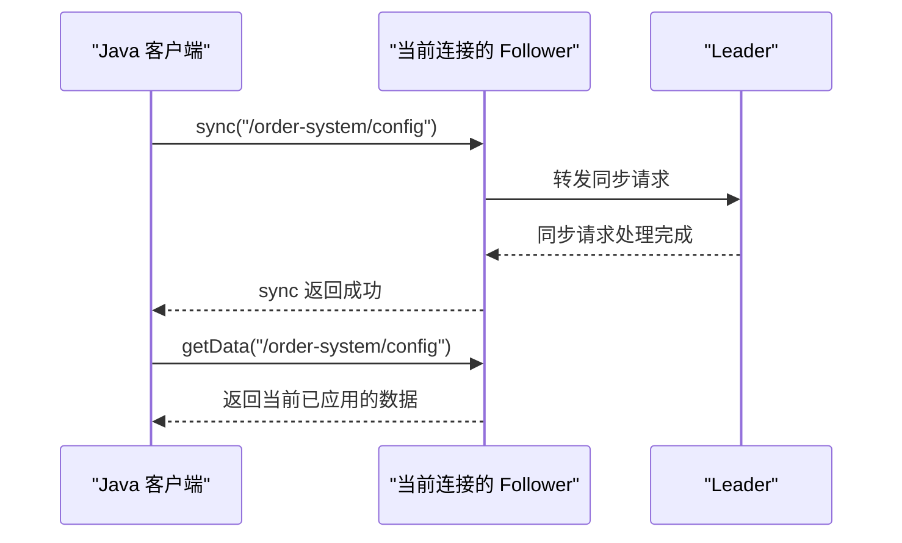

图中的 `path` 是同步请求携带并在响应中返回的路径参数，不表示只同步这个 znode 或它的子树。ZooKeeper 的复制顺序不是按路径分别维护的；`sync` 本身也不会读取数据、修改数据或注册 Watcher。同步版本可以直接在它返回后读取：

```java
String path = "/order-system/config/payment-timeout";

zooKeeper.sync(path);
byte[] data = zooKeeper.getData(path, false, null);
```

异步版本调用后会立即返回，因此读取动作要放在成功回调之后，或通过其他同步机制等待回调完成：

```java
String path = "/order-system/config/payment-timeout";

// 传入 AsyncCallback.VoidCallback，调用的是异步 sync 重载。
zooKeeper.sync(path, (rc, syncedPath, ctx) -> {
    if (rc != KeeperException.Code.OK.intValue()) {
        System.err.println("sync 失败，错误码：" + rc);
        return;
    }

    zooKeeper.getData(syncedPath, false, (readRc, readPath, readCtx, data, stat) -> {
        if (readRc == KeeperException.Code.OK.intValue()) {
            System.out.println(new String(data, StandardCharsets.UTF_8));
        } else {
            System.err.println("读取失败，错误码：" + readRc);
        }
    }, null);
}, null);
```

不能只凭“参数中出现了函数”判断调用是否异步：这里的 `AsyncCallback.VoidCallback` 是操作完成回调，所以 `sync(path, callback, context)` 是异步 API；而 `getData(path, watcher, stat)` 中的 `Watcher` 只是注册监听，该方法仍会同步返回数据。判断时应查看方法重载的参数类型和返回方式。

同一个 `ZooKeeper` 实例会按实际入队顺序发送请求，但异步 `sync()` 的方法返回只表示“请求已经提交”，不表示“同步已经成功”。把读取放进成功回调，可以同时明确先后关系和失败处理；多个业务线程共享客户端时，还应由业务代码统一编排调用顺序，不能依赖线程启动顺序猜测哪个请求先入队。

还要区分“缩小陈旧读取窗口”和“严格线性一致读”：当前官方一致性文档指出，`sync` 不是 quorum operation（法定人数操作），极端条件下其后的读取理论上仍可能陈旧。要求严格线性一致性的设计不能只依赖 `sync + getData`；更完整的保证边界见 7.7 节，也可对照 [ZooKeeper Java API](https://zookeeper.apache.org/doc/current/apidocs/zookeeper-server/org/apache/zookeeper/ZooKeeper.html) 和 [ZooKeeper Internals](https://zookeeper.apache.org/doc/current/zookeeperInternals.html)。

`ZooKeeper` 客户端对象可被多线程共享，内部维护发送线程和事件线程。同步 API 会阻塞调用线程；异步 API 通过回调返回结果。Watcher 和异步回调由客户端事件线程按序分发，回调中执行慢数据库访问、长时间计算或同步等待，会阻塞后续事件与回调。通常应快速解析事件并把业务工作提交到受监控的线程池。

### 5.4 正确地重新读取并注册 Watcher

下面的配置监听器把事件当作“本地缓存可能失效”的信号。Watcher 回调只提交任务，读取和配置解析在独立线程执行：

```java
package com.example.zookeeper;

import java.nio.charset.StandardCharsets;
import java.util.concurrent.ExecutorService;
import java.util.concurrent.Executors;
import org.apache.zookeeper.KeeperException;
import org.apache.zookeeper.WatchedEvent;
import org.apache.zookeeper.ZooKeeper;
import org.apache.zookeeper.data.Stat;

public final class ConfigWatcher implements AutoCloseable {
    private static final String PATH = "/order-system/config/payment-timeout";

    private final ZooKeeper zooKeeper;
    private final ExecutorService refreshExecutor = Executors.newSingleThreadExecutor();

    public ConfigWatcher(ZooKeeper zooKeeper) {
        this.zooKeeper = zooKeeper;
    }

    public void start() {
        refreshExecutor.execute(this::refreshSafely);
    }

    private void onEvent(WatchedEvent event) {
        refreshExecutor.execute(this::refreshSafely);
    }

    private void refreshSafely() {
        try {
            // this::onEvent 是 Watcher，不是异步完成回调；getData 仍是同步读取。
            byte[] data = zooKeeper.getData(PATH, this::onEvent, null);
            int timeoutMs = Integer.parseInt(new String(data, StandardCharsets.UTF_8));
            applyTimeout(timeoutMs);
        } catch (KeeperException.NoNodeException e) {
            try {
                Stat stat = zooKeeper.exists(PATH, this::onEvent);
                if (stat != null) {
                    refreshExecutor.execute(this::refreshSafely);
                }
            } catch (Exception watchFailure) {
                scheduleRetry(watchFailure);
            }
        } catch (Exception refreshFailure) {
            scheduleRetry(refreshFailure);
        }
    }

    private void applyTimeout(int timeoutMs) {
        if (timeoutMs < 100 || timeoutMs > 60_000) {
            throw new IllegalArgumentException("payment-timeout 超出允许范围");
        }
        System.out.println("应用新配置：" + timeoutMs);
    }

    private void scheduleRetry(Exception failure) {
        System.err.println("刷新失败，应使用有界退避策略重试：" + failure.getMessage());
    }

    @Override
    public void close() {
        refreshExecutor.shutdownNow();
    }
}
```

这段代码展示了三个必要状态：节点存在时读取数据并注册数据监听；节点不存在时通过 `exists` 监听创建；读取后验证业务范围再更新本地配置。为了集中说明 Watcher，它没有实现完整的定时退避、关闭竞态和会话过期重建。生产项目通常使用 Curator Cache 管理这些细节，见 6.5 节。

### 5.5 使用版本和 multi 保护复合更新

Java 中的原子操作组可以写成：

```java
import java.nio.charset.StandardCharsets;
import java.util.List;
import org.apache.zookeeper.CreateMode;
import org.apache.zookeeper.Op;
import org.apache.zookeeper.ZooDefs;

List<Op> operations = List.of(
        Op.check("/inventory/sku-1001", expectedVersion),
        Op.setData(
                "/inventory/sku-1001",
                "stock=9".getBytes(StandardCharsets.UTF_8),
                expectedVersion),
        Op.create(
                "/inventory/operations/order-9001",
                "decrease=1".getBytes(StandardCharsets.UTF_8),
                ZooDefs.Ids.OPEN_ACL_UNSAFE,
                CreateMode.PERSISTENT)
);

zooKeeper.multi(operations);
```

`Op.check` 确认库存版本仍是调用方读取的版本，`setData` 修改库存，`create` 写入幂等操作记录。任何一个路径、版本或权限检查失败，三个动作都不生效。示例只用于解释 ZooKeeper 事务；真实高频库存应放在业务数据库中，由数据库事务和唯一约束处理。

### 5.6 异常分类与重试判断

| 异常 | 含义 | 典型处理 |
| --- | --- | --- |
| `NodeExistsException` | 创建目标已经存在 | 若业务定义为幂等，核对已有内容后视为成功 |
| `NoNodeException` | 目标或父路径不存在 | 区分并发删除、路径拼错和初始化未完成 |
| `BadVersionException` | 条件版本不匹配 | 重新读取并重新做业务判断 |
| `NoAuthException` | 当前身份权限不足 | 核对认证、ACL 和实际 chroot，不做无界重试 |
| `ConnectionLossException` | 请求响应链路中断 | 结果可能未知，查询幂等标识后决定重试 |
| `OperationTimeoutException` | 操作未在客户端时限内完成 | 检查服务端延迟、网络和超时预算 |
| `SessionExpiredException` | 旧会话已失效 | 创建新客户端，重建临时节点和协调原语 |

重试策略取决于操作语义。纯读取通常可以有界重试；带唯一业务标识的幂等创建可先查询再重试；非幂等复合写入需要结果记录或业务补偿。固定间隔、无限次数的重试会在集群故障时形成重试风暴，应使用指数退避、抖动、总时限和熔断。

## 6 使用 Apache Curator 构建 Java 生产客户端

> Curator = 馆长

### 6.1 Curator 解决的客户端工程问题

Apache Curator 是 ZooKeeper 的 Java/JVM 高层客户端库。它封装连接管理、重试、命名空间、缓存和常用分布式协调 recipes（配方）。原生 API 适合掌握语义；业务项目通常优先使用 Curator 已验证的实现，减少在断线、会话过期、Watcher 重注册和锁排队协议中重复造轮子。

这里的 recipe 不是 ZooKeeper 服务端新增的数据类型或功能，而是客户端基于 ZooKeeper 基础原语实现的一套可复用协调协议。可以把三者的关系记成“ZooKeeper 提供积木，Curator 按经过验证的步骤组装，业务代码直接使用成品”：临时节点表达会话生命周期，顺序节点提供排队次序，Watcher 提供状态变化通知，版本号和 `multi` 提供条件更新与原子操作。

| ZooKeeper 基础原语的组合 | Curator recipe | 对业务提供的能力 |
| --- | --- | --- |
| 临时顺序节点、排序和前驱 Watcher | `InterProcessMutex` | 跨 JVM（Java Virtual Machine，Java 虚拟机）的可重入互斥锁 |
| 锁式排队协议和领导权回调 | `LeaderSelector` | 在多个进程中选出一个 Leader（领导者） |
| Watcher、重新读取和本地状态镜像 | `CuratorCache` | 缓存节点或子树，并在数据变化时通知应用 |
| 节点数据、版本号和重试 | `SharedCount` | 多个进程共享一个低频更新的整数计数器 |

使用 recipe 能避免业务重复实现容易出错的协调协议，但它不会替业务决定故障语义。应用仍需处理 `SUSPENDED`（连接暂时中断）、`LOST`（会话已丢失）、操作结果未知、幂等以及 fencing token（栅栏令牌）等问题；6.3 节、6.5 节和第 8 章会分别展开连接状态、缓存与具体协调 recipe。

Curator 5.9.0 是 Apache 官方当前发布版。常用 Maven 依赖为：

```xml
<properties>
    <maven.compiler.release>17</maven.compiler.release>
    <maven.compiler.plugin.version>3.13.0</maven.compiler.plugin.version>
    <maven.surefire.plugin.version>3.5.2</maven.surefire.plugin.version>
    <curator.version>5.9.0</curator.version>
    <zookeeper.version>3.9.5</zookeeper.version>
    <junit.version>5.11.4</junit.version>
    <slf4j.version>2.0.13</slf4j.version>
</properties>

<dependencyManagement>
    <dependencies>
        <dependency>
            <groupId>org.junit</groupId>
            <artifactId>junit-bom</artifactId>
            <version>${junit.version}</version>
            <type>pom</type>
            <scope>import</scope>
        </dependency>
    </dependencies>
</dependencyManagement>

<dependencies>
    <dependency>
        <groupId>org.apache.zookeeper</groupId>
        <artifactId>zookeeper</artifactId>
        <version>${zookeeper.version}</version>
    </dependency>
    <dependency>
        <groupId>org.slf4j</groupId>
        <artifactId>slf4j-simple</artifactId>
        <version>${slf4j.version}</version>
        <scope>runtime</scope>
    </dependency>
    <dependency>
        <groupId>org.apache.curator</groupId>
        <artifactId>curator-framework</artifactId>
        <version>${curator.version}</version>
    </dependency>
    <dependency>
        <groupId>org.apache.curator</groupId>
        <artifactId>curator-recipes</artifactId>
        <version>${curator.version}</version>
    </dependency>
    <dependency>
        <groupId>org.apache.curator</groupId>
        <artifactId>curator-test</artifactId>
        <version>${curator.version}</version>
        <scope>test</scope>
    </dependency>
    <dependency>
        <groupId>org.junit.jupiter</groupId>
        <artifactId>junit-jupiter</artifactId>
        <scope>test</scope>
    </dependency>
</dependencies>

<build>
    <plugins>
        <plugin>
            <groupId>org.apache.maven.plugins</groupId>
            <artifactId>maven-compiler-plugin</artifactId>
            <version>${maven.compiler.plugin.version}</version>
            <configuration>
                <release>${maven.compiler.release}</release>
            </configuration>
        </plugin>
        <plugin>
            <groupId>org.apache.maven.plugins</groupId>
            <artifactId>maven-surefire-plugin</artifactId>
            <version>${maven.surefire.plugin.version}</version>
        </plugin>
    </plugins>
</build>
```

Curator 5.9.0 发布的 POM（Project Object Model，项目对象模型）默认使用 ZooKeeper 3.9.3。Apache 官方安全页把 3.9.0～3.9.4 列为 CVE（Common Vulnerabilities and Exposures，通用漏洞披露）编号 2026-24281 和 2026-24308 的受影响版本，并建议升级到 3.9.5；所以上述片段显式声明 ZooKeeper 3.9.5，使 Maven 的直接依赖覆盖旧传递依赖。接入现有项目后仍要执行 `mvn dependency:tree`，确认最终制品中只有经过批准的 ZooKeeper 版本。

`curator-test` 还会传递它构建时采用的 JUnit API 版本。若项目只给 `junit-jupiter` 聚合依赖指定新版本，Maven 可能同时选入旧 API 与新引擎，最终出现测试发现失败。上面的 JUnit BOM 统一所有 JUnit 模块版本，避免这种“能编译但不能运行测试”的冲突；两个构建插件则让不继承 Spring Boot 等父 POM 的裸 Maven 工程也明确使用 Java 17 和 JUnit 5。

### 6.2 创建一个进程级共享客户端

同一个应用进程连接同一个 ZooKeeper 集群时，通常共享一个 `CuratorFramework`。为每次请求创建客户端会增加会话创建、TCP 连接、线程和服务端连接数成本，也会让临时节点的所有权难以管理。

```java
package com.example.zookeeper;

import java.util.concurrent.TimeUnit;
import org.apache.curator.RetryPolicy;
import org.apache.curator.framework.CuratorFramework;
import org.apache.curator.framework.CuratorFrameworkFactory;
import org.apache.curator.framework.state.ConnectionState;
import org.apache.curator.retry.ExponentialBackoffRetry;

public final class CuratorFactory {
    private CuratorFactory() {
    }

    public static CuratorFramework connect(String connectString) throws Exception {
        return connect(connectString, "order-system/prod", 15_000, 5_000);
    }

    public static CuratorFramework connect(
            String connectString,
            String namespace,
            int sessionTimeoutMs,
            int connectionTimeoutMs) throws Exception {
        RetryPolicy retryPolicy = new ExponentialBackoffRetry(1_000, 3);

        CuratorFramework client = CuratorFrameworkFactory.builder()
                .connectString(connectString)
                .namespace(namespace)
                .sessionTimeoutMs(sessionTimeoutMs)
                .connectionTimeoutMs(connectionTimeoutMs)
                .retryPolicy(retryPolicy)
                .build();

        client.getConnectionStateListenable().addListener((ignored, state) -> {
            if (state == ConnectionState.SUSPENDED) {
                stopCoordinationDependentWork("连接暂停，锁和领导权暂时不可信");
            } else if (state == ConnectionState.LOST) {
                stopCoordinationDependentWork("会话视为丢失，临时状态和锁已经失效");
            }
        });

        client.start();
        if (!client.blockUntilConnected(10, TimeUnit.SECONDS)) {
            client.close();
            throw new IllegalStateException("10 秒内未连接到 ZooKeeper");
        }
        return client;
    }

    private static void stopCoordinationDependentWork(String reason) {
        System.err.println(reason);
    }
}
```

`namespace` 的作用类似 chroot：代码中的 `/config` 实际映射到 `/order-system/prod/config`。连接串 chroot 与 Curator namespace 选择一种路径前缀机制即可，二者同时配置会发生重复嵌套。不同应用或环境应使用独立命名空间和 ACL。`ExponentialBackoffRetry(1000, 3)` 以 1 秒为基础退避并限制重试次数；参数仍需结合调用超时预算、集群故障恢复时间和上游重试共同评审。

### 6.3 区分 SUSPENDED、LOST 和 RECONNECTED

Curator 对连接状态提供更适合业务处理的抽象：

| 状态 | 含义 | 业务动作 |
| --- | --- | --- |
| `CONNECTED` | 第一次成功建立连接 | 完成初始化，开始注册和读取 |
| `SUSPENDED` | 当前连接中断，会话是否过期尚不确定 | 暂停依赖锁、领导权或成员身份的外部副作用 |
| `RECONNECTED` | 中断后重新连接 | 重新读取状态，确认 recipe 是否恢复，再恢复业务 |
| `LOST` | Curator 认为会话已经丢失 | 旧锁、领导权和临时节点均按失效处理 |
| `READ_ONLY` | 连接到只读模式服务器 | 只允许可接受陈旧状态的读取，不执行协调写入 |

收到 `SUSPENDED` 时，本进程无法确定集群是否已让其他实例接管。继续执行退款、调度或写主库可能与新持有者并发。更安全的默认策略是暂停外部副作用；收到 `LOST` 后，即使之后出现 `RECONNECTED`，也要把旧锁和旧领导权视为失效并重新竞争。

### 6.4 使用 Fluent API 完成 CRUD（Create、Read、Update、Delete，创建、读取、更新、删除）

```java
import java.nio.charset.StandardCharsets;
import org.apache.curator.framework.CuratorFramework;
import org.apache.zookeeper.CreateMode;
import org.apache.zookeeper.data.Stat;

CuratorFramework client = CuratorFactory.connect(
        "zk1.example:2181,zk2.example:2181,zk3.example:2181");

String actualPath = client.create()
        .creatingParentsIfNeeded()
        .withMode(CreateMode.PERSISTENT)
        .forPath("/config/payment-timeout", "3000".getBytes(StandardCharsets.UTF_8));

Stat stat = new Stat();
byte[] value = client.getData()
        .storingStatIn(stat)
        .forPath("/config/payment-timeout");

Stat updated = client.setData()
        .withVersion(stat.getVersion())
        .forPath("/config/payment-timeout", "5000".getBytes(StandardCharsets.UTF_8));

System.out.printf("path=%s, value=%s, newVersion=%d%n",
        actualPath,
        new String(value, StandardCharsets.UTF_8),
        updated.getVersion());
```

`creatingParentsIfNeeded()` 会创建缺失父路径，降低初始化成本，也可能掩盖路径拼写错误。固定生产路径通常在部署阶段显式初始化并设置 ACL；动态 recipe 路径可让 Curator 管理，但团队需要约定路径所有权。

### 6.5 用 CuratorCache 管理本地状态镜像

ZooKeeper 3.6 及以上版本可以配合 `CuratorCache` 监听节点或子树并维护本地缓存：

```java
import java.nio.charset.StandardCharsets;
import org.apache.curator.framework.CuratorFramework;
import org.apache.curator.framework.recipes.cache.CuratorCache;
import org.apache.curator.framework.recipes.cache.CuratorCacheListener;

CuratorCache cache = CuratorCache.build(client, "/config");
CuratorCacheListener listener = CuratorCacheListener.builder()
        .forAll((type, oldData, data) -> {
            String path = data != null ? data.getPath() : oldData.getPath();
            byte[] bytes = data != null ? data.getData() : null;
            String value = bytes == null ? "<deleted>" : new String(bytes, StandardCharsets.UTF_8);
            System.out.printf("type=%s, path=%s, value=%s%n", type, path, value);
        })
        .build();

cache.listenable().addListener(listener);
cache.start();
```

`CuratorCache` 会处理连接恢复和状态重建，但业务监听器仍应快速返回。配置生效逻辑通常包含反序列化、范围验证、原子替换本地不可变配置对象、记录配置版本和指标；删除事件需要明确采用默认值、保留最后可用值还是停止服务。

关闭应用时按业务入口、recipe、cache、`CuratorFramework` 的顺序停止，避免客户端先关闭而业务线程仍在提交协调操作。

### 6.6 使用 TestingServer 编写集成测试

`curator-test` 提供进程内测试服务器，适合验证路径、Watcher、版本冲突和 recipe 基本行为：

```java
import static org.junit.jupiter.api.Assertions.assertEquals;

import java.nio.charset.StandardCharsets;
import org.apache.curator.framework.CuratorFramework;
import org.apache.curator.test.TestingServer;
import org.junit.jupiter.api.Test;

class ConfigRepositoryTest {
    @Test
    void shouldReadWrittenConfig() throws Exception {
        try (TestingServer server = new TestingServer();
             CuratorFramework client = CuratorFactory.connect(server.getConnectString())) {
            client.create()
                    .creatingParentsIfNeeded()
                    .forPath("/config/payment-timeout", "3000".getBytes(StandardCharsets.UTF_8));

            String value = new String(
                    client.getData().forPath("/config/payment-timeout"),
                    StandardCharsets.UTF_8);

            assertEquals("3000", value);
        }
    }
}
```

这类测试能证明客户端代码和单服务行为，不能证明三节点法定人数、真实磁盘延迟、跨机网络分区、TLS（Transport Layer Security，传输层安全）或滚动升级。关键系统还应在接近生产的多节点环境做故障注入：暂停一个节点、隔离 Leader、制造长时间 JVM 暂停，并验证业务在 `SUSPENDED` 和 `LOST` 下停止副作用。

## 7 理解集群写入、一致性与故障恢复

### 7.1 生产集群角色与请求入口

ZooKeeper 集群称为 ensemble。参与投票的成员包括一个 Leader 和若干 Follower；可选 Observer（观察者）保存数据并服务客户端，但不参与写入投票。客户端只连接其中一个成员，连接失败后由客户端库切换到连接串中的其他成员。

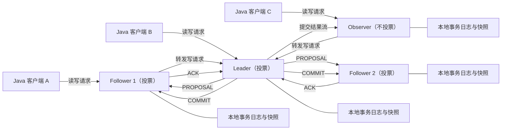

图中读取通常由客户端当前连接的服务器本地响应，因此读扩展性较好但可能读到尚未追上最新提交的状态。所有写请求都由 Leader 排序；Follower 和 Observer 收到客户端写入后转发给 Leader。Observer 不发送投票 ACK，不增加写入法定人数，适合扩展连接数或在远端提供本地读取入口，但它不是核心投票成员。

### 7.2 多数派决定可用性

默认法定人数为 `floor(N / 2) + 1`，`N` 是投票成员数。只要存活且互通的投票成员达到法定人数，集群就能选出 Leader 并提交写入。

| 投票成员数 N | 法定人数 | 可容忍同时故障数 | 判断 |
| --- | --- | --- | --- |
| 1 | 1 | 0 | 仅开发测试 |
| 2 | 2 | 0 | 增加一台却没有增加容错能力 |
| 3 | 2 | 1 | 常见起点 |
| 4 | 3 | 1 | 与 3 节点容错相同，写投票成本更高 |
| 5 | 3 | 2 | 更高容错，资源和写延迟也更高 |

因此常用奇数个投票成员。Observer 不计入 `N`。部署 3 个投票成员时应分布在独立故障域；三台虚拟机若位于同一物理宿主机、同一电源或同一存储故障域，机器数量不能转化为真实容错能力。

### 7.3 一次写入如何提交

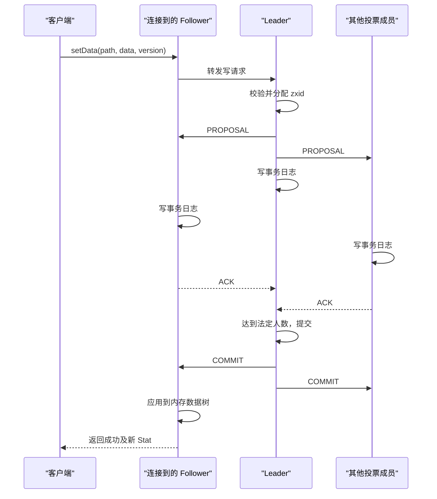

输入是带版本条件的写请求。Leader 为提案分配 zxid（ZooKeeper Transaction ID，ZooKeeper 事务标识），按顺序广播。投票成员把提案记录到持久存储后返回 ACK（Acknowledgement，确认）；Leader 收到法定人数 ACK 后发送 COMMIT。服务器按相同顺序把事务应用到内存数据树，客户端最终收到成功响应。

成功响应意味着更新已经提交，并会在故障恢复后保留。若客户端在提交期间断线，它无法仅凭异常判断服务器是否提交，这就是 5.6 节所述的“结果未知”。

### 7.4 ZAB 与 zxid 的顺序语义

ZAB（ZooKeeper Atomic Broadcast，ZooKeeper 原子广播）负责让各服务器以相同顺序交付已提交事务。它提供可靠交付、全序和因果顺序。ZAB 与 Paxos、Multi-Paxos 和 Raft 都处理复制状态的一致顺序问题，但协议阶段、领导者激活和恢复约束不同，不宜把它们当作同一个算法的不同名字。

zxid 是 64 位数，高 32 位为 epoch（纪元），表示领导权代次；低 32 位为该 epoch 内递增计数器。新 Leader 使用更高 epoch，从而把不同领导任期的提案放进一个全局可比较顺序。

```text
zxid = (epoch << 32) | counter

示例：
0x00000005_0000002A
             │        └── counter = 42
             └─────────── epoch = 5
```

zxid 反映 ZooKeeper 事务顺序，不等于业务时间戳。`mtime` 依赖墙上时钟，适合审计展示，不适合建立跨节点严格顺序；需要判断 ZooKeeper 更新先后时应使用 zxid 或节点版本。

### 7.5 Leader 故障后的恢复阶段

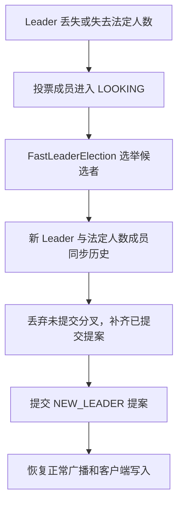

新 Leader 不能在当选瞬间立即接受新写入。它先与法定人数 Follower 对齐历史，确保新领导历史包含所有已提交事务，并处理旧 Leader 留下的未提交提案。`NEW_LEADER` 获得法定人数确认后才进入广播阶段。恢复期间客户端可能连接中断或操作超时，应用应依靠会话状态和幂等重试处理，而不是假设“服务器进程都在就一定可写”。

### 7.6 事务日志、快照与内存数据树

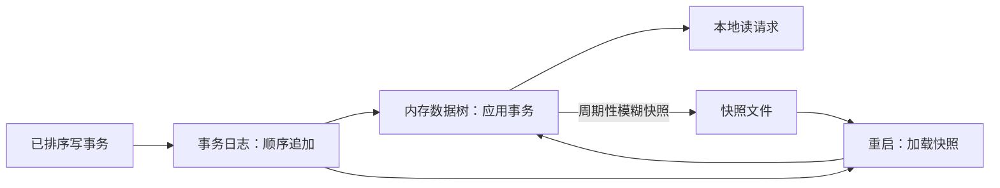

事务日志保存增量写入顺序，快照保存某一段时间的数据树视图。ZooKeeper 使用 fuzzy snapshot（模糊快照）：生成快照期间仍可处理写入，所以恢复时加载快照后还要重放对应事务日志，最终得到一致状态。

事务日志采用顺序写，若与高随机 I/O（Input/Output，输入输出）工作负载共享磁盘，磁盘寻道、队列拥塞或云盘突发额度耗尽会直接抬高写延迟和心跳延迟。生产环境通常将 `dataLogDir` 放在低延迟的独立持久盘，并让 `dataDir` 保存快照；实际布局需要用目标硬件压测确认。

### 7.7 精确理解读写一致性

ZooKeeper 当前官方内部文档给出的精确边界是：写操作是 linearizable（线性一致）的；读操作不是线性一致读，因为连接服务器可从本地状态直接返回，因复制进度而读到较旧数据。读满足顺序一致性，同一个会话在故障切换时不会倒退到自己已经观察过的更旧视图。

| 保证 | 含义 | 不包含的承诺 |
| --- | --- | --- |
| 顺序一致性 | 同一客户端提交的更新按发送顺序应用 | 不保证不同客户端同一时刻看到相同值 |
| 原子性 | 更新成功或失败，没有部分结果 | 不消除连接丢失导致的结果未知 |
| 单一系统映像 | 同一会话切换服务器后不会看到倒退视图 | 不代表每次读取都是全局最新 |
| 可靠性 | 成功提交的更新不会因服务器恢复回滚 | 后续客户端仍可合法覆盖它 |
| 及时性 | 客户端在时间界限内看到变化或检测到服务故障 | 不等于毫秒级同步推送 |

很多旧资料建议“读前调用 `sync()` 即获得最新值”。`sync()` 能把调用方请求排到服务端处理序列中并显著缩小陈旧窗口，但当前官方内部文档明确指出它本身不是 quorum operation（法定人数操作），在极端条件下不能形成严格线性一致读证明。如果业务需要更强的读前屏障，可以先完成一个真正的法定人数写操作再读取，或把强一致业务状态放入支持相应事务语义的数据库。

### 7.8 CAP 视角下的可用性选择

CAP（Consistency, Availability, Partition tolerance，一致性、可用性、分区容错）是理解网络分区取舍的一个视角。ZooKeeper 在投票成员发生网络分区时，只允许拥有法定人数的一侧继续选举和提交写入；少数派停止正常写服务，避免两个分区各自产生可提交历史。

这体现了协调系统对一致顺序的优先选择。它不表示 ZooKeeper 所有读取都线性一致，也不表示任何网络故障下整个集群都不可读。是否允许只读模式、客户端连接在哪一侧以及服务器状态都会影响实际读取行为。

## 8 用 ZooKeeper 构造常见分布式协调模式

### 8.1 服务注册与发现

服务实例启动后创建临时节点，节点数据保存对调用方有用的小体积元数据；消费者监听服务目录并在变化后重新读取完整列表。

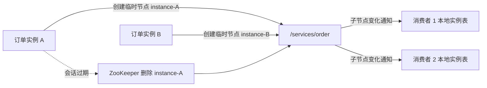

推荐节点结构示例：

```text
/services/order/instances/instance-0000000001
data = {
  "host": "10.0.0.8",
  "port": 8080,
  "protocol": "http",
  "zone": "az-a",
  "metadataVersion": 1
}
```

注册数据应控制大小并做 schema（结构约束）验证。服务发现只维护可选实例集合；负载均衡、健康探测、熔断、权重和流量分组仍由客户端或网关实现。会话存活只证明客户端仍能与 ZooKeeper 心跳，不能证明它的 HTTP（Hypertext Transfer Protocol，超文本传输协议）接口、数据库依赖和线程池健康，因此通常还需要应用健康检查。

### 8.2 动态配置发布

配置中心可以把小配置或配置版本存入持久节点，应用通过 Watcher 或 `CuratorCache` 获得失效通知。可靠发布流程通常包含：

1\. 发布端校验格式、数值范围和跨字段约束。
2\. 使用期望版本写入，避免覆盖并发发布。
3\. 客户端收到通知后重新读取完整配置。
4\. 客户端再次校验并构造不可变配置对象。
5\. 原子替换本地引用，记录生效版本、时间和结果指标。
6\. 新配置无效时保留最后已知可用值，并发出告警。

大配置文件可以放在对象存储或配置平台，ZooKeeper 只保存内容哈希、版本和下载地址。这样既保留变更通知和顺序，又避免大节点拉高集群延迟。

### 8.3 分布式锁的排队协议

公平互斥锁的经典做法是在固定父路径下创建临时顺序节点：

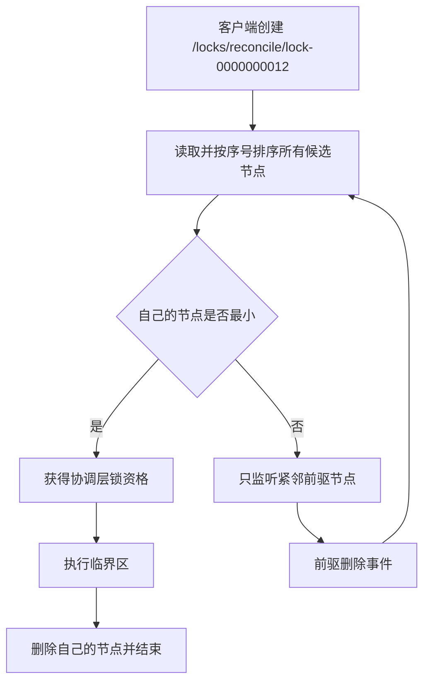

每个等待者只监听自己的前驱，而不是所有等待者都监听最小节点。当前持有者离开时通常只有下一个等待者被唤醒，避免 herd effect（羊群效应）：大量客户端同时唤醒、同时读取子节点并争抢。

算法需要处理多个边界：

1\. `create` 返回前连接丢失时，客户端可能不知道候选节点是否创建成功。节点名可包含会话内唯一标识，重连后查询并去重。
2\. 注册前驱 Watcher 前，前驱可能已经删除。先 `exists(predecessor, watcher)`；返回 `null` 时立即重新排序。
3\. 会话 `SUSPENDED` 时无法确认自己是否仍持有资格，应暂停外部副作用。
4\. 会话 `Expired` 后临时节点已删除，旧持有者不得继续把自己当作锁拥有者。
5\. 释放锁应放在 `finally` 中；删除失败时依靠会话过期兜底会延长阻塞。

### 8.4 使用 Curator 的可重入互斥锁

```java
import java.util.concurrent.TimeUnit;
import org.apache.curator.framework.recipes.locks.InterProcessMutex;

InterProcessMutex lock = new InterProcessMutex(client, "/locks/reconcile-job");
boolean acquired = lock.acquire(5, TimeUnit.SECONDS);
if (!acquired) {
    throw new IllegalStateException("5 秒内未获得 reconcile-job 锁");
}

try {
    runReconcileJob();
} finally {
    lock.release();
}
```

`InterProcessMutex` 在同一线程中可重入，跨 JVM 提供互斥协调。获得锁的线程应负责释放，临界区应设置业务超时并避免不可控长任务。连接状态监听器需要与业务执行器联动：`SUSPENDED` 时停止或隔离副作用，`LOST` 时确认旧资格彻底失效。

ZooKeeper 锁无法强制一个发生长时间暂停的旧进程停止运行。场景如下：旧持有者获得锁后 Full GC，集群判定其会话过期，新持有者获得锁并写数据库；旧持有者恢复后仍可能继续写。下游资源若要求严格互斥，应验证 fencing token。每次获得资格时获取更大的令牌，下游只接受大于已记录令牌的写入，从数据层拒绝迟到旧持有者。Curator 的 `InterProcessMutex` 不直接提供业务 fencing token，令牌生成和下游条件写需单独设计。

### 8.5 Leader 选举与任务接管

选主和锁都可基于临时顺序节点，但语义不同：锁保护一段临界区，Leader 身份通常持续承担调度或协调职责。Curator 常用 `LeaderSelector`：

```java
import org.apache.curator.framework.CuratorFramework;
import org.apache.curator.framework.recipes.leader.LeaderSelector;
import org.apache.curator.framework.recipes.leader.LeaderSelectorListenerAdapter;

LeaderSelector selector = new LeaderSelector(
        client,
        "/leaders/close-timeout-orders",
        new LeaderSelectorListenerAdapter() {
            @Override
            public void takeLeadership(CuratorFramework ignored) throws Exception {
                runUntilLeadershipShouldEnd();
            }
        });

selector.autoRequeue();
selector.start();
```

`takeLeadership` 返回时会释放领导权；`autoRequeue()` 使当前实例以后继续参与竞选。领导者执行循环应能响应线程中断和连接状态变化，停止时先终止业务动作，再退出回调。若任务需要“每个周期恰好执行一次”，仅靠选主仍不够，进程可能在结果提交前宕机；应使用数据库唯一键、任务状态机或幂等操作记录定义可验证的完成语义。

### 8.6 屏障、计数器和队列的取舍

Curator 还提供分布式屏障、共享计数器、信号量和队列 recipe。选择前应先识别所需语义：

| 需求 | 可用 recipe | 设计边界 |
| --- | --- | --- |
| 等待 N 个参与者就绪 | `DistributedDoubleBarrier` | 参与者会话和超时必须明确 |
| 跨进程并发许可证 | `InterProcessSemaphoreV2` | 所有客户端需一致理解许可证总数 |
| 低频共享数值 | `SharedCount` / `DistributedAtomicLong` | 不适合高吞吐计数统计 |
| 小规模协调队列 | 分布式队列 recipe | 不具备专业消息系统的吞吐、积压、消费组和重放能力 |

当需求出现海量消息、长期积压、按分区扩展、死信、消费确认或历史重放时，应转向 Kafka、Pulsar、RabbitMQ 等消息系统。ZooKeeper recipe 的价值在协调顺序和成员状态，而非替代专用数据平面。

## 9 部署和配置生产集群

### 9.1 版本选择与升级基线

Apache 发布策略同时维护 current 和 stable 两条分支。编写本文时，官方发布页列出 ZooKeeper 3.9.5 为 current、3.8.6 为 latest stable。学习示例使用 3.9.5 以覆盖当前 API；已有平台选型还要检查上游组件是否固定 ZooKeeper 版本，例如 Kafka、HBase、Solr 或内部框架可能通过自身认证矩阵约束客户端和服务端版本。

上线前至少记录四类版本：ZooKeeper 服务端、ZooKeeper/Curator 客户端、Java 运行时和依赖框架。使用 Maven `dependency:tree`、制品清单与安全扫描确认最终进入构建产物的真实版本，而不是只看 `pom.xml` 直接依赖。

### 9.2 将三个投票成员放入独立故障域

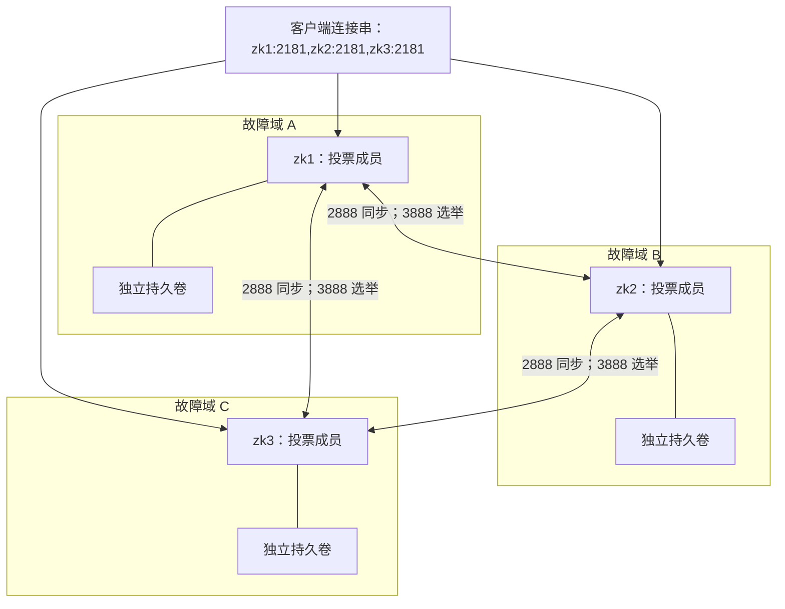

图中三个成员分布在独立故障域，每个成员使用自己的持久卷。客户端连接串包含全部成员，客户端库负责故障切换。ZooKeeper 成员间需要低延迟、稳定互通；跨地域高抖动链路会放大选举和提交延迟。多地域读取扩展可以评估 Observer，但核心投票成员通常集中在能够稳定形成法定人数的区域内。

### 9.3 三节点静态配置示例

每个节点可以使用结构相同的 `zoo.cfg`：

```properties
# 时间基准：心跳、会话和集群超时会基于 tick 计算。
tickTime=2000

# 两个目录需实际挂载到不同存储设备，仅修改目录名不等于分盘。
dataDir=/var/lib/zookeeper/data
dataLogDir=/var/lib/zookeeper/txnlog

# 客户端、初始同步和运行时同步配置。
clientPort=2181
initLimit=10
syncLimit=5
maxClientCnxns=60

# 保留最近 5 份快照及所需事务日志，每 24 小时执行清理。
autopurge.snapRetainCount=5
autopurge.purgeInterval=24

# 只开放实际使用的四字母命令；官方更推荐 AdminServer。
4lw.commands.whitelist=ruok,srvr,mntr,conf,isro

# 将管理端口绑定到受控管理网络；此处仅作地址示例。
admin.serverAddress=127.0.0.1
admin.serverPort=8080

# ZooKeeper 3.6+ 内置 Prometheus 指标提供器。
metricsProvider.className=org.apache.zookeeper.metrics.prometheus.PrometheusMetricsProvider
metricsProvider.httpHost=127.0.0.1
metricsProvider.httpPort=7000
metricsProvider.exportJvmInfo=true

server.1=zk1.example.internal:2888:3888
server.2=zk2.example.internal:2888:3888
server.3=zk3.example.internal:2888:3888
```

每个节点还要在 `dataDir` 下写入只含自身数字标识的 `myid` 文件：

```bash
# 在 zk1 上
printf '1\n' > /var/lib/zookeeper/data/myid

# 在 zk2 上写 2，在 zk3 上写 3。
```

`myid` 必须与 `server.X` 左侧编号对应，且各节点的成员列表一致。上面使用 Shell 重定向只是部署示例，实际生产通常由配置管理系统以原子方式创建目录、权限和文件。如果由本机监控代理抓取指标，管理与指标端口可以绑定 `127.0.0.1`；远端采集时应绑定受控私网地址，并通过网络策略限制来源。

| 端口 | 方向 | 用途 | 网络策略 |
| --- | --- | --- | --- |
| 2181 | 客户端到成员 | 明文客户端连接 | 仅允许应用网段；启用 TLS 后可关闭明文端口 |
| 2281 等自定义端口 | 客户端到成员 | `secureClientPort` TLS 连接 | 仅允许受信客户端 |
| 2888 | 成员之间 | Follower/Observer 与 Leader 同步 | 只允许 ensemble 成员互访 |
| 3888 | 成员之间 | Leader 发现与选举 | ensemble 成员按配置互访，Observer 不计入投票 |
| 8080 | 管理网络到成员 | AdminServer | 不暴露公网，启用鉴权或网络隔离 |
| 7000 | Prometheus 到成员 | 指标抓取 | 只允许监控系统访问 |

ZooKeeper 3.5 以后支持动态配置文件和在线 reconfiguration（重新配置），`reconfigEnabled` 默认关闭。启用前需要设计授权、变更审计、法定人数过渡顺序和回滚方案；不能把在线增删成员当作无状态服务的普通扩缩容。

### 9.4 配置项之间的因果关系

| 配置 | 作用 | 调整时要验证的后果 |
| --- | --- | --- |
| `tickTime` | 服务端时间基准 | 同时影响会话范围、心跳和集群超时 |
| `initLimit` | Follower 初次连接并同步 Leader 的最大 tick 数 | 数据量大或磁盘慢时过小会反复同步失败 |
| `syncLimit` | 运行中 Follower 与 Leader 同步允许的 tick 数 | 过小易因抖动被踢出，过大延长故障检测 |
| `minSessionTimeout` | 客户端可协商的最小会话超时 | 默认 `2 × tickTime` |
| `maxSessionTimeout` | 客户端可协商的最大会话超时 | 默认 `20 × tickTime` |
| `maxClientCnxns` | 单个来源 IP 到单成员的连接上限 | 默认 60；NAT（Network Address Translation，网络地址转换）后多应用共享 IP 时需容量评估 |
| `autopurge.snapRetainCount` | 保留快照数量 | 最小值 3；还需满足恢复点和备份策略 |
| `autopurge.purgeInterval` | 自动清理周期，单位小时 | 默认 0 表示不启用，可能造成磁盘持续增长 |

参数不能孤立调优。例如把客户端会话设为 3 秒，却允许 5 秒以上的 JVM 暂停，会产生规律性会话过期；把 `syncLimit` 大幅调高虽然减少误判，也会延长集群发现失联成员的时间。应使用实际网络延迟、垃圾回收暂停、磁盘 fsync 和故障恢复数据选择参数。

### 9.5 磁盘、内存与容量规划

ZooKeeper 的数据树主要驻留堆内存，znode 数量、路径长度、数据大小、ACL、Watcher 和会话共同消耗内存。容量规划至少测量：

1\. 正常与峰值 znode 数量、平均和 P99（99th percentile，第 99 百分位）节点数据大小。
2\. 客户端连接、会话、临时节点和 Watcher 数量。
3\. 每秒读写请求、突发写入和请求大小分布。
4\. 事务日志 fsync 的 P95（95th percentile，第 95 百分位）/P99 延迟、磁盘带宽与空间增长率。
5\. JVM 堆使用、垃圾回收暂停和系统是否发生 swap（交换）。

事务日志需要稳定低延迟顺序写。`dataLogDir` 与业务数据库、日志采集或高随机 I/O 共享设备时，偶发长 fsync 会放大整个写链路延迟。内存应为操作系统页缓存、直接内存和进程开销留出空间，避免把 Java 最大堆设置到接近物理内存上限导致 swap。

单个热点 znode 被高频写入时，所有写仍经过 Leader 和法定人数复制，无法通过增加普通 Follower 线性扩展写吞吐。可以按独立业务边界拆分多个 ensemble，但这会增加运维成本并失去跨 ensemble 原子操作能力。

### 9.6 Observer 的使用条件

Observer 保存完整副本、服务本地客户端读写入口并把写转发给 Leader，但不参与投票。它适合大量读连接、隔离核心投票成员的客户端负载，或在远端数据中心提供本地读入口。增加 Observer 不会提高法定人数容错，也不会提高 Leader 的写排序能力。

```properties
# Observer 自身配置
peerType=observer

# 所有成员配置中把该成员标为 observer
server.4=zk-observer.example.internal:2888:3888:observer
```

远端 Observer 断开期间无法提供最新协调状态。对延迟和一致性敏感的主控逻辑，应评估跨地域读取陈旧窗口和断线行为，不能因为 Observer 有本地副本就把它当成可独立写入的分区。

### 9.7 滚动升级、备份与恢复

滚动升级通常每次处理一个成员，并始终保留法定人数。每个成员升级后的验证包含进程状态、成员角色、是否完成同步、请求延迟、未完成请求、磁盘和错误日志；当前成员稳定后才进入下一个。跨越包含协议或配置迁移的版本时，以目标版本发布说明和兼容矩阵为准，有些特性需要“先升级全部成员，再单独启用配置”的两阶段流程。

快照和事务日志共同决定可恢复状态。备份策略需要实际演练恢复到隔离环境，验证 zxid、znode 数量、ACL、临时节点语义和应用重新连接。临时节点属于会话状态，不能把恢复后的旧临时节点当作真实在线成员。

单个 Follower 本地数据损坏时，先确认其他成员健康且法定人数安全，再隔离故障成员并按官方恢复流程重建它的本地数据，让其从 Leader 重新同步。未经确认同时清理多个成员数据，可能把可恢复的副本变成整体数据丢失。

### 9.8 容器和 Kubernetes 部署边界

在 Kubernetes 中，ZooKeeper 属于有状态服务。设计通常需要稳定网络身份、每 Pod 独立持久卷、反亲和性、PodDisruptionBudget（Pod 中断预算）、顺序滚动和明确的优雅终止期。三个 Pod 若都被调度到同一宿主机，仍只有一个真实故障域。

就绪探针不能只执行 `ruok` 并看到 `imok`：官方说明它只证明进程处于非错误状态且绑定客户端端口，不证明已经加入法定人数。就绪判断还应检查成员角色和集群状态；探针本身要轻量，避免频繁昂贵管理命令反过来影响服务。

## 10 安全、可观测性与故障排查

### 10.1 分层安全模型

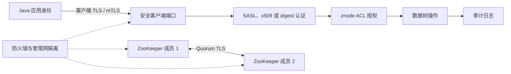

图中 TLS 提供传输加密和对端校验，认证把连接映射为身份，ACL 决定该身份能操作哪些 znode，审计记录敏感操作。成员间 Quorum TLS 保护选举和复制流量。网络策略限制客户端、成员端口、管理端口和指标端口的可达范围。这些层次解决不同问题，单独启用其中一个不能替代其他层。

### 10.2 客户端和成员间 TLS

明文 `clientPort` 无法保护配置内容、认证材料和会话流量。生产网络不完全可信时应使用 `secureClientPort` 和 Netty 连接实现，校验证书主机名、有效期、证书链与吊销策略。成员间还可启用 Quorum TLS，覆盖 Leader 选举和复制通信。

密钥库、信任库和密码不应提交到代码仓库或镜像层。它们通常由密钥管理系统挂载，并具备最小文件权限、证书轮换、过期告警和回滚方案。滚动启用 TLS 时要遵循官方 Admin Guide（管理员指南）的混合模式与端口统一步骤，避免新旧成员因协议不兼容失去法定人数。

### 10.3 认证不等于加密

`digest` 适合较小的受控场景，但它本身不加密网络，应与 TLS 组合。大型组织常使用 SASL/Kerberos（Simple Authentication and Security Layer / Kerberos）统一身份；mTLS（Mutual TLS，双向传输层安全）可通过 `x509` 身份参与 ACL。方案选择取决于现有身份基础设施、证书轮换能力和客户端兼容性。

ACL 设计可以按命名空间划分角色：

| 角色 | 典型权限 | 说明 |
| --- | --- | --- |
| 配置读取者 | `READ` | 读取配置和子节点，不允许发布 |
| 服务注册实例 | 服务目录上的 `CREATE`、自己的节点所需权限 | 避免修改其他实例注册 |
| 配置发布者 | 目标配置上的 `READ`、`WRITE` | 携带版本执行条件更新 |
| 平台管理员 | 受控路径的 `ADMIN` 等运维权限 | 使用独立身份并审计 |

权限变更应先在隔离路径验证。由于 ACL 不递归继承，修复父路径 ACL 后还要扫描子树确认是否存在历史开放节点。

### 10.4 限制管理接口与四字母命令

AdminServer 默认启用并监听 8080，默认地址为 `0.0.0.0`。生产中应绑定管理网络、通过防火墙限制来源，并根据安全要求启用 HTTPS 和客户端认证。四字母命令从 3.5.3 起需要白名单，默认通常只开放 `srvr`；官方文档建议逐步使用 AdminServer HTTP 接口替代传统四字母协议。

`cons`、`dump`、`wchc` 等命令可能返回大量连接、会话或 Watcher 数据并消耗资源。白名单只开放监控实际需要的轻量命令，故障期间的重型诊断应控制执行频率。

### 10.5 建立从进程到业务语义的指标

启用 Prometheus 指标提供器后，默认指标地址为 `http://host:7000/metrics`。监控应覆盖四层：

| 层次 | 代表指标或状态 | 能回答的问题 |
| --- | --- | --- |
| 存活与角色 | `up`、Leader/Follower/Observer 状态、法定人数成员 | 服务是否存活并处于预期角色 |
| 请求质量 | 平均/最大延迟、未完成请求、每秒读写、错误码 | 客户端慢是排队、磁盘还是连接问题 |
| 数据与会话 | znode、临时节点、Watcher、连接、会话、近似数据大小 | 是否出现泄漏、注册风暴或异常增长 |
| 资源与持久化 | fsync、快照、磁盘空间、文件描述符、堆、GC 暂停 | 是否接近容量或发生长尾暂停 |

告警阈值应来自基线和容量预算。例如 znode 数量固定写成“一百万即告警”可能不适合所有集群；更实用的组合是容量占比、增长斜率和持续时间。Leader 变更本身可以是维护事件，短时间频繁选举、同时伴随请求超时才更能指向故障。

### 10.6 日志与审计

服务日志用于定位选举、同步、会话、认证、fsync 和快照问题，应配置滚动、保留期和磁盘告警。日志级别长期设置为 DEBUG/TRACE 可能产生显著 I/O 和存储负担，临时提高后应在故障采样结束时恢复。

ZooKeeper 3.6.0 起支持审计日志，默认关闭，`zoo.cfg` 中配置 `audit.enable=true` 可启用。审计事件包含会话、用户、来源 IP、操作、znode、ACL 和结果等字段；它记录在客户端实际连接的服务器上，因此日志采集必须覆盖所有成员。审计日志可能包含路径和身份信息，需要访问控制与合规保留策略。

### 10.7 按现象定位故障

| 现象 | 可能机制 | 第一组证据 | 后续动作 |
| --- | --- | --- | --- |
| 所有客户端写超时 | 失去法定人数、选举中、Leader 磁盘慢 | 每个成员角色、选举日志、法定人数、fsync、未完成请求 | 先恢复成员互通和磁盘健康，限制客户端重试风暴 |
| 只有部分客户端断开 | 单成员故障、网络路径或单 IP 连接上限 | 客户端当前服务器、连接数、`maxClientCnxns`、防火墙 | 验证连接串是否含全部成员，检查 NAT 聚合 |
| 临时节点频繁消失 | 会话超时过小、GC/宿主暂停、网络抖动 | Curator 状态、协商超时、GC 日志、心跳与网络丢包 | 调整暂停源和超时，验证业务能在 LOST 后重建 |
| 读取旧配置 | 本地副本滞后、监听处理阻塞、缓存更新失败 | zxid/版本、连接成员、Watcher 延迟、应用刷新日志 | 重新读取完整状态，检查回调线程与一致性要求 |
| `NoAuth` | 未认证、ACL 不匹配、chroot 路径判断错误 | 当前身份、`getAcl`、实际服务端路径 | 修正身份或最小 ACL，不用无限重试掩盖配置错误 |
| 磁盘持续增长 | 自动清理未启用、日志轮转缺失、快照异常 | `autopurge`、目录文件、磁盘增长率、快照日志 | 在备份要求下启用清理并验证恢复链 |
| Watcher/内存暴涨 | 客户端重复注册、会话泄漏、大范围递归监听 | Watcher 数、会话数、热点路径、堆占用 | 修复注册生命周期，缩小监听范围并压测 |
| 锁长时间不释放 | 持有者业务卡住、会话仍存活、释放异常 | 候选节点、`ephemeralOwner`、线程栈、连接状态 | 中止业务动作并确认会话；避免直接删除未知持有者节点 |

### 10.8 写请求超时的排查时间线

遇到大面积 `OperationTimeout` 或 `ConnectionLoss` 时，可按以下顺序收集证据：

1\. 确认影响范围：全部应用、单可用区、单客户端版本还是单条路径。
2\. 从每个成员读取轻量状态，确认角色、法定人数和是否反复选举。
3\. 检查 Leader 的请求延迟、未完成请求和客户端连接数。
4\. 检查所有投票成员的事务日志 fsync、磁盘空间、I/O 队列和文件描述符。
5\. 对齐 ZooKeeper 服务日志、客户端连接状态、网络监控与 JVM GC 时间线。
6\. 限制无界重试，保护集群恢复窗口；写操作通过幂等记录确认结果。
7\. 恢复后验证版本推进、临时节点重建、锁/领导权重新竞争和业务补偿结果。

排查过程中不要把 `ruok -> imok` 当作集群健康结论；它不能证明成员已加入 quorum（法定人数）。也不要在未确认其他副本和备份健康时删除事务日志或快照。

### 10.9 故障演练的验收标准

生产前至少演练以下事件，并记录可观察成功判据：

1\. 停止一个 Follower：三节点集群继续读写，客户端能够自动切换。
2\. 停止 Leader：出现短暂选举窗口，新 Leader 产生，幂等写入最终可确认结果。
3\. 隔离一个客户端超过会话超时：临时节点消失，Curator 进入 LOST，业务停止旧资格动作并重新注册。
4\. 制造客户端长 GC：验证 `SUSPENDED` 期间不继续执行锁保护的外部副作用。
5\. 填充测试磁盘到告警阈值：告警早于服务不可写，清理流程不删除恢复所需文件。
6\. 轮换证书：法定人数和客户端连接在滚动过程中保持，旧证书按计划失效。
7\. 恢复备份到隔离集群：数据、ACL、版本与应用初始化流程通过验证。

## 11 形成可用于设计评审和面试的推理链

### 11.1 ZooKeeper 的职责边界

描述 ZooKeeper 时，可以从问题、模型和保证三个层次展开：它解决分布式进程对小型协调状态的命名、排序、通知和故障感知；对外提供层次 znode、会话、Watcher、版本和原子操作；集群通过 Leader 排序、法定人数复制和 ZAB 保持已提交写入的全序与可靠性。

这个描述还应包含边界：写是线性一致的，读可由本地副本返回而陈旧；Watcher 是状态变化通知，不是可靠消息日志；会话过期会删除临时节点，但无法强制暂停的旧进程停止外部写入。

### 11.2 为什么常用三个或五个投票成员

判断过程从法定人数公式开始。三个成员需要两个投票，可容忍一个故障；四个成员需要三个投票，也只能容忍一个故障；五个成员需要三个投票，可容忍两个故障。偶数成员通常增加复制和运维成本，却没有增加相同级别的故障容忍。

成员数并非越多越好。写入需要法定人数持久化，更多投票成员会增加复制链路和长尾节点影响。需要扩展读连接时优先评估 Observer；需要更高写吞吐时应减少热点、拆分独立协调域或重新评估技术选型。

### 11.3 临时节点为什么不能等同于健康检查

临时节点绑定 ZooKeeper 会话。只要客户端线程还能发送心跳，会话就可能存活，即使业务 HTTP 接口已经卡死、数据库连接池耗尽或线程池拒绝请求。因此临时节点表达的是“协调会话存活”，服务健康需要额外的应用探测和摘流策略。

相反，短暂网络中断也不会立即删除临时节点。只有服务端判定会话过期后才删除；这段时间是为了容忍抖动，也是故障接管延迟的一部分。

### 11.4 Watcher 为什么不能替代消息队列

标准 Watcher 一次触发，事件内容只表示状态可能变化；断线和重新注册窗口可能合并或错过中间变化。消费者应重新读取当前状态并收敛。消息队列则通常保存可重放事件、消费位点和确认状态，目标是处理每条消息。两者的输入、持久化对象和失败恢复语义不同。

如果业务只关心“当前配置是什么”，Watcher 加重新读取很合适；如果业务要求“每次价格变化都触发一次结算”，需要持久事件日志和幂等消费者。

### 11.5 分布式锁为什么仍可能出现并发写

锁资格依赖会话，业务进程执行依赖本地 CPU 和线程调度。旧持有者暂停超过会话超时后，集群删除其临时节点，新持有者获得锁；旧进程恢复时如果没有检查资格，二者会同时执行。这个问题不能靠把会话超时无限调大解决，因为它会延长真实故障接管。

严格下游保护使用 fencing token：每代持有者获得递增令牌，下游资源保存已接受的最大令牌并拒绝更小令牌。若下游不支持条件写，业务应通过幂等键、数据库唯一约束、状态机或单写入口降低迟到执行的影响。

### 11.6 连接断开和会话过期的区别

`Disconnected` 或 Curator `SUSPENDED` 表示当前网络连接不可用，旧会话可能仍在服务端有效；客户端库会尝试重连。`Expired` 或 Curator `LOST` 表示旧会话已经失效，临时节点、锁和领导权不能继续使用。前者要求暂停风险动作并等待结果，后者要求创建或接受新会话并重建协调状态。

应用不应在每次 `Disconnected` 时立即 `new ZooKeeper()`，否则旧会话可能仍存活，新旧会话同时留下状态。原生客户端只在明确 `Expired` 后重建，Curator 则由框架管理底层会话并通过连接状态通知业务。

### 11.7 高频追问对应的证据

| 讨论点 | 回答时可使用的机制证据 | 容易遗漏的边界 |
| --- | --- | --- |
| 写入如何保证一致顺序 | Leader 分配 zxid、法定人数持久化 ACK、按序 COMMIT | 客户端断线时可能不知道结果 |
| 读取是否强一致 | 本地副本直接读、同会话不倒退、写线性一致 | 普通读可能陈旧，`sync()` 也非严格仲裁读 |
| 锁如何避免羊群效应 | 临时顺序节点，每个候选者只监听前驱 | 会话过期与 fencing token |
| Leader 宕机后发生什么 | FastLeaderElection、历史同步、`NEW_LEADER` 提交 | 恢复窗口内不可正常提交写入 |
| 为什么数据不能很大 | 内存数据树、全量读写、法定人数复制、快照 | 默认安全上限约 1 MiB，实践应远小于上限 |
| ZooKeeper 与 Redis 锁如何选 | 会话/临时顺序节点、公平排队、一致顺序 | 还需比较现有基础设施、时延、故障语义和 fencing |

## 12 Java 项目落地模板、检查表与资料入口

### 12.1 推荐的代码职责划分

```text
com.example.coordination
├── config
│   ├── ZooKeeperProperties.java
│   └── CuratorConfiguration.java
├── lifecycle
│   └── CoordinationStateListener.java
├── registry
│   ├── ServiceInstance.java
│   └── ServiceRegistry.java
├── lock
│   ├── DistributedLock.java
│   └── CuratorDistributedLock.java
├── leader
│   └── JobLeaderCoordinator.java
├── repository
│   └── ConfigRepository.java
└── observability
    └── CoordinationMetrics.java
```

配置层只负责创建和关闭客户端；生命周期监听器把连接状态转成应用可执行动作；registry、lock、leader 和 repository 封装路径与序列化；业务层不直接拼接 ZooKeeper 路径或捕获底层异常。这样能集中处理 ACL、命名空间、重试、指标和测试替身。

### 12.2 Spring Bean 生命周期示例

```java
import org.apache.curator.framework.CuratorFramework;
import org.springframework.boot.context.properties.ConfigurationProperties;
import org.springframework.boot.context.properties.EnableConfigurationProperties;
import org.springframework.context.annotation.Bean;
import org.springframework.context.annotation.Configuration;

@ConfigurationProperties(prefix = "coordination.zookeeper")
record ZooKeeperProperties(
        String connectString,
        String namespace,
        int sessionTimeoutMs,
        int connectionTimeoutMs) {
}

@Configuration
@EnableConfigurationProperties(ZooKeeperProperties.class)
class CuratorConfiguration {
    @Bean(destroyMethod = "close")
    CuratorFramework curatorFramework(ZooKeeperProperties properties) throws Exception {
        return CuratorFactory.connect(
                properties.connectString(),
                properties.namespace(),
                properties.sessionTimeoutMs(),
                properties.connectionTimeoutMs());
    }
}
```

示例通过 `@EnableConfigurationProperties` 注册类型安全配置，并把 namespace 和两个超时值传给 `CuratorFactory`。应用还应通过启动健康检查暴露“客户端已连接”和“依赖协调功能是否可用”。`destroyMethod="close"` 确保 Spring 容器关闭时结束客户端会话；如果应用还持有锁或领导权，先停止业务执行器和 recipe，再关闭共享客户端。

对应配置示例：

```yaml
coordination:
  zookeeper:
    connect-string: zk1.internal:2281,zk2.internal:2281,zk3.internal:2281
    namespace: order-system/prod
    session-timeout-ms: 15000
    connection-timeout-ms: 5000
```

这里使用 Curator namespace，所以连接串没有再附加 chroot。对应配置采用 YAML（YAML Ain't Markup Language，YAML 非标记语言）格式；认证材料和密钥库位置通常由安全配置注入，不应与普通业务配置一起明文提交。

### 12.3 路径与数据设计评审模板

每引入一个 ZooKeeper 用例，先写清以下内容：

1\. 业务目标：协调什么进程，失败时允许重复还是允许短暂停止。
2\. 路径所有者：哪个组件创建父路径、哪个组件可删除、是否使用 namespace/chroot。
3\. 节点类型：持久、临时、顺序、容器或 TTL，生命周期为何匹配业务语义。
4\. 数据格式：schema、最大大小、字符编码、向前/向后兼容策略。
5\. 并发条件：版本检查、`multi`、幂等键和结果未知后的确认方式。
6\. 通知消费：标准 Watcher、持久监听或 CuratorCache，断线后如何重建。
7\. 连接状态：SUSPENDED 与 LOST 时分别停止、降级或重建什么。
8\. 安全：认证方案、最小 ACL、TLS、管理端口和审计。
9\. 容量：znode、Watcher、连接、写频率和数据增长上限。
10\. 可观测性：成功率、延迟、版本、连接状态、重试和业务降级指标。
11\. 测试：单服务集成测试、多成员故障注入和恢复演练。
12\. 退出方案：如何迁移路径、双写校验、回滚并安全删除旧数据。

### 12.4 上线检查表

1\. 服务端、Curator、Java 与框架版本已进入制品清单并通过兼容性、安全检查。
2\. 投票成员为 3 或 5 个，并分布在真实独立故障域和持久卷上。
3\. 所有成员的 `server.X` 列表一致，`myid` 唯一且与配置匹配。
4\. 事务日志磁盘延迟、容量和自动清理策略已经压测与告警验证。
5\. 客户端连接串包含多个成员，单进程共享客户端并能优雅关闭。
6\. 会话与连接超时基于网络、GC 和恢复目标设定，并读取过协商结果。
7\. SUSPENDED、LOST、结果未知、版本冲突和认证失败都有不同处理路径。
8\. 生产路径未使用开放 ACL，TLS、认证、授权和密钥轮换已验证。
9\. AdminServer、指标和四字母命令只对管理网络开放，重型命令受控。
10\. znode 数据大小、节点数、Watcher、会话和连接增长均有预算与告警。
11\. 锁或选主保护的业务具有幂等、状态机或 fencing 设计。
12\. 已演练单 Follower 故障、Leader 切换、会话过期、磁盘告警和备份恢复。

### 12.5 复习自测

1\. 为什么 `new ZooKeeper(...)` 返回后不能立即把客户端视为已连接？
2\. `version`、`cversion` 和 `aversion` 分别随什么变化？
3\. 标准 Watcher 为什么要采用“通知后重新读取”的消费模型？
4\. `ConnectionLoss` 为什么会让写操作结果未知，怎样用幂等记录处理？
5\. 三节点和四节点集群各能容忍几个投票成员故障，原因是什么？
6\. Follower 收到写请求后，到客户端收到成功之间经历哪些步骤？
7\. 普通读、`sync()` 后读和法定人数写后读的保证有何差异？
8\. `SUSPENDED` 与 `LOST` 下，锁持有者应该采取什么不同动作？
9\. 为什么临时节点既适合服务注册，又不能证明业务接口健康？
10\. 为什么只监听当前最小锁节点会产生羊群效应，监听前驱如何改善？
11\. ZooKeeper 锁为什么仍需要 fencing token 或下游条件写？
12\. `ruok` 返回 `imok` 为什么不能作为集群就绪的唯一判据？

能够不查资料画出 7.1、7.3 和 8.3 三张图，并用自己的语言回答这些问题，说明已经建立了从 Java API 到分布式机制的完整主线。

### 12.6 官方资料入口

1\. [Apache ZooKeeper Releases](https://zookeeper.apache.org/releases/)：当前版、稳定版、下载、签名与校验值。
2\. [ZooKeeper Getting Started](https://zookeeper.apache.org/doc/current/zookeeperStarted.html)：单节点启动和基础 CLI。
3\. [ZooKeeper Programmer's Guide](https://zookeeper.apache.org/doc/current/zookeeperProgrammers.html)：数据模型、会话、Watcher、ACL、一致性和客户端语义。
4\. [ZooKeeper Java API：ZooKeeper 类](https://zookeeper.apache.org/doc/current/apidocs/zookeeper-server/org/apache/zookeeper/ZooKeeper.html)：原生 Java 客户端的类、方法、异常和参数入口。
5\. [ZooKeeper Internals](https://zookeeper.apache.org/doc/current/zookeeperInternals.html)：原子广播、zxid、法定人数与当前一致性边界。
6\. [ZooKeeper Administrator's Guide](https://zookeeper.apache.org/doc/current/zookeeperAdmin.html)：部署、配置、TLS、AdminServer、日志和数据文件。
7\. [ZooKeeper Monitor Guide](https://zookeeper.apache.org/doc/current/zookeeperMonitor.html)：Prometheus、指标和告警示例。
8\. [ZooKeeper Recipes and Solutions](https://zookeeper.apache.org/doc/current/recipes.html)：锁、选主、队列和屏障协议。
9\. [Apache Curator Getting Started](https://curator.apache.org/docs/getting-started/)：客户端创建、重试和 recipe 入门。
10\. [Apache Curator Recipes](https://curator.apache.org/docs/recipes/)：锁、选主、缓存、计数器和测试工具。
11\. [Apache Curator Error Handling](https://curator.apache.org/docs/errors/)：连接状态、重试和 recipe 的错误语义。
12\. [Apache Curator Releases](https://curator.apache.org/download/)：Curator 当前版本与发布历史。
13\. [Apache ZooKeeper Security](https://zookeeper.apache.org/security/)：官方漏洞影响范围、修复版本和升级建议。
