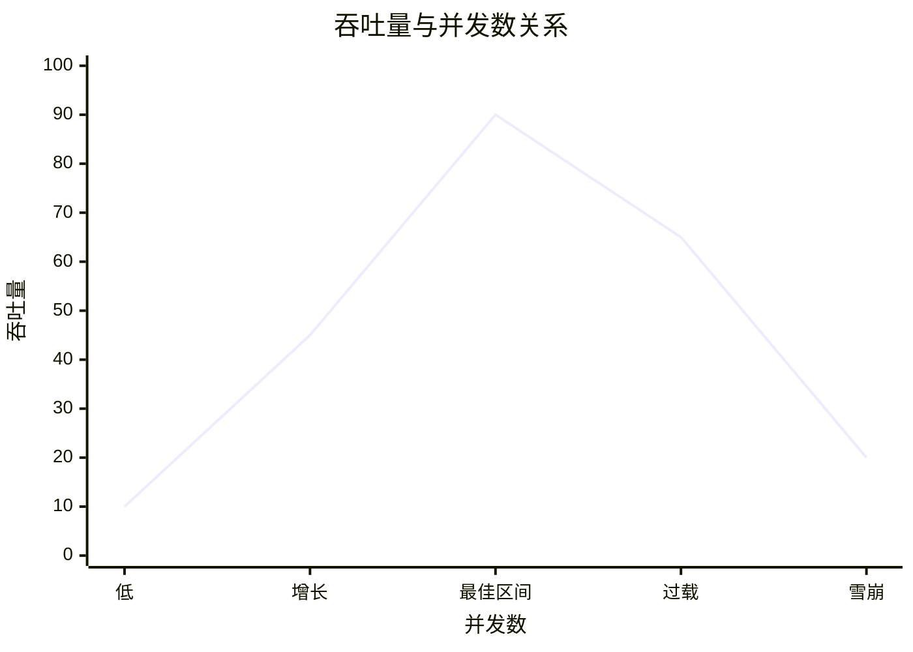

# 07-可靠性和应用保护

来源：http://cloud.fynote.com/d/5991

## 可靠性的基本认识

完全可靠是不可能的，架构设计的目标是提高系统在故障下继续提供服务的能力，并降低故障影响范围。

可靠性可以用失效概率、平均无故障时间、错误率、恢复时间等指标衡量。系统由多个模块组成时，连接方式会直接影响整体可靠性。

失效概率可以用时间来衡量。通常用 `R(t)` 表示系统在时间 `t` 内仍然正常工作的概率，也叫可靠度函数。`R` 是 `Reliability`，表示可靠性或可靠度。

- `R(0) = 1`：刚开始运行时，默认系统是正常的，可靠度为 1。
- `R(正无穷) = 0`：时间无限拉长后，系统最终总会失效，可靠度趋近于 0。
- 失效概率和可靠度相反：可靠度越高，失效概率越低；运行时间越长，失效概率通常越高。

简单理解：可靠性不是说系统永远不坏，而是衡量它在一段时间内“不坏”的概率。

### 固有可靠性与使用可靠性

固有可靠性是系统、组件或设备本身设计和制造出来的可靠性。它更偏“先天能力”，由代码质量、架构设计、硬件质量、依赖组件、冗余设计、容错机制等决定。

例如：

- 服务是否有单点。
- 数据库是否有主备。
- 代码是否容易出现空指针、资源泄露、死锁。
- 依赖组件本身是否稳定。
- 是否有超时、重试、熔断、降级能力。


使用可靠性是系统在真实使用、运维和环境条件下表现出来的可靠性。它更偏“运行过程”，由部署方式、操作规范、流量特征、监控告警、容量规划、故障处理、人员操作等决定。

例如：

- 是否按容量上线，还是流量远超预估。
- 是否有监控和告警。
- 发布变更是否有灰度和回滚。
- 运维操作是否规范。
- 故障后是否能快速定位和恢复。

简单理解：固有可靠性决定系统“本来能有多可靠”，使用可靠性决定系统“实际运行时能不能保持可靠”。架构设计既要提高固有可靠性，也要通过监控、灰度、预案和规范提升使用可靠性。

## 模块连接方式

### 串联系统

多个模块串联时，任意一个失败都会导致整体失败。如果 5 个模块各自可靠性都是 99%，整体可靠性约为：

```text
0.99 ^ 5 = 95.1%
```

因此链路越长，整体可靠性越容易下降。

### 并联系统

多个模块并联，只要一个可用就能提供服务，可靠性显著提升：

```text
R = 1 - (1 - R1) * (1 - R2) * ... * (1 - Rn)
```

### 冗余系统

多个模块中只要求部分可用，例如 5 个节点中 3 个可用即可服务。可靠性通常介于串联和完全并联之间。

总体关系：

```text
串联可靠性 < 冗余可靠性 < 并联可靠性
```

## 可靠性设计

核心策略是消除单点依赖，把显式串联改成可旁路、可降级、可替换的结构。

常见手段：

- 集群：任一节点可用，服务整体就可用。
- 主备：主节点异常时切到备节点。
- 多活：多个区域同时承接流量。
- Cache Aside：缓存失败时可以旁路读数据库。
- 冗余链路：短信、支付、物流等第三方服务准备多个供应商。
- 超时和重试：避免无限等待，但要防止重试风暴。

## 应用保护总览

当系统真的扛不住时，不应让它直接崩溃。应用保护的目标是“丢卒保车”：保护核心链路，牺牲非核心能力。

吞吐量和并发数不是线性正相关。并发数较低时，吞吐量会随着并发增加而上升；到达系统瓶颈后，继续增加并发会带来排队、锁竞争、线程切换、超时重试，吞吐量反而下降。



简单理解：

- 低并发：资源未充分利用，吞吐量较低。
- 增长期：并发增加，CPU、连接池、线程池等资源利用率提高，吞吐量上升。
- 最佳区间：系统接近最大处理能力，吞吐量最高，响应时间仍可接受。
- 过载区：排队、锁竞争、GC、上下文切换增多，响应时间明显变长。
- 雪崩区：大量超时和重试进一步放大压力，吞吐量下降，系统可能整体失效。


应用保护的意义，就是在系统进入过载区前，通过隔离、限流、降级、熔断等手段控制并发，保护核心链路。

系统状态可以按退化程度理解：

1. 所有用户使用所有服务。
2. 所有用户使用部分服务。
3. 部分用户使用部分服务。
4. 暂停服务但可以快速恢复。
5. 局部服务崩溃但不影响其他服务。
6. 局部崩溃影响其他服务。
7. 全部失效。

架构保护就是尽量把故障停留在前几层，而不是滑向全局失效。

## 隔离

隔离是把不同业务、不同下游或不同资源池分开，避免互相拖垮。

常见方式：

- 线程池隔离：不同下游使用不同线程池。
- 信号量隔离：限制某类调用的并发数。
- 连接池隔离：核心库和非核心库分开。
- 服务隔离：核心服务和后台服务独立部署。
- 数据隔离：按租户、业务或冷热数据拆分。

线程池隔离更彻底，但有线程创建、回收和切换成本；信号量隔离更轻量，但无法隔离阻塞线程。要从业务风险和调用特征出发选择。

## 限流

限流像水库，控制单位时间进入系统的请求量。

突刺是指请求在很短时间内集中到来，形成尖峰流量。固定时间窗口限流最容易出现突刺问题。

例如规定 `10 秒最多 100 个请求`：

- 第一个窗口最后 1 秒进来 100 个请求。
- 第二个窗口开始 1 秒又进来 100 个请求。
- 从规则上看两个窗口都没超限，但实际 2 秒内系统收到了 200 个请求。

这就是窗口边界突刺。时间窗口越大，边界突刺越明显；窗口越小，突刺越弱。如果窗口小到一次只放一个请求，就接近“平滑放行”。


常见算法：

- 固定时间窗口：简单，但窗口边界可能突增。
- 滑动时间窗口：更平滑。
- 漏桶：请求先进入桶，再以恒定速率流向服务。它能把突刺削平，但服务和漏下来的请求之间没有反馈，可能出现服务太闲或太忙。
- 令牌桶：服务按一定速率发放令牌，请求必须拿到令牌才能继续。桶里可以积累少量令牌，所以能允许一定突发，同时又限制长期平均速率。


漏桶像“机场安检”：请求排队，系统按固定速度处理。令牌桶像“检票”：有票才能过，令牌数量决定瞬间能放多少请求。

限流动作可以是拒绝、排队、降级返回、验证码、人机校验或只允许核心用户访问。

## 降级

降级是服务自身主动减少能力，只保留必要功能。

策略：

- 停止读取数据库：改成读缓存或读预计算结果，例如商品已售数量、排行榜、统计数据。
- 精确结果转近似结果：例如 LBS 降低定位精度，图片或视频降低清晰度，库存显示“有货/无货”而不是精确数量。
- 返回静态结果：返回兜底文案、默认配置、静态页面或空列表。
- 同步转异步：把耗时操作写入缓存或消息队列，后续慢慢处理。
- 功能剪裁：关闭非核心功能，例如评论、推荐、报表、导出、个性化展示。
- 禁止写操作：不允许用户修改数据，只保留查询能力，例如系统繁忙时暂停下单、评论、编辑资料。
- 分用户降级：优先保障核心用户、付费用户、正在交易的用户；对游客、低优先级请求或非核心入口做限制。
- 工作量证明降级，PoW，Proof of Work：让请求方先完成验证码、人机校验、排队、简单计算等动作，提高恶意请求或低价值请求的成本。

触发方式：

- 自动触发：错误率过高、响应时间过长、线程池/连接池耗尽、限流阈值触发、下游不可用等。
- 手动触发：运营活动、故障应急、发布变更、人工判断系统风险时，通过开关主动降级。

降级要提前设计开关、范围、提示和恢复策略。

## 熔断

熔断是调用方对下游服务的保护动作。它类似保险丝：当下游响应慢、错误率高、超时严重时，上游先停止继续调用，避免把线程、连接和请求都耗在一个已经异常的服务上。

原链接里的重点是：哪怕下一个请求可能成功，只要熔断条件已经触发，上游也会暂时不再访问下游。这是为了保护整体系统，而不是赌下一次调用能不能成功。

触发条件通常包括：

- 错误率超过阈值。
- 超时次数超过阈值。
- 平均响应时间或 P95/P99 明显升高。
- 连接池、线程池被下游调用占满。
- 下游被限流、降级或明确返回不可用。

降级和熔断的区别：

- 降级：服务自身减少功能。
- 熔断：调用方停止访问异常下游。

隔离和熔断的区别：

- 隔离：提前把资源分开，避免互相拖垮。
- 熔断：发现某个下游已经异常后，暂时切断调用。

熔断状态：

- 关闭：正常调用下游，并统计错误率、耗时、超时等指标。
- 打开：停止调用下游，直接返回兜底结果或走降级逻辑。
- 半开：过一段时间后放少量请求试探下游，如果成功率恢复就关闭熔断，否则继续打开。

熔断后的处理：

- 返回缓存、默认值、静态结果或友好提示。
- 调用备用服务或备用链路。
- 把同步流程改成异步排队。
- 记录告警，等待下游恢复后逐步放量。

熔断是暂时性保护手段，最终还要进入恢复阶段：撤出限流、取消降级、关闭熔断，并逐步恢复正常流量。

## 恢复

保护措施都是暂时手段。系统恢复时要逐步撤出限流、取消降级、关闭熔断。

恢复建议：

- 先确认故障根因已消除。
- 先小流量恢复，再逐步放量。
- 预热缓存、连接池和线程池。
- 观察错误率、P95/P99、队列长度和资源使用率。
- 防止恢复瞬间再次打满系统。

## 实践总结

高并发不是靠一段代码实现，而是多层能力组合：

- 前置分流减少入口压力。
- 并行和集群提高计算能力。
- 服务内并发提高资源利用率。
- 缓存缩短读链路。
- 消息队列削峰填谷。
- 数据库优化保证核心数据稳定。
- 隔离、限流、降级、熔断和恢复保护系统可用性。
