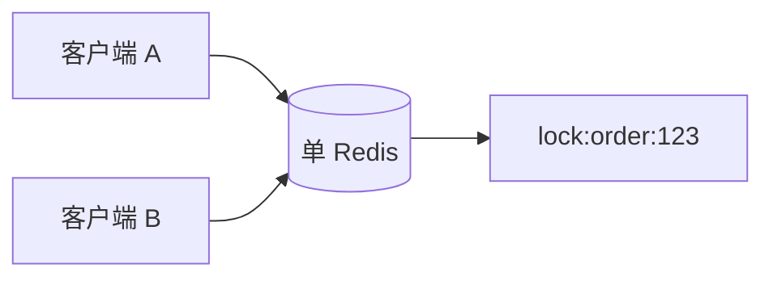
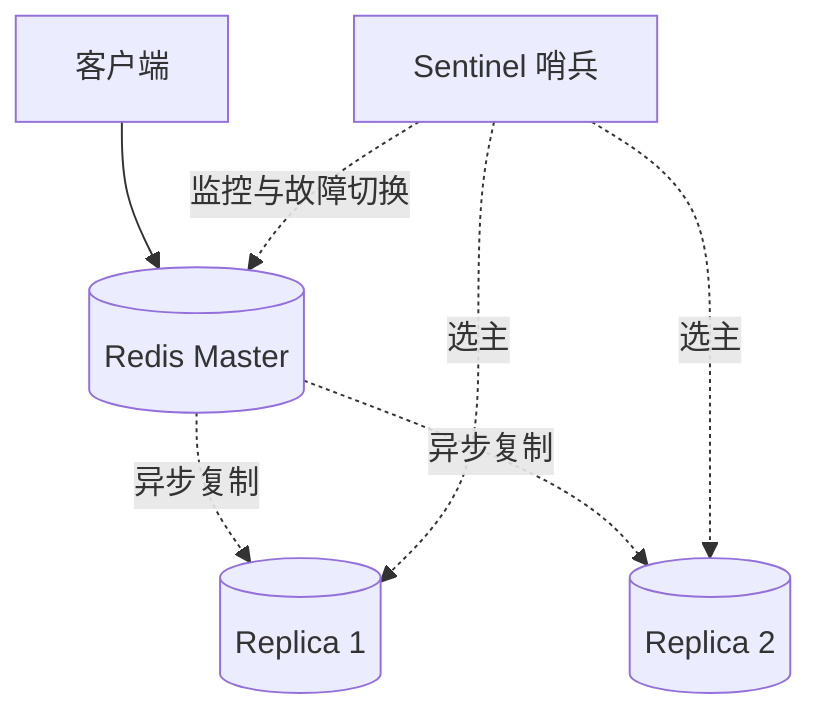
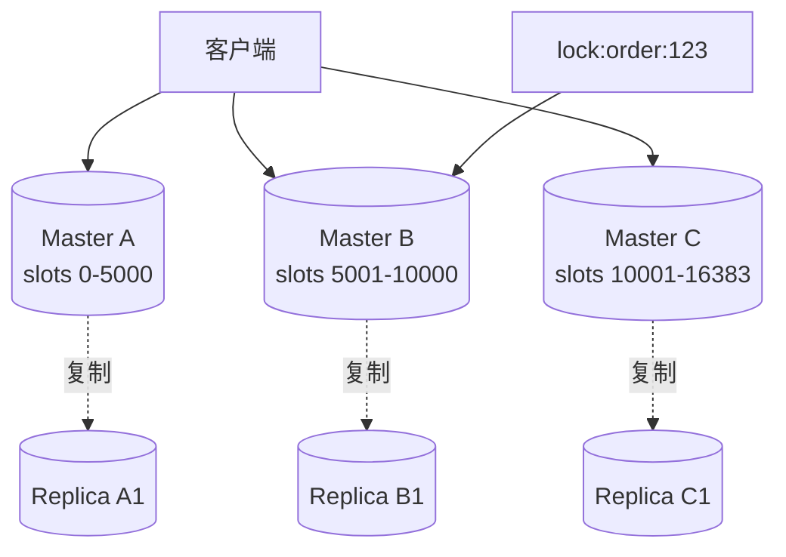
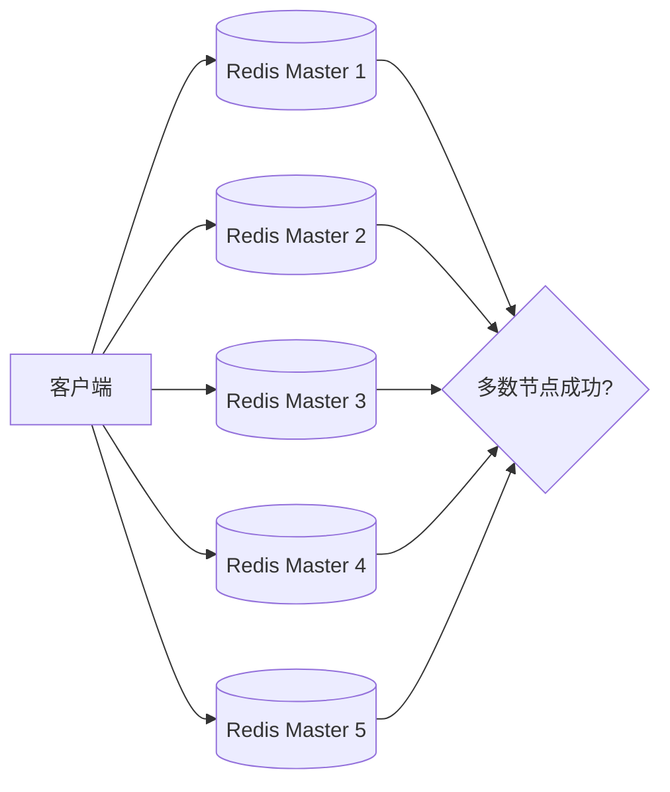
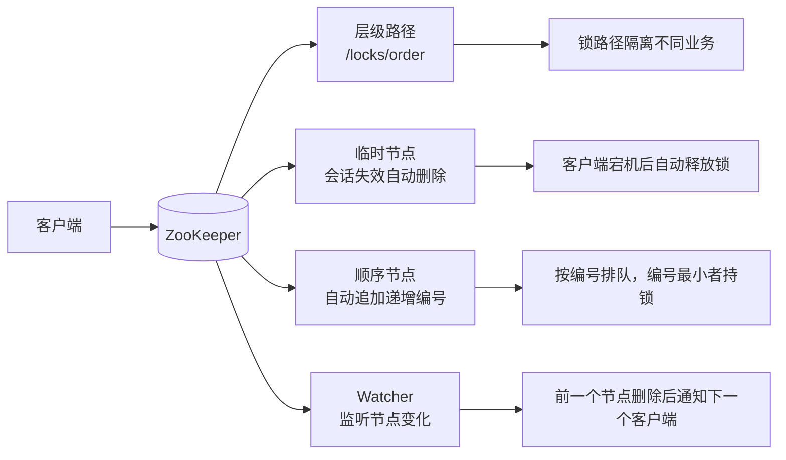
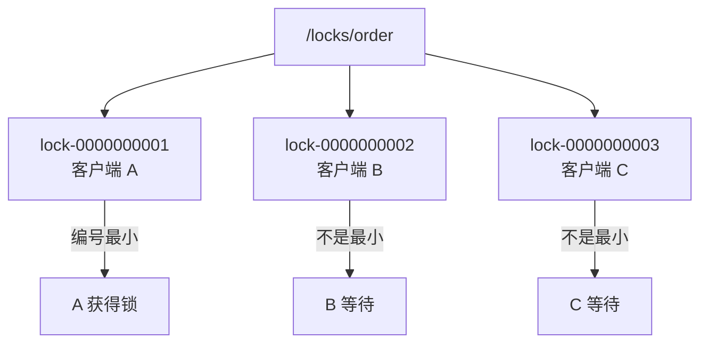
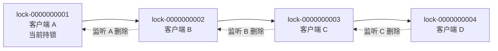
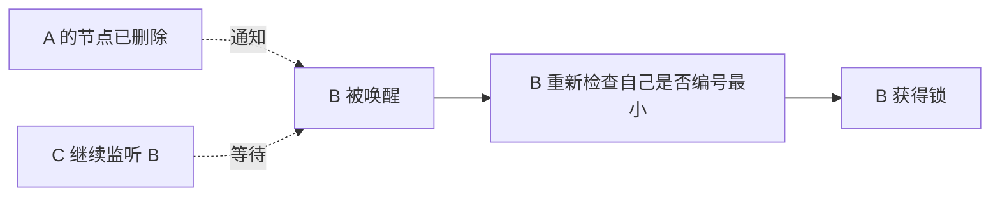
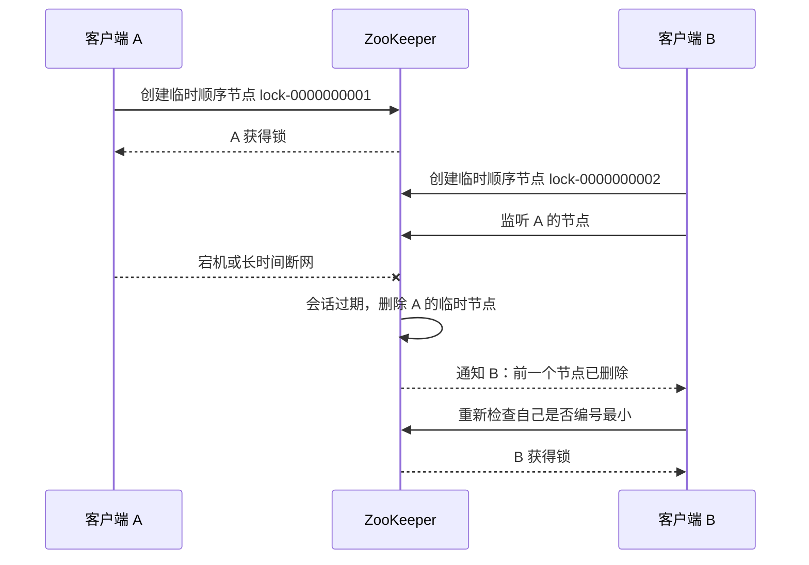
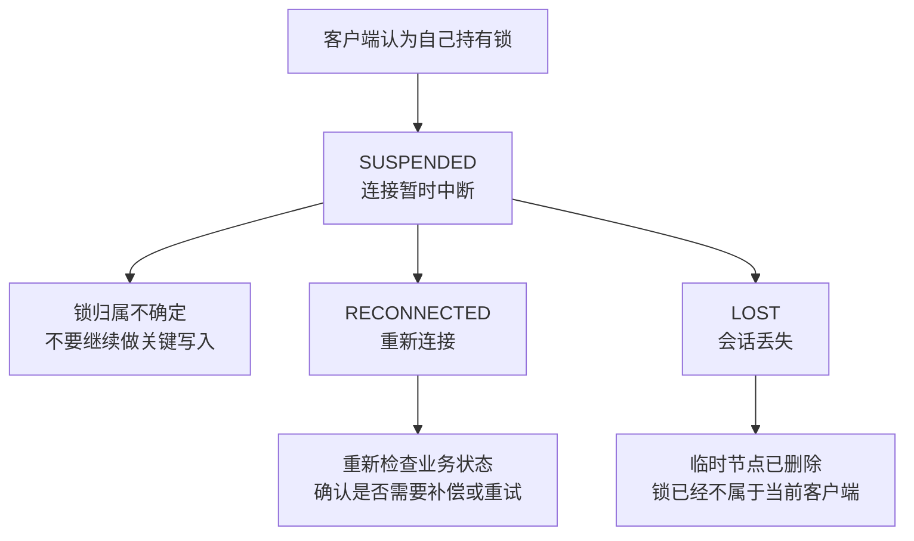

# 分布式锁

## 目录

1\. [1 学习入口与课程概览](#1-学习入口与课程概览)
  1\. [1.1 课程内容概览](#11-课程内容概览)
  2\. [1.2 核心术语速查](#12-核心术语速查)
  3\. [1.3 学习路径与动手练习](#13-学习路径与动手练习)
2\. [2 从单机锁到分布式锁](#2-从单机锁到分布式锁)
  1\. [2.1 单机锁的价值与边界](#21-单机锁的价值与边界)
  2\. [2.2 分布式锁的目标、流程与误区](#22-分布式锁的目标流程与误区)
3\. [3 MySQL 分布式锁：锁记录表与业务行锁](#3-mysql-分布式锁锁记录表与业务行锁)
  1\. [3.1 锁记录表方案：唯一索引互斥](#31-锁记录表方案唯一索引互斥)
  2\. [3.2 过期锁抢占与清理](#32-过期锁抢占与清理)
  3\. [3.3 行锁方案：`SELECT ... FOR UPDATE`](#33-行锁方案select-for-update)
  4\. [3.4 MySQL 方案的优势](#34-mysql-方案的优势)
  5\. [3.5 MySQL 方案的局限](#35-mysql-方案的局限)
  6\. [3.6 MySQL 实战建议](#36-mysql-实战建议)
4\. [4 Redis 分布式锁：从手写到 Redisson](#4-redis-分布式锁从手写到-redisson)
  1\. [4.1 基础实现与风险分析](#41-基础实现与风险分析)
  2\. [4.2 手写 Redis 锁：Spring Boot 实现](#42-手写-redis-锁spring-boot-实现)
  3\. [4.3 看门狗：锁续期机制](#43-看门狗锁续期机制)
  4\. [4.4 Redisson：生产级 Redis 锁](#44-redisson生产级-redis-锁)
  5\. [4.5 RedLock：多节点方案与争议](#45-redlock多节点方案与争议)
5\. [5 ZooKeeper 分布式锁：临时顺序节点](#5-zookeeper-分布式锁临时顺序节点)
  1\. [5.1 原理：临时顺序节点与公平排队](#51-原理临时顺序节点与公平排队)
  2\. [5.2 实战：Curator 封装](#52-实战curator-封装)
6\. [6 项目实践：库存、粒度与验证](#6-项目实践库存粒度与验证)
  1\. [6.1 库存扣减中的锁竞争](#61-库存扣减中的锁竞争)
  2\. [6.2 锁粒度如何设计](#62-锁粒度如何设计)
  3\. [6.3 如何验证锁是否生效](#63-如何验证锁是否生效)
  4\. [6.4 加锁链路日志](#64-加锁链路日志)
7\. [7 选型、排障与面试复盘](#7-选型排障与面试复盘)
  1\. [7.1 方案对比与选型](#71-方案对比与选型)
  2\. [7.2 常见故障排查清单](#72-常见故障排查清单)
  3\. [7.3 面试高频问题](#73-面试高频问题)
  4\. [7.4 参考资料](#74-参考资料)

## 1 学习入口与课程概览

### 1.1 课程内容概览

课程简介提到的核心内容：

1\. 基于数据库实现分布式锁。
2\. 基于 Redis 实现分布式锁。
3\. 基于 ZooKeeper 实现分布式锁。

### 1.2 核心术语速查

学习分布式锁之前，建议先理解下面几个基础概念。后文会频繁出现这些词。

| 概念 | 全称 / 含义 | 初学者理解 |
|---|---|---|
| JVM | Java Virtual Machine，Java 虚拟机 | Java 程序运行所在的进程环境，`synchronized` 这类锁只在同一个 JVM 内有效。 |
| 线程 | Thread | 同一个应用进程里的并发执行单元。 |
| 进程 | Process | 一个正在运行的应用实例。多个 Java 应用实例通常就是多个 JVM。 |
| 临界区 | Critical Section | 一段不能被多个执行单元同时执行的关键代码，例如扣库存、创建订单。 |
| 原子性 | Atomicity | 一个操作要么完整成功，要么完全不发生，中间不会被其他操作插入。 |
| TTL | Time To Live，存活时间 | 锁自动过期的时间，常用于避免持锁方宕机后锁永远不释放。 |
| CAS | Compare-And-Swap，比较并交换 | 先比较当前值是否符合预期，符合才更新，常用于乐观并发控制。 |
| GC | Garbage Collection，垃圾回收 | JVM 自动回收内存的过程，严重时可能让业务线程暂停一段时间。 |
| DB | Database，数据库 | 业务数据最终落地的位置，也是很多一致性问题的最后防线。 |
| P99 | 99 分位耗时 | 100 次请求中，按耗时从小到大排序，第 99 个请求的耗时。常用于估算锁过期时间。 |

一个很重要的学习前提：分布式锁不是“让代码绝对安全”的魔法，它只是降低并发冲突的一种协调手段。真正关键的数据写入，仍然要依靠数据库唯一索引、状态机、事务、幂等表等机制兜底。

### 1.3 学习路径与动手练习

如果你是初学者，建议不要一开始就背各种实现细节，而是按下面顺序学习。

#### 1.3.1 推荐学习顺序

1\. 先理解单机锁为什么在多实例部署下失效。
2\. 再理解分布式锁的四个核心要求：互斥、防死锁、锁归属校验、故障后可恢复。
3\. 用 MySQL 唯一索引实现一版最简单的锁，感受“锁状态放在外部系统”这个思想。
4\. 用 Redis 的 `SET key value NX PX ttl` 实现一版锁，重点理解 TTL 和唯一 token。
5\. 故意制造锁过期、误删锁、重复执行问题，理解为什么需要 Lua、看门狗和幂等兜底。
6\. 在 Java 项目中使用 Redisson，理解成熟客户端帮我们封装了哪些细节。
7\. 最后学习 ZooKeeper 锁，理解临时顺序节点、Watcher 和公平排队。

#### 1.3.2 动手验证清单

可以按下面几个小实验验证文档中的结论。

1\. 实验 1：启动两个应用实例，同时执行同一个定时任务，观察没有分布式锁时是否会重复执行。
2\. 实验 2：用 Redis 实现 `SETNX` + `EXPIRE`，在两条命令之间手动让程序退出，观察是否产生死锁。
3\. 实验 3：用 `SET NX PX` + Lua 解锁，模拟 A 锁过期、B 获锁、A 再解锁，验证 A 不会误删 B 的锁。
4\. 实验 4：把业务 `sleep` 时间设置得超过 TTL，观察是否会出现两个客户端都进入临界区。
5\. 实验 5：使用 Redisson 不指定 `leaseTime` 加锁，观察看门狗是否会自动续期。
6\. 实验 6：使用 Curator 的 `InterProcessMutex`，观察多个客户端是否按顺序获取锁。

#### 1.3.3 学完自检问题

学完后可以尝试回答：

1\. 为什么 JVM 锁在多实例部署下无效？
2\. Redis 锁的 value 为什么不能写固定字符串？
3\. 为什么解锁要用 Lua 脚本？
4\. 锁的 TTL 设置太短和太长分别有什么问题？
5\. 有了分布式锁，为什么还需要数据库唯一索引或幂等设计？
6\. Redis 锁、MySQL 锁、ZooKeeper 锁分别适合什么场景？

## 2 从单机锁到分布式锁

### 2.1 单机锁的价值与边界

#### 2.1.1 锁要解决的并发问题

锁的本质是对共享资源的访问进行互斥控制，避免多个执行单元同时进入临界区导致数据不一致。

典型业务场景：

1\. 库存扣减：同一商品库存只剩 1 件时，多个请求同时下单，不能卖出多件。
2\. 优惠券领取：一个用户只能领取一次，不能因并发请求重复领取。
3\. 秒杀活动：热点商品、热点活动、热点用户行为需要串行化关键步骤。
4\. 支付回调：支付渠道可能重复通知，同一订单不能重复入账。
5\. 定时任务：多实例部署时，同一个 Job 不能被多个节点同时执行。
6\. 缓存重建：热点 key 失效时，不能让所有请求同时穿透数据库。

#### 2.1.2 JVM 内的锁能力

单体应用中，多个线程在同一个 JVM 内竞争共享变量或共享对象，可以使用 JVM 级锁：

1\. `synchronized`
2\. `ReentrantLock`
3\. `ReadWriteLock`
4\. `Semaphore`
5\. `Atomic*` 和 CAS

示例：

```java
// synchronized 保证同一个 JVM 内同一时刻只有一个线程进入该方法
public synchronized void deductStock(Long skuId) {
    // 查询当前商品库存
    Stock stock = stockRepository.getBySkuId(skuId);

    // 库存不足时直接失败，避免继续扣减
    if (stock.getAvailable() <= 0) {
        throw new RuntimeException("库存不足");
    }

    // 扣减库存；注意这个锁只在当前 JVM 内有效
    stockRepository.updateAvailable(skuId, stock.getAvailable() - 1);
}
```

这段代码在单 JVM 内可以让 `deductStock` 串行执行，但它的锁对象只存在当前 JVM 内存中。

#### 2.1.3 多实例下为什么失效

单机锁只对当前进程内线程有效。只要系统出现以下任意情况，单机锁就会失效：

1\. 应用部署了多个实例。
2\. 服务运行在多台机器上。
3\. 同一个接口被不同 JVM 同时调用。
4\. 任务调度器在多个节点同时启动。
5\. 容器自动扩缩容后出现多个副本。

单机锁控制的是“线程之间”的竞争；分布式锁控制的是“进程、节点、服务实例之间”的竞争。

### 2.2 分布式锁的目标、流程与误区

#### 2.2.1 分布式锁的核心目标

分布式锁是一个所有服务实例都能共同访问的互斥协调点。它通常依赖一个外部系统保存锁状态，例如 MySQL、Redis、ZooKeeper。

核心目标：

1\. 互斥性：同一时刻只有一个客户端持有锁。
2\. 防死锁：持锁客户端宕机后，锁最终能释放。
3\. 可识别锁归属：不能释放别人的锁。
4\. 可用性：锁服务异常时，业务能按预期降级或失败。
5\. 性能可接受：高并发场景下锁竞争不能成为系统瓶颈。

#### 2.2.2 加锁、执行业务与释放

```text
# 获取锁成功：进入临界区，执行业务后必须释放锁
尝试获取锁 -> 获取成功 -> 执行业务临界区 -> 释放锁

# 获取锁失败：根据业务选择重试、快速失败、排队或降级
           -> 获取失败 -> 重试 / 快速失败 / 排队 / 降级
```

必须注意：锁只能保护被锁住的临界区，不能替代数据库约束、唯一索引、幂等表、状态机校验等最终防线。

#### 2.2.3 常见失效场景

1\. 锁获取不是原子操作。
2\. 锁没有过期时间，客户端宕机后死锁。
3\. 设置锁和设置过期时间分成两条命令，中间宕机导致死锁。
4\. 释放锁时没有校验 owner，误删其他客户端的锁。
5\. 业务执行时间超过锁 TTL，锁提前过期，另一个客户端进入临界区。
6\. Redis 主从切换导致锁丢失。
7\. 客户端可能因为 JVM 暂停、网络延迟或机器时间不准，误以为自己还持有锁。
8\. 重试策略过于激进，形成锁风暴。

#### 2.2.4 优先不用锁的场景

初学者很容易把“并发问题”和“分布式锁”画等号。实际上，很多场景可以优先用更简单、更可靠的方式解决。

可以不优先使用分布式锁的情况：

1\. 数据库唯一索引可以兜住，例如同一用户只能领取一次优惠券，可以建立 `user_id + coupon_id` 唯一索引。
2\. 数据库原子更新可以解决，例如库存扣减可以使用 `UPDATE stock SET available = available - 1 WHERE sku_id = ? AND available > 0`。
3\. 业务状态机可以限制重复流转，例如订单只能从 `INIT` 更新为 `PAID` 一次。
4\. 幂等表可以识别重复请求，例如支付回调用第三方流水号做唯一键。
5\. 消息队列可以把并发写转成串行消费，例如同一商品的库存变更进入同一个分区。

判断顺序可以简单记为：先看数据库约束能不能解决，再看原子更新或状态机能不能解决，最后再考虑分布式锁。分布式锁越靠近业务入口，越要小心旁路入口、锁超时和故障恢复问题。

#### 2.2.5 请求竞争锁的时序

下面用两个请求 A 和 B 说明分布式锁的基本过程。

```text
# 时间线向下：A 先获得锁，B 在 A 持锁期间不能进入临界区

请求 A                          锁服务                         请求 B
  |                              |                              |
  | ---- 尝试获取 lock:sku:1 ---> |                              |  # A 尝试加锁
  | <--------- 获取成功 --------- |                              |  # A 获得锁
  |                              | <--- 尝试获取 lock:sku:1 ---- |  # B 也尝试加锁
  |                              | -------- 获取失败 ----------> |  # B 获取失败
  | ---- 执行扣库存、下单 ----    |                              |  # A 执行业务临界区
  | ---- 释放 lock:sku:1 ------> |                              |  # A 释放锁
  |                              | <--- 重试获取 lock:sku:1 ---- |  # B 再次尝试
  |                              | -------- 获取成功 ----------> |  # B 获得锁
```

这个时序图要表达的重点是：锁保护的是“请求 A 执行业务临界区”这段时间。请求 B 不是不能执行，而是不能在 A 持锁期间进入同一段临界区。

## 3 MySQL 分布式锁：锁记录表与业务行锁

### 3.1 锁记录表方案：唯一索引互斥

建一张专门保存锁状态的锁记录表，把锁名设计成唯一键。这里的“锁记录表”不是锁住整张表，而是表中的每一行代表一把业务锁。

```sql
-- 保存分布式锁状态的表；一行代表一把业务锁
CREATE TABLE distributed_lock (
    -- 自增主键，方便排查和管理
    id BIGINT PRIMARY KEY AUTO_INCREMENT,
    -- 锁名称，例如 lock:order:123；同一把锁只能有一条记录
    lock_name VARCHAR(128) NOT NULL,
    -- 锁持有者标识，例如 nodeA-thread1-uuid
    owner_id VARCHAR(128) NOT NULL,
    -- 逻辑过期时间，用于处理持锁方宕机后的抢占
    expire_at DATETIME NOT NULL,
    -- 创建时间
    created_at DATETIME NOT NULL DEFAULT CURRENT_TIMESTAMP,
    -- 更新时间
    updated_at DATETIME NOT NULL DEFAULT CURRENT_TIMESTAMP ON UPDATE CURRENT_TIMESTAMP,
    -- 唯一索引保证同一个 lock_name 只能被一个客户端插入成功
    UNIQUE KEY uk_lock_name (lock_name)
);
```

加锁：

```sql
-- 插入锁记录；插入成功表示获取锁成功
INSERT INTO distributed_lock(lock_name, owner_id, expire_at)
VALUES (
    'lock:order:123',          -- 锁名称
    'nodeA-thread1-uuid',      -- 当前客户端 owner
    DATE_ADD(NOW(), INTERVAL 30 SECOND) -- 锁 30 秒后逻辑过期
);
```

如果插入成功，表示拿到锁；如果唯一键冲突，表示锁已被其他客户端持有。

释放锁：

```sql
-- 释放锁时必须同时校验 lock_name 和 owner_id，避免删除别人的锁
DELETE FROM distributed_lock
WHERE lock_name = 'lock:order:123'
  AND owner_id = 'nodeA-thread1-uuid';
```

释放时必须带 `owner_id`，否则可能删除别人刚获得的锁。

### 3.2 过期锁抢占与清理

如果持锁客户端宕机，锁记录表中的记录不会自动删除。因此需要让锁记录具备逻辑过期时间。

抢占过期锁：

```sql
-- 只有锁已经过期时，才允许新的客户端抢占
UPDATE distributed_lock
SET owner_id = 'nodeB-thread7-uuid',                 -- 新的锁持有者
    expire_at = DATE_ADD(NOW(), INTERVAL 30 SECOND) -- 重置过期时间
WHERE lock_name = 'lock:order:123'
  AND expire_at < NOW();                            -- 只抢占已过期的锁
```

如果影响行数为 1，说明抢占成功。

更稳妥的做法是先尝试 `INSERT`，唯一键冲突后再尝试更新已过期记录。

### 3.3 行锁方案：`SELECT ... FOR UPDATE`

MySQL 排他锁常见写法是：

```sql
-- 开启事务；FOR UPDATE 的行锁在事务结束前不会释放
BEGIN;

-- 锁住 sku_id = 1001 对应的库存行
SELECT *
FROM stock
WHERE sku_id = 1001
FOR UPDATE;

-- 在持有行锁期间完成库存校验、扣减库存、创建订单等操作

-- 提交事务后释放行锁
COMMIT;
```

`FOR UPDATE` 会对查询到的记录加排他锁。其他事务如果也想修改这行数据，或者用 `FOR UPDATE` 获取同一行锁，就必须等待当前事务提交或回滚。

这种方式适合“锁住已经存在的一行业务数据”，例如锁某个商品库存行、订单行、用户账户行。它和前面的“锁记录表 + 唯一索引”方案区别很大：

| 方案 | 锁住什么 | 适合场景 |
|---|---|---|
| 锁记录表 + 唯一索引 | 一条专门表示锁状态的记录 | 任务互斥、业务资源不一定有现成数据行 |
| `SELECT ... FOR UPDATE` | 已存在的业务数据行 | 库存、账户余额、订单状态等行级更新 |

使用 `FOR UPDATE` 时要注意：

1\. 必须放在事务中，事务提交或回滚后行锁才会释放。
2\. 查询条件必须命中索引，否则可能扩大锁范围，甚至造成大量阻塞。
3\. 不要在事务里执行慢接口、远程调用或长时间计算。
4\. 如果查询不到记录，就不会锁住任何现有行，这类场景要额外设计初始化或唯一约束。
5\. 它本质上是数据库行锁，不适合高并发长时间占用。

示例库存扣减：

```sql
-- 开启事务，保证查询库存和扣减库存在同一个事务内完成
BEGIN;

-- 查询并锁住库存行，其他事务需要等待这行锁释放
SELECT available
FROM stock
WHERE sku_id = 1001
FOR UPDATE;

-- 在库存大于 0 时扣减库存
UPDATE stock
SET available = available - 1
WHERE sku_id = 1001
  AND available > 0;

-- 提交事务，释放行锁
COMMIT;
```

不过在很多库存场景中，直接使用一条原子更新语句更简单：

```sql
-- 单条 SQL 原子扣减库存；影响行数为 1 表示扣减成功
UPDATE stock
SET available = available - 1
WHERE sku_id = 1001
  AND available > 0; -- 防止库存扣成负数
```

如果影响行数为 1，说明扣减成功；如果影响行数为 0，说明库存不足。

### 3.4 MySQL 方案的优势

1\. 实现简单，依赖少。
2\. 数据可查询，便于排查。
3\. 可以借助唯一索引保证互斥。
4\. 适合低并发、后台任务、运维任务、管理端操作。

### 3.5 MySQL 方案的局限

1\. 性能不适合高频加锁。
2\. 依赖数据库可用性，容易把 DB 变成热点瓶颈。
3\. 过期锁清理需要额外逻辑。
4\. 时钟依赖数据库时间或应用时间，必须统一。
5\. 锁等待、重试、超时控制都要自己实现。
6\. 如果长事务持有行锁，可能造成额外阻塞。

### 3.6 MySQL 实战建议

1\. `lock_name` 必须业务唯一，例如 `lock:coupon:user:{userId}:activity:{activityId}`。
2\. 锁过期时间要大于临界区 P99 执行时间。
3\. 释放锁必须校验 owner。
4\. 定期清理历史过期锁。
5\. 高并发链路不要优先选 MySQL 锁。
6\. 即便用了 MySQL 锁，也建议通过唯一索引兜底，例如订单号唯一、用户活动领取记录唯一。

## 4 Redis 分布式锁：从手写到 Redisson

### 4.1 基础实现与风险分析

#### 4.1.1 为什么 Redis 适合短锁

Redis 的特点：

1\. 单线程命令执行模型，单条命令天然原子。
2\. 内存操作性能高。
3\. 支持 key 过期时间。
4\. 部署和客户端生态成熟。

#### 4.1.2 反例：`SETNX` 后再 `EXPIRE`

```text
# 第一步：只有 key 不存在时才设置成功
SETNX lock:order:123 value

# 第二步：再单独设置过期时间
EXPIRE lock:order:123 30
```

问题：两条命令不是原子的。如果 `SETNX` 成功后应用宕机，`EXPIRE` 没执行，锁会永久存在。

#### 4.1.3 正确写法：`SET NX PX`

Redis 官方推荐使用带条件和过期时间的 `SET`：

```text
# SET 一条命令同时完成：加锁、设置唯一 token、设置过期时间
SET lock:order:123 unique-token NX PX 30000
```

含义：

1\. `NX`：key 不存在时才设置，保证互斥。
2\. `PX 30000`：设置 30 秒毫秒级过期，避免死锁。
3\. `unique-token`：唯一值，用来标识锁归属。

#### 4.1.4 锁值为什么必须唯一

如果锁过期后被客户端 B 获得，客户端 A 业务结束时直接 `DEL lock`，就会误删 B 的锁。

必须做到：

```text
# 解锁前必须同时满足两个条件：
# 1. 锁 key 仍然存在
# 2. value 仍然等于当前客户端自己的 token
只有 key 仍然存在，并且 value 等于当前客户端的 token，才允许删除。
```

`key` 表示“锁的是哪个资源”。
`value` 表示“这把锁是谁加的”。

所以 Redis 锁的 `value` 必须唯一，是为了在释放锁时识别锁归属，避免 A 误删 B 的锁。

#### 4.1.5 解锁：Lua 原子校验

释放锁必须用 Lua 保证“比较 value”和“删除 key”是原子操作。

```lua
-- 先读取锁 key 当前保存的 value
-- KEYS[1] 是锁 key，ARGV[1] 是当前客户端加锁时生成的 token
if redis.call('get', KEYS[1]) == ARGV[1] then
    -- value 相等，说明这把锁仍然属于当前客户端，可以删除
    return redis.call('del', KEYS[1])
else
    -- value 不相等，说明锁不存在或已经属于其他客户端，不能删除
    return 0
end
```

Java 调用时传入：

1\. `KEYS[1]`：锁 key。
2\. `ARGV[1]`：加锁时生成的 token。

#### 4.1.6 部署形态对锁可靠性的影响

Redis 分布式锁的可靠性，不只取决于 `SET NX PX` 这一条命令，也取决于 Redis 的部署方式。常见部署形态可以分为：单 Redis、主从 + 哨兵、Redis Cluster、多个独立 Redis master。

##### 4.1.6.1 单 Redis 实例



单 Redis 实例下，所有客户端都访问同一个 Redis 节点。对于同一个锁 key，`SET NX PX` 和 Lua 解锁脚本都在这个节点内执行，所以单条命令和单个 Lua 脚本具备原子性。

它的问题也很直接：Redis 一旦宕机，锁服务就不可用。业务可以选择快速失败、降级，或者依赖数据库幂等兜底，但 Redis 自身没有备用节点接管。

适合场景：

1\. 开发、测试环境。
2\. 低风险、短临界区业务。
3\. Redis 故障时可以接受业务失败或降级。

##### 4.1.6.2 主从 + 哨兵



主从 + 哨兵主要解决高可用问题。正常情况下，写请求打到 master；replica 复制 master 的数据；Sentinel 负责监控 master，master 宕机后会从 replica 中选出新的 master。

对分布式锁来说，风险来自主从复制通常是异步的：

```text
# 主从切换导致双持锁的典型过程
1. 客户端 A 在 master 上加锁成功。
2. 锁 key 还没复制到 replica。
3. master 宕机。
4. replica 被哨兵提升为新 master。
5. 客户端 B 在新 master 上也加锁成功。
```

这样就可能出现 A 和 B 都认为自己持有锁。也就是说，主从 + 哨兵提升了 Redis 的可用性，但不等于提供强一致锁。

适合场景：

1\. 希望 Redis 故障后能自动切换。
2\. 可以接受极小概率重复执行，并且有数据库幂等、唯一约束或状态机兜底。
3\. 临界区较短，业务失败可以重试或补偿。

##### 4.1.6.3 Redis Cluster



Redis Cluster 通过 hash slot（哈希槽）把 key 分散到多个 master 上。一个锁 key 最终只会落到某一个 master 上，例如 `lock:order:123` 可能落到 Master B。

所以对单个锁 key 来说，命令仍然在某个具体 master 内原子执行。但 Redis Cluster 不是全局事务系统，跨多个节点的操作不具备整体原子性。

需要注意：

1\. 单 key 加锁通常没问题，因为锁 key 会落到一个节点上。
2\. Lua 脚本如果操作多个 key，这些 key 必须在同一个 slot，否则会报错。
3\. 如果多个 key 必须放到同一个 slot，可以使用 hash tag，例如 `lock:{order:123}` 和 `stock:{order:123}`。Redis Cluster 有个特殊规则：如果 key 里有 `{}`，它只用 `{}` 里面的内容来计算 slot。
4\. Cluster 主要解决容量和吞吐扩展，不等于天然解决强一致分布式锁。
5\. 某个 master 主从切换时，仍然可能遇到锁还没复制就切换的问题。

适合场景：

1\. Redis 数据量大，需要分片扩容。
2\. 访问压力高，需要多个 master 分摊请求。
3\. 锁 key 是单 key 操作，并且业务有幂等兜底。

##### 4.1.6.4 多个独立 Redis master 与 RedLock



多个独立 Redis master 可以用来实现 RedLock。它不是 Redis Cluster，也不依赖主从复制，而是让客户端分别向多个相互独立的 Redis master 加锁。

典型规则是：

1\. 客户端记录开始时间。
2\. 依次向多个 Redis master 尝试加同一把锁。
3\. 如果成功节点数达到多数派，例如 5 个节点中成功 3 个，并且总耗时小于锁过期时间，则认为加锁成功。
4\. 如果加锁失败，或者业务执行完成，需要向所有节点释放锁。

这个方案试图降低单 Redis 节点故障和主从异步复制带来的风险。但它也带来更高复杂度：需要维护多个独立 Redis master，性能开销更高，并且仍然会受到网络延迟、进程暂停、时钟漂移等问题影响。

适合场景：

1\. 团队明确理解 RedLock 的限制和争议。
2\. 业务需要比单 Redis 更高的容错能力。
3\. 多个 Redis master 确实部署在不同故障域。
4\. 关键写操作仍然有幂等和数据层兜底。

##### 4.1.6.5 小结

| 部署形态 | 主要解决什么 | 对分布式锁的影响 |
|---|---|---|
| 单 Redis 实例 | 简单、高性能 | 单 key 操作原子，但 Redis 宕机后锁服务不可用。 |
| 主从 + 哨兵 | 高可用 | 能自动故障切换，但异步复制可能导致锁丢失。 |
| Redis Cluster | 分片扩容 + 高可用 | 单 key 仍在单节点内原子，跨节点不具备全局原子性。 |
| 多个独立 Redis master | 多节点容错 | 可实现 RedLock，但复杂度、性能成本和争议更高。 |

一句话总结：Redis 的单命令原子性解决的是“某个节点内怎么执行命令”的问题；部署形态决定的是“节点故障、主从切换、扩容分片时锁语义会不会被破坏”的问题。

#### 4.1.7 Redis 锁的通用风险

即使用了正确的 `SET NX PX` 和 Lua 解锁，Redis 锁仍然不是绝对强一致锁。它解决的是“短时间互斥”的问题，不能替代数据库事务、唯一约束、状态机和幂等设计。

主要风险：

1\. 锁服务不可用：Redis 宕机、网络中断或连接池耗尽时，客户端可能无法加锁或解锁。
2\. 锁提前过期：业务执行时间超过 TTL，锁已经释放，但原业务线程还在继续执行。
3\. 锁归属变化：锁过期后被其他客户端重新获取，旧客户端如果不校验 token，可能误删别人的锁。
4\. 故障切换丢锁：主从复制未完成时发生主从切换，可能导致新主节点上没有原来的锁。
5\. 客户端误判：网络分区、JVM 暂停、机器时间不准等情况，可能让客户端误以为自己仍然持有锁。
6\. 缺少数据兜底：如果数据库没有唯一索引、状态机或幂等设计，锁失效时可能出现重复写入或脏数据。

#### 4.1.8 Redis 锁适用与不适用场景

适合：

1\. 对性能要求高。
2\. 临界区较短。
3\. 可以接受极小概率异常，并有数据库幂等兜底。
4\. 秒杀、库存预扣、缓存重建、短任务互斥。

不适合：

1\. 金融强一致核心账务。
2\. 长时间任务。
3\. 无法容忍重复执行的业务。
4\. 缺少幂等兜底的写操作。

#### 4.1.9 锁过期后的旧客户端写入

Redis 锁最容易被初学者忽略的风险是：锁过期并不代表原来的业务线程已经停止。

典型过程：

```text
# 锁过期后，旧客户端仍继续写入的风险
1. 客户端 A 获取锁成功，TTL = 30 秒。
2. A 发生 GC 暂停、网络卡顿或慢 SQL，业务卡住 40 秒。
3. 30 秒后锁自动过期。
4. 客户端 B 获取同一把锁成功，并完成数据写入。
5. A 恢复执行，继续写入数据，可能覆盖 B 的结果。
```

这类问题只靠续期也不能百分百解决，因为客户端可能在暂停期间无法续期。更稳妥的方案是让数据层识别“旧持锁者”。常见做法是引入 fencing token，也叫栅栏令牌。

栅栏令牌的基本思路：

1\. 每次成功加锁时，锁服务返回一个递增版本号，例如 `100`、`101`、`102`。
2\. 客户端写数据库时带上这次拿到的版本号。
3\. 数据库只接受版本号更大的写入，拒绝旧版本写入。

需要注意：普通 Redis 锁里常用的 UUID token 只能用来识别“这把锁是谁加的”，不能直接当 fencing token。因为 UUID 不递增，数据库无法通过它判断谁新谁旧。真正的 fencing token 需要额外的递增来源，例如 Redis `INCR`、数据库序列、ZooKeeper 顺序节点或 etcd revision。

示例：

```sql
-- 只有当前 token 比数据库中记录的 token 更新，才允许写入
UPDATE resource
SET value = :newValue,                 -- 本次要写入的新业务值
    fencing_token = :currentToken      -- 写入当前客户端拿到的递增 token
WHERE id = :resourceId                 -- 指定要更新的业务资源
  AND fencing_token < :currentToken;   -- 拒绝旧 token 的写入
```

参数含义：

1\. `currentToken`：当前客户端这次拿锁得到的递增令牌。
2\. `resourceId`：要更新的业务资源。
3\. `newValue`：要写入的新业务值。

这个 SQL 的含义是：只有数据库里已有的 `fencing_token` 小于当前客户端的 `currentToken`，才允许更新。更新成功后，把数据库里的 `fencing_token` 改成 `currentToken`。

举例：

```text
# B 是新客户端，已经用更大的 token 写入成功
B 已经用 token = 101 写入成功，数据库 fencing_token = 101。

# A 是旧客户端，恢复后仍拿着更小的 token 写入
A 恢复后拿着旧 token = 100 来写。

# 数据库会判断旧 token 是否比当前 token 更新
判断条件变成：
101 < 100

# 条件不成立，说明 A 是旧写入，必须拒绝
结果为 false，所以 A 更新失败。
```

这样即使锁层出现时间窗口，数据层也能识别旧客户端，避免旧写入覆盖新写入。

### 4.2 手写 Redis 锁：Spring Boot 实现

#### 4.2.1 锁接口设计

```java
public interface DistributedLock {
    // 尝试获取锁：key 表示锁资源，token 表示锁持有者，ttl 表示锁过期时间
    boolean tryLock(String key, String token, Duration ttl);

    // 释放锁：必须带 token，用于校验只能释放自己的锁
    boolean unlock(String key, String token);
}
```

#### 4.2.2 `StringRedisTemplate` 实现

```java
@Component
public class RedisDistributedLock implements DistributedLock {

    // Spring 提供的 Redis 字符串操作模板
    private final StringRedisTemplate redisTemplate;

    public RedisDistributedLock(StringRedisTemplate redisTemplate) {
        this.redisTemplate = redisTemplate;
    }

    @Override
    public boolean tryLock(String key, String token, Duration ttl) {
        // setIfAbsent 等价于 SET key value NX PX ttl
        // key 不存在时才写入，并同时设置过期时间
        Boolean success = redisTemplate.opsForValue()
                .setIfAbsent(key, token, ttl);

        // Redis 返回 true 表示加锁成功，false/null 表示加锁失败
        return Boolean.TRUE.equals(success);
    }

    @Override
    public boolean unlock(String key, String token) {
        // Lua 脚本保证“判断 token”和“删除 key”原子执行
        // 从 Java 15 开始，Java 正式支持用三个双引号 """ 来写多行字符串
        String script = """
                -- 先判断锁 key 当前保存的 token 是否等于当前客户端 token
                if redis.call('get', KEYS[1]) == ARGV[1] then
                    -- 相等说明锁仍属于当前客户端，可以删除
                    return redis.call('del', KEYS[1])
                else
                    -- 不相等说明锁不存在或属于别人，不能删除
                    return 0
                end
                """;

        // KEYS[1] 传锁 key，ARGV[1] 传当前客户端自己的 token
        Long result = redisTemplate.execute(
                new DefaultRedisScript<>(script, Long.class),
                Collections.singletonList(key),
                token
        );

        // 返回 1 表示删除成功，也就是释放锁成功
        return Long.valueOf(1L).equals(result);
    }
}
```

#### 4.2.3 业务调用模板

```java
public void submitOrder(Long userId, Long skuId) {
    // 锁粒度按商品维度设计：同一个商品串行扣减，不同商品可以并发
    String lockKey = "lock:sku:" + skuId;

    // 每次加锁都生成唯一 token，用于释放锁时校验归属
    String token = UUID.randomUUID().toString();

    // 尝试加锁，锁 10 秒后自动过期
    boolean locked = redisLock.tryLock(lockKey, token, Duration.ofSeconds(10));

    if (!locked) {
        // 获取锁失败时快速失败，避免请求长时间阻塞
        throw new BusyException("系统繁忙，请稍后重试");
    }

    try {
        // 1. 校验库存
        // 2. 校验用户是否重复下单
        // 3. 扣减库存
        // 4. 创建订单
    } finally {
        // finally 中释放锁，避免业务异常导致锁无法释放
        redisLock.unlock(lockKey, token);
    }
}
```

#### 4.2.4 获取锁失败后的策略

常见策略：

1\. 快速失败：适合前端可重试场景。
2\. 固定次数重试：适合短临界区。
3\. 指数退避：降低热点竞争。
4\. 随机退避：避免多个客户端同步重试。
5\. 进入消息队列：把并发写转成串行消费。

示例：

```java
public boolean tryLockWithRetry(String key, String token, Duration ttl) {
    // 最多尝试 3 次，避免无限重试压垮 Redis
    for (int i = 0; i < 3; i++) {
        if (redisLock.tryLock(key, token, ttl)) {
            return true;
        }

        // 随机休眠 30~100ms，避免多个客户端同时重试形成锁风暴
        sleep(ThreadLocalRandom.current().nextLong(30, 100));
    }

    // 多次尝试仍失败，交给上层业务快速失败或降级
    return false;
}
```

#### 4.2.5 手写 Redis 锁注意点

1\. token 必须每次加锁都唯一。
2\. TTL 不能太短，否则业务未完成锁已过期。
3\. TTL 不能太长，否则客户端宕机后恢复慢。
4\. 解锁必须放在 `finally`。
5\. 解锁必须用 Lua 校验 token。
6\. 不要把锁范围扩大到远程调用、慢 SQL、大文件处理等不可控步骤。
7\. 关键写操作仍要有数据库唯一约束或状态机兜底。

### 4.3 看门狗Watch Dog：锁续期机制

#### 4.3.1 看门狗解决的超时问题

如果锁 TTL 固定为 10 秒，但业务执行了 20 秒，锁会在业务还没结束时过期，其他客户端可能进入临界区。

看门狗的思路：

1\. 加锁成功后，启动续期任务。
2\. 在锁过期前检查当前客户端是否仍持锁。
3\. 如果仍持锁，就延长 TTL。
4\. 业务结束释放锁后，停止续期。

#### 4.3.2 续期流程

```text
# 初始加锁成功，锁 30 秒后自动过期
加锁成功，TTL = 30s

# 看门狗定期检查锁是否仍属于当前客户端
每 10s 检查一次

如果 key 的 value 仍等于 token，则 EXPIRE key 30s

如果业务完成或锁不属于自己，则停止续期
```

#### 4.3.3 续期 Lua 脚本

```lua
-- 只有锁仍属于当前客户端时，才允许续期
if redis.call('get', KEYS[1]) == ARGV[1] then
    -- ARGV[2] 是新的过期时间，单位是毫秒
    return redis.call('pexpire', KEYS[1], ARGV[2])
else
    -- 锁不存在或已被其他客户端持有，不再续期
    return 0
end
```

#### 4.3.4 手写看门狗的边界

手写看门狗容易遗漏边界：

1\. 续期线程自身异常。
2\. 应用关闭时续期任务未停止。
3\. 业务线程结束后续期任务仍在运行。
4\. 续期和释放并发执行。
5\. 同一个线程重入加锁时如何计数。
6\. 锁可重入时 token 设计复杂。
7\. 线程池满了导致续期延迟。
8\. GC 暂停超过 TTL，续期来不及。

因此生产项目一般不建议自己长期维护复杂看门狗，优先使用成熟客户端，例如 Redisson。

### 4.4 Redisson：生产级 Redis 锁

#### 4.4.1 Redisson 能提供什么

Redisson 是 Java 生态中常用的 Redis 分布式对象客户端，提供：

1\. `RLock`：可重入锁。
2\. `RFairLock`：公平锁。
3\. `RReadWriteLock`：读写锁。
4\. `RSemaphore`：信号量。
5\. `RCountDownLatch`：分布式闭锁。

Redisson 的 `RLock` 实现了 Java `Lock` 接口，使用方式更接近本地锁。

#### 4.4.2 RLock 基本用法

```java
// 根据业务资源生成锁 key
RLock lock = redissonClient.getLock("lock:order:" + orderId);

// 最多等待 3 秒获取锁；获取成功后，锁 30 秒自动释放
boolean locked = lock.tryLock(3, 30, TimeUnit.SECONDS);
if (!locked) {
    throw new BusyException("系统繁忙，请稍后再试");
}

try {
    // 临界区业务
} finally {
    // 只有当前线程仍持有这把锁时才释放，避免误解锁
    if (lock.isHeldByCurrentThread()) {
        lock.unlock();
    }
}
```

参数含义：

1\. `waitTime`：最多等待多久获取锁。
2\. `leaseTime`：锁自动释放时间。
3\. `unit`：时间单位。

#### 4.4.3 Redisson 看门狗

如果调用：

```java
// 不指定 leaseTime 时，Redisson 会启用看门狗自动续期
lock.lock();
```

或使用不指定 `leaseTime` 的加锁方式，Redisson 会启用锁看门狗。默认 watchdog 超时时间是 30 秒，持锁客户端存活时会自动续期。

如果调用：

```java
// 指定 leaseTime = 30 秒，锁会在 30 秒后自动释放
lock.tryLock(3, 30, TimeUnit.SECONDS);
```

显式指定了 `leaseTime`，通常表示锁会在指定时间后自动释放，不再依赖无限续期。

#### 4.4.4 Redisson 的优势

1\. API 成熟，减少手写 Lua 与续期逻辑。
2\. 支持可重入。
3\. 支持自动续期。
4\. 等待锁时使用发布订阅减少无意义轮询。Redisson 等锁时会先订阅释放通知，锁释放后再唤醒客户端去抢锁，从而减少频繁查询 Redis 的压力。
5\. 锁释放校验由客户端封装。

#### 4.4.5 Redisson 使用注意点

1\. `unlock()` 前建议判断 `isHeldByCurrentThread()`。
2\. 不要把 `RLock` 当成本地锁随意长时间持有。
3\. 要合理配置 Redis 连接池、超时时间、重试次数。
4\. 锁 key 命名要规范，避免不同业务误用同一把锁。
5\. 重要写链路仍要有数据库幂等兜底。

#### 4.4.6 可重入锁语义

可重入锁的意思是：同一个线程已经持有某把锁时，可以再次获取这把锁，不会把自己阻塞住。

例如一个业务方法已经拿到了 `lock:order:1`，它内部又调用了另一个也需要 `lock:order:1` 的方法。如果锁不可重入，线程会等待自己释放锁，最终可能卡住；如果锁可重入，第二次加锁会成功，并记录重入次数。

需要注意：可重入几次，就要释放几次。Redisson 的 `RLock` 会记录当前线程的持锁次数，只有释放到计数为 0 时，锁才会真正释放。


#### 4.4.7 微服务中接入 Redisson

在微服务项目中，通常不要在每个业务方法里直接手写 Redis 加锁、Lua 解锁和续期逻辑，而是把 Redisson 封装成统一的基础能力。常见接入方式是：引入依赖、配置 Redis 地址、创建 `RedissonClient`、封装锁模板、业务层调用。

##### 4.4.7.1 引入依赖

Maven 示例：

```xml
<!-- Redisson Spring Boot Starter：自动装配 RedissonClient -->
<dependency>
    <groupId>org.redisson</groupId>
    <artifactId>redisson-spring-boot-starter</artifactId>
    <version>${redisson.version}</version>
</dependency>
```

说明：

1\. `redisson-spring-boot-starter` 可以简化 Spring Boot 项目接入。
2\. `redisson.version` 建议由项目统一依赖管理控制。
3\. 生产项目要根据 Spring Boot、Redis、Redisson 版本兼容性选择具体版本。

##### 4.4.7.2 配置 Redis 地址

单 Redis 示例：

```yaml
# Redisson 单节点配置
redisson:
  singleServerConfig:
    # Redis 地址，格式是 redis://host:port
    address: redis://127.0.0.1:6379
    # Redis 连接超时时间，单位毫秒
    connectTimeout: 3000
    # Redis 命令等待响应的超时时间，单位毫秒
    timeout: 3000
  # JSON、String 等编码器可按项目规范统一配置
  codec: !<org.redisson.codec.JsonJacksonCodec> {}
```

主从 + 哨兵或 Redis Cluster 项目中，要改成对应模式的配置。核心原则是：应用只依赖统一的 `RedissonClient`，业务代码不要关心底层 Redis 是单节点、哨兵还是集群。

##### 4.4.7.3 创建统一锁模板

推荐把 Redisson 的使用封装成模板方法，业务只传锁 key 和临界区逻辑。

```java
@Component
public class RedissonLockTemplate {

    private final RedissonClient redissonClient;

    public RedissonLockTemplate(RedissonClient redissonClient) {
        this.redissonClient = redissonClient;
    }

    public <T> T execute(
            String lockKey,
            long waitTime,
            long leaseTime,
            TimeUnit unit,
            Supplier<T> action) {

        // 根据业务 key 获取一把分布式锁
        RLock lock = redissonClient.getLock(lockKey);
        boolean locked = false;

        try {
            // waitTime：最多等待多久获取锁
            // leaseTime：获取锁成功后多久自动释放
            locked = lock.tryLock(waitTime, leaseTime, unit);
            if (!locked) {
                throw new BusyException("系统繁忙，请稍后重试");
            }

            // 获取锁成功后，执行真正的业务临界区
            return action.get();
        } catch (InterruptedException e) {
            // 恢复线程中断标记，避免吞掉中断信号
            Thread.currentThread().interrupt();
            throw new RuntimeException("获取分布式锁被中断", e);
        } finally {
            // 只有当前线程仍持有锁时才释放，避免误删别人的锁
            if (locked && lock.isHeldByCurrentThread()) {
                lock.unlock();
            }
        }
    }
}
```

##### 4.4.7.4 业务服务中使用

示例：防止同一订单被重复处理。

```java
public void payOrder(Long orderId) {
    // 锁 key 要带上业务资源标识，避免不同订单互相阻塞
    String lockKey = "lock:order:" + orderId;

    redissonLockTemplate.execute(
            lockKey,
            3,
            30,
            TimeUnit.SECONDS,
            () -> {
                // 1. 查询订单状态
                // 2. 校验订单是否仍处于待支付状态
                // 3. 更新订单为已支付
                // 4. 记录支付流水
                doPayOrder(orderId);
                return null;
            });
}
```

##### 4.4.7.5 微服务接入建议

1\. 锁 key 必须有业务前缀，例如 `lock:order:{orderId}`、`lock:sku:{skuId}`。
2\. 临界区要短，不要把远程调用、大文件处理、慢 SQL 放进锁里。
3\. `leaseTime` 要大于临界区 P99 耗时，并给网络抖动留余量。
4\. 获取锁失败要有明确策略：快速失败、重试、排队或降级。
5\. 重要写操作仍然要有数据库唯一索引、状态机或幂等表兜底。
6\. 建议统一封装日志字段：`lockKey`、`waitTime`、`leaseTime`、`locked`、`cost`、`unlockResult`。

### 4.5 RedLock：多节点方案与争议

#### 4.5.1 RedLock 基本思路

RedLock 是 Redis 官方文档中描述的一种多 Redis 节点分布式锁算法。它不是依赖 Redis 主从复制，而是假设有 N 个相互独立的 Redis master，客户端尝试在多数节点上加锁。

典型设定：

1\. N = 5 个独立 Redis master。
2\. 客户端向所有节点使用相同 key 和 token 加锁。
3\. 在总耗时小于 TTL 的前提下，如果成功节点数达到多数派，例如 3/5，则认为加锁成功。
4\. 加锁失败时，要尽快释放已经成功设置的部分锁。

#### 4.5.2 RedLock 针对的主从切换问题

单 Redis 主从异步复制的问题：

```text
# RedLock 试图缓解的单 Redis 主从切换问题
客户端 A 在主节点加锁成功
锁还没复制到从节点
主节点宕机
从节点晋升为新主
客户端 B 在新主也加锁成功
A 和 B 同时认为自己持锁
```

RedLock 通过多个独立节点的多数派来降低单点故障和异步复制带来的风险。

#### 4.5.3 RedLock 的 NPC 争议

争议核心在于：在极端网络分区、时钟漂移、进程暂停等情况下，RedLock 是否能提供足够强的互斥语义。

RedLock 的典型争议为 `NPC` 问题：

1\. `N`：Network Delay，网络延迟。客户端请求 Redis 或业务资源时出现不可预期延迟。
2\. `P`：Process Pause，进程暂停，例如 JVM 的 GC Stop-The-World。
3\. `C`：Clock Drift，时钟漂移，不同机器的本地时间不完全一致。

RedLock 依赖“获取锁总耗时小于锁过期时间”这类时间判断，因此网络延迟和进程暂停可以通过超时窗口降低风险，但时钟漂移更难彻底消除。如果客户端和 Redis 节点对时间的理解不一致，就可能影响锁有效期判断。

工程上可以这样理解：

1\. RedLock 比单 Redis 节点更复杂。
2\. RedLock 要向多个 Redis 节点加锁和释放锁，性能开销高于单 Redis 锁。
3\. 它提升了一些故障场景下的容错能力。
4\. 它仍然不是数据库事务、共识协议或线性一致存储的替代品。
5\. 对强一致要求极高的业务，需要考虑 ZooKeeper、etcd、数据库事务、状态机、幂等设计等方案。

#### 4.5.4 RedLock 选用建议

可以考虑：

1\. 业务确实需要比单 Redis 更高的容错。
2\. 能维护多个独立 Redis master。
3\. 团队理解 RedLock 的时间窗口、时钟漂移和超时参数。
4\. 业务有幂等兜底。

谨慎使用：

1\. 团队只想“更安全”但不愿承担复杂度。
2\. Redis 节点实际仍然部署在同一故障域。
3\. 临界区很长。
4\. 业务无法容忍任何重复执行。


#### 4.5.5 RedLock 在服务中的实现

RedLock 的服务落地方式是：准备多个相互独立的 Redis master，服务端分别向这些 Redis 节点尝试加同一把锁；只有多数节点加锁成功，并且总耗时小于锁过期时间，才认为整体加锁成功。

##### 4.5.5.1 部署前提

RedLock 依赖多个独立 Redis master，不是 Redis Cluster，也不是主从 + 哨兵。

```text
# 5 个相互独立的 Redis master
redis-1:6379
redis-2:6379
redis-3:6379
redis-4:6379
redis-5:6379

# 多数派成功条件
5 个节点中至少 3 个加锁成功
```

这些 Redis master 最好部署在不同机器、不同机架或不同可用区，避免所有节点处在同一个故障域里。否则只是形式上有多个 Redis，实际容错能力并没有明显提升。

##### 4.5.5.2 Redisson 实现示例

如果项目使用的 Redisson 版本支持 `RedissonRedLock`，可以用它组合多把 `RLock`。

```java
// 每个 RedissonClient 连接一个独立 Redis master
RedissonClient client1 = Redisson.create(config1);
RedissonClient client2 = Redisson.create(config2);
RedissonClient client3 = Redisson.create(config3);
RedissonClient client4 = Redisson.create(config4);
RedissonClient client5 = Redisson.create(config5);

// 5 个 Redis 节点上使用同一个锁 key
RLock lock1 = client1.getLock("lock:order:" + orderId);
RLock lock2 = client2.getLock("lock:order:" + orderId);
RLock lock3 = client3.getLock("lock:order:" + orderId);
RLock lock4 = client4.getLock("lock:order:" + orderId);
RLock lock5 = client5.getLock("lock:order:" + orderId);

// RedissonRedLock 会尝试在多把锁上获取多数派
RedissonRedLock redLock = new RedissonRedLock(lock1, lock2, lock3, lock4, lock5);

boolean locked = false;
try {
    // 最多等待 3 秒获取锁，获取成功后 10 秒自动释放
    locked = redLock.tryLock(3, 10, TimeUnit.SECONDS);
    if (!locked) {
        throw new BusyException("系统繁忙，请稍后重试");
    }

    // 多数 Redis 节点加锁成功后，才能执行业务临界区
    doBusiness(orderId);
} catch (InterruptedException e) {
    // 恢复中断标记
    Thread.currentThread().interrupt();
    throw new RuntimeException("获取 RedLock 被中断", e);
} finally {
    if (locked) {
        // 释放所有 Redis 节点上的锁
        redLock.unlock();
    }
}
```

注意：不同 Redisson 版本对 RedLock API 的支持和推荐程度可能不同。实际项目接入前，要以当前项目使用版本的 Redisson 官方文档为准。

##### 4.5.5.3 手写 RedLock 的核心流程

不建议生产项目自己手写 RedLock，但理解流程很有帮助。

```text
# 1. 记录加锁开始时间
startTime = now()

# 2. 依次向 5 个独立 Redis master 执行 SET key token NX PX ttl
successCount = 0
for redis in redisMasters:
    if SET lockKey token NX PX ttl 成功:
        successCount++

# 3. 计算加锁总耗时
cost = now() - startTime

# 4. 多数节点成功，并且总耗时小于锁过期时间，才认为加锁成功
if successCount >= 3 and cost < ttl:
    加锁成功，执行业务
else:
    加锁失败，释放已经成功加上的部分锁
```

释放锁时也要向所有 Redis master 发送 Lua 解锁脚本，不能只释放成功加锁的节点。原因是客户端可能不知道某些请求到底成功还是超时，统一释放更稳妥。

##### 4.5.5.4 是否建议在业务中使用 RedLock

RedLock 不是“用了就绝对安全”。它只是比单 Redis 锁多了一层多数派容错，但仍然依赖时间窗口、网络延迟和客户端执行状态。

使用前建议确认：

1\. 是否真的需要比单 Redis / Redisson 更高的容错。
2\. 是否能维护多个独立 Redis master。
3\. 多个 Redis 节点是否真的处在不同故障域。
4\. 业务临界区是否足够短。
5\. 是否已有数据库唯一索引、状态机、幂等表等兜底。

如果只是普通高并发短临界区，优先使用 Redisson 普通 `RLock`，并在数据层做好幂等兜底。只有团队明确理解 RedLock 的复杂度和争议时，才考虑在服务里引入 RedLock。

## 5 ZooKeeper 分布式锁：临时顺序节点

### 5.1 原理：临时顺序节点与公平排队

#### 5.1.1 ZooKeeper 的锁能力来源

ZooKeeper 提供：

1\. 层级命名空间。
2\. 临时节点：客户端会话断开后自动删除。
3\. 顺序节点：创建节点时自动追加递增序号。
4\. Watcher：监听节点变化。
5\. 较强的一致性语义。

这些能力天然适合实现公平分布式锁。



这张图可以这样理解：ZooKeeper 不直接提供一个叫“分布式锁”的命令，而是通过临时节点、顺序节点和 Watcher 组合出锁的语义。

#### 5.1.2 加锁算法流程

以锁路径 `/locks/order` 为例：

1\. 客户端在 `/locks/order` 下创建临时顺序节点，例如 `/locks/order/lock-0000000010`。
2\. 获取 `/locks/order` 下所有子节点并排序。
3\. 如果自己的节点序号最小，获得锁。
4\. 如果不是最小节点，监听自己前一个节点。
5\. 前一个节点删除后，再次判断自己是否为最小节点。
6\. 执行业务。
7\. 删除自己的临时顺序节点，释放锁。

临时顺序节点排队示意：



这里的 `lock-0000000001`、`lock-0000000002`、`lock-0000000003` 就是顺序节点。编号越小，说明创建得越早。当前编号最小的客户端获得锁，其他客户端按顺序等待。

#### 5.1.3 为什么只监听前一个节点

如果所有等待者都监听最小节点，最小节点释放时会唤醒大量客户端，造成惊群。

监听前一个节点的好处：

1\. 每次只唤醒下一个等待者。
2\. 保持排队顺序。
3\. 降低 ZooKeeper 事件通知压力。

只监听前一个节点的示意：



如果所有客户端都监听 A，那么 A 释放锁时，B、C、D 会一起被唤醒，形成惊群。只监听前一个节点时，A 删除后只唤醒 B；B 获得锁，C 继续等 B；整个队列会按顺序向前推进。




#### 5.1.4 临时节点如何自动释放锁

如果客户端宕机或网络断开导致会话过期，ZooKeeper 会自动删除该客户端创建的临时节点。这避免了 Redis 手写锁中常见的“客户端挂了锁不释放”问题。

可以把 ZooKeeper 会话理解为客户端和 ZooKeeper 集群之间的一条“心跳关系”。只要会话还有效，ZooKeeper 就认为客户端还活着；如果客户端宕机、长时间断网或无法维持心跳，会话过期后，临时节点会被自动删除。

注意：会话过期不等于业务代码主动执行了 `release()`。它是 ZooKeeper 从协调层面判断客户端失联后的自动清理机制。



这个图的重点是：A 不需要主动执行解锁代码。只要 A 的会话真的过期，ZooKeeper 就会删除 A 创建的临时节点，后面的 B 才有机会继续获得锁。

#### 5.1.5 ZooKeeper 锁的优缺点

优点：

1\. 公平性好，天然按顺序节点排队。
2\. 会话失效自动释放锁。
3\. 一致性语义比 Redis 锁更强。
4\. 适合协调类任务和关键互斥。

缺点：

1\. 性能低于 Redis。
2\. 运维复杂度更高。
3\. 不适合极高频短锁。
4\. 需要正确处理会话状态变化。

#### 5.1.6 必须处理连接状态

使用 Curator 时官方建议监听连接状态：

1\. `SUSPENDED`：连接暂时中断，不能确定自己是否仍持有锁。
2\. `LOST`：会话丢失，可以确定锁已经不再持有。
3\. `RECONNECTED`：重新连接，需要重新判断业务状态。

这点非常重要。不要只写 `acquire()` 和 `release()`，忽略连接状态。

连接状态处理示意：



这里最容易踩坑的是 `SUSPENDED`：它不是明确丢锁，只是暂时无法确认自己是否还持锁。对关键写操作来说，最稳妥的做法是暂停继续写入，等连接恢复后重新判断业务状态。

### 5.2 实战：Curator 封装

#### 5.2.1 `InterProcessMutex` 用法

Curator 封装了 ZooKeeper 分布式锁，常用类是 `InterProcessMutex`。

```java
// ZooKeeper = 分布式协调服务
// Curator = Java 操作 ZooKeeper 的高级客户端框架
// InterProcessMutex = Curator 封装好的分布式可重入锁

// 基于订单维度创建 ZooKeeper 锁路径
InterProcessMutex lock = new InterProcessMutex(curatorFramework, "/locks/order/" + orderId);

// 最多等待 3 秒获取锁
if (lock.acquire(3, TimeUnit.SECONDS)) {
    try {
        // 临界区业务
    } finally {
        // acquire 成功后必须 release，且可重入几次就要释放几次
        lock.release();
    }
} else {
    throw new BusyException("获取锁超时");
}
```

#### 5.2.2 Spring Boot 接入配置

```java
// Spring 创建 Curator 客户端时自动 start，容器销毁时自动 close
@Bean(initMethod = "start", destroyMethod = "close")
public CuratorFramework curatorFramework() {
    // 连接失败后按指数退避重试：初始间隔 1000ms，最多重试 3 次
    RetryPolicy retryPolicy = new ExponentialBackoffRetry(1000, 3);

    return CuratorFrameworkFactory.builder()
            .connectString("127.0.0.1:2181") // ZooKeeper 连接地址
            .sessionTimeoutMs(15000)          // 会话超时时间
            .connectionTimeoutMs(5000)        // 建立连接超时时间
            .retryPolicy(retryPolicy)         // 重试策略
            .namespace("my-app")              // 业务命名空间，隔离不同应用的节点
            .build();
}
```

#### 5.2.3 连接状态监听

```java
// 监听 ZooKeeper 连接状态，避免连接异常时仍误以为自己持有锁
curatorFramework.getConnectionStateListenable().addListener((client, newState) -> {
    if (newState == ConnectionState.SUSPENDED) {
        // 连接暂时中断，此时无法确定锁是否仍然有效
        log.warn("ZooKeeper connection suspended, lock ownership is uncertain");
    }
    if (newState == ConnectionState.LOST) {
        // 会话已经丢失，临时节点会被删除，当前客户端不再持有锁
        log.error("ZooKeeper session lost, locks held by this session are released");
    }
});
```

#### 5.2.4 ZooKeeper 实战注意点

1\. 锁路径要按业务维度隔离。
2\. `InterProcessMutex` 是可重入锁，同一线程多次 acquire 需要对应多次 release。
3\. 不要每次都创建大量 Curator 客户端，客户端应复用。
4\. 获取锁等待时间、ZooKeeper 会话超时时间、业务执行耗时要分别配置和理解，不要把它们混成 Redis 锁的 TTL 语义。
5\. 处理 `SUSPENDED` 和 `LOST` 状态。
6\. 对高频热点写，不要盲目把 ZooKeeper 当 Redis 用。

## 6 项目实践：库存、粒度与验证

### 6.1 库存扣减中的锁竞争

不加锁时的典型问题：

```text
# 初始库存只有 1
库存 = 1

# A 和 B 都在扣减前读到了旧库存
请求 A 查询库存，看到 1
请求 B 查询库存，看到 1

# 两个请求都认为库存足够，于是都扣减成功
A 扣减并下单成功
B 扣减并下单成功

# 最终卖出了 2 件，形成超卖
最终超卖
```

加锁后：

```text
# A 先获得商品 1001 的锁
A 获取 lock:sku:1001 成功

# B 在 A 持锁期间不能进入临界区
B 获取 lock:sku:1001 失败

# A 完成库存扣减和下单
A 完成扣减与下单

# A 释放锁后，B 才能重试或直接失败
A 释放锁
B 重试或失败
```

### 6.2 锁粒度如何设计

锁粒度越粗，并发越低；锁粒度越细，复杂度越高。

示例：

```text
# 粗粒度：所有商品共用一把锁，并发最低
粗粒度：lock:sku

# 中粒度：每个商品一把锁，常见于商品库存扣减
中粒度：lock:sku:{skuId}

# 细粒度：细化到商品 + 仓库，并发更高但复杂度也更高
细粒度：lock:sku:{skuId}:warehouse:{warehouseId}
```

建议：

1\. 能锁单个用户就不要锁全局。
2\. 能锁单个商品就不要锁整个活动。
3\. 能用数据库原子更新就不一定需要锁。

库存扣减可以优先考虑 SQL 原子更新：

```sql
-- 使用单条 SQL 原子扣减库存，避免先查再改导致并发问题
UPDATE stock
SET available = available - 1
WHERE sku_id = ?       -- 指定商品
  AND available > 0;   -- 只有库存大于 0 才扣减
```

如果影响行数为 1，说明扣减成功。此方式在很多库存场景比先查再锁更简单。

### 6.3 如何验证锁是否生效

验证分布式锁时，至少覆盖：

1\. 单节点并发：多线程压测。
2\. 多实例并发：启动两个应用实例。
3\. 锁超时：临界区 sleep 超过 TTL。
4\. 异常释放：业务抛异常后是否进入 finally。
5\. 误删验证：A 锁过期、B 获锁、A 解锁是否会删 B 的锁。
6\. Redis 故障：Redis 重启或主从切换时业务表现。

### 6.4 加锁链路日志

加锁链路建议记录：

1\. `lockKey`
2\. `token`
3\. `owner`
4\. `ttl`
5\. `acquireCost`
6\. `locked`
7\. `retryCount`
8\. `businessCost`
9\. `unlockResult`

日志不要只写“加锁失败”，要能判断是锁竞争、Redis 超时还是代码异常。

## 7 选型、排障与面试复盘

### 7.1 方案对比与选型

| 方案 | 互斥能力 | 性能 | 实现复杂度 | 典型场景 | 主要风险 |
|---|---|---:|---:|---|---|
| JVM 单机锁 | 单进程内有效 | 很高 | 低 | 单体应用、单实例任务 | 多实例失效 |
| MySQL 唯一索引锁 | 中 | 低 | 中 | 后台任务、低频管理操作 | DB 热点、过期清理 |
| Redis 单实例锁 | 中 | 高 | 中 | 短临界区、高并发业务 | 主从切换、TTL 过期 |
| Redisson | 中到较高 | 高 | 低 | Java 项目常规分布式锁 | 仍依赖 Redis 语义 |
| RedLock | 较高但有争议 | 中 | 高 | 多 Redis 独立节点容错 | 参数复杂、时钟与网络问题 |
| ZooKeeper/Curator | 高 | 中低 | 中 | 协调类任务、强互斥需求 | 运维复杂、性能较低 |

选型建议：

1\. 单实例应用：优先 JVM 锁。
2\. 多实例但低频任务：MySQL 锁可接受。
3\. 高并发短临界区：Redis/Redisson 更常用。
4\. Java 生产项目：优先 Redisson，少手写。
5\. 需要公平锁或更强协调：ZooKeeper/Curator。
6\. 绝对不能重复执行的业务：锁之外必须有幂等、唯一约束、状态机或事务兜底。

### 7.2 常见故障排查清单

#### 7.2.1 加锁失败率高

1\. 锁粒度是否过粗。
2\. 临界区是否过长。
3\. 是否有慢 SQL 或远程调用放在锁内。
4\. 重试间隔是否太短。
5\. Redis/ZooKeeper 是否有延迟抖动。

#### 7.2.2 出现重复执行

1\. 锁 TTL 是否小于业务执行时间。
2\. 解锁是否误删他人锁。
3\. Redis 是否发生主从切换。
4\. 是否存在未加锁的旁路入口。
5\. 数据库是否缺少唯一约束。

#### 7.2.3 业务卡住

1\. MySQL 锁是否没有过期清理。
2\. Redis 锁是否没有 TTL。
3\. Redisson watchdog 是否一直续期。
4\. ZooKeeper 会话是否异常。
5\. 应用线程池是否耗尽。

#### 7.2.4 解锁异常

1\. token 是否和加锁时一致。
2\. 是否在非持锁线程调用 `unlock()`。
3\. 是否重复释放。
4\. Redisson 是否没有判断 `isHeldByCurrentThread()`。

### 7.3 面试高频问题

#### 7.3.1 分布式锁需要满足哪些条件？

核心是互斥、防死锁、锁归属校验、容错、可重入或非可重入语义清晰、性能可接受。

#### 7.3.2 Redis 锁为什么不能用 `SETNX` + `EXPIRE`？

因为两条命令不是原子的。如果 `SETNX` 成功后应用宕机，`EXPIRE` 不会执行，锁可能永久存在。应使用 `SET key value NX PX ttl`。

#### 7.3.3 为什么释放锁要用 Lua？

释放锁需要先判断 value 是否等于自己的 token，再删除 key。如果用两条 Redis 命令，判断和删除之间可能被其他客户端插入，导致误删。Lua 脚本能保证原子执行。

#### 7.3.4 Redis 锁过期时间怎么设置？

通常设置为临界区 P99 耗时的数倍，并结合业务超时、Redis 延迟、GC 暂停、网络抖动评估。过短会提前释放，过长会降低故障恢复速度。

#### 7.3.5 Redisson 看门狗是什么？

Redisson 在未指定固定 leaseTime 时，会为持锁线程自动续期。默认 watchdog 超时时间 30 秒，只要 Redisson 实例仍存活并认为锁被持有，就会延长过期时间。

#### 7.3.6 RedLock 解决什么问题？

它试图解决单 Redis 主从异步复制下故障切换导致的双持锁问题，通过多个独立 Redis master 的多数派加锁提高容错性。但它仍有争议，不能等同于强一致共识系统。

#### 7.3.7 ZooKeeper 锁为什么公平？

因为客户端创建临时顺序节点，按节点序号排队。当前最小节点持锁，后续客户端监听前一个节点，前一个节点释放后再依次获取。

#### 7.3.8 ZooKeeper 锁和 Redis 锁怎么选？

Redis 性能高，适合高并发短临界区；ZooKeeper 协调语义更强，适合公平锁、协调任务、对互斥要求更高但并发不极端的场景。

#### 7.3.9 有了分布式锁，还需要幂等吗？

需要。锁是并发控制手段，不是最终一致性保证。网络、超时、主从切换、业务异常都可能让锁失效或被绕过，关键写操作必须有幂等和数据约束兜底。

### 7.4 参考资料

1\. Redis 官方文档：Distributed Locks with Redis，介绍 Redis 单实例锁、RedLock、安全性与活性目标。
2\. Redis 官方文档：`SET` 命令，说明 `NX`、`PX`、`EX` 等选项。
3\. Redis 官方文档：`SETNX` 命令，已建议迁移到 `SET ... NX`。
4\. Redisson Reference Guide：Locks and synchronizers，说明 `RLock`、watchdog、`leaseTime`、只允许 owner thread 解锁等语义。
5\. Apache Curator 文档：Shared Reentrant Lock，介绍 `InterProcessMutex`。
6\. Apache Curator 文档：Shared Lock / Shared Reentrant Read Write Lock，介绍 ZooKeeper 锁和读写锁封装。
