## 1 从订单通知积压认识 DynamicTp

### 1.1 一个能够观察到的业务问题

订单支付完成后，接口把“发送通知”交给后台线程执行，自己先返回。平时每秒到达 20 个通知任务，每个任务占用线程约 100 毫秒，4 个线程大致能够应付。某天通知供应商变慢，单次调用耗时增长到 1 秒：即使到达量不变，4 个线程每秒也只能完成约 4 个任务，队列将以每秒约 16 个任务的速度增长。

最先出现的现象可能是“用户过了很久才收到通知”，随后才是队列满、任务被拒绝、内存上涨。此时要回答三个具体问题：任务卡在排队还是执行阶段，当前线程数与队列容量是多少，以及能否在不重新发布应用的情况下调整参数。

**DynamicTp 是嵌入 Java 应用的动态线程池框架。** 它在现有线程池执行机制上增加配置刷新、运行指标、告警、任务包装和部分第三方线程池适配。线程池仍在各个应用进程中执行任务；配置中心负责把参数变更传给这些进程。

把最大线程数从 8 调到 32，并不意味着供应商就能承受 32 个并发请求。DynamicTp 提供调整与观察的能力，参数决策仍要依据业务延迟、处理能力和下游容量。

### 1.2 阅读顺序与成功判据

| 阶段 | 阅读范围 | 要完成的结果 |
| --- | --- | --- |
| 第一次接触 | 第 2～3 章 | 启动应用，提交任务，看见工作线程和排队数量，解释为什么没有立即扩到最大线程数 |
| 接入动态配置 | 第 4～6 章 | 修改配置中心参数，并在应用中读回实际生效值 |
| 编写业务代码 | 第 7～9 章 | 根据顺序、优先级、定时与上下文要求选择执行方式，能观察异步异常 |
| 建立运维闭环 | 第 10～16 章 | 看懂指标、验证告警、确定容量边界，完成灰度与故障处置 |
| 扩展与复习 | 第 17～19 章 | 注册自定义扩展，用源码解释边界，并完成综合设计练习 |

第一遍可以先完成第 2、3、4 章。判断入门成功的标准是：不重启 Java 进程，观察到目标线程池的实际参数改变，并且原来的业务提交入口继续工作。

## 2 启动一个可观察的线程池实验

### 2.1 版本与实验前提

本章使用 Java 8、Maven 3.6 及以上、Spring Boot 2.7.18 和 DynamicTp 1.2.2。JDK（Java Development Kit，Java 开发工具包）提供 Java 编译器和运行环境；Maven 负责下载依赖和构建应用。

这组版本用于复现 1.2.2 的配置和源码行为。Spring Boot 3、Spring Framework 6 对应 DynamicTp 的 `1.2.2-x` 制品系列，并需要满足 Spring Boot 自身的 Java 版本要求。迁移时要一起核对 Spring Boot、Spring Cloud、配置中心客户端和 DynamicTp，不能只改一个版本后缀。[DynamicTp 官方版本入口](https://dynamictp.cn/)、[v1.2.2 构建基线](https://github.com/dromara/dynamic-tp/blob/v1.2.2/pom.xml)。

准备一个名为 `dtp-demo` 的空目录，创建下面三个文件。实验服务绑定 `127.0.0.1`，因为其中包含用于学习的调参入口和负载生成入口。

### 2.2 添加依赖与线程池配置

Maven 工程用 XML（Extensible Markup Language，可扩展标记语言）描述依赖；Spring Boot 常用 YAML（YAML Ain't Markup Language）保存应用配置。YAML 通过缩进表达层级，下面代码中的空格缩进需要保持一致。

`pom.xml`：

```xml
<project xmlns="http://maven.apache.org/POM/4.0.0"
         xmlns:xsi="http://www.w3.org/2001/XMLSchema-instance"
         xsi:schemaLocation="http://maven.apache.org/POM/4.0.0 https://maven.apache.org/xsd/maven-4.0.0.xsd">
    <modelVersion>4.0.0</modelVersion>
    <parent>
        <groupId>org.springframework.boot</groupId>
        <artifactId>spring-boot-starter-parent</artifactId>
        <version>2.7.18</version>
        <relativePath/>
    </parent>
    <groupId>com.example</groupId>
    <artifactId>dtp-demo</artifactId>
    <version>1.0.0</version>
    <properties>
        <java.version>8</java.version>
        <dynamictp.version>1.2.2</dynamictp.version>
    </properties>
    <dependencies>
        <dependency>
            <groupId>org.springframework.boot</groupId>
            <artifactId>spring-boot-starter-web</artifactId>
        </dependency>
        <dependency>
            <groupId>org.dromara.dynamictp</groupId>
            <artifactId>dynamic-tp-spring-boot-starter-common</artifactId>
            <version>${dynamictp.version}</version>
        </dependency>
    </dependencies>
    <build>
        <plugins>
            <plugin>
                <groupId>org.springframework.boot</groupId>
                <artifactId>spring-boot-maven-plugin</artifactId>
            </plugin>
        </plugins>
    </build>
</project>
```

`src/main/resources/application.yml`：

```yaml
server:
  address: 127.0.0.1
  port: 8080
spring:
  application:
    name: dtp-demo

dynamictp:
  enabled: true
  enabledCollect: false
  executors:
    - threadPoolName: notificationExecutor
      executorType: common
      corePoolSize: 2
      maximumPoolSize: 8
      queueType: VariableLinkedBlockingQueue
      queueCapacity: 64
      rejectedHandlerType: AbortPolicy
      threadNamePrefix: notification
      keepAliveTime: 30
      unit: SECONDS
      notifyEnabled: false
      waitForTasksToCompleteOnShutdown: true
      awaitTerminationSeconds: 10
```

线程池是重复使用工作线程的任务执行器。`corePoolSize: 2` 表示核心线程数，`maximumPoolSize: 8` 是线程数上限；队列是暂时保存待执行任务的内存容器。这里用小参数让排队现象容易出现。`AbortPolicy` 会在无法接收任务时抛出异常，便于调用方明确识别拒绝。

`threadPoolName` 同时用于创建 Spring Bean 和标识被管理的线程池。Bean 是交给 Spring 容器创建和管理的对象；业务代码通过名称取得这个对象，无需自己再创建同名线程池。

### 2.3 编写提交、观察和实验调参入口

示例中的 `() -> { ... }` 是 Java Lambda 表达式，用于描述稍后执行的任务代码；它被传给执行器时并不会由当前请求线程立即执行。`LongAdder` 用于多线程安全地累加完成数量。

`src/main/java/com/example/dtp/DtpDemoApplication.java`：

```java
package com.example.dtp;

import java.util.LinkedHashMap;
import java.util.Map;
import java.util.concurrent.RejectedExecutionException;
import java.util.concurrent.atomic.LongAdder;

import org.dromara.dynamictp.core.executor.DtpExecutor;
import org.dromara.dynamictp.spring.annotation.EnableDynamicTp;
import org.slf4j.Logger;
import org.slf4j.LoggerFactory;
import org.springframework.beans.factory.annotation.Qualifier;
import org.springframework.boot.SpringApplication;
import org.springframework.boot.autoconfigure.SpringBootApplication;
import org.springframework.http.HttpStatus;
import org.springframework.web.bind.annotation.GetMapping;
import org.springframework.web.bind.annotation.PostMapping;
import org.springframework.web.bind.annotation.RequestParam;
import org.springframework.web.bind.annotation.RestController;
import org.springframework.web.server.ResponseStatusException;

@EnableDynamicTp
@SpringBootApplication
public class DtpDemoApplication {
    public static void main(String[] args) {
        SpringApplication.run(DtpDemoApplication.class, args);
    }
}

@RestController
class NotificationController {
    private static final Logger log =
            LoggerFactory.getLogger(NotificationController.class);

    private final DtpExecutor executor;
    private final LongAdder businessCompleted = new LongAdder();

    NotificationController(
            @Qualifier("notificationExecutor") DtpExecutor executor) {
        this.executor = executor;
    }

    @PostMapping("/lab/jobs")
    public Map<String, Object> submit(
            @RequestParam(defaultValue = "12") int count,
            @RequestParam(defaultValue = "1000") int sleepMs) {
        if (count < 1 || count > 100 || sleepMs < 1 || sleepMs > 5000) {
            throw new ResponseStatusException(HttpStatus.BAD_REQUEST,
                    "count 应在 1～100，sleepMs 应在 1～5000");
        }
        int accepted = 0;
        int rejected = 0;
        for (int i = 0; i < count; i++) {
            final int taskNumber = i;
            try {
                executor.execute(() -> {
                    try {
                        log.info("开始通知，task={}", taskNumber);
                        Thread.sleep(sleepMs);
                        businessCompleted.increment();
                        log.info("完成通知，task={}", taskNumber);
                    } catch (InterruptedException ex) {
                        Thread.currentThread().interrupt();
                        log.warn("通知任务被中断，task={}", taskNumber);
                    }
                });
                accepted++;
            } catch (RejectedExecutionException ex) {
                rejected++;
            }
        }
        Map<String, Object> result = new LinkedHashMap<>();
        result.put("accepted", accepted);
        result.put("rejected", rejected);
        return result;
    }

    @GetMapping("/lab/state")
    public Map<String, Object> state() {
        Map<String, Object> result = new LinkedHashMap<>();
        result.put("core", executor.getCorePoolSize());
        result.put("max", executor.getMaximumPoolSize());
        result.put("poolSize", executor.getPoolSize());
        result.put("active", executor.getActiveCount());
        result.put("queued", executor.getQueue().size());
        result.put("executorCompleted", executor.getCompletedTaskCount());
        result.put("businessCompleted", businessCompleted.sum());
        return result;
    }

    // 仅用于本地验证 JDK 原地调参；持久配置由第 4 章的配置中心管理。
    @PostMapping("/lab/core")
    public Map<String, Object> changeCore(@RequestParam int size) {
        if (size < 1 || size > executor.getMaximumPoolSize()) {
            throw new ResponseStatusException(HttpStatus.BAD_REQUEST,
                    "size 应大于 0 且不超过当前 maximumPoolSize");
        }
        executor.setCorePoolSize(size);
        return state();
    }
}
```

`@EnableDynamicTp` 启动线程池注册等基础设施；`@Qualifier` 指定使用哪个线程池，防止多个同类型对象造成注入歧义。`execute` 提交的是一个 `Runnable`，即没有返回值的任务。

接口返回的 `accepted` 表示本次调用被线程池接受的任务数。`businessCompleted` 在模拟通知真正执行完后增加；`executorCompleted` 是执行器层面的完成统计，任务抛异常也可能被计为执行结束。两者区分了“接受”“执行结束”和“业务成功”。本实验没有真实通知供应商，不能据此验证外部消息送达。

### 2.4 运行并看见排队与扩容

先检查工具并启动应用：

```bash
java -version
mvn -version
mvn spring-boot:run
```

在另一个终端依次执行：

```bash
curl -s http://127.0.0.1:8080/lab/state
curl -s -X POST 'http://127.0.0.1:8080/lab/jobs?count=12&sleepMs=1000'
curl -s http://127.0.0.1:8080/lab/state
curl -s -X POST 'http://127.0.0.1:8080/lab/core?size=4'
curl -s http://127.0.0.1:8080/lab/state
```

1\. 启动后还没有任务时，`core=2`、`max=8`，`poolSize` 可以为 0，因为核心线程默认按需创建。

2\. 提交 12 个任务时，前两个任务触发创建线程，其余任务进入队列。紧接着观察通常能看到 `active≈2`、`queued≈10`；调度与终端操作耗时会影响快照值。

3\. 将核心线程数改成 4 后，`core` 立即读回 4；如果队列仍有任务，执行器会尝试增加工作线程处理积压。日志线程名前缀仍是 `notification`，Java 进程没有重启。

4\. 等所有任务结束，再读状态，`queued=0`、`active=0`，本轮业务完成数增加 12。接口接受成功与最终执行成功分别得到验证。

下面是实验的局部流程，属于教学简化，省略告警、统计增强和并发竞态：

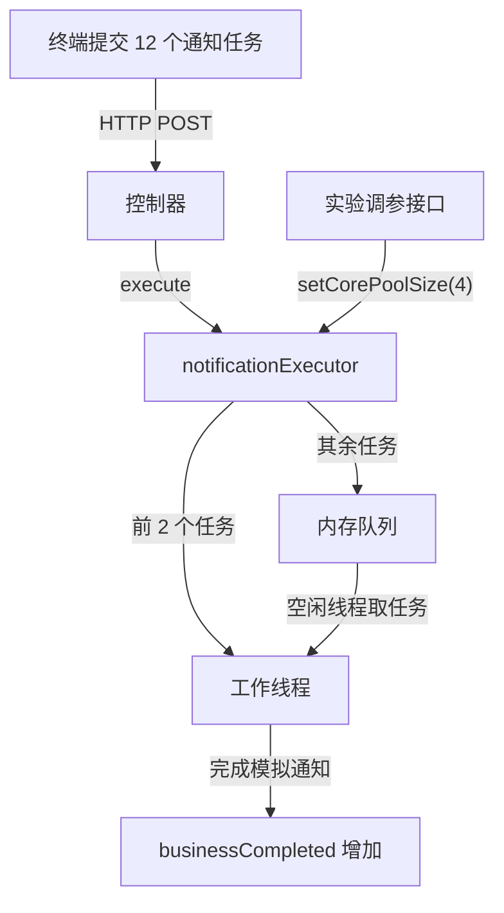
```mermaid
flowchart TD
    U["终端提交 12 个通知任务"] -->|"HTTP POST"| C["控制器"]
    C -->|"execute"| P["notificationExecutor"]
    P -->|"前 2 个任务"| W["工作线程"]
    P -->|"其余任务"| Q["内存队列"]
    Q -->|"空闲线程取任务"| W
    A["实验调参接口"] -->|"setCorePoolSize(4)"| P
    W -->|"完成模拟通知"| B["businessCompleted 增加"]
```

图中的 HTTP（Hypertext Transfer Protocol，超文本传输协议）请求由控制器接收；后续通知在工作线程执行。修改的是同一个执行器对象的参数，因此不需要把原队列里的任务转移到新对象。

### 2.5 最早应掌握的排错入口

| 现象 | 第一处检查 | 成功证据 |
| --- | --- | --- |
| Maven 下载失败 | 仓库网络、代理与依赖版本 | 构建完成，依赖树中存在 DynamicTp 1.2.2 |
| 找不到 `notificationExecutor` | 启用注解、配置前缀、文件是否在 `src/main/resources` | 启动日志出现该名称的注册信息 |
| 注入类型不唯一 | 构造器是否保留 `@Qualifier` | 指定名称的线程池被注入 |
| 8080 端口被占用 | 调整 `server.port`，并同步修改请求地址 | 请求命中本实验服务 |
| `core=4` 但线程数没增长 | 查看 `queued` 与任务是否早已结束 | 带积压时再次验证实际线程数 |
| 改本地 YAML 后没有热更新 | 本章没有接入配置监听器 | 重启生效，或完成第 4 章配置中心接入 |

本地调参接口的修改只存在于当前进程。重启会重新读取配置，后续配置刷新也可能覆盖它。生产环境应通过受控配置入口变更，而不是照搬实验接口。

## 3 用实验结果理解线程池机制

### 3.1 任务进入 common 线程池后的四个选择

`DtpExecutor` 的 common 模式继承 `ThreadPoolExecutor` 的基本调度规则。在正常运行状态下，可以先按下面的顺序理解：尝试创建核心工作线程，尝试入队，尝试创建不超过最大值的工作线程，最后进入拒绝处理。

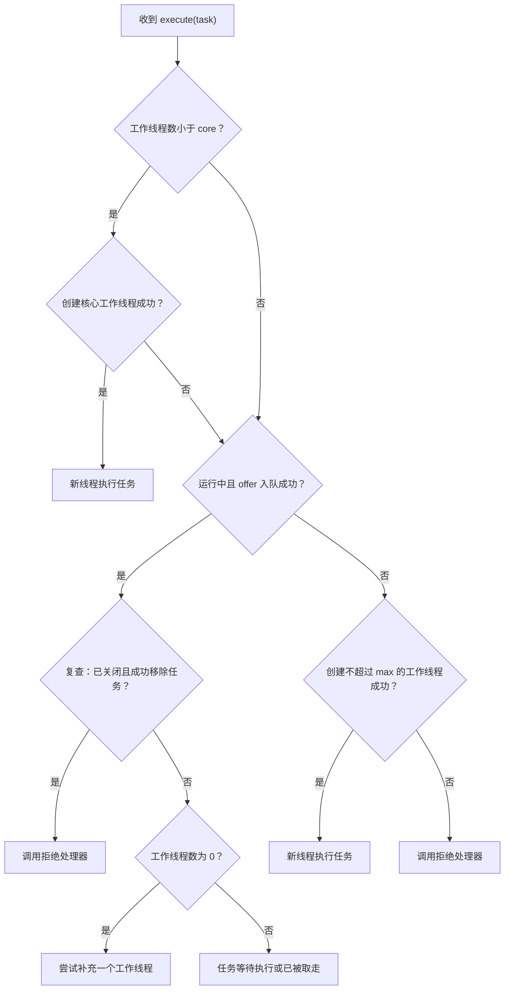
```mermaid
flowchart TD
    S["收到 execute(task)"] --> C{"工作线程数小于 core？"}
    C -->|"是"| A{"创建核心工作线程成功？"}
    A -->|"是"| R1["新线程执行任务"]
    A -->|"否"| Q{"运行中且 offer 入队成功？"}
    C -->|"否"| Q
    Q -->|"是"| K{"复查：已关闭且成功移除任务？"}
    K -->|"是"| X2["调用拒绝处理器"]
    K -->|"否"| Z{"工作线程数为 0？"}
    Z -->|"是"| N["尝试补充一个工作线程"]
    Z -->|"否"| W["任务等待执行或已被取走"]
    Q -->|"否"| M{"创建不超过 max 的工作线程成功？"}
    M -->|"是"| R2["新线程执行任务"]
    M -->|"否"| X1["调用拒绝处理器"]
```

这是 `ThreadPoolExecutor.execute` 的局部机制图。入队后的再次检查解决一个并发问题：入队操作和线程池关闭可能同时发生；如果关闭后成功移除刚入队的任务，要让提交方观察到拒绝。并发下任务可能已经被工作线程取走，因此状态检查不能简化成“发现关闭就一定移除成功”。[JDK ThreadPoolExecutor 文档](https://docs.oracle.com/en/java/javase/17/docs/api/java.base/java/util/concurrent/ThreadPoolExecutor.html)。

实验里最大线程数是 8，但队列足够容纳另外 10 个任务，所以实际只用到 2 个线程。把最大值单独调成 100，依旧不一定增加线程；调大核心值对当前积压更直接，但仍受整体资源约束。

### 3.2 一个精确到任务编号的例子

假设 `core=2`、`max=4`、队列容量为 3，所有任务提交得很快，而且前面的任务尚未结束：

| 提交任务 | 处理路径 | 线程数与队列的典型状态 |
| --- | --- | --- |
| T1、T2 | 创建核心工作线程执行 | 2 个工作线程，队列为空 |
| T3、T4、T5 | 入队 | 2 个工作线程，队列为 3 |
| T6、T7 | 入队失败，尝试创建更多线程 | 最多 4 个工作线程，队列仍为 3 |
| T8 | 线程和队列都达到边界 | 进入拒绝处理 |

T6 可能先于 T3 开始，因为 T6 是新建工作线程的首个任务。这说明先进先出队列只规定从队列中取出的顺序，无法保证多线程池里所有任务的开始顺序，更无法保证完成顺序。FIFO（First In, First Out，先进先出）与业务顺序是不同层次的约束。

### 3.3 配置值、当前值与历史值

| 值 | 含义 | 常见误解 |
| --- | --- | --- |
| `corePoolSize` | 核心线程数配置 | 不等于启动时已经创建的线程数 |
| `maximumPoolSize` | 工作线程数上限配置 | 不等于业务总并发上限，例如调用者执行策略会绕到提交线程 |
| `poolSize` | 当前线程池工作线程数 | 不等于正在计算的线程数 |
| `activeCount` | 近似的正在执行任务的线程数 | 网络等待、锁等待也可能计入 active |
| `largestPoolSize` | 生命周期内出现过的最大线程数 | 调小配置不会清空历史最大值 |
| `queue.size()` | 当前等待任务数 | 不包括已经被工作线程取出的任务 |
| `completedTaskCount` | 已执行结束任务的近似累计数 | 不代表成功通知数或成功订单数 |

CPU（Central Processing Unit，中央处理器）使用率低而 active 很高并不矛盾：线程可能都在等待远程响应。调参前应该看线程栈和下游延迟，而不是据 active 数值推断 CPU 已满。

### 3.4 队列在交换什么资源

队列将暂时处理不了的任务换成等待时间和内存占用。容量越大，短时突发越容易被吸收；持续过载时，积压会让延迟和内存一起增长。

队列中的 `Runnable` 可能引用完整订单、请求上下文和批量数据。估算队列内存时，应统计这些可达对象的保留大小，不能仅计算队列节点。比如 10 000 个任务平均各保留约 50 KB 对象，保留内存就可能接近 500 MB，还没有计算线程栈和其他业务对象。

线程池提交使用的是队列的非阻塞 `offer`，而不是等待空间的 `put`。选择了名字带 `BlockingQueue` 的队列，并不意味着 `execute` 会自动阻塞等到队列空出位置。

### 3.5 拒绝策略直接影响业务语义

| 策略 | 饱和时的行为 | 适合怎样的失败处理 |
| --- | --- | --- |
| `AbortPolicy` | 抛出 `RejectedExecutionException` | 调用方明确失败、限流响应或进入可靠补偿 |
| `CallerRunsPolicy` | 未关闭时由提交线程运行任务 | 提交线程可以承受阻塞，且接受同步执行的语义变化 |
| `DiscardPolicy` | 静默丢弃本次任务 | 仅适用于业务明确允许丢弃，并有相应统计的场景 |
| `DiscardOldestPolicy` | 丢弃队首任务，再尝试提交 | 要理解队首含义、重试和被丢弃任务的结果处理 |

`CallerRunsPolicy` 会把通知供应商的慢调用传回 HTTP 请求线程，改变接口延迟；如果提交方是消息消费线程，还可能改变消费节奏。线程池已经关闭时，该策略会丢弃任务，不能将它理解为“永远不会丢”。

使用 `submit` 时，静默丢弃的任务可能留下永远不完成的 `Future`。`Future` 是用于等待异步结果或取消任务的对象；等待者若无超时，就可能一直卡住。对有可靠性要求的业务，拒绝处理需要让失败可见，并明确重试、持久化或降级责任。

## 4 接入 Nacos 完成持久的动态调参

### 4.1 配置中心在链路中的位置

Nacos 为应用集中存储和分发配置。DynamicTp 利用配置变更事件刷新进程内的线程池。配置中心不保存正在排队的通知任务，也不代替工作线程执行业务。

本章沿用第 2 章应用，使用 Spring Cloud 集成路径。配置文件在应用初始化阶段加载，变更事件在运行阶段触发刷新：

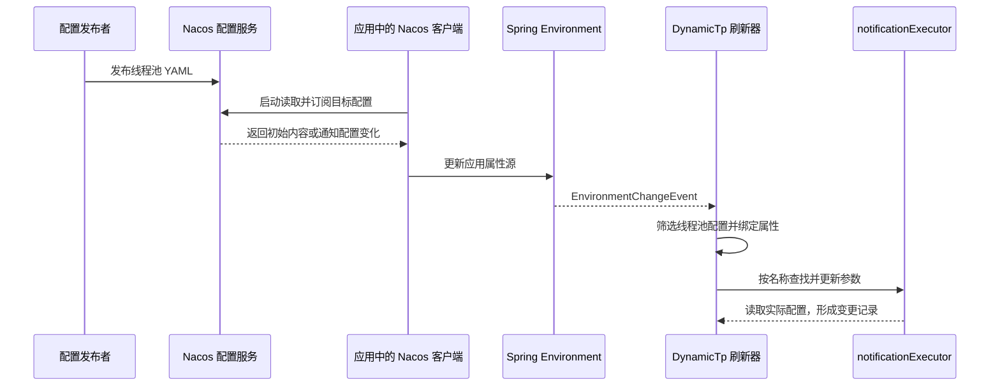
```mermaid
sequenceDiagram
    participant O as 配置发布者
    participant N as Nacos 配置服务
    participant C as 应用中的 Nacos 客户端
    participant E as Spring Environment
    participant D as DynamicTp 刷新器
    participant P as notificationExecutor
    O->>N: 发布线程池 YAML
    C->>N: 启动读取并订阅目标配置
    N-->>C: 返回初始内容或通知配置变化
    C->>E: 更新应用属性源
    E-->>D: EnvironmentChangeEvent
    D->>D: 筛选线程池配置并绑定属性
    D->>P: 按名称查找并更新参数
    P-->>D: 读取实际配置，形成变更记录
```

图表示 Spring Cloud Nacos 路径；独立 Nacos Starter 的监听类与入口不同。各应用副本分别接收通知，生效时刻可能不同。配置发布成功后，还要逐实例检查执行器参数。[CloudNacosRefresher 源码](https://github.com/dromara/dynamic-tp/blob/v1.2.2/starter/starter-configcenter/cloud-starter-nacos/src/main/java/org/dromara/dynamictp/starter/cloud/nacos/refresher/CloudNacosRefresher.java)。

### 4.2 使用一致的依赖组合

在第 2 章 `pom.xml` 中增加以下 `dependencyManagement`，放在 `dependencies` 前。BOM（Bill of Materials，依赖版本清单）用于集中协调一组依赖版本。

```xml
<dependencyManagement>
    <dependencies>
        <dependency>
            <groupId>org.springframework.cloud</groupId>
            <artifactId>spring-cloud-dependencies</artifactId>
            <version>2021.0.8</version>
            <type>pom</type>
            <scope>import</scope>
        </dependency>
        <dependency>
            <groupId>com.alibaba.cloud</groupId>
            <artifactId>spring-cloud-alibaba-dependencies</artifactId>
            <version>2021.0.5.0</version>
            <type>pom</type>
            <scope>import</scope>
        </dependency>
    </dependencies>
</dependencyManagement>
```

将 common Starter 依赖替换为下面的 cloud Starter，并补上配置客户端和 bootstrap 依赖：

```xml
<dependency>
    <groupId>org.dromara.dynamictp</groupId>
    <artifactId>dynamic-tp-spring-cloud-starter-nacos</artifactId>
    <version>${dynamictp.version}</version>
</dependency>
<dependency>
    <groupId>com.alibaba.cloud</groupId>
    <artifactId>spring-cloud-starter-alibaba-nacos-config</artifactId>
</dependency>
<dependency>
    <groupId>org.springframework.cloud</groupId>
    <artifactId>spring-cloud-starter-bootstrap</artifactId>
</dependency>
```

该组合沿用 DynamicTp v1.2.2 主工程与依赖清单的版本范围，不代表新项目的长期版本推荐。配置管理不要求同时引入 Nacos Discovery；服务注册发现是另一项功能。[官方依赖清单](https://github.com/dromara/dynamic-tp/blob/v1.2.2/dependencies/pom.xml)。

本章给的是传统 `bootstrap.yml` 路径。使用较新的 Spring Cloud Alibaba 时，应按对应版本采用 `spring.config.import` 等入口，重新验证初始加载和刷新事件；不要将两套加载方案叠加后依赖偶然的优先级。

### 4.3 准备 Nacos 配置与本地引导配置

前提是已有一个可访问、与所用客户端兼容的 Nacos 配置服务，并持有目标命名空间的配置读写权限。服务器部署、认证初始化与集群安装按所选 Nacos 版本完成；本实验只操作已准备好的配置服务。[Nacos 官方文档](https://nacos.io/docs/latest/overview/)。

在 Nacos 创建 YAML 格式配置：

| 标识 | 本例值 | 含义 |
| --- | --- | --- |
| Namespace | `public`，客户端配置中留空 | 环境或租户隔离空间；自建空间填写 ID，不是显示名称 |
| Group | `DEFAULT_GROUP` | 同一命名空间中的分组 |
| Data ID | `dtp-demo-dtp.yml` | 配置文件标识，文件名与扩展名都要一致 |

将第 2 章整个 `dynamictp` 配置块移动到这个远端文件，保留 `notificationExecutor` 的名称与初始参数。应用本地 `application.yml` 只保留 `server` 配置；把应用名称移动到新建的 `src/main/resources/bootstrap.yml`：

```yaml
spring:
  application:
    name: dtp-demo
  cloud:
    nacos:
      config:
        server-addr: ${NACOS_SERVER_ADDR:127.0.0.1:8848}
        namespace: ${NACOS_NAMESPACE:}
        group: DEFAULT_GROUP
        username: ${NACOS_USERNAME:}
        password: ${NACOS_PASSWORD:}
        file-extension: yml
        refresh-enabled: true
        extension-configs:
          - data-id: dtp-demo-dtp.yml
            group: DEFAULT_GROUP
            refresh: true
```

`${NACOS_PASSWORD:}` 表示从环境变量读取密码，未提供时为空；启用认证的服务器要注入有效凭据。连接配置必须能够在加载远端线程池定义之前被读取，不能把唯一的 Nacos 连接信息放进尚未连接成功的远端文件。

### 4.4 发布变更并读回运行值

1\. 重启应用，确认启动日志注册了 `notificationExecutor`，查询 `/lab/state` 得到 `core=2`、`max=8`。若找不到 Bean，先检查远端配置是否在 Bean 注册前进入环境。

2\. 提交 12 个、每个耗时 1 秒的任务，然后在 Nacos 将同一配置条目的 `corePoolSize` 改为 4，保持 `maximumPoolSize: 8`，发布完整配置。

3\. 查询 `/lab/state`，确认 `core=4`。结合线程池变更日志与当前积压量，观察工作线程是否增加。此步骤不调用本地 `/lab/core`，便于证明变更确实来自配置中心。

4\. 重启应用，确认 `core` 仍为 4，证明新配置是持久来源。再将远端配置改回 2，验证回滚。

5\. 先执行 `mvn package` 生成可运行 JAR（Java Archive，Java 归档）文件，再用 `java -jar target/dtp-demo-1.0.0.jar --server.port=8081` 启动第二个副本。分别请求两个端口确认刷新，不用负载均衡后的单个随机响应代替全副本检查。

此实验能验证依赖解析、配置加载和刷新链路；完整运行还依赖真实 Nacos 服务、网络与认证。客户端连接失败、订阅失败、属性源未更新、注册表未匹配是四个不同故障位置，不能全部归为“DynamicTp 不生效”。

### 4.5 删除、重命名与新增配置的边界

1.2.2 的 `DtpRegistry.refresh` 按名称寻找已经注册的线程池，找不到时记录警告。普通配置刷新不会因为远端新增一个条目就自动完成 Bean 创建，也不会因为删除条目就销毁正在运行的线程池。

因此，`threadPoolName` 应视为稳定标识。将 `notificationExecutor` 改名为 `newNotificationExecutor`，可能只是让刷新器找不到目标，原 Bean 仍然存在。新增执行器或改变执行器类型通常需要经过应用初始化，按发布变更处理。

配置回滚应恢复上一份明确的完整目标值。删除一个配置键，可能暴露低优先级属性源、默认值或已有绑定状态；它不等价于“撤销上次 setter 调用”。[DtpRegistry 源码](https://github.com/dromara/dynamic-tp/blob/v1.2.2/core/src/main/java/org/dromara/dynamictp/core/DtpRegistry.java)。

## 5 配置项、默认值与动态修改边界

### 5.1 先区分创建参数与运行参数

下面按 DynamicTp 1.2.2 的 common `DtpExecutor` 描述。框架能够解析某个字段，不代表已有对象会在每次刷新时使用它重建内部结构。

| 配置项 | 默认或约束 | 运行时变化的含义 |
| --- | --- | --- |
| `threadPoolName` | 业务线程池应提供稳定且唯一的名称 | 查找标识，不是热重命名入口 |
| `executorType` | 未指定时使用 common | 决定创建哪种执行器，普通刷新不切换类型 |
| `corePoolSize` | 默认 1，非负且不超过 max | 可更新；有积压时增大核心值可触发补充线程 |
| `maximumPoolSize` | 默认可用处理器数，必须大于 0 且不小于 core | 可更新；实际线程数向新边界收敛 |
| `queueType` | 默认 `VariableLinkedBlockingQueue` | 创建队列时使用，不动态替换已有队列对象 |
| `queueCapacity` | 默认 1024；业务建议使用明确正容量 | 仅可变容量队列支持原地更新 |
| `keepAliveTime`、`unit` | 默认 60、`SECONDS` | 更新空闲线程回收时间，不是任务运行超时 |
| `allowCoreThreadTimeOut` | 默认 false | true 时核心线程也可因空闲超时退出；要求 keepAliveTime 大于 0 |
| `rejectedHandlerType` | 默认 `AbortPolicy` | 可改变后续拒绝的处理方式，属于业务行为变更 |
| `threadNamePrefix` | 默认 `dtp` | 使用框架命名工厂时可更新前缀；已有线程不会因此统一改名 |
| `preStartAllCoreThreads` | 默认 false | 初始化预启动意图；设置字段不等于立即补齐所有核心线程 |
| `runTimeout`、`queueTimeout` | 默认 0，单位毫秒 | 0 关闭相应超时检测；刷新后主要影响后续定时任务注册 |
| `tryInterrupt` | 默认 false | 执行超时后是否尝试中断，不能保证业务停止 |
| `rejectEnhanced` | 默认 true | 拒绝链路增强，与拒绝告警及统计有关 |
| `taskWrapperNames` | 默认无业务指定包装器 | 对之后提交的任务按已加载包装器增强 |
| `notifyEnabled` | 默认 true | 控制通知告警，不等价于停用整个线程池 |
| `waitForTasksToCompleteOnShutdown` | 默认 true | 关闭时采用平滑停止还是尝试立即停止 |
| `awaitTerminationSeconds` | 默认 3 秒 | 关闭阶段等待时长；超时不保证强制结束任务 |
| `autoCreate` | 默认 true | 初始化时是否从配置创建 Bean，接管已有 Bean 时设为 false |

依据：[TpExecutorProps](https://github.com/dromara/dynamic-tp/blob/v1.2.2/common/src/main/java/org/dromara/dynamictp/common/entity/TpExecutorProps.java)、[DtpExecutorProps](https://github.com/dromara/dynamic-tp/blob/v1.2.2/common/src/main/java/org/dromara/dynamictp/common/entity/DtpExecutorProps.java)、[DtpRegistry](https://github.com/dromara/dynamic-tp/blob/v1.2.2/core/src/main/java/org/dromara/dynamictp/core/DtpRegistry.java)。

`enabled` 的默认值为 true，但它属于框架启用与装配条件的范畴。生产关闭功能要验证启动条件、Bean 依赖与适配器行为；不要假设运行时改成 false 就会销毁所有线程池。

### 5.2 全局配置怎样减少重复

```yaml
dynamictp:
  globalExecutorProps:
    rejectedHandlerType: AbortPolicy
    keepAliveTime: 30
    unit: SECONDS
    waitForTasksToCompleteOnShutdown: true
    awaitTerminationSeconds: 20
  executors:
    - threadPoolName: notificationExecutor
      corePoolSize: 4
      maximumPoolSize: 8
      queueCapacity: 64
    - threadPoolName: reportExecutor
      corePoolSize: 2
      maximumPoolSize: 4
      queueCapacity: 16
      awaitTerminationSeconds: 40
```

对普通字段，可按“线程池显式配置 → 全局显式配置 → 字段默认值”理解。本例通知池等待关闭 20 秒，报表池显式覆盖为 40 秒。两个池各自保留容量和线程数，防止全局调参把资源特征不同的业务一起放大。

数组和集合不能简单套用标量覆盖规则。1.2.2 的全局绑定工具会检查 `taskWrapperNames[0]`、`notifyItems[0].type` 等位置判断是否配置；显式写 `[]` 可能仍触发全局继承。需要关闭某个功能时优先使用它自己的开关，再读取最终运行值验证。[全局配置绑定实现](https://github.com/dromara/dynamic-tp/blob/v1.2.2/common/src/main/java/org/dromara/dynamictp/common/util/DtpPropertiesBinderUtil.java)。

### 5.3 未填写、空值、零值和 false

| 写法 | 含义与边界 |
| --- | --- |
| 没有写 `runTimeout` | 可能继承全局值，没有全局值才回到字段默认 |
| `runTimeout: 0` | 对该参数表达关闭检测，不能把 0 当作“沿用原配置” |
| `notifyEnabled: false` | 是明确的布尔关闭值，不应当被写作未提供 |
| `taskWrapperNames: []` | 受集合继承逻辑影响，不承诺一定清空全局包装器 |
| `notifyItems` 仅填写 capacity | 框架会补入其他默认类型，不代表只保留 capacity |
| 告警项 `count: 0` 或 `threshold: 0` | 某些类型会在默认填充时恢复默认值，不是通用禁用方式 |

此外，本地配置、环境变量和远端属性源还有各自优先级。遇到“配置中心已经是 4，进程还是 2”，应先确认环境中的有效属性值，再检查 DynamicTp 对该属性的刷新能力。

### 5.4 常用 API 速查

API（Application Programming Interface，应用程序编程接口）是程序对外提供的类与方法。以下入口用于读取或操作已管理对象：

| 方法 | 用途与返回值 | 失败与使用边界 |
| --- | --- | --- |
| `DtpRegistry.getAllExecutorNames()` | 获得已注册名称集合的只读视图 | 用于发现实际名称，视图不等于全局一致性快照 |
| `DtpRegistry.getDtpExecutor(name)` | 取得 `DtpExecutor` | 名称不存在或类型不符会抛框架异常 |
| `DtpRegistry.getExecutor(name)` | 取得通用 `Executor` | 找不到会抛异常，不是返回 null |
| `DtpRegistry.getExecutorWrapper(name)` | 获取统一管理包装对象 | 适合读取适配后的管理信息 |
| `DtpRegistry.refresh(props)` | 刷新指定池配置，没有返回确认对象 | 要读回参数；传入属性对象包含默认值，不是通用部分更新协议 |
| `setCorePoolSize(n)`、`setMaximumPoolSize(n)` | 修改线程数配置 | 需维护合法组合和修改顺序 |
| `prestartAllCoreThreads()` | 尝试启动尚未启动的核心线程，返回启动数量 | 会提前消耗线程资源 |
| `execute(task)` | 提交无返回值任务 | 提交失败与任务内部失败发生在不同阶段 |
| `submit(callable)` | 返回 `Future<T>` | 通过 `get` 观察结果、执行异常或取消状态 |

`DtpRegistry.refresh` 的 `DtpExecutorProps` 不宜直接当作外部 HTTP 部分更新请求。只填写 core 的新属性对象仍携带默认 max、队列容量和告警字段，可能意外覆盖其他参数。受控管理接口需要明确部分更新语义、构造完整目标配置、限制取值并回读校验。

## 6 动态刷新的内部机制与并发边界

### 6.1 Spring 接入时各组件负责什么

这是单个应用进程内部的组件视角：

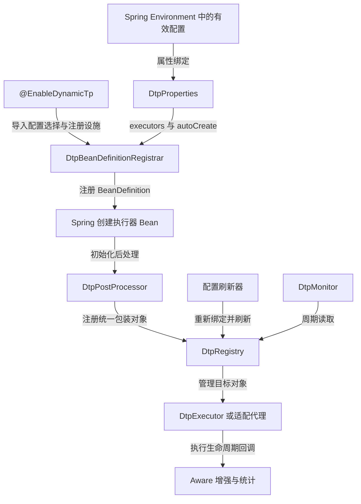
```mermaid
flowchart TD
    EN["@EnableDynamicTp"] -->|"导入配置选择与注册设施"| R["DtpBeanDefinitionRegistrar"]
    ENV["Spring Environment 中的有效配置"] -->|"属性绑定"| PR["DtpProperties"]
    PR -->|"executors 与 autoCreate"| R
    R -->|"注册 BeanDefinition"| B["Spring 创建执行器 Bean"]
    B -->|"初始化后处理"| PP["DtpPostProcessor"]
    PP -->|"注册统一包装对象"| REG["DtpRegistry"]
    REG -->|"管理目标对象"| EX["DtpExecutor 或适配代理"]
    F["配置刷新器"] -->|"重新绑定并刷新"| REG
    MON["DtpMonitor"] -->|"周期读取"| REG
    EX -->|"执行生命周期回调"| AW["Aware 增强与统计"]
```

注册器从已加载配置生成 Bean 定义，Spring 随后创建对象。后处理器识别 `DtpExecutor`，或者带 `@DynamicTp` 的受支持普通执行器，把它们放进注册表。刷新器按稳定名称定位对象；监控器和增强回调围绕这些对象收集信息。

`dynamic-tp-core` 与 Spring 集成模块是分层组织的。核心执行器本身可以在普通 Java 代码中构造；Spring Starter 提供自动装配、环境绑定和生命周期集成。脱离 Spring 时，需要自行补齐对应的上下文、绑定与管理集成，不能把“核心类可构造”理解为所有 Starter 能力自动可用。[模块源码](https://github.com/dromara/dynamic-tp/tree/v1.2.2)、[DtpPostProcessor](https://github.com/dromara/dynamic-tp/blob/v1.2.2/spring/src/main/java/org/dromara/dynamictp/spring/DtpPostProcessor.java)。

### 6.2 一次刷新实际做了什么

1\. 配置事件到达后，刷新器判断变化键是否涉及线程池配置，并把有效属性绑定到 `DtpProperties`。

2\. 注册表读取每个 `threadPoolName`，定位已注册对象。不存在的名称产生警告，不在这里创建新的业务 Bean。

3\. 校验核心参数，例如 core 非负、max 大于 0、max 不小于 core、keepAliveTime 非负。

4\. 按合理顺序更新 core 与 max，再更新空闲时间、核心超时策略以及支持调整的队列属性。

5\. 对 `DtpExecutor` 更新任务包装、拒绝处理、超时、关闭和通知相关信息；普通执行器走对应的适配路径。

6\. 获取变更后的主要字段，与变更前比较，产生相关变更日志与通知。

这个过程是对多个字段顺序执行 setter，并不是数据库式原子事务。核心参数初检也没有覆盖所有组合，例如 `allowCoreThreadTimeOut=true` 与 `keepAliveTime=0` 的组合仍涉及 JDK 校验。某一步抛异常时，前面的字段可能已经改变，所以需要以读回结果确认当前状态，而不是只看是否出现一条异常。

### 6.3 为什么 core 与 max 的修改顺序重要

原配置为 `core=8,max=16`，目标为 `core=20,max=32`。先把 core 改成 20 会暂时出现 core 大于旧 max 的非法组合，应先提高 max。反过来，从 `core=20,max=32` 调成 `core=8,max=16`，应先降低 core，再降低 max。

1.2.2 根据目标 max 是否小于当前 max 选择更新顺序：缩小 max 时先改 core，否则先改 max。这能在单次顺序刷新中维持合法边界，但多个管理入口并发写入仍可能交错。

生产治理上可以让同一个配置控制面串行发布，记录版本和实际值。发布系统的灰度、审计与版本防回退能力属于外围治理设计，不应当假定 `DtpRegistry` 自动提供了跨进程事务或比较并交换协议。

### 6.4 调小线程数何时生效

配置值通常立即改变，正在执行的任务不会因为线程数下调就被强制结束。多余工作线程在进入取任务流程后，依据新的边界决定退出。

把 max 从 16 降为 8 时，JDK 会唤醒空闲工作线程重新检查边界，超出 max 的线程可以较快退出；忙碌线程要到任务结束后才重新判断。只降低 core、实际线程数仍不超过 max 时，额外线程通常依据 keepAliveTime 进行空闲回收。

因此，“调小后一律等待一个 keepAliveTime”不准确。应分别观察 core、max 的配置值、实际 poolSize、任务是否忙碌以及队列是否仍有积压。`activeCount` 高且长时间不下降时，先查任务阻塞原因。

### 6.5 可变队列容量怎样原地调整

`VariableLinkedBlockingQueue` 在链式阻塞队列的实现基础上，让容量可更新。改变的是接收新元素时检查的容量边界，已有节点仍保留在同一个队列中。

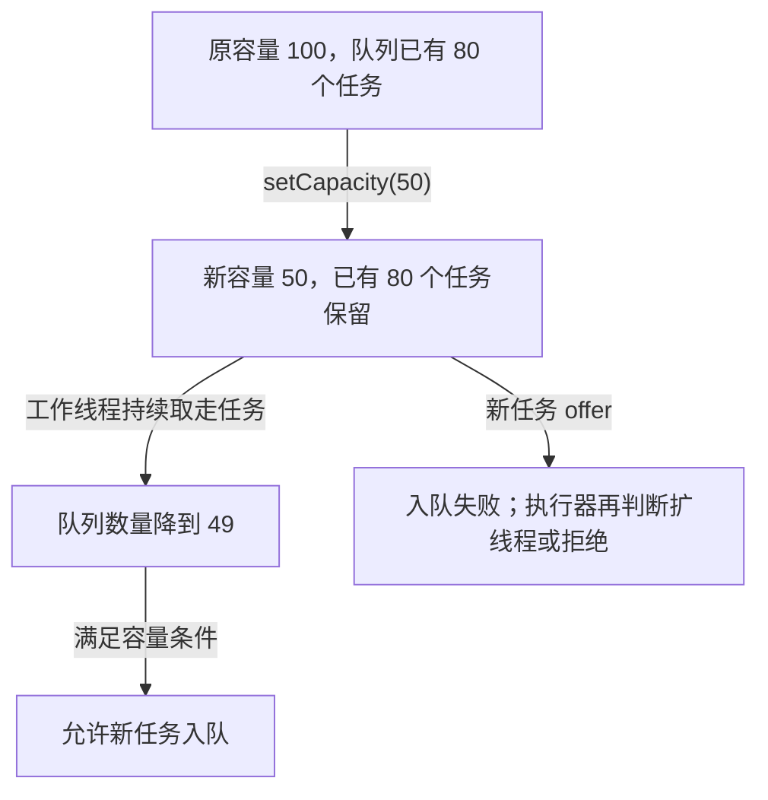
```mermaid
flowchart TD
    A["原容量 100，队列已有 80 个任务"] -->|"setCapacity(50)"| B["新容量 50，已有 80 个任务保留"]
    B -->|"工作线程持续取走任务"| C["队列数量降到 49"]
    B -->|"新任务 offer"| D["入队失败；执行器再判断扩线程或拒绝"]
    C -->|"满足容量条件"| E["允许新任务入队"]
```

图表示队列缩容机制。缩容没有删除那 30 个超出新容量的旧任务；它限制后续接收。扩容时实现会在满足条件后唤醒等待空间的生产者，但 `ThreadPoolExecutor.execute` 自己走的是非阻塞 `offer`。

普通 `LinkedBlockingQueue` 没有公开的容量 setter，`ArrayBlockingQueue` 以固定数组存储，`SynchronousQueue` 不存储排队元素。将配置中的 `queueType` 改成可变队列，不能把正在运行的这些队列自动转换过去。优先级与定时模式另有队列语义，见第 7 章。[VariableLinkedBlockingQueue 源码](https://github.com/dromara/dynamic-tp/blob/v1.2.2/common/src/main/java/org/dromara/dynamictp/common/queue/VariableLinkedBlockingQueue.java)。

## 7 根据任务特征选择线程池类型

### 7.1 五种模式的选择依据

| 模式 | 对应执行器 | 主要任务特征 | 先确认的边界 |
| --- | --- | --- | --- |
| common | `DtpExecutor` | 常规异步任务，接受队列缓冲 | 入队优先使 max 未必被使用 |
| eager | `EagerDtpExecutor` | 存在阻塞，且希望积压前更积极使用线程 | 扩线程可能压垮下游，仍需有界资源 |
| ordered | `OrderedDtpExecutor` | 同一个业务键的任务需要串行 | 顺序范围是当前执行器实例内的分组 |
| priority | `PriorityDtpExecutor` | 等待任务之间有优先级差异 | 不抢占已运行任务，队列通常无硬容量上限 |
| scheduled | `ScheduledDtpExecutor` | 延迟执行和周期执行 | 是进程内调度，不负责多副本去重与持久化 |

common 同样能用于阻塞型任务，eager 也不是所有 I/O（Input/Output，输入输出）任务的必选项。选择依据是排队容忍度、并发成本和业务语义，而非把 CPU 密集与 I/O 密集当作强制分类。

### 7.2 eager 如何改变入队决策

common 使用 `offer` 的结果决定是否继续尝试创建工作线程。eager 配合专用 `TaskQueue`：当现有工作线程不足以覆盖已提交未完成任务、而线程数仍小于 max 时，即使队列还有空间，也可以让 `offer` 返回 false，促使父类尝试创建线程。

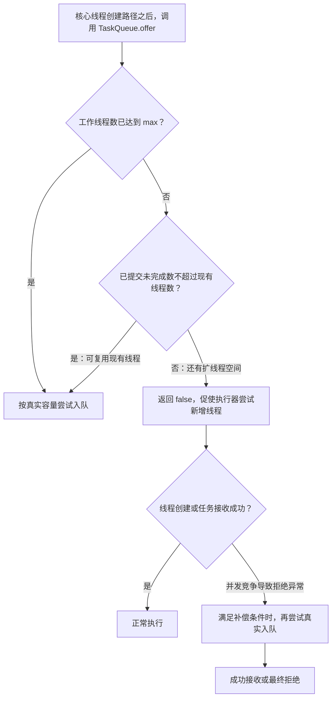
```mermaid
flowchart TD
    T["核心线程创建路径之后，调用 TaskQueue.offer"] --> M{"工作线程数已达到 max？"}
    M -->|"是"| Q["按真实容量尝试入队"]
    M -->|"否"| I{"已提交未完成数不超过现有线程数？"}
    I -->|"是：可复用现有线程"| Q
    I -->|"否：还有扩线程空间"| F["返回 false，促使执行器尝试新增线程"]
    F --> W{"线程创建或任务接收成功？"}
    W -->|"是"| R["正常执行"]
    W -->|"并发竞争导致拒绝异常"| B["满足补偿条件时，再尝试真实入队"]
    B --> X["成功接收或最终拒绝"]
```

这是 eager 的局部机制图。已提交任务数和线程数在并发中不断变化，所以图里的“可复用”是调度判断，不是空闲线程的强一致性承诺；补偿路径处理“判断时还能扩线程，实际创建时已达到边界”的竞争。

例如 `core=2,max=8,queue=64`，12 个慢任务同时到达。common 通常先用 2 个线程，另外 10 个排队；eager 在任务尚未完成的前提下会更积极地尝试扩到 8 个线程，再缓冲剩余任务。若下游只允许 4 个并发，eager 的更快扩张反而会增加限流或超时。[TaskQueue](https://github.com/dromara/dynamic-tp/blob/v1.2.2/core/src/main/java/org/dromara/dynamictp/core/executor/eager/TaskQueue.java)、[EagerDtpExecutor](https://github.com/dromara/dynamic-tp/blob/v1.2.2/core/src/main/java/org/dromara/dynamictp/core/executor/eager/EagerDtpExecutor.java)。

### 7.3 ordered 的按键串行执行

通知状态更新要求同一个订单依次处理“创建、支付、退款”，不同订单可以并行。ordered 把业务键映射到一个子执行器，每个子执行器有自己的队列，并串行执行其任务。

初始化时增加一个独立配置条目：

```yaml
- threadPoolName: orderEventExecutor
  executorType: ordered
  corePoolSize: 4
  maximumPoolSize: 4
  queueType: VariableLinkedBlockingQueue
  queueCapacity: 128
  rejectedHandlerType: AbortPolicy
  threadNamePrefix: order-event
```

该片段应加入 `dynamictp.executors`，不是新的顶层 YAML。重新启动后，通过注册表取出对应类型，在业务方法中调用：

```java
import org.dromara.dynamictp.core.DtpRegistry;
import org.dromara.dynamictp.core.executor.OrderedDtpExecutor;

OrderedDtpExecutor ordered = (OrderedDtpExecutor)
        DtpRegistry.getDtpExecutor("orderEventExecutor");
ordered.execute(() -> System.out.println("订单 A：创建"), "order-A");
ordered.execute(() -> System.out.println("订单 A：支付"), "order-A");
ordered.execute(() -> System.out.println("订单 B：创建"), "order-B");
```

这是放进现有业务方法的调用片段。前两个任务在同一个提交线程中按顺序进入相同分组；订单 B 有机会与 A 并行，但不同键可能哈希到同一分组，所以不同键不保证一定并行。

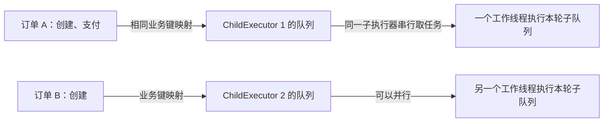
```mermaid
flowchart LR
    A["订单 A：创建、支付"] -->|"相同业务键映射"| C1["ChildExecutor 1 的队列"]
    B["订单 B：创建"] -->|"业务键映射"| C2["ChildExecutor 2 的队列"]
    C1 -->|"同一子执行器串行取任务"| W1["一个工作线程执行本轮子队列"]
    C2 -->|"可以并行"| W2["另一个工作线程执行本轮子队列"]
```

图表示进程内的分组顺序。多个请求线程并发提交同一个键时，保证的是实际进入该分组的顺序，不是业务事件的原始产生时间。若消息先到“退款”、后到“支付”，ordered 不会自动排序纠正；需要业务序号、状态机校验或消息系统的顺序保障。

1.2.2 在构造时按初始 core 创建子执行器集合，刷新核心线程数不会自动重新划分这组分片。每个子执行器还有自己的队列，`queueCapacity=128` 不宜解释为整个有序执行器最多仅保留 128 个任务。一个热点键的慢任务还会拖住同分片上的其他键。

多副本应用中，订单 A 若分别进入两个进程，就有两套独立的有序执行器。跨实例顺序需要稳定路由、消息分区或数据库并发控制等外部机制。[OrderedDtpExecutor](https://github.com/dromara/dynamic-tp/blob/v1.2.2/core/src/main/java/org/dromara/dynamictp/core/executor/OrderedDtpExecutor.java)。

### 7.4 priority 的优先级只作用于待取任务

优先级模式可以让紧急通知先于普通营销任务被取出。1.2.2 的比较器按整数升序排列，数值小的优先级更高。

先在 `dynamictp.executors` 中加入以下条目并重启，使用一个核心线程让取任务顺序容易观察：

```yaml
- threadPoolName: priorityExecutor
  executorType: priority
  corePoolSize: 1
  maximumPoolSize: 1
  queueCapacity: 16
  threadNamePrefix: priority
```

```java
import org.dromara.dynamictp.core.DtpRegistry;
import org.dromara.dynamictp.core.executor.priority.PriorityDtpExecutor;

PriorityDtpExecutor priority = (PriorityDtpExecutor)
        DtpRegistry.getDtpExecutor("priorityExecutor");
priority.execute(() -> System.out.println("普通通知"), 100);
priority.execute(() -> System.out.println("紧急通知"), 1);
```

要验证优先级，应先用一个受闸门控制的任务占满唯一工作线程，再提交优先级 100 与 1 的任务，释放闸门，观察优先级 1 先出队。闸门可用 `CountDownLatch` 实现：工作线程调用 `await` 等待，提交线程调用 `countDown` 释放。空闲线程可能立即执行第一条普通任务，直接运行两行代码无法证明排序失效。

优先级模式使用 `PriorityBlockingQueue`。传入的 `queueCapacity` 在这个队列构造器中是初始容量，队列可以继续增长；它不是可变有界队列的最大等待数。持续高优先级任务还可能饿死低优先级任务，需要入口限量、不同业务池隔离或专门的公平调度策略。

同优先级不承诺 FIFO；正在执行的低优先级任务也不会被抢占。`DiscardOldestPolicy` 丢的是队首，放到优先级队列中可能恰好丢掉最高优先级任务，通常不符合业务意图。[PriorityDtpExecutor](https://github.com/dromara/dynamic-tp/blob/v1.2.2/core/src/main/java/org/dromara/dynamictp/core/executor/priority/PriorityDtpExecutor.java)。

### 7.5 scheduled 的延迟、频率与失败处理

`ScheduledDtpExecutor` 对外继承 DtpExecutor，同时把调度委托给定时执行器代理。在 `dynamictp.executors` 中加入以下条目并重启：

```yaml
- threadPoolName: maintenanceExecutor
  executorType: scheduled
  corePoolSize: 1
  maximumPoolSize: 1
  threadNamePrefix: maintenance
```

再使用以下调用：

```java
import java.util.concurrent.ScheduledFuture;
import java.util.concurrent.TimeUnit;
import org.dromara.dynamictp.core.DtpRegistry;
import org.dromara.dynamictp.core.executor.ScheduledDtpExecutor;

ScheduledDtpExecutor scheduler = (ScheduledDtpExecutor)
        DtpRegistry.getDtpExecutor("maintenanceExecutor");
ScheduledFuture<?> oneShot = scheduler.schedule(
        () -> System.out.println("延迟检查订单"), 5, TimeUnit.SECONDS);
ScheduledFuture<?> periodic = scheduler.scheduleWithFixedDelay(
        () -> System.out.println("检查待补偿订单"), 0, 30, TimeUnit.SECONDS);
```

`ScheduledFuture` 是包含调度状态的异步结果；例如 `periodic.cancel(false)` 可停止后续调度，但不要求中断当前执行。

| 方法 | 时间语义 | 适用判断 |
| --- | --- | --- |
| `schedule` | 延迟之后执行一次 | 本进程内短期延迟动作 |
| `scheduleAtFixedRate` | 按最初的计划时间和固定周期推进 | 希望维持计划频率，允许任务落后时紧接着补执行 |
| `scheduleWithFixedDelay` | 上次执行结束后再等待固定间隔 | 下游轮询、清理等需要控制两次执行间隔的任务 |

同一个周期任务的连续执行不会重叠，但多个不同任务可以并发。任务抛出未处理异常时，JDK 周期调度会抑制后续执行，应记录业务异常并决定是否允许继续。定时队列通常没有普通有界队列的容量限制；调大 max 也不是解决定时调度积压的通用方法。

每个应用副本都会运行本地定时任务。需要“集群只执行一次”、宕机恢复、长期延迟或持久任务历史时，应引入满足这些语义的调度或消息系统，并设计幂等执行。[ScheduledDtpExecutor](https://github.com/dromara/dynamic-tp/blob/v1.2.2/core/src/main/java/org/dromara/dynamictp/core/executor/ScheduledDtpExecutor.java)、[JDK 定时执行器语义](https://docs.oracle.com/en/java/javase/17/docs/api/java.base/java/util/concurrent/ScheduledThreadPoolExecutor.html)。

## 8 在线程切换中传递上下文

### 8.1 ThreadLocal 为什么不会自动跟随任务

请求线程在日志中带有订单追踪标识，但把任务交给线程池后，工作线程日志可能没有这个标识。原因是 `ThreadLocal` 将值绑定到当前线程，线程池工作线程是长期复用的独立线程。

MDC（Mapped Diagnostic Context，映射诊断上下文）是日志框架保存追踪键值的机制，常见实现依赖线程局部存储。`MDC.put("traceId", value)` 修改的是当前线程的数据，而不是把该值附加到所有后续异步任务。

`InheritableThreadLocal` 主要在线程创建时继承值。线程池中的线程可能早在当前请求之前就创建，因此不能用它保证每次提交都获得正确上下文。

### 8.2 配置 mdc 包装器并验证

在 `notificationExecutor` 的完整配置中加入：

```yaml
taskWrapperNames: ["mdc"]
```

在提交任务的方法中验证：

```java
import org.slf4j.MDC;

MDC.put("traceId", "order-trace-001");
try {
    executor.execute(() ->
            log.info("异步通知，traceId={}", MDC.get("traceId")));
} finally {
    MDC.remove("traceId");
}
```

提交时包装器捕获请求线程的上下文快照，工作线程运行时再安装，所以提交方可以在 `finally` 中清理自己的 traceId。上述片段适用于创建并拥有该 traceId 的教学入口；真实请求链路若已有上游上下文，应按拦截器或追踪库的作用域管理方式恢复，避免删除别人的值。

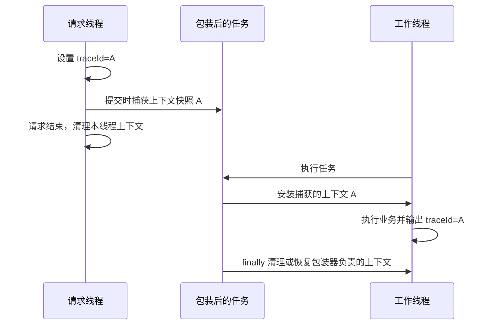
```mermaid
sequenceDiagram
    participant R as 请求线程
    participant T as 包装后的任务
    participant W as 工作线程
    R->>R: 设置 traceId=A
    R->>T: 提交时捕获上下文快照 A
    R->>R: 请求结束，清理本线程上下文
    W->>T: 执行任务
    T->>W: 安装捕获的上下文 A
    W->>W: 执行业务并输出 traceId=A
    T->>W: finally 清理或恢复包装器负责的上下文
```

图表示任务提交与执行的时间差。它不表示父线程与子线程共享同一个实时可变 Map；提交之后再把请求线程的 traceId 改成 B，已经捕获的任务仍应使用 A。

### 8.3 内置 MDC 包装的精确边界

1.2.2 的 `MdcRunnable` 捕获父线程 MDC；在父上下文为空、或者任务恰好由原提交线程执行时直接运行原任务。后一个分支兼顾 `CallerRunsPolicy`，避免把调用者仍在使用的上下文清掉。

在其他线程运行时，它把捕获的键写入工作线程，结束时清理这些键中的非 traceId 项，traceId 由相关执行增强的后置流程处理。这个实现并不等价于“备份工作线程全部上下文、执行后完整恢复”，任务自己额外放入的其他 ThreadLocal 或 MDC 键也不自动由它负责。

验证上下文治理至少需要连续运行两个不同追踪标识的任务，再运行一个不带标识的任务，检查日志没有串号；还要验证任务抛异常和调用者执行的路径。仅看一个任务能读到 traceId，无法证明没有上下文泄漏。[MdcRunnable](https://github.com/dromara/dynamic-tp/blob/v1.2.2/core/src/main/java/org/dromara/dynamictp/core/support/task/runnable/MdcRunnable.java)。

### 8.4 ttl 与链路追踪包装器

TTL 在这里指 TransmittableThreadLocal，可传递线程局部变量，与缓存条目的 Time To Live（存活时间）不是同一个缩写。DynamicTp 的 `ttl` 包装器接入相应库，围绕任务提交和执行处理受支持的上下文。

| 包装器或方案 | 传递对象 | 接入条件 |
| --- | --- | --- |
| `mdc` | 日志 MDC 键值 | 内置包装器，配置名称后验证日志 |
| `ttl` | TransmittableThreadLocal 管理的值 | 业务上下文使用相应类型；不会把所有普通 ThreadLocal 自动变成可传递 |
| `swTrace` | SkyWalking 追踪上下文 | 加载匹配的扩展与追踪运行环境 |
| OpenTelemetry 扩展 | OpenTelemetry 追踪上下文 | 使用对应扩展及其注册名称，并验证实际调用链 |
| 自定义 `TaskWrapper` | 明确选择的业务上下文 | 完成实现、注册和配置，见第 17 章 |

框架通过已注册包装器集合按名称筛选。写入一个不存在的名称，不代表包装器已经加载。配置中的名称集合也不应被当作严格的嵌套执行顺序约定；多个包装器如果互相依赖安装、清理顺序，适合组合成一个边界明确的包装器。

上下文传递不传播数据库事务，也不负责安全身份重新授权。避免把整个请求对象、大型 Map、数据库会话或可变业务实体放入线程局部变量后长期排队。[TaskWrappers](https://github.com/dromara/dynamic-tp/blob/v1.2.2/core/src/main/java/org/dromara/dynamictp/core/support/task/wrapper/TaskWrappers.java)。

## 9 把线程池接入真实业务代码

### 9.1 为 CompletableFuture 显式指定执行器

`CompletableFuture` 用于组织异步计算及其后续步骤。未显式指定执行器的 `supplyAsync`、`runAsync` 通常使用 JDK 公共池，任务不会因为应用引入 DynamicTp 就自动进入 `notificationExecutor`。

```java
import java.util.concurrent.CompletableFuture;

CompletableFuture<String> result = CompletableFuture.supplyAsync(() -> {
    return "notification-created";
}, executor);
result.whenComplete((value, error) -> {
    if (error != null) {
        log.error("异步通知创建失败", error);
    } else {
        log.info("异步通知创建结果：{}", value);
    }
});
```

第二个参数明确选择执行器。`whenComplete` 没有 Async 后缀，它的运行线程取决于阶段是否已经完成以及由谁完成；后续使用 `thenApplyAsync` 等方法时也要判断是否显式指定池，避免中途切回公共池。

饱和时可能在创建异步阶段的提交动作上就抛出拒绝异常，阶段创建后的业务异常则体现在异步结果中。调用方要分别处理这两个阶段。用 `join()` 或 `get()` 一直等待结果也可能把异步接口重新变为阻塞接口，应结合业务期限设置等待策略。

### 9.2 使用 @Async 时确认调用经过 Spring 代理

在启动类添加 `@EnableAsync`，然后新建 `src/main/java/com/example/dtp/NotificationAsyncService.java`：

```java
package com.example.dtp;

import java.util.concurrent.CompletableFuture;
import org.springframework.scheduling.annotation.Async;
import org.springframework.stereotype.Service;

@Service
public class NotificationAsyncService {
    @Async("notificationExecutor")
    public CompletableFuture<String> createNotification(String orderId) {
        return CompletableFuture.completedFuture(
                "已生成订单通知：" + orderId + "，线程："
                        + Thread.currentThread().getName());
    }
}
```

`@EnableAsync` 的导入是 `org.springframework.scheduling.annotation.EnableAsync`。让控制器通过构造器注入 `NotificationAsyncService`，再调用其公开方法，返回文本中的线程名应具有 `notification` 前缀。

在默认代理模式下，同一个对象内部 `this.createNotification(...)` 不经过外部代理，异步拦截不会触发。把业务拆到独立 Bean 并经容器注入调用，能让实际入口保持清晰。返回 `void` 的异步方法无法把执行异常作为返回值交给调用方，应配置异常处理器或在业务层记录失败；返回 `CompletableFuture` 可以让上层观察失败状态。[Spring 异步执行文档](https://docs.spring.io/spring-framework/reference/integration/scheduling.html)。

### 9.3 管理已有普通线程池

对已有 Spring Bean，可用 `@DynamicTp` 标记受支持的普通执行器，并通过配置提供稳定名称：

```java
package com.example.dtp;

import java.util.concurrent.ArrayBlockingQueue;
import java.util.concurrent.ThreadPoolExecutor;
import java.util.concurrent.TimeUnit;
import org.dromara.dynamictp.core.support.DynamicTp;
import org.springframework.context.annotation.Bean;
import org.springframework.context.annotation.Configuration;

@Configuration
public class LegacyExecutorConfiguration {
    @Bean
    @DynamicTp("legacyReportExecutor")
    public ThreadPoolExecutor legacyReportExecutor() {
        return new ThreadPoolExecutor(2, 4, 30, TimeUnit.SECONDS,
                new ArrayBlockingQueue<>(32),
                new ThreadPoolExecutor.AbortPolicy());
    }
}
```

对应配置条目加入 `dynamictp.executors`：

```yaml
- threadPoolName: legacyReportExecutor
  autoCreate: false
  corePoolSize: 2
  maximumPoolSize: 4
  keepAliveTime: 30
  queueCapacity: 32
  rejectedHandlerType: AbortPolicy
```

`autoCreate: false` 表示由业务配置类创建 Bean，避免框架再按 YAML 创建一个对象。后处理阶段可能用代理替换普通执行器，或者替换 Spring `ThreadPoolTaskExecutor` 内部的执行器引用；业务应注入处理完成后的 Bean，不要在构造阶段提前提交任务或保存原始对象旁路引用。

本例队列仍是固定容量的 `ArrayBlockingQueue`。接管成功后，线程数可以按支持的接口更新，队列容量不会因为 `queueCapacity` 被改成 64 就自动变大。验证时要同时检查对象实际类型、队列实际类型和 getter 返回值。

### 9.4 第三方线程池适配与业务隔离

Tomcat 请求线程池、Dubbo 调用线程池、消息消费线程池、HTTP 客户端调度线程池都有不同的原生约束。DynamicTp 为部分框架提供适配模块，例如 Web 服务容器可引入：

```xml
<dependency>
    <groupId>org.dromara.dynamictp</groupId>
    <artifactId>dynamic-tp-spring-boot-starter-adapter-webserver</artifactId>
    <version>${dynamictp.version}</version>
</dependency>
```

接入后先查看实际发现的线程池，再匹配对应配置，如 `dynamictp.tomcatTp`。第三方适配经常依赖目标框架的类型、字段或方法，升级目标组件后要重新验证发现、动态修改、告警与关闭行为。

调大 Tomcat 线程数不会增加通知供应商的并发配额；调大通知池也不会增加数据库连接数。业务线程池宜按不同下游、延迟和重要性隔离，比如 `notificationExecutor` 与 `reportExecutor` 分开，防止报表任务占满通知所需的工作线程。

### 9.5 异步任务、事务提交与可靠投递

线程切换会改变数据库事务的线程上下文。父线程事务尚未提交时，异步工作线程可能读不到新订单；即使复制 MDC、用户标识等上下文，也不会复制事务资源。

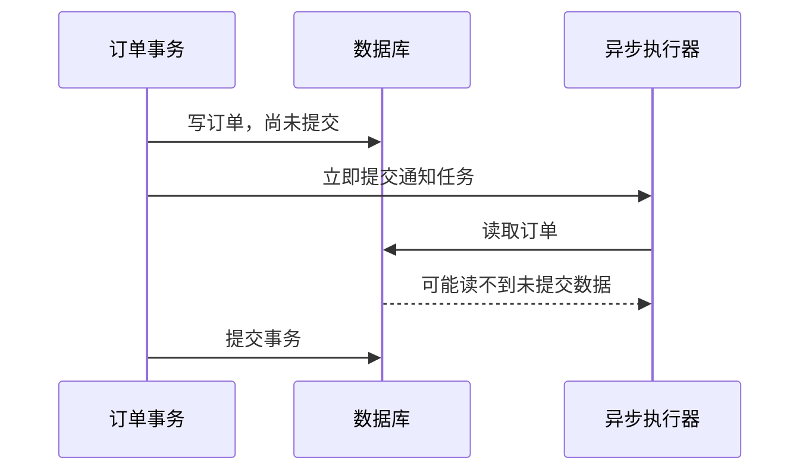
```mermaid
sequenceDiagram
    participant A as 订单事务
    participant DB as 数据库
    participant P as 异步执行器
    A->>DB: 写订单，尚未提交
    A->>P: 立即提交通知任务
    P->>DB: 读取订单
    DB-->>P: 可能读不到未提交数据
    A->>DB: 提交事务
```

图说明“先投递、后提交”的竞争。对允许小概率丢失的辅助动作，可以在事务提交后再触发异步任务，避免读取未提交数据；但数据库提交与内存任务提交之间仍存在进程崩溃窗口。

支付通知、账务处理等需要可恢复任务时，可以把待投递事件和订单更新放进同一个数据库事务，即 Outbox（事务发件箱）模式，再由后台可靠地读取和投递。投递成功后的标记失败可能导致重复发送，消费者仍需以业务事件 ID 做幂等。幂等表示同一逻辑操作重复执行不会造成额外业务效果，不能用“线程池接受过一次”替代。

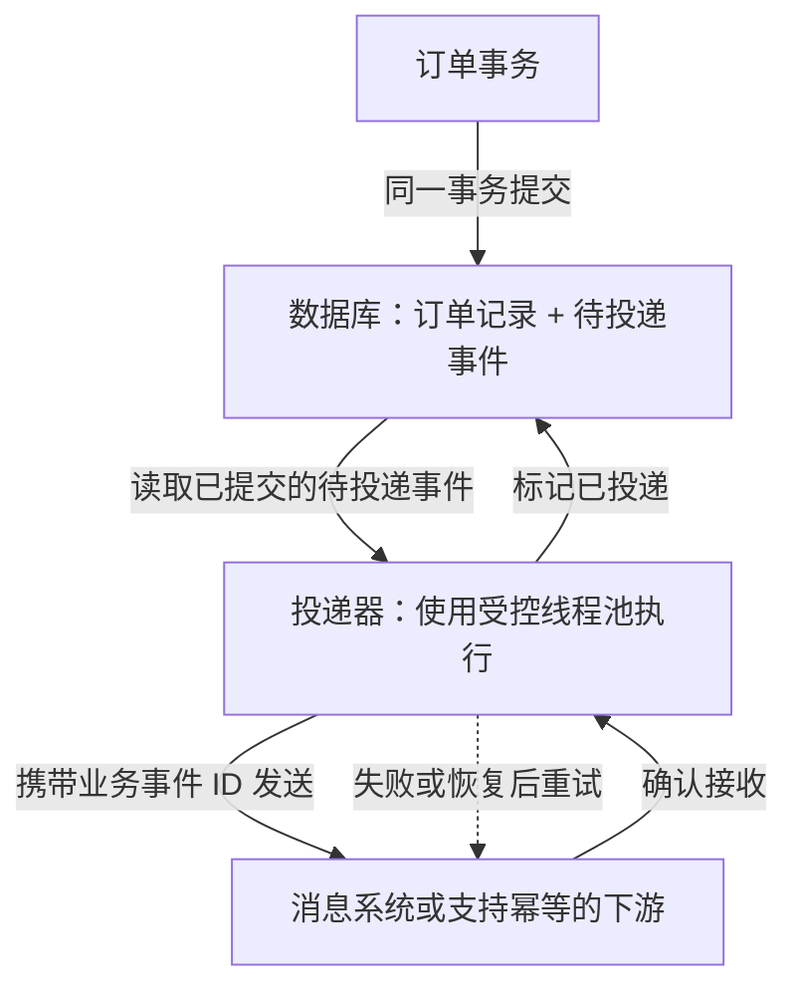
```mermaid
flowchart TD
    T["订单事务"] -->|"同一事务提交"| DB["数据库：订单记录 + 待投递事件"]
    DB -->|"读取已提交的待投递事件"| R["投递器：使用受控线程池执行"]
    R -->|"携带业务事件 ID 发送"| S["消息系统或支持幂等的下游"]
    S -->|"确认接收"| R
    R -->|"标记已投递"| DB
    R -.->|"失败或恢复后重试"| S
```

这是事务发件箱的逻辑视角，省略了具体消息产品和部署拓扑。数据库保存待完成工作的事实，线程池提供当前进程的执行资源。多投递器需要通过领取、租约或数据库并发控制避免无约束地重复处理；发送后、标记前崩溃仍会带来重复，幂等处理承担最后一道业务保护。

## 10 建立指标采集与监控看板

### 10.1 从应用内统计到 Prometheus

Micrometer 是 Java 指标门面，Prometheus 负责定期抓取并存储时间序列，Grafana 用于展示，Alertmanager 用于聚合与分发 Prometheus 告警。它们各自独立于 DynamicTp 的业务执行器。

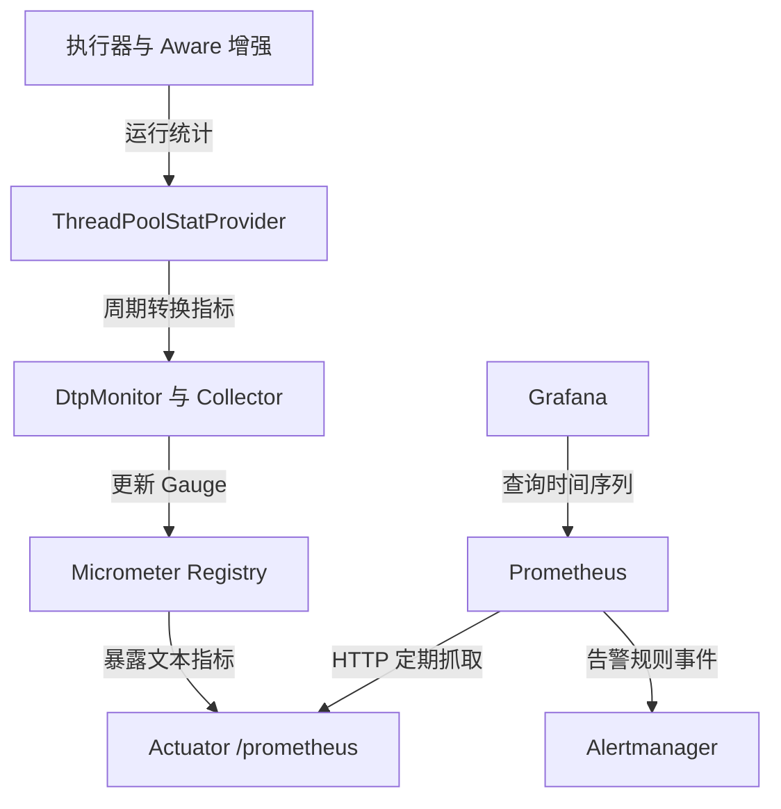
```mermaid
flowchart TD
    E["执行器与 Aware 增强"] -->|"运行统计"| S["ThreadPoolStatProvider"]
    S -->|"周期转换指标"| M["DtpMonitor 与 Collector"]
    M -->|"更新 Gauge"| R["Micrometer Registry"]
    R -->|"暴露文本指标"| EP["Actuator /prometheus"]
    P["Prometheus"] -->|"HTTP 定期抓取"| EP
    G["Grafana"] -->|"查询时间序列"| P
    P -->|"告警规则事件"| A["Alertmanager"]
```

这是指标链路视角。Gauge 表示某个时刻或最近窗口的数值；`DtpMonitor` 的采样周期和 Prometheus 抓取周期是两层时间间隔，不能把每次抓取都当作一次全新业务测量。

### 10.2 给示例增加观测端点

在 `pom.xml` 增加：

```xml
<dependency>
    <groupId>org.springframework.boot</groupId>
    <artifactId>spring-boot-starter-actuator</artifactId>
</dependency>
<dependency>
    <groupId>io.micrometer</groupId>
    <artifactId>micrometer-registry-prometheus</artifactId>
</dependency>
```

Actuator 是 Spring Boot 提供管理与观测端点的模块。将以下键合并到应用配置，修改已有 `dynamictp.enabledCollect`，避免在同一 YAML 内重复定义顶层节点：

```yaml
dynamictp:
  enabledCollect: true
  collectorTypes: ["micrometer"]
  monitorInterval: 5
management:
  endpoints:
    web:
      exposure:
        include: health,prometheus,dynamictp
```

如果第 4 章已把 DynamicTp 配置移到 Nacos，就在远端修改采集相关键；`management` 保留在本地应用配置中。重新启动后提交一批任务，等待至少一个采集周期，再检查。命令中的 `rg` 是 ripgrep 文本搜索工具，用来筛出线程池指标：

```bash
curl -s http://127.0.0.1:8080/actuator/dynamictp
curl -s http://127.0.0.1:8080/actuator/prometheus | rg '^thread_pool_'
```

`/actuator/dynamictp` 返回线程池及相关指标对象，不是参数写入接口。Prometheus 文本中应出现目标池的线程数、队列和任务相关指标。若只有 JVM（Java Virtual Machine，Java 虚拟机）指标，先查 `enabledCollect`、Collector 类型、实际注册池名称及是否经过采集周期。

### 10.3 指标口径与名称

1.2.2 的 Micrometer 指标以前缀 `thread.pool` 命名；在上述 Prometheus Registry 下通常导出为下划线形式，例如 `thread_pool_core_size`。标签包含 `thread_pool_name`、`thread_pool_alias`、`app_name`；抓取配置还应补充 `instance`、环境等用于区分副本的标签。

| 指标原名后缀 | 解释 | 使用方式 |
| --- | --- | --- |
| `core.size`、`maximum.size` | 当前核心与最大线程数配置 | 核对变更及实例之间的偏差 |
| `current.size`、`active.count` | 实际工作线程数与活动线程数 | 结合栈、CPU 与队列定位瓶颈 |
| `queue.size`、`queue.capacity` | 排队数量与容量 | 观察使用率和积压增长；先确认队列类型 |
| `completed.task.count` | 执行结束的累计任务数 | 辅助看处理进度，不当作业务成功数 |
| `reject.count` | 拒绝路径的累计统计 | 观察过载与拒绝策略影响 |
| `run.timeout.count`、`queue.timeout.count` | 相应超时事件累计数 | 区分执行慢与等待久 |
| `tps` | 最近性能采样窗口的每秒完成统计 | TPS（Transactions Per Second），此处统计的是任务处理，不是数据库事务 |
| `completed.task.time.tp99` | 最近采样窗口的耗时 99 分位值 | 分位数是样本分布位置，不是可以直接求平均的量 |

**耗时口径尤其容易误读。** 在 1.2.2 common 路径中，性能计时从提交增强阶段的 `startTask` 开始，结束于完成回调，因此包含排队与执行时间；拒绝路径也有完成计时的回调。不要仅凭 `completed.task.time` 的名字将其解释为纯业务运行时间，也不要把它当作业务成功任务的精确账本。

该版本 Collector 将这些值注册为 Gauge，包括名称带 `count` 的字段。累计值会在进程重启后重置，Prometheus 端点的 `# TYPE` 与实际名称才是查询依据。需要严格的单调 Counter、业务成功率或可聚合延迟直方图时，应在业务层补充相应指标。[MicroMeterCollector](https://github.com/dromara/dynamic-tp/blob/v1.2.2/core/src/main/java/org/dromara/dynamictp/core/monitor/collector/MicroMeterCollector.java)、[ThreadPoolStatProvider](https://github.com/dromara/dynamic-tp/blob/v1.2.2/core/src/main/java/org/dromara/dynamictp/core/support/ThreadPoolStatProvider.java)。

### 10.4 可直接使用的观测查询

以下 PromQL（Prometheus Query Language，Prometheus 查询语言）以第 10.3 节实际导出名称为前提：

```promql
100 * thread_pool_queue_size{thread_pool_name="notificationExecutor"}
  / clamp_min(thread_pool_queue_capacity{thread_pool_name="notificationExecutor"}, 1)
```

该表达式计算每条时间序列对应池的队列使用率；`clamp_min` 防止除零，并不能赋予无界队列或零容量队列一个合理的容量解释。

```promql
100 * thread_pool_active_count{thread_pool_name="notificationExecutor"}
  / clamp_min(thread_pool_maximum_size{thread_pool_name="notificationExecutor"}, 1)
```

该表达式与框架 liveness 的主要口径一致。假设 core 为 4、max 为 40，4 个核心线程全部忙且队列持续增长，结果仍只有 10%，所以应同时看队列与延迟。

```promql
max by (app_name, thread_pool_name) (thread_pool_core_size)
  - min by (app_name, thread_pool_name) (thread_pool_core_size)
```

在同一环境、相同配置目标的副本集合内，这个差值大于 0 可以提示 core 不一致。合法灰度期间允许暂时不同，异构规格实例也可能有意不同，因此要限制查询范围并结合发布状态判断。

看板通常安排线程配置、实际并发、队列积压、拒绝与超时、业务延迟、下游连接池六组信息。队列瞬时使用率与持续时间一起使用更稳定；多个实例的 TP99 不能平均成全局 TP99，需要可聚合的直方图和相同口径样本。

### 10.5 采集成本与其他出口

`logging` 可输出独立 JSON 指标日志，JSON（JavaScript Object Notation）是一种结构化数据格式；`internal_logging` 走应用日志；`jmx` 使用 JMX（Java Management Extensions，Java 管理扩展）暴露管理数据。独立日志要配置路径、轮转与磁盘保留策略，不应无限增长。

定时采样可能错过持续时间短于采样间隔的队列尖峰；超时、拒绝等事件统计有助于补充。减小采样间隔会增加开销，并不自动提高业务吞吐。1.2.2 的周期采集与 `/actuator/dynamictp` 都经过 `ExecutorConverter.toMetrics`，它会读取并重置性能窗口；频繁轮询该端点会影响 TPS 和耗时快照的窗口划分。Prometheus 文本抓取读取已登记的 Gauge，不应与直接调用 DynamicTp 端点混为一谈。[指标转换实现](https://github.com/dromara/dynamic-tp/blob/v1.2.2/core/src/main/java/org/dromara/dynamictp/core/converter/ExecutorConverter.java)。

生产管理端点宜只对监控网络开放，避免暴露全部 Actuator 端点；指标标签保持有限集合，不将订单号、用户 ID 或 traceId 放入标签，否则时间序列数量会随业务请求增长。

## 11 配置告警与理解超时检测

### 11.1 六类通知分别反映什么

| 类型 | 触发依据 | 不能直接推出的结论 |
| --- | --- | --- |
| `change` | 管理字段发生相应变更 | 不证明所有实例同时完成变更 |
| `capacity` | 队列使用率达到阈值 | 不直接证明 CPU 满，也不表示任务已经丢失 |
| `liveness` | active/max 达到阈值 | 不等于 CPU 利用率或进程健康检查 |
| `reject` | 进入拒绝处理路径 | 不一定最终丢弃，可能执行 CallerRunsPolicy |
| `run_timeout` | 单次执行超过检测阈值 | 不等于任务被取消或远端操作已停止 |
| `queue_timeout` | 提交后等待执行超过阈值 | 不等于任务已从队列移除 |

capacity 与 liveness 依赖周期检查，reject 与超时关联执行事件。`enabledCollect=false` 关闭的是指标采集路径，1.2.2 的监控器仍有独立的告警检查步骤；控制告警应使用通知开关。

### 11.2 平台、告警项与线程池的绑定

下面示例用于说明钉钉通道的配置结构。有效机器人地址和签名密钥由部署系统注入，机器人具体可用性、安全策略与网络出口按所用平台验证。

```yaml
dynamictp:
  platforms:
    - platform: ding
      platformId: ops-ding
      webhook: ${DTP_DING_WEBHOOK}
      secret: ${DTP_DING_SECRET:}
  executors:
    - threadPoolName: notificationExecutor
      # 合并到该线程池原有完整配置中，保留线程数、队列等字段。
      notifyEnabled: true
      platformIds: ["ops-ding"]
      runTimeout: 2000
      queueTimeout: 500
      tryInterrupt: false
      notifyItems:
        - type: change
          enabled: true
          silencePeriod: 1
        - type: capacity
          enabled: true
          threshold: 80
          count: 2
          period: 30
          silencePeriod: 120
        - type: liveness
          enabled: true
          threshold: 80
          count: 2
          period: 30
          silencePeriod: 120
        - type: reject
          enabled: true
          count: 1
          period: 30
          silencePeriod: 120
        - type: run_timeout
          enabled: true
          count: 1
          period: 30
          silencePeriod: 120
        - type: queue_timeout
          enabled: true
          count: 1
          period: 30
          silencePeriod: 120
```

`platformId` 是本地配置中关联平台的标识，`platformIds` 引用它。多池同名或拼写不一致会影响管理与通知定位。框架支持的其他通知通道也应通过相应平台类型、扩展和凭据接入，不复制真实地址到学习文档或源码仓库。

### 11.3 threshold、count、period 与 silencePeriod

`threshold=80` 对 capacity 表示队列占用达到 80%，对 liveness 表示 active/max 达到 80%。`count` 是统计窗口内达到条件的次数，`period` 是统计窗口时间，`silencePeriod` 用于限制相同告警反复发送，后二者单位都是秒。

例如 `monitorInterval=5`、capacity 的 `count=2,period=30`：连续两个采样点都达到阈值时，通常可以在该统计窗口中累积到 2 次。但这不是“连续高位 30 秒”的声明，也不保证只统计连续样本；具体还受计数缓存、静默过滤与发送时刻影响。

1.2.2 未显式配置的告警类型会补入默认值，默认 capacity/liveness 阈值为 70、count 为 1；reject 的 count 为 1，两个超时项的 count 为 10。若仅希望启用 capacity，应将其他告警项明确配置 `enabled: false`，而不是从列表中删掉。[NotifyItem](https://github.com/dromara/dynamic-tp/blob/v1.2.2/common/src/main/java/org/dromara/dynamictp/common/entity/NotifyItem.java)、[AlarmManager](https://github.com/dromara/dynamic-tp/blob/v1.2.2/core/src/main/java/org/dromara/dynamictp/core/notifier/manager/AlarmManager.java)。

### 11.4 排队超时与执行超时的时间线

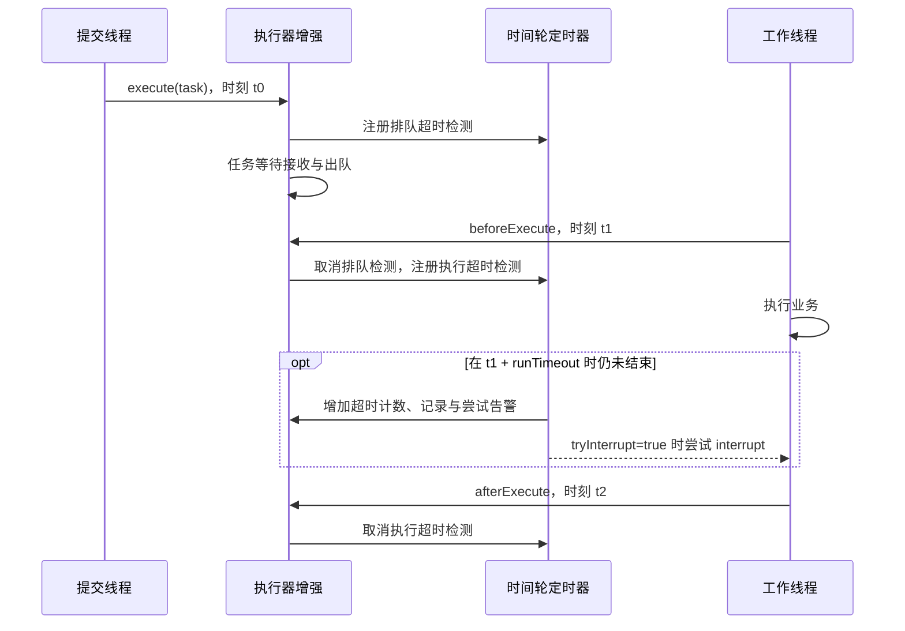
```mermaid
sequenceDiagram
    participant S as 提交线程
    participant P as 执行器增强
    participant T as 时间轮定时器
    participant W as 工作线程
    S->>P: execute(task)，时刻 t0
    P->>T: 注册排队超时检测
    P->>P: 任务等待接收与出队
    W->>P: beforeExecute，时刻 t1
    P->>T: 取消排队检测，注册执行超时检测
    W->>W: 执行业务
    opt 在 t1 + runTimeout 时仍未结束
        T->>P: 增加超时计数、记录与尝试告警
        T-->>W: tryInterrupt=true 时尝试 interrupt
    end
    W->>P: afterExecute，时刻 t2
    P->>T: 取消执行超时检测
```

图中排队等待约为 `t1-t0`，执行耗时约为 `t2-t1`。如果到达排队阈值时还没有进入执行阶段，会触发排队超时检测，但任务默认继续留在正常调度链路中。时间轮是一种组织大量延时检查任务的数据结构，检测受调度粒度与负载影响，不是硬实时截止机制。

`runTimeout` 为 2000 毫秒、任务运行 3000 毫秒、`tryInterrupt=false` 时，预期是出现超时日志或计数，随后任务仍可能成功结束。把它当成远程调用 read timeout（读取超时）会漏掉真正的资源控制。

### 11.5 从告警转向业务期限控制

`Thread.interrupt()` 是协作式取消信号。`Thread.sleep` 等可中断阻塞操作会抛出 `InterruptedException`；不检查中断标志的计算循环、部分外部调用或已提交到远端的操作未必停止。代码捕获中断后还应决定退出、恢复标志及资源清理。

业务期限宜覆盖“排队 + 连接建立 + 请求执行 + 重试 + 结果处理”。例如接口最多等待 2 秒，任务已排队 1.5 秒，就不能再无条件开启一个允许 3 秒的下游调用。可以在任务中携带 deadline（截止时间），开始执行前判断剩余预算，并给下游设置不超过预算的超时。

`Future.get(timeout)` 只限制当前线程等待结果的时间；超时后是否调用 `cancel(true)` 是另一动作，而取消也不保证外部副作用被撤销。对已超时但可能完成的通知，重试要有幂等键或送达状态核查，避免重复发送。

### 11.6 用故障注入证明告警可用

| 实验 | 前提与动作 | 应观察的证据 |
| --- | --- | --- |
| 参数变更 | 修改 core，保留合法 max | 实际 getter 改变、变更日志及通知链路结果 |
| 队列告警 | 小容量队列、慢任务，使占用跨过阈值并保持足够采样时间 | capacity 日志、计数条件满足后的发送结果 |
| 拒绝告警 | 同时占满工作线程与队列 | 提交方拒绝、reject 统计与告警 |
| 排队超时 | 占满工作线程，继续提交短任务 | queue_timeout 增加，任务之后仍可执行 |
| 执行超时 | 任务耗时超过 runTimeout | run_timeout 增加；tryInterrupt=false 时可继续完成 |
| 平台失败 | 测试环境使用不可达地址 | 发送失败日志，业务线程池仍可执行任务 |

测试机器人发送前使用测试通道与测试接收组。成功判据包括平台响应与实际收件结果；框架本地打印了“准备发送”并不证明消息已经送达。

## 12 使用 Redis 控制集群重复告警

### 12.1 单机静默无法协调多个副本

20 个应用副本各自设置 120 秒静默，同一故障仍可能在每个窗口产生 20 条消息。单机计数只能约束本进程，需要共享限流状态才能协调集群发送频率。

DynamicTp 提供 Redis 限流扩展。Redis 是内存数据存储服务，在这里存放告警发送窗口的共享状态；它不参与线程池任务队列，也不是 DynamicTp 基础接入的必备依赖。

```xml
<dependency>
    <groupId>org.dromara.dynamictp</groupId>
    <artifactId>dynamic-tp-spring-boot-starter-extension-limiter-redis</artifactId>
    <version>${dynamictp.version}</version>
</dependency>
```

按 Spring Boot 2 的配置方式准备可访问 Redis，并向目标告警项补充 `clusterLimit`：

```yaml
spring:
  redis:
    host: ${REDIS_HOST:127.0.0.1}
    port: ${REDIS_PORT:6379}
    password: ${REDIS_PASSWORD:}
    timeout: 2s

dynamictp:
  globalExecutorProps:
    notifyItems:
      - type: capacity
        threshold: 80
        count: 2
        period: 30
        silencePeriod: 120
        clusterLimit: 1
```

这仍是合并片段。线程池自身已经显式配置 `notifyItems` 时，应把 `clusterLimit` 加到对应局部项，不能假设全局列表会逐项深度合并覆盖它。

### 12.2 集群限流控制的对象

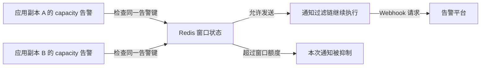
```mermaid
flowchart LR
    A["应用副本 A 的 capacity 告警"] -->|"检查同一告警键"| R["Redis 窗口状态"]
    B["应用副本 B 的 capacity 告警"] -->|"检查同一告警键"| R
    R -->|"允许发送"| N["通知过滤链继续执行"]
    R -->|"超过窗口额度"| D["本次通知被抑制"]
    N -->|"Webhook 请求"| P["告警平台"]
```

图表示共享限流路径。`clusterLimit=1` 约束窗口内允许通过的发送尝试，不能保证“固定只由同一个节点发送”，也不等于平台最终必达一次。获得发送机会的实例若随后发送失败，可能消耗额度却没有成功通知。

1.2.2 扩展以 `silencePeriod` 作为共享窗口长度；当该值小于等于 0 时直接跳过 Redis 限流。因此 `silencePeriod: 0` 加 `clusterLimit: 1` 不能实现本例预期的集群抑制。

### 12.3 滑动窗口与 Lua 的作用

Redis 的 ZSet（Sorted Set，有序集合）可以用时间戳作为 score（排序分值），用每次请求的唯一标记作为 member（成员）。Lua 脚本把读取数量、判断、增删成员等动作放进服务器中的一次原子执行，避免多个客户端分开操作导致的竞争。

通用的滑动窗口限流通常先删除窗口外记录，再统计有效记录，未达到额度时写入当前记录并设置过期时间。原子执行保证并发动作不交错，但不自动保证脚本的业务算法正确。

DynamicTp v1.2.2 的脚本先 `ZCARD` 读取数量，再按旧数量判断是否写入，之后才清除过期记录。这可能在窗口边缘保守地拒绝一次原本可以通过的通知。例如旧集合有一条已经过期的记录、limit 为 1，本次先读出数量 1 并拒绝，随后才把旧记录删掉。

这里应区分已发布实现与理想算法。若把这个思路用于短信计费、支付或严格配额控制，需要单独设计并验证窗口清理顺序、时间来源、请求唯一性、原子性和失败策略，不能直接复用告警限流的边界假设。[限流 Lua 脚本](https://github.com/dromara/dynamic-tp/blob/v1.2.2/extension/extension-limiter-redis/src/main/resources/scripts/sliding_window_rate_limiter.lua)。

### 12.4 故障、隔离与部署边界

1.2.2 的限流实现遇到 Redis 异常时返回允许通过，属于 fail-open（故障放行）。这使 Redis 故障时告警仍有机会发出，但可能重新产生集群消息风暴；应监控 Redis 与告警发送失败，准备平台侧去重与限频。

共享键包含服务名、限流前缀、线程池名和告警类型，没有自动包含所有环境或租户维度。同名服务在测试与生产共享同一 Redis 范围时，可能互相占用额度，应使用明确的存储与命名隔离。

脚本使用客户端时间；多节点时钟偏差也会影响窗口。限流状态只协调发送资格，不提供消息聚合、根因关联或业务过载保护。是否采用 Redis 扩展，取决于是否确有多实例重复通知问题以及是否已有 Alertmanager 等统一治理能力。[SlidingWindowRateLimiter](https://github.com/dromara/dynamic-tp/blob/v1.2.2/extension/extension-limiter-redis/src/main/java/org/dromara/dynamictp/extension/limiter/redis/ratelimiter/SlidingWindowRateLimiter.java)、[RedisRateLimiterNotifyFilter](https://github.com/dromara/dynamic-tp/blob/v1.2.2/extension/extension-limiter-redis/src/main/java/org/dromara/dynamictp/extension/limiter/redis/ratelimiter/RedisRateLimiterNotifyFilter.java)。

## 13 依据负载和资源预算确定参数

### 13.1 先估算在途任务，再考虑线程数

Little 定律描述稳定系统中平均在途数量、平均到达速率和平均停留时间的关系：`L = λ × W`。其中 L 是平均在途任务数，λ 是每秒到达数，W 是平均停留时间，单位要一致。

假设一个实例每秒接收 200 个任务，每个任务从开始执行到完成平均占用工作线程 50 毫秒，那么在没有其他瓶颈的理想条件下，维持这部分执行需要约 `200 × 0.05 = 10` 个平均忙碌线程。配置值还需为抖动和峰值留出余量，并受 CPU、内存和下游并发配额约束。

这个估算不能直接使用接口总延迟代替线程占用时间，也不能把平均值当作尾延迟保证。持续过载、流量快速变化、重试突增或任务耗时分布很长时，应以压测和线上观测校准。

### 13.2 CPU 密集和阻塞任务的不同瓶颈

CPU 密集任务主要消耗计算时间，线程数量远高于可用核心数通常只增加调度竞争。起点可接近应用实际 CPU 配额，再在目标吞吐和延迟下压测。

阻塞型任务在等待期间不持续使用 CPU，可以通过一定程度增加线程提高并发。一种粗略估算为 `线程数 ≈ 可用核心数 × 目标 CPU 利用率 × (1 + 等待时间/计算时间)`，它假定任务相对同质、等待可以重叠、下游还有空间。

例如 4 核、目标利用率 0.7、每任务计算 10 毫秒且等待 40 毫秒，估算约为 `4 × 0.7 × 5 = 14` 个线程。这只是实验起点；如果数据库仅分配 8 个可用于该业务的连接，14 个线程可能主要在等待连接。

容器内 `availableProcessors()` 的结果还受 JDK 和容器识别能力影响。线程预算应以容器资源限制和运行时读数为准，不把宿主机核心数直接当成应用可用算力。

### 13.3 队列容量由等待预算和内存预算共同约束

假设平均到达率为 200 次/秒，业务给排队阶段的平均等待预算为 100 毫秒，那么 `Lq = λ × Wq` 给出的平均排队数量约为 20。这里的 20 是稳定条件下的平均数量估算，并不是“队列容量设为 20 就能保证所有任务等待不超过 100 毫秒”。

确定硬容量还要考虑突发、耗时分布、核心线程处理速度以及允许拒绝的比例。可以先设置一个与预算相近的有界值，再在固定到达率压测中检查排队分位值、拒绝率和保留内存。

| 观察结果 | 更可能需要的动作 |
| --- | --- |
| 短时突发、下游空闲、任务能够快速清空 | 适当缓冲或小幅增加并发，验证尖峰恢复时间 |
| 持续到达量超过处理能力 | 限流、横向扩容或提高处理效率，不能靠持续加大队列维持稳定 |
| 队列很长而 CPU 很低 | 检查远端调用、数据库连接、锁等待；判断扩线程是否有真实收益 |
| 延迟已超出业务期限 | 提前拒绝或丢弃业务明确允许过期的任务，避免继续执行无价值工作 |
| 内存随队列明显增加 | 缩小排队对象、控制容量，必要时用持久消息系统承接积压 |

### 13.4 线程池上限不是系统并发上限

如果 10 个实例各设置 max 为 20，则该类工作线程最多可达 200 个；这还不包括其他池、重试线程、HTTP 请求线程以及 CallerRunsPolicy 中的提交线程。

假设供应商全局只允许 100 个并发连接，把每个实例 max 配为 20 就可能超过配额。应预留其他调用者的份额，并通过信号量、连接池、限流或集中配额控制直接约束下游资源。Semaphore（信号量）用许可证数量限制同时进入某段代码的任务数，控制目标比“间接限制线程数”更明确。

调整配置前同时记录“实例数 × 单实例预算”。应用自动扩容后，原来安全的单实例参数可能变成过高的全局并发，线程池配置与横向扩容策略需要共同评估。

### 13.5 设计有解释力的压测

1\. 记录任务到达率、纯执行耗时、排队耗时、拒绝数、业务成功数、CPU、内存、连接池与下游错误率。

2\. 用恒定到达率、阶梯增加和突发流量分别测试。固定数量客户端“请求完成才发下一次”会在服务变慢时自动降低到达率，可能掩盖积压。

3\. 注入下游慢响应、超时、连接池耗尽与失败重试，观察积压是否可控、是否影响其他业务池。

4\. 在负载持续存在时只改变一组有明确意图的参数，记录生效值、吞吐与尾延迟变化。若吞吐没增加而下游错误率上升，立即停止继续扩张。

5\. 验证回滚后系统是否恢复，包括队列清空时间、实际线程数收敛和重试流量，不能只证明配置值回到了旧值。

### 13.6 动态配置与自动调优的区别

DynamicTp 的基础链路是“观测状态 → 发布目标配置 → 应用执行变更”。这不等于一个根据指标自动求出最优参数的控制器。

如需自动调参，应补充稳定的测量窗口、参数上下限、步长、冷却期、变化速率限制、回滚条件和人工接管。以 active 达阈值就加线程为规则，遇到下游变慢时容易形成“加线程 → 下游更慢 → 再加线程”的正反馈。

Java 21 的虚拟线程改变了平台线程占用模型，但没有取消数据库连接、外部配额和在途任务内存的限制。虚拟线程通常按任务创建，不应为了限制并发而再建立虚拟线程池；应直接控制有限资源。DynamicTp 1.2.2 的传统线程池参数与第三方适配不能直接套用到任意虚拟线程执行器。[OpenJDK JEP 444](https://openjdk.org/jeps/444)。

## 14 生产部署与变更治理

### 14.1 生产架构图：业务执行与配置控制分离

下图给出采用 Nacos 2.x 配置中心的部署方案。前提是应用至少跨两个可用区部署，Nacos 使用三个节点和外部高可用 MySQL 存储，数据库主备切换由数据库平台负责。它是 DynamicTp 接入的生产部署视角，并非要求每个项目新建整套基础设施。

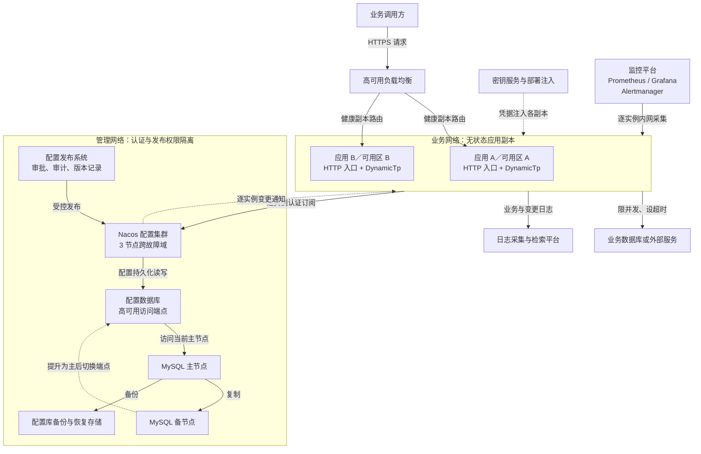
```mermaid
flowchart TB
    USER["业务调用方"] -->|"HTTPS 请求"| LB["高可用负载均衡"]
    LB -->|"健康副本路由"| A
    LB -->|"健康副本路由"| B
    subgraph APP["业务网络：无状态应用副本"]
        A["应用 A／可用区 A<br/>HTTP 入口 + DynamicTp"]
        B["应用 B／可用区 B<br/>HTTP 入口 + DynamicTp"]
    end
    APP -->|"限并发、设超时"| DOWN["业务数据库或外部服务"]
    APP -->|"业务与变更日志"| LOG["日志采集与检索平台"]
    subgraph CTRL["管理网络：认证与发布权限隔离"]
        OPS["配置发布系统<br/>审批、审计、版本记录"]
        NC["Nacos 配置集群<br/>3 节点跨故障域"]
        DBEP["配置数据库<br/>高可用访问端点"]
        DB1["MySQL 主节点"]
        DB2["MySQL 备节点"]
        BACK["配置库备份与恢复存储"]
        OPS -->|"受控发布"| NC
        NC -->|"配置持久化读写"| DBEP
        DBEP -->|"访问当前主节点"| DB1
        DB1 -->|"复制"| DB2
        DB2 -.->|"提升为主后切换端点"| DBEP
        DB1 -->|"备份"| BACK
    end
    APP -->|"逐实例认证订阅"| NC
    NC -.->|"逐实例变更通知"| APP
    SEC["密钥服务与部署注入"] -.->|"凭据注入各副本"| APP
    OBS["监控平台<br/>Prometheus / Grafana<br/>Alertmanager"] -->|"逐实例内网采集"| APP
```

HTTPS（Hypertext Transfer Protocol Secure）表示加密的 HTTP 访问。连到应用分组的箭头表示各副本分别执行对应动作。实线描述业务调用、配置读写和采集；虚线表示通知、凭据注入和故障切换。业务请求经负载均衡进入应用，在本地线程池执行；订阅配置不处于每次任务提交的同步路径上。配置中心短时不可用时，已经创建的线程池通常继续用当前参数运行。

图中三个 Nacos 节点代表一个部署集群，不是三套互不关联的配置源；它们访问同一高可用配置存储。数据库备节点不是默认的独立写入口，提升为主和端点切换由外围高可用平台完成。实例初次启动时配置不可达的行为，仍取决于客户端缓存、加载策略和项目是否准备了有效配置，不能从“运行中能继续执行”推断“首次启动一定成功”。

该视图省略了 Nacos 集群内部通信、业务数据库自身的复制拓扑、日志与监控平台的内部冗余，以及可选 Redis 告警限流；这些能力由各自平台部署方案落实。传输加密、访问白名单和凭据权限按实际客户端与网关能力配置，不能仅凭网络分区名称宣称安全。[Nacos 2.3 集群部署说明](https://nacos-group.github.io/en/docs/v2.3/guide/admin/cluster-mode-quick-start/)。

### 14.2 一次可回滚的参数发布

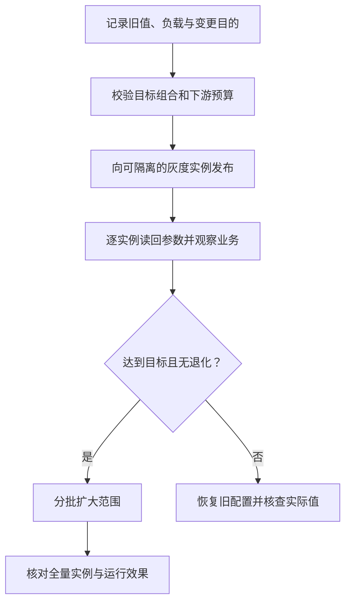
```mermaid
flowchart TD
    B["记录旧值、负载与变更目的"] --> V["校验目标组合和下游预算"]
    V --> C["向可隔离的灰度实例发布"]
    C --> R["逐实例读回参数并观察业务"]
    R --> J{"达到目标且无退化？"}
    J -->|"是"| A["分批扩大范围"]
    J -->|"否"| U["恢复旧配置并核查实际值"]
    A --> F["核对全量实例与运行效果"]
```

图里的灰度要求配置平台能够区分目标实例或分组。所有实例订阅同一个 Namespace、Group、Data ID 时，一次发布通常面向这组订阅者，不能仅凭“先观察其中一台”就称为灰度。

可使用配置中心支持的灰度能力，或预先设计独立配置分组与部署批次；具体实现需匹配所用版本。配置记录宜包含线程池名、旧值、新值、预期收益、下游上限、停止条件与回滚版本。

### 14.3 接受短暂不一致，发现长期漂移

多个实例接收变更存在延迟，不能保证毫秒级同时切换。对线程数调整通常可以接受短暂不一致；如果参数直接决定全局并发配额，则应使用能直接协调配额的机制。

对每个实例读回 core、max、队列容量和关键开关，并结合环境与部署分组识别偏差。只在发布系统保存“目标版本”不够，还应有实际应用确认和未生效实例的定位入口。自定义配置版本字段若没有被业务或扩展读取，不会自动成为 DynamicTp 的生效凭证。

### 14.4 配置写权限与参数约束

配置写权限可以改变应用并发和拒绝行为，应与只读监控权限分开。线程数、队列容量、超时和拒绝类型设置业务可接受的取值范围，防止误把 max 或队列容量设成近乎无界。

机器人凭据、Nacos 认证信息和 Redis 密码通过密钥系统注入；变更日志可以记录字段差异，但应过滤认证配置。生产验证使用受控负载，不开放第 2 章的负载生成接口。

## 15 可靠性、关闭流程与异常恢复

### 15.1 内存队列不提供持久任务保证

`execute` 返回，表示任务已被执行器接受，或者拒绝策略已经按自身语义处理；它没有生成持久投递凭证。进程崩溃、容器被强制终止、机器断电，都可能使尚未完成的内存任务消失。

| 任务类别 | 可采用的方式 | 需要承担的后果 |
| --- | --- | --- |
| 可重新计算、允许少量丢失的辅助任务 | 进程内线程池 | 明确丢失容忍与补跑入口 |
| 需要用户查询状态的报表或批任务 | 持久任务记录加线程池执行 | 记录等待、运行、成功、失败、重试状态 |
| 订单通知、支付后续处理 | 事务事件或可靠消息加幂等消费 | 处理重复投递、发送失败与恢复 |
| 大规模积压 | 可持久消息系统或任务平台 | 控制消费者并发、积压时效和补偿 |

线程池负责“此刻怎样执行”，持久任务系统负责“哪些工作还欠着”。把两者职责分开，才能在应用重启后找到未完成任务。

### 15.2 关闭时的状态迁移

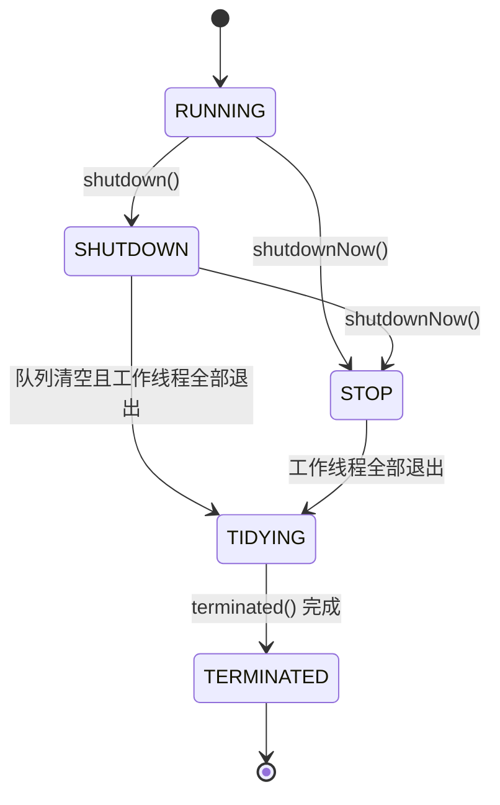
```mermaid
stateDiagram-v2
    [*] --> RUNNING
    RUNNING --> SHUTDOWN: shutdown()
    RUNNING --> STOP: shutdownNow()
    SHUTDOWN --> STOP: shutdownNow()
    SHUTDOWN --> TIDYING: 队列清空且工作线程全部退出
    STOP --> TIDYING: 工作线程全部退出
    TIDYING --> TERMINATED: terminated() 完成
    TERMINATED --> [*]
```

这是 JDK 线程池生命周期视角。RUNNING 接收新任务；SHUTDOWN 拒绝新任务但继续处理已接受的任务；STOP 尝试中断正在执行的任务，并移除尚未开始的队列任务。进入 STOP 也不意味着任意业务代码会立即停止，终止仍依赖工作线程退出。

DynamicTp 的 `waitForTasksToCompleteOnShutdown=true` 采用 `shutdown` 路径；false 采用 `shutdownNow` 路径，并尝试取消其返回的未执行 Future 任务。`awaitTerminationSeconds` 控制关闭流程等待多久。

1.2.2 等待超时后记录警告并继续关闭流程，不自动保证所有任务已经完成，也不因为等待超时就必然再调用 `shutdownNow`。如果数据库连接池已经关闭、任务还在执行，仍可能失败。[DtpLifecycleSupport](https://github.com/dromara/dynamic-tp/blob/v1.2.2/core/src/main/java/org/dromara/dynamictp/core/support/DtpLifecycleSupport.java)。

### 15.3 部署退出需要按顺序停止生产任务

1\. 将实例从新请求路由中摘除，或者暂停消息拉取，阻止继续生成后台任务。

2\. 给正在处理的入口请求留出完成和提交任务的时间，再关闭业务执行器。

3\. 在数据库、HTTP 客户端等依赖仍可用的前提下，等待已接受任务完成，记录未完成任务与退出耗时。

4\. 在容器终止宽限期结束前退出；未能完成的可靠任务由持久任务记录或消息重投恢复。

如果积压有 100 个任务、实际可并行 5 个、每个约 1 秒，理想清空时间就约为 20 秒，还未计入尾部慢任务。将执行器等待时间设为 3 秒不能满足这类积压。多个线程池的关闭可能共同消耗退出预算，容器宽限期要按实测总耗时安排。

### 15.4 同池依赖造成的线程饥饿

一个大小为 2 的线程池中，两个父任务都向同一池提交子任务，然后调用 `Future.get()` 等待。两个工作线程全被父任务占用，子任务留在队列里，无人执行；即使队列容量很大，也没有帮助。

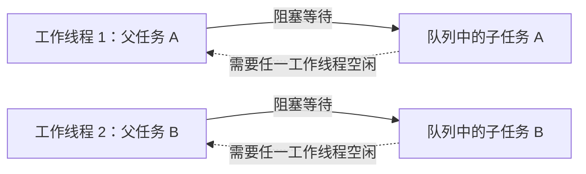
```mermaid
flowchart LR
    P1["工作线程 1：父任务 A"] -->|"阻塞等待"| C1["队列中的子任务 A"]
    P2["工作线程 2：父任务 B"] -->|"阻塞等待"| C2["队列中的子任务 B"]
    C1 -.->|"需要任一工作线程空闲"| P1
    C2 -.->|"需要任一工作线程空闲"| P2
```

这是线程饥饿的等待关系图。扩容可能临时打破这一轮等待，但随着嵌套层数或并发量增长仍会复现。可以改为非阻塞结果组合，避免在池内等待同池的后续任务，或根据资源层次拆分执行器；拆分后仍需控制整个依赖链的并发。

### 15.5 异常与重试的责任归属

`execute` 提交的任务抛出未捕获异常时，执行器会结束该次执行，工作线程可能退出并由线程池补充；它不会自动重跑该任务。`submit` 通常把异常保存在 Future 中，如果调用方完全忽略返回值，业务失败可能难以被上层发现。

重试应区分可重试错误和永久错误，设置次数、退避、随机抖动与总截止时间。线程池满时立即在同一个饱和线程池重试，会放大到达压力；下游已经明确拒绝的请求继续无界重试，也会拖长恢复。

日志、异常计数、失败任务记录和告警分别承担排查、趋势、恢复和通知职责。框架执行结束统计不能替代业务成功率，告警发送也不能替代业务补偿。

## 16 从故障现象定位到具体机制

### 16.1 配置发布了，但线程池没有变化

依次检查配置读取、有效属性、对象注册和字段刷新这四层：

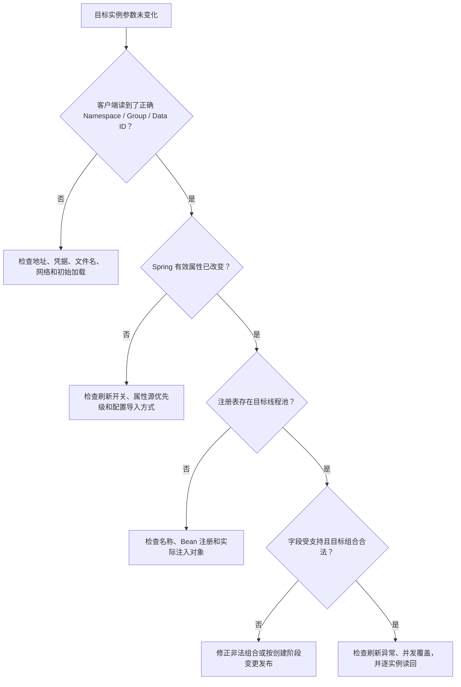
```mermaid
flowchart TD
    A["目标实例参数未变化"] --> B{"客户端读到了正确 Namespace / Group / Data ID？"}
    B -->|"否"| C["检查地址、凭据、文件名、网络和初始加载"]
    B -->|"是"| D{"Spring 有效属性已改变？"}
    D -->|"否"| E["检查刷新开关、属性源优先级和配置导入方式"]
    D -->|"是"| F{"注册表存在目标线程池？"}
    F -->|"否"| G["检查名称、Bean 注册和实际注入对象"]
    F -->|"是"| H{"字段受支持且目标组合合法？"}
    H -->|"否"| I["修正非法组合或按创建阶段变更发布"]
    H -->|"是"| J["检查刷新异常、并发覆盖，并逐实例读回"]
```

这是排错流程图。每个分支对应一个可验证的状态：远端内容、有效属性、注册对象、实际 getter。比如 core 已经变为 8 而 poolSize 仍为 2，说明“参数未刷新”的假设已经被否定，应该转向检查积压与线程创建条件。

检查应用包是否包含正确配置、依赖是否收敛：

```bash
jar tf target/dtp-demo-1.0.0.jar | rg 'application.yml|bootstrap.yml|dynamic-tp'
mvn dependency:tree -Dincludes=org.dromara.dynamictp
```

打包检查解决“开发工具能加载，发布后资源文件缺失”的问题；依赖树检查解决多个模块版本混用。不能只凭编辑器中的 YAML 文件推断最终运行包中的内容。

### 16.2 队列增长，但最大线程数没有用满

典型原因是 common 入队优先。先读取 core、max、队列容量、队列实际类型和使用率。如果 core 为 4、max 为 40、队列容量为 100 000，队列长期没有填满时，工作线程可能一直停留在核心值附近。

在确认下游有余量后，可以小幅提高 core、合理降低缓冲容量或评估 eager。若线程都在等待同一个小连接池，增加工作线程只会将等待位置从执行器队列移动到连接池队列，业务耗时不一定减少。

### 16.3 active 很高而 CPU 很低

采集线程栈，判断工作线程在等待什么。以下命令由 JDK 提供，在拥有目标进程诊断权限时执行：

```bash
jcmd -l
jcmd <pid> Thread.print > thread-dump.txt
```

`<pid>` 替换为目标 Java 进程 ID，不包括尖括号。使用线程名前缀找到 `notification` 相关线程，区分网络读取、数据库连接获取、锁等待、Future 等待和业务计算。相隔几秒采集多个快照，判断调用栈是否长期停留在相同位置。

一次栈快照只能表明采样时刻的状态；要关联慢请求、下游延迟与连接池指标。若线程持续等待下游，应优先恢复下游、收紧超时或限制到达量。

### 16.4 拒绝数量增加，但接口仍然返回成功

先看拒绝策略：静默丢弃可能让 `execute` 正常返回；CallerRunsPolicy 可能在请求线程里完成任务；控制器也可能捕获了异常却没有反馈业务失败。

在第 2 章实验中，用 `accepted`、`rejected` 和 `businessCompleted` 分别观察不同阶段。生产接口应给出真实语义，例如“任务已持久接收”需要持久任务记录支持，不能仅因为线程池调用没有抛异常就返回“通知已发送”。

### 16.5 有指标却没有告警

按“告警项启用 → 检测阈值 → 窗口计数 → 静默 → 集群限流 → 平台关联 → 发送网络与响应”的顺序排查。默认超时阈值为 0 时，相应检测没有开启；超时 count 默认不一定是 1，出现一次超时也未必发消息。

如果所有工作线程都忙，liveness 却很低，检查分母 max 是否远大于实际线程数。若本机能发送、部署后不能，检查出口网络、代理、签名与密钥注入；若少数实例能发而其他实例不发，再查 Redis 限流是否符合预期。

### 16.6 超时告警之后，业务仍然完成了

读取 `tryInterrupt`，确认这是观察阈值还是业务取消策略。`tryInterrupt=false` 时继续完成符合预期；为 true 时也要检查任务是否响应中断。进一步核对 HTTP 客户端自身的连接与读取超时、截止时间以及重试行为。

对于可能产生副作用的调用，客户端停止等待并不证明远端没有执行。用业务请求 ID 查询状态或幂等重试，比盲目重新发送更可靠。

### 16.7 内存上涨、上下文串号与指标缺失

| 现象 | 机制入口 | 验证方向 |
| --- | --- | --- |
| 内存随队列上涨 | 任务引用对象、无界队列、过长等待 | 堆分析中检查任务及其可达对象；观察缩小负载后是否释放 |
| 无任务时仍占用较多线程 | 核心线程保留、关闭未结束 | 检查 core、允许核心超时开关与执行器生命周期 |
| 不同请求出现同一个 traceId | 包装器缺失、ThreadLocal 清理不完整 | 连续不同上下文任务及异常路径复现 |
| 开启 Agent 后超时或性能指标异常 | Runnable 被多层增强、版本兼容问题 | 对照追踪 Agent 与 DynamicTp 版本，检查扩展与实际包装链 |
| 优先级池从不触发容量拒绝 | `PriorityBlockingQueue` 无普通硬容量上限 | 验证队列类型并改为入口限量或隔离设计 |
| 关闭日志超时 | 慢任务、不可中断调用、依赖关闭顺序 | 查剩余任务、线程栈与容器退出预算 |

Agent 是附加在 JVM 上对类或运行行为进行增强的程序。相关适配依赖实际字节码增强方式，不能把关闭超时检测当作解决内存问题的通用办法；应保留版本、增强链和故障证据后定位。

## 17 通过扩展点加入业务上下文

### 17.1 TaskWrapper 适合扩展什么

`TaskWrapper` 把一个 Runnable 包装成另一个 Runnable，可以在提交时捕获信息，在执行时安装信息，并在结束时恢复。它适合追踪和轻量业务元数据传递，不适合承担长时间网络请求或全局调度决策。

下面实现传递租户标识。租户标识在这里仅用于日志或业务路由示例，不能单独作为授权证据；真正的访问权限仍要由业务安全机制验证。

新建 `src/main/java/com/example/dtp/TenantTaskWrapper.java`：

```java
package com.example.dtp;

import org.dromara.dynamictp.core.support.task.wrapper.TaskWrapper;

public class TenantTaskWrapper implements TaskWrapper {
    private static final ThreadLocal<String> TENANT = new ThreadLocal<>();

    public static String currentTenant() {
        return TENANT.get();
    }

    public static void setTenant(String tenant) {
        if (tenant == null) {
            TENANT.remove();
        } else {
            TENANT.set(tenant);
        }
    }

    @Override
    public String name() {
        return "tenant";
    }

    @Override
    public Runnable wrap(Runnable runnable) {
        String captured = currentTenant();
        return () -> {
            String previous = currentTenant();
            setTenant(captured);
            try {
                runnable.run();
            } finally {
                // 还原执行线程原值，同时兼容嵌套执行和调用者执行。
                setTenant(previous);
            }
        };
    }
}
```

捕获发生在 `wrap` 调用时，恢复发生在实际执行的 `finally` 中。`captured=null` 时主动清理执行线程中的旧值，避免空上下文任务继承上一个请求的残留；恢复 previous 兼顾调用者执行和嵌套作用域。

### 17.2 注册扩展并应用到线程池

SPI（Service Provider Interface，服务提供者接口）允许框架通过约定发现实现。新建文件：

```text
src/main/resources/META-INF/services/org.dromara.dynamictp.core.support.task.wrapper.TaskWrapper
```

文件内容为实现类全名：

```text
com.example.dtp.TenantTaskWrapper
```

在 `notificationExecutor` 的配置中设置：

```yaml
taskWrapperNames: ["tenant", "mdc"]
```

重新构建和启动，使实现类及 SPI 资源进入运行包。通过配置写入 `tenant` 只是选择已加载实现，无法凭空加载一个不存在的类；添加新的实现通常涉及应用发布。

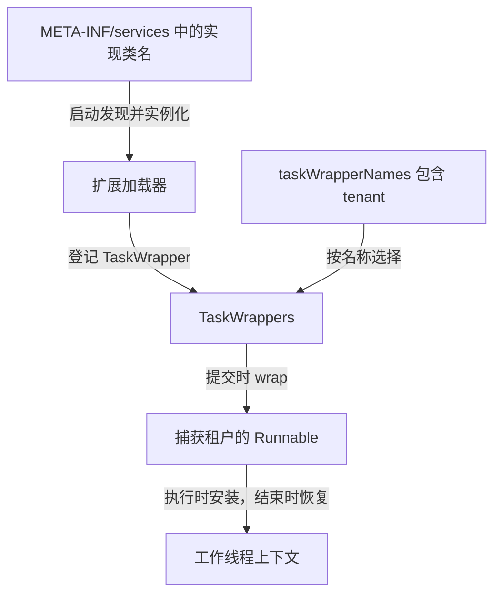
```mermaid
flowchart TD
    F["META-INF/services 中的实现类名"] -->|"启动发现并实例化"| L["扩展加载器"]
    L -->|"登记 TaskWrapper"| R["TaskWrappers"]
    C["taskWrapperNames 包含 tenant"] -->|"按名称选择"| R
    R -->|"提交时 wrap"| T["捕获租户的 Runnable"]
    T -->|"执行时安装，结束时恢复"| W["工作线程上下文"]
```

图给出扩展发现与实际生效的完整路径。资源文件遗漏、实现类不可实例化、名称不一致，分别导致不同位置失败。打包检查能验证类和资源是否存在，业务日志与返回值才能验证包装器确实运行。

### 17.3 验证捕获与清理

把下面片段放入可以抛出 `Exception` 的实验方法，`executor` 仍是注入的通知线程池：

```java
import java.util.concurrent.Future;
import java.util.concurrent.TimeUnit;

String previous = TenantTaskWrapper.currentTenant();
Future<String> first;
try {
    TenantTaskWrapper.setTenant("tenant-A");
    first = executor.submit(TenantTaskWrapper::currentTenant);
} finally {
    TenantTaskWrapper.setTenant(previous);
}
System.out.println(first.get(2, TimeUnit.SECONDS));
```

预期输出 `tenant-A`。更完整的验证使用一个工作线程连续执行“租户 A、租户 B、无租户”三个任务，分别得到 `tenant-A`、`tenant-B` 和 null，再验证抛异常后没有残留。使用一个线程能增加复用同一线程的确定性，避免测试恰好分配到不同线程而漏掉泄漏。

打包后检查：

```bash
jar tf target/dtp-demo-1.0.0.jar | rg 'TenantTaskWrapper|META-INF/services/.+TaskWrapper'
```

Spring Boot 可执行包中的资源位于 `BOOT-INF/classes`，具体条目应指向本实现及上述服务文件。接口路径和注册规则依据 [TaskWrapper 与加载器实现](https://github.com/dromara/dynamic-tp/tree/v1.2.2/core/src/main/java/org/dromara/dynamictp/core/support/task/wrapper)。

### 17.4 其他扩展的职责边界

| 扩展方向 | 用途 | 实施前要验证的条件 |
| --- | --- | --- |
| 配置刷新集成 | 连接自研配置系统 | 初始加载时机、事件筛选、有效属性绑定与失败重试 |
| 指标采集出口 | 写入企业指标平台 | 指标口径、批量与超时、采集失败是否阻塞监控循环 |
| 通知平台与过滤 | 企业消息渠道、去重或分级 | 凭据、发送超时、频率、失败与恢复路径 |
| Aware 执行增强 | 在提交、执行、拒绝等生命周期点处理统计 | 回调开销、异常隔离和清理是否完整 |
| 线程池适配器 | 管理已有组件内部线程池 | 真实对象类型、反射兼容性、字段可变性与关闭所有权 |

扩展代码运行在框架或业务链路中。包装器、回调或队列方法抛异常可能影响任务提交或工作线程，应让扩展保持轻量，明确异常传播方式；不要为了监控在业务线程里同步等待告警网络请求。

## 18 综合复习、设计推演与上线验收

### 18.1 从一个故障解释完整因果链

场景：订单通知池 `core=8,max=64,queue=5000`，通知供应商由 100 毫秒变为 2 秒，CPU 利用率不高，队列快速增长，团队准备把 max 调为 256。

首先根据 common 入队优先判断：队列尚未满时，单独改 max 未必增加工作线程。其次，任务耗时增长 20 倍使相同到达量需要更多在途并发；如果根因是供应商已经过载，直接增加 core 或改 eager 可能继续放大问题。

合理的证据包括线程栈中的远程等待、供应商错误率、每实例到达与完成速率、连接池占用及剩余并发配额。可选择的动作应与证据对应：限流、缩短无效等待、切换可用供应商、可靠积压、在存在余量时有限扩容。通过灰度前后吞吐、排队耗时、业务成功率和下游状态判断效果。

### 18.2 在讨论中讲清四条边界

| 讨论主题 | 应解释的机制 | 可以用来验证的例子 |
| --- | --- | --- |
| 动态线程池怎样“不重启生效” | 配置事件、按名定位、原对象 setter 与可变队列 | 第 2、4 章对比临时内存变更和配置中心变更 |
| 动态缩容会不会丢任务 | 已运行任务继续，队列节点保留，新任务受新容量约束 | 容量从 100 缩到 50，原有 80 个任务继续出队 |
| 有序模式保证什么顺序 | 单实例分组串行，键冲突与并发提交边界 | 相同订单进入两个副本时不再由同一个子队列协调 |
| 超时是否意味着执行失败 | 告警、等待超时、取消、中断、远端副作用是不同事件 | 超时计数增加后，业务仍可能成功完成 |

继续深入时，应能解释具体实现与治理设计的分工：框架完成本地参数应用，灰度和版本审计由发布体系补齐；执行器提供内存调度，可靠任务状态由持久化机制承担。

### 18.3 可执行的复习实验

1\. 用第 2 章工程证明“只调 max 不一定增加线程”：保持 core 为 2、队列足够大，记录活动线程与队列数量。

2\. 调整为小容量队列，证明“后提交任务可能先执行”：用长任务占住核心线程，再观察扩展线程执行的新任务和旧队列任务。

3\. 比较同样负载下 common 与 eager 的工作线程增长，并同时记录下游并发，解释二者的取舍。

4\. 在有序池中交替提交同一订单的多个事件和其他订单事件，验证局部顺序，再说明多副本如何改变保证范围。

5\. 设置 runTimeout 小于任务运行时间，保持 tryInterrupt=false，观察“超时但随后完成”；再使用可中断任务验证中断路径。

6\. 连续执行多个租户上下文任务及异常任务，验证数据不串号。

7\. 用两个实例订阅同一 Nacos 配置，发布与回滚，逐实例核对实际值；若使用 Redis，验证同一窗口中的通知抑制和 Redis 故障放行。

### 18.4 上线验收表

| 验收对象 | 可交付证据 | 未达标时的处理 |
| --- | --- | --- |
| 版本组合 | 实际依赖树、启动结果、目标组件版本 | 收敛版本，重跑对应集成验证 |
| 对象绑定 | 注册名称、实际注入对象、队列类型 | 排除重复 Bean 与旁路提交 |
| 参数边界 | core/max 合法组合、队列容量、下游总并发预算 | 修正上下限与拒绝策略 |
| 配置刷新 | 至少一次发布与回滚的逐实例读回记录 | 定位配置订阅与属性源链路 |
| 业务结果 | 接受、成功、失败、取消、重试各阶段有明确语义 | 补任务状态与错误处理 |
| 监控 | 线程池、业务、下游指标能关联 | 修正采集与指标口径 |
| 告警 | 测试故障真实送达，静默与集群抑制符合目标 | 修复通道、过滤和权限 |
| 关闭与恢复 | 带积压退出结果、宽限期、未完成任务恢复 | 调整退出顺序与持久化方案 |
| 上下文 | 正常、异常、空上下文和复用路径无串号 | 修复捕获、安装与清理 |
| 安全 | 配置写权限隔离，凭据未写入制品，管理端点受限 | 收紧权限与部署配置 |

## 19 官方资料与源码阅读入口

### 19.1 按问题阅读源码

| 问题 | 源码入口 | 阅读重点 |
| --- | --- | --- |
| 配置怎样创建线程池 | [DtpBeanDefinitionRegistrar](https://github.com/dromara/dynamic-tp/blob/v1.2.2/spring/src/main/java/org/dromara/dynamictp/spring/annotation/DtpBeanDefinitionRegistrar.java) | autoCreate、构造参数、队列选择 |
| 对象怎样被管理 | [DtpPostProcessor](https://github.com/dromara/dynamic-tp/blob/v1.2.2/spring/src/main/java/org/dromara/dynamictp/spring/DtpPostProcessor.java) | DtpExecutor、普通 Bean、代理引用 |
| 参数怎样刷新 | [DtpRegistry](https://github.com/dromara/dynamic-tp/blob/v1.2.2/core/src/main/java/org/dromara/dynamictp/core/DtpRegistry.java) | 按名查找、校验、setter 顺序、变更日志 |
| 提交与执行怎样增强 | [DtpExecutor](https://github.com/dromara/dynamic-tp/blob/v1.2.2/core/src/main/java/org/dromara/dynamictp/core/executor/DtpExecutor.java) | execute、beforeExecute、afterExecute |
| 队列容量怎样变化 | [VariableLinkedBlockingQueue](https://github.com/dromara/dynamic-tp/blob/v1.2.2/common/src/main/java/org/dromara/dynamictp/common/queue/VariableLinkedBlockingQueue.java) | capacity、offer、setCapacity、唤醒条件 |
| 超时与耗时从哪里计时 | [ThreadPoolStatProvider](https://github.com/dromara/dynamic-tp/blob/v1.2.2/core/src/main/java/org/dromara/dynamictp/core/support/ThreadPoolStatProvider.java) | 定时器映射、取消、startTask 与 completeTask |
| 周期采集怎样运行 | [DtpMonitor](https://github.com/dromara/dynamic-tp/blob/v1.2.2/core/src/main/java/org/dromara/dynamictp/core/monitor/DtpMonitor.java) | 告警与采集分离、周期调度、异常处理 |
| 性能快照为什么会重置 | [ExecutorConverter](https://github.com/dromara/dynamic-tp/blob/v1.2.2/core/src/main/java/org/dromara/dynamictp/core/converter/ExecutorConverter.java) | 指标转换与 getSnapshotAndReset |
| 关闭超时之后怎样处理 | [DtpLifecycleSupport](https://github.com/dromara/dynamic-tp/blob/v1.2.2/core/src/main/java/org/dromara/dynamictp/core/support/DtpLifecycleSupport.java) | shutdown、shutdownNow、等待超时与取消 |

阅读时先定位一个入口，再沿着当前问题跟踪输入、对象和状态变化。源码链接固定到 v1.2.2，升级后应对照新版本对应类，而不是默认所有细节永久不变。

### 19.2 文档与学习素材

1\. [DynamicTp 官方网站](https://dynamictp.cn/)：版本制品、接入文档与功能入口。

2\. [DynamicTp 官方仓库](https://github.com/dromara/dynamic-tp)：项目模块、示例与问题跟踪。

3\. [DynamicTp v1.2.2 发布说明](https://github.com/dromara/dynamic-tp/releases/tag/v1.2.2)：对应版本的变更范围。

4\. [Java ThreadPoolExecutor 文档](https://docs.oracle.com/en/java/javase/17/docs/api/java.base/java/util/concurrent/ThreadPoolExecutor.html)：线程数、队列、拒绝与生命周期契约。

5\. [Java ScheduledThreadPoolExecutor 文档](https://docs.oracle.com/en/java/javase/17/docs/api/java.base/java/util/concurrent/ScheduledThreadPoolExecutor.html)：周期调度、异常与队列语义。

6\. [Spring 任务执行与调度文档](https://docs.spring.io/spring-framework/reference/integration/scheduling.html)：异步代理、执行器选择与调度抽象；示例接入仍按本文对应版本区分。

7\. [OpenJDK 虚拟线程 JEP 444](https://openjdk.org/jeps/444)：虚拟线程的执行模型与并发约束方式。

8\. [Nacos 官方文档](https://nacos.io/docs/latest/overview/)：按所用服务端版本查看认证、配置加载、端口与部署要求。

9\. 《动态线程池DynamicTP.md》：随主题提供的学习素材，涉及入门、Nacos、线程池类型、MDC、告警和 Redis 限流；具体语义以对应版本源码与 API 契约为依据。
