# Git

## 1. 什么是版本管理

> 记录一些文件或者文件夹的变化，方便以后修改和查阅

## 2. 为什么使用版本管理

> 主要是一个项目，协作开发，各自做各自的事情，互不干涉。就像使用的svn一样，其中svn也是一种版本管理工具

## 3. 版本管理的分类

* 本地版本管理系统(vcs) version control system
* 集中式版本管理系统(svn) subversion
* 分布式版本管理系统(git)

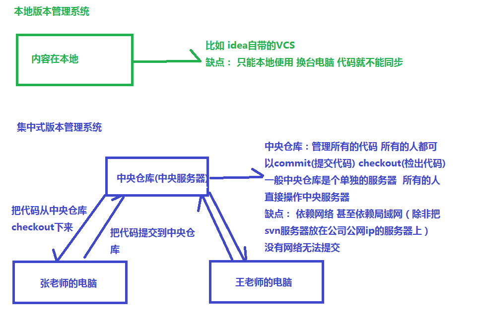

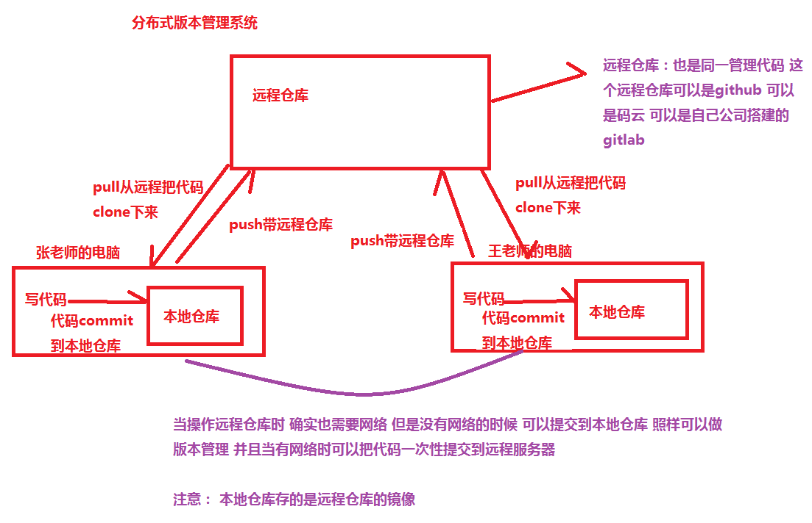

## 4. git的下载安装

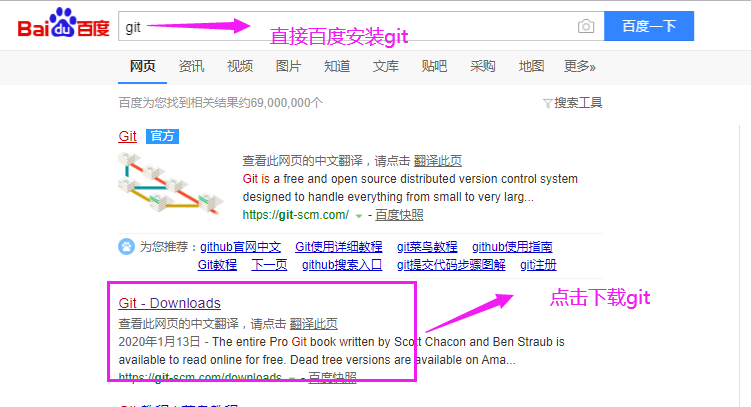

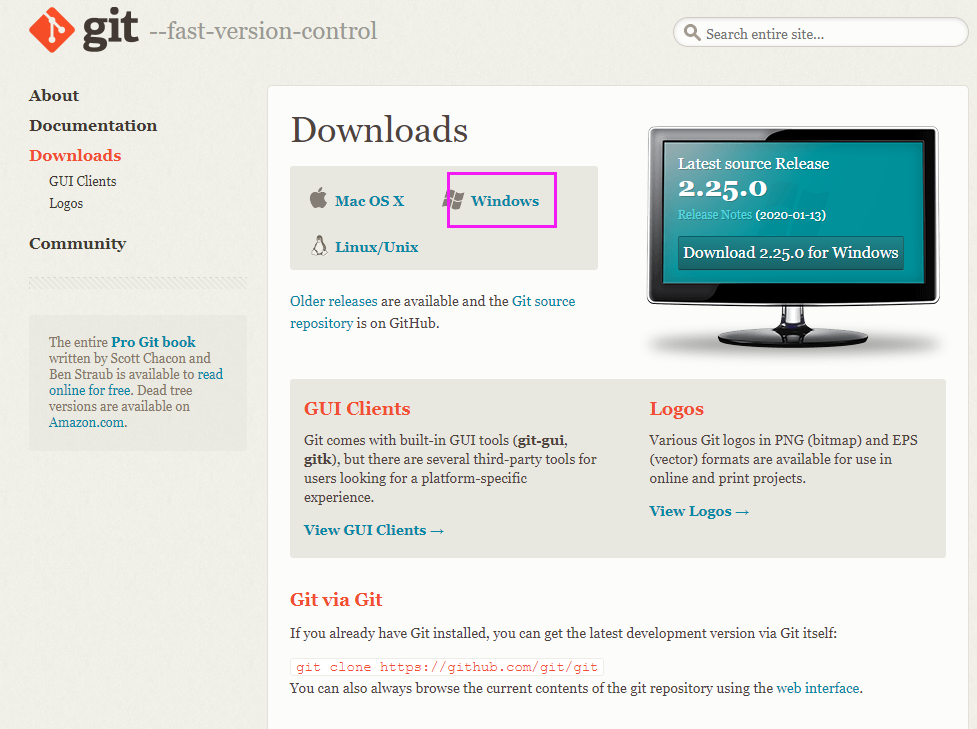

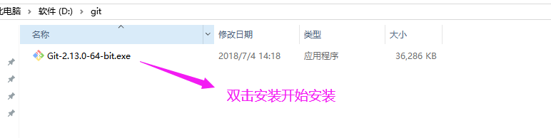

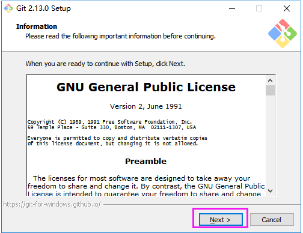

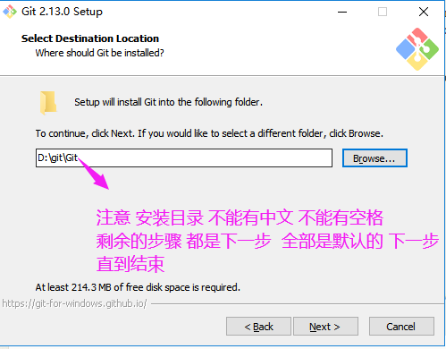

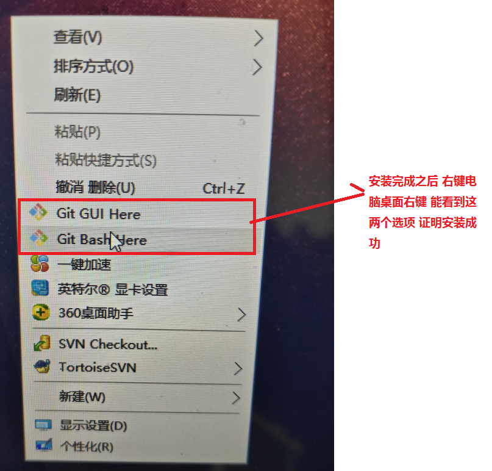

一般执行默认安装就行，如果想要修改，可参考如下点：

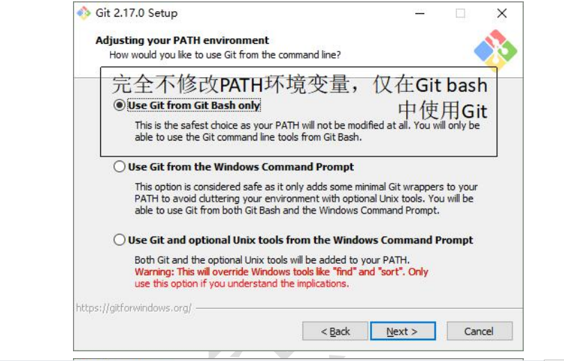

```properties
CRLF: "\r\n", windows系统环境下的换行方式，CRLF = carriage return line feed = 回车换行

LF: "\n", Linux系统环境下的换行方式 LF = line feed = 换行 
```

## 5.  git的操作 

* **图形化界面(不用)**
* **命令行(重点)**
* **和idea集成操作和svn一样(重点)**

## 6. git操作的四个区

### 6.1.基本认识

*  **工作区** 

  > 工作区是指写代码的地方，就是工作空间 ，文件是work file

*  **暂存区**

  > 代码暂存的地方  这个地方主要是为了解决git的误操作， 所以在git中代码不能直接提交到本地仓库 需要工作区先提交到暂存区，确定无误后再从暂存区提交到本地仓库，文件是 index file

*  **本地仓库**

  > 就是本地存储代码的地方，并且对不同的提交生成版本号，对不同的版本进行管理，我们可以通过版本号 轻松看到任何版本的代码  
*  **远程仓库**

  > Git的代码托管中心：维护远程库
  >
  > 远程库：局域网是GitLab服务器；公网有github,gitee


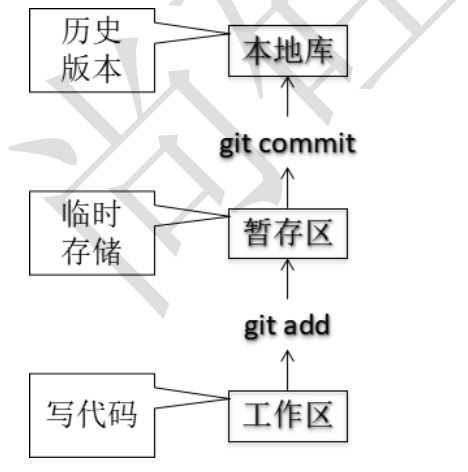

### 6.2.本地库和远程库

#### 6.2.1.团队内部协作


#### 6.2.2.跨团队协作

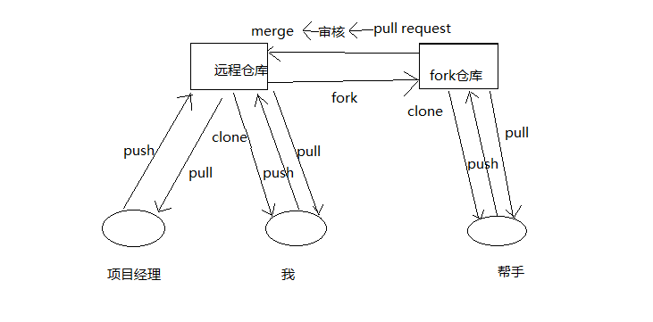

#### 6.2.3.其他协作方式（推荐）

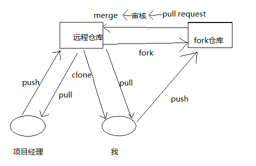

## 7. git基础命令演示

### 7.1. git init命令

> 此命令表示  初始化git  这个命令会生成一个.git文件（隐藏文件）  并且这个命令会创建 暂存区和本地仓库区
>
> 想要看这个.git文件要使用ls -la才能看到，linux所有以.开头都是隐藏文件

* **命令演示**

  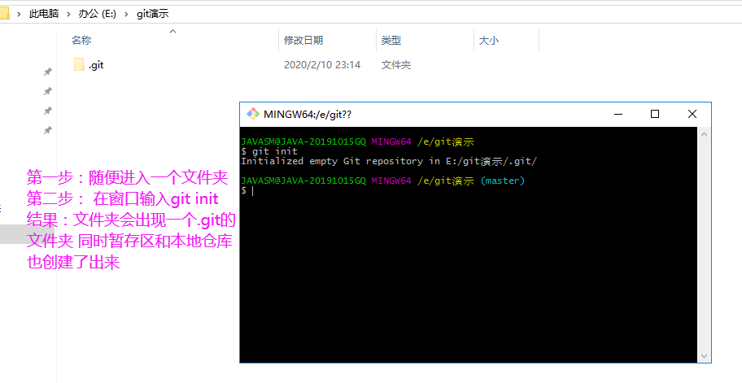
  
#### 7.1.1.设置签名

```properties
#作用是区分不同开发人员的身份
#这里设置的签名和登录远程库(代码托管中心)的账号、密码没有任何关系。
#命令分为项目级别（仓库级别）与系统用户级别（全局级别）；
###项目级别/仓库级别：仅在当前本地库范围内有效，信息保存位置：项目的./.git/config 文件
###系统用户级别：登录当前操作系统的用户范围,信息保存位置：用户目录的~/.gitconfig 文件
###就近原则：项目级别优先于系统用户级别，二者都有时采用项目级别的签名。如果二者都没有则不允许
用户名：xyz
邮箱：abc@gmail.com
```

  命令：

```bash
#设置项目级别的签名，
git config user.name xyz_project
git config user.email abc_project@gamil.com

#设置全局级别的签名
git config --global user.name xyz_global
git config --global user.email abc_global@gmail.com
```

### 7.2.  git add命令

> 这个命令 表示从工作区提交到暂存区

* **命令演示**

  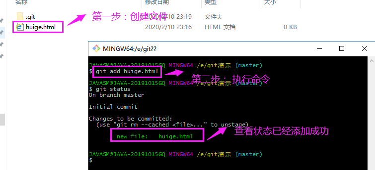

* **其他添加方式**

  ```bash
  # 将index.html添加到暂存区
  git add index.html
  
  # 将css目录下所有的文件添加到暂存区
  git add css
  
  # 将当前目录下所有的java文件添加到暂存区
  git add *.java
  
  # 添加当前目录下所有的文件
  git add .
  git add -A
  git add --all
  ```

### 7.3. git commit 命令

> 这个命令是指 把暂存区没有提交过的内容提交到本地仓库 

**注意：首次提交需要配置用户信息（设置签名）**

```bash
git commit -m '信息'  // m = message

#补充的命令
## 快速把文件从工作区提交到本地仓库 但是这个文件必须已经添加过  
git commit -a -m "提交信息" // a = add,m = message

## 修改最后一次提交的信息
git commit --amend -m "提交信息" //amend = 修改
```

*  **问题演示**

  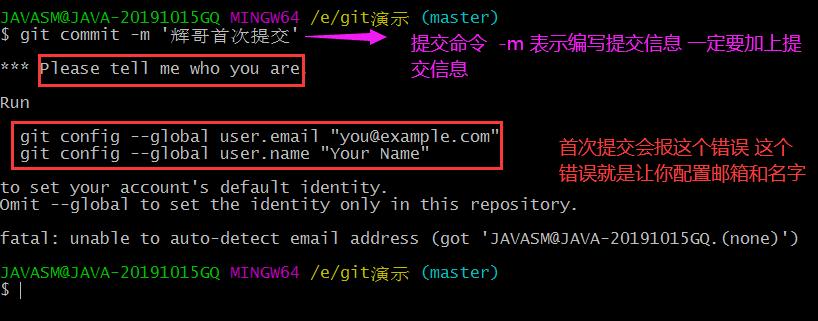

* **配置邮箱名字**

  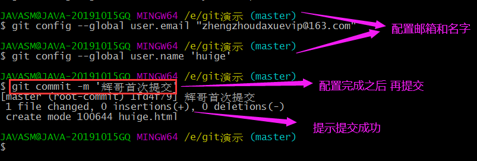
  
  

### 7.4. git config 命令

> 如果是第一次提交，需要配置提交者信息，推荐和github的账号邮箱一致(避免忘记)

```bash
# git config  user.name 你的用户名
# git config  user.email 你的邮箱

# 使用--global参数，配置全局的用户名和邮箱，只需要配置一次即可。推荐配置github的用户名和密码
git config  --global user.name brook
git config  --global user.email zhengzhoudaxuevip@163.com

# 对名字 和邮箱重置
git config --unset --global user.name brook 
git config --unset --global user.email xxx

# 查看配置信息
git config --list

#编辑配置文件
git config --global --edit
```

### 7.5.  git status

> 此命令的作用 查看文件的状态 

* **红色表示 文件还在本地区  还没有提交到暂存区**

* **绿色表示 文件在暂存区  还没有提交到本地仓库**

* **什么都没有表示 文件提交到本地仓库**

* **演示**

  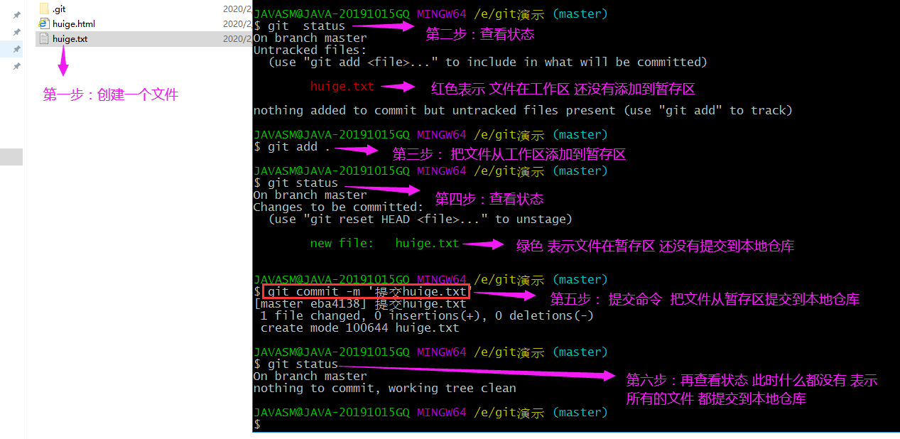
  
### 7.6. git log

> 此命令 查看提交日志 （注意：只有commit时 才会生成日志 ）

* **git log 是看比较完整的日志**

* **git log --oneline   日志一行显示 表示查看简短的日志**

* **演示**

  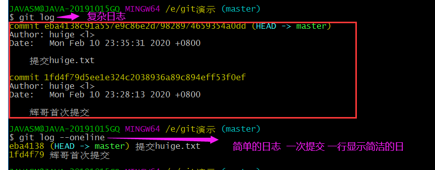
  
```properties
#日志过多，多屏显示控制方式：
空格向下翻页 
b(back)向上翻页 
q(quit) 退出
```

```bash
#常用的查看日志命令
git log
#一行显示
git log --pretty=oneline
#一行显示简化版
git log --oneline
#查看引用日志
git reflog
```

## 8. git diff比较命令

* **不带参数**

  > 不带参数表示`工作区`和`暂存区`的不同（表示提交过的不同,而不是新建一个文件就比较不同）

* **--cached**

  > 表示`暂存区`和`本地仓库`的不同

* **HEAD**

  > 表示`工作区`和`本地仓库`的不同

* **版本号**

  > 表示`2个版本之间`的不同

**演示:**

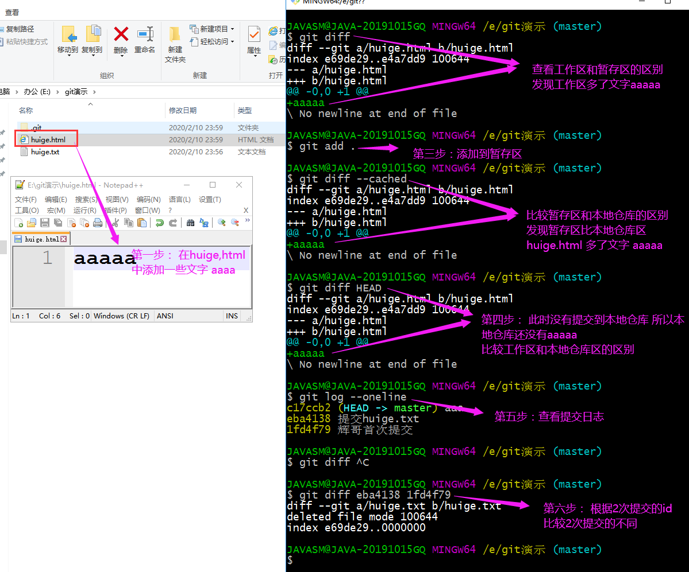

## 9. git reset重置命令

* **git reset**

```bash
#查看日志或引用日专
git reflog
#重置版本
/*
 * 第一种方式：基于hash索引值的方式
 *
 */
git reset --hard [局部索引值]
git reset --hard a6ace91
/*
 * 第二种方式：使用^符号：只能后退；一个^表示后退一步，n 个表示后退 n 步
 *
 */
git reset --hard HEAD^
/*
 * 第三种方式：使用~符号：只能后退；~n代表回退n步
 *
 */
git reset --hard HEAD~n
```

* **参数**

```bash
## git reset 的参数可以是以下三个值：

git reset --soft 版本号  ： 只重置仓库区（不掌握）
  
git reset 版本号         :  重置仓库区和暂存区（不掌握）和--mixed一致（不掌握）
git reset --mixed 版本号 ： 重置仓库区和暂存区（不掌握）

git reset --hard  版本号 ： 重置仓库区和暂存区和工作区。（掌握）
```


**对于三个参数的英文介绍**

**这里的index file 指的是暂存区文件（索引文件）；working tree指的是工作区文件（工作树）**

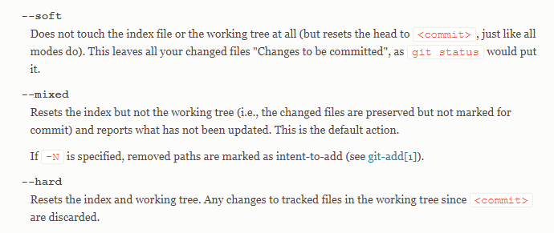

**如果想删除文件并找回：**

```properties
前提：删除前，文件存在时的状态提交到了本地库。

操作：git reset --hard [指针位置]

删除操作已经提交到本地库：指针位置指向历史记录

删除操作尚未提交到本地库：指针位置使用 HEA
```

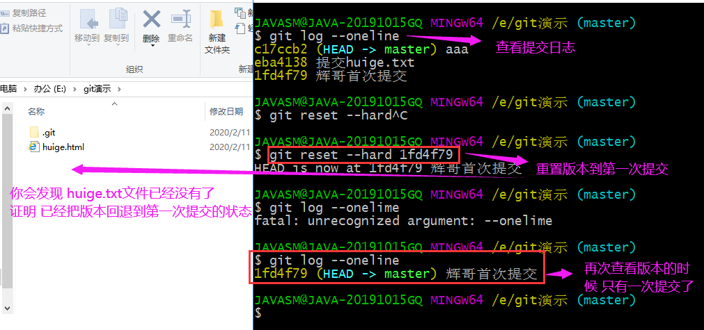

## 10. git的忽略文件

> 忽略文件 是指哪些对代码的逻辑没有用的文件  我们可以不提交  提交时可以忽略
>
> 
>
> 同一个团队中很难保证大家使用相同的 IDE 工具，而 IDE 工具不同时，相关工 程特定文件就有可能不同。如果这些文件加入版本控制，那么开发时很可能需要为了这些文件解决冲突。

**忽略文件名.gitignore 并且文件名固定的**

```bash
#GitHub 官网样例忽略文件 

https://github.com/github/gitignore 

https://github.com/github/gitignore/blob/master/Java.gitignore 
```

**举例说明创建git忽略文件：**

**注意：window系统 无法创建此文件**

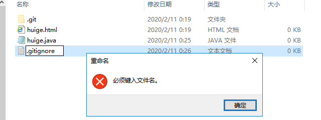

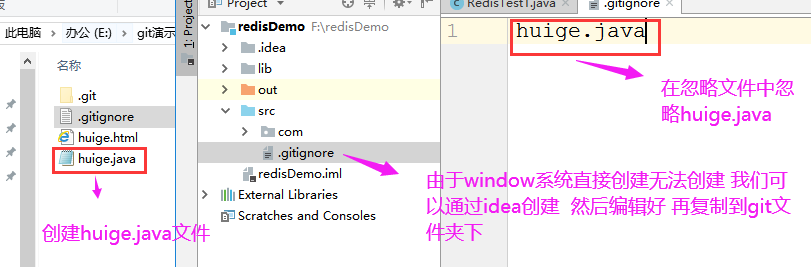

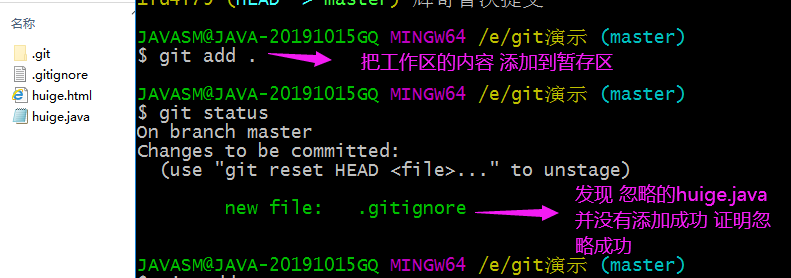

```bash
## 其他忽略方式举例 
# 忽视idea.txt文件
idea.txt

# 忽视.gitignore文件
.gitignore

# 忽视css下的index.js文件
css/index.js

# 忽视css下的所有的js文件
css/*.js

# 忽视css整个文件夹
css
```

**当然你也可以创建一个自定名称的忽略文件，然后在.gitconfig引用它：**

```bash
# Compiled class file
*.class

# Log file
*.log

# BlueJ files
*.ctxt

# Mobile Tools for Java (J2ME)
.mtj.tmp/

# Package Files #
*.jar
*.war
*.nar
*.ear
*.zip
*.tar.gz
*.rar

# virtual machine crash logs, see http://www.java.com/en/download/help/error_hotspot.xml
hs_err_pid*
```

然后在家目录~/.gitconfig 文件中引入上述文件 ,注意：要使用正斜线，而不是反斜线

```properties
[core]
excludesfile = C:/Users/Lenovo/Java.gitignore 
```

## 11. git 分支

> 实际开发当中  一个项目 可能多人并行开发 此时分支很好的解决了相互影响的问题  不同的人 或者完成不同的功能  开启不同的分支  就能互不影响的开发功能 

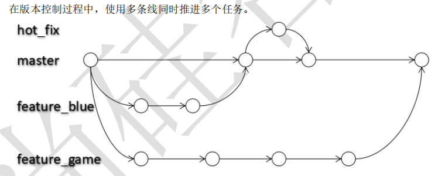

**注意：当git执行 git init初始化git的时候 已经有个分支了 这个分支叫主分支 master**

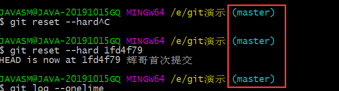

### 11.1. 分支的操作 

* **创建分支**

  > git branch 分支名

* **进入（切换/检出）分支**

  > git checkout 分支名 

* **创建并且直接进入**    //b = branch

  > git checkout -b 分支名                                                 

* **查看分支**  // v = view

  > git branch   
  >
  > git branch -v
  >
  > 注意： 当前分支有个 * 

* **删除分支**    //d = delete

  > git branch -d 分支名 
  >
  > **注意：不能在当前分支 删除当前分支 **
  >
  > **注意：不要删除主分支**

* **分支合并**

  > git merge 分支名
  >
  > **注意： 合并分支 要在主分支上操作  把其他分支上的代码 合并到主分支**
  >
  > **即站在想要新功能的分支上合并有新功能的分支**

**合并分支时 冲突的解决**： 

第一步：编辑文件，删除特殊符号 

第二步：把文件修改到满意的程度，保存退出 

第三步：git add [文件名] 

第四步：git commit -m "日志信息" 

注意：此时 commit 一定不能带具体文件名 

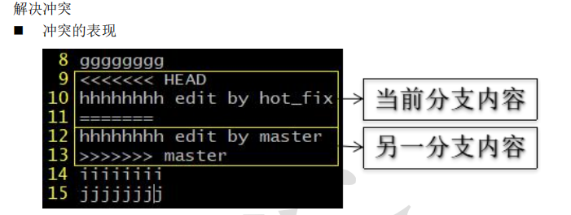

### 11.2. 分支操作演示

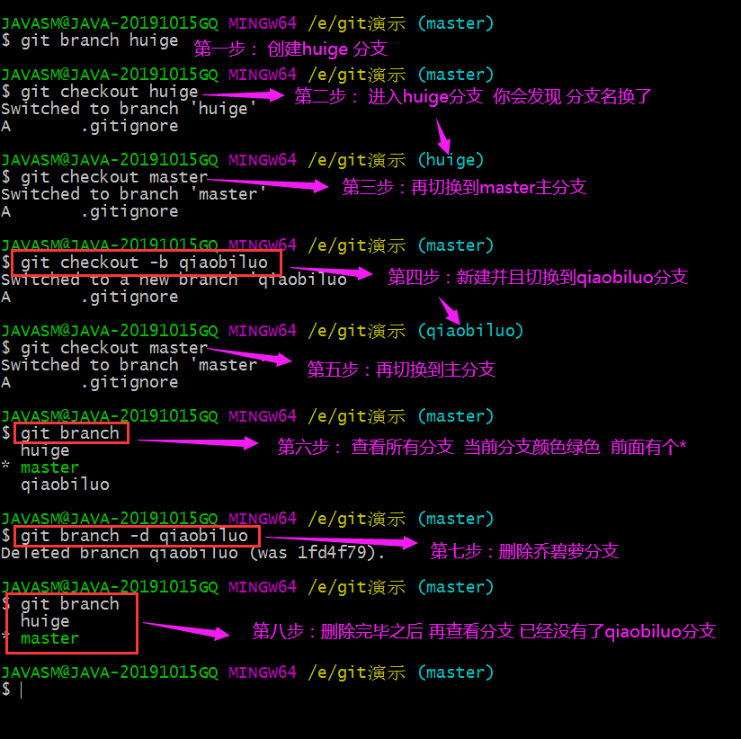

### 11.3. 分支合并演示

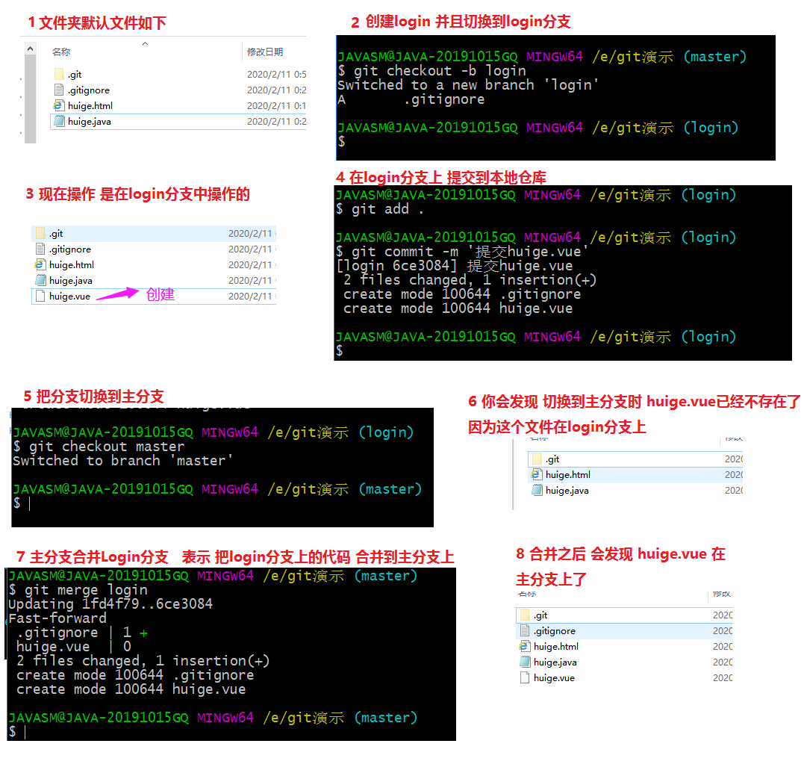

## 12. github的使用

> github 是个开源的，免费的，代码托管平台  代码是开放的  任何人都可以看到 （除非付费 变成私有的），和git 没有一毛钱关系 

### 12.1. github的登陆

**备注： 如果没有账号 先注册  **

```java
//如果实在登陆不上 只能配置域名映射
//第一步：查询ip http://www.github.com.ipaddress.com/
//第二步： hosts文件 配置映射   140.82.113.4   github.com
```


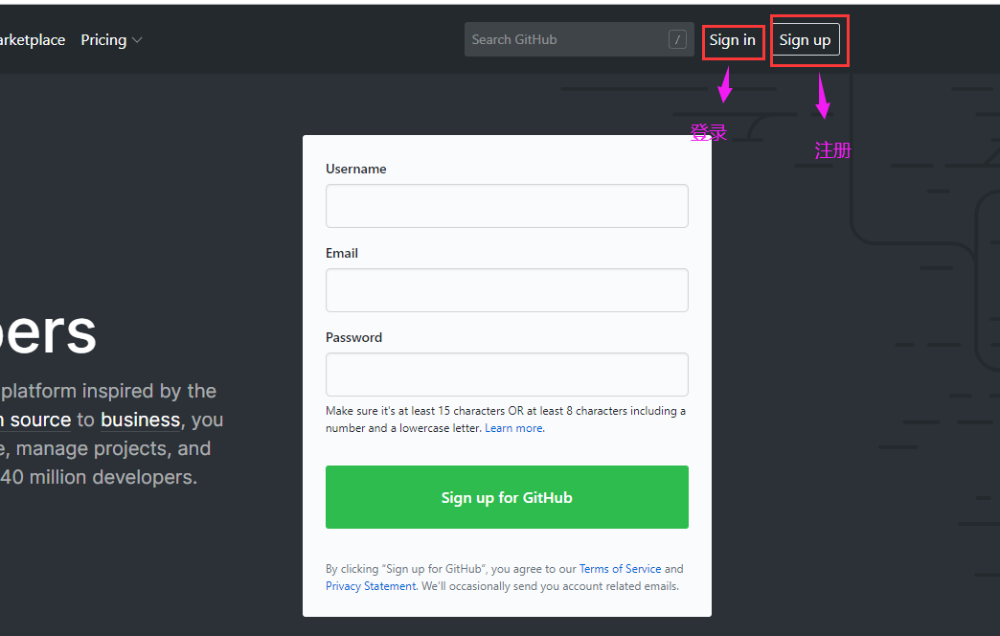

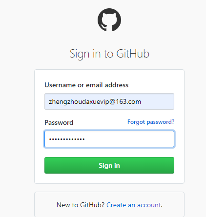

 

### 12.2. 创建远程仓库

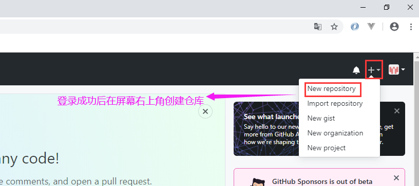

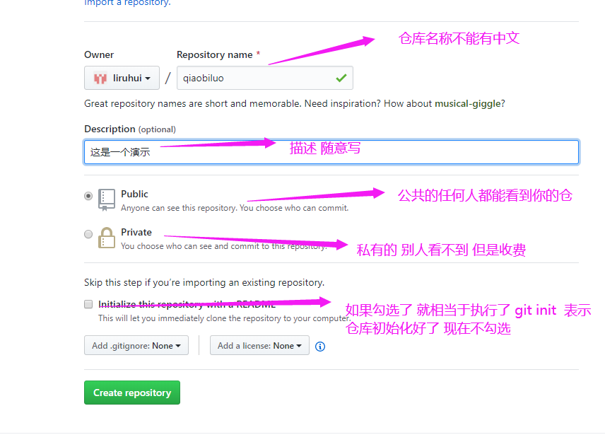

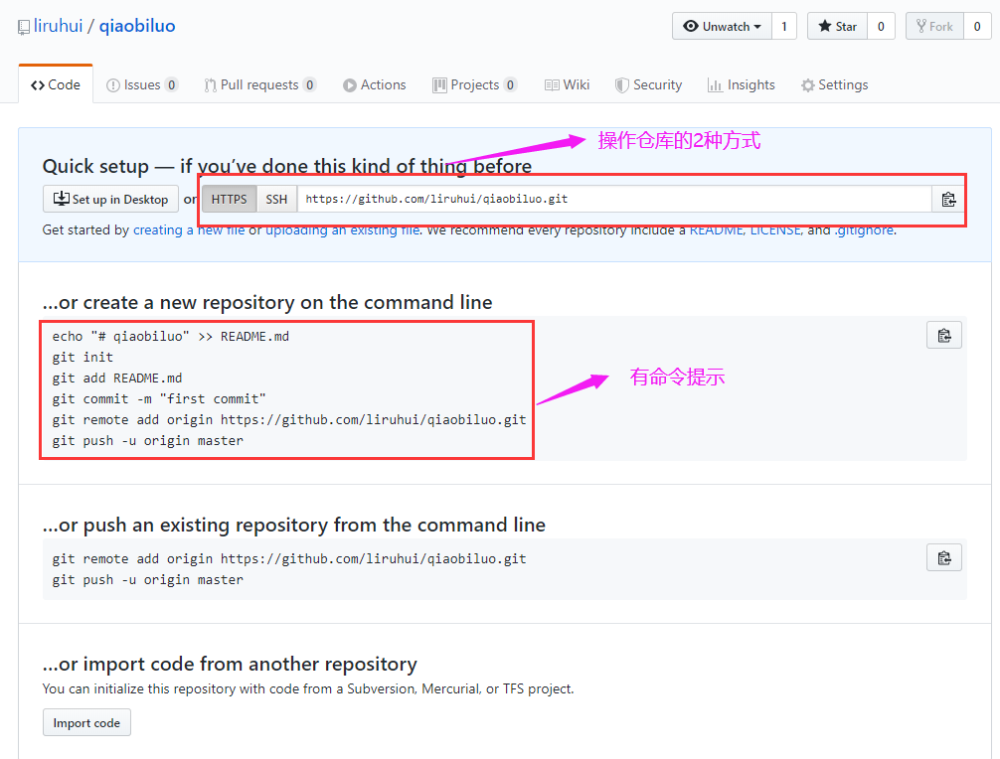

### 12.3. 操作远程仓库演示

#### 12.3.1. 上传到github演示

```bash
#1 初始化，生成.git文件夹
git init 
#2 新建文件,如果是clone的项目，要先pull拉取
#这里略过
#3 增加到暂存区
git add .
#4 提到本地仓库
git commit -m "message"
#5 远程库起别名,origin就是别名，后面url是真实地址
git remote add origin https://github.com/xyz/abc.git
#6 推送到远程仓mian分支
git push origin main
```

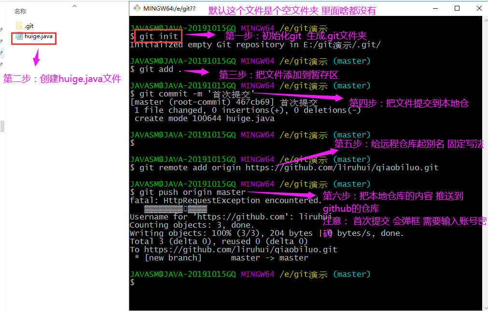

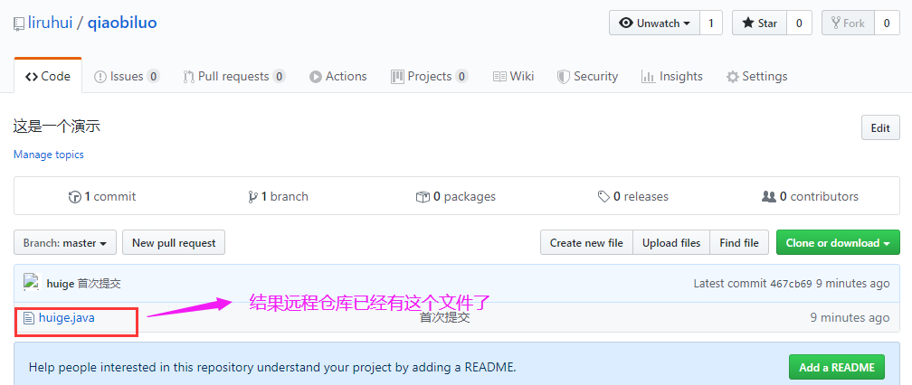

#### 12.3.2. 从github上下载演示

```bash
#从远程库clone项目
#格式：git clone 远程库地址
git clone https://github.com/xyz/abc.xyz
```

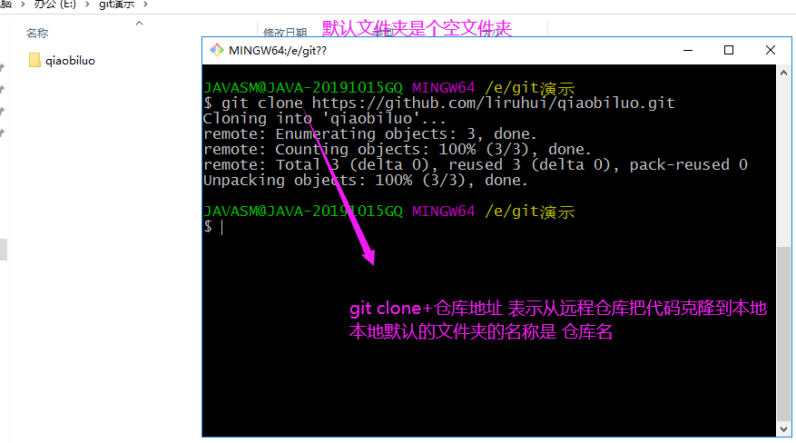

#### 12.3.3. 操作github的完整流程

* **创建仓库**

  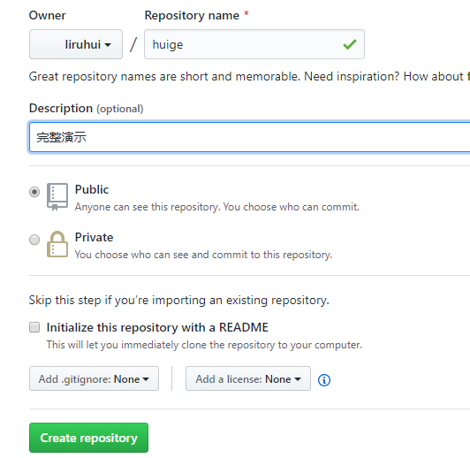

* **本地初始化git**

  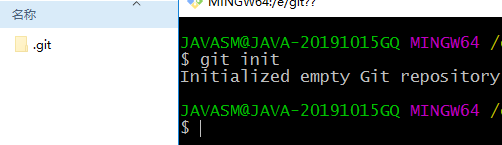

* **编写代码**

  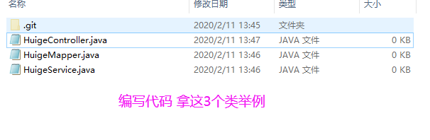

* **添加到本地仓库**

   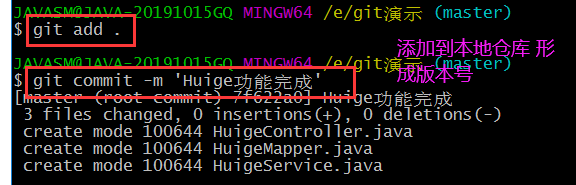


* **上传到github**

  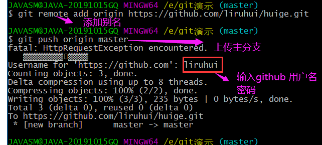

* **结果演示**

  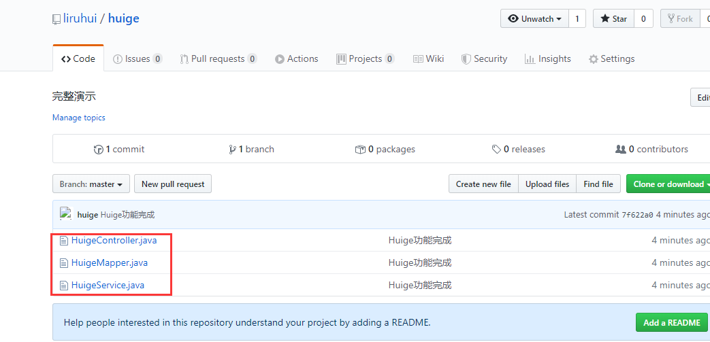

* **继续写代码**

  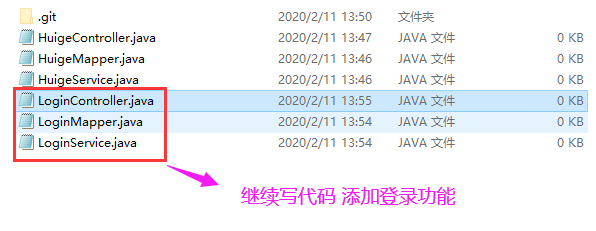

* **新的代码上传本地仓库**

  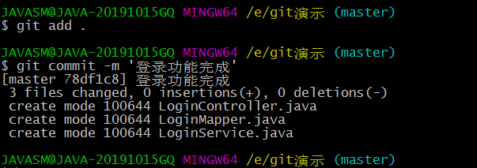

* **新的代码上传到github**

```bash
#提交代码前先要拉取代码
git pull
```

  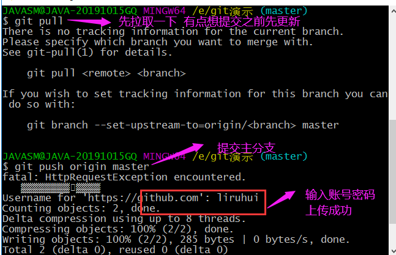

* **结果查看**

  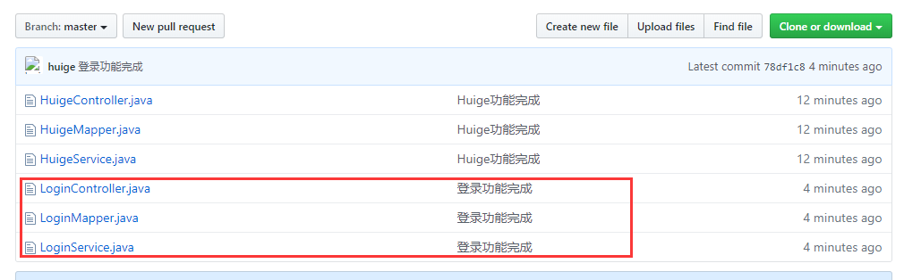

#### 12.3.4. 实际开发中分支操作完整流程演示

* **项目经理**

  > 一般一个 掌握主分支

* **程序员**

  >  多个  在自己分支上编写代码  程序员之间 互不影响

* **需求**

  > 项目经理： 搭建好项目架构  发布到github上   创建分支  把不同的分支分配给程序员  
  >
  > 程序员:  在自己的分支上 编写功能 编写代码 编写完毕之后 提交到自己的分支上 
  >
  > 项目经理： 在主分支合并 程序员编写好的分支上的代码  以及合并冲突的解决


```properties
拉取：pull=fetch+merge
git pull [远程库地址别名] [远程分支名]
git fetch [远程库地址别名] [远程分支名]
git merge [远程库地址别名/远程分支名] 


解决冲突要点：
如果不是基于 GitHub 远程库的最新版所做的修改，不能推送，必须先拉取。拉取下来后如果进入冲突状态，则按照“分支冲突解决”操作解决即可。
```

12.3.5. 尚硅谷的github演示


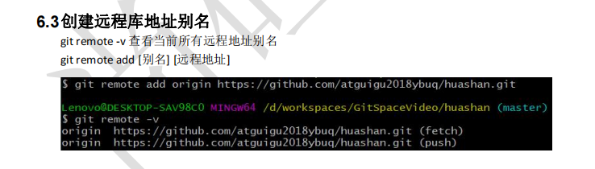

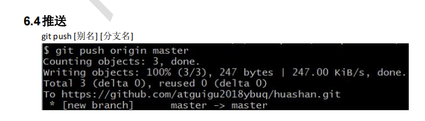

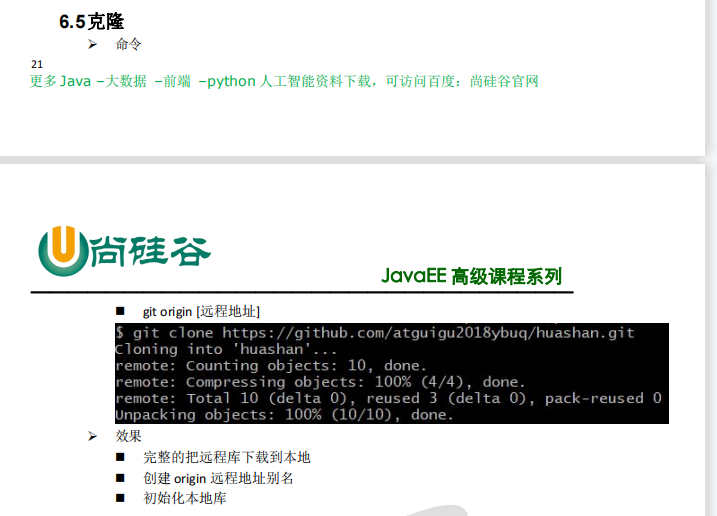


## 13. github的免密登录（ssh）

> 由于每次提交都要输入账号密码  我们可以设置免密登录；ssh = secure shell = 安全壳

### 13.1. 生成公钥私钥

> ssh-keygen -t rsa


### 13.2. 复制公钥中的内容 

直接打开文件复制id_rsa.pub的内容：


命令行复制id_rsa.pub的内容：

```properties
输入cd ～指令，进入当前用户目录

输入ls -a指令，查看当前用户目录下所有文件，包括隐藏文件

输入cd .ssh指令，进入.ssh目录

输入ls指令，查看.ssh目录下的文件

输入cat id_rsa.pub指令，查看id_rsa.pub文件中内容，进行复制
```

### 13.3. 在github中配置公钥 

*  **进入配置位置的第一步**

  

* **进入配置位置第二步**

  

* **配置**

  

### 13.4. 结果演示

> 注意：要使用ssh免密码登陆  必须使用ssh的方式 


* **ssh的方式克隆代码**

  


* **添加到github**

  


## 14. 和Idea集成git

### 14.1. 集成git

相当于我们安装了git bash软件，这里是idea集成git


### 14.2. 把项目交给git管理 

相当于我们的git init，初始化仓库

第一种方式： 开启版本控制集成


第二种方式：导入到版本控制


选择要创建 Git 本地仓库的工程。


### 14.3. 界面操作的几种方式

> 普通操作和svn一样，在项目上右键，选择git


> 点击菜单栏的VCS
>


> 点击右上角的图标


> 点击右下角 ，操作git分支
>


> 点击左下角，操作git日志记录


**以上几种都可以操作git  哪一种都可以 **

### 14.4. 添加、提交、日志

首先了解下git显示中文件颜色的含义：

```properties
红色=未追踪文件
绿色=已追踪但未提交的文件
蓝色=已追踪但修改的文件
黑色=正常默认的颜色，已添加本地仓的文件
```

#### 14.4.1.添加到暂存区

右键点击项目选择 Git -> Add 将项目添加到暂存区。相当于 git add .


#### 14.4.2.提交到本地仓库

右键点击项目选择 Git -> commit Directory 将项目提交到本地库。相当于 git commit -m "my message"


#### 14.4.3. 操作日志，选择版本

在 IDEA 的左下角，点击 Version Control，然后点击 Log 查看版本；相当于 git log/git reflog


右键选择要切换的版本，然后在菜单里点击 Checkout Revision。


### 14.5. 操作分支

> 创建分支 ,相当于 git branch hot-fix

右键项目选择 Git，在 Repository 里面，点击 Branches 按钮


在弹出的 Git Branches 框里，点击 New Branch 按钮。


填写分支名称，创建 hot-fix 分支。


然后再 IDEA 的右下角看到 hot-fix，说明分支创建成功，并且当前已经切换成 hot-fix 分支


或者右下操作分支：


> 切换分支

在 IDEA 窗口的右下角，切换到 master 分支 ；相当于 git checkout master


然后在 IDEA 窗口的右下角看到了 master，说明 master 分支切换成功。


> 合并分支

在 IDEA 窗口的右下角，将 hot-fix 分支合并到当前 master 分支。; 相当于git merge hot-fix


如果代码没有冲突，分支直接合并成功，分支合并成功以后，代码自动提交，无需手动提交本地库。


> 解决冲突

如图所示，如果 master 分支和 hot-fix 分支都修改了代码，在合并分支的时候就会发生冲突


我们现在站在 master 分支上合并 hot-fix 分支，就会发生代码冲突


点击 Conflicts 框里的 Merge 按钮，进行手动合并代码


手动合并完代码以后，点击右下角的 Apply 按钮。


代码冲突解决，自动提交本地库。


> 删除分支

点击分支后，弹出框选择Delete；相当于 git branch -d hot-fix


### 14.5. 设置忽略文件

第一种方式：


第二种方式：

1）创建忽略规则文件 xxxx.ignore（前缀名随便起，建议是 git.ignore） 

这个文件的存放位置原则上在哪里都可以，为了便于让~/.gitconfig 文件引用，建议也放在用户家目录下 

git.ignore 文件模版内容如下： 

```properties
# Compiled class file
*.class

# Log file
*.log

# BlueJ files
*.ctxt

# Mobile Tools for Java (J2ME)
.mtj.tmp/

# Package Files #
*.jar
*.war
*.nar
*.ear
*.zip
*.tar.gz
*.rar

# virtual machine crash logs, see http://www.java.com/en/download/help/error_hotspot.xml
hs_err_pid*
```

2）在.gitconfig 文件中引用忽略配置文件（此文件在 Windows 的家目录中）

```properties
[user]
name = Layne
email = Layne@atguigu.com
[core]
excludesfile = C:/Users/asus/git.ignore
```

**注意：这里要使用“正斜线（/）”，不要使用“反斜线（\）**

## 15. IDEA集成  github等

### 15.1. 集成github

#### 15.1.1. 设置github帐号


如果出现 401 等情况连接不上的，是因为网络原因，可以使用以下方式（`使用token`）连接：


然后去 GitHub 账户上设置 token。


点击生成 token。


复制红框中的字符串到 idea 中。


点击登录。


#### 15.1.2. 分享工程到github上


来到 GitHub 中发现已经帮我们创建好了 gitTest 的远程仓库


#### 15.1.3. push工程到远程库

右键点击项目，可以将当前分支的内容 push 到 GitHub 的远程仓库中。


注意：push 是将本地库代码推送到远程库，如果本地库代码跟远程库代码版本不一致， push 的操作是会被拒绝的。也就是说，要想 push 成功，一定要保证本地库的版本要比远程库的版本高！因此一个成熟的程序员在动手改本地代码之前，一定会先检查下远程库跟本地代码的区别！如果本地的代码版本已经落后，切记要先 pull 拉取一下远程库的代码，将本地代码更新到最新以后，然后再修改，提交，推送！ 

#### 15.1.4. pull 拉取远程库到本地库

右键点击项目，可以将远程仓库的内容 pull 到本地仓库。


注意：pull 是拉取远端仓库代码到本地，如果远程库代码和本地库代码不一致，会自动 合并，如果自动合并失败，还会涉及到手动解决冲突的问题。

#### 15.1.5. clone远程库到本地


为 clone 下来的项目,导入，然后点击 Next。


## 16. 在线简历（免服务器）必备

> github 有一个github-pages服务器 我们可以把我们的在线简历 放到github-pages当中 此时我们的简历就是在线的  全世界的人 都可以通过访问网址 进行访问你的简历  我们不需要购买服务器   github是现成的

* **使用规则**

  * **创建一个仓库  仓库名必须叫 用户名+github.io**

  

  * **必须开启https访问**

    


* **把你的简历html提交到这个仓库**

  


* **可以通过网址访问你的在线简历了**

  

## 17.git的基本原理

### 17.1.哈希算法


哈希是一个系列的加密算法，各个不同的哈希算法虽然加密强度不同，但是有以下 几个共同点： 

①不管输入数据的数据量有多大，输入同一个哈希算法，得到的加密结果长度固定。 

②哈希算法确定，输入数据确定，输出数据能够保证不变 

③哈希算法确定，输入数据有变化，输出数据一定有变化，而且通常变化很大 

④哈希算法不可逆 

Git 底层采用的是 SHA-1 算法。 

哈希算法可以被用来验证文件。原理如下图所示：


### 17.2.git保存版本的机制

#### 17.2.1.集中式版本控制工具的文件管理机制

以文件变更列表的方式存储信息。这类系统将它们保存的信息看作是一组基本文件和每个文件随时间逐步累积的差异。  这个差异就是增量。

```properties
over time = 随着时间
```


#### 17.2.2.Git 的文件管理机制

Git 把数据看作是小型文件系统的一组快照。每次提交更新时 Git 都会对当前 的全部文件制作一个快照并保存这个快照的索引。为了高效，如果文件没有修改， Git 不再重新存储该文件，而是只保留一个链接指向之前存储的文件。所以 Git 的 工作方式可以称之为快照流snapshot。


如指针指向快照，B指向原来的文件B

#### 17.2.3.文件管理机制细节

**Git 的“提交对象”**

提交的对象包含tree，tree（树）包含blob（二进制长对象）


**提交对象及其父对象形成的链条**

原来的提交就是父对象，子对象指向父对象


#### 17.3.git的分支管理机制

##### 17.3.1.分支的创建

这里版本f30ab有两个分支，master与testing，现在HEAD指向master


##### 17.3.2.分支的切换

HEAD原来指向master分支，后来指向testing分支:


如果在test分支上继续新增内容，则会出现如下情况:


如果不同的分支有不同的内容:


## 18. git 工作流

### 18.1 概念

在项目开发过程中使用 Git 的方式

### 18.2 分类

#### 18.2.1 集中式工作流

像 SVN 一样，集中式工作流以中央仓库作为项目所有修改的单点实体。所有 修改都提交到 Master 这个分支上。 

这种方式与 SVN 的主要区别就是开发人员有本地库。

Git 很多特性并没有用到。


#### 18.2.2  GitFlow 工作流

Gitflow 工作流通过为功能开发、发布准备和维护设立了独立的分支，让发布迭代过程更流畅。严格的分支模型也为大型项目提供了一些非常必要的结构。 


#### 18.2.3 Forking工作流

Forking 工作流是在 GitFlow 基础上，充分利用了 Git 的 Fork 和 pull request 的 功能以达到代码审核的目的。更适合安全可靠地管理大团队的开发者，而且能接受不信任贡献者的提交。


### 18.3 GitFlow工作流详解

#### 18.3.1 分支种类

**主干分支 master** 

​	主要负责管理正在运行的生产环境代码。永远保持与正在运行的生产环境完全一致。 

**开发分支 develop** 

​	主要负责管理正在开发过程中的代码。一般情况下应该是最新的代码。 

**bug 修理分支 hotfix** 

​	主要负责管理生产环境下出现的紧急修复的代码。 从主干分支分出，修 理完毕并测试上线后，并回主干分支。并回后，视情况可以删除该分支。 

**准生产分支（预发布分支） release** 

​	较大的版本上线前，会从开发分支中分出准生产分支，进行最后阶段的集成测试。该版本上线后，会合并到主干分支。生产环境运行一段阶段较稳定后可以视情况删除。 

**功能分支 feature** 

​	为了不影响较短周期的开发工作，一般把中长期开发模块，会从开发分支中独立出来。 开发完成后会合并到开发分支。


## 19. gitlab 服务器搭建

### 19.1.官网地址

首页：https://about.gitlab.com/ 

安装说明：https://about.gitlab.com/installation/

### 19.2.安装命令摘录 

```bash
sudo yum install -y curl policycoreutils-python openssh-server cronie 
sudo lokkit -s http -s ssh 
sudo yum install postfix 
sudo service postfix start 
sudo chkconfig postfix on 
#下面这两行是一起的
curl https://packages.gitlab.com/install/repositories/gitlab/gitlab-ee/script.rpm.sh | sudo bash 

sudo EXTERNAL_URL="http://gitlab.example.com" yum -y install gitlab-ee
```

实际问题：yum 安装 gitlab-ee(或 ce)时，需要联网下载几百 M 的安装文件，非常耗时，所以应提前把所需 RPM 包下载并安装好。 

下载地址为： 

https://packages.gitlab.com/gitlab/gitlab-ce/packages/el/7/gitlab-ce-10.8.2-ce.0.el7.x86_64.rpm

```properties
ee = enterprise edition = 企业版
ce = community edition = 社区版
```

### 19.3.调整后的安装过程 （学习用ce版）

```bash
sudo yum install -y curl policycoreutils-python openssh-server cronie 
sudo rpm -ivh /opt/gitlab/gitlab-ce-10.8.2-ce.0.el7.x86_64.rpm 
sudo yum install lokkit
sudo lokkit -s http -s ssh 
sudo yum install postfix 
sudo service postfix start 
sudo chkconfig postfix on 
#下面这两行是一起的
curl https://packages.gitlab.com/install/repositories/gitlab/gitlab-ce/script.rpm.sh | sudo bash 

sudo EXTERNAL_URL="http://gitlab.example.com" yum -y install gitlab-ce
```

当前步骤完成后重启。

### 19.4. gitlab 服务操作

```bash
#初始化配置 gitlab 
gitlab-ctl reconfigure 

#启动 gitlab 服务 
gitlab-ctl start 

#停止 gitlab 服务 
gitlab-ctl stop
```

### 19.5.浏览器访问

访问 Linux 服务器 IP 地址即可，如果想访问 EXTERNAL_URL需要指定的域名还需要配置域名服务器或本地 hosts 文件。 

初次登录时需要为 gitlab 的 root 用户设置密码。


### 19.6.IDEA集成gitlab

1）安装 GitLab 插件


2）设置 GitLab 插件


3）push 本地代码到 GitLab 远程库


自定义远程连接


注意：gitlab 网页上复制过来的连接是：http://gitlab.example.com/root/git-test.git， 需要手动修改为：http://gitlab-server/root/git-test.git 选择 gitlab 远程连接，进行 push


首次向连接 gitlab，需要登录帐号和密码，用 root 帐号和我们修改的密码登录即可。


代码 Push 成功。

只要 GitLab 的远程库连接定义好以后，对 GitLab 远程库进行 pull 和 clone 的操作和 Github 和码云一致，此处不再赘述

## 20. git加速与其他设置

要设置你的代理软件的本地监听ip端口

```bash
git config --global http.proxy http://127.0.0.1:7890
git config --global https.proxy https://127.0.0.1:7890

#如果只是单次在终端使用代理键入以下命令，关闭终端会话则清理代理
export https_proxy=http://127.0.0.1:7890 http_proxy=http://127.0.0.1:7890 all_proxy=socks5://127.0.0.1:789
```

有时候需要关闭ssl验证

```bash
git config --global http.sslVerify false
```

Git默认对大小写不敏感，也就是说，将一个文件名某个字母做了大小写转换的修改Git是忽略这个改动的，导致在同步代码时候会出现错误，所以建议把Git设置成大小写敏感

```bash
#如果需要全局配置，加 --global
git config core.ignorecase false
```

