# git实战-命令行


## 1.git commit

```bash
git commit -m '提交信息'
```

作用：进行一次本地提交，会让当前分支引用移到到最新的提交snapshot上


## 2.git branch

git分支：是指 指向提交记录的 引用

```bash
git branch 分支名 ：新建分支，并指向当前提交

git branch 分支名 引用：新建分支，并指向该引用

git checkout 分支名：检出（切换）到该分支，即HEAD指针指向当前分支

git checout -b 分支名：新建分支，并检出到该新建分支上

git checout -b 分支名 引用：新建分支，并检出到该新建分支上（指向引用位置）

git branch -d 分支名：删除分支，注意HEAD指针不能指向删除的分支
```


注意：当前分支的切换严重依赖于`git checkout `,git后续版本会启用`git switch`命令

## 3.git merge

```bash
git merge 要被合并的分支名：合并其他分支到当前分支来，会形式一个新的提交记录，并使分支指向这个新的提交。
```

比如：main分支指向c3,当`git merge bugFix`时，会形成c4提交，main分支将会指向c4 。如果想将bugFix分支也变成最新使用下面命令：`git checkout bugFix` , `git merge main`，则bugFix指向c4


## 4.git rebase

第二种合并分支的方法是 `git rebase`。Rebase 实际上就是取出一系列的提交记录，“复制”它们，然后在另外一个地方逐个的放下去。

Rebase 的优势就是可以创造更线性的提交历史。

```bash
git rebase 重新定基的分支 ：将当前分支上的提交复制到新的分支上，并且当前分支指向这个复制的最新提交
git rebase 重新定基的分支 被称动的分支 ：如git rebase main dev 就是将dev分支的提交搬到main分支上
```

比如：`git checkout bugFix`;  `git rebase main`则会形成c2'分支，bugFix分支指向这个c2'。此时如果想要将main分支变成最新，可使用如下命令：`git checkout main`; `git rebase bugFix` 就会让main分支指向c2'。注意rebase操作后原c2提交还存在（图中灰暗部分）


## 5.分离的HEAD指针

```bash
git chekcout hash值 ：分离的 HEAD 指针 就是让其指向了某个具体的提交记录而不是分支名。
```

HEAD 是一个对当前检出记录的符号引用 —— 也就是指向你正在其基础上进行工作的提交记录。

HEAD 总是指向当前分支上最近一次提交记录。大多数修改提交树的 Git 命令都是从改变 HEAD 的指向开始的。

HEAD 通常情况下是指向分支名的（如 bugFix）。在你提交时，改变了 bugFix 的状态，这一变化通过 HEAD 变得可见。

如果想看 HEAD 指向，可以通过 `cat .git/HEAD` 查看， 如果 HEAD 指向的是一个引用，还可以用 `git symbolic-ref HEAD` 查看它的指向。


正常情况下，比如bugFix上有*号代表，HEAD指向bugFix,bugFix指向c4 ，当git checkout c4,则HEAD指针指向c4 。

## 6.相对引用

检出某个提交：前面的方式是`git log` 查看提交记录，后使用`git checkout hash值`使HEAD指针指向某个提交。

通过哈希值指定提交记录很不方便，所以 Git 引入相对引用。使用相对引用的话，你就可以从一个易于记忆的地方（比如 `bugFix` 分支或 `HEAD`）开始计算。

相对引用非常给力，这里我介绍两个简单的用法：

- 使用 `^` 向上移动 1 个提交记录， `^` 后面加数字指的是选择哪个分支：1代表本分支，2代表另一个分支
- 使用 `~<num>` 向上移动多个提交记录，如 `~3`

首先看看操作符 (^)。把这个符号加在引用名称的后面，表示让 Git 寻找指定提交记录的父提交。所以 `main^` 相当于“`main` 的父节点”。

`main^^` 是 `main` 的第二个父节点。你也可以将 `HEAD` 作为相对引用的参照。

操作符 `^` 与 `~` 符一样，后面也可以跟一个数字。

但是该操作符后面的数字与 `~` 后面的不同，并不是用来指定向上返回几代，而是指定合并提交记录的某个父提交。


比如HEAD原来指向main（main上有*），`git checkout bugFix^` 就会使HEAD指向c3,当然也可以直接`git checkout c3` 或者 `git checkout bugFix~1`;

## 7.强制修改分支位置

使用相对引用最多的就是移动分支。可以直接使用 `-f` 选项让分支指向另一个提交。例如:

```bash
git branch -f main HEAD~3
```

上面的命令会将 main 分支强制指向 HEAD 的第 3 级父提交。


比如原main分支指向c4，`git branch -f main HEAD~3`  则main分支指向c1

## 8.撤销变更 git reset, git revert

```bash
git reset --参数 引用 : 重置到引用位置
```

主要有两种方法用来撤销变更 —— 一是 `git reset`，还有就是 `git revert`。

`git reset` 向上移动分支，原来指向的提交记录就跟从来没有提交过一样。

`git reset HEAD~1`  Git 把 main 分支移回到 `C1`；现在我们的本地代码库根本就不知道有 `C2` 这个提交了。（注意：在reset后， `C2` 所做的变更还在，但是处于未加入暂存区状态。）


虽然在你的本地分支中使用 `git reset` 很方便，但是这种“改写历史”的方法对大家一起使用的远程分支是无效的哦！为了撤销更改并**分享**给别人，我们需要使用 `git revert`。HEAD指向c2

来看演示：`git revert HEAD` 

奇怪！在我们要撤销的提交记录后面居然多了一个新提交！这是因为新提交记录 `C2'` 引入了**更改** —— 这些更改刚好是用来撤销 `C2` 这个提交的。也就是说 `C2'` 的状态与 `C1` 是相同的。revert 之后就可以把你的更改推送到远程仓库与别人分享啦。


## 9.git cherry-pick

```bash
git cherry-pick hash值1 hash值2 ...     : 会复制提交记录到HEAD指针下，并使当前分支指向最新的提交。
```

 `git cherry-pick`, 命令形式为:

- `git cherry-pick <提交号>...`

如果你想将一些提交复制到当前所在的位置（`HEAD`）下面的话， Cherry-pick 是最直接的方式了。

我们想将 `side` 分支上的工作复制到 `main` 分支，你立刻想到了之前学过的 `rebase` 了吧？但是咱们还是看看 `cherry-pick` 有什么本领吧。

`git cherry-pick C2 C4`

这就是了！我们只需要提交记录 `C2` 和 `C4`，所以 Git 就将被它们抓过来放到当前分支下了。 就是这么简单!


## 10.交互式的rebase

交互式 rebase 指的是使用带参数 `--interactive` 的 rebase 命令, 简写为 `-i`

如果你在命令后增加了这个选项, Git 会打开一个 UI 界面并列出将要被复制到目标分支的备选提交记录，它还会显示每个提交记录的哈希值和提交说明，提交说明有助于你理解这个提交进行了哪些更改。

在实际使用时，所谓的 UI 窗口一般会在文本编辑器 —— 如 Vim —— 中打开一个文件。

交互式的rebase有三个功能：

- 调整提交记录的顺序
- 删除你不想要的提交
- 合并提交。简而言之，它允许你把多个提交记录合并成一个。

如下操作：`git rebase -i HEAD~4`

Git 严格按照你在对话框中指定的方式进行了复制。 注意这个是rebase不包含c1的，即左闭右开，[c5,c1)。还有rebase的基是c1,main指向最新的提交c5'。


## 11.本地栈式提交

栈式提交要求是的是将各功能分类提交，互不影响，最后只取其中的部分提交。常见的是不要调试代码。

常用的两种处理方法：

```bash
git rebase -i 引用

git cherry-pick 引用1 引用2 等
```

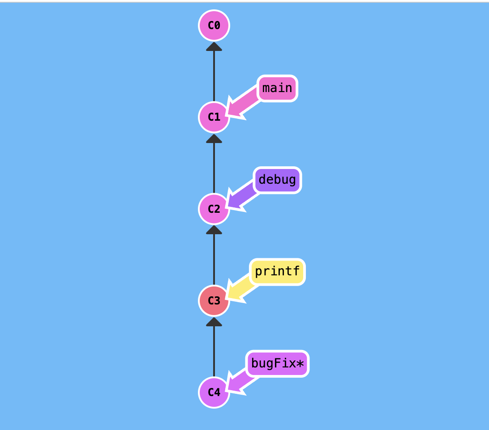

如上图所示，只要c4提交，要将c4提交移到c1后，可以如下操作：

```bash
# 方法一：
git rebase -i main 后只选c4 ; git checkout main ; git rebase bugFix
# 方法二：
git checkout main; git cherry-pick c4; git branch -f bugFix main
```

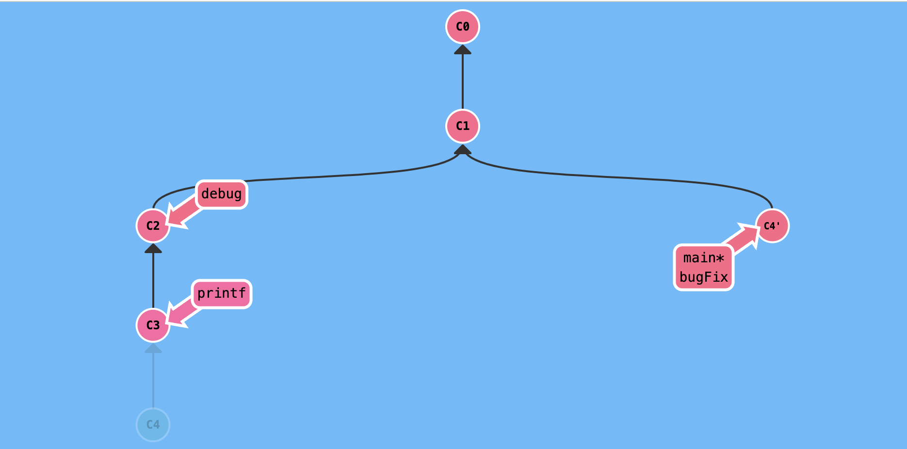

## 12.修改提交

接下来这种情况也是很常见的：你之前在 `newImage` 分支上进行了一次提交，然后又基于它创建了 `caption` 分支，然后又提交了一次。

此时你想对某个以前的提交记录进行一些小小的调整。比如设计师想修改一下 `newImage` 中图片的分辨率，尽管那个提交记录并不是最新的了。

我们可以通过下面的方法来克服困难：

- 先用 `git rebase -i` 将提交重新排序，然后把我们想要修改的提交记录挪到最前
- 然后用 `git commit --amend` 来进行一些小修改
- 接着再用 `git rebase -i` 来将他们调回原来的顺序
- 最后我们把 main 移到修改的最前端（用你自己喜欢的方法如merge，rebase或者强制修改分支位置），就大功告成啦！

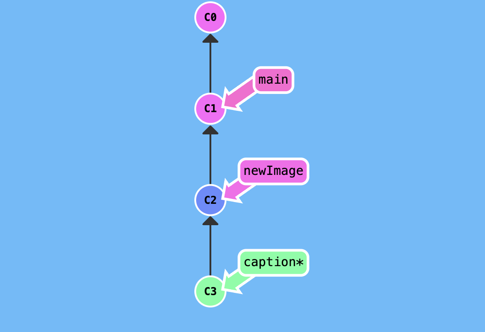

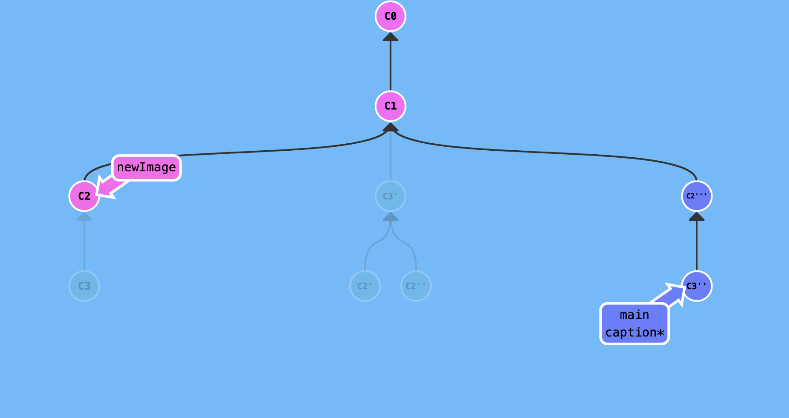

正如你所见到的，我们可以使用 `rebase -i` 对提交记录进行重新排序。只要把我们想要的提交记录挪到最前端，我们就可以很轻松的用 `--amend` 修改它，然后把它们重新排成我们想要的顺序。

但这样做就唯一的问题就是要进行两次排序，而这有可能造成由 rebase 而导致的冲突。下面还是看看 `git cherry-pick` 是怎么做的吧

要在心里牢记 cherry-pick 可以将提交树上任何地方的提交记录取过来追加到 HEAD 上（只要不是 HEAD 上游的提交就没问题）。

```bash
git checkout main; git cherry-pick c2; git commit --amend; git cherry-pick c3;
```

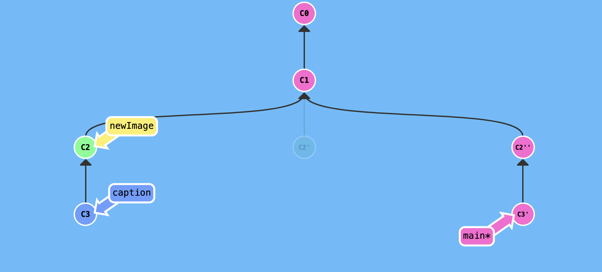

可以看到，`git commit --amend`会在右边形成一个新的提交，老的提交置灰

## 13.git tag

tag 永远指向某个提交记录的标识

tag 永久地将某个特定的提交命名为里程碑，然后就可以像分支一样引用了。

更难得的是，它们并不会随着新的提交而移动。你也不能切换到某个标签上面进行修改提交，它就像是提交树上的一个锚点，标识了某个特定的位置。

```bash
git tag 标签名 引用：如果不指定引用，就是HEAD指针指向的提交
```

## 14.git describe

由于标签在代码库中起着“锚点”的作用，Git 还为此专门设计了一个命令用来**描述**离你最近的锚点（也就是标签），它就是 `git describe`！

Git Describe 能帮你在提交历史中移动了多次以后找到方向；当你用 `git bisect`（一个查找产生 Bug 的提交记录的指令）找到某个提交记录时，可能会用到这个命令。

```properties
bisect = 二等分
```

`git describe` 的语法是：

```
git describe <ref>
```

`<ref>` 可以是任何能被 Git 识别成提交记录的引用，如果你没有指定的话，Git 会以你目前所检出的位置（`HEAD`）。

它输出的结果是这样的：

```
<tag>_<numCommits>_g<hash>
```

`tag` 表示的是离 `ref` 最近的标签， `numCommits` 是表示这个 `ref` 与 `tag` 相差有多少个提交记录， `hash` 表示的是你所给定的 `ref` 所表示的提交记录哈希值的前几位。

当 `ref` 提交记录上有某个标签时，则只输出标签名称

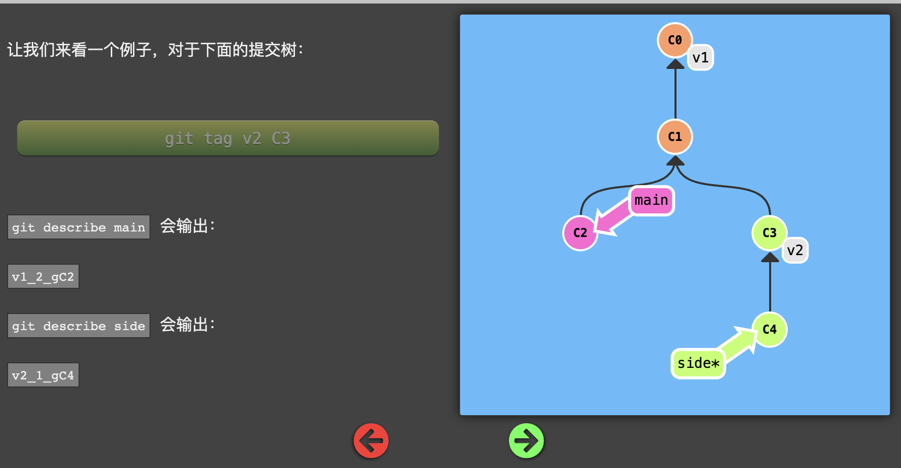

## 15.git clone

```bash
git clone 远程仓库地址
```

`git clone`会创建远程库的本地库，并且`远程库的main分支`，在本地是`origin/main分支`，当`git checkout origin/main分支`时，会在本地创建`main分支`并使HEAD指针指向`main分支`。

你可能注意到的第一个事就是在我们的本地仓库多了一个名为 `origin/main` 的分支, 这种类型的分支就叫**远程**分支。由于远程分支的特性导致其拥有一些特殊属性。

远程分支反映了远程仓库(在你上次和它通信时)的**状态**。这会有助于你理解本地的工作与公共工作的差别 —— 这是你与别人分享工作成果前至关重要的一步.

远程分支有一个特别的属性，在你检出时自动进入分离 HEAD 状态。Git 这么做是出于不能直接在这些分支上进行操作的原因, 你必须在别的地方完成你的工作, （更新了远程分支之后）再用远程分享你的工作成果。

为什么有 `origin/`？

你可能想问这些远程分支的前面的 `origin/` 是什么意思呢？好吧, 远程分支有一个命名规范 —— 它们的格式是:

- `<remote name>/<branch name>`

因此，如果你看到一个名为 `orgin/main` 的分支，那么这个分支名就叫 `main`，远程仓库的名称就是 `origin`。

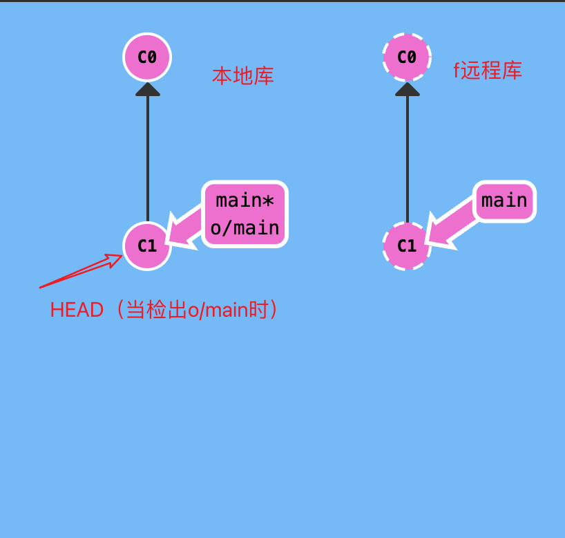

如果检出远程分支会怎么样呢？

`git checkout o/main; git commit`

正如你所见，Git 变成了分离 HEAD 状态，当添加新的提交时 `orgin/main` 也不会更新。这是因为 `orgin/main` 只有在远程仓库中相应的分支更新了以后才会更新。

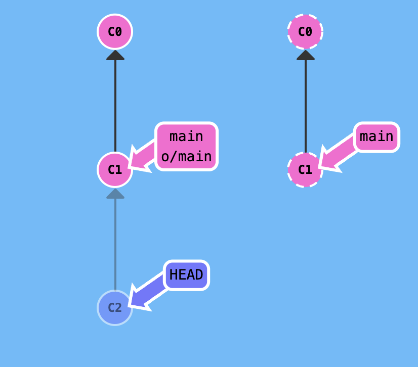

## 16.git fetch

Git 远程仓库相当的操作实际可以归纳为两点：向远程仓库传输数据以及从远程仓库获取数据。既然我们能与远程仓库同步，那么就可以分享任何能被 Git 管理的更新（。

如何从远程仓库获取数据 —— 命令如其名，它就是 `git fetch`。

你会看到当我们从远程仓库获取数据时, `本地库的远程分支`也会`更新`以反映最新的`远程仓库`。

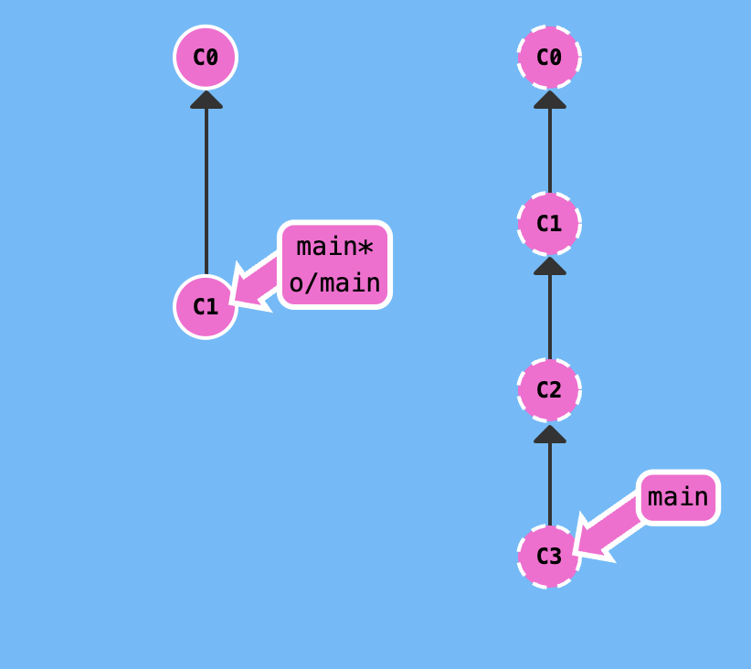

在解释 `git fetch` 前，我们先看看实例。这里我们有一个远程仓库, 它有两个我们本地仓库中没有的提交。

`git fetch`

就是这样了! `C2`,`C3` 被下载到了本地仓库，同时远程分支 `o/main` 也被更新，反映到了这一变化。

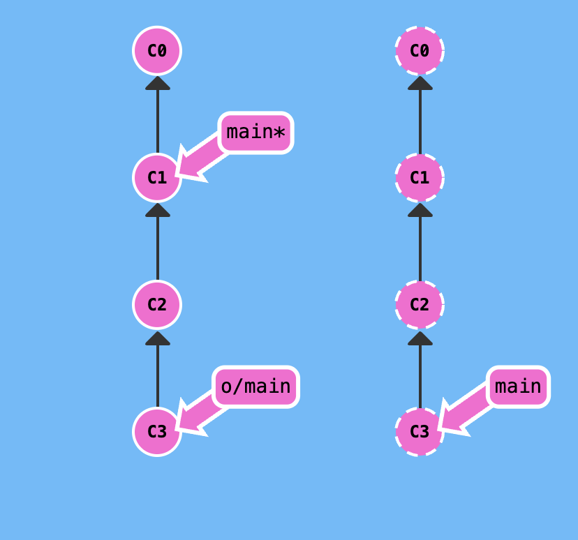

**git fetch 做了些什么?**

`git fetch` 完成了仅有的但是很重要的两步:

- 从远程仓库下载本地仓库中缺失的提交记录
- 更新远程分支指针(如 `origin/main`)

`git fetch` 实际上将本地仓库中的远程分支更新成了远程仓库相应分支最新的状态。

远程分支反映了远程仓库在你**最后一次与它通信时**的状态，`git fetch` 就是你与远程仓库通信的方式了！

`git fetch` 通常通过互联网（使用 `http://` 或 `git://` 协议) 与远程仓库通信。

**git fetch 不会做的事**

`git fetch` 并不会改变你本地仓库的状态。它不会更新你的 `main` 分支，也不会修改你磁盘上的文件。

理解这一点很重要，因为许多开发人员误以为执行了 `git fetch` 以后，他们本地仓库就与远程仓库同步了。它可能已经将进行这一操作所需的所有数据都下载了下来，但是**并没有**修改你本地的文件。

所以, 你可以将 `git fetch` 的理解为单纯的下载操作。

## 17.git pull

既然我们已经知道了如何用 `git fetch` 获取远程的数据, 现在我们学习如何将这些变化更新到我们的工作当中。

其实有很多方法的 —— 当远程分支中有新的提交时，你可以像合并本地分支那样来合并远程分支。也就是说就是你可以执行以下命令:

- `git cherry-pick o/main`
- `git rebase o/main`
- `git merge o/main`
- 等等

实际上，由于先抓取更新再合并到本地分支这个流程很常用，因此 Git 提供了一个专门的命令来完成这两个操作。它就是我们要讲的 `git pull`。

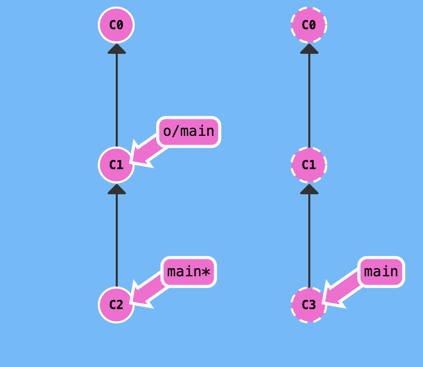

我们先来看看 `fetch`、`merge` 依次执行的效果

`git fetch; git merge o/main`

我们用 `fetch` 下载了 `C3`, 然后通过 `git merge o/main` 合并了这一提交记录。现在我们的 `main` 分支包含了远程仓库中的更新（在本例中远程仓库名为 `origin`）

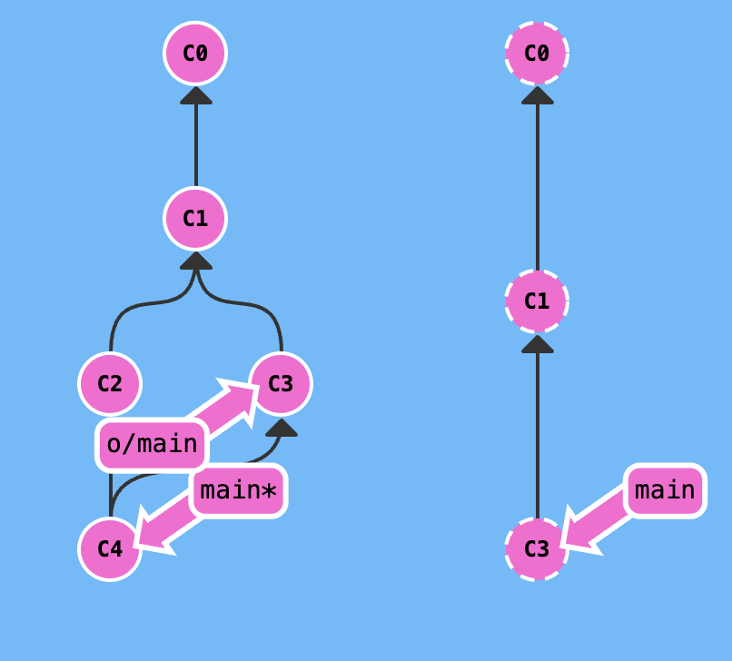

如果使用 `git pull` 呢?

`git pull`

同样的结果！这清楚地说明了 `git pull` 就是 `git fetch` 和 `git merge` 的缩写！

## 18.git push

```bash
git push 远程库别名 分支
```

`git push` 负责将**你的**变更上传到指定的远程仓库，并在远程仓库上合并你的新提交记录。一旦 `git push` 完成, 你的朋友们就可以从这个远程仓库下载你分享的成果了！

你可以将 `git push` 想象成发布你成果的命令。

注意 —— `git push` 不带任何参数时的行为与 Git 的一个名为 `push.default` 的配置有关。它的默认值取决于你正使用的 Git 的版本，但是在教程中我们使用的是 `upstream`

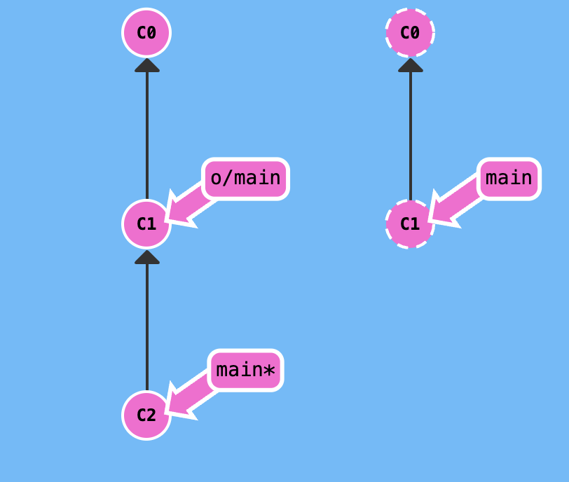

这里我们准备了一些远程仓库中没有的提交记录, 咱们开始先上传吧!

`git push`

过去了, 远程仓库接收了 `C2`，远程仓库中的 `main` 分支也被更新到指向 `C2` 了，我们的远程分支 (o/main) 也同样被更新了。所有的分支都同步了！

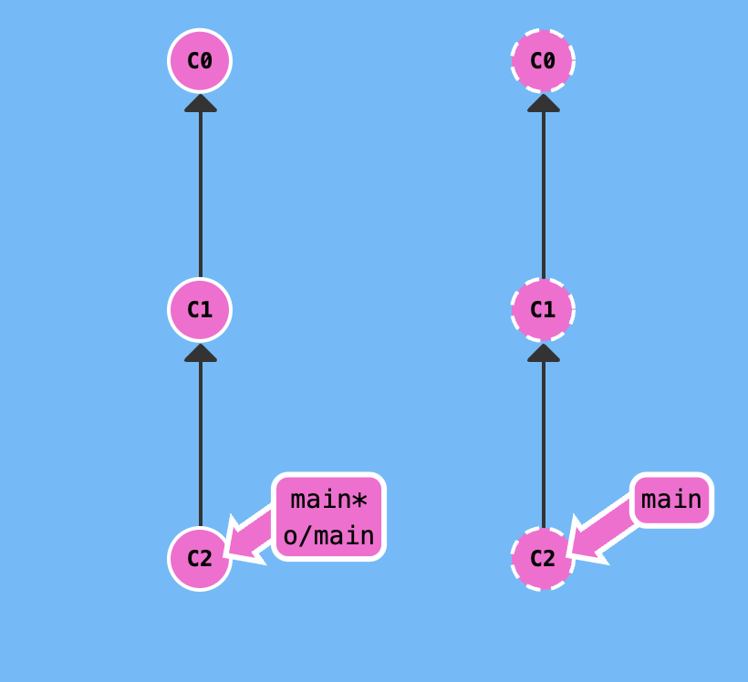

**远程库提交历史的偏离**

假设你周一克隆了一个仓库，然后开始研发某个新功能。到周五时，你新功能开发测试完毕，可以发布了。但是 —— 天啊！你的同事这周写了一堆代码，还改了许多你的功能中使用的 API，这些变动会导致你新开发的功能变得不可用。但是他们已经将那些提交推送到远程仓库了，因此你的工作就变成了基于项目**旧版**的代码，与远程仓库最新的代码不匹配了。

这种情况下, `git push` 就不知道该如何操作了。如果你执行 `git push`，Git 应该让远程仓库回到星期一那天的状态吗？还是直接在新代码的基础上添加你的代码，亦或由于你的提交已经过时而直接忽略你的提交？

因为这情况（历史偏离）有许多的不确定性，Git 是不会允许你 `push` 变更的。实际上它会强制你先合并远程最新的代码，然后才能分享你的工作。

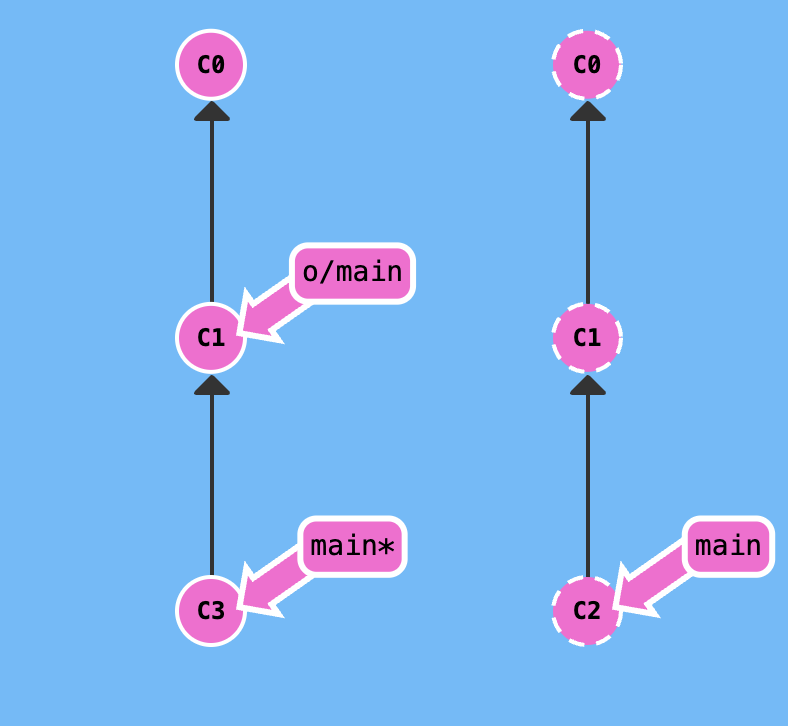

说了这么多，咱们还是看看上图实际案例吧！

`git push`

看见了吧？什么都没有变，因为命令失败了！`git push` 失败是因为你最新提交的 `C3` 基于远程分支中的 `C1`。而远程仓库中该分支已经更新到 `C2` 了，所以 Git 拒绝了你的推送请求。

有许多方法做到这一点呢(git merge ,git rebase)，不过最直接的方法就是通过 rebase 调整你的工作。咱们继续，看看怎么 rebase！

如果我们在 push 之前做 rebase 呢？

`git fetch; git rebase o/main; git push`

我们用 `git fetch` 更新了本地仓库中的远程分支，然后用 rebase 将我们的工作移动到最新的提交记录下，最后再用 `git push` 推送到远程仓库。

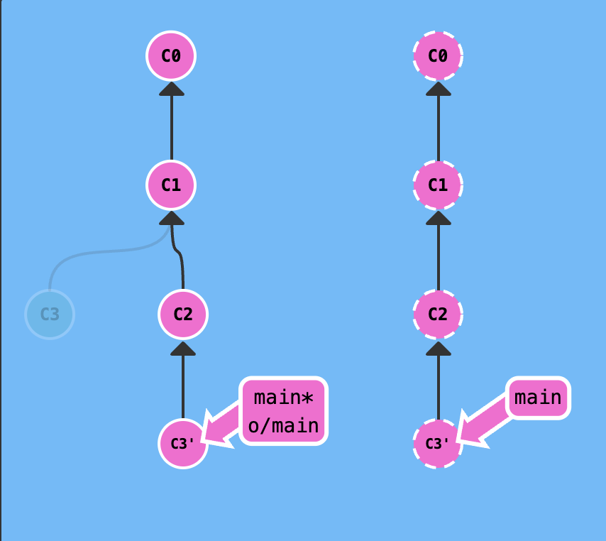

还有其它的方法可以在远程仓库变更了以后更新我的工作吗? 当然有，我们还可以使用 `merge`

尽管 `git merge` 不会移动你的工作（它会创建新的合并提交），但是它会告诉 Git 你已经合并了远程仓库的所有变更。这是因为远程分支现在是你本地分支的祖先，也就是说你的提交已经包含了远程分支的所有变化。

看下演示...

咱们们用 merge 替换 rebase 来试一下……

`git fetch; git merge o/main; git push`

我们用 `git fetch` 更新了本地仓库中的远程分支，然后**合并**了新变更到我们的本地分支（为了包含远程仓库的变更），最后我们用 `git push` 把工作推送到远程仓库

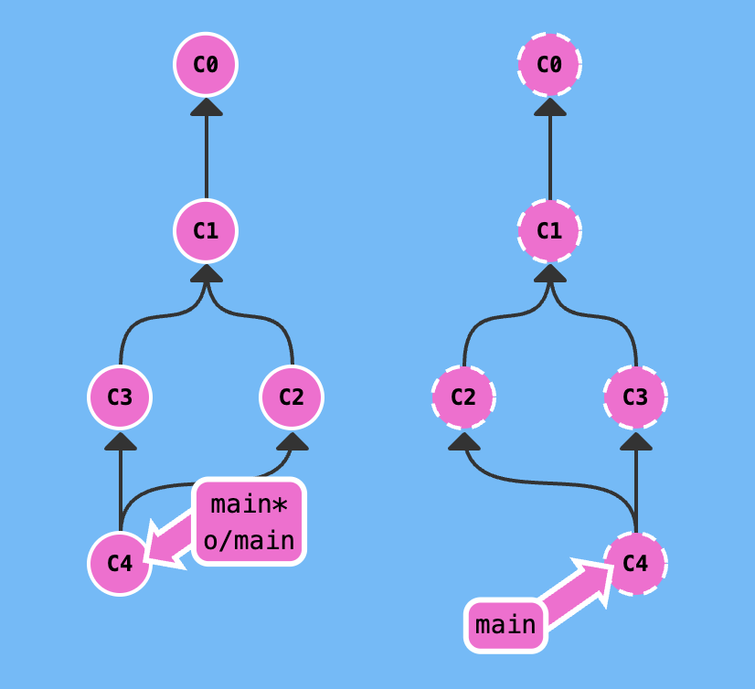

很好！但是要敲那么多命令，有没有更简单一点的？

当然 —— 前面已经介绍过 `git pull` 就是 fetch 和 merge 的简写，类似的 `git pull --rebase` 就是 fetch 和 rebase 的简写！

这次用 `--rebase`……

`git pull --rebase; git push`

跟之前结果一样，但是命令更短了。

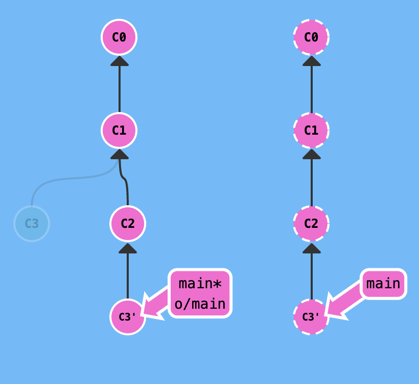

换用常规的 `pull`

`git pull; git push`

还是跟以前一样


由 fetch、rebase/merge 和 push 组成的工作流很普遍

## 19.远程服务器拒绝(Remote Rejected)

如果你是在一个大的合作团队中工作, 很可能是main被锁定了, 需要一些Pull Request流程来合并修改。如果你直接提交(commit)到本地main, 然后试图推送(push)修改, 你将会收到这样类似的信息:

```
! [远程服务器拒绝] main -> main (TF402455: 不允许推送(push)这个分支; 你必须使用pull request来更新这个分支.)
```

**为什么会被拒绝?**

远程服务器拒绝直接推送(push)提交到main, 因为策略配置要求 pull requests 来提交更新.

你应该按照流程,新建一个分支, 推送(push)这个分支并申请pull request,但是你忘记并直接提交给了main.现在你卡住并且无法推送你的更新.

## 解决办法

新建一个分支feature, 推送到远程服务器. 然后reset你的main分支和远程服务器保持一致, 否则下次你pull并且他人的提交和你冲突的时候就会有问题.