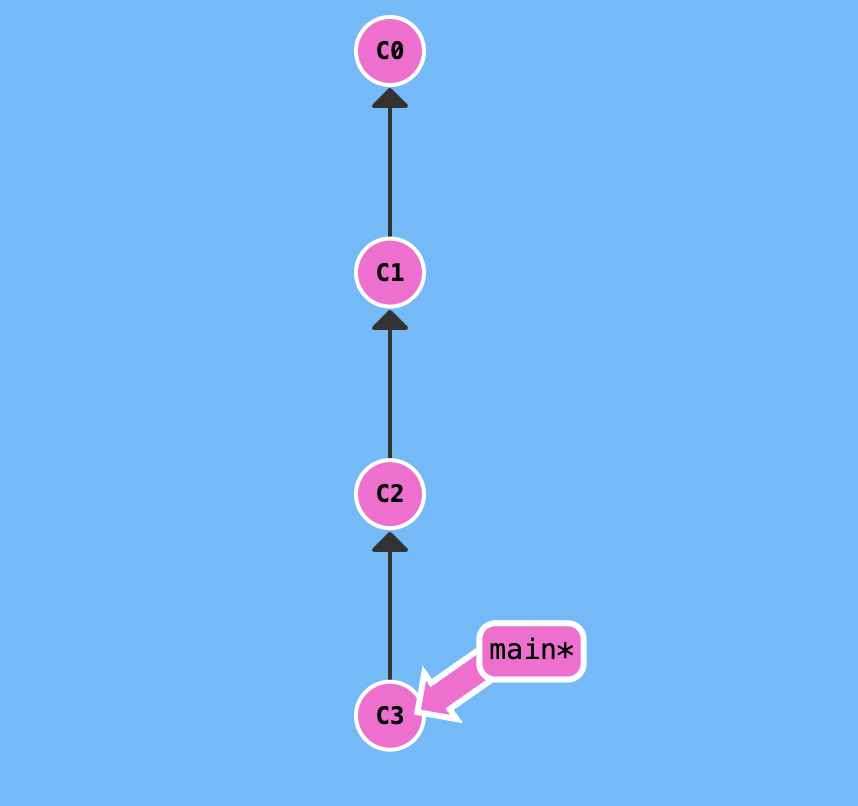
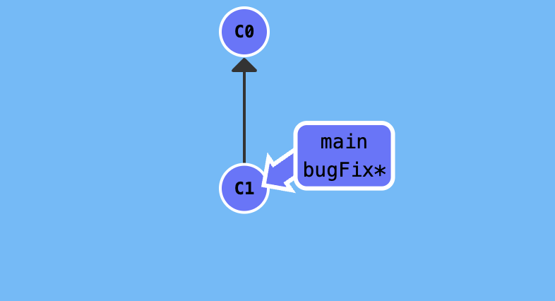
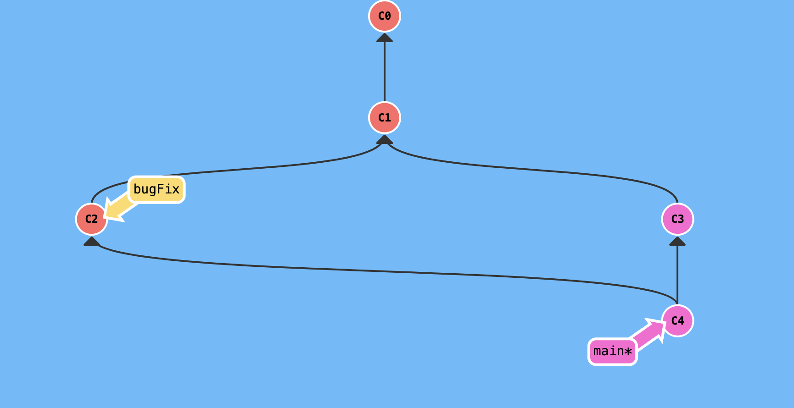
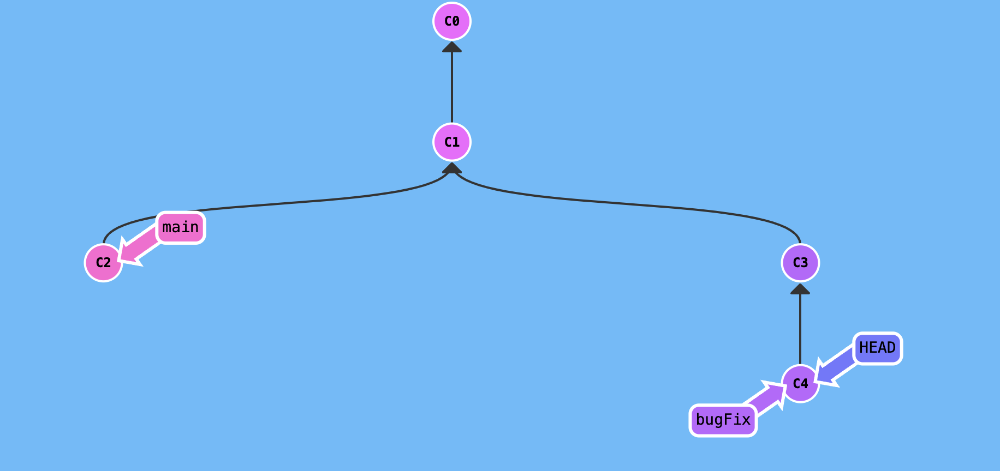
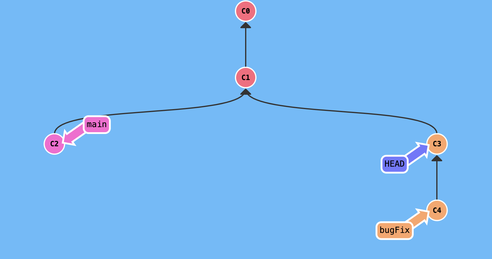
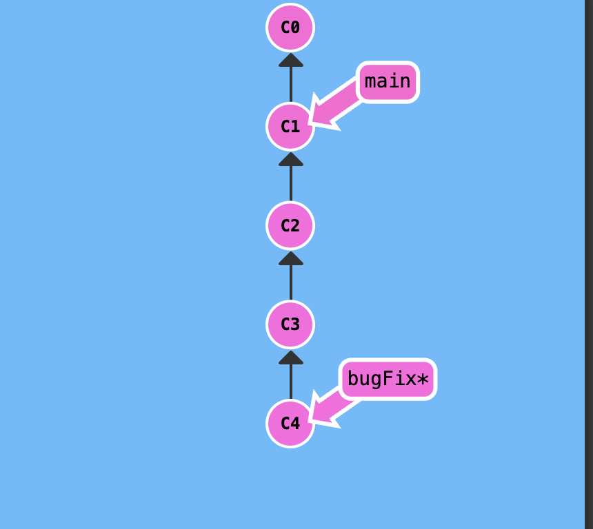
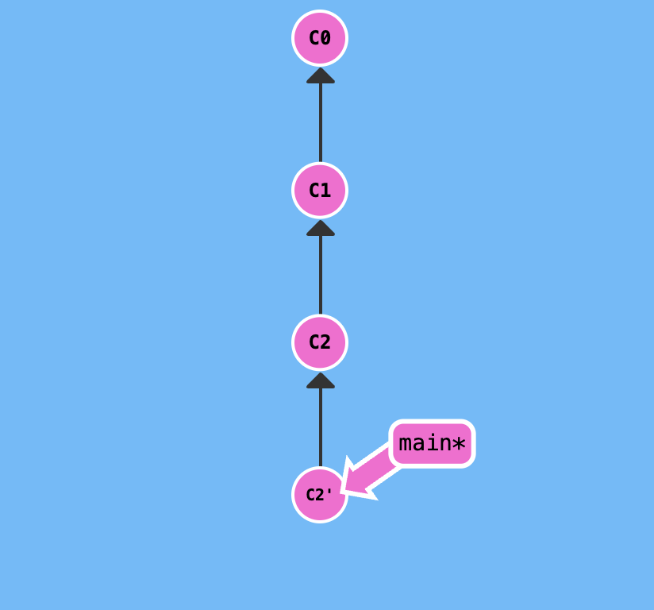
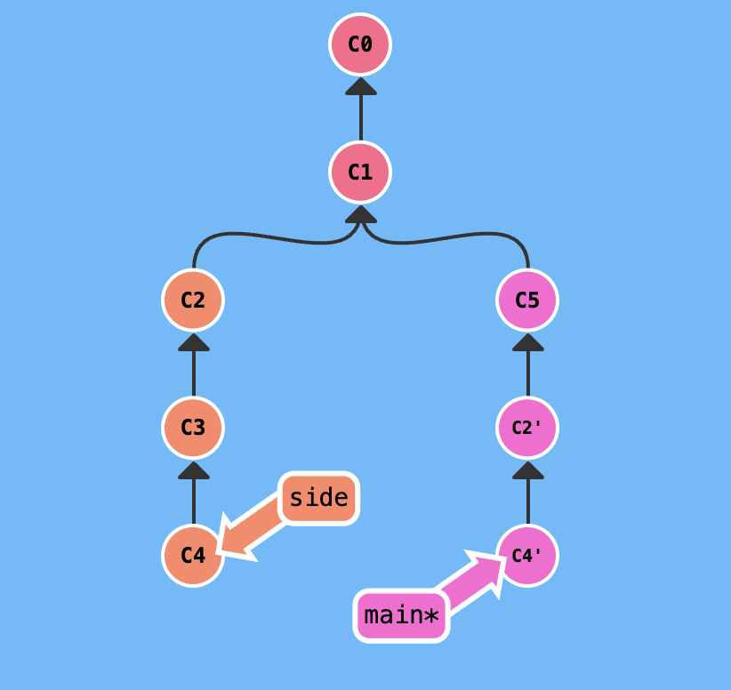
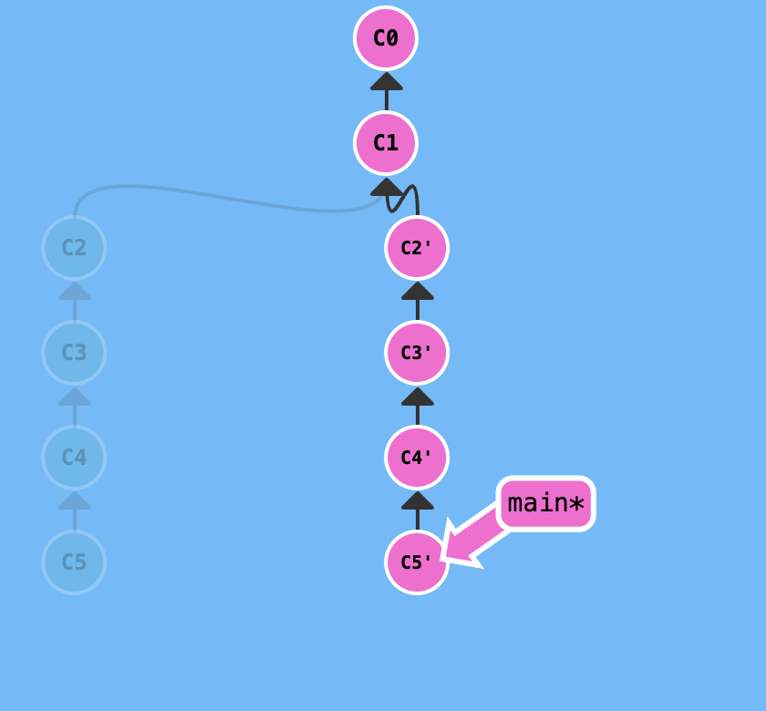

# git实战-命令行


## 1.git commit

```bash
git commit -m '提交信息'
```

作用：进行一次本地提交，会让当前分支引用移到到最新的提交snapshot上



## 2.git branch

git分支：是指 指向提交记录的 引用

```bash
git branch 分支名 ：新建分支，并指向当前提交

git checkout 分支名：检出（切换）到该分支，即HEAD指针指向当前分支

git checout -b 分支名：新建分支，并检出到该新建分支上

git branch -d 分支名：删除分支，注意HEAD指针不能指向删除的分支
```



注意：当前分支的切换严重依赖于`git checkout `,git后续版本会启用`git switch`命令

## 3.git merge

```bash
git merge 要被合并的分支名：合并其他分支到当前分支来，会形式一个新的提交记录，并使分支指向这个新的提交。
```

比如：main分支指向c3,当`git merge bugFix`时，会形成c4提交，main分支将会指向c4 。如果想将bugFix分支也变成最新使用下面命令：`git checkout bugFix` , `git merge main`，则bugFix指向c4




## 4.git rebase

第二种合并分支的方法是 `git rebase`。Rebase 实际上就是取出一系列的提交记录，“复制”它们，然后在另外一个地方逐个的放下去。

Rebase 的优势就是可以创造更线性的提交历史。

```bash
git rebase 重新定基的分支 ：将当前分支上的提交复制到新的分支上，并且当前分支指向这个复制的最新提交
```

比如：`git checkout bugFix`;  `git rebase main`则会形成c2'分支，bugFix分支指向这个c2'。此时如果想要将main分支变成最新，可使用如下命令：`git checkout main`; `git rebase bugFix` 就会让main分支指向c2'。注意rebase操作后原c2提交还存在（图中灰暗部分）


## 5.分离的HEAD指针

```bash
git chekcout hash值 ：分离的 HEAD 指针 就是让其指向了某个具体的提交记录而不是分支名。
```

HEAD 是一个对当前检出记录的符号引用 —— 也就是指向你正在其基础上进行工作的提交记录。

HEAD 总是指向当前分支上最近一次提交记录。大多数修改提交树的 Git 命令都是从改变 HEAD 的指向开始的。

HEAD 通常情况下是指向分支名的（如 bugFix）。在你提交时，改变了 bugFix 的状态，这一变化通过 HEAD 变得可见。

如果想看 HEAD 指向，可以通过 `cat .git/HEAD` 查看， 如果 HEAD 指向的是一个引用，还可以用 `git symbolic-ref HEAD` 查看它的指向。



正常情况下，比如bugFix上有*号代表，HEAD指向bugFix,bugFix指向c4 ，当git checkout c4,则HEAD指针指向c4 。

## 6.相对引用

检出某个提交：前面的方式是`git log` 查看提交记录，后使用`git checkout hash值`使HEAD指针指向某个提交。

通过哈希值指定提交记录很不方便，所以 Git 引入相对引用。使用相对引用的话，你就可以从一个易于记忆的地方（比如 `bugFix` 分支或 `HEAD`）开始计算。

相对引用非常给力，这里我介绍两个简单的用法：

- 使用 `^` 向上移动 1 个提交记录， `^` 后面加数字指的是选择哪个分支：1代表本分支，2代表另一个分支
- 使用 `~<num>` 向上移动多个提交记录，如 `~3`

首先看看操作符 (^)。把这个符号加在引用名称的后面，表示让 Git 寻找指定提交记录的父提交。所以 `main^` 相当于“`main` 的父节点”。

`main^^` 是 `main` 的第二个父节点。你也可以将 `HEAD` 作为相对引用的参照。



比如HEAD原来指向main（main上有*），`git checkout bugFix^` 就会使HEAD指向c3,当然也可以直接`git checkout c3` 或者 `git checkout bugFix~1`;

## 7.强制修改分支位置

使用相对引用最多的就是移动分支。可以直接使用 `-f` 选项让分支指向另一个提交。例如:

```bash
git branch -f main HEAD~3
```

上面的命令会将 main 分支强制指向 HEAD 的第 3 级父提交。



比如原main分支指向c4，`git branch -f main HEAD~3`  则main分支指向c1

## 8.撤销变更 git reset, git revert

主要有两种方法用来撤销变更 —— 一是 `git reset`，还有就是 `git revert`。

`git reset` 向上移动分支，原来指向的提交记录就跟从来没有提交过一样。

`git reset HEAD~1`  Git 把 main 分支移回到 `C1`；现在我们的本地代码库根本就不知道有 `C2` 这个提交了。（注意：在reset后， `C2` 所做的变更还在，但是处于未加入暂存区状态。）


虽然在你的本地分支中使用 `git reset` 很方便，但是这种“改写历史”的方法对大家一起使用的远程分支是无效的哦！为了撤销更改并**分享**给别人，我们需要使用 `git revert`。HEAD指向c2

来看演示：`git revert HEAD` 

奇怪！在我们要撤销的提交记录后面居然多了一个新提交！这是因为新提交记录 `C2'` 引入了**更改** —— 这些更改刚好是用来撤销 `C2` 这个提交的。也就是说 `C2'` 的状态与 `C1` 是相同的。revert 之后就可以把你的更改推送到远程仓库与别人分享啦。



## 9.git cherry-pick

```bash
git cherry-pick hash值1 hash值2 ...     : 会抽取提交记录到HEAD指针下，并使分支指向最前的提交。
```

 `git cherry-pick`, 命令形式为:

- `git cherry-pick <提交号>...`

如果你想将一些提交复制到当前所在的位置（`HEAD`）下面的话， Cherry-pick 是最直接的方式了。

我们想将 `side` 分支上的工作复制到 `main` 分支，你立刻想到了之前学过的 `rebase` 了吧？但是咱们还是看看 `cherry-pick` 有什么本领吧。

`git cherry-pick C2 C4`

这就是了！我们只需要提交记录 `C2` 和 `C4`，所以 Git 就将被它们抓过来放到当前分支下了。 就是这么简单!



## 10.交互式的rebase

交互式 rebase 指的是使用带参数 `--interactive` 的 rebase 命令, 简写为 `-i`

如果你在命令后增加了这个选项, Git 会打开一个 UI 界面并列出将要被复制到目标分支的备选提交记录，它还会显示每个提交记录的哈希值和提交说明，提交说明有助于你理解这个提交进行了哪些更改。

在实际使用时，所谓的 UI 窗口一般会在文本编辑器 —— 如 Vim —— 中打开一个文件。

交互式的rebase有三个功能：

- 调整提交记录的顺序
- 删除你不想要的提交
- 合并提交。简而言之，它允许你把多个提交记录合并成一个。

如下操作：`git rebase -i HEAD~4`

Git 严格按照你在对话框中指定的方式进行了复制。 注意这个是rebase不包含c1的，即左闭右开，[c5,c1)。还有rebase的基是c1,main指向最新的提交c5'。

