# Kafaka

## 1、Kafaka的概述

### 1.1、定义

Kafka 是一个分布式的基于发布/订阅模式的消息队列（Message Queue），主要应用于大数据实时处理领域。

### 1.2、消息对列

#### 1.2.1、传统消息队列的应用场景

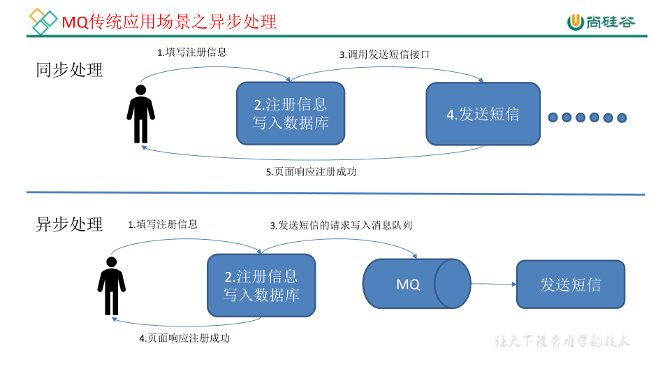

使用消息队列的好处
1）解耦

允许你独立的扩展或修改两边的处理过程，只要确保它们遵守同样的接口约束。

2）可恢复性

系统的一部分组件失效时，不会影响到整个系统。消息队列降低了进程间的耦合度，所以即使一个处理消息的进程挂掉，加入队列中的消息仍然可以在系统恢复后被处理。

3）缓冲

有助于控制和优化数据流经过系统的速度，解决生产消息和消费消息的处理速度不一致的情况。

4）灵活性 & 峰值处理能力

在访问量剧增的情况下，应用仍然需要继续发挥作用，但是这样的突发流量并不常见。如果为以能处理这类峰值访问为标准来投入资源随时待命无疑是巨大的浪费。使用消息队列能够使关键组件顶住突发的访问压力，而不会因为突发的超负荷的请求而完全崩溃。

5）异步通信

很多时候，用户不想也不需要立即处理消息。消息队列提供了异步处理机制，允许用户把一个消息放入队列，但并不立即处理它。想向队列中放入多少消息就放多少，然后在需要的时候再去处理它们。

#### 1.2.2、消息队列的两种模式

1 ）点对点模式（一对一，消费者主动拉取数据，消息收到后队列的消息清除）消息生产者生产消息发送到Queue中，然后消息消费者从Queue中取出并且消费消息。消息被消费以后，queue 中不再有存储，所以消息消费者不可能消费到已经被消费的消息。Queue 支持存在多个消费者，但是对一个消息而言，只会有一个消费者可以消费

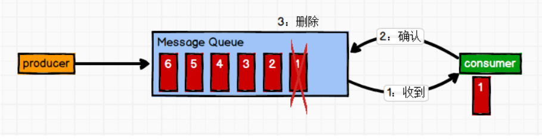

2 ）发布/ 订阅模式（publish/subscribe）（一对多，消费者消费数据之后队列不会清除消息）消息生产者（发布）将消息发布到 topic 中，同时有多个消息消费者（订阅）消费该消息。和点对点方式不同，发布到 topic 的消息会被所有订阅者消费。消费者订阅又分为两种方式：队列push与消费者pull

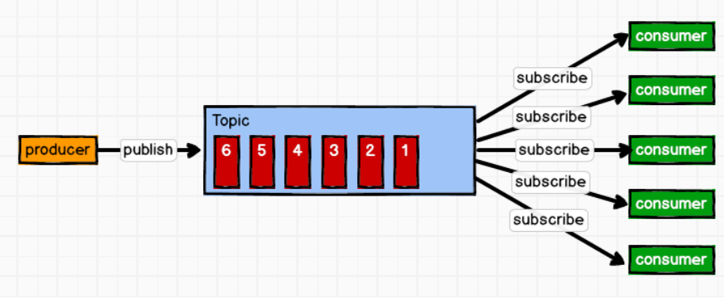

### 1.3、Kafka基础架构

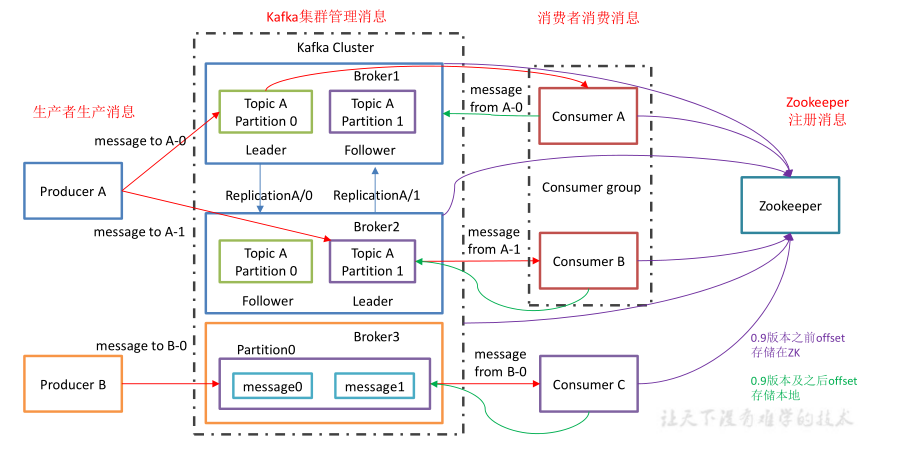

1 ）Producer  ：消息生产者，就是向 kafka broker 发消息的客户端；

2 ）Consumer  ：消息消费者，向 kafka broker 取消息的客户端；

3 ）Consumer Group  （CG ）：消费者组，由多个 consumer 组成。 消费者组内每个消费者负责消费不同分区的数据，一个分区只能由一个 组内 消费者消费；消费者组之间互不影响。所有的消费者都属于某个消费者组，即 消费者组是逻辑上的一个订阅者。

4 ）Broker  ：一台 kafka 服务器就是一个 broker。一个集群由多个 broker 组成。一个 broker可以容纳多个 topic。即一般来说broker（中间人）= server（服务器）。

5 ）Topic  ：可以理解为一个队列， 生产者和消费者面向的都是一个 topic；topic = 话题，主题。

6 ）Partition ：为了实现扩展性，一个非常大的 topic 可以分布到多个 broker（即服务器）上，一个 topic  可以分为多个 partition，每个 partition 是一个有序的队列；partition = 分区。

7）Replica： ：副本，为保证集群中的某个节点发生故障时，该节点上的 partition 数据不丢失，且 kafka 仍然能够继续工作，kafka 提供了副本机制，一个 topic 的每个分区都有若干个副本，即包含一个 leader 和若干个 follower。这里要注要Replica是包含leader与follower的，不仅仅是follower。Replica = replication = 备份，副本

8 ）leader ：每个分区多个副本中的“主”，生产者发送数据的对象，以及消费者消费数据的对象都是 leader。leader = 邻导者。

9 ）follower ：每个分区多个副本中的“从”，实时从 leader 中同步数据，保持和 leader 数据的同步。leader 发生故障时，某个 follower 会成为新的leader。follower = 跟随者。

## 2、Kafka快速入门

### 2.1、安装部署

#### 2.1.1、集群规划

服务器1		服务器2		服务器3
  zk					zk					zk
kafka			  kafka			kafka

#### 2.1.2 、jar包下载

地址：http://kafka.apache.org/downloads.html

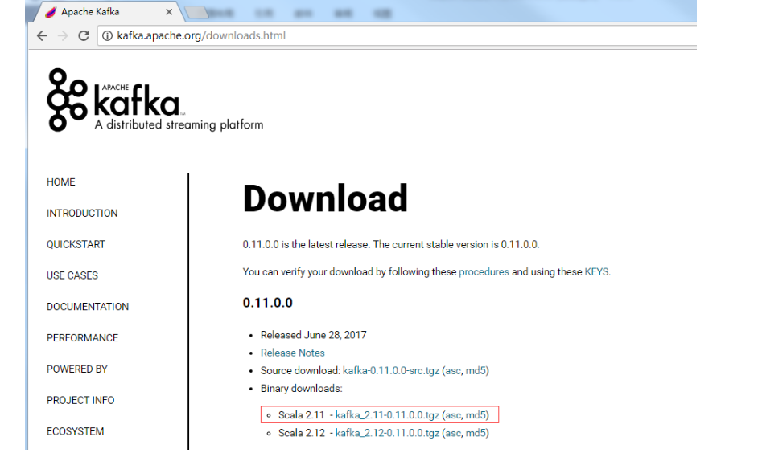

#### 2.1.3 、集群部署

1）解压安装包

```bash
tar -zxvf kafka_2.11-0.11.0.0.tgz -C /opt/module/
```

2）修改解压后的文件名称

```bash
mv   kafka_2.11-0.11.0.0/    kafka
```

3）在/opt/module/kafka 目录下创建 logs 文件夹（其实就是存日志与数据的文件夹，可以改名为data）

```bash
mkdir logs
```

4）修改配置文件

```bash
cd config/
vi server.properties
```

输入以下内容：

```properties
#broker 的全局唯一编号，不能重复
broker.id=0
#删除 topic 功能使能(开关 为true)
delete.topic.enable=true
#处理网络请求的线程数量
num.network.threads=3
#用来处理磁盘 IO 的现成数量
num.io.threads=8
#发送套接字的缓冲区大小
socket.send.buffer.bytes=102400
#接收套接字的缓冲区大小
socket.receive.buffer.bytes=102400
#请求套接字的缓冲区大小(最大为)
socket.request.max.bytes=104857600
#kafka 运行日志（这里其实是数据）存放的路径
log.dirs=/opt/module/kafka/logs
#topic 在当前 broker 上的分区个数,这个要额外注意不要配错
num.partitions=1
#用来恢复和清理 data 下数据的线程数量
num.recovery.threads.per.data.dir=1
#segment 文件保留的最长时间，超时将被删除，log = 数据记录，这里不是日志
log.retention.hours=168
#配置连接 Zookeeper 集群地址，ip:port,这里hadoop是各服务器名,所以kafaka的集群是依靠zookeeper实现的
zookeeper.connect=hadoop102:2181,hadoop103:2181,hadoop104:2181
```

5）配置环境变量

```bash
sudo  vi   /etc/profile
```

修改如下：

```properties
#KAFKA_HOME，kafka的安装目录
export KAFKA_HOME=/opt/module/kafka
#Kafa的路径
export PATH=$PATH:$KAFKA_HOME/bin
```

环境变量生效：

```bash
source /etc/profile
```

6）分发安装包到其他集群服务器

```bash
xsync  kafka/
```

注意：分发之后记得配置其他机器的环境变量，xsync命令可百度查看

7）分别在 hadoop103 和 hadoop104 上修改配置文件/opt/module/kafka/config/server.properties中的broker.id=1、broker.id=2

**注：broker.id 不得重复**

8）启动集群
依次在 hadoop102、hadoop103、hadoop104 节点上启动 kafka,

```bash
#不加deamon则为前台阻塞式的运行，加上则为后台守护的形式运行
bin/kafka-server-start.sh  -daemon  config/server.properties
bin/kafka-server-start.sh  -daemon  config/server.properties
bin/kafka-server-start.sh  -daemon  config/server.properties
```

9）关闭集群

```
bin/kafka-server-stop.sh stop
bin/kafka-server-stop.sh stop
bin/kafka-server-stop.sh stop
```

10）kafka 群起脚本

```shell
for i in hadoop102 hadoop103 hadoop104
do
echo "========== $i =========="
ssh  $i  '/opt/module/kafka/bin/kafka-server-start.sh  -daemon
/opt/module/kafka/config/server.properties'
done
```

### 2.2、Kafka  命令行操作

1）查看当前服务器中的所有 topic

```bash
#查看topic要指定zookeepr地址（leader的地址）
bin/kafka-topics.sh  --zookeeper hadoop102:2181 --list
```

2）创建 topic

这里创建topic主题first，要指定zookeepr地址（leader的地址）

```bash
bin/kafka-topics.sh  --zookeeper hadoop102:2181 --create --replication-factor 3 --partitions 1 --topic first
```

选项说明：

--partitions 定义分区数，kafka通过分区策略，将不同的分区分配在一个集群中的broker上，一般会分散在不同的broker上，当只有一个broker时，所有的分区就只分配到该Broker上。

--replication-factor 定义每个leader（包括自己的）副本数,这里副本数是包含leader与follower的数量，每个主题可以有多个副本，副本位于集群中不同的broker上，也就是说副本的数量不能超过broker的数量，否则创建主题时会失败。

--topic 定义 topic 名

**举例说明：**

A）下图设置topic-1的partions为3，会自动分配在不同的broker上，采用均匀分配策略，当broker和partions一样时，就均匀分布在不同的broker上。

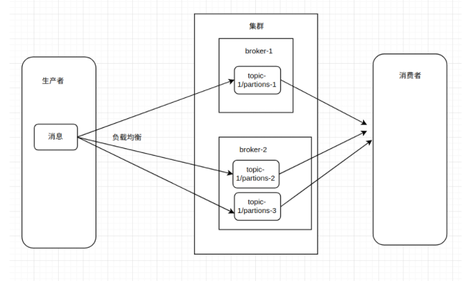

B）比如partions 设置为20，replicationFactor设置为1. Broker为2.可以看出，分区会均匀在broker上进行分配。

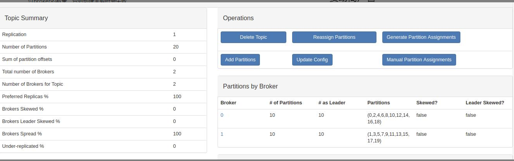

C）比如partions 设置为10，replicationFactor设置为2. Broker为2.每个broker都有副本存在。

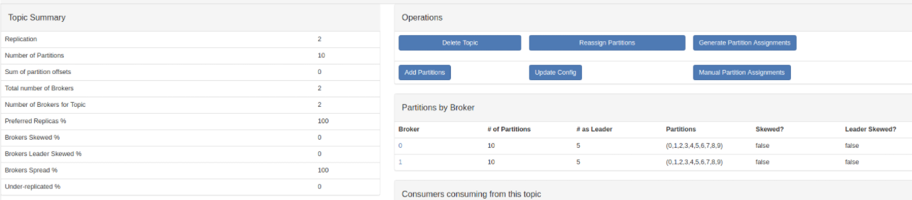

D）Kafka集群中有4个broker，某个主题中有3个分区，且副本因子（即副本个数）也为3，如此每个分区便有1个leader副本和2个follower副本。生产者和消费者只与leader副本进行交互，而follower副本只负责消息的同步，很多时候follower副本中的消息相对leader副本而言会有一定的滞后。

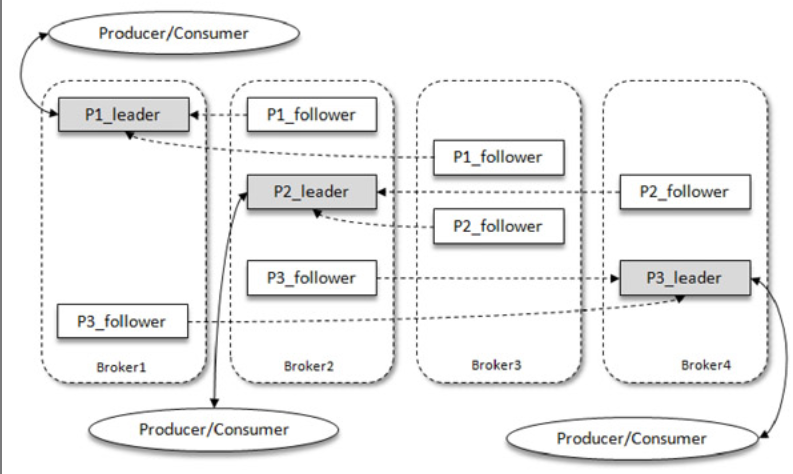

3）删除 topic

要指定zookeepr地址（leader的地址）

```bash
bin/kafka-topics.sh  --zookeeper hadoop102:2181 --delete --topic first
```

需要 server.properties 中设置 delete.topic.enable=true 来开启topic删除开关， 否则只是标记删除。

4）发送消息

--broker-list要指定leader的地址

```bash
#开启终端的生产者
bin/kafka-console-producer.sh --broker-list hadoop102:9092 --topic first
#这里>后面的代表发送的消息
>hello world
>atguigu atguigu
```

5）消费消息

要指定zookeepr地址（leader的地址）

```
#开启终端消费者，这里使用的是zookeepr,也可有bootStrap-server
bin/kafka-console-consumer.sh  --zookeeper hadoop102:2181 --topic first
```

使用zookeeper开启消费者提示已过时，可使用bootstrap-server代替，

--bootstrap-server要指定leader的地址

```bash
bin/kafka-console-consumer.sh  --bootstrap-server hadoop102:9092 --topic first
#如果想要把主题中以往所有的数据（消息）都读取出来，要加from-beginning
bin/kafka-console-consumer.sh   --bootstrap-server hadoop102:9092 --topic first --from-beginning
```

6）查看某个 Topic 的详情

```bash
bin/kafka-topics.sh  --zookeeper hadoop102:2181 --describe --topic first
```

7）修改分区数

```bash
bin/kafka-topics.sh  --zookeeper hadoop102:2181 --alter --topic first --partitions 6
```

## 3、kafaka架构深入

### 3.1、Kafka工作流程及文件存储机制

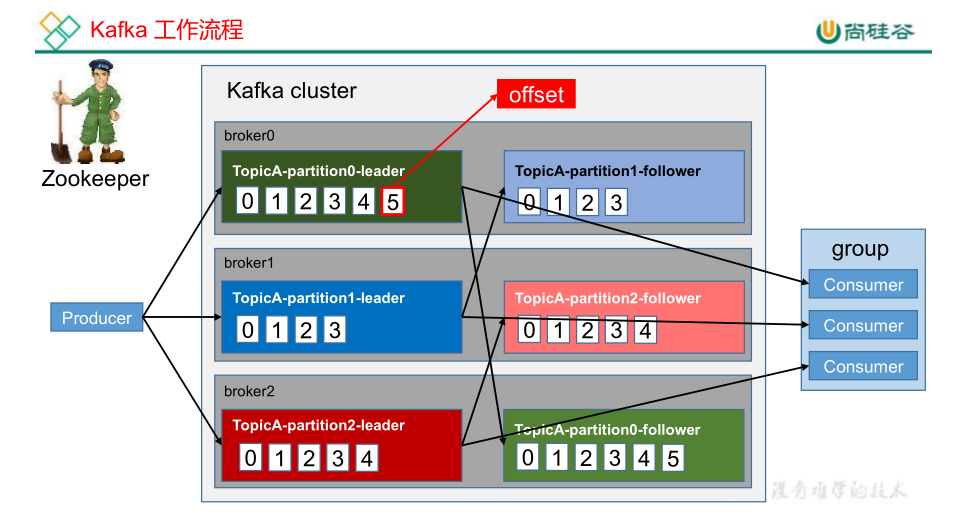

Kafka 中消息是以 topic 进行分类的，生产者生产消息，消费者消费消息，都是面向 topic的。
topic 是逻辑上的概念，而 partition 是物理上的概念，每个 partition 对应于一个 log （记录）文件，该 log（记录） 文件中存储的就是 producer 生产的消息数据。Producer 生产的数据会被不断追加到该log 文件末端，且每条数据都有自己的 offset。消费者组中的每个消费者，都会实时记录自己消费到了哪个 offset，以便出错恢复时，从上次的位置继续消费。

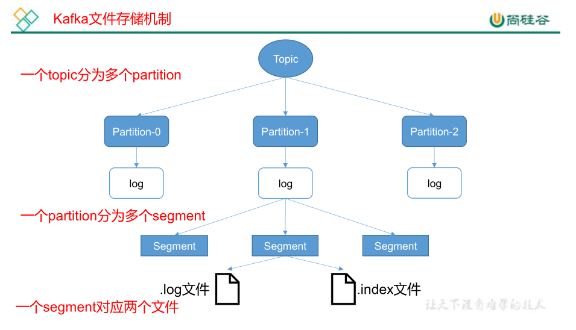

由于生产者生产的消息会不断追加到 log 文件末尾，为防止 log 文件过大导致数据定位效率低下，Kafka 采取了` 分片`和 `索引`机制，将每个 partition 分为多个 segment。每个 segment对应两个文件——`“.index”文件`和`“.log”文件`。这些文件位于一个文件夹下，该文件夹的命名规则为：topic 名称+分区序号。例如，first 这个 topic 有三个分区，则其对应的文件夹为 first-0,first-1,first-2。

.index文件与.log文件如下所示：

```properties
00000000000000000000.index
00000000000000000000.log
00000000000000170410.index
00000000000000170410.log
00000000000000239430.index
00000000000000239430.log
```

index 和 log 文件以当前 segment 的第一条消息的 offset 命名。下图为 index 文件和 log文件的结构示意图。

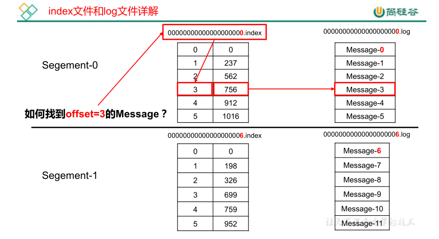

“.index”文件存储大量的索引信息，“.log”文件存储大量的数据，索引文件中的元数据指向对应数据文件中message 的物理偏移地址。

即想要获取offset=3的信息，在index文件中找到756为物理偏移地址，在log文件中根据756物理偏移地址找到对应的消息。

文档：https://blog.csdn.net/jewes/article/details/42970799

### 3.2、Kafka生产者

#### 3.2.1、topic分区策略

1 ）分区的原因
（1） 方便在集群中扩展，每个 Partition 可以通过调整以适应它所在的机器，而一个 topic又可以有多个 Partition 组成，因此整个集群就可以适应任意大小的数据了；
（2） 可以提高并发，因为可以以 Partition 为单位读写了。
2 ） 分区的原则
我们需要将 producer 发送的数据封装成一个 ProducerRecord 对象。

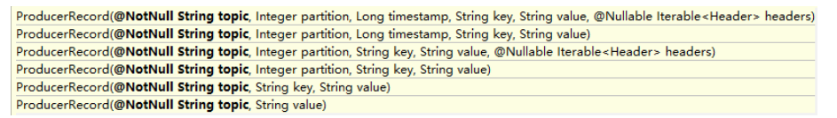

（1）指明 partition 的情况下，直接将指明的值直接作为 partiton 值；如上图的前面4个构造法
（2）没有指明 partition 值但有 key 的情况下，将 key 的 hash 值与 topic 的 partition数量进行取余得到partition 值；如上图倒数第2个构造法
（3）既没有 partition 值又没有 key 值的情况下，第一次调用时随机生成一个整数（后面每次调用在这个整数上自增），将这个值与 topic 可用的 partition 总数取余得到 partition值，也就是常说的 round-robin （轮询）算法。如上图最后的构造法

上面的确定分区，就是为了使producer生产的消息找到topic的目的分区，在目的分区进行存储消息。

#### 3.2.2、数据可靠性保证

为保证 producer 发送的数据，能可靠的发送到指定的 topic，topic 的每个 partition 收到producer 发送的数据后，都需要向 producer 发送 ack（acknowledgement 确认），如果producer 收到 ack，就会进行下一轮的发送，否则重新发送数据。实际上，为了提高效率，是接连发送消息的，如果收到ack，就不会重发，如果未收到ack,就会重发。

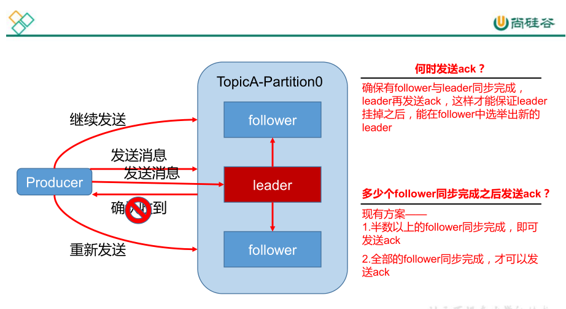

1 ）副本数据同步策略

| 方案                              | 优点                                                    | 缺点                                                      |
| --------------------------------- | ------------------------------------------------------- | --------------------------------------------------------- |
| `半数以上` 完成 同步 ， 就发送ack | 延迟低                                                  | 选举新的 leader 时，容忍 n 台节点的故障，需要 2n+1 个副本 |
| `全部` 完成 同步 ，才发送ack      | 选举新的leader 时，容忍 n 台节点的故障，需要 n+1 个副本 | 延迟高                                                    |

Kafka 选择了第二种方案，原因如下：
1.同样为了容忍 n 台节点的故障，第一种方案需要 2n+1 个副本，而第二种方案只需要 n+1个副本，而 Kafka 的每个分区都有大量的数据，第一种方案会造成大量数据的冗余。
2.虽然第二种方案的网络延迟会比较高，但网络延迟对 Kafka 的影响较小。

2 ）ISR 
采用第二种方案之后，设想以下情景：leader 收到数据，所有 follower 都开始同步数据，但有一个 follower，因为某种故障，迟迟不能与 leader 进行同步，那 leader 就要一直等下去，直到它完成同步，才能发送 ack。这个问题怎么解决呢？
Leader 维护了一个动态的 in-sync replica set (ISR)，意为和 leader 保持同步的 follower 集合。当 ISR 中的follower 完成数据的同步之后，leader 就会给producer发送 ack。如果 follower长时间未向 leader 同步数据 ， 则 该 follower 将 被 踢 出 ISR ， 该 时 间 阈 值 由replica.lag.time.max.ms 参数设定。Leader 发生故障之后，就会从 ISR 中选举新的 leader。 

```properties
ack = acknowledgement = 确认
ISR = in sync replica = in sync replication = 同步副本
lag = 延迟，落后
replica.lag.time.max.ms=副本延后时间最大毫秒数
```

3 ）ack  应答机制

对于某些不太重要的数据，对数据的可靠性要求不是很高，能够容忍数据的少量丢失，所以没必要等 ISR 中的 follower 全部接收成功。所以 Kafka 为用户提供了三种可靠性级别，用户根据对可靠性和延迟的要求进行权衡，
选择以下的配置。

acks  参数配置：
acks：
0：producer 不等待 broker 的 ack，这一操作提供了一个最低的延迟，broker 一接收到还没有写入磁盘就已经返回，当 broker 故障时有可能丢失数据；
1：producer 等待 broker 的 ack，partition 的 leader 落盘成功后返回 ack，如果在 follower同步成功之前 leader 故障，那么将会丢失数据；

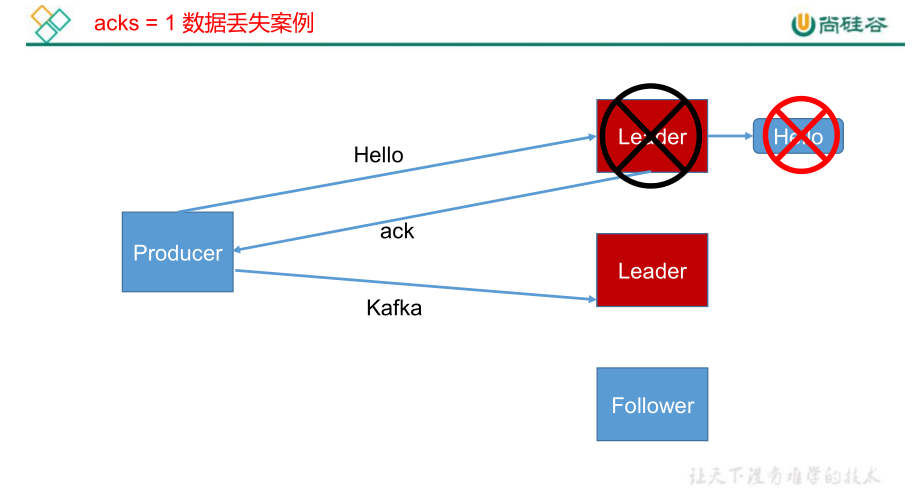

-1（all）：producer 等待 broker 的 ack，partition 的 leader 和 follower 全部落盘成功后才返回 ack。

但是如果在 follower 同步完成后，broker 发送 ack 之前，leader 发生故障，那么会造成 数据重复。

还有种极端情况就是ISR中只有一个leader，相当于第二种情况，也会数据丢失。

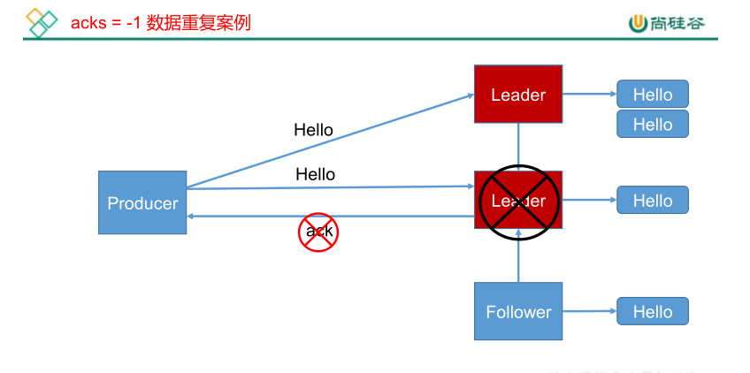

4 ） 故障 处理 细节

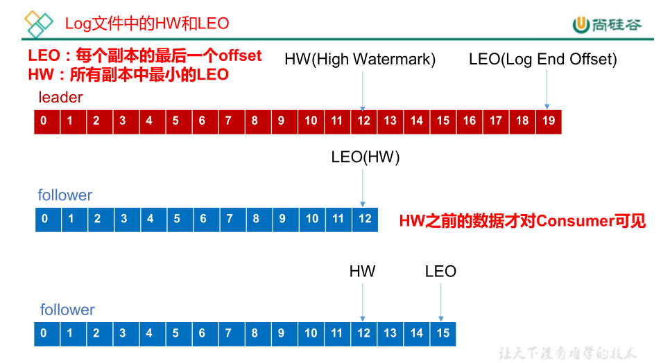

```properties
HW = high watermark = 高水位
LEO = Log End Offset = 记录的终点偏移量
```

ISR是包含leader与follower的

LEO ：指的是每个副本最大的 offset ；
HW ：指的是消费者能见到的最大的 offset ，ISR  队列中最小的 LEO 。

（1 ）follower  故障

follower 发生故障后会被临时踢出 ISR，待该 follower 恢复后，follower 会读取本地磁盘记录的上次的 HW，并将 log 文件高于ISR中 HW 的部分截取掉，从 HW 开始向 leader 进行同步。等该 follower  的 LEO  大于等于该 Partition 的 的 HW，即 follower 追上 leader 之后，就可以重新加入 ISR 了。

（2 ）leader  故障

leader 发生故障之后，会从 ISR 中选出一个新的 leader，之后，为保证多个副本之间的数据一致性，其余的follower 会先将各自的 log 文件高于 HW 的部分截掉，然后从新的 leader同步数据。
注意： 这只能保证副本之间的数据一致性，并不能保证数据不丢失或者不重复。

**即对于ISR中的数据一致性，是多退少补。**

#### 3.2.3、Exactly Once  语义

将服务器的 ACK 级别设置为-1，可以保证 Producer 到 Server 之间不会丢失数据，即` At Least Once `语义。相对的，将服务器 ACK 级别设置为 0，可以保证生产者每条消息只会被发送一次，即` At Most Once` 语义。
At Least Once 可以保证数据不丢失，但是不能保证数据不重复；相对的，At Most Once可以保证数据不重复，但是不能保证数据不丢失。但是，对于一些非常重要的信息，比如说交易数据，下游数据消费者要求数据既不重复也不丢失，即 Exactly Once 语义。在 0.11 版本以前的 Kafka，对此是无能为力的，只能保证数据不丢失，再在下游消费者对数据做全局去重。对于多个下游应用的情况，每个都需要单独做全局去重，这就对性能造成了很大影响。

0.11 版本的 Kafka，引入了一项重大特性：`幂等性`。所谓的幂等性就是指 Producer 不论向 Server 发送多少次重复数据，Server 端都只会持久化一条。幂等性结合 At Least Once 语义，就构成了 Kafka 的 Exactly Once 语义。即：
`At Least Once + 幂等性 = Exactly Once`,即幂等性就是去重

```properties
exponent = 指数的
idompotence = 幂等性
```

要启用幂等性，在Producer生产者配置文件`producer.properties`设置参数 `enable.idompotence` 设置成`true` 即可,这时会自动ack = -1（无需额外设置）。Kafka的幂等性实现其实就是将原来下游需要做的去重放在了数据上游。开启幂等性的 Producer 在初始化的时候会被分配一个 PID，发往同一 Partition 的消息会附带 Sequence Number（序号）。而Broker 端会对<PID, Partition, SeqNumber>做缓存，当具有相同主键的消息提交时，Broker 只会持久化一条。

```
PID = producer id = 这里指的是一次会话的生产者id
```

但是 PID 重启就会变化，同时不同的 Partition 也具有不同主键，所以幂等性无法保证跨分区跨会话的 Exactly Once。

### 3.3、Kafka消费者

#### 3.3.1、消费方式

consumer 采用 pull（拉取）模式从 broker 中读取数据。

push （推送）模式很难适应消费速率不同的消费者，因为消息发送速率是由 broker 决定的。它的目标是尽可能以最快速度传递消息，但是这样很容易造成 consumer 来不及处理消息，典型的表现就是拒绝服务以及网络拥塞。

而 pull 模式则可以根据 consumer 的消费能力以适当的速率消费消息。pull 模式不足之处是，如果 kafka 没有数据，消费者可能会陷入循环中，一直返回空数据。针对这一点，Kafka 的消费者在消费数据时会传入一个时长参数 timeout，如果当前没有数据可供消费，consumer 会等待一段时间之后再返回，这段时长即为 timeout。

#### 3.3.2、分区分配策略

一个 consumer group 中有多个 consumer，一个 topic 有多个 partition，所以必然会涉及到 partition 的分配问题，即确定那个 partition 由哪个 consumer 来消费。

Kafka 有两种分配策略，一是 RoundRobin，一是 Range。

1 ）RoundRobin轮询

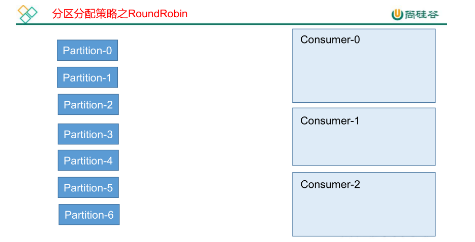

多个topic的分区组合起来，轮询的方式分配给消费者。这样有可能会出现consumer没有订阅该topic但被分配到该topic的某些分区。例如，2个topic,topic0有3个分区，topic1有4个分区，组合起来有7个分区，0%3 =0，分区0给消费者0,1给消费者1,以此类推。。。但cosumer0可能只订阅了topic0，但有可能分配到topic1的分区，所以出错。所以round robin的方式分配分区给消费者，要求conusmer组的consumber都订阅相同的topic。

2 ）Range 范围 （默认的方式）

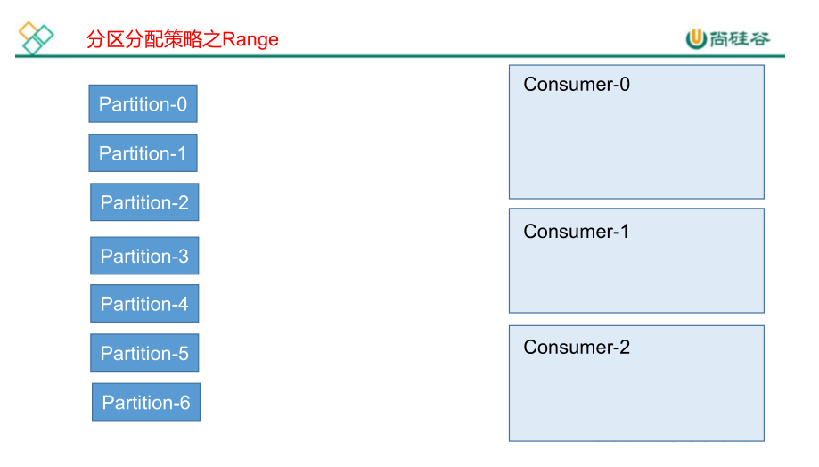

Range范围指示了consumber只消费某些topic，如果consumer组多个消费者消费同一个topic，再按范围分，
如consumber0,1,2订阅了topic0，topic0共有7个分区，则7/3 =2，则cosumber0消费partition0,1,2;consumer1消费partition3,4;consumber2消费partition5,6。一般前面的消费者能获得更多的分区，比如此例中cosumer0。

#### 3.3.3、offset的维护

由于 consumer 在消费过程中可能会出现断电宕机等故障，consumer 恢复后，需要从故障前的位置的继续消费，所以 consumer 需要实时记录自己消费到了哪个 offset，以便故障恢复后继续消费。


Kafka 0.9 版本之前，consumer 默认将 offset 保存在 Zookeeper 中，从 0.9 版本开始，consumer 默认将 offset 保存在 Kafka 一个内置的 topic 中，该 topic 为__consumer_offsets。

1）修改配置文件 consumer.properties

```properties
#排除内部topic置为false,这样就能消费_consumber_offsets这个topic
exclude.internal.topics=false
```

2）用console-consumber读取内置topic保存的offset

0.11.0.0 之前版本:

```bash
#formatter指定格式化器，consumber.config指定消费者配置文件
bin/kafka-console-consumer.sh  --topic  __consumer_offsets  --zookeeper  hadoop102:2181 
--formatter "kafka.coordinator.GroupMetadataManager\$OffsetsMessageFormatter" 
--consumer.config  config/consumer.properties  --from-beginning
```

0.11.0.0 之后版本(含):

```bash
#formatter指定格式化器，consumber.config指定消费者配置文件
bin/kafka-console-consumer.sh  --topic  __consumer_offsets  --zookeeper  hadoop102:2181 
--formatter "kafka.coordinator.group.GroupMetadataManager\$OffsetsMessageFormatter"  
--consumer.config  config/consumer.properties  --from-beginning
```

#### 3.3.4、消费者案例

1）需求：测试同一个消费者组中的消费者，同一时刻只能有一个消费者消费。

2）案例实操

（1）在 hadoop102、hadoop103 上修改/opt/module/kafka/config/consumer.properties 配置
文件中的 group.id 属性为指定的组名。

```bash
#修改consumer配置文件
vi consumer.properties

#配置文件中修改消费者组名为指定的名字
group.id=myGroup
```

（2）在 hadoop102、hadoop103 上分别启动消费者

```bash
#以zookeepr方式启动
bin/kafka-console-consumer.sh --zookeeper  hadoop102:2181  --topic  first  
--consumer.config config/consumer.properties

#以bootstrap-server方式启动
bin/kafka-console-consumer.sh  --bootstrap-server hadoop102:9092 --topic first 
--consumer.config config/consumer.properties
```

（3）在 hadoop102 上启动生产者

```bash
#启动生产者
bin/kafka-console-producer.sh --broker-list hadoop102:9092 --topic first

#生产者终端输入消息
>hello world
```

（4）查看 hadoop102 和 hadoop103 的接收者。

可以观察到：

**同一时刻只有一个消费者接收到消息。所以同一消费者组同一时刻只有一个消费者消费**


此外，前面也说了，**同一个消费者组，同一个分区只能给某一个消费者消费**


### 3.4、Kafka高效 读写 数据 （了解）

我们知道kafka的leader与follower进行落盘时，都要向磁盘写数据。

1 ）顺序写磁盘
Kafka 的 producer 生产数据，要写入到 log 文件中，写的过程是一直追加到文件末端，为顺序写。官网有数据表明，同样的磁盘，顺序写能到 600M/s，而随机写只有 100K/s。这与磁盘的机械机构有关，顺序写之所以快，是因为其省去了大量磁头寻址的时间。

2）零复制技术

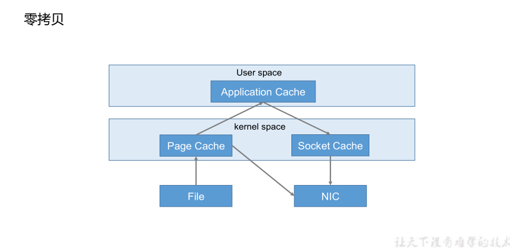

零拷贝技术：

file -> page cache -> nic

```properties
nic = network interface controller = 网络接口控制器，网卡
```

### 3.5、Zookeeper在Kafka中的作用

Kafka 集群中有一个 broker 会被选举为 Controller（控制器），负责管理集群 broker 的上下线、所有 topic 的分区副本分配和 leader 选举等工作。
Controller 的管理工作都是依赖于 Zookeeper 的。
以下为 partition 的 leader 选举过程：

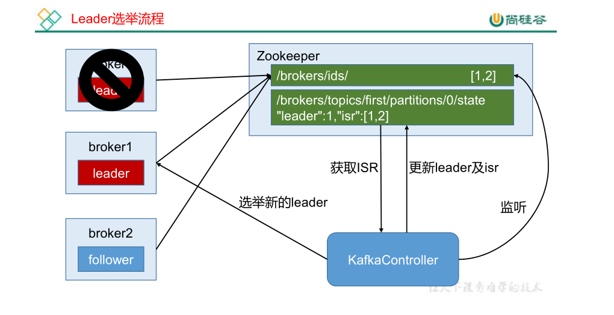

/brokers/ids中的值由[0,1,2]变成[1,2]，KafkaController监听到，就会选举新的leader，并更新leader与ISR值

### 3.6、Kafka  事务

Kafka 从 0.11 版本开始引入了事务支持。事务可以保证 Kafka 在 `Exactly Once` 语义的基础上，生产和消费可以跨分区和会话，要么全部成功，要么全部失败。

前面的`at least once + 幂等性= excatly once`保证了`不跨会话`与`不跨分区`的保存消息 `精确一次性`

这里的`事务` 可以保证` 跨会话，跨分区`的保存消息 `精确一次性` ，`at least once+幂等性+事务 = excatly once`

#### 3.6.1、Producer  事务（主要保证）

为了实现跨分区跨会话的事务，需要引入一个全局唯一的 `Transaction ID`，并将 Producer获得的`PID`和`Transaction ID`绑定。这样当Producer重启后就可以通过正在进行的`Transaction ID `获得原来的 PID。

即原来重启会话随机的pid变成由transaction id获取了

为了管理 Transaction，Kafka 引入了一个新的组件 Transaction Coordinator。Producer 就是通过和 Transaction Coordinator 交互获得 Transaction ID 对应的任务状态。Transaction Coordinator 还负责将事务所有写入 Kafka 的一个内部 Topic，这样即使整个服务重启，由于事务状态得到保存，进行中的事务状态可以得到恢复，从而继续进行。

```properties
coordinator = 协调器
```

#### 3.6.2、Consumer事务（较少保证）

上述事务机制主要是从 Producer 方面考虑，对于 Consumer 而言，事务的保证就会相对较弱，尤其时无法保证 Commit 的信息被精确消费。这是由于 Consumer 可以通过 offset 访问任意信息，而且不同的 Segment File 生命周期不同，同一事务的消息可能会出现重启后被删除的情况。

## 4、Kafka API使用

### 4.1、Producer API

#### 4.1.1、消息发送流程

Kafka 的 Producer 发送消息采用的是 `异步发送` 的方式。在消息发送的过程中，涉及到了两个线程 ——main（主）线程和 Sender（发送者）线程，以及一个线程共享变量 ——RecordAccumulator。main 线程将消息发送给 RecordAccumulator，Sender 线程不断从 RecordAccumulator 中拉取消息发送到 Kafka broker。

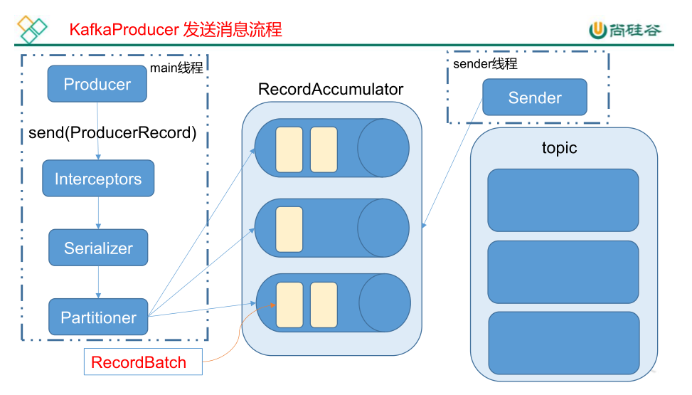

相关参数：
batch.size ：只有数据积累到 batch.size 之后，sender 才会发送数据。
linger.ms ：如果数据迟迟未达到 batch.size，sender 等待 linger.time 之后就会发送数据。

```properties
accumulator = 累加器
batch = 批
linger = 停留
```

#### 4.1.2、异步发送 API（常用）

1 ）导入依赖

```xml
    <dependencies>
        <!--kafka客户端-->
        <dependency>
            <groupId>org.apache.kafka</groupId>
            <artifactId>kafka-clients</artifactId>
            <version>0.11.0.0</version>
        </dependency>
        <!--日志，不加会有错误提示-->
        <dependency>
            <groupId>org.slf4j</groupId>
            <artifactId>slf4j-simple</artifactId>
            <version>1.7.32</version>
        </dependency>
        <!--lombok-->
        <dependency>
            <groupId>org.projectlombok</groupId>
            <artifactId>lombok</artifactId>
            <version>1.18.20</version>
        </dependency>
    </dependencies>
```

2 ）编写代码

需要用到的类：
KafkaProducer：需要创建一个生产者对象，用来发送数据
ProducerConfig：获取所需的一系列生产者配置参数
ProducerRecord：每条数据（消息）都要封装成一个 ProducerRecord 对象

1、不带回调函数的 API

```java
public class MyProducer {
    public static void main(String[] args) {

        //2、配置
        Properties properties = new Properties();
        //设置kafka的启动服务器配置,相当于broker-list
        properties.put(ProducerConfig.BOOTSTRAP_SERVERS_CONFIG, "192.168.58.131:9092");
        //发送消息的ack确认
        properties.put(ProducerConfig.ACKS_CONFIG, "all");
        //重试次数
        properties.put(ProducerConfig.RETRIES_CONFIG, 1);
        //RecordAccumulator的批次大小
        properties.put(ProducerConfig.BATCH_SIZE_CONFIG, 16384);
        //RecordAccumulator的停留时间
        properties.put(ProducerConfig.LINGER_MS_CONFIG, 1);
        //RecordAccumulator记录累加器 缓冲区大小
        properties.put(ProducerConfig.BUFFER_MEMORY_CONFIG, 33554432);
        //kafka，key的序列化器，key就是用来确定分区的
        properties.put(ProducerConfig.KEY_SERIALIZER_CLASS_CONFIG
                , "org.apache.kafka.common.serialization.StringSerializer");
        //kafka，value的序列化器
        properties.put(ProducerConfig.VALUE_SERIALIZER_CLASS_CONFIG
                , "org.apache.kafka.common.serialization.StringSerializer");


        //1、建kafka生产者对象，构造器参数要配置
        KafkaProducer<String, String> producer = new KafkaProducer<String, String>(properties);

        //3、发送消息
        for (int i = 0; i < 10; i++) {
            producer.send(new ProducerRecord<String, String>("first", "test_" + i));
        }

        //有时可加flush
        producer.flush();
        //4、关闭生产者
        producer.close();
    }
}
```

2、带回调函数的 API

回调函数会在 producer 收到 ack 时调用，为异步调用，该方法有两个参数，分别是RecordMetadata 和 Exception，如果 Exception 为 null，说明消息发送成功，如果Exception 不为 null，说明消息发送失败。

注意：消息发送失败会自动重试，不需要我们在回调函数中手动重试

```java
public class MyProducer2 {
    public static void main(String[] args) {

        //2、配置
        Properties properties = new Properties();
        //设置kafka的启动服务器配置,相当于broker-list
        properties.put(ProducerConfig.BOOTSTRAP_SERVERS_CONFIG, "192.168.58.131:9092");
        //发送消息的ack确认
        properties.put(ProducerConfig.ACKS_CONFIG, "all");
        //重试次数
        properties.put(ProducerConfig.RETRIES_CONFIG, 1);
        //RecordAccumulator的批次大小
        properties.put(ProducerConfig.BATCH_SIZE_CONFIG, 16384);
        //RecordAccumulator的停留时间
        properties.put(ProducerConfig.LINGER_MS_CONFIG, 1);
        //RecordAccumulator记录累加器 缓冲区大小
        properties.put(ProducerConfig.BUFFER_MEMORY_CONFIG, 33554432);
        //kafka，key的序列化器，key就是用来确定分区的
        properties.put(ProducerConfig.KEY_SERIALIZER_CLASS_CONFIG
                , "org.apache.kafka.common.serialization.StringSerializer");
        //kafka，value的序列化器
        properties.put(ProducerConfig.VALUE_SERIALIZER_CLASS_CONFIG
                , "org.apache.kafka.common.serialization.StringSerializer");


        //1、建kafka生产者对象，构造器参数要配置
        KafkaProducer<String, String> producer = new KafkaProducer<String, String>(properties);

        //3、发送消息
        for (int i = 0; i < 10; i++) {
            producer.send(new ProducerRecord<String, String>("first", "test2_" + i), new Callback() {
                @Override
                public void onCompletion(RecordMetadata metadata, Exception exception) {
                    if (exception == null) {
                        System.out.println("success->" + metadata.offset());
                    } else {
                        exception.printStackTrace();
                    }
                }
            });
        }

        //有时可加flush
        producer.flush();
        //4、关闭生产者
        producer.close();
    }
}
```

#### 4.1.3、同步发送 API（不常用）

同步发送的意思就是，一条消息发送之后，会阻塞当前线程，直至返回 ack。由于 send 方法返回的是一个 Future 对象，根据 Futrue 对象的特点，我们也可以实现同步发送的效果，只需再调用 Future 对象的 get 方发即可。

```java
public class MyProducer {
    public static void main(String[] args) throws ExecutionException, InterruptedException {

        //2、配置
        Properties properties = new Properties();
        //设置kafka的启动服务器配置,相当于broker-list
        properties.put(ProducerConfig.BOOTSTRAP_SERVERS_CONFIG, "192.168.58.131:9092");
        //发送消息的ack确认
        properties.put(ProducerConfig.ACKS_CONFIG, "all");
        //重试次数
        properties.put(ProducerConfig.RETRIES_CONFIG, 1);
        //RecordAccumulator的批次大小
        properties.put(ProducerConfig.BATCH_SIZE_CONFIG, 16384);
        //RecordAccumulator的停留时间
        properties.put(ProducerConfig.LINGER_MS_CONFIG, 1);
        //RecordAccumulator记录累加器 缓冲区大小
        properties.put(ProducerConfig.BUFFER_MEMORY_CONFIG, 33554432);
        //kafka，key的序列化器，key就是用来确定分区的
        properties.put(ProducerConfig.KEY_SERIALIZER_CLASS_CONFIG
                , "org.apache.kafka.common.serialization.StringSerializer");
        //kafka，value的序列化器
        properties.put(ProducerConfig.VALUE_SERIALIZER_CLASS_CONFIG
                , "org.apache.kafka.common.serialization.StringSerializer");


        //1、建kafka生产者对象，构造器参数要配置
        KafkaProducer<String, String> producer = new KafkaProducer<String, String>(properties);

        //3、发送消息
        for (int i = 0; i < 10; i++) {
            //这里如果不加get()方法，则send()方法是异步的，
            // 加了get()方法就会出现要等send结果返回才能调用get()
            Future<RecordMetadata> first =
                    producer.send(new ProducerRecord<String, String>("first", "test_" + i));
            first.get();
        }

        //有时可加flush
        producer.flush();
        //4、关闭生产者
        producer.close();
    }
}
```

### 4.2、Consumer API

Consumer 消费数据时的可靠性是很容易保证的，因为数据在 Kafka 中是持久化的，故不用担心数据丢失问题。
由于 consumer 在消费过程中可能会出现断电宕机等故障，consumer 恢复后，需要从故障前的位置的继续消费，所以 consumer 需要实时记录自己消费到了哪个 offset，以便故障恢复后继续消费。所以 offset 的维护是 Consumer 消费数据是必须考虑的问题。

#### 4.2.1、自动提交 offset

1）导入依赖

略，如`4.1、Producer API`

2）编写代码

需要用到的类：
KafkaConsumer：需要创建一个kafka消费者对象，用来消费数据
ConsumerConfig：获取所需的一系列消费者配置参数
ConsuemrRecord：每条数据都要封装成一个 ConsumerRecord 对象

为了使我们能够专注于自己的业务逻辑，Kafka 提供了自动提交 offset 的功能。自动提交 offset 的相关参数：
enable.auto.commit ：是否开启自动提交 offset 功能
auto.commit.interval.ms ：自动提交 offset 的时间间隔

**以下为自动提交 offset 的代码：**

```java
public class MyConsumer {
    public static void main(String[] args) {
        //2、配置属性
        Properties properties = new Properties();
        //kafka集群的地址
        properties.put(ConsumerConfig.BOOTSTRAP_SERVERS_CONFIG, "192.168.58.131:9092");
        //消费者组id
        properties.put(ConsumerConfig.GROUP_ID_CONFIG, "myGroup");
        //开关_自动提交offset
        properties.put(ConsumerConfig.ENABLE_AUTO_COMMIT_CONFIG, "true");
        //自动提交间隔
        properties.put(ConsumerConfig.AUTO_COMMIT_INTERVAL_MS_CONFIG, "1000");
        //key的反序列化器
        properties.put(ConsumerConfig.KEY_DESERIALIZER_CLASS_CONFIG,
                "org.apache.kafka.common.serialization.StringDeserializer");
        properties.put(ConsumerConfig.VALUE_DESERIALIZER_CLASS_CONFIG,
                "org.apache.kafka.common.serialization.StringDeserializer");
        //1、新建kafka消费者
        KafkaConsumer<String, String> consumer = new KafkaConsumer<String, String>(properties);
        //3、订阅主题
        consumer.subscribe(Arrays.asList("first"));
        //4、消费主题
        while (true) {
            //poll轮询获取记录
            ConsumerRecords<String, String> records = consumer.poll(100);
            //打印记录中的值
            for (ConsumerRecord<String, String> record : records)
                System.out.printf("offset = %d, key = %s, value = %s%n"
                        , record.offset(), record.key(), record.value());
        }
    }
}
```

#### 4.2.2、手动提交 offset


## 5、常见异常

5.1、如果报日志异常SLF4J: Failed to load class "org.slf4j.impl.StaticLoggerBinder".

需要pom.xml中加上如下依赖

```xml
<!--日志，不加会有错误提示-->
<dependency>
    <groupId>org.slf4j</groupId>
    <artifactId>slf4j-simple</artifactId>
    <version>1.7.32</version>
</dependency>
```

5.2、如果java代码发不了消息，需要打开config/server.properties配置文件，更改如下

```properties
#listeners就是主要用来定义Kafka Broker的Listener的配置项。
listeners=PLAINTEXT://:9092
#advertised.listeners参数的作用就是将Broker的Listener信息发布到Zookeeper中
advertised.listeners=PLAINTEXT://192.168.58.131:9092
```

