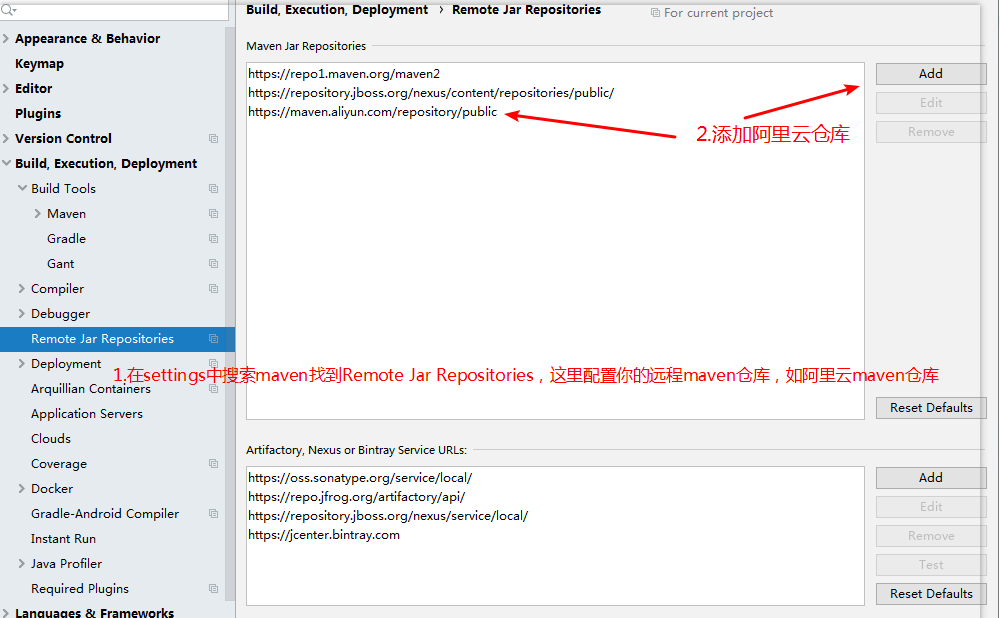
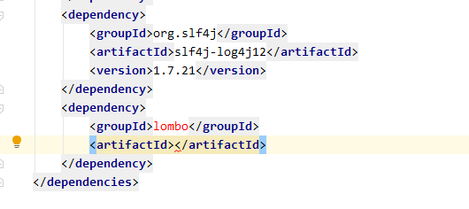

# lombok

## 1、lombok下载使用

1步、maven repository 下载 

```xml
<!-- https://mvnrepository.com/artifact/org.projectlombok/lombok -->
<dependency>
    <groupId>org.projectlombok</groupId>
    <artifactId>lombok</artifactId>
    <version>1.18.20</version>
    <scope>provided</scope>
</dependency>
```

2步、idea安装lombok插件

安装后注解无效：将idea设置中的Enable annotation processing（开启注解处理） 勾选上

## 2、lombok使用

### val（很少使用）

可以作为局部变量声明的类型，而不必编写实际类型。val将从初始化表达式中推断数据的类型。

注意：val仅适用于局部变量和foreeach循环，不适用于字段（实体类的成员变量）。val修饰的局部变量也将成为最终变量

```java
val username = "xiaoming";
//也可写成lombok.val username = "xiaoming";
//相当于final String username = "xiaoming";
```

### var（很少使用）

var与val基本一致，但var相当于没有final修饰，所以可以重新赋值，但要类型相同

```java
var address = "beijing";
//相当于String address = "beijing";
address = new ArrayList<String>();//错误,重新赋值只能同类型
address = "xiaohong";//正确
```

### @NonNull

一般作用于方法的形参上，相当于对参数作了非空判断

```java
    public User(@NonNull String username, Integer age) {
        this.username = username;
        this.age = age;
    }
	//相当于
    public User(String username, Integer age) {
        if (username == null) {
            throw new NullPointerException();
        }
        this.username = username;
        this.age = age;
    }
```

### @Cleanup

java关闭资源方法有两种：一种是try-finally，另一种是try-with-resources语法糖。

除此这外，lombok也提供了@Cleanup用于关闭资源，

且@Cleanup 的注解属性可以指定对象的用于关闭的方法名

```java
@Cleanup InputStream in = new FileInputStream("in.text");
@Cleanup("close") OutputStream out = new FileOutputStream("out.text");
```

### @Getter和@Setter

作用于类上或属性上，相当于生成getter()方法与setter()方法

@Getter注解源码中的属性说明：

```java
@Target({ElementType.FIELD, ElementType.TYPE})
@Retention(RetentionPolicy.SOURCE)
public @interface Getter {
    //方法的访问级别
    AccessLevel value() default AccessLevel.PUBLIC;

    Getter.AnyAnnotation[] onMethod() default {};
	//懒加载
    boolean lazy() default false;

    /** @deprecated */
    @Deprecated
    @Retention(RetentionPolicy.SOURCE)
    @Target({})
    public @interface AnyAnnotation {
    }
}
```

@Getter(lazy = true)的说明：

主要就是给字段生成get方法,且使用到字段时才加载（懒加载）

下面看个典型的例子：

```java
public class GetterTest {

    /**
     * 给private final 属性赋非常大的值，是件不好的事
     * ，只有在调用时才给他赋值，才比较好，即懒加载
     * ，且 @Getter(lazy = true)保证线程安全不会多次赋值
     */
    @Getter(lazy = true)
    private final double[] cached = expensive();

    /**
     * 这个方法创建了一个100万长度的double型数组
     * ，并遍历赋值，后返回，显然是个耗时操作
     */
    private double[] expensive() {
        double[] result = new double[1000000];
        for (int i = 0; i < result.length; i++) {
            result[i] = Math.asin(i);
        }
        return result;
    }

}
```

### @ToString

作用是生成toString()方法

源码属性说明：

```java
@Target({ElementType.TYPE})
@Retention(RetentionPolicy.SOURCE)
public @interface ToString {
    //是否包含属性名
    boolean includeFieldNames() default true;
	
    String[] exclude() default {};

    String[] of() default {};

    boolean callSuper() default false;

    boolean doNotUseGetters() default false;

    boolean onlyExplicitlyIncluded() default false;

    @Target({ElementType.FIELD})
    @Retention(RetentionPolicy.SOURCE)
    public @interface Exclude {
    }

    @Target({ElementType.FIELD, ElementType.METHOD})
    @Retention(RetentionPolicy.SOURCE)
    public @interface Include {
        int rank() default 0;

        String name() default "";
    }
}
/**

includeFieldNames参数默认值为true，即会toString()方法会包含属性名。

exclude，of不用了解，准备弃用了，使用@ToString.Exclude和@ToString.Include代替。

callSuper为true，可以将超类实现toString的输出包含到输出中

doNotUseGetters，不使用getter访问成员变量，而使用使用对象.属性

默认情况下，将打印所有非静态字段。如果要跳过某些字段，可以用注释这些字段@ToString.Exclude。另外，可以使用精确指定要被toString方法包含的字段，先设置@ToString(onlyExplicitlyIncluded = true)，然后使用@ToString.Include标记每个要包含的字段。您可以更改用于标识成员的名称@ToString.Include(name = “some other name”)，name相当于给字段起别名；也可以通过更改成员的打印顺序@ToString.Include(rank = -1)。

/
```

### @Log（重点）

lombok提供相应的log对象可供使用，支持原生的，log4j，commonslog等

```java
@Retention(RetentionPolicy.SOURCE)
@Target({ElementType.TYPE})
public @interface Log {
    //设置主题，话题
    String topic() default "";
}
```

### @EqualsAndHashCode

作用生成equals()方法与hashCode()方法

源码属性说明：

```java
@Target({ElementType.TYPE})
@Retention(RetentionPolicy.SOURCE)
public @interface EqualsAndHashCode {
    String[] exclude() default {};

    String[] of() default {};

    boolean callSuper() default false;

    boolean doNotUseGetters() default false;

    EqualsAndHashCode.CacheStrategy cacheStrategy() default EqualsAndHashCode.CacheStrategy.NEVER;

    EqualsAndHashCode.AnyAnnotation[] onParam() default {};

    boolean onlyExplicitlyIncluded() default false;

    /** @deprecated */
    @Deprecated
    @Retention(RetentionPolicy.SOURCE)
    @Target({})
    public @interface AnyAnnotation {
    }

    public static enum CacheStrategy {
        NEVER,
        LAZY;

        private CacheStrategy() {
        }
    }

    @Target({ElementType.FIELD})
    @Retention(RetentionPolicy.SOURCE)
    public @interface Exclude {
    }

    @Target({ElementType.FIELD, ElementType.METHOD})
    @Retention(RetentionPolicy.SOURCE)
    public @interface Include {
        String replaces() default "";

        int rank() default 0;
    }
}
/**

exclude，of不用了解，准备弃用，使用@EqualsAndHashCode.Exclude和@EqualsAndHashCode.Include代替；

callSuper表示是否将父类的equals和hashCode方法加到该子类的equals和hashCode方法中；

doNotUseGetters表示是否使用getter访问成员变量；

onlyExplicitlyIncluded为false时，所有的非静态和非瞬态的字段都会被包含进equals和hashCode方法中；为true时，只有在字段上明确使用了@EqualsAndHashCode.Include注解才会被包含进equals和hashCode方法中。

/
```

### @ XXXArgsConstructor（重点）

@ NoArgsConstructor，将生成没有参数无参构造方法

@ RequiredArgsConstructor，为每个需要特殊处理的字段生成的构造方法。如@NonNull修饰

@ AllArgsConstructor，将生成全参构造方法

源码查看：

三个注解的属性很多相同，access表示生成的构造方法的访问级别；staticNam表示生成静态工厂方法，并指定静态工厂方法的名字（如of）,且会私有化构造器

> 无参构造方法

```java
@Target({ElementType.TYPE})
@Retention(RetentionPolicy.SOURCE)
public @interface NoArgsConstructor {
    //指定静态方法名
    String staticName() default "";

    NoArgsConstructor.AnyAnnotation[] onConstructor() default {};

    //设置方法访问级别
    AccessLevel access() default AccessLevel.PUBLIC;

    boolean force() default false;

    /** @deprecated */
    @Deprecated
    @Retention(RetentionPolicy.SOURCE)
    @Target({})
    public @interface AnyAnnotation {
    }
}
/**
force注解属性：当存在未初始化的final字段时，设置为true，则会final字段设置初始值 0/null/false 其中一种。如果，存在final字段，并且force的值为false，则会发生编译错误。
/
```

> 需参构造方法

```java
@Target({ElementType.TYPE})
@Retention(RetentionPolicy.SOURCE)
public @interface RequiredArgsConstructor {
    String staticName() default "";

    RequiredArgsConstructor.AnyAnnotation[] onConstructor() default {};

    AccessLevel access() default AccessLevel.PUBLIC;

    /** @deprecated */
    @Deprecated
    @Retention(RetentionPolicy.SOURCE)
    @Target({})
    public @interface AnyAnnotation {
    }
}
```

> 全参构造方法

```java
@Target({ElementType.TYPE})
@Retention(RetentionPolicy.SOURCE)
public @interface AllArgsConstructor {
    String staticName() default "";

    AllArgsConstructor.AnyAnnotation[] onConstructor() default {};

    AccessLevel access() default AccessLevel.PUBLIC;

    /** @deprecated */
    @Deprecated
    @Retention(RetentionPolicy.SOURCE)
    @Target({})
    public @interface AnyAnnotation {
    }
}
```

### @Data（重点）

@Data相当于@Getter/@Setter，@ToString，@EqualsAndHashCode，@RequiredArgsConstructor

使用了@Data后，这四个注解的注解属性都会采用默认值，即无法为其中某个注解指定该注解的注解属性值。如果要指定某个注解的注解属性值，需要开发者显示地指定。

源码：

```java
@Target({ElementType.TYPE})
@Retention(RetentionPolicy.SOURCE)
public @interface Data {
    String staticConstructor() default "";
}
/**
staticConstructor的作用和@RequiredArgsConstructor中的staticName一样，都是生成静态工厂方法的,可以指定工厂方法名，一般设置为of
/
```

### @Value（重点）

@Value作用是简化创建不可变类

首先，要了解不可变类的知识：

不可变类是指创建该类的实例后，该实例的实例变量是不可改变的。Jav提供的8个包装类和java.lang.String类都是不可变类。

| 不可变类具体要求：                                           |
| ------------------------------------------------------------ |
| 使用private和final修饰符来修饰该类的成员变量；               |
| 提供带参数的构造器，根据传入的参数来初始化类里的成员变量；   |
| 仅为该类的成员变量提供getter方法，不要提供setter方法，因为普通方法无法修改final修饰的成员变量； |
| 不允许子类覆盖方法。最简单的方法是将该类声明为final。一种更复杂的方法是使用private工厂方法来构造构造器和构造实例。 |
| 如果有必要，重写Object类的hascode()和equals()方法。equals方法根据关键成员变量来作为两个对象是否相等的标准，除此之外，还应该保证两个用equals方法判断为相等的对象的hashCode()也相等。 |

根据以上要求创建Girl不可变类：

1、属性为private final

2、类为final

3、全参构造方法，getter方法，hascode()和equals()方法

```java
public final class Girl {
    private final String girlName;
    private final String girlAge;

    public Girl(String girlName, String girlAge) {
        this.girlName = girlName;
        this.girlAge = girlAge;
    }

    public String getGirlName() {
        return girlName;
    }

    public String getGirlAge() {
        return girlAge;
    }

    @Override
    public boolean equals(Object o) {
        if (this == o) return true;
        if (o == null || getClass() != o.getClass()) return false;
        Girl girl = (Girl) o;
        return Objects.equals(girlName, girl.girlName) &&
                Objects.equals(girlAge, girl.girlAge);
    }

    @Override
    public int hashCode() {
        return Objects.hash(girlName, girlAge);
    }
}
```

使用@Value简化以上代码

```java
@Value
public class Girl {
    String girlName;
    String girlAge;
}
```

@Value源码查看

```java
@Target({ElementType.TYPE})
@Retention(RetentionPolicy.SOURCE)
public @interface Value {
    String staticConstructor() default "";
}
/**
staticConstructor也是设置静态工厂方法的名字的
/
```

### @Builder（重点）

@Builder在构建对象时具有链式赋值的特点，但是在创建对象后，就不能链式赋值了，只能采用setter方法，虽然toBuilder注解属性可以复用对象的成员变量值，但是却返回一个新的对象，这不是我们所希望看到的。然而，@Accessors却可以在任何时候对对象的成员变量实现链式赋值。

```java
Person person = Person.builder()
    .name("Adam Savage")
    .city("San Francisco")
    .job("Mythbusters")
    .job("Unchained Reaction")
    .build();
//类直接调用builder()方法再调用与属性同名的方法赋值最后调用build()方法完成构建对象
```

```java
/**
使用@Builder注释可以帮助我们完成一下一些事情：
一个名为FooBuilder的内部静态类，并具有和实体类形同的属性（称为构建器）。(foo，bar就是张三)

在构建器中：对于目标类中的所有的属性和未初始化的final字段，都会在构建器中创建对应属性；

在构建器中：创建一个无参的default构造函数。

在构建器中：对于实体类中的每个参数，都会对应创建类似于“setter”的方法，只不多方法名与该参数名相同。 并且返回值是构建器本身（便于链式调用），如上例所示。

在构建器中：一个build()方法，调用此方法，就会根据设置的值进行创建实体对象。

在构建器中：同时也会生成一个toString()方法。

在实体类中：会创建一个builder()方法，它的目的是用来创建构建器。

/
@Builder
public class User {
    private String username;
    private String password;
}

// 编译后：
public class User {
    private String username;
    private String password;
    User(String username, String password) {
        this.username = username; this.password = password;
    }
    public static User.UserBuilder builder() {
        return new User.UserBuilder();
    }

    public static class UserBuilder {
        private String username;
        private String password;
        UserBuilder() {}

        public User.UserBuilder username(String username) {
            this.username = username;
            return this;
        }
        public User.UserBuilder password(String password) {
            this.password = password;
            return this;
        }
        public User build() {
            return new User(this.username, this.password);
        }
        public String toString() {
            return "User.UserBuilder(username=" + this.username + ", password=" + this.password + ")";
        }
    }
}
```

如果是类中的属性是集合类型，需要配合@Singular注解实现赋值，在相应的集合属性上加上此注解。

在使用`@Builder`注释类配合使用`@Singular`注释注释一个集合字段，`lombok`会将该构建器节点视为一个集合，并生成两个`adder`方法而不是`setter`方法。

```java
//Person类
@Builder
@Data
public class Person {
    private List<String> jobs;
}
//原来有集合需要这样写：
public void test1() {
    List<String> jobs = new ArrayList<>();
    jobs.add("编程");
    jobs.add("送外卖");
    Person person = Person.builder().jobs(jobs).build();
    System.out.println(person);
}

//加上@Singular注解的类
@Builder
@Data
public class Person {
    @Singular
    private List<String> jobs;
}
//现在集合可以这样写：
public void test1() {
    Person person = Person.builder().job("编程").job("送外卖").build();
    System.out.println(person);
}
/**
在调用build()时，生成的集合将是不可变的。
在调用build()之后调用其中一个adder方法或clear方法不会修改任何已经生成的对象。如果对集合修改之后，再调用build()，则会创建一个基于上一个对象创建的对象实体。
生成的集合将被压缩到最小的可行格式，同时保持高效。
/
```

@Builder加上@Singular编译后情况：

```java
@Builder
public class User {
    private final Integer id;
    private final String zipCode = "215500";
    private String username;
    private String password;
    @Singular
    private List<String> hobbies;
}

// 编译后：
public class User {
    private final Integer id;
    private final String zipCode = "215500";
    private String username;
    private String password;
    private List<String> hobbies;
    User(Integer id, String username, String password, List<String> hobbies) {
        this.id = id; this.username = username;
        this.password = password; this.hobbies = hobbies;
    }

    public static User.UserBuilder builder() {return new User.UserBuilder();}

    public static class UserBuilder {
        private Integer id;
        private String username;
        private String password;
        private ArrayList<String> hobbies;
        UserBuilder() {}
        public User.UserBuilder id(Integer id) { this.id = id; return this; }
        public User.UserBuilder username(String username) { this.username = username; return this; }
        public User.UserBuilder password(String password) { this.password = password; return this; }

        public User.UserBuilder hobby(String hobby) {
            if (this.hobbies == null) {
                this.hobbies = new ArrayList();
            }
            this.hobbies.add(hobby);
            return this;
        }

        public User.UserBuilder hobbies(Collection<? extends String> hobbies) {
            if (this.hobbies == null) {
                this.hobbies = new ArrayList();
            }
            this.hobbies.addAll(hobbies);
            return this;
        }

        public User.UserBuilder clearHobbies() {
            if (this.hobbies != null) {
                this.hobbies.clear();
            }
            return this;
        }

        public User build() {
            List hobbies;
            switch(this.hobbies == null ? 0 : this.hobbies.size()) {
            case 0:
                hobbies = Collections.emptyList();
                break;
            case 1:
                hobbies = Collections.singletonList(this.hobbies.get(0));
                break;
            default:
                hobbies = Collections.unmodifiableList(new ArrayList(this.hobbies));
            }
            return new User(this.id, this.username, this.password, hobbies);
        }
        public String toString() {
            return "User.UserBuilder(id=" + this.id + ", username=" + this.username + ", password=" + this.password + ", hobbies=" + this.hobbies + ")";
        }
    }
}
/**
其实，lombok的创作者还是很用心的，在进行build()来床建实例对象时，并没有直接使用Collections.unmodifiableList(Collection)此方法来床架实例，而是分为三种情况，
第一种，当集合中没有元素时，创建一个空list；
第二种情况，当集合中存在一个元素时，创建一个不可变的单元素list；
第三种情况，根据当前集合的元素数量创建对应合适大小的list；


当然我们看编译生成的代码，创建了三个关于集合操作的方法：
hobby(String hobby)：向集合中添加一个元素
hobbies(Collection<? extends String> hobbies)：添加一个集合所有的元素
clearHobbies()：清空当前集合数据

/
```

`@Singular`注解的源码：

```java
@Target({FIELD, PARAMETER})
@Retention(SOURCE)
public @interface Singular {
	// 可以设置添加单个元素的方法名
	String value() default "";
}
```

`@Builder.Default`的用法：

在类中我在`id`和`insertTime`上都添加注解`@Builder.Default`，当我在使用这个实体对象时，我就不需要在为这两个字段进行初始化值,当然你也可以调用方法覆盖初始值

```java
@Builder
@ToString
public class User {
    @Builder.Default
    private final String id = UUID.randomUUID().toString();
    private String username;
    private String password;
    @Builder.Default
    private long insertTime = System.currentTimeMillis();
}
```

`@Builder`的源码：

```java
@Target({TYPE, METHOD, CONSTRUCTOR})
@Retention(SOURCE)
public @interface Builder {
	// 如果@Builder注解在类上，可以使用 @Builder.Default指定初始化表达式
	@Target(FIELD)
	@Retention(SOURCE)
	public @interface Default {}
	// 指定实体类中创建 Builder 的方法的名称，默认为: builder (个人觉得没必要修改)
	String builderMethodName() default "builder";
	// 指定 Builder 中用来构件实体类的方法的名称，默认为：build (个人觉得没必要修改)
	String buildMethodName() default "build";
	// 指定创建的建造者类的名称，默认为：实体类名+Builder
	String builderClassName() default "";
	// 使用toBuilder可以实现以一个实例为基础继续创建一个对象。（也就是重用原来对象的值）
	boolean toBuilder() default false;
	
	@Target({FIELD, PARAMETER})
	@Retention(SOURCE)
	public @interface ObtainVia {
		// 告诉lombok使用表达式获取值
		String field() default "";
		// 告诉lombok使用表达式获取值
		String method() default "";

		boolean isStatic() default false;
	}
}
```

toBuilder属性，因为我们在对实体对象进行操作时，往往会存在对某些实体对象的某个字段进行二次赋值，这个时候就会用到这一属性。但是，这会创建一个新的对象，而不是原来的对象，原来的对象属性是不可变的，除非你自己想要给这个实体类再添加上@Data或者@setter方法

```java
@Builder(toBuilder = true)
@ToString
public class User {
    private String username;
    private String password;
}
// 测试类
public class BuilderTest {
    public static void main(String[] args) {
        User user1 = User.builder()
                .password("jdkong")
                .username("jdkong")
                .build();
        System.out.println(user1);

        User user2 = user1.toBuilder().username("jdkong2").build();
        // 验证user2是否是基于user1的现有属性创建的
        System.out.println(user2);
        // 验证对象是否是同一对象
        System.out.println(user1 == user2);
    }
}
// 输出内容
User(username=jdkong, password=jdkong)
User(username=jdkong2, password=jdkong)
false
```

### @Accessors（重点）

@Builder可以实现构建对象的功能，但是它也有点缺陷——无法在创建对象后继续使用链式赋值。幸运的是，Lombok出了一个@Accessors注解，完美地解决了这个问题，它可以让你随时随地使用链式赋值。

```java
@Getter
@Setter
@Accessors(fluent = true, chain = true)
public class Student {

    private String name;

    private Integer age;

}
```

反编译以上代码得到：

```java
public class Student {
    private String name;
    private Integer age;

    public Student() {
    }

    public String name() {
        return this.name;
    }

    public Integer age() {
        return this.age;
    }

    public Student name(String name) {
        this.name = name;
        return this;
    }

    public Student age(Integer age) {
        this.age = age;
        return this;
    }
}
/**
可以看到，所有的getter和setter方法都使用了变量名的作为方法名。setter方法的返回值全是Student类型。
/
```

@Accessors的源码：

```java
@Target({ElementType.TYPE, ElementType.FIELD})
@Retention(RetentionPolicy.SOURCE)
public @interface Accessors {
    boolean fluent() default false;

    boolean chain() default false;

    String[] prefix() default {};
}
/**
fluent注解默认值为false，则保留getter和setter方法前面的get和set前缀。如果为true，则不保留前缀，直接使用变量名作为方法名，也就构成了方法的重载。
值得注意的是，当fluent为true时，chain注解属性的值就自动设置成了true。chain的默认值是false，意味不启用链式赋值，也就是setter方法返回体为void。
prefix注解属性处理变量名前缀的，只有拥有前缀的变量才会生成getter/setter方法，而且它的匹配原则是——匹配到的变量去掉前缀后第一个字母不能是小写。通俗地说就是，运用驼峰命名规则去匹配。
/
```

### @SneakyThrows（很少使用）

sneankyThrows = 鬼鬼祟祟的抛出

他的作用相当于给你的代码加上try-catch，捕捉异常后抛出相应异常

原来代码：

```java
public class SneakyThrowsTest {

    public static void main(String[] args) {

    }

    @SneakyThrows(value = NullPointerException.class)
    public static void test(){
        String str = null;
        System.out.println(str.length());
    }
}
```

相当于下面的代码：

```java
public class SneakyThrowsTest {

    public static void main(String[] args) {

    }

    public static void test() {
        try {
            String str = null;
            System.out.println(str.length());
        } catch (NullPointerException e) {
            throw e;
        }
    }
}
```

@SneakyThrows源码：

```java
@Target({ElementType.METHOD, ElementType.CONSTRUCTOR})
@Retention(RetentionPolicy.SOURCE)
public @interface SneakyThrows {
    //value属性指定对应的异常类型，可指定多个
    Class<? extends Throwable>[] value() default {Throwable.class};
}
```

### @Synchronized（很少使用）

此注解相当于方法上的synchronized关键字，不同的是synchronized关键字锁对象是this，或类.class

```java
@Synchronized(value = "myLock")
public static void test(){    
    //doMoreThing()
}
```

@Synchronized锁对象是Object对象，$lock或$Lock，这个是加上注解后自动生成的

```java
private final Object $lock = new Object[0];
private static final Object $LOCK = new Object[0];
```

@Synchronized源码：

```java
@Target({ElementType.METHOD})
@Retention(RetentionPolicy.SOURCE)
public @interface Synchronized {
    //value设置锁对象名字
    String value() default "";
}
```


## 3、maven中提示lombok(或其他包)

### 3.1、设置maven



**阿里云maven仓库地址：**

```properties
https://maven.aliyun.com/repository/public
```

### 3.2、快捷键提示

在`pom文件`中的`dependency标签`的`groupId标签`处输入时，可按`ctrl+alt+space`进行提示



