myBatis笔记

## 1. java项目的基本三层架构

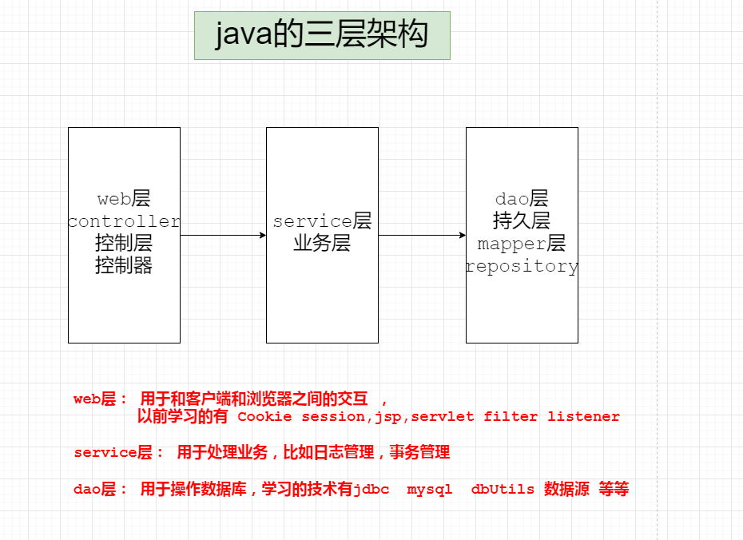

## 2. 框架和库的区别

* 框架： 是一整套技术解决方案  
* 库：是对原有技术的封装 ，让操作更加简单而已 

## 3.Mybatis的介绍

*  MyBatis 本是apache的一个开源项目iBatis, 2010年这个项目由apache software foundation迁移到了google code，并且改名为MyBatis 。2013年11月迁移到Github，通俗说法Ibatis3 = MyBatis
* iBATIS一词来源于“internet”和“abatis”的组合，是一个基于Java的持久层框架。iBATIS提供的持久层框架包括SQL Maps和Data Access Objects（DAO）
* MyBatis是一个数据持久层(ORM)框架。把实体类和SQL语句之间建立了映射关系，是一种半自动化的ORM实现
*  MyBatis的优点：
  * 减少代码量
  
  * 基于SQL语法，简单易学
  
  * 能了解底层组装过程
  
  * SQL语句封装在配置文件中，便于统一管理与维护，降低了程序的耦合度
  
  * 程序调试方便
  
```properties
batis = 藜木科；跟spring搭配，是春天的藜木科
dtb = data transfer bus = 数据传输总线
```

## 4. MyBatis的获取

* 第一种方式 从官网（也是跳转到github）
* 第二种方式 github  

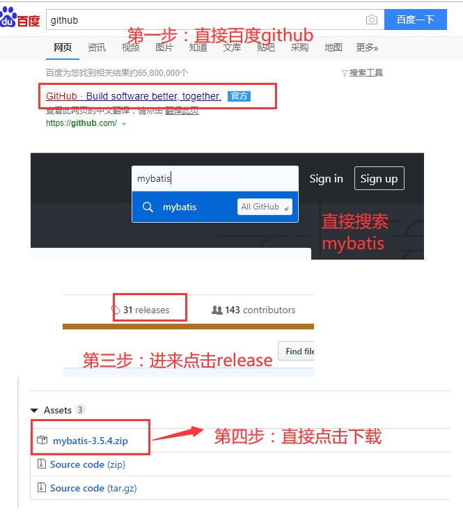

## 5. mybatis的目录介绍

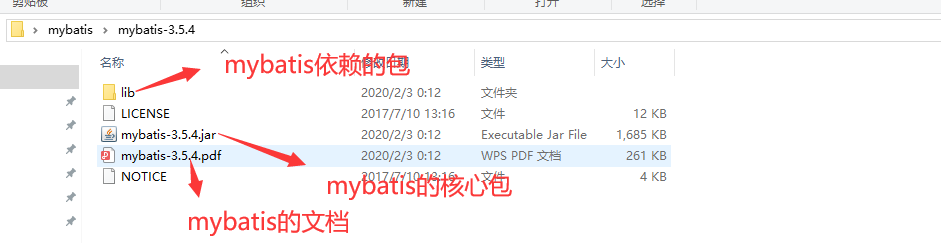

## 6. Mybatis操作数据库

### 6.1. 环境搭建 

#### 6.1.1. 建库建表

```mysql
create database mybatis;
use mybatis;


CREATE TABLE `user` (
  `id` int(11) NOT NULL AUTO_INCREMENT,
  `username` varchar(32) NOT NULL COMMENT '用户名称',
  `birthday` date DEFAULT NULL COMMENT '生日',
  `sex` char(1) DEFAULT NULL COMMENT '性别',
  `address` varchar(256) DEFAULT NULL COMMENT '地址',
  PRIMARY KEY (`id`)
) ENGINE=InnoDB AUTO_INCREMENT=27 DEFAULT CHARSET=utf8;
```

#### 6.1.2. 插入数据 

```mysql
insert  into `user`(`id`,`username`,`birthday`,`sex`,`address`)
values (1,'盛世名',NULL,'2',NULL),
(10,'张甲吉','2014-07-10','1','北京市'),(16,'张吉东',NULL,'1','河南郑州'),
(22,'孙训',NULL,'1','河南郑州'),(24,'周芷若',NULL,'1','河南郑州'),
(25,'赵敏',NULL,'1','河南郑州'),(26,'小昭',NULL,NULL,NULL);
```

#### 6.1.3. 创建java项目

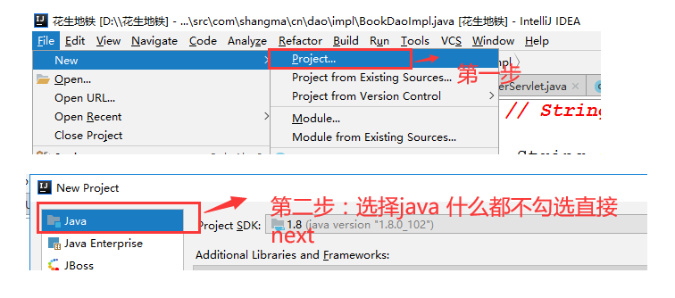

#### 6.1.4. 导入jar包（新建lib） 

> 导入mybatis和mybatis的依赖包  
>
> 导入mysql的驱动包 

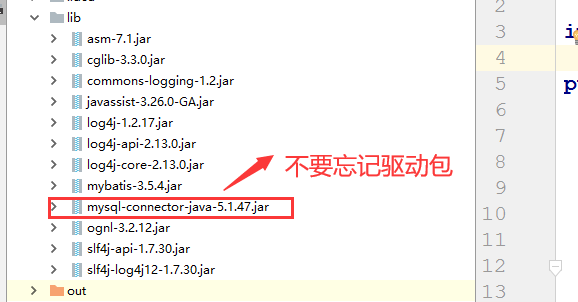

**注意： 直接导入mybatis 和  mysql驱动包  2个包就可以了  但是建议把所有的包都导入进去**

#### 6.1.5. 创建实体类

```java
@Data
@NoArgsConstructor
@AllArgsConstructor
@Builder
@Accessors(fluent = false,chain = true)
public class User implements Serializable {
    private Integer id;
    private String username;// 用户姓名
    private String sex;// 性别
    private Date birthday;// 生日
    private String address;// 地址
}
```

#### 6.1.6. 编写主配置文件

在类路径下创建mybatis-config.xml，填充以下内容

```xml-dtd
<?xml version="1.0" encoding="UTF-8"?>
<!--mybaits全局配置文件的约束-->
<!DOCTYPE configuration
        PUBLIC "-//mybatis.org//DTD Config 3.0//EN"
        "http://mybatis.org/dtd/mybatis-3-config.dtd">


<!--配置信息 -->
<configuration>
    <environments default="development">
        <environment id="development">
            <!--jdbc的事务管理 交给mybatis管理  -->
            <transactionManager type="JDBC"/>
            <!--数据源 -->
            <dataSource type="POOLED">
                <property name="driver" value="com.mysql.jdbc.Driver"/>
                <property name="url" value="jdbc:mysql://localhost:3306/mybatis?characterEncoding=UTF-8"/>
                <property name="username" value="root"/>
                <property name="password" value="root"/>
            </dataSource>
        </environment>
    </environments>
    <mappers>
        <!--<mapper resource="org/mybatis/example/BlogMapper.xml"/>-->
        <mapper resource="com/xyz/code/mapper/user-mapper.xml"></mapper>
    </mappers>
</configuration>
```

#### 6.1.7. 编写Mapper映射文件 

创建user-mapper.xml文件

```xml-dtd
<?xml version="1.0" encoding="UTF-8"?>
<!DOCTYPE mapper
        PUBLIC "-//mybatis.org//DTD Mapper 3.0//EN"
        "http://mybatis.org/dtd/mybatis-3-mapper.dtd">
<mapper namespace="">
 
</mapper>
```

#### 6.1.8. 基本目录结构如下

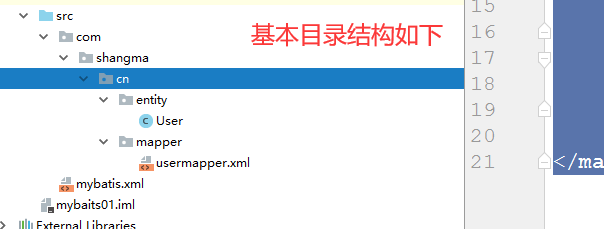

### 6.2. 增删改查

#### 6.2.1. 根据id查询 

##### 6.2.1.1. 修改映射文件

修改user-mapper.xml文件

```xml-dtd
<?xml version="1.0" encoding="UTF-8"?>
<!DOCTYPE mapper
        PUBLIC "-//mybatis.org//DTD Mapper 3.0//EN"
        "http://mybatis.org/dtd/mybatis-3-mapper.dtd">


<!--
 添加的内容如下
-->
	
<!--
 namespace 表示命名空间 对sql的操作进行分类化管理  有点类似包管理
-->
<mapper namespace="xyz">

    <!--是根据id查询用户
    select标签表示查询
          id属性： 要求在一个namespace当中唯一 id随意写 但是要唯一
          parameterType表示参数的java类型
          resultType  表示查询后的返回值java类型
          #{id}  表示占位符  传过来是什么  id就等于什么  如果是基本数据类型 这个id可以随意写
    -->
    <select id="findUserById" parameterType="int" resultType="com.xyz.code.entity.User">
        select * from user where id=#{id}
    </select>
</mapper>
```

##### 6.2.1.2. 修改配置文件

修改mybatis-config.xml文件：

> 在 mappers标签中添加如下内容 

```xml
    <mappers>
        <!--<mapper resource="org/mybatis/example/BlogMapper.xml"/>-->
        <mapper resource="com/xyz/code/mapper/user-mapper.xml"></mapper>
    </mappers>
```

##### 6.2.1.3. 编写代码

```java
public class UserTest {

    @Test
    public void test1() throws IOException {
        SqlSession sqlSession = null;
        try {
            //配置文件路径
            String resource = "mybatis-config.xml";
            //通过路径加载配置文件
            InputStream inputStream = Resources.getResourceAsStream(resource);
            //构建sqlSessionFactory
            SqlSessionFactory sqlSessionFactory = new SqlSessionFactoryBuilder().build(inputStream);
            //开启sqlSession
            sqlSession = sqlSessionFactory.openSession();
            //操作数据库 参数1：名称空间.id ；参数2：sql语句需要的参数
            User user = ((User) sqlSession.selectOne("xyz.findUserById", 10));
            //打印结果
            System.out.println(user);
        } finally {
            //关闭资源
            sqlSession.close();
        }
    }

}
```

##### 6.2.1.4. 结果打印 

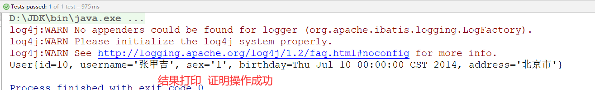


##### 6.2.1.5. 警告说明 （log4j日志配置文件）

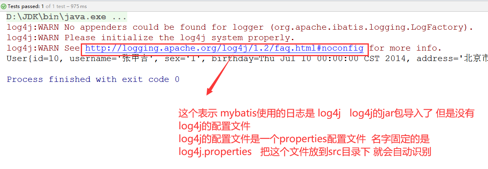

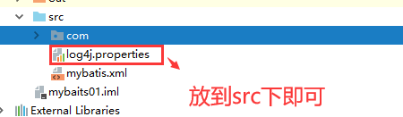

**直接百度下载即可，这里提供了：**

`log4j.xml`配置文件：

```xml
<?xml version="1.0" encoding="UTF-8"?>  
<!DOCTYPE log4j:configuration SYSTEM "log4j.dtd">  
    
<log4j:configuration  debug="true" xmlns:log4j='http://jakarta.apache.org/log4j/' >  
 
    <!-- ========================== 自定义输出格式说明================================ -->
      <!-- %p 输出优先级，即DEBUG，INFO，WARN，ERROR，FATAL -->
      <!-- %r 输出自应用启动到输出该log信息耗费的毫秒数  -->
      <!-- %c 输出所属的类目，通常就是所在类的全名 -->
      <!-- %t 输出产生该日志事件的线程名 -->
      <!-- %n 输出一个回车换行符，Windows平台为“/r/n”，Unix平台为“/n” -->
      <!-- %d 输出日志时间点的日期或时间，默认格式为ISO8601，也可以在其后指定格式，比如：%d{yyy MMM dd HH:mm:ss,SSS}，输出类似：2002年10月18日 22：10：28，921  -->
      <!-- %l 输出日志事件的发生位置，包括类目名、发生的线程，以及在代码中的行数。举例：Testlo4.main(TestLog4.java:10)  -->
      <!-- ========================================================================== -->
 
      <!-- ========================== 输出方式说明================================ -->
      <!-- Log4j提供的appender有以下几种:  -->
      <!-- org.apache.log4j.ConsoleAppender(控制台),  -->
      <!-- org.apache.log4j.FileAppender(文件),  -->
      <!-- org.apache.log4j.DailyRollingFileAppender(每天产生一个日志文件), -->
      <!-- org.apache.log4j.RollingFileAppender(文件大小到达指定尺寸的时候产生一个新的文件),  -->
      <!-- org.apache.log4j.WriterAppender(将日志信息以流格式发送到任意指定的地方)   -->
  <!-- ========================================================================== -->
   
    <appender name="CONSOLE" class="org.apache.log4j.ConsoleAppender">
         <!-- <param name="Target" value="System.out"/> -->
         <layout class="org.apache.log4j.PatternLayout">
                 <param name="ConversionPattern" value="%d{yyyy-MM-dd HH:mm:ss a} [Thread: %t][ Class:%c  Method: %l ]%n%p:%m%n"/>
         </layout>
        <!--  <filter class="org.apache.log4j.varia.LevelRangeFilter">
            <param name="LevelMin" value="DEBUG"/>
            <param name="LevelMax" value="DEBUG"/>
        </filter> -->
    </appender>
    <!-- output the debug   -->
   <!--  <appender name="log4jDebug" class="org.apache.log4j.DailyRollingFileAppender">
        <param name="File" value="log_"/>    
        <param name="MaxFileSize" value="KB"/> 
        <param name="MaxBackupIndex" value="2"/> -->
   <appender name="log4jDebug"  class="org.apache.log4j.rolling.RollingFileAppender">  
        <param name="Append" value="true"/>
        <rollingPolicy  class="org.apache.log4j.rolling.TimeBasedRollingPolicy">  
               <param name="FileNamePattern" value="./log/log_%d{yyyy-MM-dd}.log" />  
        </rollingPolicy>  
        <layout class="org.apache.log4j.PatternLayout">
            <param name="ConversionPattern" value="%d{yyyy-MM-dd HH:mm:ss a} [Thread: %t][ Class:%c Method: %l ]%n%p:%m%n"/>
        </layout>
        <filter class="org.apache.log4j.varia.LevelRangeFilter">
            <param name="LevelMin" value="DEBUG"/>
            <param name="LevelMax" value="DEBUG"/>
        </filter>
    </appender>
   <!--  <appender name="log4jInfo" class="org.apache.log4j.DailyRollingFileAppender">
        <param name="File" value="log_"/>       
        <param name="DatePattern" value="'.log'yyyy-MM-dd"/>
        <param name="Append" value="true"/>
       <param name="MaxFileSize" value="5KB"/>
        <param name="MaxBackupIndex" value="2"/> -->
    <appender name="log4jInfo"  class="org.apache.log4j.rolling.RollingFileAppender">  
        <param name="Append" value="true"/>
        <rollingPolicy  class="org.apache.log4j.rolling.TimeBasedRollingPolicy">  
               <param name="FileNamePattern" value="./log/log_%d{yyyy-MM-dd}.log" />  
        </rollingPolicy> 
        <layout class="org.apache.log4j.PatternLayout">
             <param name="ConversionPattern" value="%d{yyyy-MM-dd HH:mm:ss a} [Thread: %t][ Class:%c  Method: %l ]%n%p:%m%n"/>
        </layout>
        <filter class="org.apache.log4j.varia.LevelRangeFilter">
            <param name="LevelMin" value="INFO"/>
            <param name="LevelMax" value="INFO"/>
        </filter>
    </appender>
   <!--  <appender name="log4jWarn" class="org.apache.log4j.DailyRollingFileAppender">
        <param name="File" value="/log_"/>      
        <param name="DatePattern" value="'.log'yyyy-MM-dd"/>
        <param name="Append" value="true"/>
        <param name="MaxFileSize" value="5KB"/>
        <param name="MaxBackupIndex" value="2"/> -->
    <appender name="log4jWarn" class="org.apache.log4j.rolling.RollingFileAppender">  
        <param name="Append" value="true"/>
        <rollingPolicy  class="org.apache.log4j.rolling.TimeBasedRollingPolicy">  
               <param name="FileNamePattern" value="./log/log_%d{yyyy-MM-dd}.log" />  
        </rollingPolicy> 
        <layout class="org.apache.log4j.PatternLayout">
             <param name="ConversionPattern" value="%d{yyyy-MM-dd HH:mm:ss a} [Thread: %t][ Class:%c Method: %l ]%n%p:%m%n"/>
        </layout>
        <filter class="org.apache.log4j.varia.LevelRangeFilter">
            <param name="LevelMin" value="WARN"/>
            <param name="LevelMax" value="WARN"/>
        </filter>
    </appender>
  <!--  <appender name="log4jError" class="org.apache.log4j.DailyRollingFileAppender"> -->
   <appender name="log4jError"  class="org.apache.log4j.rolling.RollingFileAppender">  
       <!--  <param name="File" value="/error_"/>    
        <param name="DatePattern" value="'.log'yyyy-MM-dd"/> -->
        <param name="Append" value="true"/>
        <rollingPolicy  class="org.apache.log4j.rolling.TimeBasedRollingPolicy">  
               <param name="FileNamePattern" value="./log/error_%d{yyyy-MM-dd}.log" />  
        </rollingPolicy> 
        
      <!--   <param name="MaxFileSize" value="5KB"/> -->
      <!--   <param name="MaxBackupIndex" value="2"/> -->
        <layout class="org.apache.log4j.PatternLayout">
             <param name="ConversionPattern" value="%d{yyyy-MM-dd HH:mm:ss a} [Thread: %t][ Class:%c Method: %l ]%n%p:%m%n"/>
        </layout>
        <filter class="org.apache.log4j.varia.LevelRangeFilter">
            <param name="LevelMin" value="ERROR"/>
            <param name="LevelMax" value="ERROR"/>
        </filter>
    </appender>
 <!--通过<category></category>的定义可以将各个包中的类日志输出到不同的日志文件中-->
    <!--     <category name="com.gzy">
            <priority value="debug" />
            <appender-ref ref="log4jTestLogInfo" />
            <appender-ref ref="log4jTestDebug" />
        </category> -->
  <appender name="MAIL"     
      class="org.apache.log4j.net.SMTPAppender">     
      <param name="threshold" value="debug" />     
      <!-- 日志的错误级别     
       <param name="threshold" value="error"/>     
      -->     
      <!-- 缓存文件大小，日志达到512K时发送Email -->     
      <param name="BufferSize" value="512" /><!-- 单位K -->     
      <param name="From" value="test@163.com" />     
      <param name="SMTPHost" value="smtp.163.com" />     
      <param name="Subject" value="juyee-log4jMessage" />     
      <param name="To" value="test@163.com" />     
      <param name="SMTPUsername" value="test" />     
      <param name="SMTPPassword" value="test" />     
      <layout class="org.apache.log4j.PatternLayout">     
       <param name="ConversionPattern"     
        value="%-d{yyyy-MM-dd HH:mm:ss.SSS a} [%p]-[%c] %m%n" />     
      </layout>     
   </appender> 
    
    
     <root>
        <priority value="debug"/>
        <appender-ref ref="CONSOLE" /> 
        <appender-ref ref="log4jDebug" /> 
        <appender-ref ref="log4jInfo" />
        <appender-ref ref="log4jWarn" />
        <appender-ref ref="log4jError" />
        <!-- <appender-ref ref="MAIL" /> -->
    </root>
</log4j:configuration>
```

`log4j.properties`配置文件：

```properties
# priority  :debug<info<warn<error
#you cannot specify every priority with different file for log4j 
log4j.rootLogger=debug,stdout,info,debug,warn,error 
 
#console
log4j.appender.stdout=org.apache.log4j.ConsoleAppender 
log4j.appender.stdout.layout=org.apache.log4j.PatternLayout 
log4j.appender.stdout.layout.ConversionPattern= [%d{yyyy-MM-dd HH:mm:ss a}]:%p %l%m%n
#info log
log4j.logger.info=info
log4j.appender.info=org.apache.log4j.DailyRollingFileAppender 
log4j.appender.info.DatePattern='_'yyyy-MM-dd'.log'
log4j.appender.info.File=./src/com/hp/log/info.log
log4j.appender.info.Append=true
log4j.appender.info.Threshold=INFO
log4j.appender.info.layout=org.apache.log4j.PatternLayout 
log4j.appender.info.layout.ConversionPattern=%d{yyyy-MM-dd HH:mm:ss a} [Thread: %t][ Class:%c >> Method: %l ]%n%p:%m%n
#debug log
log4j.logger.debug=debug
log4j.appender.debug=org.apache.log4j.DailyRollingFileAppender 
log4j.appender.debug.DatePattern='_'yyyy-MM-dd'.log'
log4j.appender.debug.File=./src/com/hp/log/debug.log
log4j.appender.debug.Append=true
log4j.appender.debug.Threshold=DEBUG
log4j.appender.debug.layout=org.apache.log4j.PatternLayout 
log4j.appender.debug.layout.ConversionPattern=%d{yyyy-MM-dd HH:mm:ss a} [Thread: %t][ Class:%c >> Method: %l ]%n%p:%m%n
#warn log
log4j.logger.warn=warn
log4j.appender.warn=org.apache.log4j.DailyRollingFileAppender 
log4j.appender.warn.DatePattern='_'yyyy-MM-dd'.log'
log4j.appender.warn.File=./src/com/hp/log/warn.log
log4j.appender.warn.Append=true
log4j.appender.warn.Threshold=WARN
log4j.appender.warn.layout=org.apache.log4j.PatternLayout 
log4j.appender.warn.layout.ConversionPattern=%d{yyyy-MM-dd HH:mm:ss a} [Thread: %t][ Class:%c >> Method: %l ]%n%p:%m%n
#error
log4j.logger.error=error
log4j.appender.error = org.apache.log4j.DailyRollingFileAppender
log4j.appender.error.DatePattern='_'yyyy-MM-dd'.log'
log4j.appender.error.File = ./src/com/hp/log/error.log 
log4j.appender.error.Append = true
log4j.appender.error.Threshold = ERROR 
log4j.appender.error.layout = org.apache.log4j.PatternLayout
log4j.appender.error.layout.ConversionPattern = %d{yyyy-MM-dd HH:mm:ss a} [Thread: %t][ Class:%c >> Method: %l ]%n%p:%m%n
```

#### 6.2.2. 添加用户

##### 6.2.2.1. 修改映射文件

```xml
    <!--
      添加用户
      参数类型 是引用类型
      则 #{}中的值 不能胡写  要对应成 实体类中的属性名 
     -->
    <select id="insertUser" parameterType="com.xyz.code.entity.User">
        insert into user (username,birthday,sex,address) values (#{username},#{birthday},#{sex},#{address})
    </select>
```

##### 6.2.2.2. 加载映射文件

已经加载过(就是修改Mybatis-config中文件中的mappers)

##### 6.2.2.3. 编写代码 

```java
    @Test
    public void insertUser() throws IOException {
        
        String path = "mybatis-config.xml";
        InputStream in = Resources.getResourceAsStream(path);
        SqlSessionFactory factory = new SqlSessionFactoryBuilder().build(in);
        SqlSession sqlSession = factory.openSession();
        User user = new User().setUsername("xiaohong").
                setAddress("北京").setBirthday(new Date()).setSex("男");
        sqlSession.insert("xyz.insertUser", user);
        //要提交事务  不提交事务 则可能没有真正的持久化硬盘中
        sqlSession.commit();
        sqlSession.close();
    }
```

##### 6.2.2.4. 查看结果


注意：如果数据出现问号在数据库连接上加上characterEncoding=UTF-8

#### 6.2.3. 修改用户 

##### 6.2.3.1. 修改映射文件 

```xml
  
    <!-- 修改用户 -->
    <update id="updateUser" parameterType="com.xyz.code.entity.User">
        update user set username = #{username},birthday=#{birthday},sex=#{sex},address=#{address} where id = #{id}
    </update>
```

##### 6.2.3.2. 加载映射文件

已经加载过

##### 6.2.3.3. 编写代码 

```java
    @Test
    public void updateUser() throws IOException {

        String path = "mybatis-config.xml";
        InputStream inputStream = Resources.getResourceAsStream(path);
        SqlSessionFactory sqlSessionFactory = new SqlSessionFactoryBuilder().build(inputStream);
        SqlSession sqlSession = sqlSessionFactory.openSession();
        //先查出来 再修改
        User user = ((User) sqlSession.selectOne("xyz.findUserById", 27));
        user.setSex("男").setAddress("成都");
        //修改
        sqlSession.update("xyz.updateUser", user);
        sqlSession.commit();
        //这里最好finally关闭
        sqlSession.close();
    }
```

##### 6.2.3.4. 查看结果 

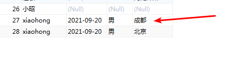

#### 6.2.4. 删除用户 

##### 6.2.4.1. 修改映射文件

```xml
  <!--删除用户-->
    <delete id="deleteUser" parameterType="integer" >
        delete from user where id = #{id}
    </delete>
```

##### 6.2.4.2. 加载映射文件

加载过了

##### 6.2.4.3. 编写代码 

```java
    @Test
    public void deleteUser() throws IOException {
        String path = "mybatis-config.xml";
        InputStream resourceAsStream = Resources.getResourceAsStream(path);
        SqlSessionFactory sqlSessionFactory = new SqlSessionFactoryBuilder().build(resourceAsStream);
        SqlSession sqlSession = sqlSessionFactory.openSession();
        sqlSession.delete("xyz.deleteUser", 27);
        //只要不是查询  增删改 都需要提交事务
        sqlSession.commit();
        sqlSession.close();
    }
```

##### 6.2.4.4. 查看结果

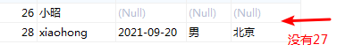

#### 6.2.5. 模糊查询 

##### 6.2.5.1. 修改映射文件

```xml
    <!--模糊查询 ${}
   如果参数为简单类型时，${}里面的参数名称必须为value
    -->
    <select id="search" parameterType="string" resultType="com.xyz.code.entity.User">
        select * from user where username like '%${value}%'
    </select>
```

##### 6.2.5.2. 加载映射文件 

加载过了

##### 6.2.5.3. 编写代码 

```java
    @Test
    public void search() throws IOException {
        String path  = "mybatis-config.xml";
        InputStream resourceAsStream = Resources.getResourceAsStream(path);
        SqlSessionFactory sqlSessionFactory = new SqlSessionFactoryBuilder().build(resourceAsStream);
        SqlSession sqlSession = sqlSessionFactory.openSession();
        List<User> users = sqlSession.selectList("xyz.search", "xiao");
        users.forEach(System.out::println);
        //要关闭sql会话
        sqlSession.close();
    }
```

##### 6.2.5.4. 查看结果

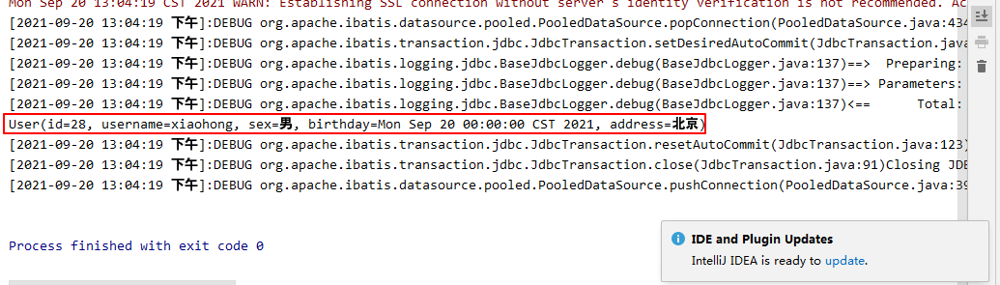

#### 6.2.6. 添加用户返回主键

##### 6.2.6.1. 修改映射文件 

在上面的`insert标签`中加入`selectKey标签`就能实现返回主键功能

```xml
    <!--
        添加用户
        参数类型 是引用类型
        则 #{}中的值 不能胡写  要对应成 实体类中的属性名
    -->
    <insert id="insertUser" parameterType="com.xyz.code.entity.User">
        <!--
            keyProperty 表示实体类中主键的属性
            order  表示返回的主键是在添加前 还是添加后   取值after   before
            resultType 表示返回值类型
            last_insert_id()  是mysql中的函数  返回的是最后一次添加的id
        -->
        <selectKey keyProperty="id" order="AFTER" resultType="int">
            select last_insert_id()
        </selectKey>
        insert into user (username,birthday,sex,address) values (#{username},#{birthday},#{sex},#{address})
    </insert>
```

##### 6.2.6.2. 查看结果

可以看到返回的主键直接赋值到id上了

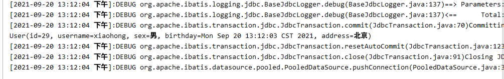

## 7. 面临的问题

* 问题一：代码中存在大量的重复代码（创建sqlSession与销毁sqlSession） 
* 问题二：我们mybatis是持久层框架属于dao的部分  

**生命周期介绍**


## 8. 简单的封装

```java
/**
 * 对重复的代码进行简单封装
 */
public class TestDemo2 {
    SqlSessionFactory sqlSessionFactory;
    SqlSession sqlSession;
    InputStream inputStream;

    @Before
    public void init() throws IOException {
        System.out.println("init方法打印了");
        //配置文件路径
        String resource = "mybatis-config.xml";
        //通过路径加载配置文件
        inputStream = Resources.getResourceAsStream(resource);
        //获得sqlsessionFactory
        sqlSessionFactory = new SqlSessionFactoryBuilder().build(inputStream);
        sqlSession = sqlSessionFactory.openSession();
    }

    /**
     * 通过id 查询
     */
    @Test
    public void  selectById() throws IOException {
        //获得sqlSession

        // 操作数据库
        User o = sqlSession.selectOne("xyz.findUserById", 10);
        //打印结果
        System.out.println(o);
    }

    @Test
    public  void  insertUser() throws IOException {
        User user = new User().setUsername("xiaohong").
                setAddress("北京").setBirthday(new Date()).setSex("男");
        sqlSession.insert("xyz.insertUser", user);
    }

    @Test
    public  void  updateUser() throws IOException {
       //先查出来 再修改
        User user = ((User) sqlSession.selectOne("xyz.findUserById", 27));
        user.setSex("男").setAddress("成都");
        //修改
        sqlSession.update("xyz.updateUser", user);
    }

    @Test
    public  void  deleteUser() throws IOException {
        sqlSession.delete("xyz.deleteUser", 27);
    }


    @Test
    public  void  search() throws IOException {
        List<User> users = sqlSession.selectList("xyz.search", "xiao");
        users.forEach(System.out::println);
    }


    @After
    public void release(){
        System.out.println("release方法打印了");
        sqlSession.commit();
        sqlSession.close();
        try {
            //这里的输入流可不关闭，因为不是new的
            inputStream.close();
        } catch (IOException e) {
            e.printStackTrace();
        }
    }
}
```

**其实每次操作数据库时 先执行init  操作完数据库之后 又执行release  也就是说 每次都会初始化一个sqlSession    如果全局就一个sqlsession时 这种方式 就不可以了**

## 9. myBatis的dao开发

### 9.1. 常见dao接口

```java
public interface UserDao {

    ////根据id查询
    User selectUserById(Integer id);

    //添加用户
    int addUser(User user);
}
```

### 9.2. 创建实现类

```java
public class UserDaoImpl implements UserDao {

    private SqlSession sqlSession;

    public UserDaoImpl(SqlSession sqlSession) {
        this.sqlSession = sqlSession;
    }

    @Override
    public User selectUserById(Integer id) {
        //查询
        User user = sqlSession.selectOne("xyz.findUserById", 10);
        return user;
    }

    @Override
    public int addUser(User user) {
        //新增
        return sqlSession.insert("xyz.insertUser", user);
    }
}
```

### 9.3. 编写测试类

```java
public class UserDaoTest {
    SqlSessionFactory sqlSessionFactory;
    SqlSession sqlSession;
    UserDao userDao;
    InputStream inputStream;


    @Before
    public void init() throws IOException {
        System.out.println("init方法打印了");
        //配置文件路径
        String resource = "mybatis-config.xml";
        //通过路径加载配置文件
        inputStream = Resources.getResourceAsStream(resource);
        //获得sqlSessionFactory
        sqlSessionFactory = new SqlSessionFactoryBuilder().build(inputStream);
        sqlSession = sqlSessionFactory.openSession();
        userDao = new UserDaoImpl(sqlSession);
    }

    /**
     * 通过id 查询
     */
    @Test
    public void  selectById() throws IOException {
        System.out.println(userDao.selectUserById(10));
    }

    @Test
    public  void  addUser() throws IOException {
        User user = new User().setUsername("凤姐")
                .setBirthday(new Date()).setAddress("外星球").setSex("女");
        userDao.addUser(user);
        System.out.println(user.getId());
    }


    @After
    public void release(){
        System.out.println("release方法打印了");
        sqlSession.commit();
        sqlSession.close();
        try {
            inputStream.close();
        } catch (IOException e) {
            e.printStackTrace();
        }
    }
}
```

## 10.myBatis的Mapper开发（重点）

> Mapper代理的方式 主要是解决  不写dao实现类   程序员只需要编写Mapper接口就可以了 但满足规范时 MyBatis 会自动生成Mapper的代理实现类 操作

### 10.1. Mapper代理书写规范

* Mapper接口的完整路径 要和Mapper中的namespace一致
* Mapper接口中的方法  要和映射文件中select update insert delete标签中的 id值一致 
* Mapper接口中方法的参数只能有一个 并且类型要和映射文件中select update insert delete标签中的parameterType的类型一致 （一般可省略参数类型）
* Mapper接口中返回值要和要和映射文件中select update insert delete标签中的resultType或者resultMap的类型一致 

### 10.2. 编写Mapper接口

```java
public interface UserMapper {

    //查询所有
    List<User> selectAll();

    //根据id查询
    User selectById(Integer id);

    //添加用户
    int insert(User user);
}
```

### 10.3. 编写映射配置文件

编写user-mapper.xml映射文件

```xml-dtd
<?xml version="1.0" encoding="UTF-8" ?>
<!DOCTYPE mapper
        PUBLIC "-//mybatis.org//DTD Mapper 3.0//EN"
        "http://mybatis.org/dtd/mybatis-3-mapper.dtd">

<mapper namespace="com.xyz.code.mapper.UserMapper">

    <!--查询所有,返回的虽然是集合，但类型还是用的元素的类开型-->
    <select id="selectAll" resultType="com.xyz.code.entity.User">
     select * from user
    </select>

    <!--根据id查询-->
    <select id="selectById" parameterType="java.lang.Integer" resultType="com.xyz.code.entity.User">
        select * from  user  where id = #{id}
    </select>

    <!--添加用户-->
    <insert id="insert" parameterType="com.xyz.code.entity.User">
        <selectKey keyProperty="id" order="AFTER" resultType="java.lang.Integer">
            select last_insert_id();
        </selectKey>
        insert into user(username,sex,birthday,address) values(#{username},#{sex},#{birthday},#{address})
    </insert>
</mapper>
```

### 10.4. 编写测试类

```java
public class UserMapperTest {

    @Test
    public void testMapper() throws IOException {

        String path = "mybatis-config.xml";
        InputStream in = Resources.getResourceAsStream(path);

        SqlSessionFactory sqlSessionFactory = new SqlSessionFactoryBuilder().build(in);
		//设置为true时 自动提交事务
        SqlSession sqlSession = sqlSessionFactory.openSession(true);
        //获取Mapper接口
        UserMapper mapper = sqlSession.getMapper(UserMapper.class);

        //查询所有
        List<User> users = mapper.selectAll();
        users.forEach(user -> System.out.println(user));

        //根据id查询
        System.out.println(mapper.selectById(10));

        // 添加
        User user = new User().setUsername("腾格尔")
                .setBirthday(new Date()).setSex("男").setAddress("北京");
        mapper.insert(user);

        //最后要关闭，最好使用finally
        sqlSession.close();
        in.close();
    }
}
```

## 11.全局配置文件讲解 

### 11.1. 名字的规范

> 全局配置文件的名字 可以随意写  想怎么写 怎么写  但是一般的情况下  会叫如下几个名字 

* sqlMapperConfig.xml  
* mybatis-config.xml

### 11.2. 数据源问题

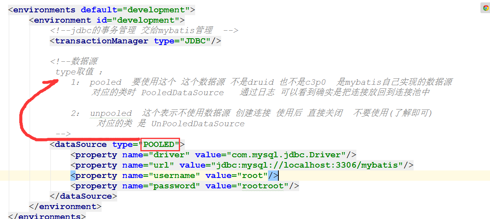

### 11.3. 连接信息抽出

#### 11.3.1. 编写properties文件

在类路径下编写``db.properties``文件

```properties
jdbc.driverClassName=com.mysql.jdbc.Driver
jdbc.url=jdbc:mysql://localhost:3306/mybatis?characterEncoding=UTF-8
jdbc.username=root
jdbc.password=root
```

#### 11.3.2. 加载配置文件

在``mybatis-config.xml``中的``configuration标签``中配置

```xml
<!--加载属性文件，这里不加classpath-->
<properties resource="db.properties"/>
```

#### 11.3.3. 读取配置文件

数据源读取属性文件中的值：

```xml
<?xml version="1.0" encoding="UTF-8"?>
<!--mybaits全局配置文件的约束-->
<!DOCTYPE configuration
        PUBLIC "-//mybatis.org//DTD Config 3.0//EN"
        "http://mybatis.org/dtd/mybatis-3-config.dtd">


<!--配置信息 -->
<configuration>

    <!--加载属性文件-->
    <properties resource="db.properties"/>

    <environments default="development">
        <environment id="development">
            <!--jdbc的事务管理 交给mybatis管理  -->
            <transactionManager type="JDBC"/>
            <!--数据源 -->
            <dataSource type="POOLED">
                <property name="driver" value="${jdbc.driverClassName}"/>
                <property name="url" value="${jdbc.url}"/>
                <property name="username" value="${jdbc.username}"/>
                <property name="password" value="${jdbc.password}"/>
            </dataSource>
        </environment>
    </environments>
    <mappers>
        <!--<mapper resource="org/mybatis/example/BlogMapper.xml"/>-->
        <mapper resource="com/xyz/code/mapper/UserMapper.xml"></mapper>
    </mappers>
</configuration>
```

### 11.4. 类型别名问题

> 我们的 参数类型 和 返回值类型  如果是引用类型 可以起别名来简化书写

#### 11.4.1. 类型起别名

* 方式一：

```xml
  <typeAliases>
       <typeAlias type="com.xyz.code.entity.User" alias="user"/>
   </typeAliases>
```

  

* 方式二：（推荐）

```xml
   <typeAliases>
        <!--指定包名时  别名就是包中对应类的类名  不区分大小写-->
      <package name="com.xyz.code.entity"/>
   </typeAliases>
```

#### 11.4.2. 使用别名

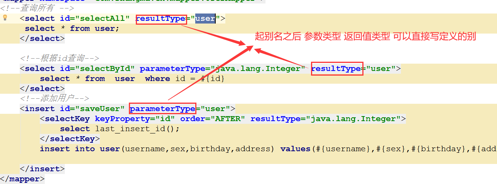

### 11.5. mapper的resources属性值

```properties
/是文件夹的形式

.是包的形式
```

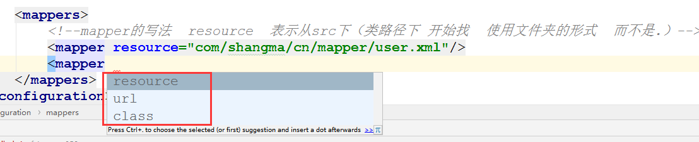

#### 11.5.1. resource属性

> 这个属性的值 是类路径下的资源

```xml
   <mappers>
        <!--mapper的写法  resource  表示从src下（类路径下 开始找  使用文件夹的形式  而不是.）-->
        <mapper resource="com/xyz/code/mapper/UserMapper.xml"/>  
    </mappers>
```

#### 11.5.2. url属性

> 这个属性的值 表示完整路径 带盘符 带协议，相当于http中的url

```xml
    <mappers>
		<mapper url="file:///F:/mybaits01/src/com/xyz/code/mapper/UserMapper.xml"/>
    </mappers>
```

#### 11.5.3. class属性

> 这个属性值  表示 mapper接口的完整路径 

**要求：接口名称要和mapper文件名一致 并且在同一个目录下**

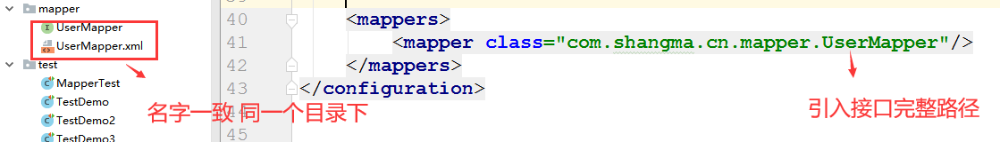

#### 11.5.4. 开发中的写法(package)

> 上面单独写mapper都不用
>
> 直接写包名 这样的话 如果mapper映射文件比较多的时候 可以统一设置 
>
> 不需要再一个一个单独设置了

**要求：mapper接口名称要和mapper文件名一致 并且在同一个目录下**

```xml
    <mappers>
        <!--同包同名-->
        <package name="com.xyz.code.mapper"/>
    </mappers>
```

## 12.映射文件

### 12.1. parameterType

*  表示参数类型 
* 取值
  * 基本数据类型
  * map
  * 自定义类型
  * 包装类

#### 12.1.1. 基本数据类型(四类八种)

```xml
    <!--
     基本数据类型 
      parameterType="java.lang.Integer" 可以写包装类 类的完整路径
      parameterType="int"   可以写别名   
    -->
    <select id="selectById" parameterType="int" resultType="user">
        select * from  user  where id = #{id}
    </select>
```

#### 12.1.2. 实体类

```xml
    <!--
    如果是实体类 
    parameterType="com.xyz.code.entity.User" 写类的完整路径 
    如果起了别名
      例如 
         <typeAliases>
            <package name="com.xyz.code.entity"/>
          </typeAliases> 
          
      则可以写别名  
     parameterType="user"
     
     则使用时 #{}是这个实体类中的属性名 
    
    -->
    <insert id="saveUser" parameterType="user">
        <selectKey keyProperty="id" order="AFTER" resultType="java.lang.Integer">
            select last_insert_id();
        </selectKey>
        insert into user(username,sex,birthday,address) values(#{username},#{sex},#{birthday},#{address})
    </insert>
```

#### 12.1.3. 包装类（这里对查询条件的封装）

为什么使用包装类，因为把查询条件封装是mybatis规范

* 创建包装类

```java
@Data
@NoArgsConstructor
@AllArgsConstructor
@Builder
@Accessors(fluent = false,chain = true)
public class UserExt {
  
    private User user;
  
    private String like="小";
}
```

* 在userMapper接口中添加内容

```java
// 模糊查询
List<User> search(UserExt userExt);
```

* 编写映射文件 

```xml
     <select id="search" parameterType="com.xyz.code.entity.UserExt" resultType="com.xyz.code.entity.User">
         <!--多层取值用.-->
          select * from user where sex=#{user.sex} and username like '%${like}%'
      </select>
```

* 测试

```java
  	  @Test
      public  void  testMapper() throws IOException {
          
          String path = "mybaits-config.xml";
        InputStream in = Resources.getResourceAsStream(path);
  
        SqlSessionFactory sqlSessionFactory = new SqlSessionFactoryBuilder().build(in);
  
        //设置为true时 自动提交事务
        SqlSession sqlSession = sqlSessionFactory.openSession(true);
  
          //getMapper表示底层使用了动态代理
          UserMapper mapper = sqlSession.getMapper(UserMapper.class);
          
          //封装条件的类
          UserExt userExt  = new UserExt().setUser(new User().setSex("男"));
          List<User> users = mapper.searchUser(userExt);
          users.forEach(user1 -> System.out.println(user1));

          //关闭sql会话与流
          sqlSession.close();
          in.close();//流不一定需要关，因为不是new的
      }
```

### 12.2. resultType

> 返回值类型 

**注意点：返回单个实体类和实体类集合时 mapper映射文件中的resultType的类型是一样的**，

**问题：这种单独resultType的方式 依赖于 属性名和表中的列名一致  所以数据会封装到实体类中**

### 12.3. resultMap

> 如果表中的字段和实体类中的属性名不一致时  我们需要使用  resultMap

* 第一步 修改表中字段

  

  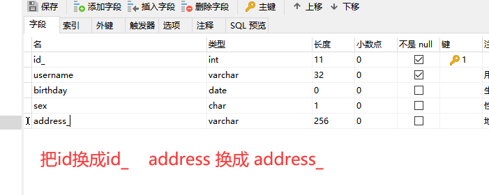

* 第二步：使用resultmap 设置属性和别名的对应关系

  在UserMapper.xml文件中添加resultMap

```xml
      <!--
      id属性  表示resultmap的唯一标识  不能重复  唯一的  随意写
      type  表示返回值的类型  或者可以理解为 指定的是哪个类，即表对应的类
  
      result 表示  实体类属性和表的别名的对应关系
      column：表示表的列
      property: 表示实体类属性名
  
      如果列是id（主键）的话 ,可以不使用id标签，但还是推荐使用id标签
      -->
  
      <resultMap id="resultMap1" type="com.xyz.code.entity.User">
          <id property="id" column="id"></id>
          <result property="username" column="username"></result>
          <result property="birthday" column="birthday"></result>
          <result property="sex" column="sex"></result>
          <result property="address" column="address"></result>
      </resultMap>
```

* 第三步 : 使用resultMap 

```xml
<!--resultMap属性值就是resultMap标签的id值-->
  <select id="search" parameterType="com.xyz.code.entity.UserExt" resultMap="resultMap1">
      <!--多层取值用.-->
      select * from user  and sex=#{user.sex} and username like '%${like}%'
  </select>
```

## 13.sql 代码片

### 13.1. 问题演示

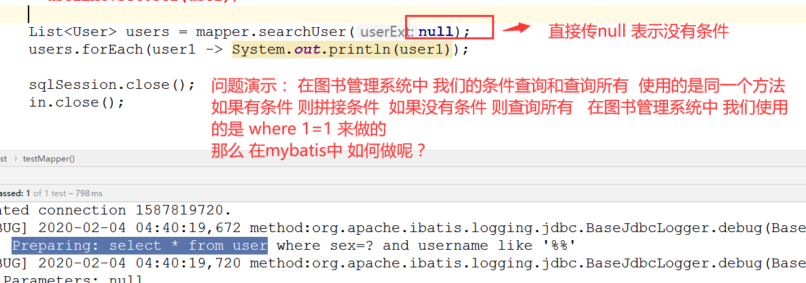

```properties
这里如果查询条件是null,则查询语句变为select * from user where sex=? and username like '%%'，
查询结果为空，显然我们要的是如果传参为null时查询所有，而这里的结果为空不是我们想要的结果。
显然我们要拼接sql语句实现上述需求
```

### 13.2. if的写法

```xml
    <select id="searchr" parameterType="userExt" resultMap="resultMap1">
        select *  from user where 1=1
        <if test="user!=null">
           and sex=#{user.sex}
        </if>
        <if test="like!=null and like != '' ">
          and  username like '%${lile}%'
        </if>
    </select>
```

### 13.3. where的写法

相当于`wehere 1 = 1`转成`where标签`

```java
<select id="search" parameterType="userExt" resultMap="resultMap1">
	select *  from user
    <where>
    	<if test="user!=null">
    		and sex=#{user.sex}
		</if>
		<if test="like!=null and like != '' ">
   			and  username like '%${lile}%'
    	</if>
    </where>
</select>
```

### 13.4. 其他写法(sql标签与include标签)

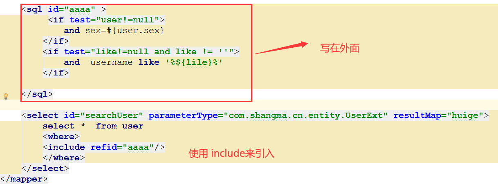

### 13.5. foreach标签使用

* 使用场景 : 查询多个id的用户信息

  > select * from  user where id in(x,x,x)

* mapper接口中添加方法

  在entity包下建UserExt2类，这里用UserExt2封装的查询条件的 

```java
  @Data
  @NoArgsConstructor
  @AllArgsConstructor
  @Builder
  @Accessors(fluent = false,chain = true)
  public class UserExt2 {
      private List<Integer> Ids;
  }
```

  UserMapper接口中加入代码：

```java
  //根据ids查询
  List<User> selectByIds(UserExt2 userExt);
```

* 编写mapper文件

```xml
    <!--
      collection 要遍历的集合
      open 表示开始的内容
      close 表示结束的内容
      separator 表示分割的内容
      item  表示每次遍历出来的内容
      -->
  
      <select id="selectByIds" parameterType="userExt2" resultMap="resultMap1">
          select * from user
          <where>
              <if test="ids !=null and ids.size>0">
                  and id in
                  <foreach collection="ids" open="(" close=")" separator="," item="id">
                      #{id}
                  </foreach>
              </if>
          </where>
      </select>
```

* 测试

```java
     @Test
      public void testMapper2() throws IOException {
  
          String path = "mybatis-config.xml";
        InputStream in = Resources.getResourceAsStream(path);
  
        SqlSessionFactory sqlSessionFactory = new SqlSessionFactoryBuilder().build(in);
  		//设置为true时 自动提交事务
          SqlSession sqlSession = sqlSessionFactory.openSession(true);
          
          UserMapper mapper = sqlSession.getMapper(UserMapper.class);
          
          List<Integer> list = new ArrayList<>();
          list.add(28);
          list.add(29);
          list.add(30);
          list.add(31);
          UserExt2 userExt = new UserExt2();
        userExt.setIds(list);
          
          List<User> users = mapper.selectByIds(null);
          
          users.forEach(user1 -> System.out.println(user1));
  
          sqlSession.close();
          in.close();
      }
```

## 14.mybatis中的多表关系

> 实际开发中，表和表之间存在一定的关系。这种关系不一定需要数据库中的约束，例如外键。表的关系有如下几种：

* 一对一
* 一对多
* 多对多

### 14.1. 环境搭建

#### 14.1.1. 建表建库

```mysql
CREATE TABLE `cart`  (
  `cartId` varchar(255) CHARACTER SET utf8 COLLATE utf8_general_ci NOT NULL,
  `userId` int(11) NULL DEFAULT NULL,
  `totalnum` int(11) NULL DEFAULT NULL,
  `totalmoney` double(255, 0) NULL DEFAULT NULL,
  PRIMARY KEY (`cartId`) USING BTREE
) ENGINE = InnoDB CHARACTER SET = utf8 COLLATE = utf8_general_ci ROW_FORMAT = Compact;

INSERT INTO `cart` VALUES ('4275a23c41694cc0ae54f2a8d97b024b', 5, 1, 129);
INSERT INTO `cart` VALUES ('9e96b8b3a71c4700bfc0a4b164a3887e', 4, 3, 9664);


CREATE TABLE `cartitem`  (
  `cartItemId` varchar(255) CHARACTER SET utf8 COLLATE utf8_general_ci NOT NULL,
  `cartId` varchar(255) CHARACTER SET utf8 COLLATE utf8_general_ci NULL DEFAULT NULL,
  `pid` varchar(255) CHARACTER SET utf8 COLLATE utf8_general_ci NULL DEFAULT NULL,
  `pnum` int(11) NULL DEFAULT NULL,
  `pmoney` double(255, 0) NULL DEFAULT NULL,
  PRIMARY KEY (`cartItemId`) USING BTREE
) ENGINE = InnoDB CHARACTER SET = utf8 COLLATE = utf8_general_ci ROW_FORMAT = Compact;


INSERT INTO `cartitem` VALUES ('5c8334e949eb471ca32d8d2c2d5db9ed', '9e96b8b3a71c4700bfc0a4b164a3887e', '1d062d5fcaf147468aa325af6715df18', 1, 5666);
INSERT INTO `cartitem` VALUES ('b6a42a8be7584c269399d67b3d2b7452', '9e96b8b3a71c4700bfc0a4b164a3887e', '082d077043e74f08b5c8e82c33990d05', 2, 3998);
INSERT INTO `cartitem` VALUES ('ff81edf0755d4f5e8e5475745185de2a', '4275a23c41694cc0ae54f2a8d97b024b', '4e6bc5c119a848da8678e6a4d3ec1057', 1, 129);


CREATE TABLE `goods`  (
  `pid` varchar(255) CHARACTER SET utf8 COLLATE utf8_general_ci NOT NULL,
  `pname` varchar(255) CHARACTER SET utf8 COLLATE utf8_general_ci NULL DEFAULT NULL,
  `price` double(10, 2) NULL DEFAULT NULL,
  `pimg` varchar(255) CHARACTER SET utf8 COLLATE utf8_general_ci NULL DEFAULT NULL,
  `pdesc` varchar(255) CHARACTER SET utf8 COLLATE utf8_general_ci NULL DEFAULT NULL,
  PRIMARY KEY (`pid`) USING BTREE
) ENGINE = InnoDB CHARACTER SET = utf8 COLLATE = utf8_general_ci ROW_FORMAT = Compact;


INSERT INTO `goods` VALUES ('082d077043e74f08b5c8e82c33990d05', '手机', 1999.00, '/images/shouji.jpg', '手机很快');
INSERT INTO `goods` VALUES ('1b64510f93104a7886c334351e465b80', '保暖内衣', 56.00, '/images/baonuan.jpg', '很暖和');
INSERT INTO `goods` VALUES ('1d062d5fcaf147468aa325af6715df18', '电视', 5666.00, '/images/dianshi.jpg', '1080P');
INSERT INTO `goods` VALUES ('224c796995744ae5a22f6d8d72eefc45', '电脑', 8888.00, '/images/diannao.jpg', '128G内存');
INSERT INTO `goods` VALUES ('46ea4fabaf8741a3a455e30c83607086', '卫衣', 99.00, '/images/weiyi.jpg', '裹得很严实');
INSERT INTO `goods` VALUES ('4e6bc5c119a848da8678e6a4d3ec1057', '吹风机', 129.00, '/images/chuifengji.jpg', '风很大');INSERT INTO `mybatis`.`user`(`id`, `username`, `birthday`, `sex`, `address`) VALUES (5, '购买员', '2021-09-20', '男', '上海')


INSERT INTO `mybatis`.`user`(`id`, `username`, `birthday`, `sex`, `address`) VALUES (5, '购买员5', '2021-09-20', '男', '上海');
INSERT INTO `mybatis`.`user`(`id`, `username`, `birthday`, `sex`, `address`) VALUES (4, '购买员4', '2021-09-13', '女', '上海');
```


#### 14.1.2. 表关系介绍

* 一个用户只有一个购物车------->   一对一  
* 一个购物车有多个购物车项 ------> 一对多 
* 一个购物车项 对应一个商品 ------->  一对一 
* 一个用户可以勾选多个商品  一个商品也可以被多个用户勾选  ------> 多对多

#### 14.1.3. 编写实体类

* 购物车

```java
@Data
@NoArgsConstructor
@AllArgsConstructor
@Builder
@Accessors(fluent = false, chain = true)
public class Cart implements Serializable {
    
      private String cartId;//购物车id

      private Integer userId; //用户id

      private Integer totalnum; //总数量
  
      private double totalmoney;//总钱数
}
```

* 购物车中的每一条

```java
@Data
@NoArgsConstructor
@AllArgsConstructor
@Builder
@Accessors(fluent = false, chain = true)
public class CartItem implements Serializable {
  
    private String cartItemId; //购物车项id
  
    private String cartId;//购物车id
  
    private String pid; //商品id
  
      private Integer pnum; //商品数量
  
    private Double pmoney; // 小计
}
```

* 商品

```java
@Data
@NoArgsConstructor
@AllArgsConstructor
@Builder
@Accessors(fluent = false, chain = true)
public class Goods implements Serializable {
  
    private String pid; //商品id
  
    private String pname; //商品名称
  
    private Double price; //商品价格
  
      private String pimg; //商品图
  
    private String pdesc;//商品描述
}
```

### 14.2. 一对一的写法

* 需求 查询用户以及他的购物车信息

#### 14.2.1. 修改User实体类

在User类中添加Cart属性，提供get/set方法

```java
@Data
@NoArgsConstructor
@AllArgsConstructor
@Builder
@Accessors(fluent = false, chain = true)
public class User implements Serializable {
    private Integer id;
    private String username;// 用户姓名
    private String sex;// 性别
    private Date birthday;// 生日
    private String address;// 地址

    //一个用户持有一个购物车----新增
    private Cart cart;
}
```

#### 14.2.2. 编写Mapper

```java
//查询用户与用户购物车
List<User> selectUserAndUserCart();
```

#### 14.2.3. 编写映射文件

```xml-dtd
    <resultMap id="selectUserAndUserCartResultMap" type="user">
        <id property="id" column="id"></id>
        <result property="username" column="username"></result>
        <result property="birthday" column="birthday"></result>
        <result property="sex" column="sex"></result>
        <result property="address" column="address"></result>
        <!--
            association描述的是一对一的关系
            property属性表示关联的对象，即另一个对象的属性名
            javaType属性表示关联对象属性的java类型
            
            id,result还是orm(对象关系型数据库模型)的对应
        -->
        <association property="cart" javaType="cart">
            <id property="cartId" column="cartId"></id>
            <result property="userId" column="userId"></result>
            <result property="totalnum" column="totalnum"></result>
            <result property="totalmoney" column="totalmoney"></result>
        </association>
    </resultMap>


    <!--查询用户与用户购物车-->
    <select id="selectUserAndUserCart" resultMap="selectUserAndUserCartResultMap">
        select * from user inner join cart on user.id = cart.userId
    </select>
```

#### 14.2.4. 测试以及结果

```java
    @Test
    public void testMapper3() throws IOException {

        String path = "mybatis-config.xml";
        InputStream in = Resources.getResourceAsStream(path);

        SqlSessionFactory sqlSessionFactory = new SqlSessionFactoryBuilder().build(in);

        SqlSession sqlSession = sqlSessionFactory.openSession(true);//设置为true时 自动提交事务
        UserMapper mapper = sqlSession.getMapper(UserMapper.class);

        //查询
        List<User> users = mapper.selectUserAndUserCart();
        users.forEach(user1 -> System.out.println(user1));

        sqlSession.close();
        in.close();
    }
```

测试结果：

```properties
User(id=5, username=购买员5, sex=男, birthday=Mon Sep 20 00:00:00 CST 2021, address=上海, cart=Cart(cartId=4275a23c41694cc0ae54f2a8d97b024b, userId=5, totalnum=1, totalmoney=129.0))
User(id=4, username=购买员4, sex=女, birthday=Mon Sep 13 00:00:00 CST 2021, address=上海, cart=Cart(cartId=9e96b8b3a71c4700bfc0a4b164a3887e, userId=4, totalnum=3, totalmoney=9664.0))
```

### 14.3. 一对多的写法

* 需求：  查询购物车以及购物车中的项

#### 14.3.1. 修改购物车实体类

```java
@Data
@NoArgsConstructor
@AllArgsConstructor
@Builder
@Accessors(fluent = false, chain = true)
public class Cart implements Serializable {

    private String cartId;//购物车id

    private Integer userId; //用户id

    private Integer totalnum; //总数量

    private double totalmoney;//总钱数

    //一个购物车含有多个购物车项目----新增
    private List<CartItem> cartItems;
}
```

#### 14.3.2. 编写Mapper

```java
public interface CartMapper {
    List<Cart> selectCartAndCartItem();
}
```

#### 14.3.3. 编写映射文件

要注意mybatis-config.xml中配置：这样就能找到多个映射文件

```xml-dtd
    <mappers>
        <!--<mapper resource="org/mybatis/example/BlogMapper.xml"/>-->
        <package name="com.xyz.code.mapper"/>
    </mappers>
```

编写CartMapper.xml文件

```xml-dtd
<?xml version="1.0" encoding="UTF-8"?>
<!DOCTYPE mapper
        PUBLIC "-//mybatis.org//DTD Mapper 3.0//EN"
        "http://mybatis.org/dtd/mybatis-3-mapper.dtd">
<mapper namespace="com.xyz.code.mapper.CartMapper">

    <select id="selectCartAndCartItem" resultMap="selectCartAndCartItemResultMap">
        select * from cart inner join cartItem on cart.cartId=cartItem.cartId;
    </select>

    <resultMap id="selectCartAndCartItemResultMap" type="cart">
        <id property="cartId" column="cartId"></id>
        <result property="userId" column="userId"></result>
        <result property="totalnum" column="totalnum"></result>
        <result property="totalmoney" column="totalmoney"></result>

        <!--
            collection描述的是一对多的关系，多的一方
            property表示在多的一方在一的一方的属性名
            ofType表示属性的类型，集合的话表示是元素的类型

            id,result还是表示orm的对应关系
        -->
        <collection property="cartItems" ofType="cartItem">
            <id property="cartItemId" column="cartItemId"></id>
            <result property="cartId" column="cartId"></result>
            <result property="pid" column="pid"></result>
            <result property="pnum" column="pnum"></result>
            <result property="pmoney" column="pmoney"></result>
        </collection>
    </resultMap>

</mapper>
```

#### 14.3.4. 测试结果

代码：

```java
public class CartMapperTest {
    @Test
    public void testMapper3() throws IOException {

        String path = "mybatis-config.xml";
        InputStream in = Resources.getResourceAsStream(path);

        SqlSessionFactory sqlSessionFactory = new SqlSessionFactoryBuilder().build(in);
		//设置为true时 自动提交事务
        SqlSession sqlSession = sqlSessionFactory.openSession(true);
        CartMapper mapper = sqlSession.getMapper(CartMapper.class);

        //查询
        List<Cart> carts = mapper.selectCartAndCartItem();
        carts.forEach(cart -> System.out.println(cart));

        sqlSession.close();
        in.close();
    }
}
```

结果：

```properties
Cart(cartId=9e96b8b3a71c4700bfc0a4b164a3887e, userId=4, totalnum=3, totalmoney=9664.0, cartItems=[CartItem(cartItemId=5c8334e949eb471ca32d8d2c2d5db9ed, cartId=9e96b8b3a71c4700bfc0a4b164a3887e, pid=1d062d5fcaf147468aa325af6715df18, pnum=1, pmoney=5666.0), CartItem(cartItemId=b6a42a8be7584c269399d67b3d2b7452, cartId=9e96b8b3a71c4700bfc0a4b164a3887e, pid=082d077043e74f08b5c8e82c33990d05, pnum=2, pmoney=3998.0)])
Cart(cartId=4275a23c41694cc0ae54f2a8d97b024b, userId=5, totalnum=1, totalmoney=129.0, cartItems=[CartItem(cartItemId=ff81edf0755d4f5e8e5475745185de2a, cartId=4275a23c41694cc0ae54f2a8d97b024b, pid=4e6bc5c119a848da8678e6a4d3ec1057, pnum=1, pmoney=129.0)])
```

### 14.4. 多对多的写法

#### 14.4.1. 修改cartItem实体类（与goods一对一）

```java
@Data
@NoArgsConstructor
@AllArgsConstructor
@Builder
@Accessors(fluent = false, chain = true)
public class CartItem implements Serializable {

    private String cartItemId; //购物车项id

    private String cartId;//购物车id

    private String pid; //商品id

    private Integer pnum; //商品数量

    private Double pmoney; // 小计
    //cartItem与goods一对一
    private Goods goods;
}
```

#### 14.4.2. 编写Mapper

在UserMapper接口加入以下内容：

```xml
//查询用户与商品,user通过cart,cartItem查出goods
List<User> selectUserAndGoods();
```

#### 14.4.3. 编写映射文件

根据表与表之间的关系，对象与对象之间的关系依次用collection和association标签填充完成

```xml-dtd
    <!--查询用户与商品-->
    <select id="selectUserAndGoods" resultMap="selectUserAndGoodsResultMap">
    SELECT
	    `user`.*,
	    cart.*,
	    cartitem.*,
	    goods.* 
    FROM
	    `user`
	    INNER JOIN cart ON `user`.id = cart.userId
	    INNER JOIN cartitem ON cart.cartId = cartitem.cartId
	    INNER JOIN goods ON cartitem.pid = goods.pid
    </select>
    <resultMap id="selectUserAndGoodsResultMap" type="user">
        <id property="id" column="id"></id>
        <result property="username" column="username"></result>
        <result property="birthday" column="birthday"></result>
        <result property="sex" column="sex"></result>
        <result property="address" column="address"></result>

        <!--
            association描述的是一对一的关系
            property属性表示关联的对象，即另一个对象的属性名
            javaType属性表示关联对象属性的java类型

            id,result还是orm(对象关系型数据库模型)的对应
        -->
        <association property="cart" javaType="cart">
            <id property="cartId" column="cartId"></id>
            <result property="userId" column="userId"></result>
            <result property="totalnum" column="totalnum"></result>
            <result property="totalmoney" column="totalmoney"></result>

            <!--
                collection描述的是一对多的关系，多的一方
                property表示在多的一方在一的一方的属性名
                ofType表示属性的类型，集合的话表示是元素的类型

                id,result还是表示orm的对应关系
            -->
            <collection property="cartItems" ofType="cartItem">
                <id property="cartItemId" column="cartItemId"></id>
                <result property="cartId" column="cartId"></result>
                <result property="pid" column="pid"></result>
                <result property="pnum" column="pnum"></result>
                <result property="pmoney" column="pmoney"></result>

                <!--carItem与goods一对一-->
                <association property="goods" javaType="goods">
                    <id property="pid" column="pid"></id>
                    <result property="pname" column="pname"></result>
                    <result property="price" column="price"></result>
                    <result property="pimg" column="pimg"></result>
                    <result property="pdesc" column="pdesc"></result>
                </association>
            </collection>
        </association>
    </resultMap>
```

#### 14.4.4. 测试

测试代码：

```java
    @Test
    public void testMapper4() throws IOException {

        String path = "mybatis-config.xml";
        InputStream in = Resources.getResourceAsStream(path);

        SqlSessionFactory sqlSessionFactory = new SqlSessionFactoryBuilder().build(in);

        SqlSession sqlSession = sqlSessionFactory.openSession(true);//设置为true时 自动提交事务
        UserMapper mapper = sqlSession.getMapper(UserMapper.class);

        //查询
        List<User> users = mapper.selectUserAndGoods();
        users.forEach(user -> System.out.println(user));

        sqlSession.close();
        in.close();
    }
```

## 15. mybatis的延迟加载

> 延迟加载又叫懒加载，表示在关联查询中，当使用关联的数据时再去加载，没有使用则先不加载，提高数据库的性能和效率 。
>
> resultMap中的association和collection标签具有延迟加载的功能。

**拿购物车和购物车详情为例，但是注意 之前的写法是内连接的方式  一下子全部查出来了  我们还要改造我们的映射文件**

原来是多表关联查询，现在改成单表查询，且懒加载

### 15.1. setting配置

在mybatis-config.xml文件中配置：

```xml
<!--开启懒加载-->  
<settings>
    <setting name="lazyLoadingEnabled" value="true"/>
</settings>
```

### 15.2. 编写cartItemMapper接口

```java
public interface CartItemMapper {
    //原来是在resultMap中通过collection标签多表关联查询，
    //如果知道关联条件，就可单表查询
    //我们以cart与cartItem间的多表关联查询转成懒加载为例
    List<CartItem> selectCartItemByCartId();
}
```

### 15.3. 编写映射文件

编写CartItemMapper.xml文件

```xml-dtd
<?xml version="1.0" encoding="UTF-8"?>
<!DOCTYPE mapper
        PUBLIC "-//mybatis.org//DTD Mapper 3.0//EN"
        "http://mybatis.org/dtd/mybatis-3-mapper.dtd">
<mapper namespace="com.xyz.code.mapper.CartItemMapper">

    <select id="selectCartItemByCartId" parameterType="string" resultType="cartItem">
        select * from cartItem where cartId = #{cartId}
    </select>

</mapper>
```

### 15.4. 修改cart的映射文件

修改CartMapper.xml文件

修改这前是内连接的方式查询无法懒加载，要修改成单表查询

在关联部分修改：即1、resultMap标签中association或collection标签处修改

​								   2、select标签sql语句改成单表查询

```xml-dtd
<?xml version="1.0" encoding="UTF-8"?>
<!DOCTYPE mapper
        PUBLIC "-//mybatis.org//DTD Mapper 3.0//EN"
        "http://mybatis.org/dtd/mybatis-3-mapper.dtd">
<mapper namespace="com.xyz.code.mapper.CartMapper">
    <select id="selectCartAndCartItem" resultMap="selectCartAndCartItemResultMap">
		select * from cart ; <!--2、select标签sql语句改成单表查询-->
    </select>
    <resultMap id="selectCartAndCartItemResultMap" type="cart">
        <id property="cartId" column="cartId"></id>
        <result property="userId" column="userId"></result>
        <result property="totalnum" column="totalnum"></result>
        <result property="totalmoney" column="totalmoney"></result>

        <!--
            collection描述的是一对多的关系，多的一方
            property表示在多的一方在一的一方的属性名
            ofType表示属性的类型，集合的话表示是元素的类型
    
            id,result还是表示orm的对应关系
        -->
		<!--
			1、resultMap标签中association或collection标签处修改
			select表示懒加载时要调用的类中的方法
			column表示方法需要的参数对应表中的列
		-->
        <collection property="cartItems" ofType="cartItem"
                    select="com.xyz.code.mapper.CartItemMapper.selectCartItemByCartId"
                    column="cartId"
        >
            <id property="cartItemId" column="cartItemId"></id>
            <result property="cartId" column="cartId"></result>
            <result property="pid" column="pid"></result>
            <result property="pnum" column="pnum"></result>
            <result property="pmoney" column="pmoney"></result>
        </collection>
    </resultMap>

</mapper>
```

### 15.5. 测试延迟加载

略

## 16. mybatis的缓存

### 16.1. 缓存的了解

> 所有的缓存都是一个思想    数据存在一个地方（例如redis中）

* 查询数据  获得结果 此时存缓存的地方还没有数据 
* 把查询出的结果 放到存缓存的地方 让有数据 
* 再查询时  先判断 这个地方有没有数据 如果有 直接拿出来 则不会再查数据库 
* 当修改时 清空缓存

### 16.2. Mybatis的一级缓存

> mybatis的一级缓存 存在内存中  是sqlSession级别的缓存   缓存的结构是个Map集合  
>
> map的key 是sql语句 条件 等等信息组成的唯一值
>
> map的value 就是查询出来的结果 
>
>  mybatis的一级缓存 默认是开启的

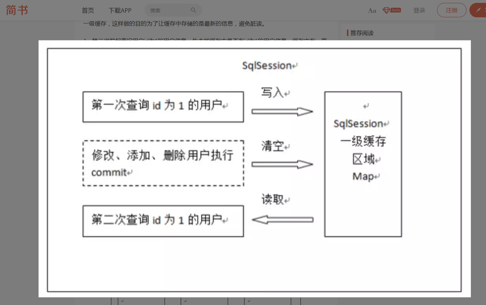

#### 16.2.1. 一级缓存的演示 

> 编写一个测试代码

```java
public class CacheTest {

    @Test
    public void test1() throws IOException {

        String path = "mybatis-config.xml";
        InputStream inputStream = Resources.getResourceAsStream(path);

        SqlSessionFactory sqlSessionFactory = new SqlSessionFactoryBuilder().build(inputStream);
        SqlSession sqlSession = sqlSessionFactory.openSession(true);


        /*
         *  同一个sqlSession查三次，只进行一次数据库查询，也代表一级缓存默认开启
         * */
        UserMapper mapper = sqlSession.getMapper(UserMapper.class);
        System.out.println(mapper.selectAll());
        UserMapper mapper2 = sqlSession.getMapper(UserMapper.class);
        System.out.println(mapper.selectAll());
        UserMapper mapper3 = sqlSession.getMapper(UserMapper.class);
        System.out.println(mapper.selectAll());
        
        //一定要关闭sql会话
        sqlSession.close();

    }
}
```

### 16.3. myBatis的二级缓存

> mybatis的二级缓存 是 sqlsessionFactory级别的缓存   或者说是Mapper或者说 namespace级别的缓存 
>
> 当使用查询时,查询结果会存入对应的namespace中.
>
> 当所属namespace使用增删改时,会清空该namespace中的缓存
>
> 二级缓存可能会存入内存,也可能会存入硬盘
>
> 由于二级缓存可能会存入硬盘,所以需要将对应需要缓存的实体类进行序列化(implements Serializable)。

**myBatis的二级缓存 高版本默认是开启的**

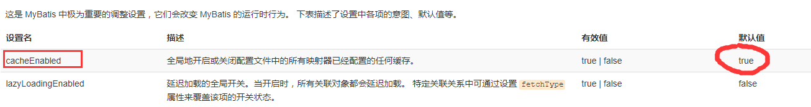

也可以明式地在mybatis-config配置文件的settings标签中声明

```xml
<setting name="cacheEnabled" value="true"/>
```

#### 16.3.1. 演示二级缓存

*  修改实体类 

  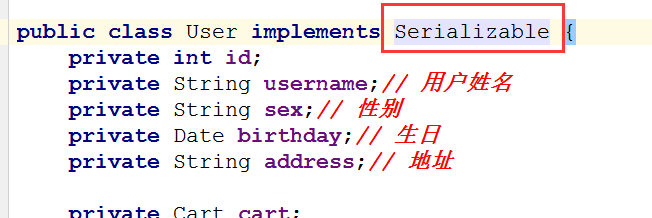

* 修改映射文件 

  在`UserMapper.xml`的`mapper标签`中加入`cache标签`

```xml-dtd
      <cache></cache>
      <!--查询所有,返回的虽然是集合，但类型还是用的元素的类开型-->
      <select id="selectAll" resultType="com.xyz.code.entity.User">
       select * from user
      </select>
```

* 测试

```java
      @Test
      public void test2() throws IOException {
  
          String path = "mybatis-config.xml";
          InputStream inputStream = Resources.getResourceAsStream(path);
  
          SqlSessionFactory sqlSessionFactory = new SqlSessionFactoryBuilder().build(inputStream);
  
          //同1个sqlSessionFactory，3个不同的sqlSession
          SqlSession sqlSession = sqlSessionFactory.openSession(true);
          SqlSession sqlSession2 = sqlSessionFactory.openSession(true);
          SqlSession sqlSession3 = sqlSessionFactory.openSession(true);
  
          /**
           * 在日志中，可以看到开启二级缓存后，同1个sqlSessionFactory只进行1次数据库查询
           */
          UserMapper mapper = sqlSession.getMapper(UserMapper.class);
          System.out.println(mapper.selectAll());
          UserMapper mapper2 = sqlSession2.getMapper(UserMapper.class);
          System.out.println(mapper.selectAll());
          UserMapper mapper3 = sqlSession3.getMapper(UserMapper.class);
          System.out.println(mapper.selectAll());
  
          //关闭sql会话
          sqlSession.close();
          sqlSession2.close();
          sqlSession3.close();
  
      }
```

#### 16.3.2. 局部不使用缓存

使用`useCache="false"`可以指定某个查询不使用缓存

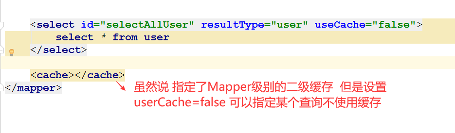

#### 16.3.3. 刷新二级缓存

>默认情况下
>
>如果是select语句，那么flushCache是false。
>
>如果是insert、update、delete语句，那么flushCache是true。
>
>如果查询语句设置成true，那么每次查询都是去数据库查询，即意味着该查询的二级缓存失效。
>
>如果查询语句设置成false，即使用二级缓存，那么如果在数据库中修改了数据，
>
>而缓存数据还是原来的，这个时候就会出现脏读。

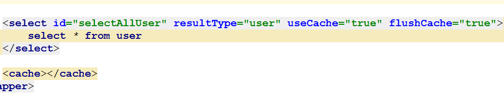

## 17. Mybatis的注解开发  (了解 )

> 使用注解开发 可以不用写 映射文件  

### 17.1. 普通的crud

```java
public interface UserMapper {

    /**
     * 查询所有
     *
     * @Select 注解 表示查询 代替映射文件中的select标签
      */

    @Select("select * from user")
    public List<User> selectAll();


    /**
     * 根据id查询
     * @return
     */
    @Select("select * from user where id = #{userId}")
    public  User selectUserById(Integer userId);


    /**
     * 添加用户
     * @return
     */
    @Insert("insert into user(username,sex,birthday,address) values(#{username},#{sex},#{birthday},#{address})")
    public  void  addUser(User user);


    /**
     * 修改用户
     * @return
     */

    @Update("update user set username=#{username},sex=#{sex},birthday=#{birthday},address=#{address} where id=#{id}")
    public  void  updateUser(User user);

    /**
     * 删除用户
     * @param userId
     */
    @Delete("delete from user where id = #{userId}")
    public  void deleteUserById(Integer userId);

}
```

### 17.2. 属性名和列名不一致的情况

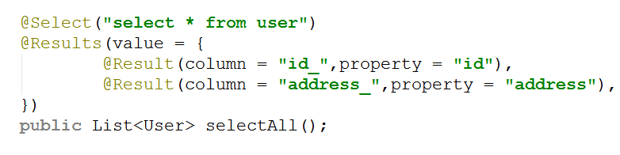

## 18. 探索驼峰命名的规则

### 18.1. 面临的问题

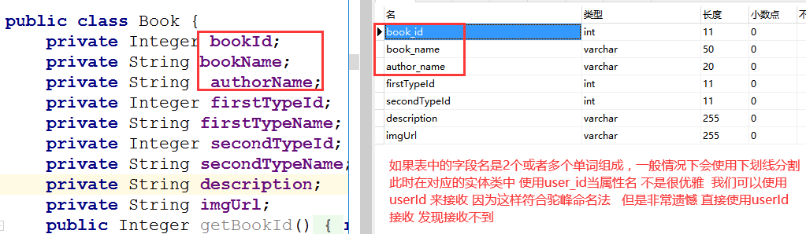

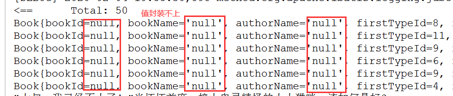

### 18.2. 开启驼峰命名

> 虽然我们可以使用`resultMap`或者`Results注解`进行匹配 但是这样做复杂 实际开发中 遵循驼峰命名非常必要 

```xml
<setting name="mapUnderscoreToCamelCase" value="true"/>
```

* 测试

 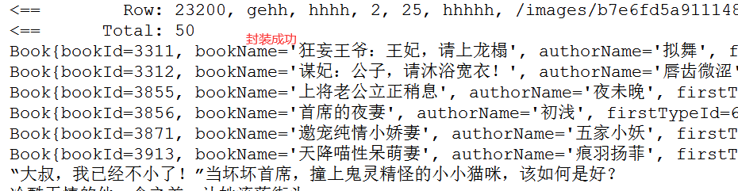

## 19.常见异常

19.1无法找到db.propeties,出现这个问题，只要我们去掉classpath就行

```properties
org.apache.ibatis.exceptions.PersistenceException: 
### Error building SqlSession.
### The error may exist in SQL Mapper Configuration
### Cause: org.apache.ibatis.builder.BuilderException: Error parsing SQL Mapper 
Configuration. Cause: java.io.IOException: Could not find resource 
classpath:db.properties
```

