#  SpringMVC

**spring对web层支持 主要是提供了SpringMVC**

## 1. 什么是MVC

> mvc是web层 一种设计模式   全称是 Model  View  Controller   各个层面做各个层面的事 

MVC是一种软件架构的思想，将软件按照模型、视图、控制器来划分

M：Model，模型层，指工程中的JavaBean，作用是处理数据

JavaBean分为两类：

- 一类称为实体类Bean：专门存储业务数据的，如 Student、User 等
- 一类称为业务处理 Bean：指 Service 或 Dao 对象，专门用于处理业务逻辑和数据访问。

V：View，视图层，指工程中的html或jsp等页面，作用是与用户进行交互，展示数据

C：Controller，控制层，指工程中的servlet，作用是接收请求和响应浏览器

MVC的工作流程： 用户通过视图层发送请求到服务器，在服务器中请求被Controller接收，Controller调用相应的Model层处理请求，处理完毕将结果返回到Controller，Controller再根据请求处理的结果找到相应的View视图，渲染数据后最终响应给浏览器

## 2. SpringMVC的概述

### 2.1  简介

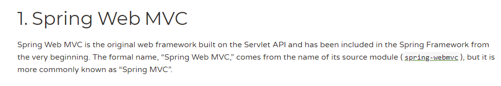

Spring Web MVC是基于Servlet API构建的原始Web框架，并从一开始就包含在Spring Framework中。正式名称“ Spring Web MVC”来自其源模块[spring-webmvc](https://github.com/spring-projects/spring-framework/tree/master/spring-webmvc)的名称， 但它通常被称为“ Spring MVC”。

**简而言之，springMVC对servlet进行封装，避免繁琐的获取表单参数，多余的serlvet服务类等代码**

### 2.2 SpringMVC搭配Tomcat

> Tomcat 10.1.x 适用于 Servlet 6.0、JSP TBD，也即 Jakarta EE 10 platform。
>
> Tomcat 10.0.x 适用于 Servlet 5.0、JSP 3.0，也即 Jakarta EE 9 platform。
>
> Tomcat 9.x 适用于 Servlet 4.0、JSP 2.3，也即 Java EE 8 platform（javax）。
>
> Spring MVC 5.x 适用于 Servlet 4.0，因此，最高只能搭配 Tomcat 9.x 使用。
>
> Spring MVC 6.x 适用于 Servlet 5.0 及以上版本，因此，要搭配 Tomcat 10.x 使用。

## 3. SpringMVC的基本使用

### 3.1. 创建web工程


### 3.2. 导入jar包

在web/WEB-INF/lib目录下导入相关spring包

或使用maven导入依赖

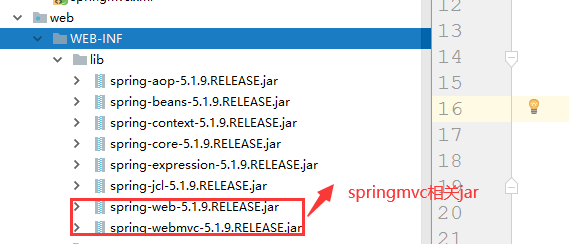

```xml
<dependency>
  <groupId>org.springframework</groupId>
  <artifactId>spring-aop</artifactId>
  <version>5.3.8</version>
</dependency>
<dependency>
  <groupId>org.springframework</groupId>
  <artifactId>spring-beans</artifactId>
  <version>5.3.8</version>
</dependency>
<dependency>
  <groupId>org.springframework</groupId>
  <artifactId>spring-context</artifactId>
  <version>5.3.8</version>
</dependency>
<dependency>
  <groupId>org.springframework</groupId>
  <artifactId>spring-core</artifactId>
  <version>5.3.8</version>
</dependency>
<dependency>
  <groupId>org.springframework</groupId>
  <artifactId>spring-expression</artifactId>
  <version>5.3.8</version>
</dependency>
<dependency>
  <groupId>org.springframework</groupId>
  <artifactId>spring-jcl</artifactId>
  <version>5.3.8</version>
</dependency>
<dependency>
  <groupId>org.springframework</groupId>
  <artifactId>spring-web</artifactId>
  <version>5.3.8</version>
</dependency>
<dependency>
  <groupId>org.springframework</groupId>
  <artifactId>spring-webmvc</artifactId>
  <version>5.3.8</version>
</dependency>
```

### 3.3. 编写配置文件

`web.xml`配置Servlet：

```xml
<servlet>
  <servlet-name>dispacherServlet</servlet-name>
  <servlet-class>org.springframework.web.servlet.DispatcherServlet</servlet-class>
  <!--初始化参数加载配置文件
         注意： key是 固定写法  必须写contextConfigLocation
  -->
  <init-param>
    <param-name>contextConfigLocation</param-name>
    <param-value>classpath:spring-mvc.xml</param-value>
  </init-param>
  <!--tomcat启动时就加载这个类-->
  <load-on-startup>1</load-on-startup>
</servlet>
<servlet-mapping>
  <servlet-name>dispacherServlet</servlet-name>
  <!--/代表除了.jsp的请求都包括(因为jsp也是个特殊的servlet)，/*是所有的请求-->
  <url-pattern>/</url-pattern>
</servlet-mapping>
```

`Spring-mvc.xml`配置：

```xml
<?xml version="1.0" encoding="UTF-8"?>
<beans xmlns="http://www.springframework.org/schema/beans"
       xmlns:xsi="http://www.w3.org/2001/XMLSchema-instance"
       xsi:schemaLocation="http://www.springframework.org/schema/beans http://www.springframework.org/schema/beans/spring-beans.xsd">

    <!--配置处理器映射，将请求映射到某个处理器方法-->
    <bean class="org.springframework.web.servlet.handler.BeanNameUrlHandlerMapping"></bean>
    <!--配置处理器适配器，处理器适配器进行真正调用处理器方法-->
    <bean class="org.springframework.web.servlet.mvc.SimpleControllerHandlerAdapter"></bean>
    <!--配置视图解析器-->
    <bean class="org.springframework.web.servlet.view.InternalResourceViewResolver">
        <property name="prefix" value="/WEB-INF/pages/"></property>
        <property name="suffix" value=".jsp"></property>
    </bean>
    <!--将实现Controller接口的类放到容器中，并起名字-->
    <!--因为配置的处理器映射器为BeanNameUrlHandlerMapping，所以这里的beanName就是请求路径-->
    <bean name="/hello" class="com.xyz.code.controller.MyController"></bean>
</beans>
```

### 3.4. 创建success页面

一般是pages/templates目录

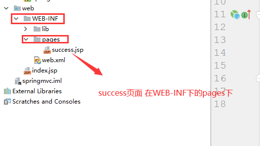


### 3.5. 创建Controller

```java
// 注意这里导入的是Controller接口
import org.springframework.web.servlet.mvc.Controller;
public class MyController implements Controller {
    @Override
    public ModelAndView handleRequest(HttpServletRequest httpServletRequest, HttpServletResponse httpServletResponse) throws Exception {
        ModelAndView mv  = new ModelAndView();
        // 请求域设值
        mv.addObject("msg","hello Springmvc");
        // 设置视图
        mv.setViewName("success");
        return mv;
    }
}
```

### 3.6. 启动tomcat测试

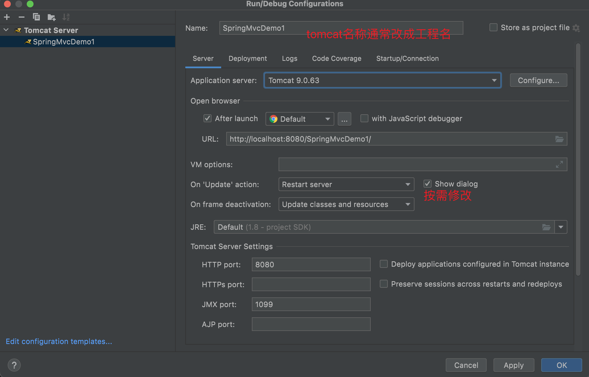

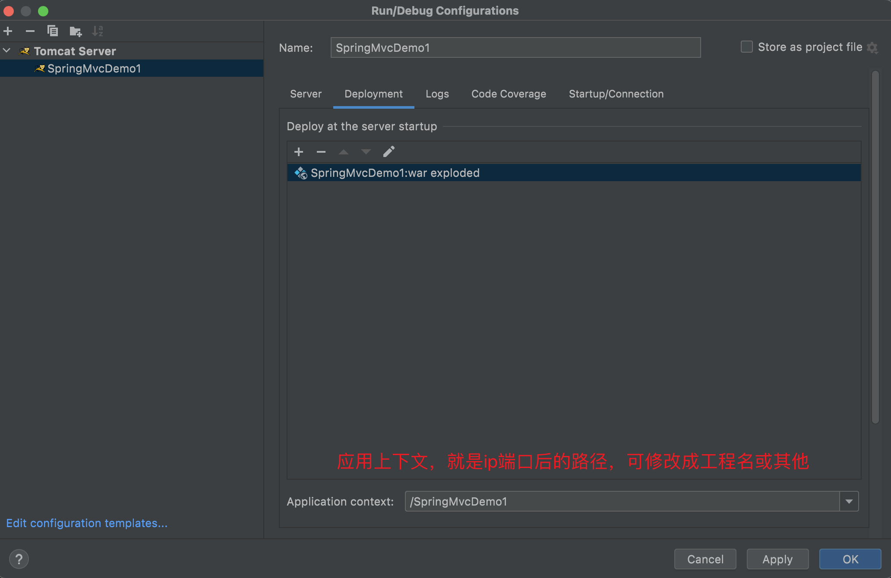

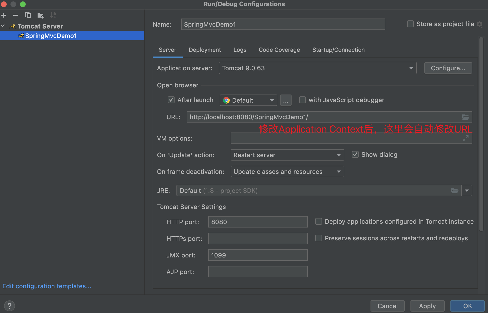

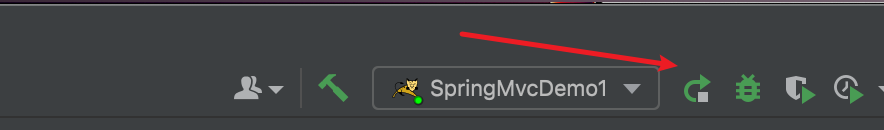

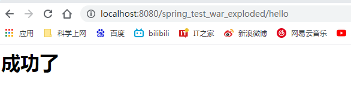

## 4. SpringMVC的执行流程

### 4.1 SpringMvc的执行流程

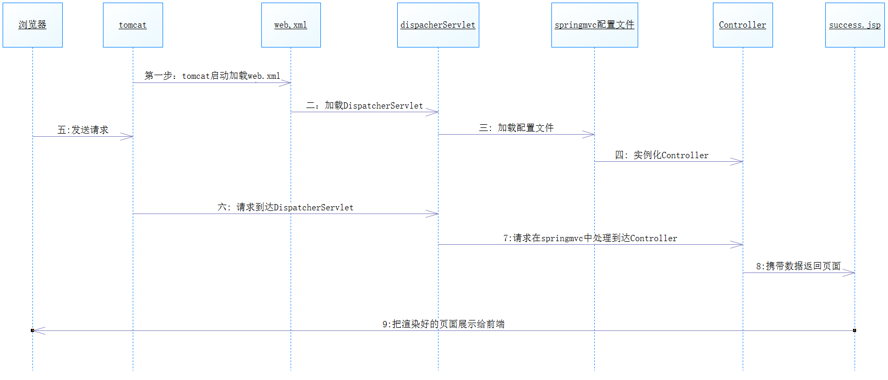

### 4.2. SpringMVC的内部流程


**了解 不同的写法 使用不同的处理器映射器  和不同的处理器适配器**

## 5. 第二种写法(重点)：maven工程

>  我们按照刚才的编码  有很大的问题   我们定义的Controller 只能做一件事  因为就一个实现   并且每次都配置Bean 不是很优雅   

### 5.1 建立maven工程并添加web framework

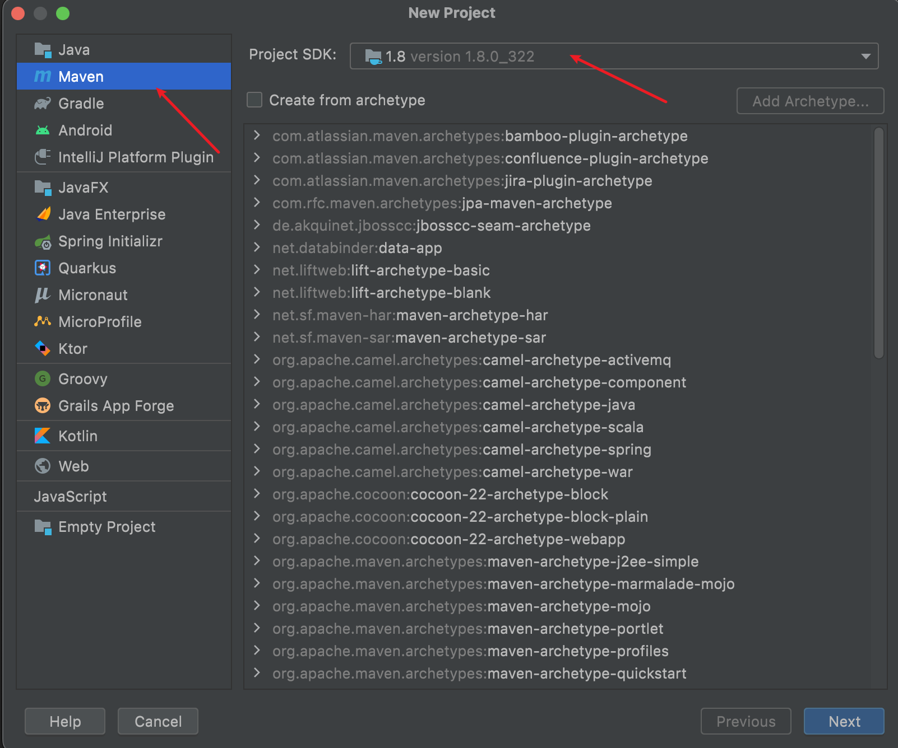

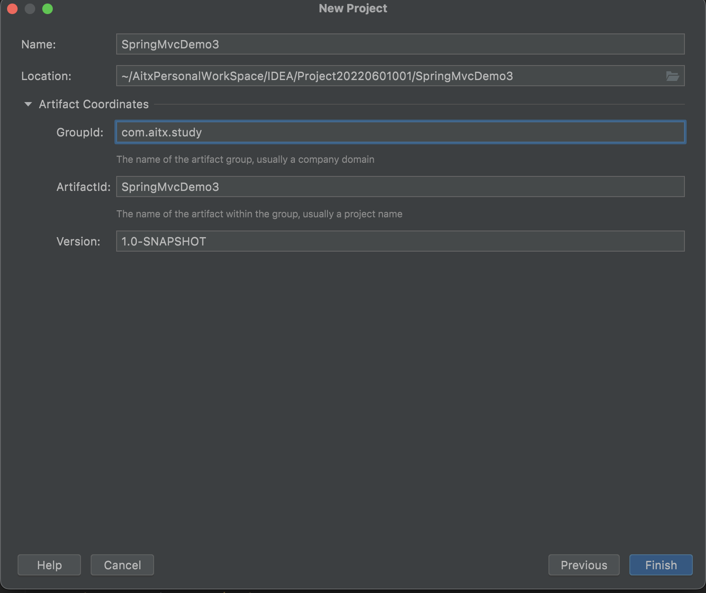

选择file->ProjectStructure后

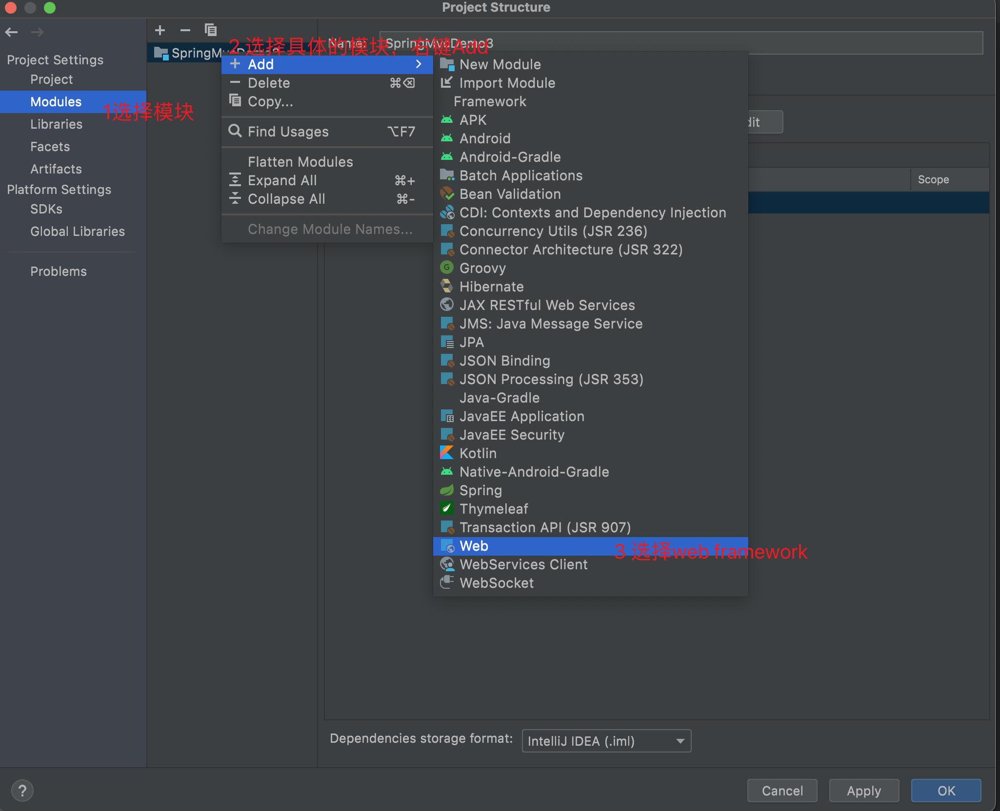


创建成功会有如下所示，webapp有蓝色小圆点

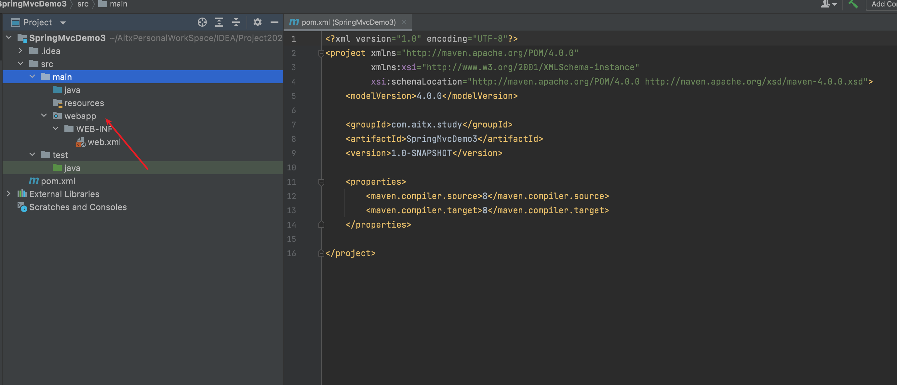

### 5.2 修改pom.xml文件并导入依赖

修改打包方式为war

```xml
<groupId>com.aitx.study</groupId>
<artifactId>SpringMvcDemo3</artifactId>
<version>1.0-SNAPSHOT</version>
<packaging>war</packaging>
```

添加依赖

```xml
<dependencies>
  <dependency>
    <groupId>org.springframework</groupId>
    <artifactId>spring-aop</artifactId>
    <version>5.3.8</version>
  </dependency>
  <dependency>
    <groupId>org.aspectj</groupId>
    <artifactId>aspectjweaver</artifactId>
    <version>1.9.7</version>
  </dependency>
  <dependency>
    <groupId>org.springframework</groupId>
    <artifactId>spring-beans</artifactId>
    <version>5.3.8</version>
  </dependency>
  <dependency>
    <groupId>org.springframework</groupId>
    <artifactId>spring-context</artifactId>
    <version>5.3.8</version>
  </dependency>
  <dependency>
    <groupId>org.springframework</groupId>
    <artifactId>spring-core</artifactId>
    <version>5.3.8</version>
  </dependency>
  <dependency>
    <groupId>org.springframework</groupId>
    <artifactId>spring-expression</artifactId>
    <version>5.3.8</version>
  </dependency>
  <dependency>
    <groupId>org.springframework</groupId>
    <artifactId>spring-jcl</artifactId>
    <version>5.3.8</version>
  </dependency>
  <dependency>
    <groupId>org.springframework</groupId>
    <artifactId>spring-web</artifactId>
    <version>5.3.8</version>
  </dependency>
  <dependency>
    <groupId>org.springframework</groupId>
    <artifactId>spring-webmvc</artifactId>
    <version>5.3.8</version>
  </dependency>
  <dependency>
    <groupId>log4j</groupId>
    <artifactId>log4j</artifactId>
    <version>1.2.12</version>
  </dependency>
  <dependency>
    <groupId>junit</groupId>
    <artifactId>junit</artifactId>
    <version>4.13.1</version>
    <scope>test</scope>
  </dependency>
  <dependency>
    <groupId>org.projectlombok</groupId>
    <artifactId>lombok</artifactId>
    <version>1.18.20</version>
  </dependency>
</dependencies>
```

### 5.3 编写配置文件

在`web.xml`配置文件中写如下内容：

如果DispatcherServlet不配置contextConfigLocation，则spring-mvc配置文件默认位于WEB-INF下，默认名称为-servlet.xml，例如，以下配置所对应SpringMVC的配置文件位于WEB-INF下，文件名为dispatcherServlet-servlet.xml

```xml
<!--配置DispatcherServlet-->
<servlet>
    <servlet-name>dispatcherServlet</servlet-name>
    <servlet-class>org.springframework.web.servlet.DispatcherServlet</servlet-class>
    <init-param>
        <param-name>contextConfigLocation</param-name>
        <param-value>classpath:spring-mvc.xml</param-value>
    </init-param>
    <load-on-startup>1</load-on-startup>
</servlet>
<servlet-mapping>
    <servlet-name>dispatcherServlet</servlet-name>
    <url-pattern>/</url-pattern>
</servlet-mapping>
```

在`spring-mvc.xml`配置文件中写如下内容：

```xml
<!--开启组件扫描-->
<context:component-scan base-package="com.xyz.code"/>

<!--配置处理器映射-->
<bean class="org.springframework.web.servlet.mvc.method.annotation.RequestMappingHandlerMapping"></bean>
<!--配置处理器适配器-->
<bean class="org.springframework.web.servlet.mvc.method.annotation.RequestMappingHandlerAdapter"></bean>
<!--配置视图解析器-->
<bean class="org.springframework.web.servlet.view.InternalResourceViewResolver">
  <property name="prefix" value="/WEB-INF/pages/"></property>
  <property name="suffix" value=".jsp"></property>
</bean>
```

`spring-mvc.xml`如果不想配置处理器映射，与处理器适配器，可与mvc注解驱动代替：

```xml
<!--开启组件扫描-->
<context:component-scan base-package="com.xyz.code"/>

<!--配置视图解析器-->
<bean class="org.springframework.web.servlet.view.InternalResourceViewResolver">
    <property name="prefix" value="/WEB-INF/pages/"></property>
    <property name="suffix" value=".jsp"></property>
</bean>

<!--如果不想配置处理器映射，与处理器适配器，可与mvc注解驱动代替-->
<!--注意要选mvc包下的-->
<mvc:annotation-driven/>
```

### 5.4 添加页面success.jsp

在目录`webapp/WEB-INF/pages`下添加jsp页面

```jsp
<%@ page contentType="text/html;charset=UTF-8" language="java" %>
<html>
<head>
    <title>success</title>
</head>
<body>
<h1>${message}</h1>
</body>
</html>
```

### 5.5 添加tomcat用于本地测试

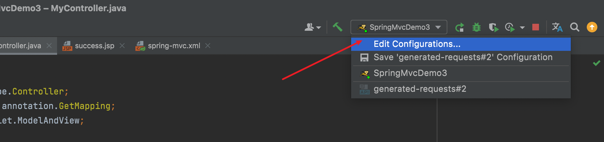

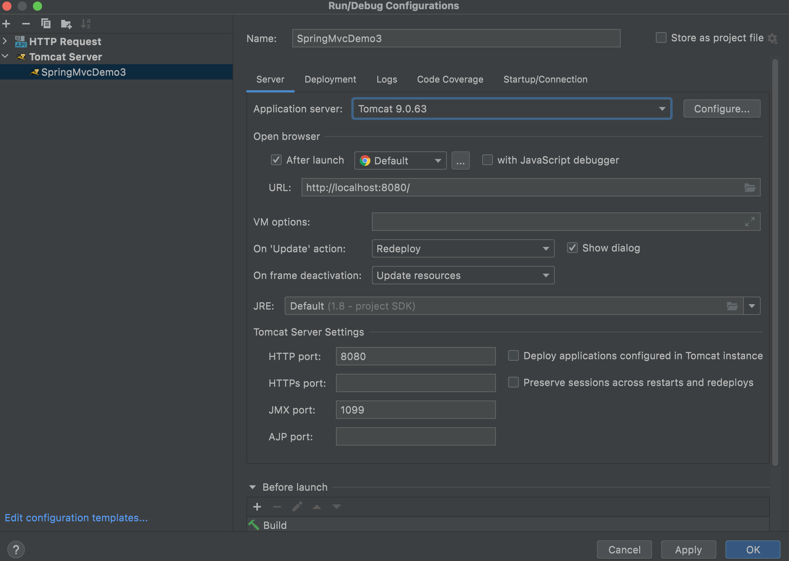

### 5.6 编写Controller

```java
@Controller  // Component的衍生注解
public class MyController2 {
    // 只接受请求方式为get，注意这个/可以省略
  	// /代表application context即到webapp工程路径下,前端则是到ip端口层级
    @GetMapping(value = "/hello") 
    public ModelAndView hello() {
        ModelAndView modelAndView = new ModelAndView();
        modelAndView.addObject("message", "hello");
        modelAndView.setViewName("success");
        return modelAndView;
    }
}
```

### 5.7 测试 

这里可以配置tomcat使请求url变得更简洁：右上角选择`tomcat图标`下拉选择`eidt configurations`，可修改`name`,`Application context`,`url` ,`port`等

## 6 第二种写法扩展：theymeleaf视图解析器

### 6.1 maven工程创建

##### a>添加web模块

##### b>打包方式：war

##### c>引入依赖

```xml
<dependencies>
    <!-- SpringMVC模块 -->
    <dependency>
        <groupId>org.springframework</groupId>
        <artifactId>spring-webmvc</artifactId>
        <version>5.3.1</version>
    </dependency>

    <!-- 日志 -->
    <dependency>
        <groupId>ch.qos.logback</groupId>
        <artifactId>logback-classic</artifactId>
        <version>1.2.3</version>
    </dependency>

    <!-- ServletAPI -->
    <dependency>
        <groupId>javax.servlet</groupId>
        <artifactId>javax.servlet-api</artifactId>
        <version>3.1.0</version>
        <scope>provided</scope>
    </dependency>

    <!-- Spring5和Thymeleaf整合包 -->
    <dependency>
        <groupId>org.thymeleaf</groupId>
        <artifactId>thymeleaf-spring5</artifactId>
        <version>3.0.12.RELEASE</version>
    </dependency>
  
   <!-- 用于文件上传使用 -->  
 	 <dependency>
    	<groupId>commons-fileupload</groupId>
    	<artifactId>commons-fileupload</artifactId>
    	<version>1.4</version>
		</dependency>
  
		<dependency>
    	<groupId>commons-io</groupId>
    	<artifactId>commons-io</artifactId>
    	<version>2.11.0</version>
		</dependency>
</dependencies>
```

**注：**由于 Maven 的传递性，我们不必将所有需要的包全部配置依赖，而是配置最顶端的依赖，其他靠传递性导入。

### 6.2 配置web.xml

注册SpringMVC的前端控制器DispatcherServlet

##### a>默认配置方式

此配置作用下，SpringMVC的配置文件默认位于WEB-INF下，默认名称为-servlet.xml，例如，以下配置所对应SpringMVC的配置文件位于WEB-INF下，文件名为springMVC-servlet.xml

```xml
<!-- 配置SpringMVC的前端控制器，对浏览器发送的请求统一进行处理 -->
<servlet>
    <servlet-name>springMVC</servlet-name>
    <servlet-class>org.springframework.web.servlet.DispatcherServlet</servlet-class>
</servlet>
<servlet-mapping>
    <servlet-name>springMVC</servlet-name>
    <!--
        设置springMVC的核心控制器所能处理的请求的请求路径
        /所匹配的请求可以是/login或.html或.js或.css方式的请求路径
        但是/不能匹配.jsp请求路径的请求
    -->
    <url-pattern>/</url-pattern>
</servlet-mapping>
1234567891011121314
```

##### b>扩展配置方式

可通过init-param标签设置SpringMVC配置文件的位置和名称，通过load-on-startup标签设置SpringMVC前端控制器DispatcherServlet的初始化时间

```xml
<!-- 配置SpringMVC的前端控制器，对浏览器发送的请求统一进行处理 -->
<servlet>
    <servlet-name>springMVC</servlet-name>
    <servlet-class>org.springframework.web.servlet.DispatcherServlet</servlet-class>
    <!-- 通过初始化参数指定SpringMVC配置文件的位置和名称 -->
    <init-param>
        <!-- contextConfigLocation为固定值 -->
        <param-name>contextConfigLocation</param-name>
        <!-- 使用classpath:表示从类路径查找配置文件，例如maven工程中的src/main/resources -->
        <param-value>classpath:springMVC.xml</param-value>
    </init-param>
    <!-- 
 		作为框架的核心组件，在启动过程中有大量的初始化操作要做
		而这些操作放在第一次请求时才执行会严重影响访问速度
		因此需要通过此标签将启动控制DispatcherServlet的初始化时间提前到服务器启动时
	-->
    <load-on-startup>1</load-on-startup>
</servlet>
<servlet-mapping>
    <servlet-name>springMVC</servlet-name>
    <!--
        设置springMVC的核心控制器所能处理的请求的请求路径
        /所匹配的请求可以是/login或.html或.js或.css方式的请求路径
        但是/不能匹配.jsp请求路径的请求
    -->
    <url-pattern>/</url-pattern>
</servlet-mapping>
```

> 注：
>
> 标签中使用/和/*的区别：
>
> /所匹配的请求可以是/login或.html或.js或.css方式的请求路径，但是/不能匹配.jsp请求路径的请求
>
> 因此就可以避免在访问jsp页面时，该请求被DispatcherServlet处理，从而找不到相应的页面
>
> /*则能够匹配所有请求，例如在使用过滤器时，若需要对所有请求进行过滤，就需要使用/*的写法

### 6.3 创建springMVC的配置文件

```XML
<!-- 自动扫描包 -->
<context:component-scan base-package="com.aitx.study.controller"/>

<!-- 配置Thymeleaf视图解析器 -->
<bean id="viewResolver" class="org.thymeleaf.spring5.view.ThymeleafViewResolver">
    <property name="order" value="1"/>
    <property name="characterEncoding" value="UTF-8"/>
    <property name="templateEngine">
        <bean class="org.thymeleaf.spring5.SpringTemplateEngine">
            <property name="templateResolver">
                <bean class="org.thymeleaf.spring5.templateresolver.SpringResourceTemplateResolver">
    
                    <!-- 视图前缀 -->
                    <property name="prefix" value="/WEB-INF/templates/"/>
    
                    <!-- 视图后缀 -->
                    <property name="suffix" value=".html"/>
                    <property name="templateMode" value="HTML5"/>
                    <property name="characterEncoding" value="UTF-8" />
                </bean>
            </property>
        </bean>
    </property>
</bean>

<!-- 
   处理静态资源，例如html、js、css、jpg
  若只设置该标签，则只能访问静态资源，其他请求则无法访问
  此时必须设置<mvc:annotation-driven/>解决问题
 -->
<mvc:default-servlet-handler/>

<!-- 开启mvc注解驱动 -->
<mvc:annotation-driven>
    <mvc:message-converters>
        <!-- 处理响应中文内容乱码 -->
        <bean class="org.springframework.http.converter.StringHttpMessageConverter">
            <property name="defaultCharset" value="UTF-8" />
            <property name="supportedMediaTypes">
                <list>
                    <value>text/html</value>
                    <value>application/json</value>
                </list>
            </property>
        </bean>
    </mvc:message-converters>
</mvc:annotation-driven>
```

### 6.4 创建请求控制器

由于前端控制器对浏览器发送的请求进行了统一的处理，但是具体的请求有不同的处理过程，因此需要创建处理具体请求的类，即请求控制器Controller

请求控制器中每一个处理请求的方法成为控制器方法

因为SpringMVC的控制器由一个POJO（普通的Java类）担任，因此需要通过@Controller注解将其标识为一个控制层组件，交给Spring的IoC容器管理，此时SpringMVC才能够识别控制器的存在

```java
@Controller // 控制层组件注解
public class HelloController {
    
}
```

### 6.5 测试HelloWorld

##### a>实现对首页的访问

在请求控制器中创建处理请求的方法

```java
// @RequestMapping注解：处理请求和控制器方法之间的映射关系
// @RequestMapping注解的value属性可以通过请求地址匹配请求，/表示的当前工程的上下文路径
// 即localhost:8080/springMVC/
@RequestMapping("/")
public String index() {
    //设置视图名称
    return "index";
}
```

**这里的控制器及方法只是用作视图跳转的作用的，所以spring-mvc还提供`view-controller标签`用于简化书写controller的方式**

##### b>通过超链接跳转到指定页面

在主页`index.html`中设置超链接

```html
<!DOCTYPE html>
<html lang="en" xmlns:th="http://www.thymeleaf.org">
<head>
    <meta charset="UTF-8">
    <title>首页</title>
</head>
<body>
    <h1>首页</h1>
    <a th:href="@{/hello}">HelloWorld</a><br/>
</body>
</html>
```

在请求控制器中创建处理请求的方法

```java
@RequestMapping("/hello")
public String HelloWorld() {
    return "target";
}
```

### 6.6 总结

浏览器发送请求，若请求地址符合前端控制器的url-pattern，该请求就会被前端控制器DispatcherServlet处理。前端控制器会读取SpringMVC的核心配置文件，通过扫描组件找到控制器，将请求地址和控制器中@RequestMapping注解的value属性值进行匹配，若匹配成功，该注解所标识的控制器方法就是处理请求的方法。处理请求的方法需要返回一个字符串类型的视图名称，该视图名称会被视图解析器解析，加上前缀和后缀组成视图的路径，通过Thymeleaf对视图进行渲染，最终转发到视图所对应页面

## 7. 请求映射注解@RequestMapping及其衍生注解

> @RequestMapping 
>
> @PostMapping
>
> @GetMapping 
>
> @DeleteMapping
>
> @PutMapping

### 7.1 @RequestMapping注解的功能

从注解名称上我们可以看到，@RequestMapping注解的作用就是将请求和处理请求的控制器方法关联起来，建立映射关系。

SpringMVC 接收到指定的请求，就会来找到在映射关系中对应的控制器方法来处理这个请求。

### 7.2 @RequestMapping注解的位置

@RequestMapping标识一个类：设置映射请求的请求路径的初始信息

@RequestMapping标识一个方法：设置映射请求请求路径的具体信息

```java
@Controller
@RequestMapping("/test")
public class RequestMappingController {

		// 此时请求映射所映射的请求的请求路径为：/test/testRequestMapping
    @RequestMapping("/testRequestMapping")
    public String testRequestMapping(){
        return "success";
    }

}
```

### 7.3 @RequestMapping注解的value属性

@RequestMapping注解的value属性通过请求的请求地址匹配请求映射

@RequestMapping注解的value属性是一个字符串类型的数组，表示该请求映射能够匹配多个请求地址所对应的请求

@RequestMapping注解的value属性必须设置，至少通过请求地址匹配请求映射

```html
<a th:href="@{/testRequestMapping}">测试@RequestMapping的value属性-->/testRequestMapping</a><br>
<a th:href="@{/test}">测试@RequestMapping的value属性-->/test</a><br>
```


```java
@RequestMapping(
        value = {"/testRequestMapping", "/test"}
)
public String testRequestMapping(){
    return "success";
}
```

### 7.4 @RequestMapping注解的method属性

@RequestMapping注解的method属性通过请求的请求方式（get或post）匹配请求映射

@RequestMapping注解的method属性是一个RequestMethod类型的数组，表示该请求映射能够匹配多种请求方式的请求

若当前请求的请求地址满足请求映射的value属性，但是请求方式不满足method属性，则浏览器报错405：Request method ‘POST’ not supported

```html
<a th:href="@{/test}">测试@RequestMapping的value属性-->/test</a><br>
<form th:action="@{/test}" method="post">
    <input type="submit">
</form>
```

```java
@RequestMapping(
        value = {"/testRequestMapping", "/test"},
        method = {RequestMethod.GET, RequestMethod.POST}
)
public String testRequestMapping(){
    return "success";
}
```

> 注：
>
> 1、对于处理指定请求方式的控制器方法，SpringMVC中提供了@RequestMapping的派生注解
>
> 处理get请求的映射–>@GetMapping
>
> 处理post请求的映射–>@PostMapping
>
> 处理put请求的映射–>@PutMapping
>
> 处理delete请求的映射–>@DeleteMapping
>
> 2、常用的请求方式有get，post，put，delete
>
> 但是目前浏览器只支持get和post，若在form表单提交时，为method设置了其他请求方式的字符串（put或delete），则按照默认的请求方式get处理
>
> 若要发送put和delete请求，则需要通过spring提供的过滤器HiddenHttpMethodFilter，在RESTful部分会讲到

### 7.5 @RequestMapping注解的params属性（了解）

@RequestMapping注解的params属性通过请求的请求参数匹配请求映射

@RequestMapping注解的params属性是一个字符串类型的数组，可以通过四种表达式设置请求参数和请求映射的匹配关系

“param”：要求请求映射所匹配的请求必须携带param请求参数

“!param”：要求请求映射所匹配的请求必须不能携带param请求参数

“param=value”：要求请求映射所匹配的请求必须携带param请求参数且param=value

“param!=value”：要求请求映射所匹配的请求必须携带param请求参数但是param!=value

```html
<a th:href="@{/test(username='admin',password=123456)">测试@RequestMapping的params属性-->/test</a><br>
```

```java
@RequestMapping(
        value = {"/testRequestMapping", "/test"}
        ,method = {RequestMethod.GET, RequestMethod.POST}
        ,params = {"username","password!=123456"}
)
public String testRequestMapping(){
    return "success";
}
```

> 注：
>
> 若当前请求满足@RequestMapping注解的value和method属性，但是不满足params属性，此时页面回报错400：Parameter conditions “username, password!=123456” not met for actual request parameters: username={admin}, password={123456}

### 7.6 @RequestMapping注解的headers属性（了解）

@RequestMapping注解的headers属性通过请求的请求头信息匹配请求映射

@RequestMapping注解的headers属性是一个字符串类型的数组，可以通过四种表达式设置请求头信息和请求映射的匹配关系

“header”：要求请求映射所匹配的请求必须携带header请求头信息

“!header”：要求请求映射所匹配的请求必须不能携带header请求头信息

“header=value”：要求请求映射所匹配的请求必须携带header请求头信息且header=value

“header!=value”：要求请求映射所匹配的请求必须携带header请求头信息且header!=value

若当前请求满足@RequestMapping注解的value和method属性，但是不满足headers属性，此时页面显示404错误，即资源未找到

### 7.7 SpringMVC支持ant风格的路径

？：表示任意的单个字符

*：表示任意的0个或多个字符

**：表示任意的一层或多层目录

### 7.8 SpringMVC支持路径中的占位符（重点）

原始方式：/deleteUser?id=1

rest方式：/deleteUser/1

SpringMVC路径中的占位符常用于RESTful风格中，当请求路径中将某些数据通过路径的方式传输到服务器中，就可以在相应的@RequestMapping注解的value属性中通过占位符{xxx}表示传输的数据，在通过@PathVariable注解，将占位符所表示的数据赋值给控制器方法的形参

```html
<a th:href="@{/testRest/1/admin}">测试路径中的占位符-->/testRest</a><br>
```

```java
@RequestMapping("/testRest/{id}/{username}")
public String testRest(@PathVariable("id") String id, @PathVariable("username") String username){
    System.out.println("id:"+id+",username:"+username);
    return "success";
}
//最终输出的内容为-->id:1,username:admin
```

## 8. 请求参数的封装

### 8.1. 普通参数类型

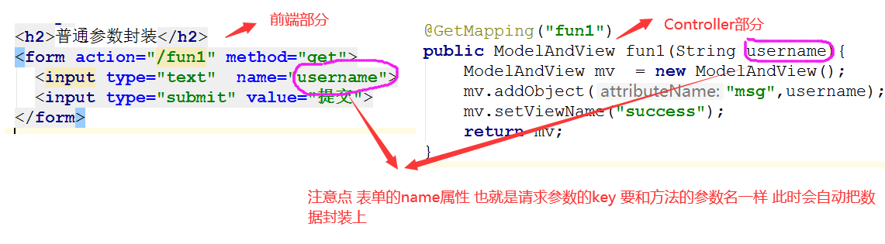

**不一致的情况**

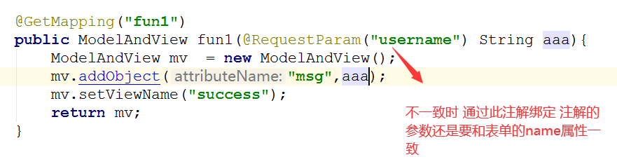

### 8.2. 数组类型

```properties
Checkbox = 复选框
```

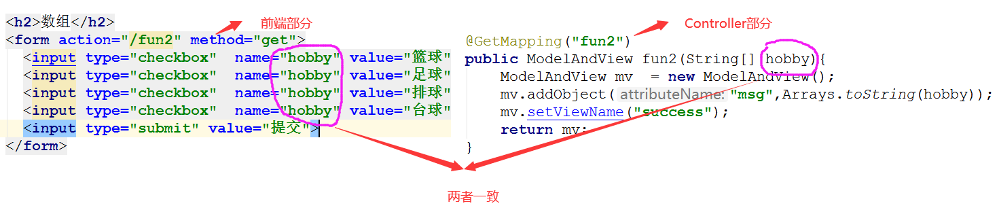

> 若请求所传输的请求参数中有多个同名的请求参数，此时可以在控制器方法的形参中设置字符串数组或者字符串类型的形参接收此请求参数
>
> 若使用字符串数组类型的形参，此参数的数组中包含了每一个数据
>
> 若使用字符串类型的形参，此参数的值为每个数据中间使用逗号拼接的结果

### 8.3. 对象类型

> 可以在控制器方法的形参位置设置一个实体类类型的形参，此时若浏览器传输的请求参数的参数名和实体类中的属性名一致，那么请求参数就会为此属性赋值

**新建对象**

```java
// 注意要加lombok的jar包，才能使用如下注解
@Data
@NoArgsConstructor
@AllArgsConstructor
@Builder
@Accessors(fluent = false, chain = true)
public class Huige {
    private Integer id;
    private String username;
  	private String sex;
}
```

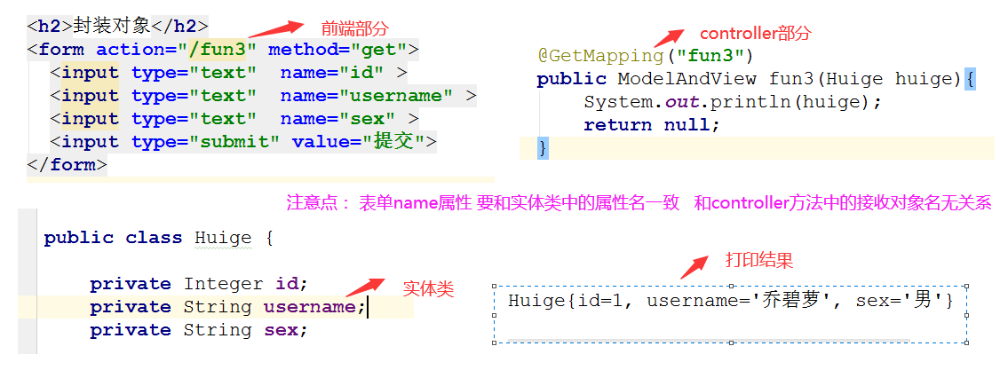

### 8.4. 包装类类型

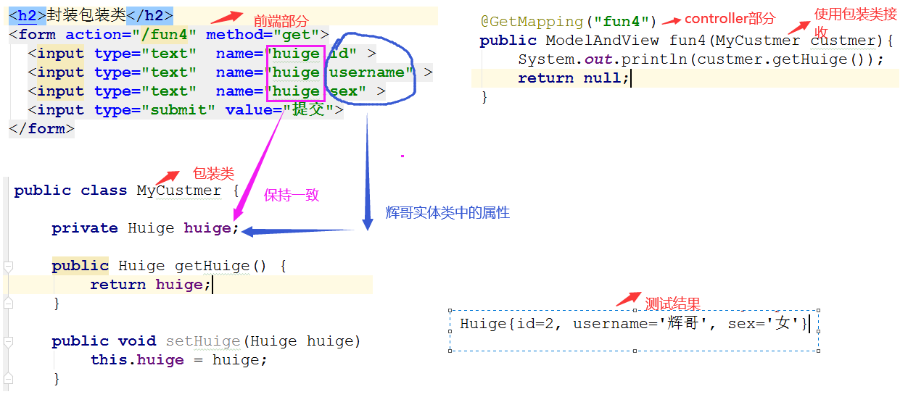

### 8.5. List集合类型

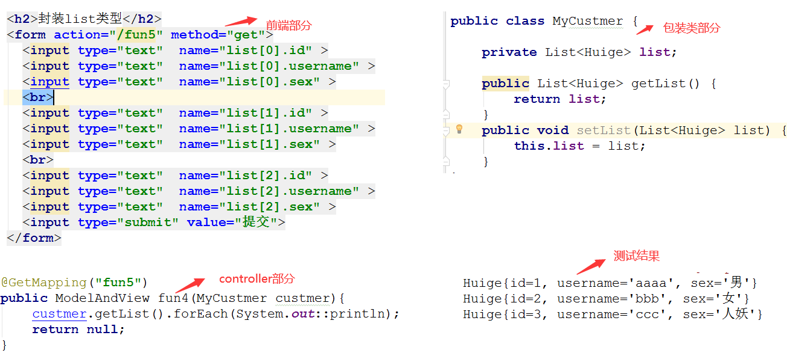

### 8.6. Map集合类型

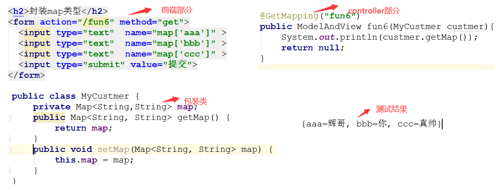

### 8.7. JSON格式字符串（重点）

**前提 有jackson的支持 导入jackson**

`jackson`是spring默认处理json字符串的类库,只需导入不用任何配置

`json` = `JavaScript Object Notation` = `javaScript对象标记法`

导入依赖，无需其他配置

```xml
<dependency>
    <groupId>com.fasterxml.jackson.core</groupId>
    <artifactId>jackson-annotations</artifactId>
    <version>2.13.2</version>
</dependency>
<dependency>
    <groupId>com.fasterxml.jackson.core</groupId>
    <artifactId>jackson-core</artifactId>
    <version>2.13.2</version>
</dependency>
<dependency>
    <groupId>com.fasterxml.jackson.core</groupId>
    <artifactId>jackson-databind</artifactId>
    <version>2.13.2</version>
</dependency>
```

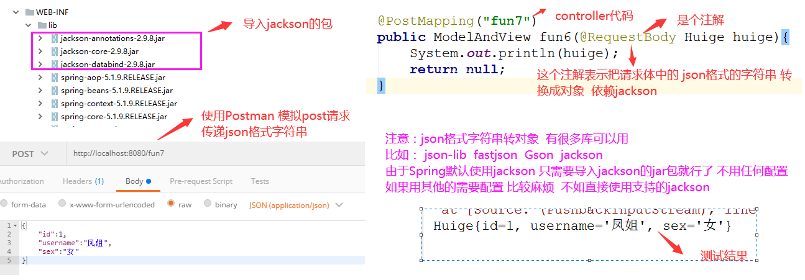

### 8.8. Rest方式接收参数@PathVariable

`Rest` = `Representational State Transfer`=`表征状态转移,具象状态转移`

> 见12

### 8.9  获取原生的ServletAPI

> 想要代码中 得到最原始的`HttpServletRequest`  ,`HttpServletResponse`  可以直接在方法里写个形参就行了 
>
> 然后就可以直接使用

首先pom.xml文件中要引入javax.servlet-api

```xml
<dependency>
  <groupId>javax.servlet</groupId>
  <artifactId>javax.servlet-api</artifactId>
  <version>4.0.1</version>
  <scope>provided</scope>
</dependency>
```

```java
/**
 * 直接在控制器方法入参处加上HttpServletRequest，HttpServletResponse即可获取原生的请求与响应
 *
 * @param request
 * @param response
 * @return
 * @throws IOException
 * @throws ServletException
 */
@GetMapping(value = "/testOriginal")
public String testOriginal(HttpServletRequest request, HttpServletResponse response) throws IOException, ServletException {
    // 通过请求获取session对象
    HttpSession session = request.getSession();
    // 只是演示
    // 通过请求进行请求转发
    request.getRequestDispatcher("/hello").forward(request, response);
    // 通过响应进行请求重定向
    response.sendRedirect("/hello");
    return "success";
}
```

### 8.10 @RequestParam

@RequestParam是将请求参数和控制器方法的形参创建映射关系

@RequestParam注解一共有三个属性：

value：指定为形参赋值的请求参数的参数名

required：设置是否必须传输此请求参数，默认值为true

若设置为true时，则当前请求必须传输value所指定的请求参数，若没有传输该请求参数，且没有设置defaultValue属性，则页面报错400：Required String parameter ‘xxx’ is not present；若设置为false，则当前请求不是必须传输value所指定的请求参数，若没有传输，则注解所标识的形参的值为null

defaultValue：不管required属性值为true或false，当value所指定的请求参数没有传输或传输的值为""时，则使用默认值为形参赋值

### 8.11 @RequestHeader

@RequestHeader是将请求头信息和控制器方法的形参创建映射关系

@RequestHeader注解一共有三个属性：value、required、defaultValue，用法同@RequestParam

### 8.12 @CookieValue

@CookieValue是将cookie数据和控制器方法的形参创建映射关系

@CookieValue注解一共有三个属性：value、required、defaultValue，用法同@RequestParam

## 9. 乱码问题

> 乱码问题产生的原因主要是字符编码的问题;
> 发送方要发送一串字符，首先必须用字符集给它编码(encode)变成0和1即二进制进行传输，接收方需要用同一个字符集进行解码（decode）方才能知道发送方发送的内容。如果双方所用的字符集不一致就会产生乱码。

### 9.1 设置浏览器 request 的编码格式

浏览器 request 的编码格式需要在 .html 文件中设置

```html
<!DOCTYPE html>
<head>
    <meta charset="UTF-8">  <!-- 在此处设置编码格式 -->
</head>
<body>
</body>
</html>
```

举个例子，当编码格式为“UTF-8”时，在下面这个 form 表单中输入“李四”并提交时，地址栏中的内容为：`http://localhost:8080/s/a?name=%E6%9D%8E%E5%9B%9B`，其中的 E6、9D、8E 就是“李”的 UTF-8 编码（“李”的 Unicode 为 +U674e， 转化为 UTF-8 为 11100110（即 e6）、10011101（即 9d）、10001110 （即 8e） ），E5、9B、9B 就是“四”的 UTF-8 编码。（UTF-8 中一个汉字占三个字节，一个 % 表示一个字节，十六进制表示。）

```html
<form action="./a" method="get">
    Name: <input type="text" name="name" /> <br />
    <input type="submit" value="Submit" />
</form>
```


当你在浏览器地址栏手动输入 `localhost:8080/s/a?name=李四` 并按 Enter 键时，实际发送出去的 request 仍然是经过编码的，对于 Chrome 浏览器，默认编码为 UTF-8。

### 9.2 get请求接收参数乱码

> 如果你的get请求 传递中文参数时乱码 可以有如下解决方式  

**Tomcat7及以下版本：**

Tomcat 7 中的 URIEncoding 为 ISO-8859-1

如果你使用 Tomcat 7 或更早版本的 Tomcat，且 get 请求的编码格式为 UTF-8，这时候中文就会发生乱码。解决方法：

```java
/**
 修改 tomcat中的 conf/server.xml
 Connector标签中添加URIEncoding="UTF-8"
 utf-8 = Unicode Transformation Format

 注意点：如果有 useBodyEncodingForURI="true"  请删除

 例如：
     <Connector port="8080" protocol="HTTP/1.1"
        connectionTimeout="20000"
        redirectPort="8443"
        disableUploadTimeout="true"
        executor="tomcatThreadPool"
        URIEncoding="UTF-8"/>
 */
```

**Tomcat 8 及之后的版本：**

Tomcat 8 及之后的版本，处理 get 请求的编码为 UTF-8。如果浏览器的 get 请求也为 UTF-8，那就无需再设置。

**不区分版本：**

直接代码中进行字符串转换编码的字符集

```java
// 接受username后处理这个数据，即获取字节数组后重新选utf-8编码方式  
String s = new String(username.getBytes("ISO-8859-1"), "utf-8");
```

### 9.3 post请求乱码问题

**Tomcat9及以下：**

如果你使用 Tomcat 9 或更早版本的 Tomcat，且 post 请求的编码格式为 UTF-8，这时候中文就会发生乱码

**方法一：**在 conf/web.xml 文件中增加上述设置：

```xml
<request-character-encoding>UTF-8</request-character-encoding> 
```

**方法二：**在代码中使用 HttpServletRequest 的 setCharacterEncoding() 方法来设置 post 请求体的编码格式：

```java
request.setCharacterEncoding("UTF-8");
```

方法一和方法二是同一个设置项，如果同时使用了方法一和方法二，那以方法二为准。

**方法三(推荐)：**

如果你使用了 Spring MVC，那在代码中使用 setCharacterEncoding() 方法设置编码是不起作用的，因为在你接到参数前 Spring MVC 已经对参数做过了处理。 Spring MVC 提供了一个过滤器 CharacterEncodingFilter，可以用于设置 post 请求的编码格式。

> SpringMVC中处理编码的过滤器一定要配置到其他过滤器之前，否则无效
>
> SpringMvc中配置的filter上下顺序决定了执行filter时的前后顺序

在`web.xml`配置：

```xml
<!--解决Post请求乱码问题使用过滤器
   CharacterEncodingFilter  在高版本的Spring中是可以解决 get请求 和Post请求 、
    低版本  比如说4.X中 只能解决Post请求 不能解决get请求
-->
<filter>
  <filter-name>characterEncodingFilter</filter-name>
  <filter-class>org.springframework.web.filter.CharacterEncodingFilter</filter-class>
  <!--这些参数就是类中的属性-->
  <init-param>
    <param-name>encoding</param-name>
    <param-value>utf-8</param-value>
  </init-param>
  <init-param>
    <param-name>forceRequestEncoding</param-name>
    <param-value>true</param-value>
  </init-param>
  <init-param>
    <param-name>forceResponseEncoding</param-name>
    <param-value>true</param-value>
  </init-param>
</filter>
<filter-mapping>
  <filter-name>characterEncodingFilter</filter-name>
  <!--代表所有请求都会进行过滤，包括jsp-->
  <url-pattern>/*</url-pattern>
</filter-mapping>
```

**Tomcat 10 及之后的版本：**

Tomcat 10 及之后的版本，处理 post 请求的编码为 UTF-8，如果浏览器的 post 请求也为 UTF-8，那就无需再设置。

Tomcat 10 的 conf/web.xml 文件中设置了处理 request 和 response 的编码为 UTF-8。

```xml
<request-character-encoding>UTF-8</request-character-encoding> 

<response-character-encoding>UTF-8</response-character-encoding> 
```

### 9.4 响应乱码

**普通的Java Web工程：**

HttpServletResponse 也有 setCharacterEncoding() 方法。但更常用的是： response.setContentType("text/html;charset=UTF-8")。一般情况下，你告诉了浏览器你返回的 response 的正确的编码格式，response 是不会乱码的。

```java
response.setContentType("text/html;charset=UTF-8")
```

**Spring工程：**

> spring MVC有一系列HttpMessageConverter去处理@ResponseBody注解的返回值，如返回list或其它则使用 MappingJacksonHttpMessageConverter；如果是string，则使用 StringHttpMessageConverter，而StringHttpMessageConverter使用的是字符集默认是ISO-8859-1，而且是final的。所以在当返回json中有中文时会出现乱码。

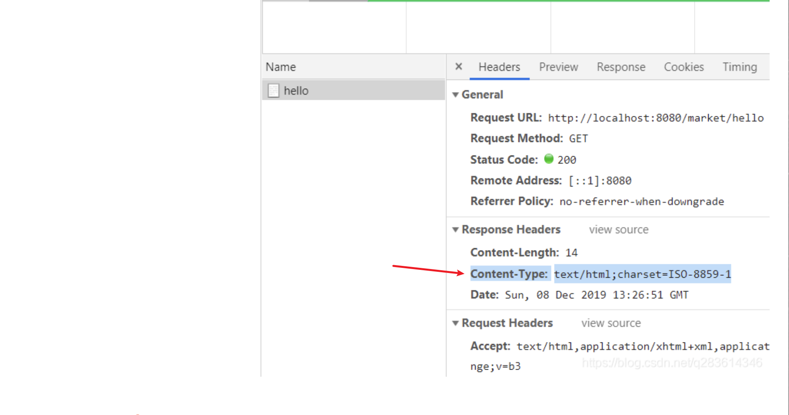

**方法一：**

单个请求的`@RequestMappin及其派生注解`后面加上produces=“text/html;charset=UTF-8;”（此方法只针对单个调用方法起作用）

```java
@GetMapping(value = "/testResponseEncodeError", produces = "text/html;charset=utf-8")
```

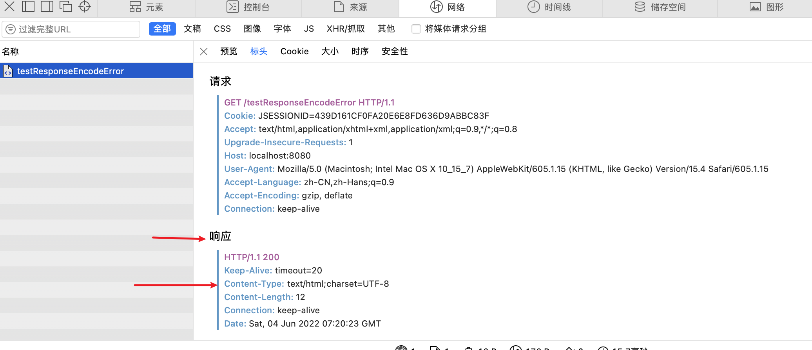

**方法二：**

spring-mvc.xml中配置如下：

```xml
<mvc:annotation-driven>
    <mvc:message-converters>
    	<!-- 解决@ResponseBody返回中文乱码 -->
        <bean class="org.springframework.http.converter.StringHttpMessageConverter">
            <property name="supportedMediaTypes">
                <list>
                    <value>text/html;charset=UTF-8</value>
                    <value>application/json;charset=UTF-8</value>
                    <value>*/*;charset=UTF-8</value>
                </list>
            </property>
            <!-- 用于避免响应头过大 -->  
						<property name="writeAcceptCharset" value="false" /> 
        </bean>
    </mvc:message-converters>
</mvc:annotation-driven>
```

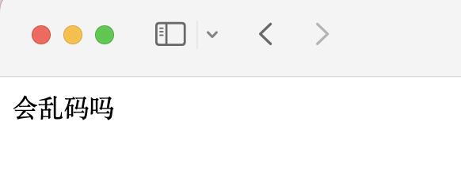

**方法三：**

在配置文件中的`<mvc:annotation-driven>`中使用MappingJackson2HttpMessageConverter转换字符串

这种方式返回的字符串会有双引号

```xml
<mvc:annotation-driven>
    <!-- 返回json数据，@response使用 -->
    <mvc:message-converters register-defaults="true">
        <bean class="org.springframework.http.converter.json.MappingJackson2HttpMessageConverter">  
            <property name="supportedMediaTypes">
                <list>
                    <value>text/html;charset=UTF-8</value>
                    <value>application/json;charset=UTF-8</value>
                </list>
            </property>
        </bean>
    </mvc:message-converters>
</mvc:annotation-driven>
```

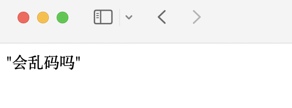

**方法四:**

在配置文件中的`<mvc:annotation-driven>`中修改StringHttpMessageConverter的defaultCharset

```xml
<mvc:annotation-driven>
  <mvc:message-converters register-defaults="true">
    <bean class="org.springframework.http.converter.StringHttpMessageConverter">
      <property name="defaultCharset" value="UTF-8"/>
      <property name="writeAcceptCharset" value="false"/>
    </bean>
  </mvc:message-converters>
</mvc:annotation-driven>
```

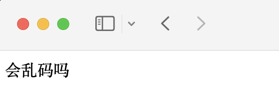

### 9.5 Tomcat控制台中文乱码

**第一种：修改tomcat配置(不推荐)**
将tomcat控制台日志输出编码格式更改为GBK，修改tomcat根目录下conf/logging.properties文件中的ConsoleHandler.encoding=utf-8（如果只修改ConsoleHandler.encoding不行，可以全部修改），这种方式能解决cmd控制台中文乱码，但不建议使用。因为更改了tomcat默认编码，如果我们使用idea启动tomcat，idea的默认编码不是GBK，就会同样产生idea控制台下tomcat乱码问题

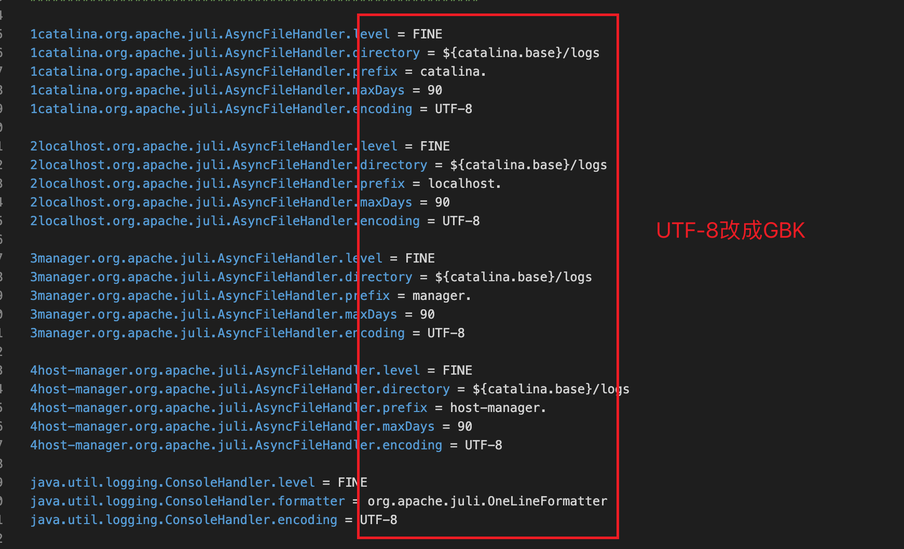

**第二种：修改idea配置**

方法一：

Help->edit custom VM options在最后添加这句重启idea即可。

```xml
-Dfile.encoding=UTF-8
```

方法二：选择tomcat->edit configurations

直接修改idea中的tomcat配置，在vm-options中添加`-Dfile.encoding=UTF-8`，两者效果相同

## 10 Controller的返回值类型

### 10.1. 返回ModelAndView

```java
/**
 * 直接在方法体中建ModelAndView对象，可添加请求域数据，可设置视图名称
 *
 * @return
 */
@GetMapping(value = "/modelAndView")
public ModelAndView testReturnModelAndView() {
  ModelAndView modelAndView = new ModelAndView();
  modelAndView.setViewName("success");
  modelAndView.addObject("message", "hello testReturnModelAndView");
  return modelAndView;
}
```

### 10.2. 返回字符串 

#### 10.2.1. 字符串之jsp页面（即前端页面）

返回值String代表视图名称，如果需要在请求域添加对象可在控制器方法入参处添加Model或Map对象

```java
import org.springframework.ui.Model;
import org.springframework.web.servlet.ModelAndView;

/**
 * 直接返回string,这个string就是视图名称，会请求转发到这个视图页面，并且请求域中没有添加对象
 *
 * @return
 */
@GetMapping(value = "/testReturnString")
public String testReturnString() {
  return "success";
}

/**
 * 返回值String代表视图名称，入参model可添加请求域对象
 *
 * @param model
 * @return
 */
@GetMapping(value = "/testReturnStringAndModel")
public String testReturnStringAndModel(Model model) {
  model.addAttribute("message", "testReturnStringAndModel");
  return "success";
}

/**
 * 返回值String代表视图名称，入参map可添加请求域对象
 *
 * @param map
 * @return
 */
@GetMapping(value = "/testReturnStringAndMap")
public String testReturnStringAndMap(Map map) {
  map.put("message", "testReturnStringAndMap");
  return "success";
}
```

#### 10.2.2. 字符串之普通字符串

```java
/**
 * 如果想要返回字符串不当成视图名称，需要在控制器方法上加@ResponseBody注解
 * 它的作用是将字符串直接放入响应体中，而非解析成视图
 *
 * @return
 */
@GetMapping("/testReturnRealString")
@ResponseBody
public String testReturnRealString() {
    return "realString";
}
```

```java
/**
 * 可以验证如果返回中文字符串，则会乱码,可在@GetMapping中加入produces属性设置值
 * 同时也注意到字符编码过滤器只能解决post请求乱码问题，response响应乱码可以通过@GetMapping中加入produces属性解决
 *
 * @return
 */
@GetMapping(value = "/testResponseEncodeError", produces = "text/html;charset=utf-8")
@ResponseBody
public String testResponseEncodeError() {
  return "会乱码吗";
}
```

#### 10.2.3. 字符串之转发和重定向

转发或重定向到指定的url路径上(注意是`请求路径`，即控制器方法上`@RequestMapping及其派生注解`的value属性值)

```java
/**
 * 请求转发到/hello,还是同一个请求
 *
 * @return
 */
@GetMapping(value = "/testForward")
public String testForward() {
    // 请求转发时，请求路径/可以省略
    return "forward:/hello";
}

/**
 * 请求重定向到/hello，会形成新的请求
 *
 * @return
 */
@GetMapping(value = "/testRedirect")
public String testRedirect() {
    // 请求重定向时，请求路径/可以省略
    return "redirect:/hello";
}
```

### 10.3. 返回对象

> 返回对象 需要使用jackson的支持   是把对象转换成json了 实际返回的是json格式字符串 

创建User类

```java
@Data
@NoArgsConstructor
@AllArgsConstructor
@Builder
public class User implements Serializable {

    private String id;

    private String username;

    private Integer age;
}
```

```java
/**
 * 直接返回对象，需要：
 * 1添加jackson相关注解
 * 2控制器方法上加@ResponseBody
 *
 * @return
 */
@GetMapping(value = "/testReturnObject")
@ResponseBody
public User testReturnObject() {
    return User.builder().id("a1").username("aa").age(18).build();
}
```

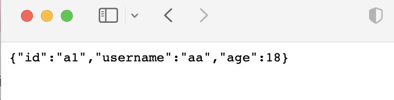

如果我们不加@ResponseBody,会如何？

```java
/**
 * 不加@ResponseBody注解，默认将请求路径解析成视图名，即请求testReturnObject2视图
 *
 * @return
 */
@GetMapping("/testReturnObject2")
public User testReturnObject2() {
    return User.builder().id("a3").username("cc").age(20).build();
}
```

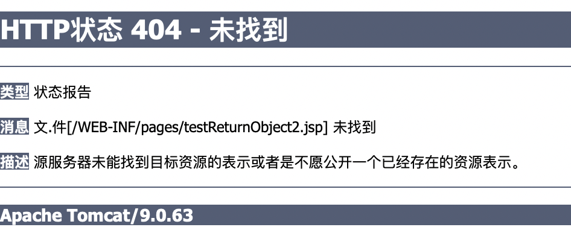

### 10.4. 返回void(无返回值) 

默认将请求路径解析成视图名

```java
/**
 * 返回值为void，默认将请求路径解析成视图名，即请求testReturnVoid视图
 */
@GetMapping(value = "/testReturnVoid")
public void testReturnVoid()  {
    
}
```

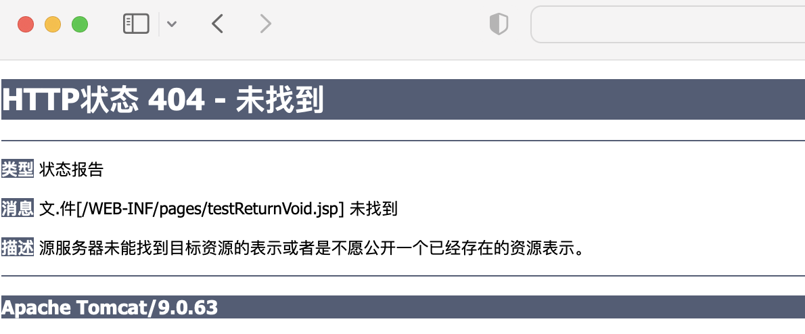

**一般情况下返回值void,方法体类进行请求转发或重定向**

```
/**
 * 返回值为void，默认将请求路径解析成视图名，即请求testReturnVoid视图
 */
@GetMapping(value = "/testReturnVoid")
public void testReturnVoid(HttpServletRequest httpServletRequest, HttpServletResponse httpServletResponse) throws ServletException, IOException {
    // 一般情况下返回值void,方法体类进行请求转发或重定向,即 使用原生的请求或响应处理
    //httpServletRequest.getRequestDispatcher("/hello").forward(httpServletRequest, httpServletResponse);
}
```

### 10.5 返回null

**返回值为String类型时返回null：**

报404，尝试找/WEB-INF/pages/testReturnNull.jsp文件

```java
/**
 * 返回值为String类型时返回null，默认将请求路径解析成视图名，即请求testReturnNull视图
 */
@GetMapping(value = "/testReturnNull")
public String testReturnNull() {
  return null;
}
```

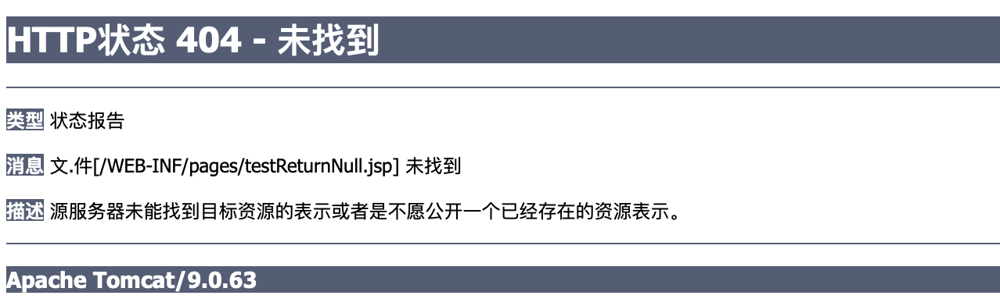

**返回值为ModelAndView类型时返回null：**

```
/**
 * 返回值为ModelAndView类型时返回null，默认空白页面
 *
 * @return
 */
@GetMapping(value = "/testReturnNull2")
public ModelAndView testReturnNull2() {
    return null;
}
```

**返回值为User类型时返回null:**

```java
/**
 * 返回值为User类型时返回null，默认将请求路径解析成视图名，即请求testReturnNull3视图
 * 
 * @return
 */
@GetMapping(value = "/testReturnNull3")
public User testReturnNull3() {
    return null;
}
```

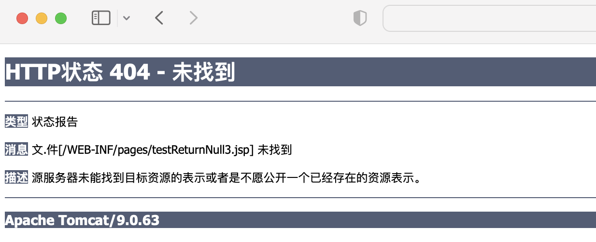

**返回值为User类型且加@ResponseBody注解时：**

```java
/**
 * 返回值为User类型且加@ResponseBody注解时返回null，空白页面
 *
 * @return
 */
@GetMapping(value = "/testReturnNull4")
@ResponseBody
public User testReturnNull4() {
    return null;
}
```

### 10.6 返回响应实体ResponseEntity

```java
/**
 * 响应实体=响应头+响应体
 * 返回响应体默认返回json格式，前提要引入jackson依赖，并且无需@ResponseBody注解
 *
 * @return
 */
@GetMapping(value = "/testReturnResponseEntity")
public ResponseEntity testReturnResponseEntity() {
    User build = User.builder().id("a2").username("bb").age(19).build();
    return ResponseEntity.status(HttpStatus.OK).body(build);
}
```

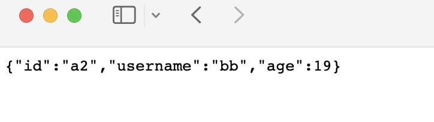

## 11 域对象共享数据

### 11.1 使用ServletAPI向request域对象共享数据

```java
@RequestMapping("/testServletAPI")
public String testServletAPI(HttpServletRequest request){
    request.setAttribute("testScope", "hello,servletAPI");
    return "success";
}
```

### 11.2 使用ModelAndView向request域对象共享数据

```java
@RequestMapping("/testModelAndView")
public ModelAndView testModelAndView(){
    /**
     * ModelAndView有Model和View的功能
     * Model主要用于向请求域共享数据
     * View主要用于设置视图，实现页面跳转
     */
    ModelAndView mav = new ModelAndView();
    //向请求域共享数据
    mav.addObject("testScope", "hello,ModelAndView");
    //设置视图，实现页面跳转
    mav.setViewName("success");
    return mav;
}
```

### 11.3 使用Model向request域对象共享数据

```java
@RequestMapping("/testModel")
public String testModel(Model model){
    model.addAttribute("testScope", "hello,Model");
    return "success";
}
```

### 11.4 使用map向request域对象共享数据

```java
@RequestMapping("/testMap")
public String testMap(Map<String, Object> map){
    map.put("testScope", "hello,Map");
    return "success";
}
```

### 11.5 使用ModelMap向request域对象共享数据

```java
@RequestMapping("/testModelMap")
public String testModelMap(ModelMap modelMap){
    modelMap.addAttribute("testScope", "hello,ModelMap");
    return "success";
}
```

### 11.6 Model、ModelMap、Map的关系

Model、ModelMap、Map类型的参数其实本质上都是 BindingAwareModelMap 类型的

```java
public interface Model{}
public class ModelMap extends LinkedHashMap<String, Object> {}
public class ExtendedModelMap extends ModelMap implements Model {}
public class BindingAwareModelMap extends ExtendedModelMap {}
```

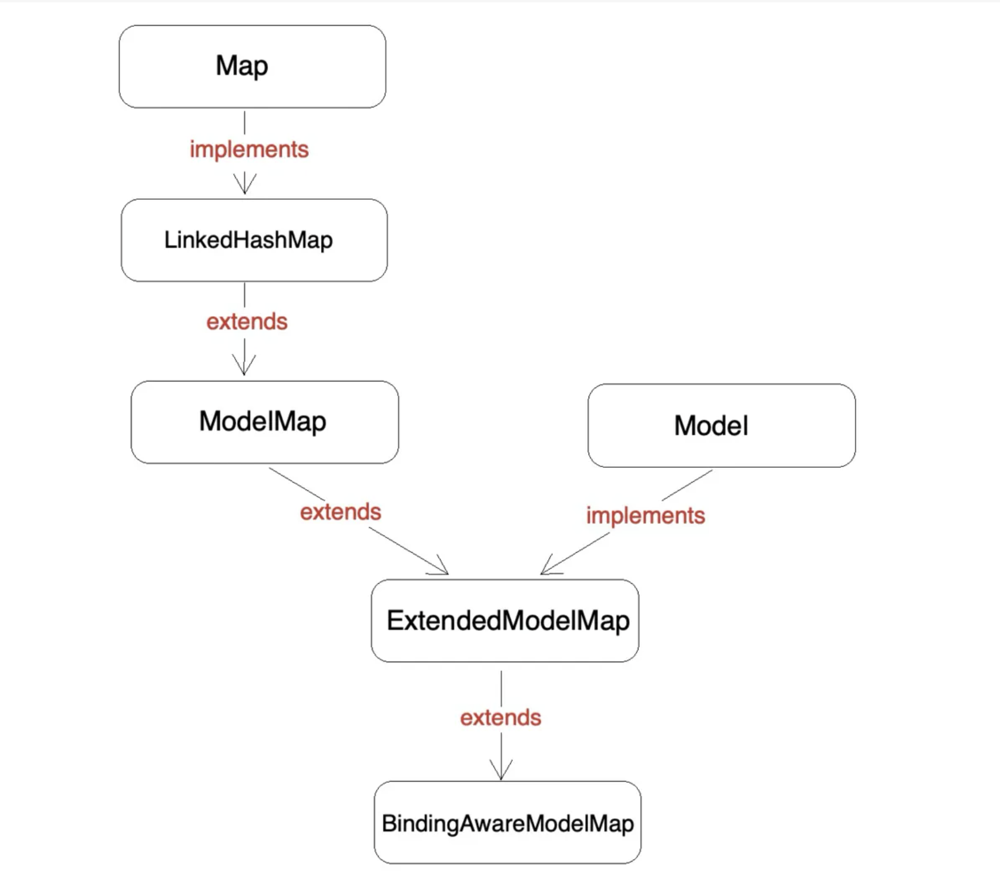

### 11.7 向session域共享数据

向Session域中共享数据一般都是用原生的HttpSession

```java
@RequestMapping("/testSession")
public String testSession(HttpSession session){
    session.setAttribute("testSessionScope", "hello,session");
    return "success";
}
```

### 8、向application域共享数据

向application域（ServletContext）域共享数据，一般也是通过HttpSession

```java
@RequestMapping("/testApplication")
public String testApplication(HttpSession session){
		ServletContext application = session.getServletContext();
    application.setAttribute("testApplicationScope", "hello,application");
    return "success";
}
```

## 12 SpringMVC的视图

SpringMVC中的视图是View接口，视图的作用渲染数据，将模型Model中的数据展示给用户

SpringMVC视图的种类很多，默认有转发视图和重定向视图

当工程引入jstl的依赖，转发视图会自动转换为JstlView

```properties
jstl = java standard tag language
```

若使用的视图技术为Thymeleaf，在SpringMVC的配置文件中配置了Thymeleaf的视图解析器，由此视图解析器解析之后所得到的是ThymeleafView

### 1、ThymeleafView

当控制器方法中所设置的视图名称没有任何前缀时，此时的视图名称会被SpringMVC配置文件中所配置的视图解析器解析，视图名称拼接视图前缀和视图后缀所得到的最终路径，会通过请求转发的方式实现跳转

```Java
@RequestMapping("/testHello")
public String testHello(){
    return "hello";
}
```

### 2、转发视图

SpringMVC中默认的转发视图是InternalResourceView

SpringMVC中创建转发视图的情况：

当控制器方法中所设置的视图名称以"forward:"为前缀时，创建InternalResourceView视图，此时的视图名称不会被SpringMVC配置文件中所配置的视图解析器解析，而是会将前缀"forward:"去掉，剩余部分作为最终路径通过转发的方式实现跳转

例如"forward:/"，“forward:/employee”

```java
@RequestMapping("/testForward")
public String testForward(){
    return "forward:/testHello";
}
```

### 3、重定向视图

SpringMVC中默认的重定向视图是RedirectView

当控制器方法中所设置的视图名称以"redirect:"为前缀时，创建RedirectView视图，此时的视图名称不会被SpringMVC配置文件中所配置的视图解析器解析，而是会将前缀"redirect:"去掉，剩余部分作为最终路径通过重定向的方式实现跳转

例如"redirect:/"，“redirect:/employee”

```java
@RequestMapping("/testRedirect")
public String testRedirect(){
    return "redirect:/testHello";
}
```

> 注：
>
> 重定向视图在解析时，会先将redirect:前缀去掉，然后会判断剩余部分是否以/开头，若是则会自动拼接上下文路径

### 4、视图控制器view-controller

当控制器方法中，仅仅用来实现页面跳转，即只需要设置视图名称时，可以将处理器方法使用view-controller标签进行表示

```xml
<!--
	path：设置处理的请求地址
	view-name：设置请求地址所对应的视图名称
-->
<mvc:view-controller path="/testView" view-name="success"></mvc:view-controller>
```

> 注：
>
> 当SpringMVC中设置任何一个view-controller时，其他控制器中的请求映射将全部失效，此时需要在SpringMVC的核心配置文件中设置开启mvc注解驱动的标签：
>
> <mvc:annotation-driven />

## 13 Rest风格

> Rest风格的规范有3个：
>
> 1 对于请求方式规范：不同的操作 使用 不同的请求方式
>
> 2 对于不同的状态码的规范: 比如404资源未发现或工程自定义的状态码
>
> 3 Rest风格的请求路径/user,/user/1等

### 1、RESTful简介

REST：**Re**presentational **S**tate **T**ransfer，表现层资源状态转移。

##### a>资源

资源是一种看待服务器的方式，即，将服务器看作是由很多离散的资源组成。每个资源是服务器上一个可命名的抽象概念。因为资源是一个抽象的概念，所以它不仅仅能代表服务器文件系统中的一个文件、数据库中的一张表等等具体的东西，可以将资源设计的要多抽象有多抽象，只要想象力允许而且客户端应用开发者能够理解。与面向对象设计类似，资源是以名词为核心来组织的，首先关注的是名词。一个资源可以由一个或多个URI来标识。URI既是资源的名称，也是资源在Web上的地址。对某个资源感兴趣的客户端应用，可以通过资源的URI与其进行交互。

##### b>资源的表述

资源的表述是一段对于资源在某个特定时刻的状态的描述。可以在客户端-服务器端之间转移（交换）。资源的表述可以有多种格式，例如HTML/XML/JSON/纯文本/图片/视频/音频等等。资源的表述格式可以通过协商机制来确定。请求-响应方向的表述通常使用不同的格式。

##### c>状态转移

状态转移说的是：在客户端和服务器端之间转移（transfer）代表资源状态的表述。通过转移和操作资源的表述，来间接实现操作资源的目的。

### 2、RESTful的实现

具体说，就是 HTTP 协议里面，四个表示操作方式的动词：GET、POST、PUT、DELETE。

它们分别对应四种基本操作：GET 用来获取资源，POST 用来新建资源，PUT 用来更新资源，DELETE 用来删除资源。

REST 风格提倡 URL 地址使用统一的风格设计，从前到后各个单词使用斜杠分开，不使用问号键值对方式携带请求参数，而是将要发送给服务器的数据作为 URL 地址的一部分，以保证整体风格的一致性。

| 操作     | 传统方式         | REST风格               |
| -------- | ---------------- | ---------------------- |
| 查询操作 | getUserById?id=1 | user/1–>get请求方式    |
| 保存操作 | saveUser         | user–>post请求方式     |
| 删除操作 | deleteUser?id=1  | user/1–>delete请求方式 |
| 更新操作 | updateUser       | user–>put请求方式      |

### 3、HiddenHttpMethodFilter

由于浏览器只支持发送get和post方式的请求，那么该如何发送put和delete请求呢？

SpringMVC 提供了 **HiddenHttpMethodFilter** 帮助我们**将 POST 请求转换为 DELETE 或 PUT 请求**

**HiddenHttpMethodFilter** 处理put和delete请求的条件：

a>当前请求的请求方式必须为post

b>当前请求必须传输请求参数_method

满足以上条件，**HiddenHttpMethodFilter** 过滤器就会将当前请求的请求方式转换为请求参数_method的值，因此请求参数_method的值才是最终的请求方式

在`web.xml`中注册**HiddenHttpMethodFilter**

```xml
<filter>
    <filter-name>HiddenHttpMethodFilter</filter-name>
    <filter-class>org.springframework.web.filter.HiddenHttpMethodFilter</filter-class>
</filter>
<filter-mapping>
    <filter-name>HiddenHttpMethodFilter</filter-name>
    <url-pattern>/*</url-pattern>
</filter-mapping>
```

> 注：
>
> 目前为止，SpringMVC中提供了两个过滤器：CharacterEncodingFilter和HiddenHttpMethodFilter
>
> 在web.xml中注册时，必须先注册CharacterEncodingFilter，再注册HiddenHttpMethodFilter
>
> 原因：
>
> - 在 CharacterEncodingFilter 中通过 request.setCharacterEncoding(encoding) 方法设置字符集的
>
> - request.setCharacterEncoding(encoding) 方法要求前面不能有任何获取请求参数的操作
>
> - 而 HiddenHttpMethodFilter 恰恰有一个获取请求方式的操作：
>
> - ```java
>   String paramValue = request.getParameter(this.methodParam);
>   ```

### 4 Rest风格路径参数获取

```java
/**
 * rest风格支持请求路径上设置变量，用{}包括
 * 取值时如果名称一致，@PathVariable注解无需设值
 * 取值时如果名称不一致，@PathVariable注解需要设值
 *
 * @param username
 * @param age
 * @return
 */
@GetMapping(value = "/testPathVariable/{username}/{age2}")
public String testPathVariable(@PathVariable String username, @PathVariable(value = "age2") String age) {
    System.out.println("username = " + username);
    System.out.println("age = " + age);
    return "success";
}
```

## 14 HttpMessageConverter

HttpMessageConverter，http报文信息转换器，**将请求报文转换为Java对象，或将Java对象转换为响应报文**

HttpMessageConverter提供了两个注解和两个类型：@RequestBody，@ResponseBody，RequestEntity，

ResponseEntity

### 1、@RequestBody

@RequestBody可以获取请求体，需要在控制器方法设置一个形参，使用@RequestBody进行标识，当前请求的请求体就会为当前注解所标识的形参赋值

```html
<form th:action="@{/testRequestBody}" method="post">
    用户名：<input type="text" name="username"><br>
    密码：<input type="password" name="password"><br>
    <input type="submit">
</form>
```

```java
@RequestMapping("/testRequestBody")
public String testRequestBody(@RequestBody String requestBody){
    System.out.println("requestBody:"+requestBody);
    return "success";
}
```

输出结果：

requestBody:username=admin&password=123456

### 2、RequestEntity

RequestEntity封装请求报文的一种类型，需要在控制器方法的形参中设置该类型的形参，当前请求的请求报文就会赋值给该形参，可以通过getHeaders()获取请求头信息，通过getBody()获取请求体信息

```java
@RequestMapping("/testRequestEntity")
public String testRequestEntity(RequestEntity<String> requestEntity){
    System.out.println("requestHeader:"+requestEntity.getHeaders());
    System.out.println("requestBody:"+requestEntity.getBody());
    return "success";
}
```

输出结果： 

```properties
requestHeader:[host:“localhost:8080”, connection:“keep-alive”, content-length:“27”, cache-control:“max-age=0”, sec-ch-ua:"" Not A;Brand";v=“99”, “Chromium”;v=“90”, “Google Chrome”;v=“90"”, sec-ch-ua-mobile:"?0", upgrade-insecure-requests:“1”, origin:“http://localhost:8080”, user-agent:“Mozilla/5.0 (Windows NT 10.0; Win64; x64) AppleWebKit/537.36 (KHTML, like Gecko) Chrome/90.0.4430.93 Safari/537.36”] 

requestBody:username=admin&password=123
```

### 3、@ResponseBody

@ResponseBody用于标识一个控制器方法，可以将该方法的返回值直接作为响应报文的响应体响应到浏览器

```java
@RequestMapping("/testResponseBody")
@ResponseBody
public String testResponseBody(){
    return "success";
}
```

结果：浏览器页面显示success

### 4、SpringMVC处理json

@ResponseBody处理json的步骤：

a>导入jackson的依赖

```xml
<dependency>
    <groupId>com.fasterxml.jackson.core</groupId>
    <artifactId>jackson-databind</artifactId>
    <version>2.12.1</version>
</dependency>
```

b>在SpringMVC的核心配置文件中开启mvc的注解驱动，此时在HandlerAdaptor中会自动装配一个消息转换器：MappingJackson2HttpMessageConverter，可以将响应到浏览器的Java对象转换为Json格式的字符串

```xml
<mvc:annotation-driven />
```

c>在处理器方法上使用@ResponseBody注解进行标识

d>将Java对象直接作为控制器方法的返回值返回，就会自动转换为Json格式的字符串

```
@RequestMapping("/testResponseUser")
@ResponseBody
public User testResponseUser(){
    return new User(1001,"admin","123456",23,"男");
}
```

浏览器的页面中展示的结果：

{“id”:1001,“username”:“admin”,“password”:“123456”,“age”:23,“sex”:“男”}

### 5、SpringMVC处理ajax

a>请求超链接：

```html
<div id="app">
	<a th:href="@{/testAjax}" @click="testAjax">testAjax</a><br>
</div>
```

b>通过vue和axios处理点击事件：

```html
<script type="text/javascript" th:src="@{/static/js/vue.js}"></script>
<script type="text/javascript" th:src="@{/static/js/axios.min.js}"></script>
<script type="text/javascript">
    var vue = new Vue({
        el:"#app",
        methods:{
            testAjax:function (event) {
                axios({
                    method:"post",
                    url:event.target.href,
                    params:{
                        username:"admin",
                        password:"123456"
                    }
                }).then(function (response) {
                    alert(response.data);
                });
                event.preventDefault();
            }
        }
    });
</script>
```

c>控制器方法：

```java
@RequestMapping("/testAjax")
@ResponseBody
public String testAjax(String username, String password){
    System.out.println("username:"+username+",password:"+password);
    return "hello,ajax";
}
```

### 6、@RestController注解

@RestController注解是springMVC提供的一个复合注解，标识在控制器的类上，就相当于为类添加了@Controller注解，并且为其中的每个方法添加了@ResponseBody注解

### 7、ResponseEntity

ResponseEntity用于控制器方法的返回值类型，该控制器方法的返回值就是响应到浏览器的响应报文

### 8、@RequestParam与@RequestBody的区别

注解@RequestParam接收的参数是来自HTTP请求体或请求url的QueryString中。
RequestParam可以接受简单类型的属性，也可以接受对象类型。
@RequestParam有三个配置参数：
required 表示是否必须，默认为 true，必须。
defaultValue 可设置请求参数的默认值。
value 为接收url的参数名（相当于key值）。
@RequestParam用来处理 Content-Type 为 application/x-www-form-urlencoded 编码的内容，Content-Type默认为该属性。@RequestParam也可用于其它类型的请求，例如：POST、DELETE等请求。


注解@RequestBody接收的参数是来自requestBody中，即请求体。一般用于处理非 Content-Type: application/x-www-form-urlencoded编码格式的数据，比如：application/json、application/xml等类型的数据。
就application/json类型的数据而言，使用注解@RequestBody可以将body里面所有的json数据传到后端，后端再进行解析。
GET请求中，因为没有HttpEntity，所以@RequestBody并不适用。
POST请求中，通过HttpEntity传递的参数，必须要在请求头中声明数据的类型Content-Type，SpringMVC通过使用
HandlerAdapter 配置的HttpMessageConverters来解析HttpEntity中的数据，然后绑定到相应的bean上。	


## 15. 文件上传

> 目前 市场流行的文件上传  分为2种 
>
> * 提交表单（包含异步）的方式
> * Base64格式的方式  

### 15.1. java代码编写方式

* 如果是提交表单文件上传
  * Servlet3.0之前原始的写法
  * Servlet3.0之后part的写法
  * fileupload.jar+commons.io.jar的写法
  * fileupload.jar+commons.io.jar继承SpringMVC的写法
* 如果是Base64上传的方式 
  * 写法很单一

### 15.2. 提交表单上传三要素

* `method = post`请求
* 有个`input type=file`的标签
* `enctype="multipart/form-data"` 多部件/表单数据

### 15.3. 单文件上传之part的方式（重点）

> 这种方式 不需要导入任何包  也不要配置任何视图解析器，只需在web.xml中配置multipart-config, 然后控制器方法中用`request.getPart("文件名")`即可

**第一步：添加配置信息**

在`web.xml`中配置信息，在`servlet标签`中添加`multipart-config标签`

也可以直接在`controller层`类上加`@MultipartConfig`配置多部件，无需在`web.xml`的`servelet标签`中配置

```xml
<servlet>
  <servlet-name>dispatcherServlet</servlet-name>
  <servlet-class>org.springframework.web.servlet.DispatcherServlet</servlet-class>
  <init-param>
    <param-name>contextConfigLocation</param-name>
    <param-value>classpath:spring-mvc.xml</param-value>
  </init-param>
  <!--可以直接复制，单位byte;threshold是起步值可以为0-->
  <multipart-config>
    <max-file-size>20848820</max-file-size>
    <max-request-size>418018841</max-request-size>
    <file-size-threshold>0</file-size-threshold>
  </multipart-config>
</servlet>
<servlet-mapping>
  <servlet-name>dispatcherServlet</servlet-name>
  <url-pattern>/</url-pattern>
</servlet-mapping>  
```

```java
@Controller
// 可以用此注解代替web.xml中的配置
@MultipartConfig(maxFileSize = 10240000L, maxRequestSize = 1024000000L, fileSizeThreshold = 0)
public class UploadController {

}
```

**第二步：编写Controller**

```java
@Controller
public class MyController3 {

    @PostMapping(value = "/upload")
    public String fileUpload(HttpServletRequest request) throws IOException, ServletException {
        Part part = request.getPart("image");  
      	// servletContext是application域
        String realPath = request.getServletContext().getRealPath("/WEB-INF");        
        part.write(realPath + File.separator + part.getSubmittedFileName());        
        return "success";
    }
}
/**
File.pathSeparator为:
File.separator为/

request.getContextPath()是上下文路径，是tomcat图标中配置的路径，比如/spring_test_war_exploded
request.getServletContext().getRealPath("/WEB-INF"); 获取的从盘符开始的绝对路径

part.getName()是不包含文件后缀名（即文件类型）
part.getSubmittedFileName()是包含文件后缀名

/
```

**第三步：编写前端页面或用postman模拟**

可以在target目录查看上传的文件

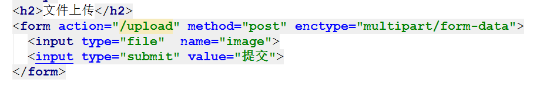

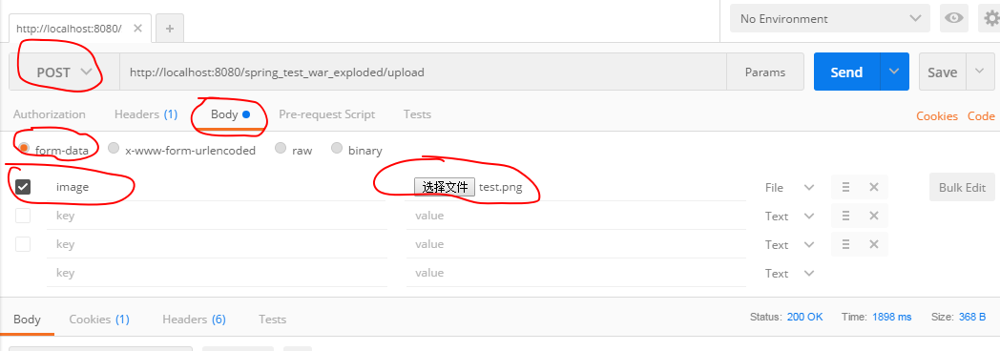

### 15.4. 多文件上传之Part的方式（重点）

**第一步：进行配置文件允许多文件上传**

需要在`tomcat安装目录conf文件夹`下配置`context.xml`：

```xml
<!--允许任意 多部件解析-->
<Context allowCasualMultipartParsing="true">
  
</Context>
```

**第二步：编写Controller**

用`request.getParts()`方法

```java
@Controller
@MultipartConfig
public class MyController4 {

    @PostMapping(value = "/upload2")
    public String upload2(HttpServletRequest request) throws IOException, ServletException {
        Collection<Part> parts = request.getParts();
        String realPath = request.getServletContext().getRealPath("/WEB-INF");
        parts.forEach(part -> {
            try {
                part.write(realPath + "/" + part.getSubmittedFileName());
            } catch (IOException e) {
                // 规范是不能打印堆栈信息
                e.printStackTrace();
            }
        });
        return "success";
    }
}
```

**第三步：编写前端页面或用postman模拟**

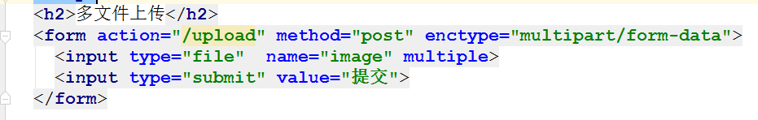

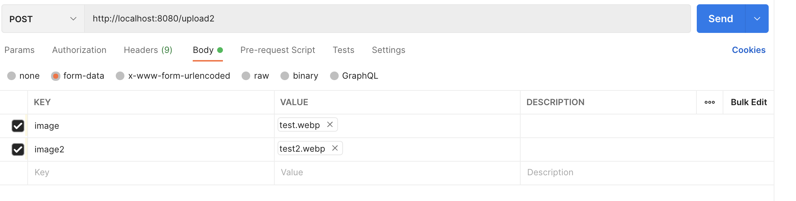

### 15.5.文件上传之springmvc的方式（了解）

> 这种方式 又要导入jar包  又要配置多媒体视图解析器   相对麻烦  

**第一步：导入jar** 

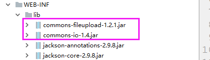

```xml
<dependency>
    <groupId>commons-fileupload</groupId>
    <artifactId>commons-fileupload</artifactId>
    <version>1.4</version>
</dependency>
<dependency>
    <groupId>commons-io</groupId>
    <artifactId>commons-io</artifactId>
    <version>2.11.0</version>
</dependency>
```

**第二步：注册 多媒体(部件)视图解析器 对象**

在Spring-mvc.xml中配置：

```xml
<!--生成多部件解析器对象-->
<bean id="multipartResolver" 		class="org.springframework.web.multipart.commons.CommonsMultipartResolver"> 
</bean>
```

**第三步：编写Controller**

```java
// 这里不用加@MultipartConfig,只需向容器中添加 多媒体视图解析器
@Controller 
public class MyController5 {

  @PostMapping("/upload3") // 注意：加@RequestParam注解指定上传的参数名
  public String upload3(HttpServletRequest request, @RequestParam(value = "image") MultipartFile file) throws IOException {
    String realPath = request.getServletContext().getRealPath("/WEB-INF");
    String fullName = file.getOriginalFilename();
    file.transferTo(new File(realPath + File.separator + fullName));
    return "success";
  }
}
```

**第四步：编写前端或用postman模拟**

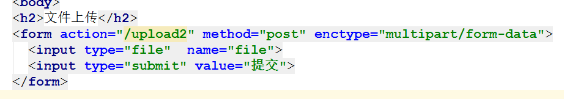


## 16  文件下载 

### 16.1  文件下载方式一 (了解) 

> 这种方式 直接给资源的链接就行了 

**弊端：**不能统计下载次数  并且对于那些不懂电脑的人  不知道使用ctrl+s 或者右键另存为保存 

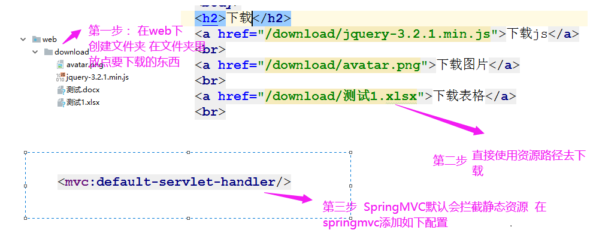

```xml
<!--访问静态资源用-->
<mvc:default-servlet-handler/>
<!--当然为了能继续访问动态资源，需要加注解驱动-->
<mvc:annotation-driven/>
```

### 16.2. 文件下载方式二（重点）

**好处：** 任何文件下载都可以通过弹窗保存 并且可以统计下载次数 

html文档：

```html
<a href="/download">下载word文档</a> <!--href的值写controller的映射路径(请求路径)-->
```

代码：

```java
@Controller
public class MyController5 {

    @GetMapping("/download")
    public ResponseEntity<byte[]> download(HttpServletRequest request) throws IOException {
        // 获取文件地址
        String realPath = request.getServletContext().getRealPath("/WEB-INF/test.png");
        // 文件输入流
        FileInputStream fileInputStream = new FileInputStream(realPath);
        // 小推车
        byte[] buffer = new byte[fileInputStream.available()];
        // 读出到小推车中
        fileInputStream.read(buffer);

        // 获取文件名,下面的写法实测不区分系统的
        String fileFullName = realPath.substring(realPath.lastIndexOf("\\") + 1);

        /**
         *  构建响应实体
         */
        // 构建头信息，固定写法
        HttpHeaders httpHeaders = new HttpHeaders();
        // 头信息设置内容处置，URLEncode.encode()使文件名不乱码
        httpHeaders.setContentDispositionFormData("attachment", URLEncoder.encode(fileFullName, "utf-8"));
        // 填充字节数组，http头，http状态
        ResponseEntity<byte[]> responseEntity = new ResponseEntity<>(buffer, httpHeaders, HttpStatus.OK);

      	// 关闭流
      	fileInputStream.close();
      
        // 返回
        return responseEntity;

    }
}
```

## 17. SpringMVC的异常处理

>我们的开发中 三层架构 dao层 service层 controller层的异常  一般都会抛给SpringMVC来处理   
>
>所以我们异常处理 是针对的SpringMVC的异常处理
>
>最常用的异常处理方式是定义异常处理类并加上注解RestControllerAdvice，方法上加上注解 @ExceptionHandler
>
>也可以实现接口HandlerExceptionResolver（处理器异常解析器）
>
>最后也可以在web.xml中配置error-page

### 1 基于配置的异常处理

**springmvc配置方式：**

SpringMVC提供了一个处理控制器方法执行过程中所出现的异常的接口：HandlerExceptionResolver

HandlerExceptionResolver接口的实现类有：DefaultHandlerExceptionResolver和SimpleMappingExceptionResolver

SpringMVC提供了自定义的异常处理器SimpleMappingExceptionResolver，使用方式：

```xml
<bean class="org.springframework.web.servlet.handler.SimpleMappingExceptionResolver">
    <property name="exceptionMappings">
        <props>
        	<!--
        		properties的键表示处理器方法执行过程中出现的异常
        		properties的值表示若出现指定异常时，设置一个新的视图名称，跳转到指定页面
        	-->
            <prop key="java.lang.ArithmeticException">error</prop>
        </props>
    </property>
    <!--
    	exceptionAttribute属性设置一个属性名，将出现的异常信息在请求域中进行共享
    -->
    <property name="exceptionAttribute" value="ex"></property>
</bean>
```

**tomcat配置方式：**

在`web.xml`中配置错误页面

```xml
<!--web.xml中配置错误页面-->
<error-page>
  <location>/WEB-INF/pages/error.jsp</location>
</error-page>
```

测试代码：

```java
@GetMapping("/error")
public ModelAndView error() {
  // 当异常没有进行任何的处理，就会交给tomcat处理，跳转到错误页面
  int i = 10 / 0;
  return new ModelAndView("success");
}
```

### 2 基于实现接口自定义异常处理

**第一步：创建一个异常处理类**

* 要求实现 `HandlerExceptionResolver`,（处理器异常解析器，处理器就是controller类）
* 要求加入到spring ioc容器中

```java
@Component // 加入容器
public class MyExeptionHander implements HandlerExceptionResolver {
    @Override
    public ModelAndView resolveException(HttpServletRequest httpServletRequest, HttpServletResponse httpServletResponse, Object o, Exception e) {
				// 对象o就是发生异常的控制器方法
      	ModelAndView mv  = new ModelAndView();
        mv.addObject("msg",e.getMessage());
        mv.setViewName("error");
        return mv;
    }
}
```

**第二步：修改error.jsp**

使用el表达式需要引包，加标签

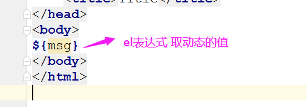

**第三步： 编写Controller** 

```java
@GetMapping("/error")
public ModelAndView error() {
  	// 当异常进行处理时，就不会交给tomcat处理，会找mvc的ioc容器中找handlerExceptionResolver
    int i = 10 / 0;
    return new ModelAndView("success");
}
```

### 3 基于注解的自定义异常处理 （推荐）

> 由于实际开发中  jsp页面用的比较少(可以说 基本不用)  那么我们以上2种方式 则不能满足我们的需求  
>
> 这个时候 我们常要返回json数据   

```java
// @ControllerAdvice将当前类标识为异常处理的组件
@ControllerAdvice
public class ExceptionController {

    // @ExceptionHandler用于设置所标识方法处理的异常
    @ExceptionHandler(ArithmeticException.class)
    // ex表示当前请求处理中出现的异常对象
    public String handleArithmeticException(Exception ex, Model model){
        model.addAttribute("ex", ex);
        return "error";
    }
}
```

**实战：**

> **第一步：创建枚举保存自定义的错误码与信息**

```java
@Getter // 4 提供get()方法
public enum StatusEnum {

    // 3 提供枚举值
    ERROR("40000", "big error");

    // 1 创建字段，最好加上final,但可以不加
    private final String code;

    private final String message;

    // 2 默认私有化构造器
    StatusEnum(String code, String message) {
        this.code = code;
        this.message = message;
    }

    /**
     * 根据code获取枚举值
     *
     * @param code
     * @return
     */
    public StatusEnum enumOf(String code) {
        for (StatusEnum value : StatusEnum.values()) {
            if (value.code.equals(code)) {
                return value;
            }
        }
        return null;
    }
}

```

**第二步：自定义异常**

异常包含状态枚举值

```java
@Data
@AllArgsConstructor
@NoArgsConstructor
public class MyException extends RuntimeException {

    private static final long serialVersionUID = 1L;

    // 自定义异常封装状态枚举StatusEnum
    private StatusEnum statusEnum;
}
```

**第三步：提供静态工厂**

静态工厂生成异常对象

```java
/**
 * 静态工厂
 */
public class ExceptionFactory {

    /**
     * 提供静态方法
     *
     * @param statusEnum
     * @return
     */
    public static MyException newMyException(StatusEnum statusEnum) {
        return new MyException(statusEnum);
    }

    public static MyException newMyException() {
        return new MyException();
    }
    
}
```

**第四步：Controller模拟抛出自定义异常**

```java
@GetMapping("/error2")
public String error2() {
  if (true) {
    throw ExceptionFactory.newMyException(StatusEnum.ERROR);
  }
  return "success";
}
```

**第五步：异常处理类**

```java
// 1加这个相当于@ResponseBody与@ControllerAdvice
@RestControllerAdvice 
public class MyExceptionHandler {

  	// 2加@ExceptionHandler
    @ExceptionHandler(value = MyException.class) 
    public ResponseEntity handler1(MyException exception) { // 3加指定异常
      	// 4获取异常信息并处理
        StatusEnum statusEnum = exception.getStatusEnum();
        return ResponseEntity.ok(statusEnum);
    }
}
```

## 18 SpringMVC拦截器

> SpringMVC中的拦截器用于拦截控制器方法的执行
>
> SpringMVC中的拦截器需要实现HandlerInterceptor
>
> SpringMVC的拦截器必须在SpringMVC的配置文件中进行配置
>
> 过滤器Filter :  /* 拦截所有请求 包括静态资源   可以在任何web项目当中用
>

### 1、拦截器的三个抽象方法

SpringMVC中的拦截器有三个抽象方法：

preHandle：控制器方法执行之前执行preHandle()，其boolean类型的返回值表示是否拦截或放行，返回true为放行，即调用控制器方法；返回false表示拦截，即不调用控制器方法

postHandle：控制器方法执行之后执行postHandle()

afterComplation：处理完视图和模型数据，渲染视图完毕之后执行afterComplation()

### 2、多个拦截器的执行顺序

a>若每个拦截器的preHandle()都返回true

此时多个拦截器的执行顺序和拦截器在SpringMVC的配置文件的配置顺序有关：

preHandle()会按照配置的顺序执行，而postHandle()和afterComplation()会按照配置的反序执行

b>若某个拦截器的preHandle()返回了false

preHandle()返回false和它之前的拦截器的preHandle()都会执行，postHandle()都不执行，返回false的拦截器之前的拦截器的afterComplation()会执行

### 3 使用步骤

**第一步:创建拦截器**

注意这里用ctrl+i实现的是默认方法

```java
public class MyInterceptor implements HandlerInterceptor {

    // 在Controller方法执行前执行
    @Override
    public boolean preHandle(HttpServletRequest request, HttpServletResponse response, Object handler) throws Exception {
        System.out.println("preHandle执行了");
        // 返回false  程序不往下执行
        // 返回true   程序继续往下执行 类似放行的意思
        return true;
    }

    // Controller 方法执行完成后 还没有返回视图时执行
    @Override
    public void postHandle(HttpServletRequest request, HttpServletResponse response, Object handler, ModelAndView modelAndView) throws Exception {
        System.out.println("postHandle执行了");
    }

    // 请求和响应都完成了才执行
    @Override
    public void afterCompletion(HttpServletRequest request, HttpServletResponse response, Object handler, Exception ex) throws Exception {
        System.out.println("afterCompletion执行了");
    }
}
```

**在spring-mvc.xml配置文件中添加配置**


```xml
<mvc:interceptors>
  <mvc:interceptor>
    <!--访问的路径符合如下规则时,则会进入这个拦截器执行-->

    <!--配置多个路径-->
    <!--<mvc:mapping path="/interceptor/*" />-->
    <!--配置单个路径-->
    <mvc:mapping path="/interceptor/aaa"/>

    <!--排除不拦截的路径-->
    <!--<mvc:exclude-mapping path=""-->
    <!--可以看到拦截器不加注解，这里通过配置加入到容器中-->
    <bean class="com.aitx.study.intercepter.FirstInteceptor"/>
  </mvc:interceptor>
</mvc:interceptors>
```

**也可以配置多个拦截器**

```xml
<!-- 配置拦截器  可以配置多个 -->
<mvc:interceptors>

  <!--表示配置一个-->
  <mvc:interceptor>
    <!--拦截的路径 -->
    <mvc:mapping path="/interceptor/*"/>
    <!--拦截后要走的拦截器-->
    <bean class="com.aitx.study.intercepter.FirstInteceptor"></bean>
  </mvc:interceptor>

  <!--表示配置一个-->
  <mvc:interceptor>
    <!--拦截的路径 -->
    <mvc:mapping path="/interceptor/*"/>
    <!--<mvc:exclude-mapping path=""/>-->
    <!--拦截后要走的拦截器-->
    <bean class="com.aitx.study.intercepter.SecondInteceptor"></bean>
  </mvc:interceptor>

</mvc:interceptors>
```

## 19 SpringMVC的静态资源

> 比如在webapp目录下创建static目录，该目录下放置一些静态文件，如.js,.css,.jpg等,称为静态资源。
>
> Springmvc默认无法访问这些静态资源，需要额外配置

### 1 要了解的点

在`web.xml`中注意`Servlet-mapping标签`

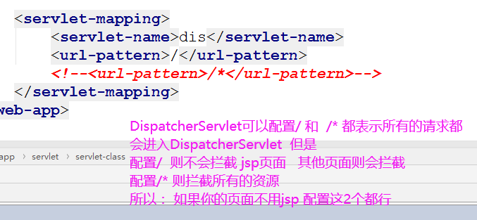

<font color=red>所以</font>:`字符编码过滤器`的`url模式`是`/*`代表拦截所有，即所有的请求都要走那里进行设置字符编码。而dispatcherServlet的`servlet-mapping标签`配置的`url模式`是`/`则拦截除了jsp的所有静态资源与动态资源。

### 2  静态资源解决方式一：配置DispatcherServlet的url-pattern

> 静态资源不进入DispatcherServlet 就行了,统一Controller的访问

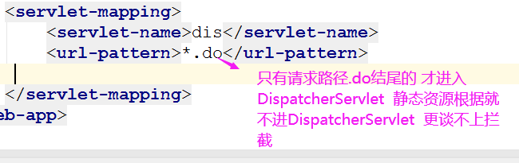

这样，静态资源不符合，则不进入DispatcherServlet

**缺点： 以某种后缀的请求URL不符合Rest风格API**

### 3  静态资源解决方式二:配置default-servlet-handler标签（推荐）

在`spring-mvc.xml`中配置`mvc:default-servlet-handler标签`

```xml
<!--DispatcherServlet处理不了的静态资源交给tomcat默认的servlet进行处理-->
<mvc:default-servlet-handler /> 
```

一般与mvc注解驱动共同使用，解决动静资源的使用

```xml
<!--访问动态资源用-->
<mvc:annotation-driven/>
<!--访问静态资源用-->
<mvc:default-servlet-handler/>
```

### 4 静态资源解决方式三：配置mvc:resources标签

在`spring-mvc.xml`中配置`mvc:resources标签`

根目录static下的所有文件不会被DispatcherServlet拦截，可以直接访问，目录下的文件被当做静态资源交给tomcat的Servlet进行处理

```xml
<!--只要请求方式是/static/**形式的，就会到/static/目录下找-->
<!--注意：static后面有斜杠-->
<mvc:resources mapping="/static/**" location="/static/"></mvc:resources>
```

## 18 SpringMVC类型转换问题

> 字符串类型的时间格式并不会自动转成相应的时间类型
>
> DateTimeFormat注解可以解析字符串为Date,LocalDateTime类型，但只能用于表单key-value形式
>
> JsonFormat注解可以解析字符串为Date(无需引包),LocalDateTime(需要引包)类型，但是只用于json形式
>
> 此外，还可以配置转换器等方式完成字符串转时间

### 18.1. 日期类型转换之Date类型

#### 18.1.1. Date类型传参之key-value表单的形式

key-value形式就是表单中保存数据格式，也是postman中的x-www-form-urlencoded

**问题演示：**

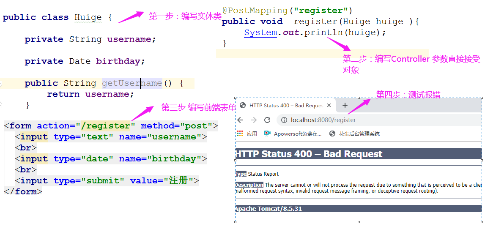

**错误说明： 表单传递的是个字符串 接收的birthday是个Date日期类型 不会自动转换**

**解决方式一：添加注解**

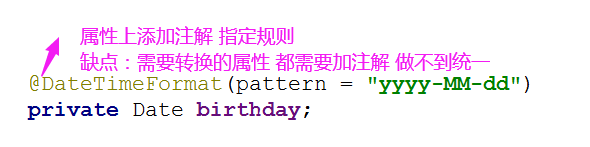

```java
@Data
@NoArgsConstructor
@AllArgsConstructor
public class User implements Serializable {

  private String username;
  @DateTimeFormat(pattern = "yyyy-MM-dd") //这里加上日期时间格式化注解
  private Date birthday;
}
```

**解决方式二：新建类型转换器**

```java
import org.springframework.core.convert.converter.Converter;    
//Converter 第一个泛型 表示from 
//第二个泛型 表示 to
public class MyDateConvert implements Converter<String, Date> {
  @Override
  public Date convert(String s) {
    SimpleDateFormat sdf = new SimpleDateFormat("yyyy-MM-dd");
    try {
      Date parse = sdf.parse(s);
      return parse;
    } catch (ParseException e) {
      SimpleDateFormat sdf1 = new SimpleDateFormat("yyyy/MM/dd");
      try {
        return sdf1.parse(s);
      } catch (ParseException e1) {
        // 规范是不能打印堆栈信息，可以打错误日志并返回null
        e1.printStackTrace();
      }
    }
    return null;
  }
}
```

在`spring-mvc.xml`中配置转换器

```xml
<!--只是实现转换器，这里将实现的转换器放到容器中-->
<bean id="conversionService" class="org.springframework.format.support.FormattingConversionServiceFactoryBean">
    <property name="converters">
        <set>
            <bean class="com.xyz.code.convert.MyDateConvert"/>
        </set>
    </property>
</bean>

<!--这里注意要在 注解驱动 加上 转换服务 属性 -->
<mvc:annotation-driven conversion-service="conversionService"/>
```

#### 18.1.2. Date类型传参之json的格式

> 如果传递的是个json 那么则上述的key-value处理方式则失效   处理json 默认使用了 jackson 我们只需要导入jar包就行了  默认接收的格式 yyyy-MM-dd  其他格式则报错

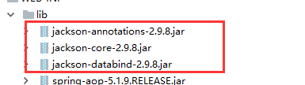


**自定义格式方式一：**

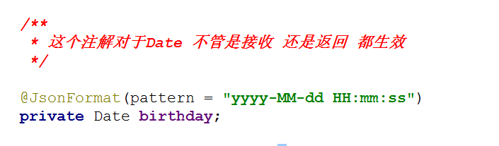

```java
@NoArgsConstructor
@AllArgsConstructor
public class User implements Serializable {

    private String username;
    @JsonFormat(pattern = "yyyy-MM-dd") //可以在请求实体类，响应实体类的日期属性上加
    private Date birthday;
}
```

**自定义格式方式二**

> 不管是接收还是返回json都生效

在`Spring-mvc.xml`中配置，相当于在容器加了两个Bean

```xml
<mvc:annotation-driven>
  <mvc:message-converters>

    <bean class="org.springframework.http.converter.json.MappingJackson2HttpMessageConverter">
      <property name="objectMapper" ref="objectMapper"/>
    </bean>
  </mvc:message-converters>
</mvc:annotation-driven>

<!--这里用到p空间依赖注入-->
<bean id="objectMapper" class="org.springframework.http.converter.json.Jackson2ObjectMapperFactoryBean"
      p:indentOutput="true"
      p:simpleDateFormat="yyyy-MM-dd HH:mm:ss"
/>
```

### 18.2. 日期转换类型之LocalDateTime类型 

#### 18.2.1. 参数类型传值之Key-value表单形式

**第一种解决方式：**

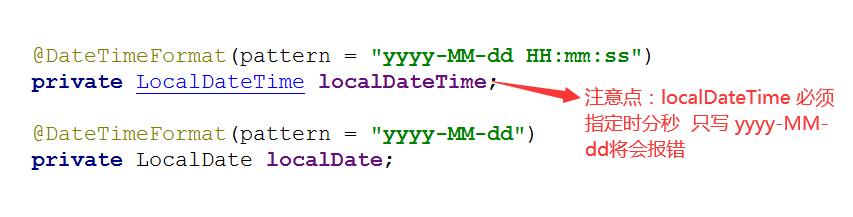

**第二种解决方式：**

1、定义2个Converts

```java
public class MyConvert1 implements Converter<String,LocalDateTime> {
  @Override
  public LocalDateTime convert(String s) {
    return LocalDateTime.parse(s,DateTimeFormatter.ofPattern("yyyy-MM-dd HH:mm:ss"));
  }
}
```


```java
public class MyConvert2 implements Converter<String,LocalDate> {
    @Override
    public LocalDate convert(String s) {
       return LocalDate.parse(s,DateTimeFormatter.ofPattern("yyyy-MM-dd"));
    }
}
```

2、加载convert

只是定义了转换器，但要加入容器中

```xml
<mvc:annotation-driven conversion-service="conversionService"/>

<bean id="conversionService"
      class="org.springframework.format.support.FormattingConversionServiceFactoryBean">
  <property name="converters">
    <set>
      <bean class="com.xyz.code.convert.MyLocalDateTimeConvert"/>
      <bean class="com.xyz.code.convert.MyLocalDateConvert"/>
    </set>
  </property>
</bean>
```

#### 18.2.2. 参数类型传值之json类型 

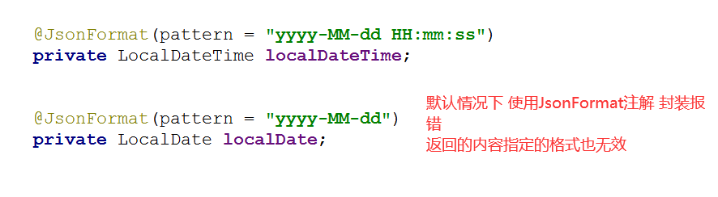

**注意：如果使用java8中的日期时 此时我们需要一个jackson的支持包**

jsr = java specific request = java 规范请求

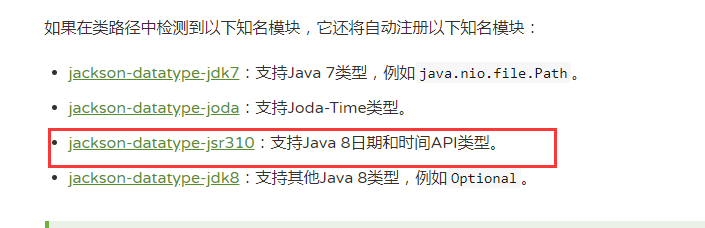

  

**导入这个包**

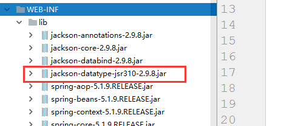

**导入这个包后 什么都不需要配置 直接使用@JsonFormat注解  接收和响应 都会按照指定的格式生效**

**解决方式一：引入jar包，添加注解（推荐）**

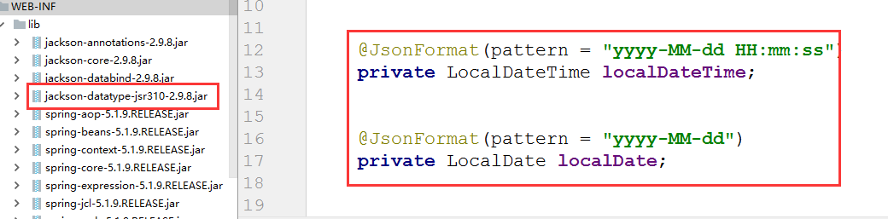

```xml
<dependency>
    <groupId>com.fasterxml.jackson.datatype</groupId>
    <artifactId>jackson-datatype-jsr310</artifactId>
    <version>2.13.2</version>
</dependency>
```

**解决方式二：配置Jackson2ObjectMapperFactoryBean**

首先还是要引入jackson-datatype-jsr310包

然后在`spring-mvc.xml`中配置：

```xml
<bean class="org.springframework.http.converter.json.Jackson2ObjectMapperFactoryBean" p:indentOutput="true" p:modules-ref="module">
<!--这种配置默认格式为yyyy-MM-ddTHH:mm:ss,并且返回的也是一个对象-->
</bean>

<bean id="module" class="com.fasterxml.jackson.datatype.jsr310.JavaTimeModule"></bean>
```

**最终解决方式：**

**牵扯到新技术 后面再说**

## 19 注解配置SpringMVC

使用配置类和注解代替web.xml和SpringMVC配置文件的功能

### 1、创建初始化类，代替web.xml

在Servlet3.0环境中，容器会在类路径中查找实现javax.servlet.ServletContainerInitializer接口的类，如果找到的话就用它来配置Servlet容器。 Spring提供了这个接口的实现，名为SpringServletContainerInitializer，这个类反过来又会查找实现WebApplicationInitializer的类并将配置的任务交给它们来完成。Spring3.2引入了一个便利的WebApplicationInitializer基础实现，名为AbstractAnnotationConfigDispatcherServletInitializer，当我们的类扩展了AbstractAnnotationConfigDispatcherServletInitializer并将其部署到Servlet3.0容器的时候，容器会自动发现它，并用它来配置Servlet上下文。

```java
public class WebInit extends AbstractAnnotationConfigDispatcherServletInitializer {

    /**
     * 指定Spring配置类
     *
     * @return
     */
    @Override
    protected Class<?>[] getRootConfigClasses() {
        return new Class[]{SpringConfig.class};
    }

    /**
     * 指定SpringMvc配置类
     *
     * @return
     */
    @Override
    protected Class<?>[] getServletConfigClasses() {
        return new Class[]{SpringMvcConfig.class};
    }

    /**
     * 指定前端控制器DispatcherServlet的url-pattern
     *
     * @return
     */
    @Override
    protected String[] getServletMappings() {
        return new String[]{"/"};
    }

    /**
     * 注册过滤器
     *
     * @return
     */
    @Override
    protected Filter[] getServletFilters() {
        // 字符编码过滤器
        CharacterEncodingFilter characterEncodingFilter = new CharacterEncodingFilter();
        characterEncodingFilter.setEncoding("UTF-8");
        characterEncodingFilter.setForceRequestEncoding(true);
        characterEncodingFilter.setForceResponseEncoding(true);
        // 表单支持put/delete请求
        HiddenHttpMethodFilter hiddenHttpMethodFilter = new HiddenHttpMethodFilter();
        return new Filter[]{characterEncodingFilter, hiddenHttpMethodFilter};
    }

}
```

### 2、创建SpringConfig配置类，代替spring的配置文件

```java
@Configuration
public class SpringConfig {
    // ssm整合之后，spring的配置信息写在此类中0
}
```

### 3、创建SpringMvcConfig配置类，代替SpringMVC的配置文件

```java
/**
 * 处理器拦截器
 */
public class FirstInterceptor implements HandlerInterceptor {
    @Override
    public boolean preHandle(HttpServletRequest request, HttpServletResponse response, Object handler) throws Exception {
        return HandlerInterceptor.super.preHandle(request, response, handler);
    }

    @Override
    public void postHandle(HttpServletRequest request, HttpServletResponse response, Object handler, ModelAndView modelAndView) throws Exception {
        HandlerInterceptor.super.postHandle(request, response, handler, modelAndView);
    }

    @Override
    public void afterCompletion(HttpServletRequest request, HttpServletResponse response, Object handler, Exception ex) throws Exception {
        HandlerInterceptor.super.afterCompletion(request, response, handler, ex);
    }
}
```

```java
@Configuration
@ComponentScan(basePackages = {"com.aitx.study"}) // 组件扫描
@EnableWebMvc // 开启SpringMvc注解驱动
// 注意实现WebMvcConfigurer接口
public class SpringMvcConfig implements WebMvcConfigurer {

    /**
     * 当前端控制器无法处理静态资源时，使用默认的servlet处理静态资源
     *
     * @param configurer
     */
    @Override
    public void configureDefaultServletHandling(DefaultServletHandlerConfigurer configurer) {
        configurer.enable();
    }

    /**
     * 配置文件上传解析器,注意要引入文件上传依赖包
     *
     * @return
     */
    @Bean // 将new对象注册到ioc容器中
    public CommonsMultipartResolver multipartResolver() {
        return new CommonsMultipartResolver();
    }

    /**
     * 配置处理器拦截器，并配置拦截路径
     *
     * @param registry
     */
    @Override
    public void addInterceptors(InterceptorRegistry registry) {
        FirstInterceptor firstInterceptor = new FirstInterceptor();
        registry.addInterceptor(firstInterceptor).addPathPatterns("/**");
    }

    /**
     * 配置视图控制器
     *
     * @param registry
     */
    @Override
    public void addViewControllers(ViewControllerRegistry registry) {
        registry.addViewController("/").setViewName("index");
    }

    /**
     * 配置处理器异常解析器
     *
     * @param resolvers
     */
    @Override
    public void configureHandlerExceptionResolvers(List<HandlerExceptionResolver> resolvers) {
        SimpleMappingExceptionResolver exceptionResolver = new SimpleMappingExceptionResolver();
        Properties prop = new Properties();
        prop.setProperty("java.lang.ArithmeticException", "error");
        // 设置异常映射
        exceptionResolver.setExceptionMappings(prop);
        // 设置共享异常信息的键
        exceptionResolver.setExceptionAttribute("ex");
        resolvers.add(exceptionResolver);
    }

    /**
     * 配置thymeleaf解析器，我们可以从里向外配置，首先配置模板解析器
     * 配置生成模板解析器
     *
     * @return
     */
    @Bean
    public ITemplateResolver templateResolver() {
        // 获取Spring Mvc的IOC容器
        WebApplicationContext webApplicationContext = ContextLoader.getCurrentWebApplicationContext();
        // 注意这里用的是另一个类，不是配置文件中的SpringResourceTemplateResolver
        // ServletContextTemplateResolver需要一个ServletContext（application)作为构造参数，可通过WebApplicationContext 的方法获得
        ServletContextTemplateResolver templateResolver = new ServletContextTemplateResolver(
                webApplicationContext.getServletContext());
        templateResolver.setPrefix("/WEB-INF/templates/");
        templateResolver.setSuffix(".html");
        templateResolver.setCharacterEncoding("UTF-8");
        templateResolver.setTemplateMode(TemplateMode.HTML);
        return templateResolver;
    }

    /**
     * 生成模板引擎并为模板引擎注入模板解析器
     * 形参位置的对象可直接从容器中获取
     *
     * @param templateResolver
     * @return
     */
    @Bean
    public SpringTemplateEngine templateEngine(ITemplateResolver templateResolver) {
        SpringTemplateEngine templateEngine = new SpringTemplateEngine();
        templateEngine.setTemplateResolver(templateResolver);
        return templateEngine;
    }

    /**
     * 生成视图解析器并将模板引擎注入到解析器中
     *
     * @param templateEngine
     * @return
     */
    @Bean
    public ViewResolver viewResolver(SpringTemplateEngine templateEngine) {
        ThymeleafViewResolver viewResolver = new ThymeleafViewResolver();
        viewResolver.setOrder(1);
        viewResolver.setCharacterEncoding("UTF-8");
        viewResolver.setTemplateEngine(templateEngine);
        return viewResolver;
    }


}
```

### 4 、配置视图页面

/WEB-INF/templates/index.html

```html
<!DOCTYPE html>
<html lang="en" xmlns:th="http://www.thymeleaf.org">
<head>
    <meta charset="UTF-8" >
    <title>Title</title>
</head>
<body>
<h1>首页</h1>
</body>
</html>
```

/WEB-INF/templates/error.html

```html
<!DOCTYPE html>
<html lang="en" xmlns:th="http://www.thymeleaf.org">
<head>
    <meta charset="UTF-8">
    <title>异常页面</title>
</head>
<body>
<h1>异常了</h1>
</body>
</html>
```

### 5、测试功能

```java
@Controller
public class HelloController {

    @RequestMapping("/hello")
    public String index() {
        return "error";
    }
}
```

## 20 SpringMvc常见异常

1、关于${username}读取不到参数的问题
spring加载时，也会把JVM system properties和JVM system env properties都读取到容器中，所以此时读取的是JVM系统环境变量的username，而不是.properties文件中的username，所以导致${username}取不到想要的值。所以请不要使用和JVM properties相同的key。


2、关于request.getParts()获取不到上传文件的问题
a，检查类名上是否添加了@MultipartConfig注解
b，运行环境问题，可查对应资料。
c，tomcat的context.xml文件，，增加allowCasualMultipartParsing=“true”。（本人通过此方式解决的）


3、web工程目录，在配置webapp/WEB-INF/web.xml的Spring MVC的DispatcherServlet时，在servlet-name上报错：Servlet should have a mapping，但已经存在了映射还报错

解决：File-->Project Structure-->Modules-->Web-->Deployment Descriptors-->复制原有需要的内容后，点击-删除原来的配置，点击+号新增配置，注意路径要在webapp/WEB-INF/路径下