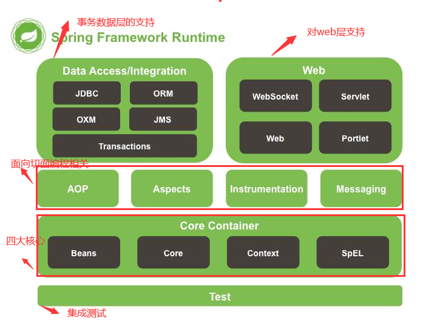

# Spring教程

## 1.Spring的下载

* **第一步**

  进入spring官网，https://spring.io/


* **第二步**

  点击github小猫图标


* **第三步**

  点击Access to Binaries中的链接

  

* **第四步**

  点击https://repo.spring.io

  

* **第五步**

  选择artifatcs

  

* **第六步**

  

* **第七步**

 


* **第八步**

  distribution发布版，选择此项
  
  document文档
  
  schema 协议，逻辑表
  
  
## 2.Spring的概述

### 2.1. 什么是Spring


```properties
EJB = enterprise java bean = 企业java bean
```

### 2.2. Spring的好处

- 方便解耦，简化开发  （高内聚低耦合）
  AOP编程的支持	
   声明式事务的支持	
- 方便程序的测试
  方便集成各种优秀框架	
- 降低JavaEE API的使用难度

### 2.3. Spring在三层中的哪一层

> Spring 对 web层 业务层  持久层  都有支持  是一个大管家 

- WEB层	：SpringMVC

- Service层：Spring的Bean管理，Spring声明式事务
  DAO层	：Spring的Jdbc模板，Spring的ORM模块
  
  ```
orm = object relation model = 对象关系模型 
  ```


**总结：Spring是一个大管家 是java企业项目一站式解决方案**

### 2.4. Spring的下载以及官网

- 官网: <https://spring.io/>
- 下载地址：http://repo.spring.io/release/org/springframework/spring/

### 2.5. Spring的开发包介绍


### 2.6. Spring的体系结构图



```properties
SpEL = spring expression language = spring 表达试语言
instrumentation = 工具
jdbc = java database connection
oxm = object xml model = 对象xml模型
jms = java message service
transaction = 事务
```

## 3.Spring的控制反转

### 3.1. 什么是控制反转

> 控制反转简称IOC , 表示之前我们创建一个对象 往往是通过new的方式创建 ,主动权控制权在我们手中,使用spring 就是让创建对象这个事 ,控制在spring手中,让我们控制权反转给了spring    
>
> ioc = inversion  of control = 控制反转

### 3.2. 控制反转的演示

#### 3.2.1. 创建普通的java工程


#### 3.2.2. 导入jar包

在src或resources（需要右键标记为资源文件夹）下建lib包

方式一：右建相应的jar包add to library

方式二：除了上述方式导jar包，也可以在project setting 中 选module 后选择dependencies点击+添加jar包


```properties
beans,context,core,expression属于核心容器部分
jcl= java common log = java 共公日志。一般导包的时候也要导公共日志包，也可以导其他日志包比如common-log包
```

#### 3.2.3. 编写代码 

```java
//在service包下写建立UserService接口
public interface UserService {
    void addUser();
}

//在service.impl包下建立UserServiceImpl类
public class UserServiceImpl implements UserService {
    @Override
    public void addUser() {
        System.out.println("添加用户成功");
    }
}
```

#### 3.2.4. 编写配置文件

```properties
在src或resources下创建配置文件，直接右键new > xml configuration file > spring config,配置 文件名applicationContext
```

```xml
<?xml version="1.0" encoding="UTF-8"?>
<beans xmlns="http://www.springframework.org/schema/beans"
       xmlns:xsi="http://www.w3.org/2001/XMLSchema-instance"
       xsi:schemaLocation="http://www.springframework.org/schema/beans http://www.springframework.org/schema/beans/spring-beans.xsd">

    <!--
		id是bean的唯一值，ioc容器通过id可以获取注册的对象。
		class代表创建的bean的类，底层利用反射
	-->
    <bean id="userService" class="com.xyz.java.impl.UserServiceImpl"></bean>
</beans>
```

#### 3.2.5. 编写测试类

```java
public class IOCTest {
    public static void main(String[] args) {
        //加载配置文件
        ApplicationContext applicationContext  = 
                new ClassPathXmlApplicationContext("applicationContext.xml");
        //从ioc容器中 通过xml中设置的id属性拿到创建的对象
        UserService userService = 	applicationContext.getBean("userService",UserService.class);
        userService.addUser();
    }
}
```

#### 3.2.6. 提出问题

- 这样写麻烦 直接new一个对象 调用多简单  使用spring显得很麻烦  

例如：


#### 3.2.7. 问题解答

- 我们直接new对象 调用方法 是可以的 但是这样写就形成了耦合  程序一般讲究高内聚 低耦合 
- spring的写法  就没有耦合  成功把编译器异常变成运行期异常 （底层采取反射+工厂模式）

#### 3.2.8. 耦合了解

- 耦合：表示代码中(程序中)的依赖关系 

## 4.Spring的依赖注入

> 依赖注入简称DI  说白了就是通过set方法 给成员变量赋值 自动的赋值
>
> di = dependency injection = 依赖注入

### 4.1. 依赖注入的环境搭建

#### 4.1.1. 新建2个类

```java
public class User {
    //普通属性
    private String username;
    private int age;

    //集合属性
    private int[] array;

    private List<String> list;

    private Set<String> set;

    private Map<String, String> map;

    private Properties properties;

    //自定义引用类型
    private Wife wife;
}  
    
    
public class Wife {
    private String username;
}

```

#### 4.1.2. 编写配置文件

```xml
<!--在applicationContext.xml配置文件上编写如下内容-->  
<bean id="user" class="com.xyz.code.entity.User"></bean>
```

#### 4.1.3. 测试类获取User对象

```java
public class UserTest {
    public static void main(String[] args) {
        ApplicationContext ioc =
                new ClassPathXmlApplicationContext("applicationContext.xml");
        User user = ioc.getBean("user", User.class);
        System.out.println(user);
    }
}
```

```java
//输出：
com.xyz.code.entity.User@f6c48ac
```

### 4.2. 使用setXxx()方法给属性赋值

#### 4.2.1. 给普通属性赋值

```xml
<?xml version="1.0" encoding="UTF-8"?>
<beans xmlns="http://www.springframework.org/schema/beans"
       xmlns:xsi="http://www.w3.org/2001/XMLSchema-instance"
       xsi:schemaLocation="http://www.springframework.org/schema/beans http://www.springframework.org/schema/beans/spring-beans.xsd">

    <bean id="user" class="com.xyz.code.entity.User">
        <!--设置属性的名与值，注意实体类要有setXxx()方法-->
        <property name="username" value="xiaoming"></property>
        <property name="age" value="18"></property>
    </bean>
</beans>
```

#### 4.2.2. 给自定义的引用类型赋值

```xml
    <bean id="wife" class="com.xyz.code.entity.Wife"></bean>
    <bean id="user" class="com.xyz.code.entity.User">
        <!--设置属性的名与值，注意实体类要有setXxx()方法-->
        <property name="username" value="xiaoming"></property>
        <property name="age" value="18"></property>
        <!--引用类型使用ref来注入-->
        <property name="wife" ref="wife"></property>
    </bean>
```

#### 4.2.3. 测试

```java
public class UserTest {
    public static void main(String[] args) {
        ApplicationContext ioc =
                new ClassPathXmlApplicationContext("applicationContext.xml");
        User user = ioc.getBean("user", User.class);
        System.out.println(user.getUsername()+"\t"+user.getAge()+"\t"+user.getWife());
    }
}
```

```
//输出
xiaoming	18	com.xyz.code.entity.Wife@2b2948e2
```

### 4.3. 使用Constructor给属性赋值

#### 4.3.1. 给Wife类添加构造方法

```java
public class Wife {

    private String username;
    private Integer age;

    //无参构造方法
    public Wife() {
    }

    //有参构造方法
    public Wife(String username, Integer age) {
        this.username = username;
        this.age = age;
    }
}
```

#### 4.3.2. 编辑配置文件

```java
    <bean id="wife" class="com.xyz.code.entity.Wife">
        <!--使用构造器来注入属性值，注意实体类要有有参构造器-->
        <constructor-arg name="username" value="xiaohong"></constructor-arg>
        <constructor-arg name="age" value="19"></constructor-arg>
    </bean>
```

#### 4.3.3.3. 测试类

```java
public class UserTest {
    public static void main(String[] args) {
        ApplicationContext ioc =
                new ClassPathXmlApplicationContext("applicationContext.xml");
        User user = ioc.getBean("user", User.class);
        System.out.println(
            user.getUsername()+"\t"+user.getAge()+"\t"+user.getWife().getUsername());
    }
}
```

```java
//输出：
xiaoming	18	xiaohong
```

### 4.4.使用P命名空间赋值(了解)

#### 4.4.1. 在配置文件添加约束

只要在bean标签中使用p:就会有提示在beans标签中插入p名称空间，所以不用先加约束

```xml
xmlns:p="http://www.springframework.org/schema/p"
```

#### 4.4.2. 使用P空间赋值

```xml
<bean id="user2" class="com.xyz.code.entity.User"
       p:username="hello" p:age="20" p:wife-ref="wife">
</bean>
```

#### 4.4.3. 测试

```java
public class UserTest {
    public static void main(String[] args) {
        ApplicationContext ioc =
                new ClassPathXmlApplicationContext("applicationContext.xml");
        User user = ioc.getBean("user2", User.class);
        System.out.println(user.getUsername()+"\t"+user.getAge()+"\t"+user.getWife().getUsername());
    }
}
```

```java
//输出：
hello	20	xiaohong
```

### 4.5. 属性赋值时value可以在内部赋值(了解)

```xml
    <bean id="user" class="com.xyz.code.entity.User">
        <!--设置属性的名与值，注意实体类要有setXxx()方法-->
        <property name="username" >
            <value>xiaoming</value>
        </property>
        <property name="age">
            <value>18</value>
        </property>
        <!--原来 引用类型使用ref来注入-->
        <property name="wife" >
            <!--这里用ref标签-->
           <ref bean="wife"/>
        </property>
     </bean>
```

也可以这样：

```xml
    <bean id="user" class="com.xyz.code.entity.User">
        <!--设置属性的名与值，注意实体类要有setXxx()方法-->
        <property name="username">
            <value>xiaoming</value>
        </property>
        <property name="age">
            <value>18</value>
        </property>
        <!--原来 引用类型使用ref来注入-->
        <property name="wife">
            <!--这里用ref标签-->
            <ref bean="wife"/>
        </property>
    </bean>
```

### 4.6. 给数组赋值

#### 4.6.1.无素是普通类型时：

```xml
    <bean id="user" class="com.xyz.code.entity.User">
        <property name="array">
            <array>
                <value>1</value>
                <value>2</value>
                <value>3</value>
            </array>
        </property>
    </bean>
```

#### 4.6.2.元素是引用类型时：

<font color=red>注意：要在bean处填写引用对象的id</font>

```xml
    <bean id="user" class="com.xyz.code.entity.User">
        <property name="array">
            <array>
               <ref bean=""></ref>
               <ref bean=""></ref>
            </array>
        </property>
    </bean>
```

### 4.7. 给list集合赋值

```xml
    <bean id="user" class="com.xyz.code.entity.User">
        <property name="list">
           <list>
               <value>a</value>
               <value>b</value>
               <value>c</value>
           </list>
        </property>
    </bean>
```

### 4.8. 给set集合赋值

```xml
    <bean id="user" class="com.xyz.code.entity.User">
        <property name="set">
           <set>
               <value>a</value>
               <value>b</value>
               <value>c</value>
           </set>
        </property>
    </bean>
```

### 4.9. 给Map集合赋值

```xml
    <bean id="user" class="com.xyz.code.entity.User">
        <property name="map">
            <map>
                <entry key="key1" value="value1"></entry>
                <entry key="key2" value="value2"></entry>
            </map>
        </property>
    </bean>
```

### 4.10. 给properties赋值

```xml
    <bean id="user" class="com.xyz.code.entity.User">
        <property name="properties">
            <props>
                <prop key="pro1">aaa</prop>
                <prop key="pro2">bbb</prop>
                <prop key="pro3">ccc</prop>
            </props>
        </property>
    </bean>
```

## 5.Spring创建对象的方式

> 使用spring之后  创建对象的事情 交给了Spring  那么Spring创建对象有哪几种方式

### 5.1. 无参构造方法(默认情况下) 

> 可以在无参构造方法中打印一句话，即可查看

```xml
	<!--使用无参构造方法构建对象-->
	<bean id="user" class="com.xyz.code.entity.User"></bean>
```

### 5.2. 静态工厂的方式

> 顾名思义：一个工程类 带有 静态方法 

#### 5.2.1. 创建一个工厂类带静态方法

```java
public class UserStaticFactory {
    public static User getUser(){
        return new User();
    }
}
```

#### 5.2.2. 编写配置文件

```xml
<!--指定了工厂方法，则ioc中注册的是User对象-->
<bean id="userStaticFactory" 
          class="com.xyz.code.entity.UserStaticFactory" factory-method="getUser"></bean>
```

### 5.3. 实例工厂的方式

> 一个工厂类带有 实例方法
>
> 要想获取生成的对象，必须先有工厂实例对象，通过实例对象创建对象。提供所有的方法都是“非静态”的。

#### 5.3.1. 实例工厂与方法

```java
//相对于静态工厂，只是少了个static修饰符
public class UserInstanceFactory {
    public User getUser(){
        return new User();
    }
}
```

#### 5.3.2. 编写配置文件

```xml
    <!--要想获取生成的对象，必须先有工厂实例对象，通过实例对象创建对象。提供所有的方法都是“非静态”的。-->
    <bean id="userInstanceFactory" 
          class="com.xyz.code.entity.UserInstanceFactory"></bean>
    <bean id="getUser" 
          factory-bean="userInstanceFactory" factory-method="getUser"></bean>
```

一个bean产生一个对象

## 6. Bean的生命周期

> 首先要了解：Spring默认启动的时候就创建Bean，并且是个单实例的Bean
>
> 如果其他组件需要使用这个Bean的时候直接从容器中取 
>
> 我们可以通过设置懒加载让bean在使用的时候 再创建

### 6.1. 环境搭建

新建类并提供初始化方法与销毁方法

```java
public class Car {
    
    private String carName;
    private Double carPrice;
    
    public Car() {
        System.out.println("调用构造器了");
    }
    
    public void init(){
        System.out.println("调用初始化方法了");
    }
    
    public void destroy(){
        System.out.println("调用销毁方法了");
    }
}
```

```xml
<bean id="car" class="com.xyz.code.entity.Car"></bean>
```

测试代码：

```java
public class UserTest {
    public static void main(String[] args) {
        ApplicationContext ioc =
                new ClassPathXmlApplicationContext("applicationContext.xml");
    }
}
```

```java
//输出:
调用构造器了
```

即ioc容器启动时就生成了对象并注册到容器中

可以看到自定义的方法并没有加载

### 6.2. 懒加载的配置 

> 默认情况下 spring一启动对象则会被实例化。我们配置懒加载 ，让对象使用（获取）的时候再实例化

```xml
<bean id="car" class="com.xyz.code.entity.Car" lazy-init="true"></bean>
```

开如懒加载，则容器启动时不会实例化对象，只有在使用的时候才会实例化对象

### 6.3. 生命周期属性

```xml
<bean id="car" 
class="com.xyz.code.entity.Car" init-method="init" destroy-method="destroy"></bean>
```

测试代码：

```java
    public static void main(String[] args) {
        ApplicationContext ioc =
                new ClassPathXmlApplicationContext("applicationContext.xml");
        Car car = ioc.getBean("car", Car.class);
    }
```

```java
//输出：
调用构造器了
调用初始化方法了
```

可以看到先调用构造器再调用初始化方法，只有当容器关闭时才会调用销毁方法

## 7. Bean的作用域 scope

- 单例模式（默认值）

 ```xml
//加不加scope="singleton"一样
<bean id="user" class="com.xyz.code.entity.User"></bean>
<bean id="user" class="com.xyz.code.entity.User" scope="singleton"></bean>
 ```

- 多例模式（原型 = 原来的类型）

```xml
<bean id="user" class="com.xyz.code.entity.User" scope="prototype"></bean>
```

**单例(默认值 )  全局只有一个对象 **

**多例：用一次创建一个新对象 本身实现懒加载  就算取消懒加载也无效**

懒加载就是容器启动时未生成对象并注册到容器中

## 8. 控制反转包扫描的方式

> 我们创建对象的任务交给spring，只需在配置文件中配置bean标签就可以了，但是如果实际开发中配置的bean比较多，比较麻烦，我们可以通过包扫描+注解的方式实现统一配置  

### 8.1. 添加aop.jar


### 8.2. 配置包扫描


```xml
<!--包扫描会自动扫描指定的包及其子包，后面加上注解就能生成对象并注册--> 
<context:component-scan base-package="com.xyz.code"/>
```

### 8.3. 在类上添加注解

```java
@Component //可以指定id,默认是类名首字母小写
public class Student {
}
/**
@Component
@Controller
@Service
@Repository都能生成对象并注册
/
```

### 8.4. 说明点

- @Component注解 ，一个类加了注解表示这个类成为了Spring的一个组件，就是加入到IOC容器中   
- @Component注解  针对java的三层架构 有延伸注解 @Controller @Service @Respository
- 组件就是具有功能的类

## 9.加载外部配置文件和取值

### 9.1. 使用xml配置的方式来取值

#### 9.1.1 定义properties文件

在resources或类路径下创建test.properties文件，内容是：

```properties
//注意：编码格式一定要utf-8,一般习惯加前缀
xyz.username=xiaoming
xyz.age=18
```

#### 9.1.2. 编写xml配置文件

```xml
    <!--通过属性占位符引入属性文件，位置是类路径下-->
<context:property-placeholder
               location="classpath:test.properties"></context:property-placeholder>
    
<bean id="user3" class="com.xyz.code.entity.User">
    <!--通过${}方式取值-->
    <property name="username" value="${xyz.username}"></property>
    <property name="age" value="${xyz.age}"></property>
</bean>
```

### 9.2. 包扫描的方式

#### 9.2.1配置包扫描

要使用注解就要加上包扫描

```xml
<!--包扫描会自动扫描指定的包及其子包，后面加上注解就能生成对象并注册--> 
<context:component-scan base-package="com.xyz.code"/>
```

#### 9.2.2. 修改Employee类

```java
@Component
//指定属性源在哪，这晨指定是类路径下
@PropertySource(value = "classPath:test.properties")
public class Employee {
    //通过Value注解取值，${}方式
    @Value(value = "${xyz.username}")
    private String employeeName;
    @Value(value = "${xyz.age}")
    private Integer employeeAge;
    //自行提供getter与setter
}
```

#### 9.2.3. @Value的其他用法


## 10.此节易出现的异常

10.1就是用了注解但没有引入aop包

```properties
//无此类定义发现 错误

nested exception is java.lang.NoClassDefFoundError: org/springframework/aop/TargetSource
```

10.2类路径英文名是classpath，全小写，如果写错会出现以下错误

```properties
//文件找不到 异常

nested exception is java.io.FileNotFoundException: class path resource [classPath:test.properties] cannot be opened because it does not exist
```

