#  SpringMVC

**spring对web层支持 主要是提供了SpringMVC**

## 1. 什么是MVC

> mvc是web层 一种设计模式   全称是 Model  View  Controller   各个层面做各个层面的事 

- Model: 数据模型  就是指数据
- View : 表示视图  就是我们用的jsp和html 用来展示数据
- controller: 控制器  主要是处理用户交互部分  

## 2. SpringMVC的概述


Spring Web MVC是基于Servlet API构建的原始Web框架，并从一开始就包含在Spring Framework中。正式名称“ Spring Web MVC”来自其源模块[spring-webmvc](https://github.com/spring-projects/spring-framework/tree/master/spring-webmvc)的名称， 但它通常被称为“ Spring MVC”。

**简而言之，springMVC对servlet进行封装，避免繁琐的获取表单参数，多余的serlvet服务类等代码**

## 3. SpringMVC的基本使用

### 3.1. 创建web工程


### 3.2. 导入jar包


### 3.3. 创建Controller

```java
//注意这里导入的是Controller接口
import org.springframework.web.servlet.mvc.Controller;
public class MyController implements Controller {
    @Override
    public ModelAndView handleRequest(HttpServletRequest httpServletRequest, HttpServletResponse httpServletResponse) throws Exception {
        ModelAndView mv  = new ModelAndView();
        mv.addObject("msg","hello Springmvc");
        mv.setViewName("success");
        return mv;
    }
}
```

### 3.4. 创建success页面


### 3.5. 编写配置文件

```xml
<?xml version="1.0" encoding="UTF-8"?>
<beans xmlns="http://www.springframework.org/schema/beans"
       xmlns:xsi="http://www.w3.org/2001/XMLSchema-instance"
       xsi:schemaLocation="http://www.springframework.org/schema/beans http://www.springframework.org/schema/beans/spring-beans.xsd">

    <!--配置处理器映射-->
    <bean class="org.springframework.web.servlet.handler.BeanNameUrlHandlerMapping"></bean>
    <!--配置处理器适配器-->
    <bean class="org.springframework.web.servlet.mvc.SimpleControllerHandlerAdapter"></bean>
    <!--配置视图解析器-->
    <bean class="org.springframework.web.servlet.view.InternalResourceViewResolver">
        <property name="prefix" value="/WEB-INF/pages/"></property>
        <property name="suffix" value=".jsp"></property>
    </bean>
    <!--将实现Controller接口的类放到容器中，并起名字-->
    <bean name="/hello" class="com.xyz.code.controller.MyController"></bean>
</beans>
```

### 3.6. web.xml配置Servlet

```xml
    <servlet>
        <servlet-name>dispacherServlet</servlet-name>
        <servlet-class>org.springframework.web.servlet.DispatcherServlet</servlet-class>
        <!--初始化参数加载配置文件
         注意： key是 固定写法  必须写contextConfigLocation
        -->
        <init-param>
            <param-name>contextConfigLocation</param-name>
            <param-value>classpath:springMvc.xml</param-value>
        </init-param>
    </servlet>
   <servlet-mapping>
       <servlet-name>dispacherServlet</servlet-name>
       <url-pattern>/</url-pattern>
   </servlet-mapping>
```

### 3.7. 启动tomcat测试


## 4. SpringMVC的执行流程


## 5. SpringMVC的内部流程


**了解 不同的写法 使用不同的处理器映射器  和不同的处理器适配器**

## 6. 第二种写法(重点)

>  我们按照刚才的编码  有很大的问题   我们定义的Controller 只能做一件事  因为就一个实现   并且每次都配置Bean 不是很优雅   

### 6.1. 编写Controller

```java
@Controller  //Component的衍生注解
public class MyController2 {
    //只接受请求方式为get
    @GetMapping(value = "/hello") 
    public ModelAndView hello() {
        ModelAndView modelAndView = new ModelAndView();
        modelAndView.addObject("message", "hello");
        modelAndView.setViewName("success");
        return modelAndView;
    }
}
```

### 6.2. 编写配置文件

在`springMvc.xml`配置文件中写如下内容：

```xml
    <!--开启组件扫描-->
    <context:component-scan base-package="com.xyz.code"/>

    <!--配置处理器映射-->
    <bean class="org.springframework.web.servlet.mvc.method.annotation.RequestMappingHandlerMapping"></bean>
    <!--配置处理器适配器-->
    <bean class="org.springframework.web.servlet.mvc.method.annotation.RequestMappingHandlerAdapter"></bean>
    <!--配置视图解析器-->
    <bean class="org.springframework.web.servlet.view.InternalResourceViewResolver">
        <property name="prefix" value="/WEB-INF/pages/"></property>
        <property name="suffix" value=".jsp"></property>
    </bean>
```

### 6.3. 配置优化

如果不想配置处理器映射，与处理器适配器，可与mvc注解驱动代替：

```xml
    <!--开启组件扫描-->
    <context:component-scan base-package="com.xyz.code"/>
    
    <!--配置视图解析器-->
    <bean class="org.springframework.web.servlet.view.InternalResourceViewResolver">
        <property name="prefix" value="/WEB-INF/pages/"></property>
        <property name="suffix" value=".jsp"></property>
    </bean>
    
    <!--如果不想配置处理器映射，与处理器适配器，可与mvc注解驱动代替-->
    <!--注意要选mvc包下的-->
    <mvc:annotation-driven/>
```

### 6.4. 测试 

这里可以配置tomcat使请求url变得更简洁：右上角选择`tomcat图标`下拉选择`eidt configurations`，可修改`name`,`Application context`,`url` ,`port`等

## 7. 请求注释相关

- @RequestMapping 
- @PostMapping
- @GetMapping 
- @DeleteMapping
- @PutMapping

## 8. 参数的封装

### 8.1. 普通参数类型


**不一致的情况**


### 8.2. 数组类型


### 8.3. 对象类型

* **新建对象**

  ```java
//注意要加lombok的jar包，才能使用如下注解
  @Data
  @NoArgsConstructor
  @AllArgsConstructor
  @Builder
@Accessors(fluent = false, chain = true)
  public class Huige {
      private Integer id;
      private String username;
    private String sex;
  }
  ```


### 8.4. 包装类类型


### 8.5. List集合类型


### 8.6. Map集合类型


### 8.7. JSON格式字符串（重点）

* **前提 有jackson的支持 导入jackson**

  `jackson`是spring默认使用处理json字符串的类库,只需导入不用任何配置

  `json` = `JavaScript Object Notation` = `javaScript对象标记法`


### 8.8. Rest方式接收参数

`Rest` = `Representational State Transfer`=`表征状态转移,具象状态转移`

> 见12

## 9. 乱码问题

### 9.1. get请求接收参数乱码

**走json和不走json的演示 还有不同tomcat版本的演示  还有表单和postman的演示**

> 如果你的get请求 传递中文参数时乱码了 可以有如下解决方式  

* **第一种方式**

```java
//接受username后处理这个数据，即获取字节数组后重新选utf-8编码方式  
String s = new String(username.getBytes("ISO-8859-1"), "utf-8");
```

* **第二种方式**

  ```java
  /**
   修改 tomcat中的config目录下 server.xml
   添加  URIEncoding="utf-8"

   注意点：如果有 useBodyEncodingForURI="true"  请删除

   例如：
       <Connector port="8080" protocol="HTTP/1.1"
          connectionTimeout="20000"
          redirectPort="8443"
          disableUploadTimeout="true"
          executor="tomcatThreadPool"
          URIEncoding="utf-8"/>
 */
  ```
  
* **第三种方式**（高版本直接处理了乱码问题）

  ```java
  //和post方式一样  
  ```

### 9.2. post请求乱码问题

* 解决方式

在`web.xml`配置：

```xml
   <!--解决Post请求乱码问题使用过滤器
  	CharacterEncodingFilter  在高版本的Spring中是可以解决 get请求 和Post请求 、
    低版本  比如说4.X中 只能解决Post请求  不能解决get请求
   -->
    <filter>
        <filter-name>characterEncodingFilter</filter-name>
        <filter-class>org.springframework.web.filter.CharacterEncodingFilter</filter-class>
        <init-param>
            <param-name>encoding</param-name>
            <param-value>utf-8</param-value>
        </init-param>
        <init-param>
            <param-name>forceRequestEncoding</param-name>
            <param-value>true</param-value>
        </init-param>
        <init-param>
            <param-name>forceResponseEncoding</param-name>
            <param-value>true</param-value>
        </init-param>
    </filter>
    <filter-mapping>
        <filter-name>characterEncodingFilter</filter-name>
        <url-pattern>/*</url-pattern>
    </filter-mapping>
```


## 10. 获取ServletAPI

> 想要代码中 得到最原始的`HttpServletRequest`  `HttpServletResponse`  可以直接在方法里写个形参就行了 
>
> 然后就可以直接使用

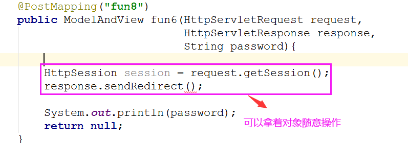

## 11. Controller的返回值类型

### 11.1. 返回ModelAndView

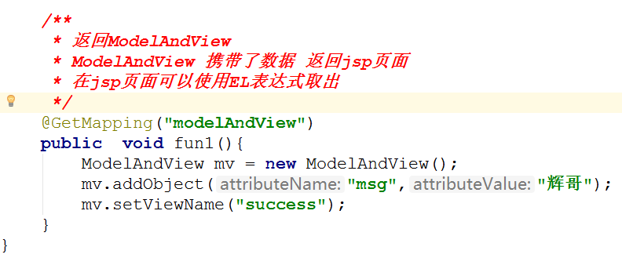

### 11.2. 返回字符串 

#### 11.2.1. 字符串之jsp页面（即前端页面）

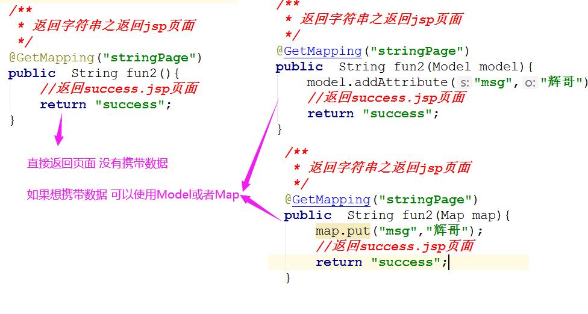

#### 11.2.2. 字符串之普通字符串

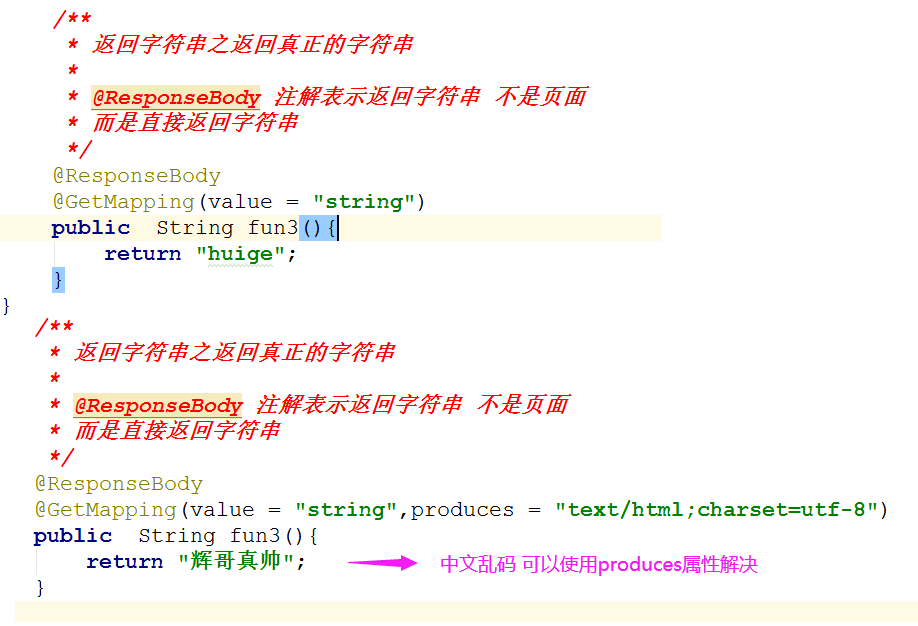

```java
//可以验证如果返回中文字符串，则会乱码,可在@GetMapping中加入produces属性设置值 
//同时也注意到字符编码过滤器只能解决部分乱码问题
@GetMapping(value = "/string",produces = "text/html;charset=utf-8")
@ResponseBody
public String string(){
    return "会乱码吗";
}
```

**如果要统一设置解决乱码**

可在springMvc.xml中配置如下：

更多详情可看https://blog.csdn.net/q283614346/article/details/103314837

```xml
<mvc:annotation-driven>
    <mvc:message-converters>
    	<!-- 解决@ResponseBody返回中文乱码 -->
        <bean class="org.springframework.http.converter.StringHttpMessageConverter">
            <property name="supportedMediaTypes">
                <list>
                    <value>text/html;charset=UTF-8</value>
                    <value>application/json;charset=UTF-8</value>
                    <value>*/*;charset=UTF-8</value>
                </list>
            </property>
            <!-- 用于避免响应头过大 -->  
			<property name="writeAcceptCharset" value="false" /> 
        </bean>
    </mvc:message-converters>
</mvc:annotation-driven>
```

#### 11.2.3. 字符串之转发和重定向

转发或重定向到指定的url路径上：

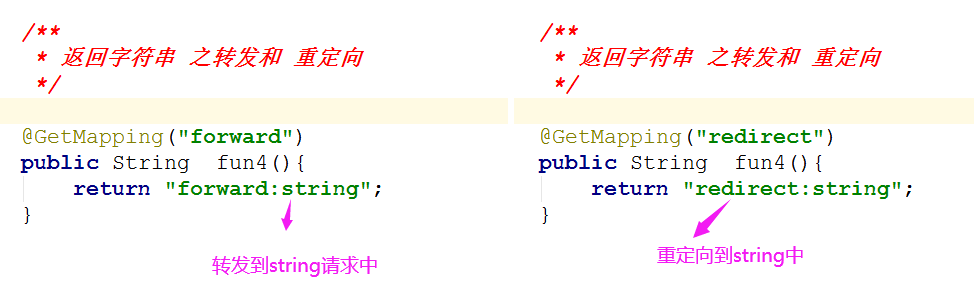

### 11.3. 返回对象

> 返回对象 需要使用jackson的支持   是把对象转换成json了 实际返回的是json格式字符串 

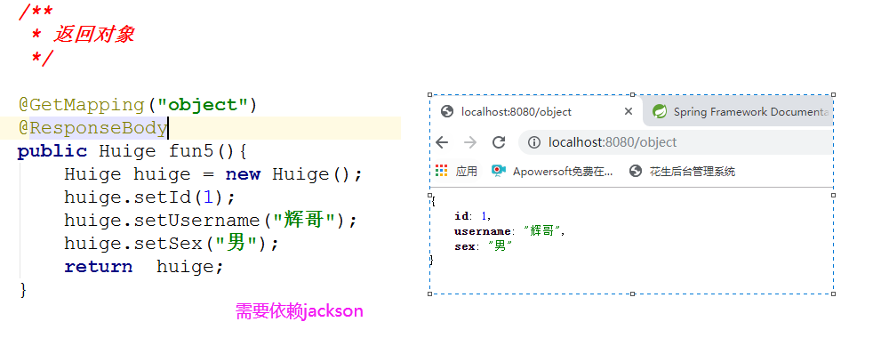

### 11.4. 返回void(无返回值) 

默认访问自己配置的路径下void.jsp页面

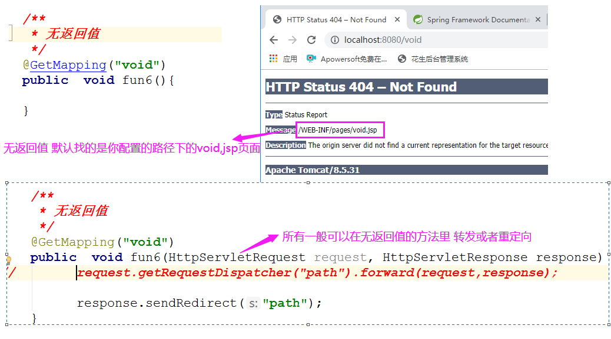

### 11.5. 返回ResponseEntity

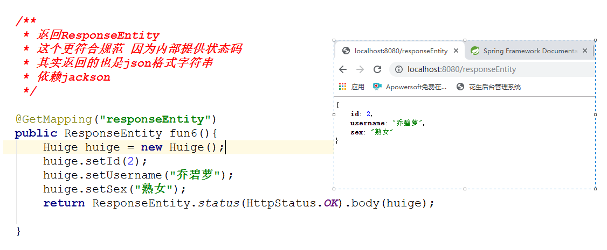

## 12.Rest风格

> Rest风格的规范 我们要求知道3个

- **对于请求方式规范  不同的操作 使用不同的请求方式**

  - get： 请求一般是获取数据
  - post:  登录和添加数据
  - put:    一般是修改
  - delete : 删除操作

- **对于不同的状态码的规范**

  > 比如  200表示成功   404 表示未找到    201 表示创建成功

- **Rest风格的请求路径(传递参数)**

### 12.1. Rest风格参数获取

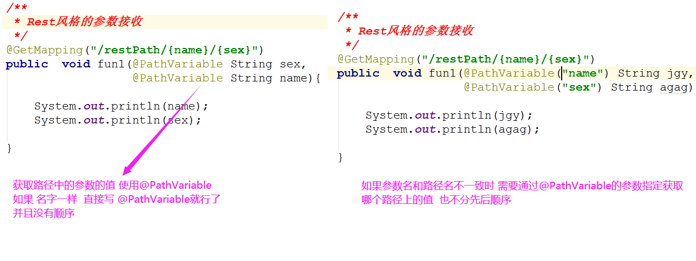

## 13. 文件上传

> 目前 市场流行的文件上传  分为2种 
>
> * 提交表单（包含异步）的方式
> * Base64格式的方式  

### 13.1. java代码编写方式

* 如果是提交表单文件上传
  * Servlet3.0之前原始的写法
  * Servlet3.0之后part的写法
  * fileupload.jar+commons.io.jar的写法
  * fileupload.jar+commons.io.jar继承SpringMVC的写法
* 如果是Base64上传的方式 
  * 写法很单一

### 13.2. 提交表单上传三要素

* `method = post`请求
* 有个`input type=file`的标签
* `enctype="multipart/form-data"` 多部件/表单数据

### 13.3. 单文件上传之part的方式（重点）

> 这种方式 不需要导入任何包  也不要配置任何视图解析器，用`request.getPart("文件名")`

* **编写Controller**

```java
@Controller
public class MyController3 {

    @PostMapping(value = "/upload")
    public String fileUpload(HttpServletRequest request) throws IOException, ServletException {
        Part part = request.getPart("image");      
        String realPath = request.getServletContext().getRealPath("/WEB-INF");        
        part.write(realPath + "/" + part.getSubmittedFileName());        
        return "success";
    }
}
/**

request.getContextPath()是上下文路径，是tomcat图标中配置的路径，比如/spring_test_war_exploded
request.getServletContext().getRealPath("/WEB-INF"); 获取的从盘符开始的绝对路径

part.getName()是不包含文件后缀名（即文件类型）
part.getSubmittedFileName()是包含文件后缀名

/
```

* **添加配置信息**

  在`web.xml`中配置信息，在`servlet标签`中添加`multipart-config标签`

```xml
      <servlet>
          <servlet-name>dispatcherServlet</servlet-name>
          <servlet-class>org.springframework.web.servlet.DispatcherServlet</servlet-class>
          <init-param>
              <param-name>contextConfigLocation</param-name>
              <param-value>classpath:springMvc.xml</param-value>
          </init-param>
          <!--可以直接复制，单位byte;threshold是起步值可以为0-->
          <multipart-config>
              <max-file-size>20848820</max-file-size>
              <max-request-size>418018841</max-request-size>
              <file-size-threshold>1048576</file-size-threshold>
          </multipart-config>
      </servlet>
      <servlet-mapping>
          <servlet-name>dispatcherServlet</servlet-name>
          <url-pattern>/</url-pattern>
      </servlet-mapping>  
```

* **编写前端页面或用postman模拟**

  

  


### 13.4. 多文件上传之Part的方式（重点）

* 编写Controller

  用`request.getParts()`方法

  注意：这里可以直接在`controller层`类上加`@MultipartConfig`配置多部件，无需在`web.xml`的`servelet标签`中配置

  但要需要在`tomcat安装目录conf文件夹`下配置`context.xml`：

```xml
  <!--允许任意 多部件解析-->
  <Context allowCasualMultipartParsing="true">  
  </Context>
```

代码：

```java
@Controller
@MultipartConfig
public class MyController4 {

    @PostMapping(value = "/upload2")
    public String upload2(HttpServletRequest request) throws IOException, ServletException {
        Collection<Part> parts = request.getParts();
        String realPath = request.getServletContext().getRealPath("/WEB-INF");
        parts.forEach(part -> {
            try {
                part.write(realPath + "/" + part.getSubmittedFileName());
            } catch (IOException e) {
                e.printStackTrace();
            }
        });
        return "success";
    }
}
```

* 编写前端页面或用postman模拟

  

  

### 13.5.文件上传之springmvc的方式（了解）

> 这种方式 又要导入jar包  又要配置多媒体视图解析器   麻烦  

* 导入jar 

  

* 编写Controller

```java
  @Controller //这里不用加@MultipartConfig,只需向容器中添加 多媒体视图解析器
  public class MyController5 {
  
      @PostMapping("/upload3") //注意：虽然是请求体设置的，但要加@RequestParam注解
      public String upload3(HttpServletRequest request, @RequestParam(value = "image") MultipartFile file) throws IOException {
          String realPath = request.getServletContext().getRealPath("/WEB-INF");
          String fullName = file.getOriginalFilename();
          file.transferTo(new File(realPath + "/" + fullName));
          return "success";
      }
  }
```

* 生成多媒体视图解析器对象

  在SpringMvc.xml中配置：

```xml
<!--生成多部件解析器对象-->
<bean id="multipartResolver" 		class="org.springframework.web.multipart.commons.CommonsMultipartResolver"> 
</bean>
```

* 编写前端或用postman模拟

  


## 14. 文件下载 

### 14.1. 文件下载方式一 (了解) 

> 这种方式 直接给资源的链接就行了 

* 弊端：不能统计下载次数  并且对于那些不懂电脑的人  不知道使用ctrl+s 或者右键另存为保存 
* 演示


```xml
    <!--访问静态资源用-->
    <mvc:default-servlet-handler/>
```

### 14.2. 文件下载方式二（重点）

* 好处： 任何文件下载都可以通过弹窗保存 并且可以统计下载次数 

html文档：

```html
<a href="/download">下载word文档</a> <!--href的值写controller的映射路径-->
```

代码：

```java
@Controller
public class MyController5 {

    @GetMapping("/download")
    public ResponseEntity<byte[]> download(HttpServletRequest request) throws IOException {
        //获取文件地址
        String realPath = request.getServletContext().getRealPath("/WEB-INF/test.png");
        //文件输入流
        FileInputStream fileInputStream = new FileInputStream(realPath);
        //小推车
        byte[] buffer = new byte[fileInputStream.available()];
        //读出到小推车中
        fileInputStream.read(buffer);

        //获取文件名
        String fileFullName = realPath.substring(realPath.lastIndexOf("\\") + 1);

        /**
         *  构建响应实体
         */
        //构建头信息，固定写法
        HttpHeaders httpHeaders = new HttpHeaders();
        //头信息设置内容处置，URLEncode.encode()使文件名不乱码
        httpHeaders.setContentDispositionFormData("attachment", URLEncoder.encode(fileFullName, "utf-8"));
        //填充字节数组，http头，http状态
        ResponseEntity<byte[]> responseEntity = new ResponseEntity<>(buffer, httpHeaders, HttpStatus.OK);

        //返回
        return responseEntity;

    }
}
```

## 15. SpringMVC的异常处理

>我们的开发中 三层架构 dao层 service层 controller层的异常  一般都会抛给SpringMVC来处理   
>
>所以我们异常处理 是针对的SpringMVC的异常处理 

### 15.1. 第一种方式

在`web.xml`中配置错误页面

```xml
    <!--web.xml中配置错误页面-->
    <error-page>
        <location>/WEB-INF/pages/error.jsp</location>
    </error-page>
```

测试代码：

```java
    @GetMapping("/error")
    public ModelAndView error() {
        int i = 10 / 0;
        return new ModelAndView("success");
    }
```

**缺点：页面固定  传值麻烦**

### 15.2. 第二种方式

* 第一步：创建一个异常处理类

  * 要求实现 `HandlerExceptionResolver`,（处理器异常解析器，处理器就是controller类）
  * 要求加入到springioc容器中

  ```java
@Component
  public class MyExeptionHander implements HandlerExceptionResolver {
      @Override
      public ModelAndView resolveException(HttpServletRequest httpServletRequest, HttpServletResponse httpServletResponse, Object o, Exception e) {
  
        ModelAndView mv  = new ModelAndView();
          mv.addObject("msg",e.getMessage());
          mv.setViewName("error");
          return mv;
      }
  }
  ```

* 第二步：修改error.jsp

  使用el表达式需要引包，加标签

  

* 第三步： 编写Controller 

  用上面的

  
  

**特点： 虽然可以动态显示错误信息 但是只能返回jsp页面  想要返回html页面 需要依赖模板引擎**

### 15.3. 第三种方式（必须掌握）

> 由于实际开发中  jsp页面用的比较少(可以说 基本不用)  那么我们以上2种方式 则不能满足我们的需求  
>
> 这个时候 我们要返回json数据   

* **第一步：创建枚举保存状态**

```java
@Getter //3get方法
public enum StatusEnum {

    ERROR("40000", "输入参数错误");

    //2属性最好加上final
    private final String code;
    private final String message;

    //1构造器默认私有化
    StatusEnum(String code, String message) {
        this.code = code;
        this.message = message;
    }
}
```

* **第二步：自定义异常**

```java
@Data
@AllArgsConstructor
public class MyException extends RuntimeException {
	//异常类中封装StatusEnum枚举类
    private StatusEnum statusEnum;
}
```

* **第三步：Controller抛出自定义异常**

```java
    @GetMapping("/error2")
    public String error2() {
        if (true) {
            throw new MyException(StatusEnum.ERROR);
        }
        return "success";
    }
```

* **第四步：异常处理类**

```java
@RestControllerAdvice //1加这个相当于@ResponseBody与@ControllerAdvice
public class MyExceptionHandler {

    @ExceptionHandler(value = MyException.class) //2加@ExceptionHandler
    public ResponseEntity handler1(MyException exception) { //3加指定异常
        StatusEnum statusEnum = exception.getStatusEnum();
        return ResponseEntity.ok(statusEnum);
    }
}
```

## 16. SpringMVC拦截器

> 拦截器 Interceptor： 只会拦截Controller当中的各种Mapping ---------- SpringMVC  
>
> 过滤器Filter :  /* 拦截所有请求 包括静态资源   可以在任何web项目当中用 -----Web - --Servet

**使用步骤**

* **第一步:创建拦截器**

注意这里有ctrl+i实现的是默认方法

```java
public class MyInterceptor implements HandlerInterceptor {

    // 在Controller方法执行前执行
    @Override
    public boolean preHandle(HttpServletRequest request, HttpServletResponse response, Object handler) throws Exception {
        System.out.println("preHandle执行了");
        //返回false  程序不往下执行
        //返回true   程序继续往下执行 类似放行的意思
        return true;
    }

    //Controller 方法执行完成后 还没有返回试图时执行
    @Override
    public void postHandle(HttpServletRequest request, HttpServletResponse response, Object handler, ModelAndView modelAndView) throws Exception {
        System.out.println("postHandle执行了");
    }

    //请求和相应都完成了执行
    @Override
    public void afterCompletion(HttpServletRequest request, HttpServletResponse response, Object handler, Exception ex) throws Exception {
        System.out.println("afterCompletion执行了");
    }
}
```

**在springMvc.xml配置文件中添加配置**


  ```xml
      <mvc:interceptors>
          <mvc:interceptor>
              <!--访问的路径符合如下规则时,则会进入这个拦截器执行-->

              <!--配置多个路径-->
              <!--<mvc:mapping path="/interceptor/*" />-->
              <!--配置单个路径-->
              <mvc:mapping path="/interceptor/aaa"/>

              <!--排除不拦截的路径-->
              <!--<mvc:exclude-mapping path=""-->
              <!--可以看到拦截器不加注解，这里通过配置加入到容器中-->
              <bean class="com.shangma.cn.demo1.FirstInteceptor"/>
          </mvc:interceptor>
      </mvc:interceptors>
  ```

**也可以配置多个拦截器**

```xml
    <!-- 配置拦截器  可以配置多个 -->
    <mvc:interceptors>

        <!--表示配置一个-->
        <mvc:interceptor>
            <!--拦截的路径 -->
            <mvc:mapping path="/interceptor/*"/>
            <!--拦截后要走的拦截器-->
            <bean class="com.shangma.cn.demo1.FirstInteceptor"></bean>
        </mvc:interceptor>

        <!--表示配置一个-->
        <mvc:interceptor>
            <!--拦截的路径 -->
            <mvc:mapping path="/interceptor/*"/>
            <!--<mvc:exclude-mapping path=""/>-->
            <!--拦截后要走的拦截器-->
            <bean class="com.shangma.cn.demo1.FisrtInteceptor"></bean>
        </mvc:interceptor>

    </mvc:interceptors>
```

## 17.SpringMVC的静态资源

### 17.1. 要了解的点

在`web.xml`中注意`Servlet-mapping标签`


<font color=red>所以</font>:`字符编码过滤器`的`url模式`是`/*`代表拦截所有，即所有的请求都要走那里进行设置字符编码。而`servlet-mapping标签`配置的`url模式`是`/`则拦截除了jsp的所有静态资源，却放行动态资源及jsp。

### 17.2. 静态资源解决方式一

> 静态资源不进入DispatcherServlet 就行了,统一Controller的访问


这样，静态资源不符合，则不进入DispatcherServlet

**缺点： 不符合Rest风格API**

### 17.3. 静态资源解决方式二（推荐）

```xml
<mvc:default-servlet-handler /> 
```

一般与mvc注解驱动共同使用，解决动静资源的使用

```xml
    <!--访问动态资源用-->
    <mvc:annotation-driven/>
    <!--访问静态资源用-->
    <mvc:default-servlet-handler/>
```

### 17.4. 静态资源解决方式三

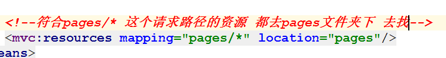


## 18. SpringMVC类型转换问题

### 18.1. 日期类型转换之Date类型

#### 18.1.1. Date类型传参之key-value的形式

key-value形式就是表单中保存数据格式，也是postman中的x-www-form-urlencoded

* **问题演示**

  

  **错误说明： 表单传递的是个字符串 接收的birthday是个日期类型 不会自动转换**

* **解决方式一**

  

```java
  @Data
  @NoArgsConstructor
  @AllArgsConstructor
  public class User implements Serializable {
  
      private String username;
      @DateTimeFormat(pattern = "yyyy-MM-dd") //这里加上日期时间格式化注解
      private Date birthday;
  }
```

* **解决方式二**
* 新建类型转换器

```java
import org.springframework.core.convert.converter.Converter;    
//Converter 第一个泛型 表示from 
		  //第二个泛型 表示 to
public class MyDateConvert implements Converter<String, Date> {
    @Override
    public Date convert(String s) {
        SimpleDateFormat sdf = new SimpleDateFormat("yyyy-MM-dd");
        try {
            Date parse = sdf.parse(s);
            return parse;
        } catch (ParseException e) {
            SimpleDateFormat sdf1 = new SimpleDateFormat("yyyy/MM/dd");
            try {
                return sdf1.parse(s);
            } catch (ParseException e1) {
                e1.printStackTrace();
            }
        }
        return null;
    }
}
```

  * 配置转换器

在`springMvc.xml`中配置

```xml
<!--只是实现转换器，这里将实现的转换器放到容器中-->
<bean id="conversionService" class="org.springframework.format.support.FormattingConversionServiceFactoryBean">
    <property name="converters">
        <set>
            <bean class="com.xyz.code.convert.MyDateConvert"/>
        </set>
    </property>
</bean>

<!--这里注意要在 注解驱动 加上 转换服务 属性 -->
<mvc:annotation-driven conversion-service="conversionService"/>
```

#### 18.1.2. Date类型传参之json的格式

> 如果传递的是个json 那么则上述的key-value处理方式则失效   处理json 默认使用了 jackson 我们只需要导入jar包就行了  默认接收的格式 yyyy-MM-dd  其他格式则报错


* **自定义格式方式一：**

  

  ```java
  @NoArgsConstructor
  @AllArgsConstructor
  public class User implements Serializable {
  
      private String username;
      @JsonFormat(pattern = "yyyy-MM-dd") //可以在请求实体类，响应实体类的日期属性上加
      private Date birthday;
  }
  ```

* **自定义格式方式二**

  > 不管是接收还是返回json都生效

  在`SpringMvc.xml`中配置，相当于在容器加了两个Bean

  ```xml
      <mvc:annotation-driven>
          <mvc:message-converters>
              
              <bean class="org.springframework.http.converter.json.MappingJackson2HttpMessageConverter">
                <property name="objectMapper" ref="objectMapper"/>
              </bean>
          </mvc:message-converters>
    </mvc:annotation-driven>
  
  	<!--这里用到p空间依赖注入-->
      <bean id="objectMapper" class="org.springframework.http.converter.json.Jackson2ObjectMapperFactoryBean"
            p:indentOutput="true"
            p:simpleDateFormat="yyyy-MM-dd HH:mm:ss"
        />
  ```

### 18.2. 日期转换类型之LocalDateTime类型 

#### 18.2.1. 参数类型传值之Key-value

* **第一种解决方式**

  

* **第二种解决方式**

  1、定义2个Converts

```java
    public class MyConvert1 implements Converter<String,LocalDateTime> {
        @Override
        public LocalDateTime convert(String s) {
           return LocalDateTime.parse(s,DateTimeFormatter.ofPattern("yyyy-MM-dd HH:mm:ss"));
        }
    }
```


```java
public class MyConvert2 implements Converter<String,LocalDate> {
    @Override
    public LocalDate convert(String s) {
       return LocalDate.parse(s,DateTimeFormatter.ofPattern("yyyy-MM-dd"));
    }
}
```

​	2、加载convert

​	只是定义了转换器，但要加入容器中

```xml
	
    <mvc:annotation-driven conversion-service="conversionService"/>
    <bean id="conversionService"
       class="org.springframework.format.support.FormattingConversionServiceFactoryBean">
        <property name="converters">
            <set>
                <bean class="com.xyz.code.convert.MyLocalDateTimeConvert"/>
                <bean class="com.xyz.code.convert.MyLocalDateConvert"/>
            </set>
        </property>
    </bean>
```

#### 18.2.2. 参数类型传值之json 


**注意：如果使用java8中的日期时 此时我们需要一个jackson的支持包**

jsr = java specific request = java 规范请求


  

**导入这个包**


**导入这个包后 什么都不需要配置 直接使用@JsonFormat注解  接收和响应 都会按照指定的格式生效**


* **解决方式一（推荐）**

  

* **解决方式二**

  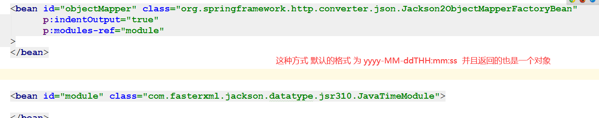

* **最终解决方式**

  **牵扯到新技术 后面再说**

  

## 19.SpringMvc常见异常

19.1、关于${username}读取不到参数的问题
spring加载时，也会把JVM system properties和JVM system env properties都读取到容器中，所以此时读取的是JVM系统环境变量的username，而不是.properties文件中的username，所以导致${username}取不到想要的值。所以请不要使用和JVM properties相同的key。

19.2、关于request.getParts()获取不到上传文件的问题
a，检查类名上是否添加了@MultipartConfig注解
b，运行环境问题，可查对应资料。
c，tomcat的context.xml文件，，增加allowCasualMultipartParsing=“true”。（本人通过此方式解决的）

19.3、web工程目录，在配置webapp/WEB-INF/web.xml的Spring MVC的DispatcherServlet时，在servlet-name上报错：Servlet should have a mapping，但已经存在了映射还报错

解决：File-->Project Structure-->Modules-->Web-->Deployment Descriptors-->复制原有需要的内容后，点击-删除原来的配置，点击+号新增配置，注意路径要在webapp/WEB-INF/路径下