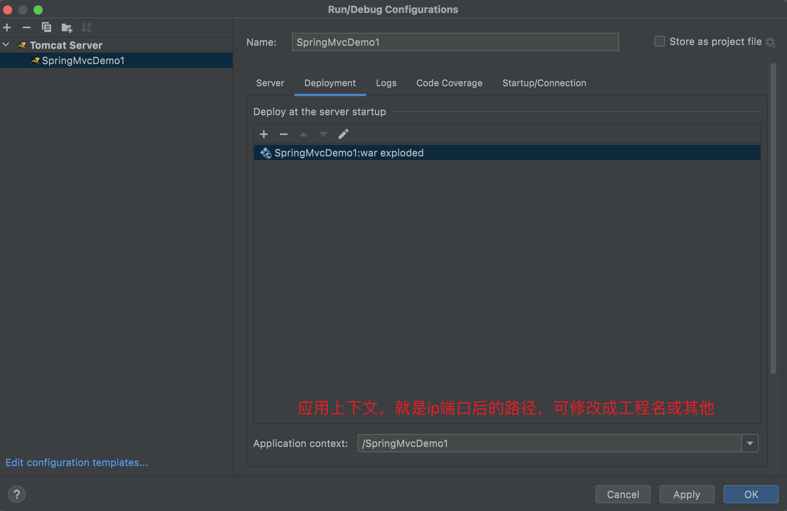
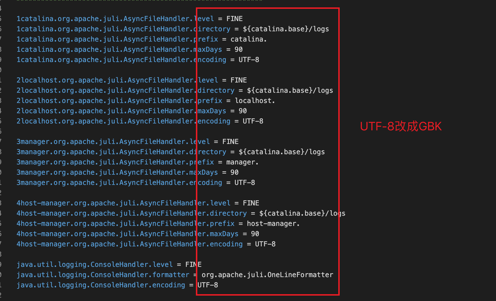
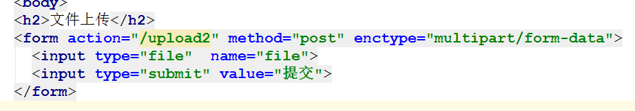

#  SpringMVC

**spring对web层支持 主要是提供了SpringMVC**

## 1. 什么是MVC

> mvc是web层 一种设计模式   全称是 Model  View  Controller   各个层面做各个层面的事 

- Model: 数据模型  就是指数据
- View : 表示视图  就是我们用的jsp和html 用来展示数据
- controller: 控制器  主要是处理用户交互部分  

## 2. SpringMVC的概述

### 2.1  简介


Spring Web MVC是基于Servlet API构建的原始Web框架，并从一开始就包含在Spring Framework中。正式名称“ Spring Web MVC”来自其源模块[spring-webmvc](https://github.com/spring-projects/spring-framework/tree/master/spring-webmvc)的名称， 但它通常被称为“ Spring MVC”。

**简而言之，springMVC对servlet进行封装，避免繁琐的获取表单参数，多余的serlvet服务类等代码**

### 2.2 SpringMVC搭配Tomcat

> Tomcat 10.1.x 适用于 Servlet 6.0、JSP TBD，也即 Jakarta EE 10 platform。
>
> Tomcat 10.0.x 适用于 Servlet 5.0、JSP 3.0，也即 Jakarta EE 9 platform。
>
> Tomcat 9.x 适用于 Servlet 4.0、JSP 2.3，也即 Java EE 8 platform（javax）。
>
> Spring MVC 5.x 适用于 Servlet 4.0，因此，最高只能搭配 Tomcat 9.x 使用。
>
> Spring MVC 6.x 适用于 Servlet 5.0 及以上版本，因此，要搭配 Tomcat 10.x 使用。

## 3. SpringMVC的基本使用

### 3.1. 创建web工程


### 3.2. 导入jar包

在web/WEB-INF/lib目录下导入相关spring包

或使用maven导入依赖


```xml
<dependency>
  <groupId>org.springframework</groupId>
  <artifactId>spring-aop</artifactId>
  <version>5.3.8</version>
</dependency>
<dependency>
  <groupId>org.springframework</groupId>
  <artifactId>spring-beans</artifactId>
  <version>5.3.8</version>
</dependency>
<dependency>
  <groupId>org.springframework</groupId>
  <artifactId>spring-context</artifactId>
  <version>5.3.8</version>
</dependency>
<dependency>
  <groupId>org.springframework</groupId>
  <artifactId>spring-core</artifactId>
  <version>5.3.8</version>
</dependency>
<dependency>
  <groupId>org.springframework</groupId>
  <artifactId>spring-expression</artifactId>
  <version>5.3.8</version>
</dependency>
<dependency>
  <groupId>org.springframework</groupId>
  <artifactId>spring-jcl</artifactId>
  <version>5.3.8</version>
</dependency>
<dependency>
  <groupId>org.springframework</groupId>
  <artifactId>spring-web</artifactId>
  <version>5.3.8</version>
</dependency>
<dependency>
  <groupId>org.springframework</groupId>
  <artifactId>spring-webmvc</artifactId>
  <version>5.3.8</version>
</dependency>
```

### 3.3. 编写配置文件

`web.xml`配置Servlet：

```xml
<servlet>
  <servlet-name>dispacherServlet</servlet-name>
  <servlet-class>org.springframework.web.servlet.DispatcherServlet</servlet-class>
  <!--初始化参数加载配置文件
         注意： key是 固定写法  必须写contextConfigLocation
  -->
  <init-param>
    <param-name>contextConfigLocation</param-name>
    <param-value>classpath:spring-mvc.xml</param-value>
  </init-param>
  <!--tomcat启动时就加载这个类-->
  <load-on-startup>1</load-on-startup>
</servlet>
<servlet-mapping>
  <servlet-name>dispacherServlet</servlet-name>
  <!--/代表除了.jsp的请求都包括(因为jsp也是个特殊的servlet)，/*是所有的请求-->
  <url-pattern>/</url-pattern>
</servlet-mapping>
```

`Spring-mvc.xml`配置：

```xml
<?xml version="1.0" encoding="UTF-8"?>
<beans xmlns="http://www.springframework.org/schema/beans"
       xmlns:xsi="http://www.w3.org/2001/XMLSchema-instance"
       xsi:schemaLocation="http://www.springframework.org/schema/beans http://www.springframework.org/schema/beans/spring-beans.xsd">

    <!--配置处理器映射，将请求映射到某个处理器方法-->
    <bean class="org.springframework.web.servlet.handler.BeanNameUrlHandlerMapping"></bean>
    <!--配置处理器适配器，处理器适配器进行真正调用处理器方法-->
    <bean class="org.springframework.web.servlet.mvc.SimpleControllerHandlerAdapter"></bean>
    <!--配置视图解析器-->
    <bean class="org.springframework.web.servlet.view.InternalResourceViewResolver">
        <property name="prefix" value="/WEB-INF/pages/"></property>
        <property name="suffix" value=".jsp"></property>
    </bean>
    <!--将实现Controller接口的类放到容器中，并起名字-->
    <!--因为配置的处理器映射器为BeanNameUrlHandlerMapping，所以这里的beanName就是请求路径-->
    <bean name="/hello" class="com.xyz.code.controller.MyController"></bean>
</beans>
```

### 3.4. 创建success页面

一般是pages/templates目录


### 3.5. 创建Controller

```java
// 注意这里导入的是Controller接口
import org.springframework.web.servlet.mvc.Controller;
public class MyController implements Controller {
    @Override
    public ModelAndView handleRequest(HttpServletRequest httpServletRequest, HttpServletResponse httpServletResponse) throws Exception {
        ModelAndView mv  = new ModelAndView();
        // 请求域设值
        mv.addObject("msg","hello Springmvc");
        // 设置视图
        mv.setViewName("success");
        return mv;
    }
}
```

### 3.6. 启动tomcat测试





## 4. SpringMVC的执行流程


## 5. SpringMVC的内部流程


**了解 不同的写法 使用不同的处理器映射器  和不同的处理器适配器**

## 6. 第二种写法(重点)

>  我们按照刚才的编码  有很大的问题   我们定义的Controller 只能做一件事  因为就一个实现   并且每次都配置Bean 不是很优雅   

### 6.1 建立maven工程并添加web framework


选择file->ProjectStructure后


创建成功会有如下所示，webapp有蓝色小圆点


### 6.2 修改pom.xml文件并导入依赖

修改打包方式为war

```xml
<groupId>com.aitx.study</groupId>
<artifactId>SpringMvcDemo3</artifactId>
<version>1.0-SNAPSHOT</version>
<packaging>war</packaging>
```

添加依赖

```xml
<dependencies>
  <dependency>
    <groupId>org.springframework</groupId>
    <artifactId>spring-aop</artifactId>
    <version>5.3.8</version>
  </dependency>
  <dependency>
    <groupId>org.aspectj</groupId>
    <artifactId>aspectjweaver</artifactId>
    <version>1.9.7</version>
  </dependency>
  <dependency>
    <groupId>org.springframework</groupId>
    <artifactId>spring-beans</artifactId>
    <version>5.3.8</version>
  </dependency>
  <dependency>
    <groupId>org.springframework</groupId>
    <artifactId>spring-context</artifactId>
    <version>5.3.8</version>
  </dependency>
  <dependency>
    <groupId>org.springframework</groupId>
    <artifactId>spring-core</artifactId>
    <version>5.3.8</version>
  </dependency>
  <dependency>
    <groupId>org.springframework</groupId>
    <artifactId>spring-expression</artifactId>
    <version>5.3.8</version>
  </dependency>
  <dependency>
    <groupId>org.springframework</groupId>
    <artifactId>spring-jcl</artifactId>
    <version>5.3.8</version>
  </dependency>
  <dependency>
    <groupId>org.springframework</groupId>
    <artifactId>spring-web</artifactId>
    <version>5.3.8</version>
  </dependency>
  <dependency>
    <groupId>org.springframework</groupId>
    <artifactId>spring-webmvc</artifactId>
    <version>5.3.8</version>
  </dependency>
  <dependency>
    <groupId>log4j</groupId>
    <artifactId>log4j</artifactId>
    <version>1.2.12</version>
  </dependency>
  <dependency>
    <groupId>junit</groupId>
    <artifactId>junit</artifactId>
    <version>4.13.1</version>
    <scope>test</scope>
  </dependency>
  <dependency>
    <groupId>org.projectlombok</groupId>
    <artifactId>lombok</artifactId>
    <version>1.18.20</version>
  </dependency>
</dependencies>
```

### 6.3 编写配置文件

在`web.xml`配置文件中写如下内容：

```xml
<!--配置DispatcherServlet-->
<servlet>
    <servlet-name>dispatcherServlet</servlet-name>
    <servlet-class>org.springframework.web.servlet.DispatcherServlet</servlet-class>
    <init-param>
        <param-name>contextConfigLocation</param-name>
        <param-value>classpath:spring-mvc.xml</param-value>
    </init-param>
    <load-on-startup>1</load-on-startup>
</servlet>
<servlet-mapping>
    <servlet-name>dispatcherServlet</servlet-name>
    <url-pattern>/</url-pattern>
</servlet-mapping>
```

在`spring-mvc.xml`配置文件中写如下内容：

```xml
<!--开启组件扫描-->
<context:component-scan base-package="com.xyz.code"/>

<!--配置处理器映射-->
<bean class="org.springframework.web.servlet.mvc.method.annotation.RequestMappingHandlerMapping"></bean>
<!--配置处理器适配器-->
<bean class="org.springframework.web.servlet.mvc.method.annotation.RequestMappingHandlerAdapter"></bean>
<!--配置视图解析器-->
<bean class="org.springframework.web.servlet.view.InternalResourceViewResolver">
  <property name="prefix" value="/WEB-INF/pages/"></property>
  <property name="suffix" value=".jsp"></property>
</bean>
```

`spring-mvc.xml`如果不想配置处理器映射，与处理器适配器，可与mvc注解驱动代替：

```xml
<!--开启组件扫描-->
<context:component-scan base-package="com.xyz.code"/>

<!--配置视图解析器-->
<bean class="org.springframework.web.servlet.view.InternalResourceViewResolver">
    <property name="prefix" value="/WEB-INF/pages/"></property>
    <property name="suffix" value=".jsp"></property>
</bean>

<!--如果不想配置处理器映射，与处理器适配器，可与mvc注解驱动代替-->
<!--注意要选mvc包下的-->
<mvc:annotation-driven/>
```

### 6.4 添加页面success.jsp

在目录`webapp/WEB-INF/pages`下添加jsp页面

```jsp
<%@ page contentType="text/html;charset=UTF-8" language="java" %>
<html>
<head>
    <title>success</title>
</head>
<body>
<h1>${message}</h1>
</body>
</html>
```

### 6.5 添加tomcat用于本地测试


### 6.6 编写Controller

```java
@Controller  // Component的衍生注解
public class MyController2 {
    // 只接受请求方式为get，注意这个/可以省略
  	// /代表application context即到webapp工程路径下,前端则是到ip端口层级
    @GetMapping(value = "/hello") 
    public ModelAndView hello() {
        ModelAndView modelAndView = new ModelAndView();
        modelAndView.addObject("message", "hello");
        modelAndView.setViewName("success");
        return modelAndView;
    }
}
```

### 6.7 测试 

这里可以配置tomcat使请求url变得更简洁：右上角选择`tomcat图标`下拉选择`eidt configurations`，可修改`name`,`Application context`,`url` ,`port`等

## 7. 请求映射注解及其衍生注解

- @RequestMapping 
- @PostMapping
- @GetMapping 
- @DeleteMapping
- @PutMapping

## 8. 参数的封装

### 8.1. 普通参数类型


**不一致的情况**


### 8.2. 数组类型

```properties
Checkbox = 复选框
```


### 8.3. 对象类型

**新建对象**

```java
// 注意要加lombok的jar包，才能使用如下注解
@Data
@NoArgsConstructor
@AllArgsConstructor
@Builder
@Accessors(fluent = false, chain = true)
public class Huige {
    private Integer id;
    private String username;
  	private String sex;
}
```


### 8.4. 包装类类型


### 8.5. List集合类型


### 8.6. Map集合类型


### 8.7. JSON格式字符串（重点）

**前提 有jackson的支持 导入jackson**

`jackson`是spring默认处理json字符串的类库,只需导入不用任何配置

`json` = `JavaScript Object Notation` = `javaScript对象标记法`

导入依赖，无需其他配置

```xml
<dependency>
    <groupId>com.fasterxml.jackson.core</groupId>
    <artifactId>jackson-annotations</artifactId>
    <version>2.13.2</version>
</dependency>
<dependency>
    <groupId>com.fasterxml.jackson.core</groupId>
    <artifactId>jackson-core</artifactId>
    <version>2.13.2</version>
</dependency>
<dependency>
    <groupId>com.fasterxml.jackson.core</groupId>
    <artifactId>jackson-databind</artifactId>
    <version>2.13.2</version>
</dependency>
```


### 8.8. Rest方式接收参数

`Rest` = `Representational State Transfer`=`表征状态转移,具象状态转移`

> 见12

## 9. 乱码问题

> 乱码问题产生的原因主要是字符编码的问题;
> 发送方要发送一串字符，首先必须用字符集给它编码(encode)变成0和1即二进制进行传输，接收方需要用同一个字符集进行解码（decode）方才能知道发送方发送的内容。如果双方所用的字符集不一致就会产生乱码。

### 9.1 设置浏览器 request 的编码格式

浏览器 request 的编码格式需要在 .html 文件中设置

```html
<!DOCTYPE html>
<head>
    <meta charset="UTF-8">  <!-- 在此处设置编码格式 -->
</head>
<body>
</body>
</html>
```

举个例子，当编码格式为“UTF-8”时，在下面这个 form 表单中输入“李四”并提交时，地址栏中的内容为：`http://localhost:8080/s/a?name=%E6%9D%8E%E5%9B%9B`，其中的 E6、9D、8E 就是“李”的 UTF-8 编码（“李”的 Unicode 为 +U674e， 转化为 UTF-8 为 11100110（即 e6）、10011101（即 9d）、10001110 （即 8e） ），E5、9B、9B 就是“四”的 UTF-8 编码。（UTF-8 中一个汉字占三个字节，一个 % 表示一个字节，十六进制表示。）

```html
<form action="./a" method="get">
    Name: <input type="text" name="name" /> <br />
    <input type="submit" value="Submit" />
</form>
```


当你在浏览器地址栏手动输入 `localhost:8080/s/a?name=李四` 并按 Enter 键时，实际发送出去的 request 仍然是经过编码的，对于 Chrome 浏览器，默认编码为 UTF-8。

### 9.2 get请求接收参数乱码

> 如果你的get请求 传递中文参数时乱码 可以有如下解决方式  

**Tomcat7及以下版本：**

Tomcat 7 中的 URIEncoding 为 ISO-8859-1

如果你使用 Tomcat 7 或更早版本的 Tomcat，且 get 请求的编码格式为 UTF-8，这时候中文就会发生乱码。解决方法：

```java
/**
 修改 tomcat中的 conf/server.xml
 Connector标签中添加URIEncoding="UTF-8"
 utf-8 = Unicode Transformation Format

 注意点：如果有 useBodyEncodingForURI="true"  请删除

 例如：
     <Connector port="8080" protocol="HTTP/1.1"
        connectionTimeout="20000"
        redirectPort="8443"
        disableUploadTimeout="true"
        executor="tomcatThreadPool"
        URIEncoding="UTF-8"/>
 */
```

**Tomcat 8 及之后的版本：**

Tomcat 8 及之后的版本，处理 get 请求的编码为 UTF-8。如果浏览器的 get 请求也为 UTF-8，那就无需再设置。

**不区分版本：**

直接代码中进行字符串转换编码的字符集

```java
// 接受username后处理这个数据，即获取字节数组后重新选utf-8编码方式  
String s = new String(username.getBytes("ISO-8859-1"), "utf-8");
```

### 9.3 post请求乱码问题

**Tomcat9及以下：**

如果你使用 Tomcat 9 或更早版本的 Tomcat，且 post 请求的编码格式为 UTF-8，这时候中文就会发生乱码

**方法一：**在 conf/web.xml 文件中增加上述设置：

```xml
<request-character-encoding>UTF-8</request-character-encoding> 
```

**方法二：**在代码中使用 HttpServletRequest 的 setCharacterEncoding() 方法来设置 post 请求体的编码格式：

```java
request.setCharacterEncoding("UTF-8");
```

方法一和方法二是同一个设置项，如果同时使用了方法一和方法二，那以方法二为准。

**方法三(推荐)：**

如果你使用了 Spring MVC，那在代码中使用 setCharacterEncoding() 方法设置编码是不起作用的，因为在你接到参数前 Spring MVC 已经对参数做过了处理。 Spring MVC 提供了一个过滤器 CharacterEncodingFilter，可以用于设置 post 请求的编码格式。

在`web.xml`配置：

```xml
<!--解决Post请求乱码问题使用过滤器
   CharacterEncodingFilter  在高版本的Spring中是可以解决 get请求 和Post请求 、
    低版本  比如说4.X中 只能解决Post请求 不能解决get请求
-->
<filter>
  <filter-name>characterEncodingFilter</filter-name>
  <filter-class>org.springframework.web.filter.CharacterEncodingFilter</filter-class>
  <!--这些参数就是类中的属性-->
  <init-param>
    <param-name>encoding</param-name>
    <param-value>utf-8</param-value>
  </init-param>
  <init-param>
    <param-name>forceRequestEncoding</param-name>
    <param-value>true</param-value>
  </init-param>
  <init-param>
    <param-name>forceResponseEncoding</param-name>
    <param-value>true</param-value>
  </init-param>
</filter>
<filter-mapping>
  <filter-name>characterEncodingFilter</filter-name>
  <!--代表所有请求都会进行过滤，包括jsp-->
  <url-pattern>/*</url-pattern>
</filter-mapping>
```

**Tomcat 10 及之后的版本：**

Tomcat 10 及之后的版本，处理 post 请求的编码为 UTF-8，如果浏览器的 post 请求也为 UTF-8，那就无需再设置。

Tomcat 10 的 conf/web.xml 文件中设置了处理 request 和 response 的编码为 UTF-8。

```xml
<request-character-encoding>UTF-8</request-character-encoding> 

<response-character-encoding>UTF-8</response-character-encoding> 
```

### 9.4 响应乱码

**普通的Java Web工程：**

HttpServletResponse 也有 setCharacterEncoding() 方法。但更常用的是： response.setContentType("text/html;charset=UTF-8")。一般情况下，你告诉了浏览器你返回的 response 的正确的编码格式，response 是不会乱码的。

```java
response.setContentType("text/html;charset=UTF-8")
```

**Spring工程：**

> spring MVC有一系列HttpMessageConverter去处理@ResponseBody注解的返回值，如返回list或其它则使用 MappingJacksonHttpMessageConverter；如果是string，则使用 StringHttpMessageConverter，而StringHttpMessageConverter使用的是字符集默认是ISO-8859-1，而且是final的。所以在当返回json中有中文时会出现乱码。


**方法一：**

单个请求的`@RequestMappin及其派生注解`后面加上produces=“text/html;charset=UTF-8;”（此方法只针对单个调用方法起作用）

```java
@GetMapping(value = "/testResponseEncodeError", produces = "text/html;charset=utf-8")
```


**方法二：**

spring-mvc.xml中配置如下：

```xml
<mvc:annotation-driven>
    <mvc:message-converters>
    	<!-- 解决@ResponseBody返回中文乱码 -->
        <bean class="org.springframework.http.converter.StringHttpMessageConverter">
            <property name="supportedMediaTypes">
                <list>
                    <value>text/html;charset=UTF-8</value>
                    <value>application/json;charset=UTF-8</value>
                    <value>*/*;charset=UTF-8</value>
                </list>
            </property>
            <!-- 用于避免响应头过大 -->  
						<property name="writeAcceptCharset" value="false" /> 
        </bean>
    </mvc:message-converters>
</mvc:annotation-driven>
```


**方法三：**

在配置文件中的`<mvc:annotation-driven>`中使用MappingJackson2HttpMessageConverter转换字符串

这种方式返回的字符串会有双引号

```xml
<mvc:annotation-driven>
    <!-- 返回json数据，@response使用 -->
    <mvc:message-converters register-defaults="true">
        <bean class="org.springframework.http.converter.json.MappingJackson2HttpMessageConverter">  
            <property name="supportedMediaTypes">
                <list>
                    <value>text/html;charset=UTF-8</value>
                    <value>application/json;charset=UTF-8</value>
                </list>
            </property>
        </bean>
    </mvc:message-converters>
</mvc:annotation-driven>
```


**方法四:**

在配置文件中的`<mvc:annotation-driven>`中修改StringHttpMessageConverter的defaultCharset

```xml
<mvc:annotation-driven>
  <mvc:message-converters register-defaults="true">
    <bean class="org.springframework.http.converter.StringHttpMessageConverter">
      <property name="defaultCharset" value="UTF-8"/>
      <property name="writeAcceptCharset" value="false"/>
    </bean>
  </mvc:message-converters>
</mvc:annotation-driven>
```


### 9.5 Tomcat控制台中文乱码

**第一种：修改tomcat配置(不推荐)**
将tomcat控制台日志输出编码格式更改为GBK，修改tomcat根目录下conf/logging.properties文件中的ConsoleHandler.encoding=utf-8（如果只修改ConsoleHandler.encoding不行，可以全部修改），这种方式能解决cmd控制台中文乱码，但不建议使用。因为更改了tomcat默认编码，如果我们使用idea启动tomcat，idea的默认编码不是GBK，就会同样产生idea控制台下tomcat乱码问题



**第二种：修改idea配置**

方法一：

Help->edit custom VM options在最后添加这句重启idea即可。

```xml
-Dfile.encoding=UTF-8
```

方法二：选择tomcat->edit configurations

直接修改idea中的tomcat配置，在vm-options中添加`-Dfile.encoding=UTF-8`，两者效果相同

## 10. 获取原生的ServletAPI

> 想要代码中 得到最原始的`HttpServletRequest`  ,`HttpServletResponse`  可以直接在方法里写个形参就行了 
>
> 然后就可以直接使用

首先pom.xml文件中要引入javax.servlet-api

```xml
<dependency>
  <groupId>javax.servlet</groupId>
  <artifactId>javax.servlet-api</artifactId>
  <version>4.0.1</version>
  <scope>provided</scope>
</dependency>
```

```java
/**
 * 直接在控制器方法入参处加上HttpServletRequest，HttpServletResponse即可获取原生的请求与响应
 *
 * @param request
 * @param response
 * @return
 * @throws IOException
 * @throws ServletException
 */
@GetMapping(value = "/testOriginal")
public String testOriginal(HttpServletRequest request, HttpServletResponse response) throws IOException, ServletException {
    // 通过请求获取session对象
    HttpSession session = request.getSession();
    // 只是演示
    // 通过请求进行请求转发
    request.getRequestDispatcher("/hello").forward(request, response);
    // 通过响应进行请求重定向
    response.sendRedirect("/hello");
    return "success";
}
```

## 11. Controller的返回值类型

### 11.1. 返回ModelAndView

```java
/**
 * 直接在方法体中建ModelAndView对象，可添加请求域数据，可设置视图名称
 *
 * @return
 */
@GetMapping(value = "/modelAndView")
public ModelAndView testReturnModelAndView() {
  ModelAndView modelAndView = new ModelAndView();
  modelAndView.setViewName("success");
  modelAndView.addObject("message", "hello testReturnModelAndView");
  return modelAndView;
}
```

### 11.2. 返回字符串 

#### 11.2.1. 字符串之jsp页面（即前端页面）

返回值String代表视图名称，如果需要在请求域添加对象可在控制器方法入参处添加Model或Map对象

```java
import org.springframework.ui.Model;
import org.springframework.web.servlet.ModelAndView;

/**
 * 直接返回string,这个string就是视图名称，会请求转发到这个视图页面，并且请求域中没有添加对象
 *
 * @return
 */
@GetMapping(value = "/testReturnString")
public String testReturnString() {
  return "success";
}

/**
 * 返回值String代表视图名称，入参model可添加请求域对象
 *
 * @param model
 * @return
 */
@GetMapping(value = "/testReturnStringAndModel")
public String testReturnStringAndModel(Model model) {
  model.addAttribute("message", "testReturnStringAndModel");
  return "success";
}

/**
 * 返回值String代表视图名称，入参map可添加请求域对象
 *
 * @param map
 * @return
 */
@GetMapping(value = "/testReturnStringAndMap")
public String testReturnStringAndMap(Map map) {
  map.put("message", "testReturnStringAndMap");
  return "success";
}
```

#### 11.2.2. 字符串之普通字符串

```java
/**
 * 如果想要返回字符串不当成视图名称，需要在控制器方法上加@ResponseBody注解
 * 它的作用是将字符串直接放入响应体中，而非解析成视图
 *
 * @return
 */
@GetMapping("/testReturnRealString")
@ResponseBody
public String testReturnRealString() {
    return "realString";
}
```

```java
/**
 * 可以验证如果返回中文字符串，则会乱码,可在@GetMapping中加入produces属性设置值
 * 同时也注意到字符编码过滤器只能解决post请求乱码问题，response响应乱码可以通过@GetMapping中加入produces属性解决
 *
 * @return
 */
@GetMapping(value = "/testResponseEncodeError", produces = "text/html;charset=utf-8")
@ResponseBody
public String testResponseEncodeError() {
  return "会乱码吗";
}
```

#### 11.2.3. 字符串之转发和重定向

转发或重定向到指定的url路径上(注意是`请求路径`，即控制器方法上`@RequestMapping及其派生注解`的value属性值)

```java
/**
 * 请求转发到/hello,还是同一个请求
 *
 * @return
 */
@GetMapping(value = "/testForward")
public String testForward() {
    // 请求转发时，请求路径/可以省略
    return "forward:/hello";
}

/**
 * 请求重定向到/hello，会形成新的请求
 *
 * @return
 */
@GetMapping(value = "/testRedirect")
public String testRedirect() {
    // 请求重定向时，请求路径/可以省略
    return "redirect:/hello";
}
```

### 11.3. 返回对象

> 返回对象 需要使用jackson的支持   是把对象转换成json了 实际返回的是json格式字符串 

创建User类

```java
@Data
@NoArgsConstructor
@AllArgsConstructor
@Builder
public class User implements Serializable {

    private String id;

    private String username;

    private Integer age;
}
```

```java
/**
 * 直接返回对象，需要：
 * 1添加jackson相关注解
 * 2控制器方法上加@ResponseBody
 *
 * @return
 */
@GetMapping(value = "/testReturnObject")
@ResponseBody
public User testReturnObject() {
    return User.builder().id("a1").username("aa").age(18).build();
}
```


如果我们不加@ResponseBody,会如何？

```java
/**
 * 不加@ResponseBody注解，默认将请求路径解析成视图名，即请求testReturnObject2视图
 *
 * @return
 */
@GetMapping("/testReturnObject2")
public User testReturnObject2() {
    return User.builder().id("a3").username("cc").age(20).build();
}
```


### 11.4. 返回void(无返回值) 

默认将请求路径解析成视图名

```java
/**
 * 返回值为void，默认将请求路径解析成视图名，即请求testReturnVoid视图
 */
@GetMapping(value = "/testReturnVoid")
public void testReturnVoid()  {
    
}
```


**一般情况下返回值void,方法体类进行请求转发或重定向**

```
/**
 * 返回值为void，默认将请求路径解析成视图名，即请求testReturnVoid视图
 */
@GetMapping(value = "/testReturnVoid")
public void testReturnVoid(HttpServletRequest httpServletRequest, HttpServletResponse httpServletResponse) throws ServletException, IOException {
    // 一般情况下返回值void,方法体类进行请求转发或重定向,即 使用原生的请求或响应处理
    //httpServletRequest.getRequestDispatcher("/hello").forward(httpServletRequest, httpServletResponse);
}
```

### 11.4 返回null

**返回值为String类型时返回null：**

报404，尝试找/WEB-INF/pages/testReturnNull.jsp文件

```java
/**
 * 返回值为String类型时返回null，默认将请求路径解析成视图名，即请求testReturnNull视图
 */
@GetMapping(value = "/testReturnNull")
public String testReturnNull() {
  return null;
}
```


**返回值为ModelAndView类型时返回null：**

```
/**
 * 返回值为ModelAndView类型时返回null，默认空白页面
 *
 * @return
 */
@GetMapping(value = "/testReturnNull2")
public ModelAndView testReturnNull2() {
    return null;
}
```

**返回值为User类型时返回null:**

```java
/**
 * 返回值为User类型时返回null，默认将请求路径解析成视图名，即请求testReturnNull3视图
 * 
 * @return
 */
@GetMapping(value = "/testReturnNull3")
public User testReturnNull3() {
    return null;
}
```


**返回值为User类型且加@ResponseBody注解时：**

```java
/**
 * 返回值为User类型且加@ResponseBody注解时返回null，空白页面
 *
 * @return
 */
@GetMapping(value = "/testReturnNull4")
@ResponseBody
public User testReturnNull4() {
    return null;
}
```

### 11.5. 返回响应实体ResponseEntity

```java
/**
 * 响应实体=响应头+响应体
 * 返回响应体默认返回json格式，前提要引入jackson依赖，并且无需@ResponseBody注解
 *
 * @return
 */
@GetMapping(value = "/testReturnResponseEntity")
public ResponseEntity testReturnResponseEntity() {
    User build = User.builder().id("a2").username("bb").age(19).build();
    return ResponseEntity.status(HttpStatus.OK).body(build);
}
```


## 12.Rest风格

> Rest风格的规范 我们要求知道3个

- **对于请求方式规范  不同的操作 使用不同的请求方式**

  - get： 请求一般是获取数据
  - post:  登录和添加数据
  - put:    一般是修改
  - delete : 删除操作

- **对于不同的状态码的规范**

  > 比如  200表示成功   404 表示未找到    201 表示创建成功

- **Rest风格的请求路径(传递参数)**

### 12.1. Rest风格参数获取

```java
/**
 * rest风格支持请求路径上设置变量，用{}包括
 * 取值时如果名称一致，@PathVariable注解无需设值
 * 取值时如果名称不一致，@PathVariable注解需要设值
 *
 * @param username
 * @param age
 * @return
 */
@GetMapping(value = "/testPathVariable/{username}/{age2}")
public String testPathVariable(@PathVariable String username, @PathVariable(value = "age2") String age) {
    System.out.println("username = " + username);
    System.out.println("age = " + age);
    return "success";
}
```

## 13. 文件上传

> 目前 市场流行的文件上传  分为2种 
>
> * 提交表单（包含异步）的方式
> * Base64格式的方式  

### 13.1. java代码编写方式

* 如果是提交表单文件上传
  * Servlet3.0之前原始的写法
  * Servlet3.0之后part的写法
  * fileupload.jar+commons.io.jar的写法
  * fileupload.jar+commons.io.jar继承SpringMVC的写法
* 如果是Base64上传的方式 
  * 写法很单一

### 13.2. 提交表单上传三要素

* `method = post`请求
* 有个`input type=file`的标签
* `enctype="multipart/form-data"` 多部件/表单数据

### 13.3. 单文件上传之part的方式（重点）

> 这种方式 不需要导入任何包  也不要配置任何视图解析器，只需在web.xml中配置multipart-config, 然后控制器方法中用`request.getPart("文件名")`即可

**第一步：添加配置信息**

在`web.xml`中配置信息，在`servlet标签`中添加`multipart-config标签`

也可以直接在`controller层`类上加`@MultipartConfig`配置多部件，无需在`web.xml`的`servelet标签`中配置

```xml
<servlet>
  <servlet-name>dispatcherServlet</servlet-name>
  <servlet-class>org.springframework.web.servlet.DispatcherServlet</servlet-class>
  <init-param>
    <param-name>contextConfigLocation</param-name>
    <param-value>classpath:spring-mvc.xml</param-value>
  </init-param>
  <!--可以直接复制，单位byte;threshold是起步值可以为0-->
  <multipart-config>
    <max-file-size>20848820</max-file-size>
    <max-request-size>418018841</max-request-size>
    <file-size-threshold>0</file-size-threshold>
  </multipart-config>
</servlet>
<servlet-mapping>
  <servlet-name>dispatcherServlet</servlet-name>
  <url-pattern>/</url-pattern>
</servlet-mapping>  
```

```java
@Controller
// 可以用此注解代替web.xml中的配置
@MultipartConfig(maxFileSize = 10240000L, maxRequestSize = 1024000000L, fileSizeThreshold = 0)
public class UploadController {

}
```

**第二步：编写Controller**

```java
@Controller
public class MyController3 {

    @PostMapping(value = "/upload")
    public String fileUpload(HttpServletRequest request) throws IOException, ServletException {
        Part part = request.getPart("image");  
      	// servletContext是application域
        String realPath = request.getServletContext().getRealPath("/WEB-INF");        
        part.write(realPath + File.separator + part.getSubmittedFileName());        
        return "success";
    }
}
/**
File.pathSeparator为:
File.separator为/

request.getContextPath()是上下文路径，是tomcat图标中配置的路径，比如/spring_test_war_exploded
request.getServletContext().getRealPath("/WEB-INF"); 获取的从盘符开始的绝对路径

part.getName()是不包含文件后缀名（即文件类型）
part.getSubmittedFileName()是包含文件后缀名

/
```

**第三步：编写前端页面或用postman模拟**

可以在target目录查看上传的文件


### 13.4. 多文件上传之Part的方式（重点）

**第一步：进行配置文件允许多文件上传**

需要在`tomcat安装目录conf文件夹`下配置`context.xml`：

```xml
<!--允许任意 多部件解析-->
<Context allowCasualMultipartParsing="true">
  
</Context>
```

**第二步：编写Controller**

用`request.getParts()`方法

```java
@Controller
@MultipartConfig
public class MyController4 {

    @PostMapping(value = "/upload2")
    public String upload2(HttpServletRequest request) throws IOException, ServletException {
        Collection<Part> parts = request.getParts();
        String realPath = request.getServletContext().getRealPath("/WEB-INF");
        parts.forEach(part -> {
            try {
                part.write(realPath + "/" + part.getSubmittedFileName());
            } catch (IOException e) {
                // 规范是不能打印堆栈信息
                e.printStackTrace();
            }
        });
        return "success";
    }
}
```

**第三步：编写前端页面或用postman模拟**


### 13.5.文件上传之springmvc的方式（了解）

> 这种方式 又要导入jar包  又要配置多媒体视图解析器   相对麻烦  

**第一步：导入jar** 


```xml
<dependency>
    <groupId>commons-fileupload</groupId>
    <artifactId>commons-fileupload</artifactId>
    <version>1.4</version>
</dependency>
<dependency>
    <groupId>commons-io</groupId>
    <artifactId>commons-io</artifactId>
    <version>2.11.0</version>
</dependency>
```

**第二步：注册 多媒体(部件)视图解析器 对象**

在Spring-mvc.xml中配置：

```xml
<!--生成多部件解析器对象-->
<bean id="multipartResolver" 		class="org.springframework.web.multipart.commons.CommonsMultipartResolver"> 
</bean>
```

**第三步：编写Controller**

```java
// 这里不用加@MultipartConfig,只需向容器中添加 多媒体视图解析器
@Controller 
public class MyController5 {

  @PostMapping("/upload3") // 注意：加@RequestParam注解指定上传的参数名
  public String upload3(HttpServletRequest request, @RequestParam(value = "image") MultipartFile file) throws IOException {
    String realPath = request.getServletContext().getRealPath("/WEB-INF");
    String fullName = file.getOriginalFilename();
    file.transferTo(new File(realPath + File.separator + fullName));
    return "success";
  }
}
```

**第四步：编写前端或用postman模拟**




## 14  文件下载 

### 14.1  文件下载方式一 (了解) 

> 这种方式 直接给资源的链接就行了 

**弊端：**不能统计下载次数  并且对于那些不懂电脑的人  不知道使用ctrl+s 或者右键另存为保存 


```xml
<!--访问静态资源用-->
<mvc:default-servlet-handler/>
<!--当然为了能继续访问动态资源，需要加注解驱动-->
<mvc:annotation-driven/>
```

### 14.2. 文件下载方式二（重点）

**好处：** 任何文件下载都可以通过弹窗保存 并且可以统计下载次数 

html文档：

```html
<a href="/download">下载word文档</a> <!--href的值写controller的映射路径(请求路径)-->
```

代码：

```java
@Controller
public class MyController5 {

    @GetMapping("/download")
    public ResponseEntity<byte[]> download(HttpServletRequest request) throws IOException {
        // 获取文件地址
        String realPath = request.getServletContext().getRealPath("/WEB-INF/test.png");
        // 文件输入流
        FileInputStream fileInputStream = new FileInputStream(realPath);
        // 小推车
        byte[] buffer = new byte[fileInputStream.available()];
        // 读出到小推车中
        fileInputStream.read(buffer);

        // 获取文件名,下面的写法实测不区分系统的
        String fileFullName = realPath.substring(realPath.lastIndexOf("\\") + 1);

        /**
         *  构建响应实体
         */
        // 构建头信息，固定写法
        HttpHeaders httpHeaders = new HttpHeaders();
        // 头信息设置内容处置，URLEncode.encode()使文件名不乱码
        httpHeaders.setContentDispositionFormData("attachment", URLEncoder.encode(fileFullName, "utf-8"));
        // 填充字节数组，http头，http状态
        ResponseEntity<byte[]> responseEntity = new ResponseEntity<>(buffer, httpHeaders, HttpStatus.OK);

      	// 关闭流
      	fileInputStream.close();
      
        // 返回
        return responseEntity;

    }
}
```

## 15. SpringMVC的异常处理

>我们的开发中 三层架构 dao层 service层 controller层的异常  一般都会抛给SpringMVC来处理   
>
>所以我们异常处理 是针对的SpringMVC的异常处理 

### 15.1. 第一种方式

在`web.xml`中配置错误页面

```xml
<!--web.xml中配置错误页面-->
<error-page>
  <location>/WEB-INF/pages/error.jsp</location>
</error-page>
```

测试代码：

```java
@GetMapping("/error")
public ModelAndView error() {
  // 当异常没有进行任何的处理，就会交给tomcat处理，跳转到错误页面
  int i = 10 / 0;
  return new ModelAndView("success");
}
```

**缺点：页面固定  传值麻烦**

### 15.2. 第二种方式

**第一步：创建一个异常处理类**

* 要求实现 `HandlerExceptionResolver`,（处理器异常解析器，处理器就是controller类）
* 要求加入到spring ioc容器中

```java
@Component // 加入容器
public class MyExeptionHander implements HandlerExceptionResolver {
    @Override
    public ModelAndView resolveException(HttpServletRequest httpServletRequest, HttpServletResponse httpServletResponse, Object o, Exception e) {
				// 对象o就是发生异常的控制器方法
      	ModelAndView mv  = new ModelAndView();
        mv.addObject("msg",e.getMessage());
        mv.setViewName("error");
        return mv;
    }
}
```

**第二步：修改error.jsp**

使用el表达式需要引包，加标签


**第三步： 编写Controller** 

```java
@GetMapping("/error")
public ModelAndView error() {
  	// 当异常进行处理时，就不会交给tomcat处理，会找mvc的ioc容器中找handlerExceptionResolver
    int i = 10 / 0;
    return new ModelAndView("success");
}
```

**特点： 虽然可以动态显示错误信息 但是只能返回jsp页面  想要返回html页面 需要依赖模板引擎  不能定制化处理各种异常**

### 15.3. 第三种方式（必须掌握）

> 由于实际开发中  jsp页面用的比较少(可以说 基本不用)  那么我们以上2种方式 则不能满足我们的需求  
>
> 这个时候 我们常要返回json数据   

**第一步：创建枚举保存自定义的错误码与信息**

```java
@Getter // 4 提供get()方法
public enum StatusEnum {

    // 3 提供枚举值
    ERROR("40000", "big error");

    // 1 创建字段，最好加上final,但可以不加
    private final String code;

    private final String message;

    // 2 默认私有化构造器
    StatusEnum(String code, String message) {
        this.code = code;
        this.message = message;
    }

    /**
     * 根据code获取枚举值
     *
     * @param code
     * @return
     */
    public StatusEnum enumOf(String code) {
        for (StatusEnum value : StatusEnum.values()) {
            if (value.code.equals(code)) {
                return value;
            }
        }
        return null;
    }
}

```

**第二步：自定义异常**

异常包含状态枚举值

```java
@Data
@AllArgsConstructor
@NoArgsConstructor
public class MyException extends RuntimeException {

    private static final long serialVersionUID = 1L;

    // 自定义异常封装状态枚举StatusEnum
    private StatusEnum statusEnum;
}
```

**第三步：提供静态工厂**

静态工厂生成异常对象

```java
/**
 * 静态工厂
 */
public class ExceptionFactory {

    /**
     * 提供静态方法
     *
     * @param statusEnum
     * @return
     */
    public static MyException newMyException(StatusEnum statusEnum) {
        return new MyException(statusEnum);
    }

    public static MyException newMyException() {
        return new MyException();
    }
    
}
```

**第四步：Controller模拟抛出自定义异常**

```java
@GetMapping("/error2")
public String error2() {
  if (true) {
    throw ExceptionFactory.newMyException(StatusEnum.ERROR);
  }
  return "success";
}
```

**第五步：异常处理类**

```java
// 1加这个相当于@ResponseBody与@ControllerAdvice
@RestControllerAdvice 
public class MyExceptionHandler {

  	// 2加@ExceptionHandler
    @ExceptionHandler(value = MyException.class) 
    public ResponseEntity handler1(MyException exception) { // 3加指定异常
      	// 4获取异常信息并处理
        StatusEnum statusEnum = exception.getStatusEnum();
        return ResponseEntity.ok(statusEnum);
    }
}
```

## 16 SpringMVC拦截器

> 拦截器 Interceptor： 只会拦截Controller当中的各种Mapping，即会拦截各种控制器方法 ---------- SpringMVC  
>
> 过滤器Filter :  /* 拦截所有请求 包括静态资源   可以在任何web项目当中用 -----Web - --Servet

**使用步骤**

**第一步:创建拦截器**

注意这里用ctrl+i实现的是默认方法

```java
public class MyInterceptor implements HandlerInterceptor {

    // 在Controller方法执行前执行
    @Override
    public boolean preHandle(HttpServletRequest request, HttpServletResponse response, Object handler) throws Exception {
        System.out.println("preHandle执行了");
        // 返回false  程序不往下执行
        // 返回true   程序继续往下执行 类似放行的意思
        return true;
    }

    // Controller 方法执行完成后 还没有返回视图时执行
    @Override
    public void postHandle(HttpServletRequest request, HttpServletResponse response, Object handler, ModelAndView modelAndView) throws Exception {
        System.out.println("postHandle执行了");
    }

    // 请求和响应都完成了才执行
    @Override
    public void afterCompletion(HttpServletRequest request, HttpServletResponse response, Object handler, Exception ex) throws Exception {
        System.out.println("afterCompletion执行了");
    }
}
```

**在spring-mvc.xml配置文件中添加配置**


```xml
<mvc:interceptors>
  <mvc:interceptor>
    <!--访问的路径符合如下规则时,则会进入这个拦截器执行-->

    <!--配置多个路径-->
    <!--<mvc:mapping path="/interceptor/*" />-->
    <!--配置单个路径-->
    <mvc:mapping path="/interceptor/aaa"/>

    <!--排除不拦截的路径-->
    <!--<mvc:exclude-mapping path=""-->
    <!--可以看到拦截器不加注解，这里通过配置加入到容器中-->
    <bean class="com.aitx.study.intercepter.FirstInteceptor"/>
  </mvc:interceptor>
</mvc:interceptors>
```

**也可以配置多个拦截器**

```xml
<!-- 配置拦截器  可以配置多个 -->
<mvc:interceptors>

  <!--表示配置一个-->
  <mvc:interceptor>
    <!--拦截的路径 -->
    <mvc:mapping path="/interceptor/*"/>
    <!--拦截后要走的拦截器-->
    <bean class="com.aitx.study.intercepter.FirstInteceptor"></bean>
  </mvc:interceptor>

  <!--表示配置一个-->
  <mvc:interceptor>
    <!--拦截的路径 -->
    <mvc:mapping path="/interceptor/*"/>
    <!--<mvc:exclude-mapping path=""/>-->
    <!--拦截后要走的拦截器-->
    <bean class="com.aitx.study.intercepter.SecondInteceptor"></bean>
  </mvc:interceptor>

</mvc:interceptors>
```

## 17 SpringMVC的静态资源

> 比如在webapp目录下创建static目录，该目录下放置一些静态文件，如.js,.css,.jpg等,称为静态资源。
>
> Springmvc默认无法访问这些静态资源，需要额外配置

### 17.1 要了解的点

在`web.xml`中注意`Servlet-mapping标签`


<font color=red>所以</font>:`字符编码过滤器`的`url模式`是`/*`代表拦截所有，即所有的请求都要走那里进行设置字符编码。而dispatcherServlet的`servlet-mapping标签`配置的`url模式`是`/`则拦截除了jsp的所有静态资源与动态资源。

### 17.2. 静态资源解决方式一

> 静态资源不进入DispatcherServlet 就行了,统一Controller的访问


这样，静态资源不符合，则不进入DispatcherServlet

**缺点： 以某种后缀的请求URL不符合Rest风格API**

### 17.3. 静态资源解决方式二（推荐）

在`spring-mvc.xml`中配置`mvc:default-servlet-handler标签`

```xml
<!--DispatcherServlet处理不了的静态资源交给tomcat默认的servlet进行处理-->
<mvc:default-servlet-handler /> 
```

一般与mvc注解驱动共同使用，解决动静资源的使用

```xml
<!--访问动态资源用-->
<mvc:annotation-driven/>
<!--访问静态资源用-->
<mvc:default-servlet-handler/>
```

### 17.4. 静态资源解决方式三

在`spring-mvc.xml`中配置`mvc:resources标签`

根目录static下的所有文件不会被DispatcherServlet拦截，可以直接访问，目录下的文件被当做静态资源交给tomcat的Servlet进行处理

```xml
<!--只要请求方式是/static/**形式的，就会到/static/目录下找-->
<!--注意：static后面有斜杠-->
<mvc:resources mapping="/static/**" location="/static/"></mvc:resources>
```

## 18 SpringMVC类型转换问题

### 18.1. 日期类型转换之Date类型

#### 18.1.1. Date类型传参之key-value表单的形式

key-value形式就是表单中保存数据格式，也是postman中的x-www-form-urlencoded

**问题演示：**


**错误说明： 表单传递的是个字符串 接收的birthday是个Date日期类型 不会自动转换**

**解决方式一：添加注解**


```java
@Data
@NoArgsConstructor
@AllArgsConstructor
public class User implements Serializable {

  private String username;
  @DateTimeFormat(pattern = "yyyy-MM-dd") //这里加上日期时间格式化注解
  private Date birthday;
}
```

**解决方式二：新建类型转换器**

```java
import org.springframework.core.convert.converter.Converter;    
//Converter 第一个泛型 表示from 
//第二个泛型 表示 to
public class MyDateConvert implements Converter<String, Date> {
  @Override
  public Date convert(String s) {
    SimpleDateFormat sdf = new SimpleDateFormat("yyyy-MM-dd");
    try {
      Date parse = sdf.parse(s);
      return parse;
    } catch (ParseException e) {
      SimpleDateFormat sdf1 = new SimpleDateFormat("yyyy/MM/dd");
      try {
        return sdf1.parse(s);
      } catch (ParseException e1) {
        // 规范是不能打印堆栈信息，可以打错误日志并返回null
        e1.printStackTrace();
      }
    }
    return null;
  }
}
```

在`spring-mvc.xml`中配置转换器

```xml
<!--只是实现转换器，这里将实现的转换器放到容器中-->
<bean id="conversionService" class="org.springframework.format.support.FormattingConversionServiceFactoryBean">
    <property name="converters">
        <set>
            <bean class="com.xyz.code.convert.MyDateConvert"/>
        </set>
    </property>
</bean>

<!--这里注意要在 注解驱动 加上 转换服务 属性 -->
<mvc:annotation-driven conversion-service="conversionService"/>
```

#### 18.1.2. Date类型传参之json的格式

> 如果传递的是个json 那么则上述的key-value处理方式则失效   处理json 默认使用了 jackson 我们只需要导入jar包就行了  默认接收的格式 yyyy-MM-dd  其他格式则报错


**自定义格式方式一：**


```java
@NoArgsConstructor
@AllArgsConstructor
public class User implements Serializable {

    private String username;
    @JsonFormat(pattern = "yyyy-MM-dd") //可以在请求实体类，响应实体类的日期属性上加
    private Date birthday;
}
```

**自定义格式方式二**

> 不管是接收还是返回json都生效

在`Spring-mvc.xml`中配置，相当于在容器加了两个Bean

```xml
<mvc:annotation-driven>
  <mvc:message-converters>

    <bean class="org.springframework.http.converter.json.MappingJackson2HttpMessageConverter">
      <property name="objectMapper" ref="objectMapper"/>
    </bean>
  </mvc:message-converters>
</mvc:annotation-driven>

<!--这里用到p空间依赖注入-->
<bean id="objectMapper" class="org.springframework.http.converter.json.Jackson2ObjectMapperFactoryBean"
      p:indentOutput="true"
      p:simpleDateFormat="yyyy-MM-dd HH:mm:ss"
/>
```

### 18.2. 日期转换类型之LocalDateTime类型 

#### 18.2.1. 参数类型传值之Key-value表单形式

**第一种解决方式：**


**第二种解决方式：**

1、定义2个Converts

```java
public class MyConvert1 implements Converter<String,LocalDateTime> {
  @Override
  public LocalDateTime convert(String s) {
    return LocalDateTime.parse(s,DateTimeFormatter.ofPattern("yyyy-MM-dd HH:mm:ss"));
  }
}
```


```java
public class MyConvert2 implements Converter<String,LocalDate> {
    @Override
    public LocalDate convert(String s) {
       return LocalDate.parse(s,DateTimeFormatter.ofPattern("yyyy-MM-dd"));
    }
}
```

2、加载convert

只是定义了转换器，但要加入容器中

```xml
<mvc:annotation-driven conversion-service="conversionService"/>

<bean id="conversionService"
      class="org.springframework.format.support.FormattingConversionServiceFactoryBean">
  <property name="converters">
    <set>
      <bean class="com.xyz.code.convert.MyLocalDateTimeConvert"/>
      <bean class="com.xyz.code.convert.MyLocalDateConvert"/>
    </set>
  </property>
</bean>
```

#### 18.2.2. 参数类型传值之json类型 


**注意：如果使用java8中的日期时 此时我们需要一个jackson的支持包**

jsr = java specific request = java 规范请求


  

**导入这个包**


**导入这个包后 什么都不需要配置 直接使用@JsonFormat注解  接收和响应 都会按照指定的格式生效**

**解决方式一：引入jar包，添加注解（推荐）**


```xml
<dependency>
    <groupId>com.fasterxml.jackson.datatype</groupId>
    <artifactId>jackson-datatype-jsr310</artifactId>
    <version>2.13.2</version>
</dependency>
```

**解决方式二：配置Jackson2ObjectMapperFactoryBean**

首先还是要引入jackson-datatype-jsr310包

然后在`spring-mvc.xml`中配置：

```xml
<bean class="org.springframework.http.converter.json.Jackson2ObjectMapperFactoryBean" p:indentOutput="true" p:modules-ref="module">
<!--这种配置默认格式为yyyy-MM-ddTHH:mm:ss,并且返回的也是一个对象-->
</bean>

<bean id="module" class="com.fasterxml.jackson.datatype.jsr310.JavaTimeModule"></bean>
```

**最终解决方式：**

**牵扯到新技术 后面再说**

## 19.SpringMvc常见异常

19.1、关于${username}读取不到参数的问题
spring加载时，也会把JVM system properties和JVM system env properties都读取到容器中，所以此时读取的是JVM系统环境变量的username，而不是.properties文件中的username，所以导致${username}取不到想要的值。所以请不要使用和JVM properties相同的key。

19.2、关于request.getParts()获取不到上传文件的问题
a，检查类名上是否添加了@MultipartConfig注解
b，运行环境问题，可查对应资料。
c，tomcat的context.xml文件，，增加allowCasualMultipartParsing=“true”。（本人通过此方式解决的）

19.3、web工程目录，在配置webapp/WEB-INF/web.xml的Spring MVC的DispatcherServlet时，在servlet-name上报错：Servlet should have a mapping，但已经存在了映射还报错

解决：File-->Project Structure-->Modules-->Web-->Deployment Descriptors-->复制原有需要的内容后，点击-删除原来的配置，点击+号新增配置，注意路径要在webapp/WEB-INF/路径下