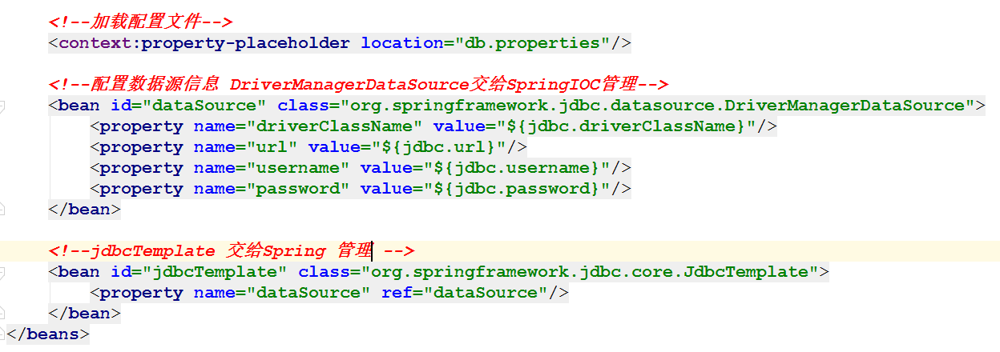

# Spring对持久层支持（了解）_辉哥

> Spring是javaEE开发 一站式解决方案 提供了对各个层的支持  我们也可以通过Spring结构图看到   对持久层的支持  分为jdbc模板和orm模块  


## 1 . 使用JDBC模板操作数据库

### 1.1. 建表建库

```mysql
create database spring;
user spring;
 
CREATE TABLE `employee`  (
  `id` int(11) NOT NULL AUTO_INCREMENT,
  `name` varchar(255) CHARACTER SET utf8 COLLATE utf8_general_ci NULL DEFAULT NULL,
  `money` double(255, 0) NULL DEFAULT NULL,
  PRIMARY KEY (`id`) USING BTREE
) ENGINE = InnoDB AUTO_INCREMENT = 10 CHARACTER SET = utf8 COLLATE = utf8_general_ci ROW_FORMAT = Compact;

-- ----------------------------
-- Records of employee
-- ----------------------------
INSERT INTO `employee` VALUES (1, '马云', 3000);
INSERT INTO `employee` VALUES (2, '马化腾', 3000);
```

### 1.2. 新建java项目

> 略

### 1.3. 导入jar包


### 1.4. 编写实体类

```java
package com.shangma.cn.entity;

public class Employee {

    private  Integer id;

    private String name;

    private double money;

    public Integer getId() {
        return id;
    }

    public void setId(Integer id) {
        this.id = id;
    }

    public String getName() {
        return name;
    }

    public void setName(String name) {
        this.name = name;
    }

    public double getMoney() {
        return money;
    }

    public void setMoney(double money) {
        this.money = money;
    }

    @Override
    public String toString() {
        return "Employee{" +
                "id=" + id +
                ", name='" + name + '\'' +
                ", money=" + money +
                '}';
    }
}

```

### 1.4. 编写测试类 

```java
public class TestDemo1 {

    @Test
    public  void  fun(){

        //使用Spring JDBCTemplate模板操作数据库
        DriverManagerDataSource dataSource  = new DriverManagerDataSource();
        dataSource.setDriverClassName("com.mysql.jdbc.Driver");
        dataSource.setUrl("jdbc:mysql://localhost:3306/spring");
        dataSource.setUsername("root");
        dataSource.setPassword("rootroot");
        JdbcTemplate  jdbcTemplate  = new JdbcTemplate(dataSource);
        //添加

        /**
         * 注意 增删改 都使用update方法   和dbutils一样
         */
        int updateRow = jdbcTemplate.update("insert into employee(name,money) values(?,?)",
                "丁磊", 4000);
        if(updateRow>0){
            System.out.println("添加成功");
        }
        
    }
}

```

### 1.5. 测试


### 1.6. 代码优化

* **创建对象交给Spring管理 数据库连接信息抽出**
* **使用Spring集成junit编写测试类**
* **引入DruidDataSource数据源**

#### 1.6.1. 创建数据库配置


#### 1.6.2. 编写Spring配置文件



**拓展：加载配置文件的另外一种方式**

```xml
  <bean class="org.springframework.beans.factory.config.PropertyPlaceholderConfigurer">
        <property name="location" value="db.properties"/>
    </bean>
```

#### 1.6.3. 编写Spring的测试类

```java

@RunWith(SpringRunner.class)
@ContextConfiguration(locations = {"classpath:applicationContext.xml"})
public class SpringTest {

    @Autowired
    private JdbcTemplate jdbcTemplate;

    @Test
    public void fun(){
        int updateRow = jdbcTemplate.update("insert into employee(name,money) values(?,?)", 
                "李彦宏", 4000);
        if(updateRow>0){
            System.out.println("添加成功");
        }
    }


}

```

#### 1.6.4. 引用Druid数据源


* **导入 druid的jar**

  

* 修改spring配置文件

    


### 1.7.dao层的编写  

> jdbcTemplate只是一个模板工具   当然这个模板工具可以在dao中直接引入进行编写代码 但是我们开发有规范 我们应该统一管理  所以 使用jdbcDaoSupport这个类来编写dao层 

#### 1.7.1. 编写dao

```java
public interface EmployeeDao {

    //增
    int saveEmployee(Employee employee);
    //删
    int deleteEmployee(Integer id);
    //改
    int updateEmployee(Employee employee);

    //查询一个具体的
    String selectNameById(Integer id);

    //查询一个
    Employee selectEmployeeById(Integer id);

    //查询多个

    List<Employee> selectAll();
}
```

#### 1.7.2. 编写dao实现类

```java
/**
 * 使用dao规范 实现类实现 JdbcDaoSupport
 */
public class EmployeeDaoImpl extends JdbcDaoSupport implements EmployeeDao {


    @Override
    public int saveEmployee(Employee employee) {
        return getJdbcTemplate().update("insert into employee(name,money) values(?,?)",employee.getName(),employee.getMoney());

    }

    @Override
    public int deleteEmployee(Integer id) {
        return getJdbcTemplate().update("delete from employee where id =?",id);
    }

    @Override
    public int updateEmployee(Employee employee) {
        String sql  = "update employee set name=?,money=? where id =?";
        return getJdbcTemplate().update(sql,employee.getName(),employee.getMoney(),employee.getId());
    }

    @Override
    public String selectNameById(Integer id) {
        return getJdbcTemplate().queryForObject("select name from employee where id =?",String.class,id);
    }


    /**
      当查询一个时 我们使用BeanPropertyRowMapper
      使用BeanPropertyRowMapper 要求实体类的属性和列名一致
     */
    @Override
    public Employee selectEmployeeById(Integer id) {
        Employee employee = getJdbcTemplate().queryForObject("select * from employee where id =?", new BeanPropertyRowMapper<Employee>(Employee.class), id);
        return employee;
    }

    /**
     当查询多个时 我们也要使用BeanPropertyRowMapper
     使用BeanPropertyRowMapper 要求实体类的属性和列名一致
     */
    @Override
    public List<Employee> selectAll() {

        return getJdbcTemplate().query("select * from employee",new BeanPropertyRowMapper<>(Employee.class));
    }
}

```

#### 1.7.3. 修改配置类


#### 1.7.4. 测试类


## 2.Spring对事务的支持

### 2.1. 事务的回顾

#### 2.1.1. 什么是事务

> 多个操作当做一个整体 这个整体要嘛同时成功 同时失败  

#### 2.1.2. 事务的特性

* 一致性：转账前后 总金额不变 
* 原子性：事务不能再分割
* 隔离性： 各个事务之间 相互隔离互不影响
* 持久性： 一旦事务提交成功 数据将持久化硬盘上  

#### 2.1.3. 安全性问题

* 脏读：表示事务读到了另外一个事务没有提交的数据 
* 不可重复读： 表示一个事务读取到了另外一个事务中提交的数据(update)
* 幻读：  表示一个事务读取到了另外一个事务中提交的数据(insert)

#### 2.1.4.  数据库隔离级别

* read UnCommit ： 脏读  不可重复读  幻读 都可能发生
* read Commit : 脏读不会发生  不可重复读  幻读 有可能发生
* Repeatable Read：脏读 不可重复读 不会发生  幻读 有可能发生 
* SERIALIZABLE:    解决所有问题

### 2.2. 问题演示 


### 2.3. Spring事务的一些概念


* **PlatformTransactionManager** 

  > spring要管理事务，必须使用事务管理器进行事务配置，**必须配置事务管理器**。这是一个接口
  >
  > 而我们使用 DataSourceTransactionManager

  

* **TransactionStatus**

  > 这个类表示事务的状态 例如：是否有保存点，事务是否完成等等

  

* **TransactionDefinition**

  > 表示事务详情 事务详情（事务定义、事务属性），spring用于确定事务具体详情，
  >
  > 例如：隔离级别、是否只读、超时时间 等
  >
  > 进行事务配置时，**必须配置详情**。spring将配置项封装到该对象实例。


### 2.4. 传播行为（不要掌握）

> 表示2个或者多个业务之间如何共享事务  有七种取值分别对应的常量是(0,1,2,3,4,5,6) 
>
> 说白了 当事务方法被另一个事务方法调用时，必须指定事务应该如何传播 
>
> 比如 方法A有事务支持  方法B也有事务支持    在A方法中调用B方法时  B方法的事务 是用A的事务还是自己再弄一个新的事务      
>
> **传播行为不要掌握 会配置就行了**  

```java
  /**
        PROPAGATION_REQUIRED , required , 必须
        支持当前事务，A如果有事务，B将使用该事务。
        如果A没有事务，B将创建一个新的事务。

        PROPAGATION_SUPPORTS ，supports ，支持
        支持当前事务，A如果有事务，B将使用该事务。
        如果A没有事务，B将以非事务执行。

        PROPAGATION_MANDATORY，mandatory ，强制
        支持当前事务，A如果有事务，B将使用该事务。
        如果A没有事务，B将抛异常。

        PROPAGATION_REQUIRES_NEW ， requires_new ，必须新的
        如果A有事务，将A的事务挂起，B创建一个新的事务
        如果A没有事务，B创建一个新的事务

        PROPAGATION_NOT_SUPPORTED ，not_supported ,不支持
        如果A有事务，将A的事务挂起，B将以非事务执行
        如果A没有事务，B将以非事务执行

        PROPAGATION_NEVER ，never，从不
        如果A有事务，B将抛异常
        如果A没有事务，B将以非事务执行
     
        PROPAGATION_NESTED ，nested ，嵌套
        A和B底层采用保存点机制，形成嵌套事务。
     */

```

### 2.5. Spring事务操作事务

#### 2.5.1. 添加Service层

> 由于事务是 执行操作之前开启 操作之后提交 或者回滚 一般放在Service层处理

```java
//编写Service接口 
public interface EmployeeService {

    //转账
    void  zhuanzhang(Integer fromId,Integer toId,double money);
}


//编写实现类

public class EmployeeServiceImpl implements EmployeeService {

    @Autowired
    EmployeeDao employeeDao;
    
    @Override
    public void zhuanzhang(Integer fromId, Integer toId, double money) {
        //根据id 找到员工
        Employee employee = employeeDao.selectEmployeeById(fromId);
        Employee employee1 = employeeDao.selectEmployeeById(toId);
        //修改金额
        employee.setMoney(employee.getMoney()-money);
        employee1.setMoney(employee1.getMoney()+money);
        
        //修改数据库进行转账
        employeeDao.updateEmployee(employee);
        int i=10/0;
        employeeDao.updateEmployee(employee1);

    }

}

//
```

#### 2.5.2. 修改配置文件


#### 2.5.3. 事务管理之模板(了解)

* **编写配置文件**

  

* **修改UserServiceImpl**

  ```java

  public class EmployeeServiceImpl implements EmployeeService {

      @Autowired
      EmployeeDao employeeDao;
      @Autowired
      TransactionTemplate transactionTemplate;

      @Override
      public void zhuanzhang(Integer fromId, Integer toId, double money) {
          Employee employee = employeeDao.selectEmployeeById(fromId);
          Employee employee1 = employeeDao.selectEmployeeById(toId);
          employee.setMoney(employee.getMoney()-money);
          employee1.setMoney(employee1.getMoney()+money);
          transactionTemplate.execute(new TransactionCallbackWithoutResult() {
              @Override
              protected void doInTransactionWithoutResult(TransactionStatus transactionStatus) {
                  employeeDao.updateEmployee(employee);
                  int i=10/0;
                  employeeDao.updateEmployee(employee1);
              }
          });
      }
  }
  ```

* **测试类**

  ```java
  @RunWith(SpringRunner.class)
  @ContextConfiguration(locations = {"classpath:applicationContext.xml"})
  public class SpringTest {

      @Autowired
      EmployeeService employeeService;
      
      @Test
      public void fun() {
         employeeService.zhuanzhang(1,2,1000);
      }
  }
  ```

  ​

#### 2.5.4. aop声明式事务之xml的配置

* **引入aspectj.jar** 


* **删除EmployeeServiceImpl中的模板信息**

  ```java
  public class EmployeeServiceImpl implements EmployeeService {

      @Autowired
      EmployeeDao employeeDao;
  ```


      @Override
      public void zhuanzhang(Integer fromId, Integer toId, double money) {
          Employee employee = employeeDao.selectEmployeeById(fromId);
          Employee employee1 = employeeDao.selectEmployeeById(toId);
          employee.setMoney(employee.getMoney()-money);
          employee1.setMoney(employee1.getMoney()+money);
          employeeDao.updateEmployee(employee);
          int i=10/0;
          employeeDao.updateEmployee(employee1);
          
      }
* **编写配置文件**

    

* **测试**

#### 2.5.5. aop声明式事务之注解（必须会）

* **修改配置文件**

    

* **再需要的事务地方添加注解**

   

  ​