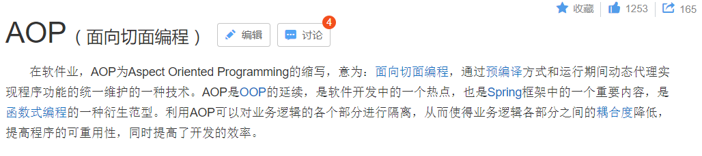
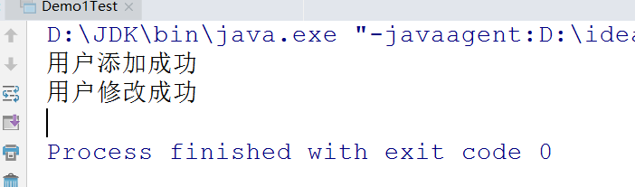
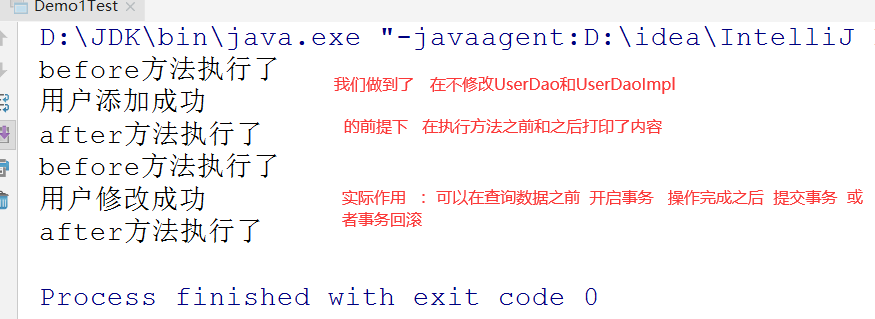
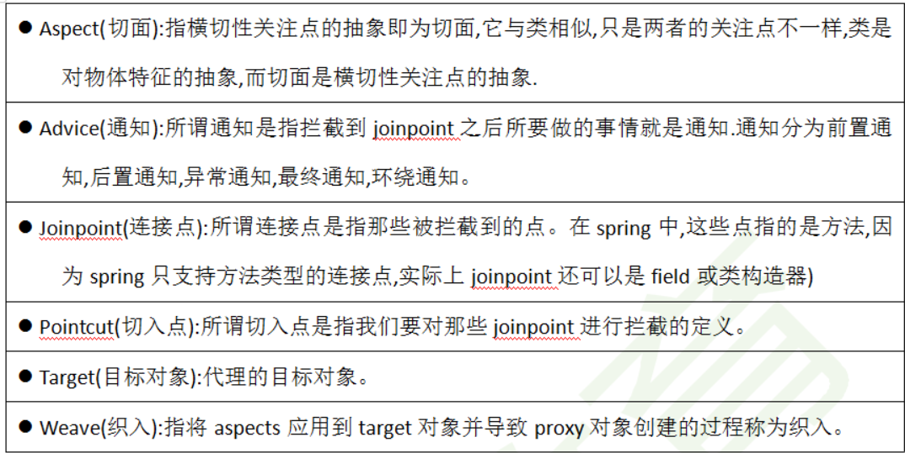
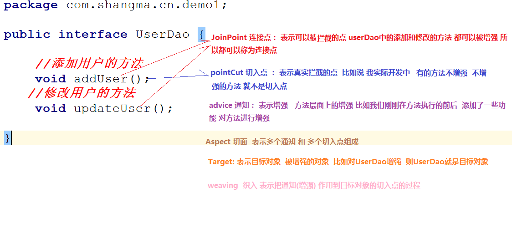
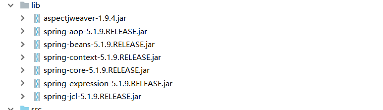
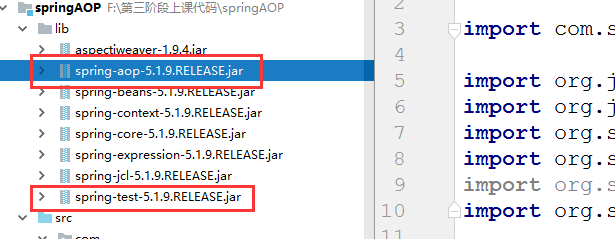
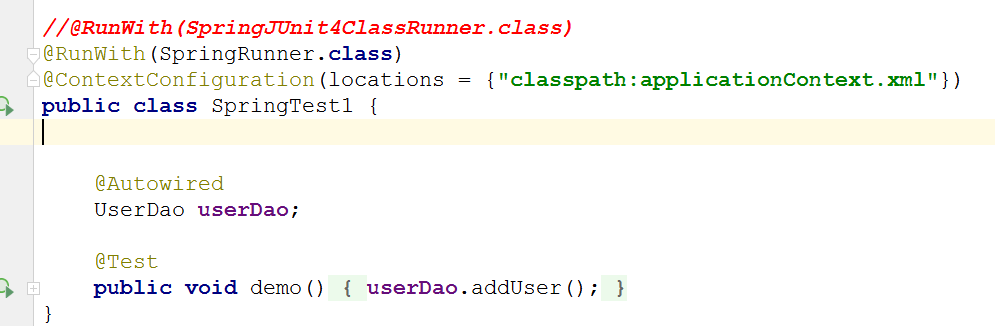

# Spring的AOP

## 1. 什么是AOP



**AOP：面向切面编程，是一种在程序运行期间通过动态代理实现在不修改源代码的情况下给程序动态统一的添加新功能的一种技术**

## 2. AOP的作用

* 日志记录，
* 性能统计，
* 安全控制，
* 事务处理，
* 异常处理

## 3. AOP的好处 

* 降低模块的耦合度
* 使系统容易扩展
* 更好的代码复用性,

## 4. AOP的实现原理

* JDK动态代理  ： 接口+实现类 获得这个实现类的代理对象 
* cglib代理 ：对没有实现接口的类产生代理对象，生成这个类的子类，cglib = code generation library

## 5. 问题演示

### 5.1. 创建java普通项目 

**注意：不需要导入任何包**

### 5.2. 创建UserDao接口

```java

public interface UserDao {
    //添加用户的方法
    void addUser();
   //修改用户的方法
    void updateUser();
}
```

### 5.3. 创建UserDao实现类

```java

public class UserDaoImpl implements UserDao {
    @Override
    public void addUser() {
        System.out.println("用户添加成功");
    }

    @Override
    public void updateUser() {
        System.out.println("用户修改成功");
    }
}
```

### 5.4. 编写测试类 

```java
public class Demo1Test {

    public static void main(String[] args) {
        UserDao userDao  = new UserDaoImpl();
        userDao.addUser();
        userDao.updateUser();
    }
}
```

### 5.5. 运行打印结果




### 5.6.问题说明

> 在不改变源代码的情况下，要求在执行添加或者修改用户，之前打印一句话，之后打印一句话，
>
> 此时我们要需要了解动态代理的方式  也就是Spring aop的底层原理 

## 6. AOP实现之动态代理 

* 了解点： 动态代理，需要依赖接口，获得是实现类的代理类 
* 实现思路: 接口实现类 切面类  工厂  

### 6.1. 定义一个切面类

```java
public class MyAspect {

    //方法执行之前执行的方法
    public  void before(){
        System.out.println("before方法执行了");
    }

    //方法执行之后 要执行的方法
    public  void after(){
        System.out.println("after方法执行了");
    }
}
```

### 6.2. 定义工厂类

```java
/**
 * 工厂模式创建UserDao接口的对象
 */
public class UserDaoFactory {

    public static UserDao getUserDao() {
        //创建目标类的对象，需要在此类对象的方法前后添加新功能
        UserDao userDao = new UserDaoImpl();
        //创建含有新功能类的对象，即切面类对象
        MyAspect myAspect = new MyAspect();

        /**第一个参数：类加载器
         *      获得方式  当前类的.class.getClassLoader()
         * 第二个参数： 表示动态代理的类要实现的接口(接口是多实现)
         *      被代理的类的class.getInterfaces()
         * 第三个参数：InvocationHandler 对象
         *      表示代理对象执行方法时会调用invoke方法
         */
        //通过Proxy对象的静态方法创建接口的代理类对象
        UserDao userDaoProxy = (UserDao) Proxy.newProxyInstance(UserDaoFactory.class.getClassLoader(),
                userDao.getClass().getInterfaces(),
                new InvocationHandler() {
                    //proxy 表示代理对象
                    //method表示执行的方法，即被代理类中的方法，这里是UserDao实现类中的方法
                    //args表示参数
                    @Override
                    public Object invoke(Object proxy, 
                                         Method method, Object[] args) throws Throwable {
                        //插入前置方法
                        myAspect.before();
                        //执行目标对象的方法，返回的对象就是外层invoke()方法的对象
                        Object invoke = method.invoke(userDao, args);
                        //插入后置方法
                        myAspect.after();
                        return invoke;
                    }
                });
        //返回UserDao接口的代理类对象
        return userDaoProxy;
    }
}
```

### 6.3. 测试 

```java
public class UserDaoTest {
    public static void main(String[] args) {
        UserDaoFactory.getUserDao().addUser();
        UserDaoFactory.getUserDao().updateUser();
    }
}
```



## 7.AOP的专业术语



**理解**



## 8. AOP框架AspectJ的使用 

> 我们的动态代理虽然说可以实现AOP的一些内容,但是我们只是针对一个UserDao接口动态生成了一个代理类  如果要生成的代理类比较多，就不是很优雅，Spring的AOP 采用的是 AspectJ框架完成的
>
> AspectJ = Aspect Java

### 8.1. 导入jar包



### 8.2. 使用的类 

* 动态代理代码中的UserDao 和UserDaoImpl 

### 8.3. 编写切面类 

```java
import org.aopalliance.intercept.MethodInterceptor;
/**
 * 切面类，实现aop alliance中的方法拦截器
 */
public class MyAspect2 implements MethodInterceptor {
    public void before() {
        System.out.println("before()方法调用了");
    }

    public void after() {
        System.out.println("after()方法调用了");
    }

    @Override
    public Object invoke(MethodInvocation methodInvocation) throws Throwable {
        before();
        Object proceed = methodInvocation.proceed();
        after();
        return proceed;
    }
}
```

### 8.3. 编写spring的配置文件

```xml
    <!--配置userDao-->
    <bean id="userDao" class="com.xyz.code.dao.impl.UserDaoImpl"></bean>
    <!--配置切面类-->
    <bean id="myAspect2" class="com.xyz.code.aop.MyAspect2"></bean>
    <!--aop配置-->
    <aop:config>
        <!--配置通知器-->                     <!--配置切入点表达式-->
        <aop:advisor advice-ref="myAspect2" 
                     pointcut="execution(* com.xyz.code.dao.UserDao.addUser())"/>
    </aop:config>
```

**aop配置的其他写法**

```xml
    <!--aop配置-->
    <aop:config>
        <!--配置通知器-->                     <!--配置切入点表达式-->
        <aop:pointcut id="myPointcut" 
                      expression="execution(* com.xyz.code.dao.UserDao.addUser())"/>
        <aop:advisor advice-ref="myAspect2" pointcut-ref="myPointcut" />
    </aop:config>
```

### 8.4. 测试

```java
public class UserDaoTest {
    public static void main(String[] args) {
        ApplicationContext ioc = new ClassPathXmlApplicationContext("application.xml");
        UserDao userDao = ioc.getBean("userDao", UserDao.class);
        userDao.addUser();
    }
}
```

## 9. Spring的6种通知类型

* 前置通知 （before）：目标方法执行前执行
* 后置通知(afterReturning)： 目标方法执行后执行
* 环绕通知(around)： 目标方法执行前和后执行
* 最终通知 (after)： 目标方法不管出不出异常 都会执行
* 异常通知(afterThrowding): 目标方法出异常执行
* 引介通知 (declare)：不掌握

### 9.1. Spring配置通知之xml的方式（重点）

#### 9.1.1. 使用的类

* 使用的类 有UserDao  和 UserDaoImpl

#### 9.1.2. 新建切面类

```java

import org.aspectj.lang.JoinPoint;
import org.aspectj.lang.ProceedingJoinPoint;

public class MyAspect3 {

    public void before(JoinPoint joinPoint) {
        System.out.println("前置通知" + joinPoint.getSignature().getName());
    }

    public void afterReturning(JoinPoint joinPoint) {
        System.out.println("后置通知" + joinPoint.getSignature().getName());
    }

    public void around(ProceedingJoinPoint proceedingJoinPoint) {
        System.out.println("方法执行前");

        try {
            proceedingJoinPoint.proceed();
        } catch (Throwable throwable) {
            throwable.printStackTrace();
        }

        System.out.println("方法执行后");
    }

    public void afterThrowing() {
        System.out.println("异常通知");
    }

    public void after(JoinPoint joinPoint) {
        System.out.println("最终通知");
    }
}
```

#### 9.1.3. 编写配置文件

```xml
    <!--配置切面类-->
    <bean id="myAspect3" class="com.xyz.code.aop.MyAspect3"></bean>
    <!--aop配置-->
    <aop:config>
        <!--配置切面-->
        <aop:aspect ref="myAspect3">
            <aop:pointcut id="myPointcut" 
                          expression="execution(* com.xyz.code.dao.*.*(..))"/>
            <aop:before method="before" pointcut-ref="myPointcut"/>
            <aop:after-returning method="afterReturning" pointcut-ref="myPointcut"/>
            <aop:around method="around" pointcut-ref="myPointcut"/>
            <aop:after-throwing method="afterThrowing" pointcut-ref="myPointcut"/>
            <aop:after method="after" pointcut-ref="myPointcut"/>
        </aop:aspect>
    </aop:config>
```

### 9.2. 配置通知之注解的方式（重点）

#### 9.2.1. 修改UserDaoImpl，加上注解

```java
@Repository(value = "userDao") //注解
public class UserDaoImpl implements UserDao {
    @Override
    public void addUser() {
        System.out.println("用户添加成功");
    }

    @Override
    public void updateUser() {
        System.out.println("用户修改成功");
    }
}
```

#### 9.2.2. 编写切面类

```java
import org.aspectj.lang.JoinPoint;
import org.aspectj.lang.ProceedingJoinPoint;
import org.aspectj.lang.annotation.*;
import org.springframework.stereotype.Component;

@Aspect //代替aop:aspect标签
@Component 
public class MyAspect4 {
    @Before(value = "myPoint()") //代替aop:before标签,以此类推
    public void before(JoinPoint joinPoint) {
        System.out.println(joinPoint.getSignature().getName() + "的前置通知");
    }

    @After(value = "myPoint()")
    public void afterReturning(JoinPoint joinPoint) {
        System.out.println(joinPoint.getSignature().getName() + "的后置通知");
    }

    @Around(value = "myPoint()")
    public void around(ProceedingJoinPoint proceedingJoinPoint) {
        System.out.println(
            proceedingJoinPoint.getSignature().getName() + "的环绕通知前面方法");
        try {
            proceedingJoinPoint.proceed();
        } catch (Throwable throwable) {
            throwable.printStackTrace();
        }
        System.out.println(
            proceedingJoinPoint.getSignature().getName() + "的环绕通知后面方法");
    }

    @AfterThrowing(value = "myPoint()")
    public void afterThrowing(JoinPoint joinPoint) {
        System.out.println(joinPoint.getSignature().getName() + "的异常通知");
    }

    @After(value = "myPoint()")
    public void after(JoinPoint joinPoint) {
        System.out.println(joinPoint.getSignature().getName() + "的最终通知");
    }

    /**
     * 统一设置切入点,@Pointcut注解代替aop:pointcut标签
     */
    @Pointcut(value = "execution(* com.xyz.code.dao.*.*(..))")
    public void myPoint() {

    }
}
```

#### 9.2.3. 编写配置文件

```xml
    <!--开启组件扫描，有注解的类加入容器中-->
    <context:component-scan base-package="com.xyz.code"/>
    <!--开启aspectj自动代理，用开织入-->
    <aop:aspectj-autoproxy/>
```

## 10.切入点表达式介绍

```java
execution(* com.xyz.code.dao.UserDao.addUser())
```

* 语法

  execution(修饰符 返回值 包名.类名.方法名(参数) throws 异常)

* 规则

  ```java
   /**
       修饰符：一般省略 
      	 public   公共方法
      	 *       表示任意修饰符都行

       返回值：不能省略 
       	 Void     表示没有返回值
           String    表示字符串类型返回值
      	  *        表示任意 有没有返回值都行  有返回值什么类型都行 

       包   可以省略（支持通配符）
      	 com.shangma.cn   表示固定包名 
      	 com.shangma.cn.*  表示com.shangma.cn包下的任意子包
       	 com.shangma.cn..   表示com.shangma.cn包下的任意子包  包含自己 

       类   可以省略(支持通配符)
       	UserDao  表示固定的类 
      	User*       看清楚这个*前面没有. 不是User.*  是User* 表示以User开头 
       	  *        表示任意类 

       方法名 不能省略 支持通配符
      	 AddUser  表示固定的方法
      	 Add*       add开头的方法
      	 *        表示任意方法

       参数
      	 ()   表示无参数
      	 (int)  表示一个参数 
      	 (int,int) 表示2个参数
      	 (..)  表示 参数任意 
       */
  ```

  **常用写法 ： execution(* com.xyz.code.*.*(..))  表示 com.xyz.code 包下所有的类所有的方法都被增强**

## 11 . Spring集成junitu单元测试

### 11.1. 导入jar包 



**注意：不要手动导入junit.jar   通过idea的提示导入junit的依赖**

### 11.2. 编写测试类

`SpringRunner`是`SpringJUnit4ClassRunner`的子类，常用`SpringRunner`作为`@RunWith`的`value`属性值



## 12.常见异常

12.1定义aop:pointcut标签时，顺序出错,只要将aop:pointcut标签提到aop:advisor标签之前就行

```properties
Exception in thread "main" org.springframework.beans.factory.xml.XmlBeanDefinitionStoreException: Line 14 in XML document from class path resource [application.xml] is invalid; nested exception is org.xml.sax.SAXParseException; lineNumber: 14; columnNumber: 101; cvc-complex-type.2.4.a: 发现了以元素 'aop:pointcut' 开头的无效内容。应以 '{"http://www.springframework.org/schema/aop":advisor, "http://www.springframework.org/schema/aop":aspect}' 之一开头。
```

```xml
<!--aop配置-->
<aop:config>
    <!--配置通知器-->                     <!--配置切入点表达式-->
    <aop:pointcut id="myPointcut" 
                  expression="execution(* com.xyz.code.dao.UserDao.addUser())"/>
    <aop:advisor advice-ref="myAspect2" pointcut-ref="myPointcut" />
</aop:config>
```

12.2配置aop:aspect时未加ref属性

```properties
Exception in thread "main" org.springframework.beans.factory.parsing.BeanDefinitionParsingException: Configuration problem: <aspect> tag needs aspect bean reference via 'ref' attribute when declaring advices.
Offending resource: class path resource [application.xml]
Aspect: ref=''
```

```xml
    <!--配置切面类-->
    <bean id="myAspect3" class="com.xyz.code.aop.MyAspect3"></bean>
    <!--aop配置-->
    <aop:config>
        <!--配置切面-->
        <aop:aspect ref="myAspect3">
            <aop:pointcut id="myPointcut" 
                          expression="execution(* com.xyz.code.dao.*.*(..))"/>
            <aop:before method="before" pointcut-ref="myPointcut"/>
            <aop:after-returning method="afterReturning" pointcut-ref="myPointcut"/>
            <aop:around method="around" pointcut-ref="myPointcut"/>
            <aop:after-throwing method="afterThrowing" pointcut-ref="myPointcut"/>
            <aop:after method="after" pointcut-ref="myPointcut"/>
        </aop:aspect>
    </aop:config>
```

