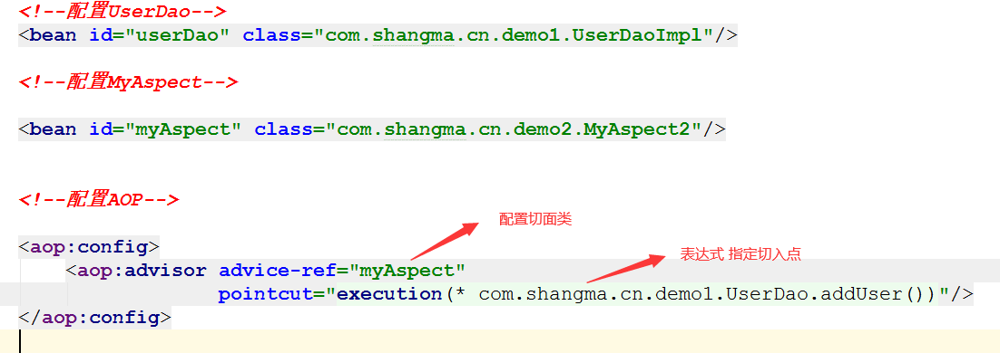
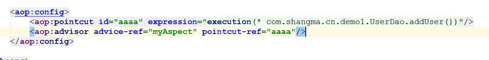
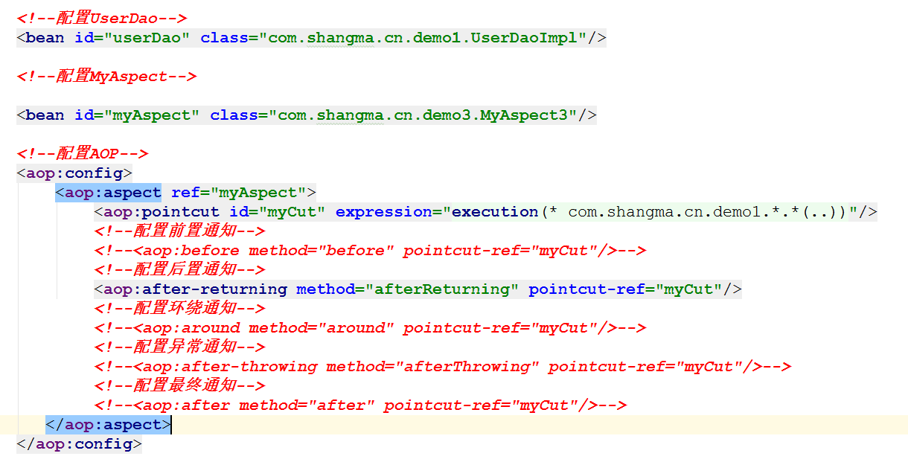
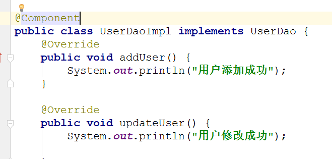
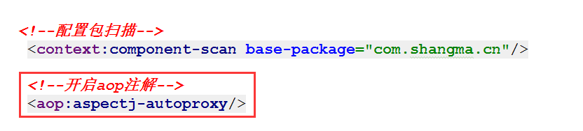
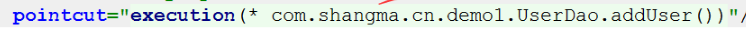

# Spring的AOP_辉哥

## 1. 什么是AOP


**AOP：面向切面编程，是一种在程序运行期间通过动态代理实现在不修改源代码的情况下给程序动态统一的添加新功能的一种技术**

## 2. AOP的作用

* 日志记录，
* 性能统计，
* 安全控制，
* 事务处理，
* 异常处理

## 3. AOP的好处 

* 降低模块的耦合度
* 使系统容易扩展
* 更好的代码复用性,

## 4. AOP的实现原理

* JDK动态代理  ： 接口+实现类 获得这个实现类的代理对象 
* cglib代理 ：对没有实现接口的类产生代理对象 生成这个类的子类 

## 5. 问题演示

### 5.1. 创建java项目 

略 

**注意：不需要导入任何包**

### 5.2. 创建UserDao接口

```java

public interface UserDao {
    //添加用户的方法
    void addUser();
   //修改用户的方法
    void updateUser();

}
```

### 5.3. 创建UserDao实现类

```java

public class UserDaoImpl implements UserDao {
    @Override
    public void addUser() {
        System.out.println("用户添加成功");

    }

    @Override
    public void updateUser() {
        System.out.println("用户修改成功");

    }
}
```

### 5.4. 编写测试类 

```java
public class Demo1Test {

    public static void main(String[] args) {
        UserDao userDao  = new UserDaoImpl();
        userDao.addUser();
        userDao.updateUser();
    }
}
```

### 5.5. 运行打印结果


### 5.6.问题说明

> 在不改变源代码的情况下   要求在执行添加 或者修改用户之前 打印一句话   之后打印一句话  
>
> 此时我们要需要了解动态代理的方式  也就是Spring aop的底层原理 


## 6. AOP实现之动态代理 

* 了解点： 动态代理 需要依赖接口  获得是实现类的代理类 
* 实现思路: 接口 实现类 切面类  工厂  

### 6.1. 定义一个切面类

```java
public class MyAspect {

    //方法执行之前执行的方法
    public  void before(){
        System.out.println("before方法执行了");
    }

    //方法执行之后 要执行的方法
    public  void after(){
        System.out.println("after方法执行了");
    }
}
```


### 6.2. 定义工厂 

```java
/**
 * 工厂模式创建对象
 */
public class UserFactory {

    public  static  UserDao getUserDao(){
        //创建目标类
        UserDao userDao  = new UserDaoImpl();

        MyAspect myAspect  = new MyAspect();

        /**第一个参数：类加载器
         *      获得方式  当前类的.class.getClassLoader()
         * 第二个参数： 表示动态代理的类要实现的接口(接口是多实现)
         *      被代理的类的class.getInterfaces()
         * 第三个参数：InvocationHandler 对象
         *      表示代理对象执行方法时会调用invoke方法
         *
         */
        UserDao userDaoProxy = (UserDao) Proxy.newProxyInstance(UserFactory.class.getClassLoader(),
                userDao.getClass().getInterfaces(),
                new InvocationHandler() {
                    // proxy 表示代理对象
                    //method 表示执行的方法 
                    // 表示执行的方法
                    @Override
                    public Object invoke(Object proxy, Method method, Object[] args) throws Throwable {

                        
                        myAspect.before();

                        //执行方法
                        Object invoke = method.invoke(userDao, args);

                        myAspect.after();
                        return invoke;
                    }
                });
        return userDaoProxy;
    }

}

```

### 6.3. 测试 


## 7.AOP的专业术语


**理解**


## 8. AOP框架AspectJ的使用 

> 我们的动态代理虽然说可以实现AOP的一些内容  但是我们只是针对一个UserDao 动态生成了一个代理类  如果要生成的代理类比较多 就不是很优雅  Spring的AOP 采用的是 AspectJ框架完成的 

### 8.1. 导入jar包


### 8.2. 使用的类 

* 动态代理代码中的UserDao 和UserDaoImpl 

### 8.3. 编写切面类 

```java
/**
 * 切面类 实现方法拦截器
 */
public class MyAspect2 implements MethodInterceptor {


    @Override
    public Object invoke(MethodInvocation methodInvocation) throws Throwable {

        System.out.println("执行之前打印的");
        Object proceed = methodInvocation.proceed();
        System.out.println("执行之后打印的");
        return proceed;
    }
}
```


### 8.3. 编写spring的配置文件



**aop配置的其他写法**



## 9. Spring的6种通知类型

* 前置通知 （before）：目标方法执行前执行
* 后置通知(afterReturning)： 目标方法执行后执行
* 环绕通知(around)： 目标方法执行前和后执行
* 最终通知 (after)： 目标方法不管出不出异常 都会执行
* 异常通知(afterThrowding): 目标方法出异常执行
* 引介通知 (declare)：不掌握

### 9.1. Spring配置通知之xml的方式

#### 9.1.1. 使用的类

* 使用的类 有UserDao  和 UserDaoImpl

#### 9.1.2. 新建切面类

```java
package com.shangma.cn.demo3;


import org.aspectj.lang.JoinPoint;
import org.aspectj.lang.ProceedingJoinPoint;

public class MyAspect3 {

    public void before(JoinPoint joinPoint) {
        System.out.println("前置通知" + joinPoint.getSignature().getName());
    }

    public void afterReturning(JoinPoint joinPoint) {
        System.out.println("后置通知" + joinPoint.getSignature().getName());
    }

    public void around(ProceedingJoinPoint proceedingJoinPoint) {
        System.out.println("方法执行前");

        try {
            proceedingJoinPoint.proceed();
        } catch (Throwable throwable) {
            throwable.printStackTrace();
        }

        System.out.println("方法执行后");
    }

    public void afterThrowing() {
        System.out.println("异常通知");
    }

    public void after(JoinPoint joinPoint) {
        System.out.println("最终通知");
    }
}
```

#### 9.1.3. 编写配置文件



### 9.2. 配置通知之注解的方式

#### 9.2.1. 修改UserDaoImpl



#### 9.2.2. 编写切面类

```java
package com.shangma.cn.demo3;


import org.aspectj.lang.JoinPoint;
import org.aspectj.lang.ProceedingJoinPoint;
import org.aspectj.lang.annotation.*;
import org.springframework.stereotype.Component;

@Component
@Aspect
public class MyAspect3 {


    @Before("myPointCut()")
    public void before(JoinPoint joinPoint) {
        System.out.println("前置通知" + joinPoint.getSignature().getName());
    }

    @AfterReturning(pointcut = "myPointCut()")
    public void afterReturning(JoinPoint joinPoint) {
        System.out.println("后置通知" + joinPoint.getSignature().getName());
    }

    @Around("myPointCut()")
    public void around(ProceedingJoinPoint proceedingJoinPoint) {
        System.out.println("方法执行前");

        try {
            proceedingJoinPoint.proceed();
        } catch (Throwable throwable) {
            throwable.printStackTrace();
        }

        System.out.println("方法执行后");
    }

    @AfterThrowing("myPointCut()")
    public void afterThrowing() {
        System.out.println("异常通知");
    }

    @After("myPointCut()")
    public void after(JoinPoint joinPoint) {
        System.out.println("最终通知");
    }

    /**
     * 统一设置切入点
     */
    @Pointcut("execution(* com.shangma.cn.demo1.UserDao.addUser())")
    public void myPointCut(){

    }
}

```

#### 9.2.3. 编写配置文件



## 10.切入点表达式



* 语法

  execution(修饰符 返回值 包名.类名.方法名(参数) throws 异常)

* 规则

  ```java
   /**
       修饰符：一般省略 
      	 public   公共方法
      	 *       表示任意修饰符都行

       返回值：不能省略 
       	 Void     表示没有返回值
           String    表示字符串类型返回值
      	  *        表示任意 有没有返回值都行  有返回值什么类型都行 

       包   可以省略（支持通配符）
      	 com.shangma.cn   表示固定包名 
      	 com.shangma.cn.*  表示com.shangma.cn包下的任意子包
       	 com.shangma.cn..   表示com.shangma.cn包下的任意子包  包含自己 

       类   可以省略(支持通配符)
       	UserDao  表示固定的类 
      	User*       看清楚这个*前面没有. 不是User.*  是User* 表示以User开头 
       	  *        表示任意类 

       方法名 不能省略 支持通配符
      	 AddUser  表示固定的方法
      	 Add*       add开头的方法
      	 *        表示任意方法

       参数
      	 ()   表示无参数
      	 (int)  表示一个参数 
      	 (int,int) 表示2个参数
      	 (..)  表示 参数任意 
       */
  ```

  **常用写法 ： execution(* com.shangma.cn.*.*(..))  表示 com.shangma.cn 包下所有的类所有的方法都被增强**

## 11 . Spring集成junit测试

### 11.1. 导入jar包 


**注意：不要手动导入junit.jar   通过idea的提示导入junit的依赖**

### 11.2. 编写测试类

