# SSM整合之jar

## 1.SSM整合环境搭建

### 1.1. 新建web工程

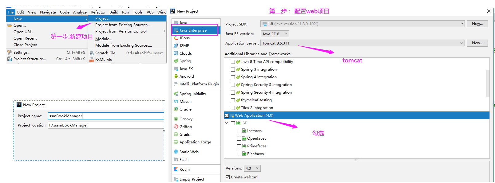

### 1.2. MyBatis和Spring整合 

#### 1.2.1. 导入mybatis的jar包

* mybatis的包（必须导入）
* mybatis包中的lib目录下的依赖包（可选）

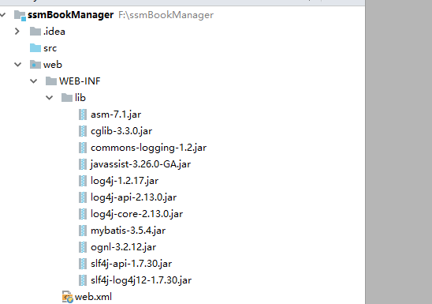

#### 1.2.2. 导入驱动包

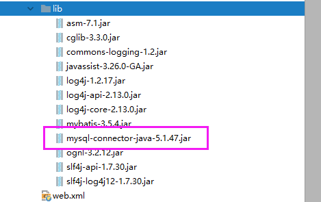

#### 1.2.3.导入Spring的核心包 

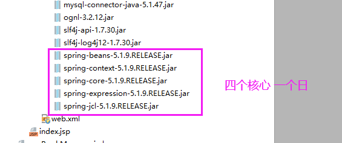

#### 1.2.4. 导入AOP相关和AspectJ

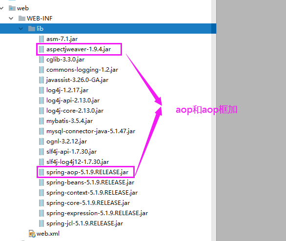 

#### 1.2.5. 导入Spring对持久层的支持包

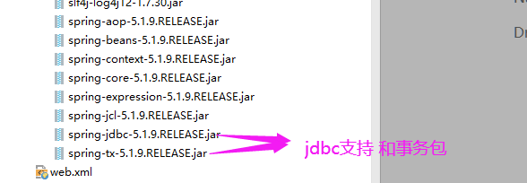

#### 1.2.6. 引入数据源(可选)


#### 1.2.7. 编写连接信息

在类路径下编写db.properties

```properties
jdbc.driverClassName=com.mysql.jdbc.Driver
jdbc.url=jdbc:mysql://localhost:3306?charsetEncoding=utf-8
jdbc.username=root
jdbc.password=root
```

#### 1.2.8. 加入log4j的配置文件

> 直接从资料中拿过来就行,可以从mybatis教程中获取

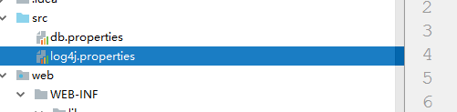

log4j.properties文件：

```properties
# priority  :debug<info<warn<error
#you cannot specify every priority with different file for log4j
log4j.rootLogger=debug,stdout,info,debug,warn,error 

#console
log4j.appender.stdout=org.apache.log4j.ConsoleAppender 
log4j.appender.stdout.layout=org.apache.log4j.PatternLayout 
log4j.appender.stdout.layout.ConversionPattern= [%d{yyyy-MM-dd HH:mm:ss a}]:%p %l%m%n
#info log
log4j.logger.info=info
log4j.appender.info=org.apache.log4j.DailyRollingFileAppender 
log4j.appender.info.DatePattern='_'yyyy-MM-dd'.log'
log4j.appender.info.File=./src/com/hp/log/info.log
log4j.appender.info.Append=true
log4j.appender.info.Threshold=INFO
log4j.appender.info.layout=org.apache.log4j.PatternLayout 
log4j.appender.info.layout.ConversionPattern=%d{yyyy-MM-dd HH:mm:ss a} [Thread: %t][ Class:%c >> Method: %l ]%n%p:%m%n
#debug log
log4j.logger.debug=debug
log4j.appender.debug=org.apache.log4j.DailyRollingFileAppender 
log4j.appender.debug.DatePattern='_'yyyy-MM-dd'.log'
log4j.appender.debug.File=./src/com/hp/log/debug.log
log4j.appender.debug.Append=true
log4j.appender.debug.Threshold=DEBUG
log4j.appender.debug.layout=org.apache.log4j.PatternLayout 
log4j.appender.debug.layout.ConversionPattern=%d{yyyy-MM-dd HH:mm:ss a} [Thread: %t][ Class:%c >> Method: %l ]%n%p:%m%n
#warn log
log4j.logger.warn=warn
log4j.appender.warn=org.apache.log4j.DailyRollingFileAppender 
log4j.appender.warn.DatePattern='_'yyyy-MM-dd'.log'
log4j.appender.warn.File=./src/com/hp/log/warn.log
log4j.appender.warn.Append=true
log4j.appender.warn.Threshold=WARN
log4j.appender.warn.layout=org.apache.log4j.PatternLayout 
log4j.appender.warn.layout.ConversionPattern=%d{yyyy-MM-dd HH:mm:ss a} [Thread: %t][ Class:%c >> Method: %l ]%n%p:%m%n
#error
log4j.logger.error=error
log4j.appender.error = org.apache.log4j.DailyRollingFileAppender
log4j.appender.error.DatePattern='_'yyyy-MM-dd'.log'
log4j.appender.error.File = ./src/com/hp/log/error.log 
log4j.appender.error.Append = true
log4j.appender.error.Threshold = ERROR 
log4j.appender.error.layout = org.apache.log4j.PatternLayout
log4j.appender.error.layout.ConversionPattern = %d{yyyy-MM-dd HH:mm:ss a} [Thread: %t][ Class:%c >> Method: %l ]%n%p:%m%n

```

#### 1.2.9. 构建lib包的路径

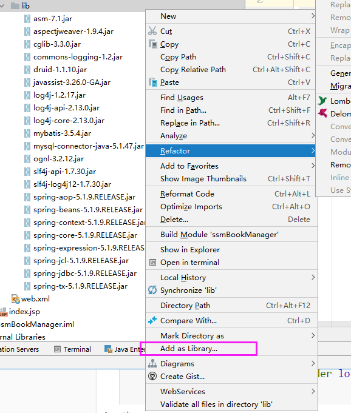


#### 1.2.10. 编写MyBatis的配置文件

在类路径下编写mybatis-config.xml文件

```xml
<?xml version="1.0" encoding="UTF-8"?>
<!--mybaits全局配置文件的约束-->
<!DOCTYPE configuration
        PUBLIC "-//mybatis.org//DTD Config 3.0//EN"
        "http://mybatis.org/dtd/mybatis-3-config.dtd">


<!--配置信息 -->
<configuration>


    <!--加载属性文件-->
    <properties resource="db.properties"/>

    <settings>
        <!--开启懒加载-->
        <setting name="lazyLoadingEnabled" value="true"/>
        <!--二级缓存开关-->
        <setting name="cacheEnabled" value="true"/>
        <!--驼峰命名-->
        <setting name="mapUnderscoreToCamelCase" value="true"/>
    </settings>

    <typeAliases>
        <package name="com.xyz.code.entity"/>
    </typeAliases>


    <environments default="development">
        <environment id="development">
            <!--jdbc的事务管理 交给mybatis管理  -->
            <transactionManager type="JDBC"/>
            <!--数据源 -->
            <dataSource type="POOLED">
                <property name="driver" value="${jdbc.driverClassName}"/>
                <property name="url" value="${jdbc.url}"/>
                <property name="username" value="${jdbc.username}"/>
                <property name="password" value="${jdbc.password}"/>
            </dataSource>
        </environment>
    </environments>
    <mappers>
        <!--<mapper resource="org/mybatis/example/BlogMapper.xml"/>-->

    </mappers>

</configuration>
```

#### 1.2.11. 编写Spring的配置文件

在类路径下右键编写applicationContext.xml配置文件

```xml
<?xml version="1.0" encoding="UTF-8"?>
<beans xmlns="http://www.springframework.org/schema/beans"
       xmlns:xsi="http://www.w3.org/2001/XMLSchema-instance"
       xsi:schemaLocation="http://www.springframework.org/schema/beans http://www.springframework.org/schema/beans/spring-beans.xsd">

</beans>
```

#### 1.2.12. 导入spring-mybatis整合jar（注意）

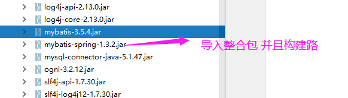

#### 1.2.13. 数据源信息交给Spring管理

在applicationContext.xml中配置数据源，所以在mybatis-config.xml中删除数据源与属性加载的配置

applicationContext.xml添加后：

```xml
<?xml version="1.0" encoding="UTF-8"?>
<beans xmlns="http://www.springframework.org/schema/beans"
       xmlns:xsi="http://www.w3.org/2001/XMLSchema-instance"
       xmlns:context="http://www.springframework.org/schema/context"
       xsi:schemaLocation="http://www.springframework.org/schema/beans http://www.springframework.org/schema/beans/spring-beans.xsd http://www.springframework.org/schema/context https://www.springframework.org/schema/context/spring-context.xsd">

    <!--属性占位符，用于加载属性文件-->
    <context:property-placeholder location="classpath:db.properties"/>

    <!--数据源放入容器-->
    <bean id="dataSource" class="com.alibaba.druid.pool.DruidDataSource">
        <property name="driverClassName" value="${jdbc.driverClassName}"></property>
        <property name="url" value="${jdbc.url}"></property>
        <property name="username" value="root"></property>
        <property name="password" value="root"></property>
    </bean>

</beans>
```

mybatis-config.xml删除后：

```xml
<?xml version="1.0" encoding="UTF-8"?>
<!--mybaits全局配置文件的约束-->
<!DOCTYPE configuration
        PUBLIC "-//mybatis.org//DTD Config 3.0//EN"
        "http://mybatis.org/dtd/mybatis-3-config.dtd">


<!--配置信息 -->
<configuration>
    

    <settings>
        <!--开启懒加载-->
        <!--<setting name="lazyLoadingEnabled" value="true"/>-->
        <!--二级缓存开关-->
        <setting name="cacheEnabled" value="true"/>
        <!--驼峰命名-->
        <setting name="mapUnderscoreToCamelCase" value="true"/>
    </settings>

    <typeAliases>
        <package name="com.xyz.code.entity"/>
    </typeAliases>


    <mappers>
        <!--<mapper resource="org/mybatis/example/BlogMapper.xml"/>-->
    </mappers>

</configuration>
```


#### 1.2.14. 配置SqlSessionFactory

将SqlSessionFactory加入容器中，在springContext.xml中配置：

```xml
<!--sqlSessionFactory放入容器，关联mybatis的主配置文件-->
<bean id="sqlSessionFactory" class="org.mybatis.spring.SqlSessionFactoryBean">
    <property name="dataSource" ref="dataSource"></property>
    <property name="configLocation" value="classpath:mybatis-config.xml"></property>
</bean>
```

#### 1.2.15. 加载mybatis的映射文件

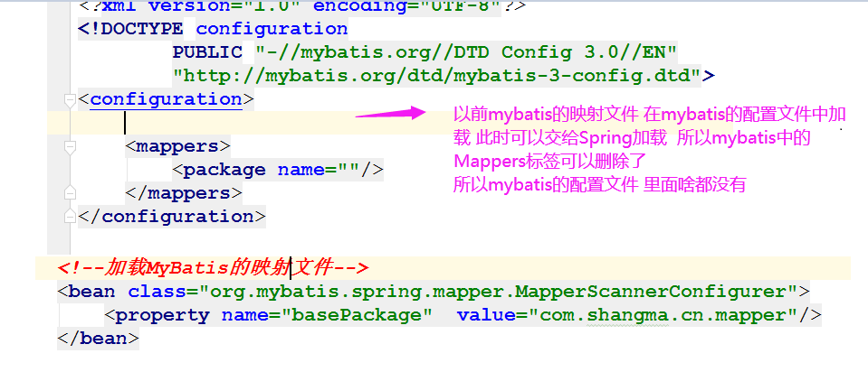

mybatis-config.xml删除以下内容：

```xml
<mappers>
    <!--<mapper resource="org/mybatis/example/BlogMapper.xml"/>-->
</mappers>
```

springContext.xml新增以下内容：

```xml
<!--将mapper扫描配置器加入容器-->
<bean id="mapperScannerConfigurer" class="org.mybatis.spring.mapper.MapperScannerConfigurer">
    <property name="basePackage" value="com.xyz.code.mapper"></property>
</bean>
```

#### 1.2.16. 配置事务相关

在springContext.xml文件中配置：

```xml
<!--事务管理器加入容器-->
<bean id="transactionManager" class="org.springframework.jdbc.datasource.DataSourceTransactionManager">
    <property name="dataSource" ref="dataSource"></property>
</bean>
<!--事务注解驱动，可以用注解来声明式实现事务-->
<tx:annotation-driven transaction-manager="transactionManager"/>
```

### 1.3. Spring和SpringMVC整合

#### 1.3.1. 导入SpringMVC包

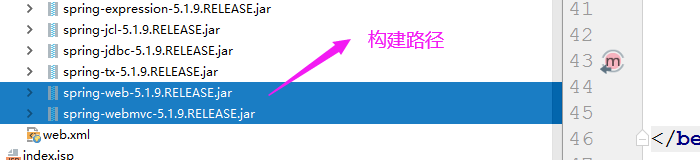

#### 1.3.2. 导入jackson

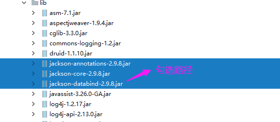

#### 1.3.3. 文件上传包(可选)

**注意一: 如何你想用fileupload做文件上传 你就导入 如果想用servlet3.0的话 不需要导入 **

**注意二： 如果使用fileupload需要配置多部件视图解析器**

> 此项目不导入fileupload相关的包，选用part实现文件上传

#### 1.3.4. 新建springMvc的配置文件

类路径下右键生成springMvc.xml文件

```xml
<?xml version="1.0" encoding="UTF-8"?>
<beans xmlns="http://www.springframework.org/schema/beans"
       xmlns:xsi="http://www.w3.org/2001/XMLSchema-instance"
       xsi:schemaLocation="http://www.springframework.org/schema/beans http://www.springframework.org/schema/beans/spring-beans.xsd">

</beans>
```

#### 1.3.5. 配置包扫描

在springMvc.xml中配置：

```xml
<!--组件扫描-->
<context:component-scan base-package="com.xyz.code"/>
```

#### 1.3.6. 配置mvc注解驱动

在springMvc.xml中配置：

```xml
<!--解决动态资源访问，mvc注解驱动-->
<mvc:annotation-driven/>
```

#### 1.3.7. 配置静态资源映射

在springMvc.xml中配置：

```xml
<!--解决静态资源访问，mvc默认servlet处理器-->
<mvc:default-servlet-handler/>
```

#### 1.3.8. 不用配置试图解析器

> 如果页面是jsp的话 必须使用试视图解析器  我们的页面不是jsp 视图解析器没有作用 所以不用加 

#### 1.3.9. 加载spring的配置文件

在web.xml中配置：

```xml
<!--上下文参数-->
<context-param>
    <!--上下文配置位置-->
    <param-name>contextConfigLocation</param-name>
    <param-value>classpath:applicationContext.xml</param-value>
</context-param>
<!--上下文加载器监听器 实现 加载spring容器-->
<listener>
    <listener-class>org.springframework.web.context.ContextLoaderListener</listener-class>
</listener>
```

#### 1.3.10. 加载springmvc的配置文件

在web.xml中配置：

```xml
<!--配置前端派遣servlet-->
<servlet>
	<servlet-name>dispatcherServlet</servlet-name>
	<servlet-class>org.springframework.web.servlet.DispatcherServlet</servlet-class>
	<init-param>
	<!--上下文配置位置 加载springMvc容器-->
		<param-name>contextConfigLocation</param-name>
		<param-value>classpath:springMvc.xml</param-value>
	</init-param>
</servlet>
<servlet-mapping>
    <!--放行jsp与动态资源-->
	<servlet-name>dispatcherServlet</servlet-name>
	<url-pattern>/</url-pattern>
</servlet-mapping>
```

#### 1.3.11. 配置乱码问题

在web.xml中配置：

```xml
<filter>
    <filter-name>characterEncodingFilter</filter-name>
    <filter-class>org.springframework.web.filter.CharacterEncodingFilter</filter-class>
    <init-param>
        <param-name>encoding</param-name>
        <param-value>utf-8</param-value>
    </init-param>
    <init-param>
        <param-name>forceRequestEncoding</param-name>
        <param-value>true</param-value>
    </init-param>
    <init-param>
        <param-name>forceResponseEncoding</param-name>
        <param-value>true</param-value>
    </init-param>
</filter>
<filter-mapping>
    <filter-name>characterEncodingFilter</filter-name>
    <url-pattern>/*</url-pattern>
</filter-mapping>
```

### 1.4 整合junit测试

> 本项目不整合

### 1.5. 整合完成 测试

注意：spring容器为父容器，springMvc为子容器

子容器 extends 父容器

### 1.6 提供ssm常见配置

> applicationContext.xml
>

```xml
<?xml version="1.0" encoding="UTF-8"?>
<beans xmlns="http://www.springframework.org/schema/beans"
       xmlns:xsi="http://www.w3.org/2001/XMLSchema-instance"
       xmlns:context="http://www.springframework.org/schema/context" xmlns:tx="http://www.springframework.org/schema/tx"
       xsi:schemaLocation="http://www.springframework.org/schema/beans http://www.springframework.org/schema/beans/spring-beans.xsd http://www.springframework.org/schema/context https://www.springframework.org/schema/context/spring-context.xsd http://www.springframework.org/schema/tx http://www.springframework.org/schema/tx/spring-tx.xsd">

    <!--属性占位符，用于加载属性文件-->
    <context:property-placeholder location="classpath:db.properties"/>

    <!--数据源放入容器-->
    <bean id="dataSource" class="com.alibaba.druid.pool.DruidDataSource">
        <property name="driverClassName" value="${jdbc.driverClassName}"></property>
        <property name="url" value="${jdbc.url}"></property>
        <property name="username" value="root"></property>
        <property name="password" value="root"></property>
    </bean>

    <!--sqlSessionFactory放入容器-->
    <bean id="sqlSessionFactory" class="org.mybatis.spring.SqlSessionFactoryBean">
        <property name="dataSource" ref="dataSource"></property>
        <property name="configLocation" value="classpath:mybatis-config.xml"></property>
    </bean>

    <!--将mapper扫描配置器加入容器-->
    <bean id="mapperScannerConfigurer" class="org.mybatis.spring.mapper.MapperScannerConfigurer">
        <property name="basePackage" value="com.xyz.code.mapper"></property>
    </bean>

    <!--事务管理器加入容器-->
    <bean id="transactionManager" class="org.springframework.jdbc.datasource.DataSourceTransactionManager">
        <property name="dataSource" ref="dataSource"></property>
    </bean>
    <!--事务注解驱动，可以用注解来声明式实现事务-->
    <tx:annotation-driven transaction-manager="transactionManager"/>

    
</beans>
```

> springMvc.xml

```xml
<?xml version="1.0" encoding="UTF-8"?>
<beans xmlns="http://www.springframework.org/schema/beans"
       xmlns:xsi="http://www.w3.org/2001/XMLSchema-instance"
       xmlns:context="http://www.springframework.org/schema/context"
       xmlns:mvc="http://www.springframework.org/schema/mvc"
       xsi:schemaLocation="http://www.springframework.org/schema/beans http://www.springframework.org/schema/beans/spring-beans.xsd http://www.springframework.org/schema/context https://www.springframework.org/schema/context/spring-context.xsd http://www.springframework.org/schema/mvc https://www.springframework.org/schema/mvc/spring-mvc.xsd">

    <!--组件扫描-->
    <context:component-scan base-package="com.xyz.code.controller"/>

    <!--解决动态资源访问，mvc注解驱动-->
    <mvc:annotation-driven/>

    <!--解决静态资源访问，mvc默认servlet处理器-->
    <mvc:default-servlet-handler/>
</beans>
```

> mybatis-config.xml

```xml
<?xml version="1.0" encoding="UTF-8"?>
<!--mybaits全局配置文件的约束-->
<!DOCTYPE configuration
        PUBLIC "-//mybatis.org//DTD Config 3.0//EN"
        "http://mybatis.org/dtd/mybatis-3-config.dtd">


<!--配置信息 -->
<configuration>


    <settings>
        <!--开启懒加载-->
        <!--<setting name="lazyLoadingEnabled" value="true"/>-->
        <!--二级缓存开关-->
        <setting name="cacheEnabled" value="true"/>
        <!--驼峰命名-->
        <setting name="mapUnderscoreToCamelCase" value="true"/>
    </settings>

    <typeAliases>
        <package name="com.xyz.code.entity"/>
    </typeAliases>


</configuration>

```

> db.properties

```properties
jdbc.driverClassName=com.mysql.jdbc.Driver
jdbc.url=jdbc:mysql://localhost:3306?charsetEncoding=utf-8
jdbc.username=root
jdbc.password=root
```

> log4j.properties

```xml
# priority  :debug<info<warn<error
#you cannot specify every priority with different file for log4j
log4j.rootLogger=debug,stdout,info,debug,warn,error 

#console
log4j.appender.stdout=org.apache.log4j.ConsoleAppender 
log4j.appender.stdout.layout=org.apache.log4j.PatternLayout 
log4j.appender.stdout.layout.ConversionPattern= [%d{yyyy-MM-dd HH:mm:ss a}]:%p %l%m%n
#info log
log4j.logger.info=info
log4j.appender.info=org.apache.log4j.DailyRollingFileAppender 
log4j.appender.info.DatePattern='_'yyyy-MM-dd'.log'
log4j.appender.info.File=./src/com/hp/log/info.log
log4j.appender.info.Append=true
log4j.appender.info.Threshold=INFO
log4j.appender.info.layout=org.apache.log4j.PatternLayout 
log4j.appender.info.layout.ConversionPattern=%d{yyyy-MM-dd HH:mm:ss a} [Thread: %t][ Class:%c >> Method: %l ]%n%p:%m%n
#debug log
log4j.logger.debug=debug
log4j.appender.debug=org.apache.log4j.DailyRollingFileAppender 
log4j.appender.debug.DatePattern='_'yyyy-MM-dd'.log'
log4j.appender.debug.File=./src/com/hp/log/debug.log
log4j.appender.debug.Append=true
log4j.appender.debug.Threshold=DEBUG
log4j.appender.debug.layout=org.apache.log4j.PatternLayout 
log4j.appender.debug.layout.ConversionPattern=%d{yyyy-MM-dd HH:mm:ss a} [Thread: %t][ Class:%c >> Method: %l ]%n%p:%m%n
#warn log
log4j.logger.warn=warn
log4j.appender.warn=org.apache.log4j.DailyRollingFileAppender 
log4j.appender.warn.DatePattern='_'yyyy-MM-dd'.log'
log4j.appender.warn.File=./src/com/hp/log/warn.log
log4j.appender.warn.Append=true
log4j.appender.warn.Threshold=WARN
log4j.appender.warn.layout=org.apache.log4j.PatternLayout 
log4j.appender.warn.layout.ConversionPattern=%d{yyyy-MM-dd HH:mm:ss a} [Thread: %t][ Class:%c >> Method: %l ]%n%p:%m%n
#error
log4j.logger.error=error
log4j.appender.error = org.apache.log4j.DailyRollingFileAppender
log4j.appender.error.DatePattern='_'yyyy-MM-dd'.log'
log4j.appender.error.File = ./src/com/hp/log/error.log 
log4j.appender.error.Append = true
log4j.appender.error.Threshold = ERROR 
log4j.appender.error.layout = org.apache.log4j.PatternLayout
log4j.appender.error.layout.ConversionPattern = %d{yyyy-MM-dd HH:mm:ss a} [Thread: %t][ Class:%c >> Method: %l ]%n%p:%m%n

```

> web.xml

```xml
<?xml version="1.0" encoding="UTF-8"?>
<web-app xmlns="http://xmlns.jcp.org/xml/ns/javaee"
         xmlns:xsi="http://www.w3.org/2001/XMLSchema-instance"
         xsi:schemaLocation="http://xmlns.jcp.org/xml/ns/javaee http://xmlns.jcp.org/xml/ns/javaee/web-app_4_0.xsd"
         version="4.0">

    <!--上下文参数-->
    <context-param>
        <!--上下文配置位置-->
        <param-name>contextConfigLocation</param-name>
        <param-value>classpath:applicationContext.xml</param-value>
    </context-param>
    <!--上下文加载器监听器 实现 加载spring容器-->
    <listener>
        <listener-class>org.springframework.web.context.ContextLoaderListener</listener-class>
    </listener>

    <!--配置前端派遣servlet-->
    <servlet>
        <servlet-name>dispatcherServlet</servlet-name>
        <servlet-class>org.springframework.web.servlet.DispatcherServlet</servlet-class>
        <init-param>
            <!--上下文配置位置 加载springMvc容器-->
            <param-name>contextConfigLocation</param-name>
            <param-value>classpath:springMvc.xml</param-value>
        </init-param>
    </servlet>
    <servlet-mapping>
        <servlet-name>dispatcherServlet</servlet-name>
        <url-pattern>/</url-pattern>
    </servlet-mapping>


    <filter>
        <filter-name>characterEncodingFilter</filter-name>
        <filter-class>org.springframework.web.filter.CharacterEncodingFilter</filter-class>
        <init-param>
            <param-name>encoding</param-name>
            <param-value>utf-8</param-value>
        </init-param>
        <init-param>
            <param-name>forceRequestEncoding</param-name>
            <param-value>true</param-value>
        </init-param>
        <init-param>
            <param-name>forceResponseEncoding</param-name>
            <param-value>true</param-value>
        </init-param>
    </filter>
    <filter-mapping>
        <filter-name>characterEncodingFilter</filter-name>
        <url-pattern>/*</url-pattern>
    </filter-mapping>
</web-app>
```

