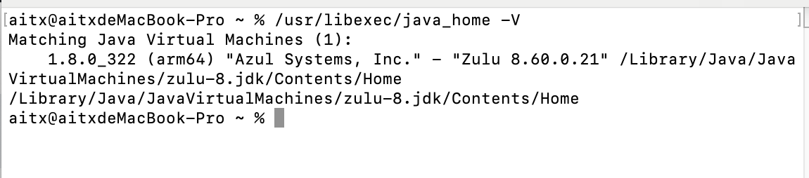

# Java开发环境搭建-MAC篇

## 1 安装JDK

下载zulu JDK : https://www.azul.com/downloads/?package=jdk

正常情况不需要配置环境变量，但如果出现环境变量问题可按如下配置：

首先通过如下命令查看 JDK 安装位置:

```bash
/usr/libexec/java_home -V
```



拷贝 JDK 地址，键入如下命令准备编辑环境变量：

```bash
vim ~/.bash_profile
```

随后添加环境变量：

```bash
export JAVA_HOME=/Library/Java/JavaVirtualMachines/zulu-8.jdk/Contents/Home
export PATH=$JAVA_HOME/bin:$PATH
```

刷新配置文件

```bash
source ~/.bash_profile
```

如果使用的zsh/终端，需要每次开机后刷新配置文件，可在~/.zshrc中加入如下命令不用每次手工刷新配置

```bash
source ~/.bash_profile
```

## 2 安装HomeBrew

打开HomeBrew官网：https://brew.sh/

复制官网提供的命令进行安装,后根据提示进行操作即可

```bash
/bin/bash -c "$(curl -fsSL https://raw.githubusercontent.com/Homebrew/install/HEAD/install.sh)"
```

如果遇到网络原因安装失败可以通过如下的方法解决

1 只是单次在终端使用代理键入以下命令，关闭终端会话则清理代理

```bash
export https_proxy=http://127.0.0.1:7890 http_proxy=http://127.0.0.1:7890 all_proxy=socks5://127.0.0.1:7890
```

2 修改hosts文件指定域名的ip

 查找 ip -> 修改 host -> 再去执行安装脚本 （有可能还是失败）

查找ip的网址： https://www.ipaddress.com/ 

找到ip进行ping通：

```bash
ping 199.232.28.133
```

如果可ping通，修改hosts：

```bash
sudo vim /etc/hosts
```

添加如下内容：
199.232.28.133  raw.githubusercontent.com

3 使用国内gitee源的命令进行安装

## 3 安装Git

可以通过homebrew安装Git

```bash
brew install git
```

