# 算法学习

## 稀疏数组 Sparse Array

稀疏数组 sparse array：当一个二维数组（矩阵）中大部分元素为0或为同一个值时，可以用稀疏数组来保存原数组信息

第一行记录：行数row，列数colum，有效值value个数N

N行：有效值所在的行数，有效值所在的列数，有效值

构成一个N+1行3列的压缩数组，即为稀疏数组


二维数组转稀疏数的思路：

1 遍历原始的二维数组，得到有效数据的个数sum

2 根据sum就可以创建稀疏数组sparseArray int [sum+1] [3]

3 将二维数组的有效数据存入到稀疏数组


稀疏数组转为原始的二维数组的思路

1 先读取稀疏数组的第一行，根据第一行的行与列创建原始的二维数组originArr = int [01] [02]

2 在读取稀疏数组后几行的数据，并赋给原始的二维数组即可


完成以下任务：

1 二维数组转稀疏数组

2 稀疏数组转二维数组

```java
public class SparseArray {

    public static void main(String[] args) {

        int[][] originArray = new int[11][11];
        originArray[0][0] = 1;
        originArray[0][1] = 2;

        System.out.println("打印原始数组");
        printArray(originArray);

        // 二维数组转稀疏数组
        int[][] sparseArray = originArray2SparseArray(originArray);
        System.out.println("打印稀疏数组");
        printArray(sparseArray);

        // 稀疏数组转二维数组
        int[][] originArrayCopy = sparseArrayToOriginArray(sparseArray);
        System.out.println("打印二维数组");
        printArray(originArrayCopy);

    }

    /**
     * 原始二维数组转稀疏数组
     *
     * @param originArray originArray为矩阵形式
     * @return
     */
    public static int[][] originArray2SparseArray(int[][] originArray) {
        int sum = 0;
        // 获取有效值的个数
        int row = originArray.length;
        int column = originArray[0].length;
        for (int i = 0; i < row; i++) {
            for (int j = 0; j < column; j++) {
                if (originArray[i][j] != 0) {
                    sum++;
                }
            }
        }
        // 创建稀疏数组
        int[][] sparseArray = new int[sum + 1][3];
        // 给稀疏数组首行赋值
        sparseArray[0][0] = row;
        sparseArray[0][1] = column;
        sparseArray[0][2] = sum;
        // 记录第几个非0数据
        int count = 0;
        // 遍历二维数组，将非0的值存放到稀疏数组中
        for (int i = 0; i < row; i++) {
            for (int j = 0; j < column; j++) {
                if (originArray[i][j] != 0) {
                    count++;
                    sparseArray[count][0] = i;
                    sparseArray[count][1] = j;
                    sparseArray[count][2] = originArray[i][j];
                }
            }
        }
        return sparseArray;
    }

    /**
     * 打印数组
     *
     * @param array
     */
    public static void printArray(int[][] array) {
        for (int i = 0; i < array.length; i++) {
            for (int j = 0; j < array[i].length - 1; j++) {
                System.out.printf("%d\t", array[i][j]);
            }
            System.out.printf("%d\n", array[i][array[i].length - 1]);
        }
    }

    /**
     * 将稀疏数组转为二维数组
     */
    public static int[][] sparseArrayToOriginArray(int[][] sparseArray) {
        int row = sparseArray[0][0];
        int column = sparseArray[0][1];
        // 正常情况下sum+1 = sparseArray.length
        int sum = sparseArray[0][2];
        int[][] originArray = new int[row][column];
        for (int i = 1; i < sparseArray.length; i++) {
            int curRow = sparseArray[i][0];
            int curColumn = sparseArray[i][1];
            int curValue = sparseArray[i][2];
            originArray[curRow][curColumn] = curValue;
        }
        return originArray;
    }
}
```


## 队列 Queue

队列是有序列表，可以用数组实现或是链表实现

先入先出：先存入的数据，先取出


不考虑数组循环的队列实现：

```Java
/**
 * 使用数组模拟队列
 */
public class MyQueue {

    // 数组的最大容量
    private int maxSize;
    // 队列头
    private int front;
    // 队列尾
    private int rear;
    // 用数组模拟队列
    private int[] arr;

    /**
     * 构建队列
     */
    public MyQueue(int arrMaxSize) {
        maxSize = arrMaxSize;
        arr = new int[maxSize];
        // 指向队列头部，指向队列的首元素的前一个位置
        front = -1;
        // 指向队列尾，指向队列最后一个数据
        rear = -1;
    }

    /**
     * 判断队列是否满
     */
    public boolean isFull() {
        return rear == maxSize - 1;
    }

    /**
     * 判断队列是否为空
     */
    public boolean isEmpty() {
        return rear == front;
    }

    /**
     * 添加数据到队列
     */
    public void addQueue(int n) {
        // 判断队列是否满
        if (isFull()) {
            System.out.println("队列满，不有加入数据");
            return;
        }
        // 让rear后移
        rear++;
        arr[rear] = n;
    }

    /**
     * 出队列
     */
    public int getQueue() {
        // 判断队列是否为空
        if (isEmpty()) {
            throw new RuntimeException("队列为空，不能取数据");
        }
        // 让front后移
        front++;
        return arr[front];
    }

    /**
     * 显示队列的所有的数据
     */
    public void showQueue() {
        // 遍历
        if (isEmpty()) {
            System.out.println("队列为空，没有数据");
            return;
        }
        for (int i = 0; i < arr.length; i++) {
            System.out.printf("arr[%d]=%d\n", i, arr[i]);
        }
    }

    /**
     * 显示队列头部的数据，不是取数据
     */
    public int peekQueue() {
        // 判断队列是否为空
        if (isEmpty()) {
            throw new RuntimeException("队列为空，没有数据");
        }
        return arr[front + 1];
    }
}
```

```java
import java.util.Scanner;

public class MyQueueTest {
    public static void main(String[] args) {
        MyQueue myQueue = new MyQueue(3);
        char key = ' ';
        Scanner scanner = new Scanner(System.in);
        boolean loop = true;
        while (loop) {
            System.out.println("s(show):显示队列");
            System.out.println("e(exit):退出程序");
            System.out.println("a(add):添加队列数据");
            System.out.println("g(get):从队列取出数据");
            System.out.println("h(head):查看队列头的数据");
            key = scanner.next().charAt(0);
            switch (key) {
                case 's':
                    myQueue.showQueue();
                    ;
                    break;
                case 'a':
                    System.out.println("输入一个数");
                    int value = scanner.nextInt();
                    myQueue.addQueue(value);
                    break;
                case 'g':
                    try {
                        int result = myQueue.getQueue();
                        System.out.printf("取出的数据是%d\n", result);
                    } catch (Exception e) {
                        e.printStackTrace();
                    }
                    break;
                case 'h':
                    try {
                        int head = myQueue.peekQueue();
                        System.out.printf("队列头的数据是：%d\n", head);
                    } catch (Exception e) {
                        e.printStackTrace();
                    }
                    break;
                case 'e':
                    scanner.close();
                    loop = false;
                    break;
                default:
                    break;
            }
        }
        System.out.println("程序退出");
    }
}
```

使用数组模拟环形队列：


完成以下任务：

1 判断是否为满

2 判断是否为空

3 求队列的size

4 入队 （增）

5 出队 （删）

6 查看队首元素

7 显示（查/打印）

```java
/**
 * 使用循环数组模拟队列
 */
public class MyCircleQueue {

    // 数组的最大容量
    private int maxSize;
    // front作调整指向首元素，初始化为0
    private int front;
    // rear作调整指向最后一个元素之后，初始化为0
    private int rear;
    // 用数组模拟队列
    private int[] arr;

    /**
     * 构建队列
     */
    public MyCircleQueue(int arrMaxSize) {
        maxSize = arrMaxSize;
        arr = new int[maxSize];
        // 指向队列头部，指向队列的首元素的前一个位置
        front = 0;
        // 指向队列尾，指向队列最后一个数据
        rear = 0;
    }

    /**
     * 判断队列是否满
     */
    public boolean isFull() {
        return (rear + 1) % maxSize == front;
    }

    /**
     * 判断队列是否为空
     */
    public boolean isEmpty() {
        return rear == front;
    }

    /**
     * 添加数据到队列
     */
    public void addQueue(int n) {
        // 判断队列是否满
        if (isFull()) {
            System.out.println("队列满，不有加入数据");
            return;
        }
        arr[rear] = n;
        // 让rear后移
        rear = (rear + 1) % maxSize;
    }

    /**
     * 出队列
     */
    public int getQueue() {
        // 判断队列是否为空
        if (isEmpty()) {
            throw new RuntimeException("队列为空，不能取数据");
        }
        // 将front记录到临时变量
        int index = front;
        // 让front后移
        front = (front + 1) % maxSize;
        return arr[index];
    }

    /**
     * 显示队列的所有的数据
     */
    public void showQueue() {
        // 遍历
        if (isEmpty()) {
            System.out.println("队列为空，没有数据");
            return;
        }
        // 从front开始遍历
        for (int i = front; i < front + size(); i++) {
            System.out.printf("arr[%d]=%d\n", i % maxSize, arr[i % maxSize]);
        }
    }

    /**
     * 求出当前队列有效数据的个数
     */
    public int size() {
        return (rear - front + maxSize) % maxSize;
    }

    /**
     * 显示队列头部的数据，不是取数据
     */
    public int peekQueue() {
        // 判断队列是否为空
        if (isEmpty()) {
            throw new RuntimeException("队列为空，没有数据");
        }
        return arr[front];
    }
}
```

```java
public class MyQueueTest {
    public static void main(String[] args) {
        MyCircleQueue myQueue = new MyCircleQueue(4);
        char key = ' ';
        Scanner scanner = new Scanner(System.in);
        boolean loop = true;
        while (loop) {
            System.out.println("s(show):显示队列");
            System.out.println("e(exit):退出程序");
            System.out.println("a(add):添加队列数据");
            System.out.println("g(get):从队列取出数据");
            System.out.println("h(head):查看队列头的数据");
            key = scanner.next().charAt(0);
            switch (key) {
                case 's':
                    myQueue.showQueue();
                    ;
                    break;
                case 'a':
                    System.out.println("输入一个数");
                    int value = scanner.nextInt();
                    myQueue.addQueue(value);
                    break;
                case 'g':
                    try {
                        int result = myQueue.getQueue();
                        System.out.printf("取出的数据是%d\n", result);
                    } catch (Exception e) {
                        e.printStackTrace();
                    }
                    break;
                case 'h':
                    try {
                        int head = myQueue.peekQueue();
                        System.out.printf("队列头的数据是：%d\n", head);
                    } catch (Exception e) {
                        e.printStackTrace();
                    }
                    break;
                case 'e':
                    scanner.close();
                    loop = false;
                    break;
                default:
                    break;
            }
        }
        System.out.println("程序退出");
    }
}
```

## 链表 Linked List


因为头节点不能动，所以加个head指针用于辅助移动

### 单向链表

用单向链表存储水浒英雄：

1 实现尾部插入新的节点

2 实现按编号大小插入新的节点

3 根据编号删除节点

4 根据编号修改节点

5 打印所有的节点（显示链表）

6 有效节点的个数

7 查找链表中倒数第k个节点

8 单链表的反转

9 反转打印链表

10 合并两个有序链表，合并之后还要有序（比如自然排序）

```java
public class SingleLinkedListDemo {
    public static void main(String[] args) {
        //  进行测试
        HeroNode heroNode1 = new HeroNode(1, "宋江", "及时雨");
        HeroNode heroNode2 = new HeroNode(2, "卢俊义", "玉麒麟");
        HeroNode heroNode3 = new HeroNode(3, "吴用", "智多星");
        HeroNode heroNode4 = new HeroNode(4, "林冲", "豹子头");

        // 创建链表
        SingleLikedList singleLikedList = new SingleLikedList();
        // 加入节点
        singleLikedList.addByOrder(heroNode1);
        singleLikedList.addByOrder(heroNode4);
        singleLikedList.addByOrder(heroNode2);
        singleLikedList.addByOrder(heroNode3);
        singleLikedList.addByOrder(heroNode3);

        // 测试修改节点的代码
        HeroNode heroNode = new HeroNode(2, "小卢", "修改了");

        // 显示
        singleLikedList.list();
        System.out.println();

        // 测试更新
        singleLikedList.update(heroNode);
        // 测试删除
        singleLikedList.del(1);
        singleLikedList.list();

        // 测试查看链表中有效节点的个数
        System.out.println("有效节点的个数：" + singleLikedList.getLength(singleLikedList.getHead()));

        // 测试是否找到倒数第k个节点
        HeroNode lastKNode = singleLikedList.findLastKNode(singleLikedList.getHead(), 1);
        System.out.println("倒数第k个节点" + lastKNode);

        // 测试反转链表
        singleLikedList.reverseList(singleLikedList.getHead());
        singleLikedList.list();

        System.out.println();

        // 测试逆序打印链表
        singleLikedList.reversePrint(singleLikedList.getHead());
    }
}

class SingleLikedList {

    // 先初始化一个头结点
    private HeroNode head = new HeroNode(0, null, null);

    public HeroNode getHead() {
        return this.head;
    }

    /**
     * 第一种添加方式
     * 添加节点，当前实现尾部添加
     * 思路：当不考虑编号有序时：
     * 1找到当前链表的最后节点
     * 2将最后的这个节点的next指向新的节点
     */
    public void add(HeroNode heroNode) {
        // 因为head节点不能动，所以需要辅助指针遍历链表
        HeroNode temp = head;
        while (true) {
            // 如果指针域为null,代表最后节点
            if (temp.getNext() == null) {
                break;
            }
            // 如果没有找到最后，将temp后移
            temp = temp.getNext();
        }
        // 当退出while循环时，temp就指向链表的最后节点
        temp.setNext(heroNode);
    }

    /**
     * 第二种添加方式
     * 在添加英雄时，根据排名将英雄插入到指定的位置
     * 如果已经有这个排名，则添加失败并给出提示
     */
    public void addByOrder(HeroNode heroNode) {
        // 因为头节点不能动，因此我们仍然通过一个辅助指针来帮助找到添加的位置
        // 因为是单链表，我们找的temp是位于添加位置的前一个节点
        HeroNode temp = head;
        // 添加的编号是否存在，默认false
        boolean flag = false;
        while (true) {
            if (temp.getNext() == null) {
                break;
            }
            // 位置找到，就在temp的后面插入新的节点
            if (temp.getNext().getNo() > heroNode.getNo()) {
                break;
            } else if (temp.getNext().getNo() == heroNode.getNo()) {
                // 说明编号存在
                flag = true;
                break;
            }
            temp = temp.getNext();
        }
        // 退出while循环后
        if (flag) {
            System.out.printf("准务插入的英雄编号%d已经存在，不能加入\n", heroNode.getNo());
        } else {
            // 插入到temp后面
            heroNode.setNext(temp.getNext());
            temp.setNext(heroNode);
        }
    }

    /**
     * 修改节点的信息，根据编号来修改，即编号不能改
     */
    public void update(HeroNode heroNode) {
        // 判断是否为空
        if (head.getNext() == null) {
            System.out.println("链表为空");
            return;
        }
        // 找到需要修改的节点，根据编号修改
        // 定义一个辅助变量
        HeroNode temp = head.getNext();
        // 是否找到该节点
        boolean flag = false;
        while (true) {
            if (temp == null) {
                break; // 已经遍历完成
            }
            if (temp.getNo() == heroNode.getNo()) {
                flag = true;
                break;
            }
            temp = temp.getNext();
        }
        // 根据flag判断是否找到要修改的节点
        if (flag) {
            temp.setName(heroNode.getName());
            temp.setNickname(heroNode.getNickname());
        } else {
            System.out.printf("没有找到编号为%d的节点，不能修改", heroNode.getNo());
        }
    }

    /**
     * 删除节点
     * 思路：
     * 1 head节点不能动，因此我们需要一个temp辅助节点删除节点的前一个节点
     */
    public void del(int no) {
        HeroNode temp = head;
        // 是否找到待删除节点的标志
        boolean flag = false;
        while (true) {
            //  已经到链表的最后了
            if (temp.getNext() == null) {
                break;
            }
            if (temp.getNext().getNo() == no) {
                flag = true;
                break;
            }
            temp = temp.getNext();
        }
        if (flag) {
            temp.setNext(temp.getNext().getNext());
        } else {
            System.out.println("待删除的节点不存在");
        }
    }

    /**
     * 方法获取单链表的节点个数，如果带头节点，不统计头结点
     */
    public int getLength(HeroNode head) {
        if (head.getNext() == null) {
            return 0;
        }
        int length = 0;
        // 定义一个辅助的变量cur
        HeroNode cur = head.getNext();
        while (cur != null) {
            length++;
            cur = cur.getNext();
        }
        return length;
    }

    /**
     * 查找单链表中倒数第k个节点,k从1开始
     * 思路
     * 1 编写一个方法，接收head节点，同时接收一个k
     * 2 先把链表从头到尾遍历得到链表的总的长度
     * 3 得到size后，我们从链表的第一个开始遍历size-k个
     * 如果找到，则返回该节点，否则返回null
     */
    public HeroNode findLastKNode(HeroNode head, int k) {
        // 如果链表为空，返回null
        if (head.getNext() == null) {
            return null;
        }
        //  第一次遍历获得链表的长度
        int size = getLength(head);
        // 第二次遍历size-k位置，就是我们倒数的第k个节点
        // 先做一个k校验
        if (k <= 0 || k > size) {
            return null;
        }
        // 定义辅助变量
        HeroNode cur = head.getNext();
        for (int i = 0; i < size - k; i++) {
            cur = cur.getNext();
        }
        return cur;
    }

    /**
     * 将单链表反转
     */
    public void reverseList(HeroNode head) {
        // 如果当前链表为空，或只有一个节点，无需反转，直接返回
        if (head.getNext() == null || head.getNext().getNext() == null) {
            return;
        }
        // 定义一个辅助指针，帮恩波利我们遍历原来的链表
        HeroNode cur = head.getNext();
        // 指向当前节点的下一个节点
        HeroNode next = null;
        // 定义一个新的头节点
        HeroNode reverseHead = new HeroNode(0, null, null);
        // 遍历原来的链表，每遍历一个节点，就将其取出，并放在新链表reverseHead的最新端
        while (cur != null) {
            next = cur.getNext();
            cur.setNext(reverseHead.getNext());
            reverseHead.setNext(cur);
            cur = next;
        }
        // 将head的指针域指向reverseHead的下一个节点
        head.setNext(reverseHead.getNext());
    }

    /**
     * 逆序打印单链表
     * 方式一：先反转后打印，但会破原来单链表结构
     * 方式二：可以利用栈将各个节点压入栈中，然后利用栈的先进后出的特点，就实现了逆序输出
     */
    public void reversePrint(HeroNode heroNode) {
        // 空链表不打印
        if (heroNode.getNext() == null) {
            return;
        }
        // 创建一个栈，将各个节点压入栈中
        Stack<HeroNode> stack = new Stack<>();
        HeroNode cur = head.getNext();
        // 将链表的所有节点压入栈中
        while (cur != null) {
            stack.push(cur);
            cur = cur.getNext();
        }
        // 将栈中的节点进行打印
        while (!stack.isEmpty()) {
            System.out.println(stack.pop());
        }


    }


    // 显示链表
    public void list() {
        if (head.getNext() == null) {
            System.out.println("链表为空");
            return;
        }
        // 因为头节点不能动因此我们需要一个辅助变量来遍历
        HeroNode temp = head.getNext();
        while (true) {
            // 判断是否到链表最后
            if (temp == null) {
                break;
            }
            // 输出节点信息
            System.out.println(temp);
            // 将temp后移
            temp = temp.getNext();
        }
    }

}


/**
 * 定义HeroNode
 */
class HeroNode {

    // 前面三个数据域
    private int no;

    private String name;

    private String nickname;
    // 后面是指针域
    private HeroNode next;

    public HeroNode(int no, String name, String nickname) {
        this.no = no;
        this.name = name;
        this.nickname = nickname;
    }

    public int getNo() {
        return no;
    }

    public void setNo(int no) {
        this.no = no;
    }

    public String getName() {
        return name;
    }

    public void setName(String name) {
        this.name = name;
    }

    public String getNickname() {
        return nickname;
    }

    public void setNickname(String nickname) {
        this.nickname = nickname;
    }

    public HeroNode getNext() {
        return next;
    }

    public void setNext(HeroNode next) {
        this.next = next;
    }

    @Override
    public String toString() {
        return "HeroNode{" +
                "no=" + no +
                ", name='" + name + '\'' +
                ", nickname='" + nickname +
                '}';
    }
}
```

合并两个链表

```java
/**
 * 合并两个链表,从小到大排
 */
public MyNode mergeLinkedList(MyNode firstNode, MyNode secondNode) {
    // a链表的指针
    MyNode aPtr = firstNode;
    // b链表的指针
    MyNode bPtr = secondNode;
    // 创建新的头
    MyNode head = new MyNode();
    // 新的辅助指针
    MyNode cur = head;
    while (aPtr != null && bPtr != null) {
        if (aPtr.value < bPtr.value) {
            cur.next = aPtr;
            aPtr = aPtr.next;
        } else {
            cur.next = bPtr;
            bPtr = bPtr.next;
        }
        cur = cur.next;
    }
    cur.next = aPtr != null ? aPtr : bPtr;
    return head.next;
}
```

### 双向链表

主要任务：

1 尾部新增

2 按编号自然排序新增

3 按编号删除

4 按编号修改

5 查（遍历/展示）

```java
public class DoubleLinkedListDemo {
    public static void main(String[] args) {

        // 双向链表测试
        HeroNode2 heroNode1 = new HeroNode2(1, "宋江", "及时雨");
        HeroNode2 heroNode2 = new HeroNode2(2, "卢俊义", "玉麒麟");
        HeroNode2 heroNode3 = new HeroNode2(3, "吴用", "智多星");
        HeroNode2 heroNode4 = new HeroNode2(4, "林冲", "豹子头");
        // 创建一个双向链表
        DoubleLinkedList doubleLinkedList = new DoubleLinkedList();
        // 测试添加
        doubleLinkedList.addByOrder(heroNode1);
        doubleLinkedList.addByOrder(heroNode4);
        doubleLinkedList.addByOrder(heroNode3);
        doubleLinkedList.addByOrder(heroNode2);
        // 测试显示
        doubleLinkedList.list();
        // 测试修改
        HeroNode2 newHeroNode = new HeroNode2(4, "公孙胜", "入云龙");
        doubleLinkedList.update(newHeroNode);
        System.out.println("修改后的链表情况");
        doubleLinkedList.list();
        // 测试删除
        doubleLinkedList.del(4);
        System.out.println("删除后的链表情况");
        doubleLinkedList.list();

    }
}

class DoubleLinkedList {

    // 先初始化一个头节点，头节点不动，不存放具体的数据
    private HeroNode2 head = new HeroNode2();

    // 获取头节点
    public HeroNode2 getHead() {
        return this.head;
    }

    /**
     * 遍历双向链表
     */
    public void list() {
        // 判断链表是否为空
        if (head.getNext() == null) {
            System.out.println("链表为空");
            return;
        }
        HeroNode2 temp = head.getNext();
        while (true) {
            // 如果链表到最后节点末尾，跳出循环
            if (temp == null) {
                break;
            }
            // 输出节点信息
            System.out.println(temp);
            temp = temp.getNext();
        }
    }

    /**
     * 尾部添加节点
     */
    public void add(HeroNode2 heroNode2) {
        HeroNode2 temp = head;
        while (true) {
            if (temp.getNext() == null) {
                break;
            }
            temp = temp.getNext();
        }
        temp.setNext(heroNode2);
        heroNode2.setPre(temp);
    }

    /**
     * 按编号添加，编号自然排序
     */
    public void addByOrder(HeroNode2 heroNode2) {
        HeroNode2 temp = head;
        boolean repeatFlag = false;
        while (true) {
            if (temp.getNext() == null) {
                break;
            }
            if (heroNode2.getNo() < temp.getNext().getNo()) {
                break;
            } else if (heroNode2.getNo() == temp.getNext().getNo()) {
                repeatFlag = true;
                break;
            }
            temp = temp.getNext();
        }
        if (repeatFlag) {
            System.out.println("重复编号");
            return;
        }
        heroNode2.setNext(temp.getNext());
        heroNode2.setPre(temp);
        temp.setNext(heroNode2);
        if (temp.getNext() != null) {
            temp.getNext().setPre(heroNode2);
        }
    }

    /**
     * 修改节点
     */
    public void update(HeroNode2 heroNode2) {
        // 判断是否为空
        if (head.getNext() == null) {
            System.out.println("链表是否为空");
            return;
        }
        // 找到需要修改的节点，根据no编号
        HeroNode2 temp = head.getNext();
        boolean flag = false;
        while (true) {
            if (temp == null) {
                break;
            }
            if (temp.getNo() == heroNode2.getNo()) {
                flag = true;
                break;
            }
            temp = temp.getNext();
        }
        if (flag) {
            temp.setName(heroNode2.getName());
            temp.setNickname(heroNode2.getNickname());
        } else {
            System.out.println("没有找到节点");
        }
    }

    /**
     * 从双向链表中删除节点，对于双向链表我们可以直接指针指向待删除节点
     */
    public void del(int no) {
        if (head.getNext() == null) {
            System.out.println("链表为空，不能删除");
            return;
        }
        HeroNode2 temp = head.getNext();
        boolean flag = false;
        while (true) {
            if (temp == null) {
                break;
            }
            if (no == temp.getNo()) {
                flag = true;
                break;
            }
            temp = temp.getNext();
        }
        if (flag) {
            temp.getPre().setNext(temp.getNext());
            if (temp.getNext() != null) {
                temp.getNext().setPre(temp.getPre());
            }
        }
    }


}

class HeroNode2 {

    private int no;

    private String name;

    private String nickname;

    private HeroNode2 next;

    private HeroNode2 pre;

    public HeroNode2() {
    }

    public HeroNode2(int no, String name, String nickname) {
        this.no = no;
        this.name = name;
        this.nickname = nickname;
    }

    public int getNo() {
        return no;
    }

    public void setNo(int no) {
        this.no = no;
    }

    public String getName() {
        return name;
    }

    public void setName(String name) {
        this.name = name;
    }

    public String getNickname() {
        return nickname;
    }

    public void setNickname(String nickname) {
        this.nickname = nickname;
    }

    public HeroNode2 getNext() {
        return next;
    }

    public void setNext(HeroNode2 next) {
        this.next = next;
    }

    public HeroNode2 getPre() {
        return pre;
    }

    public void setPre(HeroNode2 pre) {
        this.pre = pre;
    }

    @Override
    public String toString() {
        return "HeroNode2{" +
                "no=" + no +
                ", name='" + name + '\'' +
                ", nickname='" + nickname + '\'' +
                '}';
    }
}
```

### 单向环形链表

#### 约瑟夫问题

Jossephu问题：设编号为1，2，… n的n个人围坐一圈，约定编号为k（1<=k<=n）的人从1开始报数，数到m 的那个人出列，它的下一位又从1开始报数，数到m的那个人又出列，依次类推，直到所有人出列为止，由此产生一个出队编号的序列。

提示：用一个不带头结点的[循环链表](https://so.csdn.net/so/search?q=循环链表&spm=1001.2101.3001.7020)来处理Josephu 问题：先构成一个有n个结点的单循环链表，然后由k结点起从1开始计数，计到m时，对应结点从链表中删除，然后再从被删除结点的下一个结点又从1开始计数，直到最后一个结点从链表中删除算法结束。


构建单向环形链表思路：

1 先创建第一个节点，让first指向该节点，并形成环形。last指针指向最后一个节点

2 后面当我们每创建一个新的节点，就把该节点加入到已有的环形链表


```java
public class Josephu {
    public static void main(String[] args) {
        // 测试构建
        SingleCircleLinkedList singleCircleLinkedList = new SingleCircleLinkedList();
        singleCircleLinkedList.addBoy(5);
        // 测试展示
        singleCircleLinkedList.showBoy();
        // 测试出圈
        singleCircleLinkedList.countBoy(1, 2, 5);
    }
}

// 创建一个环形的单向链表
class SingleCircleLinkedList {

    // 创建first节点，并置为null
    private Boy first = null;

    /**
     * 添加小孩节点，构成环形的链表
     * num表示数量
     */
    public void addBoy(int num) {
        if (num < 1) {
            System.out.println("num不正确");
            return;
        }
        // 辅助指针
        Boy last = null;
        // 使用for循环创建我们的环形链表
        for (int i = 1; i <= num; i++) {
            // 根据编号创建小孩节点
            Boy boy = new Boy(i);
            // 如果是第一个小孩
            if (i == 1) {
                first = boy;
                first.setNext(first);
                last = first;
            } else {
                boy.setNext(first);
                last.setNext(boy);
                // last指向最后
                last = boy;
            }
        }
    }

    /**
     * 遍历当前环形链表
     */
    public void showBoy() {
        // 判断是否为空
        if (first == null) {
            System.out.println("链表为空");
            return;
        }
        // 因为first不能动
        Boy cur = first;
        while (true) {
            System.out.printf("小孩的编号%d\n", cur.getNo());
            if (cur.getNext() == first) {
                break;
            }
            // cur后移
            cur = cur.getNext();
        }
    }

    /**
     * 根据用户的输入，计算出出圈的顺序
     *
     * @param k   从第k个小孩开始报数
     * @param m   表示数几下
     * @param num 表示最初多少个小孩在圈中
     */
    public void countBoy(int k, int m, int num) {
        // 先对数据进行校验
        if (first == null || k < 1 || k > num) {
            System.out.println("参数有误");
            return;
        }
        // 创建要给辅助指针，并将移到报数小孩的前面，帮助完成小孩出圈
        Boy helper = first;
        while (true) {
            if (helper.getNext() == first) {
                break;
            }
            helper = helper.getNext();
        }
        // 先让first和helper移动k-1次，相当于first指向第k个小孩，helper位于first之前
        for (int i = 0; i < k - 1; i++) {
            first = first.getNext();
            helper = helper.getNext();
        }
        // 当小孩报数时，让first,helper指针同时移动m-1次，然后出圈
        // 这里是个循环的操作，只到圈中只有一个
        while (true) {
            // 说明圈中只有一个
            if (helper == first) {
                break;
            }
            for (int i = 0; i < m - 1; i++) {
                first = first.getNext();
                helper = helper.getNext();
            }
            // 此时first指向出圈的小孩节点
            System.out.printf("小孩%d出圈\n", first.getNo());
            // 出圈
            first = first.getNext();
            helper.setNext(first);
        }
        // 退出循环时，圈中只有一个小孩
        System.out.printf("最后留在圈中的小孩%d\n", first.getNo());
    }


}

// 创建节点，这里是Boy类
class Boy {
    // 编号
    private int no;
    // 下一个小孩
    private Boy next;

    public Boy(int no) {
        this.no = no;
    }

    public int getNo() {
        return no;
    }

    public void setNo(int no) {
        this.no = no;
    }

    public Boy getNext() {
        return next;
    }

    public void setNext(Boy next) {
        this.next = next;
    }
}
```

## 栈 Stack


### 数组模拟栈


```java
public class MyStackDemo {

    public static void main(String[] args) {
        // 创建栈
        ArrayStack stack = new ArrayStack(4);
        String key = "";
        boolean loop = true; // 是否退出菜单
        Scanner scanner = new Scanner(System.in);
        while (loop) {
            System.out.println("show: 显示栈");
            System.out.println("exit: 退出程序");
            System.out.println("push: 入栈");
            System.out.println("pop: 出栈");
            key = scanner.next();
            switch (key) {
                case "show":
                    stack.list();
                    break;
                case "push":
                    System.out.println("请输入一个数：");
                    int value = scanner.nextInt();
                    stack.push(value);
                    break;
                case "pop":
                    try {
                        int res = stack.pop();
                        System.out.printf("出栈的数据是 %d\n", res);
                    } catch (Exception e) {
                        System.out.println(e.getMessage());
                    }
                    break;
                case "exit":
                    scanner.close();
                    loop = false;
                    break;
                default:
                    break;
            }
        }
        System.out.println("程序退出");
    }
}

class ArrayStack {
    private int maxSize; // 栈的大小
    private int[] stack; // 数组，数组模拟栈，数据放在此数组中
    private int top = -1; // top表示栈顶，初始化为-1

    // 构造器
    public ArrayStack(int maxSize) {
        this.maxSize = maxSize;
        stack = new int[this.maxSize];
    }

    // 栈满
    public boolean isFull() {
        return top == this.maxSize - 1;
    }

    // 栈空
    public boolean isEmpty() {
        return top == -1;
    }

    // 入栈
    public void push(int value) {
        //  判断栈满
        if (isFull()) {
            System.out.println("栈满");
            return;
        }
        top++;
        stack[top] = value;
    }

    // 出栈
    public int pop() {
        // 先判断栈空
        if (isEmpty()) {
            throw new RuntimeException("栈空");
        }
        int value = stack[top];
        top--;
        return value;
    }

    // 显示栈/遍历栈，从栈顶向下遍历
    public void list() {
        if (isEmpty()) {
            System.out.println("栈空");
            return;
        }
        for (int i = top; i >= 0; i--) {
            System.out.printf("stack[%d]=%d\n", i, stack[i]);
        }
    }
}
```

### 用链表模拟栈

```java
public class MyStackDemo2 {
    public static void main(String[] args) {
        // 创建栈
        LinkedListStack stack = new LinkedListStack();
        String key = "";
        boolean loop = true; // 是否退出菜单
        Scanner scanner = new Scanner(System.in);
        while (loop) {
            System.out.println("show: 显示栈");
            System.out.println("exit: 退出程序");
            System.out.println("push: 入栈");
            System.out.println("pop: 出栈");
            key = scanner.next();
            switch (key) {
                case "show":
                    stack.list();
                    break;
                case "push":
                    System.out.println("请输入一个数：");
                    int value = scanner.nextInt();
                    stack.push(value);
                    break;
                case "pop":
                    try {
                        int res = stack.pop();
                        System.out.printf("出栈的数据是 %d\n", res);
                    } catch (Exception e) {
                        System.out.println(e.getMessage());
                    }
                    break;
                case "exit":
                    scanner.close();
                    loop = false;
                    break;
                default:
                    break;
            }
        }
    }


}

class LinkedListStack {


    // 要持有个头节点
    private Node head = new Node();

    // 入栈,在尾部添加的方式
    public void push(int value) {
        Node node = new Node(value);
        Node temp = head;
        while (true) {
            if (temp.getNext() == null) {
                break;
            }
            temp = temp.getNext();
        }
        // 跳出while循环时，temp指向最后一个节点
        temp.setNext(node);
    }

    // 出栈,栈顶元素在尾部
    public int pop() {
        if (isEmpty()) {
            throw new RuntimeException("栈空");
        }
        Node temp = head;
        while (true) {
            if (temp.getNext().getNext() == null) {
                break;
            }
            temp = temp.getNext();
        }
        // 跳出循环，temp指向最后一个节点前一个节点
        int value = temp.getNext().getData();
        temp.setNext(null);
        return value;
    }

    // 栈空
    public boolean isEmpty() {
        if (head.getNext() == null) {
            return true;
        }
        return false;
    }

    // 显示栈,需要倒序输出:这里需要另一个栈
    public void list() {
        if (isEmpty()) {
            System.out.println("栈空");
            return;
        }
        Node temp = head.getNext();
        Stack<Integer> integerStack = new Stack<Integer>();
        while (true) {
            if (temp == null) {
                break;
            }
            integerStack.push(temp.getData());
            temp = temp.getNext();
        }
        while (!integerStack.isEmpty()) {
            System.out.printf("节点值为：%d\n", integerStack.pop());
        }

    }


    public class Node {

        private int data; // 数据域

        private Node next; // 指针域

        public Node() {
        }

        public Node(int data) {
            this.data = data;
        }

        public int getData() {
            return data;
        }

        public void setData(int data) {
            this.data = data;
        }

        public Node getNext() {
            return next;
        }

        public void setNext(Node next) {
            this.next = next;
        }
    }

}
```

## 三种表达式：前缀prefix，中缀infix，后缀suffix

### 表达式简介

中缀表达式即传统的数学表达式：(3+4)×5-6
中缀转前缀(波兰表达式)： (3+4)×5-6 对应的前缀表达式就是 - × + 3 4 5 6
后缀表达式(逆波兰表达式)，就是前缀的逆向 3 4 + 5 * 6 -


前缀表达式的计算机求值：

从右至左扫描表达式，遇到数字时，将数字压入堆栈，遇到运算符时，弹出栈顶的两个数，用运算符对它们做相应的计算（栈顶元素 和 次顶元素），并将结果入栈；重复上述过程直到表达式最左端，最后运算得出的值即为表达式的结果

```properties
例如: (3+4)×5-6 对应的前缀表达式就是 - × + 3 4 5 6 , 针对前缀表达式求值步骤如下:

1 从右至左扫描，将6、5、4、3压入堆栈

2 遇到+运算符，因此弹出3和4（3为栈顶元素，4为次顶元素），计算出3+4的值得7，再将7入栈

3 接下来是×运算符，因此弹出7和5，计算出7×5=35，将35入栈

4 最后是-运算符，计算出35-6的值，即29，由此得出最终结果
```


后缀表达式又称逆波兰表达式,与前缀表达式相似，只是运算符位于操作数之后

举例： (3+4)×5-6 对应的后缀表达式就是 3 4 + 5 × 6 –

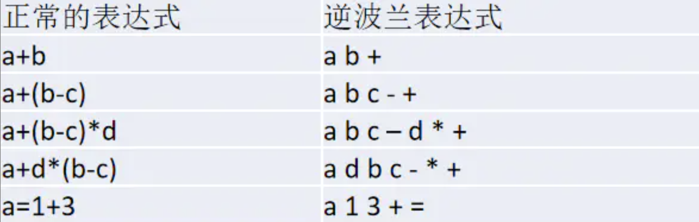

后缀表达式的计算机求值

从左至右扫描表达式，遇到数字时，将数字压入堆栈，遇到运算符时，弹出栈顶的两个数，用运算符对它们做相应的计算（次顶元素 和 栈顶元素），并将结果入栈；重复上述过程直到表达式最右端，最后运算得出的值即为表达式的结果

```properties
例如: (3+4)×5-6 对应的后缀表达式就是 3 4 + 5 × 6 - , 针对后缀表达式求值步骤如下:

1 从左至右扫描，将3和4压入堆栈；

2 遇到+运算符，因此弹出4和3（4为栈顶元素，3为次顶元素），计算出3+4的值得7，再将7入栈；

3 将5入栈；

4 接下来是×运算符，因此弹出5和7，计算出7×5=35，将35入栈；

5 将6入栈；

6 最后是-运算符，计算出35-6的值，即29，由此得出最终结果
```

### 栈实现计算器 中缀表达式（不考虑括号）

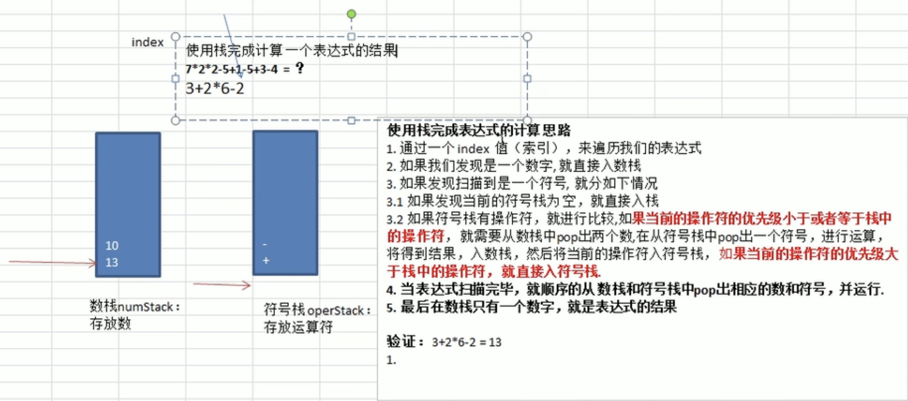

```java
public class Calculator {
    public static void main(String[] args) {
        String expression = "13+2*6-5";
        // 创建两个栈，数栈与符号栈
        ArrayStack2 numStack = new ArrayStack2(10);
        ArrayStack2 operatorStack = new ArrayStack2(10);
        // 用于扫描的指针
        int index = 0;
        int num1 = 0;
        int num2 = 0;
        int operator = 0;
        int res = 0;
        char ch = ' '; // 将每次扫描得到char保存到ch中
        String keepNum = ""; // 用于拼接数字的
        while (true) {
            // 依次得到expression中每一个字符
            ch = expression.substring(index, index + 1).charAt(0);
            // 判断ch是什么
            if (operatorStack.isOperator(ch)) {
                // 判断当前符号栈是否为空
                if (!operatorStack.isEmpty()) {
                    // 如果符号栈有操作符，就进行比较，
                    // 如果当前的操作符的优先及小于或考等于栈中的操作符
                    // 就从数栈中弹了两个数，再从符号栈中pop出一个符号进行运算，
                    // 得到结果再入数栈，当前操作符入符号栈
                    if (operatorStack.priority(ch) <= operatorStack.priority(operatorStack.peek())) {
                        num1 = numStack.pop();
                        num2 = numStack.pop();
                        operator = operatorStack.pop();
                        res = numStack.cal(num1, num2, operator);
                        // 把运算结果放入数线
                        numStack.push(res);
                        // 将当前符号入符号栈
                        operatorStack.push(ch);
                    } else {
                        // 如果当前的操作符的优先级大于栈中的操作符
                        operatorStack.push(ch);
                    }
                } else {
                    // 如果为空直接入栈
                    operatorStack.push(ch);
                }
            } else {
                // 如果是数字, 处理多位数，需要向expression后再看一位，如果是数字继续，如果是操作符才将前面的入栈
                // 所以需要定义一个变量用于拼接
                // numStack.push(ch - 48);
                keepNum += ch;
                // 如果ch已经是expression的最后一们，就直接入栈
                if (index == expression.length() - 1) {
                    numStack.push(Integer.parseInt(keepNum));
                } else {
                    // 判断下一个字符是否为数字，如果是数字就继续扫描，如果是运算符则入栈
                    if (operatorStack.isOperator(expression.substring(index + 1, index + 2).charAt(0))) {
                        // 如果后一位是操作符，入栈
                        numStack.push(Integer.parseInt(keepNum));
                        // 重要的，要清空keepNum
                        keepNum = "";
                    }
                }
            }
            // 让index+1，并判断是否扫描到expression最后
            index++;
            if (index >= expression.length()) {
                break;
            }
        }

        //  当表达式扫描完毕，就顺序的从数栈和符号栈中pop出相应的数和符号并运行
        while (true) {
            // 如果符号栈为空，则计算到最后的结果，数栈中只有一个数
            if (operatorStack.isEmpty()) {
                break;
            }
            num1 = numStack.pop();
            num2 = numStack.pop();
            operator = operatorStack.pop();
            res = numStack.cal(num1, num2, operator);
            numStack.push(res);
        }
        // 将最后的数pop出来就是结果
        System.out.printf("表达式%s 结果%d", expression, numStack.pop());
    }
}

// 先创建一个栈，并添加一些方法：计算符号的优先级，计算方法，是否为操作符
class ArrayStack2 {
    private int maxSize; // 栈的大小
    private int[] stack; // 数组，数组模拟栈，数据放在此数组中
    private int top = -1; // top表示栈顶，初始化为-1

    // 构造器
    public ArrayStack2(int maxSize) {
        this.maxSize = maxSize;
        stack = new int[this.maxSize];
    }

    // 栈满
    public boolean isFull() {
        return top == this.maxSize - 1;
    }

    // 栈空
    public boolean isEmpty() {
        return top == -1;
    }

    // 入栈
    public void push(int value) {
        //  判断栈满
        if (isFull()) {
            System.out.println("栈满");
            return;
        }
        top++;
        stack[top] = value;
    }

    // 出栈
    public int pop() {
        // 先判断栈空
        if (isEmpty()) {
            throw new RuntimeException("栈空");
        }
        int value = stack[top];
        top--;
        return value;
    }

    // 显示栈/遍历栈，从栈顶向下遍历
    public void list() {
        if (isEmpty()) {
            System.out.println("栈空");
            return;
        }
        for (int i = top; i >= 0; i--) {
            System.out.printf("stack[%d]=%d\n", i, stack[i]);
        }
    }

    // 返回运算符的优先级，优先级使用数字表示，优先级越高，数字越大
    public int priority(int operator) {
        if (operator == '*' || operator == '/') {
            return 1;
        } else if (operator == '+' || operator == '-') {
            return 0;
        } else {
            // 假定目前的表达式只有+，-，*，/
            return -1;
        }
    }

    // 是否为操作符
    public boolean isOperator(char val) {
        return val == '+' || val == '-' || val == '*' || val == '/';
    }

    // 计算方法
    public int cal(int num1, int num2, int operator) {
        // res用于存放计算结果
        int res = 0;
        switch (operator) {
            case '+':
                res = num1 + num2;
                break;
            case '-':
                res = num2 - num1; // 注意顺序
                break;
            case '*':
                res = num1 * num2;
                break;
            case '/':
                res = num2 / num1;
                break;
            default:
                break;
        }
        return res;
    }

    // 查看栈顶
    public int peek() {
        if (isEmpty()) {
            throw new RuntimeException("栈空");
        }
        return stack[top];
    }
}
```

### 逆波兰（后缀表达式）计算器的初步实现

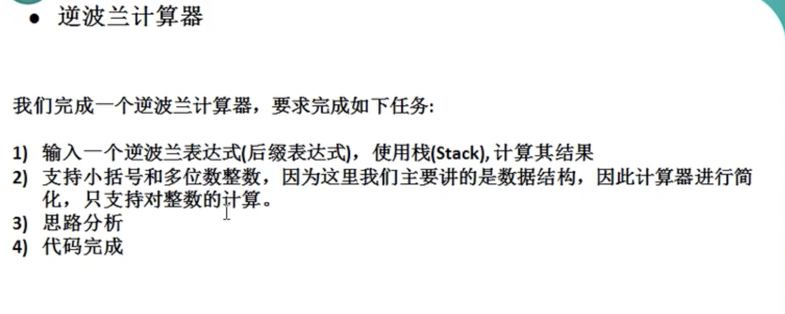

```java
public class PolandNotation {
    public static void main(String[] args) {
        // 先定义逆波兰表达式 (3+4)*5-6 = 3 4 + 5 * 6 -
        String suffixExpression = "3 4 + 5 * 6 -";
        // 思路
        // 1  先将 "3 4 + 5 * 6 -" 放到 ArrayList中
        // 2  将ArrayList传递给一个方法，遍历ArrayList 配合栈完成计算
        List<String> list = getListString(suffixExpression);

        // 测试
        int res = cal(list);
        System.out.println("计算的结果是="+res);
    }

    // 将逆波兰表达式，依次将数据与运算符放到 ArrayList中
    public static List<String> getListString(String suffixExpression) {
        // 将suffixExpression按空格进行分割
        String[] split = suffixExpression.split(" ");
        List<String> list = new ArrayList<>();
        for (String s : split) {
            list.add(s);
        }
        return list;
    }

    /**
     * 完成逆波兰表达式的运算
     * 从左到右扫描，将3和4压放堆栈
     * 遇到+运算符，因此弹出4和3(4为栈顶元素，3为次顶元素）， 计算出3+4的值，得7，再将7入栈
     * 将5入栈
     * 接下来是*运算符，因此弹出5和7，计算出7*5=35，将35入栈
     * 将6入栈
     * 最后-运算符，计算出35-6的值，即29，由此得出最终结果
     */
    public static int cal(List<String> list) {
        // 创建一个数栈，只需一个
        Stack<String> stack = new Stack<>();
        // 遍历list
        for (String item : list) {
            // 这里使用正则表达式来取出数
            if (item.matches("\\d+")) {
                // 入栈
                stack.push(item);
            } else {
                // pop出两个数，并运算，结果再入栈
                int num2 = Integer.parseInt(stack.pop());
                int num1 = Integer.parseInt(stack.pop());
                int res = 0;
                if (item.equals("+")) {
                    res = num1 + num2;
                } else if (item.equals("-")) {
                    res = num1 - num2;
                } else if (item.equals("*")) {
                    res = num1 * num2;
                } else if (item.equals("/")) {
                    res = num1 / num2;
                } else {
                    throw new RuntimeException("运算符有误");
                }
                // res入栈
                stack.push(res + "");
            }
        }
        // 最后留在stack中的数据是运算结果
        return Integer.parseInt(stack.pop());
    }
}
```

### 中缀表达式转后缀表达式 思路

```properties
思路：1+((2+3)×4)-5 转 "1 2 3 + 4 × + 5 –"

1 初始化两个栈：运算符括号栈s1和储存中间结果的栈s2；

2 从左至右扫描中缀表达式；

3 遇到操作数时，将其压s2

4 遇到运算符时，比较其与s1栈顶运算符的优先级：
 (1)如果s1为空，或栈顶运算符为左括号“(”，则直接将此运算符入栈；
 (2)否则，若优先级比栈顶运算符的高，也将运算符压入s1；
 (3)否则，将s1栈顶的运算符弹出并压入到s2中，再次转到(4、(1)步骤)与s1中新的栈顶运算符相比较；

5 遇到括号时：
 (1) 如果是左括号“(”，则直接压入s1栈

(2) 如果是右括号“)”，则依次弹出s1栈顶的运算符，并压入s2，直到遇到左括号为止，此时将这一对括号丢弃

6 重复步骤2至5，直到表达式的最右边

7 将s1中剩余的运算符依次弹出并压入s2

8 依次弹出s2中的元素并输出，结果的逆序即为中缀表达式对应的后缀表达式
```

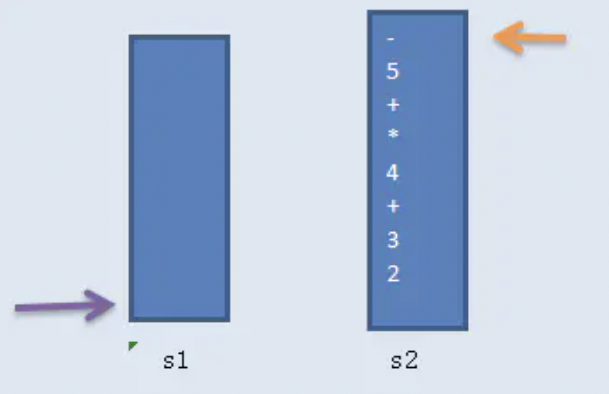

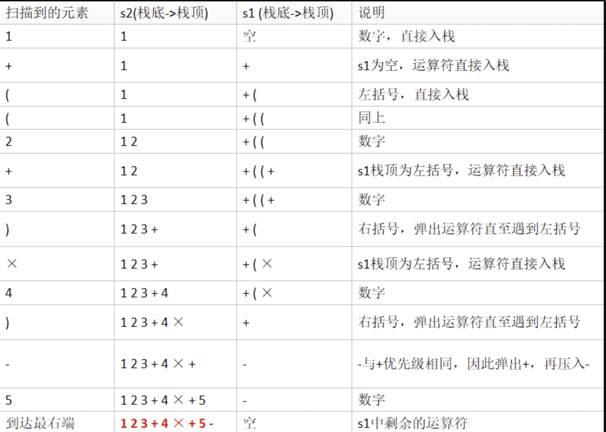

### 逆波兰计算器的实现：不考虑小数点，未兼容处理符号

```java
public class PolandNotation {
    public static void main(String[] args) {
        // 完成将中缀表达式转为后缀表达式
        // 因为直接对字符串操作不方便，先将字符串转成中缀表达式对应的list
        // 1+((2+3)*4)-5 --> [1, +, (, (, 2, +, 3, ), *, 4, ), -, 5]
        String infixExpression = "1+((2+3)*4)-5";
        // 先将中缀表达式字符串转为中缀表达式list
        List<String> infixExpressionList = toInfixExpressionList(infixExpression);
        System.out.println("中缀表达式为：" + infixExpressionList);
        // 中缀表达式list 转为 后缀表达式list [1, 2, 3, +, 4, *, 5, -]
        List<String> suffixExpressionList = parseSuffixExpressionList(infixExpressionList);
        System.out.println("后缀表达式为：" + suffixExpressionList);
        // 测试计算结果
        int cal = cal(suffixExpressionList);
        System.out.println("计算结果为："+cal);

        // 先定义逆波兰表达式 (3+4)*5-6 = 3 4 + 5 * 6 -
        String suffixExpression = "3 4 + 5 * 6 -";
        // 思路
        // 1  先将 "3 4 + 5 * 6 -" 放到 ArrayList中
        // 2  将ArrayList传递给一个方法，遍历ArrayList 配合栈完成计算
        List<String> list = getListString(suffixExpression);

        // 测试
        int res = cal(list);
        System.out.println("计算的结果是=" + res);
    }

    // 中缀表达式list转为后缀表达式list
    public static List<String> parseSuffixExpressionList(List<String> list) {
        // 定义两个栈
        Stack<String> s1 = new Stack<>(); // 操作符与括号栈
        // 中间结果栈因为重来没有弹栈并且还要逆序输出，可以用ArrayList代替
        // Stack<String> s2 = new Stack<>();
        List<String> s2 = new ArrayList<>();

        // 遍因list
        for (String item : list) {
            // 如果是一个数，入s2栈
            if (item.matches("\\d+")) {
                s2.add(item);
            } else {
                // 如果是左括号，直接入s1栈
                if (item.equals("(")) {
                    s1.push(item);
                } else if (item.equals(")")) {
                    // 如果是右括号，弹出相应的符号并入s2栈，直到遇到左括号时
                    while (!s1.peek().equals("(")) {
                        s2.add(s1.pop());
                    }
                    // 退出while循环时，s1栈顶为左括号
                    s1.pop(); // 将对应的左括号弹出
                } else {
                    // 当item的优先级小于或等于栈顶运算符，就应该
                    // 将s1的栈顶运算符弹出并压入s2,再反复比较
                    // 问题：我们缺少优先级比较的方法
                    while (s1.size() != 0 && Operator.getValue(s1.peek()) >= Operator.getValue(item)) {
                        s2.add(s1.pop());
                    }
                    // 退出while循环时，s1栈顶的操作符的优先级小于 遍历的操作符item
                    // item 还要入栈，这里包括几种情况：
                    // 栈为空，栈顶为左括号，s1栈顶的操作符的优先级小于 遍历的操作符item
                    s1.push(item);
                }

            }
        }
        // 完成一轮遍历后，将s1的运算符压入s2中
        if (s1.size() != 0) {
            s2.add(s1.pop());
        }
        // 如果s2是栈，则需要逆序输出
        return s2;
    }

    // 将中缀表达式转为对应的list
    public static List<String> toInfixExpressionList(String s) {
        // 定义一个List,存放中缀表达式对应的内容
        List<String> list = new ArrayList<>();
        int i = 0; // 相当于指针，用于遍历中缀表达式字符串
        String str; // 用于多位数的拼接
        char c; // 每遍历一个字符，就放入c中；
        do {
            // 如果c是非数字，就需要加入到list 48~57对应0~9
            c = s.charAt(i);
            if (c < 48 || c > 57) {
                list.add(c + "");
                i++; // i 要后移
            } else {
                // 如果是一个数，需要考虑多位数的问题
                str = "";  // 先将str置为空串
                while (i < s.length() && (c = s.charAt(i)) >= 48 && (c = s.charAt(i)) <= 57) {
                    str += c;// 拼接
                    i++;
                }
                // 跳出while循环时，i指向数字后的操作符或括号
                list.add(str);
            }
        } while (i < s.length());
        return list;

    }

    // 将逆波兰表达式，依次将数据与运算符放到 ArrayList中
    public static List<String> getListString(String suffixExpression) {
        // 将suffixExpression按空格进行分割
        String[] split = suffixExpression.split(" ");
        List<String> list = new ArrayList<>();
        for (String s : split) {
            list.add(s);
        }
        return list;
    }

    /**
     * 完成逆波兰表达式的运算
     * 从左到右扫描，将3和4压放堆栈
     * 遇到+运算符，因此弹出4和3(4为栈顶元素，3为次顶元素）， 计算出3+4的值，得7，再将7入栈
     * 将5入栈
     * 接下来是*运算符，因此弹出5和7，计算出7*5=35，将35入栈
     * 将6入栈
     * 最后-运算符，计算出35-6的值，即29，由此得出最终结果
     */
    public static int cal(List<String> list) {
        // 创建一个数栈，只需一个
        Stack<String> stack = new Stack<>();
        // 遍历list
        for (String item : list) {
            // 这里使用正则表达式来取出数
            if (item.matches("\\d+")) {
                // 入栈
                stack.push(item);
            } else {
                // pop出两个数，并运算，结果再入栈
                int num2 = Integer.parseInt(stack.pop());
                int num1 = Integer.parseInt(stack.pop());
                int res = 0;
                if (item.equals("+")) {
                    res = num1 + num2;
                } else if (item.equals("-")) {
                    res = num1 - num2;
                } else if (item.equals("*")) {
                    res = num1 * num2;
                } else if (item.equals("/")) {
                    res = num1 / num2;
                } else {
                    throw new RuntimeException("运算符有误");
                }
                // res入栈
                stack.push(res + "");
            }
        }
        // 最后留在stack中的数据是运算结果
        return Integer.parseInt(stack.pop());
    }
}

// 编写一个类Operator，可以返回一个运算符的优先级
class Operator {

    private static final int ADD = 1;
    private static final int SUB = 1;
    private static final int MUL = 2;
    private static final int DIV = 2;

    // 写一个方法，返回对应的优先级数字
    public static int getValue(String operator) {
        int result = 0;
        switch (operator) {
            case "+":
                result = ADD;
                break;
            case "-":
                result = SUB;
                break;
            case "*":
                result = MUL;
                break;
            case "/":
                result = DIV;
                break;
            default:
                System.out.println("操作符不支持"); // 这种情况优先级为0
                break;
        }
        return result;
    }
}
```

### 逆波兰计算器加强版

```properties
1 支持 + - * / ( )
2 多位数，支持小数,
3 兼容处理, 过滤任何空白字符，包括空格、制表符、换页符
```

```Java
public class ReversePolishMultiCalc {

     /**
     * 匹配 + - * / ( ) 运算符
     */
    static final String SYMBOL = "\\+|-|\\*|/|\\(|\\)";

    static final String LEFT = "(";
    static final String RIGHT = ")";
    static final String ADD = "+";
    static final String MINUS= "-";
    static final String TIMES = "*";
    static final String DIVISION = "/";

    /**
     * 加減 + -
     */
    static final int LEVEL_01 = 1;
    /**
     * 乘除 * /
     */
    static final int LEVEL_02 = 2;

    /**
     * 括号
     */
    static final int LEVEL_HIGH = Integer.MAX_VALUE;


    static Stack<String> stack = new Stack<>();
    static List<String> data = Collections.synchronizedList(new ArrayList<String>());

    /**
     * 去除所有空白符
     * @param s
     * @return
     */
    public static String replaceAllBlank(String s ){
        // \\s+ 匹配任何空白字符，包括空格、制表符、换页符等等, 等价于[ \f\n\r\t\v]
        return s.replaceAll("\\s+","");
    }

    /**
     * 判断是不是数字 int double long float
     * @param s
     * @return
     */
    public static boolean isNumber(String s){
        Pattern pattern = Pattern.compile("^[-\\+]?[.\\d]*$");
        return pattern.matcher(s).matches();
    }

    /**
     * 判断是不是运算符
     * @param s
     * @return
     */
    public static boolean isSymbol(String s){
        return s.matches(SYMBOL);
    }

    /**
     * 匹配运算等级
     * @param s
     * @return
     */
    public static int calcLevel(String s){
        if("+".equals(s) || "-".equals(s)){
            return LEVEL_01;
        } else if("*".equals(s) || "/".equals(s)){
            return LEVEL_02;
        }
        return LEVEL_HIGH;
    }

    /**
     * 匹配
     * @param s
     * @throws Exception
     */
    public static List<String> doMatch (String s) throws Exception{
        if(s == null || "".equals(s.trim())) throw new RuntimeException("data is empty");
        if(!isNumber(s.charAt(0)+"")) throw new RuntimeException("data illeagle,start not with a number");

        s = replaceAllBlank(s);

        String each;
        int start = 0;

        for (int i = 0; i < s.length(); i++) {
            if(isSymbol(s.charAt(i)+"")){
                each = s.charAt(i)+"";
                //栈为空，(操作符，或者 操作符优先级大于栈顶优先级 && 操作符优先级不是( )的优先级 及是 ) 不能直接入栈
                if(stack.isEmpty() || LEFT.equals(each)
                        || ((calcLevel(each) > calcLevel(stack.peek())) && calcLevel(each) < LEVEL_HIGH)){
                    stack.push(each);
                }else if( !stack.isEmpty() && calcLevel(each) <= calcLevel(stack.peek())){
                    //栈非空，操作符优先级小于等于栈顶优先级时出栈入列，直到栈为空，或者遇到了(，最后操作符入栈
                    while (!stack.isEmpty() && calcLevel(each) <= calcLevel(stack.peek()) ){
                        if(calcLevel(stack.peek()) == LEVEL_HIGH){
                            break;
                        }
                        data.add(stack.pop());
                    }
                    stack.push(each);
                }else if(RIGHT.equals(each)){
                    // ) 操作符，依次出栈入列直到空栈或者遇到了第一个)操作符，此时)出栈
                    while (!stack.isEmpty() && LEVEL_HIGH >= calcLevel(stack.peek())){
                        if(LEVEL_HIGH == calcLevel(stack.peek())){
                            stack.pop();
                            break;
                        }
                        data.add(stack.pop());
                    }
                }
                start = i ;    //前一个运算符的位置
            }else if( i == s.length()-1 || isSymbol(s.charAt(i+1)+"") ){
                each = start == 0 ? s.substring(start,i+1) : s.substring(start+1,i+1);
                if(isNumber(each)) {
                    data.add(each);
                    continue;
                }
                throw new RuntimeException("data not match number");
            }
        }
        //如果栈里还有元素，此时元素需要依次出栈入列，可以想象栈里剩下栈顶为/，栈底为+，应该依次出栈入列，可以直接翻转整个stack 添加到队列
        Collections.reverse(stack);
        data.addAll(new ArrayList<>(stack));

        System.out.println(data);
        return data;
    }

    /**
     * 算出结果
     * @param list
     * @return
     */
    public static Double doCalc(List<String> list){
        Double d = 0d;
        if(list == null || list.isEmpty()){
            return null;
        }
        if (list.size() == 1){
            System.out.println(list);
            d = Double.valueOf(list.get(0));
            return d;
        }
        ArrayList<String> list1 = new ArrayList<>();
        for (int i = 0; i < list.size(); i++) {
            list1.add(list.get(i));
            if(isSymbol(list.get(i))){
                Double d1 = doTheMath(list.get(i - 2), list.get(i - 1), list.get(i));
                list1.remove(i);
                list1.remove(i-1);
                list1.set(i-2,d1+"");
                list1.addAll(list.subList(i+1,list.size()));
                break;
            }
        }
        doCalc(list1);
        return d;
    }

    /**
     * 运算
     * @param s1
     * @param s2
     * @param symbol
     * @return
     */
    public static Double doTheMath(String s1,String s2,String symbol){
        Double result ;
        switch (symbol){
            case ADD : result = Double.valueOf(s1) + Double.valueOf(s2); break;
            case MINUS : result = Double.valueOf(s1) - Double.valueOf(s2); break;
            case TIMES : result = Double.valueOf(s1) * Double.valueOf(s2); break;
            case DIVISION : result = Double.valueOf(s1) / Double.valueOf(s2); break;
            default : result = null;
        }
        return result;

    }

    public static void main(String[] args) {
        //String math = "9+(3-1)*3+10/2";
        String math = "12.8 + (2 - 3.55)*4+10/5.0";
        try {
            doCalc(doMatch(math));
        } catch (Exception e) {
            e.printStackTrace();
        }
    }

}
```

##  递归 Recursion

```java
public class Recursion {
    public static void main(String[] args) {


    }

    // 打印问题
    public void test(int n) {
        if (n > 2) {
            test(n - 1);
        }
        System.out.println("n=" + n);
    }

    // 阶乘问题
    public int factorial(int n) {
        if (n == 1 || n == 0) {
            return 1;
        } else {
            return factorial(n - 1) * n;
        }
    }
}
```

### 递归必须遵守的规则

```properties
1 执行一个方法时，就创建一个新的受保护的独立空间(栈空间) --- 默认遵守了(main)
2 方法的局部变量是独立的，不会相互影响, 比如n变量
3 如果方法中使用的是引用类型变量(比如数组)，就会共享该引用类型的数据.（上图堆中的）
4 递归必须向退出递归的条件逼近，否则就是无限递归,出现StackOverflowError，栈溢出)
5 当一个方法执行完毕，或者遇到return，就会返回，遵守谁调用，就将结果返回给谁，同时当方法执行完毕或者返回时，该方法也就执行完毕。
```

### 迷宫Maze问题：回溯recall+递归recursion

8行7列的矩阵

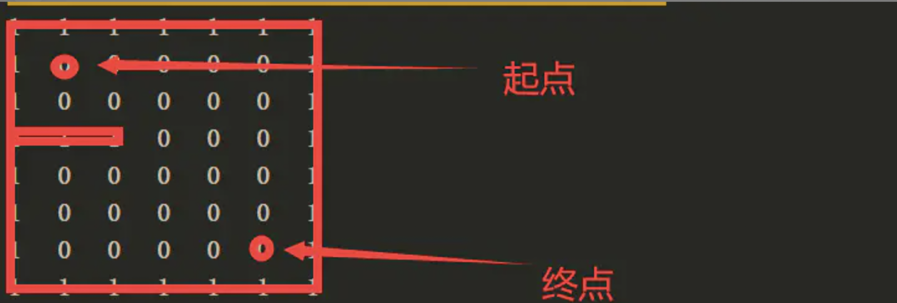

```java
public class Maze {
    public static void main(String[] args) {
        // 先创建一个二维数组，模拟迷宫
        // 地图
        int[][] map = new int[8][7];
        // 约定1表示墙
        // 上下置为1
        for (int i = 0; i < 7; i++) {
            map[0][i] = 1;
            map[7][i] = 1;
        }
        // 左右全部为1
        for (int i = 0; i < 8; i++) {
            map[i][0] = 1;
            map[i][6] = 1;
        }
        //  设置挡板
        map[3][1] = 1;
        map[3][2] = 1;

        // 输出地图
        for (int i = 0; i < 8; i++) {
            for (int j = 0; j < 7; j++) {
                System.out.printf(map[i][j] + " ");
            }
            System.out.println();
        }

        // 使用递归回溯给小球找路
        setWay(map, 1, 1);

        // 输出新的地图，小球走过，并标识过的地图
        System.out.println("小球走过，并标识过的地图");
        for (int i = 0; i < 8; i++) {
            for (int j = 0; j < 7; j++) {
                System.out.printf(map[i][j] + " ");
            }
            System.out.println();
        }

    }

    /**
     * 使用递归回溯来给小球找路
     *
     * @param map 表示地图
     * @param i   出发的行，这里约定为1
     * @param j   出发的列，这里约定为1
     * @return 如果找到通路，就返回true, 否则返回false
     * 如果小球能到map[6][5]，则说明通路找到
     * 约定：当map[i][j] 为0表示未走过，当为1时为墙
     * 2表示通路可以走，3表示该点已经走过，但是走不通
     * 在走迷宫时，需要确定一个策略（方法），下->右->上->左，如果
     * 该点走不通再回溯
     */
    public static boolean setWay(int[][] map, int i, int j) {
        if (map[6][5] == 2) {
            // 通路已经找到
            return true;
        } else {
            if (map[i][j] == 0) {
                // 如果当前这个点还没有走过
                // 按照策略玩一把
                map[i][j] = 2; // 假定该点是可以走通
                if (setWay(map, i + 1, j)) {
                    // 试试：在这个点向下走
                    return true;
                } else if (setWay(map, i, j + 1)) {
                    // 试试： 在这个点向右走
                    return true;
                } else if (setWay(map, i - 1, j)) {
                    // 试试： 在这个点向上走
                    return true;
                } else if (setWay(map, i - 1, j)) {
                    // 试试： 在这个点向左走
                    return true;
                } else {
                    // 说明该点是走不通，是死路
                    map[i][j] = 3;
                    return false;
                }
            } else {
                // 如果map[i][j]不为0,可能是1，2，3
                return false; // 2不要反复走
            }
        }
    }

    // 修改找路策略：改成上->右->下->左,可以看到路径不一样了
    public static boolean setWay2(int[][] map, int i, int j) {
        if (map[6][5] == 2) {
            // 通路已经找到
            return true;
        } else {
            if (map[i][j] == 0) {
                // 如果当前这个点还没有走过
                // 按照策略玩一把
                map[i][j] = 2; // 假定该点是可以走通
                if (setWay2(map, i - 1, j)) {
                    // 试试：在这个点向上走
                    return true;
                } else if (setWay2(map, i, j + 1)) {
                    // 试试： 在这个点向右走
                    return true;
                } else if (setWay2(map, i + 1, j)) {
                    // 试试： 在这个点向下走
                    return true;
                } else if (setWay2(map, i - 1, j)) {
                    // 试试： 在这个点向左走
                    return true;
                } else {
                    // 说明该点是走不通，是死路
                    map[i][j] = 3;
                    return false;
                }
            } else {
                // 如果map[i][j]不为0,可能是1，2，3
                return false; // 2不要反复走
            }
        }
    }
}
```

思考：如何找到最短路径：可以考虑策略穷举，将2的路径保存到集合中

### 八皇后Queen8

求共有多少种解法：不能在同一行，同一列，同一斜线

```java
public class Queen8 {
    // 先定一个max表示共有多少个皇后
    int max = 8;
    // 定义数组array,保存皇后放置位置的结果，比如arr = {0,4,7,5,2,6,1,3}
    int[] array = new int[max];
    int count = 0;

    public static void main(String[] args) {
        Queen8 queen8 = new Queen8();
        queen8.check(0);
        System.out.printf("一共有%d个解法\n", queen8.count);
    }

    /**
     * 编写一个方法，放置第n个皇后
     * check是每一次递归时，进入到check中都会有for循环
     */
    private void check(int n) {
        if (n == max) {
            // n==8，其实8个皇后就已经放好
            print();
            count++;
            return;
        }
        // 依次放入皇后，并判断是否冲突
        for (int i = 0; i < max; i++) {
            // 先把当前这个皇后n,放到该行的第1列
            array[n] = i;
            // 并判断当放置第n个皇后到i列时，是否冲突
            if (judge(n)) {
                // 不冲突，就接着放n+1个皇后
                check(n + 1);
            }
            // 如果冲突，就继续执行array[n] = i;即将第n个皇后，放置在本行的后移一个位置
        }
    }

    /**
     * 查看当我们放置第n个皇后，就去检测该皇后是否和前面民已经摆放的皇后冲突
     * n表示第n个皇后，n为索引
     */
    private boolean judge(int n) {
        for (int i = 0; i < n; i++) {
            // array[i]==array[n]  表示判断第n个皇后是否和前面的第i个皇后是否在同一列
            // Math.abs(n - i) == Math.abs(array[n] - array[i])
            // 表示第n个皇后是否与第i个皇后是否为同一斜线,纵差：横差 ==1
            // 判断是否在同一行，没有必要，n每次都在递增
            if (array[i] == array[n] || Math.abs(n - i) == Math.abs(array[n] - array[i])) {
                return false;
            }
        }
        return true;
    }

    // 写一个方法，可以将皇后摆放的位置输出
    private void print() {
        for (int i = 0; i < array.length; i++) {
            System.out.printf(array[i] + " ");
        }
        System.out.println();
    }

}
```

## 排序算法 sort algorithm

内部排序：只依靠内存完成

外部排序：内存+外部储存完成

### 时间复杂度 time complexity

事后统计法：1 程序要实际运行 2跟计算机硬件，软件相关

事前估算法：通过时间复杂度估算 ，O = omicron

#### 时间频度 

算法花费的时间与算法中语句的执行次数成正比例，语句越多，花费时间越多。

语句执行次数称为`语句频度`或`时间频度`,记为T(n)

```java
// 计算1-100和
public void cal() {
    int total = 0;
    int start = 1
    int end = 100;
    for (int i = start; i <= end; i++) {
        total += i;
    }
}

// 上面的时间频度为T(n)=n+1，n为循环次数，1为最后的判断

public void cal2() {
    int total = 0;
    int start = 1;
    int end = 100;
    total = (start + end) * end / 2;
}
// 这个的时间频度为T(n)=1
```

忽略常数项

T(n)=2n 与 T(n) = 2n+20 ,随n变大，越来越接近

忽略低次项

T(n)=2n^2 + 3n +20 与 T(n)=2n^2, 随n变大，越来越接近

忽略系数

T(n)=2n^2 + 3n +20 与 T(n)=5n^2+3n+20 ,随n变大，越来越固定比例


一般情况下，算法中的基本操作语句的重复执行次数是问题规模n的某个函数，用T(n)表示，若有某个辅助函数f(n),使得当n->无穷大时，T(n)/f(n) 的极限值为不等于零的常数，则称f(n)是T(n)同数量级函数，记T(n)=O(f(n)),称

O(f(n))为算法的渐进时间复杂度，简称时间复杂度。


#### 计算时间复杂度的方法

用常数1代替运行时间中所有的加法常数项 T(n)=3n^2+7n+6 ---> T(n)=3n^2+7n+1

只保留最高阶 T(n)=3n^2+7n+1 ---> T(n)=3n^2

去除最高阶项的系数 T(n)=3n^2 ---> T(n)=n^2 ---> O(n^2)


常见的时间复杂度

常数阶O(1)

对数阶O(log2n) 2为底数，n为真数

线数阶O(n)

线性对数阶O(nlog2n)

平方阶O(n^2)

立方阶O(n^3)

k次方阶O(n^k)

指数阶O(2^n)

n的n次方O(n^n)

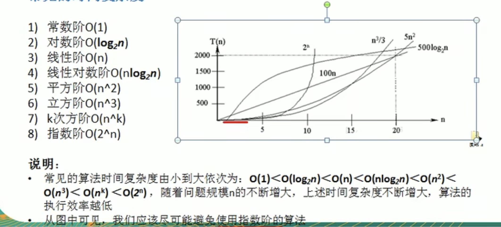

平均时间复杂度

指所有可能的输入实列均以等概率出现的情况下，该算法的运行时间

最坏时间复杂度

最环情况下的时间复杂度，一般讨论的时间复杂度都是最坏时间复杂度

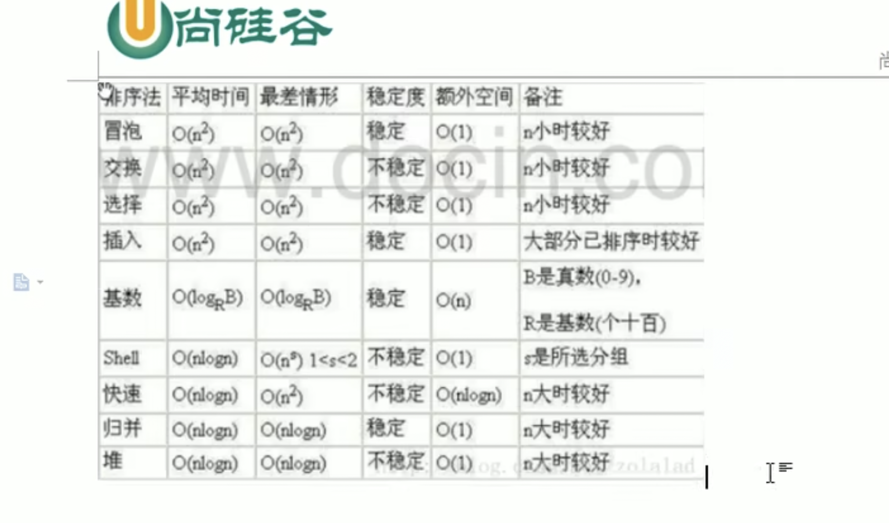

### 空间复杂度 space complexity

空间复杂度指所耗费的存储空间，也是问题规模n的函数

算法分析时，主要讨论的是时间复杂度，用空间换时间


### 冒泡排序 bubble sorting

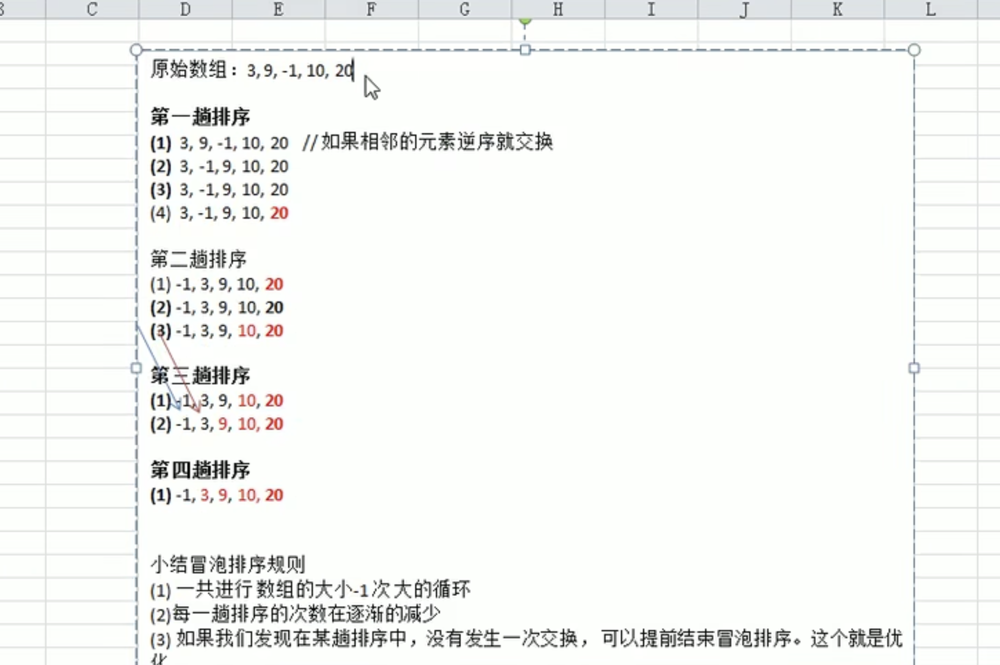

```Java
public class BubbleSort {
    public static void main(String[] args) {
        int arr[] = {3, 9, -1, 10, -2};

        // 为了容易理解，我们把冒泡提成序的演变过程，给大空展示

        //  第一趟排序，就是将最大的数排在最后
        // 第一次相当于arr.length - 1次
        int temp = 0; // 临时变量
        for (int j = 0; j < arr.length - 1; j++) {
            // 如果前面的数比后面的数大，则交换
            if (arr[j] > arr[j + 1]) {
                temp = arr[j];
                arr[j] = arr[j + 1];
                arr[j + 1] = temp;
            }
        }

        System.out.println("第一趟排序后的数组");
        System.out.println(Arrays.toString(arr));

        // 第二趟排序，我们将第二大的数排在倒数第二位
        // 第二趟相当于arr.length - 1 - 1次
        for (int j = 0; j < arr.length - 1 - 1; j++) {
            // 如果前面的数比后面的数大，则交换
            if (arr[j] > arr[j + 1]) {
                temp = arr[j];
                arr[j] = arr[j + 1];
                arr[j + 1] = temp;
            }
        }

        System.out.println("第二趟排序后的数组");
        System.out.println(Arrays.toString(arr));


        // 第三趟排序，我们将第二大的数排在倒数第二位
        for (int j = 0; j < arr.length - 1 - 2; j++) {
            // 如果前面的数比后面的数大，则交换
            if (arr[j] > arr[j + 1]) {
                temp = arr[j];
                arr[j] = arr[j + 1];
                arr[j + 1] = temp;
            }
        }

        System.out.println("第三趟排序后的数组");
        System.out.println(Arrays.toString(arr));

        // 第四趟排序，我们将第二大的数排在倒数第二位
        for (int j = 0; j < arr.length - 1 - 3; j++) {
            // 如果前面的数比后面的数大，则交换
            if (arr[j] > arr[j + 1]) {
                temp = arr[j];
                arr[j] = arr[j + 1];
                arr[j + 1] = temp;
            }
        }

        System.out.println("第四趟排序后的数组");
        System.out.println(Arrays.toString(arr));
    }
}
```

根据上面总结成如下：

```java
public class BubbleSort {
    public static void main(String[] args) {
        int arr[] = {3, 9, -1, 10, -2};

        // 为了容易理解，我们把冒泡提成序的演变过程，给大空展示

        for (int i = 0; i < arr.length - 1; i++) {
            int temp = 0; // 临时变量
            for (int j = 0; j < arr.length - 1 - i; j++) {
                // 如果前面的数比后面的数大，则交换
                if (arr[j] > arr[j + 1]) {
                    temp = arr[j];
                    arr[j] = arr[j + 1];
                    arr[j + 1] = temp;
                }
            }

            System.out.println("第" + (i + 1) + "趟排序后的数组");
            System.out.println(Arrays.toString(arr));
        }

    }
}
```

加入标志量优化：

```Java
public class BubbleSort {
    public static void main(String[] args) {
        int arr[] = {3, 9, -1, 10, -2};

        // 测试冒泡排序
        bubbleSort(arr);
    }

    // 将冒泡排序封装成一个方法
    public static void bubbleSort(int[] arr) {
        // 为了容易理解，我们把冒泡提成序的演变过程，给大空展示
        boolean flag = false; // 标识变量，表示是否进行过交换
        for (int i = 0; i < arr.length - 1; i++) {
            int temp = 0; // 临时变量
            for (int j = 0; j < arr.length - 1 - i; j++) {
                // 如果前面的数比后面的数大，则交换
                if (arr[j] > arr[j + 1]) {
                    flag = true;
                    temp = arr[j];
                    arr[j] = arr[j + 1];
                    arr[j + 1] = temp;
                }
            }
            if (flag == false) {
                // 说明在一趟排序中，一次交换都没有发生过，代表排序好了
                break;
            } else {
                flag = false; // 重置flag,进行下趟排序
                // 当然也可以放到第一层for循环内重置flag
            }

            System.out.println("第" + (i + 1) + "趟排序后的数组");
            System.out.println(Arrays.toString(arr));
        }

    }
}
```

## 查找算法

### 线性查找

```java
public class SequenceSearch {

    public static void main(String[] args) {
        // 数组不要求有序
        int[] arr = {1, 9, 11, -1, 34, 89};

        int index = seqSearch(arr, 11);
        if (index == -1) {
            System.out.println("没有查找到");
        } else {
            System.out.println("找到，下标为=" + index);
        }

    }

    public static int seqSearch(int[] arr, int value) {
        // 线性查找是一个个比对，发现有相同值，就返回下标
        for (int i = 0; i < arr.length; i++) {
            if (arr[i] == value) {
                return i;
            }
        }
        return -1;
    }
}
```

### 二分查找/折半查找

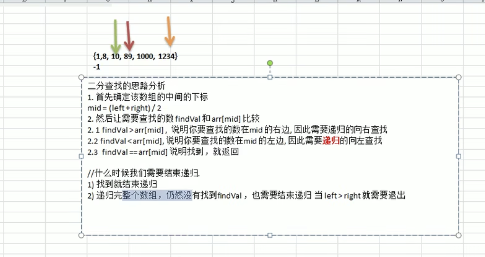

```java
public class BinarySearch {

    public static void main(String[] args) {
        // 注意二分查找的前提是该数组是有序的
        int arr[] = {1, 8, 10, 89, 1000, 1234};
        // 测试
        int resIndex = binarySearch(arr, 0, arr.length - 1, 88);
        System.out.println("resIndex = " + resIndex);
    }

    /**
     * 二分查找
     *
     * @param arr       数组
     * @param left      左边的索引
     * @param right     右边的索引
     * @param findValue 查找的值
     * @return 如果找到就返回下标，如果没有就返回-1
     */
    public static int binarySearch(int[] arr, int left, int right, int findValue) {
        if (left > right) {
            // 说明递归整个数组，但是没有找到
            return -1;
        }
        int mid = (left + right) / 2;
        int midValue = arr[mid];
        if (findValue > midValue) {
            return binarySearch(arr, left + 1, right, findValue);
        } else if (findValue < midValue) {
            return binarySearch(arr, left, right - 1, findValue);
        } else {
            return mid;
        }
    }
}
```

课后思考题： {1,8,10,89,1000,1000,1000,1234}，1000为查找值,当一个有序数组存在多个相同值时，返回所有相同查找值的下标

```java
public class BinarySearch {

    public static void main(String[] args) {
        // 注意二分查找的前提是该数组是有序的
        int arr[] = {1, 8, 10, 89, 1000, 1234};
        // 测试
        int resIndex = binarySearch(arr, 0, arr.length - 1, 88);
        System.out.println("resIndex = " + resIndex);
    }

    /**
     * 完成一个课后思考题
     * 课后思考题： {1,8,10,89,1000,1000,1000,1234}，1000为查找值
     * 当一个有序数组存在多个相同值时，返回所有相同查找值的下标
     * <p>
     * 思路：
     * 1。在找到mid值时，不要马上返回
     * 2。向mid索引值的左边扫描，将所有满足1000的元素的下标，加入到集合中
     * 3。向mid索引值的右边扫描，将所有满足1000的元素的下标，加入到集合中
     */
    public static List<Integer> binarySearch2(int[] arr, int left, int right, int findValue) {
        if (left > right) {
            // 说明递归整个数组，但是没有找到
            return new ArrayList<>();
        }
        int mid = (left + right) / 2;
        int midValue = arr[mid];
        if (findValue > midValue) {
            return binarySearch2(arr, left + 1, right, findValue);
        } else if (findValue < midValue) {
            return binarySearch2(arr, left, right - 1, findValue);
        } else {
            List<Integer> list = new ArrayList<>();
            // 放入左边的值
            int temp = mid - 1;
            while (true) {
                if (temp < 0 || arr[temp] != findValue) {
                    break;
                }
                // 否则，就temp放到集合中
                list.add(temp);
                temp -= 1;
            }
            // 放入右过的值
            temp = mid + 1;
            while (true) {
                if (temp > arr.length - 1 || arr[temp] != findValue) {
                    break;
                }
                // 否则，将temp加入集合中
                list.add(temp);
                temp += 1;
            }
            //  返回最终记录的索引
            return list;
        }
    }
}
```

## 哈希表(散列表) HashTable

哈希表的任务

1 尾部新增

2 根据id删除

3 显示

4 HashTable的散列函数

```java
public class MyHashTableDemo {

    public static void main(String[] args) {
        // 创建哈希表
        MyHashTable myHashTable = new MyHashTable(7);

        // 写一个简单的菜单
        String key = "";
        Scanner scanner = new Scanner(System.in);
        while (true) {
            System.out.println("add: 添加雇员");
            System.out.println("list: 显示雇员");
            System.out.println("find: 查找雇员");
            System.out.println("exit: 退出系统");

            key = scanner.next();

            switch (key) {
                case "add":
                    System.out.println("输入id:");
                    int id = scanner.nextInt();
                    System.out.println("输入名字");
                    String name = scanner.next();
                    //  创建一个雇员
                    Employee employee = new Employee(id, name);
                    myHashTable.add(employee);
                    break;
                case "list":
                    myHashTable.list();
                    break;
                case "find":
                    System.out.println("请输入id: ");
                    id = scanner.nextInt();
                    myHashTable.findEmployeeById(id);
                    break;
                case "exit":
                    scanner.close();
                    System.exit(-1);
                default:
                    break;
            }
        }
    }
}

// 创建哈希表管理多条链表
class MyHashTable {

    private EmpLinkedList[] empLinkedListArray;

    private int size;

    public MyHashTable(int size) {
        // 初始化数组
        this.size = size;
        empLinkedListArray = new EmpLinkedList[size];
        // 不要忘记，这时要分别初始化每一个链表
        for (int i = 0; i < size; i++) {
            empLinkedListArray[i] = new EmpLinkedList();
        }
    }

    // 添加雇员
    public void add(Employee employee) {
        // 根据员工的id，得到该员工应当添加到哪条链表
        int index = hashFun(employee.getId());
        // 将employee加入到对应的链表中
        empLinkedListArray[index].add(employee);
    }

    // 遍历所有的链表，就是遍历hashTable
    public void list() {
        for (int i = 0; i < size; i++) {
            empLinkedListArray[i].list(i);
        }
    }

    // 编写散列函数,使用取模法
    public int hashFun(int id) {
        return id % size;
    }

    // 根据id查找
    public void findEmployeeById(int id) {
        // 使用散列函数确定到哪条链表查找
        int index = hashFun(id);
        Employee employee = empLinkedListArray[index].findEmployee(id);
        if (employee != null) {
            // 找到
            System.out.printf("在第%d条找到雇员，id=%d\n", index, id);
        } else {
            System.out.println("哈希表中没有找到");
        }
    }

    // 根据id删除雇员
    public void deleteById(int id) {
        int index = hashFun(id);
        boolean b = empLinkedListArray[index].deleteById(id);
        if (b) {
            System.out.println("删除成功");
        } else {
            System.out.println("删除失败");
        }
    }
}

// 表示有一个雇员
@Data
@NoArgsConstructor
@AllArgsConstructor
class Employee {

    private int id;

    private String name;

    private Employee next;

    public Employee(int id, String name) {
        this.id = id;
        this.name = name;
    }

}

// 创建EmpLinkedList，表示链表
class EmpLinkedList {

    // 头指针，指向第一个Emp，因此我们这个链表的head是直接指向第一个Emp
    private Employee head; // 默认为null

    // 添加雇员
    // 1 假定雇员，id是自增长，即id的分配总是从小到大
    // 因此我们直接将新雇员直接加入到本链表的最后即可
    public void add(Employee employee) {
        // 如查是添加第一个雇员
        if (head == null) {
            head = employee;
            return;
        }
        // 如果不是第一个雇员，则使用一个辅助的指针，帮助定位到最后
        Employee curEmp = head;
        while (true) {
            if (curEmp.getNext() == null) {
                break;
            }
            curEmp = curEmp.getNext();
        }
        // 退出时直接将emp加入链表
        curEmp.setNext(employee);
    }

    // 遍历链表雇员的信息
    public void list(int index) {
        if (head == null) {
            System.out.println("第" + index + "链表为空");
            return;
        }
        System.out.println("第" + index + "链表的信息为：");
        Employee curEmp = head;
        while (true) {
            System.out.printf("=> id=%d name=%s\t", curEmp.getId(), curEmp.getName());
            if (curEmp.getNext() == null) {
                break;
            }
            curEmp = curEmp.getNext();
        }
        System.out.println();
    }

    // 根据id查找雇员
    public Employee findEmployee(int id) {
        // 判断链表是否为空
        if (head == null) {
            System.out.println("链表为空");
            return null;
        }
        // 辅助指针
        Employee curEmp = head;
        while (true) {
            if (curEmp.getId() == id) {
                break;
            }
            // 说明当前链表没有找到
            if (curEmp.getNext() == null) {
                curEmp = null;
                break;// 要退出
            }
            curEmp = curEmp.getNext();
        }
        return curEmp;
    }

    // 根据id删除雇员
    public boolean deleteById(int id) {
        if (head == null) {
            System.out.println("链表为空");
            return false;
        }
        Employee curEmp = head;
        // 单独判断头节点
        if (head.getId() == id) {
            head = (head.getNext());
            return true;
        }
        while (curEmp.getNext() != null) {
            if (curEmp.getNext().getId() == id) {
                // 找到
                curEmp.setNext(curEmp.getNext().getNext());
                return true;
            }
        }
        return false;
    }


}
```

## 树 Tree 基础部分

数组：根据索引访问快，根据二分查找快，但删除、新增效率差

链表：查找慢，但删除、新增效率好

树：查找快，删除、新增效率好

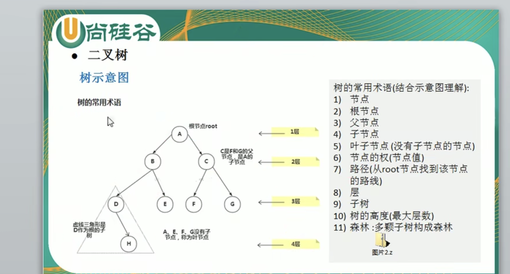

### 二叉树 binary tree

#### 基本概念

二叉树：每个节点最多只能有两个子节点，子节点分为左子节点，右子节点

满二叉树：所有的子节点都在最后一层，并且节点总数为2^n  -1, n为层数，从1开始。

完全二叉树：如果二叉树的所有的叶子节点都在最后一层或倒数第二层，而且最后一层的叶子节点在左边边续，倒数第二层的叶子节点在右边连续。

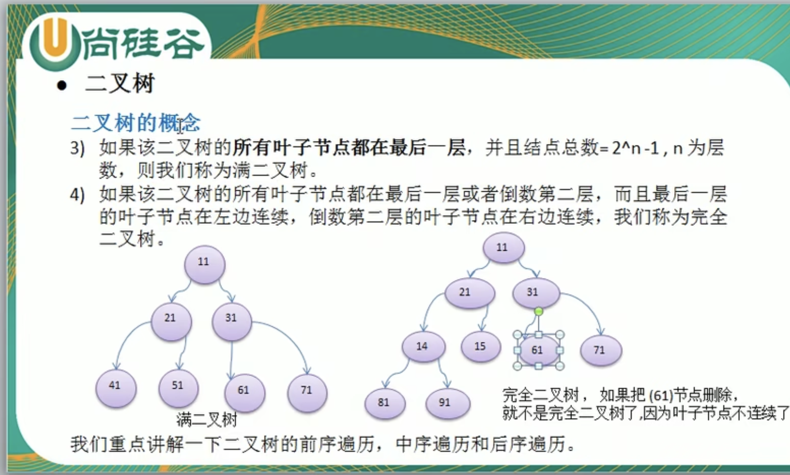

#### 遍历方式 : preorder,infix order,postorder

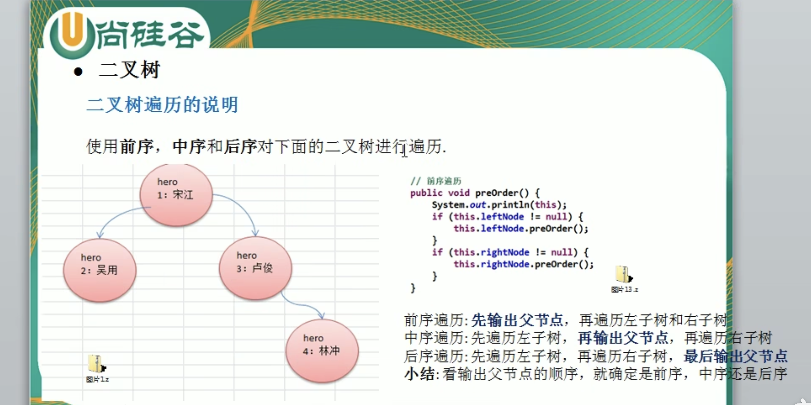

1. 前序遍历: 先输出父节点，再遍历左子树和右子树
2. 中序遍历: 先遍历左子树，再输出父节点，再遍历右子树
3. 后序遍历: 先遍历左子树，再遍历右子树，最后输出父节点

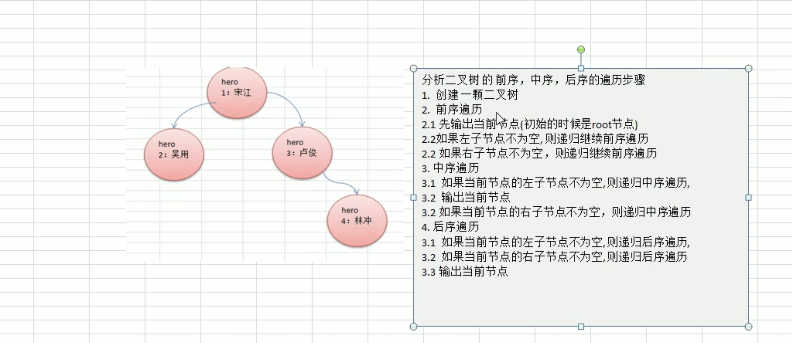

```java
public class BinaryTreeDemo {
    public static void main(String[] args) {
        // 先需要创建一颗二叉树
        MyBinaryTree myBinaryTree = new MyBinaryTree();
        // 创建所需的节点
        HeroNode root = new HeroNode(1, "宋江");
        HeroNode node2 = new HeroNode(2, "吴用");
        HeroNode node3 = new HeroNode(3, "卢俊义");
        HeroNode node4 = new HeroNode(4, "林冲");

        // 说明，我们先手动创建该二叉树，后面我们学习递归的方式创建二叉树
        root.setLeft(node2);
        root.setRight(node3);
        node3.setRight(node4);
        myBinaryTree.setRoot(root);

        // 测试前序
        System.out.println("前序遍历为：");
        myBinaryTree.preOrder(); // 1,2,3,4

        // 测试中序
        System.out.println("中序遍历为：");
        myBinaryTree.infixOrder(); // 2,1,3,4

        // 测试后序
        System.out.println("后序遍历为：");
        myBinaryTree.postOrder(); // 2,4,3,1
    }
}

// 定义一个BinaryTree

class MyBinaryTree {

    private HeroNode root;

    public void setRoot(HeroNode root) {
        this.root = root;
    }

    // 前序遍历
    public void preOrder() {
        if (this.root != null) {
            this.root.preOrder();
        } else {
            System.out.println("二叉树为空不能遍历");
        }
    }

    // 中序遍历
    public void infixOrder() {
        if (this.root != null) {
            this.root.infixOrder();
        } else {
            System.out.println("二叉树为空不能遍历");
        }
    }

    // 后序遍历
    public void postOrder() {
        if (this.root != null) {
            this.root.postOrder();
        } else {
            System.out.println("二叉树为空不能遍历");
        }
    }
}

// 先创建英雄节点
@Data
@AllArgsConstructor
@NoArgsConstructor
class HeroNode {

    private int no;

    private String name;

    private HeroNode left;

    private HeroNode right;

    public HeroNode(int no, String name) {
        this.no = no;
        this.name = name;
    }

    @Override
    public String toString() {
        return "HeroNode [no=" + no + ", name=" + name + "]";
    }

    // 编写前序遍历的方法
    public void preOrder() {
        System.out.println(this); // 先输出父节点
        // 递归向左子树前序遍历
        if (this.left != null) {
            this.left.preOrder();
        }
        // 递归向右子树前序遍历
        if (this.right != null) {
            this.right.preOrder();
        }
    }

    //  中序遍历
    public void infixOrder() {
        // 递归向左子树中序遍历
        if (this.left != null) {
            this.left.infixOrder();
        }
        // 输入父结点
        System.out.println(this);
        // 递归向右子树中序遍历
        if (this.right != null) {
            this.right.infixOrder();
        }
    }

    // 后序遍历
    public void postOrder() {
        // 递归向左子树后序遍历
        if (this.left != null) {
            this.left.postOrder();
        }
        // 递归向右子树后序遍历
        if (this.right != null) {
            this.right.postOrder();
        }
        // 输入父结点
        System.out.println(this);
    }
}
```

#### 查找方式：preorder,inorder,postorder

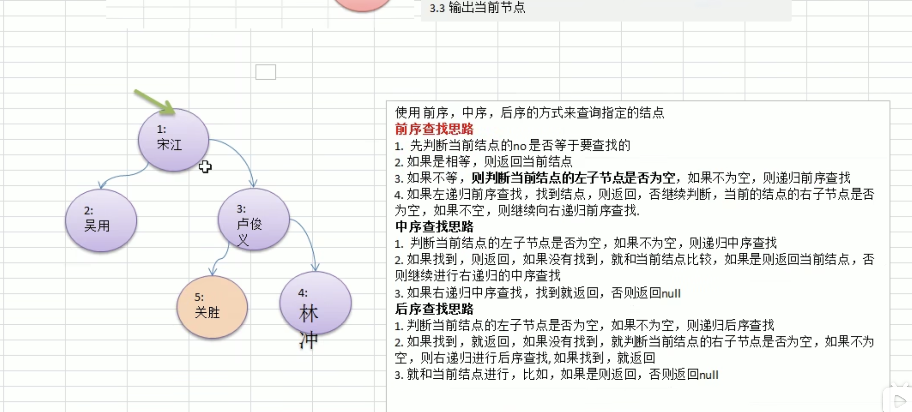

```java
public class BinaryTreeDemo {
    public static void main(String[] args) {
        // 先需要创建一颗二叉树
        MyBinaryTree myBinaryTree = new MyBinaryTree();
        // 创建所需的节点
        HeroNode root = new HeroNode(1, "宋江");
        HeroNode node2 = new HeroNode(2, "吴用");
        HeroNode node3 = new HeroNode(3, "卢俊义");
        HeroNode node4 = new HeroNode(4, "林冲");

        // 说明，我们先手动创建该二叉树，后面我们学习递归的方式创建二叉树
        root.setLeft(node2);
        root.setRight(node3);
        node3.setRight(node4);
        myBinaryTree.setRoot(root);

        // 测试前序
        System.out.println("前序遍历为：");
        myBinaryTree.preOrder(); // 1,2,3,4

        // 测试中序
        System.out.println("中序遍历为：");
        myBinaryTree.infixOrder(); // 2,1,3,4

        // 测试后序
        System.out.println("后序遍历为：");
        myBinaryTree.postOrder(); // 2,4,3,1

        // 前序遍历查找
        System.out.println("前序遍历查找");
        HeroNode resNode = myBinaryTree.preorderSearch(4);
        if (resNode != null) {
            System.out.println("前序遍历查找 找到了" + resNode);
        } else {
            System.out.println("没有找到");
        }
    }
}

// 定义一个BinaryTree

class MyBinaryTree {

    private HeroNode root;

    public void setRoot(HeroNode root) {
        this.root = root;
    }

    // 前序遍历
    public void preOrder() {
        if (this.root != null) {
            this.root.preOrder();
        } else {
            System.out.println("二叉树为空不能遍历");
        }
    }

    // 中序遍历
    public void infixOrder() {
        if (this.root != null) {
            this.root.infixOrder();
        } else {
            System.out.println("二叉树为空不能遍历");
        }
    }

    // 后序遍历
    public void postOrder() {
        if (this.root != null) {
            this.root.postOrder();
        } else {
            System.out.println("二叉树为空不能遍历");
        }
    }

    // 前序遍历查找
    public HeroNode preorderSearch(int no) {
        if (root != null) {
            return root.preorderSearch(no);
        }
        return null;
    }

    // 中序遍历查找
    public HeroNode inorderSearch(int no) {
        if (root != null) {
            return root.inorderSearch(no);
        }
        return null;
    }

    // 后序遍历查找
    public HeroNode postorderSearch(int no) {
        if (root != null) {
            return root.postorderSearch(no);
        }
        return null;
    }
}

// 先创建英雄节点
@Data
@AllArgsConstructor
@NoArgsConstructor
class HeroNode {

    private int no;

    private String name;

    private HeroNode left;

    private HeroNode right;

    public HeroNode(int no, String name) {
        this.no = no;
        this.name = name;
    }

    @Override
    public String toString() {
        return "HeroNode [no=" + no + ", name=" + name + "]";
    }

    // 编写前序遍历的方法
    public void preOrder() {
        System.out.println(this); // 先输出父节点
        // 递归向左子树前序遍历
        if (this.left != null) {
            this.left.preOrder();
        }
        // 递归向右子树前序遍历
        if (this.right != null) {
            this.right.preOrder();
        }
    }

    //  中序遍历
    public void infixOrder() {
        // 递归向左子树中序遍历
        if (this.left != null) {
            this.left.infixOrder();
        }
        // 输入父结点
        System.out.println(this);
        // 递归向右子树中序遍历
        if (this.right != null) {
            this.right.infixOrder();
        }
    }

    // 后序遍历
    public void postOrder() {
        // 递归向左子树后序遍历
        if (this.left != null) {
            this.left.postOrder();
        }
        // 递归向右子树后序遍历
        if (this.right != null) {
            this.right.postOrder();
        }
        // 输入父结点
        System.out.println(this);
    }


    /**
     * 前序遍历查找
     *
     * @param no 查找编号
     * @return 如果找到返回对应的引用，没有找到返回null
     */
    public HeroNode preorderSearch(int no) {
        // 比较当前结点是不是
        if (this.no == no) {
            return this;
        }
        // 左递归
        HeroNode resNode = null;
        if (this.left != null) {
            resNode = this.left.preorderSearch(no);
        }
        if (resNode != null) {
            // 说明我们左子树查找到
            return resNode;
        }
        // 右递归
        if (this.right != null) {
            resNode = this.right.preorderSearch(no);
        }
        return resNode;
    }

    // 中序遍历查找
    public HeroNode inorderSearch(int no) {
        HeroNode resNode = null;
        // 左递归
        if (this.left != null) {
            resNode = this.left.inorderSearch(no);
        }
        if (resNode != null) {
            return resNode;
        }
        // 判断当前
        if (this.no == no) {
            return this;
        }
        //  右递归
        if (this.right != null) {
            resNode = this.right.inorderSearch(no);
        }
        return resNode;
    }

    // 后序遍历查找
    public HeroNode postorderSearch(int no) {
        // 左递归
        HeroNode resNode = null;
        if (this.left != null) {
            resNode = this.left.postorderSearch(no);
        }
        if (resNode != null) {
            return resNode;
        }
        // 右递归
        if (this.right != null) {
            resNode = this.right.postorderSearch(no);
        }
        if (resNode != null) {
            return resNode;
        }
        // 判断当前
        if (this.no == no) {
            return this;
        }
        return null;
    }
}
```

删除节点

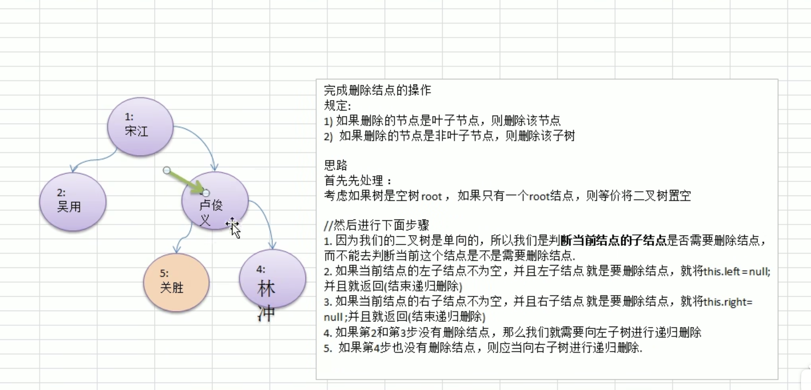

```java
public class BinaryTreeDemo {
    public static void main(String[] args) {
        // 先需要创建一颗二叉树
        MyBinaryTree myBinaryTree = new MyBinaryTree();
        // 创建所需的节点
        HeroNode root = new HeroNode(1, "宋江");
        HeroNode node2 = new HeroNode(2, "吴用");
        HeroNode node3 = new HeroNode(3, "卢俊义");
        HeroNode node4 = new HeroNode(4, "林冲");

        // 说明，我们先手动创建该二叉树，后面我们学习递归的方式创建二叉树
        root.setLeft(node2);
        root.setRight(node3);
        node3.setRight(node4);
        myBinaryTree.setRoot(root);

        // 测试前序
        System.out.println("前序遍历为：");
        myBinaryTree.preOrder(); // 1,2,3,4

        // 测试中序
        System.out.println("中序遍历为：");
        myBinaryTree.infixOrder(); // 2,1,3,4

        // 测试后序
        System.out.println("后序遍历为：");
        myBinaryTree.postOrder(); // 2,4,3,1

        // 前序遍历查找
        System.out.println("前序遍历查找");
        HeroNode resNode = myBinaryTree.preorderSearch(4);
        if (resNode != null) {
            System.out.println("前序遍历查找 找到了" + resNode);
        } else {
            System.out.println("没有找到");
        }

        // 测试删除
        System.out.println("删除前：前序遍历");
        myBinaryTree.preOrder(); // 1,2,3,4

        // 删除4号
        myBinaryTree.deleteNo(4);

        System.out.println("删除后：前序遍历");
        myBinaryTree.preOrder(); // 1,2,3
    }
}

// 定义一个BinaryTree
class MyBinaryTree {

    private HeroNode root;

    public void setRoot(HeroNode root) {
        this.root = root;
    }

    // 前序遍历
    public void preOrder() {
        if (this.root != null) {
            this.root.preOrder();
        } else {
            System.out.println("二叉树为空不能遍历");
        }
    }

    // 中序遍历
    public void infixOrder() {
        if (this.root != null) {
            this.root.infixOrder();
        } else {
            System.out.println("二叉树为空不能遍历");
        }
    }

    // 后序遍历
    public void postOrder() {
        if (this.root != null) {
            this.root.postOrder();
        } else {
            System.out.println("二叉树为空不能遍历");
        }
    }

    // 前序遍历查找
    public HeroNode preorderSearch(int no) {
        if (root != null) {
            return root.preorderSearch(no);
        }
        return null;
    }

    // 中序遍历查找
    public HeroNode inorderSearch(int no) {
        if (root != null) {
            return root.inorderSearch(no);
        }
        return null;
    }

    // 后序遍历查找
    public HeroNode postorderSearch(int no) {
        if (root != null) {
            return root.postorderSearch(no);
        }
        return null;
    }

    // 删除节点
    public void deleteNo(int no) {
        // 如果root 不为null
        if (root != null) {
            // 如果只有一个root节点，判断是不是就要删除的节点
            if (root.getNo() == no) {
                root = null;
            } else {
                this.root.deleteNode(no);
            }
        } else {
            System.out.println("空树，不能删除");
        }
    }
}

// 先创建英雄节点
@Data
@AllArgsConstructor
@NoArgsConstructor
class HeroNode {

    private int no;

    private String name;

    private HeroNode left;

    private HeroNode right;

    public HeroNode(int no, String name) {
        this.no = no;
        this.name = name;
    }

    @Override
    public String toString() {
        return "HeroNode [no=" + no + ", name=" + name + "]";
    }

    // 编写前序遍历的方法
    public void preOrder() {
        System.out.println(this); // 先输出父节点
        // 递归向左子树前序遍历
        if (this.left != null) {
            this.left.preOrder();
        }
        // 递归向右子树前序遍历
        if (this.right != null) {
            this.right.preOrder();
        }
    }

    //  中序遍历
    public void infixOrder() {
        // 递归向左子树中序遍历
        if (this.left != null) {
            this.left.infixOrder();
        }
        // 输入父结点
        System.out.println(this);
        // 递归向右子树中序遍历
        if (this.right != null) {
            this.right.infixOrder();
        }
    }

    // 后序遍历
    public void postOrder() {
        // 递归向左子树后序遍历
        if (this.left != null) {
            this.left.postOrder();
        }
        // 递归向右子树后序遍历
        if (this.right != null) {
            this.right.postOrder();
        }
        // 输入父结点
        System.out.println(this);
    }


    /**
     * 前序遍历查找
     *
     * @param no 查找编号
     * @return 如果找到返回对应的引用，没有找到返回null
     */
    public HeroNode preorderSearch(int no) {
        // 比较当前结点是不是
        if (this.no == no) {
            return this;
        }
        // 左递归
        HeroNode resNode = null;
        if (this.left != null) {
            resNode = this.left.preorderSearch(no);
        }
        if (resNode != null) {
            // 说明我们左子树查找到
            return resNode;
        }
        // 右递归
        if (this.right != null) {
            resNode = this.right.preorderSearch(no);
        }
        return resNode;
    }

    // 中序遍历查找
    public HeroNode inorderSearch(int no) {
        HeroNode resNode = null;
        // 左递归
        if (this.left != null) {
            resNode = this.left.inorderSearch(no);
        }
        if (resNode != null) {
            return resNode;
        }
        // 判断当前
        if (this.no == no) {
            return this;
        }
        //  右递归
        if (this.right != null) {
            resNode = this.right.inorderSearch(no);
        }
        return resNode;
    }

    // 后序遍历查找
    public HeroNode postorderSearch(int no) {
        // 左递归
        HeroNode resNode = null;
        if (this.left != null) {
            resNode = this.left.postorderSearch(no);
        }
        if (resNode != null) {
            return resNode;
        }
        // 右递归
        if (this.right != null) {
            resNode = this.right.postorderSearch(no);
        }
        if (resNode != null) {
            return resNode;
        }
        // 判断当前
        if (this.no == no) {
            return this;
        }
        return null;
    }

    /**
     * 递归删除节点
     * 如果是叶子节点，就删除节点
     * 如果非叶子节点，则删除子树
     */
    public void deleteNode(int no) {
        // 这里进入，root不为null
        // 先看左边的，符合就删除
        if (this.left != null && this.left.getNo() == no) {
            this.left = null;
            return;
        }
        // 再看右边的，符合就删除
        if (this.right != null && this.right.getNo() == no) {
            this.right = null;
            return;
        }
        //  这时，我们就需要向左子树进行递归删除
        if (this.left != null) {
            this.left.deleteNode(no);
        }
        // 再向右子树进行递归删除
        if (this.right != null) {
            this.right.deleteNode(no);
        }
    }
}
```

思考题：如果要删除的节点是非叶子节点，现在我们不希望将该非叶子节点为根节点的子树删除，需要指定规则，假定规则如下：

1 如果该非叶子节点A只有一个子节点B，则子节点B替代节点A

2 如果该非叶子节点A 有左子节点B和右子节点C, 则让左子节点B替代节点A

#### 顺序存储二叉树

数组存储方式与树的存储的方式转换

要求：在遍历数组arr时，仍然可以以前序遍历，中序遍历和后序遍历的方式完成结点的遍历

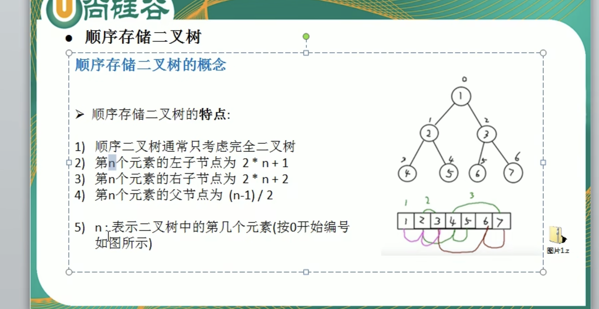


```java
public class ArrayBinaryTreeDemo {
    public static void main(String[] args) {
        // 完全二叉树对应的数组
        int[] arr = {1, 2, 3, 4, 5, 6, 7};
        // 创建一个ArrayBinaryTree
        ArrayBinaryTree arrayBinaryTree = new ArrayBinaryTree(arr);
        // 根节点对应的下标为0
        arrayBinaryTree.preOrder(0); // 1,2,4,5,3,6,7
        // 调用重载方法
        arrayBinaryTree.preorder();
    }


}

// 编写一个ArrayBinaryTree,实现顺序存储二叉树遍历
class ArrayBinaryTree {

    private int[] arr; // 存储数据结点的数组

    public ArrayBinaryTree(int[] arr) {
        this.arr = arr;
    }

    // 重载preorder
    public void preorder() {
        this.preOrder(0);
    }

    // 编写一个方法，完成顺序存储二叉树的前序遍历
    public void preOrder(int index) {
        // 如果数组为空，或者arr.length == 0
        if (arr == null || arr.length == 0) {
            System.out.println("数组为空,不能遍历");
        }
        // 处理当前
        System.out.println(arr[index]);
        // 向左递归
        if (index * 2 + 1 < arr.length) {
            preOrder(index * 2 + 1);
        }
        // 向右递归
        if (index * 2 + 2 < arr.length) {
            preOrder(index * 2 + 2);
        }
    }
}
```

思考：中序遍历，后序遍历？

```java
public class ArrayBinaryTreeDemo {
    public static void main(String[] args) {
        // 完全二叉树对应的数组
        int[] arr = {1, 2, 3, 4, 5, 6, 7};
        // 创建一个ArrayBinaryTree
        ArrayBinaryTree arrayBinaryTree = new ArrayBinaryTree(arr);
        // 根节点对应的下标为0
        arrayBinaryTree.preorder(); // 1,2,4,5,3,6,7
    }


}

// 编写一个ArrayBinaryTree,实现顺序存储二叉树遍历
class ArrayBinaryTree {

    private int[] arr; // 存储数据结点的数组

    public ArrayBinaryTree(int[] arr) {
        this.arr = arr;
    }

    // 重载preorder
    public void preorder() {
        this.preOrder(0);
    }

    // 编写一个方法，完成顺序存储二叉树的前序遍历
    public void preOrder(int index) {
        // 如果数组为空，或者arr.length == 0
        if (arr == null || arr.length == 0) {
            System.out.println("数组为空,不能遍历");
        }
        // 处理当前
        System.out.println(arr[index]);
        // 向左递归
        if (index * 2 + 1 < arr.length) {
            preOrder(index * 2 + 1);
        }
        // 向右递归
        if (index * 2 + 2 < arr.length) {
            preOrder(index * 2 + 2);
        }
    }

    // 中序遍历
    public void inorder(int index) {
        // 先判断成员变量数组
        if (arr == null || arr.length == 0) {
            return;
        }
        // 递归左子树
        if (index * 2 + 1 < arr.length) {
            inorder(index * 2 + 1);
        }
        // 当前节点
        System.out.println(arr[index]);
        // 递归右子树
        if (index * 2 + 2 < arr.length) {
            inorder(index * 2 + 2);
        }
    }

    // 后序遍历
    public void postorder(int index) {
        // 判断数组
        if (arr == null || arr.length == 0) {
            return;
        }
        // 先左递归
        if (index * 2 + 1 < arr.length) {
            postorder(index * 2 + 1);
        }
        // 右递归
        if (index * 2 + 2 < arr.length) {
            postorder(index * 2 + 2);
        }
        // 最后处理当前节点
        System.out.println(arr[index]);
    }
}
```

#### 线索化二叉树 threaded binary tree

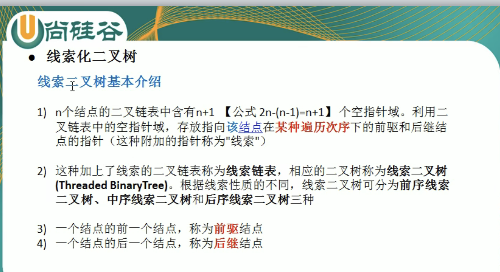

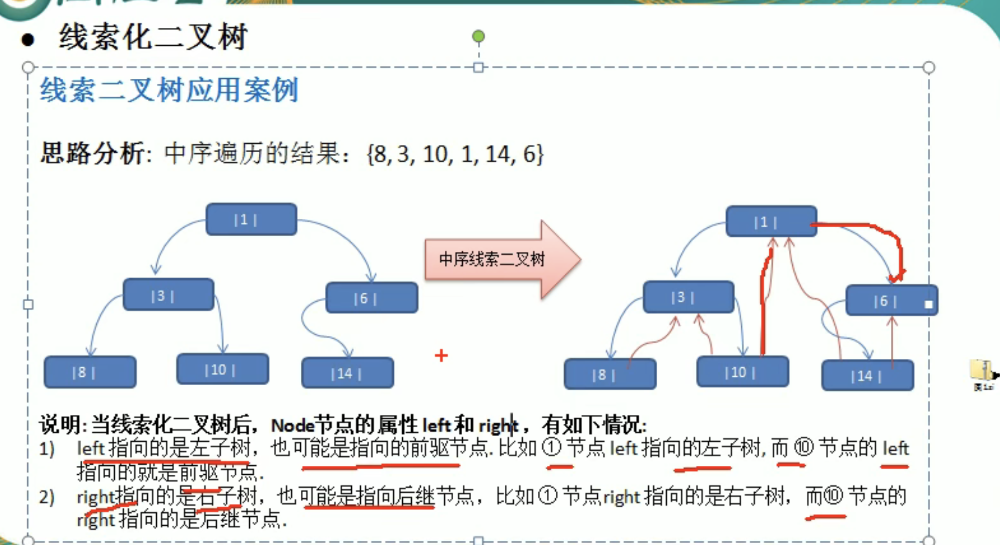

```java
public class ThreadedBinaryTreeDemo {
    public static void main(String[] args) {
        // 测试一把中序线索二叉树的功能
        HeroNode root = new HeroNode(1, "tom");
        HeroNode node2 = new HeroNode(3, "jack");
        HeroNode node3 = new HeroNode(6, "smith");
        HeroNode node4 = new HeroNode(8, "marry");
        HeroNode node5 = new HeroNode(10, "king");
        HeroNode node6 = new HeroNode(14, "dim");

        // 二叉树，后面学递归创建，现在手动创建
        root.setLeft(node2);
        root.setRight(node3);
        node2.setLeft(node4);
        node2.setRight(node5);
        node3.setLeft(node6);

        // 测试线索化
        ThreadedBinaryTree threadedBinaryTree = new ThreadedBinaryTree();
        threadedBinaryTree.setRoot(root);

        threadedBinaryTree.threadedNodes();

        // 测试，以10号节点测试
        HeroNode lefNode = node5.getLeft();
        HeroNode rightNode = node5.getRight();
        System.out.println("10号节点的前驱节点：" + lefNode);
        System.out.println("10号节点的后驱节点：" + rightNode);

    }
}

// 定义一个ThreadedBinaryTree
class ThreadedBinaryTree {

    private HeroNode root;

    // 为了实现线索化，需要创建指向当前节点的前驱结点的指针
    // 在递归进行线索化时，pre总是保留前一个节点
    private HeroNode pre = null;

    public void setRoot(HeroNode root) {
        this.root = root;
    }

    // 重载threadedNodes方法
    public void threadedNodes() {
        this.threadedNodes(root);
    }

    /**
     * 编写对二叉树进行中序线索化的方法
     *
     * @param node 就是当前需要进行线索化的节点
     */
    public void threadedNodes(HeroNode node) {
        // 如果node == null,不能线索化
        if (node == null) {
            return;
        }
        // 先线索化左子树
        threadedNodes(node.getLeft());
        // 再线索化当前节点
        // 先处理当前节点的前驱节点
        if (node.getLeft() == null) {
            // 让当前节点的左指针指向前驱节点
            node.setLeft(pre);
            // 修改当前节点的左指针类型，指向前驱节点
            node.setLeftType(1);
        }
        // 处理后继节点
        if (pre != null && pre.getRight() == null) {
            // 让前驱节点的右指针指向当前节点
            pre.setRight(node);
            // 修改前驱节点的右指针类型
            pre.setRightType(1);
        }
        // 每处理一个节点，让当前节点是下一个节点的前驱节点
        pre = node;
        // 最后线索化右子树
        threadedNodes(node.getRight());
    }

    // 前序遍历
    public void preOrder() {
        if (this.root != null) {
            this.root.preOrder();
        } else {
            System.out.println("二叉树为空不能遍历");
        }
    }

    // 中序遍历
    public void infixOrder() {
        if (this.root != null) {
            this.root.infixOrder();
        } else {
            System.out.println("二叉树为空不能遍历");
        }
    }

    // 后序遍历
    public void postOrder() {
        if (this.root != null) {
            this.root.postOrder();
        } else {
            System.out.println("二叉树为空不能遍历");
        }
    }

    // 前序遍历查找
    public HeroNode preorderSearch(int no) {
        if (root != null) {
            return root.preorderSearch(no);
        }
        return null;
    }

    // 中序遍历查找
    public HeroNode inorderSearch(int no) {
        if (root != null) {
            return root.inorderSearch(no);
        }
        return null;
    }

    // 后序遍历查找
    public HeroNode postorderSearch(int no) {
        if (root != null) {
            return root.postorderSearch(no);
        }
        return null;
    }

    // 删除节点
    public void deleteNo(int no) {
        // 如果root 不为null
        if (root != null) {
            // 如果只有一个root节点，判断是不是就要删除的节点
            if (root.getNo() == no) {
                root = null;
            } else {
                this.root.deleteNode(no);
            }
        } else {
            System.out.println("空树，不能删除");
        }
    }
}

@Data
@AllArgsConstructor
@NoArgsConstructor
class HeroNode {

    private int no;

    private String name;

    private HeroNode left;

    private HeroNode right;

    // 如果leftType == 0,表示指向的是左子树
    // 如果1则表示前驱节点
    private int leftType;

    // 如果leftType == 0,表示指向的是右子树
    // 如果1则表示后继节点
    private int rightType;

    public HeroNode(int no, String name) {
        this.no = no;
        this.name = name;
    }

    @Override
    public String toString() {
        return "HeroNode [no=" + no + ", name=" + name + "]";
    }

    // 编写前序遍历的方法
    public void preOrder() {
        System.out.println(this); // 先输出父节点
        // 递归向左子树前序遍历
        if (this.left != null) {
            this.left.preOrder();
        }
        // 递归向右子树前序遍历
        if (this.right != null) {
            this.right.preOrder();
        }
    }

    //  中序遍历
    public void infixOrder() {
        // 递归向左子树中序遍历
        if (this.left != null) {
            this.left.infixOrder();
        }
        // 输入父结点
        System.out.println(this);
        // 递归向右子树中序遍历
        if (this.right != null) {
            this.right.infixOrder();
        }
    }

    // 后序遍历
    public void postOrder() {
        // 递归向左子树后序遍历
        if (this.left != null) {
            this.left.postOrder();
        }
        // 递归向右子树后序遍历
        if (this.right != null) {
            this.right.postOrder();
        }
        // 输入父结点
        System.out.println(this);
    }


    /**
     * 前序遍历查找
     *
     * @param no 查找编号
     * @return 如果找到返回对应的引用，没有找到返回null
     */
    public HeroNode preorderSearch(int no) {
        // 比较当前结点是不是
        if (this.no == no) {
            return this;
        }
        // 左递归
        HeroNode resNode = null;
        if (this.left != null) {
            resNode = this.left.preorderSearch(no);
        }
        if (resNode != null) {
            // 说明我们左子树查找到
            return resNode;
        }
        // 右递归
        if (this.right != null) {
            resNode = this.right.preorderSearch(no);
        }
        return resNode;
    }

    // 中序遍历查找
    public HeroNode inorderSearch(int no) {
        HeroNode resNode = null;
        // 左递归
        if (this.left != null) {
            resNode = this.left.inorderSearch(no);
        }
        if (resNode != null) {
            return resNode;
        }
        // 判断当前
        if (this.no == no) {
            return this;
        }
        //  右递归
        if (this.right != null) {
            resNode = this.right.inorderSearch(no);
        }
        return resNode;
    }

    // 后序遍历查找
    public HeroNode postorderSearch(int no) {
        // 左递归
        HeroNode resNode = null;
        if (this.left != null) {
            resNode = this.left.postorderSearch(no);
        }
        if (resNode != null) {
            return resNode;
        }
        // 右递归
        if (this.right != null) {
            resNode = this.right.postorderSearch(no);
        }
        if (resNode != null) {
            return resNode;
        }
        // 判断当前
        if (this.no == no) {
            return this;
        }
        return null;
    }

    /**
     * 递归删除节点
     * 如果是叶子节点，就删除节点
     * 如果非叶子节点，则删除子树
     */
    public void deleteNode(int no) {
        // 这里进入，root不为null
        // 先看左边的，符合就删除
        if (this.left != null && this.left.getNo() == no) {
            this.left = null;
            return;
        }
        // 再看右边的，符合就删除
        if (this.right != null && this.right.getNo() == no) {
            this.right = null;
            return;
        }
        //  这时，我们就需要向左子树进行递归删除
        if (this.left != null) {
            this.left.deleteNode(no);
        }
        // 再向右子树进行递归删除
        if (this.right != null) {
            this.right.deleteNode(no);
        }
    }
}
```

#### 遍历线索化二叉树

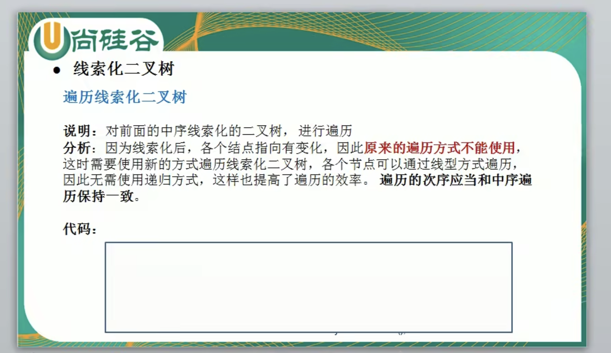

```java
public class ThreadedBinaryTreeDemo {
    public static void main(String[] args) {
        // 测试一把中序线索二叉树的功能
        HeroNode root = new HeroNode(1, "tom");
        HeroNode node2 = new HeroNode(3, "jack");
        HeroNode node3 = new HeroNode(6, "smith");
        HeroNode node4 = new HeroNode(8, "marry");
        HeroNode node5 = new HeroNode(10, "king");
        HeroNode node6 = new HeroNode(14, "dim");

        // 二叉树，后面学递归创建，现在手动创建
        root.setLeft(node2);
        root.setRight(node3);
        node2.setLeft(node4);
        node2.setRight(node5);
        node3.setLeft(node6);

        // 测试线索化
        ThreadedBinaryTree threadedBinaryTree = new ThreadedBinaryTree();
        threadedBinaryTree.setRoot(root);

        threadedBinaryTree.threadedNodes();

        // 测试，以10号节点测试
        HeroNode lefNode = node5.getLeft();
        HeroNode rightNode = node5.getRight();
        System.out.println("10号节点的前驱节点：" + lefNode);
        System.out.println("10号节点的后驱节点：" + rightNode);

        // 当线索化二叉树后，不能再使用原来的遍历的方法，
        // 因为原来左右指针为null不递归的，现在递归了
        System.out.println("线索化的方式遍历 线索化的二叉树");
        threadedBinaryTree.threadedList(); // 8,3,10,1,14,6

    }
}

// 定义一个ThreadedBinaryTree
class ThreadedBinaryTree {

    private HeroNode root;

    // 为了实现线索化，需要创建指向当前节点的前驱结点的指针
    // 在递归进行线索化时，pre总是保留前一个节点
    private HeroNode pre = null;

    public void setRoot(HeroNode root) {
        this.root = root;
    }

    // 遍历线索化二叉树的方法
    public void threadedList() {
        // 定义一个变量，存储当前遍历的节点，从root开始
        HeroNode node = root;
        while (node != null) {
            // 循环找到leftType==1的节点，第一个找到就是8节点
            // 后面随着遍历的变化，因为当leftType==1时，
            // 说明该节点是按照线索化处理后的节点
            while (node.getLeftType() == 0) {
                node = node.getLeft();
            }
            // 跳出循环时，node指向遍历的第一个元素，就是leftType==1
            // 打印当前这个节点
            System.out.println(node);
            // 如果当前结点右指针指向的是后继节点，就一直输出
            while (node.getRightType() == 1) {
                // 获取到当前节点的后继节点
                node = node.getRight();
                System.out.println(node);
            }
            // 替换这个的节点
            node = node.getRight();
        }
    }

    // 重载threadedNodes方法
    public void threadedNodes() {
        this.threadedNodes(root);
    }

    /**
     * 编写对二叉树进行中序线索化的方法
     *
     * @param node 就是当前需要进行线索化的节点
     */
    public void threadedNodes(HeroNode node) {
        // 如果node == null,不能线索化
        if (node == null) {
            return;
        }
        // 先线索化左子树
        threadedNodes(node.getLeft());
        // 再线索化当前节点
        // 先处理当前节点的前驱节点
        if (node.getLeft() == null) {
            // 让当前节点的左指针指向前驱节点
            node.setLeft(pre);
            // 修改当前节点的左指针类型，指向前驱节点
            node.setLeftType(1);
        }
        // 处理后继节点
        if (pre != null && pre.getRight() == null) {
            // 让前驱节点的右指针指向当前节点
            pre.setRight(node);
            // 修改前驱节点的右指针类型
            pre.setRightType(1);
        }
        // 每处理一个节点，让当前节点是下一个节点的前驱节点
        pre = node;
        // 最后线索化右子树
        threadedNodes(node.getRight());
    }

    // 前序遍历
    public void preOrder() {
        if (this.root != null) {
            this.root.preOrder();
        } else {
            System.out.println("二叉树为空不能遍历");
        }
    }

    // 中序遍历
    public void infixOrder() {
        if (this.root != null) {
            this.root.infixOrder();
        } else {
            System.out.println("二叉树为空不能遍历");
        }
    }

    // 后序遍历
    public void postOrder() {
        if (this.root != null) {
            this.root.postOrder();
        } else {
            System.out.println("二叉树为空不能遍历");
        }
    }

    // 前序遍历查找
    public HeroNode preorderSearch(int no) {
        if (root != null) {
            return root.preorderSearch(no);
        }
        return null;
    }

    // 中序遍历查找
    public HeroNode inorderSearch(int no) {
        if (root != null) {
            return root.inorderSearch(no);
        }
        return null;
    }

    // 后序遍历查找
    public HeroNode postorderSearch(int no) {
        if (root != null) {
            return root.postorderSearch(no);
        }
        return null;
    }

    // 删除节点
    public void deleteNo(int no) {
        // 如果root 不为null
        if (root != null) {
            // 如果只有一个root节点，判断是不是就要删除的节点
            if (root.getNo() == no) {
                root = null;
            } else {
                this.root.deleteNode(no);
            }
        } else {
            System.out.println("空树，不能删除");
        }
    }
}

@Data
@AllArgsConstructor
@NoArgsConstructor
class HeroNode {

    private int no;

    private String name;

    private HeroNode left;

    private HeroNode right;

    // 如果leftType == 0,表示指向的是左子树
    // 如果1则表示前驱节点
    private int leftType;

    // 如果leftType == 0,表示指向的是右子树
    // 如果1则表示后继节点
    private int rightType;

    public HeroNode(int no, String name) {
        this.no = no;
        this.name = name;
    }

    @Override
    public String toString() {
        return "HeroNode [no=" + no + ", name=" + name + "]";
    }

    // 编写前序遍历的方法
    public void preOrder() {
        System.out.println(this); // 先输出父节点
        // 递归向左子树前序遍历
        if (this.left != null) {
            this.left.preOrder();
        }
        // 递归向右子树前序遍历
        if (this.right != null) {
            this.right.preOrder();
        }
    }

    //  中序遍历
    public void infixOrder() {
        // 递归向左子树中序遍历
        if (this.left != null) {
            this.left.infixOrder();
        }
        // 输入父结点
        System.out.println(this);
        // 递归向右子树中序遍历
        if (this.right != null) {
            this.right.infixOrder();
        }
    }

    // 后序遍历
    public void postOrder() {
        // 递归向左子树后序遍历
        if (this.left != null) {
            this.left.postOrder();
        }
        // 递归向右子树后序遍历
        if (this.right != null) {
            this.right.postOrder();
        }
        // 输入父结点
        System.out.println(this);
    }


    /**
     * 前序遍历查找
     *
     * @param no 查找编号
     * @return 如果找到返回对应的引用，没有找到返回null
     */
    public HeroNode preorderSearch(int no) {
        // 比较当前结点是不是
        if (this.no == no) {
            return this;
        }
        // 左递归
        HeroNode resNode = null;
        if (this.left != null) {
            resNode = this.left.preorderSearch(no);
        }
        if (resNode != null) {
            // 说明我们左子树查找到
            return resNode;
        }
        // 右递归
        if (this.right != null) {
            resNode = this.right.preorderSearch(no);
        }
        return resNode;
    }

    // 中序遍历查找
    public HeroNode inorderSearch(int no) {
        HeroNode resNode = null;
        // 左递归
        if (this.left != null) {
            resNode = this.left.inorderSearch(no);
        }
        if (resNode != null) {
            return resNode;
        }
        // 判断当前
        if (this.no == no) {
            return this;
        }
        //  右递归
        if (this.right != null) {
            resNode = this.right.inorderSearch(no);
        }
        return resNode;
    }

    // 后序遍历查找
    public HeroNode postorderSearch(int no) {
        // 左递归
        HeroNode resNode = null;
        if (this.left != null) {
            resNode = this.left.postorderSearch(no);
        }
        if (resNode != null) {
            return resNode;
        }
        // 右递归
        if (this.right != null) {
            resNode = this.right.postorderSearch(no);
        }
        if (resNode != null) {
            return resNode;
        }
        // 判断当前
        if (this.no == no) {
            return this;
        }
        return null;
    }

    /**
     * 递归删除节点
     * 如果是叶子节点，就删除节点
     * 如果非叶子节点，则删除子树
     */
    public void deleteNode(int no) {
        // 这里进入，root不为null
        // 先看左边的，符合就删除
        if (this.left != null && this.left.getNo() == no) {
            this.left = null;
            return;
        }
        // 再看右边的，符合就删除
        if (this.right != null && this.right.getNo() == no) {
            this.right = null;
            return;
        }
        //  这时，我们就需要向左子树进行递归删除
        if (this.left != null) {
            this.left.deleteNode(no);
        }
        // 再向右子树进行递归删除
        if (this.right != null) {
            this.right.deleteNode(no);
        }
    }
}
```

课后题：

已完成中序线索化及其遍历，现在能完成前序线索化及其遍历？后序线索化及其遍历？

#### 堆排序 Heap Sort


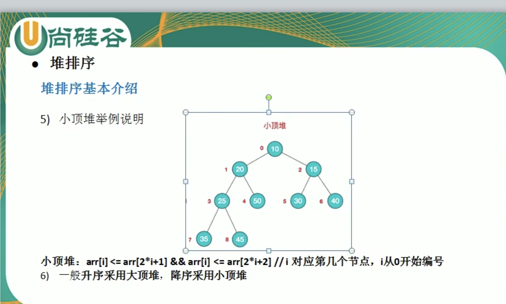

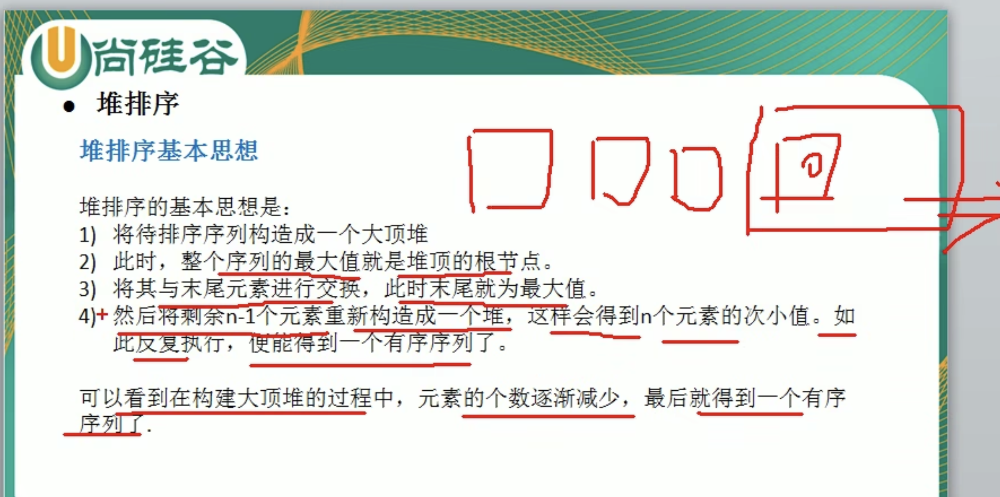

堆排序是利用堆这种数据结构而设计的一种排序算法，堆排序是一种选择排序，它的最坏，最好，平均时间复杂度均为O(nlogn)，它也是不稳定排序。

堆是具有以下性质的`完全二叉树`：
 1、每个结点的值都大于或等于其左右孩子结点的值，称为大顶堆。
 2、每个结点的值都小于或等于其左右孩子结点的值，称为小顶堆
 3、注意 : 没有要求结点的左孩子的值和右孩子的值的大小关系。


堆排序的基本思想

将待排序序列构造成一个大顶堆

构造完后的整个序列的最大值就是堆顶的根节点

将其与末尾元素进行交换，此时末尾就为最大值

然后将剩余n-1个元素重新构造成一个堆，这样会得到n个元素的次小值。如此反复执行，便能得到一个有序序列了

可以看到在构建大顶堆的过程中，元素的个数逐渐减少，最后就得到一个有序序列了

大顶堆和小顶堆的代码本质区别的公式 ：这边案例写的是大顶堆(升序)
 大顶堆：arr[i] >= arr[2i+1] && arr[i] >= arr[2i+2]
 小顶堆：arr[i] <= arr[2i+1] && arr[i] <= arr[2i+2]


详细案例分解：

数组：{4,6,8,5,9}

步骤一 构造初始堆。将给定无序序列构造成一个大顶堆（一般升序采用大顶堆，降序采用小顶堆)
（1）假设给定无序序列结构如下：

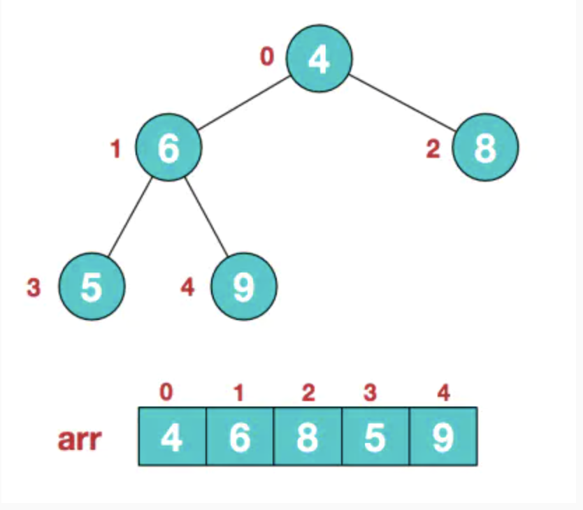

（2）此时我们从最后一个非叶子结点开始（叶结点自然不用调整，第一个非叶子结点 arr.length/2-1=5/2-1=1，也就是下面的数值为6的结点），从左至右，从下至上进行调整

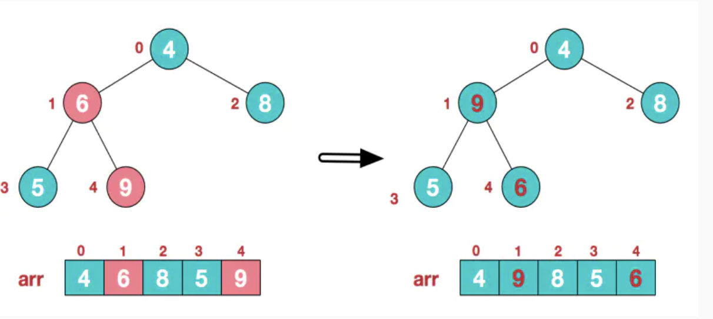

（3）找到第二个非叶节点4，由于[4,9,8]中9元素最大，4和9交换

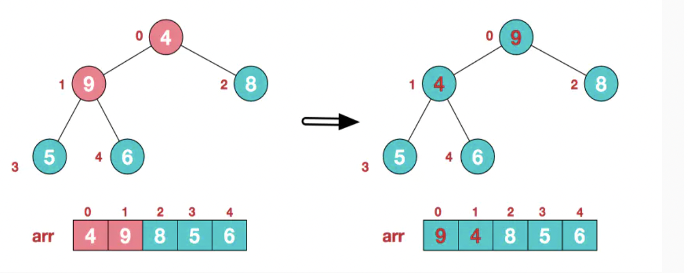

（4）这时，交换导致了子根[4,5,6]结构混乱，继续调整，[4,5,6]中6最大，交换4和6

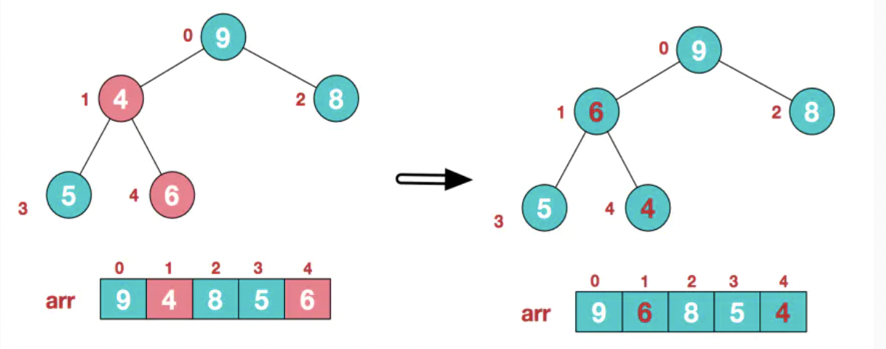

（5）此时，我们就将一个无序序列构造成了一个大顶堆

步骤二 将堆顶元素与末尾元素进行交换，使末尾元素最大。然后继续调整堆，再将堆顶元素与末尾元素交换，得到第二大元素。如此反复进行交换、重建、交换
 （1）将堆顶元素9和末尾元素4进行交换

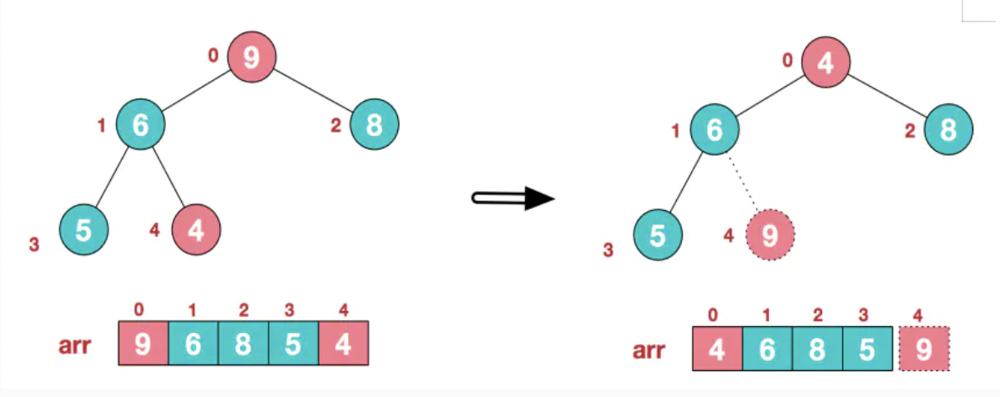

（2）重新调整结构，使其继续满足堆定义

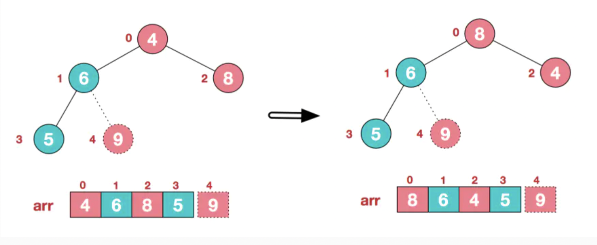

（3）再将堆顶元素 8 与末尾元素 5 进行交换，得到第二大元素 8

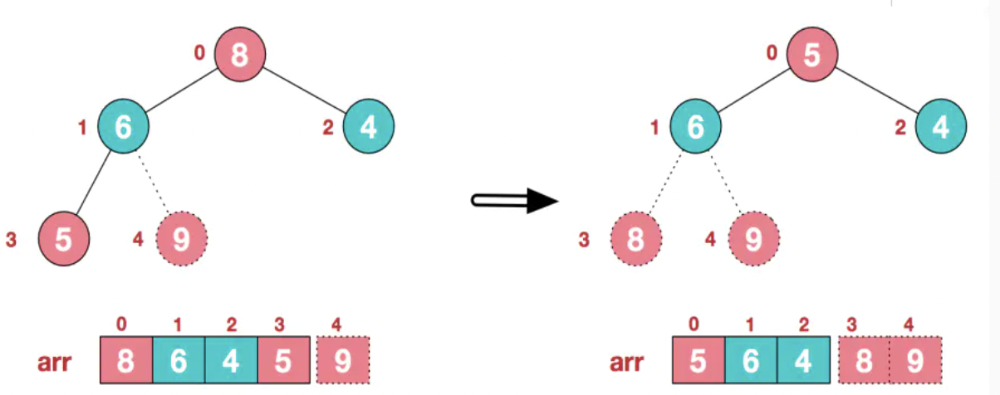

（4）后续过程，继续进行调整，交换，如此反复进行，最终使得整个序列有序

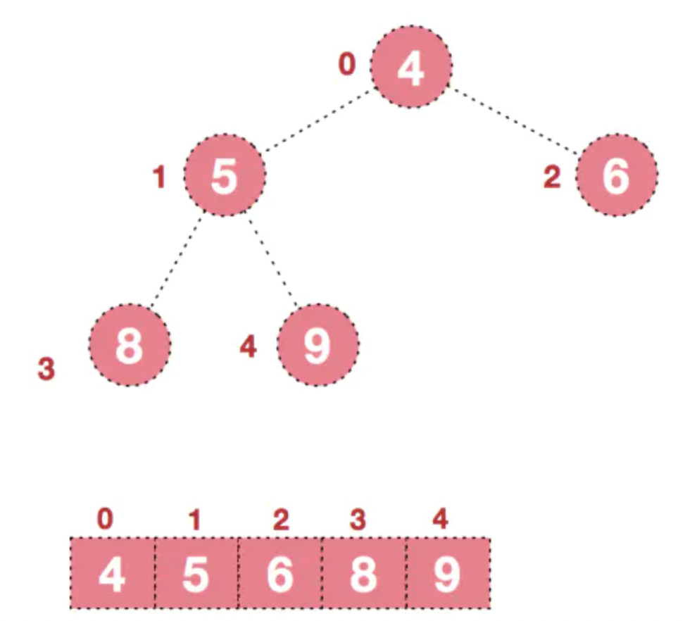

步骤总结：
 1).将无序序列构建成一个堆，根据升序降序需求选择大顶堆或小顶堆
 2).将堆顶元素与末尾元素交换，将最大元素"沉"到数组末端
 3).重新调整结构，使其满足堆定义，然后继续交换堆顶元素与当前末尾元素，反复执行调整+交换步骤，直到整个序列有序


```java
public class HeapSort {
    public static void main(String[] args) {
        // 要求将数组进行升序排列
        // 升序->大顶堆
        // 降序->小顶堆
        int[] arr = {4, 6, 8, 5, 9};
        heapSort(arr);
    }

    // 编写一个堆排序的方法
    public static void heapSort(int[] arr) {
        System.out.println("堆排序!");

        // 分步完成
//        adjustHeap(arr, 1, arr.length);
//        System.out.println("第1次" + Arrays.toString(arr)); // 4,9,8,5,6
//
//        adjustHeap(arr,0,arr.length);
//        System.out.println("第2次" + Arrays.toString(arr)); // 9.6,8,5,4

        // 完成我们最终代码
        // 1 将无序序列构建成一个堆，根据升序降序序列选择大顶堆或小顶堆
        for (int i = arr.length / 2 - 1; i >= 0; i--) {
            adjustHeap(arr, i, arr.length);
        }


        // 2 将堆顶元素与末尾元素交换，将最大元素"沉"到数组末端
        // 3 重新调整结构，使其满足堆定义，然后继续交换堆顶元素与当前末尾元素，
        // 反复执行调整+交换步骤，直到整个序列有序
        int temp;
        for (int j = arr.length - 1; j > 0; j--) {
            // 交换
            temp = arr[j];
            arr[j] = arr[0];
            arr[0] = temp;
            adjustHeap(arr, 0, j);
        }

        System.out.println("数组：" + Arrays.toString(arr));

    }


    /**
     * 将一个数组(二叉树),调整成一个大顶堆
     * 完成将以i指向的非叶子节点的树调整成大顶堆
     * 举例，{4,6,8,5,9} => i=5/2-1=>i=1=>{4,9,8,5,6}
     * 如果我们再次调用，i=0 得到{9,6,8,5,4}
     *
     * @param arr    待调整的数组
     * @param i      表示非叶子节点在数组的索引
     * @param length 表示对多少个元素进行调整，length是在逐渐减少
     */
    public static void adjustHeap(int[] arr, int i, int length) {
        int temp = arr[i];// 先取出当前无素的值，保存到temp
        // 开始调整
        // 说明: k = i*2+1，表示k是i的左子节点
        // k = k*2+1，表示k的左子节点
        for (int k = (i * 2 + 1); k < length; k = k * 2 + 1) {
            if (k + 1 < length && arr[k] < arr[k + 1]) {
                // 说明左子节点值小于右子节点值
                k++;// k指向右子节点
            }
            if (arr[k] > temp) {
                // 如果子节点的最大值 > 父节点的值
                arr[i] = arr[k]; // 将较大的值赋给当前结点
                i = k; // i指向k,继续循环比较
            } else {
                break; // !
            }
        }
        // 当for循环结束后，我们已经将以i为父结点的树的最大值，放在了最顶上(局部)
        arr[i] = temp;// 将temp值放到调整后的位置

    }
}
```

思考：如何用堆排序实现降序排列

只要修改adjustHeap中的左右比较与父子比较的大于小于号就可以。

```java
public class HeapSort {
    public static void main(String[] args) {
        int[] arr = {4, 6, 8, 5, 9};

        // 调整成小顶堆
        for (int i = arr.length / 2 - 1; i >= 0; i--) {
            adjustHeap(arr, i, arr.length);
        }

        // 交换+调整
        for (int j = arr.length - 1; j > 0; j--) {
            int temp = arr[j];
            arr[j] = arr[0];
            arr[0] = temp;
            adjustHeap(arr, 0, j);
        }

        System.out.println(Arrays.toString(arr));

    }


    public static void adjustHeap(int[] arr, int i, int length) {
        int temp = arr[i];
        for (int k = i * 2 + 1; k < length; k = k * 2 + 1) {
            if (k + 1 < length && arr[k] > arr[k + 1]) {
                k++; // k指向最小的节点
            }
            if (arr[k] < temp) {
                arr[i] = arr[k];
                i = k; // i指向需调整的子树的根节点
            } else {
                break;
            }
        }
        arr[i] = temp;
    }
}
```

#### 赫夫曼树 Huffman Tree


基本介绍：

1、给定n个权值作为n个`叶子结点`，构造一棵二叉树，若该树的带权路径长度(wpl)达到最小，称这样的二叉树为最优二叉树，也称为哈夫曼树(Huffman Tree), 还有的书翻译为霍夫曼树。
 2、赫夫曼树是带权路径长度最短的树，权值较大的结点离根较近。


路径和路径长度：

 （1）在一棵树中，从一个结点往下可以达到的孩子或孙子结点之间的通路，称为路径。
 （2）一个路径通路中分支的数目称为路径长度。若规定根结点的层数为1，则从根结点到第L层结点的路径长度为 L-1

结点的权及带权路径长度：

 （1）若将树中结点赋给一个有着某种含义的数值，则这个数值称为该结点的权。
 （2）结点的带权路径长度为：从根结点到该结点之间的路径长度与该结点的权的乘积

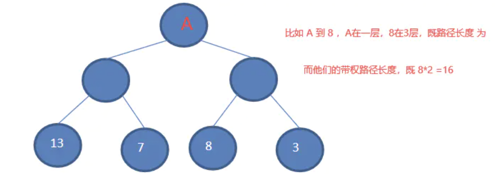


树的带权路径长度：

 树的带权路径长度规定为所有叶子结点的带权路径长度之和，记为WPL(weighted path length) ,权值越大的结点离根结点越近的二叉树才是最优二叉树。

WPL最小的就是赫夫曼树

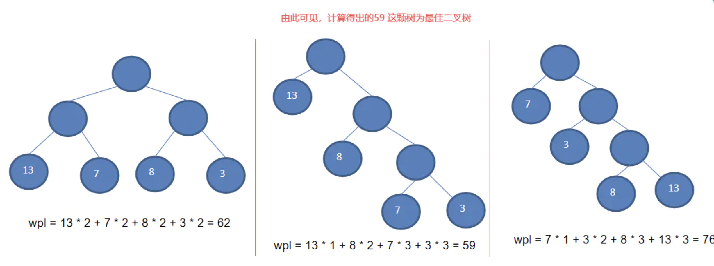


赫夫曼树创建思路分解:

从小到大进行排序, 将每一个数据(每个数据都是一个节点) ， 每个节点可以看成是一颗最简单的二叉树。

取出根节点权值最小的两颗二叉树

组成一颗新的二叉树, 该新的二叉树的根节点的权值是前面两颗二叉树根节点权值的和

再将这颗新的二叉树，以根节点的权值大小 再次排序， 不断重复  1-2-3-4 的步骤，直到数列中，所有的数据都被处理，就得到一颗赫夫曼树

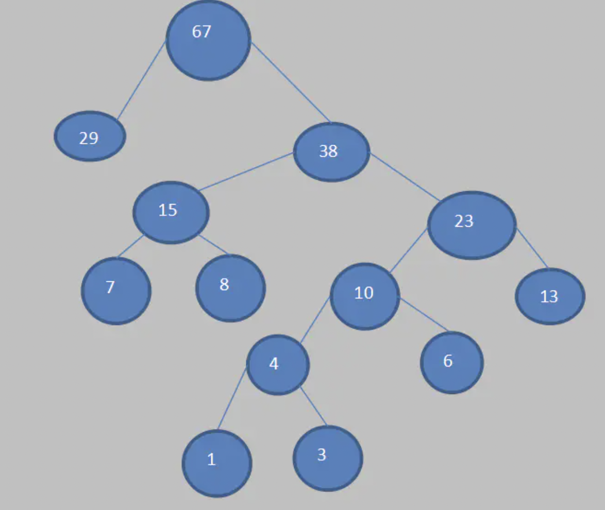

```java
public class HuffmanTree {

    public static void main(String[] args) {
        int[] arr = {13, 7, 8, 3, 29, 6, 1};
        Node huffmanTree = createHuffmanTree(arr);
        preorder(huffmanTree);
    }

    // 创建Huffman树的方法
    public static Node createHuffmanTree(int[] arr) {
        // 第一步为了操作方便，arr->list
        List<Node> nodes = new ArrayList<>();
        for (int value : arr) {
            nodes.add(new Node(value));
        }

        // 我们处理的过程是个循环的过程

        while (nodes.size() > 1) {
            // 排序,从小到大
            Collections.sort(nodes);

            // 取出根节点权值最小的两棵树
            Node leftNode = nodes.get(0);
            Node rightNode = nodes.get(1);

            // 构建一棵新的二叉树
            Node parent = new Node(leftNode.value + rightNode.value);
            parent.left = leftNode;
            parent.right = rightNode;

            // 从ArrayList中删除处理过的二叉树
            nodes.remove(leftNode);
            nodes.remove(rightNode);

            // 将parent加入nodes
            nodes.add(parent);
        }

        // 返回Huffman树
        return nodes.get(0);
    }

    // 前序遍历
    public static void preorder(Node root) {
        if (root != null) {
            root.preorder();
        } else {
            System.out.println("树空");
        }
    }
}

// 创建节点类
// 为了让Node对象支持排序，让实现Comparable接口
@Data
class Node implements Comparable<Node> {

    int value; // 权值

    Node left; // 指向左子节点

    Node right; // 指向右子节点

    public Node(int value) {
        this.value = value;
    }

    public String toString() {
        return "Node[value=" + value + "]";
    }

    @Override
    public int compareTo(Node o) {
        // 自然排序
        return this.value - o.value;
    }

    // 前序遍历
    public void preorder() {
        // 根，左，右
        System.out.println(this);
        if (this.left != null) {
            this.left.preorder();
        }
        if (this.right != null) {
            this.right.preorder();
        }
    }
}
```