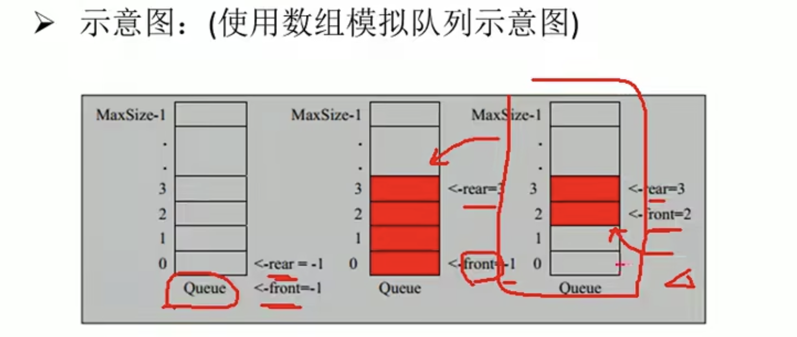
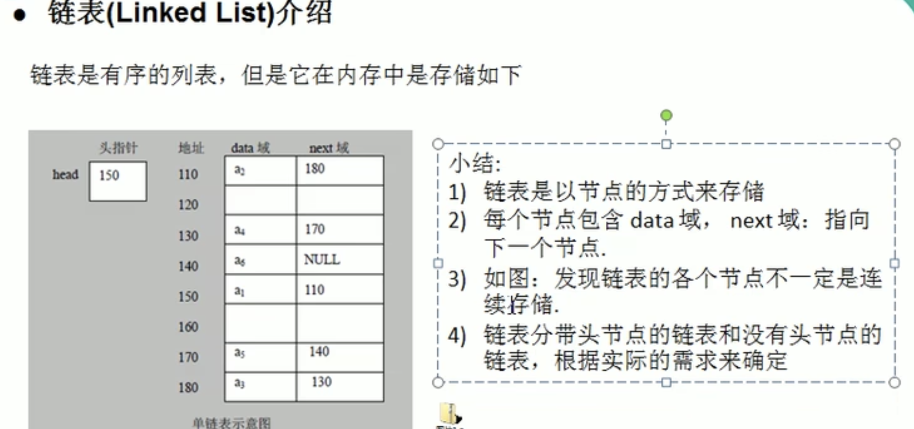
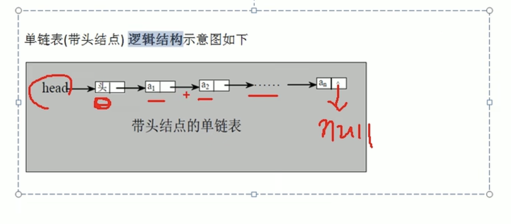
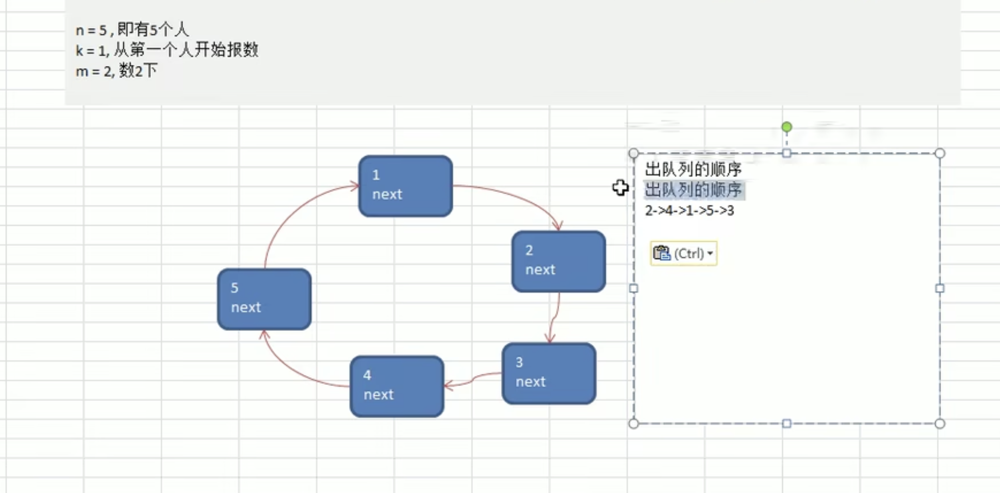
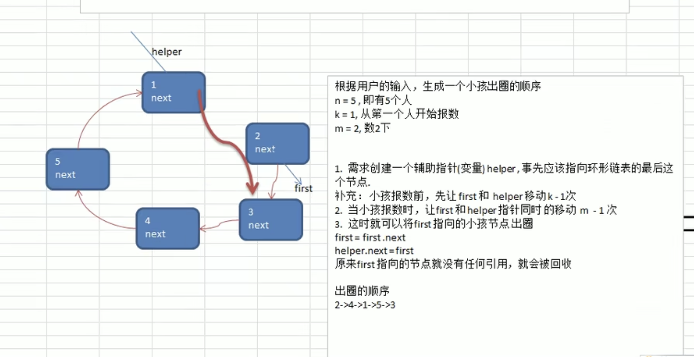
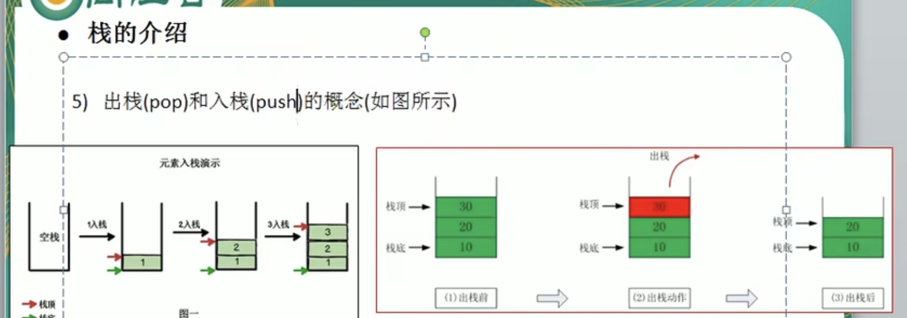
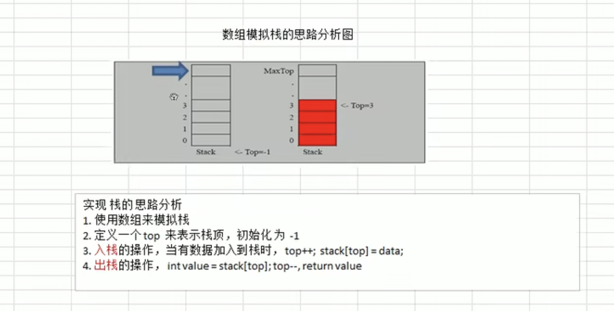

# 算法学习

## 稀疏数组 Sparse Array

稀疏数组 sparse array：当一个二维数组（矩阵）中大部分元素为0或为同一个值时，可以用稀疏数组来保存原数组信息

第一行记录：行数row，列数colum，有效值value个数N

N行：有效值所在的行数，有效值所在的列数，有效值

构成一个N+1行3列的压缩数组，即为稀疏数组


二维数组转稀疏数的思路：

1 遍历原始的二维数组，得到有效数据的个数sum

2 根据sum就可以创建稀疏数组sparseArray int [sum+1] [3]

3 将二维数组的有效数据存入到稀疏数组


稀疏数组转为原始的二维数组的思路

1 先读取稀疏数组的第一行，根据第一行的行与列创建原始的二维数组originArr = int [01] [02]

2 在读取稀疏数组后几行的数据，并赋给原始的二维数组即可


完成以下任务：

1 二维数组转稀疏数组

2 稀疏数组转二维数组

```java
public class SparseArray {

    public static void main(String[] args) {

        int[][] originArray = new int[11][11];
        originArray[0][0] = 1;
        originArray[0][1] = 2;

        System.out.println("打印原始数组");
        printArray(originArray);

        // 二维数组转稀疏数组
        int[][] sparseArray = originArray2SparseArray(originArray);
        System.out.println("打印稀疏数组");
        printArray(sparseArray);

        // 稀疏数组转二维数组
        int[][] originArrayCopy = sparseArrayToOriginArray(sparseArray);
        System.out.println("打印二维数组");
        printArray(originArrayCopy);

    }

    /**
     * 原始二维数组转稀疏数组
     *
     * @param originArray originArray为矩阵形式
     * @return
     */
    public static int[][] originArray2SparseArray(int[][] originArray) {
        int sum = 0;
        // 获取有效值的个数
        int row = originArray.length;
        int column = originArray[0].length;
        for (int i = 0; i < row; i++) {
            for (int j = 0; j < column; j++) {
                if (originArray[i][j] != 0) {
                    sum++;
                }
            }
        }
        // 创建稀疏数组
        int[][] sparseArray = new int[sum + 1][3];
        // 给稀疏数组首行赋值
        sparseArray[0][0] = row;
        sparseArray[0][1] = column;
        sparseArray[0][2] = sum;
        // 记录第几个非0数据
        int count = 0;
        // 遍历二维数组，将非0的值存放到稀疏数组中
        for (int i = 0; i < row; i++) {
            for (int j = 0; j < column; j++) {
                if (originArray[i][j] != 0) {
                    count++;
                    sparseArray[count][0] = i;
                    sparseArray[count][1] = j;
                    sparseArray[count][2] = originArray[i][j];
                }
            }
        }
        return sparseArray;
    }

    /**
     * 打印数组
     *
     * @param array
     */
    public static void printArray(int[][] array) {
        for (int i = 0; i < array.length; i++) {
            for (int j = 0; j < array[i].length - 1; j++) {
                System.out.printf("%d\t", array[i][j]);
            }
            System.out.printf("%d\n", array[i][array[i].length - 1]);
        }
    }

    /**
     * 将稀疏数组转为二维数组
     */
    public static int[][] sparseArrayToOriginArray(int[][] sparseArray) {
        int row = sparseArray[0][0];
        int column = sparseArray[0][1];
        // 正常情况下sum+1 = sparseArray.length
        int sum = sparseArray[0][2];
        int[][] originArray = new int[row][column];
        for (int i = 1; i < sparseArray.length; i++) {
            int curRow = sparseArray[i][0];
            int curColumn = sparseArray[i][1];
            int curValue = sparseArray[i][2];
            originArray[curRow][curColumn] = curValue;
        }
        return originArray;
    }
}
```


## 队列 Queue

队列是有序列表，可以用数组实现或是链表实现

先入先出：先存入的数据，先取出




不考虑数组循环的队列实现：

```Java
/**
 * 使用数组模拟队列
 */
public class MyQueue {

    // 数组的最大容量
    private int maxSize;
    // 队列头
    private int front;
    // 队列尾
    private int rear;
    // 用数组模拟队列
    private int[] arr;

    /**
     * 构建队列
     */
    public MyQueue(int arrMaxSize) {
        maxSize = arrMaxSize;
        arr = new int[maxSize];
        // 指向队列头部，指向队列的首元素的前一个位置
        front = -1;
        // 指向队列尾，指向队列最后一个数据
        rear = -1;
    }

    /**
     * 判断队列是否满
     */
    public boolean isFull() {
        return rear == maxSize - 1;
    }

    /**
     * 判断队列是否为空
     */
    public boolean isEmpty() {
        return rear == front;
    }

    /**
     * 添加数据到队列
     */
    public void addQueue(int n) {
        // 判断队列是否满
        if (isFull()) {
            System.out.println("队列满，不有加入数据");
            return;
        }
        // 让rear后移
        rear++;
        arr[rear] = n;
    }

    /**
     * 出队列
     */
    public int getQueue() {
        // 判断队列是否为空
        if (isEmpty()) {
            throw new RuntimeException("队列为空，不能取数据");
        }
        // 让front后移
        front++;
        return arr[front];
    }

    /**
     * 显示队列的所有的数据
     */
    public void showQueue() {
        // 遍历
        if (isEmpty()) {
            System.out.println("队列为空，没有数据");
            return;
        }
        for (int i = 0; i < arr.length; i++) {
            System.out.printf("arr[%d]=%d\n", i, arr[i]);
        }
    }

    /**
     * 显示队列头部的数据，不是取数据
     */
    public int peekQueue() {
        // 判断队列是否为空
        if (isEmpty()) {
            throw new RuntimeException("队列为空，没有数据");
        }
        return arr[front + 1];
    }
}
```

```java
import java.util.Scanner;

public class MyQueueTest {
    public static void main(String[] args) {
        MyQueue myQueue = new MyQueue(3);
        char key = ' ';
        Scanner scanner = new Scanner(System.in);
        boolean loop = true;
        while (loop) {
            System.out.println("s(show):显示队列");
            System.out.println("e(exit):退出程序");
            System.out.println("a(add):添加队列数据");
            System.out.println("g(get):从队列取出数据");
            System.out.println("h(head):查看队列头的数据");
            key = scanner.next().charAt(0);
            switch (key) {
                case 's':
                    myQueue.showQueue();
                    ;
                    break;
                case 'a':
                    System.out.println("输入一个数");
                    int value = scanner.nextInt();
                    myQueue.addQueue(value);
                    break;
                case 'g':
                    try {
                        int result = myQueue.getQueue();
                        System.out.printf("取出的数据是%d\n", result);
                    } catch (Exception e) {
                        e.printStackTrace();
                    }
                    break;
                case 'h':
                    try {
                        int head = myQueue.peekQueue();
                        System.out.printf("队列头的数据是：%d\n", head);
                    } catch (Exception e) {
                        e.printStackTrace();
                    }
                    break;
                case 'e':
                    scanner.close();
                    loop = false;
                    break;
                default:
                    break;
            }
        }
        System.out.println("程序退出");
    }
}
```

使用数组模拟环形队列：


完成以下任务：

1 判断是否为满

2 判断是否为空

3 求队列的size

4 入队 （增）

5 出队 （删）

6 查看队首元素

7 显示（查/打印）

```java
/**
 * 使用循环数组模拟队列
 */
public class MyCircleQueue {

    // 数组的最大容量
    private int maxSize;
    // front作调整指向首元素，初始化为0
    private int front;
    // rear作调整指向最后一个元素之后，初始化为0
    private int rear;
    // 用数组模拟队列
    private int[] arr;

    /**
     * 构建队列
     */
    public MyCircleQueue(int arrMaxSize) {
        maxSize = arrMaxSize;
        arr = new int[maxSize];
        // 指向队列头部，指向队列的首元素的前一个位置
        front = 0;
        // 指向队列尾，指向队列最后一个数据
        rear = 0;
    }

    /**
     * 判断队列是否满
     */
    public boolean isFull() {
        return (rear + 1) % maxSize == front;
    }

    /**
     * 判断队列是否为空
     */
    public boolean isEmpty() {
        return rear == front;
    }

    /**
     * 添加数据到队列
     */
    public void addQueue(int n) {
        // 判断队列是否满
        if (isFull()) {
            System.out.println("队列满，不有加入数据");
            return;
        }
        arr[rear] = n;
        // 让rear后移
        rear = (rear + 1) % maxSize;
    }

    /**
     * 出队列
     */
    public int getQueue() {
        // 判断队列是否为空
        if (isEmpty()) {
            throw new RuntimeException("队列为空，不能取数据");
        }
        // 将front记录到临时变量
        int index = front;
        // 让front后移
        front = (front + 1) % maxSize;
        return arr[index];
    }

    /**
     * 显示队列的所有的数据
     */
    public void showQueue() {
        // 遍历
        if (isEmpty()) {
            System.out.println("队列为空，没有数据");
            return;
        }
        // 从front开始遍历
        for (int i = front; i < front + size(); i++) {
            System.out.printf("arr[%d]=%d\n", i % maxSize, arr[i % maxSize]);
        }
    }

    /**
     * 求出当前队列有效数据的个数
     */
    public int size() {
        return (rear - front + maxSize) % maxSize;
    }

    /**
     * 显示队列头部的数据，不是取数据
     */
    public int peekQueue() {
        // 判断队列是否为空
        if (isEmpty()) {
            throw new RuntimeException("队列为空，没有数据");
        }
        return arr[front];
    }
}
```

```java
public class MyQueueTest {
    public static void main(String[] args) {
        MyCircleQueue myQueue = new MyCircleQueue(4);
        char key = ' ';
        Scanner scanner = new Scanner(System.in);
        boolean loop = true;
        while (loop) {
            System.out.println("s(show):显示队列");
            System.out.println("e(exit):退出程序");
            System.out.println("a(add):添加队列数据");
            System.out.println("g(get):从队列取出数据");
            System.out.println("h(head):查看队列头的数据");
            key = scanner.next().charAt(0);
            switch (key) {
                case 's':
                    myQueue.showQueue();
                    ;
                    break;
                case 'a':
                    System.out.println("输入一个数");
                    int value = scanner.nextInt();
                    myQueue.addQueue(value);
                    break;
                case 'g':
                    try {
                        int result = myQueue.getQueue();
                        System.out.printf("取出的数据是%d\n", result);
                    } catch (Exception e) {
                        e.printStackTrace();
                    }
                    break;
                case 'h':
                    try {
                        int head = myQueue.peekQueue();
                        System.out.printf("队列头的数据是：%d\n", head);
                    } catch (Exception e) {
                        e.printStackTrace();
                    }
                    break;
                case 'e':
                    scanner.close();
                    loop = false;
                    break;
                default:
                    break;
            }
        }
        System.out.println("程序退出");
    }
}
```

## 链表 Linked List





因为头节点不能动，所以加个head指针用于辅助移动

### 单向链表

用单向链表存储水浒英雄：

1 实现尾部插入新的节点

2 实现按编号大小插入新的节点

3 根据编号删除节点

4 根据编号修改节点

5 打印所有的节点（显示链表）

6 有效节点的个数

7 查找链表中倒数第k个节点

8 单链表的反转

9 反转打印链表

10 合并两个有序链表，合并之后还要有序（比如自然排序）

```java
public class SingleLinkedListDemo {
    public static void main(String[] args) {
        //  进行测试
        HeroNode heroNode1 = new HeroNode(1, "宋江", "及时雨");
        HeroNode heroNode2 = new HeroNode(2, "卢俊义", "玉麒麟");
        HeroNode heroNode3 = new HeroNode(3, "吴用", "智多星");
        HeroNode heroNode4 = new HeroNode(4, "林冲", "豹子头");

        // 创建链表
        SingleLikedList singleLikedList = new SingleLikedList();
        // 加入节点
        singleLikedList.addByOrder(heroNode1);
        singleLikedList.addByOrder(heroNode4);
        singleLikedList.addByOrder(heroNode2);
        singleLikedList.addByOrder(heroNode3);
        singleLikedList.addByOrder(heroNode3);

        // 测试修改节点的代码
        HeroNode heroNode = new HeroNode(2, "小卢", "修改了");

        // 显示
        singleLikedList.list();
        System.out.println();

        // 测试更新
        singleLikedList.update(heroNode);
        // 测试删除
        singleLikedList.del(1);
        singleLikedList.list();

        // 测试查看链表中有效节点的个数
        System.out.println("有效节点的个数：" + singleLikedList.getLength(singleLikedList.getHead()));

        // 测试是否找到倒数第k个节点
        HeroNode lastKNode = singleLikedList.findLastKNode(singleLikedList.getHead(), 1);
        System.out.println("倒数第k个节点" + lastKNode);

        // 测试反转链表
        singleLikedList.reverseList(singleLikedList.getHead());
        singleLikedList.list();

        System.out.println();

        // 测试逆序打印链表
        singleLikedList.reversePrint(singleLikedList.getHead());
    }
}

class SingleLikedList {

    // 先初始化一个头结点
    private HeroNode head = new HeroNode(0, null, null);

    public HeroNode getHead() {
        return this.head;
    }

    /**
     * 第一种添加方式
     * 添加节点，当前实现尾部添加
     * 思路：当不考虑编号有序时：
     * 1找到当前链表的最后节点
     * 2将最后的这个节点的next指向新的节点
     */
    public void add(HeroNode heroNode) {
        // 因为head节点不能动，所以需要辅助指针遍历链表
        HeroNode temp = head;
        while (true) {
            // 如果指针域为null,代表最后节点
            if (temp.getNext() == null) {
                break;
            }
            // 如果没有找到最后，将temp后移
            temp = temp.getNext();
        }
        // 当退出while循环时，temp就指向链表的最后节点
        temp.setNext(heroNode);
    }

    /**
     * 第二种添加方式
     * 在添加英雄时，根据排名将英雄插入到指定的位置
     * 如果已经有这个排名，则添加失败并给出提示
     */
    public void addByOrder(HeroNode heroNode) {
        // 因为头节点不能动，因此我们仍然通过一个辅助指针来帮助找到添加的位置
        // 因为是单链表，我们找的temp是位于添加位置的前一个节点
        HeroNode temp = head;
        // 添加的编号是否存在，默认false
        boolean flag = false;
        while (true) {
            if (temp.getNext() == null) {
                break;
            }
            // 位置找到，就在temp的后面插入新的节点
            if (temp.getNext().getNo() > heroNode.getNo()) {
                break;
            } else if (temp.getNext().getNo() == heroNode.getNo()) {
                // 说明编号存在
                flag = true;
                break;
            }
            temp = temp.getNext();
        }
        // 退出while循环后
        if (flag) {
            System.out.printf("准务插入的英雄编号%d已经存在，不能加入\n", heroNode.getNo());
        } else {
            // 插入到temp后面
            heroNode.setNext(temp.getNext());
            temp.setNext(heroNode);
        }
    }

    /**
     * 修改节点的信息，根据编号来修改，即编号不能改
     */
    public void update(HeroNode heroNode) {
        // 判断是否为空
        if (head.getNext() == null) {
            System.out.println("链表为空");
            return;
        }
        // 找到需要修改的节点，根据编号修改
        // 定义一个辅助变量
        HeroNode temp = head.getNext();
        // 是否找到该节点
        boolean flag = false;
        while (true) {
            if (temp == null) {
                break; // 已经遍历完成
            }
            if (temp.getNo() == heroNode.getNo()) {
                flag = true;
                break;
            }
            temp = temp.getNext();
        }
        // 根据flag判断是否找到要修改的节点
        if (flag) {
            temp.setName(heroNode.getName());
            temp.setNickname(heroNode.getNickname());
        } else {
            System.out.printf("没有找到编号为%d的节点，不能修改", heroNode.getNo());
        }
    }

    /**
     * 删除节点
     * 思路：
     * 1 head节点不能动，因此我们需要一个temp辅助节点删除节点的前一个节点
     */
    public void del(int no) {
        HeroNode temp = head;
        // 是否找到待删除节点的标志
        boolean flag = false;
        while (true) {
            //  已经到链表的最后了
            if (temp.getNext() == null) {
                break;
            }
            if (temp.getNext().getNo() == no) {
                flag = true;
                break;
            }
            temp = temp.getNext();
        }
        if (flag) {
            temp.setNext(temp.getNext().getNext());
        } else {
            System.out.println("待删除的节点不存在");
        }
    }

    /**
     * 方法获取单链表的节点个数，如果带头节点，不统计头结点
     */
    public int getLength(HeroNode head) {
        if (head.getNext() == null) {
            return 0;
        }
        int length = 0;
        // 定义一个辅助的变量cur
        HeroNode cur = head.getNext();
        while (cur != null) {
            length++;
            cur = cur.getNext();
        }
        return length;
    }

    /**
     * 查找单链表中倒数第k个节点,k从1开始
     * 思路
     * 1 编写一个方法，接收head节点，同时接收一个k
     * 2 先把链表从头到尾遍历得到链表的总的长度
     * 3 得到size后，我们从链表的第一个开始遍历size-k个
     * 如果找到，则返回该节点，否则返回null
     */
    public HeroNode findLastKNode(HeroNode head, int k) {
        // 如果链表为空，返回null
        if (head.getNext() == null) {
            return null;
        }
        //  第一次遍历获得链表的长度
        int size = getLength(head);
        // 第二次遍历size-k位置，就是我们倒数的第k个节点
        // 先做一个k校验
        if (k <= 0 || k > size) {
            return null;
        }
        // 定义辅助变量
        HeroNode cur = head.getNext();
        for (int i = 0; i < size - k; i++) {
            cur = cur.getNext();
        }
        return cur;
    }

    /**
     * 将单链表反转
     */
    public void reverseList(HeroNode head) {
        // 如果当前链表为空，或只有一个节点，无需反转，直接返回
        if (head.getNext() == null || head.getNext().getNext() == null) {
            return;
        }
        // 定义一个辅助指针，帮恩波利我们遍历原来的链表
        HeroNode cur = head.getNext();
        // 指向当前节点的下一个节点
        HeroNode next = null;
        // 定义一个新的头节点
        HeroNode reverseHead = new HeroNode(0, null, null);
        // 遍历原来的链表，每遍历一个节点，就将其取出，并放在新链表reverseHead的最新端
        while (cur != null) {
            next = cur.getNext();
            cur.setNext(reverseHead.getNext());
            reverseHead.setNext(cur);
            cur = next;
        }
        // 将head的指针域指向reverseHead的下一个节点
        head.setNext(reverseHead.getNext());
    }

    /**
     * 逆序打印单链表
     * 方式一：先反转后打印，但会破原来单链表结构
     * 方式二：可以利用栈将各个节点压入栈中，然后利用栈的先进后出的特点，就实现了逆序输出
     */
    public void reversePrint(HeroNode heroNode) {
        // 空链表不打印
        if (heroNode.getNext() == null) {
            return;
        }
        // 创建一个栈，将各个节点压入栈中
        Stack<HeroNode> stack = new Stack<>();
        HeroNode cur = head.getNext();
        // 将链表的所有节点压入栈中
        while (cur != null) {
            stack.push(cur);
            cur = cur.getNext();
        }
        // 将栈中的节点进行打印
        while (!stack.isEmpty()) {
            System.out.println(stack.pop());
        }


    }


    // 显示链表
    public void list() {
        if (head.getNext() == null) {
            System.out.println("链表为空");
            return;
        }
        // 因为头节点不能动因此我们需要一个辅助变量来遍历
        HeroNode temp = head.getNext();
        while (true) {
            // 判断是否到链表最后
            if (temp == null) {
                break;
            }
            // 输出节点信息
            System.out.println(temp);
            // 将temp后移
            temp = temp.getNext();
        }
    }

}


/**
 * 定义HeroNode
 */
class HeroNode {

    // 前面三个数据域
    private int no;

    private String name;

    private String nickname;
    // 后面是指针域
    private HeroNode next;

    public HeroNode(int no, String name, String nickname) {
        this.no = no;
        this.name = name;
        this.nickname = nickname;
    }

    public int getNo() {
        return no;
    }

    public void setNo(int no) {
        this.no = no;
    }

    public String getName() {
        return name;
    }

    public void setName(String name) {
        this.name = name;
    }

    public String getNickname() {
        return nickname;
    }

    public void setNickname(String nickname) {
        this.nickname = nickname;
    }

    public HeroNode getNext() {
        return next;
    }

    public void setNext(HeroNode next) {
        this.next = next;
    }

    @Override
    public String toString() {
        return "HeroNode{" +
                "no=" + no +
                ", name='" + name + '\'' +
                ", nickname='" + nickname +
                '}';
    }
}
```

### 双向链表

主要任务：

1 尾部新增

2 按编号自然排序新增

3 按编号删除

4 按编号修改

5 查（遍历/展示）

```java
public class DoubleLinkedListDemo {
    public static void main(String[] args) {

        // 双向链表测试
        HeroNode2 heroNode1 = new HeroNode2(1, "宋江", "及时雨");
        HeroNode2 heroNode2 = new HeroNode2(2, "卢俊义", "玉麒麟");
        HeroNode2 heroNode3 = new HeroNode2(3, "吴用", "智多星");
        HeroNode2 heroNode4 = new HeroNode2(4, "林冲", "豹子头");
        // 创建一个双向链表
        DoubleLinkedList doubleLinkedList = new DoubleLinkedList();
        // 测试添加
        doubleLinkedList.addByOrder(heroNode1);
        doubleLinkedList.addByOrder(heroNode4);
        doubleLinkedList.addByOrder(heroNode3);
        doubleLinkedList.addByOrder(heroNode2);
        // 测试显示
        doubleLinkedList.list();
        // 测试修改
        HeroNode2 newHeroNode = new HeroNode2(4, "公孙胜", "入云龙");
        doubleLinkedList.update(newHeroNode);
        System.out.println("修改后的链表情况");
        doubleLinkedList.list();
        // 测试删除
        doubleLinkedList.del(4);
        System.out.println("删除后的链表情况");
        doubleLinkedList.list();

    }
}

class DoubleLinkedList {

    // 先初始化一个头节点，头节点不动，不存放具体的数据
    private HeroNode2 head = new HeroNode2();

    // 获取头节点
    public HeroNode2 getHead() {
        return this.head;
    }

    /**
     * 遍历双向链表
     */
    public void list() {
        // 判断链表是否为空
        if (head.getNext() == null) {
            System.out.println("链表为空");
            return;
        }
        HeroNode2 temp = head.getNext();
        while (true) {
            // 如果链表到最后节点末尾，跳出循环
            if (temp == null) {
                break;
            }
            // 输出节点信息
            System.out.println(temp);
            temp = temp.getNext();
        }
    }

    /**
     * 尾部添加节点
     */
    public void add(HeroNode2 heroNode2) {
        HeroNode2 temp = head;
        while (true) {
            if (temp.getNext() == null) {
                break;
            }
            temp = temp.getNext();
        }
        temp.setNext(heroNode2);
        heroNode2.setPre(temp);
    }

    /**
     * 按编号添加，编号自然排序
     */
    public void addByOrder(HeroNode2 heroNode2) {
        HeroNode2 temp = head;
        boolean repeatFlag = false;
        while (true) {
            if (temp.getNext() == null) {
                break;
            }
            if (heroNode2.getNo() < temp.getNext().getNo()) {
                break;
            } else if (heroNode2.getNo() == temp.getNext().getNo()) {
                repeatFlag = true;
                break;
            }
            temp = temp.getNext();
        }
        if (repeatFlag) {
            System.out.println("重复编号");
            return;
        }
        heroNode2.setNext(temp.getNext());
        heroNode2.setPre(temp);
        temp.setNext(heroNode2);
        if (temp.getNext() != null) {
            temp.getNext().setPre(heroNode2);
        }
    }

    /**
     * 修改节点
     */
    public void update(HeroNode2 heroNode2) {
        // 判断是否为空
        if (head.getNext() == null) {
            System.out.println("链表是否为空");
            return;
        }
        // 找到需要修改的节点，根据no编号
        HeroNode2 temp = head.getNext();
        boolean flag = false;
        while (true) {
            if (temp == null) {
                break;
            }
            if (temp.getNo() == heroNode2.getNo()) {
                flag = true;
                break;
            }
            temp = temp.getNext();
        }
        if (flag) {
            temp.setName(heroNode2.getName());
            temp.setNickname(heroNode2.getNickname());
        } else {
            System.out.println("没有找到节点");
        }
    }

    /**
     * 从双向链表中删除节点，对于双向链表我们可以直接指针指向待删除节点
     */
    public void del(int no) {
        if (head.getNext() == null) {
            System.out.println("链表为空，不能删除");
            return;
        }
        HeroNode2 temp = head.getNext();
        boolean flag = false;
        while (true) {
            if (temp == null) {
                break;
            }
            if (no == temp.getNo()) {
                flag = true;
                break;
            }
            temp = temp.getNext();
        }
        if (flag) {
            temp.getPre().setNext(temp.getNext());
            if (temp.getNext() != null) {
                temp.getNext().setPre(temp.getPre());
            }
        }
    }


}

class HeroNode2 {

    private int no;

    private String name;

    private String nickname;

    private HeroNode2 next;

    private HeroNode2 pre;

    public HeroNode2() {
    }

    public HeroNode2(int no, String name, String nickname) {
        this.no = no;
        this.name = name;
        this.nickname = nickname;
    }

    public int getNo() {
        return no;
    }

    public void setNo(int no) {
        this.no = no;
    }

    public String getName() {
        return name;
    }

    public void setName(String name) {
        this.name = name;
    }

    public String getNickname() {
        return nickname;
    }

    public void setNickname(String nickname) {
        this.nickname = nickname;
    }

    public HeroNode2 getNext() {
        return next;
    }

    public void setNext(HeroNode2 next) {
        this.next = next;
    }

    public HeroNode2 getPre() {
        return pre;
    }

    public void setPre(HeroNode2 pre) {
        this.pre = pre;
    }

    @Override
    public String toString() {
        return "HeroNode2{" +
                "no=" + no +
                ", name='" + name + '\'' +
                ", nickname='" + nickname + '\'' +
                '}';
    }
}
```

### 单向环形链表

Jossephu问题：设编号为1，2，… n的n个人围坐一圈，约定编号为k（1<=k<=n）的人从1开始报数，数到m 的那个人出列，它的下一位又从1开始报数，数到m的那个人又出列，依次类推，直到所有人出列为止，由此产生一个出队编号的序列。

提示：用一个不带头结点的[循环链表](https://so.csdn.net/so/search?q=循环链表&spm=1001.2101.3001.7020)来处理Josephu 问题：先构成一个有n个结点的单循环链表，然后由k结点起从1开始计数，计到m时，对应结点从链表中删除，然后再从被删除结点的下一个结点又从1开始计数，直到最后一个结点从链表中删除算法结束。



构建单向环形链表思路：

1 先创建第一个节点，让first指向该节点，并形成环形。last指针指向最后一个节点

2 后面当我们每创建一个新的节点，就把该节点加入到已有的环形链表



```java
public class Josephu {
    public static void main(String[] args) {
        // 测试构建
        SingleCircleLinkedList singleCircleLinkedList = new SingleCircleLinkedList();
        singleCircleLinkedList.addBoy(5);
        // 测试展示
        singleCircleLinkedList.showBoy();
        // 测试出圈
        singleCircleLinkedList.countBoy(1, 2, 5);
    }
}

// 创建一个环形的单向链表
class SingleCircleLinkedList {

    // 创建first节点，并置为null
    private Boy first = null;

    /**
     * 添加小孩节点，构成环形的链表
     * num表示数量
     */
    public void addBoy(int num) {
        if (num < 1) {
            System.out.println("num不正确");
            return;
        }
        // 辅助指针
        Boy last = null;
        // 使用for循环创建我们的环形链表
        for (int i = 1; i <= num; i++) {
            // 根据编号创建小孩节点
            Boy boy = new Boy(i);
            // 如果是第一个小孩
            if (i == 1) {
                first = boy;
                first.setNext(first);
                last = first;
            } else {
                boy.setNext(first);
                last.setNext(boy);
                // last指向最后
                last = boy;
            }
        }
    }

    /**
     * 遍历当前环形链表
     */
    public void showBoy() {
        // 判断是否为空
        if (first == null) {
            System.out.println("链表为空");
            return;
        }
        // 因为first不能动
        Boy cur = first;
        while (true) {
            System.out.printf("小孩的编号%d\n", cur.getNo());
            if (cur.getNext() == first) {
                break;
            }
            // cur后移
            cur = cur.getNext();
        }
    }

    /**
     * 根据用户的输入，计算出出圈的顺序
     *
     * @param k   从第k个小孩开始报数
     * @param m   表示数几下
     * @param num 表示最初多少个小孩在圈中
     */
    public void countBoy(int k, int m, int num) {
        // 先对数据进行校验
        if (first == null || k < 1 || k > num) {
            System.out.println("参数有误");
            return;
        }
        // 创建要给辅助指针，并将移到报数小孩的前面，帮助完成小孩出圈
        Boy helper = first;
        while (true) {
            if (helper.getNext() == first) {
                break;
            }
            helper = helper.getNext();
        }
        // 先让first和helper移动k-1次，相当于first指向第k个小孩，helper位于first之前
        for (int i = 0; i < k - 1; i++) {
            first = first.getNext();
            helper = helper.getNext();
        }
        // 当小孩报数时，让first,helper指针同时移动m-1次，然后出圈
        // 这里是个循环的操作，只到圈中只有一个
        while (true) {
            // 说明圈中只有一个
            if (helper == first) {
                break;
            }
            for (int i = 0; i < m - 1; i++) {
                first = first.getNext();
                helper = helper.getNext();
            }
            // 此时first指向出圈的小孩节点
            System.out.printf("小孩%d出圈\n", first.getNo());
            // 出圈
            first = first.getNext();
            helper.setNext(first);
        }
        // 退出循环时，圈中只有一个小孩
        System.out.printf("最后留在圈中的小孩%d\n", first.getNo());
    }


}

// 创建节点，这里是Boy类
class Boy {
    // 编号
    private int no;
    // 下一个小孩
    private Boy next;

    public Boy(int no) {
        this.no = no;
    }

    public int getNo() {
        return no;
    }

    public void setNo(int no) {
        this.no = no;
    }

    public Boy getNext() {
        return next;
    }

    public void setNext(Boy next) {
        this.next = next;
    }
}
```

## 栈 Stack



### 数组模拟栈



```java
public class MyStackDemo {

    public static void main(String[] args) {
        // 创建栈
        ArrayStack stack = new ArrayStack(4);
        String key = "";
        boolean loop = true; // 是否退出菜单
        Scanner scanner = new Scanner(System.in);
        while (loop) {
            System.out.println("show: 显示栈");
            System.out.println("exit: 退出程序");
            System.out.println("push: 入栈");
            System.out.println("pop: 出栈");
            key = scanner.next();
            switch (key) {
                case "show":
                    stack.list();
                    break;
                case "push":
                    System.out.println("请输入一个数：");
                    int value = scanner.nextInt();
                    stack.push(value);
                    break;
                case "pop":
                    try {
                        int res = stack.pop();
                        System.out.printf("出栈的数据是 %d\n", res);
                    } catch (Exception e) {
                        System.out.println(e.getMessage());
                    }
                    break;
                case "exit":
                    scanner.close();
                    loop = false;
                    break;
                default:
                    break;
            }
        }
        System.out.println("程序退出");
    }
}

class ArrayStack {
    private int maxSize; // 栈的大小
    private int[] stack; // 数组，数组模拟栈，数据放在此数组中
    private int top = -1; // top表示栈顶，初始化为-1

    // 构造器
    public ArrayStack(int maxSize) {
        this.maxSize = maxSize;
        stack = new int[this.maxSize];
    }

    // 栈满
    public boolean isFull() {
        return top == this.maxSize - 1;
    }

    // 栈空
    public boolean isEmpty() {
        return top == -1;
    }

    // 入栈
    public void push(int value) {
        //  判断栈满
        if (isFull()) {
            System.out.println("栈满");
            return;
        }
        top++;
        stack[top] = value;
    }

    // 出栈
    public int pop() {
        // 先判断栈空
        if (isEmpty()) {
            throw new RuntimeException("栈空");
        }
        int value = stack[top];
        top--;
        return value;
    }

    // 显示栈/遍历栈，从栈顶向下遍历
    public void list() {
        if (isEmpty()) {
            System.out.println("栈空");
            return;
        }
        for (int i = top; i >= 0; i--) {
            System.out.printf("stack[%d]=%d\n", i, stack[i]);
        }
    }
}
```

### 用链表模拟栈

```java
public class MyStackDemo2 {
    public static void main(String[] args) {
        // 创建栈
        LinkedListStack stack = new LinkedListStack();
        String key = "";
        boolean loop = true; // 是否退出菜单
        Scanner scanner = new Scanner(System.in);
        while (loop) {
            System.out.println("show: 显示栈");
            System.out.println("exit: 退出程序");
            System.out.println("push: 入栈");
            System.out.println("pop: 出栈");
            key = scanner.next();
            switch (key) {
                case "show":
                    stack.list();
                    break;
                case "push":
                    System.out.println("请输入一个数：");
                    int value = scanner.nextInt();
                    stack.push(value);
                    break;
                case "pop":
                    try {
                        int res = stack.pop();
                        System.out.printf("出栈的数据是 %d\n", res);
                    } catch (Exception e) {
                        System.out.println(e.getMessage());
                    }
                    break;
                case "exit":
                    scanner.close();
                    loop = false;
                    break;
                default:
                    break;
            }
        }
    }


}

class LinkedListStack {


    // 要持有个头节点
    private Node head = new Node();

    // 入栈,在尾部添加的方式
    public void push(int value) {
        Node node = new Node(value);
        Node temp = head;
        while (true) {
            if (temp.getNext() == null) {
                break;
            }
            temp = temp.getNext();
        }
        // 跳出while循环时，temp指向最后一个节点
        temp.setNext(node);
    }

    // 出栈,栈顶元素在尾部
    public int pop() {
        if (isEmpty()) {
            throw new RuntimeException("栈空");
        }
        Node temp = head;
        while (true) {
            if (temp.getNext().getNext() == null) {
                break;
            }
            temp = temp.getNext();
        }
        // 跳出循环，temp指向最后一个节点前一个节点
        int value = temp.getNext().getData();
        temp.setNext(null);
        return value;
    }

    // 栈空
    public boolean isEmpty() {
        if (head.getNext() == null) {
            return true;
        }
        return false;
    }

    // 显示栈,需要倒序输出:这里需要另一个栈
    public void list() {
        if (isEmpty()) {
            System.out.println("栈空");
            return;
        }
        Node temp = head.getNext();
        Stack<Integer> integerStack = new Stack<Integer>();
        while (true) {
            if (temp == null) {
                break;
            }
            integerStack.push(temp.getData());
            temp = temp.getNext();
        }
        while (!integerStack.isEmpty()) {
            System.out.printf("节点值为：%d\n", integerStack.pop());
        }

    }


    public class Node {

        private int data; // 数据域

        private Node next; // 指针域

        public Node() {
        }

        public Node(int data) {
            this.data = data;
        }

        public int getData() {
            return data;
        }

        public void setData(int data) {
            this.data = data;
        }

        public Node getNext() {
            return next;
        }

        public void setNext(Node next) {
            this.next = next;
        }
    }

}
```